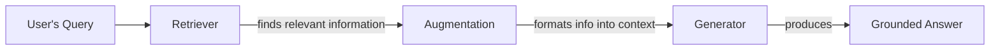
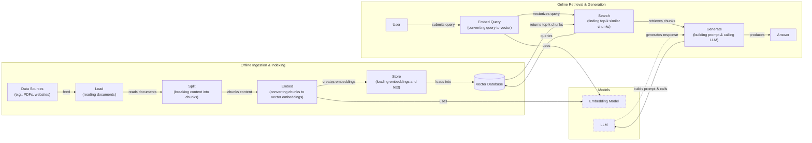
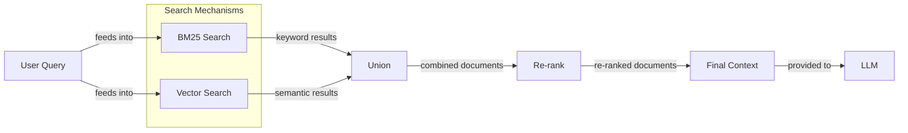
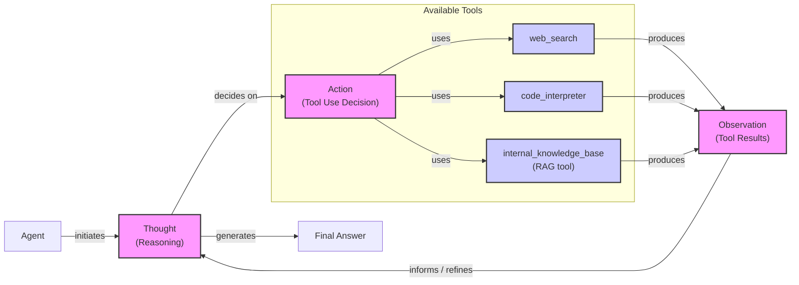

**Source Registry:**
- **Source 1** `tavily_results`: qualifies for → **"Advanced RAG Techniques"** *(adds: latency trade-offs for re-ranking)*, **"Agentic RAG"** *(adds: production constraints and latency trade-offs for iterative retrieval)*
- **Source 2** `tavily_results`: qualifies for → **"Advanced RAG Techniques"** *(adds: specific failure modes for GraphRAG, like incomplete KGs)*
- **Source 3** `tavily_results`: qualifies for → **"Conclusion"** *(adds: future direction of RAG synergizing with long-context models)*
- **Source 4** `tavily_results`: DISMISSED — Content overlaps with the core article's explanation of GraphRAG and doesn't add significant new depth compared to other qualifying sources.
- **Source 5** `tavily_results`: DISMISSED — Overlaps significantly with Source 8, which provides a more comprehensive theoretical framing of neuro-symbolic AI.
- **Source 6** `tavily_results`: DISMISSED — While providing a good breadth example (robotics), it is less central to the course's focus than other qualifying sources and would be difficult to fit within the Conclusion's tight word count.
- **Source 7** `tavily_results`: qualifies for → **"Agentic RAG"** *(adds: depth on multi-agent RAG architectures)*
- **Source 8** `scraped_from_research` `converging-paradigms-the-synergy-of-symbolic-and-connectioni.md`: qualifies for → **"Agentic RAG"** *(adds: theoretical breadth by framing agentic loops as a form of neuro-symbolic AI)*
- **Source 9** `scraped_from_research` `how-to-solve-5-common-rag-failures-with-knowledge-graphs.md`: qualifies for → **"Advanced RAG Techniques"** *(adds: depth with concrete, named RAG failure modes like "implicit relationship hallucination")*

# Lesson 9: An AI Engineer's Guide to Retrieval-Augmented Generation (RAG)

In our previous lessons, we have covered the fundamentals of building AI systems, from understanding the agent landscape to the art of context engineering. We learned that providing the right information to an LLM at the right time is a core challenge. LLMs are trained on fixed datasets, which means their knowledge is static. They take a "closed-book exam" on the world's information, and without external help, their answers can become outdated or, worse, confidently incorrect—a phenomenon known as hallucination [[18]](https://www.infoworld.com/article/2335043/addressing-ai-hallucinations-with-retrieval-augmented-generation.html).

While we could fine-tune a model with new data, this is often inefficient and expensive, and it does not solve the problem of keeping knowledge current [[17]](https://neo4j.com/blog/developer/fine-tuning-vs-rag/). A more effective solution is Retrieval-Augmented Generation (RAG). With RAG, we give the LLM an "open-book exam" by connecting it to external, real-time knowledge sources. Instead of forcing the model to memorize everything, we give it the tools to look things up, just as a human would use notes or a manual [[2]](https://blogs.nvidia.com/blog/what-is-retrieval-augmented-generation/).

RAG is a key method within the discipline of Context Engineering, which we introduced in Lesson 3. It is the mechanism by which we dynamically fetch relevant information to ground our models in reality. In this lesson, we will explore the what and how of RAG, starting with its basic components and moving toward the advanced and agentic patterns that power modern AI applications. We will also see how RAG differs from an agent's memory, a topic we will explore in detail in Lesson 10.

## The RAG System: Core Components

To build effective RAG systems, you first need to understand their three conceptual pillars. Mastering these components is the first step in the context engineering process of designing reliable, knowledge-driven applications.

**Retrieval** is the engine that finds relevant information. When a user asks a question, the retriever searches an external knowledge base to find documents or data snippets that are likely to contain the answer. This search is often powered by vector embeddings, which are numerical representations of text that capture semantic meaning. These embeddings are stored in a specialized vector database, allowing the system to find contextually similar information, not just exact keyword matches [[52]](https://medium.com/@robi.tomar72/how-rag-actually-works-embeddings-vector-databases-indexing-retrieval-explained-simply-3d1ca45fe1bf).

**Augmentation** is the process of taking the retrieved information and formatting it into the context of a prompt. This step combines the original user query with the external data, creating an enriched prompt that gives the LLM everything it needs to formulate a grounded response [[56]](https://www.topquadrant.com/resources/blog-retrieval-augmented-generation-explained/).

**Generation** is the final step, where the LLM uses the augmented prompt to produce an answer. Because the model has access to relevant, factual information in its context window, the generated response is grounded in the provided data, making it more accurate and trustworthy [[27]](https://www.ibm.com/think/topics/retrieval-augmented-generation).

Image 1: A flowchart illustrating the core components of a Retrieval Augmented Generation (RAG) system.

Now that you can name each moving part, let’s see how they line up across the two phases of a real system.

## The RAG Pipeline: Ingestion and Retrieval

The end-to-end RAG workflow is split into two distinct phases: an offline ingestion phase to prepare the knowledge base and an online retrieval phase that happens in real-time when a user submits a query [[30]](https://newsletter.systemdesign.one/p/how-rag-works).

### Phase 1: Offline Ingestion & Indexing

This phase prepares your documents for retrieval. It is a one-time or periodic process that runs in the background.

-   **Load:** The first step is to load your documents from various sources, such as PDFs, websites, or APIs.
-   **Split:** Large documents are broken down into smaller, meaningful chunks. This is crucial because you want to retrieve only the most relevant snippets, and splitting by paragraphs or sections helps preserve context [[52]](https://medium.com/@robi.tomar72/how-rag-actually-works-embeddings-vector-databases-indexing-retrieval-explained-simply-3d1ca45fe1bf).
-   **Embed:** An embedding model converts each text chunk into a dense vector. These vectors capture the semantic meaning of the content, allowing for nuanced similarity searches [[9]](https://wandb.ai/mostafaibrahim17/ml-articles/reports/Vector-Embeddings-in-RAG-Applications--Vmlldzo3OTk1NDA5).
-   **Store:** The vector embeddings and their corresponding text chunks are loaded into a vector database. This database indexes the vectors for fast and efficient retrieval during the online phase [[53]](https://pub.towardsai.net/vector-databases-in-practice-building-a-realistic-hybrid-search-rag-system-with-qdrant-7b8f4a6e41e0).

### Phase 2: Online Retrieval & Generation

This phase executes in real-time each time a user asks a question.

-   **Embed Query:** The user’s query is converted into a vector using the same embedding model from the ingestion phase. This ensures that the query and the documents are represented in the same vector space [[8]](https://qdrant.tech/articles/what-is-rag-in-ai/).
-   **Search:** The system uses the query vector to search the vector database, finding the top-k most similar document chunks based on a distance metric like cosine similarity [[54]](https://towardsdatascience.com/rag-explained-understanding-embeddings-similarity-and-retrieval/).
-   **Generate:** A prompt is constructed containing the original query and the retrieved chunks. This augmented prompt is then sent to an LLM, which generates a final answer grounded in the provided context. As we saw in Lesson 4, using structured outputs can help format the final answer and include citations back to the source documents [[55]](https://www.aimon.ai/posts/rag_and_its_different_components/).

Image 2: A detailed flowchart illustrating the end-to-end RAG workflow, divided into two distinct phases: Offline Ingestion & Indexing and Online Retrieval & Generation.

With the end-to-end path in place, the next question is quality. Let's look at advanced techniques to make retrieval more accurate across messy, real-world data.

## Advanced RAG Techniques

A vanilla RAG pipeline is a great start, but production-grade systems require more sophisticated techniques to improve retrieval accuracy and relevance. Here are some of the most effective advanced strategies.

### Hybrid Search

This technique combines keyword-based search (like BM25) with vector search. BM25 finds exact keywords, while vector search captures semantic meaning. Fusing their results creates a more robust system that leverages the strengths of both approaches [[33]](https://mlpills.substack.com/p/issue-76-optimize-rag-with-hybrid).

### Re-ranking

After an initial retrieval stage fetches a broad set of candidate documents, a re-ranker is used to refine the order. Re-rankers, often cross-encoder models, evaluate the relevance of a (query, document) pair together, allowing for a deeper contextual analysis than the initial retrieval. This two-stage process significantly improves the relevance of the documents passed to the LLM [[37]](https://apxml.com/courses/optimizing-rag-for-production/chapter-2-advanced-retrieval-optimization/reranking-architectures-rag), [[1]](https://towardsdatascience.com/advanced-rag-retrieval-cross-encoders-reranking/). This precision comes at a cost, however. In production systems with strict latency budgets of under a second, the computational overhead of a cross-encoder can be too high, making re-ranking unsuitable for real-time applications [[58]](https://medium.com/@chinmayd49/rag-production-optimizations-and-trade-offs-a623e5834e65).

Image 3: A flowchart illustrating the hybrid retrieval flow, combining keyword-based search (BM25) and dense vector search.

### Query Transformations

Sometimes the user's query is not optimal for retrieval. Query transformation techniques modify the original query to improve search results.
-   **Decomposition** breaks a complex question into simpler sub-queries, retrieving documents for each and synthesizing the results to ensure all parts of the original question are addressed [[19]](https://docs.nvidia.com/rag/latest/query_decomposition.html).
-   **Hypothetical Document Embeddings (HyDE)** uses an LLM to first generate a hypothetical answer. This generated document is then embedded and used for the similarity search, which can lead to more relevant results [[16]](https://47billion.com/blog/rag-system-in-production-why-it-fails-and-how-to-fix-it/).

### Advanced Chunking Strategies

Fixed-size chunking can separate related information. Advanced strategies create more context-aware chunks.
-   **Semantic chunking** groups sentences based on their meaning, ensuring that related ideas stay together.
-   **Layout-aware chunking** is designed for documents like PDFs with tables, preserving the structure to keep data with its context.
-   **Context-enriched chunking** adds a summary to each chunk before embedding it, helping the retrieval system better understand its relevance [[6]](https://www.anthropic.com/news/contextual-retrieval).

### GraphRAG

For questions about complex relationships, GraphRAG creates a knowledge graph from source documents, with nodes for entities and edges for relationships. The system can then traverse this graph to find interconnected information, making it ideal for multi-hop questions that require piecing together evidence from multiple sources [[38]](https://arxiv.org/html/2601.03014v1), [[4]](https://arxiv.org/html/2404.16130). This structured approach helps mitigate common RAG failures like "implicit relationship hallucination," where a model incorrectly infers a connection between entities simply because they appear in semantically similar contexts [[59]](https://www.freecodecamp.org/news/how-to-solve-5-common-rag-failures-with-knowledge-graphs/). However, GraphRAG's effectiveness is limited by the completeness of the knowledge graph; if relationships are missing, the system cannot traverse them, leading to incomplete answers [[60]](https://repositum.tuwien.at/bitstream/20.500.12708/227715/1/Dolci-2026-Towards%20LLM-KG%20Symbiosis%20for%20Reducing%20Factual%20Hallucinations-vor.pdf).

These techniques increase retrieval quality. Next, we’ll see how retrieval becomes one tool that an agent can choose to use as it reasons.

## Agentic RAG

As we explored in Lessons 7 and 8, a ReAct agent operates in a loop of Thought, Action, and Observation. Agentic RAG applies this pattern where retrieval is one of the available tools. Instead of a rigid pipeline, the agent reasons about when and how to retrieve information, making the process adaptive [[11]](https://towardsdatascience.com/agentic-rag-vs-classic-rag-from-a-pipeline-to-a-control-loop/). This shift from a fixed pipeline to a dynamic reasoning loop is an example of a neuro-symbolic system, combining the pattern-recognition strengths of neural networks (the LLM) with the logical processing of symbolic AI (the agent's reasoning process) [[61]](https://arxiv.org/html/2407.08516v5).

The core distinction between standard and agentic RAG is the control flow.
-   **Standard RAG** is a linear workflow: Retrieve → Augment → Generate.
-   **Agentic RAG** is an iterative loop. The agent decides if retrieval is needed, which source to query, and how to fuse information from multiple tools [[7]](https://weaviate.io/blog/what-is-agentic-rag).

This allows an agent to iteratively refine searches, choose the most appropriate knowledge base for a query, and synthesize information from its internal RAG tool with real-time data from other tools like a web search. This model can be extended to multi-agent systems where specialized agents collaborate, with planners routing queries to the right information source [[7]](https://weaviate.io/blog/what-is-agentic-rag), [[62]](https://arxiv.org/html/2501.09136v4). However, each step in these iterative or multi-agent workflows adds computational overhead and increases latency, a critical trade-off in real-time applications [[62]](https://arxiv.org/html/2501.09136v4).

For example, an agent might follow this condensed thought process:
1.  **Thought:** User asks about ‘2024 EU data retention rules.’ Internal policy is from 2023.
2.  **Action:** `retrieve(internal_policy, query=“EU data retention 2024”)`
3.  **Observation:** Mentions amendments, but no details.
4.  **Thought:** Need external verification.
5.  **Action:** `web_search(“EU data retention 2024 official”)`
6.  **Observation:** Finds updated directive.
7.  **Thought:** Synthesize both, citing changes.

This transforms the interaction from a simple database lookup into a conversation with a knowledgeable research assistant.

Image 4: A conceptual flowchart illustrating an agent's main loop in Agentic RAG, emphasizing its iterative reasoning and tool-use capabilities.

## Conclusion

Retrieval-Augmented Generation is a powerful solution to the knowledge limitations of LLMs, reducing hallucinations and building trust with verifiable answers. For the modern AI Engineer, mastering RAG is a foundational competency within Context Engineering. The journey from simple to agentic RAG shows a clear path toward more reliable AI, where agents dynamically reason about information needs. This vision is not challenged by the rise of long-context models; instead, the two are complementary. RAG can be used to select the most relevant information to populate these large context windows, creating a powerful synergy [[63]](https://medium.com/@infiniflowai/from-rag-to-context-a-2025-year-end-review-of-rag-03740f1a0528).

In our next lesson, we will explore Memory for Agents, and see how short-term and long-term memory systems complement the retrieval capabilities we have discussed here. We will also touch on other critical topics like evaluation and monitoring in future lessons, ensuring you have the skills to build and maintain production-grade AI systems.

## References

- [1] [Advanced RAG Retrieval: Cross-Encoders & Reranking](https://towardsdatascience.com/advanced-rag-retrieval-cross-encoders-reranking/)
- [2] [What Is Retrieval-Augmented Generation, aka RAG?](https://blogs.nvidia.com/blog/what-is-retrieval-augmented-generation/)
- [3] [A Complete Guide to RAG](https://towardsai.net/p/l/a-complete-guide-to-rag)
- [4] [From Local to Global: A GraphRAG Approach to Query-Focused Summarization](https://arxiv.org/html/2404.16130)
- [5] [Retrieval-Augmented Generation (RAG) Fundamentals First](https://decodingml.substack.com/p/rag-fundamentals-first?utm_source=publication-search)
- [6] [Introducing Contextual Retrieval](https://www.anthropic.com/news/contextual-retrieval)
- [7] [What is Agentic RAG](https://weaviate.io/blog/what-is-agentic-rag)
- [8] [What is RAG in AI?](https://qdrant.tech/articles/what-is-rag-in-ai/)
- [9] [Vector Embeddings in RAG Applications](https://wandb.ai/mostafaibrahim17/ml-articles/reports/Vector-Embeddings-in-RAG-Applications--Vmlldzo3OTk1NDA5)
- [10] [Your RAG Is Wrong, Here's How To Fix It](https://decodingml.substack.com/p/your-rag-is-wrong-heres-how-to-fix?utm_source=publication-search)
- [11] [Agentic RAG vs Classic RAG: From a Pipeline to a Control Loop](https://towardsdatascience.com/agentic-rag-vs-classic-rag-from-a-pipeline-to-a-control-loop/)
- [12] [RAG is dead, long live agentic retrieval](https://www.llamaindex.ai/blog/rag-is-dead-long-live-agentic-retrieval)
- [13] [What is agentic RAG?](https://www.ibm.com/think/topics/agentic-rag)
- [14] [Build advanced retrieval-augmented generation systems](https://learn.microsoft.com/en-us/azure/developer/ai/advanced-retrieval-augmented-generation)
- [15] [The Rise of RAG](https://highlearningrate.substack.com/p/the-rise-of-rag)
- [16] [RAG System in Production: Why It Fails and How to Fix It](https://47billion.com/blog/rag-system-in-production-why-it-fails-and-how-to-fix-it/)
- [17] [Knowledge Graphs and LLMs: Fine-Tuning vs. Retrieval-Augmented Generation](https://neo4j.com/blog/developer/fine-tuning-vs-rag/)
- [18] [Addressing AI hallucinations with retrieval-augmented generation](https://www.infoworld.com/article/2335043/addressing-ai-hallucinations-with-retrieval-augmented-generation.html)
- [19] [Query Decomposition](https://docs.nvidia.com/rag/latest/query_decomposition.html)
- [20] [Advanced RAG Techniques](https://neo4j.com/blog/genai/advanced-rag-techniques/)
- [21] [Retrieval-Augmented Generation: Building Grounded AI for Enterprise Knowledge](https://medium.com/@fahey_james/retrieval-augmented-generation-building-grounded-ai-for-enterprise-knowledge-6bc46277fee5)
- [22] [What is RAG?](https://www.mindstudio.ai/blog/what-is-rag/)
- [23] [RAG Inventor Talks Agents, Grounded AI, and Enterprise Impact](https://www.madrona.com/rag-inventor-talks-agents-grounded-ai-and-enterprise-impact/)
- [24] [RAG architectures and approaches](https://humanloop.com/blog/rag-architectures)
- [25] [RAG and Its Different Components](https://www.aimon.ai/posts/rag_and_its_different_components/)
- [26] [Grounding LLMs: Driving AI to Deliver Contextually Relevant Data](https://toloka.ai/blog/grounding-llms-driving-ai-to-deliver-contextually-relevant-data/)
- [27] [What is retrieval-augmented generation?](https://www.ibm.com/think/topics/retrieval-augmented-generation)
- [28] [RAG Architecture: A Complete Guide](https://galileo.ai/blog/rag-architecture)
- [29] [RAG Pipeline Deep Dive: Ingestion (Chunking, Embedding) and Vector Search](https://medium.com/@derrickryangiggs/rag-pipeline-deep-dive-ingestion-chunking-embedding-and-vector-search-abd3c8bfc177)
- [30] [How RAG works](https://newsletter.systemdesign.one/p/how-rag-works)
- [31] [RAGOps Guide: Building and Scaling Retrieval Augmented Generation Systems](https://towardsdatascience.com/ragops-guide-building-and-scaling-retrieval-augmented-generation-systems-3d26b3ebd627/)
- [32] [What is Retrieval-Augmented Generation?](https://aws.amazon.com/what-is/retrieval-augmented-generation/)
- [33] [Optimize RAG with Hybrid Search](https://mlpills.substack.com/p/issue-76-optimize-rag-with-hybrid)
- [34] [Hybrid Search Optimization: How BM25 and Dense Vector Retrieval Work Together for Superior AI Search](https://cubitrek.com/blog/hybrid-search-optimization-how-bm25-and-dense-vector-retrieval-work-together-for-superior-ai-search/)
- [35] [Hybrid RAG in the Real World: Graphs, BM25, and the End of Black Box Retrieval](https://community.netapp.com/t5/Tech-ONTAP-Blogs/Hybrid-RAG-in-the-Real-World-Graphs-BM25-and-the-End-of-Black-Box-Retrieval/ba-p/464834)
- [36] [10 Techniques to Improve RAG Accuracy](https://redis.io/blog/10-techniques-to-improve-rag-accuracy/)
- [37] [Reranking Architectures in RAG](https://apxml.com/courses/optimizing-rag-for-production/chapter-2-advanced-retrieval-optimization/reranking-architectures-rag)
- [38] [SentGraph: Hierarchical Sentence Graph for Multi-hop Retrieval-Augmented Question Answering](https://arxiv.org/html/2601.03014v1)
- [39] [GraphRAG: Unlocking the power of knowledge graphs with LLMs](https://webhome.cs.uvic.ca/~thomo/papers/asonam2025-graphrag.pdf)
- [40] [What is GraphRAG?](https://atlan.com/know/what-is-graphrag/)
- [41] [Implementing Semantic Search for Retrieval](https://apxml.com/courses/prompt-engineering-llm-application-development/chapter-6-integrating-llms-external-data-rag/implementing-semantic-search-retrieval)
- [42] [Vector DB and RAG Pipeline for Document RAG](https://learnopencv.com/vector-db-and-rag-pipeline-for-document-rag/)
- [43] [RAG Explained: Understanding Embeddings, Similarity, and Retrieval](https://towardsdatascience.com/rag-explained-understanding-embeddings-similarity-and-retrieval/)
- [44] [AWS Vector Databases Explained: Semantic Search and RAG Systems](https://tutorialsdojo.com/aws-vector-databases-explained-semantic-search-and-rag-systems/)
- [45] [Retrieval Augmented Generation Explained](https://www.topquadrant.com/resources/blog-retrieval-augmented-generation-explained/)
- [46] [Introduction to Augmenting LLMs using Retrieval Augmented Generation (RAG)](https://medium.com/@rahulraut.techuse/introduction-to-augmenting-llms-using-retrieval-augmented-generation-rag-6530123dbb91)
- [47] [Retrieval Augmented Generation](https://www.promptingguide.ai/research/rag)
- [48] [Retrieval-Augmented Generation (RAG): From Basics to Advanced](https://medium.com/@tejpal.abhyuday/retrieval-augmented-generation-rag-from-basics-to-advanced-a2b068fd576c)
- [49] [RAG is More Than Putting Documents in a Vector Database](https://arxiv.org/html/2407.00072v5)
- [50] [A Survey on Retrieval-Augmented Generation for Large Language Models](https://arxiv.org/html/2312.05934v3)
- [51] [Is Fine-Tuning a Pre-Trained Language Model Always Necessary for New Knowledge?](https://arxiv.org/html/2403.09727v1)
- [52] [How RAG Actually Works: Embeddings, Vector Databases, Indexing & Retrieval Explained Simply](https://medium.com/@robi.tomar72/how-rag-actually-works-embeddings-vector-databases-indexing-retrieval-explained-simply-3d1ca45fe1bf)
- [53] [Vector Databases in Practice: Building a Realistic Hybrid Search RAG System with Qdrant](https://pub.towardsai.net/vector-databases-in-practice-building-a-realistic-hybrid-search-rag-system-with-qdrant-7b8f4a6e41e0)
- [54] [RAG Explained: Understanding Embeddings, Similarity, and Retrieval](https://towardsdatascience.com/rag-explained-understanding-embeddings-similarity-and-retrieval/)
- [55] [RAG and Its Different Components](https://www.aimon.ai/posts/rag_and_its_different_components/)
- [56] [Retrieval Augmented Generation Explained](https://www.topquadrant.com/resources/blog-retrieval-augmented-generation-explained/)
- [57] [Grappling with GraphRAG: When to Use the Graph-Based RAG Pattern](https://arxiv.org/html/2501.00309v2)
- [58] [RAG production optimizations and trade-offs](https://medium.com/@chinmayd49/rag-production-optimizations-and-trade-offs-a623e5834e65)
- [59] [How to Solve 5 Common RAG Failures with Knowledge Graphs](https://www.freecodecamp.org/news/how-to-solve-5-common-rag-failures-with-knowledge-graphs/)
- [60] [Towards LLM-KG Symbiosis for Reducing Factual Hallucinations](https://repositum.tuwien.at/bitstream/20.500.12708/227715/1/Dolci-2026-Towards%20LLM-KG%20Symbiosis%20for%20Reducing%20Factual%20Hallucinations-vor.pdf)
- [61] [Converging Paradigms: The Synergy of Symbolic and Connectionist AI in LLM-Empowered Autonomous Agents](https://arxiv.org/html/2407.08516v5)
- [62] [A Survey of Agentic RAG: Progresses, Challenges, and Opportunities](https://arxiv.org/html/2501.09136v4)
- [63] [From RAG to Context: A 2025 Year-End Review of RAG](https://medium.com/@infiniflowai/from-rag-to-context-a-2025-year-end-review-of-rag-03740f1a0528)