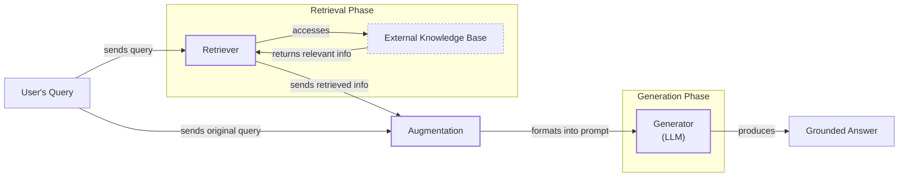
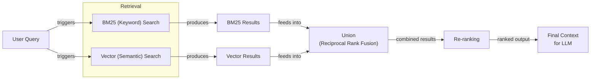
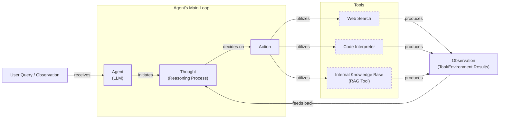

# Lesson 9: Retrieval-Augmented Generation

In our course so far, we have built a solid foundation in AI Engineering. We have explored the agent landscape, distinguished between LLM workflows and AI agents, and, in Lesson 3, covered Context Engineering. This is the art of managing the flow of information to an LLM. We have also given agents the ability to use tools and reason with frameworks like ReAct.

Now, we will tackle one of the most fundamental problems in applied AI: an LLM’s knowledge is frozen in time. Models are trained on a fixed dataset, which means they are essentially taking a "closed-book exam" on the world's information. This static knowledge makes them prone to hallucination and unable to access private or real-time data. While fine-tuning can teach a model new information, it is slow, expensive, and quickly becomes outdated. It is not an efficient way for models to learn continuously.

The most reliable solution is Retrieval-Augmented Generation (RAG). Instead of trying to force new knowledge into the model's weights, we give it an "open-book exam." RAG connects the LLM to external, up-to-date knowledge sources at the moment of a query. This is a core technique in Context Engineering, allowing us to precisely curate the information an LLM sees.

This lesson will guide you through the what and how of RAG, from its basic components to the advanced and agentic patterns that power modern AI systems. We will also briefly touch on how retrieval complements an agent's memory, a topic we will explore fully in Lesson 10. With the problem and motivation clear, we’ll first decompose RAG into its core components so you can see where each responsibility lives.

## The RAG System: Core Components

Understanding the components of RAG is the first step in designing effective systems as part of the Context Engineering process. At its core, a RAG system is built on three conceptual pillars that work together to ground an LLM's response in external data.

**Retrieval:** This is the engine responsible for finding relevant information from an external knowledge base. The most common approach is semantic search, which relies on vector embeddings. Documents are broken down into chunks, and each chunk is converted into a numerical vector (an embedding) that captures its meaning. These are stored in a vector database. When a user asks a question, their query is also converted into an embedding, and the database finds the document chunks with the closest vectors [[1]](https://apxml.com/courses/prompt-engineering-llm-application-development/chapter-6-integrating-llms-external-data-rag/implementing-semantic-search-retrieval). However, semantic search can miss exact keywords. To address this, systems often use keyword-based search, like BM25, which ranks documents based on term frequency. The combination of both methods, known as hybrid search, provides more robust retrieval [[2]](https://pr-peri.github.io/blogpost/2026/03/05/blogpost-hybrid-search.html).

**Augmentation:** This is the process of integrating the retrieved information into the prompt that will be sent to the LLM. The original user query is combined with the relevant document chunks, providing the model with the necessary context to formulate an answer [[3]](https://www.topquadrant.com/resources/blog-retrieval-augmented-generation-explained/). This step essentially engineers the final prompt that the generator will use.

**Generation:** In the final step, the LLM receives the augmented prompt—containing both the original question and the retrieved context—and generates a response. Because the answer is based on the provided data, it is grounded, accurate, and can include citations, which builds user trust [[4]](https://www.ibm.com/think/topics/retrieval-augmented-generation).

Image 1: A flowchart illustrating the core components and data flow of a RAG system.

These three components form a simple but powerful system. Now that you can name each moving part, let’s see how they line up across the two phases of a real system.

## The RAG Pipeline: Ingestion and Retrieval

The end-to-end RAG workflow is typically split into two distinct phases: an offline pipeline for data preparation and an online pipeline for real-time query answering [[5]](https://newsletter.systemdesign.one/p/how-rag-works).

### Phase 1: Offline Ingestion & Indexing

This phase prepares your knowledge base for retrieval. It is an offline process that you run whenever your source data changes.

-   **Load:** The first step is to load your documents from various sources, which could be anything from PDFs and websites to APIs [[5]](https://newsletter.systemdesign.one/p/how-rag-works).
-   **Split:** Large documents are broken down into smaller, semantically meaningful chunks. This is a critical step, as you want to avoid splitting a coherent thought or piece of information across two different chunks [[5]](https://newsletter.systemdesign.one/p/how-rag-works).
-   **Embed:** An embedding model converts each text chunk into a dense numerical vector. These vectors capture the semantic meaning of the text, allowing for searches based on concepts rather than just keywords [[6]](https://medium.com/@robi.tomar72/how-rag-actually-works-embeddings-vector-databases-indexing-retrieval-explained-simply-3d1ca45fe1bf).
-   **Store:** The embeddings and their corresponding text chunks, along with any metadata, are loaded into a vector database. This database is optimized for fast similarity searches, enabling efficient retrieval at query time [[7]](https://qdrant.tech/articles/what-is-rag-in-ai/).

### Phase 2: Online Retrieval & Generation

This phase is triggered in real-time when a user submits a query.

-   **Query & Embed:** The user's query is received and converted into a vector using the same embedding model from the ingestion phase. This ensures the query and the documents exist in the same vector space, making them comparable [[8]](https://medium.com/@derrickryangiggs/rag-pipeline-deep-dive-ingestion-chunking-embedding-and-vector-search-abd3c8bfc177).
-   **Search:** The system uses the query vector to search the vector database and retrieve the top-k most similar document chunks. This is typically done using a similarity metric like cosine similarity [[9]](https://towardsdatascience.com/rag-explained-understanding-embeddings-similarity-and-retrieval/).
-   **Generate:** Finally, a prompt is constructed containing the original query, the retrieved chunks, and instructions for the LLM. The model then generates an answer grounded in this context. To ensure reliability, you can use structured outputs, which we covered in Lesson 4, to format the response and include citations.

```mermaid
flowchart LR
  %% Phase 1: Offline Ingestion & Indexing
  subgraph "Offline Ingestion & Indexing"
    DS["Data Sources<br/>(PDFs, Websites, APIs)"]
    Load["Load<br/>(Read Documents)"]
    Split["Split<br/>(Into Chunks)"]
    Embed["Embed<br/>(Chunks to Vectors)"]
    Store["Store<br/>(Embeddings & Text)"]
  end

  %% Shared Components
  EM["Embedding Model"]
  VD["Vector Database"]

  %% Phase 2: Online Retrieval & Generation
  subgraph "Online Retrieval & Generation"
    UQ["User Query"]
    EQ["Embed Query<br/>(Query to Vector)"]
    Search["Search<br/>(Top-k Similar Chunks)"]
    GenPrompt["Generate Prompt<br/>(Chunks, Query, Instructions)"]
    LLM["LLM<br/>(Generator)"]
    GA["Grounded Answer"]
  end

  %% Phase 1 Data Flow
  DS -- "documents" --> Load
  Load -- "documents" --> Split
  Split -- "chunks" --> Embed
  Embed -- "vectors" --> Store

  %% Phase 1 to Shared Components
  EM -. "uses" .-> Embed
  Store -- "stores" --> VD

  %% Phase 2 Data Flow
  UQ -- "query" --> EQ
  EQ -- "query vector" --> Search
  Search -- "retrieved chunks" --> GenPrompt
  UQ -- "original query" --> GenPrompt
  GenPrompt -- "prompt" --> LLM
  LLM -- "generates" --> GA

  %% Shared Components to Phase 2
  EM -. "uses" .-> EQ
  VD -- "retrieves" --> Search

  %% Visual grouping
  classDef model stroke-width:2px
  classDef store stroke-dasharray:3,3
  class EM,LLM model
  class VD store
```

Image 2: A detailed flowchart depicting the end-to-end RAG workflow, divided into two main phases: "Offline Ingestion & Indexing" and "Online Retrieval & Generation".

With the end-to-end path in place, the next question is quality. What are the advanced techniques to make retrieval more accurate and useful across messy, real-world data?

## Advanced RAG Techniques

A "naive" RAG pipeline often performs well in demos but can break down in production with real-world data. To build robust systems, we need to move beyond the basics and incorporate advanced techniques that improve retrieval quality and relevance.

### Hybrid Search

This technique combines keyword-based search (like BM25) with semantic vector search. Vector search is great for understanding the meaning behind a query, but it can miss exact matches for specific terms, IDs, or acronyms. Keyword search excels at this. By running both in parallel and fusing the results, you get the best of both worlds [[2]](https://pr-peri.github.io/blogpost/2026/03/05/blogpost-hybrid-search.html). This allows a query for "bill rollover" to match both "rollover" (keyword) and "carryover balance" (semantic) documents.

### Re-ranking

The initial retrieval step is optimized for speed and recall, meaning it casts a wide net to find potentially relevant documents. However, the initial ranking might not be perfect. Re-ranking introduces a second, more sophisticated model, often a cross-encoder, to re-order the retrieved candidates [[10]](https://apxml.com/courses/optimizing-rag-for-production/chapter-2-advanced-retrieval-optimization/reranking-architectures-rag). This second pass uses a more powerful model to improve the ordering of initially retrieved results, pushing the most relevant documents to the top.

Image 3: A flowchart illustrating the hybrid retrieval flow.

### Query Transformations

Sometimes, the user's query is not optimal for retrieval. Query transformation techniques rewrite or expand the query to improve its chances of matching relevant documents.

-   **Decomposition**: Complex questions are broken down into smaller sub-queries. For "What’s our travel policy for conferences in Europe this year?", the system might generate sub-questions about the general policy, conference definitions, Europe-specific rules, and recent changes, retrieving information for each [[11]](https://docs.nvidia.com/rag/latest/query_decomposition.html).
-   **HyDE (Hypothetical Document Embeddings)**: This method generates a hypothetical, ideal answer to the query, embeds that answer, and uses the resulting vector for the search.

### Advanced Chunking Strategies

How you split your documents can significantly impact retrieval quality. Fixed-size chunking is simple but can break up coherent ideas. Advanced methods create chunks based on semantic coherence or document layouts (like tables), often with some overlap to ensure context is not lost at the boundaries [[12]](https://you.com/resources/semantic-chunking-a-developers-guide-to-smarter-data), [[13]](https://docs.cohere.com/page/chunking-strategies). For example, this keeps an entire policy section on "Reimbursements" intact, rather than cutting it in half.

### GraphRAG

This technique uses a knowledge graph to represent entities and their relationships, which is often lost in standard document chunks. A common hybrid pattern uses vector search to find a relevant starting node in the graph, then traverses its connections to gather precise, multi-hop context [[14]](https://machinelearningmastery.com/vector-databases-vs-graph-rag-for-agent-memory-when-to-use-which/). GraphRAG excels at answering complex, multi-hop questions that require connecting information across different documents or data points [[15]](https://arxiv.org/html/2601.03014v1).

These techniques increase retrieval quality. Next, we’ll see how retrieval becomes one tool that an agent can choose to use as it reasons.

## Agentic RAG

In Lessons 7 and 8, we learned about ReAct agents. Agentic RAG applies this concept by treating retrieval as a tool an agent can dynamically use. The agent thinks (Thought), chooses an Action (like retrieving information), observes the results, and iterates. Agents use many tools, and the retrieval component is just one of them. "Agentic RAG" simply means a system where an agent uses a RAG tool within its reasoning loop.

The core distinction is clear. **Standard RAG** is a linear, pre-determined workflow: Retrieve → Augment → Generate. It is powerful but rigid. **Agentic RAG** is adaptive and iterative. An agent decides *when*, *what*, and *how* to retrieve information. It can reformulate queries, choose between knowledge sources, or chain multiple retrieval and reasoning steps together [[16]](https://towardsdatascience.com/agentic-rag-vs-classic-rag-from-a-pipeline-to-a-control-loop/).

This unlocks several capabilities. The agent can iteratively refine its search, fuse information from its RAG tool with other tools like a web search, and act as a router to select the best data source for a query [[4]](https://www.ibm.com/think/topics/agentic-rag). It can even propose updates to the knowledge base, a concept we will cover in the next lesson on memory.

For example, an agent might follow this thought process:

-   **Thought:** The user is asking about "2024 EU data retention rules." Our internal policy is from 2023 and is likely outdated.
-   **Action:** `retrieve(internal_policy, query="EU data retention 2024")`
-   **Observation:** The retrieved document mentions amendments but lacks specific citations.
-   **Thought:** I need external verification.
-   **Action:** `web_search("EU data retention 2024 official directive")`
-   **Observation:** Found the updated directive.
-   **Thought:** I will synthesize information from both sources and cite the changes from 2023.

Image 4: A conceptual flowchart illustrating an agent's main loop, showing the iterative process from user query to thought, action, tool utilization, and observation feedback.

This transforms RAG from a simple database lookup into a dynamic conversation with a research assistant. You now understand both a linear RAG pipeline and how an agent can control retrieval when needed. Let’s wrap up by situating RAG in the wider AI Engineering toolkit and previewing what comes next.

## Conclusion

We have seen that RAG is the most effective solution to the fundamental knowledge limitations of LLMs. It reduces hallucinations, enables customization with proprietary data, and builds user trust through verifiable, source-backed answers. For production-grade quality, advanced techniques are essential, and the future of knowledge retrieval is agentic.

RAG is not a niche skill but a foundational competency for any AI Engineer. It is a core component of Context Engineering, allowing you to build grounded, trustworthy, and knowledgeable AI systems.

In our next lesson, we will explore Memory for Agents, and see how short- and long-term memory stores complement the external knowledge provided by RAG. Later in the course, we will also cover how to build robust evaluation and monitoring pipelines to ensure your RAG systems perform reliably in production.

## References

- [1] https://apxml.com/courses/prompt-engineering-llm-application-development/chapter-6-integrating-llms-external-data-rag/implementing-semantic-search-retrieval
- [2] https://pr-peri.github.io/blogpost/2026/03/05/blogpost-hybrid-search.html
- [3] https://www.topquadrant.com/resources/blog-retrieval-augmented-generation-explained/
- [4] https://www.ibm.com/think/topics/agentic-rag
- [5] https://newsletter.systemdesign.one/p/how-rag-works
- [6] https://medium.com/@robi.tomar72/how-rag-actually-works-embeddings-vector-databases-indexing-retrieval-explained-simply-3d1ca45fe1bf
- [7] https://qdrant.tech/articles/what-is-rag-in-ai/
- [8] https://medium.com/@derrickryangiggs/rag-pipeline-deep-dive-ingestion-chunking-embedding-and-vector-search-abd3c8bfc177
- [9] https://towardsdatascience.com/rag-explained-understanding-embeddings-similarity-and-retrieval/
- [10] https://apxml.com/courses/optimizing-rag-for-production/chapter-2-advanced-retrieval-optimization/reranking-architectures-rag
- [11] https://docs.nvidia.com/rag/latest/query_decomposition.html
- [12] https://you.com/resources/semantic-chunking-a-developers-guide-to-smarter-data
- [13] https://docs.cohere.com/page/chunking-strategies
- [14] https://machinelearningmastery.com/vector-databases-vs-graph-rag-for-agent-memory-when-to-use-which/
- [15] https://arxiv.org/html/2601.03014v1
- [16] https://towardsdatascience.com/agentic-rag-vs-classic-rag-from-a-pipeline-to-a-control-loop/