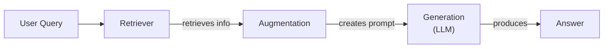
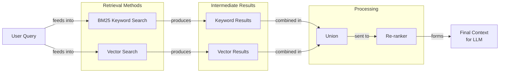
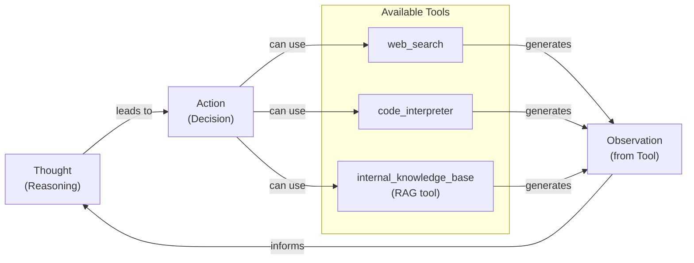

# Retrieval-Augmented Generation: Giving LLMs an Open-Book Exam

In our previous lessons, we have explored the foundations of AI Engineering. We started with the agent landscape, distinguished between LLM workflows and AI agents, and covered Context Engineering, the art of managing the information an LLM receives. Now, we will tackle one of the most important techniques in that discipline: Retrieval-Augmented Generation (RAG).

LLMs are trained on massive, but fixed, datasets. This makes their knowledge static and prone to hallucination. During their training, they are essentially taking a "closed-book exam" on the world's information. We do not yet have efficient techniques to enable models to learn new information over time after deployment. While fine-tuning can adjust a model's behavior, it is an expensive and slow process for updating its knowledge base [[1]](https://neo4j.com/blog/developer/fine-tuning-vs-rag/).

RAG offers a reliable and practical solution. Instead of relying on a model's memory, we can insert new knowledge directly into its context window. With RAG, we are giving the LLM an "open-book exam" by connecting it to external, real-time knowledge sources. Much like how we use manuals or cheat sheets instead of memorizing everything, an LLM can use RAG to access the information it needs, when it needs it.

As we covered in Lesson 3, RAG is a core method AI Engineers use for Context Engineering. This lesson will explore the "what" and "how" of RAG, from its basic components to the advanced and agentic patterns that power modern AI systems. We will also briefly touch upon how retrieval complements an agent's memory, a topic we will explore in detail in Lesson 10. With the problem and motivation clear, we will first decompose RAG into its core components so you can see where each responsibility lives.

## The RAG System: Core Components

Understanding the components of RAG is the first step in the Context Engineering process of designing an effective system. At its core, RAG can be broken down into three conceptual pillars.

**Retrieval** is the engine responsible for finding relevant information. Given a user's query, this component searches an external knowledge base to find the most relevant pieces of data. This search is often powered by semantic similarity, which relies on vector embeddings and vector databases to find contextually related information, even if the wording does not match exactly.

To enable this semantic search, we use **vector embeddings**. An embedding is a numerical representation of text. It is a dense vector of numbers that captures its underlying meaning. The process starts by splitting documents into chunks. Each chunk is then fed into an embedding model, which converts the text into a high-dimensional vector [[8]](https://qdrant.tech/articles/what-is-rag-in-ai/). These vectors are stored in a specialized **vector database**, which is optimized for performing fast similarity searches. When a user query comes in, it is converted into a vector using the same model. The database then finds the vectors (and their corresponding text chunks) that are closest to the query vector, often using a metric like cosine similarity [[54]](https://towardsdatascience.com/rag-explained-understanding-embeddings-similarity-and-retrieval/).

**Augmentation** is the process of taking the information found by the retriever and preparing it for the LLM. This involves formatting the retrieved data and integrating it with the original user query to create an augmented prompt. This new prompt provides the LLM with the necessary context to generate a well-informed response.

**Generation** is the final step, where the LLM receives the augmented prompt and produces an answer. Because the prompt now contains relevant, external data, the LLM can generate a response that is grounded in that information, making it more accurate and trustworthy than an answer based solely on its internal knowledge.

Image 1: A flowchart illustrating the core components of a RAG system.

These three components work together to bridge the gap between an LLM's static training and the dynamic, ever-changing information of the real world. Now that you can name each moving part, let’s see how they line up across the two phases of a real system.

## The RAG Pipeline: Ingestion and Retrieval

A complete RAG workflow operates in two distinct phases: an offline ingestion pipeline to prepare the knowledge base, and an online retrieval pipeline that answers user queries in real-time.

### Phase 1: Offline Ingestion & Indexing

This phase is all about preparing your data to be searchable. It is an offline process that you run whenever your knowledge base needs to be created or updated.

1.  **Load:** The first step is to load your documents from their sources. These can be PDFs, web pages, or data from APIs. Tools like Unstructured or document loaders in frameworks like LangChain and LlamaIndex are commonly used for this [[2]](https://towardsai.net/p/l/a-complete-guide-to-rag).
2.  **Split:** Large documents are then broken down into smaller, more manageable pieces, or "chunks." This is an important step, as you want to create chunks that are semantically meaningful and avoid cutting off an idea mid-sentence. A `RecursiveCharacterTextSplitter` is a popular choice for this [[16]](https://47billion.com/blog/rag-system-in-production-why-it-fails-and-how-to-fix-it/).
3.  **Embed:** Each chunk is converted into a numerical representation, called a vector embedding, using an embedding model. There are many models available, from providers like OpenAI, Google, and Cohere, as well as open-source variants on Hugging Face [[31]](https://medium.com/@derrickryangiggs/rag-pipeline-deep-dive-ingestion-chunking-embedding-and-vector-search-abd3c8bfc177).
4.  **Store:** Finally, these embeddings, along with their original text, are stored in a specialized database called a vector database. This database is optimized for fast similarity searches. Examples include FAISS for local use, or managed services like Qdrant, Milvus, and Pinecone [[52]](https://medium.com/@robi.tomar72/how-rag-actually-works-embeddings-vector-databases-indexing-retrieval-explained-simply-3d1ca45fe1bf).

### Phase 2: Online Retrieval & Generation

This is the real-time part of the pipeline that gets triggered when a user asks a question.

1.  **Query:** The user submits a query to the system.
2.  **Embed:** The user's query is converted into a vector embedding using the *same* embedding model from the ingestion phase. This ensures that the query and the documents are in the same vector space, making them comparable [[8]](https://qdrant.tech/articles/what-is-rag-in-ai/).
3.  **Search:** The system uses the query vector to search the vector database. It looks for the "top-k" most similar document chunks, which are the vectors geometrically closest to the query vector.
4.  **Generate:** The retrieved chunks are combined with the original query and instructions into a single prompt. This augmented prompt is then sent to the LLM, which generates a final answer grounded in the retrieved context. As we discussed in Lesson 4, this is a good place to use structured outputs to ensure the answer includes citations back to the source documents [[27]](https://www.aimon.ai/posts/rag_and_its_different_components/).

```mermaid
flowchart LR
  %% Phase 1: Offline Ingestion & Indexing
  subgraph "Offline Ingestion & Indexing"
    Documents["Documents"]
    Load["Load<br/>(Unstructured, LangChain, LlamaIndex)"]
    Split["Split<br/>(RecursiveCharacterTextSplitter, SemanticSplitter)"]
    Chunks["Chunks"]
    Embed_offline["Embed<br/>(OpenAI, Google Gemini, Cohere, Voyage, bge)"]
    VectorEmbeddings["Vector Embeddings"]
    Store["Store<br/>(FAISS, Milvus, Qdrant, Pinecone, Elasticsearch/OpenSearch)"]
    VectorDatabase["Vector Database"]

    Documents -- "processed by" --> Load
    Load -- "outputs" --> Split
    Split -- "creates" --> Chunks
    Chunks -- "sent to" --> Embed_offline
    Embed_offline -- "creates" --> VectorEmbeddings
    VectorEmbeddings -- "sent to" --> Store
    Store -- "stores in" --> VectorDatabase
  end

  %% Phase 2: Online Retrieval & Generation
  subgraph "Online Retrieval & Generation"
    UserQuery["User Query"]
    Embed_online["Embed<br/>(same model as ingestion)"]
    QueryVector["Query Vector"]
    Search["Search<br/>(vector similarity in Elasticsearch/OpenSearch, Pinecone, FAISS)"]
    TopKChunks["Top-K Chunks"]
    Generate["Generate<br/>(structured outputs, LLM call)"]
    GroundedAnswer["Grounded Answer"]

    UserQuery -- "initiated" --> Embed_online
    Embed_online -- "creates" --> QueryVector
    QueryVector -- "used to" --> Search
    Search -- "finds" --> TopKChunks
    TopKChunks -- "used by" --> Generate
    UserQuery -- "context for" --> Generate
    Generate -- "produces" --> GroundedAnswer
  end

  %% Cross-phase interaction
  VectorDatabase -- "queried by" --> Search

  %% Visual grouping
  classDef phase_header fill:#f9f,stroke:#333,stroke-width:2px
  class Documents,UserQuery phase_header
```

Image 2: A detailed flowchart showing the end-to-end RAG workflow, split into two main phases: Offline Ingestion & Indexing and Online Retrieval & Generation.

This two-phase architecture separates the heavy lifting of data preparation from the fast, real-time demands of answering user questions. With the end-to-end path in place, the next question is quality: what are the advanced techniques to make the retrieval more accurate and useful across messy, real-world data?

## Advanced RAG Techniques

The naive RAG pipeline is a great start, but production systems often require more sophisticated techniques to improve retrieval accuracy. Here are some of the most effective methods used today.

**Hybrid Search** combines traditional keyword-based search (like BM25) with modern vector search. While vector search captures semantic meaning, it can miss exact matches for specific terms. BM25 excels at this. By running both searches and fusing the results, you get both contextual understanding and keyword precision [[38]](https://mlpills.substack.com/p/issue-76-optimize-rag-with-hybrid).

**Re-ranking** is a second-stage process that improves the relevance of retrieved documents. The initial retrieval casts a wide net for speed. A re-ranker, often a more powerful cross-encoder model, then re-orders this smaller set of candidates based on a more detailed relevance assessment, ensuring the best documents are prioritized [[42]](https://redis.io/blog/10-techniques-to-improve-rag-accuracy/), [[43]](https://apxml.com/courses/optimizing-rag-for-production/chapter-2-advanced-retrieval-optimization/reranking-architectures-rag).

Image 3: A flowchart illustrating the hybrid retrieval flow.

**Query Transformations** modify the user's query to improve retrieval. **Hypothetical Document Embeddings (HyDE)** involves generating a hypothetical answer to the query and using its embedding for the search, as it is often phrased more like the source documents. **Query decomposition** breaks a complex question into simpler sub-queries, retrieving for each and then merging the results [[16]](https://47billion.com/blog/rag-system-in-production-why-it-fails-and-how-to-fix-it/), [[19]](https://docs.nvidia.com/rag/latest/query_decomposition.html).

**Advanced Chunking Strategies** move beyond fixed-size splits. **Semantic chunking** creates boundaries based on topic shifts, keeping coherent ideas together. **Layout-aware chunking** is essential for documents like PDFs, as it preserves the structure of tables and forms, ensuring that related data points are not separated [[17]](https://sarthakai.substack.com/p/improve-your-rag-accuracy-with-a).

**GraphRAG** retrieves information from knowledge graphs instead of disconnected text chunks. This approach excels at answering complex, multi-hop questions that require understanding relationships between entities. For example, it can trace connections between incident reports, deployment logs, and affected services to answer a query about an IT outage [[46]](https://arxiv.org/html/2601.03014v1), [[50]](https://arxiv.org/html/2501.00309v2).

These techniques increase retrieval quality. Next, we will see how retrieval becomes one tool that an agent can choose to use as it reasons.

## Agentic RAG

In Lessons 7 and 8, we introduced the ReAct framework, where an agent iteratively cycles through Thought, Action, and Observation. Agentic RAG is the application of this framework, equipping a ReAct-style agent with a retrieval tool. Instead of following a fixed pipeline, the agent can reason about when and how to access its knowledge base.

It is important to clarify that agents typically have access to many tools, such as web search, code execution, or database queries. The retrieval tool is just one of many, so labeling a whole system "agentic RAG" can be too narrow. The retrieval tool is just one of several.

The core distinction lies in the control flow:
*   **Standard RAG** is a linear, predetermined workflow: Retrieve → Augment → Generate. It is powerful but rigid, following the same path for every query.
*   **Agentic RAG** is adaptive and iterative. The agent decides if retrieval is necessary, what query to use, which knowledge source to search, and whether the results are sufficient or if another retrieval-reasoning cycle is needed [[11]](https://towardsdatascience.com/agentic-rag-vs-classic-rag-from-a-pipeline-to-a-control-loop/).

This agentic approach enables several advanced capabilities. The agent can **iteratively refine its queries**. If an initial search returns a vague policy, it can reason that the results are insufficient and try again with a narrower query. It can also **choose between different knowledge sources**, deciding whether to `search_tech_docs` for a technical question or `search_emails` for a project update.

Furthermore, it can **fuse information** from the RAG tool with data from other tools. For instance, an agent might retrieve an internal policy, then call a web search to check for current regulatory changes, and synthesize both sources into a comprehensive answer [[13]](https://medium.com/@gaddam.rahul.kumar/agentic-rag-vs-traditional-rag-b1a156f72167). An agent might first query internal documents, observe the information is outdated, then decide to perform a web search to find the latest regulations before synthesizing a final answer.

Image 4: A circular flowchart illustrating an agent's main loop in Agentic RAG, showing the iterative process of Thought, Action, and Observation, with Action leveraging various tools.

This transforms RAG from a simple database lookup into a dynamic conversation with a knowledgeable research assistant. You now understand both a linear RAG pipeline and how an agent can control retrieval when needed. Let’s wrap up by situating RAG in the wider AI Engineering toolkit and previewing what comes next.

## Conclusion

We have seen that Retrieval-Augmented Generation is a powerful solution to the knowledge limitations of LLMs. By grounding models in external data, RAG reduces hallucinations, enables customization with proprietary information, and builds user trust through verifiable, source-backed answers. We have also explored how advanced techniques improve retrieval quality and how agentic systems transform RAG from a static pipeline into an intelligent, iterative process.

For the modern AI Engineer, RAG is not a niche skill but a fundamental skill within the broader discipline of Context Engineering. It is the key to building AI systems that are not just conversational, but genuinely knowledgeable.

In our next lesson, we will explore Memory for Agents and see how short- and long-term memory systems complement the retrieval mechanisms we have discussed here. We will also cover topics like retrieval evaluation and production monitoring in later parts of the course.

## References

- [1]  https://neo4j.com/blog/developer/fine-tuning-vs-rag/
- [2]  https://towardsai.net/p/l/a-complete-guide-to-rag
- [3]  https://www.infoworld.com/article/2335043/addressing-ai-hallucinations-with-retrieval-augmented-generation.html
- [4]  https://aclanthology.org/2024.emnlp-main.15.pdf
- [5]  https://arxiv.org/html/2312.05934v3
- [6]  https://pub.towardsai.net/vector-databases-in-practice-building-a-realistic-hybrid-search-rag-system-with-qdrant-7b8f4a6e41e0
- [7]  https://decodingml.substack.com/p/rag-fundamentals-first?utm_source=publication-search
- [8]  https://qdrant.tech/articles/what-is-rag-in-ai/
- [9]  https://wandb.ai/mostafaibrahim17/ml-articles/reports/Vector-Embeddings-in-RAG-Applications--Vmlldzo3OTk1NDA5
- [10]  https://decodingml.substack.com/p/your-rag-is-wrong-heres-how-to-fix?utm_source=publication-search
- [11]  https://towardsdatascience.com/agentic-rag-vs-classic-rag-from-a-pipeline-to-a-control-loop/
- [12]  https://www.pingcap.com/article/agentic-rag-vs-traditional-rag-key-differences-benefits/
- [13]  https://medium.com/@gaddam.rahul.kumar/agentic-rag-vs-traditional-rag-b1a156f72167
- [14]  https://weaviate.io/blog/what-is-agentic-rag
- [15]  https://www.ibm.com/think/topics/agentic-rag
- [16]  https://47billion.com/blog/rag-system-in-production-why-it-fails-and-how-to-fix-it/
- [17]  https://sarthakai.substack.com/p/improve-your-rag-accuracy-with-a
- [18]  https://cloudurable.com/blog/advanced-rag-techniques-that-will-transform-your-l/
- [19]  https://docs.nvidia.com/rag/latest/query_decomposition.html
- [20]  https://neo4j.com/blog/genai/advanced-rag-techniques/
- [21]  https://medium.com/@fahey_james/retrieval-augmented-generation-building-grounded-ai-for-enterprise-knowledge-6bc46277fee5
- [22]  https://blogs.nvidia.com/blog/what-is-retrieval-augmented-generation/
- [23]  https://www.llamaindex.ai/blog/rag-is-dead-long-live-agentic-retrieval
- [24]  https://highlearningrate.substack.com/p/the-rise-of-rag
- [25]  https://www.madrona.com/rag-inventor-talks-agents-grounded-ai-and-enterprise-impact/
- [26]  https://humanloop.com/blog/rag-architectures
- [27]  https://www.aimon.ai/posts/rag_and_its_different_components/
- [28]  https://learn.microsoft.com/en-us/azure/developer/ai/advanced-retrieval-augmented-generation
- [29]  https://www.ibm.com/think/topics/retrieval-augmented-generation
- [30]  https://www.anthropic.com/news/contextual-retrieval
- [31]  https://medium.com/@derrickryangiggs/rag-pipeline-deep-dive-ingestion-chunking-embedding-and-vector-search-abd3c8bfc177
- [32]  https://newsletter.systemdesign.one/p/how-rag-works
- [33]  https://towardsdatascience.com/ragops-guide-building-and-scaling-retrieval-augmented-generation-systems-3d26b3ebd627/
- [34]  https://arxiv.org/html/2404.16130
- [35]  https://aws.amazon.com/what-is/retrieval-augmented-generation/
- [36]  https://www.highlearningrate.substack.com/p/the-rise-of-rag
- [37]  https://www.weaviate.io/blog/what-is-agentic-rag
- [38]  https://mlpills.substack.com/p/issue-76-optimize-rag-with-hybrid
- [39]  https://cubitrek.com/blog/hybrid-search-optimization-how-bm25-and-dense-vector-retrieval-work-together-for-superior-ai-search/
- [40]  https://community.netapp.com/t5/Tech-ONTAP-Blogs/Hybrid-RAG-in-the-Real-World-Graphs-BM25-and-the-End-of-Black-Box-Retrieval/ba-p/464834
- [41]  https://arxiv.org/html/2407.00072v5
- [42]  https://redis.io/blog/10-techniques-to-improve-rag-accuracy/
- [43]  https://apxml.com/courses/optimizing-rag-for-production/chapter-2-advanced-retrieval-optimization/reranking-architectures-rag
- [44]  https://neo4j.com/blog/genai/advanced-rag-techniques/
- [45]  https://towardsdatascience.com/advanced-rag-retrieval-cross-encoders-reranking/
- [46]  https://arxiv.org/html/2601.03014v1
- [47]  https://www.ibm.com/think/topics/agentic-rag
- [48]  https://webhome.cs.uvic.ca/~thomo/papers/asonam2025-graphrag.pdf
- [49]  https://www.llamaindex.ai/blog/rag-is-dead-long-live-agentic-retrieval
- [50]  https://arxiv.org/html/2501.00309v2
- [51]  https://www.microsoft.com/en-us/research/project/graphrag/
- [52]  https://medium.com/@robi.tomar72/how-rag-actually-works-embeddings-vector-databases-indexing-retrieval-explained-simply-3d1ca45fe1bf
- [53]  https://learnopencv.com/vector-db-and-rag-pipeline-for-document-rag/
- [54]  https://towardsdatascience.com/rag-explained-understanding-embeddings-similarity-and-retrieval/
- [55]  https://www.pinecone.io/learn/vector-embeddings/
- [56]  https://www.topquadrant.com/resources/blog-retrieval-augmented-generation-explained/
- [57]  https://www.llamaindex.ai/blog/rag-is-dead-long-live-agentic-retrieval
- [58]  https://www.ibm.com/think/topics/agentic-rag
- [59]  https://www.promptingguide.ai/research/rag
- [60]  https://medium.com/@tejpal.abhyuday/retrieval-augmented-generation-rag-from-basics-to-advanced-a2b068fd576c