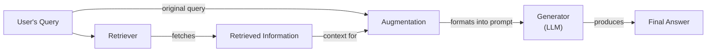
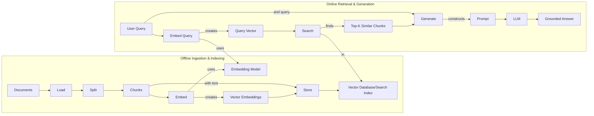
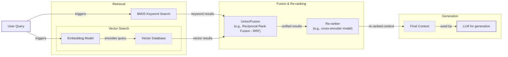
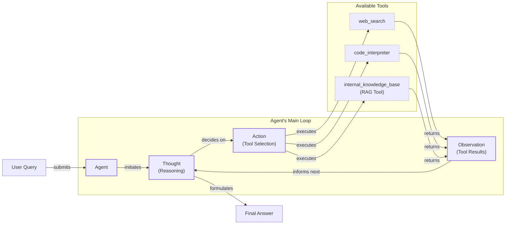

# Lesson 9: Retrieval-Augmented Generation

In our previous lessons, we explored the foundational concepts of AI Engineering, from context engineering and structured outputs to building reasoning agents with ReAct. We’ve established that LLMs are powerful reasoning engines, but they come with a fundamental limitation: their knowledge is frozen in time. They are trained on a fixed dataset, which means they are essentially taking a "closed-book exam" on the world's information. This static knowledge leads to outdated answers and, worse, confident-sounding fabrications known as hallucinations.

Fine-tuning can teach a model new skills or styles, but it is an inefficient and costly way to inject new facts. It requires large datasets and significant compute resources, and the resulting model is just another static snapshot [[18]](https://neo4j.com/blog/developer/fine-tuning-vs-rag/). A better approach is to give the LLM an "open-book exam." This is the core idea behind Retrieval-Augmented Generation (RAG), a technique that connects LLMs to external, real-time knowledge sources [[1]](https://blogs.nvidia.com/blog/what-is-retrieval-augmented-generation/). Instead of relying on memorized facts, the model can look up relevant information just before answering a question.

RAG is a fundamental method in the context engineering work we covered in Lesson 3. It allows us to build applications that are grounded, trustworthy, and knowledgeable. In this lesson, we will explore the what and how of RAG, starting with its core components and moving toward the advanced and agentic patterns that power modern AI systems. We will also see how RAG complements an agent's memory, a topic we will cover in detail in Lesson 10.

With the problem and motivation clear, we’ll first decompose RAG into its core components so you can see where each responsibility lives.

## The RAG System: Core Components

Understanding the components of RAG is the first step in designing effective systems. At a high level, a RAG system can be broken down into three conceptual pillars that work together to ground an LLM’s response in external data [[2]](https://decodingml.substack.com/p/rag-fundamentals-first?utm_source=publication-search), [[3]](https://towardsai.net/p/l/a-complete-guide-to-rag).

The first pillar is **Retrieval**, the engine responsible for finding relevant information. When a user asks a question, the retriever searches an external knowledge base to find documents or data snippets that are likely to contain the answer. This process typically relies on vector embeddings—numerical representations of text that capture semantic meaning. These embeddings are stored in a specialized vector database, which can efficiently find the vectors most similar to the user's query vector. This allows for a "search by meaning," where the system can find conceptually related text even if the wording is different [[4]](https://qdrant.tech/articles/what-is-rag-in-ai/).

Next is **Augmentation**, which is the process of taking the information found by the retriever and integrating it into the prompt that will be sent to the LLM. The original user query is combined with the retrieved text chunks and system instructions, providing the model with the necessary context to formulate an accurate answer. This step is a critical part of prompt engineering, as it directly shapes what the LLM sees [[5]](https://www.ibm.com/think/topics/retrieval-augmented-generation).

The final pillar is **Generation**, where the LLM uses the augmented prompt to produce a response. Because the prompt now contains specific, relevant information, the model can generate an answer that is grounded in the provided data rather than relying solely on its internal, pre-trained knowledge [[2]](https://decodingml.substack.com/p/rag-fundamentals-first?utm_source=publication-search).

Image 1: Flowchart illustrating the core components and data flow of a Retrieval Augmented Generation (RAG) system.

Now that you can name each moving part, let’s see how they line up across the two phases of a real system.

## The RAG Pipeline: Ingestion and Retrieval

A complete RAG system operates in two distinct phases: an offline pipeline for data ingestion and an online pipeline for real-time retrieval and generation [[6]](https://newsletter.systemdesign.one/p/how-rag-works).

The first phase, **Offline Ingestion & Indexing**, prepares your knowledge base for retrieval. This process begins by loading documents from various sources like PDFs or APIs. These documents are then split into smaller, semantically meaningful chunks. The choice of chunking strategy is one of the most important decisions in building a RAG system, as it directly impacts retrieval quality. Each chunk is then converted into a vector embedding using a model like OpenAI's `text-embedding-3-small`. Finally, these embeddings, their corresponding text, and any relevant metadata are stored in a vector database like FAISS, Milvus, or Qdrant, creating a searchable index [[4]](https://qdrant.tech/articles/what-is-rag-in-ai/).

The second phase, **Online Retrieval & Generation**, is triggered when a user submits a query. The user's question is converted into a vector embedding using the same model from the ingestion phase to ensure consistency. This query vector is then used to search the index for the top-k most similar document chunks using a similarity metric like cosine similarity. The retrieved chunks are combined with the original query and system instructions to form an augmented prompt. This prompt is passed to an LLM, which generates a final, grounded answer. To build user trust, this answer can include citations pointing back to the source documents, a concept we revisited from Lesson 4 on structured outputs [[6]](https://newsletter.systemdesign.one/p/how-rag-works).

Image 2: A detailed Mermaid diagram illustrating the end-to-end RAG workflow, divided into two main phases: "Offline Ingestion & Indexing" and "Online Retrieval & Generation".

With the end-to-end path in place, the next question is quality: what are the advanced techniques to make the retrieval more accurate and useful across messy, real-world data?

## Advanced RAG Techniques

Basic RAG can struggle with complex queries or diverse documents. Advanced techniques improve retrieval quality to ensure the LLM receives the most relevant and precise context [[7]](https://decodingml.substack.com/p/your-rag-is-wrong-heres-how-to-fix?utm_source=publication-search).

### Hybrid Search

This technique combines traditional keyword-based search (like BM25) with modern vector search. Keyword search excels at finding exact matches for terms like product codes or acronyms, while vector search captures semantic meaning and handles paraphrasing. By fusing the results from both, often using a method like Reciprocal Rank Fusion (RRF), hybrid search provides more robust and comprehensive retrieval [[8]](https://neo4j.com/blog/genai/advanced-rag-techniques/).

Image 3: A Mermaid diagram illustrating the hybrid retrieval flow in advanced RAG techniques.

### Re-ranking

Re-ranking adds a second stage to the retrieval process. After an initial, fast retrieval of candidate documents, a more powerful but slower model, known as a cross-encoder, re-evaluates them. Unlike standard embedding models that process the query and documents separately, a cross-encoder processes them together, allowing for a deeper assessment of relevance. This improves the final ordering of documents sent to the LLM [[9]](https://towardsdatascience.com/advanced-rag-retrieval-cross-encoders-reranking/).

### Query Transformations

These methods rewrite the user's query to improve retrieval. Decomposition breaks a complex question into simpler sub-queries. Another technique, HyDE (Hypothetical Document Expansion), generates a hypothetical answer first and uses its embedding to find documents that match that ideal response, bridging the gap between how questions are asked and how answers are written [[10]](https://learn.microsoft.com/en-us/azure/developer/ai/advanced-retrieval-augmented-generation).

### Advanced Chunking Strategies

Instead of splitting documents by a fixed size, semantic chunking divides them along thematic boundaries. For a company handbook, this keeps the entire "Reimbursements" section intact. Layout-aware chunking is even more specialized, preserving the structure of tables or forms. Context-enriched chunking adds a summary of the parent document to each chunk, ensuring that even small snippets retain their original context [[11]](https://www.anthropic.com/news/contextual-retrieval).

### GraphRAG

This approach uses knowledge graphs to retrieve information. It first extracts entities and their relationships from documents into a structured graph. This allows the system to answer complex, multi-hop questions by traversing these connections. For example, it can link an IT incident to a specific software deployment and the engineer responsible, a task that is difficult for standard vector search [[12]](https://arxiv.org/html/2404.16130).

These techniques increase retrieval quality. Next, we’ll see how retrieval becomes one tool that an agent can choose to use as it reasons.

## Agentic RAG

The techniques discussed so far improve a linear workflow. Agentic RAG, however, integrates retrieval into the dynamic, reasoning-driven process of a ReAct agent, as covered in Lessons 7 and 8. RAG becomes a tool the agent can choose to use. The core distinction is the shift from a static pipeline (Retrieve → Augment → Generate) to an adaptive control loop where the agent decides *when* and *what* to retrieve [[13]](https://weaviate.io/blog/what-is-agentic-rag), [[14]](https://towardsdatascience.com/agentic-rag-vs-classic-rag-from-a-pipeline-to-a-control-loop/).

This agentic approach allows for powerful capabilities. An agent can iteratively refine its queries, choose between different knowledge sources, and fuse information from multiple tools. For example, when asked about an outage, an agent might decide to `search_incident_runbooks` instead of `search_marketing_pages`. It could retrieve an internal policy, then use a web search to verify current regulations before synthesizing a final answer [[15]](https://www.ibm.com/think/topics/agentic-rag).

Here is a conceptual example of an agent's thought process:
*   **Thought:** "The user is asking about '2024 EU data retention rules,' but our internal policy document is from 2023. It's likely outdated."
*   **Action:** `retrieve(internal_policy, query="EU data retention 2024")`
*   **Observation:** "The policy mentions amendments but lacks specific citations."
*   **Thought:** "I need external verification to provide a complete and accurate answer."
*   **Action:** `web_search(query="EU data retention rules 2024 official directive")`
*   **Observation:** "Found the updated directive with new compliance dates."
*   **Thought:** "Now I can synthesize the internal policy with the new external directive and highlight the changes."

However, this iterative freedom introduces new failure modes. Without proper safeguards, an agent can get stuck in a loop of ineffective searches, a problem known as "Retrieval Thrash." It can also trigger excessive tool calls ("Tool Storms") or overwhelm its context window with irrelevant information ("Context Bloat"), degrading performance [[16]](https://towardsdatascience.com/agentic-rag-failure-modes-retrieval-thrash-tool-storms-and-context-bloat-and-how-to-spot-them-early/). As an AI engineer, you must design agents with clear stop conditions and budgets to mitigate these risks.

Image 4: A conceptual Mermaid diagram illustrating an agent's main loop in Agentic RAG, showing the iterative Thought -> Action -> Observation cycle and dynamic tool selection.

You now understand both a linear RAG pipeline and how an agent can control retrieval when needed. Let’s wrap up by situating RAG in the wider AI Engineering toolkit and previewing what comes next.

## Conclusion

RAG is the most used solution to the LLM knowledge problem, reducing hallucinations and building user trust through verifiable answers. While basic RAG is a powerful start, production-grade quality depends on advanced techniques. The future of knowledge retrieval is agentic, where RAG becomes a dynamic tool in an agent's reasoning process.

For the modern AI Engineer, RAG is a foundational competency and a key part of Context Engineering. In our next lesson, we will explore Memory for Agents and see how memory systems complement the retrieval capabilities discussed here. Later in the course, we will cover how to build robust evaluation and monitoring systems for your RAG pipelines.

## References

- [1] [What Is Retrieval-Augmented Generation, aka RAG?](https://blogs.nvidia.com/blog/what-is-retrieval-augmented-generation/)
- [2] [Retrieval-Augmented Generation (RAG) Fundamentals First](https://decodingml.substack.com/p/rag-fundamentals-first?utm_source=publication-search)
- [3] [A Complete Guide to RAG](https://towardsai.net/p/l/a-complete-guide-to-rag)
- [4] [What is RAG: Understanding Retrieval-Augmented Generation](https://qdrant.tech/articles/what-is-rag-in-ai/)
- [5] [What is retrieval-augmented generation?](https://www.ibm.com/think/topics/retrieval-augmented-generation)
- [6] [RAG - A Deep Dive](https://newsletter.systemdesign.one/p/how-rag-works)
- [7] [Your RAG Is Wrong, Here's How To Fix It](https://decodingml.substack.com/p/your-rag-is-wrong-heres-how-to-fix?utm_source=publication-search)
- [8] [Advanced RAG Techniques for High-Performance LLM Applications](https://neo4j.com/blog/genai/advanced-rag-techniques/)
- [9] [Advanced RAG: Retrieval with Cross-Encoders (Re-ranking)](https://towardsdatascience.com/advanced-rag-retrieval-cross-encoders-reranking/)
- [10] [Build advanced retrieval-augmented generation systems](https://learn.microsoft.com/en-us/azure/developer/ai/advanced-retrieval-augmented-generation)
- [11] [Introducing Contextual Retrieval](https://www.anthropic.com/news/contextual-retrieval)
- [12] [From Local to Global: A GraphRAG Approach to Query-Focused Summarization](https://arxiv.org/html/2404.16130)
- [13] [What is Agentic RAG](https://weaviate.io/blog/what-is-agentic-rag)
- [14] [Agentic RAG vs Classic RAG: From a Pipeline to a Control Loop](https://towardsdatascience.com/agentic-rag-vs-classic-rag-from-a-pipeline-to-a-control-loop/)
- [15] [What is agentic RAG?](https://www.ibm.com/think/topics/agentic-rag)
- [16] [Agentic RAG Failure Modes: Retrieval Thrash, Tool Storms, and Context Bloat (and How to Spot Them Early)](https://towardsdatascience.com/agentic-rag-failure-modes-retrieval-thrash-tool-storms-and-context-bloat-and-how-to-spot-them-early/)
- [17] [Knowledge Graphs and LLMs: Fine-Tuning vs. Retrieval-Augmented Generation](https://neo4j.com/blog/developer/fine-tuning-vs-rag/)
</article>