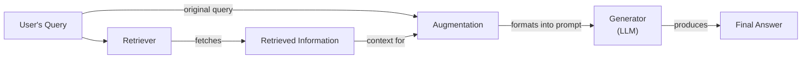
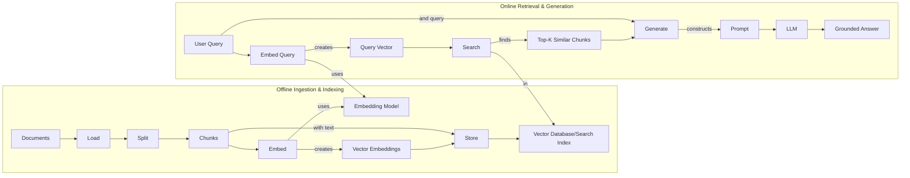
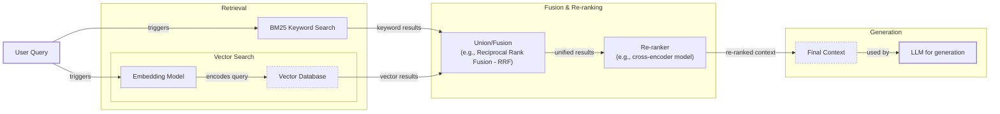
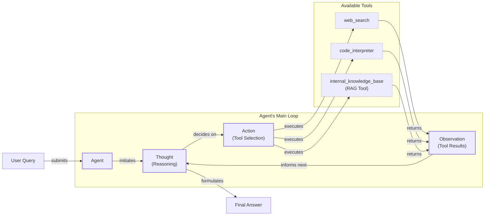

# Lesson 9: Retrieval-Augmented Generation

In our previous lessons, we explored the foundational concepts of AI Engineering, from context engineering and structured outputs to building reasoning agents with ReAct. We’ve established that Large Language Models (LLMs) are powerful reasoning engines, but they come with a significant limitation: their knowledge is frozen in time. They are trained on a fixed dataset, which means they are essentially taking a "closed-book exam" on the world's information. This static knowledge leads to outdated answers and, worse, confident-sounding fabrications known as hallucinations.

Fine-tuning can teach a model new skills or styles, but it is an inefficient and costly way to inject new facts. A better approach is to give the LLM an "open-book exam." This is the core idea behind Retrieval-Augmented Generation (RAG), a technique that connects LLMs to external, real-time knowledge sources [[1]](https://blogs.nvidia.com/blog/what-is-retrieval-augmented-generation/). Instead of relying on memorized facts, the model can look up relevant information just before answering a question.

RAG is a fundamental method in the context engineering work we covered in Lesson 3. It allows us to build applications that are grounded, trustworthy, and knowledgeable. In this lesson, we will explore the what and how of RAG, starting with its core components and moving toward the advanced and agentic patterns that power modern AI systems. We will also see how RAG complements an agent's memory, a topic we will cover in detail in Lesson 10.

With the problem and motivation clear, we’ll first decompose RAG into its core components so you can see where each responsibility lies.

## The RAG System: Core Components

Understanding the components of RAG is the first step in designing effective systems. At a high level, a RAG system can be broken down into three conceptual pillars that work together to ground an LLM’s response in external data [[2]](https://decodingml.substack.com/p/rag-fundamentals-first?utm_source=publication-search), [[3]](https://towardsai.net/p/l/a-complete-guide-to-rag).

**Retrieval:** This is the engine responsible for finding relevant information. When a user asks a question, the retriever searches an external knowledge base to find documents or data snippets that are likely to contain the answer. The most common approach uses semantic similarity search, which relies on vector embeddings—numerical representations of text that capture its meaning. These embeddings are stored in a specialized vector database, which can efficiently find the vectors most similar to the user's query vector [[4]](https://qdrant.tech/articles/what-is-rag-in-ai/).

**Augmentation:** This is the process of taking the information found by the retriever and integrating it into the prompt that will be sent to the LLM. The original user query is combined with the retrieved text chunks, providing the model with the necessary context to formulate an accurate answer [[5]](https://www.ibm.com/think/topics/retrieval-augmented-generation).

**Generation:** This is the final step, where the LLM uses the augmented prompt to produce a response. Because the prompt now contains specific, relevant information, the model can generate an answer that is grounded in the provided data rather than relying solely on its internal, pre-trained knowledge [[2]](https://decodingml.substack.com/p/rag-fundamentals-first?utm_source=publication-search).

Image 1: Flowchart illustrating the core components and data flow of a Retrieval Augmented Generation (RAG) system.

Now that you can name each moving part, let’s see how they line up across the two phases of a real system.

## The RAG Pipeline: Ingestion and Retrieval

A complete RAG system operates in two distinct phases: an offline pipeline for data ingestion and an online pipeline for real-time retrieval and generation [[6]](https://newsletter.systemdesign.one/p/how-rag-works).

### Phase 1: Offline Ingestion & Indexing

This phase prepares your knowledge base for retrieval. It is typically run as a batch process whenever your source documents are created or updated.

1.  **Load:** The first step is to load your documents from various sources. These can be PDFs, web pages, databases, or APIs.
2.  **Split:** Large documents are broken down into smaller, semantically meaningful chunks. This is a critical step because it determines the granularity of the information that can be retrieved. Splitting by paragraphs or sections is often more effective than using a fixed character count, as it avoids cutting off a thought mid-sentence [[7]](https://highlearningrate.substack.com/p/the-rise-of-rag).
3.  **Embed:** Each chunk is then converted into a vector embedding using a specialized model. This numerical representation captures the semantic meaning of the text, allowing the system to find conceptually similar information even if the wording is different [[6]](https://newsletter.systemdesign.one/p/how-rag-works).
4.  **Store:** Finally, the embeddings and their corresponding text chunks are stored in a vector database or a search index. This index is optimized for fast similarity searches, enabling the system to quickly find relevant chunks at query time [[4]](https://qdrant.tech/articles/what-is-rag-in-ai/).

### Phase 2: Online Retrieval & Generation

This phase is triggered in real-time when a user submits a query.

1.  **Query:** The user asks a question.
2.  **Embed:** The user’s query is converted into a vector embedding using the *same* model that was used during the ingestion phase. This ensures that the query and the document chunks exist in the same vector space.
3.  **Search:** The system uses the query vector to search the index and retrieve the top-k most similar document chunks. This is typically done using a similarity metric like cosine similarity [[2]](https://decodingml.substack.com/p/rag-fundamentals-first?utm_source=publication-search).
4.  **Generate:** The retrieved chunks are combined with the original query and a set of instructions into a single prompt. This augmented prompt is then passed to the LLM, which generates a final answer grounded in the retrieved context. The answer can also include citations pointing back to the source documents, which helps build user trust, a concept we will revisit when discussing structured outputs in Lesson 4 [[6]](https://newsletter.systemdesign.one/p/how-rag-works).

Image 2: A detailed Mermaid diagram illustrating the end-to-end RAG workflow, divided into two main phases: "Offline Ingestion & Indexing" and "Online Retrieval & Generation".

With the end-to-end path in place, the next question is quality: what are the advanced techniques to make the retrieval more accurate and useful across messy, real-world data?

## Advanced RAG Techniques

Basic RAG can struggle with complex queries or diverse documents. Advanced techniques improve retrieval quality to ensure the LLM receives the most relevant and precise context [[8]](https://decodingml.substack.com/p/your-rag-is-wrong-heres-how-to-fix?utm_source=publication-search).

**Hybrid Search** combines the strengths of traditional keyword-based search (like BM25) with modern vector search. Keyword search finds exact matches for specific terms that semantic search can miss. By fusing the results of both methods, often using a technique like Reciprocal Rank Fusion (RRF), you get a more robust retrieval system that captures both lexical and semantic relevance [[9]](https://neo4j.com/blog/genai/advanced-rag-techniques/).

Image 3: A Mermaid diagram illustrating the hybrid retrieval flow in advanced RAG techniques.

**Re-ranking** adds a second stage to the retrieval process. After an initial, fast retrieval of a larger set of candidate documents (e.g., top 50), a more powerful but slower model, known as a cross-encoder, re-evaluates and re-orders these candidates. Cross-encoders process the query and each document together for a more nuanced relevance assessment [[10]](https://towardsdatascience.com/advanced-rag-retrieval-cross-encoders-reranking/). This is important because models often struggle with a “lost in the middle” effect, paying less attention to information buried in a long context [[17]](https://arxiv.org/pdf/2307.03172). A re-ranker helps place the most critical documents at the boundaries of the context window.

**Query Transformations** involve rewriting the user's query before retrieval to improve its chances of matching relevant documents. This includes decomposition, where a complex question is broken into smaller, independent sub-queries. Another technique is Hypothetical Document Embeddings (HyDE), where an LLM generates a hypothetical answer to the query. The embedding of this ideal answer is then used for the search, often yielding more relevant results [[11]](https://learn.microsoft.com/en-us/azure/developer/ai/advanced-retrieval-augmented-generation).

**Advanced Chunking Strategies** move beyond simple fixed-size splitting. Semantic chunking aims to divide documents along thematic boundaries, keeping related sentences together. Layout-aware chunking is designed for complex documents like PDFs with tables and figures, preserving the structural context of the information. Other methods, like contextual retrieval, enrich each chunk with a summary of its parent document, ensuring that even small snippets retain their broader context during retrieval [[12]](https://www.anthropic.com/news/contextual-retrieval).

**GraphRAG** leverages knowledge graphs to retrieve information. Instead of treating documents as isolated chunks, GraphRAG first extracts entities and their relationships into a structured graph [[13]](https://arxiv.org/html/2404.16130). This approach excels at answering multi-hop questions that require reasoning across multiple documents or data points. This is particularly effective for complex queries where vector similarity fails; one study found GraphRAG achieved 86% comprehensiveness on multi-hop tasks compared to 57% for traditional vector RAG [[18]](https://towardsai.net/p/machine-learning/why-90-of-agentic-rag-projects-fail-and-how-to-build-one-that-actually-works-in-production).

These techniques increase retrieval quality. Next, we’ll see how retrieval becomes one tool that an agent can choose to use as it reasons.

## Agentic RAG

The techniques discussed so far improve a linear workflow. Agentic RAG, however, integrates retrieval into the dynamic, reasoning-driven process of a ReAct agent, as covered in Lessons 7 and 8. RAG becomes a tool the agent can choose to use. The core distinction is the shift from a static pipeline (Retrieve → Augment → Generate) to an adaptive control loop where the agent decides *when* and *what* to retrieve [[14]](https://weaviate.io/blog/what-is-agentic-rag), [[15]](https://towardsdatascience.com/agentic-rag-vs-classic-rag-from-a-pipeline-to-a-control-loop/).

However, this adaptive loop is also what makes agentic systems fragile. Without strict controls, an agent can get stuck in a loop of ineffective searches, a failure mode known as **retrieval thrash**. It can also trigger **tool storms** by making excessive, cascading calls to its tools, leading to high latency and costs. These issues are often compounded by **context bloat**, where the agent’s context window fills with redundant or low-quality information, degrading its reasoning ability [[19]](https://towardsdatascience.com/agentic-rag-failure-modes-retrieval-thrash-tool-storms-and-context-bloat-and-how-to-spot-them-early/), [[20]](https://dev.to/kuldeep_paul/ten-failure-modes-of-rag-nobody-talks-about-and-how-to-detect-them-systematically-7i4). This makes robust orchestration and monitoring essential for production systems.

This agentic approach allows for powerful capabilities like iterative query refinement, selecting between different knowledge sources, and fusing information from multiple tools [[16]](https://www.ibm.com/think/topics/agentic-rag). An agent can also decide to update its knowledge base with new information it discovers, a concept related to agent memory that we will explore in Lesson 10.

For example, faced with a complex query, an agent might follow this thought process:
*   **Thought:** User asks about "2024 EU data retention rules," but my internal knowledge cites 2023. It might be outdated.
*   **Action:** `internal_knowledge_base`("EU data retention policy 2024").
*   **Observation:** Retrieved document mentions amendments but lacks specifics.
*   **Thought:** I need external verification.
*   **Action:** `web_search`("Official EU data retention regulations 2024").
*   **Observation:** Found the updated directive.
*   **Thought:** I will synthesize both sources and highlight the changes.

This turns a simple lookup into a dynamic research process, orchestrated by the agent.

Image 4: A conceptual Mermaid diagram illustrating an agent's main loop in Agentic RAG, showing the iterative Thought -> Action -> Observation cycle and dynamic tool selection.

You now understand both a linear RAG pipeline and how an agent can control retrieval when needed. Let’s wrap up by situating RAG in the wider AI Engineering toolkit and previewing what comes next.

## Conclusion

We have seen that RAG is the industry's primary solution to the LLM knowledge problem. It reduces hallucinations, enables customization with proprietary data, and builds user trust by providing verifiable, source-backed answers. While basic RAG is a powerful start, production-grade systems require advanced techniques like hybrid search and re-ranking to achieve high-quality retrieval.

The future of information retrieval is agentic, where RAG transforms from a static pipeline into a dynamic tool an agent can use as part of a broader reasoning process. For the modern AI Engineer, RAG is not a niche topic but a foundational competency and a key part of the broader discipline of Context Engineering.

In our next lesson, we will explore Memory for Agents, and see how short- and long-term memory systems complement the retrieval capabilities we have discussed here. Later in the course, we will also cover how to build robust evaluation and monitoring systems to ensure your RAG pipelines perform reliably in production.

## References

- [1] [What Is Retrieval-Augmented Generation, aka RAG?](https://blogs.nvidia.com/blog/what-is-retrieval-augmented-generation/)
- [2] [Retrieval-Augmented Generation (RAG) Fundamentals First](https://decodingml.substack.com/p/rag-fundamentals-first?utm_source=publication-search)
- [3] [A Complete Guide to RAG](https://towardsai.net/p/l/a-complete-guide-to-rag)
- [4] [What is RAG: Understanding Retrieval-Augmented Generation](https://qdrant.tech/articles/what-is-rag-in-ai/)
- [5] [What is retrieval-augmented generation?](https://www.ibm.com/think/topics/retrieval-augmented-generation)
- [6] [RAG - A Deep Dive](https://newsletter.systemdesign.one/p/how-rag-works)
- [7] [The Rise of RAG](https://highlearningrate.substack.com/p/the-rise-of-rag)
- [8] [Your RAG Is Wrong, Here's How To Fix It](https://decodingml.substack.com/p/your-rag-is-wrong-heres-how-to-fix?utm_source=publication-search)
- [9] [Advanced RAG Techniques for High-Performance LLM Applications](https://neo4j.com/blog/genai/advanced-rag-techniques/)
- [10] [Advanced RAG: Retrieval with Cross-Encoders (Re-ranking)](https://towardsdatascience.com/advanced-rag-retrieval-cross-encoders-reranking/)
- [11] [Build advanced retrieval-augmented generation systems](https://learn.microsoft.com/en-us/azure/developer/ai/advanced-retrieval-augmented-generation)
- [12] [Introducing Contextual Retrieval](https://www.anthropic.com/news/contextual-retrieval)
- [13] [From Local to Global: A GraphRAG Approach to Query-Focused Summarization](https://arxiv.org/html/2404.16130)
- [14] [What is Agentic RAG](https://weaviate.io/blog/what-is-agentic-rag)
- [15] [Agentic RAG vs Classic RAG: From a Pipeline to a Control Loop](https://towardsdatascience.com/agentic-rag-vs-classic-rag-from-a-pipeline-to-a-control-loop/)
- [16] [What is agentic RAG?](https://www.ibm.com/think/topics/agentic-rag)
- [17] [Lost in the Middle: How Language Models Use Long Contexts](https://arxiv.org/pdf/2307.03172)
- [18] [Why 90% of Agentic RAG Projects Fail](https://towardsai.net/p/machine-learning/why-90-of-agentic-rag-projects-fail-and-how-to-build-one-that-actually-works-in-production)
- [19] [Agentic RAG Failure Modes](https://towardsdatascience.com/agentic-rag-failure-modes-retrieval-thrash-tool-storms-and-context-bloat-and-how-to-spot-them-early/)
- [20] [Ten Failure Modes of RAG Nobody Talks About](https://dev.to/kuldeep_paul/ten-failure-modes-of-rag-nobody-talks-about-and-how-to-detect-them-systematically-7i4)