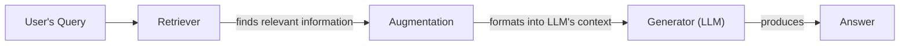
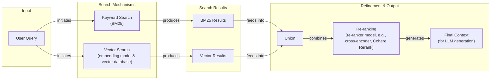

# Retrieval-Augmented Generation (RAG): The AI Engineer's Guide

In our previous lessons, we explored the fundamentals of AI engineering, from context engineering and structured outputs to building reasoning agents with the ReAct framework. We have learned that Large Language Models are trained on fixed datasets, making their knowledge static and prone to hallucination. During training, they are essentially taking a "closed-book exam" on the world's information. We do not yet have efficient techniques to enable models to learn new information over time after their initial training. While we can fine-tune them, this process is not as efficient as human learning.

This is where Retrieval-Augmented Generation (RAG) comes in. RAG is a reliable solution that allows us to inject new knowledge into the LLM's context window at the moment of inference [[1]](https://blogs.nvidia.com/blog/what-is-retrieval-augmented-generation/). With RAG, we give the LLM an "open-book exam" by connecting it to external, real-time knowledge sources. Instead of memorizing everything, the LLM can now reference manuals, documents, and databases, much like a human would use a cheat sheet [[2]](https://towardsai.net/p/l/a-complete-guide-to-rag).

As we covered in Lesson 3 on Context Engineering, curating the information an LLM sees is a core task for an AI Engineer. RAG is one of the most important methods we use to accomplish this. In this lesson, we will cover the what and how of basic RAG before moving on to the advanced and agentic patterns that power modern AI systems. With the problem and motivation clear, we will first decompose RAG into its core components so you can see where each responsibility lives.

## The RAG System: Core Components

Understanding the components of a RAG system is the first step in the context engineering process of designing an effective architecture. At its core, RAG is built on three conceptual pillars that work together to ground an LLM's response in external data [[3]](https://decodingml.substack.com/p/rag-fundamentals-first?utm_source=publication-search).

**Retrieval** is the engine for finding relevant information. This process typically relies on vector embeddings, which are numerical representations of text that capture semantic meaning [[9]](https://wandb.ai/mostafaibrahim17/ml-articles/reports/Vector-Embeddings-in-RAG-Applications--Vmlldzo3OTk1NDA5). These embeddings are stored in a specialized vector database. When a user sends a query, it is also converted into an embedding, and a semantic similarity search is performed to find the most relevant pieces of information [[10]](https://apxml.com/courses/prompt-engineering-llm-application-development/chapter-6-integrating-llms-external-data-rag/implementing-semantic-search-retrieval).

**Augmentation** is the process of taking the retrieved information and formatting it into the context of a prompt for the LLM. This step constructs the "open book" from which the model will answer, combining the user's original query with the evidence found by the retriever [[11]](https://www.topquadrant.com/resources/blog-retrieval-augmented-generation-explained).

**Generation** is the final step, where the LLM uses the augmented prompt to generate an answer. Because the model is provided with relevant, factual information directly in its context, the final response is grounded in the provided data, reducing the risk of hallucination and improving accuracy [[1]](https://blogs.nvidia.com/blog/what-is-retrieval-augmented-generation/).


Image 1: A flowchart illustrating the core conceptual pillars of a RAG system.

Now that you can name each moving part, let’s see how they line up across the two phases of a real system.

## The RAG Pipeline: Ingestion and Retrieval

A complete RAG workflow is split into two distinct phases: an offline phase for preparing the data and an online phase for answering user queries in real-time [[12]](https://medium.com/@derrickryangiggs/rag-pipeline-deep-dive-ingestion-chunking-embedding-and-vector-search-abd3c8bfc177), [[13]](https://newsletter.systemdesign.one/p/how-rag-works).

### Phase 1: Offline Ingestion & Indexing

The ingestion pipeline is where you prepare your knowledge base. This process runs in the background, before any user interaction, to create an indexed library of information that the retriever can search efficiently [[14]](https://towardsdatascience.com/ragops-guide-building-and-scaling-retrieval-augmented-generation-systems-3d26b3ebd627/).

1.  **Load:** The first step is to load your documents from various sources. These can be anything from PDFs and websites to data from APIs. Tools like Unstructured or loaders from libraries like LangChain and LlamaIndex are commonly used for this [[13]](https://newsletter.systemdesign.one/p/how-rag-works).
2.  **Split:** Since documents are often too large to fit into a model's context window, they must be broken down into smaller, meaningful chunks. This can be done with rule-based splitters, like LangChain’s `RecursiveCharacterTextSplitter`, or more advanced semantic chunkers that avoid splitting a coherent idea in the middle [[13]](https://newsletter.systemdesign.one/p/how-rag-works).
3.  **Embed:** Each chunk is then converted into a vector embedding using a specialized model. Popular choices include models from OpenAI, Google, Cohere, or open-source variants available on Hugging Face [[15]](https://qdrant.tech/articles/what-is-rag-in-ai/).
4.  **Store:** Finally, these embeddings and their corresponding text are stored in a vector database. This database is optimized for fast similarity searches, allowing the system to quickly find the most relevant chunks for a given query. Examples include local libraries like FAISS or managed services like Qdrant, Pinecone, and Azure AI Search [[16]](https://pub.towardsai.net/vector-databases-in-practice-building-a-realistic-hybrid-search-rag-system-with-qdrant-7b8f4a6e41e0).

### Phase 2: Online Retrieval & Generation

This phase happens in real-time, triggered by a user's query [[12]](https://medium.com/@derrickryangiggs/rag-pipeline-deep-dive-ingestion-chunking-embedding-and-vector-search-abd3c8bfc177/).

1.  **Query:** The user asks a question. This query can be optionally pre-processed to normalize it or expand it for better search results [[4]](https://decodingml.substack.com/p/your-rag-is-wrong-heres-how-to-fix?utm_source=publication-search).
2.  **Embed:** The processed query is converted into a vector using the *same* embedding model that was used during the ingestion phase. This is critical to ensure that the query and the document chunks exist in the same vector space [[15]](https://qdrant.tech/articles/what-is-rag-in-ai/).
3.  **Search:** The system uses the query vector to search the vector database, retrieving the top-k most similar document chunks based on a distance metric like cosine similarity [[17]](https://towardsdatascience.com/rag-explained-understanding-embeddings-similarity-and-retrieval/).
4.  **Generate:** The retrieved chunks are assembled into the prompt along with the original query and instructions for the LLM. The model then generates a final answer grounded in this context. As we saw in Lesson 4, using structured outputs can help format the answer and include citations back to the source documents [[3]](https://decodingml.substack.com/p/rag-fundamentals-first?utm_source=publication-search).

```mermaid
flowchart LR
  %% Offline Ingestion & Indexing Phase
  subgraph "Offline Ingestion & Indexing Phase"
    A["Documents<br/>(Various Sources)"]
    B["Load<br/>(Unstructured, LangChain document loaders, LlamaIndex readers)"]
    C["Split<br/>(LangChain RecursiveCharacterTextSplitter, LlamaIndex SemanticSplitter)"]
    D["Embed<br/>(OpenAI text-embedding-3-large/small, Google's Gemini text-embedding-004, Cohere Embed, Voyage, bge variants)"]
    E["Store<br/>(FAISS (local), Milvus, Qdrant, Pinecone, Elasticsearch/OpenSearch (with kNN), Azure AI Search)"]
    F[("Vector Database")]

    A -- "raw data" --> B
    B -- "loaded docs" --> C
    C -- "chunks" --> D
    D -- "embeddings" --> E
    E -- "persist" --> F
  end

  %% Online Retrieval & Generation Phase
  subgraph "Online Retrieval & Generation Phase"
    G["User Query"]
    H["Query<br/>(Optionally normalize or expand, e.g., LangChain Runnable chain or LlamaIndex QueryEngine)"]
    I["Embed<br/>(Turn query into a vector with the same embedding model as indexing)"]
    J["Search<br/>(In the Vector Database for top-k similar chunks, e.g., vector similarity Elasticsearch/OpenSearch; Pinecone filters + vector similarity; FAISS cosine similarity)"]
    K["Generate<br/>(Build a prompt that includes the user query, instructions, and retrieved chunks; call the LLM to produce a grounded answer, e.g., use structured outputs, include citations)"]
    L["Grounded Answer"]

    G -- "input" --> H
    H -- "processed query" --> I
    I -- "query embedding" --> J
    J -- "retrieved chunks" --> K
    K -- "response" --> L
  end

  %% Connection between phases
  F -- "search for similar" --> J

  %% Visual grouping
  classDef start_end stroke-width:2px
  classDef process stroke-width:1px
  classDef data_store stroke-width:2px,stroke-dasharray:5,5

  class A,G start_end
  class B,C,D,E,H,I,J,K process
  class F data_store
  class L start_end
```


Image 2: A detailed flowchart illustrating the end-to-end RAG workflow, separating offline ingestion and online retrieval phases.

With the end-to-end path in place, the next question is quality. Let's look at advanced techniques to make retrieval more accurate and useful across messy, real-world data.

## Advanced RAG Techniques

The "naive" RAG pipeline is a great starting point, but production systems often require more sophisticated techniques to improve retrieval quality [[4]](https://decodingml.substack.com/p/your-rag-is-wrong-heres-how-to-fix?utm_source=publication-search).

### Hybrid Search

This technique combines keyword-based search (like BM25) for precision with vector search for semantic meaning [[18]](https://mlpills.substack.com/p/issue-76-optimize-rag-with-hybrid). BM25 finds exact term matches, while vector search captures context even if wording differs. Combining them provides both precision and broad contextual understanding [[19]](https://cubitrek.com/blog/hybrid-search-optimization-how-bm25-and-dense-vector-retrieval-work-together-for-superior-ai-search/). For a "carryover balance" query, vector search can find documents about billing cycles even if the exact phrase is missing, complementing a precise keyword search.

### Re-ranking

After an initial broad retrieval, a re-ranker model refines the document order. Re-rankers, typically cross-encoders, evaluate the query and each document together to produce a more accurate relevance score [[20]](https://redis.io/blog/10-techniques-to-improve-rag-accuracy/). Unlike the separate encoding in initial retrieval, this joint processing allows for deeper contextual judgment [[21]](https://towardsdatascience.com/advanced-rag-retrieval-cross-encoders-reranking/), [[22]](https://apxml.com/courses/optimizing-rag-for-production/chapter-2-advanced-retrieval-optimization/reranking-architectures-rag). This two-stage process is more expensive but significantly improves context quality.

### Query Transformations

Instead of using the user's query as-is, you can transform it to improve retrieval.
-   **Decomposition** breaks a complex, multi-part question into smaller, simpler sub-queries. The system retrieves documents for each sub-query and then synthesizes the results to answer the original question [[23]](https://docs.nvidia.com/rag/latest/query_decomposition.html). For instance, "What is our Europe travel policy and how did it change this year?" can be split into queries for the base policy, Europe rules, and recent changes.
-   **Hypothetical Document Embeddings (HyDE)** is a technique where you first use an LLM to generate a hypothetical, ideal answer to the user's query. This generated answer is then converted to an embedding and used to search the vector database. This often works better than using the query's embedding directly because the hypothetical answer is more similar in structure and language to the documents you are trying to retrieve [[24]](https://47billion.com/blog/rag-system-in-production-why-it-fails-and-how-to-fix-it/).

### Advanced Chunking Strategies

The way you split documents can have a big impact on retrieval quality. Fixed-size chunking is simple but can awkwardly cut sentences or ideas in half.
-   **Semantic chunking** splits documents based on semantic boundaries, ensuring that coherent thoughts or topics remain in the same chunk.
-   **Layout-aware chunking** is useful for documents like PDFs with tables or forms, as it preserves the structure of the original document.
-   **Context-enriched chunking** adds a summary or contextual information to each chunk before embedding it, helping the retrieval system better understand its relevance [[6]](https://www.anthropic.com/news/contextual-retrieval).

### GraphRAG

Standard RAG can fail on "multi-hop" queries that require connecting separate facts, as it may retrieve only one piece of the logical chain [[30]](https://www.freecodecamp.org/news/how-to-solve-5-common-rag-failures-with-knowledge-graphs/). GraphRAG addresses this by constructing a knowledge graph where entities are nodes and relationships are edges [[25]](https://arxiv.org/html/2404.16130). The system can then traverse this graph to find interconnected evidence. However, this approach assumes the graph is complete; if information is missing, it can still lead to hallucinations [[31]](https://repositum.tuwien.at/bitstream/20.500.12708/227715/1/Dolci-2026-Towards%20LLM-KG%20Symbiosis%20for%20Reducing%20Factual%20Hallucinations-vor.pdf). For example, to answer, "Which incidents were caused by weekend deploys that also touched the login service?", the system navigates from deploy records to incident tickets via the services they affected.


Image 3: A flowchart illustrating the Hybrid Search flow, showing parallel keyword and vector searches, their union, re-ranking, and final context generation.

These techniques increase retrieval quality. Next, we will see how retrieval becomes one tool that an agent can choose to use as it reasons.

## Agentic RAG

As we learned in Lessons 7 and 8, a ReAct-style agent operates in a loop of Thought, Action, and Observation. Agentic RAG is the application of this framework, where retrieval is not a fixed step but a tool that the agent can choose to use [[27]](https://weaviate.io/blog/what-is-agentic-rag). This transforms RAG from a linear pipeline into an adaptive, iterative process [[28]](https://towardsdatascience.com/agentic-rag-vs-classic-rag-from-a-pipeline-to-a-control-loop/).

The core distinction is simple:
-   **Standard RAG** is a pre-determined workflow: Retrieve -> Augment -> Generate. It is powerful but rigid, following the same path for every query.
-   **Agentic RAG** is dynamic. The agent decides *when* to retrieve, *what* to retrieve, and whether one retrieval is enough. It can reason about the information it has and the information it needs [[29]](https://www.ibm.com/think/topics/agentic-rag).

This agentic approach unlocks several new capabilities. If an initial retrieval is vague, the agent can reason it needs more specifics, reformulate its query, and search again. It can also choose between knowledge sources, like `search_tech_docs` or `search_emails`, based on the query's context. Furthermore, an agent can fuse information from multiple tools. It can fuse information from its RAG tool with other sources, like a web search. In multi-agent systems, this extends to coordinating specialized agents—one for internal docs, another for web searches—to synthesize a complete answer [[28]](https://towardsdatascience.com/agentic-rag-vs-classic-rag-from-a-pipeline-to-a-control-loop/), [[32]](https://weaviate.io/blog/what-is-agentic-rag). This is the difference between a simple database lookup and a conversation with a knowledgeable research assistant.

For example, here is a conceptual thought process for an agent:
*   **Thought:** The user is asking about '2024 EU data retention rules.' Our internal policy is from 2023 and might be outdated.
*   **Action:** `retrieve(internal_policy, query="EU data retention 2024")`
*   **Observation:** The retrieved document mentions amendments but lacks specific details.
*   **Thought:** I need to verify this externally.
*   **Action:** `web_search(query="EU data retention directive 2024 official")`
*   **Observation:** Found a new directive update from an official source.
*   **Thought:** I have both the internal context and the latest external information. I can now synthesize an answer, highlighting the changes from 2023 and citing both sources.

```mermaid
flowchart LR
  %% External Input
  A["User Query"]

  %% Agent's Main Loop
  subgraph "Agent (LLM)"
    direction LR
    T["Thought<br/>(reasoning, identify gaps)"]
    ACT["Action<br/>(decide tool or answer)"]
    OBS["Observation<br/>(receive results)"]

    T -- "leads to" --> ACT
    ACT -- "results in" --> OBS
    OBS -- "informs" --> T

    %% Tool Selection
    ACT -- "selects" --> WS["Tool: Web Search"]
    ACT -- "selects" --> CI["Tool: Code Interpreter"]
    ACT -- "selects" --> IKB["Tool: Internal Knowledge Base (RAG)"]

    %% Tool Outputs
    WS -- "returns result" --> OBS
    CI -- "returns result" --> OBS
    IKB -- "returns result" --> OBS
  end

  %% Final Output
  GA["Generate Answer"]

  %% Primary Flow
  A --> "processed by" Agent
  ACT -- "decides to" --> GA

  %% Visual Grouping
  classDef start_end stroke-width:2px
  classDef agent_loop stroke-dasharray: 5 5
  classDef tool_group
  class A,GA start_end
  class T,ACT,OBS agent_loop
  class WS,CI,IKB tool_group
```
Image 4: A conceptual flowchart illustrating an agent's main loop, emphasizing its iterative and adaptive nature, and its ability to choose between various tools.

You now understand both a linear RAG pipeline and how an agent can control retrieval when needed. Let’s wrap up by situating RAG in the wider AI Engineering toolkit and previewing what comes next.

## Conclusion

We have seen that RAG is a powerful technique for addressing the knowledge limitations of LLMs, reducing hallucinations and enabling customization with proprietary data [[1]](https://blogs.nvidia.com/blog/what-is-retrieval-augmented-generation/). For the AI Engineer, RAG is a foundational competency. The evolution from simple pipelines to agent-controlled systems shows a clear path toward building more reliable AI. As models with longer context windows emerge, RAG's role evolves to populate that context with the most relevant information, ensuring these powerful models reason over the best data [[33]](https://medium.com/@infiniflowai/from-rag-to-context-a-2025-year-end-review-of-rag-03740f1a0528).

In our next lesson, we will explore Memory for Agents, and see how short- and long-term memory complement retrieval. We will also cover evaluation and monitoring in future parts of the course.

## References

- [1] [What Is Retrieval-Augmented Generation, aka RAG?](https://blogs.nvidia.com/blog/what-is-retrieval-augmented-generation/)
- [2] [A Complete Guide to RAG](https://towardsai.net/p/l/a-complete-guide-to-rag)
- [3] [Retrieval-Augmented Generation (RAG) Fundamentals First](https://decodingml.substack.com/p/rag-fundamentals-first?utm_source=publication-search)
- [4] [Your RAG Is Wrong, Here's How To Fix It](https://decodingml.substack.com/p/your-rag-is-wrong-heres-how-to-fix?utm_source=publication-search)
- [5] [From Local to Global: A GraphRAG Approach to Query-Focused Summarization](https://arxiv.org/html/2404.16130)
- [6] [Introducing Contextual Retrieval](https://www.anthropic.com/news/contextual-retrieval)
- [7] [What is Agentic RAG](https://weaviate.io/blog/what-is-agentic-rag)
- [8] [Agentic RAG vs Classic RAG: From a Pipeline to a Control Loop](https://towardsdatascience.com/agentic-rag-vs-classic-rag-from-a-pipeline-to-a-control-loop/)
- [9] [Vector Embeddings in RAG Applications](https://wandb.ai/mostafaibrahim17/ml-articles/reports/Vector-Embeddings-in-RAG-Applications--Vmlldzo3OTk1NDA5)
- [10] [Implementing Semantic Search for Retrieval](https://apxml.com/courses/prompt-engineering-llm-application-development/chapter-6-integrating-llms-external-data-rag/implementing-semantic-search-retrieval)
- [11] [Retrieval Augmented Generation Explained](https://www.topquadrant.com/resources/blog-retrieval-augmented-generation-explained/)
- [12] [RAG Pipeline Deep Dive: Ingestion, Chunking, Embedding, and Vector Search](https://medium.com/@derrickryangiggs/rag-pipeline-deep-dive-ingestion-chunking-embedding-and-vector-search-abd3c8bfc177)
- [13] [How RAG Works](https://newsletter.systemdesign.one/p/how-rag-works)
- [14] [RAGOps Guide: Building and Scaling Retrieval-Augmented Generation Systems](https://towardsdatascience.com/ragops-guide-building-and-scaling-retrieval-augmented-generation-systems-3d26b3ebd627/)
- [15] [What is RAG in AI?](https://qdrant.tech/articles/what-is-rag-in-ai/)
- [16] [Vector Databases in Practice: Building a Realistic Hybrid Search RAG System with Qdrant](https://pub.towardsai.net/vector-databases-in-practice-building-a-realistic-hybrid-search-rag-system-with-qdrant-7b8f4a6e41e0)
- [17] [RAG Explained: Understanding Embeddings, Similarity, and Retrieval](https://towardsdatascience.com/rag-explained-understanding-embeddings-similarity-and-retrieval/)
- [18] [Optimize RAG with Hybrid Search](https://mlpills.substack.com/p/issue-76-optimize-rag-with-hybrid)
- [19] [Hybrid Search Optimization: How BM25 and Dense Vector Retrieval Work Together for Superior AI Search](https://cubitrek.com/blog/hybrid-search-optimization-how-bm25-and-dense-vector-retrieval-work-together-for-superior-ai-search/)
- [20] [10 Techniques to Improve RAG Accuracy](https://redis.io/blog/10-techniques-to-improve-rag-accuracy/)
- [21] [Advanced RAG Retrieval: Cross-Encoders & Reranking](https://towardsdatascience.com/advanced-rag-retrieval-cross-encoders-reranking/)
- [22] [Reranking Architectures in RAG](https://apxml.com/courses/optimizing-rag-for-production/chapter-2-advanced-retrieval-optimization/reranking-architectures-rag)
- [23] [Query Decomposition](https://docs.nvidia.com/rag/latest/query_decomposition.html)
- [24] [Why Your RAG System Fails in Production and How to Fix It](https://47billion.com/blog/rag-system-in-production-why-it-fails-and-how-to-fix-it/)
- [25] [GraphRAG: A Graph-Based Approach to Question Answering Over Private Text Corpora](https://arxiv.org/html/2404.16130)
- [26] [SentGraph: Hierarchical Sentence Graph for Multi-hop Retrieval-Augmented Question Answering](https://arxiv.org/html/2601.03014v1)
- [27] [What is Agentic RAG?](https://weaviate.io/blog/what-is-agentic-rag)
- [28] [Agentic RAG vs Classic RAG: From a Pipeline to a Control Loop](https://towardsdatascience.com/agentic-rag-vs-classic-rag-from-a-pipeline-to-a-control-loop/)
- [29] [What is agentic RAG?](https://www.ibm.com/think/topics/agentic-rag)
- [30] [How to Solve 5 Common RAG Failures With Knowledge Graphs](https://www.freecodecamp.org/news/how-to-solve-5-common-rag-failures-with-knowledge-graphs/)
- [31] [Towards LLM-KG Symbiosis for Reducing Factual Hallucinations](https://repositum.tuwien.at/bitstream/20.500.12708/227715/1/Dolci-2026-Towards%20LLM-KG%20Symbiosis%20for%20Reducing%20Factual%20Hallucinations-vor.pdf)
- [32] [What is Agentic RAG?](https://weaviate.io/blog/what-is-agentic-rag)
- [33] [From RAG to Context: A 2025 Year-End Review of RAG](https://medium.com/@infiniflowai/from-rag-to-context-a-2025-year-end-review-of-rag-03740f1a0528)