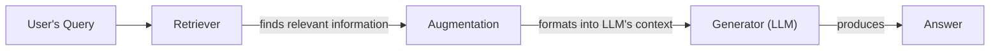
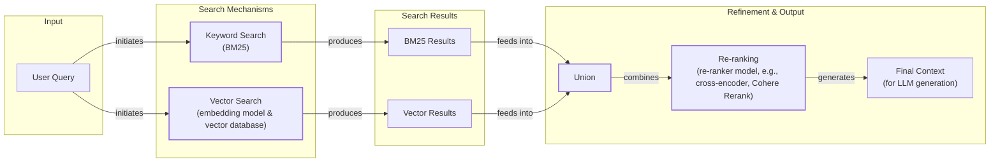

# Retrieval-Augmented Generation (RAG): The AI Engineer's Guide

In our previous lessons, we explored the fundamentals of AI engineering, from context engineering and structured outputs to building reasoning agents with the ReAct framework. We have learned that Large Language Models are trained on fixed datasets, making their knowledge static and prone to hallucination. During training, they are essentially taking a "closed-book exam" on the world's information. We do not yet have efficient techniques to enable models to learn new information over time after their initial training. While we can fine-tune them, this process is not as efficient as human learning.

This is where Retrieval-Augmented Generation (RAG) comes in. RAG is a reliable solution that allows us to inject new knowledge into the LLM's context window at the moment of inference [[1]](https://blogs.nvidia.com/blog/what-is-retrieval-augmented-generation/). With RAG, we give the LLM an "open-book exam" by connecting it to external, real-time knowledge sources. Instead of memorizing everything, the LLM can now reference manuals, documents, and databases, much like a human would use a cheat sheet [[2]](https://towardsai.net/p/l/a-complete-guide-to-rag).

As we covered in Lesson 3 on Context Engineering, curating the information an LLM sees is a core task for an AI Engineer. RAG is one of the most important methods we use to accomplish this. We will also contrast retrieval with agent memory in Lesson 10, where we discuss short- and long-term memory stores that complement RAG. In this lesson, we will cover the what and how of basic RAG before moving on to the advanced and agentic patterns that power modern AI systems. With the problem and motivation clear, we will first decompose RAG into its core components so you can see where each responsibility lives.

## The RAG System: Core Components

Understanding the components of a RAG system is the first step in the context engineering process of designing an effective architecture. At its core, RAG is built on three conceptual pillars that work together to ground an LLM's response in external data [[3]](https://decodingml.substack.com/p/rag-fundamentals-first?utm_source=publication-search).

**Retrieval** is the engine for finding relevant information. This can be done through keyword-based search methods like BM25, which rank documents based on term frequency, or through semantic similarity search [[4]](https://mlpills.substack.com/p/issue-76-optimize-rag-with-hybrid). The latter relies on vector embeddings, which are numerical representations of text that capture its meaning. These embeddings are created by models like BERT and stored in a specialized vector database, such as FAISS or Qdrant [[5]](https://qdrant.tech/articles/what-is-rag-in-ai/), [[6]](https://wandb.ai/mostafaibrahim17/ml-articles/reports/Vector-Embeddings-in-RAG-Applications--Vmlldzo3OTk1NDA5). When a user query arrives, it is converted into an embedding, and the database is searched for vectors with the closest meaning [[7]](https://apxml.com/courses/prompt-engineering-llm-application-development/chapter-6-integrating-llms-external-data-rag/implementing-semantic-search-retrieval).

**Augmentation** is the process of taking the retrieved information and formatting it into the context of a prompt for the LLM. This step constructs the "open book" from which the model will answer, combining the user's original query with the evidence found by the retriever [[8]](https://www.topquadrant.com/resources/blog-retrieval-augmented-generation-explained/).

**Generation** is the final step, where the LLM uses the augmented prompt to generate an answer. Because the model is provided with relevant, factual information directly in its context, the final response is grounded in the provided data, reducing the risk of hallucination and improving accuracy [[1]](https://blogs.nvidia.com/blog/what-is-retrieval-augmented-generation/).


Image 1: A flowchart illustrating the core conceptual pillars of a RAG system.

Now that you can name each moving part, let’s see how they line up across the two phases of a real system.

## The RAG Pipeline: Ingestion and Retrieval

A complete RAG workflow is split into two distinct phases: an offline phase for preparing the data and an online phase for answering user queries in real-time [[9]](https://medium.com/@derrickryangiggs/rag-pipeline-deep-dive-ingestion-chunking-embedding-and-vector-search-abd3c8bfc177), [[10]](https://newsletter.systemdesign.one/p/how-rag-works).

The first phase, **Offline Ingestion & Indexing**, prepares your knowledge base before any user interaction [[11]](https://towardsdatascience.com/ragops-guide-building-and-scaling-retrieval-augmented-generation-systems-3d26b3ebd627/). The process begins by loading documents from various sources like PDFs, websites, or APIs using tools such as Unstructured or loaders from libraries like LangChain. Next, these documents are split into smaller, meaningful chunks using rule-based or semantic splitters to ensure coherent ideas are not broken apart. Each chunk is then converted into a vector embedding by a specialized model, such as those from OpenAI or Google. Finally, these embeddings and their corresponding text are stored in a vector database like FAISS or Qdrant, which is optimized for fast similarity lookups [[10]](https://newsletter.systemdesign.one/p/how-rag-works).

The second phase, **Online Retrieval & Generation**, is triggered in real-time by a user's query [[9]](https://medium.com/@derrickryangiggs/rag-pipeline-deep-dive-ingestion-chunking-embedding-and-vector-search-abd3c8bfc177/). The user's question is first converted into a vector using the same embedding model from the ingestion phase to ensure consistency [[5]](https://qdrant.tech/articles/what-is-rag-in-ai/). The system then uses this query vector to search the vector database and retrieve the top-k most similar document chunks based on a distance metric like cosine similarity [[12]](https://towardsdatascience.com/rag-explained-understanding-embeddings-similarity-and-retrieval/). In the final step, the retrieved chunks are assembled into a prompt with the original query and instructions. The LLM then generates a grounded answer based on this context. As we saw in Lesson 4, using structured outputs can help format the answer and include citations back to the source documents [[3]](https://decodingml.substack.com/p/rag-fundamentals-first?utm_source=publication-search).

```mermaid
flowchart LR
  %% Offline Ingestion & Indexing Phase
  subgraph "Offline Ingestion & Indexing Phase"
    A["Documents<br/>(Various Sources)"]
    B["Load<br/>(Unstructured, LangChain document loaders, LlamaIndex readers)"]
    C["Split<br/>(LangChain RecursiveCharacterTextSplitter, LlamaIndex SemanticSplitter)"]
    D["Embed<br/>(OpenAI text-embedding-3-large/small, Google's Gemini text-embedding-004, Cohere Embed, Voyage, bge variants)"]
    E["Store<br/>(FAISS (local), Milvus, Qdrant, Pinecone, Elasticsearch/OpenSearch (with kNN), Azure AI Search)"]
    F[("Vector Database")]

    A -- "raw data" --> B
    B -- "loaded docs" --> C
    C -- "chunks" --> D
    D -- "embeddings" --> E
    E -- "persist" --> F
  end

  %% Online Retrieval & Generation Phase
  subgraph "Online Retrieval & Generation Phase"
    G["User Query"]
    H["Query<br/>(Optionally normalize or expand, e.g., LangChain Runnable chain or LlamaIndex QueryEngine)"]
    I["Embed<br/>(Turn query into a vector with the same embedding model as indexing)"]
    J["Search<br/>(In the Vector Database for top-k similar chunks, e.g., vector similarity Elasticsearch/OpenSearch; Pinecone filters + vector similarity; FAISS cosine similarity)"]
    K["Generate<br/>(Build a prompt that includes the user query, instructions, and retrieved chunks; call the LLM to produce a grounded answer, e.g., use structured outputs, include citations)"]
    L["Grounded Answer"]

    G -- "input" --> H
    H -- "processed query" --> I
    I -- "query embedding" --> J
    J -- "retrieved chunks" --> K
    K -- "response" --> L
  end

  %% Connection between phases
  F -- "search for similar" --> J

  %% Visual grouping
  classDef start_end stroke-width:2px
  classDef process stroke-width:1px
  classDef data_store stroke-width:2px,stroke-dasharray:5,5

  class A,G start_end
  class B,C,D,E,H,I,J,K process
  class F data_store
  class L start_end
```


Image 2: A detailed flowchart illustrating the end-to-end RAG workflow, separating offline ingestion and online retrieval phases.

With the end-to-end path in place, the next question is quality. Let's look at advanced techniques to make retrieval more accurate and useful across messy, real-world data.

## Advanced RAG Techniques

The "naive" RAG pipeline is a great starting point, but production systems often require more sophisticated techniques to improve retrieval quality [[13]](https://decodingml.substack.com/p/your-rag-is-wrong-heres-how-to-fix?utm_source=publication-search).

**Hybrid Search** combines keyword-based search (like BM25) for precision with vector search for semantic meaning [[4]](https://mlpills.substack.com/p/issue-76-optimize-rag-with-hybrid). This pairing leverages the strengths of both: BM25 excels at finding exact terms, while vector search captures context and paraphrasing [[14]](https://cubitrek.com/blog/hybrid-search-optimization-how-bm25-and-dense-vector-retrieval-work-together-for-superior-ai-search/).

**Re-ranking** uses a second model, often a cross-encoder, to re-order the initial retrieved documents for improved relevance [[15]](https://redis.io/blog/10-techniques-to-improve-rag-accuracy/). Unlike the initial retrieval, a cross-encoder evaluates the query and each document *together*, allowing for a more nuanced judgment of relevance [[16]](https://towardsdatascience.com/advanced-rag-retrieval-cross-encoders-reranking/). For a product help query like "how to connect my account," a re-ranker would push the step-by-step setup guide above a less relevant press release.

**Query Transformations** modify the user's query to improve retrieval. **Decomposition** breaks a complex question into simpler sub-queries, retrieves documents for each, and then merges the results [[17]](https://docs.nvidia.com/rag/latest/query_decomposition.html). **Hypothetical Document Embeddings (HyDE)** involves generating a hypothetical answer to the query first, then using the embedding of that answer to find similar documents. For example, before searching, the system might draft an answer like, "Employees attending approved conferences in Europe can book economy flights," and then search for documents that match that statement [[18]](https://47billion.com/blog/rag-system-in-production-why-it-fails-and-how-to-fix-it/).

**Advanced Chunking Strategies** move beyond fixed-size chunks. **Semantic chunking** splits text based on topical shifts to keep related content together. **Layout-aware chunking** preserves the structure of documents like tables and forms. **Context-enriched chunking** adds a summary to each chunk before embedding, providing more context for the retrieval model [[19]](https://www.anthropic.com/news/contextual-retrieval).

**GraphRAG** constructs a knowledge graph to answer questions about complex relationships that are often lost in standard document chunks [[20]](https://arxiv.org/html/2404.16130). For a retail query like, "Which shoes get the most size-related returns and were featured in last month’s ads?", the system can traverse the graph from returns to sizing issues, to specific products, and finally to the marketing calendar.


Image 3: A flowchart illustrating the Hybrid Search flow, showing parallel keyword and vector searches, their union, re-ranking, and final context generation.

These techniques increase retrieval quality. Next, we will see how retrieval becomes one tool that an agent can choose to use as it reasons.

## Agentic RAG

As we learned in Lessons 7 and 8, a ReAct-style agent operates in a loop of Thought, Action, and Observation. Agentic RAG applies this framework by treating retrieval not as a fixed step but as a tool the agent can choose to use [[21]](https://weaviate.io/blog/what-is-agentic-rag). This transforms RAG from a linear pipeline into an adaptive, iterative process [[22]](https://towardsdatascience.com/agentic-rag-vs-classic-rag-from-a-pipeline-to-a-control-loop/).

The core distinction is that standard RAG follows a rigid "Retrieve -> Augment -> Generate" workflow, while an agentic approach is dynamic. The agent decides *when* to retrieve, *what* to retrieve, and whether one retrieval is enough. It can reason about the information it has and the information it needs [[23]](https://www.ibm.com/think/topics/agentic-rag). This allows the agent to iteratively refine its queries, choose between different knowledge sources (e.g., `search_emails` vs. `search_tech_docs`), and fuse information from multiple tools, such as combining internal documents with a web search. An agent can even decide to update the knowledge base with new information it learns, a topic we will cover in Lesson 10 on Memory for Agents.

For example, an agent might reason: "The user is asking about 2024 regulations, but our internal policy is from 2023. I should search our internal documents first, then verify with a web search for any recent updates." This is the difference between a simple database lookup and a conversation with a knowledgeable research assistant.

```mermaid
flowchart LR
  %% External Input
  A["User Query"]

  %% Agent's Main Loop
  subgraph "Agent (LLM)"
    direction LR
    T["Thought<br/>(reasoning, identify gaps)"]
    ACT["Action<br/>(decide tool or answer)"]
    OBS["Observation<br/>(receive results)"]

    T -- "leads to" --> ACT
    ACT -- "results in" --> OBS
    OBS -- "informs" --> T

    %% Tool Selection
    ACT -- "selects" --> WS["Tool: Web Search"]
    ACT -- "selects" --> CI["Tool: Code Interpreter"]
    ACT -- "selects" --> IKB["Tool: Internal Knowledge Base (RAG)"]

    %% Tool Outputs
    WS -- "returns result" --> OBS
    CI -- "returns result" --> OBS
    IKB -- "returns result" --> OBS
  end

  %% Final Output
  GA["Generate Answer"]

  %% Primary Flow
  A --> "processed by" Agent
  ACT -- "decides to" --> GA

  %% Visual Grouping
  classDef start_end stroke-width:2px
  classDef agent_loop stroke-dasharray: 5 5
  classDef tool_group
  class A,GA start_end
  class T,ACT,OBS agent_loop
  class WS,CI,IKB tool_group
```
Image 4: A conceptual flowchart illustrating an agent's main loop, emphasizing its iterative and adaptive nature, and its ability to choose between various tools.

You now understand both a linear RAG pipeline and how an agent can control retrieval when needed. Let’s wrap up by situating RAG in the wider AI Engineering toolkit and previewing what comes next.

## Conclusion

We have seen that RAG is the most used solution to the LLM knowledge problem, advanced techniques are important for production-grade quality, and the future of knowledge retrieval is agentic. By reducing hallucinations, enabling customization with proprietary data, and building user trust through verifiable answers, RAG has become a foundational competency for the modern AI Engineer and a key part of Context Engineering.

In our next lesson, we will explore Memory for Agents and see how short- and long-term memory complements retrieval. We will also cover other topics like evaluations for retrieval quality and monitoring in production later in the course.

## References

- [1] [What Is Retrieval-Augmented Generation, aka RAG?](https://blogs.nvidia.com/blog/what-is-retrieval-augmented-generation/)
- [2] [A Complete Guide to RAG](https://towardsai.net/p/l/a-complete-guide-to-rag)
- [3] [Retrieval-Augmented Generation (RAG) Fundamentals First](https://decodingml.substack.com/p/rag-fundamentals-first?utm_source=publication-search)
- [4] [Optimize RAG with Hybrid Search](https://mlpills.substack.com/p/issue-76-optimize-rag-with-hybrid)
- [5] [What is RAG in AI?](https://qdrant.tech/articles/what-is-rag-in-ai/)
- [6] [Vector Embeddings in RAG Applications](https://wandb.ai/mostafaibrahim17/ml-articles/reports/Vector-Embeddings-in-RAG-Applications--Vmlldzo3OTk1NDA5)
- [7] [Implementing Semantic Search for Retrieval](https://apxml.com/courses/prompt-engineering-llm-application-development/chapter-6-integrating-llms-external-data-rag/implementing-semantic-search-retrieval)
- [8] [Retrieval Augmented Generation Explained](https://www.topquadrant.com/resources/blog-retrieval-augmented-generation-explained/)
- [9] [RAG Pipeline Deep Dive: Ingestion, Chunking, Embedding, and Vector Search](https://medium.com/@derrickryangiggs/rag-pipeline-deep-dive-ingestion-chunking-embedding-and-vector-search-abd3c8bfc177)
- [10] [How RAG Works](https://newsletter.systemdesign.one/p/how-rag-works)
- [11] [RAGOps Guide: Building and Scaling Retrieval-Augmented Generation Systems](https://towardsdatascience.com/ragops-guide-building-and-scaling-retrieval-augmented-generation-systems-3d26b3ebd627/)
- [12] [RAG Explained: Understanding Embeddings, Similarity, and Retrieval](https://towardsdatascience.com/rag-explained-understanding-embeddings-similarity-and-retrieval/)
- [13] [Your RAG Is Wrong, Here's How To Fix It](https://decodingml.substack.com/p/your-rag-is-wrong-heres-how-to-fix?utm_source=publication-search)
- [14] [Hybrid Search Optimization: How BM25 and Dense Vector Retrieval Work Together for Superior AI Search](https://cubitrek.com/blog/hybrid-search-optimization-how-bm25-and-dense-vector-retrieval-work-together-for-superior-ai-search/)
- [15] [10 Techniques to Improve RAG Accuracy](https://redis.io/blog/10-techniques-to-improve-rag-accuracy/)
- [16] [Advanced RAG Retrieval: Cross-Encoders & Reranking](https://towardsdatascience.com/advanced-rag-retrieval-cross-encoders-reranking/)
- [17] [Query Decomposition](https://docs.nvidia.com/rag/latest/query_decomposition.html)
- [18] [Why Your RAG System Fails in Production and How to Fix It](https://47billion.com/blog/rag-system-in-production-why-it-fails-and-how-to-fix-it/)
- [19] [Introducing Contextual Retrieval](https://www.anthropic.com/news/contextual-retrieval)
- [20] [From Local to Global: A GraphRAG Approach to Query-Focused Summarization](https://arxiv.org/html/2404.16130)
- [21] [What is Agentic RAG?](https://weaviate.io/blog/what-is-agentic-rag)
- [22] [Agentic RAG vs Classic RAG: From a Pipeline to a Control Loop](https://towardsdatascience.com/agentic-rag-vs-classic-rag-from-a-pipeline-to-a-control-loop/)
- [23] [What is agentic RAG?](https://www.ibm.com/think/topics/agentic-rag)
- [24] [How to Solve 5 Common RAG Failures With Knowledge Graphs](https://www.freecodecamp.org/news/how-to-solve-5-common-rag-failures-with-knowledge-graphs/)
- [25] [Towards LLM-KG Symbiosis for Reducing Factual Hallucinations](https://repositum.tuwien.at/bitstream/20.500.12708/227715/1/Dolci-2026-Towards%20LLM-KG%20Symbiosis%20for%20Reducing%20Factual%20Hallucinations-vor.pdf)
- [26] [From RAG to Context: A 2025 Year-End Review of RAG](https://medium.com/@infiniflowai/from-rag-to-context-a-2025-year-end-review-of-rag-03740f1a0528)