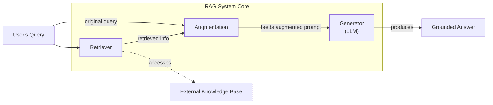
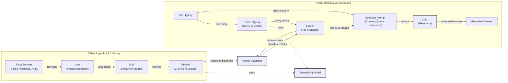
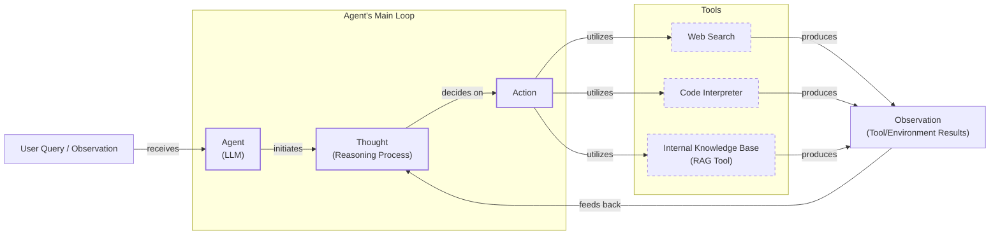

# Lesson 9: Retrieval-Augmented Generation

In our previous lessons, we built a solid foundation in AI Engineering. We explored the agent landscape, distinguished between LLM workflows and autonomous agents, and in Lesson 3, we covered context engineering—the art of managing the information an LLM sees. We've also covered how to get reliable data out of models using structured outputs and how to give them capabilities through tools and reasoning frameworks like ReAct.

Now, we address a core problem: LLMs are trained on a fixed dataset. Their knowledge is static, making them prone to hallucination. They essentially take a "closed-book exam" on the world's information. While fine-tuning can teach a model new skills, it is an expensive and slow way to inject new facts [[1]](https://neo4j.com/blog/developer/fine-tuning-vs-rag/). It is not an efficient way for models to learn over time.

Retrieval-Augmented Generation (RAG) offers a more practical solution. Instead of trying to force a model to memorize everything, we give it an "open-book exam." RAG connects the LLM to external, real-time knowledge sources, allowing it to retrieve relevant information on the fly [[2]](https://blogs.nvidia.com/blog/what-is-retrieval-augmented-generation/). This is a key method within the context engineering discipline we covered in Lesson 3. In this lesson, we will explore the what and how of RAG, from its basic components to the advanced and agentic patterns that power modern AI systems. We will also contrast retrieval with agent memory, a topic we will explore in detail in Lesson 10, where we discuss the short- and long-term memory stores that complement RAG.

## The RAG System: Core Components

Understanding the components of a RAG system is the first step toward designing effective retrieval strategies. At its core, the system is built on three conceptual pillars that work together to ground an LLM's response in external data [[26]](https://humanloop.com/blog/rag-architectures), [[27]](https://www.aimon.ai/posts/rag_and_its_different_components/).

**Retrieval:** This is the engine that finds relevant information. When a user asks a question, the retriever searches an external knowledge base to find the most relevant data snippets. This search can be powered by keyword-based methods like BM25, which excel at finding exact term matches, or by semantic similarity, which finds text that is contextually similar in meaning, even if the wording is different [[51]](https://apxml.com/courses/prompt-engineering-llm-application-development/chapter-6-integrating-llms-external-data-rag/implementing-semantic-search-retrieval). Semantic search is made possible by vector embeddings—numerical representations of text created by an embedding model—which are stored in a specialized vector database for efficient lookup [[52]](https://medium.com/@robi.tomar72/how-rag-actually-works-embeddings-vector-databases-indexing-retrieval-explained-simply-3d1ca45fe1bf).

**Augmentation:** This step constructs the prompt that will be sent to the LLM. It takes the original user query and combines it with the retrieved information. This augmented prompt provides the LLM with the necessary context to formulate an accurate and grounded answer [[56]](https://www.topquadrant.com/resources/blog-retrieval-augmented-generation-explained/). The process involves carefully engineering the prompt template to instruct the model on how to use the provided context effectively.

**Generation:** In the final step, the LLM receives the augmented prompt and generates a response. Because the prompt contains specific, relevant information from the knowledge base, the model's answer is grounded in that external data rather than relying solely on its pre-trained knowledge [[29]](https://www.ibm.com/think/topics/retrieval-augmented-generation). This allows the system to provide answers that are not only accurate but also include citations, making them verifiable.



Image 1: A flowchart illustrating the core components and data flow of a RAG system.

Now that you can name each moving part, let’s see how they line up across the two phases of a real system.

## The RAG Pipeline: Ingestion and Retrieval

A complete RAG system operates in two distinct phases. The first phase happens offline to prepare the data, while the second happens in real-time to answer user queries [[32]](https://newsletter.systemdesign.one/p/how-rag-works).

### Phase 1: Offline Ingestion & Indexing

This is the preparatory phase where you process your knowledge base so it can be searched efficiently. It involves a sequence of steps to transform raw documents into a searchable index [[31]](https://medium.com/@derrickryangiggs/rag-pipeline-deep-dive-ingestion-chunking-embedding-and-vector-search-abd3c8bfc177).

1.  **Load:** The pipeline begins by loading documents from various sources. Frameworks like LangChain and LlamaIndex offer document loaders for this, capable of handling everything from PDFs to APIs.
2.  **Split:** Large documents are broken down into smaller, semantically meaningful chunks using tools like LangChain’s `RecursiveCharacterTextSplitter`. This step is critical because it ensures that the retrieved context is focused and relevant.
3.  **Embed:** An embedding model, such as OpenAI's `text-embedding-3-small` or open-source variants from Hugging Face, converts each text chunk into a numerical vector. These vectors capture the semantic meaning of the text.
4.  **Store:** The vector embeddings and their corresponding text chunks are stored in a vector database like FAISS for local development or scalable solutions like Pinecone, Qdrant, or Milvus. Metadata such as the source document, creation date, or topic is also stored alongside each chunk to enable filtering during retrieval.

### Phase 2: Online Retrieval & Generation

This phase is triggered when a user submits a query. It is the real-time process of finding information and generating an answer [[33]](https://towardsdatascience.com/ragops-guide-building-and-scaling-retrieval-augmented-generation-systems-3d26b3ebd627/).

1.  **Embed Query:** The user's query is converted into a vector using the same embedding model from the ingestion phase. This ensures the query and the document chunks exist in the same vector space.
2.  **Search:** The system, often orchestrated by a LangChain `Runnable` chain or a LlamaIndex `QueryEngine`, searches the vector database to find the document chunks whose embeddings are most similar to the query's embedding.
3.  **Generate:** A prompt is constructed using the original query, the retrieved chunks, and a set of instructions. This augmented prompt is then passed to the LLM, which generates a final answer grounded in the provided context. As we saw in Lesson 4, this answer can be formatted as a structured output, complete with citations for verifiability.



Image 2: A detailed flowchart depicting the end-to-end RAG workflow, divided into two main phases: "Offline Ingestion & Indexing" and "Online Retrieval & Generation".

With the end-to-end path in place, the next question is quality. Let's look at advanced techniques to make retrieval more accurate and useful across messy, real-world data.

## Advanced RAG Techniques

A basic RAG pipeline often struggles with real-world data. To build production-grade systems, we incorporate sophisticated techniques to improve the quality of the retrieved context, leading to more accurate answers.

**Hybrid Search:** This technique combines keyword-based search (like BM25) for precision with vector-based semantic search for meaning. For example, if a user asks, "my bill keeps rolling over," keyword search finds "rollover," while semantic search finds "carryover balance," ensuring comprehensive coverage. The results from both search methods are often merged using a technique called Reciprocal Rank Fusion (RRF) to produce a single, more relevant list of documents [[36]](https://pr-peri.github.io/blogpost/2026/03/05/blogpost-hybrid-search.html).

**Re-ranking:** The initial retrieval step is optimized for speed and recall. Re-ranking introduces a second, more precise model (often a cross-encoder) to re-evaluate and re-order the initial results. A cross-encoder processes the query and a document together, allowing for a deeper understanding of their relevance compared to the separate encoding used in the initial search. For a query like "how to connect my account," a re-ranker would prioritize a step-by-step guide over a press release [[42]](https://redis.io/blog/10-techniques-to-improve-rag-accuracy/).

```mermaid
flowchart LR
  %% Start of the process
  A["User Query"]

  %% Parallel retrieval paths
  subgraph "Retrieval"
    B["BM25 (Keyword) Search"]
    C["Vector (Semantic) Search"]
  end

  A -- "triggers" --> B
  A -- "triggers" --> C

  %% Results from retrieval
  B -- "produces" --> D["BM25 Results"]
  C -- "produces" --> E["Vector Results"]

  %% Combination and re-ranking
  F["Union<br/>(Reciprocal Rank Fusion)"]
  D -- "feeds into" --> F
  E -- "feeds into" --> F

  F -- "combined results" --> G["Re-ranking"]

  G -- "output" --> H["Final Context<br/>for the LLM"]

  %% Visual grouping (without custom styling as per instructions)
  classDef start_end
  classDef retrieval_method
  classDef retrieval_results
  classDef processing_step
  classDef final_output

  class A start_end
  class B,C retrieval_method
  class D,E retrieval_results
  class F,G processing_step
  class H final_output
```

Image 3: A flowchart illustrating the hybrid retrieval flow, starting with a user query, proceeding through parallel BM25 and vector searches, combining results, re-ranking, and finally producing the final context for an LLM.

**Query Transformations:** These techniques rewrite or expand the original query. **Decomposition** breaks a complex question like “What’s our travel policy for conferences in Europe this year?” into sub-questions about the policy, location, and date [[19]](https://docs.nvidia.com/rag/latest/query_decomposition.html). **HyDE** generates a hypothetical answer to the query and uses its embedding for the search, which often aligns better with the language of the source documents [[16]](https://47billion.com/blog/rag-system-in-production-why-it-fails-and-how-to-fix-it/).

**Advanced Chunking Strategies:** Instead of fixed-size chunks, **semantic chunking** groups related sentences, while **layout-aware chunking** preserves the structure of tables and forms. For a pricing table, this ensures that product names, prices, and discounts remain linked [[17]](https://sarthakai.substack.com/p/improve-your-rag-accuracy-with-a).

**GraphRAG:** This approach structures data as a knowledge graph to answer complex, multi-hop questions. For a query like, “Which incidents were caused by weekend deploys that also touched the login service?” GraphRAG can traverse connections between change records, deployment times, affected services, and incident tickets to find the answer [[46]](https://arxiv.org/html/2601.03014v1).

These techniques increase retrieval quality. Next, we’ll see how retrieval becomes one tool that an agent can choose to use as it reasons.

## Agentic RAG

In Lessons 7 and 8, we introduced the ReAct framework, where an agent cycles through Thought, Action, and Observation to solve problems. Agentic RAG is the application of this principle, where retrieval is no longer a fixed step in a pipeline but a tool that a reasoning agent can choose to use.

The core distinction is the shift from a linear workflow to an adaptive, iterative loop [[11]](https://towardsdatascience.com/agentic-rag-vs-classic-rag-from-a-pipeline-to-a-control-loop/).

-   **Standard RAG** is a rigid, predetermined process: Retrieve -> Augment -> Generate.
-   **Agentic RAG** is dynamic. An LLM-based agent decides *when* to retrieve information, *what* to search for, and whether one retrieval is enough. It can reason about the information it finds and decide to take further actions [[14]](https://airbyte.com/agentic-data/ai-agent-vs-rag).

This agentic approach allows the system to iteratively refine its search, choose between different knowledge sources (e.g., `search_emails` vs. `search_tech_docs`), and fuse information from the RAG tool with data from other tools like a web search. A conceptual thought process might look like this:

*   **Thought:** "The user is asking about '2024 EU data retention rules.' Our internal policy documents cite 2023 regulations, which are likely outdated."
*   **Action:** `retrieve(internal_policy, query="EU data retention 2024")`
*   **Observation:** "The retrieved policy mentions amendments but lacks specific citations."
*   **Thought:** "I need external verification to find the latest official directive."
*   **Action:** `web_search(query="EU data retention rules 2024 official directive")`
*   **Observation:** "Found the updated directive from an official source."
*   **Thought:** "Now I can synthesize the information from both the internal policy and the new directive, highlighting the changes."

However, this added autonomy introduces new failure modes. An agent might misinterpret tool outputs, get stuck in a retrieval loop, or cascade reasoning errors through a multi-step workflow [[73]](https://www.okta.com/identity-101/agentic-rag-architecture/). This transforms RAG from a simple database lookup into a conversation with a research assistant—one that is more powerful but also requires more careful design and monitoring.



Image 4: A conceptual flowchart illustrating an agent's main loop, showing the iterative process from user query to thought, action, tool utilization, and observation feedback.

You now understand both a linear RAG pipeline and how an agent can control retrieval when needed. Let’s wrap up by situating RAG in the wider AI Engineering toolkit and previewing what comes next.

## Conclusion

We have seen that RAG is the most widely adopted solution to the fundamental knowledge problem in LLMs. It is a powerful technique for reducing hallucinations, enabling customization with proprietary data, and building user trust through verifiable, source-backed answers. For production-grade quality, advanced techniques are essential, and the future of knowledge retrieval is agentic.

Ultimately, RAG is not a niche skill but a foundational competency for the modern AI Engineer and a core part of context engineering.

In our next lesson, we will explore how agents develop memory. In Lesson 10, we will cover how short-term and long-term memory systems complement the retrieval mechanisms we discussed today, allowing agents to build on past interactions and retain knowledge over time. Further on in the course, we will also tackle crucial topics like evaluating retrieval quality and monitoring these complex systems in production.

## References

- [1] https://neo4j.com/blog/developer/fine-tuning-vs-rag/
- [2] https://blogs.nvidia.com/blog/what-is-retrieval-augmented-generation/
- [3] https://towardsai.net/p/l/a-complete-guide-to-rag
- [4] https://decodingml.substack.com/p/rag-fundamentals-first?utm_source=publication-search
- [5] https://decodingml.substack.com/p/your-rag-is-wrong-heres-how-to-fix?utm_source=publication-search
- [6] https://arxiv.org/html/2404.16130
- [7] https://www.anthropic.com/news/contextual-retrieval
- [8] https://weaviate.io/blog/what-is-agentic-rag
- [9] https://www.llamaindex.ai/blog/rag-is-dead-long-live-agentic-retrieval
- [10] https://www.ibm.com/think/topics/agentic-rag
- [11] https://towardsdatascience.com/agentic-rag-vs-classic-rag-from-a-pipeline-to-a-control-loop/
- [12] https://www.pingcap.com/article/agentic-rag-vs-traditional-rag-key-differences-benefits/
- [13] https://medium.com/@gaddam.rahul.kumar/agentic-rag-vs-traditional-rag-b1a156f72167
- [14] https://airbyte.com/agentic-data/ai-agent-vs-rag
- [15] https://domino.ai/blog/rag-vs-agentic-ai
- [16] https://47billion.com/blog/rag-system-in-production-why-it-fails-and-how-to-fix-it/
- [17] https://sarthakai.substack.com/p/improve-your-rag-accuracy-with-a
- [18] https://cloudurable.com/blog/advanced-rag-techniques-that-will-transform-your-l/
- [19] https://docs.nvidia.com/rag/latest/query_decomposition.html
- [20] https://neo4j.com/blog/genai/advanced-rag-techniques/
- [21] https://medium.com/@fahey_james/retrieval-augmented-generation-building-grounded-ai-for-enterprise-knowledge-6bc46277fee5
- [22] https://www.mindstudio.ai/blog/what-is-rag/
- [23] https://zerogravitymarketing.com/blog/the-science-behind-rag
- [24] https://www.kernshell.com/how-rag-reduces-ai-hallucinations-and-improves-accuracy/
- [25] https://www.madrona.com/rag-inventor-talks-agents-grounded-ai-and-enterprise-impact/
- [26] https://humanloop.com/blog/rag-architectures
- [27] https://www.aimon.ai/posts/rag_and_its_different_components/
- [28] https://toloka.ai/blog/grounding-llms-driving-ai-to-deliver-contextually-relevant-data/
- [29] https://www.ibm.com/think/topics/retrieval-augmented-generation
- [30] https://galileo.ai/blog/rag-architecture
- [31] https://medium.com/@derrickryangiggs/rag-pipeline-deep-dive-ingestion-chunking-embedding-and-vector-search-abd3c8bfc177
- [32] https://newsletter.systemdesign.one/p/how-rag-works
- [33] https://towardsdatascience.com/ragops-guide-building-and-scaling-retrieval-augmented-generation-systems-3d26b3ebd627/
- [34] https://apxml.com/courses/optimizing-rag-for-production/chapter-6-advanced-rag-evaluation-monitoring/rag-offline-online-evaluation
- [35] https://aws.amazon.com/what-is/retrieval-augmented-generation/
- [36] https://pr-peri.github.io/blogpost/2026/03/05/blogpost-hybrid-search.html
- [37] https://www.chitika.com/hybrid-retrieval-rag/
- [38] https://mlpills.substack.com/p/issue-76-optimize-rag-with-hybrid
- [39] https://cubitrek.com/blog/hybrid-search-optimization-how-bm25-and-dense-vector-retrieval-work-together-for-superior-ai-search/
- [40] https://community.netapp.com/t5/Tech-ONTAP-Blogs/Hybrid-RAG-in-the-Real-World-Graphs-BM25-and-the-End-of-Black-Box-Retrieval/ba-p/464834
- [41] https://arxiv.org/html/2407.00072v5
- [42] https://redis.io/blog/10-techniques-to-improve-rag-accuracy/
- [43] https://apxml.com/courses/optimizing-rag-for-production/chapter-2-advanced-retrieval-optimization/reranking-architectures-rag
- [44] https://neo4j.com/blog/genai/advanced-rag-techniques/
- [45] https://towardsdatascience.com/advanced-rag-retrieval-cross-encoders-reranking/
- [46] https://arxiv.org/html/2601.03014v1
- [47] https://www.chitika.com/graph-based-retrieval-rag/
- [48] https://webhome.cs.uvic.ca/~thomo/papers/asonam2025-graphrag.pdf
- [49] https://atlan.com/know/what-is-graphrag/
- [50] https://arxiv.org/html/2501.00309v2
- [51] https://apxml.com/courses/prompt-engineering-llm-application-development/chapter-6-integrating-llms-external-data-rag/implementing-semantic-search-retrieval
- [52] https://medium.com/@robi.tomar72/how-rag-actually-works-embeddings-vector-databases-indexing-retrieval-explained-simply-3d1ca45fe1bf
- [53] https://learnopencv.com/vector-db-and-rag-pipeline-for-document-rag/
- [54] https://towardsdatascience.com/rag-explained-understanding-embeddings-similarity-and-retrieval/
- [55] https://tutorialsdojo.com/aws-vector-databases-explained-semantic-search-and-rag-systems/
- [56] https://www.topquadrant.com/resources/blog-retrieval-augmented-generation-explained/
- [57] https://www.linkedin.com/posts/haruiz_building-trustworthy-rag-systems-with-in-activity-7310729777227669505-nd6u
- [58] https://medium.com/@rahulraut.techuse/introduction-to-augmenting-llms-using-retrieval-augmented-generation-rag-6530123dbb91
- [59] https://www.promptingguide.ai/research/rag
- [60] https://medium.com/@tejpal.abhyuday/retrieval-augmented-generation-rag-from-basics-to-advanced-a2b068fd5760
- [61] https://dev.to/dowhatmatters/embedding-drift-the-quiet-killer-of-retrieval-quality-in-rag-systems-4l5m
- [62] https://arxiv.org/pdf/2506.21568
- [63] https://apxml.com/courses/large-scale-distributed-rag/chapter-6-advanced-rag-architectures-techniques/multi-hop-iterative-rag-scale
- [64] https://docs.cohere.com/page/chunking-strategies
- [65] https://www.equitus.ai/post/knowledge-graph
- [66] https://machinelearningmastery.com/vector-databases-vs-graph-rag-for-agent-memory-when-to-use-which/
- [67] https://www.ibm.com/think/topics/agentic-rag
- [68] https://www.okta.com/identity-101/agentic-rag-architecture/
- [69] https://www.digitalapplied.com/blog/agentic-rag-patterns-multi-step-reasoning-guide
- [70] https://learn.microsoft.com/en-us/azure/developer/ai/advanced-retrieval-augmented-generation
- [71] https://highlearningrate.substack.com/p/the-rise-of-rag
- [72] https://www.llamaindex.ai/blog/rag-is-dead-long-live-agentic-retrieval
- [73] https://www.okta.com/identity-101/agentic-rag-architecture/