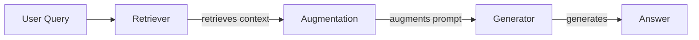
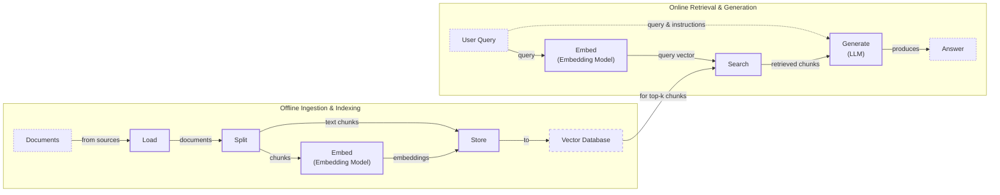
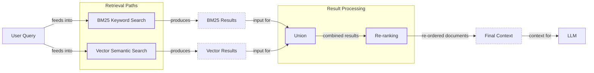
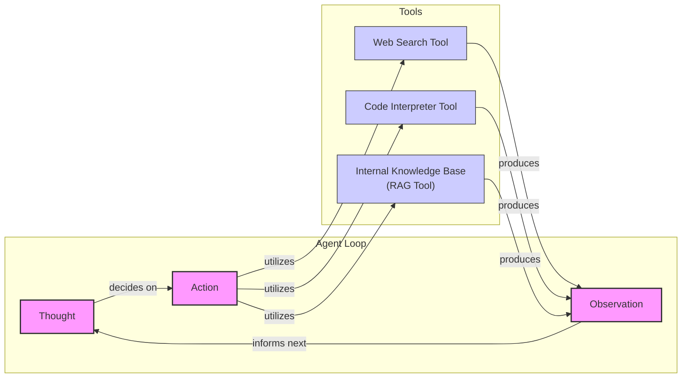

# Retrieval-Augmented Generation (RAG) Fundamentals First

In our previous lessons, we built a foundation in AI Engineering. We explored the landscape of AI agents, distinguished between rule-based workflows and autonomous agents, and, in Lesson 3, introduced Context Engineering—the art of managing information flow to an LLM. We also learned how to build reasoning agents from scratch using the ReAct framework. Now, we will tackle a core problem in AI: LLMs are trained on a fixed dataset, making their knowledge static and prone to hallucination. They take a "closed-book exam" on the world's information.

While we can fine-tune models to update their knowledge, the process is often inefficient and doesn't scale well for information that changes constantly. We need a way for models to learn and access new information after they have been deployed. This is where Retrieval-Augmented Generation (RAG) becomes a reliable solution. With RAG, we give the LLM an "open-book exam" by connecting it to external, real-time knowledge sources. Instead of forcing the model to memorize everything, we allow it to look up information from cheat sheets, manuals, or documents, much like a human would.

RAG is a fundamental technique AI engineers use in the Context Engineering process. It allows us to curate the context we provide to LLMs, ensuring the information is relevant and up-to-date. In this lesson, we will explore the "what" and "how" of RAG, starting with its basic components and moving toward the advanced and agentic patterns that power modern AI systems. We will also briefly touch upon how RAG complements an agent's memory, a topic we will explore in detail in Lesson 10.

With the problem and motivation clear, we’ll first decompose RAG into its core components so you can see where each responsibility lives.

## The RAG System: Core Components

Understanding the core components of a RAG system is the first step in the Context Engineering process we discussed in Lesson 3. By breaking down the system, you can better design and optimize how information flows from your knowledge base to the LLM. A RAG system is built on three conceptual pillars: Retrieval, Augmentation, and Generation.

**Retrieval** is the engine that finds relevant information. When a user asks a question, the retrieval system searches an external knowledge base to find documents or data snippets that are most likely to contain the answer. The most common approach for this is semantic similarity search, which relies on vector embeddings. Text is converted into numerical representations (embeddings) that capture its meaning. These embeddings are stored in a specialized vector database. When a query comes in, it is also converted into an embedding, and the system finds the vectors in the database that are "closest" in meaning [[52]](https://medium.com/@robi.tomar72/how-rag-actually-works-embeddings-vector-databases-indexing-retrieval-explained-simply-3d1ca45fe1bf). Another popular method is keyword-based search, using algorithms like BM25, which excels at finding exact matches for specific terms [[38]](https://mlpills.substack.com/p/issue-76-optimize-rag-with-hybrid).

**Augmentation** is the process of taking the retrieved information and preparing it for the LLM. The system combines the original user query with the retrieved data, formatting it all into a single, comprehensive prompt. This augmented prompt provides the LLM with the necessary context to generate a well-informed response.

**Generation** is the final step. The LLM receives the augmented prompt and uses the provided context to formulate an answer. Because the answer is based on the external data, it is "grounded" in verifiable sources, which significantly reduces the risk of hallucination and improves the overall accuracy of the response [[29]](https://www.ibm.com/think/topics/retrieval-augmented-generation).

Image 1: A flowchart illustrating the core components and data flow of a Retrieval Augmented Generation (RAG) system.

Now that you can name each moving part, let’s see how they line up across the two phases of a real system.

## The RAG Pipeline: Ingestion and Retrieval

The end-to-end RAG workflow is typically split into two distinct phases: an offline phase for preparing the data and an online phase for answering user queries in real-time. This separation allows us to perform the computationally intensive work of indexing our knowledge base ahead of time, ensuring that the retrieval process is fast and efficient when a user is waiting for an answer [[32]](https://newsletter.systemdesign.one/p/how-rag-works).

### Phase 1: Offline Ingestion & Indexing

The ingestion pipeline is where we process our external documents and prepare them for retrieval. This is a critical step, as the quality of our indexed data directly impacts the performance of the entire RAG system. This pipeline consists of four main steps [[31]](https://medium.com/@derrickryangiggs/rag-pipeline-deep-dive-ingestion-chunking-embedding-and-vector-search-abd3c8bfc177).

-   **Load:** The first step is to load the documents from their various sources. These can be anything from PDFs and web pages to data from APIs. Tools like LangChain's document loaders or LlamaIndex's readers are commonly used to handle this data extraction.
-   **Split:** Since LLMs have a limited context window, we cannot feed them entire documents at once. We split the content into smaller, more manageable pieces called chunks. The goal is to create chunks that are semantically meaningful and self-contained, avoiding cuts in the middle of a sentence or idea. This can be done with simple rule-based splitters, like LangChain’s `RecursiveCharacterTextSplitter`, or more advanced semantic chunkers.
-   **Embed:** Next, each chunk is passed through an embedding model, which converts the text into a vector embedding. This numerical representation captures the semantic meaning of the chunk. Popular embedding models include OpenAI's `text-embedding-3` series, Google's `text-embedding-004`, and open-source models like BGE variants available on Hugging Face.
-   **Store:** Finally, the embeddings and their corresponding text chunks are stored in a vector database. This database is optimized for fast similarity searches, allowing the system to quickly find the most relevant chunks for a given query. Examples of vector stores include local options like FAISS and production-grade databases like Qdrant, Milvus, and Pinecone.

### Phase 2: Online Retrieval & Generation

This is the real-time part of the RAG pipeline, which is triggered every time a user submits a query.

-   **Query:** The user asks a question. In more advanced systems, this query might be normalized or expanded to improve its chances of matching relevant documents.
-   **Embed:** The user's query is converted into a vector embedding using the same model that was used during the ingestion phase. This ensures that the query and the document chunks are in the same vector space, making them comparable.
-   **Search:** The query vector is then used to search the vector database. The system performs a similarity search (like cosine similarity) to find the top-k document chunks whose embeddings are most similar to the query's embedding.
-   **Generate:** The retrieved chunks are combined with the original user query and a set of instructions to form an augmented prompt. This prompt is then passed to an LLM, which generates a final answer grounded in the provided context. As we learned in Lesson 4, we can use structured outputs to format this answer and include citations, making the response verifiable and trustworthy.

Image 2: A detailed Mermaid diagram illustrating the end-to-end RAG workflow, divided into two distinct phases: 'Offline Ingestion & Indexing' and 'Online Retrieval & Generation'.

With the end-to-end path in place, the next question is quality. What are the advanced techniques to make the retrieval more accurate and useful across messy, real-world data?

## Advanced RAG Techniques

A naive RAG pipeline is a good starting point, but production systems often require more sophisticated techniques to handle the complexities of real-world data and user queries. These advanced methods focus on improving the quality and relevance of the retrieved information, which directly translates to more accurate and helpful generated answers.

### Hybrid Search

Vector search is excellent at understanding the semantic meaning of a query, but it can sometimes miss exact matches for keywords, acronyms, or specific identifiers. Hybrid search solves this by combining the strengths of semantic search with traditional keyword-based search, like BM25 [[39]](https://cubitrek.com/blog/hybrid-search-optimization-how-bm25-and-dense-vector-retrieval-work-together-for-superior-ai-search/). This dual approach ensures that you capture both conceptually related content and documents containing precise terms.

For example, in a customer support scenario, a user might ask, "My bill keeps rolling over." A keyword search would find articles containing the exact term "rollover," while a semantic search would also surface guides that talk about a "carryover balance." By combining both, the system can provide a more comprehensive set of relevant documents.

### Re-ranking

The initial retrieval step is optimized for speed and recall, meaning it aims to quickly find a broad set of potentially relevant documents. However, the most relevant document might not always be at the top of this initial list. Re-ranking introduces a second, more precise scoring step. After the initial retrieval, a more powerful model, often a cross-encoder, re-evaluates the top-k candidates [[42]](https://redis.io/blog/10-techniques-to-improve-rag-accuracy/).

Unlike the first-pass model that creates separate embeddings for the query and documents, a cross-encoder processes the query and each document together, allowing for a deeper understanding of their relevance [[43]](https://apxml.com/courses/optimizing-rag-for-production/chapter-2-advanced-retrieval-optimization/reranking-architectures-rag). For instance, if a user asks, "How do I connect my account?", the re-ranker can push a step-by-step setup guide to the top of the list, above a less relevant press release or community forum thread.

Image 3: A Mermaid diagram illustrating the hybrid retrieval flow.

### Query Transformations

Sometimes, the user's query is not in the ideal format for retrieval. Query transformation techniques rewrite or expand the query to improve its chances of matching the right documents.

-   **Decomposition:** This involves breaking down a complex, multi-part question into several simpler sub-questions [[19]](https://docs.nvidia.com/rag/latest/query_decomposition.html). The system then retrieves documents for each sub-question and merges the results. For example, the query "What’s our travel policy for conferences in Europe this year?" could be broken down into: "Where is the travel policy?", "What are the rules for Europe?", and "What has changed this year?".
-   **Hypothetical Document Embeddings (HyDE):** This technique prompts an LLM to generate a short, hypothetical answer to the user's query *before* the retrieval step [[16]](https://47billion.com/blog/rag-system-in-production-why-it-fails-and-how-to-fix-it/). This generated text, which is likely to be phrased similarly to the actual documents in the knowledge base, is then converted to an embedding and used for the search. This bridges the gap between the language of questions and the language of answers.

### Advanced Chunking Strategies

How you split your documents can have a huge impact on retrieval quality. Moving beyond simple fixed-size chunks can help preserve the context and structure of your information.

-   **Semantic Chunking:** Instead of splitting by a fixed number of characters, this method groups semantically related sentences or paragraphs together [[18]](https://cloudurable.com/blog/advanced-rag-techniques-that-will-transform-your-l/). For example, when processing a company handbook, semantic chunking would keep the entire "Reimbursements" section intact, ensuring that rules and spending caps are not separated across different chunks.
-   **Layout-aware Chunking:** For documents with complex layouts like tables or forms, this approach preserves the structure. For instance, when processing a pricing table, it ensures that each row (product, price, discount) remains a single unit, preventing the model from receiving fragmented and meaningless data.

### GraphRAG

For questions that involve complex relationships and interconnected data, standard document retrieval can fall short. GraphRAG addresses this by first constructing a knowledge graph from the source documents, where entities (like people, companies, or products) are nodes and their relationships are edges [[46]](https://arxiv.org/html/2601.03014v1). This structured representation allows the system to answer multi-hop questions that require reasoning across multiple entities and documents.

For example, to answer "Which IT incidents were caused by weekend deployments that also affected the login service?", the system can traverse the graph, connecting change records to deployment times, affected services, and incident tickets to surface the relevant post-mortems [[50]](https://arxiv.org/html/2501.00309v2). This approach excels at understanding the "how" and "why" behind the data, not just retrieving isolated facts.

These techniques increase retrieval quality. Next, we’ll see how retrieval becomes one tool that an agent can choose to use as it reasons.

## Agentic RAG

In Lessons 7 and 8, we explored the ReAct framework, where an agent cycles through a loop of Thought, Action, and Observation. Agentic RAG is the application of this concept, where retrieval is no longer a fixed step in a pipeline but a dynamic tool that an agent can choose to use as part of its reasoning process [[13]](https://medium.com/@gaddam.rahul.kumar/agentic-rag-vs-traditional-rag-b1a156f72167).

The core distinction is the shift from a linear workflow to an adaptive loop. Standard RAG follows a rigid path: Retrieve → Augment → Generate. In contrast, an agentic system can decide *when* to retrieve, *what* to retrieve, and even *if* retrieval is necessary at all [[11]](https://towardsdatascience.com/agentic-rag-vs-classic-rag-from-a-pipeline-to-a-control-loop/).

This agentic approach unlocks several powerful capabilities:

-   **Iterative Retrieval:** The agent can use the RAG tool multiple times, refining its query based on initial findings. For example, if a first search for a policy returns a vague document, the agent can form a new, more specific query, such as "EU customer policy, 2024 updates," and retrieve again to find the precise information.
-   **Tool Selection:** An agent can have access to multiple knowledge sources or tools. It can reason about the user's query and choose the most appropriate one. For an IT outage, it might decide to `search_incident_runbooks` instead of `search_marketing_pages`.
-   **Information Fusion:** The agent can combine information from its internal RAG tool with data from other tools, like a live web search. For instance, it could retrieve an internal company policy and then use a web search to check for recent regulatory changes that might affect it, synthesizing both sources into a comprehensive answer.
-   **Knowledge Base Updates:** An agent can even decide to update the knowledge base with new information it discovers. We will explore this concept of memory in more detail in our next lesson, but it highlights how an agent can contribute to the long-term knowledge of the system.

Consider this simplified thought process for an agent handling a complex query:
*Thought: The user is asking about '2024 EU data retention rules.' Our internal policy is from 2023 and is likely outdated.*
*Action: `retrieve(internal_policy, query="EU data retention 2024")`*
*Observation: The retrieved document mentions recent amendments but lacks specific citations.*
*Thought: I need to verify this externally.*
*Action: `web_search(query="EU data retention rules 2024 official directive")`*
*Observation: I found the updated directive on the official EU portal.*
*Thought: Now I can synthesize the information from both our internal policy and the new directive, highlighting the changes.*

This turns a simple database lookup into a dynamic conversation with a research assistant.

Image 4: A conceptual Mermaid diagram illustrating an agent's main loop in an Agentic RAG system.

You now understand both a linear RAG pipeline and how an agent can control retrieval when needed. Let’s wrap up by situating RAG in the wider AI Engineering toolkit and previewing what comes next.

## Conclusion

In this lesson, we have explored Retrieval-Augmented Generation from its fundamental components to its advanced, agentic applications. We have learned that RAG is the most widely used solution to the LLM knowledge problem, providing a way to ground models in external, verifiable data. For production-grade systems, advanced techniques like hybrid search, re-ranking, and GraphRAG are essential for achieving high-quality results. The future of knowledge retrieval is agentic, where RAG becomes a dynamic tool in an intelligent agent's toolkit.

The core benefits of RAG are clear: it reduces hallucinations, enables customization with proprietary data, and builds user trust through source-based answers. As a subset of Context Engineering, RAG is not just a niche skill but a foundational competency for any modern AI Engineer.

In our next lesson, we will dive into Memory for Agents, exploring how short-term and long-term memory systems complement the retrieval capabilities we have discussed here. We will also cover other critical topics like retrieval quality evaluation and production monitoring later in the course, building on the foundation we have established today.

## References

- [1] Knowledge Graphs and LLMs: Fine-Tuning vs. Retrieval-Augmented Generation (https://neo4j.com/blog/developer/fine-tuning-vs-rag/)
- [3] Addressing AI hallucinations with retrieval-augmented generation (https://www.infoworld.com/article/2335043/addressing-ai-hallucinations-with-retrieval-augmented-generation.html)
- [4] Fine-Tuning or Retrieval? Comparing Knowledge Injection in LLMs (https://aclanthology.org/2024.emnlp-main.15.pdf)
- [5] Fine-Tuning or Retrieval? Comparing Knowledge Injection in LLMs (https://arxiv.org/html/2312.05934v3)
- [6] Vector Databases in Practice: Building a Realistic Hybrid-Search RAG System with Qdrant (https://pub.towardsai.net/vector-databases-in-practice-building-a-realistic-hybrid-search-rag-system-with-qdrant-7b8f4a6e41e0)
- [7] AWS Vector Databases Explained: Powering Semantic Search and RAG Systems (https://tutorialsdojo.com/aws-vector-databases-explained-semantic-search-and-rag-systems/)
- [8] What is RAG: Understanding Retrieval-Augmented Generation (https://qdrant.tech/articles/what-is-rag-in-ai/)
- [9] Vector Embeddings in RAG Applications (https://wandb.ai/mostafaibrahim17/ml-articles/reports/Vector-Embeddings-in-RAG-Applications--Vmlldzo3OTk1NDA5)
- [11] Agentic RAG vs Classic RAG: From a Pipeline to a Control Loop (https://towardsdatascience.com/agentic-rag-vs-classic-rag-from-a-pipeline-to-a-control-loop/)
- [12] Agentic RAG vs. Traditional RAG: Key Differences And Benefits (https://www.pingcap.com/article/agentic-rag-vs-traditional-rag-key-differences-benefits/)
- [13] Agentic RAG vs Traditional RAG (https://medium.com/@gaddam.rahul.kumar/agentic-rag-vs-traditional-rag-b1a156f72167)
- [14] AI Agent vs RAG: What’s the Difference? (https://airbyte.com/agentic-data/ai-agent-vs-rag)
- [15] RAG vs Agentic AI: Understanding the Differences (https://domino.ai/blog/rag-vs-agentic-ai)
- [16] Why RAG systems in production fail and how to fix it (https://47billion.com/blog/rag-system-in-production-why-it-fails-and-how-to-fix-it/)
- [18] Advanced RAG Techniques That Will Transform Your LLM Applications (https://cloudurable.com/blog/advanced-rag-techniques-that-will-transform-your-l/)
- [19] Query Decomposition (https://docs.nvidia.com/rag/latest/query_decomposition.html)
- [20] Advanced RAG Techniques for High-Performance LLM Applications (https://neo4j.com/blog/genai/advanced-rag-techniques/)
- [21] Retrieval-Augmented Generation: Building Grounded AI for Enterprise Knowledge (https://medium.com/@fahey_james/retrieval-augmented-generation-building-grounded-ai-for-enterprise-knowledge-6bc46277fee5)
- [22] What is RAG? (https://www.mindstudio.ai/blog/what-is-rag/)
- [25] RAG Inventor Talks Agents, Grounded AI, and Enterprise Impact (https://www.madrona.com/rag-inventor-talks-agents-grounded-ai-and-enterprise-impact/)
- [26] RAG Architectures (https://humanloop.com/blog/rag-architectures)
- [27] RAG and its Different Components (https://www.aimon.ai/posts/rag_and_its_different_components/)
- [28] Grounding LLMs: Driving AI to Deliver Contextually-Relevant Data (https://toloka.ai/blog/grounding-llms-driving-ai-to-deliver-contextually-relevant-data/)
- [29] What is retrieval-augmented generation? (https://www.ibm.com/think/topics/retrieval-augmented-generation)
- [30] What is RAG Architecture? (https://galileo.ai/blog/rag-architecture)
- [31] RAG Pipeline Deep Dive: Ingestion (Chunking, Embedding, and Vector Search) (https://medium.com/@derrickryangiggs/rag-pipeline-deep-dive-ingestion-chunking-embedding-and-vector-search-abd3c8bfc177)
- [32] How RAG Works (https://newsletter.systemdesign.one/p/how-rag-works)
- [33] RAGOps Guide: Building and Scaling Retrieval-Augmented Generation Systems (https://towardsdatascience.com/ragops-guide-building-and-scaling-retrieval-augmented-generation-systems-3d26b3ebd627/)
- [35] What is Retrieval-Augmented Generation (RAG)? (https://aws.amazon.com/what-is/retrieval-augmented-generation/)
- [37] Hybrid Retrieval in RAG: Combining BM25 and FAISS for Enhanced Performance (https://www.chitika.com/hybrid-retrieval-rag/)
- [38] Issue #76: Optimize RAG with Hybrid Search (https://mlpills.substack.com/p/issue-76-optimize-rag-with-hybrid)
- [39] Hybrid Search Optimization: How BM25 and Dense Vector Retrieval Work Together for Superior AI Search (https://cubitrek.com/blog/hybrid-search-optimization-how-bm25-and-dense-vector-retrieval-work-together-for-superior-ai-search/)
- [40] Hybrid RAG in the Real World: Graphs, BM25, and the End of Black Box Retrieval (https://community.netapp.com/t5/Tech-ONTAP-Blogs/Hybrid-RAG-in-the-Real-World-Graphs-BM25-and-the-End-of-Black-Box-Retrieval/ba-p/464834)
- [41] Pistis-RAG: Enhancing Retrieval-Augmented Generation with Human Feedback (https://arxiv.org/html/2407.00072v5)
- [42] 10 techniques to improve RAG accuracy (https://redis.io/blog/10-techniques-to-improve-rag-accuracy/)
- [43] Reranking Architectures in RAG (https://apxml.com/courses/optimizing-rag-for-production/chapter-2-advanced-retrieval-optimization/reranking-architectures-rag)
- [44] Advanced RAG Techniques for High-Performance LLM Applications (https://neo4j.com/blog/genai/advanced-rag-techniques/)
- [45] Advanced RAG Retrieval: Cross-Encoders & Re-ranking (https://towardsdatascience.com/advanced-rag-retrieval-cross-encoders-reranking/45323948574d)
- [46] GraphRAG: A Graph-Based Approach for Retrieval-Augmented Generation (https://arxiv.org/html/2601.03014v1)
- [47] Graph-Based Retrieval in RAG: Integrating Knowledge Graphs for Contextual Reasoning (https://www.chitika.com/graph-based-retrieval-rag/)
- [48] GraphRAG: A Graph-Based Approach to Retrieval-Augmented Generation for Global Sensemaking (https://webhome.cs.uvic.ca/~thomo/papers/asonam2025-graphrag.pdf)
- [49] What Is GraphRAG? The Next Evolution of RAG Architecture (https://atlan.com/know/what-is-graphrag/)
- [50] GraphRAG: A Graph-based Retrieval Augmented Generation Approach for Multi-hop Question Answering (https://arxiv.org/html/2501.00309v2)
- [51] Implementing Semantic Search for Retrieval (https://apxml.com/courses/prompt-engineering-llm-application-development/chapter-6-integrating-llms-external-data-rag/implementing-semantic-search-retrieval)
- [52] How RAG Actually Works: Embeddings, Vector Databases, Indexing & Retrieval Explained Simply (https://medium.com/@robi.tomar72/how-rag-actually-works-embeddings-vector-databases-indexing-retrieval-explained-simply-3d1ca45fe1bf)
- [53] Vector DB and RAG Pipeline for Document RAG (https://learnopencv.com/vector-db-and-rag-pipeline-for-document-rag/)
- [54] RAG Explained: Understanding Embeddings, Similarity, and Retrieval (https://towardsdatascience.com/rag-explained-understanding-embeddings-similarity-and-retrieval/545053e6804a)
- [55] AWS Vector Databases Explained: Powering Semantic Search and RAG Systems (https://tutorialsdojo.com/aws-vector-databases-explained-semantic-search-and-rag-systems/)
- [56] Retrieval Augmented Generation Explained (https://www.topquadrant.com/resources/blog-retrieval-augmented-generation-explained/)
- [58] Introduction to Augmenting LLMs Using Retrieval-Augmented Generation(RAG) (https://medium.com/@rahulraut.techuse/introduction-to-augmenting-llms-using-retrieval-augmented-generation-rag-6530123dbb91)
- [59] Retrieval-Augmented Generation (RAG) (https://www.promptingguide.ai/research/rag)
- [60] Retrieval Augmented Generation (RAG) from Basics to Advanced (https://medium.com/@tejpal.abhyuday/retrieval-augmented-generation-rag-from-basics-to-advanced-a2b068fd576c)# Retrieval-Augmented Generation (RAG) Fundamentals First

In our previous lessons, we built a foundation in AI Engineering. We explored the landscape of AI agents, distinguished between rule-based workflows and autonomous agents, and, in Lesson 3, introduced Context Engineering—the art of managing information flow to an LLM. We also learned how to build reasoning agents from scratch using the ReAct framework. Now, we will tackle a core problem in AI: LLMs are trained on a fixed dataset, making their knowledge static and prone to hallucination. They take a "closed-book exam" on the world's information.

While we can fine-tune models to update their knowledge, the process is often inefficient and doesn't scale well for information that changes constantly. We need a way for models to learn and access new information after they have been deployed. This is where Retrieval-Augmented Generation (RAG) becomes a reliable solution. With RAG, we give the LLM an "open-book exam" by connecting it to external, real-time knowledge sources. Instead of forcing the model to memorize everything, we allow it to look up information from cheat sheets, manuals, or documents, much like a human would.

RAG is a fundamental technique AI engineers use in the Context Engineering process. It allows us to curate the context we provide to LLMs, ensuring the information is relevant and up-to-date. In this lesson, we will explore the "what" and "how" of RAG, starting with its basic components and moving toward the advanced and agentic patterns that power modern AI systems. We will also briefly touch upon how RAG complements an agent's memory, a topic we will explore in detail in Lesson 10.

With the problem and motivation clear, we’ll first decompose RAG into its core components so you can see where each responsibility lives.

## The RAG System: Core Components

Understanding the core components of a RAG system is the first step in the Context Engineering process we discussed in Lesson 3. By breaking down the system, you can better design and optimize how information flows from your knowledge base to the LLM. A RAG system is built on three conceptual pillars: Retrieval, Augmentation, and Generation.

**Retrieval** is the engine that finds relevant information. When a user asks a question, the retrieval system searches an external knowledge base to find documents or data snippets that are most likely to contain the answer. The most common approach for this is semantic similarity search, which relies on vector embeddings. Text is converted into numerical representations (embeddings) that capture its meaning. These embeddings are stored in a specialized vector database. When a query comes in, it is also converted into an embedding, and the system finds the vectors in the database that are "closest" in meaning [[52]](https://medium.com/@robi.tomar72/how-rag-actually-works-embeddings-vector-databases-indexing-retrieval-explained-simply-3d1ca45fe1bf). Another popular method is keyword-based search, using algorithms like BM25, which excels at finding exact matches for specific terms [[38]](https://mlpills.substack.com/p/issue-76-optimize-rag-with-hybrid).

**Augmentation** is the process of taking the retrieved information and preparing it for the LLM. The system combines the original user query with the retrieved data, formatting it all into a single, comprehensive prompt. This augmented prompt provides the LLM with the necessary context to generate a well-informed response.

**Generation** is the final step. The LLM receives the augmented prompt and uses the provided context to formulate an answer. Because the answer is based on the external data, it is "grounded" in verifiable sources, which significantly reduces the risk of hallucination and improves the overall accuracy of the response [[29]](https://www.ibm.com/think/topics/retrieval-augmented-generation).

Image 1: A flowchart illustrating the core components and data flow of a Retrieval Augmented Generation (RAG) system.

Now that you can name each moving part, let’s see how they line up across the two phases of a real system.

## The RAG Pipeline: Ingestion and Retrieval

The end-to-end RAG workflow is typically split into two distinct phases: an offline phase for preparing the data and an online phase for answering user queries in real-time. This separation allows us to perform the computationally intensive work of indexing our knowledge base ahead of time, ensuring that the retrieval process is fast and efficient when a user is waiting for an answer [[32]](https://newsletter.systemdesign.one/p/how-rag-works).

### Phase 1: Offline Ingestion & Indexing

The ingestion pipeline is where we process our external documents and prepare them for retrieval. This is a critical step, as the quality of our indexed data directly impacts the performance of the entire RAG system. This pipeline consists of four main steps [[31]](https://medium.com/@derrickryangiggs/rag-pipeline-deep-dive-ingestion-chunking-embedding-and-vector-search-abd3c8bfc177).

-   **Load:** The first step is to load the documents from their various sources. These can be anything from PDFs and web pages to data from APIs. Tools like LangChain's document loaders or LlamaIndex's readers are commonly used to handle this data extraction.
-   **Split:** Since LLMs have a limited context window, we cannot feed them entire documents at once. We split the content into smaller, more manageable pieces called chunks. The goal is to create chunks that are semantically meaningful and self-contained, avoiding cuts in the middle of a sentence or idea. This can be done with simple rule-based splitters, like LangChain’s `RecursiveCharacterTextSplitter`, or more advanced semantic chunkers.
-   **Embed:** Next, each chunk is passed through an embedding model, which converts the text into a vector embedding. This numerical representation captures the semantic meaning of the chunk. Popular embedding models include OpenAI's `text-embedding-3` series, Google's `text-embedding-004`, and open-source models like BGE variants available on Hugging Face.
-   **Store:** Finally, the embeddings and their corresponding text chunks are stored in a vector database. This database is optimized for fast similarity searches, allowing the system to quickly find the most relevant chunks for a given query. Examples of vector stores include local options like FAISS and production-grade databases like Qdrant, Milvus, and Pinecone.

### Phase 2: Online Retrieval & Generation

This is the real-time part of the RAG pipeline, which is triggered every time a user submits a query.

-   **Query:** The user asks a question. In more advanced systems, this query might be normalized or expanded to improve its chances of matching relevant documents.
-   **Embed:** The user's query is converted into a vector embedding using the same model that was used during the ingestion phase. This ensures that the query and the document chunks are in the same vector space, making them comparable.
-   **Search:** The query vector is then used to search the vector database. The system performs a similarity search (like cosine similarity) to find the top-k document chunks whose embeddings are most similar to the query's embedding.
-   **Generate:** The retrieved chunks are combined with the original user query and a set of instructions to form an augmented prompt. This prompt is then passed to an LLM, which generates a final answer grounded in the provided context. As we learned in Lesson 4, we can use structured outputs to format this answer and include citations, making the response verifiable and trustworthy.

Image 2: A detailed Mermaid diagram illustrating the end-to-end RAG workflow, divided into two distinct phases: 'Offline Ingestion & Indexing' and 'Online Retrieval & Generation'.

With the end-to-end path in place, the next question is quality. What are the advanced techniques to make the retrieval more accurate and useful across messy, real-world data?

## Advanced RAG Techniques

A naive RAG pipeline is a good starting point, but production systems often require more sophisticated techniques to handle the complexities of real-world data and user queries. These advanced methods focus on improving the quality and relevance of the retrieved information, which directly translates to more accurate and helpful generated answers.

### Hybrid Search

Vector search is excellent at understanding the semantic meaning of a query, but it can sometimes miss exact matches for keywords, acronyms, or specific identifiers. Hybrid search solves this by combining the strengths of semantic search with traditional keyword-based search, like BM25 [[39]](https://cubitrek.com/blog/hybrid-search-optimization-how-bm25-and-dense-vector-retrieval-work-together-for-superior-ai-search/). This dual approach ensures that you capture both conceptually related content and documents containing precise terms.

For example, in a customer support scenario, a user might ask, "My bill keeps rolling over." A keyword search would find articles containing the exact term "rollover," while a semantic search would also surface guides that talk about a "carryover balance." By combining both, the system can provide a more comprehensive set of relevant documents.

### Re-ranking

The initial retrieval step is optimized for speed and recall, meaning it aims to quickly find a broad set of potentially relevant documents. However, the most relevant document might not always be at the top of this initial list. Re-ranking introduces a second, more precise scoring step. After the initial retrieval, a more powerful model, often a cross-encoder, re-evaluates the top-k candidates [[42]](https://redis.io/blog/10-techniques-to-improve-rag-accuracy/).

Unlike the first-pass model that creates separate embeddings for the query and documents, a cross-encoder processes the query and each document together, allowing for a deeper understanding of their relevance [[43]](https://apxml.com/courses/optimizing-rag-for-production/chapter-2-advanced-retrieval-optimization/reranking-architectures-rag). For instance, if a user asks, "How do I connect my account?", the re-ranker can push a step-by-step setup guide to the top of the list, above a less relevant press release or community forum thread.

Image 3: A Mermaid diagram illustrating the hybrid retrieval flow.

### Query Transformations

Sometimes, the user's query is not in the ideal format for retrieval. Query transformation techniques rewrite or expand the query to improve its chances of matching the right documents.

-   **Decomposition:** This involves breaking down a complex, multi-part question into several simpler sub-questions [[19]](https://docs.nvidia.com/rag/latest/query_decomposition.html). The system then retrieves documents for each sub-question and merges the results. For example, the query "What’s our travel policy for conferences in Europe this year?" could be broken down into: "Where is the travel policy?", "What are the rules for Europe?", and "What has changed this year?".
-   **Hypothetical Document Embeddings (HyDE):** This technique prompts an LLM to generate a short, hypothetical answer to the user's query *before* the retrieval step [[16]](https://47billion.com/blog/rag-system-in-production-why-it-fails-and-how-to-fix-it/). This generated text, which is likely to be phrased similarly to the actual documents in the knowledge base, is then converted to an embedding and used for the search. This bridges the gap between the language of questions and the language of answers.

### Advanced Chunking Strategies

How you split your documents can have a huge impact on retrieval quality. Moving beyond simple fixed-size chunks can help preserve the context and structure of your information.

-   **Semantic Chunking:** Instead of splitting by a fixed number of characters, this method groups semantically related sentences or paragraphs together [[18]](https://cloudurable.com/blog/advanced-rag-techniques-that-will-transform-your-l/). For example, when processing a company handbook, semantic chunking would keep the entire "Reimbursements" section intact, ensuring that rules and spending caps are not separated across different chunks.
-   **Layout-aware Chunking:** For documents with complex layouts like tables or forms, this approach preserves the structure. For instance, when processing a pricing table, it ensures that each row (product, price, discount) remains a single unit, preventing the model from receiving fragmented and meaningless data.

### GraphRAG

For questions that involve complex relationships and interconnected data, standard document retrieval can fall short. GraphRAG addresses this by first constructing a knowledge graph from the source documents, where entities (like people, companies, or products) are nodes and their relationships are edges [[46]](https://arxiv.org/html/2601.03014v1). This structured representation allows the system to answer multi-hop questions that require reasoning across multiple entities and documents.

For example, to answer "Which IT incidents were caused by weekend deployments that also affected the login service?", the system can traverse the graph, connecting change records to deployment times, affected services, and incident tickets to surface the relevant post-mortems [[50]](https://arxiv.org/html/2501.00309v2). This approach excels at understanding the "how" and "why" behind the data, not just retrieving isolated facts.

These techniques increase retrieval quality. Next, we’ll see how retrieval becomes one tool that an agent can choose to use as it reasons.

## Agentic RAG

In Lessons 7 and 8, we explored the ReAct framework, where an agent cycles through a loop of Thought, Action, and Observation. Agentic RAG is the application of this concept, where retrieval is no longer a fixed step in a pipeline but a dynamic tool that an agent can choose to use as part of its reasoning process [[13]](https://medium.com/@gaddam.rahul.kumar/agentic-rag-vs-traditional-rag-b1a156f72167).

The core distinction is the shift from a linear workflow to an adaptive loop. Standard RAG follows a rigid path: Retrieve → Augment → Generate. In contrast, an agentic system can decide *when* to retrieve, *what* to retrieve, and even *if* retrieval is necessary at all [[11]](https://towardsdatascience.com/agentic-rag-vs-classic-rag-from-a-pipeline-to-a-control-loop/).

This agentic approach unlocks several powerful capabilities:

-   **Iterative Retrieval:** The agent can use the RAG tool multiple times, refining its query based on initial findings. For example, if a first search for a policy returns a vague document, the agent can form a new, more specific query, such as "EU customer policy, 2024 updates," and retrieve again to find the precise information.
-   **Tool Selection:** An agent can have access to multiple knowledge sources or tools. It can reason about the user's query and choose the most appropriate one. For an IT outage, it might decide to `search_incident_runbooks` instead of `search_marketing_pages`.
-   **Information Fusion:** The agent can combine information from its internal RAG tool with data from other tools, like a live web search. For instance, it could retrieve an internal company policy and then use a web search to check for recent regulatory changes that might affect it, synthesizing both sources into a comprehensive answer.
-   **Knowledge Base Updates:** An agent can even decide to update the knowledge base with new information it discovers. We will explore this concept of memory in more detail in our next lesson, but it highlights how an agent can contribute to the long-term knowledge of the system.

Consider this simplified thought process for an agent handling a complex query:
*Thought: The user is asking about '2024 EU data retention rules.' Our internal policy is from 2023 and is likely outdated.*
*Action: `retrieve(internal_policy, query="EU data retention 2024")`*
*Observation: The retrieved document mentions recent amendments but lacks specific citations.*
*Thought: I need to verify this externally.*
*Action: `web_search(query="EU data retention rules 2024 official directive")`*
*Observation: I found the updated directive on the official EU portal.*
*Thought: Now I can synthesize the information from both our internal policy and the new directive, highlighting the changes.*

This turns a simple database lookup into a dynamic conversation with a research assistant.

Image 4: A conceptual Mermaid diagram illustrating an agent's main loop in an Agentic RAG system.

You now understand both a linear RAG pipeline and how an agent can control retrieval when needed. Let’s wrap up by situating RAG in the wider AI Engineering toolkit and previewing what comes next.

## Conclusion

In this lesson, we have explored Retrieval-Augmented Generation from its fundamental components to its advanced, agentic applications. We have learned that RAG is the most widely used solution to the LLM knowledge problem, providing a way to ground models in external, verifiable data. For production-grade systems, advanced techniques like hybrid search, re-ranking, and GraphRAG are essential for achieving high-quality results. The future of knowledge retrieval is agentic, where RAG becomes a dynamic tool in an intelligent agent's toolkit.

The core benefits of RAG are clear: it reduces hallucinations, enables customization with proprietary data, and builds user trust through source-based answers. As a subset of Context Engineering, RAG is not just a niche skill but a foundational competency for any modern AI Engineer.

In our next lesson, we will dive into Memory for Agents, exploring how short-term and long-term memory systems complement the retrieval capabilities we have discussed here. We will also cover other critical topics like retrieval quality evaluation and production monitoring later in the course, building on the foundation we have established today.

## References

- [1] Knowledge Graphs and LLMs: Fine-Tuning vs. Retrieval-Augmented Generation (https://neo4j.com/blog/developer/fine-tuning-vs-rag/)
- [3] Addressing AI hallucinations with retrieval-augmented generation (https://www.infoworld.com/article/2335043/addressing-ai-hallucinations-with-retrieval-augmented-generation.html)
- [4] Fine-Tuning or Retrieval? Comparing Knowledge Injection in LLMs (https://aclanthology.org/2024.emnlp-main.15.pdf)
- [5] Fine-Tuning or Retrieval? Comparing Knowledge Injection in LLMs (https://arxiv.org/html/2312.05934v3)
- [6] Vector Databases in Practice: Building a Realistic Hybrid-Search RAG System with Qdrant (https://pub.towardsai.net/vector-databases-in-practice-building-a-realistic-hybrid-search-rag-system-with-qdrant-7b8f4a6e41e0)
- [7] AWS Vector Databases Explained: Powering Semantic Search and RAG Systems (https://tutorialsdojo.com/aws-vector-databases-explained-semantic-search-and-rag-systems/)
- [8] What is RAG: Understanding Retrieval-Augmented Generation (https://qdrant.tech/articles/what-is-rag-in-ai/)
- [9] Vector Embeddings in RAG Applications (https://wandb.ai/mostafaibrahim17/ml-articles/reports/Vector-Embeddings-in-RAG-Applications--Vmlldzo3OTk1NDA5)
- [11] Agentic RAG vs Classic RAG: From a Pipeline to a Control Loop (https://towardsdatascience.com/agentic-rag-vs-classic-rag-from-a-pipeline-to-a-control-loop/)
- [12] Agentic RAG vs. Traditional RAG: Key Differences And Benefits (https://www.pingcap.com/article/agentic-rag-vs-traditional-rag-key-differences-benefits/)
- [13] Agentic RAG vs Traditional RAG (https://medium.com/@gaddam.rahul.kumar/agentic-rag-vs-traditional-rag-b1a156f72167)
- [14] AI Agent vs RAG: What’s the Difference? (https://airbyte.com/agentic-data/ai-agent-vs-rag)
- [15] RAG vs Agentic AI: Understanding the Differences (https://domino.ai/blog/rag-vs-agentic-ai)
- [16] Why RAG systems in production fail and how to fix it (https://47billion.com/blog/rag-system-in-production-why-it-fails-and-how-to-fix-it/)
- [18] Advanced RAG Techniques That Will Transform Your LLM Applications (https://cloudurable.com/blog/advanced-rag-techniques-that-will-transform-your-l/)
- [19] Query Decomposition (https://docs.nvidia.com/rag/latest/query_decomposition.html)
- [20] Advanced RAG Techniques for High-Performance LLM Applications (https://neo4j.com/blog/genai/advanced-rag-techniques/)
- [21] Retrieval-Augmented Generation: Building Grounded AI for Enterprise Knowledge (https://medium.com/@fahey_james/retrieval-augmented-generation-building-grounded-ai-for-enterprise-knowledge-6bc46277fee5)
- [22] What is RAG? (https://www.mindstudio.ai/blog/what-is-rag/)
- [25] RAG Inventor Talks Agents, Grounded AI, and Enterprise Impact (https://www.madrona.com/rag-inventor-talks-agents-grounded-ai-and-enterprise-impact/)
- [26] RAG Architectures (https://humanloop.com/blog/rag-architectures)
- [27] RAG and its Different Components (https://www.aimon.ai/posts/rag_and_its_different_components/)
- [28] Grounding LLMs: Driving AI to Deliver Contextually-Relevant Data (https://toloka.ai/blog/grounding-llms-driving-ai-to-deliver-contextually-relevant-data/)
- [29] What is retrieval-augmented generation? (https://www.ibm.com/think/topics/retrieval-augmented-generation)
- [30] What is RAG Architecture? (https://galileo.ai/blog/rag-architecture)
- [31] RAG Pipeline Deep Dive: Ingestion (Chunking, Embedding, and Vector Search) (https://medium.com/@derrickryangiggs/rag-pipeline-deep-dive-ingestion-chunking-embedding-and-vector-search-abd3c8bfc177)
- [32] How RAG Works (https://newsletter.systemdesign.one/p/how-rag-works)
- [33] RAGOps Guide: Building and Scaling Retrieval-Augmented Generation Systems (https://towardsdatascience.com/ragops-guide-building-and-scaling-retrieval-augmented-generation-systems-3d26b3ebd627/)
- [35] What is Retrieval-Augmented Generation (RAG)? (https://aws.amazon.com/what-is/retrieval-augmented-generation/)
- [37] Hybrid Retrieval in RAG: Combining BM25 and FAISS for Enhanced Performance (https://www.chitika.com/hybrid-retrieval-rag/)
- [38] Issue #76: Optimize RAG with Hybrid Search (https://mlpills.substack.com/p/issue-76-optimize-rag-with-hybrid)
- [39] Hybrid Search Optimization: How BM25 and Dense Vector Retrieval Work Together for Superior AI Search (https://cubitrek.com/blog/hybrid-search-optimization-how-bm25-and-dense-vector-retrieval-work-together-for-superior-ai-search/)
- [40] Hybrid RAG in the Real World: Graphs, BM25, and the End of Black Box Retrieval (https://community.netapp.com/t5/Tech-ONTAP-Blogs/Hybrid-RAG-in-the-Real-World-Graphs-BM25-and-the-End-of-Black-Box-Retrieval/ba-p/464834)
- [41] Pistis-RAG: Enhancing Retrieval-Augmented Generation with Human Feedback (https://arxiv.org/html/2407.00072v5)
- [42] 10 techniques to improve RAG accuracy (https://redis.io/blog/10-techniques-to-improve-rag-accuracy/)
- [43] Reranking Architectures in RAG (https://apxml.com/courses/optimizing-rag-for-production/chapter-2-advanced-retrieval-optimization/reranking-architectures-rag)
- [44] Advanced RAG Techniques for High-Performance LLM Applications (https://neo4j.com/blog/genai/advanced-rag-techniques/)
- [45] Advanced RAG Retrieval: Cross-Encoders & Re-ranking (https://towardsdatascience.com/advanced-rag-retrieval-cross-encoders-reranking/45323948574d)
- [46] GraphRAG: A Graph-Based Approach for Retrieval-Augmented Generation (https://arxiv.org/html/2601.03014v1)
- [47] Graph-Based Retrieval in RAG: Integrating Knowledge Graphs for Contextual Reasoning (https://www.chitika.com/graph-based-retrieval-rag/)
- [48] GraphRAG: A Graph-Based Approach to Retrieval-Augmented Generation for Global Sensemaking (https://webhome.cs.uvic.ca/~thomo/papers/asonam2025-graphrag.pdf)
- [49] What Is GraphRAG? The Next Evolution of RAG Architecture (https://atlan.com/know/what-is-graphrag/)
- [50] GraphRAG: A Graph-based Retrieval Augmented Generation Approach for Multi-hop Question Answering (https://arxiv.org/html/2501.00309v2)
- [51] Implementing Semantic Search for Retrieval (https://apxml.com/courses/prompt-engineering-llm-application-development/chapter-6-integrating-llms-external-data-rag/implementing-semantic-search-retrieval)
- [52] How RAG Actually Works: Embeddings, Vector Databases, Indexing & Retrieval Explained Simply (https://medium.com/@robi.tomar72/how-rag-actually-works-embeddings-vector-databases-indexing-retrieval-explained-simply-3d1ca45fe1bf)
- [53] Vector DB and RAG Pipeline for Document RAG (https://learnopencv.com/vector-db-and-rag-pipeline-for-document-rag/)
- [54] RAG Explained: Understanding Embeddings, Similarity, and Retrieval (https://towardsdatascience.com/rag-explained-understanding-embeddings-similarity-and-retrieval/545053e6804a)
- [55] AWS Vector Databases Explained: Powering Semantic Search and RAG Systems (https://tutorialsdojo.com/aws-vector-databases-explained-semantic-search-and-rag-systems/)
- [56] Retrieval Augmented Generation Explained (https://www.topquadrant.com/resources/blog-retrieval-augmented-generation-explained/)
- [58] Introduction to Augmenting LLMs Using Retrieval-Augmented Generation(RAG) (https://medium.com/@rahulraut.techuse/introduction-to-augmenting-llms-using-retrieval-augmented-generation-rag-6530123dbb91)
- [59] Retrieval-Augmented Generation (RAG) (https://www.promptingguide.ai/research/rag)
- [60] Retrieval Augmented Generation (RAG) from Basics to Advanced (https://medium.com/@tejpal.abhyuday/retrieval-augmented-generation-rag-from-basics-to-advanced-a2b068fd576c)