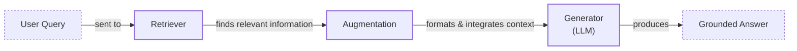
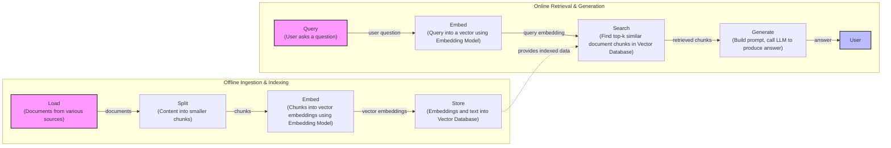
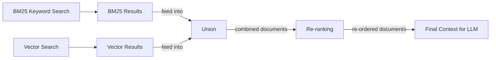
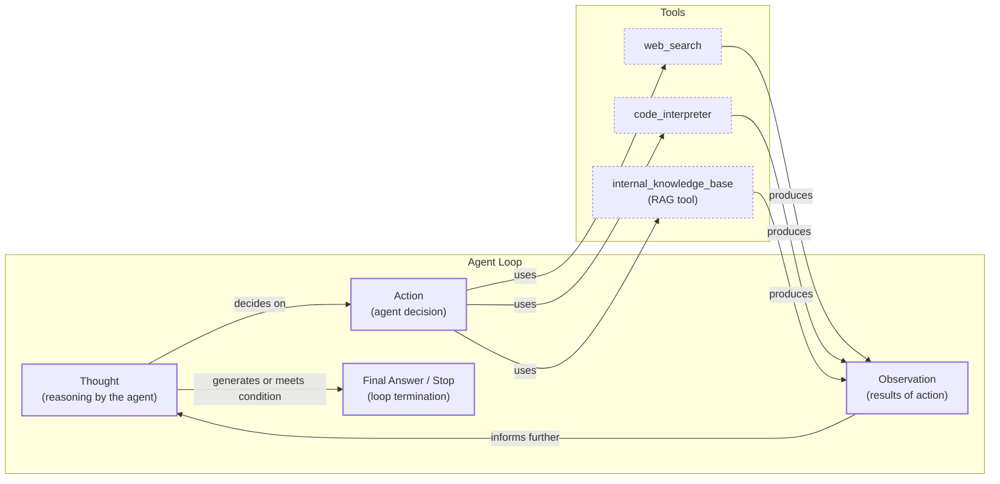

# Lesson 9: Retrieval-Augmented Generation

In our previous lessons, we explored the building blocks of AI systems. We learned about context engineering, the art of feeding the right information to an LLM, and saw how ReAct agents use a "Thought-Action-Observation" loop to reason and interact with their environment. But even the most sophisticated agent is limited by what it knows.

LLMs are trained on a fixed dataset, a snapshot of the world's information at a particular time. This makes their knowledge static and prone to hallucination. When an LLM is trained, it is essentially taking a "closed-book exam" on this data. We do not yet have efficient techniques to enable models to continuously learn new information after deployment. While fine-tuning can update a model's weights, it is expensive, slow, and often impractical for information that changes frequently. The model can't just learn from experience over time like we do.

This is where Retrieval-Augmented Generation (RAG) comes in. RAG is a reliable solution that addresses these limitations by giving the LLM an "open-book exam" [[1]](https://blogs.nvidia.com/blog/what-is-retrieval-augmented-generation/). Instead of relying on memorized facts, the model can look up information from external, real-time knowledge sources. Just as we use manuals or cheat sheets, an LLM can use RAG to retrieve the exact information it needs, right when it needs it.

RAG is a core method for the context engineering work we covered in Lesson 3. It is how we curate the information an LLM sees, ensuring its answers are grounded in verifiable facts. In this lesson, we will cover the fundamentals of RAG, from its core components to the advanced and agentic patterns that power modern AI applications. We will also see how retrieval complements an agent's memory, a topic we will explore further in Lesson 10.

With the problem and motivation clear, we’ll first decompose RAG into its core components so you can see where each responsibility lives.

## The RAG System: Core Components

Understanding RAG's components is the first step in the context engineering process of designing effective AI systems. At its core, RAG can be broken down into three conceptual pillars: Retrieval, Augmentation, and Generation [[2]](https://decodingml.substack.com/p/rag-fundamentals-first?utm_source=publication-search).

**Retrieval** is the engine for finding relevant information. Given a user's query, this component searches an external knowledge base to find the most relevant data. The most common approach is semantic similarity search, which relies on vector embeddings. Text is converted into numerical representations (embeddings) that capture its meaning. These embeddings are stored in a specialized vector database. When a user asks a question, their query is also converted into an embedding, and the database finds the text chunks with the closest embeddings [[3]](https://qdrant.tech/articles/what-is-rag-in-ai/). Another method is keyword-based search, using algorithms like BM25, which excels at finding exact matches for specific terms [[4]](https://www.anthropic.com/news/contextual-retrieval).

**Augmentation** is the process of taking the information found by the retriever and preparing it for the LLM. This involves formatting the retrieved text chunks and integrating them into the prompt alongside the original user query and any system instructions. The goal is to create a clear, context-rich prompt that guides the LLM toward a grounded and accurate response.

**Generation** is the final step. The LLM receives the augmented prompt and uses the provided context as its single source of truth to generate an answer. The model's role shifts from recalling information from its training data to synthesizing an answer based on the new, relevant information it has just been given.

Image 1: A flowchart illustrating the core components and data flow of a Retrieval Augmented Generation (RAG) system.

These three components work together to create a system that is more accurate, reliable, and trustworthy than an LLM operating on its own. Now that you can name each moving part, let’s see how they line up across the two phases of a real system.

## The RAG Pipeline: Ingestion and Retrieval

The end-to-end RAG workflow is split into two distinct phases: an offline ingestion phase, where the knowledge base is prepared, and an online retrieval phase, where answers are generated in real-time [[5]](https://medium.com/@derrickryangiggs/rag-pipeline-deep-dive-ingestion-chunking-embedding-and-vector-search-abd3c8bfc177).

### Phase 1: Offline Ingestion & Indexing

This phase happens before your users ever ask a question. It is the background process of preparing your knowledge sources for fast and effective retrieval. It involves four main steps:

1.  **Load:** The first step is to gather your data. Documents are loaded from various sources, which could be anything from a folder of PDFs and a collection of web pages to records in a database accessed via an API.
2.  **Split:** Since LLMs have limited context windows and retrieval works best with focused pieces of information, large documents are broken down into smaller, more manageable chunks. This can be done with simple rule-based splitters (e.g., splitting by paragraph) or more advanced semantic chunkers that try to keep related ideas together.
3.  **Embed:** Each chunk of text is then passed through an embedding model. This model converts the text into a high-dimensional vector that numerically represents its semantic meaning. The choice of embedding model is important, with options ranging from proprietary models like OpenAI's `text-embedding-3-large` to open-source alternatives available on Hugging Face.
4.  **Store:** Finally, these vector embeddings and their corresponding text chunks are loaded into a specialized vector database. This database indexes the embeddings for efficient similarity search, allowing the system to quickly find the vectors (and thus, the text chunks) that are most similar to a given query vector.

### Phase 2: Online Retrieval & Generation

This phase is triggered in real-time when a user submits a query. It is the part of the system that directly interacts with the user to provide an answer.

1.  **Query:** The user asks a question. This initial query might be pre-processed to normalize it or expand it for better search results.
2.  **Embed:** The user's query is converted into a vector using the *same* embedding model that was used during the ingestion phase. This ensures that the query and the document chunks are represented in the same vector space, making them comparable.
3.  **Search:** The query vector is sent to the vector database, which performs a similarity search. It calculates the distance (often using cosine similarity) between the query vector and all the chunk vectors in the index, returning the top-k most similar chunks.
4.  **Generate:** The retrieved chunks are assembled into a prompt along with the original user query and specific instructions. This augmented prompt is then sent to the LLM, which generates a final answer grounded in the provided context. As we saw in Lesson 4, we can use structured outputs to format the answer and include citations, making the response verifiable [[2]](https://decodingml.substack.com/p/rag-fundamentals-first?utm_source=publication-search).

Image 2: A detailed flowchart depicting the end-to-end RAG pipeline, split into two main phases: Offline Ingestion & Indexing and Online Retrieval & Generation.

This two-phase pipeline is the backbone of most RAG systems. With the end-to-end path in place, the next question is quality: what are the advanced techniques to make the retrieval more accurate and useful across messy, real-world data?

## Advanced RAG Techniques

A "naive" RAG pipeline often performs well in demos but can break down in production when faced with complex queries or messy data [[6]](https://neo4j.com/blog/genai/advanced-rag-techniques/). To build a robust system, AI engineers employ a range of advanced techniques to improve retrieval performance.

### Hybrid Search

Vector search is powerful for understanding semantic meaning, but it can sometimes miss exact keywords, IDs, or acronyms. Hybrid search combines the strengths of semantic (vector) search with traditional keyword-based search, like BM25 [[7]](https://mlpills.substack.com/p/issue-76-optimize-rag-with-hybrid). This ensures the system can find documents that are both contextually relevant and contain specific, critical terms.

For example, a customer support bot receives the query, “My bill keeps rolling over.” A keyword search will find articles containing the exact term "rollover." A semantic search might also surface guides about a "carryover balance." By combining both, the system retrieves a more comprehensive set of documents that cover different phrasings of the same underlying issue.

### Re-ranking

The initial retrieval step is optimized for speed and recall, meaning it might return a broad set of candidate documents, not all of which are equally relevant. Re-ranking introduces a second, more precise model to re-order these initial results [[8]](https://redis.io/blog/10-techniques-to-improve-rag-accuracy/). Cross-encoder models are often used for this. They take the user's query and a candidate document together and output a fine-grained relevance score.

Suppose you ask a product help system, "How do I connect my account?" The initial retrieval might pull a press release announcing the feature, a community forum thread, and the official step-by-step setup guide. A re-ranker would analyze each of these in the context of your query and push the setup guide to the top of the list, ensuring the most useful document is prioritized.

Image 3: A flowchart illustrating the hybrid retrieval flow, starting with parallel BM25 and Vector searches, followed by union, re-ranking, and final context generation.

### Query Transformations

Sometimes, the user's query is not the best input for the retrieval system. Query transformation techniques rewrite or restructure the query to improve retrieval accuracy.

-   **Decomposition:** This method breaks a complex, multi-faceted question into several simpler sub-questions. The system then retrieves documents for each sub-question and merges the results. For a query like, “What’s our travel policy for conferences in Europe this year?” the system might generate sub-questions: “Where is the travel policy document?”, “What defines a conference?”, “What are the rules for Europe?”, and “What changed in the policy this year?” [[9]](https://docs.nvidia.com/rag/latest/query_decomposition.html).
-   **Hypothetical Document Embeddings (HyDE):** Instead of directly embedding the user's query, HyDE first asks an LLM to generate a short, hypothetical answer. It then embeds this ideal answer and uses that embedding for the search [[10]](https://decodingml.substack.com/p/your-rag-is-wrong-heres-how-to-fix). For the travel policy question, the system might generate a draft like, “Employees can book economy flights and up to three hotel nights.” It then searches for documents that sound like that answer, which helps it find the actual policy pages more effectively.

### Advanced Chunking Strategies

How you split documents into chunks significantly impacts retrieval quality. Fixed-size chunking is simple but can unnaturally split ideas across boundaries.

For example, splitting a 20-page handbook every 500 words might cut the "Reimbursements" section in half, separating a rule from its corresponding spending cap. Advanced strategies are more intelligent:

-   **Semantic chunking** groups related sentences together, ensuring that a complete idea, like the entire "Reimbursements" section, stays within a single chunk.
-   **Layout-aware chunking** is designed for documents with complex structures like tables or forms. It ensures that a row in a pricing table, which connects a product to its price and discount, is kept together rather than being sliced apart by a character count.
-   **Context-enriched chunking** prepends each chunk with a summary of its context within the larger document, helping the embedding model better understand its meaning [[4]](https://www.anthropic.com/news/contextual-retrieval).

### GraphRAG

Standard RAG struggles with questions about complex relationships and interconnected data because document chunks are isolated. GraphRAG addresses this by first constructing a knowledge graph from the documents, where entities are nodes and relationships are edges [[11]](https://arxiv.org/html/2404.16130). While the technique is modern, the underlying idea of knowledge graphs has evolved since the 1990s with semantic web technologies like DBpedia and Google’s Knowledge Graph, which brought them into mainstream use [[16]](https://www.semantic-web-journal.net/system/files/swj3862.pdf).

Retrieval then happens by traversing this graph, allowing the system to answer multi-hop questions that require connecting information across multiple entities and documents [[12]](https://arxiv.org/html/2501.00309v2). Each edge in the graph has a specific meaning, which makes it possible to retrieve meaningful chains of reasoning [[17]](https://www.gooddata.com/blog/from-rag-to-graphrag-knowledge-graphs-ontologies-and-smarter-ai/).

A retail system could answer, “Which shoes get the most size-related returns and were featured in last month’s ads?” by traversing connections: `return records` → `reason: sizing` → `specific SKUs` → `marketing calendar`. Similarly, an IT operations system could answer, “Which incidents were caused by weekend deploys that also touched the login service?” by linking `change records` → `deploy time` → `affected service` → `incident tickets`.

This approach comes with trade-offs. It requires a significant upfront investment in schema design and entity extraction, whereas standard RAG can be deployed faster with existing documents. Many organizations are adopting hybrid GraphRAG approaches that combine structured graph traversal with semantic search to get the benefits of both [[18]](https://atlan.com/know/knowledge-graphs-vs-rag-for-ai/). More advanced implementations even feature dynamic graph updating and hierarchical graphs that allow reasoning at different levels of detail [[19]](https://arxiv.org/html/2506.18019v1).

These techniques increase retrieval quality. Next, we’ll see how retrieval becomes one tool that an agent can choose to use as it reasons.

## Agentic RAG

In Lessons 7 and 8, we learned about ReAct agents, which follow a "Thought-Action-Observation" cycle to solve problems. Agentic RAG is the application of this principle, where retrieval is not a fixed step in a pipeline but a tool that a reasoning agent can choose to use [[13]](https://www.llamaindex.ai/blog/rag-is-dead-long-live-agentic-retrieval). This model is not arbitrary; it is inspired by cognitive architectures from psychology that aim to mimic human-like thinking. The agent's ability to plan, act, and reflect aligns with models of human agency, such as the Belief-Desire-Intention (BDI) framework for rational decision-making [[20]](https://www.ibm.com/think/topics/agentic-architecture).

It's important to clarify that an agent typically has access to many tools, such as web search, a code interpreter, or database query engines. The retrieval system is just one of these tools. Labeling an entire system "agentic RAG" can be too narrow; it is more accurate to think of it as an agent that *uses* RAG [[14]](https://www.ibm.com/think/topics/agentic-rag).

The core distinction lies in the control flow:
-   **Standard RAG** follows a linear, predetermined workflow: Retrieve → Augment → Generate. It is powerful but rigid.
-   **Agentic RAG** is adaptive and iterative. The agent decides *when* to retrieve, *what* to retrieve, and *whether* to retrieve again.

This agentic approach unlocks several advanced capabilities [[15]](https://weaviate.io/blog/what-is-agentic-rag). The agent can iteratively use the retrieval tool, refining its query based on initial results. It can choose which knowledge base to search, such as `search_tech_docs` versus `search_emails`. It can also fuse information from the RAG tool with data from other tools, like a web search, to form a more comprehensive answer.

However, this flexibility introduces trade-offs. Each reasoning step and tool call adds processing time, and slow retrieval queries can compound across iterations, making latency a critical concern [[21]](https://www.algolia.com/blog/ai/agentic-retrieval). This also increases costs due to higher token consumption. For simple queries, the extra overhead might not be justified, so systems may need to adapt their strategy based on query complexity [[22]](https://redis.io/blog/agentic-rag-how-enterprises-are-surmounting-the-limits-of-traditional-rag/).

Here is a conceptual thought process for an agent tackling a complex query:
*   **Thought:** The user is asking about ‘2024 EU data retention rules.’ Our internal policy document is from 2023, so it is likely outdated. I need to verify this with a more current source.
*   **Action:** `retrieve(internal_policy, query="EU data retention 2024")`
*   **Observation:** The retrieved document mentions amendments but is missing official citations.
*   **Thought:** I need external verification from an authoritative source.
*   **Action:** `web_search(query="EU data retention rules 2024 official directive")`
*   **Observation:** The search returns a link to the updated EU directive.
*   **Thought:** Now I have both the internal context and the official external source. I will synthesize an answer that highlights the changes from the 2023 policy and cites both documents.

This transforms the interaction from a simple database lookup into a conversation with a knowledgeable research assistant who can reason, verify, and synthesize information from multiple sources.

Image 4: A conceptual flowchart showing an agent's main loop in an Agentic RAG system.

You now understand both a linear RAG pipeline and how an agent can control retrieval when needed. Let’s wrap up by situating RAG in the wider AI Engineering toolkit and previewing what comes next.

## Conclusion

In this lesson, we have seen that RAG is the industry's most common solution to the LLM knowledge problem. It reduces hallucinations, enables the use of proprietary and real-time data, and builds user trust through verifiable, source-based answers. We journeyed from the basic RAG pipeline to advanced techniques like hybrid search and GraphRAG, which are essential for production-grade quality. Finally, we saw that the future of knowledge retrieval is agentic, where RAG becomes a dynamic tool in an agent's reasoning loop.

RAG is not a niche skill but a foundational competency for the modern AI Engineer. It is a critical component of context engineering, allowing us to build AI systems that are grounded, accurate, and truly useful.

In our next lesson, we will explore memory for agents, and see how short-term and long-term memory systems work alongside retrieval to give agents a persistent understanding of their world. We will also cover other important topics like retrieval quality evaluations and production monitoring later in the course. Evaluating agentic systems is particularly challenging, as traditional metrics like F1 or BLEU fail to capture the success of multi-step reasoning or tool use. The key question is not just "was the answer correct?" but "did the agent take the right steps to get there?" [[23]](https://toloka.ai/blog/agentic-rag-systems-for-enterprise-scale-information-retrieval/). This requires new patterns like LLM-as-Judge and metrics for faithfulness and context precision, which we will detail in the third part of the course [[24]](https://aiamastery.substack.com/p/lesson-44-evaluating-agentic-rag).

## References

- [1] [What Is Retrieval-Augmented Generation, aka RAG?](https://blogs.nvidia.com/blog/what-is-retrieval-augmented-generation/)
- [2] [Retrieval-Augmented Generation (RAG) Fundamentals First](https://decodingml.substack.com/p/rag-fundamentals-first?utm_source=publication-search)
- [3] [What is RAG: Understanding Retrieval-Augmented Generation](https://qdrant.tech/articles/what-is-rag-in-ai/)
- [4] [Introducing Contextual Retrieval](https://www.anthropic.com/news/contextual-retrieval)
- [5] [RAG Pipeline Deep Dive: Ingestion, Chunking, Embedding, and Vector Search](https://medium.com/@derrickryangiggs/rag-pipeline-deep-dive-ingestion-chunking-embedding-and-vector-search-abd3c8bfc177)
- [6] [Advanced RAG Techniques for High-Performance LLM Applications](https://neo4j.com/blog/genai/advanced-rag-techniques/)
- [7] [Issue 76: Optimize RAG with Hybrid Search](https://mlpills.substack.com/p/issue-76-optimize-rag-with-hybrid)
- [8] [10 Techniques to Improve RAG Accuracy](https://redis.io/blog/10-techniques-to-improve-rag-accuracy/)
- [9] [Query Decomposition](https://docs.nvidia.com/rag/latest/query_decomposition.html)
- [10] [Your RAG Is Wrong, Here's How To Fix It](https://decodingml.substack.com/p/your-rag-is-wrong-heres-how-to-fix?utm_source=publication-search)
- [11] [From Local to Global: A GraphRAG Approach to Query-Focused Summarization](https://arxiv.org/html/2404.16130)
- [12] [GraphRAG for Multi-Hop Question Answering in Large Language Models](https://arxiv.org/html/2501.00309v2)
- [13] [RAG is dead, long live agentic retrieval](https://www.llamaindex.ai/blog/rag-is-dead-long-live-agentic-retrieval)
- [14] [What is agentic RAG?](https://www.ibm.com/think/topics/agentic-rag)
- [15] [What is Agentic RAG](https://weaviate.io/blog/what-is-agentic-rag)
- [16] [The story of the Web's third decade](https://www.semantic-web-journal.net/system/files/swj3862.pdf)
- [17] [From RAG to GraphRAG: Knowledge Graphs, Ontologies, and Smarter AI](https://www.gooddata.com/blog/from-rag-to-graphrag-knowledge-graphs-ontologies-and-smarter-ai/)
- [18] [Knowledge Graphs vs. RAG for AI: Which Is Better?](https://atlan.com/know/knowledge-graphs-vs-rag-for-ai/)
- [19] [Memory Augmented Large Language Models for Question Answering on Long Videos](https://arxiv.org/html/2506.18019v1)
- [20] [What is agentic architecture?](https://www.ibm.com/think/topics/agentic-architecture)
- [21] [Agentic retrieval: Taking RAG to the next level with agents](https://www.algolia.com/blog/ai/agentic-retrieval)
- [22] [Agentic RAG: How enterprises are surmounting the limits of traditional RAG](https://redis.io/blog/agentic-rag-how-enterprises-are-surmounting-the-limits-of-traditional-rag/)
- [23] [Agentic RAG Systems for Enterprise-Scale Information Retrieval](https://toloka.ai/blog/agentic-rag-systems-for-enterprise-scale-information-retrieval/)
- [24] [Lesson 44: Evaluating Agentic RAG](https://aiamastery.substack.com/p/lesson-44-evaluating-agentic-rag)