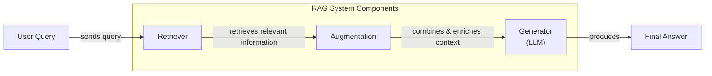
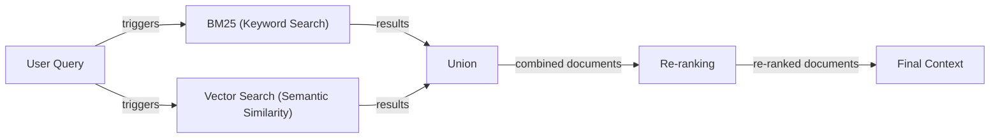
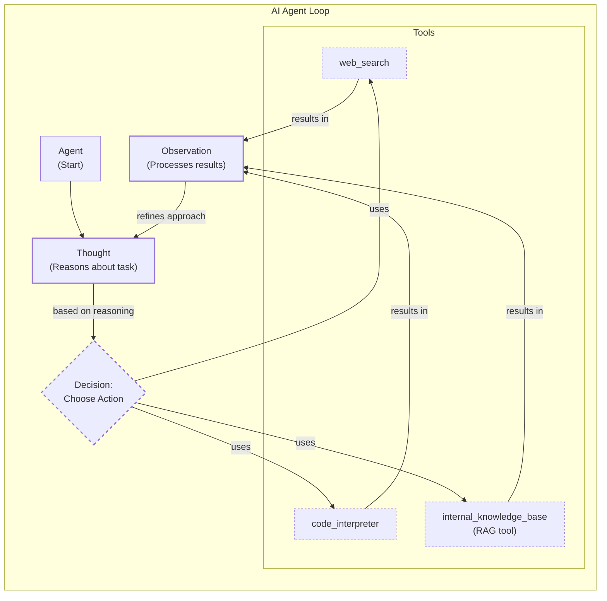

# Lesson 9: Retrieval-Augmented Generation (RAG)

In our previous lessons, we built a foundation in AI Engineering. We explored the agent landscape, distinguished between LLM workflows and autonomous agents, and dove into context engineering. We learned this is the art of managing the information an LLM sees. We’ve given agents the ability to use tools and reason with frameworks like ReAct. Now, we address a fundamental limitation of LLMs: their knowledge is frozen in time.

During their training, LLMs are essentially taking a "closed-book exam" on the world's information. They learn from a static dataset, and once training is complete, they have no access to new events, private documents, or real-time data. This knowledge cutoff means a model trained up to January 2022 cannot know who won an award in 2024 [[35]](https://neo4j.com/blog/developer/fine-tuning-vs-rag/). This static nature is a major liability for accuracy, as models can confidently "hallucinate" or fabricate answers when they lack up-to-date information. These fabrications can be subtle and hard to spot, such as providing an incorrect Wikidata ID, or have serious consequences, as when a lawyer submitted a legal brief citing non-existent cases generated by an LLM [[35]](https://neo4j.com/blog/developer/fine-tuning-vs-rag/).

https://i.imgur.com/v8n6g2S.png
Image 1: A standard LLM without access to external knowledge cannot answer questions about events that occurred after its training cutoff date.

We can fine-tune models with new data, but this is slow, expensive, and creates yet another static snapshot. It is not an efficient way to keep a model's knowledge current, especially for data that changes frequently [[35]](https://neo4j.com/blog/developer/fine-tuning-vs-rag/).

Retrieval-Augmented Generation (RAG) solves this problem. RAG is a core technique within context engineering, which we introduced in Lesson 3. Instead of relying on the model's limited internal memory, we give it an "open-book exam." We connect the LLM to external, up-to-date knowledge sources, allowing it to retrieve relevant information on the fly before generating an answer. Just as humans use notes and manuals, RAG equips LLMs with the ability to look things up, ensuring their responses are grounded, accurate, and trustworthy. This capability is a requirement for building enterprise-grade AI.

https://i.imgur.com/2Yw2s00.png
Image 2: An LLM with RAG capabilities can search external sources to find current information and provide an accurate answer. (Source [Knowledge Graphs and LLMs: Fine-Tuning vs. Retrieval-Augmented Generation [35]](https://neo4j.com/blog/developer/fine-tuning-vs-rag/))

The field itself has progressed rapidly. What started as a simple approach, now often called Naive RAG, has evolved into sophisticated, context-aware systems. This evolution mirrors the development of search engines—from basic keyword matching to intelligent systems that understand user intent. The shift from basic to advanced RAG represents a move from simple information retrieval to intelligent knowledge synthesis [[12]](https://www.arionresearch.com/blog/uuja2r7o098i1dvr8aagal2nnv3uik).

In this lesson, we will explore the entire RAG ecosystem. We will start with the fundamental components and the end-to-end pipeline. Then, we will cover the advanced techniques that separate prototypes from production systems. Finally, we will see how RAG evolves into a powerful tool within the agentic frameworks we learned about previously. We will also briefly touch on how retrieval complements an agent's memory, a topic we will explore fully in Lesson 10.

## The RAG System: Core Components

To design effective RAG systems, you first need to understand the three conceptual pillars that form its foundation. This is the first step in the context engineering process, as it helps you map out where each responsibility in your system lives.

**Retrieval** is the engine that finds relevant information. When a user asks a question, the retriever searches an external knowledge base to find the most relevant pieces of data. The most common approach uses semantic search, which relies on vector embeddings to find content that is conceptually similar, even if the wording is different. However, semantic search can sometimes miss exact keyword matches, so it is often combined with traditional keyword-based search methods like BM25. This hybrid approach ensures both semantic relevance and keyword precision [[1]](https://towardsai.net/p/l/a-complete-guide-to-rag).

Vector embeddings are dense numerical arrays that capture the semantic meaning of text, images, or other data. They are generated by passing content through an embedding model, which transforms it into a high-dimensional vector. In this vector space, items with similar meanings are located close to one another. For example, the phrases "how to reset my password" and "I can't log into my account" would have very similar vector representations. These vectors are then stored in a vector database, which is optimized for performing fast similarity searches using distance metrics like cosine similarity. When a query comes in, it is converted to a vector using the same model, and the database finds the nearest neighbors to that query vector, retrieving the most semantically relevant chunks of information [[14]](https://tutorialsdojo.com/aws-vector-databases-explained-semantic-search-and-rag-systems/), [[15]](https://apxml.com/courses/prompt-engineering-llm-application-development/chapter-6-integrating-llms-external-data-rag/implementing-semantic-search-retrieval).

**Augmentation** is the process of preparing the retrieved information for the LLM. Once the retriever finds the relevant data chunks, they are combined with the original user query and system instructions. This creates an "augmented prompt" that provides the LLM with all the necessary context to formulate a grounded response. This step is crucial for ensuring the model uses the external knowledge effectively, and prompt engineering techniques are used to structure this input for the best results [[16]](https://www.topquadrant.com/resources/blog-retrieval-augmented-generation-explained/).

**Generation** is the final step where the LLM produces an answer. Using the augmented prompt, the model synthesizes the information from the retrieved context to generate a response that is accurate, relevant, and grounded in the provided sources. This allows the LLM to function as a reasoning engine, using the external data as its single source of truth, which reduces hallucinations and enables source citation [[11]](https://blogs.nvidia.com/blog/what-is-retrieval-augmented-generation/).

Image 3: A flowchart illustrating the conceptual flow of a Retrieval Augmented Generation (RAG) system.

These three components work together to overcome the inherent limitations of standalone LLMs. By separating the knowledge base from the reasoning engine, RAG creates a flexible and powerful architecture. Now that you can name each moving part, let’s see how they line up across the two phases of a real system.

## The RAG Pipeline: Ingestion and Retrieval

A production-ready RAG system operates in two distinct phases: an offline ingestion pipeline that prepares the data and an online retrieval pipeline that answers user queries in real-time. This separation allows the computationally intensive work of processing and indexing documents to happen offline, ensuring that the user-facing retrieval process is fast and efficient [[17]](https://newsletter.systemdesign.one/p/how-rag-works).

### Phase 1: Offline Ingestion & Indexing

The ingestion phase is where you process your knowledge base and make it searchable. This is a critical, one-time (or periodic) process that sets the foundation for your RAG system's performance. It involves several key operations.

1.  **Load:** The first step is to load your documents from various sources. These can be PDFs, web pages, databases, or APIs. The goal is to extract the raw text and any relevant metadata. Tools like LangChain's document loaders or LlamaIndex's readers offer connectors for many common data formats, simplifying this process [[17]](https://newsletter.systemdesign.one/p/how-rag-works).
2.  **Split:** Large documents are too big to fit into an LLM's context window and can contain multiple topics. You need to break them down into smaller, semantically meaningful pieces called chunks. This can be done with simple rule-based splitters, like LangChain's `RecursiveCharacterTextSplitter`, or more advanced semantic chunkers that split based on topic shifts [[13]](https://medium.com/@robi.tomar72/how-rag-actually-works-embeddings-vector-databases-indexing-retrieval-explained-simply-3d1ca45fe1bf). Getting the chunking strategy right is one of the highest-leverage steps for improving RAG quality. Metadata, such as source, timestamp, and category, should also be tagged to each chunk for later filtering and attribution [[17]](https://newsletter.systemdesign.one/p/how-rag-works).
3.  **Embed:** Each chunk is then converted into a numerical representation, or vector embedding, using an embedding model. These vectors capture the semantic meaning of the text. Popular models include OpenAI's `text-embedding-3` series, Google's `text-embedding-004`, and open-source alternatives from Hugging Face [[17]](https://newsletter.systemdesign.one/p/how-rag-works).
4.  **Store:** Finally, the embeddings and their corresponding text chunks (and any metadata) are loaded into a vector database. This database is optimized for fast similarity search, allowing the system to quickly find the most relevant chunks for a given query. Examples include FAISS for local development, and scalable solutions like Qdrant, Pinecone, or Milvus [[13]](https://medium.com/@robi.tomar72/how-rag-actually-works-embeddings-vector-databases-indexing-retrieval-explained-simply-3d1ca45fe1bf).

### Phase 2: Online Retrieval & Generation

This phase happens in real-time whenever a user submits a query. The focus here is on speed and accuracy.

1.  **Query:** The user asks a question. This query is the input to the retrieval pipeline.
2.  **Embed:** The user's query is converted into a vector using the *same* embedding model that was used during the ingestion phase. This is critical to ensure that the query and the documents exist in the same vector space, making them comparable [[18]](https://medium.com/@derrickryangiggs/rag-pipeline-deep-dive-ingestion-chunking-embedding-and-vector-search-abd3c8bfc177).
3.  **Search:** The system uses the query vector to search the vector database. It performs a similarity search (often using cosine similarity) to find the top-k most relevant document chunks whose embeddings are closest to the query embedding [[15]](https://apxml.com/courses/prompt-engineering-llm-application-development/chapter-6-integrating-llms-external-data-rag/implementing-semantic-search-retrieval).
4.  **Generate:** The retrieved chunks are assembled into the context of a prompt, along with the original user query and system instructions. This augmented prompt is then sent to an LLM, which generates a final answer grounded in the provided information. By using the structured output techniques we covered in Lesson 4, you can ensure the response includes verifiable citations, linking the answer back to the source documents [[17]](https://newsletter.systemdesign.one/p/how-rag-works).

```mermaid
flowchart LR
  %% Phase 1: Offline Ingestion & Indexing
  subgraph "Offline Ingestion & Indexing"
    Sources["Documents<br/>(PDFs, Websites, APIs)"]
    Load["Load Documents"]
    Split["Split into Chunks<br/>(Chunkers)"]
    Chunks["Chunks"]
    Embed_Chunk["Embed Chunks"]
    Vector_Embedding["Vector Embedding"]
    Store["Store"]
    Vector_DB["Vector Database<br/>(Search Index)"]
  end

  %% Shared Models
  Embedding_Model["Embedding Model"]

  %% Phase 2: Online Retrieval & Generation
  subgraph "Online Retrieval & Generation"
    User_Query["User Query"]
    Embed_Query["Embed Query"]
    Query_Vector["Query Vector"]
    Search["Search<br/>(Top-k Similarity)"]
    Retrieved_Chunks["Retrieved Chunks"]
    Build_Prompt["Build Prompt"]
    LLM["LLM"]
    Final_Answer["Final Answer"]
  end

  %% Primary Data Flows - Phase 1
  Sources -- "raw data" --> Load
  Load -- "documents" --> Split
  Split -- "produces" --> Chunks
  Chunks -- "input to" --> Embed_Chunk
  Embed_Chunk -- "creates" --> Vector_Embedding
  Vector_Embedding -- "indexed by" --> Store
  Store -- "persists in" --> Vector_DB

  %% Primary Data Flows - Phase 2
  User_Query -- "initiates" --> Embed_Query
  Embed_Query -- "creates" --> Query_Vector
  Query_Vector -- "used to" --> Search
  Search -- "queries" --> Vector_DB
  Vector_DB -- "returns" --> Retrieved_Chunks
  Retrieved_Chunks -- "context for" --> Build_Prompt
  Build_Prompt -- "sends to" --> LLM
  LLM -- "generates" --> Final_Answer

  %% Supporting Relationships
  Embed_Chunk -. "uses" .-> Embedding_Model
  Embed_Query -. "uses" .-> Embedding_Model

  %% Visual grouping
  classDef exec stroke-width:2px
  classDef store stroke-dasharray:3,3

  class Load,Split,Embed_Chunk,Store,Embed_Query,Search,Build_Prompt,Embedding_Model,LLM exec
  class Sources,Chunks,Vector_Embedding,Vector_DB,User_Query,Query_Vector,Retrieved_Chunks,Final_Answer store
```

Image 4: A detailed flowchart depicting the end-to-end RAG workflow, divided into two main phases: "Offline Ingestion & Indexing" and "Online Retrieval & Generation".

With this end-to-end path in place, the next question is quality. Naive RAG works, but to build a robust system, you need more sophisticated techniques to handle messy, real-world data.

## Advanced RAG Techniques

A vanilla RAG pipeline is a great starting point, but production systems require more advanced strategies to achieve high accuracy. These techniques focus on improving the quality of the retrieved context before it ever reaches the LLM.

### Hybrid Search

Hybrid search combines the strengths of traditional keyword-based search with modern vector-based semantic search. Keyword search, often implemented with algorithms like BM25 (Best Matching 25), excels at finding exact matches for specific terms, like product codes or acronyms, which semantic search might miss. Vector search, on the other hand, understands conceptual relationships and can find relevant documents even if they don't use the exact query terms [[19]](https://pr-peri.github.io/blogpost/2026/03/05/blogpost-hybrid-search.html).

For example, if a customer support user searches for "my bill keeps rolling over," a keyword search will find articles containing the exact word "rollover." A semantic search might also surface guides that talk about a "carryover balance." By combining both, you get a more comprehensive set of results that covers different wordings of the same issue [[20]](https://mlpills.substack.com/p/issue-76-optimize-rag-with-hybrid). The results from both search methods are typically merged using a technique like Reciprocal Rank Fusion (RRF). This method is effective because it uses rank position rather than raw scores, which avoids the need to normalize scores from different systems. It sums the reciprocal rank of each document, giving more weight to documents that appear at the top of multiple lists [[21]](https://medium.com/@devalshah1619/mathematical-intuition-behind-reciprocal-rank-fusion-rrf-explained-in-2-mins-002df0cc5e2a).

### Re-ranking

Re-ranking introduces a second, more precise model to re-order the initial set of documents retrieved from the database. The first retrieval stage is optimized for speed and recall, casting a wide net to ensure no relevant documents are missed. This often returns a large set of candidates, some of which may only be partially relevant.

A re-ranker, typically a cross-encoder model, then takes each of these candidate documents and the original query as a pair. It performs a deeper analysis of their relevance, producing a much more accurate score [[22]](https://apxml.com/courses/optimizing-rag-for-production/chapter-2-advanced-retrieval-optimization/reranking-architectures-rag). This is computationally more expensive than the initial retrieval, which is why it's applied to a smaller set of top candidates. For instance, when a user asks, "how to connect my account," the initial retrieval might pull up press releases and community threads alongside the official setup guide. The re-ranker would analyze each one and correctly place the step-by-step guide at the top of the list, ensuring the LLM receives the most useful context.

Image 5: A flowchart illustrating the hybrid retrieval flow.

### Query Transformations

Sometimes the user's query isn't the best input for a search system. Query transformation techniques modify the original query to improve retrieval results. Two popular methods are decomposition and Hypothetical Document Embeddings (HyDE).

**Decomposition** breaks down a complex, multi-part question into several simpler sub-queries. For example, the query "What’s our travel policy for conferences in Europe this year?" could be broken into: "What is the travel policy?", "What are the rules for conferences?", and "Are there specific rules for Europe in 2024?". The system retrieves documents for each sub-query and then merges the results to provide a comprehensive answer [[23]](https://docs.nvidia.com/rag/latest/query_decomposition.html).

**HyDE** works by first generating a hypothetical, ideal answer to the user's query using an LLM. For a query about European travel policy, it might generate a short paragraph like: "Employees attending approved conferences in Europe can book economy flights and up to three hotel nights." This hypothetical document is then embedded and used for the similarity search. The idea is that this ideal answer is likely to be semantically closer to the actual policy document than the original, brief query, thus improving retrieval accuracy [[24]](https://47billion.com/blog/rag-system-in-production-why-it-fails-and-how-to-fix-it/).

### Advanced Chunking Strategies

How you split your documents into chunks has a massive impact on retrieval quality. Naive fixed-size chunking can cut sentences in half or separate related ideas, leading to fragmented context.

**Semantic chunking** addresses this by splitting text based on topical shifts, ensuring that each chunk contains a coherent block of information. **Layout-aware chunking** is even more powerful for structured documents like PDFs or reports. It uses the visual layout—headers, tables, lists—to guide the splitting process. For example, it ensures a whole table or a complete list is kept in a single chunk, preserving its structure [[25]](https://sarthakai.substack.com/p/improve-your-rag-accuracy-with-a). This prevents a pricing table from being split from its column headers or a reimbursement policy from being separated from its spending limits.

However, these advanced methods are not foolproof, especially with messy enterprise documents. Sentence-based splitters often fail on content that isn't prose, such as tables, code blocks, or documents with two-column layouts. Flattening a table into sentences destroys its row-column structure, making the data meaningless. These issues are common in real-world knowledge bases, not just edge cases [[26]](https://towardsdatascience.com/your-chunks-failed-your-rag-in-production/).

### GraphRAG

GraphRAG introduces a knowledge graph as the retrieval source. This approach has roots in Semantic Web research, which focused on creating structured, machine-readable data with standards like RDF [[27]](https://www.puppygraph.com/blog/knowledge-graph-vs-rag). Instead of just storing disconnected text chunks, GraphRAG extracts entities (like people, products, or companies) and their relationships from the documents, building a structured graph of knowledge. This approach excels at answering complex, multi-hop questions that require connecting information across multiple documents or data points [[28]](https://arxiv.org/html/2601.03014v1).

For example, in an IT operations context, a query like “Which incidents were caused by weekend deploys that also touched the login service?” requires connecting change records to deployment times, to affected services, and finally to incident tickets. A GraphRAG system can traverse these explicit relationships to surface the relevant incident reports. Similarly, in retail, a query like "Which shoes get the most size-related returns and were featured in last month’s ads?" can be answered by following connections from return records to sizing reasons, to specific SKUs, and then to the marketing calendar. This relational understanding is often lost in standard vector search over flat document chunks [[29]](https://arxiv.org/html/2501.00309v2). While powerful, this technique introduces significant computational complexity. Graph building via LLM-based extraction is expensive, and querying can be slow as the number of potential paths explodes in large graphs. This makes scalability a primary concern for production deployments [[30]](https://dev.to/sreeni5018/from-rag-to-knowledge-graphs-why-the-agent-era-is-redefining-ai-architecture-3fgc).

These techniques elevate a RAG system from a simple lookup tool to a sophisticated information retrieval engine. Next, we’ll see how this powerful retrieval capability becomes one of many tools an intelligent agent can choose to use as it reasons about a task.

## Agentic RAG

In Lessons 7 and 8, we learned about the ReAct framework, where an agent cycles through a loop of Thought, Action, and Observation. Agentic RAG is the application of this principle, where retrieval is no longer a fixed step in a pipeline but a dynamic tool that an agent can choose to use.

The core distinction is the shift from a linear workflow to an adaptive, iterative process.

-   **Standard RAG** is a pre-determined workflow: Retrieve -> Augment -> Generate. It's powerful but rigid, following the same path for every query.
-   **Agentic RAG** is a control loop. An AI agent decides *when* to retrieve, what query to use, which knowledge source to search, and whether one retrieval is enough. It can chain multiple retrieval and reasoning steps to build a comprehensive answer [[31]](https://towardsdatascience.com/agentic-rag-vs-classic-rag-from-a-pipeline-to-a-control-loop/).

This agentic approach unlocks several new capabilities. The agent can **iteratively** refine its search. If an initial retrieval for "EU data retention rules" returns an old policy, the agent can reason that it's outdated, reformulate its query to "EU data retention rules 2024 update," and retrieve again [[32]](https://medium.com/@gaddam.rahul.kumar/agentic-rag-vs-traditional-rag-b1a156f72167).

It can also **choose** which tool to use. For an outage inquiry, an agent might decide to query `search_incident_runbooks` instead of the general `search_marketing_pages` tool. Furthermore, it can **fuse** information from multiple sources. For example, it might retrieve an internal policy using its RAG tool, then use a `web_search` tool to check for recent regulatory changes, and finally synthesize both pieces of information into a complete answer [[6]](https://weaviate.io/blog/what-is-agentic-rag).

Here is a conceptual thought process for an agent handling a complex query:

*   **Thought:** "The user is asking about '2024 EU data retention rules.' Our internal policy document was last updated in 2023. It's likely outdated."
*   **Action:** `retrieve(internal_policy, query="EU data retention 2024")`
*   **Observation:** "The retrieved document mentions amendments but lacks specific citations for the 2024 changes."
*   **Thought:** "I need to verify this externally."
*   **Action:** `web_search(query="EU data retention rules 2024 official directive")`
*   **Observation:** "Found the official legal directive with the updated rules."
*   **Thought:** "Now I can synthesize the information from our internal policy and the new directive, highlighting the changes and citing both sources."

Image 6: A conceptual flowchart illustrating an AI agent's main operational loop, detailing its thought, decision, action (tool use), and observation cycle.

This turns a simple database lookup into a conversation with a knowledgeable research assistant. Critically, an agent can also decide to **write** new information to its knowledge base. This highlights a key architectural point: RAG is a read-only system, but true agentic memory must be a read-write system that tracks evolving state. RAG is a component of a memory system, not a substitute for one [[33]](https://xtrace.ai/blog/rag-vs-long-term-memory-ai-agents). Designing these explicit write mechanisms and managing different memory layers—such as semantic, episodic, and stateful memory—is an active area of research that we will cover in the next lesson [[33]](https://xtrace.ai/blog/rag-vs-long-term-memory-ai-agents).

## Conclusion

We have journeyed from the fundamental problem of static LLM knowledge to the sophisticated, agent-driven systems that represent the future of information retrieval. RAG is the industry's most widely adopted solution to the LLM knowledge problem, enabling us to build applications that are grounded, trustworthy, and up-to-date.

We saw that while basic RAG is powerful, production-grade quality requires advanced techniques like hybrid search, re-ranking, and intelligent chunking. Ultimately, the future is agentic, where retrieval becomes a dynamic tool in an agent's arsenal, allowing for iterative, multi-source reasoning.

Mastering these concepts is a foundational competency for any modern AI Engineer. RAG is a critical component of context engineering, allowing you to build user trust by providing verifiable, source-based answers and unlock the full potential of LLMs with proprietary data.

In our next lesson, we will explore Memory for Agents, and see how short-term and long-term memory systems work alongside RAG to give agents a persistent understanding of their world and interactions. Designing these systems involves balancing responsiveness, memory depth, and ethical considerations for personal data storage, which are some of the key open challenges in the field [[34]](https://ieeexplore.ieee.org/abstract/document/11080430/). We will also touch on other topics from this lesson, such as evaluation and monitoring, in future parts of the course.

## References

- [1] [A Complete Guide to RAG](https://towardsai.net/p/l/a-complete-guide-to-rag)
- [2] [Retrieval-Augmented Generation (RAG) Fundamentals First](https://decodingml.substack.com/p/rag-fundamentals-first?utm_source=publication-search)
- [3] [Your RAG is wrong: Here's how to fix it](https://decodingml.substack.com/p/your-rag-is-wrong-heres-how-to-fix?utm_source=publication-search)
- [4] [From Local to Global: A GraphRAG Approach to Query-Focused Summarization](https://arxiv.org/html/2404.16130)
- [5] [Introducing Contextual Retrieval](https://www.anthropic.com/news/contextual-retrieval)
- [6] [What is Agentic RAG](https://weaviate.io/blog/what-is-agentic-rag)
- [7] [RAG is dead, long live agentic retrieval](https://www.llamaindex.ai/blog/rag-is-dead-long-live-agentic-retrieval)
- [8] [What is agentic RAG?](https://www.ibm.com/think/topics/agentic-rag)
- [9] [Build advanced retrieval-augmented generation systems](https://learn.microsoft.com/en-us/azure/developer/ai/advanced-retrieval-augmented-generation)
- [10] [The Rise of RAG](https://highlearningrate.substack.com/p/the-rise-of-rag)
- [11] [What Is Retrieval-Augmented Generation, aka RAG?](https://blogs.nvidia.com/blog/what-is-retrieval-augmented-generation/)
- [12] [The Evolution of RAG](https://www.arionresearch.com/blog/uuja2r7o098i1dvr8aagal2nnv3uik)
- [13] [How RAG Actually Works: Embeddings, Vector Databases, Indexing & Retrieval Explained Simply](https://medium.com/@robi.tomar72/how-rag-actually-works-embeddings-vector-databases-indexing-retrieval-explained-simply-3d1ca45fe1bf)
- [14] [AWS Vector Databases Explained: Semantic Search and RAG Systems](https://tutorialsdojo.com/aws-vector-databases-explained-semantic-search-and-rag-systems/)
- [15] [Implementing Semantic Search & Retrieval](https://apxml.com/courses/prompt-engineering-llm-application-development/chapter-6-integrating-llms-external-data-rag/implementing-semantic-search-retrieval)
- [16] [Retrieval-Augmented Generation Explained](https://www.topquadrant.com/resources/blog-retrieval-augmented-generation-explained/)
- [17] [How RAG Works](https://newsletter.systemdesign.one/p/how-rag-works)
- [18] [RAG Pipeline Deep Dive: Ingestion (Chunking, Embedding) and Vector Search](https://medium.com/@derrickryangiggs/rag-pipeline-deep-dive-ingestion-chunking-embedding-and-vector-search-abd3c8bfc177)
- [19] [Building Hybrid Search for RAG: Combining pgvector and Full-Text Search with Reciprocal Rank Fusion](https://pr-peri.github.io/blogpost/2026/03/05/blogpost-hybrid-search.html)
- [20] [Optimize RAG with Hybrid Search](https://mlpills.substack.com/p/issue-76-optimize-rag-with-hybrid)
- [21] [Mathematical Intuition behind Reciprocal Rank Fusion (RRF)](https://medium.com/@devalshah1619/mathematical-intuition-behind-reciprocal-rank-fusion-rrf-explained-in-2-mins-002df0cc5e2a)
- [22] [Reranking Architectures for RAG](https://apxml.com/courses/optimizing-rag-for-production/chapter-2-advanced-retrieval-optimization/reranking-architectures-rag)
- [23] [Query Decomposition](https://docs.nvidia.com/rag/latest/query_decomposition.html)
- [24] [Why Your RAG System Fails in Production and How to Fix It](https://47billion.com/blog/rag-system-in-production-why-it-fails-and-how-to-fix-it/)
- [25] [Improve Your RAG Accuracy With A Smarter Chunking Strategy](https://sarthakai.substack.com/p/improve-your-rag-accuracy-with-a)
- [26] [Your Chunks Failed Your RAG in Production](https://towardsdatascience.com/your-chunks-failed-your-rag-in-production/)
- [27] [Knowledge Graph vs RAG](https://www.puppygraph.com/blog/knowledge-graph-vs-rag)
- [28] [SentGraph: Hierarchical Sentence Graph for Multi-hop Retrieval-Augmented Question Answering](https://arxiv.org/html/2601.03014v1)
- [29] [GraphRAG for Multi-Hop Question Answering](https://arxiv.org/html/2501.00309v2)
- [30] [From RAG to Knowledge Graphs: Why the Agent Era is Redefining AI Architecture](https://dev.to/sreeni5018/from-rag-to-knowledge-graphs-why-the-agent-era-is-redefining-ai-architecture-3fgc)
- [31] [Agentic RAG vs Classic RAG: From a Pipeline to a Control Loop](https://towardsdatascience.com/agentic-rag-vs-classic-rag-from-a-pipeline-to-a-control-loop/)
- [32] [Agentic RAG vs. Traditional RAG](https://medium.com/@gaddam.rahul.kumar/agentic-rag-vs-traditional-rag-b1a156f72167)
- [33] [Beyond RAG: Why AI Agents Need Long-Term Memory, Not Retrieval](https://xtrace.ai/blog/rag-vs-long-term-memory-ai-agents)
- [34] [A Review on Language Models as a Memory for Real-World Conversational Agents](https://ieeexplore.ieee.org/abstract/document/11080430/)
- [35] [Knowledge Graphs and LLMs: Fine-Tuning vs. Retrieval-Augmented Generation](https://neo4j.com/blog/developer/fine-tuning-vs-rag/)</article>