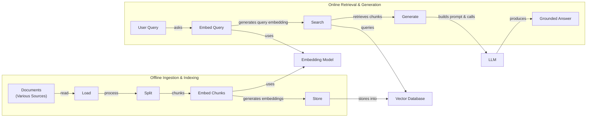
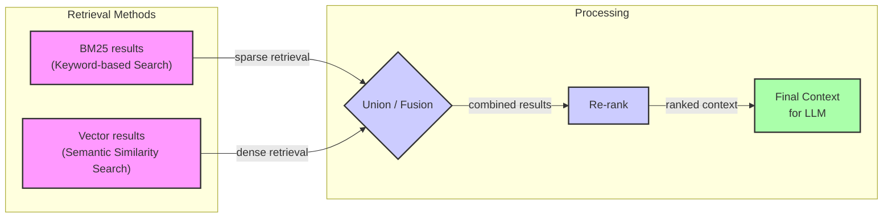
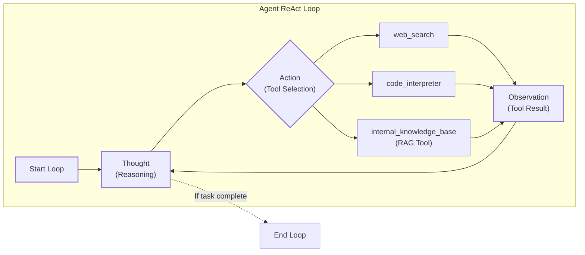

# Lesson 9: Retrieval-Augmented Generation (RAG)

In our previous lessons, we explored the foundations of AI Engineering, from the agent landscape to the mechanics of context engineering, structured outputs, and agentic reasoning with ReAct. We’ve established that for an LLM to perform complex tasks, it needs the right information at the right time. In Lesson 3, we introduced Context Engineering as the discipline of managing this information flow, curating the data an LLM sees to guide its behavior.

However, a core problem remains: an LLM’s knowledge is frozen in time, based on the data it was trained on. This is like asking an expert to take a "closed-book exam" on a world that is constantly changing. Their knowledge, however vast, is static. We cannot efficiently update the model's internal weights with new information after deployment; fine-tuning is slow, expensive, and often impractical for keeping up with dynamic data. This limitation leads to outdated answers and hallucinations, where the model confidently invents facts.

Retrieval-Augmented Generation (RAG) offers a powerful and practical solution. Instead of relying on the LLM’s limited memory, we give it an "open-book exam." RAG connects the LLM to external, real-time knowledge sources, allowing it to retrieve relevant information and use it to construct accurate, grounded answers. Much like a human researcher doesn't need to memorize every fact but knows where to look things up, RAG teaches an LLM how to find and use external knowledge.

As a method within the broader practice of Context Engineering, RAG is a fundamental skill for any AI Engineer. It’s how we build applications that can reason over proprietary documents, access up-to-the-minute data, and provide answers that users can trust. In our next lesson, we will explore how agent memory systems complement retrieval, but for now, let’s focus on the mechanics of RAG itself.

This lesson will guide you through the "what" and "how" of RAG, starting with its basic components and progressing to the advanced and agentic patterns that power modern AI systems. With the problem and motivation clear, we’ll first decompose RAG into its core components so you can see where each responsibility lives.

## The RAG System: Core Components

Understanding the components of RAG is the first step in the Context Engineering process of designing effective retrieval systems. At its heart, a RAG system is built on three conceptual pillars that work together to connect a user’s query to a grounded answer.

From a classic AI perspective, RAG’s function is analogous to providing semantic memory—general facts and knowledge about a domain. This can be contrasted with methods like Case-Based Reasoning (CBR), which retrieve concrete past episodes or cases to solve new problems, akin to episodic memory. Explanations built from specific cases can be more convincing, but RAG’s strength lies in synthesizing answers from a broad knowledge base [[62]](https://ceur-ws.org/Vol-3708/paper_21.pdf).

Image 1: A flowchart illustrating the core components and sequential flow of a RAG system.

**1. Retrieval:** This is the search engine of your RAG system, responsible for finding relevant information from an external knowledge base. When a user asks a question, the retriever’s job is to sift through potentially millions of documents to find the handful of snippets that are most likely to contain the answer [[2]](https://towardsai.net/p/l/a-complete-guide-to-rag), [[3]](https://decodingml.substack.com/p/rag-fundamentals-first?utm_source=publication-search). This process typically relies on vector embeddings, which are numerical representations of text that capture semantic meaning.

Documents are first broken down into chunks, and an embedding model converts each chunk into a vector. These vectors are then stored in a specialized vector database. At query time, the user’s question is also converted into a vector, and the system searches the database for the vectors (and their corresponding text chunks) that are closest in the high-dimensional space, a process known as semantic similarity search [[51]](https://apxml.com/courses/prompt-engineering-llm-application-development/chapter-6-integrating-llms-external-data-rag/implementing-semantic-search-retrieval). While semantic search is powerful, it can be complemented by traditional keyword-based search methods like BM25, which excel at finding exact matches for specific terms or acronyms [[38]](https://mlpills.substack.com/p/issue-76-optimize-rag-with-hybrid).

**2. Augmentation:** Once the retriever has identified the most relevant document chunks, the augmentation step begins. This process involves taking the retrieved information and strategically inserting it into the prompt that will be sent to the LLM. The goal is to provide the model with just enough context to answer the user’s query accurately without overwhelming it with irrelevant details [[56]](https://www.topquadrant.com/resources/blog-retrieval-augmented-generation-explained/). This is a critical part of prompt engineering within RAG, as the structure of the augmented prompt—how the query and context are combined and presented—directly influences the quality of the final response [[29]](https://www.ibm.com/think/topics/retrieval-augmented-generation).

**3. Generation:** The final pillar is generation. The augmented prompt, which now contains the original user query plus the retrieved context, is fed to the LLM. The LLM’s task is to synthesize this information and generate a coherent, human-readable answer. Instead of relying solely on its pre-trained knowledge, the model is instructed to base its response on the provided context [[21]](https://medium.com/@fahey_james/retrieval-augmented-generation-building-grounded-ai-for-enterprise-knowledge-6bc46277fee5). This grounding is what makes RAG-powered answers more reliable and less prone to hallucination. A well-designed system will also generate citations that trace claims back to the source documents, building user trust [[22]](https://www.mindstudio.ai/blog/what-is-rag/).

Now that you can name each moving part, let’s see how they line up across the two phases of a real system.

## The RAG Pipeline: Ingestion and Retrieval

An end-to-end RAG workflow is best understood as a system with two distinct phases: an offline phase for preparing data and an online phase for answering queries in real-time.

Image 2: A detailed flowchart illustrating the end-to-end RAG (Retrieval Augmented Generation) workflow, divided into Offline Ingestion & Indexing and Online Retrieval & Generation phases, highlighting shared components.

### Phase 1: Offline Ingestion & Indexing

This is the preparatory phase where you build your knowledge base. It runs asynchronously, before any user interaction, and its goal is to process your raw documents into a searchable index [[32]](https://newsletter.systemdesign.one/p/how-rag-works).

1.  **Load:** The process starts by loading your data from various sources. This could include PDFs from a local directory, pages from a website, or records from a database like Notion or Confluence. Tools like LangChain’s document loaders or LlamaIndex’s readers are commonly used to handle this data extraction [[33]](https://towardsdatascience.com/ragops-guide-building-and-scaling-retrieval-augmented-generation-systems-3d26b3ebd627/).
2.  **Split:** Since raw documents are often too large to fit into an LLM's context window, they must be broken down into smaller pieces, or "chunks." This is a critical step, as the quality of your chunks directly impacts retrieval quality. Strategies range from simple fixed-size splitting to more sophisticated semantic chunking, which tries to keep related ideas together and avoid awkward breaks in the middle of a sentence or paragraph [[52]](https://medium.com/@robi.tomar72/how-rag-actually-works-embeddings-vector-databases-indexing-retrieval-explained-simply-3d1ca45fe1bf).
3.  **Embed:** Each text chunk is then passed through an embedding model, which converts it into a high-dimensional vector. This vector captures the semantic meaning of the text. Popular embedding models include OpenAI's `text-embedding-3` series, Google's `text-embedding-004`, and open-source models like BGE variants available on Hugging Face [[37]](https://tutorialsdojo.com/aws-vector-databases-explained-semantic-search-and-rag-systems/).
4.  **Store:** Finally, these embeddings, along with their corresponding text and any useful metadata (like source document name or page number), are loaded into a vector database. This database is optimized for fast similarity searches. Examples include local libraries like FAISS or production-grade databases like Qdrant, Milvus, and Pinecone [[36]](https://pub.towardsai.net/vector-databases-in-practice-building-a-realistic-hybrid-search-rag-system-with-qdrant-7b8f4a6e41e0).

### Phase 2: Online Retrieval & Generation

This phase happens in real-time, triggered by a user’s query. It’s the interactive part of the RAG system [[31]](https://medium.com/@derrickryangiggs/rag-pipeline-deep-dive-ingestion-chunking-embedding-and-vector-search-abd3c8bfc177).

1.  **Query:** The user submits a prompt, which serves as the initial query for the retrieval system. In more advanced setups, this query might be pre-processed or expanded to improve its chances of matching relevant documents.
2.  **Embed:** The user’s query is converted into a vector using the *same* embedding model that was used during the ingestion phase. This ensures that the query and the document chunks exist in the same vector space, making them comparable [[8]](https://www.llamaindex.ai/blog/rag-is-dead-long-live-agentic-retrieval).
3.  **Search:** The system uses the query vector to search the vector database. It calculates the similarity (often using cosine similarity) between the query vector and all the chunk vectors in the index, returning the top-k most similar chunks. This "k" is a configurable parameter, typically between 3 and 10.
4.  **Generate:** The retrieved chunks are assembled into the context section of a prompt. This augmented prompt, containing the original query, the retrieved context, and specific instructions, is then sent to an LLM. The LLM generates a final answer grounded in the provided information. As we learned in Lesson 4, this output can be formatted as a structured object, and ideally, it includes citations pointing back to the source documents [[54]](https://towardsdatascience.com/rag-explained-understanding-embeddings-similarity-and-retrieval/).

With the end-to-end path in place, the next question is quality: what are the advanced techniques to make retrieval more accurate and useful across messy, real-world data?

## Advanced RAG Techniques

A "naive" RAG pipeline often works well for simple lookups, but production systems require more sophisticated techniques to handle the complexity of real-world data and user queries. These advanced methods focus on improving retrieval quality, ensuring the most relevant and complete context is provided to the LLM.

Image 3: A flowchart illustrating the hybrid retrieval flow, showing parallel BM25 and vector results converging into a union/fusion step, followed by re-ranking and final context generation for an LLM.

### Hybrid Search

Purely semantic search can sometimes miss important keywords, acronyms, or specific identifiers. Hybrid search solves this by combining dense vector search (for meaning) with sparse keyword-based search methods like BM25 (for precision) [[39]](https://cubitrek.com/blog/hybrid-search-optimization-how-bm25-and-dense-vector-retrieval-work-together-for-superior-ai-search/).

For example, if a customer support agent searches for "my bill keeps rolling over," vector search might find documents about "carryover balances," capturing the semantic intent. At the same time, BM25 would pinpoint articles that contain the exact term "rollover." By fusing the results from both methods, often using an algorithm like Reciprocal Rank Fusion (RRF), the system provides a more comprehensive set of candidates that covers both semantic and lexical matches [[38]](https://mlpills.substack.com/p/issue-76-optimize-rag-with-hybrid).

### Re-ranking

The initial retrieval step is optimized for speed and recall, meaning it casts a wide net to find potentially relevant documents. However, the top-k results are not always ordered by true relevance. Re-ranking introduces a second, more precise scoring step. A cross-encoder model takes the user query and each candidate document as a pair, processing them together to compute a highly accurate relevance score [[43]](https://apxml.com/courses/optimizing-rag-for-production/chapter-2-advanced-retrieval-optimization/reranking-architectures-rag). Unlike a bi-encoder, which encodes the query and document independently, a cross-encoder feeds both into a single transformer. This allows every query token to directly attend to every document token, capturing nuanced relationships that independent embeddings miss [[63]](https://towardsdatascience.com/advanced-rag-retrieval-cross-encoders-reranking/).

This is computationally more expensive than the initial retrieval, so it's only applied to a smaller set of top candidates (e.g., the top 50). As queries per second (QPS) increase, this per-document processing cost can cause tail latencies to rise dramatically, making it a bottleneck in high-throughput systems [[71]](https://towardsdatascience.com/advanced-rag-retrieval-cross-encoders-reranking/). The re-ranker then re-orders these documents, ensuring that the most relevant ones are placed at the top. For instance, in a product help scenario, a query like "how to connect my account" might initially retrieve a press release and a community forum post. A re-ranker would prioritize the official step-by-step setup guide, pushing it to the top of the list sent to the LLM [[42]](https://redis.io/blog/10-techniques-to-improve-rag-accuracy/).

### Query Transformations

Sometimes, the user's question isn't the best query to send to the retrieval system. Query transformation techniques rewrite or expand the original query to improve retrieval accuracy.

*   **Decomposition:** This strategy breaks down a complex, multi-part question into several simpler sub-questions. Each sub-question is executed independently, and the retrieved contexts are then merged. For a query like, "What’s our travel policy for conferences in Europe this year?", the system might generate sub-questions such as "What is the company travel policy?", "What are the rules for Europe?", and "What changed in the policy this year?" [[19]](https://docs.nvidia.com/rag/latest/query_decomposition.html). Perfect decomposition is challenging, as complex queries can involve logical operators like negation or exclusion. Furthermore, the optimal number of sub-queries often depends on the domain; fact-verification tasks may need only two, while complex biomedical problems might require eight or more [[77]](https://aclanthology.org/2025.findings-emnlp.1022.pdf).
*   **Hypothetical Document Embeddings (HyDE):** This technique addresses the mismatch between the language of queries (short, question-like) and documents (long, declarative). Before searching, the system uses an LLM to generate a short, hypothetical answer to the user's query. This hypothetical document is then embedded and used for the similarity search, as its structure and vocabulary are more likely to match the actual policy documents [[16]](https://47billion.com/blog/rag-system-in-production-why-it-fails-and-how-to-fix-it/). However, this technique relies on the LLM generating a plausible document, which may not be factually accurate, limiting precision [[104]](https://towardsdatascience.com/advanced-query-transformations-to-improve-rag-11adca9b19d1/).

### Advanced Chunking Strategies

The way documents are split into chunks has a massive impact on retrieval. Moving beyond simple fixed-size chunking can preserve critical context.

*   **Semantic Chunking:** Instead of splitting text by a fixed number of tokens, this method groups semantically related sentences together. For example, when chunking a company handbook, fixed-size splitting might cut the "Reimbursements" section in half, separating a policy from its spending limits. Semantic chunking would keep the entire section intact, ensuring the LLM receives the complete context [[18]](https://cloudurable.com/blog/advanced-rag-techniques-that-will-transform-your-l/).
*   **Layout-Aware Chunking:** For documents with complex structures like tables, forms, or PDFs, this method preserves the original layout. When processing a pricing table, for instance, it ensures that each product, its price, and its discount stay in the same chunk, rather than being split across arbitrary boundaries [[17]](https://sarthakai.substack.com/p/improve-your-rag-accuracy-with-a). Context-enriched chunking further enhances this by adding summary metadata to each chunk, explaining its position and role within the larger document.

### GraphRAG

For questions about complex relationships and interconnected data, standard document retrieval often falls short. GraphRAG addresses this by first constructing a knowledge graph from the source documents, where nodes represent entities (like people, companies, or products) and edges represent their relationships [[5]](https://arxiv.org/html/2404.16130). Retrieval then happens by traversing this graph, allowing the system to answer multi-hop questions that require connecting information across multiple documents or data points [[46]](https://arxiv.org/html/2601.03014v1). This is particularly effective in enterprise settings like legal or construction, where an answer is rarely in a single text chunk but is scattered across contracts, addendums, and amendments with temporal precedence [[64]](https://arxiv.org/html/2604.14220v1).

For example, an IT operations query like, “Which incidents were caused by weekend deploys that also touched the login service?” requires linking change records (deploys) to time, affected services, and resulting incident tickets. A knowledge graph makes these connections explicit, allowing the retriever to follow the path and gather all relevant evidence for the LLM [[50]](https://arxiv.org/html/2501.00309v2).

### Multimodal Retrieval

Looking ahead, RAG systems are evolving beyond just text. Multimodal RAG uses models that can create shared embeddings for different data types, such as text, images, and audio. This allows a text query to retrieve a relevant image or diagram from a financial report, addressing a key limitation of traditional text-only systems [[93]](https://superlinear.eu/insights/articles/the-future-of-multimodal-rag-systems-transforming-ai-capabilities). As we will explore in Lesson 11 on multimodal processing, this capability is essential for building agents that can reason over complex, real-world documents.

These techniques increase retrieval quality. Next, we’ll see how retrieval becomes one tool that an agent can choose to use as it reasons.

## Agentic RAG

As we explored in Lessons 7 and 8, a ReAct agent operates in a `Thought, Action, Observation` loop. Agentic RAG is the application of this framework where retrieval is one of the primary `Actions` (tools) available to the agent. Instead of a rigid, linear pipeline, the agent can dynamically decide when and how to retrieve information as part of its reasoning process [[45]](https://towardsdatascience.com/agentic-rag-vs-classic-rag-from-a-pipeline-to-a-control-loop/).

Agents often have many tools, such as web search or code execution, and RAG is simply one key capability in their toolkit [[9]](https://www.ibm.com/think/topics/agentic-rag).

The core distinction lies in the control flow:
*   **Standard RAG** is a pre-determined workflow: Retrieve → Augment → Generate. It is efficient but inflexible.
*   **Agentic RAG** is an adaptive control loop. The agent decides when to retrieve, what to retrieve, from which source, and whether multiple steps of retrieval and reasoning are needed [[13]](https://medium.com/@gaddam.rahul.kumar/agentic-rag-vs-traditional-rag-b1a156f72167).

This agentic approach unlocks several advanced capabilities:
*   **Iterative Retrieval:** The agent can use its RAG tool multiple times, refining its query at each step. If an initial search returns an outdated policy, the agent can reason that it needs more current information and launch a new query.
*   **Source Selection:** An agent can choose between different knowledge bases. For an outage inquiry, it might select the `search_incident_runbooks` tool over the `search_marketing_pages` tool.
*   **Information Fusion:** The agent can combine information from its internal RAG tool with results from other tools, like a web search, to create a more comprehensive answer. It might retrieve an internal policy and then use a web search to verify current regulatory thresholds before synthesizing a final response [[7]](https://weaviate.io/blog/what-is-agentic-rag).

Image 4: A conceptual flowchart illustrating an agent's main loop, emphasizing its iterative nature and decision-making capabilities based on the ReAct pattern. The loop includes "Thought", "Action", and "Observation" steps, with dynamic tool selection within the "Action" step.

Consider this conceptual thought process for an agent:
*   **Thought:** User asks about "2024 EU data retention rules." Internal policy is from 2023, likely outdated.
*   **Action:** `retrieve(internal_policy, query="EU data retention 2024")`
*   **Observation:** Mentions amendments, but no citations.
*   **Thought:** Need external verification.
*   **Action:** `web_search(query="EU data retention directive 2024 official")`
*   **Observation:** Finds official directive.
*   **Thought:** Synthesize both sources, citing changes.

This transforms the interaction from a simple database lookup into a conversation with a knowledgeable research assistant. However, this flexibility introduces new failure modes. An agent might get stuck in a "retrieval thrash" loop, re-querying without making progress, or create "tool storms" with excessive, cascading calls to its tools [[99]](https://towardsdatascience.com/agentic-rag-failure-modes-retrieval-thrash-tool-storms-and-context-bloat-and-how-to-spot-them-early/). At scale, the latency of each step accumulates, making real-time interaction a significant challenge that requires aggressive caching [[66]](https://redis.io/blog/agentic-rag-how-enterprises-are-surmounting-the-limits-of-traditional-rag/).

You now understand both a linear RAG pipeline and how an agent can control retrieval when needed. Let’s wrap up by situating RAG in the wider AI Engineering toolkit and previewing what comes next.

## Conclusion

We have journeyed from the fundamental problem of static LLM knowledge to the sophisticated, agent-driven retrieval systems of today. RAG is the industry's most widely adopted solution for grounding LLMs, reducing hallucinations, and customizing responses with proprietary or real-time data. For production-grade quality, advanced techniques like hybrid search, re-ranking, and GraphRAG are not just optimizations—they are necessities.

The future of knowledge retrieval is agentic. By equipping agents with RAG as a tool, we move from rigid pipelines to dynamic, reasoning-driven workflows. This shift builds user trust by enabling systems to provide verifiable, source-backed answers. For the modern AI Engineer, mastering RAG is not a niche skill but a foundational competency, a crucial part of the broader discipline of Context Engineering.

In our next lesson, we will explore Memory for Agents, and see how short- and long-term memory systems work alongside RAG to create AI that learns and adapts over time. We will also touch on other critical topics later in the course, such as building robust evaluation pipelines for retrieval quality and monitoring these complex systems in production.

## References

- [1]  https://blogs.nvidia.com/blog/what-is-retrieval-augmented-generation/
- [2]  https://towardsai.net/p/l/a-complete-guide-to-rag
- [3]  https://decodingml.substack.com/p/rag-fundamentals-first?utm_source=publication-search
- [4]  https://decodingml.substack.com/p/your-rag-is-wrong-heres-how-to-fix?utm_source=publication-search
- [5]  https://arxiv.org/html/2404.16130
- [6]  https://www.anthropic.com/news/contextual-retrieval
- [7]  https://weaviate.io/blog/what-is-agentic-rag
- [8]  https://www.llamaindex.ai/blog/rag-is-dead-long-live-agentic-retrieval
- [9]  https://www.ibm.com/think/topics/agentic-rag
- [10]  https://learn.microsoft.com/en-us/azure/developer/ai/advanced-retrieval-augmented-generation
- [11]  https://highlearningrate.substack.com/p/the-rise-of-rag
- [12]  https://neo4j.com/blog/developer/fine-tuning-vs-rag/
- [13]  https://medium.com/@gaddam.rahul.kumar/agentic-rag-vs-traditional-rag-b1a156f72167
- [14]  https://aclanthology.org/2024.emnlp-main.15.pdf
- [15]  https://arxiv.org/html/2312.05934v3
- [16]  https://47billion.com/blog/rag-system-in-production-why-it-fails-and-how-to-fix-it/
- [17]  https://sarthakai.substack.com/p/improve-your-rag-accuracy-with-a
- [18]  https://cloudurable.com/blog/advanced-rag-techniques-that-will-transform-your-l/
- [19]  https://docs.nvidia.com/rag/latest/query_decomposition.html
- [20]  https://neo4j.com/blog/genai/advanced-rag-techniques/
- [21]  https://medium.com/@fahey_james/retrieval-augmented-generation-building-grounded-ai-for-enterprise-knowledge-6bc46277fee5
- [22]  https://www.mindstudio.ai/blog/what-is-rag/
- [23]  https://www.madrona.com/rag-inventor-talks-agents-grounded-ai-and-enterprise-impact/
- [24]  https://humanloop.com/blog/rag-architectures
- [25]  https://www.aimon.ai/posts/rag_and_its_different_components/
- [26]  https://toloka.ai/blog/grounding-llms-driving-ai-to-deliver-contextually-relevant-data/
- [27]  https://galileo.ai/blog/rag-architecture
- [28]  https://aws.amazon.com/what-is/retrieval-augmented-generation/
- [29]  https://www.ibm.com/think/topics/retrieval-augmented-generation
- [30]  https://medium.com/@tahirbalarabe2/retrieval-augmented-generation-vs-fine-tuning-enhancing-llms-697e7a0cf7e0
- [31]  https://medium.com/@derrickryangiggs/rag-pipeline-deep-dive-ingestion-chunking-embedding-and-vector-search-abd3c8bfc177
- [32]  https://newsletter.systemdesign.one/p/how-rag-works
- [33]  https://towardsdatascience.com/ragops-guide-building-and-scaling-retrieval-augmented-generation-systems-3d26b3ebd627/
- [34]  https://apxml.com/courses/optimizing-rag-for-production/chapter-6-advanced-rag-evaluation-monitoring/rag-offline-online-evaluation
- [35]  https://www.infoworld.com/article/2335043/addressing-ai-hallucinations-with-retrieval-augmented-generation.html
- [36]  https://pub.towardsai.net/vector-databases-in-practice-building-a-realistic-hybrid-search-rag-system-with-qdrant-7b8f4a6e41e0
- [37]  https://tutorialsdojo.com/aws-vector-databases-explained-semantic-search-and-rag-systems/
- [38]  https://mlpills.substack.com/p/issue-76-optimize-rag-with-hybrid
- [39]  https://cubitrek.com/blog/hybrid-search-optimization-how-bm25-and-dense-vector-retrieval-work-together-for-superior-ai-search/
- [40]  https://community.netapp.com/t5/Tech-ONTAP-Blogs/Hybrid-RAG-in-the-Real-World-Graphs-BM25-and-the-End-of-Black-Box-Retrieval/ba-p/464834
- [41]  https://arxiv.org/html/2407.00072v5
- [42]  https://redis.io/blog/10-techniques-to-improve-rag-accuracy/
- [43]  https://apxml.com/courses/optimizing-rag-for-production/chapter-2-advanced-retrieval-optimization/reranking-architectures-rag
- [44]  https://towardsdatascience.com/advanced-rag-retrieval-cross-encoders-reranking/
- [45]  https://towardsdatascience.com/agentic-rag-vs-classic-rag-from-a-pipeline-to-a-control-loop/
- [46]  https://arxiv.org/html/2601.03014v1
- [47]  https://webhome.cs.uvic.ca/~thomo/papers/asonam2025-graphrag.pdf
- [48]  https://atlan.com/know/what-is-graphrag/
- [49]  https://arxiv.org/html/2501.00309v2
- [50]  https://arxiv.org/html/2501.00309v2
- [51]  https://apxml.com/courses/prompt-engineering-llm-application-development/chapter-6-integrating-llms-external-data-rag/implementing-semantic-search-retrieval
- [52]  https://medium.com/@robi.tomar72/how-rag-actually-works-embeddings-vector-databases-indexing-retrieval-explained-simply-3d1ca45fe1bf
- [53]  https://learnopencv.com/vector-db-and-rag-pipeline-for-document-rag/
- [54]  https://towardsdatascience.com/rag-explained-understanding-embeddings-similarity-and-retrieval/
- [55]  https://www.topquadrant.com/resources/blog-retrieval-augmented-generation-explained/
- [56]  https://www.topquadrant.com/resources/blog-retrieval-augmented-generation-explained/
- [57]  https://medium.com/@rahulraut.techuse/introduction-to-augmenting-llms-using-retrieval-augmented-generation-rag-6530123dbb91
- [58]  https://www.promptingguide.ai/research/rag
- [59]  https://medium.com/@tejpal.abhyuday/retrieval-augmented-generation-rag-from-basics-to-advanced-a2b068fd576c
- [60]  https://airbyte.com/agentic-data/ai-agent-vs-rag
- [61]  https://domino.ai/blog/rag-vs-agentic-ai
- [62]  https://ceur-ws.org/Vol-3708/paper_21.pdf
- [63]  https://towardsdatascience.com/advanced-rag-retrieval-cross-encoders-reranking/
- [64]  https://arxiv.org/html/2604.14220v1
- [65]  https://redis.io/blog/agentic-rag-how-enterprises-are-surmounting-the-limits-of-traditional-rag/
- [66]  https://apxml.com/courses/large-scale-distributed-rag/chapter-1-scalable-rag-architectures-foundations/scaling-rag-bottlenecks-limitations
- [67]  https://towardsdatascience.com/advanced-rag-retrieval-cross-encoders-reranking/
- [68]  https://pure.uva.nl/ws/files/118144878/978_3_030_99736_6_44.pdf
- [69]  https://arxiv.org/html/2510.18633v1
- [70]  https://www.ibm.com/think/insights/rag-problems-five-ways-to-fix
- [71]  https://aclanthology.org/2025.findings-emnlp.1022.pdf
- [72]  https://labelstud.io/blog/rag-fundamentals-challenges-and-advanced-techniques/
- [73]  https://ijcaonline.org/archives/volume187/number18/veluru-2025-ijca-925279.pdf
- [74]  https://ceur-ws.org/Vol-3708/paper_21.pdf
- [75]  https://arxiv.org/abs/2404.04302
- [76]  https://dev.to/sten/optimizing-sql-queries-for-your-ai-agents-41dj
- [77]  https://devblogs.microsoft.com/azure-sql/improve-the-r-in-rag-and-embrace-agentic-rag-in-azure-sql/
- [78]  https://superlinear.eu/insights/articles/the-future-of-multimodal-rag-systems-transforming-ai-capabilities
- [79]  https://milvus.io/ai-quick-reference/what-is-the-future-of-embeddings-in-multimodal-search
- [80]  https://www.teradata.com/insights/ai-and-machine-learning/multimodal-rag-and-agents
- [81]  https://developer.nvidia.com/blog/best-in-class-multimodal-rag-how-the-llama-3-2-nemo-retriever-embedding-model-boosts-pipeline-accuracy/
- [82]  https://dev.to/kuldeep_paul/ten-failure-modes-of-rag-nobody-talks-about-and-how-to-detect-them-systematically-7i4
- [83]  https://towardsdatascience.com/agentic-rag-failure-modes-retrieval-thrash-tool-storms-and-context-bloat-and-how-to-spot-them-early/
- [84]  https://milvus.io/ai-quick-reference/what-are-common-agentic-rag-failure-modes-in-production
- [85]  https://javarevisited.substack.com/p/why-rag-has-exactly-6-failure-modes
- [86]  https://arxiv.org/html/2407.18044v2
- [87]  https://towardsdatascience.com/advanced-query-transformations-to-improve-rag-11adca9b19d1/
- [88]  https://sarthakai.substack.com/p/improve-your-rag-accuracy-with-a
- [89]  https://www.llamaindex.ai/glossary/document-chunking-strategies
- [90]  https://learn.microsoft.com/en-us/azure/search/search-how-to-semantic-chunking
- [91]  https://towardsdatascience.com/your-chunks-failed-your-rag-in-production/
- [92]  https://falkordb.com/blog/what-is-graphrag/
- [93]  https://superlinear.eu/insights/articles/the-future-of-multimodal-rag-systems-transforming-ai-capabilities
- [94]  https://milvus.io/ai-quick-reference/what-is-the-future-of-embeddings-in-multimodal-search
- [95]  https://www.teradata.com/insights/ai-and-machine-learning/multimodal-rag-and-agents
- [96]  https://developer.nvidia.com/blog/best-in-class-multimodal-rag-how-the-llama-3-2-nemo-retriever-embedding-model-boosts-pipeline-accuracy/
- [97]  https://dev.to/kuldeep_paul/ten-failure-modes-of-rag-nobody-talks-about-and-how-to-detect-them-systematically-7i4
- [98]  https://towardsdatascience.com/agentic-rag-failure-modes-retrieval-thrash-tool-storms-and-context-bloat-and-how-to-spot-them-early/
- [99]  https://milvus.io/ai-quick-reference/what-are-common-agentic-rag-failure-modes-in-production
- [100]  https://javarevisited.substack.com/p/why-rag-has-exactly-6-failure-modes
- [101]  https://arxiv.org/html/2407.18044v2
- [102]  https://towardsdatascience.com/advanced-query-transformations-to-improve-rag-11adca9b19d1/
- [103]  https://sarthakai.substack.com/p/improve-your-rag-accuracy-with-a
- [104]  https://www.llamaindex.ai/glossary/document-chunking-strategies
- [105]  https://learn.microsoft.com/en-us/azure/search/search-how-to-semantic-chunking
- [106]  https://towardsdatascience.com/your-chunks-failed-your-rag-in-production/