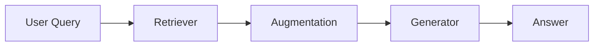
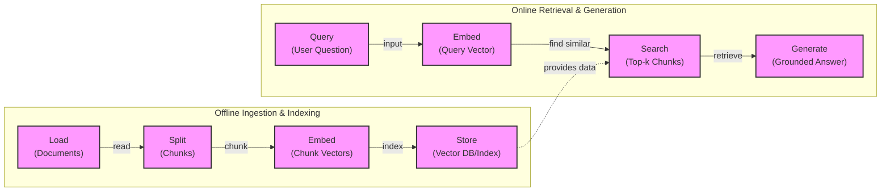
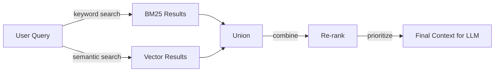
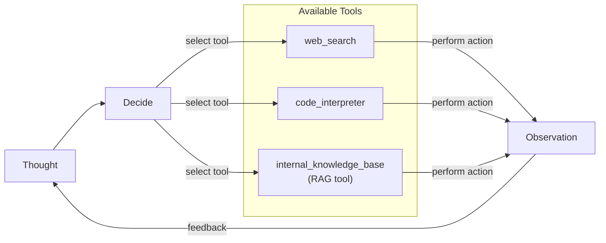

**Source Registry:**
- **Source [1]** `tavily_results`: qualifies for → **"Agentic RAG"** *(adds: depth on latency, cost, and complexity trade-offs when deploying agentic systems)*
- **Source [2]** `tavily_results`: qualifies for → **"Conclusion"** *(adds: depth on the open challenges of evaluating agentic RAG, which is previewed as a future topic)*
- **Source [3]** `tavily_results`: qualifies for → **"Agentic RAG"** *(adds: breadth by connecting agent reasoning loops to cognitive architectures from psychology)*
- **Source [4]** `tavily_results`: qualifies for → **"Advanced RAG Techniques"** *(adds: depth and historical breadth on GraphRAG, linking it to the evolution of semantic web and knowledge graphs)*
- **Source [5]** `what-is-agentic-architecture-ibm.md`: qualifies for → **"Agentic RAG"** *(adds: breadth and foundational theory by explaining different cognitive architectures like BDI that inspire agent design)*

# Retrieval-Augmented Generation (RAG)

In our previous lessons, we built a foundation in AI Engineering. We explored the agent landscape, distinguished between LLM workflows and AI agents, and dove into context engineering, the art of managing the information we feed to LLMs. We've seen how agents can reason and use tools to act. Now, we address a core challenge: how do we ground these agents in reality?

LLMs are trained on a fixed dataset, a snapshot of the world at a specific point in time. This makes their knowledge static and prone to hallucination. During training, they are essentially taking a "closed-book exam" on the world's information [[1]](https://blogs.nvidia.com/blog/what-is-retrieval-augmented-generation/). We do not yet have techniques that allow models to continuously learn new information after deployment in the same way humans do. While fine-tuning is an option, it is expensive and inefficient for keeping knowledge current [[2]](https://neo4j.com/blog/developer/fine-tuning-vs-rag/).

This is where Retrieval-Augmented Generation (RAG) comes in. RAG is a reliable solution to this problem, allowing us to insert new knowledge into the model's context window at inference time. Instead of asking the LLM to memorize everything, we give it an "open-book exam" by connecting it to external, real-time knowledge sources. This is similar to how we use manuals or cheat sheets to perform complex tasks without memorizing every detail.

RAG is a core method AI Engineers use for context engineering, which we covered in Lesson 3. It is the mechanism that transforms agents from relying on static knowledge to reasoning over dynamic, external data. In this lesson, we will explore the entire RAG lifecycle, from the fundamental components to the advanced and agentic patterns that power modern AI systems. We will also see how retrieval complements agent memory, a topic we will explore further in Lesson 10 when we discuss short- and long-term memory stores.

## The RAG System: Core Components

Understanding the core components of RAG is the first step in designing an effective system. As we discussed in our lesson on context engineering, curating what an LLM sees is critical. RAG provides the machinery to do this with external data. A RAG system can be broken down into three conceptual pillars: Retrieval, Augmentation, and Generation.

Image 1: A flowchart illustrating the conceptual flow of a RAG system.

**Retrieval** is the engine responsible for finding relevant information. Given a user's query, the retriever searches an external knowledge base to find the most relevant pieces of data. The most common approach is semantic similarity search, which relies on vector embeddings. Text is converted into numerical representations (embeddings) that capture its meaning. These embeddings are stored in a specialized vector database [[3]](https://qdrant.tech/articles/what-is-rag-in-ai/). When a user asks a question, their query is also converted into an embedding, and the system finds the text chunks whose embeddings are closest in the vector space [[4]](https://samirpaulb.github.io/posts/vector-databases-rag-llm/). This allows the system to find conceptually related information, even if the wording is different.

**Augmentation** is the process of taking the information found by the retriever and preparing it for the LLM. This involves formatting the retrieved text chunks and integrating them into the prompt alongside the original user query and system instructions [[5]](https://www.topquadrant.com/resources/blog-retrieval-augmented-generation-explained/). The goal is to create a clear and context-rich prompt that guides the LLM toward a grounded and accurate answer.

**Generation** is the final step where the LLM produces a response. Using the augmented prompt, which now contains both the user's question and the relevant external data, the LLM generates an answer. Because the model has access to this specific, retrieved context, the answer is grounded in the provided sources. This dramatically reduces the likelihood of hallucinations and allows the model to provide answers based on data it was never trained on [[1]](https://blogs.nvidia.com/blog/what-is-retrieval-augmented-generation/).

Now that you can name each moving part, let’s see how they line up across the two phases of a real system.

## The RAG Pipeline: Ingestion and Retrieval

The end-to-end RAG workflow is divided into two distinct phases: an offline ingestion pipeline that prepares the data, and an online retrieval pipeline that answers queries at runtime.

Image 2: A detailed flowchart illustrating the end-to-end RAG workflow, divided into two main phases: "Offline Ingestion & Indexing" and "Online Retrieval & Generation".

### Phase 1: Offline Ingestion & Indexing

This phase is all about preparing your knowledge base for efficient retrieval. It runs asynchronously, typically as a batch or streaming pipeline, and only needs to be re-run when your source data changes [[6]](https://newsletter.systemdesign.one/p/how-rag-works).

1.  **Load:** The first step is to load your documents from their sources. These can be PDFs, web pages, database records, or any other format. Libraries like LangChain and LlamaIndex provide a wide range of document loaders that can handle various data types [[7]](https://medium.com/@derrickryangiggs/rag-pipeline-deep-dive-ingestion-chunking-embedding-and-vector-search-abd3c8bfc177).
2.  **Split:** Since LLMs have limited context windows, large documents must be broken down into smaller pieces, or "chunks." This is a critical step, as the quality of your chunks directly impacts retrieval accuracy. Chunking can be done using simple rule-based splitters (e.g., by character count or paragraphs) or more advanced semantic chunkers that split text based on shifts in meaning [[7]](https://medium.com/@derrickryangiggs/rag-pipeline-deep-dive-ingestion-chunking-embedding-and-vector-search-abd3c8bfc177). The goal is to create chunks that are semantically coherent and self-contained.
3.  **Embed:** Each chunk is then passed through an embedding model to convert it into a numerical vector. These vectors capture the semantic meaning of the text. Popular embedding models include OpenAI's `text-embedding-3` series, Google's `text-embedding-004`, and various open-source models from providers like Hugging Face [[7]](https://medium.com/@derrickryangiggs/rag-pipeline-deep-dive-ingestion-chunking-embedding-and-vector-search-abd3c8bfc177).
4.  **Store:** Finally, the embeddings and their corresponding text chunks (along with any metadata) are stored in a vector database. This specialized database is optimized for fast similarity searches, allowing the system to quickly find the vectors most similar to a given query vector. Examples include FAISS for local development and scalable solutions like Milvus, Qdrant, and Pinecone [[8]](https://medium.com/@robi.tomar72/how-rag-actually-works-embeddings-vector-databases-indexing-retrieval-explained-simply-3d1ca45fe1bf).

### Phase 2: Online Retrieval & Generation

This phase happens in real-time when a user interacts with the system.

1.  **Query:** The user submits a question. This query can be pre-processed to normalize it or expand it for better matching.
2.  **Embed:** The user's query is converted into a vector using the *same* embedding model that was used during the ingestion phase. This ensures that the query and the document chunks are in the same vector space, making them comparable [[3]](https://qdrant.tech/articles/what-is-rag-in-ai/).
3.  **Search:** The system uses the query vector to search the vector database. It calculates the similarity (often using cosine similarity) between the query vector and all the chunk vectors in the database, returning the top-k most similar chunks [[4]](https://samirpaulb.github.io/posts/vector-databases-rag-llm/).
4.  **Generate:** The retrieved chunks are assembled into the prompt along with the user's original query. This augmented prompt is then sent to an LLM, which generates a final answer grounded in the provided context. To ensure traceability, you can also instruct the model to include citations in its response, a technique we touched on in our lesson on structured outputs.

With the end-to-end path in place, the next question is quality. What are the advanced techniques to make retrieval more accurate and useful across messy, real-world data?

## Advanced RAG Techniques

A naive RAG pipeline is a great starting point, but production systems often require more sophisticated techniques to handle the complexities of real-world data and user queries. These advanced methods focus on improving the quality and relevance of the retrieved context.

Image 3: A flowchart illustrating the hybrid retrieval flow.

**Hybrid Search** combines the strengths of traditional keyword-based search (like BM25) and modern vector search [[9]](https://mlpills.substack.com/p/issue-76-optimize-rag-with-hybrid). Vector search excels at finding semantically similar results, understanding paraphrasing and conceptual relationships. However, it can sometimes miss exact matches for rare terms, IDs, or acronyms. BM25, on the other hand, is excellent at precise keyword matching. By running both searches and fusing the results (often using an algorithm like Reciprocal Rank Fusion), you get the best of both worlds, ensuring both semantic relevance and keyword precision [[10]](https://cubitrek.com/blog/hybrid-search-optimization-how-bm25-and-dense-vector-retrieval-work-together-for-superior-ai-search/).

**Re-ranking** introduces a second stage to the retrieval process. The initial retrieval (e.g., hybrid search) is optimized for speed and recall, casting a wide net to find a set of candidate documents. A more powerful but slower re-ranker model then assesses these candidates more carefully [[11]](https://redis.io/blog/10-techniques-to-improve-rag-accuracy/). Cross-encoder models are commonly used for this. They process the query and each candidate document together, producing a highly accurate relevance score. This allows the system to push the most relevant documents to the top before they are sent to the LLM [[12]](https://apxml.com/courses/optimizing-rag-for-production/chapter-2-advanced-retrieval-optimization/reranking-architectures-rag).

**Query Transformations** modify the user's initial query to improve retrieval results. This can take several forms:
*   **Decomposition** breaks down a complex, multi-part question into several simpler sub-queries. For example, "What’s our travel policy for conferences in Europe this year?" could be split into separate queries about the general travel policy, conference rules, Europe-specific guidelines, and recent updates. The system retrieves documents for each sub-query and then synthesizes the results [[13]](https://docs.nvidia.com/rag/latest/query_decomposition.html).
*   **Hypothetical Document Embeddings (HyDE)** is a technique where an LLM first generates a hypothetical, ideal answer to the user's query. This generated answer is then embedded and used to search the vector database. The idea is that this hypothetical document is often more semantically aligned with the actual answer documents than the original, brief query, leading to better retrieval results [[14]](https://neo4j.com/blog/genai/advanced-rag-techniques/).

**Advanced Chunking Strategies** move beyond simple fixed-size splitting to preserve more document context.
*   **Semantic chunking** groups semantically related sentences together, ensuring that conceptual units are not broken apart across different chunks [[7]](https://medium.com/@derrickryangiggs/rag-pipeline-deep-dive-ingestion-chunking-embedding-and-vector-search-abd3c8bfc177).
*   **Layout-aware chunking** is crucial for complex documents like PDFs with tables, headers, and footnotes. It preserves the document's structure, preventing a table row from being separated from its header, for example.
*   **Context-enriched chunking** adds summary or metadata information to each chunk before embedding it. This gives the embedding model more context, which can significantly improve retrieval accuracy, especially for chunks that are ambiguous on their own [[15]](https://www.anthropic.com/news/contextual-retrieval).

**GraphRAG** leverages knowledge graphs to answer questions about complex relationships and interconnected data. While standard RAG retrieves independent text chunks, GraphRAG can traverse relationships between entities (like people, companies, or events) stored in a graph [[16]](https://arxiv.org/html/2404.16130). This evolution incorporates decades of learning from the semantic web, where knowledge graphs like DBpedia and Google's Knowledge Graph first structured factual knowledge for machines [[17]](https://www.semantic-web-journal.net/system/files/swj3862.pdf). The key advantage is that each connection (or "edge") in the graph has a specific meaning, allowing the system to follow logical paths to construct an answer [[18]](https://www.gooddata.com/blog/from-rag-to-graphrag-knowledge-graphs-ontologies-and-smarter-ai/). This is extremely powerful for multi-hop questions that require connecting information across multiple documents or data points. For instance, a query like "Which incidents were caused by weekend deploys that also touched the login service?" can be answered by following connections in the graph from "incident" nodes to "deploy" nodes to "service" nodes [[14]](https://neo4j.com/blog/genai/advanced-rag-techniques/).

These techniques increase retrieval quality. Next, we’ll see how retrieval becomes one tool that an agent can choose to use as it reasons.

## Agentic RAG

In Lessons 7 and 8, we explored the ReAct framework, where an agent iteratively reasons and acts to solve a problem. Agentic RAG is the application of this concept to information retrieval. It transforms RAG from a static, linear pipeline into a dynamic, adaptive process controlled by an agent. This approach is conceptually linked to cognitive architectures from psychology, which model how humans use planning, memory, and reflection to achieve goals [[19]](https://www.ibm.com/think/topics/agentic-architecture).

Image 4: A conceptual flowchart illustrating an agent's main iterative loop, including thought, decision, action selection from tools, and observation feedback.

The core distinction is simple. **Standard RAG** is a pre-determined workflow: Retrieve → Augment → Generate. It is powerful but rigid. **Agentic RAG**, on the other hand, is a control loop [[20]](https://towardsdatascience.com/agentic-rag-vs-classic-rag-from-a-pipeline-to-a-control-loop/). The agent decides *when* to retrieve, *what* to retrieve, and whether one retrieval is enough. Retrieval becomes just one of many tools in the agent's toolkit, alongside others like web search or a code interpreter [[21]](https://weaviate.io/blog/what-is-agentic-rag).

This agentic approach unlocks several new capabilities:

*   **Iterative Retrieval:** The agent can use the RAG tool multiple times, refining its query based on the results of previous steps. If an initial search is too broad, the agent can recognize this, formulate a more specific query, and search again [[20]](https://towardsdatascience.com/agentic-rag-vs-classic-rag-from-a-pipeline-to-a-control-loop/).
*   **Strategic Tool Use:** An agent can choose which knowledge source to query. For a technical question, it might use a `search_tech_docs` tool; for a sales question, it might use `search_crm_notes`. This routing capability allows the system to tap into the most relevant data source for a given task [[22]](https://www.ibm.com/think/topics/agentic-rag).
*   **Information Fusion:** The agent is not limited to a single source of information. It can retrieve internal documentation with its RAG tool, then use a web search tool to find the latest public information on the topic, and finally synthesize both sources into a comprehensive answer [[22]](https://www.ibm.com/think/topics/agentic-rag).

Here is a conceptual "thought process" of an agent tackling a query:

> **User Query:** "What are the latest EU data retention rules for customer data, and how do they compare to our internal 2023 policy?"
>
> **Thought:** The user is asking about two things: the current EU rules and a comparison with our internal policy. I should first check our internal policy to see what we have on file.
> **Action:** `internal_knowledge_base(query="EU data retention policy 2023")`
> **Observation:** Retrieved internal policy document. It cites the 2023 regulations but mentions that amendments were expected in 2024.
> **Thought:** The internal policy might be outdated. I need to find the official 2024 rules to provide an accurate answer. I will use a web search for this.
> **Action:** `web_search(query="official EU data retention regulations 2024")`
> **Observation:** Found a link to the official EU directive updated in 2024, which outlines new requirements.
> **Thought:** I now have both the internal policy and the latest external regulations. I can synthesize this information to answer the user's question, highlighting the differences between the 2023 policy and the new 2024 rules.

This approach transforms retrieval from a simple database lookup into a conversation with a knowledgeable research assistant. However, this flexibility comes with trade-offs. Each reasoning step and tool call adds latency and computational cost, making the system slower and more expensive than a standard RAG pipeline. This creates a direct tension between accuracy and speed; the higher-quality answers from an agentic workflow may not be worth the additional delay for some applications [[23]](https://www.algolia.com/blog/ai/agentic-retrieval).

You now understand both a linear RAG pipeline and how an agent can control retrieval when needed. Let’s wrap up by situating RAG in the wider AI Engineering toolkit and previewing what comes next.

## Conclusion

We have journeyed from the basic principles of RAG to the sophisticated, adaptive world of agentic retrieval. RAG is the industry's most widely adopted solution to the fundamental limitations of LLMs, addressing both knowledge cutoffs and hallucinations. For production-grade applications, advanced techniques like hybrid search, re-ranking, and GraphRAG are essential for achieving the required accuracy and relevance. The future of information retrieval is agentic, where RAG is not just a pipeline but a tool that intelligent agents can use as part of a broader reasoning process.

The core benefits of RAG are clear: it reduces hallucinations, allows for deep customization with proprietary data, and builds user trust by providing verifiable, source-based answers. Mastering RAG is not a niche skill; it is a foundational competency for any AI Engineer. It is a critical component of the broader discipline of context engineering.

In our next lesson, we will explore agent memory. You will learn how short-term and long-term memory systems complement retrieval, allowing agents to remember past interactions and build a more persistent understanding of the world. We will also touch on other important topics later in the course, such as how to build robust evaluation pipelines to measure retrieval quality and how to monitor these complex systems in production. Evaluating agentic systems is an underdeveloped field; traditional metrics fail to capture the success of multi-step reasoning. The challenge is not just whether the final answer was correct, but whether the agent took the right steps to get there, a question that requires new evaluation frameworks [[24]](https://toloka.ai/blog/agentic-rag-systems-for-enterprise-scale-information-retrieval/).

## References

- [1] [What Is Retrieval-Augmented Generation, aka RAG?](https://blogs.nvidia.com/blog/what-is-retrieval-augmented-generation/)
- [2] [Knowledge Graphs and LLMs: Fine-Tuning vs. Retrieval-Augmented Generation](https://neo4j.com/blog/developer/fine-tuning-vs-rag/)
- [3] [What is RAG: Understanding Retrieval-Augmented Generation](https://qdrant.tech/articles/what-is-rag-in-ai/)
- [4] [Vector Databases, RAG, and LLMs for AI Applications](https://samirpaulb.github.io/posts/vector-databases-rag-llm/)
- [5] [Retrieval-Augmented Generation Explained](https://www.topquadrant.com/resources/blog-retrieval-augmented-generation-explained/)
- [6] [How RAG Works: A Technical Deep Dive](https://newsletter.systemdesign.one/p/how-rag-works)
- [7] [RAG Pipeline Deep Dive: Ingestion, Chunking, Embedding, and Vector Search](https://medium.com/@derrickryangiggs/rag-pipeline-deep-dive-ingestion-chunking-embedding-and-vector-search-abd3c8bfc177)
- [8] [How RAG Actually Works: Embeddings, Vector Databases, Indexing, & Retrieval Explained Simply](https://medium.com/@robi.tomar72/how-rag-actually-works-embeddings-vector-databases-indexing-retrieval-explained-simply-3d1ca45fe1bf)
- [9] [Optimize RAG with Hybrid Search](https://mlpills.substack.com/p/issue-76-optimize-rag-with-hybrid)
- [10] [Hybrid Search Optimization: How BM25 and Dense Vector Retrieval Work Together for Superior AI Search](https://cubitrek.com/blog/hybrid-search-optimization-how-bm25-and-dense-vector-retrieval-work-together-for-superior-ai-search/)
- [11] [10 Techniques to Improve RAG Accuracy](https://redis.io/blog/10-techniques-to-improve-rag-accuracy/)
- [12] [Reranking Architectures for RAG](https://apxml.com/courses/optimizing-rag-for-production/chapter-2-advanced-retrieval-optimization/reranking-architectures-rag)
- [13] [Query Decomposition for RAG](https://docs.nvidia.com/rag/latest/query_decomposition.html)
- [14] [Advanced RAG Techniques for High-Performance LLM Applications](https://neo4j.com/blog/genai/advanced-rag-techniques/)
- [15] [Introducing Contextual Retrieval](https://www.anthropic.com/news/contextual-retrieval)
- [16] [From Local to Global: A GraphRAG Approach to Query-Focused Summarization](https://arxiv.org/html/2404.16130)
- [17] [Knowledge Graphs on the Web - A Comparison](https://www.semantic-web-journal.net/system/files/swj3862.pdf)
- [18] [From RAG to GraphRAG: Knowledge Graphs, Ontologies, and Smarter AI](https://www.gooddata.com/blog/from-rag-to-graphrag-knowledge-graphs-ontologies-and-smarter-ai/)
- [19] [What is agentic architecture?](https://www.ibm.com/think/topics/agentic-architecture)
- [20] [Agentic RAG vs Classic RAG: From a Pipeline to a Control Loop](https://towardsdatascience.com/agentic-rag-vs-classic-rag-from-a-pipeline-to-a-control-loop/)
- [21] [What is Agentic RAG](https://weaviate.io/blog/what-is-agentic-rag)
- [22] [What is agentic RAG?](https://www.ibm.com/think/topics/agentic-rag)
- [23] [Agentic Retrieval: Improving RAG with intelligent agents](https://www.algolia.com/blog/ai/agentic-retrieval)
- [24] [Agentic RAG Systems for Enterprise-Scale Information Retrieval](https://toloka.ai/blog/agentic-rag-systems-for-enterprise-scale-information-retrieval/)