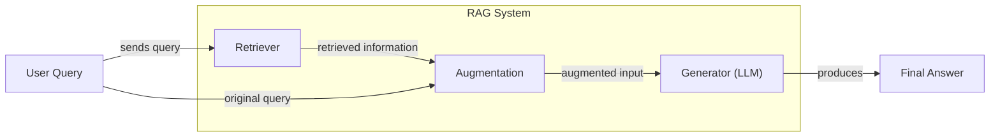
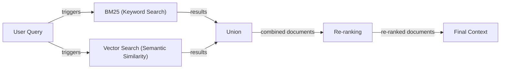
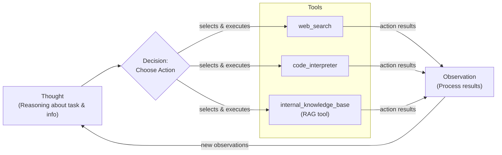

# Lesson 9: Retrieval-Augmented Generation

In our previous lessons, we built a foundation in AI Engineering. We explored the agent landscape, distinguished between LLM workflows and autonomous agents, and, in Lesson 3, covered context engineering—the art of managing the information an LLM sees. We have learned how to get structured data out of models and how to give them tools to interact with the world. We even built a basic reasoning agent from scratch using the ReAct framework.

Now, we will tackle one of the most important problems in AI: knowledge. LLMs are trained on a fixed dataset, which means their knowledge is static and they can become outdated. This process is like a "closed-book exam" on the world's information. When an LLM encounters a question about something it was not trained on, it can either admit it does not know or, more problematically, "hallucinate"—invent a plausible but incorrect answer [[1]](https://blogs.nvidia.com/blog/what-is-retrieval-augmented-generation/).

The ideal solution would be for models to learn continuously from experience, much like humans do. However, the techniques to enable this kind of dynamic learning in a deployed model's weights are not yet mature. The current alternative, fine-tuning, involves retraining the model on new data. This process is slow, expensive, and creates yet another static snapshot of knowledge. As soon as new information becomes available, the fine-tuned model is once again out of date, making constant retraining impractical for most real-world applications [[2]](https://neo4j.com/blog/developer/fine-tuning-vs-rag/).

Retrieval-Augmented Generation (RAG) provides a powerful and efficient solution that gives the LLM an "open-book exam" [[3]](https://newsletter.systemdesign.one/p/how-rag-works). Instead of relying solely on its memorized (parametric) knowledge, the model can access external, up-to-date information sources at the moment it needs to answer a question. This is similar to how humans work; we do not memorize everything but instead rely on manuals, notes, and search engines to find the information we need. By connecting the LLM to a dynamic knowledge base, we bypass the limitations of its frozen training data.

RAG is a core method within the discipline of context engineering. In Lesson 3, we discussed the importance of curating the information passed into an LLM's context window. RAG is the primary mechanism for doing just that—dynamically retrieving relevant facts from external knowledge bases and injecting them into the prompt. This grounds the model's responses in verifiable data, making them more accurate, trustworthy, and useful [[4]](https://highlearningrate.substack.com/p/the-rise-of-rag). By providing sources for its claims, RAG builds user trust and allows for fact-checking, a critical feature for enterprise applications [[1]](https://blogs.nvidia.com/blog/what-is-retrieval-augmented-generation/).

In this lesson, we will examine the mechanics of RAG. We will start by breaking down a RAG system into its core components and walking through the end-to-end data pipeline. Then, we will explore the advanced techniques that separate a basic prototype from a production-grade system. Finally, we will see how RAG evolves from a simple pipeline into a powerful tool for autonomous agents. This will set the stage for Lesson 10, where we will explore how agent memory systems complement RAG to create even more capable AI.

## The RAG System: Core Components

To design effective RAG systems, you first need to understand the three conceptual pillars that form its foundation. This is the first step in the context engineering process we introduced in Lesson 3. Each pillar has a distinct responsibility in transforming a user's query into a grounded, fact-based answer.

**Retrieval:** This is the search engine of your RAG system. Its job is to find the most relevant information from an external knowledge base in response to a user's query. The retrieval process can use several methods. The most common is semantic search, which relies on vector embeddings. An embedding model converts text into numerical vectors that capture its meaning. These vectors are stored in a specialized vector database. When a user asks a question, their query is also converted into a vector, and the system searches the database for the text chunks whose vectors are closest in this high-dimensional space [[5]](https://decodingml.substack.com/p/rag-fundamentals-first?utm_source=publication-search), [[6]](https://tutorialsdojo.com/aws-vector-databases-explained-semantic-search-and-rag-systems/). The retriever scans these sources to locate the most relevant information for the query [[28]](https://toloka.ai/blog/grounding-llms-driving-ai-to-deliver-contextually-relevant-data/). Another popular method is keyword-based search, which uses algorithms like BM25 to find documents containing specific terms. This method is less about understanding meaning and more about matching exact words, which can be very effective for certain types of queries.

**Augmentation:** Once the retriever has found the relevant pieces of information, the augmentation step takes over. This process involves taking the retrieved text chunks and combining them with the original user query to form an "augmented prompt." This new prompt provides the LLM with the necessary context it needs to formulate an answer. Proper prompt engineering is essential here to ensure the model understands how to use the provided context and respects constraints, like answering only from the given information. The structure of this prompt can significantly influence the quality of the final output, making this a critical part of the RAG pipeline [[7]](https://www.topquadrant.com/resources/blog-retrieval-augmented-generation-explained/), [[27]](https://www.aimon.ai/posts/rag_and_its_different_components/).

**Generation:** This is the final step where the LLM receives the augmented prompt and generates a response. Because the prompt now contains specific, relevant information from the external knowledge base, the LLM can produce an answer that is grounded in facts rather than relying solely on its internal, pre-trained knowledge. A well-designed system will also instruct the LLM to cite its sources, allowing users to verify the information and build trust in the application. This step uses the LLM's reasoning and language capabilities to synthesize the retrieved facts into a coherent and helpful answer [[1]](https://blogs.nvidia.com/blog/what-is-retrieval-augmented-generation/), [[26]](https://humanloop.com/blog/rag-architectures).

Image 1: A flowchart illustrating the conceptual flow of a Retrieval Augmented Generation (RAG) system.

These three components work together to create a system that is both knowledgeable and trustworthy. Now that you can name each moving part, let’s see how they line up across the two phases of a real system.

## The RAG Pipeline: Ingestion and Retrieval

A complete RAG system operates in two distinct phases. The first is an offline process to prepare your knowledge base, and the second is an online process that happens in real-time when a user asks a question. Understanding both is key to building and maintaining an effective RAG application.

### Phase 1: Offline Ingestion & Indexing

This phase is all about preparing your documents to be searchable. It is a data pipeline that runs in the background, either on a schedule or whenever your source documents change. The goal is to transform your raw content into a structured format that the retriever can query efficiently [[3]](https://newsletter.systemdesign.one/p/how-rag-works).

1.  **Load:** The pipeline begins by loading your documents from various sources. These can be PDFs, web pages, databases, or APIs. Tools like LangChain's document loaders or LlamaIndex's readers can connect to almost any data source and extract the raw text [[5]](https://decodingml.substack.com/p/rag-fundamentals-first?utm_source=publication-search).
2.  **Split:** Since LLMs have a limited context window, and because smaller, focused pieces of text are better for precise retrieval, the loaded documents are broken down into smaller "chunks." A good chunking strategy is critical; you want to split documents along logical boundaries (like paragraphs or sections) to keep semantically related information together. A simple `RecursiveCharacterTextSplitter` is a common starting point, but more advanced methods like semantic splitting exist [[8]](https://sarthakai.substack.com/p/improve-your-rag-accuracy-with-a).
3.  **Embed:** Each chunk of text is then passed through an embedding model. This model converts the text into a high-dimensional vector, a numerical representation that captures its semantic meaning. Popular embedding models include OpenAI's `text-embedding-3` series, Google's `text-embedding-004`, Cohere's Embed models, Voyage AI's models, and various open-source models available on Hugging Face [[3]](https://newsletter.systemdesign.one/p/how-rag-works).
4.  **Store:** Finally, these vector embeddings, along with the original text chunks and any relevant metadata (like the source document name or page number), are loaded into a vector database or search index. This database is optimized for fast similarity searches, allowing the system to quickly find the chunks most relevant to a user's query. Examples include FAISS for local development, managed services like Milvus, Qdrant, and Pinecone, or vector-capable search indexes like Elasticsearch, OpenSearch, and Azure AI Search [[6]](https://tutorialsdojo.com/aws-vector-databases-explained-semantic-search-and-rag-systems/).

### Phase 2: Online Retrieval & Generation

This is the real-time part of the RAG system that interacts with the user. It kicks off the moment a user submits a query.

1.  **Query & Embed:** The user's question is taken as input. Just like the document chunks, the query is converted into a vector embedding using the *same* embedding model from the ingestion phase. This is essential because it ensures the query and the documents exist in the same vector space, making comparison possible [[5]](https://decodingml.substack.com/p/rag-fundamentals-first?utm_source=publication-search).
2.  **Search:** The system uses the query vector to search the vector database. It performs a similarity search (often using cosine similarity) to find the top-k document chunks whose embeddings are closest to the query's embedding. These are the chunks that are most semantically related to the user's question [[9]](https://apxml.com/courses/prompt-engineering-llm-application-development/chapter-6-integrating-llms-external-data-rag/implementing-semantic-search-retrieval).
3.  **Generate:** The retrieved chunks are then used to augment the user's original query. A prompt is constructed that includes the instructions for the LLM, the retrieved context, and the user's question. This augmented prompt is sent to the LLM, which generates a final answer grounded in the provided information. As we learned in Lesson 4, using structured outputs can help ensure the answer is well-formatted and includes citations back to the source documents [[3]](https://newsletter.systemdesign.one/p/how-rag-works).

```mermaid
flowchart LR
  %% Phase 1: Offline Ingestion & Indexing
  subgraph "Offline Ingestion & Indexing"
    Sources["Documents<br/>(PDFs, Websites, APIs)"]
    Load["Load Documents"]
    Split["Split into Chunks<br/>(Chunkers)"]
    Chunks["Chunks"]
    Embed_Chunk["Embed Chunks"]
    Vector_Embedding["Vector Embedding"]
    Store["Store"]
    Vector_DB["Vector Database<br/>(Search Index)"]
  end

  %% Shared Models
  Embedding_Model["Embedding Model"]

  %% Phase 2: Online Retrieval & Generation
  subgraph "Online Retrieval & Generation"
    User_Query["User Query"]
    Embed_Query["Embed Query"]
    Query_Vector["Query Vector"]
    Search["Search<br/>(Top-k Similarity)"]
    Retrieved_Chunks["Retrieved Chunks"]
    Build_Prompt["Build Prompt"]
    LLM["LLM"]
    Final_Answer["Final Answer"]
  end

  %% Primary Data Flows - Phase 1
  Sources -- "raw data" --> Load
  Load -- "documents" --> Split
  Split -- "produces" --> Chunks
  Chunks -- "input to" --> Embed_Chunk
  Embed_Chunk -- "creates" --> Vector_Embedding
  Vector_Embedding -- "indexed by" --> Store
  Store -- "persists in" --> Vector_DB

  %% Primary Data Flows - Phase 2
  User_Query -- "initiates" --> Embed_Query
  Embed_Query -- "creates" --> Query_Vector
  Query_Vector -- "used to" --> Search
  Search -- "queries" --> Vector_DB
  Vector_DB -- "returns" --> Retrieved_Chunks
  Retrieved_Chunks -- "context for" --> Build_Prompt
  Build_Prompt -- "sends to" --> LLM
  LLM -- "generates" --> Final_Answer

  %% Supporting Relationships
  Embed_Chunk -. "uses" .-> Embedding_Model
  Embed_Query -. "uses" .-> Embedding_Model

  %% Visual grouping
  classDef exec stroke-width:2px
  classDef store stroke-dasharray:3,3

  class Load,Split,Embed_Chunk,Store,Embed_Query,Search,Build_Prompt,Embedding_Model,LLM exec
  class Sources,Chunks,Vector_Embedding,Vector_DB,User_Query,Query_Vector,Retrieved_Chunks,Final_Answer store
```

Image 2: A detailed flowchart depicting the end-to-end RAG workflow, divided into two main phases: "Offline Ingestion & Indexing" and "Online Retrieval & Generation".

With the end-to-end path in place, the next question is quality. What are the advanced techniques to make retrieval more accurate and useful across messy, real-world data?

## Advanced RAG Techniques

The simple pipeline we have described is often called "naive RAG." While effective, its limitations become clear in production [[10]](https://www.arionresearch.com/blog/uuja2r7o098i1dvr8aagal2nnv3uik). To handle complex queries and messy data, the field has evolved to include advanced and modular RAG techniques. These methods address the shortcomings of basic retrieval and help you build systems that are far more accurate and reliable [[11]](https://www.ibm.com/think/topics/rag-techniques).

### Hybrid Search

Pure vector search is excellent at understanding the meaning or "semantic intent" of a query, but it can sometimes miss documents that contain exact keywords, especially for specific codes, names, or jargon. Hybrid search solves this by combining the strengths of two different search methods: keyword-based search and vector search [[12]](https://decodingml.substack.com/p/your-rag-is-wrong-heres-how-to-fix?utm_source=publication-search).

Keyword-based methods, such as Best Matching 25 (BM25), are traditional information retrieval algorithms that rank documents based on the frequency and rarity of query keywords. They excel at precision for exact matches. By running both a keyword search and a vector search, and then fusing the results, you get the best of both worlds. A common fusion method is Reciprocal Rank Fusion (RRF), which combines the ranked lists based on their position rather than their raw scores. This approach is effective because it avoids the need to normalize scores from different systems that operate on completely different scales [[13]](https://dev.to/lpossamai/building-hybrid-search-for-rag-combining-pgvector-and-full-text-search-with-reciprocal-rank-fusion-6nk). For a customer support query like "my bill keeps rolling over," keyword search finds articles with the exact term "rollover," while vector search might also find articles about "carryover balances," covering different phrasings of the same problem [[14]](https://pr-peri.github.io/blogpost/2026/03/05/blogpost-hybrid-search.html).

Image 3: A flowchart illustrating the hybrid retrieval flow.

### Re-ranking

The initial retrieval step is designed to be fast and cast a wide net, prioritizing recall (finding all potentially relevant documents). However, the top-k results are not always ordered perfectly by relevance. Re-ranking introduces a second, more precise scoring step to fix this [[12]](https://decodingml.substack.com/p/your-rag-is-wrong-heres-how-to-fix?utm_source=publication-search).

After retrieving an initial set of candidates (e.g., the top 50 documents), a re-ranker model evaluates each one against the query. Unlike the initial retrieval which compares pre-computed embeddings (a bi-encoder approach), a re-ranker is often a cross-encoder model. It processes the query and a candidate document *together*, allowing for a deeper, more contextual analysis of their relationship. This is computationally more expensive, which is why it is only applied to a small subset of initial results. For a product help query like "how to connect my account," a re-ranker can push the official step-by-step guide to the top, above less relevant forum posts or press releases that happened to contain similar keywords [[15]](https://towardsdatascience.com/advanced-rag-retrieval-cross-encoders-reranking/).

### Query Transformations

Sometimes the user's original query is not the best one to send to the retrieval system. Query transformation techniques rewrite or expand the query to improve retrieval accuracy.

-   **Decomposition:** This technique breaks down a complex, multi-part question into several simpler sub-queries. The system retrieves documents for each sub-query and then merges the results. For example, the question "What’s our travel policy for conferences in Europe this year?" could be decomposed into "What is the travel policy?", "What are the rules for conferences?", and "What are the specific rules for Europe in 2024?" [[16]](https://docs.nvidia.com/rag/latest/query_decomposition.html).
-   **Hypothetical Document Embeddings (HyDE):** Instead of directly embedding the user's query, HyDE first uses an LLM to generate a hypothetical, ideal answer. This generated answer is then embedded and used for the similarity search. The idea is that this hypothetical document is often semantically closer to the actual answer documents in the vector space than the original, sometimes brief, query [[12]](https://decodingml.substack.com/p/your-rag-is-wrong-heres-how-to-fix?utm_source=publication-search).

### Advanced Chunking Strategies

How you split your documents into chunks has a massive impact on retrieval quality. Simply splitting a document every 500 characters (fixed-size chunking) can cut sentences in half and separate related ideas.

-   **Semantic Chunking:** This method splits the text based on topic shifts. It groups sentences that are semantically related, ensuring that each chunk represents a coherent thought or concept. This is more computationally intensive but often yields better retrieval results for complex documents [[8]](https://sarthakai.substack.com/p/improve-your-rag-accuracy-with-a).
-   **Layout-Aware Chunking:** For documents with rich structures like PDFs, this approach uses visual and structural information (headers, tables, lists) to guide the chunking process. For example, it ensures that a table and its title are kept in the same chunk, or that a list is not broken apart [[8]](https://sarthakai.substack.com/p/improve-your-rag-accuracy-with-a).
-   **Context-Enriched Chunking:** This technique, also known as contextual retrieval, adds a summary or contextual information to each chunk before embedding. For example, for a chunk that says "Revenue grew by 5%," context could be added like "This chunk is from the Q3 2024 financial report for Acme Corp." This helps the retrieval system distinguish between similar-sounding chunks from different documents [[17]](https://www.anthropic.com/news/contextual-retrieval).

However, even advanced chunking methods can fail with noisy enterprise documents. Sentence-based semantic splitters can break apart tables, code blocks, or two-column PDF layouts, losing the structural context that makes the data intelligible. This is a common source of silent retrieval failures in production systems [[18]](https://towardsdatascience.com/your-chunks-failed-your-rag-in-production/).

### GraphRAG

This approach moves beyond simple document chunks and uses a knowledge graph as the retrieval source. An LLM first extracts entities (like people, places, organizations) and their relationships from the documents, building a structured graph [[19]](https://arxiv.org/html/2404.16130). This method excels at answering complex, multi-hop questions that require connecting information across multiple documents. For example, a query like “Which shoes get the most size-related returns and were featured in last month’s ads?” requires navigating from return data to product SKUs and then to marketing calendars—a path easily traversed in a graph but difficult to piece together from isolated text chunks [[20]](https://webhome.cs.uvic.ca/~thomo/papers/asonam2025-graphrag.pdf). Similarly, an IT operations query like "Which incidents were caused by weekend deploys that also touched the login service?" can be answered by linking change records to deploy times, affected services, and incident tickets. This allows the model to reason about relationships instead of just matching words. However, the computational cost of building and querying these graphs can be high. The process of extracting entities and relationships (triples) is expensive, and query complexity can explode as the graph grows, requiring specialized infrastructure and careful bounds on query depth to be viable in production [[21]](https://dev.to/sreeni5018/from-rag-to-knowledge-graphs-why-the-agent-era-is-redefining-ai-architecture-3fgc).

These techniques increase retrieval quality. Next, we’ll see how retrieval becomes one tool that an agent can choose to use as it reasons.

## Agentic RAG

In Lessons 7 and 8, we introduced the ReAct framework, where an agent cycles through a loop of Thought, Action, and Observation to solve problems. Agentic RAG is the application of this principle to information retrieval. Instead of a rigid, linear pipeline, RAG becomes a dynamic tool that an autonomous agent can choose to use, or not use, as part of its reasoning process.

It is important to clarify that while we call it "Agentic RAG," retrieval is often just one of many tools available to an agent, alongside others like web search, code execution, or database queries. The "agentic" quality comes from the agent's ability to orchestrate these tools intelligently [[22]](https://weaviate.io/blog/what-is-agentic-rag).

### Standard RAG vs. Agentic RAG

The core distinction lies in the control flow.
-   **Standard RAG** is a linear workflow: Retrieve → Augment → Generate. This path is powerful but inflexible; a bad initial retrieval leads to a bad answer [[23]](https://towardsdatascience.com/agentic-rag-vs-classic-rag-from-a-pipeline-to-a-control-loop/).
-   **Agentic RAG** is an adaptive loop. The agent decides when and what to retrieve, reformulates queries, and can chain multiple steps to build a comprehensive answer [[24]](https://www.ibm.com/think/topics/agentic-rag).

This agentic approach unlocks several new capabilities. The agent can **iteratively** use the RAG tool, refining its query based on initial findings. It can **choose** which knowledge base to search—for example, deciding to `search_tech_docs` instead of `search_marketing_pages` for a technical question. It can also **fuse** information from its RAG tool with data from other tools, like combining internal policy documents with real-time regulatory information from a web search [[22]](https://weaviate.io/blog/what-is-agentic-rag). Crucially, an agent can also decide to **update** its knowledge. This reveals a limitation of using RAG as a memory system: it is fundamentally read-only. An agent that only adds new information to a vector store without updating or retracting old facts can suffer from "context pollution," where outdated and current states conflict [[25]](https://xtrace.ai/blog/rag-vs-long-term-memory-ai-agents). Building a true read-write memory system is what we will cover in Lesson 10.

Consider this "thought process" for an agent handling a complex query:
*   **Thought:** The user is asking about "2024 EU data retention rules." Our internal policy documents are from 2023 and might be outdated.
*   **Action:** `retrieve(internal_policy, query="EU data retention 2024")`
*   **Observation:** The retrieved document mentions amendments but lacks specific citations.
*   **Thought:** I need external verification to provide a complete and accurate answer.
*   **Action:** `web_search(query="Official EU data retention directive 2024")`
*   **Observation:** The web search found a new directive with updated rules.
*   **Thought:** I will now synthesize the information from our internal policy and the new directive, highlighting the changes from 2023 and citing both sources.

This is the difference between a simple database lookup and a conversation with a knowledgeable research assistant. The agent does not just fetch data; it reasons about its information needs and actively works to fill its knowledge gaps.

Image 4: Conceptual flowchart of an AI agent's main loop.

You now understand both a linear RAG pipeline and how an agent can control retrieval when needed. Let’s wrap up by situating RAG in the wider AI Engineering toolkit and previewing what comes next.

## Conclusion

We have covered a lot of ground, from the fundamental problem of static LLM knowledge to the rise of dynamic, agent-driven retrieval systems. RAG is the industry's most widely adopted solution for grounding LLMs in external, verifiable facts. We have seen that while basic RAG is a powerful starting point, production-grade quality depends on advanced techniques like hybrid search, re-ranking, and intelligent chunking. The future of knowledge retrieval is agentic, where RAG transforms from a fixed pipeline into a versatile tool that autonomous agents can use as part of a larger reasoning process.

The core benefits of this approach are clear: RAG reduces hallucinations, enables deep customization with proprietary data, and builds user trust by providing source-based, verifiable answers. For the modern AI Engineer, mastering RAG is not a niche skill but a foundational competency. It is a critical part of the broader discipline of context engineering, ensuring that our AI systems are not just fluent but also factual.

In our next lesson, we will explore Memory for Agents. We will see how short-term and long-term memory systems work alongside RAG to give agents a persistent understanding of their interactions and the world, allowing them to learn and adapt over time. Later in the course, we will also cover the crucial topics of evaluating retrieval quality and monitoring these complex systems in production.

## References

- [1] [What Is Retrieval-Augmented Generation, aka RAG?](https://blogs.nvidia.com/blog/what-is-retrieval-augmented-generation/)
- [2] [Knowledge Graphs and LLMs: Fine-Tuning vs. Retrieval-Augmented Generation](https://neo4j.com/blog/developer/fine-tuning-vs-rag/)
- [3] [How RAG Works - by Neo Kim and Eric Roby](https://newsletter.systemdesign.one/p/how-rag-works)
- [4] [The Rise of RAG](https://highlearningrate.substack.com/p/the-rise-of-rag)
- [5] [Retrieval-Augmented Generation (RAG) Fundamentals First](https://decodingml.substack.com/p/rag-fundamentals-first?utm_source=publication-search)
- [6] [AWS vector databases explained: semantic search and RAG systems](https://tutorialsdojo.com/aws-vector-databases-explained-semantic-search-and-rag-systems/)
- [7] [Retrieval-Augmented Generation Explained](https://www.topquadrant.com/resources/blog-retrieval-augmented-generation-explained/)
- [8] [Improve Your RAG Accuracy With A Smarter Chunking Strategy](https://sarthakai.substack.com/p/improve-your-rag-accuracy-with-a)
- [9] [Implementing Semantic Search for Retrieval](https://apxml.com/courses/prompt-engineering-llm-application-development/chapter-6-integrating-llms-external-data-rag/implementing-semantic-search-retrieval)
- [10] [The Evolution of RAG: From Naive to Advanced Architectures](https://www.arionresearch.com/blog/uuja2r7o098i1dvr8aagal2nnv3uik)
- [11] [What are RAG techniques?](https://www.ibm.com/think/topics/rag-techniques)
- [12] [Your RAG Is Wrong, Here's How To Fix It](https://decodingml.substack.com/p/your-rag-is-wrong-heres-how-to-fix?utm_source=publication-search)
- [13] [Building Hybrid Search for RAG: Combining pgvector and Full-Text Search with Reciprocal Rank Fusion](https://dev.to/lpossamai/building-hybrid-search-for-rag-combining-pgvector-and-full-text-search-with-reciprocal-rank-fusion-6nk)
- [14] [Hybrid Search Is a Must for Production RAG](https://pr-peri.github.io/blogpost/2026/03/05/blogpost-hybrid-search.html)
- [15] [Advanced RAG Retrieval: Cross-Encoders & Reranking](https://towardsdatascience.com/advanced-rag-retrieval-cross-encoders-reranking/)
- [16] [Query Decomposition](https://docs.nvidia.com/rag/latest/query_decomposition.html)
- [17] [Introducing Contextual Retrieval](https://www.anthropic.com/news/contextual-retrieval)
- [18] [Your Chunks Failed Your RAG in Production](https://towardsdatascience.com/your-chunks-failed-your-rag-in-production/)
- [19] [From Local to Global: A GraphRAG Approach to Query-Focused Summarization](https://arxiv.org/html/2404.16130)
- [20] [GraphRAG: A Graph-Based Approach to Retrieval-Augmented Generation for Enhanced Question Answering on Unstructured Data](https://webhome.cs.uvic.ca/~thomo/papers/asonam2025-graphrag.pdf)
- [21] [From RAG to Knowledge Graphs: Why the Agent Era is Redefining AI Architecture](https://dev.to/sreeni5018/from-rag-to-knowledge-graphs-why-the-agent-era-is-redefining-ai-architecture-3fgc)
- [22] [What is Agentic RAG](https://weaviate.io/blog/what-is-agentic-rag)
- [23] [Agentic RAG vs. Classic RAG: From a Pipeline to a Control Loop](https://towardsdatascience.com/agentic-rag-vs-classic-rag-from-a-pipeline-to-a-control-loop/)
- [24] [What is agentic RAG?](https://www.ibm.com/think/topics/agentic-rag)
- [25] [Beyond RAG: Why AI Agents Need Long-Term Memory, Not Retrieval](https://xtrace.ai/blog/rag-vs-long-term-memory-ai-agents)
- [26] [RAG Architectures and where to find them](https://humanloop.com/blog/rag-architectures)
- [27] [RAG and its different components](https://www.aimon.ai/posts/rag_and_its_different_components/)
- [28] [Grounding LLMs: Driving AI to Deliver Contextually Relevant Data](https://toloka.ai/blog/grounding-llms-driving-ai-to-deliver-contextually-relevant-data/)
- [29] [What is Retrieval-Augmented Generation?](https://www.ibm.com/think/topics/retrieval-augmented-generation)
- [30] [RAG Architecture: An Overview of Retrieval Augmented Generation](https://galileo.ai/blog/rag-architecture)
- [31] [RAG Pipeline Deep Dive: Ingestion (Chunking, Embedding) and Vector Search](https://medium.com/@derrickryangiggs/rag-pipeline-deep-dive-ingestion-chunking-embedding-and-vector-search-abd3c8bfc177)
- [32] [RAGOps Guide: Building and Scaling Retrieval-Augmented Generation Systems](https://towardsdatascience.com/ragops-guide-building-and-scaling-retrieval-augmented-generation-systems-3d26b3ebd627/)
- [33] [RAG Offline vs. Online Evaluation](https://apxml.com/courses/optimizing-rag-for-production/chapter-6-advanced-rag-evaluation-monitoring/rag-offline-online-evaluation)
- [34] [What is Retrieval-Augmented Generation (RAG)?](https://aws.amazon.com/what-is/retrieval-augmented-generation/)
- [35] [A Complete Guide to RAG](https://towardsai.net/p/l/a-complete-guide-to-rag)
- [36] [RAG is dead, long live agentic retrieval](https://www.llamaindex.ai/blog/rag-is-dead-long-live-agentic-retrieval)
- [37] [Build advanced retrieval-augmented generation systems](https://learn.microsoft.com/en-us/azure/developer/ai/advanced-retrieval-augmented-generation)
- [38] [SentGraph: Hierarchical Sentence Graph for Multi-hop Retrieval-Augmented Question Answering](https://arxiv.org/html/2601.03014v1)