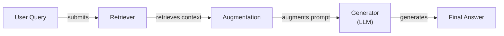
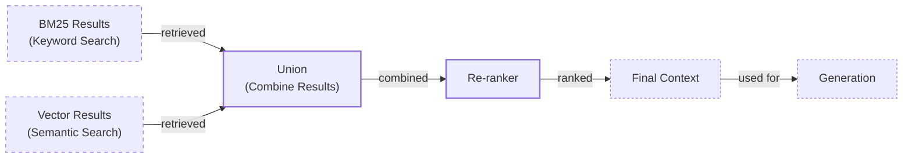
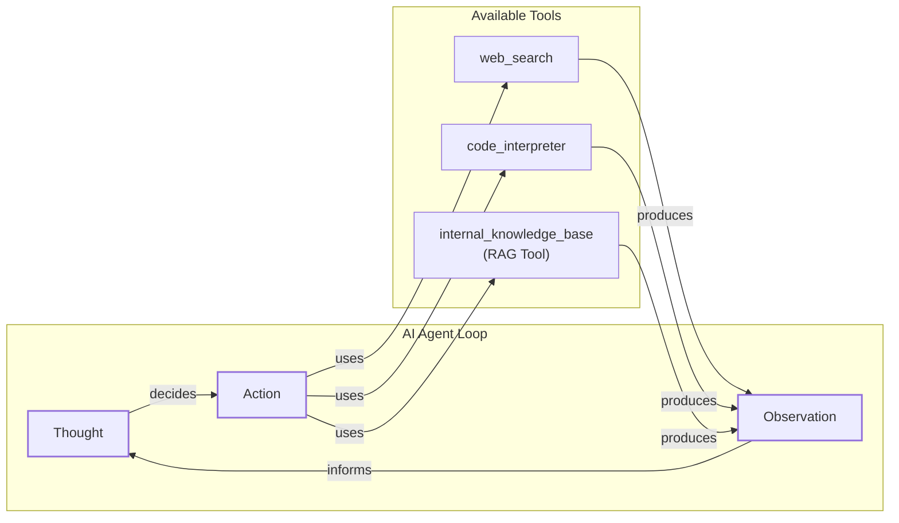

# Lesson 9: Giving LLMs an Open-Book Exam

In our previous lessons, we built a solid foundation in AI Engineering. We explored the agent landscape, distinguished between rule-based workflows and autonomous agents, and, in Lesson 3, introduced Context Engineering—the art of managing the flow of information to an LLM. We have also covered how to get structured data from LLMs, equip agents with tools, and implement reasoning loops with ReAct.

A core problem we have hinted at is that LLMs are trained on a fixed dataset. Their knowledge is static, making them prone to hallucination. During their training, they essentially take a "closed-book exam" on the world's information. We do not yet have efficient techniques to enable models to learn new information over time after their initial training. While we can fine-tune them, it is expensive and slow. Furthermore, the standard RAG pipeline, which relies on similarity search, struggles with tasks that require aggregation or complex relationships across many documents [[28]](https://www.ibm.com/think/insights/rag-problems-five-ways-to-fix).

This is where Retrieval-Augmented Generation (RAG) provides a reliable solution. With RAG, we give the LLM an "open-book exam" by connecting it to external, real-time knowledge sources. Instead of forcing the model to memorize everything, we allow it to look things up, just like a human would use a manual or a cheat sheet. RAG is a key method AI Engineers use in the process of Context Engineering to build grounded and trustworthy applications.

This lesson will guide you through the journey of RAG, from its fundamental components to the advanced and agentic patterns that power modern AI systems. We will also briefly touch on how retrieval complements an agent's memory, a topic we will explore in detail in Lesson 10. With the problem and motivation clear, we’ll first decompose RAG into its core components so you can see where each responsibility lies.

## The RAG System: Core Components

Understanding the components of RAG is the first step in engineering effective retrieval systems. At its core, RAG is built on three conceptual pillars: Retrieval, Augmentation, and Generation. These pillars work together to ground the LLM's responses in factual, external data. It can be helpful to draw a parallel to other AI paradigms like Case-Based Reasoning (CBR). While RAG retrieves general knowledge statements, akin to a human's semantic memory of facts, CBR retrieves specific past episodes or cases, which is more like episodic memory. Both augment a system with external information, but the nature of that information differs [[29]](https://ceur-ws.org/Vol-3708/paper_21.pdf).


Image 1: A flowchart illustrating the conceptual flow of a Retrieval Augmented Generation (RAG) system, highlighting Retrieval, Augmentation, and Generation.

**Retrieval** is the engine that finds relevant information. When a user submits a query, the retriever searches an external knowledge base to find documents or data snippets that are relevant to the query [[1]](https://blogs.nvidia.com/blog/what-is-retrieval-augmented-generation/). The most common approach relies on semantic similarity search, which is made possible by vector embeddings and vector databases [[2]](https://towardsai.net/p/l/a-complete-guide-to-rag).

Vector embeddings are numerical representations of text that capture its semantic meaning. An embedding model transforms text into a high-dimensional vector, where similar concepts are located close to each other in the vector space [[3]](https://decodingml.substack.com/p/rag-fundamentals-first?utm_source=publication-search), [[4]](https://tutorialsdojo.com/aws-vector-databases-explained-semantic-search-and-rag-systems/). These vectors are then stored in a specialized vector database, which is optimized for fast and efficient similarity search. When a query comes in, it is also converted into a vector, and the database finds the vectors (and their corresponding text chunks) that are closest to the query vector, typically using a distance metric like cosine similarity [[5]](https://pub.towardsai.net/vector-databases-in-practice-building-a-realistic-hybrid-search-rag-system-with-qdrant-7b8f4a6e41e0), [[6]](https://towardsdatascience.com/rag-explained-understanding-embeddings-similarity-and-retrieval/).

**Augmentation** is the process of integrating the retrieved information into the prompt that will be sent to the LLM [[7]](https://www.topquadrant.com/resources/blog-retrieval-augmented-generation-explained/). The retrieved text chunks are combined with the original user query and a set of instructions. This augmented prompt provides the LLM with the necessary context to formulate a grounded and accurate response. This step is where prompt engineering techniques are applied to ensure the model understands how to use the provided context effectively [[8]](https://www.ibm.com/think/topics/retrieval-augmented-generation).

**Generation** is the final step where the LLM produces an answer. Using the rich context provided in the augmented prompt, the LLM generates a response that is directly informed by the retrieved data [[9]](https://humanloop.com/blog/rag-architectures). This grounds the model's output in verifiable facts, drastically reducing the likelihood of hallucinations and allowing it to answer questions about information it was never trained on. The generated answer can also include citations, pointing back to the source documents, which builds user trust [[10]](https://neo4j.com/blog/developer/fine-tuning-vs-rag/). This three-pillar structure is an evolution of the multi-stage pipelines used in traditional search engines, which also relied on retrieval and ranking. RAG modernizes this by integrating generative models to synthesize knowledge rather than just presenting a list of links [[30]](https://ijcaonline.org/archives/volume187/number18/veluru-2025-ijca-925279.pdf).

Now that you can name each moving part, let’s see how they line up across the two phases of a real system.

## The RAG Pipeline: Ingestion and Retrieval

An end-to-end RAG workflow is composed of two distinct phases: an offline ingestion pipeline and an online retrieval pipeline [[11]](https://newsletter.systemdesign.one/p/how-rag-works), [[12]](https://medium.com/@derrickryangiggs/rag-pipeline-deep-dive-ingestion-chunking-embedding-and-vector-search-abd3c8bfc177). The ingestion phase prepares your knowledge base for searching, while the retrieval phase uses that indexed data to answer user queries in real-time.

```mermaid
flowchart LR
  %% Phase 1: Offline Ingestion & Indexing
  subgraph "Phase 1: Offline Ingestion & Indexing"
    P1_A["Load<br/>(documents from various sources)"]
    P1_B["Split<br/>(content into smaller, meaningful chunks)"]
    P1_C["Embed<br/>(chunks into vector embeddings)"]
    P1_D["Store<br/>(embeddings & text in vector database)"]

    P1_A -- "read" --> P1_B
    P1_B -- "chunk" --> P1_C
    P1_C -- "embed" --> P1_D
  end

  %% Phase 2: Online Retrieval & Generation
  subgraph "Phase 2: Online Retrieval & Generation"
    P2_A["Query<br/>(user question)"]
    P2_B["Embed<br/>(query into vector)"]
    P2_C["Search<br/>(find top-k similar chunks)"]
    P2_D["Generate<br/>(LLM produces grounded answer)"]

    P2_A -- "embed" --> P2_B
    P2_B -- "search" --> P2_C
    P2_C -- "context & query" --> P2_D
  end

  %% Connection between phases
  P1_D -- "indexed data for retrieval" -.-> P2_C
```
Image 2: A detailed Mermaid diagram depicting the end-to-end RAG workflow, clearly divided into two main phases: "Phase 1: Offline Ingestion & Indexing" and "Phase 2: Online Retrieval & Generation".

### Phase 1: Offline Ingestion & Indexing

This phase is all about preparing your data. It runs offline, meaning it happens before any user interacts with the system. The goal is to convert your raw documents into a searchable index [[13]](https://towardsdatascience.com/ragops-guide-building-and-scaling-retrieval-augmented-generation-systems-3d26b3ebd627). This process consists of four main steps:

1.  **Load:** The pipeline begins by loading raw documents from various sources. These can be anything from PDFs and websites to data from APIs or databases. Tools like LangChain's document loaders or LlamaIndex's readers are commonly used for this step.
2.  **Split:** Since LLMs have limited context windows, large documents must be broken down into smaller, manageable pieces called chunks. The chunking strategy is important; you want to create chunks that are semantically coherent and avoid splitting a single idea across multiple chunks. This can be done with rule-based splitters, like LangChain’s `RecursiveCharacterTextSplitter`, or more advanced semantic chunkers.
3.  **Embed:** Each chunk is then passed through an embedding model, which converts the text into a numerical vector. This vector captures the semantic meaning of the chunk. Popular embedding models include OpenAI's `text-embedding-3` series, Google's `text-embedding-004`, and open-source models like BGE variants available on Hugging Face.
4.  **Store:** Finally, the vector embeddings and their corresponding text chunks (along with any metadata) are loaded into a vector database. This database indexes the vectors for efficient similarity search. Examples of vector stores include local libraries like FAISS or production-grade databases like Milvus, Qdrant, and Pinecone.

### Phase 2: Online Retrieval & Generation

This phase happens in real-time when a user asks a question. The system uses the pre-built index to find relevant information and generate an answer [[11]](https://newsletter.systemdesign.one/p/how-rag-works).

1.  **Query:** The process starts with a user's question. This query might undergo some initial processing, such as normalization or expansion, to improve its effectiveness.
2.  **Embed:** The user's query is converted into a vector using the *same* embedding model that was used during the ingestion phase. This ensures that the query and the document chunks are in the same vector space, making them comparable.
3.  **Search:** The query vector is used to search the vector database. The database performs a similarity search (often a k-Nearest Neighbors, or k-NN, search) to find the top-k document chunks whose embeddings are most similar to the query's embedding.
4.  **Generate:** The retrieved chunks are then used to augment the user's original query. A prompt is constructed that includes the query, the retrieved context, and instructions for the LLM. The LLM then generates a final answer that is grounded in the provided information. As we learned in Lesson 4, this is a great place to use structured outputs to format the answer and include citations.

With the end-to-end path in place, the next question is quality. What advanced techniques can make retrieval more accurate and useful across messy, real-world data?

## Advanced RAG Techniques

A naive RAG pipeline is a good starting point, but production systems often require more sophisticated techniques to handle the complexities of real-world data and user queries [[14]](https://decodingml.substack.com/p/your-rag-is-wrong-heres-how-to-fix?utm_source=publication-search). These advanced methods focus on improving the quality and relevance of the retrieved context.


Image 3: A Mermaid diagram illustrating the hybrid retrieval flow, showing parallel BM25 and Vector search paths converging into a Union, followed by a Re-ranker, leading to the Final Context for generation.

### Hybrid Search

Vector search is great at understanding meaning, but it can sometimes miss specific keywords, acronyms, or IDs. Hybrid search solves this by combining dense vector search (for semantic meaning) with a sparse retrieval method like BM25 (for keyword matching) [[15]](https://mlpills.substack.com/p/issue-76-optimize-rag-with-hybrid). For example, if a user asks about "Error code TS-999," a vector search might find general documents about errors, while BM25 will pinpoint the exact document that mentions "TS-999" [[16]](https://www.anthropic.com/news/contextual-retrieval). The results from both searches are then combined, often using a technique like Reciprocal Rank Fusion (RRF), to get the best of both worlds [[2]](https://towardsai.net/p/l/a-complete-guide-to-rag).

### Re-ranking

The initial retrieval step is optimized for speed and recall, meaning it might pull in some documents that are only loosely related. A re-ranker is a second, more precise model that re-orders this initial set of retrieved documents to improve relevance [[17]](https://redis.io/blog/10-techniques-to-improve-rag-accuracy/). Cross-encoder models are commonly used for this. Unlike bi-encoders used for initial retrieval (which create separate embeddings for the query and documents), a cross-encoder takes the query and a candidate document together as input and outputs a relevance score [[18]](https://apxml.com/courses/optimizing-rag-for-production/chapter-2-advanced-retrieval-optimization/reranking-architectures-rag). The reason for this improved accuracy lies in their architecture. A cross-encoder concatenates the query and document into a single input, allowing every query token to directly attend to every document token through the transformer's self-attention mechanism. This "cross-attention" allows the model to capture fine-grained interactions and contradictions (e.g., the query asks for "cheap hotels" and the document mentions "$500/night") that a bi-encoder, which processes query and document independently, would miss [[31]](https://towardsdatascience.com/advanced-rag-retrieval-cross-encoders-reranking/).

This process is slower, so it's only applied to a small set of top candidates from the first retrieval stage. However, this precision comes at a high latency cost. Because the cross-encoder must run a full forward pass for every candidate document at query time, it does not scale well to high queries-per-second (QPS) workloads, where response times can degrade rapidly as the system load increases [[31]](https://towardsdatascience.com/advanced-rag-retrieval-cross-encoders-reranking/). Between the speed of bi-encoders and the precision of cross-encoders lies a middle ground: late-interaction models like ColBERT. These models encode the query and document into multi-vector representations (one vector per token) and then compute a final relevance score using a cheap operation like MaxSim. This preserves token-level detail without the full computational cost of cross-attention, offering a compelling balance for high-throughput systems [[31]](https://towardsdatascience.com/advanced-rag-retrieval-cross-encoders-reranking/).

### Query Transformations

Sometimes the user's query is not optimal for retrieval. Query transformation techniques rewrite or decompose the query to improve the chances of finding the best documents.
- **Decomposition:** This method breaks down a complex, multi-part question into several simpler sub-queries. For instance, the query "What is the travel policy for conferences in Europe, and how has it changed this year?" could be split into separate queries about the general travel policy, specific rules for Europe, and recent changes. The system retrieves documents for each sub-query and then synthesizes the results [[19]](https://docs.nvidia.com/rag/latest/query_decomposition.html). The optimal level of decomposition often depends on the task domain. Simple fact-verification may only need two sub-queries, whereas complex biomedical or multi-hop questions can benefit from eight or more, requiring careful tuning [[32]](https://aclanthology.org/2025.findings-emnlp.1022.pdf).
- **Hypothetical Document Embeddings (HyDE):** This technique uses an LLM to generate a hypothetical, ideal answer to the user's query *before* the retrieval step. This hypothetical document is then converted into an embedding and used for the similarity search. The idea is that this generated answer is likely to be semantically closer to the actual answer documents in the vector space, thus improving retrieval accuracy [[20]](https://47billion.com/blog/rag-system-in-production-why-it-fails-and-how-to-fix-it/). The main risk with HyDE is that the generated document, while reflecting patterns of relevance, might be factually incorrect. This can sometimes steer the retrieval towards documents that sound plausible but are not the most accurate source [[33]](https://towardsdatascience.com/advanced-query-transformations-to-improve-rag-11adca9b19d1/).

### Advanced Chunking Strategies

How you split your documents can have a huge impact on retrieval quality. Moving beyond simple fixed-size chunks can help preserve the context necessary for answering complex questions.
- **Semantic Chunking:** Instead of splitting by a fixed number of tokens, this method splits documents based on semantic boundaries, trying to keep coherent ideas or topics within the same chunk [[21]](https://cloudurable.com/blog/advanced-rag-techniques-that-will-transform-your-l/).
- **Layout-aware Chunking:** For documents with complex structures like PDFs with tables, headers, and figures, this strategy uses the document's layout to inform chunking. For example, it ensures that a table is kept together as a single chunk, rather than being split arbitrarily across multiple chunks [[22]](https://sarthakai.substack.com/p/improve-your-rag-accuracy-with-a).
- **Context-Enriched Chunking:** This approach, also known as contextual retrieval, adds a summary or contextual information about the parent document to each chunk before embedding. For a chunk that says, "Revenue grew by 5%," the added context might be, "This chunk is from the Q2 2023 financial report for Acme Corp." This helps the retrieval system distinguish between similar-sounding but contextually different chunks [[16]](https://www.anthropic.com/news/contextual-retrieval).

The key takeaway is that there is no single "best" chunking strategy. The right approach depends on the structure of your documents and the types of questions you expect. A production system might use a decision framework to route different document types (e.g., PDFs, slide decks, code files) to different chunking pipelines [[34]](https://towardsdatascience.com/your-chunks-failed-your-rag-in-production/).

### GraphRAG

For questions that involve complex relationships and multiple hops of reasoning, GraphRAG is a powerful approach. Standard RAG struggles with deeply hierarchical and interconnected information, as is common in legal or construction documents where an answer is scattered across a base contract, multiple addenda, and amendments. Vector search may retrieve a semantically dense but outdated clause while missing a concise, superseding amendment—a problem known as "temporal hallucination" [[35]](https://arxiv.org/html/2604.14220v1). GraphRAG is designed to address this by explicitly modeling these relationships.

Instead of treating documents as isolated chunks, it first constructs a knowledge graph from the source data, extracting entities (like people, companies, or products) and the relationships between them [[23]](https://arxiv.org/html/2404.16130). This structure allows the system to answer multi-hop questions by traversing the graph. For example, to answer, "Which incidents were caused by weekend deploys that also touched the login service?", the system can navigate from "weekend deploys" to "affected services" (filtering for "login service") and then to "related incidents" [[24]](https://neo4j.com/blog/genai/advanced-rag-techniques/).

These techniques increase retrieval quality. Next, we will see how retrieval becomes one tool that an agent can choose to use as it reasons.

## Agentic RAG

In Lessons 7 and 8, we introduced the ReAct framework, where an agent cycles through a Thought-Action-Observation loop to solve problems. Agentic RAG is the application of this principle, where retrieval is not a fixed step in a pipeline but a dynamic tool that an agent can choose to use. The agent reasons about its knowledge gaps and decides when and how to query its knowledge base.


Image 4: A conceptual Mermaid diagram illustrating an AI agent's main loop in an Agentic RAG system.

The core distinction is the shift from a linear workflow to an adaptive control loop [[25]](https://towardsdatascience.com/agentic-rag-vs-classic-rag-from-a-pipeline-to-a-control-loop/).
-   **Standard RAG** is a rigid, one-shot process: Retrieve -> Augment -> Generate. Every query follows this exact path.
-   **Agentic RAG** is iterative and intelligent. An agent decides *if* it needs to retrieve, *what* to retrieve, and *how many times* to retrieve. It can reformulate queries, choose between different knowledge sources, and even combine information from multiple tools [[26]](https://weaviate.io/blog/what-is-agentic-rag).

This approach unlocks several new capabilities. The agent can iteratively refine its search. If an initial retrieval is too broad, it can add more specific keywords and try again. It can choose the right tool for the job, deciding whether to search internal tech docs, query a SQL database for structured data, or perform a web search [[27]](https://www.ibm.com/think/topics/agentic-rag), [[36]](https://devblogs.microsoft.com/azure-sql/improve-the-r-in-rag-and-embrace-agentic-rag-in-azure-sql/). It can also fuse information from its RAG tool with outputs from other tools, like a calculator or a code interpreter, to construct a comprehensive answer. However, this iterative freedom introduces new failure modes and latency bottlenecks. An agent can get stuck in "retrieval thrash," endlessly re-querying without making progress, or create "tool storms" with excessive API calls [[37]](https://towardsdatascience.com/agentic-rag-failure-modes-retrieval-thrash-tool-storms-and-context-bloat-and-how-to-spot-them-early/). To manage this, production systems often employ adaptive strategies, routing simple questions to a fast, standard RAG pipeline and reserving the more expensive agentic loop for complex queries that require it [[38]](https://redis.io/blog/agentic-rag-how-enterprises-are-surmounting-the-limits-of-traditional-rag/).

Here is a conceptual example of an agent's thought process:
*   **Thought:** User asks about 2024 EU data retention. My internal policy is from 2023 and might be outdated.
*   **Action:** `retrieve(internal_knowledge_base, query="EU data retention policy 2024")`
*   **Observation:** The retrieved document mentions an amendment but lacks specific details and citations.
*   **Thought:** I need external verification.
*   **Action:** `web_search(query="Official EU data retention directive 2024")`
*   **Observation:** The web search returns an official directive with updated clauses.
*   **Thought:** I will synthesize the internal and external results, highlighting the changes and citing both.

This transforms the interaction from a simple database lookup into a conversation with a research assistant. The agent doesn't just fetch data; it actively seeks, evaluates, and synthesizes information to solve the user's problem. We will see in the next lesson that an agent could even decide to update its knowledge base with the new information it learns, a process that falls under the umbrella of agent memory.

You now understand both a linear RAG pipeline and how an agent can control retrieval when needed. Let’s wrap up by situating RAG in the wider AI Engineering toolkit and previewing what comes next.

## Conclusion

We have covered a lot of ground, from the fundamental building blocks of RAG to the sophisticated agentic patterns that represent the future of information retrieval. RAG is the most widely used solution to the LLM knowledge problem, effectively addressing limitations like knowledge cutoffs and hallucinations. For production-grade quality, advanced techniques like hybrid search, re-ranking, and GraphRAG are essential.

The core benefits are clear: RAG reduces hallucinations, enables customization with proprietary data, and builds user trust through verifiable, source-based answers. As an AI Engineer, mastering RAG is not a niche skill but a foundational competency and a key part of the broader discipline of Context Engineering.

In our next lesson, we will explore Memory for Agents. You will learn how short-term and long-term memory systems complement retrieval, allowing agents to remember past interactions and learn over time. Looking further ahead, we will also explore multimodal processing in Lesson 11, where RAG systems move beyond text to retrieve and reason over images, charts, and other complex data types [[39]](https://superlinear.eu/insights/articles/the-future-of-multimodal-rag-systems-transforming-ai-capabilities). We will also touch upon other critical topics like evaluation and production monitoring in future parts of the course, ensuring you are equipped to build, deploy, and maintain robust AI systems.

## References

- [1]  https://blogs.nvidia.com/blog/what-is-retrieval-augmented-generation/
- [2]  https://towardsai.net/p/l/a-complete-guide-to-rag
- [3]  https://decodingml.substack.com/p/rag-fundamentals-first?utm_source=publication-search
- [4]  https://tutorialsdojo.com/aws-vector-databases-explained-semantic-search-and-rag-systems/
- [5]  https://pub.towardsai.net/vector-databases-in-practice-building-a-realistic-hybrid-search-rag-system-with-qdrant-7b8f4a6e41e0
- [6]  https://towardsdatascience.com/rag-explained-understanding-embeddings-similarity-and-retrieval/
- [7]  https://www.topquadrant.com/resources/blog-retrieval-augmented-generation-explained/
- [8]  https://www.ibm.com/think/topics/retrieval-augmented-generation
- [9]  https://humanloop.com/blog/rag-architectures
- [10]  https://neo4j.com/blog/developer/fine-tuning-vs-rag/
- [11]  https://newsletter.systemdesign.one/p/how-rag-works
- [12]  https://medium.com/@derrickryangiggs/rag-pipeline-deep-dive-ingestion-chunking-embedding-and-vector-search-abd3c8bfc177
- [13]  https://towardsdatascience.com/ragops-guide-building-and-scaling-retrieval-augmented-generation-systems-3d26b3ebd627
- [14]  https://decodingml.substack.com/p/your-rag-is-wrong-heres-how-to-fix?utm_source=publication-search
- [15]  https://mlpills.substack.com/p/issue-76-optimize-rag-with-hybrid
- [16]  https://www.anthropic.com/news/contextual-retrieval
- [17]  https://redis.io/blog/10-techniques-to-improve-rag-accuracy/
- [18]  https://apxml.com/courses/optimizing-rag-for-production/chapter-2-advanced-retrieval-optimization/reranking-architectures-rag
- [19]  https://docs.nvidia.com/rag/latest/query_decomposition.html
- [20]  https://47billion.com/blog/rag-system-in-production-why-it-fails-and-how-to-fix-it/
- [21]  https://cloudurable.com/blog/advanced-rag-techniques-that-will-transform-your-l/
- [22]  https://sarthakai.substack.com/p/improve-your-rag-accuracy-with-a
- [23]  https://arxiv.org/html/2404.16130
- [24]  https://neo4j.com/blog/genai/advanced-rag-techniques/
- [25]  https://towardsdatascience.com/agentic-rag-vs-classic-rag-from-a-pipeline-to-a-control-loop/
- [26]  https://weaviate.io/blog/what-is-agentic-rag
- [27]  https://www.ibm.com/think/topics/agentic-rag
- [28]  https://www.ibm.com/think/insights/rag-problems-five-ways-to-fix
- [29]  https://ceur-ws.org/Vol-3708/paper_21.pdf
- [30]  https://ijcaonline.org/archives/volume187/number18/veluru-2025-ijca-925279.pdf
- [31]  https://towardsdatascience.com/advanced-rag-retrieval-cross-encoders-reranking/
- [32]  https://aclanthology.org/2025.findings-emnlp.1022.pdf
- [33]  https://towardsdatascience.com/advanced-query-transformations-to-improve-rag-11adca9b19d1/
- [34]  https://towardsdatascience.com/your-chunks-failed-your-rag-in-production/
- [35]  https://arxiv.org/html/2604.14220v1
- [36]  https://devblogs.microsoft.com/azure-sql/improve-the-r-in-rag-and-embrace-agentic-rag-in-azure-sql/
- [37]  https://towardsdatascience.com/agentic-rag-failure-modes-retrieval-thrash-tool-storms-and-context-bloat-and-how-to-spot-them-early/
- [38]  https://redis.io/blog/agentic-rag-how-enterprises-are-surmounting-the-limits-of-traditional-rag/
- [39]  https://superlinear.eu/insights/articles/the-future-of-multimodal-rag-systems-transforming-ai-capabilities