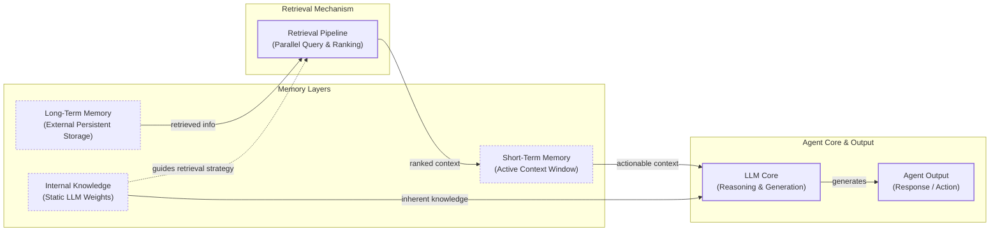

# Memory: The Missing Piece for Building Agents That Learn

In the previous lessons, we built a solid foundation in AI Engineering. We explored the agent landscape, distinguished between rule-based workflows and autonomous agents, and dove into context engineering. We learned how to manage the flow of information to an LLM, a crucial skill for building any AI application. Now, we will tackle one of the most important components of context: memory.

The core limitation of today's LLMs is that their knowledge is vast but frozen in time. They are fundamentally unable to learn by updating their parameters after deployment, a challenge known as the "continual learning" problem. We can inject new knowledge through the context window, but this is a temporary fix. An LLM without a persistent memory is like an intern with amnesia; it can perform a task, but it cannot recall past conversations or learn from experience.

We can think of the context window as the agent's "working memory" or RAM. It is fast and essential for immediate tasks, but it has its limits. Keeping an entire conversation history in context is unrealistic due to finite size, rising costs per interaction, and performance degradation from noise. Even with massive one-million-token context windows, models struggle to use relevant information when it is buried in the middle.

However, these larger context windows are changing how we engineer stateful systems. Just a couple of years ago, with 8k-token limits, aggressive compression and summarization were not just best practices; they were necessities. Today, we can afford to preserve more raw detail, which is often where the most valuable nuance lies. Memory tools and frameworks have emerged as the practical, temporary solution to the continual learning problem. They provide agents with continuity, adaptability, and the ability to "learn" from interactions over time. This is not just a theoretical improvement; it is a required step for building personalized and truly helpful agents.

In this lesson, we will explore the concept of agent memory. We will differentiate between the model's static internal knowledge, its short-term working memory, and persistent long-term memory. We will focus on three types of long-term memory—semantic (facts), episodic (experiences), and procedural (skills)—and show you how to implement them. By the end, you will understand the architectural trade-offs and best practices for building agents that remember.

## The Layers of Memory: Internal, Short-Term, and Long-Term

To build effective agentic systems, it helps to have a clear mental model for how memory works. We can borrow a useful framework from biology and cognitive science, which categorizes memory by its function and duration. This allows us to separate the different kinds of information an agent has access to and understand how they interact.

We can think of an agent’s memory as having three distinct layers:

**Internal Knowledge** is the static, pre-trained information baked into the LLM's weights. This includes world knowledge, language patterns, and reasoning abilities learned during its initial training. This knowledge is read-only during inference; you cannot update it without fine-tuning. It provides the agent with general intelligence, but it knows nothing about your specific users or application.

**Short-Term Memory** is the agent's active working memory, which corresponds to the LLM's context window. It is volatile, fast, and limited. This is the only reality the model sees during a single call. If information is not in the context window, it does not exist for the model. This is also the only layer where we can simulate "learning" over time by feeding the model information from past interactions.

**Long-Term Memory** is an external, persistent storage system where an agent can save and retrieve information across sessions. This is the agent's permanent knowledge base, living outside the LLM in databases, vector stores, or file systems. It gives the agent continuity and a sense of history.

These layers form a hierarchy where information flows from long-term storage into the short-term context window to become actionable [[1]](https://www.linkedin.com/posts/pauliusztin_every-ai-agent-has-4-distinct-memory-layers-activity-7436765234800807936-QyLR). This flow is managed by a retrieval pipeline, which queries different memory types and ranks the results before presenting them to the model.


Image 1: A hierarchy and flow diagram illustrating an AI agent's memory system, showing the interaction between Internal Knowledge, Short-Term Memory, Long-Term Memory, and a Retrieval Pipeline leading to the LLM Core and Agent Output.

Categorizing memory this way is useful because each layer serves a distinct purpose. Internal knowledge provides general reasoning, short-term memory handles the immediate task, and long-term memory provides the specific, personalized context that makes an agent truly useful. No single layer can do it all. To build robust agents, we need to understand how to engineer the long-term memory layer, which is where most of the practical work lies.

## Long-Term Memory: Semantic, Episodic, and Procedural

Long-term memory is what allows an agent to build a persistent understanding of its world and users. To better organize this layer, we can again borrow from cognitive science and divide it into three types: semantic, episodic, and procedural [[2]](https://arxiv.org/html/2309.02427), [[3]](https://machinelearningmastery.com/beyond-short-term-memory-the-3-types-of-long-term-memory-ai-agents-need/). Each type stores a different kind of information and serves a unique role in making an agent more capable.

### Semantic Memory (Facts & Knowledge)

**Semantic memory** is the agent's encyclopedia—a structured repository of facts, concepts, and knowledge. This information is context-independent, meaning it stores general truths rather than personal experiences.

This is where an agent keeps its extracted knowledge about specific people, places, and things. The structure of this memory depends entirely on the agent's use case. It could be a collection of atomic strings, like `"The user is a vegetarian,"` or structured as entities in a JSON object or a graph database.

The primary role of semantic memory is to provide the agent with a reliable source of truth. For an enterprise agent, this might be a knowledge base of internal company documents or technical manuals. For a personal assistant, semantic memory is used to build a persistent user profile, recalling preferences (`"User likes rock music"`), relationships (`"User has a dog named George"`), or constraints (`"User is allergic to gluten"`). By retrieving these facts, the agent can provide personalized and accurate responses without needing to sift through a noisy conversation history [[4]](https://www.mongodb.com/resources/basics/artificial-intelligence/agent-memory).

### Episodic Memory (Experiences & History)

**Episodic memory** is the agent's personal diary—a chronological log of its past interactions and experiences. Unlike the timeless facts in semantic memory, episodic memories are about "what happened and when." Each entry is a snapshot of a specific event, tied to a particular time and context [[5]](https://www.ibm.com/think/topics/ai-agent-memory).

This memory type is crucial for maintaining conversational continuity and understanding the dynamics of a relationship over time. For example, a semantic memory might store two separate facts: `"User's brother is named Mark"` and `"User is frustrated with his brother."` An episodic memory provides a much richer, more nuanced picture: `"On Tuesday, the user expressed frustration that their brother, Mark, always forgets their birthday. I then provided an empathetic response. [created_at=2025-08-25T17:20:04...]"`.

This "episode" allows the agent to interact with more intelligence and empathy in the future. If the topic of the user's brother comes up again, the agent can recall the previous context and respond appropriately (e.g., *"I know the topic of your brother's birthday can be sensitive..."*). The timestamp also allows the agent to answer questions like, "What did we talk about last week?" Depending on the product, these episodes can capture events from a single conversation, a full day, or an entire week.

### Procedural Memory (Skills & How-To)

**Procedural memory** is the agent's muscle memory—its collection of learned skills and workflows. It is the "how-to" knowledge that enables it to perform multi-step tasks reliably and efficiently. Think of it as a set of pre-defined playbooks for common requests [[6]](https://www.geeksforgeeks.org/artificial-intelligence/ai-agent-memory/).

This memory is often encoded as a reusable tool, function, or a defined sequence of actions within the agent's system prompt. For example, an agent might have a stored procedure for generating a monthly report. When a user asks for an update, the agent does not need to reason from scratch. It retrieves the `monthly_report` procedure, which dictates a clear series of steps: 1) Query the sales database for the last 30 days, 2) Summarize the key insights, and 3) Ask the user whether to email or display the results.

This makes the agent's behavior on common tasks predictable and fast. By encoding successful workflows, procedural memory allows an agent to improve its task-completion efficiency over time, reducing errors and ensuring that complex jobs are executed consistently [[3]](https://machinelearningmastery.com/beyond-short-term-memory-the-3-types-of-long-term-memory-ai-agents-need/).

Now that we have an idea of what to save and the benefits of each memory type, how should we store this information? The architectural choices we make here have a significant impact on the agent's performance.

## Storing Memories: Pros and Cons of Different Approaches

How an agent's memories are stored is an important architectural decision that directly impacts its performance, complexity, and ability to scale. While the goal is always to provide the right context at the right time, the method of storage involves trade-offs. There is no one-size-fits-all solution; the ideal approach depends entirely on the product's use case. Let's explore the pros and cons of the three primary methods: storing memories as raw strings, as structured entities, and within a knowledge graph.

### Storing Memories as Raw Strings

This is the simplest method, where conversational turns or documents are stored as plain text and indexed for vector search [[7]](https://www.decodingai.com/p/how-does-memory-for-ai-agents-work).

-   **Pros:**
    -   **Simple and fast to set up:** This approach requires minimal engineering overhead. Logging text and creating embeddings is straightforward to implement.
    -   **Preserves nuance:** By storing the raw text, the full context, including emotional tone and subtle linguistic cues, is preserved. Nothing is lost in translation to a structured format.
-   **Cons:**
    -   **Imprecise retrieval:** Relying solely on semantic similarity can be misleading. A query might retrieve text that is semantically related but contextually wrong. For example, asking, "What is my brother's job?" could retrieve every past conversation where "brother" and "job" were mentioned, without pinpointing the single correct fact [[7]](https://www.decodingai.com/p/how-does-memory-for-ai-agents-work).
    -   **Difficult to update:** If a user corrects information ("My brother is now a doctor"), you cannot simply update the old fact. The new information becomes just another string in a growing log, creating potential contradictions.
    -   **Lack of structure:** This approach struggles with temporal reasoning and state changes. It cannot easily distinguish between "Barry *was* the CEO" and "Claude *is* the CEO" because the relationship is not explicitly defined [[8]](https://danielp1.substack.com/p/memex-20-memory-the-missing-piece).

### Storing Memories as Entities (JSON-like Structures)

In this approach, an LLM processes unstructured interactions and converts them into structured memories, typically stored in a format like JSON.

-   **Pros:**
    -   **Structured and precise:** Information is organized into key-value pairs (e.g., `"user": {"brother": {"job": "Software Engineer"}}`), allowing for precise, field-level filtering and retrieval without ambiguity.
    -   **Easier to update:** When a user's preference changes, only the relevant field in the JSON object needs to be updated, ensuring the memory remains current.
    -   **Ideal for factual data:** This method is well-suited for semantic memory, where user profiles, preferences, and key relationships are stored.
-   **Cons:**
    -   **Increased upfront complexity:** This approach requires designing a schema or data model, which adds an initial layer of engineering complexity.
    -   **Potential for schema rigidity:** A predefined schema can be inflexible. If the agent encounters information that does not fit the existing structure, that data may be lost. Letting an LLM dynamically alter the schema adds its own complexity and risks creating duplicate information.
    -   **Loss of original nuance:** The extraction process strips away the rich subtext of the original conversation. The factual memory `"user_likes": "cats"` is far less representative than the original message, "Petting my cat is the best part of my day" [[9]](https://www.youtube.com/watch?v=7AmhgMAJIT4&list=PLDV8PPvY5K8VlygSJcp3__mhToZMBoiwX&index=112).

### Storing Memories in a Graph Database

This is the most advanced approach, where memories are stored as a network of nodes (entities) and edges (relationships), forming a knowledge graph.

-   **Pros:**
    -   **Represents complex relationships:** Graphs excel at explicitly defining how different pieces of information are connected, such as `(User) -> [HAS_BROTHER] -> (Mark) -> [WORKS_AS] -> (Software Engineer)`. This enables sophisticated queries that trace these connections [[10]](https://www.octoco.ai/blog/knowledge-graphs-as-memory).
    -   **Superior contextual and temporal awareness:** Knowledge graphs can model time as an explicit property of a relationship (e.g., `User -[RECOMMENDED_ON_DATE: "2025-10-25"]-> Restaurant`), enabling more accurate retrieval than vector search alone [[11]](https://neo4j.com/nodes-2025/agenda/building-evolving-ai-agents-via-dynamic-memory-representations-using-temporal-knowledge-graphs/).
    -   **Auditability and explainability:** Retrieval is transparent. You can trace the exact path of nodes and edges that led to an answer, making it easier to debug the agent's reasoning [[10]](https://www.octoco.ai/blog/knowledge-graphs-as-memory).
-   **Cons:**
    -   **Highest complexity and cost:** This method requires a significant upfront investment in schema design, data modeling, and ongoing maintenance.
    -   **Potential for slower queries:** Complex graph traversals can be slower than a simple vector lookup, which might impact real-time performance if not carefully optimized.
    -   **Overhead for simple use cases:** For many applications, the complexity of a graph database is overkill. A simpler string-based or entity-based approach may be sufficient.

| Approach | Pros | Cons |
| --- | --- | --- |
| **Raw Strings** | Simple to set up, preserves full nuance. | Imprecise retrieval, hard to update, lacks structure. |
| **Entities (JSON)** | Structured, precise, easy to update. | Upfront complexity, schema rigidity, loss of nuance. |
| **Knowledge Graphs** | Represents complex relationships, superior temporal awareness, auditable. | Highest complexity and cost, potentially slower queries, overkill for simple cases. |

Table 1: A comparison of memory storage approaches.

The choice of memory storage should be guided by your product's core needs. A good strategy is to start with the simplest architecture that delivers value and evolve it as the demands on your agent grow more complex. Now that we know what to save and how to store it, let's look at some code examples using an open-source memory library.

## Memory Implementations with Code Examples

Now, let's ground these concepts in code. While Retrieval-Augmented Generation (RAG) is the mechanism for retrieving information, the creation of high-quality memories is an equally important preceding step. We will cover RAG in detail in the next lesson, but for now, we will focus on memory *creation*.

To demonstrate, we will use the open-source `mem0` library, which provides a simple interface for managing different memory types [[12]](https://arxiv.org/html/2504.19413). For these examples, we will stick to the "storing memories as raw strings" approach to focus on the distinct benefits of each memory category rather than the storage architecture itself.

<aside>
💡

You can find the code for this lesson in the accompanying notebook in our course repository.

</aside>

### Setup

First, we need to set up our environment. We will configure `mem0` to use a Gemini model for any LLM-based operations, Gemini embeddings, and a local ChromaDB instance as our vector store. We also create a few helper functions to simplify adding and searching for memories.

1.  We start by configuring `mem0` with our Gemini LLM, Gemini embeddings, and a local ChromaDB vector store. We then initialize the `Memory` object and clear any existing data for our user ID.
    ```python
    import os
    from mem0 import Memory
    
    MEM0_CONFIG = {
        "embedder": {
            "provider": "gemini",
            "config": {
                "model": "gemini-embedding-001",
                "embedding_dims": 768,
                "api_key": os.getenv("GOOGLE_API_KEY"),
            },
        },
        "vector_store": {
            "provider": "chroma",
            "config": {
                "collection_name": "lesson9_memories",
                "path": "/tmp/chroma_mem0",
            },
        },
        "llm": {
            "provider": "gemini",
            "config": {
                "model": "gemini-2.5-pro",
                "api_key": os.getenv("GOOGLE_API_KEY"),
            },
        },
    }
    
    memory = Memory.from_config(MEM0_CONFIG)
    MEM_USER_ID = "lesson9_notebook_student"
    memory.delete_all(user_id=MEM_USER_ID)
    print("✅ Mem0 ready (Gemini embeddings + local Chroma).")
    ```
    It outputs:
    ```text
    ✅ Mem0 ready (Gemini embeddings + local Chroma).
    ```

2.  Next, we define two helper functions. `mem_add_text` is a wrapper to save a string to memory with a specific category tag. `mem_search` allows us to query our memory store and optionally filter by that category.
    ```python
    from typing import Optional
    
    def mem_add_text(text: str, category: str = "semantic", **meta) -> str:
        """Add a single text memory. No LLM is used for extraction or summarization."""
        metadata = {"category": category}
        for k, v in meta.items():
            if isinstance(v, (str, int, float, bool)) or v is None:
                metadata[k] = v
            else:
                metadata[k] = str(v)
        memory.add(text, user_id=MEM_USER_ID, metadata=metadata, infer=False)
        return f"Saved {category} memory."
    
    
    def mem_search(query: str, limit: int = 5, category: Optional[str] = None) -> list[dict]:
        """Category-aware search wrapper."""
        res = memory.search(query, user_id=MEM_USER_ID, limit=limit) or {}
    
        items = res.get("results", [])
        if category is not None:
            items = [r for r in items if (r.get("metadata") or {}).get("category") == category]
        return items
    ```

### Semantic Memory: Extracting Facts

Semantic memory is created through a deliberate extraction pipeline. An LLM analyzes a conversation and extracts atomic, context-independent facts. This turns messy conversational threads into a clean, queryable knowledge base.

1.  We define a list of facts and use our `mem_add_text` helper to store them with the category "semantic".
    ```python
    facts: list[str] = [
        "User prefers vegetarian meals.",
        "User has a dog named George.",
        "User is allergic to gluten.",
        "User's brother is named Mark and is a software engineer.",
    ]
    for f in facts:
        print(mem_add_text(f, category="semantic"))
    
    print(f"Added {len(facts)} semantic memories.")
    ```
    It outputs:
    ```text
    Saved semantic memory.
    Saved semantic memory.
    Saved semantic memory.
    Saved semantic memory.
    Added 4 semantic memories.
    ```

2.  Now, we can search for a specific fact. A natural language query like "brother job" is embedded and compared against the stored facts. The most semantically similar memory is returned.
    ```python
    results = memory.search("brother job", user_id=MEM_USER_ID, limit=1)
    print(results["results"][0]["memory"])
    ```
    It outputs:
    ```text
    User's brother is named Mark and is a software engineer.
    ```

### Episodic Memory: Summarizing Events

Episodic memory functions as a chronological log of events. Instead of storing every single message, we can use an LLM to summarize a short conversational exchange into a single, durable "episode." This compressed memory retains the key details and can be timestamped.

1.  We start with a short, four-turn dialogue that we want to compress into a single episode.
    ```python
    dialogue = [
        {"role": "user", "content": "I'm stressed about my project deadline on Friday."},
        {"role": "assistant", "content": "I’m here to help—what’s the blocker?"},
        {"role": "user", "content": "Mainly testing. I also prefer working at night."},
        {"role": "assistant", "content": "Okay, we can split testing into two sessions."},
    ]
    ```

2.  We use a prompt to ask an LLM to summarize this exchange into a concise one or two-sentence episode.
    ```python
    from google import genai
    
    client = genai.Client()
    MODEL_ID = "gemini-2.5-pro"
    
    episodic_prompt = f"""Summarize the following 3–4 turns as one concise 'episode' (1–2 sentences).
    Keep salient details and tone.
    
    {dialogue}
    """
    episode_summary = client.models.generate_content(model=MODEL_ID, contents=episodic_prompt)
    episode = episode_summary.text.strip()
    print(episode)
    ```
    It outputs:
    ```text
    A user, stressed about a Friday project deadline because of testing and a preference for working at night, is advised to split the testing work into two manageable sessions.
    ```

3.  We store this summary as an "episodic" memory. When we later search for "deadline stress," the system retrieves this episode, complete with its creation timestamp provided by `mem0`. This allows the agent to recall not just the facts, but the context of a past event.
    ```python
    print(
        mem_add_text(
            episode,
            category="episodic",
            summarized=True,
            turns=4,
        )
    )
    
    print("\nSearch --> 'deadline stress'\n")
    hits = mem_search("deadline stress", limit=1, category="episodic")
    for h in hits:
        print(f"{h['memory']}\n")
        print(h)
    ```
    It outputs:
    ```text
    Saved episodic memory.
    
    Search --> 'deadline stress'
    
    A user, stressed about a Friday project deadline because of testing and a preference for working at night, is advised to split the testing work into two manageable sessions.
    
    {'id': '...', 'memory': '...', 'metadata': {'turns': 4, 'summarized': True, 'category': 'episodic'}, 'score': 0.91..., 'created_at': '2025-09-12T02:30:01...', ...}
    ```

### Procedural Memory: Learning a Skill

Procedural memory allows an agent to learn and reuse workflows. This can be implemented by storing a sequence of steps as a single text block, which the agent can later retrieve and "execute."

1.  We define a simple procedure for creating a monthly report, including a name and a list of steps. We format this as a single string.
    ```python
    procedure_name = "monthly_report"
    steps = [
        "Query sales DB for the last 30 days.",
        "Summarize top 5 insights.",
        "Ask user whether to email or display.",
    ]
    procedure_text = f"Procedure: {procedure_name}\nSteps:\n" + "\n".join(f"{i + 1}. {s}" for i, s in enumerate(steps))
    
    mem_add_text(procedure_text, category="procedure", procedure_name=procedure_name)
    
    print(f"Learned procedure: {procedure_name}")
    ```
    It outputs:
    ```text
    Learned procedure: monthly_report
    ```

2.  To "run" the procedure, the agent can retrieve it by searching for its name or a related query. Once retrieved, the agent can parse the numbered steps and execute them in order. This demonstrates how an agent can learn a reusable playbook and trigger it on demand.
    ```python
    results = mem_search("how to create a monthly report", category="procedure", limit=1)
    if results:
        print(results[0]["memory"])
    ```
    It outputs:
    ```text
    Procedure: monthly_report
    Steps:
    1. Query sales DB for the last 30 days.
    2. Summarize top 5 insights.
    3. Ask user whether to email or display.
    ```

These examples show how different memory types can be implemented using a simple storage mechanism. Now, let's discuss some of the real-world challenges and best practices we have learned from building these systems.

## Real-World Lessons: Challenges and Best Practices

The architectural patterns we have discussed provide a useful toolkit for building agents with memory. However, moving from theory to a reliable, production-ready system requires navigating a series of complex trade-offs that are constantly evolving as the underlying technology improves.

Here are some of the most important lessons learned from building and scaling agent memory systems in the real world.

### Re-evaluating Compression

One of the biggest shifts in designing memory systems has been the trade-off between compressing information and preserving its raw detail.

Just two years ago, LLMs operated with small and expensive context windows of 8,000 or 16,000 tokens. This forced us to be ruthless with compression. The goal was to distill every interaction into its most compact form—summaries, facts, or entities—to fit relevant information into the context window. While necessary, this process is inherently lossy; summarizing retains the general idea but loses the fine details and nuance that are often critical for a personalized agent [[9]](https://www.youtube.com/watch?v=7AmhgMAJIT4&list=PLDV8PPvY5K8VlygSJcp3__mhToZMBoiwX&index=112).

Today, with models offering million-token context windows at a fraction of the cost, the calculus has changed. The emerging best practice is to lean towards less compression. The raw, unstructured conversational history is the ultimate source of truth. It contains the emotional subtext and relational dynamics that are often lost during extraction. While a fact might state, "User has a dog named George," the episodic log reveals, "User mentioned that walking their dog, George, is the best part of their day"—a far more valuable insight for a personal companion [[9]](https://www.youtube.com/watch?v=7AmhgMAJIT4&list=PLDV8PPvY5K8VlygSJcp3__mhToZMBoiwX&index=112).

The best practice now is to design your system to work with the most complete version of history that is economically and technically feasible. Use summarization and fact extraction to create queryable indexes, but always treat the raw log as the ground truth.

### Designing for the Product

There is no such thing as a "perfect" memory architecture. The concepts of semantic, episodic, and procedural memory are a powerful mental model, but they are a toolkit, not a mandatory blueprint. A common failure mode is over-engineering a complex, multi-part memory system for a product that does not need it [[9]](https://www.youtube.com/watch?v=7AmhgMAJIT4&list=PLDV8PPvY5K8VlygSJcp3__mhToZMBoiwX&index=112).

Start from first principles by defining the core function of your agent. The product's goal should dictate the memory architecture, not the other way around.

-   For a Q&A bot over internal documents, a simple RAG pipeline is the best starting point. Your focus should be on building a robust, factually accurate knowledge base.
-   For a long-term personal AI companion, rich episodic memories are essential. The agent's value comes from its ability to remember the narrative of your relationship.
-   For a task-automation agent, procedural memory is key. The agent needs to recall and execute multi-step workflows reliably.

### The Human Factor

Memory exists to make the agent smarter, not to give the user a new job. A common pitfall is exposing the internal workings of the memory system to the user, thinking it will improve transparency. In practice, it often does the opposite by creating significant cognitive overhead [[9]](https://www.youtube.com/watch?v=7AmhgMAJIT4&list=PLDV8PPvY5K8VlygSJcp3__mhToZMBoiwX&index=112).

Users should not be asked to "garden their agent's memories." This breaks the illusion of a capable assistant and turns the interaction into a tedious data-entry task. A user's mental model is that they are talking to a single entity; they do not want to become a database administrator.

Memory management should be an autonomous function of the agent. It should learn from corrections within the natural flow of conversation (e.g., "Actually, my brother's name is Mark, not Mike"). The agent, not the user, is responsible for maintaining the integrity of its own knowledge by periodically reviewing, consolidating, and resolving conflicting information in its memory stores [[13]](https://towardsdatascience.com/a-practical-guide-to-memory-for-autonomous-llm-agents/).

## Conclusion

Memory is the secret sauce that transforms a stateless chatbot into a truly adaptive and personalized agent. It sits at the core of any advanced AI application, enabling continuity, learning, and a deeper understanding of user needs. We have explored the different layers and types of memory, from the LLM's internal knowledge to persistent long-term storage, and seen how to implement these concepts in code.

While today's memory tools are a practical workaround for the "continual learning" problem, they are a powerful step toward building agents that feel more intelligent and human. By mastering these architectural patterns and best practices, you can create systems that not only respond to queries but also build relationships and improve over time.

In our next lesson, we will dive deep into Retrieval-Augmented Generation (RAG), the mechanism that allows agents to pull relevant information from their long-term memory. We will also explore more advanced topics like building multi-agent systems and preparing them for production, connecting everything we have learned to the broader field of AI Engineering.

## References

- [1] [every-ai-agent-has-4-distinct-memory-layers-activity](https://www.linkedin.com/posts/pauliusztin_every-ai-agent-has-4-distinct-memory-layers-activity-7436765234800807936-QyLR)
- [2] [Cognitive Architectures for Language Agents](https://arxiv.org/html/2309.02427)
- [3] [Beyond Short-term Memory: The 3 Types of Long-term Memory AI Agents Need - MachineLearningMastery.com](https://machinelearningmastery.com/beyond-short-term-memory-the-3-types-of-long-term-memory-ai-agents-need/)
- [4] [Memory in AI agents | MongoDB](https://www.mongodb.com/resources/basics/artificial-intelligence/agent-memory)
- [5] [What is AI agent memory? - IBM](https://www.ibm.com/think/topics/ai-agent-memory)
- [6] [Artificial Intelligence - AI Agent Memory - GeeksforGeeks](https://www.geeksforgeeks.org/artificial-intelligence/ai-agent-memory/)
- [7] [How Does Memory for AI Agents Work?](https://www.decodingai.com/p/how-does-memory-for-ai-agents-work)
- [8] [Memex 2.0: Memory The Missing Piece for Real Intelligence](https://danielp1.substack.com/p/memex-20-memory-the-missing-piece)
- [9] [What is the perfect memory architecture?](https://www.youtube.com/watch?v=7AmhgMAJIT4&list=PLDV8PPvY5K8VlygSJcp3__mhToZMBoiwX&index=112)
- [10] [Knowledge Graphs as Memory: Why Your AI Agent Needs to Think in Relationships](https://www.octoco.ai/blog/knowledge-graphs-as-memory)
- [11] [Building Evolving AI Agents via Dynamic Memory Representations using Temporal Knowledge Graphs](https://neo4j.com/nodes-2025/agenda/building-evolving-ai-agents-via-dynamic-memory-representations-using-temporal-knowledge-graphs/)
- [12] [Mem0: Building Production-Ready AI Agents with Scalable Long-Term Memory](https://arxiv.org/html/2504.19413)
- [13] [A Practical Guide to Memory for Autonomous LLM Agents](https://towardsdatascience.com/a-practical-guide-to-memory-for-autonomous-llm-agents/)