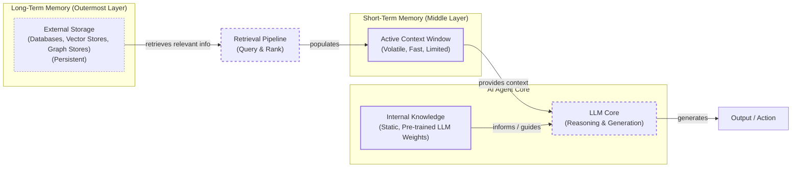

# How Does Memory for AI Agents Work?

In the previous lessons, we built a foundation in AI Engineering, covering everything from the agent landscape and context engineering to implementing ReAct agents from scratch. We have seen how agents can reason and use tools to interact with the world. Now, we will tackle one of the most important components for building advanced AI systems: memory.

The core problem we are solving is the fundamental limitation of LLMs: their knowledge is vast but frozen in time. They are unable to learn by updating their weights after training, a problem known as “continual learning.” An LLM without memory is like an intern with amnesia. They might be brilliant, but they cannot recall previous conversations or learn from experience. To overcome this, we use the context window as a form of “working memory.”

However, keeping an entire conversation thread plus additional information in the context window is often unrealistic. Rising costs per turn and the “lost in the middle” problem—where models struggle to use information buried in the center of a long prompt—limit this approach. Even as context windows expand to millions of tokens, simply stuffing them with raw history is inefficient and noisy. Memory tools provide the current engineering solution, giving agents continuity, adaptability, and the ability to “learn” without retraining.

When we first started building agents, working with 8k or 16k token limits forced us to engineer complex compression systems. Today, we have more breathing room, but the principles of organizing memory remain essential for performance. In this article, we will explore the fundamental layers of memory for AI agents, take a detailed look at long-term memory types like Semantic, Episodic, and Procedural, discuss the trade-offs between different storage approaches, implement these concepts with code, and cover the real-world challenges and best practices for designing memory systems.

To build effective agents, we must first understand how to architect memory systems that match your actual use case. We can borrow terms from biology and cognitive science to categorize these layers in a way that is useful for engineering.

## The Layers of Memory: Internal, Short-Term, and Long-Term

To build effective agents, we must distinguish between the different places information lives. We can categorize these layers based on their persistence and proximity to the model’s reasoning core, a practice that helps clarify their distinct roles in an agent's architecture.

**Internal Knowledge** is the static, pre-trained knowledge baked into the LLM’s weights. It is the best place to store general world knowledge, as models know about entire books without needing them in the context window. However, this memory is frozen at the time of training and cannot be updated with user-specific information during inference without fine-tuning [[1]](https://www.linkedin.com/posts/pauliusztin_every-ai-agent-has-4-distinct-memory-layers-activity-7436765234800807936-QyLR).

**Short-Term Memory** is the RAM of the entire agentic system. It is the active context window we pass to the LLM during a specific call, making it the only “reality” the model sees during inference [[2]](https://www.decodingai.com/p/how-does-memory-for-ai-agents-work), [[3]](https://www.ibm.com/think/topics/ai-agent-memory). It contains the user input, recent interactions, and details retrieved from long-term memory. It is volatile and fast, simulating the feeling of “learning” during a session.

**Long-Term Memory** is the external, persistent storage system where an agent saves and retrieves information. This is the agent's "disk," providing the personalization and continuity that internal knowledge lacks and short-term memory cannot retain [[1]](https://www.linkedin.com/posts/pauliusztin_every-ai-agent-has-4-distinct-memory-layers-activity-7436765234800807936-QyLR), [[4]](https://decodingml.substack.com/p/memory-the-secret-sauce-of-ai-agents).

The dynamic between these layers creates the agent’s intelligence. A retrieval pipeline queries long-term memory and brings relevant information into short-term memory. This curated context is then passed to the LLM, which uses its internal knowledge to reason and generate a response. This flow ensures that the agent has access to the right information at the right time.



Image 1: A layered architecture diagram of an AI agent's memory system, showing the flow from Long-Term Memory through a Retrieval Pipeline to Short-Term Memory, interacting with Internal Knowledge and the LLM Core to produce an output.

Categorizing memory this way is critical for engineering. Internal knowledge handles general reasoning, short-term memory manages the immediate task, and long-term memory handles personalization and continuity. No single layer can perform all three functions effectively. To better understand long-term memory, we can further apply cognitive science definitions to specific data types.

## Long-Term Memory: Semantic, Episodic, and Procedural

Long-term memory is not a single bucket of text. It consists of three distinct types, each serving a different role in making an agent “intelligent” [[5]](https://arxiv.org/html/2309.02427), [[6]](https://www.newsletter.swirlai.com/p/memory-in-agent-systems).

### Semantic Memory (Facts & Knowledge)

Semantic memory is the agent’s encyclopedia. It stores individual pieces of knowledge or “facts.” These can be independent strings, such as *“The user is a vegetarian,”* or structured attributes attached to an entity, like `{"food_restrictions": "vegetarian"}` [[2]](https://www.decodingai.com/p/how-does-memory-for-ai-agents-work). The semantic memory is where the agent stores extracted concepts and relationships regarding specific domains, people, or places. The structure of this memory is highly dependent on the agent's use case and can even be organized as a graph database.

The primary role of semantic memory is to provide a reliable source of truth. For an enterprise agent, this might involve storing internal company documents or technical manuals, allowing it to answer questions on proprietary topics. For a personal assistant, semantic memory builds a persistent user profile. It recalls specific preferences like `{"music": "User likes rock music"}` or constraints like `{"dog": "User has a dog named George"}`. This allows the agent to retrieve relevant facts without searching through a noisy conversation history.

### Episodic Memory (Experiences & History)

Episodic memory is the agent’s personal diary. It records past interactions, but unlike timeless facts, these memories have a timestamp. It captures *“what happened and when.”* [[5]](https://arxiv.org/html/2309.02427), [[7]](https://www.youtube.com/watch?v=7AmhgMAJIT4&list=PLDV8PPvY5K8VlygSJcp3__mhToZMBoiwX&index=112)

This memory type is essential for maintaining conversational context and understanding relationship dynamics. For instance, a semantic fact might be *“User is frustrated with his brother.”* An episodic memory, however, would capture the full event: *“On Tuesday, the user expressed frustration that their brother, Mark, always forgets their birthday. I provided an empathetic response. [created_at=2025-08-25].”* This “episode” provides nuanced context. If the topic comes up again, the agent can say, “I know the topic of your brother’s birthday can be sensitive,” rather than just stating a fact. It also allows the agent to answer questions like *“What happened last week?”* [[7]](https://www.youtube.com/watch?v=7AmhgMAJIT4&list=PLDV8PPvY5K8VlygSJcp3__mhToZMBoiwX&index=112). Depending on the use case, these memories can group events over a day, a single conversation, or a week.

### Procedural Memory (Skills & How-To)

Procedural memory is the agent’s muscle memory. It consists of skills, learned workflows, and “how-to” knowledge. It dictates the agent’s ability to perform multi-step tasks [[5]](https://arxiv.org/html/2309.02427).

This memory is often baked into the agent’s system prompt as reusable tools or defined sequences. For example, an agent might store a `MonthlyReportIntent` procedure. When a user asks for a report, the agent retrieves this procedure: 1) Query sales DB, 2) Summarize findings, 3) Email user. This makes behavior reliable and predictable. It encodes successful workflows so the agent does not have to reason from scratch every time [[8]](https://arxiv.org/html/2508.06433v2).

Now that we have an idea of what to save and the benefits of specific types of memories, we must decide *how* to store it.

## Storing Memories: Pros and Cons of Different Approaches

The way an agent’s memories are stored is an architectural decision that impacts performance, complexity, and scalability. The ideal approach depends on the product's use case. Let’s explore the pros and cons of the three primary methods.

### Storing Memories as Raw Strings

This is the simplest method. Conversational turns or documents are stored as plain text and indexed for vector search.

**Pros:** It is simple and fast to set up, requiring minimal engineering. It preserves nuance, capturing emotional tone and linguistic cues without loss in translation [[2]](https://www.decodingai.com/p/how-does-memory-for-ai-agents-work).

**Cons:** Retrieval is often imprecise. A query like “What is my brother’s job?” might retrieve every conversation mentioning “brother” and “job” without pinpointing the current fact [[2]](https://www.decodingai.com/p/how-does-memory-for-ai-agents-work). Updating is difficult; if a user corrects a fact (“My brother is now a doctor”), the new string just adds to the log, creating potential contradictions. It also lacks structure, making it hard to distinguish state changes over time (e.g., “Barry *was* CEO” vs. “Claude *is* CEO”) [[2]](https://www.decodingai.com/p/how-does-memory-for-ai-agents-work).

### Storing Memories as Entities (JSON-like Structures)

Here, we use an LLM to transform messy interactions into structured memories, stored in formats like JSON within document databases or SQL databases.

**Pros:** It allows for precise, field-level filtering (e.g., `“user”: {”brother”: {”job”: “Software Engineer”}}`). The agent can retrieve specific facts without ambiguity. Updates are easier, as you simply overwrite the relevant field. This is ideal for semantic memory like user profiles or preferences [[2]](https://www.decodingai.com/p/how-does-memory-for-ai-agents-work), [[9]](https://danielp1.substack.com/p/memex-20-memory-the-missing-piece).

**Cons:** It requires upfront schema design complexity. It can also be rigid; if the agent encounters information that does not fit the schema, that data might be lost unless the schema is updated [[9]](https://danielp1.substack.com/p/memex-20-memory-the-missing-piece). Allowing an LLM to dynamically add new fields can increase complexity and risk saving duplicated information. The extraction process can also strip away the rich subtext of the original conversation; the fact `"user_likes": ["cats"]` is far less representative than the original message, "Petting my cat is the best part of my day."

### Storing Memories in a Knowledge Graph

This is the most advanced approach. Memories are stored as a network of nodes (entities) and edges (relationships) using databases such as Neo4j [[10]](https://www.octoco.ai/blog/knowledge-graphs-as-memory).

**Pros:** It excels at representing complex relationships (e.g., `(User) -> [HAS_BROTHER] -> (Mark)`). It offers superior contextual and temporal awareness by modeling time as a property of a relationship (e.g., `[RECOMMENDED_ON_DATE]`) [[10]](https://www.octoco.ai/blog/knowledge-graphs-as-memory). Retrieval is also auditable. You can trace the path of reasoning, which builds trust [[2]](https://www.decodingai.com/p/how-does-memory-for-ai-agents-work).

**Cons:** It has the highest complexity and cost. Converting unstructured text into graph triples is difficult. Graph traversals can be slower than vector lookups, potentially impacting real-time performance. For simple use cases, it is often overkill [[2]](https://www.decodingai.com/p/how-does-memory-for-ai-agents-work), [[10]](https://www.octoco.ai/blog/knowledge-graphs-as-memory).

| Approach | Pros | Cons |
| :--- | :--- | :--- |
| **Raw Strings** | Simple, fast setup; preserves full nuance and emotional tone. | Imprecise retrieval; difficult to update; lacks structure for temporal reasoning. |
| **Entities (JSON)** | Precise, field-level filtering; easy to update; ideal for factual data. | Upfront schema complexity; can be rigid; loses original conversational nuance. |
| **Knowledge Graph** | Models complex relationships; superior contextual and temporal awareness; auditable. | Highest complexity and cost; slower queries; often overkill for simple use cases. |

Table 1: A comparison of the three primary approaches for storing agent memories.

The choice should be guided by your product’s needs. Start simple and evolve as complexity grows. Now that we know what to save and how to store memories, let's look at some code examples.

## Memory Implementations with Code Examples

This section provides code examples for implementing the different memory types using the `mem0` library. While Retrieval-Augmented Generation (RAG) is the mechanism for retrieving information, a topic we will cover in the next lesson, the creation of high-quality memories is an equally important, preceding step. To focus on the benefits of each memory category, we will use the simple "raw strings" storage approach.

### Setup

`mem0` is an open-source memory layer that simplifies adding long-term memory to AI agents. It handles the extraction, storage, and retrieval of information, allowing us to focus on the application logic. We will configure it to use Gemini for embeddings and a local ChromaDB instance for storage.

1.  First, we set up our environment and import the necessary packages.

    ```python
    import os
    from typing import Optional
    
    from google import genai
    from mem0 import Memory
    
    from utils import env
    
    env.load(required_env_vars=["GOOGLE_API_KEY"])
    client = genai.Client()
    MODEL_ID = "gemini-2.5-pro"
    ```

2.  Next, we configure `mem0` to use Gemini for both the LLM (for fact extraction) and embeddings, and ChromaDB as our local vector store.

    ```python
    MEM0_CONFIG = {
        "embedder": {
            "provider": "gemini",
            "config": {
                "model": "gemini-embedding-001",
                "embedding_dims": 768,
                "api_key": os.getenv("GOOGLE_API_KEY"),
            },
        },
        "vector_store": {
            "provider": "chroma",
            "config": {
                "collection_name": "lesson9_memories",
                "path": "/tmp/chroma_mem0",
            },
        },
        "llm": {
            "provider": "gemini",
            "config": {
                "model": MODEL_ID,
                "api_key": os.getenv("GOOGLE_API_KEY"),
            },
        },
    }
    
    memory = Memory.from_config(MEM0_CONFIG)
    MEM_USER_ID = "lesson9_notebook_student"
    memory.delete_all(user_id=MEM_USER_ID)
    ```

    It outputs:

    ```text
    ✅ Mem0 ready (Gemini embeddings + local Chroma).
    ```

3.  Finally, we define a few helper functions to add and search for memories. `mem_add_text` stores a string with a category tag, and `mem_search` wraps the search functionality with an optional category filter.

    ```python
    def mem_add_text(text: str, category: str = "semantic", **meta) -> str:
        """Add a single text memory. No LLM is used for extraction or summarization."""
        metadata = {"category": category}
        for k, v in meta.items():
            if isinstance(v, (str, int, float, bool)) or v is None:
                metadata[k] = v
            else:
                metadata[k] = str(v)
        memory.add(text, user_id=MEM_USER_ID, metadata=metadata, infer=False)
        return f"Saved {category} memory."
    
    
    def mem_search(query: str, limit: int = 5, category: Optional[str] = None) -> list[dict]:
        """
        Category-aware search wrapper.
        Returns the full result dicts so we can inspect metadata.
        """
        res = memory.search(query, user_id=MEM_USER_ID, limit=limit) or {}
    
        items = res.get("results", [])
        if category is not None:
            items = [r for r in items if (r.get("metadata") or {}).get("category") == category]
        return items
    ```

### Semantic Memory: Extracting Facts

Semantic memory is created through an extraction pipeline. After an interaction, the unstructured text is passed to an LLM with a prompt designed to extract atomic facts. This turns messy conversation threads into a queryable knowledge base. An example prompt might be:

```
Extract persistent facts and strong preferences as short bullet points.
- Keep each fact atomic and context-independent.
- 3–6 bullets max.

Text:
{My brother Mark is a software engineer, but his real passion is painting. He gifted me a painting a few years ago. It's really beautiful.}
```

The system would then store facts like: `Mark is the user's brother.`, `Mark is a software engineer.`, `Mark's real passion is painting.`, and `The user has a beautiful painting from Mark.`.

1.  Let's add a few facts to our semantic memory.

    ```python
    facts: list[str] = [
        "User prefers vegetarian meals.",
        "User has a dog named George.",
        "User is allergic to gluten.",
        "User's brother is named Mark and is a software engineer.",
    ]
    for f in facts:
        print(mem_add_text(f, category="semantic"))
    ```

    It outputs:

    ```text
    Saved semantic memory.
    Saved semantic memory.
    Saved semantic memory.
    Saved semantic memory.
    ```

2.  Now, we can search for a specific fact. Retrieval often uses hybrid search, combining keyword filtering with semantic search. For a query like "brother job," the system would first filter for memories containing "brother" and then perform a vector search for "job."

    ```python
    results = memory.search("brother job", user_id=MEM_USER_ID, limit=1)
    print(results["results"][0]["memory"])
    ```

    It outputs:

    ```text
    User's brother is named Mark and is a software engineer.
    ```

### Episodic Memory: The Log of Events

Episodic memory functions as a chronological log. Memories can be created by summarizing interactions and are always stored with a timestamp. This allows the agent to recall not just *what* happened, but *when*.

1.  We start with a short dialogue and use an LLM to create a concise summary.

    ```python
    dialogue = [
        {"role": "user", "content": "I'm stressed about my project deadline on Friday."},
        {"role": "assistant", "content": "I’m here to help—what’s the blocker?"},
        {"role": "user", "content": "Mainly testing. I also prefer working at night."},
        {"role": "assistant", "content": "Okay, we can split testing into two sessions."},
    ]
    
    episodic_prompt = f"""Summarize the following 3–4 turns as one concise 'episode' (1–2 sentences).
    Keep salient details and tone.
    
    {dialogue}
    """
    episode_summary = client.models.generate_content(model=MODEL_ID, contents=episodic_prompt)
    episode = episode_summary.text.strip()
    ```

2.  This summary is then saved as an "episode" with relevant metadata.

    ```python
    print(
        mem_add_text(
            episode,
            category="episodic",
            summarized=True,
            turns=4,
        )
    )
    ```

    It outputs:

    ```text
    Saved episodic memory.
    ```

3.  Retrieval from episodic memory blends temporal and semantic queries. A user could ask, "What did we talk about yesterday?" to filter by date. Or, they could ask a semantic query like "deadline stress," which would find contextually similar conversations and prioritize the most recent ones.

    ```python
    hits = mem_search("deadline stress", limit=1, category="episodic")
    for h in hits:
        print(f"{h['memory']}\n")
    ```

    It outputs:

    ```text
    A user, stressed about a Friday project deadline because of testing and a preference for working at night, is advised to split the testing work into two manageable sessions.
    ```

### Procedural Memory: Defining and Learning Skills

Procedural memory can be either defined by a developer or learned from a user. An advanced agent can be taught a new workflow and save it as a reusable procedure.

**Developer-Defined Procedures** are explicitly coded by an engineer.

1.  We define a simple procedure for creating a monthly report and store it.

    ```python
    procedure_name = "monthly_report"
    steps = [
        "Query sales DB for the last 30 days.",
        "Summarize top 5 insights.",
        "Ask user whether to email or display.",
    ]
    procedure_text = f"Procedure: {procedure_name}\nSteps:\n" + "\n".join(f"{i + 1}. {s}" for i, s in enumerate(steps))
    
    mem_add_text(procedure_text, category="procedure", procedure_name=procedure_name)
    ```

    It outputs:

    ```text
    Saved procedure memory.
    ```

2.  Retrieval is an intent-matching process. When the user's request semantically matches the description of a stored procedure, the agent can execute it.

    ```python
    results = mem_search("how to create a monthly report", category="procedure", limit=1)
    if results:
        print(results[0]["memory"])
    ```

    It outputs:

    ```text
    Procedure: monthly_report
    Steps:
    1. Query sales DB for the last 30 days.
    2. Summarize top 5 insights.
    3. Ask user whether to email or display.
    ```

**User-Taught Procedures** allow agents to learn new skills dynamically. When a user provides explicit steps, the agent can convert them into a reusable procedure. For example, a prompt could instruct the agent:

```
You are an agent that can learn new skills. When a user provides a numbered list of steps to accomplish a goal, your task is to run the "learn_procedure" tool and convert these steps into a reusable procedure.

User Input: "I want you to book a cabin for this summer. To do that, please remember to: 1. Search for cabins on CabinRentals.com. 2. Filter for locations in the mountains. 3. Make sure it's available around July 4th to 8th. 4. Send me the top 3 options."
```

The agent would then generate and save a new procedure named `find_summer_cabin` with the corresponding steps, making this workflow available for future requests. This demonstrates a form of learning and adaptation.

We have seen how to implement the different types of memories with `mem0`. Now, let's talk about some additional considerations when building a memory system.

## Real-World Lessons: Challenges and Best Practices

Moving from these patterns to a production-ready system requires navigating complex trade-offs that are constantly evolving. Here are some key lessons learned from building and scaling agent memory systems.

**Re-evaluating Compression:** Just two years ago, LLMs operated with small and expensive context windows, forcing us to be ruthless with compression. This process is inherently lossy; repeatedly compressing history can lead to **summarization drift**, where each new summary loses more detail until the final version no longer accurately reflects what happened [[15]](https://towardsdatascience.com/a-practical-guide-to-memory-for-autonomous-llm-agents/). Today, with models offering million-token context windows at a fraction of the cost, the best practice is to lean towards less compression [[7]](https://www.youtube.com/watch?v=7AmhgMAJIT4&list=PLDV8PPvY5K8VlygSJcp3__mhToZMBoiwX&index=112). The raw conversational history is the ultimate source of truth. Design your system to work with the most complete history that is economically and technically feasible.

**Designing for the Product:** There is no "perfect" memory architecture. The concepts of semantic, episodic, and procedural memory are a useful mental model, but they are a toolkit, not a mandatory blueprint. A common failure mode is over-engineering a complex system for a product that does not need it [[7]](https://www.youtube.com/watch?v=7AmhgMAJIT4&list=PLDV8PPvY5K8VlygSJcp3__mhToZMBoiwX&index=112). Start from first principles by defining the core function of your agent. For a Q&A bot, a simple RAG pipeline is a good start. For a personal companion, rich episodic memories are more valuable. The product's goal should dictate the architecture.

**The Human Factor:** Memory exists to make the agent smarter, not to give the user a new job. A common pitfall is exposing the internal workings of the memory system, thinking it will improve transparency. In practice, it often creates significant cognitive overhead [[7]](https://www.youtube.com/watch?v=7AmhgMAJIT4&list=PLDV8PPvY5K8VlygSJcp3__mhToZMBoiwX&index=112). Users should not be asked to "garden their agent's memories." This breaks the illusion of a capable assistant. Memory management should be an autonomous function. The agent should learn from corrections within the natural flow of conversation and be responsible for maintaining the integrity of its own knowledge.

## Conclusion

Memory is the component that transforms a stateless chat application into a personalized agent. It is the current engineering solution to the problem of continual learning. By understanding the different layers and types of memory, you can design systems that maintain conversational continuity, learn from past interactions, and provide more capable and reliable assistance. While these memory tools are a temporary solution until models can truly learn and update their own weights, they are what works today.

By mastering these memory architectures, you are not just building more intelligent agents; you are creating systems that can form lasting, adaptive relationships with users. This capability is what separates simple chatbots from true AI companions. In our next lesson, we will dive deeper into Retrieval-Augmented Generation (RAG), the core mechanism for pulling information from long-term memory. We will also explore more advanced topics in the future, such as multimodal processing and how to take these systems into production with robust monitoring and evaluation pipelines.

## References

- [1] [every-ai-agent-has-4-distinct-memory-layers-activity](https://www.linkedin.com/posts/pauliusztin_every-ai-agent-has-4-distinct-memory-layers-activity-7436765234800807936-QyLR)
- [2] [How Does Memory for AI Agents Work?](https://www.decodingai.com/p/how-does-memory-for-ai-agents-work)
- [3] [What is AI agent memory?](https://www.ibm.com/think/topics/ai-agent-memory)
- [4] [Memory: The secret sauce of AI agents](https://decodingml.substack.com/p/memory-the-secret-sauce-of-ai-agents)
- [5] [Cognitive Architectures for Language Agents](https://arxiv.org/html/2309.02427)
- [6] [Memory in Agent Systems](https://www.newsletter.swirlai.com/p/memory-in-agent-systems)
- [7] [What is the perfect memory architecture?](https://www.youtube.com/watch?v=7AmhgMAJIT4&list=PLDV8PPvY5K8VlygSJcp3__mhToZMBoiwX&index=112)
- [8] [Mem^p: A Framework for Procedural Memory in Agents](https://arxiv.org/html/2508.06433v2)
- [9] [Memex 2.0: Memory The Missing Piece for Real Intelligence](https://danielp1.substack.com/p/memex-20-memory-the-missing-piece)
- [10] [Knowledge Graphs as Memory: Why Your AI Agent Needs to Think in Relationships](https://www.octoco.ai/blog/knowledge-graphs-as-memory)
- [11] [Mem0: Building Production-Ready AI Agents with Scalable Long-Term Memory](https://arxiv.org/html/2504.19413)
- [12] [Memory overview](https://langchain-ai.github.io/langgraph/concepts/memory/)
- [13] [Giving Your AI a Mind: Exploring Memory Frameworks for Agentic Language Models](https://medium.com/@honeyricky1m3/giving-your-ai-a-mind-exploring-memory-frameworks-for-agentic-language-models-c92af355df06)
- [14] [Introduction to Stateful Agents](https://docs.letta.com/guides/agents/memory)
- [15] [A Practical Guide to Memory for Autonomous LLM Agents](https://towardsdatascience.com/a-practical-guide-to-memory-for-autonomous-llm-agents/)
- [16] [A Survey on Memory Systems for Language Agents](https://arxiv.org/html/2603.07670v1)
- [17] [Memory Systems in AI Agents](https://www.analyticsvidhya.com/blog/2026/04/memory-systems-in-ai-agents/)