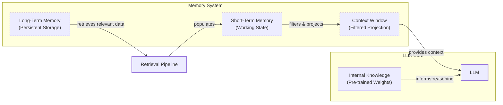

# Lesson 9: Memory for Agents

In the last eight lessons, we have built a solid foundation in AI Engineering. We have explored the agent landscape, learned to distinguish between LLM workflows and AI agents, and mastered context engineering to manage the flow of information to a model. We have also given agents the ability to use tools and reason with frameworks like ReAct. Now, we will tackle one of the most important components for building advanced AI systems: memory.

LLMs have a fundamental limitation: their knowledge is vast but frozen in time. They are stateless and cannot update their internal weights to learn from new interactions after they have been deployed, a challenge known as "continual learning." An LLM without memory is like an intern with amnesia; it can perform a task competently in the moment but forgets everything as soon as you start a new conversation. To work around this, we can feed past information into the model's context window, which acts as a temporary working memory. However, this is not a perfect solution.

Keeping an entire conversation history in the context window is unrealistic. Context windows are finite, and even with modern models supporting millions of tokens, performance degrades as they get overloaded. The "lost-in-the-middle" problem means information buried in a long prompt is often ignored [[3]](https://openreview.net/forum?id=5sB6cSblDR). Furthermore, every token adds to the cost and latency of each turn. Standardized benchmarks quantify this trade-off: passing the full context may yield the highest accuracy, but at a p95 latency of over 17 seconds, it is unusable for real-time applications [[51]](https://mem0.ai/blog/state-of-ai-agent-memory-2026). As this technology evolves, we must constantly adapt our engineering practices. Just a few years ago, we were working with 8,000-token windows, which forced us to be aggressive with compression. Today, with one-million-token contexts, we can afford to preserve more raw detail [[4]](https://www.youtube.com/watch?v=7AmhgMAJIT4&list=PLDV8PPvY5K8VlygSJcp3__mhToZMBoiwX&index=112).

External memory systems provide a practical solution to this problem. They are the tools we have today to provide agents with continuity, adaptability, and the ability to "learn" from experience. In this lesson, we will explore how to design and implement memory. We will borrow concepts from cognitive science to categorize different types of memory, from the model's static internal knowledge to short-term working memory and persistent long-term storage. We will focus on implementing semantic, episodic, and procedural long-term memory to build agents that feel truly intelligent and personalized.

## The Layers of Memory: Internal, Short-Term, and Long-Term

To build effective memory systems, it helps to adopt terminology from biology and cognitive science. This gives us a structured way to think about how an agent stores and accesses different kinds of information across various time horizons. An agent's memory can be organized into three distinct layers, each serving a unique purpose [[44]](https://www.linkedin.com/posts/pauliusztin_every-ai-agent-has-4-distinct-memory-layers-activity-7436765234800807936-QyLR).

**Internal Knowledge** is the static, pre-trained information baked into the LLM's weights. This is the model's vast understanding of the world, language patterns, and reasoning abilities. It is powerful but read-only; you cannot update it without fine-tuning. This is where the model stores its knowledge of entire books, ready to be accessed with an empty context window.

**Short-Term Memory**, also known as working memory, is the active context window. It is the only reality the model sees during a single call. This is where user input, retrieved facts, and conversation history live. It is volatile, fast, and, despite growing sizes, limited. This is the only layer where we can simulate "learning" over time by feeding back information from previous turns.

**Long-Term Memory** is an external, persistent storage system, like a database or file system. This is where an agent saves user preferences, past interactions, and learned facts to provide continuity across sessions.

These layers work together in a dynamic hierarchy. The agent uses a retrieval pipeline to pull relevant data from long-term memory, which populates the short-term working memory. This working state is then filtered and projected into the context window, providing the LLM with the precise information it needs to reason and respond. A useful neuroscience analogy is the process of memory consolidation in the human brain. New experiences are first captured in the hippocampus, a structure that acts as a fast, temporary storage. From there, they are gradually transferred to the neocortex for long-term storage during sleep. Similarly, an agent's recent interactions (short-term) can be processed and consolidated into its persistent, long-term memory [[52]](https://dev.to/joojodontoh/teaching-alfred-to-remember-with-a-neuroscience-inspired-memory-system-for-ai-agents-2o5l).



Image 1: Diagram illustrating the hierarchy and flow of an AI agent's memory system.

This separation is useful because no single layer can do everything. Internal knowledge provides general intelligence, short-term memory handles the immediate task, and long-term memory provides the personalization and continuity that the other layers lack. To better understand how to design this long-term storage, we can borrow a few more concepts from cognitive science.

## Long-Term Memory: Semantic, Episodic, and Procedural

Long-term memory is not a monolith. Just like human memory, it can be broken down into different types, each storing a specific kind of information. Understanding these distinctions is key to designing an agent that can recall the right context for the right task [[45]](https://decodingml.substack.com/p/memory-the-secret-sauce-of-ai-agents), [[46]](https://www.ibm.com/think/topics/ai-agent-memory).

### Semantic Memory (Facts & Knowledge)

**Semantic memory** is the agent's encyclopedia, a repository of factual knowledge. This is where the agent stores extracted concepts, relationships, and facts about specific domains, people, places, and things. The structure of this memory is highly dependent on the agent's use case. It could be a collection of simple, independent strings like `"The user is a vegetarian,"` or it could be a structured entity like a JSON object or even a node in a graph database.

The primary role of semantic memory is to give the agent a reliable source of truth. For an enterprise agent, this might involve storing internal company documents or a product catalog, allowing it to answer questions on proprietary topics. For a personal assistant, semantic memory is used to build a persistent profile of the user. It can store key information like preferences (`{"music": "User likes rock music"}`), relationships (`{"dog": "User has a dog named George"}`), or constraints (`{"food_restrictions": "User is allergic to gluten"}`). When the agent needs to act, it can retrieve this specific, relevant information instead of searching through a long and noisy conversation history. This curated knowledge base allows the agent to act with consistency and precision, whether it is recalling a user's favorite color or accessing technical specifications for a product [[41]](https://machinelearningmastery.com/beyond-short-term-memory-the-3-types-of-long-term-memory-ai-agents-need/).

### Episodic Memory (Experiences & History)

**Episodic memory** is the agent's personal diary, a chronological record of its past interactions. These are essentially facts with a timestamp attached. While semantic memory stores timeless knowledge, episodic memory is about "what happened and when" [[47]](https://www.newsletter.swirlai.com/p/memory-in-agent-systems).

This memory type is crucial for maintaining conversational context and understanding the dynamics of a relationship over time. For instance, a simple semantic memory might store two separate facts: `"User's brother is named Mark"` and `"User is frustrated with his brother."` An episodic memory provides a much richer picture: `"On Tuesday, the user expressed frustration that their brother, Mark, always forgets their birthday. I then provided an empathetic response. [created_at=2025-08-25T17:20:04]"`. This "episode" preserves the nuance, allowing the agent to interact with more intelligence and empathy in the future (e.g., *"As you mentioned last week, I know the topic of your brother's birthday can be sensitive..."*).

A key mechanism governing episodic memory is temporal decay, inspired by the human forgetting curve. Memories lose weight over time, so a recent event naturally outranks an older one. This doesn't mean old memories are erased; they just become less accessible, ensuring that the agent's "top-of-mind" context is populated with fresh, relevant information [[52]](https://dev.to/joojodontoh/teaching-alfred-to-remember-with-a-neuroscience-inspired-memory-system-for-ai-agents-2o5l). The temporal element also allows the agent to answer questions like, *"What did we talk about on June 8th?"* Depending on the product, episodes can capture events from a single conversation, a full day, or an entire week. This ability to "time travel" through past interactions is what separates a simple chatbot from an assistant that understands your personal history [[53]](https://dev.to/joojodontoh/teaching-alfred-to-remember-with-a-neuroscience-inspired-memory-system-for-ai-agents-2o5l).

### Procedural Memory (Skills & How-To)

**Procedural memory** is the agent's muscle memory, its collection of learned skills and workflows. It is the "how-to" knowledge that enables it to perform multi-step tasks reliably. This is a set of pre-defined playbooks for common requests [[4]](https://www.youtube.com/watch?v=7AmhgMAJIT4&list=PLDV8PPvY5K8VlygSJcp3__mhToZMBoiwX&index=112).

This memory is often encoded as a reusable tool, function, or sequence of actions, typically defined in the agent's system prompt. For example, an agent might have a procedure called `MonthlyReport`. When a user asks for a monthly update, the agent does not need to reason from scratch. It retrieves and executes the stored procedure, which defines a clear series of steps: 1) Query the sales database for the last 30 days, 2) Summarize the key findings, and 3) Ask the user if they want the report emailed or displayed. This makes the agent's behavior on common tasks fast, predictable, and reliable. By encoding successful workflows, procedural memory allows an agent to improve its efficiency over time. More advanced agents can even learn new procedures from user interactions, turning a sequence of successful steps into a new, reusable skill [[38]](https://arxiv.org/html/2508.06433v2).

Now that we have an idea of what to save and the benefits of each memory type, how should we store this information?

## Storing Memories: Pros and Cons of Different Approaches

How an agent's memories are stored is a critical architectural decision that impacts performance, complexity, and scalability. While the goal is always to provide the right context at the right time, each storage method involves trade-offs. There is no one-size-fits-all solution; the ideal approach depends entirely on your product's use case. Let's explore the three primary methods: storing memories as raw strings, as structured entities, and within a knowledge graph [[48]](https://danielp1.substack.com/p/memex-20-memory-the-missing-piece).

**Storing memories as raw strings** is the simplest method. Conversational turns or documents are stored as plain text and indexed for vector search. The primary advantage of this approach is its simplicity and speed of implementation; it requires minimal engineering to get started. It also preserves the full nuance of an interaction, including emotional tone and subtle linguistic cues, as nothing is lost in translation to a structured format [[6]](https://www.decodingai.com/p/how-does-memory-for-ai-agents-work). However, this method has significant drawbacks. Retrieval is often imprecise, as a query might return text that is semantically related but contextually wrong. For example, asking, *"What is my brother’s job?"* could retrieve every past conversation mentioning "brother" and "job" without pinpointing the correct fact [[6]](https://www.decodingai.com/p/how-does-memory-for-ai-agents-work). This can be mitigated with techniques like Maximal Marginal Relevance (MMR), which diversifies results to avoid redundancy [[53]](https://dev.to/joojodontoh/teaching-alfred-to-remember-with-a-neuroscience-inspired-memory-system-for-ai-agents-2o5l). Updating facts is also difficult; a correction just becomes another string in the log, creating potential contradictions. This method also struggles with temporal reasoning and state changes, as it cannot easily distinguish between "Barry *was* the CEO" and "Claude *is* the CEO" [[48]](https://danielp1.substack.com/p/memex-20-memory-the-missing-piece).

**Storing memories as entities** involves using an LLM to transform unstructured interactions into structured formats like JSON. This approach offers more precision, as information is organized into key-value pairs (`"user": {"brother": {"job": "Software Engineer"}}`), allowing for exact, field-level filtering. This makes it easy to retrieve specific facts without ambiguity and simplifies updates; if a user's preference changes, you only need to modify the relevant field. This method is ideal for semantic memory, where user profiles and preferences are stored [[4]](https://www.youtube.com/watch?v=7AmhgMAJIT4&list=PLDV8PPvY5K8VlygSJcp3__mhToZMBoiwX&index=112). On the other hand, it requires more upfront complexity in designing a data schema. A predefined schema can be inflexible, and information that does not fit the structure may be lost. While an LLM can dynamically alter the schema, this increases the risk of saving duplicated information. Furthermore, the extraction process can strip away the rich subtext of the original conversation. The fact `"user_likes": ["cats"]` is far less descriptive than the original message, *"Petting my cat is the best part of my day"* [[4]](https://www.youtube.com/watch?v=7AmhgMAJIT4&list=PLDV8PPvY5K8VlygSJcp3__mhToZMBoiwX&index=112).

**Storing memories in a graph database** is the most advanced approach, structuring memory as a network of nodes (entities) and edges (relationships) to form a knowledge graph. The core strength of a graph is its ability to represent complex relationships explicitly, such as `(User) -> [HAS_BROTHER] -> (Mark) -> [WORKS_AS] -> (Software Engineer)`. This enables sophisticated multi-hop queries that trace these connections. Graphs also provide superior contextual and temporal awareness by modeling time as a property of a relationship (e.g., `User -[RECOMMENDED_ON_DATE: "2025-10-25"]-> Restaurant`) [[49]](https://www.octoco.ai/blog/knowledge-graphs-as-memory). This is achieved through bi-temporal modeling, where facts are marked with both a valid time (when it happened) and a transaction time (when it was recorded), allowing outdated information to be invalidated rather than overwritten [[54]](https://arxiv.org/html/2602.05665v1). Retrieval is also transparent and auditable. However, this method has the highest complexity and cost, requiring significant investment in schema design and maintenance. Complex graph traversals can also be slower than simple vector lookups. For many simple use cases, the overhead of a graph database is not justified; it is most valuable for agents dealing with complex entity networks, like medical patient histories or enterprise account hierarchies [[51]](https://mem0.ai/blog/state-of-ai-agent-memory-2026), [[49]](https://www.octoco.ai/blog/knowledge-graphs-as-memory).

| Storage Method | Pros | Cons |
| :--- | :--- | :--- |
| **Raw Strings** | Simple and fast to implement, preserves full conversational nuance. | Imprecise retrieval, difficult to update, lacks structure for temporal reasoning. |
| **Entities (JSON)** | Structured and precise, easy to update, ideal for factual data. | Increased upfront complexity, potential schema rigidity, loss of original nuance. |
| **Knowledge Graph** | Represents complex relationships, superior temporal awareness, auditable. | Highest complexity and cost, potentially slower queries, overkill for simple use cases. |

Table 1: A comparison of the three primary approaches to storing agent memories.

The right choice of memory storage should be guided by your product's core needs. It is often best to start with the simplest architecture that delivers value and evolve it as the demands on your agent grow more complex.

Now that we know what to save and how to store memories, let's look at some code examples using an open-source memory library.

## Memory Implementations with Code Examples

This section provides practical examples of how to implement the different memory types. While Retrieval-Augmented Generation (RAG) is the mechanism for retrieving information, a topic we will cover in Lesson 10, the creation of high-quality memories is an equally important preceding step. A sophisticated memory system uses RAG-like retrieval, but it is not just a stateless lookup pipeline. It is a stateful system that changes over time based on what it learns, what is forgotten, and how it is used [[52]](https://dev.to/joojodontoh/teaching-alfred-to-remember-with-a-neuroscience-inspired-memory-system-for-ai-agents-2o5l). To focus on the benefits of each memory category, we will use the "storing memories as raw strings" approach with the `mem0` library.

### What is mem0?

`mem0` is an open-source memory layer designed to provide AI agents with scalable long-term memory. It offers a simple API for adding, searching, and managing memories, handling tasks like data extraction, consolidation, and retrieval. It can integrate with various vector stores and LLMs, making it a flexible tool for building stateful agents [[50]](https://arxiv.org/html/2504.19413). We will use it with Google's Gemini models and a local ChromaDB vector store.

### Setup

First, we set up our environment by configuring `mem0` to use Gemini for both embeddings and LLM-based fact extraction, and ChromaDB as our local vector store. We also define two helper functions: `mem_add_text` to save a string to memory with a specific category tag, and `mem_search` to query memories.

1. We begin by defining the configuration for `mem0`, specifying Gemini as the provider for both the LLM and the embedder, and ChromaDB for the vector store.
    ```python
    import os
    from typing import Optional
    from mem0 import Memory
    
    MEM0_CONFIG = {
        "embedder": {
            "provider": "gemini",
            "config": {
                "model": "gemini-embedding-001",
                "embedding_dims": 768,
                "api_key": os.getenv("GOOGLE_API_KEY"),
            },
        },
        "vector_store": {
            "provider": "chroma",
            "config": {
                "collection_name": "lesson9_memories",
                "path": "/tmp/chroma_mem0",
            },
        },
        "llm": {
            "provider": "gemini",
            "config": {
                "model": "gemini-2.5-pro",
                "api_key": os.getenv("GOOGLE_API_KEY"),
            },
        },
    }
    
    memory = Memory.from_config(MEM0_CONFIG)
    MEM_USER_ID = "lesson9_notebook_student"
    memory.delete_all(user_id=MEM_USER_ID)
    ```
    It outputs:
    ```text
    ✅ Mem0 ready (Gemini embeddings + local Chroma).
    ```

2. Next, we define helper functions to simplify adding and searching for memories. `mem_add_text` stores a raw text string with a category, and `mem_search` retrieves memories based on a query, with an option to filter by category.
    ```python
    def mem_add_text(text: str, category: str = "semantic", **meta) -> str:
        """Add a single text memory. No LLM is used for extraction or summarization."""
        metadata = {"category": category}
        for k, v in meta.items():
            if isinstance(v, (str, int, float, bool)) or v is None:
                metadata[k] = v
            else:
                metadata[k] = str(v)
        memory.add(text, user_id=MEM_USER_ID, metadata=metadata, infer=False)
        return f"Saved {category} memory."
    
    
    def mem_search(query: str, limit: int = 5, category: Optional[str] = None) -> list[dict]:
        """
        Category-aware search wrapper.
        Returns the full result dicts so we can inspect metadata.
        """
        res = memory.search(query, user_id=MEM_USER_ID, limit=limit) or {}
    
        items = res.get("results", [])
        if category is not None:
            items = [r for r in items if (r.get("metadata") or {}).get("category") == category]
        return items
    ```

### Semantic Memory: Extracting Facts

Semantic memory is created through an extraction pipeline. Unstructured text is passed to an LLM with a prompt designed to pull out atomic facts. For a general personal assistant, the prompt might look like this:

*Example Extraction Prompt:*
```
Extract persistent facts and strong preferences as short bullet points.
- Keep each fact atomic and context-independent. While reading the messages, make sure to notice the nuance or subtle details that might be important when saving these facts.
- 3–6 bullets max.

Text:
{My brother Mark is a software engineer, but his real passion is painting, he gifted me a painting a few years ago. Its really beautiful.}
```

*Memory Created:*
The system would store these facts: `Mark is the user's brother.`, `Mark is a software engineer.`, `Mark's real passion is painting.`, `The user has a painting from Mark and finds it beautiful.`.

Retrieval uses hybrid search, combining keyword filtering with semantic search. A query like *"What's my brother's job?"* would first filter for memories containing "brother" and then perform a vector search for "job" to find the most relevant fact. Production systems often improve this with a second-pass reranker to re-score the initial candidates for relevance and metadata filtering to scope queries to specific projects or time ranges [[51]](https://mem0.ai/blog/state-of-ai-agent-memory-2026).

1. Let's add a few semantic facts to our memory store.
    ```python
    facts: list[str] = [
        "User prefers vegetarian meals.",
        "User has a dog named George.",
        "User is allergic to gluten.",
        "User's brother is named Mark and is a software engineer.",
    ]
    for f in facts:
        print(mem_add_text(f, category="semantic"))
    ```
    It outputs:
    ```text
    Saved semantic memory.
    Saved semantic memory.
    Saved semantic memory.
    Saved semantic memory.
    ```

2. Now, we can search for a specific fact using a natural language query.
    ```python
    results = memory.search("brother job", user_id=MEM_USER_ID, limit=1)
    print(results["results"][0]["memory"])
    ```
    It outputs:
    ```text
    User's brother is named Mark and is a software engineer.
    ```

### Episodic Memory: The Log of Events

Episodic memories function as a chronological log. They can be created by having an LLM summarize interactions from a specific period, like a single conversation or an entire day. These memories always include a timestamp. For example, given the input `User: "I'm stressed about my project deadline on Friday."`, a raw episodic memory would be the log itself: `October 26th, 2025. 2:30PM EST: User: "I'm feeling stressed about my project deadline on Friday."`. A summarized version might be: `October 26th, 2025. 2:30PM EST: "The user is stressed about their project deadline on Friday and the assistant offers to help."`.

Retrieval is a blend of temporal and semantic queries. A user might ask, *"What did we talk about yesterday?"* triggering a date-based filter. Or, a query like *"What was I worried about earlier?"* would trigger a semantic search for "worried" or "stressed," with results ranked by recency.

1. We simulate a short dialogue and use an LLM to create a concise summary, which we will store as an episodic memory.
    ```python
    from google import genai
    client = genai.Client()
    MODEL_ID = "gemini-2.5-pro"
    
    dialogue = [
        {"role": "user", "content": "I'm stressed about my project deadline on Friday."},
        {"role": "assistant", "content": "I’m here to help—what’s the blocker?"},
        {"role": "user", "content": "Mainly testing. I also prefer working at night."},
        {"role": "assistant", "content": "Okay, we can split testing into two sessions."},
    ]
    
    episodic_prompt = f"""Summarize the following 3–4 turns as one concise 'episode' (1–2 sentences).
    Keep salient details and tone.
    
    {dialogue}
    """
    episode_summary = client.models.generate_content(model=MODEL_ID, contents=episodic_prompt)
    episode = episode_summary.text.strip()
    
    mem_add_text(
        episode,
        category="episodic",
        summarized=True,
        turns=4,
    )
    ```
    It outputs:
    ```text
    Saved episodic memory.
    ```

2. We can then retrieve this episode by searching for a key theme from the conversation.
    ```python
    hits = mem_search("deadline stress", limit=1, category="episodic")
    for h in hits:
        print(f"{h['memory']}\n")
        print(f"Created at: {h['created_at']}")
    ```
    It outputs:
    ```text
    A user, stressed about a Friday project deadline because of testing and a preference for working at night, is advised to split the testing work into two manageable sessions.
    
    Created at: 2025-09-12T02:30:01.358468-07:00
    ```

### Procedural Memory: Defining and Learning Skills

Procedural memory can be created in two ways: either defined by a developer as a coded tool or learned dynamically from user instructions. For example, a user might provide a numbered list of steps to book a cabin, and the agent can use a `learn_procedure` tool to save this as a reusable skill.

Retrieval is an intent-matching and function-calling process. The agent compares the user's request against the descriptions of all available procedures in its library. If a user later says, *"Let's find a summer cabin again,"* the agent will recognize the semantic similarity to the `find_summer_cabin` procedure it learned and execute it.

1. We define a multi-step procedure and save it to memory under the "procedure" category.
    ```python
    procedure_name = "monthly_report"
    steps = [
        "Query sales DB for the last 30 days.",
        "Summarize top 5 insights.",
        "Ask user whether to email or display.",
    ]
    procedure_text = f"Procedure: {procedure_name}\nSteps:\n" + "\n".join(f"{i + 1}. {s}" for i, s in enumerate(steps))
    
    mem_add_text(procedure_text, category="procedure", procedure_name=procedure_name)
    ```
    It outputs:
    ```text
    Learned procedure: monthly_report
    ```

2. To "run" the procedure, we retrieve it by name and can then parse the steps for execution.
    ```python
    results = mem_search("how to create a monthly report", category="procedure", limit=1)
    if results:
        print(results[0]["memory"])
    ```
    It outputs:
    ```text
    Procedure: monthly_report
    Steps:
    1. Query sales DB for the last 30 days.
    2. Summarize top 5 insights.
    3. Ask user whether to email or display.
    ```
With these examples, we have seen how different types of memories can be implemented. Now, let's discuss some additional considerations when building a memory system.

## Real-World Lessons: Challenges and Best Practices

The architectural patterns we have discussed provide a useful toolkit for building agents with memory. However, moving from theory to a reliable, production-ready system requires navigating a series of complex trade-offs, especially as the underlying technology evolves so quickly. Here are some of the most important lessons learned from building and scaling agent memory systems in the real world [[4]](https://www.youtube.com/watch?v=7AmhgMAJIT4&list=PLDV8PPvY5K8VlygSJcp3__mhToZMBoiwX&index=112).

One of the biggest shifts in memory design has been the re-evaluation of compression versus preserving raw detail. Just a few years ago, LLMs operated with small and expensive context windows of 8,000 or 16,000 tokens. This forced us as AI Engineers to be ruthless with compression, distilling every interaction into its most compact form. This process, while necessary, is inherently lossy and can lead to "summarization drift," where repeated compression distorts the original meaning [[55]](https://towardsdatascience.com/a-practical-guide-to-memory-for-autonomous-llm-agents/). Today, with models like Gemini offering million-token context windows at a fraction of the cost, the trade-offs have changed. While full-context is the most accurate approach, selective memory systems can achieve 90% of that accuracy with 91% lower latency and 90% fewer tokens [[51]](https://mem0.ai/blog/state-of-ai-agent-memory-2026). The current best practice is to design your system to work with the most complete version of history that is economically and technically feasible. Use summarization and fact extraction as tools to create queryable indexes, but always treat the raw log as the ground truth.

Another key lesson is to design for the product. There is no "perfect" memory architecture. The concepts of semantic, episodic, and procedural memory are a powerful mental model, but they are a toolkit, not a mandatory blueprint. A common failure mode is over-engineering a complex, multi-part memory system for a product that does not need it. You should start from first principles by defining the core function of your agent. For a Q&A bot over internal documents, a simple RAG pipeline is the best starting point. For a long-term personal AI companion, rich episodic memories are essential. For a task-automation agent, procedural memory is likely the most valuable.

Finally, the human factor and the cognitive overhead for the user should not be underestimated. Memory exists to make the agent smarter, not to give the user a new job. Agent memory can be framed as a write-manage-read loop, and the "manage" step is the most critical and often neglected [[55]](https://towardsdatascience.com/a-practical-guide-to-memory-for-autonomous-llm-agents/). Many early memory implementations allowed users to view, edit, or delete stored facts. While well-intentioned, this creates significant cognitive overhead and can lead to memory corruption, where a faulty or malicious entry poisons downstream decisions [[56]](https://galileo.ai/blog/agent-failure-modes-guide). Users should not be asked to "garden their agent's memories." Memory management should be an autonomous function. The agent should learn from corrections within the natural flow of conversation and be responsible for periodically reviewing, consolidating, and resolving conflicting information. This prevents "self-reinforcing errors," where an agent treats a wrong memory as ground truth and acts on it repeatedly [[55]](https://towardsdatascience.com/a-practical-guide-to-memory-for-autonomous-llm-agents/).

## Conclusion

Memory is a core component that transforms a simple, stateless chatbot into a truly adaptive and personalized agent. By enabling systems to remember past interactions, learn user preferences, and execute learned skills, memory allows us to build AI that feels more intelligent and helpful. While the techniques we have today are a practical workaround for the "continual learning" problem, they are powerful tools that allow us to create stateful experiences with the models available now. This remains an active area of research, with open problems like detecting memory staleness at scale and designing robust privacy and consent architectures [[51]](https://mem0.ai/blog/state-of-ai-agent-memory-2026).

In this lesson, we have explored the different layers of agent memory and learned how to implement semantic, episodic, and procedural long-term memory. We have also discussed the real-world challenges and best practices that come with building these systems in domains from personal assistants to robotic control systems [[57]](https://www.ibm.com/think/topics/ai-agent-memory).

The retrieval mechanisms we have touched upon are a critical part of making memory work. In our next lesson, we will dive deep into Retrieval-Augmented Generation (RAG), exploring how to build robust pipelines that can search vast knowledge bases to provide agents with the exact information they need. As we move forward in the course, we will continue to build on these concepts, learning how to monitor and evaluate our memory-enabled agents to ensure they are reliable and effective in production.

## References

- [1] Mavromatis, G., & Karypis, G. (2024). GRAPHRAG: A Graph-Based Retrieval-Augmented Generation Approach for Large Language Models. *arXiv*. https://arxiv.org/abs/2405.20139
- [2] Liu, W., Li, C., Zhang, Y., & Li, Y. (2025). Graph-Structured Retrieval for Multi-Hop Question Answering. *ACL Findings*. https://arxiv.org/abs/2502.12442
- [3] Baker, G. A., Raut, A., Shaier, S., Hunter, L. E., & Von Der Wense, K. (2024, January 1). Lost in the middle, and In-Between: Enhancing language models' ability to reason over long contexts in Multi-Hop QA. *OpenReview*. https://openreview.net/forum?id=5sB6cSblDR
- [4] Whitmore, S. (2025). What is the perfect memory architecture? *YouTube*. https://www.youtube.com/watch?v=7AmhgMAJIT4&list=PLDV8PPvY5K8VlygSJcp3__mhToZMBoiwX&index=112
- [5] Zhao, W. X., et al. (2024). ExpeL: An Experiential Learning-based Agent. *arXiv*. https://arxiv.org/abs/2308.10144
- [6] How Does Memory for AI Agents Work? (2025). *Decoding AI*. https://www.decodingai.com/p/how-does-memory-for-ai-agents-work
- [7] From Raw Interaction to Reusable Knowledge: Rethinking Memory for AI Agents. (2025). *Microsoft Research Blog*. https://www.microsoft.com/en-us/research/blog/from-raw-interaction-to-reusable-knowledge-rethinking-memory-for-ai-agents/
- [8] Liu, Y., et al. (2025). Benchmarking and Enhancing Graph-based Large Language Model Retrieval. *MDPI*. https://www.mdpi.com/2504-4990/7/3/74
- [9] Fu, Y., et al. (2024). Agent Workflow Memory: AWM. *arXiv*. https://arxiv.org/abs/2409.07429
- [10] Lintvelt, H. (2025). Knowledge Graphs as Memory: Why Your AI Agent Needs to Think in Relationships. *OctoCo*. https://www.octoco.ai/blog/knowledge-graphs-as-memory
- [11] Wang, G., et al. (2023). Voyager: An Open-Ended Embodied Agent with Large Language Models. *arXiv*. https://arxiv.org/abs/2305.16354
- [12] Park, J. S., et al. (2023). Generative Agents: Interactive Simulacra of Human Behavior. *arXiv*. https://arxiv.org/abs/2304.03442
- [13] Yao, S., et al. (2023). Tree of Thoughts: Deliberate Problem Solving with Large Language Models. *arXiv*. https://arxiv.org/abs/2305.10601
- [14] Hao, S., et al. (2023). Reasoning with Language Model is Planning with World Model. *arXiv*. https://arxiv.org/abs/2305.14992
- [15] Shinn, N., et al. (2023). Reflexion: Language Agents with Verbal Reinforcement Learning. *arXiv*. https://arxiv.org/abs/2303.11366
- [16] A Practical Guide to Memory for Autonomous LLM Agents. (2025). *Towards Data Science*. https://towardsdatascience.com/a-practical-guide-to-memory-for-autonomous-llm-agents/
- [17] Agent Memory Systems: What the Research Says and What You Can Actually Build. (2026). *Steve Kinney*. https://stevekinney.com/writing/agent-memory-systems
- [18] Iusztin, P. (2025). Every AI agent has 4 distinct memory layers. *LinkedIn*. https://www.linkedin.com/posts/pauliusztin_every-ai-agent-has-4-distinct-memory-layers-activity-7436765234800807936-QyLR
- [19] Skymod. (2025). Why Memory Matters in LLM Agents: Short-Term vs. Long-Term Memory Architectures. *Skymod*. https://skymod.tech/why-memory-matters-in-llm-agents-short-term-vs-long-term-memory-architectures/
- [20] Moxo. (2025). Agentic AI Memory: The Two-Layer Architecture You Need. *Moxo*. https://www.moxo.com/blog/agentic-ai-memory
- [21] Dataiku. (2025). A Practical Guide to Memory for Autonomous LLM Agents. *Dataiku*. https://www.dataiku.com/stories/blog/agent-memory
- [22] Towards AI. (2025). Long-Term vs. Short-Term Memory for AI Agents: A Practical Guide Without the Hype. *Towards AI*. https://towardsai.net/p/machine-learning/long-term-vs-short-term-memory-for-ai-agents-a-practical-guide-without-the-hype
- [23] Microsoft. (2025). From Raw Interaction to Reusable Knowledge: Rethinking Memory for AI Agents. *Microsoft Research*. https://www.microsoft.com/en-us/research/blog/from-raw-interaction-to-reusable-knowledge-rethinking-memory-for-ai-agents/
- [24] Kinney, S. (2026). Agent Memory Systems. *stevekinney.com*. https://stevekinney.com/writing/agent-memory-systems
- [25] OctoCo. (2025). Knowledge Graphs as Agent Memory. *OctoCo*. https://www.octoco.ai/blog/knowledge-graphs-as-memory
- [26] PlainEnglish. (2025). Temporal Reasoning in AI Agent Memory. *AI in Plain English*. https://ai.plainenglish.io/temporal-reasoning-in-ai-agent-memory-allens-interval-algebra-and-event-graphs-bd5fe9d3d1ef
- [27] Neo4j. (2025). Building Evolving AI Agents via Dynamic Memory Representations Using Temporal Knowledge Graphs. *Neo4j*. https://neo4j.com/nodes-2025/agenda/building-evolving-ai-agents-via-dynamic-memory-representations-using-temporal-knowledge-graphs/
- [28] Medium. (2025). Agents That Remember: Temporal Knowledge Graphs as Long-Term Memory. *Medium*. https://medium.com/@bijit211987/agents-that-remember-temporal-knowledge-graphs-as-long-term-memory-2405377f4d51
- [29] OpenAI. (2025). Temporal Agents with Knowledge Graphs. *OpenAI Cookbook*. https://developers.openai.com/cookbook/examples/partners/temporal_agents_with_knowledge_graphs/temporal_agents
- [30] BlogLQHL. (2025). Mem0: How Three Prompts Created a Viral AI Memory Layer. *blog.lqhl.me*. https://blog.lqhl.me/mem0-how-three-prompts-created-a-viral-ai-memory-layer
- [31] Mem0 GitHub. (2025). Prompts for mem0. *GitHub*. https://github.com/mem0ai/mem0/blob/main/mem0/configs/prompts.py
- [32] Mem0 Docs. (2025). Custom Instructions for Mem0. *docs.mem0.ai*. https://docs.mem0.ai/open-source/features/custom-instructions
- [33] Mem0 LinkedIn. (2025). How Mem0 Works Under the Hood. *LinkedIn*. https://www.linkedin.com/posts/mem0_how-mem0-works-under-the-hood-1-message-activity-7376713317391896576-ALQP
- [34] Mem0 Blog. (2025). Long-Term Memory for AI Agents. *mem0.ai*. https://mem0.ai/blog/long-term-memory-ai-agents
- [35] Towards Data Science. (2025). A Practical Guide to Memory for Autonomous LLM Agents. *Towards Data Science*. https://towardsdatascience.com/a-practical-guide-to-memory-for-autonomous-llm-agents/
- [36] Medium. (2025). Memory Optimization Strategies in AI Agents. *Medium*. https://medium.com/@nirdiamant21/memory-optimization-strategies-in-ai-agents-1f75f8180d54
- [37] DailyDoseofDS. (2025). AI Agents Crash Course Part 15. *dailydoseofds.com*. https://www.dailydoseofds.com/ai-agents-crash-course-part-15-with-implementation/
- [38] arXiv. (2026). On the Horizon of Autonomous Agents. *arXiv*. https://arxiv.org/html/2601.11653v1
- [39] Atlan. (2025). Types of AI Agent Memory. *Atlan*. https://atlan.com/know/types-of-ai-agent-memory/
- [40] GeeksforGeeks. (2025). AI Agent Memory. *GeeksforGeeks*. https://www.geeksforgeeks.org/artificial-intelligence/ai-agent-memory/
- [41] Machine Learning Mastery. (2025). The 3 Types of Long-Term Memory AI Agents Need. *Machine Learning Mastery*. https://machinelearningmastery.com/beyond-short-term-memory-the-3-types-of-long-term-memory-ai-agents-need/
- [42] MongoDB. (2025). Agent Memory. *MongoDB*. https://www.mongodb.com/resources/basics/artificial-intelligence/agent-memory
- [43] CTOi. (2025). Memory Systems in AI Agents: Episodic vs. Semantic. *CTOi Substack*. https://ctoi.substack.com/p/memory-systems-in-ai-agents-episodic
- [44] Iusztin, P. (2025). Every AI agent has 4 distinct memory layers. *LinkedIn*. https://www.linkedin.com/posts/pauliusztin_every-ai-agent-has-4-distinct-memory-layers-activity-7436765234800807936-QyLR
- [45] Iusztin, P. (2025). Memory: The secret sauce of AI agents. *Decoding ML*. https://decodingml.substack.com/p/memory-the-secret-sauce-of-ai-agents
- [46] Stryker, C. (2025). What is AI agent memory? *IBM*. https://www.ibm.com/think/topics/ai-agent-memory
- [47] Swirl AI. (2025). Memory in Agent Systems. *Swirl AI Newsletter*. https://www.newsletter.swirlai.com/p/memory-in-agent-systems
- [48] Porras, D. & Barda, V. (2025). Memex 2.0: Memory The Missing Piece for Real Intelligence. *Substack*. https://danielp1.substack.com/p/memex-20-memory-the-missing-piece
- [49] Lintvelt, H. (2025). Knowledge Graphs as Memory: Why Your AI Agent Needs to Think in Relationships. *OctoCo Blog*. https://www.octoco.ai/blog/knowledge-graphs-as-memory
- [50] Mem0 Team. (2025). Mem0: Building Production-Ready AI Agents with Scalable Long-Term Memory. *arXiv*. https://arxiv.org/html/2504.19413
- [51] State of AI Agent Memory 2026. (2026). *Mem0 Blog*. https://mem0.ai/blog/state-of-ai-agent-memory-2026
- [52] Teaching Alfred to Remember with a Neuroscience-Inspired Memory System for AI Agents. (2026). *DEV Community*. https://dev.to/joojodontoh/teaching-alfred-to-remember-with-a-neuroscience-inspired-memory-system-for-ai-agents-2o5l
- [53] Bringing memory to AI agents. (2025). *Prateek Joshi's Newsletter*. https://prateekjoshi.substack.com/p/bringing-memory-to-ai-agents
- [54] Graphiti: A Bi-temporal Graph Model for Tracking AI Agent State. (2026). *arXiv*. https://arxiv.org/html/2602.05665v1
- [55] A Practical Guide to Memory for Autonomous LLM Agents. (2026). *Towards Data Science*. https://towardsdatascience.com/a-practical-guide-to-memory-for-autonomous-llm-agents/
- [56] 7 AI Agent Failure Modes and How To Prevent Them in Production. (2026). *Galileo*. https://galileo.ai/blog/agent-failure-modes-guide
- [57] What is AI agent memory? (2025). *IBM*. https://www.ibm.com/think/topics/ai-agent-memory
</article>