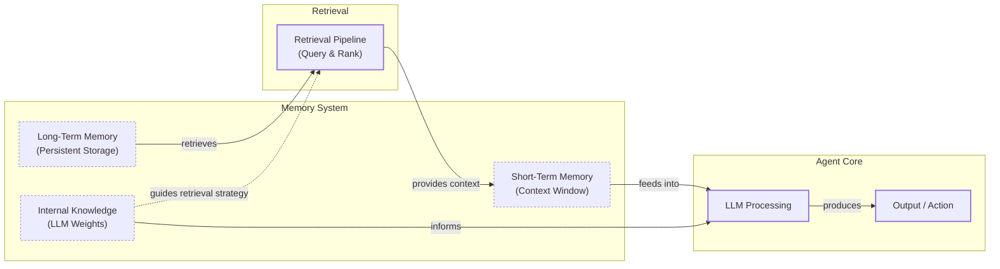

# Lesson 9: Memory for Agents

In our previous lessons, we built a foundation in AI Engineering. We explored the agent landscape, distinguished between LLM workflows and autonomous agents, and mastered context engineering. We even built a ReAct agent from scratch, giving it the ability to reason and use tools. But all these systems share a common, fundamental flaw: they are forgetful.

LLMs are powerful, but their knowledge is frozen in time. They are stateless and cannot learn from experience by updating their internal weights after deployment. This is the problem of "continual learning," and it is a major roadblock. We can inject new knowledge through the context window, but this is a temporary fix. An LLM without a persistent memory is like a brilliant intern with amnesia; it can solve a problem once, but it cannot recall past conversations or build on prior experience.

The context window acts as the agent's "working memory," or RAM. It is fast but limited. Trying to stuff an entire conversation history, user preferences, and retrieved documents into every prompt is not a scalable strategy. Even with modern models offering million-token context windows, simply filling them up leads to other problems. The "lost-in-the-middle" issue means performance degrades as context grows, and costs and latency increase with every token. Too much information introduces noise, making it harder for the model to find what it needs.

As we saw in our early experiments building personal AI companions with 8k or 16k token windows, we quickly hit the limits of what the context window alone could handle. This forced us to engineer complex memory systems with compression and retrieval to simulate learning. Memory tools are the practical, engineering-driven solution we have today. They provide agents with continuity and adaptability, creating the illusion of learning. To build these systems effectively, we can borrow concepts from biology and cognitive science to understand how different types of memory solve different kinds of problems. In this lesson, we will explore the layers of agent memory, focusing on how to implement persistent, long-term memory that transforms a stateless model into a stateful, personalized agent.

## The Layers of Memory: Internal, Short-Term, and Long-Term

Adopting terminology from cognitive science helps us design more modular and effective agent architectures. We can categorize an agent's memory into three distinct layers, each serving a critical function. These layers form a hierarchy that dictates how an agent processes, retains, and acts upon information [[9]](https://www.linkedin.com/posts/pauliusztin_every-ai-agent-has-4-distinct-memory-layers-activity-7436765234800807936-QyLR).

**Internal Knowledge** is the static, pre-trained information baked into the LLM's weights. This is the model's vast understanding of language, facts, and reasoning patterns. It is powerful but read-only and cannot be updated without fine-tuning. This layer provides the agent's general intelligence, but it knows nothing about your specific users or evolving tasks.

**Short-Term Memory (STM)** is the agent's active working memory, which is the LLM's context window. It is volatile, fast, and limited in size. This is the only reality the model sees during a single call. If information is not in the context window, it does not exist for the agent in that moment. STM handles the immediate task, maintaining coherence within a single conversation [[10]](https://skymod.tech/why-memory-matters-in-llm-agents-short-term-vs-long-term-memory-architectures/).

**Long-Term Memory (LTM)** is an external, persistent storage system, such as a vector or graph database. This is where an agent saves and retrieves information across sessions, giving it continuity. It is the agent's mechanism for "learning" from past interactions and personalizing future ones [[10]](https://skymod.tech/why-memory-matters-in-llm-agents-short-term-vs-long-term-memory-architectures/).

These layers work together in a dynamic hierarchy. Information from long-term memory is pulled into short-term memory through a retrieval pipeline, where it becomes actionable context for the LLM. The model then uses its internal knowledge to reason over this context and produce a response. No single layer can perform all functions; their interplay is what makes an agent feel intelligent and coherent.


Image 1: A hierarchy and flow diagram illustrating the three fundamental layers of an AI agent's memory system: Internal Knowledge, Short-Term Memory, and Long-Term Memory, showing their dynamic interaction and the retrieval pipeline.

To better design the long-term memory store, we can further borrow from cognitive science to structure the information an agent needs to retain.

## Long-Term Memory: Semantic, Episodic, and Procedural

Long-term memory is not a monolith. It is a collection of different types of information that serve distinct purposes. Structuring LTM into semantic, episodic, and procedural components allows us to build more sophisticated retrieval and learning mechanisms [[1]](https://arxiv.org/html/2309.02427), [[2]](https://www.ibm.com/think/topics/ai-agent-memory).

**Semantic Memory** is the agent’s encyclopedia of facts and knowledge. This is where it stores extracted concepts, relationships, and information about specific domains, people, or things. The structure of this memory depends entirely on the agent's use case. It can store facts as individual, independent strings like `"The user is a vegetarian"` or attach them to an entity, such as `{"food_restrictions": "User is a vegetarian"}`.

The primary role of semantic memory is to provide the agent with a reliable source of truth. For an enterprise agent, this might involve storing internal company documents or a product catalog. For a personal assistant, it can be used to build a persistent user profile, recalling preferences like `{"music": "User likes rock music"}` or relationships like `{"dog": "User has a dog named George"}`. This allows the agent to retrieve relevant information precisely, rather than searching through a noisy conversation history [[3]](https://machinelearningmastery.com/beyond-short-term-memory-the-3-types-of-long-term-memory-ai-agents-need/).

**Episodic Memory** is the agent’s personal diary—a chronological record of its past interactions and experiences. Unlike the timeless facts in semantic memory, episodic memories are about "what happened and when." Each memory is a log of a specific event with a timestamp attached. This allows the agent to maintain conversational context and understand complex dynamics over time. For example, a simple fact in semantic memory might be "User is frustrated with his brother."

An episodic memory provides far richer context: `"On Tuesday, the user expressed frustration that their brother, Mark, always forgets their birthday. I then provided an empathetic response. [created_at=2025-08-25T17:20:04...]"`. This nuance enables the agent to interact with more intelligence and empathy in the future and answer time-based questions like "What did we talk about last week?". Depending on the use case, these episodes can group events over a day, a single conversation, or a week. There is no one-size-fits-all solution; the required time-scale depends on the product [[3]](https://machinelearningmastery.com/beyond-short-term-memory-the-3-types-of-long-term-memory-ai-agents-need/), [[4]](https://www.geeksforgeeks.org/artificial-intelligence/ai-agent-memory/).

**Procedural Memory** is the agent's muscle memory—its collection of learned skills and workflows. This is the "how-to" knowledge that enables it to perform multi-step tasks reliably and efficiently. This memory is often encoded directly into the agent’s system prompt or made available as a callable tool or function. For example, an agent might have a stored procedure for generating a monthly report.

When a user requests it, the agent retrieves and executes a predefined sequence of steps: 1) Query the sales database, 2) Summarize key findings, and 3) Ask the user for their preferred output format. By encoding successful workflows, procedural memory makes the agent's behavior on common tasks predictable and fast. This allows an agent to improve its task completion efficiency over time, reducing errors and ensuring complex jobs are executed consistently [[3]](https://machinelearningmastery.com/beyond-short-term-memory-the-3-types-of-long-term-memory-ai-agents-need/), [[4]](https://www.geeksforgeeks.org/artificial-intelligence/ai-agent-memory/).

Now that we have an idea of what to save and the benefits of specific types of memories, how should they be stored?

## Storing Memories: Pros and Cons of Different Approaches

How an agent's memories are stored is a critical architectural decision that impacts performance, complexity, and scalability. While the goal is always to provide the right context at the right time, the method of storage involves trade-offs. There is no one-size-fits-all solution; the ideal approach depends entirely on your product's use case [[5]](https://www.youtube.com/watch?v=7AmhgMAJIT4&list=PLDV8PPvY5K8VlygSJcp3__mhToZMBoiwX&index=112). Let's explore the pros and cons of three primary methods: storing memories as raw strings, as structured entities, and within a knowledge graph.

### Storing memories as raw strings

This is the simplest method, where conversational turns or documents are stored as plain text and indexed for vector search [[6]](https://www.decodingai.com/p/how-does-memory-for-ai-agents-work). This approach is fast to set up and preserves the full nuance of an interaction, including emotional tone and subtle linguistic cues. However, retrieval is often imprecise. Relying solely on semantic similarity can return text that is related but contextually wrong. For example, asking "What is my brother’s job?" might retrieve every past conversation where "brother" and "job" were mentioned, without pinpointing the single correct fact [[6]](https://www.decodingai.com/p/how-does-memory-for-ai-agents-work).

Furthermore, updating this type of memory is difficult. If a user corrects information, the new fact is simply added to a growing log, creating potential contradictions. This approach also lacks the structure to handle temporal reasoning and state changes, making it unable to easily distinguish between "Barry *was* the CEO" and "Claude *is* the CEO" because the relationship is not explicitly defined [[7]](https://danielp1.substack.com/p/memex-20-memory-the-missing-piece).

### Storing Memories as Entities (JSON-like Structures)

In this approach, unstructured interactions are processed by an LLM to extract structured memories, often stored in a format like JSON [[5]](https://www.youtube.com/watch?v=7AmhgMAJIT4&list=PLDV8PPvY5K8VlygSJcp3__mhToZMBoiwX&index=112). Information is organized into key-value pairs, which allows for precise, field-level filtering and makes it easy to retrieve specific facts without ambiguity. It is also straightforward to update; if a user's preference changes, only the relevant field in the JSON object needs to be modified, ensuring the memory remains current.

However, this method requires more upfront engineering to design a schema. A predefined schema can be rigid, and if the agent encounters information that does not fit the structure, that data may be lost. While an LLM can dynamically alter the schema, this adds complexity and increases the risk of saving duplicate information. The extraction process can also strip away the rich subtext of the original conversation; the factual memory `"user_likes": ["cats"]` is far less representative than the original message, "Petting my cat is the best part of my day."

### Storing Memories in a Graph Database

This is the most advanced approach, where memories are stored as a network of nodes (entities) and edges (relationships), forming a knowledge graph [[8]](https://www.octoco.ai/blog/knowledge-graphs-as-memory). Graphs excel at representing complex relationships explicitly, enabling sophisticated, multi-hop queries that can trace connections between different pieces of information. Knowledge graphs can also model time as a property of a relationship, providing superior contextual and temporal awareness. Retrieval is transparent and auditable, as you can trace the exact path of nodes and edges that led to an answer.

Despite these advantages, this method has the highest complexity and cost, requiring significant investment in schema design and maintenance. Converting unstructured text into structured graph triples is a non-trivial task. Complex graph traversals can also be slower than simple vector lookups, potentially impacting real-time performance. For many simpler use cases, the overhead of a graph database is unnecessary.

Table 1: A comparison of the three primary memory storage approaches.
| Approach | Pros | Cons |
| :--- | :--- | :--- |
| **Raw Strings** | Simple to set up, preserves full nuance. | Imprecise retrieval, hard to update, lacks structure. |
| **Entities (JSON)** | Structured, precise retrieval, easy to update. | Upfront schema design, potential rigidity, loss of nuance. |
| **Knowledge Graph** | Represents complex relationships, superior temporal awareness, explainable. | Highest complexity and cost, potentially slower queries, overkill for simple cases. |

The choice of memory storage should be guided by your product's core needs. It is often best to start with the simplest architecture that delivers value and evolve it as your agent's requirements become more complex. Now that we know what to save and how to store it, let's look at some code examples using available memory tools.

## Memory implementations with code examples

While Retrieval-Augmented Generation (RAG) is the mechanism for retrieving information, the creation of high-quality memories is an equally important, preceding step. Before retrieval, an agent must form the memory. To demonstrate this, we will use the `mem0` library to implement our three memory types, focusing on the simple "raw strings" storage approach to highlight the unique benefits of each memory category.

### What is mem0?

`mem0` is an open-source library designed to provide a scalable, long-term memory layer for AI agents. It simplifies the process of extracting, consolidating, and retrieving information from conversations, allowing developers to build stateful agents more easily. It integrates with various LLMs, embedding models, and vector stores to offer a flexible memory architecture that can handle different types of memory and storage backends [[11]](https://arxiv.org/html/2504.19413).

### Setup

First, we will set up our environment by configuring the Gemini client and `mem0`. We will use Gemini for both the LLM and embeddings, with ChromaDB as a local vector store. This setup mirrors the provided course notebook.

1.  We begin by loading our environment variables and initializing the Gemini client. We will use the `gemini-2.5-pro` model, which is fast and cost-effective.
    ```python
    from utils import env
    import os
    import re
    from typing import Optional

    from google import genai
    from mem0 import Memory

    env.load(required_env_vars=["GOOGLE_API_KEY"])

    client = genai.Client()
    MODEL_ID = "gemini-2.5-pro"
    ```
2.  Next, we configure `mem0` to use Gemini for its LLM and embedding models, and ChromaDB as the local vector store. We also create a memory instance and clear any pre-existing data for our user ID.
    ```python
    MEM0_CONFIG = {
        # Use Google's gemini-embedding-001 for embeddings (output reduced to 768-dim)
        "embedder": {
            "provider": "gemini",
            "config": {
                "model": "gemini-embedding-001",
                "embedding_dims": 768,
                "api_key": os.getenv("GOOGLE_API_KEY"),
            },
        },
        # Use ChromaDB as a local, in-notebook vector store
        "vector_store": {
            "provider": "chroma",
            "config": {
                "collection_name": "lesson9_memories",
                "path": "/tmp/chroma_mem0",
            },
        },
        "llm": {
            "provider": "gemini",
            "config": {
                "model": MODEL_ID,
                "api_key": os.getenv("GOOGLE_API_KEY"),
            },
        },
    }

    memory = Memory.from_config(MEM0_CONFIG)
    MEM_USER_ID = "lesson9_notebook_student"
    memory.delete_all(user_id=MEM_USER_ID)
    print("✅ Mem0 ready (Gemini embeddings + local Chroma).")
    ```
    It outputs:
    ```text
    ✅ Mem0 ready (Gemini embeddings + local Chroma).
    ```
3.  Finally, we define a few helper functions to simplify adding and searching for memories. `mem_add_text` saves a string to memory with a specified category, and `mem_search` retrieves memories, optionally filtering by category.
    ```python
    def mem_add_text(text: str, category: str = "semantic", **meta) -> str:
        """Add a single text memory. No LLM is used for extraction or summarization."""
        metadata = {"category": category}
        for k, v in meta.items():
            if isinstance(v, (str, int, float, bool)) or v is None:
                metadata[k] = v
            else:
                metadata[k] = str(v)
        memory.add(text, user_id=MEM_USER_ID, metadata=metadata, infer=False)
        return f"Saved {category} memory."


    def mem_search(query: str, limit: int = 5, category: Optional[str] = None) -> list[dict]:
        """
        Category-aware search wrapper.
        Returns the full result dicts so we can inspect metadata.
        """
        res = memory.search(query, user_id=MEM_USER_ID, limit=limit) or {}

        items = res.get("results", [])
        if category is not None:
            items = [r for r in items if (r.get("metadata") or {}).get("category") == category]
        return items
    ```

### Semantic Memory: Extracting Facts

Semantic memory is created through an extraction pipeline. An LLM processes unstructured text with a prompt designed to pull out atomic, context-independent facts. This turns messy conversation threads into a queryable knowledge base. An example extraction prompt might be [[12]](https://blog.lqhl.me/mem0-how-three-prompts-created-a-viral-ai-memory-layer):

```
Extract persistent facts and strong preferences as short bullet points.
- Keep each fact atomic and context-independent.
- Notice nuance and subtle details.
- 3–6 bullets max.

Text:
{My brother Mark is a software engineer, but his real passion is painting; he gifted me a painting a few years ago. It's really beautiful.}
```

The system would then store facts like: `Mark is the user's brother.`, `Mark is a software engineer.`, and `The user has a beautiful painting from Mark.`. Retrieval often uses a hybrid search, which we will cover in the next lesson. This combines keyword filtering (e.g., for "brother") with a semantic search to find the most relevant fact for a query like "job."

Let's see this in action.

1.  We add a few facts to our semantic memory.
    ```python
    facts: list[str] = [
        "User prefers vegetarian meals.",
        "User has a dog named George.",
        "User is allergic to gluten.",
        "User's brother is named Mark and is a software engineer.",
    ]
    for f in facts:
        print(mem_add_text(f, category="semantic"))

    print(f"Added {len(facts)} semantic memories.")
    ```
    It outputs:
    ```text
    Saved semantic memory.
    Saved semantic memory.
    Saved semantic memory.
    Saved semantic memory.
    Added 4 semantic memories.
    ```
2.  Now, we search for a specific fact using a natural language query.
    ```python
    results = memory.search("brother job", user_id=MEM_USER_ID, limit=1)
    print(results["results"][0]["memory"])
    ```
    It outputs:
    ```text
    User's brother is named Mark and is a software engineer.
    ```

### Episodic Memory: The Log of Events

Episodic memory functions as a chronological log. Memories can be raw conversational turns or summaries of interactions, always associated with a timestamp. This allows the agent to recall not just what was said, but when. For example, a short dialogue can be compressed into a single "episode."

1.  We define a short dialogue and use the LLM to create a concise summary.
    ```python
    dialogue = [
        {"role": "user", "content": "I'm stressed about my project deadline on Friday."},
        {"role": "assistant", "content": "I’m here to help—what’s the blocker?"},
        {"role": "user", "content": "Mainly testing. I also prefer working at night."},
        {"role": "assistant", "content": "Okay, we can split testing into two sessions."},
    ]

    episodic_prompt = f"""Summarize the following 3–4 turns as one concise 'episode' (1–2 sentences).
    Keep salient details and tone.

    {dialogue}
    """
    episode_summary = client.models.generate_content(model=MODEL_ID, contents=episodic_prompt)
    episode = episode_summary.text.strip()
    print(episode)
    ```
    It outputs:
    ```text
    A user, stressed about a Friday project deadline because of testing and a preference for working at night, is advised to split the testing work into two manageable sessions.
    ```
2.  We add this summary to our episodic memory, including metadata about the interaction.
    ```python
    print(
        mem_add_text(
            episode,
            category="episodic",
            summarized=True,
            turns=4,
        )
    )
    ```
    It outputs:
    ```text
    Saved episodic memory.
    ```
3.  Retrieval can then use a combination of semantic search and temporal filtering. A search for "deadline stress" will surface this episode, along with its creation timestamp, providing rich context.
    ```python
    hits = mem_search("deadline stress", limit=1, category="episodic")
    for h in hits:
        print(f"{h['memory']}\n")
        print(h)
    ```
    It outputs:
    ```text
    A user, stressed about a Friday project deadline because of testing and a preference for working at night, is advised to split the testing work into two manageable sessions.

    {'id': '...', 'memory': '...', 'metadata': {'turns': 4, 'summarized': True, 'category': 'episodic'}, 'score': 0.91..., 'created_at': '2025-09-12T02:30:01.358468-07:00', ...}
    ```

### Procedural Memory: Defining and Learning Skills

Procedural memory can be created by a developer or learned from a user. An agent can be taught a new skill by providing a sequence of steps, which it then saves as a reusable procedure. This is a form of learning that allows the agent to improve its capabilities over time.

1.  We define a procedure for creating a monthly report and save it to memory.
    ```python
    procedure_name = "monthly_report"
    steps = [
        "Query sales DB for the last 30 days.",
        "Summarize top 5 insights.",
        "Ask user whether to email or display.",
    ]
    procedure_text = f"Procedure: {procedure_name}\nSteps:\n" + "\n".join(f"{i + 1}. {s}" for i, s in enumerate(steps))

    mem_add_text(procedure_text, category="procedure", procedure_name=procedure_name)

    print(f"Learned procedure: {procedure_name}")
    ```
    It outputs:
    ```text
    Learned procedure: monthly_report
    ```
2.  Retrieval is an intent-matching process. When the user's request semantically matches the description of a stored procedure, the agent can retrieve and execute it.
    ```python
    results = mem_search("how to create a monthly report", category="procedure", limit=1)
    if results:
        print(results[0]["memory"])
    ```
    It outputs:
    ```text
    Procedure: monthly_report
    Steps:
    1. Query sales DB for the last 30 days.
    2. Summarize top 5 insights.
    3. Ask user whether to email or display.
    ```

We have seen how to implement different types of memories with `mem0`. Now, let's discuss some additional considerations when building a memory system.

## Real-World Lessons: Challenges and Best Practices

The architectural patterns we have discussed provide a useful toolkit, but moving from theory to a reliable, production-ready system requires navigating complex trade-offs. Here are some of the most important lessons learned from building and scaling agent memory systems.

### Re-evaluating compression

The trade-off between compressing information and preserving raw detail has shifted dramatically.

-   **The Old Challenge:** Just a couple of years ago, LLMs operated with small and expensive context windows (e.g., 8k tokens). This forced engineers to be ruthless with compression, distilling interactions into compact summaries or facts. This process, while necessary, is inherently lossy, sacrificing fine details and nuance [[5]](https://www.youtube.com/watch?v=7AmhgMAJIT4&list=PLDV8PPvY5K8VlygSJcp3__mhToZMBoiwX&index=112).
-   **The New Reality:** Today, models offering million-token context windows at a fraction of the cost have changed the game. The best practice now leans toward less compression. The raw, unstructured conversational history is the ultimate source of truth, containing emotional subtext and relational dynamics that are often lost during extraction [[5]](https://www.youtube.com/watch?v=7AmhgMAJIT4&list=PLDV8PPvY5K8VlygSJcp3__mhToZMBoiwX&index=112).
-   **Best Practice:** Design your system to work with the most complete version of history that is economically and technically feasible. Use summarization and fact extraction to create queryable indexes, but always treat the raw log as the ground truth. As context windows expand, your retrieval pipeline may need to do less *retrieving* and more intelligent *filtering* of a larger, in-context history.

### Designing for the Product

There is no "perfect" memory architecture. The concepts of semantic, episodic, and procedural memory are a powerful mental model, but they are a toolkit, not a mandatory blueprint. A common failure mode is over-engineering a complex memory system for a product that does not need it.

-   **The Challenge:** It is tempting to build a system that handles all memory types from day one, but this often leads to unnecessary complexity, higher maintenance costs, and slower performance.
-   **Best Practice:** Start from first principles by defining the core function of your agent. The product's goal should dictate the memory architecture [[5]](https://www.youtube.com/watch?v=7AmhgMAJIT4&list=PLDV8PPvY5K8VlygSJcp3__mhToZMBoiwX&index=112).
    -   For a Q&A bot over internal documents, a simple RAG pipeline is the best starting point.
    -   For a long-term personal AI companion, rich episodic memories are beneficial.
    -   For a task-automation agent, procedural memory is likely the most valuable component.

### The Human Factor: The additional user cognitive overhead

Memory exists to make the agent smarter, not to give the user a new job. A common pitfall is exposing the internal workings of the memory system to the user, which often creates cognitive overhead rather than improving transparency.

-   **The Challenge:** Many early memory implementations allowed users to view, edit, or delete the facts an agent stored about them. While well-intentioned, this can turn the interaction into a tedious data-entry task [[5]](https://www.youtube.com/watch?v=7AmhgMAJIT4&list=PLDV8PPvY5K8VlygSJcp3__mhToZMBoiwX&index=112).
-   **Best Practice:** Users should not be asked to "garden their agent's memories." Memory management should be an autonomous function of the agent. It should learn from corrections within the natural flow of conversation (e.g., "Actually, my brother's name is Mark, not Mike"). The agent, not the user, is responsible for maintaining the integrity of its own knowledge through internal processes that periodically review, consolidate, and resolve conflicting information.

## Conclusion

Memory is the core component that transforms a simple, stateless chatbot into a truly adaptive and personalized agent. By understanding and implementing different layers and types of memory, we can build systems that maintain conversational continuity, "learn" from past interactions, and provide more capable and reliable assistance. While today's memory tools are a practical workaround for the absence of true continual learning in LLMs, they are a powerful and necessary part of the modern AI engineering toolkit.

In our next lesson, we will cover Retrieval-Augmented Generation (RAG) in detail, exploring the primary mechanism agents use to retrieve information from their long-term memory stores. This will build directly on the concepts we have established here, showing you how to connect your memory architecture to a powerful retrieval system. We will also continue to explore advanced agentic concepts like multimodal processing and the Model Context Protocol (MCP) in future lessons, further expanding your ability to build sophisticated AI applications.

## References

- [1] [Cognitive Architectures for Language Agents](https://arxiv.org/html/2309.02427)
- [2] [What is AI agent memory?](https://www.ibm.com/think/topics/ai-agent-memory)
- [3] [Beyond Short-term Memory: The 3 Types of Long-term Memory AI Agents Need](https://machinelearningmastery.com/beyond-short-term-memory-the-3-types-of-long-term-memory-ai-agents-need/)
- [4] [Artificial Intelligence - AI Agent Memory](https://www.geeksforgeeks.org/artificial-intelligence/ai-agent-memory/)
- [5] [What is the perfect memory architecture?](https://www.youtube.com/watch?v=7AmhgMAJIT4&list=PLDV8PPvY5K8VlygSJcp3__mhToZMBoiwX&index=112)
- [6] [How Does Memory for AI Agents Work?](https://www.decodingai.com/p/how-does-memory-for-ai-agents-work)
- [7] [Memex 2.0: Memory The Missing Piece for Real Intelligence](https://danielp1.substack.com/p/memex-20-memory-the-missing-piece)
- [8] [Knowledge Graphs as Memory: Why Your AI Agent Needs to Think in Relationships](https://www.octoco.ai/blog/knowledge-graphs-as-memory)
- [9] [Every AI agent has 4 distinct memory layers](https://www.linkedin.com/posts/pauliusztin_every-ai-agent-has-4-distinct-memory-layers-activity-7436765234800807936-QyLR)
- [10] [Why Memory Matters in LLM Agents: Short-Term vs. Long-Term Memory Architectures](https://skymod.tech/why-memory-matters-in-llm-agents-short-term-vs-long-term-memory-architectures/)
- [11] [Mem0: Building Production-Ready AI Agents with Scalable Long-Term Memory](https://arxiv.org/html/2504.19413)
- [12] [Mem0: How 3 AI Prompts Created a Viral 19k-Star GitHub Project](https://blog.lqhl.me/mem0-how-three-prompts-created-a-viral-ai-memory-layer)