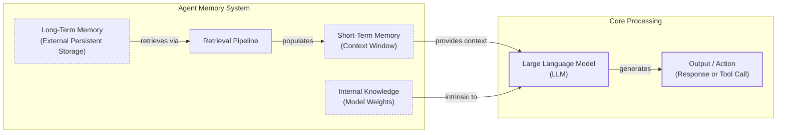

# How Does Memory for AI Agents Work?

In the previous lessons, we built a foundation in AI Engineering, covering everything from workflows and agents to context engineering and implementing ReAct agents from scratch. We have seen how agents can reason and use tools to interact with the world. Now, we will tackle one of the most important components for building truly adaptive and personalized agents: memory.

The core problem we are solving is a fundamental limitation of today’s LLMs: their knowledge is vast but frozen in time. They are unable to learn by updating their weights after training, a problem known as “continual learning.” To overcome this, we use the context window as a form of “working memory.” However, keeping an entire conversation thread plus additional information in the context window is often unrealistic. Rising costs per turn and the “lost in the middle” problem limit this approach. This is where models struggle to use information buried in the center of a long prompt. An LLM without memory is like an intern with amnesia; they might be brilliant, but they cannot recall previous conversations or learn from experience [[2]](https://decodingml.substack.com/p/memory-the-secret-sauce-of-ai-agents).

Context windows are getting larger, which means we must continuously adapt how we engineer stateful systems. A few years ago, working with 8k or 16k token limits forced us to engineer complex compression systems. This introduced overhead and often resulted in the loss of nuance and important details. Today, with models offering million-token context windows, we have more breathing room, but the principles of organizing memory remain essential for performance, cost, and reliability [[3]](https://www.youtube.com/watch?v=7AmhgMAJIT4&list=PLDV8PPvY5K8VlygSJcp3__mhToZMBoiwX&index=112). Simply stuffing the entire history into the context window is not a viable strategy. It introduces noise, increases latency, and drives up operational costs. Memory tools are the current engineering solution. They provide agents with continuity, adaptability, and the ability to “learn” without retraining.

In this article, we will explore the fundamental layers of memory for AI agents, take a detailed look at long-term memory types like Semantic, Episodic, and Procedural, and discuss the trade-offs between different storage approaches. We will also provide practical code examples and cover the real-world challenges and best practices for designing effective memory systems.

## The Layers of Memory: Internal, Short-Term, and Long-Term

To build effective agents, we must distinguish between the different places information lives. We can borrow terms from biology and cognitive science to categorize these layers, which is useful for engineering our systems [[1]](https://www.ibm.com/think/topics/ai-agent-memory), [[4]](https://arxiv.org/html/2309.02427). How can we think of memory in a useful way to build agents? Memory can have different time horizons, and understanding these layers helps us architect more capable systems.

There are three distinct memory layers based on their persistence and proximity to the model’s reasoning core.

**Internal Knowledge** is the static, pre-trained knowledge baked into the LLM’s weights. It is the best place to store general world knowledge—models know about entire books without needing them in the context window. However, this memory is read-only and frozen at the time of training [[5]](https://www.linkedin.com/posts/pauliusztin_every-ai-agent-has-4-distinct-memory-layers-activity-7436765234800807936-QyLR).

**Short-Term Memory** is the slice of information we pass to the LLM during a specific call. It acts as the RAM of the agentic system. It contains the active context window plus recent interactions, conversation history, and details retrieved from long-term memory. It is volatile and fast, simulating the feeling of “learning” during a session [[1]](https://www.ibm.com/think/topics/ai-agent-memory).

**Long-Term Memory** is the external, persistent storage system (like a disk) where an agent saves and retrieves information. This layer provides the personalization and context that internal knowledge lacks and short-term memory cannot retain [[5]](https://www.linkedin.com/posts/pauliusztin_every-ai-agent-has-4-distinct-memory-layers-activity-7436765234800807936-QyLR).

The dynamic between these layers creates the agent’s intelligence. First, a retrieval pipeline pulls relevant data from long-term memory into short-term memory. Next, we slice the short-term memory into an active context window through context engineering. Finally, the LLM uses its internal knowledge plus the active context to generate output.



Image 1: A hierarchy and flow diagram illustrating the three fundamental layers of an agent's memory system: Internal Knowledge, Short-Term Memory (context window), and Long-Term Memory, with the LLM at the core.

Categorizing memory this way is critical for engineering. Internal knowledge handles general reasoning. Short-term memory manages the immediate task. Long-term memory handles personalization and continuity. No single layer can perform all three functions effectively. To better understand long-term memory, we can further apply cognitive science definitions to specific data types.

## Long-Term Memory: Semantic, Episodic, and Procedural

Long-term memory is not a single bucket of text. It consists of three distinct types, each serving a different role in making an agent intelligent [[4]](https://arxiv.org/html/2309.02427), [[6]](https://www.newsletter.swirlai.com/p/memory-in-agent-systems).

### Semantic Memory (Facts & Knowledge)

Semantic memory is the agent’s encyclopedia. It stores individual pieces of knowledge or “facts.” These can be independent strings, such as *“The user is a vegetarian,”* or structured attributes attached to an entity, like `{"food_restrictions": "vegetarian"}`. This is where the agent stores extracted concepts and relationships regarding specific domains, people, or places. The structure you choose is highly dependent on the agent's use case; it could be a simple key-value store or a complex graph database [[7]](https://machinelearningmastery.com/beyond-short-term-memory-the-3-types-of-long-term-memory-ai-agents-need/), [[8]](https://www.decodingai.com/p/how-does-memory-for-ai-agents-work).

The primary role of semantic memory is to provide a reliable source of truth. For an enterprise agent, this might involve storing internal company documents or technical manuals, allowing it to answer questions on proprietary topics. For a personal assistant, semantic memory builds a persistent user profile. It recalls specific preferences like `{"music": "User likes rock music"}`, relationships like `{"dog": "User has a dog named George"}`, or hard constraints like `{"food_restrictions": "User is allergic to gluten"}`. This allows the agent to retrieve relevant facts without searching through a noisy and lengthy conversation history [[9]](https://mem0.ai/blog/long-term-memory-ai-agents).

### Episodic Memory (Experiences & History)

Episodic memory is the agent’s personal diary. It records past interactions, but unlike timeless facts, these memories have a timestamp. It captures *“what happened and when.”* This log of specific events and their context is crucial for maintaining conversational continuity and understanding complex dynamics over time [[8]](https://www.decodingai.com/p/how-does-memory-for-ai-agents-work).

This memory type is essential for providing nuanced context. For instance, a semantic fact might be *“User is frustrated with his brother.”* An episodic memory, however, would capture the full event: *“On Tuesday, the user expressed frustration that their brother, Mark, always forgets their birthday. I provided an empathetic response. [created_at=2025-08-25].”* [[8]](https://www.decodingai.com/p/how-does-memory-for-ai-agents-work). If the topic comes up again, the agent can reference this past event, demonstrating a deeper understanding. The time element also enables the agent to answer questions like *“What happened last week?”* [[3]](https://www.youtube.com/watch?v=7AmhgMAJIT4&list=PLDV8PPvY5K8VlygSJcp3__mhToZMBoiwX&index=112). Depending on the use case, these episodes can group events from a single conversation, a full day, or even a week. There is no one-size-fits-all solution; the right time scale depends on the product's requirements.

### Procedural Memory (Skills & How-To)

Procedural memory is the agent’s muscle memory. It consists of skills, learned workflows, and “how-to” knowledge. It dictates the agent’s ability to perform multi-step tasks reliably and predictably, encoding successful workflows so the agent does not have to reason from scratch every time [[7]](https://machinelearningmastery.com/beyond-short-term-memory-the-3-types-of-long-term-memory-ai-agents-need/), [[8]](https://www.decodingai.com/p/how-does-memory-for-ai-agents-work).

This memory is often baked into the agent’s system prompt as reusable tools or defined sequences. For example, an agent might store a `MonthlyReportIntent` procedure. When a user asks for a report, the agent retrieves this procedure, which defines a clear series of steps: 1) Query sales DB, 2) Summarize findings, 3) Email user. This makes behavior reliable and predictable. It encodes successful workflows so the agent does not have to reason from scratch every time [[10]](https://arxiv.org/html/2508.06433v2). Now that we have an idea of what to save, we must decide *how* to store it.

## Storing Memories: Pros and Cons of Different Approaches

The way an agent’s memories are stored is an architectural decision that impacts performance, complexity, and scalability. There is no one-size-fits-all solution; the ideal approach depends on the product's use case. Let’s explore the pros and cons of the three primary methods we experiment with as AI Engineers: storing memories as raw strings, as structured entities, and within a knowledge graph [[8]](https://www.decodingai.com/p/how-does-memory-for-ai-agents-work), [[11]](https://danielp1.substack.com/p/memex-20-memory-the-missing-piece).

### Storing Memories as Raw Strings

This is the simplest method, where conversational turns or documents are stored as plain text and indexed for vector search. This approach is fast to set up, as it involves logging text and creating embeddings with minimal engineering overhead. By storing the raw text, it also preserves the full context, including emotional tone and subtle linguistic cues, ensuring nothing is lost in translation to a structured format [[8]](https://www.decodingai.com/p/how-does-memory-for-ai-agents-work).

However, this simplicity comes with significant drawbacks. Retrieval is often imprecise. A query like “What is my brother’s job?” might retrieve every conversation mentioning “brother” and “job” without pinpointing the current fact. Updating is also difficult; if a user corrects a fact (“My brother is now a doctor”), the new string just adds to the log, creating potential contradictions. Furthermore, it lacks structure, making it hard to distinguish state changes over time, such as telling the difference between “Barry *was* CEO” and “Claude *is* CEO” [[8]](https://www.decodingai.com/p/how-does-memory-for-ai-agents-work).

### Storing Memories as Entities (JSON-like Structures)

Here, we use an LLM to transform messy interactions into structured memories, stored in formats like JSON within document or SQL databases. This method allows for precise, field-level filtering (e.g., `“user”: {”brother”: {”job”: “Software Engineer”}}`), enabling the agent to retrieve specific facts without ambiguity. Updates are easier, as you simply overwrite the relevant field, which is ideal for semantic memory like user profiles or preferences [[8]](https://www.decodingai.com/p/how-does-memory-for-ai-agents-work).

The trade-offs include increased upfront complexity, as this approach requires designing a schema or data model. A predefined schema can also be rigid; if the agent encounters information that does not fit the structure, that data might be lost unless the schema is updated [[11]](https://danielp1.substack.com/p/memex-20-memory-the-missing-piece). While an LLM can dynamically add new entities or change the schema, this increases the complexity of updating memories and raises the risk of saving duplicated information. Finally, the extraction process can strip away the rich subtext of the original conversation; the factual memory `"user_likes": ["cats"]` is far less representative than the original message, "Petting my cat is the best part of my day."

### Storing Memories in a Knowledge Graph

This is the most advanced approach. Memories are stored as a network of nodes (entities) and edges (relationships) using graph databases. This method excels at representing complex relationships (e.g., `(User) -> [HAS_BROTHER] -> (Mark)`). It offers superior contextual and temporal awareness by modeling time as a property of a relationship (e.g., `[RECOMMENDED_ON_DATE]`). Retrieval is also auditable, as you can trace the path of reasoning, which builds trust [[8]](https://www.decodingai.com/p/how-does-memory-for-ai-agents-work), [[12]](https://www.octoco.ai/blog/knowledge-graphs-as-memory).

Despite its power, this approach has the highest complexity and cost. Converting unstructured text into graph triples is difficult and requires ongoing maintenance. Graph traversals can be slower than vector lookups, potentially impacting real-time performance. For simple use cases, the complexity of implementing and maintaining a graph database is often overkill [[12]](https://www.octoco.ai/blog/knowledge-graphs-as-memory), [[13]](https://arxiv.org/html/2504.19413).

| Approach | Pros | Cons |
| :--- | :--- | :--- |
| **Raw Strings** | Simple to set up, preserves full nuance. | Imprecise retrieval, hard to update, lacks structure for temporal reasoning. |
| **Entities (JSON)** | Precise filtering, easy updates, ideal for facts. | Upfront schema complexity, can be rigid, loses conversational nuance. |
| **Knowledge Graph** | Models complex relationships, superior temporal awareness, auditable. | Highest complexity and cost, potentially slower queries, overkill for simple cases. |

Table 1: A comparison of the three primary approaches for storing agent memories.

The choice should be guided by your product’s needs. Start simple and evolve as complexity grows. Now that we know what to save and how to store it, let's look at some code examples.

## Memory Implementations with Code Examples

This section provides code examples for implementing the different memory types using the `mem0` library. While Retrieval-Augmented Generation (RAG) is a mechanism for retrieving information, which we will cover in the next lesson, the creation of high-quality memories is an equally important preceding step. We will focus on the "storing memories as raw strings" approach to highlight the benefits of each memory category.

### What is mem0?

`mem0` is an open-source memory layer for AI agents that automates the full pipeline from input chat text to injected memories. It handles the extraction, consolidation, storage, and retrieval of information, allowing developers to build stateful agents more easily. It can be configured with different LLMs, embedding models, and vector stores to fit various use cases [[13]](https://arxiv.org/html/2504.19413). We will use it to demonstrate how to manage different memory types.

### Setup

Before we begin, we need to set up our environment. This includes configuring the `mem0` library to work with Google's Gemini models for both embeddings and LLM-based operations, using a local ChromaDB instance as our vector store.

1.  First, we configure `mem0` to use Gemini for embeddings and LLM tasks, and ChromaDB for local vector storage. We also define a user ID and clear any existing memories for that user.
    ```python
    import os
    import re
    from typing import Optional

    from google import genai
    from mem0 import Memory
    from utils import env

    env.load(required_env_vars=["GOOGLE_API_KEY"])

    client = genai.Client()
    MODEL_ID = "gemini-1.5-pro"

    MEM0_CONFIG = {
        "embedder": {
            "provider": "gemini",
            "config": {
                "model": "text-embedding-004",
                "api_key": os.getenv("GOOGLE_API_KEY"),
            },
        },
        "vector_store": {
            "provider": "chroma",
            "config": {
                "collection_name": "lesson9_memories",
                "path": "/tmp/chroma_mem0",
            },
        },
        "llm": {
            "provider": "gemini",
            "config": {
                "model": MODEL_ID,
                "api_key": os.getenv("GOOGLE_API_KEY"),
            },
        },
    }

    memory = Memory.from_config(MEM0_CONFIG)
    MEM_USER_ID = "lesson9_notebook_student"
    memory.delete_all(user_id=MEM_USER_ID)
    print("✅ Mem0 ready (Gemini embeddings + local Chroma).")
    ```
    It outputs:
    ```text
    ✅ Mem0 ready (Gemini embeddings + local Chroma).
    ```
2.  Next, we define helper functions to add and search for memories. `mem_add_text` saves a string with a category tag, while `mem_search` retrieves memories, optionally filtering by that category.
    ```python
    def mem_add_text(text: str, category: str = "semantic", **meta) -> str:
        """Add a single text memory. No LLM is used for extraction or summarization."""
        metadata = {"category": category}
        for k, v in meta.items():
            if isinstance(v, (str, int, float, bool)) or v is None:
                metadata[k] = v
            else:
                metadata[k] = str(v)
        memory.add(text, user_id=MEM_USER_ID, metadata=metadata, infer=False)
        return f"Saved {category} memory."


    def mem_search(query: str, limit: int = 5, category: Optional[str] = None) -> list[dict]:
        """
        Category-aware search wrapper.
        Returns the full result dicts so we can inspect metadata.
        """
        res = memory.search(query, user_id=MEM_USER_ID, limit=limit) or {}

        items = res.get("results", [])
        if category is not None:
            items = [r for r in items if (r.get("metadata") or {}).get("category") == category]
        return items
    ```

### Semantic Memory: Extracting Facts

Semantic memory is created through a deliberate extraction pipeline. After a conversation, the unstructured text is passed to an LLM with a prompt designed to extract flat strings of factual data. This turns messy conversation threads into a queryable knowledge base. The prompt instructs the model to act as a knowledge extractor, identifying facts and preferences relevant to the agent's use case. For a personal assistant, the prompt might be:
```
Extract persistent facts and strong preferences as short bullet points.
- Keep each fact atomic and context-independent.
- Notice subtle details that might be important.
- 3–6 bullets max.

Text:
{My brother Mark is a software engineer, but his real passion is painting. He gifted me a painting a few years ago. It's really beautiful.}
```
From this, the system would store memories like: `Mark is the user's brother.`, `Mark is a software engineer.`, `Mark's real passion is painting.`, and `The user has a beautiful painting from Mark.`. Retrieval often uses hybrid search, where the system first filters by keywords (e.g., "brother") and then performs a vector search to find the most contextually relevant fact (e.g., matching "job" to "software engineer").

1.  We add several facts to our semantic memory.
    ```python
    facts: list[str] = [
        "User prefers vegetarian meals.",
        "User has a dog named George.",
        "User is allergic to gluten.",
        "User's brother is named Mark and is a software engineer.",
    ]
    for f in facts:
        print(mem_add_text(f, category="semantic"))

    print(f"Added {len(facts)} semantic memories.")
    ```
    It outputs:
    ```text
    Saved semantic memory.
    Saved semantic memory.
    Saved semantic memory.
    Saved semantic memory.
    Added 4 semantic memories.
    ```
2.  We can then retrieve a specific fact using a natural language query.
    ```python
    results = memory.search("brother job", user_id=MEM_USER_ID, limit=1)
    print(results["results"][0]["memory"])
    ```
    It outputs:
    ```text
    User's brother is named Mark and is a software engineer.
    ```

### Episodic Memory: The Log of Events

Episodic memory functions as a chronological log. An LLM can read conversation messages from a specific period and summarize the key events, which are then stored with a timestamp. If storing raw text, no prompt is needed. For summarization, a prompt might be: "You are a personal coding tutor. Extract events, likes, dislikes, or any other insights from the conversation that will help you better teach the user." A summarized memory might look like: `October 26th, 2025. 2:30PM EST: The user is stressed about their project deadline on Friday and the assistant offers to help.` Retrieval is a blend of temporal and semantic queries. A user might filter by a date range or use semantic search to find contextually similar past conversations, with results re-ranked by recency.

1.  We define a short dialogue and use an LLM to create a concise summary.
    ```python
    dialogue = [
        {"role": "user", "content": "I'm stressed about my project deadline on Friday."},
        {"role": "assistant", "content": "I’m here to help—what’s the blocker?"},
        {"role": "user", "content": "Mainly testing. I also prefer working at night."},
        {"role": "assistant", "content": "Okay, we can split testing into two sessions."},
    ]

    episodic_prompt = f"""Summarize the following 3–4 turns as one concise 'episode' (1–2 sentences).
    Keep salient details and tone.

    {dialogue}
    """
    episode_summary = client.models.generate_content(model=MODEL_ID, contents=episodic_prompt)
    episode = episode_summary.text.strip()
    print(episode)
    ```
    It outputs:
    ```text
    A user, stressed about a Friday project deadline due to testing and a preference for night work, receives a suggestion from the assistant to split testing into two sessions.
    ```
2.  We save this summary as an episodic memory.
    ```python
    print(
        mem_add_text(
            episode,
            category="episodic",
            summarized=True,
            turns=4,
        )
    )
    ```
    It outputs:
    ```text
    Saved episodic memory.
    ```
3.  We can then search for the episode using a related query.
    ```python
    print("\nSearch --> 'deadline stress'\n")
    hits = mem_search("deadline stress", limit=1, category="episodic")
    for h in hits:
        print(f"{h['memory']}\n")
    ```
    It outputs:
    ```text
    Search --> 'deadline stress'

    A user, stressed about a Friday project deadline due to testing and a preference for night work, receives a suggestion from the assistant to split testing into two sessions.
    ```

### Procedural Memory: Defining and Learning Skills

Procedural memory can be developer-defined (coding a tool like `book_flight()`) or learned from user interactions. An advanced agent can convert a user's step-by-step instructions into a reusable procedure. For example, a prompt might instruct the agent: "You are an agent that can learn new skills. When a user provides a numbered list of steps, use the 'learn_procedure' tool to convert them into a reusable procedure." Given a user's instructions for booking a cabin, the LLM would generate a new procedure like `procedure_name: find_summer_cabin`, with the corresponding steps. Retrieval is an intent-matching and function-calling process where the LLM receives descriptions of all available procedures and matches the user's request to the most relevant one.

1.  We define a simple procedure and save it to memory.
    ```python
    procedure_name = "monthly_report"
    steps = [
        "Query sales DB for the last 30 days.",
        "Summarize top 5 insights.",
        "Ask user whether to email or display.",
    ]
    procedure_text = f"Procedure: {procedure_name}\nSteps:\n" + "\n".join(f"{i + 1}. {s}" for i, s in enumerate(steps))

    mem_add_text(procedure_text, category="procedure", procedure_name=procedure_name)

    print(f"Learned procedure: {procedure_name}")
    ```
    It outputs:
    ```text
    Learned procedure: monthly_report
    ```
2.  The agent can retrieve this procedure by matching the user's intent.
    ```python
    results = mem_search("how to create a monthly report", category="procedure", limit=1)
    if results:
        print(results[0]["memory"])
    ```
    It outputs:
    ```text
    Procedure: monthly_report
    Steps:
    1. Query sales DB for the last 30 days.
    2. Summarize top 5 insights.
    3. Ask user whether to email or display.
    ```

Now that we have seen how to implement these memory types, let's discuss some additional considerations when building a memory system.

## Real-World Lessons: Challenges and Best Practices

Moving from theory to a reliable, production-ready system requires navigating a series of complex trade-offs that are constantly evolving with the underlying technology. Here are some of the most important lessons learned from building and scaling agent memory systems.

### Re-evaluating Compression

One of the biggest changes in designing memory has been the trade-off between compressing information and preserving its raw detail.

*   **The Old Challenge:** Just a few years ago, LLMs operated with small and expensive context windows. This forced AI Engineers to be ruthless with compression, distilling every interaction into its most compact form. While necessary, this process is inherently lossy, as summarizing can lose fine details and nuance [[3]](https://www.youtube.com/watch?v=7AmhgMAJIT4&list=PLDV8PPvY5K8VlygSJcp3__mhToZMBoiwX&index=112).
*   **The New Reality:** Today, with models offering million-token context windows at a fraction of the cost, the considerations have changed. The best practice is now to lean towards less compression. The raw, unstructured conversational history is the ultimate source of truth, containing emotional subtext and relational dynamics often lost during extraction.
*   **Best Practice:** Design your system to work with the most complete version of history that is economically and technically feasible. Use summarization and fact extraction as tools for creating queryable indexes, but always treat the raw log as the ground truth.

### Designing for the Product

There is no such thing as a "perfect" memory architecture. The concepts of semantic, episodic, and procedural memory are a powerful toolkit, not a mandatory blueprint. The most common failure mode is over-engineering a complex memory system for a product that does not need it.

*   **The Challenge:** It can be tempting to build a system that handles all these memory types from day one. However, this often leads to unnecessary complexity, higher maintenance costs, and slower performance [[3]](https://www.youtube.com/watch?v=7AmhgMAJIT4&list=PLDV8PPvY5K8VlygSJcp3__mhToZMBoiwX&index=112).
*   **Best Practice:** Start from first principles by defining the core function of your agent. The product's goal should dictate the memory architecture. For a Q&A bot over internal documents, a simple RAG pipeline is a great starting point. For a long-term personal AI companion, rich episodic memories are beneficial. For a task-automation agent, procedural memory is likely most useful.

### The Human Factor

Memory exists to make the agent smarter, not to give the user a new job. A common pitfall is exposing the internal workings of the memory system to the user, which often creates significant cognitive overhead.

*   **The Challenge:** Many implementations are designed where users can view, edit, or delete the facts the agent has stored about them. While well-intentioned, this can turn the interaction into a tedious data-entry task [[3]](https://www.youtube.com/watch?v=7AmhgMAJIT4&list=PLDV8PPvY5K8VlygSJcp3__mhToZMBoiwX&index=112).
*   **Best Practice:** Users should not be asked to "garden their agent's memories." This breaks the illusion of a capable assistant. Memory management should be an autonomous function of the agent. It should learn from corrections within the natural flow of conversation and have internal processes to periodically review, consolidate, and resolve conflicting information.

## Conclusion

Memory is the component that transforms a stateless chat application into a personalized agent. It is the current engineering solution to the problem of continual learning. By constantly engineering the context window, we allow agents to “learn” and adapt over time. While today's memory tools are a temporary solution for true continual learning, they are a practical approach that works right now and is essential for building personalized agents that improve over time. Understanding how to design and implement these systems is a key skill for any AI Engineer.

In our next lesson, we will explore in detail Retrieval-Augmented Generation (RAG), the core mechanism agents use to pull information from their long-term memory. We will also continue to explore how to build, monitor, and evaluate these complex systems as we move toward production-ready AI. As we progress through the course, we will see how memory integrates with multimodal processing and advanced agentic architectures, forming the backbone of truly intelligent systems.

## References

- [1] https://www.ibm.com/think/topics/ai-agent-memory
- [2] https://decodingml.substack.com/p/memory-the-secret-sauce-of-ai-agents
- [3] https://www.youtube.com/watch?v=7AmhgMAJIT4&list=PLDV8PPvY5K8VlygSJcp3__mhToZMBoiwX&index=112
- [4] https://arxiv.org/html/2309.02427
- [5] https://www.linkedin.com/posts/pauliusztin_every-ai-agent-has-4-distinct-memory-layers-activity-7436765234800807936-QyLR
- [6] https://www.newsletter.swirlai.com/p/memory-in-agent-systems
- [7] https://machinelearningmastery.com/beyond-short-term-memory-the-3-types-of-long-term-memory-ai-agents-need/
- [8] https://www.decodingai.com/p/how-does-memory-for-ai-agents-work
- [9] https://mem0.ai/blog/long-term-memory-ai-agents
- [10] https://arxiv.org/html/2508.06433v2
- [11] https://danielp1.substack.com/p/memex-20-memory-the-missing-piece
- [12] https://www.octoco.ai/blog/knowledge-graphs-as-memory
- [13] https://arxiv.org/html/2504.19413