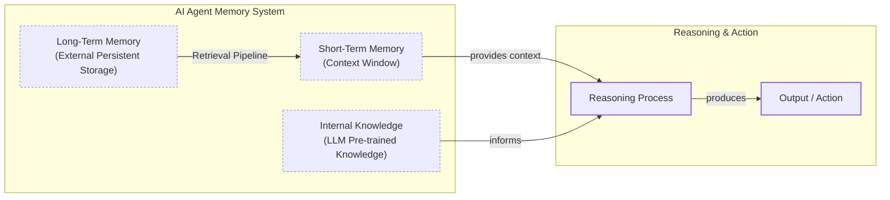

# Lesson 9: How AI Agents Remember

## Introduction

In the previous lessons, we built a solid foundation in AI Engineering. We explored the agent landscape, learned to choose between rule-based workflows and autonomous agents, and mastered context engineering to manage the flow of information to an LLM. We even built a ReAct agent from scratch, giving our model the ability to reason and act. Now, we will tackle one of an agent's most important components: memory.

LLMs have a core limitation: their knowledge is vast but frozen in time. They are fundamentally unable to learn by updating their parameters after deployment, a problem known as "continual learning." We can inject new knowledge through the context window, but this is a temporary fix. An LLM without a dedicated memory system is like a brilliant intern with amnesia; it can solve complex problems but cannot recall past conversations or learn from experience.

The context window acts as the agent's "working memory" or RAM, but it has practical limits. Keeping an entire conversation history in context is unrealistic. As the history grows, costs increase, latency rises, and performance degrades due to the "lost-in-the-middle" problem, where models struggle to use information buried in a long prompt. While context windows are expanding, with models like Gemini offering over a million tokens, this evolution simply shifts the engineering trade-offs. It reduces the need for aggressive compression but does not eliminate the need for a structured way to manage and retrieve information.

Memory tools provide the practical solution we have today, giving agents the continuity, adaptability, and ability to "learn" that they inherently lack. Many early attempts at building personal AI companions hit the limits of the context window, forcing engineers to build complex memory systems. In this lesson, we will explore how to design and implement these systems, borrowing concepts from cognitive science to create agents that feel truly intelligent and adaptive.

## The Layers of Memory: Internal, Short-Term, and Long-Term

To build effective memory systems, we first need a clear mental model. Borrowing terminology from biology and cognitive science helps us categorize how agents store and access information. We can think of an agent's memory as existing in three distinct layers: internal knowledge, short-term memory, and long-term memory.


Image 1: A hierarchical diagram illustrating the three layers of an AI agent's memory system and their dynamic interaction.

**Internal Knowledge** is the static, pre-trained information embedded in the LLM's weights. This is the model's vast understanding of language, facts, and reasoning patterns learned during its training. It is powerful and always available but is read-only; you cannot update it without fine-tuning [[1]](https://www.linkedin.com/posts/pauliusztin_every-ai-agent-has-4-distinct-memory-layers-activity-7436765234800807936-QyLR).

**Short-Term Memory** is the agent's active working memory, which corresponds to the LLM's context window. It is volatile, fast, and holds the immediate context for the current task, including user input, conversation history, and retrieved data. If information is not in the context window, it does not exist for the model in that moment [[1]](https://www.linkedin.com/posts/pauliusztin_every-ai-agent-has-4-distinct-memory-layers-activity-7436765234800807936-QyLR).

**Long-Term Memory** is an external, persistent storage system, like a database or file system. This is where an agent saves information it needs to retain across sessions, such as user preferences, past interactions, and learned facts [[2]](https://skymod.tech/why-memory-matters-in-llm-agents-short-term-vs-long-term-memory-architectures/), [[3]](https://www.moxo.com/blog/agentic-ai-memory).

The dynamic between these layers is best understood as a continuous **write-manage-read loop** [[4]](https://towardsdatascience.com/a-practical-guide-to-memory-for-autonomous-llm-agents/). Information from long-term memory is read into short-term memory through a retrieval pipeline. New experiences are written to long-term memory. An important process runs in the background to prune, compress, and consolidate information, preventing the memory from becoming a junk drawer of noisy, contradictory, and outdated facts [[4]](https://towardsdatascience.com/a-practical-guide-to-memory-for-autonomous-llm-agents/). This is analogous to how the human brain consolidates memories from the hippocampus (a temporary buffer) to the neocortex (long-term storage) during sleep [[5]](https://dev.to/joojodontoh/teaching-alfred-to-remember-with-a-neuroscience-inspired-memory-system-for-ai-agents-2o5l). Most implementations neglect this "manage" step, leading to bloated context and poor performance [[4]](https://towardsdatascience.com/a-practical-guide-to-memory-for-autonomous-llm-agents/).

No single layer can do it all; internal knowledge provides general intelligence, short-term memory handles the immediate task, and long-term memory provides the personalization and continuity that the other layers lack. To better understand long-term memory, we can break it down even further.

## Long-Term Memory: Semantic, Episodic, and Procedural

Long-term memory is not a monolith. Just as our brains organize information differently, we can structure an agent's long-term memory into three types, each serving a distinct purpose: semantic, episodic, and procedural [[6]](https://arxiv.org/html/2309.02427).

**Semantic Memory (Facts & Knowledge)** is the agent’s encyclopedia. It stores discrete, context-independent facts and knowledge [[7]](https://www.mongodb.com/resources/basics/artificial-intelligence/agent-memory). These can be simple strings like, "The user is a vegetarian," or structured entities in JSON, such as `{"food_restrictions": "allergic_to_gluten"}`. This memory provides the agent with a reliable source of truth. For an enterprise agent, this might be internal company documents. For a personal assistant, it is used to build a persistent user profile, storing preferences (`"music": "User likes rock music"`) or relationships (`"dog": "User has a dog named George"`) [[8]](https://machinelearningmastery.com/beyond-short-term-memory-the-3-types-of-long-term-memory-ai-agents-need/). This allows the agent to retrieve relevant information without parsing a noisy conversation history. For domain-expert agents in fields like law or finance, semantic memory is the most important type, often integrated with RAG systems to pull in specialized knowledge [[8]](https://machinelearningmastery.com/beyond-short-term-memory-the-3-types-of-long-term-memory-ai-agents-need/).

**Episodic Memory (Experiences & History)** is the agent's personal diary, a chronological record of its past interactions [[7]](https://www.mongodb.com/resources/basics/artificial-intelligence/agent-memory). Unlike the timeless facts in semantic memory, episodic memories are about "what happened and when." For example, a semantic memory might store "User's brother is named Mark." An episodic memory captures the full context: "On Tuesday, the user expressed frustration that their brother, Mark, always forgets their birthday. I provided an empathetic response. [created_at=2025-08-25T17:20:04]". This richer, time-stamped "episode" allows the agent to interact with more nuance and intelligence in the future (e.g., "I know the topic of your brother's birthday can be sensitive..."). It also enables the agent to answer questions like, "What did we talk about last week?" [[9]](https://atlan.com/know/types-of-ai-agent-memory/).

However, not all episodes are equally important. Effective episodic memory systems often apply a **temporal decay** function, modeled on the human forgetting curve. A memory's relevance score diminishes over time, so a conversation from yesterday naturally outranks one from last month. This prevents the agent from being overwhelmed by stale, irrelevant history, ensuring that recent events are more accessible [[5]](https://dev.to/joojodontoh/teaching-alfred-to-remember-with-a-neuroscience-inspired-memory-system-for-ai-agents-2o5l). This is essential for personal AI assistants, where understanding the user's evolving narrative is key [[8]](https://machinelearningmastery.com/beyond-short-term-memory-the-3-types-of-long-term-memory-ai-agents-need/).

**Procedural Memory (Skills & How-To)** is the agent's muscle memory. It is its collection of learned skills and workflows [[10]](https://www.geeksforgeeks.org/artificial-intelligence/ai-agent-memory/). This is the "how-to" knowledge that lets it perform multi-step tasks reliably. This memory is often encoded as a reusable tool, function, or a defined sequence of actions within the agent's system prompt. For example, an agent might have a procedure for generating a monthly report. When a user requests it, the agent retrieves and executes a pre-defined series of steps: 1) Query the sales database, 2) Summarize key findings, and 3) Ask the user for their preferred output format.

This becomes particularly powerful for domain-specific tasks. A coding assistant can learn a team's specific pull request process or preferred testing patterns. This is not a user preference ("I like dark mode") but a process the agent should follow consistently [[11]](https://mem0.ai/blog/state-of-ai-agent-memory-2026). This makes the agent's behavior on common tasks fast, predictable, and consistent, allowing it to improve its efficiency over time [[8]](https://machinelearningmastery.com/beyond-short-term-memory-the-3-types-of-long-term-memory-ai-agents-need/). For workflow automation agents that handle repetitive processes, procedural memory is the most critical component [[8]](https://machinelearningmastery.com/beyond-short-term-memory-the-3-types-of-long-term-memory-ai-agents-need/).

Now that we have a clear idea of what to save, we need to decide how to store it. This architectural choice comes with important trade-offs.

## Storing Memories: Pros and Cons of Different Approaches

How an agent's memories are stored is a critical architectural decision that impacts performance, complexity, and scalability. While the goal is always to provide the right context at the right time, the method of storage involves trade-offs. There is no one-size-fits-all solution; the ideal approach depends on your product's use case. Let's explore the pros and cons of three primary methods: raw strings, structured entities, and knowledge graphs.

**Storing memories as raw strings** is the simplest method. Conversational turns or documents are stored as plain text and indexed for vector search [[12]](https://www.decodingai.com/p/how-does-memory-for-ai-agents-work).
*   **Pros:** It is simple and fast to set up, requiring minimal engineering. It also preserves the full nuance of the original interaction, including emotional tone and subtle linguistic cues [[12]](https://www.decodingai.com/p/how-does-memory-for-ai-agents-work/), [[4]](https://towardsdatascience.com/a-practical-guide-to-memory-for-autonomous-llm-agents/).
*   **Cons:** Retrieval is often imprecise. A query like "What is my brother's job?" might retrieve every conversation mentioning "brother" and "job" without pinpointing the current fact [[12]](https://www.decodingai.com/p/how-does-memory-for-ai-agents-work/). It is also difficult to update; if a user corrects a fact, the new information is simply added to the log, creating potential contradictions [[12]](https://www.decodingai.com/p/how-does-memory-for-ai-agents-work/). This approach also struggles with temporal reasoning, as it cannot easily distinguish state changes like "Barry *was* the CEO" versus "Claude *is* the CEO" [[12]](https://www.decodingai.com/p/how-does-memory-for-ai-agents-work/), [[13]](https://www.microsoft.com/en-us/research/blog/from-raw-interaction-to-reusable-knowledge-rethinking-memory-for-ai-agents/). As interaction logs grow, they fill with irrelevant content, making retrieval slower and less reliable [[13]](https://www.microsoft.com/en-us/research/blog/from-raw-interaction-to-reusable-knowledge-rethinking-memory-for-ai-agents/).

**Storing memories as entities (JSON-like structures)** involves using an LLM to transform unstructured interactions into structured data, like JSON objects [[14]](https://www.youtube.com/watch?v=7AmhgMAJIT4&list=PLDV8PPvY5K8VlygSJcp3__mhToZMBoiwX&index=112). Information is organized into key-value pairs, allowing for precise, field-level filtering. This makes it easy to retrieve specific facts without ambiguity. It is also much easier to update, as only the relevant field in a JSON object needs to be modified [[14]](https://www.youtube.com/watch?v=7AmhgMAJIT4&list=PLDV8PPvY5K8VlygSJcp3__mhToZMBoiwX&index=112). This method is ideal for semantic memory, where user profiles and preferences are stored.
*   **Pros:** Information is organized, allowing for precise filtering and easy updates. This method is perfectly suited for semantic memory, where user profiles and preferences are stored as facts.
*   **Cons:** This approach requires designing a schema, which adds upfront engineering complexity. A predefined schema can also be rigid; if the agent encounters information that does not fit the structure, that data may be lost [[14]](https://www.youtube.com/watch?v=7AmhgMAJIT4&list=PLDV8PPvY5K8VlygSJcp3__mhToZMBoiwX&index=112). Furthermore, the extraction process strips away the rich subtext of the original conversation. The fact `"user_likes": ["cats"]` is far less descriptive than the original message, "Petting my cat is the best part of my day."

**Storing memories in a graph database** is the most advanced approach, structuring memories as a network of nodes (entities) and edges (relationships) [[15]](https://www.octoco.ai/blog/knowledge-graphs-as-memory).
*   **Pros:** Knowledge graphs excel at representing complex relationships, such as `(User) -> [HAS_BROTHER] -> (Mark) -> [WORKS_AS] -> (Software Engineer)`. They offer superior contextual and temporal awareness by modeling time as an explicit property of a relationship (e.g., `User -[RECOMMENDED_ON: "2025-10-25"]-> Restaurant`) [[15]](https://www.octoco.ai/blog/knowledge-graphs-as-memory), [[16]](https://developers.openai.com/cookbook/examples/partners/temporal_agents_with_knowledge_graphs/temporal_agents). This also makes retrieval transparent and auditable, as you can trace the exact path of nodes and edges that led to an answer. Advanced implementations resolve conflicts by using timestamps to mark outdated information as invalid rather than deleting it, preserving a full history of state changes [[16]](https://developers.openai.com/cookbook/examples/partners/temporal_agents_with_knowledge_graphs/temporal_agents).
*   **Cons:** This method has the highest complexity and cost, requiring significant investment in schema design and maintenance. Converting unstructured text into graph triples is a non-trivial task [[15]](https://www.octoco.ai/blog/knowledge-graphs-as-memory). Complex graph traversals can also be slower than simple vector lookups, and for many simple use cases, the overhead is unnecessary.

| Approach | Pros | Cons |
| --- | --- | --- |
| **Raw Strings** | Simple to set up; preserves full nuance. | Imprecise retrieval; hard to update; poor temporal reasoning. |
| **Entities (JSON)** | Structured and precise; easy to update; great for facts. | Upfront complexity; schema rigidity; loss of original nuance. |
| **Knowledge Graph** | Represents complex relationships; superior temporal awareness; auditable. | Highest complexity and cost; potentially slower queries; overkill for simple use cases. |
Table 1: A comparison of memory storage approaches.

The right choice depends on your product's needs. It is often best to start with the simplest architecture that delivers value and evolve it as your agent's requirements become more complex.

## Memory Implementations with Code Examples

Now that we understand what to save and how to store it, let's look at some practical implementations. A memory system is stateful: it changes over time, consolidates information, and is aware of time. Retrieval is just one part of the system [[5]](https://dev.to/joojodontoh/teaching-alfred-to-remember-with-a-neuroscience-inspired-memory-system-for-ai-agents-2o5l).

While RAG is the mechanism for retrieving information, a topic we will cover in Lesson 10, the creation of high-quality memories is an equally important preceding step. To demonstrate this, we will use the open-source `mem0` library, which simplifies memory management for agents. We will focus on the "raw strings" storage approach to highlight the unique benefits of each memory category.

### What is mem0?

`mem0` is an open-source library that provides a scalable memory layer for AI agents. It is designed to handle the extraction, storage, and retrieval of information from conversations, allowing agents to maintain long-term coherence. It supports various backends, including vector stores and graph databases, and integrates with popular LLM providers. We will use it to demonstrate how to implement the different memory types.

### Setup

First, we need to set up our environment. This involves configuring `mem0` to use Google's Gemini models for both embeddings and LLM-based fact extraction, and ChromaDB as a local vector store.

1. We begin by configuring the `mem0` library. We specify Gemini for embeddings and the LLM, and ChromaDB for local vector storage.
    ```python
    import os
    from mem0 import Memory
    
    MEM0_CONFIG = {
        "embedder": {
            "provider": "gemini",
            "config": {
                "model": "gemini-embedding-001",
                "embedding_dims": 768,
                "api_key": os.getenv("GOOGLE_API_KEY"),
            },
        },
        "vector_store": {
            "provider": "chroma",
            "config": {
                "collection_name": "lesson9_memories",
                "path": "/tmp/chroma_mem0",
            },
        },
        "llm": {
            "provider": "gemini",
            "config": {
                "model": "gemini-2.5-pro",
                "api_key": os.getenv("GOOGLE_API_KEY"),
            },
        },
    }
    
    memory = Memory.from_config(MEM0_CONFIG)
    MEM_USER_ID = "lesson9_notebook_student"
    memory.delete_all(user_id=MEM_USER_ID)
    ```
    It outputs:
    ```text
    ✅ Mem0 ready (Gemini embeddings + local Chroma).
    ```

2. We then create helper functions to simplify adding and searching for memories. The `mem_add_text` function stores text verbatim with a specified category, and `mem_search` allows us to retrieve memories, with an option to filter by category.
    ```python
    from typing import Optional
    
    def mem_add_text(text: str, category: str = "semantic", **meta) -> str:
        """Add a single text memory. No LLM is used for extraction or summarization."""
        metadata = {"category": category}
        for k, v in meta.items():
            if isinstance(v, (str, int, float, bool)) or v is None:
                metadata[k] = v
            else:
                metadata[k] = str(v)
        memory.add(text, user_id=MEM_USER_ID, metadata=metadata, infer=False)
        return f"Saved {category} memory."
    
    
    def mem_search(query: str, limit: int = 5, category: Optional[str] = None) -> list[dict]:
        """Category-aware search wrapper."""
        res = memory.search(query, user_id=MEM_USER_ID, limit=limit) or {}
    
        items = res.get("results", [])
        if category is not None:
            items = [r for r in items if (r.get("metadata") or {}).get("category") == category]
        return items
    ```

### Semantic Memory: Extracting Facts

Semantic memory is created through an extraction pipeline. An LLM analyzes unstructured text and extracts discrete facts, which are then stored [[17]](https://blog.lqhl.me/mem0-how-three-prompts-created-a-viral-ai-memory-layer). For example, a prompt might instruct the model:
```
Extract persistent facts and strong preferences as short bullet points.
- Keep each fact atomic and context-independent. While reading the messages, make sure to notice the nuance or sublte details that might be important when saving these facts.
- 3–6 bullets max.

Text:
{My brother Mark is a software engineer, but his real passion is painting, he gifted me a painting a few years ago. Its really beautiful.}
```
Given this input, the system would store facts like `Mark is the user's brother.`, `Mark is a software engineer.`, `Mark's real passion is painting.`, and `The user has a painting from Mark and finds it beautiful.`. Retrieval then uses hybrid search, combining keyword filters (e.g., for `brother`) with semantic search to find the most relevant fact for a query like "What's my brother's job?".

1. Let's add a few semantic facts to our memory.
    ```python
    facts: list[str] = [
        "User prefers vegetarian meals.",
        "User has a dog named George.",
        "User is allergic to gluten.",
        "User's brother is named Mark and is a software engineer.",
    ]
    for f in facts:
        print(mem_add_text(f, category="semantic"))
    ```
    It outputs:
    ```text
    Saved semantic memory.
    Saved semantic memory.
    Saved semantic memory.
    Saved semantic memory.
    ```

2. Now, we can search for a specific fact using a natural language query.
    ```python
    results = memory.search("brother job", user_id=MEM_USER_ID, limit=1)
    print(results["results"][0]["memory"])
    ```
    It outputs:
    ```text
    User's brother is named Mark and is a software engineer.
    ```

### Episodic Memory: The Log of Events

Episodic memories are created as a chronological log of events, often with timestamps. They can be raw conversation snippets or summaries generated by an LLM. For instance, from the exchange, `User: "I'm stressed about my project deadline on Friday."`, the memory created could be a summary: `October 26th, 2025: The user is stressed about their project deadline and the assistant offers to help`. Retrieval combines temporal filters (e.g., "yesterday") with semantic search to find contextually similar and recent events [[18]](https://docs.mem0.ai/platform/features/timestamp).

1. We simulate a short dialogue and use an LLM to create a concise summary, which we will store as an episodic memory.
    ```python
    from google import genai
    
    client = genai.Client()
    MODEL_ID = "gemini-2.5-pro"
    
    dialogue = [
        {"role": "user", "content": "I'm stressed about my project deadline on Friday."},
        {"role": "assistant", "content": "I’m here to help—what’s the blocker?"},
        {"role": "user", "content": "Mainly testing. I also prefer working at night."},
        {"role": "assistant", "content": "Okay, we can split testing into two sessions."},
    ]
    
    episodic_prompt = f"""Summarize the following 3–4 turns as one concise 'episode' (1–2 sentences).
    Keep salient details and tone.
    
    {dialogue}
    """
    episode_summary = client.models.generate_content(model=MODEL_ID, contents=episodic_prompt)
    episode = episode_summary.text.strip()
    
    print(mem_add_text(episode, category="episodic", summarized=True, turns=4))
    ```
    It outputs:
    ```text
    Saved episodic memory.
    ```

2. We can now retrieve this episode by searching for related concepts. The result includes the memory and its creation timestamp, which `mem0` adds automatically.
    ```python
    hits = mem_search("deadline stress", limit=1, category="episodic")
    if hits:
        print(f"{hits[0]['memory']}\n")
        print(f"Created at: {hits[0]['created_at']}")
    ```
    It outputs:
    ```text
    A user, stressed about a Friday project deadline because of testing and a preference for working at night, is advised to split the testing work into two manageable sessions.
    
    Created at: 2025-09-12T02:30:01.358468-07:00
    ```

### Procedural Memory: Defining and Learning Skills

Procedural memory can be created in two ways. A developer can explicitly code a tool, or an advanced agent can learn a new procedure from a user's instructions. For example, a user might provide a numbered list of steps to book a cabin. The agent can then use a `learn_procedure` tool to convert these steps into a reusable skill [[19]](https://arxiv.org/html/2508.06433v2), [[20]](https://openreview.net/forum?id=NTAhi2JEEE). The prompt might look like this:
```
You are an agent that can learn new skills. When a user provides a numbered list of steps to accomplish a goal, your task is to run the "learn_procedure" tool, and convert these numbered list of steps into a reusable procedure.

User Input: "I want you to book a cabin for this summer. To do that, please remember to: 1. Search for cabins on CabinRentals.com. 2. Filter for locations in the mountains. 3. Make sure it's available around July 4th to 8th. 4. Send me the top 3 options."

learn_procedure(name="find_summer_cabin", steps=["Search cabins on CabinRentals.com", "Filter for mountain locations", "Check availability for July 4-8", "Return top 3 options"])
```
The agent would then store this new procedure. Retrieval is an intent-matching process; the LLM compares the user's request to its library of procedures and selects the best one to execute.

1. For our example, we will define a procedure as a block of text and save it to our memory with the category "procedure".
    ```python
    procedure_name = "monthly_report"
    steps = [
        "Query sales database for the last 30 days.",
        "Summarize top 5 insights.",
        "Ask user whether to email or display.",
    ]
    procedure_text = f"Procedure: {procedure_name}\nSteps:\n" + "\n".join(f"{i + 1}. {s}" for i, s in enumerate(steps))
    
    mem_add_text(procedure_text, category="procedure", procedure_name=procedure_name)
    ```
    It outputs:
    ```text
    Saved procedure: monthly_report
    ```

2. To "run" the procedure, we retrieve it by name and can then parse the steps for execution.
    ```python
    results = mem_search("how to create a monthly report", category="procedure", limit=1)
    if results:
        print(results[0]["memory"])
    ```
    It outputs:
    ```text
    Procedure: monthly_report
    Steps:
    1. Query sales database for the last 30 days.
    2. Summarize top 5 insights.
    3. Ask user whether to email or display.
    ```
With these implementations, we have seen how different types of memory can be created and retrieved. However, building an effective memory system in a real-world application involves more than just these basic patterns.

## Real-World Lessons: Challenges and Best Practices

Moving from these patterns to a production-ready system requires navigating complex trade-offs that are constantly evolving with the technology. Here are some of the most important lessons learned from building and scaling agent memory systems in the real world.

### Re-evaluating Compression

One of the biggest shifts in memory design has been the trade-off between compressing information and preserving raw detail. Just two years ago, LLMs operated with small, expensive context windows (e.g., 8K tokens), forcing us to be ruthless with compression. We distilled every interaction into compact summaries or facts, but this process is inherently lossy, a phenomenon known as **summarization drift**. Each compression throws away details, and after several iterations, the stored memory may no longer accurately reflect what happened [[4]](https://towardsdatascience.com/a-practical-guide-to-memory-for-autonomous-llm-agents/).

Today, with million-token context windows, the best practice is to lean towards less compression. Benchmarks show that while passing the full context history yields the highest accuracy, it is unusable in production due to high latency (over 17 seconds for 1 in 20 users) and token costs. Selective memory pipelines accept a small accuracy drop (around 6%) for a 91% reduction in latency and 90% fewer tokens [[11]](https://mem0.ai/blog/state-of-ai-agent-memory-2026). The raw log is the ground truth; use summaries and facts as queryable indexes, not as a replacement for the original data.

### Designing for the Product

There is no "perfect" memory architecture. The concepts of semantic, episodic, and procedural memory are a powerful toolkit, not a mandatory blueprint. A common failure is over-engineering a complex system for a product that does not need it. The product's goal should dictate the memory architecture, not the other way around [[14]](https://www.youtube.com/watch?v=7AmhgMAJIT4&list=PLDV8PPvY5K8VlygSJcp3__mhToZMBoiwX&index=112).

For a Q&A bot over internal documents, a simple RAG pipeline is often the best start. For a long-term personal companion, rich episodic memories are key. For a task-automation agent, procedural memory is likely the most valuable. Start with the simplest architecture that delivers value and evolve from there.

### The Human Factor

Memory exists to make the agent smarter, not to give the user a new job. A common pitfall is exposing the internal workings of the memory system to the user, asking them to view, edit, or delete the facts the agent has stored. While well-intentioned, this creates significant cognitive overhead [[14]](https://www.youtube.com/watch?v=7AmhgMAJIT4&list=PLDV8PPvY5K8VlygSJcp3__mhToZMBoiwX&index=112).

Users should not be asked to "garden their agent's memories." It breaks the illusion of a capable assistant and turns the interaction into a tedious data-entry task. Memory management should be an autonomous function. The agent should learn from corrections within the natural flow of conversation, such as, "Actually, my brother's name is Mark, not Mike." The agent, not the user, is responsible for maintaining the integrity of its own knowledge. This autonomy, however, introduces the risk of **self-reinforcing errors**, where a hallucinated fact is stored and then treated as ground truth, corrupting future decisions [[4]](https://towardsdatascience.com/a-practical-guide-to-memory-for-autonomous-llm-agents/).

Finally, building a production-grade memory system requires sound engineering practices. Use rerankers to improve retrieval precision, track the provenance of information to prevent error propagation, and make memory writes asynchronous to avoid adding user-facing latency [[11]](https://mem0.ai/blog/state-of-ai-agent-memory-2026), [[21]](https://galileo.ai/blog/agent-failure-modes-guide).

## Conclusion

Memory is a core component that transforms a stateless chatbot into a truly adaptive and personalized agent. By understanding the different layers and types of memory, we can design systems that maintain conversational continuity, learn from past interactions, and provide more capable and reliable assistance. While today's memory tools are a practical workaround for the absence of true "continual learning" in LLMs, they are a powerful and necessary part of building intelligent agents.

In this lesson, we have explored the what, why, and how of agent memory. These concepts are not limited to conversational AI; they are also essential in domains like robotics, where an agent must recall past actions to navigate and learn in the physical world [[22]](https://www.ibm.com/think/topics/ai-agent-memory). In the next lesson, we will explore in more detail Retrieval-Augmented Generation (RAG), the primary mechanism agents use to access the knowledge stored in their long-term memory. As we continue through the course, we will see how memory interacts with other advanced concepts like multimodal processing, monitoring, and evaluation to create production-ready AI systems.

## References

- [1]  https://www.linkedin.com/posts/pauliusztin_every-ai-agent-has-4-distinct-memory-layers-activity-7436765234800807936-QyLR
- [2]  https://skymod.tech/why-memory-matters-in-llm-agents-short-term-vs-long-term-memory-architectures/
- [3]  https://www.moxo.com/blog/agentic-ai-memory
- [4]  https://towardsdatascience.com/a-practical-guide-to-memory-for-autonomous-llm-agents/
- [5]  https://dev.to/joojodontoh/teaching-alfred-to-remember-with-a-neuroscience-inspired-memory-system-for-ai-agents-2o5l
- [6]  https://arxiv.org/html/2309.02427
- [7]  https://www.mongodb.com/resources/basics/artificial-intelligence/agent-memory
- [8]  https://machinelearningmastery.com/beyond-short-term-memory-the-3-types-of-long-term-memory-ai-agents-need/
- [9]  https://atlan.com/know/types-of-ai-agent-memory/
- [10]  https://www.geeksforgeeks.org/artificial-intelligence/ai-agent-memory/
- [11]  https://mem0.ai/blog/state-of-ai-agent-memory-2026
- [12]  https://www.decodingai.com/p/how-does-memory-for-ai-agents-work
- [13]  https://www.microsoft.com/en-us/research/blog/from-raw-interaction-to-reusable-knowledge-rethinking-memory-for-ai-agents/
- [14]  https://www.youtube.com/watch?v=7AmhgMAJIT4&list=PLDV8PPvY5K8VlygSJcp3__mhToZMBoiwX&index=112
- [15]  https://www.octoco.ai/blog/knowledge-graphs-as-memory
- [16]  https://developers.openai.com/cookbook/examples/partners/temporal_agents_with_knowledge_graphs/temporal_agents
- [17]  https://blog.lqhl.me/mem0-how-three-prompts-created-a-viral-ai-memory-layer
- [18]  https://docs.mem0.ai/platform/features/timestamp
- [19]  https://arxiv.org/html/2508.06433v2
- [20]  https://openreview.net/forum?id=NTAhi2JEEE
- [21]  https://galileo.ai/blog/agent-failure-modes-guide
- [22]  https://www.ibm.com/think/topics/ai-agent-memory