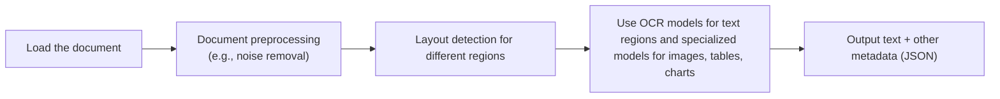
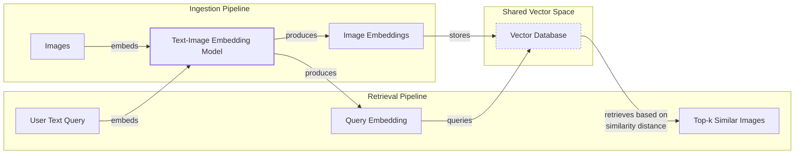
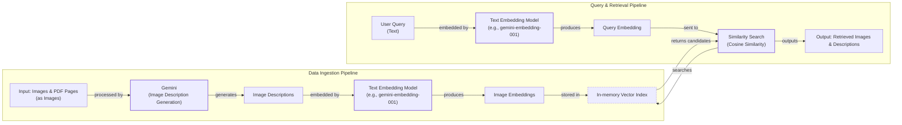
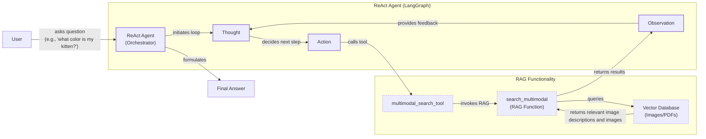

# Lesson 11: Stop Converting Documents to Text. Use Multimodal LLMs Instead

In the previous lessons, we built a solid foundation in AI Engineering. We explored the agent landscape, learned to distinguish between LLM workflows and AI agents, mastered context engineering, and ensured reliability with structured outputs. We gave agents the ability to act with tools, reason with ReAct, and remember with memory. We even did a deep dive into Retrieval-Augmented Generation (RAG). Now, we will tackle the final piece of the puzzle for building enterprise-grade AI: multimodal data.

In the real world, information rarely comes as clean text. We work with images, charts, and complex documents. Yet, most AI systems try to force everything into a text-only format. This is a fundamental limitation. Enterprise data is inherently multimodal, locked away in financial reports, technical manuals, and medical scans. Text-only approaches fail to capture the rich visual context in these documents, leading to incomplete and often inaccurate results. For example, text-only AI struggles with financial reports that rely on charts to show trends, or medical systems that need to analyze both patient notes and diagnostic images like X-rays [[17]](https://konfuzio.com/en/chatgpt-financial-analysis/), [[18]](https://techtoday.lenovo.com/sites/default/files/2025-05/Medical%20Imaging%20White%20Paper%20NVIDIA%20and%20Lenovo.pdf). Other common use cases like object detection, image captioning, and processing technical documents with sketches are simply out of reach for models that cannot "see" [[19]](https://github.com/cognitivetech/llm-research-summaries/blob/main/models-review/A-Comprehensive-Survey-and-Guide-to-Multimodal-Large-Language-Models-in-Vision-Language-Tasks.md).

This lesson is about breaking free from that limitation. We will show you why the old way of using Optical Character Recognition (OCR) to convert everything to text is a fragile, inefficient, and outdated strategy. Instead, we will teach you how to build modern AI systems that process images and documents in their native format. We will cover the foundations of how multimodal LLMs and RAG systems work, then dive into hands-on examples. By the end, you will be able to build AI agents that can see, read, and understand complex documents, just like a human would.

## Limitations of traditional document processing

To understand why a multimodal approach is necessary, we first need to look at why traditional document processing fails. For years, the standard solution for digitizing documents like invoices, reports, or technical manuals has been a multi-step pipeline centered around OCR. The goal was always the same: normalize everything to text before feeding it to an AI model.

A typical workflow involves loading a document, preprocessing it to remove noise, detecting the layout to identify different regions like text blocks, tables, and images, and then running specialized models on each region. An OCR model extracts text, a table-extraction model parses tabular data, and an image-captioning model might describe visuals. All this information is then structured, often as JSON, and passed downstream [[3]](https://www.daft.ai/blog/end-to-end-distributed-pdf-processing-pipeline), [[21]](https://parseur.com/blog/document-processing-automation-guide).


Image 1: A flowchart illustrating the traditional document processing workflow using Layout detection and OCR.

This process is a house of cards. With so many moving pieces, the system becomes rigid, slow, and fragile. If a new document format appears with a chart, and you do not have a model for chart extraction, the pipeline breaks. Calling multiple specialized models for each document is also slow and expensive, making it impractical for the fast, flexible agents we need today.

Furthermore, the performance of this pipeline is often poor. The multi-step nature creates a cascade effect where errors from one stage compound in the next [[3]](https://www.daft.ai/blog/end-to-end-distributed-pdf-processing-pipeline). Even the most advanced OCR engines struggle with real-world complexity. While they might achieve 88-94% accuracy on clean, simple layouts, that number drops significantly on poor-quality scans, handwritten text, or complex formats [[1]](https://www.llamaindex.ai/blog/ocr-accuracy). For example, scan quality below 300 DPI can cause accuracy to drop by over 20%, and a simple 5-degree skew in a document can increase the word error rate by more than 15% [[1]](https://www.llamaindex.ai/blog/ocr-accuracy). Enterprise APIs from major cloud providers can reach 96-98% on standard forms, but their accuracy also degrades when faced with irregular layouts, dense tables, or mixed print and handwriting [[1]](https://www.llamaindex.ai/blog/ocr-accuracy).

Handwriting remains a major hurdle, with a character error rate of 3-5% considered good, often requiring human validation [[1]](https://www.llamaindex.ai/blog/ocr-accuracy). Complex layouts with multiple columns, nested tables, or mixed fonts cause traditional OCR to fail because it cannot understand the document's structure or context [[20]](https://learn.microsoft.com/en-us/answers/questions/5668164/why-traditional-ocr-fails-for-complex-business-doc?page=1). Template-based systems are particularly brittle; they work for fixed layouts but break with the slightest variation, requiring constant maintenance [[22]](https://www.llamaindex.ai/blog/ocr-for-tables). When processing tables, for instance, standard OCR often dumps cell contents into a continuous block of text, losing all relational structure and rendering the data useless [[23]](https://intuitionlabs.ai/articles/ai-pdf-data-extraction-clinical-research). For documents with dense visual information, like the building sketch below, converting them to text is not just difficult; it is impossible without losing critical information.

<https://hackernoon.imgix.net/images/2DFAaGGO5cfymtBKn4bFFAoT6sg2-efb3xu6.jpeg>
Image 2: A building sketch with complex layouts and symbols that are difficult for traditional OCR systems to process. (Source [https://hackernoon.com/complex-document-recognition-ocr-doesnt-work-and-heres-how-you-fix-it](https://hackernoon.com/complex-document-recognition-ocr-doesnt-work-and-heres-how-you-fix-it) [[24]](https://hackernoon.com/complex-document-recognition-ocr-doesnt-work-and-heres-how-you-fix-it))

This is why modern AI systems are moving away from this fragile approach. Instead of converting documents to text, we can now use multimodal LLMs like Gemini or GPT-4o that directly interpret images, PDFs, and other data formats as native inputs. This bypasses the entire brittle OCR workflow, allowing the model to "see" the document in its entirety. This approach is simpler, faster, and preserves all the rich visual context that traditional methods throw away.

## Foundations of multimodal LLMs

Before we dive into code, it is important to have an intuition for how multimodal LLMs work. You do not need to be a researcher to use them, but understanding the core concepts will help you build, optimize, and monitor your AI applications more effectively.

At a high level, there are two common architectures for building multimodal LLMs that combine text and images.

<https://substackcdn.com/image/fetch/f_auto,q_auto:good,fl_progressive:steep/https%3A%2F%2Fsubstack-post-media.s3.amazonaws.com%2Fpublic%2Fimages%2F53956ae8-9cd8-474e-8c10-ef6bddb88164_1600x938.png>
Image 3: The two main approaches for building multimodal LLMs are the Unified Embedding Decoder Architecture (Method A) and the Cross-modality Attention Architecture (Method B). (Source [https://magazine.sebastianraschka.com/p/understanding-multimodal-llms](https://magazine.sebastianraschka.com/p/understanding-multimodal-llms) [[4]](https://magazine.sebastianraschka.com/p/understanding-multimodal-llms))

### Unified Embedding Decoder Architecture

The first and simpler approach is the **Unified Embedding Decoder Architecture**. Here, the image is converted into a sequence of embeddings, or "image tokens," which are then concatenated with the standard text token embeddings. This combined sequence is fed directly into a standard LLM decoder. The model processes both modalities in a unified way, as if the image were just another part of the text input [[4]](https://magazine.sebastianraschka.com/p/understanding-multimodal-llms), [[5]](https://arxiv.org/html/2409.14993v3).

<https://substackcdn.com/image/fetch/f_auto,q_auto:good,fl_progressive:steep/https%3A%2F%2Fsubstack-post-media.s3.amazonaws.com%2Fpublic%2Fimages%2F91955021-7da5-4bc4-840e-87d080152b18_1166x1400.png>
Image 4: The Unified Embedding Decoder Architecture, where image and text embeddings are concatenated and fed into a standard LLM decoder. (Source [https://magazine.sebastianraschka.com/p/understanding-multimodal-llms](https://magazine.sebastianraschka.com/p/understanding-multimodal-llms) [[4]](https://magazine.sebastianraschka.com/p/understanding-multimodal-llms))

### Cross-modality Attention Architecture

The second method is the **Cross-modality Attention Architecture**. Instead of treating image tokens as part of the input sequence, this approach injects the visual information directly into the LLM's attention layers. The LLM processes the text tokens as usual, but at each attention layer, it can "look at" the image embeddings through a cross-attention mechanism. This is similar to how the original Transformer architecture handled language translation, treating the image as a separate source of information to be referenced during processing [[4]](https://magazine.sebastianraschka.com/p/understanding-multimodal-llms).

<https://substackcdn.com/image/fetch/f_auto,q_auto:good,fl_progressive:steep/https%3A%2F%2Fsubstack-post-media.s3.amazonaws.com%2Fpublic%2Fimages%2Fd9c06055-b959-45d1-87b2-1f4e90ceaf2d_1296x1338.png>
Image 5: The Cross-modality Attention Architecture, where image information is integrated via cross-attention layers within the LLM. (Source [https://magazine.sebastianraschka.com/p/understanding-multimodal-llms](https://magazine.sebastianraschka.com/p/understanding-multimodal-llms) [[4]](https://magazine.sebastianraschka.com/p/understanding-multimodal-llms))

### How Image Encoders Work

Both architectures rely on an **image encoder** to transform an image into a set of embeddings. This process is analogous to text tokenization. While text is broken down into sub-words using an algorithm like Byte-Pair Encoding, an image is divided into a grid of smaller patches.

<https://substackcdn.com/image/fetch/f_auto,q_auto:good,fl_progressive:steep/https%3A%2F%2Fsubstack-post-media.s3.amazonaws.com%2Fpublic%2Fimages%2F0d56ea06-d202-4eb7-9e01-9aac492ee309_1522x1206.png>
Image 6: A side-by-side comparison of image tokenization (left) and text tokenization (right), showing how both are converted into embeddings for the LLM. (Source [https://magazine.sebastianraschka.com/p/understanding-multimodal-llms](https://magazine.sebastianraschka.com/p/understanding-multimodal-llms) [[4]](https://magazine.sebastianraschka.com/p/understanding-multimodal-llms))

Each patch is then processed by a vision model, typically a Vision Transformer (ViT), which converts it into an embedding vector. This is the core mechanism that turns visual information into a numerical format that an LLM can understand. For instance, an image might be divided into 16x16 pixel patches, which are then flattened and passed through a linear projection layer to create embeddings of a consistent dimension, such as 768, compatible with the LLM's architecture [[4]](https://magazine.sebastianraschka.com/p/understanding-multimodal-llms).

<https://substackcdn.com/image/fetch/f_auto,q_auto:good,fl_progressive:steep/https%3A%2F%2Fsubstack-post-media.s3.amazonaws.com%2Fpublic%2Fimages%2Ffef5f8cb-c76c-4c97-9771-7fdb87d7d8cd_1600x1135.png>
Image 7: A Vision Transformer (ViT) processes an image by dividing it into patches, which are then linearly projected and fed into a transformer encoder to produce embeddings. (Source [https://magazine.sebastianraschka.com/p/understanding-multimodal-llms](https://magazine.sebastianraschka.com/p/understanding-multimodal-llms) [[4]](https://magazine.sebastianraschka.com/p/understanding-multimodal-llms))

A crucial step in this process is ensuring that the image and text embeddings are "aligned," meaning they exist in the same vector space. This is achieved using a **projector**, which is typically a simple linear layer that maps the image embeddings to the same dimension as the text embeddings. This alignment is what allows the model to understand the relationship between, for example, the word "cat" and an image of a cat.

### Contrastive Learning

This alignment is learned through a technique called **contrastive learning**. The model is trained on vast datasets of image-text pairs, learning to maximize the similarity between matching "positive pairs" (e.g., an image of a cat and the caption "a cute cat") while minimizing the similarity for non-matching "negative pairs" (e.g., an image of a cat and the caption "a cute puppy").

<https://i.ibb.co/k8B6Kj8/image.png>
Image 8: An example of positive and negative pairs used in contrastive learning to align image and text representations. (Source [https://www.youtube.com/watch?v=YOvxh_ma5qE](https://www.youtube.com/watch?v=YOvxh_ma5qE) [[11]](https://www.youtube.com/watch?v=YOvxh_ma5qE))

The training process uses a contrastive loss function, like the one developed for CLIP, which simultaneously pushes positive pairs closer together and negative pairs further apart in the embedding space. This method is highly effective because it does not require manual labeling; the inherent structure of web data (images with alt-text) provides a massive source of training pairs. Models like OpenAI's CLIP, OpenCLIP, and Google's SigLIP are famous examples of this approach and are often used as the vision encoder in multimodal LLMs.

Because these models map images and text to a shared embedding space, they can also be used for multimodal RAG. You can perform similarity searches between text and images, allowing you to retrieve images based on a text query or vice versa.

<https://i.ibb.co/L5gqZ1m/image.png>
Image 9: An illustration of a shared embedding space where text ("A cute cat") and images of cats are located close together, enabling cross-modal retrieval. (Source [https://www.youtube.com/watch?v=YOvxh_ma5qE](https://www.youtube.com/watch?v=YOvxh_ma5qE) [[11]](https://www.youtube.com/watch?v=YOvxh_ma5qE))

### Architectural Trade-offs

Each architecture has its trade-offs. The **Unified Embedding** approach is simpler to implement, as it requires no changes to the core LLM. It also tends to perform better on OCR-related tasks because it processes visual and textual information together. However, it can be computationally expensive for high-resolution images, as every image patch adds to the input sequence length.

The **Cross-Attention** approach is more efficient for high-resolution images because it injects visual information without extending the input sequence. This also helps preserve the model's original text-only performance. However, it is more complex to implement and train [[4]](https://magazine.sebastianraschka.com/p/understanding-multimodal-llms), [[6]](https://arxiv.org/abs/2409.11402). Some models also use **hybrid** approaches that combine the strengths of both, such as using a low-resolution thumbnail in the unified embedding path and high-resolution patches via cross-attention [[6]](https://arxiv.org/abs/2409.11402).

By 2025, most state-of-the-art LLMs are multimodal. In the open-source world, we have models like Llama 4 (which uses a Mixture-of-Experts architecture and supports multi-million token contexts), Gemma 2, Qwen3, and DeepSeek-V3. In the closed-source space, models like GPT-5, Gemini 2.5 (with a 2M token context), and Claude are leading the way [[7]](https://medium.com/data-science-in-your-pocket/2025-the-year-ai-reasoning-models-took-over-a-month-by-month-review-of-frontier-breakthroughs-6ea2163f854f), [[8]](https://codedesign.ai/blog/the-ultimate-guide-to-the-top-large-language-models-in-2025/). This architecture can be extended to other modalities like audio and video by incorporating specialized encoders for each data type, such as Whisper for audio or Video Transformers for video [[9]](https://sparkco.ai/blog/exploring-multimodal-llms-text-image-and-video-integration), [[10]](https://www.emergentmind.com/topics/multimodal-llms).

It is also important to distinguish these models from diffusion-based image generation models like Midjourney or Stable Diffusion. While multimodal LLMs like GPT-4o can also generate images, diffusion models are a separate class of generative models specialized for creating visual content. In the context of AI agents, diffusion models can be integrated as tools, allowing an agent to create images as one of its actions [[5]](https://arxiv.org/html/2409.14993v3).

This field is evolving rapidly, but the core principles remain. The goal of this section was not to be exhaustive but to provide you with a solid intuition for how multimodal LLMs work and why they are a better alternative to older, multi-step OCR pipelines. Now that we understand the theory, let's see how it works in practice.

## Applying multimodal LLMs to images and PDFs

To understand how multimodal LLMs work in practice, let's walk through some examples using Gemini. There are three primary ways to provide multimodal data to an LLM.

**Raw Bytes** is the most direct method and works well for one-off API calls. However, storing raw bytes in a database can be problematic, as many databases interpret the data as text, which can lead to corruption.

**Base64 Encoding** converts binary data (like an image) into a string format. It is a reliable way to store images or documents in databases like PostgreSQL or MongoDB because databases are designed to handle strings flawlessly. The main drawback is that Base64-encoded data is about 33% larger than the original raw bytes, which can increase storage costs.

**URLs** are often the most efficient method, especially in enterprise settings. You can either provide a public URL for data on the internet or a secure URL pointing to a file in a private data lake like AWS S3 or Google Cloud Storage (GCS). Instead of passing large files over the network with each API call, the LLM can access the data directly from its source, reducing latency and I/O bottlenecks.

```mermaid
flowchart LR
  %% Method 1: Base64 + Databases
  subgraph "Method 1: Base64 + Databases"
    A["Raw Bytes"]
    B["Base64 Encode"]
    C["Database<br/>(PostgreSQL, MongoDB)"]
    LLM_M1["LLM"]
  end

  %% Method 2: URLs + Data Lakes
  subgraph "Method 2: URLs + Data Lakes"
    D["Raw Data"]
    E["Data Lake<br/>(AWS S3, GCP GCS)"]
    F["Media URLs"]
    LLM_M2["LLM"]
  end

  %% Flow for Method 1
  A -- "encode" --> B
  B -- "store as string" --> C
  C -- "retrieve & pass" --> LLM_M1
  C -. "advantage: prevents corruption" .-> LLM_M1

  %% Flow for Method 2
  D -- "store" --> E
  E -- "generate" --> F
  F -- "LLM accesses directly" --> LLM_M2
  E -. "advantage: avoids network transfer" .-> LLM_M2

  %% Visual grouping
  classDef storage
  classDef process
  class C,E storage
  class B,F process
```
Image 10: A diagram comparing two core methods for processing multimodal data with LLMs: Base64 + Databases and URLs + Data Lakes.

When building AI applications, the choice depends on your architecture. For simple, one-off tasks, use raw bytes. If you need to store multimodal data in a traditional database, Base64 is a safe bet. For scalable, production systems with large amounts of data, storing files in a data lake and using URLs is the most efficient approach.

Now, let's see this in action with some code.

We will start by displaying our sample image.

<https://raw.githubusercontent.com/towardsai/course-ai-agents/dev/lessons/11_multimodal/images/image_1.jpeg>
Image 11: A photorealistic rendering of a kitten interacting with a large robot. (Source [https://github.com/towardsai/course-ai-agents/blob/dev/lessons/11_multimodal/notebook.ipynb](https://github.com/towardsai/course-ai-agents/blob/dev/lessons/11_multimodal/notebook.ipynb) [[12]](https://github.com/towardsai/course-ai-agents/blob/dev/lessons/11_multimodal/notebook.ipynb))

### Process image as raw bytes

First, we define a helper function to load an image from a file path and convert it into bytes. We will use the `WEBP` format because it offers a good balance of quality and file size, making it efficient for API calls.

1.  We define the `load_image_as_bytes` function. This function opens an image, resizes it if it's too wide to keep processing efficient, and saves it to a byte stream in the specified format.
    ```python
    def load_image_as_bytes(
        image_path: Path, format: Literal["WEBP", "JPEG", "PNG"] = "WEBP", max_width: int = 600, return_size: bool = False
    ) -> bytes | tuple[bytes, tuple[int, int]]:
        """
        Load an image from file path and convert it to bytes with optional resizing.
    
        Args:
            image_path: Path to the image file to load
            format: Output image format (WEBP, JPEG, or PNG). Defaults to "WEBP"
            max_width: Maximum width for resizing. If image width exceeds this, it will be resized proportionally. Defaults to 600
            return_size: If True, returns both bytes and image size tuple. Defaults to False
    
        Returns:
            bytes: Image data as bytes, or tuple of (bytes, (width, height)) if return_size is True
        """
    
        image = PILImage.open(image_path)
        if image.width > max_width:
            ratio = max_width / image.width
            new_size = (max_width, int(image.height * ratio))
            image = image.resize(new_size)
    
        byte_stream = io.BytesIO()
        image.save(byte_stream, format=format)
    
        if return_size:
            return byte_stream.getvalue(), image.size
    
        return byte_stream.getvalue()
    ```

2.  Next, we load our sample image. The output shows a snippet of the raw bytes and the total size of the image data, which is a compact 44 KB.
    ```python
    image_bytes = load_image_as_bytes(image_path=Path("images") / "image_1.jpeg", format="WEBP")
    ```
    It outputs:
    ```text
    Bytes `b'RIFF`\xad\x00\x00WEBPVP8 T\xad\x00\x00P\xec\x02\x9d\x01*X\x02X\x02'...`
    Size: 44392 bytes
    ```

3.  Now, we pass these bytes to the Gemini model along with a text prompt to generate a caption. The `types.Part.from_bytes` method packages the image data for the API call.
    ```python
    response = client.models.generate_content(
        model=MODEL_ID,
        contents=[
            types.Part.from_bytes(
                data=image_bytes,
                mime_type="image/webp",
            ),
            "Tell me what is in this image in one paragraph.",
        ],
    )
    ```
    It outputs:
    ```text
    This striking image features a massive, dark metallic robot, its powerful form detailed with intricate circuit patterns on its head and piercing red glowing eyes. Perched playfully on its right arm is a small, fluffy grey tabby kitten, its front paw raised as if exploring or batting at the robot's armored limb, while its gaze is directed slightly off-frame. The robot's large, segmented hand is visible beneath the kitten. The background suggests an industrial or workshop environment, with hints of metal structures and natural light filtering in from an unseen window, creating a dramatic contrast between the soft, vulnerable kitten and the formidable, mechanical sentinel.
    ```

4.  We can also pass multiple images in a single call to ask the model to compare them. The model correctly identifies the key differences in subject, setting, and mood.
    ```python
    response = client.models.generate_content(
        model=MODEL_ID,
        contents=[
            types.Part.from_bytes(
                data=load_image_as_bytes(image_path=Path("images") / "image_1.jpeg", format="WEBP"),
                mime_type="image/webp",
            ),
            types.Part.from_bytes(
                data=load_image_as_bytes(image_path=Path("images") / "image_2.jpeg", format="WEBP"),
                mime_type="image/webp",
            ),
            "What's the difference between these two images? Describe it in one paragraph.",
        ],
    )
    ```
    It outputs:
    ```text
    The primary difference between the two images lies in the nature of the interaction depicted and their respective settings. In the first image, a small, grey kitten is shown curiously interacting with a large, metallic robot, gently perched on its arm within what appears to be a clean, well-lit workshop or industrial space. Conversely, the second image portrays a tense and aggressive confrontation between a fluffy white dog and a sleek black robot, both in combative stances, amidst a cluttered and grimy urban alleyway filled with trash and graffiti.
    ```

### Process the image as base64 encoded strings

Now, let's do the same thing using Base64 encoding. This is useful for storing image data as text, for example, in a JSON field in a database.

1.  We define a helper function to load an image and convert it to a Base64 string. It reuses our `load_image_as_bytes` function.
    ```python
    from typing import cast
    
    
    def load_image_as_base64(
        image_path: Path, format: Literal["WEBP", "JPEG", "PNG"] = "WEBP", max_width: int = 600, return_size: bool = False
    ) -> str:
        """
        Load an image and convert it to base64 encoded string.
    
        Args:
            image_path: Path to the image file to load
            format: Output image format (WEBP, JPEG, or PNG). Defaults to "WEBP"
            max_width: Maximum width for resizing. If image width exceeds this, it will be resized proportionally. Defaults to 600
            return_size: Parameter passed to load_image_as_bytes function. Defaults to False
    
        Returns:
            str: Base64 encoded string representation of the image
        """
    
        image_bytes = load_image_as_bytes(image_path=image_path, format=format, max_width=max_width, return_size=False)
    
        return base64.b64encode(cast(bytes, image_bytes)).decode("utf-8")
    ```

2.  We load the image as a Base64 string and observe its size. As expected, the Base64 string is about 33% larger than the raw bytes, increasing from 44 KB to 59 KB.
    ```python
    image_base64 = load_image_as_base64(image_path=Path("images") / "image_1.jpeg", format="WEBP")
    ```
    It outputs:
    ```text
    Base64: UklGRmCtAABXRUJQVlA4IFStAABQ7AKdASpYAlgCPm0ylEekIqInJnQ7gOANiWdtk7FnEo2gDknjPixW9SNSb5P7IbBNhLn87Vtp...`
    Size: 59192 characters
    
    Image as Base64 is 33.34% larger than as bytes
    ```

3.  We pass the Base64 string to the model, and it generates a similar, high-quality caption. The process is identical to using raw bytes from the API's perspective.
    ```python
    response = client.models.generate_content(
        model=MODEL_ID,
        contents=[
            types.Part.from_bytes(data=image_base64, mime_type="image/webp"),
            "Tell me what is in this image in one paragraph.",
        ],
    )
    ```
    It outputs:
    ```text
    The image features a striking contrast between a large, formidable robot and a small, adorable kitten. The robot, crafted from dark, sleek metallic armor with intricate circuitry patterns on its head, possesses piercing red glowing eyes that appear to be focused on its tiny companion. A fluffy, gray tabby kitten is playfully perched on the robot's massive metallic arm and shoulder, its small paws resting gently on the armored surface as it looks up with curiosity. The scene is set in what looks like an industrial or workshop environment, with warm light filtering in from the background, highlighting this unexpected and endearing interaction between advanced technology and natural innocence.
    ```

### Process PDFs as public URLs

Gemini also supports processing content directly from public URLs using its `url_context` tool. This is incredibly useful for analyzing online documents, like the famous ReAct paper, without needing to download them first.

1.  We simply pass the URL in the prompt and configure the `url_context` tool. The model fetches, parses, and analyzes the PDF content automatically.
    ```python
    response = client.models.generate_content(
        model=MODEL_ID,
        contents="Based on the provided paper as a PDF, tell me how ReAct works: https://arxiv.org/pdf/2210.03629",
        config=types.GenerateContentConfig(tools=[{"url_context": {}}]),
    )
    ```
    It outputs:
    ```text
    ReAct is a novel paradigm for large language models (LLMs) that combines reasoning (Thought) and acting (Action) in an interleaved manner to solve diverse language and decision-making tasks. This approach allows the model to:
    
    *   **Reason to Act:** Generate verbal reasoning traces to induce, track, and update action plans, and handle exceptions.
    *   **Act to Reason:** Interface with and gather additional information from external sources (like knowledge bases or environments) to incorporate into its reasoning.
    
    **How it works:**
    
    Instead of just generating a direct answer (Standard prompting) or a chain of thought without external interaction (CoT), or only actions (Act-only), ReAct augments the LLM's action space to include a "language space" for generating "thoughts" or reasoning traces.
    
    1.  **Thought:** The model explicitly generates a thought, which is a verbal reasoning trace. This thought helps the model to:
        *   Decompose task goals and create action plans.
        *   Inject commonsense knowledge.
        *   Extract important information from observations.
        *   Track progress and adjust action plans.
        *   Handle exceptions.
    2.  **Action:** Based on the current thought and context, the model performs a task-specific action. This could involve:
        *   Searching external databases (e.g., Wikipedia API using `search[entity]` or `lookup[string]`).
        *   Interacting with an environment (e.g., `go to cabinet 1`, `take pepper shaker 1`).
        *   Finishing the task with an answer (`finish[answer]`).
    3.  **Observation:** The environment provides an observation feedback based on the executed action.
    
    This cycle of Thought, Action, and Observation continues until the task is completed.
    ```

### Process images as URLs from private data lakes

For enterprise use cases, you will often work with data in private data lakes. At the time of writing, Gemini integrates smoothly with Google Cloud Storage but has limited support for other providers like S3. For simplicity, we will show a mocked example of how this would work. You would provide the GCS URI directly to the model, and the LLM would access the file without you needing to download and upload it.

```python
response = client.models.generate_content(
    model=MODEL_ID,
    contents=[
        types.Part.from_uri(uri="gs://gemini-images/image_1.jpeg", mime_type="image/webp"),
        "Tell me what is in this image in one paragraph.",
    ],
)
```

### Object detection with LLMs

A more advanced application is using multimodal LLMs for object detection. We can instruct the model to identify objects and return their bounding box coordinates, bridging the gap between generative and analytical AI.

1.  First, we define Pydantic models to structure the output. This ensures we get a predictable, validated JSON response from the LLM, which is crucial for building reliable downstream applications.
    ```python
    from pydantic import BaseModel, Field
    
    
    class BoundingBox(BaseModel):
        ymin: float
        xmin: float
        ymax: float
        xmax: float
        label: str = Field(
            default="The category of the object found within the bounding box. For example: cat, dog, diagram, robot."
        )
    
    
    class Detections(BaseModel):
        bounding_boxes: list[BoundingBox]
    ```

2.  Next, we create a prompt asking the model to detect items and provide normalized bounding box coordinates (scaled from 0 to 1000).
    ```python
    prompt = """
    Detect all of the prominent items in the image. 
    The box_2d should be [ymin, xmin, ymax, xmax] normalized to 0-1000.
    Also, a label of the object found within the bounding box.
    """
    
    image_bytes, image_size = load_image_as_bytes(
        image_path=Path("images") / "image_1.jpeg", format="WEBP", return_size=True
    )
    ```

3.  We configure the model to return JSON that conforms to our `Detections` schema and make the API call. The Gemini SDK handles the parsing automatically.
    ```python
    config = types.GenerateContentConfig(
        response_mime_type="application/json",
        response_schema=Detections,
    )
    
    response = client.models.generate_content(
        model=MODEL_ID,
        contents=[
            types.Part.from_bytes(
                data=image_bytes,
                mime_type="image/webp",
            ),
            prompt,
        ],
        config=config,
    )
    
    detections = cast(Detections, response.parsed)
    ```
    It outputs:
    ```text
    Image size: (600, 600)
    ymin=1.0 xmin=450.0 ymax=997.0 xmax=1000.0 label='robot'
    ymin=269.0 xmin=39.0 ymax=782.0 xmax=530.0 label='kitten'
    ```

4.  Finally, we can visualize the detected bounding boxes on the original image using a helper function that converts the normalized coordinates back to pixel values.
    ```python
    visualize_detections(detections, Path("images") / "image_1.jpeg")
    ```
    <https://raw.githubusercontent.com/towardsai/course-ai-agents/dev/lessons/11_multimodal/images/object_detection.png>
    Image 12: Visualization of the bounding boxes for the detected "robot" and "kitten" objects on the sample image. (Source [https://github.com/towardsai/course-ai-agents/blob/dev/lessons/11_multimodal/notebook.ipynb](https://github.com/towardsai/course-ai-agents/blob/dev/lessons/11_multimodal/notebook.ipynb) [[12]](https://github.com/towardsai/course-ai-agents/blob/dev/lessons/11_multimodal/notebook.ipynb))

### Working with PDFs

Processing PDFs with multimodal LLMs is nearly identical to processing images. You can pass them as raw bytes or Base64-encoded strings. Let's use the famous "Attention Is All You Need" paper as an example.

<https://raw.githubusercontent.com/towardsai/course-ai-agents/dev/lessons/11_multimodal/images/attention_is_all_you_need_0.jpeg>
Image 13: The first page of the "Attention Is All You Need" paper. (Source [https://github.com/towardsai/course-ai-agents/blob/dev/lessons/11_multimodal/notebook.ipynb](https://github.com/towardsai/course-ai-agents/blob/dev/lessons/11_multimodal/notebook.ipynb) [[12]](https://github.com/towardsai/course-ai-agents/blob/dev/lessons/11_multimodal/notebook.ipynb))

1.  We can pass the PDF as raw bytes to get a summary. The model reads the entire document and extracts the main topics.
    ```python
    pdf_bytes = (Path("pdfs") / "attention_is_all_you_need_paper.pdf").read_bytes()
    
    response = client.models.generate_content(
        model=MODEL_ID,
        contents=[
            types.Part.from_bytes(data=pdf_bytes, mime_type="application/pdf"),
            "What is this document about? Provide a brief summary of the main topics.",
        ],
    )
    ```
    It outputs:
    ```text
    This document introduces the **Transformer**, a novel neural network architecture designed for **sequence transduction tasks** (like machine translation).
    
    Its main topics include:
    
    1.  **Dispensing with Recurrence and Convolutions**: Unlike previous dominant models (RNNs and CNNs), the Transformer relies *solely* on **attention mechanisms**, eliminating the need for sequential computation.
    2.  **Attention Mechanisms**: It details the **Scaled Dot-Product Attention** and **Multi-Head Attention** as its core building blocks, explaining how they allow the model to weigh different parts of the input sequence.
    3.  **Parallelization and Efficiency**: The paper highlights that the Transformer's architecture allows for significantly more parallelization during training, leading to **faster training times** compared to prior models.
    4.  **Superior Performance**: It demonstrates that the Transformer achieves **state-of-the-art results** on machine translation tasks (English-to-German and English-to-French) and generalizes well to other tasks like English constituency parsing.
    ```

2.  Alternatively, we can use Base64 encoding, which is useful if the PDF data is stored as a string in a database.
    ```python
    def load_pdf_as_base64(pdf_path: Path) -> str:
        """
        Load a PDF file and convert it to base64 encoded string.
    
        Args:
            pdf_path: Path to the PDF file to load
    
        Returns:
            str: Base64 encoded string representation of the PDF
        """
    
        with open(pdf_path, "rb") as f:
            return base64.b64encode(f.read()).decode("utf-8")
    
    pdf_base64 = load_pdf_as_base64(pdf_path=Path("pdfs") / "attention_is_all_you_need_paper.pdf")
    
    response = client.models.generate_content(
        model=MODEL_ID,
        contents=[
            "What is this document about? Provide a brief summary of the main topics.",
            types.Part.from_bytes(data=pdf_base64, mime_type="application/pdf"),
        ],
    )
    ```
    It outputs:
    ```text
    This document introduces the **Transformer**, a novel neural network architecture for **sequence transduction models**, primarily applied to **machine translation**.
    
    Here's a brief summary of the main topics:
    
    *   **Core Innovation:** The Transformer proposes to completely abandon recurrent neural networks (RNNs) and convolutional neural networks (CNNs), relying *solely on attention mechanisms* (specifically "multi-head self-attention") for learning dependencies between input and output sequences.
    *   **Architecture:** It maintains an encoder-decoder structure, where both the encoder and decoder are composed of stacks of self-attention and point-wise fully connected layers. Positional encodings are added to input embeddings to inject information about the order of the sequence.
    ```

### PDF Processing: Base64 vs. Images

When working with PDFs, you have a choice: process the entire PDF file (as bytes or Base64) or convert each page into an image and process them individually. The decision is an architectural one. Processing the full PDF is simpler and allows the model to see the entire document context at once. However, converting pages to images gives you more granular control. You can treat each page as a distinct visual unit, which is especially powerful for RAG systems where you might want to retrieve specific pages based on their visual content. This approach aligns well with architectures like ColPali, which treat document retrieval as an image retrieval problem.

### Object detection on PDF pages as images

To further demonstrate the power of treating PDFs as images, we can perform object detection on a page containing a diagram. This highlights how well LLMs can understand complex layouts without needing to convert them to text.

1.  We use the same object detection prompt as before, but this time we pass an image of a page from the Transformer paper.
    ```python
    prompt = """
    Detect all the diagrams from the provided image as 2d bounding boxes. 
    The box_2d should be [ymin, xmin, ymax, xmax] normalized to 0-1000.
    Also, output the label of the object found within the bounding box.
    """
    
    image_bytes, image_size = load_image_as_bytes(
        image_path=Path("images") / "attention_is_all_you_need_1.jpeg", format="WEBP", return_size=True
    )
    
    config = types.GenerateContentConfig(
        response_mime_type="application/json",
        response_schema=Detections,
    )
    response = client.models.generate_content(
        model=MODEL_ID,
        contents=[
            types.Part.from_bytes(
                data=image_bytes,
                mime_type="image/webp",
            ),
            prompt,
        ],
        config=config,
    )
    detections = cast(Detections, response.parsed)
    visualize_detections(detections, Path("images") / "attention_is_all_you_need_1.jpeg")
    ```
    <https://raw.githubusercontent.com/towardsai/course-ai-agents/dev/lessons/11_multimodal/images/diagram_detection.png>
    Image 14: The Transformer model architecture diagram from the "Attention Is All You Need" paper with a bounding box detected by Gemini. (Source [https://github.com/towardsai/course-ai-agents/blob/dev/lessons/11_multimodal/notebook.ipynb](https://github.com/towardsai/course-ai-agents/blob/dev/lessons/11_multimodal/notebook.ipynb) [[12]](https://github.com/towardsai/course-ai-agents/blob/dev/lessons/11_multimodal/notebook.ipynb))

These examples show how effectively multimodal LLMs handle images and PDFs, making the old, brittle OCR pipelines redundant for many use cases.

## Foundations of multimodal RAG

One of the most powerful applications of multimodal models is in RAG systems, a topic we covered in Lesson 10. When dealing with large documents or entire image libraries, you cannot simply stuff everything into the LLM's context window. This would be incredibly slow, expensive, and lead to poor performance due to the "lost-in-the-middle" problem. RAG allows us to retrieve only the most relevant pieces of information to answer a query.

A generic multimodal RAG architecture for images and text involves an ingestion pipeline and a retrieval pipeline. During ingestion, a text-image embedding model converts each image into an embedding vector, which is then stored in a vector database. During retrieval, a user's text query is converted into an embedding using the same model. This query embedding is used to search the vector database for the `top-k` most similar image embeddings, typically using cosine similarity.

Because the text-image embedding model places both text and images in the same vector space, we can search for images using text, for text using images, or even for images using other images. This is the technology that powers modern image search engines like Google Photos, where you can search for "pictures of my dog at the beach" and get relevant results without ever manually tagging your photos [[13]](https://opensearch.org/blog/multimodal-semantic-search/).


Image 15: A diagram illustrating a generic multimodal RAG architecture using images and text, showing ingestion and retrieval pipelines, and the shared vector space concept.

For enterprise RAG on documents, the state-of-the-art architecture as of 2025 is ColPali [[14]](https://arxiv.org/pdf/2407.01449v6). This approach bypasses the entire traditional OCR pipeline by processing document pages directly as images. It uses a vision-language model to understand both the textual and visual content simultaneously, making it highly effective for documents with complex tables, figures, and layouts.

ColPali introduces several key innovations. During **offline indexing**, it divides each document page into patches and generates a "bag-of-embeddings" representation. This means it creates multiple embedding vectors for each page instead of a single one, capturing finer-grained details. At query time, its **online query logic** uses a late interaction mechanism (the MaxSim operator) to compute similarity scores between each query token and all the document patches. This allows for a more nuanced and accurate retrieval than comparing single vectors. The architecture is based on **PaliGemma-3B** with a **SigLIP vision encoder**, demonstrating that powerful retrieval can be achieved with relatively small models.

The core paradigm shift is moving from text chunking to image patching. While text chunking can break semantic context, **image patching** preserves the full spatial and visual layout of the document. This is why ColPali excels. The result is a system that is not only more accurate but also 2-10 times faster at query time than traditional OCR-based RAG pipelines, achieving a state-of-the-art 81.3% average nDCG@5 score on the ViDoRe benchmark [[14]](https://arxiv.org/pdf/2407.01449v6).

<https://i.ibb.co/h7nL5q1/image.png>
Image 16: The ColPali architecture, which simplifies document retrieval by embedding page images directly, outperforming standard methods in both speed and accuracy. (Source [https://arxiv.org/pdf/2407.01449v6](https://arxiv.org/pdf/2407.01449v6) [[14]](https://arxiv.org/pdf/2407.01449v6))

While we will not implement the full ColPali architecture, understanding these principles is key. In the next section, we will build a simplified multimodal RAG system from scratch to solidify these concepts.

## Implementing multimodal RAG for images, PDFs and text

Now, let's connect all the dots and build a simple multimodal RAG system from scratch. This example will combine what we have learned about multimodal LLMs and the RAG principles from Lesson 10.

Our mini-project will involve populating an in-memory vector index with a collection of images, including pages from the "Attention Is All You Need" paper treated as images. We will then query this index using text to retrieve the most relevant images. To keep things simple and focus on the core concepts, we will not implement image patching or a late-interaction reranker like in ColPali.


Image 17: A Mermaid diagram illustrating the multimodal RAG example, showing the process of populating an in-memory vector database with images and querying it with text.

1.  First, let's display the images we will be indexing. This collection includes a mix of photographs and pages from the research paper, demonstrating how the system can handle varied visual content.
    ```python
    display_image_grid(
        image_paths=[
            Path("images") / "image_1.jpeg",
            Path("images") / "image_2.jpeg",
            Path("images") / "image_3.jpeg",
            Path("images") / "image_4.jpeg",
            Path("images") / "attention_is_all_you_need_1.jpeg",
            Path("images") / "attention_is_all_you_need_2.jpeg",
        ],
        rows=2,
        cols=3,
    )
    ```
    <https://raw.githubusercontent.com/towardsai/course-ai-agents/dev/lessons/11_multimodal/images/image_grid.png>
    Image 18: A grid of images used for the multimodal RAG example, including photos and pages from a PDF. (Source [https://github.com/towardsai/course-ai-agents/blob/dev/lessons/11_multimodal/notebook.ipynb](https://github.com/towardsai/course-ai-agents/blob/dev/lessons/11_multimodal/notebook.ipynb) [[12]](https://github.com/towardsai/course-ai-agents/blob/dev/lessons/11_multimodal/notebook.ipynb))

2.  Next, we define the `create_vector_index` function. This function will process our images, generate descriptions, create embeddings, and store them in a simple list that acts as our in-memory vector index. In a real-world application, you would use a dedicated vector database with optimized indexes like HNSW for scalability.
    ```python
    from typing import cast
    
    
    def create_vector_index(image_paths: list[Path]) -> list[dict]:
        """
        Create embeddings for images by generating descriptions and embedding them.
    
        This function processes a list of image paths by:
        1. Loading each image as bytes
        2. Generating a text description using Gemini Vision
        3. Creating an embedding of that description using Gemini Embeddings
    
        Args:
            image_paths (list[Path]): List of paths to image files to process
    
        Returns:
            list[dict]: List of dictionaries with the following keys:
                - content (bytes): Raw image bytes
                - type (str): Always "image"
                - filename (Path): Original image path
                - description (str): Generated image description
                - embedding (np.ndarray): Vector embedding of the description
        """
    
        vector_index = []
        for image_path in image_paths:
            image_bytes = cast(bytes, load_image_as_bytes(image_path, format="WEBP", return_size=False))
    
            image_description = generate_image_description(image_bytes)
    
            # IMPORTANT NOTE: When working with multimodal embedding models, we can directly embed the
            # `image_bytes` instead of generating and embedding the description. Otherwise, everything
            # else remains the same within the whole RAG system.
            image_embedding = embed_text_with_gemini(image_description)
    
            vector_index.append(
                {
                    "content": image_bytes,
                    "type": "image",
                    "filename": image_path,
                    "description": image_description,
                    "embedding": image_embedding,
                }
            )
    
        return vector_index
    ```
    A critical point here is that we are generating a text description for each image and then embedding the description. This is a workaround because the Gemini API via the `google-genai` library does not yet support direct image embeddings. As we have emphasized, this is generally not the recommended approach. However, the good news is that the overall RAG architecture remains the same. With a true multimodal embedding model (like those from Voyage AI, Cohere, or Google's embeddings on Vertex AI), you would simply embed the `image_bytes` directly, skipping the description generation step [[15]](https://python.langchain.com/docs/integrations/text_embedding/google_generative_ai/), [[16]](https://milvus.io/blog/choose-embedding-model-rag-2026.md).
    ```python
    image_bytes = ...
    # SKIPPED !
    # image_description = generate_image_description(image_bytes)
    image_embeddings = embed_with_multimodal(image_bytes)
    ```

3.  The `generate_image_description` function uses Gemini to create a detailed description of each image for semantic search purposes. This description acts as a textual proxy for the image's content.
    ```python
    def generate_image_description(image_bytes: bytes) -> str:
        """
        Generate a detailed description of an image using Gemini Vision model.
    
        Args:
            image_bytes: Image data as bytes
    
        Returns:
            str: Generated description of the image
        """
    
        try:
            img = PILImage.open(BytesIO(image_bytes))
            prompt = """
            Describe this image in detail for semantic search purposes. 
            Include objects, scenery, colors, composition, text, and any other visual elements that would help someone find 
            this image through text queries.
            """
    
            response = client.models.generate_content(
                model=MODEL_ID,
                contents=[prompt, img],
            )
    
            if response and response.text:
                return response.text.strip()
            else:
                return ""
    
        except Exception as e:
            return ""
    ```

4.  The `embed_text_with_gemini` function takes the generated description and converts it into a 3072-dimensional embedding vector using the `gemini-embedding-001` model.
    ```python
    def embed_text_with_gemini(content: str) -> np.ndarray | None:
        """
        Embed text content using Gemini's text embedding model.
    
        Args:
            content: Text string to embed
    
        Returns:
            np.ndarray | None: Embedding vector as numpy array or None if failed
        """
    
        try:
            result = client.models.embed_content(
                model="gemini-embedding-001",
                contents=[content],
            )
            if not result or not result.embeddings:
                return None
    
            return np.array(result.embeddings[0].values)
    
        except Exception as e:
            return None
    ```

5.  We call `create_vector_index` to process all our images and build the index.
    ```python
    image_paths = list(Path("images").glob("*.jpeg"))
    vector_index = create_vector_index(image_paths)
    ```
    It outputs:
    ```text
    Successfully created 7 embeddings under the `vector_index` variable
    ```
    Each entry in our `vector_index` is a dictionary containing the image content, its filename, the generated description, and the embedding vector. Let's inspect the structure of the first element.
    ```python
    vector_index[0].keys()
    # dict_keys(['content', 'type', 'filename', 'description', 'embedding'])
    
    vector_index[0]["embedding"].shape
    # (3072,)
    
    print(f"{vector_index[0]['description'][:150]}...")
    # This image is a page from a technical or scientific document, likely a research paper, textbook, or dissertation related to machine learning, deep lea...
    ```

6.  Now we define the `search_multimodal` function. It takes a text query, embeds it using the same model, and then calculates the cosine similarity between the query embedding and all the image embeddings in our index to find the `top_k` most relevant images.
    ```python
    from sklearn.metrics.pairwise import cosine_similarity
    
    
    def search_multimodal(query_text: str, vector_index: list[dict], top_k: int = 3) -> list[Any]:
        """
        Search for most similar documents to query using direct Gemini client.
        """
    
        query_embedding = embed_text_with_gemini(query_text)
    
        if query_embedding is None:
            return []
    
        embeddings = [doc["embedding"] for doc in vector_index]
        similarities = cosine_similarity([query_embedding], embeddings).flatten()
    
        top_indices = np.argsort(similarities)[::-1][:top_k]
    
        results = []
        for idx in top_indices.tolist():
            results.append({**vector_index[idx], "similarity": similarities[idx]})
    
        return results
    ```

7.  Let's test it with a query about the Transformer architecture. The goal is to see if the system can retrieve the correct page from the research paper.
    ```python
    query = "what is the architecture of the transformer neural network?"
    results = search_multimodal(query, vector_index, top_k=1)
    ```
    The system correctly retrieves the page from the "Attention Is All You Need" paper with a similarity score of 0.744, demonstrating that the semantic meaning of the query matched the generated description of the diagram.
    ```text
    Similarity 0.744
    Filename images/attention_is_all_you_need_1.jpeg
    Description `This image is a detailed technical document, likely from a research paper or academic publication, featuring a prominent diagram of the Transformer model architecture alongside explanatory text...`
    ```
    <https://raw.githubusercontent.com/towardsai/course-ai-agents/dev/lessons/11_multimodal/images/attention_is_all_you_need_1.jpeg>
    Image 19: The retrieved image for the query about the Transformer architecture. (Source [https://github.com/towardsai/course-ai-agents/blob/dev/lessons/11_multimodal/notebook.ipynb](https://github.com/towardsai/course-ai-agents/blob/dev/lessons/11_multimodal/notebook.ipynb) [[12]](https://github.com/towardsai/course-ai-agents/blob/dev/lessons/11_multimodal/notebook.ipynb))

8.  Let's try another query: "a kitten with a robot". This time, we are searching for a photographic image.
    ```python
    query = "a kitten with a robot"
    results = search_multimodal(query, vector_index, top_k=1)
    ```
    Again, the correct image is retrieved with a high similarity score of 0.811.
    ```text
    Similarity 0.811
    Filename images/image_1.jpeg
    Description `This image is a detailed, photorealistic digital rendering or illustration depicting an unlikely interaction between a large, imposing robot and a small, delicate kitten in an industrial setting...`
    ```
    <https://raw.githubusercontent.com/towardsai/course-ai-agents/dev/lessons/11_multimodal/images/image_1.jpeg>
    Image 20: The retrieved image for the query "a kitten with a robot". (Source [https://github.com/towardsai/course-ai-agents/blob/dev/lessons/11_multimodal/notebook.ipynb](https://github.com/towardsai/course-ai-agents/blob/dev/lessons/11_multimodal/notebook.ipynb) [[12]](https://github.com/towardsai/course-ai-agents/blob/dev/lessons/11_multimodal/notebook.ipynb))

This example demonstrates how we can use the same vector index to search across both standard images and document pages, simply by treating everything as an image. This powerful concept can be extended to other modalities like video frames or audio spectrograms, creating a truly unified search experience.

## Building multimodal AI agents

To take this a step further, we can integrate our `search_multimodal` RAG function into a ReAct agent as a tool. This combines many of the skills we have learned throughout Part 1 of this course: structured outputs, tools, ReAct reasoning, RAG, and now, multimodal data.

Multimodal capabilities can be added to AI agents in several ways. **Multimodal Inputs/Outputs** involve using a multimodal LLM as the agent's reasoning engine, allowing it to directly process images or other data formats provided in the context. **Multimodal Retrieval Tools** integrate a RAG system, like the one we just built, as a tool, enabling the agent to search through visual or document-based knowledge bases. Finally, agents can be equipped with **Other Multimodal Tools** that interact with external resources, such as scraping company PDFs, analyzing screenshots, or even playing audio from Spotify.

In this example, we will focus on the first two points. We will create a ReAct agent using LangGraph that can use our RAG function to search for an image and then reason about its content to answer a user's question. Specifically, we will ask the agent to find the color of our kitten from the indexed images. This demonstrates a complete loop where the agent formulates a search query, retrieves visual evidence, and then uses its vision capabilities to analyze that evidence and provide an answer.


Image 21: A Mermaid diagram illustrating the multimodal ReAct Agent integrated with RAG functionality.

1.  First, we wrap our `search_multimodal` function into a tool that the agent can call. The `@tool` decorator from LangChain makes this straightforward. The tool takes a text query, searches the vector index, and returns the description and raw byte content of the most relevant image. This content is then passed back to the agent's multimodal LLM for analysis.
    ```python
    from langchain_core.tools import tool
    
    @tool
    def multimodal_search_tool(query: str) -> dict[str, Any]:
        """
        Search through a collection of images and their text descriptions to find relevant content.
    
        This tool searches through a pre-indexed collection of image-text pairs using the query
        and returns the most relevant match. The search uses multimodal embeddings to find
        semantic matches between the query and the content.
    
        Args:
            query: Text query describing what to search for (e.g., "cat", "kitten with robot")
    
        Returns:
            A formatted string containing the search result with description and similarity score
        """
        results = search_multimodal(query, vector_index, top_k=1)
    
        if not results:
            return {"role": "tool_result", "content": "No relevant content found for your query."}
        
        result = results[0]
    
        content = [
            {
                "type": "text",
                "text": f"Image description: {result['description']}",
            },
            types.Part.from_bytes(
                data=result["content"],
                mime_type="image/jpeg",
            ),
        ]
    
        return {
            "role": "tool_result",
            "content": content,
        }
    ```

2.  Next, we define a function to build our ReAct agent using LangGraph's `create_react_agent`. We provide it with a system prompt that guides it to use the search tool when asked about visual content. The prompt explicitly instructs the agent to search first, analyze the results, and then answer based on the retrieved information. We will dive deeper into LangGraph in Part 2 of the course; for now, think of it as a drop-in replacement for building a ReAct agent.
    ```python
    from langchain_google_genai import ChatGoogleGenerativeAI
    from langgraph.prebuilt import create_react_agent
    
    def build_react_agent() -> Any:
        """
        Build a ReAct agent with multimodal search capabilities.
        """
        tools = [multimodal_search_tool]
    
        system_prompt = """You are a helpful AI assistant that can search through images and text to answer questions.
        
        When asked about visual content like animals, objects, or scenes:
        1. Use the multimodal_search_tool to find relevant images and descriptions
        2. Carefully analyze the image or image descriptions from the search results
        3. Look for specific details like colors, features, objects, or characteristics
        4. Provide a clear, direct answer based on the search results
        
        Always search first using your tools before attempting to answer questions about specific images or visual content.
        """
    
        agent = create_react_agent(
            model=ChatGoogleGenerativeAI(model="gemini-2.5-pro", temperature=0.1),
            tools=tools,
            prompt=system_prompt,
        )
    
        return agent
    
    react_agent = build_react_agent()
    ```

3.  Now, let's ask our agent the question: "what color is my kitten?"
    ```python
    test_question = "what color is my kitten?"
    response = react_agent.invoke(input={"messages": test_question})
    ```
    The agent follows the ReAct loop. First, it thinks it needs to find an image of a kitten. It then calls the `multimodal_search_tool` with the query "my kitten". The tool finds the correct image and returns it to the agent. The agent then observes the image and its description and formulates the final answer.
    It outputs:
    ```text
    > Calling tool `multimodal_search_tool` with input `{'query': 'my kitten'}`
    > Observation: Image description: This image is a detailed, photorealistic digital rendering...
    
    Based on the image, your kitten is a gray tabby. It has soft, short gray fur with darker tabby stripe patterns.
    ```
    <https://raw.githubusercontent.com/towardsai/course-ai-agents/dev/lessons/11_multimodal/images/image_1.jpeg>
    Image 22: The image of the kitten retrieved and analyzed by the multimodal agent. (Source [https://github.com/towardsai/course-ai-agents/blob/dev/lessons/11_multimodal/notebook.ipynb](https://github.com/towardsai/course-ai-agents/blob/dev/lessons/11_multimodal/notebook.ipynb) [[12]](https://github.com/towardsai/course-ai-agents/blob/dev/lessons/11_multimodal/notebook.ipynb))

This powerful example shows how we can create an agentic RAG system that integrates text-based reasoning with visual data retrieval, consolidating many of the core concepts we have covered so far.

## Conclusion

In this lesson, we moved beyond text-only AI and explored how to build multimodal systems. We saw why traditional OCR is a fragile and outdated approach, and how modern multimodal LLMs offer a more robust and intuitive way to handle complex data. We will use these techniques in our capstone project, allowing our research agent to pass visually rich information directly to our writer agent.

This lesson marks the end of Part 1 of our course. You now have a comprehensive toolkit for building sophisticated LLM workflows and AI agents. In Part 2, we will shift from theory to practice and begin building our central course project: an interconnected research and writing agent system. We will start with a deep dive into agentic design patterns and modern frameworks like LangGraph, then implement the research and writing agents, and finally orchestrate the entire multi-agent pipeline.

## References

- [1] [OCR Accuracy Explained: How to Improve It](https://www.llamaindex.ai/blog/ocr-accuracy)
- [2] [The 6 Biggest OCR Problems and How to Overcome Them](https://conexiom.com/blog/the-6-biggest-ocr-problems-and-how-to-overcome-them)
- [3] [End-to-End Distributed PDF Processing Pipeline](https://www.daft.ai/blog/end-to-end-distributed-pdf-processing-pipeline)
- [4] [Understanding Multimodal LLMs](https://magazine.sebastianraschka.com/p/understanding-multimodal-llms)
- [5] [Connector-based vision-language modeling](https://arxiv.org/html/2409.14993v3)
- [6] [NVLM: Open Frontier-Class Multimodal LLMs](https://arxiv.org/abs/2409.11402)
- [7] [2025: The Year AI Reasoning Models Took Over](https://medium.com/data-science-in-your-pocket/2025-the-year-ai-reasoning-models-took-over-a-month-by-month-review-of-frontier-breakthroughs-6ea2163f854f)
- [8] [The Ultimate Guide to the Top Large Language Models in 2025](https://codedesign.ai/blog/the-ultimate-guide-to-the-top-large-language-models-in-2025/)
- [9] [Exploring Multimodal LLMs: Text, Image, and Video Integration](https://sparkco.ai/blog/exploring-multimodal-llms-text-image-and-video-integration)
- [10] [Multimodal LLMs on Emergent Mind](https://www.emergentmind.com/topics/multimodal-llms)
- [11] [Multimodal Embeddings: An Introduction](https://www.youtube.com/watch?v=YOvxh_ma5qE)
- [12] [course-ai-agents/notebook.ipynb at dev · towardsai/course-ai-agents](https://github.com/towardsai/course-ai-agents/blob/dev/lessons/11_multimodal/notebook.ipynb)
- [13] [Multimodal search: Searching with semantic and visual understanding](https://opensearch.org/blog/multimodal-semantic-search/)
- [14] [ColPali: Efficient Document Retrieval with Vision Language Models](https://arxiv.org/pdf/2407.01449v6)
- [15] [Google Generative AI Embeddings (AI Studio & Gemini API)](https://python.langchain.com/docs/integrations/text_embedding/google_generative_ai/)
- [16] [How to Choose the Right Embedding Model for RAG in 2026](https://milvus.io/blog/choose-embedding-model-rag-2026.md)
- [17] [How ChatGPT Can Be Used for Financial Analysis](https://konfuzio.com/en/chatgpt-financial-analysis/)
- [18] [Accelerating Medical Imaging with AI](https://techtoday.lenovo.com/sites/default/files/2025-05/Medical%20Imaging%20White%20Paper%20NVIDIA%20and%20Lenovo.pdf)
- [19] [A Comprehensive Survey and Guide to Multimodal Large Language Models in Vision-Language Tasks](https://github.com/cognitivetech/llm-research-summaries/blob/main/models-review/A-Comprehensive-Survey-and-Guide-to-Multimodal-Large-Language-Models-in-Vision-Language-Tasks.md)
- [20] [Why Traditional OCR Fails for Complex Business Documents](https://learn.microsoft.com/en-us/answers/questions/5668164/why-traditional-ocr-fails-for-complex-business-doc?page=1)
- [21] [The Ultimate Guide to Document Processing Automation](https://parseur.com/blog/document-processing-automation-guide)
- [22] [OCR for Tables](https://www.llamaindex.ai/blog/ocr-for-tables)
- [23] [AI PDF Data Extraction for Clinical Research](https://intuitionlabs.ai/articles/ai-pdf-data-extraction-clinical-research)
- [24] [Complex Document Recognition: OCR Doesn’t Work and Here’s How You Fix It](https://hackernoon.com/complex-document-recognition-ocr-doesnt-work-and-heres-how-you-fix-it)
</article>