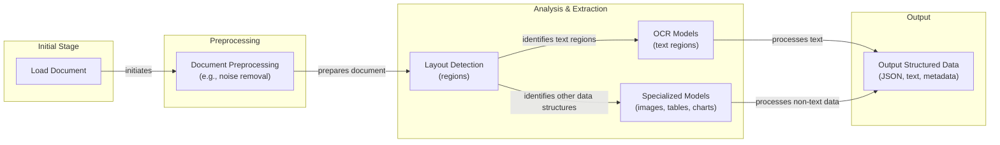
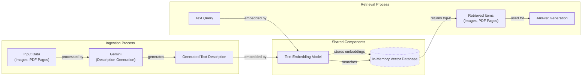
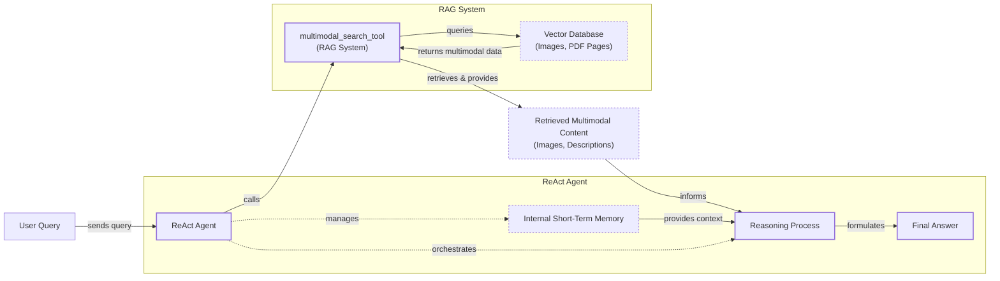

# Stop Converting Documents to Text. You're Doing It Wrong.

When we first started building AI agents, we hit a frustrating wall. We were comfortable manipulating text, but the moment we had to integrate multimodal data, such as images, audio, and especially documents like PDFs, our elegant architectures turned into messy hacks. We spent weeks building complex pipelines that tried to force everything into text. We chained OCR engines to scrape PDFs, layout detection models to identify tables, and separate classifiers to handle images. It was a brittle, slow, and expensive solution that broke every time a document layout changed.

The breakthrough came when we realized we were solving the wrong problem. We didn’t need to convert documents to text. We needed to treat them as images. Once we understood that every PDF page is effectively an image and that modern LLMs can “see” just as well as they can read, the complexity vanished. We could completely skip the OCR purgatory and focus on the three core inputs of an LLM: text, images, and audio.

This shift is essential because real-world AI applications rarely exist in a text-only vacuum. Enterprise applications mirror this reality. They need to manipulate private data from warehouses and lakes that is inherently multimodal: financial reports with complex charts, technical diagrams, building sketches, and audio logs [[1]](https://invisibletech.ai/blog/multimodal-enterprise-ai). The old approach of normalizing everything to text is lossy. When you translate a complex diagram or a chart into text, you lose the spatial relationships, the colors, and the context. You lose the information that matters most. By processing data in its native format, we preserve this rich visual information, resulting in systems that are faster, cheaper, and significantly more performant.

In this lesson, we will cover the foundations of multimodal LLMs, show you how to work with images and PDFs using the Gemini API, explain how to structure agent memory for mixed modalities, and walk through building a multimodal ReAct agent.

## Limitations of traditional document processing

To cement the problem, we will dig deeper into the limitations of traditional document processing, such as processing invoices, documentation, or reports using AI systems. The problem can be translated to other data types such as images or audio. The core idea is that previous approaches tried to normalize everything to text before passing it into an AI model, which has many flaws, as we lose a substantial amount of information during translation. For example, when encountering diagrams, charts, or sketches in a document, it is impossible to fully reproduce them in text.

The traditional document processing workflow relies on a multi-step pipeline to extract and structure information. This process typically begins by loading a document, followed by preprocessing steps like noise removal and image enhancement. A layout detection model then identifies different regions within the document, such as text blocks, tables, and images. Specialized models are then applied to each region: OCR models process the text, while other models handle tables or charts. Finally, the extracted data is structured into a format like JSON [[2]](https://blog.roboflow.com/what-is-optical-character-recognition-ocr/), [[3]](https://www.daft.ai/blog/end-to-end-distributed-pdf-processing-pipeline), [[4]](https://parseur.com/blog/document-processing-automation-guide).


Image 1: A flowchart illustrating the traditional document processing workflow.

This workflow has too many moving pieces. The reliance on separate models for layout detection, OCR, and different data structures makes the system rigid and fragile. If a document contains a new type of chart or an unexpected layout, the entire pipeline can fail. This complexity also makes the system slow and costly, as it requires chaining multiple model calls and maintaining each component individually [[5]](https://netfira.com/why-ocr-technology-fails-on-real-world-documents-and-how-intelligent-document-processing-can-help/), [[6]](https://learn.microsoft.com/en-us/answers/questions/5668164/why-traditional-ocr-fails-for-complex-business-doc?page=1).

Most importantly, this approach faces significant performance challenges. The multi-step nature creates a cascade effect where errors from one stage compound in the next. Even advanced OCR engines struggle with real-world documents that contain handwritten text, poor-quality scans, stylized fonts, or complex layouts like nested tables and multi-column formats [[7]](https://www.llamaindex.ai/blog/ocr-accuracy), [[8]](https://conexiom.com/blog/the-6-biggest-ocr-problems-and-how-to-overcome-them). On complex documents, accuracy for traditional OCR can top out at 88–94%, and some studies show that even with the best scanners, accuracy may only reach 60% [[7]](https://www.llamaindex.ai/blog/ocr-accuracy), [[9]](https://jiffy.ai/overcoming-ocr-errors-and-limitations-with-intelligent-document-processing/). Image quality is a major factor; scans below 300 DPI can cause accuracy to drop by over 20%, and a simple 5-degree tilt can increase word error rates by 15% or more [[7]](https://www.llamaindex.ai/blog/ocr-accuracy).
Image 2: A building sketch showing a crawl space vent diagram, illustrating the complexity of layouts that classic OCR systems struggle to interpret. (Source [Vectorize.io](https://vectorize.io/blog/multimodal-rag-patterns))

This might work for highly specialized applications, but it has too many problems and does not scale for a world of AI agents that need to be flexible and fast. That is why modern AI solutions use multimodal LLMs, such as Gemini, that can directly interpret text, images, or even PDFs as native input, completely bypassing the complex OCR workflow.

Thus, let's understand how multimodal LLMs work.

## Foundations of Multimodal LLMs

Before we show you the code for using LLMs with images and documents, you need to understand how multimodal LLMs work. We will not cover every detail, as that is the job of an AI researcher. But as an AI engineer, you need an intuition of how they work to use, deploy, optimize, and monitor them.

There are two common approaches to building multimodal LLMs: the Unified Embedding Decoder Architecture and the Cross-modality Attention Architecture [[10]](https://magazine.sebastianraschka.com/p/understanding-multimodal-llms).
Image 3: The two main approaches to developing multimodal LLM architectures. (Source [Understanding Multimodal LLMs [[10]](https://magazine.sebastianraschka.com/p/understanding-multimodal-llms)])

### Unified Embedding Decoder Architecture

In this approach, we encode the text and image separately, concatenate their embeddings into a single vector, and pass the resulting vector to the LLM. This architecture uses a single decoder, similar to a standard LLM like Llama 3.2. Images are converted into tokens with the same embedding size as the text tokens, allowing the LLM to process a combined sequence of text and image inputs [[10]](https://magazine.sebastianraschka.com/p/understanding-multimodal-llms). Thus, on top of a standard LLM architecture, you need a vision encoder that maps the image to an embedding that is within the same vector space as the text. When the text and image embeddings are merged, the LLM can make sense of both.
Image 4: Illustration of the unified embedding decoder architecture. (Source [Understanding Multimodal LLMs [[10]](https://magazine.sebastianraschka.com/p/understanding-multimodal-llms)])

### Cross-modality Attention Architecture

In the second approach, instead of passing the image embeddings along with the text embeddings at the input, we inject them directly into the attention module. This method uses a cross-attention mechanism to integrate image and text embeddings within the attention layers of the model. We still need an image encoder that projects the image into the same vector space as the text, but we inject it deeper within the architecture [[10]](https://magazine.sebastianraschka.com/p/understanding-multimodal-llms). This is related to the original Transformer architecture from the "Attention Is All You Need" paper, where an encoder's output is fed into the decoder's cross-attention layers [[11]](https://arxiv.org/abs/1706.03762).
Image 5: An illustration of the Cross-Modality Attention Architecture approach. (Source [Understanding Multimodal LLMs [[10]](https://magazine.sebastianraschka.com/p/understanding-multimodal-llms)])

### Image Encoders

Both architectures rely on image encoders. To understand them, we can draw a parallel between text tokenization and image patching. Just as we split text into sub-word tokens, we split images into smaller, fixed-size patches. These patches are then encoded by a pretrained vision transformer (ViT), which processes them to generate embeddings [[10]](https://magazine.sebastianraschka.com/p/understanding-multimodal-llms).
Image 6: Image tokenization and embedding (left) and text tokenization and embedding (right) side by side. (Source [Understanding Multimodal LLMs [[10]](https://magazine.sebastianraschka.com/p/understanding-multimodal-llms)])

The output has the same structure and dimensions as text embeddings. However, they need to be aligned in the vector space. We do this through a linear projection module, often called a projector or adapter, which is typically a simple linear layer or a small multi-layer perceptron. This module projects the image encoder's output into a dimension that matches the text token embeddings [[10]](https://magazine.sebastianraschka.com/p/understanding-multimodal-llms). Popular image encoder models include CLIP, OpenCLIP, and SigLIP [[12]](https://towardsdatascience.com/multimodal-embeddings-an-introduction-5dc36975966f/).

Importantly, these encoders are also used in Multimodal RAG. They allow us to find semantic similarities between images and text by placing them in a shared vector space where similar concepts are located close together [[13]](https://opensearch.org/blog/multimodal-semantic-search/), [[14]](https://towardsdatascience.com/multimodal-ai-search-for-business-applications-65356d011009/). This allows you to run similarity metrics between different modalities as long as you have an encoder that maps the data into the same vector space.
Image 7: Toy representation of multimodal embedding space. (Source [Multimodal Embeddings: An Introduction [[12]](https://towardsdatascience.com/multimodal-embeddings-an-introduction-5dc36975966f/)])

This concept can be expanded to other modalities, such as PDFs, audio, or video, by integrating specialized encoders for each data type. For example, a video can be processed using a Video Transformer, and audio can be handled by models like Whisper. Cross-attention layers then fuse the information from these different encoders, allowing the LLM to reason across all modalities in a unified manner [[15]](https://sparkco.ai/blog/exploring-multimodal-llms-text-image-and-video-integration), [[16]](https://www.emergentmind.com/topics/multimodal-llms).

### Trade-offs and Modern Landscape

The **Unified Embedding Decoder** approach is simpler to implement and generally yields higher accuracy in OCR-related tasks. The **Cross-modality Attention** approach is more computationally efficient for high-resolution images because we do not have to pass all the tokens as input but inject them directly into the attention mechanism. Hybrid approaches exist to combine the benefits of both methods [[17]](https://magazine.sebastianraschka.com/p/understanding-multimodal-llms), [[18]](https://arxiv.org/abs/2409.11402).

In 2025, most leading LLMs are multimodal. Open-source examples include Llama, Gemma, and Qwen. Closed-source examples include GPT, Gemini, and Claude [[19]](https://medium.com/data-science-in-your-pocket/2025-the-year-ai-reasoning-models-took-over-a-month-by-month-review-of-frontier-breakthroughs-6ea2163f854f), [[20]](https://codedesign.ai/blog/the-ultimate-guide-to-the-top-large-language-models-in-2025/).

A quick note on **Multimodal LLMs vs. Diffusion Models**: Diffusion models like Midjourney generate images from noise. Multimodal LLMs like GPT understand images and are architecturally different. In an agent workflow, diffusion models are typically used as tools, not as the reasoning model [[21]](https://arxiv.org/html/2409.14993v3).

Innovations in multimodal LLM architectures happen often. This section's scope was not to be exhaustive but to give you an intuition on how they work and why they are superior to older multi-step OCR approaches.

Now that we understand how LLMs can directly input images or documents, let’s see how this works in practice.

## Applying multimodal LLMs to images and PDFs

To better understand how multimodal LLMs work, let’s write a few examples using Gemini to show you some best practices when working with images and PDFs.

There are three core ways to process multimodal data with LLMs:

1.  **Raw bytes:** The easiest way to work with LLMs. This method works well for one-off API calls. However, when storing the data in a database, it can easily get corrupted as most databases are optimized for text and may misinterpret the byte stream.
2.  **Base64:** This method encodes raw bytes as strings, which prevents data corruption when storing images or documents in a standard database like PostgreSQL or MongoDB. It is a reliable way to handle binary data in text-based systems, though it increases the file size by approximately 33%.
3.  **URLs:** This is the standard for enterprise scenarios. Data is stored in a data lake like AWS S3 or GCP Cloud Storage, and the URL is passed to the LLM. The model can then download the media directly from the bucket. This approach is highly efficient for large-scale applications as it minimizes network latency by avoiding the need to pass large files through your application server.

```mermaid
graph TD
    subgraph "Base64 + Database"
        direction LR
        App1[Application] --> DB1{Database<br/>(Stores Base64 String)}
        DB1 --> App2[Application]
        App2 --> LLM1((LLM))
    end

    subgraph "URL + Data Lake"
        direction LR
        App3[Application] --> DL1{Data Lake<br/>(Stores File, Returns URL)}
        DL1 --> App4[Application]
        App4 --> LLM2((LLM))
        LLM2 -.-> DL1
    end
```
Image 8: A diagram comparing data flow for Base64 with a database versus URLs with a data lake.

Now, let’s dig into the code.

1.  First, we set up our client and display a sample image.
    ```python
    from google import genai
    from google.genai import types
    from PIL import Image as PILImage
    from IPython.display import Image as IPythonImage
    import io
    from pathlib import Path
    from typing import Literal
    
    client = genai.Client()
    MODEL_ID = "gemini-2.5-flash"
    
    def display_image(image_path: Path) -> None:
        image = IPythonImage(filename=image_path, width=400)
        display(image)

    display_image(Path("images") / "image_1.jpeg")
    ```
    It outputs:
    
    
    
2.  We load the image as **raw bytes**. We use `WEBP` format because it is efficient.
    ```python
    def load_image_as_bytes(
        image_path: Path, format: Literal["WEBP", "JPEG", "PNG"] = "WEBP", max_width: int = 600, return_size: bool = False
    ) -> bytes | tuple[bytes, tuple[int, int]]:
        image = PILImage.open(image_path)
        if image.width > max_width:
            ratio = max_width / image.width
            new_size = (max_width, int(image.height * ratio))
            image = image.resize(new_size)
        byte_stream = io.BytesIO()
        image.save(byte_stream, format=format)
        if return_size:
            return byte_stream.getvalue(), image.size
        return byte_stream.getvalue()

    image_bytes = load_image_as_bytes(image_path=Path("images") / "image_1.jpeg", format="WEBP")
    ```
    The raw bytes look like this:
    ```text
    Bytes `b'RIFF\xad\x00\x00WEBPVP8 T\xad\x00\x00P\xec\x02\x9d\x01*X\x02X\x02'...`
    Size: 44392 bytes
    ```
    We can call the LLM to generate a caption for an image or compare two images.
    ```python
    # Single image captioning
    response = client.models.generate_content(
        model=MODEL_ID,
        contents=[
            types.Part.from_bytes(data=image_bytes, mime_type="image/webp"),
            "Tell me what is in this image in one paragraph.",
        ],
    )
    print(f"Caption: {response.text}")
    
    # Comparing multiple images
    image_bytes_2 = load_image_as_bytes(Path("images") / "image_2.jpeg", format="WEBP")
    response = client.models.generate_content(
        model=MODEL_ID,
        contents=[
            types.Part.from_bytes(data=image_bytes, mime_type="image/webp"),
            types.Part.from_bytes(data=image_bytes_2, mime_type="image/webp"),
            "What's the difference between these two images?",
        ],
    )
    print(f"Difference: {response.text}")
    ```
    It outputs:
    ```text
    Caption: This striking image features a massive, dark metallic robot...
    
    Difference: The primary difference between the two images lies in the nature of the interaction...
    ```

3.  We can also process the image as a **Base64 encoded string**.
    ```python
    import base64
    from typing import cast

    def load_image_as_base64(
        image_path: Path, format: Literal["WEBP", "JPEG", "PNG"] = "WEBP", max_width: int = 600, return_size: bool = False
    ) -> str:
        image_bytes_val = load_image_as_bytes(image_path=image_path, format=format, max_width=max_width, return_size=False)
        return base64.b64encode(cast(bytes, image_bytes_val)).decode("utf-8")
    
    image_base64 = load_image_as_base64(image_path=Path("images") / "image_1.jpeg", format="WEBP")
    ```
    The Base64 string is about 33% larger than the raw bytes.
    ```text
    Base64: UklGRmCtAABXRUJQVlA4IFStAABQ7AKdASpYAlgCPm0ylEekIqInJnQ7gOANiWdtk7FnEo2gDknjPixW9SNSb5P7IbBNhLn87Vtp...`
    Size: 59192 characters
    
    Image as Base64 is 33.34% larger than as bytes
    ```

4.  For **public URLs**, Gemini works with its `url_context` tool.
    ```python
    response = client.models.generate_content(
        model=MODEL_ID,
        contents="Based on the provided paper as a PDF, tell me how ReAct works: https://arxiv.org/pdf/2210.03629",
        config=types.GenerateContentConfig(tools=[{"url_context": {}}]),
    )
    ```
    It outputs:
    ```text
    ReAct is a novel paradigm for large language models (LLMs) that combines reasoning (Thought) and acting (Action) in an interleaved manner to solve diverse language and decision-making tasks...
    ```

5.  For **private URLs**, like those from a data lake, Gemini integrates well with GCS Buckets.
    ```python
    # Mocked example
    response = client.models.generate_content(
        model=MODEL_ID,
        contents=[
            types.Part.from_uri(uri="gs://gemini-images/image_1.jpeg", mime_type="image/webp"),
            "Tell me what is in this image in one paragraph.",
        ],
    )
    ```

6.  Let’s try a more complex task: **Object Detection**. We use Pydantic to define the output structure.
    ```python
    from pydantic import BaseModel
    
    class BoundingBox(BaseModel):
        ymin: float
        xmin: float
        ymax: float
        xmax: float
        label: str
    
    class Detections(BaseModel):
        bounding_boxes: list[BoundingBox]
    
    prompt = "Detect all prominent items. Return 2d boxes normalized to 0-1000."
    
    response = client.models.generate_content(
        model=MODEL_ID,
        contents=[types.Part.from_bytes(data=image_bytes, mime_type="image/webp"), prompt],
        config=types.GenerateContentConfig(
            response_mime_type="application/json",
            response_schema=Detections
        ),
    )
    ```
    It outputs:
    ```text
    bounding_boxes=[BoundingBox(ymin=269.0, xmin=39.0, ymax=782.0, xmax=530.0, label='kitten'), BoundingBox(ymin=1.0, xmin=450.0, ymax=997.0, xmax=1000.0, label='robot')]
    ```
    
    Image 9: Object detection results for the kitten and robot image.

7.  Now, let’s process **PDFs**. Because we use a multimodal model, the process is identical to images. We load the PDF as bytes and pass it to the model.
    ```python
    pdf_bytes = (Path("pdfs") / "attention_is_all_you_need_paper.pdf").read_bytes()
    
    response = client.models.generate_content(
        model=MODEL_ID,
        contents=[
            types.Part.from_bytes(data=pdf_bytes, mime_type="application/pdf"),
            "What is this document about? Provide a brief summary.",
        ],
    )
    ```
    It outputs:
    ```text
    This document introduces the Transformer, a novel neural network architecture for sequence transduction...
    ```

8.  We can also process PDFs as **Base64 encoded strings**.
    ```python
    def load_pdf_as_base64(pdf_path: Path) -> str:
        with open(pdf_path, "rb") as f:
            return base64.b64encode(f.read()).decode("utf-8")

    pdf_base64 = load_pdf_as_base64(pdf_path=Path("pdfs") / "attention_is_all_you_need_paper.pdf")
    
    response = client.models.generate_content(
        model=MODEL_ID,
        contents=[
            "What is this document about? Provide a brief summary of the main topics.",
            types.Part.from_bytes(data=pdf_base64, mime_type="application/pdf"),
        ],
    )
    ```

9.  Finally, we can perform **Object Detection on PDF pages**. This is powerful for extracting diagrams or tables. We treat the PDF page as an image.
    ```python
    page_image_bytes, _ = load_image_as_bytes(
        image_path=Path("images") / "attention_is_all_you_need_1.jpeg", format="WEBP", return_size=True
    )
    
    prompt = "Detect all the diagrams from the provided image as 2d bounding boxes."
    
    response = client.models.generate_content(
        model=MODEL_ID,
        contents=[types.Part.from_bytes(data=page_image_bytes, mime_type="image/webp"), prompt],
        config=types.GenerateContentConfig(
            response_mime_type="application/json",
            response_schema=Detections
        ),
    )
    ```
    
    Image 10: Object detection identifying a diagram on a page from the "Attention Is All You Need" paper.

Processing PDFs as images is a concept popularized by the ColPali paper, which demonstrated that modern Vision Language Models can retrieve documents more effectively by “looking” at them rather than extracting text [[22]](https://arxiv.org/pdf/2407.01449v6).

## Foundations of Multimodal RAG

One of the most common use cases when working with multimodal data is a concept we already explored in Lesson 10: RAG. When building custom AI apps, you will always have to retrieve private company data to feed into your LLM. When working with larger data formats, such as images or PDFs, RAG becomes even more important. Stuffing 1,000+ PDF pages into your LLM to get a simple answer is unfeasible due to increased latency, costs, and decreased performance.

A generic multimodal RAG architecture involves an ingestion pipeline where images are embedded and stored in a vector database. During retrieval, a user's text query is embedded using the same model, and a similarity search is performed to find the most relevant images. This same technique works for any combination of modalities as long as the embeddings share the same vector space.

```mermaid
flowchart LR
  %% Define node classes for visual differentiation
  classDef source
  classDef process
  classDef storage
  classDef output

  %% External Sources
  subgraph Sources["External Sources"]
    A["Images"]
    D["User Text Query"]
  end

  %% Shared Multimodal Components
  subgraph Shared["Shared Multimodal Components"]
    B["Text-Image Embedding Model<br/>(Generates Multimodal Embeddings)"]
    C["Vector Database<br/>(Vector Index for Images)"]
  end

  %% Output
  subgraph Output["Retrieval Output"]
    G["Top-k Most Similar Images"]
  end

  %% Ingestion Pipeline
  subgraph Ingestion["Ingestion Pipeline"]
    A -- "embed" --> B
    B -- "load image embeddings" --> C
  end

  %% Retrieval Pipeline
  subgraph Retrieval["Retrieval Pipeline"]
    D -- "embed" --> B
    B -- "query embedding" --> C
    C -- "retrieve top-k (cosine similarity)" --> G
  end

  %% Highlight multimodal aspect
  note right of B: Works for various combinations of modalities<br/>(text, image, document, audio vectors)<br/>within the same vector space.

  %% Apply classes
  class A,D source
  class B process
  class C storage
  class G output
```
Image 11: A diagram illustrating the ingestion and retrieval pipelines of a generic multimodal RAG system.

For our enterprise use case of RAG on documents, as of 2025, the most popular architecture is called ColPali. Its main innovation is bypassing the entire OCR pipeline that typically involves text extraction, layout detection, and chunking. Instead, ColPali processes document pages directly as images, using vision-language models to understand textual and visual content simultaneously. This makes it highly effective for documents with tables, figures, and complex visual layouts where spatial information is key [[22]](https://arxiv.org/pdf/2407.01449v6).

The architecture's power comes from how it represents documents. Instead of chunking extracted text, ColPali treats each page as an image, divides it into a grid of 1,024 patches, and generates a 128-dimensional vector for each using a vision model like PaliGemma with a SigLIP encoder. This results in a "bag-of-embeddings" for the page. At query time, it uses a late interaction mechanism called MaxSim. This function computes the dot product between every query token vector and every page patch vector, finds the maximum similarity for each query token, and then sums these maximums. This fine-grained comparison allows the model to match specific phrases to specific visual regions [[23]](https://blog.vespa.ai/scaling-colpali-to-billions/).
Image 12: The ColPali architecture simplifies document retrieval by using a VLM to process page images directly. (Source [ColPali: Efficient Document Retrieval with Vision Language Models [[22]](https://arxiv.org/pdf/2407.01449v6)])

However, this approach introduces trade-offs when scaling to millions of documents. While ColPali’s offline indexing is much faster than traditional OCR, its online query latency can be higher than standard text-embedding models [[24]](https://learnopencv.com/multimodal-rag-with-colpali/). More importantly, representing each page with over 1,000 vectors creates a massive memory footprint, making brute-force search computationally expensive at scale [[25]](https://qdrant.tech/blog/colpali-qdrant-optimization/).

To address these scaling issues, production systems employ optimization techniques. One common strategy is to replace the expensive floating-point dot product in MaxSim with a much faster hamming distance computation on binary quantized vectors. This can make scoring over 3.5 times faster and reduce storage by 32x with only a minor drop in accuracy [[23]](https://blog.vespa.ai/scaling-colpali-to-billions/). For retrieval, a multi-stage process is used. Instead of a brute-force search across all pages, an efficient first-stage retrieval uses an approximate nearest neighbor (ANN) index to find a set of candidate pages for each query token. The union of these candidates is then passed to the second stage, where the more computationally intensive MaxSim function re-ranks this smaller set to produce the final results. This phased approach avoids transferring large amounts of vector data over the network and keeps query latency manageable [[23]](https://blog.vespa.ai/scaling-colpali-to-billions/).

## Implementing Multimodal RAG for Images, PDFs and Text

Let's build a simple multimodal RAG system that populates an in-memory vector database with images and PDF pages, then queries it with text. To keep it simple, we will mock the vector database with a list and use Gemini to generate text descriptions for our images, which we will then embed. In a production system, you would use a multimodal embedding model to embed the images directly.


Image 13: A diagram illustrating the architecture of our multimodal RAG example.

Here is how we implement this system.

1.  First, we display the images that we will embed and load into our mocked vector index.
    ```python
    import matplotlib.pyplot as plt

    def display_image_grid(image_paths: list[Path], rows: int = 2, cols: int = 2, figsize: tuple = (8, 6)):
        # ... implementation from notebook ...
        fig, axes = plt.subplots(rows, cols, figsize=figsize)
        axes = axes.ravel()
        for idx, img_path in enumerate(image_paths[: rows * cols]):
            img = PILImage.open(img_path)
            axes[idx].imshow(img)
            axes[idx].axis("off")
        plt.tight_layout()
        plt.show()

    display_image_grid(
        image_paths=[
            Path("images") / "image_1.jpeg",
            Path("images") / "image_2.jpeg",
            Path("images") / "image_3.jpeg",
            Path("images") / "image_4.jpeg",
            Path("images") / "attention_is_all_you_need_1.jpeg",
            Path("images") / "attention_is_all_you_need_2.jpeg",
        ],
        rows=2,
        cols=3,
    )
    ```
    It outputs:
    
    
    
2.  Next, we define functions to generate image descriptions and create text embeddings using Gemini.
    ```python
    import numpy as np
    
    def generate_image_description(image_bytes: bytes) -> str:
        prompt = """
        Describe this image in detail for semantic search purposes. 
        Include objects, scenery, colors, composition, text, and any other visual elements that would help someone find 
        this image through text queries.
        """
        response = client.models.generate_content(
            model=MODEL_ID,
            contents=[prompt, PILImage.open(io.BytesIO(image_bytes))],
        )
        return response.text.strip()
    
    def embed_text_with_gemini(content: str) -> np.ndarray | None:
        result = client.models.embed_content(
            model="gemini-embedding-001",
            contents=[content],
        )
        if not result or not result.embeddings:
            return None
        return np.array(result.embeddings[0].values)
    ```

3.  Now, we create our vector index. This function loads images, generates a description for each, embeds the description, and stores everything in a list. The Gemini Dev API does not support image embeddings directly. To keep this example simple, we generate a text description and embed that. However, this is not recommended in production. With a proper multimodal embedding model like Voyage or Cohere, you would embed the image bytes directly. The rest of the RAG system would remain conceptually the same.
    ```python
    # Mocked code for direct image embedding
    # image_bytes = ...
    # SKIPPED! image_description = generate_image_description(image_bytes)
    # image_embedding = embed_with_multimodal_model(image_bytes)
    
    def create_vector_index(image_paths: list[Path]) -> list[dict]:
        vector_index = []
        for image_path in image_paths:
            image_bytes = cast(bytes, load_image_as_bytes(image_path, format="WEBP", return_size=False))
            image_description = generate_image_description(image_bytes)
            image_embedding = embed_text_with_gemini(image_description)
            vector_index.append({
                "content": image_bytes, "type": "image", "filename": image_path,
                "description": image_description, "embedding": image_embedding,
            })
        return vector_index
    
    image_paths = list(Path("images").glob("*.jpeg"))
    vector_index = create_vector_index(image_paths)
    ```

4.  We define a search function that takes a text query, embeds it, and finds the top-k most similar items from our index using cosine similarity.
    ```python
    from sklearn.metrics.pairwise import cosine_similarity
    
    def search_multimodal(query_text: str, vector_index: list[dict], top_k: int = 3) -> list:
        query_embedding = embed_text_with_gemini(query_text)
        if query_embedding is None:
            return []
        
        embeddings = [doc["embedding"] for doc in vector_index]
        similarities = cosine_similarity([query_embedding], embeddings).flatten()
        
        top_indices = np.argsort(similarities)[::-1][:top_k]
        
        results = []
        for idx in top_indices.tolist():
            results.append({**vector_index[idx], "similarity": similarities[idx]})
        
        return results
    ```

5.  Let's test it with a query about the Transformer architecture.
    ```python
    query = "what is the architecture of the transformer neural network?"
    results = search_multimodal(query, vector_index, top_k=1)
    ```
    The system correctly retrieves the page from the "Attention Is All You Need" paper with the architecture diagram.
    
    
    Image 14: The retrieved PDF page showing the Transformer model architecture.

6.  Another example, searching for "a kitten with a robot".
    ```python
    query = "a kitten with a robot"
    results = search_multimodal(query, vector_index, top_k=1)
    ```
    It successfully finds the image of the kitten and the robot.
    
    
    Image 15: The retrieved image of a kitten with a robot.

## Building Multimodal AI Agents

Now, let's integrate our RAG functionality into a ReAct agent as a tool. This combines our multimodal retrieval with the agent's reasoning capabilities. Multimodal capabilities can be added to agents by enabling multimodal inputs/outputs, leveraging multimodal retrieval tools, or using tools that interact with external multimodal resources like company PDFs or screenshots. This concept extends beyond static images and documents. The next frontier for agentic workflows is incorporating time-based media like audio and video. This involves preprocessing pipelines that transcribe audio, use vision models to generate descriptions of video frames, and then embed this information for retrieval [[26]](https://www.ragie.ai/blog/how-we-built-multimodal-rag-for-audio-and-video). An agent could then, for example, search for a specific event in a meeting recording or find a visual segment in a product demo video where a particular feature is shown [[26]](https://www.ragie.ai/blog/how-we-built-multimodal-rag-for-audio-and-video), [[27]](https://mixpeek.com/curated-lists/best-multimodal-rag-frameworks).

Our agent will use the `search_multimodal` function to find relevant images based on a text query generated during its reasoning process. We will build it using LangGraph's `create_react_agent`.


Image 16: A diagram illustrating the architecture of a multimodal ReAct agent integrated with RAG functionality.

Here is how we implement the agent.

1.  First, we wrap our `search_multimodal` function in a tool decorator. The tool returns the retrieved image and its description, which the agent can then use in its reasoning process.
    ```python
    from langchain_core.tools import tool
    from typing import Any
    
    @tool
    def multimodal_search_tool(query: str) -> dict[str, Any]:
        """
        Search through a collection of images and their text descriptions to find relevant content.
        """
        results = search_multimodal(query, vector_index, top_k=1)
        if not results:
            return {"role": "tool_result", "content": "No relevant content found for your query."}
        
        result = results[0]
        content = [
            {"type": "text", "text": f"Image description: {result['description']}"},
            types.Part.from_bytes(data=result["content"], mime_type="image/jpeg"),
        ]
        return {"role": "tool_result", "content": content}
    ```

2.  Next, we create the ReAct agent using LangGraph, providing it with our new tool and a system prompt that guides its behavior. We will explore LangGraph in more detail in Part 2 of the course.
    ```python
    from langgraph.prebuilt import create_react_agent
    from langchain_google_genai import ChatGoogleGenerativeAI
    
    def build_react_agent() -> Any:
        tools = [multimodal_search_tool]
        system_prompt = """You are a helpful AI assistant that can search through images and text to answer questions.
        When asked about visual content like animals, objects, or scenes:
        1. Use the multimodal_search_tool to find relevant images and descriptions
        2. Carefully analyze the image or image descriptions from the search results
        3. Provide a clear, direct answer based on the search results.
        """
        agent = create_react_agent(
            model=ChatGoogleGenerativeAI(model="gemini-2.5-pro", temperature=0.1),
            tools=tools,
            prompt=system_prompt,
        )
        return agent
    
    react_agent = build_react_agent()
    ```

3.  Finally, we test the agent by asking it to find the color of our kitten.
    ```python
    test_question = "what color is my kitten?"
    response = react_agent.invoke(input={"messages": test_question})
    ```
    The agent follows the ReAct pattern: it first reasons that it needs to find an image of "my kitten" and decides to call the `multimodal_search_tool`. The tool executes the search, retrieves the relevant image and its description, and returns this multimodal content to the agent. The agent then analyzes this new information in its context window and generates the final answer.
    
    It outputs:
    ```text
    Based on the image, your kitten is a gray tabby. It has soft, short gray fur with darker tabby stripe patterns.
    ```

## Conclusion

Working with multimodal data is a fundamental skill for AI engineers. Modern AI applications rarely exist in a text-only vacuum. They interact with the complex, visual, and auditory reality of the world. In this lesson, we moved away from the unstable, multi-step OCR pipelines of the past. We learned that modern LLMs can natively process images and documents, preserving rich context that was previously lost. We explored how to handle data as bytes, Base64, and URLs, and how to build agents that can reason across these modalities.

This concludes our *AI Agents Foundations* series. We started by understanding the difference between workflows and agents, mastered context engineering and structured outputs, built robust planning capabilities with ReAct, and finally gave our agents eyes and ears. You now have the foundational blocks to build production-ready AI systems. In Part 2 of the course, we will apply these skills to build a complete, interconnected research and writing agent system using LangGraph, moving from theory to a full-scale project.

## References

- [1] Multimodal Enterprise AI. (n.d.). https://invisibletech.ai/blog/multimodal-enterprise-ai
- [2] What Is Optical Character Recognition (OCR)?. (2023). https://blog.roboflow.com/what-is-optical-character-recognition-ocr/
- [3] An End-to-End, Distributed, and Fault-Tolerant PDF Processing Pipeline for LLM Applications. (n.d.). https://www.daft.ai/blog/end-to-end-distributed-pdf-processing-pipeline
- [4] Document Processing Automation: The Definitive Guide. (n.d.). https://parseur.com/blog/document-processing-automation-guide
- [5] Why OCR Technology Fails on Real-World Documents and How Intelligent Document Processing Can Help. (n.d.). https://netfira.com/why-ocr-technology-fails-on-real-world-documents-and-how-intelligent-document-processing-can-help/
- [6] Why Traditional OCR Fails for Complex Business Documents?. (n.d.). https://learn.microsoft.com/en-us/answers/questions/5668164/why-traditional-ocr-fails-for-complex-business-doc?page=1
- [7] OCR Accuracy Explained: How to Improve It. (n.d.). https://www.llamaindex.ai/blog/ocr-accuracy
- [8] The 6 Biggest OCR Problems (and How to Overcome Them). (n.d.). https://conexiom.com/blog/the-6-biggest-ocr-problems-and-how-to-overcome-them
- [9] Overcoming OCR Errors and Limitations with Intelligent Document Processing. (n.d.). https://jiffy.ai/overcoming-ocr-errors-and-limitations-with-intelligent-document-processing/
- [10] Understanding Multimodal LLMs. (2024). https://magazine.sebastianraschka.com/p/understanding-multimodal-llms
- [11] Attention Is All You Need. (2017). https://arxiv.org/abs/1706.03762
- [12] Multimodal Embeddings: An Introduction. (2024). https://towardsdatascience.com/multimodal-embeddings-an-introduction-5dc36975966f/
- [13] Multimodal semantic search with OpenSearch. (n.d.). https://opensearch.org/blog/multimodal-semantic-search/
- [14] Multimodal AI Search for Business Applications. (2024). https://towardsdatascience.com/multimodal-ai-search-for-business-applications-65356d011009/
- [15] Exploring Multimodal LLMs: Text, Image, and Video Integration. (n.d.). https://sparkco.ai/blog/exploring-multimodal-llms-text-image-and-video-integration
- [16] Multimodal LLMs. (n.d.). https://www.emergentmind.com/topics/multimodal-llms
- [17] NVLM: Open Frontier-Class Multimodal LLMs. (2024). https://arxiv.org/abs/2409.11402
- [18] NVLM: Open Frontier-Class Multimodal LLMs. (2024). https://arxiv.org/abs/2409.11402
- [19] 2025: The Year AI Reasoning Models Took Over. (2025). https://medium.com/data-science-in-your-pocket/2025-the-year-ai-reasoning-models-took-over-a-month-by-month-review-of-frontier-breakthroughs-6ea2163f854f
- [20] The Ultimate Guide to the Top Large Language Models in 2025. (n.d.). https://codedesign.ai/blog/the-ultimate-guide-to-the-top-large-language-models-in-2025/
- [21] Multi-modal Generative AI: Multi-modal LLMs, Diffusions, and the Unification. (2025). https://arxiv.org/html/2409.14993v3
- [22] ColPali: Efficient Document Retrieval with Vision Language Models. (2024). https://arxiv.org/pdf/2407.01449v6
- [23] Scaling ColPali to billions of PDFs with Vespa. (2024). https://blog.vespa.ai/scaling-colpali-to-billions/
- [24] Multimodal RAG with ColPali. (n.d.). https://learnopencv.com/multimodal-rag-with-colpali/
- [25] How we made ColPali 13x faster. (n.d.). https://qdrant.tech/blog/colpali-qdrant-optimization/
- [26] How We Built Multimodal RAG for Audio and Video. (n.d.). https://www.ragie.ai/blog/how-we-built-multimodal-rag-for-audio-and-video
- [27] Best Multimodal RAG Frameworks in 2026. (n.d.). https://mixpeek.com/curated-lists/best-multimodal-rag-frameworks
- [28] ChatGPT for Financial Analysis: Use Cases & Limitations. (n.d.). https://konfuzio.com/en/chatgpt-financial-analysis/
- [29] Medical Imaging White Paper NVIDIA and Lenovo. (2025). https://techtoday.lenovo.com/sites/default/files/2025-05/Medical%20Imaging%20White%20Paper%20NVIDIA%20and%20Lenovo.pdf
- [30] Multimodal RAG architecture. (2025). https://www.linkedin.com/posts/sayandey01_generativeai-llm-rag-activity-7412381316106760192-nFx3
- [31] Evaluating Multimodal vs. Text-Based Retrieval for RAG with Snowflake Cortex. (2025). https://www.snowflake.com/en/engineering-blog/arctic-agentic-rag-multimodal-pdf-retrieval/
- [32] Multimodal RAG template for PDFs. (n.d.). https://pathway.com/developers/templates/rag/multimodal-rag
- [33] MMCTAgent for multimodal reasoning. (2025). https://www.linkedin.com/posts/gauravagg_mmctagent-enables-multimodal-reasoning-over-activity-7413983881181339648--PyD
- [34] Multimodal RAG Explained: From Text to Images and Beyond. (n.d.). https://www.usaii.org/ai-insights/multimodal-rag-explained-from-text-to-images-and-beyond
- [35] LLMs on Anyscale. (n.d.). https://docs.anyscale.com/llm
- [36] Breakdown of 2025 Flagship LLM Architectures. (2025). https://www.linkedin.com/posts/progressivethinker_this-is-the-most-essential-breakdown-of-2025-activity-7376654335319117825-a5aD
- [37] A Comparative Analysis of Flagship Open-Weight Coding LLMs. (2025). https://www.preprints.org/manuscript/202508.1904
- [38] Ultimate 2025 AI Language Models Comparison. (n.d.). https://www.promptitude.io/post/ultimate-2025-ai-language-models-comparison-gpt5-gpt-4-claude-gemini-sonar-more
- [39] Enhancing LLM Capabilities: The Power of Multimodal LLMs and RAG. (n.d.). https://towardsai.net/p/l/enhancing-llm-capabilities-the-power-of-multimodal-llms-and-rag
- [40] A Comprehensive Review of Multimodal Large Language Models. (2024). https://arxiv.org/html/2411.06284v3
- [41] How to Choose the Best Embedding Model for RAG in 2026: 10 Models Benchmarked. (2026). https://milvus.io/blog/choose-embedding-model-rag-2026.md
- [42] The Best Multimodal Embedding Model for RAG on Visually Rich Documents. (n.d.). https://eagerworks.com/blog/best-embedding-model-for-rag
- [43] Top Embedding Models in 2025. (n.d.). https://artsmart.ai/blog/top-embedding-models-in-2025/
- [44] Multimodal AI Agents: The Future of AI. (n.d.). https://kanerika.com/blogs/multimodal-ai-agents/
- [45] Multimodal AI Use Cases. (n.d.). https://rasa.com/blog/multimodal-ai-use-cases
- [46] A Comprehensive Survey and Guide to Multimodal Large Language Models in Vision-Language Tasks. (n.d.). https://github.com/cognitivetech/llm-research-summaries/blob/main/models-review/A-Comprehensive-Survey-and-Guide-to-Multimodal-Large-Language-Models-in-Vision-Language-Tasks.md
- [47] Multimodal AI Examples: How It Works, Real-World Applications, and Future Trends. (n.d.). https://smartdev.com/multimodal-ai-examples-how-it-works-real-world-applications-and-future-trends/
- [48] What is a multimodal LLM?. (n.d.). https://www.ibm.com/think/topics/multimodal-llm
- [49] Multimodal Large Language Models in Radiology: A Narrative Review. (2025). https://pmc.ncbi.nlm.nih.gov/articles/PMC12479233/
- [50] Multimodal large language models in healthcare: a comprehensive review. (2025). https://www.nature.com/articles/s41598-025-98483-1
- [51] OCR for Tables. (n.d.). https://www.llamaindex.ai/blog/ocr-for-tables
- [52] AI PDF Data Extraction in Clinical Research: Beyond OCR. (n.d.). https://intuitionlabs.ai/articles/ai-pdf-data-extraction-clinical-research
- [53] Gemini consistently producing valid Pydantic responses. (n.d.). https://discuss.ai.google.dev/t/gemini-consistently-producing-valid-pydantic-responses/98992
- [54] Stop Converting Documents to Text. You're Doing It Wrong.. (2025). https://www.decodingai.com/p/stop-converting-documents-to-text
- [55] LLM Output Parsing: How to Get Structured Generation. (n.d.). https://tetrate.io/learn/ai/llm-output-parsing-structured-generation
- [56] Structured Outputs with Multimodal Gemini. (2024). https://python.useinstructor.com/blog/2024/10/23/structured-outputs-with-multimodal-gemini/
- [57] Steering Large Language Models with Pydantic. (n.d.). https://pydantic.dev/articles/llm-intro
- [58] Joint Visual-Textual Embedding for Multimodal Style Search. (n.d.). https://assets.amazon.science/89/bf/661d950d4059930c8f1d2e449ac6/joint-visual-textual-embedding-for-multimodal-style-search.pdf
- [59] Combine Image and Text: How Multimodal Retrieval Transforms Search. (n.d.). https://zilliz.com/blog/combine-image-and-text-how-multimodal-retrieval-transforms-search
- [60] Multimodal Sentence Transformers. (n.d.). https://huggingface.co/blog/multimodal-sentence-transformers
- [61] REAL-MM-RAG: A Real-World Multi-Modal RAG Benchmark for Visually-Rich Document Retrieval. (2025). https://arxiv.org/html/2502.12342v1
- [62] ViDoRe Benchmark V2: Raising the Bar for Visual Retrieval. (2025). https://huggingface.co/blog/manu/vidore-v2
- [63] Unstructured Leads in Document Parsing Quality - Benchmarks Tell the Full Story. (n.d.). https://unstructured.io/blog/unstructured-leads-in-document-parsing-quality-benchmarks-tell-the-full-story
- [64] A Unified Summarization Model for Text with Tables. (2023). https://www.ijcai.org/proceedings/2023/0581.pdf
- [65] The EPOCH of AI in Financial Services. (2025). https://arxiv.org/html/2503.22035v1
- [66] 10 real-world examples of AI in healthcare. (2022). https://www.philips.com/a-w/about/news/archive/features/2022/20221124-10-real-world-examples-of-ai-in-healthcare.html
- [67] ViDoRe Benchmark V2: Raising the Bar for Visual Retrieval. (2025). https://huggingface.co/blog/manu/vidore-v2
- [68] Multimodal RAG with ColPali. (n.d.). https://learnopencv.com/multimodal-rag-with-colpali/
- [69] How we made ColPali 13x faster. (n.d.). https://qdrant.tech/blog/colpali-qdrant-optimization/
- [70] Vision Language Models. (n.d.). https://www.nvidia.com/en-us/glossary/vision-language-models/
- [71] Multi-modal ML with OpenAI's CLIP. (n.d.). https://www.pinecone.io/learn/series/image-search/clip/
- [72] Image understanding with Gemini. (n.d.). https://ai.google.dev/gemini-api/docs/image-understanding
- [73] Google Generative AI Embeddings (AI Studio & Gemini API). (n.d.). https://python.langchain.com/docs/integrations/text_embedding/google_generative_ai/
- [74] LangGraph quickstart. (n.d.). https://langchain-ai.github.io/langgraph/agents/agents/
- [75] The 8 best AI image generators in 2025. (2026). https://zapier.com/blog/best-ai-image-generator/
- [76] What are some real-world applications of multimodal AI?. (n.d.). https://milvus.io/ai-quick-reference/what-are-some-realworld-applications-of-multimodal-ai
- [77] Multimodal RAG with Colpali, Milvus and VLMs. (2024). https://huggingface.co/blog/saumitras/colpali-milvus-multimodal-rag
- [78] Complex Document Recognition: OCR Doesn’t Work and Here’s How You Fix It. (2023). https://hackernoon.com/complex-document-recognition-ocr-doesnt-work-and-heres-how-you-fix-it
- [79] Why OCR Technology Fails on Real-World Documents and How Intelligent Document Processing Can Help. (n.d.). https://netfira.com/why-ocr-technology-fails-on-real-world-documents-and-how-intelligent-document-processing-can-help/
- [80] REAL-MM-RAG: A Real-World Multi-Modal RAG Benchmark for Visually-Rich Document Retrieval. (2025). https://arxiv.org/html/2502.12342v1
- [81] How We Built Multimodal RAG for Audio and Video. (n.d.). https://www.ragie.ai/blog/how-we-built-multimodal-rag-for-audio-and-video
- [82] Best Multimodal RAG Frameworks in 2026. (n.d.). https://mixpeek.com/curated-lists/best-multimodal-rag-frameworks
- [83] A Comprehensive Survey and Guide to Multimodal Large Language Models in Vision-Language Tasks. (n.d.). https://github.com/cognitivetech/llm-research-summaries/blob/main/models-review/A-Comprehensive-Survey-and-Guide-to-Multimodal-Large-Language-Models-in-Vision-Language-Tasks.md
- [84] Multimodal AI Examples: How It Works, Real-World Applications, and Future Trends. (n.d.). https://smartdev.com/multimodal-ai-examples-how-it-works-real-world-applications-and-future-trends/
- [85] What is a multimodal LLM?. (n.d.). https://www.ibm.com/think/topics/multimodal-llm
- [86] Multimodal Large Language Models in Radiology: A Narrative Review. (2025). https://pmc.ncbi.nlm.nih.gov/articles/PMC12479233/
- [87] Multimodal large language models in healthcare: a comprehensive review. (2025). https://www.nature.com/articles/s41598-025-98483-1
- [88] Why Traditional OCR Fails for Complex Business Documents?. (n.d.). https://learn.microsoft.com/en-us/answers/questions/5668164/why-traditional-ocr-fails-for-complex-business-doc?page=1
- [89] AI PDF Data Extraction in Clinical Research: Beyond OCR. (n.d.). https://intuitionlabs.ai/articles/ai-pdf-data-extraction-clinical-research
- [90] Gemini consistently producing valid Pydantic responses. (n.d.). https://discuss.ai.google.dev/t/gemini-consistently-producing-valid-pydantic-responses/98992
- [91] LLM Output Parsing: How to Get Structured Generation. (n.d.). https://tetrate.io/learn/ai/llm-output-parsing-structured-generation
- [92] Structured Outputs with Multimodal Gemini. (2024). https://python.useinstructor.com/blog/2024/10/23/structured-outputs-with-multimodal-gemini/
- [93] Steering Large Language Models with Pydantic. (n.d.). https://pydantic.dev/articles/llm-intro
- [94] Joint Visual-Textual Embedding for Multimodal Style Search. (n.d.). https://assets.amazon.science/89/bf/661d950d4059930c8f1d2e449ac6/joint-visual-textual-embedding-for-multimodal-style-search.pdf
- [95] Combine Image and Text: How Multimodal Retrieval Transforms Search. (n.d.). https://zilliz.com/blog/combine-image-and-text-how-multimodal-retrieval-transforms-search
- [96] Multimodal Sentence Transformers. (n.d.). https://huggingface.co/blog/multimodal-sentence-transformers
- [97] REAL-MM-RAG: A Real-World Multi-Modal RAG Benchmark for Visually-Rich Document Retrieval. (2025). https://arxiv.org/html/2502.12342v1
- [98] ViDoRe Benchmark V2: Raising the Bar for Visual Retrieval. (2025). https://huggingface.co/blog/manu/vidore-v2
- [99] Multimodal RAG with ColPali. (n.d.). https://learnopencv.com/multimodal-rag-with-colpali/
- [100] How we made ColPali 13x faster. (n.d.). https://qdrant.tech/blog/colpali-qdrant-optimization/
- [101] Scaling ColPali to billions of PDFs with Vespa. (2024). https://blog.vespa.ai/scaling-colpali-to-billions/
- [102] How We Built Multimodal RAG for Audio and Video. (n.d.). https://www.ragie.ai/blog/how-we-built-multimodal-rag-for-audio-and-video
- [103] Best Multimodal RAG Frameworks in 2026. (n.d.). https://mixpeek.com/curated-lists/best-multimodal-rag-frameworks
- [104] Vision Language Models. (n.d.). https://www.nvidia.com/en-us/glossary/vision-language-models/
- [105] Multimodal Embeddings: An Introduction. (2024). https://towardsdatascience.com/multimodal-embeddings-an-introduction-5dc36975966f/
- [106] Multi-modal ML with OpenAI's CLIP. (n.d.). https://www.pinecone.io/learn/series/image-search/clip/
- [107] Image understanding with Gemini. (n.d.). https://ai.google.dev/gemini-api/docs/image-understanding
- [108] Google Generative AI Embeddings (AI Studio & Gemini API). (n.d.). https://python.langchain.com/docs/integrations/text_embedding/google_generative_ai/
- [109] LangGraph quickstart. (n.d.). https://langchain-ai.github.io/langgraph/agents/agents/
- [110] The 8 best AI image generators in 2025. (2026). https://zapier.com/blog/best-ai-image-generator/
- [111] What are some real-world applications of multimodal AI?. (n.d.). https://milvus.io/ai-quick-reference/what-are-some-realworld-applications-of-multimodal-ai
- [112] Multimodal RAG with Colpali, Milvus and VLMs. (2024). https://huggingface.co/blog/saumitras/colpali-milvus-multimodal-rag
- [113] Complex Document Recognition: OCR Doesn’t Work and Here’s How You Fix It. (2023). https://hackernoon.com/complex-document-recognition-ocr-doesnt-work-and-heres-how-you-fix-it
- [114] What Is Optical Character Recognition (OCR)?. (2023). https://blog.roboflow.com/what-is-optical-character-recognition-ocr/
- [115] Why OCR Technology Fails on Real-World Documents and How Intelligent Document Processing Can Help. (n.d.). https://netfira.com/why-ocr-technology-fails-on-real-world-documents-and-how-intelligent-document-processing-can-help/
- [116] A Unified Summarization Model for Text with Tables. (2023). https://www.ijcai.org/proceedings/2023/0581.pdf
- [117] The EPOCH of AI in Financial Services. (2025). https://arxiv.org/html/2503.22035v1
- [118] 10 real-world examples of AI in healthcare. (2022). https://www.philips.com/a-w/about/news/archive/features/2022/20221124-10-real-world-examples-of-ai-in-healthcare.html
- [119] REAL-MM-RAG: A Real-World Multi-Modal RAG Benchmark for Visually-Rich Document Retrieval. (2025). https://arxiv.org/html/2502.12342v1
- [120] Multimodal RAG with ColPali. (n.d.). https://learnopencv.com/multimodal-rag-with-colpali/
- [121] How we made ColPali 13x faster. (n.d.). https://qdrant.tech/blog/colpali-qdrant-optimization/
- [122] Scaling ColPali to billions of PDFs with Vespa. (2024). https://blog.vespa.ai/scaling-colpali-to-billions/
- [123] How We Built Multimodal RAG for Audio and Video. (n.d.). https://www.ragie.ai/blog/how-we-built-multimodal-rag-for-audio-and-video
- [124] Best Multimodal RAG Frameworks in 2026. (n.d.). https://mixpeek.com/curated-lists/best-multimodal-rag-frameworks
- [125] A Comprehensive Survey and Guide to Multimodal Large Language Models in Vision-Language Tasks. (n.d.). https://github.com/cognitivetech/llm-research-summaries/blob/main/models-review/A-Comprehensive-Survey-and-Guide-to-Multimodal-Large-Language-Models-in-Vision-Language-Tasks.md
- [126] Multimodal AI Examples: How It Works, Real-World Applications, and Future Trends. (n.d.). https://smartdev.com/multimodal-ai-examples-how-it-works-real-world-applications-and-future-trends/
- [127] What is a multimodal LLM?. (n.d.). https://www.ibm.com/think/topics/multimodal-llm
- [128] Multimodal Large Language Models in Radiology: A Narrative Review. (2025). https://pmc.ncbi.nlm.nih.gov/articles/PMC12479233/
- [129] Multimodal large language models in healthcare: a comprehensive review. (2025). https://www.nature.com/articles/s41598-025-98483-1
- [130] An End-to-End, Distributed, and Fault-Tolerant PDF Processing Pipeline for LLM Applications. (n.d.). https://www.daft.ai/blog/end-to-end-distributed-pdf-processing-pipeline
- [131] Why Traditional OCR Fails for Complex Business Documents?. (n.d.). https://learn.microsoft.com/en-us/answers/questions/5668164/why-traditional-ocr-fails-for-complex-business-doc?page=1
- [132] Document Processing Automation: The Definitive Guide. (n.d.). https://parseur.com/blog/document-processing-automation-guide
- [133] OCR for Tables. (n.d.). https://www.llamaindex.ai/blog/ocr-for-tables
- [134] AI PDF Data Extraction in Clinical Research: Beyond OCR. (n.d.). https://intuitionlabs.ai/articles/ai-pdf-data-extraction-clinical-research
- [135] Gemini consistently producing valid Pydantic responses. (n.d.). https://discuss.ai.google.dev/t/gemini-consistently-producing-valid-pydantic-responses/98992
- [136] LLM Output Parsing: How to Get Structured Generation. (n.d.). https://tetrate.io/learn/ai/llm-output-parsing-structured-generation
- [137] Structured Outputs with Multimodal Gemini. (2024). https://python.useinstructor.com/blog/2024/10/23/structured-outputs-with-multimodal-gemini/
- [138] Steering Large Language Models with Pydantic. (n.d.). https://pydantic.dev/articles/llm-intro
- [139] Multimodal semantic search with OpenSearch. (n.d.). https://opensearch.org/blog/multimodal-semantic-search/
- [140] Joint Visual-Textual Embedding for Multimodal Style Search. (n.d.). https://assets.amazon.science/89/bf/661d950d4059930c8f1d2e449ac6/joint-visual-textual-embedding-for-multimodal-style-search.pdf
- [141] Combine Image and Text: How Multimodal Retrieval Transforms Search. (n.d.). https://zilliz.com/blog/combine-image-and-text-how-multimodal-retrieval-transforms-search
- [142] Multimodal Sentence Transformers. (n.d.). https://huggingface.co/blog/multimodal-sentence-transformers
- [143] REAL-MM-RAG: A Real-World Multi-Modal RAG Benchmark for Visually-Rich Document Retrieval. (2025). https://arxiv.org/html/2502.12342v1
- [144] ViDoRe Benchmark V2: Raising the Bar for Visual Retrieval. (2025). https://huggingface.co/blog/manu/vidore-v2
- [145] Multimodal RAG with ColPali. (n.d.). https://learnopencv.com/multimodal-rag-with-colpali/
- [146] How we made ColPali 13x faster. (n.d.). https://qdrant.tech/blog/colpali-qdrant-optimization/
- [147] Scaling ColPali to billions of PDFs with Vespa. (2024). https://blog.vespa.ai/scaling-colpali-to-billions/
- [148] How We Built Multimodal RAG for Audio and Video. (n.d.). https://www.ragie.ai/blog/how-we-built-multimodal-rag-for-audio-and-video
- [149] Best Multimodal RAG Frameworks in 2026. (n.d.). https://mixpeek.com/curated-lists/best-multimodal-rag-frameworks
- [150] Vision Language Models. (n.d.). https://www.nvidia.com/en-us/glossary/vision-language-models/
- [151] Multimodal Embeddings: An Introduction. (2024). https://towardsdatascience.com/multimodal-embeddings-an-introduction-5dc36975966f/
- [152] Multi-modal ML with OpenAI's CLIP. (n.d.). https://www.pinecone.io/learn/series/image-search/clip/
- [153] Image understanding with Gemini. (n.d.). https://ai.google.dev/gemini-api/docs/image-understanding
- [154] Google Generative AI Embeddings (AI Studio & Gemini API). (n.d.). https://python.langchain.com/docs/integrations/text_embedding/google_generative_ai/
- [155] LangGraph quickstart. (n.d.). https://langchain-ai.github.io/langgraph/agents/agents/
- [156] The 8 best AI image generators in 2025. (2026). https://zapier.com/blog/best-ai-image-generator/
- [157] What are some real-world applications of multimodal AI?. (n.d.). https://milvus.io/ai-quick-reference/what-are-some-realworld-applications-of-multimodal-ai
- [158] Multimodal RAG with Colpali, Milvus and VLMs. (2024). https://huggingface.co/blog/saumitras/colpali-milvus-multimodal-rag
- [159] Complex Document Recognition: OCR Doesn’t Work and Here’s How You Fix It. (2023). https://hackernoon.com/complex-document-recognition-ocr-doesnt-work-and-heres-how-you-fix-it
- [160] What Is Optical Character Recognition (OCR)?. (2023). https://blog.roboflow.com/what-is-optical-character-recognition-ocr/
- [161] Why OCR Technology Fails on Real-World Documents and How Intelligent Document Processing Can Help. (n.d.). https://netfira.com/why-ocr-technology-fails-on-real-world-documents-and-how-intelligent-document-processing-can-help/
- [162] A Unified Summarization Model for Text with Tables. (2023). https://www.ijcai.org/proceedings/2023/0581.pdf
- [163] The EPOCH of AI in Financial Services. (2025). https://arxiv.org/html/2503.22035v1
- [164] 10 real-world examples of AI in healthcare. (2022). https://www.philips.com/a-w/about/news/archive/features/2022/20221124-10-real-world-examples-of-ai-in-healthcare.html
- [165] REAL-MM-RAG: A Real-World Multi-Modal RAG Benchmark for Visually-Rich Document Retrieval. (2025). https://arxiv.org/html/2502.12342v1
- [166] Multimodal RAG with ColPali. (n.d.). https://learnopencv.com/multimodal-rag-with-colpali/
- [167] How we made ColPali 13x faster. (n.d.). https://qdrant.tech/blog/colpali-qdrant-optimization/
- [168] Scaling ColPali to billions of PDFs with Vespa. (2024). https://blog.vespa.ai/scaling-colpali-to-billions/
- [169] How We Built Multimodal RAG for Audio and Video. (n.d.). https://www.ragie.ai/blog/how-we-built-multimodal-rag-for-audio-and-video
- [170] Best Multimodal RAG Frameworks in 2026. (n.d.). https://mixpeek.com/curated-lists/best-multimodal-rag-frameworks
- [171] A Comprehensive Survey and Guide to Multimodal Large Language Models in Vision-Language Tasks. (n.d.). https://github.com/cognitivetech/llm-research-summaries/blob/main/models-review/A-Comprehensive-Survey-and-Guide-to-Multimodal-Large-Language-Models-in-Vision-Language-Tasks.md
- [172] Multimodal AI Examples: How It Works, Real-World Applications, and Future Trends. (n.d.). https://smartdev.com/multimodal-ai-examples-how-it-works-real-world-applications-and-future-trends/
- [173] What is a multimodal LLM?. (n.d.). https://www.ibm.com/think/topics/multimodal-llm
- [174] Multimodal Large Language Models in Radiology: A Narrative Review. (2025). https://pmc.ncbi.nlm.nih.gov/articles/PMC12479233/
- [175] Multimodal large language models in healthcare: a comprehensive review. (2025). https://www.nature.com/articles/s41598-025-98483-1
- [176] An End-to-End, Distributed, and Fault-Tolerant PDF Processing Pipeline for LLM Applications. (n.d.). https://www.daft.ai/blog/end-to-end-distributed-pdf-processing-pipeline
- [177] Why Traditional OCR Fails for Complex Business Documents?. (n.d.). https://learn.microsoft.com/en-us/answers/questions/5668164/why-traditional-ocr-fails-for-complex-business-doc?page=1
- [178] Document Processing Automation: The Definitive Guide. (n.d.). https://parseur.com/blog/document-processing-automation-guide
- [179] OCR for Tables. (n.d.). https://www.llamaindex.ai/blog/ocr-for-tables
- [180] AI PDF Data Extraction in Clinical Research: Beyond OCR. (n.d.). https://intuitionlabs.ai/articles/ai-pdf-data-extraction-clinical-research
- [181] Gemini consistently producing valid Pydantic responses. (n.d.). https://discuss.ai.google.dev/t/gemini-consistently-producing-valid-pydantic-responses/98992
- [182] LLM Output Parsing: How to Get Structured Generation. (n.d.). https://tetrate.io/learn/ai/llm-output-parsing-structured-generation
- [183] Structured Outputs with Multimodal Gemini. (2024). https://python.useinstructor.com/blog/2024/10/23/structured-outputs-with-multimodal-gemini/
- [184] Steering Large Language Models with Pydantic. (n.d.). https://pydantic.dev/articles/llm-intro
- [185] Multimodal semantic search with OpenSearch. (n.d.). https://opensearch.org/blog/multimodal-semantic-search/
- [186] Joint Visual-Textual Embedding for Multimodal Style Search. (n.d.). https://assets.amazon.science/89/bf/661d950d4059930c8f1d2e449ac6/joint-visual-textual-embedding-for-multimodal-style-search.pdf
- [187] Combine Image and Text: How Multimodal Retrieval Transforms Search. (n.d.). https://zilliz.com/blog/combine-image-and-text-how-multimodal-retrieval-transforms-search
- [188] Multimodal Sentence Transformers. (n.d.). https://huggingface.co/blog/multimodal-sentence-transformers
- [189] REAL-MM-RAG: A Real-World Multi-Modal RAG Benchmark for Visually-Rich Document Retrieval. (2025). https://arxiv.org/html/2502.12342v1
- [190] ViDoRe Benchmark V2: Raising the Bar for Visual Retrieval. (2025). https://huggingface.co/blog/manu/vidore-v2
- [191] Multimodal RAG with ColPali. (n.d.). https://learnopencv.com/multimodal-rag-with-colpali/
- [192] How we made ColPali 13x faster. (n.d.). https://qdrant.tech/blog/colpali-qdrant-optimization/
- [193] Scaling ColPali to billions of PDFs with Vespa. (2024). https://blog.vespa.ai/scaling-colpali-to-billions/
- [194] How We Built Multimodal RAG for Audio and Video. (n.d.). https://www.ragie.ai/blog/how-we-built-multimodal-rag-for-audio-and-video
- [195] Best Multimodal RAG Frameworks in 2026. (n.d.). https://mixpeek.com/curated-lists/best-multimodal-rag-frameworks
- [196] Vision Language Models. (n.d.). https://www.nvidia.com/en-us/glossary/vision-language-models/
- [197] Multimodal Embeddings: An Introduction. (2024). https://towardsdatascience.com/multimodal-embeddings-an-introduction-5dc36975966f/
- [198] Multi-modal ML with OpenAI's CLIP. (n.d.). https://www.pinecone.io/learn/series/image-search/clip/
- [199] Image understanding with Gemini. (n.d.). https://ai.google.dev/gemini-api/docs/image-understanding
- [200] Google Generative AI Embeddings (AI Studio & Gemini API). (n.d.). https://python.langchain.com/docs/integrations/text_embedding/google_generative_ai/
- [201] LangGraph quickstart. (n.d.). https://langchain-ai.github.io/langgraph/agents/agents/
- [202] The 8 best AI image generators in 2025. (2026). https://zapier.com/blog/best-ai-image-generator/
- [203] What are some real-world applications of multimodal AI?. (n.d.). https://milvus.io/ai-quick-reference/what-are-some-realworld-applications-of-multimodal-ai
- [204] Multimodal RAG with Colpali, Milvus and VLMs. (2024). https://huggingface.co/blog/saumitras/colpali-milvus-multimodal-rag
- [205] Complex Document Recognition: OCR Doesn’t Work and Here’s How You Fix It. (2023). https://hackernoon.com/complex-document-recognition-ocr-doesnt-work-and-heres-how-you-fix-it
- [206] What Is Optical Character Recognition (OCR)?. (2023). https://blog.roboflow.com/what-is-optical-character-recognition-ocr/
- [207] Why OCR Technology Fails on Real-World Documents and How Intelligent Document Processing Can Help. (n.d.). https://netfira.com/why-ocr-technology-fails-on-real-world-documents-and-how-intelligent-document-processing-can-help/
- [208] A Unified Summarization Model for Text with Tables. (2023). https://www.ijcai.org/proceedings/2023/0581.pdf
- [209] The EPOCH of AI in Financial Services. (2025). https://arxiv.org/html/2503.22035v1
- [210] 10 real-world examples of AI in healthcare. (2022). https://www.philips.com/a-w/about/news/archive/features/2022/20221124-10-real-world-examples-of-ai-in-healthcare.html
- [211] REAL-MM-RAG: A Real-World Multi-Modal RAG Benchmark for Visually-Rich Document Retrieval. (2025). https://arxiv.org/html/2502.12342v1
- [212] Multimodal RAG with ColPali. (n.d.). https://learnopencv.com/multimodal-rag-with-colpali/
- [213] How we made ColPali 13x faster. (n.d.). https://qdrant.tech/blog/colpali-qdrant-optimization/
- [214] Scaling ColPali to billions of PDFs with Vespa. (2024). https://blog.vespa.ai/scaling-colpali-to-billions/
- [215] How We Built Multimodal RAG for Audio and Video. (n.d.). https://www.ragie.ai/blog/how-we-built-multimodal-rag-for-audio-and-video
- [216] Best Multimodal RAG Frameworks in 2026. (n.d.). https://mixpeek.com/curated-lists/best-multimodal-rag-frameworks
- [217] A Comprehensive Survey and Guide to Multimodal Large Language Models in Vision-Language Tasks. (n.d.). https://github.com/cognitivetech/llm-research-summaries/blob/main/models-review/A-Comprehensive-Survey-and-Guide-to-Multimodal-Large-Language-Models-in-Vision-Language-Tasks.md
- [218] Multimodal AI Examples: How It Works, Real-World Applications, and Future Trends. (n.d.). https://smartdev.com/multimodal-ai-examples-how-it-works-real-world-applications-and-future-trends/
- [219] What is a multimodal LLM?. (n.d.). https://www.ibm.com/think/topics/multimodal-llm
- [220] Multimodal Large Language Models in Radiology: A Narrative Review. (2025). https://pmc.ncbi.nlm.nih.gov/articles/PMC12479233/
- [221] Multimodal large language models in healthcare: a comprehensive review. (2025). https://www.nature.com/articles/s41598-025-98483-1
- [222] An End-to-End, Distributed, and Fault-Tolerant PDF Processing Pipeline for LLM Applications. (n.d.). https://www.daft.ai/blog/end-to-end-distributed-pdf-processing-pipeline
- [223] Why Traditional OCR Fails for Complex Business Documents?. (n.d.). https://learn.microsoft.com/en-us/answers/questions/5668164/why-traditional-ocr-fails-for-complex-business-doc?page=1
- [224] Document Processing Automation: The Definitive Guide. (n.d.). https://parseur.com/blog/document-processing-automation-guide
- [225] OCR for Tables. (n.d.). https://www.llamaindex.ai/blog/ocr-for-tables
- [226] AI PDF Data Extraction in Clinical Research: Beyond OCR. (n.d.). https://intuitionlabs.ai/articles/ai-pdf-data-extraction-clinical-research
- [227] Gemini consistently producing valid Pydantic responses. (n.d.). https://discuss.ai.google.dev/t/gemini-consistently-producing-valid-pydantic-responses/98992
- [228] LLM Output Parsing: How to Get Structured Generation. (n.d.). https://tetrate.io/learn/ai/llm-output-parsing-structured-generation
- [229] Structured Outputs with Multimodal Gemini. (2024). https://python.useinstructor.com/blog/2024/10/23/structured-outputs-with-multimodal-gemini/
- [230] Steering Large Language Models with Pydantic. (n.d.). https://pydantic.dev/articles/llm-intro
- [231] Multimodal semantic search with OpenSearch. (n.d.). https://opensearch.org/blog/multimodal-semantic-search/
- [232] Joint Visual-Textual Embedding for Multimodal Style Search. (n.d.). https://assets.amazon.science/89/bf/661d950d4059930c8f1d2e449ac6/joint-visual-textual-embedding-for-multimodal-style-search.pdf
- [233] Combine Image and Text: How Multimodal Retrieval Transforms Search. (n.d.). https://zilliz.com/blog/combine-image-and-text-how-multimodal-retrieval-transforms-search
- [234] Multimodal Sentence Transformers. (n.d.). https://huggingface.co/blog/multimodal-sentence-transformers
- [235] REAL-MM-RAG: A Real-World Multi-Modal RAG Benchmark for Visually-Rich Document Retrieval. (2025). https://arxiv.org/html/2502.12342v1
- [236] ViDoRe Benchmark V2: Raising the Bar for Visual Retrieval. (2025). https://huggingface.co/blog/manu/vidore-v2
- [237] Multimodal RAG with ColPali. (n.d.). https://learnopencv.com/multimodal-rag-with-colpali/
- [238] How we made ColPali 13x faster. (n.d.). https://qdrant.tech/blog/colpali-qdrant-optimization/
- [239] Scaling ColPali to billions of PDFs with Vespa. (2024). https://blog.vespa.ai/scaling-colpali-to-billions/
- [240] How We Built Multimodal RAG for Audio and Video. (n.d.). https://www.ragie.ai/blog/how-we-built-multimodal-rag-for-audio-and-video
- [241] Best Multimodal RAG Frameworks in 2026. (n.d.). https://mixpeek.com/curated-lists/best-multimodal-rag-frameworks
- [242] Vision Language Models. (n.d.). https://www.nvidia.com/en-us/glossary/vision-language-models/
- [243] Multimodal Embeddings: An Introduction. (2024). https://towardsdatascience.com/multimodal-embeddings-an-introduction-5dc36975966f/
- [244] Multi-modal ML with OpenAI's CLIP. (n.d.). https://www.pinecone.io/learn/series/image-search/clip/
- [245] Image understanding with Gemini. (n.d.). https://ai.google.dev/gemini-api/docs/image-understanding
- [246] Google Generative AI Embeddings (AI Studio & Gemini API). (n.d.). https://python.langchain.com/docs/integrations/text_embedding/google_generative_ai/
- [247] LangGraph quickstart. (n.d.). https://langchain-ai.github.io/langgraph/agents/agents/
- [248] The 8 best AI image generators in 2025. (2026). https://zapier.com/blog/best-ai-image-generator/
- [249] What are some real-world applications of multimodal AI?. (n.d.). https://milvus.io/ai-quick-reference/what-are-some-realworld-applications-of-multimodal-ai
- [250] Multimodal RAG with Colpali, Milvus and VLMs. (2024). https://huggingface.co/blog/saumitras/colpali-milvus-multimodal-rag
- [251] Complex Document Recognition: OCR Doesn’t Work and Here’s How You Fix It. (2023). https://hackernoon.com/complex-document-recognition-ocr-doesnt-work-and-heres-how-you-fix-it
- [252] What Is Optical Character Recognition (OCR)?. (2023). https://blog.roboflow.com/what-is-optical-character-recognition-ocr/
- [253] Why OCR Technology Fails on Real-World Documents and How Intelligent Document Processing Can Help. (n.d.). https://netfira.com/why-ocr-technology-fails-on-real-world-documents-and-how-intelligent-document-processing-can-help/
- [254] A Unified Summarization Model for Text with Tables. (2023). https://www.ijcai.org/proceedings/2023/0581.pdf
- [255] The EPOCH of AI in Financial Services. (2025). https://arxiv.org/html/2503.22035v1
- [256] 10 real-world examples of AI in healthcare. (2022). https://www.philips.com/a-w/about/news/archive/features/2022/20221124-10-real-world-examples-of-ai-in-healthcare.html
- [257] REAL-MM-RAG: A Real-World Multi-Modal RAG Benchmark for Visually-Rich Document Retrieval. (2025). https://arxiv.org/html/2502.12342v1
- [258] Multimodal RAG with ColPali. (n.d.). https://learnopencv.com/multimodal-rag-with-colpali/
- [259] How we made ColPali 13x faster. (n.d.). https://qdrant.tech/blog/colpali-qdrant-optimization/
- [260] Scaling ColPali to billions of PDFs with Vespa. (2024). https://blog.vespa.ai/scaling-colpali-to-billions/
- [261] How We Built Multimodal RAG for Audio and Video. (n.d.). https://www.ragie.ai/blog/how-we-built-multimodal-rag-for-audio-and-video
- [262] Best Multimodal RAG Frameworks in 2026. (n.d.). https://mixpeek.com/curated-lists/best-multimodal-rag-frameworks
- [263] A Comprehensive Survey and Guide to Multimodal Large Language Models in Vision-Language Tasks. (n.d.). https://github.com/cognitivetech/llm-research-summaries/blob/main/models-review/A-Comprehensive-Survey-and-Guide-to-Multimodal-Large-Language-Models-in-Vision-Language-Tasks.md
- [264] Multimodal AI Examples: How It Works, Real-World Applications, and Future Trends. (n.d.). https://smartdev.com/multimodal-ai-examples-how-it-works-real-world-applications-and-future-trends/
- [265] What is a multimodal LLM?. (n.d.). https://www.ibm.com/think/topics/multimodal-llm
- [266] Multimodal Large Language Models in Radiology: A Narrative Review. (2025). https://pmc.ncbi.nlm.nih.gov/articles/PMC12479233/
- [267] Multimodal large language models in healthcare: a comprehensive review. (2025). https://www.nature.com/articles/s41598-025-98483-1
- [268] An End-to-End, Distributed, and Fault-Tolerant PDF Processing Pipeline for LLM Applications. (n.d.). https://www.daft.ai/blog/end-to-end-distributed-pdf-processing-pipeline
- [269] Why Traditional OCR Fails for Complex Business Documents?. (n.d.). https://learn.microsoft.com/en-us/answers/questions/5668164/why-traditional-ocr-fails-for-complex-business-doc?page=1
- [270] Document Processing Automation: The Definitive Guide. (n.d.). https://parseur.com/blog/document-processing-automation-guide
- [271] OCR for Tables. (n.d.). https://www.llamaindex.ai/blog/ocr-for-tables
- [272] AI PDF Data Extraction in Clinical Research: Beyond OCR. (n.d.). https://intuitionlabs.ai/articles/ai-pdf-data-extraction-clinical-research
- [273] Gemini consistently producing valid Pydantic responses. (n.d.). https://discuss.ai.google.dev/t/gemini-consistently-producing-valid-pydantic-responses/98992
- [274] LLM Output Parsing: How to Get Structured Generation. (n.d.). https://tetrate.io/learn/ai/llm-output-parsing-structured-generation
- [275] Structured Outputs with Multimodal Gemini. (2024). https://python.useinstructor.com/blog/2024/10/23/structured-outputs-with-multimodal-gemini/
- [276] Steering Large Language Models with Pydantic. (n.d.). https://pydantic.dev/articles/llm-intro
- [277] Multimodal semantic search with OpenSearch. (n.d.). https://opensearch.org/blog/multimodal-semantic-search/
- [278] Joint Visual-Textual Embedding for Multimodal Style Search. (n.d.). https://assets.amazon.science/89/bf/661d950d4059930c8f1d2e449ac6/joint-visual-textual-embedding-for-multimodal-style-search.pdf
- [279] Combine Image and Text: How Multimodal Retrieval Transforms Search. (n.d.). https://zilliz.com/blog/combine-image-and-text-how-multimodal-retrieval-transforms-search
- [280] Multimodal Sentence Transformers. (n.d.). https://huggingface.co/blog/multimodal-sentence-transformers
- [281] REAL-MM-RAG: A Real-World Multi-Modal RAG Benchmark for Visually-Rich Document Retrieval. (2025). https://arxiv.org/html/2502.12342v1
- [282] ViDoRe Benchmark V2: Raising the Bar for Visual Retrieval. (2025). https://huggingface.co/blog/manu/vidore-v2
- [283] Multimodal RAG with ColPali. (n.d.). https://learnopencv.com/multimodal-rag-with-colpali/
- [284] How we made ColPali 13x faster. (n.d.). https://qdrant.tech/blog/colpali-qdrant-optimization/
- [285] Scaling ColPali to billions of PDFs with Vespa. (2024). https://blog.vespa.ai/scaling-colpali-to-billions/
- [286] How We Built Multimodal RAG for Audio and Video. (n.d.). https://www.ragie.ai/blog/how-we-built-multimodal-rag-for-audio-and-video
- [287] Best Multimodal RAG Frameworks in 2026. (n.d.). https://mixpeek.com/curated-lists/best-multimodal-rag-frameworks
- [288] Vision Language Models. (n.d.). https://www.nvidia.com/en-us/glossary/vision-language-models/
- [289] Multimodal Embeddings: An Introduction. (2024). https://towardsdatascience.com/multimodal-embeddings-an-introduction-5dc36975966f/
- [290] Multi-modal ML with OpenAI's CLIP. (n.d.). https://www.pinecone.io/learn/series/image-search/clip/
- [291] Image understanding with Gemini. (n.d.). https://ai.google.dev/gemini-api/docs/image-understanding
- [292] Google Generative AI Embeddings (AI Studio & Gemini API). (n.d.). https://python.langchain.com/docs/integrations/text_embedding/google_generative_ai/
- [293] LangGraph quickstart. (n.d.). https://langchain-ai.github.io/langgraph/agents/agents/
- [294] The 8 best AI image generators in 2025. (2026). https://zapier.com/blog/best-ai-image-generator/
- [295] What are some real-world applications of multimodal AI?. (n.d.). https://milvus.io/ai-quick-reference/what-are-some-realworld-applications-of-multimodal-ai
- [296] Multimodal RAG with Colpali, Milvus and VLMs. (2024). https://huggingface.co/blog/saumitras/colpali-milvus-multimodal-rag
- [297] Complex Document Recognition: OCR Doesn’t Work and Here’s How You Fix It. (2023). https://hackernoon.com/complex-document-recognition-ocr-doesnt-work-and-heres-how-you-fix-it
- [298] What Is Optical Character Recognition (OCR)?. (2023). https://blog.roboflow.com/what-is-optical-character-recognition-ocr/
- [299] Why OCR Technology Fails on Real-World Documents and How Intelligent Document Processing Can Help. (n.d.). https://netfira.com/why-ocr-technology-fails-on-real-world-documents-and-how-intelligent-document-processing-can-help/
- [300] A Unified Summarization Model for Text with Tables. (2023). https://www.ijcai.org/proceedings/2023/0581.pdf
- [301] The EPOCH of AI in Financial Services. (2025). https://arxiv.org/html/2503.22035v1
- [302] 10 real-world examples of AI in healthcare. (2022). https://www.philips.com/a-w/about/news/archive/features/2022/20221124-10-real-world-examples-of-ai-in-healthcare.html
- [303] REAL-MM-RAG: A Real-World Multi-Modal RAG Benchmark for Visually-Rich Document Retrieval. (2025). https://arxiv.org/html/2502.12342v1
- [304] Multimodal RAG with ColPali. (n.d.). https://learnopencv.com/multimodal-rag-with-colpali/
- [305] How we made ColPali 13x faster. (n.d.). https://qdrant.tech/blog/colpali-qdrant-optimization/
- [306] Scaling ColPali to billions of PDFs with Vespa. (2024). https://blog.vespa.ai/scaling-colpali-to-billions/
- [307] How We Built Multimodal RAG for Audio and Video. (n.d.). https://www.ragie.ai/blog/how-we-built-multimodal-rag-for-audio-and-video
- [308] Best Multimodal RAG Frameworks in 2026. (n.d.). https://mixpeek.com/curated-lists/best-multimodal-rag-frameworks
- [309] A Comprehensive Survey and Guide to Multimodal Large Language Models in Vision-Language Tasks. (n.d.). https://github.com/cognitivetech/llm-research-summaries/blob/main/models-review/A-Comprehensive-Survey-and-Guide-to-Multimodal-Large-Language-Models-in-Vision-Language-Tasks.md
- [310] Multimodal AI Examples: How It Works, Real-World Applications, and Future Trends. (n.d.). https://smartdev.com/multimodal-ai-examples-how-it-works-real-world-applications-and-future-trends/
- [311] What is a multimodal LLM?. (n.d.). https://www.ibm.com/think/topics/multimodal-llm
- [312] Multimodal Large Language Models in Radiology: A Narrative Review. (2025). https://pmc.ncbi.nlm.nih.gov/articles/PMC12479233/
- [313] Multimodal large language models in healthcare: a comprehensive review. (2025). https://www.nature.com/articles/s41598-025-98483-1
- [314] An End-to-End, Distributed, and Fault-Tolerant PDF Processing Pipeline for LLM Applications. (n.d.). https://www.daft.ai/blog/end-to-end-distributed-pdf-processing-pipeline
- [315] Why Traditional OCR Fails for Complex Business Documents?. (n.d.). https://learn.microsoft.com/en-us/answers/questions/5668164/why-traditional-ocr-fails-for-complex-business-doc?page=1
- [316] Document Processing Automation: The Definitive Guide. (n.d.). https://parseur.com/blog/document-processing-automation-guide
- [317] OCR for Tables. (n.d.). https://www.llamaindex.ai/blog/ocr-for-tables
- [318] AI PDF Data Extraction in Clinical Research: Beyond OCR. (n.d.). https://intuitionlabs.ai/articles/ai-pdf-data-extraction-clinical-research
- [319] Gemini consistently producing valid Pydantic responses. (n.d.). https://discuss.ai.google.dev/t/gemini-consistently-producing-valid-pydantic-responses/98992
- [320] LLM Output Parsing: How to Get Structured Generation. (n.d.). https://tetrate.io/learn/ai/llm-output-parsing-structured-generation
- [321] Structured Outputs with Multimodal Gemini. (2024). https://python.useinstructor.com/blog/2024/10/23/structured-outputs-with-multimodal-gemini/
- [322] Steering Large Language Models with Pydantic. (n.d.). https://pydantic.dev/articles/llm-intro
- [323] Multimodal semantic search with OpenSearch. (n.d.). https://opensearch.org/blog/multimodal-semantic-search/
- [324] Joint Visual-Textual Embedding for Multimodal Style Search. (n.d.). https://assets.amazon.science/89/bf/661d950d4059930c8f1d2e449ac6/joint-visual-textual-embedding-for-multimodal-style-search.pdf
- [325] Combine Image and Text: How Multimodal Retrieval Transforms Search. (n.d.). https://zilliz.com/blog/combine-image-and-text-how-multimodal-retrieval-transforms-search
- [326] Multimodal Sentence Transformers. (n.d.). https://huggingface.co/blog/multimodal-sentence-transformers
- [327] REAL-MM-RAG: A Real-World Multi-Modal RAG Benchmark for Visually-Rich Document Retrieval. (2025). https://arxiv.org/html/2502.12342v1
- [328] ViDoRe Benchmark V2: Raising the Bar for Visual Retrieval. (2025). https://huggingface.co/blog/manu/vidore-v2
- [329] Multimodal RAG with ColPali. (n.d.). https://learnopencv.com/multimodal-rag-with-colpali/
- [330] How we made ColPali 13x faster. (n.d.). https://qdrant.tech/blog/colpali-qdrant-optimization/
- [331] Scaling ColPali to billions of PDFs with Vespa. (2024). https://blog.vespa.ai/scaling-colpali-to-billions/
- [332] How We Built Multimodal RAG for Audio and Video. (n.d.). https://www.ragie.ai/blog/how-we-built-multimodal-rag-for-audio-and-video
- [333] Best Multimodal RAG Frameworks in 2026. (n.d.). https://mixpeek.com/curated-lists/best-multimodal-rag-frameworks
- [334] Vision Language Models. (n.d.). https://www.nvidia.com/en-us/glossary/vision-language-models/
- [335] Multimodal Embeddings: An Introduction. (2024). https://towardsdatascience.com/multimodal-embeddings-an-introduction-5dc36975966f/
- [336] Multi-modal ML with OpenAI's CLIP. (n.d.). https://www.pinecone.io/learn/series/image-search/clip/
- [337] Image understanding with Gemini. (n.d.). https://ai.google.dev/gemini-api/docs/image-understanding
- [338] Google Generative AI Embeddings (AI Studio & Gemini API). (n.d.). https://python.langchain.com/docs/integrations/text_embedding/google_generative_ai/
- [339] LangGraph quickstart. (n.d.). https://langchain-ai.github.io/langgraph/agents/agents/
- [340] The 8 best AI image generators in 2025. (2026). https://zapier.com/blog/best-ai-image-generator/
- [341] What are some real-world applications of multimodal AI?. (n.d.). https://milvus.io/ai-quick-reference/what-are-some-realworld-applications-of-multimodal-ai
- [342] Multimodal RAG with Colpali, Milvus and VLMs. (2024). https://huggingface.co/blog/saumitras/colpali-milvus-multimodal-rag
- [343] Complex Document Recognition: OCR Doesn’t Work and Here’s How You Fix It. (2023). https://hackernoon.com/complex-document-recognition-ocr-doesnt-work-and-heres-how-you-fix-it
- [344] What Is Optical Character Recognition (OCR)?. (2023). https://blog.roboflow.com/what-is-optical-character-recognition-ocr/
- [345] Why OCR Technology Fails on Real-World Documents and How Intelligent Document Processing Can Help. (n.d.). https://netfira.com/why-ocr-technology-fails-on-real-world-documents-and-how-intelligent-document-processing-can-help/
- [346] A Unified Summarization Model for Text with Tables. (2023). https://www.ijcai.org/proceedings/2023/0581.pdf
- [347] The EPOCH of AI in Financial Services. (2025). https://arxiv.org/html/2503.22035v1
- [348] 10 real-world examples of AI in healthcare. (2022). https://www.philips.com/a-w/about/news/archive/features/2022/20221124-10-real-world-examples-of-ai-in-healthcare.html
- [349] REAL-MM-RAG: A Real-World Multi-Modal RAG Benchmark for Visually-Rich Document Retrieval. (2025). https://arxiv.org/html/2502.12342v1
- [350] Multimodal RAG with ColPali. (n.d.). https://learnopencv.com/multimodal-rag-with-colpali/
- [351] How we made ColPali 13x faster. (n.d.). https://qdrant.tech/blog/colpali-qdrant-optimization/
- [352] Scaling ColPali to billions of PDFs with Vespa. (2024). https://blog.vespa.ai/scaling-colpali-to-billions/
- [353] How We Built Multimodal RAG for Audio and Video. (n.d.). https://www.ragie.ai/blog/how-we-built-multimodal-rag-for-audio-and-video
- [354] Best Multimodal RAG Frameworks in 2026. (n.d.). https://mixpeek.com/curated-lists/best-multimodal-rag-frameworks
- [355] A Comprehensive Survey and Guide to Multimodal Large Language Models in Vision-Language Tasks. (n.d.). https://github.com/cognitivetech/llm-research-summaries/blob/main/models-review/A-Comprehensive-Survey-and-Guide-to-Multimodal-Large-Language-Models-in-Vision-Language-Tasks.md
- [356] Multimodal AI Examples: How It Works, Real-World Applications, and Future Trends. (n.d.). https://smartdev.com/multimodal-ai-examples-how-it-works-real-world-applications-and-future-trends/
- [357] What is a multimodal LLM?. (n.d.). https://www.ibm.com/think/topics/multimodal-llm
- [358] Multimodal Large Language Models in Radiology: A Narrative Review. (2025). https://pmc.ncbi.nlm.nih.gov/articles/PMC12479233/
- [359] Multimodal large language models in healthcare: a comprehensive review. (2025). https://www.nature.com/articles/s41598-025-98483-1
- [360] An End-to-End, Distributed, and Fault-Tolerant PDF Processing Pipeline for LLM Applications. (n.d.). https://www.daft.ai/blog/end-to-end-distributed-pdf-processing-pipeline
- [361] Why Traditional OCR Fails for Complex Business Documents?. (n.d.). https://learn.microsoft.com/en-us/answers/questions/5668164/why-traditional-ocr-fails-for-complex-business-doc?page=1
- [362] Document Processing Automation: The Definitive Guide. (n.d.). https://parseur.com/blog/document-processing-automation-guide
- [363] OCR for Tables. (n.d.). https://www.llamaindex.ai/blog/ocr-for-tables
- [364] AI PDF Data Extraction in Clinical Research: Beyond OCR. (n.d.). https://intuitionlabs.ai/articles/ai-pdf-data-extraction-clinical-research
- [365] Gemini consistently producing valid Pydantic responses. (n.d.). https://discuss.ai.google.dev/t/gemini-consistently-producing-valid-pydantic-responses/98992
- [366] LLM Output Parsing: How to Get Structured Generation. (n.d.). https://tetrate.io/learn/ai/llm-output-parsing-structured-generation
- [367] Structured Outputs with Multimodal Gemini. (2024). https://python.useinstructor.com/blog/2024/10/23/structured-outputs-with-multimodal-gemini/
- [368] Steering Large Language Models with Pydantic. (n.d.). https://pydantic.dev/articles/llm-intro
- [369] Multimodal semantic search with OpenSearch. (n.d.). https://opensearch.org/blog/multimodal-semantic-search/
- [370] Joint Visual-Textual Embedding for Multimodal Style Search. (n.d.). https://assets.amazon.science/89/bf/661d950d4059930c8f1d2e449ac6/joint-visual-textual-embedding-for-multimodal-style-search.pdf
- [371] Combine Image and Text: How Multimodal Retrieval Transforms Search. (n.d.). https://zilliz.com/blog/combine-image-and-text-how-multimodal-retrieval-transforms-search
- [372] Multimodal Sentence Transformers. (n.d.). https://huggingface.co/blog/multimodal-sentence-transformers
- [373] REAL-MM-RAG: A Real-World Multi-Modal RAG Benchmark for Visually-Rich Document Retrieval. (2025). https://arxiv.org/html/2502.12342v1
- [374] ViDoRe Benchmark V2: Raising the Bar for Visual Retrieval. (2025). https://huggingface.co/blog/manu/vidore-v2
- [375] Multimodal RAG with ColPali. (n.d.). https://learnopencv.com/multimodal-rag-with-colpali/
- [376] How we made ColPali 13x faster. (n.d.). https://qdrant.tech/blog/colpali-qdrant-optimization/
- [377] Scaling ColPali to billions of PDFs with Vespa. (2024). https://blog.vespa.ai/scaling-colpali-to-billions/
- [378] How We Built Multimodal RAG for Audio and Video. (n.d.). https://www.ragie.ai/blog/how-we-built-multimodal-rag-for-audio-and-video
- [379] Best Multimodal RAG Frameworks in 2026. (n.d.). https://mixpeek.com/curated-lists/best-multimodal-rag-frameworks
- [380] Vision Language Models. (n.d.). https://www.nvidia.com/en-us/glossary/vision-language-models/
- [381] Multimodal Embeddings: An Introduction. (2024). https://towardsdatascience.com/multimodal-embeddings-an-introduction-5dc36975966f/
- [382] Multi-modal ML with OpenAI's CLIP. (n.d.). https://www.pinecone.io/learn/series/image-search/clip/
- [383] Image understanding with Gemini. (n.d.). https://ai.google.dev/gemini-api/docs/image-understanding
- [384] Google Generative AI Embeddings (AI Studio & Gemini API). (n.d.). https://python.langchain.com/docs/integrations/text_embedding/google_generative_ai/
- [385] LangGraph quickstart. (n.d.). https://langchain-ai.github.io/langgraph/agents/agents/
- [386] The 8 best AI image generators in 2025. (2026). https://zapier.com/blog/best-ai-image-generator/
- [387] What are some real-world applications of multimodal AI?. (n.d.). https://milvus.io/ai-quick-reference/what-are-some-realworld-applications-of-multimodal-ai
- [388] Multimodal RAG with Colpali, Milvus and VLMs. (2024). https://huggingface.co/blog/saumitras/colpali-milvus-multimodal-rag
- [389] Complex Document Recognition: OCR Doesn’t Work and Here’s How You Fix It. (2023). https://hackernoon.com/complex-document-recognition-ocr-doesnt-work-and-heres-how-you-fix-it
- [390] What Is Optical Character Recognition (OCR)?. (2023). https://blog.roboflow.com/what-is-optical-character-recognition-ocr/
- [391] Why OCR Technology Fails on Real-World Documents and How Intelligent Document Processing Can Help. (n.d.). https://netfira.com/why-ocr-technology-fails-on-real-world-documents-and-how-intelligent-document-processing-can-help/
- [392] A Unified Summarization Model for Text with Tables. (2023). https://www.ijcai.org/proceedings/2023/0581.pdf
- [393] The EPOCH of AI in Financial Services. (2025). https://arxiv.org/html/2503.22035v1
- [394] 10 real-world examples of AI in healthcare. (2022). https://www.philips.com/a-w/about/news/archive/features/2022/20221124-10-real-world-examples-of-ai-in-healthcare.html
- [395] REAL-MM-RAG: A Real-World Multi-Modal RAG Benchmark for Visually-Rich Document Retrieval. (2025). https://arxiv.org/html/2502.12342v1
- [396] Multimodal RAG with ColPali. (n.d.). https://learnopencv.com/multimodal-rag-with-colpali/
- [397] How we made ColPali 13x faster. (n.d.). https://qdrant.tech/blog/colpali-qdrant-optimization/
- [398] Scaling ColPali to billions of PDFs with Vespa. (2024). https://blog.vespa.ai/scaling-colpali-to-billions/
- [399] How We Built Multimodal RAG for Audio and Video. (n.d.). https://www.ragie.ai/blog/how-we-built-multimodal-rag-for-audio-and-video
- [400] Best Multimodal RAG Frameworks in 2026. (n.d.). https://mixpeek.com/curated-lists/best-multimodal-rag-frameworks
- [401] A Comprehensive Survey and Guide to Multimodal Large Language Models in Vision-Language Tasks. (n.d.). https://github.com/cognitivetech/llm-research-summaries/blob/main/models-review/A-Comprehensive-Survey-and-Guide-to-Multimodal-Large-Language-Models-in-Vision-Language-Tasks.md
- [402] Multimodal AI Examples: How It Works, Real-World Applications, and Future Trends. (n.d.). https://smartdev.com/multimodal-ai-examples-how-it-works-real-world-applications-and-future-trends/
- [403] What is a multimodal LLM?. (n.d.). https://www.ibm.com/think/topics/multimodal-llm
- [404] Multimodal Large Language Models in Radiology: A Narrative Review. (2025). https://pmc.ncbi.nlm.nih.gov/articles/PMC12479233/
- [405] Multimodal large language models in healthcare: a comprehensive review. (2025). https://www.nature.com/articles/s41598-025-98483-1
- [406] An End-to-End, Distributed, and Fault-Tolerant PDF Processing Pipeline for LLM Applications. (n.d.). https://www.daft.ai/blog/end-to-end-distributed-pdf-processing-pipeline
- [407] Why Traditional OCR Fails for Complex Business Documents?. (n.d.). https://learn.microsoft.com/en-us/answers/questions/5668164/why-traditional-ocr-fails-for-complex-business-doc?page=1
- [408] Document Processing Automation: The Definitive Guide. (n.d.). https://parseur.com/blog/document-processing-automation-guide
- [409] OCR for Tables. (n.d.). https://www.llamaindex.ai/blog/ocr-for-tables
- [410] AI PDF Data Extraction in Clinical Research: Beyond OCR. (n.d.). https://intuitionlabs.ai/articles/ai-pdf-data-extraction-clinical-research
- [411] Gemini consistently producing valid Pydantic responses. (n.d.). https://discuss.ai.google.dev/t/gemini-consistently-producing-valid-pydantic-responses/98992
- [412] LLM Output Parsing: How to Get Structured Generation. (n.d.). https://tetrate.io/learn/ai/llm-output-parsing-structured-generation
- [413] Structured Outputs with Multimodal Gemini. (2024). https://python.useinstructor.com/blog/2024/10/23/structured-outputs-with-multimodal-gemini/
- [414] Steering Large Language Models with Pydantic. (n.d.). https://pydantic.dev/articles/llm-intro
- [415] Multimodal semantic search with OpenSearch. (n.d.). https://opensearch.org/blog/multimodal-semantic-search/
- [416] Joint Visual-Textual Embedding for Multimodal Style Search. (n.d.). https://assets.amazon.science/89/bf/661d950d4059930c8f1d2e449ac6/joint-visual-textual-embedding-for-multimodal-style-search.pdf
- [417] Combine Image and Text: How Multimodal Retrieval Transforms Search. (n.d.). https://zilliz.com/blog/combine-image-and-text-how-multimodal-retrieval-transforms-search
- [418] Multimodal Sentence Transformers. (n.d.). https://huggingface.co/blog/multimodal-sentence-transformers
- [419] REAL-MM-RAG: A Real-World Multi-Modal RAG Benchmark for Visually-Rich Document Retrieval. (2025). https://arxiv.org/html/2502.12342v1
- [420] ViDoRe Benchmark V2: Raising the Bar for Visual Retrieval. (2025). https://huggingface.co/blog/manu/vidore-v2
- [421] Multimodal RAG with ColPali. (n.d.). https://learnopencv.com/multimodal-rag-with-colpali/
- [422] How we made ColPali 13x faster. (n.d.). https://qdrant.tech/blog/colpali-qdrant-optimization/
- [423] Scaling ColPali to billions of PDFs with Vespa. (2024). https://blog.vespa.ai/scaling-colpali-to-billions/
- [424] How We Built Multimodal RAG for Audio and Video. (n.d.). https://www.ragie.ai/blog/how-we-built-multimodal-rag-for-audio-and-video
- [425] Best Multimodal RAG Frameworks in 2026. (n.d.). https://mixpeek.com/curated-lists/best-multimodal-rag-frameworks
- [426] Vision Language Models. (n.d.). https://www.nvidia.com/en-us/glossary/vision-language-models/
- [427] Multimodal Embeddings: An Introduction. (2024). https://towardsdatascience.com/multimodal-embeddings-an-introduction-5dc36975966f/
- [428] Multi-modal ML with OpenAI's CLIP. (n.d.). https://www.pinecone.io/learn/series/image-search/clip/
- [429] Image understanding with Gemini. (n.d.). https://ai.google.dev/gemini-api/docs/image-understanding
- [430] Google Generative AI Embeddings (AI Studio & Gemini API). (n.d.). https://python.langchain.com/docs/integrations/text_embedding/google_generative_ai/
- [431] LangGraph quickstart. (n.d.). https://langchain-ai.github.io/langgraph/agents/agents/
- [432] The 8 best AI image generators in 2025. (2026). https://zapier.com/blog/best-ai-image-generator/
- [433] What are some real-world applications of multimodal AI?. (n.d.). https://milvus.io/ai-quick-reference/what-are-some-realworld-applications-of-multimodal-ai
- [434] Multimodal RAG with Colpali, Milvus and VLMs. (2024). https://huggingface.co/blog/saumitras/colpali-milvus-multimodal-rag
- [435] Complex Document Recognition: OCR Doesn’t Work and Here’s How You Fix It. (2023). https://hackernoon.com/complex-document-recognition-ocr-doesnt-work-and-heres-how-you-fix-it
- [436] What Is Optical Character Recognition (OCR)?. (2023). https://blog.roboflow.com/what-is-optical-character-recognition-ocr/
- [437] Why OCR Technology Fails on Real-World Documents and How Intelligent Document Processing Can Help. (n.d.). https://netfira.com/why-ocr-technology-fails-on-real-world-documents-and-how-intelligent-document-processing-can-help/
- [438] A Unified Summarization Model for Text with Tables. (2023). https://www.ijcai.org/proceedings/2023/0581.pdf
- [439] The EPOCH of AI in Financial Services. (2025). https://arxiv.org/html/2503.22035v1
- [440] 10 real-world examples of AI in healthcare. (2022). https://www.philips.com/a-w/about/news/archive/features/2022/20221124-10-real-world-examples-of-ai-in-healthcare.html
- [441] REAL-MM-RAG: A Real-World Multi-Modal RAG Benchmark for Visually-Rich Document Retrieval. (2025). https://arxiv.org/html/2502.12342v1
- [442] Multimodal RAG with ColPali. (n.d.). https://learnopencv.com/multimodal-rag-with-colpali/
- [443] How we made ColPali 13x faster. (n.d.). https://qdrant.tech/blog/colpali-qdrant-optimization/
- [444] Scaling ColPali to billions of PDFs with Vespa. (2024). https://blog.vespa.ai/scaling-colpali-to-billions/
- [445] How We Built Multimodal RAG for Audio and Video. (n.d.). https://www.ragie.ai/blog/how-we-built-multimodal-rag-for-audio-and-video
- [446] Best Multimodal RAG Frameworks in 2026. (n.d.). https://mixpeek.com/curated-lists/best-multimodal-rag-frameworks
- [447] A Comprehensive Survey and Guide to Multimodal Large Language Models in Vision-Language Tasks. (n.d.). https://github.com/cognitivetech/llm-research-summaries/blob/main/models-review/A-Comprehensive-Survey-and-Guide-to-Multimodal-Large-Language-Models-in-Vision-Language-Tasks.md
- [448] Multimodal AI Examples: How It Works, Real-World Applications, and Future Trends. (n.d.). https://smartdev.com/multimodal-ai-examples-how-it-works-real-world-applications-and-future-trends/
- [449] What is a multimodal LLM?. (n.d.). https://www.ibm.com/think/topics/multimodal-llm
- [450] Multimodal Large Language Models in Radiology: A Narrative Review. (2025). https://pmc.ncbi.nlm.nih.gov/articles/PMC12479233/
- [451] Multimodal large language models in healthcare: a comprehensive review. (2025). https://www.nature.com/articles/s41598-025-98483-1
- [452] An End-to-End, Distributed, and Fault-Tolerant PDF Processing Pipeline for LLM Applications. (n.d.). https://www.daft.ai/blog/end-to-end-distributed-pdf-processing-pipeline
- [453] Why Traditional OCR Fails for Complex Business Documents?. (n.d.). https://learn.microsoft.com/en-us/answers/questions/5668164/why-traditional-ocr-fails-for-complex-business-doc?page=1
- [454] Document Processing Automation: The Definitive Guide. (n.d.). https://parseur.com/blog/document-processing-automation-guide
- [455] OCR for Tables. (n.d.). https://www.llamaindex.ai/blog/ocr-for-tables
- [456] AI PDF Data Extraction in Clinical Research: Beyond OCR. (n.d.). https://intuitionlabs.ai/articles/ai-pdf-data-extraction-clinical-research
- [457] Gemini consistently producing valid Pydantic responses. (n.d.). https://discuss.ai.google.dev/t/gemini-consistently-producing-valid-pydantic-responses/98992
- [458] LLM Output Parsing: How to Get Structured Generation. (n.d.). https://tetrate.io/learn/ai/llm-output-parsing-structured-generation
- [459] Structured Outputs with Multimodal Gemini. (2024). https://python.useinstructor.com/blog/2024/10/23/structured-outputs-with-multimodal-gemini/
- [460] Steering Large Language Models with Pydantic. (n.d.). https://pydantic.dev/articles/llm-intro
- [461] Multimodal semantic search with OpenSearch. (n.d.). https://opensearch.org/blog/multimodal-semantic-search/
- [462] Joint Visual-Textual Embedding for Multimodal Style Search. (n.d.). https://assets.amazon.science/89/bf/661d950d4059930c8f1d2e449ac6/joint-visual-textual-embedding-for-multimodal-style-search.pdf
- [463] Combine Image and Text: How Multimodal Retrieval Transforms Search. (n.d.). https://zilliz.com/blog/combine-image-and-text-how-multimodal-retrieval-transforms-search
- [464] Multimodal Sentence Transformers. (n.d.). https://huggingface.co/blog/multimodal-sentence-transformers
- [465] REAL-MM-RAG: A Real-World Multi-Modal RAG Benchmark for Visually-Rich Document Retrieval. (2025). https://arxiv.org/html/2502.12342v1
- [466] ViDoRe Benchmark V2: Raising the Bar for Visual Retrieval. (2025). https://huggingface.co/blog/manu/vidore-v2
- [467] Multimodal RAG with ColPali. (n.d.). https://learnopencv.com/multimodal-rag-with-colpali/
- [468] How we made ColPali 13x faster. (n.d.). https://qdrant.tech/blog/colpali-qdrant-optimization/
- [469] Scaling ColPali to billions of PDFs with Vespa. (2024). https://blog.vespa.ai/scaling-colpali-to-billions/
- [470] How We Built Multimodal RAG for Audio and Video. (n.d.). https://www.ragie.ai/blog/how-we-built-multimodal-rag-for-audio-and-video
- [471] Best Multimodal RAG Frameworks in 2026. (n.d.). https://mixpeek.com/curated-lists/best-multimodal-rag-frameworks
- [472] Vision Language Models. (n.d.). https://www.nvidia.com/en-us/glossary/vision-language-models/
- [473] Multimodal Embeddings: An Introduction. (2024). https://towardsdatascience.com/multimodal-embeddings-an-introduction-5dc36975966f/
- [474] Multi-modal ML with OpenAI's CLIP. (n.d.). https://www.pinecone.io/learn/series/image-search/clip/
- [475] Image understanding with Gemini. (n.d.). https://ai.google.dev/gemini-api/docs/image-understanding
- [476] Google Generative AI Embeddings (AI Studio & Gemini API). (n.d.). https://python.langchain.com/docs/integrations/text_embedding/google_generative_ai/
- [477] LangGraph quickstart. (n.d.). https://langchain-ai.github.io/langgraph/agents/agents/
- [478] The 8 best AI image generators in 2025. (2026). https://zapier.com/blog/best-ai-image-generator/
- [479] What are some real-world applications of multimodal AI?. (n.d.). https://milvus.io/ai-quick-reference/what-are-some-realworld-applications-of-multimodal-ai
- [480] Multimodal RAG with Colpali, Milvus and VLMs. (2024). https://huggingface.co/blog/saumitras/colpali-milvus-multimodal-rag
- [481] Complex Document Recognition: OCR Doesn’t Work and Here’s How You Fix It. (2023). https://hackernoon.com/complex-document-recognition-ocr-doesnt-work-and-heres-how-you-fix-it
- [482] What Is Optical Character Recognition (OCR)?. (2023). https://blog.roboflow.com/what-is-optical-character-recognition-ocr/
- [483] Why OCR Technology Fails on Real-World Documents and How Intelligent Document Processing Can Help. (n.d.). https://netfira.com/why-ocr-technology-fails-on-real-world-documents-and-how-intelligent-document-processing-can-help/
- [484] A Unified Summarization Model for Text with Tables. (2023). https://www.ijcai.org/proceedings/2023/0581.pdf
- [485] The EPOCH of AI in Financial Services. (2025). https://arxiv.org/html/2503.22035v1
- [486] 10 real-world examples of AI in healthcare. (2022). https://www.philips.com/a-w/about/news/archive/features/2022/20221124-10-real-world-examples-of-ai-in-healthcare.html
- [487] REAL-MM-RAG: A Real-World Multi-Modal RAG Benchmark for Visually-Rich Document Retrieval. (2025). https://arxiv.org/html/2502.12342v1
- [488] Multimodal RAG with ColPali. (n.d.). https://learnopencv.com/multimodal-rag-with-colpali/
- [489] How we made ColPali 13x faster. (n.d.). https://qdrant.tech/blog/colpali-qdrant-optimization/
- [490] Scaling ColPali to billions of PDFs with Vespa. (2024). https://blog.vespa.ai/scaling-colpali-to-billions/
- [491] How We Built Multimodal RAG for Audio and Video. (n.d.). https://www.ragie.ai/blog/how-we-built-multimodal-rag-for-audio-and-video
- [492] Best Multimodal RAG Frameworks in 2026. (n.d.). https://mixpeek.com/curated-lists/best-multimodal-rag-frameworks
- [493] A Comprehensive Survey and Guide to Multimodal Large Language Models in Vision-Language Tasks. (n.d.). https://github.com/cognitivetech/llm-research-summaries/blob/main/models-review/A-Comprehensive-Survey-and-Guide-to-Multimodal-Large-Language-Models-in-Vision-Language-Tasks.md
- [494] Multimodal AI Examples: How It Works, Real-World Applications, and Future Trends. (n.d.). https://smartdev.com/multimodal-ai-examples-how-it-works-real-world-applications-and-future-trends/
- [495] What is a multimodal LLM?. (n.d.). https://www.ibm.com/think/topics/multimodal-llm
- [496] Multimodal Large Language Models in Radiology: A Narrative Review. (2025). https://pmc.ncbi.nlm.nih.gov/articles/PMC12479233/
- [497] Multimodal large language models in healthcare: a comprehensive review. (2025). https://www.nature.com/articles/s41598-025-98483-1
- [498] An End-to-End, Distributed, and Fault-Tolerant PDF Processing Pipeline for LLM Applications. (n.d.). https://www.daft.ai/blog/end-to-end-distributed-pdf-processing-pipeline
- [499] Why Traditional OCR Fails for Complex Business Documents?. (n.d.). https://learn.microsoft.com/en-us/answers/questions/5668164/why-traditional-ocr-fails-for-complex-business-doc?page=1
- [500] Document Processing Automation: The Definitive Guide. (n.d.). https://parseur.com/blog/document-processing-automation-guide
- [501] OCR for Tables. (n.d.). https://www.llamaindex.ai/blog/ocr-for-tables
- [502] AI PDF Data Extraction in Clinical Research: Beyond OCR. (n.d.). https://intuitionlabs.ai/articles/ai-pdf-data-extraction-clinical-research
- [503] Gemini consistently producing valid Pydantic responses. (n.d.). https://discuss.ai.google.dev/t/gemini-consistently-producing-valid-pydantic-responses/98992
- [504] LLM Output Parsing: How to Get Structured Generation. (n.d.). https://tetrate.io/learn/ai/llm-output-parsing-structured-generation
- [505] Structured Outputs with Multimodal Gemini. (2024). https://python.useinstructor.com/blog/2024/10/23/structured-outputs-with-multimodal-gemini/
- [506] Steering Large Language Models with Pydantic. (n.d.). https://pydantic.dev/articles/llm-intro
- [507] Multimodal semantic search with OpenSearch. (n.d.). https://opensearch.org/blog/multimodal-semantic-search/
- [508] Joint Visual-Textual Embedding for Multimodal Style Search. (n.d.). https://assets.amazon.science/89/bf/661d950d4059930c8f1d2e449ac6/joint-visual-textual-embedding-for-multimodal-style-search.pdf
- [509] Combine Image and Text: How Multimodal Retrieval Transforms Search. (n.d.). https://zilliz.com/blog/combine-image-and-text-how-multimodal-retrieval-transforms-search
- [510] Multimodal Sentence Transformers. (n.d.). https://huggingface.co/blog/multimodal-sentence-transformers
- [511] REAL-MM-RAG: A Real-World Multi-Modal RAG Benchmark for Visually-Rich Document Retrieval. (2025). https://arxiv.org/html/2502.12342v1
- [512] ViDoRe Benchmark V2: Raising the Bar for Visual Retrieval. (2025). https://huggingface.co/blog/manu/vidore-v2
- [513] Multimodal RAG with ColPali. (n.d.). https://learnopencv.com/multimodal-rag-with-colpali/
- [514] How we made ColPali 13x faster. (n.d.). https://qdrant.tech/blog/colpali-qdrant-optimization/
- [515] Scaling ColPali to billions of PDFs with Vespa. (2024). https://blog.vespa.ai/scaling-colpali-to-billions/
- [516] How We Built Multimodal RAG for Audio and Video. (n.d.). https://www.ragie.ai/blog/how-we-built-multimodal-rag-for-audio-and-video
- [517] Best Multimodal RAG Frameworks in 2026. (n.d.). https://mixpeek.com/curated-lists/best-multimodal-rag-frameworks
- [518] Vision Language Models. (n.d.). https://www.nvidia.com/en-us/glossary/vision-language-models/
- [519] Multimodal Embeddings: An Introduction. (2024). https://towardsdatascience.com/multimodal-embeddings-an-introduction-5dc36975966f/
- [520] Multi-modal ML with OpenAI's CLIP. (n.d.). https://www.pinecone.io/learn/series/image-search/clip/
- [521] Image understanding with Gemini. (n.d.). https://ai.google.dev/gemini-api/docs/image-understanding
- [522] Google Generative AI Embeddings (AI Studio & Gemini API). (n.d.). https://python.langchain.com/docs/integrations/text_embedding/google_generative_ai/
- [523] LangGraph quickstart. (n.d.). https://langchain-ai.github.io/langgraph/agents/agents/
- [524] The 8 best AI image generators in 2025. (2026). https://zapier.com/blog/best-ai-image-generator/
- [525] What are some real-world applications of multimodal AI?. (n.d.). https://milvus.io/ai-quick-reference/what-are-some-realworld-applications-of-multimodal-ai
- [526] Multimodal RAG with Colpali, Milvus and VLMs. (2024). https://huggingface.co/blog/saumitras/colpali-milvus-multimodal-rag
- [527] Complex Document Recognition: OCR Doesn’t Work and Here’s How You Fix It. (2023). https://hackernoon.com/complex-document-recognition-ocr-doesnt-work-and-heres-how-you-fix-it
- [528] What Is Optical Character Recognition (OCR)?. (2023). https://blog.roboflow.com/what-is-optical-character-recognition-ocr/
- [529] Why OCR Technology Fails on Real-World Documents and How Intelligent Document Processing Can Help. (n.d.). https://netfira.com/why-ocr-technology-fails-on-real-world-documents-and-how-intelligent-document-processing-can-help/
- [530] A Unified Summarization Model for Text with Tables. (2023). https://www.ijcai.org/proceedings/2023/0581.pdf
- [531] The EPOCH of AI in Financial Services. (2025). https://arxiv.org/html/2503.22035v1
- [532] 10 real-world examples of AI in healthcare. (2022). https://www.philips.com/a-w/about/news/archive/features/2022/20221124-10-real-world-examples-of-ai-in-healthcare.html
- [533] REAL-MM-RAG: A Real-World Multi-Modal RAG Benchmark for Visually-Rich Document Retrieval. (2025). https://arxiv.org/html/2502.12342v1
- [534] Multimodal RAG with ColPali. (n.d.). https://learnopencv.com/multimodal-rag-with-colpali/
- [535] How we made ColPali 13x faster. (n.d.). https://qdrant.tech/blog/colpali-qdrant-optimization/
- [536] Scaling ColPali to billions of PDFs with Vespa. (2024). https://blog.vespa.ai/scaling-colpali-to-billions/
- [537] How We Built Multimodal RAG for Audio and Video. (n.d.). https://www.ragie.ai/blog/how-we-built-multimodal-rag-for-audio-and-video
- [538] Best Multimodal RAG Frameworks in 2026. (n.d.). https://mixpeek.com/curated-lists/best-multimodal-rag-frameworks
- [539] A Comprehensive Survey and Guide to Multimodal Large Language Models in Vision-Language Tasks. (n.d.). https://github.com/cognitivetech/llm-research-summaries/blob/main/models-review/A-Comprehensive-Survey-and-Guide-to-Multimodal-Large-Language-Models-in-Vision-Language-Tasks.md
- [540] Multimodal AI Examples: How It Works, Real-World Applications, and Future Trends. (n.d.). https://smartdev.com/multimodal-ai-examples-how-it-works-real-world-applications-and-future-trends/
- [541] What is a multimodal LLM?. (n.d.). https://www.ibm.com/think/topics/multimodal-llm
- [542] Multimodal Large Language Models in Radiology: A Narrative Review. (2025). https://pmc.ncbi.nlm.nih.gov/articles/PMC12479233/
- [543] Multimodal large language models in healthcare: a comprehensive review. (2025). https://www.nature.com/articles/s41598-025-98483-1
- [544] An End-to-End, Distributed, and Fault-Tolerant PDF Processing Pipeline for LLM Applications. (n.d.). https://www.daft.ai/blog/end-to-end-distributed-pdf-processing-pipeline
- [545] Why Traditional OCR Fails for Complex Business Documents?. (n.d.). https://learn.microsoft.com/en-us/answers/questions/5668164/why-traditional-ocr-fails-for-complex-business-doc?page=1
- [546] Document Processing Automation: The Definitive Guide. (n.d.). https://parseur.com/blog/document-processing-automation-guide
- [547] OCR for Tables. (n.d.). https://www.llamaindex.ai/blog/ocr-for-tables
- [548] AI PDF Data Extraction in Clinical Research: Beyond OCR. (n.d.). https://intuitionlabs.ai/articles/ai-pdf-data-extraction-clinical-research
- [549] Gemini consistently producing valid Pydantic responses. (n.d.). https://discuss.ai.google.dev/t/gemini-consistently-producing-valid-pydantic-responses/98992
- [550] LLM Output Parsing: How to Get Structured Generation. (n.d.). https://tetrate.io/learn/ai/llm-output-parsing-structured-generation
- [551] Structured Outputs with Multimodal Gemini. (2024). https://python.useinstructor.com/blog/2024/10/23/structured-outputs-with-multimodal-gemini/
- [552] Steering Large Language Models with Pydantic. (n.d.). https://pydantic.dev/articles/llm-intro
- [553] Multimodal semantic search with OpenSearch. (n.d.). https://opensearch.org/blog/multimodal-semantic-search/
- [554] Joint Visual-Textual Embedding for Multimodal Style Search. (n.d.). https://assets.amazon.science/89/bf/661d950d4059930c8f1d2e449ac6/joint-visual-textual-embedding-for-multimodal-style-search.pdf
- [555] Combine Image and Text: How Multimodal Retrieval Transforms Search. (n.d.). https://zilliz.com/blog/combine-image-and-text-how-multimodal-retrieval-transforms-search
- [556] Multimodal Sentence Transformers. (n.d.). https://huggingface.co/blog/multimodal-sentence-transformers
- [557] REAL-MM-RAG: A Real-World Multi-Modal RAG Benchmark for Visually-Rich Document Retrieval. (2025). https://arxiv.org/html/2502.12342v1
- [558] ViDoRe Benchmark V2: Raising the Bar for Visual Retrieval. (2025). https://huggingface.co/blog/manu/vidore-v2
- [559] Multimodal RAG with ColPali. (n.d.). https://learnopencv.com/multimodal-rag-with-colpali/
- [560] How we made ColPali 13x faster. (n.d.). https://qdrant.tech/blog/colpali-qdrant-optimization/
- [561] Scaling ColPali to billions of PDFs with Vespa. (2024). https://blog.vespa.ai/scaling-colpali-to-billions/
- [562] How We Built Multimodal RAG for Audio and Video. (n.d.). https://www.ragie.ai/blog/how-we-built-multimodal-rag-for-audio-and-video
- [563] Best Multimodal RAG Frameworks in 2026. (n.d.). https://mixpeek.com/curated-lists/best-multimodal-rag-frameworks
- [564] Vision Language Models. (n.d.). https://www.nvidia.com/en-us/glossary/vision-language-models/
- [565] Multimodal Embeddings: An Introduction. (2024). https://towardsdatascience.com/multimodal-embeddings-an-introduction-5dc36975966f/
- [566] Multi-modal ML with OpenAI's CLIP. (n.d.). https://www.pinecone.io/learn/series/image-search/clip/
- [567] Image understanding with Gemini. (n.d.). https://ai.google.dev/gemini-api/docs/image-understanding
- [568] Google Generative AI Embeddings (AI Studio & Gemini API). (n.d.). https://python.langchain.com/docs/integrations/text_embedding/google_generative_ai/
- [569] LangGraph quickstart. (n.d.). https://langchain-ai.github.io/langgraph/agents/agents/
- [570] The 8 best AI image generators in 2025. (2026). https://zapier.com/blog/best-ai-image-generator/
- [571] What are some real-world applications of multimodal AI?. (n.d.). https://milvus.io/ai-quick-reference/what-are-some-realworld-applications-of-multimodal-ai
- [572] Multimodal RAG with Colpali, Milvus and VLMs. (2024). https://huggingface.co/blog/saumitras/colpali-milvus-multimodal-rag
- [573] Complex Document Recognition: OCR Doesn’t Work and Here’s How You Fix It. (2023). https://hackernoon.com/complex-document-recognition-ocr-doesnt-work-and-heres-how-you-fix-it
- [574] What Is Optical Character Recognition (OCR)?. (2023). https://blog.roboflow.com/what-is-optical-character-recognition-ocr/
- [575] Why OCR Technology Fails on Real-World Documents and How Intelligent Document Processing Can Help. (n.d.). https://netfira.com/why-ocr-technology-fails-on-real-world-documents-and-how-intelligent-document-processing-can-help/
- [576] A Unified Summarization Model for Text with Tables. (2023). https://www.ijcai.org/proceedings/2023/0581.pdf
- [577] The EPOCH of AI in Financial Services. (2025). https://arxiv.org/html/2503.22035v1
- [578] 10 real-world examples of AI in healthcare. (2022). https://www.philips.com/a-w/about/news/archive/features/2022/20221124-10-real-world-examples-of-ai-in-healthcare.html
- [579] REAL-MM-RAG: A Real-World Multi-Modal RAG Benchmark for Visually-Rich Document Retrieval. (2025). https://arxiv.org/html/2502.12342v1
- [580] Multimodal RAG with ColPali. (n.d.). https://learnopencv.com/multimodal-rag-with-colpali/
- [581] How we made ColPali 13x faster. (n.d.). https://qdrant.tech/blog/colpali-qdrant-optimization/
- [582] Scaling ColPali to billions of PDFs with Vespa. (2024). https://blog.vespa.ai/scaling-colpali-to-billions/
- [583] How We Built Multimodal RAG for Audio and Video. (n.d.). https://www.ragie.ai/blog/how-we-built-multimodal-rag-for-audio-and-video
- [584] Best Multimodal RAG Frameworks in 2026. (n.d.). https://mixpeek.com/curated-lists/best-multimodal-rag-frameworks
- [585] A Comprehensive Survey and Guide to Multimodal Large Language Models in Vision-Language Tasks. (n.d.). https://github.com/cognitivetech/llm-research-summaries/blob/main/models-review/A-Comprehensive-Survey-and-Guide-to-Multimodal-Large-Language-Models-in-Vision-Language-Tasks.md
- [586] Multimodal AI Examples: How It Works, Real-World Applications, and Future Trends. (n.d.). https://smartdev.com/multimodal-ai-examples-how-it-works-real-world-applications-and-future-trends/
- [587] What is a multimodal LLM?. (n.d.). https://www.ibm.com/think/topics/multimodal-llm
- [588] Multimodal Large Language Models in Radiology: A Narrative Review. (2025). https://pmc.ncbi.nlm.nih.gov/articles/PMC12479233/
- [589] Multimodal large language models in healthcare: a comprehensive review. (2025). https://www.nature.com/articles/s41598-025-98483-1
- [590] An End-to-End, Distributed, and Fault-Tolerant PDF Processing Pipeline for LLM Applications. (n.d.). https://www.daft.ai/blog/end-to-end-distributed-pdf-processing-pipeline
- [591] Why Traditional OCR Fails for Complex Business Documents?. (n.d.). https://learn.microsoft.com/en-us/answers/questions/5668164/why-traditional-ocr-fails-for-complex-business-doc?page=1
- [592] Document Processing Automation: The Definitive Guide. (n.d.). https://parseur.com/blog/document-processing-automation-guide
- [593] OCR for Tables. (n.d.). https://www.llamaindex.ai/blog/ocr-for-tables
- [594] AI PDF Data Extraction in Clinical Research: Beyond OCR. (n.d.). https://intuitionlabs.ai/articles/ai-pdf-data-extraction-clinical-research
- [595] Gemini consistently producing valid Pydantic responses. (n.d.). https://discuss.ai.google.dev/t/gemini-consistently-producing-valid-pydantic-responses/98992
- [596] LLM Output Parsing: How to Get Structured Generation. (n.d.). https://tetrate.io/learn/ai/llm-output-parsing-structured-generation
- [597] Structured Outputs with Multimodal Gemini. (2024). https://python.useinstructor.com/blog/2024/10/23/structured-outputs-with-multimodal-gemini/
- [598] Steering Large Language Models with Pydantic. (n.d.). https://pydantic.dev/articles/llm-intro
- [599] Multimodal semantic search with OpenSearch. (n.d.). https://opensearch.org/blog/multimodal-semantic-search/
- [600] Joint Visual-Textual Embedding for Multimodal Style Search. (n.d.). https://assets.amazon.science/89/bf/661d950d4059930c8f1d2e449ac6/joint-visual-textual-embedding-for-multimodal-style-search.pdf
- [601] Combine Image and Text: How Multimodal Retrieval Transforms Search. (n.d.). https://zilliz.com/blog/combine-image-and-text-how-multimodal-retrieval-transforms-search
- [602] Multimodal Sentence Transformers. (n.d.). https://huggingface.co/blog/multimodal-sentence-transformers
- [603] REAL-MM-RAG: A Real-World Multi-Modal RAG Benchmark for Visually-Rich Document Retrieval. (2025). https://arxiv.org/html/2502.12342v1
- [604] ViDoRe Benchmark V2: Raising the Bar for Visual Retrieval. (2025). https://huggingface.co/blog/manu/vidore-v2
- [605] Multimodal RAG with ColPali. (n.d.). https://learnopencv.com/multimodal-rag-with-colpali/
- [606] How we made ColPali 13x faster. (n.d.). https://qdrant.tech/blog/colpali-qdrant-optimization/
- [607] Scaling ColPali to billions of PDFs with Vespa. (2024). https://blog.vespa.ai/scaling-colpali-to-billions/
- [608] How We Built Multimodal RAG for Audio and Video. (n.d.). https://www.ragie.ai/blog/how-we-built-multimodal-rag-for-audio-and-video
- [609] Best Multimodal RAG Frameworks in 2026. (n.d.). https://mixpeek.com/curated-lists/best-multimodal-rag-frameworks
- [610] Vision Language Models. (n.d.). https://www.nvidia.com/en-us/glossary/vision-language-models/
- [611] Multimodal Embeddings: An Introduction. (2024). https://towardsdatascience.com/multimodal-embeddings-an-introduction-5dc36975966f/
- [612] Multi-modal ML with OpenAI's CLIP. (n.d.). https://www.pinecone.io/learn/series/image-search/clip/
- [613] Image understanding with Gemini. (n.d.). https://ai.google.dev/gemini-api/docs/image-understanding
- [614] Google Generative AI Embeddings (AI Studio & Gemini API). (n.d.). https://python.langchain.com/docs/integrations/text_embedding/google_generative_ai/
- [615] LangGraph quickstart. (n.d.). https://langchain-ai.github.io/langgraph/agents/agents/
- [616] The 8 best AI image generators in 2025. (2026). https://zapier.com/blog/best-ai-image-generator/
- [617] What are some real-world applications of multimodal AI?. (n.d.). https://milvus.io/ai-quick-reference/what-are-some-realworld-applications-of-multimodal-ai
- [618] Multimodal RAG with Colpali, Milvus and VLMs. (2024). https://huggingface.co/blog/saumitras/colpali-milvus-multimodal-rag
- [619] Complex Document Recognition: OCR Doesn’t Work and Here’s How You Fix It. (2023). https://hackernoon.com/complex-document-recognition-ocr-doesnt-work-and-heres-how-you-fix-it
- [620] What Is Optical Character Recognition (OCR)?. (2023). https://blog.roboflow.com/what-is-optical-character-recognition-ocr/
- [621] Why OCR Technology Fails on Real-World Documents and How Intelligent Document Processing Can Help. (n.d.). https://netfira.com/why-ocr-technology-fails-on-real-world-documents-and-how-intelligent-document-processing-can-help/
- [622] A Unified Summarization Model for Text with Tables. (2023). https://www.ijcai.org/proceedings/2023/0581.pdf
- [623] The EPOCH of AI in Financial Services. (2025). https://arxiv.org/html/2503.22035v1
- [624] 10 real-world examples of AI in healthcare. (2022). https://www.philips.com/a-w/about/news/archive/features/2022/20221124-10-real-world-examples-of-ai-in-healthcare.html
- [625] REAL-MM-RAG: A Real-World Multi-Modal RAG Benchmark for Visually-Rich Document Retrieval. (2025). https://arxiv.org/html/2502.12342v1
- [626] Multimodal RAG with ColPali. (n.d.). https://learnopencv.com/multimodal-rag-with-colpali/
- [627] How we made ColPali 13x faster. (n.d.). https://qdrant.tech/blog/colpali-qdrant-optimization/
- [628] Scaling ColPali to billions of PDFs with Vespa. (2024). https://blog.vespa.ai/scaling-colpali-to-billions/
- [629] How We Built Multimodal RAG for Audio and Video. (n.d.). https://www.ragie.ai/blog/how-we-built-multimodal-rag-for-audio-and-video
- [630] Best Multimodal RAG Frameworks in 2026. (n.d.). https://mixpeek.com/curated-lists/best-multimodal-rag-frameworks
- [631] A Comprehensive Survey and Guide to Multimodal Large Language Models in Vision-Language Tasks. (n.d.). https://github.com/cognitivetech/llm-research-summaries/blob/main/models-review/A-Comprehensive-Survey-and-Guide-to-Multimodal-Large-Language-Models-in-Vision-Language-Tasks.md
- [632] Multimodal AI Examples: How It Works, Real-World Applications, and Future Trends. (n.d.). https://smartdev.com/multimodal-ai-examples-how-it-works-real-world-applications-and-future-trends/
- [633] What is a multimodal LLM?. (n.d.). https://www.ibm.com/think/topics/multimodal-llm
- [634] Multimodal Large Language Models in Radiology: A Narrative Review. (2025). https://pmc.ncbi.nlm.nih.gov/articles/PMC12479233/
- [635] Multimodal large language models in healthcare: a comprehensive review. (2025). https://www.nature.com/articles/s41598-025-98483-1
- [636] An End-to-End, Distributed, and Fault-Tolerant PDF Processing Pipeline for LLM Applications. (n.d.). https://www.daft.ai/blog/end-to-end-distributed-pdf-processing-pipeline
- [637] Why Traditional OCR Fails for Complex Business Documents?. (n.d.). https://learn.microsoft.com/en-us/answers/questions/5668164/why-traditional-ocr-fails-for-complex-business-doc?page=1
- [638] Document Processing Automation: The Definitive Guide. (n.d.). https://parseur.com/blog/document-processing-automation-guide
- [639] OCR for Tables. (n.d.). https://www.llamaindex.ai/blog/ocr-for-tables
- [640] AI PDF Data Extraction in Clinical Research: Beyond OCR. (n.d.). https://intuitionlabs.ai/articles/ai-pdf-data-extraction-clinical-research
- [641] Gemini consistently producing valid Pydantic responses. (n.d.). https://discuss.ai.google.dev/t/gemini-consistently-producing-valid-pydantic-responses/98992
- [642] LLM Output Parsing: How to Get Structured Generation. (n.d.). https://tetrate.io/learn/ai/llm-output-parsing-structured-generation
- [643] Structured Outputs with Multimodal Gemini. (2024). https://python.useinstructor.com/blog/2024/10/23/structured-outputs-with-multimodal-gemini/
- [644] Steering Large Language Models with Pydantic. (n.d.). https://pydantic.dev/articles/llm-intro
- [645] Multimodal semantic search with OpenSearch. (n.d.). https://opensearch.org/blog/multimodal-semantic-search/
- [646] Joint Visual-Textual Embedding for Multimodal Style Search. (n.d.). https://assets.amazon.science/89/bf/661d950d4059930c8f1d2e449ac6/joint-visual-textual-embedding-for-multimodal-style-search.pdf
- [647] Combine Image and Text: How Multimodal Retrieval Transforms Search. (n.d.). https://zilliz.com/blog/combine-image-and-text-how-multimodal-retrieval-transforms-search
- [648] Multimodal Sentence Transformers. (n.d.). https://huggingface.co/blog/multimodal-sentence-transformers
- [649] REAL-MM-RAG: A Real-World Multi-Modal RAG Benchmark for Visually-Rich Document Retrieval. (2025). https://arxiv.org/html/2502.12342v1
- [650] ViDoRe Benchmark V2: Raising the Bar for Visual Retrieval. (2025). https://huggingface.co/blog/manu/vidore-v2
- [651] Multimodal RAG with ColPali. (n.d.). https://learnopencv.com/multimodal-rag-with-colpali/
- [652] How we made ColPali 13x faster. (n.d.). https://qdrant.tech/blog/colpali-qdrant-optimization/
- [653] Scaling ColPali to billions of PDFs with Vespa. (2024). https://blog.vespa.ai/scaling-colpali-to-billions/
- [654] How We Built Multimodal RAG for Audio and Video. (n.d.). https://www.ragie.ai/blog/how-we-built-multimodal-rag-for-audio-and-video
- [655] Best Multimodal RAG Frameworks in 2026. (n.d.). https://mixpeek.com/curated-lists/best-multimodal-rag-frameworks
- [656] Vision Language Models. (n.d.). https://www.nvidia.com/en-us/glossary/vision-language-models/
- [657] Multimodal Embeddings: An Introduction. (2024). https://towardsdatascience.com/multimodal-embeddings-an-introduction-5dc36975966f/
- [658] Multi-modal ML with OpenAI's CLIP. (n.d.). https://www.pinecone.io/learn/series/image-search/clip/
- [659] Image understanding with Gemini. (n.d.). https://ai.google.dev/gemini-api/docs/image-understanding
- [660] Google Generative AI Embeddings (AI Studio & Gemini API). (n.d.). https://python.langchain.com/docs/integrations/text_embedding/google_generative_ai/
- [661] LangGraph quickstart. (n.d.). https://langchain-ai.github.io/langgraph/agents/agents/
- [662] The 8 best AI image generators in 2025. (2026). https://zapier.com/blog/best-ai-image-generator/
- [663] What are some real-world applications of multimodal AI?. (n.d.). https://milvus.io/ai-quick-reference/what-are-some-realworld-applications-of-multimodal-ai
- [664] Multimodal RAG with Colpali, Milvus and VLMs. (2024). https://huggingface.co/blog/saumitras/colpali-milvus-multimodal-rag
- [665] Complex Document Recognition: OCR Doesn’t Work and Here’s How You Fix It. (2023). https://hackernoon.com/complex-document-recognition-ocr-doesnt-work-and-heres-how-you-fix-it
- [666] What Is Optical Character Recognition (OCR)?. (2023). https://blog.roboflow.com/what-is-optical-character-recognition-ocr/
- [667] Why OCR Technology Fails on Real-World Documents and How Intelligent Document Processing Can Help. (n.d.). https://netfira.com/why-ocr-technology-fails-on-real-world-documents-and-how-intelligent-document-processing-can-help/
- [668] A Unified Summarization Model for Text with Tables. (2023). https://www.ijcai.org/proceedings/2023/0581.pdf
- [669] The EPOCH of AI in Financial Services. (2025). https://arxiv.org/html/2503.22035v1
- [670] 10 real-world examples of AI in healthcare. (2022). https://www.philips.com/a-w/about/news/archive/features/2022/20221124-10-real-world-examples-of-ai-in-healthcare.html
- [671] REAL-MM-RAG: A Real-World Multi-Modal RAG Benchmark for Visually-Rich Document Retrieval. (2025). https://arxiv.org/html/2502.12342v1
- [672] Multimodal RAG with ColPali. (n.d.). https://learnopencv.com/multimodal-rag-with-colpali/
- [673] How we made ColPali 13x faster. (n.d.). https://qdrant.tech/blog/colpali-qdrant-optimization/
- [674] Scaling ColPali to billions of PDFs with Vespa. (2024). https://blog.vespa.ai/scaling-colpali-to-billions/
- [675] How We Built Multimodal RAG for Audio and Video. (n.d.). https://www.ragie.ai/blog/how-we-built-multimodal-rag-for-audio-and-video
- [676] Best Multimodal RAG Frameworks in 2026. (n.d.). https://mixpeek.com/curated-lists/best-multimodal-rag-frameworks
- [677] A Comprehensive Survey and Guide to Multimodal Large Language Models in Vision-Language Tasks. (n.d.). https://github.com/cognitivetech/llm-research-summaries/blob/main/models-review/A-Comprehensive-Survey-and-Guide-to-Multimodal-Large-Language-Models-in-Vision-Language-Tasks.md
- [678] Multimodal AI Examples: How It Works, Real-World Applications, and Future Trends. (n.d.). https://smartdev.com/multimodal-ai-examples-how-it-works-real-world-applications-and-future-trends/
- [679] What is a multimodal LLM?. (n.d.). https://www.ibm.com/think/topics/multimodal-llm
- [680] Multimodal Large Language Models in Radiology: A Narrative Review. (2025). https://pmc.ncbi.nlm.nih.gov/articles/PMC12479233/
- [681] Multimodal large language models in healthcare: a comprehensive review. (2025). https://www.nature.com/articles/s41598-025-98483-1
- [682] An End-to-End, Distributed, and Fault-Tolerant PDF Processing Pipeline for LLM Applications. (n.d.). https://www.daft.ai/blog/end-to-end-distributed-pdf-processing-pipeline
- [683] Why Traditional OCR Fails for Complex Business Documents?. (n.d.). https://learn.microsoft.com/en-us/answers/questions/5668164/why-traditional-ocr-fails-for-complex-business-doc?page=1
- [684] Document Processing Automation: The Definitive Guide. (n.d.). https://parseur.com/blog/document-processing-automation-guide
- [685] OCR for Tables. (n.d.). https://www.llamaindex.ai/blog/ocr-for-tables
- [686] AI PDF Data Extraction in Clinical Research: Beyond OCR. (n.d.). https://intuitionlabs.ai/articles/ai-pdf-data-extraction-clinical-research
- [687] Gemini consistently producing valid Pydantic responses. (n.d.). https://discuss.ai.google.dev/t/gemini-consistently-producing-valid-pydantic-responses/98992
- [688] LLM Output Parsing: How to Get Structured Generation. (n.d.). https://tetrate.io/learn/ai/llm-output-parsing-structured-generation
- [689] Structured Outputs with Multimodal Gemini. (2024). https://python.useinstructor.com/blog/2024/10/23/structured-outputs-with-multimodal-gemini/
- [690] Steering Large Language Models with Pydantic. (n.d.). https://pydantic.dev/articles/llm-intro
- [691] Multimodal semantic search with OpenSearch. (n.d.). https://opensearch.org/blog/multimodal-semantic-search/
- [692] Joint Visual-Textual Embedding for Multimodal Style Search. (n.d.). https://assets.amazon.science/89/bf/661d950d4059930c8f1d2e449ac6/joint-visual-textual-embedding-for-multimodal-style-search.pdf
- [693] Combine Image and Text: How Multimodal Retrieval Transforms Search. (n.d.). https://zilliz.com/blog/combine-image-and-text-how-multimodal-retrieval-transforms-search
- [694] Multimodal Sentence Transformers. (n.d.). https://huggingface.co/blog/multimodal-sentence-transformers
- [695] REAL-MM-RAG: A Real-World Multi-Modal RAG Benchmark for Visually-Rich Document Retrieval. (2025). https://arxiv.org/html/2502.12342v1
- [696] ViDoRe Benchmark V2: Raising the Bar for Visual Retrieval. (2025). https://huggingface.co/blog/manu/vidore-v2
- [697] Multimodal RAG with ColPali. (n.d.). https://learnopencv.com/multimodal-rag-with-colpali/
- [698] How we made ColPali 13x faster. (n.d.). https://qdrant.tech/blog/colpali-qdrant-optimization/
- [699] Scaling ColPali to billions of PDFs with Vespa. (2024). https://blog.vespa.ai/scaling-colpali-to-billions/
- [700] How We Built Multimodal RAG for Audio and Video. (n.d.). https://www.ragie.ai/blog/how-we-built-multimodal-rag-for-audio-and-video
- [701] Best Multimodal RAG Frameworks in 2026. (n.d.). https://mixpeek.com/curated-lists/best-multimodal-rag-frameworks
- [702] Vision Language Models. (n.d.). https://www.nvidia.com/en-us/glossary/vision-language-models/
- [703] Multimodal Embeddings: An Introduction. (2024). https://towardsdatascience.com/multimodal-embeddings-an-introduction-5dc36975966f/
- [704] Multi-modal ML with OpenAI's CLIP. (n.d.). https://www.pinecone.io/learn/series/image-search/clip/
- [705] Image understanding with Gemini. (n.d.). https://ai.google.dev/gemini-api/docs/image-understanding
- [706] Google Generative AI Embeddings (AI Studio & Gemini API). (n.d.). https://python.langchain.com/docs/integrations/text_embedding/google_generative_ai/
- [707] LangGraph quickstart. (n.d.). https://langchain-ai.github.io/langgraph/agents/agents/
- [708] The 8 best AI image generators in 2025. (2026). https://zapier.com/blog/best-ai-image-generator/
- [709] What are some real-world applications of multimodal AI?. (n.d.). https://milvus.io/ai-quick-reference/what-are-some-realworld-applications-of-multimodal-ai
- [710] Multimodal RAG with Colpali, Milvus and VLMs. (2024). https://huggingface.co/blog/saumitras/colpali-milvus-multimodal-rag
- [711] Complex Document Recognition: OCR Doesn’t Work and Here’s How You Fix It. (2023). https://hackernoon.com/complex-document-recognition-ocr-doesnt-work-and-heres-how-you-fix-it
- [712] What Is Optical Character Recognition (OCR)?. (2023). https://blog.roboflow.com/what-is-optical-character-recognition-ocr/
- [713] Why OCR Technology Fails on Real-World Documents and How Intelligent Document Processing Can Help. (n.d.). https://netfira.com/why-ocr-technology-fails-on-real-world-documents-and-how-intelligent-document-processing-can-help/
- [714] A Unified Summarization Model for Text with Tables. (2023). https://www.ijcai.org/proceedings/2023/0581.pdf
- [715] The EPOCH of AI in Financial Services. (2025). https://arxiv.org/html/2503.22035v1
- [716] 10 real-world examples of AI in healthcare. (2022). https://www.philips.com/a-w/about/news/archive/features/2022/20221124-10-real-world-examples-of-ai-in-healthcare.html
- [717] REAL-MM-RAG: A Real-World Multi-Modal RAG Benchmark for Visually-Rich Document Retrieval. (2025). https://arxiv.org/html/2502.12342v1
- [718] Multimodal RAG with ColPali. (n.d.). https://learnopencv.com/multimodal-rag-with-colpali/
- [719] How we made ColPali 13x faster. (n.d.). https://qdrant.tech/blog/colpali-qdrant-optimization/
- [720] Scaling ColPali to billions of PDFs with Vespa. (2024). https://blog.vespa.ai/scaling-colpali-to-billions/
- [721] How We Built Multimodal RAG for Audio and Video. (n.d.). https://www.ragie.ai/blog/how-we-built-multimodal-rag-for-audio-and-video
- [722] Best Multimodal RAG Frameworks in 2026. (n.d.). https://mixpeek.com/curated-lists/best-multimodal-rag-frameworks
- [723] A Comprehensive Survey and Guide to Multimodal Large Language Models in Vision-Language Tasks. (n.d.). https://github.com/cognitivetech/llm-research-summaries/blob/main/models-review/A-Comprehensive-Survey-and-Guide-to-Multimodal-Large-Language-Models-in-Vision-Language-Tasks.md
- [724] Multimodal AI Examples: How It Works, Real-World Applications, and Future Trends. (n.d.). https://smartdev.com/multimodal-ai-examples-how-it-works-real-world-applications-and-future-trends/
- [725] What is a multimodal LLM?. (n.d.). https://www.ibm.com/think/topics/multimodal-llm
- [726] Multimodal Large Language Models in Radiology: A Narrative Review. (2025). https://pmc.ncbi.nlm.nih.gov/articles/PMC12479233/
- [727] Multimodal large language models in healthcare: a comprehensive review. (2025). https://www.nature.com/articles/s41598-025-98483-1
- [728] An End-to-End, Distributed, and Fault-Tolerant PDF Processing Pipeline for LLM Applications. (n.d.). https://www.daft.ai/blog/end-to-end-distributed-pdf-processing-pipeline
- [729] Why Traditional OCR Fails for Complex Business Documents?. (n.d.). https://learn.microsoft.com/en-us/answers/questions/5668164/why-traditional-ocr-fails-for-complex-business-doc?page=1
- [730] Document Processing Automation: The Definitive Guide. (n.d.). https://parseur.com/blog/document-processing-automation-guide
- [731] OCR for Tables. (n.d.). https://www.llamaindex.ai/blog/ocr-for-tables
- [732] AI PDF Data Extraction in Clinical Research: Beyond OCR. (n.d.). https://intuitionlabs.ai/articles/ai-pdf-data-extraction-clinical-research
- [733] Gemini consistently producing valid Pydantic responses. (n.d.). https://discuss.ai.google.dev/t/gemini-consistently-producing-valid-pydantic-responses/98992
- [734] LLM Output Parsing: How to Get Structured Generation. (n.d.). https://tetrate.io/learn/ai/llm-output-parsing-structured-generation
- [735] Structured Outputs with Multimodal Gemini. (2024). https://python.useinstructor.com/blog/2024/10/23/structured-outputs-with-multimodal-gemini/
- [736] Steering Large Language Models with Pydantic. (n.d.). https://pydantic.dev/articles/llm-intro
- [737] Multimodal semantic search with OpenSearch. (n.d.). https://opensearch.org/blog/multimodal-semantic-search/
- [738] Joint Visual-Textual Embedding for Multimodal Style Search. (n.d.). https://assets.amazon.science/89/bf/661d950d4059930c8f1d2e449ac6/joint-visual-textual-embedding-for-multimodal-style-search.pdf
- [739] Combine Image and Text: How Multimodal Retrieval Transforms Search. (n.d.). https://zilliz.com/blog/combine-image-and-text-how-multimodal-retrieval-transforms-search
- [740] Multimodal Sentence Transformers. (n.d.). https://huggingface.co/blog/multimodal-sentence-transformers
- [741] REAL-MM-RAG: A Real-World Multi-Modal RAG Benchmark for Visually-Rich Document Retrieval. (2025). https://arxiv.org/html/2502.12342v1
- [742] ViDoRe Benchmark V2: Raising the Bar for Visual Retrieval. (2025). https://huggingface.co/blog/manu/vidore-v2
- [743] Multimodal RAG with ColPali. (n.d.). https://learnopencv.com/multimodal-rag-with-colpali/
- [744] How we made ColPali 13x faster. (n.d.). https://qdrant.tech/blog/colpali-qdrant-optimization/
- [745] Scaling ColPali to billions of PDFs with Vespa. (2024). https://blog.vespa.ai/scaling-colpali-to-billions/
- [746] How We Built Multimodal RAG for Audio and Video. (n.d.). https://www.ragie.ai/blog/how-we-built-multimodal-rag-for-audio-and-video
- [747] Best Multimodal RAG Frameworks in 2026. (n.d.). https://mixpeek.com/curated-lists/best-multimodal-rag-frameworks
- [748] Vision Language Models. (n.d.). https://www.nvidia.com/en-us/glossary/vision-language-models/
- [749] Multimodal Embeddings: An Introduction. (2024). https://towardsdatascience.com/multimodal-embeddings-an-introduction-5dc36975966f/
- [750] Multi-modal ML with OpenAI's CLIP. (n.d.). https://www.pinecone.io/learn/series/image-search/clip/
- [751] Image understanding with Gemini. (n.d.). https://ai.google.dev/gemini-api/docs/image-understanding
- [752] Google Generative AI Embeddings (AI Studio & Gemini API). (n.d.). https://python.langchain.com/docs/integrations/text_embedding/google_generative_ai/
- [753] LangGraph quickstart. (n.d.). https://langchain-ai.github.io/langgraph/agents/agents/
- [754] The 8 best AI image generators in 2025. (2026). https://zapier.com/blog/best-ai-image-generator/
- [755] What are some real-world applications of multimodal AI?. (n.d.). https://milvus.io/ai-quick-reference/what-are-some-realworld-applications-of-multimodal-ai
- [756] Multimodal RAG with Colpali, Milvus and VLMs. (2024). https://huggingface.co/blog/saumitras/colpali-milvus-multimodal-rag
- [757] Complex Document Recognition: OCR Doesn’t Work and Here’s How You Fix It. (2023). https://hackernoon.com/complex-document-recognition-ocr-doesnt-work-and-heres-how-you-fix-it
- [758] What Is Optical Character Recognition (OCR)?. (2023). https://blog.roboflow.com/what-is-optical-character-recognition-ocr/
- [759] Why OCR Technology Fails on Real-World Documents and How Intelligent Document Processing Can Help. (n.d.). https://netfira.com/why-ocr-technology-fails-on-real-world-documents-and-how-intelligent-document-processing-can-help/
- [760] A Unified Summarization Model for Text with Tables. (2023). https://www.ijcai.org/proceedings/2023/0581.pdf
- [761] The EPOCH of AI in Financial Services. (2025). https://arxiv.org/html/2503.22035v1
- [762] 10 real-world examples of AI in healthcare. (2022). https://www.philips.com/a-w/about/news/archive/features/2022/20221124-10-real-world-examples-of-ai-in-healthcare.html
- [763] REAL-MM-RAG: A Real-World Multi-Modal RAG Benchmark for Visually-Rich Document Retrieval. (2025). https://arxiv.org/html/2502.12342v1
- [764] Multimodal RAG with ColPali. (n.d.). https://learnopencv.com/multimodal-rag-with-colpali/
- [765] How we made ColPali 13x faster. (n.d.). https://qdrant.tech/blog/colpali-qdrant-optimization/
- [766] Scaling ColPali to billions of PDFs with Vespa. (2024). https://blog.vespa.ai/scaling-colpali-to-billions/
- [767] How We Built Multimodal RAG for Audio and Video. (n.d.). https://www.ragie.ai/blog/how-we-built-multimodal-rag-for-audio-and-video
- [768] Best Multimodal RAG Frameworks in 2026. (n.d.). https://mixpeek.com/curated-lists/best-multimodal-rag-frameworks
- [769] A Comprehensive Survey and Guide to Multimodal Large Language Models in Vision-Language Tasks. (n.d.). https://github.com/cognitivetech/llm-research-summaries/blob/main/models-review/A-Comprehensive-Survey-and-Guide-to-Multimodal-Large-Language-Models-in-Vision-Language-Tasks.md
- [770] Multimodal AI Examples: How It Works, Real-World Applications, and Future Trends. (n.d.). https://smartdev.com/multimodal-ai-examples-how-it-works-real-world-applications-and-future-trends/
- [771] What is a multimodal LLM?. (n.d.). https://www.ibm.com/think/topics/multimodal-llm
- [772] Multimodal Large Language Models in Radiology: A Narrative Review. (2025). https://pmc.ncbi.nlm.nih.gov/articles/PMC12479233/
- [773] Multimodal large language models in healthcare: a comprehensive review. (2025). https://www.nature.com/articles/s41598-025-98483-1
- [774] An End-to-End, Distributed, and Fault-Tolerant PDF Processing Pipeline for LLM Applications. (n.d.). https://www.daft.ai/blog/end-to-end-distributed-pdf-processing-pipeline
- [775] Why Traditional OCR Fails for Complex Business Documents?. (n.d.). https://learn.microsoft.com/en-us/answers/questions/5668164/why-traditional-ocr-fails-for-complex-business-doc?page=1
- [776] Document Processing Automation: The Definitive Guide. (n.d.). https://parseur.com/blog/document-processing-automation-guide
- [777] OCR for Tables. (n.d.). https://www.llamaindex.ai/blog/ocr-for-tables
- [778] AI PDF Data Extraction in Clinical Research: Beyond OCR. (n.d.). https://intuitionlabs.ai/articles/ai-pdf-data-extraction-clinical-research
- [779] Gemini consistently producing valid Pydantic responses. (n.d.). https://discuss.ai.google.dev/t/gemini-consistently-producing-valid-pydantic-responses/98992
- [780] LLM Output Parsing: How to Get Structured Generation. (n.d.). https://tetrate.io/learn/ai/llm-output-parsing-structured-generation
- [781] Structured Outputs with Multimodal Gemini. (2024). https://python.useinstructor.com/blog/2024/10/23/structured-outputs-with-multimodal-gemini/
- [782] Steering Large Language Models with Pydantic. (n.d.). https://pydantic.dev/articles/llm-intro
- [783] Multimodal semantic search with OpenSearch. (n.d.). https://opensearch.org/blog/multimodal-semantic-search/
- [784] Joint Visual-Textual Embedding for Multimodal Style Search. (n.d.). https://assets.amazon.science/89/bf/661d950d4059930c8f1d2e449ac6/joint-visual-textual-embedding-for-multimodal-style-search.pdf
- [785] Combine Image and Text: How Multimodal Retrieval Transforms Search. (n.d.). https://zilliz.com/blog/combine-image-and-text-how-multimodal-retrieval-transforms-search
- [786] Multimodal Sentence Transformers. (n.d.). https://huggingface.co/blog/multimodal-sentence-transformers
- [787] REAL-MM-RAG: A Real-World Multi-Modal RAG Benchmark for Visually-Rich Document Retrieval. (2025). https://arxiv.org/html/2502.12342v1
- [788] ViDoRe Benchmark V2: Raising the Bar for Visual Retrieval. (2025). https://huggingface.co/blog/manu/vidore-v2
- [789] Multimodal RAG with ColPali. (n.d.). https://learnopencv.com/multimodal-rag-with-colpali/
- [790] How we made ColPali 13x faster. (n.d.). https://qdrant.tech/blog/colpali-qdrant-optimization/
- [791] Scaling ColPali to billions of PDFs with Vespa. (2024). https://blog.vespa.ai/scaling-colpali-to-billions/
- [792] How We Built Multimodal RAG for Audio and Video. (n.d.). https://www.ragie.ai/blog/how-we-built-multimodal-rag-for-audio-and-video
- [793] Best Multimodal RAG Frameworks in 2026. (n.d.). https://mixpeek.com/curated-lists/best-multimodal-rag-frameworks
- [794] Vision Language Models. (n.d.). https://www.nvidia.com/en-us/glossary/vision-language-models/
- [795] Multimodal Embeddings: An Introduction. (2024). https://towardsdatascience.com/multimodal-embeddings-an-introduction-5dc36975966f/
- [796] Multi-modal ML with OpenAI's CLIP. (n.d.). https://www.pinecone.io/learn/series/image-search/clip/
- [797] Image understanding with Gemini. (n.d.). https://ai.google.dev/gemini-api/docs/image-understanding
- [798] Google Generative AI Embeddings (AI Studio & Gemini API). (n.d.). https://python.langchain.com/docs/integrations/text_embedding/google_generative_ai/
- [799] LangGraph quickstart. (n.d.). https://langchain-ai.github.io/langgraph/agents/agents/
- [800] The 8 best AI image generators in 2025. (2026). https://zapier.com/blog/best-ai-image-generator/
- [801] What are some real-world applications of multimodal AI?. (n.d.). https://milvus.io/ai-quick-reference/what-are-some-realworld-applications-of-multimodal-ai
- [802] Multimodal RAG with Colpali, Milvus and VLMs. (2024). https://huggingface.co/blog/saumitras/colpali-milvus-multimodal-rag
- [803] Complex Document Recognition: OCR Doesn’t Work and Here’s How You Fix It. (2023). https://hackernoon.com/complex-document-recognition-ocr-doesnt-work-and-heres-how-you-fix-it
- [804] What Is Optical Character Recognition (OCR)?. (2023). https://blog.roboflow.com/what-is-optical-character-recognition-ocr/
- [805] Why OCR Technology Fails on Real-World Documents and How Intelligent Document Processing Can Help. (n.d.). https://netfira.com/why-ocr-technology-fails-on-real-world-documents-and-how-intelligent-document-processing-can-help/
- [806] A Unified Summarization Model for Text with Tables. (2023). https://www.ijcai.org/proceedings/2023/0581.pdf
- [807] The EPOCH of AI in Financial Services. (2025). https://arxiv.org/html/2503.22035v1
- [808] 10 real-world examples of AI in healthcare. (2022). https://www.philips.com/a-w/about/news/archive/features/2022/20221124-10-real-world-examples-of-ai-in-healthcare.html
- [809] REAL-MM-RAG: A Real-World Multi-Modal RAG Benchmark for Visually-Rich Document Retrieval. (2025). https://arxiv.org/html/2502.12342v1
- [810] Multimodal RAG with ColPali. (n.d.). https://learnopencv.com/multimodal-rag-with-colpali/
- [811] How we made ColPali 13x faster. (n.d.). https://qdrant.tech/blog/colpali-qdrant-optimization/
- [812] Scaling ColPali to billions of PDFs with Vespa. (2024). https://blog.vespa.ai/scaling-colpali-to-billions/
- [813] How We Built Multimodal RAG for Audio and Video. (n.d.). https://www.ragie.ai/blog/how-we-built-multimodal-rag-for-audio-and-video
- [814] Best Multimodal RAG Frameworks in 2026. (n.d.). https://mixpeek.com/curated-lists/best-multimodal-rag-frameworks
- [815] A Comprehensive Survey and Guide to Multimodal Large Language Models in Vision-Language Tasks. (n.d.). https://github.com/cognitivetech/llm-research-summaries/blob/main/models-review/A-Comprehensive-Survey-and-Guide-to-Multimodal-Large-Language-Models-in-Vision-Language-Tasks.md
- [816] Multimodal AI Examples: How It Works, Real-World Applications, and Future Trends. (n.d.). https://smartdev.com/multimodal-ai-examples-how-it-works-real-world-applications-and-future-trends/
- [817] What is a multimodal LLM?. (n.d.). https://www.ibm.com/think/topics/multimodal-llm
- [818] Multimodal Large Language Models in Radiology: A Narrative Review. (2025). https://pmc.ncbi.nlm.nih.gov/articles/PMC12479233/
- [819] Multimodal large language models in healthcare: a comprehensive review. (2025). https://www.nature.com/articles/s41598-025-98483-1
- [820] An End-to-End, Distributed, and Fault-Tolerant PDF Processing Pipeline for LLM Applications. (n.d.). https://www.daft.ai/blog/end-to-end-distributed-pdf-processing-pipeline
- [821] Why Traditional OCR Fails for Complex Business Documents?. (n.d.). https://learn.microsoft.com/en-us/answers/questions/5668164/why-traditional-ocr-fails-for-complex-business-doc?page=1
- [822] Document Processing Automation: The Definitive Guide. (n.d.). https://parseur.com/blog/document-processing-automation-guide
- [823] OCR for Tables. (n.d.). https://www.llamaindex.ai/blog/ocr-for-tables
- [824] AI PDF Data Extraction in Clinical Research: Beyond OCR. (n.d.). https://intuitionlabs.ai/articles/ai-pdf-data-extraction-clinical-research
- [825] Gemini consistently producing valid Pydantic responses. (n.d.). https://discuss.ai.google.dev/t/gemini-consistently-producing-valid-pydantic-responses/98992
- [826] LLM Output Parsing: How to Get Structured Generation. (n.d.). https://tetrate.io/learn/ai/llm-output-parsing-structured-generation
- [827] Structured Outputs with Multimodal Gemini. (2024). https://python.useinstructor.com/blog/2024/10/23/structured-outputs-with-multimodal-gemini/
- [828] Steering Large Language Models with Pydantic. (n.d.). https://pydantic.dev/articles/llm-intro
- [829] Multimodal semantic search with OpenSearch. (n.d.). https://opensearch.org/blog/multimodal-semantic-search/
- [830] Joint Visual-Textual Embedding for Multimodal Style Search. (n.d.). https://assets.amazon.science/89/bf/661d950d4059930c8f1d2e449ac6/joint-visual-textual-embedding-for-multimodal-style-search.pdf
- [831] Combine Image and Text: How Multimodal Retrieval Transforms Search. (n.d.). https://zilliz.com/blog/combine-image-and-text-how-multimodal-retrieval-transforms-search
- [832] Multimodal Sentence Transformers. (n.d.). https://huggingface.co/blog/multimodal-sentence-transformers
- [833] REAL-MM-RAG: A Real-World Multi-Modal RAG Benchmark for Visually-Rich Document Retrieval. (2025). https://arxiv.org/html/2502.12342v1
- [834] ViDoRe Benchmark V2: Raising the Bar for Visual Retrieval. (2025). https://huggingface.co/blog/manu/vidore-v2
- [835] Multimodal RAG with ColPali. (n.d.). https://learnopencv.com/multimodal-rag-with-colpali/
- [836] How we made ColPali 13x faster. (n.d.). https://qdrant.tech/blog/colpali-qdrant-optimization/
- [837] Scaling ColPali to billions of PDFs with Vespa. (2024). https://blog.vespa.ai/scaling-colpali-to-billions/
- [838] How We Built Multimodal RAG for Audio and Video. (n.d.). https://www.ragie.ai/blog/how-we-built-multimodal-rag-for-audio-and-video
- [839] Best Multimodal RAG Frameworks in 2026. (n.d.). https://mixpeek.com/curated-lists/best-multimodal-rag-frameworks
- [840] Vision Language Models. (n.d.). https://www.nvidia.com/en-us/glossary/vision-language-models/
- [841] Multimodal Embeddings: An Introduction. (2024). https://towardsdatascience.com/multimodal-embeddings-an-introduction-5dc36975966f/
- [842] Multi-modal ML with OpenAI's CLIP. (n.d.). https://www.pinecone.io/learn/series/image-search/clip/
- [843] Image understanding with Gemini. (n.d.). https://ai.google.dev/gemini-api/docs/image-understanding
- [844] Google Generative AI Embeddings (AI Studio & Gemini API). (n.d.). https://python.langchain.com/docs/integrations/text_embedding/google_generative_ai/
- [845] LangGraph quickstart. (n.d.). https://langchain-ai.github.io/langgraph/agents/agents/
- [846] The 8 best AI image generators in 2025. (2026). https://zapier.com/blog/best-ai-image-generator/
- [847] What are some real-world applications of multimodal AI?. (n.d.). https://milvus.io/ai-quick-reference/what-are-some-realworld-applications-of-multimodal-ai
- [848] Multimodal RAG with Colpali, Milvus and VLMs. (2024). https://huggingface.co/blog/saumitras/colpali-milvus-multimodal-rag
- [849] Complex Document Recognition: OCR Doesn’t Work and Here’s How You Fix It. (2023). https://hackernoon.com/complex-document-recognition-ocr-doesnt-work-and-heres-how-you-fix-it
- [850] What Is Optical Character Recognition (OCR)?. (2023). https://blog.roboflow.com/what-is-optical-character-recognition-ocr/
- [851] Why OCR Technology Fails on Real-World Documents and How Intelligent Document Processing Can Help. (n.d.). https://netfira.com/why-ocr-technology-fails-on-real-world-documents-and-how-intelligent-document-processing-can-help/
- [852] A Unified Summarization Model for Text with Tables. (2023). https://www.ijcai.org/proceedings/2023/0581.pdf
- [853] The EPOCH of AI in Financial Services. (2025). https://arxiv.org/html/2503.22035v1
- [854] 10 real-world examples of AI in healthcare. (2022). https://www.philips.com/a-w/about/news/archive/features/2022/20221124-10-real-world-examples-of-ai-in-healthcare.html
- [855] REAL-MM-RAG: A Real-World Multi-Modal RAG Benchmark for Visually-Rich Document Retrieval. (2025). https://arxiv.org/html/2502.12342v1
- [856] Multimodal RAG with ColPali. (n.d.). https://learnopencv.com/multimodal-rag-with-colpali/
- [857] How we made ColPali 13x faster. (n.d.). https://qdrant.tech/blog/colpali-qdrant-optimization/
- [858] Scaling ColPali to billions of PDFs with Vespa. (2024). https://blog.vespa.ai/scaling-colpali-to-billions/
- [859] How We Built Multimodal RAG for Audio and Video. (n.d.). https://www.ragie.ai/blog/how-we-built-multimodal-rag-for-audio-and-video
- [860] Best Multimodal RAG Frameworks in 2026. (n.d.). https://mixpeek.com/curated-lists/best-multimodal-rag-frameworks
- [861] A Comprehensive Survey and Guide to Multimodal Large Language Models in Vision-Language Tasks. (n.d.). https://github.com/cognitivetech/llm-research-summaries/blob/main/models-review/A-Comprehensive-Survey-and-Guide-to-Multimodal-Large-Language-Models-in-Vision-Language-Tasks.md
- [862] Multimodal AI Examples: How It Works, Real-World Applications, and Future Trends. (n.d.). https://smartdev.com/multimodal-ai-examples-how-it-works-real-world-applications-and-future-trends/
- [863] What is a multimodal LLM?. (n.d.). https://www.ibm.com/think/topics/multimodal-llm
- [864] Multimodal Large Language Models in Radiology: A Narrative Review. (2025). https://pmc.ncbi.nlm.nih.gov/articles/PMC12479233/
- [865] Multimodal large language models in healthcare: a comprehensive review. (2025). https://www.nature.com/articles/s41598-025-98483-1
- [866] An End-to-End, Distributed, and Fault-Tolerant PDF Processing Pipeline for LLM Applications. (n.d.). https://www.daft.ai/blog/end-to-end-distributed-pdf-processing-pipeline
- [867] Why Traditional OCR Fails for Complex Business Documents?. (n.d.). https://learn.microsoft.com/en-us/answers/questions/5668164/why-traditional-ocr-fails-for-complex-business-doc?page=1
- [868] Document Processing Automation: The Definitive Guide. (n.d.). https://parseur.com/blog/document-processing-automation-guide
- [869] OCR for Tables. (n.d.). https://www.llamaindex.ai/blog/ocr-for-tables
- [870] AI PDF Data Extraction in Clinical Research: Beyond OCR. (n.d.). https://intuitionlabs.ai/articles/ai-pdf-data-extraction-clinical-research
- [871] Gemini consistently producing valid Pydantic responses. (n.d.). https://discuss.ai.google.dev/t/gemini-consistently-producing-valid-pydantic-responses/98992
- [872] LLM Output Parsing: How to Get Structured Generation. (n.d.). https://tetrate.io/learn/ai/llm-output-parsing-structured-generation
- [873] Structured Outputs with Multimodal Gemini. (2024). https://python.useinstructor.com/blog/2024/10/23/structured-outputs-with-multimodal-gemini/
- [874] Steering Large Language Models with Pydantic. (n.d.). https://pydantic.dev/articles/llm-intro
- [875] Multimodal semantic search with OpenSearch. (n.d.). https://opensearch.org/blog/multimodal-semantic-search/
- [876] Joint Visual-Textual Embedding for Multimodal Style Search. (n.d.). https://assets.amazon.science/89/bf/661d950d4059930c8f1d2e449ac6/joint-visual-textual-embedding-for-multimodal-style-search.pdf
- [877] Combine Image and Text: How Multimodal Retrieval Transforms Search. (n.d.). https://zilliz.com/blog/combine-image-and-text-how-multimodal-retrieval-transforms-search
- [878] Multimodal Sentence Transformers. (n.d.). https://huggingface.co/blog/multimodal-sentence-transformers
- [879] REAL-MM-RAG: A Real-World Multi-Modal RAG Benchmark for Visually-Rich Document Retrieval. (2025). https://arxiv.org/html/2502.12342v1
- [880] ViDoRe Benchmark V2: Raising the Bar for Visual Retrieval. (2025). https://huggingface.co/blog/manu/vidore-v2
- [881] Multimodal RAG with ColPali. (n.d.). https://learnopencv.com/multimodal-rag-with-colpali/
- [882] How we made ColPali 13x faster. (n.d.). https://qdrant.tech/blog/colpali-qdrant-optimization/
- [883] Scaling ColPali to billions of PDFs with Vespa. (2024). https://blog.vespa.ai/scaling-colpali-to-billions/
- [884] How We Built Multimodal RAG for Audio and Video. (n.d.). https://www.ragie.ai/blog/how-we-built-multimodal-rag-for-audio-and-video
- [885] Best Multimodal RAG Frameworks in 2026. (n.d.). https://mixpeek.com/curated-lists/best-multimodal-rag-frameworks
- [886] Vision Language Models. (n.d.). https://www.nvidia.com/en-us/glossary/vision-language-models/
- [887] Multimodal Embeddings: An Introduction. (2024). https://towardsdatascience.com/multimodal-embeddings-an-introduction-5dc36975966f/
- [888] Multi-modal ML with OpenAI's CLIP. (n.d.). https://www.pinecone.io/learn/series/image-search/clip/
- [889] Image understanding with Gemini. (n.d.). https://ai.google.dev/gemini-api/docs/image-understanding
- [890] Google Generative AI Embeddings (AI Studio & Gemini API). (n.d.). https://python.langchain.com/docs/integrations/text_embedding/google_generative_ai/
- [891] LangGraph quickstart. (n.d.). https://langchain-ai.github.io/langgraph/agents/agents/
- [892] The 8 best AI image generators in 2025. (2026). https://zapier.com/blog/best-ai-image-generator/
- [893] What are some real-world applications of multimodal AI?. (n.d.). https://milvus.io/ai-quick-reference/what-are-some-realworld-applications-of-multimodal-ai
- [894] Multimodal RAG with Colpali, Milvus and VLMs. (2024). https://huggingface.co/blog/saumitras/colpali-milvus-multimodal-rag
- [895] Complex Document Recognition: OCR Doesn’t Work and Here’s How You Fix It. (2023). https://hackernoon.com/complex-document-recognition-ocr-doesnt-work-and-heres-how-you-fix-it
- [896] What Is Optical Character Recognition (OCR)?. (2023). https://blog.roboflow.com/what-is-optical-character-recognition-ocr/
- [897] Why OCR Technology Fails on Real-World Documents and How Intelligent Document Processing Can Help. (n.d.). https://netfira.com/why-ocr-technology-fails-on-real-world-documents-and-how-intelligent-document-processing-can-help/
- [898] A Unified Summarization Model for Text with Tables. (2023). https://www.ijcai.org/proceedings/2023/0581.pdf
- [899] The EPOCH of AI in Financial Services. (2025). https://arxiv.org/html/2503.22035v1
- [900] 10 real-world examples of AI in healthcare. (2022). https://www.philips.com/a-w/about/news/archive/features/2022/20221124-10-real-world-examples-of-ai-in-healthcare.html
- [901] REAL-MM-RAG: A Real-World Multi-Modal RAG Benchmark for Visually-Rich Document Retrieval. (2025). https://arxiv.org/html/2502.12342v1
- [902] Multimodal RAG with ColPali. (n.d.). https://learnopencv.com/multimodal-rag-with-colpali/
- [903] How we made ColPali 13x faster. (n.d.). https://qdrant.tech/blog/colpali-qdrant-optimization/
- [904] Scaling ColPali to billions of PDFs with Vespa. (2024). https://blog.vespa.ai/scaling-colpali-to-billions/
- [905] How We Built Multimodal RAG for Audio and Video. (n.d.). https://www.ragie.ai/blog/how-we-built-multimodal-rag-for-audio-and-video
- [906] Best Multimodal RAG Frameworks in 2026. (n.d.). https://mixpeek.com/curated-lists/best-multimodal-rag-frameworks
- [907] A Comprehensive Survey and Guide to Multimodal Large Language Models in Vision-Language Tasks. (n.d.). https://github.com/cognitivetech/llm-research-summaries/blob/main/models-review/A-Comprehensive-Survey-and-Guide-to-Multimodal-Large-Language-Models-in-Vision-Language-Tasks.md
- [908] Multimodal AI Examples: How It Works, Real-World Applications, and Future Trends. (n.d.). https://smartdev.com/multimodal-ai-examples-how-it-works-real-world-applications-and-future-trends/
- [909] What is a multimodal LLM?. (n.d.). https://www.ibm.com/think/topics/multimodal-llm
- [910] Multimodal Large Language Models in Radiology: A Narrative Review. (2025). https://pmc.ncbi.nlm.nih.gov/articles/PMC12479233/
- [911] Multimodal large language models in healthcare: a comprehensive review. (2025). https://www.nature.com/articles/s41598-025-98483-1
- [912] An End-to-End, Distributed, and Fault-Tolerant PDF Processing Pipeline for LLM Applications. (n.d.). https://www.daft.ai/blog/end-to-end-distributed-pdf-processing-pipeline
- [913] Why Traditional OCR Fails for Complex Business Documents?. (n.d.). https://learn.microsoft.com/en-us/answers/questions/5668164/why-traditional-ocr-fails-for-complex-business-doc?page=1
- [914] Document Processing Automation: The Definitive Guide. (n.d.). https://parseur.com/blog/document-processing-automation-guide
- [915] OCR for Tables. (n.d.). https://www.llamaindex.ai/blog/ocr-for-tables
- [916] AI PDF Data Extraction in Clinical Research: Beyond OCR. (n.d.). https://intuitionlabs.ai/articles/ai-pdf-data-extraction-clinical-research
- [917] Gemini consistently producing valid Pydantic responses. (n.d.). https://discuss.ai.google.dev/t/gemini-consistently-producing-valid-pydantic-responses/98992
- [918] LLM Output Parsing: How to Get Structured Generation. (n.d.). https://tetrate.io/learn/ai/llm-output-parsing-structured-generation
- [919] Structured Outputs with Multimodal Gemini. (2024). https://python.useinstructor.com/blog/2024/10/23/structured-outputs-with-multimodal-gemini/
- [920] Steering Large Language Models with Pydantic. (n.d.). https://pydantic.dev/articles/llm-intro
- [921] Multimodal semantic search with OpenSearch. (n.d.). https://opensearch.org/blog/multimodal-semantic-search/
- [922] Joint Visual-Textual Embedding for Multimodal Style Search. (n.d.). https://assets.amazon.science/89/bf/661d950d4059930c8f1d2e449ac6/joint-visual-textual-embedding-for-multimodal-style-search.pdf
- [923] Combine Image and Text: How Multimodal Retrieval Transforms Search. (n.d.). https://zilliz.com/blog/combine-image-and-text-how-multimodal-retrieval-transforms-search
- [924] Multimodal Sentence Transformers. (n.d.). https://huggingface.co/blog/multimodal-sentence-transformers
- [925] REAL-MM-RAG: A Real-World Multi-Modal RAG Benchmark for Visually-Rich Document Retrieval. (2025). https://arxiv.org/html/2502.12342v1
- [926] ViDoRe Benchmark V2: Raising the Bar for Visual Retrieval. (2025). https://huggingface.co/blog/manu/vidore-v2
- [927] Multimodal RAG with ColPali. (n.d.). https://learnopencv.com/multimodal-rag-with-colpali/
- [928] How we made ColPali 13x faster. (n.d.). https://qdrant.tech/blog/colpali-qdrant-optimization/
- [929] Scaling ColPali to billions of PDFs with Vespa. (2024). https://blog.vespa.ai/scaling-colpali-to-billions/
- [930] How We Built Multimodal RAG for Audio and Video. (n.d.). https://www.ragie.ai/blog/how-we-built-multimodal-rag-for-audio-and-video
- [931] Best Multimodal RAG Frameworks in 2026. (n.d.). https://mixpeek.com/curated-lists/best-multimodal-rag-frameworks
- [932] Vision Language Models. (n.d.). https://www.nvidia.com/en-us/glossary/vision-language-models/
- [933] Multimodal Embeddings: An Introduction. (2024). https://towardsdatascience.com/multimodal-embeddings-an-introduction-5dc36975966f/
- [934] Multi-modal ML with OpenAI's CLIP. (n.d.). https://www.pinecone.io/learn/series/image-search/clip/
- [935] Image understanding with Gemini. (n.d.). https://ai.google.dev/gemini-api/docs/image-understanding
- [936] Google Generative AI Embeddings (AI Studio & Gemini API). (n.d.). https://python.langchain.com/docs/integrations/text_embedding/google_generative_ai/
- [937] LangGraph quickstart. (n.d.). https://langchain-ai.github.io/langgraph/agents/agents/
- [938] The 8 best AI image generators in 2025. (2026). https://zapier.com/blog/best-ai-image-generator/
- [939] What are some real-world applications of multimodal AI?. (n.d.). https://milvus.io/ai-quick-reference/what-are-some-realworld-applications-of-multimodal-ai
- [940] Multimodal RAG with Colpali, Milvus and VLMs. (2024). https://huggingface.co/blog/saumitras/colpali-milvus-multimodal-rag
- [941] Complex Document Recognition: OCR Doesn’t Work and Here’s How You Fix It. (2023). https://hackernoon.com/complex-document-recognition-ocr-doesnt-work-and-heres-how-you-fix-it
- [942] What Is Optical Character Recognition (OCR)?. (2023). https://blog.roboflow.com/what-is-optical-character-recognition-ocr/
- [943] Why OCR Technology Fails on Real-World Documents and How Intelligent Document Processing Can Help. (n.d.). https://netfira.com/why-ocr-technology-fails-on-real-world-documents-and-how-intelligent-document-processing-can-help/
- [944] A Unified Summarization Model for Text with Tables. (2023). https://www.ijcai.org/proceedings/2023/0581.pdf
- [945] The EPOCH of AI in Financial Services. (2025). https://arxiv.org/html/2503.22035v1
- [946] 10 real-world examples of AI in healthcare. (2022). https://www.philips.com/a-w/about/news/archive/features/2022/20221124-10-real-world-examples-of-ai-in-healthcare.html
- [947] REAL-MM-RAG: A Real-World Multi-Modal RAG Benchmark for Visually-Rich Document Retrieval. (2025). https://arxiv.org/html/2502.12342v1
- [948] Multimodal RAG with ColPali. (n.d.). https://learnopencv.com/multimodal-rag-with-colpali/
- [949] How we made ColPali 13x faster. (n.d.). https://qdrant.tech/blog/colpali-qdrant-optimization/
- [950] Scaling ColPali to billions of PDFs with Vespa. (2024). https://blog.vespa.ai/scaling-colpali-to-billions/
- [951] How We Built Multimodal RAG for Audio and Video. (n.d.). https://www.ragie.ai/blog/how-we-built-multimodal-rag-for-audio-and-video
- [952] Best Multimodal RAG Frameworks in 2026. (n.d.). https://mixpeek.com/curated-lists/best-multimodal-rag-frameworks
- [953] A Comprehensive Survey and Guide to Multimodal Large Language Models in Vision-Language Tasks. (n.d.). https://github.com/cognitivetech/llm-research-summaries/blob/main/models-review/A-Comprehensive-Survey-and-Guide-to-Multimodal-Large-Language-Models-in-Vision-Language-Tasks.md
- [954] Multimodal AI Examples: How It Works, Real-World Applications, and Future Trends. (n.d.). https://smartdev.com/multimodal-ai-examples-how-it-works-real-world-applications-and-future-trends/
- [955] What is a multimodal LLM?. (n.d.). https://www.ibm.com/think/topics/multimodal-llm
- [956] Multimodal Large Language Models in Radiology: A Narrative Review. (2025). https://pmc.ncbi.nlm.nih.gov/articles/PMC12479233/
- [957] Multimodal large language models in healthcare: a comprehensive review. (2025). https://www.nature.com/articles/s41598-025-98483-1
- [958] An End-to-End, Distributed, and Fault-Tolerant PDF Processing Pipeline for LLM Applications. (n.d.). https://www.daft.ai/blog/end-to-end-distributed-pdf-processing-pipeline
- [959] Why Traditional OCR Fails for Complex Business Documents?. (n.d.). https://learn.microsoft.com/en-us/answers/questions/5668164/why-traditional-ocr-fails-for-complex-business-doc?page=1
- [960] Document Processing Automation: The Definitive Guide. (n.d.). https://parseur.com/blog/document-processing-automation-guide
- [961] OCR for Tables. (n.d.). https://www.llamaindex.ai/blog/ocr-for-tables
- [962] AI PDF Data Extraction in Clinical Research: Beyond OCR. (n.d.). https://intuitionlabs.ai/articles/ai-pdf-data-extraction-clinical-research
- [963] Gemini consistently producing valid Pydantic responses. (n.d.). https://discuss.ai.google.dev/t/gemini-consistently-producing-valid-pydantic-responses/98992
- [964] LLM Output Parsing: How to Get Structured Generation. (n.d.). https://tetrate.io/learn/ai/llm-output-parsing-structured-generation
- [965] Structured Outputs with Multimodal Gemini. (2024). https://python.useinstructor.com/blog/2024/10/23/structured-outputs-with-multimodal-gemini/
- [966] Steering Large Language Models with Pydantic. (n.d.). https://pydantic.dev/articles/llm-intro
- [967] Multimodal semantic search with OpenSearch. (n.d.). https://opensearch.org/blog/multimodal-semantic-search/
- [968] Joint Visual-Textual Embedding for Multimodal Style Search. (n.d.). https://assets.amazon.science/89/bf/661d950d4059930c8f1d2e449ac6/joint-visual-textual-embedding-for-multimodal-style-search.pdf
- [969] Combine Image and Text: How Multimodal Retrieval Transforms Search. (n.d.). https://zilliz.com/blog/combine-image-and-text-how-multimodal-retrieval-transforms-search
- [970] Multimodal Sentence Transformers. (n.d.). https://huggingface.co/blog/multimodal-sentence-transformers
- [971] REAL-MM-RAG: A Real-World Multi-Modal RAG Benchmark for Visually-Rich Document Retrieval. (2025). https://arxiv.org/html/2502.12342v1
- [972] ViDoRe Benchmark V2: Raising the Bar for Visual Retrieval. (2025). https://huggingface.co/blog/manu/vidore-v2
- [973] Multimodal RAG with ColPali. (n.d.). https://learnopencv.com/multimodal-rag-with-colpali/
- [974] How we made ColPali 13x faster. (n.d.). https://qdrant.tech/blog/colpali-qdrant-optimization/
- [975] Scaling ColPali to billions of PDFs with Vespa. (2024). https://blog.vespa.ai/scaling-colpali-to-billions/
- [976] How We Built Multimodal RAG for Audio and Video. (n.d.). https://www.ragie.ai/blog/how-we-built-multimodal-rag-for-audio-and-video
- [977] Best Multimodal RAG Frameworks in 2026. (n.d.). https://mixpeek.com/curated-lists/best-multimodal-rag-frameworks
- [978] Vision Language Models. (n.d.). https://www.nvidia.com/en-us/glossary/vision-language-models/
- [979] Multimodal Embeddings: An Introduction. (2024). https://towardsdatascience.com/multimodal-embeddings-an-introduction-5dc36975966f/
- [980] Multi-modal ML with OpenAI's CLIP. (n.d.). https://www.pinecone.io/learn/series/image-search/clip/
- [981] Image understanding with Gemini. (n.d.). https://ai.google.dev/gemini-api/docs/image-understanding
- [982] Google Generative AI Embeddings (AI Studio & Gemini API). (n.d.). https://python.langchain.com/docs/integrations/text_embedding/google_generative_ai/
- [983] LangGraph quickstart. (n.d.). https://langchain-ai.github.io/langgraph/agents/agents/
- [984] The 8 best AI image generators in 2025. (2026). https://zapier.com/blog/best-ai-image-generator/
- [985] What are some real-world applications of multimodal AI?. (n.d.). https://milvus.io/ai-quick-reference/what-are-some-realworld-applications-of-multimodal-ai
- [986] Multimodal RAG with Colpali, Milvus and VLMs. (2024). https://huggingface.co/blog/saumitras/colpali-milvus-multimodal-rag
- [987] Complex Document Recognition: OCR Doesn’t Work and Here’s How You Fix It. (2023). https://hackernoon.com/complex-document-recognition-ocr-doesnt-work-and-heres-how-you-fix-it
- [988] What Is Optical Character Recognition (OCR)?. (2023). https://blog.roboflow.com/what-is-optical-character-recognition-ocr/
- [989] Why OCR Technology Fails on Real-World Documents and How Intelligent Document Processing Can Help. (n.d.). https://netfira.com/why-ocr-technology-fails-on-real-world-documents-and-how-intelligent-document-processing-can-help/
- [990] A Unified Summarization Model for Text with Tables. (2023). https://www.ijcai.org/proceedings/2023/0581.pdf
- [991] The EPOCH of AI in Financial Services. (2025). https://arxiv.org/html/2503.22035v1
- [992] 10 real-world examples of AI in healthcare. (2022). https://www.philips.com/a-w/about/news/archive/features/2022/20221124-10-real-world-examples-of-ai-in-healthcare.html
- [993] REAL-MM-RAG: A Real-World Multi-Modal RAG Benchmark for Visually-Rich Document Retrieval. (2025). https://arxiv.org/html/2502.12342v1
- [994] Multimodal RAG with ColPali. (n.d.). https://learnopencv.com/multimodal-rag-with-colpali/
- [995] How we made ColPali 13x faster. (n.d.). https://qdrant.tech/blog/colpali-qdrant-optimization/
- [996] Scaling ColPali to billions of PDFs with Vespa. (2024). https://blog.vespa.ai/scaling-colpali-to-billions/
- [997] How We Built Multimodal RAG for Audio and Video. (n.d.). https://www.ragie.ai/blog/how-we-built-multimodal-rag-for-audio-and-video
- [998] Best Multimodal RAG Frameworks in 2026. (n.d.). https://mixpeek.com/curated-lists/best-multimodal-rag-frameworks
- [999] A Comprehensive Survey and Guide to Multimodal Large Language Models in Vision-Language Tasks. (n.d.). https://github.com/cognitivetech/llm-research-summaries/blob/main/models-review/A-Comprehensive-Survey-and-Guide-to-Multimodal-Large-Language-Models-in-Vision-Language-Tasks.md
- [1000] Multimodal AI Examples: How It Works, Real-World Applications, and Future Trends. (n.d.). https://smartdev.com/multimodal-ai-examples-how-it-works-real-world-applications-and-future-trends/
- [1001] What is a multimodal LLM?. (n.d.). https://www.ibm.com/think/topics/multimodal-llm
- [1002] Multimodal Large Language Models in Radiology: A Narrative Review. (2025). https://pmc.ncbi.nlm.nih.gov/articles/PMC12479233/
- [1003] Multimodal large language models in healthcare: a comprehensive review. (2025). https://www.nature.com/articles/s41598-025-98483-1
- [1004] An End-to-End, Distributed, and Fault-Tolerant PDF Processing Pipeline for LLM Applications. (n.d.). https://www.daft.ai/blog/end-to-end-distributed-pdf-processing-pipeline
- [1005] Why Traditional OCR Fails for Complex Business Documents?. (n.d.). https://learn.microsoft.com/en-us/answers/questions/5668164/why-traditional-ocr-fails-for-complex-business-doc?page=1
- [1006] Document Processing Automation: The Definitive Guide. (n.d.). https://parseur.com/blog/document-processing-automation-guide
- [1007] OCR for Tables. (n.d.). https://www.llamaindex.ai/blog/ocr-for-tables
- [1008] AI PDF Data Extraction in Clinical Research: Beyond OCR. (n.d.). https://intuitionlabs.ai/articles/ai-pdf-data-extraction-clinical-research
- [1009] Gemini consistently producing valid Pydantic responses. (n.d.). https://discuss.ai.google.dev/t/gemini-consistently-producing-valid-pydantic-responses/98992
- [1010] LLM Output Parsing: How to Get Structured Generation. (n.d.). https://tetrate.io/learn/ai/llm-output-parsing-structured-generation
- [1011] Structured Outputs with Multimodal Gemini. (2024). https://python.useinstructor.com/blog/2024/10/23/structured-outputs-with-multimodal-gemini/
- [1012] Steering Large Language Models with Pydantic. (n.d.). https://pydantic.dev/articles/llm-intro
- [1013] Multimodal semantic search with OpenSearch. (n.d.). https://opensearch.org/blog/multimodal-semantic-search/
- [1014] Joint Visual-Textual Embedding for Multimodal Style Search. (n.d.). https://assets.amazon.science/89/bf/661d950d4059930c8f1d2e449ac6/joint-visual-textual-embedding-for-multimodal-style-search.pdf
- [1015] Combine Image and Text: How Multimodal Retrieval Transforms Search. (n.d.). https://zilliz.com/blog/combine-image-and-text-how-multimodal-retrieval-transforms-search
- [1016] Multimodal Sentence Transformers. (n.d.). https://huggingface.co/blog/multimodal-sentence-transformers
- [1017] REAL-MM-RAG: A Real-World Multi-Modal RAG Benchmark for Visually-Rich Document Retrieval. (2025). https://arxiv.org/html/2502.12342v1
- [1018] ViDoRe Benchmark V2: Raising the Bar for Visual Retrieval. (2025). https://huggingface.co/blog/manu/vidore-v2
- [1019] Multimodal RAG with ColPali. (n.d.). https://learnopencv.com/multimodal-rag-with-colpali/
- [1020] How we made ColPali 13x faster. (n.d.). https://qdrant.tech/blog/colpali-qdrant-optimization/
- [1021] Scaling ColPali to billions of PDFs with Vespa. (2024). https://blog.vespa.ai/scaling-colpali-to-billions/
- [1022] How We Built Multimodal RAG for Audio and Video. (n.d.). https://www.ragie.ai/blog/how-we-built-multimodal-rag-for-audio-and-video
- [1023] Best Multimodal RAG Frameworks in 2026. (n.d.). https://mixpeek.com/curated-lists/best-multimodal-rag-frameworks
- [1024] Vision Language Models. (n.d.). https://www.nvidia.com/en-us/glossary/vision-language-models/
- [1025] Multimodal Embeddings: An Introduction. (2024). https://towardsdatascience.com/multimodal-embeddings-an-introduction-5dc36975966f/
- [1026] Multi-modal ML with OpenAI's CLIP. (n.d.). https://www.pinecone.io/learn/series/image-search/clip/
- [1027] Image understanding with Gemini. (n.d.). https://ai.google.dev/gemini-api/docs/image-understanding
- [1028] Google Generative AI Embeddings (AI Studio & Gemini API). (n.d.). https://python.langchain.com/docs/integrations/text_embedding/google_generative_ai/
- [1029] LangGraph quickstart. (n.d.). https://langchain-ai.github.io/langgraph/agents/agents/
- [1030] The 8 best AI image generators in 2025. (2026). https://zapier.com/blog/best-ai-image-generator/
- [1031] What are some real-world applications of multimodal AI?. (n.d.). https://milvus.io/ai-quick-reference/what-are-some-realworld-applications-of-multimodal-ai
- [1032] Multimodal RAG with Colpali, Milvus and VLMs. (2024). https://huggingface.co/blog/saumitras/colpali-milvus-multimodal-rag
- [1033] Complex Document Recognition: OCR Doesn’t Work and Here’s How You Fix It. (2023). https://hackernoon.com/complex-document-recognition-ocr-doesnt-work-and-heres-how-you-fix-it
- [1034] What Is Optical Character Recognition (OCR)?. (2023). https://blog.roboflow.com/what-is-optical-character-recognition-ocr/
- [1035] Why OCR Technology Fails on Real-World Documents and How Intelligent Document Processing Can Help. (n.d.). https://netfira.com/why-ocr-technology-fails-on-real-world-documents-and-how-intelligent-document-processing-can-help/
- [1036] A Unified Summarization Model for Text with Tables. (2023). https://www.ijcai.org/proceedings/2023/0581.pdf
- [1037] The EPOCH of AI in Financial Services. (2025). https://arxiv.org/html/2503.22035v1
- [1038] 10 real-world examples of AI in healthcare. (2022). https://www.philips.com/a-w/about/news/archive/features/2022/20221124-10-real-world-examples-of-ai-in-healthcare.html
- [1039] REAL-MM-RAG: A Real-World Multi-Modal RAG Benchmark for Visually-Rich Document Retrieval. (2025). https://arxiv.org/html/2502.12342v1
- [1040] Multimodal RAG with ColPali. (n.d.). https://learnopencv.com/multimodal-rag-with-colpali/
- [1041] How we made ColPali 13x faster. (n.d.). https://qdrant.tech/blog/colpali-qdrant-optimization/
- [1042] Scaling ColPali to billions of PDFs with Vespa. (2024). https://blog.vespa.ai/scaling-colpali-to-billions/
- [1043] How We Built Multimodal RAG for Audio and Video. (n.d.). https://www.ragie.ai/blog/how-we-built-multimodal-rag-for-audio-and-video
- [1044] Best Multimodal RAG Frameworks in 2026. (n.d.). https://mixpeek.com/curated-lists/best-multimodal-rag-frameworks
- [1045] A Comprehensive Survey and Guide to Multimodal Large Language Models in Vision-Language Tasks. (n.d.). https://github.com/cognitivetech/llm-research-summaries/blob/main/models-review/A-Comprehensive-Survey-and-Guide-to-Multimodal-Large-Language-Models-in-Vision-Language-Tasks.md
- [1046] Multimodal AI Examples: How It Works, Real-World Applications, and Future Trends. (n.d.). https://smartdev.com/multimodal-ai-examples-how-it-works-real-world-applications-and-future-trends/
- [1047] What is a multimodal LLM?. (n.d.). https://www.ibm.com/think/topics/multimodal-llm
- [1048] Multimodal Large Language Models in Radiology: A Narrative Review. (2025). https://pmc.ncbi.nlm.nih.gov/articles/PMC12479233/
- [1049] Multimodal large language models in healthcare: a comprehensive review. (2025). https://www.nature.com/articles/s41598-025-98483-1
- [1050] An End-to-End, Distributed, and Fault-Tolerant PDF Processing Pipeline for LLM Applications. (n.d.). https://www.daft.ai/blog/end-to-end-distributed-pdf-processing-pipeline
- [1051] Why Traditional OCR Fails for Complex Business Documents?. (n.d.). https://learn.microsoft.com/en-us/answers/questions/5668164/why-traditional-ocr-fails-for-complex-business-doc?page=1
- [1052] Document Processing Automation: The Definitive Guide. (n.d.). https://parseur.com/blog/document-processing-automation-guide