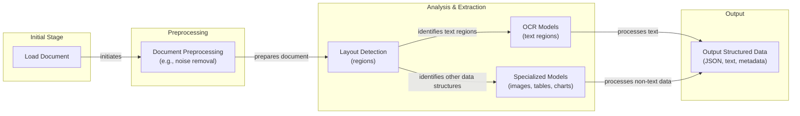
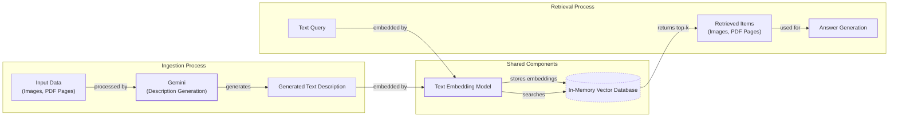
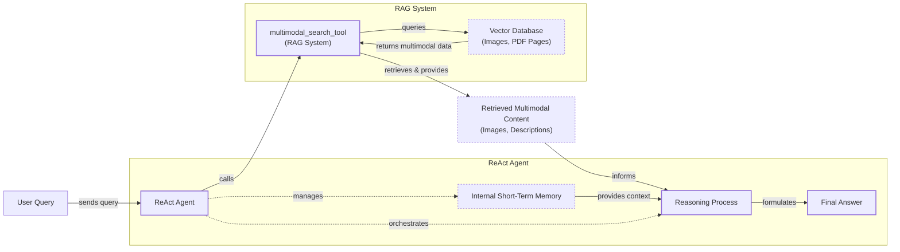

# Stop Converting Documents to Text. You're Doing It Wrong.

When I first started building AI agents, I hit a frustrating wall. I was comfortable manipulating text, but the moment I had to integrate multimodal data, such as images, audio, and especially documents like PDFs, my elegant architectures turned into messy hacks. I spent weeks building complex pipelines that tried to force everything into text. I chained OCR engines to scrape PDFs, layout detection models to identify tables, and separate classifiers to handle images. It was a brittle, slow, and expensive solution that broke every time a document layout changed.

The breakthrough came when I realized I was solving the wrong problem. I didn’t need to convert documents to text. I needed to treat them as images. Once I understood that every PDF page is effectively an image and that modern LLMs can “see” just as well as they can read, the complexity vanished. I could completely skip the OCR purgatory and focus on the three core inputs of an LLM: text, images, and audio.

This shift is essential because real-world AI applications rarely exist in a text-only vacuum. Enterprise applications mirror this reality. They need to manipulate private data from warehouses and lakes that is inherently multimodal: financial reports with complex charts, technical diagrams, building sketches, and audio logs [[39]](https://invisibletech.ai/blog/multimodal-enterprise-ai). The old approach of normalizing everything to text is lossy. When you translate a complex diagram or a chart into text, you lose the spatial relationships, the colors, and the context. You lose the information that matters most. By processing data in its native format, we preserve this rich visual information, resulting in systems that are faster, cheaper, and significantly more performant.

Here is what we will cover:

*   **Foundations of Multimodal LLMs:** An intuition on how models process visual and textual tokens together.
*   **Practical Implementation:** How to work with images and PDFs using the Gemini API.
*   **Multimodal State Management:** How to structure agent memory for mixed modalities.
*   **Building the Agent:** A step-by-step guide to building a multimodal ReAct agent.

## The Need for Multimodal AI

We want to process multimodal data to access our surroundings. However, the rise of multimodal LLMs is driven by a more subtle force: enterprise requirements. Enterprise applications work heavily with documents. The most critical example illustrating the need for multimodal data is processing PDF documents. Once we walk through this example, you will see how this core problem maps to other modalities like image, audio, or video.

Previously, we tried to normalize everything to text before passing it into an AI model. This approach has many flaws because we lose a substantial amount of information during translation. For example, when encountering diagrams, charts, or sketches in a document, it is impossible to fully reproduce them in text.

The traditional document processing workflow, often used for invoices, documentation, or reports, relies on the following four essential steps [[46]](https://www.daft.ai/blog/end-to-end-distributed-pdf-processing-pipeline), [[48]](https://parseur.com/blog/document-processing-automation-guide):

1.  Document Preprocessing (e.g., Noise Removal)
2.  Layout Detection (Text, Tables, Diagrams)
3.  OCR Models (for Text) & Specialized Models (for Tables, Diagrams)
4.  Output Structured Data (JSON/Metadata)


Image 1: A flowchart illustrating the traditional document processing workflow.

This workflow has too many moving pieces. We need layout detection models, OCR models for text, and specialized models for each expected data structure, such as tables or charts. This makes the system rigid. If a document contains a chart type we do not have a model for, the pipeline fails. It is also slow and costly because we have to chain multiple model calls.

Most importantly, we face performance challenges. The multi-step nature creates a cascade effect where errors compound at each stage. Advanced OCR engines struggle with handwritten text, poor scans, stylized fonts, or complex layouts like nested tables and building sketches [[1]](https://www.llamaindex.ai/blog/ocr-accuracy), [[2]](https://conexiom.com/blog/the-6-biggest-ocr-problems-and-how-to-overcome-them). On complex documents, accuracy can top out at 88-94%, and even a simple 5-degree tilt can increase word error rates by 15% or more [[1]](https://www.llamaindex.ai/blog/ocr-accuracy).
Image 2: A building sketch showing a crawl space vent diagram, illustrating the complexity of layouts that classic OCR systems struggle to interpret. (Source [Vectorize.io](https://vectorize.io/blog/multimodal-rag-patterns))

If we try to translate other data formats to text, we lose information. This is true for any modality:

*   **Audio to Text:** We lose tone, pitch, and emotion.
*   **Image to Text:** We lose spatial information, color, and context.
*   **Video to Text:** We lose temporal dynamics and visual context.

Modern AI solutions use multimodal LLMs, such as Gemini, GPT-4o, or Claude. These models can directly interpret text, images, or PDFs as native input. This completely bypasses the unstable OCR workflow.

Thus, let’s understand how multimodal LLMs work.

## Foundations of Multimodal LLMs

To use LLMs with images and documents, you need an intuition of how multimodality works. You do not need to understand every research detail. But knowing the architecture helps you deploy, optimize, and monitor them.

There are two common approaches to building multimodal LLMs: the Unified Embedding Decoder Architecture and the Cross-modality Attention Architecture [[21]](https://magazine.sebastianraschka.com/p/understanding-multimodal-llms).
Image 3: The two main approaches to developing multimodal LLM architectures. (Source [Understanding Multimodal LLMs](https://magazine.sebastianraschka.com/p/understanding-multimodal-llms))

### Unified Embedding Decoder Architecture

In this approach, we encode the text and image separately, concatenate their embeddings into a single vector, and pass the resulting vector to the LLM. Thus, on top of a standard LLM architecture, you need a vision encoder that maps the image to an embedding that is within the same vector space as the text. When the text and image embeddings are merged, the LLM can make sense of both [[21]](https://magazine.sebastianraschka.com/p/understanding-multimodal-llms).
Image 4: Illustration of the unified embedding decoder architecture. (Source [Understanding Multimodal LLMs](https://magazine.sebastianraschka.com/p/understanding-multimodal-llms))

### Cross-modality Attention Architecture

In the second approach, instead of passing the image embeddings along with the text embeddings at the input, we inject them directly into the attention module. We still need an image encoder that projects the image into the same vector space as the text, but we inject it deeper within the architecture [[21]](https://magazine.sebastianraschka.com/p/understanding-multimodal-llms).
Image 5: An illustration of the Cross-Modality Attention Architecture approach. (Source [Understanding Multimodal LLMs](https://magazine.sebastianraschka.com/p/understanding-multimodal-llms))

### Image Encoders

Both architectures rely on image encoders. To understand them, we can draw a parallel between text tokenization and image patching. Just as we split text into sub-word tokens, we split images into patches [[21]](https://magazine.sebastianraschka.com/p/understanding-multimodal-llms).
Image 6: Image tokenization and embedding (left) and text tokenization and embedding (right) side by side. (Source [Understanding Multimodal LLMs](https://magazine.sebastianraschka.com/p/understanding-multimodal-llms))

The output has the same structure and dimensions as text embeddings. However, they need to be aligned in the vector space. We do this through a linear projection module. Popular image encoder models include CLIP, OpenCLIP, and SigLIP [[57]](https://towardsdatascience.com/multimodal-ai-search-for-business-applications-65356d011009/).

Importantly, these encoders are also used in Multimodal RAG. They allow us to find semantic similarities between images and text by placing them in a shared vector space where similar concepts are located close together [[56]](https://opensearch.org/blog/multimodal-semantic-search/), [[57]](https://towardsdatascience.com/multimodal-ai-search-for-business-applications-65356d011009/). This allows you to run similarity metrics between different modalities as long as you have an encoder that maps the data into the same vector space.
Image 7: Toy representation of multimodal embedding space. (Source [Multimodal Embeddings: An Introduction](https://towardsdatascience.com/multimodal-embeddings-an-introduction-5dc36975966f/))

### Trade-offs and Modern Landscape

The **Unified Embedding Decoder** approach is simpler to implement and generally yields higher accuracy in OCR-related tasks. The **Cross-modality Attention** approach is more computationally efficient for high-resolution images because we do not have to pass all tokens as an input sequence. Instead, we inject them directly into the attention mechanism. Hybrid approaches exist to combine these benefits [[36]](https://magazine.sebastianraschka.com/p/understanding-multimodal-llms), [[37]](https://arxiv.org/abs/2409.11402).

In 2025, most leading LLMs are multimodal. Open-source examples include Llama, Gemma, and Qwen. Closed-source examples include GPT, Gemini, and Claude [[22]](https://medium.com/data-science-in-your-pocket/2025-the-year-ai-reasoning-models-took-over-a-month-by-month-review-of-frontier-breakthroughs-6ea2163f854f), [[23]](https://codedesign.ai/blog/the-ultimate-guide-to-the-top-large-language-models-in-2025/).

A quick note on **Multimodal LLMs vs. Diffusion Models**: Diffusion models like Midjourney generate images from noise. Multimodal LLMs like GPT understand images and are architecturally different. In an agent workflow, diffusion models are typically used as tools, not as the reasoning model [[19]](https://arxiv.org/html/2409.14993v3).

Innovations in multimodal LLM architectures happen often. This section's scope was not to be exhaustive but to give you an intuition on how they work and why they are superior to older multi-step OCR approaches.

Now that we understand how LLMs can directly input images or documents, let’s see how this works in practice.

## Applying Multimodal LLMs to Images and Documents

To better understand how multimodal LLMs work, let’s write a few examples using Gemini to show you some best practices when working with images and PDFs.

There are three core ways to process multimodal data with LLMs:

1.  **Raw bytes:** The easiest way to work with LLMs. However, when storing the item in a database, it can easily get corrupted as most databases interpret the input as text/strings instead of bytes.
2.  **Base64:** A way to encode raw bytes as strings. This is useful for storing images or documents directly in a database (e.g., PostgreSQL, MongoDB) without corruption. The downside is that the file size increases by approximately 33%.
3.  **URLs:** The standard for enterprise scenarios. You store data in a data lake like AWS S3 or GCP Buckets. The LLM downloads the media directly from the bucket. As the file never sees your server, this reduces network latency for your application. This is the most efficient option for scale.

Now, let’s dig into the code.

1.  First, we set up our client and display a sample image.
    ```python
    from google import genai
    from google.genai import types
    from PIL import Image as PILImage
    import io
    
    client = genai.Client()
    MODEL_ID = "gemini-2.5-flash"
    
    display_image(Path("images") / "image_1.jpeg")
    ```
    It outputs:
    
    
    
2.  We load the image as **raw bytes**. We use `WEBP` format because it is efficient.
    ```python
    def load_image_as_bytes(
        image_path: Path, format: Literal["WEBP", "JPEG", "PNG"] = "WEBP", max_width: int = 600, return_size: bool = False
    ) -> bytes | tuple[bytes, tuple[int, int]]:
        """
        Load an image from file path and convert it to bytes with optional resizing.
        """
    
        image = PILImage.open(image_path)
        if image.width > max_width:
            ratio = max_width / image.width
            new_size = (max_width, int(image.height * ratio))
            image = image.resize(new_size)
    
        byte_stream = io.BytesIO()
        image.save(byte_stream, format=format)
    
        if return_size:
            return byte_stream.getvalue(), image.size
    
        return byte_stream.getvalue()
    
    image_bytes = load_image_as_bytes(image_path=Path("images") / "image_1.jpeg", format="WEBP")
    ```
    We can call the LLM to generate a caption for an image or compare two images.
    ```python
    # Single image captioning
    response = client.models.generate_content(
        model=MODEL_ID,
        contents=[
            types.Part.from_bytes(data=image_bytes, mime_type="image/webp"),
            "Tell me what is in this image in one paragraph.",
        ],
    )
    print(f"Caption: {response.text}")
    
    # Comparing multiple images
    image_bytes_2 = load_image_as_bytes(Path("images") / "image_2.jpeg", format="WEBP")
    response = client.models.generate_content(
        model=MODEL_ID,
        contents=[
            types.Part.from_bytes(data=image_bytes, mime_type="image/webp"),
            types.Part.from_bytes(data=image_bytes_2, mime_type="image/webp"),
            "What's the difference between these two images?",
        ],
    )
    print(f"Difference: {response.text}")
    ```
    It outputs:
    ```text
    Caption: This striking image features a massive, dark metallic robot...
    
    Difference: The primary difference between the two images lies in the nature of the interaction...
    ```

3.  We can also process the image as a **Base64 encoded string**. Notice that the logic is similar, but we encode the bytes first.
    ```python
    import base64
    
    def load_image_as_base64(
        image_path: Path, format: Literal["WEBP", "JPEG", "PNG"] = "WEBP", max_width: int = 600, return_size: bool = False
    ) -> str:
        # ... implementation from notebook ...
        image_bytes = load_image_as_bytes(image_path=image_path, format=format, max_width=max_width, return_size=False)
        return base64.b64encode(image_bytes).decode("utf-8")
    
    image_base64 = load_image_as_base64(image_path=Path("images") / "image_1.jpeg", format="WEBP")
    
    print(f"Image as Base64 is {(len(image_base64) - len(image_bytes)) / len(image_bytes) * 100:.2f}% larger than as bytes")
    ```
    It outputs:
    ```text
    Image as Base64 is 33.34% larger than as bytes
    ```

4.  For **public URLs**, Gemini works with its `url_context` tool.
    ```python
    response = client.models.generate_content(
        model=MODEL_ID,
        contents="Based on the provided paper as a PDF, tell me how ReAct works: https://arxiv.org/pdf/2210.03629",
        config=types.GenerateContentConfig(tools=[{"url_context": {}}]),
    )
    ```
    It outputs:
    ```text
    ReAct is a novel paradigm for large language models (LLMs) that combines reasoning (Thought) and acting (Action) in an interleaved manner to solve diverse language and decision-making tasks...
    ```

5.  For **private URLs**, like those from a data lake, Gemini integrates well with GCS Buckets.
    ```python
    response = client.models.generate_content(
        model=MODEL_ID,
        contents=[
            types.Part.from_uri(uri="gs://gemini-images/image_1.jpeg", mime_type="image/webp"),
            "Tell me what is in this image in one paragraph.",
        ],
    )
    ```

6.  Let’s try a more complex task: **Object Detection**. We use Pydantic to define the output structure.
    ```python
    from pydantic import BaseModel
    
    class BoundingBox(BaseModel):
        ymin: float
        xmin: float
        ymax: float
        xmax: float
        label: str
    
    class Detections(BaseModel):
        bounding_boxes: list[BoundingBox]
    
    prompt = "Detect all prominent items. Return 2d boxes normalized to 0-1000."
    
    response = client.models.generate_content(
        model=MODEL_ID,
        contents=[types.Part.from_bytes(data=image_bytes, mime_type="image/webp"), prompt],
        config=types.GenerateContentConfig(
            response_mime_type="application/json",
            response_schema=Detections
        ),
    )
    ```
    It outputs:
    ```text
    bounding_boxes=[BoundingBox(ymin=272.0, xmin=28.0, ymax=801.0, xmax=535.0, label='kitten'), BoundingBox(ymin=1.0, xmin=450.0, ymax=997.0, xmax=1000.0, label='robot')]
    ```
    
    Image 8: Object detection results for the kitten and robot image.

7.  Now, let’s process **PDFs**. Because we use a multimodal model, the process is identical to images. We load the PDF as bytes and pass it to the model.
    ```python
    pdf_bytes = (Path("pdfs") / "attention_is_all_you_need_paper.pdf").read_bytes()
    
    response = client.models.generate_content(
        model=MODEL_ID,
        contents=[
            types.Part.from_bytes(data=pdf_bytes, mime_type="application/pdf"),
            "What is this document about? Provide a brief summary.",
        ],
    )
    ```
    It outputs:
    ```text
    This document introduces the Transformer, a novel neural network architecture for sequence transduction...
    ```

8.  Finally, we can perform **Object Detection on PDF pages**. This is powerful for extracting diagrams or tables. We treat the PDF page as an image.
    ```python
    page_image_bytes = load_image_as_bytes("images/attention_is_all_you_need_1.jpeg")
    
    prompt = "Detect all the diagrams from the provided image as 2d bounding boxes."
    
    response = client.models.generate_content(
        model=MODEL_ID,
        contents=[types.Part.from_bytes(data=page_image_bytes, mime_type="image/webp"), prompt],
        config=types.GenerateContentConfig(
            response_mime_type="application/json",
            response_schema=Detections
        ),
    )
    ```
    
    Image 9: Object detection identifying a diagram on a page from the "Attention Is All You Need" paper.

Processing PDFs as images is a concept popularized by the ColPali paper, which demonstrated that modern Vision Language Models can retrieve documents more effectively by “looking” at them rather than extracting text [[5]](https://arxiv.org/pdf/2407.01449v6).

## Foundations of Multimodal RAG

One of the most common use cases when working with multimodal data is a concept we already explored in Lesson 10: RAG. When building custom AI apps, you will always have to retrieve private company data to feed into your LLM. When working with larger data formats, such as images or PDFs, RAG becomes even more important. Stuffing 1,000+ PDF pages into your LLM to get a simple answer is unfeasible due to increased latency, costs, and decreased performance.

A generic multimodal RAG architecture involves an ingestion pipeline where images are embedded and stored in a vector database. During retrieval, a user's text query is embedded using the same model, and a similarity search is performed to find the most relevant images. This same technique works for any combination of modalities as long as the embeddings share the same vector space.

```mermaid
flowchart LR
  %% Define node classes for visual differentiation
  classDef source
  classDef process
  classDef storage
  classDef output

  %% External Sources
  subgraph Sources["External Sources"]
    A["Images"]
    D["User Text Query"]
  end

  %% Shared Multimodal Components
  subgraph Shared["Shared Multimodal Components"]
    B["Text-Image Embedding Model<br/>(Generates Multimodal Embeddings)"]
    C["Vector Database<br/>(Vector Index for Images)"]
  end

  %% Output
  subgraph Output["Retrieval Output"]
    G["Top-k Most Similar Images"]
  end

  %% Ingestion Pipeline
  subgraph Ingestion["Ingestion Pipeline"]
    A -- "embed" --> B
    B -- "load image embeddings" --> C
  end

  %% Retrieval Pipeline
  subgraph Retrieval["Retrieval Pipeline"]
    D -- "embed" --> B
    B -- "query embedding" --> C
    C -- "retrieve top-k (cosine similarity)" --> G
  end

  %% Highlight multimodal aspect
  note right of B: Works for various combinations of modalities<br/>(text, image, document, audio vectors)<br/>within the same vector space.

  %% Apply classes
  class A,D source
  class B process
  class C storage
  class G output
```
Image 10: A diagram illustrating the ingestion and retrieval pipelines of a generic multimodal RAG system.

For our enterprise use case of RAG on documents, as of 2025, the most popular architecture is called ColPali. Its main innovation is bypassing the entire OCR pipeline that typically involves text extraction, layout detection, and chunking. Instead, ColPali processes document pages directly as images, using vision-language models to understand textual and visual content simultaneously. This makes it highly effective for documents with tables, figures, and complex visual layouts where spatial information is key [[5]](https://arxiv.org/pdf/2407.01449v6). While the original ColPali model performed well on the initial Visual Document Retrieval (ViDoRe) benchmark, the field has advanced so quickly that state-of-the-art models now effectively saturate the test [[68]](https://huggingface.co/blog/manu/vidore-v2). This has led to the development of more challenging benchmarks like ViDoRe V2, which focuses on more realistic, non-extractive queries and cross-document retrieval [[68]](https://huggingface.co/blog/manu/vidore-v2).

The architecture's power comes from how it represents documents. Instead of chunking extracted text, ColPali treats each page as an image, divides it into a grid of 1,024 patches, and generates a 128-dimensional vector for each using a vision model like PaliGemma with a SigLIP encoder. This results in a "bag-of-embeddings" for the page. At query time, it uses a late interaction mechanism called MaxSim. This function computes the dot product between every query token vector and every page patch vector, finds the maximum similarity for each query token, and then sums these maximums. This fine-grained comparison allows the model to match specific phrases to specific visual regions [[72]](https://blog.vespa.ai/scaling-colpali-to-billions/).

However, this approach introduces trade-offs when scaling to millions of documents. While ColPali’s offline indexing is much faster than traditional OCR, its online query latency can be higher than standard text-embedding models [[70]](https://learnopencv.com/multimodal-rag-with-colpali/). More importantly, representing each page with over 1,000 vectors creates a massive memory footprint, making brute-force search computationally expensive at scale [[71]](https://qdrant.tech/blog/colpali-qdrant-optimization/).

To address these scaling issues, production systems employ optimization techniques. One common strategy is to replace the expensive floating-point dot product in MaxSim with a much faster hamming distance computation on binary quantized vectors. This can make scoring over 3.5 times faster and reduce storage by 32x with only a minor drop in accuracy [[72]](https://blog.vespa.ai/scaling-colpali-to-billions/). For retrieval, a multi-stage process is used. Instead of a brute-force search across all pages, an efficient first-stage retrieval uses an approximate nearest neighbor (ANN) index to find a set of candidate pages for each query token. The union of these candidates is then passed to the second stage, where the more computationally intensive MaxSim function re-ranks this smaller set to produce the final results. This phased approach avoids transferring large amounts of vector data over the network and keeps query latency manageable [[72]](https://blog.vespa.ai/scaling-colpali-to-billions/).

## Implementing Multimodal RAG for Images, PDFs and Text

Let's build a simple multimodal RAG system that populates an in-memory vector database with images and PDF pages, then queries it with text. To keep it simple, we will mock the vector database with a list and use Gemini to generate text descriptions for our images, which we will then embed. In a production system, you would use a multimodal embedding model to embed the images directly.


Image 11: A diagram illustrating the architecture of our multimodal RAG example.

Here is how we implement this system.

1.  First, we define functions to generate image descriptions and create text embeddings using Gemini.
    ```python
    def generate_image_description(image_bytes: bytes) -> str:
        # ... implementation from notebook ...
        prompt = "Describe this image in detail for semantic search purposes..."
        response = client.models.generate_content(model=MODEL_ID, contents=[prompt, PILImage.open(io.BytesIO(image_bytes))])
        return response.text.strip()
    
    def embed_text_with_gemini(content: str) -> np.ndarray | None:
        # ... implementation from notebook ...
        result = client.models.embed_content(model="gemini-embedding-001", contents=[content])
        return np.array(result.embeddings[0].values)
    ```

2.  Next, we create our vector index. This function loads images, generates a description for each, embeds the description, and stores everything in a list. As noted, a production system would embed the image bytes directly with a multimodal model like Voyage or Cohere.
    ```python
    def create_vector_index(image_paths: list[Path]) -> list[dict]:
        """
        Create embeddings for images by generating descriptions and embedding them.
        """
        vector_index = []
        for image_path in image_paths:
            image_bytes = load_image_as_bytes(image_path, format="WEBP")
            image_description = generate_image_description(image_bytes)
            image_embedding = embed_text_with_gemini(image_description)
            vector_index.append({
                "content": image_bytes, "type": "image", "filename": image_path,
                "description": image_description, "embedding": image_embedding,
            })
        return vector_index
    
    image_paths = list(Path("images").glob("*.jpeg"))
    vector_index = create_vector_index(image_paths)
    ```

3.  We define a search function that takes a text query, embeds it, and finds the top-k most similar items from our index using cosine similarity.
    ```python
    from sklearn.metrics.pairwise import cosine_similarity
    
    def search_multimodal(query_text: str, vector_index: list[dict], top_k: int = 3) -> list:
        """
        Search for most similar documents to query.
        """
        query_embedding = embed_text_with_gemini(query_text)
        embeddings = [doc["embedding"] for doc in vector_index]
        similarities = cosine_similarity([query_embedding], embeddings).flatten()
        top_indices = np.argsort(similarities)[::-1][:top_k]
        results = [{**vector_index[idx], "similarity": similarities[idx]} for idx in top_indices]
        return list(results)
    ```

4.  Let's test it with a query about the Transformer architecture.
    ```python
    query = "what is the architecture of the transformer neural network?"
    results = search_multimodal(query, vector_index, top_k=1)
    ```
    The system correctly retrieves the page from the "Attention Is All You Need" paper with the architecture diagram.
    
    
    Image 12: The retrieved PDF page showing the Transformer model architecture.

5.  Another example, searching for "a kitten with a robot".
    ```python
    query = "a kitten with a robot"
    results = search_multimodal(query, vector_index, top_k=1)
    ```
    It successfully finds the image of the kitten and the robot.
    
    
    Image 13: The retrieved image of a kitten with a robot.

## Building Multimodal AI Agents

Now, let's integrate our RAG functionality into a ReAct agent as a tool. This combines our multimodal retrieval with the agent's reasoning capabilities. Multimodal capabilities can be added to agents by enabling multimodal inputs/outputs, leveraging multimodal retrieval tools, or using tools that interact with external multimodal resources. This concept extends beyond static images and documents. The next frontier for agentic workflows is incorporating time-based media like audio and video. This involves preprocessing pipelines that transcribe audio, use vision models to generate descriptions of video frames, and then embed this information for retrieval [[73]](https://www.ragie.ai/blog/how-we-built-multimodal-rag-for-audio-and-video). An agent could then, for example, search for a specific event in a meeting recording or find a visual segment in a product demo video where a particular feature is shown [[73]](https://www.ragie.ai/blog/how-we-built-multimodal-rag-for-audio-and-video), [[74]](https://mixpeek.com/curated-lists/best-multimodal-rag-frameworks).

Our agent will use the `search_multimodal` function to find relevant images based on a text query generated during its reasoning process. We will build it using LangGraph's `create_react_agent`.


Image 14: A diagram illustrating the architecture of a multimodal ReAct agent integrated with RAG functionality.

Here is how we implement the agent.

1.  First, we wrap our `search_multimodal` function in a tool decorator.
    ```python
    from langchain_core.tools import tool
    
    @tool
    def multimodal_search_tool(query: str) -> dict:
        """
        Search through a collection of images and their text descriptions.
        """
        results = search_multimodal(query, vector_index, top_k=1)
        if not results:
            return {"role": "tool_result", "content": "No relevant content found."}
        
        result = results[0]
        content = [
            {"type": "text", "text": f"Image description: {result['description']}"},
            types.Part.from_bytes(data=result["content"], mime_type="image/jpeg"),
        ]
        return {"role": "tool_result", "content": content}
    ```

2.  Next, we create the ReAct agent using LangGraph, providing it with our new tool and a system prompt that guides its behavior.
    ```python
    from langgraph.prebuilt import create_react_agent
    from langchain_google_genai import ChatGoogleGenerativeAI
    
    def build_react_agent():
        system_prompt = "You are a helpful AI assistant that can search through images and text..."
        agent = create_react_agent(
            model=ChatGoogleGenerativeAI(model="gemini-2.5-pro", temperature=0.1),
            tools=[multimodal_search_tool],
            prompt=system_prompt,
        )
        return agent
    
    react_agent = build_react_agent()
    ```

3.  Finally, we test the agent by asking it to find the color of our kitten.
    ```python
    test_question = "what color is my kitten?"
    response = react_agent.invoke(input={"messages": test_question})
    ```
    The agent first reasons that it needs to search for "my kitten", calls the `multimodal_search_tool`, gets the image and its description back, and then analyzes the visual content to provide the final answer.
    
    It outputs:
    ```text
    Based on the image, your kitten is a gray tabby. It has soft, short gray fur with darker tabby stripe patterns.
    ```

## Conclusion

Working with multimodal data is a fundamental skill for AI engineers. Modern AI applications rarely exist in a text-only vacuum. They interact with the complex, visual, and auditory reality of the world. In this lesson, we moved away from the unstable, multi-step OCR pipelines of the past. We learned that modern LLMs can natively process images and documents, preserving rich context that was previously lost. We explored how to handle data as bytes, Base64, and URLs, and how to build agents that can reason across these modalities.

This concludes our *AI Agents Foundations* series. We started by understanding the difference between workflows and agents, mastered context engineering and structured outputs, built robust planning capabilities with ReAct, and finally gave our agents eyes and ears. You now have the foundational blocks to build production-ready AI systems.

## References

- [1] Liu, J. (2025, February 24). OlmOCR-bench review: Insights and pitfalls on an OCR benchmark. LlamaIndex. https://www.llamaindex.ai/blog/olmocr-bench-review-insights-and-pitfalls-on-an-ocr-benchmark
- [2] The 6 Biggest OCR Problems (and How to Overcome Them). (n.d.). Conexiom. https://conexiom.com/blog/the-6-biggest-ocr-problems-and-how-to-overcome-them
- [3] Overcoming OCR Errors and Limitations with Intelligent Document Processing. (n.d.). Jiffy.ai. https://jiffy.ai/overcoming-ocr-errors-and-limitations-with-intelligent-document-processing/
- [4] Unstructured Leads in Document Parsing Quality - Benchmarks Tell the Full Story. (n.d.). Unstructured.io. https://unstructured.io/blog/unstructured-leads-in-document-parsing-quality-benchmarks-tell-the-full-story
- [5] Fostiropoulos, I., et al. (2024). ColPali: Efficient Document Retrieval with Vision Language Models. arXiv. https://arxiv.org/pdf/2407.01449v6
- [6] ChatGPT for Financial Analysis: Use Cases & Limitations. (n.d.). Konfuzio. https://konfuzio.com/en/chatgpt-financial-analysis/
- [7] NVIDIA and Lenovo. (2025, May). Medical Imaging White Paper. Lenovo. https://techtoday.lenovo.com/sites/default/files/2025-05/Medical%20Imaging%20White%20Paper%20NVIDIA%20and%20Lenovo.pdf
- [8] A Unified Summarization Model for Text with Tables. (2023). IJCAI. https://www.ijcai.org/proceedings/2023/0581.pdf
- [9] Kokorin, O. (2023, October 12). Complex Document Recognition: OCR Doesn’t Work and Here’s How You Fix It. HackerNoon. https://hackernoon.com/complex-document-recognition-ocr-doesnt-work-and-heres-how-you-fix-it
- [10] 10 real-world examples of AI in healthcare. (2022, November 24). Philips. https://www.philips.com/a-w/about/news/archive/features/2022/20221124-10-real-world-examples-of-ai-in-healthcare.html
- [11] What Is Optical Character Recognition (OCR)?. (2023, November 21). Roboflow Blog. https://blog.roboflow.com/what-is-optical-character-recognition-ocr/
- [12] Vectorize.io. (2024, October 26). Multimodal RAG Patterns. Vectorize.io Blog. https://vectorize.io/blog/multimodal-rag-patterns
- [13] Why OCR Technology Fails on Real-World Documents and How Intelligent Document Processing Can Help. (n.d.). Netfira. https://netfira.com/why-ocr-technology-fails-on-real-world-documents-and-how-intelligent-document-processing-can-help/
- [14] Dey, S. (2025, September 10). Multimodal RAG architecture. LinkedIn. https://www.linkedin.com/posts/sayandey01_generativeai-llm-rag-activity-7412381316106760192-nFx3
- [15] Evaluating Multimodal vs. Text-Based Retrieval for RAG with Snowflake Cortex. (2025, April 21). Snowflake. https://www.snowflake.com/en/engineering-blog/arctic-agentic-rag-multimodal-pdf-retrieval/
- [16] Multimodal RAG template for PDFs. (n.d.). Pathway. https://pathway.com/developers/templates/rag/multimodal-rag
- [17] Aggarwal, G. (2025, September 12). MMCTAgent for multimodal reasoning. LinkedIn. https://www.linkedin.com/posts/gauravagg_mmctagent-enables-multimodal-reasoning-over-activity-7413983881181339648--PyD
- [18] Multimodal RAG Explained: From Text to Images and Beyond. (n.d.). USAII. https://www.usaii.org/ai-insights/multimodal-rag-explained-from-text-to-images-and-beyond
- [19] Wang, X., et al. (2025). Multi-modal Generative AI: Multi-modal LLMs, Diffusions, and the Unification. arXiv. https://arxiv.org/html/2409.14993v3
- [20] LLMs on Anyscale. (n.d.). Anyscale. https://docs.anyscale.com/llm
- [21] Raschka, S. (2024, October 21). Understanding multimodal LLMS. Sebastian Raschka. https://magazine.sebastianraschka.com/p/understanding-multimodal-llms
- [22] 2025: The Year AI Reasoning Models Took Over. (2025). Medium. https://medium.com/data-science-in-your-pocket/2025-the-year-ai-reasoning-models-took-over-a-month-by-month-review-of-frontier-breakthroughs-6ea2163f854f
- [23] The Ultimate Guide to the Top Large Language Models in 2025. (n.d.). CodeDesign.ai. https://codedesign.ai/blog/the-ultimate-guide-to-the-top-large-language-models-in-2025/
- [24] Breakdown of 2025 Flagship LLM Architectures. (2025). LinkedIn. https://www.linkedin.com/posts/progressivethinker_this-is-the-most-essential-breakdown-of-2025-activity-7376654335319117825-a5aD
- [25] A Comparative Analysis of Flagship Open-Weight Coding LLMs. (2025). Preprints.org. https://www.preprints.org/manuscript/202508.1904
- [26] Ultimate 2025 AI Language Models Comparison. (n.d.). Promptitude. https://www.promptitude.io/post/ultimate-2025-ai-language-models-comparison-gpt5-gpt-4-claude-gemini-sonar-more
- [27] Exploring Multimodal LLMs: Text, Image, and Video Integration. (n.d.). SparkCognition. https://sparkco.ai/blog/exploring-multimodal-llms-text-image-and-video-integration
- [28] Multimodal LLMs. (n.d.). Emergent Mind. https://www.emergentmind.com/topics/multimodal-llms
- [29] Enhancing LLM Capabilities: The Power of Multimodal LLMs and RAG. (n.d.). Towards AI. https://towardsai.net/p/l/enhancing-llm-capabilities-the-power-of-multimodal-llms-and-rag
- [30] A Comprehensive Review of Multimodal Large Language Models. (2024). arXiv. https://arxiv.org/html/2411.06284v3
- [31] How to Choose the Best Embedding Model for RAG in 2026: 10 Models Benchmarked. (2026, March 25). Milvus. https://milvus.io/blog/choose-embedding-model-rag-2026.md
- [32] Vision Language Models. (n.d.). NVIDIA. https://www.nvidia.com/en-us/glossary/vision-language-models/
- [33] Multi-modal ML with OpenAI's CLIP. (n.d.). Pinecone. https://www.pinecone.io/learn/series/image-search/clip/
- [34] The Best Multimodal Embedding Model for RAG on Visually Rich Documents. (n.d.). eagerWorks. https://eagerworks.com/blog/best-embedding-model-for-rag
- [35] Top Embedding Models in 2025. (n.d.). ArtSmart.ai. https://artsmart.ai/blog/top-embedding-models-in-2025/
- [36] NVLM: Open Frontier-Class Multimodal LLMs. (2024). arXiv. https://arxiv.org/abs/2409.11402
- [37] NVLM: Open Frontier-Class Multimodal LLMs. (2024). arXiv. https://arxiv.org/abs/2409.11402
- [38] Multimodal AI Agents: The Future of AI. (n.d.). Kanerika. https://kanerika.com/blogs/multimodal-ai-agents/
- [39] Multimodal Enterprise AI. (n.d.). Invisible Technologies. https://invisibletech.ai/blog/multimodal-enterprise-ai
- [40] Multimodal AI Use Cases. (n.d.). Rasa. https://rasa.com/blog/multimodal-ai-use-cases
- [41] A Comprehensive Survey and Guide to Multimodal Large Language Models in Vision-Language Tasks. (n.d.). GitHub. https://github.com/cognitivetech/llm-research-summaries/blob/main/models-review/A-Comprehensive-Survey-and-Guide-to-Multimodal-Large-Language-Models-in-Vision-Language-Tasks.md
- [42] Multimodal AI Examples: How It Works, Real-World Applications, and Future Trends. (n.d.). SmartDev. https://smartdev.com/multimodal-ai-examples-how-it-works-real-world-applications-and-future-trends/
- [43] What is a multimodal LLM?. (n.d.). IBM. https://www.ibm.com/think/topics/multimodal-llm
- [44] Multimodal Large Language Models in Radiology: A Narrative Review. (2025). PMC. https://pmc.ncbi.nlm.nih.gov/articles/PMC12479233/
- [45] Multimodal large language models in healthcare: a comprehensive review. (2025). Nature. https://www.nature.com/articles/s41598-025-98483-1
- [46] An End-to-End, Distributed, and Fault-Tolerant PDF Processing Pipeline for LLM Applications. (n.d.). Daft. https://www.daft.ai/blog/end-to-end-distributed-pdf-processing-pipeline
- [47] Why Traditional OCR Fails for Complex Business Documents?. (n.d.). Microsoft Learn. https://learn.microsoft.com/en-us/answers/questions/5668164/why-traditional-ocr-fails-for-complex-business-doc?page=1
- [48] Document Processing Automation: The Definitive Guide. (n.d.). Parseur. https://parseur.com/blog/document-processing-automation-guide
- [49] OCR for Tables. (n.d.). LlamaIndex. https://www.llamaindex.ai/blog/ocr-for-tables
- [50] AI PDF Data Extraction in Clinical Research: Beyond OCR. (n.d.). Intuition Labs. https://intuitionlabs.ai/articles/ai-pdf-data-extraction-clinical-research
- [51] Gemini consistently producing valid Pydantic responses. (n.d.). Google for Developers. https://discuss.ai.google.dev/t/gemini-consistently-producing-valid-pydantic-responses/98992
- [52] Stop Converting Documents to Text. You're Doing It Wrong.. (2025, December 9). Decoding AI Magazine. https://www.decodingai.com/p/stop-converting-documents-to-text
- [53] LLM Output Parsing: How to Get Structured Generation. (n.d.). Tetrate. https://tetrate.io/learn/ai/llm-output-parsing-structured-generation
- [54] Structured Outputs with Multimodal Gemini. (2024, October 23). Instructor. https://python.useinstructor.com/blog/2024/10/23/structured-outputs-with-multimodal-gemini/
- [55] Steering Large Language Models with Pydantic. (n.d.). Pydantic. https://pydantic.dev/articles/llm-intro
- [56] Multimodal semantic search with OpenSearch. (n.d.). OpenSearch. https://opensearch.org/blog/multimodal-semantic-search/
- [57] Multimodal AI Search for Business Applications. (2024, November 29). Towards Data Science. https://towardsdatascience.com/multimodal-ai-search-for-business-applications-65356d011009/
- [58] Joint Visual-Textual Embedding for Multimodal Style Search. (n.d.). Amazon Science. https://assets.amazon.science/89/bf/661d950d4059930c8f1d2e449ac6/joint-visual-textual-embedding-for-multimodal-style-search.pdf
- [59] Combine Image and Text: How Multimodal Retrieval Transforms Search. (n.d.). Zilliz. https://zilliz.com/blog/combine-image-and-text-how-multimodal-retrieval-transforms-search
- [60] Multimodal Sentence Transformers. (n.d.). Hugging Face. https://huggingface.co/blog/multimodal-sentence-transformers
- [61] Image understanding with Gemini. (n.d.). Google AI for Developers. https://ai.google.dev/gemini-api/docs/image-understanding
- [62] Google Generative AI Embeddings (AI Studio & Gemini API). (n.d.). LangChain. https://python.langchain.com/docs/integrations/text_embedding/google_generative_ai/
- [63] LangGraph quickstart. (n.d.). LangChain. https://langchain-ai.github.io/langgraph/agents/agents/
- [64] The 8 best AI image generators in 2025. (2026, April 1). Zapier. https://zapier.com/blog/best-ai-image-generator/
- [65] What are some real-world applications of multimodal AI?. (n.d.). Milvus. https://milvus.io/ai-quick-reference/what-are-some-realworld-applications-of-multimodal-ai
- [66] Multimodal RAG with Colpali, Milvus and VLMs. (2024, December 10). Hugging Face. https://huggingface.co/blog/saumitras/colpali-milvus-multimodal-rag
- [67] The EPOCH of AI in Financial Services. (2025). arXiv. https://arxiv.org/html/2503.22035v1
- [68] ViDoRe Benchmark V2: Raising the Bar for Visual Retrieval. (2025, March 18). Hugging Face. https://huggingface.co/blog/manu/vidore-v2
- [69] REAL-MM-RAG: A Real-World Multi-Modal RAG Benchmark for Visually-Rich Document Retrieval. (2025). arXiv. https://arxiv.org/html/2502.12342v1
- [70] Multimodal RAG with ColPali. (n.d.). Learn OpenCV. https://learnopencv.com/multimodal-rag-with-colpali/
- [71] How we made ColPali 13x faster. (n.d.). Qdrant. https://qdrant.tech/blog/colpali-qdrant-optimization/
- [72] Scaling ColPali to billions of PDFs with Vespa. (2024, September 14). Vespa Blog. https://blog.vespa.ai/scaling-colpali-to-billions/
- [73] How We Built Multimodal RAG for Audio and Video. (n.d.). Ragie.ai. https://www.ragie.ai/blog/how-we-built-multimodal-rag-for-audio-and-video
- [74] Best Multimodal RAG Frameworks in 2026. (n.d.). Mixpeek. https://mixpeek.com/curated-lists/best-multimodal-rag-frameworks