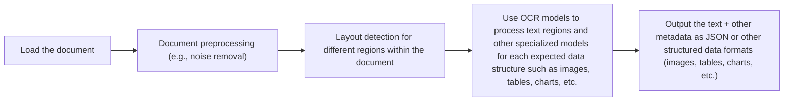

# Stop Converting Documents to Text. You're Doing It Wrong.

In the previous lessons, we built a solid foundation in AI Engineering. We learned the difference between LLM workflows and agents, mastered context engineering, built reasoning agents with ReAct, and explored advanced RAG. You now have the core skills to build text-based AI systems. But the real world is not text-only. As humans, we interact with images, documents, and audio every day. To build truly useful AI, our systems must do the same.

This is where multimodal AI comes in. Enterprise applications need to process private data from warehouses and lakes that is inherently multimodal: financial reports with complex charts, technical documentation with diagrams, and medical records with scans [[6]](https://konfuzio.com/en/chatgpt-financial-analysis/), [[7]](https://techtoday.lenovo.com/sites/default/files/2025-05/Medical%20Imaging%20White%20Paper%20NVIDIA%20and%20Lenovo.pdf). The old approach of converting everything to text is lossy and brittle. When you translate a complex diagram into text, you lose the spatial relationships, the colors, and the context. You lose the information that matters most. Common use cases like object detection, image captioning, and processing medical visuals are severely limited by text-only models [[41]](https://github.com/cognitivetech/llm-research-summaries/blob/main/models-review/A-Comprehensive-Survey-and-Guide-to-Multimodal-Large-Language-Models-in-Vision-Language-Tasks.md).

The breakthrough is to stop converting documents to text and start treating them as images. Modern LLMs can "see" just as well as they can read. By processing data in its native format, we preserve rich visual information, resulting in systems that are faster, cheaper, and more performant. In this lesson, we will cover:

*   The limitations of traditional document processing.
*   The foundations of how multimodal LLMs work.
*   How to work with images and PDFs using the Gemini API.
*   The foundations of multimodal RAG.
*   How to implement a multimodal RAG system.
*   How to build a multimodal AI agent.

## Limitations of Traditional Document Processing

To understand why a multimodal-native approach is better, let's look at the problems with traditional document processing for tasks like analyzing invoices or reports. Previous AI systems tried to normalize everything to text before passing it to a model. This approach is flawed because a substantial amount of information is lost during translation. It is impossible to fully reproduce diagrams, charts, or sketches in text.

The traditional workflow relies on a multi-step pipeline involving layout detection and Optical Character Recognition (OCR). This process typically includes loading the document, preprocessing it to remove noise, detecting the layout of different regions, using OCR for text and specialized models for other structures, and finally outputting the structured data [[46]](https://www.daft.ai/blog/end-to-end-distributed-pdf-processing-pipeline), [[47]](https://learn.microsoft.com/en-us/answers/questions/5668164/why-traditional-ocr-fails-for-complex-business-doc?page=1), [[48]](https://parseur.com/blog/document-processing-automation-guide).


Image 1: A flowchart illustrating the traditional document processing workflow.

This workflow has too many moving pieces. We need layout detection models, OCR models for text, and specialized models for each expected data structure, such as tables or charts. This makes the system rigid. If a document contains a chart type we do not have a model for, the pipeline fails [[46]](https://www.daft.ai/blog/end-to-end-distributed-pdf-processing-pipeline), [[47]](https://learn.microsoft.com/en-us/answers/questions/5668164/why-traditional-ocr-fails-for-complex-business-doc?page=1), [[48]](https://parseur.com/blog/document-processing-automation-guide). It is also slow and costly. A typical high-resolution parsing pipeline can take over 7 seconds per page for layout detection, OCR, and captioning, whereas modern visual-native approaches can process a page in under 0.4 seconds [[60]](https://arxiv.org/html/2407.01449v4).

Most importantly, we face performance challenges. The multi-step nature creates a cascade effect where errors compound at each stage. Advanced OCR engines achieve 88–94% accuracy on simple layouts but struggle with handwritten text, poor scans, stylized fonts, or complex layouts like nested tables and building sketches [[1]](https://www.llamaindex.ai/blog/ocr-accuracy), [[50]](https://intuitionlabs.ai/articles/ai-pdf-data-extraction-clinical-research). Even with high-quality scanners, OCR-based solutions can have an accuracy as low as 60% on complex documents, requiring significant manual correction [[3]](https://jiffy.ai/overcoming-ocr-errors-and-limitations-with-intelligent-document-processing/). A 5-degree tilt in a scanned document can increase the word error rate by 15% or more, and scanning below 300 DPI can cause accuracy to drop by over 20% [[1]](https://www.llamaindex.ai/blog/ocr-accuracy). This makes the entire system unreliable for production use.

https://substackcdn.com/image/fetch/f_auto,q_auto:good,fl_progressive:steep/https%3A%2F%2Fsubstack-post-media.s3.amazonaws.com%2Fpublic%2Fimages%2Fa2dc40f3-dc13-486e-853d-8404368f4d8d_1616x1000.png
Image 2: A building sketch showing a crawl space vent diagram, illustrating the complexity of layouts that classic OCR systems struggle to interpret. (Source [Vectorize.io](https://vectorize.io/blog/multimodal-rag-patterns))

This approach might work for highly specialized applications, but it is too brittle and does not scale in a world of flexible and fast AI agents. That is why modern AI solutions use multimodal LLMs that can directly interpret text, images, or PDFs as native input, completely bypassing this unstable OCR workflow.

## Foundations of Multimodal LLMs

To use LLMs with images and documents, you need an intuition of how multimodality works. You do not need to understand every research detail, but knowing the architecture helps you deploy, optimize, and monitor them. There are two common approaches to building multimodal LLMs: the Unified Embedding Decoder Architecture and the Cross-modality Attention Architecture [[21]](https://magazine.sebastianraschka.com/p/understanding-multimodal-llms).

https://substackcdn.com/image/fetch/f_auto,q_auto:good,fl_progressive:steep/https%3A%2F%2Fsubstack-post-media.s3.amazonaws.com%2Fpublic%2Fimages%2F53956ae8-9cd8-474e-8c10-ef6bddb88164_1600x938.png
Image 3: The two main approaches to developing multimodal LLM architectures. (Source [Understanding Multimodal LLMs](https://magazine.sebastianraschka.com/p/understanding-multimodal-llms))

### Unified Embedding Decoder Architecture

In this approach, we encode the text and image separately, concatenate their embeddings into a single vector, and pass the resulting vector to the LLM. On top of a standard LLM architecture, you need a vision encoder that maps the image to an embedding that is within the same vector space as the text. When the text and image embeddings are merged, the LLM can make sense of both [[21]](https://magazine.sebastianraschka.com/p/understanding-multimodal-llms).

https://substackcdn.com/image/fetch/f_auto,q_auto:good,fl_progressive:steep/https%3A%2F%2Fsubstack-post-media.s3.amazonaws.com%2Fpublic%2Fimages%2F91955021-7da5-4bc4-840e-87d080152b18_1166x1400.png
Image 4: Illustration of the unified embedding decoder architecture. (Source [Understanding Multimodal LLMs](https://magazine.sebastianraschka.com/p/understanding-multimodal-llms))

### Cross-modality Attention Architecture

In the second approach, instead of passing the image embeddings along with the text embeddings at the input, we inject them directly into the attention module. We still need an image encoder that projects the image into the same vector space as the text, but we inject it deeper within the architecture [[21]](https://magazine.sebastianraschka.com/p/understanding-multimodal-llms).

https://substackcdn.com/image/fetch/f_auto,q_auto:good,fl_progressive:steep/https%3A%2F%2Fsubstack-post-media.s3.amazonaws.com%2Fpublic%2Fimages%2Fd9c06055-b959-45d1-87b2-1f4e90ceaf2d_1296x1338.png
Image 5: An illustration of the Cross-Modality Attention Architecture approach. (Source [Understanding Multimodal LLMs](https://magazine.sebastianraschka.com/p/understanding-multimodal-llms))

### Image Encoders

Both architectures rely on image encoders. To understand them, we can draw a parallel between text tokenization and image patching. Just as we split text into sub-word tokens, we split images into patches [[21]](https://magazine.sebastianraschka.com/p/understanding-multimodal-llms).

https://substackcdn.com/image/fetch/f_auto,q_auto:good,fl_progressive:steep/https%3A%2F%2Fsubstack-post-media.s3.amazonaws.com%2Fpublic%2Fimages%2F0d56ea06-d202-4eb7-9e01-9aac492ee309_1522x1206.png
Image 6: Image tokenization and embedding (left) and text tokenization and embedding (right) side by side. (Source [Understanding Multimodal LLMs](https://magazine.sebastianraschka.com/p/understanding-multimodal-llms))

These patches are then encoded by a pretrained vision transformer (ViT).

https://substackcdn.com/image/fetch/f_auto,q_auto:good,fl_progressive:steep/https%3A%2F%2Fsubstack-post-media.s3.amazonaws.com%2Fpublic%2Fimages%2Ffef5f8cb-c76c-4c97-9771-7fdb87d7d8cd_1600x1135.png
Image 7: Illustration of a classic vision transformer (ViT) setup. (Source [Understanding Multimodal LLMs](https://magazine.sebastianraschka.com/p/understanding-multimodal-llms))

The output has the same structure and dimensions as text embeddings. However, they need to be aligned in the vector space, which is done through a linear projection module. Popular image encoder models include CLIP, OpenCLIP, and SigLIP [[35]](https://artsmart.ai/blog/top-embedding-models-in-2025/). These encoders are also used in Multimodal RAG to find semantic similarities between images and text, allowing for cross-modal search [[56]](https://opensearch.org/blog/multimodal-semantic-search/).

https://towardsdatascience.com/wp-content/uploads/2024/11/15d3HBNjNIXLy0oMIvJjxWw.png
Image 8: Toy representation of a multimodal embedding space where text and images are aligned. (Source [Multimodal Embeddings: An Introduction](https://towardsdatascience.com/multimodal-embeddings-an-introduction-5dc36975966f/))

### Trade-offs and Modern Landscape

The **Unified Embedding Decoder** approach is simpler to implement and generally yields higher accuracy in OCR-related tasks. The **Cross-modality Attention** approach is more computationally efficient for high-resolution images because we do not have to pass all tokens as an input sequence. Hybrid approaches also exist to combine these benefits [[36]](https://arxiv.org/abs/2409.11402).

In 2025, most leading LLMs are multimodal. Open-source examples include Llama 4, Gemma, and Qwen, while closed-source examples include GPT-5, Gemini 2.5, and Claude [[22]](https://medium.com/data-science-in-your-pocket/2025-the-year-ai-reasoning-models-took-over-a-month-by-month-review-of-frontier-breakthroughs-6ea2163f854f), [[23]](https://codedesign.ai/blog/the-ultimate-guide-to-the-top-large-language-models-in-2025/). This architecture can be expanded to other modalities, such as PDFs, audio, or video, by integrating specialized encoders for each data type [[27]](https://sparkco.ai/blog/exploring-multimodal-llms-text-image-and-video-integration), [[28]](https://www.emergentmind.com/topics/multimodal-llms).

A quick note on **Multimodal LLMs vs. Diffusion Models**: Diffusion models like Midjourney generate images from noise. Multimodal LLMs like GPT understand images. Architecturally, they are different. In an agent workflow, diffusion models are typically used as tools, not as the reasoning model [[19]](https://arxiv.org/html/2409.14993v3).

Now that we understand how LLMs can directly process images or documents, let’s see how this works in practice.

## Applying Multimodal LLMs to Images and Documents

To better understand how multimodal LLMs work, let’s write a few examples using Gemini to show some best practices when working with images and PDFs. There are three core ways to process multimodal data with LLMs: raw bytes, Base64, and URLs.

*   **Raw bytes:** The easiest way to work with LLMs for one-off API calls. However, when storing the item in a database, it can easily get corrupted as most databases interpret the input as text instead of bytes.
*   **Base64:** This encodes raw bytes as strings, allowing you to store images or documents in a database (e.g., PostgreSQL, MongoDB) without corruption. The downside is that the file size increases by approximately 33%.
*   **URLs:** This is the standard for enterprise scenarios. You store data in a data lake like AWS S3 or GCP Buckets. The LLM downloads the media directly from the bucket, reducing network latency for your application. This is the most efficient option for scale.

<aside>
💡

You can find the code for this lesson in the `notebook.ipynb` file inside the `lessons/11_multimodal` directory in the GitHub repository of the course.

</aside>

1.  First, we set up our client and display a sample image.
    
    ```python
    from google import genai
    from google.genai import types
    from PIL import Image
    import io
    
    client = genai.Client()
    MODEL_ID = "gemini-2.5-flash"
    
    display_image(Path("images") / "image_1.jpeg")
    ```
    
    It outputs:
    
    https://substackcdn.com/image/fetch/w_1456,c_limit,f_webp,q_auto:good,fl_progressive:steep/https%3A%2F%2Fsubstack-post-media.s3.amazonaws.com%2Fpublic%2Fimages%2F5780cbd6-133b-44fe-9352-38250d6fc611_640x640.jpeg
    
2.  We load the image as **raw bytes**. We use `WEBP` format because it is efficient.
    
    ```python
    def load_image_as_bytes(
        image_path: Path, format: Literal["WEBP", "JPEG", "PNG"] = "WEBP", max_width: int = 600, return_size: bool = False
    ) -> bytes | tuple[bytes, tuple[int, int]]:
        """
        Load an image from file path and convert it to bytes with optional resizing.
        """
        # ...
    
    image_bytes = load_image_as_bytes(image_path=Path("images") / "image_1.jpeg", format="WEBP")
    
    # Single image captioning
    response = client.models.generate_content(
        model=MODEL_ID,
        contents=[
            types.Part.from_bytes(data=image_bytes, mime_type="image/webp"),
            "Tell me what is in this image in one paragraph.",
        ],
    )
    
    # Comparing multiple images
    response_diff = client.models.generate_content(
        model=MODEL_ID,
        contents=[
            types.Part.from_bytes(data=load_image_as_bytes(image_path=Path("images") / "image_1.jpeg", format="WEBP"), mime_type="image/webp"),
            types.Part.from_bytes(data=load_image_as_bytes(image_path=Path("images") / "image_2.jpeg", format="WEBP"), mime_type="image/webp"),
            "What's the difference between these two images? Describe it in one paragraph.",
        ],
    )
    ```
    
    It outputs:
    
    ```text
    Bytes `b'RIFF`\xad\x00\x00WEBPVP8 T\xad\x00\x00P\xec\x02\x9d\x01*X\x02X\x02'...`
    Size: 44392 bytes
    
    Caption: This striking image features a massive, dark metallic robot...
    
    Difference: The primary difference between the two images lies in the nature of the interaction...
    ```
    
3.  We can also process the image as a **Base64 encoded string**. Notice that the logic is similar, but we encode the bytes first.
    
    ```python
    import base64
    
    def load_image_as_base64(
        image_path: Path, format: Literal["WEBP", "JPEG", "PNG"] = "WEBP", max_width: int = 600, return_size: bool = False
    ) -> str:
        # ...
    
    image_base64 = load_image_as_base64(image_path=Path("images") / "image_1.jpeg", format="WEBP")
    
    response = client.models.generate_content(
        model=MODEL_ID,
        contents=[
            types.Part.from_bytes(data=image_base64, mime_type="image/webp"),
            "Tell me what is in this image in one paragraph.",
        ],
    )
    ```
    
    The base64 version is about 33% larger than the raw bytes.
    
4.  For **public URLs**, Gemini's `url_context` tool works well for parsing content directly from the web.
    
    ```python
    response = client.models.generate_content(
        model=MODEL_ID,
        contents="Based on the provided paper as a PDF, tell me how ReAct works: https://arxiv.org/pdf/2210.03629",
        config=types.GenerateContentConfig(tools=[{"url_context": {}}]),
    )
    ```
    
    It outputs:
    
    ```text
    ReAct is a novel paradigm for large language models (LLMs) that combines reasoning (Thought) and acting (Action) in an interleaved manner...
    ```
    
5.  For **private URLs** from data lakes like GCS, you can pass the URI directly, though we will only show pseudocode for simplicity.
    
    ```python
    # response = client.models.generate_content(
    #     model=MODEL_ID,
    #     contents=[
    #         types.Part.from_uri(uri="gs://gemini-images/image_1.jpeg", mime_type="image/webp"),
    #         "Tell me what is in this image in one paragraph.",
    #     ],
    # )
    ```
    
6.  Let’s try a more complex task: **Object Detection**. We use Pydantic to define the output structure, as we learned in Lesson 4.
    
    ```python
    from pydantic import BaseModel, Field
    
    class BoundingBox(BaseModel):
        ymin: float
        xmin: float
        ymax: float
        xmax: float
        label: str = Field(...)
    
    class Detections(BaseModel):
        bounding_boxes: list[BoundingBox]
    
    prompt = """
    Detect all of the prominent items in the image. 
    The box_2d should be [ymin, xmin, ymax, xmax] normalized to 0-1000.
    Also, output the label of the object found within the bounding box.
    """
    
    config = types.GenerateContentConfig(
        response_mime_type="application/json",
        response_schema=Detections,
    )
    
    response = client.models.generate_content(
        model=MODEL_ID,
        contents=[
            types.Part.from_bytes(data=image_bytes, mime_type="image/webp"),
            prompt,
        ],
        config=config,
    )
    detections = response.parsed
    ```
    
    It outputs:
    
    ```text
    ymin=1.0 xmin=450.0 ymax=997.0 xmax=1000.0 label='robot'
    ymin=269.0 xmin=39.0 ymax=782.0 xmax=530.0 label='kitten'
    ```
    
    And here is the visualization of the detected bounding boxes:
    
    https://substackcdn.com/image/fetch/w_1456,c_limit,f_webp,q_auto:good,fl_progressive:steep/https%3A%2F%2Fsubstack-post-media.s3.amazonaws.com%2Fpublic%2Fimages%2Fa2eaed1f-bedb-4c33-98b3-96fa7424f0ad_566x590.png
    
7.  Now, let’s process **PDFs**. Because we use a multimodal model, the process is identical to images. We load the PDF as bytes and pass it to the model.
    
    ```python
    pdf_bytes = (Path("pdfs") / "attention_is_all_you_need_paper.pdf").read_bytes()
    
    response = client.models.generate_content(
        model=MODEL_ID,
        contents=[
            types.Part.from_bytes(data=pdf_bytes, mime_type="application/pdf"),
            "What is this document about? Provide a brief summary of the main topics.",
        ],
    )
    ```
    
    It outputs:
    
    ```text
    This document introduces the **Transformer**, a novel neural network architecture designed for **sequence transduction tasks**...
    ```
    
8.  Finally, we can perform **Object Detection on PDF pages**. This is powerful for extracting diagrams or tables. We treat the PDF page as an image.
    
    ```python
    prompt = """
    Detect all the diagrams from the provided image as 2d bounding boxes. 
    The box_2d should be [ymin, xmin, ymax, xmax] normalized to 0-1000.
    Also, output the label of the object found within the bounding box.
    """
    image_bytes, image_size = load_image_as_bytes(
        image_path=Path("images") / "attention_is_all_you_need_1.jpeg", format="WEBP", return_size=True
    )
    # ... call LLM with config ...
    detections = response.parsed
    ```
    
    The model successfully detects the diagram in the research paper.
    
    https://substackcdn.com/image/fetch/w_1456,c_limit,f_webp,q_auto:good,fl_progressive:steep/https%3A%2F%2Fsubstack-post-media.s3.amazonaws.com%2Fpublic%2Fimages%2Fe7cb5566-8dea-4468-b307-b79b7610c7fa_667x590.png
    
    Processing PDFs as images is a concept popularized by ColPali, which demonstrated that modern Vision Language Models (VLMs) can retrieve documents more effectively by “looking” at them rather than by extracting text [[12]](https://arxiv.org/pdf/2407.01449v6).

## Foundations of Multimodal RAG

One of the most common use cases when working with multimodal data is RAG, a concept we explored in Lesson 10. When building custom AI apps, you will always have to retrieve private company data to feed into your LLM. For large formats like images or PDFs, RAG is even more critical. Stuffing 1,000 PDF pages into a prompt to answer a simple question is unfeasible due to latency, cost, and performance degradation.

A generic multimodal RAG architecture using images and text involves two pipelines:

*   **Ingestion:** Images are embedded using a text-image embedding model, and the embeddings are loaded into a vector database.
*   **Retrieval:** A user's text query is embedded using the same model. The vector database is then queried to find the `top-k` most similar images based on cosine distance.

This technique is heavily used in image search engines like Google Photos, where a query like "pictures of dogs" returns relevant images [[56]](https://opensearch.org/blog/multimodal-semantic-search/).

For our enterprise use case of RAG on documents, the state-of-the-art architecture as of 2025 is ColPali [[12]](https://arxiv.org/pdf/2407.01449v6). It bypasses the entire traditional OCR pipeline. Instead of text extraction, layout detection, and chunking, ColPali processes document pages as images directly.

https://huggingface.co/datasets/huggingface/documentation-images/resolve/main/blog/saumitras/colpali-milvus-multimodal-rag/final_architecture.png
Image 9: ColPali simplifies document retrieval compared to standard methods, achieving stronger performance with better latencies. (Source [ColPali Paper](https://arxiv.org/pdf/2407.01449v6))

Here are the core patterns of the ColPali architecture:

*   **Offline Indexing**: Document pages are converted to images, divided into patches, and each patch is embedded using a VLM (PaliGemma with a SigLIP vision encoder). This creates a "bag-of-embeddings" (multi-vector embeddings) for each page, which are then indexed.
*   **Online Querying**: A text query is also tokenized and embedded. A "late interaction" mechanism (MaxSim) calculates the similarity between each query token and all document patches. For a query `q` and document `d`, with token/patch embeddings `Eq` and `Ed`, the score is calculated as `LI(q,d) = Σ max ⟨Eq(i), Ed(j)⟩` for each query token `i` over all document patches `j` [[12]](https://arxiv.org/pdf/2407.01449v6). The scores are then aggregated to find the most relevant document pages.

This approach is significantly faster and more accurate. On the Visual Document Retrieval (ViDoRe) benchmark, ColPali achieves an average nDCG@5 score of 81.3%, far surpassing traditional methods [[12]](https://arxiv.org/pdf/2407.01449v6). The speedup comes from eliminating the preprocessing steps; indexing a page with ColPali takes around 0.39 seconds, compared to 7.22 seconds for a full OCR and captioning pipeline [[60]](https://arxiv.org/html/2407.01449v4). This makes it ideal for analyzing financial reports or technical manuals. While powerful, these systems have limitations. Their performance was benchmarked primarily on clean, PDF-like documents and may be less effective on noisy scans or handwritten notes, which represent common real-world challenges [[61]](https://blog.vespa.ai/the-rise-of-vision-driven-document-retrieval-for-rag/).

## Implementing Multimodal RAG

Let's build a simple multimodal RAG system to connect these ideas. We will populate an in-memory vector index with several images, including pages from the "Attention Is All You Need" paper, and then query it using text.

1.  First, we define functions to generate a text description for each image and to embed that text.
    
    <aside>
    💡
    
    The Gemini API we are using does not support direct image embeddings. To keep this example simple, we will generate a description for each image and embed that text. This is not the recommended production approach. With a multimodal embedding model like Voyage or OpenAI's CLIP, you would directly embed the image bytes, and the rest of the RAG system would remain the same. For example:
    
    ```python
    image_bytes = ...
    # SKIPPED!
    # image_description = generate_image_description(image_bytes)
    image_embeddings = embed_with_multimodal(image_bytes)
    ```
    
    </aside>
    
    ```python
    def generate_image_description(image_bytes: bytes) -> str:
        """
        Generate a detailed description of an image using Gemini Vision model.
        """
        # ...
    
    def embed_text_with_gemini(content: str) -> np.ndarray | None:
        """
        Embed text content using Gemini's text embedding model.
        """
        # ...
    ```
    
2.  Next, we create our vector index. This function iterates through our images, generates a description for each, embeds the description, and stores everything in a list that acts as our in-memory vector database.
    
    ```python
    def create_vector_index(image_paths: list[Path]) -> list[dict]:
        """
        Create embeddings for images by generating descriptions and embedding them.
        """
        vector_index = []
        for image_path in image_paths:
            image_bytes = load_image_as_bytes(image_path, format="WEBP", return_size=False)
            image_description = generate_image_description(image_bytes)
            image_embedding = embed_text_with_gemini(image_description)
            vector_index.append({
                "content": image_bytes,
                "type": "image",
                "filename": image_path,
                "description": image_description,
                "embedding": image_embedding,
            })
        return vector_index
    
    image_paths = list(Path("images").glob("*.jpeg"))
    vector_index = create_vector_index(image_paths)
    ```
    
3.  We define a search function that takes a text query, embeds it, and calculates the cosine similarity against all image description embeddings in our index to find the `top_k` results.
    
    ```python
    from sklearn.metrics.pairwise import cosine_similarity
    
    def search_multimodal(query_text: str, vector_index: list[dict], top_k: int = 3) -> list[Any]:
        """
        Search for most similar documents to query using direct Gemini client.
        """
        # ...
    ```
    
4.  Let's test it with a query about the Transformer architecture.
    
    ```python
    query = "what is the architecture of the transformer neural network?"
    results = search_multimodal(query, vector_index, top_k=1)
    ```
    
    The system correctly retrieves the page from the paper showing the Transformer model architecture with a similarity score of 0.744.
    
    https://substackcdn.com/image/fetch/w_1456,c_limit,f_webp,q_auto:good,fl_progressive:steep/https%3A%2F%2Fsubstack-post-media.s3.amazonaws.com%2Fpublic%2Fimages%2F6c03a7fa-24aa-4542-b09f-19647a6a06c5_2550x3300.jpeg
    
5.  Let's try another query: "a kitten with a robot".
    
    ```python
    query = "a kitten with a robot"
    results = search_multimodal(query, vector_index, top_k=1)
    ```
    
    It retrieves the correct image with a high similarity score of 0.811.
    
    https://substackcdn.com/image/fetch/w_1456,c_limit,f_webp,q_auto:good,fl_progressive:steep/https%3A%2F%2Fsubstack-post-media.s3.amazonaws.com%2Fpublic%2Fimages%2F5780cbd6-133b-44fe-9352-38250d6fc611_640x640.jpeg
    
    Notice how we used the same vector index to search for both standard images and PDF pages. By treating all visual content as images, we created a unified retrieval system.

## Building Multimodal AI Agents

To bring everything together, we can integrate our `search_multimodal` RAG function into a ReAct agent as a tool. This will create a multimodal agentic RAG system, consolidating most of the skills we have learned so far. An agent can become multimodal by having a reasoning model that accepts multimodal inputs, by using multimodal retrieval tools, or by using other tools that act on external resources like PDFs or screenshots [[38]](https://kanerika.com/blogs/multimodal-ai-agents/), [[39]](https://invisibletech.ai/blog/multimodal-enterprise-ai).

1.  First, we define a tool that uses our `search_multimodal` function.
    
    ```python
    from langchain_core.tools import tool
    
    @tool
    def multimodal_search_tool(query: str) -> dict[str, Any]:
        """
        Search through a collection of images and their text descriptions to find relevant content.
        """
        results = search_multimodal(query, vector_index, top_k=1)
        if not results:
            return {"role": "tool_result", "content": "No relevant content found."}
        
        result = results[0]
        content = [
            {"type": "text", "text": f"Image description: {result['description']}"},
            types.Part.from_bytes(data=result["content"], mime_type="image/jpeg"),
        ]
        return {"role": "tool_result", "content": content}
    ```
    
2.  Next, we create a ReAct agent using LangGraph. We will dive deeper into LangGraph in Part 2 of the course, but for now, we can use it as a drop-in replacement for a standard ReAct agent. We provide a system prompt that guides the agent on how to use the search tool.
    
    ```python
    from langgraph.prebuilt import create_react_agent
    from langchain_google_genai import ChatGoogleGenerativeAI
    
    def build_react_agent() -> Any:
        tools = [multimodal_search_tool]
        system_prompt = """You are a helpful AI assistant that can search through images and text to answer questions..."""
        agent = create_react_agent(
            model=ChatGoogleGenerativeAI(model="gemini-2.5-pro", temperature=0.1),
            tools=tools,
            prompt=system_prompt,
        )
        return agent
    
    react_agent = build_react_agent()
    ```
    
3.  Now, let's ask the agent to find the color of our kitten from the indexed dataset.
    
    ```python
    test_question = "what color is my kitten?"
    response = react_agent.invoke(input={"messages": test_question})
    ```
    
    The agent correctly identifies that it needs to search for "my kitten," calls the `multimodal_search_tool`, gets the image and its description back, and then uses that context to answer the question.
    
    It outputs:
    
    ```text
    Based on the image, your kitten is a gray tabby. It has soft, short gray fur with darker tabby stripe patterns.
    ```
    
    In this lesson, we have combined structured outputs, tools, ReAct, RAG, and multimodal data to create a multimodal agentic RAG proof-of-concept.

## Conclusion

Working with multimodal data is a fundamental skill for AI engineers. Modern AI applications rarely exist in a text-only vacuum; they must interact with the complex, visual, and auditory reality of the world. We have moved away from the unstable, multi-step OCR pipelines of the past and learned that modern LLMs can natively process images and documents, preserving rich context that was previously lost. The future of this technology points toward RAG systems that function purely from visual features, combining retrieval with visually grounded query answering [[12]](https://arxiv.org/pdf/2407.01449v6).

This concludes Part 1 of our course on AI Agents and Workflows. We have covered the foundational blocks to build production-ready AI systems, from context engineering and structured outputs to planning with ReAct and augmenting with RAG. In Part 2, we will move from theory to practice and begin building the course's central project: an interconnected research and writing agent system using LangGraph.

## References

- [1] OCR Accuracy Explained: How to Improve It. (2026, April 1). LlamaIndex. https://www.llamaindex.ai/blog/ocr-accuracy
- [2] The 6 Biggest OCR Problems (and How to Overcome Them). (n.d.). Conexiom. https://conexiom.com/blog/the-6-biggest-ocr-problems-and-how-to-overcome-them
- [3] Overcoming OCR Errors and Limitations with Intelligent Document Processing. (n.d.). JIFFY.ai. https://jiffy.ai/overcoming-ocr-errors-and-limitations-with-intelligent-document-processing/
- [4] Unstructured Leads in Document Parsing Quality. Benchmarks Tell the Full Story. (n.d.). Unstructured.io. https://unstructured.io/blog/unstructured-leads-in-document-parsing-quality-benchmarks-tell-the-full-story
- [5] Why OCR Technology Fails on Real-World Documents (and How Intelligent Document Processing Can Help). (n.d.). Netfira. https://netfira.com/why-ocr-technology-fails-on-real-world-documents-and-how-intelligent-document-processing-can-help/
- [6] ChatGPT for Financial Analysis: Use Cases, Prompts & Limitations. (n.d.). Konfuzio. https://konfuzio.com/en/chatgpt-financial-analysis/
- [7] Medical Imaging White Paper NVIDIA and Lenovo. (n.d.). Lenovo. https://techtoday.lenovo.com/sites/default/files/2025-05/Medical%20Imaging%20White%20Paper%20NVIDIA%20and%20Lenovo.pdf
- [8] IJCAI 2023: Proceedings of the Thirty-Second International Joint Conference on Artificial Intelligence. (2023). International Joint Conferences on Artificial Intelligence. https://www.ijcai.org/proceedings/2023/0581.pdf
- [9] EPOCH: An Examination of AI's Limitations in Financial Services. (2025). arXiv. https://arxiv.org/html/2503.22035v1
- [10] 10 real-world examples of AI in healthcare. (2022, November 24). Philips. https://www.philips.com/a-w/about/news/archive/features/2022/20221124-10-real-world-examples-of-ai-in-healthcare.html
- [11] How to use an LLM to create data schemas in BigQuery. (2024, May 22). Google Cloud Blog. https://cloud.google.com/blog/products/data-analytics/how-to-use-an-llm-to-create-data-schemas-in-bigquery
- [12] Fostiropoulos, I., et al. (2024). ColPali: Efficient Document Retrieval with Vision Language Models. arXiv. https://arxiv.org/pdf/2407.01449v6
- [13] Data Management for Multimodal Large Language Models: A Survey. (2025). arXiv. https://arxiv.org/html/2505.18458v1
- [14] Dey, S. (2024, July 1). GenerativeAI, LLM, RAG. LinkedIn. https://www.linkedin.com/posts/sayandey01_generativeai-llm-rag-activity-7412381316106760192-nFx3
- [15] Evaluating Multimodal vs. Text-Based Retrieval for RAG with Snowflake Cortex. (2025, April 21). Snowflake. https://www.snowflake.com/en/engineering-blog/arctic-agentic-rag-multimodal-pdf-retrieval/
- [16] Multimodal RAG. (n.d.). Pathway. https://pathway.com/developers/templates/rag/multimodal-rag
- [17] Aggarwal, G. (2024, July 1). MMCTAgent enables multimodal reasoning over large video/image collections. LinkedIn. https://www.linkedin.com/posts/gauravagg_mmctagent-enables-multimodal-reasoning-over-activity-7413983881181339648--PyD
- [18] Multimodal RAG Explained: From Text to Images and Beyond. (n.d.). USAII. https://www.usaii.org/ai-insights/multimodal-rag-explained-from-text-to-images-and-beyond
- [19] A Survey of Large Language Models as Controllers. (2024). arXiv. https://arxiv.org/html/2409.14993v3
- [20] LLMs. (n.d.). Anyscale. https://docs.anyscale.com/llm
- [21] Raschka, S. (2024, November 3). Understanding Multimodal LLMs. Ahead of AI. https://magazine.sebastianraschka.com/p/understanding-multimodal-llms
- [22] 2025: The Year AI Reasoning Models Took Over. (2025, November 11). Medium. https://medium.com/data-science-in-your-pocket/2025-the-year-ai-reasoning-models-took-over-a-month-by-month-review-of-frontier-breakthroughs-6ea2163f854f
- [23] The Ultimate Guide to the Top Large Language Models in 2025. (n.d.). CodeDesign.ai. https://codedesign.ai/blog/the-ultimate-guide-to-the-top-large-language-models-in-2025/
- [24] Progressive Thinker. (2025, October 15). This is the most essential breakdown of 2025 AI models. LinkedIn. https://www.linkedin.com/posts/progressivethinker_this-is-the-most-essential-breakdown-of-2025-activity-7376654335319117825-a5aD
- [25] A Comprehensive Survey on Recent Open-Source Code Large Language Models. (2025). Preprints.org. https://www.preprints.org/manuscript/202508.1904
- [26] Ultimate 2025 AI Language Models Comparison: GPT5, GPT-4, Claude, Gemini, Sonar & More. (2025, October 2). Promptitude. https://www.promptitude.io/post/ultimate-2025-ai-language-models-comparison-gpt5-gpt-4-claude-gemini-sonar-more
- [27] Exploring Multimodal LLMs: Text, Image, and Video Integration. (n.d.). SparkCognition. https://sparkco.ai/blog/exploring-multimodal-llms-text-image-and-video-integration
- [28] Multimodal LLMs. (n.d.). Emergent Mind. https://www.emergentmind.com/topics/multimodal-llms
- [29] Enhancing LLM Capabilities: The Power of Multimodal LLMs and RAG. (n.d.). Towards AI. https://towardsai.net/p/l/enhancing-llm-capabilities-the-power-of-multimodal-llms-and-rag
- [30] A Comprehensive Review on Multimodal Large Language Models. (2024). arXiv. https://arxiv.org/html/2411.06284v3
- [31] How to Choose the Best Embedding Model for RAG in 2026: 10 Models Benchmarked. (2026, March 25). Milvus. https://milvus.io/blog/choose-embedding-model-rag-2026.md
- [32] What's the best embedding model for RAG in 2026? My team benchmarked 10 of them on production tasks MTEB misses. (2026). Reddit. https://www.reddit.com/r/Rag/comments/1rcba6y/whats_the_best_embedding_model_for_rag_in_2026_my/
- [33] Best Embedding Models for RAG in 2025. (n.d.). GreenNode. https://greennode.ai/blog/best-embedding-models-for-rag
- [34] The best embedding model for RAG in 2025. (n.d.). EagerWorks. https://eagerworks.com/blog/best-embedding-model-for-rag
- [35] Top Embedding Models in 2025. (n.d.). ArtSmart.ai. https://artsmart.ai/blog/top-embedding-models-in-2025/
- [36] NVLM: Open Frontier-Class Multimodal LLMs. (2024). arXiv. https://arxiv.org/abs/2409.11402
- [37] Kanerika. (n.d.). Multimodal AI Agents. https://kanerika.com/blogs/multimodal-ai-agents/
- [38] Multimodal Enterprise AI. (n.d.). Invisible Technologies. https://invisibletech.ai/blog/multimodal-enterprise-ai
- [39] Multimodal AI Use Cases. (n.d.). Rasa. https://rasa.com/blog/multimodal-ai-use-cases
- [40] A Comprehensive Survey and Guide to Multimodal Large Language Models in Vision-Language Tasks. (n.d.). GitHub. https://github.com/cognitivetech/llm-research-summaries/blob/main/models-review/A-Comprehensive-Survey-and-Guide-to-Multimodal-Large-Language-Models-in-Vision-Language-Tasks.md
- [41] Multimodal AI Examples: How It Works, Real-World Applications, and Future Trends. (n.d.). SmartDev. https://smartdev.com/multimodal-ai-examples-how-it-works-real-world-applications-and-future-trends/
- [42] What is a multimodal LLM? (n.d.). IBM. https://www.ibm.com/think/topics/multimodal-llm
- [43] Multimodal Large Language Models in Radiology: A Narrative Review. (2024). PMC. https://pmc.ncbi.nlm.nih.gov/articles/PMC12479233/
- [44] Multimodal Large Language Models (LLMs) in Healthcare: A Comprehensive Review. (2025). Nature. https://www.nature.com/articles/s41598-025-98483-1
- [45] End-to-end Distributed PDF Processing Pipeline. (n.d.). Daft. https://www.daft.ai/blog/end-to-end-distributed-pdf-processing-pipeline
- [46] Why traditional OCR fails for complex business documents and how modern AI-powered IDP can help? (n.d.). Microsoft Learn. https://learn.microsoft.com/en-us/answers/questions/5668164/why-traditional-ocr-fails-for-complex-business-doc?page=1
- [47] Document Processing Automation: The Ultimate Guide. (n.d.). Parseur. https://parseur.com/blog/document-processing-automation-guide
- [48] OCR for Tables. (n.d.). LlamaIndex. https://www.llamaindex.ai/blog/ocr-for-tables
- [49] AI PDF Data Extraction in Clinical Research. (n.d.). Intuition Labs. https://intuitionlabs.ai/articles/ai-pdf-data-extraction-clinical-research
- [50] Gemini consistently producing valid Pydantic responses. (2024). Google AI Community. https://discuss.ai.google.dev/t/gemini-consistently-producing-valid-pydantic-responses/98992
- [51] Stop Converting Documents to Text. You're Doing It Wrong. (2025, December 9). Decoding AI. https://www.decodingai.com/p/stop-converting-documents-to-text
- [52] LLM Output Parsing and Structured Generation. (n.d.). Tetrate. https://tetrate.io/learn/ai/llm-output-parsing-structured-generation
- [53] Structured Outputs with Multimodal Gemini. (2024, October 23). Instructor. https://python.useinstructor.com/blog/2024/10/23/structured-outputs-with-multimodal-gemini/
- [54] Steering Large Language Models with Pydantic. (n.d.). Pydantic. https://pydantic.dev/articles/llm-intro
- [55] Multimodal Semantic Search with OpenSearch. (n.d.). OpenSearch. https://opensearch.org/blog/multimodal-semantic-search/
- [56] Multimodal AI Search for Business Applications. (2024, November 29). Towards Data Science. https://towardsdatascience.com/multimodal-ai-search-for-business-applications-65356d011009/
- [57] Joint Visual-Textual Embedding for Multimodal Style Search. (n.d.). Amazon Science. https://assets.amazon.science/89/bf/661d950d4059930c8f1d2e449ac6/joint-visual-textual-embedding-for-multimodal-style-search.pdf
- [58] Combine Image and Text: How Multimodal Retrieval Transforms Search. (n.d.). Zilliz. https://zilliz.com/blog/combine-image-and-text-how-multimodal-retrieval-transforms-search
- [59] Multimodal Sentence Transformers. (n.d.). Hugging Face. https://huggingface.co/blog/multimodal-sentence-transformers
- [60] Fostiropoulos, I., et al. (2024). ColPali: Efficient Document Retrieval with Vision Language Models (v4). arXiv. https://arxiv.org/html/2407.01449v4
- [61] The Rise of Vision-Driven Document Retrieval for RAG. (n.d.). Vespa.ai. https://blog.vespa.ai/the-rise-of-vision-driven-document-retrieval-for-rag/
- [62] Multimodal RAG Patterns. (n.d.). Vectorize.io. https://vectorize.io/blog/multimodal-rag-patterns