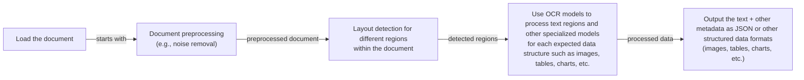
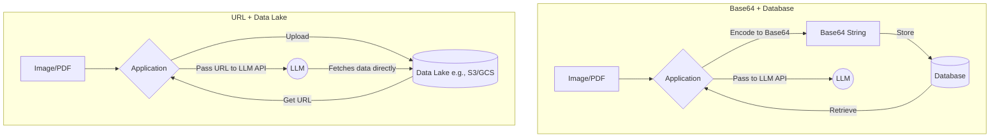
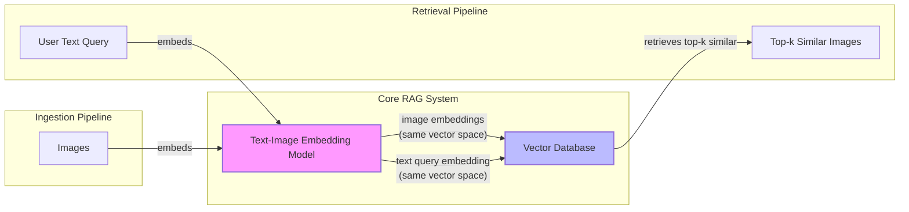
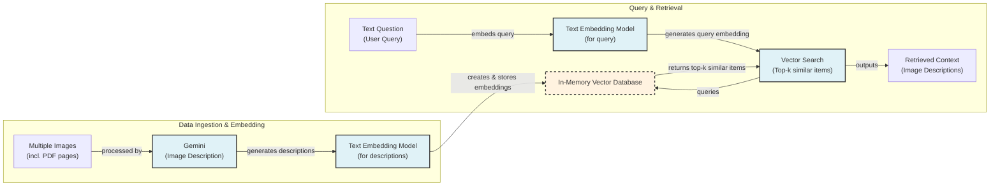
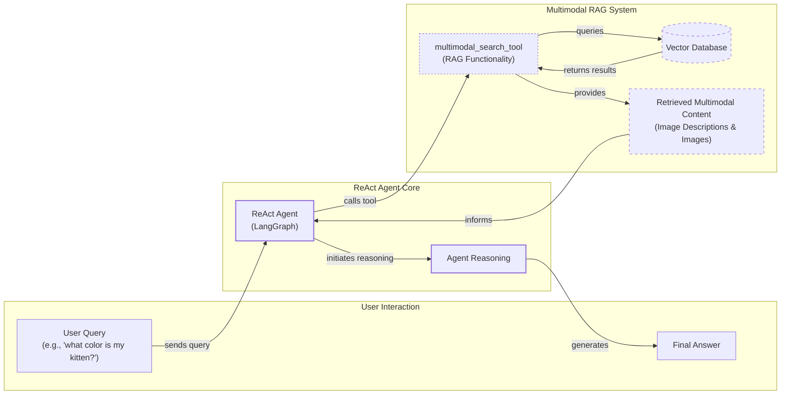

# Lesson 11: Multimodal

In the previous lessons, we have built a solid foundation in AI Engineering. We have explored the agent landscape, distinguished between LLM workflows and AI agents, engineered context, structured outputs, and built agents that can reason, use tools, and remember information. We even did a deep dive into Retrieval-Augmented Generation (RAG). Now, we will tackle the final piece of the puzzle for Part 1: working with multimodal data.

In the real world, we rarely work only with text. As humans, our daily interactions involve a rich mix of text, images, documents, and audio. Integrating these modalities into our AI systems is not just a feature; it is a necessity. For any enterprise AI application, the ability to process private data from databases, warehouses, and data lakes—in all its varied formats—is critical. For example, text-only approaches fall short when analyzing financial reports with complex charts, processing medical documents with visual diagnostics, or understanding technical manuals filled with diagrams [[6]](https://konfuzio.com/en/chatgpt-financial-analysis/), [[7]](https://techtoday.lenovo.com/sites/default/files/2025-05/Medical%20Imaging%20White%20Paper%20NVIDIA%20and%20Lenovo.pdf), [[8]](https://www.ijcai.org/proceedings/2023/0581.pdf). Common use cases for multimodal models include object detection, classification, and image captioning [[41]](https://github.com/cognitivetech/llm-research-summaries/blob/main/models-review/A-Comprehensive-Survey-and-Guide-to-Multimodal-Large-Language-Models-in-Vision-Language-Tasks.md).

Early AI applications tried to normalize everything to text. We used Optical Character Recognition (OCR) to parse documents or described images with captions. The central idea of this lesson is that this approach is outdated. Instead of translating images or documents to text, modern AI systems process them directly in their native format. This preserves the rich visual information that gets lost in translation.

We will cover the theory behind how multimodal LLMs, embedding models, and RAG systems work. Then, we will dive into hands-on examples, showing you how to build systems that combine text, images, and documents. By the end, you will have the knowledge to build enterprise-grade AI agents and workflows that can process your organization’s data in its native, multimodal form.

## Limitations of traditional document processing

To understand why a shift to multimodal AI is necessary, we need to look at the limitations of traditional document processing. When building AI systems to handle invoices, reports, or technical manuals, the old way was to convert everything to text. This works for simple text files, but it fails spectacularly with visually complex documents. When a document contains diagrams, charts, or sketches, translating them to text is like trying to describe a painting over the phone—you lose all the important details.

This problem is most apparent in systems that rely on OCR. The typical workflow is a multi-step pipeline that is slow, expensive, and fragile [[46]](https://www.daft.ai/blog/end-to-end-distributed-pdf-processing-pipeline).



Image 1: A flowchart illustrating the traditional document processing workflow for documents like PDFs with mixed content.

This pipeline has too many moving parts. You need a model for layout detection, another for OCR, and often separate models for tables, charts, and other data structures. This complexity creates several problems:
- **Rigidity:** The system is rigid. If a document contains a new data structure you have not built a model for, like an engineering diagram, the pipeline fails. Template-driven systems are particularly brittle, breaking with minor layout changes [[49]](https://www.llamaindex.ai/blog/ocr-for-tables).
- **Cost and Speed:** Calling multiple models for a single document is slow and expensive, making it unfeasible for real-time applications. The sequential nature of the pipeline creates bottlenecks, and the need for manual validation and correction for complex documents further slows down the process [[47]](https://learn.microsoft.com/en-us/answers/questions/5668164/why-traditional-ocr-fails-for-complex-business-doc?page=1).
- **Fragility:** With so many components, the system is fragile. An error in any single step can cause the entire process to fail. This multi-step nature creates a cascade effect where errors compound, leading to unreliable outputs [[46]](https://www.daft.ai/blog/end-to-end-distributed-pdf-processing-pipeline), [[50]](https://intuitionlabs.ai/articles/ai-pdf-data-extraction-clinical-research).

Even with these complex pipelines, performance is a major issue. Even advanced OCR engines struggle. On simple layouts, they can achieve 88-94% accuracy, but this often drops on complex documents with mixed content types [[1]](https://www.llamaindex.ai/blog/ocr-accuracy). Poor scan quality, such as a resolution below 300 DPI, can cause accuracy to drop by over 20%, and a slight 5-degree tilt can increase word error rates by more than 15% [[1]](https://www.llamaindex.ai/blog/ocr-accuracy). They also fail on handwritten text, stylized fonts, or complex layouts like nested tables or technical drawings [[50]](https://intuitionlabs.ai/articles/ai-pdf-data-extraction-clinical-research). Technical drawings, from architectural building sketches to complex biological diagrams like the one shown in Image 2, are notoriously difficult for traditional systems.

Image 2: A technical diagram of an insect's anatomy, an example of a complex document that would challenge traditional OCR systems. (Source [https://etc.usf.edu/clipart/36300/36307/insect_36307.htm](https://etc.usf.edu/clipart/36300/36307/insect_36307.htm))

While this approach might work for highly specialized applications, it does not scale in a world where AI agents need to be flexible and fast. This is why modern AI solutions use multimodal LLMs, which can directly interpret text, images, and even PDFs as native input, completely bypassing the messy OCR workflow. Let's understand how they work.

## Foundations of multimodal LLMs

Before we start coding, you need to understand the intuition behind multimodal LLMs. You do not need to know every technical detail—that is the job of an AI researcher. As an AI engineer, however, you need a solid mental model of how these systems work to use, deploy, and optimize them effectively.

There are two common architectural approaches for building multimodal LLMs that combine text and images.

Image 3: The two main approaches to developing multimodal LLM architectures. (Source [Understanding Multimodal LLMs](https://magazine.sebastianraschka.com/p/understanding-multimodal-llms))

The first is the **Unified Embedding Decoder Architecture**. In this design, an image encoder converts an image into a sequence of tokens, which are then concatenated with text tokens and fed into a standard LLM decoder. The second is the **Cross-Modality Attention Architecture**, where image features are injected directly into the LLM's attention layers, allowing the model to "look" at the image while processing text.

### Unified Embedding Decoder Architecture

The unified embedding decoder approach is popular for its simplicity. It uses a standard LLM architecture, like a GPT or Llama model, without any modifications. The image is converted into embedding vectors that have the same size as the text embeddings. These image and text embeddings are then simply concatenated and passed to the LLM as a single sequence of input tokens [[21]](https://magazine.sebastianraschka.com/p/understanding-multimodal-llms).

Image 4: An illustration of the unified embedding decoder architecture. (Source [Understanding Multimodal LLMs](https://magazine.sebastianraschka.com/p/understanding-multimodal-llms))

### Cross-Modality Attention Architecture

The cross-modality attention approach is more complex but can be more efficient. Instead of adding image tokens to the input sequence, this method introduces them within the transformer blocks of the LLM. It uses a cross-attention mechanism, where the text tokens (queries) can "attend to" the image tokens (keys and values). This is similar to the original transformer architecture used for machine translation, where the decoder attends to the encoder's output [[21]](https://magazine.sebastianraschka.com/p/understanding-multimodal-llms).

Image 5: An illustration of the Cross-Modality Attention Architecture. (Source [Understanding Multimodal LLMs](https://magazine.sebastianraschka.com/p/understanding-multimodal-llms))

### How Image Encoders Work

Both approaches rely on an image encoder to transform images into numerical representations, or embeddings. This process is analogous to how text is tokenized and embedded in a standard LLM.

Image 6: A side-by-side comparison of image tokenization and text tokenization. (Source [Understanding Multimodal LLMs](https://magazine.sebastianraschka.com/p/understanding-multimodal-llms))

The image encoder, typically a Vision Transformer (ViT), first divides the image into a grid of smaller patches. Each patch is then flattened and passed through a linear projection layer to create an embedding vector. This is similar to how a text tokenizer breaks a sentence into subwords and an embedding layer converts them into vectors.

Image 7: An illustration of a classic Vision Transformer (ViT) setup. (Source [Understanding Multimodal LLMs](https://magazine.sebastianraschka.com/p/understanding-multimodal-llms))

A crucial step is aligning the image and text embeddings in the same vector space. This is achieved through a technique called contrastive learning, where the model learns to place similar concepts close together, regardless of their modality. Models like CLIP (Contrastive Language-Image Pre-training) are trained on massive datasets of image-text pairs to learn this shared embedding space. This allows for semantic similarity searches between text and images, which is the foundation of multimodal RAG [[3]](https://www.pinecone.io/learn/series/image-search/clip/).

Image 8: A toy representation of a multimodal embedding space where text and images are aligned. (Source [Multimodal Embeddings: An Introduction](https://towardsdatascience.com/multimodal-embeddings-an-introduction-5dc36975966f/))

### Trade-offs and Modern Models

Each architecture has its trade-offs. The unified decoder approach is simpler to implement and often achieves higher accuracy on OCR-related tasks. The cross-attention method is more computationally efficient, especially for high-resolution images, as it avoids lengthening the input sequence. Hybrid approaches, like NVIDIA's NVLM-H, combine the strengths of both, using a low-resolution thumbnail as input and high-resolution patches via cross-attention [[36]](https://arxiv.org/html/2409.11402).

Today, most frontier LLMs are multimodal. In the open-source world, we have models like Llama 4, Gemma 2, Qwen3, and DeepSeek R1/V3, while proprietary models include GPT-5, Gemini 2.5, and the Claude family [[22]](https://medium.com/data-science-in-your-pocket/2025-the-year-ai-reasoning-models-took-over-a-month-by-month-review-of-frontier-breakthroughs-6ea2163f854f), [[26]](https://www.promptitude.io/post/ultimate-2025-ai-language-models-comparison-gpt5-gpt-4-claude-gemini-sonar-more). This architecture can also be extended to other modalities like audio and video by adding specialized encoders for each data type [[27]](https://sparkco.ai/blog/exploring-multimodal-llms-text-image-and-video-integration).

These techniques have applications far beyond document analysis. In e-commerce, for example, multimodal embeddings are used to enhance product recommendation systems. By combining visual features from product images (extracted with a ViT) and textual information from titles and descriptions (embedded with a model like BERT), systems can gain a much richer understanding of each item. This allows for more relevant recommendations, helps alleviate data sparsity for new or niche products, and can even detect mismatches between an item's image and its description, filtering out low-quality listings [[58]](https://assets.amazon.science/89/bf/661d950d4059930c8f1d2e449ac6/joint-visual-textual-embedding-for-multimodal-style-search.pdf).

It is also important to distinguish these multimodal LLMs from diffusion-based image generation models like Midjourney or Stable Diffusion. While multimodal LLMs like GPT-4o can also generate images, diffusion models are a different family of models specialized for generation. In agentic systems, these can be integrated as tools, but they are not the focus of this course [[19]](https://arxiv.org/html/2409.14993v3).

This was a brief overview to give you an intuition of how multimodal LLMs work. Now that we understand how they can directly process images and documents, let's see this in practice.

## Applying multimodal LLMs to images and PDFs

To better understand how multimodal LLMs work, let's go through a few examples with Gemini. There are three core ways to process multimodal data with LLMs: as raw bytes, as Base64-encoded strings, and as URLs.

- **Raw bytes:** This is the most direct method and works well for one-off API calls. However, storing raw bytes in a database can be problematic, as many databases interpret the data as text, which can lead to corruption.
- **Base64:** This method encodes raw bytes as a string, making it safe to store in databases like PostgreSQL or MongoDB. The downside is that it increases the data size by about 33%.
- **URLs:** This is the most efficient option for production systems. Data can be stored in a data lake like AWS S3 or Google Cloud Storage, and the LLM can access it directly via a URL. This avoids passing large files over the network, reducing I/O bottlenecks.



Image 9: A diagram comparing the workflow for processing multimodal data using Base64 with a database versus using URLs with a data lake.

When building AI applications, you will choose between these methods based on your architecture. For one-off API calls, raw bytes are fine. For systems that store data in a traditional database, Base64 is a safe choice. For scalable, enterprise-grade applications, using a data lake with URLs is the best practice.

Now, let's dig into the code. We will show you how to work with images and PDFs in various formats using Gemini for tasks ranging from simple captioning to more complex object detection.

<aside>
💡

You can find the code for this lesson in the `lessons/11_multimodal/notebook.ipynb` file in the course's GitHub repository [[9]](https://github.com/towardsai/course-ai-agents/blob/dev/lessons/11_multimodal/notebook.ipynb).

</aside>

### Setup

First, we set up our environment by initializing the Gemini client and defining the model we will use. We will use `gemini-2.5-flash`, which is fast and cost-effective for these examples.

```python
import base64
import io
from pathlib import Path
from typing import Literal

from google import genai
from google.genai import types
from IPython.display import Image as IPythonImage
from PIL import Image as PILImage

from lessons.utils import env, pretty_print

env.load(required_env_vars=["GOOGLE_API_KEY"])

client = genai.Client()
MODEL_ID = "gemini-2.5-flash"
```

### Working with Images

Let's start with a sample image.

```python
def display_image(image_path: Path) -> None:
    """
    Display an image from a file path in the notebook.
    """
    image = IPythonImage(filename=image_path, width=400)
    display(image)

display_image(Path("images") / "image_1.jpeg")
```

1.  We will first process the image as raw bytes. We define a helper function to load the image, resize it if necessary, and convert it to bytes in WEBP format for efficiency.
    ```python
    def load_image_as_bytes(
        image_path: Path, format: Literal["WEBP", "JPEG", "PNG"] = "WEBP", max_width: int = 600, return_size: bool = False
    ) -> bytes | tuple[bytes, tuple[int, int]]:
        """
        Load an image from file path and convert it to bytes with optional resizing.
        """
        image = PILImage.open(image_path)
        if image.width > max_width:
            ratio = max_width / image.width
            new_size = (max_width, int(image.height * ratio))
            image = image.resize(new_size)
    
        byte_stream = io.BytesIO()
        image.save(byte_stream, format=format)
    
        if return_size:
            return byte_stream.getvalue(), image.size
    
        return byte_stream.getvalue()
    
    image_bytes = load_image_as_bytes(image_path=Path("images") / "image_1.jpeg", format="WEBP")
    ```
    The image is now represented as a sequence of bytes.
    ```text
    Bytes `b'RIFF`\xad\x00\x00WEBPVP8 T\xad\x00\x00P\xec\x02\x9d\x01*X\x02X\x02'...`
    Size: 44392 bytes
    ```
    We can pass these bytes directly to the Gemini API to generate a caption.
    ```python
    response = client.models.generate_content(
        model=MODEL_ID,
        contents=[
            types.Part.from_bytes(
                data=image_bytes,
                mime_type="image/webp",
            ),
            "Tell me what is in this image in one paragraph.",
        ],
    )
    ```
    It outputs:
    ```text
    This striking image features a massive, dark metallic robot, its powerful form detailed with intricate circuit patterns on its head and piercing red glowing eyes. Perched playfully on its right arm is a small, fluffy grey tabby kitten, its front paw raised as if exploring or batting at the robot's armored limb, while its gaze is directed slightly off-frame. The robot's large, segmented hand is visible beneath the kitten. The background suggests an industrial or workshop environment, with hints of metal structures and natural light filtering in from an unseen window, creating a dramatic contrast between the soft, vulnerable kitten and the formidable, mechanical sentinel.
    ```
    We can also pass multiple images to compare them.
    ```python
    response = client.models.generate_content(
        model=MODEL_ID,
        contents=[
            types.Part.from_bytes(
                data=load_image_as_bytes(image_path=Path("images") / "image_1.jpeg", format="WEBP"),
                mime_type="image/webp",
            ),
            types.Part.from_bytes(
                data=load_image_as_bytes(image_path=Path("images") / "image_2.jpeg", format="WEBP"),
                mime_type="image/webp",
            ),
            "What's the difference between these two images? Describe it in one paragraph.",
        ],
    )
    ```
    It outputs:
    ```text
    The primary difference between the two images lies in the nature of the interaction depicted and their respective settings. In the first image, a small, grey kitten is shown curiously interacting with a large, metallic robot, gently perched on its arm within what appears to be a clean, well-lit workshop or industrial space. Conversely, the second image portrays a tense and aggressive confrontation between a fluffy white dog and a sleek black robot, both in combative stances, amidst a cluttered and grimy urban alleyway filled with trash and graffiti.
    ```

2.  Next, we will process the same image as a Base64-encoded string.
    ```python
    from typing import cast

    def load_image_as_base64(
        image_path: Path, format: Literal["WEBP", "JPEG", "PNG"] = "WEBP", max_width: int = 600, return_size: bool = False
    ) -> str:
        """
        Load an image and convert it to base64 encoded string.
        """
        image_bytes = load_image_as_bytes(image_path=image_path, format=format, max_width=max_width, return_size=False)
        return base64.b64encode(cast(bytes, image_bytes)).decode("utf-8")

    image_base64 = load_image_as_base64(image_path=Path("images") / "image_1.jpeg", format="WEBP")
    ```
    As you can see, the Base64 string is about 33% larger than the raw bytes.
    ```text
    Image as Base64 is 33.34% larger than as bytes
    ```
    We can then pass this string to the model to generate a caption, which yields a similar result.

3.  We can also process images and PDFs from public URLs. Gemini has a built-in `url_context` tool that can fetch and parse content directly from a URL. Here, we ask it to summarize the original ReAct paper.
    ```python
    response = client.models.generate_content(
        model=MODEL_ID,
        contents="Based on the provided paper as a PDF, tell me how ReAct works: https://arxiv.org/pdf/2210.03629",
        config=types.GenerateContentConfig(tools=[{"url_context": {}}]),
    )
    ```
    It outputs:
    ```text
    ReAct is a novel paradigm for large language models (LLMs) that combines reasoning (Thought) and acting (Action) in an interleaved manner to solve diverse language and decision-making tasks. This approach allows the model to:

    *   **Reason to Act:** Generate verbal reasoning traces to induce, track, and update action plans, and handle exceptions.
    *   **Act to Reason:** Interface with and gather additional information from external sources (like knowledge bases or environments) to incorporate into its reasoning.
    
    ...
    ```

4.  For private data lakes, the process is similar. While the Gemini API currently works best with Google Cloud Storage, you can pass a URI to your private file. For simplicity, we will show a mocked example.
    ```python
    # response = client.models.generate_content(
    #     model=MODEL_ID,
    #     contents=[
    #         types.Part.from_uri(uri="gs://gemini-images/image_1.jpeg", mime_type="image/webp"),
    #         "Tell me what is in this image in one paragraph.",
    #     ],
    # )
    ```

### Object Detection with LLMs

A more advanced use case is object detection. We can ask the LLM to identify objects in an image and return their bounding box coordinates.

1.  First, we define the desired output structure using Pydantic models, a technique we covered in Lesson 4.
    ```python
    from pydantic import BaseModel, Field

    class BoundingBox(BaseModel):
        ymin: float
        xmin: float
        ymax: float
        xmax: float
        label: str = Field(
            default="The category of the object found within the bounding box. For example: cat, dog, diagram, robot."
        )
    
    class Detections(BaseModel):
        bounding_boxes: list[BoundingBox]
    ```

2.  We create a prompt asking the model to detect prominent items and return their normalized coordinates.
    ```python
    prompt = """
    Detect all of the prominent items in the image. 
    The box_2d should be [ymin, xmin, ymax, xmax] normalized to 0-1000.
    Also, output the label of the object found within the bounding box.
    """
    image_bytes, image_size = load_image_as_bytes(
        image_path=Path("images") / "image_1.jpeg", format="WEBP", return_size=True
    )
    ```

3.  We configure the Gemini client to return a JSON object that conforms to our `Detections` schema and call the model.
    ```python
    config = types.GenerateContentConfig(
        response_mime_type="application/json",
        response_schema=Detections,
    )
    
    response = client.models.generate_content(
        model=MODEL_ID,
        contents=[
            types.Part.from_bytes(
                data=image_bytes,
                mime_type="image/webp",
            ),
            prompt,
        ],
        config=config,
    )
    
    detections = cast(Detections, response.parsed)
    ```
    It outputs:
    ```text
    Image size: (600, 600)
    ymin=1.0 xmin=450.0 ymax=997.0 xmax=1000.0 label='robot'
    ymin=269.0 xmin=39.0 ymax=782.0 xmax=530.0 label='kitten'
    ```

4.  Finally, we can use a helper function to visualize the detected bounding boxes on the original image.
    ```python
    import matplotlib.pyplot as plt
    import matplotlib.patches as patches
    import numpy as np

    def visualize_detections(detections: Detections, image_path: Path) -> None:
        # ... (visualization code from notebook) ...
    
    visualize_detections(detections, Path("images") / "image_1.jpeg")
    ```
    

### Working with PDFs

Processing PDFs is nearly identical to processing images. We can pass the PDF as bytes or a Base64 string. Let's use the famous "Attention Is All You Need" paper as an example.

1.  First, we load the PDF as bytes and ask the model for a summary.
    ```python
    pdf_bytes = (Path("pdfs") / "attention_is_all_you_need_paper.pdf").read_bytes()
    response = client.models.generate_content(
        model=MODEL_ID,
        contents=[
            types.Part.from_bytes(data=pdf_bytes, mime_type="application/pdf"),
            "What is this document about? Provide a brief summary of the main topics.",
        ],
    )
    ```
    It outputs:
    ```text
    This document introduces the **Transformer**, a novel neural network architecture designed for **sequence transduction tasks** (like machine translation).
    
    Its main topics include:
    
    1.  **Dispensing with Recurrence and Convolutions**: ...
    2.  **Attention Mechanisms**: ...
    3.  **Parallelization and Efficiency**: ...
    4.  **Superior Performance**: ...
    5.  **Positional Encoding**: ...
    ```

2.  We can also process the PDF as a Base64 string.
    ```python
    def load_pdf_as_base64(pdf_path: Path) -> str:
        """
        Load a PDF file and convert it to base64 encoded string.
        """
        with open(pdf_path, "rb") as f:
            return base64.b64encode(f.read()).decode("utf-8")

    pdf_base64 = load_pdf_as_base64(pdf_path=Path("pdfs") / "attention_is_all_you_need_paper.pdf")
    response = client.models.generate_content(
        model=MODEL_ID,
        contents=[
            "What is this document about? Provide a brief summary of the main topics.",
            types.Part.from_bytes(data=pdf_base64, mime_type="application/pdf"),
        ],
    )
    ```
    It outputs a similar summary.

3.  To further demonstrate the power of processing documents as images, let's perform object detection on a page from the paper to extract the main architecture diagram.
    ```python
    display_image(Path("images") / "attention_is_all_you_need_1.jpeg")
    ```
    
    We use the same object detection prompt as before, but this time we ask it to find diagrams.
    ```python
    prompt = """
    Detect all the diagrams from the provided image as 2d bounding boxes. 
    The box_2d should be [ymin, xmin, ymax, xmax] normalized to 0-1000.
    Also, output the label of the object found within the bounding box.
    """
    image_bytes, image_size = load_image_as_bytes(
        image_path=Path("images") / "attention_is_all_you_need_1.jpeg", format="WEBP", return_size=True
    )
    # ... (call the model) ...
    detections = cast(Detections, response.parsed)
    visualize_detections(detections, Path("images") / "attention_is_all_you_need_1.jpeg")
    ```
    

This ability to understand the visual layout of a document is something that traditional OCR-based methods simply cannot replicate. It highlights how redundant it is to translate complex visual information into text.

## Foundations of multimodal RAG

One of the most common use cases for multimodal data is RAG, a concept we explored in Lesson 10. When building custom AI applications, you will almost always need to retrieve private company data to feed into your LLM. For large documents or image collections, RAG is not just useful; it is essential. Stuffing thousands of PDF pages into a model's context window is unfeasible due to the direct correlation between context size and increased latency, cost, and decreased performance.

A generic multimodal RAG architecture for images and text works as follows:

-   **Ingestion:**
    1.  We embed a collection of images using a text-image embedding model.
    2.  We store these image embeddings in a vector database.
-   **Retrieval:**
    1.  We embed the user's text query using the same embedding model.
    2.  We search the vector database to find the `top-k` most similar images based on the cosine distance between the query embedding and the image embeddings.

Because the text and image embeddings exist in the same vector space, this process works seamlessly. This is the same technique used by image search engines like Google Photos when you search for "pictures of dogs" [[4]](https://opensearch.org/blog/multimodal-semantic-search/).



Image 10: A diagram illustrating the ingestion and retrieval pipelines of a generic multimodal RAG system.

For enterprise use cases involving complex PDF documents, one of the most popular modern architectures is ColPali. It builds on the foundations of Vision Language Models like PaliGemma and late-interaction mechanisms pioneered by ColBERT [[5]](https://huggingface.co/blog/manu/colpali). It bypasses the entire OCR pipeline by processing document images directly, preserving the rich visual context of tables, figures, and layouts. This approach is 2-10x faster and has fewer failure points than traditional OCR pipelines. On the ViDoRe benchmark, ColPali significantly outperforms baseline systems, achieving an 81.3% average nDCG@5 score [[11]](https://arxiv.org/pdf/2407.01449v6).

Image 11: A diagram comparing the simple, end-to-end ColPali architecture with standard, multi-step retrieval methods. (Source [ColPali: Efficient Document Retrieval with Vision Language Models](https://arxiv.org/pdf/2407.01449v6))

ColPali works by dividing a document image into patches and generating a "bag-of-embeddings" for each page. Instead of a single vector, each document is represented by multiple vectors, one for each patch. At query time, it uses a late interaction mechanism called MaxSim. Unlike cosine similarity, which computes a single score between a query vector and a document vector, MaxSim performs a more granular comparison. For each token in the query, it finds its maximum similarity score across all patches in the document, and then sums these maximums to get the final relevance score [[12]](https://www.mixedbread.com/blog/maxsim-cpu).

This multi-vector approach is powerful but introduces significant engineering challenges. Storing thousands of vectors per page creates massive indexes, and the MaxSim computation is far more expensive than a simple dot product. This leads to high memory usage and query latency, which are major bottlenecks when scaling to millions of documents [[13]](https://apxml.com/courses/large-scale-distributed-rag/chapter-1-scalable-rag-architectures-foundations/scaling-rag-bottlenecks-limitations), [[14]](https://www.superteams.ai/blog/extracting-knowledge-from-complex-pdf-documents-enterprise). To address this, researchers have developed optimization techniques like binary quantization, which converts float vectors into binary strings. This allows the use of the much faster hamming distance for similarity calculations, reducing computational cost and storage by over 30x while retaining most of the accuracy [[15]](https://blog.vespa.ai/scaling-colpali-to-billions/).

Real-world applications for this technology are vast, especially for RAG systems that need to interpret complex PDFs, such as financial document analysis with charts and tables, or technical documentation with diagrams and sketches [[11]](https://arxiv.org/pdf/2407.01449v6). The official implementation can be found on GitHub at `illuin-tech/colpali`. While current systems excel at static document retrieval, an open research direction is extending these multi-vector techniques to dynamic content, such as live video streams [[16]](https://arxiv.org/html/2506.06144v1). Now that we have the theory, let's implement a simple multimodal RAG system from scratch.

## Implementing multimodal RAG for images, PDFs and text

Let's connect all the dots with a more complex coding example where we combine what we have learned in this lesson and Lesson 10 on RAG into a multimodal RAG exercise. We will build a simple multimodal RAG system that populates an in-memory vector database with images and PDF pages, then queries it with text questions. To keep it simple, we will not implement image patching or a late-interaction mechanism like ColPali, but the core principles remain the same.



Image 12: A diagram illustrating our multimodal RAG example, showing data ingestion and query retrieval with an in-memory vector database.

Here is the collection of images and PDF pages we will index.
```python
def display_image_grid(image_paths: list[Path], rows: int = 2, cols: int = 2, figsize: tuple = (8, 6)) -> None:
    # ... (code from notebook) ...

display_image_grid(
    image_paths=[
        Path("images") / "image_1.jpeg",
        Path("images") / "image_2.jpeg",
        Path("images") / "image_3.jpeg",
        Path("images") / "image_4.jpeg",
        Path("images") / "attention_is_all_you_need_1.jpeg",
        Path("images") / "attention_is_all_you_need_2.jpeg",
    ],
    rows=2,
    cols=3,
)
```

1.  First, we define a function to create our vector index. Since the Gemini Developer API does not support image embeddings directly, we will generate a text description for each image using Gemini and then embed that description. This is not the recommended approach, but it allows us to demonstrate the RAG workflow without adding another API. With a true multimodal embedding model like Voyage, Cohere, or Google's embedding models on Vertex AI, you would embed the image bytes directly. The rest of the RAG system would remain conceptually the same.
    ```python
    # Mocked code for direct image embedding
    image_bytes = ...
    # SKIPPED !
    # image_description = generate_image_description(image_bytes)
    image_embeddings = embed_with_multimodal(image_bytes)
    ```
    Here is our implementation using image descriptions.
    ```python
    from typing import cast

    def create_vector_index(image_paths: list[Path]) -> list[dict]:
        """
        Create embeddings for images by generating descriptions and embedding them.
        """
        vector_index = []
        for image_path in image_paths:
            image_bytes = cast(bytes, load_image_as_bytes(image_path, format="WEBP", return_size=False))
            image_description = generate_image_description(image_bytes)
            image_embedding = embed_text_with_gemini(image_description)
            vector_index.append(
                {
                    "content": image_bytes,
                    "type": "image",
                    "filename": image_path,
                    "description": image_description,
                    "embedding": image_embedding,
                }
            )
        return vector_index
    ```

2.  Next, we define the helper functions for generating descriptions and embeddings.
    ```python
    from io import BytesIO
    from typing import Any
    import numpy as np

    def generate_image_description(image_bytes: bytes) -> str:
        # ... (code from notebook) ...

    def embed_text_with_gemini(content: str) -> np.ndarray | None:
        # ... (code from notebook) ...
    ```

3.  We create the `vector_index`, which is a simple list for this example. In a real-world application, you would use a dedicated vector database with optimized indexes like HNSW.
    ```python
    image_paths = list(Path("images").glob("*.jpeg"))
    vector_index = create_vector_index(image_paths)
    ```
    It outputs:
    ```text
    ✅ Successfully created 7 embeddings under the `vector_index` variable
    ```
    Each item in our index contains the image content, its description, and its embedding.
    ```python
    vector_index[0].keys()
    # dict_keys(['content', 'type', 'filename', 'description', 'embedding'])
    vector_index[0]["embedding"].shape
    # (3072,)
    print(f"{vector_index[0]['description'][:150]}...")
    # This image is a page from a technical or scientific document, likely a research paper, textbook, or dissertation related to machine learning, deep lea...
    ```

4.  Now, we define a search function that takes a text query, embeds it, and finds the `top_k` most similar images from our index using cosine similarity.
    ```python
    from sklearn.metrics.pairwise import cosine_similarity

    def search_multimodal(query_text: str, vector_index: list[dict], top_k: int = 3) -> list[Any]:
        # ... (code from notebook) ...
    ```

5.  Let's test it by searching for the Transformer architecture.
    ```python
    query = "what is the architecture of the transformer neural network?"
    results = search_multimodal(query, vector_index, top_k=1)
    ```
    The system correctly retrieves the page from the "Attention Is All You Need" paper that contains the architecture diagram.
    ```text
    Similarity 0.744
    Filename images/attention_is_all_you_need_1.jpeg
    Description `This image is a detailed technical document, likely from a research paper or academic publication, featuring a prominent diagram of the Transformer model architecture alongside explanatory text...`
    ```
    

6.  Let's try another query.
    ```python
    query = "a kitten with a robot"
    results = search_multimodal(query, vector_index, top_k=1)
    ```
    It correctly retrieves the image of the kitten and the robot.
    ```text
    Similarity 0.811
    Filename images/image_1.jpeg
    Description `This image is a detailed, photorealistic digital rendering or illustration depicting an unlikely interaction between a large, imposing robot and a small, delicate kitten in an industrial setting...`
    ```
    

This example shows how we can use the same system to search across both standard images and document pages, simply by treating everything as an image. This approach could easily be extended to video frames or audio spectrograms.

## Building multimodal AI agents

Now, let's take our RAG system a step further and integrate it into a ReAct agent as a tool. This will consolidate many of the skills we have learned in Part 1 of this course.

Multimodal capabilities can be added to AI agents in several ways:
-   **Multimodal Inputs/Outputs:** The agent's reasoning LLM can directly process and generate multimodal content.
-   **Multimodal Retrieval Tools:** The agent can use tools, like our RAG function, to search across multimodal data.
-   **Other Multimodal Tools:** The agent can interact with external resources like company PDFs, screenshots, or videos.

A key trend influencing the deployment of such agents is the rise of edge AI. For applications that require real-time responses and data privacy—such as quality inspection in manufacturing or diagnostic analysis in healthcare—agents are increasingly deployed directly on devices. This is made possible by specialized hardware like Neural Processing Units (NPUs) and model optimization techniques like quantization, which shrink large models to run efficiently without cloud connectivity [[17]](https://www.n-ix.com/edge-ai-trends/).

In this example, we will create a ReAct agent using LangGraph and connect our `search_multimodal` function as a tool. We will then ask the agent about the color of the kitten from our indexed images.



Image 13: A diagram illustrating our multimodal ReAct agent, which uses a RAG tool to answer user queries.

1.  First, we define our `multimodal_search_tool` using LangChain's `@tool` decorator. This function will wrap our RAG logic, search the vector index, and return the retrieved content to the agent.
    ```python
    from langchain_core.tools import tool
    from typing import Any

    @tool
    def multimodal_search_tool(query: str) -> dict[str, Any]:
        """
        Search through a collection of images and their text descriptions to find relevant content.
        """
        pretty_print.wrapped(query, title="🔍 Tool executing search for:")
        results = search_multimodal(query, vector_index, top_k=1)
        if not results:
            return {"role": "tool_result", "content": "No relevant content found for your query."}
        
        result = results[0]
        content = [
            {"type": "text", "text": f"Image description: {result['description']}"},
            types.Part.from_bytes(data=result["content"], mime_type="image/jpeg"),
        ]
        return {"role": "tool_result", "content": content}
    ```

2.  Next, we build our ReAct agent using LangGraph. We provide it with a system prompt that instructs it to use the search tool to answer questions about visual content. We will dive deeper into LangGraph in Part 2 of the course.
    ```python
    from langchain_google_genai import ChatGoogleGenerativeAI
    from langgraph.prebuilt import create_react_agent

    def build_react_agent() -> Any:
        """
        Build a ReAct agent with multimodal search capabilities.
        """
        tools = [multimodal_search_tool]
        system_prompt = """You are a helpful AI assistant that can search through images and text to answer questions.
        
        When asked about visual content like animals, objects, or scenes:
        1. Use the multimodal_search_tool to find relevant images and descriptions
        2. Carefully analyze the image or image descriptions from the search results
        3. Provide a clear, direct answer based on the search results
        """
        agent = create_react_agent(
            model=ChatGoogleGenerativeAI(model="gemini-2.5-pro", temperature=0.1),
            tools=tools,
            prompt=system_prompt,
        )
        return agent

    react_agent = build_react_agent()
    ```

3.  Finally, we ask our agent a question.
    ```python
    test_question = "what color is my kitten?"
    response = react_agent.invoke(input={"messages": test_question})
    ```
    The agent correctly identifies that it needs to use the search tool, calls it with the query "my kitten," retrieves the relevant image, and then answers the question based on the visual information.
    ```text
    🔍 Tool executing search for:
    my kitten
    
    🔍 Embedding query: 'my kitten'
    ✅ Query embedded successfully
    
    🤖 Agent response
    Based on the image, your kitten is a gray tabby. It has soft, short gray fur with darker tabby stripe patterns.
    ```
    

In this lesson, we combined structured outputs, tools, ReAct, RAG, and multimodal data to create a proof-of-concept for an agentic RAG system. This demonstrates how the fundamental concepts from Part 1 of this course come together to build powerful, real-world AI applications.

## Conclusion

In this lesson, we have seen why natively processing multimodal data is superior to traditional, text-centric approaches. By leveraging modern vision-language models, we can build systems that are simpler, faster, and more accurate. We will use these techniques in our capstone project to pass images and PDFs from our research agent to our writer agent, preserving the full visual context of the source material.

This was the final lesson of Part 1, where we covered the fundamentals of AI Engineering. In Part 2, we will move from theory to practice and begin building the course's central project: an interconnected research and writing agent system. We will explore agentic design patterns, compare modern frameworks, and use LangGraph to implement and orchestrate a complete, multi-agent pipeline from start to finish, considering real-world deployment patterns like hybrid edge-cloud architectures [[17]](https://www.n-ix.com/edge-ai-trends/).

## References

- [1] OCR Accuracy Explained: How to Improve It. (n.d.). LlamaIndex. [https://www.llamaindex.ai/blog/ocr-accuracy](https://www.llamaindex.ai/blog/ocr-accuracy)
- [2] Understanding Multimodal LLMs. (2024, November 3). Ahead of AI. [https://magazine.sebastianraschka.com/p/understanding-multimodal-llms](https://magazine.sebastianraschka.com/p/understanding-multimodal-llms)
- [3] Multi-modal ML with OpenAI's CLIP. (n.d.). Pinecone. [https://www.pinecone.io/learn/series/image-search/clip/](https://www.pinecone.io/learn/series/image-search/clip/)
- [4] Multimodal semantic search. (n.d.). OpenSearch. [https://opensearch.org/blog/multimodal-semantic-search/](https://opensearch.org/blog/multimodal-semantic-search/)
- [5] ColPali: Document Retrieval with Vision Language Models. (n.d.). Hugging Face. [https://huggingface.co/blog/manu/colpali](https://huggingface.co/blog/manu/colpali)
- [6] ChatGPT for financial analysis: Use cases & limitations. (n.d.). Konfuzio. [https://konfuzio.com/en/chatgpt-financial-analysis/](https://konfuzio.com/en/chatgpt-financial-analysis/)
- [7] Medical Imaging White Paper NVIDIA and Lenovo. (n.d.). Lenovo. [https://techtoday.lenovo.com/sites/default/files/2025-05/Medical%20Imaging%20White%20Paper%20NVIDIA%20and%20Lenovo.pdf](https://techtoday.lenovo.com/sites/default/files/2025-05/Medical%20Imaging%20White%20Paper%20NVIDIA%20and%20Lenovo.pdf)
- [8] A Unified Summarization Framework for Financial Reports with Text and Tables. (n.d.). IJCAI. [https://www.ijcai.org/proceedings/2023/0581.pdf](https://www.ijcai.org/proceedings/2023/0581.pdf)
- [9] [https://github.com/towardsai/course-ai-agents/blob/dev/lessons/11_multimodal/notebook.ipynb](https://github.com/towardsai/course-ai-agents/blob/dev/lessons/11_multimodal/notebook.ipynb)
- [10] 10 real-world examples of AI in healthcare. (2022, November 24). Philips. [https://www.philips.com/a-w/about/news/archive/features/2022/20221124-10-real-world-examples-of-ai-in-healthcare.html](https://www.philips.com/a-w/about/news/archive/features/2022/20221124-10-real-world-examples-of-ai-in-healthcare.html)
- [11] ColPali: Efficient Document Retrieval with Vision Language Models. (2024, July 1). arXiv. [https://arxiv.org/pdf/2407.01449v6](https://arxiv.org/pdf/2407.01449v6)
- [12] Understanding MaxSim on CPU. (n.d.). mixedbread. [https://www.mixedbread.com/blog/maxsim-cpu](https://www.mixedbread.com/blog/maxsim-cpu)
- [13] Scaling RAG: Bottlenecks & Limitations. (n.d.). APXML. [https://apxml.com/courses/large-scale-distributed-rag/chapter-1-scalable-rag-architectures-foundations/scaling-rag-bottlenecks-limitations](https://apxml.com/courses/large-scale-distributed-rag/chapter-1-scalable-rag-architectures-foundations/scaling-rag-bottlenecks-limitations)
- [14] Extracting Knowledge from Complex PDF Documents. (n.d.). Superteams.ai. [https://www.superteams.ai/blog/extracting-knowledge-from-complex-pdf-documents-enterprise](https://www.superteams.ai/blog/extracting-knowledge-from-complex-pdf-documents-enterprise)
- [15] Scaling ColPali to billions of PDFs with Vespa. (n.d.). Vespa.ai. [https://blog.vespa.ai/scaling-colpali-to-billions/](https://blog.vespa.ai/scaling-colpali-to-billions/)
- [16] Late-Interaction for Video Retrieval. (2025, June 12). arXiv. [https://arxiv.org/html/2506.06144v1](https://arxiv.org/html/2506.06144v1)
- [17] Edge AI trends: What's working now and what's next in 2026. (2026, February 25). N-iX. [https://www.n-ix.com/edge-ai-trends/](https://www.n-ix.com/edge-ai-trends/)
- [18] Multimodal Embeddings: An Introduction. (2024, November 29). Towards Data Science. [https://towardsdatascience.com/multimodal-embeddings-an-introduction-5dc36975966f/](https://towardsdatascience.com/multimodal-embeddings-an-introduction-5dc36975966f/)
- [19] A Survey on Multimodal Large Language Models. (2024, September 18). arXiv. [https://arxiv.org/html/2409.14993v3](https://arxiv.org/html/2409.14993v3)
- [20] 2025: The Year AI Reasoning Models Took Over. (2025, May 22). Medium. [https://medium.com/data-science-in-your-pocket/2025-the-year-ai-reasoning-models-took-over-a-month-by-month-review-of-frontier-breakthroughs-6ea2163f854f](https://medium.com/data-science-in-your-pocket/2025-the-year-ai-reasoning-models-took-over-a-month-by-month-review-of-frontier-breakthroughs-6ea2163f854f)
- [21] The Ultimate Guide to the Top Large Language Models in 2025. (n.d.). CodeDesign.ai. [https://codedesign.ai/blog/the-ultimate-guide-to-the-top-large-language-models-in-2025/](https://codedesign.ai/blog/the-ultimate-guide-to-the-top-large-language-models-in-2025/)
- [22] Exploring Multimodal LLMs: Text, Image, and Video Integration. (n.d.). SparkCognition. [https://sparkco.ai/blog/exploring-multimodal-llms-text-image-and-video-integration](https://sparkco.ai/blog/exploring-multimodal-llms-text-image-and-video-integration)
- [23] NVLM: Open Frontier-Class Multimodal LLMs. (2024, September 17). arXiv. [https://arxiv.org/html/2409.11402](https://arxiv.org/html/2409.11402)
- [24] A Comprehensive Survey and Guide to Multimodal Large Language Models in Vision-Language Tasks. (n.d.). GitHub. [https://github.com/cognitivetech/llm-research-summaries/blob/main/models-review/A-Comprehensive-Survey-and-Guide-to-Multimodal-Large-Language-Models-in-Vision-Language-Tasks.md](https://github.com/cognitivetech/llm-research-summaries/blob/main/models-review/A-Comprehensive-Survey-and-Guide-to-Multimodal-Large-Language-Models-in-Vision-Language-Tasks.md)
- [25] End-to-End Distributed PDF Processing Pipeline. (n.d.). Daft. [https://www.daft.ai/blog/end-to-end-distributed-pdf-processing-pipeline](https://www.daft.ai/blog/end-to-end-distributed-pdf-processing-pipeline)
- [26] Why Traditional OCR Fails for Complex Business Documents. (n.d.). Microsoft Learn. [https://learn.microsoft.com/en-us/answers/questions/5668164/why-traditional-ocr-fails-for-complex-business-doc?page=1](https://learn.microsoft.com/en-us/answers/questions/5668164/why-traditional-ocr-fails-for-complex-business-doc?page=1)
- [27] OCR for Tables: A Practical Guide. (n.d.). LlamaIndex. [https://www.llamaindex.ai/blog/ocr-for-tables](https://www.llamaindex.ai/blog/ocr-for-tables)
- [28] AI PDF Data Extraction for Clinical Research. (n.d.). Intuition Labs. [https://intuitionlabs.ai/articles/ai-pdf-data-extraction-clinical-research](https://intuitionlabs.ai/articles/ai-pdf-data-extraction-clinical-research)
- [29] Stop Converting Documents to Text. (n.d.). Decoding AI. [https://www.decodingai.com/p/stop-converting-documents-to-text](https://www.decodingai.com/p/stop-converting-documents-to-text)
- [30] Multimodal AI Search for Business Applications. (2024, May 10). Towards Data Science. [https://towardsdatascience.com/multimodal-ai-search-for-business-applications-65356d011009/](https://towardsdatascience.com/multimodal-ai-search-for-business-applications-65356d011009/)
- [31] How Multimodal Embeddings Elevate eBay’s Product Recommendations. (n.d.). eBay Inc. [https://innovation.ebayinc.com/stories/beyond-words-how-multimodal-embeddings-elevate-ebays-product-recommendations/](https://innovation.ebayinc.com/stories/beyond-words-how-multimodal-embeddings-elevate-ebays-product-recommendations/)
- [32] Joint Visual-Textual Embedding for Multimodal Style Search. (n.d.). Amazon Science. [https://assets.amazon.science/89/bf/661d950d4059930c8f1d2e449ac6/joint-visual-textual-embedding-for-multimodal-style-search.pdf](https://assets.amazon.science/89/bf/661d950d4059930c8f1d2e449ac6/joint-visual-textual-embedding-for-multimodal-style-search.pdf)
</article>