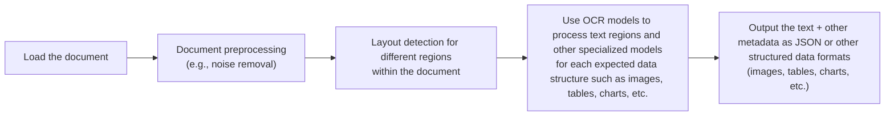
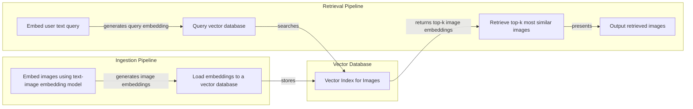
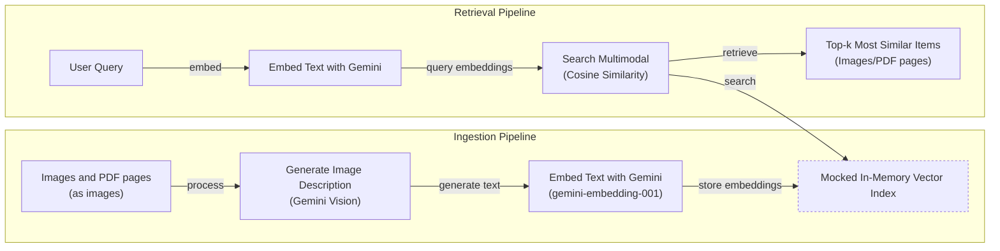
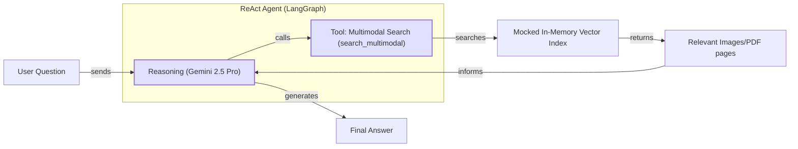

# Lesson 11: Building Multimodal AI Systems

In the previous lessons, we built a solid foundation in AI engineering. We explored the agent landscape, distinguished between LLM workflows and AI agents, and mastered context engineering, structured outputs, ReAct, memory, and RAG. You have learned how to build systems that can reason, act, and remember. However, so far, we have operated almost exclusively in the realm of text.

This lesson tackles the next frontier: multimodal AI. In the real world, information rarely comes in neat text files. We work with images, charts, and complex documents. For our AI systems to be truly useful, they must learn to see and understand this visual world. This is critical in enterprise settings where text-only approaches fall short. For example, a financial analyst needs an AI that can interpret charts in a report, a doctor needs a system that understands medical images alongside patient notes, and an engineer needs a tool that can parse diagrams in technical manuals [[57]](https://konfuzio.com/en/chatgpt-financial-analysis/), [[58]](https://techtoday.lenovo.com/sites/default/files/2025-05/Medical%20Imaging%20White%20Paper%20NVIDIA%20and%20Lenovo.pdf).

We will show you why simply converting everything to text is a flawed strategy and how modern AI systems process images and documents in their native format. This is not just a technical upgrade; it is a fundamental shift that unlocks the ability to build enterprise-grade AI applications that can handle the messy, multimodal reality of business data. We will cover the theory behind multimodal LLMs and embeddings, then move to hands-on examples using Google's Gemini to process images and PDFs. Finally, we will bring everything together by building a multimodal RAG system and integrating it into a ReAct agent. By the end, you will have the skills to build AI systems that can process and reason about text, images, and documents combined.

## Limitations of Traditional Document Processing

To understand why multimodal AI is a leap forward, we first need to look at the limitations of traditional document processing. For years, the standard approach for making sense of documents like invoices, reports, or technical manuals has been a multi-step pipeline centered around Optical Character Recognition (OCR). The goal was always the same: convert everything into text so a machine could read it.

This process is often complex and brittle. It begins with loading a document, followed by preprocessing steps like noise removal, deskewing, and binarization to clean up the image. A layout detection model then tries to identify different regions, such as paragraphs, tables, or images. Finally, an OCR model extracts text from the text regions, while other specialized models might handle tables or charts. The final output is usually a structured format like JSON, containing the extracted text and metadata [[38]](https://blog.roboflow.com/what-is-optical-character-recognition-ocr/), [[46]](https://www.daft.ai/blog/end-to-end-distributed-pdf-processing-pipeline).


Image 1: A flowchart illustrating the traditional document processing workflow.

This pipeline has too many moving parts. Relying on separate models for layout detection, OCR, and each specific data structure makes the system rigid. If a new document format with an unexpected chart type appears, the system can fail [[47]](https://learn.microsoft.com/en-us/answers/questions/5668164/why-traditional-ocr-fails-for-complex-business-doc?page=1). This approach is also slow and costly, as it requires multiple model calls for a single document. More importantly, this pipeline is fragile. Each step can introduce errors, and these errors compound. A small mistake in layout detection can lead to the OCR model reading text in the wrong order, completely scrambling the meaning.

Performance is a major challenge. Even advanced OCR engines struggle with real-world documents. While they can achieve 88-94% accuracy on simple layouts, this number drops significantly with poor-quality scans, handwritten notes, or complex layouts like nested tables. For anything requiring high accuracy on handwritten content, a character error rate (CER) of 3-5% is considered good, which still necessitates human review. The quality of the scan is paramount; images below 300 DPI can suffer a 20% or greater drop in accuracy, and a mere 5-degree tilt can increase the word error rate by 15% or more [[51]](https://www.llamaindex.ai/blog/ocr-accuracy).

When information is conveyed through visual cues—the spatial relationship between elements in a diagram, the color-coding in a chart, or the structure of a floor plan—converting it to text loses critical context. For example, architectural sketches or complex engineering diagrams are nearly impossible for traditional OCR to parse correctly because their meaning is embedded in the geometry and layout, not just the text labels. While this approach might work for highly specialized, predictable tasks, it does not scale for the flexible, fast-moving world of AI agents. That is why modern AI solutions use multimodal LLMs, such as Gemini, that can directly interpret text, images, and PDFs as native inputs, completely bypassing this brittle OCR workflow. Let's understand how they work.

## Foundations of Multimodal LLMs

Before we look at the code, you need a high-level intuition for how multimodal LLMs work. You do not need to be an AI researcher to use them, but as an AI engineer, understanding the core concepts is essential for building, optimizing, and monitoring these systems.

Most modern multimodal LLMs are built by extending text-only LLMs. There are two common architectural approaches for integrating vision with language, which we will illustrate using text and images as an example.
Image 2: The two main approaches to developing multimodal LLM architectures. (Source [Understanding Multimodal LLMs [[36]](https://magazine.sebastianraschka.com/p/understanding-multimodal-llms)])

The first is the **Unified Embedding Decoder Architecture**. This method is the simpler of the two. It converts an image into a sequence of embeddings and concatenates them with the text embeddings. The combined sequence is then fed into a standard LLM decoder, which processes both modalities together.
Image 3: Illustration of the unified embedding decoder architecture. (Source [Understanding Multimodal LLMs [[36]](https://magazine.sebastianraschka.com/p/understanding-multimodal-llms)])

The second approach is the **Cross-Modality Attention Architecture**. Instead of prepending image embeddings to the input sequence, this method injects visual information directly into the LLM’s attention layers. The model processes the text embeddings as usual, but at each attention block, it can "look at" the image embeddings through a cross-attention mechanism.
Image 4: An illustration of the Cross-Modality Attention Architecture approach. (Source [Understanding Multimodal LLMs [[36]](https://magazine.sebastianraschka.com/p/understanding-multimodal-llms)])

Both architectures rely on an **image encoder** to transform images into vector embeddings. This process is analogous to text tokenization. While text is broken down into subwords using algorithms like Byte-Pair Encoding, an image is divided into a grid of smaller patches.
Image 5: Image tokenization and embedding (left) and text tokenization and embedding (right) side by side. (Source [Understanding Multimodal LLMs [[36]](https://magazine.sebastianraschka.com/p/understanding-multimodal-llms)])

Each patch is then processed by a vision model, typically a Vision Transformer (ViT), to generate an embedding. This is often a pretrained model like CLIP, OpenCLIP, or SigLIP, which has been trained on massive datasets of image-text pairs [[20]](https://arxiv.org/abs/2010.11929).
Image 6: Illustration of a classic vision transformer (ViT) setup. (Source [Understanding Multimodal LLMs [[36]](https://magazine.sebastianraschka.com/p/understanding-multimodal-llms)])

The output of the image encoder is a set of embeddings, one for each patch. A projection layer, typically a simple linear layer, then aligns these image embeddings into the same dimensional space as the text embeddings. This alignment is what allows the LLM to understand both modalities. The core idea, pioneered by models like CLIP, is to map semantically similar concepts from different modalities to nearby points in a shared vector space. This is achieved through contrastive learning, which trains the model to maximize the similarity between correct image-text pairs (positive pairs) and minimize it for incorrect pairs (negative pairs) [[64]](https://www.youtube.com/watch?v=YOvxh_ma5qE), [[65]](https://towardsdatascience.com/multimodal-embeddings-an-introduction-5dc36975966f/).
Image 7: A toy representation of a multimodal embedding space. (Source [Multimodal Embeddings: An Introduction [[65]](https://towardsdatascience.com/multimodal-embeddings-an-introduction-5dc36975966f/))

This shared embedding space is also what powers multimodal RAG. You can perform similarity searches between text queries and image documents, or vice versa, because they "speak" the same vector language.

Each architecture has its trade-offs. The Unified Embedding approach is simpler to implement and tends to perform better on OCR-related tasks. The Cross-Attention approach is more computationally efficient, especially with high-resolution images, because it avoids lengthening the input sequence with image tokens. Hybrid models, which combine both methods, aim to get the best of both worlds, offering a balance of accuracy and efficiency [[36]](https://magazine.sebastianraschka.com/p/understanding-multimodal-llms), [[37]](https://arxiv.org/abs/2409.11402).

In 2025, most leading LLMs are multimodal, including open-weight models like Llama 4, Gemma 2, and Qwen3, as well as proprietary models like GPT-5, Gemini 2.5, and Claude 4.x. These models often feature massive context windows (1M+ tokens) and advanced architectures like Mixture-of-Experts (MoE) for improved efficiency and performance [[22]](https://medium.com/data-science-in-your-pocket/2025-the-year-ai-reasoning-models-took-over-a-month-by-month-review-of-frontier-breakthroughs-6ea2163f854f), [[23]](https://codedesign.ai/blog/the-ultimate-guide-to-the-top-large-language-models-in-2025/). These architectures can also be extended to other modalities like audio and video by incorporating specialized encoders for each data type, such as Whisper for audio [[27]](https://sparkco.ai/blog/exploring-multimodal-llms-text-image-and-video-integration), [[28]](https://www.emergentmind.com/topics/multimodal-llms).

It is also important to distinguish these multimodal LLMs from diffusion models like Stable Diffusion or Midjourney. While diffusion models are specialized for generating high-quality images from text, they are architecturally different from the transformer-based models we use for reasoning and understanding. Diffusion models work by iteratively denoising a random field of noise, whereas multimodal LLMs use autoregressive, next-token prediction. In the context of AI agents, diffusion models can be integrated as tools, allowing an agent to create images as one of its actions [[19]](https://arxiv.org/html/2409.14993v3), [[21]](https://magazine.sebastianraschka.com/p/understanding-multimodal-llms).

The field of multimodal AI is evolving quickly. The goal of this section was to give you an intuition for how these models work under the hood. Now that we understand the theory, let's see how to apply it in practice.

## Applying Multimodal LLMs to Images and PDFs

To see how multimodal LLMs work, let's explore some practical examples with Gemini. There are three primary ways to provide visual data to an LLM: as raw bytes, as Base64-encoded strings, or via URLs.

**Raw bytes** are the most direct way to handle files. This method is great for one-off API calls where you load a file locally and pass its content directly to the model. However, storing raw bytes in a database can be problematic, as many databases interpret the data as text and can corrupt the binary content.

**Base64 encoding** solves this storage problem by converting binary data into a string format. This allows you to safely store images or documents in standard databases like PostgreSQL or MongoDB. The main drawback is that Base64 strings are about 33% larger than the original binary data, which increases storage costs and network latency.

**URLs** are the most efficient option for production systems, especially in enterprise settings. Instead of passing large files back and forth over the network, you store them in a data lake like AWS S3 or Google Cloud Storage (GCS). You then pass a URL to the LLM, which can access the file directly. This minimizes I/O bottlenecks and is ideal for managing large-scale, private data. Public URLs for images or documents on the internet can also be used.

```mermaid
graph TD
    subgraph "Method 1: Base64 + Database"
        A[Image/PDF] --> B{Encode to Base64};
        B --> C[Store as String in DB<br/>(e.g., PostgreSQL, MongoDB)];
        C --> D{Read from DB};
        D --> E[LLM API Call];
    end
    subgraph "Method 2: URL + Data Lake"
        F[Image/PDF] --> G[Upload to Data Lake<br/>(e.g., S3, GCS)];
        G --> H{Store URL in DB};
        H --> I[Pass URL to LLM API];
        I -.-> G;
    end
```
Image 8: A comparison of storing multimodal data as Base64 strings in a database versus storing them as URLs pointing to a data lake.

Here is a quick summary of when to use each method:
-   **Raw bytes:** Best for temporary, one-off LLM calls where no storage is needed.
-   **Base64:** Good for storing visual data directly in a database while avoiding data corruption.
-   **URLs:** The preferred method for production, enabling efficient data handling with data lakes and easy distribution across an organization.

Now, let's walk through some code. We will use the `google-genai` library to interact with Gemini.

<aside>
💡

You can find all the code for this lesson in the accompanying Jupyter notebook in our course's GitHub repository.

</aside>

First, let's look at our sample image.
Image 9: A kitten interacting with a robot.

### Processing an image as raw bytes

We will start by loading the image as raw bytes and asking Gemini to describe it.

1.  We define helper functions to load the image and set up our Gemini client. We will use `gemini-2.5-flash`, which is fast and cost-effective. We also convert the image to the `WEBP` format, as it's highly efficient.
    ```python
    import io
    from pathlib import Path
    from typing import Literal
    
    from google import genai
    from google.genai import types
    from PIL import Image as PILImage
    
    MODEL_ID = "gemini-2.5-flash"
    client = genai.Client()
    
    def load_image_as_bytes(
        image_path: Path, format: Literal["WEBP", "JPEG", "PNG"] = "WEBP", max_width: int = 600, return_size: bool = False
    ) -> bytes | tuple[bytes, tuple[int, int]]:
        """
        Load an image from file path and convert it to bytes with optional resizing.
        """
    
        image = PILImage.open(image_path)
        if image.width > max_width:
            ratio = max_width / image.width
            new_size = (max_width, int(image.height * ratio))
            image = image.resize(new_size)
    
        byte_stream = io.BytesIO()
        image.save(byte_stream, format=format)
    
        if return_size:
            return byte_stream.getvalue(), image.size
    
        return byte_stream.getvalue()
    ```

2.  Next, we load the image and inspect the raw bytes. The output shows the first few bytes of the file and its total size.
    ```python
    image_bytes = load_image_as_bytes(image_path=Path("images") / "image_1.jpeg", format="WEBP")
    ```
    It outputs:
    ```text
    Bytes `b'RIFF`\xad\x00\x00WEBPVP8 T\xad\x00\x00P\xec\x02\x9d\x01*X\x02X\x02'...`
    Size: 44392 bytes
    ```

3.  We pass the image bytes and a text prompt to the model. The `contents` list holds the different parts of our multimodal prompt.
    ```python
    response = client.models.generate_content(
        model=MODEL_ID,
        contents=[
            types.Part.from_bytes(
                data=image_bytes,
                mime_type="image/webp",
            ),
            "Tell me what is in this image in one paragraph.",
        ],
    )
    ```
    It outputs:
    ```text
    This striking image features a massive, dark metallic robot, its powerful form detailed with intricate circuit patterns on its head and piercing red glowing eyes. Perched playfully on its right arm is a small, fluffy grey tabby kitten, its front paw raised as if exploring or batting at the robot's armored limb, while its gaze is directed slightly off-frame. The robot's large, segmented hand is visible beneath the kitten. The background suggests an industrial or workshop environment, with hints of metal structures and natural light filtering in from an unseen window, creating a dramatic contrast between the soft, vulnerable kitten and the formidable, mechanical sentinel.
    ```

4.  This approach easily scales to multiple images. We can pass two images and ask the model to compare them.
    ```python
    response = client.models.generate_content(
        model=MODEL_ID,
        contents=[
            types.Part.from_bytes(
                data=load_image_as_bytes(image_path=Path("images") / "image_1.jpeg", format="WEBP"),
                mime_type="image/webp",
            ),
            types.Part.from_bytes(
                data=load_image_as_bytes(image_path=Path("images") / "image_2.jpeg", format="WEBP"),
                mime_type="image/webp",
            ),
            "What's the difference between these two images? Describe it in one paragraph.",
        ],
    )
    ```
    It outputs:
    ```text
    The primary difference between the two images lies in the nature of the interaction depicted and their respective settings. In the first image, a small, grey kitten is shown curiously interacting with a large, metallic robot, gently perched on its arm within what appears to be a clean, well-lit workshop or industrial space. Conversely, the second image portrays a tense and aggressive confrontation between a fluffy white dog and a sleek black robot, both in combative stances, amidst a cluttered and grimy urban alleyway filled with trash and graffiti.
    ```

### Processing an image as a Base64 encoded string

Now, let's try the same thing using Base64 encoding. This is useful when you need to transmit image data in a text-based format, like in a JSON payload or store it in a database.

1.  We define a helper function to convert the image bytes to a Base64 string.
    ```python
    import base64
    from typing import cast
    
    def load_image_as_base64(
        image_path: Path, format: Literal["WEBP", "JPEG", "PNG"] = "WEBP", max_width: int = 600, return_size: bool = False
    ) -> str:
        """
        Load an image and convert it to base64 encoded string.
        """
    
        image_bytes = load_image_as_bytes(image_path=image_path, format=format, max_width=max_width, return_size=False)
    
        return base64.b64encode(cast(bytes, image_bytes)).decode("utf-8")
    ```

2.  We load the image and see that the resulting string is, as expected, about 33% larger than the raw bytes.
    ```python
    image_base64 = load_image_as_base64(image_path=Path("images") / "image_1.jpeg", format="WEBP")
    ```
    It outputs:
    ```text
    Base64: UklGRmCtAABXRUJQVlA4IFStAABQ7AKdASpYAlgCPm0ylEekIqInJnQ7gOANiWdtk7FnEo2gDknjPixW9SNSb5P7IbBNhLn87Vtp...`
    Size: 59192 characters
    Image as Base64 is 33.34% larger than as bytes
    ```

3.  The process for calling the model is nearly identical; we just pass the Base64 string instead of the raw bytes.
    ```python
    response = client.models.generate_content(
        model=MODEL_ID,
        contents=[
            types.Part.from_bytes(data=image_base64, mime_type="image/webp"),
            "Tell me what is in this image in one paragraph.",
        ],
    )
    ```
    The model returns a similarly detailed caption.

### Processing PDFs and images from URLs

Gemini can also process content directly from public URLs using its built-in `url_context` tool. This is very convenient for working with data from the open internet.

1.  We simply pass the URL in the prompt and configure the tool. Here, we ask Gemini to explain how ReAct works based on the original paper.
    ```python
    response = client.models.generate_content(
        model=MODEL_ID,
        contents="Based on the provided paper as a PDF, tell me how ReAct works: https://arxiv.org/pdf/2210.03629",
        config=types.GenerateContentConfig(tools=[{"url_context": {}}]),
    )
    ```
    It outputs:
    ```text
    ReAct is a novel paradigm for large language models (LLMs) that combines reasoning (Thought) and acting (Action) in an interleaved manner to solve diverse language and decision-making tasks. This approach allows the model to:
    
    *   **Reason to Act:** Generate verbal reasoning traces to induce, track, and update action plans, and handle exceptions.
    *   **Act to Reason:** Interface with and gather additional information from external sources (like knowledge bases or environments) to incorporate into its reasoning.
    
    **How it works:**
    
    Instead of just generating a direct answer (Standard prompting) or a chain of thought without external interaction (CoT), or only actions (Act-only), ReAct augments the LLM's action space to include a "language space" for generating "thoughts" or reasoning traces.
    
    1.  **Thought:** The model explicitly generates a thought, which is a verbal reasoning trace. This thought helps the model to...
    2.  **Action:** Based on the current thought and context, the model performs a task-specific action...
    3.  **Observation:** The environment provides an observation feedback based on the executed action.
    
    This cycle of Thought, Action, and Observation continues until the task is completed.
    ```

For private data in a data lake, the process is similar. You would provide a URI (e.g., `gs://bucket-name/image.jpeg`) and ensure the LLM has the necessary permissions to access the bucket. At the time of writing, Gemini works best with Google Cloud Storage, so we will show a mocked example.

```python
# response = client.models.generate_content(
#     model=MODEL_ID,
#     contents=[
#         types.Part.from_uri(uri="gs://gemini-images/image_1.jpeg", mime_type="image/webp"),
#         "Tell me what is in this image in one paragraph.",
#     ],
# )
```

### Object detection with LLMs

Multimodal LLMs can also perform more complex tasks like object detection. By combining the model's visual understanding with the structured output capabilities we covered in Lesson 4, we can ask it to identify objects and return their bounding box coordinates.

1.  First, we define our desired output structure using Pydantic models. This creates a clear contract for the LLM's response.
    ```python
    from pydantic import BaseModel, Field
    
    class BoundingBox(BaseModel):
        ymin: float
        xmin: float
        ymax: float
        xmax: float
        label: str = Field(
            default="The category of the object found within the bounding box. For example: cat, dog, diagram, robot."
        )
    
    class Detections(BaseModel):
        bounding_boxes: list[BoundingBox]
    ```

2.  We create a prompt instructing the model to detect items and return their coordinates normalized to a 0-1000 scale.
    ```python
    prompt = """
    Detect all of the prominent items in the image. 
    The box_2d should be [ymin, xmin, ymax, xmax] normalized to 0-1000.
    Also, output the label of the object found within the bounding box.
    """
    
    image_bytes, image_size = load_image_as_bytes(
        image_path=Path("images") / "image_1.jpeg", format="WEBP", return_size=True
    )
    ```

3.  We configure the Gemini client to return a JSON response matching our `Detections` schema and call the model.
    ```python
    config = types.GenerateContentConfig(
        response_mime_type="application/json",
        response_schema=Detections,
    )
    
    response = client.models.generate_content(
        model=MODEL_ID,
        contents=[
            types.Part.from_bytes(
                data=image_bytes,
                mime_type="image/webp",
            ),
            prompt,
        ],
        config=config,
    )
    
    detections = cast(Detections, response.parsed)
    ```
    It outputs:
    ```text
    Image size: (600, 600)
    ymin=1.0 xmin=450.0 ymax=997.0 xmax=1000.0 label='robot'
    ymin=269.0 xmin=39.0 ymax=782.0 xmax=530.0 label='kitten'
    ```

4.  Finally, we can use a helper function to visualize the detected bounding boxes on the original image.
    ```python
    import matplotlib.pyplot as plt
    import matplotlib.patches as patches
    import numpy as np
    
    def visualize_detections(detections: Detections, image_path: Path) -> None:
        # ... function implementation ...
    
    visualize_detections(detections, Path("images") / "image_1.jpeg")
    ```
    
    Image 10: Object detection results for the robot and kitten image.

### Working with PDFs

Processing PDFs with Gemini is almost identical to processing images. You can pass them as bytes or Base64 strings. Let's use the famous "Attention Is All You Need" paper as an example.
Image 11: The first page of the "Attention Is All You Need" paper.

1.  We can load the PDF as bytes and ask the model for a summary.
    ```python
    pdf_bytes = (Path("pdfs") / "attention_is_all_you_need_paper.pdf").read_bytes()
    
    response = client.models.generate_content(
        model=MODEL_ID,
        contents=[
            types.Part.from_bytes(data=pdf_bytes, mime_type="application/pdf"),
            "What is this document about? Provide a brief summary of the main topics.",
        ],
    )
    ```
    It outputs:
    ```text
    This document introduces the **Transformer**, a novel neural network architecture designed for **sequence transduction tasks** (like machine translation).
    
    Its main topics include:
    
    1.  **Dispensing with Recurrence and Convolutions**: Unlike previous dominant models (RNNs and CNNs), the Transformer relies *solely* on **attention mechanisms**...
    2.  **Attention Mechanisms**: It details the **Scaled Dot-Product Attention** and **Multi-Head Attention**...
    3.  **Parallelization and Efficiency**: The paper highlights that the Transformer's architecture allows for significantly more parallelization...
    4.  **Superior Performance**: It demonstrates that the Transformer achieves **state-of-the-art results**...
    ```

2.  Similarly, we can process the PDF as a Base64 string.
    ```python
    def load_pdf_as_base64(pdf_path: Path) -> str:
        """
        Load a PDF file and convert it to base64 encoded string.
        """
    
        with open(pdf_path, "rb") as f:
            return base64.b64encode(f.read()).decode("utf-8")
    
    pdf_base64 = load_pdf_as_base64(pdf_path=Path("pdfs") / "attention_is_all_you_need_paper.pdf")
    
    response = client.models.generate_content(
        model=MODEL_ID,
        contents=[
            "What is this document about? Provide a brief summary of the main topics.",
            types.Part.from_bytes(data=pdf_base64, mime_type="application/pdf"),
        ],
    )
    ```
    It outputs a summary similar to the one generated from the raw bytes.

To further demonstrate the power of treating documents as images, we can perform object detection on a page from the paper, just as we did with the photo. This is especially useful for pages with complex layouts containing diagrams or charts.

1.  We take a page containing the Transformer architecture diagram and treat it as a standard image.
    
    Image 12: A page from the Transformer paper containing a diagram.

2.  We use a similar object detection prompt, but this time we ask it to find "diagrams."
    ```python
    prompt = """
    Detect all the diagrams from the provided image as 2d bounding boxes. 
    The box_2d should be [ymin, xmin, ymax, xmax] normalized to 0-1000.
    Also, output the label of the object found within the bounding box.
    """
    
    image_bytes, image_size = load_image_as_bytes(
        image_path=Path("images") / "attention_is_all_you_need_1.jpeg", format="WEBP", return_size=True
    )
    
    config = types.GenerateContentConfig(
        response_mime_type="application/json",
        response_schema=Detections,
    )
    response = client.models.generate_content(
        model=MODEL_ID,
        contents=[
            types.Part.from_bytes(
                data=image_bytes,
                mime_type="image/webp",
            ),
            prompt,
        ],
        config=config,
    )
    detections = cast(Detections, response.parsed)
    ```

3.  The model correctly identifies and locates the diagram on the page.
    
    Image 13: The detected diagram from the Transformer paper.

These examples show how effectively modern LLMs can understand visual information, making the old, complex OCR pipelines largely redundant.

## Foundations of Multimodal RAG

One of the most powerful applications of multimodal models is in RAG systems, a topic we explored in Lesson 10. When building AI applications for an enterprise, you will almost always need to retrieve private company data to provide context to your LLM. For large documents or image repositories, RAG is not just useful—it is essential. Stuffing thousands of PDF pages or images into a prompt is unfeasible due to context window limits, cost, and the "lost-in-the-middle" performance degradation.

A generic multimodal RAG architecture for images and text works in two stages:

**Ingestion:**
1.  Images are processed by a text-image embedding model to generate vector representations.
2.  These embeddings are stored in a vector database, creating a searchable index.

**Retrieval:**
1.  A user's text query is embedded using the same model.
2.  The query embedding is used to search the vector database for the most similar image embeddings, typically using cosine similarity.
3.  The top-k most similar images are retrieved and returned.

Because the text and image embeddings exist in the same vector space, this process works for any combination: text-to-image, image-to-text, or image-to-image search. This is the technology that powers visual search engines like Google Images or Apple Photos.


Image 14: Architecture of a generic multimodal RAG system using images and text.

For enterprise RAG over complex documents, the state-of-the-art architecture in 2025 is **ColPali**. It bypasses the entire traditional OCR pipeline by processing document pages as images. ColPali uses a vision-language model to understand both text and visual layout simultaneously, making it highly effective for documents rich with tables, figures, and complex structures. The official implementation can be found on GitHub at `illuin-tech/colpali`.
Image 15: The ColPali architecture simplifies document retrieval by treating pages as images, outperforming traditional OCR-based pipelines. (Source [ColPali: Efficient Document Retrieval with Vision Language Models [[66]](https://arxiv.org/pdf/2407.01449v6)])

ColPali introduces several innovations. During offline indexing, it divides each document page image into patches and generates a "bag-of-embeddings" or multi-vector representation for the page. This means instead of a single vector for the whole page, it creates many smaller vectors, each representing a patch. At query time, it uses a late interaction mechanism (MaxSim) to compute a fine-grained similarity score between each query token and all document patches. This allows for a much more nuanced comparison than a single vector approach. This architecture is 2-10x faster than traditional OCR pipelines and significantly outperforms them on benchmarks like ViDoRe, which focuses on visually rich document retrieval.

The core idea remains the same: treat visual documents as images. Now, let's build a simplified version of this system from scratch.

## Implementing Multimodal RAG for Images, PDFs and Text

Let's combine what we have learned about multimodal LLMs and RAG to build a simple, hands-on example. We will create a multimodal RAG system that indexes images and PDF pages (treated as images) into an in-memory vector store and then retrieves them using text queries.

Our example will be a simplified version of the ColPali architecture. We will not implement image patching or late interaction, as the goal is to build an intuition for how these systems work.


Image 16: A Mermaid diagram illustrating the multimodal RAG example.

Here are the images we will be indexing:
Image 17: The set of images and PDF pages used for our RAG example.

1.  First, we define our core functions for generating descriptions and embeddings. Since the Gemini API we are using does not directly support image embedding, we will use a workaround: generate a detailed text description for each image using Gemini's vision capabilities, and then embed that description using a text embedding model.
    
    <aside>
    💡
    
    This is a practical workaround, but not the ideal approach. In a production system, you would use a true multimodal embedding model (like Voyage AI, Cohere, or Google's models on Vertex AI) to directly embed the image bytes. This avoids the information loss of the image-to-text step. The rest of the RAG pipeline would remain the same. The mocked code would look like this:
    
    ```python
    image_bytes = ...
    # SKIPPED!
    # image_description = generate_image_description(image_bytes)
    image_embeddings = embed_with_multimodal(image_bytes)
    ```
    
    </aside>
    
    ```python
    from io import BytesIO
    from typing import Any
    import numpy as np
    
    def generate_image_description(image_bytes: bytes) -> str:
        """
        Generate a detailed description of an image using Gemini Vision model.
        """
        try:
            img = PILImage.open(BytesIO(image_bytes))
            prompt = """
            Describe this image in detail for semantic search purposes. 
            Include objects, scenery, colors, composition, text, and any other visual elements that would help someone find 
            this image through text queries.
            """
            response = client.models.generate_content(
                model=MODEL_ID,
                contents=[prompt, img],
            )
            if response and response.text:
                return response.text.strip()
            return ""
        except Exception as e:
            print(f"❌ Failed to generate image description: {e}")
            return ""
    
    def embed_text_with_gemini(content: str) -> np.ndarray | None:
        """
        Embed text content using Gemini's text embedding model.
        """
        try:
            result = client.models.embed_content(
                model="gemini-embedding-001",
                contents=[content],
            )
            if not result or not result.embeddings:
                return None
            return np.array(result.embeddings[0].values)
        except Exception as e:
            print(f"❌ Failed to embed text: {e}")
            return None
    ```

2.  Next, our `create_vector_index` function iterates through the image paths, generates a description for each, embeds it, and stores everything in a list that acts as our in-memory vector store.
    ```python
    from typing import cast
    
    def create_vector_index(image_paths: list[Path]) -> list[dict]:
        """
        Create embeddings for images by generating descriptions and embedding them.
        """
        vector_index = []
        for image_path in image_paths:
            image_bytes = cast(bytes, load_image_as_bytes(image_path, format="WEBP", return_size=False))
            image_description = generate_image_description(image_bytes)
            image_embedding = embed_text_with_gemini(image_description)
            vector_index.append({
                "content": image_bytes,
                "type": "image",
                "filename": image_path,
                "description": image_description,
                "embedding": image_embedding,
            })
        return vector_index
    
    image_paths = list(Path("images").glob("*.jpeg"))
    vector_index = create_vector_index(image_paths)
    ```
    It outputs:
    ```text
    ✅ Successfully created 7 embeddings under the `vector_index` variable
    ```

3.  Each item in our `vector_index` is a dictionary. Let's inspect its structure.
    ```python
    vector_index[0].keys()
    vector_index[0]["embedding"].shape
    print(f"{vector_index[0]['description'][:150]}...")
    ```
    It outputs:
    ```text
    dict_keys(['content', 'type', 'filename', 'description', 'embedding'])
    (3072,)
    This image is a page from a technical or scientific document, likely a research paper, textbook, or dissertation related to machine learning, deep lea...
    ```

4.  Now, we define our search function. It embeds the text query and then calculates the cosine similarity between the query embedding and all the image description embeddings in our index. It returns the top-k most similar items.
    ```python
    from sklearn.metrics.pairwise import cosine_similarity
    
    def search_multimodal(query_text: str, vector_index: list[dict], top_k: int = 3) -> list[Any]:
        """
        Search for most similar documents to query using direct Gemini client.
        """
        print(f"\n🔍 Embedding query: '{query_text}'")
        query_embedding = embed_text_with_gemini(query_text)
        if query_embedding is None:
            print("❌ Failed to embed query")
            return []
        else:
            print("✅ Query embedded successfully")
    
        embeddings = [doc["embedding"] for doc in vector_index]
        similarities = cosine_similarity([query_embedding], embeddings).flatten()
    
        top_indices = np.argsort(similarities)[::-1][:top_k]
    
        results = []
        for idx in top_indices.tolist():
            results.append({**vector_index[idx], "similarity": similarities[idx]})
    
        return results
    ```

5.  Let's test it with a query about the Transformer architecture.
    ```python
    query = "what is the architecture of the transformer neural network?"
    results = search_multimodal(query, vector_index, top_k=1)
    ```
    The system correctly retrieves the page from the "Attention Is All You Need" paper that contains the architecture diagram, with a similarity score of 0.744.
    
    
    Image 18: The retrieved PDF page for the Transformer architecture query.

6.  Let's try another query: "a kitten with a robot".
    ```python
    query = "a kitten with a robot"
    results = search_multimodal(query, vector_index, top_k=1)
    ```
    It correctly retrieves the image of the kitten and the robot with a high similarity score of 0.811.
    
    
    Image 19: The retrieved image for the kitten and robot query.

By treating all visual content—whether from a photo or a PDF page—as an image, we have created a unified search index. This simple example demonstrates the core principle of multimodal RAG. This approach could be extended to other modalities, like video frames or audio spectrograms, to build even more powerful search systems.

## Building Multimodal AI Agents

The final step is to integrate our multimodal RAG capability into a ReAct agent, consolidating many of the skills we have learned throughout Part 1 of this course.

AI agents can be enhanced with multimodal capabilities in a few ways:
1.  Using a multimodal LLM as the agent's reasoning engine, allowing it to process image and text inputs directly in its thought process.
2.  Equipping the agent with multimodal tools, like our RAG retriever, which can search for visual information.
3.  Giving the agent tools that interact with external multimodal resources, such as analyzing a PDF from a file path or taking a screenshot.

In this example, we will build a ReAct agent using LangGraph and provide it with our `search_multimodal` function as a tool. We will then ask the agent a question that requires it to "see" one of the images in our vector index. The agent will need to reason about the user's question, decide to use the search tool, formulate a query for the tool, and then interpret the visual result to form a final answer.


Image 20: A Mermaid diagram illustrating the multimodal ReAct + RAG agent example.

1.  First, we wrap our `search_multimodal` function in a tool definition. The tool's docstring describes what it does, which the agent uses to decide when to call it. The tool returns the retrieved image and its description to the agent.
    ```python
    from langchain_core.tools import tool
    
    @tool
    def multimodal_search_tool(query: str) -> dict[str, Any]:
        """
        Search through a collection of images and their text descriptions to find relevant content.
    
        This tool searches through a pre-indexed collection of image-text pairs using the query
        and returns the most relevant match. The search uses multimodal embeddings to find
        semantic matches between the query and the content.
    
        Args:
            query: Text query describing what to search for (e.g., "cat", "kitten with robot")
    
        Returns:
            A formatted string containing the search result with description and similarity score
        """
    
        results = search_multimodal(query, vector_index, top_k=1)
    
        if not results:
            return {"role": "tool_result", "content": "No relevant content found for your query."}
        
        result = results[0]
    
        content = [
            {
                "type": "text",
                "text": f"Image description: {result['description']}",
            },
            types.Part.from_bytes(
                data=result["content"],
                mime_type="image/jpeg",
            ),
        ]
    
        return {
            "role": "tool_result",
            "content": content,
        }
    ```

2.  Next, we build the ReAct agent using LangGraph's `create_react_agent` helper function. We provide it with Gemini 2.5 Pro as the reasoning model, our new tool, and a system prompt that guides its behavior.
    
    <aside>
    💡
    
    We will dive deeper into LangGraph and its features in Part 2 of the course. For now, you can think of it as a powerful way to define stateful, agentic applications.
    
    </aside>
    
    ```python
    from langchain_google_genai import ChatGoogleGenerativeAI
    from langgraph.prebuilt import create_react_agent
    
    def build_react_agent() -> Any:
        """
        Build a ReAct agent with multimodal search capabilities.
        """
    
        tools = [multimodal_search_tool]
    
        system_prompt = """You are a helpful AI assistant that can search through images and text to answer questions.
        
        When asked about visual content like animals, objects, or scenes:
        1. Use the multimodal_search_tool to find relevant images and descriptions
        2. Carefully analyze the image or image descriptions from the search results
        3. Provide a clear, direct answer based on the search results
        
        Always search first using your tools before attempting to answer questions about specific images or visual content.
        """
    
        agent = create_react_agent(
            model=ChatGoogleGenerativeAI(model="gemini-2.5-pro", temperature=0.1),
            tools=tools,
            prompt=system_prompt,
        )
    
        return agent
    
    react_agent = build_react_agent()
    ```

3.  Now, let's ask the agent a question: `"what color is my kitten?"`.
    ```python
    test_question = "what color is my kitten?"
    
    response = react_agent.invoke(input={"messages": test_question})
    ```
    The agent first reasons that it needs to search for an image of a kitten. It calls the `multimodal_search_tool` with the query "my kitten". The tool finds the correct image and returns it to the agent. The agent then analyzes the image and provides the final answer.
    It outputs:
    ```text
    > Calling tool `multimodal_search_tool` with input: `{'query': 'my kitten'}`
    
    🔍 Embedding query: 'my kitten'
    ✅ Query embedded successfully
    ```
    The agent's final response is:
    ```text
    Based on the image, your kitten is a gray tabby. It has soft, short gray fur with darker tabby stripe patterns.
    ```
    
    Image 21: The kitten image retrieved and analyzed by the agent.

In this lesson, we have combined structured outputs, tools, ReAct, RAG, and multimodal processing to create a proof-of-concept for an agentic RAG system. This demonstrates how the fundamental building blocks of AI engineering can be assembled into powerful, capable applications.

## Conclusion

This lesson marks the end of Part 1 of our course, where we have covered the fundamentals of AI engineering. We have come a long way, from understanding the landscape of agents and workflows to building systems that can reason, act, remember, and now, see. By treating documents and images as native visual inputs rather than trying to force them into text, we unlock a more powerful and intuitive way to build AI applications. We will use these multimodal techniques extensively in our capstone project, where our research agent will pass visual information directly to our writer agent, preserving the rich context from charts, diagrams, and other visual data.

You now have a complete toolkit for building sophisticated AI systems. In Part 2, we will move from fundamentals to production-grade patterns. We will start the course's central project: an interconnected research and writing agent system. We will take a deep dive into advanced agentic design patterns and explore powerful frameworks like LangGraph to orchestrate complex, multi-agent pipelines from start to finish.

## References

- [1] [Large language models for data extraction from unstructured and semi-structured electronic health records](https://pmc.ncbi.nlm.nih.gov/articles/PMC11751965/)
- [2] [Evaluation of LLM-based Strategies for the Extraction of Food Product Information from Online Shops](https://arxiv.org/html/2506.21585v1)
- [3] [Type Safety in Python: Pydantic vs. Data Classes vs. Annotations vs. TypedDicts](https://www.speakeasy.com/blog/pydantic-vs-dataclasses)
- [4] [Validators approach in Python - Pydantic vs. Dataclasses](https://codetain.com/blog/validators-approach-in-python-pydantic-vs-dataclasses/)
- [5] [Automating Knowledge Graphs with LLM Outputs](https://www.prompts.ai/en/blog-details/automating-knowledge-graphs-with-llm-outputs)
- [6] [Structured Outputs: everything you should know](https://humanloop.com/blog/structured-outputs)
- [7] [Structured Outputs in vLLM: Guiding AI Responses](https://developers.redhat.com/articles/2025/06/03/structured-outputs-vllm-guiding-ai-responses)
- [8] [Best practices for prompt engineering with the OpenAI API](https://help.openai.com/en/articles/6654000-best-practices-for-prompt-engineering-with-the-openai-api)
- [9] [Structured data response with Amazon Bedrock: Prompt Engineering and Tool Use](https://aws.amazon.com/blogs/machine-learning/structured-data-response-with-amazon-bedrock-prompt-engineering-and-tool-use/)
- [10] [Structured output](https://ai.google.dev/gemini-api/docs/structured-output)
- [11] [TypedDict vs dataclasses in Python — Epic typing BATTLE!](https://dev.to/meeshkan/typeddict-vs-dataclasses-in-python-epic-typing-battle-onb)
- [12] [Compare TypedDict, Named Tuple, Data Class, and Pydantic Model in Python](https://www.youtube.com/watch?v=WRiQD4lmnUk)
- [13] [Performance](https://docs.pydantic.dev/latest/concepts/performance/)
- [14] [When should I use function calling, structured outputs or JSON mode?](https://www.vellum.ai/blog/when-should-i-use-function-calling-structured-outputs-or-json-mode)
- [15] [Structured Output in vertexAI BatchPredictionJob](https://www.googlecloudcommunity.com/gc/AI-ML/Structured-Output-in-vertexAI-BatchPredictionJob/m-p/866640)
- [16] [Hacker News Discussion on Structured Output](https://news.ycombinator.com/item?id=41173223)
- [17] [Structured Outputs with Pydantic & OpenAI Function Calling](https://www.youtube.com/watch?v=NGEZsqEUpC0)
- [18] [Structured Outputs with OpenAI](https://platform.openai.com/docs/guides/structured-outputs)
- [19] [Learning Transferable Visual Models From Natural Language Supervision](https://arxiv.org/abs/2103.00020)
- [20] [An Image is Worth 16x16 Words: Transformers for Image Recognition at Scale](https://arxiv.org/abs/2010.11929)
- [21] [A Simple Framework for Contrastive Learning of Visual Representations](https://arxiv.org/abs/2002.05709)
- [22] [2025: The Year AI Reasoning Models Took Over — A Month-by-Month Review of Frontier Breakthroughs](https://medium.com/data-science-in-your-pocket/2025-the-year-ai-reasoning-models-took-over-a-month-by-month-review-of-frontier-breakthroughs-6ea2163f854f)
- [23] [The Ultimate Guide to the Top Large Language Models in 2025](https://codedesign.ai/blog/the-ultimate-guide-to-the-top-large-language-models-in-2025/)
- [24] [Hierarchical Text-Conditional Image Generation with CLIP Latents](https://arxiv.org/abs/2204.06125)
- [25] [Experience Grounds Language](https://arxiv.org/abs/2004.10151)
- [26] [What are some real-world applications of multimodal AI?](https://milvus.io/ai-quick-reference/what-are-some-realworld-applications-of-multimodal-ai)
- [27] [Exploring Multimodal LLMs: Text, Image, and Video Integration](https://sparkco.ai/blog/exploring-multimodal-llms-text-image-and-video-integration)
- [28] [Multimodal LLMs](https://www.emergentmind.com/topics/multimodal-llms)
- [29] [Enhancing LLM Capabilities: The Power of Multimodal LLMs and RAG](https://towardsai.net/p/l/enhancing-llm-capabilities-the-power-of-multimodal-llms-and-rag)
- [30] [A Comprehensive Survey and Guide to Multimodal Large Language Models in Vision-Language Tasks](https://github.com/cognitivetech/llm-research-summaries/blob/main/models-review/A-Comprehensive-Survey-and-Guide-to-Multimodal-Large-Language-Models-in-Vision-Language-Tasks.md)
- [31] [Multimodal AI Examples: How It Works, Real-World Applications, and Future Trends](https://smartdev.com/multimodal-ai-examples-how-it-works-real-world-applications-and-future-trends/)
- [32] [Multimodal LLM](https://www.ibm.com/think/topics/multimodal-llm)
- [33] [Multimodal Large Language Models for Radiology](https://pmc.ncbi.nlm.nih.gov/articles/PMC12479233/)
- [34] [Multimodal LLMs in Healthcare](https://www.nature.com/articles/s41598-025-98483-1)
- [35] [Complex Document Recognition: OCR Doesn’t Work and Here’s How You Fix It](https://hackernoon.com/complex-document-recognition-ocr-doesnt-work-and-heres-how-you-fix-it)
- [36] [Understanding Multimodal LLMs](https://magazine.sebastianraschka.com/p/understanding-multimodal-llms)
- [37] [NVLM: Open Frontier-Class Multimodal LLMs](https://arxiv.org/abs/2409.11402)
- [38] [What Is Optical Character Recognition (OCR)?](https://blog.roboflow.com/what-is-optical-character-recognition-ocr/)
- [39] [Image understanding with Gemini](https://ai.google.dev/gemini-api/docs/image-understanding)
- [40] [Google Generative AI Embeddings (AI Studio & Gemini API)](https://python.langchain.com/docs/integrations/text_embedding/google_generative_ai/)
- [41] [LangGraph quickstart](https://langchain-ai.github.io/langgraph/agents/agents/)
- [42] [notebook.ipynb](https://github.com/towardsai/course-ai-agents/blob/dev/lessons/11_multimodal/notebook.ipynb)
- [43] [Vision Language Models](https://www.nvidia.com/en-us/glossary/vision-language-models/)
- [44] [Multimodal RAG with Colpali, Milvus and VLMs](https://huggingface.co/blog/saumitras/colpali-milvus-multimodal-rag)
- [45] [Multimodal Embeddings: An Introduction](https://towardsdatascience.com/multimodal-embeddings-an-introduction-5dc36975966f/)
- [46] [Multi-modal ML with OpenAI's CLIP](https://www.pinecone.io/learn/series/image-search/clip/)
- [47] [ColPali: Efficient Document Retrieval with Vision Language Models](https://arxiv.org/pdf/2407.01449v6)
- [48] [The 8 best AI image generators in 2025](https://zapier.com/blog/best-ai-image-generator/)
- [49] [Complex Document Recognition: OCR Doesn’t Work and Here’s How You Fix It](https://hackernoon.com/complex-document-recognition-ocr-doesnt-work-and-heres-how-you-fix-it)
- [50] [What Is Optical Character Recognition (OCR)?](https://blog.roboflow.com/what-is-optical-character-recognition-ocr/)
- [51] [OCR Accuracy Explained: How to Improve It](https://www.llamaindex.ai/blog/ocr-accuracy)
- [52] [End-to-end Distributed PDF Processing Pipeline](https://www.daft.ai/blog/end-to-end-distributed-pdf-processing-pipeline)
- [53] [Why traditional OCR fails for complex business documents](https://learn.microsoft.com/en-us/answers/questions/5668164/why-traditional-ocr-fails-for-complex-business-doc?page=1)
- [54] [Document Processing Automation Guide](https://parseur.com/blog/document-processing-automation-guide)
- [55] [OCR for Tables](https://www.llamaindex.ai/blog/ocr-for-tables)
- [56] [AI PDF Data Extraction for Clinical Research](https://intuitionlabs.ai/articles/ai-pdf-data-extraction-clinical-research)
- [57] [ChatGPT for Financial Analysis](https://konfuzio.com/en/chatgpt-financial-analysis/)
- [58] [Medical Imaging White Paper](https://techtoday.lenovo.com/sites/default/files/2025-05/Medical%20Imaging%20White%20Paper%20NVIDIA%20and%20Lenovo.pdf)
- [59] [Summarizing and Citing Financial Reports with Tables](https://www.ijcai.org/proceedings/2023/0581.pdf)
- [60] [AI in Financial Services](https://arxiv.org/html/2503.22035v1)
- [61] [10 real-world examples of AI in healthcare](https://www.philips.com/a-w/about/news/archive/features/2022/20221124-10-real-world-examples-of-ai-in-healthcare.html)
- [62] [How to use an LLM to create data schemas in BigQuery](https://cloud.google.com/blog/products/data-analytics/how-to-use-an-llm-to-create-data-schemas-in-bigquery)
- [63] [Integrating Multimodal Data into a Large Language Model](https://towardsdatascience.com/integrating-multimodal-data-into-a-large-language-model-d1965b8ab00c/)
- [64] [Multimodal Embeddings: An Introduction](https://www.youtube.com/watch?v=YOvxh_ma5qE)
- [65] [Multimodal Embeddings: An Introduction](https://towardsdatascience.com/multimodal-embeddings-an-introduction-5dc36975966f/)
- [66] [ColPali: Efficient Document Retrieval with Vision Language Models](https://arxiv.org/pdf/2407.01449v6)