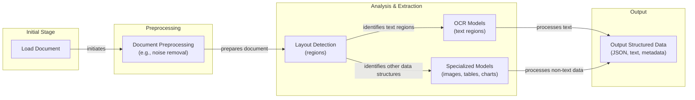
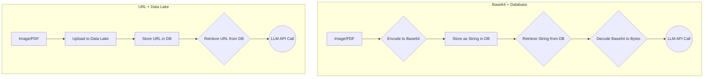
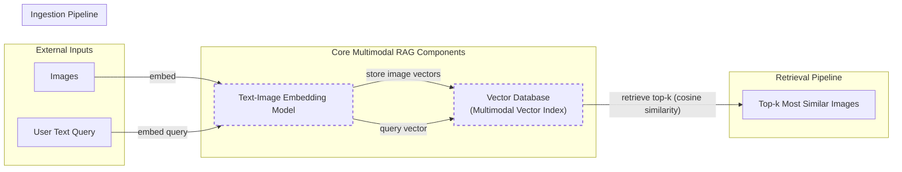
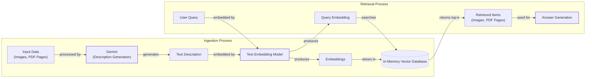
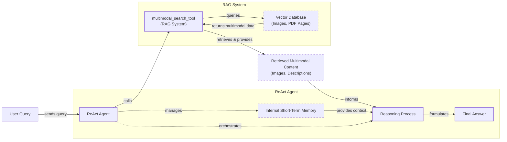

# Stop Converting Documents to Text. You're Doing It Wrong.

## Introduction

When we first started building AI agents, we hit a frustrating wall. We were comfortable manipulating text, but the moment we had to integrate multimodal data, such as images, audio, and especially documents like PDFs, our elegant architectures turned into messy hacks. We spent weeks building complex pipelines that tried to force everything into text. We chained OCR engines to scrape PDFs, layout detection models to identify tables, and separate classifiers to handle images. It was a brittle, slow, and expensive solution that broke every time a document layout changed.

The breakthrough came when we realized we were solving the wrong problem. We didn’t need to convert documents to text. We needed to treat them as images. Once we understood that every PDF page is effectively an image and that modern LLMs can “see” just as well as they can read, the complexity vanished. We could completely skip the OCR purgatory and focus on the three core inputs of an LLM: text, images, and audio.

This shift is essential because real-world AI applications rarely exist in a text-only vacuum. As human beings, we process information visually and audibly. Enterprise applications mirror this reality. They need to manipulate private data from warehouses and lakes that is inherently multimodal: financial reports with complex charts, technical diagrams, building sketches, and audio logs [[10]](https://milvus.io/ai-quick-reference/what-are-some-realworld-applications-of-multimodal-ai), [[23]](https://kanerika.com/blogs/multimodal-ai-agents/), [[24]](https://invisibletech.ai/blog/multimodal-enterprise-ai).

The old approach of normalizing everything to text is lossy. When you translate a complex diagram or a chart into text, you lose the spatial relationships, the colors, and the context. You lose the information that matters most. By processing data in its native format, we preserve this rich visual information, resulting in systems that are faster, cheaper, and significantly more performant.

Ultimately, as data is made for humans, you want the LLM to process the data as close as a human would, which often is visually. In this lesson, we will cover the foundations of multimodal LLMs, show you how to work with images and PDFs in code, and guide you through building a complete multimodal ReAct agent.

## Limitations of traditional document processing

To understand the problem, we will dig deeper into the limitations of traditional document processing for tasks like handling invoices, documentation, or reports. The core issue is that previous approaches tried to normalize everything to text before passing it to an AI model. This has many flaws, as we lose a substantial amount of information during the translation. For example, when encountering diagrams, charts, or sketches in a document, it is impossible to fully reproduce them in text.

A traditional document processing workflow typically involves several sequential steps. First, the document is loaded and preprocessed to remove noise. Next, a layout detection model identifies different regions like text, tables, and images. Then, an OCR model extracts text from its designated regions, while other specialized models handle tables or charts. Finally, this extracted information is structured into a format like JSON.


Image 1: A flowchart illustrating the traditional document processing workflow.

This workflow has too many moving pieces. It requires layout detection models, OCR models, and different models for each data structure, which makes the system rigid. If a document contains a chart type we do not have a model for, the pipeline fails. It is also slow and costly because we have to chain multiple model calls.

Most importantly, we face performance challenges. The multi-step nature creates a cascade effect where errors compound at each stage. Traditional OCR engines achieve 88–94% accuracy on simple layouts but struggle with complex formats, handwritten text, poor scans, or stylized fonts [[43]](https://www.llamaindex.ai/blog/ocr-accuracy). For example, a 5-degree tilt in a scanned document can increase the Word Error Rate (WER) by 15% or more, and resolutions below 300 DPI can cause accuracy to drop by over 20% [[43]](https://www.llamaindex.ai/blog/ocr-accuracy). For complex documents, accuracy can fall to 60%, requiring significant manual correction [[46]](https://netfira.com/why-ocr-technology-fails-on-real-world-documents-and-how-intelligent-document-processing-can-help/). This makes them unreliable for interpreting nested tables, building sketches, or medical images [[9]](https://hackernoon.com/complex-document-recognition-ocr-doesnt-work-and-heres-how-you-fix-it).
Image 2: A building sketch showing a crawl space vent diagram, illustrating the complexity of layouts that classic OCR systems struggle to interpret. (Source [Vectorize.io](https://vectorize.io/blog/multimodal-rag-patterns) [[12]](https://vectorize.io/blog/multimodal-rag-patterns))

This might work for extremely specialized applications, but it has tons of problems and does not scale for a world of AI agents that have to be flexible and fast.

That is why modern AI solutions use multimodal LLMs, such as Gemini, that can directly interpret text, images, or even PDFs as native input, completely bypassing the complex OCR workflow. Thus, let's understand how multimodal LLMs work.

## Foundations of Multimodal LLMs

Before we show you the code on how to use LLMs with images and documents, you have to understand how multimodal LLMs work. We will not cover all the details, as that is the job of an AI researcher. But you need an intuition on how they work to know how to use, deploy, optimize, and monitor them.

There are two common approaches to building multimodal LLMs: the Unified Embedding Decoder Architecture and the Cross-modality Attention Architecture [[1]](https://magazine.sebastianraschka.com/p/understanding-multimodal-llms).
Image 3: The two main approaches to developing multimodal LLM architectures. (Source [Understanding Multimodal LLMs](https://magazine.sebastianraschka.com/p/understanding-multimodal-llms) [[1]](https://magazine.sebastianraschka.com/p/understanding-multimodal-llms))

### Unified Embedding Decoder Architecture

In this approach, we encode the text and image separately, concatenate their embeddings into a single vector, and pass the resulting vector to the LLM.

Thus, on top of a standard LLM architecture, you need a vision encoder that maps the image to an embedding that’s within the same vector space as the text. So, when the text and image embeddings are merged, the LLM can make sense of both.
Image 4: Illustration of the unified embedding decoder architecture. (Source [Understanding Multimodal LLMs](https://magazine.sebastianraschka.com/p/understanding-multimodal-llms) [[1]](https://magazine.sebastianraschka.com/p/understanding-multimodal-llms))

### Cross-modality Attention Architecture

In the second approach, instead of passing the image embeddings along with the text embeddings at the input, we inject them directly into the attention module. We still need an image encoder that projects the image into the same vector space as the text, but we inject it deeper within the architecture.
Image 5: An illustration of the Cross-Modality Attention Architecture approach. (Source [Understanding Multimodal LLMs](https://magazine.sebastianraschka.com/p/understanding-multimodal-llms) [[1]](https://magazine.sebastianraschka.com/p/understanding-multimodal-llms))

### Image Encoders

Both architectures rely on image encoders. To understand them, we can draw a parallel between text tokenization and image patching. Just as we split text into sub-word tokens, we split images into patches.
Image 6: Image tokenization and embedding (left) and text tokenization and embedding (right) side by side. (Source [Understanding Multimodal LLMs](https://magazine.sebastianraschka.com/p/understanding-multimodal-llms) [[1]](https://magazine.sebastianraschka.com/p/understanding-multimodal-llms))

The output has the same structure and dimensions as text embeddings. However, they need to be aligned in the vector space. We do this through a linear projection module. Popular image encoder models include CLIP, OpenCLIP, and SigLIP [[3]](https://towardsdatascience.com/multimodal-embeddings-an-introduction-5dc36975966f/). These models are trained using contrastive learning, which teaches the model to place similar concepts from different modalities close together in the embedding space. For example, an image of a cat and the text "a cute cat" will have similar vector representations [[4]](https://www.pinecone.io/learn/series/image-search/clip/).

Importantly, these encoders are also used in Multimodal RAG. They allow us to find semantic similarities between images and text.
Image 7: Toy representation of multimodal embedding space. (Source [Multimodal Embeddings: An Introduction](https://towardsdatascience.com/multimodal-embeddings-an-introduction-5dc36975966f/) [[3]](https://towardsdatascience.com/multimodal-embeddings-an-introduction-5dc36975966f/))

You can replicate the same strategy between different modalities, such as text, image, document, and audio vectors, as long as you have an encoder that maps the data in the same vector space.

### Trade-offs and Modern Landscape

The **Unified Embedding Decoder** approach is simpler to implement and generally yields higher accuracy in OCR-related tasks. The **Cross-modality Attention** approach is more computationally efficient for high-resolution images because we do not have to pass all tokens as an input sequence. Instead, we inject them directly into the attention mechanism. Hybrid approaches exist to combine these benefits [[1]](https://magazine.sebastianraschka.com/p/understanding-multimodal-llms).

In 2025, most leading LLMs are multimodal. Open-source examples include Llama, Gemma, and Qwen. Closed-source examples include GPT, Gemini, and Claude [[54]](https://medium.com/data-science-in-your-pocket/2025-the-year-ai-reasoning-models-took-over-a-month-by-month-review-of-frontier-breakthroughs-6ea2163f854f), [[57]](https://www.promptitude.io/post/ultimate-2025-ai-language-models-comparison-gpt5-gpt-4-claude-gemini-sonar-more). This can be expanded to other modalities, such as PDFs, audio, or video, by hooking different encoders for each modality [[50]](https://sparkco.ai/blog/exploring-multimodal-llms-text-image-and-video-integration), [[51]](https://www.emergentmind.com/topics/multimodal-llms).

A quick note on **Multimodal LLMs vs. Diffusion Models**: Diffusion models like Midjourney generate images from noise. Multimodal LLMs like GPT understand images and are architecturally different. In an agent workflow, diffusion models are typically used as tools, not as the reasoning model [[13]](https://arxiv.org/html/2409.14993v3).

Now that we understand how LLMs can directly input images or documents, let’s see how this works in practice.

## Applying Multimodal LLMs to Images and Documents

To better understand how multimodal LLMs work, let’s write a few examples using Gemini to show you some best practices when working with images and PDFs.

There are three core ways to process multimodal data with LLMs:

1.  **Raw bytes:** The easiest way to work with LLMs. However, when storing the item in a database, it can easily get corrupted as most databases interpret the input as text/strings instead of bytes.
2.  **Base64:** A way to encode raw bytes as strings. This is useful for storing images or documents directly in a database (e.g., PostgreSQL, MongoDB) without corruption. The downside is that the file size increases by approximately 33%.
3.  **URLs:** The standard for enterprise scenarios. You store data in a data lake like AWS S3 or GCP Buckets. The LLM downloads the media directly from the bucket. As the file never sees your server, this reduces network latency for your application. This is the most efficient option for scale.


Image 8: A comparison of processing multimodal data using Base64 with a database versus using URLs with a data lake.

Now, let’s dig into the code.

1.  First, we display our sample image.
    
    Image 9: A kitten interacting with a robot. (Source [Notebook 1](https://github.com/towardsai/course-ai-agents/blob/dev/lessons/11_multimodal/notebook.ipynb))

2.  We define a helper function to load an image as raw bytes. We use the `WEBP` format because it is efficient.
    ```python
    def load_image_as_bytes(
        image_path: Path, format: Literal["WEBP", "JPEG", "PNG"] = "WEBP", max_width: int = 600, return_size: bool = False
    ) -> bytes | tuple[bytes, tuple[int, int]]:
        # ... function implementation ...
    ```

3.  We load the image as **raw bytes** and call the LLM to generate a caption.
    ```python
    image_bytes = load_image_as_bytes(image_path=Path("images") / "image_1.jpeg", format="WEBP")
    
    response = client.models.generate_content(
        model=MODEL_ID,
        contents=[
            types.Part.from_bytes(data=image_bytes, mime_type="image/webp"),
            "Tell me what is in this image in one paragraph.",
        ],
    )
    ```
    It outputs:
    ```text
    This striking image features a massive, dark metallic robot... creating a dramatic contrast between the soft, vulnerable kitten and the formidable, mechanical sentinel.
    ```

4.  Next, we define a function to load the image as a **Base64 encoded string**.
    ```python
    def load_image_as_base64(
        image_path: Path, format: Literal["WEBP", "JPEG", "PNG"] = "WEBP", max_width: int = 600, return_size: bool = False
    ) -> str:
        # ... function implementation ...
    ```
    We can then load the image and see that the Base64 string is about 33% larger than the raw bytes.
    ```python
    image_base64 = load_image_as_base64(image_path=Path("images") / "image_1.jpeg", format="WEBP")
    print(f"Image as Base64 is {(len(image_base64) - len(image_bytes)) / len(image_bytes) * 100:.2f}% larger than as bytes")
    ```
    It outputs:
    ```text
    Image as Base64 is 33.34% larger than as bytes
    ```

5.  For **public URLs**, Gemini's `url_context` tool allows us to analyze documents directly from the web.
    ```python
    response = client.models.generate_content(
        model=MODEL_ID,
        contents="Based on the provided paper as a PDF, tell me how ReAct works: https://arxiv.org/pdf/2210.03629",
        config=types.GenerateContentConfig(tools=[{"url_context": {}}]),
    )
    ```
    It outputs:
    ```text
    ReAct is a novel paradigm for large language models (LLMs) that combines reasoning (Thought) and acting (Action) in an interleaved manner...
    ```

6.  For **private URLs** from data lakes like GCS, the code is similar, though it requires authentication.
    ```python
    response = client.models.generate_content(
        model=MODEL_ID,
        contents=[
            types.Part.from_uri(uri="gs://gemini-images/image_1.jpeg", mime_type="image/webp"),
            "Tell me what is in this image in one paragraph.",
        ],
    )
    ```

7.  Let's try a more complex task: **Object Detection**. We use Pydantic to define the output structure.
    ```python
    class BoundingBox(BaseModel):
        ymin: float
        xmin: float
        ymax: float
        xmax: float
        label: str
    
    class Detections(BaseModel):
        bounding_boxes: list[BoundingBox]
    
    prompt = "Detect all prominent items. Return 2d boxes normalized to 0-1000."
    
    response = client.models.generate_content(
        model=MODEL_ID,
        contents=[types.Part.from_bytes(data=image_bytes, mime_type="image/webp"), prompt],
        config=types.GenerateContentConfig(
            response_mime_type="application/json",
            response_schema=Detections
        ),
    )
    ```
    The model returns structured JSON, which we can then visualize.
    
    Image 10: Object detection results showing bounding boxes for a kitten and a robot. (Source [Notebook 1](https://github.com/towardsai/course-ai-agents/blob/dev/lessons/11_multimodal/notebook.ipynb))

8.  Now, let’s process **PDFs**. The process is identical to images. We load the PDF as bytes and pass it to the model.
    ```python
    pdf_bytes = (Path("pdfs") / "attention_is_all_you_need_paper.pdf").read_bytes()
    
    response = client.models.generate_content(
        model=MODEL_ID,
        contents=[
            types.Part.from_bytes(data=pdf_bytes, mime_type="application/pdf"),
            "What is this document about? Provide a brief summary.",
        ],
    )
    ```
    It outputs:
    ```text
    This document introduces the Transformer, a novel neural network architecture for sequence transduction...
    ```

9.  Finally, we can perform **Object Detection on PDF pages** by treating the page as an image. This is powerful for extracting diagrams or tables.
    ```python
    page_image_bytes = load_image_as_bytes("images/attention_is_all_you_need_1.jpeg")
    
    prompt = "Detect all the diagrams from the provided image as 2d bounding boxes."
    
    response = client.models.generate_content(
        model=MODEL_ID,
        contents=[types.Part.from_bytes(data=page_image_bytes, mime_type="image/webp"), prompt],
        config=types.GenerateContentConfig(
            response_mime_type="application/json",
            response_schema=Detections
        ),
    )
    ```
    
    Image 11: Object detection results showing a bounding box around a diagram in a research paper. (Source [Notebook 1](https://github.com/towardsai/course-ai-agents/blob/dev/lessons/11_multimodal/notebook.ipynb))

Processing PDFs as images is a concept popularized by the ColPali paper, which demonstrated that modern Vision Language Models (VLMs) can retrieve documents more effectively by “looking” at them rather than extracting text [[5]](https://arxiv.org/pdf/2407.01449v6).

## Foundations of multimodal RAG

One of the most common use cases when working with multimodal data is a concept we already explored in Lesson 10: RAG. When building custom AI apps, you will always have to retrieve private company data to feed into your LLM. When working with larger data formats, such as images or PDFs, RAG becomes even more important. Imagine stuffing 1000+ PDF pages into your LLM to get a simple answer on your company's last quarter revenue. Even with huge context windows, that quickly becomes unfeasible as there is a direct correlation between the size of the context window and increased latency, costs, and decreased performance.

A generic multimodal RAG architecture involves two main pipelines: ingestion and retrieval. During ingestion, images are embedded using a text-image embedding model, and these vectors are stored in a vector database. During retrieval, a user's text query is embedded using the same model. The system then queries the vector database to find the top-k most similar images based on cosine similarity. This technique is heavily used in image search engines like Google Photos [[39]](https://opensearch.org/blog/multimodal-semantic-search/).


Image 12: A Mermaid diagram illustrating the ingestion and retrieval pipelines of a generic multimodal RAG system.

For our enterprise use case of RAG on documents, the state-of-the-art architecture as of 2025 is ColPali [[5]](https://arxiv.org/pdf/2407.01449v6). It bypasses the entire OCR pipeline by processing document images directly with vision-language models. During offline indexing, it divides each document page image into patches and creates a multi-vector representation, or a "bag-of-embeddings," for each page. At query time, it uses a late interaction mechanism (MaxSim) to compute similarities between the query tokens and all document patches, allowing for fine-grained matching.

This approach is 2-10x faster than traditional OCR pipelines and significantly outperforms them on benchmarks like ViDoRe, especially for documents with complex visual layouts [[5]](https://arxiv.org/pdf/2407.01449v6).

## Implementing multimodal RAG for images, PDFs and text

Let's connect all the dots with a coding example where we combine what we have learned in this lesson and Lesson 10 on RAG into a multimodal RAG exercise. We will build a simple system where we populate an in-memory vector database with images and PDF pages (treated as images) and then query it with text questions.


Image 13: A Mermaid diagram illustrating the architecture of the multimodal RAG example.

Now, let's dig into the code.

1.  First, we define a function to generate a detailed description for each image using Gemini.
    ```python
    def generate_image_description(image_bytes: bytes) -> str:
        """
        Generate a detailed description of an image using Gemini Vision model.
        """
        # ... function implementation ...
    ```

2.  Next, we define a function to create embeddings for the text descriptions using a Gemini embedding model.
    ```python
    def embed_text_with_gemini(content: str) -> np.ndarray | None:
        """
        Embed text content using Gemini's text embedding model.
        """
        # ... function implementation ...
    ```

3.  We then create our vector index. This function iterates through our images, generates a description for each, and then embeds that description.
    ```python
    def create_vector_index(image_paths: list[Path]) -> list[dict]:
        """
        Create embeddings for images by generating descriptions and embedding them.
        """
        # ... function implementation ...
    
    image_paths = list(Path("images").glob("*.jpeg"))
    vector_index = create_vector_index(image_paths)
    ```
    A quick note on this approach: since the Gemini API used here does not support direct image embedding, we generate a text description and embed that instead. This is not ideal. With a proper multimodal embedding model like Voyage or OpenAI's CLIP, you would embed the image bytes directly, and the rest of the RAG system would remain the same.

4.  Now, we define our search function. It takes a text query, embeds it, and computes the cosine similarity against all the embeddings in our vector index to find the most relevant images.
    ```python
    def search_multimodal(query_text: str, vector_index: list[dict], top_k: int = 3) -> list[Any]:
        """
        Search for most similar documents to query using direct Gemini client.
        """
        # ... function implementation ...
    ```

5.  Let's test it with a query about the Transformer architecture.
    ```python
    query = "what is the architecture of the transformer neural network?"
    results = search_multimodal(query, vector_index, top_k=1)
    ```
    The system correctly retrieves the page from the "Attention Is All You Need" paper that contains the model architecture diagram.
    
    Image 14: The retrieved PDF page for the query about the Transformer architecture. (Source [Notebook 1](https://github.com/towardsai/course-ai-agents/blob/dev/lessons/11_multimodal/notebook.ipynb))

6.  Let's try another query.
    ```python
    query = "a kitten with a robot"
    results = search_multimodal(query, vector_index, top_k=1)
    ```
    It correctly retrieves the image of the kitten and the robot.
    
    Image 15: The retrieved image for the query "a kitten with a robot". (Source [Notebook 1](https://github.com/towardsai/course-ai-agents/blob/dev/lessons/11_multimodal/notebook.ipynb))

We used the same vector index to search for both standard images and PDF pages because we normalized everything to images. This approach could be extended to other visual data, like video frames or audio spectrograms.

## Building Multimodal AI Agents

Now, let's integrate our RAG functionality into a ReAct agent as a tool, consolidating most of the skills learned in this part of the course. Multimodal capabilities can be added to AI agents by enabling multimodal inputs for the reasoning LLM and by leveraging multimodal tools for retrieval or interacting with external resources like PDFs, screenshots, or audio files.

Our example will be a ReAct agent that uses our `search_multimodal` function as a tool to answer questions about the content of the indexed images.


Image 16: A Mermaid diagram illustrating the architecture of a multimodal ReAct agent integrated with RAG functionality.

Let's see the implementation.

1.  First, we define the `multimodal_search_tool` using LangChain's `@tool` decorator. This function wraps our `search_multimodal` RAG logic and formats the output for the agent.
    ```python
    from langchain_core.tools import tool
    
    @tool
    def multimodal_search_tool(query: str) -> dict[str, Any]:
        """
        Search through a collection of images and their text descriptions to find relevant content.
        """
        # ... function implementation ...
    ```

2.  Next, we create a ReAct agent using LangGraph's `create_react_agent` function. We provide it with our tool and a system prompt that instructs it on how to handle visual content.
    ```python
    def build_react_agent() -> Any:
        """
        Build a ReAct agent with multimodal search capabilities.
        """
        tools = [multimodal_search_tool]
        system_prompt = """You are a helpful AI assistant that can search through images and text to answer questions.
        ...
        Always search first using your tools before attempting to answer questions about specific images or visual content.
        """
        agent = create_react_agent(
            model=ChatGoogleGenerativeAI(model="gemini-2.5-pro", temperature=0.1),
            tools=tools,
            prompt=system_prompt,
        )
        return agent
    
    react_agent = build_react_agent()
    ```

3.  Now, let's test the agent by asking it about the color of our kitten.
    ```python
    test_question = "what color is my kitten?"
    response = react_agent.invoke(input={"messages": test_question})
    ```
    The agent first reasons that it needs to search for "my kitten." It calls the `multimodal_search_tool`, which retrieves the image of the kitten and the robot. The agent then analyzes the retrieved image and its description to formulate the final answer.
    It outputs:
    ```text
    Based on the image, your kitten is a gray tabby. It has soft, short gray fur with darker tabby stripe patterns.
    ```

In this lesson, we combined structured outputs, tools, ReAct, RAG, and multimodal data to create a multimodal agentic RAG proof-of-concept.

## Conclusion

Working with multimodal data is a fundamental skill for AI engineers. Modern AI applications rarely exist in a text-only vacuum. They interact with the complex, visual, and auditory reality of the world.

In this lesson, we moved away from the unstable, multi-step OCR pipelines of the past. We learned that modern LLMs can natively process images and documents, preserving rich context that was previously lost. We explored how to handle data as bytes, Base64, and URLs, and how to build agents that can reason across these modalities.

This concludes our *AI Agents Foundations* series. We started by understanding the difference between workflows and agents, mastered context engineering and structured outputs, built robust planning capabilities with ReAct, and finally gave our agents eyes and ears. In the next part of the course, we will move from theory to practice by building a complete, multi-agent pipeline from start to finish.

## References

- [1] Raschka, S. (2024, October 21). Understanding multimodal LLMS. *Sebastian Raschka*. [https://magazine.sebastianraschka.com/p/understanding-multimodal-llms](https://magazine.sebastianraschka.com/p/understanding-multimodal-llms)
- [2] Vision language models. (n.d.). NVIDIA. [https://www.nvidia.com/en-us/glossary/vision-language-models/](https://www.nvidia.com/en-us/glossary/vision-language-models/)
- [3] Talebi, S. (2024, November 13). Multimodal embeddings: An introduction. *Medium*. [https://towardsdatascience.com/multimodal-embeddings-an-introduction-5dc36975966f/](https://towardsdatascience.com/multimodal-embeddings-an-introduction-5dc36975966f/)
- [4] Multi-modal ML with OpenAI’s CLIP. (n.d.). Pinecone. [https://www.pinecone.io/learn/series/image-search/clip/](https://www.pinecone.io/learn/series/image-search/clip/)
- [5] Fostiropoulos, I., et al. (2024). ColPali: Efficient Document Retrieval with Vision Language Models. *arXiv*. [https://arxiv.org/pdf/2407.01449v6](https://arxiv.org/pdf/2407.01449v6)
- [6] Image understanding. (n.d.). Google AI for Developers. [https://ai.google.dev/gemini-api/docs/image-understanding](https://ai.google.dev/gemini-api/docs/image-understanding)
- [7] Google generative AI embeddings. (n.d.). LangChain. [https://python.langchain.com/docs/integrations/text_embedding/google_generative_ai/](https://python.langchain.com/docs/integrations/text_embedding/google_generative_ai/)
- [8] Agents. (n.d.). LangChain. [https://langchain-ai.github.io/langgraph/agents/agents/](https://langchain-ai.github.io/langgraph/agents/agents/)
- [9] Complex Document Recognition: OCR Doesn’t Work and Here’s How You Fix It. (n.d.). *HackerNoon*. [https://hackernoon.com/complex-document-recognition-ocr-doesnt-work-and-heres-how-you-fix-it](https://hackernoon.com/complex-document-recognition-ocr-doesnt-work-and-heres-how-you-fix-it)
- [10] What are some real-world applications of multimodal AI? (n.d.). Milvus. [https://milvus.io/ai-quick-reference/what-are-some-realworld-applications-of-multimodal-ai](https://milvus.io/ai-quick-reference/what-are-some-realworld-applications-of-multimodal-ai)
- [11] Liu, J. (2025, February 24). OlmOCR-bench review: Insights and pitfalls on an OCR benchmark. *LlamaIndex*. [https://www.llamaindex.ai/blog/olmocr-bench-review-insights-and-pitfalls-on-an-ocr-benchmark](https://www.llamaindex.ai/blog/olmocr-bench-review-insights-and-pitfalls-on-an-ocr-benchmark)
- [12] Vectorize.io. (2024, October 26). Multimodal RAG Patterns. *Vectorize.io Blog*. [https://vectorize.io/blog/multimodal-rag-patterns](https://vectorize.io/blog/multimodal-rag-patterns)
- [13] Wang, X., et al. (2025). Multi-modal Generative AI: Multi-modal LLMs, Diffusions, and the Unification. *arXiv*. [https://arxiv.org/html/2409.14993v3](https://arxiv.org/html/2409.14993v3)
- [14] Dey, S. (2024, June 14). Multimodal RAG architecture. *LinkedIn*. [https://www.linkedin.com/posts/sayandey01_generativeai-llm-rag-activity-7412381316106760192-nFx3](https://www.linkedin.com/posts/sayandey01_generativeai-llm-rag-activity-7412381316106760192-nFx3)
- [15] Evaluating Multimodal vs. Text-Based Retrieval for RAG with Snowflake Cortex. (2025, April 21). *Snowflake*. [https://www.snowflake.com/en/engineering-blog/arctic-agentic-rag-multimodal-pdf-retrieval/](https://www.snowflake.com/en/engineering-blog/arctic-agentic-rag-multimodal-pdf-retrieval/)
- [16] Pathway. (n.d.). Multimodal RAG. [https://pathway.com/developers/templates/rag/multimodal-rag](https://pathway.com/developers/templates/rag/multimodal-rag)
- [17] Aggarwal, G. (2024, June 17). MMCTAgent. *LinkedIn*. [https://www.linkedin.com/posts/gauravagg_mmctagent-enables-multimodal-reasoning-over-activity-7413983881181339648--PyD](https://www.linkedin.com/posts/gauravagg_mmctagent-enables-multimodal-reasoning-over-activity-7413983881181339648--PyD)
- [18] Multimodal RAG Explained: From Text to Images and Beyond. (2024, July 24). *USAII*. [https://www.usaii.org/ai-insights/multimodal-rag-explained-from-text-to-images-and-beyond](https://www.usaii.org/ai-insights/multimodal-rag-explained-from-text-to-images-and-beyond)
- [19] LLMs on Anyscale. (n.d.). *Anyscale*. [https://docs.anyscale.com/llm](https://docs.anyscale.com/llm)
- [20] Zhang, C. (2026, March 25). How to Choose the Best Embedding Model for RAG in 2026. *Milvus*. [https://milvus.io/blog/choose-embedding-model-rag-2026.md](https://milvus.io/blog/choose-embedding-model-rag-2026.md)
- [21] Fostiropoulos, I. (2024, November 11). eager-embed-v1. *eagerworks*. [https://eagerworks.com/blog/best-embedding-model-for-rag](https://eagerworks.com/blog/best-embedding-model-for-rag)
- [22] Top Embedding Models in 2025. (2024, December 1). *ArtSmart.ai*. [https://artsmart.ai/blog/top-embedding-models-in-2025/](https://artsmart.ai/blog/top-embedding-models-in-2025/)
- [23] Kanerika. (2024, November 15). Multimodal AI Agents. *Kanerika*. [https://kanerika.com/blogs/multimodal-ai-agents/](https://kanerika.com/blogs/multimodal-ai-agents/)
- [24] Multimodal Enterprise AI. (2024, October 29). *Invisible Technologies*. [https://invisibletech.ai/blog/multimodal-enterprise-ai](https://invisibletech.ai/blog/multimodal-enterprise-ai)
- [25] Multimodal AI Use Cases. (2024, July 10). *Rasa*. [https://rasa.com/blog/multimodal-ai-use-cases](https://rasa.com/blog/multimodal-ai-use-cases)
- [26] A Comprehensive Survey and Guide to Multimodal Large Language Models in Vision-Language Tasks. (2024, July 1). *GitHub*. [https://github.com/cognitivetech/llm-research-summaries/blob/main/models-review/A-Comprehensive-Survey-and-Guide-to-Multimodal-Large-Language-Models-in-Vision-Language-Tasks.md](https://github.com/cognitivetech/llm-research-summaries/blob/main/models-review/A-Comprehensive-Survey-and-Guide-to-Multimodal-Large-Language-Models-in-Vision-Language-Tasks.md)
- [27] Multimodal AI Examples: How It Works, Real-World Applications, and Future Trends. (2024, November 25). *SmartDev*. [https://smartdev.com/multimodal-ai-examples-how-it-works-real-world-applications-and-future-trends/](https://smartdev.com/multimodal-ai-examples-how-it-works-real-world-applications-and-future-trends/)
- [28] What is a multimodal LLM? (n.d.). *IBM*. [https://www.ibm.com/think/topics/multimodal-llm](https://www.ibm.com/think/topics/multimodal-llm)
- [29] Wu, C., et al. (2025). A survey on multimodal large language models for medical applications. *PMC*. [https://pmc.ncbi.nlm.nih.gov/articles/PMC12479233/](https://pmc.ncbi.nlm.nih.gov/articles/PMC12479233/)
- [30] Multimodal AI in Healthcare. (2025, May 15). *Nature*. [https://www.nature.com/articles/s41598-025-98483-1](https://www.nature.com/articles/s41598-025-98483-1)
- [31] Why traditional OCR fails for complex business documents. (2024, May 22). *Microsoft Learn*. [https://learn.microsoft.com/en-us/answers/questions/5668164/why-traditional-ocr-fails-for-complex-business-doc?page=1](https://learn.microsoft.com/en-us/answers/questions/5668164/why-traditional-ocr-fails-for-complex-business-doc?page=1)
- [32] Document Processing Automation Guide. (2024, July 29). *Parseur*. [https://parseur.com/blog/document-processing-automation-guide](https://parseur.com/blog/document-processing-automation-guide)
- [33] AI-Powered PDF Data Extraction in Clinical Research. (2024, June 12). *Intuition Labs*. [https://intuitionlabs.ai/articles/ai-pdf-data-extraction-clinical-research](https://intuitionlabs.ai/articles/ai-pdf-data-extraction-clinical-research)
- [34] Gemini consistently producing valid Pydantic responses. (2024, August 15). *Google AI Community*. [https://discuss.ai.google.dev/t/gemini-consistently-producing-valid-pydantic-responses/98992](https://discuss.ai.google.dev/t/gemini-consistently-producing-valid-pydantic-responses/98992)
- [35] Iusztin, P. (2025, December 9). Stop Converting Documents to Text. You're Doing It Wrong. *Decoding AI*. [https://www.decodingai.com/p/stop-converting-documents-to-text](https://www.decodingai.com/p/stop-converting-documents-to-text)
- [36] LLM Output Parsing and Structured Generation with Pydantic. (2024, September 5). *Tetrate*. [https://tetrate.io/learn/ai/llm-output-parsing-structured-generation](https://tetrate.io/learn/ai/llm-output-parsing-structured-generation)
- [37] Structured Outputs with Multimodal Gemini. (2024, October 23). *Instructor*. [https://python.useinstructor.com/blog/2024/10/23/structured-outputs-with-multimodal-gemini/](https://python.useinstructor.com/blog/2024/10/23/structured-outputs-with-multimodal-gemini/)
- [38] Steering Large Language Models with Pydantic. (2024, November 1). *Pydantic*. [https://pydantic.dev/articles/llm-intro](https://pydantic.dev/articles/llm-intro)
- [39] Multimodal Semantic Search. (2024, August 20). *OpenSearch*. [https://opensearch.org/blog/multimodal-semantic-search/](https://opensearch.org/blog/multimodal-semantic-search/)
- [40] Joint Visual-Textual Embedding for Multimodal Style Search. (2017). *Amazon Science*. [https://assets.amazon.science/89/bf/661d950d4059930c8f1d2e449ac6/joint-visual-textual-embedding-for-multimodal-style-search.pdf](https://assets.amazon.science/89/bf/661d950d4059930c8f1d2e449ac6/joint-visual-textual-embedding-for-multimodal-style-search.pdf)
- [41] Combine Image and Text: How Multimodal Retrieval Transforms Search. (2024, September 10). *Zilliz*. [https://zilliz.com/blog/combine-image-and-text-how-multimodal-retrieval-transforms-search](https://zilliz.com/blog/combine-image-and-text-how-multimodal-retrieval-transforms-search)
- [42] Multimodal Sentence Transformers. (2024, October 15). *Hugging Face*. [https://huggingface.co/blog/multimodal-sentence-transformers](https://huggingface.co/blog/multimodal-sentence-transformers)
- [43] OCR Accuracy Explained: How to Improve It. (2024, November 5). *LlamaIndex*. [https://www.llamaindex.ai/blog/ocr-accuracy](https://www.llamaindex.ai/blog/ocr-accuracy)
- [44] The 6 Biggest OCR Problems and How to Overcome Them. (2023, August 8). *Conexiom*. [https://conexiom.com/blog/the-6-biggest-ocr-problems-and-how-to-overcome-them](https://conexiom.com/blog/the-6-biggest-ocr-problems-and-how-to-overcome-them)
- [45] Unstructured Leads in Document Parsing Quality. (2024, March 14). *Unstructured.io*. [https://unstructured.io/blog/unstructured-leads-in-document-parsing-quality-benchmarks-tell-the-full-story](https://unstructured.io/blog/unstructured-leads-in-document-parsing-quality-benchmarks-tell-the-full-story)
- [46] Why OCR Technology Fails on Real-World Documents. (2023, November 21). *Netfira*. [https://netfira.com/why-ocr-technology-fails-on-real-world-documents-and-how-intelligent-document-processing-can-help/](https://netfira.com/why-ocr-technology-fails-on-real-world-documents-and-how-intelligent-document-processing-can-help/)
- [47] Financial Summarization with USTT. (2023). *IJCAI*. [https://www.ijcai.org/proceedings/2023/0581.pdf](https://www.ijcai.org/proceedings/2023/0581.pdf)
- [48] EPOCH framework for AI in finance. (2025). *arXiv*. [https://arxiv.org/html/2503.22035v1](https://arxiv.org/html/2503.22035v1)
- [49] 10 real-world examples of AI in healthcare. (2022, November 24). *Philips*. [https://www.philips.com/a-w/about/news/archive/features/2022/20221124-10-real-world-examples-of-ai-in-healthcare.html](https://www.philips.com/a-w/about/news/archive/features/2022/20221124-10-real-world-examples-of-ai-in-healthcare.html)
- [50] Exploring Multimodal LLMs. (2024, June 5). *SparkCognition*. [https://sparkco.ai/blog/exploring-multimodal-llms-text-image-and-video-integration](https://sparkco.ai/blog/exploring-multimodal-llms-text-image-and-video-integration)
- [51] Multimodal LLMs. (n.d.). *Emergent Mind*. [https://www.emergentmind.com/topics/multimodal-llms](https://www.emergentmind.com/topics/multimodal-llms)
- [52] Enhancing LLM Capabilities: The Power of Multimodal LLMs and RAG. (2024, May 1). *Towards AI*. [https://towardsai.net/p/l/enhancing-llm-capabilities-the-power-of-multimodal-llms-and-rag](https://towardsai.net/p/l/enhancing-llm-capabilities-the-power-of-multimodal-llms-and-rag)
- [53] Evolution from LLMs to MLLMs. (2024, November 11). *arXiv*. [https://arxiv.org/html/2411.06284v3](https://arxiv.org/html/2411.06284v3)
- [54] 2025: The Year AI Reasoning Models Took Over. (2025, May 29). *Medium*. [https://medium.com/data-science-in-your-pocket/2025-the-year-ai-reasoning-models-took-over-a-month-by-month-review-of-frontier-breakthroughs-6ea2163f854f](https://medium.com/data-science-in-your-pocket/2025-the-year-ai-reasoning-models-took-over-a-month-by-month-review-of-frontier-breakthroughs-6ea2163f854f)
- [55] Breakdown of 2025 Flagship LLM Architectures. (2025, July 21). *LinkedIn*. [https://www.linkedin.com/posts/progressivethinker_this-is-the-most-essential-breakdown-of-2025-activity-7376654335319117825-a5aD](https://www.linkedin.com/posts/progressivethinker_this-is-the-most-essential-breakdown-of-2025-activity-7376654335319117825-a5aD)
- [56] Comparison of Coding LLMs. (2025, August 1). *Preprints.org*. [https://www.preprints.org/manuscript/202508.1904](https://www.preprints.org/manuscript/202508.1904)
- [57] Ultimate 2025 AI Language Models Comparison. (2025, June 10). *Promptitude*. [https://www.promptitude.io/post/ultimate-2025-ai-language-models-comparison-gpt5-gpt-4-claude-gemini-sonar-more](https://www.promptitude.io/post/ultimate-2025-ai-language-models-comparison-gpt5-gpt-4-claude-gemini-sonar-more)
- [58] Vaswani, A., et al. (2017). Attention Is All You Need. *arXiv*. [https://arxiv.org/abs/1706.03762](https://arxiv.org/abs/1706.03762)
- [59] What Is Optical Character Recognition (OCR)?. (2023, November 21). *Roboflow Blog*. [https://blog.roboflow.com/what-is-optical-character-recognition-ocr/](https://blog.roboflow.com/what-is-optical-character-recognition-ocr/)
- [60] Multimodal RAG with Colpali, Milvus and VLMs. (2024, December 10). *Hugging Face*. [https://huggingface.co/blog/saumitras/colpali-milvus-multimodal-rag](https://huggingface.co/blog/saumitras/colpali-milvus-multimodal-rag)
- [61] The 8 best AI image generators in 2025. (2026, April 1). *Zapier*. [https://zapier.com/blog/best-ai-image-generator/](https://zapier.com/blog/best-ai-image-generator/)
- [62] How We Built Multimodal RAG for Audio and Video. (2024). *RAGIE AI*. [https://www.ragie.ai/blog/how-we-built-multimodal-rag-for-audio-and-video](https://www.ragie.ai/blog/how-we-built-multimodal-rag-for-audio-and-video)
- [63] Multimodal RAG and Agentic AI. (2025). *AI Magazine*. [https://aimagazine.com/articles/multimodal-rag-agentic-finastra-data-scientist-talk-2025](https://aimagazine.com/articles/multimodal-rag-agentic-finastra-data-scientist-talk-2025)
</article>