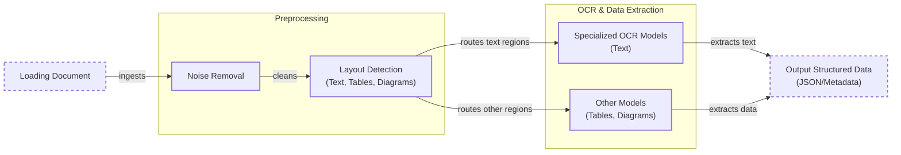
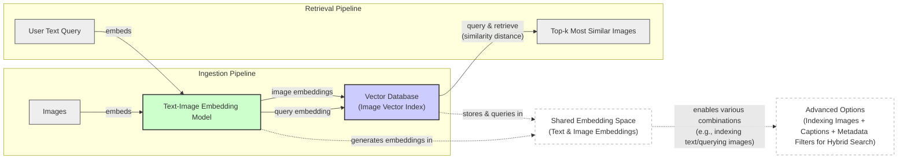
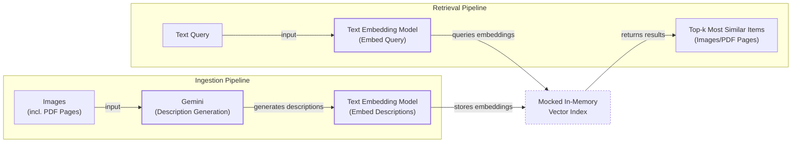

# Stop Converting Documents to Text. You're Doing It Wrong.

When we first started building AI agents, we hit a frustrating wall. We were comfortable manipulating text, but the moment we had to integrate multimodal data, such as images, audio, and especially documents like PDFs, our elegant architectures turned into messy hacks. We spent weeks building complex pipelines that tried to force everything into text. We chained OCR engines to scrape PDFs, layout detection models to identify tables, and separate classifiers to handle images. It was a brittle, slow, and expensive solution that broke every time a document layout changed.

The breakthrough came when we realized we were solving the wrong problem. We didn’t need to convert documents to text; we needed to treat them as images. Once we understood that every PDF page is effectively an image and that modern LLMs can “see” just as well as they can read, the complexity vanished. We could completely skip the OCR purgatory and focus on the three core inputs of an LLM: text, images, and audio.

This shift is essential because real-world AI applications rarely exist in a text-only vacuum. Enterprise applications mirror this reality. They need to manipulate private data from warehouses and lakes that is inherently multimodal: financial reports with complex charts, technical diagrams, building sketches, and audio logs [[1]](https://invisibletech.ai/blog/multimodal-enterprise-ai). The old approach of normalizing everything to text is lossy. When you translate a complex diagram or a chart into text, you lose the spatial relationships, the colors, and the context [[2]](https://www.ijcai.org/proceedings/2023/0581.pdf). By processing data in its native format, we preserve this rich visual information, resulting in systems that are faster, cheaper, and more performant.

Here is what we will cover:
- **Foundations of Multimodal LLMs:** An intuition on how models process visual and textual tokens together.
- **Practical Implementation:** How to work with images and PDFs using the Gemini API.
- **Multimodal RAG:** How to build retrieval systems for images and documents.
- **Building the Agent:** A step-by-step guide to building a multimodal ReAct agent.

## Limitations of Traditional Document Processing

To cement the problem, let’s dig deeper into the limitations of traditional document processing for invoices, documentation, or reports. The core issue is that previous approaches tried to normalize everything to text before passing it to an AI model. This has many flaws, as we lose a substantial amount of information during translation. For example, when encountering diagrams, charts, or sketches in a document, it is impossible to fully reproduce them in text [[3]](https://www.daft.ai/blog/end-to-end-distributed-pdf-processing-pipeline).

The traditional workflow for processing a PDF with mixed text, diagrams, and tables relies on a sequence of specialized models. It begins by loading the document, performing preprocessing like noise removal, and then running layout detection to identify different regions. From there, it routes text regions to Optical Character Recognition (OCR) models and other regions to specialized models for tables or diagrams, finally outputting structured data [[4]](https://www.llamaindex.ai/blog/ocr-for-tables), [[5]](https://intuitionlabs.ai/articles/ai-pdf-data-extraction-clinical-research).


Image 1: A flowchart illustrating the traditional document processing workflow using OCR-based systems.

This workflow has too many moving pieces, making the system rigid, slow, costly, and fragile [[6]](https://learn.microsoft.com/en-us/answers/questions/5668164/why-traditional-ocr-fails-for-complex-business-doc?page=1). If a document contains a chart type we don’t have a model for, the pipeline fails. The multi-step nature also creates a cascade effect where errors compound at each stage. Even advanced OCR engines struggle with handwritten text, poor scans below 300 DPI, stylized fonts, or complex layouts like nested tables and building sketches, with accuracy sometimes dropping to 60% or lower on complex, real-world documents [[7]](https://jiffy.ai/overcoming-ocr-errors-and-limitations-with-intelligent-document-processing/), [[8]](https://www.llamaindex.ai/blog/ocr-accuracy). For instance, a 5-degree tilt in a scanned document can increase the word error rate by 15% or more, and resolutions below 300 DPI can cause accuracy to drop by over 20% [[8]](https://www.llamaindex.ai/blog/ocr-accuracy). These systems are template-dependent, meaning any variation in layout requires manual updates, making them brittle and difficult to scale in dynamic enterprise environments [[5]](https://intuitionlabs.ai/articles/ai-pdf-data-extraction-clinical-research).

https://substackcdn.com/image/fetch/f_auto,q_auto:good,fl_progressive:steep/https%3A%2F%2Fsubstack-post-media.s3.amazonaws.com%2Fpublic%2Fimages%2Fa2dc40f3-dc13-486e-853d-8404368f4d8d_1616x1000.png 
Image 2: A building sketch showing a crawl space vent diagram, illustrating the complexity of layouts that classic OCR systems struggle to interpret. (Source [Vectorize.io](https://vectorize.io/blog/multimodal-rag-patterns))

This might work for extremely specialized applications, but it doesn’t scale for a world of AI agents that have to be flexible and fast. That's why modern AI solutions use multimodal LLMs, such as Gemini, that can directly interpret text, images, or even PDFs as native input, completely bypassing this brittle OCR workflow. Thus, let’s understand how multimodal LLMs work.

## Foundations of Multimodal LLMs

Before we show you how to use LLMs with images and documents, you need an intuition of how multimodality works. There are two common approaches to building multimodal LLMs: the Unified Embedding Decoder Architecture and the Cross-modality Attention Architecture [[9]](https://magazine.sebastianraschka.com/p/understanding-multimodal-llms).

https://substackcdn.com/image/fetch/f_auto,q_auto:good,fl_progressive:steep/https%3A%2F%2Fsubstack-post-media.s3.amazonaws.com%2Fpublic%2Fimages%2F53956ae8-9cd8-474e-8c10-ef6bddb88164_1600x938.png 
Image 3: The two main approaches to developing multimodal LLM architectures. (Source [Understanding Multimodal LLMs [[9]](https://magazine.sebastianraschka.com/p/understanding-multimodal-llms)])

### Unified Embedding Decoder Architecture

In this approach, we encode text and images separately, concatenate their embeddings into a single vector, and pass the result to the LLM. On top of a standard LLM, you need a vision encoder that maps the image to an embedding in the same vector space as the text. When the text and image embeddings are merged, the LLM can make sense of both [[9]](https://magazine.sebastianraschka.com/p/understanding-multimodal-llms).

https://substackcdn.com/image/fetch/f_auto,q_auto:good,fl_progressive:steep/https%3A%2F%2Fsubstack-post-media.s3.amazonaws.com%2Fpublic%2Fimages%2F91955021-7da5-4bc4-840e-87d080152b18_1166x1400.png 
Image 4: Illustration of the unified embedding decoder architecture. (Source [Understanding Multimodal LLMs [[9]](https://magazine.sebastianraschka.com/p/understanding-multimodal-llms)])

### Cross-modality Attention Architecture

In the second approach, instead of passing image embeddings with text embeddings at the input, we inject them directly into the attention module. We still need an image encoder that projects the image into the same vector space as the text, but it is injected deeper within the architecture [[9]](https://magazine.sebastianraschka.com/p/understanding-multimodal-llms).

https://substackcdn.com/image/fetch/f_auto,q_auto:good,fl_progressive:steep/https%3A%2F%2Fsubstack-post-media.s3.amazonaws.com%2Fpublic%2Fimages%2Fd9c06055-b599-45d1-87b2-1f4e90ceaf2d_1296x1338.png 
Image 5: An illustration of the Cross-Modality Attention Architecture approach. (Source [Understanding Multimodal LLMs [[9]](https://magazine.sebastianraschka.com/p/understanding-multimodal-llms)])

### Image Encoders

Both architectures rely on image encoders, which function similarly to text tokenizers. Just as we split text into sub-word tokens, we split images into patches. These patches are then encoded into embeddings [[9]](https://magazine.sebastianraschka.com/p/understanding-multimodal-llms).

https://substackcdn.com/image/fetch/f_auto,q_auto:good,fl_progressive:steep/https%3A%2F%2Fsubstack-post-media.s3.amazonaws.com%2Fpublic%2Fimages%2F0d56ea06-d202-4eb7-9e01-9aac492ee309_1522x1206.png 
Image 6: Image tokenization and embedding (left) and text tokenization and embedding (right) side by side. (Source [Understanding Multimodal LLMs [[9]](https://magazine.sebastianraschka.com/p/understanding-multimodal-llms)])

The image encoder, often a pretrained Vision Transformer (ViT), divides an image into smaller patches and processes them. A linear projection layer then maps these patches into an embedding size compatible with the LLM.

https://substackcdn.com/image/fetch/f_auto,q_auto:good,fl_progressive:steep/https%3A%2F%2Fsubstack-post-media.s3.amazonaws.com%2Fpublic%2Fimages%2Ffef5f8cb-c76c-4c97-9771-7fdb87d7d8cd_1600x1135.png 
Image 7: Illustration of a classic vision transformer (ViT) setup, similar to the model proposed in 2020. (Source [Understanding Multimodal LLMs [[9]](https://magazine.sebastianraschka.com/p/understanding-multimodal-llms)])

The output has the same structure and dimensions as text embeddings. However, they need to be aligned in the vector space, which is achieved through a linear projection module. This process allows us to find semantic similarities between images and text, a crucial capability for Multimodal RAG. In this shared space, a text query like "a cute puppy" can be mapped close to images of puppies [[10]](https://towardsdatascience.com/multimodal-ai-search-for-business-applications-65356d011009/). Popular image encoders that leverage this architecture include CLIP, OpenCLIP, and SigLIP [[11]](https://artsmart.ai/blog/top-embedding-models-in-2025/).

https://towardsdatascience.com/wp-content/uploads/2024/11/15d3HBNjNIXLy0oMIvJjxWw.png 
Image 8: Toy representation of multimodal embedding space. (Source [Multimodal Embeddings: An Introduction [[12]](https://towardsdatascience.com/multimodal-embeddings-an-introduction-5dc36975966f/)])

### Trade-offs and Modern Landscape

The **Unified Embedding Decoder** approach is simpler to implement and generally yields higher accuracy in OCR-related tasks. The **Cross-modality Attention** approach is more computationally efficient for high-resolution images because we don’t have to pass all tokens as an input sequence. Hybrid approaches also exist to combine these benefits [[13]](https://arxiv.org/abs/2409.11402).

In 2025, most leading LLMs are multimodal. Open-source examples include Llama 4, Gemma 2, and Qwen3, while closed-source options include GPT-5, Gemini 2.5, and Claude [[14]](https://medium.com/data-science-in-your-pocket/2025-the-year-ai-reasoning-models-took-over-a-month-by-month-review-of-frontier-breakthroughs-6ea2163f854f), [[15]](https://codedesign.ai/blog/the-ultimate-guide-to-the-top-large-language-models-in-2025/). This architecture can be expanded to other modalities like audio or video by integrating specialized encoders for each data type [[16]](https://sparkco.ai/blog/exploring-multimodal-llms-text-image-and-video-integration).

It is also important to distinguish Multimodal LLMs from Diffusion Models like Midjourney. Diffusion models generate images from noise, whereas multimodal LLMs understand them. Architecturally, they are different. In an agent workflow, diffusion models are typically used as tools, not as the core reasoning model [[17]](https://arxiv.org/html/2409.14993v3).

Now that we understand how LLMs can directly process images or documents, let’s see how this works in practice.

## Applying Multimodal LLMs to Images and PDFs

To better understand how multimodal LLMs work, let’s write a few examples using Gemini to show some best practices when working with images and PDFs. There are three core ways to process multimodal data with LLMs: as raw bytes, Base64, and URLs.

- **Raw bytes:** The easiest way to work with LLMs for one-off API calls. However, when storing the data in a database, it can easily get corrupted as most databases interpret the input as text instead of bytes.
- **Base64:** This encodes raw bytes as strings, allowing you to store images or documents in a database (e.g., PostgreSQL, MongoDB) without corruption. The downside is that the file size increases by approximately 33%.
- **URLs:** This is the standard for enterprise scenarios where data is stored in a data lake like AWS S3 or GCP Buckets. The LLM downloads the media directly from the bucket, reducing network latency for your application. This is the most efficient option for scale [[18]](https://cloud.google.com/blog/products/data-analytics/how-to-use-an-llm-to-create-data-schemas-in-bigquery).

Now, let’s dig into the code.

1.  First, let's look at our test image.
    ```python
    from pathlib import Path
    from IPython.display import Image as IPythonImage
    
    def display_image(image_path: Path) -> None:
        """
        Display an image from a file path in the notebook.
    
        Args:
            image_path: Path to the image file to display
    
        Returns:
            None
        """
    
        image = IPythonImage(filename=image_path, width=400)
        display(image)
    
    
    display_image(Path("images") / "image_1.jpeg")
    ```
    It outputs:
    
    

2.  We will process the image as **raw bytes**. We load it in `WEBP` format because it is efficient and ask the model to generate a caption.
    ```python
    from typing import Literal
    from PIL import Image as PILImage
    import io
    from google import genai
    from google.genai import types
    
    MODEL_ID = "gemini-2.5-flash"
    client = genai.Client()
    
    def load_image_as_bytes(
        image_path: Path, format: Literal["WEBP", "JPEG", "PNG"] = "WEBP", max_width: int = 600, return_size: bool = False
    ) -> bytes | tuple[bytes, tuple[int, int]]:
        """
        Load an image from file path and convert it to bytes with optional resizing.
    
        Args:
            image_path: Path to the image file to load
            format: Output image format (WEBP, JPEG, or PNG). Defaults to "WEBP"
            max_width: Maximum width for resizing. If image width exceeds this, it will be resized proportionally. Defaults to 600
            return_size: If True, returns both bytes and image size tuple. Defaults to False
    
        Returns:
            bytes: Image data as bytes, or tuple of (bytes, (width, height)) if return_size is True
        """
    
        image = PILImage.open(image_path)
        if image.width > max_width:
            ratio = max_width / image.width
            new_size = (max_width, int(image.height * ratio))
            image = image.resize(new_size)
    
        byte_stream = io.BytesIO()
        image.save(byte_stream, format=format)
    
        if return_size:
            return byte_stream.getvalue(), image.size
    
        return byte_stream.getvalue()
    
    image_bytes = load_image_as_bytes(image_path=Path("images") / "image_1.jpeg", format="WEBP")
    
    response = client.models.generate_content(
        model=MODEL_ID,
        contents=[
            types.Part.from_bytes(
                data=image_bytes,
                mime_type="image/webp",
            ),
            "Tell me what is in this image in one paragraph.",
        ],
    )
    print(response.text)
    ```
    It outputs:
    ```text
    This striking image features a massive, dark metallic robot, its powerful form detailed with intricate circuit patterns on its head and piercing red glowing eyes. Perched playfully on its right arm is a small, fluffy grey tabby kitten, its front paw raised as if exploring or batting at the robot's armored limb, while its gaze is directed slightly off-frame. The robot's large, segmented hand is visible beneath the kitten. The background suggests an industrial or workshop environment, with hints of metal structures and natural light filtering in from an unseen window, creating a dramatic contrast between the soft, vulnerable kitten and the formidable, mechanical sentinel.
    ```
    We can also pass multiple images simultaneously and ask for the difference between them.
    ```python
    response = client.models.generate_content(
        model=MODEL_ID,
        contents=[
            types.Part.from_bytes(
                data=load_image_as_bytes(image_path=Path("images") / "image_1.jpeg", format="WEBP"),
                mime_type="image/webp",
            ),
            types.Part.from_bytes(
                data=load_image_as_bytes(image_path=Path("images") / "image_2.jpeg", format="WEBP"),
                mime_type="image/webp",
            ),
            "What's the difference between these two images? Describe it in one paragraph.",
        ],
    )
    print(response.text)
    ```
    It outputs:
    ```text
    The primary difference between the two images lies in the nature of the interaction depicted and their respective settings. In the first image, a small, grey kitten is shown curiously interacting with a large, metallic robot, gently perched on its arm within what appears to be a clean, well-lit workshop or industrial space. Conversely, the second image portrays a tense and aggressive confrontation between a fluffy white dog and a sleek black robot, both in combative stances, amidst a cluttered and grimy urban alleyway filled with trash and graffiti.
    ```

3.  We can also process the image as a **Base64 encoded string**. The logic is similar, but we encode the bytes first.
    ```python
    import base64
    from typing import cast
    
    def load_image_as_base64(
        image_path: Path, format: Literal["WEBP", "JPEG", "PNG"] = "WEBP", max_width: int = 600, return_size: bool = False
    ) -> str:
        """
        Load an image and convert it to base64 encoded string.
    
        Args:
            image_path: Path to the image file to load
            format: Output image format (WEBP, JPEG, or PNG). Defaults to "WEBP"
            max_width: Maximum width for resizing. If image width exceeds this, it will be resized proportionally. Defaults to 600
            return_size: Parameter passed to load_image_as_bytes function. Defaults to False
    
        Returns:
            str: Base64 encoded string representation of the image
        """
    
        image_bytes = load_image_as_bytes(image_path=image_path, format=format, max_width=max_width, return_size=False)
    
        return base64.b64encode(cast(bytes, image_bytes)).decode("utf-8")
    
    image_base64 = load_image_as_base64(image_path=Path("images") / "image_1.jpeg", format="WEBP")
    
    response = client.models.generate_content(
        model=MODEL_ID,
        contents=[
            types.Part.from_bytes(data=image_base64, mime_type="image/webp"),
            "Tell me what is in this image in one paragraph.",
        ],
    )
    print(response.text)
    ```
    It outputs:
    ```text
    The image features a striking contrast between a large, formidable robot and a small, adorable kitten. The robot, crafted from dark, sleek metallic armor with intricate circuitry patterns on its head, possesses piercing red glowing eyes that appear to be focused on its tiny companion. A fluffy, gray tabby kitten is playfully perched on the robot's massive metallic arm and shoulder, its small paws resting gently on the armored surface as it looks up with curiosity. The scene is set in what looks like an industrial or workshop environment, with warm light filtering in from the background, highlighting this unexpected and endearing interaction between advanced technology and natural innocence.
    ```
    As noted, the Base64 string is about 33% larger than the raw bytes.
    ```python
    print(f"Image as Base64 is {(len(image_base64) - len(image_bytes)) / len(image_bytes) * 100:.2f}% larger than as bytes")
    ```
    It outputs:
    ```text
    Image as Base64 is 33.34% larger than as bytes
    ```

4.  For **public URLs**, Gemini’s `url_context` tool allows us to parse webpages, PDFs, and images from the internet by providing the URL in the prompt.
    ```python
    response = client.models.generate_content(
        model=MODEL_ID,
        contents="Based on the provided paper as a PDF, tell me how ReAct works: https://arxiv.org/pdf/2210.03629",
        config=types.GenerateContentConfig(tools=[{"url_context": {}}]),
    )
    print(response.text)
    ```
    It outputs:
    ```text
    ReAct is a novel paradigm for large language models (LLMs) that combines reasoning (Thought) and acting (Action) in an interleaved manner to solve diverse language and decision-making tasks. This approach allows the model to: ...
    ```

5.  For **private URLs** from data lakes, Gemini integrates well with GCS Buckets. Here is a mocked example of what the code would look like:
    ```python
    response = client.models.generate_content(
        model=MODEL_ID,
        contents=[
            types.Part.from_uri(uri="gs://gemini-images/image_1.jpeg", mime_type="image/webp"),
            "Tell me what is in this image in one paragraph.",
        ],
    )
    ```

6.  Let's try a more complex task: **Object Detection**. We use Pydantic to define the output structure, a technique we covered in Lesson 4.
    ```python
    from pydantic import BaseModel, Field
    
    class BoundingBox(BaseModel):
        ymin: float
        xmin: float
        ymax: float
        xmax: float
        label: str = Field(...)
    
    class Detections(BaseModel):
        bounding_boxes: list[BoundingBox]
    
    prompt = """
    Detect all of the prominent items in the image. 
    The box_2d should be [ymin, xmin, ymax, xmax] normalized to 0-1000.
    Also, output the label of the object found within the bounding box.
    """
    
    config = types.GenerateContentConfig(
        response_mime_type="application/json",
        response_schema=Detections,
    )
    
    response = client.models.generate_content(
        model=MODEL_ID,
        contents=[
            types.Part.from_bytes(
                data=image_bytes,
                mime_type="image/webp",
            ),
            prompt,
        ],
        config=config,
    )
    
    detections = cast(Detections, response.parsed)
    visualize_detections(detections, Path("images") / "image_1.jpeg")
    ```
    https://substackcdn.com/image/fetch/f_auto,q_auto:good,fl_progressive:steep/https%3A%2F%2Fsubstack-post-media.s3.amazonaws.com%2Fpublic%2Fimages%2Fa2eaed1f-bedb-4c33-98b3-96fa7424f0ad_566x590.png 
    Image 9: Visualization of the bounding boxes detected by the Gemini model on the sample image.

7.  Now, let’s process **PDFs**. Because we use a multimodal model, the process is identical to images. We load the PDF as bytes and pass it to the model.
    ```python
    pdf_bytes = (Path("pdfs") / "attention_is_all_you_need_paper.pdf").read_bytes()
    
    response = client.models.generate_content(
        model=MODEL_ID,
        contents=[
            types.Part.from_bytes(data=pdf_bytes, mime_type="application/pdf"),
            "What is this document about? Provide a brief summary of the main topics.",
        ],
    )
    print(response.text)
    ```
    It outputs:
    ```text
    This document introduces the **Transformer**, a novel neural network architecture designed for **sequence transduction tasks** (like machine translation)...
    ```
    We can also process PDFs as Base64 encoded strings, which follows the same pattern as with images.
    ```python
    def load_pdf_as_base64(pdf_path: Path) -> str:
        """
        Load a PDF file and convert it to base64 encoded string.
        """
        with open(pdf_path, "rb") as f:
            return base64.b64encode(f.read()).decode("utf-8")

    pdf_base64 = load_pdf_as_base64(pdf_path=Path("pdfs") / "attention_is_all_you_need_paper.pdf")
    # ... call client.models.generate_content with pdf_base64 ...
    ```

8.  Finally, we can perform **Object Detection on PDF pages**. This is powerful for extracting diagrams or tables. We simply treat the PDF page as an image.
    ```python
    page_image_bytes, image_size = load_image_as_bytes(
        image_path=Path("images") / "attention_is_all_you_need_1.jpeg", format="WEBP", return_size=True
    )
    
    prompt = """
    Detect all the diagrams from the provided image as 2d bounding boxes. 
    The box_2d should be [ymin, xmin, ymax, xmax] normalized to 0-1000.
    Also, output the label of the object found within the bounding box.
    """
    
    # ... call client.models.generate_content with the config ...
    ```
    https://substackcdn.com/image/fetch/f_auto,q_auto:good,fl_progressive:steep/https%3A%2F%2Fsubstack-post-media.s3.amazonaws.com%2Fpublic%2Fimages%2Fe7cb5566-8dea-4468-b307-b79b7610c7fa_667x590.png 
    Image 10: Visualization of a diagram detected on a page from the "Attention Is All You Need" paper.

Processing PDFs as images is a concept popularized by the ColPali paper, which demonstrated that modern Vision Language Models (VLMs) can retrieve documents more effectively by “looking” at them rather than just reading extracted text.

## Foundations of Multimodal RAG

One of the most common use cases when working with multimodal data is RAG, a concept we explored in Lesson 10. When building custom AI apps, you will always have to retrieve private company data to feed into your LLM. For large formats like images or PDFs, RAG is even more critical. Stuffing 1000+ PDF pages into your LLM is unfeasible due to the direct correlation between context window size and increased latency, cost, and decreased performance.

Let's explore a generic multimodal RAG architecture using images and text. The workflow consists of two main pipelines: ingestion and retrieval. During ingestion, images are embedded using a text-image embedding model, and these embeddings are stored in a vector database. During retrieval, a user's text query is embedded using the same model, and the vector database is queried to find the `top-k` most similar images based on a similarity metric like cosine distance.


Image 11: A Mermaid diagram illustrating a generic multimodal RAG architecture using images and text, depicting Ingestion and Retrieval pipelines, shared embedding space, and advanced options.

For our enterprise use case, where we want to do RAG on top of documents, the state-of-the-art architecture as of 2025 is ColPali. It was designed to solve the exact problem we have been discussing: it bypasses the entire brittle OCR pipeline by processing document pages directly as images. This makes it highly effective for documents rich with tables, figures, and complex layouts where traditional text extraction fails [[19]](https://arxiv.org/pdf/2407.01449v6).

The architecture is built on a few core patterns. First, during **offline indexing**, each document page is rendered as an image and fed through a vision encoder (SigLIP) which divides it into a grid of patches. These patches are then processed by a VLM (PaliGemma) to produce a set of contextualized embeddings. Instead of a single vector, each document is represented by a "bag-of-embeddings"—multiple vectors, one for each image patch. This preserves the fine-grained visual and textual details of the page [[19]](https://arxiv.org/pdf/2407.01449v6).

Second, the **online query logic** uses a late interaction mechanism called MaxSim. When a user submits a text query, it is also converted into a set of token embeddings. The MaxSim operator then computes a relevance score. For each token in the query, it finds the single most similar image patch embedding from the document and adds that maximum similarity score to a running total. This process is repeated for all query tokens, and the final sum is the document's relevance score [[20]](https://arxiv.org/html/2407.01449v2). Because this entire operation is fully differentiable, the model can be trained end-to-end to align text queries with visual document features.

https://huggingface.co/datasets/huggingface/documentation-images/resolve/main/blog/saumitras/colpali-milvus-multimodal-rag/final_architecture.png 
Image 12: ColPali simplifies document retrieval compared to standard methods while achieving stronger performance and better latencies. (Source [ColPali: Efficient Document Retrieval with Vision Language Models [[19]](https://arxiv.org/pdf/2407.01449v6)])

This represents a major paradigm shift. Standard retrieval requires a multi-stage pipeline of OCR, layout detection, chunking, and indexing with a text embedding model. ColPali replaces this with a simple, end-to-end process: patch the document image and index its bag of embeddings. This not only reduces failure points but is also dramatically faster. Offline indexing of a page with ColPali takes around 0.39 seconds, compared to 7.22 seconds for a typical OCR-based pipeline [[21]](https://arxiv.org/html/2407.01449v4).

While the multi-vector approach provides a much richer representation, it increases the memory footprint; a ColPali representation can be over 250 KB per page. However, this storage cost can be drastically reduced in production using compression and vector clustering techniques [[19]](https://arxiv.org/pdf/2407.01449v6). It's also important to acknowledge its limitations. ColPali was primarily trained on clean, PDF-like documents. Its performance may be less reliable on noisy data like low-quality scans or documents with extensive handwritten notes [[22]](https://blog.vespa.ai/the-rise-of-vision-driven-document-retrieval-for-rag/).

Still, the approach outperforms baseline systems on the ViDoRe benchmark with an 81.3% average nDCG@5 score. It is particularly well-suited for analyzing financial documents with charts, technical documentation with diagrams, and other visually rich content [[19]](https://arxiv.org/pdf/2407.01449v6). The official implementation can be found on GitHub at `illuin-tech/colpali`. Enough theory, let's move to a concrete example.

## Implementing Multimodal RAG for Images, PDFs, and Text

Let's build a simple multimodal RAG system that combines what we have learned in this lesson and in Lesson 10 on RAG. We will populate an in-memory vector index with images and PDF pages (treated as images) and then query it with text questions. To keep it simple, we will not patch the images or use a ColBERT reranker.


Image 13: A Mermaid diagram illustrating the architecture of a simple multimodal RAG example.

Here is the code to build this system.

1.  First, we define a function to create our vector index. Since we only have a few images, we will mock the vector index as a simple list. In a real-world application, you would use a vector database with dedicated indexes like HNSW for scalability.
    
    A key point here is that we generate a text description for each image using Gemini and then embed that description. This is a workaround because the Gemini Dev API does not support image embeddings directly. With a proper multimodal embedding model (like Voyage, Cohere, or OpenAI's CLIP), you would skip the description generation and embed the `image_bytes` directly. The rest of the RAG system remains conceptually the same.
    
    ```python
    from typing import cast, Any
    import numpy as np
    from io import BytesIO
    
    def generate_image_description(image_bytes: bytes) -> str:
        """
        Generate a detailed description of an image using Gemini Vision model.
        """
        try:
            img = PILImage.open(BytesIO(image_bytes))
            prompt = "Describe this image in detail for semantic search purposes..."
            response = client.models.generate_content(model=MODEL_ID, contents=[prompt, img])
            return response.text.strip() if response and response.text else ""
        except Exception as e:
            print(f"❌ Failed to generate image description: {e}")
            return ""
    
    def embed_text_with_gemini(content: str) -> np.ndarray | None:
        """
        Embed text content using Gemini's text embedding model.
        """
        try:
            result = client.models.embed_content(model="gemini-embedding-001", contents=[content])
            return np.array(result.embeddings[0].values) if result and result.embeddings else None
        except Exception as e:
            print(f"❌ Failed to embed text: {e}")
            return None
    
    def create_vector_index(image_paths: list[Path]) -> list[dict]:
        """
        Create embeddings for images by generating descriptions and embedding them.
        """
        vector_index = []
        for image_path in image_paths:
            image_bytes = cast(bytes, load_image_as_bytes(image_path, format="WEBP", return_size=False))
            image_description = generate_image_description(image_bytes)
            image_embedding = embed_text_with_gemini(image_description)
            vector_index.append({
                "content": image_bytes, "type": "image", "filename": image_path,
                "description": image_description, "embedding": image_embedding,
            })
        return vector_index
    
    image_paths = list(Path("images").glob("*.jpeg"))
    vector_index = create_vector_index(image_paths)
    ```
    
2.  Next, we define a function that finds the `top_k` most similar items from the vector index based on a user query.
    
    ```python
    from sklearn.metrics.pairwise import cosine_similarity
    
    def search_multimodal(query_text: str, vector_index: list[dict], top_k: int = 3) -> list[Any]:
        """
        Search for most similar documents to query using direct Gemini client.
        """
        query_embedding = embed_text_with_gemini(query_text)
        if query_embedding is None:
            return []
    
        embeddings = [doc["embedding"] for doc in vector_index]
        similarities = cosine_similarity([query_embedding], embeddings).flatten()
    
        top_indices = np.argsort(similarities)[::-1][:top_k]
    
        results = []
        for idx in top_indices.tolist():
            results.append({**vector_index[idx], "similarity": similarities[idx]})
    
        return results
    ```
    
3.  Let’s test this with a query about the Transformer architecture.
    
    ```python
    query = "what is the architecture of the transformer neural network?"
    results = search_multimodal(query, vector_index, top_k=1)
    display_image(Path(results[0]["filename"]))
    ```
    The system correctly retrieves the relevant page from the "Attention Is All You Need" paper.
    
    
    
4.  Here's another example with the query "a kitten with a robot."
    
    ```python
    query = "a kitten with a robot"
    results = search_multimodal(query, vector_index, top_k=1)
    display_image(Path(results[0]["filename"]))
    ```
    Again, the system retrieves the correct image.
    
    
    
We used the same image vector index to search for both general images and PDF pages by normalizing everything to images. This approach could be extended to other visual data, like video frames or spectrograms of audio data.

## Building Multimodal AI Agents

To take this a step further, let's integrate our `search_multimodal` RAG function into a ReAct agent as a tool. This will consolidate most of the skills you have learned in Part 1 of this course. Multimodal capabilities can be added to agents by enabling multimodal inputs/outputs for the reasoning LLM, leveraging multimodal retrieval tools, or using tools that interact with external multimodal resources like company PDFs or user screenshots.

In this example, we will create a ReAct agent using LangGraph's `create_react_agent()` and connect our `search_multimodal` function as a tool. The agent will use this tool to answer a question about the color of the kitten from our indexed images.

```mermaid
flowchart LR
  %% External Sources
  subgraph Sources["External Sources"]
    User["User"]
  end

  %% Agent Core
  subgraph Agent["ReAct Agent Core"]
    ReActAgent["ReAct Agent<br/>(LangGraph `create_react_agent()`)"]
  end

  %% Tools and RAG
  subgraph RAG_System["RAG & Multimodal Tools"]
    MultimodalSearchTool["`multimodal_search_tool`"]
    SearchMultimodalRAG["`search_multimodal`<br/>(RAG Function)"]
    VectorDB["Vector Database<br/>(Images)"]
  end

  %% Outputs
  subgraph Outputs["Agent Outputs"]
    MultimodalResults["Multimodal Results<br/>(Image & Description)"]
    FinalAnswer["Final Answer"]
  end

  %% Flow
  User -- "Initial Query" --> ReActAgent
  ReActAgent -- "Reasoning & Tool Call<br/>(text query)" --> MultimodalSearchTool
  MultimodalSearchTool -- "Execute RAG Query" --> SearchMultimodalRAG
  SearchMultimodalRAG -- "Query Images<br/>(semantic similarity)" --> VectorDB
  VectorDB -- "Return Matching Images" --> SearchMultimodalRAG
  SearchMultimodalRAG -- "Return Multimodal Data" --> MultimodalSearchTool
  MultimodalSearchTool -- "Provide Multimodal Results" --> ReActAgent
  ReActAgent -- "Formulate Final Answer" --> FinalAnswer
  FinalAnswer -- "Response" --> User

  %% Visual Grouping
  classDef external_source stroke-dasharray:5,5
  classDef agent_node stroke-width:2px
  classDef tool_node stroke-width:1.5px
  classDef db_node stroke-dasharray:3,3
  classDef output_node stroke-width:1px

  class User external_source
  class ReActAgent agent_node
  class MultimodalSearchTool,SearchMultimodalRAG tool_node
  class VectorDB db_node
  class MultimodalResults,FinalAnswer output_node
```
Image 14: A Mermaid diagram illustrating a multimodal ReAct agent integrated with RAG functionality.

Here is how the implementation looks.

1.  First, we define the `multimodal_search_tool` using LangChain's `@tool` decorator. This function wraps our `search_multimodal` RAG logic and formats the output for the agent.
    ```python
    from langchain_core.tools import tool
    
    @tool
    def multimodal_search_tool(query: str) -> dict[str, Any]:
        """
        Search through a collection of images and their text descriptions to find relevant content.
        """
        results = search_multimodal(query, vector_index, top_k=1)
    
        if not results:
            return {"role": "tool_result", "content": "No relevant content found."}
        
        result = results[0]
        content = [
            {"type": "text", "text": f"Image description: {result['description']}"},
            types.Part.from_bytes(data=result["content"], mime_type="image/jpeg"),
        ]
    
        return {"role": "tool_result", "content": content}
    ```

2.  Next, we create the ReAct agent. We will dig more into why we chose LangGraph and how it works in Part 2 of the course. For now, you can think of it as a drop-in replacement for a standard ReAct agent.
    ```python
    from langgraph.prebuilt import create_react_agent
    from langchain_google_genai import ChatGoogleGenerativeAI
    
    def build_react_agent() -> Any:
        tools = [multimodal_search_tool]
        system_prompt = """You are a helpful AI assistant that can search through images and text to answer questions..."""
    
        agent = create_react_agent(
            model=ChatGoogleGenerativeAI(model="gemini-2.5-pro", temperature=0.1),
            tools=tools,
            prompt=system_prompt,
        )
        return agent
    
    react_agent = build_react_agent()
    ```

3.  Finally, we test the agent by asking it to find the color of our kitten.
    ```python
    test_question = "what color is my kitten?"
    response = react_agent.invoke(input={"messages": test_question})
    ```
    The agent first reasons that it needs to search for "my kitten" and calls the `multimodal_search_tool`. The tool executes the RAG query, finds the relevant image, and returns it to the agent along with its description. The agent then analyzes this information to formulate the final answer.
    
    The final answer is:
    ```text
    Based on the image, your kitten is a gray tabby. It has soft, short gray fur with darker tabby stripe patterns.
    ```

In this lesson, we have combined structured outputs, tools, ReAct, RAG, and multimodal data to create a proof-of-concept for an agentic RAG system.

## Conclusion

Working with multimodal data is a fundamental skill for AI engineers. Modern AI applications rarely exist in a text-only vacuum; they must interact with the complex, visual, and auditory reality of the world. We moved away from the unstable, multi-step OCR pipelines of the past and learned that modern LLMs can natively process images and documents, preserving rich context that was previously lost. The techniques we covered will also be applied in our capstone project, where we will pass images and PDFs from a research agent to a writer agent.

This lesson concludes Part 1 of our course on the fundamentals of AI Engineering. In Part 2, we will move from theory to practice and begin building our course's central project: an interconnected research and writing agent system. We will start with a deep dive into agentic design patterns and a comparative look at modern frameworks, with a focus on LangGraph.

## References

- [1] Multimodal Enterprise AI. (n.d.). Invisible Technologies. https://invisibletech.ai/blog/multimodal-enterprise-ai
- [2] A Unified Summarization for Financial Reports with Text and Tables. (n.d.). IJCAI. https://www.ijcai.org/proceedings/2023/0581.pdf
- [3] End-to-End Distributed PDF Processing Pipeline. (n.d.). Daft. https://www.daft.ai/blog/end-to-end-distributed-pdf-processing-pipeline
- [4] OCR for Tables. (n.d.). LlamaIndex. https://www.llamaindex.ai/blog/ocr-for-tables
- [5] AI PDF Data Extraction in Clinical Research. (n.d.). Intuition Labs. https://intuitionlabs.ai/articles/ai-pdf-data-extraction-clinical-research
- [6] Why Traditional OCR Fails for Complex Business Documents. (n.d.). Microsoft Learn. https://learn.microsoft.com/en-us/answers/questions/5668164/why-traditional-ocr-fails-for-complex-business-doc?page=1
- [7] Overcoming OCR Errors And Limitations With Intelligent Document Processing. (n.d.). Jiffy.ai. https://jiffy.ai/overcoming-ocr-errors-and-limitations-with-intelligent-document-processing/
- [8] OCR Accuracy Explained: How to Improve It. (n.d.). LlamaIndex. https://www.llamaindex.ai/blog/ocr-accuracy
- [9] Raschka, S. (2024, October 21). Understanding multimodal LLMS. Sebastian Raschka. https://magazine.sebastianraschka.com/p/understanding-multimodal-llms
- [10] Multimodal AI Search for Business Applications. (n.d.). Towards Data Science. https://towardsdatascience.com/multimodal-ai-search-for-business-applications-65356d011009/
- [11] Top Embedding Models in 2025. (n.d.). ArtSmart.ai. https://artsmart.ai/blog/top-embedding-models-in-2025/
- [12] Multimodal Embeddings: An Introduction. (n.d.). Towards Data Science. https://towardsdatascience.com/multimodal-embeddings-an-introduction-5dc36975966f/
- [13] NVLM: Open Frontier-Class Multimodal LLMs. (n.d.). arXiv. https://arxiv.org/abs/2409.11402
- [14] 2025: The Year AI Reasoning Models Took Over. (n.d.). Medium. https://medium.com/data-science-in-your-pocket/2025-the-year-ai-reasoning-models-took-over-a-month-by-month-review-of-frontier-breakthroughs-6ea2163f854f
- [15] The Ultimate Guide to the Top Large Language Models in 2025. (n.d.). CodeDesign.ai. https://codedesign.ai/blog/the-ultimate-guide-to-the-top-large-language-models-in-2025/
- [16] Exploring Multimodal LLMs: Text, Image, and Video Integration. (n.d.). SparkCognition. https://sparkco.ai/blog/exploring-multimodal-llms-text-image-and-video-integration
- [17] A Survey on the Combination of Multimodal Large Language Models and Diffusion Models. (n.d.). arXiv. https://arxiv.org/html/2409.14993v3
- [18] How to use an LLM to create data schemas in BigQuery. (n.d.). Google Cloud Blog. https://cloud.google.com/blog/products/data-analytics/how-to-use-an-llm-to-create-data-schemas-in-bigquery
- [19] ColPali: Efficient Document Retrieval with Vision Language Models. (n.d.). arXiv. https://arxiv.org/pdf/2407.01449v6
- [20] ColPali: Efficient Document Retrieval with Vision Language Models. (n.d.). arXiv. https://arxiv.org/html/2407.01449v2
- [21] ColPali: Efficient Document Retrieval with Vision Language Models. (n.d.). arXiv. https://arxiv.org/html/2407.01449v4
- [22] The Rise of Vision-Driven Document Retrieval for RAG. (n.d.). Vespa Blog. https://blog.vespa.ai/the-rise-of-vision-driven-document-retrieval-for-rag/