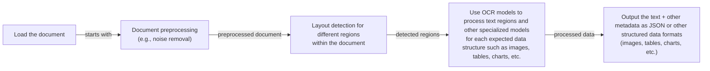
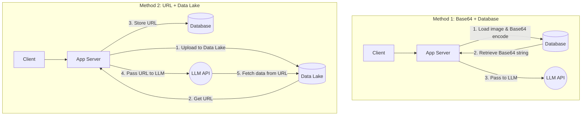
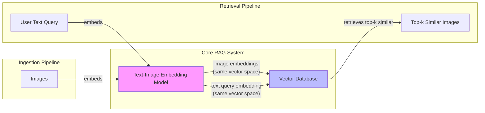
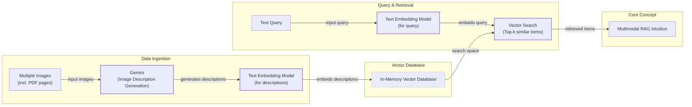
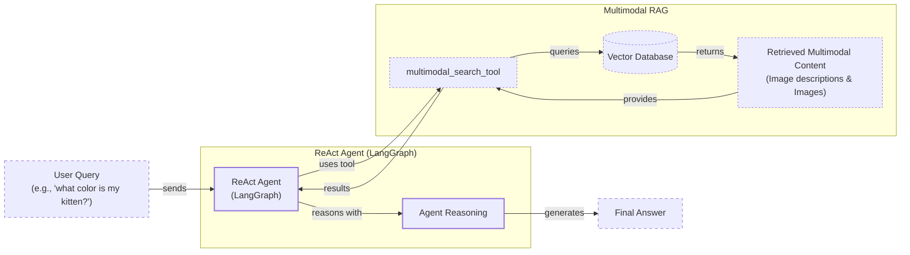

# Lesson 11: Building Multimodal AI Systems

In the previous lessons, we built a solid foundation in AI engineering. We learned to distinguish between LLM workflows and AI agents, mastered context engineering, and implemented core agent components like structured outputs, tools, ReAct reasoning, and Retrieval-Augmented Generation (RAG). You now have the skills to build sophisticated text-based AI systems. However, the real world is not limited to text. We interact with images, documents, and videos every day. To build truly useful AI applications, our systems must do the same.

This lesson tackles the final piece of the puzzle for this part of the course: multimodality. We will show you why the old way of forcing all data into text is a broken paradigm. Instead of using complex and brittle OCR pipelines to convert images and documents to text, modern AI systems process them directly in their native format. This approach is simpler, more robust, and preserves the rich visual information that text alone cannot capture.

Many enterprise AI applications require multimodal capabilities. For instance, a financial AI must understand not just the text in a report but also the charts and tables that provide critical context. A medical assistant needs to analyze X-rays alongside a patient's notes. In this lesson, we will cover the theory behind multimodal LLMs and embeddings and then dive into hands-on examples. You will learn to build a multimodal RAG system and integrate it into a ReAct agent, equipping you to create AI applications that see and understand the world as we do.

## Limitations of traditional document processing

To understand the need for multimodal AI, we must first look at the limitations of traditional document processing. For years, the standard approach for handling documents like invoices, reports, or technical manuals has been to convert everything into text using Optical Character Recognition (OCR). This multi-step process, while functional for simple text, is complex, fragile, and often loses critical information along the way.

A typical OCR-based pipeline for a PDF containing mixed content like text, diagrams, and tables follows a sequential flow. It begins with loading and preprocessing the document to clean up noise, then a layout detection model identifies different regions like paragraphs, tables, or figures. Each region is then passed to a specialized model—OCR for text, a table extractor for tables, and so on. Finally, the extracted data is structured, often as JSON, and passed downstream [[24]](https://blog.roboflow.com/what-is-optical-character-recognition-ocr/), [[25]](https://www.daft.ai/blog/end-to-end-distributed-pdf-processing-pipeline).


Image 1: A flowchart illustrating the traditional document processing workflow for documents like PDFs with mixed content.

This workflow has too many moving pieces. The reliance on multiple, specialized models makes the system rigid; if a document contains a new data structure like a complex chart for which there is no model, the pipeline fails. It is also slow and costly, as each step may involve a separate model call. This fragility is a major bottleneck for building scalable AI systems. The sequential nature of this pipeline means that errors from one stage cascade and compound in the next, making the final output unreliable [[26]](https://learn.microsoft.com/en-us/answers/questions/5668164/why-traditional-ocr-fails-for-complex-business-doc).

The performance challenges are significant. Even advanced OCR engines, which achieve 96–98% accuracy on standard forms, struggle with real-world complexity. Accuracy can drop by over 20% on poor-quality scans (below 300 DPI), and a 5-degree tilt can increase word error rates by 15% or more [[1]](https://www.llamaindex.ai/blog/ocr-accuracy). Handwritten text, stylized fonts, nested tables, and complex layouts like building sketches or technical drawings often break these systems entirely [[2]](https://hackernoon.com/complex-document-recognition-ocr-doesnt-work-and-heres-how-you-fix-it). For example, traditional OCR treats a page as a flat grid of text, which means it fails to reconstruct the spatial relationships within a table, leading to misaligned cells and jumbled data [[27]](https://www.llamaindex.ai/blog/ocr-for-tables). Template-driven systems that rely on predefined positional rules are even more brittle, as they break with the slightest variation in document format [[28]](https://intuitionlabs.ai/articles/ai-pdf-data-extraction-clinical-research).

https://hackernoon.imgix.net/images/2DFAaGGO5cfymtBKn4bFFAoT6sg2-v993xj8.jpeg
Image 2: Traditional OCR tools often struggle to detect rotated or unconventionally formatted text in technical drawings. (Source [Hackernoon [2]](https://hackernoon.com/complex-document-recognition-ocr-doesnt-work-and-heres-how-you-fix-it))

This text-centric approach also fundamentally misunderstands how information is conveyed in many documents. In financial reports, a chart is not just decorative; it is a dense, visual representation of data that cannot be fully captured by a text summary. Similarly, in medical imaging, the visual information in an X-ray or CT scan is the primary data, not something to be converted to text [[29]](https://techtoday.lenovo.com/sites/default/files/2025-05/Medical%20Imaging%20White%20Paper%20NVIDIA%20and%20Lenovo.pdf). Text-only models miss these nuances, leading to incomplete or incorrect analysis [[30]](https://www.ijcai.org/proceedings/2023/0581.pdf).

While this traditional approach might work for highly specialized, predictable tasks, it is ill-suited for flexible and fast AI agents. Modern AI solutions bypass this entire fragile workflow by using multimodal LLMs like Gemini, which can directly interpret images, PDFs, and text as native inputs. Let's explore how these models work.

## Foundations of multimodal LLMs

Before we write any code, it is important to have an intuition for how multimodal LLMs work. As an AI engineer, you do not need to know every low-level detail, but understanding the core concepts is essential for using, deploying, and optimizing these models effectively. Most modern multimodal LLMs are built by extending text-only LLMs to understand visual information. There are two common architectural approaches for this.

https://substackcdn.com/image/fetch/f_auto,q_auto:good,fl_progressive:steep/https%3A%2F%2Fsubstack-post-media.s3.amazonaws.com%2Fpublic%2Fimages%2F53956ae8-9cd8-474e-8c10-ef6bddb88164_1600x938.png
Image 3: The two primary architectures for multimodal LLMs are the Unified Embedding Decoder and the Cross-Modality Attention approach. (Source [Sebastian Raschka's Magazine [3]](https://magazine.sebastianraschka.com/p/understanding-multimodal-llms))

### Unified Embedding Decoder Architecture

The first and simpler approach is the **Unified Embedding Decoder Architecture**. In this design, an image is passed through a vision encoder, which converts it into a sequence of embedding vectors, or "image tokens." These image tokens have the same dimension as the text tokens and are simply concatenated with the text prompt before being fed into the LLM. The LLM then processes this combined sequence of text and image tokens together, allowing it to reason about both modalities in a unified context [[3]](https://magazine.sebastianraschka.com/p/understanding-multimodal-llms), [[4]](https://www.nvidia.com/en-us/glossary/vision-language-models/). This architecture is popular for its simplicity, as it requires no changes to the underlying LLM. Models like LLaVA and InternVL are well-known examples of this approach. The training typically involves a pretraining stage where a projector module (usually a small MLP) is trained to align the image embeddings with the LLM's text embedding space, followed by a supervised fine-tuning stage where the LLM itself is updated to handle multimodal instructions [[7]](https://arxiv.org/html/2409.11402).

https://substackcdn.com/image/fetch/f_auto,q_auto:good,fl_progressive:steep/https%3A%2F%2Fsubstack-post-media.s3.amazonaws.com%2Fpublic%2Fimages%2Fa219f185-211b-4569-9398-2e080e2c5619_1166x1400.png
Image 4: In the unified embedding decoder architecture, image and text embeddings are concatenated and passed as a single sequence to the LLM. (Source [Sebastian Raschka's Magazine [3]](https://magazine.sebastianraschka.com/p/understanding-multimodal-llms))

### Cross-Modality Attention Architecture

The second approach is the **Cross-Modality Attention Architecture**. Instead of prepending image tokens to the input, this method injects visual information directly into the LLM's attention mechanism. As the LLM processes the text tokens, special cross-attention layers allow it to "look at" the image embeddings at each step of its reasoning process. This is similar to how the decoder in the original Transformer architecture attended to the encoder's output for machine translation [[3]](https://magazine.sebastianraschka.com/p/understanding-multimodal-llms). Flamingo and the more recent Llama 3-V are prominent examples of this architecture. This design is generally more complex to implement but offers greater computational efficiency, especially with high-resolution images, as it avoids significantly lengthening the input sequence that the LLM must process [[7]](https://arxiv.org/html/2409.11402).

https://substackcdn.com/image/fetch/f_auto,q_auto:good,fl_progressive:steep/https%3A%2F%2Fsubstack-post-media.s3.amazonaws.com%2Fpublic%2Fimages%2Fd9c06055-b959-45d1-87b2-1f4e90ceaf2d_1296x1338.png
Image 5: The cross-modality attention architecture integrates image embeddings directly into the LLM's attention layers. (Source [Sebastian Raschka's Magazine [3]](https://magazine.sebastianraschka.com/p/understanding-multimodal-llms))

### How Image Encoders Work

Both architectures rely on a vision encoder to transform images into embeddings. This process is analogous to how text is tokenized and embedded in a standard LLM. While text is broken down into subwords using an algorithm like Byte-Pair Encoding, an image is divided into a grid of smaller patches.

https://substackcdn.com/image/fetch/f_auto,q_auto:good,fl_progressive:steep/https%3A%2F%2Fsubstack-post-media.s3.amazonaws.com%2Fpublic%2Fimages%2F0d56ea06-d202-4eb7-9e01-9aac492ee309_1522x1206.png
Image 6: Image patching and embedding (left) is analogous to text tokenization and embedding (right). (Source [Sebastian Raschka's Magazine [3]](https://magazine.sebastianraschka.com/p/understanding-multimodal-llms))

Each patch is then processed by a Vision Transformer (ViT), which is a model pretrained on a massive dataset of images. The ViT converts each patch into a high-dimensional vector, creating a sequence of image embeddings [[3]](https://magazine.sebastianraschka.com/p/understanding-multimodal-llms).

https://substackcdn.com/image/fetch/f_auto,q_auto:good,fl_progressive:steep/https%3A%2F%2Fsubstack-post-media.s3.amazonaws.com%2Fpublic%2Fimages%2Ffef5f8cb-c76c-4c97-9771-7fdb87d7d8cd_1600x1135.png
Image 7: A Vision Transformer (ViT) processes an image by dividing it into patches and encoding them into a sequence of embeddings. (Source [Sebastian Raschka's Magazine [3]](https://magazine.sebastianraschka.com/p/understanding-multimodal-llms))

For these image embeddings to be useful to a text-based LLM, they must "speak the same language" as the text embeddings. This is achieved through two key steps. First, a linear projection layer aligns the dimensions of the image embeddings with the text embeddings. Second, and more importantly, the vision and text encoders are trained together using a technique called contrastive learning. Models like CLIP (Contrastive Language-Image Pre-training) are trained on billions of image-text pairs, learning to map semantically similar images and text descriptions to nearby points in a shared embedding space [[5]](https://www.pinecone.io/learn/series/image-search/clip/), [[6]](https://towardsdatascience.com/multimodal-embeddings-an-introduction-5dc36975966f/). This is done by training the model on positive pairs (an image and its correct caption) and negative pairs (an image and an incorrect caption). The model learns to maximize the similarity for positive pairs and minimize it for negative pairs. This shared space is what enables an LLM to understand that an image of a dog and the text "a photo of a dog" represent the same concept. It is also the foundation of multimodal RAG, which allows us to perform semantic search across different data types.

E-commerce is another domain where this technology is transformative. Recommendation systems that combine product images and text descriptions into a single multimodal embedding can better understand user intent and product context. This approach improves recommendation relevance, increases user engagement, and helps solve the cold-start problem for new products by using their visual and textual features instead of relying solely on interaction history [[16]](https://innovation.ebayinc.com/stories/beyond-words-how-multimodal-embeddings-elevate-ebays-product-recommendations/).

https://towardsdatascience.com/wp-content/uploads/2024/11/15d3HBNjNIXLy0oMIvJjxWw.png
Image 8: In a shared multimodal embedding space, images and text with similar semantic meaning are located close to each other. (Source [Towards Data Science [6]](https://towardsdatascience.com/multimodal-embeddings-an-introduction-5dc36975966f/))

### Architectural Trade-offs and Modern Models

Each architectural approach comes with trade-offs. The unified decoder architecture is simpler to implement and has shown higher accuracy on OCR-related tasks. The cross-attention approach is more computationally efficient for high-resolution images because it does not overload the input context with a large number of image tokens [[7]](https://arxiv.org/html/2409.11402). Some models, like NVIDIA's NVLM, use a hybrid approach to get the best of both worlds, processing a low-resolution thumbnail via the unified decoder and high-resolution patches via cross-attention [[3]](https://magazine.sebastianraschka.com/p/understanding-multimodal-llms), [[7]](https://arxiv.org/html/2409.11402).

By 2025, most state-of-the-art LLMs are multimodal by default. This includes open-weight models like Llama 4, Gemma 2, Qwen3, and DeepSeek R1/V3, as well as proprietary models like GPT-5, Gemini 2.5, and Claude [[8]](https://www.promptitude.io/post/ultimate-2025-ai-language-models-comparison-gpt5-gpt-4-claude-gemini-sonar-more). The same principles can also be extended to other modalities like PDFs, audio, and video by integrating specialized encoders for each data type. For example, a video can be processed by a Video Transformer, and audio can be handled by a model like Whisper, with their outputs projected into the LLM's embedding space [[9]](https://sparkco.ai/blog/exploring-multimodal-llms-text-image-and-video-integration), [[31]](https://www.emergentmind.com/topics/multimodal-llms).

It is also important to distinguish these multimodal LLMs from diffusion-based image generation models like Midjourney or Stable Diffusion. While models like GPT-4o can also generate images, they use an autoregressive approach, which is fundamentally different from the iterative denoising process of diffusion models [[10]](https://zapier.com/blog/best-ai-image-generator/), [[11]](https://arxiv.org/html/2409.14993v3). Diffusion models excel at generation, while multimodal LLMs excel at understanding. In the context of AI agents, diffusion models are typically integrated as tools that the agent can call to create visual content, rather than being part of the core reasoning engine [[32]](https://docs.anyscale.com/llm).

Now that we have an intuition for how LLMs can directly process images and documents, let's see how this works in practice.

## Applying multimodal LLMs to images and PDFs

To understand how multimodal LLMs work in practice, we will walk through a few hands-on examples using Google's Gemini models. There are three primary ways to provide multimodal data to an LLM: as raw bytes, as Base64-encoded strings, or as URLs. Each method has its own use cases and trade-offs.

- **Raw bytes** are the most direct way to pass image or file data. This method is simple and efficient for one-off API calls where the data does not need to be stored. However, raw bytes can be problematic for storage, as many databases interpret them as text and can corrupt the data.
- **Base64** is a method of encoding binary data as a string. This makes it safe to store images or documents in standard databases (like PostgreSQL or MongoDB) that are designed to handle text. The main downside is that Base64 encoding increases the data size by about 33%.
- **URLs** are ideal for data that is either publicly available on the internet or stored in a private data lake like AWS S3 or Google Cloud Storage (GCS). Instead of passing large files over the network, the LLM can fetch the data directly from the URL. This is the most efficient option for production systems, as it minimizes I/O bottlenecks.


Image 9: A diagram comparing two common patterns for handling multimodal data: storing Base64 strings in a database versus storing URLs to a data lake.

In summary, you should use raw bytes for temporary, one-off calls, Base64 for storing multimodal data directly in a database, and URLs for scalable, production systems that leverage data lakes.

Now, let's dive into the code. The following examples are taken from the course notebook and demonstrate how to work with images and PDFs using the Gemini API.

### Setup

First, we set up our environment by initializing the Gemini client and defining the model we will use. For these examples, we will use `gemini-2.5-flash`, which is fast and cost-effective.

<aside>
💡

You can find all the code for this lesson in the accompanying notebook in the course's GitHub repository. To run the examples, make sure you have followed the setup instructions from the `Course Admin` lesson to configure your `GOOGLE_API_KEY`.

</aside>

```python
import base64
import io
from pathlib import Path
from typing import Literal

from google import genai
from google.genai import types
from IPython.display import Image as IPythonImage
from PIL import Image as PILImage

from lessons.utils import env, pretty_print

env.load(required_env_vars=["GOOGLE_API_KEY"])

client = genai.Client()
MODEL_ID = "gemini-2.5-flash"
```

### Working with Images

Let's start by processing a sample image. We will use a helper function to display it in our notebook.

1. First, we define a helper function to display our test image.
    ```python
    def display_image(image_path: Path) -> None:
        """
        Display an image from a file path in the notebook.
        """
        image = IPythonImage(filename=image_path, width=400)
        display(image)

    display_image(Path("images") / "image_1.jpeg")
    ```
    It outputs:
    
    https://github.com/towardsai/course-ai-agents/raw/dev/lessons/11_multimodal/images/image_1.jpeg
    
2. To process the image as raw bytes, we define a function to load it from a file, optionally resize it, and convert it to bytes. We use the WEBP format because it offers good compression and quality, making it efficient for API calls.
    ```python
    def load_image_as_bytes(
        image_path: Path, format: Literal["WEBP", "JPEG", "PNG"] = "WEBP", max_width: int = 600, return_size: bool = False
    ) -> bytes | tuple[bytes, tuple[int, int]]:
        """
        Load an image from file path and convert it to bytes with optional resizing.
        """
        image = PILImage.open(image_path)
        if image.width > max_width:
            ratio = max_width / image.width
            new_size = (max_width, int(image.height * ratio))
            image = image.resize(new_size)

        byte_stream = io.BytesIO()
        image.save(byte_stream, format=format)

        if return_size:
            return byte_stream.getvalue(), image.size

        return byte_stream.getvalue()
    ```
    We can now load the image and see its byte representation and size.
    ```python
    image_bytes = load_image_as_bytes(image_path=Path("images") / "image_1.jpeg", format="WEBP")
    pretty_print.wrapped([f"Bytes `{image_bytes[:30]}...`", f"Size: {len(image_bytes)} bytes"], title="Image as Bytes")
    ```
    It outputs:
    ```text
    ------------------------------------------ Image as Bytes ------------------------------------------ 
    Bytes `b'RIFF\xad\x00\x00WEBPVP8 T\xad\x00\x00P\xec\x02\x9d\x01*X\x02X\x02'...`
    ---------------------------------------------------------------------------------------------------- 
    Size: 44392 bytes
    ----------------------------------------------------------------------------------------------------
    ```

3. We can now pass these bytes to the model to generate a caption.
    ```python
    response = client.models.generate_content(
        model=MODEL_ID,
        contents=[
            types.Part.from_bytes(
                data=image_bytes,
                mime_type="image/webp",
            ),
            "Tell me what is in this image in one paragraph.",
        ],
    )
    pretty_print.wrapped(response.text, title="Image 1 Caption")
    ```
    It outputs:
    ```text
    ----------------------------------------- Image 1 Caption ----------------------------------------- 
    This striking image features a massive, dark metallic robot, its powerful form detailed with intricate circuit patterns on its head and piercing red glowing eyes. Perched playfully on its right arm is a small, fluffy grey tabby kitten, its front paw raised as if exploring or batting at the robot's armored limb, while its gaze is directed slightly off-frame. The robot's large, segmented hand is visible beneath the kitten. The background suggests an industrial or workshop environment, with hints of metal structures and natural light filtering in from an unseen window, creating a dramatic contrast between the soft, vulnerable kitten and the formidable, mechanical sentinel.
    ----------------------------------------------------------------------------------------------------
    ```
    We can also pass multiple images to ask the model to compare them.

4. To process the image as a Base64 string, we define another helper function.
    ```python
    from typing import cast

    def load_image_as_base64(
        image_path: Path, format: Literal["WEBP", "JPEG", "PNG"] = "WEBP", max_width: int = 600, return_size: bool = False
    ) -> str:
        """
        Load an image and convert it to base64 encoded string.
        """
        image_bytes = load_image_as_bytes(image_path=image_path, format=format, max_width=max_width, return_size=False)
        return base64.b64encode(cast(bytes, image_bytes)).decode("utf-8")

    image_base64 = load_image_as_base64(image_path=Path("images") / "image_1.jpeg", format="WEBP")
    print(f"Image as Base64 is {(len(image_base64) - len(image_bytes)) / len(image_bytes) * 100:.2f}% larger than as bytes")
    ```
    It outputs:
    ```text
    Image as Base64 is 33.34% larger than as bytes
    ```
    As expected, the Base64 string is about 33% larger than the raw bytes. We can then pass this string to the model to get a caption, and the result will be identical.

5. For public URLs, Gemini provides an out-of-the-box `url_context` tool that can automatically parse webpages, PDFs, and images. We just need to provide the URL in the prompt.
    ```python
    response = client.models.generate_content(
        model=MODEL_ID,
        contents="Based on the provided paper as a PDF, tell me how ReAct works: https://arxiv.org/pdf/2210.03629",
        config=types.GenerateContentConfig(tools=[{"url_context": {}}]),
    )
    pretty_print.wrapped(response.text, title="How ReAct works")
    ```
    It outputs:
    ```text
    ----------------------------------------- How ReAct works ----------------------------------------- 
    ReAct is a novel paradigm for large language models (LLMs) that combines reasoning (Thought) and acting (Action) in an interleaved manner to solve diverse language and decision-making tasks...
    ----------------------------------------------------------------------------------------------------
    ```

6. For private data lakes, you can pass a URL pointing to a file in a bucket, like GCS. At the time of writing, Gemini works best with GCS, so we provide a mocked example.
    ```python
    # response = client.models.generate_content(
    #     model=MODEL_ID,
    #     contents=[
    #         types.Part.from_uri(uri="gs://gemini-images/image_1.jpeg", mime_type="image/webp"),
    #         "Tell me what is in this image in one paragraph.",
    #     ],
    # )
    ```

### Object Detection with LLMs

A more advanced use case is object detection. We can ask the model to identify objects in an image and return their bounding boxes.

1. We start by defining our desired output structure using Pydantic models, a concept we covered in Lesson 4.
    ```python
    from pydantic import BaseModel, Field

    class BoundingBox(BaseModel):
        ymin: float
        xmin: float
        ymax: float
        xmax: float
        label: str = Field(
            default="The category of the object found within the bounding box. For example: cat, dog, diagram, robot."
        )

    class Detections(BaseModel):
        bounding_boxes: list[BoundingBox]
    ```

2. We create a prompt instructing the model to detect items and return their normalized coordinates.
    ```python
    prompt = """
    Detect all of the prominent items in the image. 
    The box_2d should be [ymin, xmin, ymax, xmax] normalized to 0-1000.
    Also, output the label of the object found within the bounding box.
    """
    image_bytes, image_size = load_image_as_bytes(
        image_path=Path("images") / "image_1.jpeg", format="WEBP", return_size=True
    )
    ```

3. We configure the Gemini client to return a JSON response that conforms to our `Detections` schema and call the model.
    ```python
    config = types.GenerateContentConfig(
        response_mime_type="application/json",
        response_schema=Detections,
    )
    response = client.models.generate_content(
        model=MODEL_ID,
        contents=[
            types.Part.from_bytes(
                data=image_bytes,
                mime_type="image/webp",
            ),
            prompt,
        ],
        config=config,
    )
    detections = response.parsed
    ```
    It outputs:
    ```text
    -------------------------------------------- Detections -------------------------------------------- 
    Image size: (600, 600)
    ---------------------------------------------------------------------------------------------------- 
    ymin=1.0 xmin=450.0 ymax=997.0 xmax=1000.0 label='robot'
    ---------------------------------------------------------------------------------------------------- 
    ymin=269.0 xmin=39.0 ymax=782.0 xmax=530.0 label='kitten'
    ----------------------------------------------------------------------------------------------------
    ```

4. Finally, we can use a helper function to visualize the detected bounding boxes on the original image.
    ```python
    import matplotlib.pyplot as plt
    import matplotlib.patches as patches
    import numpy as np

    def visualize_detections(detections: Detections, image_path: Path) -> None:
        # ... function implementation ...

    visualize_detections(detections, Path("images") / "image_1.jpeg")
    ```
    It outputs:
    
    https://github.com/towardsai/course-ai-agents/raw/dev/lessons/11_multimodal/images/object_detection_1.png
    

### Working with PDFs

Processing PDFs is nearly identical to processing images. We can pass PDF files as bytes or Base64 strings. For this example, we will use the famous "Attention Is All You Need" paper.

1. First, let's look at a page from the paper.
    
    https://github.com/towardsai/course-ai-agents/raw/dev/lessons/11_multimodal/images/attention_is_all_you_need_0.jpeg
    
2. We can load the PDF as bytes and ask the model for a summary.
    ```python
    pdf_bytes = (Path("pdfs") / "attention_is_all_you_need_paper.pdf").read_bytes()
    response = client.models.generate_content(
        model=MODEL_ID,
        contents=[
            types.Part.from_bytes(data=pdf_bytes, mime_type="application/pdf"),
            "What is this document about? Provide a brief summary of the main topics.",
        ],
    )
    pretty_print.wrapped(response.text, title="PDF Summary (as bytes)")
    ```
    It outputs:
    ```text
    -------------------------------------- PDF Summary (as bytes) -------------------------------------- 
    This document introduces the **Transformer**, a novel neural network architecture designed for **sequence transduction tasks** (like machine translation).

    Its main topics include:
    ...
    ----------------------------------------------------------------------------------------------------
    ```

3. The process is the same for Base64-encoded PDFs. We define a helper function to load the PDF and encode it.
    ```python
    def load_pdf_as_base64(pdf_path: Path) -> str:
        """
        Load a PDF file and convert it to base64 encoded string.
        """
        with open(pdf_path, "rb") as f:
            return base64.b64encode(f.read()).decode("utf-8")

    pdf_base64 = load_pdf_as_base64(pdf_path=Path("pdfs") / "attention_is_all_you_need_paper.pdf")
    ```
    Then we call the model with the Base64 string.
    ```python
    response = client.models.generate_content(
        model=MODEL_ID,
        contents=[
            "What is this document about? Provide a brief summary of the main topics.",
            types.Part.from_bytes(data=pdf_base64, mime_type="application/pdf"),
        ],
    )
    pretty_print.wrapped(response.text, title="PDF Summary (as base64)")
    ```
    It outputs:
    ```text
    ------------------------------------- PDF Summary (as base64) ------------------------------------- 
    This document introduces the **Transformer**, a novel neural network architecture for **sequence transduction models**, primarily applied to **machine translation**.
    ...
    ----------------------------------------------------------------------------------------------------
    ```

4. To emphasize that we can treat PDF pages as images, especially those with complex layouts, let's perform object detection to find the Transformer architecture diagram.
    ```python
    display_image(Path("images") / "attention_is_all_you_need_1.jpeg")
    ```
    It outputs:
    
    https://github.com/towardsai/course-ai-agents/raw/dev/lessons/11_multimodal/images/attention_is_all_you_need_1.jpeg
    
5. We use the same object detection prompt as before, but this time on the image of the PDF page.
    ```python
    prompt = """
    Detect all the diagrams from the provided image as 2d bounding boxes. 
    ...
    """
    image_bytes, image_size = load_image_as_bytes(
        image_path=Path("images") / "attention_is_all_you_need_1.jpeg", format="WEBP", return_size=True
    )
    # ... call the model ...
    detections = response.parsed
    visualize_detections(detections, Path("images") / "attention_is_all_you_need_1.jpeg")
    ```
    It outputs:
    
    https://github.com/towardsai/course-ai-agents/raw/dev/lessons/11_multimodal/images/object_detection_pdf_1.png
    
    The model successfully identifies and bounds the diagram. This demonstrates how effectively modern LLMs can understand visual content, making the old OCR-to-text pipelines redundant for many use cases.

## Foundations of multimodal RAG

One of the most powerful applications of multimodal models is in RAG systems, a topic we explored in Lesson 10. When building AI applications with private data, you almost always need to retrieve relevant information to provide context to the LLM. With large files like images and multi-page PDFs, RAG is not just useful; it is essential. Feeding thousands of PDF pages into a context window is impractical due to cost, latency, and the "lost-in-the-middle" performance degradation.

A generic multimodal RAG architecture for images and text involves two main pipelines.

- **Ingestion Pipeline:** Images are processed by a text-image embedding model and their embeddings are stored in a vector database.
- **Retrieval Pipeline:** A user's text query is embedded using the same model. The resulting query embedding is used to search the vector database for the top-k most similar image embeddings, typically using cosine similarity.

Because the text and image embeddings exist in the same shared vector space, this process works seamlessly. You can search for images with text, text with images, or even images with other images. This is the technology that powers modern image search engines like Google Photos.


Image 10: A Mermaid diagram illustrating the ingestion and retrieval pipelines of a generic multimodal RAG system using images and text, highlighting the shared vector space for embeddings.

For enterprise use cases involving complex documents, one of the leading architectures as of 2025 is ColPali. This model is built on recent advances in Vision Language Models, specifically Google's PaliGemma, and adapts the late-interaction mechanism from the text-retrieval model ColBERT [[17]](https://huggingface.co/blog/manu/colpali). This approach completely bypasses the traditional OCR pipeline. Instead of extracting text, it treats each document page as an image, divides it into patches, and generates a "bag-of-embeddings" for each page.

At query time, it uses a late interaction mechanism called MaxSim. Unlike cosine similarity, which computes a single score between an aggregated query vector and a document vector, MaxSim operates at a finer grain. It computes the similarity between *each* query token and *every* document image patch, keeps the maximum similarity for each query token, and then sums these maximums to get the final document score [[18]](https://www.mixedbread.com/blog/maxsim-cpu). This allows it to excel at retrieving documents with complex tables, figures, and layouts.

https://github.com/towardsai/course-ai-agents/raw/dev/lessons/11_multimodal/images/colpali_architecture.png
Image 11: The ColPali architecture simplifies document retrieval by processing page images directly, bypassing complex OCR pipelines. (Source [ColPali [12]](https://arxiv.org/pdf/2407.01449v6))

ColPali is not just more accurate; it is also much faster during ingestion. By skipping the slow steps of layout detection, OCR, and chunking, it can index documents 2-10x faster than traditional pipelines [[12]](https://arxiv.org/pdf/2407.01449v6), [[13]](https://huggingface.co/blog/saumitras/colpali-milvus-multimodal-rag). It outperforms strong baselines on the ViDoRe benchmark, achieving an 81.3% average nDCG@5 score, and can be used as a powerful reranker in a multi-stage retrieval system [[12]](https://arxiv.org/pdf/2407.01449v6). However, its fine-grained retrieval comes with high computational and storage costs at query time. A single page can generate over 1,000 vectors, and a million-page index can expand to terabytes, creating significant challenges for latency and memory [[19]](https://ragflow.io/blog/rag-review-2025-from-rag-to-context), [[20]](https://www.superteams.ai/blog/extracting-knowledge-from-complex-pdf-documents-enterprise). To address this, advanced techniques like binary quantization and phased ranking are used to make it practical for large-scale systems [[21]](https://blog.vespa.ai/scaling-colpali-to-billions/).

This paradigm shift makes it a powerful choice for building robust RAG systems over visually rich documents like financial reports and technical manuals. The official implementation can be found on GitHub at `illuin-tech/colpali` [[12]](https://arxiv.org/pdf/2407.01449v6). The current research frontier is focused on extending these methods from static images to dynamic content like video streams [[22]](https://arxiv.org/html/2506.06144v1).

With the theory covered, let's implement a simplified multimodal RAG system from scratch.

## Implementing multimodal RAG for images, PDFs and text

Let's build a simple multimodal RAG system that combines what we have learned in this lesson with the RAG concepts from Lesson 10. We will create an in-memory vector index containing several images, including pages from the "Attention Is All You Need" paper, and then query it using text questions.

This example will provide a strong intuition for how multimodal RAG works. While we will simplify some aspects for clarity, the core principles are the same as those used in production systems.


Image 12: A Mermaid diagram illustrating the multimodal RAG example, showing the process of populating an in-memory vector database with images and querying it with text questions.

Now, let's walk through the implementation from the course notebook.

1. First, we display the grid of images that we will be indexing. This set includes general photos and pages from the Transformer paper.
    ```python
    def display_image_grid(image_paths: list[Path], rows: int = 2, cols: int = 2, figsize: tuple = (8, 6)) -> None:
        # ... function implementation ...

    display_image_grid(
        image_paths=[
            Path("images") / "image_1.jpeg",
            Path("images") / "image_2.jpeg",
            Path("images") / "image_3.jpeg",
            Path("images") / "image_4.jpeg",
            Path("images") / "attention_is_all_you_need_1.jpeg",
            Path("images") / "attention_is_all_you_need_2.jpeg",
        ],
        rows=2,
        cols=3,
    )
    ```
    It outputs:
    
    https://github.com/towardsai/course-ai-agents/raw/dev/lessons/11_multimodal/images/image_grid.png
    
2. Next, we define the `create_vector_index` function. This function iterates through our images, generates a text description for each one using Gemini, and then creates a text embedding for that description. The image bytes, description, and embedding are stored in a list that acts as our in-memory vector database.
    
    A crucial point here is our use of image descriptions as a proxy for direct image embeddings. The free Gemini API we are using does not support multimodal embeddings. In a production system, you would use a dedicated multimodal embedding model (like Voyage AI, Cohere, or Google's embedding models on Vertex AI) to embed the image bytes directly [[14]](https://milvus.io/blog/choose-embedding-model-rag-2026.md). The rest of the RAG pipeline would remain the same, as both text and image embeddings would reside in the same vector space.
    
    The ideal workflow would look like this:
    ```python
    # image_bytes = ...
    # # SKIPPED!
    # # image_description = generate_image_description(image_bytes) 
    # image_embedding = embed_with_multimodal_model(image_bytes)
    ```
    For our educational example, generating descriptions is a practical workaround that still demonstrates the core RAG logic.

3. We define the helper functions `generate_image_description` and `embed_text_with_gemini`. The first uses Gemini to describe an image, and the second uses Gemini's text embedding model to create a 3072-dimension vector.
    ```python
    from typing import Any
    from io import BytesIO

    def generate_image_description(image_bytes: bytes) -> str:
        # ... function implementation ...

    def embed_text_with_gemini(content: str) -> np.ndarray | None:
        # ... function implementation ...
    
    def create_vector_index(image_paths: list[Path]) -> list[dict]:
        # ... function implementation ...
    ```

4. We call the function to create our `vector_index`.
    ```python
    image_paths = list(Path("images").glob("*.jpeg"))
    vector_index = create_vector_index(image_paths)
    ```
    Each item in our index contains the image content, description, and a 3072-dimensional embedding vector. Let's inspect the structure of an element in our index.
    ```python
    vector_index[0].keys()
    ```
    It outputs:
    ```text
    dict_keys(['content', 'type', 'filename', 'description', 'embedding'])
    ```
    The embedding is a NumPy array, and the description is a detailed text string generated by the LLM.
    ```python
    vector_index[0]["embedding"].shape
    print(f"{vector_index[0]['description'][:150]}...")
    ```
    It outputs:
    ```text
    (3072,)
    This image is a page from a technical or scientific document, likely a research paper, textbook, or dissertation related to machine learning, deep lea...
    ```

5. Now we define the `search_multimodal` function. It takes a text query, embeds it, and then calculates the cosine similarity between the query embedding and all the image description embeddings in our index. It returns the top-k most similar items.
    ```python
    from sklearn.metrics.pairwise import cosine_similarity

    def search_multimodal(query_text: str, vector_index: list[dict], top_k: int = 3) -> list[Any]:
        # ... function implementation ...
    ```

6. Let's test it with a query about the Transformer architecture.
    ```python
    query = "what is the architecture of the transformer neural network?"
    results = search_multimodal(query, vector_index, top_k=1)
    ```
    It outputs:
    ```text
    🔍 Embedding query: 'what is the architecture of the transformer neural network?'
    ✅ Query embedded successfully
    
    --------- Results for query = what is the architecture of the transformer neural network? --------- 
    Similarity 0.744
    ---------------------------------------------------------------------------------------------------- 
    Filename images/attention_is_all_you_need_1.jpeg
    ---------------------------------------------------------------------------------------------------- 
    Description `This image is a detailed technical document, likely from a research paper or academic publication, featuring a prominent diagram of the Transformer model architecture alongside explanatory text...`
    ----------------------------------------------------------------------------------------------------
    ```
    The system correctly retrieves the page containing the architecture diagram with a similarity score of 0.744.
    
    https://github.com/towardsai/course-ai-agents/raw/dev/lessons/11_multimodal/images/attention_is_all_you_need_1.jpeg
    
7. Let's try another query.
    ```python
    query = "a kitten with a robot"
    results = search_multimodal(query, vector_index, top_k=1)
    ```
    It outputs:
    ```text
    🔍 Embedding query: 'a kitten with a robot'
    ✅ Query embedded successfully
    
    ---------------------------- Results for query = a kitten with a robot ---------------------------- 
    Similarity 0.811
    ---------------------------------------------------------------------------------------------------- 
    Filename images/image_1.jpeg
    ---------------------------------------------------------------------------------------------------- 
    Description `This image is a detailed, photorealistic digital rendering or illustration depicting an unlikely interaction between a large, imposing robot and a small, delicate kitten in an industrial setting...`
    ----------------------------------------------------------------------------------------------------
    ```
    Again, it finds the correct image with a high similarity score.
    
    https://github.com/towardsai/course-ai-agents/raw/dev/lessons/11_multimodal/images/image_1.jpeg
    
This simple RAG system demonstrates the power of multimodal embeddings. By treating all visual content—whether from a photo or a PDF page—as an image, we can build a unified search index that understands semantic meaning across different data types. This same principle can be extended to other modalities, like using spectrograms to represent audio or sampling frames from a video.

## Building multimodal AI agents

To bring everything together, we will now integrate our multimodal RAG function into a ReAct agent. This will create an agentic RAG system that can reason about a user's query, search for relevant visual information, and use that information to generate an answer. This exercise combines many of the core skills we have learned in Part 1 of this course.

Multimodal capabilities can be added to AI agents in several ways:
1.  **Multimodal Inputs/Outputs:** The agent's core reasoning LLM can accept images or other modalities directly in the prompt. This allows the agent to "see" the information retrieved by its tools.
2.  **Multimodal Tools:** The agent can be equipped with tools that retrieve or process multimodal data, like our RAG search function. These tools act as the agent's senses, allowing it to gather visual information from its environment.
3.  **External Multimodal Systems:** The agent can interact with external services that handle multimodal data, such as a tool that analyzes a video from a URL or a screenshot from the user's computer. This pattern is common in enterprise settings where agents need to interact with various internal and external systems.

In this example, we will focus on the first two methods. A key deployment trend is the move toward hybrid edge-cloud architectures, where agents run partially on local devices to reduce latency and improve privacy. Simple, time-sensitive decisions happen at the edge, while more complex analysis that requires larger models or more data is offloaded to the cloud. This approach is becoming critical for applications in manufacturing, healthcare, and autonomous systems [[23]](https://www.n-ix.com/edge-ai-trends/).

We will build a ReAct agent using LangGraph and provide it with our `search_multimodal` function as a tool. The agent will use this tool to find relevant images from our vector index and then use its own multimodal capabilities to analyze the retrieved image and answer the user's question.


Image 13: Mermaid diagram illustrating a multimodal ReAct + RAG agent example.

Let's implement this agent.

1. First, we define the `multimodal_search_tool`. This function is a wrapper around our `search_multimodal` RAG function from the previous section. It takes a query, finds the most relevant image, and returns both the image description and the image content itself to the agent [[15]](https://langchain-ai.github.io/langgraph/agents/agents/).
    ```python
    from langchain_core.tools import tool
    from langchain_google_genai import ChatGoogleGenerativeAI
    from langgraph.prebuilt import create_react_agent

    @tool
    def multimodal_search_tool(query: str) -> dict[str, Any]:
        """
        Search through a collection of images and their text descriptions to find relevant content.
        """
        pretty_print.wrapped(query, title="🔍 Tool executing search for:")
        results = search_multimodal(query, vector_index, top_k=1)
        if not results:
            return {"role": "tool_result", "content": "No relevant content found for your query."}
        
        result = results[0]
        content = [
            {"type": "text", "text": f"Image description: {result['description']}"},
            types.Part.from_bytes(data=result["content"], mime_type="image/jpeg"),
        ]
        return {"role": "tool_result", "content": content}
    ```

2. Next, we create the ReAct agent using LangGraph's `create_react_agent` helper function. We provide it with our tool and a system prompt that guides its behavior. We will explore LangGraph in much more detail in Part 2 of the course; for now, think of it as a powerful way to build stateful, agentic applications.
    ```python
    def build_react_agent() -> Any:
        """
        Build a ReAct agent with multimodal search capabilities.
        """
        tools = [multimodal_search_tool]
        system_prompt = """You are a helpful AI assistant that can search through images and text to answer questions.
        ...
        Always search first using your tools before attempting to answer questions about specific images or visual content.
        """
        agent = create_react_agent(
            model=ChatGoogleGenerativeAI(model="gemini-2.5-pro", temperature=0.1),
            tools=tools,
            prompt=system_prompt,
        )
        return agent

    react_agent = build_react_agent()
    ```

3. Now, let's test the agent by asking about the color of the kitten from our dataset.
    ```python
    test_question = "what color is my kitten?"
    pretty_print.wrapped(test_question, title="🧪 Asking question:")

    response = react_agent.invoke(input={"messages": test_question})
    ```
    The agent's execution trace shows the ReAct process in action. First, it reasons that it needs to use the search tool. It calls the tool with the query "my kitten". The tool finds the relevant image and returns it to the agent. The agent then analyzes the image and generates the final answer.
    ```text
    ---------------------------------------- 🧪 Asking question: ----------------------------------------
    what color is my kitten?
    ----------------------------------- 🔍 Tool executing search for: -----------------------------------
    my kitten
    ----------------------------------------------------------------------------------------------------

    🔍 Embedding query: 'my kitten'
    ✅ Query embedded successfully
    ----------------------------------------- 🔍 Found results: -----------------------------------------
    images/image_1.jpeg
    ----------------------------------------------------------------------------------------------------
    ----------------------------------------- 🤖 Agent response -----------------------------------------
    Based on the image, your kitten is a gray tabby. It has soft, short gray fur with darker tabby stripe patterns.
    ```
    https://github.com/towardsai/course-ai-agents/raw/dev/lessons/11_multimodal/images/image_1.jpeg
    
In this final exercise, we have successfully combined structured outputs, tools, ReAct reasoning, RAG, and multimodal data to create a functional agentic RAG proof-of-concept. This demonstrates how the fundamental skills learned in Part 1 of this course serve as the building blocks for creating complex and powerful AI systems.

## Conclusion

This lesson completes Part 1 of our course on AI engineering fundamentals. You have now learned how to build robust text-based and multimodal AI systems, from simple workflows to complex, reasoning agents. By treating visual data in its native format instead of relying on brittle OCR pipelines, you can create applications that are more powerful, efficient, and aligned with how we naturally process information. We will use these multimodal techniques in our capstone project to build an advanced research and writing agent system.

In Part 2, we will move from fundamentals to production-grade engineering. We will start with a deep dive into agentic design patterns and modern frameworks like LangGraph. You will then apply these concepts to build the course's central project: an interconnected system of agents that can perform research, analyze data, and write polished content, orchestrating a complete pipeline from start to finish.

## References

- [1] [OCR Accuracy Explained: How to Improve It](https://www.llamaindex.ai/blog/ocr-accuracy)
- [2] [Complex Document Recognition: OCR Doesn’t Work and Here’s How You Fix It](https://hackernoon.com/complex-document-recognition-ocr-doesnt-work-and-heres-how-you-fix-it)
- [3] [Understanding Multimodal LLMs](https://magazine.sebastianraschka.com/p/understanding-multimodal-llms)
- [4] [Vision Language Models](https://www.nvidia.com/en-us/glossary/vision-language-models/)
- [5] [Multi-modal ML with OpenAI's CLIP](https://www.pinecone.io/learn/series/image-search/clip/)
- [6] [Multimodal Embeddings: An Introduction](https://towardsdatascience.com/multimodal-embeddings-an-introduction-5dc36975966f/)
- [7] [NVLM: Open Frontier-Class Multimodal LLMs](https://arxiv.org/html/2409.11402)
- [8] [Ultimate 2025 AI Language Models Comparison: GPT5, GPT-4, Claude, Gemini, Sonar & More](https://www.promptitude.io/post/ultimate-2025-ai-language-models-comparison-gpt5-gpt-4-claude-gemini-sonar-more)
- [9] [Exploring Multimodal LLMs: Text, Image, and Video Integration](https://sparkco.ai/blog/exploring-multimodal-llms-text-image-and-video-integration)
- [10] [The 8 best AI image generators in 2025](https://zapier.com/blog/best-ai-image-generator/)
- [11] [A Comprehensive Guide to Multimodal Large Language Models in Vision-Language Tasks](https://arxiv.org/html/2409.14993v3)
- [12] [ColPali: Efficient Document Retrieval with Vision Language Models](https://arxiv.org/pdf/2407.01449v6)
- [13] [Multimodal RAG with Colpali, Milvus and VLMs](https://huggingface.co/blog/saumitras/colpali-milvus-multimodal-rag)
- [14] [How to Choose the Best Embedding Model for RAG in 2026: 10 Models Benchmarked](https://milvus.io/blog/choose-embedding-model-rag-2026.md)
- [15] [LangGraph quickstart](https://langchain-ai.github.io/langgraph/agents/agents/)
- [16] [Beyond Words: How Multimodal Embeddings Elevate eBay’s Product Recommendations](https://innovation.ebayinc.com/stories/beyond-words-how-multimodal-embeddings-elevate-ebays-product-recommendations/)
- [17] [ColPali: Vision Language Models for Multimodal Document Retrieval](https://huggingface.co/blog/manu/colpali)
- [18] [MaxSim on CPU: A Deep Dive](https://www.mixedbread.com/blog/maxsim-cpu)
- [19] [RAG Review 2025: From RAG to Context-Native AI](https://ragflow.io/blog/rag-review-2025-from-rag-to-context)
- [20] [Extracting Knowledge from Complex PDF Documents in Enterprise](https://www.superteams.ai/blog/extracting-knowledge-from-complex-pdf-documents-enterprise)
- [21] [Scaling ColPali to billions of PDFs with Vespa](https://blog.vespa.ai/scaling-colpali-to-billions/)
- [22] [Late-interaction video retrieval](https://arxiv.org/html/2506.06144v1)
- [23] [Edge AI trends: What's working now and what's next in 2026](https://www.n-ix.com/edge-ai-trends/)
- [24] [What Is Optical Character Recognition (OCR)?](https://blog.roboflow.com/what-is-optical-character-recognition-ocr/)
- [25] [End-to-end Distributed PDF Processing Pipeline](https://www.daft.ai/blog/end-to-end-distributed-pdf-processing-pipeline)
- [26] [Why traditional OCR fails for complex business documents](https://learn.microsoft.com/en-us/answers/questions/5668164/why-traditional-ocr-fails-for-complex-business-doc)
- [27] [OCR for Tables](https://www.llamaindex.ai/blog/ocr-for-tables)
- [28] [AI PDF Data Extraction in Clinical Research](https://intuitionlabs.ai/articles/ai-pdf-data-extraction-clinical-research)
- [29] [Medical Imaging with AI](https://techtoday.lenovo.com/sites/default/files/2025-05/Medical%20Imaging%20White%20Paper%20NVIDIA%20and%20Lenovo.pdf)
- [30] [Summarizing and Understanding Tabular Data in Financial Reports](https://www.ijcai.org/proceedings/2023/0581.pdf)
- [31] [Multimodal LLMs](https://www.emergentmind.com/topics/multimodal-llms)
- [32] [Orchestrating LLMs, Agents, and Services with Ray](https://docs.anyscale.com/llm)
</article>