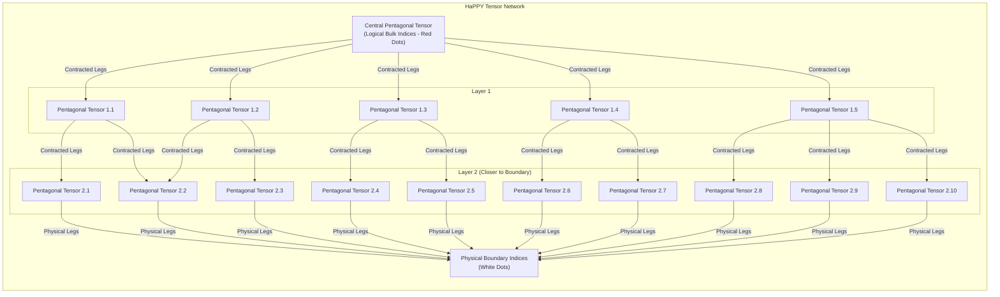

# The Universe as a Quantum Computer: How Space-Time is an Error-Correcting Code

In 1994, a mathematician at AT&T named Peter Shor developed an algorithm that sent a shockwave through the worlds of computing and cryptography [[how-space-and-time-could-be-a-quantum-error-correcting-code-]]. His work showed that a hypothetical "quantum computer" could factor large numbers exponentially faster than any classical computer, threatening to break much of the encryption that secures our digital world. This generated immense excitement, but also deep skepticism. The very properties that make quantum computers so powerful—the ability of quantum bits, or "qubits," to exist in a superposition of states and become entangled—also make them incredibly fragile.

The slightest disturbance from the environment, a stray magnetic field or a flicker of microwave radiation, can corrupt a qubit, causing its state to flip. This process, known as decoherence, was seen as a fatal flaw. How could you perform a complex computation if your hardware was constantly falling apart? The problem seemed insurmountable, as directly measuring the qubits to check for errors would itself collapse their quantum state and destroy the computation. For a time, it seemed that large-scale quantum computing might be a theoretical fantasy.

Then, in 1995, Shor delivered a second breakthrough: a proof that "quantum error-correcting codes" (QEC) could exist [[quantum-error-correction-wikipedia]]. A year later, researchers including Dorit Aharonov and Michael Ben-Or proved the threshold theorem, which established that if the error rate of individual physical components is below a certain threshold, active error correction can suppress errors faster than they accumulate [[threshold-theorem-wikipedia]]. This convinced the scientific community that scalable, fault-tolerant quantum computers were, in fact, theoretically possible. As quantum computer scientist Scott Aaronson put it, Shor's discovery "was the central discovery in the ’90s that convinced people that scalable quantum computing should be possible at all" [[how-space-and-time-could-be-a-quantum-error-correcting-code-]].

The quest for better quantum error-correcting codes became a major focus of the field. But in 2014, this research took an unexpected turn, revealing a profound connection to the very fabric of the universe. Three quantum gravity researchers—Ahmed Almheiri, Xi Dong, and Daniel Harlow—published a paper suggesting that space-time itself is a quantum error-correcting code [[Bulk Locality and Quantum Error Correction in AdS/CFT]]. They argued that in holographic theories of gravity, the emergence of a smooth, geometric bulk space-time from entangled quantum degrees of freedom on a lower-dimensional boundary works just like a QEC code.

This idea provides a stunningly deep explanation for a feature of our universe we take for granted: its stability. John Preskill, a theoretical physicist at Caltech, argues that space-time doesn't feel fragile because it's protected by an underlying QEC structure. "We’re not walking on eggshells to make sure we don’t make the geometry fall apart," he said. "I think this connection with quantum error correction is the deepest explanation we have for why that’s the case" [[how-space-and-time-could-be-a-quantum-error-correcting-code-]]. The information that defines the geometry is encoded redundantly, so small local errors are corrected, leaving the large-scale structure intact.

This discovery has created a two-way street of inspiration. Physicists hope that the structure of holographic codes might point toward more efficient QEC schemes for building real quantum computers. "Space-time is a lot smarter than us," Almheiri noted, suggesting its "very efficient code" could be a blueprint for new technologies [[how-space-and-time-could-be-a-quantum-error-correcting-code-]]. In the other direction, the language of QEC is providing a powerful new toolkit for tackling the deepest mysteries of quantum gravity, particularly the paradoxes surrounding black holes.

To understand this cosmic connection, we first need to look at how these codes protect fragile quantum information.

## How Quantum Error-Correcting Codes Work

Classical computers store information in bits, which are definitively either a 0 or a 1. An n-bit register can be in one of 2ⁿ states at a time. Qubits are different. A single qubit can exist in a superposition—a combination of both |0⟩ and |1⟩ simultaneously. When multiple qubits become entangled, their fates are intertwined, and an n-qubit register can exist in a superposition of all 2ⁿ possible states at once. This exponential state space is what gives quantum computers their immense theoretical power [[how-space-and-time-could-be-a-quantum-error-correcting-code-]].

But this power comes with extreme fragility. Environmental noise can cause "bit-flips" (swapping the probabilities of |0⟩ and |1⟩) or "phase-flips" (inverting the mathematical relationship between the two states) [[how-space-and-time-could-be-a-quantum-error-correcting-code-]]. The core trick of quantum error correction is to protect information from these errors by encoding it non-locally. Instead of storing a single "logical" qubit of information in one physical qubit, it is spread across the entanglement patterns of many physical qubits.

A simple, though not fully robust, example is the three-qubit bit-flip code [[quantum-error-correction-wikipedia]]. Here, one logical qubit is encoded using three physical qubits. The logical state |0⟩ is represented by all three physical qubits being in the |000⟩ state, and the logical state |1⟩ is represented by |111⟩. A general logical state is therefore a superposition of these two, written as α|000⟩ + β|111⟩.

Now, suppose a bit-flip error occurs on one of the physical qubits. How can we detect and fix it without measuring the qubits directly and collapsing the whole computation? The solution is to perform a "syndrome measurement." This is done using auxiliary qubits, called ancillas, and a series of controlled gates to check the parity—whether pairs of qubits are the same or different. For example, one gate checks the parity of the first and second qubits, and another checks the parity of the first and third.

- If there are no errors (the state is α|000⟩ + β|111⟩), both parity checks will show that the pairs match. The syndrome is "00".
- If the first qubit flips (α|100⟩ + β|011⟩), both checks will show a mismatch. The syndrome is "11".
- If the second qubit flips (α|010⟩ + β|101⟩), the first check fails and the second passes. The syndrome is "10".
- If the third qubit flips (α|001⟩ + β|110⟩), the first check passes and the second fails. The syndrome is "01".

Each single-qubit error produces a unique syndrome. This tells us exactly which qubit to fix by applying a corrective operation, all without ever learning the logical state (the values of α and β). The logical information remains protected [[how-space-and-time-could-be-a-quantum-error-correcting-code-]].

```mermaid
flowchart LR
    %% Initial State
    subgraph "Initial State"
        Initial_Qubits["Q1: α|0⟩ + β|1⟩<br/>Q2, Q3, A1, A2: |0⟩"]
    end

    %% Encoding Phase
    subgraph "Encoding"
        Enc_CNOT1["CNOT(Q1, Q2)"]
        Enc_CNOT2["CNOT(Q1, Q3)"]
    end

    %% State After Encoding
    subgraph "Encoded State"
        Encoded_Qubits["Q1, Q2, Q3: α|000⟩ + β|111⟩<br/>A1, A2: |0⟩"]
    end

    %% Syndrome Extraction Phase
    subgraph "Syndrome Extraction"
        Synd_CNOT_Q1A1["CNOT(Q1, A1)"]
        Synd_CNOT_Q2A1["CNOT(Q2, A1)"]
        Synd_CNOT_Q1A2["CNOT(Q1, A2)"]
        Synd_CNOT_Q3A2["CNOT(Q3, A2)"]
    end

    %% Measurement Phase
    subgraph "Measurement"
        Measure_Ancillas["Measure Ancilla 1 & Ancilla 2"]
    end

    %% Output
    subgraph "Output"
        Syndrome_Result["Syndrome (A1A2)<br/>00: No flip<br/>01: Flip Q3<br/>10: Flip Q2<br/>11: Flip Q1"]
        Logical_Qubit_Preserved["Logical Qubit<br/>(State Preserved)"]
    end

    %% Connections
    Initial_Qubits -- "Prepare" --> Enc_CNOT1
    Initial_Qubits -- "Prepare" --> Enc_CNOT2

    Enc_CNOT1 -- "Output" --> Encoded_Qubits
    Enc_CNOT2 -- "Output" --> Encoded_Qubits

    Encoded_Qubits -- "Input for Parity Check" --> Synd_CNOT_Q1A1
    Encoded_Qubits -- "Input for Parity Check" --> Synd_CNOT_Q2A1
    Encoded_Qubits -- "Input for Parity Check" --> Synd_CNOT_Q1A2
    Encoded_Qubits -- "Input for Parity Check" --> Synd_CNOT_Q3A2

    Synd_CNOT_Q1A1 -- "Output to Ancillas" --> Measure_Ancillas
    Synd_CNOT_Q2A1 -- "Output to Ancillas" --> Measure_Ancillas
    Synd_CNOT_Q1A2 -- "Output to Ancillas" --> Measure_Ancillas
    Synd_CNOT_Q3A2 -- "Output to Ancillas" --> Measure_Ancillas

    Measure_Ancillas -- "Result" --> Syndrome_Result

    %% Logical qubit preservation is a consequence, not a direct flow from a single node.
    %% Use a dotted line from the overall process to indicate this.
    Syndrome_Result -. "Implies" .-> Logical_Qubit_Preserved

    classDef state_node fill:#f9f,stroke:#333,stroke-width:2px
    class Initial_Qubits,Encoded_Qubits,Syndrome_Result,Logical_Qubit_Preserved state_node

    classDef gate_node fill:#ccf,stroke:#333,stroke-width:2px
    class Enc_CNOT1,Enc_CNOT2,Synd_CNOT_Q1A1,Synd_CNOT_Q2A1,Synd_CNOT_Q1A2,Synd_CNOT_Q3A2,Measure_Ancillas gate_node
```

Image 1: A flowchart illustrating the three-qubit bit-flip quantum error correction code, detailing the encoding, syndrome extraction, and measurement phases.

A key feature of the best QEC codes is that they can recover all the logical information from slightly more than half of the physical qubits, even if the rest are completely corrupted or lost [[how-space-and-time-could-be-a-quantum-error-correcting-code-]]. It was this "slightly more than half" signature that Almheiri, Dong, and Harlow recognized in the geometry of space-time, leading them to their groundbreaking conjecture.

Equipped with this mechanism, we can now see how the same structure appears on a cosmic scale.

## The Holographic Principle and Space-Time Emerges as a Quantum Error-Correcting Code

To understand the connection, we first need a quick tour of the theoretical playground where these ideas were developed: anti-de Sitter (AdS) space. Our universe is thought to be a "de Sitter" space, with a positive vacuum energy causing it to expand. AdS space is different; it has a negative vacuum energy, which gives it a strange, hyperbolic geometry, famously visualized in M.C. Escher's *Circle Limit* woodcuts [[how-space-and-time-could-be-a-quantum-error-correcting-code-]]. In these images, the repeating figures (like fish or angels) shrink as they approach the circular boundary, which is infinitely far away.

<https://www.quantamagazine.org/wp-content/uploads/2019/01/Escher_1000.jpg> 
Image 2: The hyperbolic geometry in M.C. Escher’s 1959 woodcut, Circle Limit III, is a feature of anti-de Sitter space. (Source [https://en.wikipedia.org/wiki/Circle_Limit_III#/media/File:Escher_Circle_Limit_III.jpg](https://en.wikipedia.org/wiki/Circle_Limit_III#/media/File:Escher_Circle_Limit_III.jpg))

This boundary is crucial. In 1997, physicist Juan Maldacena discovered the AdS/CFT correspondence, a powerful conjecture stating that a theory of quantum gravity in a (d+1)-dimensional AdS space is mathematically equivalent—or "dual"—to a d-dimensional quantum field theory (a Conformal Field Theory, or CFT) living on its boundary [[Albert Einstein, Holograms and Quantum Gravity]]. This is a holographic principle: all the information about the higher-dimensional "bulk" space-time, including gravity, is encoded on its lower-dimensional, gravity-free boundary.

Almheiri, Dong, and Harlow noticed that this holographic mapping works just like a QEC code. They found that any point in the bulk interior of AdS space could be reconstructed from the quantum state on slightly more than half of the boundary—the same signature we saw in optimal QEC codes [[how-space-and-time-could-be-a-quantum-error-correcting-code-]]. In their 2014 paper, they proposed a simple toy model to illustrate this: a 2D hologram where a single point in the center of a circle is encoded in the entangled state of three "qutrits" (three-state quantum particles) on the perimeter. This "three-qutrit code" protects the information about the central point from the erasure of any one of the qutrits, just as the three-qubit code protects against a single bit-flip [[holographic-codes-error-correction-zoo]].

Of course, a single point is not much of a universe. In 2015, a team including Harlow, Preskill, Fernando Pastawski, and Beni Yoshida developed a more sophisticated model called the HaPPY code (an acronym of their last names) [[pastawski-yoshida-harlow-preskill-happy-code-error-correctio]]. This code constructs a discrete version of AdS space using a tensor network—a collection of interconnected mathematical objects called "perfect tensors." These tensors are arranged on a hyperbolic tiling of pentagons, perfectly mimicking the geometry of AdS space. As Patrick Hayden of Stanford University described them, the tensors are like "little Tinkertoys," and "these tiles would be playing the role of the fish in an Escher tiling" [[how-space-and-time-could-be-a-quantum-error-correcting-code-]].

Image 3: A conceptual Mermaid diagram of the HaPPY tensor network, illustrating its layered structure from a central pentagonal tensor to the physical boundary. It shows how successive layers of pentagonal tensors are connected via contracted legs, representing the reproduction of Anti-de Sitter (AdS) hyperbolic geometry. Logical 'bulk' indices (red dots) are internal to the tensors, while physical 'boundary' indices (white dots) are at the network's edge. The increasing number of tensors in outer layers suggests the hyperbolic tiling where tiles effectively shrink towards the boundary, consistent with holographic quantum error correction and the consistent overlap of entanglement wedges.

In these models, the "logical" information corresponds to the state of the bulk (the interior of the network), while the "physical" information is the state of the boundary qubits. A key feature is that information in the bulk can be reconstructed from many different subsets of the boundary qubits, a property known as "complementary recovery" [[holographic-codes-from-hyperinvariant-tensor-networks-nature]]. This redundancy is the essence of the error correction. A local piece of bulk information is protected because it is encoded everywhere on the boundary.

The general lesson is that quantum error correction provides the natural language for understanding how a robust, classical-looking geometry can emerge from the fragile, entangled quantum world. As Preskill notes, "It’s really entanglement which is holding the space together... And the right way is to build a quantum error-correcting code" [[how-space-and-time-could-be-a-quantum-error-correcting-code-]].

For now, researchers are sticking with AdS space because, while simpler than our own universe, it shares a critical feature: black holes. "The most fundamental property of gravity is that there are black holes," said Daniel Harlow. "That’s what makes gravity different from all the other forces. That’s why quantum gravity is hard" [[how-space-and-time-could-be-a-quantum-error-correcting-code-]]. It is at the edge of these cosmic abysses that the beautiful structure of holographic error correction begins to break down.

## Black Holes: Where Correctability Breaks Down

In the language of QEC, the formation of a black hole represents a catastrophic failure of correctability. Patrick Hayden defines the event horizon as a "sink for your ignorance": a point beyond which so many errors have occurred that you can no longer reconstruct what is happening in the bulk space-time [[how-space-and-time-could-be-a-quantum-error-correcting-code-]]. The information that falls in is no longer accessible from local operators on the boundary.

This connects directly to one of the most profound puzzles in modern physics: the black hole information paradox. In 1974, Stephen Hawking showed that black holes are not truly black; they radiate heat and eventually evaporate. His calculations suggested this "Hawking radiation" is thermal, meaning it is random and carries no information about what fell into the black hole. This implies that a pure quantum state (the matter that formed the black hole) would evolve into a mixed, thermal state (the radiation), which violates a fundamental principle of quantum mechanics called unitarity. A complete theory of quantum gravity must explain how this information gets out [[how-space-and-time-could-be-a-quantum-error-correcting-code-]].

The holographic QEC framework offers new insights. For a normal region of AdS space, information can be reconstructed from just over half the boundary. However, for a black hole that has evaporated past its "Page time" (when it has lost half its initial entropy), the reconstruction threshold shifts dramatically. To decode information from inside the black hole, you now need access to roughly three-quarters of the boundary degrees of freedom, which includes the previously emitted radiation [[how-space-and-time-could-be-a-quantum-error-correcting-code-]]. Why this specific fraction comes up "is still an open question," according to Almheiri [[how-space-and-time-could-be-a-quantum-error-correcting-code-]].

This shift in correctability leads to another paradox. In 2012, Almheiri and his collaborators (including Harlow) pointed out a sharp conflict with the "monogamy of entanglement," a principle stating that a quantum system cannot be maximally entangled with two other systems at the same time [[Black Holes _ Complementarity or Firewalls]]. For information to escape, a late-time Hawking particle emitted from the black hole must be entangled with the early radiation. But for the event horizon to be a smooth, unremarkable place as predicted by general relativity, that same particle must also be entangled with its partner particle just inside the horizon. This is a violation. The team argued that the only way to resolve this was for the entanglement across the horizon to break, creating a "firewall" of high-energy particles that would incinerate any infalling observer [[Black Holes _ Complementarity or Firewalls]].

Quantum error correction may offer a way out. It can be shown that QEC is "essential for maintaining the smoothness of space-time at the horizon" [[how-space-and-time-could-be-a-quantum-error-correcting-code-]]. The idea, connected to the "ER=EPR" conjecture, is that the entanglement between the interior and the radiation is mediated by microscopic wormholes. Almheiri speculates that these entanglement wormholes are how information escapes, resolving Hawking's paradox without the need for a firewall. The QEC structure protects the entanglement, allowing information to be teleported out [[Holographic Quantum Error Correction and the Projected Black Hole Interior]].

## Implications for Our Universe and Quantum Computing

The deep connection between space-time and QEC is more than just a theoretical curiosity. The insights flow in both directions. Research into holographic codes is now being funded by organizations like the U.S. Department of Defense, in the hope that their unique geometric structure might inspire new, more efficient error-correcting codes for building practical quantum computers [[how-space-and-time-could-be-a-quantum-error-correcting-code-]].

On the physics side, a major challenge remains: extending these ideas from the theoretical sandbox of AdS space to a realistic model of our own universe. De Sitter space lacks the clean spatial boundary that makes holography in AdS so tractable. "The whole connection is known for a world that is manifestly not our world," as Scott Aaronson has noted. However, researchers like Xi Dong are making progress on primitive holographic descriptions of de Sitter space, and many believe the language of QEC will ultimately carry over [[how-space-and-time-could-be-a-quantum-error-correcting-code-]].

The journey that began with a puzzle about building quantum computers has led to a new perspective on the fundamental nature of reality. It suggests that the stable, classical world we experience is an emergent property, protected by the same principles that may one day allow us to build machines of unimaginable power. As John Preskill eloquently summarized, "It’s really entanglement which is holding the space together. If you want to weave space-time together out of little pieces, you have to entangle them in the right way. And the right way is to build a quantum error-correcting code" [[how-space-and-time-could-be-a-quantum-error-correcting-code-]].

## References

- [1] [How Space and Time Could Be a Quantum Error-Correcting Code](https://www.quantamagazine.org/how-space-and-time-could-be-a-quantum-error-correcting-code-20190103)
- [2] [Quantum error correction - Wikipedia](https://en.wikipedia.org/wiki/Quantum_error_correction)
- [3] [Threshold theorem](https://en.wikipedia.org/wiki/Threshold_theorem)
- [4] [Bulk Locality and Quantum Error Correction in AdS/CFT](https://arxiv.org/abs/1411.7041)
- [5] [Albert Einstein, Holograms and Quantum Gravity](https://www.youtube.com/watch?v=IIHucC-HPz0)
- [6] [Holographic codes | Error Correction Zoo](https://errorcorrectionzoo.org/list/holographic)
- [7] [Pastawski-Yoshida-Harlow-Preskill (HaPPY) code](https://errorcorrectionzoo.org/c/happy)
- [8] [Holographic codes from hyperinvariant tensor networks | Nature Communications](https://www.nature.com/articles/s41467-023-42743-z)
- [9] [Black Holes: Complementarity or Firewalls?](https://arxiv.org/abs/1207.3123)
- [10] [Holographic Quantum Error Correction and the Projected Black Hole Interior](https://arxiv.org/abs/1810.02055)