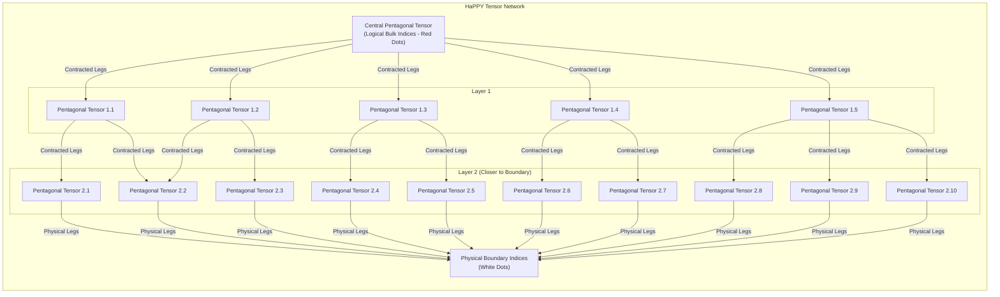

# The Universe as a Quantum Computer: How Space-Time is an Error-Correcting Code

In 1994, a mathematician at AT&T named Peter Shor developed an algorithm that sent a shockwave through the worlds of computing and cryptography [[1]](https://www.quantamagazine.org/how-space-and-time-could-be-a-quantum-error-correcting-code-20190103). His work showed that a hypothetical "quantum computer" could factor large numbers exponentially faster than any classical computer, threatening to break much of the encryption that secures our digital world. This generated immense excitement, but also deep skepticism. The very properties that make quantum computers so powerful also make them incredibly fragile. The slightest disturbance from the environment, a stray magnetic field or a flicker of microwave radiation, can corrupt a qubit, causing its state to flip. This process, known as decoherence, was seen as a fatal flaw.

How could you perform a complex computation if your hardware was constantly falling apart? The problem seemed insurmountable, as directly measuring the qubits to check for errors would itself collapse their quantum state and destroy the computation. For a time, it seemed that large-scale quantum computing might be a theoretical fantasy.

Then, in 1995, Shor delivered a second breakthrough: a proof that "quantum error-correcting codes" (QEC) could exist [[2]](https://en.wikipedia.org/wiki/Quantum_error_correction). A year later, researchers including Dorit Aharonov and Michael Ben-Or proved the threshold theorem, which established that if the error rate of individual physical components is below a certain threshold, active error correction can suppress errors faster than they accumulate [[3]](https://en.wikipedia.org/wiki/Threshold_theorem). This convinced the scientific community that scalable, fault-tolerant quantum computers were, in fact, theoretically possible. As quantum computer scientist Scott Aaronson put it, Shor's discovery "was the central discovery in the ’90s that convinced people that scalable quantum computing should be possible at all" [[1]](https://www.quantamagazine.org/how-space-and-time-could-be-a-quantum-error-correcting-code-20190103).

The quest for better quantum error-correcting codes became a major focus of the field. But in 2014, this research took an unexpected turn, revealing a profound connection to the very fabric of the universe. Three quantum gravity researchers—Ahmed Almheiri, Xi Dong, and Daniel Harlow—published a paper suggesting that space-time itself is a quantum error-correcting code [[4]](https://arxiv.org/abs/1411.7041). They argued that in holographic theories of gravity, the emergence of a smooth, geometric bulk space-time from entangled quantum degrees of freedom on a lower-dimensional boundary works just like a QEC code.

This idea provides a stunningly deep explanation for a feature of our universe we take for granted: its stability. John Preskill, a theoretical physicist at Caltech, argues that space-time doesn't feel fragile because it's protected by an underlying QEC structure. "We’re not walking on eggshells to make sure we don’t make the geometry fall apart," he said. "I think this connection with quantum error correction is the deepest explanation we have for why that’s the case" [[1]](https://www.quantamagazine.org/how-space-and-time-could-be-a-quantum-error-correcting-code-20190103). The information that defines the geometry is encoded redundantly, so small local errors are corrected, leaving the large-scale structure intact.

This discovery has created a two-way street of inspiration. Physicists hope that the structure of holographic codes might point toward more efficient QEC schemes for building real quantum computers. "Space-time is a lot smarter than us," Almheiri noted, suggesting its "very efficient code" could be a blueprint for new technologies [[1]](https://www.quantamagazine.org/how-space-and-time-could-be-a-quantum-error-correcting-code-20190103). In the other direction, the language of QEC is providing a powerful new toolkit for tackling the deepest mysteries of quantum gravity, particularly the paradoxes surrounding black holes.

With the Almheiri-Dong-Harlow conjecture establishing that holographic space-time behaves as a quantum error-correcting code, we now examine the concrete mechanics of how such codes protect logical information in simple qubit systems so the reader can recognize the same mathematical signatures when they reappear in the bulk geometry of AdS.

## The Quantum Computing Challenge and the Discovery of a Cosmic Connection

### Shor's Algorithm and the Fragility of Qubits

The excitement surrounding Shor's 1994 factoring algorithm was rooted in the unique properties of quantum bits. Unlike a classical n-bit register, which can only store one of 2ⁿ possible values at any given moment, an n-qubit register can exist in a coherent superposition of all 2ⁿ basis states simultaneously. This exponential state space enables a massive form of parallelism. Shor's algorithm leverages this by evaluating a function for all possible inputs at once, allowing it to find the period of that function and, by extension, the prime factors of a large number with astonishing speed [[1]](https://www.quantamagazine.org/how-space-and-time-could-be-a-quantum-error-correcting-code-20190103).

However, this power is also the source of its greatest weakness. The quantum states are incredibly delicate. Environmental interactions, or "noise," can cause two primary types of errors. A "bit-flip" error is analogous to a classical bit flip, swapping the states |0⟩ and |1⟩. A "phase-flip" error is purely quantum, introducing a relative sign change between the |0⟩ and |1⟩ components of the superposition. Both types of errors corrupt the intricate web of entanglement that sustains the computation. The problem is that you cannot simply measure the qubits to check for these errors. Any direct measurement would force the qubit to "choose" a definite state, either 0 or 1, thereby collapsing the superposition and destroying the very quantum information you are trying to protect [[1]](https://www.quantamagazine.org/how-space-and-time-could-be-a-quantum-error-correcting-code-20190103). This fragility led many to believe that building a large, useful quantum computer would be impossible.

### The Promise of Quantum Error Correction

Just one year after his factoring algorithm, Peter Shor again revolutionized the field by proving that quantum error correction was possible [[2]](https://en.wikipedia.org/wiki/Quantum_error_correction). He introduced the first such code in 1995, a nine-qubit code capable of correcting any arbitrary single-qubit error [[5]](https://people.eecs.berkeley.edu/~jswright/quantumcodingtheory24/scribe%20notes/lecture01.pdf). This work laid the foundation for the crucial "threshold theorem," independently proven shortly after by several groups, including Dorit Aharonov and Michael Ben-Or [[3]](https://en.wikipedia.org/wiki/Threshold_theorem), [[6]](https://www.quantinuum.com/blog/quantinuum-with-partners-princeton-and-nist-deliver-seminal-result-in-quantum-error-correction). The theorem states that if the error rate of individual physical gates is below a certain constant threshold, then it is possible to use error-correcting codes to suppress the logical error rate to arbitrarily low levels. In essence, you can correct errors faster than they accumulate.

This was a monumental discovery. It transformed the prospect of scalable quantum computing from a theoretical impossibility into what Scott Aaronson called "merely a staggering problem of engineering" [[1]](https://www.quantamagazine.org/how-space-and-time-could-be-a-quantum-error-correcting-code-20190103). The challenge shifted to designing more efficient codes and building better hardware with lower error rates. The effort to design these codes, Aaronson notes, is "one of the major thrusts of the field," a pursuit that would lead to an unexpected intersection with fundamental physics [[1]](https://www.quantamagazine.org/how-space-and-time-could-be-a-quantum-error-correcting-code-20190103).

### A Holographic Revelation

In 2014, the worlds of quantum computing and quantum gravity collided. Physicists Ahmed Almheiri, Xi Dong, and Daniel Harlow were studying the AdS/CFT correspondence, a holographic model where the geometry of space-time in the "bulk" of a universe emerges from entangled quantum particles on its outer boundary. They made an astonishing connection: this holographic emergence of space-time works exactly like a quantum error-correcting code [[4]](https://arxiv.org/abs/1411.7041). Their paper proposed that in these toy universes, space-time *is* a code. The local operators in the bulk are the protected "logical" information, encoded non-locally in the entanglement of the "physical" qubits on the boundary. This seminal work triggered a wave of research exploring the deep ties between gravity and quantum information [[1]](https://www.quantamagazine.org/how-space-and-time-could-be-a-quantum-error-correcting-code-20190103).

### The Robustness of Space-Time

This holographic perspective provides a powerful explanation for why the fabric of space-time feels so robust, despite being woven from fragile quantum components. Caltech physicist John Preskill argues that the geometry of space-time is an error-protected logical observable. Small, local fluctuations in the underlying quantum state on the boundary are like correctable errors on physical qubits. They do not affect the large-scale geometric structure of the bulk. "We’re not walking on eggshells to make sure we don’t make the geometry fall apart," Preskill explained. "I think this connection with quantum error correction is the deepest explanation we have for why that’s the case" [[1]](https://www.quantamagazine.org/how-space-and-time-could-be-a-quantum-error-correcting-code-20190103). The redundancy inherent in the code is what gives space-time its stability.

### A Two-Way Street of Discovery

This newfound unity has created a fertile ground for cross-pollination between fields. On one hand, the language of QEC provides a new framework for tackling some of the most difficult problems in quantum gravity, such as the black hole information paradox. It allows physicists to ask precise questions about how information is stored and processed in a gravitational system. On the other hand, the highly efficient codes seemingly implemented by nature could inspire new designs for practical quantum computers. As Almheiri suggests, "Space-time is a lot smarter than us. The kind of quantum error-correcting code which is implemented in these constructions is a very efficient code" [[1]](https://www.quantamagazine.org/how-space-and-time-could-be-a-quantum-error-correcting-code-20190103).

## How Quantum Error-Correcting Codes Work

### Encoding Logic in Entanglement

The fundamental principle behind quantum error correction is to move away from storing information in single, vulnerable qubits. Instead, the information of one "logical" qubit is encoded across a highly entangled state of multiple "physical" qubits. This redundancy ensures that no single physical qubit holds the complete information. Consequently, a local error affecting one physical qubit only damages a small part of the encoded state, leaving the logical information recoverable. The information is stored not in the qubits themselves, but in the intricate pattern of correlations among them [[1]](https://www.quantamagazine.org/how-space-and-time-could-be-a-quantum-error-correcting-code-20190103).

### The Three-Qubit Bit-Flip Code: A Toy Model

To see this in action, consider the three-qubit bit-flip code. While not a fully practical code because it only protects against bit-flips and not phase-flips, it serves as an excellent instructional example [[1]](https://www.quantamagazine.org/how-space-and-time-could-be-a-quantum-error-correcting-code-20190103). In this scheme, a single logical qubit is encoded into three physical qubits. The logical basis states are defined as |0_L⟩ = |000⟩ and |1_L⟩ = |111⟩. A general logical state, which is a superposition α|0_L⟩ + β|1_L⟩, becomes the entangled state α|000⟩ + β|111⟩ across the three physical qubits [[7]](https://www.cl.cam.ac.uk/teaching/1920/QuantComp/Quantum_Computing_Lecture_13.pdf).

### Syndrome Extraction: Finding Errors Without Looking

Now, imagine a bit-flip error occurs on one of these three qubits. The challenge is to detect and correct this error without measuring the state of the logical qubit, which would collapse the superposition and destroy the computation. The solution is a process called syndrome extraction. This is achieved by using two additional "ancilla" qubits and a quantum circuit composed of controlled-NOT (CNOT) gates. These gates perform parity checks, comparing pairs of the physical qubits to see if they are the same or different [[8]](https://learn.microsoft.com/en-us/azure/quantum/concepts-error-correction).

One gate checks the parity of the first and second qubits, while another checks the first and third. The outcomes of these checks, measured on the ancilla qubits, form a "syndrome" that uniquely identifies the error [[1]](https://www.quantamagazine.org/how-space-and-time-could-be-a-quantum-error-correcting-code-20190103), [[9]](https://textbook.riverlane.com/en/latest/notebooks/ch2-classical-to-quantum-repcodes/bit-flip-repetition-codes.html).
-   **No error:** If the state is α|000⟩ + β|111⟩, both pairs match. The syndrome is "00".
-   **Flip on qubit 1:** The state becomes α|100⟩ + β|011⟩. Both pairs mismatch. The syndrome is "11".
-   **Flip on qubit 2:** The state becomes α|010⟩ + β|101⟩. The first pair mismatches, the second matches. The syndrome is "10".
-   **Flip on qubit 3:** The state becomes α|001⟩ + β|110⟩. The first pair matches, the second mismatches. The syndrome is "01".

Each single-qubit error corresponds to a unique syndrome. This allows a corrective operation (another bit-flip) to be applied to the correct qubit, restoring the original encoded state. Crucially, this entire process reveals only the location of the error, not the logical state itself (the values of α and β). The quantum information remains intact [[1]](https://www.quantamagazine.org/how-space-and-time-could-be-a-quantum-error-correcting-code-20190103).

```mermaid
flowchart LR
    %% Initial State
    subgraph "Initial State"
        Initial_Qubits["Q1: α|0⟩ + β|1⟩<br/>Q2, Q3, A1, A2: |0⟩"]
    end

    %% Encoding Phase
    subgraph "Encoding"
        Enc_CNOT1["CNOT(Q1, Q2)"]
        Enc_CNOT2["CNOT(Q1, Q3)"]
    end

    %% State After Encoding
    subgraph "Encoded State"
        Encoded_Qubits["Q1, Q2, Q3: α|000⟩ + β|111⟩<br/>A1, A2: |0⟩"]
    end

    %% Syndrome Extraction Phase
    subgraph "Syndrome Extraction"
        Synd_CNOT_Q1A1["CNOT(Q1, A1)"]
        Synd_CNOT_Q2A1["CNOT(Q2, A1)"]
        Synd_CNOT_Q1A2["CNOT(Q1, A2)"]
        Synd_CNOT_Q3A2["CNOT(Q3, A2)"]
    end

    %% Measurement Phase
    subgraph "Measurement"
        Measure_Ancillas["Measure Ancilla 1 & Ancilla 2"]
    end

    %% Output
    subgraph "Output"
        Syndrome_Result["Syndrome (A1A2)<br/>00: No flip<br/>01: Flip Q3<br/>10: Flip Q2<br/>11: Flip Q1"]
        Logical_Qubit_Preserved["Logical Qubit<br/>(State Preserved)"]
    end

    %% Connections
    Initial_Qubits -- "Prepare" --> Enc_CNOT1
    Initial_Qubits -- "Prepare" --> Enc_CNOT2

    Enc_CNOT1 -- "Output" --> Encoded_Qubits
    Enc_CNOT2 -- "Output" --> Encoded_Qubits

    Encoded_Qubits -- "Input for Parity Check" --> Synd_CNOT_Q1A1
    Encoded_Qubits -- "Input for Parity Check" --> Synd_CNOT_Q2A1
    Encoded_Qubits -- "Input for Parity Check" --> Synd_CNOT_Q1A2
    Encoded_Qubits -- "Input for Parity Check" --> Synd_CNOT_Q3A2

    Synd_CNOT_Q1A1 -- "Output to Ancillas" --> Measure_Ancillas
    Synd_CNOT_Q2A1 -- "Output to Ancillas" --> Measure_Ancillas
    Synd_CNOT_Q1A2 -- "Output to Ancillas" --> Measure_Ancillas
    Synd_CNOT_Q3A2 -- "Output to Ancillas" --> Measure_Ancillas

    Measure_Ancillas -- "Result" --> Syndrome_Result

    %% Logical qubit preservation is a consequence, not a direct flow from a single node.
    %% Use a dotted line from the overall process to indicate this.
    Syndrome_Result -. "Implies" .-> Logical_Qubit_Preserved

    classDef state_node fill:#f9f,stroke:#333,stroke-width:2px
    class Initial_Qubits,Encoded_Qubits,Syndrome_Result,Logical_Qubit_Preserved state_node

    classDef gate_node fill:#ccf,stroke:#333,stroke-width:2px
    class Enc_CNOT1,Enc_CNOT2,Synd_CNOT_Q1A1,Synd_CNOT_Q2A1,Synd_CNOT_Q1A2,Synd_CNOT_Q3A2,Measure_Ancillas gate_node
```

Image 4: A flowchart illustrating the three-qubit bit-flip quantum error correction code, detailing the encoding, syndrome extraction, and measurement phases.

### The "More Than Half" Signature

More advanced codes, like the nine-qubit Shor code, can protect against both bit-flips and phase-flips, correcting any arbitrary single-qubit error [[2]](https://en.wikipedia.org/wiki/Quantum_error_correction). The best of these codes exhibit a remarkable property: they can recover the complete logical information even if a large portion of the physical qubits are lost or corrupted. Typically, you only need access to slightly more than half of the physical qubits to reconstruct the original state [[1]](https://www.quantamagazine.org/how-space-and-time-could-be-a-quantum-error-correcting-code-20190103). This "more than half" rule is a key signature of an optimal error-correcting code. It was precisely this signature that Almheiri, Dong, and Harlow recognized in the structure of holographic space-time, providing the first clue that the universe might be a quantum computer.

Equipped with the concrete mechanics and the "slightly more than half" correctability signature of qubit-based codes, we now show how the holographic principle implements precisely the same structure on a gravitational stage, with AdS geometry emerging from entangled boundary degrees of freedom.

## The Holographic Principle and Space-Time Emerges as a Quantum Error-Correcting Code

### AdS vs. de Sitter: A Holographic Sandbox

The theoretical arena for these discoveries is anti-de Sitter (AdS) space, a universe with a negative cosmological constant. This gives it a hyperbolic geometry, unlike our own "de Sitter" universe, which has a positive cosmological constant and is expanding [[1]](https://www.quantamagazine.org/how-space-and-time-could-be-a-quantum-error-correcting-code-20190103). The negative curvature of AdS space gives it a boundary, a feature that is essential for the holographic principle to work. This principle, formalized in the AdS/CFT correspondence by Juan Maldacena in 1997, posits that a theory of gravity within the (d+1)-dimensional AdS "bulk" is perfectly equivalent to a quantum field theory without gravity living on its d-dimensional boundary [[Albert Einstein, Holograms and Quantum Gravity]]. All the information about the bulk is encoded on the boundary, like a hologram.

<https://www.quantamagazine.org/wp-content/uploads/2019/01/Escher_1000.jpg> 
Image 5: The hyperbolic geometry in M.C. Escher’s 1959 woodcut, Circle Limit III, is a feature of anti-de Sitter space. (Source [https://en.wikipedia.org/wiki/Circle_Limit_III#/media/File:Escher_Circle_Limit_III.jpg](https://en.wikipedia.org/wiki/Circle_Limit_III#/media/File:Escher_Circle_Limit_III.jpg))

### The Geometric Parallel to QEC

The breakthrough by Almheiri, Dong, and Harlow came from noticing a striking parallel between this holographic mapping and quantum error correction. They observed that any local point in the bulk interior of AdS space could be reconstructed from the quantum state on slightly more than half of the boundary—the exact signature of an optimal QEC code [[1]](https://www.quantamagazine.org/how-space-and-time-could-be-a-quantum-error-correcting-code-20190103). To make this concrete, they introduced a toy model: a "three-qutrit code." In this model, a single logical qutrit (a three-level quantum system) representing a point in the center of a 2D disk is encoded in the entangled state of three physical qutrits on the boundary circle. The code is constructed such that the logical information is protected against the erasure of any one of the physical qutrits, as any two are sufficient for reconstruction [[10]](https://errorcorrectionzoo.org/list/holographic), [[11]](https://research.engineering.nyu.edu/~jbain/Talks/ST_QECC.pdf).

### The HaPPY Code: Tiling Space-Time with Tensors

To model more than a single point, a more complex structure was needed. In 2015, Harlow, Preskill, and collaborators introduced the HaPPY code, a tensor network model that provides a discrete representation of AdS space [[12]](https://errorcorrectionzoo.org/c/happy). This code is built from "perfect tensors," which are highly entangled states that act as isometric building blocks. These tensors are arranged in a network that tiles the hyperbolic plane with pentagons, perfectly replicating the geometry of an AdS slice [[13]](https://ncatlab.org/nlab/show/HaPPY+code). The uncontracted legs on the interior of the network represent the logical "bulk" qubits, while the legs on the outer edge represent the physical "boundary" qubits.

Image 6: A conceptual Mermaid diagram of the HaPPY tensor network, illustrating its layered structure from a central pentagonal tensor to the physical boundary. It shows how successive layers of pentagonal tensors are connected via contracted legs, representing the reproduction of Anti-de Sitter (AdS) hyperbolic geometry. Logical 'bulk' indices (red dots) are internal to the tensors, while physical 'boundary' indices (white dots) are at the network's edge. The increasing number of tensors in outer layers suggests the hyperbolic tiling where tiles effectively shrink towards the boundary, consistent with holographic quantum error correction and the consistent overlap of entanglement wedges.

The structure of the HaPPY code allows any logical operator in the bulk to be represented on many different regions of the boundary. The region of the bulk that can be reconstructed from a given boundary region A is called the "entanglement wedge." As Patrick Hayden explained, overlapping regions on the boundary have overlapping entanglement wedges, just as a logical qubit can be recovered from many different subsets of physical qubits. "That’s where the error-correcting property comes in" [[1]](https://www.quantamagazine.org/how-space-and-time-could-be-a-quantum-error-correcting-code-20190103).

### The Language of Emergent Geometry

These models demonstrate that quantum error correction provides the precise mathematical language for describing how a smooth, continuous geometry emerges from a discrete, quantum system. "Quantum error correction gives us a more general way of thinking about geometry in this code language," said Preskill. He believes this framework "ought to be applicable... to more general situations," including our own de Sitter universe [[1]](https://www.quantamagazine.org/how-space-and-time-could-be-a-quantum-error-correcting-code-20190103). The central idea is that entanglement is not just a curious quantum correlation; it is the very "glue" that weaves the fabric of space-time.

For now, researchers are sticking with AdS spaces, which are much simpler than de Sitter spaces but share many key properties including, most importantly, black holes. As Daniel Harlow noted, "The most fundamental property of gravity is that there are black holes... That’s why quantum gravity is hard" [[1]](https://www.quantamagazine.org/how-space-and-time-could-be-a-quantum-error-correcting-code-20190103). The same QEC structure that protects smooth AdS geometry fails in the presence of black holes. We now examine the sharp breakdown of correctability at horizons and the resulting paradoxes that any consistent theory of quantum gravity must resolve.

## Black Holes: Where Correctability Breaks Down

### Black Holes as a Failure of Correctability

The elegant picture of space-time as an error-correcting code breaks down dramatically in the presence of a black hole. From a QEC perspective, the formation of an event horizon represents a catastrophic failure of correctability. Patrick Hayden describes the horizon as a "sink for your ignorance," a boundary beyond which information becomes inaccessible to any local observer on the outside [[1]](https://www.quantamagazine.org/how-space-and-time-could-be-a-quantum-error-correcting-code-20190103). Once information crosses the horizon, it can no longer be reconstructed from the boundary degrees of freedom, at least not in any simple way.

### The Information Paradox

This breakdown is at the heart of the black hole information paradox. In 1974, Stephen Hawking calculated that black holes emit thermal radiation and eventually evaporate completely. Because this "Hawking radiation" is thermal, it appears to be random and carries no information about the matter that originally collapsed to form the black hole. This implies that a pure quantum state (the infalling matter) evolves into a mixed, thermal state (the outgoing radiation), which violates the principle of unitarity, a cornerstone of quantum mechanics. Any complete theory of quantum gravity must provide a mechanism for this information to escape [[1]](https://www.quantamagazine.org/how-space-and-time-could-be-a-quantum-error-correcting-code-20190103).

### A Shift in the Reconstruction Threshold

Holographic QEC offers a new angle on this problem. In a normal region of AdS space, a bulk operator can be reconstructed from just over half of the boundary qubits. However, for a black hole that has evaporated past its "Page time" (the point at which it has radiated away half of its initial entropy), the rules change. To reconstruct information from *inside* the black hole, an observer now needs access to roughly three-quarters of the total boundary degrees of freedom, which includes the radiation that has already been emitted [[1]](https://www.quantamagazine.org/how-space-and-time-could-be-a-quantum-error-correcting-code-20190103). This sharp shift in the reconstruction threshold signals a fundamental change in the properties of the underlying quantum code. As Almheiri notes, the reason for this specific three-quarters fraction "is still an open question" [[1]](https://www.quantamagazine.org/how-space-and-time-could-be-a-quantum-error-correcting-code-20190103).

### The Firewall Paradox

This shift leads to another deep puzzle. In 2012, Almheiri, along with Marolf, Polchinski, and Sully, formulated the "firewall paradox" [[9]](https://arxiv.org/abs/1207.3123). The argument hinges on the "monogamy of entanglement," a quantum principle stating that a particle cannot be maximally entangled with two separate systems at once. For information to be preserved, a particle of Hawking radiation emitted late in the black hole's life must be entangled with the radiation emitted earlier. However, for the event horizon to be a smooth, unremarkable place as predicted by Einstein's theory of relativity, that same particle must also be entangled with its "partner" particle just inside the horizon. This is a contradiction. The authors argued that the only way out was for the entanglement across the horizon to be broken, creating a violent "firewall" of high-energy particles that would destroy any observer attempting to cross [[9]](https://arxiv.org/abs/1207.3123).

### QEC to the Rescue: Wormholes and Smooth Horizons

Quantum error correction may provide a resolution. Almheiri has argued that QEC is "essential for maintaining the smoothness of space-time at the horizon" of a wormhole [[1]](https://www.quantamagazine.org/how-space-and-time-could-be-a-quantum-error-correcting-code-20190103). The idea is connected to the ER=EPR conjecture, which proposes that entangled particles are connected by microscopic wormholes. In this picture, the entanglement between the black hole interior and the outgoing radiation is realized as a web of these tiny wormholes. Information doesn't have to cross a violent firewall; instead, it can be teleported out through these entanglement channels. The QEC structure of space-time protects this entanglement, allowing information to escape and preserving both unitarity and a smooth horizon [[14]](https://arxiv.org/abs/1810.02055).

## Implications for Our Universe and Quantum Computing

### From Holography to Hardware

The profound link between quantum gravity and QEC is not just a theoretical curiosity; it has practical implications. The geometric structure of holographic codes, which seems to be nature's preferred method of encoding information, may offer blueprints for more robust and efficient QEC schemes for real-world quantum computers. Recognizing this potential, the U.S. Department of Defense is funding research into holographic tensor-network codes, hoping that these models will lead to breakthroughs in fault-tolerant quantum computing hardware [[1]](https://www.quantamagazine.org/how-space-and-time-could-be-a-quantum-error-correcting-code-20190103).

### The Challenge of de Sitter Space

On the physics side, a significant hurdle remains: translating these insights from the simplified world of AdS space to our own de Sitter universe. Our universe's positive cosmological constant means it lacks the convenient spatial boundary that makes the AdS/CFT correspondence so powerful. As Scott Aaronson points out, "The whole connection is known for a world that is manifestly not our world" [[1]](https://www.quantamagazine.org/how-space-and-time-could-be-a-quantum-error-correcting-code-20190103). Nevertheless, researchers are actively working on developing holographic descriptions for de Sitter space, and many are optimistic that the fundamental language of quantum error correction will prove to be universal.

### Entanglement as the Glue of Space-Time

The journey from building fault-tolerant computers to understanding the cosmos has revealed a deep truth: entanglement is not just a strange feature of quantum mechanics, but the fundamental ingredient that holds space-time together. The intricate patterns of entanglement required to build a stable, emergent geometry are precisely those of a quantum error-correcting code. As John Preskill powerfully stated, "It’s really entanglement which is holding the space together. If you want to weave space-time together out of little pieces, you have to entangle them in the right way. And the right way is to build a quantum error-correcting code" [[1]](https://www.quantamagazine.org/how-space-and-time-could-be-a-quantum-error-correcting-code-20190103).

## References

- [1] [How Space and Time Could Be a Quantum Error-Correcting Code](https://www.quantamagazine.org/how-space-and-time-could-be-a-quantum-error-correcting-code-20190103)
- [2] [Quantum error correction - Wikipedia](https://en.wikipedia.org/wiki/Quantum_error_correction)
- [3] [Threshold theorem](https://en.wikipedia.org/wiki/Threshold_theorem)
- [4] [Bulk Locality and Quantum Error Correction in AdS/CFT](https://arxiv.org/abs/1411.7041)
- [5] [Scribe Notes for Lecture 1: Introduction to Quantum Error Correction](https://people.eecs.berkeley.edu/~jswright/quantumcodingtheory24/scribe%20notes/lecture01.pdf)
- [6] [Quantinuum, with partners Princeton and NIST, deliver seminal result in quantum error correction](https://www.quantinuum.com/blog/quantinuum-with-partners-princeton-and-nist-deliver-seminal-result-in-quantum-error-correction)
- [7] [Quantum Computing Lecture 13: Quantum Error Correction](https://www.cl.cam.ac.uk/teaching/1920/QuantComp/Quantum_Computing_Lecture_13.pdf)
- [8] [Quantum error correction](https://learn.microsoft.com/en-us/azure/quantum/concepts-error-correction)
- [9] [Quantum repetition codes for bit-flip errors](https://textbook.riverlane.com/en/latest/notebooks/ch2-classical-to-quantum-repcodes/bit-flip-repetition-codes.html)
- [10] [Holographic codes | Error Correction Zoo](https://errorcorrectionzoo.org/list/holographic)
- [11] [Example: 3 qutrit code](https://research.engineering.nyu.edu/~jbain/Talks/ST_QECC.pdf)
- [12] [Pastawski-Yoshida-Harlow-Preskill (HaPPY) code](https://errorcorrectionzoo.org/c/happy)
- [13] [nLab HaPPY code](https://ncatlab.org/nlab/show/HaPPY+code)
- [14] [Holographic Quantum Error Correction and the Projected Black Hole Interior](https://arxiv.org/abs/1810.02055)
- [15] [Albert Einstein, Holograms and Quantum Gravity](https://www.youtube.com/watch?v=IIHucC-HPz0)
- [16] [Holographic codes from hyperinvariant tensor networks | Nature Communications](https://www.nature.com/articles/s41467-023-42743-z)
- [17] [Black Holes: Complementarity or Firewalls?](https://arxiv.org/abs/1207.3123)