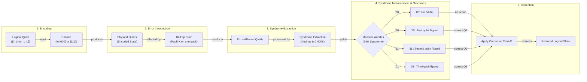
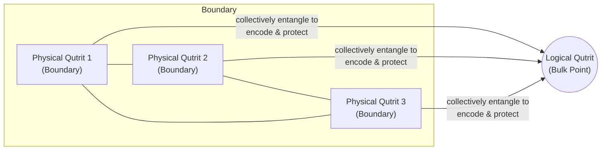
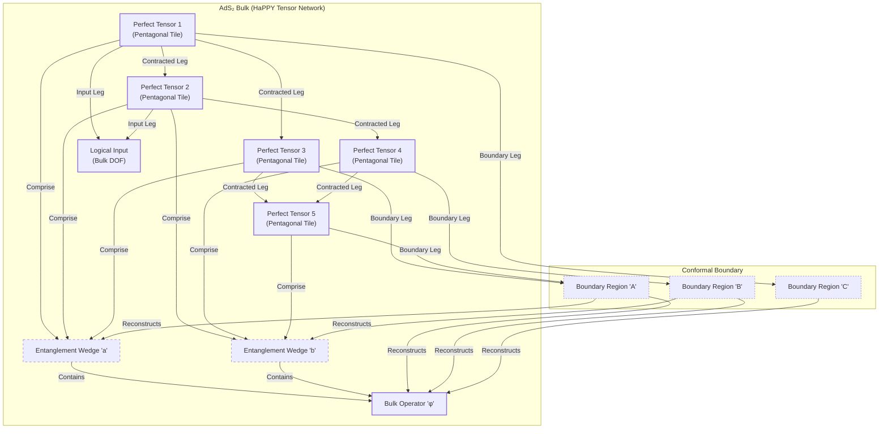
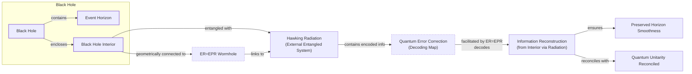

# How Space-Time Is a Quantum Error-Correcting Code

The quest for a theory of quantum gravity, one that unifies the cosmic scale of Einstein's relativity with the microscopic rules of quantum mechanics, has led physicists down some strange and wonderful paths. One of the most unexpected discoveries is a profound connection between the fabric of space-time and the mathematics of quantum computers. It suggests that the universe, at its most fundamental level, leverages the same principles we are just now discovering to build fault-tolerant quantum machines.

This story begins with the central paradox of quantum computing. In 1994, Peter Shor developed an algorithm that could factor large numbers exponentially faster than any known classical computer, promising to break modern cryptography [[1]](https://people.eecs.berkeley.edu/~jswright/quantumcodingtheory24/scribe%20notes/lecture01.pdf). This immense power comes from a quantum bit, or qubit, which can exist not just as a 0 or 1, but as a "superposition" of both states simultaneously. A register of *n* qubits can therefore explore a space of 2ⁿ states at once, a computational power that grows exponentially. Yet, this same quantum magic is its Achilles' heel. The slightest interaction with the environment—a stray magnetic field or a flicker of heat—can corrupt the delicate superposition, causing the computation to "decohere" and collapse. For years, many believed this fragility made building a large-scale quantum computer an impossible dream.

Then, in 1995, Shor struck again, this time with a solution: the first quantum error-correcting code (QEC) [[2]](https://en.wikipedia.org/wiki/Quantum_error_correction). This, along with the subsequent "threshold theorem," proved that if physical errors happen below a certain rate, you can actively correct them faster than they accumulate, making scalable quantum computation theoretically possible [[3]](https://en.wikipedia.org/wiki/Threshold_theorem), [[4]](https://www.quantinuum.com/blog/quantinuum-with-partners-princeton-and-nist-deliver-seminal-result-in-quantum-error-correction). The idea was revolutionary: you could protect fragile quantum information by encoding it across many entangled physical qubits.

For nearly two decades, this remained a principle of computer science. Then, in 2014, a group of physicists—Ahmed Almheiri, Xi Dong, and Daniel Harlow—made a startling proposal: the universe was already using it [[5]](https://arxiv.org/pdf/1411.7041.pdf). They conjectured that the holographic principle, specifically the AdS/CFT correspondence, is a quantum error-correcting code [[6]](https://www2.yukawa.kyoto-u.ac.jp/~extremeuniverse/wpsite/wp-content/uploads/2022/10/KyotoOct2022.pdf). In this picture, the geometry of space-time in a volume (the "bulk") is the protected, logical information, encoded in a highly entangled system of qubits living on its lower-dimensional boundary.

This article explores this unexpected unity. We will see how quantum error correction works, how it manifests in holographic models of space-time, and what it tells us about the deepest mysteries of quantum gravity, from the nature of black holes to the very stability of our reality.

## The Quantum Computing Challenge and the Discovery of a Cosmic Connection

The early excitement around quantum computing was driven by Shor's 1994 factoring algorithm. It showed that a quantum computer could solve a problem with profound real-world implications—breaking the RSA encryption that secures much of our digital world—exponentially faster than classical machines [[1]](https://people.eecs.berkeley.edu/~jswright/quantumcodingtheory24/scribe%20notes/lecture01.pdf). This power stems from the fundamental difference between classical bits and quantum bits. A classical *n*-bit register can only be in one of 2ⁿ states at any given time. An *n*-qubit register, however, can exist in a coherent superposition of all 2ⁿ states at once, allowing for massive parallelism.

This exponential advantage, however, comes at a steep price. Qubits are exquisitely sensitive to their environment. Unwanted interactions cause two main types of errors: bit-flips, where a qubit's state flips from `|0⟩` to `|1⟩` or vice versa, and phase-flips, where the quantum phase relationship between the `|0⟩` and `|1⟩` components is altered. Crucially, you cannot simply measure a qubit to see if it has an error. Any direct measurement would collapse its superposition, destroying the very quantum state the computation relies on. This fragility led to widespread skepticism that a useful quantum computer could ever be built.

The breakthrough came just a year later, in 1995, when Peter Shor introduced the first quantum error-correcting code [[2]](https://en.wikipedia.org/wiki/Quantum_error_correction), [[8]](https://errorcorrectionzoo.org/c/qecc). This, followed by the threshold theorem, established that if the error rate of individual quantum gates is below a certain threshold, it is possible to use QEC to suppress errors to arbitrarily low levels [[3]](https://en.wikipedia.org/wiki/Threshold_theorem). This work proved that fault-tolerant quantum computing was not a theoretical impossibility but an engineering challenge. It convinced a generation of scientists that, despite the noise, scalable quantum computers were achievable.

For almost two decades, QEC remained firmly in the domain of quantum information science. Then, in a seminal 2014 paper, physicists Ahmed Almheiri, Xi Dong, and Daniel Harlow proposed that nature had beaten us to it [[5]](https://arxiv.org/pdf/1411.7041.pdf). They argued that the AdS/CFT correspondence—a holographic duality mapping a theory of quantum gravity in a volume of space called Anti-de Sitter (AdS) space to a quantum field theory on its boundary—is mathematically equivalent to a quantum error-correcting code [[9]](https://indico.ift.uam-csic.es/event/9/attachments/26/36/Wall_Black_Hole_Thermodynamics.pdf). In this framework, local information deep in the bulk of space-time is a "logical" qubit, encoded non-locally across the entangled "physical" qubits of the boundary theory.

This insight provides a powerful explanation for a fundamental feature of our reality. As Caltech physicist John Preskill points out, space-time achieves an "intrinsic robustness" despite being woven from fragile quantum constituents. “We’re not walking on eggshells to make sure we don’t make the geometry fall apart,” Preskill said. “I think this connection with quantum error correction is the deepest explanation we have for why that’s the case.” [[7]](https://www.quantamagazine.org/how-space-and-time-could-be-a-quantum-error-correcting-code-20190103) The idea is that macroscopic geometry is an error-protected logical property. Small, local fluctuations on the boundary are like correctable errors on physical qubits; they leave the encoded bulk geometry unchanged.

This discovery opened a two-way street. On one hand, the language of QEC provides a new toolkit for tackling puzzles in quantum gravity, particularly those concerning black holes. On the other, the geometric nature of holographic codes could inspire new, more efficient designs for practical quantum computers. With the Almheiri-Dong-Harlow conjecture establishing that holographic space-time behaves as a quantum error-correcting code, we now examine the concrete mechanics of how such codes protect logical information. This will allow us to recognize the same mathematical signatures when they reappear in the bulk geometry of AdS.

## How Quantum Error-Correcting Codes Work

The core trick behind quantum error correction is to store information not in a single physical qubit, but in the intricate entanglement patterns of many. Instead of entrusting a logical state to one fragile particle, we encode it non-locally across a group of physical qubits. This redundancy ensures that no local error or measurement on a single qubit can destroy the encoded information.

The simplest illustration of this principle is the three-qubit bit-flip code, first proposed in 1985 [[2]](https://en.wikipedia.org/wiki/Quantum_error_correction). While not a complete solution, as it only protects against bit-flips and not phase-flips, it provides an intuitive model. In this code, a single logical qubit is encoded using three physical qubits. The logical state `|0_L⟩` is represented by the entangled state `|000⟩`, and the logical state `|1_L⟩` is represented by `|111⟩` [[10]](https://learn.microsoft.com/en-us/azure/quantum/concepts-error-correction). A general logical state `α|0_L⟩ + β|1_L⟩` becomes the superposition `α|000⟩ + β|111⟩`.

Now, suppose a bit-flip error, described by a Pauli-X operation, corrupts one of the three physical qubits. For example, `|000⟩` might become `|100⟩`. How can we detect and correct this without measuring the qubits and collapsing the logical state? The solution is a process called syndrome extraction. We use two additional "ancilla" qubits and a circuit of CNOT gates to perform parity checks between pairs of the physical qubits [[11]](https://www.cl.cam.ac.uk/teaching/1920/QuantComp/Quantum_Computing_Lecture_13.pdf), [[12]](https://astro.pas.rochester.edu/~aquillen/phy265/lectures/QI_E.pdf). These checks don't reveal the state of the qubits themselves, only whether they match.

The measurement of the two ancilla qubits yields a two-bit "syndrome" that uniquely identifies the error:
*   **'00'**: No error occurred. The parities match.
*   **'10'**: The first qubit has flipped.
*   **'11'**: The second qubit has flipped.
*   **'01'**: The third qubit has flipped.

Based on the syndrome, we can apply another Pauli-X gate to the identified qubit to reverse the error, restoring the original encoded state. This entire process is a non-demolition measurement; it extracts information about the error without disturbing the logical information it protects.

Image 1: Flowchart illustrating the mechanism of the three-qubit bit-flip code, from encoding to error, syndrome extraction, and correction, highlighting the non-demolition nature of syndrome measurement.

More advanced codes, like Shor's 9-qubit code, can correct for both bit-flip and phase-flip errors [[2]](https://en.wikipedia.org/wiki/Quantum_error_correction). A general principle that emerged from these constructions is that optimal codes can typically recover all the encoded information even if just over half of the physical qubits are lost or erased [[13]](https://arxiv.org/pdf/1503.06237.pdf). This "slightly more than half" signature was a key clue that inspired Almheiri, Dong, and Harlow in their 2014 work, suggesting that quantum error correction was at play in the way space-time arises from quantum entanglement [[5]](https://arxiv.org/pdf/1411.7041.pdf).

Equipped with the concrete mechanics and this correctability signature, we can now show how the holographic principle implements precisely the same structure on a gravitational stage, with AdS geometry emerging from entangled boundary degrees of freedom.

## The Holographic Principle and Space-Time Emerges as a Quantum Error-Correcting Code

To understand how space-time can be a quantum error-correcting code, we first need to understand the stage on which this drama unfolds: Anti-de Sitter (AdS) space. Unlike the space-time of our universe, which is thought to have a slight positive curvature (a de Sitter geometry), AdS space has a negative curvature. This gives it a unique hyperbolic geometry, famously visualized in M.C. Escher's "Circle Limit" woodcuts, where figures shrink as they approach the boundary circle [[14]](https://www.youtube.com/watch?v=IIHucC-HPz0). This boundary is crucial; it provides a surface where a quantum field theory without gravity can live. In 1997, Juan Maldacena discovered the AdS/CFT correspondence, a duality conjecturing that a theory of quantum gravity in the AdS "bulk" is exactly equivalent to a conformal field theory (CFT) on its boundary [[14]](https://www.youtube.com/watch?v=IIHucC-HPz0).

Almheiri and his colleagues realized that this duality has the properties of a QEC. They found that information about any point in the bulk interior could be reconstructed from just over half of the boundary, mirroring the recovery property of optimal quantum codes [[5]](https://arxiv.org/pdf/1411.7041.pdf). They illustrated this with a simple toy model: a three-qutrit code. In this model, a single logical qutrit (a three-level quantum system) in the bulk is encoded in the entanglement of three physical qutrits on the boundary. Any information about the logical qutrit is inaccessible from any single boundary qutrit, but can be perfectly reconstructed from any two of them [[15]](https://errorcorrectionzoo.org/list/holographic), [[16]](https://research.engineering.nyu.edu/~jbain/Talks/ST_QECC.pdf). This provides a minimal hologram where the bulk is protected from local erasures on the boundary.

Image 2: Diagram illustrating the Three-qutrit toy code as a minimal 2D hologram, showing a central logical qutrit encoded and protected by three entangled physical qutrits on a boundary, allowing for bulk information reconstruction from any two of the three boundary qutrits.

This QEC-like structure provides an elegant resolution to the "bulk locality paradox." The puzzle arises because a single bulk operator deep inside AdS space can be reconstructed from several different, non-overlapping regions of the boundary. This would seem to imply the operator is equivalent to the identity. The QEC framework resolves this by showing that the operator corresponds to *different* boundary operators in different regions, all of which act identically on the protected "code subspace" of low-energy states [[23]](https://quantumfrontiers.com/2015/03/27/quantum-gravity-from-quantum-error-correcting-codes).

To model a more complex space-time with many points, researchers developed tensor-network models like the HaPPY code, named after its authors Harlow, Pastawski, Preskill, and Yoshida [[13]](https://arxiv.org/pdf/1503.06237.pdf). This code uses a network of "perfect tensors" arranged on a pentagonal tiling that mimics the hyperbolic geometry of an AdS time-slice [[17]](https://errorcorrectionzoo.org/c/happy). Each perfect tensor is a highly entangled state that acts as a small-scale error-correcting code. When contracted together, they form a large-scale code where bulk logical operators can be represented on different overlapping regions of the boundary, a feature known as entanglement wedge reconstruction. This explicitly realizes the QEC properties of AdS/CFT, showing how local bulk data is redundantly encoded across the boundary [[13]](https://arxiv.org/pdf/1503.06237.pdf).

Image 3: A conceptual diagram illustrating the HaPPY tensor-network code, showing the connection between perfect tensors in the AdS₂ bulk and their corresponding entanglement wedges on the conformal boundary, demonstrating quantum error correction through overlapping bulk operator reconstruction.

However, these "perfect" tensor models, while illustrative, have a key limitation: they are *too* good at error correction. Any local operator acting on a few boundary qubits is treated as a correctable error, meaning its expectation value vanishes. This prevents the model from reproducing the smoothly decaying correlation functions expected in a physical CFT [[24]](https://www.nature.com/articles/s41467-023-42743-z). More recent research focuses on models where the encoding is an *approximate* isometry, which allows for physical correlations at the cost of making the code's error-correcting properties state-dependent, a feature believed to be present in more realistic holographic dualities [[24]](https://www.nature.com/articles/s41467-023-42743-z).

The general lesson is that quantum error correction provides the natural language for understanding how a smooth, classical-looking geometry can emerge from a purely quantum system of entangled degrees of freedom. As John Preskill notes, “Quantum error correction gives us a more general way of thinking about geometry in this code language... ought to be applicable, in my opinion, to more general situations” [[7]](https://www.quantamagazine.org/how-space-and-time-could-be-a-quantum-error-correcting-code-20190103). For now, researchers stick with AdS spaces, which are simpler than our de Sitter universe but share key properties, including black holes. The same QEC structure that protects smooth AdS geometry fails in their presence, and we now examine the sharp breakdown of correctability at horizons and the resulting paradoxes that any theory of quantum gravity must resolve.

## Black Holes: Where Correctability Breaks Down

Black holes are the ultimate test for any theory of quantum gravity, and they represent the regime where the elegant picture of holographic error correction appears to break down. Once a black hole forms, its interior is causally disconnected from the boundary. Information that falls in cannot be recovered by any local operator on the boundary, at least not without waiting an impossibly long time. The event horizon acts as a one-way membrane, an information sink.

This leads to the famous black hole information paradox. In the 1970s, Stephen Hawking showed that black holes are not entirely black; they emit thermal radiation. His semiclassical calculation suggested this radiation is perfectly random, carrying no information about what fell in. This means that as a black hole evaporates, an initial pure quantum state (the matter that formed it) would evolve into a mixed thermal state, a violation of a fundamental principle of quantum mechanics called unitarity. A complete theory of quantum gravity must explain how this information escapes.

The QEC perspective sharpens this paradox. In empty AdS space, information about the bulk can be reconstructed from just over half of the boundary. However, in a space-time containing an evaporating black hole, this threshold shifts. To reconstruct operators inside the black hole from the emitted Hawking radiation, one needs access to roughly three-quarters of the total boundary Hilbert space (which includes the radiation) [[18]](https://www.osti.gov/pages/biblio/1803745), [[19]](https://rojefferson.blog/2021/07/05/islands-behind-the-horizon). This change signals a dramatic alteration in the properties of the holographic code.

This tension came to a head in 2012 with the "firewall paradox," proposed by Almheiri and his colleagues [[20]](https://arxiv.org/pdf/1207.3123.pdf). They argued from the principle of "monogamy of entanglement," which states that a quantum system cannot be maximally entangled with two other systems at the same time. For the horizon to be smooth (the "no drama" principle), an outgoing Hawking particle must be entangled with its partner particle that fell into the black hole. But for information to escape and preserve unitarity, that same outgoing particle must also be entangled with all the radiation that was emitted earlier. It cannot be entangled with both. The radical conclusion was that the entanglement with the interior partner must be broken, creating a violent "firewall" of high-energy particles at the event horizon that would incinerate any infalling observer.

A key counterargument is that verifying the paradox's required entanglements would be computationally impossible for any real observer, making the problem operationally moot [[25]](https://quantumfrontiers.com/2012/12/03/is-alice-burning-the-black-hole-firewall-controversy).

Quantum error correction, combined with another holographic idea, ER=EPR, offers a way out. ER=EPR proposes that two entangled particles are connected by a microscopic wormhole (an Einstein-Rosen bridge). In the context of black holes, this suggests the interior is geometrically connected to the distant radiation via a complex web of such wormholes [[21]](https://arxiv.org/pdf/1810.02055.pdf). From the QEC viewpoint, the information inside the black hole is encoded in the radiation, and these wormholes are the physical manifestation of the decoding map. This allows information to be reconstructed from the radiation without requiring a local signal to pass through the horizon, thus preserving both a smooth horizon and quantum unitarity. As Almheiri explains, this framework provides an explicit reconstruction map for operators behind the horizon, where the dictionary depends on the specific microstate of the black hole [[21]](https://arxiv.org/pdf/1810.02055.pdf). This "state-dependence" is a remaining tension, as it suggests the decoding map itself must vary with the black hole's specific microstate, complicating information recovery [[26]](https://www.preprints.org/manuscript/202603.0227).

Image 4: A diagram illustrating the role of Quantum Error Correction (QEC) and ER=EPR-style entanglement wormholes in resolving the black hole information paradox.

## Implications for Our Universe and Quantum Computing

The profound connection between quantum gravity and quantum error correction is more than a theoretical curiosity; it has practical implications for both fields. Recognizing that nature's own encoding of space-time might be a highly efficient QEC, research programs, some funded by defense agencies like DARPA, are now investigating holographic tensor-network codes [[27]](https://inspirehep.net/literature/2817311). The hope is that their geometric structure might lead to new, more robust, and hardware-efficient schemes for protecting practical quantum computers from noise [[13]](https://arxiv.org/pdf/1503.06237.pdf).

On the physics side, a major challenge remains: lifting these insights from the theoretical sandbox of AdS space to a realistic description of our own universe. Our cosmos appears to have a positive cosmological constant, giving it a de Sitter geometry which, unlike AdS, lacks a convenient spatial boundary to host a holographic dual theory. Researchers are actively exploring dS/CFT-like constructions, but these remain far less understood than their AdS counterparts. Active proposals include the dS/CFT correspondence, which posits a dual non-unitary CFT living on the future boundary of the universe, as well as static patch holography and the DS/dS correspondence [[28]](https://arxiv.org/pdf/2602.02852v1.pdf), [[22]](https://real.mtak.hu/153229/1/2004.04173v4.pdf), [[7]](https://www.quantamagazine.org/how-space-and-time-could-be-a-quantum-error-correcting-code-20190103).

Ultimately, this line of research reframes our understanding of reality. It suggests that the fabric of space-time is not a passive backdrop but an emergent property of quantum entanglement. The specific pattern of entanglement that weaves our universe together is precisely that of a quantum error-correcting code. In John Preskill’s words, this connection provides the deepest explanation we have for the robustness of geometry. The "glue" holding space together is entanglement, structured in just the right way to protect itself from the quantum world's inherent fragility [[7]](https://www.quantamagazine.org/how-space-and-time-could-be-a-quantum-error-correcting-code-20190103).

## References

- [1]  https://people.eecs.berkeley.edu/~jswright/quantumcodingtheory24/scribe%20notes/lecture01.pdf
- [2]  https://en.wikipedia.org/wiki/Quantum_error_correction
- [3]  https://en.wikipedia.org/wiki/Threshold_theorem
- [4]  https://www.quantinuum.com/blog/quantinuum-with-partners-princeton-and-nist-deliver-seminal-result-in-quantum-error-correction
- [5]  https://arxiv.org/pdf/1411.7041.pdf
- [6]  https://www2.yukawa.kyoto-u.ac.jp/~extremeuniverse/wpsite/wp-content/uploads/2022/10/KyotoOct2022.pdf
- [7]  https://www.quantamagazine.org/how-space-and-time-could-be-a-quantum-error-correcting-code-20190103
- [8]  https://errorcorrectionzoo.org/c/qecc
- [9]  https://indico.ift.uam-csic.es/event/9/attachments/26/36/Wall_Black_Hole_Thermodynamics.pdf
- [10]  https://learn.microsoft.com/en-us/azure/quantum/concepts-error-correction
- [11]  https://www.cl.cam.ac.uk/teaching/1920/QuantComp/Quantum_Computing_Lecture_13.pdf
- [12]  https://astro.pas.rochester.edu/~aquillen/phy265/lectures/QI_E.pdf
- [13]  https://arxiv.org/pdf/1503.06237.pdf
- [14]  https://www.youtube.com/watch?v=IIHucC-HPz0
- [15]  https://errorcorrectionzoo.org/list/holographic
- [16]  https://research.engineering.nyu.edu/~jbain/Talks/ST_QECC.pdf
- [17]  https://errorcorrectionzoo.org/c/happy
- [18]  https://www.osti.gov/pages/biblio/1803745
- [19]  https://rojefferson.blog/2021/07/05/islands-behind-the-horizon
- [20]  https://arxiv.org/pdf/1207.3123.pdf
- [21]  https://arxiv.org/pdf/1810.02055.pdf
- [22]  https://real.mtak.hu/153229/1/2004.04173v4.pdf
- [23]  https://quantumfrontiers.com/2015/03/27/quantum-gravity-from-quantum-error-correcting-codes
- [24]  https://www.nature.com/articles/s41467-023-42743-z
- [25]  https://quantumfrontiers.com/2012/12/03/is-alice-burning-the-black-hole-firewall-controversy
- [26]  https://www.preprints.org/manuscript/202603.0227
- [27]  https://inspirehep.net/literature/2817311
- [28]  https://arxiv.org/pdf/2602.02852v1.pdf