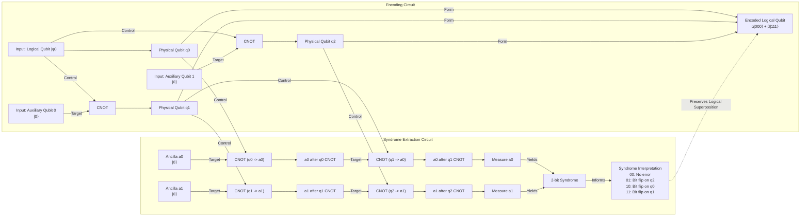

# Space-Time is a Quantum Error-Correcting Code

In 1994, mathematician Peter Shor introduced a quantum algorithm that could factor large numbers exponentially faster than any known classical method, posing an existential threat to modern cryptography [[2]](https://arxiv.org/pdf/quant-ph/9508027.pdf). This brought quantum computers into the spotlight, but it also highlighted their greatest weakness: the profound fragility of their core components. The very quantum properties that give these machines their power also make them incredibly susceptible to noise.

This created a paradox. How could we build a reliable computer from unreliable parts? The answer arrived just a year later, again from Shor, in the form of quantum error-correcting codes (QEC) [[1]](https://www.quantamagazine.org/how-space-and-time-could-be-a-quantum-error-correcting-code-20190103), [[3]](https://journals.aps.org/pra/abstract/10.1103/PhysRevA.52.R2493). This discovery proved that it was theoretically possible to protect quantum information from errors, making scalable quantum computing seem achievable. For two decades, QEC remained a specialized field for physicists and computer scientists.

Then, in 2014, a trio of young quantum gravity researchers, Ahmed Almheiri, Xi Dong, and Daniel Harlow, made an unexpected connection. They proposed that the emergence of a smooth, geometric space-time from the entangled quantum particles of a boundary theory, a concept known as the holographic principle, works exactly like a quantum error-correcting code [[5]](https://arxiv.org/abs/1411.7041). This idea suggests that the fabric of reality itself is a fault-tolerant system, using entanglement to protect the geometry of space-time from the chaos of quantum fluctuations.

In this article, we will explore this deep link between two seemingly distant fields. We will cover the basics of how quantum error correction tames the fragility of qubits, see how this same mathematical structure appears in holographic models of gravity, and examine what happens at the ultimate test of any quantum gravity theory: the black hole. Finally, we will discuss the implications of this discovery, where the code that protects our universe might one day help us build the next generation of computers.

## The Quantum Computing Challenge and the Discovery of a Cosmic Connection

The initial excitement around Shor's 1994 factoring algorithm was quickly tempered by a deep skepticism rooted in the problem of noise [[8]](https://people.eecs.berkeley.edu/~jswright/quantumcodingtheory24/scribe%20notes/lecture01.pdf). While the algorithm demonstrated that quantum computers could solve problems considered intractable for classical machines, the physical reality was that any practical implementation would fail. The very nature of quantum information makes it extraordinarily fragile. This skepticism was so pervasive that prominent researchers like Rolf Landauer suggested that any paper on the topic should include a disclaimer stating it "relies on speculative technology... and probably will not work" [[8]](https://people.eecs.berkeley.edu/~jswright/quantumcodingtheory24/scribe%20notes/lecture01.pdf).

Classical computers store information in bits, which hold a definite state of either 0 or 1. An n-bit register can be in only one of 2^n possible states at any given time. Quantum computers, on the other hand, use "qubits." A qubit can exist in a "superposition" of both |0⟩ and |1⟩ simultaneously. An n-qubit register can therefore exist in a superposition of all 2^n basis states at once, enabling a massive parallelism that powers algorithms like Shor's [[1]](https://www.quantamagazine.org/how-space-and-time-could-be-a-quantum-error-correcting-code-20190103). This power is amplified by "entanglement," where the states of multiple qubits become interdependent, their fates linked regardless of the distance separating them.

However, this quantum advantage comes at a steep price. Qubits are extremely error-prone. The slightest interaction with the environment can corrupt the delicate superposition. A stray magnetic field or a flicker of microwave radiation is enough to cause "bit-flips," which swap the probabilities of |0⟩ and |1⟩, or "phase-flips," which invert the mathematical relationship between the two states. Crucially, you cannot simply measure the qubits to check for errors. Any direct measurement collapses the superposition, destroying the very quantum information you are trying to protect and halting the computation in its tracks [[1]](https://www.quantamagazine.org/how-space-and-time-could-be-a-quantum-error-correcting-code-20190103), [[8]](https://people.eecs.berkeley.edu/~jswright/quantumcodingtheory24/scribe%20notes/lecture01.pdf). This led many to believe that building a large-scale quantum computer was a practical impossibility.

This pessimism shifted in 1995 when Peter Shor, just a year after his factoring algorithm, proved the existence of quantum error-correcting codes [[3]](https://journals.aps.org/pra/abstract/10.1103/PhysRevA.52.R2493). A year later, this work was extended into the "threshold theorem" by researchers including Dorit Aharonov and Michael Ben-Or. The theorem states that if the error rate of individual physical components is below a certain constant threshold, active error correction can suppress errors faster than they accumulate, allowing for arbitrarily long and precise computations [[4]](https://arxiv.org/abs/quant-ph/9611025), [[10]](https://en.wikipedia.org/wiki/Threshold_theorem). This was a monumental breakthrough. Shor's initial scheme required the noise rate to decrease as the size of the computation grew, an unrealistic demand. The threshold theorem showed that a constant level of noise could be tolerated, demonstrating once and for all that scalable quantum computers were theoretically sound [[8]](https://people.eecs.berkeley.edu/~jswright/quantumcodingtheory24/scribe%20notes/lecture01.pdf).

As quantum computer scientist Scott Aaronson put it, "This was the central discovery in the ’90s that convinced people that scalable quantum computing should be possible at all... that it is merely a staggering problem of engineering" [[1]](https://www.quantamagazine.org/how-space-and-time-could-be-a-quantum-error-correcting-code-20190103). The effort to design better codes to handle the high error rates of real qubits remains "one of the major thrusts of the field," Aaronson said, "along with improving the hardware" [[1]](https://www.quantamagazine.org/how-space-and-time-could-be-a-quantum-error-correcting-code-20190103).

For nearly two decades, QEC was a tool for building quantum computers. Then, in 2014, Ahmed Almheiri, Xi Dong, and Daniel Harlow published a paper proposing a new context for these ideas [[5]](https://arxiv.org/abs/1411.7041). They conjectured that the AdS/CFT correspondence, a leading model of quantum gravity that describes a universe with a gravity-filled "bulk" emerging from a gravity-free "boundary," is mathematically equivalent to a quantum error-correcting code. In this picture, local information deep inside the bulk is encoded as a logical qubit, protected within the highly entangled state of the physical qubits on the boundary. Their paper sparked a wave of research exploring space-time itself as a computational structure [[1]](https://www.quantamagazine.org/how-space-and-time-could-be-a-quantum-error-correcting-code-20190103).

This connection provides a powerful explanation for a fundamental feature of our reality: the robustness of space-time. As Caltech physicist John Preskill explains, space-time does not feel fragile, despite being woven from delicate quantum interactions. "We’re not walking on eggshells to make sure we don’t make the geometry fall apart," Preskill said. "I think this connection with quantum error correction is the deepest explanation we have for why that’s the case" [[1]](https://www.quantamagazine.org/how-space-and-time-could-be-a-quantum-error-correcting-code-20190103).

In this view, the smooth, classical geometry we experience is a logical property, protected from the quantum jitters of its underlying components by an error-correcting code. Small, local errors in the boundary theory are like correctable errors on physical qubits. They are detected and fixed without disturbing the logical, geometric information of the bulk.

This discovery opened a two-way street of inquiry. On one hand, the structure of holographic space-time may inspire new, more efficient quantum codes. "Space-time is a lot smarter than us," Almheiri noted, suggesting that "the kind of quantum error-correcting code which is implemented in these constructions is a very efficient code" [[1]](https://www.quantamagazine.org/how-space-and-time-could-be-a-quantum-error-correcting-code-20190103). This prospect has attracted practical interest; in 2019, the U.S. Department of Defense funded research into holographic codes, partly hoping for spin-offs that could lead to better QEC for quantum computers [[1]](https://www.quantamagazine.org/how-space-and-time-could-be-a-quantum-error-correcting-code-20190103). On the other hand, the language of QEC gives physicists a new toolkit for tackling deep problems in quantum gravity, particularly those surrounding black holes.

With the Almheiri-Dong-Harlow conjecture establishing that holographic space-time behaves as a quantum error-correcting code, we now examine the concrete mechanics of how such codes protect logical information in simple qubit systems. This will allow us to recognize the same mathematical signatures when they reappear in the bulk geometry of AdS.

## How Quantum Error-Correcting Codes Work

The trick to protecting fragile quantum information is to store it non-locally. Instead of encoding a logical qubit in a single physical qubit, quantum error-correcting codes distribute it across the entanglement patterns of many physical qubits. This redundancy ensures that the logical information is not accessible from any single physical qubit, making it robust against local errors [[1]](https://www.quantamagazine.org/how-space-and-time-could-be-a-quantum-error-correcting-code-20190103).

A simple example that illustrates this principle is the three-qubit bit-flip code. While not a fully practical code because it cannot protect against phase-flips, it provides a clear demonstration of the core mechanics [[8]](https://people.eecs.berkeley.edu/~jswright/quantumcodingtheory24/scribe%20notes/lecture01.pdf). In this code, one logical qubit of information is encoded using three physical qubits. The logical state |0⟩, written as |0_L⟩, is mapped to the state where all three physical qubits are |0⟩, denoted |000⟩. Similarly, the logical state |1_L⟩ is mapped to |111⟩. A general logical state, which is a superposition α|0⟩ + β|1⟩, becomes the entangled state α|000⟩ + β|111⟩ [[7]](https://www.cl.cam.ac.uk/teaching/1920/QuantComp/Quantum_Computing_Lecture_13.pdf). This encoding is achieved with a circuit of CNOT gates, which use the initial qubit to flip the state of two auxiliary qubits, creating the entangled state without violating the no-cloning theorem [[8]](https://people.eecs.berkeley.edu/~jswright/quantumcodingtheory24/scribe%20notes/lecture01.pdf).

Now, suppose a bit-flip error occurs on one of the physical qubits, for instance, the second one. The state α|000⟩ + β|111⟩ becomes α|010⟩ + β|101⟩. As we have discussed, we cannot simply measure the physical qubits to find the error, as this would collapse the superposition and destroy the logical information. Instead, we perform "syndrome measurements" using two auxiliary qubits, or ancillas. These measurements check the parity of pairs of physical qubits, determining whether they are the same or different, without revealing their individual states [[1]](https://www.quantamagazine.org/how-space-and-time-could-be-a-quantum-error-correcting-code-20190103).

One ancilla checks the parity of the first and second qubits, and the other checks the first and third. The measurement outcomes, known as the error syndrome, reveal the location of the error:
*   **00:** No error occurred. The parities match for both pairs.
*   **10:** The first qubit flipped. The first pair does not match, but the second does.
*   **11:** The second qubit flipped. The first pair does not match, and the second pair also does not match.
*   **01:** The third qubit flipped. The first pair matches, but the second does not.

This two-bit syndrome tells us exactly which qubit to correct (by applying another bit-flip operation) without ever learning the logical state α or β. The logical information remains protected.


Image 1: Quantum circuit diagram for the three-qubit bit-flip code, showing encoding and syndrome extraction.

The best error-correcting codes can typically recover all encoded information even if you lose access to a significant fraction of the physical qubits. In many optimal codes, you only need slightly more than half of the physical qubits to reconstruct the original logical state [[1]](https://www.quantamagazine.org/how-space-and-time-could-be-a-quantum-error-correcting-code-20190103). It was this "slightly more than half" property that served as a crucial clue for Almheiri, Dong, and Harlow in 2014, hinting that the structure of holographic space-time might be intimately related to quantum error correction.

Equipped with the concrete mechanics and this correctability signature of qubit-based codes, we can now show how the holographic principle implements precisely the same structure on a gravitational stage, with AdS geometry emerging from entangled boundary degrees of freedom.

## The Holographic Principle and Space-Time Emerges as a Quantum Error-Correcting Code

The idea of holography did not originate with string theory but with black holes. In the 1970s, Jacob Bekenstein and Stephen Hawking discovered that a black hole's entropy is proportional to the area of its event horizon, not its volume. This suggested that the information content of a three-dimensional region could be fully described by a two-dimensional surface, leading Gerard 't Hooft and Leonard Susskind to formulate the holographic principle [[21]](https://beuke.org/ads-cft), [[22]](https://rojefferson.blog/2020/03/07/black-hole-thermodynamics-quantum-puzzles-and-the-holographic-principle).

To understand the holographic connection, we first need to distinguish between two types of space-time geometries. Our universe is described as a "de Sitter" space, which has a positive cosmological constant causing it to expand. In contrast, "anti-de Sitter" (AdS) space has a negative cosmological constant, giving it a hyperbolic geometry, much like one of M.C. Escher's *Circle Limit* woodcuts. In these artworks, figures shrink as they approach the circular boundary [[1]](https://www.quantamagazine.org/how-space-and-time-could-be-a-quantum-error-correcting-code-20190103). This boundary is what makes AdS space a useful theoretical "sandbox." In 1997, Juan Maldacena discovered the AdS/CFT correspondence, a powerful duality suggesting that the physics of gravity within the (d+1)-dimensional AdS bulk is equivalent to a quantum field theory without gravity (a Conformal Field Theory, or CFT) living on its d-dimensional boundary [[1]](https://www.quantamagazine.org/how-space-and-time-could-be-a-quantum-error-correcting-code-20190103).

It was within this framework that Almheiri and his colleagues noticed a striking parallel to quantum error correction. They found that information about any point in the bulk of AdS space could be reconstructed from just slightly more than half of the boundary—the exact signature of an optimal QEC code [[1]](https://www.quantamagazine.org/how-space-and-time-could-be-a-quantum-error-correcting-code-20190103). In their 2014 paper, they introduced a simple toy model to illustrate this: a three-qutrit code [[5]](https://arxiv.org/abs/1411.7041), [[19]](https://research.engineering.nyu.edu/~jbain/Talks/ST_QECC.pdf). This code encodes one logical "qutrit" (a three-state quantum system) into three physical qutrits. Geometrically, you can imagine the logical qutrit as a point in the center of a circle, with the three physical qutrits living on the boundary. The code is constructed such that the logical information is protected against the erasure of any single physical qutrit on the boundary, as the remaining two are sufficient for full reconstruction [[23]](https://errorcorrectionzoo.org/list/holographic).

```mermaid
graph TD
    %% Logical Qutrit at the center
    L((Logical Qutrit L))

    %% Physical Qutrits on the boundary
    subgraph "Physical Qutrits (Boundary)"
        direction LR
        Q1((Q1))
        Q2((Q2))
        Q3((Q3))
    end

    %% Encoding connections
    L -- "encodes into" --> Q1
    L -- "encodes into" --> Q2
    L -- "encodes into" --> Q3

    %% Conceptual circular arrangement of physical qutrits
    Q1 --- Q2
    Q2 --- Q3
    Q3 --- Q1

    %% Protection note
    note right of L
        Protection: Logical Qutrit L is protected
        from erasure of any single physical qutrit
        on the boundary (Q1, Q2, or Q3).
    end

    %% Encoding States note
    note bottom of Q3
        Encoding States:
        |0⟩_L = (|000⟩ + |111⟩ + |222⟩)/√3
        |1⟩_L = (|012⟩ + |120⟩ + |201⟩)/√3
        |2⟩_L = (|021⟩ + |102⟩ + |210⟩)/√3
    end
```
Image 2: A conceptual diagram of the three-qutrit toy code as a minimal 2D hologram.

While the three-qutrit code models a single point, a more sophisticated model was needed to represent an extended space-time. In 2015, Fernando Pastawski, Beni Yoshida, Daniel Harlow, and John Preskill introduced the "HaPPY" code, a tensor network that tiles hyperbolic space with pentagonal and hexagonal building blocks [[13]](https://arxiv.org/abs/1503.06237). Each tile in the network is represented by a "perfect tensor," a highly entangled object that acts as a small error-correcting code. These tensors are connected, or "contracted," in a pattern that mimics the geometry of AdS space.

In this model, the uncontracted tensor legs at the edge of the network represent the physical qubits of the boundary CFT, while uncontracted legs in the interior represent logical qubits in the bulk. The network as a whole forms an isometry that encodes the bulk logical information onto the boundary physical qubits [[13]](https://arxiv.org/abs/1503.06237). As Stanford physicist Patrick Hayden described them, the tiles are like "little Tinkertoys" that build the geometry [[1]](https://www.quantamagazine.org/how-space-and-time-could-be-a-quantum-error-correcting-code-20190103). A key feature is the concept of the "entanglement wedge," a region in the bulk that can be reconstructed from a corresponding region on the boundary. Because these wedges can overlap, a single bulk operator (a logical qubit) can be reconstructed from multiple different subsets of the boundary, explicitly realizing the error-correcting property [[1]](https://www.quantamagazine.org/how-space-and-time-could-be-a-quantum-error-correcting-code-20190103).

However, these discrete toy models have limitations. While they successfully reproduce the error-correcting features, their boundary states do not exhibit the smooth, polynomially decaying correlation functions expected of a physical CFT. The code's error-correcting nature is so strong that it prevents such correlations, a key difference from the continuum AdS/CFT correspondence they aim to model [[24]](https://www.nature.com/articles/s41467-023-42743-z).

```mermaid
flowchart LR
    %% Overall System
    subgraph "HaPPY Tensor-Network Code Architecture"

        %% Core Bulk Information
        subgraph "Bulk (AdS Hyperbolic Geometry)"
            LQ((Logical Qubit))
        end

        %% Innermost Tile
        subgraph "Central Tile"
            PT_C["Perfect Tensor C"]
        end
        LQ -- "connected to" --> PT_C

        %% First Layer of Adjacent Tiles
        subgraph "Layer 1 Tiles"
            subgraph "Tile 1.1"
                PT_1_1["Perfect Tensor 1.1"]
            end
            subgraph "Tile 1.2"
                PT_1_2["Perfect Tensor 1.2"]
            end
            subgraph "Tile 1.3"
                PT_1_3["Perfect Tensor 1.3"]
            end
        end
        PT_C -- "contracted legs" --> PT_1_1
        PT_C -- "contracted legs" --> PT_1_2
        PT_C -- "contracted legs" --> PT_1_3

        %% Second Layer of Adjacent Tiles (Outermost)
        subgraph "Layer 2 Tiles (Outermost)"
            subgraph "Tile 2.1"
                PT_2_1["Perfect Tensor 2.1"]
            end
            subgraph "Tile 2.2"
                PT_2_2["Perfect Tensor 2.2"]
            end
            subgraph "Tile 2.3"
                PT_2_3["Perfect Tensor 2.3"]
            end
            subgraph "Tile 2.4"
                PT_2_4["Perfect Tensor 2.4"]
            end
        end
        PT_1_1 -- "contracted legs" --> PT_2_1
        PT_1_1 -- "contracted legs" --> PT_2_2
        PT_1_2 -- "contracted legs" --> PT_2_2
        PT_1_2 -- "contracted legs" --> PT_2_3
        PT_1_3 -- "contracted legs" --> PT_2_3
        PT_1_3 -- "contracted legs" --> PT_2_4

        %% Boundary CFT Physical Qubits
        subgraph "Boundary (CFT Physical Qubits)"
            PQ_A((Physical Qubit A))
            PQ_B((Physical Qubit B))
            PQ_C((Physical Qubit C))
            PQ_D((Physical Qubit D))
            PQ_E((Physical Qubit E))
            PQ_F((Physical Qubit F))
        end

        %% Uncontracted legs at the outermost boundary
        PT_2_1 -- "uncontracted leg" --> PQ_A
        PT_2_1 -- "uncontracted leg" --> PQ_B
        PT_2_2 -- "uncontracted leg" --> PQ_B
        PT_2_2 -- "uncontracted leg" --> PQ_C
        PT_2_3 -- "uncontracted leg" --> PQ_C
        PT_2_3 -- "uncontracted leg" --> PQ_D
        PT_2_4 -- "uncontracted leg" --> PQ_D
        PT_2_4 -- "uncontracted leg" --> PQ_E
        PT_2_4 -- "uncontracted leg" --> PQ_F

        %% Entanglement Wedges (overlapping regions)
        subgraph "Entanglement Wedges (Bulk Reconstruction)"
            EW_X["Entanglement Wedge X<br/>(Boundary Region 1)"]
            EW_Y["Entanglement Wedge Y<br/>(Boundary Region 2)"]
            EW_Z["Entanglement Wedge Z<br/>(Boundary Region 3)"]
        end

        %% Show how boundary regions form wedges and reconstruct bulk
        PQ_A & PQ_B & PQ_C -- "define" --> EW_X
        PQ_C & PQ_D & PQ_E -- "define" --> EW_Y
        PQ_E & PQ_F & PQ_A -- "define" --> EW_Z

        EW_X -- "reconstructs" --> LQ
        EW_Y -- "reconstructs" --> LQ
        EW_Z -- "reconstructs" --> LQ

        %% Illustrate overlap of entanglement wedges
        EW_X -.-> EW_Y : "overlapping bulk info"
        EW_Y -.-> EW_Z : "overlapping bulk info"
        EW_Z -.-> EW_X : "overlapping bulk info"

    end

    %% Visual differentiation for node groups (without custom colors)
    classDef bulkNode stroke-width:2px,stroke-dasharray: 5 5
    classDef boundaryNode stroke-width:2px,stroke-dasharray: 3 3
    classDef entanglementWedge stroke-dasharray: 5 10

    class LQ bulkNode
    class PQ_A,PQ_B,PQ_C,PQ_D,PQ_E,PQ_F boundaryNode
    class EW_X,EW_Y,EW_Z entanglementWedge
```
Image 3: An architectural diagram illustrating the HaPPY tensor-network code, its hyperbolic geometry, and entanglement wedges.

The general lesson is that QEC provides the natural language for describing how a smooth, classical geometry emerges from quantum entanglement. "Quantum error correction gives us a more general way of thinking about geometry in this code language," said Preskill. He believes this language "ought to be applicable... to more general situations"—including, perhaps, a de Sitter universe like our own [[1]](https://www.quantamagazine.org/how-space-and-time-could-be-a-quantum-error-correcting-code-20190103).

For now, researchers are sticking with AdS spaces, which are simpler to study but share key properties with our universe. Perhaps most importantly, both contain black holes. "The most fundamental property of gravity is that there are black holes," said Harlow. "That’s what makes gravity different from all the other forces. That’s why quantum gravity is hard" [[1]](https://www.quantamagazine.org/how-space-and-time-could-be-a-quantum-error-correcting-code-20190103). The same QEC structure that protects smooth AdS geometry fails in the presence of black holes. We now examine this breakdown of correctability at horizons and the resulting paradoxes that any consistent theory of quantum gravity must resolve.

## Black Holes: Where Correctability Breaks Down

Black holes represent the ultimate stress test for any theory of quantum gravity, and they mark the point where the error-correcting properties of space-time appear to fail. Patrick Hayden defines a black hole's event horizon as the point of "the breakdown of correctability... a sink for your ignorance." Once information falls past the horizon, it seems to become inaccessible from the boundary, breaking the simple reconstruction rules that apply to empty AdS space [[1]](https://www.quantamagazine.org/how-space-and-time-could-be-a-quantum-error-correcting-code-20190103).

This breakdown is at the heart of Stephen Hawking's famous information paradox. In 1974, Hawking showed that black holes are not truly black; they emit thermal radiation and eventually evaporate. However, this radiation appears to be random and carries no information about what fell in. This implies that a pure quantum state (the infalling matter) evolves into a mixed state (the thermal radiation), a violation of unitarity, a fundamental principle of quantum mechanics. A complete theory of quantum gravity must explain how this information gets out [[1]](https://www.quantamagazine.org/how-space-and-time-could-be-a-quantum-error-correcting-code-20190103).

The language of QEC has revealed a sharp quantitative change in the holographic code at a black hole's horizon. While reconstructing a bulk operator in empty AdS requires access to slightly more than half of the boundary, calculations show that reconstructing information from *inside* a black hole requires access to roughly three-quarters of the boundary degrees of freedom [[1]](https://www.quantamagazine.org/how-space-and-time-could-be-a-quantum-error-correcting-code-20190103), [[18]](https://indico.ift.uam-csic.es/event/9/attachments/26/36/Wall_Black_Hole_Thermodynamics.pdf). Almheiri notes that why this specific fraction appears "is still an open question," but it signals a fundamental shift in the structure of the code [[1]](https://www.quantamagazine.org/how-space-and-time-could-be-a-quantum-error-correcting-code-20190103).

This tension came to a head in 2012 with the "firewall paradox," proposed by Almheiri and collaborators Joseph Polchinski, Donald Marolf, and James Sully [[12]](https://arxiv.org/abs/1207.3123). Their argument highlights a conflict with the monogamy of entanglement, a principle stating that a quantum system cannot be maximally entangled with two other systems at the same time. For information to escape a black hole, a late-time Hawking particle must be entangled with the early radiation. For the horizon to be smooth and uneventful for an infalling observer, that same particle must also be entangled with its partner particle just inside the horizon. It cannot be entangled with both. The paradox implies that this entanglement must break somewhere, suggesting a "firewall" of high-energy particles at the event horizon that would incinerate any infalling observer [[1]](https://www.quantamagazine.org/how-space-and-time-could-be-a-quantum-error-correcting-code-20190103).

Quantum error correction may offer a way out. Almheiri now speculates that QEC is "essential for maintaining the smoothness of space-time at the horizon" [[20]](https://arxiv.org/abs/1810.02055). The idea is that the connection between the black hole interior and the exterior radiation is more subtle than simple entanglement. It may be realized through structures akin to miniature wormholes, an idea related to the "ER=EPR" conjecture, which posits that entanglement and wormholes are two descriptions of the same phenomenon. In this view, QEC protects the entanglement that holds the wormholes together, allowing information to escape and resolving Hawking's paradox without the need for a destructive firewall [[1]](https://www.quantamagazine.org/how-space-and-time-could-be-a-quantum-error-correcting-code-20190103).

## Implications for Our Universe and Quantum Computing

The deep connection between holographic gravity and quantum error correction has implications that extend in both directions, from the frontiers of theoretical physics to the practical challenges of building quantum computers. The U.S. Department of Defense has funded research into holographic codes, partly in the hope that their geometric structure might lead to more efficient and robust QEC schemes for practical quantum computers [[1]](https://www.quantamagazine.org/how-space-and-time-could-be-a-quantum-error-correcting-code-20190103).

This hope is already yielding results. Recent work on "hyperinvariant tensor networks" (HTN) has produced holographic codes that fix key limitations of earlier models, such as reproducing correct physical correlation functions [[24]](https://www.nature.com/articles/s41467-023-42743-z). Furthermore, simulations show that certain holographic codes can achieve error-correction thresholds that are competitive with, and in some cases exceed, state-of-the-art stabilizer codes, making them promising candidates for practical hardware [[25]](https://arxiv.org/html/2408.06232v3).

On the physics side, the primary challenge is extending these insights beyond AdS space. Our universe is de Sitter, with a positive cosmological constant. Unlike AdS, de Sitter space lacks a timelike boundary at spatial infinity where a dual theory could live. Attempts to formulate a dS/CFT correspondence face major conceptual hurdles; for instance, the dual theory might have to be non-unitary, a significant departure from well-behaved quantum field theories [[21]](https://beuke.org/ads-cft). As Scott Aaronson has pointed out, "The whole connection is known for a world that is manifestly not our world" [[1]](https://www.quantamagazine.org/how-space-and-time-could-be-a-quantum-error-correcting-code-20190103).

Despite these challenges, the fundamental insight holds. As John Preskill summarizes, entanglement is the very fabric of space-time. "It’s really entanglement which is holding the space together," he said. "If you want to weave space-time together out of little pieces, you have to entangle them in the right way. And the right way is to build a quantum error-correcting code" [[1]](https://www.quantamagazine.org/how-space-and-time-could-be-a-quantum-error-correcting-code-20190103).

## Conclusion

We have journeyed from the practical problem of building a quantum computer to the abstract frontier of quantum gravity, only to find the same mathematical structure at the heart of both: the quantum error-correcting code. What began as an engineering solution to the fragility of qubits has emerged as a candidate for the fundamental principle that weaves the fabric of space-time itself.

This convergence offers a powerful new perspective. It suggests that the robustness of our universe is not an accident but a feature of a deeply encoded system, one that leverages the strange logic of quantum entanglement to protect geometric reality. While the full story is far from complete, particularly regarding our own de Sitter universe, the path forward is illuminated by this dual-purpose language. The secrets of quantum gravity may help us build better quantum computers, and the principles of quantum computation may be the key to understanding the cosmos.

## References

- [1] https://www.quantamagazine.org/how-space-and-time-could-be-a-quantum-error-correcting-code-20190103
- [2] https://arxiv.org/pdf/quant-ph/9508027.pdf
- [3] https://journals.aps.org/pra/abstract/10.1103/PhysRevA.52.R2493
- [4] https://arxiv.org/abs/quant-ph/9611025
- [5] https://arxiv.org/abs/1411.7041
- [6] http://www.theory.caltech.edu/people/preskill/
- [7] https://www.cl.cam.ac.uk/teaching/1920/QuantComp/Quantum_Computing_Lecture_13.pdf
- [8] https://people.eecs.berkeley.edu/~jswright/quantumcodingtheory24/scribe%20notes/lecture01.pdf
- [9] https://en.wikipedia.org/wiki/Quantum_error_correction
- [10] https://en.wikipedia.org/wiki/Threshold_theorem
- [11] https://www.youtube.com/watch?v=IIHucC-HPz0
- [12] https://arxiv.org/abs/1207.3123
- [13] https://arxiv.org/abs/1503.06237
- [14] https://errorcorrectionzoo.org/c/happy
- [15] https://errorcorrectionzoo.org/c/qecc
- [16] https://errorcorrectionzoo.org/list/holographic
- [17] https://www.youtube.com/watch?v=MuklWupCvWU
- [18] https://indico.ift.uam-csic.es/event/9/attachments/26/36/Wall_Black_Hole_Thermodynamics.pdf
- [19] https://research.engineering.nyu.edu/~jbain/Talks/ST_QECC.pdf
- [20] https://arxiv.org/abs/1810.02055
- [21] https://beuke.org/ads-cft
- [22] https://rojefferson.blog/2020/03/07/black-hole-thermodynamics-quantum-puzzles-and-the-holographic-principle
- [23] https://errorcorrectionzoo.org/list/holographic
- [24] https://www.nature.com/articles/s41467-023-42743-z
- [25] https://arxiv.org/html/2408.06232v3
</article>