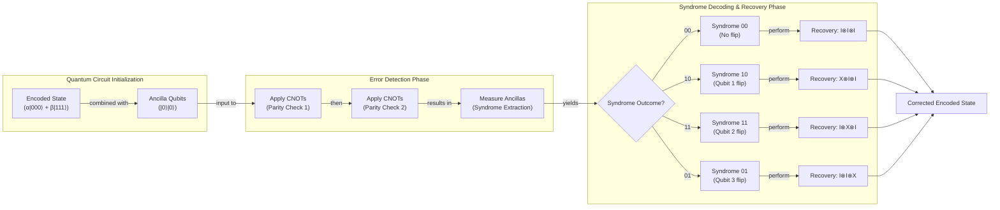
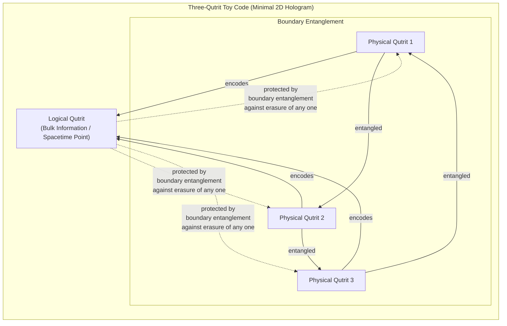
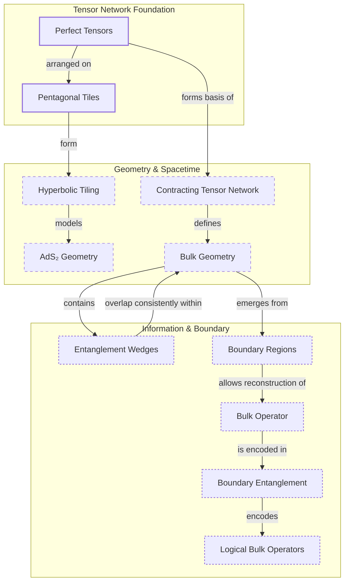
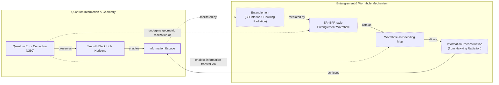

# How Space and Time Could Be a Quantum Error-Correcting Code

In 1994, mathematician Peter Shor unveiled an algorithm that sent shockwaves through cryptography. He showed that a hypothetical "quantum computer" could factor large numbers exponentially faster than any known classical computer, rendering much of modern digital security obsolete. This discovery ignited the field of quantum computing, but a fundamental obstacle stood in the way: the very quantum properties that made these machines so powerful also made them incredibly fragile.

Unlike the sturdy "0s" and "1s" of classical bits, the "qubits" of a quantum computer exist in a delicate superposition of states. Their power comes from "entanglement," a deep interdependence where the state of one qubit is linked to another, allowing for a massive number of simultaneous computations. But this quantum dance is easily disrupted. The slightest stray magnetic field or microwave pulse can corrupt the information, and any attempt to directly measure a qubit to check for errors collapses the entire computation. For years, this fragility made the prospect of building a large-scale quantum computer seem like a fantasy.

Then, in 2014, a trio of young physicists—Ahmed Almheiri, Xi Dong, and Daniel Harlow—stumbled upon an unexpected connection. While studying toy models of the universe, they found that the emergence of a smooth, stable fabric of space-time from the chaotic quantum world seemed to work just like a quantum error-correcting code. This suggested that the robustness of our own reality might be a feature, not a bug, of quantum mechanics.

In this article, we will explore this deep connection between the mathematics of fault-tolerant quantum computing and the holographic nature of space-time. We will see how the same principles that could one day protect quantum computers from errors might also be what holds the universe together. This journey will take us from the basics of quantum error correction to the mind-bending physics of black holes and wormholes, revealing a deep unity between information, geometry, and reality itself.

## The Quantum Computing Challenge and the Discovery of a Cosmic Connection

Peter Shor's 1994 factoring algorithm created a surge of excitement by proving that quantum computers could solve problems considered intractable for classical machines, such as breaking modern cryptographic systems [[1]](https://www.quantamagazine.org/how-space-and-time-could-be-a-quantum-error-correcting-code-20190103). However, this initial optimism was tempered by widespread skepticism. The consensus was that any physical implementation of a qubit would inevitably lose its delicate quantum state. This process is called decoherence. It would happen long before a complex calculation could be completed.

The source of this power and fragility lies in the fundamental difference between classical and quantum information. A classical computer with *n* bits can only be in one of 2ⁿ states at any given moment. In contrast, an *n*-qubit quantum register can exist in a coherent superposition of all 2ⁿ states simultaneously. This exponential state space allows for immense parallelism, which is what Shor's algorithm leverages to find the period of a function and efficiently factor large numbers. But this power comes at a cost. The quantum state is extremely sensitive to environmental noise, which can cause "bit-flips" that swap the probability of a qubit being |0⟩ or |1⟩, or "phase-flips" that invert the mathematical relationship between its states. Crucially, you cannot simply measure the qubits to check for errors, as any direct measurement collapses the superposition and destroys the quantum computation in progress.

This dilemma seemed to make large-scale quantum computing an impossibility. However, just a year after his factoring algorithm, Shor delivered another breakthrough: a proof that "quantum error-correcting codes" (QEC) could exist [[1]](https://www.quantamagazine.org/how-space-and-time-could-be-a-quantum-error-correcting-code-20190103). Building on this, researchers Dorit Aharonov, Michael Ben-Or, and others independently proved the **threshold theorem** in 1996. It states that if the error rate of individual physical components is below a certain constant threshold, then quantum error correction can suppress errors faster than they accumulate, making arbitrarily long, fault-tolerant quantum computations theoretically possible [[2]](https://en.wikipedia.org/wiki/Threshold_theorem), [[3]](https://people.eecs.berkeley.edu/~jswright/quantumcodingtheory24/scribe%20notes/lecture01.pdf). As quantum computer scientist Scott Aaronson noted, "This was the central discovery in the ’90s that convinced people that scalable quantum computing should be possible at all... that it is merely a staggering problem of engineering" [[1]](https://www.quantamagazine.org/how-space-and-time-could-be-a-quantum-error-correcting-code-20190103). The effort to design better codes to cope with the daunting error rates of real qubits is "one of the major thrusts of the field," Aaronson said, along with improving the hardware [[1]](https://www.quantamagazine.org/how-space-and-time-could-be-a-quantum-error-correcting-code-20190103).

For nearly two decades, QEC remained a specialized topic within quantum computing. Then, in 2014, physicists Ahmed Almheiri, Xi Dong, and Daniel Harlow proposed a radical idea. Their calculations suggested that the AdS/CFT correspondence is mathematically equivalent to a quantum error-correcting code [[4]](https://arxiv.org/abs/1411.7041). This is a leading model of quantum gravity where a universe with gravity emerges holographically from a lower-dimensional quantum theory on its boundary. In this picture, local operators in the bulk of the universe are like protected "logical" information, encoded non-locally in the entanglement of the "physical" qubits on the boundary. Their paper triggered a wave of research exploring space-time itself as a code.

John Preskill, a theoretical physicist at Caltech, argues that this connection explains the "intrinsic robustness" of space-time. We don’t have to be careful to avoid tearing the fabric of reality because the emergent geometry is an error-protected logical property. "We’re not walking on eggshells to make sure we don’t make the geometry fall apart," Preskill said. "I think this connection with quantum error correction is the deepest explanation we have for why that’s the case" [[1]](https://www.quantamagazine.org/how-space-and-time-could-be-a-quantum-error-correcting-code-20190103). Small, localized errors in the boundary theory correspond to correctable errors on the physical qubits, leaving the macroscopic bulk geometry unchanged.

This discovery opened a two-way street of inquiry. On one hand, the language of QEC provides a new toolkit for tackling deep problems in quantum gravity, particularly those concerning black holes. On the other, the geometric structure of holographic space-time might inspire the design of more efficient and robust quantum codes for practical hardware. As Almheiri puts it, "Space-time is a lot smarter than us. The kind of quantum error-correcting code which is implemented in these constructions is a very efficient code" [[1]](https://www.quantamagazine.org/how-space-and-time-could-be-a-quantum-error-correcting-code-20190103).

With the Almheiri-Dong-Harlow conjecture establishing that holographic space-time behaves as a quantum error-correcting code, we now examine the concrete mechanics of how such codes protect logical information in simple qubit systems. This will allow us to recognize the same mathematical signatures when they reappear in the bulk geometry of AdS.

## How Quantum Error-Correcting Codes Work

The central trick behind quantum error correction is to store logical information not in individual qubits, but in the intricate patterns of entanglement shared among many physical qubits. Instead of relying on a single, fragile particle, a logical qubit is encoded across a collective state, making it resilient to local errors. The information becomes delocalized, so no single physical qubit holds the information, and losing one does not destroy the logical state.

A simple, instructive example is the **three-qubit bit-flip code**. While not a complete solution, as it doesn't protect against phase-flips, it clearly illustrates the core principles [[5]](https://www.cl.cam.ac.uk/teaching/1920/QuantComp/Quantum_Computing_Lecture_13.pdf). In this code, a single logical qubit is encoded using three physical qubits. The logical state |0⟩, denoted |0\_L⟩, corresponds to all three physical qubits being in the |0⟩ state, written as |000⟩. Similarly, the logical |1⟩, or |1\_L⟩, is encoded as |111⟩. A general logical state α|0\_L⟩ + β|1\_L⟩ is therefore represented by the entangled superposition α|000⟩ + β|111⟩ [[6]](https://learn.microsoft.com/en-us/azure/quantum/concepts-error-correction). This encoding can be achieved with a quantum circuit using CNOT gates, as shown in Image 1.

```mermaid
flowchart LR
  %% Overall Input and Output
  Input["Input: (α|0⟩ + β|1⟩) |0⟩⊗2"]
  Output["Output: α|000⟩ + β|111⟩"]

  %% Qubit Wires and States
  subgraph "Qubit 0"
    Q0_start["(α|0⟩ + β|1⟩)"]
    Q0_c1_ctrl[""]
    Q0_c2_ctrl[""]
    Q0_end["Q0"]
  end

  subgraph "Qubit 1"
    Q1_start["|0⟩"]
    Q1_c1_targ[""]
    Q1_end["Q1"]
  end

  subgraph "Qubit 2"
    Q2_start["|0⟩"]
    Q2_c2_targ[""]
    Q2_end["Q2"]
  end

  %% CNOT Gates
  CNOT1["CNOT"]
  CNOT2["CNOT"]

  %% Connections
  Input --> Q0_start
  Input --> Q1_start
  Input --> Q2_start

  %% Qubit 0 flow
  Q0_start --> Q0_c1_ctrl
  Q0_c1_ctrl --> Q0_c2_ctrl
  Q0_c2_ctrl --> Q0_end

  %% Qubit 1 flow
  Q1_start --> Q1_c1_targ
  Q1_c1_targ --> Q1_end

  %% Qubit 2 flow
  Q2_start --> Q2_c2_targ
  Q2_c2_targ --> Q2_end

  %% CNOT 1 (Q0 controls Q1)
  Q0_c1_ctrl -.-> CNOT1
  Q1_c1_targ --> CNOT1
  CNOT1 --> Q0_c2_ctrl
  CNOT1 --> Q1_end

  %% CNOT 2 (Q0 controls Q2)
  Q0_c2_ctrl -.-> CNOT2
  Q2_c2_targ --> CNOT2
  CNOT2 --> Q0_end
  CNOT2 --> Q2_end

  Q0_end --> Output
  Q1_end --> Output
  Q2_end --> Output
```
Image 1: A quantum circuit diagram illustrating the encoding of a logical qubit using the three-qubit bit-flip code.

Now, suppose one of the physical qubits accidentally flips. To detect this error without measuring the logical state directly, we use a technique called **syndrome extraction**. This involves using two extra "ancilla" qubits and a series of parity-check gates. One gate checks if the first and second qubits are the same or different, and another checks the first and third. By measuring only the ancilla qubits, we obtain an "error syndrome" that reveals which qubit, if any, has flipped, all without collapsing the logical superposition [[5]](https://www.cl.cam.ac.uk/teaching/1920/QuantComp/Quantum_Computing_Lecture_13.pdf).

There are four possible outcomes:
-   **Syndrome 00:** No flips occurred. The qubits are all the same. No correction is needed.
-   **Syndrome 10:** The first qubit flipped. The first and second are different, but the first and third are the same (relative to each other, after the flip).
-   **Syndrome 11:** The second qubit flipped. The first and second are different, and the first and third are different.
-   **Syndrome 01:** The third qubit flipped. The first and second are the same, but the first and third are different.

Each unique syndrome points to a specific error, which can then be corrected by applying a corrective operation (a bit-flip) to the identified qubit. This non-demolition measurement is the "magic" of QEC, as Almheiri calls it [[1]](https://www.quantamagazine.org/how-space-and-time-could-be-a-quantum-error-correcting-code-20190103).


Image 2: A quantum circuit diagram illustrating the error detection and recovery process for the three-qubit bit-flip code.

More advanced codes, like Shor's 9-qubit code, can correct for both bit-flips and phase-flips [[5]](https://www.cl.cam.ac.uk/teaching/1920/QuantComp/Quantum_Computing_Lecture_13.pdf). The best codes can typically recover all the encoded information even if you lose access to just under half of your physical qubits. This "slightly more than half" property is what hinted to Almheiri, Dong, and Harlow that quantum error correction was at play in the holographic universe [[1]](https://www.quantamagazine.org/how-space-and-time-could-be-a-quantum-error-correcting-code-20190103).

Equipped with the concrete mechanics and this correctability signature of qubit-based codes, we now show how the holographic principle implements precisely the same structure on a gravitational stage, with AdS geometry emerging from entangled boundary degrees of freedom.

## The Holographic Principle and Space-Time Emerges as a Quantum Error-Correcting Code

To understand the connection between QEC and gravity, we first need to visit the theoretical playground where it was discovered: **Anti-de Sitter (AdS) space**. Our universe is described by a "de Sitter" geometry, which has a positive cosmological constant causing it to expand. In contrast, AdS space has a negative cosmological constant, giving it a hyperbolic geometry like one of M.C. Escher's *Circle Limit* woodcuts. In these designs, figures shrink as they approach the circular boundary, which is infinitely far away. Similarly, AdS space has a boundary at infinity, a feature that makes it an ideal setting for studying holography [[1]](https://www.quantamagazine.org/how-space-and-time-could-be-a-quantum-error-correcting-code-20190103), [[7]](https://www.youtube.com/watch?v=IIHucC-HPz0).
Image 3: The hyperbolic geometry in M.C. Escher’s 1959 woodcut, Circle Limit III, is also a feature of anti-de Sitter space. (Source [Wikipedia](https://en.wikipedia.org/wiki/Circle_Limit_III#/media/File:Escher_Circle_Limit_III.jpg))

In 1997, Juan Maldacena discovered the AdS/CFT correspondence, which posits that the physics of gravity within an AdS universe is holographically dual to a quantum field theory (the "CFT") living on its lower-dimensional boundary [[1]](https://www.quantamagazine.org/how-space-and-time-could-be-a-quantum-error-correcting-code-20190103). This means the entire bendy fabric of space-time in the bulk emerges from entangled quantum particles on the boundary. This correspondence is a "strong-weak" duality: when the gravitational theory in the bulk is weakly coupled and simple, the quantum theory on the boundary is strongly coupled and complex, and vice versa. This allows physicists to translate hard problems in one domain into easier ones in the other [[7]](https://www.youtube.com/watch?v=IIHucC-HPz0). It was while exploring this duality that Almheiri and his colleagues noticed a striking parallel to QEC: any point in the bulk interior could be reconstructed from just over half of the boundary, mirroring the properties of an optimal error-correcting code [[1]](https://www.quantamagazine.org/how-space-and-time-could-be-a-quantum-error-correcting-code-20190103).

In their 2014 paper, they introduced a simple toy model to illustrate this: the **three-qutrit code** [[4]](https://arxiv.org/abs/1411.7041). This code, which uses three-state particles called "qutrits," acts as a minimal 2D hologram. Three entangled physical qutrits on a circular boundary encode a single logical qutrit at the center, representing a point in space-time. The entanglement is so arranged that if you lose any one of the physical qutrits, you can still reconstruct the central logical qutrit from the remaining two. The bulk information is protected from local "erasures" on the boundary [[11]](https://errorcorrectionzoo.org/list/holographic).


Image 4: A diagram illustrating the three-qutrit toy code as a minimal 2D hologram, showing three entangled physical qutrits encoding and protecting a central logical qutrit.

Of course, a single point does not make a universe. In 2015, Harlow, Preskill, Fernando Pastawski, and Beni Yoshida developed a more sophisticated model, the **HaPPY code**, named after their initials [[8]](https://arxiv.org/abs/1503.06237). This code uses a network of "perfect tensors" arranged on pentagonal tiles to create a discrete version of hyperbolic AdS geometry. As Stanford physicist Patrick Hayden described them, these tensors are like "little Tinkertoys" that build the space-time fabric [[1]](https://www.quantamagazine.org/how-space-and-time-could-be-a-quantum-error-correcting-code-20190103). The network of tensors defines an isometry, or a map, from bulk "logical" degrees of freedom to the physical degrees of freedom on the boundary.

The structure of this tensor network allows a bulk operator to be "pushed" to the boundary. Each perfect tensor acts as an isometric map, and by composing these maps along a path from the bulk to the boundary, a logical operator can be represented as a non-local operator on a specific boundary region. The choice of path determines which boundary region is used, providing multiple, equivalent representations for the same bulk operator. This explicitly realizes the error-correcting property: if one boundary region is "erased," the bulk information can still be recovered from another [[8]](https://arxiv.org/abs/1503.06237), [[9]](https://errorcorrectionzoo.org/c/happy). In this network, everything inside a bulk region called the "entanglement wedge" can be reconstructed from the corresponding boundary region. Because these wedges overlap, a logical operator in the bulk can be represented by many different sets of physical operators on the boundary.


Image 5: An architecture diagram illustrating the HaPPY tensor-network code, showing perfect tensors, hyperbolic tiling, AdS₂ geometry, bulk geometry, entanglement wedges, and the encoding of bulk operators in boundary entanglement.

The general lesson is that quantum error correction provides the right language for understanding how smooth, classical geometry emerges from quantum entanglement. "Quantum error correction gives us a more general way of thinking about geometry in this code language," said Preskill. He believes this framework "ought to be applicable, in my opinion, to more general situations." This includes a de Sitter universe like our own [[1]](https://www.quantamagazine.org/how-space-and-time-could-be-a-quantum-error-correcting-code-20190103).

For now, researchers are sticking with AdS spaces, which are simpler to study but share key properties with our world, most importantly, the existence of black holes. "The most fundamental property of gravity is that there are black holes," said Daniel Harlow. "That’s what makes gravity different from all the other forces. That’s why quantum gravity is hard" [[1]](https://www.quantamagazine.org/how-space-and-time-could-be-a-quantum-error-correcting-code-20190103). The same QEC structure that protects smooth AdS geometry fails in the presence of black holes; we now examine the sharp breakdown of correctability at horizons and the resulting paradoxes that any consistent theory of quantum gravity must resolve.

## Black Holes: Where Correctability Breaks Down

Black holes represent the ultimate test for any theory of quantum gravity. They are where the principles of general relativity and quantum mechanics collide, and it is here that the elegant picture of space-time as a quantum error-correcting code begins to break down. Patrick Hayden defines a black hole's event horizon as the point where correctability fails: "When there are so many errors that you can no longer keep track of what’s going on in the bulk [space-time] anymore, you get a black hole. It’s like a sink for your ignorance" [[1]](https://www.quantamagazine.org/how-space-and-time-could-be-a-quantum-error-correcting-code-20190103).

This breakdown is at the heart of Stephen Hawking's famous **information paradox**. In 1974, Hawking showed that black holes are not truly black; they radiate heat and eventually evaporate. His calculations suggested this "Hawking radiation" is purely thermal, meaning it carries no information about the matter that fell into the black hole. If true, this would mean a pure quantum state could evolve into a mixed state, a violation of a fundamental principle of quantum mechanics called unitarity. A complete theory of quantum gravity must explain how this information gets out [[1]](https://www.quantamagazine.org/how-space-and-time-could-be-a-quantum-error-correcting-code-20190103).

In the context of AdS/CFT, the QEC framework reveals a curious shift at the black hole horizon. While reconstructing a local operator in empty AdS space requires access to slightly more than half of the boundary, reconstructing information from inside a black hole requires access to roughly three-quarters of the boundary [[1]](https://www.quantamagazine.org/how-space-and-time-could-be-a-quantum-error-correcting-code-20190103). "Slightly more than half is not sufficient anymore," Almheiri explained, adding that why this specific fraction appears "is still an open question" [[1]](https://www.quantamagazine.org/how-space-and-time-could-be-a-quantum-error-correcting-code-20190103). This shift signals a dramatic change in the properties of the holographic code.

This tension came to a head in 2012 with the **firewall paradox**, proposed by Almheiri and his collaborators Joseph Polchinski, Donald Marolf, and James Sully [[10]](https://arxiv.org/abs/1207.3123). They argued that if the late radiation is entangled with the early radiation (to preserve unitarity) and the interior is entangled with the late radiation (to keep the horizon smooth), then the "monogamy of entanglement" is violated. The most conservative resolution, they argued, was a violent "firewall" of high-energy particles at the horizon.

Quantum error correction offers a path out of this paradox. Almheiri speculates that QEC is "essential for maintaining the smoothness of space-time at the horizon" and is how information escapes a black hole through entanglement strands that act like miniature wormholes, resolving Hawking's paradox without a firewall [[1]](https://www.quantamagazine.org/how-space-and-time-could-be-a-quantum-error-correcting-code-20190103). This idea connects to the "ER=EPR" conjecture, which posits that entangled particles are connected by microscopic wormholes. The QEC structure provides a geometric realization of the decoding map that allows information to escape without violating locality at the horizon, thus reconciling smoothness with unitarity.


Image 6: A conceptual diagram illustrating the role of Quantum Error Correction (QEC) in preserving smooth black hole horizons and enabling information escape via ER=EPR-style entanglement wormholes.

## Implications for Our Universe and Quantum Computing

The deep connection between quantum error correction and holographic gravity is more than a theoretical curiosity; it has tangible implications for both fields. Recognizing this potential, the U.S. Department of Defense has funded research into holographic codes, hoping that their geometric structure might lead to more efficient and robust QEC schemes for practical quantum computers [[1]](https://www.quantamagazine.org/how-space-and-time-could-be-a-quantum-error-correcting-code-20190103).

On the physics side, a major challenge remains: lifting these insights from AdS space to a realistic description of our own universe. Our universe has a positive cosmological constant and a de Sitter (dS) geometry. Unlike AdS, dS space lacks a well-defined spatial boundary at infinity, which is the canvas for the dual quantum theory in AdS/CFT [[14]](https://fys.kuleuven.be/itf/groups/hep/files/phd/ruben-monten-thesis-public.pdf). This makes a direct holographic mapping elusive. However, researchers are making progress. For example, recent work has shown how an emergent dS geometry can arise from non-unitary tensor networks constructed from non-Hermitian quantum critical systems, providing a bottom-up approach to a potential dS/CFT correspondence [[15]](https://arxiv.org/html/2606.17983v1). Other proposals, like that from Dong, Silverstein, and Torroba, are also taking steps in this direction, though a full understanding is still far off [[1]](https://www.quantamagazine.org/how-space-and-time-could-be-a-quantum-error-correcting-code-20190103).

Despite these challenges, the central lesson holds. The language of quantum error correction has provided a powerful new lens through which to view the emergence of space-time itself. As John Preskill eloquently summarized, "It’s really entanglement which is holding the space together. If you want to weave space-time together out of little pieces, you have to entangle them in the right way. And the right way is to build a quantum error-correcting code" [[1]](https://www.quantamagazine.org/how-space-and-time-could-be-a-quantum-error-correcting-code-20190103).

## Conclusion

The convergence of quantum computing and quantum gravity has revealed a startling unity in the laws of nature. The mathematical framework developed to protect fragile quantum information from noise appears to be the very same framework that nature uses to weave the robust fabric of space-time from quantum entanglement. This discovery reframes our understanding of reality, suggesting that the geometry of the universe is not fundamental but rather an emergent property of an underlying quantum code.

This paradigm shift offers a two-way street for discovery. For physicists, QEC provides a new language to tackle the deepest puzzles of quantum gravity, from the information paradox to the nature of the Big Bang. For computer scientists, the highly efficient codes implemented by space-time itself may hold the key to designing the fault-tolerant quantum computers of the future. The journey to understand this connection is just beginning, but it promises to reshape our view of both the cosmos and computation.

## References

- [1] [How Space and Time Could Be a Quantum Error-Correcting Code](https://www.quantamagazine.org/how-space-and-time-could-be-a-quantum-error-correcting-code-20190103)
- [2] [Threshold theorem](https://en.wikipedia.org/wiki/Threshold_theorem)
- [3] [Quantum Coding Theory (Lecture 1)](https://people.eecs.berkeley.edu/~jswright/quantumcodingtheory24/scribe%20notes/lecture01.pdf)
- [4] [Bulk Locality and Quantum Error Correction in AdS/CFT](https://arxiv.org/abs/1411.7041)
- [5] [Quantum Error Correction](https://www.cl.cam.ac.uk/teaching/1920/QuantComp/Quantum_Computing_Lecture_13.pdf)
- [6] [Concepts in quantum error correction](https://learn.microsoft.com/en-us/azure/quantum/concepts-error-correction)
- [7] [Albert Einstein, Holograms and Quantum Gravity](https://www.youtube.com/watch?v=IIHucC-HPz0)
- [8] [Holographic quantum error-correcting codes: Toy models for the bulk/boundary correspondence](https://arxiv.org/abs/1503.06237)
- [9] [Pastawski-Yoshida-Harlow-Preskill (HaPPY) code](https://errorcorrectionzoo.org/c/happy)
- [10] [Black Holes: Complementarity or Firewalls?](https://arxiv.org/abs/1207.3123)
- [11] [Holographic Codes List](https://errorcorrectionzoo.org/list/holographic)
- [12] [Holographic codes from hyperinvariant tensor networks](https://www.nature.com/articles/s41467-023-42743-z)
- [13] [Quantum extremal surface and black hole evaporation inquiry](https://physics.stackexchange.com/questions/718973/quantum-extremal-surface-and-black-hole-evaporation-inquiry)
- [14] [Holography for a de Sitter-like cosmology](https://fys.kuleuven.be/itf/groups/hep/files/phd/ruben-monten-thesis-public.pdf)
- [15] [Emergent de Sitter Space and Non-Unitary Tensor Networks from Non-Hermitian Quantum Criticality](https://arxiv.org/html/2606.17983v1)