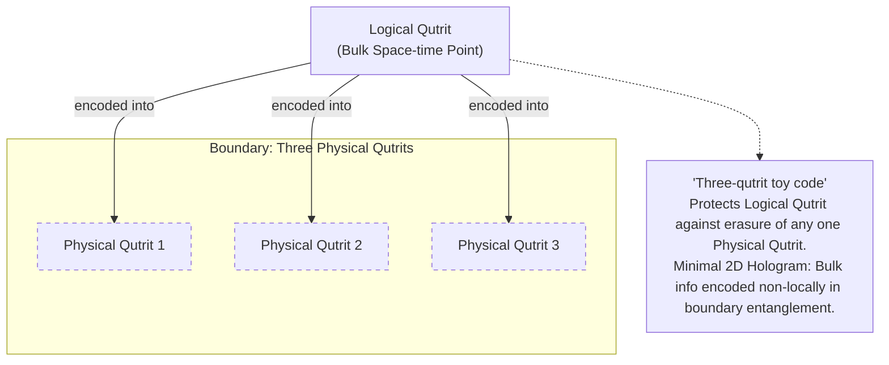
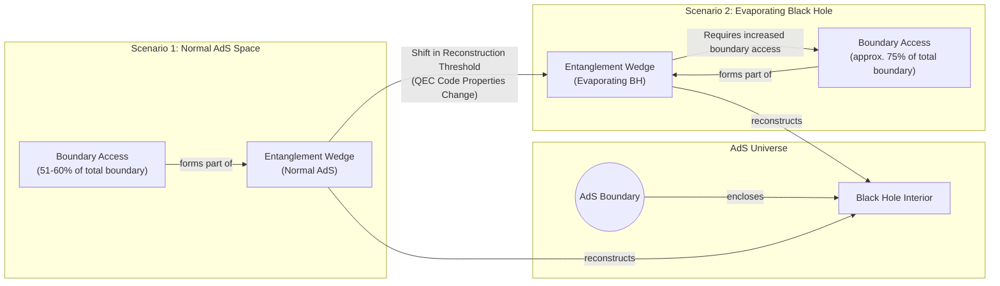

# The Cosmic Code: How Space-Time Protects Itself with Quantum Error Correction

In 1994, the mathematician Peter Shor developed an algorithm that sent a shockwave through the worlds of computing and cryptography. He proved that a hypothetical quantum computer could factor large numbers exponentially faster than any known classical computer, rendering much of modern cryptography obsolete. This generated immense excitement, but it was tempered by widespread skepticism. The very properties that make quantum computers powerful also make them incredibly fragile. It seemed impossible that any physical system could maintain the required quantum coherence long enough to perform a useful computation.

Then, in a remarkable turn, the solution to this engineering nightmare appeared to hold the key to one of the deepest mysteries in fundamental physics: the nature of space-time itself. In 2014, physicists Ahmed Almheiri, Xi Dong, and Daniel Harlow proposed that the holographic principle, which describes how a bendy, gravitational space-time can emerge from a flat, quantum theory on its boundary, works exactly like a quantum error-correcting code. This discovery suggested that the fabric of reality is woven from the same mathematical principles needed to build a fault-tolerant quantum computer.

This article explores this unexpected unity. You will learn how the quest to protect fragile quantum information led to a framework that explains the intrinsic robustness of space-time. We examine the toy models that make this connection concrete and see how the analogy breaks down at the edge of black holes, revealing deep truths about quantum gravity. Ultimately, this article explains that entanglement is not just a strange feature of quantum mechanics; it is the very glue holding space-time together, organized by the logic of error correction.

## The Quantum Computing Challenge and the Discovery of a Cosmic Connection

The power of a quantum computer comes from its fundamental unit of information: the qubit. Unlike a classical bit, which can only be a 0 or a 1, a qubit can exist in a superposition of both states simultaneously. An n-qubit register can therefore occupy a coherent superposition of all 2ⁿ basis states at once, enabling a form of exponential parallelism. Shor's algorithm masterfully exploits this, reducing the problem of factoring large integers to finding the period of a function evaluated in superposition [[16]](https://www.quantamagazine.org/how-space-and-time-could-be-a-quantum-error-correcting-code-20190103).

However, this power comes at the cost of extreme fragility. Widespread skepticism initially met the promise of quantum computing, as any physical qubit would inevitably interact with its environment and "decohere"—lose its quantum properties—long before a complex circuit could finish running. Qubits are maddeningly error-prone. The slightest environmental disturbance—a stray magnetic field or a microwave pulse—can corrupt their delicate state. These errors come in two main flavors: bit-flips, which swap the probabilities of |0⟩ and |1⟩, and phase-flips, which invert the mathematical relationship between the two states. Even worse, you cannot simply measure the qubits to check for errors. Any direct measurement collapses the superposition, destroying the very quantum computation you are trying to protect. For years, this seemed like a fatal flaw.

In 1995, just a year after his factoring algorithm, Shor delivered another breakthrough: a proof that quantum error-correcting codes (QEC) could exist [[2]](https://en.wikipedia.org/wiki/Quantum_error_correction), [[3]](https://people.eecs.berkeley.edu/~jswright/quantumcodingtheory24/scribe%20notes/lecture01.pdf). A year later, researchers including Dorit Aharonov and Michael Ben-Or independently proved the threshold theorem. This theorem states that if the error rate of individual physical components is below a certain constant threshold, active error correction can suppress errors faster than they accumulate, making arbitrarily long quantum computations possible [[1]](https://en.wikipedia.org/wiki/Threshold_theorem), [[4]](https://www.quantinuum.com/blog/quantinuum-with-partners-princeton-and-nist-deliver-seminal-result-in-quantum-error-correction). As quantum computer scientist Scott Aaronson noted, this was "the central discovery in the ’90s that convinced people that scalable quantum computing should be possible at all." The challenge was no longer one of fundamental impossibility, but "merely a staggering problem of engineering." The effort to design better codes to cope with the daunting error rates of real qubits remains "one of the major thrusts of the field" [[16]](https://www.quantamagazine.org/how-space-and-time-could-be-a-quantum-error-correcting-code-20190103).

For nearly two decades, QEC remained the domain of quantum computing. But in 2014, a trio of young quantum gravity researchers—Ahmed Almheiri, Xi Dong, and Daniel Harlow—made a significant connection. They realized that the emergence of space-time in holographic theories, specifically the Anti-de Sitter/Conformal Field Theory (AdS/CFT) correspondence, works just like a QEC code. Their seminal paper triggered a wave of activity, suggesting that space-time itself is a code, at least in these theoretical universes [[18]](https://arxiv.org/abs/1411.7041).

John Preskill, a theoretical physicist at Caltech, argues that this connection explains the "intrinsic robustness" of space-time. Despite being woven from fragile quantum entanglement, the geometry of our universe does not feel delicate. "We’re not walking on eggshells to make sure we don’t make the geometry fall apart," Preskill said. "I think this connection with quantum error correction is the deepest explanation we have for why that’s the case." In this view, the macroscopic geometry is a protected logical property, immune to small, local errors in the underlying quantum state [[16]](https://www.quantamagazine.org/how-space-and-time-could-be-a-quantum-error-correcting-code-20190103).

This discovery opened a two-way street of inspiration. Researchers hope that the highly efficient codes implemented by space-time could point the way to scalable quantum computing. As Almheiri put it, "Space-time is a lot smarter than us." Conversely, the language of QEC provides a new toolkit for probing the deepest mysteries of quantum gravity, especially the paradoxes surrounding black holes [[16]](https://www.quantamagazine.org/how-space-and-time-could-be-a-quantum-error-correcting-code-20190103).

With the Almheiri-Dong-Harlow conjecture establishing that holographic space-time behaves as a quantum error-correcting code, we now examine the concrete mechanics of how such codes protect logical information in simple qubit systems. This will allow us to recognize the same mathematical signatures when they reappear in the bulk geometry of AdS.

## How Quantum Error-Correcting Codes Work

The trick to protecting information in jittery qubits is to store it not in individual qubits, but in patterns of entanglement among many. Instead of trusting one fragile physical qubit, a logical qubit is encoded across a larger set of physical qubits in a highly entangled state. This non-local encoding ensures that no single physical qubit holds any information about the logical state, making the information resilient to local errors.

As a simple example, consider the three-qubit bit-flip code. While not a fully practical code because it cannot protect against phase-flips, it is an instructive first step [[6]](https://en.wikipedia.org/wiki/Quantum_error_correction). To protect one logical qubit, we use three physical qubits. The logical state `|0⟩` is encoded as `|000⟩` (all three physical qubits are `|0⟩`), and the logical state `|1⟩` is encoded as `|111⟩`. A general logical state `α|0⟩ + β|1⟩` becomes the entangled state `α|000⟩ + β|111⟩` [[7]](https://www.cl.cam.ac.uk/teaching/1920/QuantComp/Quantum_Computing_Lecture_13.pdf), [[8]](https://learn.microsoft.com/en-us/azure/quantum/concepts-error-correction).

Now, suppose a bit-flip error corrupts one of the physical qubits. How do we detect and correct it without measuring the qubits directly and collapsing the logical state? The solution is to perform parity-check measurements. We use two auxiliary "ancilla" qubits to check the parity—whether they are the same or different—of two pairs of physical qubits: (qubit 1, qubit 2) and (qubit 1, qubit 3) [[7]](https://www.cl.cam.ac.uk/teaching/1920/QuantComp/Quantum_Computing_Lecture_13.pdf), [[10]](https://astro.pas.rochester.edu/~aquillen/phy265/lectures/QI_E.pdf).

The measurement of these ancilla qubits yields an "error syndrome" that reveals which qubit, if any, has flipped:
*   **No flips (`|000⟩` or `|111⟩`):** Both pairs match. Syndrome: (match, match).
*   **Qubit 1 flips (`|100⟩` or `|011⟩`):** Both pairs do not match. Syndrome: (do not match, do not match).
*   **Qubit 2 flips (`|010⟩` or `|101⟩`):** The first pair does not match, the second does. Syndrome: (do not match, match).
*   **Qubit 3 flips (`|001⟩` or `|110⟩`):** The first pair matches, the second does not. Syndrome: (match, do not match).

Each syndrome uniquely identifies the error. We can then apply a corrective operation (a bit-flip) to the corresponding qubit, restoring the original encoded state. This entire process is a non-demolition measurement; it extracts information about the error without revealing anything about the logical state `α` or `β`, thus preserving the quantum computation [[16]](https://www.quantamagazine.org/how-space-and-time-could-be-a-quantum-error-correcting-code-20190103).

Image 1: A flowchart illustrating the three-qubit bit-flip code, showing encoding and non-demolition syndrome extraction.
```mermaid
flowchart LR
  %% Initial Qubits for Encoding
  subgraph "Initial Qubits for Encoding"
    LQ_init["Logical Qubit |ψ⟩"]
    AQ1_enc["Ancilla Qubit 1 |0⟩"]
    AQ2_enc["Ancilla Qubit 2 |0⟩"]
  end

  %% Encoding Process
  Encoding_Process["Encoding Circuit<br/>(2 CNOT gates:<br/>LQ->AQ1, LQ->AQ2)"]

  LQ_init --> "control" --> Encoding_Process
  AQ1_enc --> "target" --> Encoding_Process
  AQ2_enc --> "target" --> Encoding_Process

  %% Encoded Qubits
  subgraph "Encoded Logical Qubit |ψ_L⟩"
    EQ1["Physical Qubit 1"]
    EQ2["Physical Qubit 2"]
    EQ3["Physical Qubit 3"]
  end

  Encoding_Process -- "Qubit 1" --> EQ1
  Encoding_Process -- "Qubit 2" --> EQ2
  Encoding_Process -- "Qubit 3" --> EQ3

  %% Ancilla Qubits for Syndrome Extraction
  subgraph "Ancilla Qubits for Syndrome"
    SA1_init["Ancilla A |0⟩"]
    SA2_init["Ancilla B |0⟩"]
  end

  %% Parity Check 1
  PC1_Process["Parity Check 1<br/>(CNOTs: Q1->SA1, Q2->SA1)"]
  EQ1 --> "input" --> PC1_Process
  EQ2 --> "input" --> PC1_Process
  SA1_init --> "target" --> PC1_Process

  %% Parity Check 2
  PC2_Process["Parity Check 2<br/>(CNOTs: Q1->SA2, Q3->SA2)"]
  EQ1 --> "input" --> PC1_Process
  EQ3 --> "input" --> PC1_Process
  SA2_init --> "target" --> PC2_Process

  %% Syndrome Measurement
  Syndrome_Output["Syndrome Measurement<br/>(Ancilla A, Ancilla B)"]

  PC1_Process -- "Ancilla A State" --> Syndrome_Output
  PC2_Process -- "Ancilla B State" --> Syndrome_Output

  %% Logical Qubit (post-syndrome) - non-demolition
  subgraph "Logical Qubit (post-syndrome)"
    EQ1_post["Qubit 1"]
    EQ2_post["Qubit 2"]
    EQ3_post["Qubit 3"]
  end

  EQ1 --> "continues" --> EQ1_post
  EQ2 --> "continues" --> EQ2_post
  EQ3 --> "continues" --> EQ3_post
```

A key feature of the best QEC codes is that they can recover the complete logical information from slightly more than half of the physical qubits, even if the rest are entirely lost. This "majority rules" property is precisely what hinted to Almheiri, Dong, and Harlow that quantum error correction was at play in holography [[16]](https://www.quantamagazine.org/how-space-and-time-could-be-a-quantum-error-correcting-code-20190103).

Equipped with the concrete mechanics and the "slightly more than half" correctability signature of qubit-based codes, we now show how the holographic principle implements precisely the same structure on a gravitational stage, with AdS geometry emerging from entangled boundary degrees of freedom.

## The Holographic Principle and Space-Time Emerges as a Quantum Error-Correcting Code

To understand the connection to gravity, we first need to visit the theoretical playground where it was discovered: Anti-de Sitter (AdS) space. Our universe is described by a "de Sitter" geometry, which has a positive vacuum energy causing it to expand. In contrast, AdS space has a negative vacuum energy, giving it a hyperbolic geometry like one of M.C. Escher's *Circle Limit* woodcuts. In these designs, figures shrink as they approach the circular boundary. Similarly, AdS space has a boundary where space-time ends [[16]](https://www.quantamagazine.org/how-space-and-time-could-be-a-quantum-error-correcting-code-20190103), [[17]](https://www.youtube.com/watch?v=IIHucC-HPz0).

https://www.quantamagazine.org/wp-content/uploads/2019/01/Escher_1000.jpg 
Image 2: The hyperbolic geometry in M.C. Escher’s 1959 woodcut, Circle Limit III, is also a feature of anti-de Sitter space. (Source [https://en.wikipedia.org/wiki/Circle_Limit_III#/media/File:Escher_Circle_Limit_III.jpg](https://en.wikipedia.org/wiki/Circle_Limit_III#/media/File:Escher_Circle_Limit_III.jpg))

This boundary is crucial. In 1997, Juan Maldacena discovered the AdS/CFT correspondence, a powerful conjecture stating that a theory of quantum gravity within an AdS universe is perfectly equivalent (or "dual") to a standard quantum field theory without gravity living on its boundary. This duality is often a "strong-weak" duality, meaning a complex, strongly-coupled problem on one side can be mapped to a simple, weakly-coupled problem on the other. Everything that happens in the gravitational "bulk" is a holographic projection of information encoded in the entangled particles on the lower-dimensional boundary [[16]](https://www.quantamagazine.org/how-space-and-time-could-be-a-quantum-error-correcting-code-20190103), [[17]](https://www.youtube.com/watch?v=IIHucC-HPz0).

Almheiri and his colleagues noticed a striking parallel: any point in the interior of AdS space could be reconstructed from just over half of the boundary, exactly mirroring the property of an optimal QEC code [[16]](https://www.quantamagazine.org/how-space-and-time-could-be-a-quantum-error-correcting-code-20190103). In their 2014 paper, they introduced a "three-qutrit toy code" to make this analogy precise [[23]](https://errorcorrectionzoo.org/list/holographic). In this model, a single logical qutrit (a three-state particle) at the center of a 2D disk represents a point in bulk space-time. This logical information is encoded in the entanglement of three physical qutrits on the circular boundary. The code is constructed such that the logical qutrit is protected against the erasure of any one of the three physical qutrits; you can always reconstruct the bulk point from the remaining two [[24]](https://research.engineering.nyu.edu/~jbain/Talks/ST_QECC.pdf). This simple system acts as a minimal 2D hologram, where bulk information is non-locally stored in boundary entanglement.

Image 3: A diagram illustrating the Three-qutrit toy code as a minimal 2D hologram.


To model more than a single point of space-time, a more complex structure is needed. In 2015, Harlow, Preskill, Fernando Pastawski, and Beni Yoshida developed the HaPPY code (named after their initials). This model uses a tensor network—a grid of interconnected mathematical objects called tensors—to tile a hyperbolic space with pentagons, mimicking the geometry of an AdS slice [[12]](https://ncatlab.org/nlab/show/HaPPY+code). Each pentagon is a "perfect tensor" representing a point in the bulk, with legs connecting to its neighbors. The uncontracted legs at the edge of the network form the physical qubits on the boundary, while dangling legs inside the network represent logical qubits in the bulk [[11]](https://errorcorrectionzoo.org/c/happy).

As Stanford's Patrick Hayden described them, the tiles are like "little Tinkertoys" that build the geometry. The network's connections define the bulk, and its structure naturally creates overlapping "entanglement wedges." Any bulk information inside a wedge can be reconstructed from the corresponding boundary region. The fact that a single bulk point lies in multiple overlapping wedges means it can be reconstructed from different subsets of boundary qubits—the defining feature of a QEC code [[16]](https://www.quantamagazine.org/how-space-and-time-could-be-a-quantum-error-correcting-code-20190103).

Image 4: A diagram illustrating the HaPPY tensor-network code, showing pentagonal tiles as bulk points with logical indices, connected to physical boundary indices, and the emergent holographic properties.
```mermaid
graph TD
    %% HaPPY Tensor Network - Core Structure
    subgraph "HaPPY Tensor Network: AdS₂ Hyperbolic Tiling"
        direction LR

        subgraph "Bulk Tiles"
            T_Center["Pentagonal Tile (Center)<br/>(Perfect Tensor, Bulk Point)"]
            LBI_Center(( "Logical Bulk Index<br/>(Red Dot)" ))
            T_Center -- "contains" --> LBI_Center

            T_N1["Pentagonal Tile (Neighbor 1)"]
            LBI_N1(( "Logical Bulk Index<br/>(Red Dot)" ))
            T_N1 -- "contains" --> LBI_N1

            T_N2["Pentagonal Tile (Neighbor 2)"]
            LBI_N2(( "Logical Bulk Index<br/>(Red Dot)" ))
            T_N2 -- "contains" --> LBI_N2

            T_N3["Pentagonal Tile (Neighbor 3)"]
            LBI_N3(( "Logical Bulk Index<br/>(Red Dot)" ))
            T_N3 -- "contains" --> LBI_N3
        end

        %% Connections between tiles
        T_Center --- T_N1
        T_Center --- T_N2
        T_Center --- T_N3

        %% Outer edges connecting to Physical Boundary Indices
        subgraph "Boundary Indices"
            PBI_A(( "Physical Boundary Index<br/>(White Dot)" ))
            PBI_B(( "Physical Boundary Index<br/>(White Dot)" ))
            PBI_C(( "Physical Boundary Index<br/>(White Dot)" ))
            PBI_D(( "Physical Boundary Index<br/>(White Dot)" ))
            PBI_E(( "Physical Boundary Index<br/>(White Dot)" ))
            PBI_F(( "Physical Boundary Index<br/>(White Dot)" ))
        end

        T_N1 -- "connects to" --> PBI_A
        T_N1 -- "connects to" --> PBI_B
        T_N2 -- "connects to" --> PBI_C
        T_N2 -- "connects to" --> PBI_D
        T_N3 -- "connects to" --> PBI_E
        T_N3 -- "connects to" --> PBI_F
    end

    %% Emergent Holographic Properties
    subgraph "Holographic Code Properties"
        BulkGeometry["Emergent Bulk Geometry<br/>(from contracting tensor network)"]
        EntanglementWedges["Overlapping Entanglement Wedges<br/>(consistent overlap)"]
        BulkOperatorPush["Bulk Operators pushed to Boundary<br/>(along different minimal surfaces)"]
        QuantumErrorCorrection["Quantum Error-Correcting Property"]
        HolographicCode["Holographic Code Concept<br/>(Bulk from Entanglement Patterns)"]
    end

    "HaPPY Tensor Network: AdS₂ Hyperbolic Tiling" -- "defines" --> BulkGeometry
    BulkGeometry -- "leads to" --> EntanglementWedges
    EntanglementWedges -- "enables" --> BulkOperatorPush
    BulkOperatorPush -- "demonstrates" --> QuantumErrorCorrection
    QuantumErrorCorrection -- "is a core feature of" --> HolographicCode
```

The general lesson is that QEC provides the ideal language for describing how a smooth, classical geometry emerges from a quantum boundary theory. "Quantum error correction gives us a more general way of thinking about geometry in this code language," said Preskill. He believes this language "ought to be applicable... to more general situations," including a universe like ours [[16]](https://www.quantamagazine.org/how-space-and-time-could-be-a-quantum-error-correcting-code-20190103).

For now, researchers are sticking with AdS spaces, which are simpler than our de Sitter universe but share many key properties, most importantly, black holes. "The most fundamental property of gravity is that there are black holes," said Harlow. "That’s what makes gravity different from all the other forces. That’s why quantum gravity is hard" [[16]](https://www.quantamagazine.org/how-space-and-time-could-be-a-quantum-error-correcting-code-20190103). The same QEC structure that protects smooth AdS geometry fails in the presence of black holes; we now examine the sharp breakdown of correctability at their horizons and the resulting paradoxes that any consistent theory of quantum gravity must resolve.

## Black Holes: Where Correctability Breaks Down

The language of quantum error correction provides a new way of describing black holes. As Patrick Hayden explains, the presence of a black hole is defined by "the breakdown of correctability." When errors become so overwhelming that you can no longer track what is happening in the bulk space-time, "you get a black hole. It’s like a sink for your ignorance" [[16]](https://www.quantamagazine.org/how-space-and-time-could-be-a-quantum-error-correcting-code-20190103).

This ignorance is at the heart of Stephen Hawking's 1974 discovery that black holes radiate heat and eventually evaporate. His calculations suggested this "Hawking radiation" is thermal, meaning it carries no information about what fell in. This leads to the infamous information paradox: if a pure quantum state collapses to form a black hole, which then evaporates into a mixed thermal state, information is lost and a fundamental tenet of quantum mechanics—unitarity—is violated. A complete theory of quantum gravity must explain how this information gets out [[16]](https://www.quantamagazine.org/how-space-and-time-could-be-a-quantum-error-correcting-code-20190103).

The QEC framework sharpens this problem. In a normal AdS universe, information in the bulk can be reconstructed from just over half the boundary. However, for an evaporating black hole, this reconstruction threshold shifts dramatically. To reconstruct information about the black hole's interior, you need access to roughly three-quarters of the boundary qubits. Almheiri notes that why this specific fraction comes up "is still an open question," but it signals a fundamental change in the properties of the holographic code once a horizon forms [[16]](https://www.quantamagazine.org/how-space-and-time-could-be-a-quantum-error-correcting-code-20190103).

Image 5: A diagram showing the shift in the reconstruction threshold for an evaporating black hole in AdS space.


This leads to the firewall paradox, first proposed in 2012 by Almheiri and his collaborators. The paradox arises from a sharp conflict between three seemingly reasonable assumptions: (i) the process of black hole evaporation is unitary, meaning the Hawking radiation is in a pure state and entangled with the black hole's past; (ii) low-energy effective field theory is valid outside the horizon; and (iii) an infalling observer experiences nothing unusual at the horizon (the "no drama" principle). The monogamy of entanglement forbids a single quantum system (the late radiation) from being fully entangled with two separate systems (the early radiation and the interior partner modes) at once. This contradiction implies that one of the assumptions must be false, leading to the radical suggestion of a "firewall" of high-energy particles at the horizon [[21]](https://arxiv.org/html/2507.06046v1).

Quantum error correction offers a way out. Almheiri now thinks QEC is what stops firewalls from forming by protecting information as it crosses the horizon. In a 2018 paper, he reported that QEC is "essential for maintaining the smoothness of space-time at the horizon" of a wormhole. The idea is that strands of entanglement between the inside and outside of a black hole can be viewed as miniature wormholes (an idea known as ER=EPR), and QEC is how information escapes through them without violating locality at the horizon. This would resolve Hawking's paradox while keeping the horizon smooth [[16]](https://www.quantamagazine.org/how-space-and-time-could-be-a-quantum-error-correcting-code-20190103).

## Implications for Our Universe and Quantum Computing

The deep connection between holographic gravity and quantum error correction has sparked interest beyond theoretical physics. The U.S. Department of Defense is funding research into holographic codes, hoping that their geometric structure might lead to more efficient and robust QEC schemes for practical quantum computers [[16]](https://www.quantamagazine.org/how-space-and-time-could-be-a-quantum-error-correcting-code-20190103).

On the physics side, a major challenge remains: lifting these insights from the theoretical sandbox of AdS space to a realistic description of our own de Sitter universe. "The whole connection is known for a world that is manifestly not our world," as Scott Aaronson points out. Our universe has a positive cosmological constant and therefore lacks the clean spatial boundary that makes AdS holography so tractable. While researchers are making progress on primitive holographic descriptions of de Sitter space, the work is far less developed [[16]](https://www.quantamagazine.org/how-space-and-time-could-be-a-quantum-error-correcting-code-20190103).

Despite these challenges, the central lesson remains powerful. As John Preskill eloquently summarizes, entanglement is the fundamental ingredient that holds space together. "If you want to weave space-time together out of little pieces, you have to entangle them in the right way," he said. "And the right way is to build a quantum error-correcting code." This profound insight reframes our understanding of both quantum information and the fabric of the cosmos, revealing them to be two sides of the same cosmic coin [[16]](https://www.quantamagazine.org/how-space-and-time-could-be-a-quantum-error-correcting-code-20190103).

## References

- [1] [https://en.wikipedia.org/wiki/Threshold_theorem](https://en.wikipedia.org/wiki/Threshold_theorem)
- [2] [https://en.wikipedia.org/wiki/Quantum_error_correction](https://en.wikipedia.org/wiki/Quantum_error_correction)
- [3] [https://people.eecs.berkeley.edu/~jswright/quantumcodingtheory24/scribe%20notes/lecture01.pdf](https://people.eecs.berkeley.edu/~jswright/quantumcodingtheory24/scribe%20notes/lecture01.pdf)
- [4] [https://www.quantinuum.com/blog/quantinuum-with-partners-princeton-and-nist-deliver-seminal-result-in-quantum-error-correction](https://www.quantinuum.com/blog/quantinuum-with-partners-princeton-and-nist-deliver-seminal-result-in-quantum-error-correction)
- [5] [https://errorcorrectionzoo.org/c/qecc](https://errorcorrectionzoo.org/c/qecc)
- [6] [https://en.wikipedia.org/wiki/Quantum_error_correction](https://en.wikipedia.org/wiki/Quantum_error_correction)
- [7] [https://www.cl.cam.ac.uk/teaching/1920/QuantComp/Quantum_Computing_Lecture_13.pdf](https://www.cl.cam.ac.uk/teaching/1920/QuantComp/Quantum_Computing_Lecture_13.pdf)
- [8] [https://learn.microsoft.com/en-us/azure/quantum/concepts-error-correction](https://learn.microsoft.com/en-us/azure/quantum/concepts-error-correction)
- [9] [https://textbook.riverlane.com/en/latest/notebooks/ch2-classical-to-quantum-repcodes/bit-flip-repetition-codes.html](https://textbook.riverlane.com/en/latest/notebooks/ch2-classical-to-quantum-repcodes/bit-flip-repetition-codes.html)
- [10] [https://astro.pas.rochester.edu/~aquillen/phy265/lectures/QI_E.pdf](https://astro.pas.rochester.edu/~aquillen/phy265/lectures/QI_E.pdf)
- [11] [https://errorcorrectionzoo.org/c/happy](https://errorcorrectionzoo.org/c/happy)
- [12] [https://ncatlab.org/nlab/show/HaPPY+code](https://ncatlab.org/nlab/show/HaPPY+code)
- [13] [https://real.mtak.hu/153229/1/2004.04173v4.pdf](https://real.mtak.hu/153229/1/2004.04173v4.pdf)
- [14] [https://www.nature.com/articles/s41467-023-42743-z](https://www.nature.com/articles/s41467-023-42743-z)
- [15] [https://arxiv.org/html/2512.19452v3](https://arxiv.org/html/2512.19452v3)
- [16] [https://www.quantamagazine.org/how-space-and-time-could-be-a-quantum-error-correcting-code-20190103](https://www.quantamagazine.org/how-space-and-time-could-be-a-quantum-error-correcting-code-20190103)
- [17] [https://www.youtube.com/watch?v=IIHucC-HPz0](https://www.youtube.com/watch?v=IIHucC-HPz0)
- [18] [https://arxiv.org/abs/1411.7041](https://arxiv.org/abs/1411.7041)
- [19] [https://www.osti.gov/pages/biblio/1803745](https://www.osti.gov/pages/biblio/1803745)
- [20] [https://www2.yukawa.kyoto-u.ac.jp/~extremeuniverse/wpsite/wp-content/uploads/2022/10/KyotoOct2022.pdf](https://www2.yukawa.kyoto-u.ac.jp/~extremeuniverse/wpsite/wp-content/uploads/2022/10/KyotoOct2022.pdf)
- [21] [https://arxiv.org/html/2507.06046v1](https://arxiv.org/html/2507.06046v1)
- [22] [https://errorcorrectionzoo.org/list/holographic](https://errorcorrectionzoo.org/list/holographic)
- [23] [https://errorcorrectionzoo.org/list/holographic](https://errorcorrectionzoo.org/list/holographic)
- [24] [https://research.engineering.nyu.edu/~jbain/Talks/ST_QECC.pdf](https://research.engineering.nyu.edu/~jbain/Talks/ST_QECC.pdf)
- [25] [https://ncatlab.org/nlab/show/quantum+error+correction](https://ncatlab.org/nlab/show/quantum+error+correction)