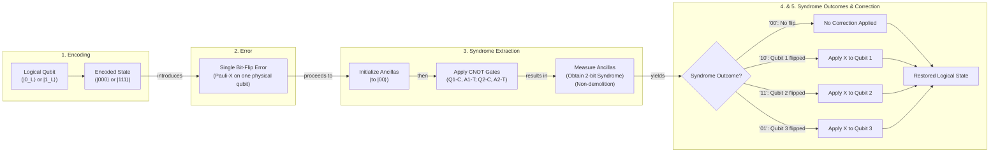
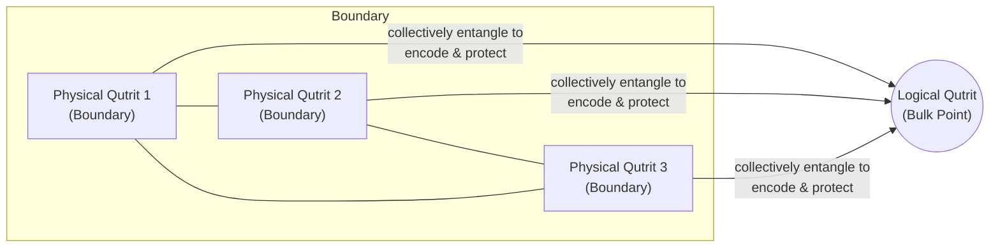
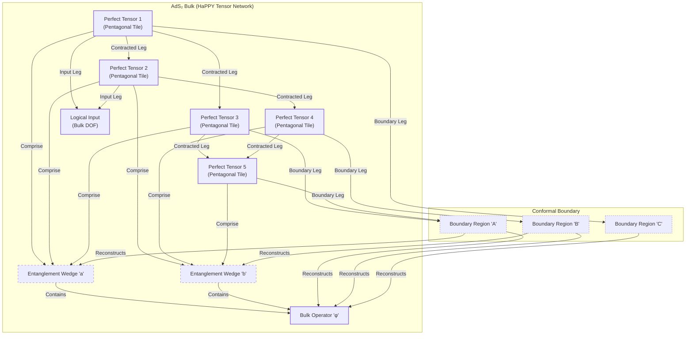
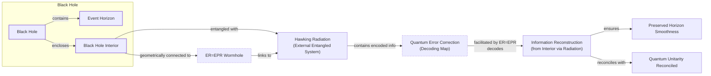

# How Space-Time Is a Quantum Error-Correcting Code

The story of quantum computing is one of a fundamental tension. On one hand, it promises exponential power. In 1994, Peter Shor devised an algorithm that could factor large numbers exponentially faster than any known classical computer, threatening to break much of modern cryptography. This power comes from the strange logic of quantum mechanics: superposition and entanglement. On the other hand, this power is incredibly fragile. The very quantum states that enable such computations are exquisitely sensitive to the slightest noise from their environment, a process called decoherence.

For years, this fragility led to widespread skepticism. It seemed that any attempt to build a large-scale quantum computer would be an exercise in futility, like trying to build a sandcastle in a hurricane. Then, in a remarkable turn of events, the solution to this problem emerged from the same mind that had posed the challenge. In 1995, Shor discovered the first quantum error-correcting code. This, followed by the threshold theorem, proved that if physical errors could be kept below a certain threshold, it was theoretically possible to build a fault-tolerant quantum computer of any size.

Nearly two decades later, a trio of physicists made a startling proposal that connected this abstract information theory to the very fabric of reality. In 2014, Ahmed Almheiri, Xi Dong, and Daniel Harlow conjectured that the holographic principle, specifically the AdS/CFT correspondence that describes how a gravitational space-time can emerge from a lower-dimensional quantum field theory, is mathematically equivalent to a quantum error-correcting code. In this picture, the geometry of space-time is the protected "logical" information, encoded in the entanglement of quantum bits, or qubits, living on its boundary.

This discovery reframed our understanding of space-time. It suggests that the reason our universe feels so robust, despite being woven from fragile quantum threads, is that it is protected by an underlying error-correction scheme. As Caltech physicist John Preskill put it, "We’re not walking on eggshells to make sure we don’t make the geometry fall apart. I think this connection with quantum error correction is the deepest explanation we have for why that’s the case" [[8]](https://www.quantamagazine.org/how-space-and-time-could-be-a-quantum-error-correcting-code-20190103).

This unexpected unity has created a two-way street of inspiration. The language of quantum error correction is now being used to attack some of the deepest puzzles in quantum gravity, particularly those related to black holes. In the other direction, the geometric nature of holographic codes may inspire new, more efficient ways to build the fault-tolerant quantum computers of the future.

In this article, we will explore this profound connection. We will start by understanding the mechanics of how quantum error-correcting codes work in simple qubit systems. Then, we will see how this same mathematical structure appears in holographic models of space-time, where geometry itself emerges from entanglement. Finally, we will examine what happens at the edge of this framework—at the horizon of a black hole, where correctability breaks down and reveals the deepest paradoxes of quantum gravity.

## The Quantum Computing Challenge and the Discovery of a Cosmic Connection

The initial excitement around quantum computing was ignited by a single, groundbreaking result. In 1994, mathematician Peter Shor demonstrated that a hypothetical quantum computer could solve a problem with profound real-world implications: factoring large numbers. This task is exponentially difficult for classical computers, and its hardness underpins much of modern cryptography. Shor's algorithm promised to render these systems obsolete, but it also highlighted the immense gap between theoretical possibility and physical reality [[1]](https://people.eecs.berkeley.edu/~jswright/quantumcodingtheory24/scribe%20notes/lecture01.pdf).

### The Promise and Peril of Quantum Computation

The power of a quantum computer stems from its fundamental unit of information, the qubit. Unlike a classical bit, which can only be a 0 or a 1, a qubit can exist in a superposition of both states simultaneously. This means an n-qubit register can represent all 2ⁿ possible classical states at once, a feat that would require an exponentially large number of classical bits. Through the phenomenon of entanglement, these qubits become interconnected, their fates intertwined in a complex web of probabilities. This exponential state space allows for a massive form of parallelism, which Shor's algorithm masterfully exploits to find the prime factors of a number by converting the problem into a search for the period of a function evaluated in superposition.

However, this quantum power is also a source of extreme fragility. The delicate superposition and entanglement that drive quantum computations are easily disrupted by the slightest interaction with the environment. This "decoherence" manifests as two primary types of errors. Bit-flips, analogous to classical bit errors, switch a qubit's state between |0⟩ and |1⟩. More subtly, phase-flips alter the mathematical relationship—the relative sign—between the |0⟩ and |1⟩ components of the superposition. The problem is that you cannot simply measure a qubit to check for errors. Any direct measurement forces the qubit to collapse into a definite 0 or 1, destroying the superposition and erasing the very information the computation relies on. For years, this seemed to be a fatal flaw.

### The Theoretical Lifeline: Quantum Error Correction

The solution arrived just a year after Shor's factoring algorithm. In 1995, Shor himself provided the answer by discovering the first quantum error-correcting code (QEC), a nine-qubit scheme capable of protecting a single logical qubit from any arbitrary single-qubit error [[2]](https://en.wikipedia.org/wiki/Quantum_error_correction), [[3]](https://errorcorrectionzoo.org/c/qecc). This was followed by the threshold theorem, proven independently by several groups, which established that if the error rate of individual physical operations could be kept below a certain constant threshold, QEC could actively correct errors faster than they accumulate [[4]](https://en.wikipedia.org/wiki/Threshold_theorem), [[5]](https://www.quantinuum.com/blog/quantinuum-with-partners-princeton-and-nist-deliver-seminal-result-in-quantum-error-correction).

This was a monumental discovery. It transformed quantum computing from a theoretical curiosity into a "staggering problem of engineering," as quantum computer scientist Scott Aaronson described it. The threshold theorem "was the central discovery in the ’90s that convinced people that scalable quantum computing should be possible at all" [[8]](https://www.quantamagazine.org/how-space-and-time-could-be-a-quantum-error-correcting-code-20190103). The challenge shifted from proving possibility to achieving it, sparking a massive effort to design better codes and build better hardware.

### A New Duality: Space-Time as a Code

For nearly two decades, QEC was a concern primarily for computer scientists and physicists building quantum hardware. Then, in 2014, a paper by Ahmed Almheiri, Xi Dong, and Daniel Harlow proposed a radical connection to a completely different field: quantum gravity [[7]](https://arxiv.org/abs/1411.7041). They argued that the AdS/CFT correspondence—a holographic duality where a theory of gravity in a higher-dimensional space-time emerges from a quantum field theory on its boundary—is mathematically identical to a quantum error-correcting code. In this framework, local operators deep in the bulk of the space-time are the "logical" information, which is encoded non-locally across the entangled "physical" qubits of the boundary theory.

This idea provides a powerful explanation for the robustness of space-time. We don't perceive the universe as a fragile quantum system on the verge of collapse. According to John Preskill, this is because the geometry of space-time is itself an error-protected logical observable. Small, local fluctuations in the underlying quantum state are like correctable errors on physical qubits; they are filtered out by the code, leaving the macroscopic, emergent geometry unchanged. "It’s really entanglement which is holding the space together," Preskill said. "If you want to weave space-time together out of little pieces, you have to entangle them in the right way. And the right way is to build a quantum error-correcting code" [[8]](https://www.quantamagazine.org/how-space-and-time-could-be-a-quantum-error-correcting-code-20190103).

### A Two-Way Street of Discovery

This unexpected unity has created a fertile ground for cross-pollination. The language of QEC is now providing physicists with a new toolkit to tackle long-standing paradoxes in quantum gravity, particularly those concerning black holes. Conversely, the geometric nature of these holographic codes may offer new blueprints for designing more efficient and scalable QECs for practical quantum computers. As Almheiri noted, "Space-time is a lot smarter than us. The kind of quantum error-correcting code which is implemented in these constructions is a very efficient code" [[8]](https://www.quantamagazine.org/how-space-and-time-could-be-a-quantum-error-correcting-code-20190103).

With the Almheiri-Dong-Harlow conjecture establishing that holographic space-time behaves as a quantum error-correcting code, we now examine the concrete mechanics of how such codes protect logical information in simple qubit systems so the reader can recognize the same mathematical signatures when they reappear in the bulk geometry of AdS.

## How Quantum Error-Correcting Codes Work

The core principle of quantum error correction is to encode information non-locally. Instead of storing a logical qubit in a single physical qubit, the information is distributed across a highly entangled state of many physical qubits. This redundancy makes the logical information robust against local errors. If a single physical qubit is corrupted by noise, the damage is contained, and the original logical state can be recovered from the remaining, uncorrupted qubits.

### The Three-Qubit Bit-Flip Code: A Toy Model

The three-qubit bit-flip code is a simple, instructive example of this principle in action. While it only protects against bit-flip errors and not the more subtle phase-flips, it clearly demonstrates the fundamental mechanics of encoding, error detection, and correction.

The encoding maps a single logical qubit onto a three-qubit entangled state. The logical basis states are defined as:
-   Logical |0⟩, denoted |0\_L⟩, is encoded as the state |000⟩.
-   Logical |1⟩, denoted |1\_L⟩, is encoded as the state |111⟩.

A general logical state, which is a superposition α|0\_L⟩ + β|1\_L⟩, becomes the entangled state α|000⟩ + β|111⟩. In this encoded form, the logical information is no longer stored in any single qubit but in the correlations among all three [[10]](https://www.cl.cam.ac.uk/teaching/1920/QuantComp/Quantum_Computing_Lecture_13.pdf), [[11]](https://learn.microsoft.com/en-us/azure/quantum/concepts-error-correction).

### Detecting Errors Without Destruction

Now, imagine a bit-flip error occurs on one of the physical qubits. For instance, if the second qubit flips, the state becomes α|010⟩ + β|101⟩. The challenge is to detect this error without measuring the qubits directly, as that would collapse the superposition and destroy the logical information. This is achieved through a "non-demolition" measurement process called syndrome extraction.

This process uses two auxiliary qubits, or "ancillas," initialized to the |00⟩ state. A series of controlled-NOT (CNOT) gates are then used to perform parity checks between pairs of the physical qubits (e.g., qubit 1 and 2, then qubit 2 and 3). The state of the ancillas is flipped depending on whether the corresponding pair of physical qubits are the same or different. Measuring the ancillas yields a two-bit "syndrome," which uniquely identifies the error without revealing anything about the logical state itself [[12]](https://textbook.riverlane.com/en/latest/notebooks/ch2-classical-to-quantum-repcodes/bit-flip-repetition-codes.html), [[13]](https://astro.pas.rochester.edu/~aquillen/phy265/lectures/QI_E.pdf).

The four possible syndrome outcomes correspond to the four possible error scenarios:
-   **Syndrome '00':** No error occurred. The qubits are in the state |000⟩ or |111⟩.
-   **Syndrome '10':** The first qubit flipped.
-   **Syndrome '11':** The second qubit flipped.
-   **Syndrome '01':** The third qubit flipped.

Once the syndrome identifies the error, a corrective operation—in this case, another bit-flip (a Pauli-X gate)—is applied to the faulty qubit, restoring the original encoded state. This ability to diagnose and fix errors without disturbing the underlying logical information is the magic of quantum error correction.

Image 1: Flowchart illustrating the mechanism of the three-qubit bit-flip code, from encoding through error, syndrome extraction, to correction.

More advanced codes can protect against a wider range of errors, including both bit-flips and phase-flips. A key property of the most powerful codes is their ability to recover the full logical information even if a significant fraction of the physical qubits are completely lost or "erased." Remarkably, the best codes can achieve this with access to just slightly more than half of the original physical qubits [[14]](https://arxiv.org/abs/1503.06237). This non-trivial fact was a crucial piece of inspiration for Almheiri, Dong, and Harlow, hinting that the principles of holographic reconstruction in AdS space might be governed by the same mathematical structure.

Equipped with the concrete mechanics and the "slightly more than half" correctability signature of qubit-based codes, we now show how the holographic principle implements precisely the same structure on a gravitational stage, with AdS geometry emerging from entangled boundary degrees of freedom.

## The Holographic Principle and Space-Time Emerges as a Quantum Error-Correcting Code

To understand the holographic connection, we first need a stage to work on. Our universe is described by de Sitter space, which has a positive cosmological constant and is expanding. This geometry lacks a well-defined spatial boundary, making it difficult to study holographically. Physicists therefore often work in a simpler "toy" universe called Anti-de Sitter (AdS) space. AdS space has a negative cosmological constant, giving it a hyperbolic geometry with a concrete, timelike boundary. This boundary is essential for the holographic principle to work. The geometry of AdS space is famously visualized in M.C. Escher's *Circle Limit* series, where figures appear to shrink as they approach the circular boundary, which is infinitely far away [[8]](https://www.quantamagazine.org/how-space-and-time-could-be-a-quantum-error-correcting-code-20190103).
Image 2: M.C. Escher's *Circle Limit III*, which provides a famous artistic representation of the hyperbolic geometry of a slice of Anti-de Sitter space. (Source [[8]](https://www.quantamagazine.org/how-space-and-time-could-be-a-quantum-error-correcting-code-20190103))

In 1997, Juan Maldacena discovered the AdS/CFT correspondence, a powerful duality stating that a theory of quantum gravity in AdS space is equivalent to a quantum field theory (the "CFT") living on its boundary [[15]](https://www.youtube.com/watch?v=IIHucC-HPz0). The key insight of Almheiri, Dong, and Harlow was that this duality resolves the "bulk locality paradox"—the puzzle of how a single bulk operator can be reconstructed on multiple, distinct boundary regions without being trivial—by showing it shares the mathematical structure of a QEC [[16]](https://quantumfrontiers.com/2015/03/27/quantum-gravity-from-quantum-error-correcting-codes). They realized that a local point deep in the bulk of AdS can be reconstructed from slightly more than half of the boundary, exactly the signature of an optimal error-correcting code [[7]](https://arxiv.org/abs/1411.7041).

### Geometric Signatures of Error Correction

To make this concrete, they introduced a minimal toy model: the three-qutrit code [[17]](https://errorcorrectionzoo.org/list/holographic), [[18]](https://research.engineering.nyu.edu/~jbain/Talks/ST_QECC.pdf), [[19]](https://ncatlab.org/nlab/show/quantum+error+correction). In this model, a single logical qutrit (a three-level quantum system) in the "bulk" is encoded in the entangled state of three physical qutrits on the "boundary." The encoding is constructed such that any information about the logical qutrit is completely inaccessible from any single physical qutrit. However, if you have access to any two of the three boundary qutrits, you can perfectly reconstruct the logical state in the bulk. The bulk point is protected from the "erasure" of any single boundary region.

Image 3: Diagram illustrating the Three-qutrit toy code as a minimal 2D hologram, showing a central logical qutrit encoded and protected by three entangled physical qutrits on a boundary, allowing for bulk information reconstruction from any two of the three boundary qutrits.

### Tensor Networks: Building a Toy Universe

While the three-qutrit code models a single bulk point, a more sophisticated model was needed to represent an extended geometry. This came in the form of the "HaPPY" code, developed by Fernando Pastawski, Beni Yoshida, Daniel Harlow, and John Preskill [[14]](https://arxiv.org/abs/1503.06237). The HaPPY code is a tensor network built from "perfect tensors," which are highly entangled states that act as ideal building blocks for QECs. These tensors are arranged in a tiling of pentagons that mimics the hyperbolic geometry of an AdS slice [[20]](https://errorcorrectionzoo.org/c/happy), [[21]](https://ncatlab.org/nlab/show/HaPPY+code).

In this model, the network of contracted tensors defines the bulk geometry. Each tensor has "logical" legs pointing into the bulk and "physical" legs pointing towards the boundary. The network as a whole acts as an encoder, mapping bulk degrees of freedom to the boundary. A key feature is that a single bulk operator can be reconstructed on multiple, overlapping regions of the boundary. This property, known as "entanglement wedge reconstruction," is a direct consequence of the code's structure and explicitly realizes the error-correcting nature of holography. As Patrick Hayden of Stanford University described them, the tensors are like "little Tinkertoys," and "these tiles would be playing the role of the fish in an Escher tiling" [[8]](https://www.quantamagazine.org/how-space-and-time-could-be-a-quantum-error-correcting-code-20190103).

However, these perfect tensor models have limitations. While they successfully reproduce geometric properties like the Ryu-Takayanagi formula for entanglement, their boundary states are unphysical. The very perfection of the code causes correlation functions between distant boundary operators to vanish exactly, unlike in a real CFT where they decay smoothly with distance. More recent models based on "hyperinvariant tensor networks" use non-perfect tensors to construct codes that produce the correct boundary correlations, suggesting that the true holographic map is an approximate, rather than exact, isometry [[22]](https://www.nature.com/articles/s41467-023-42743-z).

Image 4: A conceptual diagram illustrating the HaPPY tensor-network code, showing the connection between perfect tensors in the AdS₂ bulk and their corresponding entanglement wedges on the conformal boundary, demonstrating quantum error correction through overlapping bulk operator reconstruction.

The general lesson from these models is that quantum error correction provides the natural language for describing how a smooth, classical geometry can emerge from a purely quantum system of entangled degrees of freedom. "Quantum error correction gives us a more general way of thinking about geometry in this code language," said Preskill, suggesting this framework "ought to be applicable... to more general situations" [[8]](https://www.quantamagazine.org/how-space-and-time-could-be-a-quantum-error-correcting-code-20190103).

For now, researchers are sticking with AdS spaces, which are simpler than de Sitter but share crucial features, most importantly, black holes. As Daniel Harlow noted, "The most fundamental property of gravity is that there are black holes. That’s what makes gravity different from all the other forces. That’s why quantum gravity is hard" [[8]](https://www.quantamagazine.org/how-space-and-time-could-be-a-quantum-error-correcting-code-20190103). It is precisely in these extreme environments that the QEC structure protecting smooth AdS geometry begins to fail, revealing the paradoxes that any consistent theory must resolve.

## Black Holes: Where Correctability Breaks Down

Black holes represent the ultimate test for any theory of quantum gravity, and they are where the elegant picture of holographic error correction becomes complicated. Once a black hole forms, its interior is causally disconnected from the boundary. Information that falls in cannot be recovered by any local operator on the boundary, a concept that led Patrick Hayden to describe the event horizon as a "sink for your ignorance." In tensor network toy models, this is represented by removing tensors from the center of the geometry, with the newly exposed bulk legs corresponding to the black hole's internal microstates [[23]](https://errorcorrectionzoo.org/c/holographic).

### The Firewall Paradox

This leads to the famous information paradox. Stephen Hawking showed that black holes radiate thermal energy carrying no information about what fell in, violating the quantum principle of unitarity. A complete theory of quantum gravity must explain how this information is returned. The holographic QEC framework offers a new perspective. In this view, the information is not lost but encoded in the entanglement between the black hole and its radiation. However, the presence of a horizon dramatically changes the properties of the code. In an evaporating black hole in AdS, reconstructing operators inside the black hole from the boundary becomes much harder. The reconstruction threshold shifts: instead of needing slightly more than half of the boundary, one needs access to roughly three-quarters of the combined black hole and radiation system. As Almheiri noted, why this specific fraction comes up "is still an open question" [[8]](https://www.quantamagazine.org/how-space-and-time-could-be-a-quantum-error-correcting-code-20190103), [[24]](https://www.osti.gov/pages/biblio/1803745), [[25]](https://www2.yukawa.kyoto-u.ac.jp/~extremeuniverse/wpsite/wp-content/uploads/2022/10/KyotoOct2022.pdf), [[26]](https://rojefferson.blog/2021/07/05/islands-behind-the-horizon).

This tension culminated in the 2012 "firewall paradox" from Almheiri and collaborators [[27]](https://arxiv.org/abs/1207.3123). Their argument hinged on the "monogamy of entanglement," a principle stating that a quantum system cannot be maximally entangled with two other systems at once. If a late-time Hawking particle is entangled with the early radiation (for unitarity) and also with its interior partner (for a smooth horizon), entanglement monogamy is violated. Their radical conclusion was that the interior link must break, creating a "firewall" of high-energy particles at the horizon. Some physicists, however, question its operational meaning, arguing that verifying the entanglement that creates the paradox would require a quantum computation too complex to perform in the black hole's lifetime [[28]](https://quantumfrontiers.com/2012/12/03/is-alice-burning-the-black-hole-firewall-controversy).

### QEC and Wormholes to the Rescue

Quantum error correction, combined with the "ER=EPR" conjecture, offers a way out. The framework suggests that the decoding map to retrieve information from the radiation is "state-dependent," meaning different black hole microstates require different decoders [[29]](https://www.preprints.org/manuscript/202603.0227). This complexity is geometrically realized as entanglement wormholes connecting the interior to the distant radiation. This allows information to escape without violating locality at the horizon, preserving a smooth passage for an infalling observer and the unitarity of quantum mechanics, as the QEC-based mechanism rewires the bulk-boundary dictionary. Almheiri has argued that QEC is "essential for maintaining the smoothness of space-time at the horizon" and speculates it is how information ultimately escapes, resolving Hawking's paradox [[8]](https://www.quantamagazine.org/how-space-and-time-could-be-a-quantum-error-correcting-code-20190103), [[30]](https://arxiv.org/abs/1810.02055).

Image 5: A diagram illustrating the role of Quantum Error Correction (QEC) and ER=EPR-style entanglement wormholes in resolving the black hole information paradox.

## Implications for Our Universe and Quantum Computing

The connection between holography and quantum error correction has practical implications. It has spurred tangible research efforts, with agencies like DARPA funding programs to investigate holographic tensor-network codes [[31]](https://inspirehep.net/literature/2817311). The hope is that their geometric structure will lead to more efficient and robust QEC schemes for real-world quantum hardware, offering a blueprint for protecting quantum computers from noise in a more scalable way than traditional approaches.

On the physics side, a major hurdle remains: translating insights from AdS space to our own de Sitter universe. Our universe has a positive cosmological constant and lacks the clean spatial boundary that makes AdS holography so tractable. Active research is exploring several avenues, including a direct dS/CFT correspondence, "static patch holography" which focuses on the region visible to a single observer, and approaches using T-bar-T deformations to connect the different geometries [[8]](https://www.quantamagazine.org/how-space-and-time-could-be-a-quantum-error-correcting-code-20190103), [[32]](https://arxiv.org/abs/2602.02852). These efforts, however, are far less developed than their AdS counterparts.

Despite these challenges, the central lesson remains powerful. As John Preskill eloquently summarized, the idea of entanglement as the "glue" holding space together finds its precise mathematical formulation in the language of quantum error correction. The specific pattern of entanglement required to build a stable, robust geometry is not just any pattern—it is precisely that of a quantum error-correcting code. This profound insight has not only given us a new language to tackle the deepest questions in quantum gravity but has also opened a new frontier where the structure of space-time and the future of computation are unexpectedly intertwined [[8]](https://www.quantamagazine.org/how-space-and-time-could-be-a-quantum-error-correcting-code-20190103).

## References

- [1] [Lecture 1: Introduction to Quantum Error Correction](https://people.eecs.berkeley.edu/~jswright/quantumcodingtheory24/scribe%20notes/lecture01.pdf)
- [2] [Quantum error correction - Wikipedia](https://en.wikipedia.org/wiki/Quantum_error_correction)
- [3] [Quantum error-correcting code (QECC) - Error Correction Zoo](https://errorcorrectionzoo.org/c/qecc)
- [4] [Threshold theorem - Wikipedia](https://en.wikipedia.org/wiki/Threshold_theorem)
- [5] [Quantinuum, with partners Princeton and NIST, deliver seminal result in quantum error correction](https://www.quantinuum.com/blog/quantinuum-with-partners-princeton-and-nist-deliver-seminal-result-in-quantum-error-correction)
- [6] [Bulk Locality and Quantum Error Correction in AdS/CFT](https://indico.ift.uam-csic.es/event/9/attachments/26/36/Wall_Black_Hole_Thermodynamics.pdf)
- [7] [Bulk Locality and Quantum Error Correction in AdS/CFT](https://arxiv.org/abs/1411.7041)
- [8] [How Space and Time Could Be a Quantum Error-Correcting Code | Quanta Magazine](https://www.quantamagazine.org/how-space-and-time-could-be-a-quantum-error-correcting-code-20190103)
- [9] [Holographic quantum error correcting codes](https://www.youtube.com/watch?v=MuklWupCvWU)
- [10] [Quantum Computing Lecture 13](https://www.cl.cam.ac.uk/teaching/1920/QuantComp/Quantum_Computing_Lecture_13.pdf)
- [11] [Understand quantum error correction - Azure Quantum](https://learn.microsoft.com/en-us/azure/quantum/concepts-error-correction)
- [12] [Quantum bit-flip repetition codes](https://textbook.riverlane.com/en/latest/notebooks/ch2-classical-to-quantum-repcodes/bit-flip-repetition-codes.html)
- [13] [Quantum Information and Error Correction](https://astro.pas.rochester.edu/~aquillen/phy265/lectures/QI_E.pdf)
- [14] [Holographic quantum error-correcting codes: toy models for the bulk/boundary correspondence](https://arxiv.org/abs/1503.06237)
- [15] [Albert Einstein, Holograms and Quantum Gravity](https://www.youtube.com/watch?v=IIHucC-HPz0)
- [16] [Quantum gravity from quantum error-correcting codes? | Quantum Frontiers](https://quantumfrontiers.com/2015/03/27/quantum-gravity-from-quantum-error-correcting-codes)
- [17] [Holographic code - Error Correction Zoo](https://errorcorrectionzoo.org/list/holographic)
- [18] [Spacetime as a Quantum Error-Correcting Code](https://research.engineering.nyu.edu/~jbain/Talks/ST_QECC.pdf)
- [19] [quantum error correction - nLab](https://ncatlab.org/nlab/show/quantum+error+correction)
- [20] [Pastawski-Yoshida-Harlow-Preskill (HaPPY) code - Error Correction Zoo](https://errorcorrectionzoo.org/c/happy)
- [21] [HaPPY code - nLab](https://ncatlab.org/nlab/show/HaPPY+code)
- [22] [Holographic codes from hyperinvariant tensor networks | Nature Communications](https://www.nature.com/articles/s41467-023-42743-z)
- [23] [Holographic code - Error Correction Zoo](https://errorcorrectionzoo.org/c/holographic)
- [24] [Bulk locality and quantum error correction in AdS/CFT](https://www.osti.gov/pages/biblio/1803745)
- [25] [Reconstruction in AdS/CFT?](https://www2.yukawa.kyoto-u.ac.jp/~extremeuniverse/wpsite/wp-content/uploads/2022/10/KyotoOct2022.pdf)
- [26] [Islands behind the horizon](https://rojefferson.blog/2021/07/05/islands-behind-the-horizon)
- [27] [Black Holes: Complementarity or Firewalls?](https://arxiv.org/abs/1207.3123)
- [28] [Is Alice burning? The black hole firewall controversy | Quantum Frontiers](https://quantumfrontiers.com/2012/12/03/is-alice-burning-the-black-hole-firewall-controversy)
- [29] [Unresolved tensions persist in firewall resolutions via holographic QEC](https://www.preprints.org/manuscript/202603.0227)
- [30] [Holographic Quantum Error Correction and the Projected Black Hole Interior](https://arxiv.org/abs/1810.02055)
- [31] [DARPA MURI: Holographic Quantum Matter](https://inspirehep.net/literature/2817311)
- [32] [AdS/CFT to dS/CFT: Some Recent Developments](https://arxiv.org/abs/2602.02852)
</article>