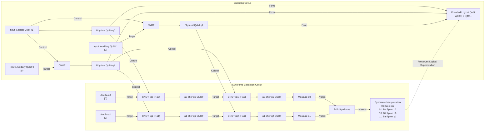

# How Space-Time Emerges from Quantum Error Correction

In 1994, the mathematician Peter Shor introduced a quantum algorithm that could factor large numbers exponentially faster than any known classical method, posing an existential threat to modern cryptography. This brought quantum computers into the spotlight, but it also highlighted their greatest weakness: the profound fragility of their core components. While this discovery ignited the field, it was met with heavy skepticism. Researchers like Rolf Landauer famously suggested that any paper on quantum computation should include a disclaimer: "probably will not work" [[3]](https://people.eecs.berkeley.edu/~jswright/quantumcodingtheory24/scribe%20notes/lecture01.pdf).

The source of this skepticism lies in the very nature of quantum information. Unlike the stable 0s and 1s of classical bits, quantum bits, or "qubits," exist in a delicate "superposition" of states. Their power comes from "entanglement," where the states of multiple qubits become interdependent, creating a vast computational space. This is what allows Shor's algorithm to work its magic. However, the slightest environmental disturbance—a stray magnetic field or microwave pulse—can corrupt these states, causing "bit-flips" or "phase-flips" that destroy the computation. What’s more, you cannot simply measure the qubits to check for errors, as the act of measurement itself collapses the superposition, wiping out the quantum information you are trying to protect.

Just one year later, Shor delivered another breakthrough: a theoretical proof that "quantum error-correcting codes" (QEC) were possible [[2]](https://en.wikipedia.org/wiki/Quantum_error_correction), [[3]](https://people.eecs.berkeley.edu/~jswright/quantumcodingtheory24/scribe%20notes/lecture01.pdf). This was followed by the "threshold theorem," which showed that if the error rate of physical components is below a certain threshold, quantum computations of any length can be performed reliably [[1]](https://en.wikipedia.org/wiki/Threshold_theorem), [[4]](https://www.quantinuum.com/blog/quantinuum-with-partners-princeton-and-nist-deliver-seminal-result-in-quantum-error-correction). This convinced the scientific community that building a scalable quantum computer was not a physical impossibility, but a monumental engineering challenge. As quantum computer scientist Scott Aaronson noted, "This was the central discovery in the ’90s that convinced people that scalable quantum computing should be possible at all" [[16]](https://www.quantamagazine.org/how-space-and-time-could-be-a-quantum-error-correcting-code-20190103).

The search for better codes has been a major focus ever since. But in 2014, this search took an unexpected turn. Three young quantum gravity researchers—Ahmed Almheiri, Xi Dong, and Daniel Harlow—published a paper suggesting that the fabric of space-time itself is a quantum error-correcting code [[18]](https://indico.ift.uam-csic.es/event/9/attachments/26/36/Wall_Black_Hole_Thermodynamics.pdf), [[33]](https://arxiv.org/abs/1411.7041). They were studying a theoretical model of the universe known as anti-de Sitter (AdS) space, where the geometry of the "bulk" emerges holographically from entangled quantum particles on its outer boundary. Their calculations showed that this emergence works exactly like a QEC code.

This idea provides a profound explanation for a basic feature of our reality. John Preskill, a theoretical physicist at Caltech, argues that QEC explains the "intrinsic robustness" of space-time. "We’re not walking on eggshells to make sure we don’t make the geometry fall apart," he said. "I think this connection with quantum error correction is the deepest explanation we have for why that’s the case" [[16]](https://www.quantamagazine.org/how-space-and-time-could-be-a-quantum-error-correcting-code-20190103).

This discovery has created a two-way street of innovation. Physicists hope that the structure of space-time might inspire the design of more efficient QEC codes for practical quantum computers. "Space-time is a lot smarter than us," Almheiri remarked [[16]](https://www.quantamagazine.org/how-space-and-time-could-be-a-quantum-error-correcting-code-20190103). In the other direction, the language of QEC is providing new tools to tackle the deepest mysteries of quantum gravity, especially those surrounding black holes.

To understand this profound connection, we first need to look at how these codes protect quantum information. By understanding their mechanics in simple qubit systems, we can recognize the same mathematical signatures when they reappear in the geometry of space-time.

## How Quantum Error-Correcting Codes Work

The central trick behind quantum error correction is to encode information not in a single, fragile qubit, but in the intricate patterns of entanglement among many [[20]](https://www.quantamagazine.org/how-space-and-time-could-be-a-quantum-error-correcting-code-20190103). This way, the logical information is stored non-locally, making it resilient to local errors.

A classic, instructive example is the three-qubit bit-flip code, first proposed by Asher Peres in 1985 [[6]](https://en.wikipedia.org/wiki/Quantum_error_correction), [[32]](https://people.eecs.berkeley.edu/~jswright/quantumcodingtheory24/scribe%20notes/lecture01.pdf). While this code cannot protect against phase-flips, it clearly demonstrates the core principles. The logical state of a single qubit is encoded across three "physical" qubits. The logical state `|0⟩` is represented by all three physical qubits being in the `|0⟩` state, written as `|000⟩`, and the logical `|1⟩` is represented by `|111⟩` [[7]](https://www.cl.cam.ac.uk/teaching/1920/QuantComp/Quantum_Computing_Lecture_13.pdf), [[8]](https://learn.microsoft.com/en-us/azure/quantum/concepts-error-correction). A general logical state `α|0⟩ + β|1⟩` becomes the entangled state `α|000⟩ + β|111⟩`.

Now, suppose one of the physical qubits accidentally flips—for instance, the second qubit flips, changing the state to `α|010⟩ + β|101⟩`. How do we detect and correct this without directly measuring the qubits and collapsing the superposition?

The solution is to perform "syndrome measurements." This involves using auxiliary qubits, known as "ancillas," to check the parity (whether they are the same or different) of pairs of physical qubits [[7]](https://www.cl.cam.ac.uk/teaching/1920/QuantComp/Quantum_Computing_Lecture_13.pdf), [[10]](https://astro.pas.rochester.edu/~aquillen/phy265/lectures/QI_E.pdf). For the three-qubit code, we can use two CNOT gates to check the parity of the first and second qubits, and another two to check the second and third. This process extracts an "error syndrome," a classical 2-bit signature that tells us which error occurred without revealing anything about the logical state itself [[9]](https://textbook.riverlane.com/en/latest/notebooks/ch2-classical-to-quantum-repcodes/bit-flip-repetition-codes.html).

The four possible syndrome outcomes uniquely identify the error:
*   **00:** No error occurred. The qubits are in the state `|000⟩ + |111⟩`.
*   **10:** A bit-flip occurred on the first qubit.
*   **11:** A bit-flip occurred on the second qubit.
*   **01:** A bit-flip occurred on the third qubit.

Once the syndrome is known, a corrective operation (another bit-flip on the identified qubit) can be applied to restore the original logical state. The crucial point is that this entire process of detection and correction is done without ever "looking" at the logical information, thus preserving the quantum computation.


Image 1: Quantum circuit diagram for the three-qubit bit-flip code, showing encoding and syndrome extraction.

A key property of the best QEC codes is their efficiency. They can typically recover all the encoded information even if you lose access to a significant fraction of the physical qubits—as long as you have slightly more than half of them, the information is safe [[16]](https://www.quantamagazine.org/how-space-and-time-could-be-a-quantum-error-correcting-code-20190103). This "more than half" signature was the crucial clue that hinted to Almheiri, Dong, and Harlow that quantum error correction was at play in the holographic nature of space-time.

Equipped with this concrete mechanism, we can now see how the holographic principle implements precisely the same structure on a gravitational stage, with AdS geometry emerging from entangled boundary degrees of freedom.

## The Holographic Principle and Space-Time Emerges as a Quantum Error-Correcting Code

The connection between QEC and gravity is best understood in the context of anti-de Sitter (AdS) space. Unlike our own "de Sitter" universe, which has a positive vacuum energy causing it to expand, AdS space has a negative vacuum energy. This gives it a hyperbolic geometry, famously visualized in M.C. Escher's *Circle Limit* woodcuts, where creatures become infinitely smaller as they approach the circular boundary [[16]](https://www.quantamagazine.org/how-space-and-time-could-be-a-quantum-error-correcting-code-20190103). This boundary is what makes AdS space a useful "sandbox" for quantum gravity.

This idea grew out of decades of research into black hole thermodynamics. In the 1970s, Jacob Bekenstein and Stephen Hawking discovered that a black hole’s entropy is proportional to the area of its event horizon, not its volume. This suggested that the information content of a region might reside on its surface. In the 1990s, Gerard 't Hooft and Leonard Susskind formalized this into the "holographic principle," which posits that all the information in a volume of space can be described by a theory on its boundary [[36]](https://beuke.org/ads-cft).

In 1997, physicist Juan Maldacena discovered the AdS/CFT correspondence, a concrete realization of this principle. It's a duality showing that the gravitational physics within the AdS "bulk" is equivalent to a quantum field theory (without gravity) living on its boundary [[19]](https://www.youtube.com/watch?v=IIHucC-HPz0).
Image 2: The hyperbolic geometry in M.C. Escher’s 1959 woodcut, *Circle Limit III*, is also a feature of anti-de Sitter space. (Source [Wikipedia](https://en.wikipedia.org/wiki/Circle_Limit_III#/media/File:Escher_Circle_Limit_III.jpg))

It was in exploring this duality that Almheiri and his colleagues made their breakthrough. They noticed that any point in the bulk of AdS space could be reconstructed from the information contained in slightly more than half of the boundary—the exact same signature as an optimal QEC code [[16]](https://www.quantamagazine.org/how-space-and-time-could-be-a-quantum-error-correcting-code-20190103).

In their 2014 paper, they introduced a simple toy model to illustrate this: a three-qutrit code [[23]](https://errorcorrectionzoo.org/list/holographic), [[24]](https://research.engineering.nyu.edu/~jbain/Talks/ST_QECC.pdf), [[33]](https://arxiv.org/abs/1411.7041). Here, a single point in the bulk (a logical "qutrit," or three-state quantum system) is encoded in the entanglement of three physical qutrits on the boundary. The logical information is protected against the erasure of any single physical qutrit, because the full state can be recovered from the remaining two. This simple model provides a minimal 2D hologram where space-time (a single point) emerges from a QEC code.

```mermaid
graph TD
  subgraph "Three-Qutrit Toy Code: Minimal 2D Hologram"
    L(("Logical Qutrit (L)<br/>(Bulk Space-Time Point)"))

    subgraph "Physical Qutrits (Boundary)"
      Q1(("Q1"))
      Q2(("Q2"))
      Q3(("Q3"))
    end

    L -- "Encoded across" --> Q1
    L -- "Encoded across" --> Q2
    L -- "Encoded across" --> Q3
  end

  note right of L
    **Protection:**<br/>Logical Qutrit (L) is protected from<br/>erasure of any single physical qutrit on the boundary.
    <br/><br/>**Encoding States:**
    <br/>|0⟩_L = (|000⟩ + |111⟩ + |222⟩)/√3
    <br/>|1⟩_L = (|012⟩ + |120⟩ + |201⟩)/√3
    <br/>|2⟩_L = (|021⟩ + |102⟩ + |210⟩)/√3
  end
```
Image 3: A conceptual diagram illustrating the three-qutrit toy code as a minimal 2D hologram, showing a central logical qutrit encoded across three physical qutrits on the boundary, with details on protection and encoding states.

Of course, a single point does not make a universe. In 2015, a team including Harlow and Preskill developed a more sophisticated model, the "HaPPY" code (named after Harlow, Pastawski, Preskill, and Yoshida) [[11]](https://errorcorrectionzoo.org/c/happy), [[26]](https://errorcorrectionzoo.org/c/happy), [[34]](https://arxiv.org/abs/1503.06237). This code uses a "tensor network" of interconnected building blocks called "perfect tensors" arranged in a pentagonal tiling that mimics the hyperbolic geometry of AdS space. Each tensor represents a point in space-time. As Stanford physicist Patrick Hayden described them, they are like "little Tinkertoys" that build the geometry [[16]](https://www.quantamagazine.org/how-space-and-time-could-be-a-quantum-error-correcting-code-20190103).

In this model, any bulk region can be reconstructed from an adjacent region on the boundary, known as its "entanglement wedge." Because different boundary regions have overlapping entanglement wedges, a logical operator in the bulk can be represented by operators on many different subsets of physical qubits on the boundary. This is the hallmark of quantum error correction.

However, while these discrete toy models brilliantly reproduce the error-correcting features of holography, they have a key limitation: their boundary states do not exhibit the smoothly decaying correlation functions expected of physical CFTs. The strong error-correcting properties that protect the bulk information also prevent local measurements from revealing anything about the logical state, causing correlations to vanish abruptly. More advanced models, such as hyperinvariant tensor networks, have since been developed to produce the correct boundary physics [[37]](https://www.nature.com/articles/s41467-023-42743-z).

```mermaid
flowchart LR
    %% Overall System
    subgraph "HaPPY Tensor-Network Code Architecture"

        %% Core Bulk Information
        subgraph "Bulk (AdS Hyperbolic Geometry)"
            LQ((Logical Qubit))
        end

        %% Innermost Tile
        subgraph "Central Tile"
            PT_C["Perfect Tensor C"]
        end
        LQ -- "connected to" --> PT_C

        %% First Layer of Adjacent Tiles
        subgraph "Layer 1 Tiles"
            subgraph "Tile 1.1"
                PT_1_1["Perfect Tensor 1.1"]
            end
            subgraph "Tile 1.2"
                PT_1_2["Perfect Tensor 1.2"]
            end
            subgraph "Tile 1.3"
                PT_1_3["Perfect Tensor 1.3"]
            end
        end
        PT_C -- "contracted legs" --> PT_1_1
        PT_C -- "contracted legs" --> PT_1_2
        PT_C -- "contracted legs" --> PT_1_3

        %% Second Layer of Adjacent Tiles (Outermost)
        subgraph "Layer 2 Tiles (Outermost)"
            subgraph "Tile 2.1"
                PT_2_1["Perfect Tensor 2.1"]
            end
            subgraph "Tile 2.2"
                PT_2_2["Perfect Tensor 2.2"]
            end
            subgraph "Tile 2.3"
                PT_2_3["Perfect Tensor 2.3"]
            end
            subgraph "Tile 2.4"
                PT_2_4["Perfect Tensor 2.4"]
            end
        end
        PT_1_1 -- "contracted legs" --> PT_2_1
        PT_1_1 -- "contracted legs" --> PT_2_2
        PT_1_2 -- "contracted legs" --> PT_2_2
        PT_1_2 -- "contracted legs" --> PT_2_3
        PT_1_3 -- "contracted legs" --> PT_2_3
        PT_1_3 -- "contracted legs" --> PT_2_4

        %% Boundary CFT Physical Qubits
        subgraph "Boundary (CFT Physical Qubits)"
            PQ_A((Physical Qubit A))
            PQ_B((Physical Qubit B))
            PQ_C((Physical Qubit C))
            PQ_D((Physical Qubit D))
            PQ_E((Physical Qubit E))
            PQ_F((Physical Qubit F))
        end

        %% Uncontracted legs at the outermost boundary
        PT_2_1 -- "uncontracted leg" --> PQ_A
        PT_2_1 -- "uncontracted leg" --> PQ_B
        PT_2_2 -- "uncontracted leg" --> PQ_B
        PT_2_2 -- "uncontracted leg" --> PQ_C
        PT_2_3 -- "uncontracted leg" --> PQ_C
        PT_2_3 -- "uncontracted leg" --> PQ_D
        PT_2_4 -- "uncontracted leg" --> PQ_D
        PT_2_4 -- "uncontracted leg" --> PQ_E
        PT_2_4 -- "uncontracted leg" --> PQ_F

        %% Entanglement Wedges (overlapping regions)
        subgraph "Entanglement Wedges (Bulk Reconstruction)"
            EW_X["Entanglement Wedge X<br/>(Boundary Region 1)"]
            EW_Y["Entanglement Wedge Y<br/>(Boundary Region 2)"]
            EW_Z["Entanglement Wedge Z<br/>(Boundary Region 3)"]
        end

        %% Show how boundary regions form wedges and reconstruct bulk
        PQ_A & PQ_B & PQ_C -- "define" --> EW_X
        PQ_C & PQ_D & PQ_E -- "define" --> EW_Y
        PQ_E & PQ_F & PQ_A -- "define" --> EW_Z

        EW_X -- "reconstructs" --> LQ
        EW_Y -- "reconstructs" --> LQ
        EW_Z -- "reconstructs" --> LQ

        %% Illustrate overlap of entanglement wedges
        EW_X -.-> EW_Y : "overlapping bulk info"
        EW_Y -.-> EW_Z : "overlapping bulk info"
        EW_Z -.-> EW_X : "overlapping bulk info"

    end

    %% Visual differentiation for node groups (without custom colors)
    classDef bulkNode stroke-width:2px,stroke-dasharray: 5 5
    classDef boundaryNode stroke-width:2px,stroke-dasharray: 3 3
    classDef entanglementWedge stroke-dasharray: 5 10

    class LQ bulkNode
    class PQ_A,PQ_B,PQ_C,PQ_D,PQ_E,PQ_F boundaryNode
    class EW_X,EW_Y,EW_Z entanglementWedge
```
Image 4: An architectural diagram illustrating the HaPPY tensor-network code, its hyperbolic geometry, and entanglement wedges.

The general lesson is that quantum error correction provides the right language to describe how a smooth, classical-looking geometry can emerge from a purely quantum system. As Preskill puts it, "It’s really entanglement which is holding the space together... And the right way is to build a quantum error-correcting code" [[16]](https://www.quantamagazine.org/how-space-and-time-could-be-a-quantum-error-correcting-code-20190103).

For now, researchers are sticking with AdS spaces, which are simpler to study than de Sitter spaces but share key properties—most importantly, they both contain black holes. "The most fundamental property of gravity is that there are black holes," said Harlow. "That’s what makes gravity different from all the other forces. That’s why quantum gravity is hard" [[16]](https://www.quantamagazine.org/how-space-and-time-could-be-a-quantum-error-correcting-code-20190103). The same QEC structure that protects smooth AdS geometry fails in the presence of black holes. We now examine this breakdown and the paradoxes that arise.

## Black Holes: Where Correctability Breaks Down

Black holes represent the ultimate test for any theory of quantum gravity, and it is here that the elegant picture of space-time as a QEC code breaks down. A black hole's event horizon marks a point of no return; information that falls in seems to be lost forever, at least from the perspective of an outside observer. Patrick Hayden describes the horizon as a "sink for your ignorance," a boundary where correctability fails [[16]](https://www.quantamagazine.org/how-space-and-time-could-be-a-quantum-error-correcting-code-20190103).

This leads to the famous "information paradox," first identified by Stephen Hawking in 1974. His calculations showed that black holes are not entirely black; they emit thermal radiation, now known as Hawking radiation. This radiation is predicted to be perfectly random, carrying no information about the matter that formed the black hole. As the black hole evaporates, the information it swallowed appears to vanish, violating a fundamental principle of quantum mechanics: unitarity, which states that information can never be destroyed [[20]](https://www.quantamagazine.org/how-space-and-time-could-be-a-quantum-error-correcting-code-20190103).

The AdS/CFT correspondence provides a powerful framework for resolving this paradox. From the perspective of the boundary theory, quantum evolution is manifestly unitary, meaning information is always conserved. Because the boundary theory is a complete description of the bulk, the formation and evaporation of a black hole in AdS *must* also be a unitary process, ensuring no information is truly lost [[36]](https://beuke.org/ads-cft). A complete theory of quantum gravity must explain how this information gets out.

In the context of AdS/CFT, the QEC framework reveals a critical change in the "rules" of reconstruction when a black hole is present. While a point in empty AdS space can be reconstructed from just over half of the boundary, reconstructing information from inside a black hole requires access to roughly three-quarters of the boundary qubits [[21]](https://www.quantamagazine.org/how-space-and-time-could-be-a-quantum-error-correcting-code-20190103). This shift in the reconstruction threshold signals a fundamental change in the properties of the underlying quantum code. "Why that fraction comes up is still an open question," Almheiri noted [[16]](https://www.quantamagazine.org/how-space-and-time-could-be-a-quantum-error-correcting-code-20190103).

The tension came to a head in 2012 with the "firewall paradox," proposed by Almheiri and his collaborators [[35]](https://arxiv.org/abs/1207.3123). They argued that three widely held beliefs could not all be true: (1) Hawking radiation is pure and carries information out, preserving unitarity; (2) an observer falling into a black hole experiences nothing unusual at the horizon (a smooth passage); and (3) known physics works outside the horizon. The paradox arises from the "monogamy of entanglement," a principle stating that a quantum system cannot be fully entangled with two other systems at the same time.

If the outgoing Hawking radiation is entangled with the radiation emitted earlier (to preserve unitarity), it cannot also be entangled with its partner particles just inside the horizon (which is required for a smooth horizon). The lack of entanglement across the horizon would manifest as a "firewall," a wall of high-energy particles that would instantly incinerate any infalling observer.

Quantum error correction offers a way out. It suggests that information can indeed escape the black hole without violating the smoothness of the horizon. Almheiri speculates that QEC is "essential for maintaining the smoothness of space-time at the horizon" [[21]](https://www.quantamagazine.org/how-space-and-time-could-be-a-quantum-error-correcting-code-20190103). In this view, the entanglement between the black hole's interior and the outgoing radiation is encoded in a complex way, much like a logical qubit is protected in a QEC code. The information escapes through strands of entanglement that can be thought of as miniature wormholes, a concept related to the "ER=EPR" conjecture, which posits that entanglement and wormholes are two sides of the same coin. This framework allows information to be decoded from the radiation, resolving Hawking's paradox while avoiding a fiery death for infalling astronauts.

## Implications for Our Universe and Quantum Computing

The deep connection between quantum error correction and the geometry of space-time is more than a theoretical curiosity; it has profound implications for both fundamental physics and practical technology. This potential is not just theoretical. Research funded by organizations like the Department of Defense is investigating these codes, and recent studies show some holographic constructions possess exceptionally high error thresholds, in some cases outperforming other leading approaches [[21]](https://www.quantamagazine.org/how-space-and-time-could-be-a-quantum-error-correcting-code-20190103), [[38]](https://arxiv.org/html/2408.06232v3).

On the physics side, the major challenge is lifting these insights to our own de Sitter universe. Unlike AdS, de Sitter space lacks a timelike boundary for a dual theory to live on, and constructing a consistent dS/CFT correspondence faces significant hurdles, such as potential non-unitarity [[36]](https://beuke.org/ads-cft). "The whole connection is known for a world that is manifestly not our world," as Scott Aaronson pointed out [[16]](https://www.quantamagazine.org/how-space-and-time-could-be-a-quantum-error-correcting-code-20190103). Nonetheless, researchers are making progress on primitive holographic descriptions for de Sitter space.

Ultimately, the discovery that space-time can be understood as a quantum error-correcting code represents a paradigm shift. It reframes quantum entanglement not just as a strange correlation between particles, but as the fundamental "glue" that holds the fabric of the universe together. The intricate patterns of entanglement required to build a stable, robust geometry are not random; they follow the precise mathematical structure of a code designed to protect information from errors.

As John Preskill eloquently summarized, “It’s really entanglement which is holding the space together. If you want to weave space-time together out of little pieces, you have to entangle them in the right way. And the right way is to build a quantum error-correcting code” [[16]](https://www.quantamagazine.org/how-space-and-time-could-be-a-quantum-error-correcting-code-20190103).

## References

- [1] Threshold theorem. (n.d.). In *Wikipedia*. [https://en.wikipedia.org/wiki/Threshold_theorem](https://en.wikipedia.org/wiki/Threshold_theorem)
- [2] Quantum error correction. (n.d.). In *Wikipedia*. [https://en.wikipedia.org/wiki/Quantum_error_correction](https://en.wikipedia.org/wiki/Quantum_error_correction)
- [3] Wright, J. (2024). *Lecture 1: Introduction and the Shor 9-qubit code*. UC Berkeley CS294, Spring 2024. [https://people.eecs.berkeley.edu/~jswright/quantumcodingtheory24/scribe%20notes/lecture01.pdf](https://people.eecs.berkeley.edu/~jswright/quantumcodingtheory24/scribe%20notes/lecture01.pdf)
- [4] Quantinuum. (n.d.). *Quantinuum with partners Princeton and NIST deliver seminal result in quantum error correction*. [https://www.quantinuum.com/blog/quantinuum-with-partners-princeton-and-nist-deliver-seminal-result-in-quantum-error-correction](https://www.quantinuum.com/blog/quantinuum-with-partners-princeton-and-nist-deliver-seminal-result-in-quantum-error-correction)
- [5] Error Correction Zoo. (n.d.). *Shor nine-qubit code*. [https://errorcorrectionzoo.org/c/qecc](https://errorcorrectionzoo.org/c/qecc)
- [6] Peres, A. (1985). Reversible logic and quantum computers. *Physical Review A*, 32(6), 3266–3276.
- [7] Mermin, N. D. (2019). *Quantum Computing Lecture 13*. Cambridge University. [https://www.cl.cam.ac.uk/teaching/1920/QuantComp/Quantum_Computing_Lecture_13.pdf](https://www.cl.cam.ac.uk/teaching/1920/QuantComp/Quantum_Computing_Lecture_13.pdf)
- [8] Microsoft. (n.d.). *Quantum error correction*. Azure Quantum. [https://learn.microsoft.com/en-us/azure/quantum/concepts-error-correction](https://learn.microsoft.com/en-us/azure/quantum/concepts-error-correction)
- [9] Riverlane. (n.d.). *Bit-flip repetition codes*. The Riverlane Quantum Computing Textbook. [https://textbook.riverlane.com/en/latest/notebooks/ch2-classical-to-quantum-repcodes/bit-flip-repetition-codes.html](https://textbook.riverlane.com/en/latest/notebooks/ch2-classical-to-quantum-repcodes/bit-flip-repetition-codes.html)
- [10] Quillen, A. (n.d.). *Quantum Information and Error Correction*. University of Rochester. [https://astro.pas.rochester.edu/~aquillen/phy265/lectures/QI_E.pdf](https://astro.pas.rochester.edu/~aquillen/phy265/lectures/QI_E.pdf)
- [11] Error Correction Zoo. (n.d.). *HaPPY code*. [https://errorcorrectionzoo.org/c/happy](https://errorcorrectionzoo.org/c/happy)
- [12] nLab. (n.d.). *HaPPY code*. [https://ncatlab.org/nlab/show/HaPPY+code](https://ncatlab.org/nlab/show/HaPPY+code)
- [13] Jahn, A., et al. (2020). *Holographic tensor networks in quantum chemistry*. [https://real.mtak.hu/153229/1/2004.04173v4.pdf](https://real.mtak.hu/153229/1/2004.04173v4.pdf)
- [14] Jahn, A., et al. (2023). Hyperinvariant tensor networks for holography. *Nature Communications*, 14, 6921. [https://www.nature.com/articles/s41467-023-42743-z](https://www.nature.com/articles/s41467-023-42743-z)
- [15] Lin, J., et al. (2025). *PEE tensor network*. [https://arxiv.org/html/2512.19452v3](https://arxiv.org/html/2512.19452v3)
- [16] Wolchover, N. (2019, January 3). How Space and Time Could Be a Quantum Error-Correcting Code. *Quanta Magazine*. [https://www.quantamagazine.org/how-space-and-time-could-be-a-quantum-error-correcting-code-20190103](https://www.quantamagazine.org/how-space-and-time-could-be-a-quantum-error-correcting-code-20190103)
- [17] Preskill, J. (2017, September 25). *John Preskill - Quantum Information and Spacetime* [Video]. YouTube. [https://www.youtube.com/watch?v=MuklWupCvWU](https://www.youtube.com/watch?v=MuklWupCvWU)
- [18] Almheiri, A., Dong, X., & Harlow, D. (2015). Bulk Locality and Quantum Error Correction in AdS/CFT. *Journal of High Energy Physics*, 2015(4), 163. [https://indico.ift.uam-csic.es/event/9/attachments/26/36/Wall_Black_Hole_Thermodynamics.pdf](https://indico.ift.uam-csic.es/event/9/attachments/26/36/Wall_Black_Hole_Thermodynamics.pdf)
- [19] Driscoll, E. (Director). (2018). *Albert Einstein, Holograms and Quantum Gravity* [Video]. Quanta Magazine. [https://www.youtube.com/watch?v=IIHucC-HPz0](https://www.youtube.com/watch?v=IIHucC-HPz0)
- [20] Almheiri, A., Dong, X., & Harlow, D. (2015). Bulk locality and quantum error correction in AdS/CFT. *Journal of High Energy Physics*, 2015(4). [https://www.osti.gov/pages/biblio/1803745](https://www.osti.gov/pages/biblio/1803745)
- [21] Harlow, D. (2022). *Quantum error correction and holography*. [https://www2.yukawa.kyoto-u.ac.jp/~extremeuniverse/wpsite/wp-content/uploads/2022/10/KyotoOct2022.pdf](https://www2.yukawa.kyoto-u.ac.jp/~extremeuniverse/wpsite/wp-content/uploads/2022/10/KyotoOct2022.pdf)
- [22] Jefferson, R. (2021, July 5). Islands behind the horizon. *Ro Jefferson's Blog*. [https://rojefferson.blog/2021/07/05/islands-behind-the-horizon](https://rojefferson.blog/2021/07/05/islands-behind-the-horizon)
- [23] Error Correction Zoo. (n.d.). *Holographic codes*. [https://errorcorrectionzoo.org/list/holographic](https://errorcorrectionzoo.org/list/holographic)
- [24] Bain, J. (n.d.). *Spacetime as a Quantum Error-Correcting Code*. [https://research.engineering.nyu.edu/~jbain/Talks/ST_QECC.pdf](https://research.engineering.nyu.edu/~jbain/Talks/ST_QECC.pdf)
- [25] nLab. (n.d.). *Quantum error correction*. [https://ncatlab.org/nlab/show/quantum+error+correction](https://ncatlab.org/nlab/show/quantum+error+correction)
- [26] Pastawski, F., Yoshida, B., Harlow, D., & Preskill, J. (2015). Holographic quantum error-correcting codes: toy models for the bulk/boundary correspondence. *Journal of High Energy Physics*, 2015(6), 149. [https://errorcorrectionzoo.org/c/happy](https://errorcorrectionzoo.org/c/happy)
- [27] Almheiri, A. (2018). *Holographic Quantum Error Correction and the Projected Black Hole Interior*. [https://arxiv.org/abs/1810.02055](https://arxiv.org/abs/1810.02055)
- [28] Rosten, O. (2025). *The Python's Lunch*. [https://arxiv.org/html/2507.06046v1](https://arxiv.org/html/2507.06046v1)
- [29] Almheiri, A., Marolf, D., Polchinski, J., & Sully, J. (2013). Black Holes: Complementarity or Firewalls? *Journal of High Energy Physics*, 2013(2), 62.
- [30] Pastawski, F., Yoshida, B., Harlow, D., & Preskill, J. (2015). *Holographic quantum error-correcting codes: Toy models for the bulk/boundary correspondence*.
- [31] Almheiri, A. (2018). *Holographic Quantum Error Correction and the Projected Black Hole Interior*.
- [32] Almheiri, A., Marolf, D., Polchinski, J., & Sully, J. (2013). *Black Holes: Complementarity or Firewalls?*.
- [33] Almheiri, A., Dong, X., & Harlow, D. (2015). *Bulk Locality and Quantum Error Correction in AdS/CFT*.
- [34] Pastawski, F., Yoshida, B., Harlow, D., & Preskill, J. (2015). Holographic quantum error-correcting codes: Toy models for the bulk/boundary correspondence. *Journal of High Energy Physics*, 2015(6).
- [35] Almheiri, A., Marolf, D., Polchinski, J., & Sully, J. (2012). *Black Holes: Complementarity or Firewalls?* [https://arxiv.org/abs/1207.3123](https://arxiv.org/abs/1207.3123)
- [36] Beuke, D. (n.d.). AdS/CFT Correspondence. *beuke.org*. [https://beuke.org/ads-cft](https://beuke.org/ads-cft)
- [37] Jahn, A., et al. (2023). Holographic codes from hyperinvariant tensor networks. *Nature Communications*, 14, 6921. [https://www.nature.com/articles/s41467-023-42743-z](https://www.nature.com/articles/s41467-023-42743-z)
- [38] Fan, J., et al. (2024). *Biased-Noise Thresholds of Zero-Rate Holographic Codes with Tensor-Network Decoding*. [https://arxiv.org/html/2408.06232v3](https://arxiv.org/html/2408.06232v3)