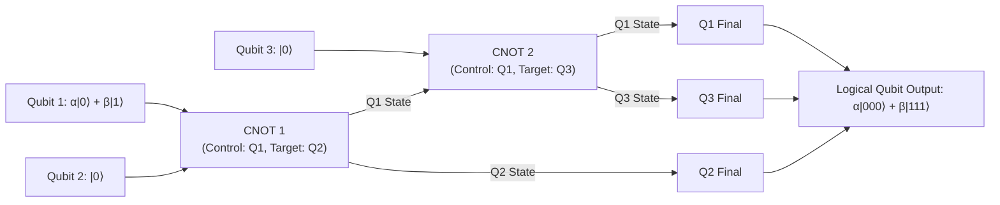
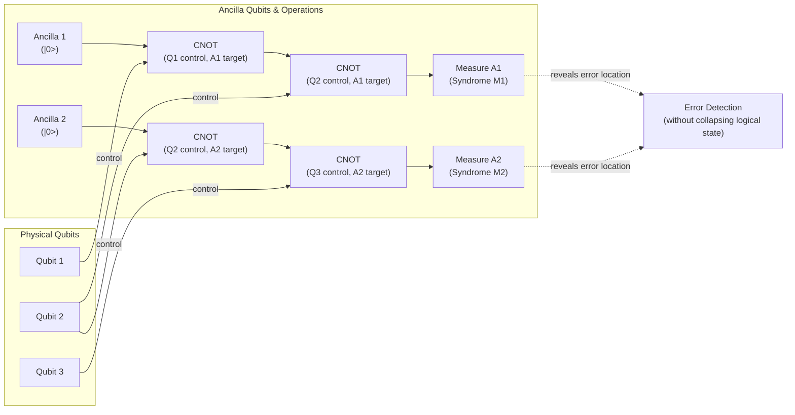

# How Space-Time Could Be a Quantum Error-Correcting Code

In 1994, mathematician Peter Shor introduced a quantum algorithm that could factor large numbers exponentially faster than any known classical computer, threatening to break much of modern cryptography. This discovery brought immediate fame to the hypothetical "quantum computer." However, a fundamental problem stood in the way of building one: the innate frailty of its physical components. This tension between the immense power of quantum mechanics and its extreme fragility set the stage for a second discovery, one that would not only make quantum computing conceivable but also, decades later, reveal an unexpected connection to the very fabric of space and time.

This article explores the unexpected unity between quantum error correction—the mathematical framework that makes scalable quantum computing possible—and the emergence of space-time geometry in holographic theories of quantum gravity. We will see how the same principles that protect fragile quantum information from noise also appear to be what gives space-time its intrinsic robustness.

We will begin by examining the core challenge of quantum computing and the breakthrough that made it seem possible. We will then dive into the mechanics of quantum error-correcting codes, building the intuition needed to see how these same structures reappear in physics. From there, we will explore the 2014 conjecture that space-time itself is a quantum code, using toy models to make this idea concrete. Finally, we will investigate what this means for black holes, where the theory is pushed to its limits, and consider the implications for both fundamental physics and the future of computing.

## The Quantum Computing Challenge and the Discovery of a Cosmic Connection

The theoretical power of quantum computers comes from their use of "qubits." Unlike classical bits, which are always in a definite state of 0 or 1, a qubit can exist in a "superposition" of both states at once, described as |ψ⟩ = α|0⟩ + β|1⟩. When multiple qubits interact, they become "entangled," meaning their states become interdependent. An n-qubit register can exist in a superposition of all 2ⁿ possible classical states simultaneously, enabling a level of parallelism that is impossible for classical computers, which can only occupy one of these 2ⁿ states at a time. Shor's algorithm masterfully exploits this parallelism to find the period of a function, a task that solves factoring efficiently [[1]](https://people.eecs.berkeley.edu/~jswright/quantumcodingtheory24/scribe%20notes/lecture01.pdf).

However, this power comes at the cost of extreme fragility. The slightest interaction with the environment—a stray magnetic field or a microwave pulse—can corrupt the qubits. These errors come in two main forms: "bit-flips," which swap the probabilities of |0⟩ and |1⟩, and "phase-flips," which invert the mathematical relationship between the two states. Crucially, you cannot simply measure the qubits to check for errors, as any direct measurement collapses the superposition, destroying the very quantum computation you are trying to protect. For years, this led to widespread skepticism; it seemed impossible that any large-scale quantum circuit could run before its information dissolved into noise.

In 1995, Shor delivered another breakthrough: a proof that "quantum error-correcting codes" (QEC) could exist [[2]](https://en.wikipedia.org/wiki/Quantum_error_correction). A year later, researchers including Dorit Aharonov and Michael Ben-Or independently proved the **threshold theorem**. This theorem states that if the error rate of individual quantum gates is below a certain constant threshold, a quantum computer can perform arbitrarily long computations by actively correcting errors faster than they accumulate [[3]](https://en.wikipedia.org/wiki/Threshold_theorem), [[1]](https://people.eecs.berkeley.edu/~jswright/quantumcodingtheory24/scribe%20notes/lecture01.pdf). This discovery was pivotal. As quantum computer scientist Scott Aaronson noted, "This was the central discovery in the ’90s that convinced people that scalable quantum computing should be possible at all... that it is merely a staggering problem of engineering" [[4]](https://www.quantamagazine.org/how-space-and-time-could-be-a-quantum-error-correcting-code-20190103). The effort to design better codes to handle the high error rates of real qubits remains "one of the major thrusts of the field" [[4]](https://www.quantamagazine.org/how-space-and-time-could-be-a-quantum-error-correcting-code-20190103).

For nearly two decades, QEC remained a specialized topic within quantum computing. Then, in 2014, a trio of young quantum gravity researchers—Ahmed Almheiri, Xi Dong, and Daniel Harlow—proposed a stunning connection. They suggested that the holographic principle in Anti-de Sitter (AdS) space, where a theory of gravity in a volume of space emerges from a quantum field theory on its boundary, works just like a quantum error-correcting code [[5]](https://doi.org/10.1007/JHEP04(2015)163). Their seminal paper argued that in these holographic universes, space-time itself is a code, triggering a wave of activity in the quantum gravity community [[4]](https://www.quantamagazine.org/how-space-and-time-could-be-a-quantum-error-correcting-code-20190103).

This idea provides a deep explanation for a common-sense observation. As Caltech physicist John Preskill puts it, quantum error correction explains how space-time achieves its "intrinsic robustness" despite being woven from fragile quantum interactions. "We’re not walking on eggshells to make sure we don’t make the geometry fall apart," Preskill said. "I think this connection with quantum error correction is the deepest explanation we have for why that’s the case" [[4]](https://www.quantamagazine.org/how-space-and-time-could-be-a-quantum-error-correcting-code-20190103). The emergent geometry is an error-protected logical property, where small, local errors in the boundary theory correspond to correctable errors that leave the bulk space-time unchanged.

This connection creates a bidirectional hope. On one hand, the language of QEC offers a new toolkit for tackling long-standing puzzles in quantum gravity, particularly those concerning black holes. On the other, the structure of space-time might inspire new, more efficient quantum codes for practical computers. Almheiri noted, "Space-time is a lot smarter than us. The kind of quantum error-correcting code which is implemented in these constructions is a very efficient code" [[4]](https://www.quantamagazine.org/how-space-and-time-could-be-a-quantum-error-correcting-code-20190103).

With the Almheiri-Dong-Harlow conjecture establishing that holographic space-time behaves as a quantum error-correcting code, we now examine the concrete mechanics of how such codes protect logical information. This will allow us to recognize the same mathematical signatures when they reappear in the bulk geometry of AdS.

## How Quantum Error-Correcting Codes Work

The core trick behind quantum error correction is to store information not in individual qubits, but in the patterns of entanglement among many. Instead of entrusting information to a single fragile particle, a logical qubit is encoded across a group of physical qubits in a highly entangled state. This non-local encoding ensures that no single physical qubit holds any information about the logical state, protecting it from local errors [[6]](https://www.cl.cam.ac.uk/teaching/1920/QuantComp/Quantum_Computing_Lecture_13.pdf).

A simple example is the **three-qubit bit-flip code**. While not a complete solution, as it only protects against bit-flips and not phase-flips, it is instructive for understanding the basic mechanism [[4]](https://www.quantamagazine.org/how-space-and-time-could-be-a-quantum-error-correcting-code-20190103). Here, the logical state |0⟩ is encoded as the three-qubit state |000⟩, and the logical state |1⟩ is encoded as |111⟩. A general logical state α|0⟩ + β|1⟩ becomes the entangled superposition α|000⟩ + β|111⟩ [[6]](https://www.cl.cam.ac.uk/teaching/1920/QuantComp/Quantum_Computing_Lecture_13.pdf), [[7]](https://learn.microsoft.com/en-us/azure/quantum/concepts-error-correction). This encoding is achieved using a quantum circuit with CNOT gates, as shown in Image 1.

Image 1: A quantum circuit diagram illustrating the encoding of a single logical qubit into three physical qubits using the three-qubit bit-flip code.

But how do we detect an error without measuring and destroying the logical state? The solution is to use extra "ancilla" qubits to perform parity checks. One gate checks if the first and second qubits are the same, and another checks the first and third. This process, known as syndrome extraction, reveals only the error's location, not the logical state itself [[8]](https://www.quantamagazine.org/wp-content/uploads/2019/01/Qubit-Errors_560.jpg). The circuit for these checks is shown in Image 2.

Image 2: A quantum circuit diagram illustrating parity-check measurements for detecting single bit-flip errors in the three-qubit bit-flip code.

The results of the parity checks, or syndromes, give a unique signature for each possible single-qubit error:
-   **No error:** Both pairs match.
-   **Qubit 1 flips:** Both pairs do not match.
-   **Qubit 2 flips:** The first pair does not match, the second does.
-   **Qubit 3 flips:** The first pair matches, the second does not.

Based on this syndrome, a corrective operation (another bit-flip) can be applied to the erroneous qubit, restoring the original logical state without ever having measured it directly [[4]](https://www.quantamagazine.org/how-space-and-time-could-be-a-quantum-error-correcting-code-20190103).

The best QEC codes can recover all encoded information from slightly more than half of the physical qubits, even if the rest are lost. This "more than half" property was the key insight that hinted to Almheiri, Dong, and Harlow that a connection to holography might exist [[4]](https://www.quantamagazine.org/how-space-and-time-could-be-a-quantum-error-correcting-code-20190103).

Equipped with this mechanical understanding, we can now see how these same principles manifest in the geometry of space-time via the holographic principle.

## The Holographic Principle and Space-Time Emerges as a Quantum Error-Correcting Code

To understand the connection between QEC and gravity, we must first visit the theoretical playground where it was discovered: **Anti-de Sitter (AdS) space**. Our universe is described by a "de Sitter" geometry, which has a positive vacuum energy causing it to expand. In contrast, AdS space has negative vacuum energy, giving it a hyperbolic geometry like one of M.C. Escher's *Circle Limit* designs, where tessellated creatures shrink as they approach the circular boundary [[4]](https://www.quantamagazine.org/how-space-and-time-could-be-a-quantum-error-correcting-code-20190103). This boundary is crucial. In 1997, physicist Juan Maldacena discovered the AdS/CFT correspondence, a duality showing that the gravitational physics within the bulk of AdS space is equivalent to a non-gravitational quantum field theory (the Conformal Field Theory, or CFT) living on its lower-dimensional boundary [[9]](https://www.youtube.com/watch?v=IIHucC-HPz0). The bendy space-time fabric inside is a holographic projection of entangled particles on the surface.

https://www.quantamagazine.org/wp-content/uploads/2019/01/Escher_1000.jpg
Image 3: M.C. Escher's 1959 woodcut, Circle Limit III, which illustrates the hyperbolic geometry also found in Anti-de Sitter space. (Source [https://en.wikipedia.org/wiki/Circle_Limit_III#/media/File:Escher_Circle_Limit_III.jpg](https://en.wikipedia.org/wiki/Circle_Limit_III#/media/File:Escher_Circle_Limit_III.jpg))

It was while exploring this duality that Almheiri, Dong, and Harlow noticed the parallel to QEC. They found that any point in the interior of AdS space could be reconstructed from just over half of the boundary degrees of freedom—the same property seen in optimal error-correcting codes [[4]](https://www.quantamagazine.org/how-space-and-time-could-be-a-quantum-error-correcting-code-20190103). In their 2014 paper, they proposed a minimal toy model of this holographic code: a single logical "qutrit" (a three-state particle) at the center of a 2D disk, encoded in the entanglement of three physical qutrits on the boundary circle. This simple **three-qutrit code** protects the central bulk point against the erasure of any one of the boundary qutrits [[10]](https://errorcorrectionzoo.org/list/holographic), [[5]](https://doi.org/10.1007/JHEP04(2015)163).

To model an entire space-time, researchers turned to **tensor networks**, a tool originally developed in condensed matter physics to describe the entanglement structure of quantum many-body systems [[11]](https://ui.adsabs.harvard.edu/abs/2021QS%26T....6c3002J/abstract). In 2015, a team including Harlow and Preskill developed the **HaPPY code**, which builds a holographic geometry from a network of "perfect tensors" arranged on a hyperbolic tiling of pentagons [[12]](https://doi.org/10.1007/JHEP06(2015)149). Each tensor acts as a small, local error-correcting code, and contracting them together creates the bulk space-time from the boundary qubits, much like "little Tinkertoys" building the fabric of space [[4]](https://www.quantamagazine.org/how-space-and-time-could-be-a-quantum-error-correcting-code-20190103).

```mermaid
graph TD
    subgraph "HaPPY Tensor-Network Code Architecture"
        %% Central Perfect Tensor
        P0["Perfect Tensor<br/>(Central Pentagon)<br/>Bulk Logical Degrees of Freedom"]

        %% Layer 1 of Pentagonal Tiles
        subgraph "Layer 1: Inner Network Tiles"
            L1_1["Pentagonal Tile 1"]
            L1_2["Pentagonal Tile 2"]
            L1_3["Pentagonal Tile 3"]
            L1_4["Pentagonal Tile 4"]
            L1_5["Pentagonal Tile 5"]
        end

        %% Layer 2 of Pentagonal Tiles (more tiles, showing expansion)
        subgraph "Layer 2: Outer Network Tiles"
            L2_A["Pentagonal Tile A"]
            L2_B["Pentagonal Tile B"]
            L2_C["Pentagonal Tile C"]
            L2_D["Pentagonal Tile D"]
            L2_E["Pentagonal Tile E"]
            L2_F["Pentagonal Tile F"]
            L2_G["Pentagonal Tile G"]
            L2_H["Pentagonal Tile H"]
            L2_I["Pentagonal Tile I"]
            L2_J["Pentagonal Tile J"]
        end

        %% Boundary
        Boundary["Boundary Physical Degrees of Freedom"]

        %% Connections from Central to Layer 1
        P0 -- "contracts with" --> L1_1
        P0 -- "contracts with" --> L1_2
        P0 -- "contracts with" --> L1_3
        P0 -- "contracts with" --> L1_4
        P0 -- "contracts with" --> L1_5

        %% Interconnections within Layer 1 (to show "interconnected network")
        L1_1 -- "interconnects" --> L1_2
        L1_2 -- "interconnects" --> L1_3
        L1_3 -- "interconnects" --> L1_4
        L1_4 -- "interconnects" --> L1_5
        L1_5 -- "interconnects" --> L1_1

        %% Connections from Layer 1 to Layer 2 (showing expansion for hyperbolic tiling)
        L1_1 -- "contracts with" --> L2_A
        L1_1 -- "contracts with" --> L2_B
        L1_2 -- "contracts with" --> L2_B
        L1_2 -- "contracts with" --> L2_C
        L1_3 -- "contracts with" --> L2_C
        L1_3 -- "contracts with" --> L2_D
        L1_4 -- "contracts with" --> L2_D
        L1_4 -- "contracts with" --> L2_E
        L1_5 -- "contracts with" --> L2_E
        L1_5 -- "contracts with" --> L2_F
        L1_1 -- "contracts with" --> L2_G
        L1_2 -- "contracts with" --> L2_H
        L1_3 -- "contracts with" --> L2_I
        L1_4 -- "contracts with" --> L2_J

        %% Interconnections within Layer 2
        L2_A -- "interconnects" --> L2_B
        L2_B -- "interconnects" --> L2_C
        L2_C -- "interconnects" --> L2_D
        L2_D -- "interconnects" --> L2_E
        L2_E -- "interconnects" --> L2_F
        L2_F -- "interconnects" --> L2_G
        L2_G -- "interconnects" --> L2_H
        L2_H -- "interconnects" --> L2_I
        L2_I -- "interconnects" --> L2_J
        L2_J -- "interconnects" --> L2_A

        %% Connections from Layer 2 to Boundary
        L2_A -- "connects to" --> Boundary
        L2_B -- "connects to" --> Boundary
        L2_C -- "connects to" --> Boundary
        L2_D -- "connects to" --> Boundary
        L2_E -- "connects to" --> Boundary
        L2_F -- "connects to" --> Boundary
        L2_G -- "connects to" --> Boundary
        L2_H -- "connects to" --> Boundary
        L2_I -- "connects to" --> Boundary
        L2_J -- "connects to" --> Boundary
    end
```

Image 4: Architecture diagram of the HaPPY tensor-network code, illustrating its structure with a central perfect tensor, layers of pentagonal tiles, and connections to the boundary, representing AdS₂ geometry and holographic QEC principles.

In the HaPPY code, any bulk operator inside a region called the "entanglement wedge" can be reconstructed from the qubits on the adjacent part of the boundary. Since different boundary regions have overlapping entanglement wedges, a single bulk operator can be reconstructed from many different subsets of boundary qubits. This redundancy is the hallmark of error correction [[12]](https://doi.org/10.1007/JHEP06(2015)149). However, these perfect codes have a significant limitation: their boundary states do not exhibit the smoothly decaying correlation functions expected of physical theories. More recent models, like hyperinvariant tensor networks, relax the "perfect" condition to better match boundary physics while introducing a state-dependent breakdown of perfect error correction, a feature expected from quantum gravity corrections [[13]](https://www.nature.com/articles/s41467-023-42743-z).

The general lesson is profound. "Quantum error correction gives us a more general way of thinking about geometry in this code language," said Preskill. He believes this language "ought to be applicable... to more general situations"—including a de Sitter universe like ours [[4]](https://www.quantamagazine.org/how-space-and-time-could-be-a-quantum-error-correcting-code-20190103). For now, researchers are sticking with AdS space, which is simpler but shares key properties with our universe, most importantly, the existence of black holes. As Daniel Harlow noted, "The most fundamental property of gravity is that there are black holes... That’s what makes gravity different from all the other forces. That’s why quantum gravity is hard" [[4]](https://www.quantamagazine.org/how-space-and-time-could-be-a-quantum-error-correcting-code-20190103).

## Black Holes: Where Correctability Breaks Down

The same QEC structure that protects smooth AdS geometry fails in the presence of black holes. In the language of quantum error correction, a black hole represents a catastrophic breakdown of correctability. As Patrick Hayden explains, "When there are so many errors that you can no longer keep track of what’s going on in the bulk [space-time] anymore, you get a black hole. It’s like a sink for your ignorance" [[4]](https://www.quantamagazine.org/how-space-and-time-could-be-a-quantum-error-correcting-code-20190103).

This breakdown is at the heart of Stephen Hawking's 1974 discovery that black holes radiate heat and eventually evaporate. His calculation showed this "Hawking radiation" to be thermal, meaning it carries no information about what fell into the black hole. This created the famous **information paradox**: if a pure quantum state collapses into a black hole that then evaporates into a mixed state of thermal radiation, information is lost, and a fundamental principle of quantum mechanics (unitarity) is violated. The effort to resolve this paradox has been a key driver for connecting gravity with quantum information theory [[14]](https://link.springer.com/article/10.1140/epjc/s10052-022-10382-1). A complete theory of quantum gravity must explain how this information gets out.

In the holographic context, this paradox sharpened into the **firewall paradox** of 2012 [[15]](https://doi.org/10.1007/JHEP02(2013)062). The argument showed a conflict between a smooth event horizon and the principle of "monogamy of entanglement," which forbids a quantum system from being maximally entangled with two others at once. If late Hawking radiation is entangled with early radiation (to save unitarity), it cannot also be entangled with its interior partner particle (to ensure a smooth horizon), leading to a "firewall" of high-energy particles.

Quantum error correction provides the language for the resolution. The modern understanding is that the information does get out, but only after a certain point in the evaporation process. This is described by the **quantum extremal surface (QES)** formula, which refines the holographic entropy calculation. Early in the black hole's life, the radiation's entanglement entropy grows. But at the "Page time" (roughly halfway through evaporation), a new QES forms just inside the horizon. This surface defines a region called an "island," which is part of the radiation's entanglement wedge despite being deep inside the black hole [[16]](https://adscft.org/black-hole-information/holographic-entropy/quantum-extremal-surfaces). The information inside the island can be reconstructed from the radiation, allowing it to escape without violating locality or creating a firewall. The QEC code of space-time dynamically changes its structure to allow for this reconstruction.

## Implications for Our Universe and Quantum Computing

The deep connection between quantum gravity and quantum error correction is more than a theoretical curiosity; it has sparked interest in both physics and computer science. The U.S. Department of Defense is funding research into holographic codes, partly in the hope that their geometric structure and tunable rates might lead to more efficient and robust QEC schemes for practical quantum computers [[4]](https://www.quantamagazine.org/how-space-and-time-could-be-a-quantum-error-correcting-code-20190103), [[17]](https://indico.global/event/15522/contributions/140949/attachments/65726/127087/ISM%20talk%20Jahn.pdf).

On the physics side, a major challenge remains: lifting these insights from AdS space to a realistic de Sitter cosmology. Our universe has a positive cosmological constant, and thus lacks the well-defined spatial boundary at infinity that makes AdS holography tractable [[18]](https://fys.kuleuven.be/itf/groups/hep/files/phd/ruben-monten-thesis-public.pdf). Nevertheless, researchers are exploring new avenues, such as constructing dS geometry from non-unitary tensor networks which naturally produce a time-like emergent dimension [[19]](https://arxiv.org/html/2606.17983v1). Some are even using machine learning algorithms to help discover new holographic dualities [[20]](https://www.riken.jp/en/news_pubs/research_news/rr/20220411_1).

The journey from the fragility of a single qubit to the robustness of space-time reveals a profound principle. Entanglement is not just a strange quantum correlation; it is the very "glue" that holds space together. As John Preskill summarized, "If you want to weave space-time together out of little pieces, you have to entangle them in the right way. And the right way is to build a quantum error-correcting code" [[4]](https://www.quantamagazine.org/how-space-and-time-could-be-a-quantum-error-correcting-code-20190103).

## Conclusion

The discovery that space-time may be a quantum error-correcting code represents a remarkable convergence of quantum information theory and fundamental physics. What began as a pragmatic solution to an engineering problem—how to build a reliable computer from unreliable parts—has provided a new language for describing the emergence of gravity and geometry. The fragility that once seemed like an insurmountable obstacle to quantum computing turns out to be the key to understanding the resilience of our universe.

This perspective reframes entanglement as the fundamental ingredient that weaves the fabric of reality, with the laws of quantum error correction dictating the geometric rules. While the full picture is still emerging, particularly for our own de Sitter universe, this powerful idea continues to guide us toward a deeper understanding of both the cosmos and the future of computation.

## References

- [1] Wright, J. (2024). Lecture 1: Introduction. EECS at UC Berkeley. [https://people.eecs.berkeley.edu/~jswright/quantumcodingtheory24/scribe%20notes/lecture01.pdf](https://people.eecs.berkeley.edu/~jswright/quantumcodingtheory24/scribe%20notes/lecture01.pdf)
- [2] Quantum error correction. (n.d.). Wikipedia. [https://en.wikipedia.org/wiki/Quantum_error_correction](https://en.wikipedia.org/wiki/Quantum_error_correction)
- [3] Threshold theorem. (n.d.). Wikipedia. [https://en.wikipedia.org/wiki/Threshold_theorem](https://en.wikipedia.org/wiki/Threshold_theorem)
- [4] Wolchover, N. (2019, January 3). How Space and Time Could Be a Quantum Error-Correcting Code. *Quanta Magazine*. [https://www.quantamagazine.org/how-space-and-time-could-be-a-quantum-error-correcting-code-20190103](https://www.quantamagazine.org/how-space-and-time-could-be-a-quantum-error-correcting-code-20190103)
- [5] Almheiri, A., Dong, X., & Harlow, D. (2015). Bulk locality and quantum error correction in AdS/CFT. *Journal of High Energy Physics*. [https://doi.org/10.1007/JHEP04(2015)163](https://doi.org/10.1007/JHEP04(2015)163)
- [6] Arthurs, R. (2020). Lecture 13: Quantum Error Correction. University of Cambridge. [https://www.cl.cam.ac.uk/teaching/1920/QuantComp/Quantum_Computing_Lecture_13.pdf](https://www.cl.cam.ac.uk/teaching/1920/QuantComp/Quantum_Computing_Lecture_13.pdf)
- [7] Introduction to quantum error correction using repetition codes. (2024, May 22). Microsoft Azure. [https://learn.microsoft.com/en-us/azure/quantum/concepts-error-correction](https://learn.microsoft.com/en-us/azure/quantum/concepts-error-correction)
- [8] Quanta Magazine. (n.d.). Qubit-Errors_560.jpg. [https://www.quantamagazine.org/wp-content/uploads/2019/01/Qubit-Errors_560.jpg](https://www.quantamagazine.org/wp-content/uploads/2019/01/Qubit-Errors_560.jpg)
- [9] Driscoll, E. V. (2018, November 14). Albert Einstein, Holograms and Quantum Gravity. *Quanta Magazine*. [https://www.youtube.com/watch?v=IIHucC-HPz0](https://www.youtube.com/watch?v=IIHucC-HPz0)
- [10] Holographic codes. (n.d.). The Error Correction Zoo. [https://errorcorrectionzoo.org/list/holographic](https://errorcorrectionzoo.org/list/holographic)
- [11] Jahn, A., et al. (2021). Holographic tensor network models of black holes and cosmology. *Quantum Science and Technology*. [https://ui.adsabs.harvard.edu/abs/2021QS%26T....6c3002J/abstract](https://ui.adsabs.harvard.edu/abs/2021QS%26T....6c3002J/abstract)
- [12] Pastawski, F., Yoshida, B., Harlow, D., & Preskill, J. (2015). Holographic quantum error-correcting codes: toy models for the bulk/boundary correspondence. *Journal of High Energy Physics*. [https://doi.org/10.1007/JHEP06(2015)149](https://doi.org/10.1007/JHEP06(2015)149)
- [13] Steinberg, M., Feld, S., & Jahn, A. (2023). Holographic codes from hyperinvariant tensor networks. *Nature Communications*. [https://www.nature.com/articles/s41467-023-42743-z](https://www.nature.com/articles/s41467-023-42743-z)
- [14] Bhattacharjee, S. (2022). A review on the holographic connection between quantum error correction and bulk reconstruction. *The European Physical Journal C*. [https://link.springer.com/article/10.1140/epjc/s10052-022-10382-1](https://link.springer.com/article/10.1140/epjc/s10052-022-10382-1)
- [15] Almheiri, A., Marolf, D., Polchinski, J., & Sully, J. (2013). Black holes: complementarity or firewalls?. *Journal of High Energy Physics*. [https://doi.org/10.1007/JHEP02(2013)062](https://doi.org/10.1007/JHEP02(2013)062)
- [16] Quantum extremal surfaces. (n.d.). AdS/CFT Correspondence. [https://adscft.org/black-hole-information/holographic-entropy/quantum-extremal-surfaces](https://adscft.org/black-hole-information/holographic-entropy/quantum-extremal-surfaces)
- [17] Jahn, A. (2024). Holographic quantum error correction and simulation of quantum gravity. [https://indico.global/event/15522/contributions/140949/attachments/65726/127087/ISM%20talk%20Jahn.pdf](https://indico.global/event/15522/contributions/140949/attachments/65726/127087/ISM%20talk%20Jahn.pdf)
- [18] Monten, R. (2018). Quantum Information in de Sitter space. KU Leuven. [https://fys.kuleuven.be/itf/groups/hep/files/phd/ruben-monten-thesis-public.pdf](https://fys.kuleuven.be/itf/groups/hep/files/phd/ruben-monten-thesis-public.pdf)
- [19] Chou, K.-H., & Chang, P.-Y. (2024). Emergent de Sitter Space and Non-Unitary Tensor Networks from Non-Hermitian Quantum Criticality. arXiv. [https://arxiv.org/html/2606.17983v1](https://arxiv.org/html/2606.17983v1)
- [20] Applying deep learning to string theory. (2022, April 11). RIKEN. [https://www.riken.jp/en/news_pubs/research_news/rr/20220411_1](https://www.riken.jp/en/news_pubs/research_news/rr/20220411_1)