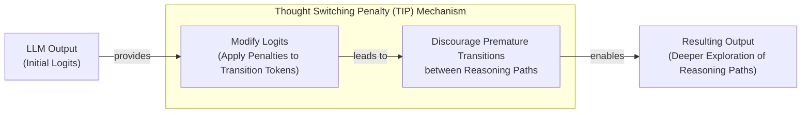
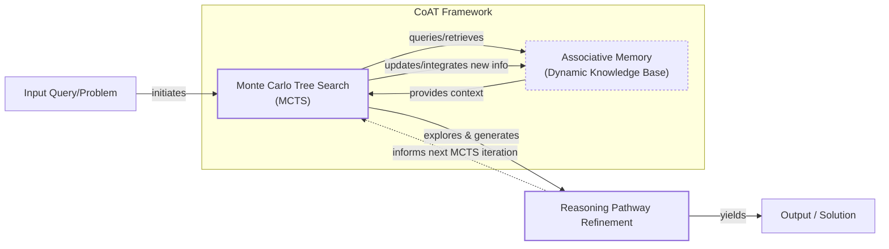
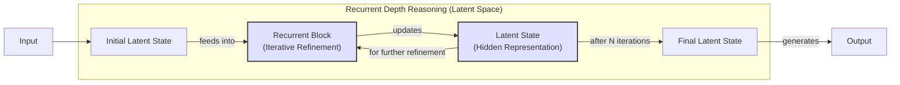
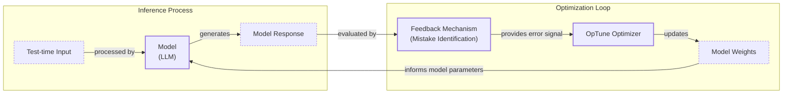
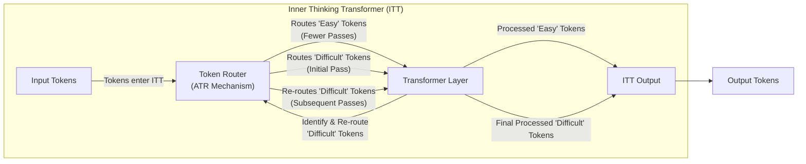
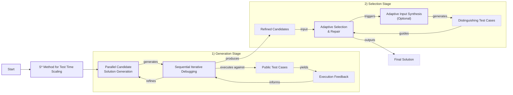
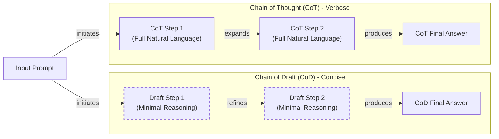
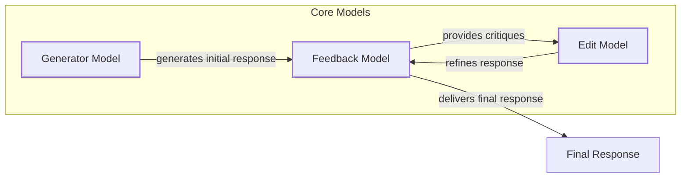

# Rethinking LLM Reasoning: A 2025 Guide to Inference-Time Compute Scaling

In 2025, building reliable AI agents is a top priority. As we move from simple chatbots to complex systems that can perform actions and manage long-term memory, the need for robust, multi-step reasoning has become critical. The direct-answer models that served us well for basic question-answering often fail when faced with tasks that require deep, sequential thought.

Following the release of models like DeepSeek-R1, the AI research community has accelerated its exploration of how to build better reasoners. This has led to a surge of new techniques that blend inference-time scaling, pure reinforcement learning (RL), hybrid RL with supervised fine-tuning (SFT), and SFT with distillation. This article focuses on one of these key areas: the methods that scale an LLM’s compute at inference time to improve its reasoning, without permanently changing its weights.

Image 1: The four main categories of implementing reasoning models. This article focuses on inference-time-scaling methods. (Source [magazine.sebastianraschka.com](https://magazine.sebastianraschka.com/p/understanding-reasoning-llms) [[1]](https://magazine.sebastianraschka.com/p/understanding-reasoning-llms))

We will now examine each of the four categories in detail so you can understand how inference-time scaling fits inside the broader landscape.

## Implementing and improving reasoning in LLMs: The four main categories

Reasoning models are a specialized class of LLMs designed to tackle complex problems by generating a "thought process" before delivering a final answer. This process can be explicit, appearing as intermediate steps in the response, or internal, where the model performs multiple computational rounds that are not shown to the user [[1]](https://magazine.sebastianraschka.com/p/understanding-reasoning-llms). This contrasts with standard LLMs, which typically map an input directly to an output in a single forward pass.

Image 2: A regular LLM may provide a short answer, whereas reasoning models typically include intermediate steps. (Source [magazine.sebastianraschka.com](https://magazine.sebastianraschka.com/p/understanding-reasoning-llms) [[1]](https://magazine.sebastianraschka.com/p/understanding-reasoning-llms))

We can improve an LLM's reasoning abilities in two fundamental ways: by increasing its training compute or its inference compute. Increasing training compute involves modifying the model's weights through methods like SFT or RL. This is a permanent change to the model itself. In contrast, increasing inference compute involves allocating extra FLOPs at test time to generate a better answer, without altering the model's weights. The simplest example of this is chain-of-thought (CoT) prompting, where adding a phrase like "Let's think step by step" encourages the model to generate more tokens, thereby using more compute to arrive at a solution [[2]](https://arxiv.org/abs/2205.11916), [[1]](https://magazine.sebastianraschka.com/p/understanding-reasoning-llms).

In practice, the most powerful systems often combine both approaches. A model is first prepared with extensive training to build strong foundational reasoning skills, and then at test time, it is given additional compute to "think" through difficult problems. This hybrid approach is necessary because training alone can lead to issues like reward hacking, where a model learns to exploit the reward function without genuinely improving its reasoning. On the other hand, applying pure inference scaling to a weak base model often yields limited gains [[1]](https://magazine.sebastianraschka.com/p/understanding-reasoning-llms).

Image 3: Accuracy improvements can be achieved through increased training or test-time compute, where test-time compute is synonymous with inference-time compute and inference-time scaling. (Source [arxiv.org](https://arxiv.org/abs/2502.14382) [[3]](https://arxiv.org/abs/2502.14382))

The development of reasoning models generally falls into four main categories, each representing a different strategy for balancing training and inference compute.

Image 4: The four main categories of reasoning model development. (Source [magazine.sebastianraschka.com](https://magazine.sebastianraschka.com/p/understanding-reasoning-llms) [[1]](https://magazine.sebastianraschka.com/p/understanding-reasoning-llms))

**1. Inference-time compute scaling** improves a model's performance without any additional training by allocating more computational resources during inference. This can be as simple as CoT prompting or involve more complex search and voting strategies. Models like OpenAI's o1 are suspected to heavily rely on this, which would explain their higher cost per token. While the DeepSeek R1 paper categorized many explicit inference-time methods like Process Reward Model-based search as "unsuccessful attempts," the model itself was trained to produce longer, more detailed responses. This serves as an *implicit* form of inference-time scaling, as it naturally increases the compute used at test time compared to its base model [[1]](https://magazine.sebastianraschka.com/p/understanding-reasoning-llms). This approach is attractive because it can be applied to already-trained models, but it increases operational costs and latency for every user query.

**2. Pure reinforcement learning (RL)** shows that reasoning can emerge as a learned behavior without any initial SFT. The DeepSeek-R1-Zero model demonstrated this by training the DeepSeek-V3 base model exclusively with RL. The rewards were based on the accuracy of the final answer and whether the output format was correct, such as placing reasoning steps inside `<think>` tags. This "cold start" approach, skipping the typical SFT stage, was enough for the model to develop basic reasoning skills and even led to an "Aha!" moment where it began generating its own reasoning traces [[1]](https://magazine.sebastianraschka.com/p/understanding-reasoning-llms). While this method offers insights into emergent behaviors, it is practically less effective than combining it with SFT, as it can be difficult to guide the model's exploration without some initial supervised examples.

**3. Reinforcement learning and supervised fine-tuning (RL + SFT)** is the approach used to build high-performance reasoning models like DeepSeek's flagship, DeepSeek-R1. This method improves upon the pure RL model by incorporating SFT stages. For DeepSeek-R1, the team first used the R1-Zero model to generate "cold-start" SFT data. They then used this data for instruction fine-tuning, followed by another RL stage with additional rewards, like a consistency reward to prevent language mixing. This was followed by another round of SFT data collection and a final RL stage that also included human preference labels, creating a powerful, well-rounded reasoning model [[1]](https://magazine.sebastianraschka.com/p/understanding-reasoning-llms). This is currently the key approach for building state-of-the-art reasoning models, as it combines the exploratory power of RL with the stability and guidance of supervised learning.

**4. Supervised fine-tuning (SFT) and model distillation** is an approach for creating smaller, more efficient reasoning models. In this context, "distillation" differs from the traditional deep learning method. Instead of training a student model on the logits of a larger teacher model, it refers to instruction fine-tuning smaller LLMs on an SFT dataset generated by a more powerful model. The DeepSeek team used this method to create the R1-Distill models, fine-tuning smaller Llama and Qwen models on the same SFT data used to train DeepSeek-R1. This approach serves as a cost-effective way to enhance the reasoning abilities of smaller models, showing how far pure SFT can go without RL [[1]](https://magazine.sebastianraschka.com/p/understanding-reasoning-llms). The main limitation is that it depends on an existing, stronger model to generate the training data, so it cannot be used to create the next generation of frontier models.

With these four categories now mapped, we will zoom in on the inference-time compute scaling branch that forms the core of this article.

## Inference-time compute scaling methods

The core idea behind inference-time compute scaling is that allowing an LLM to "think longer" on a problem can lead to better answers, much like how humans benefit from spending more time on difficult tasks.

The most classic approach is clever prompt engineering. CoT prompting, which uses phrases like "think step by step," is a prime example. This encourages the model to generate intermediate reasoning steps, which increases the number of output tokens. This, in turn, raises latency and the monetary cost of the API call, but it often leads to more accurate results on complex problems [[2]](https://arxiv.org/abs/2205.11916).

Image 5: An example of classic CoT prompting from the 2022 Large Language Models are Zero-Shot Reasoners paper. (Source [arxiv.org](https://arxiv.org/abs/2205.11916) [[2]](https://arxiv.org/abs/2205.11916))

More advanced techniques involve search and voting strategies. One simple method is majority voting, where the LLM generates multiple answers, and the most frequent one is selected. A more sophisticated approach is beam search, which explores multiple potential response paths at each step. These search algorithms are often guided by Process Reward Models (PRMs), which evaluate the quality of each intermediate step, helping the model navigate toward the most promising solution. These methods can be either parallel, like generating multiple independent answers, or sequential, like exploring a single reasoning path step-by-step [[1]](https://magazine.sebastianraschka.com/p/understanding-reasoning-llms). Many advanced search algorithms, such as Monte Carlo Tree Search (MCTS), are adapted from game AI like AlphaGo because they excel at balancing the exploration of new reasoning paths with the exploitation of promising ones [[4]](https://www.turingpost.com/p/testtimescaling2), [[5]](https://openreview.net/forum?id=h6CQPEYAVp).

Image 6: Different search-based methods rely on a process-reward-based model to select the best answer. (Source [arxiv.org](https://arxiv.org/abs/2408.03314) [[3]](https://arxiv.org/abs/2408.03314))

We will now examine a concrete recent instantiation of these ideas in the s1 paper, which combines curated traces with explicit length-control tokens.

## s1: Simple test-time scaling

The paper "s1: Simple Test-Time Scaling" presents a hybrid approach that combines a small, curated SFT dataset with an inference-time technique called budget forcing to achieve strong reasoning performance and test-time scalability [[6]](https://huggingface.co/papers/2501.19393). Unlike pure distillation, this method trains a model on just 1,000 high-quality reasoning traces and then uses a simple mechanism to control the length of its thought process during inference.

A key element of this approach is the use of "wait" tokens. When the model tries to conclude its reasoning prematurely, the system can suppress the end-of-thinking signal and instead append a "Wait" token to the generation. This encourages the model to pause, re-evaluate its current reasoning path, and potentially self-correct any errors before providing a final answer. This is in contrast to simply using an end-of-thinking delimiter to cut the process short when a certain token budget is reached. This technique is known as budget forcing, a sequential scaling method that directly controls the length of the output, unlike parallel methods like majority voting.

Image 7: Illustration of "wait" token insertion to control the length of the output. (Source [arxiv.org](https://arxiv.org/abs/2502.14382) [[3]](https://arxiv.org/abs/2502.14382))

The paper demonstrates that this simple trick can lead to significant performance improvements. For example, s1-32B, a Qwen2.5-32B-Instruct model fine-tuned on the 1,000-sample dataset (s1K), was able to extrapolate its performance on the AIME24 benchmark from 50% to 57% just by using budget forcing. The research also found a clear correlation between the length of the generated reasoning trace and the accuracy of the final answer, showing that more thinking time often leads to better results.

Image 8: Correlation between response accuracy and length. (Source [arxiv.org](https://arxiv.org/abs/2502.14382) [[3]](https://arxiv.org/abs/2502.14382))

The authors connect this mechanism to the "Aha moment" observed in the DeepSeek-R1 training, where the model spontaneously started to use words like "wait" to signal self-reflection. An empirical comparison in the s1 paper showed that appending "Wait" tokens led to better accuracy improvements than neutral phrases like "Hmm," suggesting that the "Wait" token specifically triggers a self-correction mechanism rather than just extending the reasoning time [[6]](https://huggingface.co/papers/2501.19393). The paper also acknowledges its limitations, calling for future work to compare budget forcing against other scaling methods like beam search, lookahead search, and compute-optimal search.

Image 9: "Wait" vs "Hmm" tokens. (Source [arxiv.org](https://arxiv.org/abs/2502.14382) [[3]](https://arxiv.org/abs/2502.14382))

## Other noteworthy research papers on inference-time compute scaling

The release of models like DeepSeek-R1 has sparked a wave of research into inference-time compute scaling. Given the sheer volume of recent papers, we will keep the individual summaries brief to cover a breadth of different approaches. A common pattern that emerges from this research is that many of the most effective methods are not purely prompt-based. Instead, they often blend some amount of training or fine-tuning with explicit mechanisms to control and regulate compute during inference. This is a key distinction from standard SFT or distillation approaches that might train a model to produce longer outputs but do not include active length regulation or a compute budget at test time. These hybrid methods give engineers more direct control over the trade-off between performance, latency, and cost, which is essential for building practical, production-ready AI systems.

## Test-Time Preference Optimization

"Test-Time Preference Optimization: On-the-Fly Alignment via Iterative Textual Feedback" introduces a pure inference-time method for aligning LLM outputs with human preferences without changing the model's underlying weights [[7]](https://icml.cc/virtual/2025/poster/46149). The process is iterative and happens on-the-fly for each query.

The framework operates in a four-step loop. First, the model generates multiple responses to a prompt. Second, a separate reward model scores these responses, identifying the best ("chosen") and worst ("rejected") ones. Third, the LLM is prompted to generate textual critiques, analyzing the strengths of the chosen response and the weaknesses of the rejected one. It also provides suggestions for improvement. Finally, these critiques and suggestions are used to guide the model in refining its output, and the loop repeats. This process allows the model to progressively improve its responses by learning from feedback at test time [[8]](https://proceedings.mlr.press/v267/li25ac.html).

Image 10: The four-step loop of Test-Time Preference Optimization. (Source [proceedings.mlr.press](https://proceedings.mlr.press/v267/li25ac.html) [[8]](https://proceedings.mlr.press/v267/li25ac.html))

## Thoughts Are All Over the Place

The paper "Thoughts Are All Over the Place: On the Underthinking of o1-Like LLMs" identifies a phenomenon called "underthinking" in reasoning models. This occurs when models frequently switch between different reasoning paths without sufficiently exploring any single one, which often leads to incorrect answers and reduced final accuracy [[9]](https://tldr.takara.ai/p/2501.18585).

To address this, the authors propose a decoding strategy called Thought Switching Penalty (TIP). This method applies penalties to the logits of tokens associated with thought transitions during inference. By discouraging the model from prematurely abandoning a promising line of reasoning, TIP encourages a deeper exploration of each path. This approach improves accuracy on challenging benchmarks without requiring any model fine-tuning, making it a lightweight, no-training-needed technique for enhancing reasoning performance [[10]](https://www.linkedin.com/pulse/thoughts-all-over-place-underthinking-o1-like-llms-vlad-bogolin-rhnme).


Image 11: Diagram illustrating the Thought Switching Penalty (TIP) method.

## Trading Inference-Time Compute for Adversarial Robustness

The paper "Trading Inference-Time Compute for Adversarial Robustness" investigates how increasing an LLM's "thinking time" affects its resilience to adversarial attacks [[11]](https://huggingface.co/papers/2501.18841). The research shows that, in many cases, allowing a model to use more inference-time compute significantly reduces the success rate of various attacks, even without any specific adversarial training. The paper presents empirical trade-off curves that illustrate this relationship, showing that as the defender's compute increases, the attacker's success probability often tends to zero [[12]](https://cdn.openai.com/papers/trading-inference-time-compute-for-adversarial-robustness-20250121_1.pdf).

However, the paper also highlights important exceptions where this method has limited gains. These exceptions often occur in scenarios involving policy ambiguity or when an attacker can exploit loopholes in the model's safety guidelines [[13]](https://openai.com/index/trading-inference-time-compute-for-adversarial-robustness). The authors also introduce two novel attack strategies designed to counteract the benefits of increased inference time: "Think Less," which tricks the model into reducing its computational effort, and "Nerd Sniping," which traps the model in unproductive thinking loops. The key takeaway is that while scaling inference compute is a valuable tool for improving LLM safety, it is not a complete solution on its own.

Image 12: Attack success probability as a function of attacker resources and defender's inference-time compute. (Source [openai.com](https://openai.com/index/trading-inference-time-compute-for-adversarial-robustness) [[13]](https://openai.com/index/trading-inference-time-compute-for-adversarial-robustness))

## Chain-of-Associated-Thoughts

The "CoAT: Chain-of-Associated-Thoughts Framework for Enhancing Large Language Models Reasoning" paper introduces a framework that combines MCTS with a dynamic "associative memory" [[14]](https://arxiv.org/html/2502.02390v3). The framework uses MCTS, a technique borrowed from game AI, to balance exploration of new reasoning paths with exploitation of the most promising ones [[5]](https://openreview.net/forum?id=h6CQPEYAVp). This memory acts as a real-time knowledge base during inference, allowing the model to revisit and refine earlier reasoning paths.

The key benefit of this approach is that it enables the model to incorporate newly generated information and adapt its reasoning without losing context. The MCTS algorithm systematically explores different reasoning pathways, while the associative memory helps maintain coherence and dynamically updates the model's knowledge base. This synergy allows for a more structured and adaptive exploration of the solution space at test time, leading to more accurate and comprehensive final outputs.


Image 13: Mermaid diagram illustrating the CoAT (Chain-of-Associated-Thoughts) framework, showing the interaction between Monte Carlo Tree Search (MCTS) and Associative Memory for systematic exploration and refinement of reasoning pathways.

## Step Back to Leap Forward

The paper "Step Back to Leap Forward: Self-Backtracking for Boosting Reasoning of Language Models" introduces a self-backtracking mechanism that teaches LLMs to recognize and correct their own mistakes during inference [[15]](https://arxiv.org/html/2502.04404v1). This is achieved through a two-phase process.

In the training phase, the model is taught to identify suboptimal reasoning paths by learning to generate a special `<backtrack>` token. This token signals that the current path is not promising and that a revision is needed. The key contribution, however, comes at inference time. The model leverages this learned ability to perform a tree-based search, dynamically exploring alternative reasoning trajectories whenever it encounters a suboptimal state.

A significant advantage of this approach is that it does not require an external reward model to guide the search, unlike many standard process-reward-guided methods. The model itself learns when and where to backtrack, allowing it to dynamically adjust its search depth and breadth. This internalization of the search process helps mitigate issues like inefficient overthinking and reduces reliance on auxiliary models, leading to more efficient and robust reasoning [[16]](https://ojs.aaai.org/index.php/AAAI/article/view/39986/43947).
```mermaid
flowchart LR
  %% Training Phase: Model learns when and where to revise
  subgraph "Training Phase: Learning Backtracking"
    TD["Training Data<br/>(Reasoning Paths + <backtrack> token)"]
    M["Model<br/>(LLM)"]
    GP["Generate Reasoning Path"]
    ISP["Identify Suboptimal Path"]
    IT["Introduce <backtrack> Token"]
    MLR["Model Learns Revision Strategy"]

    TD -- "feeds" --> M
    M -- "generates" --> GP
    GP -- "evaluated by" --> ISP
    ISP -- "signals" --> IT
    IT -- "guides" --> MLR
    MLR -- "updates weights" --> M
  end

  %% Inference Phase: Tree-based search leveraging learned backtracking
  subgraph "Inference Phase: Tree-based Search"
    SI["Start Inference<br/>(Tree Search)"]
    ECN["Explore Current Node/Path"]
    EPQ["Evaluate Path Quality"]
    ISP_Inf{"Is Path Suboptimal?"}
    TLB["Trigger Learned Backtracking"]
    RDP["Revisit Previous Decision Point"]
    ENT["Explore New Trajectories"]
    FR["Finalize Reasoning / Output"]

    SI --> ECN
    ECN -- "produces" --> EPQ
    EPQ -- "result" --> ISP_Inf

    ISP_Inf -- "Yes" --> TLB
    TLB -- "directs" --> RDP
    RDP -- "explores" --> ENT
    ENT -- "continues search" --> ECN

    ISP_Inf -- "No" --> FR
  end

  %% Connection between phases
  MLR -. "Learned Backtracking Capability" .-> TLB

  %% Visual Grouping (without custom styling)
  classDef trainingProcess
  classDef inferenceProcess
  classDef decision
  classDef token
  classDef output

  class TD,M,GP,ISP,MLR trainingProcess
  class IT token
  class SI,ECN,EPQ,TLB,RDP,ENT inferenceProcess
  class ISP_Inf decision
  class FR output
```

Image 14: Mermaid diagram illustrating the Self-Backtracking mechanism, showing both the training phase where the model learns to revise suboptimal paths using a <backtrack> token, and the inference phase where it leverages this learned capability for tree-based search and exploring alternative reasoning trajectories.

## Scaling up Test-Time Compute with Latent Reasoning

The paper "Scaling up Test-Time Compute with Latent Reasoning" explores an approach called recurrent depth, which allows a model to perform additional computation in its latent space rather than by generating more output tokens [[17]](https://huggingface.co/papers/2502.05171). This technique, a form of Adaptive Computation Time (ACT), iterates a recurrent block within the model’s architecture to refine hidden states before producing an output [[18]](https://arxiv.org/html/2508.16745v1). The architecture typically involves a prelude of layers to embed the input, the iterated block for thinking, and a coda to project the result back out [[19]](https://www.lesswrong.com/posts/pLnLSgWphqDbdorgi/on-recent-results-in-llm-latent-reasoning).

This method allows the model to "think" longer without increasing visible output length, but its major drawback is a lack of interpretability. The internal process is opaque, raising concerns that the model could produce unfaithful, post-hoc rationalizations or develop an unreadable internal language [[20]](https://flowshu.github.io/latent-reasoning-interpretability). It also reintroduces a classic RNN-style bottleneck, as the model must compress all intermediate results into a fixed-size hidden state [[19]](https://www.lesswrong.com/posts/pLnLSgWphqDbdorgi/on-recent-results-in-llm-latent-reasoning).


Image 15: Diagram illustrating the recurrent depth approach for scaling test-time compute with latent reasoning.

## Can a 1B LLM Surpass a 405B LLM?

The paper "Can 1B LLM Surpass a 405B LLM? Rethinking Compute-Optimal Test-Time Scaling" provides a systematic study of the interactions between inference-time scaling, PRMs, and problem difficulty [[21]](https://arxiv.org/abs/2502.06703). It introduces a "compute-optimal" scaling strategy, which adapts the inference budget based on the specific PRM being used, the size of the policy model, and the complexity of the task at hand.

The most striking finding from this research is the empirical evidence that a smaller model, when paired with the right scaling strategy, can outperform a much larger, unscaled model. For example, the paper reports that a 3B parameter LLM was able to outperform a 405B Llama 3 model on the MATH-500 and AIME24 benchmarks. This has significant implications for AI engineers, as it demonstrates that intelligently allocating inference compute can be a more efficient path to high performance than simply scaling up model size. This research directly informs the trade-off decisions between model size, training cost, inference latency, and accuracy.

Image 16: Compute-optimal scaling allows a 7B parameter model to outperform o1 and DeepSeek-R1. (Source [arxiv.org](https://arxiv.org/abs/2502.06703) [[21]](https://arxiv.org/abs/2502.06703))

## Learning to Reason from Feedback at Test-Time

The method described in "Inference-Time Computations for LLM Reasoning and Planning: A Benchmark and Insights" is challenging to classify as either a pure inference-time or training-time technique because it updates the model's weights *during* inference [[23]](https://www.arxiv.org/abs/2502.12521). It introduces an optimizer called OpTune, which adjusts the model's parameters based on mistakes it makes on previous, similar problems.

This approach is distinct from both sequential revision methods, which add failed attempts to the prompt context, and parallel sampling methods, which generate multiple independent answers. Instead of growing the context window with a history of errors, OpTune allows the model to "remember" its mistakes through lightweight weight updates. This has the benefit of learning from feedback without being constrained by the context length of the LLM. While it does modify the model, the changes are temporary and happen at test time, making it a unique hybrid approach that blurs the line between training and inference.


Image 17: Mermaid diagram illustrating the OpTune optimizer mechanism for learning to reason from feedback at test-time.

## Inference-Time Computations for LLM Reasoning and Planning

The paper "Inference-Time Computations for LLM Reasoning and Planning: A Benchmark and Insights" introduces Sys2Bench, a comprehensive benchmark for evaluating various inference-time techniques. The benchmark covers eleven diverse tasks across five categories: arithmetic, logical, commonsense, and algorithmic reasoning, as well as planning domains [[22]](https://github.com/usail-hkust/benchmark_inference_time_computation_LLM). It systematically tests methods like CoT, Tree-of-Thought, and Reasoning as Planning.

The key insight from this research is that no single inference-time technique consistently performs best across all task types. For example, while some methods excel at arithmetic reasoning, they may struggle with planning tasks. This finding forces engineers to move away from a one-size-fits-all approach and instead match specific scaling methods to the domains they are best suited for. The paper also provides a valuable analysis of the trade-offs between computational cost and performance gains for each technique [[22]](https://github.com/usail-hkust/benchmark_inference_time_computation_LLM).

Image 18: Results from the Sys2Bench benchmark, showing that no single inference method excels across all reasoning and planning tasks. (Source [arxiv.org](https://www.arxiv.org/abs/2502.12521) [[23]](https://www.arxiv.org/abs/2502.12521))

## Inner Thinking Transformer

The "Inner Thinking Transformer: Leveraging Dynamic Depth Scaling to Foster Adaptive Internal Thinking" paper introduces a novel architecture that enables dynamic depth scaling, moving away from a fixed number of transformer layers for every token [[24]](https://arxiv.org/html/2502.13842v1).

At its core is a mechanism called ATR. This technique identifies which tokens in an input are more "difficult" and require more processing. These difficult tokens are then routed through the same transformer layer multiple times, effectively increasing the computational budget for them. In contrast, simpler tokens may only pass through the layer once. This allows the model to allocate extra "thinking" effort precisely where it is needed, without lengthening the overall output sequence or increasing the model's parameter count [[25]](https://aclanthology.org/2025.acl-long.1369.pdf), [[26]](https://arxiv.org/pdf/2502.13842), [[27]](https://www.emergentmind.com/topics/inner-thinking-transformer-itt).


Image 19: Mermaid diagram illustrating the Adaptive Token Routing (ATR) mechanism within the Inner Thinking Transformer (ITT).

## Test Time Scaling for Code Generation

The paper "S\*: Test Time Scaling for Code Generation" proposes a hybrid method specialized for coding tasks that combines parallel generation of candidate solutions with sequential, iterative debugging.

The S\* framework operates in two main stages. The first is the generation stage, where multiple code samples are generated in parallel. Each of these samples is then executed against public test cases, and the resulting outputs and error messages are fed back to the model to iteratively refine the code. This is a form of sequential scaling that uses execution feedback to guide the debugging process.

The second stage is selection. After generating a set of refined candidates, the framework uses a technique called adaptive input synthesis. For any pair of solutions that both pass the public tests, an LLM is prompted to generate new, "distinguishing" test inputs that are likely to cause one of them to fail. These new inputs are then executed, and the results are used to make a final selection. This approach, which is connected to earlier Google research on optimal test-time compute, grounds the selection process in concrete execution feedback, leading to more robust and accurate identification of the correct solution.


Image 20: Mermaid diagram illustrating the S* (S-star) method for Test Time Scaling for Code Generation, depicting its two-stage hybrid process: Generation and Selection.

## Chain of Draft

The "Chain of Draft: Thinking Faster by Writing Less" paper starts with the observation that when humans solve problems, they often rely on concise drafts or shorthand notes rather than verbose, step-by-step explanations [[28]](https://arxiv.org/html/2502.18600v1). Inspired by this, the authors propose CoD prompting, a technique that encourages LLMs to generate minimal yet informative intermediate steps.

Instead of producing full natural language reasoning, CoD limits each reasoning step to a few words, often using equations or shorthand notation. This significantly reduces the number of tokens generated, leading to lower latency and reduced computational costs. Experiments on various reasoning benchmarks showed that CoD can match or even surpass the accuracy of full CoT, while using as little as 7.6% of the tokens [[29]](https://www.helicone.ai/blog/chain-of-draft), [[30]](https://www.analyticsvidhya.com/blog/2025/03/chain-of-draft), [[31]](https://medium.com/data-science-in-your-pocket/what-is-chain-of-drafts-bye-bye-chain-of-thoughts-76658d913169), [[32]](https://aws.amazon.com/blogs/machine-learning/move-beyond-chain-of-thought-with-chain-of-draft-on-amazon-bedrock). The main trade-off is the loss of human-readable reasoning traces, which can make debugging more difficult. This presents a clear choice for engineers: sacrifice detailed interpretability for gains in speed and cost-efficiency.


Image 21: A diagram illustrating the Chain of Draft (CoD) prompting strategy in contrast to Chain-of-Thought (CoT), highlighting CoD's concise and efficient intermediate reasoning steps.

## Better Feedback and Edit Models

A key challenge in applying inference-time scaling is that many tasks, like creative writing or high-level planning, are open-ended and lack easily verifiable answers. The paper "Dedicated Feedback and Edit Models Empower Inference-Time Scaling for Open-Ended General-Domain Tasks" addresses this by proposing a specialized, multi-model architecture [[33]](https://arxiv.org/html/2503.04378v1).

This approach decouples the generation process into three distinct models: a generator model that produces an initial response, a feedback model that provides critiques, and an edit model that refines the response based on the feedback. Each of these models is trained on large, human-annotated datasets tailored to its specific role—responses, critiques, and revisions. This specialization allows the feedback and edit models to produce higher-quality signals than a single, general-purpose model attempting a generic self-critique loop. The result is a more effective iterative refinement process during inference, which has been shown to achieve state-of-the-art performance on benchmarks like Arena Hard [[34]](https://liner.com/ko/review/dedicated-feedback-and-edit-models-empower-inferencetime-scaling-for-openended).


Image 22: System architecture of Dedicated Feedback and Edit Models for Inference-Time Scaling, showing an iterative refinement loop.

## Conclusion

Inference-time compute scaling has firmly established itself as a major research direction in 2025. Its appeal lies in its flexibility: these techniques can be applied to existing models without the need for permanent and costly weight modifications. This allows engineers to enhance the reasoning capabilities of off-the-shelf LLMs, turning them into more powerful problem-solvers. Throughout this article, we have surveyed a wide range of these methods. We have seen simple yet effective approaches like the "wait" tokens in the s1 paper and the Thought Switching Penalty, which provide fine-grained control over the reasoning process. We have also explored more complex strategies involving sophisticated search algorithms, iterative optimization loops, and dynamic architectural routing. Some techniques, like the Inner Thinking Transformer and latent reasoning, even push the computation into the model's hidden states, trading interpretability for efficiency.

A recurring and powerful finding across this body of research is that smaller models, when equipped with the right inference-time scaling strategy, can often rival or even exceed the performance of much larger models that lack such scaling. This is a critical insight for AI engineers, as it directly impacts the trade-offs between model size, training costs, inference latency, and final accuracy. It suggests a future where we may not always need to default to the largest available model, but can instead use smaller, more efficient models and give them more "thinking time" on demand. This shift has profound implications for the economics of deploying AI, as it opens the door to using less expensive, more accessible models for tasks that were previously thought to require massive, resource-intensive ones. The ability to get more out of less is a central theme in engineering, and inference-time scaling brings this principle squarely into the world of AI.

However, it is important to acknowledge the caveats. Increased inference compute directly translates to higher costs and increased latency, which can negatively impact the user experience, especially in real-time applications. Furthermore, as the Sys2Bench benchmark demonstrated, there is no universally best technique. The optimal method often depends on the specific task, whether it is arithmetic, logical reasoning, or planning. The choice of scaling strategy is not a one-size-fits-all decision but requires careful consideration of the problem domain. This means that as AI engineers, we must develop a deep understanding of the strengths and weaknesses of each method to make informed decisions.

As the industry moves forward, we are already seeing the emergence of "thinking-on-demand" toggles in APIs, which allow developers or even end-users to dial the amount of inference compute up or down depending on the difficulty of the task. This flexibility is a clear indicator of the direction the field is heading. We predict that in the near future, explicit reasoning will become the default mode of operation for advanced agentic systems, rather than an optional feature. The ability to dynamically allocate compute will be a standard feature, allowing systems to be both efficient on simple tasks and powerful on complex ones.

This article has focused exclusively on inference-time methods. In an upcoming article, we will shift our focus to train-time compute scaling, diving deep into advanced reinforcement learning techniques, hybrid RL and SFT approaches, and the latest in distillation methods for creating powerful, efficient reasoning models. The interplay between these two paradigms—how we train models and how we use them at inference—will continue to shape the future of AI, and understanding both is essential for any engineer looking to build the next generation of intelligent systems.

Image 23: Feedback and Edit Models enable effective Inference-Time scaling across various dimensions. (Source [arxiv.org](https://arxiv.org/html/2503.04378v1) [[33]](https://arxiv.org/html/2503.04378v1))

## References

- [1] Raschka, S. (2025). Understanding Reasoning LLMs. https://magazine.sebastianraschka.com/p/understanding-reasoning-llms
- [2] Kojima, T., et al. (2022). Large Language Models are Zero-Shot Reasoners. https://arxiv.org/abs/2205.11916
- [3] Snell, C., et al. (2025). Scaling LLM Test-Time Compute Optimally can be More Effective than Scaling Model Parameters. https://arxiv.org/abs/2502.14382
- [4] van der Maaten, L. (2024). Test-Time Compute Scaling for Language Models. The Turing Post. https://www.turingpost.com/p/testtimescaling2
- [5] Wang, L., et al. (2025). A Survey on Large Language Model based Search Agents. OpenReview. https://openreview.net/forum?id=h6CQPEYAVp
- [6] Muennighoff, N., et al. (2025). s1: Simple test-time scaling. https://huggingface.co/papers/2501.19393
- [7] Li, Y., et al. (2025). Test-Time Preference Optimization: On-the-Fly Alignment via Iterative Textual Feedback. https://icml.cc/virtual/2025/poster/46149
- [8] Li, Y., et al. (2025). Test-Time Preference Optimization: On-the-Fly Alignment via Iterative Textual Feedback. https://proceedings.mlr.press/v267/li25ac.html
- [9] Wang, Y., et al. (2025). Thoughts Are All Over the Place: On the Underthinking of o1-Like LLMs. https://tldr.takara.ai/p/2501.18585
- [10] Bogolin, V. (2025). Thoughts All Over the Place: On the Underthinking of o1-Like LLMs. https://www.linkedin.com/pulse/thoughts-all-over-place-underthinking-o1-like-llms-vlad-bogolin-rhnme
- [11] Zaremba, W., et al. (2025). Trading Inference-Time Compute for Adversarial Robustness. https://huggingface.co/papers/2501.18841
- [12] Zaremba, W., et al. (2025). TRADING INFERENCE-TIME COMPUTE FOR ADVERSARIAL ROBUSTNESS. https://cdn.openai.com/papers/trading-inference-time-compute-for-adversarial-robustness-20250121_1.pdf
- [13] Zaremba, W., et al. (2025). Trading inference-time compute for adversarial robustness. https://openai.com/index/trading-inference-time-compute-for-adversarial-robustness
- [14] Li, Z., et al. (2025). CoAT: Chain-of-Associated-Thoughts Framework for Enhancing Large Language Models Reasoning. https://arxiv.org/html/2502.02390v3
- [15] Tian, Z., et al. (2025). Step Back to Leap Forward: Self-Backtracking for Boosting Reasoning of Language Models. https://arxiv.org/html/2502.04404v1
- [16] Tian, Z., et al. (2025). Step Back to Leap Forward: Self-Backtracking for Boosting Reasoning of Language Models. https://ojs.aaai.org/index.php/AAAI/article/view/39986/43947
- [17] Geiping, J., et al. (2025). Scaling up Test-Time Compute with Latent Reasoning: A Recurrent Depth Approach. https://huggingface.co/papers/2502.05171
- [18] Merrill, W., & Sabharwal, A. (2023). The Expressive Power of Transformers with Chain of Thought. https://arxiv.org/html/2508.16745v1
- [19] Arike, R. (2025). On recent results in LLM latent reasoning. https://www.lesswrong.com/posts/pLnLSgWphqDbdorgi/on-recent-results-in-llm-latent-reasoning
- [20] Shavit, I. (2024). On Interpretability of Latent Reasoning. https://flowshu.github.io/latent-reasoning-interpretability
- [21] Liu, F., et al. (2025). Can 1B LLM Surpass 405B LLM? Rethinking Compute-Optimal Test-Time Scaling. https://arxiv.org/abs/2502.06703
- [22] Liu, F., et al. (2025). benchmark_inference_time_computation_LLM. https://github.com/usail-hkust/benchmark_inference_time_computation_LLM
- [23] Liu, F., et al. (2025). Inference-Time Computations for LLM Reasoning and Planning: A Benchmark and Insights. https://www.arxiv.org/abs/2502.12521
- [24] Chen, Y., et al. (2025). Inner Thinking Transformer: Leveraging Dynamic Depth Scaling to Foster Adaptive Internal Thinking. https://arxiv.org/html/2502.13842v1
- [25] Chen, Y., et al. (2025). Inner Thinking Transformer: Leveraging Dynamic Depth Scaling to Foster Adaptive Internal Thinking. https://aclanthology.org/2025.acl-long.1369.pdf
- [26] Chen, Y., et al. (2025). Inner Thinking Transformer: Leveraging Dynamic Depth Scaling to Foster Adaptive Internal Thinking. https://arxiv.org/pdf/2502.13842
- [27] Chen, Y., et al. (2025). Inner Thinking Transformer (ITT). https://www.emergentmind.com/topics/inner-thinking-transformer-itt
- [28] Lei, S., et al. (2025). Chain of Draft: Thinking Faster by Writing Less. https://arxiv.org/html/2502.18600v1
- [29] Helicone. (2025). Chain of Draft. https://www.helicone.ai/blog/chain-of-draft
- [30] Sharma, A. (2025). Chain of Draft. https://www.analyticsvidhya.com/blog/2025/03/chain-of-draft
- [31] Data Science In Your Pocket. (2025). What is Chain of Drafts?. https://medium.com/data-science-in-your-pocket/what-is-chain-of-drafts-bye-bye-chain-of-thoughts-76658d913169
- [32] AWS Machine Learning Blog. (2025). Move Beyond Chain-of-Thought with Chain-of-Draft on Amazon Bedrock. https://aws.amazon.com/blogs/machine-learning/move-beyond-chain-of-thought-with-chain-of-draft-on-amazon-bedrock
- [33] Wang, Z., et al. (2025). Dedicated Feedback and Edit Models Empower Inference-Time Scaling for Open-Ended General-Domain Tasks. https://arxiv.org/html/2503.04378v1
- [34] Wang, Z., et al. (2025). Dedicated Feedback and Edit Models Empower Inference-Time Scaling for Open-Ended General-Domain Tasks. https://liner.com/ko/review/dedicated-feedback-and-edit-models-empower-inferencetime-scaling-for-openended
</article>