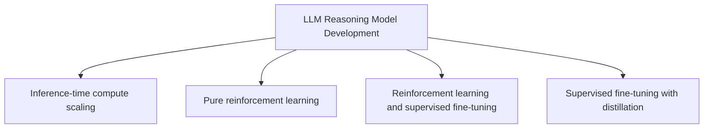
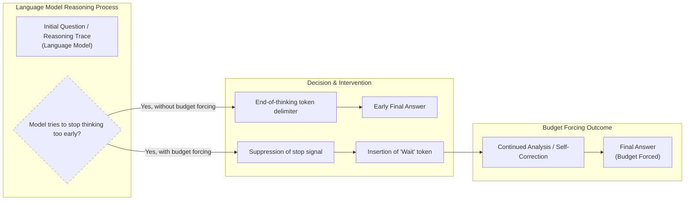
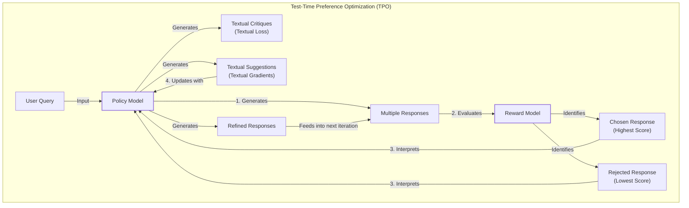
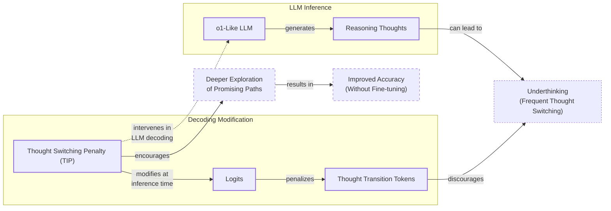
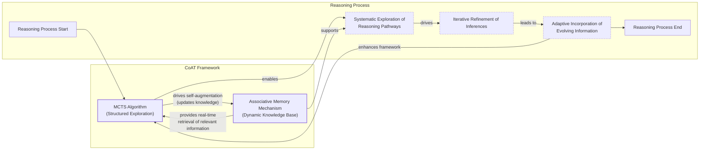
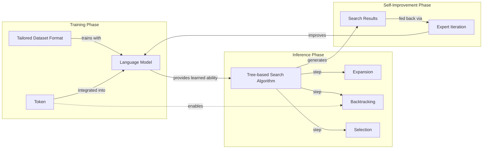
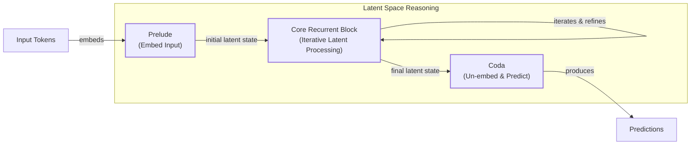
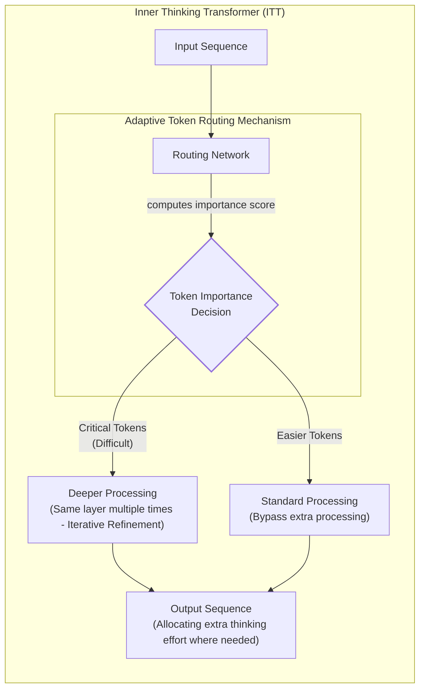
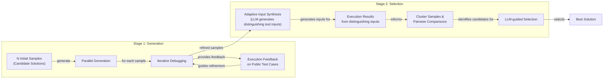
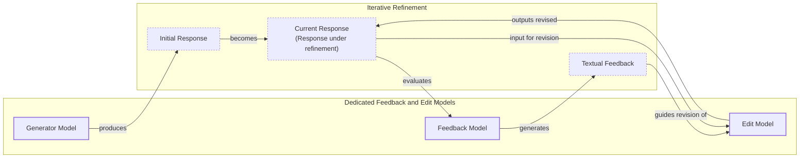

# Inference-Time Compute Scaling: A 2025 Research Update

Stronger LLM reasoning is a top priority in 2025. As we build more sophisticated agentic systems, we need models that can reliably perform multi-step problem-solving. Direct-answer models, which map an input to an output in a single forward pass, routinely fail at these complex user tasks. This has sparked a surge of research into new methods for enhancing reasoning, especially since the release of models like DeepSeek-R1.

The field is now a blend of four main approaches: inference-time compute scaling, pure reinforcement learning, hybrids of reinforcement learning and supervised fine-tuning, and supervised fine-tuning with distillation. While we will cover all these in future articles, this piece focuses on the first and arguably most flexible category: inference-time compute scaling. These techniques improve a model's performance by allowing it to "think longer" at the moment of inference, without permanently changing its weights.

Image 1: The four main categories of implementing reasoning models. This article focuses on inference-time-scaling methods.

We will survey 14 recent papers that showcase a wide range of methods for regulating and scaling test-time computation. We will start by examining the four main categories of reasoning model development to understand how inference-time scaling fits into the broader landscape.

## Implementing and improving reasoning in LLMs: The four main categories

Reasoning models are fundamentally different from the direct-answer LLMs we have grown accustomed to. Instead of mapping an input directly to an output in a single pass, they generate an intermediate thought process before producing a final answer. This process can be explicit, like a visible chain of thought, or internal, happening within the model's latent space [[24]](https://huggingface.co/papers/2502.05171). The goal is to break down complex problems into smaller, manageable steps, which has proven essential for tackling difficult reasoning tasks.

Image 2: Side-by-side comparison of a basic LLM's one-line answer and a reasoning LLM's explanatory response.

There are two primary ways to improve a model's performance: increasing training compute or increasing inference compute. Training compute involves modifying the model's weights through methods like reinforcement learning (RL) or supervised fine-tuning (SFT). This is a one-time, upfront investment. Inference compute, on the other hand, involves allocating extra FLOPs at test time to enhance performance on a specific query without altering the model's weights. The simplest example of this is chain-of-thought (CoT) prompting, where instructing a model to "think step by step" increases the number of tokens generated, and thus the compute used, to arrive at an answer [[33]](https://aclanthology.org/2025.emnlp-main.165.pdf).

Image 3: Accuracy improvements can be achieved through increased training or test-time compute, where test-time compute is synonymous with inference-time compute and inference-time scaling. (Source [o1 performance smoothly improves with both train-time and test-time compute](https://substackcdn.com/image/fetch/$s_!pgyl!,f_auto,q_auto:good,fl_progressive:steep/https%3A%2F%2Fsubstack-post-media.s3.amazonaws.com%2Fpublic%2Fimages%2Fddde6f39-3b88-4962-9d02-2cf767dc82e9_1484x994.png))

In practice, the best systems often combine both. Heavy train-time preparation equips the model with strong foundational capabilities, which are then amplified by test-time thinking. Relying on training alone can lead to issues like reward hacking, where the model learns to exploit the reward function without genuinely improving its reasoning. Conversely, applying pure inference scaling on a weak base model yields limited gains because the model lacks the underlying knowledge to reason effectively. The development of reasoning models generally falls into four main categories.



Image 4: A hierarchy of LLM Reasoning Model Development categories.

**Inference-time compute scaling** is the focus of this article. This approach enhances a model's reasoning capabilities by allocating more computational resources during inference without altering the model's parameters. This can be achieved through various techniques, including generating multiple reasoning paths and selecting the best one (Best-of-N), or using search algorithms like beam search to explore the solution space. Models like OpenAI's o1 have shown that performance can be significantly improved by scaling test-time compute. The DeepSeek R1 paper reported that their attempts with explicit inference-time methods were largely unsuccessful; however, the model does exhibit a form of implicit inference scaling through its training, which results in longer, more detailed responses and consequently higher inference costs.

**Pure reinforcement learning** aims to teach models reasoning from scratch, using only a reward signal based on the correctness of the final answer. This method, exemplified by DeepSeek-R1-Zero, avoids the need for human-annotated reasoning paths, allowing the model to discover novel problem-solving strategies. However, this approach faces significant challenges. It requires a reliable verifier to provide the reward signal, which is often only available for tasks with definitive answers, like math or coding. For more open-ended problems, creating a reliable verifier is difficult, and the model can be prone to "reward hacking," where it learns to achieve high rewards without actually improving its reasoning.

**Reinforcement learning and supervised fine-tuning** is a hybrid approach that combines the strengths of both methods. It typically starts with an SFT phase to provide the model with a strong baseline of reasoning ability, followed by an RL phase to further refine its performance. This is the approach used to create the final DeepSeek-R1 model. The initial SFT stage helps to align the model with human-like reasoning patterns and provides a good starting point for the RL training. The subsequent RL stage then allows the model to explore beyond the human-provided examples and discover more effective reasoning strategies.

**Supervised fine-tuning and model distillation** is the fourth category. This method involves training a smaller "student" model on the outputs of a larger, more capable "teacher" model. Unlike traditional distillation, which often focuses on mimicking the teacher's output probabilities, this approach uses the high-quality reasoning traces generated by the teacher model as training data. This allows the student model to learn the advanced reasoning patterns of the teacher, often achieving performance far beyond what would be possible with its smaller size. The DeepSeek-R1-Distill series, for example, uses this technique to create smaller, more efficient models with strong reasoning capabilities [[16]](https://magazine.sebastianraschka.com/p/understanding-reasoning-llms).

With these four categories mapped out, we will now zoom in on the inference-time compute scaling branch, which forms the core of this article.

## Inference-time compute scaling methods

The core idea behind inference-time compute scaling is simple: allowing a model to "think longer" on a problem often leads to better results, much like how humans spend more time on difficult tasks. The most straightforward way to achieve this is through classic prompt engineering techniques like Chain-of-Thought (CoT). By adding a simple phrase like "Let's think step by step," we prompt the model to generate a detailed reasoning process before giving a final answer.

Image 5: An example of classic CoT prompting. (Source [Kojima et al. (2022)](https://arxiv.org/abs/2205.11916))

While effective, this approach directly increases the number of tokens generated, which in turn raises latency and monetary costs [[32]](https://tianpan.co/blog/2026-04-10-token-economics-chain-of-thought-when-thinking-costs-more). More advanced techniques aim to allocate this additional compute more strategically. These methods often fall into two categories: search strategies and voting strategies. Both typically rely on a Process Reward Model (PRM), which evaluates the correctness of each intermediate step in a reasoning chain, rather than just the final answer [[40]](https://cdn.openai.com/improving-mathematical-reasoning-with-process-supervision/Lets_Verify_Step_by_Step.pdf).

```mermaid
flowchart LR
  %% Best-of-N Method
  subgraph "Best-of-N"
    Q_BoN["Question"]
    Q_BoN --> Gen_A1["Generate Answer 1"]
    Q_BoN --> Gen_A2["Generate Answer 2"]
    Q_BoN --> Gen_AN["Generate Answer N"]
    
    Gen_A1 -- "Candidate Answer" --> PRM_BoN["Process Reward Model (PRM)<br/>(Score & Select Best)"]
    Gen_A2 -- "Candidate Answer" --> PRM_BoN
    Gen_AN -- "Candidate Answer" --> PRM_BoN
    
    PRM_BoN -- "Best Answer" --> FinalA_BoN["Final Answer"]
  end

  %% Beam Search Method
  subgraph "Beam Search"
    Q_BS["Question"]
    
    subgraph "Iteration 1"
      Gen_L1["Generate Initial Candidates"]
      PRM_L1["PRM<br/>(Score & Select Top K)"]
    end
    
    subgraph "Iteration 2"
      Expand_L2["Expand Selected Candidates"]
      PRM_L2["PRM<br/>(Score & Select Top K)"]
    end
    
    subgraph "Iteration N"
      Expand_LN["Expand Selected Candidates"]
      PRM_LN["PRM<br/>(Score & Select Final)"]
    end
    
    Q_BS --> Gen_L1
    Gen_L1 --> PRM_L1
    PRM_L1 -- "Top K Candidates" --> Expand_L2
    Expand_L2 --> PRM_L2
    PRM_L2 -- "Top K Candidates" --> Expand_LN
    Expand_LN --> PRM_LN
    PRM_LN -- "Final Answer" --> FinalA_BS["Final Answer"]
  end

  %% Diverse Verifier Tree Search Method
  subgraph "Diverse Verifier Tree Search"
    Q_DVTS["Question"]
    
    subgraph "Subtree 1"
      S1_Explore["Explore Paths<br/>(Generate & Evaluate)"]
    end
    
    subgraph "Subtree 2"
      S2_Explore["Explore Paths<br/>(Generate & Evaluate)"]
    end
    
    subgraph "Subtree N"
      SN_Explore["Explore Paths<br/>(Generate & Evaluate)"]
    end
    
    Q_DVTS --> S1_Explore
    Q_DVTS --> S2_Explore
    Q_DVTS --> SN_Explore
    
    S1_Explore -- "Best Path Result" --> PRM_DVTS["PRM<br/>(Score & Select Best Overall Answer)"]
    S2_Explore -- "Best Path Result" --> PRM_DVTS
    SN_Explore -- "Best Path Result" --> PRM_DVTS
    
    PRM_DVTS -- "Best Answer" --> FinalA_DVTS["Final Answer"]
  end

  %% Visual grouping
  classDef input_output fill:#e0e0e0,stroke:#333,stroke-width:2px
  classDef prm fill:#d0e0f0,stroke:#333,stroke-width:2px
  classDef process fill:#f0f0d0,stroke:#333,stroke-width:1px

  class Q_BoN, FinalA_BoN, Q_BS, FinalA_BS, Q_DVTS, FinalA_DVTS input_output
  class PRM_BoN, PRM_L1, PRM_L2, PRM_LN, PRM_DVTS prm
  class Gen_A1, Gen_A2, Gen_AN, Gen_L1, Expand_L2, Expand_LN, S1_Explore, S2_Explore, SN_Explore process
```

Image 6: Diagram illustrating different search-based inference-time compute scaling methods: Best-of-N, Beam Search, and Diverse Verifier Tree Search, highlighting the role of the Process Reward Model (PRM).

Search strategies, like **beam search** or **Diverse Verifier Tree Search**, explore multiple reasoning paths sequentially. At each step, the PRM scores the potential next steps, and the search algorithm expands only the most promising ones. This allows the model to navigate the solution space more intelligently, avoiding dead ends and focusing compute on paths that are likely to lead to a correct answer. Voting strategies, such as **majority voting**, take a more parallel approach. The model generates multiple independent solutions, and the final answer is determined by a vote [[37]](https://openreview.net/forum?id=l19DmXbwPK). This can be a simple majority vote or a more sophisticated weighted vote based on PRM scores.

Let's now examine a concrete recent instantiation of these ideas in the s1 paper, which combines curated traces with explicit length-control tokens.

## s1: Simple test-time scaling

The paper "s1: Simple test-time scaling" introduces a hybrid approach that combines a small, carefully curated Supervised Fine-Tuning (SFT) dataset with a simple yet effective inference-time technique called **budget forcing** [[1]](https://medium.com/@jdegange85/paper-review-of-s1-simple-test-time-scaling-6094eff9c1e8). This method stands out for its simplicity and sample efficiency, demonstrating that strong reasoning and test-time scaling can be achieved without complex reinforcement learning pipelines.

The core of the method lies in two components. First, the authors created **s1K**, a dataset of just 1,000 difficult, diverse, and high-quality questions paired with reasoning traces. Fine-tuning a model on this small dataset was enough to "unlock" its latent reasoning abilities.

Second, they introduced budget forcing to control the amount of test-time compute. This technique works in two ways:
1.  **Forcing early stops:** If a model's reasoning exceeds a predefined token limit, the system appends an end-of-thinking token to force it to produce an answer.
2.  **Encouraging longer thinking:** If the model tries to conclude its reasoning prematurely, the system suppresses the end-of-thinking token and instead appends a special "Wait" token to the prompt. This simple intervention encourages the model to pause, re-evaluate its reasoning, and potentially self-correct.



Image 7: Mermaid diagram illustrating the mechanism of budget forcing with wait tokens for test-time scaling.

This mechanism is surprisingly effective. The "Wait" token appears to induce a state of doubt, prompting the model to reconsider its work. This is similar to the "aha moment" observed in DeepSeek-R1's training, where the model spontaneously began using reflective language. The s1 paper empirically validates this, showing that "Wait" performs better than a more neutral token like "Hmm," suggesting the induced doubt is a key factor in triggering self-correction [[2]](https://huggingface.co/papers/2501.19393).

Image 8: Illustration of "wait" token insertion to control the length of the output. (Source [Muennighoff et al. (2025)](https://arxiv.org/abs/2501.19393))

The paper demonstrates a clear correlation between the number of generated tokens (thinking time) and the accuracy of the response on reasoning benchmarks. By repeatedly appending "Wait," the researchers were able to extrapolate performance beyond the model's baseline, showing a distinct scaling curve.

Image 9: Correlation between response accuracy and length. (Source [Muennighoff et al. (2025)](https://arxiv.org/abs/2501.19393))

However, the authors note that this sequential scaling approach has its limits. After a certain point, repeatedly adding "Wait" can cause the model to enter repetitive loops rather than continuing to reason productively. They suggest that combining budget forcing with parallel methods like beam search or MCTS could be a promising direction for future work.

Image 10: "Wait" vs "Hmm" tokens. (Source [Muennighoff et al. (2025)](https://arxiv.org/abs/2501.19393))

## Other noteworthy research papers on inference-time compute scaling

The surge in research on inference-time compute scaling has produced a wide array of techniques, each with its own trade-offs. Given the sheer volume of recent papers, we will provide brief summaries of several noteworthy approaches to give you a broad overview of the landscape.

A common pattern you will notice is that many of these methods are not purely "inference-time" techniques. They often involve some amount of training or fine-tuning to prepare the model for scaling at inference. This blending of training and inference is a key trend, as it allows models to be specifically equipped with the mechanisms needed for effective test-time computation.

It is also important to distinguish these regulated approaches from simpler SFT or distillation methods that just happen to produce longer outputs. The key difference is the element of active control. The techniques we will discuss here involve explicit mechanisms for regulating compute, such as budgeting, search, or dynamic routing, rather than just passively generating more tokens.

## Test-Time Preference Optimization

"Test-Time Preference Optimization (TPO)" proposes an iterative, on-the-fly alignment process that improves model outputs without changing the underlying model weights [[3]](https://icml.cc/virtual/2025/poster/46149). This makes it a pure inference-time method. The core idea is to use a reward model as a proxy for human preferences to guide the generation process in real-time.

The process follows a four-step loop for each query:
1.  **Generation:** The policy model generates multiple candidate responses.
2.  **Scoring:** A reward model scores each response, identifying the best ("chosen") and worst ("rejected") ones.
3.  **Critique:** The policy model then analyzes the chosen and rejected responses to generate textual critiques (a "textual loss") and specific suggestions for improvement (a "textual gradient").
4.  **Refinement:** These textual suggestions are used to prompt the model to generate a new, refined set of responses for the next iteration.

This loop repeats, progressively improving the quality of the outputs. By translating numerical rewards into interpretable textual feedback, TPO leverages the LLM's own language capabilities to guide its refinement process [[4]](https://proceedings.mlr.press/v267/li25ac.html).



Image 11: A flowchart illustrating the four-step iterative loop of Test-Time Preference Optimization (TPO) for on-the-fly alignment, highlighting the interaction between the Policy Model and the Reward Model.

## Thoughts Are All Over the Place

The paper "Thoughts Are All Over the Place" identifies a common failure mode in o1-like models, which they term **underthinking**. This occurs when a model frequently switches between different reasoning paths without sufficiently exploring any single one, leading to wasted computation and a higher likelihood of incorrect answers [[6]](https://tldr.takara.ai/p/2501.18585).

To address this, the authors propose the **Thought Switching Penalty (TIP)**, a decoding strategy that discourages the model from prematurely abandoning a line of thought. TIP works by applying a penalty to the logits of tokens associated with thought transitions (e.g., "Alternatively," "Another way to think about this is..."). This makes it less likely for the model to generate these phrases, encouraging it to continue developing its current reasoning path [[5]](https://www.linkedin.com/pulse/thoughts-all-over-place-underthinking-o1-like-llms-vlad-bogolin-rhnme).

Crucially, TIP is a pure inference-time technique that requires no fine-tuning. By simply modifying the decoding process, it improves accuracy on challenging benchmarks by forcing the model to engage in deeper, more focused exploration of promising reasoning paths.



Image 12: Mermaid diagram illustrating the Thought Switching Penalty (TIP) method.

## Trading Inference-Time Compute for Adversarial Robustness

The paper "Trading Inference-Time Compute for Adversarial Robustness" explores the relationship between inference-time compute and a model's resilience to adversarial attacks [[9]](https://huggingface.co/papers/2501.18841). The key finding is that, for many types of attacks, simply allowing the model to "think longer" (i.e., use more inference compute) significantly improves its robustness, even without any specific adversarial training [[8]](https://openai.com/index/trading-inference-time-compute-for-adversarial-robustness). As compute increases, the success rate of many attacks tends toward zero.

However, the authors are careful to point out that this is not a silver bullet for LLM safety. The benefits are most pronounced for "unambiguous" tasks where there is a clear right or wrong answer. In cases of policy ambiguity, where an attacker can find loopholes or exploit gray areas, increased compute does not always help [[7]](https://cdn.openai.com/papers/trading-inference-time-compute-for-adversarial-robustness-20250121_1.pdf).

The paper also introduces novel attack strategies specifically designed for reasoning models. The **"Think Less"** attack tricks the model into using *less* compute, making it more vulnerable. The **"Nerd Sniping"** attack does the opposite, luring the model into unproductive thinking loops that exhaust its computational budget without making progress [[10]](https://www.youtube.com/watch?v=6Yxc6uh0RyE). These findings highlight that while inference scaling is a powerful defense, it also opens up new attack surfaces.

Image 13: Attack success probability decreases as inference-time compute increases for unambiguous tasks, but results are mixed for ambiguous policies. (Source [Zaremba et al. (2025)](https://openai.com/index/trading-inference-time-compute-for-adversarial-robustness))

## Chain-of-Associated-Thoughts

The **Chain-of-Associated-Thoughts (CoAT)** framework enhances LLM reasoning by combining the structured exploration of Monte Carlo Tree Search (MCTS) with a dynamic "associative memory" mechanism [[21]](https://arxiv.org/html/2502.02390v3). This memory acts as a real-time knowledge base that the model can update and query during the inference process.

The key innovation of CoAT is its ability to mimic the human process of association. As the MCTS algorithm explores different reasoning pathways, the associative memory allows the model to recall relevant information from earlier in the reasoning process and integrate newly generated insights. This prevents the model from losing context or repeating itself, enabling a more coherent and comprehensive exploration of the solution space. The synergy between the structured search of MCTS and the adaptive learning of the associative memory allows the model to tackle complex, multi-hop reasoning tasks more effectively.



Image 14: Mermaid diagram visualizing the Chain-of-Associated-Thoughts (CoAT) framework.

## Step Back to Leap Forward

The paper "Step Back to Leap Forward" introduces a **self-backtracking** mechanism that equips language models with the ability to recognize and correct their own mistakes during inference [[22]](https://arxiv.org/html/2502.04404v1). Unlike other search-based methods that often rely on external reward models to evaluate reasoning steps, this approach internalizes the backtracking process.

During a specialized training phase, the model learns to generate a special `<backtrack>` token when it identifies a suboptimal reasoning path. This token signals the need to "step back" to a previous state and explore an alternative direction.

At inference time, the model leverages this learned ability to perform a dynamic, tree-based search. When the `<backtrack>` token is generated, the system rolls back the reasoning process and expands a new branch from a prior decision point. This allows the model to systematically explore multiple reasoning paths, adjusting its search depth and breadth based on its own internal assessment of progress. By learning when and where to backtrack, the model can navigate the solution space more efficiently without the need for an external verifier [[23]](https://ojs.aaai.org/index.php/AAAI/article/view/39986/43947). The results from this "slow thinking" search can then be used to self-improve the model's "fast thinking" (greedy decoding) through expert iteration.



Image 15: Overall framework of the Self-Backtracking mechanism for language models.

## Scaling up Test-Time Compute with Latent Reasoning

This approach, detailed in "Scaling Test-Time Compute by Thinking in Continuous Space", scales computation by reasoning implicitly in the model's **latent space** rather than by generating more explicit text tokens [[24]](https://huggingface.co/papers/2502.05171). The architecture uses a recurrent block that iterates multiple times, refining the model's internal representation (its "thought") before producing an output.

This is analogous to how humans often think through a problem internally before verbalizing a solution. The model can be "unrolled" to an arbitrary depth at test-time, allowing for a flexible allocation of compute depending on the task's difficulty [[28]](https://medium.com/@sahin.samia/scaling-test-time-compute-how-recurrent-depth-transforms-ai-reasoning-fa866fa968db). Because the reasoning happens in the high-dimensional latent space, it is not constrained by the linear, sequential nature of language. The main drawback of this method is the loss of interpretability. Since the intermediate "thinking" steps are not verbalized, it becomes much harder for humans to understand and debug the model's reasoning process.



Image 16: Mermaid diagram illustrating the Recurrent Depth Approach for latent reasoning in a language model.

## Can a 1B LLM Surpass a 405B LLM?

This paper provides a systematic study of the complex interactions between policy models, Process Reward Models (PRMs), and problem difficulty in the context of test-time scaling. The authors' key finding is that there is no one-size-fits-all approach; the **compute-optimal scaling strategy** is highly dependent on the specific combination of these three factors.

For example, for smaller models or harder problems, search-based methods like beam search, which are guided step-by-step by a PRM, tend to be more effective. For larger, more capable models or easier problems, a simpler Best-of-N (BoN) sampling approach often performs better. This is because larger models already have strong reasoning abilities and may not need the fine-grained guidance of a PRM, which can sometimes lead them astray.

By tailoring the TTS strategy to the task at hand, the authors demonstrate remarkable results. With a compute-optimal strategy, a 1B parameter model was able to outperform a 405B Llama 3 model on the MATH-500 benchmark. This has significant implications for AI engineering, as it shows that intelligently allocating inference compute can be a more efficient path to high performance than simply scaling up model size.

Image 17: Comparison of a 3B LLM with a 405B LLM, and a 7B LLM with o1 and DeepSeek-R1, showing that smaller models can outperform larger ones with compute-optimal TTS. (Source [Liu et al. (2025)](https://arxiv.org/abs/2502.06703))

## Learning to Reason from Feedback at Test-Time

This paper presents a unique approach that blurs the line between pure inference-time scaling and training-time optimization. The proposed method, which uses an optimizer called **OpTune**, actually updates the model's weights during inference.

Here is how it works: when the model makes a mistake, OpTune uses the feedback to make a small adjustment to the model's parameters on the fly. This is different from sequential revision techniques that add previous attempts to the prompt context. Instead of growing the context window with a history of errors, this method "bakes" the learnings from those errors directly into the model's weights.

The primary advantage of this approach is its efficiency in handling long interaction histories. By updating the weights, the model can "remember" its mistakes without needing to carry an ever-expanding context of past failures. This allows it to learn and adapt over the course of a task while keeping the context window manageable. While technically not a "pure" inference-time method, it is a novel way of using test-time compute to achieve self-improvement.

Image 18: The OpTune optimizer updates model weights at inference time based on feedback from mistakes. (Source [Jiang et al. (2025)](https://arxiv.org/abs/2502.12521))

## Inference-Time Computations for LLM Reasoning and Planning

This work introduces **Sys2Bench**, a comprehensive benchmark for evaluating inference-time techniques across a wide range of reasoning and planning tasks [[29]](https://github.com/usail-hkust/benchmark_inference_time_computation_LLM). The benchmark covers five distinct categories: arithmetic, logical, commonsense, and algorithmic reasoning, as well as planning.

The key insight from this large-scale study is that **no single inference-time technique is universally best**. The performance of methods like CoT, Tree-of-Thought, and Reasoning as Planning varies significantly depending on the task domain. For example, while tree-search methods excel at algorithmic reasoning problems that require combinatorial exploration, they often underperform on arithmetic tasks where LLMs struggle with self-verification [[31]](https://github.com/usail-hkust/benchmark_inference_time_computation_LLM).

The paper provides a valuable analysis of the trade-offs between computational cost and performance gains for each technique. This forces engineers to move beyond a one-size-fits-all mindset and instead choose the right tool for the job, matching the inference method to the specific demands of the task.

Image 19: Sys2Bench results show that no single inference-time technique consistently outperforms others across all task categories. (Source [Liu et al. (2025)](https://www.arxiv.org/abs/2502.12521))

## Inner Thinking Transformer

The **Inner Thinking Transformer (ITT)** introduces a dynamic depth scaling mechanism that allows the model to allocate more computational effort to more difficult tokens [[14]](https://arxiv.org/html/2502.13842v1). Instead of using a fixed number of transformer layers for every token, ITT employs an **Adaptive Token Routing (ATR)** mechanism.

ATR identifies "critical" tokens that require more complex reasoning and routes them through the same layer multiple times. This is like giving the model extra "thinking steps" for the parts of the problem that need it most. Simpler tokens, on the other hand, bypass this extra processing, saving computational resources [[12]](https://aclanthology.org/2025.acl-long.1369.pdf).

This selective allocation of compute allows the model to achieve deeper processing on key information without increasing the overall number of parameters or lengthening the output sequence. It is an efficient way to balance performance and computational cost, making the model's reasoning process more elastic and adaptive [[15]](https://www.emergentmind.com/topics/inner-thinking-transformer-itt).



Image 20: Adaptive Token Routing mechanism within the Inner Thinking Transformer (ITT)

## Test Time Scaling for Code Generation

While many inference-time scaling techniques have been developed for mathematical reasoning, the domain of code generation has been relatively underexplored. The **S\*** framework is the first hybrid test-time scaling method specifically designed for code. It combines the strengths of parallel generation and sequential refinement to improve both the coverage and accuracy of generated code.

The framework operates in two stages. First, in the **generation stage**, it uses parallel sampling to generate multiple initial code solutions. Each of these solutions is then sequentially refined through **iterative debugging**. This involves executing the code against public test cases and feeding the outputs and error messages back to the model to guide the repair process.



Image 21: Mermaid diagram illustrating the S* method for Test Time Scaling for Code Generation, showing its two-stage framework: Generation and Selection.

Second, in the **selection stage**, S\* introduces a novel technique called **adaptive input synthesis**. Instead of relying on a generic reward model or indiscriminately generating test cases, this method prompts an LLM to create specific test inputs that are designed to *distinguish* between different candidate solutions. The candidates are then executed against these distinguishing inputs, and the one that performs best is selected. This execution-grounded approach provides a much more reliable signal for identifying the correct solution compared to methods that rely on model-based judgments alone. The results are impressive, with S\* enabling smaller models to outperform much larger ones. For example, a 3B parameter model equipped with S\* was able to surpass GPT-4o-mini on code generation benchmarks.

Image 22: S* improves performance across various models, allowing smaller models to outperform larger ones. (Source [Zhang et al. (2025)](https://arxiv.org/abs/2502.14382))

## Chain of Draft

The "Chain of Draft" (CoD) paper challenges the assumption that verbose, step-by-step reasoning is always necessary for good performance [[46]](https://arxiv.org/html/2502.18600v1). It observes that humans often rely on concise drafts or shorthand notes to solve problems, rather than writing out full-blown explanations for each step. Inspired by this, CoD is a prompting strategy that encourages LLMs to generate minimal yet informative intermediate steps.

By instructing the model to "think step by step, but only keep a minimum draft for each thinking step, with 5 words at most," CoD drastically reduces the verbosity of the reasoning process [[42]](https://www.helicone.ai/blog/chain-of-draft). This leads to significant reductions in token usage, cost, and latency. On the GSM8K benchmark, for example, CoD was able to reduce output tokens by up to 92% while maintaining accuracy comparable to standard Chain-of-Thought prompting [[45]](https://aws.amazon.com/blogs/machine-learning/move-beyond-chain-of-thought-with-chain-of-draft-on-amazon-bedrock).

This approach presents an interesting trade-off for AI engineers. While you lose the detailed, human-readable reasoning traces that are useful for interpretability and debugging, you gain substantial improvements in efficiency [[43]](https://www.analyticsvidhya.com/blog/2025/03/chain-of-draft). This makes CoD a valuable technique for applications where speed and cost are critical, and where the full reasoning process does not need to be exposed to the end-user.

Image 23: Comparison of Standard, Chain of Thought (CoT), and Chain of Draft (CoD) prompting, showing CoD's token efficiency. (Source [Zhang et al. (2025)](https://arxiv.org/abs/2502.18600))

## Better Feedback and Edit Models

A major challenge for inference-time scaling is its application to open-ended tasks like creative writing or high-level strategic planning, where there are no easily verifiable "correct" answers. Generic self-critique loops often fall short in these domains because a single model may not be effective at both generating a response and providing high-quality feedback on it [[47]](https://arxiv.org/html/2503.04378v1).

The paper "Dedicated Feedback and Edit Models" proposes a solution by decoupling the generation, feedback, and editing processes into three specialized models. This architecture consists of:
1.  A **Generator Model** that produces the initial response.
2.  A **Feedback Model** that provides detailed, textual feedback on the response.
3.  An **Edit Model** that revises the response based on the feedback.

Each model is trained on large, human-annotated datasets specifically curated for its role. This specialization allows the feedback and edit models to produce much higher-quality signals than a single, general-purpose model could. At inference time, these models work together in an iterative loop, progressively refining the response. This approach has been shown to achieve state-of-the-art performance on benchmarks for open-ended tasks, such as Arena Hard [[48]](https://liner.com/ko/review/dedicated-feedback-and-edit-models-empower-inferencetime-scaling-for-openended).



Image 24: System architecture of Dedicated Feedback and Edit Models for Inference-Time Scaling

## Conclusion

Inference-time compute scaling has firmly established itself as a major research direction in 2025. Its appeal is clear: it offers a way to boost the performance of existing models without the costly and time-consuming process of retraining or modifying their weights. This flexibility is invaluable for AI engineers looking to get the most out of their deployed models.

Throughout this article, we have surveyed a diverse landscape of techniques. We started with simple methods like "wait" tokens and budget forcing, which provide direct control over the length of a model's reasoning process. We then moved on to more sophisticated approaches involving search algorithms, iterative optimization loops, dynamic routing of tokens, and even reasoning in the model's latent space. Each of these methods offers a different set of trade-offs between performance, cost, and interpretability.

A recurring theme is the remarkable finding that smaller models, when equipped with the right inference-time scaling strategy, can often rival or even surpass much larger models that lack such scaling. This has profound implications for how we think about building and deploying AI systems. Instead of always reaching for the largest, most expensive model, we can consider using smaller, more efficient models and strategically allocating additional compute at inference time to achieve the desired performance.

However, it is important to acknowledge the caveats. Increased inference compute directly translates to higher costs and increased latency, which can negatively impact the user experience. There is no "free lunch," and as we have seen, there is no single best technique that works for all tasks. The optimal approach depends on the specific problem, the model being used, and the constraints of the application.

An emerging trend in the industry is the concept of "thinking-on-demand," where developers or even end-users can control the amount of inference compute a model uses. This could take the form of a simple toggle that allows a user to dial up the "reasoning effort" for a particularly difficult task, trading speed for higher accuracy. This level of control puts the power of inference-time scaling directly in the hands of the user, allowing them to make real-time decisions about the performance-cost trade-off.

As we move forward, we can expect explicit reasoning to become the default mode of operation for agentic systems, rather than an optional feature. The ability to "think longer" and adapt computational effort to the problem at hand will be a defining characteristic of next-generation AI.

Image 25: A graph showing that performance on the Arena Hard benchmark can be boosted by scaling the number of initial response drafts, effective feedback, and edited responses. (Source [Wang et al. (2025)](https://arxiv.org/abs/2503.04378))

This article has focused on inference-time compute scaling. In our next piece, we will turn our attention to the other side of the coin: train-time compute scaling. We will take a deep dive into advanced reinforcement learning techniques, hybrid RL and SFT approaches, and distillation methods that aim to build stronger reasoning capabilities directly into the model's weights.

## References

- [1] [Paper Review of s1: Simple Test-Time Scaling](https://medium.com/@jdegange85/paper-review-of-s1-simple-test-time-scaling-6094eff9c1e8)
- [2] [s1: Simple test-time scaling](https://huggingface.co/papers/2501.19393)
- [3] [Test-Time Preference Optimization: On-the-Fly Alignment via Iterative Textual Feedback](https://icml.cc/virtual/2025/poster/46149)
- [4] [Test-Time Preference Optimization: On-the-Fly Alignment via Iterative Textual Feedback](https://proceedings.mlr.press/v267/li25ac.html)
- [5] [Thoughts All Over the Place: On the Underthinking of o1-Like LLMs](https://www.linkedin.com/pulse/thoughts-all-over-place-underthinking-o1-like-llms-vlad-bogolin-rhnme)
- [6] [Thoughts Are All Over the Place: On the Underthinking of o1-Like LLMs](https://tldr.takara.ai/p/2501.18585)
- [7] [Trading Inference-Time Compute for Adversarial Robustness](https://cdn.openai.com/papers/trading-inference-time-compute-for-adversarial-robustness-20250121_1.pdf)
- [8] [Trading inference-time compute for adversarial robustness](https://openai.com/index/trading-inference-time-compute-for-adversarial-robustness)
- [9] [Trading Inference-Time Compute for Adversarial Robustness](https://huggingface.co/papers/2501.18841)
- [10] [Trading Inference-Time Compute for Adversarial Robustness](https://www.youtube.com/watch?v=6Yxc6uh0RyE)
- [11] [Inverse Scaling of Robustness in Reasoning Models with Exposed Intermediate Steps](https://arxiv.org/html/2507.15974v1)
- [12] [Inner Thinking Transformer: Leveraging Dynamic Depth Scaling to Foster Adaptive Internal Thinking](https://aclanthology.org/2025.acl-long.1369.pdf)
- [13] [Inner Thinking Transformer: Leveraging Dynamic Depth Scaling to Foster Adaptive Internal Thinking](https://arxiv.org/pdf/2502.13842)
- [14] [Inner Thinking Transformer: Leveraging Dynamic Depth Scaling to Foster Adaptive Internal Thinking](https://arxiv.org/html/2502.13842v1)
- [15] [Inner Thinking Transformer (ITT)](https://www.emergentmind.com/topics/inner-thinking-transformer-itt)
- [16] [Understanding Reasoning in Large Language Models](https://magazine.sebastianraschka.com/p/understanding-reasoning-llms)
- [21] [CoAT: Chain-of-Associated-Thoughts Framework for Enhancing Large Language Models Reasoning](https://arxiv.org/html/2502.02390v3)
- [22] [Step Back to Leap Forward: Self-Backtracking for Boosting Reasoning of Language Models](https://arxiv.org/html/2502.04404v1)
- [23] [Step Back to Leap Forward: Self-Backtracking for Boosting Reasoning of Language Models](https://ojs.aaai.org/index.php/AAAI/article/view/39986/43947)
- [24] [Scaling Test-Time Compute by Thinking in Continuous Space](https://huggingface.co/papers/2502.05171)
- [25] [Scaling Test-Time Compute by Thinking in Continuous Space](https://openreview.net/forum?id=S3GhJooWIC)
- [26] [Scaling Test-Time Compute by Thinking in Continuous Space](https://neurips.cc/virtual/2025/poster/117966)
- [27] [Scaling Test-Time Compute by Thinking in Continuous Space](https://icml.cc/virtual/2025/51856)
- [28] [Scaling Test-Time Compute: How Recurrent Depth Transforms AI Reasoning](https://medium.com/@sahin.samia/scaling-test-time-compute-how-recurrent-depth-transforms-ai-reasoning-fa866fa968db)
- [29] [benchmark_inference_time_computation_LLM](https://github.com/usail-hkust/benchmark_inference_time_computation_LLM)
- [31] [benchmark_inference_time_computation_LLM](https://github.com/usail-hkust/benchmark_inference_time_computation_LLM)
- [32] [Token Economics of Chain-of-Thought: When Thinking Costs More Than It's Worth](https://tianpan.co/blog/2026-04-10-token-economics-chain-of-thought-when-thinking-costs-more)
- [33] [The Unreasonable Effectiveness of Chain-of-Thought Prompting in Large Language Models](https://aclanthology.org/2025.emnlp-main.165.pdf)
- [34] [Optimizing Chain-of-Thought: Techniques for Reducing Token Count and Latency](https://www.aussieai.com/research/cot-optimization)
- [35] [Chain-of-Thought Reasoning in Large Language Models: A Survey](https://arxiv.org/html/2406.09136v1)
- [36] [Tech Report: Chain-of-Thought](https://gail.wharton.upenn.edu/research-and-insights/tech-report-chain-of-thought)
- [37] [VersaPRM: A General-Purpose Process Reward Model for Large Language Models](https://openreview.net/forum?id=l19DmXbwPK)
- [38] [VersaPRM: A General-Purpose Process Reward Model for Large Language Models](https://icml.cc/virtual/2025/oral/47195)
- [39] [SCOPE: A Confidence-Guided Test-Time RL Framework for Reliable Reasoning in LLMs](https://arxiv.org/html/2512.15146v1)
- [40] [Let's Verify Step by Step](https://cdn.openai.com/improving-mathematical-reasoning-with-process-supervision/Lets_Verify_Step_by_Step.pdf)
- [41] [Reward Models](https://cameronrwolfe.substack.com/p/reward-models)
- [42] [What is Chain-of-Draft Prompting?](https://www.helicone.ai/blog/chain-of-draft)
- [43] [Chain-of-Draft: A New Prompting Technique for LLM Reasoning](https://www.analyticsvidhya.com/blog/2025/03/chain-of-draft)
- [44] [What is Chain of Drafts? Bye-Bye Chain of Thoughts!](https://medium.com/data-science-in-your-pocket/what-is-chain-of-drafts-bye-bye-chain-of-thoughts-76658d913169)
- [45] [Move Beyond Chain-of-Thought with Chain-of-Draft on Amazon Bedrock](https://aws.amazon.com/blogs/machine-learning/move-beyond-chain-of-thought-with-chain-of-draft-on-amazon-bedrock)
- [46] [Chain of Draft: Thinking Faster by Writing Less](https://arxiv.org/html/2502.18600v1)
- [47] [Dedicated Feedback and Edit Models Empower Inference-Time Scaling for Open-Ended General-Domain Tasks](https://arxiv.org/html/2503.04378v1)
- [48] [Dedicated Feedback and Edit Models Empower Inference-Time Scaling for Open-Ended General-Domain Tasks](https://liner.com/ko/review/dedicated-feedback-and-edit-models-empower-inferencetime-scaling-for-openended)