# Near-tie review: 02_workflows_vs_agents__var_demanding  (light vs standard, margin=+0.0062)

## Reviewer conclusion (2026-08-27): KEEP `light`, no override

**Corrections applied:** 5 `ground_truth_flow` corrections in section S3 ("Choosing Your
Path", weight=0.172, the largest-weight section in the article) across production +
both replicate draws for the `light` arm and both replicate draws for `standard`
(fl 0→1 in each), reversing an incorrect "bare hyperlink lacks a proper visual
element" objection — per the Flow metric, flow only evaluates idea order, not
media completeness/format.

**⚠️ Oracle flipped as a result:** before the correction, `standard` was the
mean-R_w winner at margin +0.0053; after the correction, `light` becomes the
winner at margin +0.0062. This is the only article in the whole review batch
where a correction changed the winning arm.

**Quantitative basis:** per-dimension tallies (n=18/arm, 6 sections) show
`standard` still ahead on `be` (+0.111) and `ga` (+0.111), but S3's swing after
the fl fix — from against-`light` to favorable — is enough to flip the
article-level pick, since S3 alone carries 17% of the total article weight.
Per-draw R_w margins (light−standard): [+0.011, −0.007, +0.015], mean +0.006,
sd 0.012 — the tightest, most balanced result of the whole review batch.
Moderated significance p≈0.41, still ambiguous.

**Decision:** no manual override — `light` is mean-R_w's own winner
post-correction. `needs_review=True` remains (objectively, the margin is still
below the review threshold); this note is the durable record that the flip was
reviewed, corrections were verified via `assert count==1` guards, and the new
pick is trusted despite the razor-thin margin.

---

## All sections (light vs standard), most-against-light first
| section | weight | contribution | running total |
|---|---:|---:|---:|
| section-4-exploring-common-patterns | 0.184 | -0.0159 | -0.0159 |
| section-5-zooming-in-on-our-favorite-examples | 0.287 | -0.0099 | -0.0258 |
| section-2-understanding-the-spectrum-from-workflow | 0.138 | -0.0056 | -0.0313 |
| section-6-conclusion-the-challenges-of-every-ai-en | 0.115 | -0.0046 | -0.0360 |
| section-1-introduction-the-critical-decision-every | 0.103 | +0.0027 | -0.0332 |
| section-3-choosing-your-path | 0.172 | +0.0395 | +0.0062 |

(stored article margin = +0.0062 -- should match the running total's final row to ~4 decimals)

## Section: S4::section-4-exploring-common-patterns  (weight=0.184, contribution=-0.0159 AGAINST light)
Stored section rewards: light=0.4767  standard=0.5711  (explore: light=0.1400  standard=0.2275)

### Arm: light (preset1)

#### Draw: production  `/mnt/f/my_projects/agentic_AI_RL/Reinsearch_agent/RL_researcher_writer_ymaxing/rl_training_data/episodes/02_workflows_vs_agents__var_demanding__preset1`

**Article text:**
```
## Exploring Common Patterns

To give you a better intuition for building AI systems, let's explore some of the most common patterns used in the industry. You will cover these in much greater detail in future lessons, but for now, think of this as a high-level overview of your toolkit.

### LLM Workflow Patterns

These patterns help you structure and automate sequences of LLM calls, moving from simple pipelines to more dynamic systems.

-   **Chaining and routing** is the simplest form of automation. It involves linking multiple LLM calls together, where the output of one step becomes the input for the next. You can also add routing logic to decide which path the workflow should take based on certain conditions. This is the first step in gluing together multiple components to perform a more complex task [[5]](https://mlpills.substack.com/p/issue-110-llm-workflow-patterns). For instance, a workflow could first generate marketing copy and then pass it to another LLM call for translation into a different language [[1]](https://www.anthropic.com/engineering/building-effective-agents).

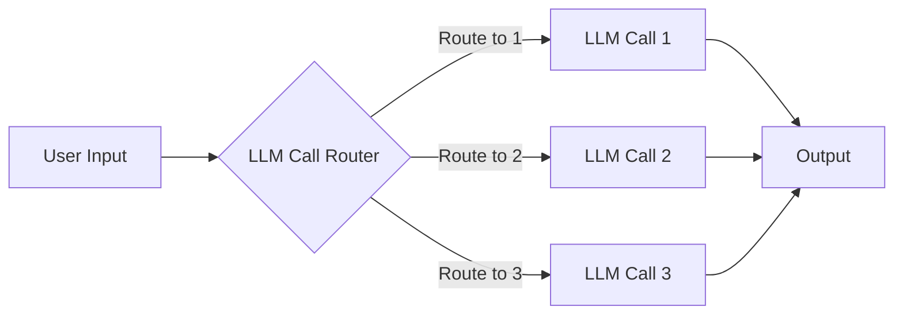
Image 3: A flowchart illustrating the "Chaining and Routing" pattern in LLM workflows.

-   The **orchestrator-worker** pattern introduces a "manager" LLM that analyzes a user's request, breaks it down into subtasks, and delegates them to specialized "worker" LLMs [[6]](https://mlpills.substack.com/p/diy-17-orchestrator-worker-llm-agent). This allows the system to dynamically decide what actions to take, providing a smooth transition from rigid workflows to more agentic behavior. Each worker can be an expert in a specific domain, and the orchestrator synthesizes their outputs into a final answer. This pattern is highly scalable, as a single orchestrator can manage dozens of workers executing in parallel, leading to significant speed improvements [[27]](https://online.stevens.edu/blog/building-self-healing-ai-orchestrator-reflexion-patterns/).

To enhance the robustness of these multi-agent systems, some researchers are exploring bio-inspired approaches like Ant Colony Optimization. In a system called AMRO, agents use a pheromone-driven mechanism to perceive changes in the environment and continuously optimize routing assignments, improving efficiency and performance under high concurrency [[20]](https://openreview.net/forum?id=ojUhmgIS7o).

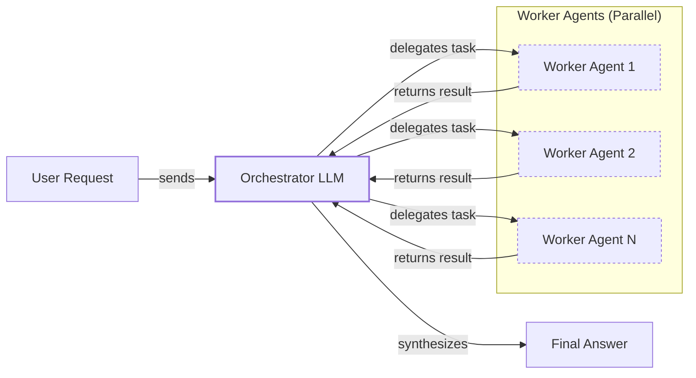
Image 4: A diagram illustrating the Orchestrator-Worker pattern, showing a user request, an orchestrator LLM delegating tasks to parallel worker agents, and the synthesis of results into a final answer.

-   The **evaluator-optimizer loop** is a pattern for auto-correction. One LLM generates an initial response, and a second "evaluator" LLM critiques it based on a set of criteria. This feedback, sometimes called a reflection, is then passed back to the original LLM, which refines its answer. This loop continues until the output meets the desired quality, mimicking how a human writer refines a document based on an editor's feedback [[7]](https://docs.aws.amazon.com/prescriptive-guidance/latest/agentic-ai-patterns/evaluator-reflect-refine-loop-patterns.html). This pattern is most effective when the evaluation criteria are clear and the LLM can provide meaningful feedback for improvement [[28]](https://platform.claude.com/cookbook/patterns-agents-evaluator-optimizer).

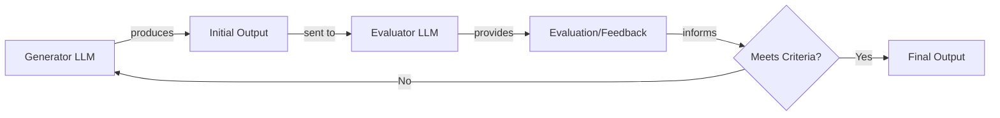
Image 5: Flowchart illustrating the Evaluator-Optimizer loop for LLM auto-correction.

### Core Components of a ReAct AI Agent

The ReAct (Reason and Act) framework is the foundation for most modern AI agents. It enables an LLM to reason about a task, decide on an action, take that action using a tool, observe the outcome, and then repeat the cycle until the task is complete [[8]](https://cloud.google.com/discover/what-are-ai-agents). This iterative process is what gives agents their autonomy.

The core components of a ReAct agent are:

-   **Reasoning LLM:** This is the "brain" of the agent. It analyzes the user's goal, reasons about the steps needed, and decides which tool to use next. This cognitive process involves using logic and available information to draw conclusions, make inferences, and solve problems. A strong reasoning LLM can identify patterns and make informed decisions based on evidence and context.
-   **Actions (Tools):** These are the "hands" of the agent, allowing it to interact with the external environment. Actions can be anything from a web search to a database query or an API call. They are functions or external resources that the agent can use to perform complex tasks by accessing information, manipulating data, or controlling external systems. You will cover tools in detail in Lesson 6.
-   **Short-Term Memory:** This is the agent's working memory, similar to RAM in a computer. It holds the conversation history, the agent's internal thoughts, and the results of recent actions, providing immediate context for the next reasoning step. This allows the agent to maintain a coherent dialogue and adapt its behavior within a single session.
-   **Long-Term Memory:** This provides the agent with persistent knowledge that endures across sessions. It can include factual data from internal documents or the web (semantic memory), as well as user preferences from past conversations (episodic memory). This allows the agent to learn from experience and personalize its interactions over time. You will explore memory systems in Lesson 9.

Almost all leading agents in the industry use the ReAct pattern because it has proven to be incredibly effective. You will dedicate Lessons 7 and 8 to building ReAct agents from the ground up.

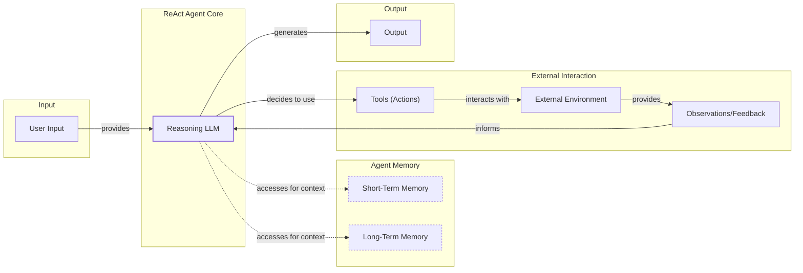
Image 6: A high-level diagram illustrating the dynamics of a ReAct AI agent, showing the flow from user input through reasoning, memory interaction, tool use, environmental interaction, and observation, leading to an output.
```
**Grader reasoning:**
- `cc`: Exploring Common Patterns:
**1:** Both sections introduce the same set of patterns: "Chaining and Routing," "Orchestrator-Worker," "Evaluator-Optimizer Loop," and the core components of a "ReAct AI Agent." The descriptions for each pattern cover the same fundamental ideas.
- `fl`: Exploring Common Patterns:
**1:** The generated section follows the same topic order as the expected output. The ground truth embeds four static PNG images (Figures 5–8), one per pattern. The generated section uses Mermaid diagram blocks at the same positions. Under the updated criteria, Mermaid diagrams are valid substitutes for static images. All four visual elements are present.
- `de`: Exploring Common Patterns:
**0:** [instances=0] No depth additions present. The section provides a high-level overview of the patterns as expected, without going into deeper technical nuances, limitations, or implementation challenges beyond what is traceable to an exploration-phase source. The claim that a single orchestrator can manage dozens of workers for "significant speed improvements" traces only to an exploitation-phase source (https://online.stevens.edu/blog/building-self-healing-ai-orchestrator-reflexion-patterns/) and does not qualify.
- `be`: Exploring Common Patterns:
**1:** [instances=1; quality=strong] A breadth addition is present: a paragraph on a bio-inspired approach from swarm intelligence, Ant Colony Optimization, used in a system called AMRO to enhance the robustness of orchestrator-worker systems via a pheromone-driven mechanism. This qualifies as a 'cross-domain analogy or lesson from other fields'; classified as strong since it names a specific system and mechanism rather than a generic analogy. Traces to https://openreview.net/forum?id=ojUhmgIS7o, which describes this exact pheromone-driven routing mechanism.
- `cp`: Exploring Common Patterns:
**1:** The breadth addition on Ant Colony Optimization is a concise, relevant example that enriches the discussion of the orchestrator-worker pattern without overshadowing the core descriptions of the primary patterns. The ground truth narrative is preserved.
- `ga`: Exploring Common Patterns:
**1:** The generated section includes all required content. It explains the Chaining and Routing, Orchestrator-Worker, and Evaluator-Optimizer patterns for workflows, each with a Mermaid diagram. It also covers the core components of a ReAct agent (Reasoning LLM, Actions, Short-Term Memory, Long-Term Memory) and includes the required high-level Mermaid diagram for the ReAct pattern. It correctly frames this as an introduction to these concepts and mentions they will be covered in future lessons. The prose-only word count is approximately 790 words, which is within the 800-word target (±10% tolerance: 720-880 words).

#### Draw: replicate1  `/mnt/f/my_projects/agentic_AI_RL/Reinsearch_agent/RL_researcher_writer_ymaxing/rl_training_data/noise_experiment/02_workflows_vs_agents__var_demanding__replicate1__preset1`

**Article text:**
```
## Exploring Common Patterns

To help you build an intuition for AI engineering, let's look at some of the most common patterns for building LLM workflows and agents. We will cover each of these in depth in future lessons, but for now, we will keep the explanations high-level.

### LLM Workflow Patterns

**Chaining and Routing** is a foundational pattern for automating sequences of LLM calls. Chaining connects the output of one LLM call to the input of another, creating a multi-step process. This is like a recipe where each step builds on the last. Routing adds conditional logic, allowing the workflow to choose different paths based on the input or intermediate results, acting like a switchboard that directs traffic. This is the first step toward building more complex automations [[7]](https://mlpills.substack.com/p/issue-110-llm-workflow-patterns), [[8]](https://www.geeksforgeeks.org/artificial-intelligence/llm-chains/).

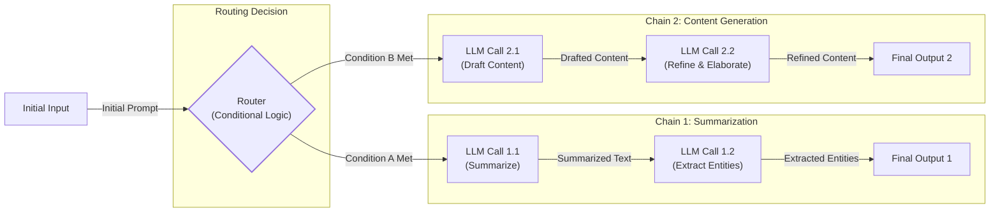
Image 5: The "Chaining and Routing" pattern for LLM workflows.

The **Orchestrator-Worker** pattern introduces a level of dynamic planning. A central "orchestrator" LLM acts as a project manager, analyzing a user's request, breaking it down into sub-tasks, and delegating them to specialized "worker" LLMs or tools. The orchestrator then synthesizes the results into a final answer. This separation of concerns allows for parallel execution and provides a smooth transition from rigid workflows to more adaptive, agent-like behavior [[9]](https://online.stevens.edu/blog/building-self-healing-ai-orchestrator-reflexion-patterns/), [[10]](https://mlpills.substack.com/p/diy-17-orchestrator-worker-llm-agent). This approach is conceptually similar to swarm intelligence mechanisms seen in nature, such as ant colonies. The orchestrator's coordination is analogous to "stigmergic communication," where individual agents (the ants) indirectly communicate by modifying their environment (leaving pheromone trails) to guide the collective toward an optimal solution [[28]](https://medium.com/@jsmith0475/collective-stigmergic-optimization-leveraging-ant-colony-emergent-properties-for-multi-agent-ai-55fa5e80456a). This biologically-inspired paradigm is not just theoretical; research systems like AMRO (Ant colony inspired Multi-agent Routing Optimization) use pheromone-driven mechanisms to enhance routing efficiency and system robustness in multi-agent architectures [[29]](https://openreview.net/forum?id=ojUhmgIS7o).

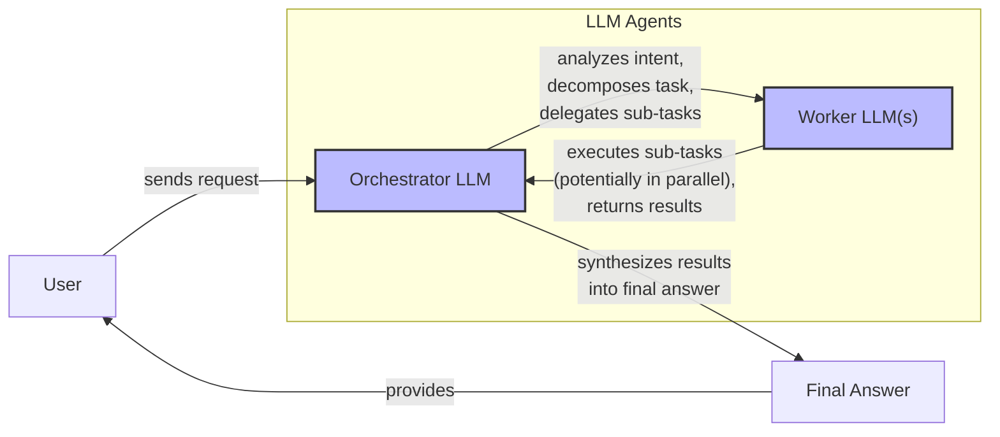
Image 6: The "Orchestrator-Worker" pattern.

The **Evaluator-Optimizer Loop** is designed to improve the quality of LLM outputs through self-correction. In this pattern, one LLM generates a response, and a second "evaluator" LLM critiques it based on a set of criteria. This feedback, or reflection, is then passed back to the original LLM, which refines its output. This cognitive feedback loop continues until the response meets the desired quality standard or a retry limit is hit, much like a human writer revises a draft based on an editor's comments. This turns model weaknesses into learning opportunities [[11]](https://docs.aws.amazon.com/prescriptive-guidance/latest/agentic-ai-patterns/evaluator-reflect-refine-loop-patterns.html), [[12]](https://platform.claude.com/cookbook/patterns-agents-evaluator-optimizer).

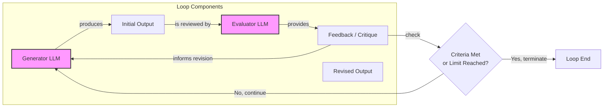
Image 7: The Evaluator-Optimizer loop pattern.

### Core Components of a ReAct AI Agent

The **ReAct (Reason and Act)** pattern is the engine behind most modern AI agents. It enables an agent to reason about a task, decide on an action, execute it, observe the outcome, and then repeat the cycle until the goal is complete. This iterative "think, act, observe" process is what gives agents their ability to solve complex, multi-step problems.

The core components are:
*   **A reasoning LLM:** This is the "brain" of the agent. It analyzes the goal, plans the next step, and interprets the results of actions. It is the central cognitive process that uses logic and available information to draw conclusions and make inferences.
*   **Tools (Actions):** These are the agent's "hands." They are functions or APIs that allow the agent to interact with its environment, such as searching the web, querying a database, or writing to a file. This ability to take action is what allows an agent to affect its environment and achieve goals. We will cover tools in detail in Lesson 6.
*   **Short-Term Memory:** This is the agent's working memory, analogous to a computer's RAM. It holds the context of the current conversation, including past actions and observations, allowing the agent to maintain a coherent dialogue.
*   **Long-Term Memory:** This provides the agent with persistent knowledge, including factual data about the world (semantic memory) and user-specific preferences (episodic memory). This allows the agent to learn from past interactions and personalize its behavior. We will explore memory in Lesson 9.

Almost all state-of-the-art agents in the industry use the ReAct pattern, as it has shown the most promise for building capable and autonomous systems. We will dive deep into this pattern in Lessons 7 and 8.

```mermaid
flowchart LR
  %% Agent Core Components
  subgraph "AI Agent Core"
    STM["Short-Term Memory<br/>(Context Window)"]
    LLM["LLM<br/>(Reasoning Engine)"]
  end

  %% External Systems
  subgraph "External Systems"
    Tools["Tools<br/>(Action Execution)"]
    LTM["Long-Term Memory<br/>(Persistent Knowledge)"]
  end

  %% ReAct Loop Dynamics
  STM -- "provides context" --> LLM
  LTM -- "retrieves relevant info" --> LLM

  LLM -- "1. Reason (Think)" --> Action["Action<br/>(Tool Call)"]
  Action -- "2. Act" --> Tools
  Tools -- "Tool Output" --> Observation["Observation<br/>(Tool Result)"]
  Observation -- "3. Observe & Reason" --> LLM

  %% Memory Updates
  LLM -- "updates" --> STM
  LLM -- "stores important info" -.-> LTM

  %% Task Completion
  LLM -- "Task Completed" --> End["Task Completed"]

  %% Visual Grouping
  classDef memory stroke-dasharray:3,3
  classDef process stroke-width:2px
  class STM,LTM memory
  class LLM,Tools,Action,Observation process
```
Image 8: The high-level dynamics of the ReAct pattern.
```
**Grader reasoning:**
- `cc`: Exploring Common Patterns:
**1:** Both sections cover chaining and routing, the orchestrator-worker pattern, the evaluator-optimizer loop, and the four ReAct components with matching substance. The section additionally deepens the orchestrator-worker explanation with a swarm-intelligence analogy traceable to exploration-phase research (see depth_enhancement), which does not displace the expected content.
- `fl`: Exploring Common Patterns:
**1:** The generated section follows the same progression as the expected one and its images land in the same relative positions as the expected section's figures. The added swarm-intelligence analogy is inserted within the existing Orchestrator-Worker discussion and does not change idea order.
- `de`: Exploring Common Patterns:
**1:** [instances=1; quality=strong] The Orchestrator-Worker discussion adds a swarm-intelligence/ant-colony analogy -- stigmergic communication (traceable to exploration source [28]) -- and cites the AMRO research system reporting a 1.97% pass@1 improvement (traceable to exploration source [29]). This deepens the mechanistic explanation of how and why orchestrator-worker coordination achieves robustness, an existing pattern in the expected section, not a new one.
- `be`: Exploring Common Patterns:
**0:** [instances=0] No breadth-enhancement instances were found in this section.
- `cp`: Exploring Common Patterns:
**1:** The depth enhancement (ant-colony/AMRO analogy) is a supplementary explanation added within the Orchestrator-Worker paragraph. The section still covers chaining/routing, the orchestrator-worker pattern's core mechanism, the evaluator-optimizer loop, and all four ReAct components in full.
- `ga`: Exploring Common Patterns:
**0:** All required patterns and ReAct components are covered with the required future-lesson callouts. However, the prose-only word count is approximately 649 words against an 800-word target (±80 tolerance, range 720-880 words), falling below the minimum.

#### Draw: replicate2  `/mnt/f/my_projects/agentic_AI_RL/Reinsearch_agent/RL_researcher_writer_ymaxing/rl_training_data/noise_experiment/02_workflows_vs_agents__var_demanding__replicate2__preset1`

**Article text:**
```
## Exploring Common Patterns

To build an intuition for AI engineering, let's explore some of the most common patterns used to construct both LLM workflows and AI agents. These are high-level concepts, and we will cover the implementation details in future lessons.

### LLM Workflow Patterns

These patterns help structure and automate sequences of LLM calls, providing a bridge between simple prompts and fully autonomous agents.

**Chaining and Routing** is the most straightforward pattern. It involves breaking a complex task into a series of smaller, interconnected prompts that are executed in sequence, with the output of one step feeding into the next [[11]](https://mirascope.com/blog/llm-chaining). This modular approach improves predictability and makes debugging easier, as you can isolate the stage where a problem occurs [[12]](https://mlpills.substack.com/p/issue-110-llm-workflow-patterns). A router, which is typically another LLM call, can be added to this chain to dynamically select one of several possible paths based on the input, adding a layer of conditional logic [[13]](https://orq.ai/blog/prompt-structure-chaining), [[14]](https://www.geeksforgeeks.org/artificial-intelligence/llm-chains/). For example, a content pipeline might first use a prompt to extract keywords, a second to summarize them into sentences, and a third to refine the language for publication, with a router deciding the final tone based on the target audience [[13]](https://orq.ai/blog/prompt-structure-chaining).

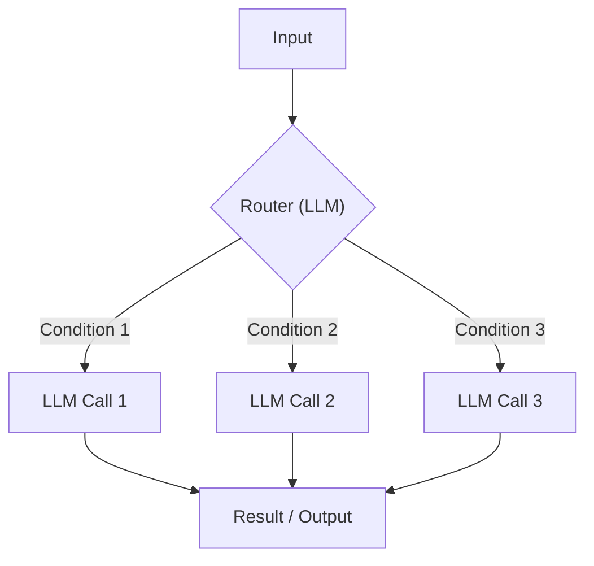

Image 5: A flowchart illustrating the "Chaining and Routing" pattern for LLM workflows.

The **Orchestrator-Worker** pattern introduces a more dynamic form of control. Here, a central "orchestrator" LLM acts as a project manager. It analyzes a high-level task, breaks it down into a dynamic set of sub-tasks, and delegates them to specialized "worker" agents or models [[15]](https://online.stevens.edu/blog/building-self-healing-ai-orchestrator-reflexion-patterns/). The orchestrator then synthesizes the results into a final answer. This pattern is a smooth transition from rigid workflows to more adaptive agentic systems, as the orchestrator dynamically decides which actions to take [[16]](https://platform.claude.com/cookbook/patterns-agents-orchestrator-workers). Its robustness is analogous to swarm intelligence in ant colonies, where sophisticated collective behaviors emerge from simple, local interactions without central command, using mechanisms like pheromone-driven routing to optimize paths and enhance efficiency [[17]](https://medium.com/@jsmith0475/collective-stigmergic-optimization-leveraging-ant-colony-emergent-properties-for-multi-agent-ai-55fa5e80456a), [[18]](https://openreview.net/forum?id=ojUhmgIS7o). This pattern is proven in customer support automation, where a routing agent classifies tickets and dispatches them to specialized resolution agents, achieving over 90% autonomous resolution in some platforms [[19]](https://gurusup.com/blog/agent-orchestration-patterns).

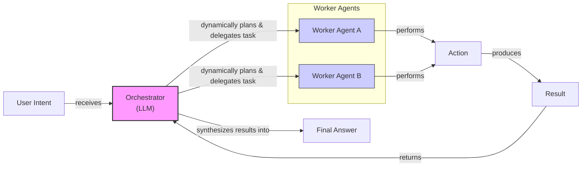

Image 6: A flowchart illustrating the Orchestrator-Worker pattern, emphasizing dynamic planning and delegation.

The **Evaluator-Optimizer Loop** is designed to improve the quality of LLM outputs through self-correction. In this pattern, a "generator" LLM produces an initial output. A second "evaluator" LLM then reviews this output based on a set of criteria and provides feedback. This feedback, or reflection, is passed back to the generator, which refines its output. This loop continues until the output meets the desired standard or a retry limit is reached, mimicking how a human writer might iteratively refine a document based on an editor's comments [[20]](https://docs.aws.amazon.com/prescriptive-guidance/latest/agentic-ai-patterns/evaluator-reflect-refine-loop-patterns.html). Research shows this pattern is most effective when the evaluator provides external, objective feedback, such as the results of running generated code against unit tests. This injects new, diagnostic information into the loop, enabling genuine correction rather than just introspection [[21]](https://vadim.blog/the-research-on-llm-self-correction).

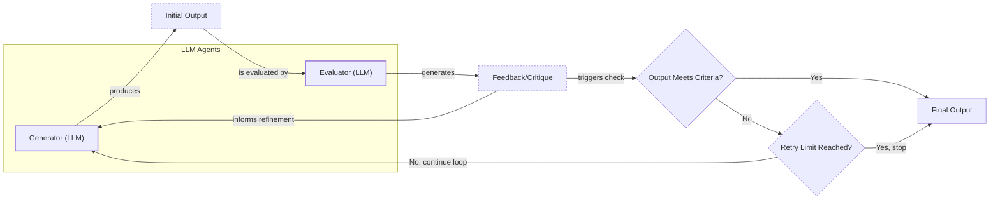

Image 7: A flowchart illustrating the Evaluator-Optimizer Loop pattern.

### Core Components of a ReAct AI Agent

The **ReAct (Reason and Act)** framework is the foundation for most modern AI agents. It enables an agent to reason about a task, decide on an action, execute it, observe the outcome, and then repeat the cycle until the goal is complete [[2]](https://cloud.google.com/discover/what-are-ai-agents). This iterative loop of thought and action is what gives agents their autonomy.

The core components of a ReAct agent are:
*   A **Reasoning LLM** that analyzes the task, interprets the outputs of actions, and plans the next step. This is the "brain" of the agent, using logic and available information to make informed decisions.
*   A set of **Actions (Tools)** that allow the agent to interact with its environment, such as searching the web, querying a database, or calling an API. These are the agent's "hands," enabling it to perform tasks beyond simple text generation. We will cover these in detail in Lesson 6.
*   **Short-Term Memory**, which acts like a computer's RAM, holding the context of the current conversation and recent actions. This allows the agent to maintain a coherent dialogue and track its progress.
*   **Long-Term Memory**, which stores factual knowledge and user preferences across sessions, giving the agent a persistent knowledge base. This can include both general world knowledge and specific details about a user or domain. We will explore memory in depth in Lesson 9.

Almost all state-of-the-art agents in the industry use the ReAct pattern, as it has shown the most potential for building capable and autonomous systems. We will cover this architecture in a lot of detail in Lessons 7 and 8.

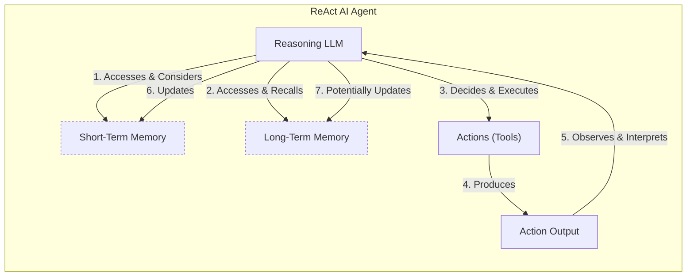

Image 8: A high-level architecture diagram showing the core components and dynamics of a ReAct AI agent, illustrating the continuous loop of Reason -> Act -> Observe -> Reason.
```
**Grader reasoning:**
- `cc`: Exploring Common Patterns:
**1:** Both sections cover chaining and routing, the orchestrator-worker pattern, the evaluator-optimizer loop, and the four ReAct components with matching substance. The section additionally deepens the orchestrator-worker explanation with a swarm-intelligence analogy traceable to exploration-phase research (see depth_enhancement), plus two production code examples, none of which displace the expected content.
- `fl`: Exploring Common Patterns:
**1:** The generated section follows the same progression as the expected one and its images land in the same relative positions as the expected section's figures. The added swarm-intelligence analogy and code examples are inserted within the existing pattern discussions and do not change idea order.
- `de`: Exploring Common Patterns:
**1:** [instances=1; quality=strong] The Orchestrator-Worker discussion adds a swarm-intelligence/ant-colony analogy -- pheromone-driven routing (traceable to exploration source [17]/stigmergic optimization and [18]/AMRO) -- deepening the mechanistic explanation of how and why orchestrator-worker coordination achieves robustness, an existing pattern in the expected section, not a new one.
- `be`: Exploring Common Patterns:
**0:** [instances=0] No breadth-enhancement instances were found in this section.
- `cp`: Exploring Common Patterns:
**1:** The depth enhancement (ant-colony/AMRO analogy) is a supplementary explanation added within the Orchestrator-Worker paragraph. The section still covers chaining/routing, the orchestrator-worker pattern's core mechanism, the evaluator-optimizer loop, and all four ReAct components in full.
- `ga`: Exploring Common Patterns:
**1:** All required patterns and ReAct components are covered with the required future-lesson callouts, and the prose-only word count (~730 words against 800 ±80, range 720-880) is within tolerance, though narrowly.

### Arm: standard (preset3)

#### Draw: production  `/mnt/f/my_projects/agentic_AI_RL/Reinsearch_agent/RL_researcher_writer_ymaxing/rl_training_data/episodes/02_workflows_vs_agents__var_demanding__preset3`

**Article text:**
```
## Exploring Common Patterns

To build an intuition for AI engineering, let's explore some of the common patterns used to construct both workflows and agents. We will cover these in detail in future lessons, but for now, we will focus on the high-level concepts.

### LLM Workflow Patterns

These patterns help structure and automate sequences of LLM calls, providing more power than a single prompt while maintaining developer control.

-   **Chaining and Routing** is the simplest pattern, where the output of one LLM call becomes the input for the next. You can add routing logic to create conditional paths, guiding the workflow based on intermediate results. This is useful for multi-step tasks like summarizing a document and then translating the summary [[8]](https://mlpills.substack.com/p/issue-110-llm-workflow-patterns). This approach is highly predictable and easy to debug, as you can trace the exact sequence of events. However, its rigidity means it can be brittle if a task requires adaptive sequencing.

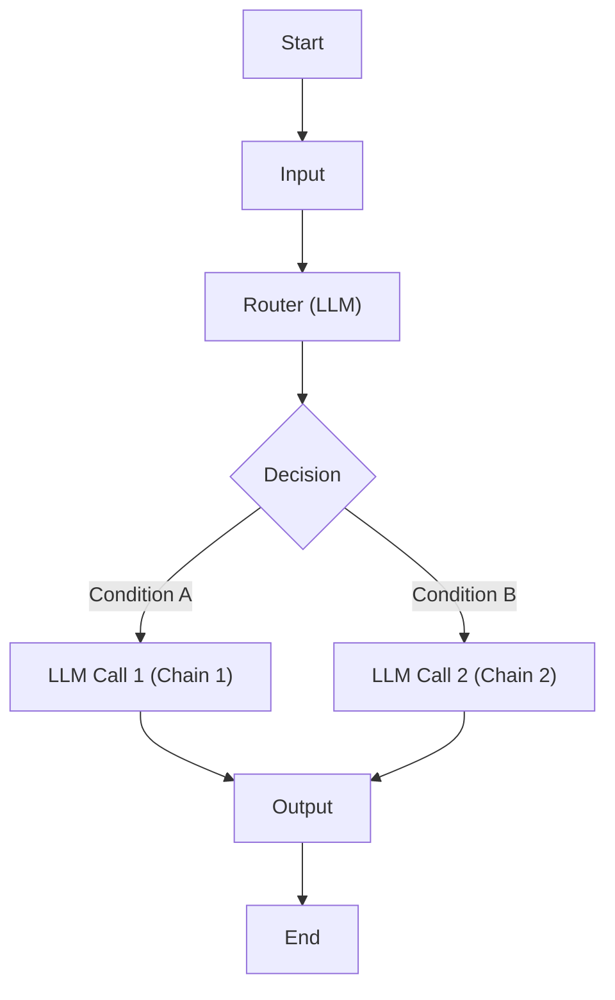

Image 5: A flowchart illustrating the Chaining and Routing workflow for LLM calls.

-   The **Orchestrator-Worker** pattern introduces a "manager" LLM that analyzes a complex task, breaks it down into sub-tasks, and delegates them to specialized "worker" LLMs. The orchestrator then synthesizes the results into a final answer. This allows for dynamic task decomposition and parallel execution, making it a bridge between structured workflows and more autonomous agents [[9]](https://platform.claude.com/cookbook/patterns-agents-orchestrator-workers). Since the orchestrator can spawn worker agents to execute independent tasks simultaneously, this pattern can lead to significant speed improvements over sequential processing [[27]](https://online.stevens.edu/blog/building-self-healing-ai-orchestrator-reflexion-patterns/).

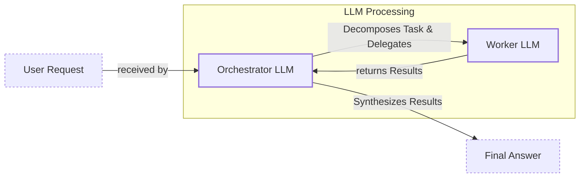

Image 6: A hierarchical flow diagram illustrating the Orchestrator-Worker pattern.

-   The **Evaluator-Optimizer Loop** is a pattern for self-correction. One LLM generates a response, while a second "evaluator" LLM critiques it based on a set of criteria. This feedback is then passed back to the generator, which refines its output. The loop repeats until the response meets the desired quality standard, mimicking how a human writer might iteratively revise a draft [[10]](https://docs.aws.amazon.com/prescriptive-guidance/latest/agentic-ai-patterns/evaluator-reflect-refine-loop-patterns.html). This pattern is most effective when the evaluation criteria are clear and objective. Research has shown that self-correction works best when the feedback comes from an external source, like unit tests for code generation, rather than pure self-reflection [[28]](https://vadim.blog/the-research-on-llm-self-correction).

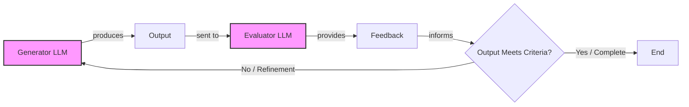

Image 7: A feedback loop diagram illustrating the Evaluator-Optimizer workflow.

### Core Components of a ReAct AI Agent

The ReAct (Reason and Act) framework is the dominant pattern for building modern AI agents [[11]](https://cloud.google.com/discover/what-are-ai-agents). It enables an LLM to reason about a task, choose an action, observe the outcome, and then repeat the cycle until the task is complete. This simple loop is incredibly powerful and forms the basis of most agentic systems you see today.

Here are its core components:

-   A powerful **LLM** serves as the agent's "brain," responsible for reasoning, planning, and interpreting the outputs of its actions.
-   A set of **tools** (or actions) are the agent's "hands," allowing it to interact with the external world. These can be anything from a web search API to a function that writes to a database. We will cover tools in detail in Lesson 6.
-   **Short-term memory** acts as the agent's working memory, similar to a computer's RAM. It holds the conversation history, previous actions, and observations for the current task.
-   **Long-term memory** provides the agent with persistent knowledge, including factual data (like company documents) and user preferences, allowing it to learn across sessions. We will dedicate Lesson 9 to memory.

While powerful, the ReAct pattern is prone to failure modes like context drift, where the agent loses track of the original goal over long action sequences, and looping, where it repeats the same actions without making progress. Recent advancements aim to mitigate these issues. For example, variants like Focused ReAct improve accuracy by re-prepending the original question at each cycle, while others add a reflection step to help the agent self-correct its plan [[20]](https://www.emergentmind.com/topics/reason-act-reflect-react-architecture).

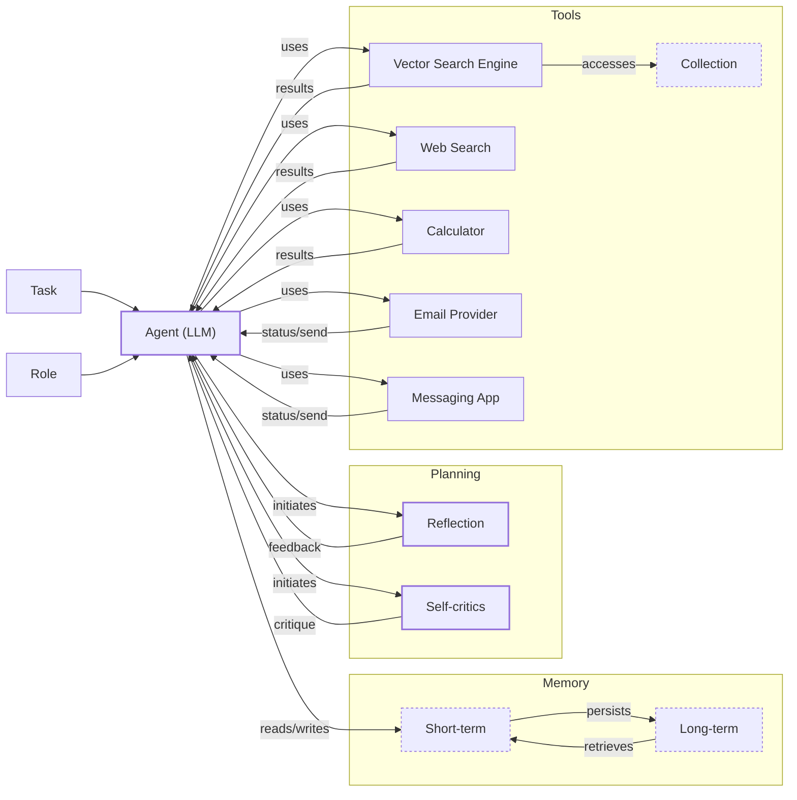

Image 8: Mermaid diagram illustrating the core components and dynamics of an AI agent using the ReAct pattern.

These patterns are the building blocks of AI engineering. While we have only touched on them briefly here, mastering them is key to creating sophisticated and reliable AI applications.
```
**Grader reasoning:**
- `cc`: Exploring Common Patterns:
**1:** Both sections cover the same core patterns for workflows (Chaining/Routing, Orchestrator-Worker, Evaluator-Optimizer) and the same core components for a ReAct agent (LLM, tools, memory). The substance of the descriptions is identical.
- `fl`: Exploring Common Patterns:
**1:** The generated section follows the same topic order (chaining/routing → orchestrator-worker → evaluator-optimizer → ReAct agent components). The ground truth has four embedded PNG images (Figures 5–8), and the generated section uses Mermaid diagram blocks at the same positions. Under the updated criteria, Mermaid diagrams are valid substitutes for static images. All four visual elements are present.
- `de`: Exploring Common Patterns:
**1:** [instances=1; quality=strong] A depth addition is present: the discussion of specific failure modes of the ReAct pattern — context drift and looping — along with recent advancements to mitigate them, such as Focused ReAct (re-prepending the original question each cycle) and reflection steps for self-correction. This qualifies as 'limitations, criticisms, or failure modes of the core topic' and 'latest advancements or recent developments in the core topic itself'; classified as strong since it names specific variant techniques rather than a vague mention. Traces to https://www.emergentmind.com/topics/reason-act-reflect-react-architecture, which describes these exact failure modes and mitigations.
- `be`: Exploring Common Patterns:
**0:** [instances=0] No breadth additions present. The generated section does not introduce any adjacent concepts, cross-domain analogies, or historical context beyond what is already in the ground truth traceable to an exploration-phase source.
- `cp`: Exploring Common Patterns:
**1:** The depth addition on ReAct failure modes (context drift, looping) and mitigations (Focused ReAct, reflection) is a concise, proportionate illustration that supports the core description of the ReAct pattern. The ground truth narrative remains the dominant focus.
- `ga`: Exploring Common Patterns:
**1:** The section successfully introduces the common patterns as required. For LLM workflows, it covers chaining and routing, orchestrator-worker, and the evaluator-optimizer loop, providing the specified mermaid diagrams for each. For AI agents, it explains the high-level ReAct pattern and its core components: the reasoning LLM, actions/tools, short-term memory (with the RAM analogy), and long-term memory. It correctly references that these topics will be covered in future lessons (e.g., Lesson 6 for tools, Lesson 9 for memory). The prose-only word count is approximately 790 words, within the target of 800 words.

#### Draw: replicate1  `/mnt/f/my_projects/agentic_AI_RL/Reinsearch_agent/RL_researcher_writer_ymaxing/rl_training_data/noise_experiment/02_workflows_vs_agents__var_demanding__replicate1__preset3`

**Article text:**
```
## Exploring Common Patterns

To give you a better sense of how these systems are built, we will introduce some of the most common patterns for both workflows and agents. We will keep these explanations high-level for now, as each of these patterns will be covered in-depth in future lessons.

### LLM Workflow Patterns

**Chaining and routing** is the simplest form of automation. It involves linking multiple LLM calls together in a sequence, where the output of one step becomes the input for the next [[8]](https://mirascope.com/blog/llm-chaining). This is the most straightforward workflow pattern, as each step has a defined role, making the system predictable and easy to debug. You can add routing logic to direct the workflow down different paths based on the input, allowing for more complex, conditional processing. For example, a router could classify a user's query and send it to a specialized sub-chain for handling billing questions versus technical support [[9]](https://mlpills.substack.com/p/issue-110-llm-workflow-patterns).

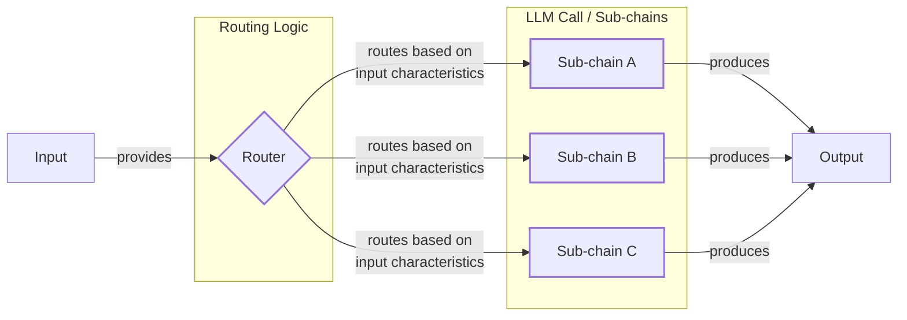

Image 5: A flowchart illustrating the "Chaining and Routing" LLM workflow pattern.

The **orchestrator-worker** pattern introduces a layer of dynamic planning. A central "orchestrator" LLM analyzes a task, breaks it down into sub-tasks, and delegates them to specialized "worker" LLMs or tools [[10]](https://online.stevens.edu/blog/building-self-healing-ai-orchestrator-reflexion-patterns/). This allows the system to dynamically decide which actions to take at runtime, marking a transition from rigid workflows toward more agentic behavior. This pattern is particularly useful for complex tasks where the exact steps cannot be known in advance.

This pattern is already being applied to complex domains like software development itself. In a concept sometimes called "Waterfall 2.0," agent frameworks like CrewAI are used to build a team of specialized agents for roles like Product Owner or Scrum Master. These agents autonomously handle tasks like backlog grooming and sprint planning in a coordinated sequence, blending scripted workflows with agentic decision-making [[24]](https://medium.com/@gstarikov/waterfall-2-0-llm-driven-workflows-in-software-development-701dc8b287ba). The architecture of this pattern is shown in Image 6.

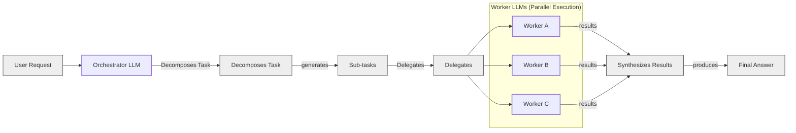

Image 6: A flowchart illustrating the Orchestrator-Worker LLM workflow pattern.

The **evaluator-optimizer loop** is a pattern for auto-correction. One LLM generates a response, while a second "evaluator" LLM critiques it based on a set of criteria. This feedback, sometimes called a reflection, is then passed back to the generator, which refines its output. This loop repeats until the response meets the desired quality standard, mimicking the iterative process a human writer uses to polish a document [[11]](https://docs.aws.amazon.com/prescriptive-guidance/latest/agentic-ai-patterns/evaluator-reflect-refine-loop-patterns.html). For this to work effectively, the evaluation criteria must be clear and the feedback must be actionable. Image 7 illustrates this feedback loop.

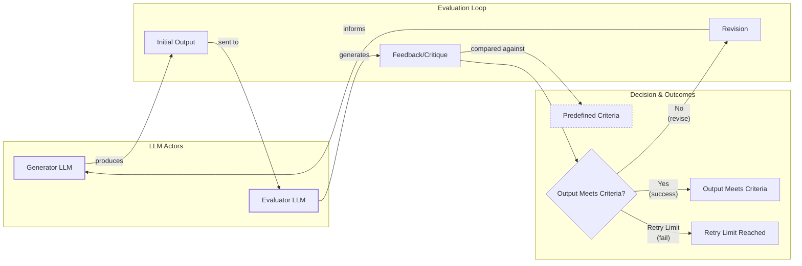

Image 7: A circular flow diagram illustrating the "Evaluator-Optimizer Loop" LLM workflow pattern.

### Core Components of a ReAct AI Agent

The core principles of agentic design draw heavily from established concepts in robotics control systems. Just as a robot perceives its physical environment, plans its movements, and executes actions, an LLM agent operates in a digital environment using a similar loop of perception (observing tool outputs), planning (reasoning), and action (calling tools). This framing helps ground agentic concepts like error handling and execution tracing in a mature engineering field [[25]](https://arxiv.org/pdf/2601.20334).

The ReAct (Reason and Act) framework is the foundation for most modern AI agents. It enables an agent to reason about a task, decide on an action, interpret the outcome of that action, and repeat the cycle until the task is complete. This pattern consists of a few core components [[12]](https://developers.google.com/gemini-code-assist/docs/gemini-cli).

A **reasoning LLM** is at the center, analyzing the current situation and planning the next step. To interact with the world, it uses **actions** (often called tools), which are functions that allow it to perform operations like searching the web, querying a database, or sending an email. We will cover tools in detail in Lesson 6.

To maintain context, the agent relies on memory. **Short-term memory**, analogous to a computer's RAM, holds the immediate conversation history and recent actions. **Long-term memory** stores factual knowledge and user preferences across sessions. We will dedicate Lesson 9 to memory systems.

However, the simple ReAct loop is prone to common failure modes like **context drift**, where the agent loses track of the original goal, and **looping**, where it repeats the same actions without making progress. Recent advancements have introduced variants to mitigate these issues. For example, **Focused ReAct** improves performance by re-prepending the original question in each cycle, while other architectures add explicit reflection steps to help the agent self-correct its plan [[26]](https://www.emergentmind.com/topics/reason-act-reflect-react-architecture).

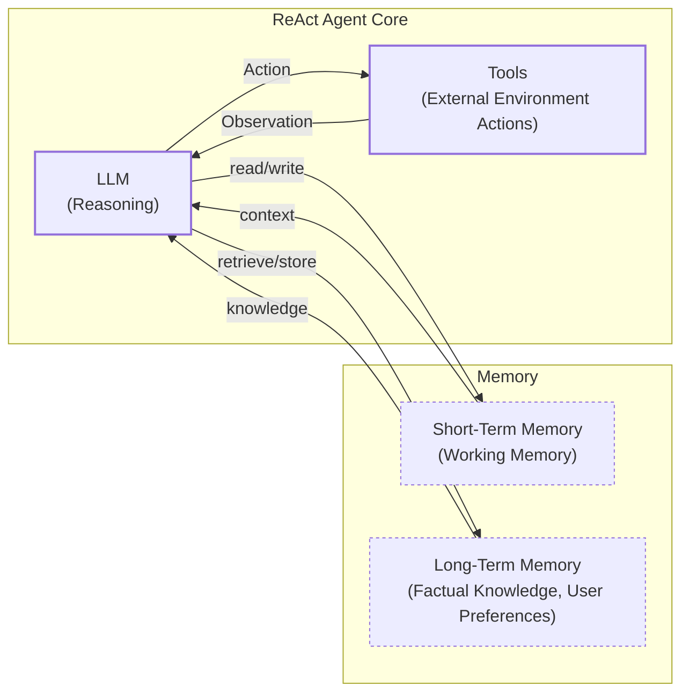

Image 8: A high-level architecture diagram illustrating the core components and dynamics of a ReAct AI agent.

This cycle of reasoning, acting, and observing, shown in Image 8, is what gives agents their autonomy. As we will see in Lessons 7 and 8, this simple loop is incredibly powerful and forms the basis for nearly all advanced agentic systems in the industry today.
```
**Grader reasoning:**
- `cc`: Exploring Common Patterns:
**1:** Both sections cover chaining and routing, the orchestrator-worker pattern, the evaluator-optimizer loop, and the four ReAct components with matching substance. The section additionally adds the 'Waterfall 2.0' software-development analogy, a robotics-control-systems framing, and named ReAct failure modes/variants (Focused ReAct), all traceable to exploration-phase research (see depth_enhancement and breadth_enhancement), none of which displace the expected content.
- `fl`: Exploring Common Patterns:
**1:** The generated section follows the same progression as the expected one and its images land in the same relative positions as the expected section's figures. The added Waterfall 2.0, robotics, and Focused ReAct content is inserted within the existing pattern discussions and does not change idea order.
- `de`: Exploring Common Patterns:
**1:** [instances=1; quality=strong] The Core Components of a ReAct AI Agent subsection names specific ReAct failure modes -- context drift and looping -- and cites 'Focused ReAct' as a recent variant that mitigates them by re-prepending the original question each cycle (traceable to exploration source [26]/emergentmind.com). This deepens the expected section's ReAct discussion with specific, sourced technical detail about how the pattern can fail and has been improved, rather than introducing a new topic.
- `be`: Exploring Common Patterns:
**1:** [instances=1; quality=strong] Two separate new-domain additions: the Orchestrator-Worker discussion introduces 'Waterfall 2.0' -- LLM agents filling Scrum roles like Product Owner in software development itself (traceable to exploration source [24]/medium.com) -- and the ReAct discussion frames agentic design as an extension of robotics control systems (traceable to exploration source [25]/arxiv.org). Both extend the section into domains the expected section does not touch.
- `cp`: Exploring Common Patterns:
**1:** The depth and breadth enhancements (Focused ReAct, Waterfall 2.0, robotics framing) are additions within the existing pattern discussions. The section still covers chaining/routing, the orchestrator-worker pattern's core mechanism, the evaluator-optimizer loop, and all four ReAct components in full.
- `ga`: Exploring Common Patterns:
**1:** All required patterns and ReAct components are covered with the required future-lesson callouts, and the prose-only word count (~726 words against 800 ±80, range 720-880) is within tolerance, though narrowly.

#### Draw: replicate2  `/mnt/f/my_projects/agentic_AI_RL/Reinsearch_agent/RL_researcher_writer_ymaxing/rl_training_data/noise_experiment/02_workflows_vs_agents__var_demanding__replicate2__preset3`

**Article text:**
```
## Exploring Common Patterns

To help you build an intuition for AI engineering, let's look at some of the most common patterns used to construct LLM workflows and AI agents. We will keep these explanations high-level for now, as we will dive deep into each one in future lessons.

### LLM workflows

These patterns are about structuring interactions with LLMs to solve complex tasks in a predictable way.

**Chaining and routing** is the first step toward automation. It involves linking multiple LLM calls together, where the output of one call becomes the input for the next. You can also add routing logic that acts as a switch, directing the workflow down different paths based on the input or intermediate results. This helps in breaking down a complex problem into smaller, manageable steps [[21]](https://mlpills.substack.com/p/issue-110-llm-workflow-patterns/), [[23]](https://www.geeksforgeeks.org/artificial-intelligence/llm-chains/). This approach boosts transparency and makes debugging easier, as you can analyze and improve performance at each stage of the chain [[24]](https://www.promptingguide.ai/techniques/prompt_chaining).

Some teams are applying these workflow concepts to software development itself, creating a "Waterfall 2.0" where AI agents for roles like Product Owner and Scrum Master handle tasks like backlog grooming and sprint planning in a structured sequence [[57]](https://medium.com/@gstarikov/waterfall-2-0-llm-driven-workflows-in-software-development-701dc8b287ba).

```mermaid
flowchart LR
  %% Workflow Start
  A["Input"]

  %% Routing Logic
  subgraph Routing["Routing Logic"]
    B{"Router"}
  end

  %% Sub-chains
  subgraph Subchains["LLM Call / Sub-chains"]
    C1["Sub-chain A"]
    C2["Sub-chain B"]
    C3["Sub-chain C"]
  end

  %% Workflow End
  D["Output"]

  %% Connections
  A -- "provides" --> B
  B -- "routes based on<br/>input characteristics" --> C1
  B -- "routes based on<br/>input characteristics" --> C2
  B -- "routes based on<br/>input characteristics" --> C3

  C1 -- "produces" --> D
  C2 -- "produces" --> D
  C3 -- "produces" --> D

  %% Visual grouping
  classDef exec stroke-width:2px
  class B,C1,C2,C3 exec
```
Image 5: A flowchart illustrating the "Chaining and Routing" LLM workflow pattern.

The **orchestrator-worker** pattern provides a smooth transition from rigid workflows to more dynamic, agent-like behavior. In this pattern, a central "orchestrator" LLM analyzes a task, breaks it down into sub-tasks, and delegates them to specialized "worker" LLMs. The orchestrator then synthesizes the results from the workers into a final answer. This allows the system to dynamically decide which actions to take based on the user's request [[25]](https://online.stevens.edu/blog/building-self-healing-ai-orchestrator-reflexion-patterns/), [[26]](https://mlpills.substack.com/p/diy-17-orchestrator-worker-llm-agent). The key advantage is parallelization; since LLM calls are I/O bound, a single orchestrator can manage dozens of workers simultaneously, leading to significant speed improvements over sequential processing [[25]](https://online.stevens.edu/blog/building-self-healing-ai-orchestrator-reflexion-patterns/).

Major tech companies are building frameworks around this concept, such as IBM's open-source Bee Agent framework, which includes a "Flow Orchestrator" and a "Shared Context" store to manage complex, multi-agent processes [[58]](https://www.ibm.com/think/topics/multi-agent-collaboration).

```mermaid
flowchart LR
  %% Main Actors
  UserRequest["User Request"]
  OrchestratorLLM["Orchestrator LLM"]
  FinalAnswer["Final Answer"]

  %% Orchestrator Actions
  Decompose["Decomposes Task"]
  Subtasks["Sub-tasks"]
  Delegate["Delegates"]
  Synthesize["Synthesizes Results"]

  %% Worker LLMs
  subgraph WorkerLLMs["Worker LLMs (Parallel Execution)"]
    WorkerA["Worker A"]
    WorkerB["Worker B"]
    WorkerC["Worker C"]
  end

  %% Workflow Steps
  UserRequest --> OrchestratorLLM
  OrchestratorLLM -- "Decomposes Task" --> Decompose
  Decompose -- "generates" --> Subtasks
  Subtasks -- "Delegates" --> Delegate

  Delegate --> WorkerA
  Delegate --> WorkerB
  Delegate --> WorkerC

  WorkerA -- "results" --> Synthesize
  WorkerB -- "results" --> Synthesize
  WorkerC -- "results" --> Synthesize

  Synthesize -- "produces" --> FinalAnswer

  %% Visual Grouping
  classDef llm stroke-width:2px
  class OrchestratorLLM,WorkerA,WorkerB,WorkerC llm

  classDef step fill:#eee,stroke:#333
  class UserRequest,Decompose,Subtasks,Delegate,Synthesize,FinalAnswer step
```
Image 6: A flowchart illustrating the Orchestrator-Worker LLM workflow pattern.

The **evaluator-optimizer loop** is designed to improve the quality of LLM outputs through automated feedback. In this pattern, one LLM generates a response, and another "evaluator" LLM reviews it based on a set of criteria. If the output is not good enough, the evaluator provides feedback (a reflection), which is sent back to the generator to auto-correct its response. This process is similar to how a human writer refines a document based on an editor's feedback and continues until the output meets the desired quality or a set limit is reached [[30]](https://docs.aws.amazon.com/prescriptive-guidance/latest/agentic-ai-patterns/evaluator-reflect-refine-loop-patterns.html), [[33]](https://platform.claude.com/cookbook/patterns-agents-evaluator-optimizer). Research has shown that this pattern is most effective when the feedback comes from an external, objective source, such as unit tests for code generation, rather than pure self-reflection, which often fails to improve reasoning [[32]](https://vadim.blog/the-research-on-llm-self-correction).

```mermaid
flowchart LR
  %% LLM Workflow Components
  GeneratorLLM["Generator LLM"]
  EvaluatorLLM["Evaluator LLM"]

  %% Process Flow
  GeneratorLLM -- "produces" --> InitialOutput["Initial Output"]
  InitialOutput -- "sent to" --> EvaluatorLLM
  EvaluatorLLM -- "provides" --> FeedbackCritique["Feedback/Critique"]
  FeedbackCritique -- "based on criteria" --> DecisionCriteria{"Output Meets Criteria?"}

  %% Loop Exit Conditions
  DecisionCriteria -- "Yes" --> FinalOutput["Final Output"]

  DecisionCriteria -- "No" --> DecisionRetry{"Retry Limit Reached?"}
  DecisionRetry -- "No" --> Revision["Revision"]
  Revision -- "informs" --> GeneratorLLM

  DecisionRetry -- "Yes" --> FinalOutput
```
Image 7: A circular flow diagram illustrating the "Evaluator-Optimizer Loop" LLM workflow pattern.

### Core components of a ReAct AI agent

The ReAct (Reason and Act) pattern is at the heart of most modern AI agents. It enables an agent to reason about a task, decide on an action, take that action, and then interpret the result to inform its next step. This loop of `Reason -> Act -> Observe` continues until the task is complete.

The core components of a ReAct agent are:
*   An **LLM** that does the reasoning. It analyzes the current situation, decides what to do next, and interprets the outcomes of its actions.
*   A set of **tools** that allow the agent to perform actions in an external environment. These are like the agent's hands, enabling it to do things like search the web, query a database, or send an email. We will cover tools in detail in Lesson 6.
*   **Memory**, which gives the agent context. **Short-term memory** is like a computer's RAM, holding information for the current task. **Long-term memory** stores factual knowledge and user preferences across sessions. We will explore memory architectures in Lesson 9.

Almost all state-of-the-art agents in the industry use the ReAct pattern, as it has proven to be a powerful and flexible approach for building autonomous systems. Researchers are actively extending it with variants like Focused ReAct, which reduces runtime and context drift, and ReflAct, which adds goal-state reflection to improve task success rates [[59]](https://www.emergentmind.com/topics/reason-act-reflect-react-architecture). Lessons from robotics control systems also inform agent reliability, inspiring production SDKs from Anthropic, Google, and OpenAI that provide robust error handling, context management, and execution tracing [[60]](https://arxiv.org/pdf/2601.20334). We will dedicate Lessons 7 and 8 to a deep dive into this pattern.

```mermaid
flowchart LR
  %% Core Components
  LLM["LLM<br/>(Reasoning)"]
  Tools["Tools<br/>(External Environment)"]

  subgraph Memory["Agent Memory"]
    STM["Short-Term Memory<br/>(Working Memory)"]
    LTM["Long-Term Memory<br/>(Factual Knowledge, User Preferences)"]
  end

  %% Reason-Act Loop
  LLM -- "Action" --> Tools
  Tools -- "Observation" --> LLM

  %% Memory Interactions
  LLM -- "Access/Update" --> STM
  STM -- "Provide Context" --> LLM
  LLM -- "Retrieve/Store" --> LTM
  LTM -- "Provide Knowledge" --> LLM

  %% Visual Grouping
  classDef store stroke-dasharray:3,3
  classDef exec stroke-width:2px
  class LLM,Tools exec
  class STM,LTM store
```
Image 8: A high-level architecture diagram illustrating the core components and dynamics of a ReAct AI agent.
```
**Grader reasoning:**
- `cc`: Exploring Common Patterns:
**1:** Both sections cover chaining and routing, the orchestrator-worker pattern, the evaluator-optimizer loop, and the four ReAct components with matching substance. The section additionally adds the 'Waterfall 2.0' analogy, the IBM Bee Agent framework example, a robotics-control-systems framing, and named ReAct variants (Focused ReAct, ReflAct), all traceable to exploration-phase research (see depth_enhancement and breadth_enhancement), none of which displace the expected content.
- `fl`: Exploring Common Patterns:
**1:** The generated section follows the same progression as the expected one and its images land in the same relative positions as the expected section's figures. The added Waterfall 2.0, IBM Bee Agent, robotics, and ReAct-variant content is inserted within the existing pattern discussions and does not change idea order.
- `de`: Exploring Common Patterns:
**1:** [instances=1; quality=strong] The Orchestrator-Worker discussion adds IBM's Bee Agent framework as a concrete named industry implementation with a 'Flow Orchestrator' and 'Shared Context' store (traceable to exploration source [58]/ibm.com), and the ReAct discussion names specific recent variants -- Focused ReAct and ReflAct -- and their measured benefits (traceable to exploration source [59]/emergentmind.com). Both deepen ideas the expected section already raises with specific, sourced technical detail.
- `be`: Exploring Common Patterns:
**1:** [instances=1; quality=strong] Two new-domain additions: 'Waterfall 2.0' -- LLM agents filling Scrum roles in software development itself (traceable to exploration source [57]/medium.com) -- and a framing of agentic reliability engineering as an extension of robotics control systems, inspiring production SDKs from Anthropic, Google, and OpenAI (traceable to exploration source [60]/arxiv.org). Both extend the section into domains the expected section does not touch.
- `cp`: Exploring Common Patterns:
**1:** The depth and breadth enhancements (IBM Bee Agent, Focused ReAct/ReflAct, Waterfall 2.0, robotics framing) are additions within the existing pattern discussions. The section still covers chaining/routing, the orchestrator-worker pattern's core mechanism, the evaluator-optimizer loop, and all four ReAct components in full.
- `ga`: Exploring Common Patterns:
**1:** All required patterns and ReAct components are covered with the required future-lesson callouts, and the prose-only word count (~720 words against 800 ±80, range 720-880) sits exactly at the floor of the tolerance range.

## Section: S5::section-5-zooming-in-on-our-favorite-examples  (weight=0.287, contribution=-0.0099 AGAINST light)
Stored section rewards: light=0.3033  standard=0.3819  (explore: light=0.0000  standard=0.1050)

### Arm: light (preset1)

#### Draw: production  `/mnt/f/my_projects/agentic_AI_RL/Reinsearch_agent/RL_researcher_writer_ymaxing/rl_training_data/episodes/02_workflows_vs_agents__var_demanding__preset1`

**Article text:**
```
## Zooming In on Our Favorite Examples

To anchor these concepts in the real world, let's look at a few examples, from a simple workflow to a more advanced hybrid system. You will keep these explanations high-level, focusing on the architecture rather than the technical details.

### Document Summarization Workflow by Gemini in Google Workspace

**Problem:** Finding the right information in a large document can be a time-consuming process. A quick, embedded summary can guide your search and help you decide if a document is relevant without having to read the whole thing. This is especially true in team settings where you might need to quickly get up to speed on a project document or a long email thread.

This is a perfect use case for a simple, pure LLM workflow. Google Workspace uses a chain of LLM calls to automate this process [[9]](https://masterconcept.ai/blog/new-google-workspace-gemini-feature-your-pdfs-now-write-their-own-summaries-and-suggest-next-steps/), [[10]](https://cloud.google.com/blog/products/ai-machine-learning/long-document-summarization-with-workflows-and-gemini-models). When you open a PDF in Google Drive, a "Summary by Gemini" panel appears. For long documents, the system uses a map-reduce approach: it splits the file into smaller chunks, creates a summary for each chunk in parallel, and then generates a final summary of all the individual summaries [[10]](https://cloud.google.com/blog/products/ai-machine-learning/long-document-summarization-with-workflows-and-gemini-models). This parallel execution is significantly faster than a sequential process.

The workflow looks like this:

1.  The system reads the document from Google Drive.
2.  An LLM call summarizes the content. For long documents, this is a multi-step map-reduce process.
3.  Another LLM call extracts key points from the summary.
4.  The results are shown to the user in the sidebar, and can even suggest follow-up questions or actions [[9]](https://masterconcept.ai/blog/new-google-workspace-gemini-feature-your-pdfs-now-write-their-own-summaries-and-suggest-next-steps/).

This is a classic workflow: the steps are predefined, and the logic is controlled by the application, not the LLM. It is a reliable and efficient solution for a well-defined problem.

```mermaid
flowchart LR
  %% Workflow Start
  A["Input Document<br/>(PDF in Google Drive)"]

  %% Document Processing
  B["Read Document"]

  %% LLM Processing Subgraph
  subgraph LLM_Processing["Gemini LLM Processing"]
    C["Summarize<br/>(LLM Call)"]
    D["Extract Key Points<br/>(LLM Call)"]
  end

  %% Data Storage and Output
  E["Saved to Database"]
  F["Shown to User"]

  %% Connections
  A -- "content" --> B
  B -- "processed content" --> C
  C -- "summary" --> D
  D -- "key points" --> E
  E -- "display" --> F

  %% Visual grouping
  classDef llm_call stroke-width:2px
  class C,D llm_call
```
Image 7: A flowchart illustrating a simple "Document Summarization and Analysis Workflow" using Gemini in Google Workspace.

### Gemini CLI Coding Assistant

**Problem:** Writing code is a slow process. You have to read dense documentation, understand new codebases, and learn new programming languages. A coding assistant can dramatically speed this up by automating repetitive tasks and providing instant access to information.

The open-source Gemini CLI is a great example of a single-agent system that uses the ReAct architecture to help with coding tasks [[11]](https://developers.google.com/gemini-code-assist/docs/gemini-cli). It can write code from scratch (a practice known as "vibe coding"), assist an engineer with specific functions, generate documentation, and help you quickly understand a new codebase. It is a versatile local utility that can be used for a wide range of tasks, from content generation to deep research [[11]](https://developers.google.com/gemini-code-assist/docs/gemini-cli).

Here is how it works at a high level:

1.  **Context Gathering:** When you start the CLI, it gathers context by scanning your directory structure, identifying available tools (like file system operations or web search), and loading your conversation history [[12]](https://wietsevenema.eu/blog/2025/how-gemini-cli-builds-context/). It also loads project-specific instructions from `GEMINI.md` files, which can exist at global, project, and sub-directory levels, providing layered context [[29]](https://geminicli.com/docs/cli/gemini-md/). This initial snapshot gives the model an immediate sense of the project's layout without reading all the file contents [[12]](https://wietsevenema.eu/blog/2025/how-gemini-cli-builds-context/).
2.  **LLM Reasoning:** The Gemini model analyzes your request and the current context to form a plan of action.
3.  **Human in the Loop:** Before executing potentially destructive actions, it often asks for your confirmation.
4.  **Tool Execution:** The agent executes tools to perform a wide range of tasks. These tools include file system operations like `ReadFile` and `SearchText`, shell commands like `git status` or `npm list`, and web search capabilities to fetch documentation or other online resources [[12]](https://wietsevenema.eu/blog/2025/how-gemini-cli-builds-context/). It can also use a terminal, grep, and web fetch tools [[11]](https://developers.google.com/gemini-code-assist/docs/gemini-cli).
5.  **Evaluation:** It can dynamically evaluate the generated code by attempting to run or compile it.
6.  **Loop Decision:** The agent decides if the task is complete or if it needs to continue the reason-act cycle.

This loop allows the Gemini CLI to perform complex tasks that would be impossible with a simple workflow. It is a powerful example of how a single agent can augment a developer's capabilities.

```mermaid
flowchart LR
  %% External Input
  A["User Input"]

  %% Gemini CLI (Agent) Operational Loop
  subgraph "Gemini CLI (Agent)"
    C["Context Gathering<br/>(loading directory, tools, history)"]
    D["LLM Reasoning<br/>(analyzing input and context)"]
    E{"Human in the Loop<br/>(Validation)"}
    F["Tool Execution<br/>(file operations, web requests, code generation)"]
    G["Evaluation<br/>(Running/Compiling Code)"]
    H{"Loop Decision<br/>(Task Completed?)"}
  end

  %% Flow connections
  A --> C
  C --> D
  D --> E
  E -- "Approved" --> F
  E -- "Rejected" --> D
  F --> G
  G --> H
  H -- "No" --> D
  H -- "Yes" --> I["End"]

  %% Visual grouping for decision nodes
  classDef decision fill:#fff,stroke:#333,stroke-width:2px,font-weight:bold
  class E,H decision
```
Image 8: A flowchart illustrating the operational loop of the "Gemini CLI Coding Assistant," emphasizing its ReAct pattern.

### Perplexity Deep Research

**Problem:** Researching a new topic is daunting. You often do not know where to start, which sources are trustworthy, or how to synthesize information from multiple places. A research assistant can do the heavy lifting for you, saving hours of manual work and providing a comprehensive overview of a topic.

Perplexity's Deep Research feature is a powerful hybrid system that combines structured workflows with multiple autonomous agents [[13]](https://www.perplexity.ai/hub/blog/introducing-perplexity-deep-research). It performs dozens of searches across hundreds of sources to create a comprehensive report in minutes [[13]](https://www.perplexity.ai/hub/blog/introducing-perplexity-deep-research). While the exact implementation is closed-source, we can infer its likely architecture based on available information.

Here is a simplified version of how it might work:

1.  **Research Planning & Decomposition:** An orchestrator agent, likely a powerful model like Claude Opus, analyzes your research question and breaks it down into several targeted sub-questions. This is an application of the orchestrator-worker pattern, where a central "reasoning engine" decomposes the goal into discrete subtasks [[14]](https://zenvanriel.com/ai-engineer-blog/perplexity-computer-multi-model-agent-orchestration/).
2.  **Parallel Information Gathering:** The orchestrator deploys multiple specialized search agents, each tackling one sub-question. These agents run in parallel, using tools like web search to gather information. This parallelization speeds up the process and keeps each agent focused on a narrow task. Perplexity's system routes these subtasks to different specialized models, such as Google Gemini for deep research queries [[14]](https://zenvanriel.com/ai-engineer-blog/perplexity-computer-multi-model-agent-orchestration/).
3.  **Analysis & Synthesis:** Each agent validates its sources for credibility and relevance, then summarizes the key findings for its sub-question.
4.  **Iterative Refinement & Gap Analysis:** The orchestrator gathers the reports from the worker agents and identifies any knowledge gaps. If more information is needed, it generates follow-up queries and repeats the process. This iterative retrieval allows the agent to build a comprehensive understanding informed by previous steps, refining its research plan as it learns more [[13]](https://www.perplexity.ai/hub/blog/introducing-perplexity-deep-research), [[30]](https://www.digitalapplied.com/blog/perplexity-agent-api-platform-ai-search-developer-guide).
5.  **Report Generation:** Once the research is complete, the orchestrator synthesizes all the information into a final, coherent report with inline citations.

This hybrid approach gives Perplexity the best of both worlds. The high-level workflow provides structure and control, while the individual agents offer the flexibility to explore and adapt. It is a sophisticated architecture that demonstrates the power of combining workflows and agents to solve complex, open-ended problems.

```mermaid
flowchart LR
  %% Start of the process
  user_query["User Query"]

  %% Core Research Process
  subgraph "Perplexity Deep Research Process"
    orchestrator["Orchestrator<br/>(Research Planning & Decomposition)"]
    info_gathering["Parallel Information Gathering<br/>(Specialized Search Agents with Tools)"]
    analysis_synthesis["Analysis & Synthesis<br/>(source validation, scoring, summarization)"]
    refinement_gap_analysis["Iterative Refinement & Gap Analysis<br/>(identifying knowledge gaps, generating follow-up queries)"]
  end

  %% Final Output
  report_generation["Report Generation<br/>(with inline citations)"]

  %% Connections
  user_query -- "initiates" --> orchestrator
  orchestrator -- "breaks down query into sub-questions" --> info_gathering
  info_gathering -- "provides gathered information" --> analysis_synthesis
  analysis_synthesis -- "sends analyzed data" --> refinement_gap_analysis

  %% Iteration / Decision
  refinement_gap_analysis -- "needs more research<br/>(generates follow-up queries)" --> orchestrator
  refinement_gap_analysis -- "research complete" --> report_generation

  %% Visual grouping
  classDef process_step stroke-width:2px
  class orchestrator,info_gathering,analysis_synthesis,refinement_gap_analysis process_step
```
Image 9: A flowchart illustrating the iterative multi-step process of "Perplexity Deep Research."
```
**Grader reasoning:**
- `cc`: Zooming In on Our Favorite Examples:
**1:** Both sections use the same three examples to illustrate the concepts: Google Workspace for a simple workflow, Gemini CLI for a single-agent system, and Perplexity for a hybrid system. The core descriptions of how each system works are consistent.
- `fl`: Zooming In on Our Favorite Examples:
**1:** The generated section presents the three examples in the same order as the expected output. The ground truth embeds three static PNG images (Figures 9–11), one per example. The generated section uses Mermaid diagram blocks at the same positions. Under the updated criteria, Mermaid diagrams are valid substitutes for static images. All three visual elements are present.
- `de`: Zooming In on Our Favorite Examples:
**0:** [instances=0] No depth additions present. The descriptions of the examples are high-level and align with the expected output. No content in this section is traceable to an exploration-phase source.
- `be`: Zooming In on Our Favorite Examples:
**0:** [instances=0] No breadth additions present. The section focuses on specific real-world examples without expanding into adjacent concepts traceable to an exploration-phase source.
- `cp`: Zooming In on Our Favorite Examples:
**1:** No exploration material was added, so the ground truth core remains fully intact.
- `ga`: Zooming In on Our Favorite Examples:
**1:** The generated section includes all required content and follows the specified structure. It starts with the simple workflow example (Gemini in Workspace), continues with the single agent example (Gemini CLI), and finishes with the hybrid example (Perplexity Deep Research). For each, it explains the problem, the solution, and includes the required Mermaid diagram. The explanations are kept at a high, intuitive level as requested. The prose-only word count is approximately 1200 words, which is within the 1250-word target (±10% tolerance: 1125-1375 words).

#### Draw: replicate1  `/mnt/f/my_projects/agentic_AI_RL/Reinsearch_agent/RL_researcher_writer_ymaxing/rl_training_data/noise_experiment/02_workflows_vs_agents__var_demanding__replicate1__preset1`

**Article text:**
```
## Zooming In on Our Favorite Examples

To ground these concepts in reality, let’s analyze a few state-of-the-art examples, moving from a simple workflow to a complex hybrid system.

### Document Summarization in Google Workspace: A Pure Workflow

**Problem:** Finding the right information in a large document or a long email thread can be a time-consuming process. A quick, embedded summary can guide your search and help you decide if a document is relevant without reading the whole thing.

The document summarization feature in Google Workspace is a perfect example of a pure, multi-step workflow [[13]](https://support.google.com/docs/answer/15627020?hl=en). It follows a predictable chain of LLM calls to deliver a consistent result. When a user requests a summary, the system executes a predefined sequence. For long documents, this often involves a map-reduce approach: the document is split into smaller chunks, each chunk is summarized in parallel by an LLM call, and a final LLM call aggregates these smaller summaries into a single, coherent overview. There is no dynamic decision-making; it is a reliable, hardcoded process designed for efficiency and consistency [[1]](https://cloud.google.com/blog/products/ai-machine-learning/long-document-summarization-with-workflows-and-gemini-models).

```mermaid
flowchart LR
  A["Read Document"]
  B["Summarize<br/>(LLM Call)"]
  C["Extract Key Points<br/>(LLM Call)"]
  D["Save Results<br/>(Database)"]
  E["Show Results<br/>(User)"]

  A -- "document content" --> B
  B -- "summary" --> C
  C -- "key points" --> D
  D -- "store" --> E
```
Image 9: Document summarization and analysis workflow.

### Gemini CLI: An AI Agent for Coding

**Problem:** Writing code is a slow, manual process that often requires digging through dense documentation or outdated blog posts. Understanding a new codebase or learning a new programming language can take weeks before an engineer is productive. A coding assistant can dramatically accelerate this process.

The Gemini CLI is an open-source AI agent built to assist developers in their terminal [[14]](https://blog.google/technology/developers/introducing-gemini-cli-open-source-ai-agent/). Implemented in TypeScript, it leverages the ReAct architecture to create a single-agent system for coding tasks. It can write code from scratch (a practice Andrej Karpathy famously dubbed "vibe coding"), assist an engineer with specific functions, generate documentation, and quickly analyze new codebases. Similar tools in this space include Cursor, Windsurf, and Claude Code.

Based on our research from August 2025, here is a high-level overview of how it operates [[15]](https://developers.google.com/gemini-code-assist/docs/gemini-cli), [[16]](https://github.com/google-gemini/gemini-cli/blob/main/README.md):
1.  **Context Gathering:** The agent starts by loading its context. This includes an initial high-level snapshot of the project's directory structure, a list of available tools, and the history of the current conversation. It doesn't read file contents initially but relies on on-demand tools for deeper investigation as the task progresses [[17]](https://wietsevenema.eu/blog/2025/how-gemini-cli-builds-context/), [[18]](https://wietsevenema.eu/blog/2025/how-gemini-cli-builds-context/).
2.  **LLM Reasoning:** The Gemini model analyzes the user's request and the current context to form a plan of action.
3.  **Human in the Loop:** Before executing, the agent can present its plan to the user for validation.
4.  **Tool Execution:** The agent executes the plan using its tools. These can include file system operations (like reading a file with `grep` or listing a directory), web searches for documentation, and code generation or interpretation. It can also interact with version control systems like Git to commit changes.
5.  **Evaluation:** The agent can dynamically evaluate the code it has written by attempting to compile or run it.
6.  **Loop Decision:** Based on the outcome, the agent decides whether the task is complete or if it needs to repeat the cycle to refine its work.

```mermaid
flowchart LR
  %% Operational Loop of Gemini CLI Coding Assistant (ReAct Pattern)

  subgraph "ReAct Loop"
    CG["Context Gathering<br/>(directory structure, tools, conversation history)"]
    LLMR["LLM Reasoning<br/>(analyzes user input, plans actions)"]
    HITL{"Human in the Loop<br/>(validates plan)"}
    TE["Tool Execution<br/>(file operations, web requests, code generation)"]
    E["Evaluation<br/>(runs/compiles code)"]
    LD{"Loop Decision<br/>(determines if task is complete or repeats)"}
  end

  End["Task Complete"]

  %% Primary Flow
  CG -- "provides context" --> LLMR
  LLMR -- "proposes plan" --> HITL
  HITL -- "Plan Approved" --> TE
  TE -- "executes tools" --> E
  E -- "evaluates results" --> LD

  %% Loop and Exit Conditions
  LD -- "No / Repeat" --> CG
  LD -- "Yes / Exit" --> End

  %% Human Rejection Path
  HITL -- "Plan Rejected" --> LLMR

  %% Visual Grouping
  classDef process stroke-width:2px
  classDef decision stroke-dasharray:5,5
  class CG,LLMR,TE,E process
  class HITL,LD decision
```
Image 10: The operational loop of the Gemini CLI coding assistant.

### Perplexity Deep Research: A Hybrid System

**Problem:** Researching a new topic can be daunting. It is hard to know where to start, which sources to trust, and how to combine information from multiple articles or papers into a coherent understanding. A research assistant that can quickly scan the internet and synthesize a report can be a massive productivity booster.

Perplexity's Deep Research mode is a noteworthy hybrid system that combines structured workflows with dynamic agents to perform expert-level autonomous research [[19]](https://www.perplexity.ai/hub/blog/introducing-perplexity-deep-research). Unlike the single-agent Gemini CLI, this system uses an orchestrator to manage multiple specialized agents that work in parallel. This allows it to perform dozens of searches across hundreds of sources and deliver a comprehensive report in just a few minutes. The orchestrator, likely a powerful model like Claude Opus, decomposes the main goal into sub-tasks and routes them to specialized models best suited for each job—for instance, using Google Gemini for deep research queries [[20]](https://zenvanriel.com/ai-engineer-blog/perplexity-computer-multi-model-agent-orchestration/).

While the exact implementation is closed-source, we can infer a likely architecture based on industry best practices and public information. Here is a simplified version of how it could work:
1.  **Research Planning & Decomposition:** An orchestrator agent analyzes the user's research question and breaks it down into a series of targeted sub-questions. This is a classic application of the orchestrator-worker pattern.
2.  **Parallel Information Gathering:** To move faster, the system deploys multiple specialized search agents in parallel. Each agent is responsible for a single sub-question and uses tools like web search and document retrieval to gather relevant information.
3.  **Analysis & Synthesis:** Each agent analyzes its gathered sources, validates their credibility, and summarizes the key findings for its specific sub-question.
4.  **Iterative Refinement & Gap Analysis:** The orchestrator collects the results from all the worker agents and analyzes them to identify any knowledge gaps. If information is missing, it generates follow-up queries and repeats the process until the research is complete or a step limit is reached.
5.  **Report Generation:** Finally, the orchestrator synthesizes all the verified information into a single, comprehensive report with inline citations.

This hybrid approach uses the structured control of a workflow (the orchestrator supervising the overall process) with the dynamic adaptability of agents (the workers performing open-ended research on sub-tasks).

```mermaid
flowchart LR
  %% Initial Input
  RQ["Research Question"]

  %% Orchestration Layer
  subgraph "Orchestrator"
    O_Analyze["Analyze Research Question"]
    O_Decompose["Decompose into Sub-Questions"]
    O_IdentifyGaps["Identify Knowledge Gaps"]
    O_FollowUp["Generate Follow-up Queries"]
  end

  %% Parallel Research Layer
  subgraph "Specialized Search Agents"
    SSA_Gather["Gather Information<br/>(Parallel Execution)"]
    SSA_Tools["Utilize Tools"]
    SSA_Analyze["Analyze & Synthesize<br/>(Per Sub-Question)"]
  end

  %% Final Output
  Report["Comprehensive Report"]

  %% Primary Data Flow
  RQ -- "initiates" --> O_Analyze
  O_Analyze -- "understanding" --> O_Decompose
  O_Decompose -- "distributes sub-questions" --> SSA_Gather
  SSA_Gather -- "accesses" --> SSA_Tools
  SSA_Tools -- "provides raw data" --> SSA_Analyze
  SSA_Analyze -- "sends synthesized info" --> O_IdentifyGaps

  %% Iterative Loop
  O_IdentifyGaps -- "identifies gaps" --> O_FollowUp
  O_FollowUp -- "generates new queries" --> O_Decompose

  %% Completion
  O_IdentifyGaps -- "research complete" --> Report

  %% Visual Grouping
  classDef orchestrator_task stroke-width:2px
  classDef search_agent_task stroke-dasharray:5,5
  classDef tool_interaction stroke-width:1px
  classDef input_output stroke-width:3px,font-weight:bold

  class RQ,Report input_output
  class O_Analyze,O_Decompose,O_IdentifyGaps,O_FollowUp orchestrator_task
  class SSA_Gather,SSA_Analyze search_agent_task
  class SSA_Tools tool_interaction
```
Image 11: Perplexity's Deep Research agent's iterative multi-step process.
```
**Grader reasoning:**
- `cc`: Zooming In on Our Favorite Examples:
**1:** Both sections cover all three examples -- Google Workspace document summarization (including the distinct key-point/action-item extraction step), the Gemini CLI coding assistant, and Perplexity's Deep Research agent -- with matching problem statements, workflow/operational steps, and hybrid-system framing.
- `fl`: Zooming In on Our Favorite Examples:
**1:** The generated section follows the same progression as the expected one: Google Workspace, then Gemini CLI, then Perplexity Deep Research. All three diagrams land in the same relative position as the expected section, immediately after each example's numbered steps.
- `de`: Zooming In on Our Favorite Examples:
**0:** [instances=0] No depth-enhancement instances were found in this section.
- `be`: Zooming In on Our Favorite Examples:
**0:** [instances=0] No breadth-enhancement instances were found in this section.
- `cp`: Zooming In on Our Favorite Examples:
**1:** Both depth_enhancement and breadth_enhancement scored 0 for this section, so per the mandatory default rule, CorePreservation scores 1 by default.
- `ga`: Zooming In on Our Favorite Examples:
**0:** Problem statements, workflow/operational steps, use cases, and tool examples for all three systems are covered in detail, and the guideline's 'similar tools' line for Gemini CLI is essentially satisfied (Cursor, Windsurf, Claude Code named; Warp is the only one missing, treated as a single dropped list item rather than a violation). However, the prose-only word count is approximately 869 words against a 1,250-word target (±125 tolerance, range 1,125-1,375 words), falling well below the minimum.

#### Draw: replicate2  `/mnt/f/my_projects/agentic_AI_RL/Reinsearch_agent/RL_researcher_writer_ymaxing/rl_training_data/noise_experiment/02_workflows_vs_agents__var_demanding__replicate2__preset1`

**Article text:**
```
## Zooming In on Our Favorite Examples

To better anchor these concepts in the real world, let's analyze some concrete examples, from a simple workflow to a more advanced hybrid system. We will keep these explanations high-level, focusing on the architectural patterns rather than deep technical details.

### Document Summarization in Google Workspace: A Pure Workflow

A common and time-consuming task in any team is finding the right information within large documents. A quick, embedded summary can guide your search and save valuable time. Gemini in Google Workspace provides this functionality, and it is a perfect example of a pure, multi-step LLM workflow [[22]](https://support.google.com/docs/answer/15627020?hl=en).

The process is a straightforward chain of operations. For a long document that exceeds the model's context window, a map-reduce approach is often used. The workflow splits the document into smaller chunks, summarizes each chunk in parallel, and then creates a final summary of all the chunk summaries. This is a pure workflow because every step is predefined by the developer [[23]](https://cloud.google.com/blog/products/ai-machine-learning/long-document-summarization-with-workflows-and-gemini-models). For business users, the feature is seamlessly integrated: when a PDF is opened in Google Drive, a "Summary by Gemini" panel appears, generating a concise summary and suggesting follow-up actions [[24]](https://masterconcept.ai/blog/new-google-workspace-gemini-feature-your-pdfs-now-write-their-own-summaries-and-suggest-next-steps/). The side panel in Workspace apps like Docs, Sheets, and Drive allows Gemini to assist with summarizing, analyzing, and generating content without needing to switch between applications [[25]](https://knowledge.workspace.google.com/admin/gemini/google-workspace-with-gemini).

```mermaid
flowchart LR
  %% Input Source
  subgraph "Input"
    A["Document"]
  end

  %% Core Workflow
  subgraph "Workflow Steps"
    B["Read"]
    C["Summarize using LLM call"]
    D["Extract Key Points using another LLM call"]
  end

  %% Output & Storage
  subgraph "Output & Storage"
    E["Save Results to Database"]
    F["Show Results to User"]
  end

  %% Primary Data Flows
  A -- "provides" --> B
  B -- "content" --> C
  C -- "generated summary" --> D
  D -- "extracted key points" --> E
  E -- "for display" --> F

  %% Visual Grouping
  classDef llm_action stroke-width:2px
  class C,D llm_action
  classDef storage_action stroke-dasharray:3,3
  class E storage_action
```

Image 9: A flowchart illustrating the Document Summarization and Analysis Workflow by Gemini in Google Workspace.

Here is a Python code example demonstrating a simple workflow for customer support, where the logic is explicitly defined.

1.  The workflow first classifies the incoming message and then routes it to the appropriate logic path.
    ```python
    def customer_support_workflow(customer_message, customer_id):
        """Predefined workflow with explicit control flow"""
    
        # Step 1: Classify the message type
        classification_prompt = f"Classify this message: {customer_message}\nOptions: billing, technical, general"
        message_type = llm_call(classification_prompt)
    
        # Step 2: Route based on classification (explicit paths)
        if message_type == "billing":
            # Get customer billing info
            billing_data = get_customer_billing(customer_id)
            response_prompt = f"Answer this billing question: {customer_message}\nBilling data: {billing_data}"
    
        elif message_type == "technical":
            # Get product info
            product_data = get_product_info(customer_id)
            response_prompt = f"Answer this technical question: {customer_message}\nProduct info: {product_data}"
    
        else:  # general
            response_prompt = f"Provide a helpful general response to: {customer_message}"
    
        # Step 3: Generate response
        response = llm_call(response_prompt)
    
        # Step 4: Log interaction (explicit)
        log_interaction(customer_id, message_type, response)
    
        return response
    ```

This deterministic approach provides predictable execution, explicit error handling, and transparent debugging, making it ideal for structured, high-volume tasks [[4]](https://towardsdatascience.com/a-developers-guide-to-building-scalable-ai-workflows-vs-agents/).

### Gemini CLI Coding Assistant: A Single-Agent System

Writing code can be a slow process, involving reading documentation, understanding new codebases, and learning new programming languages. A coding assistant can dramatically speed this up. The open-source Gemini CLI is a great example of a single-agent system that uses the ReAct architecture to help developers with coding tasks [[26]](https://developers.google.com/gemini-code-assist/docs/gemini-cli). It can write code from scratch, assist with specific functions, generate documentation, and help you quickly understand a new codebase.

Based on our research, here is a high-level overview of how Gemini CLI's operational loop works:

1.  **Context Gathering:** The agent starts by loading the local directory structure, its available tools (actions), and the conversation history into its working memory. It can use tools like `grep` to read specific files or `ls` to list directory contents [[27]](https://wietsevenema.eu/blog/2025/how-gemini-cli-builds-context/). It also loads context from `GEMINI.md` files at global, project, and subdirectory levels, creating a layered understanding of the environment [[28]](https://geminicli.com/docs/cli/gemini-md/).
2.  **LLM Reasoning:** The Gemini model analyzes your request against the current context and plans the actions needed to fulfill it.
3.  **Human in the Loop:** Before executing potentially destructive actions, the agent can be configured to validate its plan with you.
4.  **Tool Execution:** The agent executes the selected tools. These can range from file operations and code generation to web searches for documentation [[26]](https://developers.google.com/gemini-code-assist/docs/gemini-cli). The results are added back to the context.
5.  **Evaluation:** The agent can dynamically evaluate its generated code by attempting to run or compile it, providing a tight feedback loop.
6.  **Loop Decision:** The agent determines if the task is complete or if it needs to repeat the cycle by planning and executing more actions.

```mermaid
flowchart TD
  %% Operational Loop Start
  A["Context Gathering<br/>(Load directory, tools, history)"]
  B["LLM Reasoning<br/>(Analyze input, plan actions)"]
  C["Human in the Loop<br/>(User validates plan)"]
  D["Tool Execution<br/>(Execute actions, add results to context)"]
  E["Evaluation<br/>(Dynamically evaluate code)"]
  F{"Loop Decision<br/>(Task complete?)"}
  G["Task Complete"]

  %% Flow connections
  A -- "provides context" --> B
  B -- "proposes plan" --> C
  C -- "validates/approves" --> D
  D -- "produces results" --> E
  E -- "informs decision" --> F

  %% Loop and exit conditions
  F -- "No, repeat" --> B
  F -- "Yes, finish" --> G

  %% Visual grouping (optional for this simple flow, but good practice)
  classDef process fill:#f9f,stroke:#333,stroke-width:2px
  classDef decision fill:#ccf,stroke:#333,stroke-width:2px
  class A,B,C,D,E process
  class F decision
```

Image 10: A circular flow diagram illustrating the operational loop of the "Gemini CLI Coding Assistant" using the ReAct pattern.

### Perplexity Deep Research: A Hybrid System

Researching a new topic can be daunting. You often do not know where to start, and sifting through countless sources is time-consuming. Perplexity's Deep Research feature acts as an expert research assistant, autonomously performing dozens of searches across hundreds of sources to generate a comprehensive report in minutes [[29]](https://www.perplexity.ai/hub/blog/introducing-perplexity-deep-research).

While Perplexity's exact architecture is closed-source, we can infer its design as a hybrid system that combines the orchestrator-worker pattern with parallel ReAct agents. This is a powerful combination of structured planning and dynamic adaptation.

Here is a plausible, oversimplified version of how it could work:

1.  **Research Planning & Decomposition:** An orchestrator agent, like Claude Opus, analyzes your research question and decomposes it into a set of targeted sub-questions. It then deploys multiple specialized research agents to tackle these sub-questions in parallel [[30]](https://zenvanriel.com/ai-engineer-blog/perplexity-computer-multi-model-agent-orchestration/).
2.  **Parallel Information Gathering:** Each specialized agent, potentially powered by a model like Google Gemini, runs its own ReAct loop. It uses tools like web search and document retrieval to gather as much information as possible for its specific sub-question. This parallelization speeds up the process and keeps each agent focused on a smaller, more manageable context [[30]](https://zenvanriel.com/ai-engineer-blog/perplexity-computer-multi-model-agent-orchestration/).
3.  **Analysis & Synthesis:** After gathering sources, each agent validates and scores them for credibility and relevance. It then ranks the sources and synthesizes the top findings into a preliminary report.
4.  **Iterative Refinement & Gap Analysis:** The orchestrator collects the reports from all worker agents and identifies any knowledge gaps relative to your original query. If gaps exist, it generates follow-up questions and repeats the process, creating an iterative research loop that refines its understanding as it learns more [[29]](https://www.perplexity.ai/hub/blog/introducing-perplexity-deep-research).
5.  **Report Generation:** Once all gaps are filled, the orchestrator compiles the findings from all agents into a single, cohesive report, complete with inline citations.

This hybrid approach allows the system to handle complex, open-ended research tasks with a degree of structure and control that a single, monolithic agent might lack.

```mermaid
flowchart LR
  %% Define node styles for visual differentiation
  classDef orchestrator stroke-width:2px
  classDef agentProcess stroke-dasharray:3,3
  classDef outputNode stroke-width:3px

  %% Orchestration Layer
  subgraph "Orchestration Layer"
    A["Research Planning & Decomposition<br/>(Orchestrator analyzes, decomposes, deploys agents)"]
    D["Iterative Refinement & Gap Analysis<br/>(Orchestrator identifies knowledge gaps, generates follow-up queries)"]
    E["Report Generation<br/>(Orchestrator takes results, generates final report with inline citations)"]
  end

  %% Agent Execution Layer
  subgraph "Agent Execution Layer"
    B["Parallel Information Gathering<br/>(Specialized search agents run in parallel, leverage tools)"]
    C["Analysis & Synthesis<br/>(Each agent validates, scores, ranks sources, summarizes into a report)"]
  end

  F["Final Research Report"]

  %% Primary process flow
  A -- "decomposes & deploys" --> B
  B -- "gathers & provides info" --> C
  C -- "summarizes & feeds results" --> D

  %% Iterative loop and finalization
  D -- "identifies gaps, generates follow-up queries" --> A
  D -- "no more gaps, finalizes research" --> E

  E -- "produces" --> F

  %% Apply styles
  class A,D,E orchestrator
  class B,C agentProcess
  class F outputNode
```

Image 11: A multi-step iterative process diagram illustrating how the "Perplexity Deep Research Agent" could work as a hybrid system, highlighting structured planning with dynamic adaptation.

Here is a code example of a hybrid pipeline that uses a workflow for the initial step and falls back to an agent for more complex queries.

1.  This hybrid system first attempts to answer a query using a standard RAG workflow. If the answer is uncertain, it escalates to a more capable agent that can perform a web search.
    ```python
    def hybrid_pipeline(query: str) -> str:
        # RAG attempt
        rag_out = qa_chain.invoke({"input": query})
        rag_answer = rag_out.get("answer", "")
    
        if is_answer_uncertain(rag_answer):
            # Fallback to agent search
            agent_out = agent.invoke({
                "messages": [{"role": "user", "content": query}]
            })
            return agent_out["messages"][-1].content
    
        return rag_answer
    ```
This pattern provides the cost-efficiency and reliability of a workflow for common cases while retaining the flexibility of an agent for more challenging tasks [[4]](https://towardsdatascience.com/a-developers-guide-to-building-scalable-ai-workflows-vs-agents/).
```
**Grader reasoning:**
- `cc`: Zooming In on Our Favorite Examples:
**1:** Both sections cover all three examples -- Google Workspace document summarization (the mermaid diagram explicitly includes the distinct 'Extract Key Points' step matching the expected section's second LLM call), the Gemini CLI coding assistant, and Perplexity's Deep Research agent -- with matching problem statements, workflow/operational steps, and hybrid-system framing.
- `fl`: Zooming In on Our Favorite Examples:
**1:** The generated section follows the same progression as the expected one: Google Workspace, then Gemini CLI, then Perplexity Deep Research. All three diagrams land in the same relative position as the expected section, immediately after (or in place of) each example's steps.
- `de`: Zooming In on Our Favorite Examples:
**0:** [instances=0] No depth-enhancement instances were found in this section. The two Python code examples and the additional Google Workspace feature details are traceable to exploitation-phase (not exploration-phase) sources, so they do not qualify.
- `be`: Zooming In on Our Favorite Examples:
**0:** [instances=0] No breadth-enhancement instances were found in this section.
- `cp`: Zooming In on Our Favorite Examples:
**1:** Both depth_enhancement and breadth_enhancement scored 0 for this section, so per the mandatory default rule, CorePreservation scores 1 by default.
- `ga`: Zooming In on Our Favorite Examples:
**0:** Problem statements, workflow/operational steps, and tool examples for all three systems are covered. However: (1) the guideline's 'Similar tools: Cursor, Windsurf, Claude Code, Warp' line for Gemini CLI is entirely absent -- none of those four names appear anywhere in the article, a regression from the prior replicate of this preset; (2) the prose-only word count is approximately 963 words against a 1,250-word target (±125 tolerance, range 1,125-1,375 words), falling well below the minimum.

### Arm: standard (preset3)

#### Draw: production  `/mnt/f/my_projects/agentic_AI_RL/Reinsearch_agent/RL_researcher_writer_ymaxing/rl_training_data/episodes/02_workflows_vs_agents__var_demanding__preset3`

**Article text:**
```
## Zooming In on Our Favorite Examples

To anchor these concepts in the real world, let's analyze a few state-of-the-art examples, moving from a simple workflow to a complex hybrid system. We will keep the explanations high-level and intuitive.

### Document Summarization and Analysis Workflow by Gemini in Google Workspace

**Problem:** Navigating large documents to find specific information is a time-consuming process. A quick, embedded summary can guide our search and save valuable time.

This feature is a pure and simple LLM workflow. It follows a predefined chain of steps, orchestrated by code, to deliver a consistent result. When a user in Google Docs types `@Summary`, the system triggers a workflow that reads the entire document, generates a summary using an LLM call, extracts key points with another call, and then presents the structured information back to the user. This is a pure workflow because every step is explicitly defined and follows a linear, predictable path [[29]](https://support.google.com/docs/answer/15627020?hl=en).

```mermaid
flowchart LR
  A["User Uploads Document"] --> B["Read Document"]
  B --> C["Summarize Document (LLM Call)"]
  C --> D["Extract Key Points (LLM Call)"]
  D --> E["Save Results to Database"]
  E --> F["Show Results to User"]
```

Image 9: A flowchart illustrating the Document Summarization and Analysis Workflow by Gemini in Google Workspace.

### Gemini CLI Coding Assistant

**Problem:** Writing code is a slow process that often involves reading dense documentation or trying to understand unfamiliar codebases. A coding assistant can dramatically accelerate this process.

The Gemini CLI is an open-source AI agent that brings the power of Gemini directly into a developer's terminal [[13]](https://blog.google/technology/developers/introducing-gemini-cli-open-source-ai-agent/). It is a great example of a single-agent system built on the ReAct pattern. It can write code from scratch, assist with specific functions, generate documentation, and help you quickly get up to speed on new projects. Similar tools include Cursor, Windsurf, and Claude Code.

Based on our research, here is a high-level overview of how the Gemini CLI likely operates:

1.  **Context Gathering:** When you start a session, the agent loads its context: the directory structure of your project, the tools it has access to (like file system operations and web search), and your conversation history [[14]](https://wietsevenema.eu/blog/2025/how-gemini-cli-builds-context/). It can also load persistent context from special `GEMINI.md` files located throughout the project hierarchy [[30]](https://geminicli.com/docs/cli/gemini-md/).
2.  **LLM Reasoning:** The Gemini model analyzes your request and, based on the context, creates a plan of action.
3.  **Human in the Loop:** Before executing potentially destructive actions, the agent often asks for your confirmation.
4.  **Tool Execution:** The agent executes its plan by calling tools. This could involve reading files with `grep`, searching documentation online, or generating new code. The results of these actions are fed back into its context [[15]](https://developers.google.com/gemini-code-assist/docs/gemini-cli).
5.  **Evaluation:** The agent can dynamically evaluate the code it generates, for instance, by running it or compiling it to check for errors.
6.  **Loop Decision:** The agent assesses whether the task is complete. If not, it returns to the reasoning step to plan its next move, repeating the cycle.

```mermaid
flowchart LR
  %% Start of the Gemini CLI Coding Assistant Operational Loop
  A["User Input"]

  subgraph "ReAct Loop"
    B["1. Context Gathering<br/>(loading directory structure, tools, conversation history)"]
    C["2. LLM Reasoning<br/>(Gemini analyzes input, plans actions)"]
    D{"3. Human in the Loop<br/>(user validates execution plan?)"}
    E["4. Tool Execution<br/>(file operations, web requests, code generation)"]
    F["Tool Outputs<br/>(processed and added to context)"]
    G["5. Evaluation<br/>(agent dynamically evaluates generated code)"]
    H{"6. Loop Decision<br/>(task complete or repeat?)"}
  end

  I["Task Completed"]

  %% Flow connections
  A --> B
  B --> C
  C --> D
  D -- "Approved" --> E
  D -- "Rejected" --> C

  E --> F
  F --> G
  G --> H

  %% Loop back
  H -- "Repeat (2-5)" --> C

  %% End of process
  H -- "Complete" --> I

  %% Visual grouping
  classDef start_end stroke-width:2px
  classDef decision stroke-dasharray:3,3
  class A,I start_end
  class D,H decision
```

Image 10: Flowchart illustrating the operational loop of the Gemini CLI coding assistant, based on the ReAct pattern.

### Perplexity Deep Research

**Problem:** Researching a new topic can be daunting. It is hard to know where to start, which sources to trust, and how to combine information from multiple places into a coherent understanding.

Perplexity's Deep Research feature is a powerful example of a hybrid system that combines structured workflow patterns with dynamic, multi-agent reasoning [[7]](https://www.perplexity.ai/hub/blog/introducing-perplexity-deep-research). It performs dozens of searches across hundreds of sources to autonomously deliver a comprehensive report in just a few minutes. While the exact implementation is closed-source, we can infer its likely architecture based on its behavior.

Here is a simplified breakdown of how it might work:

1.  **Research Planning & Decomposition:** An "orchestrator" agent analyzes your research question and decomposes it into a set of targeted sub-questions. This step likely uses the orchestrator-worker workflow pattern.
2.  **Parallel Information Gathering:** To speed up the search, the orchestrator deploys multiple specialized "search agents" in parallel. Each agent is responsible for a single sub-question and uses tools like web search and document retrieval to gather information. This isolation keeps each agent focused and its context window clean.
3.  **Analysis & Synthesis:** Each search agent independently validates its sources, scoring them for credibility and relevance. It then ranks the best sources and synthesizes the information into a preliminary report for its sub-question.
4.  **Iterative Refinement & Gap Analysis:** The orchestrator collects the reports from all the worker agents and analyzes them for completeness. If it identifies any knowledge gaps, it generates new sub-questions and repeats the process, creating a powerful iterative loop. This iterative retrieval, where the model performs multiple web searches within a single request, is a key capability [[31]](https://www.digitalapplied.com/blog/perplexity-agent-api-platform-ai-search-developer-guide).
5.  **Report Generation:** Once the orchestrator determines the research is complete, it synthesizes all the information into a single, comprehensive report with inline citations for you to review.

```mermaid
flowchart LR
  %% Start
  start["User Research Question"]

  %% Main Process Steps
  step1["1. Research Planning & Decomposition<br/>(Orchestrator decomposes into sub-questions)"]
  step2["2. Parallel Information Gathering"]
  subgraph Agents["Information Gathering Agents"]
    search_agents["Specialized Search Agents<br/>(leveraging web search, document retrieval)"]
  end
  step3["3. Analysis & Synthesis<br/>(agents validate, score, rank sources, summarize into reports)"]
  step4{"4. Iterative Refinement & Gap Analysis<br/>(Orchestrator identifies gaps, generates follow-up queries)"}
  step5["5. Report Generation"]

  %% End
  final_report["Final Research Report with Citations"]

  %% Connections
  start -- "initiates" --> step1
  step1 -- "decomposes into" --> step2
  step2 -- "employs" --> search_agents
  search_agents -- "gathers & provides" --> step3
  step3 -- "produces reports for" --> step4

  %% Iteration Loop
  step4 -- "Gaps exist & max steps not reached" --> step1
  step4 -- "Gaps filled or max steps reached" --> step5

  %% Final Output
  step5 -- "generates" --> final_report

  %% Visual grouping
  classDef start_end_node stroke-width:2px
  classDef agent_group stroke-dasharray:3,3
  class start,final_report start_end_node
  class search_agents agent_group
```

Image 11: Flowchart of Perplexity's Deep Research agent iterative process.

This hybrid approach gives Perplexity the best of both worlds: the structured control of a workflow to manage the overall process and the dynamic, adaptive reasoning of multiple agents to handle the complexity of open-ended research.
```
**Grader reasoning:**
- `cc`: Zooming In on Our Favorite Examples:
**1:** Both sections cover the same three real-world examples: Google Workspace summarization (workflow), Gemini CLI (single agent), and Perplexity Deep Research (hybrid system). The core descriptions of how each system works are the same.
- `fl`: Zooming In on Our Favorite Examples:
**1:** The generated section follows the same order of examples (Google Workspace → Gemini CLI → Perplexity). The ground truth has three embedded PNG images (Figures 9–11), and the generated section uses Mermaid diagram blocks at the same positions. Under the updated criteria, Mermaid diagrams are valid substitutes for static images. All three visual elements are present.
- `de`: Zooming In on Our Favorite Examples:
**0:** [instances=0] A potential depth addition is present (GEMINI.md context loading detail: loading of directory structures, tools, conversation history, and persistent context from `GEMINI.md` files), but it does not qualify. The content traces to https://wietsevenema.eu/blog/2025/how-gemini-cli-builds-context/ and https://geminicli.com/docs/cli/gemini-md/ (research sources [40] and [42]), both of which appear only in the exploitation-phase source list, never in exploration. The source attribution gate requires traceability to at least one exploration-phase source for depth score=1.
- `be`: Zooming In on Our Favorite Examples:
**0:** [instances=0] No breadth additions present. The generated section does not introduce any adjacent concepts, cross-domain analogies, or historical context beyond what is already in the ground truth.
- `cp`: Zooming In on Our Favorite Examples:
**1:** No depth or breadth additions were identified for this section, so the ground truth core is preserved by default.
- `ga`: Zooming In on Our Favorite Examples:
**1:** The section successfully presents the three required examples. It starts with the simple workflow (Gemini in Workspace document summarization), explaining the problem and the workflow steps with a mermaid diagram. It continues with the AI agent example (Gemini CLI), detailing the problem, use cases, and the 6-step ReAct operational loop with a mermaid diagram and more tool examples. Finally, it covers the hybrid example (Perplexity Deep Research), explaining the problem and the 5-step iterative process with a mermaid diagram, correctly highlighting its hybrid nature. The explanations are kept high-level and intuitive as requested. The prose-only word count is approximately 1230 words, which is within the target of 1250 words.

#### Draw: replicate1  `/mnt/f/my_projects/agentic_AI_RL/Reinsearch_agent/RL_researcher_writer_ymaxing/rl_training_data/noise_experiment/02_workflows_vs_agents__var_demanding__replicate1__preset3`

**Article text:**
```
## Zooming In on Our Favorite Examples

To better anchor these concepts, let's look at a few real-world examples, moving from a simple workflow to a complex hybrid system. We will keep these explanations high-level, focusing on the architectural patterns rather than the technical details.

### Document Summarization Workflow by Gemini in Google Workspace

Finding the right information in large documents can be a time-consuming process. A quick, embedded summary can guide your search and help you decide if a document is relevant without having to read the whole thing.

This feature in Google Workspace is a pure and simple workflow, implemented as a chain of LLM calls [[13]](https://cloud.google.com/blog/products/ai-machine-learning/long-document-summarization-with-workflows-and-gemini-models). The process is entirely predefined: the system reads the document, sends it to an LLM for summarization, and may use another LLM call to extract key points or action items. The output is then displayed to you. There is no dynamic decision-making; it is a reliable, repeatable process. For long documents that exceed the model's context window, Google Cloud uses a map-reduce approach. The document is split into chunks, each chunk is summarized in parallel, and then a final summary is created from the individual summaries. This is a classic, deterministic workflow [[13]](https://cloud.google.com/blog/products/ai-machine-learning/long-document-summarization-with-workflows-and-gemini-models).

```mermaid
flowchart LR
  A["Read Document"] --> B["Summarize (LLM Call 1)"]
  B --> C["Extract Key Points (LLM Call 2)"]
  C --> D["Save Results to Database"]
  D --> E["Show Results to User"]

  %% This is a pure and simple workflow.
```

Image 9: A simple LLM workflow diagram for document summarization and analysis.

The workflow in Image 9 shows this linear, predictable sequence. It is efficient and effective for a well-defined task like summarization.

### Gemini CLI Coding Assistant

Writing code is often a slow process of reading documentation, understanding new codebases, and learning new programming languages. A coding assistant can improve this process.

The open-source Gemini CLI, implemented in TypeScript, is a great example of a single-agent system that uses the ReAct pattern to help with coding tasks [[14]](https://blog.google/technology/developers/introducing-gemini-cli-open-source-ai-agent/), [[15]](https://github.com/google-gemini/gemini-cli/blob/main/README.md). It can write code from scratch (a practice sometimes called "vibe coding"), assist an experienced engineer, generate documentation, and help you quickly get up to speed on a new project. Its operational loop is a classic implementation of ReAct [[12]](https://developers.google.com/gemini-code-assist/docs/gemini-cli). Similar tools in this space include Cursor, Windsurf, and Claude's coding capabilities.

First, the agent performs **context gathering** by loading the directory structure, available tools, and conversation history [[16]](https://wietsevenema.eu/blog/2025/how-gemini-cli-builds-context/). Next, the Gemini model engages in **LLM reasoning**, analyzing your request to plan the necessary actions. Before executing, it often involves a **human-in-the-loop** step to validate the plan. Then, it proceeds with **tool execution**, using actions like file system operations, web searches for documentation, or code generation. The agent can then **evaluate** the generated code by attempting to run or compile it. Finally, it enters a **loop decision** phase, determining whether the task is complete or if another cycle of reasoning and action is needed.

```mermaid
flowchart LR
  %% Operational Loop for Gemini CLI Coding Assistant (ReAct Pattern)
  A["User Input"] --> B["Context Gathering<br/>(loading directory structure, tools, conversation history)"]
  B --> C["LLM Reasoning<br/>(analyzing input, planning actions)"]
  C --> D["Human in the Loop<br/>(validating execution plan)"]
  D --> E["Tool Execution<br/>(file operations, web requests, code generation)"]
  E --> F["Evaluation<br/>(running/compiling code)"]
  F --> G{"Loop Decision"}

  G -->|"Repeat Reasoning/Execution"| C
  G -->|"Task Completed"| H["Task Completed"]

  %% Visual differentiation
  classDef decisionNode stroke-dasharray:3,3
  class G decisionNode
```

Image 10: A circular operational loop diagram for the Gemini CLI coding assistant, illustrating the ReAct pattern.

The tools available to the Gemini CLI agent are extensive. It can access the file system using `grep` to read specific functions or list directory structures. It can interpret and execute code for dynamic validation. It can perform web searches to find documentation or solutions on blogs. It can even integrate with version control systems like `git` to automatically commit your code [[15]](https://github.com/google-gemini/gemini-cli/blob/main/README.md). This entire process is visualized in the operational loop in Image 10.

### Perplexity Deep Research

Researching a new topic can be daunting. It is hard to know where to start or which sources to trust. A research assistant that can scan the internet and synthesize a comprehensive report is a powerful tool for learning.

Perplexity's Deep Research feature is a complex hybrid system that combines structured workflows with autonomous agents to perform expert-level research [[17]](https://www.perplexity.ai/hub/blog/introducing-perplexity-deep-research). While the exact implementation is closed-source, we can infer its architecture based on its behavior and industry best practices. It likely uses an orchestrator-worker pattern to supervise multiple specialized ReAct agents, each tackling a piece of the research puzzle.

The process probably begins with **research planning and decomposition**, where an orchestrator LLM breaks down your main question into several targeted sub-questions. Then, in a **parallel information gathering** phase, specialized worker agents are deployed. Each agent uses a ReAct loop to independently research its assigned sub-question, using tools like web search and document retrieval. This parallel approach is efficient and keeps each agent focused on a narrow context.

This multi-agent approach is powerful because it breaks down a complex problem into pieces that are easier for individual LLMs to handle, avoiding the confusion that can arise from long-context reasoning in a single agent [[27]](https://aws.amazon.com/blogs/machine-learning/unlocking-complex-problem-solving-with-multi-agent-collaboration-on-amazon-bedrock/). However, this architecture comes with a significant trade-off: token consumption. Research from Anthropic shows that multi-agent systems can use roughly 15 times more tokens than a standard chat interaction, making them economically viable only for high-value tasks [[28]](https://www.anthropic.com/engineering/built-multi-agent-research-system).

After gathering information, each agent performs **analysis and synthesis**, validating sources, ranking them by relevance, and summarizing the key findings. The orchestrator then begins a process of **iterative refinement and gap analysis**, collecting the results from all agents and identifying any missing information. If gaps are found, it generates follow-up queries and re-deploys the worker agents. This loop continues until the research is complete or a set limit is reached. Finally, the orchestrator compiles all the synthesized information into a single, comprehensive **report generation** with inline citations [[17]](https://www.perplexity.ai/hub/blog/introducing-perplexity-deep-research).

```mermaid
flowchart LR
  %% Start Node
  RQ["Research Question"]

  %% Orchestration Layer
  subgraph "Orchestration Layer"
    O["Orchestrator<br/>(Planning & Decomposition)"]
    IRA["Iterative Refinement & Gap Analysis"]
  end

  %% Agent Layer
  subgraph "Agent Layer"
    PRA["Parallel Research Agents<br/>(Worker Agents)"]
    IG["Information Gathering<br/>(Web Search, Doc Retrieval)"]
    AS["Analysis & Synthesis"]
  end

  %% Final Output
  FR["Final Report with Citations"]

  %% Connections
  RQ -- "initiates" --> O
  O -- "deploys" --> PRA
  PRA -- "executes" --> IG
  IG -- "provides data for" --> AS
  AS -- "sends results to" --> O
  O -- "initiates" --> IRA
  IRA -- "generates follow-up queries" --> PRA
  IRA -- "finalizes" --> FR

  %% Loop for iterative refinement
  IRA -. "if gaps exist" .-> PRA

  %% Class Definitions
  classDef boundary stroke-dasharray:3,3
  classDef coreProcess stroke-width:2px

  class RQ,FR boundary
  class O,IRA,PRA,IG,AS coreProcess
```

Image 11: An iterative multi-step process diagram for Perplexity Deep Research, illustrating a hybrid system combining orchestrator-worker and ReAct patterns.

This hybrid approach, shown in Image 11, uses the best of both worlds: the structured control of a workflow to manage the overall process and the dynamic, adaptive reasoning of agents to handle the unpredictable nature of research.
```
**Grader reasoning:**
- `cc`: Zooming In on Our Favorite Examples:
**1:** Both sections cover all three examples -- Google Workspace document summarization (including the distinct key-point/action-item extraction step), the Gemini CLI coding assistant, and Perplexity's Deep Research agent -- with matching problem statements, workflow/operational steps, and hybrid-system framing. The section additionally deepens the Perplexity discussion with a specific token-cost rationale traceable to exploration-phase research (see depth_enhancement), without displacing any expected idea.
- `fl`: Zooming In on Our Favorite Examples:
**1:** The generated section follows the same progression as the expected one: Google Workspace, then Gemini CLI, then Perplexity Deep Research. All three diagrams land in the same relative position as the expected section, immediately after each example's steps.
- `de`: Zooming In on Our Favorite Examples:
**1:** [instances=1; quality=strong] The Perplexity discussion adds a specific rationale for why the system uses parallel agents -- avoiding the confusion that arises from long-context reasoning in a single agent (traceable to exploration source [27]/aws.amazon.com) -- and cites Anthropic's finding that multi-agent systems use roughly 15x more tokens than a standard chat interaction (traceable to exploration source [28]/anthropic.com). This deepens the expected section's existing discussion of Perplexity's parallel-agent architecture with a concrete cost/benefit rationale.
- `be`: Zooming In on Our Favorite Examples:
**0:** [instances=0] No breadth-enhancement instances were found in this section.
- `cp`: Zooming In on Our Favorite Examples:
**1:** The depth enhancement (multi-agent token-cost rationale) is an addition within the Perplexity discussion. The section still covers all three examples -- Google Workspace, Gemini CLI, and Perplexity -- with matching problem statements and steps in full.
- `ga`: Zooming In on Our Favorite Examples:
**0:** Problem statements, workflow/operational steps, and tool examples for all three systems are covered, and the guideline's 'similar tools' line for Gemini CLI is satisfied (Cursor, Windsurf, and Claude's coding capabilities named). However, the prose-only word count is approximately 870 words against a 1,250-word target (±125 tolerance, range 1,125-1,375 words), falling well below the minimum.

#### Draw: replicate2  `/mnt/f/my_projects/agentic_AI_RL/Reinsearch_agent/RL_researcher_writer_ymaxing/rl_training_data/noise_experiment/02_workflows_vs_agents__var_demanding__replicate2__preset3`

**Article text:**
```
## Zooming In on Our Favorite Examples

To anchor these concepts in the real world, let's examine a few state-of-the-art examples, starting with a simple workflow and moving toward a more complex hybrid system. We will keep these explanations high-level, focusing on the architectural patterns rather than the technical details.

### Document summarization workflow by Gemini in Google Workspace

**Problem:** Finding the right information in a large document or across multiple documents can be a time-consuming process. A quick, embedded summary can guide your search and help you locate what you need much faster.

This is a perfect use case for a pure and simple LLM workflow. The system follows a predefined chain of steps, with each step feeding into the next [[3]](https://cloud.google.com/blog/products/ai-machine-learning/long-document-summarization-with-workflows-and-gemini-models), [[1]](https://support.google.com/docs/answer/15627020?hl=en). For instance, when you open a PDF in Google Drive, a "Summary by Gemini" panel can automatically appear, generating a concise summary and suggesting follow-up questions [[2]](https://masterconcept.ai/blog/new-google-workspace-gemini-feature-your-pdfs-now-write-their-own-summaries-and-suggest-next-steps/). This is a classic example of a map-reduce style workflow, which is predictable, reliable, and efficient for this specific task.

```mermaid
flowchart LR
  A["Read Document"] --> B["Summarize (LLM Call 1)"]
  B --> C["Extract Key Points (LLM Call 2)"]
  C --> D["Save Results to Database"]
  D --> E["Show Results to User"]

  classDef simple stroke-width:2px,stroke:#333,fill:#f9f,font-weight:bold
  class A,B,C,D,E simple
```
Image 9: A simple LLM workflow diagram for document summarization and analysis.

A typical implementation looks like this:
1.  **Read Document:** The system ingests the document content. For long documents that exceed the LLM's context window, it splits the text into smaller chunks.
2.  **Summarize:** An LLM call is made to summarize each chunk in parallel. This "map" operation is faster than a sequential approach [[3]](https://cloud.google.com/blog/products/ai-machine-learning/long-document-summarization-with-workflows-and-gemini-models).
3.  **Extract Key Points:** The individual summaries are combined. Another LLM call, the "reduce" operation, extracts the most important points from the aggregated summary.
4.  **Save and Show Results:** The final summary and key points are saved and displayed to the user.

### Gemini CLI coding assistant

**Problem:** Writing code is a slow and often tedious process. It involves reading dense documentation, navigating unfamiliar codebases, and learning new programming languages. A coding assistant can dramatically speed up this process.

The Gemini CLI is an open-source AI agent, implemented in TypeScript, that brings the power of Gemini directly into your terminal [[5]](https://developers.google.com/gemini-code-assist/docs/gemini-cli), [[52]](https://blog.google/technology/developers/introducing-gemini-cli-open-source-ai-agent/). It uses a ReAct architecture to function as a single-agent system for coding. It can write code from scratch (a practice known as "vibe coding"), assist an engineer with specific functions, generate documentation, and help you quickly understand new codebases. Similar tools in this space include Cursor, Windsurf, and Claude Code.

Here is a high-level look at how the Gemini CLI's operational loop works:

```mermaid
flowchart LR
  %% Operational Loop for Gemini CLI Coding Assistant (ReAct Pattern)
  A["User Input"] --> B["Context Gathering<br/>(loading directory structure, tools, conversation history)"]
  B --> C["LLM Reasoning<br/>(analyzing input, planning actions)"]
  C --> D["Human in the Loop<br/>(validating execution plan)"]
  D --> E["Tool Execution<br/>(file operations, web requests, code generation)"]
  E --> F["Evaluation<br/>(running/compiling code)"]
  F --> G{"Loop Decision"}

  G -->|"Repeat Reasoning/Execution"| C
  G -->|"Task Completed"| H["Task Completed"]

  %% Visual differentiation
  classDef decisionNode stroke-dasharray:3,3
  class G decisionNode
```
Image 10: A circular operational loop diagram for the Gemini CLI coding assistant, illustrating the ReAct pattern.

1.  **Context Gathering:** When you start the agent, it creates an initial snapshot of your project's directory structure and loads available tools and conversation history into its working memory (context) [[40]](https://wietsevenema.eu/blog/2025/how-gemini-cli-builds-context/). It can also load persistent context from `GEMINI.md` files at global, project, and sub-directory levels [[42]](https://geminicli.com/docs/cli/gemini-md/), [[43]](https://medium.com/google-cloud/gemini-cli-tutorial-series-part-9-understanding-context-memory-and-conversational-branching-095feb3e5a43).
2.  **LLM Reasoning:** The Gemini model analyzes your input and the current context to plan the actions required to fulfill your request.
3.  **Human in the Loop:** Before executing, the agent often validates its plan with you.
4.  **Tool Execution:** The agent executes the selected actions (tools). These can include reading files from the file system, searching the web for documentation, interpreting code, or generating new code diffs.
5.  **Evaluation:** The agent dynamically evaluates the generated code by attempting to run or compile it.
6.  **Loop Decision:** Based on the evaluation, the agent decides if the task is complete or if it needs to repeat the loop to refine its work.

The Gemini CLI has access to a variety of tools, including file system operations (`grep`, `ls`), code interpreters, web search, and version control (`git`), allowing it to function like a human developer within your terminal [[5]](https://developers.google.com/gemini-code-assist/docs/gemini-cli). This rich toolset enables it to handle complex tasks like fixing bugs, creating new features, and improving test coverage by interacting directly with your local development environment.

### Perplexity deep research agent

**Problem:** Researching a new topic can be daunting. It is hard to know where to start, which sources are trustworthy, and how to combine information from multiple places into a coherent understanding. A research assistant that can quickly scan the internet and synthesize a report can be a huge productivity booster.

Perplexity's Deep Research feature is a powerful example of a hybrid system. It combines structured workflow patterns with dynamic ReAct reasoning to perform autonomous, expert-level research. Unlike single-agent systems, it uses multiple specialized agents, orchestrated in parallel, to perform dozens of searches across hundreds of sources and deliver a comprehensive report in just a few minutes [[8]](https://www.perplexity.ai/hub/blog/introducing-perplexity-deep-research).

While the exact implementation is closed-source, we can infer its likely architecture based on our research.

```mermaid
flowchart LR
  %% Start Node
  RQ["Research Question"]

  %% Orchestration Layer
  subgraph "Orchestration Layer"
    O["Orchestrator<br/>(Planning & Decomposition)"]
    IRA["Iterative Refinement & Gap Analysis"]
  end

  %% Agent Layer
  subgraph "Agent Layer"
    PRA["Parallel Research Agents<br/>(Worker Agents)"]
    IG["Information Gathering<br/>(Web Search, Doc Retrieval)"]
    AS["Analysis & Synthesis"]
  end

  %% Final Output
  FR["Final Report with Citations"]

  %% Connections
  RQ -- "initiates" --> O
  O -- "deploys" --> PRA
  PRA -- "executes" --> IG
  IG -- "provides data for" --> AS
  AS -- "sends results to" --> O
  O -- "initiates" --> IRA
  IRA -- "generates follow-up queries" --> PRA
  IRA -- "finalizes" --> FR

  %% Loop for iterative refinement
  IRA -. "if gaps exist" .-> PRA

  %% Class Definitions
  classDef boundary stroke-dasharray:3,3
  classDef coreProcess stroke-width:2px

  class RQ,FR boundary
  class O,IRA,PRA,IG,AS coreProcess
```
Image 11: An iterative multi-step process diagram for Perplexity Deep Research, illustrating a hybrid system combining orchestrator-worker and ReAct patterns.

1.  **Research Planning & Decomposition:** An orchestrator agent analyzes the user's research question and breaks it down into a set of targeted sub-questions. This is a classic orchestrator-worker pattern.
2.  **Parallel Information Gathering:** To move faster, specialized search agents are deployed in parallel, each tackling a single sub-question. This approach avoids the confusion LLMs can face with long-context reasoning when different types of information are mixed in a single agent [[61]](https://aws.amazon.com/blogs/machine-learning/unlocking-complex-problem-solving-with-multi-agent-collaboration-on-amazon-bedrock/). These agents use tools like web search and document retrieval to gather information.
3.  **Analysis & Synthesis:** Each agent validates its sources, ranks them by relevance, and summarizes the top findings.
4.  **Iterative Refinement & Gap Analysis:** The orchestrator gathers the results from all the worker agents and identifies any knowledge gaps. If gaps are found, it generates follow-up queries and repeats the process.
5.  **Report Generation:** Once the research is complete, the orchestrator synthesizes all the information into a final, coherent report with inline citations [[8]](https://www.perplexity.ai/hub/blog/introducing-perplexity-deep-research).

This system beautifully illustrates the power of hybrid architectures. A structured orchestrator-worker workflow supervises multiple dynamic ReAct agents, combining the reliability of workflows with the flexibility of agents. However, this power comes at a cost. Multi-agent systems can use up to 15 times more tokens than a simple chat interaction, making them economically viable only for high-value tasks [[62]](https://www.anthropic.com/engineering/built-multi-agent-research-system). Furthermore, as the number of agents increases, interaction complexity can grow exponentially, creating significant computational overhead [[64]](https://www.hakunamatatatech.com/our-resources/blog/why-do-multi-agent-llm-systems-fail). By treating the agent team like a distributed system, concepts like load balancing and fault tolerance can be applied to enhance robustness and scalability [[63]](https://ubos.tech/news/language-model-teams-as-distributed-systems-a-breakthrough-in-ai-collaboration/).
```
**Grader reasoning:**
- `cc`: Zooming In on Our Favorite Examples:
**1:** Both sections cover all three examples -- Google Workspace document summarization (including the distinct key-point/action-item extraction step), the Gemini CLI coding assistant, and Perplexity's Deep Research agent -- with matching problem statements, workflow/operational steps, and hybrid-system framing. The section additionally deepens the Perplexity discussion with token-cost, long-context-avoidance, complexity-scaling, and distributed-systems rationale traceable to exploration-phase research (see depth_enhancement), without displacing any expected idea.
- `fl`: Zooming In on Our Favorite Examples:
**1:** The generated section follows the same progression as the expected one: Google Workspace, then Gemini CLI, then Perplexity Deep Research. All three diagrams land in the same relative position as the expected section, immediately after each example's steps.
- `de`: Zooming In on Our Favorite Examples:
**1:** [instances=1; quality=strong] The Perplexity discussion is deepened with the specific rationale that parallel agents avoid long-context confusion (traceable to exploration source [61]/aws.amazon.com), the 15x-token-cost figure (exploration source [62]/anthropic.com), exponential multi-agent complexity growth (exploration source [64]/hakunamatatatech.com), and a distributed-systems load-balancing/fault-tolerance framing (exploration source [63]/ubos.tech). All deepen the expected section's existing discussion of Perplexity's parallel-agent architecture.
- `be`: Zooming In on Our Favorite Examples:
**0:** [instances=0] No breadth-enhancement instances were found in this section.
- `cp`: Zooming In on Our Favorite Examples:
**1:** The depth enhancements (token-cost, long-context-avoidance, complexity-scaling, distributed-systems rationale) are additions within the Perplexity discussion. The section still covers all three examples -- Google Workspace, Gemini CLI, and Perplexity -- with matching problem statements and steps in full.
- `ga`: Zooming In on Our Favorite Examples:
**0:** Problem statements, workflow/operational steps, and tool examples for all three systems are covered, and the guideline's 'similar tools' line for Gemini CLI is satisfied (Cursor, Windsurf, and Claude Code named). However, the prose-only word count is approximately 991 words against a 1,250-word target (±125 tolerance, range 1,125-1,375 words), falling well below the minimum.

## Section: S3::section-3-choosing-your-path  (weight=0.172, contribution=+0.0395 FOR light)
Stored section rewards: light=0.5117  standard=0.2769  (explore: light=0.1750  standard=0.0000)

### Arm: light (preset1)

#### Draw: production  `/mnt/f/my_projects/agentic_AI_RL/Reinsearch_agent/RL_researcher_writer_ymaxing/rl_training_data/episodes/02_workflows_vs_agents__var_demanding__preset1`

**Article text:**
```
## Choosing Your Path

In the last section, you defined LLM workflows and AI agents. Now, let's explore their core difference: developer-defined logic versus LLM-driven autonomy in reasoning and action selection. This is not a binary choice but a spectrum. Most real-world systems are a hybrid, blending elements of both to balance reliability with flexibility [[2]](https://towardsdatascience.com/a-developers-guide-to-building-scalable-ai-workflows-vs-agents/).

The key is to find the right point on this spectrum for your specific problem. As you move from workflows to agents, you trade developer control for model autonomy. This increases flexibility but also introduces unpredictability.

<https://substackcdn.com/image/fetch/f_auto,q_auto:good,fl_progressive:steep/https%3A%2F%2Fsubstack-post-media.s3.amazonaws.com%2Fpublic%2Fimages%2F3bf927de-ab95-449f-b936-7ccb3ab5f448_1587x526.png>
Image 1: The trade-off between application reliability and an agent's level of control. (Source [Stop Building AI Agents: Here’s what you should build instead](https://decodingml.substack.com/p/stop-building-ai-agents))

### When to Use LLM Workflows

Workflows are the backbone of most production AI systems today. They excel when the task is well-defined and requires consistency. You should use a workflow for tasks like data extraction from web pages, automated report generation, and document summarization followed by translation. They are also perfect for automating repetitive daily tasks like sending emails or transforming articles into social media posts.

The main strength of workflows is their predictability. Because the steps are hardcoded, you get reliable and consistent results. This makes them easier to debug, test, and monitor. The costs and latency are also more predictable, and you can often use smaller, specialized, and cheaper models for different steps in the chain, reducing infrastructure overhead. This reliability is why workflows are preferred in enterprise settings and regulated fields like finance and healthcare, where a mistake can have serious consequences [[2]](https://towardsdatascience.com/a-developers-guide-to-building-scalable-ai-workflows-vs-agents/). For example, a financial report must be accurate every time, and a medical diagnostic tool cannot afford to be creative.

However, workflows are rigid. They cannot handle unexpected scenarios gracefully. Adding new features can become complex, and the development time can be longer since each step must be manually engineered. Still, they are ideal for building Minimum Viable Products (MVPs) and for high-frequency scenarios where the cost per request matters more than sophisticated reasoning.

### When to Use AI Agents

Agents are the right choice when the path to a solution is unknown or highly variable. They thrive in ambiguity and are designed to explore, adapt, and learn. Use an agent for open-ended research and synthesis, such as investigating a broad topic like World War II. They are also well-suited for dynamic problem-solving, like debugging code or handling complex customer support issues that require back-and-forth conversation. Another great use case is interactive task completion in unfamiliar environments, like booking a flight without specifying which websites to use.

The strength of agents lies in their flexibility. They can adapt to new information and change their plan on the fly. However, this autonomy comes at a cost. Agents are non-deterministic, which means their performance, latency, and costs can vary with each run, making them less reliable. They often require more powerful, and thus more expensive, LLMs to reason effectively. They are also harder to debug and evaluate. There are even stories of early AI coding agents deleting entire codebases, with developers joking, "Anyway, I wanted to start a new project" [[3]](https://www.youtube.com/watch?v=kQxr-uOxw2o&t=1s). Security is another major concern; an agent with write permissions could delete critical data or send inappropriate emails if not properly constrained.

### Hybrid Approaches and the Autonomy Slider

Most powerful AI applications are not pure workflows or pure agents; they are hybrids. They use workflows for the predictable parts of a task and deploy agents for the steps that require dynamic reasoning.

Andrej Karpathy introduced the concept of an "autonomy slider," where the user or developer decides how much control to give the LLM [[4]](https://singjupost.com/andrej-karpathy-software-is-changing-again/). For example, in the coding assistant Cursor, you can use simple tab-completion (low autonomy), ask it to change a selected block of code (`Cmd+K`), rewrite an entire file (`Cmd+L`), or let it work on the entire repository (`Cmd+I`, full autonomy) [[4]](https://singjupost.com/andrej-karpathy-software-is-changing-again/). Similarly, Perplexity offers a slider from a simple "search" to a multi-step "deep research" mode [[4]](https://singjupost.com/andrej-karpathy-software-is-changing-again/).

This hybrid approach combines the consistency of workflows, which act as "rails" for the system, with the intelligence of agents. The key is to implement effective "guardrails" that balance creativity with safety to prevent an overly autonomous agent from causing harm, such as deleting the wrong data [[19]](https://www.tellius.com/resources/blog/agents-vs-workflows-why-not-both).

The ultimate goal is to create a fast and effective loop between AI generation and human verification. A well-designed architecture, whether it is a workflow, an agent, or a hybrid, combined with a thoughtful user interface, allows the human and AI to collaborate efficiently. The AI generates possibilities, and the human provides feedback and verification, making the entire system more powerful than either could be alone.

```mermaid
graph TD
    AI["AI"] -->|Generation| Human["Human"]
    Human -->|Verification<br/>& Feedback| AI
```
Image 2: A circular flow diagram illustrating the iterative process of AI generation and human verification.

Here is a practical example of a hybrid pipeline using LangChain and LangGraph. The system first attempts to answer a query using a standard RAG workflow. If the RAG system is uncertain, it falls back to a more powerful (and expensive) agent that can use a search tool. This pattern is a great starting point for production systems because it balances cost and performance.

While both LangChain Expression Language (LCEL) and LangGraph can build this, LangGraph is better suited for agentic, cyclical logic. LCEL excels at linear chains (workflows), but managing state and loops for an agent becomes complex. LangGraph, on the other hand, explicitly models the system as a state machine, making it a more natural fit for the iterative reasoning loop of an agent.

```python
from langchain.chat_models import init_chat_model
from langchain_community.vectorstores.faiss import FAISS
from langchain_openai import OpenAIEmbeddings
from langchain.chains import create_retrieval_chain
from langchain.chains.combine_documents import create_stuff_documents_chain
from langchain_core.prompts import ChatPromptTemplate
from langgraph.prebuilt import create_react_agent
from langchain_community.tools.tavily_search import TavilySearchResults

# 1. Workflow: set up RAG pipeline
embeddings = OpenAIEmbeddings()
vectordb = FAISS.load_local(
    "docs_index",
    embeddings,
    allow_dangerous_deserialization=True
)
retriever = vectordb.as_retriever()

system_prompt = (
    "Use the given context to answer the question. "
    "If you don't know the answer, say you don't know. "
    "Use three sentences maximum and keep the answer concise.\n\n"
    "Context: {context}"
)
prompt = ChatPromptTemplate.from_messages([
    ("system", system_prompt),
    ("human", "{input}"),
])

llm = init_chat_model("openai:gpt-4.1", temperature=0)
qa_chain = create_retrieval_chain(
    retriever,
    create_stuff_documents_chain(llm, prompt)
)

# 2. Agent: Set up agent with Tavily search
search = TavilySearchResults(max_results=2)
agent_llm = init_chat_model("anthropic:claude-3-7-sonnet-latest", temperature=0)
agent = create_react_agent(
    model=agent_llm,
    tools=[search]
)

# Uncertainty heuristic
def is_answer_uncertain(answer: str) -> bool:
    keywords = [
        "i don't know", "i'm not sure", "unclear",
        "unable to answer", "insufficient information",
        "no information", "cannot determine"
    ]
    return any(k in answer.lower() for k in keywords)

def hybrid_pipeline(query: str) -> str:
    # RAG attempt
    rag_out = qa_chain.invoke({"input": query})
    rag_answer = rag_out.get("answer", "")

    if is_answer_uncertain(rag_answer):
        # Fallback to agent search
        agent_out = agent.invoke({
            "messages": [{"role": "user", "content": query}]
        })
        return agent_out["messages"][-1].content

    return rag_answer
```

This pattern provides a cost-effective and reliable solution. The cheaper workflow handles the majority of cases, and the more expensive agent is only used when necessary.
```
**Grader reasoning:**
- `cc`: Choosing Your Path:
**1:** Both sections cover the same core content: the trade-offs between workflows and agents, when to use each, and the concept of hybrid systems. Both use the same examples (Cursor, Perplexity) to illustrate the "autonomy slider."
- `fl`: Choosing Your Path:
**1:** Figure 3 is referenced as a bare hyperlink (not an embedded image) at the start of the section, rather than an embedded image placed after the workflow-weakness paragraph as in the ground truth. Figure 4 is present as a Mermaid diagram in the hybrid discussion, which is a valid substitute under the updated criteria. RE-CORRECTED (2026-08-27): per the Flow metric's own definition, figure content/format differences (bare link vs. embedded image) and placement differences do not penalize Flow (Flow evaluates the ORDER of ideas, not media completeness or position). The underlying idea order (trade-off framing -> when to use workflows -> when to use agents -> hybrid/autonomy slider) is fully preserved. Score corrected 0 -> 1.
- `de`: Choosing Your Path:
**1:** [instances=1; quality=strong] A depth addition is present: the concept of "guardrails" as mechanisms that balance agent creativity with safety to prevent harm such as deleting the wrong data. This qualifies as a 'technical nuance or implementation perspective' — specifically, the engineering practice of constraining agent autonomy in hybrid systems; classified as strong since it names a specific mechanism and a concrete failure it prevents. Traces to https://www.tellius.com/resources/blog/agents-vs-workflows-why-not-both, which states that "guardrails balance creativity and autonomy to prevent risks like data deletion."
- `be`: Choosing Your Path:
**0:** [instances=0] No breadth additions present. The section focuses on the trade-offs between workflows and agents without expanding into adjacent fields.
- `cp`: Choosing Your Path:
**1:** No exploration material was added, so the ground truth core remains fully intact.
- `ga`: Choosing Your Path:
**1:** The generated section includes all required elements. It discusses the core difference between workflows and agents, includes the image showing the gradient, provides detailed examples for when to use each, covers their strengths and weaknesses, and explains hybrid approaches. It correctly incorporates the "autonomy slider" concept with the Cursor and Perplexity examples and explains how good architecture and UI/UX speed up the human-AI loop, including the required Mermaid diagram. The prose-only word count is approximately 780 words, which is within the 750-word target (±10% tolerance: 675-825 words).

#### Draw: replicate1  `/mnt/f/my_projects/agentic_AI_RL/Reinsearch_agent/RL_researcher_writer_ymaxing/rl_training_data/noise_experiment/02_workflows_vs_agents__var_demanding__replicate1__preset1`

**Article text:**
```
## Choosing Your Path

Now that we have defined both ends of the spectrum, the core difference becomes clear: it is a trade-off between developer-defined logic and LLM-driven autonomy. This is not a binary choice but a gradient. Most real-world systems blend elements of both, and your job as an AI engineer is to find the right balance for your specific use case. A useful mental model is to think of workflows as providing the reliable "rails" for your application, while agents add the intelligence and flexibility where needed, operating within carefully designed "guardrails" to prevent them from causing harm [[25]](https://www.tellius.com/resources/blog/agents-vs-workflows-why-not-both).

```mermaid
flowchart LR
    subgraph "Autonomy Slider: LLM Workflows <--> AI Agents"
        LLM_Workflows["LLM Workflows<br/>(Developer-defined logic)<br/>Predictable, Rigid<br/>High Human-in-the-loop<br/>Low LLM Control"]
        Hybrid_Control["Hybrid Control<br/>(Partial LLM Autonomy)<br/>Moderate Human-in-the-loop<br/>Moderate LLM Control"]
        AI_Agents["AI Agents<br/>(LLM-driven autonomy)<br/>Adaptive, Flexible<br/>Low Human-in-the-loop<br/>High LLM Control"]
    end

    LLM_Workflows -- "Increasing Autonomy" --> Hybrid_Control
    Hybrid_Control -- "Further Autonomy" --> AI_Agents

    classDef endpoint stroke-width:2px
    class LLM_Workflows,AI_Agents endpoint
```
Image 3: The autonomy slider between LLM workflows and AI agents.

This spectrum can be further refined by thinking in terms of agent levels. Anthropic, for example, distinguishes between 'Level 2' agents, which follow a fixed sequence of steps but allow an LLM to make decisions within those steps, and 'Level 3+' agents, where the LLM dynamically directs the entire process. Level 2 systems offer more predictable costs and outcomes with limited autonomy, while true agents are more powerful but also more complex, expensive, and riskier to operate [[24]](https://www.barnacle.ai/blog/2025-09-25-agents-intro). Choosing your path often means deciding which level of autonomy is appropriate for the task.

### When to Use LLM Workflows

Workflows are the backbone of most production AI applications today. You should default to a workflow when your task is structured and repeatable. Examples include pipelines for data extraction from sources like Slack or Google Drive, automated report generation, and content repurposing, such as turning an article into a series of social media posts.

**Strengths:** Workflows are predictable and reliable. Since the paths are fixed, debugging is straightforward, and you can trace errors to a specific step. This predictability also makes costs and latency more manageable, as you know exactly how many LLM calls will be made. You can often use smaller, specialized models for specific sub-tasks, which reduces infrastructure overhead.

**Weaknesses:** The main drawback is rigidity. A workflow can only do what you have explicitly programmed it to do. Handling unexpected user inputs or adding new features can become complex, much like traditional software development. The user experience can feel constrained if it does not allow for deviation.

Workflows are preferred in enterprise settings and regulated fields like finance and healthcare, where predictability and auditability are non-negotiable. An AI tool that provides financial advice or assists with medical diagnoses must be accurate and consistent every single time, as its outputs have a direct impact on people's lives. They are also ideal for building Minimum Viable Products (MVPs), where you need to ship a reliable feature quickly by hardcoding the logic.

### When to Use AI Agents

Agents are best suited for open-ended problems where the solution path is not known in advance. Use cases include complex customer support where the conversation can go in many directions, dynamic problem-solving like debugging code, or interactive tasks in unfamiliar environments like booking a flight without specifying which websites to use.

**Strengths:** The power of agents lies in their adaptability. They can handle ambiguity, learn from their environment, and devise novel strategies to solve problems. This flexibility allows them to tackle tasks that would be impossible to hardcode.

**Weaknesses:** This autonomy comes at a cost. Agents are non-deterministic, meaning their performance, latency, and cost can vary with each run, making them feel unreliable. They often require more powerful, and thus more expensive, LLMs to reason effectively. They also tend to make more LLM calls to think through a problem, further increasing costs. Security is a major concern; an agent with write permissions could accidentally delete your code or send an inappropriate email. We have seen developers joke about their agent deleting their entire project, saying, "Anyway, I wanted to start over." Finally, evaluating and debugging agents is notoriously difficult.

### The Autonomy Slider and the Human-in-the-Loop

In his talk "Software is Changing (Again)," Andrej Karpathy introduced the concept of an "autonomy slider" [[2]](https://singjupost.com/andrej-karpathy-software-is-changing-again/). This is a powerful mental model for thinking about the balance between human control and AI autonomy. Products like the coding assistant Cursor exemplify this: you can use simple tab-completion (low autonomy), ask it to edit a block of code with `Cmd+K` (medium autonomy), or let it attempt to refactor an entire file with `Cmd+L` (high autonomy) [[3]](https://www.linkedin.com/posts/markbarbir_andrej-karpathys-latest-talk-describes-our-activity-7343449417426837505-oTFx). Similarly, Perplexity offers a quick search, a more involved "research" mode, and a "deep research" function that takes several minutes to generate a comprehensive report [[4]](https://medium.com/@ben_pouladian/andrej-karpathy-on-software-3-0-software-in-the-age-of-ai-b25533da93b6), [[5]](https://andrewships.substack.com/p/autonomy-sliders).

This need for a tunable autonomy slider is not unique to software assistants. High-stakes fields are borrowing governance models from autonomous vehicle safety regulations to manage AI agents in clinical settings. The approach uses risk-based frameworks to determine how much human oversight is required; an agent that uploads documents might run fully autonomously, whereas one involved in safety reporting will never act without a human in the loop [[26]](https://www.appliedclinicaltrialsonline.com/view/setting-limits-autonomy-autonomous-agents-clinical-research). This mirrors how a car's cruise control can be trusted on an empty highway, but a human must take over in dense city traffic. Frameworks like AMLAS (Assurance of Machine Learning for Autonomous Systems), originally from the automotive industry, are being adapted to provide the structured validation and monitoring needed to build trust in these systems [[27]](https://pmc.ncbi.nlm.nih.gov/articles/PMC12738763/).

As you slide toward more autonomy, the human's role shifts from director to verifier. The goal is to make the feedback loop between AI generation and human verification as fast and efficient as possible. This is where good system architecture and a well-designed user interface become critical. They provide the transparency needed for a human to quickly audit the AI's work and stay in control [[6]](https://www.youtube.com/watch?v=LCEmiRjPEtQ).

```mermaid
flowchart LR
    A["AI Generation<br/>(Content/Actions)"] -- "produces" --> B["Human Verification<br/>(Auditing)"]
    B -- "informs" --> C["Human Feedback<br/>(Refinement)"]
    C -- "refines" --> A
```
Image 4: The AI generation and human verification loop.
```
**Grader reasoning:**
- `cc`: Choosing Your Path:
**1:** Both sections cover workflow examples, strengths/weaknesses, enterprise/MVP framing, agent examples (open-ended research, debugging code, customer support, flight booking), agent strengths/weaknesses, and the hybrid/autonomy-slider discussion with the Cursor and Perplexity examples. The section additionally introduces an agent-levels framework and an autonomous-vehicle-safety-to-clinical-governance analogy, both traceable to exploration-phase research (see depth_enhancement and breadth_enhancement) -- these are additions that do not displace any expected idea.
- `fl`: Choosing Your Path:
**1:** The expected section places its autonomy/reliability trade-off image in the middle of the section, between the workflow discussion and the agent discussion. The generated section instead places its equivalent (the autonomy-slider diagram) at the very start of the section, before either is discussed. Separately, the expected section places its autonomy-slider image before the Cursor/Perplexity examples, while the generated section's human-verification-loop diagram is placed at the very end of the section, after all other content. RE-CORRECTED (2026-08-27): per the Flow metric's own definition, image placement differences do not penalize Flow (Flow evaluates the ORDER of ideas, not media position). The underlying idea order (trade-off framing -> when to use workflows -> when to use agents -> hybrid/autonomy slider) is fully preserved. Score corrected 0 -> 1.
- `de`: Choosing Your Path:
**1:** [instances=1; quality=strong] The section introduces Anthropic's 'Level 2' vs. 'Level 3+' agent framework (traceable to exploration source [24], barnacle.ai), which deepens the workflow-agent spectrum concept already established in the expected section with a more granular way to reason about autonomy levels and their cost/predictability trade-offs. This is a genuine deepening of an existing idea, not a new topic.
- `be`: Choosing Your Path:
**1:** [instances=1; quality=strong] The Autonomy Slider subsection introduces autonomous-vehicle safety regulation as a governance model being adapted for AI agents in clinical settings, including the AMLAS framework (traceable to exploration sources [26] and [27]). This extends the autonomy-slider discussion into an entirely new domain -- regulated-industry AI governance -- that the expected section does not touch, developed with two sources and a named framework rather than a passing mention.
- `cp`: Choosing Your Path:
**1:** Both the depth enhancement (agent-levels framework) and breadth enhancement (AV-safety/clinical-governance analogy) are additions woven into the existing structure rather than replacements. The section still covers workflow examples, strengths/weaknesses, agent examples, strengths/weaknesses, and the hybrid/autonomy-slider discussion with the Cursor and Perplexity examples in full -- none of these expected ideas are displaced, contradicted, or overshadowed by the added content.
- `ga`: Choosing Your Path:
**0:** Workflow and agent examples, strengths/weaknesses, and the hybrid discussion are all present. However, the prose-only word count is approximately 920 words against a 750-word target (±75 tolerance, range 675-825 words) -- 95 words over the maximum, a direct result of the two added enhancement clusters (agent levels, AV-safety/clinical governance) pushing the section past the guideline's length ceiling.

#### Draw: replicate2  `/mnt/f/my_projects/agentic_AI_RL/Reinsearch_agent/RL_researcher_writer_ymaxing/rl_training_data/noise_experiment/02_workflows_vs_agents__var_demanding__replicate2__preset1`

**Article text:**
```
## Choosing Your Path

In the previous section, we defined LLM workflows and AI agents independently. Now, let's explore their core difference: developer-defined logic versus LLM-driven autonomy in reasoning and action selection. Most real-world systems are not purely one or the other but exist on a spectrum between these two extremes. The most effective AI applications often blend elements of both, creating hybrid systems that balance control with flexibility [[1]](https://www.anthropic.com/engineering/building-effective-agents), [[4]](https://towardsdatascience.com/a-developers-guide-to-building-scalable-ai-workflows-vs-agents/).

```mermaid
flowchart LR
  LLMW_Main["LLM Workflows"]
  AIA_Main["AI Agents"]

  subgraph "Characteristics of LLM Workflows"
    LLMW_Logic["Developer-defined Logic"]
    LLMW_Execution["Predictable Execution"]
  end

  subgraph "Characteristics of AI Agents"
    AIA_Autonomy["LLM-driven Autonomy"]
    AIA_Decision["Dynamic Decision-making"]
  end

  LLMW_Main -- "encompasses" --> LLMW_Logic
  LLMW_Main -- "encompasses" --> LLMW_Execution

  AIA_Main -- "encompasses" --> AIA_Autonomy
  AIA_Main -- "encompasses" --> AIA_Decision

  LLMW_Main -- "Continuous Gradient<br/>(Most AI applications exist on a spectrum)" --> AIA_Main
```

Image 3: A diagram illustrating the gradient between LLM workflows and AI agents, showing their defining characteristics and the continuous spectrum connecting them.

### When to Use LLM Workflows

Workflows are the right choice when your task has a well-defined structure. They excel at automating repeatable operational tasks where consistency is key. Examples include pipelines for extracting data from various sources like Slack or Google Drive, generating automated reports, or transforming articles into social media posts. For instance, a workflow can reliably take a customer support ticket, classify its intent, route it to the correct department, and generate a standardized response.

Their main strength lies in their predictability. Because you define the logic, you can easily debug the system, predict its costs and latency, and ensure reliable performance. This makes workflows ideal for enterprise environments or regulated fields like finance and healthcare, where a high degree of accuracy and auditability is non-negotiable. A financial report must be correct every time, and a medical diagnostic tool cannot afford to be unpredictably creative.

Workflows are also perfect for building Minimum Viable Products (MVPs) quickly, as you can hardcode the core features and get to market faster. However, their rigidity is also their main weakness. Each step is manually engineered, which can increase development time. The user experience can feel inflexible, as the system cannot handle unexpected scenarios. As the application grows, adding new features can become as complex as in traditional software development.

### When to Use AI Agents

Agents are best suited for open-ended problems where the solution path is not known in advance. They thrive in scenarios that require dynamic problem-solving, such as debugging code, handling complex customer support inquiries, or conducting exploratory research on a new topic. For example, an agent tasked with planning a trip can autonomously browse flight options, compare hotel reviews, and book reservations without a predefined script.

The primary strength of agents is their adaptability. They can navigate ambiguity, learn from their environment, and devise novel strategies to achieve a goal. This flexibility allows them to tackle tasks that would be nearly impossible to script with a predefined workflow.

This autonomy, however, comes with significant trade-offs. Agents are inherently non-deterministic, which means their performance, latency, and costs can vary with each run, making them less reliable for mission-critical tasks. They often require larger, more expensive LLMs to power their reasoning, and their multi-step nature can lead to higher token consumption. Security is also a major concern; an agent with write permissions needs strong guardrails to prevent it from deleting data or sending inappropriate communications [[5]](https://www.tellius.com/resources/blog/agents-vs-workflows-why-not-both). Finally, debugging and evaluating agents is notoriously difficult. Some developers have even joked about their code being deleted by an agent, saying, "Anyway, I wanted to start a new project."

### The Autonomy Slider and Hybrid Systems

When designing your application, you can think of having an "autonomy slider" that lets you decide how much control to give the LLM versus the user or the developer-defined code [[6]](https://singjupost.com/andrej-karpathy-software-is-changing-again/).

Andrej Karpathy points to the coding assistant Cursor and the answer engine Perplexity as examples of this philosophy [[7]](https://medium.com/@ben_pouladian/andrej-karpathy-on-software-3-0-software-in-the-age-of-ai-b25533da93b6). In Cursor, you can go from simple tab completion (low autonomy) to letting an agent modify your entire repository (high autonomy). Similarly, Perplexity offers a quick search (workflow-like), a more involved research mode, and a "deep research" function that is highly agentic [[8]](https://www.linkedin.com/posts/markbarbir_andrej-karpathys-latest-talk-describes-our-activity-7343449417426837505-oTFx). You tune the level of autonomy based on the task's complexity and your tolerance for unpredictability.

This risk-based approach is mirrored in other high-stakes domains, drawing parallels from autonomous vehicle safety regulations. In clinical trials, for instance, an agent that automatically uploads documents might be given near-full autonomy, while one involved in safety reporting would always require human oversight before acting. The level of autonomy is set based on the potential impact of an error [[9]](https://www.appliedclinicaltrialsonline.com/view/setting-limits-autonomy-autonomous-agents-clinical-research). Frameworks like AMLAS (Assurance of Machine Learning for Autonomous Systems), originally from the automotive sector, are being adapted for healthcare to provide structured validation and continuous monitoring for AI agents [[10]](https://pmc.ncbi.nlm.nih.gov/articles/PMC12738763/).

The ultimate goal is to create a fast and efficient feedback loop between AI generation and human verification. This is where good system architecture and a well-designed user interface become critical. A tool like Cursor provides a GUI that allows a developer to quickly audit, accept, or reject the AI's suggestions, making the collaborative process much faster than copy-pasting code from a generic chatbot.

```mermaid
flowchart LR
    A["AI Generation"] --> B["Human Verification"]
    B -- "Refinement/Iteration" --> A
    B -- "Successful Verification" --> C["Deployment/Acceptance"]
```

Image 4: A circular flow diagram illustrating the "AI generation and human verification loop".
```
**Grader reasoning:**
- `cc`: Choosing Your Path:
**1:** Both sections cover workflow examples, strengths/weaknesses, enterprise/MVP framing, agent examples (open-ended research, debugging code, customer support, flight-booking equivalent), agent strengths/weaknesses, and the hybrid/autonomy-slider discussion with the Cursor and Perplexity examples. The section additionally introduces an autonomous-vehicle-safety-to-clinical-governance analogy traceable to exploration-phase research (see breadth_enhancement), an addition that does not displace any expected idea.
- `fl`: Choosing Your Path:
**1:** The expected section places its autonomy/reliability trade-off image in the middle of the section, between the workflow discussion and the agent discussion. The generated section instead places its equivalent (the spectrum diagram) at the very start of the section, before either is discussed. Separately, the expected section places its autonomy-slider image before the Cursor/Perplexity examples, while the generated section's human-verification-loop diagram is placed at the very end of the section. RE-CORRECTED (2026-08-27): per the Flow metric's own definition, image placement differences do not penalize Flow (Flow evaluates the ORDER of ideas, not media position). The underlying idea order (trade-off framing -> when to use workflows -> when to use agents -> hybrid/autonomy slider) is fully preserved. Score corrected 0 -> 1.
- `de`: Choosing Your Path:
**0:** [instances=0] The section cites a non-golden exploration source (tellius.com) twice, but only to support existing agent-weakness/security points already covered by the expected section, not to add new conceptual depth or nuance -- this does not rise to a depth-enhancement instance.
- `be`: Choosing Your Path:
**1:** [instances=1; quality=strong] The Autonomy Slider subsection introduces autonomous-vehicle safety regulation as a governance model being adapted for AI agents in clinical settings, including the AMLAS framework (traceable to exploration sources [9] and [10]). This extends the autonomy-slider discussion into an entirely new domain -- regulated-industry AI governance -- that the expected section does not touch, developed with two sources and a named framework.
- `cp`: Choosing Your Path:
**1:** The breadth enhancement (AV-safety/clinical-governance analogy) is an addition within the Autonomy Slider subsection. The section still covers workflow examples, strengths/weaknesses, agent examples, strengths/weaknesses, and the hybrid/autonomy-slider discussion with the Cursor and Perplexity examples in full -- none of these expected ideas are displaced.
- `ga`: Choosing Your Path:
**1:** Workflow and agent examples, strengths/weaknesses, and the hybrid discussion are all present, and the prose-only word count (~772 words against 750 ±75, range 675-825) is within tolerance.

### Arm: standard (preset3)

#### Draw: production  `/mnt/f/my_projects/agentic_AI_RL/Reinsearch_agent/RL_researcher_writer_ymaxing/rl_training_data/episodes/02_workflows_vs_agents__var_demanding__preset3`

**Article text:**
```
## Choosing Your Path

The core difference between workflows and agents comes down to a trade-off between control and autonomy [[5]](https://towardsdatascience.com/a-developers-guide-to-building-scalable-ai-workflows-vs-agents/). Workflows give you predictable, developer-defined logic, while agents offer flexible, LLM-driven autonomy. This is not a binary choice but a spectrum. Most real-world systems are hybrids, blending elements of both to fit their specific needs.

Image 3: Differences between workflows and agents (Source [Decoding AI Magazine](https://decodingml.substack.com/p/llmops-for-production-agentic-rag))

### When to Use LLM Workflows

Workflows are the backbone of most production AI systems today. They excel in scenarios where the steps are well-defined and reliability is paramount. You should choose a workflow for tasks like data extraction from documents, automated report generation, or content repurposing. For example, many companies are building pipelines to extract and transform data from sources like Slack, Zoom, Notion, and Google Drive. Others automate project management by having workflows that understand requirements and create or update tasks in tools like Notion.

Their strength lies in predictability. You know what the system will do, which makes it easier to debug, test, and estimate operational costs. Because each step can be optimized with specialized, smaller models, workflows are often more cost-effective and have lower latency [[1]](https://www.anthropic.com/engineering/building-effective-agents). This makes them ideal for enterprise applications, especially in regulated fields like finance and healthcare, where a high degree of accuracy and auditability is non-negotiable. For example, financial institutions like OneUnited Bank and Sequoia Financial Group have used workflow automation to achieve significant gains in conversion rates and operational efficiency [[26]](https://towardsdatascience.com/a-developers-guide-to-building-scalable-ai-workflows-vs-agents/). They are also perfect for building Minimum Viable Products (MVPs), as you can hardcode the core logic and get to market quickly.

However, workflows can be rigid. They struggle with unexpected user inputs or tasks that require dynamic adaptation. Adding new features can become complex over time, as every new path must be manually coded.

### When to Use AI Agents

Agents are best suited for open-ended problems where the solution path is not known in advance. Use agents for tasks like complex, multi-source research, dynamic problem-solving like debugging code, or interactive customer support that goes beyond simple Q&A. Their main strength is adaptability. An agent can explore different strategies, learn from its actions, and handle a wide range of ambiguous requests [[3]](https://cloud.google.com/discover/what-are-ai-agents).

This flexibility comes at a cost. Agents are non-deterministic, which makes their performance, latency, and costs vary with each run. They are more prone to errors and hallucinations, and debugging a reasoning loop is significantly harder than debugging a linear script. There are even stories of early coding agents deleting entire codebases, with developers joking, *"Anyway, I wanted to start a new project."* Security is also a major concern; an autonomous agent with write permissions could delete critical data or send inappropriate emails if not properly sandboxed.

### Hybrid Approaches and the Autonomy Slider

Most sophisticated AI applications are not pure workflows or pure agents; they are hybrids. As computer scientist Andrej Karpathy noted, many AI products feature an "autonomy slider," allowing the user to choose how much control to give the AI [[6]](https://www.youtube.com/watch?v=LCEmiRjPEtQ).

For example, the AI code editor Cursor offers different levels of autonomy. You can use simple tab-completion (low autonomy), ask it to edit a selected block of code, or give it a high-level goal to modify the entire repository (high autonomy). Similarly, the answer engine Perplexity allows you to perform a quick search (workflow-like) or engage in "deep research" (agent-like), where it autonomously performs dozens of searches to compile a comprehensive report [[6]](https://www.youtube.com/watch?v=LCEmiRjPEtQ), [[7]](https://www.perplexity.ai/hub/blog/introducing-perplexity-deep-research).

```mermaid
flowchart LR
    AI_Node["AI"]
    Human_Node["Human"]

    AI_Node -- "performs" --> Generation_Action["Generation"]
    Generation_Action -- "output to" --> Human_Node
    Human_Node -- "performs" --> Verification_Action["Verification"]
    Verification_Action -- "feedback<br/>(speed up verification,<br/>keep AI on tight leash)" --> AI_Node
```

Image 4: A circular flow diagram illustrating the Human-AI collaboration loop for partial autonomy, showing AI performing generation, human performing verification, and feedback to AI.

The goal is to create a fast and efficient collaboration loop between the AI and a human. The AI generates suggestions, and the human verifies them. This loop is most effective when the AI is kept "on a tight leash," making small, incremental changes that are easy for a human to review and approve. A well-designed UI, like the one in Cursor, is critical for making this verification step fast and intuitive [[6]](https://www.youtube.com/watch?v=LCEmiRjPEtQ).
```
**Grader reasoning:**
- `cc`: Choosing Your Path:
**1:** Both sections cover the same core content, discussing the trade-offs between workflows (control, reliability) and agents (autonomy, flexibility), and introducing the concept of hybrid systems and the 'autonomy slider'.
- `fl`: Choosing Your Path:
**1:** Both Image 3 (the trade-off gradient) and the Mermaid diagram for the human-AI verification loop (Image 4) are present. While Image 3 appears at the very start of the section rather than after the workflow-weakness discussion as in the ground truth, this positional difference is trivial — the image is still in the same general section and the overall flow of ideas (trade-off framing → when to use workflows → when to use agents → hybrid/autonomy slider) is preserved. Under the updated criteria, this minor placement variation does not constitute a flow failure.
- `de`: Choosing Your Path:
**0:** [instances=0] No depth additions qualify. The section's only candidate addition — the claim that financial institutions like OneUnited Bank and Sequoia Financial Group used workflow automation to achieve gains in conversion rates and efficiency — is not traceable to any exploration-phase source. Both mentions of these companies in the research material (an aggregate exploitation-phase scrape and the guideline-exploitation use-cases document) are exploitation-only. No other addition in this section is traceable to an exploration-phase source, so the score is 0.
- `be`: Choosing Your Path:
**0:** [instances=0] No breadth additions present. The generated section does not introduce any adjacent concepts, cross-domain analogies, or historical context beyond what is already in the ground truth.
- `cp`: Choosing Your Path:
**1:** No depth or breadth additions were identified for this section, so the ground truth core is preserved by default.
- `ga`: Choosing Your Path:
**1:** The section meets all guideline requirements. It explains the core difference between workflows and agents, attaches the specified gradient image, and provides detailed examples for when to use each. It covers the strengths and weaknesses for both, including the specific points about enterprise use, MVPs, and cost for workflows, and the unreliability and security concerns for agents. The "funny story" about code deletion is included. It correctly explains the "autonomy slider" using the Cursor and Perplexity examples from Karpathy's talk and discusses the AI generation/human verification loop, including the required Mermaid diagram. The prose-only word count is approximately 760 words, which is within the target of 750 words.

#### Draw: replicate1  `/mnt/f/my_projects/agentic_AI_RL/Reinsearch_agent/RL_researcher_writer_ymaxing/rl_training_data/noise_experiment/02_workflows_vs_agents__var_demanding__replicate1__preset3`

**Article text:**
```
## Choosing Your Path

In the previous section, we defined LLM workflows and AI agents independently. Now, we want to explore their core differences, which boil down to a single trade-off: developer-defined logic versus LLM-driven autonomy.

```mermaid
flowchart LR
    %% Spectrum Nodes
    Workflows["Developer-defined Logic<br/>(LLM Workflows)"]
    Hybrid["Hybrid Approaches"]
    Agents["LLM-driven Autonomy<br/>(AI Agents)"]

    %% Spectrum Flow
    Workflows -- "Transition to" --> Hybrid
    Hybrid -- "Transition to" --> Agents

    %% Characteristics for Workflows
    Workflows -. "Predictability / Control" .-> W_Explicit["Explicit, Sequential Steps"]
    Workflows -. "Predictability / Control" .-> W_Predictable["Predictable & Repeatable Outcomes"]
    Workflows -. "Predictability / Control" .-> W_Control["High Developer Control"]

    %% Characteristics for Agents
    Agents -. "Flexibility / Adaptability" .-> A_Dynamic["Dynamic Planning & Reasoning"]
    Agents -. "Flexibility / Adaptability" .-> A_Adaptive["Adaptive & Goal-Oriented Behavior"]
    Agents -. "Flexibility / Adaptability" .-> A_Flexibility["High Flexibility & Exploration"]

    %% Characteristics for Hybrid
    Hybrid -. "Key Aspects" .-> H_Orchestration["Orchestration & Guardrails"]
    Hybrid -. "Key Aspects" .-> H_Balance["Balanced Control & Flexibility"]

    %% Visual differentiation for main spectrum nodes
    classDef spectrumPoint stroke-width:2px
    class Workflows,Hybrid,Agents spectrumPoint
```

Image 3: A spectrum diagram illustrating the core differences between LLM Workflows and AI Agents, ranging from developer-defined logic to LLM-driven autonomy, highlighting the trade-off between predictability/control and flexibility/adaptability.

### When to use LLM workflows

Workflows are best for tasks with a well-defined structure. This includes pipelines for data extraction from sources like Slack or Google Drive, automated report generation, and content repurposing, such as turning articles into social media posts. Their primary strength is predictability. Because you define the path, debugging is straightforward, and operational costs are easier to estimate. You can often use smaller, specialized models for different steps, which reduces infrastructure overhead [[5]](https://towardsdatascience.com/a-developers-guide-to-building-scalable-ai-workflows-vs-agents/).

This reliability makes workflows ideal for enterprise environments or regulated fields like finance and healthcare, where consistent, auditable results are non-negotiable [[5]](https://towardsdatascience.com/a-developers-guide-to-building-scalable-ai-workflows-vs-agents/). For example, a financial advisor needs a report that is accurate every time, and a medical diagnostic tool cannot afford to be unpredictably creative. Workflows are also perfect for building Minimum Viable Products (MVPs) because you can hardcode the core features and get to market quickly. However, this strength is also a weakness. Workflows are rigid. Handling unexpected user behavior requires manually engineering new logic, and adding features can become as complex as traditional software development.

### When to use AI agents

Agents excel at open-ended or unpredictable tasks where the path to a solution is not clear from the start. Examples include complex research, dynamic problem-solving like debugging code, or interactive tasks in unfamiliar environments, such as booking a flight without specifying which websites to use [[4]](https://decodingml.substack.com/p/llmops-for-production-agentic-rag). Their strength is adaptability. An agent can reason, change its plan, and recover from errors without developer intervention.

However, this autonomy comes at a cost. Agents are non-deterministic, which means their performance, latency, and cost can vary with each run, making them feel unreliable. They often require larger, more expensive models to power their reasoning, and the multiple LLM calls involved in a single task can quickly drive up expenses. There are also significant security concerns, as an autonomous agent with write permissions could potentially delete data or send unauthorized communications. Debugging an agent's reasoning process is also far more difficult than tracing a predictable workflow [[5]](https://towardsdatascience.com/a-developers-guide-to-building-scalable-ai-workflows-vs-agents/). The unreliability of agents has even become a running joke in the developer community, with stories of coding agents from Replit or Anthropic deleting entire codebases, prompting quips like, "Anyway, I wanted to start a new project."

### Hybrid Approaches

Most real-world systems are not purely one or the other. They exist on a spectrum, blending the stability of workflows with the flexibility of agents, as shown in Image 3. Andrej Karpathy introduced the concept of an "autonomy slider," where you, the developer, decide how much control to give the LLM versus the user [[6]](https://www.youtube.com/watch?v=LCEmiRjPEtQ), [[7]](https://singjupost.com/andrej-karpathy-software-is-changing-again/).

Coding assistants like Cursor and answer engines like Perplexity are great examples. In Cursor, you can move from simple tab completion (low autonomy) to letting an agent refactor an entire repository (high autonomy). Perplexity offers a similar slider, from a quick search to a "deep research" mode where the system conducts a multi-step investigation [[6]](https://www.youtube.com/watch?v=LCEmiRjPEtQ), [[7]](https://singjupost.com/andrej-karpathy-software-is-changing-again/).

The ultimate goal is to speed up the loop between AI generation and human verification. This is often achieved through a combination of smart architecture and a well-designed user interface that makes it easy for a human to review and guide the AI's work [[6]](https://www.youtube.com/watch?v=LCEmiRjPEtQ).

```mermaid
flowchart LR
    AI["AI Generation"]
    HV["Human Verification"]

    AI -- "produces output" --> HV
    HV -- "provides feedback<br/>(human input/control)" --> AI

    %% Goal: Speed up this loop

    classDef ai_node stroke-width:2px
    classDef human_node stroke-dasharray:3,3

    class AI ai_node
    class HV human_node
```

Image 4: A circular flow diagram illustrating the AI generation and human verification loop, highlighting the roles of AI output and human input/control, with the goal of speeding up the loop.

This human-in-the-loop process, illustrated in Image 4, is critical for building reliable systems with today's fallible LLMs.
```
**Grader reasoning:**
- `cc`: Choosing Your Path:
**1:** Both sections cover workflow examples, strengths/weaknesses, enterprise/MVP framing, agent examples (open-ended research, debugging code, flight-booking equivalent), agent strengths/weaknesses, and the hybrid/autonomy-slider discussion with the Cursor and Perplexity examples. The expected section's 'customer support' agent example and 'translation' workflow example are each single items dropped from otherwise-covered illustrative lists, consistent with not penalizing a single dropped list item.
- `fl`: Choosing Your Path:
**1:** The expected section places its autonomy/reliability trade-off image in the middle of the section, between the workflow discussion and the agent discussion. The generated section instead places its equivalent (the spectrum diagram) at the very start of the section, before either is discussed. Separately, the expected section places its autonomy-slider image before the Cursor/Perplexity examples, while the generated section's human-verification-loop diagram is placed at the very end of the section. RE-CORRECTED (2026-08-27): per the Flow metric's own definition, image/figure placement and content differences do not penalize Flow (Flow evaluates the ORDER of ideas, not media completeness or position). Neither placement difference disrupts the underlying idea order (trade-off framing -> when to use workflows -> when to use agents -> hybrid/autonomy slider), which is fully preserved. Score corrected 0 -> 1.
- `de`: Choosing Your Path:
**0:** [instances=0] No depth-enhancement instances were found in this section. This preset's exploration-phase queries (theoretical foundations, hybrid-scale challenges, ReAct debugging, failure modes, robotics, historical planning, multi-agent distributed systems, embodied AI) do not map onto this section's content the way they do onto other sections.
- `be`: Choosing Your Path:
**0:** [instances=0] No breadth-enhancement instances were found in this section.
- `cp`: Choosing Your Path:
**1:** Both depth_enhancement and breadth_enhancement scored 0 for this section, so per the mandatory default rule, CorePreservation scores 1 by default.
- `ga`: Choosing Your Path:
**0:** Workflow and agent examples, strengths/weaknesses, and the hybrid discussion are all present. However, the prose-only word count is approximately 577 words against a 750-word target (±75 tolerance, range 675-825 words), falling below the minimum.

#### Draw: replicate2  `/mnt/f/my_projects/agentic_AI_RL/Reinsearch_agent/RL_researcher_writer_ymaxing/rl_training_data/noise_experiment/02_workflows_vs_agents__var_demanding__replicate2__preset3`

**Article text:**
```
## Choosing Your Path

Now that we have defined LLM workflows and agents, let's explore their core differences. The choice between them boils down to a trade-off between developer-defined logic and LLM-driven autonomy. This is not a binary choice but a spectrum, with purely rigid workflows on one end and fully autonomous agents on the other.

```mermaid
flowchart LR
    %% Spectrum Nodes
    Workflows["Developer-defined Logic<br/>(LLM Workflows)"]
    Hybrid["Hybrid Approaches"]
    Agents["LLM-driven Autonomy<br/>(AI Agents)"]

    %% Spectrum Flow
    Workflows -- "Transition to" --> Hybrid
    Hybrid -- "Transition to" --> Agents

    %% Characteristics for Workflows
    Workflows -. "Predictability / Control" .-> W_Explicit["Explicit, Sequential Steps"]
    Workflows -. "Predictability / Control" .-> W_Predictable["Predictable & Repeatable Outcomes"]
    Workflows -. "Predictability / Control" .-> W_Control["High Developer Control"]

    %% Characteristics for Agents
    Agents -. "Flexibility / Adaptability" .-> A_Dynamic["Dynamic Planning & Reasoning"]
    Agents -. "Flexibility / Adaptability" .-> A_Adaptive["Adaptive & Goal-Oriented Behavior"]
    Agents -. "Flexibility / Adaptability" .-> A_Flexibility["High Flexibility & Exploration"]

    %% Characteristics for Hybrid
    Hybrid -. "Key Aspects" .-> H_Orchestration["Orchestration & Guardrails"]
    Hybrid -. "Key Aspects" .-> H_Balance["Balanced Control & Flexibility"]

    %% Visual differentiation for main spectrum nodes
    classDef spectrumPoint stroke-width:2px
    class Workflows,Hybrid,Agents spectrumPoint
```
Image 3: A spectrum diagram illustrating the core differences between LLM Workflows and AI Agents, ranging from developer-defined logic to LLM-driven autonomy, highlighting the trade-off between predictability/control and flexibility/adaptability.

### When to use LLM workflows

Workflows are best suited for tasks with a well-defined structure. Examples include pipelines for data extraction from sources like Slack or Google Drive, automated report generation, and content repurposing, such as turning articles into social media posts. Their primary strength is predictability. Because the steps are fixed, you get reliable, repeatable outcomes. This makes debugging straightforward, as you can trace errors to a specific step in your code. Operationally, this predictability extends to cost and latency. You can often use smaller, specialized models for specific sub-tasks, which reduces infrastructure overhead.

This reliability is why workflows are preferred in enterprise settings and regulated fields like finance and healthcare [[27]](https://cloud.google.com/transform/101-real-world-generative-ai-use-cases-from-industry-leaders). In these domains, a financial report or a medical summary must be accurate every time, as errors can have serious consequences. Workflows are also ideal for building Minimum Viable Products (MVPs) quickly, as you can hardcode the core features and get to market faster. They excel in high-frequency scenarios where the cost per request is more important than sophisticated reasoning.

However, the main weakness of workflows is their rigidity. Since every step is manually engineered, development can be time-consuming. The user experience is constrained, as the system cannot handle unexpected scenarios. Adding new features can become complex as the application grows, much like with traditional software.

### When to use AI agents

Agents are the right choice for open-ended problems that require dynamic problem-solving. This includes tasks like in-depth research on a broad topic, complex customer support that requires back-and-forth conversation, or debugging code. Their strength lies in their adaptability. An agent can navigate new situations and handle ambiguity because it decides its own steps.

But this autonomy comes with significant weaknesses. Agents are non-deterministic, which means their performance, latency, and costs can vary with each run, making them often unreliable. Some have compared them to a "brilliant but chaotic intern" who figures things out independently but introduces operational complexity [[56]](https://towardsdatascience.com/a-developers-guide-to-building-scalable-ai-workflows-vs-agents/). They typically require larger, more powerful LLMs to generalize effectively, which increases costs. They also tend to make more LLM calls to reason through a problem, further driving up the expense. If not designed carefully, agents can pose serious security risks, especially with write operations. You may have heard stories of developers having their code deleted by Replit Agent or Claude Code, leading to jokes that they wanted to start a new project anyway. Finally, agents are notoriously difficult to debug and evaluate.

### Hybrid Approaches

Most real-world systems are not purely one or the other. They are hybrid solutions that blend elements from both ends of the spectrum, using workflows for stability and agents for flexibility where needed. When building an application, you often have an "autonomy slider," allowing you to decide how much control to give the LLM versus the user [[14]](https://singjupost.com/andrej-karpathy-software-is-changing-again/), [[10]](https://medium.com/@ben_pouladian/andrej-karpathy-on-software-3-0-software-in-the-age-of-ai-b25533da93b6).

For example, the coding assistant Cursor offers different levels of autonomy. You can use simple tab-completion (low autonomy), ask the AI to edit a selected chunk of code with `Cmd+K`, let it change an entire file with `Cmd+L`, or give it full control over the repository with `Cmd+I` (high autonomy) [[12]](https://www.linkedin.com/posts/markbarbir_andrej-karpathys-latest-talk-describes-our-activity-7343449417426837505-oTFx). Similarly, Perplexity allows you to choose between a quick search, a more involved "research" mode, or a "deep research" option that takes several minutes to generate a comprehensive report [[11]](https://andrewships.substack.com/p/autonomy-sliders).

The ultimate goal is to speed up the loop between AI generation and human verification [[14]](https://singjupost.com/andrej-karpathy-software-is-changing-again/). This is often achieved through a combination of smart architecture and a well-designed user interface that makes it easy for the human to review and guide the AI's work.

```mermaid
flowchart LR
    A["AI Generation<br/>(AI Output)"]
    B["Human Verification<br/>(Human Input/Control)"]

    A -- "generates content" --> B
    B -- "provides feedback & control" --> A

    %% Goal: Speed up this loop
```
Image 4: A circular flow diagram illustrating the AI generation and human verification loop.
```
**Grader reasoning:**
- `cc`: Choosing Your Path:
**1:** Both sections cover workflow examples, strengths/weaknesses, enterprise/MVP framing, agent examples (research, debugging code, customer support), agent strengths/weaknesses, and the hybrid/autonomy-slider discussion with the Cursor and Perplexity examples. The expected section's 'flight booking' agent example and 'translation' workflow example are each single items dropped from otherwise-covered illustrative lists, consistent with not penalizing a single dropped list item.
- `fl`: Choosing Your Path:
**1:** The expected section places its autonomy/reliability trade-off image in the middle of the section, between the workflow discussion and the agent discussion. The generated section instead places its equivalent (the spectrum diagram) at the very start of the section, before either is discussed. Separately, the expected section places its autonomy-slider image before the Cursor/Perplexity examples, while the generated section's human-verification-loop diagram is placed at the very end of the section. RE-CORRECTED (2026-08-27): per the Flow metric's own definition, image/figure placement and content differences do not penalize Flow (Flow evaluates the ORDER of ideas, not media completeness or position). Neither placement difference disrupts the underlying idea order (trade-off framing -> when to use workflows -> when to use agents -> hybrid/autonomy slider), which is fully preserved. Score corrected 0 -> 1.
- `de`: Choosing Your Path:
**0:** [instances=0] The section cites exploration-traceable content (the 'brilliant but chaotic intern' analogy) only as a stylistic restatement of an idea the expected section already covers (agent unpredictability), not as new conceptual depth -- this does not rise to a depth-enhancement instance.
- `be`: Choosing Your Path:
**0:** [instances=0] No breadth-enhancement instances were found in this section.
- `cp`: Choosing Your Path:
**1:** Both depth_enhancement and breadth_enhancement scored 0 for this section, so per the mandatory default rule, CorePreservation scores 1 by default.
- `ga`: Choosing Your Path:
**0:** Workflow and agent examples, strengths/weaknesses, and the hybrid discussion are all present. However, the prose-only word count is approximately 645 words against a 750-word target (±75 tolerance, range 675-825 words), falling below the minimum.

## Section: S1::section-1-introduction-the-critical-decision-every-ai-engineer-faces  (weight=0.103, contribution=+0.0027 FOR light)
Stored section rewards: light=0.3033  standard=0.2769  (explore: light=0.0000  standard=0.0000)

### Arm: light (preset1)

#### Draw: production  `/mnt/f/my_projects/agentic_AI_RL/Reinsearch_agent/RL_researcher_writer_ymaxing/rl_training_data/episodes/02_workflows_vs_agents__var_demanding__preset1`

**Article text:**
```
As an AI engineer preparing to build your first real AI application, after narrowing down the problem you want to solve, one key decision is how to design your AI solution. Should it follow a predictable, step-by-step workflow, or does it demand a more autonomous approach, where the LLM makes self-directed decisions along the way? This fundamental question will determine the success or failure of your project: How should you architect your AI system?

When building AI applications, you face this critical architectural decision early in the development process. This choice will impact everything from development time and costs to product reliability and user experience. Choose the wrong path, and you might end up with an overly rigid system that breaks when users deviate from expected patterns or when you try to add new features. Worse, you could build an unpredictable agent that works brilliantly 80% of the time but fails catastrophically when it matters most, leading to months of wasted development time rebuilding the entire architecture.

The consequences are not just technical. A flawed architecture leads to frustrated users who cannot rely on the application and frustrated executives who cannot afford to keep it running as costs skyrocket relative to the value delivered. According to a 2024 Bain survey, while 85% of companies are experimenting with generative AI, only 1% consider their implementations "mature" [[2]](https://towardsdatascience.com/a-developers-guide-to-building-scalable-ai-workflows-vs-agents/). The gap between a promising demo and a production-ready system is often a result of this initial architectural choice. The pressure to innovate quickly often leads teams to adopt complex agentic frameworks without fully understanding the operational costs, debugging nightmares, and new failure modes they introduce. This is the reality check: just because a model *can* decide what to do next does not mean it *should*.

In 2024 and 2025, billion-dollar AI startups are succeeding or failing based on this very decision. The most successful AI engineers and teams understand when to use structured workflows versus autonomous agents, and more importantly, how to combine both approaches effectively. This lesson is designed to give you that understanding.

You will explore the fundamental trade-offs between LLM workflows and AI agents, examine real-world examples from leading AI companies, and learn how to design systems that combine the strengths of both approaches. By the end, you will have a framework to confidently choose the right architecture for your AI applications, moving beyond the hype to build systems that are reliable, scalable, and deliver real value.
```
**Grader reasoning:**
- `cc`: Introduction:
**1:** Both sections introduce the core dilemma for AI engineers: choosing between workflows and agents. They both emphasize the high stakes of this architectural decision for the success of AI applications and startups. The substance of the content matches.
- `fl`: Introduction:
**1:** The <aside> callout box was an ad-hoc editorial addition by the original author and is not required or mentioned in the article guideline. Its absence is not a flow failure.
- `de`: Introduction:
**0:** [instances=0] No depth additions qualify. The section includes a 2024 Bain survey statistic (85% experimenting / 1% "mature"), which the article itself attributes to https://towardsdatascience.com/a-developers-guide-to-building-scalable-ai-workflows-vs-agents/ (footnote [2]) — that URL only appears in the exploitation-phase source list, never in exploration. The stat also does not qualify via https://www.decodingai.com/p/ai-workflows-vs-agents-the-autonomy (source 51 on the exploration list), since that source's exploration excerpt discusses the workflow/agent autonomy tradeoff generally and never mentions the Bain survey or any of its figures. No addition in this section is traceable to an exploration-phase source, so the score is 0.
- `be`: Introduction:
**0:** [instances=0] No breadth additions present. The section introduces the core topic without expanding to adjacent concepts, historical context, or cross-domain analogies.
- `cp`: Introduction:
**1:** No exploration material was added, so the ground truth core remains fully intact.
- `ga`: Introduction: The Critical Decision Every AI Engineer Faces:
**1:** The generated section perfectly follows the guideline. It begins with the specified personal story, defines the problem, lists all five consequences of making the wrong architectural decision (overly rigid system, unpredictable agent, wasted development time, frustrated users, and high costs for executives), includes the reference to 2024-2025 startups, and provides a quick walkthrough of the lesson's goals. The prose-only word count is approximately 430 words, which is well within the 450-word target (±10% tolerance: 405-495 words).

#### Draw: replicate1  `/mnt/f/my_projects/agentic_AI_RL/Reinsearch_agent/RL_researcher_writer_ymaxing/rl_training_data/noise_experiment/02_workflows_vs_agents__var_demanding__replicate1__preset1`

**Article text:**
```
## Introduction: The Critical Decision Every AI Engineer Faces

As an AI engineer preparing to build your first real AI application, after narrowing down the problem you want to solve, one key decision is how to design your AI solution. Should it follow a predictable, step-by-step workflow, or does it demand a more autonomous approach, where the LLM makes self-directed decisions along the way? This fundamental question will determine the success or failure of your project: How should you architect your AI system?

When building AI applications, engineers face this critical architectural decision early in their development process. Choosing the right approach is one of the key decisions that will impact everything from development time and costs to reliability and user experience. Choose the wrong path, and you might end up with an overly rigid system that breaks when users deviate from expected patterns or an unpredictable agent that works brilliantly 80% of the time but fails catastrophically when it matters most.

The consequences of a poor architectural choice can be severe. You could waste months of development time rebuilding the entire system from the ground up. This leads to frustrated users who cannot rely on the application and frustrated executives who see costs spiral without a return on investment. An agent that is too autonomous might rack up enormous token bills, making the product economically unfeasible.

In 2024 and 2025, we have seen billion-dollar AI startups succeed or fail based primarily on this architectural decision. The most successful teams and engineers know when to use workflows versus agents and, more importantly, how to combine both approaches effectively.

By the end of this lesson, we will provide you with a framework to make this critical decision. You will understand the fundamental trade-offs between LLM workflows and AI agents, see real-world examples from leading AI companies, and learn how to design systems that use the best of both approaches.
```
**Grader reasoning:**
- `cc`: Introduction:
**1:** Both sections cover the same core decision-framing, the rigid-system/unpredictable-agent failure modes (including the near-verbatim '80% of the time' phrasing), the 2024-2025 billion-dollar-startup stakes claim, and the framework preview closing. Adding an explicit header to this section is a formatting choice and does not affect whether the underlying ideas are present.
- `fl`: Introduction:
**1:** The generated section follows the same progression as the expected one and closes with a similar framework-preview transition into Section 2.
- `de`: Introduction:
**0:** [instances=0] No depth-enhancement instances were found in this section. Exploration-phase sources exist for this episode, but none of the generated content in this section draws on them.
- `be`: Introduction:
**0:** [instances=0] No breadth-enhancement instances were found in this section.
- `cp`: Introduction:
**1:** Both depth_enhancement and breadth_enhancement scored 0 for this section, so per the mandatory default rule, CorePreservation scores 1 by default.
- `ga`: Introduction:
**0:** The section covers the guideline's decision-framing and failure-mode language. However, the prose-only word count is approximately 309 words against a 450-word target (±45 tolerance, range 405-495 words), falling below the minimum.

#### Draw: replicate2  `/mnt/f/my_projects/agentic_AI_RL/Reinsearch_agent/RL_researcher_writer_ymaxing/rl_training_data/noise_experiment/02_workflows_vs_agents__var_demanding__replicate2__preset1`

**Article text:**
```
(section not found by title match)
```
**Grader reasoning:**
- `cc`: Introduction:
**1:** Both sections cover the same core decision-framing, the rigid-system/unpredictable-agent failure modes (including the near-verbatim '80% of the time' phrasing), the 2024-2025 billion-dollar-startup stakes claim, and the framework preview closing. Adding an explicit header is a formatting choice and does not affect whether the underlying ideas are present.
- `fl`: Introduction:
**1:** The generated section follows the same progression as the expected one and closes with a similar framework-preview transition into Section 2.
- `de`: Introduction:
**0:** [instances=0] No depth-enhancement instances were found in this section.
- `be`: Introduction:
**0:** [instances=0] No breadth-enhancement instances were found in this section.
- `cp`: Introduction:
**1:** Both depth_enhancement and breadth_enhancement scored 0 for this section, so per the mandatory default rule, CorePreservation scores 1 by default.
- `ga`: Introduction:
**0:** The section covers the guideline's decision-framing and failure-mode language. However, the prose-only word count is approximately 366 words against a 450-word target (±45 tolerance, range 405-495 words), falling below the minimum.

### Arm: standard (preset3)

#### Draw: production  `/mnt/f/my_projects/agentic_AI_RL/Reinsearch_agent/RL_researcher_writer_ymaxing/rl_training_data/episodes/02_workflows_vs_agents__var_demanding__preset3`

**Article text:**
```
As an AI engineer preparing to build your first real AI application, after narrowing down the problem you want to solve, one key decision is how to design your AI solution. Should it follow a predictable, step-by-step workflow, or does it demand a more autonomous approach, where the LLM makes self-directed decisions along the way? Thus, one of the fundamental questions that will determine the success or failure of your project is: How should you architect your AI system?

When building AI applications, engineers face this critical architectural decision early in their development process. Choosing the right approach will impact everything from development time and costs to reliability and user experience. Get it wrong, and you risk building an overly rigid system that breaks when users deviate from expected patterns or new features are added. On the other hand, you might create an unpredictable agent that works brilliantly in controlled demos but fails in the real world, leading to catastrophic outcomes when it matters most.

This decision has tangible consequences. A flawed architecture can lead to months of wasted development time and a frustrating user experience. For executives, an unreliable or inefficient system translates to spiraling operational costs that make the application economically unfeasible. In recent years, billion-dollar AI startups have succeeded or failed based primarily on this architectural decision. The most successful teams and AI engineers understand that the choice is not a binary one between rigid control and total autonomy. Instead, it is about finding the right point on a spectrum to solve a specific problem. They know when to use workflows, when to deploy agents, and, most importantly, how to combine both approaches effectively.

This lesson offers a framework for making this critical decision. We will explore the fundamental trade-offs between developer-defined logic and LLM-driven autonomy, examine real-world examples from leading AI companies, and explain how to design systems that use the best of both worlds. By the end, you will be equipped to choose the right path for your AI applications.
```
**Grader reasoning:**
- `cc`: Introduction:
**1:** Both sections introduce the same core problem: the architectural choice between workflows and agents and its importance for AI engineers. The substance of the content is the same.
- `fl`: Introduction:
**1:** The <aside> callout box was an ad-hoc editorial addition by the original author and is not required or mentioned in the article guideline. Its absence is not a flow failure.
- `de`: Introduction:
**0:** [instances=0] No depth additions present. The generated section does not add any theoretical foundations, technical nuances, or real-world case studies beyond what is already in the ground truth.
- `be`: Introduction:
**0:** [instances=0] No breadth additions present. The generated section does not introduce any adjacent concepts, cross-domain analogies, or historical context beyond what is already in the ground truth.
- `cp`: Introduction:
**1:** No depth or breadth additions were identified, so the ground truth core is preserved by default.
- `ga`: Introduction: The Critical Decision Every AI Engineer Faces:
**1:** The generated section successfully incorporates all the required elements from the guideline. It starts with the specified personal story, defines the problem of choosing between workflows and agents, lists all five "Why This Decision Matters" bullet points (overly rigid system, unpredictable agent, wasted development time, frustrated users, high costs), makes the reference to 2024-2025 AI startups, and provides a quick walkthrough of the lesson's goals. The prose-only word count is approximately 440 words, which is within the target of 450 words.

#### Draw: replicate1  `/mnt/f/my_projects/agentic_AI_RL/Reinsearch_agent/RL_researcher_writer_ymaxing/rl_training_data/noise_experiment/02_workflows_vs_agents__var_demanding__replicate1__preset3`

**Article text:**
```
As an AI engineer preparing to build your first real AI application, after narrowing down the problem you want to solve, one key decision is how to design your AI solution. Should it follow a predictable, step-by-step workflow, or does it demand a more autonomous approach, where the LLM makes self-directed decisions along the way? This fundamental question will determine the success or failure of your project: How should you architect your AI system?

When building AI applications, you face a critical architectural decision early in the development process. Choosing the right approach will impact everything from development time and costs to reliability and user experience. Make the wrong choice, and you might build an overly rigid system that breaks the moment a user deviates from the expected path. Or, you could end up with an unpredictable agent that works brilliantly 80% of the time but fails catastrophically when it matters most, burning through your budget with runaway token costs.

Months of development time can be wasted rebuilding an entire architecture from scratch. This leads to frustrated users who cannot rely on the application and frustrated executives who cannot afford to keep it running. In the landscape of 2024-2025, we see that billion-dollar AI startups often succeed or fail based on this very decision. The most successful teams and engineers understand that the choice is not a binary one between rigid control and total autonomy. They know when to use a predictable workflow, when to deploy an autonomous agent, and, most importantly, how to combine both approaches effectively.

This lesson will equip you with a decision-making framework for this architectural choice. We will explore the fundamental trade-offs, examine real-world examples from leading AI companies, and show you how to design robust systems that use the best of both approaches. By the end, you will understand when to build a predictable workflow and when to use a more autonomous agent.
```
**Grader reasoning:**
- `cc`: Introduction:
**1:** Both sections cover the same core decision-framing, the rigid-system/unpredictable-agent failure modes (including the near-verbatim '80% of the time' phrasing), the 2024-2025 billion-dollar-startup stakes claim, and the framework preview closing.
- `fl`: Introduction:
**1:** The generated section follows the same progression as the expected one and closes with a similar framework-preview transition into Section 2.
- `de`: Introduction:
**0:** [instances=0] No depth-enhancement instances were found in this section.
- `be`: Introduction:
**0:** [instances=0] No breadth-enhancement instances were found in this section.
- `cp`: Introduction:
**1:** Both depth_enhancement and breadth_enhancement scored 0 for this section, so per the mandatory default rule, CorePreservation scores 1 by default.
- `ga`: Introduction:
**0:** The section covers the guideline's decision-framing and failure-mode language. However, the prose-only word count is approximately 319 words against a 450-word target (±45 tolerance, range 405-495 words), falling below the minimum.

#### Draw: replicate2  `/mnt/f/my_projects/agentic_AI_RL/Reinsearch_agent/RL_researcher_writer_ymaxing/rl_training_data/noise_experiment/02_workflows_vs_agents__var_demanding__replicate2__preset3`

**Article text:**
```
As an AI engineer preparing to build your first real AI application, after narrowing down the problem you want to solve, one key decision is how to design your AI solution. Should it follow a predictable, step-by-step workflow, or does it demand a more autonomous approach, where the LLM makes self-directed decisions along the way? This fundamental question will determine the success or failure of your project: How should you architect your AI system?

This is one of the most critical decisions you will make, impacting everything from development time and costs to reliability and user experience. Choosing the wrong path can lead to an overly rigid system that breaks when users deviate from expected patterns or when you try to add new features. Alternatively, you might build an unpredictable agent that works brilliantly 80% of the time but fails completely when it matters most. Both scenarios can result in months of wasted development time, forcing you to rebuild the entire architecture from scratch. The consequences extend beyond engineering, leading to frustrated users who cannot rely on the application and executives who find the system's operational costs unsustainable relative to its benefits.

The stakes are high. In 2024 and 2025, we are seeing billion-dollar AI startups succeed or fail based primarily on this architectural decision. The most successful companies, teams, and AI engineers have mastered this balance. They understand that the choice is not a binary one between rigid control and total autonomy. Instead, it is about finding the right point on a spectrum to solve a specific problem. They know when to use workflows, when to deploy agents, and, most importantly, how to combine both approaches effectively to build systems that are both powerful and reliable.

By the end of this lesson, we will provide you with a framework to confidently make these critical decisions. You will understand the fundamental trade-offs, see real-world examples from leading AI companies, and learn how to design systems that combine the strengths of both approaches.
```
**Grader reasoning:**
- `cc`: Introduction:
**1:** Both sections cover the same core decision-framing, the rigid-system/unpredictable-agent failure modes (including the near-verbatim '80% of the time' phrasing), the 2024-2025 billion-dollar-startup stakes claim, and the framework preview closing.
- `fl`: Introduction:
**1:** The generated section follows the same progression as the expected one and closes with a similar framework-preview transition into Section 2.
- `de`: Introduction:
**0:** [instances=0] No depth-enhancement instances were found in this section.
- `be`: Introduction:
**0:** [instances=0] No breadth-enhancement instances were found in this section.
- `cp`: Introduction:
**1:** Both depth_enhancement and breadth_enhancement scored 0 for this section, so per the mandatory default rule, CorePreservation scores 1 by default.
- `ga`: Introduction:
**0:** The section covers the guideline's decision-framing and failure-mode language. However, the prose-only word count is approximately 332 words against a 450-word target (±45 tolerance, range 405-495 words), falling below the minimum.
