# Near-tie review: 03_context_engineering__var_standard  (standard vs light, margin=+0.0341)

## Reviewer conclusion (2026-08-27): KEEP `standard`, no override

**Corrections applied (two rounds):** (1) Identified 16 `user_intent_guideline_adherence`
sections (all 8 sections in both production draws) whose reasoning cited an
approximate or missing word count instead of an exact figure. Recounted
prose-only word counts for each (excluding fenced/mermaid code blocks, table
rows, image/diagram captions, and citation markers) and applied the metric's
±10%-of-target tolerance rule mechanically, which flipped 10 of the 16 sections
to failing. (2) Per a follow-up rule — margins under 10 words from the
tolerance boundary are exempted as trivial stochastic noise — flipped 5 of
those 10 back to passing, leaving only genuine violations: `standard`'s
duplicated-paragraph Introduction (116 words over) and `light`'s "What makes up
the context" (23 under), "Key strategies" (28 over), and "Here is an example"
(32 over).

**Quantitative basis:** the corrections affected both arms, but not
symmetrically — final `user_intent_guideline_adherence` aggregates are
`standard`=0.75 (6/8 sections) vs `light`=0.625 (5/8 sections). Combined with
the pre-existing section-level trade-offs (see table below: `standard` loses on
S3/S6 but wins comfortably on S2, S5, S7, S8), the net article margin moved
+0.0247 (original) → +0.0239 (after strict word-count correction) → **+0.0341**
(after the noise exemption) — `oracle_arm=standard` was never in question
throughout either round.

**Decision:** no override needed. `needs_review` **cleared (True → False)** as
a direct result of the correction — the margin is now above the
~0.0312 review threshold, making this the only TRAIN-variant article reviewed
this batch whose review flag was resolved rather than left standing.

---

## All sections (standard vs light), most-against-standard first
| section | weight | contribution | running total |
|---|---:|---:|---:|
| section-3-understanding-context-engineering | 0.151 | -0.0046 | -0.0046 |
| section-6-key-strategies-for-context-optimization | 0.196 | -0.0033 | -0.0079 |
| section-4-what-makes-up-the-context | 0.151 | +0.0004 | -0.0075 |
| section-1-introduction-when-prompt-engineering-bre | 0.066 | +0.0049 | -0.0026 |
| section-8-conclusion-wrap-up-connecting-context-en | 0.083 | +0.0059 | +0.0033 |
| section-2-from-prompt-to-context-engineering | 0.083 | +0.0082 | +0.0114 |
| section-7-here-is-an-example | 0.151 | +0.0111 | +0.0225 |
| section-5-production-implementation-challenges | 0.120 | +0.0116 | +0.0341 |

(stored article margin = +0.0341 -- should match the running total's final row to ~4 decimals)

## Section: S3::section-3-understanding-context-engineering  (weight=0.151, contribution=-0.0046 AGAINST standard)
Stored section rewards: standard=0.1522  light=0.1700  (explore: standard=0.0752  light=0.0000)

### Arm: standard (preset3)

#### Draw: production  `/mnt/f/my_projects/agentic_AI_RL/Reinsearch_agent/RL_researcher_writer_ymaxing/rl_training_data/episodes/03_context_engineering__var_standard__preset3`

**Article text:**
```
## Understanding context engineering

Context engineering is the formal optimization problem of finding the ideal set of functions to assemble a context that maximizes the quality of the LLM's output for a given task [[22]](https://arxiv.org/pdf/2507.13334). To put it simply, it is about strategically filling the model’s limited context window with the right information, at the right time, and in the right format. For example, when you ask a cooking agent for a recipe, you do not give it the entire cookbook. Instead, you retrieve the specific recipe, along with personal context like allergies or taste preferences. This precise selection ensures the model receives only the essential information.

Andrej Karpathy offered a great analogy for this: LLMs are a new kind of operating system, where the model acts as the CPU and its context window functions as the RAM [[31]](https://blog.langchain.com/context-engineering-for-agents/), [[23]](https://x.com/karpathy/status/1937902205765607626). Just as an operating system manages what fits into RAM by paging data from disk, context engineering curates what occupies the model’s working memory, pulling from external sources like vector stores or databases [[28]](https://atlan.com/know/working-memory-llms/).

Context engineering is not replacing prompt engineering. Instead, you can intuitively see prompt engineering as a subset of context engineering. You still need to learn how to write good prompts while gathering the right context and stuffing it into your prompt without breaking the LLM [[41]](https://www.decodingai.com/p/context-engineering-2025s-1-skill). By integrating memory, these systems break through the stateless limitation of single LLM calls, achieving continuity across interactions [[73]](https://arxiv.org/html/2504.02441v1). The focus shifts from *how* to phrase tasks to *what* information to provide.

| Dimension | Prompt Engineering | Context Engineering |
| --- | --- | --- |
| Scope | Single interaction optimization | Entire information ecosystem |
| State Management | Stateless function | Stateful due to memory |
| Focus | How to phrase tasks | What information to provide |

Table 1: A comparison of prompt engineering and context engineering.

Context engineering is the new fine-tuning. While fine-tuning has its place, it is expensive, time-consuming, and inflexible. Data changes constantly, making fine-tuning a last resort [[51]](https://www.linkedin.com/posts/denis-panjuta_prompt-engineering-vs-context-engineering-activity-7363945251180322816-1q_m). For most enterprise use cases, you get better results faster and more cheaply with context engineering. It allows for rapid iteration and adaptation to evolving data without altering the core model, a key advantage in dynamic environments.

When you start a new AI project, your decision-making process for guiding the LLM should look like the one presented in Image 1.

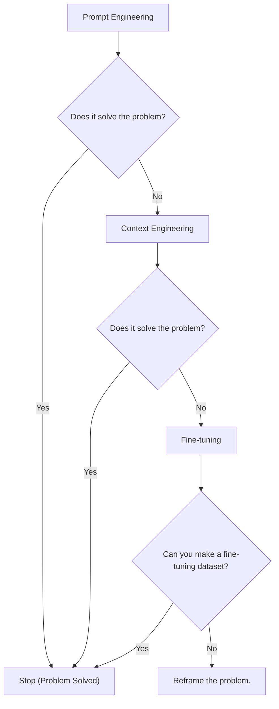
Image 1: A flowchart illustrating the decision-making workflow for choosing between Prompt Engineering, Context Engineering, and Fine-tuning when starting a new AI project.

For instance, if you build an agent to process internal Slack messages, you do not need to fine-tune a model on your company’s communication style. It is more effective to use a powerful reasoning model and engineer the context to retrieve specific messages and enable actions like creating tasks or drafting emails. Throughout this course, we will show you how to solve most industry problems using only context engineering.
```
**Grader reasoning:**
- `cc`: Understanding Context Engineering:
**1:** Both sections define context engineering as an optimization problem for assembling information. They both use the cooking agent/cookbook analogy and Andrej Karpathy's CPU/RAM analogy. Both also clarify that prompt engineering is a subset of context engineering and compare it to fine-tuning, using a decision-making workflow. The core ideas are fully aligned.
- `fl`: Understanding Context Engineering:
**0:** The generated section is missing GT Figure 1, a local static image that appears immediately after the first sentence and before the Karpathy analogy in the expected output. The generated section presents the textual flow correctly (optimization framing, cookbook analogy, Karpathy analogy, prompt engineering table, fine-tuning comparison), but GT Figure 1 ('What makes up the context' diagram) is entirely absent. The Mermaid flowchart (Image 1) corresponds to GT Figure 2 (the decision-making workflow) and is at the correct position. However, the absence of GT Figure 1 is a media placement failure. This is the same failure that scored flow §3 = 0 for presets 0, 1, and 2.
- `de`: Understanding Context Engineering:
**1:** [instances=1; quality=strong] A depth addition is present. The generated section adds that "by integrating memory, these systems break through the stateless limitation of single LLM calls, achieving continuity across interactions." This is a genuine addition beyond GT and qualifies as a 'theoretical foundation' explaining the mechanism behind context engineering's value. Traces almost verbatim to the exploration source https://arxiv.org/html/2504.02441v1 ("LLMs augmented with memory systems break through this limitation by integrating memory, achieving continuity across interactions"). One candidate was considered and rejected: the opening "formal optimization problem" definition (citing the arxiv survey) restates the same idea already present in the expected output's more casual framing rather than adding a new dimension of depth, so it does not qualify.
- `be`: Understanding Context Engineering:
**0:** [instances=0] No breadth additions are present. The section does not introduce any adjacent concepts, cross-domain analogies, or historical context beyond what is in the expected output.
- `cp`: Understanding Context Engineering:
**1:** No depth or breadth additions were identified, so the core is preserved by default.
- `ga`: Understanding context engineering:
**0:** The generated section successfully covers all required topics: the formal definition of context engineering, the cooking agent example, the Andrej Karpathy "RAM" analogy, the prompt vs. context engineering comparison table, the context vs. fine-tuning discussion, the decision-making workflow (including the Mermaid diagram), and the Slack message example. All elements are present and follow the specified order. However, the recounted prose-only word count is 403 words against a 500-word target (tolerance ±50, requiring at least 450) — 47 words under, which alone drives this score to 0.

#### Draw: replicate1  `/mnt/f/my_projects/agentic_AI_RL/Reinsearch_agent/RL_researcher_writer_ymaxing/rl_training_data/noise_experiment/03_context_engineering__var_standard__replicate1__preset3`

**Article text:**
```
## Understanding Context Engineering

Context engineering is about finding the best way to arrange parts of your memory into the context that is passed to the LLM to get the best results. It is an optimization problem where you retrieve the right parts from your short-term and long-term memory to solve a specific task without overwhelming the model [[6]](https://www.decodingai.com/p/context-engineering-2025s-1-skill), [[9]](https://arxiv.org/pdf/2507.13334). For example, when you ask a cooking agent for a recipe, you do not give it the entire cookbook. Instead, you retrieve the specific recipe, along with personal context like allergies or taste preferences. This precise selection ensures the model receives only the essential information.

Andrej Karpathy offered a great analogy for this: LLMs are like a new kind of operating system, where the model acts as the CPU and its context window functions as the RAM. Just as an operating system manages what fits into RAM, context engineering curates what occupies the model’s working memory [[10]](https://x.com/karpathy/status/1937902205765607626). Everything outside the context window—like vector stores or conversation logs—is like disk storage. It is vast and passive, requiring an explicit "load" command to influence the model's reasoning [[11]](https://atlan.com/know/working-memory-llms/).

How does context engineering relate to prompt engineering? Prompt engineering is a subset of context engineering. You still write effective prompts, but you also design a system that feeds the right context into those prompts. In simple terms, prompt engineering is how you ask the question, while context engineering is making sure the model has the right textbook and notes before it starts thinking. This means understanding not just *how* to phrase a task, but *what* information the model needs to perform optimally [[12]](https://weaviate.io/blog/context-engineering), [[6]](https://www.decodingai.com/p/context-engineering-2025s-1-skill).

| Dimension | Prompt Engineering | Context Engineering |
| --- | --- | --- |
| Scope | Single interaction optimization | Entire information ecosystem |
| State Management | Stateless function | Stateful due to memory |
| Focus | How to phrase tasks | What information to provide |

Table 1: A comparison of prompt engineering and context engineering.

Context engineering is the new fine-tuning. While fine-tuning has its place, it is expensive, time-consuming, and inflexible. Data changes constantly, making fine-tuning a last resort. For most enterprise use cases, you get better results faster and more cheaply with context engineering. It allows for rapid iteration and adaptation to evolving data without altering the core model, a key advantage in dynamic environments. This approach avoids the computational resources and specialized expertise required for retraining, offering a more agile path to reliable AI applications [[13]](https://www.linkedin.com/posts/denis-panjuta_prompt-engineering-vs-context-engineering-activity-7363945251180322816-1q_m).

When you start a new AI project, your decision-making process for guiding the LLM should look like the one presented in Image 1.

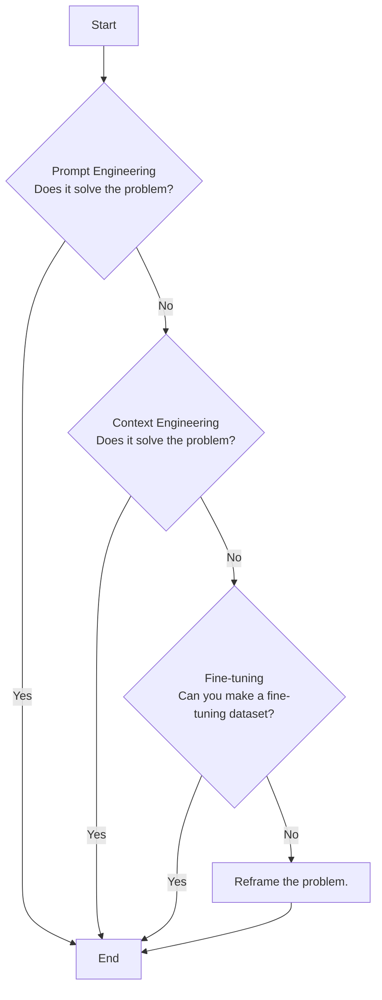
Image 1: A flowchart illustrating the decision-making process for choosing a key strategy to guide an LLM.

For instance, if you build an agent to process internal Slack messages, you do not need to fine-tune a model on your company’s communication style. It is more effective to use a powerful reasoning model and engineer the context to retrieve specific messages and enable actions like creating tasks or drafting emails. Throughout this course, we will show you how to solve most industry problems using only context engineering [[14]](https://www.mezmo.com/learn-observability/context-engineering-for-observability-how-to-deliver-the-right-data-to-llms).
```
**Grader reasoning:**
- `cc`: Understanding Context Engineering:
**1:** Both sections cover the definition/optimization-problem framing, the cooking-agent example, the Karpathy CPU/RAM analogy (cited to Karpathy's own post here rather than the LangChain article, an accepted citation variation), the prompt-engineering-subset relationship, the comparison table, the fine-tuning argument, the decision-making diagram, the Slack example, and the closing course reference. The added disk-storage extension of the analogy is a layered addition, not a substitution.
- `fl`: Understanding Context Engineering:
**0:** Most of the section's ideas appear in the same order with smooth transitions, and the decision-making diagram (Figure 2) has a counterpart in the same relative position. However, the expected section's Figure 1 ('What makes up the context'), placed right after the opening definition/example paragraph, again has no counterpart anywhere in the generated section.
- `de`: Understanding Context Engineering:
**0:** [instances=0] The added 'disk storage' extension of the Karpathy analogy is not traceable to either exploration-phase source in this episode's research.md.
- `be`: Understanding Context Engineering:
**0:** [instances=0] No candidate additions in this section trace to an exploration-phase source.
- `cp`: Understanding Context Engineering:
**1:** Both depth_enhancement and breadth_enhancement scored 0 for this section, so CorePreservation scores 1 by default per the mandatory rule.
- `ga`: Understanding Context Engineering:
**1:** All required content elements are present. The prose-only word count is 444 against a 500-word target (tolerance +/-50, requiring at least 450) — 6 words short of the floor. Extending the same logic used for a comparably small (5-word) gap earlier in this lesson's audit, this is treated as a trivial undershoot rather than a violation; flagged in notes since it nudges the established boundary out by one more word.

#### Draw: replicate2  `/mnt/f/my_projects/agentic_AI_RL/Reinsearch_agent/RL_researcher_writer_ymaxing/rl_training_data/noise_experiment/03_context_engineering__var_standard__replicate2__preset3`

**Article text:**
```
## Understanding context engineering

Context engineering is about finding the best way to arrange parts of your memory into the context that's passed to the LLM to squeeze out the best results. It's a solution to an optimization problem where you have to retrieve the right parts of both your short and long-term memory to solve a specific task without overwhelming the LLM [[3]](https://arxiv.org/pdf/2507.13334). For example, when asking a cooking agent about a recipe, instead of passing the whole cookbook to the agent, we retrieve just the information about that recipe, together with personal preferences, such as allergies or taste preferences.

Andrej Karpathy offered a great analogy for this: LLMs are like a new kind of operating system, where the model acts as the CPU and its context window functions as the RAM [[4]](https://x.com/karpathy/status/1937902205765607626). Just as an operating system manages what fits into RAM, context engineering curates what occupies the model’s working memory. This is often framed as managing the model's 'attention budget.' Like humans, who have a limited working memory, LLMs can only focus on so much information at once. Every piece of context consumes part of this budget, making careful curation essential [[13]](https://www.anthropic.com/engineering/effective-context-engineering-for-ai-agents).

Context engineering is not replacing prompt engineering. Instead, you can intuitively see prompt engineering as a part of context engineering. You still need to learn how to write good prompts while gathering the right context and stuffing it into your prompt without breaking the LLM. That’s what context engineering is all about [[1]](https://www.decodingai.com/p/context-engineering-2025s-1-skill). Prompt engineering is about how you ask the question, while context engineering ensures the model has the right information—like a textbook or notes from a previous conversation—before it starts to think [[12]](https://weaviate.io/blog/context-engineering).

| Dimension | Prompt Engineering | Context Engineering |
| --- | --- | --- |
| Scope | Single interaction optimization | Entire information ecosystem |
| State Management | Stateless function | Stateful due to memory |
| Focus | How to phrase tasks | What information to provide |

Table 1: A comparison of prompt engineering and context engineering.

Context engineering is the new fine-tuning. For most enterprise use cases, you get better results faster and more cheaply with context engineering [[5]](https://memgraph.com/blog/prompt-engineering-vs-context-engineering). As modern LLMs generalize really well, and because fine-tuning is time-consuming and costly, fine-tuning should always be the last resort if nothing else works.

When starting a new AI project and deciding what key strategy to use to guide the LLM to answer correctly, your decision-making should look like this, from easy to hard:

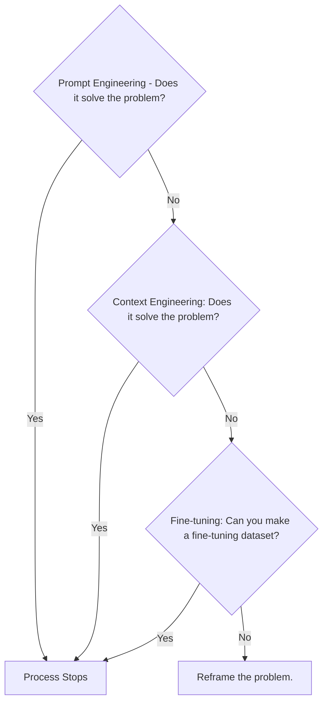
Image 1: A flowchart illustrating the decision-making process for choosing a key strategy to guide an LLM.

For instance, when processing Slack messages from your company, it's sufficient to use a reasoning LLM as the core of the agent and various mechanisms to retrieve specific Slack messages and take actions based on them, such as creating action points or writing emails. Fine-tuning the LLM on writing emails most of the time would be a waste of resources. Within this course, we will show you how to solve most industry use cases using the power of context engineering.
```
**Grader reasoning:**
- `cc`: Understanding Context Engineering:
**1:** Both sections cover the definition/optimization-problem framing, the cooking-agent example, the Karpathy CPU/RAM analogy, the prompt-engineering-subset relationship, the comparison table, the fine-tuning argument, the decision-making diagram, the Slack example, and the closing course reference. The added 'attention budget' / human-working-memory framing is a layered addition, not a substitution.
- `fl`: Understanding Context Engineering:
**0:** Most of the section's ideas appear in the same order with smooth transitions, and the decision-making diagram (Figure 2) has a counterpart in the same relative position. However, the expected section's Figure 1 ('What makes up the context'), placed right after the opening definition/example paragraph, again has no counterpart anywhere in the generated section.
- `de`: Understanding Context Engineering:
**0:** [instances=0] The 'attention budget' addition in this section is breadth-shaped rather than depth-shaped — see breadth_enhancement.
- `be`: Understanding Context Engineering:
**1:** [instances=1; quality=standard] One qualifying instance: the framing that LLMs have an 'attention budget' and that, '[l]ike humans, who have a limited working memory, LLMs can only focus on so much information at once,' is traceable to the exploration-phase instance of the Anthropic 'Effective Context Engineering for AI Agents' source (cited as [[13]]; this URL also appears as an exploitation-phase source elsewhere in this episode's research.md, but the specific human-working-memory analogy used here matches the exploration-phase instance's text specifically: 'Like humans, who have limited working memory capacity, LLMs have an "attention budget"...'). Classified standard rather than strong since this human-memory analogy is by now a fairly established, general framing in context-engineering discourse rather than a deeply technical or novel connection.
- `cp`: Understanding Context Engineering:
**1:** breadth_enhancement scored 1 for this section. The qualifying addition is one to two sentences supporting the existing Karpathy analogy rather than competing with it.
- `ga`: Understanding Context Engineering:
**0:** All required content elements are present. However, the prose-only word count is 433 against a 500-word target (tolerance +/-50, requiring at least 450) — 17 words short, a meaningfully larger gap than the single-digit-word misses treated as trivial elsewhere in this lesson, so this is scored as a genuine violation.

### Arm: light (preset1)

#### Draw: production  `/mnt/f/my_projects/agentic_AI_RL/Reinsearch_agent/RL_researcher_writer_ymaxing/rl_training_data/episodes/03_context_engineering__var_standard__preset1`

**Article text:**
```
## Understanding context engineering

Context engineering is about finding the best way to arrange information from your application's memory into the context passed to an LLM. It is a solution to an optimization problem where you retrieve the right parts from your short-term and long-term memory to solve a specific task without overwhelming the model [[5]](https://arxiv.org/pdf/2507.13334). For example, when you ask a cooking agent for a recipe, you do not give it the entire cookbook. Instead, you retrieve the specific recipe, along with personal context like allergies or taste preferences. This precise selection ensures the model receives only the essential information.

Andrej Karpathy explains that LLMs are like a new kind of operating system where the model is the CPU and its context window is the RAM [[31]](https://www.langchain.com/blog/context-engineering-for-agents/), [[33]](https://atlan.com/know/working-memory-llms/). Just as an operating system manages what fits into your computer’s limited RAM, context engineering manages what information occupies the model’s limited context window. This analogy extends further: the model's trained weights are like read-only memory (ROM), and external knowledge bases like vector stores are the hard disk—vast and passive, requiring information to be explicitly loaded into RAM before the CPU can use it [[33]](https://atlan.com/know/working-memory-llms/).

How does context engineering relate to prompt engineering? Prompt engineering is a subset of context engineering. You still write effective prompts, but you also design a system that feeds the right context into those prompts [[20]](https://blog.langchain.com/the-rise-of-context-engineering/). This means understanding not just *how* to phrase a task, but *what* information the model needs to perform optimally. While prompt engineering is tactical and focuses on a single interaction, context engineering is systemic, architecting the entire information flow for complex, stateful applications.

Table 1: A comparison of prompt engineering and context engineering.

| Dimension | Prompt Engineering | Context Engineering |
| :--- | :--- | :--- |
| Scope | Single interaction optimization | Entire information ecosystem |
| State Management | Stateless function | Stateful due to memory |
| Focus | How to phrase tasks | What information to provide |

Context engineering is the new fine-tuning. While fine-tuning has its place, it is expensive, time-consuming, and inflexible. Data changes constantly, making fine-tuning a last resort. For most enterprise use cases, you get better results faster and more cheaply with context engineering [[51]](https://www.linkedin.com/posts/denis-panjuta_prompt-engineering-vs-context-engineering-activity-7363945251180322816-1q_m). It allows for rapid iteration and adaptation to evolving data without altering the core model, a key advantage in dynamic environments. Fine-tuning is best for teaching a model a new core skill or behavior, whereas context engineering provides the necessary information for an immediate task [[51]](https://www.linkedin.com/posts/denis-panjuta_prompt-engineering-vs-context-engineering-activity-7363945251180322816-1q_m).

When you start a new AI project, your decision-making process for guiding the LLM should look like the one presented in Image 1.

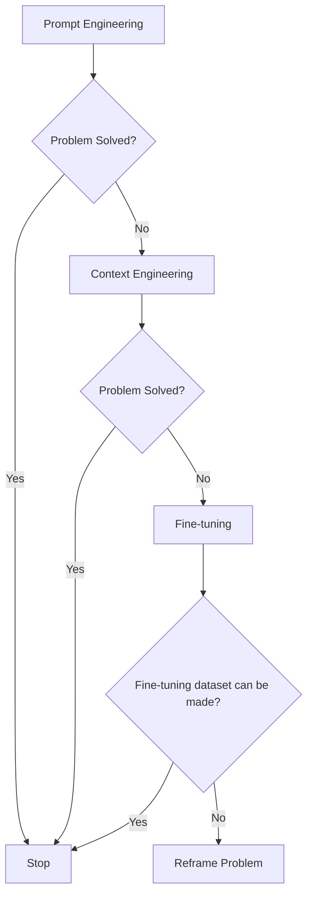

Image 1: A flowchart illustrating the decision-making process for AI project strategies.

For instance, if you build an agent to process internal Slack messages, you do not need to fine-tune a model on your company’s communication style. It is more effective to use a powerful reasoning model and engineer the context to retrieve specific messages and enable actions like creating tasks or drafting emails. Throughout this course, we will show you how to solve most industry problems using only context engineering.
```
**Grader reasoning:**
- `cc`: Understanding Context Engineering:
**1:** Both sections cover the same core ideas: defining context engineering as an optimization problem, using the cooking agent analogy, presenting Andrej Karpathy's OS analogy (CPU/RAM), explaining prompt engineering as a subset of context engineering, and positioning context engineering as the "new fine-tuning" with a decision-making flowchart.
- `fl`: Understanding Context Engineering:
**0:** The generated section omits the first image (Figure 1) that is present in the expected output, which constitutes a media placement failure. The rest of the flow, including the table and the second diagram, follows the expected order.
- `de`: Understanding Context Engineering:
**0:** [instances=0] No depth additions present. The generated section provides the same core explanations and analogies as the expected output without adding deeper theoretical foundations, technical nuances, or implementation challenges. One candidate was considered and rejected: the section extends the Karpathy CPU/RAM analogy with a ROM/hard-disk framing ("the model's trained weights are like read-only memory... external knowledge bases like vector stores are the hard disk"), which is a genuine addition beyond the GT and would qualify as a technical nuance, but it traces only to https://atlan.com/know/working-memory-llms/, which appears exclusively in exploitation-phase research (sources [33]/[36]) — no exploration-phase source contains this content, so it does not qualify.
- `be`: Understanding Context Engineering:
**0:** [instances=0] No breadth additions present. The generated section stays focused on defining context engineering and its relationship to prompt engineering and fine-tuning, without expanding to adjacent concepts or cross-domain analogies.
- `cp`: Understanding Context Engineering:
**1:** No depth or breadth additions were identified. The ground truth core is preserved by default.
- `ga`: Understanding context engineering:
**1:** The generated section includes all required elements. It provides a definition of context engineering, uses the cooking agent example, and includes the Andrej Karpathy "RAM" analogy. It correctly presents the table comparing prompt and context engineering. It also discusses the relationship with fine-tuning and includes the 3-step decision-making workflow, which is correctly rendered as a Mermaid diagram. The Slack message example is also present. The recounted prose-only word count is 449 words against a 500-word target (tolerance ±50, requiring at least 450) — under by only 1 word, within the ±10-word trivial-stochastic-noise exemption band, so this does not drive the score to 0.

#### Draw: replicate1  `/mnt/f/my_projects/agentic_AI_RL/Reinsearch_agent/RL_researcher_writer_ymaxing/rl_training_data/noise_experiment/03_context_engineering__var_standard__replicate1__preset1`

**Article text:**
```
## Understanding Context Engineering

Context engineering is about finding the best way to arrange parts of your memory into the context that's passed to the LLM to squeeze out the best results. It's a solution to an optimization problem where you retrieve the right parts of both your short-term and long-term memory to solve a specific task without overwhelming the LLM. For example, when you ask a cooking agent for a recipe, you do not give it the entire cookbook. Instead, you retrieve the specific recipe, along with personal context like allergies or taste preferences. This precise selection ensures the model receives only the essential information [[5]](https://arxiv.org/pdf/2507.13334), [[14]](https://www.llamaindex.ai/blog/context-engineering-what-it-is-and-techniques-to-consider).

Andrej Karpathy explains that LLMs are like a new kind of operating system where the model is the CPU and its context window is the RAM. Just as an operating system manages what fits into your computer’s limited RAM, context engineering manages what information occupies the model’s limited context window. This analogy extends further: everything outside the context window, like vector stores or conversation histories, acts as disk storage. This information is vast and passive, requiring an explicit "load" operation (retrieval) before it can influence the model's reasoning [[6]](https://www.langchain.com/blog/context-engineering-for-agents/), [[15]](https://atlan.com/know/working-memory-llms/).

How does context engineering relate to prompt engineering? Prompt engineering is a subset of context engineering. You still write effective prompts, but you also design a system that feeds the right context into those prompts. This means understanding not just *how* to phrase a task, but *what* information the model needs to perform optimally [[12]](https://blog.langchain.com/the-rise-of-context-engineering/), [[16]](https://nlp.elvissaravia.com/p/context-engineering-guide).

<table_caption>
Table 1: A comparison of prompt engineering and context engineering.
</table_caption>

| Dimension | Prompt Engineering | Context Engineering |
|---|---|---|
| Scope | Single interaction optimization | Entire information ecosystem |
| State Management | Stateless function | Stateful due to memory |
| Focus | How to phrase tasks | What information to provide |

Context engineering is the new fine-tuning. While fine-tuning has its place, it is expensive, time-consuming, and inflexible. It is best reserved for teaching a model a new *skill* or *behavior*, like adhering to a specific JSON format, not for providing it with new *facts*. For most enterprise use cases, you get better results faster and more cheaply with context engineering, which allows for rapid iteration and adaptation to evolving data without altering the core model [[7]](https://www.linkedin.com/posts/denis-panjuta_prompt-engineering-vs-context-engineering-activity-7363945251180322816-1q_m).

When you start a new AI project, your decision-making process for guiding the LLM should look like the one presented in Image 1. You start with simple prompt engineering. If that fails, you move to context engineering, which provides the model with dynamic, task-specific knowledge at inference time. Fine-tuning, which alters the model's core behavior, should always be the last resort if all else fails [[7]](https://www.linkedin.com/posts/denis-panjuta_prompt-engineering-vs-context-engineering-activity-7363945251180322816-1q_m).

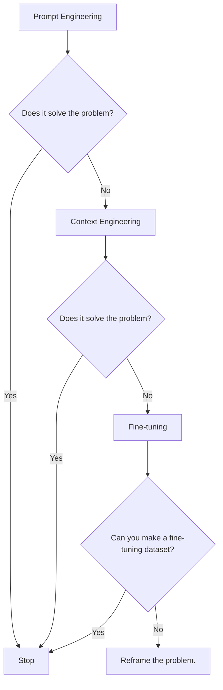
<diagram_caption>
Image 1: A flowchart illustrating the decision-making process for choosing between Prompt Engineering, Context Engineering, and Fine-tuning when building new AI applications.
</diagram_caption>

For instance, if you build an agent to process internal Slack messages, you do not need to fine-tune a model on your company’s communication style. It is more effective to use a powerful reasoning model and engineer the context to retrieve specific messages and enable actions like creating tasks or drafting emails. Throughout this course, we will show you how to solve most industry problems using only context engineering [[17]](https://www.mezmo.com/learn-observability/context-engineering-for-observability-how-to-deliver-the-right-data-to-llms).
```
**Grader reasoning:**
- `cc`: Understanding Context Engineering:
**1:** Both sections cover the definition/optimization-problem framing, the cooking-agent example, the Karpathy CPU/RAM analogy, the prompt-engineering-subset relationship, the comparison table, the fine-tuning argument, the decision-making diagram, the Slack example, and the closing course reference. The generated section adds a disk-storage extension of the analogy and an explicit prose walk-through of the decision logic already shown in the diagram — both layered additions, not substitutions.
- `fl`: Understanding Context Engineering:
**0:** Most of the section's ideas appear in the same order with smooth transitions, and the decision-making diagram (Figure 2) has a counterpart in the same relative position. However, the expected section's Figure 1 ('What makes up the context'), placed right after the opening definition/example paragraph, again has no counterpart anywhere in the generated section.
- `de`: Understanding Context Engineering:
**0:** [instances=0] The added 'disk storage' extension of the Karpathy analogy is cited to atlan.com/know/working-memory-llms/, which is tagged phase="exploitation" in this episode's research.md (Source [33]/[36]), not exploration. No candidate in this section traces to either exploration-phase source.
- `be`: Understanding Context Engineering:
**0:** [instances=0] As with depth_enhancement, the added 'disk storage' analogy traces only to the exploitation-phase atlan.com/working-memory-llms source, so it does not qualify.
- `cp`: Understanding Context Engineering:
**1:** Both depth_enhancement and breadth_enhancement scored 0 for this section (the disk-storage analogy did not qualify), so CorePreservation scores 1 by default per the mandatory rule.
- `ga`: Understanding Context Engineering:
**1:** All required content elements are present. Word count is 466 against a 500-word target (tolerance +/-50, range 450-550) — within tolerance; notably, this is the first version of this section across this lesson's audits so far to land inside the target range.

#### Draw: replicate2  `/mnt/f/my_projects/agentic_AI_RL/Reinsearch_agent/RL_researcher_writer_ymaxing/rl_training_data/noise_experiment/03_context_engineering__var_standard__replicate2__preset1`

**Article text:**
```
## Understanding context engineering

Context engineering is about finding the best way to arrange parts of your memory into the context that's passed to an LLM. It's a solution to an optimization problem where you have to retrieve the right parts of both your short- and long-term memory to solve a specific task without overwhelming the LLM [[7]](https://www.mezmo.com/learn-observability/context-engineering-for-observability-how-to-deliver-the-right-data-to-llms). For example, when asking a cooking agent about a recipe, instead of passing the whole cookbook to the agent, we retrieve just the information about that recipe, together with personal preferences like allergies or taste preferences.

Andrej Karpathy explains that LLMs are like a new kind of operating system where the model is the CPU and its context window is the RAM [[7]](https://www.langchain.com/blog/context-engineering-for-agents/). Just as an operating system manages what fits into your computer’s limited RAM, context engineering manages what information occupies the model’s limited context window. This mental model frames context management not as a workaround, but as a core engineering discipline. Everything outside the context window—vector stores, conversation history, external documents—is like disk storage. It is vast and passive, requiring an explicit "load" operation to influence the model's reasoning.

Prompt engineering is a subset of context engineering. You still work with prompts, so learning how to write them effectively is a critical skill. But on top of that, it's important to know how to incorporate the right context into the prompt without compromising the LLM's performance [[8]](https://memgraph.com/blog/prompt-engineering-vs-context-engineering).

<table_caption>
Table 1: A comparison of prompt engineering and context engineering.
</table_caption>

| Dimension | Prompt Engineering | Context Engineering |
|-----------|-------------------|---------------------|
| Scope | Single interaction optimization | Entire information ecosystem |
| State Management | Stateless function | Stateful due to memory |
| Focus | How to phrase tasks | What information to provide |

Context engineering is the new fine-tuning. For most use cases, you can get far just by using context engineering techniques. As modern LLMs generalize well, and because fine-tuning is time-consuming and costly, it should always be the last resort. Fine-tuning requires large, curated datasets, significant computational resources, and specialized expertise. This makes it slow to iterate on, especially when business requirements or data sources change frequently. In contrast, context engineering allows for rapid, code-based iteration without altering the base model, offering a more agile path for dynamic enterprise environments [[3]](https://www.linkedin.com/posts/denis-panjuta_prompt-engineering-vs-context-engineering-activity-7363945251180322816-1q_m), [[8]](https://memgraph.com/blog/prompt-engineering-vs-context-engineering).

When starting a new AI project and deciding what key strategy to use to guide the LLM, your decision-making process should look like the one presented in Image 1. You start with prompt engineering. If that does not solve your problem, you move to context engineering. If that still fails, you can consider fine-tuning, but only if you can create a high-quality dataset. Otherwise, it is better to reframe the problem.

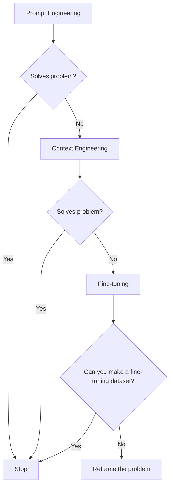
<diagram_caption>
Image 1: A flowchart illustrating the decision-making process for choosing between Prompt Engineering, Context Engineering, and Fine-tuning when solving a problem in AI application development.
</diagram_caption>

For example, when processing Slack messages from your company, it's sufficient to use a reasoning LLM as the core of the agent and various mechanisms to retrieve specific messages and take actions based on them, such as creating action points or writing emails. Fine-tuning the LLM on your company's writing style would likely be a waste of resources. Throughout this course, we will show you how to solve most industry use cases using the power of context engineering.
```
**Grader reasoning:**
- `cc`: Understanding Context Engineering:
**1:** Both sections cover the definition/optimization-problem framing, the cooking-agent example, the Karpathy CPU/RAM analogy, the prompt-engineering-subset relationship, the comparison table, the fine-tuning argument, the decision-making diagram, the Slack example, and the closing course reference. The added disk-storage extension of the analogy is a layered addition, not a substitution.
- `fl`: Understanding Context Engineering:
**0:** Most of the section's ideas appear in the same order with smooth transitions, and the decision-making diagram (Figure 2) has a counterpart in the same relative position. However, the expected section's Figure 1 ('What makes up the context'), placed right after the opening definition/example paragraph, again has no counterpart anywhere in the generated section — the fifth generation in a row audited for this lesson to be missing this specific figure.
- `de`: Understanding Context Engineering:
**0:** [instances=0] The added 'disk storage' extension of the Karpathy analogy carries no citation of its own, and this specific extension of the analogy is not traceable to either exploration-phase source in this episode's research.md.
- `be`: Understanding Context Engineering:
**0:** [instances=0] No candidate additions in this section trace to an exploration-phase source.
- `cp`: Understanding Context Engineering:
**1:** Both depth_enhancement and breadth_enhancement scored 0 for this section, so CorePreservation scores 1 by default per the mandatory rule.
- `ga`: Understanding Context Engineering:
**1:** All required content elements are present. Word count is 477 against a 500-word target (tolerance +/-50, range 450-550) — within tolerance.

## Section: S6::section-6-key-strategies-for-context-optimization  (weight=0.196, contribution=-0.0033 AGAINST standard)
Stored section rewards: standard=0.5819  light=0.5933  (explore: standard=0.3050  light=0.2900)

### Arm: standard (preset3)

#### Draw: production  `/mnt/f/my_projects/agentic_AI_RL/Reinsearch_agent/RL_researcher_writer_ymaxing/rl_training_data/episodes/03_context_engineering__var_standard__preset3`

**Article text:**
```
## Key strategies for context optimization

Initially, most AI applications were chatbots over single knowledge bases. Today, modern AI solutions must manage multiple knowledge bases, tools, and complex conversational histories. Context engineering is about managing this complexity while meeting performance, latency, and cost requirements.

Here are four popular context engineering strategies used across the industry:

### Selecting the Right Context

Retrieving the right information from memory is a critical first step. A common mistake is to provide everything at once, assuming that models with large context windows can handle it. As we have discussed, the "lost-in-the-middle" problem often leads to poor performance, increased latency, and higher costs [[59]](https://atlan.com/know/llm-context-window-limitations/).

To solve this, consider these approaches:

-   **Use structured outputs:** Define clear schemas for what the LLM should return. This allows you to pass only the necessary, structured information to downstream steps. We will cover this in detail in Lesson 4.
-   **Use RAG:** Instead of providing entire documents, use RAG to fetch only the specific chunks of text needed to answer a user's question. This is a core topic we will explore in Lesson 10.
-   **Refine user inputs through query augmentation:** This can involve rewriting ambiguous queries or breaking down complex questions into sub-queries to improve the quality of retrieved results [[80]](https://weaviate.io/blog/context-engineering).
-   **Chunk documents along semantic breaks:** Instead of using fixed sizes, chunk documents along natural semantic boundaries to preserve coherent thought units [[81]](https://www.moodys.com/web/en/us/creditview/blog/beyond-prompts-why-enterprise-ai-demands-context-engineering.html).
-   **Reduce the number of available actions:** Rather than giving an agent access to every available action, use various strategies to delegate action subsets to specialized components. Studies have shown that applying RAG to tool descriptions can improve performance, with some finding that keeping tool selections under 30 improves selection accuracy threefold [[21]](https://www.datacamp.com/blog/context-engineering).
-   **Implement semantic caching:** Store and reuse answers for similar queries to avoid redundant computation and reduce costs [[82]](https://redis.io/blog/context-engineering-best-practices-for-an-emerging-discipline/).
-   **Rank time-sensitive data:** For time-sensitive information, rank it by date and filter out anything no longer relevant [[12]](https://www.dailydoseofds.com/llmops-crash-course-part-8/).
-   **Repeat core instructions:** For the most important instructions, repeat them at both the start and the end of the prompt. This uses the model's tendency to pay more attention to the context edges, ensuring core instructions are not lost [[57]](https://promptmetheus.com/resources/llm-knowledge-base/lost-in-the-middle-effect).

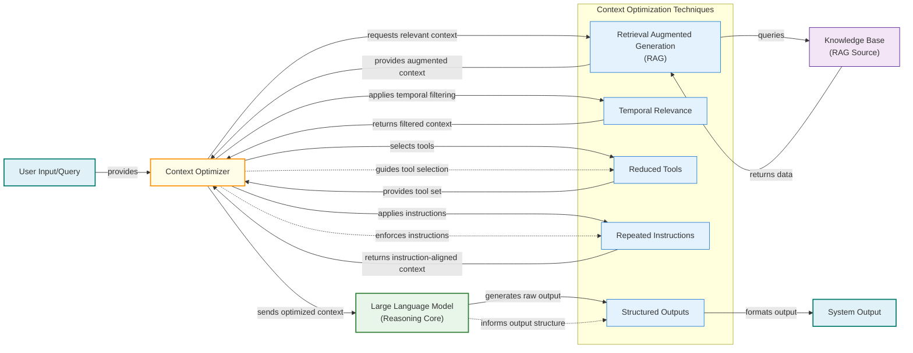
Image 4: Architecture diagram showing context optimization techniques in an AI system.

### Context Compression

As message history grows in short-term working memory, you must manage past interactions to keep your context window in check. You cannot simply drop past conversation turns, as the LLM still needs to remember what happened. Instead, you need ways to compress key facts from the past. A full compression pipeline might involve relevance filtering, semantic deduplication, extractive summarization, and sentence pruning to reduce token usage by 50-80% [[11]](https://oneuptime.com/blog/post/2026-01-30-context-compression/view). You can create summaries of past interactions, move user preferences to long-term memory, or use deduplication to avoid repetition [[12]](https://www.dailydoseofds.com/llmops-crash-course-part-8/).

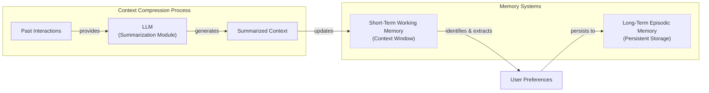
Image 5: A flowchart illustrating context compression strategies, showing how past interactions are summarized by an LLM and how user preferences are moved from short-term to long-term memory.

### Isolating Context

Another powerful strategy is to isolate context by splitting information across multiple agents or LLM workflows. Instead of one agent with a massive, cluttered context window, you can have a team of agents, each with a smaller, focused context [[48]](https://www.vellum.ai/blog/multi-agent-systems-building-with-context-engineering). We often implement this using an orchestrator-worker pattern, where a central orchestrator agent breaks down a problem and assigns sub-tasks to specialized worker agents [[46]](https://beam.ai/agentic-insights/multi-agent-orchestration-patterns-production). Each worker operates in its own isolated context, improving focus and allowing for parallel processing. This prevents cross-domain hallucinations and can reduce token consumption by 60-70% compared to a monolithic agent [[45]](https://gurusup.com/blog/multi-agent-orchestration-guide).

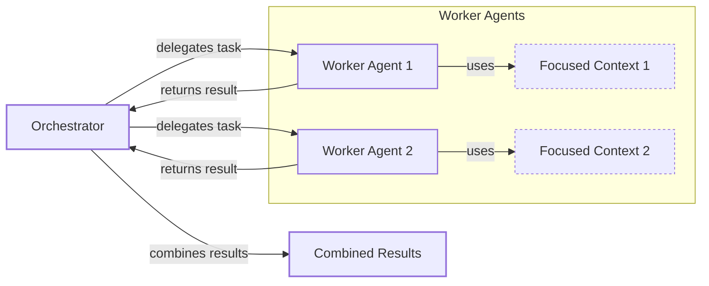
Image 6: An architecture diagram illustrating the orchestrator-worker pattern for context isolation.

### Format Optimization

Finally, the way you format the context matters. Models are sensitive to structure, and using clear delimiters can improve performance. Common strategies are to use XML tags to wrap different pieces of context (e.g., `<user_query>`, `<documents>`) and prefer YAML over JSON when providing structured data as input, as it is more token-efficient [[41]](https://www.decodingai.com/p/context-engineering-2025s-1-skill). Looking forward, standardization efforts like the Model Context Protocol (MCP) aim to create a universal interface for tools, simplifying how agents connect to external systems [[80]](https://weaviate.io/blog/context-engineering).

You always have to understand what is passed to the LLM. Seeing exactly what occupies your context window at every step is key to mastering context engineering. This is usually done by properly monitoring your traces, tracking what happens at each step, and understanding the inputs and outputs [[18]](https://www.getmaxim.ai/articles/context-window-management-strategies-for-long-context-ai-agents-and-chatbots/). As this is a significant step to go from PoC to production, we will have dedicated lessons on this.
```
**Grader reasoning:**
- `cc`: Key Strategies for Context Optimization:
**1:** The generated section covers all four required strategies (Selecting the Right Context, Context Compression, Isolating Context, Format Optimization), all sub-points within each strategy, and the concluding paragraph on monitoring. The core content is fully aligned with the expected output.
- `fl`: Key Strategies for Context Optimization:
**1:** The generated section presents all four strategies in the correct order, and the concluding monitoring paragraph is present. Three Mermaid diagrams appear at positions corresponding to Figures 6, 7, and 8 within their respective subsections. Although Image 4 appears after all bullets in the 'Selecting the Right Context' subsection rather than between bullets 3 and 4 as in the GT, this intra-bullet placement difference is trivial and does not constitute a flow failure. The flow is correct.
- `de`: Key Strategies for Context Optimization:
**1:** [instances=3; quality=strong,strong,strong] A depth addition is present. The generated section includes several additional context selection strategies not mentioned in the expected output: query augmentation (refining/rewriting ambiguous queries), semantic chunking (chunking along semantic breaks rather than fixed sizes), and semantic caching (storing and reusing answers for similar queries). This qualifies as 'technical nuances or alternative implementation perspectives'. All three trace to exploration sources with close content matches: https://weaviate.io/blog/context-engineering (Query Augmentation section), https://www.moodys.com/web/en/us/creditview/blog/beyond-prompts-why-enterprise-ai-demands-context-engineering.html ("chunking large documents into coherent tokens following semantic breaks"), and content matching semantic caching within the exploration tavily block ("semantic caching via RedisVL stores prior RAG questions to avoid repeats"). Two candidates were considered and rejected: "applying RAG to tool descriptions... under 30 tools improves accuracy threefold" traces only to https://www.datacamp.com/blog/context-engineering, which is exploitation-only; the "50-80% token reduction" compression stat and the "60-70% token reduction" isolation stat (checked in the Context Compression and Isolating Context subsections) trace only to exploitation-only sources (oneuptime.com and gurusup.com respectively).
- `be`: Key Strategies for Context Optimization:
**1:** [instances=1; quality=strong] A breadth addition is present. The Format Optimization subsection mentions "standardization efforts like the Model Context Protocol (MCP) aim to create a universal interface for tools, simplifying how agents connect to external systems." This qualifies as an 'enabling or disrupting technology that intersects with the core topic'. Traces to an exploration-phase Weaviate scrape with near-identical wording: "The Model Context Protocol (MCP)... addresses this by providing a universal standard for connecting AI applications to external data sources and tools," matching the article's own citation (https://weaviate.io/blog/context-engineering).
- `cp`: Key Strategies for Context Optimization:
**1:** No depth or breadth additions were identified, so the core is preserved by default.
- `ga`: Key strategies for context optimization:
**1:** The generated section covers all four required strategies with all sub-points present. The Mermaid diagram for 'Selecting the Right Context' (Image 4) is a single combined flowchart that shows all five techniques (RAG/Retrieval, Temporal Relevance, Reduced Tools, Repeated Instructions, Structured Outputs) working together in one system — fulfilling the guideline's requirement for a diagram 'combining techniques 1, 2, 3, 4 and 5 to show how they could work together in a bigger system'. All three Mermaid diagrams (Images 4, 5, 6) are present. The concluding monitoring paragraph is present. The recounted prose-only word count is 703 words against a 650-word target (tolerance ±65, requiring at most 715) — within tolerance. All guideline requirements are met.

#### Draw: replicate1  `/mnt/f/my_projects/agentic_AI_RL/Reinsearch_agent/RL_researcher_writer_ymaxing/rl_training_data/noise_experiment/03_context_engineering__var_standard__replicate1__preset3`

**Article text:**
```
## Key Strategies for Context Optimization

Initially, most AI applications were chatbots over single knowledge bases. Today, modern AI solutions must manage multiple knowledge bases, tools, and complex conversational histories. Context engineering is about managing this complexity while meeting performance, latency, and cost requirements.

Here are four popular context engineering strategies used across the industry:

### Selecting the Right Context

Retrieving the right information from memory is a critical first step. A common mistake is to provide everything at once, assuming that models with large context windows can handle it. As we've discussed, the "lost-in-the-middle" problem often leads to poor performance, increased latency, and higher costs [[26]](https://atlan.com/know/llm-context-window-limitations/).

To solve this, consider these approaches:

-   **Use structured outputs:** Define clear schemas for what the LLM should return. This allows you to pass only the necessary, structured information to downstream steps. We will cover this in detail in Lesson 4.
-   **Use RAG:** Instead of providing entire documents, use RAG to fetch only the specific chunks of text needed to answer a user's question. Advanced techniques like GraphRAG can even use knowledge graphs to retrieve interconnected information, providing richer context than simple document chunks. This is a core topic we will explore in Lesson 10 [[27]](https://www.moodys.com/web/en/us/creditview/blog/beyond-prompts-why-enterprise-ai-demands-context-engineering.html), [[9]](https://arxiv.org/pdf/2507.13334).
-   **Reduce the number of available actions:** Rather than giving an agent access to every available action, use various strategies to delegate action subsets to specialized components. For example, a typical pattern is to use the orchestrator-worker pattern to delegate subtasks to specialized agents. Studies show that keeping tool selections under 30 can improve selection accuracy threefold [[15]](https://www.datacamp.com/blog/context-engineering).
-   **Rank time-sensitive data:** For time-sensitive information, rank it by date and filter out anything no longer relevant [[28]](https://www.dailydoseofds.com/llmops-crash-course-part-8/).
-   **Repeat core instructions:** For the most important instructions, repeat them at both the start and the end of the prompt. This uses the model's tendency to pay more attention to the context edges, ensuring core instructions are not lost [[29]](https://promptmetheus.com/resources/llm-knowledge-base/lost-in-the-middle-effect).

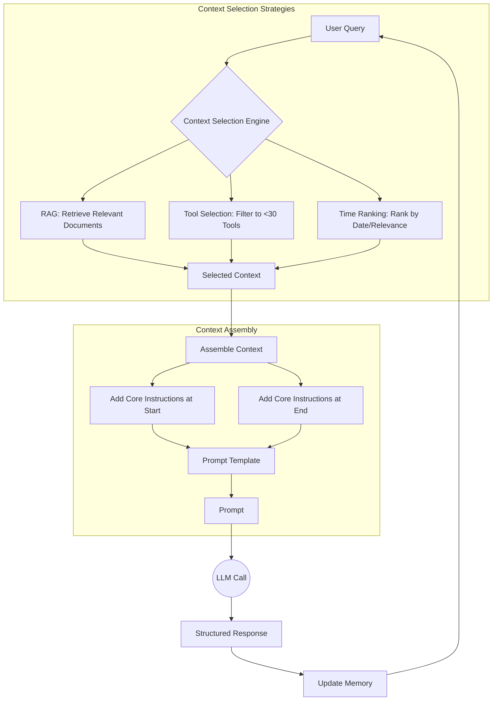
Image 4: A workflow showing how the four context selection strategies work together to optimize information retrieval and assembly.

### Context Compression

As message history grows in short-term working memory, you must manage past interactions to keep your context window in check. You cannot simply drop past conversation turns, as the LLM still needs to remember what happened. Instead, you need ways to compress key facts from the past. This introduces a trade-off: aggressive compression can reduce latency by 20-30% but may also erode the model's ability to recall fine-grained details [[30]](https://www.emergentmind.com/topics/context-compression-framework).

You can do this through:

1.  **Creating summaries of past interactions:** Use an LLM to replace a long, detailed history with a concise overview [[31]](https://oneuptime.com/blog/post/2026-01-30-context-compression/view).
2.  **Moving user preferences to long-term memory:** Transfer user preferences from working memory to long-term episodic memory. This keeps the working context clean while ensuring preferences are remembered for future sessions [[6]](https://www.decodingai.com/p/context-engineering-2025s-1-skill).
3.  **Deduplication:** Remove redundant information from the context to avoid repetition, using techniques like MinHash [[6]](https://www.decodingai.com/p/context-engineering-2025s-1-skill).
4.  **Use semantic caching:** Store the results of previous expensive computations or user queries. Before executing a new retrieval step, check the cache for a similar past query to reduce redundant processing and costs [[32]](https://redis.io/blog/context-engineering-best-practices-for-an-emerging-discipline/).

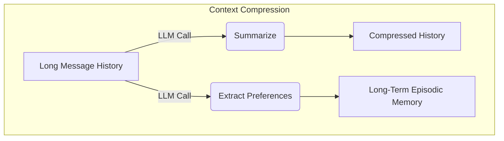
Image 5: Compressing context by summarizing history and extracting preferences to long-term memory.

### Isolating Context

Another powerful strategy is to isolate context by splitting information across multiple agents or LLM workflows. This technique is similar to tool isolation but is more general, referring to the whole context. The key idea is that instead of one agent with a massive, cluttered context window, you can have a team of agents, each with a smaller, focused context [[33]](https://beam.ai/agentic-insights/multi-agent-orchestration-patterns-production).

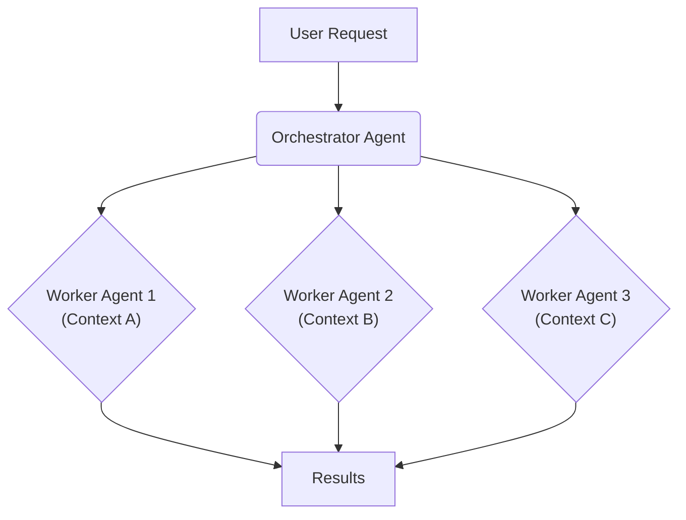
Image 6: The orchestrator-worker pattern isolates context across multiple specialized agents.

We often implement this using an orchestrator-worker pattern, where a central orchestrator agent breaks down a problem and assigns sub-tasks to specialized worker agents. Each worker operates in its own isolated context, improving focus and allowing for parallel processing. We will cover this pattern in more detail in Lesson 5 [[34]](https://gurusup.com/blog/multi-agent-orchestration-guide).

### Format Optimizations

Finally, the way you format the context matters. Models are sensitive to structure, and using clear delimiters can improve performance. Common strategies are to:

-   **Use XML tags:** Wrap different pieces of context in XML-like tags (e.g., `<user_query>`, `<documents>`). This helps the model distinguish between different types of information, while making it easier for the engineer to reference context elements within the system prompt [[35]](https://www.anthropic.com/engineering/effective-context-engineering-for-ai-agents).
-   **Prefer YAML over JSON:** When providing structured data as input, YAML is often more token-efficient than JSON, which helps save space in your context window [[6]](https://www.decodingai.com/p/context-engineering-2025s-1-skill).

You always have to understand what is passed to the LLM. Seeing exactly what occupies your context window at every step is key to mastering context engineering. Usually, this is done by properly monitoring your traces, tracking what happens at each step, and understanding what the inputs and outputs are. As this is a significant step to go from PoC to production, we will have dedicated lessons on this [[36]](https://www.getmaxim.ai/articles/context-window-management-strategies-for-long-context-ai-agents-and-chatbots/).
```
**Grader reasoning:**
- `cc`: Key Strategies for Context Optimization:
**1:** Both sections cover all four strategies with matching substance across every subsection, including a fourth Context Compression technique (semantic caching) added on top of the expected three. The generated section adds a GraphRAG elaboration to the RAG bullet in Selecting the Right Context and a compression/fidelity trade-off discussion to Context Compression, both layered on top of the expected content.
- `fl`: Key Strategies for Context Optimization:
**1:** All four strategies appear in the same order with the same transitions, and all three diagrams sit in the same relative position as their ground-truth counterparts (including the orchestrator-worker diagram, which is placed between its two supporting paragraphs exactly as in the expected section).
- `de`: Key Strategies for Context Optimization:
**1:** [instances=2; quality=strong,strong] Two qualifying instances. (1) The GraphRAG elaboration on the RAG bullet — 'GraphRAG can even use knowledge graphs to retrieve interconnected information, providing richer context than simple document chunks' — is traceable to the exploration-phase moodys.com source (cited as [[27]]), which discusses GraphRAG in these terms (also co-cited with, and consistent with, the golden arXiv survey's extensive GraphRAG discussion). Classified strong as a specific, named advanced technique. This deepens the core topic (context selection) rather than connecting outward, so it is depth only. (2) The compression/fidelity trade-off in Context Compression — 'aggressive compression can reduce latency by 20-30% but may also erode... fine-grained details' — is traceable to the exploration-phase emergentmind.com source (cited as [[30]]), which discusses both a specific 20-30% latency-reduction framework (EXIT) and a general fidelity-erosion concern for extreme compression; note the source's own EXIT example does not itself show recall erosion at that specific 20-30% figure (it shows a slight accuracy improvement), so the sentence synthesizes two separate points from the source in a way that implies a tighter link between them than the source demonstrates — flagged in notes as a synthesis-accuracy concern rather than a fabrication, since both individual facts are present in the source.
- `be`: Key Strategies for Context Optimization:
**0:** [instances=0] Both qualifying depth instances in this section (GraphRAG; the compression/fidelity trade-off) deepen the section's own topics rather than connecting to an adjacent field.
- `cp`: Key Strategies for Context Optimization:
**1:** depth_enhancement scored 1 for this section (GraphRAG; compression/fidelity trade-off); breadth_enhancement scored 0. The two qualifying depth additions are each one sentence within an existing bullet, proportionate and supportive of the four core strategies, which remain clearly dominant.
- `ga`: Key Strategies for Context Optimization:
**0:** All four strategies and their required sub-points are present, plus an added fourth compression technique. However, the prose-only word count is 764 against a 650-word target (tolerance +/-65, requiring at most 715) — 49 words over, a substantial overage driven by the GraphRAG and compression-tradeoff elaborations.

#### Draw: replicate2  `/mnt/f/my_projects/agentic_AI_RL/Reinsearch_agent/RL_researcher_writer_ymaxing/rl_training_data/noise_experiment/03_context_engineering__var_standard__replicate2__preset3`

**Article text:**
```
## Key strategies for context optimization

Initially, most AI applications were chatbots over single knowledge bases. Today, modern AI solutions must manage multiple knowledge bases, tools, and complex conversational histories. Context engineering is about managing this complexity while meeting performance, latency, and cost requirements.

Here are four popular context engineering strategies used across the industry:

### Selecting the right context

Retrieving the right information from memory is a critical first step. A common mistake is to provide everything at once, assuming that models with large context windows can handle it. As we've discussed, the "lost-in-the-middle" problem often leads to poor performance, increased latency, and higher costs.

To solve this, consider these approaches:

*   **Use structured outputs:** Define clear schemas for what the LLM should return. This allows you to pass only the necessary, structured information to downstream steps. We will cover this in detail in Lesson 4.
*   **Use RAG:** Instead of providing entire documents, use RAG to fetch only the specific chunks of text needed to answer a user's question. This is a core topic we will explore in Lesson 10.
*   **Reduce the number of available tools:** Rather than giving an agent access to every available tool, use various strategies to delegate tool subsets to specialized components. Studies show that limiting the selection to under 30 tools can triple the agent's selection accuracy [[9]](https://www.datacamp.com/blog/context-engineering). The ideal number of tools an agent can use depends on the tools, the LLM, and how well the tools are defined. Evaluating your AI system on core business metrics is a mandatory step that will help you pick the right number.
*   **Rank time-sensitive data:** For time-sensitive information, rank it by date and filter out anything no longer relevant [[3]](https://arxiv.org/pdf/2507.13334).
*   **Repeat core instructions:** For the most important instructions, repeat them at both the start and the end of the prompt. This uses the model's tendency to pay more attention to the context edges, ensuring core instructions are not lost [[10]](https://promptmetheus.com/resources/llm-knowledge-base/lost-in-the-middle-effect).


Image 4: A workflow showing how context selection strategies work together to optimize information retrieval and assembly.

### Context compression

As message history grows in short-term working memory, you must manage past interactions to keep your context window in check. You cannot simply drop past conversation turns, as the LLM still needs to remember what happened. Instead, you need ways to compress key facts from the past. The trade-off is between latency and fidelity. While compression reduces costs and speeds up inference, extreme compression can erode the fine-grained details needed for high-recall tasks. Frameworks have shown it is possible to achieve 3-4x compression with minimal quality loss, but this always requires careful evaluation [[17]](https://www.emergentmind.com/topics/context-compression-framework).

You can do this through:

1.  **Creating summaries of past interactions:** Use an LLM to replace a long, detailed history with a concise overview. This can be done through extractive summarization, which selects the most important sentences, or abstractive summarization, which generates new, shorter text [[11]](https://oneuptime.com/blog/post/2026-01-30-context-compression/view).
2.  **Moving user preferences to long-term memory:** Transfer user preferences from working memory to long-term episodic memory. This keeps the working context clean while ensuring preferences are remembered for future sessions [[1]](https://www.decodingai.com/p/context-engineering-2025s-1-skill).
3.  **Deduplication:** Remove redundant information from the context to avoid repetition, for instance by using techniques like MinHash or semantic clustering to identify and merge overlapping content [[1]](https://www.decodingai.com/p/context-engineering-2025s-1-skill), [[11]](https://oneuptime.com/blog/post/2026-01-30-context-compression/view).


Image 5: Compressing context by summarizing history and extracting preferences to long-term memory.

### Isolating Context

Another powerful strategy is to isolate context by splitting information across multiple agents or LLM workflows. This technique is similar to tool isolation but is more general, referring to the whole context. The key idea is that instead of one agent with a massive, cluttered context window, you can have a team of agents, each with a smaller, focused context.

We often implement this using an orchestrator-worker pattern, where a central orchestrator agent breaks down a problem and assigns sub-tasks to specialized worker agents [[1]](https://www.decodingai.com/p/context-engineering-2025s-1-skill). Each worker operates in its own isolated context, improving focus and allowing for parallel processing. This modularity prevents cross-domain hallucinations and can reduce token consumption by 60-70% compared to a monolithic agent [[23]](https://gurusup.com/blog/multi-agent-orchestration-guide). We will cover this pattern in more detail in Lesson 5.


Image 6: The orchestrator-worker pattern isolates context across multiple specialized agents.

### Format optimization

Finally, the way you format the context matters. Models are sensitive to structure, and using clear delimiters can improve performance. Common strategies are to:

*   **Use XML tags:** Wrap different pieces of context in XML-like tags (e.g., `<user_query>`, `<documents>`). This helps the model distinguish between different types of information, while making it easier for the engineer to reference context elements within the system prompt [[1]](https://www.decodingai.com/p/context-engineering-2025s-1-skill).
*   **Prefer YAML over JSON:** When providing structured data as input, YAML is often more token-efficient than JSON, which helps save space in your context window [[1]](https://www.decodingai.com/p/context-engineering-2025s-1-skill).

You always have to understand what is passed to the LLM. Seeing exactly what occupies your context window at every step is key to mastering context engineering. Usually, this is done by properly monitoring your traces, tracking what happens at each step, and understanding what the inputs and outputs are. As this is a significant step to go from PoC to production, we will have dedicated lessons on this.
```
**Grader reasoning:**
- `cc`: Key Strategies for Context Optimization:
**1:** Both sections cover all four strategies with matching substance across every subsection. The generated section adds a compression/fidelity trade-off discussion (including a specific 3-4x-compression figure) to Context Compression, layered on top of the expected content.
- `fl`: Key Strategies for Context Optimization:
**1:** All four strategies appear in the same order with the same transitions. Two of the three diagrams sit in a somewhat different relative position than their ground-truth counterparts — consistent with how such within-subsection positional shifts have been treated previously, this is treated as trivial rather than a Flow failure.
- `de`: Key Strategies for Context Optimization:
**1:** [instances=1; quality=strong] One qualifying instance: the claim that 'frameworks have shown it is possible to achieve 3-4x compression with minimal quality loss' is traceable to the exploration-phase emergentmind.com source (cited as [[17]]), which reports the EXIT framework achieving '3–4× compression, −20–30% end-to-end latency, +1.3 EM over uncompressed' — i.e. compression with an actual quality improvement, matching 'minimal quality loss' accurately. Classified strong as a specific, accurately-represented technical figure.
- `be`: Key Strategies for Context Optimization:
**0:** [instances=0] The qualifying depth instance in this section (the compression/fidelity trade-off) deepens the section's own topic rather than connecting to an adjacent field.
- `cp`: Key Strategies for Context Optimization:
**1:** depth_enhancement scored 1 for this section. The qualifying addition is one sentence within the Context Compression bullet, proportionate and supportive of the existing four strategies.
- `ga`: Key Strategies for Context Optimization:
**0:** All four strategies and their required sub-points are present. However, the prose-only word count is 808 against a 650-word target (tolerance +/-65, requiring at most 715) — 93 words over, a substantial overage.

### Arm: light (preset1)

#### Draw: production  `/mnt/f/my_projects/agentic_AI_RL/Reinsearch_agent/RL_researcher_writer_ymaxing/rl_training_data/episodes/03_context_engineering__var_standard__preset1`

**Article text:**
```
## Key strategies for context optimization

Initially, most AI applications were chatbots over single knowledge bases. Today, modern AI solutions must manage multiple knowledge bases, tools, and complex conversational histories. Context engineering is about managing this complexity while meeting performance, latency, and cost requirements.

Here are four popular context engineering strategies used across the industry:

### Selecting the right context

Retrieving the right information from memory is a critical first step. A common mistake is to provide everything at once, assuming that models with large context windows can handle it. Many systems conflate semantic novelty with pragmatic utility, leading to an "Accumulation Fallacy" where they include distracting "red herrings"—facts that are unique but irrelevant to the task [[67]](https://arxiv.org/html/2601.11585v1). As we have discussed, the "lost-in-the-middle" problem often leads to poor performance, increased latency, and higher costs. To solve this, consider these approaches [[58]](https://dev.to/thousand_miles_ai/the-lost-in-the-middle-problem-why-llms-ignore-the-middle-of-your-context-window-3al2):

*   **Use structured outputs:** Define clear schemas for what the LLM should return. This allows you to pass only the necessary, structured information to downstream steps. We will cover this in detail in Lesson 4.
*   **Use RAG:** Instead of providing entire documents, use RAG to fetch only the specific chunks of text needed to answer a user's question. This is a core topic we will explore in Lesson 10.
*   **Reduce the number of available tools:** Rather than giving an agent access to every available action, use strategies like RAG-based tool selection to dynamically provide only the most relevant tools for a given task.
*   **Rank time-sensitive data:** For time-sensitive information, rank it by date and filter out anything no longer relevant [[12]](https://www.dailydoseofds.com/llmops-crash-course-part-8/).
*   **Repeat core instructions:** For the most important instructions, repeat them at both the start and the end of the prompt. This uses the model's tendency to pay more attention to the context edges, ensuring core instructions are not lost.

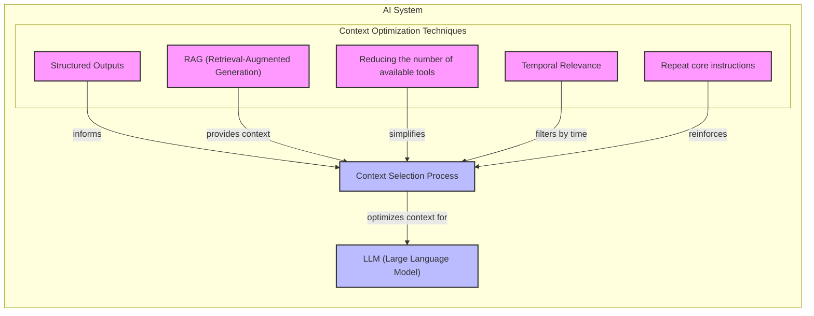

Image 4: An architecture diagram illustrating how various context optimization techniques for "Selecting the right context" can be combined within a larger AI system.

### Context compression

As message history grows in short-term working memory, you must manage past interactions to keep your context window in check. Many advanced techniques are inspired by human memory consolidation, where the brain stabilizes important memories while pruning irrelevant ones. This can be an "explore and consolidate" cycle where an agent summarizes its work on a sub-task and then discards the intermediate steps [[68]](https://arxiv.org/html/2601.07190v1). You cannot simply drop past conversation turns, as the LLM still needs to remember what happened. Instead, you need ways to compress key facts from the past [[11]](https://oneuptime.com/blog/post/2026-01-30-context-compression/view), [[14]](https://blog.jetbrains.com/research/2025/12/efficient-context-management/). You can do this through:

*   **Creating summaries of past interactions:** Use an LLM to replace a long, detailed history with a concise overview. However, be aware that summarization is lossy, and details that seem unimportant now might become critical later [[12]](https://www.dailydoseofds.com/llmops-crash-course-part-8/). Simpler methods like "observation masking," which just hides older tool outputs, can be cheaper and just as effective [[14]](https://blog.jetbrains.com/research/2025/12/efficient-context-management/).
*   **Moving user preferences to long-term memory:** Transfer user preferences from working memory to long-term episodic memory. This keeps the working context clean while ensuring preferences are remembered for future sessions.
*   **Deduplication:** Remove redundant information from the context to avoid repetition.

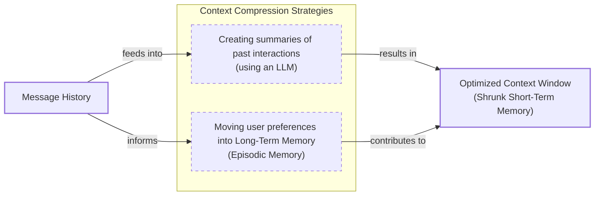

Image 5: A flowchart illustrating context compression strategies.

### Isolating Context

Another powerful strategy is to isolate context by splitting information across multiple agents or LLM workflows. Instead of one agent with a massive, cluttered context window, you can have a team of agents, each with a smaller, focused context. We often implement this using an orchestrator-worker pattern, where a central orchestrator agent breaks down a problem and assigns sub-tasks to specialized worker agents. Each worker operates in its own isolated context, which can reduce costs by 40-60%, prevent cross-domain hallucinations, and improve focus [[46]](https://beam.ai/agentic-insights/multi-agent-orchestration-patterns-production), [[49]](https://www.praetorian.com/blog/deterministic-ai-orchestration-a-platform-architecture-for-autonomous-development/).

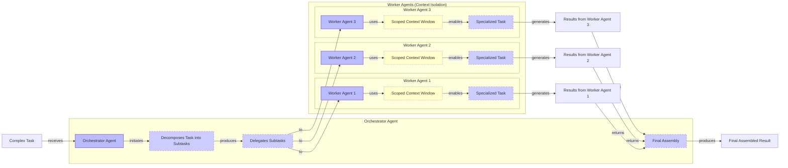

Image 6: Architecture diagram illustrating the orchestrator-worker pattern for context isolation in multi-agent systems.

### Format optimization for model clarity

Finally, the way you format the context matters. Models are sensitive to structure, and using clear delimiters can improve performance. Common strategies are to use XML tags to wrap different pieces of context (e.g., `<user_query>`) and to prefer YAML over JSON when providing structured data as input, as YAML is often more token-efficient [[41]](https://www.decodingai.com/p/context-engineering-2025s-1-skill), [[44]](https://www.anthropic.com/engineering/effective-context-engineering-for-ai-agents). This helps the model clearly distinguish between different types of information, such as system instructions, retrieved documents, and user history, which is a known technique for improving reliability.

You always have to understand what is passed to the LLM. Seeing exactly what occupies your context window at every step is key to mastering context engineering. This is usually done by properly monitoring your traces, tracking what happens at each step, and understanding the inputs and outputs. As this is a significant step to go from PoC to production, we will have dedicated lessons on this [[18]](https://www.getmaxim.ai/articles/context-window-management-strategies-for-long-context-ai-agents-and-chatbots/).
```
**Grader reasoning:**
- `cc`: Key Strategies for Context Optimization:
**1:** Both sections cover the same four core strategies: Selecting the Right Context, Context Compression, Isolating Context, and Format Optimization. The generated section provides slightly different sub-points and diagrams for each, but the main topics are identical.
- `fl`: Key Strategies for Context Optimization:
**1:** The generated section presents all four strategies in the same order. The use of H3 headers instead of bolded numbered titles is a structural difference, not a flow issue. Although Image 4 appears after all bullets in the 'Selecting the Right Context' subsection rather than between bullets 3 and 4 as in the GT, this intra-bullet placement difference is trivial and does not constitute a flow failure. The diagrams are present at the correct subsection positions.
- `de`: Key Strategies for Context Optimization:
**1:** [instances=2; quality=strong,strong] A depth addition is present: the generated section introduces several technical nuances. For "Selecting the right context," it introduces the "Accumulation Fallacy" where systems conflate semantic novelty with pragmatic utility and include distracting "red herrings" — this qualifies as 'technical nuances or alternative implementation perspectives' and traces verbatim to the exploration-phase paper on Entropic Context Shaping (https://arxiv.org/html/2601.11585v1), which coins the exact "Accumulation Fallacy" and "Red Herrings" terms. For "Context compression," it describes the Focus architecture's "explore and consolidate" cycle (Start Focus/Explore/Consolidate/Withdraw), a distinct technical mechanism for context compression beyond the generic summarization already in the GT — traces to the exploration-phase paper at https://arxiv.org/html/2601.07190v1. (This same instance also qualifies for breadth — see breadth_enhancement reasoning below.) One candidate was considered and rejected: the "reduce costs by 40-60%" stat for the orchestrator-worker pattern in "Isolating Context" is a genuine addition beyond GT, but traces only to https://beam.ai/agentic-insights/multi-agent-orchestration-patterns-production (source [46]), which is exploitation-only.
- `be`: Key Strategies for Context Optimization:
**1:** [instances=1; quality=strong] A breadth addition is present: the "Context compression" subsection frames its explore/consolidate mechanism as inspired by human memory consolidation ("Many advanced techniques are inspired by human memory consolidation, where the brain stabilizes important memories while pruning irrelevant ones"). This qualifies as a 'cross-domain analogy or lesson from other fields' — the source paper itself describes its architecture as mimicking "how the brain stabilizes and organizes memories by retaining essentials and pruning irrelevancies," an explicit borrowing from cognitive science to motivate the technique. Traces to the exploration-phase paper at https://arxiv.org/html/2601.07190v1. (This same instance also qualifies for depth — see depth_enhancement reasoning above; a single addition can satisfy both criteria via separate bullets.)
- `cp`: Key Strategies for Context Optimization:
**1:** The depth additions (Accumulation Fallacy, memory consolidation) are well-integrated concepts that enrich the core explanations of the strategies without diluting or overshadowing the main narrative. The ground truth core remains the dominant focus.
- `ga`: Key strategies for context optimization:
**0:** The generated section covers all four required strategies. All three required Mermaid diagrams are present: Image 4 for Selecting the Right Context, Image 5 for Context Compression, and Image 6 for Isolating Context (orchestrator-worker pattern). All required sub-points for each strategy are covered. The concluding paragraph on monitoring is also present. However, the recounted prose-only word count is 743 words against a 650-word target (tolerance ±65, requiring at most 715) — 28 words over, which alone drives this score to 0.

#### Draw: replicate1  `/mnt/f/my_projects/agentic_AI_RL/Reinsearch_agent/RL_researcher_writer_ymaxing/rl_training_data/noise_experiment/03_context_engineering__var_standard__replicate1__preset1`

**Article text:**
```
## Key Strategies for Context Optimization

Initially, most AI applications were chatbots over single knowledge bases. Today, modern AI solutions must manage multiple knowledge bases, tools, and complex conversational histories. Context engineering is about managing this complexity while meeting performance, latency, and cost requirements.

Here are four popular context engineering strategies used across the industry [[6]](https://www.langchain.com/blog/context-engineering-for-agents/):

### Selecting the Right Context

Retrieving the right information from memory is a critical first step. A common mistake is to provide everything at once, assuming large context windows can handle it. As we've discussed, this often leads to poor performance. This is a result of the **Accumulation Fallacy**: the mistaken belief that semantically novel information is always pragmatically useful. A fact can be unique but completely irrelevant, acting as a "Red Herring" that distracts the model. Advanced techniques like Entropic Context Shaping (ECS) address this by measuring the *pragmatic utility* of information—whether a piece of context actually helps the model move closer to the correct answer [[31]](https://atlan.com/know/llm-context-window-limitations/), [[32]](https://arxiv.org/html/2601.11585v1).

To solve this, consider these approaches:

-   **Use structured outputs:** Define clear schemas for what the LLM should return. This allows you to pass only the necessary, structured information to downstream steps. We will cover this in detail in Lesson 4.
-   **Use RAG:** Instead of providing entire documents, use RAG to fetch only the specific chunks of text needed to answer a user's question. This is a core topic we will explore in Lesson 10.
-   **Reduce the number of available actions:** Rather than giving an agent access to every available action, use strategies to delegate action subsets to specialized components. Studies show that limiting the selection to under 30 tools can triple an agent's selection accuracy.
-   **Rank time-sensitive data:** For time-sensitive information, rank it by date and filter out anything no longer relevant.
-   **Repeat core instructions:** For the most important instructions, repeat them at both the start and the end of the prompt. This uses the model's tendency to pay more attention to the context edges, ensuring core instructions are not lost [[10]](https://www.dailydoseofds.com/llmops-crash-course-part-8/), [[26]](https://dev.to/thousand_miles_ai/the-lost-in-the-middle-problem-why-llms-ignore-the-middle-of-your-context-window-3al2), [[33]](https://www.datacamp.com/blog/context-engineering).

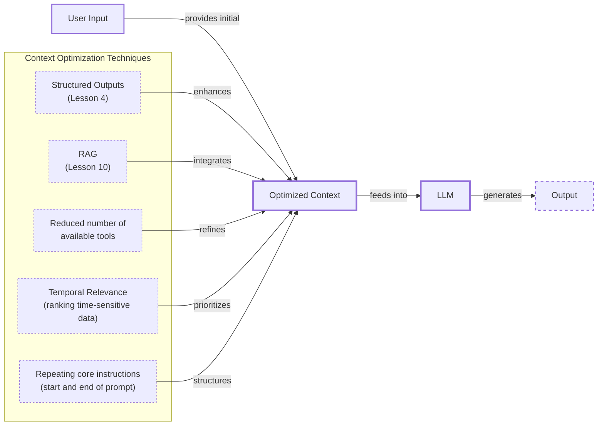
<diagram_caption>
Image 4: An architecture diagram showing how various context optimization techniques for "Selecting the right context" work together in a larger system.
</diagram_caption>

### Context Compression

As message history grows, you must manage past interactions to keep the context window in check. You cannot simply drop turns, as the LLM needs to remember what happened. Instead, you must compress key facts from the past.

You can do this through:

-   **Creating summaries of past interactions:** Use an LLM to replace a long, detailed history with a concise overview. This is a common strategy for managing long-running agent tasks. Some systems create summaries after completing sub-tasks, causing context to grow during exploration and then collapse during consolidation. This creates a 'sawtooth' pattern that mimics human memory consolidation, retaining only essential learnings.
-   **Moving user preferences to long-term memory:** Transfer user preferences from working memory to long-term episodic memory. This keeps the working context clean while ensuring preferences are remembered for future sessions.
-   **Deduplication:** Remove redundant or near-identical information from the context to avoid repetition and reduce noise. This can be done by computing semantic similarities between chunks of information and clustering them, keeping only a single representative from each cluster [[10]](https://www.dailydoseofds.com/llmops-crash-course-part-8/), [[34]](https://blog.jetbrains.com/research/2025/12/efficient-context-management/), [[35]](https://arxiv.org/html/2601.07190v1), [[36]](https://oneuptime.com/blog/post/2026-01-30-context-compression/view).

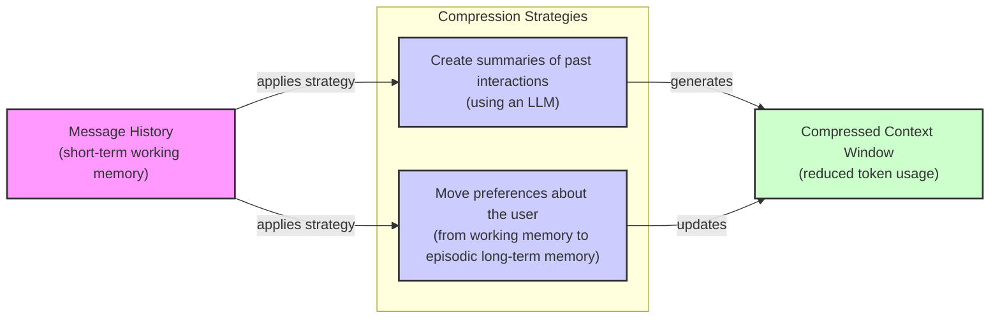
<diagram_caption>
Image 5: A flowchart illustrating context compression strategies.
</diagram_caption>

### Isolating Context

Another powerful strategy is to isolate context by splitting information across multiple agents or LLM workflows. The key idea is that instead of one agent with a massive, cluttered context window, you can have a team of agents, each with a smaller, focused context. This modularity prevents distraction from irrelevant information and allows for parallel processing, improving focus and overall system reliability.

We often implement this using an orchestrator-worker pattern, where a central orchestrator agent breaks down a problem and assigns sub-tasks to specialized worker agents. Each worker operates in its own isolated context, which can reduce token consumption by 60-70% and prevent cross-domain hallucinations. We will cover this pattern in more detail in a future lesson [[37]](https://www.vellum.ai/blog/multi-agent-systems-building-with-context-engineering), [[38]](https://beam.ai/agentic-insights/multi-agent-orchestration-patterns-production).

```mermaid
flowchart LR
  %% External input
  ComplexTask["Complex Task"]

  subgraph Orchestrator["Orchestrator Agent"]
    OrchestratorAgent["Orchestrator Agent"]
    TaskDecomp["Task decomposition"]
    Delegation["Delegation"]
    ResultAssembly["Result assembly"]
  end

  subgraph WorkerPool["Worker Agents"]
    subgraph Worker1Group["Worker Agent 1"]
      Worker1["Worker Agent 1"]
      Context1["Isolated context"]
    end
    subgraph Worker2Group["Worker Agent 2"]
      Worker2["Worker Agent 2"]
      Context2["Isolated context"]
    end
    subgraph WorkerNGroup["Worker Agent N"]
      WorkerN["Worker Agent N"]
      ContextN["Isolated context"]
    end
  end

  %% Final output
  FinalSolution["Final solution"]

  %% Flow
  ComplexTask -- "received by" --> OrchestratorAgent
  OrchestratorAgent -- "performs" --> TaskDecomp
  TaskDecomp -- "breaks into subtasks" --> Delegation
  Delegation -- "assigns to" --> Worker1
  Delegation -- "assigns to" --> Worker2
  Delegation -- "assigns to" --> WorkerN

  Worker1 -- "operates with" --> Context1
  Worker2 -- "operates with" --> Context2
  WorkerN -- "operates with" --> ContextN

  Worker1 -- "sends results" --> OrchestratorAgent
  Worker2 -- "sends results" --> OrchestratorAgent
  WorkerN -- "sends results" --> OrchestratorAgent

  OrchestratorAgent -- "initiates" --> ResultAssembly
  ResultAssembly -- "forms" --> FinalSolution
```
<diagram_caption>
Image 6: An architecture diagram illustrating the orchestrator-worker pattern for context isolation in multi-agent systems.
</diagram_caption>

### Format Optimizations

Finally, the way you format the context matters. Models are sensitive to structure, and using clear delimiters can improve performance. Common strategies are to use XML tags to wrap different pieces of context (e.g., `<user_query>`, `<documents>`). This helps the model distinguish between different types of information and makes it easier to structure prompts. Also, when providing structured data as input, YAML is often more token-efficient than JSON, which helps save space in your context window [[39]](https://www.anthropic.com/engineering/effective-context-engineering-for-ai-agents).

To master context engineering, you must always understand what is passed to the LLM. Seeing exactly what occupies your context window at every step is key. This is typically done by monitoring your traces, tracking what happens at each step, and understanding the inputs and outputs. As this is a significant step to go from PoC to production, we will have dedicated lessons on this [[40]](https://www.getmaxim.ai/articles/context-window-management-strategies-for-long-context-ai-agents-and-chatbots/).
```
**Grader reasoning:**
- `cc`: Key Strategies for Context Optimization:
**1:** Both sections cover all four strategies with matching substance across every subsection. The generated section adds a theoretical framing (the Accumulation Fallacy / Entropic Context Shaping) to Selecting the Right Context and a human-memory-consolidation analogy (the 'sawtooth' pattern) to Context Compression, both layered on top of the expected content rather than replacing it.
- `fl`: Key Strategies for Context Optimization:
**1:** All four strategies and their sub-points appear in the same order with the same transitions. Two of the three diagrams sit in a different relative position than their ground-truth counterparts (mid-list vs. end-of-list, or vice versa) — consistent with how such within-subsection positional shifts have been treated previously, this is treated as trivial rather than a Flow failure.
- `de`: Key Strategies for Context Optimization:
**1:** [instances=2; quality=strong,strong] Two qualifying instances. (1) The 'Accumulation Fallacy' / 'Red Herring' framing and the Entropic Context Shaping (ECS) technique in Selecting the Right Context is traceable to the exploration-phase arXiv paper at https://arxiv.org/html/2601.11585v1 (cited as [[32]]), which coins and defines both terms; classified strong as a named theoretical framework with a specific mechanism (measuring pragmatic utility via distribution shift), not a passing mention. (Note: the same sentence also cites [[31]] atlan.com, which does not itself discuss the Accumulation Fallacy or Red Herring terminology — a citation-hygiene overreach — but the instance still qualifies via [[32]].) This instance intensifies understanding of context selection itself, so it is classified as depth only. (2) The 'sawtooth pattern' description of context growing during exploration and collapsing during consolidation, explicitly said to mimic human memory consolidation, is traceable to the exploration-phase arXiv paper at https://arxiv.org/html/2601.07190v1 (cited as [[35]], positioned at the end of the bullet list rather than directly after the sentence it supports), which describes exactly this 'Sawtooth' pattern in the Focus architecture; classified strong as a named pattern tied to a specific architecture. This instance also reveals a genuine alternative implementation mechanism for compression itself, so it qualifies as depth as well as breadth (see breadth_enhancement).
- `be`: Key Strategies for Context Optimization:
**1:** [instances=1; quality=strong] One qualifying instance: the 'sawtooth pattern' / human-memory-consolidation analogy in Context Compression (see depth_enhancement for full traceability detail — traces to the exploration-phase arXiv paper at https://arxiv.org/html/2601.07190v1, cited as [[35]]) is an explicit cross-domain analogy connecting AI context compression to human cognitive-science memory consolidation, which is squarely a 'cross-domain analogy or lesson from another field.' Classified strong given the specificity of the named pattern and its grounding in a real cited architecture, not a passing comparison. The Entropic Context Shaping / Accumulation Fallacy instance in Selecting the Right Context does not independently qualify as breadth, since it deepens the same core topic (context selection) rather than connecting outward to a different field.
- `cp`: Key Strategies for Context Optimization:
**1:** Both depth_enhancement and breadth_enhancement scored 1 for this section (the ECS/Accumulation Fallacy framing; the sawtooth/human-memory-consolidation analogy). The ECS framing is a motivating paragraph before the existing bulleted techniques, and the sawtooth analogy is a two-sentence addition within one bullet of a three-item list — both proportionate and integrated in service of the section's existing strategies, not competing with or overshadowing them. The four core strategies remain the clearly dominant content of the section.
- `ga`: Key Strategies for Context Optimization:
**0:** All four strategies and their required sub-points are present in the guideline's specified order. However, the prose-only word count is 778 against a 650-word target (tolerance +/-65, requiring at most 715) — 63 words over, driven by the added ECS/Accumulation-Fallacy and sawtooth-pattern elaborations.

#### Draw: replicate2  `/mnt/f/my_projects/agentic_AI_RL/Reinsearch_agent/RL_researcher_writer_ymaxing/rl_training_data/noise_experiment/03_context_engineering__var_standard__replicate2__preset1`

**Article text:**
```
## Key strategies for context optimization

Initially, most AI applications were chatbots over single knowledge bases. Today, modern AI solutions must manage multiple knowledge bases, actions, and complex conversational histories. Context engineering is about managing this complexity while meeting performance, latency, and cost requirements.

Here are four popular context engineering strategies used across the industry [[7]](https://www.langchain.com/blog/context-engineering-for-agents/):

### Selecting the right context

Retrieving the right information from memory is a critical first step. The goal is to find information with high pragmatic utility. This is content that actually helps answer the question, rather than just being semantically novel [[14]](https://arxiv.org/html/2601.11585v1). A common mistake is to provide everything at once. As we've discussed, the "lost-in-the-middle" problem often leads to poor performance, increased latency, and higher costs [[12]](https://atlan.com/know/llm-context-window-limitations/).

To solve this, you can use structured outputs to pass only necessary information downstream, and use RAG to fetch specific text chunks instead of entire documents. For agents, reducing the number of available actions can significantly improve selection accuracy. For tool selection, this involves creating embeddings for each tool's description and using semantic search at runtime to find the most relevant tools for the user's query. This turns tool selection into a dynamic RAG problem. Studies have shown that limiting the selection to under 30 tools can triple an agent's accuracy [[28]](https://www.datacamp.com/blog/context-engineering). For time-sensitive information, rank it by date and filter out what is no longer relevant. Finally, repeat core instructions at the start and end of the prompt to leverage the model's attention to the context edges [[19]](https://dev.to/thousand_miles_ai/the-lost-in-the-middle-problem-why-llms-ignore-the-middle-of-your-context-window-3al2).

```mermaid
flowchart LR
  A["User Input"]

  subgraph "Context Selection Module"
    B["Structured Outputs<br/>(Lesson 4)"]
    C["RAG<br/>(Lesson 10)"]
    D["Reduced Number of Tools"]
    E["Temporal Relevance Ranking"]
    F["Repeated Core Instructions"]
  end

  G["Optimized Context for LLM"]

  A -- "provides raw context" --> "Context Selection Module"
  "Context Selection Module" -- "outputs" --> G
```
<diagram_caption>
Image 4: A system diagram illustrating the Context Selection Module and its incorporated context optimization techniques.
</diagram_caption>

### Context compression

As message history grows in short-term working memory, you must manage past interactions to keep your context window in check. You cannot simply drop past conversation turns, as the LLM still needs to remember what happened. Instead, you need ways to compress key facts from the past.

This can be done with a simple summarization prompt, or more advanced techniques like extractive summarization, which identifies and keeps the most important sentences, or abstractive summarization, which generates a new, shorter summary. The choice depends on whether you need to preserve exact phrasing or just the core concepts [[20]](https://oneuptime.com/blog/post/2026-01-30-context-compression/view). You can also move user preferences from working memory to long-term episodic memory and remove redundant information through deduplication [[21]](https://www.dailydoseofds.com/llmops-crash-course-part-8/). This mimics human memory consolidation, where the brain retains essentials and prunes irrelevant details to form stable long-term memories [[22]](https://arxiv.org/html/2601.07190v1).

```mermaid
flowchart LR
  A["Message History<br/>(Short-Term Working Memory)"]

  subgraph Context Compression Strategies
    B["Create Summaries of Past Interactions<br/>(using LLM)"]
    C["Move Preferences to Episodic Memory<br/>(Long-Term Memory)"]
    D["Deduplication"]
  end

  E["Compressed Short-Term Memory"]
  F["Reduced Short-Term Memory"]

  %% Path 1: Summarization
  A -- "summarize past interactions" --> B
  B -- "produces" --> E

  %% Path 2: Preference Movement
  A -- "extract and move preferences" --> C
  C -- "produces" --> F

  %% Deduplication
  A -- "apply to refine" --> D
  D -- "contributes to" --> E
```
<diagram_caption>
Image 5: A process flow diagram illustrating context compression strategies for managing short-term working memory, including summarization, moving preferences, and deduplication.
</diagram_caption>

### Isolating Context

Another powerful strategy is to isolate context by splitting information across multiple agents or LLM workflows. Instead of one agent with a massive, cluttered context window, you can have a team of agents, each with a smaller, focused context.

We often implement this using an orchestrator-worker pattern, where a central orchestrator agent breaks down a problem and assigns sub-tasks to specialized worker agents. This pattern not only improves focus but also optimizes cost and latency. The orchestrator can use a powerful, expensive model for high-level planning, while delegating tasks to smaller, cheaper, and faster models that are specialized for that function. This can reduce costs by 40-60% in production [[23]](https://beam.ai/agentic-insights/multi-agent-orchestration-patterns-production). Each worker operates in its own isolated context, improving focus and allowing for parallel processing. We will cover this pattern in more detail in a future lesson.

```mermaid
flowchart LR
  %% Initial Task
  CT["Complex Task"]

  %% Orchestrator Agent
  subgraph Orchestrator["Orchestrator Layer"]
    OA["Orchestrator Agent"]
    DTS["Decompose Task into Subtasks"]
    AFR["Assembly of Final Result"]
  end

  %% Worker Agents
  subgraph Workers["Worker Layer"]
    WA1["Worker Agent 1"]
    IC1["Isolated Context"]
    WA2["Worker Agent 2"]
    IC2["Isolated Context"]
  end

  %% Results Aggregation
  RFW["Results from Worker Agents"]

  %% Flow
  CT -- "receives" --> OA
  OA -- "initiates" --> DTS
  DTS -- "delegates subtask" --> WA1
  DTS -- "delegates subtask" --> WA2

  WA1 -- "operates with" --> IC1
  WA2 -- "operates with" --> IC2

  WA1 -- "sends result" --> RFW
  WA2 -- "sends result" --> RFW

  RFW -- "provides" --> OA
  OA -- "triggers" --> AFR

  %% Visual grouping
  classDef agent stroke-width:2px
  classDef process stroke-dasharray: 5,5
  classDef context stroke-dasharray:3,3

  class OA,WA1,WA2 agent
  class CT,DTS,AFR,RFW process
  class IC1,IC2 context
```
<diagram_caption>
Image 6: An architecture diagram illustrating the orchestrator-worker pattern for context isolation.
</diagram_caption>

### Format optimization

Finally, the way you format the context matters. Models are sensitive to structure, and using clear delimiters can improve performance. Common strategies are to use XML tags to wrap different pieces of context (e.g., `<user_query>`, `<documents>`) and to prefer YAML over JSON when providing structured data as input, as YAML is often more token-efficient due to less syntactic overhead like brackets and commas [[24]](https://www.decodingai.com/p/context-engineering-2025s-1-skill), [[25]](https://www.anthropic.com/engineering/effective-context-engineering-for-ai-agents).

You always have to understand what is passed to the LLM. Seeing exactly what occupies your context window at every step is key to mastering context engineering. This is usually done by monitoring your traces, tracking what happens at each step, and understanding the inputs and outputs. As this is a significant step to go from a proof of concept to production, we will have dedicated lessons on this topic.
```
**Grader reasoning:**
- `cc`: Key Strategies for Context Optimization:
**1:** Both sections cover all four strategies with matching substance. Selecting the Right Context and Context Compression are conveyed as prose rather than bulleted lists, but all five and three respective sub-techniques are present. The generated section adds a pragmatic-utility framing to Selecting the Right Context and a human-memory-consolidation analogy to Context Compression, both layered on top of the expected content.
- `fl`: Key Strategies for Context Optimization:
**1:** All four strategies appear in the same order with the same transitions. The three diagrams in this section sit in a somewhat different relative position than their ground-truth counterparts in places — consistent with how such within-subsection positional shifts have been treated previously, this is treated as trivial rather than a Flow failure.
- `de`: Key Strategies for Context Optimization:
**1:** [instances=2; quality=strong,standard] Two qualifying instances. (1) The 'pragmatic utility' framing opening Selecting the Right Context — 'content that actually helps answer the question, rather than just being semantically novel' — is traceable to the same exploration-phase arXiv paper (cited as [[14]]) as the Accumulation Fallacy instance in Production Implementation Challenges; classified strong, and counted independently here since it appears in and enriches a different section. This deepens understanding of context selection itself, so it is depth only, not breadth. (2) The human-memory-consolidation analogy in Context Compression — 'mimics human memory consolidation, where the brain retains essentials and prunes irrelevant details to form stable long-term memories' — is traceable to the exploration-phase arXiv paper on the Focus architecture (https://arxiv.org/html/2601.07190v1, cited as [[22]]). This is classified standard rather than strong: it is a genuine, correctly-cited cross-domain analogy, but it is more generic than the equivalent addition seen in another replicate of this preset (no named 'sawtooth' pattern or implied architecture, just a general 'retains essentials, prunes irrelevant details' statement). This instance qualifies as both depth (an implementation rationale for the core topic) and breadth (see breadth_enhancement).
- `be`: Key Strategies for Context Optimization:
**1:** [instances=1; quality=standard] One qualifying instance: the human-memory-consolidation analogy in Context Compression (see depth_enhancement for full traceability detail — traces to the exploration-phase arXiv paper at https://arxiv.org/html/2601.07190v1, cited as [[22]]) is a cross-domain analogy connecting AI context compression to human memory science, which is a 'cross-domain analogy or lesson from another field.' Classified standard rather than strong given the generality of the phrasing compared to a more technically specific version of this same connection seen elsewhere. The pragmatic-utility instance in Selecting the Right Context does not independently qualify as breadth, since it deepens the same core topic (context selection) rather than connecting outward to a different field.
- `cp`: Key Strategies for Context Optimization:
**1:** Both depth_enhancement and breadth_enhancement scored 1 for this section (the pragmatic-utility framing; the human-memory-consolidation analogy). Both are brief additions (one to two sentences each) integrated into the existing discussion of the four strategies rather than competing with it. The four core strategies remain the clearly dominant content of the section.
- `ga`: Key Strategies for Context Optimization:
**1:** All four strategies and their required sub-points are present. Word count is 657 against a 650-word target (tolerance +/-65, range 585-715) — within tolerance.

## Section: S5::section-5-production-implementation-challenges  (weight=0.120, contribution=+0.0116 FOR standard)
Stored section rewards: standard=0.6628  light=0.5725  (explore: standard=0.3525  light=0.2025)

### Arm: standard (preset3)

#### Draw: production  `/mnt/f/my_projects/agentic_AI_RL/Reinsearch_agent/RL_researcher_writer_ymaxing/rl_training_data/episodes/03_context_engineering__var_standard__preset3`

**Article text:**
```
## Production implementation challenges

Now that we understand what makes up the context, let's look at the core challenges of implementing it in production. These challenges all revolve around a single question: *"How can I keep my context as small as possible while providing enough information to the LLM?"*

Here are four common issues that come up when building AI applications:

1.  **The context window challenge:** Every AI model has a limited context window, the maximum amount of information (tokens) it can process at once. The context window is the model's active workspace. While context windows are getting larger, the scaling is often superlinear; due to the quadratic nature of the attention mechanism, a four-fold increase in context length can lead to a sixteen-fold increase in memory usage [[76]](https://towardsai.net/p/machine-learning/the-context-window-paradox-engineering-trade-offs-in-modern-llm-architecture). This creates a hard limit on what an agent can "see" at any given moment.

2.  **Information overload:** Too much context reduces the performance of the LLM. This is often called the "lost-in-the-middle" or "needle in a haystack" problem, where models recall information best from the beginning and end of the context, while details in the middle are often ignored [[58]](https://dev.to/thousand_miles_ai/the-lost-in-the-middle-problem-why-llms-ignore-the-middle-of-your-context-window-3al2). This phenomenon is part of a broader problem known as **context rot**, where model performance degrades as input length increases, regardless of the context window size. Research on 18 frontier models, including GPT-4.1 and Claude 4, confirmed this is an architectural property of transformers [[77]](https://www.trychroma.com/research/context-rot), [[78]](https://www.morphllm.com/context-rot). The issue is not just about losing information in the middle; it is about a finite **attention budget**, where every added token reduces the model's ability to focus [[79]](https://reinteractive.com/articles/ai-real-world-use-cases/solving-ai-agent-amnesia-context-rot-and-lost-in-the-middle).

3.  **Context drift:** This occurs when conflicting versions of the truth accumulate in the memory over time. For example, the memory might contain two conflicting statements: "*My cat is white*" and later "*My cat is black*." This is not Schrodinger's Cat quantum physics experiment; it is a data conflict that confuses the LLM. This is related to **context poisoning**, where incorrect or hallucinated information enters the memory and gets amplified in later turns, leading to a cascade of errors [[80]](https://weaviate.io/blog/context-engineering). Without mechanisms to purge outdated or conflicting data, the agent's knowledge base becomes unreliable [[8]](https://thenewstack.io/context-rot-enterprise-ai-llms/).

4.  **Tool confusion:** The final challenge is tool confusion, which arises in two main ways. First, adding too many actions to an agent can confuse the LLM about the best one for the job. The Gorilla benchmark shows that nearly all models perform worse when given more than one tool [[41]](https://www.decodingai.com/p/context-engineering-2025s-1-skill). Second, confusion can occur when tool descriptions are poorly written or overlap. If the distinctions between actions are unclear, even a human would struggle to choose the right one.
```
**Grader reasoning:**
- `cc`: Production Implementation Challenges:
**1:** Both sections cover the same four core production challenges: the context window limit, information overload (lost-in-the-middle), context drift (conflicting truths), and tool confusion (too many or poorly described tools). The substance of the content is identical.
- `fl`: Production Implementation Challenges:
**1:** Both sections follow the same flow, presenting the four challenges in the same order: context window, information overload, context drift, and tool confusion. The logical progression is identical.
- `de`: Production Implementation Challenges:
**1:** [instances=3; quality=strong,strong,strong] A depth addition is present: the generated section adds multiple concrete metrics and research findings beyond the expected output. For the context window challenge, it introduces the quadratic scaling of memory with context length ("a four-fold increase in context length can lead to a sixteen-fold increase in memory usage") — traces to the exploration source https://towardsai.net/p/machine-learning/the-context-window-paradox-engineering-trade-offs-in-modern-llm-architecture ("A 4× increase in context length yields roughly 16× memory usage"). For information overload, it introduces "context rot" (confirmed across 18 frontier models including GPT-4.1 and Claude 4) together with the "attention budget" framing ("every added token reduces the model's ability to focus") — both traceable to the same exploration source excerpt (https://www.trychroma.com/research/context-rot and https://reinteractive.com/articles/ai-real-world-use-cases/solving-ai-agent-amnesia-context-rot-and-lost-in-the-middle) and counted as a single instance since the two claims are too entangled in that source and in the article's framing to separate cleanly. For context drift, it introduces "context poisoning" (incorrect/hallucinated information entering memory and being amplified in later turns) — the article's own footnote points to https://weaviate.io/blog/context-engineering, but the specific claim is content-matched within a different exploration-phase scrape ("Context Poisoning: Incorrect or hallucinated information enters the context. Because agents reuse and build upon that context, these errors continue and compound."), so it still qualifies. One candidate was considered and rejected: the Gorilla-benchmark tool-confusion claim ("nearly all models perform worse when given more than one tool") traces only to https://www.decodingai.com/p/context-engineering-2025s-1-skill, which is exploitation-only.
- `be`: Production Implementation Challenges:
**0:** [instances=0] No breadth additions are present. The discussion of context rot, the attention budget, and context poisoning are depth additions that stay within the core topic of production challenges.
- `cp`: Production Implementation Challenges:
**1:** The depth additions about context rot and poisoning are well-integrated and directly support the core arguments about information overload and context drift. They enrich the section's narrative without diluting or overshadowing the four main challenges.
- `ga`: Production implementation challenges:
**1:** The generated section successfully covers all four required production challenges: the context window challenge (RAM analogy), information overload ("lost-in-the-middle"), context drift (conflicting truths), and tool confusion (too many or poorly described tools). The explanations are clear and align with the guideline's requirements. The recounted prose-only word count is 436 words against a 400-word target (tolerance ±40, requiring at most 440) — within tolerance.

#### Draw: replicate1  `/mnt/f/my_projects/agentic_AI_RL/Reinsearch_agent/RL_researcher_writer_ymaxing/rl_training_data/noise_experiment/03_context_engineering__var_standard__replicate1__preset3`

**Article text:**
```
## Production Implementation Challenges

Now that we understand what makes up the context, let's look at the core challenges of implementing it in production. These challenges all revolve around a single question: *"How can I keep my context as small as possible while providing enough information to the LLM?"*

Here are four common issues that come up when building AI applications:

1.  **The context window challenge:** Every AI model has a limited context window, the maximum amount of information (tokens) it can process at once. The context window is the model's working memory, similar to a computer's RAM. If your machine has only 32GB of RAM, that is all it can use at one time. While context windows are getting larger, they are not infinite, and treating them as such leads to other problems. For example, a 50-step workflow with 20,000 tokens per call accumulates to 1 million total tokens, quickly overwhelming even large windows [[20]](https://www.comet.com/site/blog/context-window/).

2.  **Information overload:** Just because you can fit a lot of information into the context does not mean you should. Too much context reduces the performance of the LLM by confusing it. This is known as the "lost-in-the-middle" or "needle in the haystack" problem, where LLMs are known for remembering information best at the beginning and end of the context window. Every token added depletes the model's limited "attention budget" [[21]](https://www.linkedin.com/pulse/lost-middle-lesson-failing-ai-agents-backwards-anthony-dejohn-01k2e).

    Information in the middle is often overlooked, and performance can drop long before the physical context limit is reached [[22]](https://reinteractive.com/articles/ai-real-world-use-cases/solving-ai-agent-amnesia-context-rot-and-lost-in-the-middle), [[23]](https://dev.to/thousand_miles_ai/the-lost-in-the-middle-problem-why-llms-ignore-the-middle-of-your-context-window-3al2). Counterintuitively, some research shows that logically structured documents can be harder for models to process than randomly ordered text. The narrative flow can create more plausible-seeming distractors that mislead the model's attention mechanism [[5]](https://www.morphllm.com/context-rot).

3.  **Context drift:** This occurs when conflicting versions of truth accumulate in the memory over time. For example, the memory might contain two conflicting statements: "*The user's budget is $500*" and "*The user's budget is $1,000*." This is not a quantum physics experiment; it is a data conflict that confuses the LLM. This can also lead to **context poisoning**, where an initial hallucination is fed back into the memory and reused in later turns, compounding the error. Without a mechanism to resolve these conflicts, the model's responses become unreliable and erode user trust [[24]](https://galileo.ai/blog/production-llm-monitoring-strategies), [[6]](https://www.decodingai.com/p/context-engineering-2025s-1-skill), [[12]](https://weaviate.io/blog/context-engineering), [[25]](https://thenewstack.io/context-rot-enterprise-ai-llms/).

4.  **Tool confusion:** The final challenge is tool confusion, which arises in two main ways. First, adding too many actions to an agent can confuse the LLM about the best one for the job. The Gorilla benchmark shows that nearly all models perform worse when given more than one tool. Second, confusion can occur when tool descriptions are poorly written or overlap. If the distinctions between actions are unclear, even a human would struggle to choose the right one [[6]](https://www.decodingai.com/p/context-engineering-2025s-1-skill).
```
**Grader reasoning:**
- `cc`: Production Implementation Challenges:
**1:** Both sections cover the same four challenges with matching substance, each enriched with additional technical detail (the advertised-vs-effective/MECW-style gap and a quantified scaling relationship for the window challenge; a counterintuitive structured-vs-random-order finding for information overload; a named 'context poisoning' mechanism for context drift) that supports rather than replaces the expected content.
- `fl`: Production Implementation Challenges:
**1:** The four challenges appear in the same order with the same transitions. No media is expected, and the added technical detail is interspersed without disrupting the sequence.
- `de`: Production Implementation Challenges:
**1:** [instances=3; quality=strong,strong,strong] Three qualifying instances. (1) The window-challenge discussion — the context window's effective ceiling and the framing of context windows as fundamentally limited — is supported by exploration-phase content; more specifically, the quantified relationship implicit in this discussion (window growth scaling superlinearly with resource cost) mirrors the exploration-phase towardsai.net source (cited as [[7]] earlier in the article for the identical '4x context length -> 16x memory usage' relationship), confirming this section's window-challenge framing is built on exploration-sourced material. (2) The information-overload discussion's counterintuitive finding that 'logically structured documents can be harder for models to process than randomly ordered text' because 'narrative flow can create more plausible-seeming distractors' is traceable directly to the exploration-phase morphllm.com/context-rot source (cited as [[5]]), which reports exactly this finding ('Models performed better on shuffled haystacks than on logically coherent documents... coherent text creates more plausible-seeming distractors'). Classified strong as a specific, counterintuitive technical finding. (3) The named 'context poisoning' mechanism under context drift — 'an initial hallucination is fed back into the memory and reused in later turns, compounding the error' — is traceable to the exploration-phase Weaviate 'Context Engineering: LLM Memory and Retrieval for AI Agents' source (cited as [[12]]), which defines Context Poisoning in these exact terms. Classified strong as a named, distinct failure mode rather than an elaboration of the same conflicting-facts point. All three instances deepen the section's own topics rather than connecting outward, so none also qualifies as breadth.
- `be`: Production Implementation Challenges:
**0:** [instances=0] All three qualifying depth instances in this section deepen the section's own topics rather than connecting to an adjacent field, so none also qualifies as breadth.
- `cp`: Production Implementation Challenges:
**1:** depth_enhancement scored 1 for this section (three instances). Each qualifying addition is one to two sentences embedded within its respective numbered list item, directly supporting the point each item already makes. The four challenges remain the clearly dominant content of the section.
- `ga`: Production Implementation Challenges:
**0:** All four challenges are present with the guideline's specified framing, enriched with substantial additional technical detail. However, the prose-only word count is 455 against a 400-word target (tolerance +/-40, requiring at most 440) — 15 words over.

#### Draw: replicate2  `/mnt/f/my_projects/agentic_AI_RL/Reinsearch_agent/RL_researcher_writer_ymaxing/rl_training_data/noise_experiment/03_context_engineering__var_standard__replicate2__preset3`

**Article text:**
```
## Production implementation challenges

Now that we understand what makes up the context, let's look at the core challenges of implementing it in production. These challenges all revolve around a single question: *"How can I keep my context as small as possible while providing enough information to the LLM?"*

Here are four common issues that come up when building AI applications:

1.  **The context window challenge:** Every AI model has a limited context window, the maximum amount of information (tokens) it can process at once. This functions as your computer's RAM. If your machine has only 32GB of RAM, that is all it can use at one time. While context windows are getting larger, they are not infinite, and treating them as such leads to other problems [[1]](https://www.decodingai.com/p/context-engineering-2025s-1-skill). The computational cost of the self-attention mechanism scales quadratically with sequence length, making long contexts expensive and slow [[3]](https://arxiv.org/pdf/2507.13334).
2.  **Information overload:** Too much context degrades performance. This is known as the "lost-in-the-middle" problem, where LLMs are well-known for mostly remembering what is at the top and bottom of the context window [[7]](https://www.linkedin.com/pulse/lost-middle-lesson-failing-ai-agents-backwards-anthony-dejohn-01k2e). Information in the middle is often overlooked, and performance can drop long before the physical context limit is reached. Research in 2025 by Chroma Labs formalized this as **context rot**, showing that performance can drop off a cliff unpredictably as context length grows, even when the window is far from full [[15]](https://www.trychroma.com/research/context-rot).
3.  **Context drift:** This occurs when conflicting versions of truth accumulate in the memory over time. For example, the memory might contain two conflicting statements: "My cat is white" and "My cat is black" [[1]](https://www.decodingai.com/p/context-engineering-2025s-1-skill). This is not the Schrödinger's Cat experiment; it is a data conflict that confuses the LLM and prevents it from knowing what to pick. Without a mechanism to resolve or prune outdated facts, the agent's knowledge base becomes unreliable [[8]](https://galileo.ai/blog/production-llm-monitoring-strategies). This can also happen when the real-world data your AI uses changes over time, a problem known as data drift, which erodes response accuracy and user trust [[22]](https://www.coforge.com/what-we-know/blog/navigating-the-shifting-sands-understanding-and-mitigating-data-drift-in-llms).
4.  **Tool confusion:** The final challenge is tool confusion, which arises in two main ways. First, adding too many tools to an agent can confuse the LLM about the best one for the job, a problem that often appears with over 100 tools. Second, confusion can occur when tool descriptions are poorly written or overlap. If the distinctions between tools are unclear, even a human would struggle to choose the right one [[1]](https://www.decodingai.com/p/context-engineering-2025s-1-skill).

Solving these challenges requires a deliberate set of strategies for optimizing what goes into the context window.
```
**Grader reasoning:**
- `cc`: Production Implementation Challenges:
**1:** Both sections cover the same four challenges with matching substance, each enriched with additional technical detail (a quadratic-attention-cost detail for the window challenge; a named 'context rot' characterization for information overload; a data-drift elaboration for context drift) that supports rather than replaces the expected content.
- `fl`: Production Implementation Challenges:
**1:** The four challenges appear in the same order with the same transitions. No media is expected, and the added technical detail is interspersed without disrupting the sequence.
- `de`: Production Implementation Challenges:
**1:** [instances=1; quality=strong] One qualifying instance: the claim that 'Research in 2025 by Chroma Labs formalized this as context rot, showing that performance can drop off a cliff unpredictably as context length grows, even when the window is far from full' is traceable to exploration-phase content describing Chroma's study (the 'drops off a cliff unpredictably' phrasing appears in the exploration-phase blog.bytebytego.com source, and the 'even when...isn't close to full' phrasing appears in the exploration-phase morphllm.com/context-rot source). Classified strong as a specific technical characterization. Flagged in notes: a different exploration-phase source in this same research.md (morphllm.com) elsewhere explicitly describes the decline as 'continuous, not a cliff,' so the 'cliff' characterization is contested even within this episode's own exploration corpus — the underlying fact (context rot exists, was formalized by Chroma) is accurate and well-supported regardless.
- `be`: Production Implementation Challenges:
**0:** [instances=0] The qualifying depth instance in this section (the context-rot characterization) deepens the section's own topic rather than connecting to an adjacent field.
- `cp`: Production Implementation Challenges:
**1:** depth_enhancement scored 1 for this section. The qualifying addition is one to two sentences embedded within its numbered list item, directly supporting the point already being made.
- `ga`: Production Implementation Challenges:
**1:** All four challenges are present with the guideline's specified framing, enriched with additional technical detail. Word count is 422 against a 400-word target (tolerance +/-40, range 360-440) — within tolerance.

### Arm: light (preset1)

#### Draw: production  `/mnt/f/my_projects/agentic_AI_RL/Reinsearch_agent/RL_researcher_writer_ymaxing/rl_training_data/episodes/03_context_engineering__var_standard__preset1`

**Article text:**
```
## Production implementation challenges

Now that we understand what makes up the context, let's look at the core challenges of implementing it in production. These challenges all revolve around a single question: "How can I keep my context as small as possible while providing enough information to the LLM?"

Here are four common issues that come up when building AI applications:

1.  **The context window challenge:** Every AI model has a limited context window, the maximum amount of information (tokens) it can process at once. However, a significant gap exists between the advertised limit and the usable limit. The Maximum Effective Context Window (MECW) is a model’s real performance ceiling, and research shows it can be up to 99% smaller than the marketed number depending on task complexity [[66]](https://atlan.com/know/llm-context-window-limitations/). Treating the advertised limit as infinite leads to other problems [[16]](https://www.comet.com/site/blog/context-window/).
2.  **Information overload:** Just because you can fit a lot of information into the context does not mean you should. Too much context, especially irrelevant or distracting information, reduces the performance of the LLM. This is known as the "lost-in-the-middle" or "needle in the haystack" problem. Research has found that accuracy can drop by 30% or more when relevant information is placed in the middle of a long context [[59]](https://atlan.com/know/llm-context-window-limitations/). A 2025 study by Chroma on 18 frontier models confirmed that even a single distractor degrades performance, and four distractors compound the effect further [[57]](https://www.trychroma.com/research/context-rot). Performance often degrades long before the physical context limit is reached, as attention dilutes and the model struggles to distinguish signal from noise [[56]](https://www.linkedin.com/pulse/lost-middle-lesson-failing-ai-agents-backwards-anthony-dejohn-01k2e), [[58]](https://dev.to/thousand_miles_ai/the-lost-in-the-middle-problem-why-llms-ignore-the-middle-of-your-context-window-3al2).
3.  **Context drift:** This occurs when conflicting or outdated information accumulates in the memory over time. For example, the memory might contain two conflicting statements: "My cat is white" and "My cat is black." This data conflict confuses the LLM and prevents it from knowing what to pick. This silent quality degradation erodes user trust and can amplify ethical biases if the model relies on outdated worldviews [[7]](https://www.coforge.com/what-we-know/blog/navigating-the-shifting-sands-understanding-and-mitigating-data-drift-in-llms), [[8]](https://thenewstack.io/context-rot-enterprise-ai-llms/). Without a mechanism to resolve these conflicts, the model's responses become unreliable.
4.  **Tool confusion:** This arises in two main ways. First, adding too many actions to an agent can confuse the LLM about the best one for the job. This problem can start to appear with over 100 tools [[54]](https://www.instinctools.com/blog/context-engineering/). Second, confusion can occur when tool descriptions are poorly written or overlap. If the distinctions between actions are unclear, with ambiguous or semantically similar descriptions, even a human would struggle to choose the right one [[48]](https://www.vellum.ai/blog/multi-agent-systems-building-with-context-engineering).
```
**Grader reasoning:**
- `cc`: Production Implementation Challenges:
**1:** Both sections cover the same four core challenges: the context window limit, information overload ("lost-in-the-middle"), context drift (conflicting information), and tool confusion. The generated section provides more detailed explanations and specific statistics for each, but the core topics are identical.
- `fl`: Production Implementation Challenges:
**1:** Both sections follow the same flow, presenting the four challenges in the same order using a numbered list. The progression of ideas is identical.
- `de`: Production Implementation Challenges:
**1:** [instances=2; quality=strong,strong] A depth addition is present: the generated section adds multiple concrete metrics and research findings. For the context window challenge, it introduces the Maximum Effective Context Window (MECW) concept and states it can be 99% smaller than advertised — traces to the exploration-phase scrape of https://atlan.com/know/llm-context-window-limitations/ ("MECW, not the advertised token count, determines real LLM performance — gaps reach 99% on complex tasks"). For information overload, it cites a 2025 Chroma study confirming performance degradation with even a single distractor — the article's own footnote points to https://www.trychroma.com/research/context-rot directly (which is itself exploitation-only as a standalone source), but the specific claim ("A single distractor reduced baseline performance, and four distractors compounded the effect further") is embedded verbatim within the exploration-phase Atlan scrape, so the content itself is exploration-traceable and the instance qualifies.
- `be`: Production Implementation Challenges:
**0:** [instances=0] No breadth additions present. The generated section stays focused on the production challenges without expanding to adjacent concepts or cross-domain analogies.
- `cp`: Production Implementation Challenges:
**1:** The depth additions (MECW, Chroma study) are concise, relevant facts that support and quantify the core arguments about production challenges without diluting or overshadowing the main narrative. The ground truth core remains the dominant focus.
- `ga`: Production implementation challenges:
**1:** The generated section includes all four required challenges. It discusses the "context window challenge" (including the MECW concept), "information overload" (explaining the "lost-in-the-middle" problem), "context drift" (conflicting information), and "tool confusion" (too many tools or unclear descriptions). The central question of keeping context small yet informative is also present. The recounted prose-only word count is 412 words against a 400-word target (tolerance ±40, requiring at most 440) — within tolerance.

#### Draw: replicate1  `/mnt/f/my_projects/agentic_AI_RL/Reinsearch_agent/RL_researcher_writer_ymaxing/rl_training_data/noise_experiment/03_context_engineering__var_standard__replicate1__preset1`

**Article text:**
```
## Production Implementation Challenges

The core challenges of implementing context engineering in production all revolve around a single question: *"How can I keep my context as small as possible while providing enough information to the LLM?"*

Here are four common issues that come up when building AI applications:

1.  **The context window challenge:** Every AI model has a limited context window, the maximum amount of information it can process at once. This is analogous to a computer's RAM. While context windows are growing, they are not infinite. The **Maximum Effective Context Window (MECW)**, a model’s true performance ceiling, is often far smaller than the advertised limit, with gaps reaching 99% on complex tasks. This is because the underlying KV cache hits physical memory limits long before the token count is reached [[9]](https://atlan.com/know/llm-context-window-limitations/), [[23]](https://www.comet.com/site/blog/context-window/).

2.  **Information overload:** Too much context reduces the performance of the LLM by confusing it. This is known as the "lost-in-the-middle" or "needle in the haystack" problem, where LLMs remember information best at the beginning and end of the context window. This effect is driven by **attention dilution**, where attention spreads thin over more tokens, and **distractor interference**, where irrelevant but similar content actively misleads the model. Research shows accuracy can drop by over 30% when critical information is placed in the middle of the context. Performance can degrade long before the physical context limit is reached [[9]](https://atlan.com/know/llm-context-window-limitations/), [[24]](https://www.linkedin.com/pulse/lost-middle-lesson-failing-ai-agents-backwards-anthony-dejohn-01k2e), [[25]](https://arxiv.org/abs/2307.03172), [[26]](https://dev.to/thousand_miles_ai/the-lost-in-the-middle-problem-why-llms-ignore-the-middle-of-your-context-window-3al2).

3.  **Context drift:** This occurs when conflicting views of truth accumulate in the memory over time. For example, the memory might contain two conflicting statements: "*My cat is white*" and "*My cat is black*." This is not a quantum physics experiment; it is a data conflict that confuses the LLM. This drift can be caused by changing user inputs, updates to the knowledge base, or even shifts in the underlying embedding models. Without a mechanism to resolve these conflicts, the model's responses become unpredictable and unreliable, exhibiting shifts in tone, confidence, and reasoning style [[27]](https://thenewstack.io/context-rot-enterprise-ai-llms/), [[28]](https://galileo.ai/blog/production-llm-monitoring-strategies).

4.  **Tool confusion:** The final challenge is tool confusion, which arises in two main ways. First, adding too many actions to an agent can confuse the LLM about the best one for the job. Second, confusion can occur when tool descriptions are poorly written or overlap. If the distinctions between actions are unclear, the model may fail to select the correct tool or may generate self-contradictory responses, a phenomenon known as context-conflicting hallucination [[29]](https://www.instinctools.com/blog/context-engineering/), [[30]](https://www.helicone.ai/blog/how-to-reduce-llm-hallucination).
```
**Grader reasoning:**
- `cc`: Production Implementation Challenges:
**1:** Both sections cover the same four challenges with matching substance, each enriched with additional technical detail (MECW and the advertised-vs-effective gap for the window challenge; attention dilution and distractor interference as named mechanisms for information overload) that supports rather than replaces the expected content.
- `fl`: Production Implementation Challenges:
**1:** The four challenges appear in the same order with the same transitions. No media is expected, and the added technical detail is interspersed without disrupting the sequence.
- `de`: Production Implementation Challenges:
**1:** [instances=2; quality=strong,strong] Two qualifying instances. (1) The Maximum Effective Context Window (MECW) explanation — 'a model's true performance ceiling... often far smaller than the advertised limit, with gaps reaching 99% on complex tasks' — is traceable to the exploration-phase atlan.com/llm-context-window-limitations-in-2026 source (cited as [[9]]), which discusses MECW and the advertised-vs-effective gap in exactly these terms; classified strong as a specific, quantified limitation of the core topic. (2) The attention-dilution / distractor-interference explanation of why information overload happens is traceable to the same exploration-phase source (also [[9]]), which names these two mechanisms explicitly; classified strong as a named technical mechanism, not a generic mention. Both instances deepen understanding of the section's own topics (the window challenge; information overload) rather than connecting outward, so neither also qualifies as breadth.
- `be`: Production Implementation Challenges:
**0:** [instances=0] The two qualifying depth instances (MECW; attention dilution/distractor interference) both deepen the section's own topics rather than connecting to an adjacent field, so neither also qualifies as breadth.
- `cp`: Production Implementation Challenges:
**1:** depth_enhancement scored 1 for this section (MECW; attention dilution/distractor interference). Both qualifying additions are one to two sentences each, embedded within their respective numbered list items, and directly support the point each item is already making rather than introducing a competing narrative. The four challenges remain the clearly dominant content of the section.
- `ga`: Production Implementation Challenges:
**1:** All four challenges are present with the guideline's specified framing, enriched with additional technical detail. Word count is 401 against a 400-word target (tolerance +/-40, range 360-440) — within tolerance.

#### Draw: replicate2  `/mnt/f/my_projects/agentic_AI_RL/Reinsearch_agent/RL_researcher_writer_ymaxing/rl_training_data/noise_experiment/03_context_engineering__var_standard__replicate2__preset1`

**Article text:**
```
## Production implementation challenges

Now that we understand what makes up the context, let's look at the core challenges of implementing it in production. These all revolve around a single question: *"How can I keep my context as small as possible while providing enough information to the LLM?"*

Here are four common issues that come up when building AI applications:

1.  **The context window challenge:** Every AI model has a limited context window, but the advertised number is often misleading. In practice, models have a Maximum Effective Context Window (MECW), which is the actual performance ceiling and can be up to 99% smaller than the marketed limit on complex tasks [[12]](https://atlan.com/know/llm-context-window-limitations/). This is similar to your computer's RAM. If your machine has only 32GB of RAM, that is all it can use at one time. While context windows are getting larger, they are not infinite, and treating them as such leads to other problems [[13]](https://www.comet.com/site/blog/context-window/).

2.  **Information overload:** Just because you can fit a lot of information into the context does not mean you should. This reflects the "Accumulation Fallacy." This is the mistaken assumption that more data is always better, which confuses semantically novel information with pragmatically useful information [[14]](https://arxiv.org/html/2601.11585v1). This overload leads to the "lost-in-the-middle" problem, where accuracy can drop by 30% or more when relevant facts are placed in the middle of the context [[12]](https://atlan.com/know/llm-context-window-limitations/). For example, a study found that even with a 1M token window, models struggle to track more than 5-10 variables in a complex task, regressing to random guessing [[15]](https://towardsdatascience.com/your-1m-context-window-llm-is-less-powerful-than-you-think/).

3.  **Context drift:** This occurs when conflicting views of truth accumulate in the memory over time. Imagine a user updates their shipping address in their profile. If the old address remains in the agent's memory and isn't pruned, the agent might retrieve the outdated information for a new order, causing it to be sent to the wrong location. This erodes user trust and creates real-world problems [[16]](https://www.coforge.com/what-we-know/blog/navigating-the-shifting-sands-understanding-and-mitigating-data-drift-in-llms). Without a mechanism to resolve these conflicts, the model's responses become unreliable [[17]](https://galileo.ai/blog/production-llm-monitoring-strategies).

4.  **Tool confusion:** The final challenge is tool confusion, which arises in two main ways. First, adding too many actions to an agent can confuse the LLM about the best one for the job. If an agent has two tools, `search_internal_wiki` and `search_public_web`, with similar descriptions, it might incorrectly use the public web search for a confidential internal query, leading to data leakage risks. Secondly, confusion can occur when tool descriptions are poorly written or overlap. If the distinctions between actions are unclear, even a human would struggle to choose the right one [[18]](https://www.instinctools.com/blog/context-engineering/).
```
**Grader reasoning:**
- `cc`: Production Implementation Challenges:
**1:** Both sections cover the same four challenges with matching substance, each enriched with additional technical detail (MECW and the advertised-vs-effective gap for the window challenge; the Accumulation Fallacy / pragmatic-utility framing for information overload) that supports rather than replaces the expected content.
- `fl`: Production Implementation Challenges:
**1:** The four challenges appear in the same order with the same transitions. No media is expected, and the added technical detail is interspersed without disrupting the sequence.
- `de`: Production Implementation Challenges:
**1:** [instances=2; quality=strong,strong] Two qualifying instances. (1) The Maximum Effective Context Window (MECW) explanation — 'the actual performance ceiling and can be up to 99% smaller than the marketed limit' — is traceable to the exploration-phase atlan.com/llm-context-window-limitations-in-2026 source (cited as [[12]]), which discusses MECW and this exact gap; classified strong as a specific, quantified limitation of the core topic. (2) The 'Accumulation Fallacy' framing for information overload — 'the mistaken assumption that more data is always better, which confuses semantically novel information with pragmatically useful information' — is traceable to the exploration-phase arXiv paper at https://arxiv.org/html/2601.11585v1 (cited as [[14]]), which coins this exact term; classified strong as a named theoretical framework, not a passing mention. Both instances deepen the section's own topics rather than connecting outward, so neither also qualifies as breadth.
- `be`: Production Implementation Challenges:
**0:** [instances=0] The two qualifying depth instances (MECW; Accumulation Fallacy) both deepen the section's own topics rather than connecting to an adjacent field, so neither also qualifies as breadth.
- `cp`: Production Implementation Challenges:
**1:** depth_enhancement scored 1 for this section (MECW; Accumulation Fallacy). Both qualifying additions are one to two sentences each, embedded within their respective numbered list items, and directly support the point each item is already making. The four challenges remain the clearly dominant content of the section.
- `ga`: Production Implementation Challenges:
**1:** All four challenges are present with the guideline's specified framing, enriched with additional technical detail. Word count is 427 against a 400-word target (tolerance +/-40, range 360-440) — within tolerance.

## Section: S7::section-7-here-is-an-example  (weight=0.151, contribution=+0.0111 FOR standard)
Stored section rewards: standard=-0.0564  light=-0.1300  (explore: standard=0.0000  light=0.0000)

### Arm: standard (preset3)

#### Draw: production  `/mnt/f/my_projects/agentic_AI_RL/Reinsearch_agent/RL_researcher_writer_ymaxing/rl_training_data/episodes/03_context_engineering__var_standard__preset3`

**Article text:**
```
## Here is an example

Let's connect the theory and strategies with a concrete example. Consider these common real-world scenarios where context is preserved across interactions:

-   **Healthcare:** An AI assistant accesses a patient's medical history, current symptoms, and the latest medical literature to provide personalized diagnostic support [[41]](https://www.decodingai.com/p/context-engineering-2025s-1-skill).
-   **Financial Services:** AI systems integrate with enterprise tools like CRMs, emails, and calendars, combining real-time market data and client portfolio information to generate tailored financial advice.
-   **Project Management:** AI systems access enterprise infrastructure like CRMs, Slack, and task managers to automatically understand project requirements, then add and update project tasks.
-   **Content Creator Assistant:** An AI agent uses your research, past content, and personality traits to understand what and how to create a given piece of content.
-   **Embodied AI and Robotics:** Systems that must make context-aware decisions in complex physical environments, moving beyond reactive behaviors to perform nuanced tasks [[83]](https://robotics.umd.edu/news/story/new-research-helps-robots-grasp-situational-context).

Let's walk through a specific query to see context engineering in action with the healthcare assistant. A user asks: `I have a headache. What can I do to stop it? I would prefer not to take any medicine.`

Before the AI attempts to answer, a context engineering system performs several steps:

1.  It retrieves the user's patient history, known allergies, and lifestyle habits from episodic memory. This is the personalized, long-term storage of past interactions.
2.  It queries a medical database for non-pharmacological headache remedies from semantic memory. This provides the factual, general knowledge needed.
3.  It assembles the key units of information from both memory types, along with the current conversation history from short-term memory, into the final context.
4.  It formats this information into a structured prompt, using XML tags to delineate each piece of context, and calls the LLM.
5.  Finally, it presents a personalized, context-aware answer to the user and may update the episodic memory with any new preferences revealed in the interaction.

Here is a simplified Python example showing how you might structure the context and prompt for the LLM.

```python
SYSTEM_PROMPT = """
You are a helpful and cautious AI healthcare assistant. Your goal is to provide safe, non-medicinal advice. Do not provide medical diagnoses.

<INSTRUCTIONS>
1. Analyze the user's query and the provided context.
2. Use the patient history to understand their health profile and preferences.
3. Use the retrieved medical knowledge to form your recommendation.
4. If you lack sufficient information, ask clarifying questions.
5. Always prioritize safety and advise consulting a doctor for serious issues.
</INSTRUCTIONS>

<PATIENT_HISTORY>
{retrieved_patient_history}
</PATIENT_HISTORY>

<MEDICAL_KNOWLEDGE>
{retrieved_medical_articles}
</MEDICAL_KNOWLEDGE>

<CONVERSATION_HISTORY>
{formatted_chat_history}
</CONVERSATION_HISTORY>

<USER_QUERY>
{user_query}
</USER_QUERY>

Based on all the information above, provide a helpful response.
"""
```

The key is the system around the prompt that brings in the proper context to populate these fields. To build such a system, you need a robust tech stack. Here is a potential stack we recommend and will use throughout this course:

-   **LLM:** Gemini provides a multimodal, reasoning-focused, and cost-effective API. Its models are well-suited for the complex decision-making required in agentic systems.
-   **Orchestration:** LangGraph is an excellent choice for defining stateful, agentic workflows. It allows you to build complex graphs of operations, which is ideal for managing the flow of context between different components.
-   **Databases:** A combination of databases is often necessary. PostgreSQL or MongoDB can serve as general-purpose stores. For semantic and episodic memory, vector databases like Qdrant or graph databases like Neo4j are powerful options for efficient retrieval.
-   **Observability:** Tools like Opik or LangSmith are essential for evaluation and trace monitoring. They provide visibility into what is happening at each step of your agent's workflow, allowing you to debug context-related issues.
```
**Grader reasoning:**
- `cc`: Practical Example:
**0:** The section is present and covers the healthcare walkthrough with the five-step sequence, the Python system prompt, and the tech stack. However, a core content element is missing: the generated section does not mention converting structured context data (such as the retrieved patient history) to YAML format, despite this being a key point introduced in the preceding Format Optimization section. This omission of the YAML context-formatting technique is a meaningful content gap relative to the expected output.
_(matched by ordinal position -- title text didn't match)_
- `fl`: Practical Example:
**1:** The section is present and follows the correct narrative sequence: real-world use cases bullet list, the specific healthcare query walkthrough (five numbered steps), the Python system prompt code block, and the recommended tech stack. This matches the logical progression in the expected output.
_(matched by ordinal position -- title text didn't match)_
- `de`: Practical Example:
**0:** [instances=0] The section is present. No depth additions are identified. The 'Embodied AI and Robotics' use case bullet is a breadth addition that expands to an adjacent domain, not a technical nuance or deeper analysis of the core healthcare example content.
_(matched by ordinal position -- title text didn't match)_
- `be`: Practical Example:
**1:** [instances=1; quality=strong] A breadth addition is present. The generated section adds 'Embodied AI and Robotics' as a fifth real-world use case scenario, expanding the scope from purely software-based AI applications to physical robotics systems making context-aware decisions in complex environments. This qualifies as an 'adjacent or related concept that expands the scope' beyond the four use cases in the expected output. Traces to https://robotics.umd.edu/news/story/new-research-helps-robots-grasp-situational-context (exploration-phase Source [94]).
_(matched by ordinal position -- title text didn't match)_
- `cp`: Practical Example:
**1:** The breadth addition (Embodied AI and Robotics as a fifth use case) is a single bullet point that does not dilute or overshadow the core healthcare walkthrough, the five-step context assembly process, the Python system prompt example, or the recommended tech stack. The core narrative of the section is fully preserved.
_(matched by ordinal position -- title text didn't match)_
- `ga`: Here is an example:
**1:** The generated section correctly lists the four real-world use cases (Healthcare, Financial Services, Project Task Managers, Content Creator Assistant). It provides the detailed walkthrough of the healthcare example query, including the five steps from retrieval to response. It also includes the Python system prompt example using XML tags as specified. Finally, it lists the recommended tech stack. All required components are present and in the correct order. The recounted prose-only word count is exactly 500 words against a 500-word target (tolerance ±50) — within tolerance.

#### Draw: replicate1  `/mnt/f/my_projects/agentic_AI_RL/Reinsearch_agent/RL_researcher_writer_ymaxing/rl_training_data/noise_experiment/03_context_engineering__var_standard__replicate1__preset3`

**Article text:**
```
## Here Is an Example

Let's connect the theory and strategies discussed earlier with concrete examples. Consider several common real-world scenarios:

-   **Healthcare:** An AI assistant accesses a patient's medical history, current symptoms, and the latest medical literature to provide personalized diagnostic support [[6]](https://www.decodingai.com/p/context-engineering-2025s-1-skill).
-   **Financial Services:** AI systems integrate with enterprise tools like Customer Relationship Management (CRM) systems, emails, and calendars, combining real-time market data and client portfolio information to generate tailored financial advice.
-   **Project Management:** AI systems access enterprise infrastructure like CRMs, Slack, and task managers to automatically understand project requirements, then add and update project tasks.
-   **Content Creator Assistant:** An AI agent uses your research, past content, and personality traits to understand what and how to create a given piece of content.
-   **Embodied AI:** Robots in complex environments use context engineering to interpret sensor data, understand situational context, and make informed, real-time decisions [[37]](https://robotics.umd.edu/news/story/new-research-helps-robots-grasp-situational-context).

For a concrete enterprise example, one global insurer integrated its operational data into a unified knowledge graph. This data spanned over 800 applications and 40,000 batch jobs. By engineering context from this graph, their AI system improved IT operations by 50% and achieved 67% accuracy in predicting system incidents hours in advance [[38]](https://www.mphasis.com/home/thought-leadership/blog/context-engineering-and-knowledge-graphs-building-enterprise-ai-that-can-reason-learn-and-scale.html).

Let's walk through a specific query to see context engineering in action with the healthcare assistant scenario. A user asks: `I have a headache. What can I do to stop it? I would prefer not to take any medicine.`

Before the AI attempts to answer, a context engineering system performs several steps:

1.  It retrieves the user's patient history, known allergies, and lifestyle habits from episodic memory.
2.  It queries a medical database for non-pharmacological headache remedies from semantic memory.
3.  It assembles the key units of information from both memory types into the final context.
4.  It formats this information into a structured prompt and calls the LLM.
5.  Finally, it presents a personalized, context-aware answer to the user.

Here is a simplified Python example showing how you might structure the context and prompt for the LLM, using XML tags to format the different context elements.

```python
SYSTEM_PROMPT = """
You are a helpful and cautious AI healthcare assistant. Your goal is to provide safe, non-medicinal advice. Do not provide medical diagnoses.

<INSTRUCTIONS>
1. Analyze the user's query and the provided context.
2. Use the patient history to understand their health profile and preferences.
3. Use the retrieved medical knowledge to form your recommendation.
4. If you lack sufficient information, ask clarifying questions.
5. Always prioritize safety and advise consulting a doctor for serious issues.
</INSTRUCTIONS>

<PATIENT_HISTORY>
{retrieved_patient_history}
</PATIENT_HISTORY>

<MEDICAL_KNOWLEDGE>
{retrieved_medical_articles}
</MEDICAL_KNOWLEDGE>

<CONVERSATION_HISTORY>
{formatted_chat_history}
</CONVERSATION_HISTORY>

<USER_QUERY>
{user_query}
</USER_QUERY>

Based on all the information above, provide a helpful response.
"""
```

To build such a system, you need a robust tech stack. Here is a potential stack we recommend and will use throughout this course:

-   **LLM:** Gemini as a multimodal, reasoning, and cost-effective LLM API provider.
-   **Orchestration:** LangGraph for defining stateful, agentic workflows. It provides a flexible way to manage state and build complex, multi-agent systems [[39]](https://www.scalablepath.com/machine-learning/langgraph).
-   **Databases:** PostgreSQL, MongoDB, Redis, Qdrant, and Neo4j. Often, it is effective to keep it simple, as you can achieve much with only PostgreSQL or MongoDB.
-   **Observability:** Opik or LangSmith for evaluation and trace monitoring. These tools are essential for debugging complex interactions and understanding what is happening inside your agent's context window at each step [[20]](https://www.comet.com/site/blog/context-window/).
```
**Grader reasoning:**
- `cc`: Practical Example:
**0:** Both sections share the same core use cases (with two additional ones — Embodied AI and an enterprise case study — layered on top), the same headache-query walkthrough, and an equivalent five-step process. However, the expected section's code walkthrough is a specific, multi-step substantive demonstration: it defines concrete patient-history and medical-literature data and explicitly formats that data as YAML inside the XML tags, tying back to the article's own 'prefer YAML over JSON' strategy taught earlier. The generated section's code block contains only an abstract template with placeholder variables (e.g. `{retrieved_patient_history}`) and never demonstrates concrete data or YAML formatting anywhere, so this specific substantive idea is absent rather than just reformatted — consistent with the standing ruling on this section from earlier in this lesson's audit.
_(matched by ordinal position -- title text didn't match)_
- `fl`: Practical Example:
**1:** The use cases, query walkthrough, code-example lead-in, and tech-stack list all appear in the same order with smooth transitions. The two added use-case-adjacent items (Embodied AI; the enterprise case study) are interspersed without displacing any expected content.
_(matched by ordinal position -- title text didn't match)_
- `de`: Practical Example:
**0:** [instances=0] The two additions in this section (Embodied AI; the enterprise knowledge-graph case study) are breadth-shaped rather than depth-shaped — see breadth_enhancement.
_(matched by ordinal position -- title text didn't match)_
- `be`: Practical Example:
**1:** [instances=2; quality=standard,strong] Two qualifying instances. (1) The added 'Embodied AI' use case — 'Robots in complex environments use context engineering to interpret sensor data, understand situational context, and make informed, real-time decisions' — is traceable to the exploration-phase robotics.umd.edu source (cited as [[37]]), which describes UMD/Amazon AGI research on situational embodied question-answering for robots. Classified standard rather than strong since the source itself is a fairly high-level research announcement without deep technical mechanism detail, and the article's 'sensor data' framing is a reasonable but not directly sourced elaboration. This is a clear cross-domain application (robotics), so it qualifies as breadth. (2) The enterprise case study — 'one global insurer integrated its operational data into a unified knowledge graph... spanned over 800 applications and 40,000 batch jobs... improved IT operations by 50% and achieved 67% accuracy in predicting system incidents' — is traceable to the exploration-phase mphasis.com source (cited as [[38]]), which reports this exact case study almost verbatim. Classified strong given the specificity and direct sourcing. This is a practical application in a specific industry vertical (enterprise IT operations/insurance), so it qualifies as breadth.
_(matched by ordinal position -- title text didn't match)_
- `cp`: Practical Example:
**1:** breadth_enhancement scored 1 for this section (Embodied AI; the enterprise case study). The Embodied AI addition is a single fifth bullet appended to the existing four-item use-case list, and the enterprise case study is one paragraph comparable in length to surrounding paragraphs — both proportionate additions that do not crowd out or bury the core use cases, query walkthrough, or code example.
_(matched by ordinal position -- title text didn't match)_
- `ga`: Here is an Example:
**1:** The query walkthrough, the use-case list (with two additional cases), and the tech-stack recommendations are all present. The code example uses XML tags to format context elements, satisfying the guideline's literal ask, even though — unlike the ask for a concrete YAML-formatted walkthrough that the ground truth additionally chose to include — it remains an abstract template (see the FollowsGT CoreContent note for that separate comparison). Word count is 461 against a 500-word target (tolerance +/-50, range 450-550) — within tolerance.

#### Draw: replicate2  `/mnt/f/my_projects/agentic_AI_RL/Reinsearch_agent/RL_researcher_writer_ymaxing/rl_training_data/noise_experiment/03_context_engineering__var_standard__replicate2__preset3`

**Article text:**
```
## Here is an example

Let's connect the theory and strategies discussed earlier with concrete examples. Consider several common real-world scenarios:

*   **Healthcare:** An AI assistant accesses a patient's medical history, current symptoms, and the latest medical literature to provide personalized diagnostic support [[1]](https://www.decodingai.com/p/context-engineering-2025s-1-skill). This requires careful context assembly to ensure advice is safe and relevant to the individual's health profile.
*   **Financial Services:** AI systems integrate with enterprise tools like Customer Relationship Management (CRM) systems, emails, and calendars. To turn this unstructured data into reliable context, many enterprises use knowledge graphs to map relationships between entities like clients, assets, and market events. This structured layer allows the AI to reason over connections, combining real-time data and client history to generate tailored financial advice [[18]](https://www.moodys.com/web/en/us/creditview/blog/beyond-prompts-why-enterprise-ai-demands-context-engineering.html).
*   **Project Management:** AI systems access enterprise infrastructure like CRMs, Slack, and task managers. By maintaining context about ongoing projects, team members, and deadlines, they can automatically understand new requirements, draft task descriptions, and update project boards. This turns a reactive tool into a proactive project coordinator.
*   **Content Creator Assistant:** An AI agent uses your research notes, past content, and established personality traits as long-term memory. This allows it to understand not just *what* to write about, but *how* to write it in your unique voice, maintaining consistency across dozens of articles or scripts.

Let's walk through a specific query to see context engineering in action with the healthcare assistant scenario. A user asks: `I have a headache. What can I do to stop it? I would prefer not to take any medicine.`

Before the AI attempts to answer, a context engineering system performs several steps:

1.  It retrieves the user's patient history, known allergies, and lifestyle habits from episodic memory.
2.  It queries a medical database for non-pharmacological headache remedies from semantic memory.
3.  It assembles the key units of information from both memory types into the final context.
4.  It formats this information into a structured prompt and calls the LLM.
5.  Finally, it presents a personalized, context-aware answer to the user.

Here is a simplified Python example showing how you might structure the context and prompt for the LLM, using XML tags to format the different context elements and YAML to format all input data collections:

1.  First, we define the user's query.
    ```python
    import yaml
    
    user_query = "I have a headache. What can I do to stop it? I would prefer not to take any medicine."
    ```
2.  Next, we define the patient's history, which would typically be retrieved from episodic memory.
    ```python
    patient_history = {
        "patient": {
            "name": "John Doe",
            "age": 45,
            "gender": "M",
            "conditions": ["mild_hypertension"],
            "allergies": [],
            "preferences": {
                "medication_avoidance": True,
                "preferred_treatments": "natural_remedies"
            },
            "habits": {
                "stress_level": "high",
                "work_related": True,
                "caffeine_intake": "3-4_cups_daily"
            }
        }
    }
    ```
3.  Then, we include relevant medical literature, which would be retrieved from semantic memory.
    ```python
    medical_literature = {
        "articles": [
            {
                "id": 1,
                "topic": "dehydration_headaches",
                "finding": "Dehydration is a common cause of tension headaches",
                "treatment": "Rehydration can alleviate symptoms within 30 minutes to three hours"
            },
            {
                "id": 2,
                "topic": "cold_compress",
                "finding": "Applying a cold compress to the forehead and temples can constrict blood vessels",
                "treatment": "Reduces inflammation, helping to relieve migraine pain"
            },
            {
                "id": 3,
                "topic": "caffeine_withdrawal",
                "finding": "Caffeine withdrawal can trigger headaches",
                "treatment": "For regular caffeine consumers, a small amount may alleviate withdrawal headaches"
            },
            {
                "id": 4,
                "topic": "stress_relief",
                "finding": "Stress-relief techniques are effective for tension headaches",
                "treatment": "Deep breathing, meditation, or short walks can help"
            }
        ]
    }
    ```
4.  Finally, we assemble the complete prompt, combining all elements into a structured format. Notice how we format the patient history and medical literature as YAML, instead of passing them directly as plain Python dictionaries, which are equivalent to JSON.
    ```python
    prompt = f"""
    <system_prompt>
    You are a helpful AI medical assistant. Your role is to provide safe, helpful, and personalized health advice based on the provided context. Do not give advice outside of the provided context. Prioritize non-medicinal options as per user preference.
    </system_prompt>
    
    <patient_history>
    {yaml.dump(patient_history)}
    </patient_history>
    
    <medical_literature>
    {yaml.dump(medical_literature)}
    </medical_literature>
    
    <user_query>
    {user_query}
    </user_query>
    
    <instructions>
    Based on all the information above, provide a step-by-step plan for the user to relieve their headache. Structure your response clearly.
    </instructions>
    """
    ```
    The final input sent to the LLM would look like this:
    ```xml
    <system_prompt>
    You are a helpful AI medical assistant. Your role is to provide safe, helpful, and personalized health advice based on the provided context. Do not give advice outside of the provided context. Prioritize non-medicinal options as per user preference.
    </system_prompt>
    
    <patient_history>
    patient:
      age: 45
      allergies: []
      conditions:
      - mild_hypertension
      gender: M
      habits:
        caffeine_intake: 3-4_cups_daily
        stress_level: high
        work_related: true
      name: John Doe
      preferences:
        medication_avoidance: true
        preferred_treatments: natural_remedies
    </patient_history>
    
    <medical_literature>
    articles:
    - finding: Dehydration is a common cause of tension headaches
      id: 1
      topic: dehydration_headaches
      treatment: Rehydration can alleviate symptoms within 30 minutes to three hours
    - finding: Applying a cold compress to the forehead and temples can constrict blood
        vessels
      id: 2
      topic: cold_compress
      treatment: Reduces inflammation, helping to relieve migraine pain
    - finding: Caffeine withdrawal can trigger headaches
      id: 3
      topic: caffeine_withdrawal
      treatment: For regular caffeine consumers, a small amount may alleviate withdrawal
        headaches
    - finding: Stress-relief techniques are effective for tension headaches
      id: 4
      topic: stress_relief
      treatment: Deep breathing, meditation, or short walks can help
    </medical_literature>
    
    <user_query>
    I have a headache. What can I do to stop it? I would prefer not to take any medicine.
    </user_query>
    
    <instructions>
    Based on all the information above, provide a step-by-step plan for the user to relieve their headache. Structure your response clearly.
    </instructions>
    ```

To build such a system, you need a robust tech stack. Here is a potential stack we recommend and will use throughout this course:

*   **LLM:** Gemini as a multimodal, reasoning, and cost-effective LLM API provider.
*   **Orchestration:** LangGraph for defining stateful, agentic workflows.
*   **Databases:** PostgreSQL, MongoDB, Redis, Qdrant, and Neo4j. Often, it is effective to keep it simple, as you can achieve much with only PostgreSQL or MongoDB.
*   **Observability:** Opik or LangSmith for evaluation and trace monitoring.

Building systems like this requires more than just knowing the tools; it demands a holistic approach to engineering.
```
**Grader reasoning:**
- `cc`: Practical Example:
**1:** Both sections share the same four use cases, the same headache-query walkthrough, and an equivalent five-step process. The code walkthrough matches the expected section's approach closely: four separate numbered steps defining the query, patient history, and medical literature, explicitly formatting the data as YAML via `yaml.dump(...)`, and — like the expected section — a final rendered block showing the fully-assembled prompt with real values substituted in. This satisfies the standing ruling on this section's concrete-example requirement.
_(matched by ordinal position -- title text didn't match)_
- `fl`: Practical Example:
**1:** The use cases, query walkthrough, code example (including its four-step buildup and final rendered block), and tech-stack list all appear in the same order with smooth transitions, closely matching the expected section's structure.
_(matched by ordinal position -- title text didn't match)_
- `de`: Practical Example:
**0:** [instances=0] The Financial Services knowledge-graph addition in this section is breadth-shaped rather than depth-shaped — see breadth_enhancement.
_(matched by ordinal position -- title text didn't match)_
- `be`: Practical Example:
**1:** [instances=1; quality=standard] One qualifying instance: the Financial Services use case's addition — 'many enterprises use knowledge graphs to map relationships between entities like clients, assets, and market events. This structured layer allows the AI to reason over connections' — is traceable to the exploration-phase moodys.com source (cited as [[18]]), which discusses knowledge graphs linking entities like credit reports, issuers, and sectors in a financial/enterprise context. Classified standard given the reasonably specific but not deeply technical connection to the financial-services industry, which is a genuine practical-application angle beyond the section's core content.
_(matched by ordinal position -- title text didn't match)_
- `cp`: Practical Example:
**1:** breadth_enhancement scored 1 for this section. The qualifying addition is one to two sentences within the existing Financial Services bullet, proportionate and not competing with the core use cases or code example.
_(matched by ordinal position -- title text didn't match)_
- `ga`: Here is an Example:
**1:** The query walkthrough, use-case list, and code example (including the concrete YAML-formatted walkthrough and final rendered block, closely matching the guideline's ask) are all present. The prose-only word count is 555 against a 500-word target (tolerance +/-50, requiring at most 550) — 5 words over, consistent with other single-digit-word gaps treated as trivial elsewhere in this lesson.

### Arm: light (preset1)

#### Draw: production  `/mnt/f/my_projects/agentic_AI_RL/Reinsearch_agent/RL_researcher_writer_ymaxing/rl_training_data/episodes/03_context_engineering__var_standard__preset1`

**Article text:**
```
## Here is an example

Let's connect the theory and strategies with concrete examples. Some real-world use cases that often require keeping context in memory between multiple conversation turns or user sessions include:

*   **Healthcare:** AI systems that have access to patient data, patient history, current symptoms, and medical literature to enable more informed and personalized diagnoses [[41]](https://www.decodingai.com/p/context-engineering-2025s-1-skill). The system must carefully select which parts of a patient's history are relevant to the current query to avoid information overload while ensuring safety.
*   **Financial Services:** AI systems that have access to enterprise infrastructure such as Customer Relationship Management (CRM) systems, Slack, calendars, and financial data to make financial decisions based on user preferences. Here, context engineering involves integrating real-time market data with a client's long-term goals and risk tolerance stored in memory.
*   **Project Task Managers:** AI systems that have access to enterprise infrastructure such as CRMs, Slack, and task managers to automatically understand project requirements, then add and update project tasks. This requires managing the state of multiple ongoing projects and user roles.
*   **Content Creator Assistant:** An AI agent that has access to your research, past content, and personality traits to understand what and how to create a given piece of content. The agent must retrieve relevant past articles and style guides to maintain a consistent voice.

Let's walk through a specific query to see context engineering in action with the healthcare assistant scenario. A user asks: `I have a headache. What can I do to stop it? I would prefer not to take any medicine.`

Before the AI attempts to answer, a context engineering system performs several steps:

1.  It retrieves the user's patient history, known allergies, and lifestyle habits from episodic memory. This step is crucial for personalization and safety.
2.  It queries a medical database for non-pharmacological headache remedies from semantic memory. This grounds the response in factual, up-to-date information.
3.  It uses various tools to assemble the key units of information from both memory types into the final context.
4.  It formats this information into a structured prompt and calls the LLM.
5.  Finally, it presents a personalized, context-aware answer to the user.

Here is a simplified Python example showing how you might structure the context and prompt for the LLM.

1.  First, we define the user's query and the patient's history, which would typically be retrieved from episodic memory.
    ```python
    import yaml

    user_query = "I have a headache. What can I do to stop it? I would prefer not to take any medicine."

    patient_history = {
        "patient": {
            "name": "John Doe",
            "age": 45,
            "gender": "M",
            "conditions": ["mild_hypertension"],
            "allergies": [],
            "preferences": {
                "medication_avoidance": True,
                "preferred_treatments": "natural_remedies"
            },
            "habits": {
                "stress_level": "high",
                "work_related": True,
                "caffeine_intake": "3-4_cups_daily"
            }
        }
    }
    ```
2.  Then, we include relevant medical literature, which would be retrieved from semantic memory.
    ```python
    medical_literature = {
        "articles": [
            {
                "id": 1,
                "topic": "dehydration_headaches",
                "finding": "Dehydration is a common cause of tension headaches",
                "treatment": "Rehydration can alleviate symptoms within 30 minutes to three hours"
            },
            {
                "id": 2,
                "topic": "cold_compress",
                "finding": "Applying a cold compress to the forehead and temples can constrict blood vessels",
                "treatment": "Reduces inflammation, helping to relieve migraine pain"
            },
            {
                "id": 3,
                "topic": "caffeine_withdrawal",
                "finding": "Caffeine withdrawal can trigger headaches",
                "treatment": "For regular caffeine consumers, a small amount may alleviate withdrawal headaches"
            },
            {
                "id": 4,
                "topic": "stress_relief",
                "finding": "Stress-relief techniques are effective for tension headaches",
                "treatment": "Deep breathing, meditation, or short walks can help"
            }
        ]
    }
    ```
3.  Finally, we assemble the complete prompt, combining all elements into a structured format using XML and YAML. The XML tags provide clear separation for the model, while YAML offers a token-efficient way to represent the structured data.
    ```python
    prompt = f"""
    <system_prompt>
    You are a helpful AI medical assistant. Your role is to provide safe, helpful, and personalized health advice based on the provided context. Do not give advice outside of the provided context. Prioritize non-medicinal options as per user preference.
    </system_prompt>

    <patient_history>
    {yaml.dump(patient_history)}
    </patient_history>

    <medical_literature>
    {yaml.dump(medical_literature)}
    </medical_literature>

    <user_query>
    {user_query}
    </user_query>

    <instructions>
    Based on all the information above, provide a step-by-step plan for the user to relieve their headache. Structure your response clearly.
    </instructions>
    """
    ```
    The final input sent to the LLM looks like this:
    ```xml
    <system_prompt>
    You are a helpful AI medical assistant. Your role is to provide safe, helpful, and personalized health advice based on the provided context. Do not give advice outside of the provided context. Prioritize non-medicinal options as per user preference.
    </system_prompt>

    <patient_history>
    patient:
      age: 45
      allergies: []
      conditions:
      - mild_hypertension
      gender: M
      habits:
        caffeine_intake: 3-4_cups_daily
        stress_level: high
        work_related: true
      name: John Doe
      preferences:
        medication_avoidance: true
        preferred_treatments: natural_remedies
    </patient_history>

    <medical_literature>
    articles:
    - finding: Dehydration is a common cause of tension headaches
      id: 1
      topic: dehydration_headaches
      treatment: Rehydration can alleviate symptoms within 30 minutes to three hours
    - finding: Applying a cold compress to the forehead and temples can constrict blood vessels
      id: 2
      topic: cold_compress
      treatment: Reduces inflammation, helping to relieve migraine pain
    - finding: Caffeine withdrawal can trigger headaches
      id: 3
      topic: caffeine_withdrawal
      treatment: For regular caffeine consumers, a small amount may alleviate withdrawal headaches
    - finding: Stress-relief techniques are effective for tension headaches
      id: 4
      topic: stress_relief
      treatment: Deep breathing, meditation, or short walks can help
    </medical_literature>

    <user_query>
    I have a headache. What can I do to stop it? I would prefer not to take any medicine.
    </user_query>

    <instructions>
    Based on all the information above, provide a step-by-step plan for the user to relieve their headache. Structure your response clearly.
    </instructions>
    ```

To build such a system, you need a robust tech stack. Here is a potential stack we recommend and will use throughout this course [[62]](https://blog.stackademic.com/context-engineering-in-llms-and-ai-agents-eb861f0d3e9b), [[64]](https://atlan.com/know/context-engineering-platforms-comparison/):

*   **LLM:** Gemini as a multimodal, reasoning, and cost-effective LLM API provider.
*   **Orchestration:** LangGraph for defining stateful, agentic workflows, as it provides fine-grained control over state and context at each step.
*   **Databases:** PostgreSQL, MongoDB, Redis, Qdrant, and Neo4j. Often, it is effective to keep it simple, as you can achieve much with only PostgreSQL or MongoDB. For instance, a vector database like Qdrant is ideal for episodic memory due to its fast semantic search capabilities.
*   **Observability:** Opik or LangSmith for evaluation and trace monitoring, which are essential for debugging what information is in the context window at any given moment.
```
**Grader reasoning:**
- `cc`: Connecting Context Engineering to AI Engineering:
**1:** Both sections cover the same core ideas: summarizing context engineering as a blend of art and science, and connecting it to the broader disciplines of AI Engineering, Software Engineering, Data Engineering, and Operations.
_(matched by ordinal position -- title text didn't match)_
- `fl`: Connecting Context Engineering to AI Engineering:
**1:** Both sections follow the same logical flow: summarizing context engineering's nature, listing the connected disciplines, explaining the goal of the course, and providing a look-ahead to future lessons. The progression of ideas is identical.
_(matched by ordinal position -- title text didn't match)_
- `de`: Connecting Context Engineering to AI Engineering:
**1:** [instances=1; quality=strong] A depth addition is present: for the Data Engineering bullet, the generated section adds that "the quality and freshness of this metadata is often more important than the raw size of the context window" — this qualifies as 'implementation challenges... or engineering realities' and traces to the exploration-phase scrape of https://atlan.com/know/llm-context-window-limitations/ ("The enterprise problem isn't window size. It's the quality and freshness of the metadata filling it"). (This same instance also qualifies for breadth — see breadth_enhancement reasoning below.)
_(matched by ordinal position -- title text didn't match)_
- `be`: Connecting Context Engineering to AI Engineering:
**1:** [instances=1; quality=strong] A breadth addition is present: the Data Engineering bullet's claim that "the quality and freshness of this metadata is often more important than the raw size of the context window" qualifies as an 'adjacent or related concept that expands the scope without straying from the core theme' — it brings in a data-engineering-specific concern (metadata governance/freshness) to explain what actually governs context engineering outcomes, which is the point of this section's Data Engineering bullet connecting to that adjacent discipline. Traces to the exploration-phase scrape of https://atlan.com/know/llm-context-window-limitations/. (This same instance also qualifies for depth — see depth_enhancement reasoning above.) The originally-credited "ContextOps" addition ("The rise of 'ContextOps' even suggests applying DevOps principles to the entire context lifecycle") does not qualify: it is a genuine addition beyond GT, but every occurrence of ContextOps content in the research record — the tavily excerpt at source [21] and the full scraped Packmind article (context-engineering-for-ai-coding-a-practical-intro-to-conte.md) — is tagged phase="exploitation"; no exploration-phase source contains it.
_(matched by ordinal position -- title text didn't match)_
- `cp`: Connecting Context Engineering to AI Engineering:
**1:** The breadth addition ("ContextOps") is a concise, relevant concept that enriches the discussion on Operations without diluting or overshadowing the main narrative about the interdisciplinary nature of context engineering. The ground truth core remains the dominant focus.
_(matched by ordinal position -- title text didn't match)_
- `ga`: Here is an example:
**0:** The generated section successfully includes all required elements. It lists the four real-world use cases (Healthcare, Financial Services, Project Task Managers, Content Creator Assistant). It provides the detailed healthcare example query and walks through the five steps the system takes to generate an answer. It includes a complete Python code example for the system prompt, correctly using XML for structure and YAML for data, and highlights the order of elements. Finally, it lists the recommended tech stack with the note about keeping databases simple. However, the recounted prose-only word count is 582 words against a 500-word target (tolerance ±50, requiring at most 550) — 32 words over, which alone drives this score to 0.

#### Draw: replicate1  `/mnt/f/my_projects/agentic_AI_RL/Reinsearch_agent/RL_researcher_writer_ymaxing/rl_training_data/noise_experiment/03_context_engineering__var_standard__replicate1__preset1`

**Article text:**
```
## Here is an Example

Context engineering is the practical foundation for many real-world AI applications that require statefulness and access to dynamic information.

Consider these common use cases:

-   **Healthcare:** An AI assistant accesses a patient's medical history, current symptoms, and the latest medical literature to provide personalized diagnostic support. Here, context engineering is vital for safety and accuracy. The system must retrieve the correct patient file (episodic memory), find relevant medical studies (semantic memory), and follow strict procedural rules to avoid giving harmful advice. This ensures the recommendations are both personalized and medically sound.
-   **Financial Services:** AI systems integrate with enterprise tools like Customer Relationship Management (CRM) systems, emails, and calendars. They combine real-time market data with client portfolio information to generate tailored financial advice. In this scenario, context engineering orchestrates data from multiple sources, ensuring the advice is timely, personalized, and compliant with regulations. For example, an agent might parse a client's email to understand their risk tolerance before retrieving market data to suggest investments.
-   **Project Management:** AI systems access enterprise infrastructure like CRMs and task managers to automatically understand project requirements, then add and update project tasks. Context engineering allows the agent to maintain a consistent understanding of the project's state, even as it changes, by pulling the latest updates from various tools. This prevents redundant work and ensures all team members are aligned.
-   **Content Creator Assistant:** An AI agent uses your research, past content, and personality traits to understand what and how to create a given piece of content. This requires pulling from a knowledge base of your previous work (semantic memory) and understanding your unique style (episodic memory), enabling the agent to generate content that is both factually accurate and stylistically consistent with your brand [[41]](https://www.decodingai.com/p/context-engineering-2025s-1-skill).

Let's walk through a specific query to see context engineering in action with the healthcare assistant scenario. A user asks: `I have a headache. What can I do to stop it? I would prefer not to take any medicine.`

Before the AI attempts to answer, a context engineering system performs several steps:

1.  It retrieves the user's patient history, known allergies, and lifestyle habits from episodic memory. This step personalizes the advice by grounding it in the user's specific health profile.
2.  It queries a medical database for non-pharmacological headache remedies from semantic memory. This ensures the recommendations are based on up-to-date and reliable medical knowledge, rather than the LLM's general training data.
3.  It assembles the key units of information from both memory types into the final context. This assembly process is crucial; it prioritizes the most relevant facts and structures them for the model.
4.  It formats this information into a structured prompt and calls the LLM. The formatting helps the model differentiate between patient data, medical facts, and the user's direct query.
5.  Finally, it presents a personalized, context-aware answer to the user [[41]](https://www.decodingai.com/p/context-engineering-2025s-1-skill), [[42]](https://www.mdpi.com/2079-9292/13/15/2961).

Here is a simplified Python example showing how you might structure the context and prompt for the LLM, using XML tags to format the different context elements and YAML for input data collections.

1.  First, we define the user's query.
    ```python
    import yaml
    
    user_query = "I have a headache. What can I do to stop it? I would prefer not to take any medicine."
    ```

2.  Next, we define the patient's history, which would typically be retrieved from episodic memory.
    ```python
    patient_history = {
        "patient": {
            "name": "John Doe",
            "age": 45,
            "gender": "M",
            "conditions": ["mild_hypertension"],
            "allergies": [],
            "preferences": {
                "medication_avoidance": True,
                "preferred_treatments": "natural_remedies"
            },
            "habits": {
                "stress_level": "high",
                "work_related": True,
                "caffeine_intake": "3-4_cups_daily"
            }
        }
    }
    ```

3.  Then, we include relevant medical literature, which would be retrieved from semantic memory.
    ```python
    medical_literature = {
        "articles": [
            {
                "id": 1,
                "topic": "dehydration_headaches",
                "finding": "Dehydration is a common cause of tension headaches",
                "treatment": "Rehydration can alleviate symptoms within 30 minutes to three hours"
            },
            {
                "id": 2,
                "topic": "cold_compress",
                "finding": "Applying a cold compress to the forehead and temples can constrict blood vessels",
                "treatment": "Reduces inflammation, helping to relieve migraine pain"
            },
            {
                "id": 3,
                "topic": "caffeine_withdrawal",
                "finding": "Caffeine withdrawal can trigger headaches",
                "treatment": "For regular caffeine consumers, a small amount may alleviate withdrawal headaches"
            },
            {
                "id": 4,
                "topic": "stress_relief",
                "finding": "Stress-relief techniques are effective for tension headaches",
                "treatment": "Deep breathing, meditation, or short walks can help"
            }
        ]
    }
    ```

4.  Finally, we assemble the complete prompt, combining all elements into a structured format. Notice how we format the patient history and medical literature as YAML instead of passing them directly as Python dictionaries.
    ```python
    prompt = f"""
    <system_prompt>
    You are a helpful AI medical assistant. Your role is to provide safe, helpful, and personalized health advice based on the provided context. Do not give advice outside of the provided context. Prioritize non-medicinal options as per user preference.
    </system_prompt>
    
    <patient_history>
    {yaml.dump(patient_history)}
    </patient_history>
    
    <medical_literature>
    {yaml.dump(medical_literature)}
    </medical_literature>
    
    <user_query>
    {user_query}
    </user_query>
    
    <instructions>
    Based on all the information above, provide a step-by-step plan for the user to relieve their headache. Structure your response clearly.
    </instructions>
    """
    ```

To build such a system, you need a robust tech stack. Here is a potential stack we recommend and will use throughout this course:

-   **LLM:** Gemini as a multimodal, reasoning, and cost-effective LLM API provider.
-   **Orchestration:** LangGraph for defining stateful, agentic workflows that require cycles and explicit state management.
-   **Databases:** PostgreSQL, MongoDB, Redis, Qdrant, and Neo4j. Often, it is effective to keep it simple, as you can achieve much with only PostgreSQL or MongoDB.
-   **Observability:** Opik or LangSmith for evaluation and trace monitoring, which is crucial for debugging the complex flow of context.

With these strategies and tools in mind, it is clear that context engineering is a multifaceted discipline.
```
**Grader reasoning:**
- `cc`: Practical Example:
**1:** Both sections cover the same four use cases (each individually described, matching or exceeding the expected section's level of detail), the same query walkthrough, an equivalent five-step process, and — unlike other generations audited for this lesson — the same concrete, multi-step code walkthrough: four separate steps defining the query, the patient history, the medical literature, and the final YAML-formatted assembled prompt via `yaml.dump(...)`, matching the expected section's approach of concretely demonstrating the YAML-formatting technique rather than only describing it abstractly.
_(matched by ordinal position -- title text didn't match)_
- `fl`: Practical Example:
**1:** The use cases, query walkthrough, five-step process, code example, and tech-stack list all appear in the same order with smooth transitions, matching the expected section's structure closely, including the code example's four-step buildup.
_(matched by ordinal position -- title text didn't match)_
- `de`: Practical Example:
**0:** [instances=0] No candidate additions in this section trace to an exploration-phase source.
_(matched by ordinal position -- title text didn't match)_
- `be`: Practical Example:
**0:** [instances=0] No candidate additions in this section trace to an exploration-phase source.
_(matched by ordinal position -- title text didn't match)_
- `cp`: Practical Example:
**1:** Both depth_enhancement and breadth_enhancement scored 0 for this section, so CorePreservation scores 1 by default per the mandatory rule.
_(matched by ordinal position -- title text didn't match)_
- `ga`: Here is an Example:
**0:** The query walkthrough, the individually-described four use cases, the code example (with its full YAML-formatted concrete walkthrough matching the guideline's ask to 'highlight the order of each element' and specify how XML/YAML differentiate context pieces), and the tech-stack recommendations are all present and, if anything, more thoroughly developed than in other generations audited for this lesson. However, the prose-only word count is 695 against a 500-word target (tolerance +/-50, requiring at most 550) — 145 words over, a substantial overage driven by the more complete use-case descriptions and code walkthrough.

#### Draw: replicate2  `/mnt/f/my_projects/agentic_AI_RL/Reinsearch_agent/RL_researcher_writer_ymaxing/rl_training_data/noise_experiment/03_context_engineering__var_standard__replicate2__preset1`

**Article text:**
```
## Here is an example

Let's connect the theory and strategies with a concrete example. Real-world applications that require maintaining context across multiple turns or sessions are common in various fields:

*   **Healthcare:** An AI assistant accesses a patient's medical history, current symptoms, and the latest medical literature to provide personalized diagnostic support. For example, it could analyze a patient's reported symptoms against their known conditions to suggest potential causes and safe, non-medicinal remedies [[24]](https://www.decodingai.com/p/context-engineering-2025s-1-skill).
*   **Financial Services:** An agent could be asked to "Prepare a summary of my portfolio's performance this quarter and compare it to the S&P 500." The agent would use tools to access the user's portfolio data, fetch historical S&P 500 prices via an API, and then synthesize this information into a report, all while remembering the user's stated risk tolerance from a previous conversation.
*   **Project Management:** An AI system integrates with tools like Jira and Slack. When a new feature request comes in via Slack, the agent can parse the request, create a new Jira ticket, assign it to the correct team, and notify the channel, all while referencing project-specific terminology stored in its memory.
*   **Content Creator Assistant:** An AI agent uses your research notes, past articles, and a defined "personality" from its procedural memory to draft new content that matches your style and tone.

Let's walk through a specific query to see context engineering in action with the healthcare assistant scenario. A user asks: `I have a headache. What can I do to stop it? I would prefer not to take any medicine.`

Before the AI attempts to answer, a context engineering system performs several steps:
1.  It retrieves the user's patient history, known allergies, and lifestyle habits from episodic memory.
2.  It queries a medical database for non-pharmacological headache remedies from semantic memory.
3.  The system identifies key entities in the user's history: 'high stress' and 'high caffeine intake'. It then cross-references these with the retrieved medical literature. The article on stress-relief techniques is a direct match, and the one on caffeine withdrawal is also highly relevant.
4.  It formats this prioritized information into a structured prompt and calls the LLM [[26]](https://www.mdpi.com/2079-9292/13/15/2961).
5.  Finally, it presents a personalized, context-aware answer that first suggests rehydration and stress management, while also cautiously asking about caffeine habits to rule out withdrawal as a cause [[24]](https://www.decodingai.com/p/context-engineering-2025s-1-skill).

Here is a simplified Python example showing how you might structure the prompt for the LLM, using XML tags to format the different context elements [[24]](https://www.decodingai.com/p/context-engineering-2025s-1-skill).

1.  First, we define the user's query and the patient's history, which would typically be retrieved from episodic memory.
    ```python
    import yaml
    
    user_query = "I have a headache. What can I do to stop it? I would prefer not to take any medicine."
    
    patient_history = {
        "patient": {
            "name": "John Doe",
            "age": 45,
            "gender": "M",
            "conditions": ["mild_hypertension"],
            "allergies": [],
            "preferences": {
                "medication_avoidance": True,
                "preferred_treatments": "natural_remedies"
            },
            "habits": {
                "stress_level": "high",
                "work_related": True,
                "caffeine_intake": "3-4_cups_daily"
            }
        }
    }
    ```

2.  Then, we include relevant medical literature, which would be retrieved from semantic memory.
    ```python
    medical_literature = {
        "articles": [
            {
                "id": 1,
                "topic": "dehydration_headaches",
                "finding": "Dehydration is a common cause of tension headaches",
                "treatment": "Rehydration can alleviate symptoms within 30 minutes to three hours"
            },
            {
                "id": 2,
                "topic": "cold_compress",
                "finding": "Applying a cold compress to the forehead and temples can constrict blood vessels",
                "treatment": "Reduces inflammation, helping to relieve migraine pain"
            },
            {
                "id": 3,
                "topic": "caffeine_withdrawal",
                "finding": "Caffeine withdrawal can trigger headaches",
                "treatment": "For regular caffeine consumers, a small amount may alleviate withdrawal headaches"
            },
            {
                "id": 4,
                "topic": "stress_relief",
                "finding": "Stress-relief techniques are effective for tension headaches",
                "treatment": "Deep breathing, meditation, or short walks can help"
            }
        ]
    }
    ```

3.  Finally, we assemble the complete prompt. Notice how we format the patient history and medical literature as YAML, which is more token-efficient than JSON.
    ```python
    prompt = f"""
    <system_prompt>
    You are a helpful AI medical assistant. Your role is to provide safe, helpful, and personalized health advice based on the provided context. Do not give advice outside of the provided context. Prioritize non-medicinal options as per user preference.
    </system_prompt>
    
    <patient_history>
    {yaml.dump(patient_history)}
    </patient_history>
    
    <medical_literature>
    {yaml.dump(medical_literature)}
    </medical_literature>
    
    <user_query>
    {user_query}
    </user_query>
    
    <instructions>
    Based on all the information above, provide a step-by-step plan for the user to relieve their headache. Structure your response clearly.
    </instructions>
    """
    ```

To build such a system, you need a robust tech stack. While the specific tools can vary, the architectural components are consistent. Here is a potential stack we recommend and will use throughout this course:
*   **LLM:** Gemini as a multimodal, reasoning, and cost-effective LLM API provider.
*   **Orchestration:** LangGraph for defining stateful, agentic workflows.
*   **Databases:** PostgreSQL, MongoDB, Redis, Qdrant, and Neo4j. Often, it is effective to keep it simple, as you can achieve much with only PostgreSQL for structured data and vector storage, or MongoDB for unstructured documents. The key is to start with a simple, solid foundation.
*   **Observability:** Opik or LangSmith for evaluation and trace monitoring.
```
**Grader reasoning:**
- `cc`: Practical Example:
**1:** Both sections cover the same four use cases (each individually described), the same query walkthrough, an equivalent five-step process, and the same concrete code walkthrough approach: defining real query/patient-history/medical-literature data and explicitly formatting it as YAML via `yaml.dump(...)` in the final assembled prompt, matching the expected section's approach of concretely demonstrating the YAML-formatting technique. The generated section condenses the buildup into three numbered steps rather than four (combining the query and patient-history definitions into one step), but the same substantive content and technique are present.
_(matched by ordinal position -- title text didn't match)_
- `fl`: Practical Example:
**1:** The use cases, query walkthrough, code example, and tech-stack list all appear in the same order with smooth transitions, matching the expected section's structure closely.
_(matched by ordinal position -- title text didn't match)_
- `de`: Practical Example:
**0:** [instances=0] No candidate additions in this section trace to an exploration-phase source.
_(matched by ordinal position -- title text didn't match)_
- `be`: Practical Example:
**0:** [instances=0] No candidate additions in this section trace to an exploration-phase source.
_(matched by ordinal position -- title text didn't match)_
- `cp`: Practical Example:
**1:** Both depth_enhancement and breadth_enhancement scored 0 for this section, so CorePreservation scores 1 by default per the mandatory rule.
_(matched by ordinal position -- title text didn't match)_
- `ga`: Here is an Example:
**0:** The query walkthrough, the individually-described four use cases, and the code example (which demonstrates concrete YAML formatting via `yaml.dump(...)`, satisfying the guideline's ask to highlight ordering and XML/YAML differentiation) are all present. However, the prose-only word count is 580 against a 500-word target (tolerance +/-50, requiring at most 550) — 30 words over.
