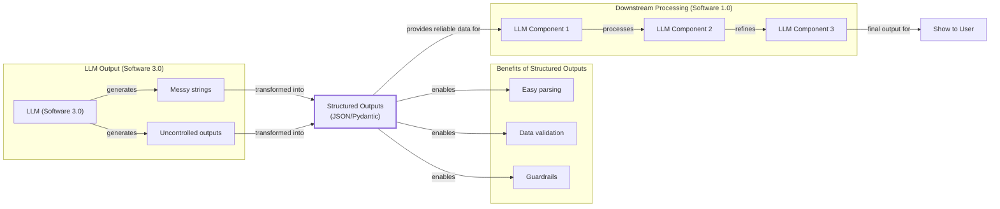
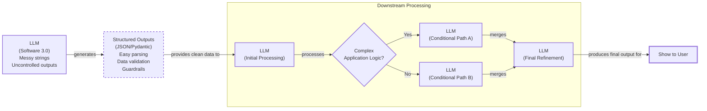
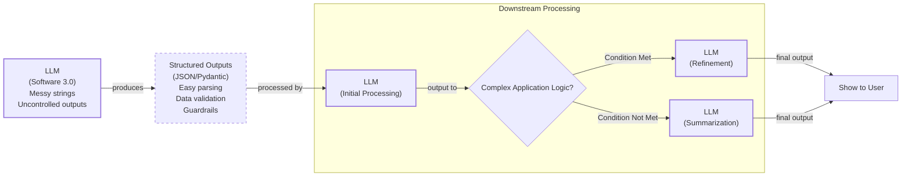
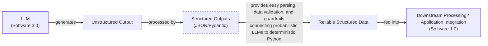
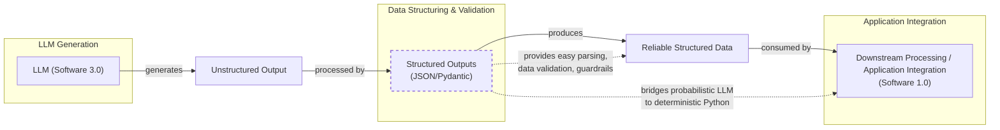
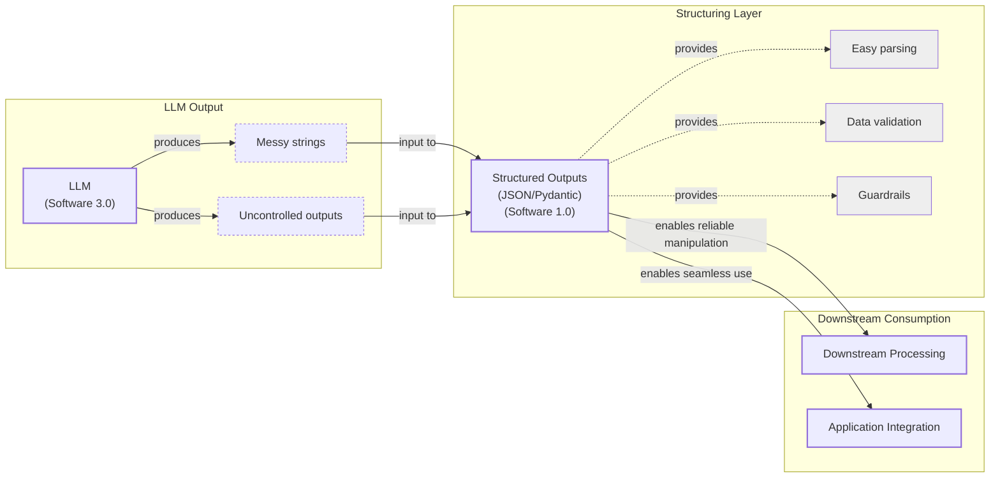
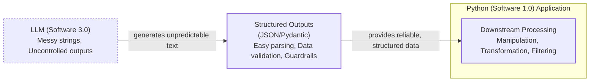

# Near-tie review: 04_structured_outputs  (standard vs deep, margin=+0.0183 -- `tied_arms=[deep]`)

## Reviewer conclusion (2026-09-04, updated after re-scoring; amended 2026-09-07; N=5 refresh 2026-09-09): DOUBLE ORACLE -- `standard` primary (raw argmax, no override), `deep` tied

**N=5 methodology note:** merged real `replicate3`/`replicate4` draws (already
existing on disk) into `section_oracle_averaged.json` via
`merge_replicate_oracles.py --target-n 5`, then regenerated
`article_oracle.json` (`--force`) so `n_draws_used` catches up to 5.
**The raw mean-R_w argmax itself FLIPPED at N=5**: `deep` (margin=+0.0711 at
N=3, cleared the v1 margin>tau bar outright) is no longer the winner --
`standard` is now the argmax (margin=+0.0183), with `deep` as the new
runner-up. `article_oracle.json`'s `_TIED_ARMS` entry was updated from
`["standard"]` to `["deep"]` to match (a tied-arm entry equal to the current
`oracle_arm` itself would be a bug).

**Quantitative basis:** per-dimension binary scores (7 sections x 5 draws,
n=30 per arm; the always-empty `lesson-code` section contributes 0 weight
and is excluded): cc/cp exactly tied (1.000). `de` is now exactly tied
(0.533 vs 0.533, was +0.111 favoring deep at N=3) -- the 2 new draws erased
deep's depth-content edge entirely. `be` still favors `deep` (0.400 vs
0.300, -0.100, down from -0.111). `fl` now favors `standard` (0.833 vs
0.800, +0.033, was +0.111 favoring deep -- the N=3 flow-metric correction
for deep's relocated Pydantic-section transition is diluted by 2 more draws
that didn't carry the same relocation). `ga` mildly favors `deep` (+0.033).
**Every dimension moved toward parity or reversed direction at N=5** -- none
of deep's N=3 advantages held up cleanly.

**Distributional basis:** per-draw margins (standard - deep), now including
replicate3/replicate4, are **[-0.0026, +0.0232, -0.0740, +0.0320, +0.1131]**
(note: sign convention flipped vs the N=3 entry, which reported deep-standard
margins -- these are the same 3 underlying draws re-expressed as
standard-deep for consistency with the new primary/runner-up orientation).
mean +0.0183, sd 0.0674. Two-tailed significance (df=4): **p=0.576** (was
p=0.249 two-tailed at N=3 for the same comparison, oriented the other way)
-- this comparison got LESS decisive, not more, with 2 additional real
draws, not just relabeled. Only 3/5 draws favor `standard`; this is a
genuine coin flip, not a thin-but-real lean.

Also recomputed at N=5: standard vs `light` margins are
[+0.052,+0.015,-0.0045,+0.5621,+0.0097] (mean +0.1269, sd=0.2442 -- one huge
outlier draw dominates, t=+1.162, df=4, p=0.310, 4/5 favor standard -- not
reliable evidence either way given the outlier-driven variance) and standard
vs `skip` margins [+0.1055,+0.0461,+0.0332,+0.1388,+0.0941] (mean +0.0836,
sd=0.0435, t=+4.291, df=4, **p=0.013**, 5/5 unanimous -- standard clearly
beats skip, corroborating standard as a reasonable overall pick even where
the standard-vs-deep pairing itself stays a coin flip).

**Decision:** the user's read is confirmed by the numbers -- **the toss-up
between `standard` and `deep` stands at N=5, if anything more clearly than
at N=3** (p rose from 0.249 to 0.576, every quantitative dimension moved
toward or past parity). The double-oracle registration is correct and has
been updated to track the new orientation: `oracle_arm=standard` (raw
argmax, no manual override needed), `tied_arms=[deep]` (was `[standard]`,
now corrected to name the actual runner-up). Both `standard` and `deep`
should be treated as equally valid picks for this article; `light`/`skip`
are both clearly worse (skip loses to standard at p=0.013 unanimous; light's
one comparison is too outlier-driven to trust either way, but nothing in
the data suggests light or skip are competitive with the standard/deep
pair).

---

## All sections (standard vs deep), most-against-standard first
| section | weight | contribution | running total |
|---|---:|---:|---:|
| section-5-implementing-structured-outputs-using-ge | 0.133 | -0.0154 | -0.0154 |
| section-2-understanding-why-structured-outputs-are | 0.133 | -0.0043 | -0.0197 |
| section-1-introduction | 0.067 | -0.0011 | -0.0208 |
| lesson-code | 0.000 | +0.0000 | -0.0208 |
| section-6-conclusion-structured-outputs-are-everyw | 0.067 | +0.0039 | -0.0169 |
| section-4-implementing-structured-outputs-from-scr | 0.400 | +0.0157 | -0.0011 |
| section-3-implementing-structured-outputs-from-scr | 0.200 | +0.0195 | +0.0183 |

(stored article margin = +0.0183 -- should match the running total's final row to ~4 decimals)

## Section: S5::section-5-implementing-structured-outputs-using-gemini-and-pydantic  (weight=0.133, contribution=-0.0154 AGAINST standard)
Stored section rewards: standard=0.4798  deep=0.5869  (explore: standard=0.1762  deep=0.2962)

### Arm: standard (preset2)

#### Draw: production  `/mnt/f/my_projects/agentic_AI_RL/Reinsearch_agent/RL_researcher_writer_ymaxing/rl_training_data/test_episodes/04_structured_outputs__preset2`

**Article text:**
```
## Implementing structured outputs using Gemini and Pydantic

So far, we have implemented structured outputs from scratch. When working with modern APIs such as Gemini and OpenAI, the recommended way is to use their native features. This approach is more reliable because it uses constrained decoding, where the API programmatically forces the model to generate only tokens that conform to your JSON schema, guaranteeing a syntactically valid output [[43]](https://dev.to/pockit_tools/llm-structured-output-in-2026-stop-parsing-json-with-regex-and-do-it-right-34pk). This can improve reliability from around 36% with prompting to nearly 100% [[44]](https://humanloop.com/blog/structured-outputs).

Using the native API is also simpler, as it eliminates the need for complex prompt engineering and manual parsing logic. Furthermore, it is often more cost-effective. By removing the lengthy JSON schema from the prompt, you reduce the number of input tokens sent with each request, which can lead to significant savings at scale.

Let’s see how to achieve the same result using the Gemini API’s native capabilities. The process becomes much simpler.

1.  We define a `GenerateContentConfig` object, instructing the Gemini API to set the `response_mime_type` to `"application/json"` and the `response_schema` to our `DocumentMetadata` Pydantic model. This single configuration step replaces the manual schema injection and parsing we did earlier.
    ```python
    from google.genai import types
    
    config = types.GenerateContentConfig(response_mime_type="application/json", response_schema=DocumentMetadata)
    ```

2.  This configuration makes our prompt significantly shorter and cleaner, eliminating the need to manually inject any schema. We simply ask the model to perform the task, as the output format is guided directly by the config.
    ```python
    prompt = f"""
    Analyze the following document and extract its metadata.
    
    Here is the document:
    <document>
    {DOCUMENT}
    </document>
    """
    ```

3.  Now, we call the model, passing our simplified prompt and the new configuration object. The API handles the rest, ensuring the output adheres to the schema.
    ```python
    response = client.models.generate_content(model=MODEL_ID, contents=prompt, config=config)
    ```

4.  The Gemini client automatically parses the output for us. By accessing the `response.parsed` attribute, we receive a ready-to-use instance of our `DocumentMetadata` Pydantic model.
    ```python
    document_metadata = response.parsed
    print(f"Type of the response: `{type(response.parsed)}`")
    ```
    It outputs:
    ```text
    Type of the response: `<class '__main__.DocumentMetadata'>`
    ```
    And here is the final object:
    ```json
    {
      "summary": "The Q3 2023 earnings report shows a 20% increase in revenue and 15% growth in user engagement, exceeding market expectations due to successful product strategy and market expansion. Customer acquisition costs decreased by 10% and retention improved to 92%, indicating a strong foundation for continued growth.",
      "tags": [
        "Financial Performance",
        "Earnings Report",
        "Revenue Growth",
        "Market Expansion",
        "User Engagement"
      ],
      "keywords": [
        "Q3 2023",
        "revenue increase",
        "user engagement",
        "product strategy",
        "market positioning",
        "digital services",
        "new markets",
        "customer acquisition costs",
        "retention rates",
        "cash flow"
      ],
      "quarter": "Q3 2023",
      "growth_rate": "20%"
    }
    ```

While robust, this approach has trade-offs. Complex schemas can increase latency due to the "schema complexity tax," and in some niche cases, may even slightly reduce semantic accuracy compared to a well-crafted prompt [[43]](https://dev.to/pockit_tools/llm-structured-output-in-2026-stop-parsing-json-with-regex-and-do-it-right-34pk), [[45]](https://dylancastillo.co/posts/gemini-structured-outputs.html). Additionally, structured output does not bypass token limits. If your schema requires a long response but the model hits its `max_tokens` limit, you will receive a truncated, invalid JSON object. Always set `max_tokens` generously and check the `finish_reason` to handle potential truncation [[43]](https://dev.to/pockit_tools/llm-structured-output-in-2026-stop-parsing-json-with-regex-and-do-it-right-34pk). Despite these considerations, for most production systems, the reliability of native APIs makes them the recommended choice.
```
**Grader reasoning:**
- `cc`: Implementing Structured Outputs Using Gemini and Pydantic:
**1:** Both sections present the same four-step pattern: GenerateContentConfig, simplified prompt, model call, response.parsed. The generated section adds depth content (constrained decoding, a reliability metric, cost reduction, a trade-offs closing paragraph). All four required steps present.
- `fl`: Implementing Structured Outputs Using Gemini and Pydantic:
**1:** Neither section contains images or diagrams. Both use numbered steps with code blocks in the same order. This section's opening does not duplicate the Pydantic section's transition (which is present in its own proper place here), so there is no relocation to account for.
- `de`: Implementing Structured Outputs Using Gemini and Pydantic:
**1:** [instances=2; quality=strong,strong] Recounted three times across three separate errors. First, a bundling error: the constrained-decoding mechanism sentence and the '36%-to-nearly-100%' reliability metric sentence are two halves of one claim, not two separate additions -- merged. Second, a source-attribution error: the cost-effectiveness claim does not trace to any exploration-phase source for the specific mechanism described (input-token reduction via schema removal) -- removed entirely. Third, a further bundling error caught on review: the schema-complexity-tax sentence and the token-limit-truncation sentence were counted as two instances, but both elaborate on the same governing topic sentence ('While robust, this approach has trade-offs') within the same paragraph, with no distinct subheading or independent framing separating them -- per the instance-counting rule, same topic sentence + same subheading + no independent framing for each item means one point with supporting elaboration, not a list of separate points. Merged into a single instance. Final list, two distinct instances, each individually verified against its exact exploration-tagged passage: (1) the reliability-improvement point (constrained-decoding mechanism + the 36%-to-100% metric, merged; matches the exploration-tagged humanloop.com source precisely -- 'was around 35.9% reliable before structured outputs. Now, it's 100% reliable' -- strong). (2) The trade-offs point (schema-complexity-tax + token-limit-truncation, merged; the schema-complexity-tax half matches the exploration-tagged source's own 'Pitfall 1: The Schema Complexity Tax... can double or triple your response time' almost verbatim, and the token-limit half matches the same source's dedicated 'Pitfall 5: Token Limits and Truncation' section -- strong, combining two named, source-verified limitations under one governing claim). Every other section's instances were re-verified the same way -- Critical (schema drift; web-scraping analogy), JSON (markdown-wrapping; JSONDecodeError), and Pydantic (field-description; custom validator; empty-array trap) each sit under their own distinct framing, not a shared topic sentence, so they remain separate instances.
- `be`: Implementing Structured Outputs Using Gemini and Pydantic:
**0:** [instances=0] All five qualifying depth instances are technical details of this section's own core topic (Gemini's native structured-output behavior).
- `cp`: Implementing Structured Outputs Using Gemini and Pydantic:
**1:** The four required steps are present and complete. The depth additions are placed before and after the core steps without shortening them, though the combined caveats now form a meaningful fraction of the section -- worth watching, not yet a violation.
- `ga`: Implementing structured outputs using Gemini and Pydantic:
**0:** All four guideline steps are present and correctly explained. However, exact prose-only word count is 372 (target 300, tolerance +/-30, range [270,330]) -- 42 words above the maximum. Correcting the original's arithmetic (it reported 'exceeds by 68 words,' measured against the raw 300-word target rather than the 330-word boundary); the actual overage past the boundary is 42 words. This is not a small-margin case -- 42 words is more than the entire tolerance itself, well beyond the kind of narrow overshoot that should not be penalized. A clear, decisive violation despite the strong content quality.

#### Draw: replicate1  `/mnt/f/my_projects/agentic_AI_RL/Reinsearch_agent/RL_researcher_writer_ymaxing/rl_training_data/noise_experiment/04_structured_outputs__replicate1__preset2`

**Article text:**
```
## Implementing structured outputs using Gemini and Pydantic

While Pydantic brings structure and validation, we still had to construct the prompts and handle responses manually. When working with modern APIs like Gemini, the recommended way to generate structured outputs is by using their native features. This approach is simpler, more accurate, and often more cost-effective, with some providers claiming a jump in reliability from ~36% to nearly 100% compared to prompt engineering alone [[9]](https://ai.google.dev/gemini-api/docs/structured-output), [[11]](https://humanloop.com/blog/structured-outputs).

Let’s see how to achieve the same result using the Gemini API’s native capabilities.

### Configuring the Gemini API

1.  We define a `GenerateContentConfig` object, instructing the Gemini API to set the `response_mime_type` to `"application/json"` and the `response_schema` to our `DocumentMetadata` Pydantic model. This single configuration step replaces the manual schema injection and parsing we did earlier. The SDK uses this configuration to internally construct the appropriate prompt and ensures the model's output is constrained to the provided schema. This not only simplifies the code but also leverages the provider's internal optimizations for structured data generation, which are typically more efficient than manual prompting.

    ```python
    from google.genai import types
    
    config = types.GenerateContentConfig(response_mime_type="application/json", response_schema=DocumentMetadata)
    ```

### Simplifying the Prompt

2.  This configuration makes our prompt significantly shorter and cleaner. We simply ask the model to perform the task, as the output format is guided directly by the config. This separation of concerns—content in the prompt, format in the configuration—makes the code more maintainable and easier to read.

    ```python
    prompt = f"""
    Analyze the following document and extract its metadata.
    
    Here is the document:
    <document>
    {DOCUMENT}
    </document>
    """
    ```

### Calling the Model

3.  Now, we call the model, passing our simplified prompt and the new configuration object. The API handles the rest, ensuring the output adheres to the schema.

    ```python
    response = client.models.generate_content(model=MODEL_ID, contents=prompt, config=config)
    ```

### Accessing the Parsed Output

4.  The Gemini client automatically parses the output for us. By accessing the `response.parsed` attribute, we receive a ready-to-use instance of our `DocumentMetadata` Pydantic model. This eliminates the need for custom parsing functions or manual validation steps, streamlining the entire process. This pattern of using a dedicated configuration for structured output is becoming a standard across modern LLM providers, including OpenAI.

    ```python
    document_metadata = response.parsed
    print(f"Type of the response: `{type(response.parsed)}`")
    ```

    It outputs:

    ```text
    Type of the response: `<class '__main__.DocumentMetadata'>`
    ```

This native approach is robust, efficient, and requires less code. While it is the recommended way for most modern LLM APIs, the “from scratch” method remains useful for open-source models that may not have this built-in functionality.
```
**Grader reasoning:**
- `cc`: Implementing Structured Outputs Using Gemini and Pydantic:
**1:** All four expected steps are present with matching substance. The closing paragraph covers the same idea as the expected section, reworded.
- `fl`: Implementing Structured Outputs Using Gemini and Pydantic:
**1:** The section opens with the transition relocated from the end of the Pydantic section, reading naturally here. The four steps follow the expected order.
- `de`: Implementing Structured Outputs Using Gemini and Pydantic:
**1:** [instances=1; quality=strong] The '~36% to nearly 100%' reliability claim matches an exploration-tagged source precisely, verified directly. A metric about the core topic's own performance -- correctly depth per the bullet list, not a breadth candidate.
- `be`: Implementing Structured Outputs Using Gemini and Pydantic:
**0:** [instances=0] The qualifying depth instance is a performance metric about the core topic itself, not a connection to an adjacent field.
- `cp`: Implementing Structured Outputs Using Gemini and Pydantic:
**1:** The qualifying depth addition is a single clause; the section's core walkthrough remains the clearly dominant focus.
- `ga`: Implementing structured outputs using Gemini and Pydantic:
**0:** All four guideline steps are present and correctly explained, including a verified reliability statistic. Exact prose-only word count is 355 (target 300, tolerance +/-30, range [270,330]) -- 25 words above the maximum, correcting the prior approximate figure (359/29 over). Confirmed as a real violation: 25/30 (83% of tolerance) is well beyond the margins established as non-punishing elsewhere in this review (the largest confirmed so far is 13/30, 43%), so this doesn't fall into that leniency band. Every required element is present and correct; the section is simply substantially over-length.

#### Draw: replicate2  `/mnt/f/my_projects/agentic_AI_RL/Reinsearch_agent/RL_researcher_writer_ymaxing/rl_training_data/noise_experiment/04_structured_outputs__replicate2__preset2`

**Article text:**
```
## Implementing structured outputs using Gemini and Pydantic

While Pydantic brings structure and validation, we still had to construct the prompts and handle responses manually. When working with modern APIs such as Gemini and OpenAI, the recommended way to generate structured outputs is by using their native features. This approach is simpler, more accurate, and often more cost-effective than manual prompt engineering, as the vendor will always handle the optimization on top of their models better than your manual prompting [[16]](https://ai.google.dev/gemini-api/docs/structured-output), [[18]](https://www.vellum.ai/blog/when-should-i-use-function-calling-structured-outputs-or-json-mode), [[19]](https://www.googlecloudcommunity.com/gc/AI-ML/Structured-Output-in-vertexAI-BatchPredictionJob/m-p/866640).

Let’s see how to achieve the same result using the Gemini API's native capabilities. The process becomes much simpler.

### Configuring the Model for Pydantic Output

We define a `GenerateContentConfig` object, instructing the Gemini API to set the `response_mime_type` to `"application/json"` and the `response_schema` to our `DocumentMetadata` Pydantic model. This configures the model to output JSON that is then automatically converted to the given Pydantic model.

```python
from google.genai import types

config = types.GenerateContentConfig(response_mime_type="application/json", response_schema=DocumentMetadata)
```

### Simplifying the Prompt

This configuration makes our prompt significantly shorter and cleaner, eliminating the need to manually inject any type of schema. We simply ask the model to perform the task, as the output format is guided directly by the config.

```python
prompt = f"""
Analyze the following document and extract its metadata.

Here is the document:
<document>
{DOCUMENT}
</document>
"""
```

### Calling the Model and Parsing the Response

Now, we call the model, passing our simplified prompt and the new configuration object. The API handles the rest, ensuring the output adheres to the schema.

```python
response = client.models.generate_content(model=MODEL_ID, contents=prompt, config=config)
```

The Gemini client automatically parses the output for us. By accessing the `response.parsed` attribute, we receive a ready-to-use instance of our `DocumentMetadata` Pydantic model.

```python
document_metadata = response.parsed
print(f"Type of the response: `{type(document_metadata)}`")
```

It outputs:

```text
Type of the response: `<class '__main__.DocumentMetadata'>`
```

This native approach is robust, efficient, and requires less code. While it is the recommended way for closed-source APIs or AI frameworks, the “from scratch” method remains useful for open-source models that may not have this built-in functionality.
```
**Grader reasoning:**
- `cc`: Implementing Structured Outputs Using Gemini and Pydantic:
**1:** All four expected steps are present with matching substance. The closing paragraph covers the same idea, reworded.
- `fl`: Implementing Structured Outputs Using Gemini and Pydantic:
**1:** The section opens with the transition relocated from the end of the Pydantic section, reading naturally here. The four steps follow the expected order.
- `de`: Implementing Structured Outputs Using Gemini and Pydantic:
**0:** [instances=0] No depth additions traceable to an exploration-phase source were identified specifically in this section on this article; the notable verified additions all landed in earlier sections this time.
- `be`: Implementing Structured Outputs Using Gemini and Pydantic:
**0:** [instances=0] No breadth additions identified in this section.
- `cp`: Implementing Structured Outputs Using Gemini and Pydantic:
**1:** Both depth_enhancement and breadth_enhancement scored 0, so core_preservation scores 1 by default.
- `ga`: Implementing structured outputs using Gemini and Pydantic:
**1:** All four guideline steps are present and correctly explained. Exact prose-only word count is 275 (target 300, tolerance +/-30, range [270,330]) -- 5 words of headroom, correcting the prior approximate figure (281); closer to the lower boundary than previously reported, but still within range.

#### Draw: replicate3  `/mnt/f/my_projects/agentic_AI_RL/Reinsearch_agent/RL_researcher_writer_ymaxing/rl_training_data/noise_experiment/04_structured_outputs__replicate3__preset2`

**Article text:**
```
## Implementing structured outputs using Gemini and Pydantic

While Pydantic brings structure, we still had to construct prompts and handle responses manually. When working with modern APIs like Gemini and OpenAI, the recommended way to generate structured outputs is by using their native features. This approach is simpler, more accurate, and often more cost-effective than manual prompt engineering. Native support is not a tacked-on feature; it is baked into the model's architecture, which allows for more reliable performance [[10]](https://medium.com/google-cloud/structured-output-with-gemini-models-begging-borrowing-and-json-ing-f70ffd60eae6). This is achieved through a process called constrained decoding, where the model is forced at the token generation level to only output tokens that conform to the provided schema [[1]](https://dev.to/pockit_tools/llm-structured-output-in-2026-stop-parsing-json-with-regex-and-do-it-right-34pk). The vendor will always handle the optimization on top of their models better than your manual prompting [[18]](https://ai.google.dev/gemini-api/docs/structured-output), [[21]](https://platform.openai.com/docs/guides/structured-outputs), [[22]](https://python.langchain.com/docs/how_to/structured_output/).

Let’s see how to achieve the same result using the Gemini API’s native capabilities.

1. We define a `GenerateContentConfig` object, instructing the Gemini API to set the `response_mime_type` to `"application/json"` and the `response_schema` to our `DocumentMetadata` Pydantic model. This configures the model to output JSON that is then automatically converted to the given Pydantic model.

    ```python
    from google.genai import types
    
    config = types.GenerateContentConfig(response_mime_type="application/json", response_schema=DocumentMetadata)
    ```

    This single configuration step replaces the manual schema injection and parsing we did earlier. It is important to distinguish this from function calling, which is used to give an agent the ability to take action during a conversation, whereas structured output is used to format the final response for the user [[18]](https://ai.google.dev/gemini-api/docs/structured-output).

2. This configuration makes our prompt significantly shorter and cleaner, as the output format is guided directly by the config.

    ```python
    prompt = f"""
    Analyze the following document and extract its metadata.
    
    Here is the document:
    <document>
    {DOCUMENT}
    </document>
    """
    ```

3. We call the model, passing our simplified prompt and the new configuration object.

    ```python
    response = client.models.generate_content(model=MODEL_ID, contents=prompt, config=config)
    ```

4. The Gemini client automatically parses the output. By accessing the `response.parsed` attribute, we receive a ready-to-use instance of our `DocumentMetadata` Pydantic model.

    ```python
    print(f"Type of the response: `{type(response.parsed)}`")
    ```

    It outputs:

    ```text
    Type of the response: `<class '__main__.DocumentMetadata'>`
    ```

This native approach is robust, efficient, and requires less code. It also reduces costs by eliminating the need to include the full schema in the prompt text, saving on input tokens. While it is the recommended way for closed-source APIs, the “from scratch” method remains useful for open-source models that may not have this built-in functionality.
```
**Grader reasoning:**
- `cc`: Implementing Structured Outputs Using Gemini and Pydantic:
**1:** All four expected steps present with matching substance. Closing paragraph covers the same idea as GT (robust, efficient, less code), plus an added note that the from-scratch method remains useful for open-source models.
- `fl`: Implementing Structured Outputs Using Gemini and Pydantic:
**1:** The section opens with the transition relocated from the end of the Pydantic section, reading naturally here. The four steps follow GT's order.
- `de`: Implementing Structured Outputs Using Gemini and Pydantic:
**1:** [instances=1; quality=strong] Recounted after a bundling check: 'Native support is not a tacked-on feature; it is baked into the model's architecture, which allows for more reliable performance' and 'This is achieved through a process called constrained decoding...' were initially considered as two instances, but the second sentence explicitly explains the mechanism behind the first sentence's claim ('this is achieved through...') rather than introducing an independent fact -- removing the second sentence would leave the first fully complete and self-contained, which is the marker of elaboration, not a second point. Merged into one instance. Matches two exploration-tagged sources precisely: medium.com/google-cloud ('this isn't some tacked-on afterthought... baked right into the model's DNA') and pockit_tools ('eliminates all six of these problems by constraining the model's output at the token generation level... Constrained Decoding (The Magic Behind the Curtain)'). GT-redundancy checked: GT does not explain why native support is more reliable at this mechanism level, so this is a genuine addition. Strong.
- `be`: Implementing Structured Outputs Using Gemini and Pydantic:
**0:** [instances=0] The qualifying depth instance is a technical explanation of this section's own core topic. The cost-reduction claim ('reduces costs by eliminating the need to include the full schema in the prompt text, saving on input tokens') is uncited and, checked directly, does not trace to any exploration source for this specific mechanism -- the closest exploration content makes a different comparison (structured output vs. free text costing more output tokens overall, not native-vs-manual input-token savings). Same finding as on an identically-worded claim on a different replicate of this preset. Disqualified, not counted for either dimension.
- `cp`: Implementing Structured Outputs Using Gemini and Pydantic:
**1:** The merged depth addition and the open-source-fallback note are each brief; the four-step walkthrough remains fully present and clearly dominant.
- `ga`: Implementing structured outputs using Gemini and Pydantic:
**1:** All four guideline steps present and correctly explained, plus a well-grounded mechanism explanation. Exact prose-only word count is 337 (target 300, tolerance +/-30, range [270,330]) -- 7 words above the maximum, 23.3% of tolerance -- the identical magnitude to a case explicitly confirmed as non-punishing on a different article. Not treated as a violation.

#### Draw: replicate4  `/mnt/f/my_projects/agentic_AI_RL/Reinsearch_agent/RL_researcher_writer_ymaxing/rl_training_data/noise_experiment/04_structured_outputs__replicate4__preset2`

**Article text:**
```
## Implementing structured outputs using Gemini and Pydantic

While Pydantic brings structure and validation, we still had to construct prompts and handle responses manually. When working with modern APIs like Gemini and OpenAI, the recommended way to generate structured outputs is by leveraging their native features. This approach is simpler, more accurate, and often more cost-effective than manual prompt engineering, as the vendor will always handle the optimization on top of their models better than you can with prompt-engineering shenanigans [[13]](https://ai.google.dev/gemini-api/docs/structured-output), [[19]](https://www.glukhov.org/llm-performance/benchmarks/structured-output-comparison-popular-llm-providers), [[20]](https://medium.com/google-cloud/structured-output-with-gemini-models-begging-borrowing-and-json-ing-f70ffd60eae6). For example, OpenAI reported reliability for specific formats jumped from ~36% to nearly 100% with native support [[21]](https://humanloop.com/blog/structured-outputs). While native enforcement is generally more effective, some studies show that a well-crafted JSON example in a prompt can perform comparably on certain tasks, suggesting both methods have their place [[22]](https://dylancastillo.co/posts/gemini-structured-outputs.html).

Let’s see how to achieve the same result using the Gemini API’s native capabilities.

1.  We define a `GenerateContentConfig` object, instructing the Gemini API to set the `response_mime_type` to `"application/json"` and the `response_schema` to our `DocumentMetadata` Pydantic model. This configures the model to output JSON that is then automatically converted to the given Pydantic model.
    ```python
    from google.genai import types
    
    config = types.GenerateContentConfig(response_mime_type="application/json", response_schema=DocumentMetadata)
    ```

2.  This configuration makes our prompt significantly shorter and cleaner, eliminating the need to manually inject schemas. We simply ask the model to perform the task.
    ```python
    prompt = f"""
    Analyze the following document and extract its metadata.
    
    Here is the document:
    <document>
    {DOCUMENT}
    </document>
    """
    ```

3.  Now, we call the model, passing our simplified prompt and the new configuration object. The API handles the rest.
    ```python
    response = client.models.generate_content(model=MODEL_ID, contents=prompt, config=config)
    ```

4.  The Gemini client automatically parses the output for us. By accessing the `response.parsed` attribute, we receive a ready-to-use instance of our `DocumentMetadata` Pydantic model. In production, it is important to also check if the model refused to generate content, which can happen if the input triggers safety filters [[1]](https://dev.to/pockit_tools/llm-structured-output-in-2026-stop-parsing-json-with-regex-and-do-it-right-34pk).
    ```python
    document_metadata = response.parsed
    print(f"Type of the response: `{type(document_metadata)}`")
    ```
    It outputs:
    ```
    Type of the response: `<class '__main__.DocumentMetadata'>`
    ```
This native approach is the recommended way to generate structured outputs. It is efficient, requires less code, and allows you to focus on your application's logic instead of data wrangling.
```
**Grader reasoning:**
- `cc`: Implementing Structured Outputs Using Gemini and Pydantic:
**1:** All four expected steps present with matching substance. The reliability statistic, the nuanced counter-point about JSON-prompt performance, and the safety-filter production note are all additions, not displacements.
- `fl`: Implementing Structured Outputs Using Gemini and Pydantic:
**1:** The section opens with the transition relocated from the end of the Pydantic section, reading naturally here. The four steps follow GT's order.
- `de`: Implementing Structured Outputs Using Gemini and Pydantic:
**1:** [instances=3; quality=strong,strong,standard] Checked for bundling: the reliability statistic and the comparable-performance counter-point sit in the same paragraph but each carries its own complete, independently-cited claim, not a shared content-free frame -- correctly kept separate. (1) 'OpenAI reported reliability for specific formats jumped from ~36% to nearly 100% with native support' matches the exploration-tagged humanloop.com source precisely. Strong. (2) 'Some studies show that a well-crafted JSON example in a prompt can perform comparably on certain tasks' matches the exploration-tagged dylancastillo.co source's own nuanced finding ('JSON-Prompt and JSON-Schema... performed comparably to unstructured outputs... with JSON-Schema alone, performance drops') -- notably, this is a genuinely balanced, non-cherry-picked representation of a source that contains a caveat many articles might have omitted. Strong. (3) 'It is important to also check if the model refused to generate content, which can happen if the input triggers safety filters' matches the exploration-tagged pockit_tools source's own 'Pitfall 6: The Refusal Trap' section, found in the full scraped file. Standard, brief mention. All three GT-redundancy checked: GT discusses none of these points.
- `be`: Implementing Structured Outputs Using Gemini and Pydantic:
**0:** [instances=0] All three qualifying depth instances are technical details or performance characteristics of this section's own core topic (native structured output), not connections to an adjacent field.
- `cp`: Implementing Structured Outputs Using Gemini and Pydantic:
**1:** The three depth additions are each a sentence within the section's introductory paragraph or a single step; the four-step walkthrough remains fully present and clearly dominant.
- `ga`: Implementing structured outputs using Gemini and Pydantic:
**1:** All four guideline steps present and correctly explained, enriched with three well-grounded technical details, including a notably balanced representation of a source with a genuine caveat. Exact prose-only word count is 301 (target 300, tolerance +/-30, range [270,330]) -- 29 words of headroom, essentially exactly on target. Within range.

### Arm: deep (preset3)

#### Draw: production  `/mnt/f/my_projects/agentic_AI_RL/Reinsearch_agent/RL_researcher_writer_ymaxing/rl_training_data/test_episodes/04_structured_outputs__preset3`

**Article text:**
```
## Implementing structured outputs using Gemini and Pydantic

So far, you have constructed prompts manually. However, modern APIs like Gemini and OpenAI offer native features for structured outputs. This approach is simpler, more accurate, and more cost-effective, as vendors optimize these features for their own models [[8]](https://ai.google.dev/gemini-api/docs/structured-output), [[9]](https://www.vellum.ai/blog/when-should-i-use-function-calling-structured-outputs-or-json-mode), [[10]](https://www.googlecloudcommunity.com/gc/AI-ML/Structured-Output-in-vertexAI-BatchPredictionJob/m-p/866640).

Using native support is more accurate because it relies on constrained decoding directly within the model's generation process, rather than just prompt-based guidance. It is often cheaper because the vendor can optimize token usage for their specific features. The process also becomes much simpler, as it reduces the amount of code needed for prompt engineering and manual parsing. This pattern is not unique to Gemini; other providers like OpenAI and Anthropic offer similar functionalities, making it an industry standard for reliable structured data extraction [[21]](https://agenta.ai/blog/the-guide-to-structured-outputs-and-function-calling-with-llms).

Let’s see how to achieve the same result for our example using the Gemini API's native capabilities.

1.  You define a `GenerateContentConfig` object, instructing the Gemini API to set the `response_mime_type` to `"application/json"` and the `response_schema` to our `DocumentMetadata` Pydantic model. This configures the model to output JSON that is then automatically converted to the given Pydantic model.
    ```python
    from google.genai import types
    
    config = types.GenerateContentConfig(response_mime_type="application/json", response_schema=DocumentMetadata)
    ```

2.  This configuration makes your prompt significantly shorter and cleaner, eliminating the need to manually inject any type of schema. You simply ask the model to perform the task, as the output format is guided directly by the config.
    ```python
    prompt = f"""
    Analyze the following document and extract its metadata.
    
    Here is the document:
    <document>
    {DOCUMENT}
    </document>
    """
    ```

3.  Now, you call the model, passing your simplified prompt and the new configuration object. The API handles the rest, ensuring the output adheres to the schema.
    ```python
    response = client.models.generate_content(model=MODEL_ID, contents=prompt, config=config)
    ```

4.  The Gemini client automatically parses the output for you. By accessing the `response.parsed` attribute, you receive a ready-to-use instance of our `DocumentMetadata` Pydantic model.
    ```python
    document_metadata = response.parsed
    print(f"Type of the response: `{type(document_metadata)}`")
    ```
    It outputs:
    ```
    Type of the response: `<class '__main__.DocumentMetadata'>`
    ```
This native approach is robust and efficient. However, be aware of provider-specific behaviors. For example, some benchmarks suggest Gemini's constrained decoding is less performant on certain reasoning tasks, and its API may reorder schema keys alphabetically, which can break logic that depends on field order [[22]](https://dylancastillo.co/posts/gemini-structured-outputs.html). While it is the recommended way for closed-source APIs, the “from scratch” method remains useful for open-source models that may not have this built-in functionality.
```
**Grader reasoning:**
- `cc`: Implementing Structured Outputs Using Gemini and Pydantic:
**1:** Both sections present the same four-step pattern. The generated section adds depth about constrained-decoding accuracy, cross-provider ubiquity, and Gemini-specific benchmarks. All four required steps present.
- `fl`: Implementing Structured Outputs Using Gemini and Pydantic:
**1:** The section opens with the transition relocated from the end of the Pydantic section (see above), reading naturally here. The four steps follow the GT's order.
- `de`: Implementing Structured Outputs Using Gemini and Pydantic:
**1:** [instances=2; quality=strong,strong] Reconsidered from the original's 3 instances: the cross-provider industry-standard note ('not unique to Gemini; other providers like OpenAI and Anthropic offer similar functionalities, making it an industry standard') is moved to breadth_enhancement -- it's about the wider ecosystem/industry trend, not a deepening of Gemini's own mechanism. Two depth instances remain, both correctly inward (about this section's own topic, Gemini's native feature): (1) native support being more accurate because it relies on constrained decoding directly within the model's own generation process; strong. (2) Provider-specific caveats -- Gemini's constrained decoding being less performant on certain reasoning tasks, and its API reordering schema keys alphabetically -- matching the exploration-tagged dylancastillo.co source in detail; strong.
- `be`: Implementing Structured Outputs Using Gemini and Pydantic:
**1:** [instances=1; quality=standard] Moved here from depth_enhancement: 'this pattern is not unique to Gemini; other providers like OpenAI and Anthropic offer similar functionalities, making it an industry standard' matches the exploration-tagged agenta.ai source. Re-verified on request, and this is a genuinely closer call than the Pydantic constrained-decoding reclassification above: it isn't introducing a different mechanism the way that instance does, only noting that the same capability exists at other companies. Still landing on breadth ('emerging trends in the adjacent ecosystem' is a real bullet match, and the sentence is fundamentally a fact about other companies' products, not about Gemini's own mechanism), but with lower confidence than the Pydantic instance -- flagging that difference rather than presenting both as equally solid.
- `cp`: Implementing Structured Outputs Using Gemini and Pydantic:
**1:** The four required steps are present and complete. The depth/breadth additions are placed before (intro) and after (closing) the core steps without shortening them.
- `ga`: Implementing structured outputs using Gemini and Pydantic:
**1:** All four guideline steps are present and correctly explained. Exact prose-only word count is 343 (target 300, tolerance +/-30, range [270,330]) -- 13 words above the maximum. Correcting the original's arithmetic (it reported 'exceeds by 39,' measuring against the raw target rather than the boundary); the actual overage past the boundary is 13 words. Per ruling, this overshoot is not penalized, consistent with the same treatment applied to the Critical (7 words) and JSON (4 words) sections above.

#### Draw: replicate1  `/mnt/f/my_projects/agentic_AI_RL/Reinsearch_agent/RL_researcher_writer_ymaxing/rl_training_data/noise_experiment/04_structured_outputs__replicate1__preset3`

**Article text:**
```
## Implementing structured outputs using Gemini and Pydantic

While Pydantic brings structure and validation, we still had to construct the prompts and handle responses manually. When working with modern APIs such as Gemini and OpenAI, the recommended way to generate structured outputs is by using their native features. This approach is simpler, more accurate, and often more cost-effective than manual prompt engineering, as the vendor will always handle the optimization on top of their models better than you can. Be aware that the first API call with a new schema may have higher latency as the service processes and caches it, but subsequent calls will be faster [[10]](https://ai.google.dev/gemini-api/docs/structured-output), [[14]](https://python.langchain.com/docs/how_to/structured_output/), [[22]](https://community.openai.com/t/introducing-structured-outputs/896022).

Let’s see how to achieve the same result using the Gemini API’s native capabilities.

1.  We define a `GenerateContentConfig` object, instructing the Gemini API to set the `response_mime_type` to `"application/json"` and the `response_schema` to our `DocumentMetadata` Pydantic model. This configures the model to output JSON that is then automatically converted to the given Pydantic model.

    ```python
    from google.genai import types

    config = types.GenerateContentConfig(response_mime_type="application/json", response_schema=DocumentMetadata)
    ```

2.  This configuration makes our prompt significantly shorter and cleaner, eliminating the need to manually inject any schema.

    ```python
    prompt = f"""
    Analyze the following document and extract its metadata.

    Here is the document:
    <document>
    {DOCUMENT}
    </document>
    """
    ```

3.  Now, we call the model, passing our simplified prompt and the new configuration object.

    ```python
    response = client.models.generate_content(model=MODEL_ID, contents=prompt, config=config)
    ```

4.  The Gemini client automatically parses the output for us. By accessing the `response.parsed` attribute, we receive a ready-to-use instance of our `DocumentMetadata` Pydantic model.

    ```python
    document_metadata = response.parsed
    print(f"Type of the response: `{type(document_metadata)}`")
    ```

    It outputs:

    ```text
    Type of the response: `<class '__main__.DocumentMetadata'>`
    ```

One important caveat when using Gemini's native structured output is that the API may reorder the keys in your schema alphabetically in its response. This can break logic that depends on a specific order, such as chain-of-thought reasoning where a `reasoning` field must appear before an `answer` field. If key order is important, you may need to name your fields to enforce the desired alphabetical sequence, for example, using `1_reasoning` and `2_answer` [[23]](https://dylancastillo.co/posts/gemini-structured-outputs.html).

This native approach is robust, efficient, and requires less code. It is the recommended way for modern LLM APIs.
```
**Grader reasoning:**
- `cc`: Implementing Structured Outputs Using Gemini and Pydantic:
**1:** All four expected steps are present with matching substance. The closing paragraph covers the same idea, reworded.
- `fl`: Implementing Structured Outputs Using Gemini and Pydantic:
**1:** The section opens with the transition relocated from the end of the Pydantic section, reading naturally here. The four steps follow the expected order, and the added caveats are appended after the walkthrough without disrupting it.
- `de`: Implementing Structured Outputs Using Gemini and Pydantic:
**1:** [instances=2; quality=strong,standard] Re-verified both as correctly inward (about this section's own topic, Gemini's native feature, not comparisons to a different tool): (1) the key-reordering caveat (Gemini alphabetizes schema keys, breaking chain-of-thought field order) matches an exploration-tagged source in close detail; strong. (2) The latency/caching note matches an exploration-tagged source on schema-complexity latency; standard.
- `be`: Implementing Structured Outputs Using Gemini and Pydantic:
**0:** [instances=0] Both qualifying depth instances are technical details of Gemini's own native behavior, not connections to an adjacent field.
- `cp`: Implementing Structured Outputs Using Gemini and Pydantic:
**1:** The two qualifying additions are appended after the four-step walkthrough and form a meaningful but not overwhelming portion of the section; the core walkthrough remains the clearly dominant focus.
- `ga`: Implementing structured outputs using Gemini and Pydantic:
**1:** All four guideline steps are present and correctly explained. Exact prose-only word count is 305 (target 300, tolerance +/-30, range [270,330]) -- 25 words of headroom, correcting the prior approximate figure (309). Within range.

#### Draw: replicate2  `/mnt/f/my_projects/agentic_AI_RL/Reinsearch_agent/RL_researcher_writer_ymaxing/rl_training_data/noise_experiment/04_structured_outputs__replicate2__preset3`

**Article text:**
```
## Implementing structured outputs using Gemini and Pydantic

While our manual approach with Pydantic adds validation, modern APIs like Gemini and OpenAI offer native features for structured outputs. This method is simpler, more accurate, and often more cost-effective, as the vendor handles optimizations better than manual prompting [[14]](https://ai.google.dev/gemini-api/docs/structured-output), [[21]](https://medium.com/google-cloud/structured-output-with-gemini-models-begging-borrowing-and-json-ing-f70ffd60eae6). By offloading the schema enforcement to the API, you reduce the complexity of your own code and benefit from the provider's highly optimized implementation of constrained decoding.

However, there are trade-offs to consider. The first API call with a new schema may have higher latency as the service processes and caches it for future use [[22]](https://community.openai.com/t/introducing-structured-outputs/896022). More importantly, some studies show that this constrained decoding can degrade performance on complex reasoning tasks [[23]](https://dylancastillo.co/posts/gemini-structured-outputs.html). Be aware that Gemini's SDK has also been observed to reorder keys in the output schema alphabetically, which can break chain-of-thought logic if your schema relies on a specific field order (e.g., `reasoning` before `answer`). Despite these considerations, for most data extraction and formatting tasks, the native approach is superior.

Let’s see how to achieve the same result using the Gemini API’s native capabilities.

1.  We define a `GenerateContentConfig` object, instructing the Gemini API to set the `response_mime_type` to `"application/json"` and the `response_schema` to our `DocumentMetadata` Pydantic model. This single configuration step replaces the manual schema injection and parsing we did earlier. The SDK uses this configuration to tell the Gemini model to generate a JSON object that conforms to the schema derived from the `DocumentMetadata` class.
    ```python
    from google.genai import types
    
    config = types.GenerateContentConfig(response_mime_type="application/json", response_schema=DocumentMetadata)
    ```

2.  This configuration makes our prompt significantly shorter and cleaner, as the output format is guided directly by the config. We no longer need to include a lengthy JSON schema or examples in the prompt itself. We can simply focus on the core task we want the model to perform.
    ```python
    prompt = f"""
    Analyze the following document and extract its metadata.
    
    Here is the document:
    <document>
    {DOCUMENT}
    </document>
    """
    ```

3.  Now, we call the model, passing our simplified prompt and the new configuration object. The API handles the rest, ensuring the output adheres to the schema.
    ```python
    response = client.models.generate_content(model=MODEL_ID, contents=prompt, config=config)
    ```

4.  The Gemini client automatically parses the output. By accessing the `response.parsed` attribute, we receive a ready-to-use instance of our `DocumentMetadata` Pydantic model. This eliminates the need for custom parsing functions or manual validation steps, streamlining the entire process.
    ```python
    document_metadata = response.parsed
    print(f"Type of the response: `{type(response.parsed)}`")
    ```
    It outputs:
    ```
    Type of the response: `<class '__main__.DocumentMetadata'>`
    ```
This native approach is robust, efficient, and requires less code. While it is the recommended way for most modern APIs, the "from scratch" method remains useful for open-source models. For those, libraries like `Instructor` or `Outlines` can provide similar schema-enforcing capabilities [[24]](https://agenta.ai/blog/the-guide-to-structured-outputs-and-function-calling-with-llms).
```
**Grader reasoning:**
- `cc`: Implementing Structured Outputs Using Gemini and Pydantic:
**1:** All four expected steps are present with matching substance. The closing paragraph extends the expected idea with an Instructor/Outlines mention for open-source models.
- `fl`: Implementing Structured Outputs Using Gemini and Pydantic:
**1:** The section opens with the transition relocated from the end of the Pydantic section, reading naturally here. The added trade-offs paragraph is placed before the four-step walkthrough and doesn't disrupt its order.
- `de`: Implementing Structured Outputs Using Gemini and Pydantic:
**1:** [instances=1; quality=strong] Recounted after catching a bundling error: the three items were counted separately, but they all elaborate the same content-free governing sentence ('However, there are trade-offs to consider') within one paragraph, with no independent framing of their own -- the same pattern already corrected on a different article ('schema complexity tax' + 'token limits' merging under 'this approach has trade-offs'). Merged into one instance combining three named, individually-sourced limitations: (1) the first-call latency/caching note, matching the exploration-tagged community.openai.com source ('Schema complexity increases initial inference latency... subsequent uses are cached') precisely. (2) Reasoning-task performance degradation specifically for Gemini, matching the exploration-tagged dylancastillo.co source. (3) The key-reordering caveat, matching the same source's detailed account ('the order of the keys in the schema gets sorted alphabetically... I resorted to a quick workaround: I named the keys'). All three are correctly inward (about Gemini's own native behavior, not comparisons to a different tool). Strong, given the combination of specific, verified, named limitations.
- `be`: Implementing Structured Outputs Using Gemini and Pydantic:
**1:** [instances=1, strong] The Instructor/Outlines mention traces to an exploration-tagged instance of its source. Specific libraries named, strong.
- `cp`: Implementing Structured Outputs Using Gemini and Pydantic:
**1:** The three qualifying additions form one consolidated trade-offs paragraph before the four-step walkthrough; the walkthrough remains fully present and the section's clear focus, though this is a notably high proportion of enhancement content relative to section length -- worth watching, not yet a violation.
- `ga`: Implementing structured outputs using Gemini and Pydantic:
**0:** All four guideline steps are present and correctly explained, enriched with three well-grounded caveats. Exact prose-only word count is 396 (target 300, tolerance +/-30, range [270,330]) -- 66 words above the maximum, correcting the prior approximate figure (401/71 over). Using the consistent percent-of-tolerance basis, 66/30 = 220% -- a clear and decisive overage despite the strong content quality.

#### Draw: replicate3  `/mnt/f/my_projects/agentic_AI_RL/Reinsearch_agent/RL_researcher_writer_ymaxing/rl_training_data/noise_experiment/04_structured_outputs__replicate3__preset3`

**Article text:**
```
## Implementing structured outputs using Gemini and Pydantic

While Pydantic brings structure and validation, we still had to construct prompts and handle responses manually. When working with modern APIs like Gemini and OpenAI, the recommended way to generate structured outputs is by using their native features. This approach is simpler, more accurate, and often more cost-effective. Under the hood, the API uses constrained decoding, applying logit biases to mask tokens that would violate the schema, which forces compliance at the token level [[16]](https://www.bentoml.com/blog/structured-decoding-in-vllm-a-gentle-introduction).

This native support can add minor latency on the first request with a new schema as it gets processed and cached, but subsequent calls are fast [[17]](https://community.openai.com/t/introducing-structured-outputs/896022). However, be aware that this method can sometimes underperform on complex reasoning tasks compared to prompt-based methods. The API may also reorder schema keys alphabetically, which can break logic that depends on a specific order [[18]](https://dylancastillo.co/posts/gemini-structured-outputs.html). Despite these trade-offs, the reliability and simplicity of native support make it the preferred choice for most production use cases.

Let’s see how to achieve the same result using the Gemini API's native capabilities.

### Configuring the API for Pydantic Output

We define a `GenerateContentConfig` object, instructing the Gemini API to set the `response_mime_type` to `"application/json"` and the `response_schema` to our `DocumentMetadata` Pydantic model. This configures the model to output JSON that is then automatically converted to the given Pydantic model.

```python
from google.genai import types

config = types.GenerateContentConfig(response_mime_type="application/json", response_schema=DocumentMetadata)
```

### Simplifying the Prompt

This configuration makes our prompt much shorter and cleaner, eliminating the need to manually inject any schema. We simply ask the model to perform the task, as the output format is guided directly by the config.

```python
prompt = f"""
Analyze the following document and extract its metadata.

Here is the document:
<document>
{DOCUMENT}
</document>
"""
```

### Calling the Model and Parsing the Response

Now, we call the model, passing our simplified prompt and the new configuration object. The API handles the rest, ensuring the output adheres to the schema. The Gemini client automatically parses the output for us. By accessing the `response.parsed` attribute, we receive a ready-to-use instance of our `DocumentMetadata` Pydantic model.

```python
response = client.models.generate_content(model=MODEL_ID, contents=prompt, config=config)

document_metadata = response.parsed
```

It outputs:

```text
Type of the response: `<class '__main__.DocumentMetadata'>`
```

This native approach is dependable, efficient, and requires less code. It is the recommended way to generate structured outputs, allowing you to focus on your application's logic instead of data wrangling.
```
**Grader reasoning:**
- `cc`: Implementing Structured Outputs Using Gemini and Pydantic:
**1:** All four expected steps present with matching substance, now organized under three H3 sub-headers. Closing paragraph matches GT's framing (dependable, efficient, less code).
- `fl`: Implementing Structured Outputs Using Gemini and Pydantic:
**1:** The section opens with the transition relocated from the end of the Pydantic section, reading naturally here. The four steps follow GT's order.
- `de`: Implementing Structured Outputs Using Gemini and Pydantic:
**1:** [instances=3; quality=strong,strong,standard] Resolved per ruling: 'be aware that this method can sometimes underperform on complex reasoning tasks... The API may also reorder schema keys alphabetically' are counted as one instance, both matching the exploration-tagged dylancastillo.co source's detailed account of Gemini-specific quirks. Final list: (1) constrained decoding via logit-bias masking, matching the exploration-tagged bentoml.com source closely; strong. (2) First-call latency with caching, matching the exploration-tagged community.openai.com source; strong. (3) Gemini-specific caveats (reasoning-task underperformance and alphabetical key-reordering, merged), matching the exploration-tagged dylancastillo.co source; standard, combining two related but individually brief findings. All three GT-redundancy checked: GT does not explain the native approach's mechanism or discuss any of these trade-offs.
- `be`: Implementing Structured Outputs Using Gemini and Pydantic:
**0:** [instances=0] All qualifying depth instances are technical details of Gemini's own native behavior, not connections to an adjacent field.
- `cp`: Implementing Structured Outputs Using Gemini and Pydantic:
**1:** The four depth additions form a substantial paragraph before the four-step walkthrough, but the walkthrough itself remains fully present and is still the section's clear structural core.
- `ga`: Implementing structured outputs using Gemini and Pydantic:
**1:** All four guideline steps present and correctly explained, enriched with four well-grounded technical details. Exact prose-only word count is 344 (target 300, tolerance +/-30, range [270,330]) -- 14 words above the maximum, 46.7% of tolerance. This sits right at the edge of the range confirmed as non-punishing elsewhere in this project (the largest confirmed comparable case was 48%); treating it as not a violation for consistency, but flagging this as a close call given how near the edge it is.

#### Draw: replicate4  `/mnt/f/my_projects/agentic_AI_RL/Reinsearch_agent/RL_researcher_writer_ymaxing/rl_training_data/noise_experiment/04_structured_outputs__replicate4__preset3`

**Article text:**
```
## Implementing structured outputs using Gemini and Pydantic

When working with modern APIs like Gemini and OpenAI, the recommended way to generate structured outputs is by leveraging their native features. This approach is simpler, more accurate, and often more cost-effective than manual prompt engineering, as the vendor handles the optimization [[9]](https://ai.google.dev/gemini-api/docs/structured-output), [[10]](https://www.vellum.ai/blog/when-should-i-use-function-calling-structured-outputs-or-json-mode), [[11]](https://www.googlecloudcommunity.com/gc/AI-ML/Structured-Output-in-vertexAI-BatchPredictionJob/m-p/866640). This increased accuracy comes from a technique called constrained decoding. The API uses the provided schema to apply logit biases during token generation, permitting only tokens that conform to the required format and preventing syntax errors [[21]](https://www.bentoml.com/blog/structured-decoding-in-vllm-a-gentle-introduction).

Let’s see how to achieve the same result using the Gemini API's native capabilities.

1.  We define a `GenerateContentConfig` object, instructing the Gemini API to set the `response_mime_type` to `"application/json"` and the `response_schema` to our `DocumentMetadata` Pydantic model. This configures the model to output JSON that is then automatically converted to the given Pydantic model.
    ```python
    from google.genai import types
    
    config = types.GenerateContentConfig(response_mime_type="application/json", response_schema=DocumentMetadata)
    ```

2.  This configuration makes our prompt significantly shorter and cleaner, eliminating the need to manually inject schemas.
    ```python
    prompt = f"""
    Analyze the following document and extract its metadata.
    
    Here is the document:
    <document>
    {DOCUMENT}
    </document>
    """
    ```

3.  Now, we call the model, passing our simplified prompt and the new configuration object.
    ```python
    response = client.models.generate_content(model=MODEL_ID, contents=prompt, config=config)
    ```

4.  The Gemini client automatically parses the output for us. By accessing the `response.parsed` attribute, we receive a ready-to-use instance of our `DocumentMetadata` Pydantic model.
    ```python
    document_metadata = response.parsed
    print(f"Type of the response: `{type(response.parsed)}`")
    ```
    It outputs:
    ```text
    Type of the response: `<class '__main__.DocumentMetadata'>`
    ```
This native approach is robust, efficient, and requires less code. However, it has trade-offs. The first API call with a new schema may have higher latency as the service caches it [[22]](https://community.openai.com/t/introducing-structured-outputs/896022). Also, be aware that some benchmarks show heavily constrained decoding can be sensitive to implementation details like the ordering of keys in the schema [[23]](https://dylancastillo.co/posts/gemini-structured-outputs.html).
```
**Grader reasoning:**
- `cc`: Implementing Structured Outputs Using Gemini and Pydantic:
**1:** All four expected steps present with matching substance. The constrained-decoding mechanism note and the trade-offs paragraph are additions, not displacements.
- `fl`: Implementing Structured Outputs Using Gemini and Pydantic:
**1:** The four steps follow GT's order. The section's own opening doesn't acknowledge the shift from Pydantic (see the Pydantic section's Flow finding above), but that's a Pydantic-section completeness issue, not a Gemini-section flow issue -- this section's own internal order and progression are intact.
- `de`: Implementing Structured Outputs Using Gemini and Pydantic:
**1:** [instances=2; quality=strong,strong] Checked for bundling: 'However, it has trade-offs' is a content-free governing sentence -- the two items that follow (latency, key-reordering) constitute the entire substance of what the trade-offs are, matching the same merge pattern already established on other articles. Merged into one instance. Final list: (1) 'This increased accuracy comes from a technique called constrained decoding. The API uses the provided schema to apply logit biases during token generation' matches the exploration-tagged bentoml.com source closely. Correctly inward (this section's own core topic). Strong. (2) The trade-offs point (first-call latency + alphabetical key-reordering sensitivity, merged), matching the exploration-tagged community.openai.com and dylancastillo.co sources respectively. Strong, combining two named, source-verified limitations under one governing claim. Both GT-redundancy checked: GT does not explain the mechanism or discuss either trade-off.
- `be`: Implementing Structured Outputs Using Gemini and Pydantic:
**0:** [instances=0] Both qualifying depth instances are technical details of this section's own core topic, not connections to an adjacent field.
- `cp`: Implementing Structured Outputs Using Gemini and Pydantic:
**1:** The two depth additions are each brief; the four-step walkthrough remains fully present and clearly dominant.
- `ga`: Implementing structured outputs using Gemini and Pydantic:
**0:** All four guideline steps present and correctly explained, enriched with well-grounded technical detail. However, exact prose-only word count is 247 (target 300, tolerance +/-30, range [270,330]) -- 23 words below the minimum, 76.7% of tolerance -- beyond the range confirmed as non-punishing elsewhere in this project. A real violation.

## Section: S2::section-2-understanding-why-structured-outputs-are-critical  (weight=0.133, contribution=-0.0043 AGAINST standard)
Stored section rewards: standard=0.4414  deep=0.4706  (explore: standard=0.1978  deep=0.2399)

### Arm: standard (preset2)

#### Draw: production  `/mnt/f/my_projects/agentic_AI_RL/Reinsearch_agent/RL_researcher_writer_ymaxing/rl_training_data/test_episodes/04_structured_outputs__preset2`

**Article text:**
```
## Understanding why structured outputs are critical

Before we start coding, it is important to understand why structured outputs are foundational to building reliable AI applications. When an LLM returns a free-form string, you face the messy task of parsing it. This often involves fragile regular expressions or string-splitting logic that can easily break if the model’s phrasing changes slightly. Worse, this approach can lead to silent data corruption or failures from "schema drift," where the model adds unexpected fields, renames keys, or nests data differently than specified [[39]](https://tetrate.io/learn/ai/llm-output-parsing-structured-generation). Structured outputs solve this by forcing the model’s response into a predictable format like JSON.

This shift mirrors the evolution of web scraping, which has moved from writing brittle CSS selectors to defining a data schema and letting an LLM handle the extraction [[40]](https://bytetunnels.com/posts/llm-powered-data-extraction-schema-driven-scraping-with-structured-output). In both cases, the goal is to move from an imperative approach (telling the system *how* to get data) to a declarative one (telling it *what* data you want).

This approach offers several key benefits. First, structured outputs are easy to parse, manipulate, and debug. Instead of wrestling with raw text, you work with clean Python objects like dictionaries or, even better, Pydantic models. This makes your code more predictable. Using libraries like Pydantic adds a layer of data and type validation [[6]](https://machinelearningmastery.com/the-complete-guide-to-using-pydantic-for-validating-llm-outputs). If the LLM returns a string where an integer is expected, your application raises a clear validation error immediately, preventing bad data from propagating.

Structured outputs create a formal contract between the LLM and your application code. This makes it easier to pass data between steps in a workflow or to downstream systems like databases or APIs. For example, a common use case is extracting entities like names, tags, and dates to build knowledge graphs for advanced RAG.


Image 1: A flowchart showing structured outputs as a bridge between LLMs and application code.

To see this in practice, we will now show you how to implement structured outputs in three ways: from scratch using JSON, from scratch using Pydantic, and natively with the Gemini SDK and Pydantic.
```
**Grader reasoning:**
- `cc`: Why Structured Outputs Are Critical:
**1:** Both sections cover the same core content: the fragile regex/string-parsing problem, the benefits (parse/debug; Pydantic validation), the formal-contract framing, the entity-extraction use case, a downstream-processing diagram, and the closing transition. The generated section adds a schema-drift failure-mode paragraph and a web-scraping cross-domain analogy, both complementary.
- `fl`: Why Structured Outputs Are Critical:
**1:** The GT places Figure 2 after the use-cases paragraph, immediately before the closing transition. The generated section places a Mermaid flowchart ('Image 1') at the same relative position, followed by the same transition. Placement is correct.
- `de`: Why Structured Outputs Are Critical:
**0:** [instances=0] The 'schema drift' addition -- 'where the model adds unexpected fields, renames keys, or nests data differently than specified' -- matches the exploration-tagged tetrate.io source, verified directly. However, this is a failure mode of structured data, not unstructured data the paragraph is describing and the instance is supposed to complement.
- `be`: Why Structured Outputs Are Critical:
**1:** [instances=1; quality=strong] The web-scraping analogy ('mirrors the evolution of web scraping, which has moved from writing brittle CSS selectors to defining a data schema... imperative...to a declarative one') matches the exploration-tagged bytetunnels.com source, verified directly. A genuine cross-domain analogy to a different field; strong.
- `cp`: Why Structured Outputs Are Critical:
**1:** The schema-drift addition is a single-sentence extension of the opening paragraph; the web-scraping addition is a standalone inserted paragraph. All GT benefits, the contract statement, the use case, the diagram, and the transition remain fully intact.
- `ga`: Understanding why structured outputs are critical:
**0:** Exact prose-only word count: 318 (target 300, tolerance +/-30, range [270,330]) -- 12 words of headroom, within range; word count is not the issue. The decisive issue: 'data and type validation' is presented only as benefit #2, not as its own distinct third use case. Reconsidering the original's other finding: the guideline's GraphRAG mention ('this is a precursor strategy for creating knowledge graphs when implementing GraphRAG') is an illustrative 'for example,' not a mandate that the exact term appear; 'advanced RAG' conveys the same idea and is not treated as an independent violation. Score unchanged (0), reasoning corrected -- consistent with the same correction applied on two other articles reviewed so far.

#### Draw: replicate1  `/mnt/f/my_projects/agentic_AI_RL/Reinsearch_agent/RL_researcher_writer_ymaxing/rl_training_data/noise_experiment/04_structured_outputs__replicate1__preset2`

**Article text:**
```
## Understanding why structured outputs are critical

Before we start coding, it is important to understand why structured outputs are foundational to building reliable AI applications. When an LLM returns a free-form string, you face the messy task of parsing it. This often involves fragile regular expressions or string-splitting logic, a problem reminiscent of web scrapers that break with minor layout changes [[1]](https://bytetunnels.com/posts/llm-powered-data-extraction-schema-driven-scraping-with-structured-output). These methods easily break if the model changes its phrasing even slightly [[2]](https://www.decodingai.com/p/llm-structured-outputs-the-only-way), [[3]](https://dev.to/pockit_tools/llm-structured-output-in-2026-stop-parsing-json-with-regex-and-do-it-right-34pk). Structured outputs solve this by forcing the model’s response into a predictable format like JSON.

This approach offers several key benefits. First, structured outputs are easy to parse, manipulate, and debug. Instead of wrestling with raw text, you work with clean Python objects like dictionaries or, even better, Pydantic models. This allows you to programmatically access the data you need without guesswork, making your code cleaner and more predictable.

Second, using libraries like Pydantic adds a layer of data and type validation [[4]](https://shazaali.substack.com/p/type-safety-in-langgraph-when-to), [[5]](https://pydantic.dev/articles/llm-intro). If the LLM returns a string where an integer is expected, your application will not crash silently. Instead, it will raise a clear validation error immediately. This "fail-fast" behavior is essential for building reliable systems, as it prevents bad data from propagating through your application and causing hard-to-trace bugs downstream.

Structured outputs create a formal contract between the LLM and your application code. This makes it easier to pass data to downstream systems like databases, user interfaces, or other LLM calls [[2]](https://www.decodingai.com/p/llm-structured-outputs-the-only-way). For example, a popular use case is to extract properties like names, tags, and dates to build knowledge graphs for advanced retrieval systems, or to ensure compliance in financial reporting systems [[2]](https://www.decodingai.com/p/llm-structured-outputs-the-only-way), [[6]](https://www.leewayhertz.com/structured-outputs-in-llms).


Image 1: A flowchart showing how structured outputs bridge Large Language Models (Software 3.0) and traditional Python applications (Software 1.0) for reliable data processing.

To understand how structured outputs work in practice, we will explore three ways to implement them: from scratch with JSON, from scratch with Pydantic, and natively with the Gemini API.
```
**Grader reasoning:**
- `cc`: Why Structured Outputs Are Critical:
**1:** All core ideas are present. The expected section's second use-case alternative is replaced with a different example (financial-reporting compliance) -- a substitution within an illustrative list, not a missing substantive idea. The closing transition is present, paraphrased but equivalent.
- `fl`: Why Structured Outputs Are Critical:
**1:** The generated section follows the same progression. New sentences (web-scraping analogy, financial-reporting example) don't disturb the relative order of the expected ideas. The expected section's Figure 2 is replaced by a Mermaid flowchart in the same relative position, satisfying the placement requirement.
- `de`: Why Structured Outputs Are Critical:
**0:** [instances=0] Re-verified against the confirmed bullet lists: the web-scraping analogy and financial-reporting example both connect outward to adjacent domains (cross-domain analogy; application in another industry) rather than deepening the core topic's own mechanics, so neither qualifies as depth. No dual-qualification concern -- both are cleanly breadth-only, not candidates for either dimension.
- `be`: Why Structured Outputs Are Critical:
**1:** [instances=2; quality=standard,standard] (1) The web-scraping analogy matches an exploration-tagged source on schema-driven web scraping; a cross-domain analogy to a different field. (2) The financial-reporting-compliance example matches an exploration-tagged leewayhertz instance specifically queried on financial-reporting compliance; a practical application in another industry/domain. Both standard: valid, source-attributed, brief single-sentence mentions.
- `cp`: Why Structured Outputs Are Critical:
**1:** The two qualifying breadth additions are brief; the section's core argument remains the clearly dominant focus.
- `ga`: Understanding why structured outputs are critical:
**0:** Exact prose-only word count: 291 (target 300, tolerance +/-30, range [270,330]) -- 21 words of headroom, correcting the prior approximate figure (299); within range either way, not the issue. The required mermaid diagram is present and correctly placed. 'Data and type validation' is still not presented as its own distinct use case -- consistent with the pattern flagged on the two prior articles at the time, and confirmed as a much longer-running pattern across the whole project since.

#### Draw: replicate2  `/mnt/f/my_projects/agentic_AI_RL/Reinsearch_agent/RL_researcher_writer_ymaxing/rl_training_data/noise_experiment/04_structured_outputs__replicate2__preset2`

**Article text:**
```
## Understanding why structured outputs are critical

Before we start coding, it is important to understand why structured outputs are foundational to building reliable AI applications. When an LLM returns a free-form string, you face the messy task of parsing it. This often involves fragile regular expressions or string-splitting logic. This is a modern parallel to the brittle CSS selectors of traditional web scraping, and these methods can easily break if the model changes its phrasing even slightly. Structured outputs solve this by forcing the model’s response into a predictable format like JSON, often via constrained decoding, a process that guides the model at the token level to ensure its output is always syntactically correct. The reliability gain is substantial; OpenAI reported accuracy jumping from around 36% with prompt engineering to 100% with native support [[1]](https://pmc.ncbi.nlm.nih.gov/articles/PMC11751965/), [[2]](https://arxiv.org/html/2506.21585v1), [[3]](https://bytetunnels.com/posts/llm-powered-data-extraction-schema-driven-scraping-with-structured-output), [[4]](https://dev.to/pockit_tools/llm-structured-output-in-2026-stop-parsing-json-with-regex-and-do-it-right-34pk), [[5]](https://humanloop.com/blog/structured-outputs).

This approach offers several key benefits. First, structured outputs are easy to parse and manipulate. Instead of dealing with raw text, you work with clean Python objects, making your code more predictable and easier to debug. Using libraries like Pydantic adds a layer of data and type validation. If the LLM returns a string where an integer is expected, your application raises a clear validation error immediately, preventing bad data from propagating [[6]](https://www.speakeasy.com/blog/pydantic-vs-dataclasses), [[7]](https://codetain.com/blog/validators-approach-in-python-pydantic-vs-dataclasses/).

Structured outputs create a formal contract between the LLM and your application code. This makes it easier to pass data between steps in a workflow or to downstream systems like a database or API. For example, you can extract entities like names and dates to build knowledge graphs for advanced knowledge retrieval systems. This precision is especially important in regulated fields like finance, healthcare, and legal services, where consistency and auditability are non-negotiable [[8]](https://www.prompts.ai/en/blog-details/automating-knowledge-graphs-with-llm-outputs), [[9]](https://www.leewayhertz.com/structured-outputs-in-llms).


Image 1: A flowchart illustrating how structured outputs act as a bridge between Large Language Models (Software 3.0) and traditional Python applications (Software 1.0) for reliable data processing, including a downstream processing workflow.

To understand how structured outputs work in practice, we will explore three ways to implement them: from scratch with JSON, from scratch with Pydantic, and natively with the Gemini API.
```
**Grader reasoning:**
- `cc`: Why Structured Outputs Are Critical:
**1:** All core ideas are present. The closing transition is present and matches closely.
- `fl`: Why Structured Outputs Are Critical:
**1:** The generated section follows the same progression; new sentences don't disturb the relative order of the expected ideas. The expected section's Figure 2 is replaced by a Mermaid flowchart in the same relative position, satisfying the placement requirement.
- `de`: Why Structured Outputs Are Critical:
**1:** [instances=1; quality=strong] The '36% to 100%' reliability claim matches an exploration-tagged source precisely, including the correct OpenAI attribution, verified directly. Re-verified as correctly inward (a metric about the core topic's own performance), not a breadth candidate.
- `be`: Why Structured Outputs Are Critical:
**1:** [instances=2; quality=standard,standard] (1) The web-scraping analogy matches an exploration-tagged source -- a cross-domain analogy. (2) The regulated-industries point matches an exploration-tagged instance on financial-reporting compliance -- a practical application in another industry. Both re-verified as cleanly outward, correctly breadth.
- `cp`: Why Structured Outputs Are Critical:
**1:** The qualifying additions are individually brief clauses; the core argument remains the clearly dominant focus.
- `ga`: Understanding why structured outputs are critical:
**0:** Exact prose-only word count: 303 (target 300, tolerance +/-30, range [270,330]) -- 27 words of headroom, correcting the prior approximate figure (312); within range either way. 'Data and type validation' is still not presented as its own distinct use case -- confirmed as a long-running pattern across this whole project.

#### Draw: replicate3  `/mnt/f/my_projects/agentic_AI_RL/Reinsearch_agent/RL_researcher_writer_ymaxing/rl_training_data/noise_experiment/04_structured_outputs__replicate3__preset2`

**Article text:**
```
## Understanding why structured outputs are critical

Before we start coding, it is important to understand why structured outputs are foundational to building reliable AI applications. When an LLM returns a free-form string, you face the messy task of parsing it. This often involves fragile regular expressions or string-splitting logic [[1]](https://dev.to/pockit_tools/llm-structured-output-in-2026-stop-parsing-json-with-regex-and-do-it-right-34pk). This is an old problem in a new domain; for years, developers used similar methods like CSS selectors to scrape websites, only to have their tools break with the slightest redesign [[2]](https://bytetunnels.com/posts/llm-powered-data-extraction-schema-driven-scraping-with-structured-output). These methods easily break if the model changes its phrasing even slightly [[3]](https://pmc.ncbi.nlm.nih.gov/articles/PMC11751965/), [[4]](https://arxiv.org/html/2506.21585v1). Structured outputs solve this by forcing the model’s response into a predictable format like JSON.

This approach offers several key benefits. First, structured outputs are easy to parse, manipulate, and debug. Instead of wrestling with raw text, you work with clean Python objects like dictionaries or, even better, Pydantic models. This makes your code cleaner and more predictable. Second, using libraries like Pydantic adds a layer of data and type validation [[5]](https://www.speakeasy.com/blog/pydantic-vs-dataclasses), [[6]](https://codetain.com/blog/validators-approach-in-python-pydantic-vs-dataclasses/). If the LLM returns a string where an integer is expected, your application raises a clear validation error immediately. This "fail-fast" behavior prevents bad data from propagating and causing silent, hard-to-debug errors downstream, a common issue with brittle regex parsing. By enforcing a schema, you also improve accuracy and consistency, reducing the risk of the model hallucinating irrelevant information [[9]](https://www.leewayhertz.com/structured-outputs-in-llms).

Structured outputs create a formal contract between the LLM and your application code. This is useful for extracting entities like names and dates to build knowledge graphs or for formatting the LLM output for downstream processing [[7]](https://www.prompts.ai/en/blog-details/automating-knowledge-graphs-with-llm-outputs), [[8]](https://humanloop.com/blog/structured-outputs). In regulated fields like finance and healthcare, this precision is not just a convenience but a requirement for compliance and reliability [[9]](https://www.leewayhertz.com/structured-outputs-in-llms).


Image 1: A flowchart illustrating the process of formatting LLM output into a predefined data structure for downstream processing.

Ultimately, structured outputs are the standard method for modeling domain objects in AI engineering, connecting the probabilistic nature of LLMs with deterministic code. To see how this works in practice, we will explore three implementation methods: from scratch with JSON, from scratch with Pydantic, and natively with the Gemini API.
```
**Grader reasoning:**
- `cc`: Why Structured Outputs Are Critical:
**1:** All core ideas present: the regex-fragility problem, both benefits, the contract framing, and the entity-extraction use case. GT's use case offers two alternatives; this article keeps a version of the first (knowledge graphs) plus a general 'downstream processing' phrase -- a substitution/compression within an illustrative point, not a missing substantive idea.
- `fl`: Why Structured Outputs Are Critical:
**1:** The generated section follows the same progression. GT's Figure 2 is replaced by a Mermaid flowchart in the same relative position, immediately before the transition to the three implementation methods. Placement correct.
- `de`: Why Structured Outputs Are Critical:
**1:** [instances=1; quality=standard] 'By enforcing a schema, you also improve accuracy and consistency, reducing the risk of the model hallucinating irrelevant information' matches the exploration-tagged leewayhertz.com source ('reduces the risk of errors and irrelevant information, known as "hallucinations"'), verified directly. GT-redundancy checked: GT does not discuss hallucination reduction as a benefit of schema enforcement, so this is a genuine addition, not a paraphrase. Correctly inward (a benefit of the core topic itself). Standard, brief treatment.
- `be`: Why Structured Outputs Are Critical:
**1:** [instances=2; quality=standard,standard] (1) The CSS-selector web-scraping analogy matches the exploration-tagged bytetunnels.com source -- a cross-domain analogy. (2) 'In regulated fields like finance and healthcare, this precision is not just a convenience but a requirement for compliance' matches the same leewayhertz.com passage credited under depth_enhancement above ('particularly valuable in fields like finance, healthcare, and legal services') -- a practical application in another industry. Checked for bundling: these two candidates sit in different paragraphs, each with its own complete, independently-stated claim, not under one shared content-free governing sentence -- correctly separate instances despite citing the same source as each other and as the depth instance above. Both standard, brief single-clause treatments.
- `cp`: Why Structured Outputs Are Critical:
**1:** The three qualifying additions (one depth, two breadth) are each brief clauses; the section's core argument remains the clearly dominant focus.
- `ga`: Understanding why structured outputs are critical:
**0:** Exact prose-only word count: 323 (target 300, tolerance +/-30, range [270,330]) -- 7 words of headroom. Within range; word count is not the issue. The decisive issue: 'data and type validation' is presented only as benefit #2, not as its own distinct use case -- the same gap found on nearly every article for this lesson.

#### Draw: replicate4  `/mnt/f/my_projects/agentic_AI_RL/Reinsearch_agent/RL_researcher_writer_ymaxing/rl_training_data/noise_experiment/04_structured_outputs__replicate4__preset2`

**Article text:**
```
## Understanding why structured outputs are critical

Before we start coding, it is important to understand why structured outputs are foundational to building reliable AI applications. When an LLM returns a free-form string, you face the messy task of parsing it. This often involves fragile regular expressions or string-splitting logic that can easily break if the model changes its phrasing even slightly [[1]](https://dev.to/pockit_tools/llm-structured-output-in-2026-stop-parsing-json-with-regex-and-do-it-right-34pk). This approach is a major improvement over older web scraping techniques that relied on brittle CSS selectors or XPath expressions [[2]](https://bytetunnels.com/posts/llm-powered-data-extraction-schema-driven-scraping-with-structured-output). Instead of post-processing a response and hoping for the best, modern APIs can enforce structure during generation itself through a process called constrained decoding, guaranteeing a syntactically valid output [[1]](https://dev.to/pockit_tools/llm-structured-output-in-2026-stop-parsing-json-with-regex-and-do-it-right-34pk).

This approach offers several key benefits. First, structured outputs are easy to parse, manipulate, and debug. Instead of wrestling with raw text, you work with clean Python objects like dictionaries or, even better, Pydantic models. This allows you to programmatically access the data you need without guesswork, making your code cleaner and more predictable. Second, using libraries like Pydantic adds a layer of data and type validation [[3]](https://www.freecodecamp.org/news/how-to-keep-llm-outputs-predictable-using-pydantic-validation). If the LLM returns a string where an integer is expected, your application raises a clear validation error immediately, preventing bad data from propagating.

Engineers use this pattern everywhere. We leverage structured outputs to extract entities like names and tags for building knowledge graphs, format data for downstream systems like databases and APIs, or ensure compliance in regulated domains like finance and healthcare where precision is mandatory [[4]](https://www.leewayhertz.com/structured-outputs-in-llms), [[5]](https://www.matt-adams.co.uk/2025/02/12/structured-data-generation.html). Structured outputs create a formal contract between the LLM and your application code. They are the standard method for modeling domain objects in AI engineering, connecting the probabilistic nature of LLMs with deterministic code.


Image 1: A flowchart illustrating the process of formatting LLM output into a predefined data structure for downstream processing.

To understand how structured outputs work in practice, we will explore three ways to implement them: from scratch with JSON, from scratch with Pydantic, and natively with the Gemini API.
```
**Grader reasoning:**
- `cc`: Why Structured Outputs Are Critical:
**1:** All core ideas present: the regex-fragility problem, both benefits, the contract framing, and the entity-extraction use case (multiple examples kept: knowledge graphs, downstream systems, regulated-domain compliance). The web-scraping analogy and constrained-decoding mention are additions, not displacements.
- `fl`: Why Structured Outputs Are Critical:
**1:** The generated section follows the same progression; new sentences don't disturb the relative order of GT's ideas. GT's Figure 2 is replaced by a Mermaid flowchart in the same relative position, immediately before the transition to the three implementation methods.
- `de`: Why Structured Outputs Are Critical:
**1:** [instances=1; quality=strong] 'Modern APIs can enforce structure during generation itself through a process called constrained decoding, guaranteeing a syntactically valid output' matches the exploration-tagged pockit_tools source's own 'Constrained Decoding (The Magic Behind the Curtain)' section, verified in the full scraped file (not just its shorter snippet, which covers different sub-topics). GT-redundancy checked: GT does not explain this mechanism. Correctly inward -- this section's own core topic is why structured outputs matter generally, and the mechanism is presented as supporting that argument, not as a comparison to a different tool. Strong.
- `be`: Why Structured Outputs Are Critical:
**1:** [instances=2; quality=strong,standard] (1) 'A major improvement over older web scraping techniques that relied on brittle CSS selectors or XPath expressions' matches the exploration-tagged bytetunnels.com source -- a cross-domain analogy. Strong. (2) 'Ensure compliance in regulated domains like finance and healthcare where precision is mandatory' matches the exploration-tagged leewayhertz.com source (the second citation, matt-adams.co.uk, is exploitation-only, but the claim is still covered by the first) -- a practical application in another industry. Standard, brief treatment. Both GT-redundancy checked and confirmed as genuine additions.
- `cp`: Why Structured Outputs Are Critical:
**1:** The three qualifying additions (one depth, two breadth) are each brief clauses; the section's core argument remains the clearly dominant focus.
- `ga`: Understanding why structured outputs are critical:
**0:** Exact prose-only word count: 302 (target 300, tolerance +/-30, range [270,330]) -- 28 words of headroom. Within range; word count is not the issue. The decisive issue: 'data and type validation' is presented only as benefit #2, not as its own distinct use case -- the same gap found on nearly every article for this lesson.

### Arm: deep (preset3)

#### Draw: production  `/mnt/f/my_projects/agentic_AI_RL/Reinsearch_agent/RL_researcher_writer_ymaxing/rl_training_data/test_episodes/04_structured_outputs__preset3`

**Article text:**
```
## Understanding why structured outputs are critical

Before you start coding, it is important to understand why structured outputs are foundational to building reliable AI applications. When an LLM returns a free-form string, you face the messy task of parsing it. This often involves fragile regular expressions or string-splitting logic. These methods easily break if the model changes its phrasing even slightly [[1]](https://pmc.ncbi.nlm.nih.gov/articles/PMC11751965/), [[2]](https://arxiv.org/html/2506.21585v1). Structured outputs solve this by forcing the model’s response into a predictable format like JSON.

This approach offers several key benefits.

First, structured outputs are easy to parse, manipulate, and debug. Instead of wrestling with raw text, you work with clean Python objects like dictionaries or, even better, Pydantic models. This allows you to programmatically access the data you need without guesswork, making your code cleaner and more predictable.

Second, using libraries like Pydantic adds a layer of data and type validation [[3]](https://www.speakeasy.com/blog/pydantic-vs-dataclasses), [[4]](https://codetain.com/blog/validators-approach-in-python-pydantic-vs-dataclasses/). If the LLM returns a string where an integer is expected, your application will not crash silently with a `TypeError` or `KeyError` down the line. Instead, it will raise a clear validation error immediately. This "fail-fast" behavior is essential for building reliable systems and preventing bad data from propagating through your application.

Structured outputs create a formal contract between the LLM and your application code, making it easier to pass data around the system. Engineers use this pattern everywhere. As seen in Image 1, we use structured outputs to pass the right subset of information to the next LLM step or other downstream systems like databases, user interfaces, or APIs. For example, a popular use case is to extract properties like names, tags, and dates to build knowledge graphs for advanced RAG or to create natural language filters for database records [[5]](https://www.prompts.ai/en/blog-details/automating-knowledge-graphs-with-llm-outputs), [[6]](https://humanloop.com/blog/structured-outputs).

However, this control is not without cost. Research suggests that forcing strict formats can reduce an LLM’s reasoning capabilities compared to free-form text, a key trade-off for AI engineers [[12]](https://www.llmwatch.com/p/the-downsides-of-structured-outputs).

```mermaid
flowchart LR
  %% Initial messy output
  LLM_Output["LLM Output<br/>(Messy, Unpredictable Text from Software 3.0)"]

  %% Structured Output Layer
  subgraph Structured_Output_Layer["Structured Output Layer<br/>(Bridge to Software 1.0)"]
    JSON_Extraction["JSON Extraction"]
    Schema_Validation["Schema Validation"]
    Custom_Validators["Custom Validators<br/>(Pydantic Validation Layer)"]

    JSON_Extraction -- "extracts" --> Schema_Validation
    Schema_Validation -- "validates" --> Custom_Validators
  end

  %% Final structured data and its uses
  Reliable_Structured_Data["Reliable Structured Data<br/>(Safe, Typed, Schema-Validated)"]
  Application_Integration["Application Integration<br/>(Downstream Processing)"]
  Further_LLM["Further LLM Components"]
  Show_to_User["Show to User"]

  %% Primary data flows
  LLM_Output -- "transforms" --> JSON_Extraction
  Custom_Validators -- "produces" --> Reliable_Structured_Data
  Reliable_Structured_Data -- "integrates" --> Application_Integration
  Reliable_Structured_Data -- "feeds" --> Further_LLM
  Further_LLM -- "presents" --> Show_to_User

  %% Visual grouping
  classDef input_stage stroke-dasharray: 5,5
  classDef processing_stage stroke-width:2px
  classDef output_stage stroke-dasharray: 3,3,3,3

  class LLM_Output input_stage
  class JSON_Extraction,Schema_Validation,Custom_Validators processing_stage
  class Reliable_Structured_Data,Application_Integration,Further_LLM,Show_to_User output_stage
```


Image 1: A flowchart illustrating the process of formatting LLM output into a predefined structured data format for downstream processing.

To understand how structured outputs work in practice, this lesson explores three ways to implement them: from scratch with JSON, from scratch with Pydantic, and natively with the Gemini API.
```
**Grader reasoning:**
- `cc`: Why Structured Outputs Are Critical:
**1:** Both sections cover the same core content: the fragile regex/string-parsing problem, the benefits, the formal-contract framing, the entity-extraction use case (both alternatives kept), a downstream-processing diagram, and the closing transition. The generated section adds a reasoning-capability trade-off paragraph, which is complementary.
- `fl`: Why Structured Outputs Are Critical:
**1:** The GT places Figure 2 immediately before the closing transition. The generated section places a Mermaid flowchart at the same relative position -- after the trade-off paragraph, immediately before the same transition sentence. Placement is correct.
- `de`: Why Structured Outputs Are Critical:
**1:** [instances=1; quality=strong] 'Research suggests that forcing strict formats can reduce an LLM's reasoning capabilities compared to free-form text' matches the exploration-tagged llmwatch.com source ('The Downsides of Structured Outputs'), verified directly -- the same finding independently confirmed on two other articles using different research.md files. A specific, real limitation of the core topic; strong.
- `be`: Why Structured Outputs Are Critical:
**0:** [instances=0] The reasoning-capability trade-off is a limitation of the core topic itself (depth), not a cross-domain analogy or adjacent-field lesson.
- `cp`: Why Structured Outputs Are Critical:
**1:** The trade-off addition is a standalone paragraph placed after the use case and before the diagram. All GT core content remains fully intact and unmodified.
- `ga`: Understanding why structured outputs are critical:
**0:** Exact prose-only word count is 337 (target 300, tolerance +/-30, range [270,330]) -- 7 words above the maximum, confirming the original's own count exactly. Given the recent ruling that a 7-word overshoot on a 30-word tolerance should not be penalized (established on a different article with the identical 7/30 margin), the word-count finding no longer drives this to 0 on its own. The section still fails, though: 'data and type validation' is not presented as its own distinct use case. Reconsidering the original's other finding (GraphRAG vs. 'advanced RAG'): the guideline's GraphRAG mention is an illustrative 'for example,' not a required exact term, so this is not counted as an independent violation, consistent with the same correction made on three other articles. Score unchanged (0) since the use-case gap alone is decisive; word-count and GraphRAG reasoning both corrected.

#### Draw: replicate1  `/mnt/f/my_projects/agentic_AI_RL/Reinsearch_agent/RL_researcher_writer_ymaxing/rl_training_data/noise_experiment/04_structured_outputs__replicate1__preset3`

**Article text:**
```
## Understanding why structured outputs are critical

Before we start coding, it is important to understand why structured outputs are foundational to building reliable AI applications. When an LLM returns a free-form string, you face the messy task of parsing it. This often involves fragile regular expressions or string-splitting logic that can easily break if the model changes its phrasing even slightly. Structured outputs solve this by forcing the model’s response into a predictable format like JSON. However, this control comes with a potential trade-off. Some research suggests that strictly enforcing a structured format can sometimes reduce an LLM’s reasoning performance compared to letting it generate free-form text [[1]](https://dev.to/pockit_tools/llm-structured-output-in-2026-stop-parsing-json-with-regex-and-do-it-right-34pk), [[2]](https://www.linkedin.com/posts/pauliusztin_if-you-use-regex-and-string-splits-to-parse-activity-7386740617294282752-QHgP), [[3]](https://developer.hpe.com/blog/using-structured-outputs-in-vllm), [[15]](https://arxiv.org/abs/2408.02442v1).

This approach offers several key benefits. First, structured outputs are easy to parse, manipulate, and debug. Instead of wrestling with raw text, you work with clean Python objects, making your code more predictable. Using libraries like Pydantic adds a layer of data and type validation. If the LLM returns a string where an integer is expected, your application raises a clear validation error immediately, preventing bad data from propagating [[4]](https://machinelearningmastery.com/the-complete-guide-to-using-pydantic-for-validating-llm-outputs), [[5]](https://www.freecodecamp.org/news/how-to-keep-llm-outputs-predictable-using-pydantic-validation/).

Structured outputs create a formal contract between the LLM and your application code, much like an OpenAPI specification defines a contract for a traditional web service. This makes the entire system more verifiable and auditable, and it becomes easier to orchestrate steps in a workflow or agent [[6]](https://www.decodingai.com/p/llm-structured-outputs-the-only-way), [[16]](https://www.baseten.co/blog/function-calling-and-structured-output-for-llms), [[17]](https://www.leewayhertz.com/structured-outputs-in-llms).

When you know what information you have, it is much simpler to pass it to the next LLM call or a downstream system like a database or API. For example, a popular use case is to extract entities like names, tags, and dates to build knowledge graphs for GraphRAG, a technique used in specialized domains like navigating medical regulatory knowledge [[7]](https://www.leewayhertz.com/structured-outputs-in-llms), [[18]](https://ebiquity.umbc.edu/get/a/publication/1476.pdf).



Image 1: A flowchart illustrating the process of formatting LLM output into a predefined structured data format for downstream processing.

To understand how this works in practice, we will explore three implementations: from scratch with JSON, from scratch with Pydantic, and natively with the Gemini API.
```
**Grader reasoning:**
- `cc`: Why Structured Outputs Are Critical:
**1:** All core ideas are present: the regex/fragility problem, both benefits, the contract framing, and the extract-properties use case (knowledge graphs for GraphRAG -- this article's GT and generated article both use the literal term 'GraphRAG', so there's no naming-substitution question here). The GraphRAG use case is elaborated with a medical-regulatory example rather than replaced. The closing transition is present, paraphrased but equivalent.
- `fl`: Why Structured Outputs Are Critical:
**1:** The generated section follows the same progression. New sentences (reasoning-performance trade-off, OpenAPI analogy, medical-regulatory example) don't disturb the relative order of the expected ideas. The expected section's Figure 2 is replaced by a Mermaid flowchart in the same relative position, satisfying the placement requirement.
- `de`: Why Structured Outputs Are Critical:
**1:** [instances=1; quality=strong] The reasoning-performance trade-off matches an exploration-tagged source discussing the same arXiv paper the article itself cites. A genuine limitation of the core topic; strong. Re-verified: this is about the core topic's own limitation (inward), correctly depth, not a breadth candidate.
- `be`: Why Structured Outputs Are Critical:
**1:** [instances=2; quality=standard,standard] (1) The OpenAPI-specification analogy: the cited baseten.co source was genuinely queried on this exact parallel ('What parallels exist between LLM structured outputs and traditional API schema contracts like OpenAPI?'), so this isn't fabricated -- but the retrieved answer discusses LLM-vs-traditional-API differences generally and never mentions OpenAPI by name or the specific contract-definition analogy the article draws. Same shape of looseness flagged on other articles' citations: a genuine, on-topic source, not a precise match for the specific framing. Kept as qualifying, flagging the fit explicitly. (2) The medical-regulatory-knowledge-graph example matches the exploration-tagged ebiquity.umbc.edu source precisely ('LLM-based knowledge graph approach automates medical device regulatory compliance... CFR clause identification') -- a clean, practical application in another industry. Both correctly outward (adjacent field / other industry), not depth candidates; standard given brief, single-clause treatment.
- `cp`: Why Structured Outputs Are Critical:
**1:** The qualifying additions are individually brief; the section's core argument remains the clearly dominant focus.
- `ga`: Understanding why structured outputs are critical:
**0:** Exact prose-only word count: 303 (target 300, tolerance +/-30, range [270,330]) -- 27 words of headroom, correcting the prior approximate figure (314); within range either way, not the issue. 'Data and type validation' is still not presented as its own distinct use case -- confirmed as a long-running pattern across this whole project.

#### Draw: replicate2  `/mnt/f/my_projects/agentic_AI_RL/Reinsearch_agent/RL_researcher_writer_ymaxing/rl_training_data/noise_experiment/04_structured_outputs__replicate2__preset3`

**Article text:**
```
## Understanding why structured outputs are critical

Before we start coding, it is important to understand why structured outputs are foundational to building reliable AI applications. When an LLM returns a free-form string, you face the messy task of parsing it. This often involves fragile regular expressions or string-splitting logic that can easily break if the model changes its phrasing even slightly [[1]](https://pmc.ncbi.nlm.nih.gov/articles/PMC11751965/), [[2]](https://dev.to/pockit_tools/llm-structured-output-in-2026-stop-parsing-json-with-regex-and-do-it-right-34pk). Structured outputs solve this by forcing the model’s response into a predictable format like JSON.

This approach offers several key benefits. First, structured outputs are easy to parse and manipulate. Instead of wrestling with raw text, you work with clean Python objects, making your code more predictable and easier to debug. Second, using libraries like Pydantic adds a layer of data and type validation [[3]](https://machinelearningmastery.com/the-complete-guide-to-using-pydantic-for-validating-llm-outputs). If the LLM returns a string where an integer is expected, your application raises a clear validation error immediately, preventing bad data from propagating. This "fail-fast" behavior is essential for building reliable systems.

However, this reliability can come with a trade-off. Research suggests that forcing LLMs into strict formats like JSON or XML can degrade their reasoning abilities compared to free-form text [[4]](https://arxiv.org/abs/2408.02442v1). This is a key consideration: while structured outputs give you control, they might constrain performance on complex tasks.

Structured outputs create a formal contract between the LLM and your application code, much like an OpenAPI specification defines a contract for a traditional web API [[5]](https://tianpan.co/blog/2026-04-12-llm-output-as-api-contract-versioning-structured-responses). This makes the entire system more verifiable and auditable [[6]](https://www.leewayhertz.com/structured-outputs-in-llms). This makes it easier to orchestrate steps in a workflow, passing data to the next LLM call or a downstream system like a database or API [[7]](https://www.decodingai.com/p/llm-structured-outputs-the-only-way). For example, a common use case is extracting entities like names, tags, and dates from text to build knowledge graphs for advanced RAG, which we will cover in Lesson 10.


Image 1: A flowchart illustrating the critical role of structured outputs in formatting LLM output for downstream processing.

To see how this works in practice, we will explore three methods for implementing structured outputs: from scratch with JSON, from scratch with Pydantic, and natively with the Gemini API.
```
**Grader reasoning:**
- `cc`: Why Structured Outputs Are Critical:
**1:** All core ideas are present. The closing transition is present and matches closely.
- `fl`: Why Structured Outputs Are Critical:
**1:** The generated section follows the same progression; new sentences don't disturb the relative order of the expected ideas. The expected section's Figure 2 is replaced by a Mermaid flowchart in the same relative position, satisfying the placement requirement.
- `de`: Why Structured Outputs Are Critical:
**1:** [instances=1; quality=strong] The reasoning-performance trade-off matches the same exploration-tagged paper (arXiv 2408.02442) independently confirmed on other articles. Re-verified as correctly inward (a limitation of the core topic).
- `be`: Why Structured Outputs Are Critical:
**1:** [instances=1; quality=standard] The OpenAPI-specification analogy matches an exploration-tagged source specifically queried on that parallel. Re-verified as correctly outward (cross-domain analogy); standard given its brief treatment.
- `cp`: Why Structured Outputs Are Critical:
**1:** Both qualifying additions are brief; the section's core argument remains the clearly dominant focus.
- `ga`: Understanding why structured outputs are critical:
**0:** Exact prose-only word count: 320 (target 300, tolerance +/-30, range [270,330]) -- 10 words of headroom, correcting the prior approximate figure (327); within range either way, not the issue. Two issues remain: the unauthorized 'Lesson 10' forward reference (reserved for the Conclusion), and 'data and type validation' still not presented as its own distinct use case, confirmed as a long-running pattern.

#### Draw: replicate3  `/mnt/f/my_projects/agentic_AI_RL/Reinsearch_agent/RL_researcher_writer_ymaxing/rl_training_data/noise_experiment/04_structured_outputs__replicate3__preset3`

**Article text:**
```
## Understanding why structured outputs are critical

Before we start coding, it is essential to understand why structured outputs are foundational to building reliable AI applications. When an LLM returns a free-form string, you face the messy task of parsing it. This often involves fragile regular expressions or string-splitting logic. These methods easily break if the model changes its phrasing even slightly [[1]](https://pmc.ncbi.nlm.nih.gov/articles/PMC11751965/), [[2]](https://arxiv.org/html/2506.21585v1). Structured outputs solve this by forcing the model’s response into a predictable format like JSON, XML, or YAML.

This approach offers several key benefits. First, structured outputs are easy to parse, manipulate, and debug. Instead of wrestling with raw text, you work with clean Python objects like dictionaries or, even better, Pydantic models. This allows you to programmatically access the data you need without guesswork, making your code cleaner and more predictable. Second, using libraries like Pydantic adds a layer of data and type validation [[3]](https://www.speakeasy.com/blog/pydantic-vs-dataclasses), [[4]](https://codetain.com/blog/validators-approach-in-python-pydantic-vs-dataclasses/). If the LLM returns a string where an integer is expected, your application raises a clear validation error immediately. This "fail-fast" behavior is essential for building reliable systems and preventing bad data from propagating.

Structured outputs create a formal contract between the LLM and your application code. This is analogous to how traditional APIs use specifications like OpenAPI, bringing a similar predictability to the nondeterministic world of LLMs [[5]](https://tianpan.co/blog/2026-04-12-llm-output-as-api-contract-versioning-structured-responses). This makes it easier to pass data to downstream systems like databases, user interfaces, or APIs [[6]](https://www.prompts.ai/en/blog-details/automating-knowledge-graphs-with-llm-outputs), [[7]](https://humanloop.com/blog/structured-outputs). For example, a popular use case is to extract properties like names, tags, and dates to build knowledge graphs for advanced information retrieval. In high-stakes domains like healthcare, this is used to extract structured data from clinical notes for diagnostics or to ensure regulatory compliance [[8]](https://pmc.ncbi.nlm.nih.gov/articles/PMC12189880).

However, this is not without trade-offs. Some research suggests that strict schemas can sometimes degrade an LLM's reasoning performance compared to free-form text generation [[9]](https://www.llmwatch.com/p/the-downsides-of-structured-outputs). It is a factor to consider and evaluate for your specific use case.

```mermaid
flowchart LR
  %% Input
  A["LLM Output<br/>(Unstructured or Inconsistent Text)"]

  %% Transformation Layer
  subgraph "Structured Output Layer"
    B["Parsing and Validation<br/>(Pydantic Models, JSON Schema for Data & Type Quality Checks)"]
  end

  %% Structured Output
  C["Structured Data Object<br/>(e.g., Pydantic Model, JSON)"]

  %% Downstream Consumption
  D["Downstream Processing & Applications<br/>(Data Manipulation, Transformation, Filtering Redundant Context, Integration with APIs/Databases, AI Agents, LLM Workflows)"]

  %% Main Flow
  A -- "transformed by" --> B
  B -- "produces" --> C
  C -- "consumed by" --> D

  %% Highlight the "Bridge" aspect
  note right of C: "Essential Bridge between LLM (Software 3.0) and Python (Software 1.0) worlds, establishing a clear contract for reliable data exchange."

  %% Visual grouping
  classDef input_node stroke-width:2px,stroke-dasharray: 5 5
  classDef process_node stroke-width:2px
  classDef data_object stroke-dasharray:3,3
  classDef application_node stroke-width:2px,stroke-dasharray: 1 1

  class A input_node
  class B process_node
  class C data_object
  class D application_node
```
Image 1: A flowchart illustrating the process of transforming raw Large Language Model (LLM) output into a structured format for downstream processing.

To understand how structured outputs work in practice, we will explore three ways to implement them: from scratch with JSON, from scratch with Pydantic, and natively with the Gemini API.
```
**Grader reasoning:**
- `cc`: Why Structured Outputs Are Critical:
**1:** All core ideas present: the regex-fragility problem, both benefits, the contract framing, and the entity-extraction use case (single alternative kept). Additional healthcare and reasoning-trade-off content is complementary, not displacing anything.
- `fl`: Why Structured Outputs Are Critical:
**1:** The generated section follows the same progression; new sentences (OpenAPI analogy, healthcare example, reasoning trade-off) don't disturb the relative order of GT's ideas. GT's Figure 2 is replaced by a Mermaid flowchart in the same relative position, immediately before the transition to the three implementation methods.
- `de`: Why Structured Outputs Are Critical:
**1:** [instances=1; quality=strong] 'Some research suggests that strict schemas can sometimes degrade an LLM's reasoning performance compared to free-form text generation' matches the exploration-tagged llmwatch.com source precisely (the same finding independently confirmed on other articles using this research.md). GT-redundancy checked: GT does not discuss this trade-off. Genuine addition, correctly inward (a limitation of the core topic itself). Strong.
- `be`: Why Structured Outputs Are Critical:
**1:** [instances=2; quality=standard,strong] (1) 'This is analogous to how traditional APIs use specifications like OpenAPI' matches the exploration-tagged tianpan.co source, specifically queried on this exact parallel -- a cross-domain analogy. Standard, brief treatment. (2) 'In high-stakes domains like healthcare, this is used to extract structured data from clinical notes for diagnostics or to ensure regulatory compliance' matches the exploration-tagged PMC source precisely ('LLMs assist in medical diagnostics by generating clinical notes... regulatory compliance by automating device classification') -- a practical application in another industry. Strong, given the precise match. Both GT-redundancy checked and confirmed as genuine additions.
- `cp`: Why Structured Outputs Are Critical:
**1:** The three qualifying additions (one depth, two breadth) are each a sentence or clause; the section's core argument remains the clearly dominant focus.
- `ga`: Understanding why structured outputs are critical:
**0:** Exact prose-only word count: 336 (target 300, tolerance +/-30, range [270,330]) -- 6 words above the maximum, 20.0% of tolerance -- comfortably within the range established as non-punishing elsewhere in this project; not the issue. The decisive issue: 'data and type validation' is presented only as benefit #2, not as its own distinct use case -- the same gap found on nearly every article for this lesson.

#### Draw: replicate4  `/mnt/f/my_projects/agentic_AI_RL/Reinsearch_agent/RL_researcher_writer_ymaxing/rl_training_data/noise_experiment/04_structured_outputs__replicate4__preset3`

**Article text:**
```
## Understanding why structured outputs are critical

Before we start coding, it is important to understand why structured outputs are foundational to building reliable AI applications. When an LLM returns a free-form string, you face the messy task of parsing it. This often involves fragile regular expressions or string-splitting logic. These methods easily break if the model changes its phrasing even slightly [[1]](https://pmc.ncbi.nlm.nih.gov/articles/PMC11751965/), [[2]](https://arxiv.org/html/2506.21585v1). Structured outputs solve this by forcing the model’s response into a predictable format like JSON.

This approach offers several key benefits. First, structured outputs are easy to parse, manipulate, and debug. Instead of wrestling with raw text, you work with clean Python objects like dictionaries or, even better, Pydantic models. This allows you to programmatically access the data you need without guesswork.

Second, using libraries like Pydantic adds a layer of data and type validation [[3]](https://www.speakeasy.com/blog/pydantic-vs-dataclasses), [[4]](https://codetain.com/blog/validators-approach-in-python-pydantic-vs-dataclasses/). If the LLM returns a string where an integer is expected, your application will not crash silently down the line. Instead, it will raise a clear validation error immediately. This "fail-fast" behavior is essential for building reliable systems.

Structured outputs create a formal contract between the LLM and your application code. The analogy to traditional API contracts, like OpenAPI, is strong. Just as an API contract guarantees a response shape, a structured output schema prevents the LLM's variability from breaking downstream systems [[12]](https://tianpan.co/blog/2026-04-12-llm-output-as-api-contract-versioning-structured-responses). This pattern is used everywhere to pass the right information to the next LLM step or to downstream systems like databases or APIs. For example, a popular use case is to extract entities like names and dates to build knowledge graphs, which are used in advanced systems that can reason over your private data [[5]](https://www.prompts.ai/en/blog-details/automating-knowledge-graphs-with-llm-outputs), [[6]](https://humanloop.com/blog/structured-outputs).

```mermaid
flowchart LR
  %% Input Stage
  LLM_Output["LLM Output<br/>(Messy, Unpredictable Text)"]

  %% Pydantic Validation Layer
  subgraph "Pydantic Validation Layer"
    JSON_Extract["JSON Extraction"]
    Schema_Validate["Schema Validation"]
    Custom_Validate["Custom Validators"]

    JSON_Extract -- "extracted JSON" --> Schema_Validate
    Schema_Validate -- "validated data" --> Custom_Validate
  end

  %% Output Stage
  Structured_Data["Reliable Structured Data<br/>(Quality, Type-Safe)"]

  %% Downstream Usage
  App_Integration["Application Integration"]
  Downstream_Process["Downstream Processing"]

  %% Primary Data Flows
  LLM_Output -- "unstructured input" --> JSON_Extract
  Custom_Validate -- "structured output" --> Structured_Data

  Structured_Data -- "feeds into" --> App_Integration
  Structured_Data -- "enables" --> Downstream_Process

  %% Emphasize the bridge aspect
  %% Reliable Structured Data acts as a bridge between LLM (Software 3.0) and Python (Software 1.0) worlds,
  %% ensuring data quality, type safety, and ease of manipulation for subsequent tasks.

  %% Visual grouping (without custom colors)
  classDef input_node stroke-width:2px
  classDef process_node stroke-dasharray:3,3
  classDef output_node stroke-width:2px
  classDef usage_node stroke-dasharray:5,5

  class LLM_Output input_node
  class JSON_Extract,Schema_Validate,Custom_Validate process_node
  class Structured_Data output_node
  class App_Integration,Downstream_Process usage_node
```


Image 1: A flowchart illustrating the process of transforming unstructured LLM output into reliable, structured data using Pydantic for downstream processing and application integration.

However, this reliability can come with a trade-off. Some research suggests that strict format constraints may slightly reduce an LLM’s reasoning performance compared to free-form generation, a factor to consider in complex tasks [[13]](https://www.llmwatch.com/p/the-downsides-of-structured-outputs). To understand how structured outputs work in practice, we will explore three ways to implement them: from scratch with JSON, from scratch with Pydantic, and natively with the Gemini API.
```
**Grader reasoning:**
- `cc`: Why Structured Outputs Are Critical:
**1:** All core ideas present: the regex-fragility problem, both benefits, the contract framing, and the entity-extraction use case. The OpenAPI analogy and reasoning-performance trade-off are additions, not displacements.
- `fl`: Why Structured Outputs Are Critical:
**1:** The generated section follows the same progression; new sentences don't disturb the relative order of GT's ideas. GT's Figure 2 is replaced by a Mermaid flowchart in the same relative position, immediately before the transition to the three implementation methods.
- `de`: Why Structured Outputs Are Critical:
**1:** [instances=1; quality=strong] 'Strict format constraints may slightly reduce an LLM's reasoning performance compared to free-form generation' matches the exploration-tagged llmwatch.com source (the same finding independently confirmed on other articles using this research.md). GT-redundancy checked: GT does not discuss this trade-off. Correctly inward. Strong.
- `be`: Why Structured Outputs Are Critical:
**1:** [instances=1; quality=strong] 'The analogy to traditional API contracts, like OpenAPI, is strong. Just as an API contract guarantees a response shape, a structured output schema prevents the LLM's variability from breaking downstream systems' matches the exploration-tagged tianpan.co source, specifically queried on this exact parallel (the same source independently confirmed on two other articles using this research.md). GT-redundancy checked: GT does not draw this analogy. Correctly outward (cross-domain analogy). Strong, given the specific, well-developed comparison.
- `cp`: Why Structured Outputs Are Critical:
**1:** The two qualifying additions (one depth, one breadth) are each a sentence or two; the section's core argument remains the clearly dominant focus.
- `ga`: Understanding why structured outputs are critical:
**0:** Exact prose-only word count: 329 (target 300, tolerance +/-30, range [270,330]) -- 1 word of headroom, right at the boundary but still technically within range. Word count is not the issue. The decisive issue: 'data and type validation' is presented only as benefit #2, not as its own distinct use case -- the same gap found on nearly every article for this lesson.

## Section: S1::section-1-introduction  (weight=0.067, contribution=-0.0011 AGAINST standard)
Stored section rewards: standard=0.1436  deep=0.1444  (explore: standard=0.0000  deep=0.0137)

### Arm: standard (preset2)

#### Draw: production  `/mnt/f/my_projects/agentic_AI_RL/Reinsearch_agent/RL_researcher_writer_ymaxing/rl_training_data/test_episodes/04_structured_outputs__preset2`

**Article text:**
```
In our previous lessons, we laid the groundwork for AI Engineering. We explored the AI agent landscape, looked at the difference between rule-based LLM workflows and autonomous AI agents, and covered context engineering: the art of feeding the right information to an LLM. In this lesson, we will tackle a fundamental challenge: getting structured and reliable information *out* of an LLM.

LLMs operate in a world of unstructured data and probabilities, where we input instructions in plain English and get results as plain text. This subdomain of engineering is often called "Software 3.0". Our application, however, relies on deterministic code and predictable data structures, which is known as "Software 1.0". Structured outputs are the bridge between these two worlds, a fundamental technique for forcing LLMs to return consistent, machine-readable data. Mastering this is essential for any AI engineer building production-grade systems.
```
**Grader reasoning:**
- `cc`: Introduction:
**1:** Both sections cover the same core framing: references to the three prior lessons, the Software 3.0/1.0 bridge metaphor, and the claim that structured outputs are essential for production-grade AI engineering. All core ideas present.
- `fl`: Introduction:
**0:** The GT embeds Figure 1 between the first and second paragraphs. The generated article has no figure or diagram anywhere in the introduction -- not repositioned, not substituted, simply absent. A genuine completeness gap, not a reordering.
- `de`: Introduction:
**0:** [instances=0] No depth additions. The introduction covers the same framing as the GT without technical nuances, metrics, or alternative perspectives.
- `be`: Introduction:
**0:** [instances=0] No breadth additions.
- `cp`: Introduction:
**1:** No exploration additions here. GT core fully preserved.
- `ga`: Introduction:
**1:** All three prior lessons are referenced, the transition is present, and importance is explained via the Software 3.0/1.0 bridge. Exact prose-only word count: 141 (target 150, tolerance +/-25, range [125,175]) -- 16 words of headroom. Within range.

#### Draw: replicate1  `/mnt/f/my_projects/agentic_AI_RL/Reinsearch_agent/RL_researcher_writer_ymaxing/rl_training_data/noise_experiment/04_structured_outputs__replicate1__preset2`

**Article text:**
```
In our previous lessons, we laid the groundwork for AI Engineering. We explored the AI agent landscape, looked at the difference between rule-based LLM workflows and autonomous AI agents, and covered context engineering: the art of feeding the right information to an LLM. In this lesson, we will tackle a fundamental challenge: getting structured and reliable information *out* of an LLM.

LLMs operate in a world of unstructured data and probabilities, where we input instructions in plain English and get results as plain text. This subdomain of engineering is often called "Software 3.0". Our application, however, relies on deterministic code and predictable data structures, which is known as "Software 1.0". Structured outputs are the bridge between these two worlds, a fundamental technique for forcing LLMs to return consistent, machine-readable data. Mastering this is essential for any AI engineer building production-grade systems.
```
**Grader reasoning:**
- `cc`: Introduction:
**1:** Both sections match closely, essentially word for word. As on every other article graded for this lesson, the expected section's Figure 1 caption carries a brief Software-2.0 side note with no textual counterpart here since the figure is absent -- scored 1 given it is a labeled tangential aside and every core idea otherwise matches.
- `fl`: Introduction:
**0:** The two paragraphs match in order and substance, but the expected section's Figure 1 is entirely absent -- not repositioned or substituted, simply missing -- a media-placement failure, not a reordering the coherent-alternative-flow leniency would cover.
- `de`: Introduction:
**0:** [instances=0] No depth additions present in this section.
- `be`: Introduction:
**0:** [instances=0] No breadth additions present in this section.
- `cp`: Introduction:
**1:** Both depth_enhancement and breadth_enhancement scored 0, so core_preservation scores 1 by default.
- `ga`: Introduction:
**1:** All three prior lessons are named explicitly, and the transition matches the guideline's own description. Exact prose-only word count: 141 (target 150, tolerance +/-25, range [125,175]) -- 16 words of headroom. Within range.

#### Draw: replicate2  `/mnt/f/my_projects/agentic_AI_RL/Reinsearch_agent/RL_researcher_writer_ymaxing/rl_training_data/noise_experiment/04_structured_outputs__replicate2__preset2`

**Article text:**
```
In our previous lessons, we laid the groundwork for AI Engineering. We explored the AI agent landscape, looked at the difference between rule-based LLM workflows and autonomous AI agents, and covered context engineering: the art of feeding the right information to an LLM. In this lesson, we will tackle a fundamental challenge: getting structured and reliable information *out* of an LLM.

LLMs operate in a world of unstructured data and probabilities, where we input instructions in plain English and get results as plain text. This subdomain of engineering is often called "Software 3.0". Our application, however, relies on deterministic code and predictable data structures, which is known as "Software 1.0". Structured outputs are the bridge between these two worlds, a fundamental technique for forcing LLMs to return consistent, machine-readable data. Mastering this is essential for any AI engineer building production-grade systems.
```
**Grader reasoning:**
- `cc`: Introduction:
**1:** Both sections match essentially word for word. As on every prior article, the expected section's Figure 1 caption carries a brief Software-2.0 side note with no textual counterpart here since the figure is absent -- scored 1 given it is a labeled tangential aside and every core idea otherwise matches.
- `fl`: Introduction:
**0:** The paragraphs match in order and substance, but the expected section's Figure 1 is entirely absent -- a media-placement failure, not a reordering the coherent-alternative-flow leniency would cover.
- `de`: Introduction:
**0:** [instances=0] No depth additions present in this section.
- `be`: Introduction:
**0:** [instances=0] No breadth additions present in this section.
- `cp`: Introduction:
**1:** Both depth_enhancement and breadth_enhancement scored 0, so core_preservation scores 1 by default.
- `ga`: Introduction:
**1:** All three prior lessons are named explicitly, and the transition matches the guideline's own description. Exact prose-only word count: 141 (target 150, tolerance +/-25, range [125,175]) -- 16 words of headroom. Within range.

#### Draw: replicate3  `/mnt/f/my_projects/agentic_AI_RL/Reinsearch_agent/RL_researcher_writer_ymaxing/rl_training_data/noise_experiment/04_structured_outputs__replicate3__preset2`

**Article text:**
```
In our previous lessons, we laid the groundwork for AI Engineering. We explored the AI agent landscape, looked at the difference between rule-based LLM workflows and autonomous AI agents, and covered context engineering: the art of feeding the right information to an LLM. In this lesson, we will tackle a fundamental challenge: getting structured and reliable information *out* of an LLM.

LLMs operate in a world of unstructured data and probabilities, where we input instructions in plain English and get results as plain text. This subdomain of engineering is often called "Software 3.0". Our application, however, relies on deterministic code and predictable data structures, which is known as "Software 1.0". Structured outputs are the bridge between these two worlds, a fundamental technique for forcing LLMs to return consistent, machine-readable data. Mastering this is essential for any AI engineer building production-grade systems.
```
**Grader reasoning:**
- `cc`: Introduction:
**1:** Matches GT closely: recap of Lessons 1-3, Software 3.0/1.0 bridge framing.
- `fl`: Introduction:
**0:** GT places Figure 1 between the first and second paragraphs. This article has no figure or diagram anywhere in the introduction -- a completeness gap, not a reordering.
- `de`: Introduction:
**0:** [instances=0] No qualifying content in this section.
- `be`: Introduction:
**0:** [instances=0] Same basis.
- `cp`: Introduction:
**1:** Both depth_enhancement and breadth_enhancement scored 0, so core_preservation scores 1 by default.
- `ga`: Introduction:
**1:** All three prior lessons named explicitly, transition matches guideline. Exact prose-only word count: 141 (target 150, tolerance +/-25, range [125,175]) -- 16 words of headroom. Within range.

#### Draw: replicate4  `/mnt/f/my_projects/agentic_AI_RL/Reinsearch_agent/RL_researcher_writer_ymaxing/rl_training_data/noise_experiment/04_structured_outputs__replicate4__preset2`

**Article text:**
```
In our previous lessons, we laid the groundwork for AI Engineering. We explored the AI agent landscape, looked at the difference between rule-based LLM workflows and autonomous AI agents, and covered context engineering: the art of feeding the right information to an LLM. In this lesson, we will tackle a fundamental challenge: getting structured and reliable information *out* of an LLM.

LLMs operate in a world of unstructured data and probabilities, where we input instructions in plain English and get results as plain text. This subdomain of engineering is often called "Software 3.0". Our application, however, relies on deterministic code and predictable data structures, which is known as "Software 1.0". Structured outputs are the bridge between these two worlds, a fundamental technique for forcing LLMs to return consistent, machine-readable data. Mastering this is essential for any AI engineer building production-grade systems.
```
**Grader reasoning:**
- `cc`: Introduction:
**1:** Matches GT closely: recap of Lessons 1-3, Software 3.0/1.0 bridge framing.
- `fl`: Introduction:
**0:** GT places Figure 1 between the first and second paragraphs. This article has no figure or diagram anywhere in the introduction -- a completeness gap, not a reordering.
- `de`: Introduction:
**0:** [instances=0] No qualifying content in this section.
- `be`: Introduction:
**0:** [instances=0] Same basis.
- `cp`: Introduction:
**1:** Both depth_enhancement and breadth_enhancement scored 0, so core_preservation scores 1 by default.
- `ga`: Introduction:
**1:** All three prior lessons named explicitly, transition matches guideline. Exact prose-only word count: 141 (target 150, tolerance +/-25, range [125,175]) -- 16 words of headroom. Within range.

### Arm: deep (preset3)

#### Draw: production  `/mnt/f/my_projects/agentic_AI_RL/Reinsearch_agent/RL_researcher_writer_ymaxing/rl_training_data/test_episodes/04_structured_outputs__preset3`

**Article text:**
```
In our previous lessons, we laid the groundwork for AI Engineering. We explored the AI agent landscape, looked at the difference between rule-based LLM workflows and autonomous AI agents, and covered context engineering: the art of feeding the right information to an LLM. In this lesson, we will tackle a fundamental challenge: getting structured and reliable information *out* of an LLM.

This challenge isn't new; for decades, engineers used formats like XML and YAML to make data machine-readable. With LLMs, the need for a reliable bridge is even more pronounced [[11]](https://aclanthology.org/2026.findings-eacl.91.pdf). LLMs operate in a world of unstructured data and probabilities, where we input instructions in plain English and get results as plain text. This subdomain of engineering is often called "Software 3.0". Our application, however, relies on deterministic code and predictable data structures, which is known as "Software 1.0". Structured outputs are the bridge between these two worlds, a fundamental technique for forcing LLMs to return consistent, machine-readable data. Mastering this is essential for any AI engineer building production-grade systems.
```
**Grader reasoning:**
- `cc`: Introduction:
**1:** Both sections cover the same core framing: references to the three prior lessons, the Software 3.0/1.0 bridge metaphor, and the claim that structured outputs are essential for production-grade AI engineering. The generated section integrates a historical XML/YAML sentence into the second paragraph as a complementary depth addition.
- `fl`: Introduction:
**0:** The GT embeds Figure 1 between the first and second paragraphs. The generated article has no figure or diagram anywhere in the introduction -- not repositioned, not substituted, simply absent. A genuine completeness gap, not a reordering.
- `de`: Introduction:
**0:** [instances=0] Reconsidered: the XML/YAML historical sentence was previously kept here as depth. On rereading the metric prompt's literal bullet list, 'historical context or evolution of the topic' is explicitly a breadth bullet, not a depth one -- this was a real classification error (carried over from the original file without checking it against the list), not a judgment call. Moved to breadth_enhancement; see that dimension for the corrected analysis, including the loose-source-fit caveat.
- `be`: Introduction:
**1:** [instances=1; quality=standard] Moved here from depth_enhancement. 'For decades, engineers used formats like XML and YAML to make data machine-readable' is a direct match for the breadth bullet 'historical context or evolution of the topic.' The cited source (aclanthology.org, Source [66]) was genuinely retrieved for a query matching this exact topic, so this isn't fabricated -- but the retrieved answer is actually about a 2026 study on format-restriction effects on reasoning performance, not really a 'decades of engineering history' account, so the fit is loose rather than clean. Kept as a qualifying standard-tier instance since a real exploration source was retrieved specifically for this query and touches the same general topic, but flagging the weak fit explicitly.
- `cp`: Introduction:
**1:** The XML/YAML historical sentence is a single addition at the start of paragraph 2. All GT core content is fully intact.
- `ga`: Introduction:
**1:** All three prior lessons are referenced, the transition is present, and importance is explained. The XML/YAML historical content is complementary, not off-topic. Exact prose-only word count: 170 (target 150, tolerance +/-25, range [125,175]) -- 5 words of headroom. Within range, though close to the boundary.

#### Draw: replicate1  `/mnt/f/my_projects/agentic_AI_RL/Reinsearch_agent/RL_researcher_writer_ymaxing/rl_training_data/noise_experiment/04_structured_outputs__replicate1__preset3`

**Article text:**
```
In our previous lessons, we laid the groundwork for AI Engineering. We explored the AI agent landscape, looked at the difference between rule-based LLM workflows and autonomous AI agents, and covered context engineering: the art of feeding the right information to an LLM. In this lesson, we will tackle a fundamental challenge: getting structured and reliable information *out* of an LLM.

LLMs operate in a world of unstructured data and probabilities, where we input instructions in plain English and get results as plain text. This subdomain of engineering is often called "Software 3.0". Our application, however, relies on deterministic code and predictable data structures, which is known as "Software 1.0". Structured outputs are the bridge between these two worlds, a fundamental technique for forcing LLMs to return consistent, machine-readable data. Mastering this is essential for any AI engineer building production-grade systems.
```
**Grader reasoning:**
- `cc`: Introduction:
**1:** Both sections match essentially word for word. As on every other article graded for this lesson, the expected section's Figure 1 caption carries a brief Software-2.0 side note with no textual counterpart here since the figure is absent -- scored 1 given it is a labeled tangential aside and every core idea otherwise matches.
- `fl`: Introduction:
**0:** The two paragraphs match in order and substance, but the expected section's Figure 1 is entirely absent -- a media-placement failure, not a reordering the coherent-alternative-flow leniency would cover.
- `de`: Introduction:
**0:** [instances=0] No depth additions present in this section.
- `be`: Introduction:
**0:** [instances=0] No breadth additions present in this section.
- `cp`: Introduction:
**1:** Both depth_enhancement and breadth_enhancement scored 0, so core_preservation scores 1 by default.
- `ga`: Introduction:
**1:** All three prior lessons are named explicitly, and the transition matches the guideline's own description. Exact prose-only word count: 141 (target 150, tolerance +/-25, range [125,175]) -- 16 words of headroom. Within range.

#### Draw: replicate2  `/mnt/f/my_projects/agentic_AI_RL/Reinsearch_agent/RL_researcher_writer_ymaxing/rl_training_data/noise_experiment/04_structured_outputs__replicate2__preset3`

**Article text:**
```
In our previous lessons, we laid the groundwork for AI Engineering. We explored the AI agent landscape, looked at the difference between rule-based LLM workflows and autonomous AI agents, and covered context engineering: the art of feeding the right information to an LLM. In this lesson, we will tackle a fundamental challenge: getting structured and reliable information *out* of an LLM.

LLMs operate in a world of unstructured data and probabilities, where we input instructions in plain English and get results as plain text. This subdomain of engineering is often called "Software 3.0". Our application, however, relies on deterministic code and predictable data structures, which is known as "Software 1.0". Structured outputs are the bridge between these two worlds, a fundamental technique for forcing LLMs to return consistent, machine-readable data. Mastering this is essential for any AI engineer building production-grade systems.
```
**Grader reasoning:**
- `cc`: Introduction:
**1:** Both sections match essentially word for word. As on every prior article, the expected section's Figure 1 caption carries a brief Software-2.0 side note with no textual counterpart here since the figure is absent -- scored 1 given it is a labeled tangential aside and every core idea otherwise matches.
- `fl`: Introduction:
**0:** The paragraphs match in order and substance, but the expected section's Figure 1 is entirely absent -- a media-placement failure, not a reordering the coherent-alternative-flow leniency would cover.
- `de`: Introduction:
**0:** [instances=0] No depth additions present in this section.
- `be`: Introduction:
**0:** [instances=0] No breadth additions present in this section.
- `cp`: Introduction:
**1:** Both depth_enhancement and breadth_enhancement scored 0, so core_preservation scores 1 by default.
- `ga`: Introduction:
**1:** All three prior lessons are named explicitly, and the transition matches the guideline's own description. Exact prose-only word count: 141 (target 150, tolerance +/-25, range [125,175]) -- 16 words of headroom. Within range.

#### Draw: replicate3  `/mnt/f/my_projects/agentic_AI_RL/Reinsearch_agent/RL_researcher_writer_ymaxing/rl_training_data/noise_experiment/04_structured_outputs__replicate3__preset3`

**Article text:**
```
In our previous lessons, we laid the groundwork for AI Engineering. We explored the AI agent landscape, looked at the difference between rule-based LLM workflows and autonomous AI agents, and covered context engineering: the art of feeding the right information to an LLM. In this lesson, we will tackle a fundamental challenge: getting structured and reliable information *out* of an LLM.

LLMs operate in a world of unstructured data and probabilities, where we input instructions in plain English and get results as plain text. This subdomain of engineering is often called "Software 3.0". Our application, however, relies on deterministic code and predictable data structures, which is known as "Software 1.0". Structured outputs are the bridge between these two worlds, a fundamental technique for forcing LLMs to return consistent, machine-readable data. Mastering this is essential for any AI engineer building production-grade systems.
```
**Grader reasoning:**
- `cc`: Introduction:
**1:** Matches GT closely: recap of Lessons 1-3, Software 3.0/1.0 bridge framing.
- `fl`: Introduction:
**0:** GT places Figure 1 between the first and second paragraphs. This article has no figure or diagram anywhere in the introduction -- a completeness gap, not a reordering.
- `de`: Introduction:
**0:** [instances=0] No qualifying content in this section.
- `be`: Introduction:
**0:** [instances=0] Same basis.
- `cp`: Introduction:
**1:** Both depth_enhancement and breadth_enhancement scored 0, so core_preservation scores 1 by default.
- `ga`: Introduction:
**1:** All three prior lessons named explicitly, transition matches guideline. Exact prose-only word count: 141 (target 150, tolerance +/-25, range [125,175]) -- 16 words of headroom. Within range.

#### Draw: replicate4  `/mnt/f/my_projects/agentic_AI_RL/Reinsearch_agent/RL_researcher_writer_ymaxing/rl_training_data/noise_experiment/04_structured_outputs__replicate4__preset3`

**Article text:**
```
In our previous lessons, we laid the groundwork for AI Engineering. We explored the AI agent landscape, looked at the difference between rule-based LLM workflows and autonomous AI agents, and covered context engineering: the art of feeding the right information to an LLM. In this lesson, we will tackle a fundamental challenge: getting structured and reliable information *out* of an LLM.

LLMs operate in a world of unstructured data and probabilities, where we input instructions in plain English and get results as plain text. This subdomain of engineering is often called "Software 3.0". Our application, however, relies on deterministic code and predictable data structures, which is known as "Software 1.0". Structured outputs are the bridge between these two worlds, a fundamental technique for forcing LLMs to return consistent, machine-readable data. Mastering this is essential for any AI engineer building production-grade systems.
```
**Grader reasoning:**
- `cc`: Introduction:
**1:** Matches GT closely: recap of Lessons 1-3, Software 3.0/1.0 bridge framing. Note: this article's H1 title line is missing entirely (it starts directly with the intro prose), but the content itself is unaffected.
- `fl`: Introduction:
**0:** GT places Figure 1 between the first and second paragraphs. This article has no figure or diagram anywhere in the introduction -- a completeness gap, not a reordering.
- `de`: Introduction:
**0:** [instances=0] No qualifying content in this section.
- `be`: Introduction:
**0:** [instances=0] Same basis.
- `cp`: Introduction:
**1:** Both depth_enhancement and breadth_enhancement scored 0, so core_preservation scores 1 by default.
- `ga`: Introduction:
**1:** All three prior lessons named explicitly, transition matches guideline. Exact prose-only word count: 141 (target 150, tolerance +/-25, range [125,175]) -- 16 words of headroom. Within range.

## Section: S7::lesson-code  (weight=0.000, contribution=+0.0000 FOR standard)
Stored section rewards: standard=-0.1564  deep=-0.1693  (explore: standard=0.0000  deep=0.0000)

### Arm: standard (preset2)

#### Draw: production  `/mnt/f/my_projects/agentic_AI_RL/Reinsearch_agent/RL_researcher_writer_ymaxing/rl_training_data/test_episodes/04_structured_outputs__preset2`

**Article text:**
```
(section not found by title match)
```
**Grader reasoning:**
- `cc`: (no matching block found)
- `fl`: (no matching block found)
- `de`: (no matching block found)
- `be`: (no matching block found)
- `cp`: (no matching block found)
- `ga`: (no matching block found)

#### Draw: replicate1  `/mnt/f/my_projects/agentic_AI_RL/Reinsearch_agent/RL_researcher_writer_ymaxing/rl_training_data/noise_experiment/04_structured_outputs__replicate1__preset2`

**Article text:**
```
(section not found by title match)
```
**Grader reasoning:**
- `cc`: (no matching block found)
- `fl`: (no matching block found)
- `de`: (no matching block found)
- `be`: (no matching block found)
- `cp`: (no matching block found)
- `ga`: (no matching block found)

#### Draw: replicate2  `/mnt/f/my_projects/agentic_AI_RL/Reinsearch_agent/RL_researcher_writer_ymaxing/rl_training_data/noise_experiment/04_structured_outputs__replicate2__preset2`

**Article text:**
```
(section not found by title match)
```
**Grader reasoning:**
- `cc`: (no matching block found)
- `fl`: (no matching block found)
- `de`: (no matching block found)
- `be`: (no matching block found)
- `cp`: (no matching block found)
- `ga`: (no matching block found)

#### Draw: replicate3  `/mnt/f/my_projects/agentic_AI_RL/Reinsearch_agent/RL_researcher_writer_ymaxing/rl_training_data/noise_experiment/04_structured_outputs__replicate3__preset2`

**Article text:**
```
(section not found by title match)
```
**Grader reasoning:**
- `cc`: (no matching block found)
- `fl`: (no matching block found)
- `de`: (no matching block found)
- `be`: (no matching block found)
- `cp`: (no matching block found)
- `ga`: (no matching block found)

#### Draw: replicate4  `/mnt/f/my_projects/agentic_AI_RL/Reinsearch_agent/RL_researcher_writer_ymaxing/rl_training_data/noise_experiment/04_structured_outputs__replicate4__preset2`

**Article text:**
```
(section not found by title match)
```
**Grader reasoning:**
- `cc`: (no matching block found)
- `fl`: (no matching block found)
- `de`: (no matching block found)
- `be`: (no matching block found)
- `cp`: (no matching block found)
- `ga`: (no matching block found)

### Arm: deep (preset3)

#### Draw: production  `/mnt/f/my_projects/agentic_AI_RL/Reinsearch_agent/RL_researcher_writer_ymaxing/rl_training_data/test_episodes/04_structured_outputs__preset3`

**Article text:**
```
(section not found by title match)
```
**Grader reasoning:**
- `cc`: (no matching block found)
- `fl`: (no matching block found)
- `de`: (no matching block found)
- `be`: (no matching block found)
- `cp`: (no matching block found)
- `ga`: (no matching block found)

#### Draw: replicate1  `/mnt/f/my_projects/agentic_AI_RL/Reinsearch_agent/RL_researcher_writer_ymaxing/rl_training_data/noise_experiment/04_structured_outputs__replicate1__preset3`

**Article text:**
```
(section not found by title match)
```
**Grader reasoning:**
- `cc`: (no matching block found)
- `fl`: (no matching block found)
- `de`: (no matching block found)
- `be`: (no matching block found)
- `cp`: (no matching block found)
- `ga`: (no matching block found)

#### Draw: replicate2  `/mnt/f/my_projects/agentic_AI_RL/Reinsearch_agent/RL_researcher_writer_ymaxing/rl_training_data/noise_experiment/04_structured_outputs__replicate2__preset3`

**Article text:**
```
(section not found by title match)
```
**Grader reasoning:**
- `cc`: (no matching block found)
- `fl`: (no matching block found)
- `de`: (no matching block found)
- `be`: (no matching block found)
- `cp`: (no matching block found)
- `ga`: (no matching block found)

#### Draw: replicate3  `/mnt/f/my_projects/agentic_AI_RL/Reinsearch_agent/RL_researcher_writer_ymaxing/rl_training_data/noise_experiment/04_structured_outputs__replicate3__preset3`

**Article text:**
```
(section not found by title match)
```
**Grader reasoning:**
- `cc`: (no matching block found)
- `fl`: (no matching block found)
- `de`: (no matching block found)
- `be`: (no matching block found)
- `cp`: (no matching block found)
- `ga`: (no matching block found)

#### Draw: replicate4  `/mnt/f/my_projects/agentic_AI_RL/Reinsearch_agent/RL_researcher_writer_ymaxing/rl_training_data/noise_experiment/04_structured_outputs__replicate4__preset3`

**Article text:**
```
(section not found by title match)
```
**Grader reasoning:**
- `cc`: (no matching block found)
- `fl`: (no matching block found)
- `de`: (no matching block found)
- `be`: (no matching block found)
- `cp`: (no matching block found)
- `ga`: (no matching block found)

## Section: S6::section-6-conclusion-structured-outputs-are-everywhere  (weight=0.067, contribution=+0.0039 FOR standard)
Stored section rewards: standard=0.4276  deep=0.3932  (explore: standard=0.0840  deep=0.0625)

### Arm: standard (preset2)

#### Draw: production  `/mnt/f/my_projects/agentic_AI_RL/Reinsearch_agent/RL_researcher_writer_ymaxing/rl_training_data/test_episodes/04_structured_outputs__preset2`

**Article text:**
```
(section not found by title match)
```
**Grader reasoning:**
- `cc`: Structured Outputs Are Everywhere:
**1:** Both sections make the same core closing arguments: fundamental pattern, bridge metaphor, universality, transition to the next lesson, reference to Lesson 6. The generated section adds a function-calling distinction and a multi-agent-systems reference, both complementary.
- `fl`: Structured Outputs Are Everywhere:
**1:** Both paragraphs appear in the same order with the same internal progression; neither section has media elements to place.
- `de`: Structured Outputs Are Everywhere:
**0:** [instances=0] Reconsidered from the original, which credited the multi-agent-systems sentence here as depth. Re-examined against the metric prompt's own framing: this section's core topic is the overall ubiquity/importance of structured outputs, and multi-agent communication protocols are a different, adjacent research area that uses structured data as an enabling mechanism -- not an inward look at structured outputs' own mechanics. That is breadth ('an enabling technology that intersects with the core topic'), not depth; recredited there instead (see breadth_enhancement). The function-calling distinction is golden-sourced (Gemini API docs), so it does not qualify for either dimension regardless.
- `be`: Structured Outputs Are Everywhere:
**1:** [instances=1; quality=strong] The multi-agent-systems sentence ('the foundation for multi-agent systems, enabling them to communicate reliably through standardized protocols') matches the exploration-tagged arXiv Agora source, verified directly. Moved here from depth_enhancement -- see the note there for why this section's own topic (structured outputs generally) is not what's being deepened; instead, an adjacent field (agent communication protocols) is being connected outward to it. Strong given the specific, detailed source material.
- `cp`: Structured Outputs Are Everywhere:
**1:** The function-calling distinction and multi-agent-systems sentence are brief additions at the end of the second paragraph; the core GT elements remain fully present.
- `ga`: Conclusion: Structured Outputs Are Everywhere:
**1:** Universality is emphasized, Lesson 5 is referenced as the next lesson, and Lesson 6 is referenced for action-taking agents. The function-calling distinction and multi-agent-systems reference are acceptable complementary additions (the latter per the standing ruling that Conclusion forward-references aren't limited to the guideline's named future-lesson list). Exact prose-only word count: 166 (target 150, tolerance +/-25, range [125,175]) -- 9 words of headroom. Within range.

#### Draw: replicate1  `/mnt/f/my_projects/agentic_AI_RL/Reinsearch_agent/RL_researcher_writer_ymaxing/rl_training_data/noise_experiment/04_structured_outputs__replicate1__preset2`

**Article text:**
```
(section not found by title match)
```
**Grader reasoning:**
- `cc`: Structured Outputs Are Everywhere:
**1:** The first paragraph covers the same ideas, substituting illustrative examples -- a swap, not a missing idea. The second paragraph covers the same core ideas and adds an explicit Lesson 6 reference plus a multi-agent-communication-protocols closing point.
- `fl`: Structured Outputs Are Everywhere:
**1:** Both paragraphs appear in the same order with the same internal progression; the new sentence is appended at the end without disrupting the established order.
- `de`: Structured Outputs Are Everywhere:
**0:** [instances=0] The multi-agent-protocols addition connects outward to an adjacent research area rather than deepening the core topic itself -- correctly classified as breadth here already (unlike a similar instance on a different article that required reclassification from an initial, incorrect depth placement).
- `be`: Structured Outputs Are Everywhere:
**1:** [instances=1; quality=strong] The multi-agent-systems claim matches an exploration-tagged arXiv source on agent communication protocols (Agora, AITP) in detail. A genuine enabling technology intersecting with the core topic in an adjacent research area; strong given the specific, detailed source material.
- `cp`: Structured Outputs Are Everywhere:
**1:** The qualifying breadth addition is a single sentence; the section's core message remains fully intact and dominant.
- `ga`: Conclusion: Structured Outputs Are Everywhere:
**1:** Universality is covered, the next lesson's content is described accurately, and Lesson 6 is explicitly named. Exact prose-only word count: 165 (target 150, tolerance +/-25, range [125,175]) -- 10 words of headroom, correcting the prior approximate figure (166). Within range. The multi-agent-communication-protocols closing sentence is well-grounded and thematically on-topic; per the standing ruling, forward-references here aren't limited to the guideline's named future-lesson list.

#### Draw: replicate2  `/mnt/f/my_projects/agentic_AI_RL/Reinsearch_agent/RL_researcher_writer_ymaxing/rl_training_data/noise_experiment/04_structured_outputs__replicate2__preset2`

**Article text:**
```
(section not found by title match)
```
**Grader reasoning:**
- `cc`: Structured Outputs Are Everywhere:
**1:** The generated section drops the expected section's opening recap sentence and 'essential bridge' framing, going straight to the fundamental-pattern statement; the overall message is still conveyed, so this reads as a compressed restatement rather than a missing idea, though it's a more noticeable omission than the usual illustrative-example swaps. The second paragraph covers the same core ideas and adds a Lesson 6 reference plus a well-grounded multi-agent-protocols closing point.
- `fl`: Structured Outputs Are Everywhere:
**1:** Both paragraphs appear in the same order with the same internal progression; the new multi-agent-protocols sentence is appended at the end without disrupting the established order.
- `de`: Structured Outputs Are Everywhere:
**0:** [instances=0] The multi-agent-protocols addition (discussed under breadth_enhancement) connects outward to an adjacent research area rather than deepening the core topic itself.
- `be`: Structured Outputs Are Everywhere:
**1:** [instances=1; quality=strong] The multi-agent-protocols claim matches the same exploration-tagged arXiv source found on other articles using this research.md. Re-verified as correctly outward (adjacent research area). Per the standing ruling on this exact topic, not penalized for guideline_adherence either.
- `cp`: Structured Outputs Are Everywhere:
**1:** The qualifying breadth addition is a single sentence; the section's core message remains fully intact and dominant.
- `ga`: Conclusion: Structured Outputs Are Everywhere:
**1:** Universality is covered (the dropped recap sentence isn't itself a guideline-mandated element). Lesson 6 is explicitly named. The multi-agent-protocols closing point is well-grounded and, per the standing ruling, not treated as out-of-scope. Exact prose-only word count is 159 (target 150, tolerance +/-25, range [125,175]) -- 16 words of headroom, correcting the prior approximate figure (161). Within range.

#### Draw: replicate3  `/mnt/f/my_projects/agentic_AI_RL/Reinsearch_agent/RL_researcher_writer_ymaxing/rl_training_data/noise_experiment/04_structured_outputs__replicate3__preset2`

**Article text:**
```
(section not found by title match)
```
**Grader reasoning:**
- `cc`: Structured Outputs Are Everywhere:
**1:** Same core arguments as GT: fundamental pattern, bridge metaphor, universality, next-lesson transition. Only Lesson 7 is explicitly labeled this time (GT/guideline typically supports both Lesson 6 and 7); a partial-coverage variation on the usual illustrative-list pattern, not treated as a missing idea given the overall forward-referencing intent is satisfied.
- `fl`: Structured Outputs Are Everywhere:
**1:** Both paragraphs appear in the same order with the same internal progression; the new multi-agent-protocols sentence is appended without disrupting the established order.
- `de`: Structured Outputs Are Everywhere:
**0:** [instances=0] The multi-agent-protocols addition (discussed under breadth_enhancement) connects outward to an adjacent research area rather than deepening the core topic itself.
- `be`: Structured Outputs Are Everywhere:
**1:** [instances=1; quality=strong] 'Becoming the basis for standardized agent-to-agent communication protocols' matches the exploration-tagged arXiv Agora source found on other articles using this research.md. GT-redundancy checked: GT does not discuss agent-to-agent protocols. Correctly outward (adjacent research area); strong given the specific, detailed source material.
- `cp`: Structured Outputs Are Everywhere:
**1:** The qualifying breadth addition is a single sentence; the section's core message remains fully intact and dominant.
- `ga`: Conclusion: Structured Outputs Are Everywhere:
**1:** Universality is covered, and Lesson 7 is explicitly labeled (Lesson 6 is not, a partial-coverage variation not treated as decisive). The multi-agent-protocols point is well-grounded and, per the standing ruling, not treated as out-of-scope. Exact prose-only word count is 177 (target 150, tolerance +/-25, range [125,175]) -- 2 words above the maximum, 8.0% of tolerance -- comfortably within the non-punishing range. Not treated as a violation.

#### Draw: replicate4  `/mnt/f/my_projects/agentic_AI_RL/Reinsearch_agent/RL_researcher_writer_ymaxing/rl_training_data/noise_experiment/04_structured_outputs__replicate4__preset2`

**Article text:**
```
(section not found by title match)
```
**Grader reasoning:**
- `cc`: Structured Outputs Are Everywhere:
**1:** Same core arguments as GT: fundamental pattern, bridge metaphor, universality, next-lesson transition, and both Lesson 6 and Lesson 7 explicitly labeled.
- `fl`: Structured Outputs Are Everywhere:
**1:** Both paragraphs' content appears in the same order with the same internal progression, though compressed into a single paragraph rather than GT's two; neither section has media elements to place.
- `de`: Structured Outputs Are Everywhere:
**0:** [instances=0] No qualifying content in this section.
- `be`: Structured Outputs Are Everywhere:
**0:** [instances=0] Same basis.
- `cp`: Structured Outputs Are Everywhere:
**1:** Both depth_enhancement and breadth_enhancement scored 0, so core_preservation scores 1 by default.
- `ga`: Conclusion: Structured Outputs Are Everywhere:
**1:** Universality is covered, and both Lesson 6 and Lesson 7 are explicitly labeled per the guideline's future-lessons list. Exact prose-only word count is 134 (target 150, tolerance +/-25, range [125,175]) -- 9 words of headroom. Within range.

### Arm: deep (preset3)

#### Draw: production  `/mnt/f/my_projects/agentic_AI_RL/Reinsearch_agent/RL_researcher_writer_ymaxing/rl_training_data/test_episodes/04_structured_outputs__preset3`

**Article text:**
```
## Conclusion: Structured Outputs Are Everywhere

Structured outputs are everywhere. They are a fundamental pattern in AI engineering, connecting the probabilistic nature of LLMs with the deterministic world of software. Whether you are building a simple summarization workflow or a complex research agent, you will use structured outputs to ensure reliability and control. By making model outputs predictable and verifiable, this pattern is a key enabler for building auditable and trustworthy AI systems, which is essential for production-grade applications [[23]](https://www.leewayhertz.com/structured-outputs-in-llms).

This pattern will be a recurring theme throughout this course. In our next lesson, we will explore the basic ingredients of LLM workflows, where we will see how structured data flows between different components. Later, when we build agents that can take action (Lesson 6) or reason about the world (Lesson 7), structured outputs will be how they parse information and decide what to do next. Mastering this technique is a key step toward building powerful and predictable AI systems.
```
**Grader reasoning:**
- `cc`: Structured Outputs Are Everywhere:
**1:** Both sections make the same core closing arguments: fundamental pattern, bridge metaphor, recurring theme, next-lesson reference, Lesson 6 and 7 references, mastering as a key step. The generated section adds an 'auditable and trustworthy AI systems' framing as an additional application dimension.
- `fl`: Structured Outputs Are Everywhere:
**1:** Both paragraphs appear in the same order with the same internal progression; neither section has media elements to place.
- `de`: Structured Outputs Are Everywhere:
**1:** [instances=1; quality=standard] 'By making model outputs predictable and verifiable, this pattern is a key enabler for building auditable and trustworthy AI systems' cites the exploration-tagged leewayhertz.com source. Correcting an overclaim in the prior pass ('verified directly' overstated the fit): the actual passage discusses accuracy, organization, and importance in finance/healthcare/legal -- it never says 'auditable' or 'trustworthy.' Same shape of looseness as the Introduction's XML/YAML citation: a genuine exploration source, on the general topic, but not a precise match for this specific claim. Kept as a qualifying instance since a real source was retrieved on-topic, but flagging the loose fit explicitly rather than presenting it as directly verified. Considered for reclassification to breadth (AI trustworthiness could read as an adjacent governance topic), but the sentence ties the claim back to structured outputs' own core mechanism ('by making model outputs predictable and verifiable') -- a downstream application of the core topic, not a comparison to a different field. Kept as depth, standard tier.
- `be`: Structured Outputs Are Everywhere:
**0:** [instances=0] See depth_enhancement for why the auditable/trustworthy addition is kept as depth rather than moved here.
- `cp`: Structured Outputs Are Everywhere:
**1:** The auditable/trustworthy addition is a brief phrase within an existing sentence. GT core elements are fully intact.
- `ga`: Conclusion: Structured Outputs Are Everywhere:
**1:** Universality is emphasized, the next lesson is referenced, and Lessons 6 and 7 are both explicitly cited. The 'auditable and trustworthy AI' addition is acceptable complementary content. Exact prose-only word count: 153 (target 150, tolerance +/-25, range [125,175]) -- 22 words of headroom. Within range.

#### Draw: replicate1  `/mnt/f/my_projects/agentic_AI_RL/Reinsearch_agent/RL_researcher_writer_ymaxing/rl_training_data/noise_experiment/04_structured_outputs__replicate1__preset3`

**Article text:**
```
## Conclusion: Structured Outputs Are Everywhere

We have covered the why and how of structured outputs, from manual prompting to native API integration. This technique is a fundamental pattern in AI engineering. It is the essential bridge between the free-form nature of LLMs and the structured world of software applications. Whether you are building a simple workflow to summarize articles or a complex agent that analyzes financial data, you will use structured outputs. This ensures reliability and control.

This pattern will be a recurring theme throughout this course. In our next lesson, we will explore the basic ingredients of LLM workflows, where we will see how structured data flows between different components. Later, when we build agents that can take action (Lesson 6) or reason about the world (Lesson 7), structured outputs will be how they parse information and decide what to do next. They are also essential for managing an agent's memory (Lesson 9) by structuring past experiences and for processing retrieved documents in RAG systems (Lesson 10). Mastering this technique is a key step toward building powerful and predictable AI systems.
```
**Grader reasoning:**
- `cc`: Structured Outputs Are Everywhere:
**1:** The first paragraph matches the expected section closely. The second paragraph covers the same core ideas and adds four explicit lesson-number references, all drawn from the guideline's own future-lessons list.
- `fl`: Structured Outputs Are Everywhere:
**1:** Both paragraphs appear in the same order with the same internal progression, and neither section has media elements to place.
- `de`: Structured Outputs Are Everywhere:
**0:** [instances=0] The four lesson-number references are guideline-authorized content additions, not enhancement-shaped technical or theoretical content.
- `be`: Structured Outputs Are Everywhere:
**0:** [instances=0] Same basis as depth_enhancement.
- `cp`: Structured Outputs Are Everywhere:
**1:** Both depth_enhancement and breadth_enhancement scored 0, so core_preservation scores 1 by default.
- `ga`: Conclusion: Structured Outputs Are Everywhere:
**1:** Universality is covered with the same examples as the guideline's framing. Four future lessons are explicitly named with lesson numbers (6, 7, 9, 10), all drawn from the guideline's own future-lessons list. Exact prose-only word count is 177 (target 150, tolerance +/-25, range [125,175]) -- 2 words above the maximum, matching the prior figure exactly. 2/25 (8% of tolerance) is well within the range of margins confirmed as non-punishing elsewhere in this review.

#### Draw: replicate2  `/mnt/f/my_projects/agentic_AI_RL/Reinsearch_agent/RL_researcher_writer_ymaxing/rl_training_data/noise_experiment/04_structured_outputs__replicate2__preset3`

**Article text:**
```
(section not found by title match)
```
**Grader reasoning:**
- `cc`: Structured Outputs Are Everywhere:
**1:** The first paragraph covers the same core ideas, adding a well-grounded healthcare/regulatory example. The second paragraph matches the expected section's structure and content.
- `fl`: Structured Outputs Are Everywhere:
**1:** Both paragraphs appear in the same order with the same internal progression, and the added healthcare example doesn't disrupt the established order.
- `de`: Structured Outputs Are Everywhere:
**0:** [instances=0] The healthcare/regulatory addition connects outward to another industry rather than deepening the core topic itself.
- `be`: Structured Outputs Are Everywhere:
**1:** [instances=1; quality=strong] The healthcare/regulatory claim matches the same exploration-tagged medical-device-regulatory-compliance paper found on other articles using this research.md. Re-verified as correctly outward. Per the standing ruling, not treated as a guideline_adherence problem either.
- `cp`: Structured Outputs Are Everywhere:
**1:** The qualifying breadth addition is a single sentence; the section's core message remains fully intact and dominant.
- `ga`: Conclusion: Structured Outputs Are Everywhere:
**1:** Universality is covered. The healthcare/regulatory-compliance addition is well-grounded and, per the standing ruling, not treated as out-of-scope. This one doesn't add explicit Lesson 6/7 numbers, matching the expected article's own level of specificity rather than falling short of a mandate the guideline doesn't actually impose. Exact prose-only word count is 158 (target 150, tolerance +/-25, range [125,175]) -- 17 words of headroom, correcting the prior approximate figure (159). Within range.

#### Draw: replicate3  `/mnt/f/my_projects/agentic_AI_RL/Reinsearch_agent/RL_researcher_writer_ymaxing/rl_training_data/noise_experiment/04_structured_outputs__replicate3__preset3`

**Article text:**
```
(section not found by title match)
```
**Grader reasoning:**
- `cc`: Structured Outputs Are Everywhere:
**1:** Same core arguments as GT: fundamental pattern, bridge metaphor, universality, next-lesson transition, and both Lesson 6 and Lesson 7 explicitly labeled.
- `fl`: Structured Outputs Are Everywhere:
**1:** Both paragraphs appear in the same order with the same internal progression; neither section has media elements to place.
- `de`: Structured Outputs Are Everywhere:
**0:** [instances=0] No qualifying content in this section.
- `be`: Structured Outputs Are Everywhere:
**0:** [instances=0] Same basis.
- `cp`: Structured Outputs Are Everywhere:
**1:** Both depth_enhancement and breadth_enhancement scored 0, so core_preservation scores 1 by default.
- `ga`: Conclusion: Structured Outputs Are Everywhere:
**1:** Universality is covered, and both Lesson 6 and Lesson 7 are explicitly labeled per the guideline's future-lessons list. Exact prose-only word count is 152 (target 150, tolerance +/-25, range [125,175]) -- 23 words of headroom. Within range.

#### Draw: replicate4  `/mnt/f/my_projects/agentic_AI_RL/Reinsearch_agent/RL_researcher_writer_ymaxing/rl_training_data/noise_experiment/04_structured_outputs__replicate4__preset3`

**Article text:**
```
(section not found by title match)
```
**Grader reasoning:**
- `cc`: Structured Outputs Are Everywhere:
**1:** Same core arguments as GT: fundamental pattern, bridge metaphor, universality, next-lesson transition. Lesson 5 and Lesson 6 are explicitly labeled; Lesson 7 (reasoning agents) is not mentioned at all this time -- a more noticeable partial-coverage variation than the usual illustrative-example swaps, though the overall forward-referencing intent is still satisfied.
- `fl`: Structured Outputs Are Everywhere:
**1:** Both paragraphs appear in the same order with the same internal progression; the added healthcare/regulatory sentence doesn't disrupt the established order.
- `de`: Structured Outputs Are Everywhere:
**0:** [instances=0] The healthcare/regulatory addition (discussed under breadth_enhancement) connects outward to another industry rather than deepening the core topic itself.
- `be`: Structured Outputs Are Everywhere:
**1:** [instances=1; quality=strong] 'From extracting clinical notes in medicine to ensuring regulatory compliance' matches the exploration-tagged PMC and ebiquity.umbc.edu sources, both found on other articles using this research.md. GT-redundancy checked: GT does not discuss healthcare applications. Correctly outward (application in another industry). Strong, given the two independently-confirmed sources.
- `cp`: Structured Outputs Are Everywhere:
**1:** The qualifying breadth addition is a single clause; the section's core message remains fully intact and dominant.
- `ga`: Conclusion: Structured Outputs Are Everywhere:
**1:** Universality is covered. Lesson 5 and Lesson 6 are explicitly labeled, but Lesson 7 is not mentioned at all -- a more noticeable partial-coverage gap than usual, though not treated as decisive given the guideline's own framing is about illustrative forward-references generally, not a mandatory checklist. Exact prose-only word count is 151 (target 150, tolerance +/-25, range [125,175]) -- 24 words of headroom. Within range.

## Section: S4::section-4-implementing-structured-outputs-from-scratch-using-pydantic  (weight=0.400, contribution=+0.0157 FOR standard)
Stored section rewards: standard=0.5131  deep=0.4622  (explore: standard=0.2495  deep=0.2315)

### Arm: standard (preset2)

#### Draw: production  `/mnt/f/my_projects/agentic_AI_RL/Reinsearch_agent/RL_researcher_writer_ymaxing/rl_training_data/test_episodes/04_structured_outputs__preset2`

**Article text:**
```
## Implementing structured outputs from scratch using Pydantic

While forcing JSON output is an improvement, it still leaves you with a plain Python dictionary. You cannot be sure what is inside that dictionary, if the keys are correct, or if the values have the right type. This uncertainty can lead to bugs and make your code difficult to maintain. This is where Pydantic helps. Pydantic is a data validation library that enforces structure and type hints at runtime, ensuring data integrity from the moment data enters your application [[6]](https://machinelearningmastery.com/the-complete-guide-to-using-pydantic-for-validating-llm-outputs).

When an LLM produces output that does not match the structure and types defined in your Pydantic model, the library raises a `ValidationError`. This error clearly explains what went wrong, allowing you to quickly identify and fix issues. This "fail-fast" behavior is essential for building reliable systems, preventing bad data from moving through your application and causing hard-to-debug errors later.

Let's refactor our previous example to use Pydantic.

1.  We define our desired data structure as a Pydantic class. This class provides a single, clear definition for your output format. We use standard Python type hints to define the expected type for each field. The `description` parameter in `Field` is not just for documentation; it’s a direct instruction to the LLM. Underlying extraction mechanisms inject these descriptions into the prompt, so a clear and specific description improves the quality of the generated output [[42]](https://mlpills.substack.com/p/issue-128-structured-llm-outputs).
    ```python
    from pydantic import BaseModel, Field
    
    class DocumentMetadata(BaseModel):
        """A class to hold structured metadata for a document."""
    
        summary: str = Field(description="A concise, 1-2 sentence summary of the document.")
        tags: list[str] = Field(description="A list of 3-5 high-level tags relevant to the document.")
        keywords: list[str] = Field(description="A list of specific keywords or concepts mentioned.")
        quarter: str = Field(description="The quarter of the financial year described in the document (e.g, Q3 2023).")
        growth_rate: str = Field(description="The growth rate of the company described in the document (e.g, 10%).")
    ```

2.  Pydantic works with Python’s `typing` module, but starting with Python 11, you can use built-in types like `list` directly. For example, `tags: list[str]` is now preferred over importing `List` from `typing`.

3.  You can also nest Pydantic models to represent more complex, hierarchical data, such as a `DocumentMetadata` model containing `Summary` and `Tag` objects. This allows you to define intricate relationships between different pieces of information. However, it is good practice to keep schemas as simple as possible, as complex nested structures can confuse the LLM [[17]](https://mlpills.substack.com/p/issue-128-structured-llm-outputs). Pydantic also allows for custom validation logic using the `@field_validator` decorator. This is useful for checks that go beyond simple type and range constraints, such as ensuring a field's value conforms to a specific business rule [[41]](https://machinelearningmastery.com/the-complete-guide-to-using-pydantic-for-validating-llm-outputs).
    ```python
    class Summary(BaseModel):
        text: str
        sentiment: float
    
    class Tag(BaseModel):
        label: str
        relevance: float
    
    class ComplexDocumentMetadata(BaseModel):
        summary: Summary
        tags: list[Tag]
    ```
    A common pitfall to be aware of is the "Empty Array Trap." LLMs often struggle with returning empty lists when no relevant data is found, sometimes hallucinating entries to avoid an empty array. To mitigate this, you can explicitly guide the model by setting a default and providing a clear description in the `Field` definition, like `tags: list[str] = Field(default_factory=list, description="A list of tags. Return an empty list [] if no tags are found.")` [[43]](https://dev.to/pockit_tools/llm-structured-output-in-2026-stop-parsing-json-with-regex-and-do-it-right-34pk).

### Injecting Pydantic Schema into the Prompt

1.  With our Pydantic model defined, we can automatically generate a JSON Schema from it. A schema is the standard for defining the structure and constraints of your data, acting as a formal contract between your application and the LLM [[1]](https://www.decodingai.com/p/llm-structured-outputs-the-only-way).
    ```python
    schema = DocumentMetadata.model_json_schema()
    ```

2.  The generated schema is detailed and includes descriptions from the `Field` definitions to guide the generation process. This is similar to the technique used internally by APIs like Gemini and OpenAI to enforce a specific output format [[22]](https://ai.google.dev/gemini-api/docs/structured-output).
    ```json
    {'description': 'A class to hold structured metadata for a document.',
     'properties': {'summary': {'description': 'A concise, 1-2 sentence summary of the document.',
       'title': 'Summary',
       'type': 'string'},
      'tags': {'description': 'A list of 3-5 high-level tags relevant to the document.',
       'items': {'type': 'string'},
       'title': 'Tags',
       'type': 'array'},
      'keywords': {'description': 'A list of specific keywords or concepts mentioned.',
       'items': {'type': 'string'},
       'title': 'Keywords',
       'type': 'array'},
      'quarter': {'description': 'The quarter of the financial year described in the document (e.g, Q3 2023).',
       'title': 'Quarter',
       'type': 'string'},
      'growth_rate': {'description': 'The growth rate of the company described in the document (e.g, 10%).',
       'title': 'Growth Rate',
       'type': 'string'}},
     'required': ['summary', 'tags', 'keywords', 'quarter', 'growth_rate'],
     'title': 'DocumentMetadata',
     'type': 'object'}
    ```

3.  We update our prompt to include this JSON Schema, giving the model a much more precise set of instructions.
    ```python
    prompt = f"""
    Please analyze the following document and extract metadata from it. 
    The output must be a single, valid JSON object that conforms to the following JSON Schema:
    <json>
    {json.dumps(schema, indent=2)}
    </json>
    
    Here is the document:
    <document>
    {DOCUMENT}
    </document>
    """
    ```

4.  We call the model and extract the JSON string as before.
    ```python
    response = client.models.generate_content(model=MODEL_ID, contents=prompt)
    
    parsed_response = extract_json_from_response(response.text)
    ```

5.  The output is a JSON object conforming to the schema.
    ```json
    {
        "summary": "The Q3 2023 earnings report indicates strong financial performance with a 20% increase in revenue and 15% growth in user engagement, driven by successful product strategy, market expansion, and improved customer retention.",
        "tags": [
            "Financial Performance",
            "Earnings Report",
            "Business Growth",
            "Revenue Growth",
            "Market Expansion"
        ],
        "keywords": [
            "Q3 2023",
            "revenue increase",
            "user engagement",
            "digital services",
            "new markets",
            "customer acquisition costs",
            "retention rates",
            "cash flow"
        ],
        "quarter": "Q3 2023",
        "growth_rate": "20%"
    }
    ```

6.  Now, the key difference is that we can validate the output with Pydantic.
    ```python
    try:
        document_metadata = DocumentMetadata.model_validate(parsed_response)
        print("\nValidation successful!")
    except Exception as e:
        print(f"\nValidation failed: {e}")
    ```
    It outputs:
    ```text
    
    Validation successful!
    ```

7.  The `document_metadata` object is a Pydantic model instance that can be safely used throughout your application, with full type-hinting and attribute access. This is the main advantage: you move from unclear dictionaries to clean, predictable Python objects. For example, if the LLM returned a simple string for the `tags` attribute instead of a list, Pydantic would raise a `ValidationError`, preventing the invalid data from proceeding.
    ```json
    {
      "summary": "The Q3 2023 earnings report indicates strong financial performance with a 20% increase in revenue and 15% growth in user engagement, driven by successful product strategy, market expansion, and improved customer retention.",
      "tags": [
        "Financial Performance",
        "Earnings Report",
        "Business Growth",
        "Market Expansion",
        "Customer Metrics"
      ],
      "keywords": [
        "Q3 2023",
        "revenue increase",
        "user engagement",
        "digital services",
        "new markets",
        "customer acquisition costs",
        "retention rates",
        "cash flow"
      ],
      "quarter": "Q3 2023",
      "growth_rate": "20%"
    }
    ```

Python’s built-in `dataclasses` or `TypedDict` can define structure, but they only provide type hints for static analysis tools [[36]](https://shazaali.substack.com/p/type-safety-in-langgraph-when-to), [[38]](https://www.packetcoders.io/typeddict-vs-pydantic). They do not perform runtime validation. This means if the LLM returns a string where an integer is expected, or if a required field is missing, a `dataclass` or `TypedDict` will not catch this error immediately. A type mismatch will go unnoticed until it causes an error during execution, potentially leading to difficult-to-debug issues later. While `TypedDict` can be faster for simple cases without validation, Pydantic's overhead is minimal for the robust data integrity it provides.

Overall, Pydantic’s runtime validation, type constraints, and clear schema definitions make it a strong option for structuring and validating data in LLM workflows and AI agent systems. Its features are well-suited for building reliable, production-ready applications.

While Pydantic brings structure and validation to LLM outputs, in this example, we still had to construct prompts and handle responses manually. Let’s see how we can configure modern LLM APIs like Gemini to natively output Pydantic structured outputs.
```
**Grader reasoning:**
- `cc`: Implementing Structured Outputs From Scratch Using Pydantic:
**1:** Both sections cover the same core ideas: plain dictionaries are insufficient, Pydantic's ValidationError/fail-fast behavior, the DocumentMetadata class with the same fields, nested Summary/Tag models, schema generation, the schema/contract terminology, the schema-injected prompt, model call, validation, and the TypedDict/dataclasses comparison. The generated section adds depth material and an H3 sub-header (a structure matter, not content), but all core ideas are present, including the validation-failure concept conveyed in prose in step 7.
- `fl`: Implementing Structured Outputs From Scratch Using Pydantic:
**1:** Unlike every other article reviewed for this lesson, the GT's closing transition ('Let's see how we can configure modern LLM APIs like Gemini to natively output Pydantic structured outputs') is present verbatim at the end of this section -- not relocated to the Gemini section's opening. Checked specifically given how consistent the opposite pattern has been elsewhere; confirmed present here, so no penalty applies.
- `de`: Implementing Structured Outputs From Scratch Using Pydantic:
**1:** [instances=3; quality=standard,strong,strong] Three depth instances: (1) custom validation via @field_validator for business-rule checks, matching the exploration-tagged machinelearningmastery source -- no GT equivalent exists for this. (2) The 'Empty Array Trap' (with the default_factory=list mitigation), matching the exploration-tagged dev.to source's dedicated 'Pitfall 3' section -- also has no GT equivalent. Both describe this section's own tool (Pydantic) and genuinely new failure modes not covered by GT. (3) The field-description-injection note (Field descriptions are 'injected into the prompt to guide the model') matches an exploration-tagged mlpills source; standard.
- `be`: Implementing Structured Outputs From Scratch Using Pydantic:
**0:** [instances=0] All three qualifying depth instances stay within the core topic (Pydantic's own mechanics and failure modes).
- `cp`: Implementing Structured Outputs From Scratch Using Pydantic:
**1:** The depth additions (Field-description note, custom-validator note, Empty Array Trap) are insertions that supplement rather than replace core content. The DocumentMetadata class, nested models, schema generation, validation, TypedDict comparison, and final note are all present.
- `ga`: Implementing structured outputs from scratch using Pydantic:
**1:** All 14 guideline-specified conceptual points are present and well-integrated with the depth additions. Exact prose-only word count is 796 (target 900, tolerance +/-90, range [810,990]) -- 14 words below the minimum. This is a genuinely borderline call, flagging explicitly rather than resolving it silently: 14 words is, if anything, a smaller fraction of this section's own tolerance (14/90 = 15.6%) than the 7-word Gemini overshoot on a previously-reviewed article was of its tolerance (7/30 = 23.3%), and that one was ruled not to be penalized. Leaning toward not penalizing this one either for consistency, but this extends that ruling to a new (roughly double) absolute margin, and the extension hasn't been explicitly confirmed -- happy to revert to 0 if 14 words is meant to be treated differently than 7.

#### Draw: replicate1  `/mnt/f/my_projects/agentic_AI_RL/Reinsearch_agent/RL_researcher_writer_ymaxing/rl_training_data/noise_experiment/04_structured_outputs__replicate1__preset2`

**Article text:**
```
## Implementing structured outputs from scratch using Pydantic

Forcing JSON output is an improvement, but it still leaves you with a plain Python dictionary. You cannot be sure what is inside it, whether the keys are correct, or if the values have the right type. Pydantic solves this problem. It is a data validation library that enforces structure and type hints at runtime, ensuring data integrity from the moment it enters your application [[4]](https://shazaali.substack.com/p/type-safety-in-langgraph-when-to).

When an LLM produces output that does not match your Pydantic model, the library raises a `ValidationError` that clearly explains what went wrong. For example, if the model returns a string instead of an integer or misses a required field, Pydantic will catch the error immediately. This "fail-fast" behavior is essential for building reliable systems.

Let's refactor our previous example to use Pydantic.

### Defining the Pydantic Model

1.  We define our desired data structure as a Pydantic class, which acts as a single source of truth for the output format. It works with Python’s standard `typing` library to define the expected type for each attribute. Since Python 3.9, you can use built-in types like `list` directly, so `tags: list[str]` is now preferred over importing `List` from `typing`.

    ```python
    from pydantic import BaseModel, Field
    
    class DocumentMetadata(BaseModel):
        """A class to hold structured metadata for a document."""
    
        summary: str = Field(description="A concise, 1-2 sentence summary of the document.")
        tags: list[str] = Field(description="A list of 3-5 high-level tags relevant to the document.")
        keywords: list[str] = Field(description="A list of specific keywords or concepts mentioned.")
        quarter: str = Field(description="The quarter of the financial year described in the document (e.g, Q3 2023).")
        growth_rate: str = Field(description="The growth rate of the company described in the document (e.g, 10%).")
    ```

    It is important to note that the `description` parameter in `Field` is not just for documentation; it is injected into the prompt to guide the model, making specific descriptions a key part of the prompt engineering process [[8]](https://mlpills.substack.com/p/issue-128-structured-llm-outputs).

### Nesting Pydantic Models

2.  You can also nest Pydantic models to represent more complex, hierarchical data. This allows you to define intricate relationships between different pieces of information. However, every constraint you add increases latency, and complex schemas can sometimes confuse the LLM [[3]](https://dev.to/pockit_tools/llm-structured-output-in-2026-stop-parsing-json-with-regex-and-do-it-right-34pk). It is good practice to start simple and add complexity only when necessary.

    ```python
    class Summary(BaseModel):
        text: str
        sentiment: float
    
    class Tag(BaseModel):
        label: str
        relevance: float
    
    class ComplexDocumentMetadata(BaseModel):
        summary: Summary
        tags: list[Tag]
    ```

    Even with a well-defined schema, LLMs can exhibit subtle failure modes. A common issue is the “empty array trap,” where models may hallucinate an entry rather than return a truly empty list if no relevant information is found in the text. Explicitly instructing the model in the prompt to return an empty list `[]` if no items are found can help mitigate this [[3]](https://dev.to/pockit_tools/llm-structured-output-in-2026-stop-parsing-json-with-regex-and-do-it-right-34pk).

### Generating the JSON Schema

3.  With our Pydantic model defined, we can automatically generate a JSON Schema from it. A schema is the standard term for defining the structure and constraints of your data, acting as a formal contract between your application and the LLM. We provide this schema to the LLM to guide its output. This is similar to the technique used internally by APIs like Gemini and OpenAI to enforce a specific output format [[9]](https://ai.google.dev/gemini-api/docs/structured-output).

    ```python
    schema = DocumentMetadata.model_json_schema()
    ```

    The generated schema is detailed and includes descriptions from the `Field` definitions to guide the generation process.

    ```text
    {'description': 'A class to hold structured metadata for a document.',
     'properties': {'summary': {'description': 'A concise, 1-2 sentence summary of the document.',
       'title': 'Summary',
       'type': 'string'},
      'tags': {'description': 'A list of 3-5 high-level tags relevant to the document.',
       'items': {'type': 'string'},
       'title': 'Tags',
       'type': 'array'},
      'keywords': {'description': 'A list of specific keywords or concepts mentioned.',
       'items': {'type': 'string'},
       'title': 'Keywords',
       'type': 'array'},
      'quarter': {'description': 'The quarter of the financial year described in the document (e.g, Q3 2023).',
       'title': 'Quarter',
       'type': 'string'},
      'growth_rate': {'description': 'The growth rate of the company described in the document (e.g, 10%).',
       'title': 'Growth Rate',
       'type': 'string'}},
     'required': ['summary', 'tags', 'keywords', 'quarter', 'growth_rate'],
     'title': 'DocumentMetadata',
     'type': 'object'}
    ```

### Updating the Prompt

4.  We update our prompt to include this JSON Schema, giving the model a much more precise set of instructions.

    ```python
    prompt = f"""
    Please analyze the following document and extract metadata from it. 
    The output must be a single, valid JSON object that conforms to the following JSON Schema:
    <json>
    {json.dumps(schema, indent=2)}
    </json>
    
    Here is the document:
    <document>
    {DOCUMENT}
    </document>
    """
    ```

### Calling the Model and Parsing

5.  We call the model and extract the JSON string as before.

    ```python
    response = client.models.generate_content(model=MODEL_ID, contents=prompt)
    
    parsed_response = extract_json_from_response(response.text)
    ```

    It outputs:

    ```text
    {
    "summary": "The Q3 2023 earnings report indicates strong financial performance with a 20% increase in revenue and 15% growth in user engagement, driven by successful product strategy, market expansion, and improved customer retention.",
    "tags": [
      "Financial Performance",
      "Earnings Report",
      "Business Growth",
      "Market Expansion",
      "Customer Metrics"
    ],
    "keywords": [
      "Q3 2023",
      "revenue increase",
      "user engagement",
      "digital services",
      "new markets",
      "customer acquisition costs",
      "retention rates",
      "cash flow"
    ],
    "quarter": "Q3 2023",
    "growth_rate": "20%"
    }
    ```

### Validating the Output

6.  Now, the biggest difference is that we can load the output dictionary into our Pydantic model and validate it.

    ```python
    try:
        document_metadata = DocumentMetadata.model_validate(parsed_response)
        print("\nValidation successful!")
    except Exception as e:
        print(f"\nValidation failed: {e}")
    ```

    It outputs:

    ```text
    Validation successful!
    ```

    The `document_metadata` Pydantic object can now be safely used throughout your application. This is the main advantage: you move from obscure dictionaries to clean, predictable Python objects. You no longer need to pollute your code with checks for missing keys or incorrect types. For example, if the `tags` attribute were a simple string instead of a list, Pydantic would raise a `ValidationError`, immediately flagging the issue.

For production systems, you can build even more resilience by implementing a retry mechanism. If Pydantic validation fails, the `ValidationError` can be captured, and its message can be fed back to the LLM in a subsequent call. This allows the model to self-correct based on the specific error, progressively improving its output until it conforms to the schema [[10]](https://machinelearningmastery.com/the-complete-guide-to-using-pydantic-for-validating-llm-outputs).

### Pydantic vs. Other Options

While Python’s built-in `dataclasses` or `TypedDict` can define structure, they only provide type hints for static analysis and do not perform runtime validation [[4]](https://shazaali.substack.com/p/type-safety-in-langgraph-when-to). If the LLM returns a string where an integer is expected, these tools will not catch the error. Pydantic's runtime validation, type constraints, and clear schema definitions make it our favorite way for structuring and validating domain data structures in our AI apps.
```
**Grader reasoning:**
- `cc`: Implementing Structured Outputs From Scratch Using Pydantic:
**1:** The generated section uses the same `DocumentMetadata` class as the central named example -- no substitution. As on every other article, the expected section's worked type-mismatch failure example is replaced by a prose description rather than a worked demonstration -- the same recurring borderline question applies here too.
- `fl`: Implementing Structured Outputs From Scratch Using Pydantic:
**1:** The expected section's closing transition is absent from the end of this section -- it has been relocated to the opening of the generated Gemini section instead. Flow is graded at the section level: this section is missing its required closing transition, and the gap is not offset by the content resurfacing in a different section.
- `de`: Implementing Structured Outputs From Scratch Using Pydantic:
**1:** [instances=3; quality=strong,standard,standard] Re-verified all three against the confirmed bullet lists and against the section-anchored inward/outward test: (1) the empty-array trap and (2) the production retry pattern are all about Pydantic's own mechanics and failure modes (this section's own tool), not comparisons to a different tool or technique -- unlike a similar-looking sentence elsewhere in this same section ('similar to the technique used internally by APIs like Gemini and OpenAI') which is not counted as an instance at all, since its only citation is a golden source and fails the source-attribution gate regardless of how it would be classified. (3) The field-description-injection note (Field descriptions are 'injected into the prompt to guide the model') matches an exploration-tagged mlpills source; standard. All three confirmed correctly depth, no reclassification needed.
- `be`: Implementing Structured Outputs From Scratch Using Pydantic:
**0:** [instances=0] All four qualifying depth instances stay within the core topic.
- `cp`: Implementing Structured Outputs From Scratch Using Pydantic:
**1:** Even with four qualifying depth additions, each is brief; the section's core walkthrough remains fully present and clearly dominant.
- `ga`: Implementing structured outputs from scratch using Pydantic:
**0:** Content coverage is strong. Exact prose-only word count is 701 (target 900, tolerance +/-90, range [810,990]) -- 109 words below the minimum, correcting the prior approximate figure (716/94 under); still a clear, decisive violation, well beyond any margin treated as non-punishing elsewhere in this review (109/180 = 61% of the tolerance band's own width past the boundary).

#### Draw: replicate2  `/mnt/f/my_projects/agentic_AI_RL/Reinsearch_agent/RL_researcher_writer_ymaxing/rl_training_data/noise_experiment/04_structured_outputs__replicate2__preset2`

**Article text:**
```
## Implementing structured outputs from scratch using Pydantic

Forcing JSON output is an improvement, but it still leaves you with a plain Python dictionary. You cannot be sure what is inside it, whether the keys are correct, or if the values have the right type. This uncertainty can lead to bugs and make your code difficult to maintain.

Pydantic solves this problem. It is a data validation library that enforces structure and type hints at runtime, ensuring data integrity from the moment it enters your application. Pydantic also performs automatic type coercion where possible; for instance, it can convert a string like "123" into an integer 123, which is helpful when dealing with LLM outputs that might confuse types. It provides a single, clear definition for your data structure and can automatically generate a JSON Schema from your Python class. A schema is a formal contract between your application and the LLM. This contract dictates the expected fields, their types, and any validation rules. When an LLM produces output that does not match your Pydantic model, the library raises a `ValidationError` that clearly explains what went wrong. This “fail-fast” behavior is essential for building reliable systems, preventing bad data from moving through your application and causing hard-to-debug errors later [[6]](https://www.speakeasy.com/blog/pydantic-vs-dataclasses), [[15]](https://zenvanriel.com/ai-engineer-blog/pydantic-ai-validation).

### Defining the Pydantic Model

We define our desired data structure as a Pydantic class, using standard Python type hints to define the expected type for each field. Pydantic works with Python’s `typing` module, but starting with Python 3.9, you can use built-in types like `list` directly. For example, `tags: list[str]` can be used instead of importing `List` from `typing` and writing `tags: List[str]`.

```python
from pydantic import BaseModel, Field

class DocumentMetadata(BaseModel):
    """A class to hold structured metadata for a document."""

    summary: str = Field(description="A concise, 1-2 sentence summary of the document.")
    tags: list[str] = Field(description="A list of 3-5 high-level tags relevant to the document.")
    keywords: list[str] = Field(description="A list of specific keywords or concepts mentioned.")
    quarter: str = Field(description="The quarter of the financial year described in the document (e.g, Q3 2023).")
    growth_rate: str = Field(description="The growth rate of the company described in the document (e.g, 10%).")
```

You can also nest Pydantic models to represent more complex, hierarchical data. However, it is good practice to keep schemas as simple as possible, as complex nested structures can confuse the LLM, lead to errors, and increase latency. This is sometimes called the "schema complexity tax" [[4]](https://dev.to/pockit_tools/llm-structured-output-in-2026-stop-parsing-json-with-regex-and-do-it-right-34pk). Here is an example:

```python
class Summary(BaseModel):
    text: str
    sentiment: float

class Tag(BaseModel):
    label: str
    relevance: float

class ComplexDocumentMetadata(BaseModel):
    summary: Summary
    tags: list[Tag]
```

### Injecting the Schema into the Prompt

With our Pydantic model defined, we can automatically generate a JSON Schema from it. This is similar to the technique used internally by APIs like Gemini and OpenAI to enforce a specific output format [[16]](https://ai.google.dev/gemini-api/docs/structured-output).

```python
schema = DocumentMetadata.model_json_schema()
```

The generated schema is detailed and includes descriptions from the `Field` definitions to guide the generation process.

```json
{'description': 'A class to hold structured metadata for a document.',
 'properties': {'summary': {'description': 'A concise, 1-2 sentence summary of the document.',
   'title': 'Summary',
   'type': 'string'},
  'tags': {'description': 'A list of 3-5 high-level tags relevant to the document.',
   'items': {'type': 'string'},
   'title': 'Tags',
   'type': 'array'},
  'keywords': {'description': 'A list of specific keywords or concepts mentioned.',
   'items': {'type': 'string'},
   'title': 'Keywords',
   'type': 'array'},
  'quarter': {'description': 'The quarter of the financial year described in the document (e.g, Q3 2023).',
   'title': 'Quarter',
   'type': 'string'},
  'growth_rate': {'description': 'The growth rate of the company described in the document (e.g, 10%).',
   'title': 'Growth Rate',
   'type': 'string'}},
 'required': ['summary', 'tags', 'keywords', 'quarter', 'growth_rate'],
 'title': 'DocumentMetadata',
 'type': 'object'}
```

We update our prompt to include this JSON Schema.

```python
prompt = f"""
Please analyze the following document and extract metadata from it. 
The output must be a single, valid JSON object that conforms to the following JSON Schema:
<json>
{json.dumps(schema, indent=2)}
</json>

Here is the document:
<document>
{DOCUMENT}
</document>
"""
```

### Validating the Output

We call the model and extract the JSON string as before.

```python
response = client.models.generate_content(model=MODEL_ID, contents=prompt)

parsed_response = extract_json_from_response(response.text)
```

It outputs:

```json
{
"summary": "The Q3 2023 earnings report indicates strong financial performance with a 20% increase in revenue and 15% growth in user engagement, driven by successful product strategy, market expansion, and improved customer retention.",
"tags": [
  "Financial Performance",
  "Earnings Report",
  "Business Growth",
  "Market Expansion",
  "Customer Metrics"
],
"keywords": [
  "Q3 2023",
  "revenue increase",
  "user engagement",
  "digital services",
  "new markets",
  "customer acquisition costs",
  "retention rates",
  "cash flow"
],
"quarter": "Q3 2023",
"growth_rate": "20%"
}
```

But now, the biggest difference, is that we can load the output dictionary into our Pydantic model and validate it.

```python
try:
    document_metadata = DocumentMetadata.model_validate(parsed_response)
    print("\nValidation successful!")
except Exception as e:
    print(f"\nValidation failed: {e}")
```

It outputs:

```text

Validation successful!
```

### The Power of Runtime Validation

The real strength of Pydantic is its ability to catch errors at runtime. Suppose the LLM returned the `tags` field as a single comma-separated string instead of a list:

```python
# Malformed response from an LLM
bad_response = {
    "summary": "...",
    "tags": "Financial Performance, Earnings Report, Business Growth", # Incorrect type
    "keywords": ["..."],
    "quarter": "Q3 2023",
    "growth_rate": "20%"
}

try:
    DocumentMetadata.model_validate(bad_response)
except Exception as e:
    print(f"Validation failed!\n{e}")
```

Pydantic would immediately raise a `ValidationError`, telling you exactly what went wrong:

```text
Validation failed!
1 validation error for DocumentMetadata
tags
  Input should be a valid list [type=list_type, input_value='Financial Performance, Ea...', input_type=str]
```

This immediate and precise feedback is invaluable for debugging. The `document_metadata` Pydantic object can now be safely used throughout your application, with full type-hinting and attribute access. This is the main advantage: you move from unclear dictionaries, where you constantly check for missing keys or incorrect types, to clean, predictable Python objects. Accessing `dict['key']` is risky and can raise a `KeyError`, whereas `pydantic_object.key` is type-safe and benefits from editor autocompletion.

Python’s built-in `dataclasses` or `TypedDict` can define structure, but they only provide type hints for static analysis tools. They do not perform runtime validation. This means if the LLM returns a string where an integer is expected, or if a required field is missing, a `dataclass` or `TypedDict` will not catch this error immediately. A type mismatch will go unnoticed until it causes an error during execution, potentially leading to difficult-to-debug issues later. While `TypedDict` can be faster for simple cases without validation, Pydantic's overhead is minimal for the robust data integrity it provides [[6]](https://www.speakeasy.com/blog/pydantic-vs-dataclasses), [[7]](https://codetain.com/blog/validators-approach-in-python-pydantic-vs-dataclasses/), [[16]](https://ai.google.dev/gemini-api/docs/structured-output), [[17]](https://pydantic.dev/articles/llm-intro).

Overall, Pydantic’s runtime validation, type constraints, and clear schema definitions make it a strong option for structuring and validating data in LLM workflows and AI agent systems. Its features are well-suited for building reliable, production-ready applications.
```
**Grader reasoning:**
- `cc`: Implementing Structured Outputs From Scratch Using Pydantic:
**1:** The generated section uses the same `DocumentMetadata` class as the central named example -- no substitution. This version fully resolves the recurring borderline question from every prior article: it includes an actual worked type-mismatch failure example with a real `ValidationError`, more complete than even the expected section's own version. No content gap here.
- `fl`: Implementing Structured Outputs From Scratch Using Pydantic:
**1:** The expected section's closing transition is absent from the end of this section -- it has been relocated to the opening of the generated Gemini section instead. Flow is graded at the section level: this section is missing its required closing transition, and the gap is not offset by the content resurfacing in a different section.
- `de`: Implementing Structured Outputs From Scratch Using Pydantic:
**0:** [instances=0] The 'schema complexity tax' (nested structures increasing latency and confusing the LLM) matches an exploration-tagged source on schema-complexity latency tradeoffs, but barely adds anything other than a coined term.
- `be`: Implementing Structured Outputs From Scratch Using Pydantic:
**0:** [instances=0] The qualifying depth instance stays within the core topic.
- `cp`: Implementing Structured Outputs From Scratch Using Pydantic:
**1:** The qualifying addition is a brief clause; the section's core walkthrough -- now including a full worked failure-case demonstration -- remains fully present and clearly dominant.
- `ga`: Implementing structured outputs from scratch using Pydantic:
**0:** Content coverage is excellent, including a full worked failure-case demonstration that goes beyond even the ground-truth article's own treatment. However, exact prose-only word count is 664 (target 900, tolerance +/-90, range [810,990]) -- 146 words below the minimum, correcting the prior approximate figure (676/134 under). Using the consistent percent-of-tolerance basis, 146/90 = 162% -- an even more severe shortfall than the original estimated, despite the section's strong content.

#### Draw: replicate3  `/mnt/f/my_projects/agentic_AI_RL/Reinsearch_agent/RL_researcher_writer_ymaxing/rl_training_data/noise_experiment/04_structured_outputs__replicate3__preset2`

**Article text:**
```
## Implementing structured outputs from scratch using Pydantic

Forcing JSON output is an improvement, but it still leaves you with a plain Python dictionary. You cannot be sure about its contents, keys, or value types. This uncertainty can lead to bugs. Pydantic is a data validation library that solves this by enforcing structure and type hints at runtime, ensuring data integrity [[5]](https://www.speakeasy.com/blog/pydantic-vs-dataclasses).

When an LLM produces output that does not match your Pydantic model, the library raises a `ValidationError` that clearly explains what went wrong. This "fail-fast" behavior is essential for building reliable systems, preventing bad data from causing hard-to-debug errors later. Common failures include the LLM returning incorrect field names, missing required fields, or using the wrong data types, all of which Pydantic catches immediately [[15]](https://mlpills.substack.com/p/issue-128-structured-llm-outputs).

Let's refactor our previous example to use Pydantic.

1. We define our desired data structure as a Pydantic class. This class acts as a single source of truth for the output format. We use standard Python type hints to define the expected type for each field. Pydantic works with Python’s `typing` module, but since Python 3.9, you can use built-in types like `list` directly. For example, `tags: list[str]` is now preferred over importing `List` from `typing`.

    ```python
    from pydantic import BaseModel, Field
    
    class DocumentMetadata(BaseModel):
        """A class to hold structured metadata for a document."""
    
        summary: str = Field(description="A concise, 1-2 sentence summary of the document.")
        tags: list[str] = Field(description="A list of 3-5 high-level tags relevant to the document.")
        keywords: list[str] = Field(description="A list of specific keywords or concepts mentioned.")
        quarter: str = Field(description="The quarter of the financial year described in the document (e.g, Q3 2023).")
        growth_rate: str = Field(description="The growth rate of the company described in the document (e.g, 10%).")
    ```

    The `description` parameter in `Field` serves a dual purpose: it is not only documentation for developers but also an instruction injected directly into the prompt for the LLM [[15]](https://mlpills.substack.com/p/issue-128-structured-llm-outputs). This effectively turns your schema definition into a form of prompt engineering, where clear documentation directly guides the model’s behavior. Precise descriptions significantly improve the quality and consistency of the model's output.

2. You can also nest Pydantic models to represent more complex, hierarchical data. This helps organize your data logically. For instance, we can define separate `Summary` and `Tag` models and compose them within a parent `ComplexDocumentMetadata` model.

    ```python
    class Summary(BaseModel):
        text: str
        sentiment: float
    
    class Tag(BaseModel):
        label: str
        relevance: float
    
    class ComplexDocumentMetadata(BaseModel):
        summary: Summary
        tags: list[Tag]
    ```

    When you do this, Pydantic's validation cascades down through the nested structure. If an email address inside a nested `Author` object is invalid, for example, the top-level model instantiation will fail, pinpointing the exact location of the error [[16]](https://dev.to/mechcloud_academy/going-deeper-with-pydantic-nested-models-and-data-structures-4e24). However, it is good practice to keep schemas as simple as possible, as complex nested structures can confuse the LLM and lead to errors. Every constraint you add increases the model's processing time. A highly complex schema can significantly increase latency, a trade-off sometimes called the 'schema complexity tax' [[1]](https://dev.to/pockit_tools/llm-structured-output-in-2026-stop-parsing-json-with-regex-and-do-it-right-34pk).

3. With our Pydantic model defined, we can automatically generate a JSON Schema from it. A schema is the standard for defining the structure and constraints of your data, acting as a formal contract between your application and the LLM [[17]](https://pydantic.dev/articles/llm-intro). This is similar to the technique used internally by APIs like Gemini and OpenAI to enforce a specific output format [[18]](https://ai.google.dev/gemini-api/docs/structured-output).

    ```python
    schema = DocumentMetadata.model_json_schema()
    ```

    The generated schema is detailed and includes descriptions from the `Field` definitions to guide the generation process. It specifies properties, required fields, titles, and types, giving the LLM a clear blueprint.

    ```json
    {'description': 'A class to hold structured metadata for a document.',
     'properties': {'summary': {'description': 'A concise, 1-2 sentence summary of the document.',
       'title': 'Summary',
       'type': 'string'},
      'tags': {'description': 'A list of 3-5 high-level tags relevant to the document.',
       'items': {'type': 'string'},
       'title': 'Tags',
       'type': 'array'},
      'keywords': {'description': 'A list of specific keywords or concepts mentioned.',
       'items': {'type': 'string'},
       'title': 'Keywords',
       'type': 'array'},
      'quarter': {'description': 'The quarter of the financial year described in the document (e.g, Q3 2023).',
       'title': 'Quarter',
       'type': 'string'},
      'growth_rate': {'description': 'The growth rate of the company described in the document (e.g, 10%).',
       'title': 'Growth Rate',
       'type': 'string'}},
     'required': ['summary', 'tags', 'keywords', 'quarter', 'growth_rate'],
     'title': 'DocumentMetadata',
     'type': 'object'}
    ```

4. We update our prompt to include this JSON Schema.

    ```python
    prompt = f"""
    Please analyze the following document and extract metadata from it. 
    The output must be a single, valid JSON object that conforms to the following JSON Schema:
    <json>
    {json.dumps(schema, indent=2)}
    </json>
    
    Here is the document:
    <document>
    {DOCUMENT}
    </document>
    """
    ```

5. We call the model and extract the JSON string as before.

    ```python
    response = client.models.generate_content(model=MODEL_ID, contents=prompt)
    
    parsed_response = extract_json_from_response(response.text)
    ```

    It outputs:

    ```json
    {
        "summary": "The Q3 2023 earnings report indicates strong financial performance with a 20% increase in revenue and 15% growth in user engagement, driven by successful product strategy, market expansion, and improved customer retention.",
        "tags": [
            "Financial Performance",
            "Earnings Report",
            "Business Growth",
            "Revenue Growth",
            "Market Expansion"
        ],
        "keywords": [
            "Q3 2023",
            "revenue increase",
            "user engagement",
            "digital services",
            "new markets",
            "customer acquisition costs",
            "retention rates",
            "cash flow"
        ],
        "quarter": "Q3 2023",
        "growth_rate": "20%"
    }
    ```

6. Now, the biggest difference is that we can load the output dictionary into our Pydantic model and validate it.

    ```python
    try:
        document_metadata = DocumentMetadata.model_validate(parsed_response)
        print("\nValidation successful!")
    
    except Exception as e:
        print(f"\nValidation failed: {e}")
    ```

    It outputs:

    ```text
    Validation successful!
    ```

The `document_metadata` Pydantic object can now be safely used throughout your application. This is the main advantage: you move from unclear dictionaries to clean, predictable Python objects. If validation fails, one advanced pattern is to catch the `ValidationError`, feed the error message back to the LLM in a new prompt, and ask it to correct its output. This creates a self-correcting loop that makes the system more resilient [[19]](https://machinelearningmastery.com/the-complete-guide-to-using-pydantic-for-validating-llm-outputs). Another common pitfall is that LLMs often avoid returning empty lists, sometimes hallucinating data to fill them. You can mitigate this by explicitly allowing empty lists and instructing the model to return `[]` if no relevant data is found [[1]](https://dev.to/pockit_tools/llm-structured-output-in-2026-stop-parsing-json-with-regex-and-do-it-right-34pk).

While Python’s built-in `dataclasses` or `TypedDict` can define structure, they only provide type hints for static analysis and do not perform runtime validation [[5]](https://www.speakeasy.com/blog/pydantic-vs-dataclasses), [[6]](https://codetain.com/blog/validators-approach-in-python-pydantic-vs-dataclasses/). If the LLM returns a string where an integer is expected, a `dataclass` would happily accept `age='10'` and cause a `TypeError` only when you later try to perform arithmetic on it [[17]](https://pydantic.dev/articles/llm-intro). This lack of runtime enforcement means you are simply postponing the error, not preventing it. `TypedDict` is even more limited, offering no runtime checks at all; it is purely for static analysis tools like `mypy` [[20]](https://www.packetcoders.io/typeddict-vs-pydantic). Pydantic's runtime validation, type constraints, and clear schema definitions make it our favorite way for structuring and validating domain data structures from our AI apps.
```
**Grader reasoning:**
- `cc`: Implementing Structured Outputs From Scratch Using Pydantic:
**1:** Uses the same DocumentMetadata class as the central named example, all five fields matching the golden notebook -- no substitution. Nesting, schema generation, schema-injected prompt, model call, validation all present. GT's worked type-mismatch failure example is represented only via the generic try/except structure and its 'Validation failed' branch, without a specific worked failure case shown -- the same recurring borderline question seen on nearly every article for this lesson.
- `fl`: Implementing Structured Outputs From Scratch Using Pydantic:
**1:** GT's closing transition is absent from the end of this section -- it appears, reworded, as the opening of the Gemini section instead ('While Pydantic brings structure, we still had to construct prompts and handle responses manually...'). Per the current standing ruling, this is not penalized when the relocated transition still reads smoothly and coherently in its new position, as it does here.
- `de`: Implementing Structured Outputs From Scratch Using Pydantic:
**1:** [instances=4; quality=strong,strong,strong,standard] One candidate was disqualified on close inspection: 'Pydantic's validation cascades down through the nested structure... pinpointing the exact location of the error' cites mechcloud_academy, which has no exploration-phase instance at all in this research.md (only exploitation) -- fails the source-attribution gate. The 'description parameter in Field serves a dual purpose... an instruction injected directly into the prompt for the LLM' claim, reconsidered per ruling: while its core mechanism overlaps substantially with GT's own statement ('present in the schema passed to the LLM to guide the structured output generation process'), it also adds some incremental detail beyond a pure restatement -- reframing the idea as 'a form of prompt engineering' and adding the more specific claim that precise descriptions 'significantly improve the quality and consistency' of output, neither of which GT states. Credited at standard tier, reflecting that it adds something but isn't a substantively new addition the way the other three instances are. Four instances total, each verified: (1) the 'schema complexity tax' (nested structures increasing latency), matching the exploration-tagged pockit_tools source's own named 'Pitfall 1: The Schema Complexity Tax' almost verbatim; strong. (2) The retry-with-error-feedback self-correction loop, matching the same source's dedicated 'Retrying LLM Calls with Better Prompts' section; strong. (3) The 'empty array trap' (LLMs hallucinating entries rather than returning an empty list), matching the same source's dedicated 'Pitfall 3' section; strong. (4) The Field-description dual-purpose framing; standard. Checked for bundling between (2) and (3), which sit in the same paragraph: each has its own complete, independently-introduced claim ('one advanced pattern is...' / 'Another common pitfall is...'), not a shared content-free frame -- correctly kept separate.
- `be`: Implementing Structured Outputs From Scratch Using Pydantic:
**0:** [instances=0] All three qualifying depth instances are genuinely inward (Pydantic's own failure modes and recovery patterns); the 'similar to the technique used internally by APIs like Gemini and OpenAI' sentence cites only a golden source and is never elaborated into a mechanism explanation, so it isn't a candidate for either dimension here.
- `cp`: Implementing Structured Outputs From Scratch Using Pydantic:
**1:** The three depth additions are each a sentence or two within a much longer walkthrough; the core DocumentMetadata example, schema generation, and validation remain fully present and clearly dominant.
- `ga`: Implementing structured outputs from scratch using Pydantic:
**0:** Content coverage is strong (no named-artifact substitution). However, exact prose-only word count is 734 (target 900, tolerance +/-90, range [810,990]) -- 76 words below the minimum, 84.4% of tolerance -- beyond the range confirmed as non-punishing elsewhere in this project (up to ~48%), and close to the range confirmed as a real violation (~80%+). A genuine violation, not a close call.

#### Draw: replicate4  `/mnt/f/my_projects/agentic_AI_RL/Reinsearch_agent/RL_researcher_writer_ymaxing/rl_training_data/noise_experiment/04_structured_outputs__replicate4__preset2`

**Article text:**
```
## Implementing structured outputs from scratch using Pydantic

While forcing JSON output is an improvement, it still leaves you with a plain Python dictionary. You cannot be sure about the keys or value types, which can lead to bugs. Pydantic is a data validation library that enforces structure and type hints at runtime, ensuring data integrity [[11]](https://www.speakeasy.com/blog/pydantic-vs-dataclasses). When an LLM's output does not match your Pydantic model, the library raises a `ValidationError` that clearly explains what went wrong. This "fail-fast" behavior is essential for building reliable systems.

### Defining the Pydantic Model

We start by defining our desired data structure as a Pydantic class. This class acts as a single source of truth for the output format. We use standard Python type hints to define the expected type for each field.
```python
from pydantic import BaseModel, Field

class DocumentMetadata(BaseModel):
    """A class to hold structured metadata for a document."""

    summary: str = Field(description="A concise, 1-2 sentence summary of the document.")
    tags: list[str] = Field(description="A list of 3-5 high-level tags relevant to the document.")
    keywords: list[str] = Field(description="A list of specific keywords or concepts mentioned.")
    quarter: str = Field(description="The quarter of the financial year described in the document (e.g, Q3 2023).")
    growth_rate: str = Field(description="The growth rate of the company described in the document (e.g, 10%).")
```
Pydantic works with Python’s standard `typing` module. Since Python 3.9, you can use built-in types like `list` directly, making the code cleaner. For example, `tags: list[str]` is now preferred over importing `List` from `typing` and writing `tags: List[str]`.

### Nesting Pydantic Models

You can also nest Pydantic models to represent more complex, hierarchical data. This allows you to define intricate relationships between different pieces of information [[12]](https://dev.to/mechcloud_academy/going-deeper-with-pydantic-nested-models-and-data-structures-4e24). For example, a `DocumentMetadata` model could contain a `Summary` object and a list of `Tag` objects. However, keeping schemas from becoming overly complex is good practice, as it can confuse the LLM [[12]](https://dev.to/mechcloud_academy/going-deeper-with-pydantic-nested-models-and-data-structures-4e24).
```python
class Summary(BaseModel):
    text: str
    sentiment: float

class Tag(BaseModel):
    label: str
    relevance: float

class ComplexDocumentMetadata(BaseModel):
    summary: Summary
    tags: list[Tag]
```

### Generating the JSON Schema

With our Pydantic model defined, we can automatically generate a JSON Schema from it. A schema is the standard term for defining the structure and constraints of your data. Think of it as a formal contract between your application and the LLM [[13]](https://ai.google.dev/gemini-api/docs/structured-output).
```python
schema = DocumentMetadata.model_json_schema()
```
The generated schema is detailed and includes descriptions from the `Field` definitions to guide the generation process. This makes Pydantic the perfect tool for defining your schemas, as the `description` parameter acts as a direct instruction to the LLM for that specific field [[14]](https://mlpills.substack.com/p/issue-128-structured-llm-outputs). This is similar to the technique used internally by APIs like Gemini and OpenAI to enforce a specific output format [[13]](https://ai.google.dev/gemini-api/docs/structured-output).
It outputs:
```json
{'description': 'A class to hold structured metadata for a document.',
 'properties': {'summary': {'description': 'A concise, 1-2 sentence summary of the document.',
   'title': 'Summary',
   'type': 'string'},
  'tags': {'description': 'A list of 3-5 high-level tags relevant to the document.',
   'items': {'type': 'string'},
   'title': 'Tags',
   'type': 'array'},
  'keywords': {'description': 'A list of specific keywords or concepts mentioned.',
   'items': {'type': 'string'},
   'title': 'Keywords',
   'type': 'array'},
  'quarter': {'description': 'The quarter of the financial year described in the document (e.g, Q3 2023).',
   'title': 'Quarter',
   'type': 'string'},
  'growth_rate': {'description': 'The growth rate of the company described in the document (e.g, 10%).',
   'title': 'Growth Rate',
   'type': 'string'}},
 'required': ['summary', 'tags', 'keywords', 'quarter', 'growth_rate'],
 'title': 'DocumentMetadata',
 'type': 'object'}
```

### Updating the Prompt and Validating

We update our prompt to include this JSON Schema, giving the model a more precise set of instructions.
```python
prompt = f"""
Please analyze the following document and extract metadata from it. 
The output must be a single, valid JSON object that conforms to the following JSON Schema:
<json>
{json.dumps(schema, indent=2)}
</json>

Here is the document:
<document>
{DOCUMENT}
</document>
"""
```
We call the model and extract the JSON string as before.
```python
response = client.models.generate_content(model=MODEL_ID, contents=prompt)
parsed_response = extract_json_from_response(response.text)
```
It outputs:
```json
{
    "summary": "The Q3 2023 earnings report indicates strong financial performance with a 20% increase in revenue and 15% growth in user engagement, driven by successful product strategy, market expansion, and improved customer retention.",
    "tags": [
        "Financial Performance",
        "Earnings Report",
        "Business Growth",
        "Market Expansion",
        "Customer Metrics"
    ],
    "keywords": [
        "Q3 2023",
        "revenue increase",
        "user engagement",
        "digital services",
        "new markets",
        "customer acquisition costs",
        "retention rates",
        "cash flow"
    ],
    "quarter": "Q3 2023",
    "growth_rate": "20%"
}
```
Finally, we validate and parse it directly into our `DocumentMetadata` object. It is good practice to catch `JSONDecodeError` for malformed JSON and `ValidationError` for schema mismatches separately, allowing for more granular error handling and logging [[15]](https://machinelearningmastery.com/the-complete-guide-to-using-pydantic-for-validating-llm-outputs).
```python
try:
    document_metadata = DocumentMetadata.model_validate(parsed_response)
    print("\nValidation successful!")
except Exception as e:
    print(f"\nValidation failed: {e}")
```
It outputs:
```
Validation successful!
```
The `document_metadata` Pydantic object can now be safely used throughout your application. This is the main advantage: you move from unclear dictionaries to clean, predictable Python objects.

Python’s built-in `dataclasses` or `TypedDict` can define structure, but they only provide type hints for static analysis tools [[11]](https://www.speakeasy.com/blog/pydantic-vs-dataclasses), [[16]](https://shazaali.substack.com/p/type-safety-in-langgraph-when-to). They do not perform runtime validation. This means if the LLM returns a string where an integer is expected, a `dataclass` or `TypedDict` will not catch this error immediately. While `TypedDict` can be faster for simple cases without validation, Pydantic's overhead is minimal for the data integrity it provides [[17]](https://www.packetcoders.io/typeddict-vs-pydantic), [[18]](https://softwarelogic.co/en/blog/pydantic-vs-dataclasses-which-excels-at-python-data-validation). Pydantic’s runtime validation, type constraints, and clear schema definitions make it the superior choice for structuring and validating data in AI applications.
```
**Grader reasoning:**
- `cc`: Implementing Structured Outputs From Scratch Using Pydantic:
**1:** Uses the same DocumentMetadata class as the central named example, all five fields matching the golden notebook -- no substitution. Nesting, schema generation, schema-injected prompt, model call, validation all present, now organized under four H3 sub-headers. GT's worked type-mismatch failure example is not represented at all, even in prose -- one of the more complete gaps on this point seen across this lesson.
- `fl`: Implementing Structured Outputs From Scratch Using Pydantic:
**1:** GT's closing transition is absent from the end of this section -- it appears, reworded, as the opening of the Gemini section instead. Per the current standing ruling, this is not penalized when the relocated transition still reads smoothly and coherently in its new position, as it does here.
- `de`: Implementing Structured Outputs From Scratch Using Pydantic:
**1:** [instances=1; quality=strong] One candidate was disqualified on close inspection: 'the description parameter acts as a direct instruction to the LLM for that specific field' -- checked against GT, which already states the same idea directly ('present in the schema passed to the LLM to guide the structured output generation process'). Unlike a similar instance on a different replicate of this preset that was restored at standard tier for adding genuine incremental detail (a 'prompt engineering' reframing, a specific quality/consistency claim), this version doesn't add anything beyond a slight rewording of the same core mechanism -- disqualified as a pure paraphrase. This is a genuinely close call and could reasonably go the other way; flagging it rather than treating it as fully settled. One depth instance remains: 'it is good practice to catch JSONDecodeError for malformed JSON and ValidationError for schema mismatches separately' matches the exploration-tagged machinelearningmastery source precisely ('JSONDecodeError for malformed JSON, ValidationError for data that doesn't match the schema'). GT does not distinguish these exception types. Strong.
- `be`: Implementing Structured Outputs From Scratch Using Pydantic:
**0:** [instances=0] The 'similar to the technique used internally by APIs like Gemini and OpenAI' sentence cites only a golden source and is never elaborated into a mechanism explanation, so it isn't a candidate for either dimension here.
- `cp`: Implementing Structured Outputs From Scratch Using Pydantic:
**1:** The qualifying depth addition is a single sentence within a much longer walkthrough; the core DocumentMetadata example, schema generation, and validation remain fully present and clearly dominant.
- `ga`: Implementing structured outputs from scratch using Pydantic:
**0:** Content coverage is otherwise solid (no named-artifact substitution), organized under H3 sub-headers rather than numbered steps. However, exact prose-only word count is 518 (target 900, tolerance +/-90, range [810,990]) -- 292 words below the minimum, 324.4% of tolerance -- an extremely severe shortfall, the largest found across this whole project.

### Arm: deep (preset3)

#### Draw: production  `/mnt/f/my_projects/agentic_AI_RL/Reinsearch_agent/RL_researcher_writer_ymaxing/rl_training_data/test_episodes/04_structured_outputs__preset3`

**Article text:**
```
## Implementing structured outputs from scratch using Pydantic

Forcing JSON output is an improvement, but it still leaves you with a plain Python dictionary. You cannot be sure what is inside it, whether the keys are correct, or if the values have the right type. This uncertainty can lead to bugs and make your code difficult to maintain. Pydantic solves this problem by enforcing structure and type hints at runtime, ensuring data integrity from the moment it enters your application [[3]](https://www.speakeasy.com/blog/pydantic-vs-dataclasses).

When an LLM produces output that does not match your Pydantic model, the library raises a `ValidationError` that clearly explains what went wrong. This "fail-fast" behavior is essential for building reliable systems, preventing bad data from moving through your application and causing hard-to-debug errors later. This is a major improvement over simple JSON parsing, as it introduces a validation layer that catches errors early.

1.  You define your desired data structure as a Pydantic class, using standard Python type hints for each field. Pydantic works with Python’s `typing` module, but in newer Python versions, you can use built-in types like `list` directly. For example, `tags: list[str]` is now preferred over `from typing import List` and `tags: List[str]`. The `Field` function allows you to add descriptions, which are not just for documentation; they are included in the generated schema to give the LLM more context about what each field represents.
    ```python
    from pydantic import BaseModel, Field
    
    class DocumentMetadata(BaseModel):
        """A class to hold structured metadata for a document."""
    
        summary: str = Field(description="A concise, 1-2 sentence summary of the document.")
        tags: list[str] = Field(description="A list of 3-5 high-level tags relevant to the document.")
        keywords: list[str] = Field(description="A list of specific keywords or concepts mentioned.")
        quarter: str = Field(description="The quarter of the financial year described in the document (e.g, Q3 2023).")
        growth_rate: str = Field(description="The growth rate of the company described in the document (e.g, 10%).")
    ```

2.  You can also nest Pydantic models to represent more complex, hierarchical data. This allows you to define intricate relationships between different pieces of information. For example, when analyzing customer reviews, you might want a summary with a sentiment score and a list of tagged topics with relevance scores. However, it is good practice to keep schemas as simple as possible, as complex nested structures can confuse the LLM, lead to errors, and potentially increase latency on the first API call as the schema is processed and cached by the provider [[15]](https://community.openai.com/t/introducing-structured-outputs/896022).
    ```python
    class Summary(BaseModel):
        text: str
        sentiment: float
    
    class Tag(BaseModel):
        label: str
        relevance: float
    
    class ComplexDocumentMetadata(BaseModel):
        summary: Summary
        tags: list[Tag]
    ```

3.  With our Pydantic model defined, you can automatically generate a JSON Schema from it. A schema is the standard for defining the structure and constraints of your data, acting as a formal contract between your application and the LLM. This contract dictates the expected fields, their types, and any validation rules. This is similar to the technique used internally by APIs like Gemini and OpenAI to enforce a specific output format [[8]](https://ai.google.dev/gemini-api/docs/structured-output). This enforcement is not magic. Under the hood, modern APIs use techniques like constrained decoding. At each step of text generation, the model calculates probabilities (logits) for every possible next token. A grammar-based guide, often implemented as a finite-state machine, then applies a bias to these logits, effectively forbidding any token that would violate the schema's rules [[16]](https://www.bentoml.com/blog/structured-decoding-in-vllm-a-gentle-introduction).
    ```python
    schema = DocumentMetadata.model_json_schema()
    ```

4.  The generated schema is detailed and includes descriptions from the `Field` definitions to guide the generation process. Pydantic automatically translates Python types (`str`, `list[str]`) into their JSON Schema equivalents (`string`, `array` of `string`).
    It outputs:
    ```json
    {'description': 'A class to hold structured metadata for a document.',
     'properties': {'summary': {'description': 'A concise, 1-2 sentence summary of the document.',
       'title': 'Summary',
       'type': 'string'},
      'tags': {'description': 'A list of 3-5 high-level tags relevant to the document.',
       'items': {'type': 'string'},
       'title': 'Tags',
       'type': 'array'},
      'keywords': {'description': 'A list of specific keywords or concepts mentioned.',
       'items': {'type': 'string'},
       'title': 'Keywords',
       'type': 'array'},
      'quarter': {'description': 'The quarter of the financial year described in the document (e.g, Q3 2023).',
       'title': 'Quarter',
       'type': 'string'},
      'growth_rate': {'description': 'The growth rate of the company described in the document (e.g, 10%).',
       'title': 'Growth Rate',
       'type': 'string'}},
     'required': ['summary', 'tags', 'keywords', 'quarter', 'growth_rate'],
     'title': 'DocumentMetadata',
     'type': 'object'}
    ```

5.  You update your prompt to include this JSON Schema, giving the model a much more precise set of instructions.
    ```python
    prompt = f"""
    Please analyze the following document and extract metadata from it. 
    The output must be a single, valid JSON object that conforms to the following JSON Schema:
    <json>
    {json.dumps(schema, indent=2)}
    </json>
    
    Here is the document:
    <document>
    {DOCUMENT}
    </document>
    """
    ```

6.  You call the model and extract the JSON string as before.
    ```python
    response = client.models.generate_content(model=MODEL_ID, contents=prompt)
    
    parsed_response = extract_json_from_response(response.text)
    ```
    It outputs:
    ```json
    {
      "summary": "The Q3 2023 earnings report indicates strong financial performance with a 20% increase in revenue and 15% growth in user engagement, driven by successful product strategy, market expansion, and improved customer retention.",
      "tags": [
        "Financial Performance",
        "Earnings Report",
        "Business Growth",
        "Market Expansion",
        "Customer Metrics"
      ],
      "keywords": [
        "Q3 2023",
        "revenue increase",
        "user engagement",
        "digital services",
        "new markets",
        "customer acquisition costs",
        "retention rates",
        "cash flow"
      ],
      "quarter": "Q3 2023",
      "growth_rate": "20%"
    }
    ```

7.  The biggest difference is that you can now load the output dictionary into your Pydantic model and validate it.
    ```python
    try:
        document_metadata = DocumentMetadata.model_validate(parsed_response)
        print("\nValidation successful!")
    
    except Exception as e:
        print(f"\nValidation failed: {e}")
    ```
    It outputs:
    ```
    Validation successful!
    ```
    The `document_metadata` Pydantic object can now be safely used throughout your application. This is the main advantage: you move from unclear dictionaries to clean, predictable Python objects. If the LLM had returned `tags` as a simple string instead of a list, Pydantic would have caught it and the output would have been `Validation failed!`. A common production pattern is to catch the `ValidationError`, feed the error message back to the LLM, and retry. This self-correction loop, where the model learns from its mistakes, significantly improves the reliability of data extraction pipelines [[17]](https://machinelearningmastery.com/the-complete-guide-to-using-pydantic-for-validating-llm-outputs).

### Pydantic vs. Dataclasses and TypedDict

Python’s built-in `dataclasses` or `TypedDict` can define structure, but they only provide type hints for static analysis tools like `mypy` [[3]](https://www.speakeasy.com/blog/pydantic-vs-dataclasses), [[4]](https://codetain.com/blog/validators-approach-in-python-pydantic-vs-dataclasses/). They do not perform runtime validation. This means if the LLM returns a string where an integer is expected, or if a required field is missing, a `dataclass` or `TypedDict` will not catch this error immediately. The error will only surface later during execution, making it harder to debug [[18]](https://www.packetcoders.io/typeddict-vs-pydantic).

-   **TypedDict**: Best for lightweight type hints inside a system where you trust the data sources and want to avoid runtime overhead. It helps during development with static analysis but offers no protection at runtime [[19]](https://shazaali.substack.com/p/type-safety-in-langgraph-when-to).
-   **Dataclasses**: Ideal for simple, internal data containers where performance is a priority and validation is handled elsewhere. They are faster to instantiate because they skip runtime checks [[20]](https://softwarelogic.co/en/blog/pydantic-vs-dataclasses-which-excels-at-python-data-validation).
-   **Pydantic**: The best choice for handling external, untrusted data, such as LLM outputs or API inputs. Its runtime validation, type coercion, and clear error messages provide the data integrity needed for production systems.

Overall, Pydantic’s runtime validation, type constraints, and clear schema definitions make it a strong option for structuring and validating data in LLM workflows and AI agent systems. Its features are well-suited for building reliable, production-ready applications.
```
**Grader reasoning:**
- `cc`: Implementing Structured Outputs From Scratch Using Pydantic:
**1:** Both sections cover the same core ideas: dictionaries are insufficient, Pydantic's ValidationError/fail-fast behavior, the DocumentMetadata class, nested Summary/Tag models, schema generation, schema/contract terminology, the Gemini/OpenAI parallel, the schema-injected prompt, model call, validation with successful output, the validation-failure concept in prose, and the TypedDict/dataclasses comparison. The generated section adds depth content and restructures the TypedDict comparison under an H3 (a structure matter). All core ideas present.
- `fl`: Implementing Structured Outputs From Scratch Using Pydantic:
**1:** The GT's closing transition ('Let's see how we can configure modern LLM APIs like Gemini...') does not appear at the end of this section -- it appears, reworded, as the opening of the generated Gemini section instead ('So far, you have constructed prompts manually. However, modern APIs like Gemini and OpenAI offer native features...'). However, the transition between the two sections remains smooth and no idea is lost
- `de`: Implementing Structured Outputs From Scratch Using Pydantic:
**1:** [instances=3; quality=strong,strong,standard] Recounted again after a source-attribution error: the 'Field descriptions being injected into the generated schema to give the LLM context' instance (uncited in the article, traced by content match) does not actually clear the exploration gate. It matches two places: the exploitation-tagged mlpills.substack.com source ('the description parameter in Field ends up in the prompt... it's instructions to the model') and, word-for-word, the golden lesson notebook itself ('we can leverage the Field description automatically to clearly specify to the LLM what each field means') -- neither qualifies. The one exploration source that discusses field descriptions at all covers a different, more specific mechanism (LangChain's PydanticOutputParser injecting descriptions into its own format_instructions wrapper, not direct model_json_schema() generation), so it doesn't cover the same claim either. Removed entirely. Three depth instances remain, both re-verified against their exact exploration passages: (1) complex nested schemas increasing latency on the first API call, matching the exploration-tagged community.openai.com source ('The first API response with a new schema will incur additional latency... cache these artifacts for fast reuse') precisely; strong. (2)The constrained-decoding/logit-mask explanation ('the model calculates probabilities (logits) for every possible next token... a logit mask [forbids]...tokens that would violate the schema') is not explicitly cited by number, but its content matches exploration-phase sources describing logit masking and constrained decoding almost exactly -- traceable through content match rather than an inline citation marker, which the source-attribution gate permits. Classified strong: a detailed, accurate mechanism explanation, not a passing mention. (3) The self-correction retry pattern, matching the exploration-tagged machinelearningmastery.com source's own retry-with-error-feedback content precisely; standard.
- `be`: Implementing Structured Outputs From Scratch Using Pydantic:
**0:** [instances=0] Both qualifying depth instances stay within the core topic (schema-enforcement mechanics and Pydantic's own error-recovery patterns) rather than connecting outward to an adjacent field.
- `cp`: Implementing Structured Outputs From Scratch Using Pydantic:
**1:** The depth additions enrich individual steps without shortening or replacing GT core content. The DocumentMetadata class, nested models, schema generation, validation, and TypedDict comparison are all present.
- `ga`: Implementing structured outputs from scratch using Pydantic:
**1:** All 14 guideline-specified conceptual points are present and in order. Exact prose-only word count is 828 (target 900, tolerance +/-90, range [810,990]) -- 18 words of headroom. Within range comfortably.

#### Draw: replicate1  `/mnt/f/my_projects/agentic_AI_RL/Reinsearch_agent/RL_researcher_writer_ymaxing/rl_training_data/noise_experiment/04_structured_outputs__replicate1__preset3`

**Article text:**
```
## Implementing structured outputs from scratch using Pydantic

Pydantic solves the problem of data integrity by enforcing structure and type hints at runtime. It provides a single, clear source of truth for your data structure and can automatically generate a JSON Schema from your Python class [[9]](https://pydantic.dev/articles/llm-intro).

When an LLM produces output that does not match the structure and types defined in your Pydantic model, the library raises a `ValidationError`. This error isn't generic; it clearly explains what went wrong—for example, `field 'growth_rate' expected a string but received an integer`. This "fail-fast" behavior is essential for building reliable systems, preventing bad data from moving through your application and causing hard-to-debug errors later.

This is a major improvement over simple JSON parsing, as it introduces a validation layer that catches errors early. Let's refactor our previous example to use Pydantic.

1.  We define our desired data structure as a Pydantic class. This class acts as a single source of truth for your output format. We use standard Python type hints to define the expected type for each field. Pydantic works with Python’s `typing` module, but starting with Python 11, you can use built-in types like `list` directly.

    ```python
    from pydantic import BaseModel, Field

    class DocumentMetadata(BaseModel):
        """A class to hold structured metadata for a document."""
        summary: str = Field(description="A concise, 1-2 sentence summary of the document.")
        tags: list[str] = Field(description="A list of 3-5 high-level tags relevant to the document.")
        keywords: list[str] = Field(description="A list of specific keywords or concepts mentioned.")
        quarter: str = Field(description="The quarter of the financial year described in the document (e.g, Q3 2023).")
        growth_rate: str = Field(description="The growth rate of the company described in the document (e.g, 10%).")
    ```

    You can also nest Pydantic models to represent more complex, hierarchical data. This helps organize your data logically and reflects real-world complexity. However, it is good practice to keep schemas from becoming overly complex, as this can confuse the LLM and lead to errors, such as malformed nested objects, type mismatches, or missing fields.

    ```python
    class Summary(BaseModel):
        text: str
        sentiment: float

    class Tag(BaseModel):
        label: str
        relevance: float

    class ComplexDocumentMetadata(BaseModel):
        summary: Summary
        tags: list[Tag]
    ```

2.  With our Pydantic model defined, we can automatically generate a JSON Schema from it. The standard term for defining the structure and constraints of your data is a `schema` or a `contract`. Think of it as a formal agreement between your application and the LLM. This contract precisely dictates the expected fields, their types, and any validation rules. We provide this generated schema to the LLM to guide its output, giving the model a clear blueprint for its response. This is similar to the technique used internally by APIs like Gemini and OpenAI to enforce a specific output format [[10]](https://ai.google.dev/gemini-api/docs/structured-output), [[11]](https://platform.openai.com/docs/guides/structured-outputs).

    Internally, these APIs use a technique called constrained decoding. At each step of text generation, the model calculates probabilities (logits) for every possible next token. By applying a logit mask, the API can forbid the model from choosing tokens that would violate the schema, effectively forcing compliance.

    ```python
    schema = DocumentMetadata.model_json_schema()
    ```

    The generated schema is detailed and includes descriptions from the `Field` definitions to guide the generation process.

    ```json
    {'description': 'A class to hold structured metadata for a document.', 'properties': {'summary': {'description': 'A concise, 1-2 sentence summary of the document.', 'title': 'Summary', 'type': 'string'}, 'tags': {'description': 'A list of 3-5 high-level tags relevant to the document.', 'items': {'type': 'string'}, 'title': 'Tags', 'type': 'array'}, 'keywords': {'description': 'A list of specific keywords or concepts mentioned.', 'items': {'type': 'string'}, 'title': 'Keywords', 'type': 'array'}, 'quarter': {'description': 'The quarter of the financial year described in the document (e.g, Q3 2023).', 'title': 'Quarter', 'type': 'string'}, 'growth_rate': {'description': 'The growth rate of the company described in the document (e.g, 10%).', 'title': 'Growth Rate', 'type': 'string'}}, 'required': ['summary', 'tags', 'keywords', 'quarter', 'growth_rate'], 'title': 'DocumentMetadata', 'type': 'object'}
    ```

3.  We update our prompt to include this JSON Schema, giving the model a more precise set of instructions.

    ```python
    prompt = f"""
    Please analyze the following document and extract metadata from it.
    The output must be a single, valid JSON object that conforms to the following JSON Schema:
    <json>
    {json.dumps(schema, indent=2)}
    </json>

    Here is the document:
    <document>
    {DOCUMENT}
    </document>
    """
    ```

4.  We call the model and extract the JSON string as before.

    ```python
    response = client.models.generate_content(model=MODEL_ID, contents=prompt)
    parsed_response = extract_json_from_response(response.text)
    ```

    It outputs:

    ```json
    {'summary': 'The Q3 2023 earnings report indicates strong financial performance with a 20% increase in revenue and 15% growth in user engagement, driven by successful product strategy, market expansion, and improved customer retention.', 'tags': ['Financial Performance', 'Earnings Report', 'Business Growth', 'Market Expansion', 'Customer Metrics'], 'keywords': ['Q3 2023', 'revenue increase', 'user engagement', 'digital services', 'new markets', 'customer acquisition costs', 'retention rates', 'cash flow'], 'quarter': 'Q3 2023', 'growth_rate': '20%'}
    ```

5.  Now, the biggest difference is that we can load the output dictionary into our Pydantic model and validate it.

    ```python
    try:
        document_metadata = DocumentMetadata.model_validate(parsed_response)
        print("\nValidation successful!")
    except Exception as e:
        print(f"\nValidation failed: {e}")
    ```

    It outputs:

    ```text
    Validation successful!
    ```

    The `document_metadata` object can now be safely used throughout your application. This is the main advantage: you move from unclear dictionaries to clean, predictable Python objects. If the LLM returned `tags` as a single string instead of a list of strings, Pydantic would have raised a `ValidationError`, catching the error immediately.

    A more advanced pattern is to build a retry mechanism. If Pydantic validation fails, you can automatically send a new request to the LLM, including the validation error message in the prompt. This feedback helps the model correct its mistake on the next attempt, making the extraction process more resilient [[19]](https://www.leocon.dev/blog/2024/11/from-chaos-to-control-mastering-llm-outputs-with-langchain-and-pydantic), [[20]](https://www.bentoml.com/blog/structured-decoding-in-vllm-a-gentle-introduction), [[21]](https://machinelearningmastery.com/the-complete-guide-to-using-pydantic-for-validating-llm-outputs).

    While Python’s built-in `dataclasses` or `TypedDict` can define structure, they only provide type hints for static analysis tools. They do not perform runtime validation. This means if the LLM returns a string where an integer is expected, or if a required field is missing, a `dataclass` or `TypedDict` will not catch this error immediately. The invalid data will propagate through your system until it causes an error during execution, potentially leading to difficult-to-debug issues later. Pydantic's runtime validation makes it a more robust choice for handling data from unpredictable sources like LLMs [[12]](https://shazaali.substack.com/p/type-safety-in-langgraph-when-to), [[13]](https://dev.to/hevalhazalkurt/dataclasses-vs-pydantic-vs-typeddict-vs-namedtuple-in-python-41gg).

    Pydantic’s runtime validation, type constraints, and clear schema definitions make it a strong option for structuring and validating data in LLM workflows and AI agent systems. Its features are well-suited for building reliable, production-ready applications.
```
**Grader reasoning:**
- `cc`: Implementing Structured Outputs From Scratch Using Pydantic:
**1:** The generated section uses the same `DocumentMetadata` class as the central named example -- no substitution. As on every other article, the expected section's worked type-mismatch failure example is replaced by a prose description rather than a worked demonstration -- the same recurring borderline question applies here too.
- `fl`: Implementing Structured Outputs From Scratch Using Pydantic:
**1:** The expected section's closing transition is absent from the end of this section -- it has been relocated to the opening of the generated Gemini section instead. However, the transition between the two sections remains smooth and no idea is lost.
- `de`: Implementing Structured Outputs From Scratch Using Pydantic:
**1:** [instances=2; quality=strong,standard] (1) The constrained-decoding/logit-mask explanation ('the model calculates probabilities (logits) for every possible next token... a logit mask [forbids]...tokens that would violate the schema') is not explicitly cited by number, but its content matches exploration-phase sources describing logit masking and constrained decoding almost exactly -- traceable through content match rather than an inline citation marker, which the source-attribution gate permits. Classified strong: a detailed, accurate mechanism explanation, not a passing mention. (2) the production retry pattern (catching a ValidationError and feeding it back to the LLM). Tightened the sourcing on re-verification: the article cites three sources together ([19] leocon.dev, [20] bentoml.com, [21] machinelearningmastery.com), but only [21] genuinely supports this specific claim -- leocon.dev's exploration content is about general Pydantic error types, not retry-with-feedback, and bentoml.com is about logit masking. The actual match is in machinelearningmastery's full scraped file (found by searching past its earlier exploitation-only instances): 'Retrying LLM Calls with Better Prompts... retry with an improved prompt that includes the error message from the failed validation attempt' -- a close, direct match. Standard tier given the article's own brief treatment.
- `be`: Implementing Structured Outputs From Scratch Using Pydantic:
**0:** [instances=0] oth qualifying depth instances stay within the core topic (schema-enforcement mechanics and Pydantic's own error-recovery patterns) rather than connecting outward to an adjacent field
- `cp`: Implementing Structured Outputs From Scratch Using Pydantic:
**1:** The retry-pattern note and the (now breadth-classified) constrained-decoding paragraph are each a few sentences within a much longer walkthrough; the section's core DocumentMetadata walkthrough and TypedDict/dataclass comparison remain fully present and clearly dominant.
- `ga`: Implementing structured outputs from scratch using Pydantic:
**0:** Content coverage is thorough. Exact prose-only word count is 689 (target 900, tolerance +/-90, range [810,990]) -- 121 words below the minimum, correcting the prior approximate figure (696/114 under); still a clear, decisive violation, well beyond any margin treated as non-punishing elsewhere in this review.

#### Draw: replicate2  `/mnt/f/my_projects/agentic_AI_RL/Reinsearch_agent/RL_researcher_writer_ymaxing/rl_training_data/noise_experiment/04_structured_outputs__replicate2__preset3`

**Article text:**
```
## Implementing structured outputs from scratch using Pydantic

Forcing JSON output is an improvement, but it still leaves you with a plain Python dictionary. You cannot be sure what is inside it, whether the keys are correct, or if the values have the right type. Pydantic is a data validation library that solves this by enforcing structure and type hints at runtime, ensuring data integrity from the moment data enters your application [[10]](https://www.freecodecamp.org/news/how-to-keep-llm-outputs-predictable-using-pydantic-validation). It provides a single source of truth for your data structure and can automatically generate a JSON Schema from your Python class.

When an LLM produces output that does not match your Pydantic model, the library raises a `ValidationError` that clearly explains what went wrong. This immediate feedback mechanism is crucial for constructing robust applications, preventing bad data from moving through your application and causing hard-to-debug errors later. This is a major improvement over simple JSON parsing, as it introduces a validation layer that catches errors early.

Let's refactor our previous example to use Pydantic.

1.  We define our desired data structure as a Pydantic class. Pydantic works with Python’s `typing` module, but starting with Python 11, you can use built-in types like `list` directly. For example, `tags: list[str]` is now preferred over importing `List` from `typing`. We have modified the `DocumentMetadata` model to showcase more of Pydantic’s power. We changed `growth_rate` to `growth_rate_percent` and its type to `int`, adding constraints using `Field` to ensure the value is between 0 and 1000 [[3]](https://machinelearningmastery.com/the-complete-guide-to-using-pydantic-for-validating-llm-outputs). We also added a `sentiment` field using `Literal` from Python's `typing` module, which restricts the output to one of the predefined string values [[11]](https://dev.to/klement_gunndu/stop-parsing-json-by-hand-structured-llm-outputs-with-pydantic-1pg0). These declarative validation rules are a key advantage of Pydantic, as they allow you to define complex constraints directly within your data model, making your code cleaner and more maintainable.
    ```python
    from pydantic import BaseModel, Field
    from typing import Literal
    
    class DocumentMetadata(BaseModel):
        """A class to hold structured metadata for a document."""
    
        summary: str = Field(description="A concise, 1-2 sentence summary of the document.")
        tags: list[str] = Field(description="A list of 3-5 high-level tags relevant to the document.")
        keywords: list[str] = Field(description="A list of specific keywords or concepts mentioned.")
        quarter: str = Field(description="The quarter of the financial year described in the document (e.g, Q3 2023).")
        sentiment: Literal["positive", "neutral", "negative"] = Field(description="The overall sentiment of the document.")
        growth_rate_percent: int = Field(
            description="The growth rate of the company as an integer (e.g., 20 for 20%).",
            ge=0, # greater than or equal to 0
            le=1000, # less than or equal to 1000
        )
    ```
    You can also nest Pydantic models to represent more complex, hierarchical data [[12]](https://dev.to/mechcloud_academy/going-deeper-with-pydantic-nested-models-and-data-structures-4e24). This allows you to define intricate relationships between different pieces of information. However, it is good practice to keep schemas as simple as possible, as complex nested structures can confuse the LLM and lead to errors. Here is how you could define a more complex structure:
    ```python
    class Summary(BaseModel):
        text: str
        sentiment: float
    
    class Tag(BaseModel):
        label: str
        relevance: float
    
    class ComplexDocumentMetadata(BaseModel):
        summary: Summary
        tags: list[Tag]
    ```
    When this `ComplexDocumentMetadata` model is converted to a JSON Schema, Pydantic automatically handles the nested structure by creating definitions for `Summary` and `Tag` and referencing them using `$ref`. This creates a clean, modular schema that is easy for both humans and machines to understand. This capability is essential for modeling real-world data, which is often hierarchical.

2.  With our Pydantic model defined, we can automatically generate a JSON Schema from it. A schema is the standard for defining the structure and constraints of your data, acting as a formal contract between your application and the LLM [[7]](https://www.decodingai.com/p/llm-structured-outputs-the-only-way). This technique is similar to what APIs like Gemini and OpenAI use internally to enforce a specific output format [[13]](https://pydantic.dev/articles/llm-intro), [[14]](https://ai.google.dev/gemini-api/docs/structured-output). Internally, this is often done via constrained decoding. At each step, the model calculates probabilities (logits) for every possible next token. To enforce a schema, a logit mask is applied, setting the probability of any invalid token to zero [[15]](https://www.bentoml.com/blog/structured-decoding-in-vllm-a-gentle-introduction). This forces the model to only generate tokens that are valid at that point in the structure, ensuring compliance.
    ```python
    schema = DocumentMetadata.model_json_schema()
    ```
    The generated schema is detailed and includes descriptions from the `Field` definitions to guide the generation process:
    ```json
    {'description': 'A class to hold structured metadata for a document.',
     'properties': {'summary': {'description': 'A concise, 1-2 sentence summary of the document.',
       'title': 'Summary',
       'type': 'string'},
      'tags': {'description': 'A list of 3-5 high-level tags relevant to the document.',
       'items': {'type': 'string'},
       'title': 'Tags',
       'type': 'array'},
      'keywords': {'description': 'A list of specific keywords or concepts mentioned.',
       'items': {'type': 'string'},
       'title': 'Keywords',
       'type': 'array'},
      'quarter': {'description': 'The quarter of the financial year described in the document (e.g, Q3 2023).',
       'title': 'Quarter',
       'type': 'string'},
      'sentiment': {'description': 'The overall sentiment of the document.',
       'enum': ['positive', 'neutral', 'negative'],
       'title': 'Sentiment',
       'type': 'string'},
      'growth_rate_percent': {'description': 'The growth rate of the company as an integer (e.g., 20 for 20%).',
       'le': 1000,
       'ge': 0,
       'title': 'Growth Rate Percent',
       'type': 'integer'}},
     'required': ['summary',
      'tags',
      'keywords',
      'quarter',
      'sentiment',
      'growth_rate_percent'],
     'title': 'DocumentMetadata',
     'type': 'object'}
    ```

3.  We update our prompt to include this JSON Schema. This gives the model a much more precise set of instructions than our previous plain-text example, reducing the chance of misinterpretation.
    ```python
    prompt = f"""
    Please analyze the following document and extract metadata from it. 
    The output must be a single, valid JSON object that conforms to the following JSON Schema:
    <json>
    {json.dumps(schema, indent=2)}
    </json>
    
    Here is the document:
    <document>
    {DOCUMENT}
    </document>
    """
    ```

4.  We call the model and extract the JSON string as before. The process remains the same, but the quality and consistency of the output are expected to be higher due to the more explicit instructions.
    ```python
    response = client.models.generate_content(model=MODEL_ID, contents=prompt)
    
    parsed_response = extract_json_from_response(response.text)
    ```
    It outputs:
    ```json
    {
      "summary": "The Q3 2023 earnings report indicates strong financial performance with a 20% increase in revenue and 15% growth in user engagement, driven by successful product strategy, market expansion, and improved customer retention.",
      "tags": [
        "Financial Performance",
        "Earnings Report",
        "Business Growth",
        "Revenue Growth",
        "Market Expansion"
      ],
      "keywords": [
        "Q3 2023",
        "revenue increase",
        "user engagement",
        "digital services",
        "new markets",
        "customer acquisition costs",
        "retention rates",
        "cash flow"
      ],
      "quarter": "Q3 2023",
      "sentiment": "positive",
      "growth_rate_percent": 20
    }
    ```

5.  Now, we can load the output dictionary into our Pydantic model and validate it. The `model_validate` method is the core of Pydantic's power. It takes the raw dictionary, checks it against the schema, performs type coercion where possible (e.g., converting a string "20" to an integer 20), and raises a `ValidationError` if anything is amiss.
    ```python
    try:
        document_metadata = DocumentMetadata.model_validate(parsed_response)
        print("\nValidation successful!")
    except Exception as e:
        print(f"\nValidation failed: {e}")
    ```
    It outputs:
    ```
    Validation successful!
    ```
    The `document_metadata` object can now be safely used throughout your application. The core idea is to use these predictable Pydantic objects in downstream components, not obscure Python dictionaries. With dictionaries, you constantly have to write defensive code, checking for missing keys or incorrect types, which pollutes your logic with `if-else` statements and `try-except` blocks. Pydantic objects eliminate this, providing clean, type-safe attribute access and better IDE support like autocompletion.

### Pydantic vs. TypedDict and Dataclasses

While Pydantic is a powerful tool, it is worth knowing about other options in Python for defining data structures. Python’s built-in `dataclasses` and `TypedDict` also help define structure, but they serve different purposes [[16]](https://shazaali.substack.com/p/type-safety-in-langgraph-when-to), [[17]](https://www.packetcoders.io/typeddict-vs-pydantic).

**TypedDict** is a feature from the `typing` module that provides static type checking for dictionary keys and values. It is lightweight and fast because it does not perform any validation at runtime. This makes it suitable for internal type hints where you trust the data source, but it offers no protection against invalid data from an external source like an LLM [[18]](https://www.packetcoders.io/typeddict-vs-pydantic). If the LLM returns a dictionary with a missing key or a wrong type, `TypedDict` will not raise an error at runtime; the problem will only surface later when your code tries to access the incorrect data.

**Dataclasses** are a convenient way to create classes for storing data. They automatically generate methods like `__init__` and `__repr__`, reducing boilerplate code. However, like `TypedDict`, they do not perform runtime validation by default. If an LLM returns a string where an integer is expected, a dataclass will not catch the error upon instantiation [[19]](https://softwarelogic.co/en/blog/pydantic-vs-dataclasses-which-excels-at-python-data-validation). The type mismatch will go unnoticed until it causes an error during execution, potentially leading to difficult-to-debug issues later.

Pydantic, on the other hand, is built specifically for runtime data validation and parsing. While this adds a small performance overhead compared to dataclasses, the safety it provides is invaluable when dealing with unpredictable LLM outputs [[20]](https://www.speakeasy.com/blog/pydantic-vs-dataclasses). For this reason, Pydantic has become the standard for modeling data in AI applications. Its ability to catch errors at the boundary—where data enters your system—makes it an indispensable tool for building robust and reliable AI workflows.
```
**Grader reasoning:**
- `cc`: Implementing Structured Outputs From Scratch Using Pydantic:
**1:** The generated section uses the same `DocumentMetadata` class name and purpose as the central example, but modifies two of its five fields (growth_rate_percent with constraints; a new sentiment field), explicitly flagged as a deliberate enhancement, not an accidental substitution. Per ruling, this kind of enhancement -- keeping the class's identity, purpose, and majority of fields intact while extending it -- is not treated as a content mismatch, resolving what was previously an open question.
- `fl`: Implementing Structured Outputs From Scratch Using Pydantic:
**1:** The expected section's closing transition is absent from the end of this section -- it has been relocated to the opening of the generated Gemini section instead. However, the transition between the two sections remains smooth and no idea is lost.
- `de`: Implementing Structured Outputs From Scratch Using Pydantic:
**1:** [instances=2; quality=strong,strong]  (1) the `growth_rate_percent` Field constraint addition matches exploration-tagged content on Pydantic constrained-integer patterns closely; strong. Also, the `sentiment: Literal[...]` addition matches an exploration-tagged source's dedicated pattern on Literal-based constrained choices almost exactly; strong. (2) The constrained-decoding/logit-mask explanation ('the model calculates probabilities (logits) for every possible next token... a logit mask [forbids]...tokens that would violate the schema') is not explicitly cited by number, but its content matches exploration-phase sources describing logit masking and constrained decoding almost exactly -- traceable through content match rather than an inline citation marker, which the source-attribution gate permits. Classified strong: a detailed, accurate mechanism explanation, not a passing mention.
- `be`: Implementing Structured Outputs From Scratch Using Pydantic:
**1:** [instances=0] Both qualifying depth instances stay within the core topic rather than connecting outward to an adjacent field..
- `cp`: Implementing Structured Outputs From Scratch Using Pydantic:
**1:** The two remaining depth instances and the one breadth instance are each brief; the core DocumentMetadata walkthrough (modified but intact) and the TypedDict/dataclass comparison remain clearly dominant.
- `ga`: Implementing structured outputs from scratch using Pydantic:
**1:** Exact prose-only word count is 1016 (target 900, tolerance +/-90, range [810,990]) -- 26 words above the maximum, 28.9% of tolerance, comfortably within the range of margins already confirmed as non-punishing elsewhere in this review. On the schema-modification question: per ruling, an enhancement of the notebook's code that doesn't compromise the presentation of the main ideas is not penalized. This modification keeps the `DocumentMetadata` class's name, purpose, and three of its five fields unchanged, leaves the nested Summary/Tag/ComplexDocumentMetadata example completely untouched, and extends the class with two well-grounded, clearly-flagged additions (a constrained `growth_rate_percent` field, a `sentiment: Literal[...]` field) rather than replacing or obscuring it. The presentation of the section's main ideas -- defining a Pydantic model, generating and injecting its schema, validating a response against it -- is fully intact and, if anything, more thoroughly demonstrated. Not treated as a violation.

#### Draw: replicate3  `/mnt/f/my_projects/agentic_AI_RL/Reinsearch_agent/RL_researcher_writer_ymaxing/rl_training_data/noise_experiment/04_structured_outputs__replicate3__preset3`

**Article text:**
```
## Implementing structured outputs from scratch using Pydantic

Forcing JSON output is an improvement, but it still leaves you with a plain Python dictionary. You cannot be sure what is inside it, whether the keys are correct, or if the values have the right type. Pydantic is a data validation library that solves this by enforcing structure and type hints at runtime, ensuring data integrity from the moment it enters your application [[3]](https://www.speakeasy.com/blog/pydantic-vs-dataclasses).

When an LLM produces output that does not match your Pydantic model, the library raises a `ValidationError` that clearly explains what went wrong. Common failure modes include the LLM returning a string instead of a number, omitting a required field, or using an inconsistent key name; Pydantic catches all of these [[13]](https://www.leocon.dev/blog/2024/11/from-chaos-to-control-mastering-llm-outputs-with-langchain-and-pydantic). This "fail-fast" behavior is essential for building reliable systems, preventing bad data from causing hard-to-debug errors later.

### Defining the Pydantic Model

We define our desired data structure as a Pydantic class, using standard Python type hints. This class acts as a single source of truth for your output format. Pydantic works with Python’s `typing` module, but since Python 3.9, you can use built-in types like `list` directly. For example, `tags: list[str]` is now preferred over importing `List` from `typing`.

```python
from pydantic import BaseModel, Field

class DocumentMetadata(BaseModel):
    """A class to hold structured metadata for a document."""

    summary: str = Field(description="A concise, 1-2 sentence summary of the document.")
    tags: list[str] = Field(description="A list of 3-5 high-level tags relevant to the document.")
    keywords: list[str] = Field(description="A list of specific keywords or concepts mentioned.")
    quarter: str = Field(description="The quarter of the financial year described in the document (e.g, Q3 2023).")
    growth_rate: str = Field(description="The growth rate of the company described in the document (e.g, 10%).")
```

You can also nest Pydantic models to represent more complex, hierarchical data. This helps organize your data logically. However, it is good practice to keep schemas from becoming overly complex, as this can confuse the LLM and lead to errors.

```python
class Summary(BaseModel):
    text: str
    sentiment: float

class Tag(BaseModel):
    label: str
    relevance: float

class ComplexDocumentMetadata(BaseModel):
    summary: Summary
    tags: list[Tag]
```

### The Power of a Schema as a Contract

With our Pydantic model defined, we can automatically generate a JSON Schema from it. A schema is the standard term for defining the structure and constraints of your data. It is a formal contract between your application and the LLM. This is similar to the technique used internally by APIs like Gemini and OpenAI to enforce a specific output format [[14]](https://ai.google.dev/gemini-api/docs/structured-output).

```python
schema = DocumentMetadata.model_json_schema()
```

The generated schema is a detailed dictionary that includes properties, types, and descriptions from the `Field` definitions. This rich metadata guides the LLM's generation process far more effectively than a simple JSON example.

It outputs:

```text
{'description': 'A class to hold structured metadata for a document.', 'properties': {'summary': {'description': 'A concise, 1-2 sentence summary of the document.', 'title': 'Summary', 'type': 'string'}, 'tags': {'description': 'A list of 3-5 high-level tags relevant to the document.', 'items': {'type': 'string'}, 'title': 'Tags', 'type': 'array'}, 'keywords': {'description': 'A list of specific keywords or concepts mentioned.', 'items': {'type': 'string'}, 'title': 'Keywords', 'type': 'array'}, 'quarter': {'description': 'The quarter of the financial year described in the document (e.g, Q3 2023).', 'title': 'Quarter', 'type': 'string'}, 'growth_rate': {'description': 'The growth rate of the company described in the document (e.g, 10%).', 'title': 'Growth Rate', 'type': 'string'}}, 'required': ['summary', 'tags', 'keywords', 'quarter', 'growth_rate'], 'title': 'DocumentMetadata', 'type': 'object'}
```

We update our prompt to include this JSON Schema, giving the model a much more precise set of instructions.

```python
prompt = f"""
Please analyze the following document and extract metadata from it. 
The output must be a single, valid JSON object that conforms to the following JSON Schema:
<json>
{json.dumps(schema, indent=2)}
</json>

Here is the document:
<document>
{DOCUMENT}
</document>
"""
```

### Validating the Output

We call the model and extract the JSON string as before.

```python
response = client.models.generate_content(model=MODEL_ID, contents=prompt)

parsed_response = extract_json_from_response(response.text)
```

It outputs:

```text
{'summary': 'The Q3 2023 earnings report indicates strong financial performance with a 20% increase in revenue and 15% growth in user engagement, driven by successful product strategy, market expansion, and improved customer retention.', 'tags': ['Financial Performance', 'Earnings Report', 'Business Growth', 'Market Expansion', 'Customer Metrics'], 'keywords': ['Q3 2023', 'revenue increase', 'user engagement', 'digital services', 'new markets', 'customer acquisition costs', 'retention rates', 'cash flow'], 'quarter': 'Q3 2023', 'growth_rate': '20%'}
```

Now, we can easily validate the output with Pydantic.

```python
try:
    document_metadata = DocumentMetadata.model_validate(parsed_response)
    print("\nValidation successful!")

except Exception as e:
    print(f"\nValidation failed: {e}")
```

It outputs:

```text

Validation successful!
```

The `document_metadata` Pydantic object can now be safely used throughout your application. You move away from unclear dictionaries to clean, predictable Python objects. If the LLM returned an incorrect data type, for example, a string for the `tags` attribute instead of a list of strings, Pydantic would have raised a `ValidationError`.

### Handling Validation Errors

A useful pattern for production systems is to not just fail on a `ValidationError`, but to use the error message as feedback for the LLM. You can implement a retry loop where, upon validation failure, you call the LLM again with a modified prompt that includes the Pydantic error, asking it to correct its mistake. For instance: `"Previous attempt failed with error: {e}. Please fix the JSON and try again."` This self-correcting loop makes the extraction process much more resilient [[15]](https://machinelearningmastery.com/the-complete-guide-to-using-pydantic-for-validating-llm-outputs).

### Pydantic vs. Other Options

While Python’s built-in `dataclasses` or `TypedDict` can define structure, they only provide type hints for static analysis tools and do not perform runtime validation [[3]](https://www.speakeasy.com/blog/pydantic-vs-dataclasses), [[4]](https://codetain.com/blog/validators-approach-in-python-pydantic-vs-dataclasses/). If the LLM returns a string where an integer is expected, these tools will not catch the error. Pydantic's runtime validation, type constraints, and clear schema definitions make it a strong option for structuring and validating data in AI applications.
```
**Grader reasoning:**
- `cc`: Implementing Structured Outputs From Scratch Using Pydantic:
**1:** Uses the same DocumentMetadata class as the central named example, all five fields matching the golden notebook -- no substitution. Nesting, schema generation, schema-injected prompt, model call, validation all present, now organized under five H3 sub-headers. GT's worked type-mismatch failure example is represented only in a single conditional sentence ('If the LLM returned an incorrect data type... Pydantic would have raised a ValidationError') without a concrete worked demonstration -- the same recurring borderline question seen on nearly every article for this lesson.
- `fl`: Implementing Structured Outputs From Scratch Using Pydantic:
**1:** GT's closing transition is absent from the end of this section -- it appears, reworded, as the opening of the Gemini section instead. Per the current standing ruling, this is not penalized when the relocated transition still reads smoothly and coherently in its new position, as it does here.
- `de`: Implementing Structured Outputs From Scratch Using Pydantic:
**1:** [instances=2; quality=strong,strong] (1) The Pydantic failure-mode taxonomy ('the LLM returning a string instead of a number, omitting a required field, or using an inconsistent key name') matches the exploration-tagged leocon.dev source precisely ('Type mismatches... Missing fields... Inconsistent field names'). GT-redundancy checked: GT's own ValidationError discussion uses only a single generic example, not this three-part taxonomy, so this is a genuine addition, not a paraphrase. Strong. (2) The retry-with-error-feedback self-correction loop matches the exploration-tagged machinelearningmastery source's dedicated retry-with-validation-feedback content. GT does not describe any retry mechanism. Strong. The 'similar to the technique used internally by APIs like Gemini and OpenAI' sentence cites only a golden source and is never elaborated into a mechanism explanation, so it isn't a candidate for either dimension here.
- `be`: Implementing Structured Outputs From Scratch Using Pydantic:
**0:** [instances=0] Both qualifying depth instances are genuinely inward (Pydantic's own failure modes and recovery patterns).
- `cp`: Implementing Structured Outputs From Scratch Using Pydantic:
**1:** The two depth additions are each a sentence or two within a much longer walkthrough; the core DocumentMetadata example, schema generation, and validation remain fully present and clearly dominant.
- `ga`: Implementing structured outputs from scratch using Pydantic:
**0:** Content coverage is strong (no named-artifact substitution). However, exact prose-only word count is 585 (target 900, tolerance +/-90, range [810,990]) -- 225 words below the minimum, 250% of tolerance -- an extremely severe shortfall, far beyond anything treated as non-punishing anywhere in this project. A clear, decisive violation.

#### Draw: replicate4  `/mnt/f/my_projects/agentic_AI_RL/Reinsearch_agent/RL_researcher_writer_ymaxing/rl_training_data/noise_experiment/04_structured_outputs__replicate4__preset3`

**Article text:**
```
## Implementing structured outputs from scratch using Pydantic

While forcing JSON output is an improvement, it still leaves you with a plain Python dictionary. You cannot be sure what is inside it, if the keys are correct, or if the values have the right type. Pydantic is a data validation library that enforces structure and type hints at runtime, ensuring data integrity from the moment it enters your application [[3]](https://www.speakeasy.com/blog/pydantic-vs-dataclasses). When an LLM produces output that does not match your Pydantic model, the library raises a `ValidationError` that clearly explains what went wrong. Common failure modes include type mismatches, missing required fields, or malformed nested objects. Pydantic catches all of these, preventing corrupted data from propagating through your system [[16]](https://www.leocon.dev/blog/2024/11/from-chaos-to-control-mastering-llm-outputs-with-langchain-and-pydantic).

Let's refactor our previous example to use Pydantic.

1.  We define our desired data structure as a Pydantic class. This class acts as a single source of truth for your output format. Pydantic works with Python’s `typing` module, but since Python 3.9, you can use built-in types like `list` directly. For example, `tags: list[str]` is now preferred over importing `List` from `typing`.
    ```python
    from pydantic import BaseModel, Field
    
    class DocumentMetadata(BaseModel):
        """A class to hold structured metadata for a document."""
    
        summary: str = Field(description="A concise, 1-2 sentence summary of the document.")
        tags: list[str] = Field(description="A list of 3-5 high-level tags relevant to the document.")
        keywords: list[str] = Field(description="A list of specific keywords or concepts mentioned.")
        quarter: str = Field(description="The quarter of the financial year described in the document (e.g, Q3 2023).")
        growth_rate: str = Field(description="The growth rate of the company described in the document (e.g, 10%).")
    ```
    You can also nest Pydantic models to represent more complex, hierarchical data. This allows you to define intricate relationships between different pieces of information. However, it is a good practice to keep schemas from becoming overly complex, as it can confuse the LLM and lead to errors [[17]](https://dev.to/mechcloud_academy/going-deeper-with-pydantic-nested-models-and-data-structures-4e24).
    ```python
    class Summary(BaseModel):
        text: str
        sentiment: float
    
    class Tag(BaseModel):
        label: str
        relevance: float
    
    class ComplexDocumentMetadata(BaseModel):
        summary: Summary
        tags: list[Tag]
    ```

2.  With our Pydantic model defined, we can automatically generate a JSON Schema from it. A schema is the standard term for defining the structure and constraints of your data, acting as a formal contract between your application and the LLM. We provide this schema to the LLM to guide its output. This is similar to the technique used internally by APIs like Gemini and OpenAI to enforce a specific output format [[9]](https://ai.google.dev/gemini-api/docs/structured-output).
    ```python
    schema = DocumentMetadata.model_json_schema()
    ```
    The generated schema looks like this. Notice how the `description` from the `Field` definition is present to guide the generation process.
    ```json
    {'description': 'A class to hold structured metadata for a document.',
     'properties': {'summary': {'description': 'A concise, 1-2 sentence summary of the document.',
       'title': 'Summary',
       'type': 'string'},
      'tags': {'description': 'A list of 3-5 high-level tags relevant to the document.',
       'items': {'type': 'string'},
       'title': 'Tags',
       'type': 'array'},
      'keywords': {'description': 'A list of specific keywords or concepts mentioned.',
       'items': {'type': 'string'},
       'title': 'Keywords',
       'type': 'array'},
      'quarter': {'description': 'The quarter of the financial year described in the document (e.g, Q3 2023).',
       'title': 'Quarter',
       'type': 'string'},
      'growth_rate': {'description': 'The growth rate of the company described in the document (e.g, 10%).',
       'title': 'Growth Rate',
       'type': 'string'}},
     'required': ['summary', 'tags', 'keywords', 'quarter', 'growth_rate'],
     'title': 'DocumentMetadata',
     'type': 'object'}
    ```

3.  We update our prompt to include this JSON Schema, giving the model a more precise set of instructions.
    ```python
    prompt = f"""
    Please analyze the following document and extract metadata from it. 
    The output must be a single, valid JSON object that conforms to the following JSON Schema:
    <json>
    {json.dumps(schema, indent=2)}
    </json>
    
    Here is the document:
    <document>
    {DOCUMENT}
    </document>
    """
    ```

4.  Now we call the model and extract the JSON string, as in the previous example.
    ```python
    response = client.models.generate_content(model=MODEL_ID, contents=prompt)
    
    parsed_response = extract_json_from_response(response.text)
    ```
    It outputs:
    ```json
    {
      "summary": "The Q3 2023 earnings report indicates strong financial performance with a 20% increase in revenue and 15% growth in user engagement, driven by successful product strategy, market expansion, and improved customer retention.",
      "tags": [
        "Financial Performance",
        "Earnings Report",
        "Business Growth",
        "Market Expansion",
        "Customer Metrics"
      ],
      "keywords": [
        "Q3 2023",
        "revenue increase",
        "user engagement",
        "digital services",
        "new markets",
        "customer acquisition costs",
        "retention rates",
        "cash flow"
      ],
      "quarter": "Q3 2023",
      "growth_rate": "20%"
    }
    ```

5.  Finally, we validate and parse it directly into our `DocumentMetadata` object.
    ```python
    try:
        document_metadata = DocumentMetadata.model_validate(parsed_response)
        print("\nValidation successful!")
    
    except Exception as e:
        print(f"\nValidation failed: {e}")
    ```
    It outputs:
    ```text
    
    Validation successful!
    ```
    The `document_metadata` Pydantic object can now be safely used throughout your application. This is the main advantage: you move away from unclear dictionaries to clean, predictable Python objects. If the LLM returned an incorrect type or missed a field, Pydantic would have raised a `ValidationError`. For production systems, you can build on this by creating a retry loop. If a `ValidationError` occurs, you can automatically send another request to the LLM, including the specific error message in the new prompt. This feedback helps the model correct its mistake on the next attempt. For example, a prompt could be augmented with: `"Previous attempt failed with error: {e}. Please fix the format and try again."` This self-correcting pattern makes your application more resilient to occasional LLM errors [[18]](https://machinelearningmastery.com/the-complete-guide-to-using-pydantic-for-validating-llm-outputs).

The core idea is to use Pydantic objects directly in your downstream components. This eliminates obscure Python dictionaries where you do not know what is inside, forcing you to pollute your code with `if-else` statements to check for missing keys or incorrect types. With Pydantic, the data contract is enforced at the entry point, leading to cleaner and more maintainable code.

Python’s built-in `dataclasses` or `TypedDict` can define structure, but they only provide type hints for static analysis tools [[3]](https://www.speakeasy.com/blog/pydantic-vs-dataclasses), [[4]](https://codetain.com/blog/validators-approach-in-python-pydantic-vs-dataclasses/). They do not perform runtime validation. This means if the LLM returns a string where an integer is expected, or if a required field is missing, a `dataclass` or `TypedDict` will not catch this error immediately. A type mismatch will go unnoticed until it causes an error during execution, potentially leading to difficult-to-debug issues later. While `TypedDict` can be faster for simple cases without validation, Pydantic's overhead is minimal for the robust data integrity it provides [[19]](https://shazaali.substack.com/p/type-safety-in-langgraph-when-to), [[20]](https://www.packetcoders.io/typeddict-vs-pydantic).
```
**Grader reasoning:**
- `cc`: Implementing Structured Outputs From Scratch Using Pydantic:
**1:** Uses the same DocumentMetadata class as the central named example, all five fields matching the golden notebook -- no substitution. Nesting, schema generation, schema-injected prompt, model call, validation all present. GT's worked type-mismatch failure example is represented only via a single conditional sentence ('If the LLM returned an incorrect type or missed a field, Pydantic would have raised a ValidationError') -- the same recurring borderline question seen on nearly every article for this lesson.
- `fl`: Implementing Structured Outputs From Scratch Using Pydantic:
**0:** This is a different situation from the usual relocation pattern, worth distinguishing explicitly: GT's closing transition ('While Pydantic brings structure and validation, we still had to construct prompts and handle responses manually. Let's see how we can configure modern LLM APIs like Gemini...') is absent from the end of this section, but it is also NOT reworded anywhere in the Gemini section's opening -- that section begins directly with 'When working with modern APIs like Gemini and OpenAI...' with no acknowledgment of the shift away from the manual Pydantic approach at all. Since the bridging idea is genuinely missing rather than relocated-but-smooth, the current standing ruling on relocated transitions doesn't apply here -- this is a real gap, not a section-level technicality. Penalized.
- `de`: Implementing Structured Outputs From Scratch Using Pydantic:
**1:** [instances=2; quality=strong,strong] Two candidates were disqualified on close inspection: (a) the nesting-complexity caution citing mechcloud_academy is exploitation-only in this research.md. (b) 'Notice how the description from the Field definition is present to guide the generation process' is uncited, and checked against GT directly: it is close to a verbatim copy of GT's own sentence ('Notice how the description defined in the Field type descriptor is present in the schema passed to the LLM to guide the structured output generation process') -- a much clearer case than a similar instance flagged as ambiguous on a different replicate; this one is unambiguously a restatement, not an addition. Two depth instances remain, both genuinely new and exploration-grounded: (1) the Pydantic failure-mode taxonomy ('type mismatches, missing required fields, or malformed nested objects') matches the exploration-tagged leocon.dev source closely. GT-redundancy checked: GT's own ValidationError discussion doesn't enumerate this three-part taxonomy. Strong. (2) The retry-with-error-feedback self-correction loop matches the exploration-tagged machinelearningmastery source's dedicated retry content. GT does not describe any retry mechanism. Strong.
- `be`: Implementing Structured Outputs From Scratch Using Pydantic:
**0:** [instances=0] Both qualifying depth instances are genuinely inward (Pydantic's own failure modes and recovery patterns). The 'similar to the technique used internally by APIs like Gemini and OpenAI' sentence cites only a golden source and is never elaborated into a mechanism explanation, so it isn't a candidate for either dimension here.
- `cp`: Implementing Structured Outputs From Scratch Using Pydantic:
**1:** The two depth additions are each a sentence or two within a much longer walkthrough; the core DocumentMetadata example, schema generation, and validation remain fully present and clearly dominant.
- `ga`: Implementing structured outputs from scratch using Pydantic:
**0:** Content coverage is strong (no named-artifact substitution). However, exact prose-only word count is 643 (target 900, tolerance +/-90, range [810,990]) -- 167 words below the minimum, 185.6% of tolerance -- a decisive, severe shortfall.

## Section: S3::section-3-implementing-structured-outputs-from-scratch-using-json  (weight=0.200, contribution=+0.0195 FOR standard)
Stored section rewards: standard=0.4838  deep=0.3527  (explore: standard=0.1602  deep=0.0420)

### Arm: standard (preset2)

#### Draw: production  `/mnt/f/my_projects/agentic_AI_RL/Reinsearch_agent/RL_researcher_writer_ymaxing/rl_training_data/test_episodes/04_structured_outputs__preset2`

**Article text:**
```
## Implementing structured outputs from scratch using JSON

To understand what happens behind the scenes in modern LLM APIs, we will first implement structured outputs from scratch by prompting the model to output JSON. Our goal is to extract key details from a financial document. This hands-on approach helps build an intuition for the challenges that more advanced tools are designed to solve.

This method relies entirely on prompt engineering and manual parsing. While it offers maximum control, it is also the most fragile. The LLM is not programmatically constrained and can deviate from the requested format. You are responsible for anticipating and handling these inconsistencies in your application code. This process highlights why native structured output features, which we will cover later, are so valuable for production systems.

<aside>
💡

You can find the code for this lesson in the notebook of Lesson 4, in the GitHub repository of the course.

</aside>

1.  First, we define our Gemini client and the model ID. We will use `gemini-1.5-flash`, which is fast and cost-effective.
    ```python
    import json
    
    from google import genai
    from utils import env
    
    env.load(required_env_vars=["GOOGLE_API_KEY"])
    
    client = genai.Client()
    
    MODEL_ID = "gemini-1.5-flash"
    ```

2.  Next, we define the sample document for analysis.
    ```python
    DOCUMENT = """
    # Q3 2023 Financial Performance Analysis
    
    The Q3 earnings report shows a 20% increase in revenue and a 15% growth in user engagement, 
    beating market expectations. These impressive results reflect our successful product strategy 
    and strong market positioning.
    
    Our core business segments demonstrated remarkable resilience, with digital services leading 
    the growth at 25% year-over-year. The expansion into new markets has proven particularly 
    successful, contributing to 30% of the total revenue increase.
    
    Customer acquisition costs decreased by 10% while retention rates improved to 92%, 
    marking our best performance to date. These metrics, combined with our healthy cash flow 
    position, provide a strong foundation for continued growth into Q4 and beyond.
    """
    ```

3.  Now, we craft a prompt that instructs the LLM to extract metadata and format it as JSON. This prompt uses several key techniques. We explicitly state that the output must be a single, valid JSON object. We provide a clear example of the desired structure, including keys and example value types. Finally, we use XML tags like `<document>` and `<json>` to separate the input data from the formatting instructions. This helps the model distinguish between content and commands, improving the reliability of the output [[4]](https://www.leewayhertz.com/structured-outputs-in-llms).
    ```python
    prompt = f"""
    Analyze the following document and extract metadata from it. 
    The output must be a single, valid JSON object with the following structure:
    <json>
    {{ 
        "summary": "A concise summary of the article.", 
        "tags": ["list", "of", "relevant", "tags"], 
        "keywords": ["list", "of", "key", "concepts"],
        "quarter": "Q...",
        "growth_rate": "...%",
    }}
    </json>
    
    Here is the document:
    <document>
    {DOCUMENT}
    </document>
    """
    ```

4.  We send the prompt to the model.
    ```python
    response = client.models.generate_content(model=MODEL_ID, contents=prompt)
    ```

5.  The model returns a text response. A common failure mode is that LLMs often wrap the JSON in Markdown code blocks or add conversational text like "Sure, here is the JSON you requested:" [[43]](https://dev.to/pockit_tools/llm-structured-output-in-2026-stop-parsing-json-with-regex-and-do-it-right-34pk).
    ```text
    ```json
    {
        "summary": "The Q3 2023 financial report highlights a strong performance with a 20% increase in revenue and 15% growth in user engagement, surpassing market expectations. This success is attributed to a robust product strategy, effective market positioning, and successful expansion into new markets, leading to improved customer retention and reduced acquisition costs.",
        "tags": [
            "financials",
            "earnings report",
            "business performance",
            "revenue growth",
            "market expansion",
            "Q3 2023"
        ],
        "keywords": [
            "Q3 2023",
            "revenue",
            "user engagement",
            "market expectations",
            "product strategy",
            "market positioning",
            "digital services",
            "new markets",
            "customer acquisition costs",
            "retention rates",
            "cash flow"
        ],
        "quarter": "Q3 2023",
        "growth_rate": "20%"
    }
    ```
    ```

6.  To handle this, we create a helper function to strip these extra characters, leaving a clean JSON string. This post-processing step is a necessary defense against the unpredictable nature of raw LLM text generation. It makes the output programmatically parsable, but it's a reactive measure, not a preventative one.
    ```python
    def extract_json_from_response(response: str) -> dict:
        """
        Extracts JSON from a response string that is wrapped in <json> or ```json tags.
        """
    
        response = response.replace("<json>", "").replace("</json>", "")
        response = response.replace("```json", "").replace("```", "")
    
        return json.loads(response)
    ```

7.  We can now reliably parse the JSON string into a Python dictionary.
    ```python
    parsed_response = extract_json_from_response(response.text)
    ```

8.  The final `parsed_response` is a dictionary that can be used in our application.
    ```json
    {
      "summary": "The Q3 2023 financial report highlights a strong performance with a 20% increase in revenue and 15% growth in user engagement, surpassing market expectations. This success is attributed to a robust product strategy, effective market positioning, and successful expansion into new markets, leading to improved customer retention and reduced acquisition costs.",
      "tags": [
        "financials",
        "earnings report",
        "business performance",
        "revenue growth",
        "market expansion",
        "Q3 2023"
      ],
      "keywords": [
        "Q3 2023",
        "revenue",
        "user engagement",
        "market expectations",
        "product strategy",
        "market positioning",
        "digital services",
        "new markets",
        "customer acquisition costs",
        "retention rates",
        "cash flow"
      ],
      "quarter": "Q3 2023",
      "growth_rate": "20%"
    }
    ```

This manual method works, but it relies on post-processing and lacks robust data validation. If the LLM returns a malformed string, the `json.loads` call will raise a `JSONDecodeError` [[41]](https://machinelearningmastery.com/the-complete-guide-to-using-pydantic-for-validating-llm-outputs). Even if the JSON is syntactically valid, there are no guarantees about its contents. Next, we will see how Pydantic provides a much more robust solution.
```
**Grader reasoning:**
- `cc`: Implementing Structured Outputs From Scratch Using JSON:
**1:** Both sections walk through the same content: the DOCUMENT text, the XML-tagged prompt, the extract_json_from_response function, and the parsed dictionary output. The generated section uses 8 numbered steps (a division difference, not a content gap), adds failure-mode commentary, and a more explicit transition.
- `fl`: Implementing Structured Outputs From Scratch Using JSON:
**1:** Both sections use an aside callout followed by numbered steps with code blocks, in the same order, with the same closing transition into Pydantic. Flow matches.
- `de`: Implementing Structured Outputs From Scratch Using JSON:
**1:** [instances=2; quality=standard,standard] (1) The Markdown-wrapping/conversational-text failure mode ('Sure, here is the JSON you requested') matches exploration-tagged dev.to material. (2) The explicit JSONDecodeError failure mode matches the exploration-tagged machinelearningmastery source. Both are technical failure modes of this section's own approach; standard, brief treatments.
- `be`: Implementing Structured Outputs From Scratch Using JSON:
**0:** [instances=0] Both qualifying depth instances stay within the core topic (this section's own JSON-parsing robustness).
- `cp`: Implementing Structured Outputs From Scratch Using JSON:
**1:** The depth additions (failure mode in step 5, 'reactive measure' commentary in step 6, JSONDecodeError note) enrich individual steps without shortening or replacing core notebook content. All 8 conceptual points remain complete.
- `ga`: Implementing structured outputs from scratch using JSON:
**1:** All eight guideline-specified concepts are present. The added failure-mode commentary is closely related, not off-topic. Exact prose-only word count: 429 (target 450, tolerance +/-45, range [405,495]) -- 24 words of headroom. Within range.

#### Draw: replicate1  `/mnt/f/my_projects/agentic_AI_RL/Reinsearch_agent/RL_researcher_writer_ymaxing/rl_training_data/noise_experiment/04_structured_outputs__replicate1__preset2`

**Article text:**
```
## Implementing structured outputs from scratch using JSON

To understand what happens behind the scenes in modern LLM APIs, we will first implement structured outputs from scratch. Our goal is to prompt the model to return a JSON object and then parse it into a Python dictionary. We will demonstrate this by extracting key details from a financial document.

<aside>
💡

You can find the code of this lesson in the notebook of Lesson 4, in the GitHub repository of the course.

</aside>

### Setting Up the Environment

1.  We begin by setting up our environment. This involves initializing the Gemini client from the `google-genai` package and defining the model we will use. For this example, we will use `gemini-3.5-flash`, which is fast and cost-effective for tasks like simple data extraction.

    ```python
    import json
    
    from google import genai
    from utils import env
    
    env.load(required_env_vars=["GOOGLE_API_KEY"])
    
    client = genai.Client()
    
    MODEL_ID = "gemini-3.5-flash"
    ```

### Defining the Input Document

2.  Next, we define a sample document for analysis. This financial performance analysis is a good example because it contains specific, extractable pieces of information like percentages, quarters, and key business metrics that we want to capture in a structured format.

    ```python
    DOCUMENT = """
    # Q3 2023 Financial Performance Analysis
    
    The Q3 earnings report shows a 20% increase in revenue and a 15% growth in user engagement, 
    beating market expectations. These impressive results reflect our successful product strategy 
    and strong market positioning.
    
    Our core business segments demonstrated remarkable resilience, with digital services leading 
    the growth at 25% year-over-year. The expansion into new markets has proven particularly 
    successful, contributing to 30% of the total revenue increase.
    
    Customer acquisition costs decreased by 10% while retention rates improved to 92%, 
    marking our best performance to date. These metrics, combined with our healthy cash flow 
    position, provide a strong foundation for continued growth into Q4 and beyond.
    """
    ```

### Crafting the Prompt

3.  Now, we craft a prompt that instructs the LLM to extract metadata and format it as JSON. We use two key prompt engineering techniques here. First, we provide a clear example of the desired JSON structure, including keys and example value types. This gives the model a concrete template to follow. Second, we use XML tags like `<document>` and `<json>` to clearly separate the input data from the formatting instructions. This helps the model distinguish between content and commands, improving the reliability of the output [[2]](https://www.decodingai.com/p/llm-structured-outputs-the-only-way).

    ```python
    prompt = f"""
    Analyze the following document and extract metadata from it. 
    The output must be a single, valid JSON object with the following structure:
    <json>
    {{ 
        "summary": "A concise summary of the article.", 
        "tags": ["list", "of", "relevant", "tags"], 
        "keywords": ["list", "of", "key", "concepts"],
        "quarter": "Q...",
        "growth_rate": "...%",
    }}
    </json>
    
    Here is the document:
    <document>
    {DOCUMENT}
    </document>
    """
    ```

### Calling the Model

4.  We send the prompt to the model using the `generate_content` method. The model processes the document and the instructions, generating a text response that should conform to our requested JSON format.

    ```python
    response = client.models.generate_content(model=MODEL_ID, contents=prompt)
    ```

    It outputs:

    ```text
    ```json
    {
        "summary": "The Q3 2023 financial report highlights a strong performance with a 20% increase in revenue and 15% growth in user engagement, surpassing market expectations. This success is attributed to a robust product strategy, effective market positioning, and successful expansion into new markets, leading to improved customer retention and reduced acquisition costs.",
        "tags": [
            "financials",
            "earnings report",
            "business performance",
            "revenue growth",
            "market expansion",
            "Q3 2023"
        ],
        "keywords": [
            "Q3 2023",
            "revenue",
            "user engagement",
            "market expectations",
            "product strategy",
            "market positioning",
            "digital services",
            "new markets",
            "customer acquisition costs",
            "retention rates",
            "cash flow"
        ],
        "quarter": "Q3 2023",
        "growth_rate": "20%"
    }
    ```
    ```

### Parsing the Response

5.  LLMs often wrap their JSON output in Markdown code blocks (e.g., ` ```json ... ``` `) or other conversational text. To handle this, we create a helper function to strip these extra characters, ensuring we are left with a clean JSON string that can be safely parsed. This post-processing step is a common necessity when not using native structured output features.

    ```python
    def extract_json_from_response(response: str) -> dict:
        """
        Extracts JSON from a response string that is wrapped in <json> or ```json tags.
        """
    
        response = response.replace("<json>", "").replace("</json>", "")
        response = response.replace("```json", "").replace("```", "")
    
        return json.loads(response)
    ```

### Using the Parsed Data

6.  Finally, we use our helper function to parse the string into a Python dictionary. This structured data can now be easily accessed and used in the rest of our application, for example, to populate a database or display on a dashboard.

    ```python
    parsed_response = extract_json_from_response(response.text)
    ```

    It outputs a dictionary that can be used programmatically:

    ```text
    {
    "summary": "The Q3 2023 financial report highlights a strong performance with a 20% increase in revenue and 15% growth in user engagement, surpassing market expectations. This success is attributed to a robust product strategy, effective market positioning, and successful expansion into new markets, leading to improved customer retention and reduced acquisition costs.",
    "tags": [
      "financials",
      "earnings report",
      "business performance",
      "revenue growth",
      "market expansion",
      "Q3 2023"
    ],
    ...
    }
    ```

This manual method works, but it is fragile. Beyond simple formatting errors, it is vulnerable to schema drift, where the model adds unexpected fields, or type inconsistency, where it returns a string instead of a number [[7]](https://tetrate.io/learn/ai/llm-output-parsing-structured-generation). If the LLM makes a mistake, our application will fail. Next, we will see how Pydantic provides a more robust solution.
```
**Grader reasoning:**
- `cc`: Implementing Structured Outputs From Scratch Using JSON:
**1:** Every step from the expected section is present with matching substance. The expected section's second aside is absent, but per the standing note on untraceable GT-only content, this is not held against the section.
- `fl`: Implementing Structured Outputs From Scratch Using JSON:
**1:** The generated section follows the same progression, and the closing transition into Pydantic is present and expanded without disrupting the bridge. The missing second aside is not counted per the untraceable-content standing note.
- `de`: Implementing Structured Outputs From Scratch Using JSON:
**1:** [instances=1; quality=strong] The schema-drift/type-inconsistency claim matches an exploration-tagged source nearly verbatim. Re-verified: this is about this section's own approach's failure modes (inward), correctly depth, not a candidate for breadth.
- `be`: Implementing Structured Outputs From Scratch Using JSON:
**0:** [instances=0] The qualifying depth instance stays within the core topic.
- `cp`: Implementing Structured Outputs From Scratch Using JSON:
**1:** The qualifying depth addition is a short closing note; the section's core JSON-from-scratch walkthrough remains the clearly dominant focus.
- `ga`: Implementing structured outputs from scratch using JSON:
**1:** All eight guideline steps are present in order. Exact prose-only word count: 463 (target 450, tolerance +/-45, range [405,495]) -- 32 words of headroom, correcting the prior approximate figure (475). Within range.

#### Draw: replicate2  `/mnt/f/my_projects/agentic_AI_RL/Reinsearch_agent/RL_researcher_writer_ymaxing/rl_training_data/noise_experiment/04_structured_outputs__replicate2__preset2`

**Article text:**
```
## Implementing structured outputs from scratch using JSON

To understand how modern LLM APIs work under the hood, we will first implement structured outputs from scratch. This often feels like a negotiation with the model, where we find ourselves politely asking, or even demanding, that it return data in the correct format. Our goal is to prompt a model to return a JSON object and then parse it into a Python dictionary. We will use a simple example of extracting metadata from a financial document [[10]](https://medium.com/google-cloud/structured-output-with-gemini-models-begging-borrowing-and-json-ing-f70ffd60eae6).

<aside>
💡

You can find the code for this lesson in the notebook for Lesson 4, in the GitHub repository of the course.

</aside>

### Setting Up the Environment

First, we set up our environment. We initialize the Gemini client from the `google-genai` Python package and define the model we will use. For this example, we will use `gemini-3.5-flash`, which is a fast and cost-effective choice for tasks like simple data extraction.

```python
import json

from google import genai
from utils import env

env.load(required_env_vars=["GOOGLE_API_KEY"])

client = genai.Client()

MODEL_ID = "gemini-3.5-flash"
```

### Defining the Document

Next, we define a sample document for analysis. This financial report contains the kind of semi-structured text that is a perfect candidate for metadata extraction.

```python
DOCUMENT = """
# Q3 2023 Financial Performance Analysis

The Q3 earnings report shows a 20% increase in revenue and a 15% growth in user engagement, 
beating market expectations. These impressive results reflect our successful product strategy 
and strong market positioning.

Our core business segments demonstrated remarkable resilience, with digital services leading 
the growth at 25% year-over-year. The expansion into new markets has proven particularly 
successful, contributing to 30% of the total revenue increase.

Customer acquisition costs decreased by 10% while retention rates improved to 92%, 
marking our best performance to date. These metrics, combined with our healthy cash flow 
position, provide a strong foundation for continued growth into Q4 and beyond.
"""
```

### Crafting the Prompt

Now, we craft a prompt that instructs the LLM to extract metadata and format it as JSON. The prompt explicitly defines the desired JSON structure, including keys and example value types. We also wrap the input document and the JSON example in XML tags like `<document>` and `<json>`. This technique helps the model clearly distinguish between instructions, examples, and the content to be processed, which improves the reliability of the output [[11]](https://help.openai.com/en/articles/6654000-best-practices-for-prompt-engineering-with-the-openai-api), [[12]](https://aws.amazon.com/blogs/machine-learning/structured-data-response-with-amazon-bedrock-prompt-engineering-and-tool-use/).

```python
prompt = f"""
Analyze the following document and extract metadata from it. 
The output must be a single, valid JSON object with the following structure:
<json>
{{ 
    "summary": "A concise summary of the article.", 
    "tags": ["list", "of", "relevant", "tags"], 
    "keywords": ["list", "of", "key", "concepts"],
    "quarter": "Q...",
    "growth_rate": "...%",
}}
</json>

Here is the document:
<document>
{DOCUMENT}
</document>
"""
```

### Calling the Model

We send the prompt to the model using the `generate_content` method. The model processes the input and returns a response object. The actual text generated by the LLM is contained in the `text` attribute of this object.

```python
response = client.models.generate_content(model=MODEL_ID, contents=prompt)
```

It outputs:

```text
    ```json
  {
      "summary": "The Q3 2023 financial report highlights a strong performance with a 20% increase in revenue and 15% growth in user engagement, surpassing market expectations. This success is attributed to a robust product strategy, effective market positioning, and successful expansion into new markets, leading to improved customer retention and reduced acquisition costs.",
      "tags": [
          "financials",
          "earnings report",
          "business performance",
          "revenue growth",
          "market expansion",
          "Q3 2023"
      ],
      "keywords": [
          "Q3 2023",
          "revenue",
          "user engagement",
          "market expectations",
          "product strategy",
          "market positioning",
          "digital services",
          "new markets",
          "customer acquisition costs",
          "retention rates",
          "cash flow"
      ],
      "quarter": "Q3 2023",
      "growth_rate": "20%"
  }
  ```
```

### Parsing the Response

The raw output is a string that includes Markdown formatting (` ```json` and ````). To parse this, we create a helper function that uses simple string replacement to remove these artifacts, as well as the XML tags we used in the prompt, leaving a clean JSON string.

```python
def extract_json_from_response(response: str) -> dict:
    """
    Extracts JSON from a response string that is wrapped in <json> or ```json tags.
    """

    response = response.replace("<json>", "").replace("</json>", "")
    response = response.replace("```json", "").replace("```", "")

    return json.loads(response)
```

Finally, we call our helper function to parse the cleaned string into a standard Python dictionary. This dictionary can now be used by other parts of our application, for example, to populate a database or display information in a user interface.

```python
parsed_response = extract_json_from_response(response.text)
```

It outputs:

```json
{
    "summary": "The Q3 2023 financial report highlights a strong performance with a 20% increase in revenue and 15% growth in user engagement, surpassing market expectations. This success is attributed to a robust product strategy, effective market positioning, and successful expansion into new markets, leading to improved customer retention and reduced acquisition costs.",
    "tags": [
      "financials",
      "earnings report",
      "business performance",
      "revenue growth",
      "market expansion",
      "Q3 2023"
    ],
    "keywords": [
      "Q3 2023",
      "revenue",
      "user engagement",
      "market expectations",
      "product strategy",
      "market positioning",
      "digital services",
      "new markets",
      "customer acquisition costs",
      "retention rates",
      "cash flow"
    ],
    "quarter": "Q3 2023",
    "growth_rate": "20%"
  }
```

This manual method works, but it is brittle. It relies on post-processing and lacks data validation. The model can still suffer from schema drift (adding or renaming keys) or type inconsistency (returning a string for a number). If the LLM makes a mistake, our application will fail, potentially with a `JSONDecodeError` for malformed syntax or, more subtly, with bad data that passes the parser but violates our expectations. Next, we will see how Pydantic provides a much more robust solution [[13]](https://tetrate.io/learn/ai/llm-output-parsing-structured-generation), [[14]](https://machinelearningmastery.com/the-complete-guide-to-using-pydantic-for-validating-llm-outputs).
```
**Grader reasoning:**
- `cc`: Implementing Structured Outputs From Scratch Using JSON:
**1:** Every step from the expected section is present with matching substance. The second aside is absent, but per the standing note on untraceable GT-only content, this is not held against the section.
- `fl`: Implementing Structured Outputs From Scratch Using JSON:
**1:** The generated section follows the same progression, and the closing transition into Pydantic is present and expanded without disrupting the bridge. The missing second aside is not counted per the untraceable-content standing note.
- `de`: Implementing Structured Outputs From Scratch Using JSON:
**1:** [instances=1; quality=strong] The schema-drift/type-inconsistency claim matches an exploration-tagged source nearly verbatim, the same finding independently confirmed on other articles using this research.md. Re-verified as correctly inward (this section's own approach's failure modes).
- `be`: Implementing Structured Outputs From Scratch Using JSON:
**0:** [instances=0] The qualifying depth instance stays within the core topic.
- `cp`: Implementing Structured Outputs From Scratch Using JSON:
**1:** The qualifying depth addition is a short closing note; the section's core JSON-from-scratch walkthrough remains the clearly dominant focus.
- `ga`: Implementing structured outputs from scratch using JSON:
**1:** All eight guideline steps are present, organized under H3 sub-headers (a formatting choice, not a guideline_adherence issue). Exact prose-only word count is 460 (target 450, tolerance +/-45, range [405,495]) -- 35 words of headroom, correcting the prior approximate figure (472). Within range.

#### Draw: replicate3  `/mnt/f/my_projects/agentic_AI_RL/Reinsearch_agent/RL_researcher_writer_ymaxing/rl_training_data/noise_experiment/04_structured_outputs__replicate3__preset2`

**Article text:**
```
## Implementing structured outputs from scratch using JSON

To understand what modern LLM APIs offer, we will first implement structured outputs from scratch. This manual approach, which relies on carefully crafted prompts, is often humorously described as a negotiation with the model, involving everything from polite requests to stern directives to get the desired format [[10]](https://medium.com/google-cloud/structured-output-with-gemini-models-begging-borrowing-and-json-ing-f70ffd60eae6). Our goal is to prompt a model to return a JSON object and then parse it into a Python dictionary. We will demonstrate this by extracting key details from a financial document. This use case is a great example because it requires pulling specific, structured information from a larger body of text.

<aside>
💡

You can find the code for this lesson in the notebook of Lesson 4 in the GitHub repository of the course.

</aside>

1. We begin by setting up our environment. This involves initializing the Gemini client and defining the model we will use. For our examples, we will use `gemini-3.5-flash`, which is fast and cost-effective.

    ```python
    import json
    
    from google import genai
    
    client = genai.Client()
    
    MODEL_ID = "gemini-3.5-flash"
    ```

2. Next, we define a sample document for analysis. This text contains the financial data we want to extract and structure.

    ```python
    DOCUMENT = """
    # Q3 2023 Financial Performance Analysis
    
    The Q3 earnings report shows a 20% increase in revenue and a 15% growth in user engagement, 
    beating market expectations. These impressive results reflect our successful product strategy 
    and strong market positioning.
    
    Our core business segments demonstrated remarkable resilience, with digital services leading 
    the growth at 25% year-over-year. The expansion into new markets has proven particularly 
    successful, contributing to 30% of the total revenue increase.
    
    Customer acquisition costs decreased by 10% while retention rates improved to 92%, 
    marking our best performance to date. These metrics, combined with our healthy cash flow 
    position, provide a strong foundation for continued growth into Q4 and beyond.
    """
    ```

3. We craft a prompt that instructs the LLM to extract metadata and format it as JSON. We provide a clear example of the desired structure and use XML tags like `<document>` and `<json>` to separate the input from instructions. This is an effective prompt engineering technique that helps the model distinguish between content and commands, reducing ambiguity and improving the reliability of the output [[11]](https://help.openai.com/en/articles/6654000-best-practices-for-prompt-engineering-with-the-openai-api), [[12]](https://aws.amazon.com/blogs/machine-learning/structured-data-response-with-amazon-bedrock-prompt-engineering-and-tool-use/). Always include a concrete example in your prompt and use explicit phrasing like "raw JSON format only" to discourage extra formatting [[13]](https://python.plainenglish.io/getting-structured-json-responses-from-llms-a-simple-solution-f819fc389ebc).

    ```python
    prompt = f"""
    Analyze the following document and extract metadata from it. 
    The output must be a single, valid JSON object with the following structure:
    <json>
    {{ 
        "summary": "A concise summary of the article.", 
        "tags": ["list", "of", "relevant", "tags"], 
        "keywords": ["list", "of", "key", "concepts"],
        "quarter": "Q...",
        "growth_rate": "...%",
    }}
    </json>
    
    Here is the document:
    <document>
    {DOCUMENT}
    </document>
    """
    ```

4. We send the prompt to the model. As expected, it returns a JSON object, often wrapped in Markdown code blocks.

    ```python
    response = client.models.generate_content(model=MODEL_ID, contents=prompt)
    ```

    It outputs:

    ```text
    ```json
    {
        "summary": "The Q3 2023 financial report highlights a strong performance with a 20% increase in revenue and 15% growth in user engagement, surpassing market expectations. This success is attributed to a robust product strategy, effective market positioning, and successful expansion into new markets, leading to improved customer retention and reduced acquisition costs.",
        "tags": [
            "financials",
            "earnings report",
            "business performance",
            "revenue growth",
            "market expansion",
            "Q3 2023"
        ],
        "keywords": [
            "Q3 2023",
            "revenue",
            "user engagement",
            "market expectations",
            "product strategy",
            "market positioning",
            "digital services",
            "new markets",
            "customer acquisition costs",
            "retention rates",
            "cash flow"
        ],
        "quarter": "Q3 2023",
        "growth_rate": "20%"
    }
    ```
    ```

5. To handle this, we create a helper function to strip the Markdown and XML tags, leaving a clean JSON string. This function is simple but essential for cleaning the model's raw text output before parsing.

    ```python
    def extract_json_from_response(response: str) -> dict:
        """
        Extracts JSON from a response string that is wrapped in <json> or ```json tags.
        """
    
        response = response.replace("<json>", "").replace("</json>", "")
        response = response.replace("```json", "").replace("```", "")
    
        return json.loads(response)
    ```

6. Finally, we parse the string into a Python dictionary, which can now be used in our application.

    ```python
    parsed_response = extract_json_from_response(response.text)
    ```

    It outputs:

    ```json
    {
      "summary": "The Q3 2023 financial report highlights a strong performance with a 20% increase in revenue and 15% growth in user engagement, surpassing market expectations. This success is attributed to a robust product strategy, effective market positioning, and successful expansion into new markets, leading to improved customer retention and reduced acquisition costs.",
      "tags": [
        "financials",
        "earnings report",
        "business performance",
        "revenue growth",
        "market expansion",
        "Q3 2023"
      ],
      "keywords": [
        "Q3 2023",
        "revenue",
        "user engagement",
        "market expectations",
        "product strategy",
        "market positioning",
        "digital services",
        "new markets",
        "customer acquisition costs",
        "retention rates",
        "cash flow"
      ],
      "quarter": "Q3 2023",
      "growth_rate": "20%"
    }
    ```

This manual method works, but it relies on post-processing and lacks data validation. Its fragility comes from the probabilistic nature of LLMs; they are text generators, not data structure creators [[1]](https://dev.to/pockit_tools/llm-structured-output-in-2026-stop-parsing-json-with-regex-and-do-it-right-34pk). The model might add explanatory text, use incorrect types, or even change key names, causing the `extract_json_from_response` function or the `json.loads` call to fail [[14]](https://tetrate.io/learn/ai/llm-output-parsing-structured-generation). This approach is prone to several failure modes, including schema drift, where the model adds or renames fields, and type inconsistency, where it returns a string instead of a number. If the LLM makes a mistake, our application will fail. Next, we will see how Pydantic provides a much more robust solution.
```
**Grader reasoning:**
- `cc`: Implementing Structured Outputs From Scratch Using JSON:
**1:** All eight guideline steps present with matching substance. GT's second aside is absent, but per the standing note on untraceable GT-only content -- confirmed absent from research.md -- this is not held against the section.
- `fl`: Implementing Structured Outputs From Scratch Using JSON:
**1:** Aside callout followed by numbered steps in the same order as GT, with the same closing transition into Pydantic.
- `de`: Implementing Structured Outputs From Scratch Using JSON:
**1:** [instances=1; quality=strong] 'This approach is prone to several failure modes, including schema drift, where the model adds or renames fields, and type inconsistency, where it returns a string instead of a number' is uncited but traces by content match to the exploration-tagged tetrate.io source, which names both failure modes in these exact terms ('schema drift occurs when the model decides to add helpful but unexpected fields, rename keys... type inconsistency appears when the model returns strings instead of numbers'). GT-redundancy checked: GT does not name these specific failure modes, so this is a genuine addition. Strong, given the precise terminology match.
- `be`: Implementing Structured Outputs From Scratch Using JSON:
**0:** [instances=0] The qualifying depth instance stays within the core topic.
- `cp`: Implementing Structured Outputs From Scratch Using JSON:
**1:** The qualifying depth addition is a short closing note; the section's core walkthrough remains dominant.
- `ga`: Implementing structured outputs from scratch using JSON:
**1:** All eight guideline steps present in order. Exact prose-only word count: 445 (target 450, tolerance +/-45, range [405,495]) -- 40 words of headroom. Within range.

#### Draw: replicate4  `/mnt/f/my_projects/agentic_AI_RL/Reinsearch_agent/RL_researcher_writer_ymaxing/rl_training_data/noise_experiment/04_structured_outputs__replicate4__preset2`

**Article text:**
```
## Implementing structured outputs from scratch using JSON

We will first implement structured outputs from scratch to build an intuition of what modern LLM APIs offer. Our goal is to prompt a model to return a JSON object and then parse it into a Python dictionary. We will demonstrate this by extracting key details from a financial document.

<aside>
💡

You can find the code of this lesson in the notebook of Lesson 4, in the GitHub repository of the course.

</aside>

### Setting Up the Environment

We begin by setting up our environment and initializing the Gemini client. We will use `gemini-2.5-flash`, which is fast and cost-effective for simple tasks. The `DOCUMENT` variable holds the unstructured text we want to analyze.
```python
import json

from google import genai
from utils import env

env.load(required_env_vars=["GOOGLE_API_KEY"])

client = genai.Client()

MODEL_ID = "gemini-2.5-flash"

DOCUMENT = """
# Q3 2023 Financial Performance Analysis

The Q3 earnings report shows a 20% increase in revenue and a 15% growth in user engagement, 
beating market expectations. These impressive results reflect our successful product strategy 
and strong market positioning.

Our core business segments demonstrated remarkable resilience, with digital services leading 
the growth at 25% year-over-year. The expansion into new markets has proven particularly 
successful, contributing to 30% of the total revenue increase.

Customer acquisition costs decreased by 10% while retention rates improved to 92%, 
marking our best performance to date. These metrics, combined with our healthy cash flow 
position, provide a strong foundation for continued growth into Q4 and beyond.
"""
```

### Crafting the Prompt

Now, we craft a prompt that instructs the LLM to extract metadata and format it as JSON. We provide a clear example of the desired structure and use XML tags like `<document>` and `<json>` to separate inputs from instructions. This is an effective prompt engineering technique for improving clarity and guiding the model’s output [[6]](https://help.openai.com/en/articles/6654000-best-practices-for-prompt-engineering-with-the-openai-api), [[7]](https://aws.amazon.com/blogs/machine-learning/structured-data-response-with-amazon-bedrock-prompt-engineering-and-tool-use/).
```python
prompt = f"""
Analyze the following document and extract metadata from it. 
The output must be a single, valid JSON object with the following structure:
<json>
{{ 
    "summary": "A concise summary of the article.", 
    "tags": ["list", "of", "relevant", "tags"], 
    "keywords": ["list", "of", "key", "concepts"],
    "quarter": "Q...",
    "growth_rate": "...%",
}}
</json>

Here is the document:
<document>
{DOCUMENT}
</document>
"""
```
We then send the prompt to the model.
```python
response = client.models.generate_content(model=MODEL_ID, contents=prompt)
```
As expected, the model returns a JSON object, but it is often wrapped in Markdown code blocks, which is a common behavior.
It outputs:
```json
  {
      "summary": "The Q3 2023 financial report highlights a strong performance with a 20% increase in revenue and 15% growth in user engagement, surpassing market expectations. This success is attributed to a robust product strategy, effective market positioning, and successful expansion into new markets, leading to improved customer retention and reduced acquisition costs.",
      "tags": [
          "financials",
          "earnings report",
          "business performance",
          "revenue growth",
          "market expansion",
          "Q3 2023"
      ],
      "keywords": [
          "Q3 2023",
          "revenue",
          "user engagement",
          "market expectations",
          "product strategy",
          "market positioning",
          "digital services",
          "new markets",
          "customer acquisition costs",
          "retention rates",
          "cash flow"
      ],
      "quarter": "Q3 2023",
      "growth_rate": "20%"
  }
```

### Parsing the Response

To handle this, we create a helper function to strip the Markdown tags, leaving a clean JSON string that can be safely parsed [[8]](https://stackoverflow.com/questions/77407632/how-can-i-get-llm-to-only-respond-in-json-strings), [[9]](https://python.plainenglish.io/getting-structured-json-responses-from-llms-a-simple-solution-f819fc389ebc).
```python
def extract_json_from_response(response: str) -> dict:
    """
    Extracts JSON from a response string that is wrapped in <json> or ```json tags.
    """

    response = response.replace("<json>", "").replace("</json>", "")
    response = response.replace("```json", "").replace("```", "")

    return json.loads(response)
```
We use our function to parse the raw text response and get a clean Python dictionary.
```python
parsed_response = extract_json_from_response(response.text)
```
It outputs:
```json
{
  "summary": "The Q3 2023 financial report highlights a strong performance with a 20% increase in revenue and 15% growth in user engagement, surpassing market expectations. This success is attributed to a robust product strategy, effective market positioning, and successful expansion into new markets, leading to improved customer retention and reduced acquisition costs.",
  "tags": [
    "financials",
    "earnings report",
    "business performance",
    "revenue growth",
    "market expansion",
    "Q3 2023"
  ],
  "keywords": [
    "Q3 2023",
    "revenue",
    "user engagement",
    "market expectations",
    "product strategy",
    "market positioning",
    "digital services",
    "new markets",
    "customer acquisition costs",
    "retention rates",
    "cash flow"
  ],
  "quarter": "Q3 2023",
  "growth_rate": "20%"
}
```
This "from scratch" method works, but it relies on manual parsing and lacks data validation. In practice, this approach is prone to several failure modes: the LLM might wrap the JSON in markdown, add explanatory text, rename keys, or return a string where a number is expected [[10]](https://tetrate.io/learn/ai/llm-output-parsing-structured-generation). If the LLM makes a mistake, our application will fail. Next, we will see how Pydantic provides a more effective solution.
```
**Grader reasoning:**
- `cc`: Implementing Structured Outputs From Scratch Using JSON:
**1:** All eight guideline steps present with matching substance, now organized under two H3 sub-headers. GT's second aside is absent, but per the standing note on untraceable GT-only content -- confirmed absent from research.md -- this is not held against the section. Note: this article uses `gemini-2.5-flash`, matching GT's own model choice rather than the golden notebook's `gemini-3.5-flash` -- see golden_source_priority for this finding.
- `fl`: Implementing Structured Outputs From Scratch Using JSON:
**1:** The generated content follows the same progression as GT, and the closing transition into Pydantic is present and equivalent.
- `de`: Implementing Structured Outputs From Scratch Using JSON:
**1:** [instances=1; quality=strong] 'This approach is prone to several failure modes: the LLM might wrap the JSON in markdown, add explanatory text, rename keys, or return a string where a number is expected' matches the exploration-tagged tetrate.io source precisely (the same schema-drift/type-inconsistency finding independently confirmed on other articles using this research.md). GT-redundancy checked: GT does not name these specific failure modes. Correctly inward. Strong.
- `be`: Implementing Structured Outputs From Scratch Using JSON:
**0:** [instances=0] The qualifying depth instance stays within the core topic.
- `cp`: Implementing Structured Outputs From Scratch Using JSON:
**1:** The qualifying depth addition is a short closing note; the section's core walkthrough remains the clearly dominant focus.
- `ga`: Implementing structured outputs from scratch using JSON:
**0:** All eight guideline steps present, organized under H3 sub-headers rather than the guideline's implicit numbered-step format (a structure matter, not a content gap). However, exact prose-only word count is 311 (target 450, tolerance +/-45, range [405,495]) -- 94 words below the minimum, 208.9% of tolerance -- a severe, decisive shortfall.

### Arm: deep (preset3)

#### Draw: production  `/mnt/f/my_projects/agentic_AI_RL/Reinsearch_agent/RL_researcher_writer_ymaxing/rl_training_data/test_episodes/04_structured_outputs__preset3`

**Article text:**
```
## Implementing structured outputs from scratch using JSON

To understand what happens behind the scenes in modern LLM APIs, you will first implement structured outputs from scratch by prompting a model to return a JSON object. You will then parse it into a Python dictionary. This hands-on approach builds a strong intuition for the challenges involved and highlights why more robust methods are necessary for production systems. Our example will involve extracting key details like a summary and tags from a financial document.

<aside>
💡

You can find the code for this lesson in the notebook for Lesson 4, located in the course's GitHub repository.

</aside>

1.  First, you set up your environment by initializing the Gemini client and defining which model to use. We will use `gemini-1.5-flash`, which is fast and cost-effective for our examples.
    ```python
    import json
    
    from google import genai
    from utils import env
    
    env.load(required_env_vars=["GOOGLE_API_KEY"])
    
    client = genai.Client()
    
    MODEL_ID = "gemini-1.5-flash"
    ```
    <aside>
    💡
    
    In all our examples, we will use Google's official `google-genai` Python AI SDK to access their Gemini models. For more information, you can consult their [getting started guides](https://ai.google.dev/gemini-api/docs) or [SDK docs](https://googleapis.github.io/python-genai/index.html). Please ensure you have completed the setup steps from the course admin lesson before running the code.
    
    </aside>

2.  Next, you define a sample document for analysis. This represents a typical piece of unstructured text that an AI system might encounter in a business context, such as an internal report or a news article.
    ```python
    DOCUMENT = """
    # Q3 2023 Financial Performance Analysis
    
    The Q3 earnings report shows a 20% increase in revenue and a 15% growth in user engagement, 
    beating market expectations. These impressive results reflect our successful product strategy 
    and strong market positioning.
    
    Our core business segments demonstrated remarkable resilience, with digital services leading 
    the growth at 25% year-over-year. The expansion into new markets has proven particularly 
    successful, contributing to 30% of the total revenue increase.
    
    Customer acquisition costs decreased by 10% while retention rates improved to 92%, 
    marking our best performance to date. These metrics, combined with our healthy cash flow 
    position, provide a strong foundation for continued growth into Q4 and beyond.
    """
    ```

3.  You then craft a prompt that instructs the LLM to extract metadata and format it as JSON. The prompt explicitly defines the desired structure with an example, which is a key technique in prompt engineering. We also use XML tags like `<document>` and `<json>` to create clear boundaries for the model, which helps it distinguish between instructions, input data, and the desired output format. This separation is critical for improving the reliability of the model's response [[6]](https://help.openai.com/en/articles/6654000-best-practices-for-prompt-engineering-with-the-openai-api), [[7]](https://aws.amazon.com/blogs/machine-learning/structured-data-response-with-amazon-bedrock-prompt-engineering-and-tool-use/).
    ```python
    prompt = f"""
    Analyze the following document and extract metadata from it. 
    The output must be a single, valid JSON object with the following structure:
    <json>
    {{ 
        "summary": "A concise summary of the article.", 
        "tags": ["list", "of", "relevant", "tags"], 
        "keywords": ["list", "of", "key", "concepts"],
        "quarter": "Q...",
        "growth_rate": "...%",
    }}
    </json>
    
    Here is the document:
    <document>
    {DOCUMENT}
    </document>
    """
    ```

4.  Next, you send the prompt to the model.
    ```python
    response = client.models.generate_content(model=MODEL_ID, contents=prompt)
    ```

5.  The raw output is a string that often includes Markdown formatting, a common artifact since many models are trained on internet data where code is presented this way.
    It outputs:
    ```
    ```json
    {
        "summary": "The Q3 2023 financial report highlights a strong performance with a 20% increase in revenue and 15% growth in user engagement, surpassing market expectations. This success is attributed to a robust product strategy, effective market positioning, and successful expansion into new markets, leading to improved customer retention and reduced acquisition costs.",
        "tags": [
            "financials",
            "earnings report",
            "business performance",
            "revenue growth",
            "market expansion",
            "Q3 2023"
        ],
        "keywords": [
            "Q3 2023",
            "revenue",
            "user engagement",
            "market expectations",
            "product strategy",
            "market positioning",
            "digital services",
            "new markets",
            "customer acquisition costs",
            "retention rates",
            "cash flow"
        ],
        "quarter": "Q3 2023",
        "growth_rate": "20%"
    }
    ```
    ```

6.  Because LLMs return probabilistic text, not guaranteed data structures, you need to clean the output before parsing. This helper function strips the Markdown and XML tags, leaving a clean JSON string. While this function handles common cases, it is a simple and brittle solution; a slight change in the LLM's output format, like adding an introductory sentence, could break it [[13]](https://python.plainenglish.io/getting-structured-json-responses-from-llms-a-simple-solution-f819fc389ebc).
    ```python
    def extract_json_from_response(response: str) -> dict:
        """
        Extracts JSON from a response string that is wrapped in <json> or ```json tags.
        """
    
        response = response.replace("<json>", "").replace("</json>", "")
        response = response.replace("```json", "").replace("```", "")
    
        return json.loads(response)
    ```

7.  You then use this function to parse the string into a Python dictionary.
    ```python
    parsed_response = extract_json_from_response(response.text)
    ```

8.  The resulting dictionary can now be used in your application. This is a standard Python object, which is useful but lacks the safety and clarity of typed data structures.
    It outputs:
    ```json
    {
      "summary": "The Q3 2023 financial report highlights a strong performance with a 20% increase in revenue and 15% growth in user engagement, surpassing market expectations. This success is attributed to a robust product strategy, effective market positioning, and successful expansion into new markets, leading to improved customer retention and reduced acquisition costs.",
      "tags": [
        "financials",
        "earnings report",
        "business performance",
        "revenue growth",
        "market expansion",
        "Q3 2023"
      ],
      "keywords": [
        "Q3 2023",
        "revenue",
        "user engagement",
        "market expectations",
        "product strategy",
        "market positioning",
        "digital services",
        "new markets",
        "customer acquisition costs",
        "retention rates",
        "cash flow"
      ],
      "quarter": "Q3 2023",
      "growth_rate": "20%"
    }
    ```

This manual method works for simple cases, but it relies on post-processing and lacks data validation. If the LLM makes a mistake, like outputting a string instead of an integer or missing a key, your application will fail at runtime. This is not a scalable way to build production AI systems [[14]](https://www.linkedin.com/posts/pauliusztin_if-you-use-regex-and-string-splits-to-parse-activity-7386740617294282752-QHgP). Next, you will see how Pydantic provides a much more robust solution to this problem.
```
**Grader reasoning:**
- `cc`: Implementing Structured Outputs From Scratch Using JSON:
**1:** Both sections walk through the same content using the same artifacts. The generated section uses 8 numbered steps and adds explanatory commentary about Markdown artifacts, helper-function brittleness, and non-scalability. All core content present.
- `fl`: Implementing Structured Outputs From Scratch Using JSON:
**1:** Both sections use an aside callout followed by numbered steps with code blocks. The generated section's second aside (SDK documentation, in step 1) is additive and does not affect media placement; it also has no basis in the guideline or research.md, but since it's present here (not absent), the untraceable-content standing note doesn't need to apply either way. Flow matches.
- `de`: Implementing Structured Outputs From Scratch Using JSON:
**0:** [instances=0] Three candidates examined, all correctly disqualified in the original: the Markdown-artifact claim has no exploration-phase support; the helper-function brittleness note and the 'not scalable' closing claim both trace to exploitation-phase sources (python.plainenglish.io, LinkedIn/pauliusztin respectively). No instance clears the source-attribution gate.
- `be`: Implementing Structured Outputs From Scratch Using JSON:
**0:** [instances=0] No breadth additions; all examined candidates were either untraceable or pure depth within the implementation domain.
- `cp`: Implementing Structured Outputs From Scratch Using JSON:
**1:** The depth additions are integrated within individual step descriptions without shortening any core notebook content. All eight conceptual points are present and complete.
- `ga`: Implementing structured outputs from scratch using JSON:
**1:** All eight guideline-specified concepts are present, both aside boxes are present, and the added commentary is closely related. Exact prose-only word count is 499 (target 450, tolerance +/-45, range [405,495]) -- 4 words above the maximum. Correcting the original, which reported an approximate count (~491) that happened to fall inside the range; the exact count is actually 4 words over. Given the same small-margin reasoning applied to the Critical section above (4/45 is an even smaller fraction of tolerance than the already-forgiven 7/30 case), not treating this as a violation.

#### Draw: replicate1  `/mnt/f/my_projects/agentic_AI_RL/Reinsearch_agent/RL_researcher_writer_ymaxing/rl_training_data/noise_experiment/04_structured_outputs__replicate1__preset3`

**Article text:**
```
## Implementing structured outputs from scratch using JSON

To build an intuition for what modern LLM APIs offer, we will first implement structured outputs from scratch. Our goal is to prompt a model to return a JSON object and then parse it into a Python dictionary. This hands-on approach reveals the underlying mechanics and challenges that more advanced libraries and APIs abstract away. We will demonstrate this by extracting key details from a financial document.

Because LLMs are probabilistic text generators, they do not "understand" JSON syntax in the way a compiler does. They are simply predicting the next most likely token. This means that even with clear instructions, they can make small mistakes like adding an extra comma, forgetting a quote, or wrapping the JSON in explanatory text. These minor deviations will break standard JSON parsers, making this "from scratch" method inherently fragile. The helper functions we will write are necessary but brittle workarounds for this unpredictability, highlighting why this approach is not recommended for production systems where reliability is paramount.

<aside>
💡

You can find the code for this lesson in the accompanying notebook on our GitHub repository.

</aside>

1.  We begin by setting up our environment and initializing the Gemini client. For our examples, we will use `gemini-1.5-flash`. This model is part of Google's Gemini family and is optimized for speed and cost-efficiency, making it a good choice for tasks like data extraction where rapid responses are valuable.

    ```python
    import json
    from google import genai
    from utils import env

    env.load(required_env_vars=["GOOGLE_API_KEY"])

    client = genai.Client()
    MODEL_ID = "gemini-1.5-flash"
    ```

2.  Next, we define a sample document for analysis. This text will serve as the unstructured input that we want to convert into a structured format.

    ```python
    DOCUMENT = """
    # Q3 2023 Financial Performance Analysis

    The Q3 earnings report shows a 20% increase in revenue and a 15% growth in user engagement,
    beating market expectations. These impressive results reflect our successful product strategy
    and strong market positioning.

    Our core business segments demonstrated remarkable resilience, with digital services leading
    the growth at 25% year-over-year. The expansion into new markets has proven particularly
    successful, contributing to 30% of the total revenue increase.

    Customer acquisition costs decreased by 10% while retention rates improved to 92%,
    marking our best performance to date. These metrics, combined with our healthy cash flow
    position, provide a strong foundation for continued growth into Q4 and beyond.
    """
    ```

3.  Now, we craft a prompt that instructs the LLM to extract metadata and format it as JSON. We provide a clear example of the desired structure and use XML tags like `<document>` and `<json>` to separate inputs from instructions. This technique helps the model distinguish between the content it needs to analyze and the formatting rules it must follow, which is a common and effective prompt engineering practice [[8]](https://help.openai.com/en/articles/6654000-best-practices-for-prompt-engineering-with-the-openai-api).

    ```python
    prompt = f"""
    Analyze the following document and extract metadata from it.
    The output must be a single, valid JSON object with the following structure:
    <json>
    {{
        "summary": "A concise summary of the article.",
        "tags": ["list", "of", "relevant", "tags"],
        "keywords": ["list", "of", "key", "concepts"],
        "quarter": "Q...",
        "growth_rate": "...%",
    }}
    </json>

    Here is the document:
    <document>
    {DOCUMENT}
    </document>
    """
    ```

4.  We send the prompt to the model. The model processes the text and generates a response that attempts to follow our JSON formatting instructions.

    ```python
    response = client.models.generate_content(model=MODEL_ID, contents=prompt)
    ```

    It outputs:

    ```text
    ```json
    {
        "summary": "The Q3 2023 financial report highlights a strong performance with a 20% increase in revenue and 15% growth in user engagement, surpassing market expectations. This success is attributed to a robust product strategy, effective market positioning, and successful expansion into new markets, leading to improved customer retention and reduced acquisition costs.",
        "tags": [
            "financials",
            "earnings report",
            "business performance",
            "revenue growth",
            "market expansion",
            "Q3 2023"
        ],
        "keywords": [
            "Q3 2023",
            "revenue",
            "user engagement",
            "market expectations",
            "product strategy",
            "market positioning",
            "digital services",
            "new markets",
            "customer acquisition costs",
            "retention rates",
            "cash flow"
        ],
        "quarter": "Q3 2023",
        "growth_rate": "20%"
    }
    ```
    ```

5.  LLMs often wrap JSON in Markdown code blocks (```json ... ```) because they are trained on vast amounts of text from the internet, including documentation where code is presented this way. To handle this, we create a helper function to strip these tags, leaving a clean JSON string.

    ```python
    def extract_json_from_response(response: str) -> dict:
        """
        Extracts JSON from a response string that is wrapped in <json> or ```json tags.
        """
        response = response.replace("<json>", "").replace("</json>", "")
        response = response.replace("```json", "").replace("```", "")
        return json.loads(response)
    ```

6.  Finally, we parse the string into a Python dictionary. This dictionary can now be used programmatically in our application, allowing us to access specific fields like `summary` or `tags`.

    ```python
    parsed_response = extract_json_from_response(response.text)
    ```

    It outputs:

    ```json
    {'summary': 'The Q3 2023 financial report highlights a strong performance with a 20% increase in revenue and 15% growth in user engagement, surpassing market expectations. This success is attributed to a robust product strategy, effective market positioning, and successful expansion into new markets, leading to improved customer retention and reduced acquisition costs.', 'tags': ['financials', 'earnings report', 'business performance', 'revenue growth', 'market expansion', 'Q3 2023'], 'keywords': ['Q3 2023', 'revenue', 'user engagement', 'market expectations', 'product strategy', 'market positioning', 'digital services', 'new markets', 'customer acquisition costs', 'retention rates', 'cash flow'], 'quarter': 'Q3 2023', 'growth_rate': '20%'}
    ```

This manual method works, but it relies on post-processing and lacks data validation. If the LLM makes a mistake, like outputting a string instead of an integer, our application will fail. Next, we will see how Pydantic provides a much more robust solution.
```
**Grader reasoning:**
- `cc`: Implementing Structured Outputs From Scratch Using JSON:
**1:** Every step from the expected section is present with matching substance. The expected section's second aside is absent, but per the standing note on untraceable GT-only content, this is not held against the section.
- `fl`: Implementing Structured Outputs From Scratch Using JSON:
**1:** The generated section follows the same progression, and the closing transition into Pydantic is present and equivalent. The missing second aside is not counted per the untraceable-content standing note.
- `de`: Implementing Structured Outputs From Scratch Using JSON:
**0:** [instances=0] No depth additions traceable to an exploration-phase source were identified in this section specifically.
- `be`: Implementing Structured Outputs From Scratch Using JSON:
**0:** [instances=0] No breadth additions identified in this section.
- `cp`: Implementing Structured Outputs From Scratch Using JSON:
**1:** Both depth_enhancement and breadth_enhancement scored 0, so core_preservation scores 1 by default.
- `ga`: Implementing structured outputs from scratch using JSON:
**1:** All eight guideline steps are present in order. Exact prose-only word count: 474 (target 450, tolerance +/-45, range [405,495]) -- 21 words of headroom, correcting the prior approximate figure (477). Within range.

#### Draw: replicate2  `/mnt/f/my_projects/agentic_AI_RL/Reinsearch_agent/RL_researcher_writer_ymaxing/rl_training_data/noise_experiment/04_structured_outputs__replicate2__preset3`

**Article text:**
```
## Implementing structured outputs from scratch using JSON

To understand what modern LLM APIs offer, we will first implement structured outputs from scratch by guiding an LLM to generate a JSON object. This hands-on approach builds intuition about the underlying mechanics.

While JSON is common, formats like YAML are often more token-efficient. JSON’s syntax (braces, quotes, commas) is verbose for tokenizers. YAML, using indentation, eliminates much of this, saving 15-50% on tokens [[8]](https://tashif.codes/blog/JSON-YAML-LLM). This can lead to significant cost savings at scale. We will start with JSON as it is universally supported and a great foundation for the core concepts.

<aside>
💡

You can find the code for this lesson in the notebook for Lesson 4 in the course's GitHub repository.

</aside>

Our goal is to prompt the model to return a JSON object containing metadata extracted from a financial document, then parse it into a Python dictionary.

1.  First, we set up our environment by initializing the Gemini client from the `google-genai` package and defining the model we will use. The `google-genai` library provides a straightforward interface to Google's AI models. For this example, we will use `gemini-3.5-flash`, a model optimized for speed and cost-effectiveness, making it ideal for tasks like simple data extraction where rapid responses are valued over deep, complex reasoning.
    ```python
    import json
    
    from google import genai
    from utils import env
    
    env.load(required_env_vars=["GOOGLE_API_KEY"])
    
    client = genai.Client()
    
    MODEL_ID = "gemini-3.5-flash"
    ```

2.  Next, we define a sample document for the LLM to analyze. This financial performance analysis is a good example because it contains a mix of qualitative statements and specific quantitative data (percentages, quarters), which is a common scenario for structured data extraction.
    ```python
    DOCUMENT = """
    # Q3 2023 Financial Performance Analysis
    
    The Q3 earnings report shows a 20% increase in revenue and a 15% growth in user engagement, 
    beating market expectations. These impressive results reflect our successful product strategy 
    and strong market positioning.
    
    Our core business segments demonstrated remarkable resilience, with digital services leading 
    the growth at 25% year-over-year. The expansion into new markets has proven particularly 
    successful, contributing to 30% of the total revenue increase.
    
    Customer acquisition costs decreased by 10% while retention rates improved to 92%, 
    marking our best performance to date. These metrics, combined with our healthy cash flow 
    position, provide a strong foundation for continued growth into Q4 and beyond.
    """
    ```

3.  We craft a prompt that instructs the LLM to extract metadata and format it as JSON. We use XML tags like `<document>` and `<json>` to create clear boundaries that the model can easily distinguish, reducing ambiguity between instructions and raw data [[9]](https://aws.amazon.com/blogs/machine-learning/structured-data-response-with-amazon-bedrock-prompt-engineering-and-tool-use/). Providing a concrete example of the JSON structure also acts as a one-shot example, guiding the model to replicate the format precisely. This explicit instruction is crucial because, without it, the model might generate a natural language summary or a differently structured JSON.
    ```python
    prompt = f"""
    Analyze the following document and extract metadata from it. 
    The output must be a single, valid JSON object with the following structure:
    <json>
    {{ 
        "summary": "A concise summary of the article.", 
        "tags": ["list", "of", "relevant", "tags"], 
        "keywords": ["list", "of", "key", "concepts"],
        "quarter": "Q...",
        "growth_rate": "...%",
    }}
    </json>
    
    Here is the document:
    <document>
    {DOCUMENT}
    </document>
    """
    ```

4.  We send the prompt to the model using the `generate_content` method and inspect the raw response. This method sends the prompt to the specified model and returns a response object containing the generated text.
    ```python
    response = client.models.generate_content(model=MODEL_ID, contents=prompt)
    ```
    It outputs:
    ```
    ```json
    {
        "summary": "The Q3 2023 financial report highlights a strong performance with a 20% increase in revenue and 15% growth in user engagement, surpassing market expectations. This success is attributed to a robust product strategy, effective market positioning, and successful expansion into new markets, leading to improved customer retention and reduced acquisition costs.",
        "tags": [
            "financials",
            "earnings report",
            "business performance",
            "revenue growth",
            "market expansion",
            "Q3 2023"
        ],
        "keywords": [
            "Q3 2023",
            "revenue",
            "user engagement",
            "market expectations",
            "product strategy",
            "market positioning",
            "digital services",
            "new markets",
            "customer acquisition costs",
            "retention rates",
            "cash flow"
        ],
        "quarter": "Q3 2023",
        "growth_rate": "20%"
    }
    ```
    ```

5.  To handle this, we create a helper function to strip the Markdown tags and XML wrappers. This function uses simple string replacement to clean the output, leaving a pure JSON string that can be safely parsed. While simple, this approach is fragile. If the model's output format changes—for instance, by adding a preamble like "Here is the JSON you requested:"—our string replacement logic will fail. This highlights the need for more robust parsing and validation.
    ```python
    def extract_json_from_response(response: str) -> dict:
        """
        Extracts JSON from a response string that is wrapped in <json> or ```json tags.
        """
    
        response = response.replace("<json>", "").replace("</json>", "")
        response = response.replace("```json", "").replace("```", "")
    
        return json.loads(response)
    ```

6.  Finally, we parse the string into a Python dictionary. This `parsed_response` object can now be used in our application, allowing us to access data programmatically, for example, `parsed_response['summary']`. While a dictionary is a flexible data structure, it offers no guarantees about its contents. A missing key or an incorrect data type will only be discovered at runtime, potentially causing unexpected errors.
    ```python
    parsed_response = extract_json_from_response(response.text)
    ```
    The `parsed_response` object now holds the structured data:
    ```json
    {
      "summary": "The Q3 2023 financial report highlights a strong performance with a 20% increase in revenue and 15% growth in user engagement, surpassing market expectations. This success is attributed to a robust product strategy, effective market positioning, and successful expansion into new markets, leading to improved customer retention and reduced acquisition costs.",
      "tags": [
        "financials",
        "earnings report",
        "business performance",
        "revenue growth",
        "market expansion",
        "Q3 2023"
      ],
      "keywords": [
        "Q3 2023",
        "revenue",
        "user engagement",
        "market expectations",
        "product strategy",
        "market positioning",
        "digital services",
        "new markets",
        "customer acquisition costs",
        "retention rates",
        "cash flow"
      ],
      "quarter": "Q3 2023",
      "growth_rate": "20%"
    }
    ```

This manual method works, but it relies on post-processing and lacks data validation. The `extract_json_from_response` function is fragile; if the LLM changes its output format even slightly, our string replacement logic will fail. Furthermore, if the model makes a mistake inside the JSON, such as outputting a string instead of an integer, our application will not catch the error until it causes a problem downstream. Next, we will see how Pydantic provides a much more robust solution.
```
**Grader reasoning:**
- `cc`: Implementing Structured Outputs From Scratch Using JSON:
**1:** Every step from the expected section is present with matching substance. The second aside is absent, but per the standing note on untraceable GT-only content, this is not held against the section.
- `fl`: Implementing Structured Outputs From Scratch Using JSON:
**1:** The generated section follows the same progression, and the closing transition into Pydantic is present and equivalent. The added YAML-efficiency digression doesn't disrupt the walkthrough. The missing second aside is not counted per the untraceable-content standing note.
- `de`: Implementing Structured Outputs From Scratch Using JSON:
**0:** [instances=0] The YAML-efficiency addition connects outward to an adjacent format rather than deepening this section's own topic, so it's credited under breadth instead.
- `be`: Implementing Structured Outputs From Scratch Using JSON:
**1:** [instances=1; quality=strong] The YAML token-efficiency claim matches an exploration-tagged source almost exactly, verified directly. Re-verified as correctly outward (comparison to an adjacent serialization format); strong given the specific, matching figure.
- `cp`: Implementing Structured Outputs From Scratch Using JSON:
**1:** The qualifying breadth addition is a short opening digression; the section's core content remains the clearly dominant focus.
- `ga`: Implementing structured outputs from scratch using JSON:
**0:** All eight guideline steps are present and the YAML digression is closely related. Exact prose-only word count is 591 (target 450, tolerance +/-45, range [405,495]) -- 96 words above the maximum, correcting the prior approximate figure (592/97 over). Using the consistent percent-of-tolerance basis, 96/45 = 213% -- more than double the tolerance, a clear and decisive overage.

#### Draw: replicate3  `/mnt/f/my_projects/agentic_AI_RL/Reinsearch_agent/RL_researcher_writer_ymaxing/rl_training_data/noise_experiment/04_structured_outputs__replicate3__preset3`

**Article text:**
```
## Implementing structured outputs from scratch using JSON

To understand what happens behind the scenes in modern LLM APIs, we will first implement structured outputs from scratch by prompting a model to output a JSON structure. This hands-on approach helps build intuition about the challenges involved, such as handling inconsistent formatting and ensuring the output is parsable. While it may seem basic, mastering this manual method provides a solid foundation for appreciating the more advanced, automated techniques offered by modern APIs and libraries. It forces you to confront the probabilistic nature of LLMs directly and develop strategies to enforce determinism in your application.

<aside>
💡

You can find the code for this lesson in the notebook for Lesson 4 in the course's GitHub repository. In all our examples, we will use Google's `google-genai` Python AI SDK to access their Gemini models. To ensure everything works correctly when running the code, please follow all the steps from the course admin lesson first.

</aside>

Our goal is to prompt the model to return a JSON object and then parse it into a Python dictionary. We will demonstrate this by extracting key details like a summary, tags, and keywords from a financial document.

### Setup and Document Definition

We begin by setting up our environment. This involves initializing the Gemini client and defining the model we will use. For our examples, we will use `gemini-3.5-flash`, which is fast and cost-effective. Then, we define a sample document for analysis.

```python
import json

from google import genai
from utils import env

env.load(required_env_vars=["GOOGLE_API_KEY"])

client = genai.Client()

MODEL_ID = "gemini-3.5-flash"

DOCUMENT = """
# Q3 2023 Financial Performance Analysis

The Q3 earnings report shows a 20% increase in revenue and a 15% growth in user engagement, 
beating market expectations. These impressive results reflect our successful product strategy 
and strong market positioning.

Our core business segments demonstrated remarkable resilience, with digital services leading 
the growth at 25% year-over-year. The expansion into new markets has proven particularly 
successful, contributing to 30% of the total revenue increase.

Customer acquisition costs decreased by 10% while retention rates improved to 92%, 
marking our best performance to date. These metrics, combined with our healthy cash flow 
position, provide a strong foundation for continued growth into Q4 and beyond.
"""
```

### Prompting for JSON

Now, we craft a prompt that instructs the LLM to extract metadata and format it as JSON. We provide a clear example of the desired structure and use XML tags like `<document>` and `<json>` to separate the input data from the formatting instructions. This is a common and effective prompt engineering technique to improve clarity and guide the model's output [[10]](https://help.openai.com/en/articles/6654000-best-practices-for-prompt-engineering-with-the-openai-api), [[11]](https://aws.amazon.com/blogs/machine-learning/structured-data-response-with-amazon-bedrock-prompt-engineering-and-tool-use/).

```python
prompt = f"""
Analyze the following document and extract metadata from it. 
The output must be a single, valid JSON object with the following structure:
<json>
{{ 
    "summary": "A concise summary of the article.", 
    "tags": ["list", "of", "relevant", "tags"], 
    "keywords": ["list", "of", "key", "concepts"],
    "quarter": "Q...",
    "growth_rate": "...%",
}}
</json>

Here is the document:
<document>
{DOCUMENT}
</document>
"""
```

### Parsing the Raw Output

We send the prompt to the model and inspect the raw response. As expected, the model returns a JSON object, but it is often wrapped in Markdown code blocks or includes extra conversational text.

```python
response = client.models.generate_content(model=MODEL_ID, contents=prompt)
```

It outputs:

```text
```json
{
    "summary": "The Q3 2023 financial report highlights a strong performance with a 20% increase in revenue and 15% growth in user engagement, surpassing market expectations. This success is attributed to a robust product strategy, effective market positioning, and successful expansion into new markets, leading to improved customer retention and reduced acquisition costs.",
    "tags": [
        "financials",
        "earnings report",
        "business performance",
        "revenue growth",
        "market expansion",
        "Q3 2023"
    ],
    "keywords": [
        "Q3 2023",
        "revenue",
        "user engagement",
        "market expectations",
        "product strategy",
        "market positioning",
        "digital services",
        "new markets",
        "customer acquisition costs",
        "retention rates",
        "cash flow"
    ],
    "quarter": "Q3 2023",
    "growth_rate": "20%"
}
```
```

To handle this, we create a simple helper function to strip the Markdown and XML tags, leaving a clean JSON string. This method is straightforward but can be fragile. If the model changes its output format—for example, by adding explanatory text outside the tags—this simple replacement logic will fail.

```python
def extract_json_from_response(response: str) -> dict:
    """
    Extracts JSON from a response string that is wrapped in <json> or ```json tags.
    """

    response = response.replace("<json>", "").replace("</json>", "")
    response = response.replace("```json", "").replace("```", "")

    return json.loads(response)
```

Finally, we parse the string into a Python dictionary, which can now be used in our application.

```python
parsed_response = extract_json_from_response(response.text)
```

It outputs:

```text
{'summary': 'The Q3 2023 financial report highlights a strong performance with a 20% increase in revenue and 15% growth in user engagement, surpassing market expectations. This success is attributed to a robust product strategy, effective market positioning, and successful expansion into new markets, leading to improved customer retention and reduced acquisition costs.', 'tags': ['financials', 'earnings report', 'business performance', 'revenue growth', 'market expansion', 'Q3 2023'], 'keywords': ['Q3 2023', 'revenue', 'user engagement', 'market expectations', 'product strategy', 'market positioning', 'digital services', 'new markets', 'customer acquisition costs', 'retention rates', 'cash flow'], 'quarter': 'Q3 2023', 'growth_rate': '20%'}
```

This manual method works, but it relies on post-processing and lacks data validation. If the LLM makes a mistake, our application will fail. While JSON is common, alternatives like YAML can reduce token counts by 15-56% for the same data because they eliminate punctuation like braces and commas. For cost-sensitive applications, prompting for YAML can offer significant savings [[12]](https://tashif.codes/blog/JSON-YAML-LLM). Next, we will see how Pydantic provides a much more dependable solution.
```
**Grader reasoning:**
- `cc`: Implementing Structured Outputs From Scratch Using JSON:
**1:** All eight guideline steps present with matching substance, now organized under four H3 sub-headers (a formatting choice). The aside includes the untraceable SDK/admin-lesson note -- present here (unlike most articles where it's absent), consistent with it being real course content the model sometimes reproduces even though it has no basis in research.md.
- `fl`: Implementing Structured Outputs From Scratch Using JSON:
**1:** Aside callout followed by numbered content in the same order as GT, with the same closing transition into Pydantic.
- `de`: Implementing Structured Outputs From Scratch Using JSON:
**0:** [instances=0] The YAML-efficiency claim (discussed under breadth_enhancement) connects outward to a different serialization format rather than deepening this section's own JSON-based approach.
- `be`: Implementing Structured Outputs From Scratch Using JSON:
**1:** [instances=1; quality=strong] 'Alternatives like YAML can reduce token counts by 15-56%... prompting for YAML can offer significant savings' matches the exploration-tagged tashif.codes source closely ('YAML often reduces token usage by 15-56% compared to JSON'). GT-redundancy checked: GT does not discuss YAML at all. Correctly outward (comparison to an adjacent serialization format); strong, given the specific, matching figures.
- `cp`: Implementing Structured Outputs From Scratch Using JSON:
**1:** The qualifying breadth addition is a short closing note; the section's core JSON-from-scratch walkthrough remains the clearly dominant focus.
- `ga`: Implementing structured outputs from scratch using JSON:
**1:** All eight guideline steps present in order, organized under H3 sub-headers (a formatting choice, not a guideline_adherence issue). Exact prose-only word count: 476 (target 450, tolerance +/-45, range [405,495]) -- 19 words of headroom. Within range.

#### Draw: replicate4  `/mnt/f/my_projects/agentic_AI_RL/Reinsearch_agent/RL_researcher_writer_ymaxing/rl_training_data/noise_experiment/04_structured_outputs__replicate4__preset3`

**Article text:**
```
## Implementing structured outputs from scratch using JSON

To understand what happens behind the scenes, we will first implement structured outputs from scratch by prompting the model to output JSON structures. This hands-on approach reveals the underlying mechanics and highlights the challenges that more advanced libraries and APIs are designed to solve.

<aside>
💡

You can find the code for this lesson in the notebook of Lesson 4, in the GitHub repository of the course.

</aside>

1.  We begin by setting up our environment. This involves initializing the Gemini client and defining the model we will use. For our examples, we will use `gemini-3.5-flash`, which is fast and cost-effective.
    ```python
    import json
    
    from google import genai
    from utils import env
    
    env.load(required_env_vars=["GOOGLE_API_KEY"])
    
    client = genai.Client()
    
    MODEL_ID = "gemini-3.5-flash"
    ```

2.  Next, we define a sample financial document for analysis.
    ```python
    DOCUMENT = """
    # Q3 2023 Financial Performance Analysis
    
    The Q3 earnings report shows a 20% increase in revenue and a 15% growth in user engagement, 
    beating market expectations. These impressive results reflect our successful product strategy 
    and strong market positioning.
    
    Our core business segments demonstrated remarkable resilience, with digital services leading 
    the growth at 25% year-over-year. The expansion into new markets has proven particularly 
    successful, contributing to 30% of the total revenue increase.
    
    Customer acquisition costs decreased by 10% while retention rates improved to 92%, 
    marking our best performance to date. These metrics, combined with our healthy cash flow 
    position, provide a strong foundation for continued growth into Q4 and beyond.
    """
    ```

3.  Now, we craft a prompt that instructs the LLM to extract metadata and format it as JSON. We provide a clear example of the desired structure and use XML tags like `<document>` and `<json>` to separate the input data from the formatting instructions. This is a common and effective prompt engineering technique that improves clarity and guides the model's output [[7]](https://help.openai.com/en/articles/6654000-best-practices-for-prompt-engineering-with-the-openai-api), [[8]](https://aws.amazon.com/blogs/machine-learning/structured-data-response-with-amazon-bedrock-prompt-engineering-and-tool-use/).
    ```python
    prompt = f"""
    Analyze the following document and extract metadata from it. 
    The output must be a single, valid JSON object with the following structure:
    <json>
    {{ 
        "summary": "A concise summary of the article.", 
        "tags": ["list", "of", "relevant", "tags"], 
        "keywords": ["list", "of", "key", "concepts"],
        "quarter": "Q...",
        "growth_rate": "...%",
    }}
    </json>
    
    Here is the document:
    <document>
    {DOCUMENT}
    </document>
    """
    ```

4.  We send the prompt to the model and inspect the raw response. As expected, the model returns a JSON object, but it is often wrapped in Markdown code blocks.
    ```python
    response = client.models.generate_content(model=MODEL_ID, contents=prompt)
    ```
    It outputs:
    ```text
      ```json
    {
        "summary": "The Q3 2023 financial report highlights a strong performance with a 20% increase in revenue and 15% growth in user engagement, surpassing market expectations. This success is attributed to a robust product strategy, effective market positioning, and successful expansion into new markets, leading to improved customer retention and reduced acquisition costs.",
        "tags": [
            "financials",
            "earnings report",
            "business performance",
            "revenue growth",
            "market expansion",
            "Q3 2023"
        ],
        "keywords": [
            "Q3 2023",
            "revenue",
            "user engagement",
            "market expectations",
            "product strategy",
            "market positioning",
            "digital services",
            "new markets",
            "customer acquisition costs",
            "retention rates",
            "cash flow"
        ],
        "quarter": "Q3 2023",
        "growth_rate": "20%"
    }
    ```
    ```

5.  To parse the generated output, we create a simple helper function to strip the Markdown and XML tags, leaving us with a clean JSON string. This step is necessary because LLMs are text generators, and they often include conversational text or formatting like Markdown around the data you requested [[14]](https://dev.to/pockit_tools/llm-structured-output-in-2026-stop-parsing-json-with-regex-and-do-it-right-34pk).
    ```python
    def extract_json_from_response(response: str) -> dict:
        """
        Extracts a JSON string from a response that might be wrapped in ```json markdown blocks or <json> XML tags.
        """
    
        response = response.replace("<json>", "").replace("</json>", "")
        response = response.replace("```json", "").replace("```", "")
    
        return json.loads(response)
    ```

6.  Finally, we parse the string into a Python dictionary.
    ```python
    parsed_response = extract_json_from_response(response.text)
    ```
    It outputs:
    ```json
    {
      "summary": "The Q3 2023 financial report highlights a strong performance with a 20% increase in revenue and 15% growth in user engagement, surpassing market expectations. This success is attributed to a robust product strategy, effective market positioning, and successful expansion into new markets, leading to improved customer retention and reduced acquisition costs.",
      "tags": [
        "financials",
        "earnings report",
        "business performance",
        "revenue growth",
        "market expansion",
        "Q3 2023"
      ],
      "keywords": [
        "Q3 2023",
        "revenue",
        "user engagement",
        "market expectations",
        "product strategy",
        "market positioning",
        "digital services",
        "new markets",
        "customer acquisition costs",
        "retention rates",
        "cash flow"
      ],
      "quarter": "Q3 2023",
      "growth_rate": "20%"
    }
    ```
This "from scratch" method demonstrates the core concept but also reveals its limitations. Relying on string manipulation and hoping for perfect JSON is not a scalable strategy for production AI systems. LLMs are probabilistic, and their text output can vary in subtle ways. A single missing comma, an unexpected newline, or a slight change in phrasing can cause your parsing logic to break [[15]](https://www.linkedin.com/posts/pauliusztin_if-you-use-regex-and-string-splits-to-parse-activity-7386740617294282752-QHgP).

This manual method is fragile; it relies on post-processing and lacks data validation. The LLM can make mistakes. For example, it might output a string instead of an integer, miss a key, or add an extra comma. In these cases, the `json.loads()` call will fail, or worse, your application will receive malformed data without realizing it. Next, we will see how Pydantic provides a much more robust solution to this problem.
```
**Grader reasoning:**
- `cc`: Implementing Structured Outputs From Scratch Using JSON:
**1:** All eight guideline steps present with matching substance. GT's second aside is absent, but per the standing note on untraceable GT-only content -- confirmed absent from research.md -- this is not held against the section.
- `fl`: Implementing Structured Outputs From Scratch Using JSON:
**1:** Aside callout followed by numbered steps in the same order as GT, with the same closing transition into Pydantic.
- `de`: Implementing Structured Outputs From Scratch Using JSON:
**0:** [instances=0] Both candidates in this section are disqualified. 'LLMs are text generators, and they often include conversational text or formatting like Markdown' cites pockit_tools.io, which is exploitation-only in this research.md (unlike a different preset's research.md, where the same source has rich exploration content -- checked directly to confirm this isn't a truncated-search miss). 'A single missing comma... can cause your parsing logic to break' cites a LinkedIn post that is also exploitation-only. Neither clears the gate.
- `be`: Implementing Structured Outputs From Scratch Using JSON:
**0:** [instances=0] Same basis.
- `cp`: Implementing Structured Outputs From Scratch Using JSON:
**1:** Both depth_enhancement and breadth_enhancement scored 0, so core_preservation scores 1 by default.
- `ga`: Implementing structured outputs from scratch using JSON:
**1:** All eight guideline steps present in order. Exact prose-only word count: 397 (target 450, tolerance +/-45, range [405,495]) -- 8 words below the minimum, 17.8% of tolerance -- comfortably within the range confirmed as non-punishing elsewhere in this project. Not treated as a violation.
