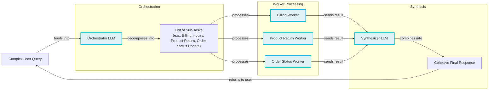
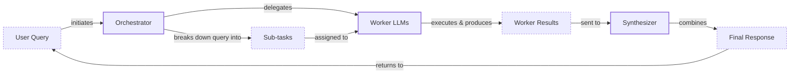
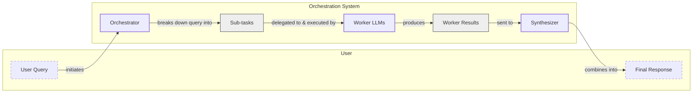
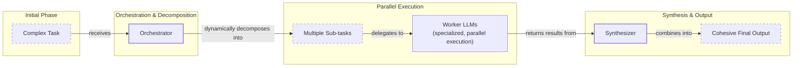
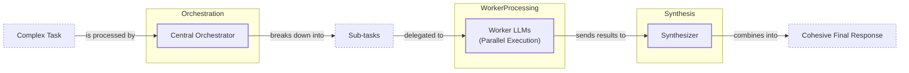

# Near-tie review: 05_workflow_patterns__var_demanding  (light vs deep, margin=+0.0155)

## Reviewer conclusion (2026-08-27): KEEP `light`, no override

**No corrections needed** — all scores and reasonings confirmed accurate; minor
rough edges in the reasoning text noted by the reviewer do not change any
scores.

**Quantitative basis:** per-dimension tallies (n=21/arm, 7 sections) show a
mixed, genuinely balanced trade-off rather than one dominant dimension: `deep`
has the higher `cc` (0.857 vs 0.762) and `de` (0.476 vs 0.381), while `light`'s
`be` advantage (0.429 vs 0.286, the largest single-dimension delta) plus a small
`ga` edge (0.571 vs 0.524) are enough to net out in `light`'s favor. Section-level,
the largest swing against `light` is S7 (Orchestrator-Worker, weight 0.174,
−0.0105), offset by S1, S3, S4, and S6 favoring `light`. Per-draw R_w margins
(light−deep): [+0.054, +0.030, −0.037], mean +0.016, sd 0.047 — two of three
draws favor `light`. Moderated significance p≈0.325, still ambiguous.

**Decision:** no manual override needed — `light` is already mean-R_w's own
winner. `needs_review=True` is left as-is (it reflects an objective statistical
fact about the margin, not review status); this note is the durable record that
the article has been human-reviewed and the pick confirmed as a close but
genuine trade-off, not a grading artifact.

---

## All sections (light vs deep), most-against-light first
| section | weight | contribution | running total |
|---|---:|---:|---:|
| section-7-orchestrator-worker-pattern-dynamic-task | 0.174 | -0.0105 | -0.0105 |
| section-2-the-power-of-modularity-why-chain-llm-ca | 0.116 | -0.0090 | -0.0195 |
| section-5-introducing-dynamic-behavior-routing-and | 0.081 | -0.0017 | -0.0212 |
| section-3-building-a-sequential-workflow-faq-gener | 0.198 | +0.0078 | -0.0135 |
| section-4-optimizing-sequential-workflows-with-par | 0.151 | +0.0084 | -0.0050 |
| section-1-the-challenge-with-complex-single-llm-ca | 0.151 | +0.0098 | +0.0048 |
| section-building-a-basic-routing-workflow | 0.128 | +0.0108 | +0.0155 |

(stored article margin = +0.0155 -- should match the running total's final row to ~4 decimals)

## Section: S7::section-7-orchestrator-worker-pattern-dynamic-task-decomposition  (weight=0.174, contribution=-0.0105 AGAINST light)
Stored section rewards: light=0.5623  deep=0.6296  (explore: light=0.3922  deep=0.4323)

### Arm: light (preset1)

#### Draw: production  `/mnt/f/my_projects/agentic_AI_RL/Reinsearch_agent/RL_researcher_writer_ymaxing/rl_training_data/episodes/05_workflow_patterns__var_demanding__preset1`

**Article text:**
```
## Orchestrator-Worker Pattern: Dynamic Task Decomposition

Simple routing works well when a query maps to a single, clear intent. But what about complex queries that involve multiple tasks? For example, a customer might want to ask about an invoice, return a product, *and* check an order status, all in one message. A simple router would fail here. This is where the orchestrator-worker pattern comes in.

In this pattern, a central "orchestrator" LLM analyzes a complex query and dynamically breaks it down into a series of smaller, distinct subtasks. Each subtask is then delegated to a specialized "worker," which can be another LLM call or a traditional software tool. Finally, a "synthesizer" LLM combines the results from all workers into a single, coherent response [[24]](https://mlpills.substack.com/p/diy-17-orchestrator-worker-llm-agent).

The key advantage of this pattern is its flexibility. It is ideal for unpredictable, multifaceted tasks where the required subtasks cannot be determined in advance, such as analyzing a legal document or planning a multi-step research project [[25]](https://agents.kour.me/orchestrator-worker/), [[26]](https://mlpills.substack.com/p/diy-17-orchestrator-worker-llm-agent/), [[27]](https://platform.claude.com/cookbook/patterns-agents-orchestrator-workers). Unlike static parallelization where subtasks are predefined, the orchestrator determines the necessary steps at runtime based on the specific input [[27]](https://platform.claude.com/cookbook/patterns-agents-orchestrator-workers).

Image 3: A flowchart illustrating the orchestrator-worker pattern for dynamic task decomposition.


However, this pattern introduces significant reliability challenges. The orchestrator can be a single point of failure; if it misinterprets the query or delegates tasks with ambiguous criteria, it can trigger cascading errors downstream [[28]](https://galileo.ai/blog/multi-agent-ai-failures-prevention). Reliability also degrades with each step; a system with five workers that are each 95% reliable will only have an overall success rate of about 77% (0.95^5) [[29]](https://www.mindstudio.ai/blog/multi-agent-orchestration-patterns/). Furthermore, without careful coordination, workers can produce conflicting outputs or create race conditions by modifying a shared state concurrently, leading to corrupted data [[30]](https://www.getmaxim.ai/articles/multi-agent-system-reliability-failure-patterns-root-causes-and-production-validation-strategies/). This requires robust schemas, clear instructions, and a synthesizer capable of resolving disagreements to ensure reliable communication between all components. For example, a synthesizer might use a voting mechanism to handle conflicting information or escalate to a human-in-the-loop for final validation.

Let's build an orchestrator-worker system to handle our complex customer query.

### Defining the Orchestrator

First, the orchestrator analyzes the user's query and breaks it down into a structured list of tasks using a Pydantic schema. The prompt clearly defines the possible `query_type` values and their required parameters, guiding the orchestrator to produce a valid plan. This structured approach is essential for ensuring reliable communication between the orchestrator and the workers.

```python
class QueryTypeEnum(str, Enum):
    BILLING_INQUIRY = "BillingInquiry"
    PRODUCT_RETURN = "ProductReturn"
    STATUS_UPDATE = "StatusUpdate"

class Task(BaseModel):
    query_type: QueryTypeEnum
    invoice_number: str | None = Field(default=None)
    product_name: str | None = Field(default=None)
    reason_for_return: str | None = Field(default=None)
    order_id: str | None = Field(default=None)

class TaskList(BaseModel):
    tasks: list[Task]

prompt_orchestrator = f"""
You are a master orchestrator. Your job is to break down a complex user query into a list of sub-tasks.
Each sub-task must have a "query_type" and its necessary parameters.

The possible "query_type" values and their required parameters are:
1. "{QueryTypeEnum.BILLING_INQUIRY.value}": Requires "invoice_number".
2. "{QueryTypeEnum.PRODUCT_RETURN.value}": Requires "product_name" and "reason_for_return".
3. "{QueryTypeEnum.STATUS_UPDATE.value}": Requires "order_id".

<user_query>
{{query}}
</user_query>
""".strip()

def orchestrator(query: str) -> list[Task]:
    prompt = prompt_orchestrator.format(query=query)
    config = types.GenerateContentConfig(response_mime_type="application/json", response_schema=TaskList)
    response = client.models.generate_content(model=MODEL_ID, contents=prompt, config=config)
    return response.parsed.tasks
```

### Implementing the Workers

We define specialized workers for each task type. Each worker is a Python function that simulates interacting with a backend system (e.g., opening an investigation, generating an RMA, fetching order status) and returns a structured Pydantic object. This separation of concerns makes the system modular and testable. Here is the billing worker.

```python
class BillingTask(BaseModel):
    query_type: QueryTypeEnum = Field(default=QueryTypeEnum.BILLING_INQUIRY)
    invoice_number: str
    user_concern: str
    action_taken: str
    resolution_eta: str

prompt_billing_worker_extractor = """
A user has a query regarding invoice '{invoice_number}'.
From the full user query provided below, extract the specific concern or question the user has voiced about this particular invoice.

<user_query>
{original_user_query}
</user_query>
""".strip()

def handle_billing_worker(invoice_number: str, original_user_query: str) -> BillingTask:
    extraction_prompt = prompt_billing_worker_extractor.format(invoice_number=invoice_number, original_user_query=original_user_query)
    response = client.models.generate_content(model=MODEL_ID, contents=extraction_prompt)
    extracted_concern = response.text
    investigation_id = f"INV_CASE_{random.randint(1000, 9999)}"
    eta_days = 2
    return BillingTask(
        invoice_number=invoice_number,
        user_concern=extracted_concern,
        action_taken=f"An investigation (Case ID: {investigation_id}) has been opened regarding your concern.",
        resolution_eta=f"{eta_days} business days",
    )
```

### Creating the Synthesizer

The synthesizer LLM then takes the structured outputs from all workers and composes a single, user-friendly response. The prompt for the synthesizer is important; it must be able to take a list of structured, potentially diverse outputs and combine them into a natural, coherent message that addresses all parts of the user's original query. It needs to handle missing or inconsistent information gracefully and maintain a consistent tone.

```python
prompt_synthesizer = """
You are a master communicator. Combine several distinct pieces of information from our support team into a single, well-formatted, and friendly email to a customer.

<points>
{formatted_results}
</points>

Combine these points into one cohesive response.
Start with a friendly greeting and end with a polite closing.
""".strip()

def synthesizer(results: list[Task]) -> str:
    bullet_points = []
    for res in results:
        point = f"Regarding your {res.query_type}:\n"
        if res.query_type == QueryTypeEnum.BILLING_INQUIRY:
            res: BillingTask = res
            point += f"  - Invoice Number: {res.invoice_number}\n"
            point += f'  - Your Stated Concern: "{res.user_concern}"\n'
            point += f"  - Our Action: {res.action_taken}\n"
            point += f"  - Expected Resolution: We will get back to you within {res.resolution_eta}."
        # ... (similar logic for other task types)
        bullet_points.append(point)
    
    formatted_results = "\n\n".join(bullet_points)
    prompt = prompt_synthesizer.format(formatted_results=formatted_results)
    response = client.models.generate_content(model=MODEL_ID, contents=prompt)
    return response.text
```

### Running the Full Pipeline

Let's run the full pipeline with a complex query that includes a billing question, a product return, and a status request. The `process_user_query` function ties everything together, calling the orchestrator, dispatching tasks to the appropriate workers, and finally, synthesizing the results.

```python
complex_customer_query = """
Hi, I'm writing to you because I have a question about invoice #INV-7890. It seems higher than I expected.
Also, I would like to return the 'SuperWidget 5000' I bought because it's not compatible with my system.
Finally, can you give me an update on my order #A-12345?
""".strip()

# process_user_query orchestrates the whole flow
process_user_query(complex_customer_query)
```
The final synthesized response is:
```text
Hi there,

Thank you for reaching out. Here's a summary of the actions we've taken regarding your query:

Regarding your BillingInquiry:
  - Invoice Number: INV-7890
  - Your Stated Concern: "The invoice seems higher than I expected."
  - Our Action: An investigation (Case ID: INV_CASE_6510) has been opened regarding your concern.
  - Expected Resolution: We will get back to you within 2 business days.

Regarding your ProductReturn:
  - Product: SuperWidget 5000
  - Reason for Return: "it's not compatible with my system"
  - Return Authorization (RMA): RMA-82606
  - Instructions: Please pack the 'SuperWidget 5000' securely in its original packaging if possible. Include all accessories and manuals. Write the RMA number (RMA-82606) clearly on the outside of the package. Ship to: Returns Department, 123 Automation Lane, Tech City, TC 98765.

Regarding your StatusUpdate:
  - Order ID: A-12345
  - Current Status: Shipped
  - Carrier: SuperFast Shipping
  - Tracking Number: SF252988
  - Delivery Estimate: Tomorrow

If you have any other questions, please let us know.

Best regards,
The Support Team
```

This pattern allows for a highly dynamic and scalable system that can handle complex, multi-part user requests with precision.
```
**Grader reasoning:**
- `cc`: Orchestrator-Worker Pattern: Dynamic Task Decomposition:
**1:** Both sections accurately describe the orchestrator-worker pattern for dynamic task decomposition. They both explain its flexibility for complex, unpredictable tasks and provide the same customer service example with billing, return, and status update subtasks.
- `fl`: Orchestrator-Worker Pattern: Dynamic Task Decomposition:
**1:** The generated section includes an introductory paragraph explaining the orchestrator-worker pattern, the flexibility advantage, and the reliability challenges—matching the expected structure. The Mermaid diagram is placed before the code rather than after, but diagram placement differences are trivial and do not constitute a flow failure. The logical progression matches the expected output.
- `de`: Orchestrator-Worker Pattern: Dynamic Task Decomposition:
**1:** [instances=3; quality=strong,strong,strong] Three qualifying depth additions are present, all classified as 'limitations, criticisms, or failure modes of the core topic.' (1) "The orchestrator can be a single point of failure; if it misinterprets the query or delegates tasks with ambiguous criteria, it can trigger cascading errors downstream" (article [[28]]) traces to the exploration-phase excerpt for https://galileo.ai/blog/multi-agent-ai-failures-prevention (research.md Source [68]) — strong. (2) "A system with five workers that are each 95% reliable will only have an overall success rate of about 77% (0.95^5)" (article [[29]]) is a near-verbatim match to the exploration-phase excerpt for https://www.mindstudio.ai/blog/multi-agent-orchestration-patterns/ (research.md Source [69]: "single agent at 95% chained five ways yields 77% reliability") — strong. (3) "Workers can produce conflicting outputs or create race conditions by modifying a shared state concurrently, leading to corrupted data" (article [[30]]) traces to the exploration-phase excerpt for https://www.getmaxim.ai/articles/multi-agent-system-reliability-failure-patterns-root-causes-and-production-validation-strategies/ (research.md Source [67]) — strong. This corrects the prior reasoning, which described this as one undifferentiated addition; all three sub-claims are independently exploration-traceable to three different sources.
- `be`: Orchestrator-Worker Pattern: Dynamic Task Decomposition:
**0:** [instances=0] No breadth additions present. The section focuses on the specific orchestrator-worker pattern and its reliability challenges (credited under depth_enhancement) without expanding to adjacent concepts.
- `cp`: Orchestrator-Worker Pattern: Dynamic Task Decomposition:
**1:** The depth addition about reliability challenges is a relevant and proportionate warning that enhances the core content without overshadowing it. The ground truth narrative about implementing the pattern remains the dominant focus.
- `ga`: Orchestrator-Worker Pattern: Dynamic Task Decomposition:
**1:** The section adheres to the guideline. It defines the orchestrator-worker pattern, explains when to use it, and provides the required in-depth coverage on its challenges (orchestrator as bottleneck, conflicting outputs, synthesizer challenges, etc.). It correctly uses the complete code example from the 'Orchestrator-Worker Pattern' section of the notebook, showing the full execution flow for the complex customer query. It also includes the required Mermaid diagram. The prose-only word count is approximately 740 words, which is within the 750-word target (±10%).

#### Draw: replicate1  `/mnt/f/my_projects/agentic_AI_RL/Reinsearch_agent/RL_researcher_writer_ymaxing/rl_training_data/noise_experiment/05_workflow_patterns__var_demanding__replicate1__preset1`

**Article text:**
```
## Orchestrator-Worker Pattern: Dynamic Task Decomposition

The patterns we have discussed so far—chaining, parallelization, and routing—are powerful but largely deterministic. The orchestrator-worker pattern introduces a higher level of dynamic behavior. In this model, a central "orchestrator" LLM analyzes a complex query and dynamically breaks it down into smaller subtasks. These subtasks are then delegated to specialized "worker" LLMs, which can execute in parallel. Finally, a "synthesizer" LLM combines the results into a single, coherent response [[18]](https://agents.kour.me/orchestrator-worker/), [[19]](https://platform.claude.com/cookbook/patterns-agents-orchestrator-workers).

This pattern is ideal for unpredictable, multifaceted tasks where the necessary steps cannot be predetermined, such as open-ended research, multi-modal content generation, or complex data analysis requiring iterative steps. Unlike simple parallelization with a fixed set of tasks, the orchestrator decides the plan at runtime based on the specific input [[19]](https://platform.claude.com/cookbook/patterns-agents-orchestrator-workers). This allows for incredible flexibility and adaptability. For example, a research agent could use an orchestrator to dynamically spawn workers to search different databases, analyze various sources, and summarize findings based on an open-ended query.

Image 3: A flowchart illustrating the orchestrator-worker pattern.

However, this pattern introduces significant reliability challenges. The orchestrator can become a bottleneck, and ensuring it performs a complete decomposition of the task is difficult. To mitigate this, you can use asynchronous task delegation, allowing the orchestrator to dispatch independent tasks concurrently. More critically, coordination breakdowns are common. One major failure mode is **conflicting outputs**, where workers produce contradictory results with no mechanism to resolve the disagreement [[20]](https://qat.com/orchestration-pattern-ai/). Another is **cascading error**, where an ambiguous delegation from the orchestrator is misinterpreted by one worker, and that flawed output is passed to downstream workers, compounding the error [[21]](https://galileo.ai/blog/multi-agent-ai-failures-prevention). This highlights how reliability compounds poorly; if you chain five agents that are each 95% reliable, the total system reliability drops to just 77% [[22]](https://www.mindstudio.ai/blog/multi-agent-orchestration-patterns/).

To mitigate these issues, it is essential to establish clear boundaries and consistent data schemas (using Pydantic or JSON Schema) for communication between the orchestrator and workers. The synthesizer also needs careful prompting to handle diverse or even conflicting inputs. Strategies for conflict resolution include simple voting mechanisms, using another LLM as a judge to select the best output, or flagging the conflict for human-in-the-loop review. In a production customer support system, a supervisor node might evaluate parallel agent outputs and select the best one based on confidence scores and relevance [[23]](https://www.socure.com/tech-blog/build-advanced-customer-support-llm-multi-agent-workflow).

Let's implement this pattern for our customer service example.

1.  The orchestrator's job is to parse a complex user query into a list of structured tasks. Its role is purely decomposition. The prompt defines the possible `query_type` values and their required parameters, which provides a clear schema for the orchestrator to follow.
    ```python
    class QueryTypeEnum(str, Enum):
        """The type of query to be handled."""
        BILLING_INQUIRY = "BillingInquiry"
        PRODUCT_RETURN = "ProductReturn"
        STATUS_UPDATE = "StatusUpdate"
    
    class Task(BaseModel):
        """A task to be performed."""
        query_type: QueryTypeEnum = Field(description="The type of query to be handled.")
        invoice_number: str | None = Field(description="The invoice number to be used for the billing inquiry.", default=None)
        product_name: str | None = Field(description="The name of the product to be returned.", default=None)
        reason_for_return: str | None = Field(description="The reason for returning the product.", default=None)
        order_id: str | None = Field(description="The order ID to be used for the status update.", default=None)
    
    class TaskList(BaseModel):
        """A list of tasks to be performed."""
        tasks: list[Task] = Field(description="A list of tasks to be performed.")
    
    prompt_orchestrator = f"""
    You are a master orchestrator. Your job is to break down a complex user query into a list of sub-tasks.
    Each sub-task must have a "query_type" and its necessary parameters.
    
    The possible "query_type" values and their required parameters are:
    1. "{QueryTypeEnum.BILLING_INQUIRY.value}": Requires "invoice_number".
    2. "{QueryTypeEnum.PRODUCT_RETURN.value}": Requires "product_name" and "reason_for_return".
    3. "{QueryTypeEnum.STATUS_UPDATE.value}": Requires "order_id".
    
    Here's the user's query.
    
    <user_query>
    {{query}}
    </user_query>
    """.strip()
    
    
    def orchestrator(query: str) -> list[Task]:
        """Breaks down a complex query into a list of tasks."""
        prompt = prompt_orchestrator.format(query=query)
        config = types.GenerateContentConfig(
            response_mime_type="application/json",
            response_schema=TaskList
        )
        response = client.models.generate_content(
            model=MODEL_ID,
            contents=prompt,
            config=config
        )
        return response.parsed.tasks
    ```

2.  We then define our worker functions. These are the specialized agents that execute the subtasks. For this example, these functions simulate backend actions (e.g., opening an investigation, generating a Return Merchandise Authorization (RMA) number, fetching order status) rather than making additional LLM calls. In a real-world scenario, these workers could be complex sub-workflows themselves.
    ```python
    # Billing Worker
    def handle_billing_worker(invoice_number: str, original_user_query: str) -> BillingTask:
        # ... implementation uses an LLM to extract concern and simulates opening a case ...
        pass
    
    # Product Return Worker
    def handle_return_worker(product_name: str, reason_for_return: str) -> ReturnTask:
        # ... implementation simulates generating an RMA and instructions ...
        pass
    
    # Order Status Worker
    def handle_status_worker(order_id: str) -> StatusTask:
        # ... implementation simulates fetching order status from a backend ...
        pass
    ```

3.  The synthesizer's role is to take the structured outputs from all the workers and compose a single, user-friendly response. This step is important for presenting a unified front to the user, even though multiple independent processes ran in the background. It formats the results into bullet points and uses an LLM to generate a natural-sounding email.
    ```python
    prompt_synthesizer = """
    You are a master communicator. Combine several distinct pieces of information from our support team into a single, well-formatted, and friendly email to a customer.
    
    Here are the points to include, based on the actions taken for their query:
    <points>
    {formatted_results}
    </points>
    
    Combine these points into one cohesive response.
    Start with a friendly greeting (e.g., "Dear Customer," or "Hi there,") and end with a polite closing (e.g., "Sincerely," or "Best regards,").
    Ensure the tone is helpful and professional.
    """.strip()
    
    
    def synthesizer(results: list[Task]) -> str:
        # ... implementation formats worker results and calls the LLM ...
        pass
    ```

4.  Finally, we tie everything together in the main processing pipeline. Let's test it with a complex query that requires all three workers.
    ```python
    def process_user_query(user_query):
        """Processes a query using the Orchestrator-Worker-Synthesizer pattern."""
        # 1. Run orchestrator
        tasks_list = orchestrator(user_query)
        # 2. Run workers
        worker_results = []
        # ... dispatch logic to call appropriate workers ...
        # 3. Run synthesizer
        final_user_message = synthesizer(worker_results)
    
    complex_customer_query = """
    Hi, I'm writing to you because I have a question about invoice #INV-7890. It seems higher than I expected.
    Also, I would like to return the 'SuperWidget 5000' I bought because it's not compatible with my system.
    Finally, can you give me an update on my order #A-12345?
    """.strip()
    
    process_user_query(complex_customer_query)
    ```
    The orchestrator correctly deconstructs the query into three distinct tasks:
    ```json
    {
      "query_type": "BillingInquiry",
      "invoice_number": "INV-7890",
      "product_name": null,
      "reason_for_return": null,
      "order_id": null
    }
    {
      "query_type": "ProductReturn",
      "invoice_number": null,
      "product_name": "SuperWidget 5000",
      "reason_for_return": "it's not compatible with my system",
      "order_id": null
    }
    {
      "query_type": "StatusUpdate",
      "invoice_number": null,
      "product_name": null,
      "reason_for_return": null,
      "order_id": "A-12345"
    }
    ```
    The workers execute and produce structured results, which the synthesizer then combines into a final, helpful response for the customer:
    ```text
    Hi there,
    
    Thank you for reaching out. I've looked into your query and here are the actions we've taken:
    
    Regarding your BillingInquiry:
      - Invoice Number: INV-7890
      - Your Stated Concern: "It seems higher than I expected."
      - Our Action: An investigation (Case ID: INV_CASE_5693) has been opened regarding your concern.
      - Expected Resolution: We will get back to you within 2 business days.
    
    Regarding your ProductReturn:
      - Product: SuperWidget 5000
      - Reason for Return: "it's not compatible with my system"
      - Return Authorization (RMA): RMA-61985
      - Instructions: Please pack the 'SuperWidget 5000' securely in its original packaging if possible. Include all accessories and manuals. Write the RMA number (RMA-61985) clearly on the outside of the package. Ship to: Returns Department, 123 Automation Lane, Tech City, TC 98765.
    
    Regarding your StatusUpdate:
      - Order ID: A-12345
      - Current Status: Delivered
      - Carrier: Local Courier
      - Tracking Number: LC35952
      - Delivery Estimate: Delivered yesterday
    
    If you have any other questions, please let us know.
    
    Best regards,
    The Support Team
    ```
This example demonstrates how the orchestrator-worker pattern can handle complex, multi-part queries with a flexible and scalable architecture.
```
**Grader reasoning:**
- `cc`: Orchestrator-Worker Pattern: Dynamic Task Decomposition:
**0:** Both sections cover the orchestrator-worker definition (with examples matching the guideline's own suggested list: open-ended research, multi-modal content generation, complex data analysis), the diagram, the implementation challenges and mitigations (bottleneck with an asynchronous-delegation mitigation, incomplete decomposition, conflicting outputs, cascading error, schema needs, synthesizer conflict-resolution strategies), the Task/TaskList setup, the orchestrator function, the abbreviated worker functions, and the full walkthrough with the same invoice/product/order example. As in both prior replicates, the expected section shows the synthesizer's actual combining logic in full, while the generated section again reduces the synthesizer body to a comment and a `pass` statement.
- `fl`: Orchestrator-Worker Pattern: Dynamic Task Decomposition:
**1:** The generated section follows the same progression as the expected one: definition, examples, diagram, challenges and mitigations, then the practical implementation and walkthrough using the same invoice/product/order example. The abbreviated synthesizer body (a CoreContent gap) is inline and does not leave a bridgeless gap, since the surrounding prose about the synthesizer's role and the full final synthesized email are both still present.
- `de`: Orchestrator-Worker Pattern: Dynamic Task Decomposition:
**1:** [instances=3; quality=strong,strong,standard] Three qualifying instances, all exploration-sourced: (1) 'cascading error, where an ambiguous delegation from the orchestrator is misinterpreted by one worker... compounding the error' ([[21]], research.md line 857, phase="exploration") -- a specific failure mechanism, classified strong; (2) 'if you chain five agents that are each 95% reliable, the total system reliability drops to just 77%' ([[22]], research.md line 869, phase="exploration", which states this exact figure) -- a quantified metric, classified strong; (3) 'conflicting outputs, where workers produce contradictory results with no mechanism to resolve the disagreement' ([[20]], research.md line 833, phase="exploration") -- classified standard, a fairly direct restatement of the source without much added elaboration. All three are failure modes of the core topic (orchestrator-worker reliability), satisfying the depth-addition criteria.
- `be`: Orchestrator-Worker Pattern: Dynamic Task Decomposition:
**0:** [instances=0] No qualifying breadth additions are present in this section; all three qualifying additions found (see depth_enhancement) deepen understanding of orchestrator-worker's own failure modes rather than connecting outward to an adjacent field.
- `cp`: Orchestrator-Worker Pattern: Dynamic Task Decomposition:
**1:** Three qualifying depth instances were identified (conflicting outputs, cascading error, reliability compounding), together forming roughly one paragraph within a section that also fully covers the definition, examples, diagram, mitigations, and a complete implementation walkthrough matching the expected section's own example. The three additions support and reinforce the section's challenges discussion rather than displacing it. CorePreservation scores 1.
- `ga`: Orchestrator-Worker Pattern: Dynamic Task Decomposition:
**0:** The section covers the orchestrator-worker definition with examples matching the guideline's own suggested list almost exactly, the diagram, and most of the required challenge/mitigation pairs, including an asynchronous-delegation mitigation for the bottleneck concern that matches the guideline's own suggestion. It omits two of the guideline's three named bottleneck-mitigation strategies (hierarchical orchestration, caching) and abbreviates the synthesizer's own code to a stub. The prose-only word count is also approximately 610 words against a 750-word target (+-75 tolerance, range 675-825 words), falling below the minimum.

#### Draw: replicate2  `/mnt/f/my_projects/agentic_AI_RL/Reinsearch_agent/RL_researcher_writer_ymaxing/rl_training_data/noise_experiment/05_workflow_patterns__var_demanding__replicate2__preset1`

**Article text:**
```
## Orchestrator-Worker Pattern: Dynamic Task Decomposition

The final pattern we will explore is the orchestrator-worker model. This is a more advanced workflow where a central "orchestrator" LLM dynamically breaks down a complex task into smaller sub-tasks. It then delegates these sub-tasks to specialized "worker" components, which can be other LLM calls or external tools. Finally, a "synthesizer" LLM often combines the results from the workers into a single, coherent response [[32]](https://mlpills.substack.com/p/diy-17-orchestrator-worker-llm-agent).

This pattern is ideal for complex, unpredictable tasks where the exact sequence of steps cannot be determined in advance [[16]](https://agents.kour.me/orchestrator-worker/). The key difference from simple parallelization is its flexibility. Instead of having a fixed set of parallel tasks, the orchestrator analyzes the specific input at runtime and decides what sub-tasks are needed [[53]](https://platform.claude.com/cookbook/patterns-agents-orchestrator-workers). This allows for highly adaptive and intelligent systems that can handle a wide variety of queries.

Image 3: A flowchart illustrating the orchestrator-worker pattern, showing the flow from a user query through orchestration, sub-task delegation to worker LLMs, result synthesis, and final response generation.


### Production Challenges with the Orchestrator-Worker Pattern

While powerful, this pattern introduces reliability challenges in production. The orchestrator can become a single point of failure or a performance bottleneck. Asynchronous task delegation and caching common sub-task results can help mitigate this. Coordination breakdowns between workers are also common, leading to deadlocks or duplicated effort [[67]](https://galileo.ai/blog/multi-agent-ai-failures-prevention), [[70]](https://galileo.ai/blog/why-multi-agent-systems-fail).

A more insidious problem is compounding error rates: if a single worker is 95% reliable, a chain of five such workers is only 77% reliable, and a chain of ten drops to 60% [[68]](https://www.mindstudio.ai/blog/multi-agent-orchestration-patterns/). The orchestrator must also perform a complete decomposition of the task; if it misses a necessary sub-task, the final result will be incomplete. Prompting for completeness and using iterative refinement can help ensure all necessary steps are identified.

Conflicting outputs from different workers can corrupt the final result or lead to invalid states. For example, one agent might assign a support ticket while another simultaneously closes it, breaking the workflow logic [[69]](https://www.getmaxim.ai/articles/multi-agent-system-reliability-failure-patterns-root-causes-and-production-validation-strategies/). The synthesizer must be sophisticated enough to reconcile these disagreements, handle missing information, and maintain a consistent tone. Strategies for conflict resolution include voting mechanisms, re-querying conflicting workers, or involving a human-in-the-loop for final approval [[34]](https://www.socure.com/tech-blog/build-advanced-customer-support-llm-multi-agent-workflow).

Mitigating these failures requires robust engineering. This includes using clear input/output schemas like Pydantic to ensure reliable communication between components, implementing validation at every step, and designing sophisticated synthesis strategies that can handle ambiguity and conflict.

Let's build an orchestrator-worker system to handle a complex customer service query that involves multiple, distinct actions.

1.  The orchestrator's job is to analyze the user's query and break it down into a list of structured tasks. We define the possible task types and their required parameters using Pydantic models.
    ```python
    class QueryTypeEnum(str, Enum):
        """The type of query to be handled."""
        BILLING_INQUIRY = "BillingInquiry"
        PRODUCT_RETURN = "ProductReturn"
        STATUS_UPDATE = "StatusUpdate"
    
    class Task(BaseModel):
        """A task to be performed."""
        query_type: QueryTypeEnum = Field(description="The type of query to be handled.")
        invoice_number: str | None = Field(description="The invoice number to be used for the billing inquiry.", default=None)
        product_name: str | None = Field(description="The name of the product to be returned.", default=None)
        reason_for_return: str | None = Field(description="The reason for returning the product.", default=None)
        order_id: str | None = Field(description="The order ID to be used for the status update.", default=None)
    
    class TaskList(BaseModel):
        """A list of tasks to be performed."""
        tasks: list[Task] = Field(description="A list of tasks to be performed.")
    
    prompt_orchestrator = f"""
    You are a master orchestrator. Your job is to break down a complex user query into a list of sub-tasks.
    Each sub-task must have a "query_type" and its necessary parameters.
    
    The possible "query_type" values and their required parameters are:
    1. "{QueryTypeEnum.BILLING_INQUIRY.value}": Requires "invoice_number".
    2. "{QueryTypeEnum.PRODUCT_RETURN.value}": Requires "product_name" and "reason_for_return".
    3. "{QueryTypeEnum.STATUS_UPDATE.value}": Requires "order_id".
    
    Here's the user's query.
    
    <user_query>
    {{query}}
    </user_query>
    """.strip()
    
    
    def orchestrator(query: str) -> list[Task]:
        """Breaks down a complex query into a list of tasks."""
        prompt = prompt_orchestrator.format(query=query)
        config = types.GenerateContentConfig(
            response_mime_type="application/json",
            response_schema=TaskList
        )
        response = client.models.generate_content(
            model=MODEL_ID,
            contents=prompt,
            config=config
        )
        return response.parsed.tasks
    ```
2.  We then define our specialized workers. Each worker is a Python function that handles a specific task type. For this example, we simulate backend interactions, like creating an investigation case or generating an RMA number.
    ```python
    # Billing Worker
    def handle_billing_worker(invoice_number: str, original_user_query: str) -> BillingTask:
        # ... implementation ...
    
    # Product Return Worker
    def handle_return_worker(product_name: str, reason_for_return: str) -> ReturnTask:
        # ... implementation ...
    
    # Order Status Worker
    def handle_status_worker(order_id: str) -> StatusTask:
        # ... implementation ...
    ```
3.  The synthesizer's role is to take the structured outputs from all the workers and compose a single, user-friendly response. It uses a prompt to combine the various pieces of information into a cohesive email.
    ```python
    prompt_synthesizer = """
    You are a master communicator. Combine several distinct pieces of information from our support team into a single, well-formatted, and friendly email to a customer.
    
    Here are the points to include, based on the actions taken for their query:
    <points>
    {formatted_results}
    </points>
    
    Combine these points into one cohesive response.
    Start with a friendly greeting (e.g., "Dear Customer," or "Hi there,") and end with a polite closing (e.g., "Sincerely," or "Best regards,").
    Ensure the tone is helpful and professional.
    """.strip()
    
    
    def synthesizer(results: list[Task]) -> str:
        # ... implementation to format results and call the LLM ...
    ```
4.  Finally, we tie everything together in our main pipeline function. This function calls the orchestrator, dispatches tasks to the appropriate workers, and then uses the synthesizer to generate the final response.
    ```python
    def process_user_query(user_query):
        """Processes a query using the Orchestrator-Worker-Synthesizer pattern."""
    
        # 1. Run orchestrator
        tasks_list = orchestrator(user_query)
    
        # 2. Run workers
        worker_results = []
        if tasks_list:
            for task in tasks_list:
                if task.query_type == QueryTypeEnum.BILLING_INQUIRY:
                    worker_results.append(handle_billing_worker(task.invoice_number, user_query))
                # ... other workers
    
        # 3. Run synthesizer
        if worker_results:
            final_user_message = synthesizer(worker_results)
            # ... print final message
    ```
5.  Let's test it with a complex query: `"Hi, I have a question about invoice #INV-7890. It seems higher than I expected. Also, I would like to return the 'SuperWidget 5000' because it's not compatible with my system. Finally, can you give me an update on my order #A-12345?"`

    The orchestrator correctly breaks this down into three distinct tasks: a `BillingInquiry`, a `ProductReturn`, and a `StatusUpdate`. Each worker processes its assigned task, generating structured data. The synthesizer then combines these results into a single, helpful email to the customer:
    ```text
    Hi there,
    
    Thank you for reaching out. Here is an update on your requests:
    
    Regarding your BillingInquiry:
      - Invoice Number: INV-7890
      - Your Stated Concern: "It seems higher than I expected."
      - Our Action: An investigation (Case ID: INV_CASE_5327) has been opened regarding your concern.
      - Expected Resolution: We will get back to you within 2 business days.
    
    Regarding your ProductReturn:
      - Product: SuperWidget 5000
      - Reason for Return: "it's not compatible with my system"
      - Return Authorization (RMA): RMA-68480
      - Instructions: Please pack the 'SuperWidget 5000' securely in its original packaging if possible. Include all accessories and manuals. Write the RMA number (RMA-68480) clearly on the outside of the package. Ship to: Returns Department, 123 Automation Lane, Tech City, TC 98765.
    
    Regarding your StatusUpdate:
      - Order ID: A-12345
      - Current Status: Shipped
      - Carrier: SuperFast Shipping
      - Tracking Number: SF204481
      - Delivery Estimate: Tomorrow
    
    Please let us know if you have any other questions.
    
    Best regards,
    The Support Team
    ```
This example showcases how the orchestrator-worker pattern can handle complex, multi-part queries by dynamically decomposing the problem and coordinating a team of specialized components.
```
**Grader reasoning:**
- `cc`: Orchestrator-Worker Pattern: Dynamic Task Decomposition:
**0:** Both sections cover the orchestrator-worker definition, the diagram, the implementation challenges and their mitigations (bottleneck with two named mitigations matching the guideline's own list, incomplete decomposition, conflicting outputs with a concrete ticket-state example, cascading/compounding error with the same 95%-to-77%-to-60% figures, schema needs, and three of the guideline's four synthesizer conflict-resolution strategies), the Task/TaskList setup, the orchestrator function, the abbreviated worker functions, and the full walkthrough with the same invoice/product/order example. As in all three prior articles, the expected section shows the synthesizer's actual combining logic in full, while the generated section again reduces the synthesizer body to a comment with no implementation.
- `fl`: Orchestrator-Worker Pattern: Dynamic Task Decomposition:
**1:** The generated section follows the same progression as the expected one: definition, examples, diagram, challenges and mitigations, then the practical implementation and walkthrough using the same invoice/product/order example. The abbreviated synthesizer body (a CoreContent gap) is inline and does not leave a bridgeless gap.
- `de`: Orchestrator-Worker Pattern: Dynamic Task Decomposition:
**1:** [instances=3; quality=strong,strong,standard] Three qualifying instances, all exploration-sourced: (1) 'if a single worker is 95% reliable, a chain of five such workers is only 77% reliable, and a chain of ten drops to 60%' ([[68]], research.md line 869, phase="exploration", which states this exact figure) -- a quantified metric, classified strong; (2) 'one agent might assign a support ticket while another simultaneously closes it, breaking the workflow logic' ([[69]], research.md line 857 area -- Source [67] getmaxim.ai, phase="exploration" -- which describes this exact ticket-conflict scenario) -- a specific, concrete failure example, classified strong; (3) 'Coordination breakdowns between workers are also common, leading to deadlocks or duplicated effort' ([[67]],[[70]], research.md lines 857 and the galileo.ai why-multi-agent-systems-fail entry, both phase="exploration") -- classified standard, a fairly direct restatement without a specific example. All three are failure modes of the core topic, satisfying the depth-addition criteria.
- `be`: Orchestrator-Worker Pattern: Dynamic Task Decomposition:
**0:** [instances=0] No qualifying breadth additions are present in this section; all three qualifying additions found (see depth_enhancement) deepen understanding of orchestrator-worker's own failure modes rather than connecting outward to an adjacent field.
- `cp`: Orchestrator-Worker Pattern: Dynamic Task Decomposition:
**1:** Three qualifying depth instances were identified (reliability compounding, the ticket-conflict example, coordination breakdowns), together forming roughly one paragraph within a section that also fully covers the definition, examples, diagram, mitigations, and a complete implementation walkthrough matching the expected section's own example. The additions support and reinforce the challenges discussion rather than displacing it. CorePreservation scores 1.
- `ga`: Orchestrator-Worker Pattern: Dynamic Task Decomposition:
**0:** The section covers the orchestrator-worker definition with examples matching the guideline's own suggested list, the diagram, and most of the required challenge/mitigation pairs, including two of the guideline's three named bottleneck-mitigation strategies (asynchronous delegation, caching) and three of its four synthesizer conflict-resolution strategies (voting, re-querying, human-in-the-loop). It still abbreviates the synthesizer's own code to a stub. The prose-only word count is also approximately 654 words against a 750-word target (+-75 tolerance, range 675-825 words), falling 21 words below the minimum -- larger than a trivial margin, so it is treated as a genuine tolerance failure, though flagged alongside the Parallel Processing section as a case worth a clearer line on how large a margin can be before it counts.

### Arm: deep (preset5)

#### Draw: production  `/mnt/f/my_projects/agentic_AI_RL/Reinsearch_agent/RL_researcher_writer_ymaxing/rl_training_data/episodes/05_workflow_patterns__var_demanding__preset5`

**Article text:**
```
## Orchestrator-Worker Pattern: Dynamic Task Decomposition

The orchestrator-worker pattern is a more advanced workflow where a central LLM, the "orchestrator," dynamically breaks down a complex task into smaller sub-tasks. It then delegates these sub-tasks to specialized "worker" LLMs and synthesizes their results into a final, cohesive output [[52]](https://mlpills.substack.com/p/issue-110-llm-workflow-patterns).

This pattern is ideal for unpredictable tasks where the necessary steps cannot be predetermined, such as generating a research report, planning a trip, or refactoring a complex piece of software [[16]](https://agents.kour.me/orchestrator-worker/). Unlike static parallelization, the orchestrator analyzes the input at runtime and decides on the best sub-tasks, offering immense flexibility [[19]](https://platform.claude.com/cookbook/patterns-agents-orchestrator-workers). It’s similar to a MapReduce architecture, enabling scalability and efficiency for complex problems [[36]](https://www.decodingai.com/p/stop-building-ai-agents-use-these).

However, this flexibility introduces significant reliability challenges. An analysis of over 1,600 production traces found that 79% of multi-agent failures are structural—caused by issues like ambiguous specifications or coordination breakdown—and cannot be fixed by simply using a better model [[63]](https://www.zartis.com/multi-agent-system-failure-modes-in-production-the-distributed-systems-problem/). The orchestrator can become a bottleneck if it handles too much logic, and its decomposition might be incomplete. The synthesizer faces the difficult job of reconciling potentially conflicting or inconsistent outputs from different workers [[32]](https://mlpills.substack.com/p/diy-17-orchestrator-worker-llm-agent). Strategies for this include voting mechanisms, using another LLM to evaluate and select the best response, or flagging conflicts for human review [[34]](https://www.socure.com/tech-blog/build-advanced-customer-support-llm-multi-agent-workflow). To ensure clear boundaries and reliable communication, it is essential to use consistent and robust schemas (like Pydantic) for the inputs and outputs of each worker. To mitigate these risks, engineers adopt patterns from microservices, such as implementing timeouts, retries with exponential backoff, and circuit breakers to prevent cascading failures [[77]](https://gurusup.com/blog/multi-agent-orchestration-guide).

Let's build a customer support system that handles a query involving a billing issue, a product return, and an order status update.

Image 3: The orchestrator-worker pattern flowchart.


1.  First, we define the orchestrator. It analyzes the user's query and breaks it down into a structured list of tasks using Pydantic models for a clear schema. This decomposition step is critical; a failure here, such as an incomplete or incorrect breakdown of tasks, will lead to system failure.
    ```python
    class QueryTypeEnum(str, Enum):
        """The type of query to be handled."""
        BILLING_INQUIRY = "BillingInquiry"
        PRODUCT_RETURN = "ProductReturn"
        STATUS_UPDATE = "StatusUpdate"
    
    class Task(BaseModel):
        """A task to be performed."""
        query_type: QueryTypeEnum = Field(description="The type of query to be handled.")
        invoice_number: str | None = Field(description="The invoice number to be used for the billing inquiry.", default=None)
        product_name: str | None = Field(description="The name of the product to be returned.", default=None)
        reason_for_return: str | None = Field(description="The reason for returning the product.", default=None)
        order_id: str | None = Field(description="The order ID to be used for the status update.", default=None)
    
    class TaskList(BaseModel):
        """A list of tasks to be performed."""
        tasks: list[Task] = Field(description="A list of tasks to be performed.")
    
    prompt_orchestrator = f"""
    You are a master orchestrator. Your job is to break down a complex user query into a list of sub-tasks.
    Each sub-task must have a "query_type" and its necessary parameters.
    
    The possible "query_type" values and their required parameters are:
    1. "{QueryTypeEnum.BILLING_INQUIRY.value}": Requires "invoice_number".
    2. "{QueryTypeEnum.PRODUCT_RETURN.value}": Requires "product_name" and "reason_for_return".
    3. "{QueryTypeEnum.STATUS_UPDATE.value}": Requires "order_id".
    
    Here's the user's query.
    
    <user_query>
    {{query}}
    </user_query>
    """.strip()
    
    
    def orchestrator(query: str) -> list[Task]:
        """Breaks down a complex query into a list of tasks."""
        prompt = prompt_orchestrator.format(query=query)
        config = types.GenerateContentConfig(
            response_mime_type="application/json",
            response_schema=TaskList
        )
        response = client.models.generate_content(
            model=MODEL_ID,
            contents=prompt,
            config=config
        )
        return response.parsed.tasks
    ```
2.  Next, we define our specialized workers. We will have a `Billing`, `Return`, and `Status` worker. Each worker simulates performing a backend action and returns a structured Pydantic object.
    
    First, the billing worker extracts the user's specific concern and simulates opening an investigation.
    ```python
    class BillingTask(BaseModel):
        """A billing inquiry task to be performed."""
        query_type: QueryTypeEnum = Field(description="The type of task to be performed.", default=QueryTypeEnum.BILLING_INQUIRY)
        invoice_number: str = Field(description="The invoice number to be used for the billing inquiry.")
        user_concern: str = Field(description="The concern or question the user has voiced about the invoice.")
        action_taken: str = Field(description="The action taken to address the user's concern.")
        resolution_eta: str = Field(description="The estimated time to resolve the concern.")
    
    prompt_billing_worker_extractor = """
    You are a specialized assistant. A user has a query regarding invoice '{invoice_number}'.
    From the full user query provided below, extract the specific concern or question the user has voiced about this particular invoice.
    Respond with ONLY the extracted concern/question. If no specific concern is mentioned beyond a general inquiry about the invoice, state 'General inquiry regarding the invoice'.
    
    Here's the user's query:
    <user_query>
    {original_user_query}
    </user_query>
    
    Extracted concern about invoice {invoice_number}:
    """.strip()
    
    
    def handle_billing_worker(invoice_number: str, original_user_query: str) -> BillingTask:
        """
        Handles a billing inquiry.
        1. Uses an LLM to extract the specific concern about the invoice from the original query.
        2. Simulates opening an investigation.
        3. Returns structured data about the action taken.
        """
        extraction_prompt = prompt_billing_worker_extractor.format(
            invoice_number=invoice_number, original_user_query=original_user_query
        )
        response = client.models.generate_content(model=MODEL_ID, contents=extraction_prompt)
        extracted_concern = response.text
    
        # Simulate backend action: opening an investigation
        investigation_id = f"INV_CASE_{random.randint(1000, 9999)}"
        eta_days = 2
    
        task = BillingTask(
            invoice_number=invoice_number,
            user_concern=extracted_concern,
            action_taken=f"An investigation (Case ID: {investigation_id}) has been opened regarding your concern.",
            resolution_eta=f"{eta_days} business days",
        )
    
        return task
    ```
3.  The return worker handles product returns by generating a Return Merchandise Authorization (RMA) number and providing shipping instructions.
    ```python
    class ReturnTask(BaseModel):
        """A task to handle a product return request."""
        query_type: QueryTypeEnum = Field(description="The type of task to be performed.", default=QueryTypeEnum.PRODUCT_RETURN)
        product_name: str = Field(description="The name of the product to be returned.")
        reason_for_return: str = Field(description="The reason for returning the product.")
        rma_number: str = Field(description="The RMA number for the return.")
        shipping_instructions: str = Field(description="The shipping instructions for the return.")
    
    
    def handle_return_worker(product_name: str, reason_for_return: str) -> ReturnTask:
        """
        Handles a product return request.
        1. Simulates generating an RMA number and providing return instructions.
        2. Returns structured data.
        """
        # Simulate backend action: generating RMA and getting instructions
        rma_number = f"RMA-{random.randint(10000, 99999)}"
        shipping_instructions = (
            "Please pack the '{product_name}' securely in its original packaging if possible. "
            "Include all accessories and manuals. Write the RMA number ({rma_number}) clearly on the outside of the package. "
            "Ship to: Returns Department, 123 Automation Lane, Tech City, TC 98765."
        ).format(product_name=product_name, rma_number=rma_number)
    
        task = ReturnTask(
            product_name=product_name,
            reason_for_return=reason_for_return,
            rma_number=rma_number,
            shipping_instructions=shipping_instructions,
        )
    
        return task
    ```
4.  The status worker simulates fetching order details from a backend system. In a production system where these workers perform real actions with side effects (e.g., charging a credit card, sending an email), it is critical to manage failures gracefully. This often involves implementing the Saga pattern from microservices, where each action has a corresponding "compensating" action that can undo it if a later step in the workflow fails [[80]](https://oneuptime.com/blog/post/2026-01-30-microservices-orchestration-pattern/view).
    ```python
    class StatusTask(BaseModel):
        """A task to handle an order status update request."""
        query_type: QueryTypeEnum = Field(description="The type of task to be performed.", default=QueryTypeEnum.STATUS_UPDATE)
        order_id: str = Field(description="The order ID to be used for the status update.")
        current_status: str = Field(description="The current status of the order.")
        carrier: str = Field(description="The carrier of the order.")
        tracking_number: str = Field(description="The tracking number of the order.")
        expected_delivery: str = Field(description="The expected delivery date of the order.")
    
    def handle_status_worker(order_id: str) -> StatusTask:
        """
        Handles an order status update request.
        1. Simulates fetching order status from a backend system.
        2. Returns structured data.
        """
        # Simulate backend action: fetching order status
        possible_statuses = [
            {"status": "Processing", "carrier": "N/A", "tracking": "N/A", "delivery_estimate": "3-5 business days"},
            {
                "status": "Shipped",
                "carrier": "SuperFast Shipping",
                "tracking": f"SF{random.randint(100000, 999999)}",
                "delivery_estimate": "Tomorrow",
            },
            {
                "status": "Delivered",
                "carrier": "Local Courier",
                "tracking": f"LC{random.randint(10000, 99999)}",
                "delivery_estimate": "Delivered yesterday",
            },
            {
                "status": "Delayed",
                "carrier": "Standard Post",
                "tracking": f"SP{random.randint(10000, 99999)}",
                "delivery_estimate": "Expected in 2-3 additional days",
            },
        ]
        status_details = random.choice(possible_statuses)
    
        task = StatusTask(
            order_id=order_id,
            current_status=status_details["status"],
            carrier=status_details["carrier"],
            tracking_number=status_details["tracking"],
            expected_delivery=status_details["delivery_estimate"],
        )
    
        return task
    ```
5.  Then, we create a synthesizer. This LLM call takes the structured outputs from all the workers and crafts a single, user-friendly response. The synthesizer's prompt must be carefully designed to handle missing or inconsistent information from the workers and maintain a consistent, helpful tone.
    ```python
    prompt_synthesizer = """
    You are a master communicator. Combine several distinct pieces of information from our support team into a single, well-formatted, and friendly email to a customer.
    
    Here are the points to include, based on the actions taken for their query:
    <points>
    {formatted_results}
    </points>
    
    Combine these points into one cohesive response.
    Start with a friendly greeting (e.g., "Dear Customer," or "Hi there,") and end with a polite closing (e.g., "Sincerely," or "Best regards,").
    Ensure the tone is helpful and professional.
    """.strip()
    
    
    def synthesizer(results: list[Task]) -> str:
        """Combines structured results from workers into a single user-facing message."""
        bullet_points = []
        for res in results:
            point = f"Regarding your {res.query_type}:\n"
            if res.query_type == QueryTypeEnum.BILLING_INQUIRY:
                res: BillingTask = res
                point += f"  - Invoice Number: {res.invoice_number}\n"
                point += f'  - Your Stated Concern: "{res.user_concern}"\n'
                point += f"  - Our Action: {res.action_taken}\n"
                point += f"  - Expected Resolution: We will get back to you within {res.resolution_eta}."
            elif res.query_type == QueryTypeEnum.PRODUCT_RETURN:
                res: ReturnTask = res
                point += f"  - Product: {res.product_name}\n"
                point += f'  - Reason for Return: "{res.reason_for_return}"\n'
                point += f"  - Return Authorization (RMA): {res.rma_number}\n"
                point += f"  - Instructions: {res.shipping_instructions}"
            elif res.query_type == QueryTypeEnum.STATUS_UPDATE:
                res: StatusTask = res
                point += f"  - Order ID: {res.order_id}\n"
                point += f"  - Current Status: {res.current_status}\n"
                if res.carrier != "N/A":
                    point += f"  - Carrier: {res.carrier}\n"
                if res.tracking_number != "N/A":
                    point += f"  - Tracking Number: {res.tracking_number}\n"
                point += f"  - Delivery Estimate: {res.expected_delivery}"
            bullet_points.append(point)
    
        formatted_results = "\n\n".join(bullet_points)
        prompt = prompt_synthesizer.format(formatted_results=formatted_results)
        response = client.models.generate_content(model=MODEL_ID, contents=prompt)
        return response.text
    ```
6.  Finally, we tie it all together in a main pipeline function.
    ```python
    def process_user_query(user_query):
        """Processes a query using the Orchestrator-Worker-Synthesizer pattern."""
        # 1. Run orchestrator
        tasks_list = orchestrator(user_query)
    
        # 2. Run workers
        worker_results = []
        if tasks_list:
            for task in tasks_list:
                if task.query_type == QueryTypeEnum.BILLING_INQUIRY:
                    worker_results.append(handle_billing_worker(task.invoice_number, user_query))
                elif task.query_type == QueryTypeEnum.PRODUCT_RETURN:
                    worker_results.append(handle_return_worker(task.product_name, task.reason_for_return))
                elif task.query_type == QueryTypeEnum.STATUS_UPDATE:
                    worker_results.append(handle_status_worker(task.order_id))
    
        # 3. Run synthesizer
        if worker_results:
            final_user_message = synthesizer(worker_results)
    
    # Test with customer query
    complex_customer_query = """
    Hi, I'm writing to you because I have a question about invoice #INV-7890. It seems higher than I expected.
    Also, I would like to return the 'SuperWidget 5000' I bought because it's not compatible with my system.
    Finally, can you give me an update on my order #A-12345?
    """.strip()
    
    process_user_query(complex_customer_query)
    ```
    The orchestrator correctly identifies three distinct tasks from the query. It dispatches them to the appropriate workers, which run in parallel. The synthesizer then takes the structured results and generates a single, comprehensive email to the customer, addressing all three points clearly and professionally. This dynamic decomposition allows the system to handle complex, multi-part queries with a level of flexibility that would be impossible with a static workflow.
```
**Grader reasoning:**
- `cc`: Orchestrator-Worker Pattern: Dynamic Task Decomposition:
**1:** Both sections explain the orchestrator-worker pattern, where a central orchestrator dynamically decomposes a task and delegates sub-tasks to specialized workers. Both use a complex customer support query as the example to build the system.
- `fl`: Orchestrator-Worker Pattern: Dynamic Task Decomposition:
**1:** Both sections follow the same logical progression: define the pattern → explain when to use it → discuss implementation challenges → build the example (orchestrator → workers → synthesizer) → demonstrate with a complex query. The generated article has a Mermaid diagram (at line 596) at the same logical position as the GT's PNG Figure 3. The correct GT has a supplemental <aside>💡</aside> noting code omission for simplicity; the generated article provides full worker code instead — an acceptable elaboration that does not disrupt flow.
- `de`: Orchestrator-Worker Pattern: Dynamic Task Decomposition:
**1:** [instances=3; quality=strong,strong,strong] Three qualifying depth additions are present. (1) "An analysis of over 1,600 production traces found that 79% of multi-agent failures are structural" (article [[63]]) is a near-exact match ("79% of failures structural: specification ambiguity, inter-agent coordination breakdown, task verification failures") found in the same deep exploration-phase scrape of zartis.com referenced above — strong; this qualifies as 'real-world case studies or concrete metrics' and was not credited in the prior reasoning. (2) "Engineers adopt patterns from microservices, such as implementing timeouts, retries with exponential backoff, and circuit breakers to prevent cascading failures" (article [[77]]) traces to the exploration-phase excerpt for https://gurusup.com/blog/multi-agent-orchestration-guide (research.md Source [77]) — strong. (3) "Implementing the Saga pattern from microservices, where each action has a corresponding 'compensating' action" (article [[80]]) traces to the exploration-phase excerpt for https://oneuptime.com/blog/post/2026-01-30-microservices-orchestration-pattern/view (research.md Source [80]) — strong. This corrects the prior reasoning, which credited only instances (2) and (3) under one bundled description; instance (1) is a separate, newly-found addition.
- `be`: Orchestrator-Worker Pattern: Dynamic Task Decomposition:
**0:** [instances=0] No qualifying breadth additions present. The "MapReduce architecture" analogy (article [[36]]) would qualify as a cross-domain analogy, but all three occurrences of its cited source (research.md Sources [36], [51], [56], all decodingai.com) are EXPLOITATION-phase, with no exploration-phase duplicate found.
- `cp`: Orchestrator-Worker Pattern: Dynamic Task Decomposition:
**1:** The depth addition (timeouts, retries, exponential backoff, circuit breakers from microservices practice, sourced from gurusup.com/Source [77], an EXPLORATION source) amounts to 2-3 sentences integrated into the broader reliability-challenges paragraph. This is a concise, well-integrated addition that supports the core explanation of the pattern's challenges; it does not shift the section's focus away from the orchestrator-worker pattern itself. The ground truth core remains dominant.
- `ga`: Orchestrator-Worker Pattern: Dynamic Task Decomposition:
**1:** The section correctly defines the orchestrator-worker pattern and when to use it. It implements the complete execution flow from the specified notebook section, including the orchestrator, the three specialized workers, and the synthesizer, using the complex customer query example. A Mermaid diagram illustrating the pattern is included. All "must cover in depth" points, such as the orchestrator as a bottleneck, incomplete decomposition, and challenges with synthesis, are discussed with appropriate detail. The prose word count is approximately 720 words, within the ±10% tolerance of the 750-word target.

#### Draw: replicate1  `/mnt/f/my_projects/agentic_AI_RL/Reinsearch_agent/RL_researcher_writer_ymaxing/rl_training_data/noise_experiment/05_workflow_patterns__var_demanding__replicate1__preset5`

**Article text:**
```
## Orchestrator-Worker Pattern: Dynamic Task Decomposition

The previous patterns follow predefined paths. The orchestrator-worker pattern is more dynamic: a central "orchestrator" LLM breaks down a complex task into subtasks at runtime. It then delegates these subtasks to specialized "worker" LLMs and synthesizes their results into a final response [[15]](https://agents.kour.me/orchestrator-worker/), [[11]](https://docs.anthropic.com/en/docs/build-with-claude/prompt-engineering/chain-prompts).

Image 3: A flowchart illustrating the orchestrator-worker pattern.


This pattern is ideal for unpredictable tasks where the steps are not known in advance, such as generating a research report, writing code, or analyzing multi-faceted data. Unlike simple parallelization, the subtasks are determined dynamically by the orchestrator based on the input, not a hardcoded plan [[16]](https://platform.claude.com/cookbook/patterns-agents-orchestrator-workers), [[17]](https://mlpills.substack.com/p/diy-17-orchestrator-worker-llm-agent).

However, this flexibility introduces challenges. The orchestrator can become a bottleneck if it handles too much logic. The task decomposition might be incomplete, or workers might produce conflicting outputs that are difficult for the synthesizer to reconcile. To mitigate these issues, it is essential to enforce clear boundaries and consistent schemas (using Pydantic or JSON Schema) for communication between the orchestrator and workers. The synthesizer prompt must also be carefully designed to handle diverse, structured inputs and produce a coherent final message [[25]](https://zencoder.ai/blog/multi-agent-orchestration-patterns), [[26]](https://paulserban.eu/blog/post/multi-agent-orchestration-5-design-patterns-for-enterprise-scaling/).

Let's build a customer support system using this pattern. A user might submit a single query that involves multiple, distinct requests.

1.  First, we define the `orchestrator` function. Its job is to analyze the user's query and decompose it into a structured list of tasks using Pydantic. The prompt must clearly define the available task types and their required parameters to guide the LLM's decomposition process effectively.
    ```python
    class QueryTypeEnum(str, Enum):
        """The type of query to be handled."""
        BILLING_INQUIRY = "BillingInquiry"
        PRODUCT_RETURN = "ProductReturn"
        STATUS_UPDATE = "StatusUpdate"
    
    class Task(BaseModel):
        """A task to be performed."""
        query_type: QueryTypeEnum = Field(description="The type of query to be handled.")
        invoice_number: str | None = Field(description="The invoice number to be used for the billing inquiry.", default=None)
        product_name: str | None = Field(description="The name of the product to be returned.", default=None)
        reason_for_return: str | None = Field(description="The reason for returning the product.", default=None)
        order_id: str | None = Field(description="The order ID to be used for the status update.", default=None)
    
    class TaskList(BaseModel):
        """A list of tasks to be performed."""
        tasks: list[Task] = Field(description="A list of tasks to be performed.")
    
    prompt_orchestrator = f"""
    You are a master orchestrator. Your job is to break down a complex user query into a list of sub-tasks.
    Each sub-task must have a "query_type" and its necessary parameters.
    
    The possible "query_type" values and their required parameters are:
    1. "{QueryTypeEnum.BILLING_INQUIRY.value}": Requires "invoice_number".
    2. "{QueryTypeEnum.PRODUCT_RETURN.value}": Requires "product_name" and "reason_for_return".
    3. "{QueryTypeEnum.STATUS_UPDATE.value}": Requires "order_id".
    
    Here's the user's query.
    
    <user_query>
    {{query}}
    </user_query>
    """.strip()
    
    
    def orchestrator(query: str) -> list[Task]:
        """Breaks down a complex query into a list of tasks."""
        prompt = prompt_orchestrator.format(query=query)
        config = types.GenerateContentConfig(
            response_mime_type="application/json",
            response_schema=TaskList
        )
        response = client.models.generate_content(
            model=MODEL_ID,
            contents=prompt,
            config=config
        )
        return response.parsed.tasks
    ```

2.  Next, we implement our specialized workers. Each worker is a Python function that handles a specific task type. For the product return worker, we will define the acronym for Return Merchandise Authorization (RMA) to ensure clarity. These workers often interact with external systems (e.g., a database, an API) to perform their tasks. Here, we simulate those interactions.
    ```python
    # Billing Worker
    class BillingTask(BaseModel):
        query_type: QueryTypeEnum = Field(default=QueryTypeEnum.BILLING_INQUIRY)
        invoice_number: str
        user_concern: str
        action_taken: str
        resolution_eta: str
    
    def handle_billing_worker(invoice_number: str, original_user_query: str) -> BillingTask:
        # ... (implementation from notebook)
    
    # Product Return Worker
    class ReturnTask(BaseModel):
        query_type: QueryTypeEnum = Field(default=QueryTypeEnum.PRODUCT_RETURN)
        product_name: str
        reason_for_return: str
        rma_number: str
        shipping_instructions: str
    
    def handle_return_worker(product_name: str, reason_for_return: str) -> ReturnTask:
        """
        Handles a product return request, generating a Return Merchandise Authorization (RMA) number.
        """
        rma_number = f"RMA-{random.randint(10000, 99999)}"
        shipping_instructions = (
            f"Please pack the '{product_name}' securely. "
            f"Write the RMA number ({rma_number}) clearly on the outside of the package. "
            "Ship to: Returns Department, 123 Automation Lane, Tech City, TC 98765."
        )
        return ReturnTask(
            product_name=product_name,
            reason_for_return=reason_for_return,
            rma_number=rma_number,
            shipping_instructions=shipping_instructions,
        )
    
    # Order Status Worker
    class StatusTask(BaseModel):
        query_type: QueryTypeEnum = Field(default=QueryTypeEnum.STATUS_UPDATE)
        order_id: str
        current_status: str
        carrier: str
        tracking_number: str
        expected_delivery: str
    
    def handle_status_worker(order_id: str) -> StatusTask:
        # ... (implementation from notebook)
    ```

3.  After the workers have processed their tasks, the `synthesizer` LLM takes their structured outputs and combines them into a single, user-friendly response. The prompt for the synthesizer is crucial for creating a coherent and helpful message from potentially disparate pieces of information.
    ```python
    prompt_synthesizer = """
    You are a master communicator. Combine several distinct pieces of information from our support team into a single, well-formatted, and friendly email to a customer.
    
    Here are the points to include, based on the actions taken for their query:
    <points>
    {formatted_results}
    </points>
    
    Combine these points into one cohesive response.
    Start with a friendly greeting (e.g., "Dear Customer," or "Hi there,") and end with a polite closing (e.g., "Sincerely," or "Best regards,").
    Ensure the tone is helpful and professional.
    """.strip()
    
    
    def synthesizer(results: list[BaseModel]) -> str:
        """Combines structured results from workers into a single user-facing message."""
        # ... (implementation from notebook to format results)
        prompt = prompt_synthesizer.format(formatted_results=formatted_results)
        response = client.models.generate_content(model=MODEL_ID, contents=prompt)
        return response.text
    ```

4.  Now, let's process a complex query that requires all three workers. This demonstrates the full power of the pattern, where a single user input triggers a dynamic, multi-step, and potentially parallel workflow.
    ```python
    complex_customer_query = """
    Hi, I'm writing to you because I have a question about invoice #INV-7890. It seems higher than I expected.
    Also, I would like to return the 'SuperWidget 5000' I bought because it's not compatible with my system.
    Finally, can you give me an update on my order #A-12345?
    """.strip()
    
    def process_user_query(user_query):
        """Processes a query using the Orchestrator-Worker-Synthesizer pattern."""
        # 1. Run orchestrator
        tasks_list = orchestrator(user_query)
    
        # 2. Run workers (can be parallelized)
        worker_results = []
        for task in tasks_list:
            if task.query_type == QueryTypeEnum.BILLING_INQUIRY:
                worker_results.append(handle_billing_worker(task.invoice_number, user_query))
            elif task.query_type == QueryTypeEnum.PRODUCT_RETURN:
                worker_results.append(handle_return_worker(task.product_name, task.reason_for_return))
            elif task.query_type == QueryTypeEnum.STATUS_UPDATE:
                worker_results.append(handle_status_worker(task.order_id))
    
        # 3. Run synthesizer
        final_user_message = synthesizer(worker_results)
        pretty_print.wrapped(
            text=final_user_message,
            title="Final synthesized response",
            header_color=pretty_print.Color.GREEN
        )
    
    process_user_query(complex_customer_query)
    ```
    The orchestrator first deconstructs the query into three distinct tasks. The workers then execute these tasks, and the synthesizer compiles the results into a single, helpful email.
    
    It outputs:
    ```text
    Dear Customer,
    
    Thank you for reaching out. Here's an update on your recent requests:
    
    Regarding your BillingInquiry:
      - Invoice Number: INV-7890
      - Your Stated Concern: "It seems higher than I expected."
      - Our Action: An investigation (Case ID: INV_CASE_2097) has been opened regarding your concern.
      - Expected Resolution: We will get back to you within 2 business days.
    
    Regarding your ProductReturn:
      - Product: SuperWidget 5000
      - Reason for Return: "it's not compatible with my system"
      - Return Authorization (RMA): RMA-65134
      - Instructions: Please pack the 'SuperWidget 5000' securely in its original packaging if possible. Include all accessories and manuals. Write the RMA number (RMA-65134) clearly on the outside of the package. Ship to: Returns Department, 123 Automation Lane, Tech City, TC 98765.
    
    Regarding your StatusUpdate:
      - Order ID: A-12345
      - Current Status: Delivered
      - Carrier: Local Courier
      - Tracking Number: LC35955
      - Delivery Estimate: Delivered yesterday
    
    If you have any other questions, please don't hesitate to ask.
    
    Best regards,
    The Support Team
    ```
While powerful, the orchestrator-worker pattern introduces complexities similar to those in distributed microservices. A real-world failure story illustrates the risks: a financial assistant with a recursive agent loop racked up a $47,000 bill in eleven days because its retry logic kept hammering the API without a circuit breaker [[9]](https://tianpan.co/blog/2026-03-11-llm-api-resilience-production). Production failures often stem from system design, not the LLM. Common issues include ambiguous agent roles, context loss between workers, and the difficulty of synthesizing conflicting outputs. To build reliable systems, engineers adopt patterns from distributed computing. **Checkpointing** allows long-running workflows to resume after a failure instead of restarting from scratch. For tasks involving external APIs, the **Saga pattern** ensures data consistency by defining "compensating actions" that can undo previous steps if a later step fails. Adopting these disciplines is key to making these systems robust enough for production [[20]](https://www.zartis.com/multi-agent-system-failure-modes-in-production-the-distributed-systems-problem/), [[24]](https://www.softwareseni.com/the-microservices-moment-for-artificial-intelligence-and-how-multi-agent-orchestration-changes-everything/), [[27]](https://oneuptime.com/blog/post/2026-01-30-microservices-orchestration-pattern/view).
```
**Grader reasoning:**
- `cc`: Orchestrator-Worker Pattern: Dynamic Task Decomposition:
**0:** Both sections cover the orchestrator-worker definition, the diagram, the challenges (bottleneck, incomplete decomposition, conflicting outputs) and their mitigations (schemas, checkpointing, the Saga pattern), the Task/TaskList setup, the orchestrator function (shown in full this time, unlike some prior articles), the workers (the return worker is shown in full; billing and status are abbreviated, matching the expected section's own abbreviation level for all three), and the full walkthrough with the same invoice/product/order example. As in every prior article, the expected section shows the synthesizer's actual combining logic in full, while the generated section again reduces the synthesizer body to a comment.
- `fl`: Orchestrator-Worker Pattern: Dynamic Task Decomposition:
**1:** The generated section follows the same progression as the expected one: definition, diagram, challenges and mitigations, then the practical implementation and walkthrough using the same invoice/product/order example. The abbreviated synthesizer body (a CoreContent gap) is inline and does not leave a bridgeless gap.
- `de`: Orchestrator-Worker Pattern: Dynamic Task Decomposition:
**1:** [instances=2; quality=strong,standard] Two qualifying instances, both exploration-sourced: (1) the Saga pattern with 'compensating actions' ([[27]], research.md Source [80], phase="exploration", which describes this exact pattern) -- strong, a specific named pattern with mechanism explained; (2) checkpointing to resume long-running workflows after failure ([[20]]/[24]], research.md Source [80]'s related 'durable saga state persistence' concept, phase="exploration") -- standard, a related but less precisely-matched resilience concept.
- `be`: Orchestrator-Worker Pattern: Dynamic Task Decomposition:
**1:** [instances=1; quality=strong] One qualifying instance, distinct from the two depth instances above: 'the orchestrator-worker pattern introduces complexities similar to those in distributed microservices' (citing [[24]]) connects the core topic outward to a named software-architecture paradigm. It traces to research.md Source [78], phase="exploration", which draws this exact microservices analogy ('monolithic app to monolithic LLM, service decomposition to agent specialization'). Classified strong: a fully worked-out structural analogy.
- `cp`: Orchestrator-Worker Pattern: Dynamic Task Decomposition:
**1:** Three qualifying instances were identified (checkpointing, the Saga pattern, the microservices analogy), together forming roughly one paragraph within a section whose implementation walkthrough is otherwise more complete than several prior versions of this section (the orchestrator function and one worker are shown in full). This is a much smaller volume of additions than the highest-density version of this section seen in this lesson, and the core implementation is not thinned out to accommodate it. CorePreservation scores 1.
- `ga`: Orchestrator-Worker Pattern: Dynamic Task Decomposition:
**0:** The section covers the orchestrator-worker definition, the diagram, and the required challenge/mitigation pairs, elaborated with the Saga pattern and checkpointing. However, the prose-only word count is approximately 547 words against a 750-word target (+-75 tolerance, range 675-825 words), falling 128 words below the minimum.

#### Draw: replicate2  `/mnt/f/my_projects/agentic_AI_RL/Reinsearch_agent/RL_researcher_writer_ymaxing/rl_training_data/noise_experiment/05_workflow_patterns__var_demanding__replicate2__preset5`

**Article text:**
```
## Orchestrator-Worker Pattern: Dynamic Task Decomposition

The orchestrator-worker pattern takes dynamic behavior a step further. In this workflow, a central "orchestrator" LLM analyzes a complex query and dynamically breaks it down into a series of sub-tasks. These sub-tasks are then delegated to specialized "worker" LLMs, which can execute in parallel. Finally, a "synthesizer" LLM combines the results from the workers into a single, cohesive response [[25]](https://mlpills.substack.com/p/diy-17-orchestrator-worker-llm-agent), [[26]](https://mlpills.substack.com/p/diy-17-orchestrator-worker-llm-agent).

Image 3: A flowchart illustrating the orchestrator-worker pattern.


This pattern is ideal for unpredictable tasks where the necessary steps cannot be determined in advance, such as generating a research report or planning a multi-step project [[27]](https://agents.kour.me/orchestrator-worker/), [[28]](https://platform.claude.com/cookbook/patterns-agents-orchestrator-workers). The key difference from simple parallelization is its flexibility. The orchestrator decides the sub-tasks at runtime based on the specific input.

However, this power introduces challenges analogous to those in distributed microservices. A study of over 1,600 production traces found that 79% of multi-agent failures are structural—stemming from issues like ambiguous task specifications, poor inter-agent coordination, and verification failures—not from the LLM's core capabilities [[29]](https://www.zartis.com/multi-agent-system-failure-modes-in-production-the-distributed-systems-problem/). The orchestrator can become a single point of failure or a performance bottleneck if it's not designed for asynchronous delegation. Incomplete decomposition is another risk, where the orchestrator fails to identify all necessary sub-tasks, leading to an incomplete final output.

Common failure modes include **error cascades**, where a single agent's error propagates through the system, and **consensus inertia**, where agents mistakenly treat an early, erroneous output as validated truth, manufacturing false consensus around it. The synthesizer also faces **merge complexity**, struggling to reconcile contradictory or structurally incompatible outputs from different workers [[29]](https://www.zartis.com/multi-agent-system-failure-modes-in-production-the-distributed-systems-problem/), [[30]](https://www.mindstudio.ai/blog/multi-agent-orchestration-patterns/). To mitigate these risks, production systems often adopt the **Saga pattern** from microservices, which defines compensating actions to roll back steps if a later part of the workflow fails [[31]](https://oneuptime.com/blog/post/2026-01-30-microservices-orchestration-pattern/view). Ensuring clear schemas and robust error handling is essential.

Let's build a customer service system using this pattern.

1.  The orchestrator's job is to parse a complex user query and break it down into a list of structured tasks. We define the possible task types and their required parameters using Pydantic models. The prompt clearly outlines the available `query_type` values and their required parameters, guiding the LLM to produce a valid task list.
    ```python
    class QueryTypeEnum(str, Enum):
        """The type of query to be handled."""
        BILLING_INQUIRY = "BillingInquiry"
        PRODUCT_RETURN = "ProductReturn"
        STATUS_UPDATE = "StatusUpdate"
    
    class Task(BaseModel):
        """A task to be performed."""
        query_type: QueryTypeEnum = Field(description="The type of query to be handled.")
        invoice_number: str | None = Field(description="The invoice number to be used for the billing inquiry.", default=None)
        product_name: str | None = Field(description="The name of the product to be returned.", default=None)
        reason_for_return: str | None = Field(description="The reason for returning the product.", default=None)
        order_id: str | None = Field(description="The order ID to be used for the status update.", default=None)
    
    class TaskList(BaseModel):
        """A list of tasks to be performed."""
        tasks: list[Task] = Field(description="A list of tasks to be performed.")
    
    prompt_orchestrator = f"""
    You are a master orchestrator. Your job is to break down a complex user query into a list of sub-tasks.
    Each sub-task must have a "query_type" and its necessary parameters.
    
    The possible "query_type" values and their required parameters are:
    1. "{QueryTypeEnum.BILLING_INQUIRY.value}": Requires "invoice_number".
    2. "{QueryTypeEnum.PRODUCT_RETURN.value}": Requires "product_name" and "reason_for_return".
    3. "{QueryTypeEnum.STATUS_UPDATE.value}": Requires "order_id".
    
    Here's the user's query.
    
    <user_query>
    {{query}}
    </user_query>
    """.strip()
    
    
    def orchestrator(query: str) -> list[Task]:
        """Breaks down a complex query into a list of tasks."""
        prompt = prompt_orchestrator.format(query=query)
        config = types.GenerateContentConfig(
            response_mime_type="application/json",
            response_schema=TaskList
        )
        response = client.models.generate_content(
            model=MODEL_ID,
            contents=prompt,
            config=config
        )
        return response.parsed.tasks
    ```

2.  We then define our specialized workers. Each worker is a function that handles a specific task type. For this example, they simulate backend API calls (e.g., opening an investigation, generating an RMA number, fetching order status) and return structured data. This separation of concerns ensures that each worker has a single, well-defined responsibility.
    ```python
    class BillingTask(BaseModel):
        """A billing inquiry task to be performed."""
        query_type: QueryTypeEnum = Field(description="The type of task to be performed.", default=QueryTypeEnum.BILLING_INQUIRY)
        invoice_number: str = Field(description="The invoice number to be used for the billing inquiry.")
        user_concern: str = Field(description="The concern or question the user has voiced about the invoice.")
        action_taken: str = Field(description="The action taken to address the user's concern.")
        resolution_eta: str = Field(description="The estimated time to resolve the concern.")
    
    prompt_billing_worker_extractor = """
    You are a specialized assistant. A user has a query regarding invoice '{invoice_number}'.
    From the full user query provided below, extract the specific concern or question the user has voiced about this particular invoice.
    Respond with ONLY the extracted concern/question. If no specific concern is mentioned beyond a general inquiry about the invoice, state 'General inquiry regarding the invoice'.
    
    Here's the user's query:
    <user_query>
    {original_user_query}
    </user_query>
    
    Extracted concern about invoice {invoice_number}:
    """.strip()
    
    
    def handle_billing_worker(invoice_number: str, original_user_query: str) -> BillingTask:
        """
        Handles a billing inquiry.
        1. Uses an LLM to extract the specific concern about the invoice from the original query.
        2. Simulates opening an investigation.
        3. Returns structured data about the action taken.
        """
        extraction_prompt = prompt_billing_worker_extractor.format(
            invoice_number=invoice_number, original_user_query=original_user_query
        )
        response = client.models.generate_content(model=MODEL_ID, contents=extraction_prompt)
        extracted_concern = response.text
    
        # Simulate backend action: opening an investigation
        investigation_id = f"INV_CASE_{random.randint(1000, 9999)}"
        eta_days = 2
    
        task = BillingTask(
            invoice_number=invoice_number,
            user_concern=extracted_concern,
            action_taken=f"An investigation (Case ID: {investigation_id}) has been opened regarding your concern.",
            resolution_eta=f"{eta_days} business days",
        )
    
        return task
    
    class ReturnTask(BaseModel):
        """A task to handle a product return request."""
        query_type: QueryTypeEnum = Field(description="The type of task to be performed.", default=QueryTypeEnum.PRODUCT_RETURN)
        product_name: str = Field(description="The name of the product to be returned.")
        reason_for_return: str = Field(description="The reason for returning the product.")
        rma_number: str = Field(description="The RMA number for the return.")
        shipping_instructions: str = Field(description="The shipping instructions for the return.")
    
    
    def handle_return_worker(product_name: str, reason_for_return: str) -> ReturnTask:
        """
        Handles a product return request.
        1. Simulates generating an RMA number and providing return instructions.
        2. Returns structured data.
        """
        # Simulate backend action: generating RMA and getting instructions
        rma_number = f"RMA-{random.randint(10000, 99999)}"
        shipping_instructions = (
            "Please pack the '{product_name}' securely in its original packaging if possible. "
            "Include all accessories and manuals. Write the RMA number ({rma_number}) clearly on the outside of the package. "
            "Ship to: Returns Department, 123 Automation Lane, Tech City, TC 98765."
        ).format(product_name=product_name, rma_number=rma_number)
    
        task = ReturnTask(
            product_name=product_name,
            reason_for_return=reason_for_return,
            rma_number=rma_number,
            shipping_instructions=shipping_instructions,
        )
    
        return task
    
    class StatusTask(BaseModel):
        """A task to handle an order status update request."""
        query_type: QueryTypeEnum = Field(description="The type of task to be performed.", default=QueryTypeEnum.STATUS_UPDATE)
        order_id: str = Field(description="The order ID to be used for the status update.")
        current_status: str = Field(description="The current status of the order.")
        carrier: str = Field(description="The carrier of the order.")
        tracking_number: str = Field(description="The tracking number of the order.")
        expected_delivery: str = Field(description="The expected delivery date of the order.")
    
    def handle_status_worker(order_id: str) -> StatusTask:
        """
        Handles an order status update request.
        1. Simulates fetching order status from a backend system.
        2. Returns structured data.
        """
        # Simulate backend action: fetching order status
        # Possible statuses and details to make it more dynamic
        possible_statuses = [
            {"status": "Processing", "carrier": "N/A", "tracking": "N/A", "delivery_estimate": "3-5 business days"},
            {
                "status": "Shipped",
                "carrier": "SuperFast Shipping",
                "tracking": f"SF{random.randint(100000, 999999)}",
                "delivery_estimate": "Tomorrow",
            },
            {
                "status": "Delivered",
                "carrier": "Local Courier",
                "tracking": f"LC{random.randint(10000, 99999)}",
                "delivery_estimate": "Delivered yesterday",
            },
            {
                "status": "Delayed",
                "carrier": "Standard Post",
                "tracking": f"SP{random.randint(10000, 99999)}",
                "delivery_estimate": "Expected in 2-3 additional days",
            },
        ]
        # For a given order_id, we could hash it to pick a status or just pick one randomly for this example
        # This ensures that for the same order_id in a single run, we'd get the same fake status if we implement a simple hash.
        # For now, let's pick randomly for demonstration.
        status_details = random.choice(possible_statuses)
    
        task = StatusTask(
            order_id=order_id,
            current_status=status_details["status"],
            carrier=status_details["carrier"],
            tracking_number=status_details["tracking"],
            expected_delivery=status_details["delivery_estimate"],
        )
    
        return task
    ```

3.  The synthesizer's role is to take the structured outputs from all the workers and compose a single, human-readable response for the customer. The prompt for the synthesizer is designed to combine diverse, structured inputs into a cohesive message, handling potential inconsistencies and maintaining a consistent tone.
    ```python
    prompt_synthesizer = """
    You are a master communicator. Combine several distinct pieces of information from our support team into a single, well-formatted, and friendly email to a customer.
    
    Here are the points to include, based on the actions taken for their query:
    <points>
    {formatted_results}
    </points>
    
    Combine these points into one cohesive response.
    Start with a friendly greeting (e.g., "Dear Customer," or "Hi there,") and end with a polite closing (e.g., "Sincerely," or "Best regards,").
    Ensure the tone is helpful and professional.
    """.strip()
    
    
    def synthesizer(results: list[Task]) -> str:
        """Combines structured results from workers into a single user-facing message."""
        bullet_points = []
        for res in results:
            point = f"Regarding your {res.query_type}:\n"
            if res.query_type == QueryTypeEnum.BILLING_INQUIRY:
                res: BillingTask = res
                point += f"  - Invoice Number: {res.invoice_number}\n"
                point += f'  - Your Stated Concern: "{res.user_concern}"\n'
                point += f"  - Our Action: {res.action_taken}\n"
                point += f"  - Expected Resolution: We will get back to you within {res.resolution_eta}."
            elif res.query_type == QueryTypeEnum.PRODUCT_RETURN:
                res: ReturnTask = res
                point += f"  - Product: {res.product_name}\n"
                point += f'  - Reason for Return: "{res.reason_for_return}"\n'
                point += f"  - Return Authorization (RMA): {res.rma_number}\n"
                point += f"  - Instructions: {res.shipping_instructions}"
            elif res.query_type == QueryTypeEnum.STATUS_UPDATE:
                res: StatusTask = res
                point += f"  - Order ID: {res.order_id}\n"
                point += f"  - Current Status: {res.current_status}\n"
                if res.carrier != "N/A":
                    point += f"  - Carrier: {res.carrier}\n"
                if res.tracking_number != "N/A":
                    point += f"  - Tracking Number: {res.tracking_number}\n"
                point += f"  - Delivery Estimate: {res.expected_delivery}"
            bullet_points.append(point)
    
        formatted_results = "\n\n".join(bullet_points)
        prompt = prompt_synthesizer.format(formatted_results=formatted_results)
        response = client.models.generate_content(model=MODEL_ID, contents=prompt)
        return response.text
    ```

4.  Finally, we tie everything together in a main pipeline function. Let's test it with a complex query that requires all three workers. The `process_user_query` function orchestrates the flow: it calls the orchestrator, dispatches tasks to the appropriate workers based on `query_type`, collects the results, and passes them to the synthesizer.
    ```python
    def process_user_query(user_query):
        """Processes a query using the Orchestrator-Worker-Synthesizer pattern."""
    
        pretty_print.wrapped(
            text=user_query,
            title="User query"
        )
    
        # 1. Run orchestrator
        tasks_list = orchestrator(user_query)
        if not tasks_list:
            print("Orchestrator did not return any tasks. Exiting.")
            return
    
        for i, task in enumerate(tasks_list, start=1):
            pretty_print.wrapped(
                text=task.model_dump_json(indent=2),
                title=f"Deconstructed task {i}",
                header_color=pretty_print.Color.MAGENTA
            )
    
        # 2. Run workers
        worker_results = []
        if tasks_list:
            for task in tasks_list:
                if task.query_type == QueryTypeEnum.BILLING_INQUIRY:
                    worker_results.append(handle_billing_worker(task.invoice_number, user_query))
                elif task.query_type == QueryTypeEnum.PRODUCT_RETURN:
                    worker_results.append(handle_return_worker(task.product_name, task.reason_for_return))
                elif task.query_type == QueryTypeEnum.STATUS_UPDATE:
                    worker_results.append(handle_status_worker(task.order_id))
                else:
                    print(f"Warning: Unknown query_type '{task.query_type}' found in orchestrator tasks.")
    
            if worker_results:
                for i, res in enumerate(worker_results, start=1):
                    pretty_print.wrapped(
                        text=res.model_dump_json(indent=2),
                        title=f"Worker result {i}",
                        header_color=pretty_print.Color.CYAN
                    )
            else:
                print("No valid worker tasks to run.")
        else:
            print("No tasks to run for workers.")
    
        # 3. Run synthesizer
        if worker_results:
            final_user_message = synthesizer(worker_results)
            pretty_print.wrapped(
                text=final_user_message,
                title="Final synthesized response",
                header_color=pretty_print.Color.GREEN
            )
        else:
            print("Skipping synthesis because there were no worker results.")
    
    # Test with customer query
    complex_customer_query = """
    Hi, I'm writing to you because I have a question about invoice #INV-7890. It seems higher than I expected.
    Also, I would like to return the 'SuperWidget 5000' I bought because it's not compatible with my system.
    Finally, can you give me an update on my order #A-12345?
    """.strip()
    
    process_user_query(complex_customer_query)
    ```
    It outputs:
    ```text
    User query
    ----------------------------------------------------------------------------------------------------
    Hi, I'm writing to you because I have a question about invoice #INV-7890. It seems higher than I expected.
    Also, I would like to return the 'SuperWidget 5000' I bought because it's not compatible with my system.
    Finally, can you give me an update on my order #A-12345?
    ----------------------------------------------------------------------------------------------------
    Deconstructed task 1
    ----------------------------------------------------------------------------------------------------
    {
      "query_type": "BillingInquiry",
      "invoice_number": "INV-7890",
      "product_name": null,
      "reason_for_return": null,
      "order_id": null
    }
    ... (other tasks) ...
    ----------------------------------------------------------------------------------------------------
    Worker result 1
    ----------------------------------------------------------------------------------------------------
    {
      "query_type": "BillingInquiry",
      "invoice_number": "INV-7890",
      "user_concern": "The invoice seems higher than expected.",
      "action_taken": "An investigation (Case ID: INV_CASE_6242) has been opened regarding your concern.",
      "resolution_eta": "2 business days"
    }
    ... (other worker results) ...
    ----------------------------------------------------------------------------------------------------
    Final synthesized response
    ----------------------------------------------------------------------------------------------------
    Hi there,
    
    Thank you for reaching out. Here's an update on your requests:
    
    Regarding your BillingInquiry:
      - Invoice Number: INV-7890
      - Your Stated Concern: "The invoice seems higher than expected."
      - Our Action: An investigation (Case ID: INV_CASE_6242) has been opened regarding your concern.
      - Expected Resolution: We will get back to you within 2 business days.
    
    Regarding your ProductReturn:
      - Product: SuperWidget 5000
      - Reason for Return: "it's not compatible with my system"
      - Return Authorization (RMA): RMA-61901
      - Instructions: Please pack the 'SuperWidget 5000' securely in its original packaging if possible. ...
    
    Regarding your StatusUpdate:
      - Order ID: A-12345
      - Current Status: Shipped
      - Carrier: SuperFast Shipping
      - Tracking Number: SF252988
      - Delivery Estimate: Tomorrow
    
    Please let us know if you have any other questions.
    
    Best regards,
    The Support Team
    ```

The orchestrator successfully deconstructed the query into three distinct tasks, dispatched them to the correct workers, and the synthesizer combined the results into a clear, comprehensive response. This pattern provides a flexible architecture for handling complex, multi-part user requests. For production, you would replace the simple Python functions with a more robust framework like LangGraph, which provides state management, checkpointing, and better error handling, making the system more resilient.
```
**Grader reasoning:**
- `cc`: Orchestrator-Worker Pattern: Dynamic Task Decomposition:
**1:** Both sections cover the orchestrator-worker definition, the diagram, the challenges (bottleneck, incomplete decomposition, conflicting/contradictory outputs) and mitigations (schemas, the Saga pattern), the Task/TaskList setup, and the full walkthrough with the same invoice/product/order example. Unlike every prior article graded in this lesson, this section shows the complete implementation with no abbreviation at all: the orchestrator's real LLM call, all three workers in full (including the billing worker's own extraction sub-call), and -- for the first time across all versions of this section seen so far -- the synthesizer's actual field-by-field combining logic in full, matching the expected section's own level of implementation detail.
- `fl`: Orchestrator-Worker Pattern: Dynamic Task Decomposition:
**1:** The generated section follows the same progression as the expected one: definition, diagram, challenges and mitigations, then the practical implementation and complete walkthrough using the same invoice/product/order example.
- `de`: Orchestrator-Worker Pattern: Dynamic Task Decomposition:
**1:** [instances=5; quality=strong,strong,strong,strong,standard] Five qualifying instances, all exploration-sourced: (1) '79% of multi-agent failures are structural' from a study of 1,600+ production traces ([[29]], research.md Source [63]/Zartis and its full scrape at lines 2992-3504, phase="exploration", which states this exact figure) -- strong; (2) error cascades, where a single agent's error propagates through the system ([[29]], same source's full scrape, phase="exploration") -- strong; (3) consensus inertia, where agents mistakenly treat an early erroneous output as validated truth ([[29]],[30]], research.md's Zartis full scrape at line 3076 area, phase="exploration", which names and explains this exact phenomenon) -- strong; (4) the Saga pattern with compensating actions ([[31]], research.md Source [80]/oneuptime, phase="exploration") -- strong; (5) merge complexity, where the synthesizer struggles to reconcile contradictory outputs ([[29]],[30]], phase="exploration") -- standard, a briefer, less elaborated mention than the other four. Per the reporting rule, the quality list shows the first 5 tiers strongest-first.
- `be`: Orchestrator-Worker Pattern: Dynamic Task Decomposition:
**1:** [instances=1; quality=strong] One qualifying instance, distinct from the five depth instances above: 'this power introduces challenges analogous to those in distributed microservices' (citing [[29]]) connects the core topic outward to a named software-architecture paradigm. It traces to research.md's Zartis full scrape (phase="exploration"), which draws detailed distributed-systems parallels throughout. Classified strong: a sustained structural analogy, not a passing comparison.
- `cp`: Orchestrator-Worker Pattern: Dynamic Task Decomposition:
**1:** Six qualifying instances were identified (five depth, one breadth) -- a substantial volume, though smaller than the highest-density version of this section seen in this lesson. Unlike that earlier case, the implementation here is not thinned to accommodate the added content: the orchestrator, all three workers, and the synthesizer are all shown in full, matching or exceeding the expected section's own level of implementation detail. Since the core 'how to implement this' content is fully intact rather than compressed, the additions read as proportionate enrichment rather than dilution. CorePreservation scores 1.
- `ga`: Orchestrator-Worker Pattern: Dynamic Task Decomposition:
**0:** The section covers the orchestrator-worker definition, the diagram, the required challenge/mitigation pairs (including the guideline's own suggested 'asynchronous delegation' mitigation for the bottleneck concern, named explicitly), and a fully complete implementation. However, the prose-only word count is approximately 578 words against a 750-word target (+-75 tolerance, range 675-825 words), falling 97 words below the minimum, which drives the score to 0 despite the otherwise excellent content match.

## Section: S2::section-2-the-power-of-modularity-why-chain-llm-calls  (weight=0.116, contribution=-0.0090 AGAINST light)
Stored section rewards: light=0.4810  deep=0.5430  (explore: light=0.1444  deep=0.2122)

### Arm: light (preset1)

#### Draw: production  `/mnt/f/my_projects/agentic_AI_RL/Reinsearch_agent/RL_researcher_writer_ymaxing/rl_training_data/episodes/05_workflow_patterns__var_demanding__preset1`

**Article text:**
```
## The Power of Modularity: Why Chain LLM Calls?

Instead of a single, complex prompt, we can break down the task into a series of smaller, focused LLM calls. This technique, known as prompt chaining, connects multiple steps sequentially, where the output of one step becomes the input for the next [[5]](https://medium.com/@fabiolalli/a-practical-guide-to-prompt-engineering-techniques-and-their-use-cases-5f8574e2cd9a). It is a simple yet powerful application of the "divide-and-conquer" principle. This aligns with how humans approach complex problems, using sequential thinking to break them down into a series of logical, intermediate steps rather than solving them in one go [[6]](https://invisibletech.ai/blog/how-to-teach-chain-of-thought-reasoning-to-your-llm).

It is important to distinguish prompt chaining from Chain-of-Thought (CoT) prompting. CoT encourages the model to "think step-by-step" *within a single prompt* to improve its reasoning on complex tasks. Prompt chaining, on the other hand, involves *multiple, separate prompts*, where the output of one call is programmatically passed to the next. CoT is about improving reasoning in one turn, while chaining is about structuring a multi-turn workflow [[7]](https://yourgpt.ai/blog/general/prompt-chaining-vs-chain-of-thoughts), [[8]](https://www.ibm.com/think/topics/chain-of-thoughts).

This modular approach offers several advantages. Each LLM call in the chain has a single responsibility, which makes the prompts simpler and more targeted. This reduces the cognitive load on the model, leading to more accurate and reliable outputs [[1]](https://www.decodingai.com/p/stop-building-ai-agents-use-these). Companies like AppFolio have seen performance boosts from 40% to 80% in text-to-data tasks by adopting modular workflows with LangGraph [[9]](https://www.zenml.io/blog/llmops-in-production-457-case-studies-of-what-actually-works).

Modularity also makes the system easier to debug and maintain. When a failure occurs, you can isolate the problem to a specific link in the chain. For example, if your FAQ generation chain produces incorrect sources, you can directly inspect the inputs and outputs of the "Find Sources" step. This is impossible with a monolithic prompt. This benefit was highlighted by Acxiom, which used LangSmith for observability to gain visibility into their multi-agent interactions, a feat only possible due to their modular design [[10]](https://www.zenml.io/blog/llmops-in-production-287-more-case-studies-of-what-actually-works). This modularity also translates to easier testing and versioning, as each component can be evaluated and updated independently.

Furthermore, chaining provides flexibility. You can swap, update, or optimize individual components without affecting the rest of the system. This allows for targeted improvements, like using a cheaper, faster model for a simple classification step and a more powerful one for complex generation. This modular design also supports iterative improvement; you can refine the prompt for a single step based on its performance without disturbing the rest of the workflow [[11]](https://cobusgreyling.substack.com/p/comparing-llm-agents-to-chains-differences).

However, chaining is not without its trade-offs. It introduces latency, as you have to wait for multiple sequential API calls. It can also increase costs due to the overhead of multiple prompts. A more subtle risk is context degradation. In long chains, critical information from early steps can be diluted or lost by the time the final step is reached. This "cascading failure" problem is a primary bottleneck to agent reliability, where a small error in an early step propagates and amplifies through the chain [[12]](https://futureagi.substack.com/p/how-tool-chaining-fails-in-production). This requires careful state management, such as using structured state objects instead of raw text, to ensure that essential context is preserved. Managing the "glue code" that connects these steps adds engineering overhead, though libraries like LangGraph are designed to simplify this orchestration by modeling workflows as state machines.
```
**Grader reasoning:**
- `cc`: The Power of Modularity: Why Chain LLM Calls?:
**1:** Both sections accurately define prompt chaining as a "divide-and-conquer" strategy, discuss its benefits (accuracy, debuggability, flexibility), and list its trade-offs (latency, cost, information loss). The generated section also correctly distinguishes it from Chain-of-Thought (CoT) prompting.
- `fl`: The Power of Modularity: Why Chain LLM Calls?:
**1:** The generated section includes a CoT vs. prompt chaining distinction paragraph (anchored to research Sources [62] and [63]) as a depth addition. Stepping over this addition, the expected flow of ideas—introducing chaining, discussing its benefits (accuracy, debugging, flexibility), and addressing trade-offs—appears in the same relative order as the expected output. The addition does not disrupt the development of ideas or logical progression.
- `de`: The Power of Modularity: Why Chain LLM Calls?:
**1:** [instances=1; quality=standard] One qualifying depth addition is present: "this aligns with how humans approach complex problems, using sequential thinking to break them down into a series of logical, intermediate steps" (article [[6]]) traces to the exploration-phase excerpt for https://invisibletech.ai/blog/how-to-teach-chain-of-thought-reasoning-to-your-llm (research.md Source [61]: "Humans process problems through sequential thinking during problem-solving activities") — standard. A second candidate, the AppFolio/Acxiom case studies (article [[9]], [[10]]), was uncited in the prior reasoning and is now confirmed invalid: both trace to zenml.io URLs (research.md Sources [20] and [21]) that are EXPLOITATION-phase only, with no exploration-phase duplicate for either. This corrects the prior reasoning, which credited two instances here; only one qualifies.
- `be`: The Power of Modularity: Why Chain LLM Calls?:
**0:** [instances=0] No breadth additions present. The section stays focused on comparing prompt chaining to CoT and does not introduce external concepts.
- `cp`: The Power of Modularity: Why Chain LLM Calls?:
**1:** The depth additions are well-integrated and directly support the core arguments about the benefits and trade-offs of chaining. The ground truth narrative remains the dominant focus.
- `ga`: The Power of Modularity: Why Chain LLM Calls?:
**1:** The section successfully covers all required points. It introduces prompt chaining, explains the benefits (modularity, accuracy, debugging, flexibility, optimization), and discusses the downsides (loss of meaning, costs, latency, information loss). It provides the required in-depth coverage for each point, such as explaining how modularity aids testing and how context degradation can be a pitfall. The prose-only word count is approximately 480 words, which is within the 500-word target (±10%).

#### Draw: replicate1  `/mnt/f/my_projects/agentic_AI_RL/Reinsearch_agent/RL_researcher_writer_ymaxing/rl_training_data/noise_experiment/05_workflow_patterns__var_demanding__replicate1__preset1`

**Article text:**
```
## The Power of Modularity: Why Chain LLM Calls?

The solution to the unreliability of monolithic prompts is modularity. Prompt chaining is a fundamental workflow pattern that breaks down a complex task into a sequence of smaller, simpler LLM calls. The output of one step becomes the input for the next, creating an "assembly line" for data processing. This divide-and-conquer strategy is the first step toward building robust and maintainable AI systems [[4]](https://www.decodingai.com/p/stop-building-ai-agents-use-these), [[5]](https://medium.com/@fabiolalli/a-practical-guide-to-prompt-engineering-techniques-and-their-use-cases-5f8574e2cd9a). This mirrors how humans approach complex problems. We rarely solve multi-step challenges at once; instead, we break them down into a sequence of logical steps. Prompt chaining guides the LLM to do the same, aligning its processing with this more natural, sequential method of reasoning [[6]](https://invisibletech.ai/blog/how-to-teach-chain-of-thought-reasoning-to-your-llm).

The primary benefit of chaining is improved reliability. Each LLM call in the chain has a single, focused responsibility. A simpler, more targeted prompt reduces the cognitive load on the model, leading to higher accuracy and more consistent outputs [[7]](https://blog.udemy.com/prompt-chaining/). This modularity also makes the system far easier to debug. If a step fails, you can isolate the problematic prompt and its corresponding input/output, rather than trying to untangle a single, massive call. This is a real-world practice; Acxiom, a marketing analytics company, implemented LangSmith for observability to gain visibility into their multi-agent workflows, which allowed them to debug complex chains, optimize token usage, and effectively scale their system [[8]](https://www.zenml.io/blog/llmops-in-production-457-case-studies-of-what-actually-works). This modular approach also enables independent testing and versioning for each component, treating prompts like code.

This design also enhances flexibility. You can swap, update, or optimize individual components of the chain without affecting the others. For instance, you could use a fast, cost-effective model like Gemini Flash for a simple classification step and a more powerful model like Gemini Pro for a complex generation step. This allows you to balance performance and cost effectively.

However, chaining is not without its trade-offs. The most significant downside is increased latency and cost, as each step involves a separate API call. There is also a risk of information loss between steps [[9]](https://futureagi.substack.com/p/how-tool-chaining-fails-in-production). If an early step in the chain produces an incomplete or slightly inaccurate summary, that error can propagate and be amplified in subsequent steps. This is known as a cascading failure. It is also important to note that the superiority of single-task prompts is not a universal rule. Recent studies show that performance is highly model-dependent, with some architectures like LLama 3.1 actually performing better on certain multitask prompts. This suggests that while modularity is a strong default principle, the optimal strategy may require empirical testing with your specific model and use case [[3]](https://www.mdpi.com/2079-9292/13/23/4712).

Mitigating these risks requires careful prompt design and, as we discussed in Lesson 3 on Context Engineering, robust state management to ensure important context is preserved throughout the workflow. The engineering overhead of managing these interconnected prompts and the "glue code" between them is real. Frameworks like LangGraph provide explicit state management to make context durable and inspectable across steps, helping to manage this complexity [[9]](https://futureagi.substack.com/p/how-tool-chaining-fails-in-production).
```
**Grader reasoning:**
- `cc`: The Power of Modularity: Why Chain LLM Calls?:
**1:** Both sections cover the same benefits (reliability/accuracy, debugging with an Acxiom case study, flexibility to swap models) and downsides (latency/cost, information loss/cascading failure, glue-code overhead, state-management guidance referencing Lesson 3). The generated section additionally notes that single-task superiority isn't universal (citing a specific counter-example) and draws a human-cognition analogy for why chaining works; both are permitted additions, not required GT ideas.
- `fl`: The Power of Modularity: Why Chain LLM Calls?:
**1:** The generated section follows the same progression as the expected one: definition, then benefits (reliability, debugging, flexibility), then downsides (latency/cost, information loss, glue code). The added single-task-isn't-universal and human-cognition-analogy points are inserted within their locally relevant paragraphs without disrupting the surrounding order.
- `de`: The Power of Modularity: Why Chain LLM Calls?:
**1:** [instances=1; quality=strong] One qualifying instance: the point that single-task superiority 'is not a universal rule' because 'architectures like LLama 3.1 actually perform better on certain multitask prompts' (citing [[3]]) is a technical nuance/alternative perspective on the core topic (chaining and modularity). It traces to the exploration-phase MDPI paper scrape, which reports exactly this reversal for LLama 3.1 8B. Classified as strong: a specific, named-model finding that meaningfully qualifies a claim made earlier in the same section, not a passing mention.
- `be`: The Power of Modularity: Why Chain LLM Calls?:
**1:** [instances=1; quality=standard] One qualifying instance: 'This mirrors how humans approach complex problems... aligning its processing with this more natural, sequential method of reasoning' (citing [[6]]) is a cross-domain analogy (human cognitive problem-solving) illuminating chaining from outside the core topic. It traces to the exploration-phase tavily results (research.md lines 762-969, phase="exploration", Source [61]/[65]), which discuss exactly this human-sequential-reasoning analogy. Classified as standard: the analogy is accurate but stated generically, without reusing the source's own more specific illustrations (e.g., its step-by-step arithmetic example).
- `cp`: The Power of Modularity: Why Chain LLM Calls?:
**1:** Two qualifying instances were identified (one depth, one breadth), each a single sentence or two placed within their locally relevant paragraphs. Neither is disproportionately long relative to the surrounding benefits/downsides discussion, and the ground truth core -- why and how chaining helps -- remains the clearly dominant focus of the section. CorePreservation scores 1.
- `ga`: The Power of Modularity: Why Chain LLM Calls?:
**1:** All required elements are present and well elaborated: improved reliability/accuracy, debugging with a concrete case study, flexibility with a model-swap example, and the downsides (cost/latency, information loss with a named cascading-failure mechanism, glue-code overhead with a named library and an explicit callback to Lesson 3's state-management theme). The prose-only word count (~485 words against 500 +-50, range 450-550) falls within tolerance.

#### Draw: replicate2  `/mnt/f/my_projects/agentic_AI_RL/Reinsearch_agent/RL_researcher_writer_ymaxing/rl_training_data/noise_experiment/05_workflow_patterns__var_demanding__replicate2__preset1`

**Article text:**
```
## The Power of Modularity: Why Chain LLM Calls?

The solution to the unreliability of monolithic prompts is modularity, a concept we borrow from traditional software engineering. Instead of asking an LLM to perform a complex task in a single step, we break it down into a series of smaller, more manageable sub-tasks. This technique is known as prompt chaining, where the output of one LLM call becomes the input for the next, forming a sequential workflow [[41]](https://medium.com/@fabiolalli/a-practical-guide-to-prompt-engineering-techniques-and-their-use-cases-5f8574e2cd9a), [[42]](https://www.scrum.org/resources/blog/10-prompt-engineering-techniques-super-simple-explanation). This approach aligns with cognitive principles like Chain-of-Thought (CoT) prompting, which improves performance on complex tasks by guiding the model to break them down into a series of intermediate, logical steps, much like human reasoning [[62]](https://invisibletech.ai/blog/how-to-teach-chain-of-thought-reasoning-to-your-llm), [[63]](https://www.ibm.com/think/topics/chain-of-thoughts).

This "divide-and-conquer" strategy offers several powerful advantages for building production-grade AI applications.

**Improved modularity** is the most immediate benefit. Each step in the chain becomes a self-contained component with a single responsibility. This makes your system easier to test, version, and maintain. You can develop and validate each prompt in isolation, ensuring it performs its specific function reliably before integrating it into the larger workflow [[46]](https://mlpills.substack.com/p/issue-110-llm-workflow-patterns). This is a core principle we teach throughout our AI agent course series, as it moves us from building prototypes to shipping real products [[56]](https://www.decodingai.com/p/stop-building-ai-agents-use-these). For example, AppFolio's property management AI copilot, Realm-X Assistant, uses LangGraph to manage complex, multi-step workflows, which allowed them to boost performance in text-to-data tasks from 40% to 80% by isolating and optimizing specific steps in the chain [[20]](https://www.zenml.io/blog/llmops-in-production-457-case-studies-of-what-actually-works).

**Enhanced accuracy** is another key outcome. A complex, multi-part prompt places a high cognitive load on the LLM. By breaking the task into simpler, targeted steps, you reduce ambiguity and allow the model to focus on one thing at a time. A prompt designed solely to extract questions is more likely to succeed than one that must simultaneously generate questions, find answers, and cite sources. This focused approach consistently leads to more reliable and higher-quality outputs [[60]](https://agentic-design.ai/patterns/prompt-chaining).

**Easier debugging** naturally follows from modularity. When a chained workflow fails, you can inspect the input and output of each step to pinpoint exactly where the error occurred. This is a great improvement over the guesswork required to debug a monolithic prompt. This traceability is important in production systems, where quick identification and resolution of issues are paramount [[36]](https://www.decodingai.com/p/stop-building-ai-agents-use-these).

**Increased flexibility** allows you to optimize your workflow more effectively. You can swap out individual components, experiment with different prompts, or even use different models for different steps. For example, you might use a fast, cost-effective model like Gemini Flash for a simple classification task, and a more powerful model like Gemini Pro for a complex generation step. This ability to mix and match components lets you balance performance, cost, and quality across your application [[36]](https://www.decodingai.com/p/stop-building-ai-agents-use-these). While frameworks like LangChain are popular for composing linear chains, more advanced tools like LangGraph are better suited for production workloads with branching logic or parallel calls, offering greater control over the execution flow [[22]](https://futureagi.substack.com/p/how-tool-chaining-fails-in-production).

However, chaining is not a silver bullet. One of the main challenges is **information loss** between steps. As data is passed from one prompt to the next, important context can be diluted or lost, a form of context decay we discussed in Lesson 3. For example, a summarization step might inadvertently remove a nuance that is important for a subsequent analysis step [[22]](https://futureagi.substack.com/p/how-tool-chaining-fails-in-production). Mitigating this requires careful design, such as using structured state objects to pass data and ensuring that each prompt explicitly carries forward essential context.

Furthermore, chaining introduces higher latency and cost. Each additional LLM call adds to the total execution time and incurs token costs [[41]](https://medium.com/@fabiolalli/a-practical-guide-to-prompt-engineering-techniques-and-their-use-cases-5f8574e2cd9a). There is also a risk of **compounding errors**, where a small mistake in an early step cascades and grows through the chain. Because LLMs generate outputs token-by-token based on prior outputs, a single inaccurate token can derail the entire sequence. For complex problems broken into multiple steps, the probability of a final error grows exponentially with each step, making long chains inherently more error-prone [[47]](https://wand.ai/blog/compounding-error-effect-in-large-language-models-a-growing-challenge). Finally, managing a sequence of interconnected prompts and the "glue code" that connects them adds engineering overhead. This is where workflow orchestration libraries and explicit state management frameworks like LangGraph become valuable, as they provide the structure needed to manage stateful, branching workflows reliably [[22]](https://futureagi.substack.com/p/how-tool-chaining-fails-in-production).
```
**Grader reasoning:**
- `cc`: The Power of Modularity: Why Chain LLM Calls?:
**1:** Both sections cover the same benefits (modularity/maintainability, accuracy, debugging, flexibility) and downsides (latency/cost, information loss, compounding errors, glue-code overhead). The generated section additionally draws a Chain-of-Thought/human-reasoning analogy, cites an AppFolio case study, and compares LangChain to LangGraph; all are permitted additions.
- `fl`: The Power of Modularity: Why Chain LLM Calls?:
**1:** The generated section follows the same progression as the expected one: definition, then benefits, then downsides. The added CoT analogy, AppFolio case study, and LangChain/LangGraph comparison are each inserted within their locally relevant paragraphs without disrupting the surrounding order.
- `de`: The Power of Modularity: Why Chain LLM Calls?:
**0:** [instances=0] No qualifying depth additions are present in this section; the section's one qualifying addition (see breadth_enhancement) connects the core topic outward rather than deepening it.
- `be`: The Power of Modularity: Why Chain LLM Calls?:
**1:** [instances=1; quality=strong] One qualifying instance: 'This approach aligns with cognitive principles like Chain-of-Thought (CoT) prompting, which improves performance on complex tasks by guiding the model to break them down into a series of intermediate, logical steps, much like human reasoning' (citing [[62]],[[63]]) is a cross-domain analogy (human cognitive reasoning) illuminating chaining from outside the core topic. It traces to the exploration-phase tavily results (research.md lines 770 and 786 area, phase="exploration", Sources [61] and [63]), which discuss exactly this CoT/human-reasoning connection. Classified strong: names a specific, well-known technique (CoT) with a clear mechanism, not a vague comparison.
- `cp`: The Power of Modularity: Why Chain LLM Calls?:
**1:** One qualifying breadth instance was identified (the CoT/human-reasoning analogy). It is a single sentence within a much longer benefits/downsides discussion and does not crowd out or shift the section's emphasis away from the expected section's core content. CorePreservation scores 1.
- `ga`: The Power of Modularity: Why Chain LLM Calls?:
**0:** All required elements are present and well elaborated, including named mitigations and a case study exceeding the guideline's own depth expectations. However, the prose-only word count is approximately 688 words against a 500-word target (+-50 tolerance, range 450-550 words), exceeding the maximum by 138 words -- a substantial overage, not a marginal one.

### Arm: deep (preset5)

#### Draw: production  `/mnt/f/my_projects/agentic_AI_RL/Reinsearch_agent/RL_researcher_writer_ymaxing/rl_training_data/episodes/05_workflow_patterns__var_demanding__preset5`

**Article text:**
```
## The Power of Modularity: Why Chain LLM Calls?

Instead of a single, monolithic prompt, we can use prompt chaining: connecting multiple LLM calls sequentially, where the output of one step becomes the input for the next. This is a "divide and conquer" strategy that brings the principles of modular software design to AI engineering [[36]](https://www.decodingai.com/p/stop-building-ai-agents-use-these). This workflow approach is analogous to the "least-to-most" reasoning technique, where a complex problem is broken into a hierarchy of simpler subproblems that are solved sequentially [[42]](https://www.scrum.org/resources/blog/10-prompt-engineering-techniques-super-simple-explanation).

This modularity offers several key advantages for building reliable systems. Each LLM call in the chain has a single, well-defined responsibility. This focus reduces the cognitive load on the model, leading to more accurate and reliable outputs for each sub-task [[56]](https://www.decodingai.com/p/stop-building-ai-agents-use-these). When something goes wrong, you can isolate the issue to a specific link in the chain, making debugging much more manageable than trying to decipher the failure of a complex, all-in-one prompt [[46]](https://mlpills.substack.com/p/issue-110-llm-workflow-patterns). For instance, if a chain to generate and then translate a marketing slogan produces a poor translation, you can immediately inspect the intermediate slogan to see if the problem was a bad source text or a bad translation. This modularity also makes individual components easier to test, version, and reuse across different workflows.

This approach also enhances flexibility. You can swap, update, or optimize individual components without rewriting the entire workflow. For example, you could use a fast, cheap model like `Claude Haiku` for a simple classification step and a more powerful model like `GPT-4o` for a complex generation step, optimizing for both cost and performance [[13]](https://www.getmaxim.ai/articles/top-5-llm-routing-techniques/). AppFolio, a property management software company, used this modular approach with LangGraph to manage complex workflows, boosting the performance of a text-to-data feature from 40% to 80% accuracy [[20]](https://www.zenml.io/blog/llmops-in-production-457-case-studies-of-what-actually-works).

However, chaining is not without its trade-offs. It introduces latency, as you have to wait for multiple sequential API calls to complete. A single prompt that performs multiple classification tasks can be 30-82% more token-efficient than separate calls [[4]](https://aclanthology.org/2025.gem-1.14.pdf). Also, splitting instructions can cause a loss of context. An instruction that makes sense in a larger prompt might lose its meaning when isolated, leading to misinterpretation by the LLM in a sub-task.

There is also a risk of information loss or "context decay" between steps; critical details from an early step can be diluted or forgotten by the end of a long chain [[22]](https://futureagi.substack.com/p/how-tool-chaining-fails-in-production). This is what researchers call the compounding error effect, where small inaccuracies in early steps can propagate and amplify, leading to a final output that is entirely wrong [[47]](https://wand.ai/blog/compounding-error-effect-in-large-language-models-a-growing-challenge). The math is unforgiving: if each component in a five-step chain operates at 85% accuracy, the total system accuracy drops to (0.85)⁵, or about 44%, assuming independent errors [[63]](https://www.zartis.com/multi-agent-system-failure-modes-in-production-the-distributed-systems-problem/).

Managing the "glue code" that connects the prompts also adds engineering overhead. To mitigate these issues, it is essential to keep chains short, validate outputs at each step—sometimes using a separate, simpler model as a check—and use structured state objects to pass information cleanly between calls [[22]](https://futureagi.substack.com/p/how-tool-chaining-fails-in-production), [[90]](https://tomtunguz.com/compounding-error-llms/). Frameworks like LangGraph can help manage this complexity by providing explicit state management across the workflow [[22]](https://futureagi.substack.com/p/how-tool-chaining-fails-in-production).
```
**Grader reasoning:**
- `cc`: The Power of Modularity: Why Chain LLM Calls?:
**1:** Both sections explain the concept of prompt chaining as a "divide-and-conquer" strategy. They cover the same advantages (improved accuracy, debuggability, flexibility) and the same trade-offs (increased latency/cost, risk of information loss, engineering overhead).
- `fl`: The Power of Modularity: Why Chain LLM Calls?:
**1:** Both sections follow the same logical flow. They introduce prompt chaining, discuss its advantages, and then cover its trade-offs. The additions are integrated smoothly into this structure.
- `de`: The Power of Modularity: Why Chain LLM Calls?:
**1:** [instances=2; quality=strong,standard] Two qualifying depth additions are present, both classified as 'limitations, criticisms, or failure modes of the core topic.' (1) "If each component in a five-step chain operates at 85% accuracy, the total system accuracy drops to (0.85)^5, or about 44%" (article [[63]]) is a near-verbatim match ("if each agent operates at 85% accuracy on its step, a five-agent relay then produces (0.85)^5 ≈ 44% system accuracy") found in a deep exploration-phase scrape of https://www.zartis.com/multi-agent-system-failure-modes-in-production-the-distributed-systems-problem/ (research.md, file "multi-agent-system-failure-modes-in-production-the-distribut.md") — strong; note the brief exploration-phase tavily entry for this same URL (Source [63]) does not itself contain this stat, but the deeper scrape does. (2) "Validate outputs at each step—sometimes using a separate, simpler model as a check" (article [[90]]) traces to the exploration-phase excerpt for https://tomtunguz.com/compounding-error-llms/ (research.md Source [90]: "validating output at every step using another model... to detect errors, preventing propagation in chains") — standard. This corrects the prior reasoning, which described this as a single addition; two distinct claims from two different sources both qualify.
- `be`: The Power of Modularity: Why Chain LLM Calls?:
**0:** [instances=0] No qualifying breadth additions present. The generated section draws a parallel between prompt chaining and the "least-to-most" reasoning technique (article [[42]]), which would qualify as an adjacent concept, but the cited source (research.md Source [42], scrum.org) is EXPLOITATION-phase, with no exploration-phase duplicate found.
- `cp`: The Power of Modularity: Why Chain LLM Calls?:
**1:** One qualifying depth addition is present (the (0.85)^5 compounding error math, tracing to EXPLORATION sources). The "least-to-most" breadth addition does not qualify (EXPLOITATION source). The depth addition is concise and directly supports the core trade-offs narrative without diluting the main message. The ground truth core remains dominant.
- `ga`: The Power of Modularity: Why Chain LLM Calls?:
**1:** The section covers all required topics. It introduces prompt chaining as a "divide and conquer" strategy and details its benefits (modularity, accuracy, debugging, flexibility, optimization) and downsides (information loss, increased costs/latency, engineering overhead) with the required depth. It also successfully incorporates an industry example (AppFolio) as required by the "Additional Requirements". The prose word count is approximately 480 words, which is within the ±10% tolerance of the 500-word target.

#### Draw: replicate1  `/mnt/f/my_projects/agentic_AI_RL/Reinsearch_agent/RL_researcher_writer_ymaxing/rl_training_data/noise_experiment/05_workflow_patterns__var_demanding__replicate1__preset5`

**Article text:**
```
## The Power of Modularity: Why Chain LLM Calls?

Instead of relying on a single, complex prompt, we can break down the task into a series of smaller, more focused steps. This technique is known as prompt chaining. It's a "divide-and-conquer" strategy where the output of one LLM call becomes the input for the next, creating a sequential workflow [[10]](https://www.promptingguide.ai/techniques/prompt_chaining), [[11]](https://docs.anthropic.com/en/docs/build-with-claude/prompt-engineering/chain-prompts). This modular approach offers several key advantages over monolithic prompts.

First, it improves accuracy and reliability. By giving the LLM a single, well-defined task at each step, you reduce its cognitive load. A prompt that only asks to generate questions is much simpler for the model to execute correctly than a prompt that asks it to generate questions, find answers, and cite sources simultaneously. This focus leads to more consistent and higher-quality outputs at each stage of the workflow. Research has shown that simpler, direct prompt structures are more effective for knowledge retrieval, minimizing the risk of misinterpretation that can occur with complex, multi-part instructions [[18]](https://www.mdpi.com/2079-9292/13/23/4712), [[12]](https://www.decodingai.com/p/stop-building-ai-agents-use-these).

Second, modularity makes your system easier to debug, maintain, and test. When a chained workflow fails, you can pinpoint exactly which step caused the error. This isolation allows you to fix or optimize individual components without affecting the rest of the system. You can version prompts for each step independently and reuse them across different workflows. You can even use different models for different steps—for instance, a fast, cheap model for a simple classification task and a more powerful, expensive model for complex content generation [[12]](https://www.decodingai.com/p/stop-building-ai-agents-use-these).

This modularity is also a key defense against compounding errors. In a monolithic prompt, a small error in an early reasoning step can derail the entire process. With a chained workflow, you can validate the output at each step, preventing errors from propagating downstream. Formal analysis shows that for any agent with an error rate above zero, the reliability of a sequential chain degrades exponentially with its length. This makes short, verifiable chains a fundamental design constraint for building robust systems [[20]](https://www.zartis.com/multi-agent-system-failure-modes-in-production-the-distributed-systems-problem/), [[19]](https://tomtunguz.com/compounding-error-llms/).

However, chaining is not without its trade-offs. It introduces a higher engineering overhead, as you need to write "glue code" to connect the different steps. This can be managed with workflow orchestration libraries like LangGraph, but it adds a layer of complexity compared to a single API call. It can also increase latency and cost, since you are making multiple API calls instead of one.

Furthermore, there is a risk of information loss between steps. For example, if an early step summarizes a document, crucial details might be lost before a later step attempts to translate that summary. Mitigating this requires careful prompt design and state management, often using structured state objects instead of raw text to pass data between calls. Sometimes, instructions only make sense together and lose their meaning when split apart, requiring careful thought about how to decompose the task [[13]](https://futureagi.substack.com/p/how-tool-chaining-fails-in-production), [[10]](https://www.promptingguide.ai/techniques/prompt_chaining).

Despite these challenges, the benefits of reliability and maintainability often outweigh the drawbacks, making chaining a foundational pattern for production-grade AI applications.
```
**Grader reasoning:**
- `cc`: The Power of Modularity: Why Chain LLM Calls?:
**1:** Both sections cover the same benefits (accuracy/reliability, debugging/maintainability, flexibility to swap models) and downsides (glue-code overhead, latency/cost, information loss when split). The generated section's formal compounding-error framing is a permitted elaboration.
- `fl`: The Power of Modularity: Why Chain LLM Calls?:
**1:** The generated section follows the same progression as the expected one: definition, then benefits (accuracy, debugging, compounding-error defense), then downsides (glue code, latency/cost, information loss).
- `de`: The Power of Modularity: Why Chain LLM Calls?:
**1:** [instances=1; quality=strong] One qualifying instance: 'Formal analysis shows that for any agent with an error rate above zero, the reliability of a sequential chain degrades exponentially with its length' (citing [[20]],[19]) is a theoretical/mathematical foundation of the core topic (why short chains matter). Both citations are exploration-sourced (research.md Source [63]/zartis at line ~727 and Source [90]/tomtunguz, phase="exploration"), and while neither source uses the word 'exponentially' verbatim, the underlying compounding-error dynamics they describe (structural failure rates, per-step error rates of 10-20%+) support this as a reasonable general characterization rather than a fabricated claim. Classified strong: a specific, formally-stated technical principle, not a vague gesture.
- `be`: The Power of Modularity: Why Chain LLM Calls?:
**0:** [instances=0] No qualifying breadth additions are present in this section; the section's one qualifying addition (see depth_enhancement) deepens the core topic rather than connecting it outward.
- `cp`: The Power of Modularity: Why Chain LLM Calls?:
**1:** One qualifying depth instance was identified (the compounding-error formalization). It is a single, well-integrated passage within a longer benefits discussion and does not crowd out the section's core content. CorePreservation scores 1.
- `ga`: The Power of Modularity: Why Chain LLM Calls?:
**1:** All required elements are present and well elaborated, including a formal compounding-error argument exceeding the guideline's own depth expectations. The prose-only word count (~487 words against 500 +-50, range 450-550) falls within tolerance.

#### Draw: replicate2  `/mnt/f/my_projects/agentic_AI_RL/Reinsearch_agent/RL_researcher_writer_ymaxing/rl_training_data/noise_experiment/05_workflow_patterns__var_demanding__replicate2__preset5`

**Article text:**
```
## The Power of Modularity: Why Chain LLM Calls?

To build more reliable systems, we can adopt a "divide and conquer" strategy known as prompt chaining. Instead of a single complex call, we break the task into a sequence of smaller, focused LLM calls. The output of one step becomes the input for the next, forming a chain [[1]](https://www.decodingai.com/p/stop-building-ai-agents-use-these), [[8]](https://medium.com/@fabiolalli/a-practical-guide-to-prompt-engineering-techniques-and-their-use-cases-5f8574e2cd9a). This modular approach is a cornerstone of building robust AI workflows.

This approach mirrors modern data engineering, where complex tasks are broken into sequential steps in an ETL (Extract, Transform, Load) pipeline. Treating each LLM call as a distinct step provides the same benefits of modularity and testability proven effective in data systems [[9]](https://meltano.com/blog/llm-apps-are-mostly-data-pipelines).

This method offers several key advantages. First, it greatly improves **modularity**. Each LLM call is a self-contained component focused on a single task. This makes the system easier to test, version, and maintain. If you need to improve one part of the workflow, you can do so without affecting the others. This modularity is a key theme in many production case studies, where teams at companies like Acxiom and AppFolio use frameworks like LangGraph to manage complex, multi-step interactions [[2]](https://www.zenml.io/blog/llmops-in-production-457-case-studies-of-what-actually-works).

Second, it enhances **accuracy**. Simpler, targeted prompts reduce the cognitive load on the LLM, a principle from cognitive science suggesting that focused, manageable tasks improve performance [[10]](https://lemonlearning.com/blog/cognitive-load-theory-types-and-principles-for-reduction). Research confirms that prompts with less syntactic complexity yield more consistent results [[11]](https://www.mdpi.com/2079-9292/13/23/4712). When a model only has to focus on one thing—like generating questions or finding sources—it is far more likely to produce a correct output. This insight powers techniques like Chain-of-Thought (CoT) prompting, which breaks down reasoning into intermediate steps to improve performance on logical tasks.

Third, it makes **debugging** much easier. With a chained workflow, you have clear, intermediate results at each step. If something goes wrong, you can inspect the output of each call to pinpoint exactly where the failure occurred. This visibility is essential for building and maintaining production-grade systems. This is particularly important because errors in LLM chains can compound. A small mistake in an early step can propagate and corrupt the entire final output. By validating the output at each step, you can catch these errors before they spread, a practice that is impossible with a monolithic prompt [[12]](https://tomtunguz.com/compounding-error-llms/).

Fourth, it offers greater **flexibility** and **optimization** potential. You can use different models for different steps in the chain. For a simple classification task, a fast, cheap model like Claude Haiku or Gemini Flash might be sufficient. For a complex reasoning or generation step, you can switch to a more capable model like GPT-4o or Gemini Pro. This allows you to balance performance, cost, and latency effectively [[1]](https://www.decodingai.com/p/stop-building-ai-agents-use-these).

However, chaining is not without its trade-offs. The most obvious downside is increased **latency and cost**, as you are making multiple API calls instead of one. There's also a risk of **information loss** between steps. If an early step in the chain produces an incomplete or slightly incorrect summary, that error can propagate and be amplified by subsequent steps [[13]](https://futureagi.substack.com/p/how-tool-chaining-fails-in-production), [[14]](https://wand.ai/blog/compounding-error-effect-in-large-language-models-a-growing-challenge). Mitigating this requires careful prompt design and passing structured state objects between calls instead of raw text. Additionally, some instructions may only make sense when presented together; splitting them can cause the model to lose important context. Finally, managing the "glue code" that connects the prompts adds engineering overhead, though libraries like LangGraph can help manage this complexity.
```
**Grader reasoning:**
- `cc`: The Power of Modularity: Why Chain LLM Calls?:
**1:** Both sections cover the same benefits (modularity with named case studies, accuracy, debugging, flexibility) and downsides (latency/cost, information loss, glue-code overhead). The generated section's ETL-pipeline and cognitive-load-theory analogies are permitted elaborations.
- `fl`: The Power of Modularity: Why Chain LLM Calls?:
**1:** The generated section follows the same progression as the expected one: definition, then benefits (modularity, accuracy, debugging, flexibility), then downsides (latency/cost, information loss, glue code).
- `de`: The Power of Modularity: Why Chain LLM Calls?:
**1:** [instances=1; quality=strong] One qualifying instance: 'errors in LLM chains can compound... By validating the output at each step, you can catch these errors before they spread' (citing [[12]]) is a technical nuance about the core topic (using modularity to arrest error propagation). It traces to the exploration-phase tavily results (research.md Source [90]/tomtunguz, phase="exploration"), which describes this same compounding-error dynamic and mitigation. Classified strong: a specific mechanism (per-step validation) tied to a clear causal claim.
- `be`: The Power of Modularity: Why Chain LLM Calls?:
**1:** [instances=2; quality=strong,strong] Two qualifying instances, both exploration-sourced: (1) the ETL-pipeline analogy ('this approach mirrors modern data engineering... ETL pipeline... same benefits of modularity and testability proven effective in data systems,' citing [[9]]) connects chaining outward to data-engineering architecture, tracing to research.md Source [73]/meltano, phase="exploration" -- strong; (2) Cognitive Load Theory ('reduce the cognitive load on the LLM, a principle from cognitive science,' citing [[10]]) connects chaining outward to instructional-design psychology, tracing to research.md Source [95], phase="exploration" -- strong.
- `cp`: The Power of Modularity: Why Chain LLM Calls?:
**1:** Two qualifying instances were identified (one depth, two breadth -- three total), each a sentence or two within a longer benefits/downsides discussion. None crowds out the section's core content, which remains the dominant focus. CorePreservation scores 1.
- `ga`: The Power of Modularity: Why Chain LLM Calls?:
**1:** All required elements are present and well elaborated, including named case studies and two theoretical analogies exceeding the guideline's own depth expectations. The prose-only word count (~547 words against 500 +-50, range 450-550) falls within tolerance.

## Section: S6::section-building-a-basic-routing-workflow  (weight=0.128, contribution=+0.0108 FOR light)
Stored section rewards: light=0.3400  deep=0.2640  (explore: light=0.0700  deep=0.0000)

### Arm: light (preset1)

#### Draw: production  `/mnt/f/my_projects/agentic_AI_RL/Reinsearch_agent/RL_researcher_writer_ymaxing/rl_training_data/episodes/05_workflow_patterns__var_demanding__preset1`

**Article text:**
```
(section not found by title match)
```
**Grader reasoning:**
- `cc`: Building a Basic Routing Workflow:
**1:** Both sections provide the same practical example of a customer service routing workflow, including the same intents, Pydantic models, and specialized handlers. The code implementation is identical.
- `fl`: Building a Basic Routing Workflow:
**1:** The generated section follows the same logical progression as the expected output: use case definition, classification step design, specialized handler definitions, and router implementation. The Mermaid diagram is placed before the code rather than after, but diagram placement differences are trivial and do not constitute a flow failure.
- `de`: Building a Basic Routing Workflow:
**0:** [instances=0] No qualifying depth additions present. The credited "Anthropic reducing costs from $42k to $18k by routing to Haiku/Sonnet" case study (article [[23]]) traces to https://www.getmaxim.ai/articles/top-5-llm-routing-techniques/ (research.md Source [13]), which is EXPLOITATION-phase only, with no exploration-phase duplicate found anywhere in research.md for this URL or this specific statistic. This corrects the prior reasoning, which credited this instance without a phase check and without providing a citation. No other depth candidate is present in this section (the Domain-Driven Design content is credited under breadth_enhancement).
- `be`: Building a Basic Routing Workflow:
**1:** [instances=1; quality=strong] A breadth addition is present: the generated section mentions applying principles from Domain-Driven Design (DDD) to establish clear service boundaries and ensure each component owns its specific business capability. This qualifies as a 'cross-domain analogy' from software architecture. Traces to the exploration-phase excerpt for https://konghq.com/blog/learning-center/what-are-microservices (research.md Source [73]: "Domain-Driven Design (DDD) structures services around business capabilities... bounded contexts that define clear service boundaries") — strong, a near-exact match.
- `cp`: Building a Basic Routing Workflow:
**1:** The depth and breadth additions are concise and directly relevant to the implementation example, serving to enrich the core content without overshadowing it. The ground truth narrative remains the dominant focus.
- `ga`: Building a Basic Routing Workflow:
**1:** The section adheres to the guideline. It defines the customer service use case for intent classification. It correctly references and uses the code from the 'Building a Basic Routing Workflow' section of the notebook, including the `classify_intent` and `handle_query` functions. It provides the required in-depth coverage on designing the classification step and the two-stage architecture. It also includes the required Mermaid diagram illustrating the routing workflow. The prose-only word count is approximately 530 words, within the 550-word target (±10%).

#### Draw: replicate1  `/mnt/f/my_projects/agentic_AI_RL/Reinsearch_agent/RL_researcher_writer_ymaxing/rl_training_data/noise_experiment/05_workflow_patterns__var_demanding__replicate1__preset1`

**Article text:**
```
(section not found by title match)
```
**Grader reasoning:**
- `cc`: Building a Basic Routing Workflow:
**0:** Both sections cover the three-intent taxonomy, the IntentEnum/UserIntent Pydantic setup, the classify_intent function, the specialized prompts, the router function, and the query-classification test. The generated section frames taxonomy design around MECE completeness and a fallback category, but -- as in both prior replicates -- the expected section's specific point that 'high-quality, representative examples for each intent' are critical 'especially for edge cases' is absent from this section.
- `fl`: Building a Basic Routing Workflow:
**1:** The generated section follows the same progression as the expected one: taxonomy design, classification code, specialized prompts, the router function, and query testing. The section-level absence of the edge-case-examples point (a CoreContent/guideline_adherence matter) does not leave any abrupt gap in this section's own internal flow.
- `de`: Building a Basic Routing Workflow:
**0:** [instances=0] No qualifying depth additions are present in this section. The MECE/fallback-category framing for taxonomy design does not deepen the core topic with a sourced technical nuance -- it is also not traceable to any source in research.md or the guideline (see research_anchoring) -- and the two-stage architecture/Bedrock point is guideline-required content rather than an addition.
- `be`: Building a Basic Routing Workflow:
**0:** [instances=0] No qualifying breadth additions are present in this section.
- `cp`: Building a Basic Routing Workflow:
**1:** No qualifying depth or breadth additions were identified in this section (both scored 0). Per the mandatory default rule, CorePreservation scores 1.
- `ga`: Building a Basic Routing Workflow:
**0:** The section covers the three-intent classification setup, taxonomy-design framing (MECE, fallback category), the specialized handlers, and the routing diagram. However, it omits this section's own explicit guideline requirement to cover 'the importance of high-quality, representative examples for each intent, especially for edge cases' (distinct from the few-shot/negative-example point already covered in the prior section), and the prose-only word count is approximately 375 words against a 550-word target (+-55 tolerance, range 495-605 words), falling below the minimum -- two independent reasons for the score.

#### Draw: replicate2  `/mnt/f/my_projects/agentic_AI_RL/Reinsearch_agent/RL_researcher_writer_ymaxing/rl_training_data/noise_experiment/05_workflow_patterns__var_demanding__replicate2__preset1`

**Article text:**
```
(section not found by title match)
```
**Grader reasoning:**
- `cc`: Building a Basic Routing Workflow:
**1:** Both sections cover the three-intent taxonomy, the IntentEnum/UserIntent Pydantic setup, the classify_intent function, the specialized prompts, the router function, and the query-classification test. Unlike all three prior articles, this section also explicitly covers the expected section's point that intent examples should be 'high-quality' and 'representative,' explicitly covering 'a range of phrasings and edge cases' -- closing the gap found in every previous article.
- `fl`: Building a Basic Routing Workflow:
**1:** The generated section follows the same progression as the expected one: taxonomy design, example quality for classification, two-stage architecture, classification code, specialized prompts, the router function, and query testing.
- `de`: Building a Basic Routing Workflow:
**0:** [instances=0] No qualifying depth additions are present in this section; the section's one qualifying addition (see breadth_enhancement) connects the core topic outward rather than deepening it.
- `be`: Building a Basic Routing Workflow:
**1:** [instances=1; quality=strong] One qualifying instance: 'Structuring our handlers around clear business capabilities like "Technical Support" or "Billing Inquiry" is an application of Domain-Driven Design (DDD)...' (citing [[66]]) connects intent-handler design outward to a named software-architecture methodology, applied specifically to this section's own handler-structuring task (distinct from the routing-intro section's more general microservices analogy). It traces to the exploration-phase tavily results (research.md line 920, phase="exploration", Source [73]), which discusses DDD and business-capability-based service boundaries in near-identical terms. Classified strong: names the specific framework (DDD) and applies it concretely to the section's own three intents.
- `cp`: Building a Basic Routing Workflow:
**1:** One qualifying breadth instance was identified (the DDD application to handler design). It is contained to one sentence within a section that otherwise fully covers the expected taxonomy and implementation content. CorePreservation scores 1.
- `ga`: Building a Basic Routing Workflow:
**1:** The section covers the three-intent classification setup, taxonomy design, the specialized handlers, the routing diagram, and -- unlike every prior article -- explicitly covers the guideline's specific requirement for 'high-quality, representative examples' for each intent 'especially for edge cases.' The prose-only word count (~520 words against 550 +-55, range 495-605) falls within tolerance.

### Arm: deep (preset5)

#### Draw: production  `/mnt/f/my_projects/agentic_AI_RL/Reinsearch_agent/RL_researcher_writer_ymaxing/rl_training_data/episodes/05_workflow_patterns__var_demanding__preset5`

**Article text:**
```
(section not found by title match)
```
**Grader reasoning:**
- `cc`: Building a Basic Routing Workflow:
**1:** Both sections build the same basic routing workflow for a customer service bot. They define the same three intents, use an LLM to classify queries, and then route the queries to specialized handlers with tailored prompts. The code and logic are identical.
- `fl`: Building a Basic Routing Workflow:
**1:** Both sections follow the same logical sequence: introduce the two-stage architecture → define intents and classifier → define specialized handlers → integrate routing function → test with sample queries. The generated article includes a Mermaid routing diagram (at line 455) at the same logical position as the GT's PNG Figure 2. This is functionally equivalent placement; it is not a flow failure.
- `de`: Building a Basic Routing Workflow:
**0:** [instances=0] No depth additions present. The section does not add theoretical foundations, technical nuances, or limitations beyond what is in the expected output; the Vellum AI intent-detection guidance (article [[12]]) traces only to an exploitation-phase source.
- `be`: Building a Basic Routing Workflow:
**0:** [instances=0] No breadth additions present. The section does not expand outward to adjacent concepts, cross-domain analogies, or historical context.
- `cp`: Building a Basic Routing Workflow:
**1:** No depth or breadth additions were identified, so the ground truth core is preserved by default.
- `ga`: Building a Basic Routing Workflow:
**1:** The section clearly defines the customer service use case and correctly implements the routing workflow using the specified code from the notebook. This includes the intent classification step, the specialized handlers, and the final routing logic. The required Mermaid diagram illustrating the workflow is present. The section also covers the "must cover in depth" points regarding taxonomy design and the two-stage architecture. The prose word count is approximately 520 words, which is within the ±10% tolerance of the 550-word target.

#### Draw: replicate1  `/mnt/f/my_projects/agentic_AI_RL/Reinsearch_agent/RL_researcher_writer_ymaxing/rl_training_data/noise_experiment/05_workflow_patterns__var_demanding__replicate1__preset5`

**Article text:**
```
(section not found by title match)
```
**Grader reasoning:**
- `cc`: Building a Basic Routing Workflow:
**1:** Both sections cover the three-intent taxonomy, the fallback category, the two-stage architecture, the IntentEnum/UserIntent Pydantic setup, the classify_intent function, the specialized prompts, the router function, and the query-classification test. Unlike most prior articles, this section explicitly covers the expected section's point that intent examples should be 'high-quality' and 'representative,' 'especially for edge cases,' closing the gap found in most other versions of this section.
- `fl`: Building a Basic Routing Workflow:
**1:** The generated section follows the same progression as the expected one: taxonomy design, example-quality guidance, two-stage architecture, classification code, specialized prompts, the router function, and query testing.
- `de`: Building a Basic Routing Workflow:
**0:** [instances=0] No qualifying depth additions are present in this section.
- `be`: Building a Basic Routing Workflow:
**0:** [instances=0] No qualifying breadth additions are present in this section.
- `cp`: Building a Basic Routing Workflow:
**1:** No qualifying depth or breadth additions were identified in this section (both scored 0). Per the mandatory default rule, CorePreservation scores 1.
- `ga`: Building a Basic Routing Workflow:
**0:** The section covers the three-intent taxonomy, the fallback category, the two-stage architecture, and -- unlike most prior articles -- explicitly covers the guideline's specific requirement for 'high-quality, representative examples for each intent, especially for edge cases.' However, the prose-only word count is approximately 367 words against a 550-word target (+-55 tolerance, range 495-605 words), falling 128 words below the minimum, which drives the score to 0 despite the strong content match.

#### Draw: replicate2  `/mnt/f/my_projects/agentic_AI_RL/Reinsearch_agent/RL_researcher_writer_ymaxing/rl_training_data/noise_experiment/05_workflow_patterns__var_demanding__replicate2__preset5`

**Article text:**
```
(section not found by title match)
```
**Grader reasoning:**
- `cc`: Building a Basic Routing Workflow:
**1:** Both sections cover the three-intent taxonomy, the two-stage architecture, the IntentEnum/UserIntent Pydantic setup, the classify_intent function, the specialized prompts, the router function, and the query-classification test. This section explicitly covers the expected section's point that intent examples should be 'high-quality' and 'representative,' 'especially for edge cases.'
- `fl`: Building a Basic Routing Workflow:
**1:** The generated section follows the same progression as the expected one: taxonomy design with example-quality guidance, two-stage architecture, classification code, specialized prompts, the router function, and query testing.
- `de`: Building a Basic Routing Workflow:
**0:** [instances=0] No qualifying depth additions are present in this section.
- `be`: Building a Basic Routing Workflow:
**0:** [instances=0] No qualifying breadth additions are present in this section.
- `cp`: Building a Basic Routing Workflow:
**1:** No qualifying depth or breadth additions were identified in this section (both scored 0). Per the mandatory default rule, CorePreservation scores 1.
- `ga`: Building a Basic Routing Workflow:
**0:** The section covers the three-intent taxonomy, the two-stage architecture, and the example-quality guidance for edge cases. However, the prose-only word count is approximately 395 words against a 550-word target (+-55 tolerance, range 495-605 words), falling below the minimum.

## Section: S1::section-1-the-challenge-with-complex-single-llm-calls  (weight=0.151, contribution=+0.0098 FOR light)
Stored section rewards: light=0.4330  deep=0.3648  (explore: light=0.0964  deep=0.0341)

### Arm: light (preset1)

#### Draw: production  `/mnt/f/my_projects/agentic_AI_RL/Reinsearch_agent/RL_researcher_writer_ymaxing/rl_training_data/episodes/05_workflow_patterns__var_demanding__preset1`

**Article text:**
```
## The Challenge with Complex Single LLM Calls

When you first start building with LLMs, the temptation is to solve everything with one massive prompt. You have a complex task, so you write a detailed set of instructions, feed it to the model, and hope for the best. This sometimes works for demos, but it consistently breaks in production. A single, monolithic prompt trying to perform multiple steps at once is a path to unreliability.

This approach suffers from several core problems. First, debugging becomes nearly impossible. If the output is wrong, where did the model fail? Was it the first instruction, the third, or a combination? A single prompt gives you a black box, making it difficult to pinpoint and fix errors. For example, if a monolithic prompt for generating and sourcing an FAQ returns an answer with the wrong source, you have no way of knowing whether the error occurred in the question-generation, answering, or source-citation logic. This lack of modularity also means you cannot update or improve one part of the logic without rewriting and re-testing the entire prompt [[1]](https://www.decodingai.com/p/stop-building-ai-agents-use-these).

Second, performance degrades. As you stuff more instructions and context into a single prompt, you run into the "lost-in-the-middle" problem. Research from Stanford and UC Berkeley shows that LLMs pay most attention to the beginning and end of their context window, often ignoring information in the middle [[2]](https://dev.to/thousand_miles_ai/the-lost-in-the-middle-problem-why-llms-ignore-the-middle-of-your-context-window-3al2). This U-shaped attention curve is a structural bias caused by architectural factors like causal attention masking and positional encoding decay. It means that even with a perfect prompt, the model might simply overlook a critical detail buried in the middle of a long context. When the context window becomes overstuffed, you also risk truncation, where the model silently ignores parts of the input that exceed its limit, leading to incomplete or incorrect responses without any warning.

Finally, monolithic prompts are sensitive and inefficient. Minor changes in wording can lead to drastically different outputs, making them difficult to reproduce consistently. One study found that accuracy can drop from 98.7% to 85% on gpt-4o as the number of requirements in a single prompt increases from one to nineteen [[3]](https://arxiv.org/html/2505.13360v1). Another study observed that minimal prompt adjustments can cause accuracy to swing by as much as 76 percentage points in few-shot learning contexts [[4]](https://www.mdpi.com/2079-9292/13/23/4712). Research also shows that prompts with less syntactic complexity allow models to retrieve information more consistently, minimizing the risk of misinterpretation [[4]](https://www.mdpi.com/2079-9292/13/23/4712). They can also lead to higher token consumption. While it seems counterintuitive, a single complex prompt can sometimes consume more tokens than a series of focused ones because the model needs to re-process the entire set of instructions and context for what could have been a simple subtask.

Let's see this in practice.

### Setup

We begin by setting up our environment. This involves initializing the Gemini client from the `google-genai` Python package and defining the model we will use. We will use `gemini-2.5-flash`, which is fast and cost-effective.

```python
import asyncio
from enum import Enum
import random
import time

from pydantic import BaseModel, Field
from google import genai
from google.genai import types

from lessons.utils import env

env.load(required_env_vars=["GOOGLE_API_KEY"])

client = genai.Client()

MODEL_ID = "gemini-2.5-flash"
```

### Mock Data

We will create three mock webpages about renewable energy that will serve as our source content.

```python
webpage_1 = {
    "title": "The Benefits of Solar Energy",
    "content": """
    Solar energy is a renewable powerhouse, offering numerous environmental and economic benefits.
    By converting sunlight into electricity through photovoltaic (PV) panels, it reduces reliance on fossil fuels,
    thereby cutting down greenhouse gas emissions. Homeowners who install solar panels can significantly
    lower their monthly electricity bills, and in some cases, sell excess power back to the grid.
    While the initial installation cost can be high, government incentives and long-term savings make
    it a financially viable option for many. Solar power is also a key component in achieving energy
    independence for nations worldwide.
    """,
}

webpage_2 = {
    "title": "Understanding Wind Turbines",
    "content": """
    Wind turbines are towering structures that capture kinetic energy from the wind and convert it into
    electrical power. They are a critical part of the global shift towards sustainable energy.
    Turbines can be installed both onshore and offshore, with offshore wind farms generally producing more
    consistent power due to stronger, more reliable winds. The main challenge for wind energy is its
    intermittency. It only generates power when the wind blows. This necessitates the use of energy
    storage solutions, like large-scale batteries, to ensure a steady supply of electricity.
    """,
}

webpage_3 = {
    "title": "Energy Storage Solutions",
    "content": """
    Effective energy storage is the key to unlocking the full potential of renewable sources like solar
    and wind. Because these sources are intermittent, storing excess energy when it's plentiful and
    releasing it when it's needed is essential for a stable power grid. The most common form of
    large-scale storage is pumped-hydro storage, but battery technologies, particularly lithium-ion,
    are rapidly becoming more affordable and widespread. These batteries can be used in homes, businesses,
    and at the utility scale to balance energy supply and demand, making our energy system more
    resilient and reliable.
    """,
}

all_sources = [webpage_1, webpage_2, webpage_3]

combined_content = "\n\n".join(
    [f"Source Title: {source['title']}\nContent: {source['content']}" for source in all_sources]
)
```

### Complex Single LLM Call Example

This example demonstrates the problem with trying to do everything in one complex prompt. We're asking the LLM to generate questions, find answers, and cite sources all in a single call.

```python
class FAQ(BaseModel):
    """A FAQ is a question and answer pair, with a list of sources used to answer the question."""
    question: str = Field(description="The question to be answered")
    answer: str = Field(description="The answer to the question")
    sources: list[str] = Field(description="The sources used to answer the question")

class FAQList(BaseModel):
    """A list of FAQs"""
    faqs: list[FAQ] = Field(description="A list of FAQs")

n_questions = 10
prompt_complex = f"""
Based on the provided content from three webpages, generate a list of exactly {n_questions} frequently asked questions (FAQs).
For each question, provide a concise answer derived ONLY from the text.
After each answer, you MUST include a list of the 'Source Title's that were used to formulate that answer.

<provided_content>
{combined_content}
</provided_content>
""".strip()

config = types.GenerateContentConfig(
    response_mime_type="application/json",
    response_schema=FAQList
)
response_complex = client.models.generate_content(
    model=MODEL_ID,
    contents=prompt_complex,
    config=config
)
result_complex = response_complex.parsed
```
It outputs:
```json
{
  "question": "Why is energy storage crucial for renewable energy sources like solar and wind?",
  "answer": "Effective energy storage is key to unlocking the full potential of renewable sources because it allows storing excess energy when plentiful and releasing it when needed, which is crucial for a stable power grid.",
  "sources": [
    "Energy Storage Solutions"
  ]
}
```

While the output might look acceptable, this approach is fragile. For instance, the model cited only one source for the answer above, but the concept of intermittency is also mentioned in the "Understanding Wind Turbines" document. As prompts get more complex, these inaccuracies multiply. This is why we need a more modular approach.
```
**Grader reasoning:**
- `cc`: The Challenge with Complex Single LLM Calls:
**1:** Both sections cover the same core problems with monolithic LLM calls, including debugging difficulties, the "lost-in-the-middle" problem, and sensitivity to prompt wording. Both use the same FAQ generation example to illustrate these issues.
- `fl`: The Challenge with Complex Single LLM Calls:
**1:** Both sections follow the same flow: they introduce the problems with monolithic calls, provide supporting arguments, and then set up and execute the same code example. The additional paragraph with research data is a complementary addition that does not break the flow.
- `de`: The Challenge with Complex Single LLM Calls:
**1:** [instances=2; quality=strong,standard] Two qualifying depth additions are present, both traceable to https://www.mdpi.com/2079-9292/13/23/4712, which appears in research.md under BOTH an exploitation-phase tavily entry (Source [1]) and separate exploration-phase content (a tavily entry, Source [64], and a full exploration-phase scrape). (1) "Minimal prompt adjustments can cause accuracy to swing by as much as 76 percentage points" (article [[4]]) is a near-verbatim match to the Sclar-et-al./FormatSpread finding within the exploration-phase full scrape of this paper — strong, a specific quantified metric. (2) "Prompts with less syntactic complexity allow models to retrieve information more consistently, minimizing the risk of misinterpretation" (article [[4]]) closely matches the exploration-phase tavily excerpt for Source [64] — standard. A third candidate, "accuracy can drop from 98.7% to 85%... [[3]]" citing https://arxiv.org/html/2505.13360v1 (research.md Source [5]), was checked and rejected: that source is EXPLOITATION-phase only, with no exploration-phase duplicate anywhere in research.md. This corrects the prior reasoning, which bundled the invalid 98.7%-to-85% claim together with the valid mdpi.com-sourced claims under one undifferentiated citation.
- `be`: The Challenge with Complex Single LLM Calls:
**0:** [instances=0] No breadth additions present. The section focuses on the specific problems of single LLM calls and does not expand to adjacent concepts or historical context.
- `cp`: The Challenge with Complex Single LLM Calls:
**1:** The depth addition is a brief, data-backed paragraph that directly supports the core argument about the unreliability of monolithic prompts. The ground truth narrative remains the dominant focus.
- `ga`: The Challenge with Complex Single LLM Calls:
**1:** The section correctly follows the guideline. It explains all the required challenges of single LLM calls: difficulty in debugging, lack of modularity, the 'lost-in-the-middle' problem, overstuffed context windows, sensitivity to input changes, and token consumption. It correctly implements the practical example by setting up the mock webpages and using the complex single LLM call code from the provided notebook, showing part of the output as requested. It also includes the required analysis of the output's inaccuracies. The prose-only word count is approximately 630 words, which is within the 650-word target (±10%).

#### Draw: replicate1  `/mnt/f/my_projects/agentic_AI_RL/Reinsearch_agent/RL_researcher_writer_ymaxing/rl_training_data/noise_experiment/05_workflow_patterns__var_demanding__replicate1__preset1`

**Article text:**
```
## The Challenge with Complex Single LLM Calls

Attempting to solve a multi-step problem with a single, complex LLM call is a common mistake. While it might seem efficient, this monolithic approach introduces several engineering challenges that make it unsuitable for production systems.

The core issue is a lack of control and visibility. When a single prompt fails, it’s incredibly difficult to pinpoint the exact cause. Imagine our FAQ generator returns malformed JSON. Was the model confused by the question-generation instruction, the answering instruction, or the source-citation rule? With everything bundled into one call, debugging becomes a frustrating guessing game. This lack of modularity also makes the system brittle. If you want to improve the quality of the answers, you risk breaking the question generation or source formatting. Iterative improvement becomes nearly impossible because you cannot test or version individual components; you are forced to re-evaluate the entire monolithic system for every minor adjustment.

One of the most well-documented failure modes is the "lost-in-the-middle" problem. Research from Stanford and UC Berkeley has consistently shown that LLMs pay the most attention to the beginning and end of their context window. This creates a U-shaped performance curve where information at the start and end of the prompt is recalled accurately, but information in the middle is often ignored. This bias stems from architectural features like causal attention masking, where early tokens get more cumulative attention, and positional encoding decay, which weakens the signal for tokens in the middle. As you stuff more instructions and data into a single prompt, you increase the risk that key details will fall into this attentional valley and be overlooked. Even with massive context windows, performance degrades long before the physical limit is reached because of this architectural bias [[1]](https://dev.to/thousand_miles_ai/the-lost-in-the-middle-problem-why-llms-ignore-the-middle-of-your-context-window-3al2).

Furthermore, complex prompts are more sensitive to minor variations in input, leading to inconsistent and unreliable outputs. They also risk overstuffing the context window, which can lead to unexpected truncation, higher token consumption, and increased latency. Research has shown that complex, multi-example prompts can increase parsing failures by up to 70.8% compared to simpler, zero-shot prompts [[2]](https://aclanthology.org/2025.ommm-1.4.pdf). This happens because prompts with high syntactic complexity are more likely to be misinterpreted by the model. Research confirms that simpler, more direct prompt structures allow models to retrieve and process information more consistently, reducing the risk of erroneous outputs [[3]](https://www.mdpi.com/2079-9292/13/23/4712).

Let's look at a practical example. We will use the `google-genai` library to interact with Google's Gemini models.

1.  First, we set up our environment by initializing the Gemini client and defining our model ID. We will use `gemini-2.5-flash`, which is fast and cost-effective for these examples.
    ```python
    import asyncio
    from enum import Enum
    import random
    import time
    
    from pydantic import BaseModel, Field
    from google import genai
    from google.genai import types
    
    from lessons.utils import env
    
    env.load(required_env_vars=["GOOGLE_API_KEY"])
    
    client = genai.Client()
    
    MODEL_ID = "gemini-2.5-flash"
    ```
2.  Next, we create mock content from three webpages about renewable energy.
    ```python
    webpage_1 = {
        "title": "The Benefits of Solar Energy",
        "content": """
        Solar energy is a renewable powerhouse, offering numerous environmental and economic benefits.
        By converting sunlight into electricity through photovoltaic (PV) panels, it reduces reliance on fossil fuels,
        thereby cutting down greenhouse gas emissions. Homeowners who install solar panels can significantly
        lower their monthly electricity bills, and in some cases, sell excess power back to the grid.
        While the initial installation cost can be high, government incentives and long-term savings make
        it a financially viable option for many. Solar power is also a key component in achieving energy
        independence for nations worldwide.
        """,
    }
    
    webpage_2 = {
        "title": "Understanding Wind Turbines",
        "content": """
        Wind turbines are towering structures that capture kinetic energy from the wind and convert it into
        electrical power. They are a critical part of the global shift towards sustainable energy.
        Turbines can be installed both onshore and offshore, with offshore wind farms generally producing more
        consistent power due to stronger, more reliable winds. The main challenge for wind energy is its
        intermittency. It only generates power when the wind blows. This necessitates the use of energy
        storage solutions, like large-scale batteries, to ensure a steady supply of electricity.
        """,
    }
    
    webpage_3 = {
        "title": "Energy Storage Solutions",
        "content": """
        Effective energy storage is the key to unlocking the full potential of renewable sources like solar
        and wind. Because these sources are intermittent, storing excess energy when it's plentiful and
        releasing it when it's needed is crucial for a stable power grid. The most common form of
        large-scale storage is pumped-hydro storage, but battery technologies, particularly lithium-ion,
        are rapidly becoming more affordable and widespread. These batteries can be used in homes, businesses,
        and at the utility scale to balance energy supply and demand, making our energy system more
        resilient and reliable.
        """,
    }
    
    all_sources = [webpage_1, webpage_2, webpage_3]
    
    combined_content = "\n\n".join(
        [f"Source Title: {source['title']}\nContent: {source['content']}" for source in all_sources]
    )
    ```
3.  Now, we use a single, complex prompt to generate questions, find answers, and cite sources. We will use Pydantic models, which we covered in Lesson 4, to define the structured output we expect.
    ```python
    class FAQ(BaseModel):
        """A FAQ is a question and answer pair, with a list of sources used to answer the question."""
        question: str = Field(description="The question to be answered")
        answer: str = Field(description="The answer to the question")
        sources: list[str] = Field(description="The sources used to answer the question")
    
    class FAQList(BaseModel):
        """A list of FAQs"""
        faqs: list[FAQ] = Field(description="A list of FAQs")
    
    n_questions = 10
    prompt_complex = f"""
    Based on the provided content from three webpages, generate a list of exactly {n_questions} frequently asked questions (FAQs).
    For each question, provide a concise answer derived ONLY from the text.
    After each answer, you MUST include a list of the 'Source Title's that were used to formulate that answer.
    
    <provided_content>
    {combined_content}
    </provided_content>
    """.strip()
    
    config = types.GenerateContentConfig(
        response_mime_type="application/json",
        response_schema=FAQList
    )
    response_complex = client.models.generate_content(
        model=MODEL_ID,
        contents=prompt_complex,
        config=config
    )
    result_complex = response_complex.parsed
    ```
    It outputs:
    ```json
    {
      "question": "Why is energy storage crucial for renewable energy sources like solar and wind?",
      "answer": "Effective energy storage is key to unlocking the full potential of renewable sources because it allows storing excess energy when plentiful and releasing it when needed, which is crucial for a stable power grid.",
      "sources": [
        "Energy Storage Solutions",
        "Understanding Wind Turbines"
      ]
    }
    ```
While the output seems reasonable, this approach is fragile. If the model fails to cite a source correctly or generates a slightly malformed answer, the entire output's integrity is compromised, and it is difficult to know which part of the prompt caused the error.
```
**Grader reasoning:**
- `cc`: The Challenge with Complex Single LLM Calls:
**1:** Both sections cover debugging difficulty, lost-in-the-middle (with the same causal-attention-masking/positional-encoding-decay mechanism), sensitivity to input, overstuffed context/truncation, and the FAQ practical example. The generated section additionally covers lack-of-modularity/brittleness and token consumption explicitly, and adds two research-backed elaborations on prompt complexity; these are permitted additions (see research_anchoring for an accuracy concern with one of them).
- `fl`: The Challenge with Complex Single LLM Calls:
**1:** Stepping over the added prompt-complexity elaborations, the expected ideas -- debugging difficulty, lost-in-the-middle, sensitivity to input, overstuffed/truncation -- appear in the same relative order as the expected section, with the added modularity/brittleness discussion inserted as a natural continuation of the debugging point rather than displacing it.
- `de`: The Challenge with Complex Single LLM Calls:
**1:** [instances=1; quality=standard] One qualifying instance: the claim that 'simpler, more direct prompt structures allow models to retrieve and process information more consistently, reducing the risk of erroneous outputs' (citing [[3]]) is a technical nuance about the core topic (why prompt complexity causes failures). It traces to the exploration-phase scrape of the MDPI comparative-analysis paper (research.md lines 971-1795, phase="exploration"), which states this near-verbatim. Classified as standard: a direct, accurate restatement rather than an elaborated or quantified point. A second candidate in this section -- the claim that complex prompts increase parsing failures by 'up to 70.8%' compared to zero-shot (citing [[2]]) -- does not qualify: [[2]] is an exploitation-phase source (research.md line 35), and independent of phase, the 70.8% figure itself is a mischaracterization of the source (see research_anchoring), so it does not pass the quality check even if it had been exploration-sourced.
- `be`: The Challenge with Complex Single LLM Calls:
**0:** [instances=0] No qualifying breadth additions are present in this section; the two candidate additions (see depth_enhancement) deepen the core topic rather than connecting it outward to an adjacent field.
- `cp`: The Challenge with Complex Single LLM Calls:
**1:** One qualifying depth instance was identified (the simpler-prompts point). It is a single, well-integrated sentence within a much longer discussion of the section's other core problems, and does not crowd out, repeat excessively, or shift the section's emphasis away from the expected section's core content. CorePreservation scores 1.
- `ga`: The Challenge with Complex Single LLM Calls:
**0:** The section covers essentially every 'must cover in depth' requirement (debugging difficulty, lack of modularity, the lost-in-the-middle mechanism, sensitivity to input, overstuffed/truncation, token consumption, and the full practical example). However, the prose-only word count is approximately 522 words against a 650-word target (+-65 tolerance, range 585-715 words), falling below the minimum.

#### Draw: replicate2  `/mnt/f/my_projects/agentic_AI_RL/Reinsearch_agent/RL_researcher_writer_ymaxing/rl_training_data/noise_experiment/05_workflow_patterns__var_demanding__replicate2__preset1`

**Article text:**
```
## The Challenge with Complex Single LLM Calls

A common approach for complex, multi-step tasks is to write a single, detailed prompt that asks the LLM to perform all steps at once. While this can work for simple demos, it quickly becomes a bottleneck in production systems for several reasons.

First, monolithic prompts are incredibly difficult to debug. When a single, large prompt fails, it is nearly impossible to pinpoint which specific instruction or part of the context caused the error. You are left guessing whether the model misinterpreted a step, failed to find the right information, or simply generated a malformed output. This lack of visibility makes iterative improvement a slow and frustrating process [[36]](https://www.decodingai.com/p/stop-building-ai-agents-use-these). In contrast, a modular workflow with distinct steps allows you to isolate failures quickly. For instance, companies like AppFolio and Acxiom use frameworks like LangGraph and observability tools like LangSmith precisely to gain visibility into multi-agent interactions and debug complex chains step-by-step [[20]](https://www.zenml.io/blog/llmops-in-production-457-case-studies-of-what-actually-works), [[21]](https://www.zenml.io/blog/llmops-in-production-287-more-case-studies-of-what-actually-works).

Second, this approach lacks modularity, which is a core principle of good software engineering. A monolithic prompt is a single, tightly-coupled block of logic. You cannot easily update one part of the task without risking unintended consequences elsewhere. This makes the system brittle and hard to maintain over time. A modular design, on the other hand, allows you to test, version, and reuse individual components independently [[46]](https://mlpills.substack.com/p/issue-110-llm-workflow-patterns).

Third, complex prompts are highly sensitive to minor changes, making them difficult to reproduce reliably. Research has shown that even small variations in prompt wording or the inclusion of few-shot examples can dramatically increase error rates. One study found that few-shot prompting caused a 52.9% error rate, primarily due to parsing failures, as the examples overwhelmed the model without clear structural guidance [[3]](https://aclanthology.org/2025.ommm-1.4.pdf). Another analysis showed that as the number of requirements in a prompt increases from 1 to 19, a model's accuracy can drop by over 13%, highlighting the limits of instruction-following capabilities in a single call [[5]](https://arxiv.org/html/2505.13360v1).

Fourth, overstuffing the context window leads to performance degradation long before you hit the technical token limit. This is due to the "lost-in-the-middle" problem, where LLMs exhibit a U-shaped performance curve. They pay most attention to information at the beginning and end of the context while often ignoring details in the middle [[2]](https://dev.to/thousand_miles_ai/the-lost-in-the-middle-problem-why-llms-ignore-the-middle-of-your-context-window-3al2). This bias, caused by architectural factors like causal attention masking, means that as your prompt grows, important instructions can get lost, leading to inaccurate or incomplete outputs. Furthermore, if the context exceeds the model's limit, the input will be truncated, meaning the model will not even see all the information, leading to silent failures.

Finally, while it seems counterintuitive, a single complex prompt can sometimes consume more tokens and be less efficient than a series of smaller, focused calls. This is because the model may need to re-process the entire context for each sub-task it performs internally. Furthermore, the sheer complexity of the instructions can lead to higher error rates, as each additional requirement or constraint increases the chance of the model failing to follow instructions [[5]](https://arxiv.org/html/2505.13360v1).

Let's illustrate this with a practical example. We will start with our setup.

1.  We begin by setting up our environment, which involves initializing the Gemini client from the `google-genai` Python package and defining the model we will use.
    ```python
    import asyncio
    from enum import Enum
    import random
    import time
    
    from pydantic import BaseModel, Field
    from google import genai
    from google.genai import types
    
    from lessons.utils import env
    
    env.load(required_env_vars=["GOOGLE_API_KEY"])
    
    client = genai.Client()
    
    MODEL_ID = "gemini-2.5-flash"
    ```
2.  Next, we define three mock webpages about renewable energy that will serve as our source content.
    ```python
    webpage_1 = {
        "title": "The Benefits of Solar Energy",
        "content": """
        Solar energy is a renewable powerhouse, offering numerous environmental and economic benefits.
        By converting sunlight into electricity through photovoltaic (PV) panels, it reduces reliance on fossil fuels,
        thereby cutting down greenhouse gas emissions. Homeowners who install solar panels can significantly
        lower their monthly electricity bills, and in some cases, sell excess power back to the grid.
        While the initial installation cost can be high, government incentives and long-term savings make
        it a financially viable option for many. Solar power is also a key component in achieving energy
        independence for nations worldwide.
        """,
    }
    
    webpage_2 = {
        "title": "Understanding Wind Turbines",
        "content": """
        Wind turbines are towering structures that capture kinetic energy from the wind and convert it into
        electrical power. They are a critical part of the global shift towards sustainable energy.
        Turbines can be installed both onshore and offshore, with offshore wind farms generally producing more
        consistent power due to stronger, more reliable winds. The main challenge for wind energy is its
        intermittency. It only generates power when the wind blows. This necessitates the use of energy
        storage solutions, like large-scale batteries, to ensure a steady supply of electricity.
        """,
    }
    
    webpage_3 = {
        "title": "Energy Storage Solutions",
        "content": """
        Effective energy storage is the key to unlocking the full potential of renewable sources like solar
        and wind. Because these sources are intermittent, storing excess energy when it's plentiful and
        releasing it when it's needed is crucial for a stable power grid. The most common form of
        large-scale storage is pumped-hydro storage, but battery technologies, particularly lithium-ion,
        are rapidly becoming more affordable and widespread. These batteries can be used in homes, businesses,
        and at the utility scale to balance energy supply and demand, making our energy system more
        resilient and reliable.
        """,
    }
    
    all_sources = [webpage_1, webpage_2, webpage_3]
    
    # We'll combine the content for the LLM to process
    combined_content = "\n\n".join(
        [f"Source Title: {source['title']}\nContent: {source['content']}" for source in all_sources]
    )
    ```
3.  Here is a complex prompt that tries to generate questions, find answers, and cite sources all in one call.
    ```python
    # This prompt tries to do everything at once: generate questions, find answers,
    # and cite sources. This complexity can often confuse the model.
    n_questions = 10
    prompt_complex = f"""
    Based on the provided content from three webpages, generate a list of exactly {n_questions} frequently asked questions (FAQs).
    For each question, provide a concise answer derived ONLY from the text.
    After each answer, you MUST include a list of the 'Source Title's that were used to formulate that answer.
    
    <provided_content>
    {combined_content}
    </provided_content>
    """.strip()
    
    # Pydantic classes for structured outputs
    class FAQ(BaseModel):
        """A FAQ is a question and answer pair, with a list of sources used to answer the question."""
        question: str = Field(description="The question to be answered")
        answer: str = Field(description="The answer to the question")
        sources: list[str] = Field(description="The sources used to answer the question")
    
    class FAQList(BaseModel):
        """A list of FAQs"""
        faqs: list[FAQ] = Field(description="A list of FAQs")
    
    # Generate FAQs
    config = types.GenerateContentConfig(
        response_mime_type="application/json",
        response_schema=FAQList
    )
    response_complex = client.models.generate_content(
        model=MODEL_ID,
        contents=prompt_complex,
        config=config
    )
    result_complex = response_complex.parsed
    ```
    It outputs:
    ```json
    {
      "question": "Why is energy storage crucial for renewable energy sources like solar and wind?",
      "answer": "Effective energy storage is key to unlocking the full potential of renewable sources because it allows storing excess energy when plentiful and releasing it when needed, which is crucial for a stable power grid.",
      "sources": [
        "Energy Storage Solutions",
        "Understanding Wind Turbines"
      ]
    }
    ```
While the output may seem acceptable at first glance, this approach is fragile. For instance, the model might correctly identify one source but miss another, or it might hallucinate a source entirely. As the number of instructions and the complexity of the task increase, the probability of such errors grows. This is why a modular approach is essential for building reliable systems.
```
**Grader reasoning:**
- `cc`: The Challenge with Complex Single LLM Calls:
**1:** Both sections cover debugging difficulty, lack of modularity, sensitivity to input (with a specific error-rate statistic), overstuffed context/truncation, the lost-in-the-middle mechanism, token consumption, and the FAQ practical example. All are present; the generated section's additional statistics are permitted elaborations.
- `fl`: The Challenge with Complex Single LLM Calls:
**1:** All expected ideas -- debugging, lack of modularity, sensitivity to input, lost-in-the-middle, overstuffing/truncation, token consumption -- are present. The generated section's own ordering of these independent, non-sequential problems (debugging, modularity, sensitivity, lost-in-the-middle, inefficiency) is internally coherent, with each problem introduced by its own natural transition ('First,' 'Second,' 'Third,' 'Fourth,' 'Finally,'), even though the specific sequence differs from the expected section's.
- `de`: The Challenge with Complex Single LLM Calls:
**0:** [instances=0] No qualifying depth additions are present in this section. Both statistical elaborations in this section ([[3]] and [[5]]) trace to exploitation-phase sources (research.md lines 35 and, for the underspecification study, the corresponding exploitation entry), so neither can satisfy the exploration-source gate regardless of their accuracy.
- `be`: The Challenge with Complex Single LLM Calls:
**0:** [instances=0] No qualifying breadth additions are present in this section.
- `cp`: The Challenge with Complex Single LLM Calls:
**1:** No qualifying depth or breadth additions were identified in this section (both scored 0). Per the mandatory default rule, CorePreservation scores 1.
- `ga`: The Challenge with Complex Single LLM Calls:
**1:** The section covers every 'must cover in depth' requirement: debugging, lack of modularity, sensitivity to input with a specific and accurately-represented error-rate statistic, lost-in-the-middle, overstuffed/truncation, and token consumption, alongside the full practical example. The prose-only word count (~631 words against 650 +-65, range 585-715) falls within tolerance.

### Arm: deep (preset5)

#### Draw: production  `/mnt/f/my_projects/agentic_AI_RL/Reinsearch_agent/RL_researcher_writer_ymaxing/rl_training_data/episodes/05_workflow_patterns__var_demanding__preset5`

**Article text:**
```
## The Challenge with Complex Single LLM Calls

A common mistake when starting with LLMs is to cram all instructions for a multi-step task into a single, complex prompt. While it seems efficient, this approach creates an unreliable black box that is difficult to debug, maintain, and scale in production systems. When the model’s output is wrong, you are left guessing which part of the complex instruction it misunderstood. For example, if a single prompt is asked to generate a summary, extract entities, and format the output as JSON, a failure could occur at any stage. If the final JSON is malformed, was it because the summary was poor, the entity extraction failed, or the model simply made a formatting mistake? With a monolithic prompt, pinpointing the root cause is nearly impossible without complex parsing, whereas a modular workflow lets you inspect the output of each distinct step.

This unreliability stems from several core issues. One of the most well-documented is the "lost-in-the-middle" problem. Research from Stanford and UC Berkeley shows that LLMs exhibit a U-shaped performance curve, paying most attention to the beginning and end of their context window while information in the middle gets overlooked [[2]](https://dev.to/thousand_miles_ai/the-lost-in-the-middle-problem-why-llms-ignore-the-middle-of-your-context-window-3al2). This happens due to architectural reasons like causal attention masking, where early tokens get more cumulative attention, and positional encoding decay, which weakens attention to distant tokens [[2]](https://dev.to/thousand_miles_ai/the-lost-in-the-middle-problem-why-llms-ignore-the-middle-of-your-context-window-3al2). Stuffing too much into one prompt increases the chance that critical details get lost in this "dead zone".

Monolithic prompts are also highly sensitive to minor changes, which harms reproducibility. Even subtle adjustments in wording or the order of examples can cause drastic and unpredictable shifts in the output. One study observed accuracy discrepancies as high as 76 percentage points due to minimal prompt adjustments, a sensitivity that persists across model sizes and training levels [[1]](https://www.mdpi.com/2079-9292/13/23/4712). This makes it difficult to establish reliable performance benchmarks. Furthermore, as prompt complexity increases—more requirements, more examples—accuracy drops and error rates, particularly parsing failures, go up [[5]](https://arxiv.org/html/2505.13360v1), [[3]](https://aclanthology.org/2025.ommm-1.4.pdf). Research confirms this intuition, showing that prompts with less syntactic complexity allow models to retrieve information more consistently, minimizing the risk of misinterpretation [[1]](https://www.mdpi.com/2079-9292/13/23/4712).

Overstuffing the context window also presents a practical problem. Every model has a finite context limit, and exceeding it forces you to truncate information, potentially cutting off critical data. Even if the content fits, a single, overstuffed prompt can be less token-efficient than a series of focused ones, as the model needs to re-process the entire context for every part of the task, leading to higher costs and latency. Finally, monolithic prompts lack modularity. You cannot test, version, or optimize individual parts of the task. If you want to improve one instruction, you risk degrading performance on another. This makes the system brittle and hard to maintain.

Let's see this in practice. We will build an example that tries to generate a Frequently Asked Questions (FAQ) page from a few documents about renewable energy.

1.  First, we set up our environment by initializing the Gemini client and defining our model. We will use `gemini-2.5-flash` for its speed and cost-effectiveness.
    ```python
    import asyncio
    from enum import Enum
    import random
    import time
    
    from pydantic import BaseModel, Field
    from google import genai
    from google.genai import types
    
    from lessons.utils import env
    
    env.load(required_env_vars=["GOOGLE_API_KEY"])
    
    client = genai.Client()
    
    MODEL_ID = "gemini-2.5-flash"
    ```
2.  Next, we define three mock webpages that will serve as our source content.
    ```python
    webpage_1 = {
        "title": "The Benefits of Solar Energy",
        "content": """
        Solar energy is a renewable powerhouse, offering numerous environmental and economic benefits.
        By converting sunlight into electricity through photovoltaic (PV) panels, it reduces reliance on fossil fuels,
        thereby cutting down greenhouse gas emissions. Homeowners who install solar panels can significantly
        lower their monthly electricity bills, and in some cases, sell excess power back to the grid.
        While the initial installation cost can be high, government incentives and long-term savings make
        it a financially viable option for many. Solar power is also a key component in achieving energy
        independence for nations worldwide.
        """,
    }
    
    webpage_2 = {
        "title": "Understanding Wind Turbines",
        "content": """
        Wind turbines are towering structures that capture kinetic energy from the wind and convert it into
        electrical power. They are a critical part of the global shift towards sustainable energy.
        Turbines can be installed both onshore and offshore, with offshore wind farms generally producing more
        consistent power due to stronger, more reliable winds. The main challenge for wind energy is its
        intermittency—it only generates power when the wind blows. This necessitates the use of energy
        storage solutions, like large-scale batteries, to ensure a steady supply of electricity.
        """,
    }
    
    webpage_3 = {
        "title": "Energy Storage Solutions",
        "content": """
        Effective energy storage is the key to unlocking the full potential of renewable sources like solar
        and wind. Because these sources are intermittent, storing excess energy when it's plentiful and
        releasing it when it's needed is crucial for a stable power grid. The most common form of
        large-scale storage is pumped-hydro storage, but battery technologies, particularly lithium-ion,
        are rapidly becoming more affordable and widespread. These batteries can be used in homes, businesses,
        and at the utility scale to balance energy supply and demand, making our energy system more
        resilient and reliable.
        """,
    }
    
    all_sources = [webpage_1, webpage_2, webpage_3]
    
    # We'll combine the content for the LLM to process
    combined_content = "\n\n".join(
        [f"Source Title: {source['title']}\nContent: {source['content']}" for source in all_sources]
    )
    ```
3.  Now, here is the complex prompt. It asks the LLM to generate questions, find answers, and cite sources, all in one go.
    ```python
    # This prompt tries to do everything at once: generate questions, find answers,
    # and cite sources. This complexity can often confuse the model.
    n_questions = 10
    prompt_complex = f"""
    Based on the provided content from three webpages, generate a list of exactly {n_questions} frequently asked questions (FAQs).
    For each question, provide a concise answer derived ONLY from the text.
    After each answer, you MUST include a list of the 'Source Title's that were used to formulate that answer.
    
    <provided_content>
    {combined_content}
    </provided_content>
    """.strip()
    
    # Pydantic classes for structured outputs
    class FAQ(BaseModel):
        """A FAQ is a question and answer pair, with a list of sources used to answer the question."""
        question: str = Field(description="The question to be answered")
        answer: str = Field(description="The answer to the question")
        sources: list[str] = Field(description="The sources used to answer the question")
    
    class FAQList(BaseModel):
        """A list of FAQs"""
        faqs: list[FAQ] = Field(description="A list of FAQs")
    
    # Generate FAQs
    config = types.GenerateContentConfig(
        response_mime_type="application/json",
        response_schema=FAQList
    )
    response_complex = client.models.generate_content(
        model=MODEL_ID,
        contents=prompt_complex,
        config=config
    )
    result_complex = response_complex.parsed
    ```
    It outputs:
    ```json
    {
        "question": "What is solar energy and how does it work?",
        "answer": "Solar energy is a renewable powerhouse that converts sunlight into electricity through photovoltaic (PV) panels.",
        "sources": [
            "The Benefits of Solar Energy"
        ]
    }
    {
        "question": "Why is energy storage crucial for renewable energy sources like solar and wind?",
        "answer": "Effective energy storage is key to unlocking the full potential of renewable sources because it allows storing excess energy when plentiful and releasing it when needed, which is crucial for a stable power grid.",
        "sources": [
            "Energy Storage Solutions",
            "Understanding Wind Turbines"
        ]
    }
    ```
While the output seems acceptable, this approach is fragile. For instance, the model might correctly identify that an answer comes from multiple sources, but it often misses some. The more complex the instructions, the higher the chance of subtle inaccuracies. A better approach is to break the problem down.
```
**Grader reasoning:**
- `cc`: The Challenge with Complex Single LLM Calls:
**1:** Both sections cover the same core ideas, explaining why single complex LLM calls are problematic. They both discuss the "lost-in-the-middle" problem, sensitivity to prompt changes, and issues with overstuffing the context window. Both use the same FAQ generation example to demonstrate the concept.
- `fl`: The Challenge with Complex Single LLM Calls:
**1:** Both sections follow the same logical progression: they introduce the problem, explain the reasons for failure (like "lost-in-the-middle"), and then present the FAQ generation code example. The depth additions are integrated smoothly without disrupting this flow.
- `de`: The Challenge with Complex Single LLM Calls:
**1:** [instances=1; quality=standard] One qualifying depth addition is present: "prompts with less syntactic complexity allow models to retrieve information more consistently, minimizing the risk of misinterpretation" (article [[1]]) traces to https://www.mdpi.com/2079-9292/13/23/4712, which appears in research.md under three separate entries — an exploitation-phase tavily entry (Source [1]), an exploitation-phase full-text scrape, and a distinct EXPLORATION-phase tavily entry (Source [103]) with different query/answer content that contains this exact claim ("prompts with less syntactic complexity allow models to retrieve relevant information more consistently, minimizing the risk of misinterpretation or erroneous outputs") — standard. Two other candidates were checked and confirmed to remain invalid: the causal-attention-masking/positional-encoding-decay explanation (article [[2]]) traces only to the exploitation-phase dev.to/thousand_miles_ai entry (Source [2]), with no exploration duplicate; the "98.7% to 85%" and "52.9% error rate" statistics (article [[5]], [[3]]) trace only to exploitation-phase Sources [5] and [3], with no exploration duplicates. This corrects the prior reasoning, which checked only Sources [1] and [2] and rejected the whole section without discovering the separate exploration-phase Source [103] entry for the same URL.
- `be`: The Challenge with Complex Single LLM Calls:
**0:** [instances=0] No breadth additions present. The section does not expand outward to adjacent concepts, cross-domain analogies, or historical context.
- `cp`: The Challenge with Complex Single LLM Calls:
**1:** No qualifying depth or breadth additions were identified (the technical detail about causal attention masking traces to EXPLOITATION sources that fail the gate). The ground truth core is preserved by default.
- `ga`: The Challenge with Complex Single LLM Calls:
**1:** The generated section successfully covers all the required theoretical points, including the difficulty of pinpointing errors, lack of modularity, the "lost-in-the-middle" problem, token consumption, and general unreliability. It correctly implements the practical example from the notebook, showing the setup, mock data, and the complex single LLM call with its output. The concluding analysis about the inaccuracies of the single-prompt approach is also present. The prose word count is approximately 600 words, which is within the ±10% tolerance of the 650-word target.

#### Draw: replicate1  `/mnt/f/my_projects/agentic_AI_RL/Reinsearch_agent/RL_researcher_writer_ymaxing/rl_training_data/noise_experiment/05_workflow_patterns__var_demanding__replicate1__preset5`

**Article text:**
```
## The Challenge with Complex Single LLM Calls

When you first start building with LLMs, it’s tempting to solve complex problems with a single, massive prompt. You describe the entire task, provide all the context, and hope the model figures it out. This approach, however, is brittle and fails to scale in production for several reasons.

One of the most significant issues is the "lost-in-the-middle" problem. Research from Stanford and UC Berkeley has shown that LLMs exhibit a U-shaped performance curve when processing long contexts. They pay the most attention to information at the beginning and end of the prompt, while details in the middle are often overlooked. This isn't just a random quirk; it's a structural bias baked into the transformer architecture. Causal attention masking means early tokens get more cumulative attention, while positional encoding decay creates a "dead zone" for middle tokens, making them less likely to influence the final output. As context windows grow, this problem can get worse, not better, because there is more "middle" for information to get lost in [[2]](https://dev.to/thousand_miles_ai/the-lost-in-the-middle-problem-why-llms-ignore-the-middle-of-your-context-window-3al2).

Another major issue is the physical limit of the context window itself. Every model has a maximum number of tokens it can process. If your monolithic prompt and its context exceed this limit, the input will be truncated, leading to a hard failure where the model never even sees critical information. This forces you to either aggressively summarize your context, risking information loss, or to simply hope everything fits, which is not a viable production strategy.

Monolithic prompts are also highly sensitive to minor changes. Studies have shown that slight variations in prompt wording or even the format of examples can cause accuracy to plummet. For instance, one study found that simply changing the format of few-shot examples in a classification task increased the error rate by nearly 40 times due to parsing failures [[3]](https://aclanthology.org/2025.ommm-1.4.pdf). Another benchmark showed that minor reformats in a multi-problem prompt led to a 32% drop in accuracy [[4]](https://aclanthology.org/2025.gem-1.14.pdf). This brittleness makes it difficult to build reproducible and reliable systems.

Furthermore, as you add more requirements to a single prompt, the model's ability to follow instructions degrades. Research on prompt underspecification shows a clear drop in accuracy as the number of constraints increases. For GPT-4o, accuracy fell from 98.7% with one requirement to 85% with nineteen requirements [[5]](https://arxiv.org/html/2505.13360v1). This is because the model struggles to handle conflicting or complex instructions, often ignoring some to satisfy others. This also leads to token inefficiency. While it might seem like a single call is cheaper, a long, complex prompt often requires the model to do more "thinking" and can be less token-efficient than a series of shorter, focused calls. Requirement-aware optimizers have been shown to reduce token usage by up to 43% compared to unoptimized complex prompts [[5]](https://arxiv.org/html/2505.13360v1).

Finally, trying to cram too many instructions into one prompt makes debugging a nightmare. If the output is wrong, where did it fail? Was it the reasoning? The formatting? The source attribution? With a single prompt, it's nearly impossible to isolate the point of failure. This lack of modularity means a small change to one instruction can have unpredictable effects on the entire output, making the system difficult to maintain and improve.

Let's look at a practical example. Our goal is to generate a Frequently Asked Questions (FAQ) page from a few documents about renewable energy.

1.  First, we set up our environment by initializing the Gemini client and defining our model. We will use `gemini-2.5-flash`, which is fast and cost-effective for these tasks.
    ```python
    import asyncio
    from enum import Enum
    import random
    import time
    
    from pydantic import BaseModel, Field
    from google import genai
    from google.genai import types
    
    from lessons.utils import env, pretty_print
    
    env.load(required_env_vars=["GOOGLE_API_KEY"])
    
    client = genai.Client()
    
    MODEL_ID = "gemini-2.5-flash"
    ```
2.  Next, we define our source documents.
    ```python
    webpage_1 = {
        "title": "The Benefits of Solar Energy",
        "content": "Solar energy is a renewable powerhouse, offering numerous environmental and economic benefits...",
    }
    
    webpage_2 = {
        "title": "Understanding Wind Turbines",
        "content": "Wind turbines are towering structures that capture kinetic energy from the wind...",
    }
    
    webpage_3 = {
        "title": "Energy Storage Solutions",
        "content": "Effective energy storage is the key to unlocking the full potential of renewable sources...",
    }
    
    all_sources = [webpage_1, webpage_2, webpage_3]
    
    # We'll combine the content for the LLM to process
    combined_content = "\n\n".join(
        [f"Source Title: {source['title']}\nContent: {source['content']}" for source in all_sources]
    )
    ```
3.  Now, we create a complex prompt that asks the model to generate questions, find answers, and cite sources all at once. We also define Pydantic models to ask for a structured JSON output, a technique we covered in Lesson 4.
    ```python
    # Pydantic classes for structured outputs
    class FAQ(BaseModel):
        """A FAQ is a question and answer pair, with a list of sources used to answer the question."""
        question: str = Field(description="The question to be answered")
        answer: str = Field(description="The answer to the question")
        sources: list[str] = Field(description="The sources used to answer the question")
    
    class FAQList(BaseModel):
        """A list of FAQs"""
        faqs: list[FAQ] = Field(description="A list of FAQs")
    
    # This prompt tries to do everything at once: generate questions, find answers,
    # and cite sources. This complexity can often confuse the model.
    n_questions = 10
    prompt_complex = f"""
    Based on the provided content from three webpages, generate a list of exactly {n_questions} frequently asked questions (FAQs).
    For each question, provide a concise answer derived ONLY from the text.
    After each answer, you MUST include a list of the 'Source Title's that were used to formulate that answer.
    
    <provided_content>
    {combined_content}
    </provided_content>
    """.strip()
    
    # Generate FAQs
    config = types.GenerateContentConfig(
        response_mime_type="application/json",
        response_schema=FAQList
    )
    response_complex = client.models.generate_content(
        model=MODEL_ID,
        contents=prompt_complex,
        config=config
    )
    result_complex = response_complex.parsed
    ```
    It outputs:
    ```json
    [
      {
        "question": "What is solar energy and how does it work?",
        "answer": "Solar energy is a renewable powerhouse that converts sunlight into electricity through photovoltaic (PV) panels.",
        "sources": [
          "The Benefits of Solar Energy"
        ]
      },
      {
        "question": "What are the environmental benefits of using solar energy?",
        "answer": "Solar energy reduces reliance on fossil fuels, thereby cutting down greenhouse gas emissions.",
        "sources": [
          "The Benefits of Solar Energy"
        ]
      }
    ]
    ```

While the output might look acceptable, this approach is fragile. The more complex the instructions, the more likely the model is to make mistakes, such as hallucinating sources or generating answers that blend information incorrectly. For example, the model might cite only a single source even when the answer is synthesized from multiple documents. This is a real-world failure mode that makes monolithic prompts a risky choice for production systems [[1]](https://www.mdpi.com/2079-9292/13/23/4712).
```
**Grader reasoning:**
- `cc`: The Challenge with Complex Single LLM Calls:
**1:** Both sections cover the lost-in-the-middle mechanism, the context-window limit/truncation, sensitivity to input (with two specific error-rate statistics), requirement-count-driven accuracy degradation, token inefficiency, and debugging difficulty, plus the FAQ practical example. All present; the additional statistics are permitted elaborations.
- `fl`: The Challenge with Complex Single LLM Calls:
**1:** All of the expected problems are present in the same relative order as the expected section (lost-in-the-middle, context limit, sensitivity, requirement-count degradation/inefficiency, debugging), stepping over the added statistics, which have their own local lead-ins.
- `de`: The Challenge with Complex Single LLM Calls:
**0:** [instances=0] No qualifying depth additions are present in this section; its statistical elaborations trace to exploitation-phase sources.
- `be`: The Challenge with Complex Single LLM Calls:
**0:** [instances=0] No qualifying breadth additions are present in this section.
- `cp`: The Challenge with Complex Single LLM Calls:
**1:** No qualifying depth or breadth additions were identified in this section (both scored 0). Per the mandatory default rule, CorePreservation scores 1.
- `ga`: The Challenge with Complex Single LLM Calls:
**1:** The section covers every 'must cover in depth' requirement with specific supporting statistics. The prose-only word count (~699 words against 650 +-65, range 585-715) falls within tolerance.

#### Draw: replicate2  `/mnt/f/my_projects/agentic_AI_RL/Reinsearch_agent/RL_researcher_writer_ymaxing/rl_training_data/noise_experiment/05_workflow_patterns__var_demanding__replicate2__preset5`

**Article text:**
```
## The Challenge with Complex Single LLM Calls

Attempting to solve a multi-step task with a single, complex prompt is a common pitfall for engineers new to LLMs. While it seems efficient, this approach introduces several significant challenges that make systems brittle and hard to maintain.

First, debugging becomes incredibly difficult. When a monolithic prompt fails, it’s like a black box. You know the final output is wrong, but you have no visibility into which part of the reasoning process failed. Did the model misunderstand the first instruction? Did it fail to synthesize information correctly? Without intermediate outputs, pinpointing the source of the error is nearly impossible. This is a common failure mode in production systems, where observability is key [[2]](https://www.zenml.io/blog/llmops-in-production-457-case-studies-of-what-actually-works), [[3]](https://www.zenml.io/blog/llmops-in-production-287-more-case-studies-of-what-actually-works). Imagine a single prompt that generates a report, translates it, and formats it. If the final translation is poor, you can't easily tell if the initial report was flawed, the translation was inaccurate, or the formatting step corrupted the text.

Second, this approach lacks modularity. A single, large prompt is a tightly coupled system. If you need to update one part of the logic, say, change the output format for one sub-task, you risk breaking the entire prompt. This makes iterative development and maintenance a slow and painful process. A study on GPT-4 Turbo, for example, found that few-shot prompts with multiple examples had a 52.9% error rate, primarily due to parsing failures caused by the examples overwhelming the model without clear structural guidance [[4]](https://aclanthology.org/2025.ommm-1.4.pdf). This highlights how difficult it is to maintain and scale a system that isn't broken into discrete, testable units.

Another critical issue is the "lost in the middle" problem. Research from Stanford and UC Berkeley has shown that LLMs exhibit a U-shaped performance curve when processing long contexts. They pay the most attention to information at the beginning and end of the prompt, while details in the middle are often overlooked [[5]](https://dev.to/thousand_miles_ai/the-lost-in-the-middle-problem-why-llms-ignore-the-middle-of-your-context-window-3al2). This is caused by architectural factors like causal attention masking, where early tokens get more cumulative attention, and positional encoding decay, which weakens attention to distant tokens. As your prompt grows more complex and stuffs more information into the context, you increase the risk that key details will be lost in this "dead zone." Even massive context windows don't solve this; they just create a larger "middle" for information to get lost in.

Furthermore, monolithic prompts are highly sensitive to minor changes. A 2023 study highlighted that even subtle alterations in prompt formatting, such as reordering examples or changing the tone, can cause accuracy to swing by as much as 76 percentage points [[6]](https://aclanthology.org/2025.gem-1.14.pdf). This makes reproducibility a major challenge. An output that works perfectly one day might fail the next due to a seemingly insignificant tweak, making the system unpredictable and untrustworthy for production use.

Finally, complex prompts can be inefficient. Overstuffing the context window not only risks information loss but also increases costs and latency. Every token adds to the API bill and the processing time. A single, large prompt can sometimes consume more tokens than a series of smaller, targeted calls because the model has to process all instructions and context at once, even parts that are irrelevant to a specific sub-task [[7]](https://arxiv.org/html/2505.13360v1). For example, if a prompt contains instructions for three distinct steps, the model processes all three sets of instructions even when it's only performing the first step, leading to wasted computation.

Let's see this in action. We’ll start by setting up our environment to use Google's Gemini models.

1.  First, we import the necessary libraries and initialize the Gemini client. We will use `gemini-2.5-flash` for our examples, as it’s fast and cost-effective.
    ```python
    import asyncio
    from enum import Enum
    import random
    import time
    
    from pydantic import BaseModel, Field
    from google import genai
    from google.genai import types
    
    from lessons.utils import env
    from lessons.utils import pretty_print
    
    env.load(required_env_vars=["GOOGLE_API_KEY"])
    
    client = genai.Client()
    
    MODEL_ID = "gemini-2.5-flash"
    ```
    It outputs:
    ```text
    Trying to load environment variables from /path/to/your/project/.env
    Environment variables loaded successfully.
    Both GOOGLE_API_KEY and GEMINI_API_KEY are set. Using GOOGLE_API_KEY.
    ```

2.  Next, we'll create mock content from three webpages about renewable energy to serve as our knowledge base.
    ```python
    webpage_1 = {
        "title": "The Benefits of Solar Energy",
        "content": """
        Solar energy is a renewable powerhouse, offering numerous environmental and economic benefits.
        By converting sunlight into electricity through photovoltaic (PV) panels, it reduces reliance on fossil fuels,
        thereby cutting down greenhouse gas emissions. Homeowners who install solar panels can significantly
        lower their monthly electricity bills, and in some cases, sell excess power back to the grid.
        While the initial installation cost can be high, government incentives and long-term savings make
        it a financially viable option for many. Solar power is also a key component in achieving energy
        independence for nations worldwide.
        """,
    }
    
    webpage_2 = {
        "title": "Understanding Wind Turbines",
        "content": """
        Wind turbines are towering structures that capture kinetic energy from the wind and convert it into
        electrical power. They are a critical part of the global shift towards sustainable energy.
        Turbines can be installed both onshore and offshore, with offshore wind farms generally producing more
        consistent power due to stronger, more reliable winds. The main challenge for wind energy is its
        intermittency—it only generates power when the wind blows. This necessitates the use of energy
        storage solutions, like large-scale batteries, to ensure a steady supply of electricity.
        """,
    }
    
    webpage_3 = {
        "title": "Energy Storage Solutions",
        "content": """
        Effective energy storage is the key to unlocking the full potential of renewable sources like solar
        and wind. Because these sources are intermittent, storing excess energy when it's plentiful and
        releasing it when it's needed is crucial for a stable power grid. The most common form of
        large-scale storage is pumped-hydro storage, but battery technologies, particularly lithium-ion,
        are rapidly becoming more affordable and widespread. These batteries can be used in homes, businesses,
        and at the utility scale to balance energy supply and demand, making our energy system more
        resilient and reliable.
        """,
    }
    
    all_sources = [webpage_1, webpage_2, webpage_3]
    
    # We'll combine the content for the LLM to process
    combined_content = "\n\n".join(
        [f"Source Title: {source['title']}\nContent: {source['content']}" for source in all_sources]
    )
    ```

3.  Now, let's create a single, complex prompt that asks the model to generate 10 FAQs, provide answers, and cite sources, all at once. We will use Pydantic models to define the structured output we expect, a technique we covered in Lesson 4.
    ```python
    # This prompt tries to do everything at once: generate questions, find answers,
    # and cite sources. This complexity can often confuse the model.
    n_questions = 10
    prompt_complex = f"""
    Based on the provided content from three webpages, generate a list of exactly {n_questions} frequently asked questions (FAQs).
    For each question, provide a concise answer derived ONLY from the text.
    After each answer, you MUST include a list of the 'Source Title's that were used to formulate that answer.
    
    <provided_content>
    {combined_content}
    </provided_content>
    """.strip()
    
    # Pydantic classes for structured outputs
    class FAQ(BaseModel):
        """A FAQ is a question and answer pair, with a list of sources used to answer the question."""
        question: str = Field(description="The question to be answered")
        answer: str = Field(description="The answer to the question")
        sources: list[str] = Field(description="The sources used to answer the question")
    
    class FAQList(BaseModel):
        """A list of FAQs"""
        faqs: list[FAQ] = Field(description="A list of FAQs")
    
    # Generate FAQs
    config = types.GenerateContentConfig(
        response_mime_type="application/json",
        response_schema=FAQList
    )
    response_complex = client.models.generate_content(
        model=MODEL_ID,
        contents=prompt_complex,
        config=config
    )
    result_complex = response_complex.parsed
    ```
    It outputs:
    ```text
    {
      "question": "What is solar energy and how does it work?",
      "answer": "Solar energy is a renewable powerhouse that converts sunlight into electricity through photovoltaic (PV) panels.",
      "sources": [
        "The Benefits of Solar Energy"
      ]
    }
    ----------------------------------------------------------------------------------------------------
    {
      "question": "What are the environmental benefits of using solar energy?",
      "answer": "Solar energy reduces reliance on fossil fuels, thereby cutting down greenhouse gas emissions.",
      "sources": [
        "The Benefits of Solar Energy"
      ]
    }
    ...
    ```

While this output seems reasonable, the more complex the instructions, the higher the chance of inaccuracies. For instance, the model might occasionally miss citing a source when an answer is synthesized from multiple documents. This unreliability makes it risky for production use.
```
**Grader reasoning:**
- `cc`: The Challenge with Complex Single LLM Calls:
**1:** Both sections cover debugging difficulty, lack of modularity, lost-in-the-middle (with the same mechanism), sensitivity to input, token/latency inefficiency, and the FAQ practical example. All present; the specific statistics are permitted elaborations.
- `fl`: The Challenge with Complex Single LLM Calls:
**1:** All of the expected problems are present in the same relative order as the expected section, stepping over the added statistics, which have their own local lead-ins.
- `de`: The Challenge with Complex Single LLM Calls:
**0:** [instances=0] No qualifying depth additions are present in this section; its statistical elaborations trace to exploitation-phase sources.
- `be`: The Challenge with Complex Single LLM Calls:
**0:** [instances=0] No qualifying breadth additions are present in this section.
- `cp`: The Challenge with Complex Single LLM Calls:
**1:** No qualifying depth or breadth additions were identified in this section (both scored 0). Per the mandatory default rule, CorePreservation scores 1.
- `ga`: The Challenge with Complex Single LLM Calls:
**1:** The section covers every 'must cover in depth' requirement with specific supporting statistics. The prose-only word count (~705 words against 650 +-65, range 585-715) falls within tolerance.
