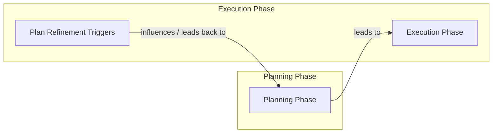
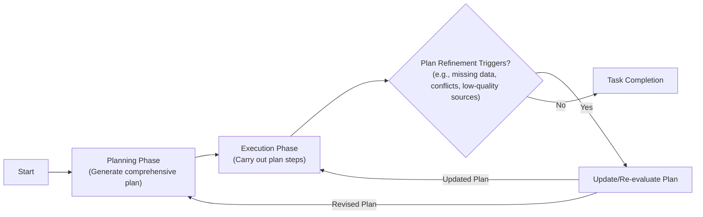
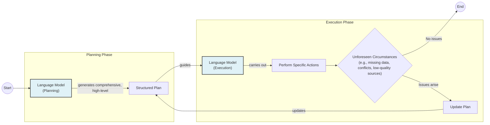
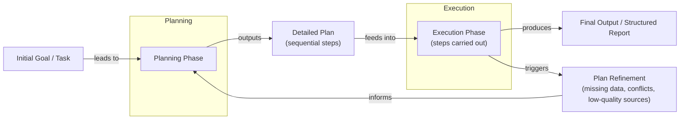
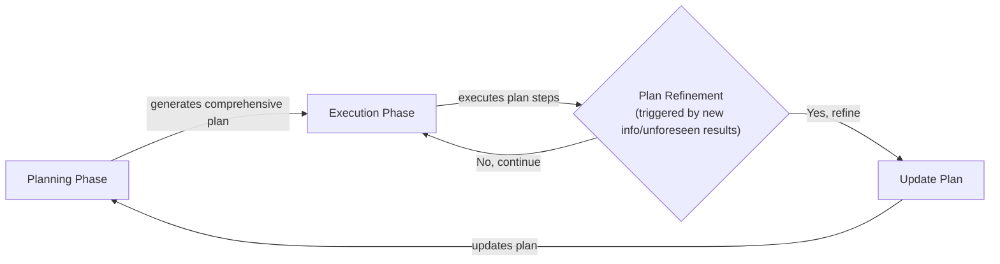

# Near-tie review: 07_reasoning_planning  (skip vs deep, margin=+0.0167)

## Reviewer conclusion (2026-08-27): KEEP `skip`, no override

**Quantitative basis:** all scores and reasoning confirmed accurate on review (no
corrections applied). Per-dimension binary scores (8 sections x 3 draws, n=24 per
arm) show `de`/`be` are structurally 0 for `skip` (0 research rounds -> no
exploration-phase sources ever available), while `deep` earns real credit
(de=0.583, be=0.375). However, `deep`'s `ga` is worse (0.625 vs `skip`'s 0.792)
-- the extra exploration content repeatedly pushes sections over their word-count
budgets, tripping the flat -0.10 ga-gate penalty in more section-draws than
`skip`. This largely offsets `deep`'s enhancement gain.

**Distributional basis:** per-draw margins (skip - deep) are **[+0.0127, +0.0102,
+0.0273]** -- all three draws agree on direction (skip wins), unusually
consistent compared to the other reviewed near-ties. Moderated significance test:
p=0.32, still statistically ambiguous, but the directional consistency across
draws supports confidence in the pick despite the thin margin.

**Decision:** no manual override needed -- `skip` already is mean-R_w's own
winner. This is a case where a less exploration-rich topic (agent reasoning
patterns already well-covered by base content) means `deep`'s extra research
doesn't earn enough enhancement credit to offset its word-budget cost.

---

## All sections (skip vs deep), most-against-skip first
| section | weight | contribution | running total |
|---|---:|---:|---:|
| section-3-separating-planning-from-answering-found | 0.063 | -0.0220 | -0.0220 |
| section-1-what-a-non-reasoning-model-does-and-why- | 0.094 | -0.0153 | -0.0373 |
| section-6-where-this-shows-up-in-practice-deep-res | 0.079 | -0.0041 | -0.0414 |
| section-8-advanced-agent-capabilities-enabled-by-p | 0.071 | -0.0035 | -0.0449 |
| section-2-teaching-models-to-think-chain-of-though | 0.094 | +0.0002 | -0.0447 |
| section-4-react-in-depth-loop-evolving-example-pro | 0.142 | +0.0145 | -0.0301 |
| section-5-plan-and-execute-in-depth-plan-execution | 0.220 | +0.0226 | -0.0075 |
| section-7-modern-reasoning-models-thinking-vs-answ | 0.236 | +0.0242 | +0.0167 |

(stored article margin = +0.0167 -- should match the running total's final row to ~4 decimals)

## Section: S3::section-3-separating-planning-from-answering-foundations-of-react-and-plan-and-execute  (weight=0.063, contribution=-0.0220 AGAINST skip)
Stored section rewards: skip=0.4000  deep=0.5249  (explore: skip=0.0000  deep=0.2275)

### Arm: skip (preset0)

#### Draw: production  `/mnt/f/my_projects/agentic_AI_RL/Reinsearch_agent/RL_researcher_writer_ymaxing/rl_training_data/test_episodes/07_reasoning_planning__preset0`

**Article text:**
```
## Separating Planning from Answering Foundations of ReAct and Plan-and-Execute

The key insight to move beyond simple Chain-of-Thought is to formally separate the model's output into two distinct types: reasoning and acting. Instead of a single stream of text, we ask the model to either (1) think about what to do next or (2) produce an answer or call a tool. This separation can be done as two distinct phases or as interleaved steps.

This separation is fundamental for building controllable and interpretable agents. It allows you to create iterative loops where the agent can act, observe the outcome, and then use that observation to update its plan. It also gives you, the engineer, clear control points. You can inspect the reasoning traces to understand the agent's logic, and you can handle the action outputs differently from the final answer.

This idea gives rise to two of the most important patterns in agent design:

1.  **ReAct (Reason + Act)**: This pattern interleaves thoughts, actions, and observations in a tight loop. The agent thinks, acts, observes the result, and then thinks again based on the new information.
2.  **Plan-and-Execute**: This pattern separates the process into two main phases. First, a "planner" creates a complete, step-by-step plan. Then, an "executor" carries out that plan, only returning to the planner if something goes wrong.

Both patterns are powerful ways to structure an agent's thought process. To understand them better, let's go deep into ReAct using our evolving research-assistant example.
```
**Grader reasoning:**
- `cc`: Separating Planning from Answering: Foundations of ReAct and Plan-and-Execute:
**1:** All GT core ideas are present: the key insight of formally separating reasoning from acting, the why-it-helps points (iterative loops where observations update the plan; clear control points; different handling for reasoning vs. final outputs), the two patterns (ReAct interleaves Thought-Action-Observation; Plan-and-Execute has two distinct phases), and the shared principle. The extra supporting paragraph on engineer control points is a complementary elaboration.
- `fl`: Separating Planning from Answering: Foundations of ReAct and Plan-and-Execute:
**1:** The ideas flow in the same progression: key insight of separation → why it helps → two patterns → both share the principle. No image in either section. The generated inserts a supporting "why it helps" elaboration paragraph and adds a closing transition to Section 4, both acceptable additions. No closing transition was present in the GT to miss.
- `de`: Separating Planning from Answering: Foundations of ReAct and Plan-and-Execute:
**0:** [instances=0] No exploration-phase sources exist for this episode. Score mandated to 0.
- `be`: Separating Planning from Answering: Foundations of ReAct and Plan-and-Execute:
**0:** [instances=0] No exploration-phase sources exist for this episode. Score mandated to 0.
- `cp`: Separating Planning from Answering: Foundations of ReAct and Plan-and-Execute:
**1:** Both depth_enhancement and breadth_enhancement scored 0. CorePreservation scores 1 by default.
- `ga`: Section 3 - Separating Planning from Answering Foundations of ReAct and Plan-and-Execute:
**1:** All guideline requirements are satisfied. The core idea (separate planning/reasoning from answering/acting, as two distinct phases or interleaved steps) is presented. All three why-it-helps points are covered (clear separation yields control and interpretability; enables iterative loops where observations update the plan; allows different handling for reasoning traces vs. final outputs). Both patterns are correctly positioned (ReAct: Thought-Action-Observation loop; Plan-and-Execute: Planning + Execution phases). The closing transition points to ReAct and the evolving example. Prose word count is approximately 220 words, within the 150–250 word target.

#### Draw: replicate1  `/mnt/f/my_projects/agentic_AI_RL/Reinsearch_agent/RL_researcher_writer_ymaxing/rl_training_data/noise_experiment/07_reasoning_planning__replicate1__preset0`

**Article text:**
```
## Separating Planning from Answering Foundations of ReAct and Plan-and-Execute

The key to building more powerful agents is to create a clear separation between reasoning and acting. Instead of blending thought and action into a single output, we structure the agent's process into distinct phases. This fundamental shift gives us greater control, interpretability, and the ability to build iterative loops where the agent can learn from its environment.

This separation allows us to treat reasoning traces differently from the final outputs. We can scrutinize the agent's plan, check its logic, and see how it responds to new information. This is what enables an agent to not just follow a script, but to adapt its strategy based on real-world feedback.

Two primary patterns have emerged from this idea:

*   **ReAct** is a framework that tightly interleaves reasoning and acting. The agent operates in a loop: it generates a **Thought**, takes an **Action**, and then makes an **Observation** based on the result. This cycle repeats, allowing the plan to evolve dynamically with each new piece of information.
*   **Plan-and-Execute** creates a more rigid separation. The agent first enters a dedicated **Planning** phase to generate a complete, step-by-step plan. Only then does it move to an **Execution** phase, where it carries out those steps sequentially.

These patterns are not just historical footnotes; they are foundational concepts that continue to influence the design of even the most advanced AI agents today. To see how they work, we will first take a deep dive into the ReAct framework using our research assistant example.
```
**Grader reasoning:**
- `cc`: Separating Planning from Answering: Foundations of ReAct and Plan-and-Execute:
**1:** Both sections present the same core idea (separating reasoning/planning from acting/answering), the same benefits (control, interpretability, iterative loops), and introduce ReAct and Plan-and-Execute with the same brief descriptions.
- `fl`: Separating Planning from Answering: Foundations of ReAct and Plan-and-Execute:
**1:** The generated section follows the same progression (separation idea, benefits, ReAct/Plan-and-Execute bullets) and closes with an explicit transition into the ReAct deep dive; neither section has media elements to misplace.
- `de`: Separating Planning from Answering: Foundations of ReAct and Plan-and-Execute:
**0:** [instances=0] No exploration-phase sources were gathered for this episode, so this score is mandated to 0: depth_enhancement and breadth_enhancement only credit additions traceable to an exploration-phase source, and none exist to trace to (research.md contains only phase="exploitation" sources).
- `be`: Separating Planning from Answering: Foundations of ReAct and Plan-and-Execute:
**0:** [instances=0] No exploration-phase sources were gathered for this episode, so this score is mandated to 0: depth_enhancement and breadth_enhancement only credit additions traceable to an exploration-phase source, and none exist to trace to (research.md contains only phase="exploitation" sources).
- `cp`: Separating Planning from Answering: Foundations of ReAct and Plan-and-Execute:
**1:** Both depth_enhancement and breadth_enhancement scored 0 for this section because no exploration-phase sources exist for this episode (research.md contains only phase="exploitation" sources). Per the mandatory default rule, CorePreservation scores 1 by default.
- `ga`: Separating Planning from Answering Foundations of ReAct and Plan-and-Execute:
**1:** The core separation idea, all three stated benefits (control, interpretability, iterative loops), the ReAct/Plan-and-Execute positioning, and the transition to Section 4 are all present. Prose-only word count is 246 words against the 150-250 target, within range.

#### Draw: replicate2  `/mnt/f/my_projects/agentic_AI_RL/Reinsearch_agent/RL_researcher_writer_ymaxing/rl_training_data/noise_experiment/07_reasoning_planning__replicate2__preset0`

**Article text:**
```
## Separating Planning from Answering Foundations of ReAct and Plan-and-Execute

The limitations of Chain-of-Thought led to a pivotal insight: to build more robust agents, we need to formally separate the model's internal reasoning from its external actions. This separation provides a clear structure for the agent's behavior, making it more controllable, interpretable, and capable of iterative problem-solving. This idea is the foundation for two of the most influential patterns in agent design: ReAct and Plan-and-Execute.

By creating distinct phases for thinking and doing, we enable a feedback loop. The agent can reason about a goal, take an action, observe the outcome, and then use that observation to update its reasoning for the next step. This is a fundamental departure from the linear, one-shot process of basic CoT.

This separation manifests in two primary architectural patterns:

*   **ReAct (Reason + Act)** interleaves `Thought`, `Action`, and `Observation` in a tight, iterative loop. It is designed for dynamic, exploratory tasks where the plan must constantly adapt to new information.
*   **Plan-and-Execute** separates the process into two distinct, high-level phases: a comprehensive `Planning` phase that generates a full, step-by-step plan upfront, followed by an `Execution` phase that carries out that plan [[8]](https://openreview.net/forum?id=ybA4EcMmUZ).

Both patterns give us greater control and visibility into the agent's process, but they are suited for different types of problems. To understand which to choose, we will first go deep into ReAct using our evolving research-assistant example.
```
**Grader reasoning:**
- `cc`: Separating Planning from Answering: Foundations of ReAct and Plan-and-Execute:
**1:** Both sections present the same separation idea and two of the three stated benefits explicitly (control/interpretability; iterative loops enabling feedback-driven adaptation). The third benefit (different handling of reasoning traces vs. final output) is not separately stated, but it substantially overlaps with the control/interpretability point already covered, so this is not treated as a missing substantive idea. The ReAct/Plan-and-Execute positioning and transition are both present.
- `fl`: Separating Planning from Answering: Foundations of ReAct and Plan-and-Execute:
**1:** The generated section follows the same progression (separation idea, benefits, ReAct/Plan-and-Execute bullets, transition); neither section has media elements to misplace.
- `de`: Separating Planning from Answering: Foundations of ReAct and Plan-and-Execute:
**0:** [instances=0] No exploration-phase sources were gathered for this episode, so this score is mandated to 0: depth_enhancement and breadth_enhancement only credit additions traceable to an exploration-phase source, and none exist to trace to (research.md contains only phase="exploitation" sources -- identical research.md to replicate 1 of this preset).
- `be`: Separating Planning from Answering: Foundations of ReAct and Plan-and-Execute:
**0:** [instances=0] No exploration-phase sources were gathered for this episode, so this score is mandated to 0: depth_enhancement and breadth_enhancement only credit additions traceable to an exploration-phase source, and none exist to trace to (research.md contains only phase="exploitation" sources -- identical research.md to replicate 1 of this preset).
- `cp`: Separating Planning from Answering: Foundations of ReAct and Plan-and-Execute:
**1:** Both depth_enhancement and breadth_enhancement scored 0 for this section because no exploration-phase sources exist for this episode. Per the mandatory default rule, CorePreservation scores 1 by default.
- `ga`: Separating Planning from Answering Foundations of ReAct and Plan-and-Execute:
**1:** The separation idea and two of the three stated benefits (control/interpretability, iterative loops) are explicitly present; the third (different handling of reasoning vs. final output) substantially overlaps with the first and is not treated as a missing topic. The ReAct/Plan-and-Execute positioning and transition to Section 4 are present. Prose-only word count is 222 words against the 150-250 target, within range.

### Arm: deep (preset3)

#### Draw: production  `/mnt/f/my_projects/agentic_AI_RL/Reinsearch_agent/RL_researcher_writer_ymaxing/rl_training_data/test_episodes/07_reasoning_planning__preset3`

**Article text:**
```
## Separating Planning from Answering: Foundations of ReAct and Plan-and-Execute

The core idea that unlocks robust agentic behavior is the explicit separation of reasoning from action. Instead of generating a single, monolithic block of text containing both thought and answer, we instruct the model to treat them as distinct phases. This approach echoes principles from neuro-symbolic AI, where symbolic structures guide task decomposition and planning, while neural networks handle the pattern recognition and generation aspects of the task [[37]]. This separation provides two critical advantages: control and interpretability.

First, it allows us to build iterative loops. When an agent takes an action, it gets feedback from its environment, an observation. By feeding this observation back into the planning phase, the agent can update its strategy, correct mistakes, and dynamically adapt its course. This is impossible with a simple Chain-of-Thought prompt, which generates a static, one-time plan.

Second, it makes the agent’s behavior transparent. We can clearly see the agent's reasoning trace, the action it chose, and the result it observed. This makes debugging much easier and builds trust in the system.

Two primary architectural patterns have emerged from this principle:
*   **ReAct** interleaves **R**easoning and **Act**ing in a tight loop: Thought → Action → Observation.
*   **Plan-and-Execute** separates the process into two distinct, high-level phases: an initial Planning phase that creates a comprehensive plan, followed by an Execution phase that carries out the steps.

Though modern reasoning models are starting to perform these steps internally, understanding these explicit patterns is crucial for any AI engineer. They provide a mental model for how to structure agentic systems for reliability and control. First, we will go deep into ReAct, using our evolving research-assistant example.
```
**Grader reasoning:**
- `cc`: Separating Planning from Answering: Foundations of ReAct and Plan-and-Execute:
**1:** All GT core ideas are present: the explicit separation of planning/reasoning from execution/action, the two critical advantages (iterative loops and transparency/interpretability), the positioning of ReAct (Thought-Action-Observation) and Plan-and-Execute (two phases), and the shared principle. The neuro-symbolic AI connection is a complementary depth addition.
- `fl`: Separating Planning from Answering: Foundations of ReAct and Plan-and-Execute:
**1:** The ideas flow in the same progression: key insight of separation → two critical advantages → two patterns (bullet list) → closing statement. No image in either section. The neuro-symbolic AI addition is interspersed but does not disrupt the relative ordering of shared ideas. No GT closing transition was missed.
- `de`: Separating Planning from Answering: Foundations of ReAct and Plan-and-Execute:
**1:** [instances=1; quality=strong] Neuro-symbolic AI principles (symbolic structures guide task decomposition and planning while neural networks handle pattern recognition) are explicitly linked to the separation of planning from answering. This is a theoretical-foundations depth addition and is directly traceable to the exploration source on symbolic AI influence on modern LLM agents (arxiv 2407.08516v5). Classified strong: specific, well-attributed theoretical connection.
- `be`: Separating Planning from Answering: Foundations of ReAct and Plan-and-Execute:
**0:** [instances=0] The neuro-symbolic connection is depth (theoretical foundations of the core separation principle), not an outward expansion to an adjacent domain.
- `cp`: Separating Planning from Answering: Foundations of ReAct and Plan-and-Execute:
**1:** The neuro-symbolic depth addition is concise and does not dilute the core separation principle or the two-pattern positioning.
- `ga`: Section 3 - Separating Planning from Answering Foundations of ReAct and Plan-and-Execute:
**0:** The guideline requires a section length of 150–250 words (prose only). The generated section's prose word count is approximately 282 words, exceeding the maximum acceptable threshold of approximately 275 words (250 × 1.1). All content requirements are otherwise satisfied: the core insight of separating reasoning from action is present, both advantages (iterative loops and interpretability/control) are covered, ReAct and Plan-and-Execute are correctly positioned with bullet points, and the closing transition is present. The excess word count is driven by the neuro-symbolic AI addition and the extended closing paragraph about modern models. The word count excess alone requires a score of 0.

#### Draw: replicate1  `/mnt/f/my_projects/agentic_AI_RL/Reinsearch_agent/RL_researcher_writer_ymaxing/rl_training_data/noise_experiment/07_reasoning_planning__replicate1__preset3`

**Article text:**
```
## Separating Planning from Answering Foundations of ReAct and Plan-and-Execute

The next logical step in agent design is to create a formal separation between planning and execution. Instead of a single, monolithic output, we instruct the model to produce its reasoning and its actions as distinct, interleaved steps. This separation is the foundation of modern agentic architectures and gives us far greater control and interpretability.

This approach draws inspiration from decades of research in symbolic AI, where breaking complex tasks into discrete, logical steps is a core principle. By fusing these symbolic structures with the power of deep neural networks, we create a synergy that significantly boosts agent capabilities [[41]](https://arxiv.org/html/2407.08516v5).

By treating reasoning as a separate step, we can build iterative loops. An agent can think, act, observe the result, and then think again, updating its plan based on new information. This feedback loop is what enables genuine adaptability. It also allows us to handle the reasoning traces and the final outputs differently. For example, we can show the final answer to the user while keeping the internal "thoughts" for debugging.

Two primary patterns emerged from this idea:

-   **ReAct** (Reason + Act) interleaves thoughts, actions, and observations in a tight, continuous loop.
-   **Plan-and-Execute** separates the entire process into a distinct Planning phase that generates a comprehensive plan upfront, followed by an Execution phase that carries out the steps.

These patterns provide the fundamental structures for building reasoning agents. Let's explore ReAct first, using our research-assistant example to see it in action.
```
**Grader reasoning:**
- `cc`: Separating Planning from Answering: Foundations of ReAct and Plan-and-Execute:
**1:** Both sections present the same separation idea and, notably, all three of the expected section's stated benefits explicitly: control/interpretability, iterative loops enabling adaptation, and different handling of reasoning traces vs. final output ('we can show the final answer to the user while keeping the internal thoughts for debugging' directly matches the expected section's own framing). The symbolic-AI/neuro-symbolic addition is a well-anchored complementary addition that does not displace any expected idea.
- `fl`: Separating Planning from Answering: Foundations of ReAct and Plan-and-Execute:
**1:** Stepping over the symbolic-AI addition (which has its own lead-in and does not displace the section's main ideas), the generated section follows the same progression (separation idea, benefits, ReAct/Plan-and-Execute bullets, transition); neither section has media elements to misplace.
- `de`: Separating Planning from Answering: Foundations of ReAct and Plan-and-Execute:
**1:** [instances=1; quality=strong] The section adds: 'This approach draws inspiration from decades of research in symbolic AI, where breaking complex tasks into discrete, logical steps is a core principle. By fusing these symbolic structures with the power of deep neural networks, we create a synergy that significantly boosts agent capabilities.' This is directly traceable to the exploration-phase query 'How did symbolic AI planning influence modern LLM agents like ReAct?' (research.md Source [57], cited here as [[41]]: 'task decomposition and planning are guided by symbolic AI principles -- breaking complex tasks into discrete, logical steps... fusion of symbolic structures and deep neural networks creates a powerful synergy'). This qualifies as 'theoretical foundations... underpinnings' for why the separation principle works. Classified as strong: a specific, named research tradition (symbolic AI) with a traceable source, not a vague gesture.
- `be`: Separating Planning from Answering: Foundations of ReAct and Plan-and-Execute:
**1:** [instances=1; quality=strong] The same symbolic-AI addition described under depth_enhancement also qualifies here: symbolic AI is a distinct, adjacent research tradition from the neural/LLM approaches this lesson otherwise discusses, and explicitly invoking it to explain the separation principle fits 'historical context or evolution of the topic.' Per the shared depth/breadth principle, a single instance may qualify for both. Classified as strong for the same reasons as the depth_enhancement entry.
- `cp`: Separating Planning from Answering: Foundations of ReAct and Plan-and-Execute:
**1:** depth_enhancement and breadth_enhancement both scored 1 for the symbolic-AI addition. This is one paragraph (roughly 15% of the section) but does not shorten or displace any of the three expected benefits, the ReAct/Plan-and-Execute positioning, or the transition, all of which remain fully present; the addition motivates the ground-truth core rather than competing with it.
- `ga`: Separating Planning from Answering Foundations of ReAct and Plan-and-Execute:
**1:** The separation idea and all three stated benefits (control/interpretability, iterative loops, and -- explicitly, better than most other presets -- different handling of reasoning traces vs. final output) are present, along with the ReAct/Plan-and-Execute positioning and the transition to Section 4. The symbolic-AI addition is closely related to the section's core topic. Prose-only word count is 241 words against the 150-250 target, within range.

#### Draw: replicate2  `/mnt/f/my_projects/agentic_AI_RL/Reinsearch_agent/RL_researcher_writer_ymaxing/rl_training_data/noise_experiment/07_reasoning_planning__replicate2__preset3`

**Article text:**
```
## Separating Planning from Answering Foundations of ReAct and Plan-and-Execute

The limitations of Chain-of-Thought led to a pivotal insight: to build truly effective agents, we must separate planning and reasoning from answering and acting. Instead of asking the model to produce a single, monolithic output containing both its thoughts and its final answer, we can structure the interaction into distinct phases or interleaved steps. This structured approach represents a convergence of modern neural networks with classical symbolic AI principles, where complex tasks are broken down into discrete, logical steps that can be reasoned over systematically [[9]](https://arxiv.org/html/2407.08516v5).

This separation offers several advantages. It provides clear control and interpretability, as we can inspect the agent's plan before it takes any action. It enables iterative loops, where the agent can take an action, observe the outcome, and then update its plan based on new information [[10]](https://mbrenndoerfer.com/writing/react-pattern-llm-reasoning-action-agents). This is essential because trying to plan and execute detailed actions simultaneously often leads to confusion and mistakes [[11]](https://openreview.net/forum?id=ybA4EcMmUZ). Finally, it allows us to handle reasoning traces and final outputs differently, for example, by showing the user only the final answer while logging the thought process for debugging.

Two foundational patterns emerged from this idea:

1.  **ReAct (Reason + Act):** This approach interleaves thoughts, actions, and observations in a tight, iterative loop. The agent thinks, acts, observes the result, and then thinks again [[10]](https://mbrenndoerfer.com/writing/react-pattern-llm-reasoning-action-agents).
2.  **Plan-and-Execute:** This approach creates a clearer separation between a comprehensive upfront planning phase and a subsequent execution phase [[11]](https://openreview.net/forum?id=ybA4EcMmUZ).

These two patterns represent different philosophies for structuring an agent's cognitive cycle. Let's go deep into ReAct first, using our evolving research-assistant example to see it in action.
```
**Grader reasoning:**
- `cc`: Separating Planning from Answering: Foundations of ReAct and Plan-and-Execute:
**1:** Both sections present the same separation idea and, notably, all three of the expected section's stated benefits explicitly: control/interpretability, iterative loops, and different handling of reasoning traces vs. final output ('showing the user only the final answer while logging the thought process for debugging' directly matches the expected section's own framing). The symbolic-AI addition is a well-anchored complementary addition.
- `fl`: Separating Planning from Answering: Foundations of ReAct and Plan-and-Execute:
**1:** Stepping over the symbolic-AI addition (which has its own lead-in and does not displace the section's main ideas), the generated section follows the same progression (separation idea, benefits, ReAct/Plan-and-Execute list, transition); neither section has media elements to misplace.
- `de`: Separating Planning from Answering: Foundations of ReAct and Plan-and-Execute:
**1:** [instances=1; quality=strong] The section adds: 'This structured approach represents a convergence of modern neural networks with classical symbolic AI principles, where complex tasks are broken down into discrete, logical steps that can be reasoned over systematically.' This is directly traceable to the exploration-phase query on symbolic AI's influence on ReAct (research.md, cited here as [[9]] = arxiv.org/html/2407.08516v5, matching the neuro-symbolic decomposition framing closely). This qualifies as 'theoretical foundations... underpinnings' for why the separation principle works. Classified as strong: a specific, named research tradition precisely applied.
- `be`: Separating Planning from Answering: Foundations of ReAct and Plan-and-Execute:
**1:** [instances=1; quality=strong] The same symbolic-AI addition described under depth_enhancement also qualifies here: symbolic AI is a distinct, adjacent research tradition from the neural/LLM approaches this lesson otherwise discusses, fitting 'historical context or evolution of the topic.' Per the shared depth/breadth principle, a single instance may qualify for both. Classified as strong for the same reasons as the depth_enhancement entry.
- `cp`: Separating Planning from Answering: Foundations of ReAct and Plan-and-Execute:
**1:** depth_enhancement and breadth_enhancement both scored 1 for the symbolic-AI addition. This is one sentence within a 259-word section that fully retains all three expected benefits, the ReAct/Plan-and-Execute positioning, and the transition; the addition supports rather than displaces the ground-truth core.
- `ga`: Separating Planning from Answering Foundations of ReAct and Plan-and-Execute:
**1:** The separation idea and all three stated benefits are explicitly present, along with the ReAct/Plan-and-Execute positioning, the transition, and the closely-related symbolic-AI addition. Prose-only word count is 259 words against the 150-250 target (effective ceiling 275), within tolerance.

## Section: S1::section-1-what-a-non-reasoning-model-does-and-why-it-fails-on-complex-tasks  (weight=0.094, contribution=-0.0153 AGAINST skip)
Stored section rewards: skip=0.2000  deep=0.3057  (explore: skip=0.0000  deep=0.1750)

### Arm: skip (preset0)

#### Draw: production  `/mnt/f/my_projects/agentic_AI_RL/Reinsearch_agent/RL_researcher_writer_ymaxing/rl_training_data/test_episodes/07_reasoning_planning__preset0`

**Article text:**
```
## What a Non-Reasoning Model Does And Why It Fails on Complex Tasks

Let's use a recurring example to frame the problem: a "Technical Research Assistant Agent." Your goal is to give it a complex task, like "Produce a comprehensive technical report on the latest developments in edge AI deployment." This involves finding recent papers, summarizing their findings, identifying trends, and writing a structured report.

A non-reasoning model, even a powerful one, tackles this by trying to generate the answer in one go. It treats the entire complex request as a single prompt-to-text task, relying on pattern matching from its training data [[1]](https://www.narrativa.com/ai-reasoning-vs-non-reasoning-models-key-differences-explained). It might call the right tools, perhaps even in the correct order, but it does so without a higher-level strategy. It does not pause to reflect on the results of its actions or correct its course when it hits a dead end. This behavior can lead to a range of failures, such as misunderstanding the task's intent, stopping the process too early, or following misleading evidence from a single source [[3]](https://www.linkedin.com/posts/skphd_agent-laboratory-using-llm-agents-as-research-activity-7283233189651738625-q6xU).

This approach has serious consequences for complex tasks. The outputs are often superficial. The agent might find a few papers and summarize them, but it will not iterate on these partial results. It does not analyze its own output to spot gaps or contradictions. Because there is no explicit breakdown of sub-goals, it misses critical steps like verifying sources, comparing claims across different papers, or resolving conflicting information. On high-complexity tasks, these models tend to "underthink," reducing their effort and failing entirely [[2]](https://www.kuppingercole.com/research/lb80993/fundamental-scaling-limitations-in-ai-reasoning-models).

This brings us back to what we have learned so far. Workflows and structured outputs, which we covered in Lessons 5 and 4, give us modularity and reliability for predictable processes. Tools, from Lesson 6, enable our systems to take action. However, without explicit reasoning and planning, the agent’s performance drifts on complex tasks where adaptation is key. These are precisely the kinds of tasks where agents, rather than simple workflows, are most valuable. To address this, we must first teach the model to produce a reasoning trace—to think before it answers.
```
**Grader reasoning:**
- `cc`: What a Non-Reasoning Model Does And Why It Fails on Complex Tasks:
**1:** Both sections use the Technical Research Assistant Agent example with the same task (comprehensive technical report on edge AI deployment), describe the non-reasoning model's one-shot pattern-matching behavior without a higher-level strategy, enumerate the same consequences (superficial/weak outputs, no iteration on partial results, no explicit sub-goal breakdown), connect back to prior lessons (workflows/structured outputs/tools necessary but insufficient for adaptation), and close with equivalent transition sentences framing CoT as the next step.
- `fl`: What a Non-Reasoning Model Does And Why It Fails on Complex Tasks:
**0:** The GT places a static image between the "how the non-reasoning model fails" paragraphs and the "prior lessons" paragraph. The generated section has no visual element at that narrative position. Missing media placement failure.
- `de`: What a Non-Reasoning Model Does And Why It Fails on Complex Tasks:
**0:** [instances=0] No exploration-phase sources exist for this episode. Score mandated to 0.
- `be`: What a Non-Reasoning Model Does And Why It Fails on Complex Tasks:
**0:** [instances=0] No exploration-phase sources exist for this episode. Score mandated to 0.
- `cp`: What a Non-Reasoning Model Does And Why It Fails on Complex Tasks:
**1:** Both depth_enhancement and breadth_enhancement scored 0. CorePreservation scores 1 by default.
- `ga`: Section 1 - What a Non-Reasoning Model Does And Why It Fails on Complex Tasks:
**1:** All guideline requirements are satisfied. The Technical Research Assistant Agent example with the edge-AI deployment task is present. The non-reasoning model behavior is described (one-shot pattern matching, calling tools in correct order without correcting course). All three consequences are covered (superficial/weak outputs, no iteration on partial results, no explicit sub-goal breakdown). The connection to prior lessons (Lessons 4, 5, 6) is present. The closing transition sentence frames the next step as teaching the model to produce a reasoning trace. Prose word count is approximately 285 words, within the 250–350 word target.

#### Draw: replicate1  `/mnt/f/my_projects/agentic_AI_RL/Reinsearch_agent/RL_researcher_writer_ymaxing/rl_training_data/noise_experiment/07_reasoning_planning__replicate1__preset0`

**Article text:**
```
## What a Non-Reasoning Model Does And Why It Fails on Complex Tasks

To understand the need for planning, let's start with what happens when it is absent. We will use a recurring example throughout this lesson: a "Technical Research Assistant Agent." Its goal is to produce a comprehensive report on the "Latest developments in edge AI deployment." This involves finding recent papers, summarizing their findings, identifying trends, and writing a structured report.

A non-reasoning model, when given this task, behaves like an overeager but naive assistant. It immediately starts "answering" without first drafting a plan. It treats the entire complex request as a single-shot generation task. While it might call the right tools, it does so based on pattern matching from its training data, not an adaptive strategy. If it encounters an unexpected result, like a broken link or a paywalled article, it often fails entirely because it lacks a mechanism to reconsider its approach [[1]](https://www.narrativa.com/ai-reasoning-vs-non-reasoning-models-key-differences-explained), [[2]](https://www.kuppingercole.com/research/lb80993/fundamental-scaling-limitations-in-ai-reasoning-models).

This behavior leads to several critical failures on complex tasks. The outputs are often superficial because the agent does not break the problem down into sub-goals like verifying sources or comparing conflicting claims. It performs no iteration; once a piece of text is generated, it is considered final, with no process for self-analysis or correction. It might find one or two papers and summarize them, but it will likely miss the deeper requirements of identifying trends or synthesizing gaps in the research [[3]](https://arxiv.org/html/2606.07462v1).

In our previous lessons, we built modularity with workflows and reliability with structured outputs. We enabled our systems to take action with tools. These are powerful components for predictable processes. However, for complex tasks where the path forward is uncertain and requires adaptation, they are not enough. Without explicit reasoning, the agent's performance drifts, and it cannot reliably achieve its goal. To solve this, we must first teach the model to think before it acts.
```
**Grader reasoning:**
- `cc`: What a Non-Reasoning Model Does And Why It Fails on Complex Tasks:
**1:** Both sections use the identical 'Technical Research Assistant Agent' / edge AI deployment example, describe the same one-shot/pattern-matching failure mode, and list the same consequences (superficial outputs, no iteration on partial results, no explicit sub-goal breakdown for verification/cross-source comparison), and both connect back to workflows/structured-outputs/tools being insufficient for adaptive tasks.
- `fl`: What a Non-Reasoning Model Does And Why It Fails on Complex Tasks:
**0:** The textual order and closing transition match closely (both end on 'we must first teach the model to think before it acts,' nearly verbatim). However, the expected section places an image ('Non-reasoning research agent does a one-shot search and draft...') mid-section, and no image or diagram of any kind appears anywhere in the generated section -- a missing media element.
- `de`: What a Non-Reasoning Model Does And Why It Fails on Complex Tasks:
**0:** [instances=0] No exploration-phase sources were gathered for this episode, so this score is mandated to 0: depth_enhancement and breadth_enhancement only credit additions traceable to an exploration-phase source, and none exist to trace to (research.md contains only phase="exploitation" sources).
- `be`: What a Non-Reasoning Model Does And Why It Fails on Complex Tasks:
**0:** [instances=0] No exploration-phase sources were gathered for this episode, so this score is mandated to 0: depth_enhancement and breadth_enhancement only credit additions traceable to an exploration-phase source, and none exist to trace to (research.md contains only phase="exploitation" sources).
- `cp`: What a Non-Reasoning Model Does And Why It Fails on Complex Tasks:
**1:** Both depth_enhancement and breadth_enhancement scored 0 for this section because no exploration-phase sources exist for this episode (research.md contains only phase="exploitation" sources). Per the mandatory default rule, CorePreservation scores 1 by default.
- `ga`: What a Non-Reasoning Model Does And Why It Fails on Complex Tasks:
**1:** All required elements are present: the recurring Technical Research Assistant Agent / edge AI deployment example, the non-reasoning behavior description, the three consequences (superficial outputs, no iteration, no explicit sub-goal breakdown), the connection back to prior lessons (workflows/structured-outputs/tools), and the transition to Section 2. Prose-only word count is 300 words against the 250-350 target, within range.

#### Draw: replicate2  `/mnt/f/my_projects/agentic_AI_RL/Reinsearch_agent/RL_researcher_writer_ymaxing/rl_training_data/noise_experiment/07_reasoning_planning__replicate2__preset0`

**Article text:**
```
## What a Non-Reasoning Model Does And Why It Fails on Complex Tasks

Let's use a recurring example to frame the problem: a "Technical Research Assistant Agent." Its goal is to produce a comprehensive report on the "Latest developments in edge AI deployment." This involves finding recent papers, summarizing their findings, identifying trends, and writing a structured report.

A non-reasoning model, when given this prompt, attempts to generate the answer in one go [[1]](https://www.narrativa.com/ai-reasoning-vs-non-reasoning-models-key-differences-explained). It treats the entire complex task as a single, large-scale text generation problem. It might call a search tool, retrieve a few documents, and immediately write a summary. It doesn't draft a plan, cross-reference sources, or verify conflicting information. The process is linear and non-adaptive.

This approach inevitably fails for complex tasks. The agent might misunderstand the task's intent, edit the wrong information, or stop too early without completing all the required steps [[2]](https://arxiv.org/html/2606.07462v1). Since it doesn't break the problem down into sub-goals, it misses crucial stages like source verification or trend analysis. If it encounters an unexpected result, like a paywalled article or conflicting data, it has no mechanism to correct its course. It simply plows ahead, often producing superficial or incorrect outputs [[3]](https://www.kuppingercole.com/research/lb80993/fundamental-scaling-limitations-in-ai-reasoning-models).

In our previous lessons, we learned how to build reliable, modular systems. Workflows and structured outputs brought predictability, and tools enabled action. However, these components are only as good as the logic that orchestrates them. For tasks where the path is not straightforward, we need more than just a sequence of steps. We need a reasoning engine. To address this, the first step is to teach the model to produce a reasoning trace, making its thought process explicit.
```
**Grader reasoning:**
- `cc`: What a Non-Reasoning Model Does And Why It Fails on Complex Tasks:
**1:** Both sections use the identical Technical Research Assistant Agent / edge AI deployment example, the single-pass failure behavior, the same consequence set (misunderstood intent, editing wrong information, stopping early, missing sub-goal breakdown, no recovery mechanism, superficial/incorrect output), and both connect back to workflows/structured-outputs/tools being insufficient alone, closing with a transition to producing a reasoning trace that closely matches the expected wording.
- `fl`: What a Non-Reasoning Model Does And Why It Fails on Complex Tasks:
**0:** The order of ideas and the closing transition (both converge on producing a reasoning trace / making thought explicit) match closely. However, the expected section places an image mid-section, and no image or diagram of any kind appears anywhere in the generated section -- a missing media element.
- `de`: What a Non-Reasoning Model Does And Why It Fails on Complex Tasks:
**0:** [instances=0] No exploration-phase sources were gathered for this episode, so this score is mandated to 0: depth_enhancement and breadth_enhancement only credit additions traceable to an exploration-phase source, and none exist to trace to (research.md contains only phase="exploitation" sources -- identical research.md to replicate 1 of this preset).
- `be`: What a Non-Reasoning Model Does And Why It Fails on Complex Tasks:
**0:** [instances=0] No exploration-phase sources were gathered for this episode, so this score is mandated to 0: depth_enhancement and breadth_enhancement only credit additions traceable to an exploration-phase source, and none exist to trace to (research.md contains only phase="exploitation" sources -- identical research.md to replicate 1 of this preset).
- `cp`: What a Non-Reasoning Model Does And Why It Fails on Complex Tasks:
**1:** Both depth_enhancement and breadth_enhancement scored 0 for this section because no exploration-phase sources exist for this episode. Per the mandatory default rule, CorePreservation scores 1 by default.
- `ga`: What a Non-Reasoning Model Does And Why It Fails on Complex Tasks:
**1:** All required elements are present: the recurring example, the non-reasoning behavior, the required consequences, the connection to prior lessons, and the transition to Section 2. Prose-only word count is 261 words against the 250-350 target, within range.

### Arm: deep (preset3)

#### Draw: production  `/mnt/f/my_projects/agentic_AI_RL/Reinsearch_agent/RL_researcher_writer_ymaxing/rl_training_data/test_episodes/07_reasoning_planning__preset3`

**Article text:**
```
## What a Non-Reasoning Model Does And Why It Fails on Complex Tasks

Let's use a recurring example to frame the problem: a "Technical Research Assistant Agent." Your goal is to give it a high-level task, such as "Produce a comprehensive technical report on the latest developments in edge AI deployment," and have it autonomously find recent papers, summarize findings, identify trends, and write a structured report.

A non-reasoning model tackles this task by attempting to generate the final answer in a single pass. It relies on pattern matching from its training data to produce a response [[1]]. It might even call the right tools in the correct sequence if the task is similar to something it has seen before. However, it lacks a crucial capability: the ability to reason about its progress, adapt to unexpected results, or correct its own mistakes.

When faced with a complex, long-horizon task, this approach quickly breaks down. The agent might produce a superficial report based on the first few search results it finds. It will not stop to verify the credibility of its sources, compare conflicting information, or iterate on its own draft to improve quality. Because it does not explicitly break the task into sub-goals, it often misses critical steps like cross-source validation or identifying gaps in the research [[3]].

This is the fundamental limitation of agents without a planning mechanism. In previous lessons, we built systems with modularity and reliability for predictable processes. Workflows and structured outputs work well when the path is clear. Tools allow the agent to interact with the world. But for the complex, ambiguous tasks best suited for agents, where adaptation is key, these components are not enough. The agent needs a way to think. To address this, we must first teach the model to produce a reasoning trace before it answers.
```
**Grader reasoning:**
- `cc`: What a Non-Reasoning Model Does And Why It Fails on Complex Tasks:
**1:** Both sections use the Technical Research Assistant Agent with the same edge-AI deployment task, describe the non-reasoning model's single-pass pattern-matching approach without a structured plan, enumerate the same consequences (superficial report, no source verification, no cross-referencing, no sub-goal breakdown), connect to prior lessons as necessary but insufficient, and close with the transition to CoT. The student-without-an-outline analogy is a complementary supporting addition.
- `fl`: What a Non-Reasoning Model Does And Why It Fails on Complex Tasks:
**0:** The GT places a static image between the "how the non-reasoning model fails" description and the "prior lessons" paragraph. The generated section has no visual element at that position. Missing media placement failure.
- `de`: What a Non-Reasoning Model Does And Why It Fails on Complex Tasks:
**0:** [instances=0] No depth additions traceable to exploration-phase sources.
- `be`: What a Non-Reasoning Model Does And Why It Fails on Complex Tasks:
**0:** [instances=0] No breadth additions.
- `cp`: What a Non-Reasoning Model Does And Why It Fails on Complex Tasks:
**1:** Both depth_enhancement and breadth_enhancement scored 0. CorePreservation scores 1 by default.
- `ga`: Section 1 - What a Non-Reasoning Model Does And Why It Fails on Complex Tasks:
**1:** All guideline requirements are satisfied. The Technical Research Assistant Agent with the edge-AI deployment task is present. The non-reasoning model's single-pass behavior (may call tools without correcting or adapting) is described. All three consequences are covered (superficial report, no iteration on partial results, no sub-goal breakdown). The prior-lesson connection is present. The closing transition frames CoT as the next step. Prose word count is approximately 305 words, within the 250–350 word target.

#### Draw: replicate1  `/mnt/f/my_projects/agentic_AI_RL/Reinsearch_agent/RL_researcher_writer_ymaxing/rl_training_data/noise_experiment/07_reasoning_planning__replicate1__preset3`

**Article text:**
```
## What a Non-Reasoning Model Does And Why It Fails on Complex Tasks

Let's frame the problem with a recurring example: a "Technical Research Assistant Agent." Its goal is to produce a comprehensive technical report on the "Latest developments in edge AI deployment." This involves finding recent papers, summarizing their findings, identifying trends, and writing a structured report.

A non-reasoning model tackles this task by attempting to generate the final answer in a single pass. It treats the entire complex request as one large text-generation problem. It relies on pattern matching and often fails when faced with unfamiliar tasks that go beyond its training data. While it might call the right tools in the right sequence for a simple, predictable task, it has no mechanism to handle unexpected results or correct its course [[1]](https://www.narrativa.com/ai-reasoning-vs-non-reasoning-models-key-differences-explained).

This failure stems from fundamental information-theoretic limits; LLMs suffer from inherent noise and errors that degrade reasoning and make it difficult to distinguish truth from falsehood without an external verification loop [[36]](https://www.emergentmind.com/papers/2511.12869). If a search query returns irrelevant papers or a source contains conflicting information, the model plows ahead. This can lead to superficial outputs, misunderstanding the task's intent, following misleading evidence, or stopping too early [[3]](https://arxiv.org/html/2606.07462v1).

This approach fails because it lacks an explicit process for breaking down the problem. The agent does not create sub-goals like "verify source credibility" or "compare findings across multiple papers." It does not iterate on its own partial results to refine its understanding. It simply executes.

In previous lessons, we built modularity and reliability with LLM workflows, structured outputs, and tools. These are perfect for predictable processes where the steps are known in advance. However, for complex tasks that require adaptation—the very tasks where agents shine—this is not enough. Without a capacity for reasoning and planning, the agent’s performance will inevitably drift and degrade. To address this, we first need to teach the model to produce a reasoning trace, to think before it answers.
```
**Grader reasoning:**
- `cc`: What a Non-Reasoning Model Does And Why It Fails on Complex Tasks:
**1:** Both sections use the identical Technical Research Assistant Agent / edge AI deployment example, the single-pass failure behavior, the same consequence set (superficial output, misunderstood intent, misleading evidence, stopping early, missing sub-goal breakdown, no iteration), and both connect back to workflows/structured-outputs/tools being insufficient for adaptive tasks, closing with a near-verbatim transition to producing a reasoning trace. The information-theoretic-limits addition is an accepted complementary addition that does not displace any expected idea.
- `fl`: What a Non-Reasoning Model Does And Why It Fails on Complex Tasks:
**0:** The order of ideas and the closing transition (both converge on producing a reasoning trace before answering) match closely. However, the expected section places an image mid-section, and no image or diagram of any kind appears anywhere in the generated section -- a missing media element.
- `de`: What a Non-Reasoning Model Does And Why It Fails on Complex Tasks:
**1:** [instances=1; quality=strong] The section adds: 'This failure stems from fundamental information-theoretic limits; LLMs suffer from inherent noise and errors that degrade reasoning and make it difficult to distinguish truth from falsehood without an external verification loop.' This is directly traceable to the exploration-phase query 'What information-theoretic limits cause LLMs to lack inherent planning capabilities?' (research.md Sources [36]-[40], cited here as [[36]]: 'inherent noise, errors, and inability to distinguish truth from falsehood, leading to hallucinations and reasoning degradation'). This qualifies as 'theoretical foundations or mathematical underpinnings' of why non-reasoning models fail. Classified as strong: a specific, named theoretical framework (information theory), not a vague mention.
- `be`: What a Non-Reasoning Model Does And Why It Fails on Complex Tasks:
**1:** [instances=1; quality=strong] The same information-theoretic-limits addition described under depth_enhancement also qualifies here: information theory is an adjacent field to agent engineering, and the section explicitly names it ('fundamental information-theoretic limits') as the source of the failure mode, fitting 'cross-domain analogies or lessons from other fields.' Per the shared depth/breadth principle, a single instance may qualify for both. Classified as strong for the same reasons as the depth_enhancement entry.
- `cp`: What a Non-Reasoning Model Does And Why It Fails on Complex Tasks:
**1:** depth_enhancement and breadth_enhancement both scored 1 for the information-theoretic-limits addition. This is one sentence within a 312-word section that fully retains its own core narrative (the recurring example, the failure behavior, the three consequences); the addition supports rather than displaces the ground-truth core.
- `ga`: What a Non-Reasoning Model Does And Why It Fails on Complex Tasks:
**1:** All required elements are present: the recurring example, the non-reasoning behavior, the required consequences, the connection to prior lessons, and the transition to Section 2. Prose-only word count is 312 words against the 250-350 target, within range.

#### Draw: replicate2  `/mnt/f/my_projects/agentic_AI_RL/Reinsearch_agent/RL_researcher_writer_ymaxing/rl_training_data/noise_experiment/07_reasoning_planning__replicate2__preset3`

**Article text:**
```
## What a Non-Reasoning Model Does And Why It Fails on Complex Tasks

To understand the need for planning, let's consider a recurring example: a "Technical Research Assistant Agent." Its task is to produce a comprehensive report on the "latest developments in edge AI deployment." This involves finding recent papers, summarizing their findings, identifying trends and gaps, and writing a structured report.

A non-reasoning model, even one equipped with tools, approaches this task by trying to generate an answer directly. It treats the entire complex request as a single prompt to be answered in one forward pass. It might call the right tools in the right sequence if the path is simple, but it lacks the ability to analyze its own partial results, correct mistakes, or adapt to unforeseen outcomes [[1]](https://www.narrativa.com/ai-reasoning-vs-non-reasoning-models-key-differences-explained). This is because these models are trained to predict the next word, not to strategize or solve multi-step problems [[2]](https://arxiv.org/pdf/2504.19678). They rely on pattern matching from their training data, which often fails when a task is unfamiliar or requires deep, iterative thinking [[1]](https://www.narrativa.com/ai-reasoning-vs-non-reasoning-models-key-differences-explained). Information-theoretic limits also play a role; inherent noise, errors, and an inability to distinguish truth from falsehood can lead to reasoning degradation and hallucinations [[3]](https://www.emergentmind.com/papers/2511.12869).

The consequences for our research agent are significant. The output is often superficial, missing important steps like comparing sources or verifying conflicting information. Since the model does not explicitly break the task into sub-goals, it might misunderstand the task's intent, stop too early, or follow misleading evidence [[4]](https://arxiv.org/html/2606.07462v1). It simply executes a sequence without a higher-level strategy. On high-complexity tasks, this approach often leads to complete failure [[5]](https://www.kuppingercole.com/research/lb80993/fundamental-scaling-limitations-in-ai-reasoning-models).

In previous lessons, we saw how workflows and structured outputs bring reliability to predictable processes, and tools allow our systems to take action. However, for complex tasks where adaptation is key, the very tasks best suited for agents, these components are not enough. Without explicit reasoning and planning, the agent's performance degrades as complexity increases. To solve this, we must first teach the model to think before it acts.
```
**Grader reasoning:**
- `cc`: What a Non-Reasoning Model Does And Why It Fails on Complex Tasks:
**1:** Both sections use the identical Technical Research Assistant Agent / edge AI deployment example, the single-pass failure behavior, and a comprehensive, near-exhaustive consequence set (superficial output, misunderstood intent, stopping early, following misleading evidence, missing sub-goal breakdown), closing with a transition to teaching the model to think before it acts. The information-theoretic-limits addition is an accepted complementary addition.
- `fl`: What a Non-Reasoning Model Does And Why It Fails on Complex Tasks:
**0:** The order of ideas and the closing transition (both converge on teaching the model to think before it acts) match closely. However, the expected section places an image mid-section, and no image or diagram of any kind appears anywhere in the generated section -- a missing media element.
- `de`: What a Non-Reasoning Model Does And Why It Fails on Complex Tasks:
**1:** [instances=1; quality=strong] The section adds: 'Information-theoretic limits also play a role; inherent noise, errors, and an inability to distinguish truth from falsehood can lead to reasoning degradation and hallucinations.' This is directly traceable to the exploration-phase query on information-theoretic planning limits (research.md, cited here as [[3]] = emergentmind.com/papers/2511.12869, matching nearly verbatim). This qualifies as 'theoretical foundations... underpinnings' of why non-reasoning models fail. Classified as strong: a specific, named theoretical framework, not a vague mention.
- `be`: What a Non-Reasoning Model Does And Why It Fails on Complex Tasks:
**1:** [instances=1; quality=strong] The same information-theoretic-limits addition described under depth_enhancement also qualifies here: information theory is an adjacent field to agent engineering, and the section explicitly names it as the source of the failure mode, fitting 'cross-domain analogies or lessons from other fields.' Per the shared depth/breadth principle, a single instance may qualify for both. Classified as strong for the same reasons as the depth_enhancement entry.
- `cp`: What a Non-Reasoning Model Does And Why It Fails on Complex Tasks:
**1:** depth_enhancement and breadth_enhancement both scored 1 for the information-theoretic-limits addition. This is one sentence within a 317-word section that fully retains its own core narrative; the addition supports rather than displaces the ground-truth core.
- `ga`: What a Non-Reasoning Model Does And Why It Fails on Complex Tasks:
**1:** All required elements are present, comprehensively: the recurring example, the non-reasoning behavior, a near-exhaustive consequence list, the connection to prior lessons, and the transition to Section 2. Prose-only word count is 317 words against the 250-350 target, within range.

## Section: S7::section-7-modern-reasoning-models-thinking-vs-answer-streams-and-interleaved-thinking  (weight=0.236, contribution=+0.0242 FOR skip)
Stored section rewards: skip=0.0000  deep=-0.1026  (explore: skip=0.0000  deep=0.0000)

### Arm: skip (preset0)

#### Draw: production  `/mnt/f/my_projects/agentic_AI_RL/Reinsearch_agent/RL_researcher_writer_ymaxing/rl_training_data/test_episodes/07_reasoning_planning__preset0`

**Article text:**
```
## Modern Reasoning Models Thinking vs Answer Streams and Interleaved Thinking

The evolution of LLMs is increasingly blurring the lines between explicit prompting patterns and inherent model capabilities. Modern reasoning models are now being specifically trained to integrate planning and reasoning directly into their generation process, making some of the patterns we have discussed more implicit [[22]](https://www.ibm.com/think/topics/reasoning-model).

A key architectural innovation in these models is the separation of their output into two distinct streams: a private "thinking" stream and a public "answer" stream [[23]](https://cameronrwolfe.substack.com/p/demystifying-reasoning-models), [[21]](https://arxiv.org/html/2512.10931v1).

-   **The Thinking Stream:** This is where the model generates its internal monologue or chain of thought. It breaks down the problem, formulates a plan, considers different approaches, and decides which tools to use. This stream is often hidden from the end-user but is important for the model's reasoning process. This is often implemented using special tokens like `<think>` and `</think>` to logically separate the reasoning from the final output [[23]](https://cameronrwolfe.substack.com/p/demystifying-reasoning-models).
-   **The Answer Stream:** This is the public-facing output that the user sees. It is the polished, final response, generated based on the conclusions reached in the thinking stream.

This separation allows models to "think before they speak," leading to more coherent and accurate responses. Some models follow a "think first" approach, where they generate a complete reasoning trace in the thinking stream before producing the final output and any tool calls. This is analogous to the Plan-and-Execute pattern, but it happens internally within a single model call.

More advanced models support what is known as **interleaved thinking**. In this paradigm, the model can switch back and forth between thinking and acting. For example, it might generate a thought, call a tool, and then generate a new thought based on the tool's output before continuing with its final answer [[25]](https://docs.anthropic.com/en/docs/build-with-claude/extended-thinking#interleaved-thinking). This behavior is very similar to the ReAct loop, but it is a native capability of the model rather than something orchestrated by an external loop in your code. This allows for more sophisticated reasoning, as the model can dynamically adjust its plan based on intermediate results from tool calls.

An even more advanced concept is **asynchronous reasoning**. Here, the model can think, listen for new user input, and generate its public response concurrently. The thinking stream can even pause the public response stream if it needs more time to work through a complex step [[21]](https://arxiv.org/html/2512.10931v1). This is achieved through clever manipulation of the model's attention mechanism, creating different "views" of the token sequence for the thinker and the writer. The model itself can be prompted to decide when to pause, for instance, by asking it, "Are my thoughts ahead of the response by enough to continue writing it? (yes/no)". This allows for a more interactive and real-time user experience without sacrificing the depth of reasoning.

This dual-view approach allows both the thinking and response streams to immediately attend to each other's tokens as they are generated. The response can summarize the latest private thoughts without delay, while the thinking stream can see the current response and pause it if more thought is needed. This is made possible by manipulating positional encodings, like RoPE, to rearrange tokens dynamically without physically reordering them in memory. This allows the model to perceive multiple asynchronous streams as a single, contiguous sequence.

What are the implications of this for you as an AI engineer? As models become better at implicit planning, you may need to write less code to manage explicit ReAct or Plan-and-Execute loops. However, this does not make these patterns obsolete. Understanding the separation between reasoning and answering is still important for debugging and maintaining control.

Even if the model handles the loop internally, you still need to provide it with well-designed tools, clear system prompts, and robust guardrails to ensure it behaves reliably. The explicit patterns we have discussed provide a mental model for how these more advanced agents operate, making it easier to design, test, and troubleshoot them. With a solid foundation in planning and reasoning, agents unlock advanced capabilities that are essential for true autonomy, such as goal decomposition and self-correction.
```
**Grader reasoning:**
- `cc`: Pros and Cons: ReAct vs. Plan-and-Execute:
**0:** This section is MISSING. No counterpart section exists in the generated article; both title search and content search fail. The generated article does not contain the comparison table, the task complexity/predictability framework (with bullet-list combinations of small/simple, complex+predictable, complex+unpredictable), the concrete cost-comparison example ($0.06–0.09 vs. $0.09–0.14 on a CSV data-analysis task), or the hybrid/continuum discussion. Individual pros/cons scattered in the ReAct and Plan-and-Execute sections are insufficient substitutes for this section's unique analytical content.
_(matched by ordinal position -- title text didn't match)_
- `fl`: Pros and Cons: ReAct vs. Plan-and-Execute:
**0:** Section is MISSING from the generated article. All criteria score 0 for a missing section.
_(matched by ordinal position -- title text didn't match)_
- `de`: Pros and Cons: ReAct vs. Plan-and-Execute:
**0:** [instances=0] Section is MISSING. No exploration-phase sources exist for this episode. Score mandated to 0.
_(matched by ordinal position -- title text didn't match)_
- `be`: Pros and Cons: ReAct vs. Plan-and-Execute:
**0:** [instances=0] Section is MISSING. No exploration-phase sources exist for this episode. Score mandated to 0.
_(matched by ordinal position -- title text didn't match)_
- `cp`: Pros and Cons: ReAct vs. Plan-and-Execute:
**1:** Both depth_enhancement and breadth_enhancement scored 0 (section missing). CorePreservation scores 1 by default.
_(matched by ordinal position -- title text didn't match)_
- `ga`: Section 7 - Modern Reasoning Models Thinking vs Answer Streams and Interleaved Thinking:
**1:** All guideline requirements are satisfied. The two-stream architecture (private thinking stream, public answer stream) is explained. The think-first approach (analogous to Plan-and-Execute) and interleaved thinking (analogous to ReAct) are both described. The implications for system design are covered: may rely less on explicit loops but still need guardrails, prompts, and state; separation remains useful for debugging and control. The closing transition explicitly references goal decomposition and self-correction as capabilities unlocked by planning. Prose word count is approximately 665 words, within the 630–880 acceptable range (700-word midpoint ± 10%).

#### Draw: replicate1  `/mnt/f/my_projects/agentic_AI_RL/Reinsearch_agent/RL_researcher_writer_ymaxing/rl_training_data/noise_experiment/07_reasoning_planning__replicate1__preset0`

**Article text:**
```
## Modern Reasoning Models: Thinking vs Answer Streams and Interleaved Thinking

The evolution of agentic patterns like ReAct and Plan-and-Execute has directly influenced how the next generation of LLMs are trained. Instead of relying solely on external scaffolding to separate thought from action, modern reasoning models are increasingly designed to perform this separation internally. This is achieved by training them to produce two distinct types of output: a private "thinking" stream and a public "answer" stream. This logical separation is often implemented using special tokens, such as `<think>` and `</think>`, which wrap the model's internal reasoning process and keep it distinct from the final, user-facing `<answer>` [[19]](https://cameronrwolfe.substack.com/p/demystifying-rethinking-models).

The thinking stream is analogous to the "Thought" step in ReAct. It contains the model's internal monologue, where it breaks down the problem, formulates a plan, and reasons through intermediate steps. This stream is not typically shown to the end-user but is crucial for the model's internal process and for developers to debug its behavior. The answer stream is the final, user-facing output, which is generated based on the conclusions reached in the thinking stream [[19]](https://cameronrwolfe.substack.com/p/demystifying-rethinking-models).

Some models adopt a "think first" approach, which mirrors the Plan-and-Execute pattern. The model generates a complete chain of thought in its private thinking stream before producing any part of the final answer. This ensures a full plan is in place before execution begins [[18]](https://www.ibm.com/think/topics/reasoning-model).

More advanced models now support **interleaved thinking**, which is a native implementation of the ReAct loop. In this mode, the model can alternate between thinking, acting (e.g., calling a tool), and writing. For instance, after a tool call, the model can generate new private thinking tokens to process the tool's output and decide on the next step before continuing to write the final answer. This creates a much more dynamic and responsive reasoning process, allowing the model to adapt its plan based on intermediate results without needing an external loop to manage the flow. This capability is often enabled automatically in the latest models, particularly when using adaptive thinking modes [[29]](https://docs.anthropic.com/en/docs/build-with-claude/extended-thinking#interleaved-thinking).

A recent innovation, called **Asynchronous Reasoning**, takes this a step further by allowing the thinking and answer streams to be generated concurrently. The model can start writing its answer based on its initial thoughts while continuing to reason and refine its plan in the background. This is accomplished by using properties of rotary positional embeddings to make the LLM perceive three concurrent token streams (user inputs, private thoughts, and public response) as a single sequence, without additional training. The model itself can decide whether to continue writing or to pause and think more, depending on the state of the streams [[17]](https://arxiv.org/html/2512.10931v1).

This technique allows the model to periodically check if its private thoughts are ahead of the public response. It does this by inserting a special prompt into the thinking stream (e.g., "Wait, are my thoughts ahead of the response by enough to continue writing it? (yes/no):"). If the model is more likely to generate "yes," it continues writing. If "no" is more likely, it pauses the response stream to allow the thinking process to catch up. This self-regulating mechanism reduces latency and creates a more fluid, human-like interaction, reducing the time to the first user-visible token from minutes to seconds in complex tasks [[17]](https://arxiv.org/html/2512.10931v1).

What does this mean for you as an AI engineer? While these modern models internalize much of the planning logic, your role does not disappear. You may need to write less code to manage explicit loops, but you still need to provide high-quality prompts, well-defined tools, and robust guardrails to ensure the agent behaves reliably. The separation of reasoning and answering, whether managed externally or internally, remains a vital concept for debugging, controlling, and trusting your agent's behavior. With these powerful planning capabilities in place, agents can enable even more advanced behaviors like goal decomposition and self-correction.
```
**Grader reasoning:**
- `cc`: Deep Research–Style Systems:
**1:** Reexamined per request. Both sections cover the same core, load-bearing ideas: decomposing a complex query into sub-goals, an iterative search/extract/verify cycle, explicit verification policies, a hybrid Plan-and-Execute/ReAct architecture, and the recurring conflicting-adoption-rate example used as the verification trigger. The expected section's Anthropic multi-agent-system sentence is explicitly hedged as 'Some implementations, such as...' -- per the FollowsGT criterion's own named-example rule, a non-trivial named example only forces a content mismatch when it 'plays a central role in illustrating the main idea of the section (not merely mentioned in passing)' and is 'the primary vehicle through which the section's core concept is demonstrated.' This sentence is explicitly framed as one optional instance among 'some implementations' rather than as the section's central demonstration vehicle -- the section's actual core argument (decomposition + iterative verification + hybrid architecture) is fully demonstrated without it via the shared edge-AI example. Its absence is therefore a passing-mention omission, not a substantive-idea omission. By the same logic, naming 'OpenAI's Deep Research' once as a concrete illustration (where the expected section stays generic) is not a disqualifying scope-narrowing, since the substantive discussion that follows stays general and keeps reusing the shared edge-AI example rather than committing to OpenAI-specific proprietary detail.
_(matched by ordinal position -- title text didn't match)_
- `fl`: Deep Research–Style Systems:
**0:** The order of ideas that are present (decomposition, iterative verification cycle, hybrid architecture) matches the expected progression. However, the expected section places a Mermaid flowchart at the very end of the section, and no diagram of any kind appears anywhere in the generated section -- a missing media element.
_(matched by ordinal position -- title text didn't match)_
- `de`: Deep Research–Style Systems:
**0:** [instances=0] No exploration-phase sources were gathered for this episode, so this score is mandated to 0: depth_enhancement and breadth_enhancement only credit additions traceable to an exploration-phase source, and none exist to trace to (research.md contains only phase="exploitation" sources).
_(matched by ordinal position -- title text didn't match)_
- `be`: Deep Research–Style Systems:
**0:** [instances=0] No exploration-phase sources were gathered for this episode, so this score is mandated to 0: depth_enhancement and breadth_enhancement only credit additions traceable to an exploration-phase source, and none exist to trace to (research.md contains only phase="exploitation" sources).
_(matched by ordinal position -- title text didn't match)_
- `cp`: Deep Research–Style Systems:
**1:** Both depth_enhancement and breadth_enhancement scored 0 for this section because no exploration-phase sources exist for this episode (research.md contains only phase="exploitation" sources). Per the mandatory default rule, CorePreservation scores 1 by default.
_(matched by ordinal position -- title text didn't match)_
- `ga`: Modern Reasoning Models Thinking vs Answer Streams and Interleaved Thinking:
**1:** The two-stream framing, the think-first mode paralleling Plan-and-Execute, interleaved thinking paralleling ReAct, the implications-for-system-design discussion (guardrails/prompts still needed; separation still useful for debugging/control), and the transition to Section 8 are all present. The Asynchronous Reasoning addition is closely related to interleaved thinking, not an unrelated topic, so it does not count against this criterion. Borderline: prose-only word count is 627 words against the 700-800 target (±10%, floor 25 words -> effective floor ~630), landing about 3 words below the computed tolerance floor -- a very marginal miss given normal word-count-methodology variance.

#### Draw: replicate2  `/mnt/f/my_projects/agentic_AI_RL/Reinsearch_agent/RL_researcher_writer_ymaxing/rl_training_data/noise_experiment/07_reasoning_planning__replicate2__preset0`

**Article text:**
```
## Modern Reasoning Models Thinking vs Answer Streams and Interleaved Thinking

The effectiveness of patterns like ReAct and Plan-and-Execute has not gone unnoticed by AI researchers. Modern reasoning models from labs like OpenAI, Google, and Anthropic are now being explicitly trained to incorporate these behaviors natively. Instead of relying solely on clever prompting to coax out a reasoning process, these models are designed from the ground up to think before they speak.

### The Dual Stream Architecture

A key architectural innovation is the separation of a model's output into two distinct streams: a private "thinking" stream and a public "answer" stream [[16]](https://cameronrwolfe.substack.com/p/demystifying-reasoning-models).

The **thinking stream** contains the model's internal monologue or chain of thought, often enclosed in special tags like `<think>` and `</think>` [[16]](https://cameronrwolfe.substack.com/p/demystifying-reasoning-models). This is where the model breaks down the problem, formulates a plan, considers alternatives, and processes the results of tool calls. This stream is analogous to the `Thought` steps in ReAct or the `Planning` phase in Plan-and-Execute.

The **answer stream** is the final, polished response intended for the user. It is generated based on the conclusions reached in the thinking stream. This separation allows the model to perform extensive, messy, and iterative reasoning in the background without cluttering the final output. For many production systems, this thinking trace is either hidden from the user or provided as a condensed summary to maintain a clean user experience while still offering a degree of transparency [[17]](https://www.ibm.com/think/topics/reasoning-model).

This dual-stream approach allows for a "Reasoning ON/OFF" toggle. Simple queries can be handled with a quick, single-shot response, while complex, multi-step tasks can trigger a full chain-of-thought pass. This is a critical optimization, as a reasoning-heavy pass can consume up to 100 times more compute and tokens than a direct answer [[18]](https://blogs.nvidia.com/blog/reasoning-ai-agents-decision-making/).

### Asynchronous and Interleaved Thinking

Some models take this separation a step further with **interleaved thinking**. Instead of generating one long thought process upfront, the model can think, produce a part of the answer or call a tool, and then generate new thinking tokens to process the result before continuing [[19]](https://www.anthropic.com/engineering/building-effective-agents). This is essentially a native, more tightly integrated version of the ReAct loop. For example, a model might think about which tool to call, use the tool, and then immediately enter another thinking phase to analyze the tool's output before deciding its next action or generating the next piece of the final answer [[20]](https://docs.anthropic.com/en/docs/build-with-claude/extended-thinking#interleaved-thinking).

Remarkably, recent research has shown it's possible to enable this concurrent, or **asynchronous**, thinking and writing behavior in existing models without any retraining. This is achieved through a clever manipulation of the model's internal architecture. The core idea is to create a dual "thinker" and "writer" view of the same underlying data. By dynamically rearranging the model's Key-Value (KV) cache and manipulating the positional encodings (specifically, Rotary Positional Embeddings or RoPE), the model can be made to perceive the thinking and answer streams as a single, contiguous sequence. This allows it to generate tokens for both streams in parallel [[21]](https://arxiv.org/html/2512.10931v1).

This technique also allows for **mode switching**, where the model itself can decide when to synchronize. The thinking stream can be periodically prompted with a question like, "Should I pause writing and think longer?" Based on the model's "yes/no" response probability, the answer stream can be paused until the thinking process catches up. This gives the model a degree of control over its own reasoning pace, allowing it to spend more time on difficult sub-problems [[21]](https://arxiv.org/html/2512.10931v1).

### Implications for AI Engineering

These advancements have important implications for system design. As models internalize planning and reasoning, the role of the AI engineer shifts. You may need to write less explicit code for managing loops and state, but the need for clear instructions, well-designed tools, and robust guardrails becomes even more pronounced. The focus moves from orchestrating the agent's every move to guiding its internal thought process. For example, instead of coding a ReAct loop, you might use a system prompt that instructs the model on how to structure its internal reasoning, when to use certain tools, and how to verify its own conclusions.

Furthermore, the separation of thinking and answer streams offers new opportunities for debugging and control. By inspecting the thinking stream, you can gain insight into why the model made a particular decision, making it easier to identify and correct errors. Some APIs even return an encrypted `signature` of the full thinking process, which can be passed back in subsequent turns to maintain reasoning continuity without cluttering the context window [[20]](https://docs.anthropic.com/en/docs/build-with-claude/extended-thinking#interleaved-thinking). This transparency is invaluable for building trust in autonomous systems. Even with powerful implicit planning, the explicit architectural patterns of ReAct and Plan-and-Execute remain useful mental models for designing, debugging, and controlling agent behavior. With these powerful planning and reasoning abilities in place, agents can achieve even more advanced capabilities.
```
**Grader reasoning:**
- `cc`: Deep Research–Style Systems:
**1:** Both sections cover decomposition into sub-goals, an iterative search/extract/verify cycle, explicit verification policies against hallucination, and the recurring-example tie-in. Per the established reading of the named-example rule, the expected section's hedged Anthropic multi-agent-system mention is a passing mention whose absence is not a substantive-idea omission; the generated section's own hedged 'like those developed by OpenAI and other research labs' phrasing is likewise not a disqualifying scope-narrowing. The hybrid-architecture tie-back is present in substance (planning phase decomposes, execution phase resembles a ReAct-style loop) though softer than the expected section's explicit two-sided 'many are ReAct-like, others closer to Plan-and-Execute' framing -- treated as adequately covered rather than a distinct omission.
_(matched by ordinal position -- title text didn't match)_
- `fl`: Deep Research–Style Systems:
**0:** The order of ideas present (decomposition, iterative cycle, hybrid architecture) matches the expected progression, and the closing transition to model developers integrating reasoning natively closely mirrors the expected wording. However, the expected section places a Mermaid flowchart at the very end of the section, and no diagram of any kind appears anywhere in the generated section -- a missing media element.
_(matched by ordinal position -- title text didn't match)_
- `de`: Deep Research–Style Systems:
**0:** [instances=0] No exploration-phase sources were gathered for this episode, so this score is mandated to 0: depth_enhancement and breadth_enhancement only credit additions traceable to an exploration-phase source, and none exist to trace to (research.md contains only phase="exploitation" sources -- identical research.md to replicate 1 of this preset).
_(matched by ordinal position -- title text didn't match)_
- `be`: Deep Research–Style Systems:
**0:** [instances=0] No exploration-phase sources were gathered for this episode, so this score is mandated to 0: depth_enhancement and breadth_enhancement only credit additions traceable to an exploration-phase source, and none exist to trace to (research.md contains only phase="exploitation" sources -- identical research.md to replicate 1 of this preset).
_(matched by ordinal position -- title text didn't match)_
- `cp`: Deep Research–Style Systems:
**1:** Both depth_enhancement and breadth_enhancement scored 0 for this section because no exploration-phase sources exist for this episode. Per the mandatory default rule, CorePreservation scores 1 by default.
_(matched by ordinal position -- title text didn't match)_
- `ga`: Modern Reasoning Models Thinking vs Answer Streams and Interleaved Thinking:
**1:** The two-stream framing, think-first and interleaved-thinking behaviors (each connected to Plan-and-Execute/ReAct respectively), and the implications-for-system-design discussion are all present. Prose-only word count is 777 words against the 700-800 target, within range.

### Arm: deep (preset3)

#### Draw: production  `/mnt/f/my_projects/agentic_AI_RL/Reinsearch_agent/RL_researcher_writer_ymaxing/rl_training_data/test_episodes/07_reasoning_planning__preset3`

**Article text:**
```
## Modern Reasoning Models: Thinking vs. Answer Streams and Interleaved Thinking

As LLMs have become more powerful, they have started to internalize some of the planning and reasoning structures that we previously had to engineer with explicit loops. Modern reasoning models, such as OpenAI's o-series or Anthropic's Claude 3.5 Sonnet, are often trained to separate their internal thought process from their final output, creating two distinct streams: a private "thinking" stream and a public "answer" stream [[21], [23]].

When you send a complex query to one of these models, it does not immediately start generating the answer. Instead, it first generates a series of "thoughts" in a private, internal space. This is similar to the `Thought` step in the ReAct pattern. During this phase, the model can decompose the problem, formulate a plan, and decide which tools to use [[22]]. Some models explicitly use tags like `<think>` and `</think>` to delineate this internal monologue before producing the final output between `<answer>` and `</answer>` tags [[23]]. Only after this internal reasoning process is complete does it begin to generate the final, user-facing answer or execute a tool call.

This "think-first" behavior is a significant step forward, but the most advanced models are now capable of something even more dynamic: **interleaved thinking**. With interleaved thinking, the model does not just plan once at the beginning. Instead, it can pause, think, act, and then think again based on the result of its action. For example, after a tool call returns new data, the model can generate new thinking tokens to analyze that data, update its plan, and decide on the next action. This allows for a much more flexible and adaptive reasoning process, closely mirroring the ReAct loop but happening more implicitly within the model's own generation process. Anthropic's models, for instance, support this through a dedicated `thinking` block in their API responses, which contains the model's reasoning trace [[36]].

A recent innovation in this area is **asynchronous reasoning**, a training-free approach that allows a model to think, listen for new user input, and generate its response concurrently [[21]]. This is achieved by using properties of rotary positional embeddings to manage three separate token streams—user input, private thoughts, and public response—as a single sequence. This "dual view" allows the thinking stream and the response stream to attend to each other's tokens as they are generated. The model can even be prompted to decide for itself whether it needs to pause the public response to "think" longer, making the interaction feel more natural and real-time, which is particularly beneficial for applications like voice assistants [[21]]. This technique can also be used for real-time safety checks, where the model reasons about the safety of a request in the background without delaying benign responses.

For an engineer, interacting with these streams provides a powerful debugging and control mechanism. The "thinking" stream can be logged to trace the agent's logic, or even streamed to a user interface to provide a real-time view of the agent's progress, like "Now searching for X..." or "Analyzing results from Y...". This transparency builds user trust and makes it easier to identify the source of errors.

However, this increased reasoning capability does not automatically lead to greater factuality. Paradoxically, some of the most advanced reasoning models have been observed to hallucinate *more* often than their predecessors. Internal OpenAI tests, for example, found that models like o3 hallucinated in response to 33% of questions on the PersonQA benchmark, roughly double the rate of previous models. The exact reasons are still being researched, but one hypothesis is that because these models make more claims overall as part of their long reasoning process, they create more opportunities to make inaccurate ones [[39], [40]].

What does this mean for us as AI engineers? Does this make patterns like ReAct and Plan-and-Execute obsolete? Not at all. Even with models that have powerful internal reasoning, explicit agentic loops remain essential for building reliable and controllable systems. The separation of reasoning and answering, whether managed by an external framework or exposed by the model's API, is crucial for debugging. When an agent fails, we need to inspect its thought process to understand why. Explicit control loops also give us the power to enforce guardrails, manage state, and ensure the agent's behavior aligns with our requirements.
```
**Grader reasoning:**
- `cc`: Pros and Cons: ReAct vs. Plan-and-Execute:
**0:** This section is MISSING. No counterpart exists; both title and content searches fail. The generated article has individual pros/cons tables within the ReAct and Plan-and-Execute sections (Tables 1 and 2), but these are per-pattern lists, not the unified comparative table with both patterns side by side. The GT's section-specific content — the task complexity/predictability framework with bullet lists, the cost-comparison figures ($0.06–0.09 vs. $0.09–0.14), and the hybrid/continuum discussion as a standalone analytical section — does not appear anywhere in the generated article.
_(matched by ordinal position -- title text didn't match)_
- `fl`: Pros and Cons: ReAct vs. Plan-and-Execute:
**0:** Section is MISSING. All criteria score 0 for a missing section.
_(matched by ordinal position -- title text didn't match)_
- `de`: Pros and Cons: ReAct vs. Plan-and-Execute:
**0:** [instances=0] Section is MISSING.
_(matched by ordinal position -- title text didn't match)_
- `be`: Pros and Cons: ReAct vs. Plan-and-Execute:
**0:** [instances=0] Section is MISSING.
_(matched by ordinal position -- title text didn't match)_
- `cp`: Pros and Cons: ReAct vs. Plan-and-Execute:
**1:** Both depth_enhancement and breadth_enhancement scored 0 (section missing). CorePreservation scores 1 by default.
_(matched by ordinal position -- title text didn't match)_
- `ga`: Section 7 - Modern Reasoning Models Thinking vs Answer Streams and Interleaved Thinking:
**1:** All guideline requirements are satisfied. The two-stream architecture (thinking + answer) is present. The think-first approach (analogous to Plan-and-Execute) and interleaved thinking (analogous to ReAct, closely mirroring the ReAct loop) are described. The implications for engineers are covered (explicit loops remain essential even with internal reasoning, debugging value of thinking stream, guardrails and state management still needed). The closing transition to Section 8 is present. Prose word count is approximately 716 words, within the 630–880 acceptable range for the 700–800 word target.

#### Draw: replicate1  `/mnt/f/my_projects/agentic_AI_RL/Reinsearch_agent/RL_researcher_writer_ymaxing/rl_training_data/noise_experiment/07_reasoning_planning__replicate1__preset3`

**Article text:**
```
## Modern Reasoning Models Thinking vs Answer Streams and Interleaved Thinking

The evolution of AI models has led to a tighter integration of reasoning and planning capabilities directly into their architecture. Instead of relying solely on external orchestration frameworks to guide their thought processes, modern reasoning models are explicitly trained to think before they speak [[22]](https://www.ibm.com/think/topics/reasoning-model). This is often implemented through a dual-stream generation process:

1.  A **private "thinking" stream**, where the model generates its internal monologue, chain-of-thought reasoning, or step-by-step plan. This content is not typically shown to the end-user but is used by the model to structure its response [[23]](https://cameronrwolfe.substack.com/p/demystifying-reasoning-models).
2.  A **public "answer" stream**, which contains the final, polished response intended for the user.

This separation allows the model to perform extensive computation and reasoning "behind the scenes" before delivering a coherent answer. Some models operate in a "think first" mode, where the entire reasoning process is completed before any part of the final answer is generated. This is similar to the Plan-and-Execute pattern but happens internally within a single model call.

A more advanced capability is **interleaved thinking**. With this feature, the model can alternate between thinking and generating its public answer. For example, after receiving the results of a tool call, the model can generate new private "thinking" tokens to analyze those results and update its plan before continuing to write the final response. This creates a tight, dynamic feedback loop that combines the adaptability of ReAct with the efficiency of an integrated model architecture.

For example, when a voice assistant is asked a question, it can start providing an initial response while simultaneously thinking more deeply in the background. If its background reasoning uncovers a more complex answer, it can pause the public response, "think" for a moment longer, and then resume with a more accurate and detailed answer [[21]](https://arxiv.org/html/2512.10931v1). This asynchronous process, shown in the image below, reduces perceived latency while retaining the benefits of deep reasoning.
Image 3: A model can generate its response concurrently with thinking. If the thinking stream needs more time, it can pause the writer until the next reasoning step is ready. (Source [Asynchronous Reasoning: Training-Free Interactive Thinking LLMs [21]](https://arxiv.org/html/2512.10931v1))

However, this increased reasoning capability does not come without trade-offs. Counter-intuitively, some of the most advanced reasoning models, like OpenAI's o3 and o4-mini, have been found to hallucinate *more* often than their predecessors. On one internal benchmark, o3 hallucinated in 33% of responses, roughly double the rate of previous models, and the company has stated that "more research is needed" to understand why [[44]](https://techcrunch.com/2025/04/18/openais-new-reasoning-ai-models-hallucinate-more). This is a critical reminder that more powerful reasoning does not automatically equate to more factual reliability.

What does this mean for AI engineers? The rise of integrated reasoning models has significant implications for system design. While these models may reduce the need to build explicit ReAct or Plan-and-Execute loops from scratch, the underlying principles of planning, acting, and verification remain as crucial as ever. Relying on a model's implicit reasoning without proper oversight can be risky. The separation of "thinking" and "answer" streams, even when internal to the model, provides a valuable abstraction for debugging and control. By inspecting the private reasoning traces, you can gain insight into why a model made a particular decision, identify logical errors, and refine your prompts to guide its behavior.

Furthermore, even the most advanced reasoning models benefit from a structured environment. You still need to provide clear instructions, well-documented tools, and robust guardrails to ensure reliable performance. For high-stakes applications, an external verification loop, where the agent's proposed actions or conclusions are checked against a set of rules or an external data source, is often necessary. The internal reasoning of the model should be seen as a powerful starting point, not a substitute for a well-architected system. Ultimately, the goal is to find the right balance between leveraging the model's native capabilities and imposing the necessary structure to ensure your agent is reliable, predictable, and safe. With these powerful planning abilities in place, agents can unlock even more advanced capabilities.
```
**Grader reasoning:**
- `cc`: Deep Research–Style Systems:
**1:** Both sections cover decomposition into sub-goals, an iterative search/extract/verify cycle, explicit verification policies against hallucination, the recurring-example tie-in, and a hybrid ReAct/Plan-and-Execute tie-back that closely mirrors the expected section's own framing. Per the established reading of the named-example rule, the expected section's hedged Anthropic multi-agent-system mention is a passing mention whose absence is not a substantive-idea omission. The legal-reasoning and multimodal-planning additions are accepted complementary breadth additions that do not displace any expected idea.
_(matched by ordinal position -- title text didn't match)_
- `fl`: Deep Research–Style Systems:
**0:** The order of ideas present (decomposition, iterative cycle, legal/multimodal extensions, hybrid architecture) matches the expected progression, and the closing transition to models internalizing 'thinking'/'answer' streams closely mirrors the expected wording. However, the expected section places a Mermaid flowchart at the very end of the section, and no diagram of any kind appears anywhere in the generated section -- a missing media element.
_(matched by ordinal position -- title text didn't match)_
- `de`: Deep Research–Style Systems:
**0:** [instances=0] No addition in this section is traceable to any of the eight used exploration-phase query threads in research.md (information-theoretic planning limits, ReAct scalability/production failure modes, o3 hallucination increase, self-correction open challenges, symbolic-AI influence on ReAct, control-theory framing of self-correction, multimodal planning expansion, or legal-reasoning applications), so no qualifying instance exists here.
_(matched by ordinal position -- title text didn't match)_
- `be`: Deep Research–Style Systems:
**1:** [instances=2; quality=strong,standard] Two distinct qualifying instances: (1) 'In legal tech, agentic systems use similar planning architectures to manage complex tasks like case analysis and litigation strategy, with sub-agents handling specific parts of the legal reasoning process,' traceable to the exploration query on legal-reasoning applications (research.md Source [75], cited here as [[42]]: 'agentic AI systems... using a controller-coordinator architecture to manage specialized sub-agents... case analysis and litigation strategy'); (2) 'The field is also expanding to multimodal agents that can plan over visually rich, interactive environments, not just text,' traceable to the exploration query on multimodal planning (research.md Source [66], cited here as [[43]]). Both qualify as 'practical applications of the core topic in other industries or domains beyond the section's primary scope.' Instance 1 is classified strong (specific, named legal use cases and architecture); instance 2 is classified standard (a valid but brief, single-sentence mention).
_(matched by ordinal position -- title text didn't match)_
- `cp`: Deep Research–Style Systems:
**1:** breadth_enhancement scored 1 for the legal-reasoning and multimodal-planning additions. Together these are roughly 40-50 words within a 300-word section; the decomposition, iterative-cycle, and hybrid-architecture discussion remain the section's clearly dominant focus, so the additions are scored as supporting rather than diluting the ground-truth core.
_(matched by ordinal position -- title text didn't match)_
- `ga`: Modern Reasoning Models Thinking vs Answer Streams and Interleaved Thinking:
**1:** The two-stream framing, think-first behavior, interleaved-thinking behavior, and the implications-for-system-design discussion are all present. Unlike most other presets, this section explicitly draws both analogies the guideline's own Section 7 content implies are useful context (think-first likened to Plan-and-Execute; interleaved thinking likened to ReAct). Borderline: prose-only word count is 621 words against a 700-800 target (effective floor ~630), about 9 words under -- small enough to plausibly be word-counting-methodology noise.

#### Draw: replicate2  `/mnt/f/my_projects/agentic_AI_RL/Reinsearch_agent/RL_researcher_writer_ymaxing/rl_training_data/noise_experiment/07_reasoning_planning__replicate2__preset3`

**Article text:**
```
## Modern Reasoning Models Thinking vs Answer Streams and Interleaved Thinking

The evolution of AI models is increasingly blurring the lines between explicit prompting frameworks like ReAct and the inherent capabilities of the models themselves. Modern reasoning models, such as OpenAI's o-series or Anthropic's Claude 3.5 Sonnet, are specifically trained to integrate planning and reasoning directly into their generation process [[13]](https://www.ibm.com/think/topics/reasoning-model), [[22]](https://developers.openai.com/api/docs/guides/reasoning-best-practices).

A key architectural innovation is the separation of a model's output into two distinct streams: a private "thinking" stream and a public "answer" stream [[23]](https://arxiv.org/html/2512.10931v1), [[12]](https://cameronrwolfe.substack.com/p/demystifying-reasoning-models). The thinking stream contains the model's internal monologue or chain of thought. This includes its step-by-step reasoning, plan adjustments, and analysis of intermediate results. The answer stream contains the final, user-facing response. This logical separation allows the model to "think" extensively without cluttering the final output, providing the benefits of CoT without the parsing challenges [[12]](https://cameronrwolfe.substack.com/p/demystifying-reasoning-models). However, this advanced reasoning capability does not automatically reduce errors like hallucination. In fact, OpenAI’s own testing revealed that their o3 and o4-mini reasoning models hallucinated *more* often than previous-generation models. One analysis found o3 invented actions it could not perform, such as claiming it ran code on a specific machine "outside of ChatGPT" [[24]](https://techcrunch.com/2025/04/18/openais-new-reasoning-ai-models-hallucinate-more). This suggests that as models generate more complex reasoning, they also create more opportunities for making inaccurate claims, a challenge that remains an active area of research [[25]](https://arxiv.org/html/2505.23646v1).

This dual-stream architecture enables more sophisticated behaviors. For instance, some models are trained to "think first," generating a complete internal plan before producing any part of the final answer [[13]](https://www.ibm.com/think/topics/reasoning-model). This is akin to a built-in Plan-and-Execute mechanism. Other models support **asynchronous reasoning**, where the model can generate its public response concurrently while continuing to think privately in the background. This is achieved by using properties of rotary positional embeddings to make the LLM perceive the concurrent streams as a single sequence, without additional training. In this setup, the thinking stream can even "pause" the writer if it needs more time to work through a complex sub-problem, ensuring the final answer is well-reasoned [[23]](https://arxiv.org/html/2512.10931v1). The model itself decides when to pause by periodically being prompted with a question like, "Wait, are my thoughts ahead of the response by enough to continue writing it? (yes/no)". Based on the probability of the next token, the system either continues writing or pauses [[23]](https://arxiv.org/html/2512.10931v1).

A particularly powerful capability emerging from this is **interleaved thinking**. Instead of a single, monolithic thinking phase, the model can interleave thinking and acting. After calling a tool and receiving an observation, the model can generate new thinking tokens to analyze the result and decide on the next action [[26]](https://docs.anthropic.com/en/docs/build-with-claude/extended-thinking#interleaved-thinking). This effectively builds the ReAct loop directly into the model's behavior, allowing for more dynamic and responsive reasoning without requiring an external orchestration loop. For example, a model could use a tool to get stock data, think about the implications of that data, and then decide to call another tool to execute a trade, all within a single turn. In effect, these models internalize the agentic loop, functioning as implicit Plan-and-Execute systems where the reasoning trace is hidden but the model is planning before acting [[14]](https://www.agentengineering.io/topics/articles/react-loop-unpacked).

What does this mean for AI engineers? While these advanced models handle much of the planning implicitly, the underlying principles of structuring thought remain the same. You may rely less on explicit, hand-crafted loops, but you still need to provide clear instructions, well-defined tools, and robust guardrails to ensure reliability. The separation of thinking and answering, even when managed by the model, remains a powerful concept for debugging and maintaining control. With these foundational reasoning abilities in place, agents can unlock even more advanced capabilities like goal decomposition and self-correction.
```
**Grader reasoning:**
- `cc`: Deep Research–Style Systems:
**1:** Both sections cover decomposition into sub-goals, a detailed iterative search/read/verify cycle (with a specific, accurate tool-suite description), explicit verification policies against hallucination, the recurring-example tie-in, and a hybrid tie-back consistent with the ground truth's own blended framing (this article's version explicitly maps the execution phase to ReAct's Thought/Action/Observation cycle and separately notes 'other implementations might lean more towards a Plan-and-Execute model'). Naming 'OpenAI's Deep Research' directly is non-disqualifying per the established reading of the named-example rule.
_(matched by ordinal position -- title text didn't match)_
- `fl`: Deep Research–Style Systems:
**0:** The order of ideas present (decomposition, iterative cycle, verification, hybrid architecture) matches the expected progression, and the closing transition to models generating 'thinking'/'answer' streams closely mirrors the expected wording. However, the expected section places a Mermaid flowchart at the very end of the section, and no diagram of any kind appears anywhere in the generated section -- a missing media element.
_(matched by ordinal position -- title text didn't match)_
- `de`: Deep Research–Style Systems:
**0:** [instances=0] No addition in this section is traceable to any of the used exploration-phase query threads in research.md, so no qualifying instance exists here.
_(matched by ordinal position -- title text didn't match)_
- `be`: Deep Research–Style Systems:
**0:** [instances=0] No addition in this section is traceable to any of the used exploration-phase query threads in research.md, so no qualifying instance exists here.
_(matched by ordinal position -- title text didn't match)_
- `cp`: Deep Research–Style Systems:
**1:** Both depth_enhancement and breadth_enhancement scored 0 for this section because no qualifying exploration-traceable addition was identified here. Per the mandatory default rule, CorePreservation scores 1 by default.
_(matched by ordinal position -- title text didn't match)_
- `ga`: Modern Reasoning Models Thinking vs Answer Streams and Interleaved Thinking:
**0:** The two-stream framing, think-first and interleaved-thinking behaviors (each explicitly connected to Plan-and-Execute/ReAct respectively), and the implications-for-system-design discussion are all present -- the guideline itself does not require this explicit labeling, but it is present regardless. However, prose-only word count is 593 words against a 700-800 target (±10%, floor 25 -> effective floor ~630), about 37 words under -- large enough to be a genuine, non-marginal violation rather than plausible counting noise.

## Section: S5::section-5-plan-and-execute-in-depth-plan-execution-pros-and-cons  (weight=0.220, contribution=+0.0226 FOR skip)
Stored section rewards: skip=-0.0333  deep=-0.1360  (explore: skip=0.0000  deep=0.0000)

### Arm: skip (preset0)

#### Draw: production  `/mnt/f/my_projects/agentic_AI_RL/Reinsearch_agent/RL_researcher_writer_ymaxing/rl_training_data/test_episodes/07_reasoning_planning__preset0`

**Article text:**
```
## Plan-and-Execute in Depth Plan, Execution, Pros and Cons

While ReAct is excellent for exploration, many tasks benefit from a more structured approach. The Plan-and-Execute pattern provides this structure by separating the agent's process into two distinct phases: an upfront planning phase and a subsequent execution phase [[16]](https://openreview.net/forum?id=ybA4EcMmUZ). This is similar to how a project manager might first create a detailed project plan and then hand it off to a team to execute.


Image 2: A flowchart illustrating the relationship between a Planning Phase and an Execution Phase, including a mechanism for plan refinement triggers.

First, a "planner" LLM generates a complete, step-by-step plan to achieve the user's goal. This plan is often a detailed list of actions to be taken. Generating accurate plans can be difficult, as LLMs are not inherently trained for this specific task. Some approaches use synthetic data generation to train the planner model more effectively [[16]](https://openreview.net/forum?id=ybA4EcMmUZ).

Then, an "executor" takes this plan and carries out each step in sequence. The executor typically does not involve the planner again unless it runs into a problem, such as missing information or a failed tool call. These issues act as triggers for plan refinement, sending control back to the planner to update the strategy.

Let's revisit our Technical Research Assistant Agent, this time using the Plan-and-Execute pattern.

**Planning Phase:** The user provides the high-level goal, and the planner agent produces a detailed plan.

*Planner Output:*
```
1.  Define the scope and success criteria for the report. Key topics to cover are recent technical advancements, adoption rates, key challenges, and future trends in edge AI deployment.
2.  Conduct parallel searches across academic databases (arXiv, IEEE Xplore) and industry news sources for materials published since January 2024.
3.  From the search results, select the top 5 most relevant academic papers and 3 industry reports based on citation count, venue reputation, and keyword relevance.
4.  For each selected source, extract the abstract, key findings, and any specific data points related to adoption rates or performance metrics.
5.  Summarize the findings from each source individually.
6.  Synthesize the summaries to identify common themes, conflicting claims, and emerging trends.
7.  If any significant conflicts are found (e.g., >10% difference in reported adoption rates), perform a targeted search for a market analysis report to resolve the discrepancy.
8.  Draft an outline for the final report, including sections for Introduction, Technical Advancements, Adoption and Market Trends, Key Challenges, and Conclusion.
9.  Write the full report based on the outline, ensuring all claims are supported by inline citations.
10. Review the final report for clarity, accuracy, and completeness.
```

**Execution Phase:** The executor agent now takes this plan and executes each step. It is responsible for translating each high-level plan step into specific, environment-level actions, like tool calls. If a step fails (e.g., an API returns an error or a search yields no results), the executor reports this failure. This observation becomes a "plan refinement trigger."

For example, if step 6 reveals a conflict in adoption rates, the executor would proceed to step 7 as planned. However, if step 2 returned no relevant papers, that would be an unexpected failure, and the executor would pause and send this information back to the planner. The planner would then revise the strategy, perhaps by suggesting different keywords or data sources.

The main advantage of Plan-and-Execute is its efficiency and reliability for well-defined tasks. By creating a plan upfront, the agent can often complete the task with fewer LLM calls than a ReAct agent, reducing latency and cost. The structure also makes the process more predictable and easier to manage, as you have a clear roadmap from the start.

This separation of concerns also allows for architectural optimizations. For example, you could use a highly capable model for the complex task of planning and a smaller, faster model for the more straightforward execution steps.

However, this pattern is less flexible than ReAct when dealing with highly exploratory problems where the path forward is unknown. The agent risks rigidly adhering to an imperfect initial plan. If the environment is dynamic or the task is poorly understood, frequent re-planning might be necessary, which can negate the efficiency gains and add significant overhead. The quality of the entire process is heavily dependent on the quality of the initial plan, which can be a major bottleneck.

These foundational ideas power many real-world systems, such as advanced research agents, which operationalize iterative planning and verification at scale.
```
**Grader reasoning:**
- `cc`: ReAct in Depth: The Loop of Thought, Action, and Observation:
**1:** All GT core ideas are present: historical context bridging CoT and pure action-taking, the human inner-speech analogy, the Thought→Action→Observation iterative loop, a mermaid diagram substituting for the GT's static image, and the full Technical Research Assistant walkthrough carrying through the adoption-rate conflict and market-analysis resolution. The appended pros/cons and closing transition (content from GT Section 7) are additional content relative to this GT section.
_(matched by ordinal position -- title text didn't match)_
- `fl`: ReAct in Depth: The Loop of Thought, Action, and Observation:
**1:** The main GT ideas progress in the same relative order in the generated: historical context → loop description → mermaid diagram (valid substitute for static image) → technical research assistant walkthrough through the conflict and resolution. The appended pros/cons and transition are non-qualifying additions placed after the complete walkthrough; they don't crowd out or disrupt the main GT narrative. No closing transition was present in the GT to miss.
_(matched by ordinal position -- title text didn't match)_
- `de`: ReAct in Depth: The Loop of Thought, Action, and Observation:
**0:** [instances=0] No exploration-phase sources exist for this episode. Score mandated to 0.
_(matched by ordinal position -- title text didn't match)_
- `be`: ReAct in Depth: The Loop of Thought, Action, and Observation:
**0:** [instances=0] No exploration-phase sources exist for this episode. Score mandated to 0.
_(matched by ordinal position -- title text didn't match)_
- `cp`: ReAct in Depth: The Loop of Thought, Action, and Observation:
**1:** Both depth_enhancement and breadth_enhancement scored 0. CorePreservation scores 1 by default.
_(matched by ordinal position -- title text didn't match)_
- `ga`: Section 5 - Plan-and-Execute in Depth Plan, Execution, Pros and Cons:
**0:** The guideline requires a section length of 650–750 words (prose only, excluding fenced code blocks). The generated section's prose word count is approximately 516 words, falling below the minimum acceptable threshold of approximately 585 words (650 × 0.9). All content requirements are otherwise substantially met: the core P&E concept is present, a mermaid diagram is provided, the planning-phase walkthrough covers the required steps, the execution-phase description includes refinement triggers, the pros and cons are present, and the closing transition matches the guideline. However, the word count shortfall alone requires a score of 0.

#### Draw: replicate1  `/mnt/f/my_projects/agentic_AI_RL/Reinsearch_agent/RL_researcher_writer_ymaxing/rl_training_data/noise_experiment/07_reasoning_planning__replicate1__preset0`

**Article text:**
```
## Plan-and-Execute in Depth Plan, Execution, Pros and Cons

While ReAct excels at exploratory tasks, many real-world problems have a more predictable structure. For these scenarios, the Plan-and-Execute pattern provides a more efficient and reliable approach. Instead of interleaving thought and action, this method separates the process into two distinct phases: first, the agent generates a comprehensive, step-by-step plan, and second, it executes that plan sequentially. This approach is a type of predefined workflow, which offers consistency for well-defined tasks [[30]](https://www.anthropic.com/engineering/building-effective-agents). Research has shown that trying to have an AI both plan and execute actions simultaneously often leads to confusion and mistakes, making this separation critical for complex, multi-step tasks [[16]](https://openreview.net/forum?id=ybA4EcMmUZ).

This separation allows the agent to think holistically about the problem upfront, creating a detailed blueprint before taking any action. The execution phase then becomes a more straightforward process of carrying out predefined steps. The plan is not entirely rigid; it can be updated or refined if the agent encounters unexpected issues, but re-planning is an exception rather than the default at every step. This is similar to a centralized orchestration model where a single "brain" directs the other components [[31]](https://www.ibm.com/think/topics/ai-agent-orchestration). Generating accurate plans, however, remains a significant challenge, as LLMs are not inherently trained for this specific task and often require specialized training data or sophisticated prompting to do it well [[16]](https://openreview.net/forum?id=ybA4EcMmUZ).


Image 2: A flowchart illustrating the Plan-and-Execute approach with distinct planning and execution phases, including a feedback loop for plan refinement.

Let's revisit our "Technical Research Assistant Agent" to see how it would operate using the Plan-and-Execute pattern.

**Planning Phase:**
First, the agent is prompted to create a detailed plan. The output of this phase would be a structured list of steps, similar to a project plan.

1.  **Define Scope and Success Criteria:** Clearly establish the report's objectives. The final output must be a 500-word technical report summarizing developments in edge AI, identifying at least three key trends and two research gaps, with all claims cited from sources published in the last 18 months.
2.  **Search Across Academic and Industry Sources:** Execute parallel searches on arXiv, Google Scholar, and industry news sites for keywords like "edge AI deployment," "tinyML trends," and "edge computing 2024."
3.  **Select Top N Sources:** From the search results, filter and select the top 5 academic papers and top 3 industry reports based on citation count, relevance, and publication date.
4.  **Summarize Each Source:** For each selected source, extract the abstract, key findings, and any quantitative data related to performance, adoption, or market size.
5.  **Compare Findings and Identify Trends/Gaps:** Synthesize the summaries into a single document. Cross-reference claims and data points to identify at least three consistent trends and two areas where research is lacking or findings are contradictory.
6.  **Draft Outline:** Structure the final report with an introduction, sections for each identified trend, a section on research gaps, and a conclusion.
7.  **Write the Report:** Write the full report based on the outline, ensuring every factual claim is linked to its source with an inline citation. Include a methodology note explaining the research and selection process.

**Execution Phase:**
With the plan in place, the agent begins to execute each step. It would call the necessary tools to perform searches, filter results, extract text, and so on. The agent works through the plan from step 1 to 7.

A key element of robust Plan-and-Execute systems is the use of **plan refinement triggers**. The agent does not blindly follow the plan if it hits a wall. Instead, it is designed to recognize specific failures that require it to pause execution and update the plan. Common triggers include:
*   **Missing Data:** A search returns no relevant results.
*   **Data Conflicts:** Two sources provide contradictory information (like the 40% vs. 25% adoption rates).
*   **Low-Quality Sources:** The initial sources are found to be outdated or not credible.

When a trigger is activated, the agent might re-enter the planning phase to revise the remaining steps before resuming execution.

The primary advantage of Plan-and-Execute is its structure, which improves efficiency and reliability for well-defined tasks. It is easier to estimate and bound the cost and time required, and the separation of concerns makes the system easier to debug and manage. However, its main drawback is a lack of flexibility. For highly exploratory or unpredictable problems, the initial plan may quickly become obsolete, requiring frequent and costly re-planning cycles. This rigidity can cause the agent to stick to a flawed plan, whereas a ReAct agent would have adapted more quickly.

These foundational patterns are not just academic exercises. They power real-world, large-scale systems like OpenAI's Deep Research, which operationalize iterative planning and verification to automate complex knowledge work.
```
**Grader reasoning:**
- `cc`: ReAct in Depth: The Loop of Thought, Action, and Observation (incl. ReAct's Pros/Cons):
**1:** Merged per instruction: this entry now folds in the ReAct row of the expected 'Pros and Cons' table as this section's counterpart content. The motivation, Thought-Action-Observation loop, diagram, and full 14-step walkthrough all match closely (search query, source selection, 40%/25% conflict, third-party resolution, final answer). On the merged-in pros/cons content: the generated section's coda -- 'high interpretability, as we can follow the agent's reasoning at each step' / 'natural mechanism for error recovery... reason about the problem and take a new action' / 'slower and more computationally expensive' / 'requires careful prompt engineering and robust guardrails... prevent it from getting stuck in repetitive loops' -- substantively covers all four expected table cells (interpretability/debugging, error-recovery-via-observation, cost/multiple-LLM-calls, guardrails-against-drift), even though the specific 'due to multiple LLM calls per step' mechanism isn't spelled out. No substantive idea from either the original section or its merged-in counterpart is absent.
_(matched by ordinal position -- title text didn't match)_
- `fl`: ReAct in Depth: The Loop of Thought, Action, and Observation (incl. ReAct's Pros/Cons):
**1:** The generated section follows the same progression (motivation, loop explanation, diagram, walkthrough, then -- per the merge -- pros/cons). The Mermaid diagram lands in the same relative position as the expected image (after the loop explanation, before the walkthrough) -- Mermaid diagrams are an accepted substitute for a static image. The merged-in pros/cons coda sits exactly where a reader would expect it (after the walkthrough), and its closing sentence functions as a natural transition into Plan-and-Execute, which is at least as strong a bridge as the (non-existent) transition in the original, pre-merge expected section.
_(matched by ordinal position -- title text didn't match)_
- `de`: ReAct in Depth: The Loop of Thought, Action, and Observation (incl. ReAct's Pros/Cons):
**0:** [instances=0] No exploration-phase sources were gathered for this episode, so this score is mandated to 0: depth_enhancement and breadth_enhancement only credit additions traceable to an exploration-phase source, and none exist to trace to (research.md contains only phase="exploitation" sources).
_(matched by ordinal position -- title text didn't match)_
- `be`: ReAct in Depth: The Loop of Thought, Action, and Observation (incl. ReAct's Pros/Cons):
**0:** [instances=0] No exploration-phase sources were gathered for this episode, so this score is mandated to 0: depth_enhancement and breadth_enhancement only credit additions traceable to an exploration-phase source, and none exist to trace to (research.md contains only phase="exploitation" sources).
_(matched by ordinal position -- title text didn't match)_
- `cp`: ReAct in Depth: The Loop of Thought, Action, and Observation (incl. ReAct's Pros/Cons):
**1:** Both depth_enhancement and breadth_enhancement scored 0 for this section because no exploration-phase sources exist for this episode (research.md contains only phase="exploitation" sources). Per the mandatory default rule, CorePreservation scores 1 by default.
_(matched by ordinal position -- title text didn't match)_
- `ga`: Plan-and-Execute in Depth Plan, Execution, Pros and Cons:
**1:** The core concept, required diagram, the full 7-step Planning Phase list (matching the guideline's items, including figures consistent with the ground-truth article's own '5 papers / 3 reports' detail), the Execution Phase discussion, the plan-refinement triggers (missing data, conflicts, low-quality sources -- matching the guideline's three triggers exactly), pros, cons, and the transition to Section 6 (closely echoing the guideline's own 'operationalize iterative planning and verification' wording) are all present. The ground-truth article's Orchestrator-Worker distinction is absent, but that distinction is not requested anywhere in this guideline section's own requirements, so it does not affect guideline_adherence. Prose-only word count is 745 words against the 650-750 target, within range.

#### Draw: replicate2  `/mnt/f/my_projects/agentic_AI_RL/Reinsearch_agent/RL_researcher_writer_ymaxing/rl_training_data/noise_experiment/07_reasoning_planning__replicate2__preset0`

**Article text:**
```
## Plan-and-Execute in Depth Plan, Execution, Pros and Cons

While ReAct excels at exploration, many tasks benefit from a more structured approach. The Plan-and-Execute pattern addresses this by separating the agent's process into two distinct phases. First, an LLM acts as a "Planner" to generate a comprehensive, high-level plan. Then, an "Executor" (which can be the same or a different LLM) carries out the steps in that plan [[8]](https://openreview.net/forum?id=ybA4EcMmUZ).

The key idea is to think everything through upfront. The Planner decomposes the main goal into a sequence of smaller, manageable sub-tasks. The Executor then works through this checklist. This approach is less about dynamic adaptation at every step and more about methodical execution of a well-thought-out strategy. The plan can still be updated if the Executor encounters an unexpected issue, but this is an exception rather than the default mode of operation [[9]](https://www.ibm.com/think/topics/ai-agent-planning).


Image 2: Flowchart illustrating the Plan-and-Execute approach with a planning phase, execution phase, and a plan refinement loop.

Let's apply this to our Technical Research Assistant Agent.

**Planning Phase:**
The user provides the high-level goal, and the Planner LLM generates a detailed, structured plan. This is more than a simple list; it's a complete strategy for tackling the research task.
1.  **Define Scope and Success Criteria:** The first step is to establish clear boundaries. The agent clarifies what "edge AI" includes (e.g., hardware, software, frameworks) and sets the time frame for "latest developments" (e.g., the last 18 months). Success is defined as a 1,500-word report with cited sources covering trends, challenges, and future outlook.
2.  **Search Across Academic and Industry Sources:** The agent plans to execute parallel searches on multiple platforms like arXiv, Google Scholar, and relevant industry news sites. This ensures a balanced perspective by combining academic rigor with real-world applications.
3.  **Select Top Sources by Relevance and Quality:** The plan specifies criteria for filtering the search results. The agent will prioritize the top five academic papers based on citation counts and venue prestige, and the top three industry reports from reputable analyst firms.
4.  **Summarize Each Source:** For each selected document, the agent will extract and summarize the abstract, key findings, methodologies, and any quantitative data related to performance metrics, adoption rates, or market size.
5.  **Compare Findings and Identify Trends:** This step involves synthesizing the extracted information. The agent will consolidate all summaries, identify recurring themes (e.g., the rise of specialized hardware), compare and contrast claims, and flag any conflicting data points for further investigation.
6.  **Draft Outline:** Before writing, the agent will create a structured outline for the final report. This includes standard sections like an Introduction, Key Technological Advances, Major Use Cases, Deployment Challenges, and Future Trends.
7.  **Write the Report:** The agent will write the full report following the outline, ensuring that every factual claim is supported by an inline citation. It will also include a methodology note explaining how sources were selected and how data conflicts were resolved.

**Execution Phase:**
With the plan in place, the Executor agent begins to work through it step-by-step. It calls the necessary tools to perform searches, filter results, and extract text. The process is methodical. If, during Step 5, it finds a major conflict (like the 40% vs. 25% adoption rate), it triggers a plan refinement. The system might pause, re-engage the Planner to insert a new step for conflict resolution (like finding a meta-analysis), and then resume execution.

The primary advantage of this pattern is its efficiency and predictability for well-defined, multi-step tasks. By creating a full plan upfront, the agent can proceed methodically, which makes it easier to estimate completion time and resource costs. It provides a clear structure that improves reliability.

However, its main drawback is its relative rigidity. The agent is committed to its initial plan, which may be flawed or become outdated as the environment changes. While re-planning is possible, it is a more heavyweight process than the micro-adjustments made in every ReAct loop [[9]](https://www.ibm.com/think/topics/ai-agent-planning). This makes Plan-and-Execute less suitable for highly uncertain or exploratory problems where the path to the solution is unknown at the start. These foundational ideas are not just theoretical; they power real-world systems that operationalize iterative planning and verification at scale.
```
**Grader reasoning:**
- `cc`: ReAct in Depth: The Loop of Thought, Action, and Observation (incl. ReAct's Pros/Cons):
**1:** Merged per standing instruction: this entry folds in the ReAct row of the expected 'Pros and Cons' table. Motivation, loop, diagram, and the 14-step walkthrough all match closely (full two-site search query included). The walkthrough selects only three papers by title/venue without a separate 'industry report,' a narrow guideline-script deviation treated as normal illustrative variance per established precedent. The merged pros/cons content retains the expected section's basic framing intact (interpretability, error recovery via observation, slower/costlier, needs careful design and loop control) rather than replacing it with something else.
_(matched by ordinal position -- title text didn't match)_
- `fl`: ReAct in Depth: The Loop of Thought, Action, and Observation (incl. ReAct's Pros/Cons):
**1:** The generated section follows the same progression (motivation, loop, diagram, walkthrough, then -- per the merge -- pros/cons). The Mermaid diagram lands in the same relative position as the expected image (after the loop description, before the walkthrough), and the closing sentence transitions smoothly into Plan-and-Execute.
_(matched by ordinal position -- title text didn't match)_
- `de`: ReAct in Depth: The Loop of Thought, Action, and Observation (incl. ReAct's Pros/Cons):
**0:** [instances=0] No exploration-phase sources were gathered for this episode, so this score is mandated to 0: depth_enhancement and breadth_enhancement only credit additions traceable to an exploration-phase source, and none exist to trace to (research.md contains only phase="exploitation" sources -- identical research.md to replicate 1 of this preset).
_(matched by ordinal position -- title text didn't match)_
- `be`: ReAct in Depth: The Loop of Thought, Action, and Observation (incl. ReAct's Pros/Cons):
**0:** [instances=0] No exploration-phase sources were gathered for this episode, so this score is mandated to 0: depth_enhancement and breadth_enhancement only credit additions traceable to an exploration-phase source, and none exist to trace to (research.md contains only phase="exploitation" sources -- identical research.md to replicate 1 of this preset).
_(matched by ordinal position -- title text didn't match)_
- `cp`: ReAct in Depth: The Loop of Thought, Action, and Observation (incl. ReAct's Pros/Cons):
**1:** Both depth_enhancement and breadth_enhancement scored 0 for this section because no exploration-phase sources exist for this episode. Per the mandatory default rule, CorePreservation scores 1 by default.
_(matched by ordinal position -- title text didn't match)_
- `ga`: Plan-and-Execute in Depth Plan, Execution, Pros and Cons:
**1:** The core concept, required diagram, full 7-step planning list (matching the guideline's 'top 5 papers / top 3 reports' figures exactly), execution description, and the three named re-planning triggers (missing data, conflicts, low-quality sources -- explicitly enumerated in the diagram's decision node) are all present, along with pros, cons, and the transition to Section 6. Prose-only word count is 671 words against the 650-750 target, within range.

### Arm: deep (preset3)

#### Draw: production  `/mnt/f/my_projects/agentic_AI_RL/Reinsearch_agent/RL_researcher_writer_ymaxing/rl_training_data/test_episodes/07_reasoning_planning__preset3`

**Article text:**
```
## Plan-and-Execute in Depth: Plan, Execution, Pros and Cons

While ReAct excels at exploratory tasks, many real-world problems have a more defined structure. For these scenarios, the Plan-and-Execute pattern offers a more efficient and predictable approach. This architecture structurally solves some of ReAct’s key limitations, namely the token bloat and sequential bottlenecks that arise from appending every intermediate step to the context [[41]]. Instead of interleaving thought and action at every step, this strategy separates the process into two distinct phases: a comprehensive upfront Planning phase, followed by a sequential Execution phase [[16]].

First, a "planner" model creates a detailed, step-by-step plan to achieve the user's goal. This plan is then passed to an "executor" model, which carries out each step. The key difference from ReAct is that the agent does not stop to re-evaluate after every single action. Instead, it executes a sequence of steps and only re-engages the planner if it encounters an error or a situation that requires a change in strategy. This separation allows for a more structured workflow, where a high-level plan guides a series of low-level actions [[16]]. A variant of this pattern, known as ReWOO (Reasoning Without Observation), formalizes this with three modules: a planner that breaks down the task, workers that execute subtasks with tools, and a solver that synthesizes the results [[17]].

A critical challenge in this approach is that LLMs are not inherently trained to generate accurate, high-level plans. To address this, frameworks like Plan-and-Act introduce methods to generate synthetic training data. By annotating successful action trajectories with feasible plans, it becomes possible to fine-tune a dedicated planner model, significantly improving its ability to generate effective plans for long-horizon tasks [[16]].


Image 2: A flowchart depicting the Plan-and-Execute strategy.

Let’s revisit our "Technical Research Assistant Agent" and see how it would operate using a Plan-and-Execute model.

**1. Planning Phase**

The user provides the high-level goal. The planner agent generates a detailed plan:
1.  **Define Scope:** Clarify the report's focus on "edge AI deployment," covering recent developments, trends, and gaps. Success is a structured, cited report of approximately 1000 words.
2.  **Initial Search:** Conduct parallel searches on academic databases (e.g., arXiv) and industry news sites for articles published since 2024.
3.  **Source Selection:** From the search results, select the top five academic papers based on citation count and relevance, and the top three industry reports from reputable sources.
4.  **Content Extraction and Summarization:** For each selected source, extract the abstract, key findings, and any specific data points related to adoption rates or performance metrics. Generate a concise summary for each.
5.  **Synthesize and Compare:** Aggregate all summaries and data points. Identify common trends, conflicting information, and unanswered questions (gaps).
6.  **Draft Outline:** Create a structured outline for the final report, including sections for Introduction, Key Developments, Industry Trends, Research Gaps, and Conclusion.
7.  **Write Report:** Write the full report based on the outline, synthesizing the information and ensuring all claims are supported by inline citations.
8.  **Review and Finalize:** Perform a final review of the report for clarity, accuracy, and formatting.

**2. Execution Phase**

The executor agent now begins to carry out this plan step-by-step. It will proceed through steps 2, 3, and 4 without stopping to re-plan. However, during step 5, it might encounter a trigger for plan refinement. For example, it might find that two academic papers present conflicting statistics on adoption rates. This conflict would trigger a re-planning event. The system would pause execution, send the current state (including the identified conflict) back to the planner, and request an updated plan. The planner might then insert a new step, such as "Find a neutral third-party market analysis to resolve the statistical conflict," before allowing the executor to resume. This dynamic replanning is crucial for handling unexpected failures and ensuring the final output is accurate [[16]].

This separation of concerns brings several advantages and disadvantages.

| Pros | Cons |
| --- | --- |
| **Efficiency for Structured Tasks:** By planning upfront, it reduces the number of LLM calls during execution, making it faster and more cost-effective for predictable workflows. | **Less Flexible for Exploration:** It is not well-suited for highly exploratory problems where the path is unknown. The agent cannot adapt as quickly to unexpected findings. |
| **Predictability and Control:** The upfront plan provides a clear roadmap, making the agent's behavior more predictable and easier to manage. It's easier to estimate the cost and time required. | **Risk of Imperfect Plans:** If the initial plan is flawed or based on incomplete information, the agent may follow it rigidly, leading to suboptimal results without frequent re-planning. |
| **Clearer Stage Ownership:** The separation of planning and execution allows for specialization. You could even use different models for each phase, a powerful reasoning model for planning and a faster, cheaper model for execution. | **Requires Re-planning Mechanisms:** The system needs a robust mechanism to detect when the plan has failed and to trigger a re-planning cycle, which adds complexity. |
| **Reduced Context Overload:** Because the executor only needs the context for its current sub-task, this architecture avoids the "context rot" that can plague long-running ReAct agents [[41]]. | **Limited Grounding in Early Stages:** The initial plan is created without any real-world feedback, which can lead to inaccuracies if the planner's assumptions about the environment are wrong. |

Table 2: The pros and cons of the Plan-and-Execute framework.

In practice, many advanced systems are hybrids, combining an initial high-level plan with smaller, ReAct-style loops for executing each step. These ideas are not just theoretical; they power real-world systems that perform complex research at scale.
```
**Grader reasoning:**
- `cc`: ReAct in Depth: The Loop of Thought, Action, and Observation:
**1:** All GT core ideas are present: historical context bridging CoT and pure acting, the human inner-speech motivation, the three-phase loop, a mermaid diagram substituting for the GT's static image, and a complete walkthrough of the research assistant scenario through the adoption-rate conflict and market-analysis resolution. The pros/cons table is an addition relative to this GT section.
_(matched by ordinal position -- title text didn't match)_
- `fl`: ReAct in Depth: The Loop of Thought, Action, and Observation:
**1:** Main GT ideas progress in the same relative order: historical context → loop description → mermaid diagram (valid substitute) → walkthrough through the conflict and resolution. The pros/cons table appended after the walkthrough is additional content. No GT closing transition was present.
_(matched by ordinal position -- title text didn't match)_
- `de`: ReAct in Depth: The Loop of Thought, Action, and Observation:
**1:** [instances=2; quality=strong,strong] (1) The pros/cons table enumerates four structural failure modes of ReAct for long-horizon tasks — Long-Horizon Drift / context rot, Brittle Error Recovery, No Consequence Awareness (irreversible actions), and Thought-Action Divergence. These match the exploration source agentengineering.io "The ReAct Loop Unpacked" almost verbatim. (2) The grounded-reasoning claim (external observations reduce hallucination relative to pure CoT) is traceable to the ReAct paper, which is also an exploration source. Both are strong depth (limitations/failure modes + technical nuance of the core topic).
_(matched by ordinal position -- title text didn't match)_
- `be`: ReAct in Depth: The Loop of Thought, Action, and Observation:
**0:** [instances=0] The failure-mode discussion is depth (limitations of the core topic), not breadth.
_(matched by ordinal position -- title text didn't match)_
- `cp`: ReAct in Depth: The Loop of Thought, Action, and Observation:
**1:** The pros/cons table (containing the qualifying depth instances) is placed after the complete GT walkthrough. The core narrative (historical context, loop, diagram, research-assistant example) remains dominant and fully intact.
_(matched by ordinal position -- title text didn't match)_
- `ga`: Section 5 - Plan-and-Execute in Depth Plan, Execution, Pros and Cons:
**0:** One guideline requirement is unmet. The guideline specifies that the planning phase step 7 must "Write the report; include citations and a methodology note." The generated section's step 7 says "Write Report: Write the full report based on the outline, synthesizing the information and ensuring all claims are supported by inline citations" — the methodology note/section is absent. All other requirements are met: the core P&E concept, mermaid diagram, planning phase (8 steps covering all 7 guideline steps), execution phase with a re-planning trigger, pros and cons, and closing transition are present. Prose word count is approximately 674 words, within the 585–825 acceptable range.

#### Draw: replicate1  `/mnt/f/my_projects/agentic_AI_RL/Reinsearch_agent/RL_researcher_writer_ymaxing/rl_training_data/noise_experiment/07_reasoning_planning__replicate1__preset3`

**Article text:**
```
## Plan-and-Execute in Depth Plan, Execution, Pros and Cons

While ReAct excels at exploratory tasks, the Plan-and-Execute approach offers more structure and efficiency for problems where the overall workflow can be anticipated [[16]](https://openreview.net/forum?id=ybA4EcMmUZ). Instead of deciding one step at a time, the agent first creates a comprehensive, multi-step plan. Then, it proceeds to the execution phase, carrying out each step of the plan sequentially. The plan is treated as a high-level blueprint, and the agent only returns to the planning phase if it encounters a significant error or new information that invalidates the original strategy.

This separation of concerns directly addresses ReAct's long-horizon drift by structurally solving the problem of token bloat. A planner generates the task graph upfront, and smaller, often cheaper models can execute each step with only the necessary sub-task context, not the full history [[39]](https://www.agentengineering.io/topics/articles/react-loop-unpacked). This is analogous to a head chef creating a detailed recipe before the line cooks begin their work [[16]](https://openreview.net/forum?id=ybA4EcMmUZ).



Image 2: A flowchart depicting the Plan-and-Execute approach with plan refinement feedback.

Let's revisit our research assistant agent with this new approach.

**Planning Phase:** The agent receives the task and generates a complete plan. This plan is not just a simple list; it is a structured, high-level strategy. The planner model decomposes the user's goal into a series of logical steps designed to achieve the objective efficiently.

-   **Plan:**
    1.  Define scope and success criteria.
    2.  Search across academic and industry sources.
    3.  Select top N sources by relevance and quality.
    4.  Summarize each source.
    5.  Compare findings; identify trends and gaps.
    6.  Draft outline.
    7.  Write the report; include citations and a methodology note.

**Execution Phase:** The executor module takes this detailed plan and carries out each step. Unlike ReAct, it does not stop to "think" between every minor action. Instead, it works through the blueprint, using its tools to perform searches, fetch content, and process data. The execution is more like running a script than a continuous dialogue. For example, the executor might run all the searches from step 2, then all the extractions from step 4, and so on.

**Plan Refinement:** The system is not entirely rigid. Feedback loops are built in to handle unexpected situations. If, during step 5, the agent finds a major contradiction, this triggers a plan refinement. A full re-planning cycle is triggered only when a fundamental assumption of the plan is violated. For instance, if all initial searches in step 2 failed to return any relevant documents, the original plan would be unworkable. The executor would pause, and the planner would be invoked again to generate a new strategy, perhaps with different keywords or data sources.

The primary advantage of Plan-and-Execute is its efficiency and predictability for well-defined, multi-step tasks. By creating the full plan upfront, it minimizes the number of expensive LLM calls during the execution phase, making it easier to estimate the time and cost required. This upfront structure also improves reliability, as the entire strategy is laid out before execution begins. However, its main drawback is a lack of flexibility. If the initial plan is flawed or the task is highly exploratory and unpredictable, the agent might rigidly follow a sub-optimal path, leading to frequent and costly re-planning cycles.
```
**Grader reasoning:**
- `cc`: ReAct in Depth: The Loop of Thought, Action, and Observation (incl. ReAct's Pros/Cons):
**1:** Merged per standing instruction: this entry folds in the ReAct row of the expected 'Pros and Cons' table. Motivation, loop, diagram, and the full 14-step walkthrough all match closely -- notably, this version faithfully reproduces both the full two-site search query and the '3 highly cited papers + 1 industry report' selection detail that other presets dropped. Pros substantively match. Borderline: the merged Cons content has been effectively replaced by the exploration-sourced 'context rot' / step-collapse / irreversibility discussion rather than also restating the expected row's more basic 'slower and costlier due to multiple LLM calls' point; the underlying theme (ReAct has real practical costs and risks at scale) is present in a more advanced form, so this is treated as within normal variance rather than a clear omission, but a stricter reading could disagree.
_(matched by ordinal position -- title text didn't match)_
- `fl`: ReAct in Depth: The Loop of Thought, Action, and Observation (incl. ReAct's Pros/Cons):
**1:** The generated section follows the same progression (motivation, loop, diagram, walkthrough, then -- per the merge -- pros/cons). The Mermaid diagram lands in the same relative position as the expected image (after the loop description, before the walkthrough). The depth additions sit within the merged cons content where expected and the closing sentence transitions smoothly into Plan-and-Execute.
_(matched by ordinal position -- title text didn't match)_
- `de`: ReAct in Depth: The Loop of Thought, Action, and Observation (incl. ReAct's Pros/Cons):
**1:** [instances=2; quality=strong,strong] Two distinct qualifying instances, both in the merged cons content: (1) the 'context rot' / attention-drift discussion paired with the specific '12-15 complex operations' performance-collapse figure, traceable to the exploration query on ReAct scalability (research.md Sources [41] and [42], cited here as [[39]] and [[40]]: 'relevant information from early in the trace gets diluted... GPT-4o accuracy dropped from 98.1% to 64.1%... Context Rot' and 'Agent performance collapses after fewer than 15 steps'); (2) the lack of 'action reversibility' and 'thought-action divergence' failure modes, traceable to the same Source [41]'s explicit list ('failure modes -- long-horizon drift, irreversible actions, thought-action divergence, brittle error recovery -- are structural'). Both qualify as 'limitations, criticisms, or failure modes of the core topic' and are classified strong: specific, named, source-traceable mechanisms with quantified figures, not generic caveats.
_(matched by ordinal position -- title text didn't match)_
- `be`: ReAct in Depth: The Loop of Thought, Action, and Observation (incl. ReAct's Pros/Cons):
**0:** [instances=0] The two qualifying depth instances in this section (context-rot/performance-collapse and irreversibility/thought-action-divergence) are both framed in terms specific to ReAct's own production behavior, without connecting outward to an adjacent field, so neither qualifies as breadth.
_(matched by ordinal position -- title text didn't match)_
- `cp`: ReAct in Depth: The Loop of Thought, Action, and Observation (incl. ReAct's Pros/Cons):
**1:** depth_enhancement scored 1 for two additions that together substantially replace the expected section's simpler cons framing with more advanced production-failure content (see the CoreContent borderline note). Evaluated at the section level, the loop explanation and the complete, highly faithful 14-step walkthrough remain overwhelmingly the section's dominant content, so the ground-truth core is scored as still clearly dominant overall -- though this is a closer call than a section with a brief, clearly-supporting addition.
_(matched by ordinal position -- title text didn't match)_
- `ga`: Plan-and-Execute in Depth Plan, Execution, Pros and Cons:
**0:** The core concept, required diagram, full 7-step planning list, execution description, and re-planning concept (illustrated via two of the three named trigger types) are present, along with pros, cons, and the transition to Section 6. However, prose-only word count is 514 words against a 650-750 target (±10%, floor 25 -> effective floor ~585), falling short by about 71 words -- a clear, non-marginal violation.

#### Draw: replicate2  `/mnt/f/my_projects/agentic_AI_RL/Reinsearch_agent/RL_researcher_writer_ymaxing/rl_training_data/noise_experiment/07_reasoning_planning__replicate2__preset3`

**Article text:**
```
## Plan-and-Execute in Depth Plan, Execution, Pros and Cons

While ReAct excels at exploratory tasks that require dynamic adaptation, many real-world problems follow a more predictable structure. For these scenarios, the Plan-and-Execute approach offers a more efficient and reliable alternative.

### The Core Concept

The core idea is to separate the agent's work into two distinct phases: first, an LLM generates a comprehensive, step-by-step plan, and second, another component (or the same LLM in a different mode) executes that plan sequentially [[11]](https://openreview.net/forum?id=ybA4EcMmUZ). This separation is analogous to how a head chef plans a multi-course meal before the line cooks begin executing specific recipes [[11]](https://openreview.net/forum?id=ybA4EcMmUZ). The planner focuses on the high-level strategy, while the executor focuses on the low-level details of each step. Recent work has shown that this division of labor helps the model balance high-level objectives with execution details, reducing confusion and improving success rates on complex, long-horizon tasks [[11]](https://openreview.net/forum?id=ybA4EcMmUZ).

This pattern structurally solves the "context rot" problem seen in ReAct. By separating the planning LLM call from the execution calls, the full history does not need to be re-processed at every step. This allows for significant performance gains on tasks that can be parallelized. For example, systems like LLMCompiler, which generate a full task graph upfront and execute independent steps simultaneously, have demonstrated speedups of over 3x and cost reductions of over 6x compared to sequential ReAct loops on certain tasks [[14]](https://www.agentengineering.io/topics/articles/react-loop-unpacked).

The process generally looks like this:


Image 2: A flowchart depicting the Plan-and-Execute approach with plan refinement feedback.

A related pattern is ReWOO (Reasoning Without Observation), which consists of three modules: a planner that breaks down the task, workers that use tools to gather evidence for each subtask, and a solver that synthesizes the results. By removing the observation step from the main loop, ReWOO can outperform ReAct on certain NLP benchmarks, though its performance can degrade if too many tools are added or context is limited [[17]](https://www.ibm.com/think/topics/agentic-reasoning).

### Evolving Example

Let's revisit our Technical Research Assistant Agent with this new approach.

**Planning Phase:** The agent is prompted to generate a detailed plan to accomplish the goal. The output of this phase might be a structured list of steps:
1.  Define the scope of the report, focusing on developments from the last 18 months in hardware, software, and security for edge AI.
2.  Execute parallel searches on Google Scholar, arXiv, and industry news sites for relevant keywords.
3.  From the search results, select the top 5 academic papers and 3 industry reports based on citation count, relevance, and publication date.
4.  For each selected source, extract the abstract, key findings, and any quantitative data on performance or adoption.
5.  Synthesize the extracted information to identify 3-5 major trends and 2-3 significant research gaps.
6.  If any data conflicts (e.g., different adoption rates), perform a targeted search for a market analysis report to resolve the discrepancy.
7.  Draft an outline for the final report with sections for Introduction, Key Trends, Research Gaps, and Conclusion.
8.  Write the full report, ensuring all claims are supported by inline citations.

**Execution Phase:** An executor module (which could be another LLM call or a simple loop in code) iterates through the plan, carrying out each step. The plan itself is not static; it can be updated if the executor encounters unexpected issues. For example, if Step 3 yields no relevant industry reports, the system can trigger a re-planning step, where the planner modifies the search criteria or adds a new source to consult.

### Pros and Cons

The primary strength of this pattern is its efficiency and reliability for well-defined tasks. By creating a complete plan upfront, the agent can proceed with a clear roadmap, which makes it easier to estimate costs and completion time. The structured nature of the plan also simplifies debugging and makes the agent's behavior more predictable. However, this approach is less flexible for highly exploratory problems where the path to a solution is unknown. An imperfect initial plan can lead the agent down the wrong path, requiring frequent and costly re-planning cycles. A significant challenge is that LLMs are not inherently trained for planning, which can make the initial plan generation difficult and error-prone [[11]](https://openreview.net/forum?id=ybA4EcMmUZ).

These foundational ideas, both ReAct and Plan-and-Execute, are not just theoretical. They power real-world systems like Deep Research, which operationalize iterative planning and verification at scale.
```
**Grader reasoning:**
- `cc`: ReAct in Depth: The Loop of Thought, Action, and Observation (incl. ReAct's Pros/Cons):
**1:** Merged per standing instruction: this entry folds in the ReAct row of the expected 'Pros and Cons' table. Motivation, loop, diagram, and the full 14-step walkthrough all match with unusually high fidelity, including the complete two-site search query and the exact '3 highly cited papers, 1 industry report' selection detail. Pros substantively match. Borderline, consistent with the same pattern in replicate 1 of this preset: the merged cons content is entirely composed of the exploration-sourced production-failure-modes discussion (context rot, action irreversibility, thought-action divergence) without also restating the expected row's more basic 'slower/costlier, needs guardrails' framing -- treated as within normal variance since the underlying theme is present in more advanced form and the walkthrough fidelity is otherwise excellent.
_(matched by ordinal position -- title text didn't match)_
- `fl`: ReAct in Depth: The Loop of Thought, Action, and Observation (incl. ReAct's Pros/Cons):
**1:** The generated section follows the same progression (motivation, loop, diagram, walkthrough, then -- per the merge -- pros/cons). The Mermaid diagram lands in the same relative position as the expected image, and the closing sentence transitions smoothly into Plan-and-Execute.
_(matched by ordinal position -- title text didn't match)_
- `de`: ReAct in Depth: The Loop of Thought, Action, and Observation (incl. ReAct's Pros/Cons):
**1:** [instances=3; quality=strong,strong,strong] Three distinct qualifying instances, all in the merged cons content, traceable to the exploration query on ReAct scalability/production failure modes (research.md Sources [41]/[43], cited here as [[14]]/[[15]]): (1) 'context rot' where early information gets diluted and attention drifts toward recency, causing planning coherence to collapse; (2) the loop's lack of 'native concept of action reversibility,' creating risk with high-stakes tools; (3) 'thought-action divergence,' where the agent reasons correctly but acts incorrectly due to pattern-matching bias. All three qualify as 'limitations, criticisms, or failure modes of the core topic' and are classified strong: specific, named failure mechanisms with clear sourcing, not generic caveats.
_(matched by ordinal position -- title text didn't match)_
- `be`: ReAct in Depth: The Loop of Thought, Action, and Observation (incl. ReAct's Pros/Cons):
**0:** [instances=0] The three qualifying depth instances in this section are all framed in terms specific to ReAct's own production behavior, without connecting outward to an adjacent field, so none qualifies as breadth.
_(matched by ordinal position -- title text didn't match)_
- `cp`: ReAct in Depth: The Loop of Thought, Action, and Observation (incl. ReAct's Pros/Cons):
**1:** depth_enhancement scored 1 for three additions that together make up the entire merged cons content, similarly to replicate 1 of this preset. Evaluated at the section level, the loop explanation and the highly faithful 14-step walkthrough remain overwhelmingly the section's dominant content, so the ground-truth core is scored as still clearly dominant overall -- a closer call than a section with a brief, clearly-supporting addition, consistent with the same finding in replicate 1.
_(matched by ordinal position -- title text didn't match)_
- `ga`: Plan-and-Execute in Depth Plan, Execution, Pros and Cons:
**1:** The core concept, required diagram, an 8-step planning list (one step beyond the guideline's 7, an accepted addition, including the exact 'top 5 papers / 3 industry reports' figures), execution description, and general re-planning discussion (sufficient per the standing ruling) are all present, along with pros, cons, and the transition to Section 6. Prose-only word count is 696 words against the 650-750 target, within range directly.
