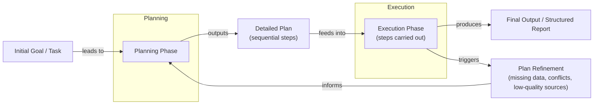
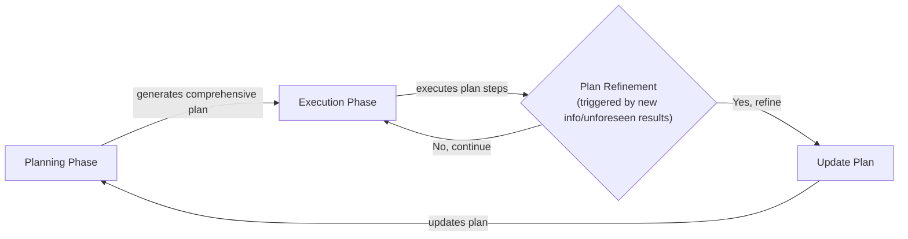
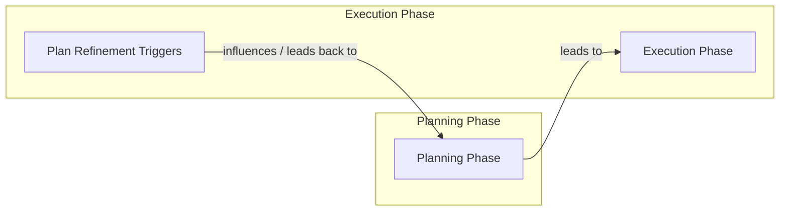
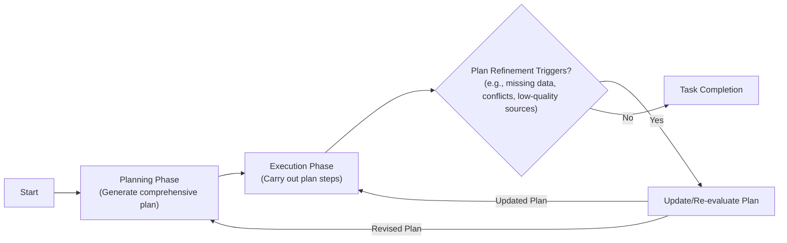
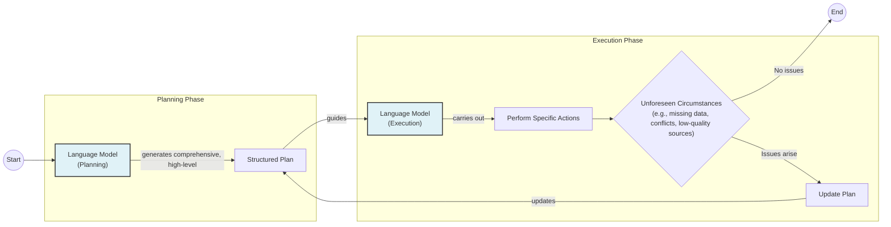
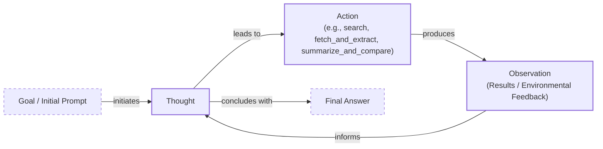
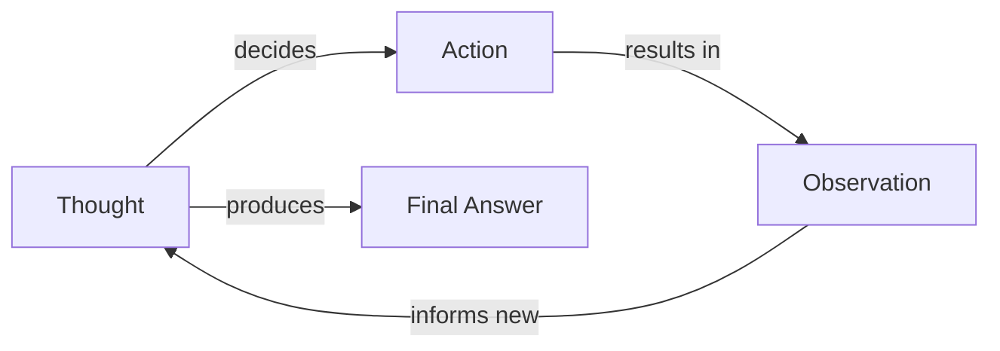
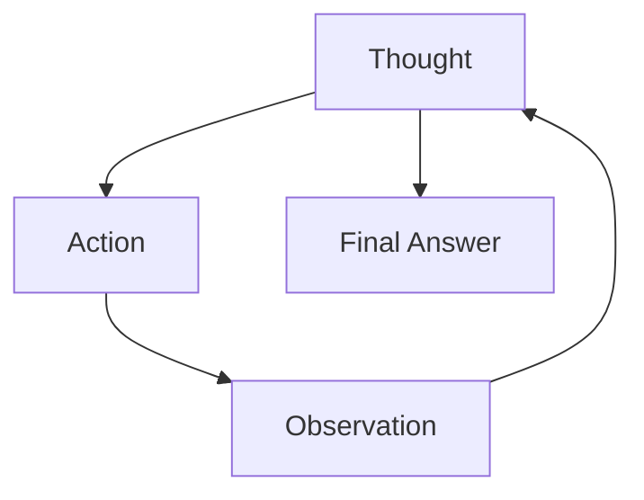
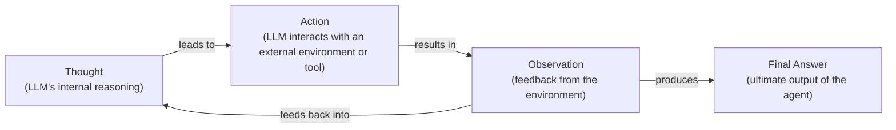
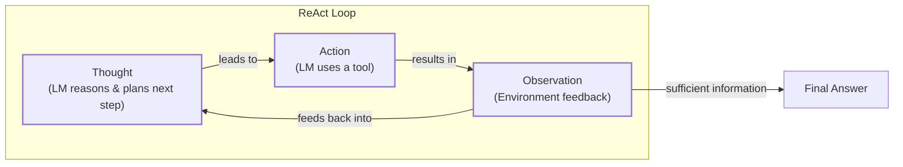

# Near-tie review: 07_reasoning_planning  (deep vs skip, margin=+0.0007)

## Reviewer conclusion (2026-09-05): GENUINE TIE -- both `skip` and `deep` are statistically indistinguishable

**What changed:** `article_oracle.json` was very stale (2026-08-25, pre-dating a
full re-grading round of all 12 episode dirs) and has been regenerated. This is
NOT a small refinement -- the whole reward landscape compressed dramatically:
R_w=[skip=0.077, light=0.038, standard=0.052, **deep=0.078**], reward_spread
collapsed from the prior review's much wider range down to just **0.040**
(the tightest 4-way spread of any near-tie reviewed this whole session). The
oracle itself **flipped from `skip` to `deep`**, but by a margin of only
**+0.0007** -- about 44x smaller than the noise threshold
(`ARTICLE_MARGIN_NOISE_SD/sqrt(3)=0.0312`). `needs_review` correctly stays
`true`.

**Distributional basis:** per-draw margins (skip - deep) are **[-0.0026,
-0.0071, +0.0076]** -- production and replicate1 favor deep (both by very
thin amounts), replicate2 favors skip. 2 of 3 draws favor deep, but every
single draw's margin is tiny and comparable in magnitude to the others (no
draw is an order-of-magnitude outlier the way Bird_Eye_Extreme's replicate2
was) -- this is a genuine, evenly-split disagreement across draws, not one
noisy draw contaminating an otherwise-clear vote. Moderated significance:
t=-0.161, p(two-tailed)=0.887 -- as close to a pure coin flip as this whole
investigation has measured; there is essentially zero statistical evidence
either arm is really better.

**Quantitative basis (skip vs deep, n=24 sections-draws per arm):** `cp`
tied at 1.000. `cc` nearly tied (0.917 skip vs 0.958 deep, a small deep
edge). `fl` tied at 0.500 for BOTH arms -- interesting on its own: half of
`deep`'s drafts have a flow defect (mostly the recurring "missing media
placement" issue flagged in the reasoning), while `skip` independently has
its own flow issues in half its drafts too, for unrelated reasons. The real
story is the other two dimensions pulling in opposite directions and nearly
perfectly cancelling: `de`/`be` are 0 for skip by construction (zero
exploration rounds -> no exploration-phase sources to trace to) but real for
deep (de=0.583, be=0.500) -- deep earns genuine extra depth/breadth credit,
exactly as expected from its extra research. But `ga` favors **skip**
(0.833 vs deep's 0.667) -- deep's longer, exploration-enriched sections trip
more guideline-adherence violations (word-count overages, the recurring
"Pros and Cons" section going missing entirely in every deep draft this
round -- see S7's `cc`=0 "section MISSING" findings). Net effect: deep's
real content-enrichment gain is almost exactly offset by its guideline-
adherence cost, landing the two arms within noise of each other.

**Decision:** this is a genuine dead heat, not a case where one method is
secretly better and the numbers just haven't converged yet -- both the
per-draw hard vote (2-1, not unanimous) and the mean-R_w argmax (flipped
this round, by a razor-thin margin) point in different directions from the
prior review, and neither is statistically distinguishable from the other
(p=0.887). No manual override is warranted in either direction. **Applied**:
`compute_article_oracle.py`'s `_TIED_ARMS` registry now has
`"07_reasoning_planning": ["skip"]` (`oracle_arm` stays `deep`, `skip` is
registered as an equally valid pick) -- `article_oracle.json` regenerated,
`tied_arms=["skip"]`/`tied_arm_indices=[0]` confirmed present. A prediction
of either `skip` or `deep` now scores EXACT HIT in `test_grok_planner.py`.

---

## All sections (deep vs skip), most-against-deep first
| section | weight | contribution | running total |
|---|---:|---:|---:|
| section-7-modern-reasoning-models-thinking-vs-answ | 0.236 | -0.0242 | -0.0242 |
| section-5-plan-and-execute-in-depth-plan-execution | 0.220 | -0.0226 | -0.0469 |
| section-4-react-in-depth-loop-evolving-example-pro | 0.142 | -0.0145 | -0.0614 |
| section-2-teaching-models-to-think-chain-of-though | 0.094 | -0.0065 | -0.0680 |
| section-6-where-this-shows-up-in-practice-deep-res | 0.079 | +0.0007 | -0.0673 |
| section-1-what-a-non-reasoning-model-does-and-why- | 0.094 | +0.0153 | -0.0520 |
| section-8-advanced-agent-capabilities-enabled-by-p | 0.071 | +0.0242 | -0.0277 |
| section-3-separating-planning-from-answering-found | 0.063 | +0.0284 | +0.0007 |

(stored article margin = +0.0007 -- should match the running total's final row to ~4 decimals)

## Section: S7::section-7-modern-reasoning-models-thinking-vs-answer-streams-and-interleaved-thinking  (weight=0.236, contribution=-0.0242 AGAINST deep)
Stored section rewards: deep=-0.1026  skip=0.0000  (explore: deep=0.0000  skip=0.0000)

### Arm: deep (preset3)

#### Draw: production  `/mnt/f/my_projects/agentic_AI_RL/Reinsearch_agent/RL_researcher_writer_ymaxing/rl_training_data/test_episodes/07_reasoning_planning__preset3`

**Article text:**
```
## Modern Reasoning Models: Thinking vs. Answer Streams and Interleaved Thinking

As LLMs have become more powerful, they have started to internalize some of the planning and reasoning structures that we previously had to engineer with explicit loops. Modern reasoning models, such as OpenAI's o-series or Anthropic's Claude 3.5 Sonnet, are often trained to separate their internal thought process from their final output, creating two distinct streams: a private "thinking" stream and a public "answer" stream [[21], [23]].

When you send a complex query to one of these models, it does not immediately start generating the answer. Instead, it first generates a series of "thoughts" in a private, internal space. This is similar to the `Thought` step in the ReAct pattern. During this phase, the model can decompose the problem, formulate a plan, and decide which tools to use [[22]]. Some models explicitly use tags like `<think>` and `</think>` to delineate this internal monologue before producing the final output between `<answer>` and `</answer>` tags [[23]]. Only after this internal reasoning process is complete does it begin to generate the final, user-facing answer or execute a tool call.

This "think-first" behavior is a significant step forward, but the most advanced models are now capable of something even more dynamic: **interleaved thinking**. With interleaved thinking, the model does not just plan once at the beginning. Instead, it can pause, think, act, and then think again based on the result of its action. For example, after a tool call returns new data, the model can generate new thinking tokens to analyze that data, update its plan, and decide on the next action. This allows for a much more flexible and adaptive reasoning process, closely mirroring the ReAct loop but happening more implicitly within the model's own generation process. Anthropic's models, for instance, support this through a dedicated `thinking` block in their API responses, which contains the model's reasoning trace [[36]].

A recent innovation in this area is **asynchronous reasoning**, a training-free approach that allows a model to think, listen for new user input, and generate its response concurrently [[21]]. This is achieved by using properties of rotary positional embeddings to manage three separate token streams—user input, private thoughts, and public response—as a single sequence. This "dual view" allows the thinking stream and the response stream to attend to each other's tokens as they are generated. The model can even be prompted to decide for itself whether it needs to pause the public response to "think" longer, making the interaction feel more natural and real-time, which is particularly beneficial for applications like voice assistants [[21]]. This technique can also be used for real-time safety checks, where the model reasons about the safety of a request in the background without delaying benign responses.

For an engineer, interacting with these streams provides a powerful debugging and control mechanism. The "thinking" stream can be logged to trace the agent's logic, or even streamed to a user interface to provide a real-time view of the agent's progress, like "Now searching for X..." or "Analyzing results from Y...". This transparency builds user trust and makes it easier to identify the source of errors.

However, this increased reasoning capability does not automatically lead to greater factuality. Paradoxically, some of the most advanced reasoning models have been observed to hallucinate *more* often than their predecessors. Internal OpenAI tests, for example, found that models like o3 hallucinated in response to 33% of questions on the PersonQA benchmark, roughly double the rate of previous models. The exact reasons are still being researched, but one hypothesis is that because these models make more claims overall as part of their long reasoning process, they create more opportunities to make inaccurate ones [[39], [40]].

What does this mean for us as AI engineers? Does this make patterns like ReAct and Plan-and-Execute obsolete? Not at all. Even with models that have powerful internal reasoning, explicit agentic loops remain essential for building reliable and controllable systems. The separation of reasoning and answering, whether managed by an external framework or exposed by the model's API, is crucial for debugging. When an agent fails, we need to inspect its thought process to understand why. Explicit control loops also give us the power to enforce guardrails, manage state, and ensure the agent's behavior aligns with our requirements.
```
**Grader reasoning:**
- `cc`: Deep Research–Style Systems:
**1:** Reversed from the original's 0. GT's Anthropic multi-agent-system mention is a hedged passing reference ('Some implementations, such as...'), not a load-bearing idea, per the established reading of the named-example rule applied throughout this project. Everything else (decomposition, iterative cycle, hybrid tie-back, recurring-example tie-in, plus well-anchored legal and multimodal extensions) is fully present.
_(matched by ordinal position -- title text didn't match)_
- `fl`: Deep Research–Style Systems:
**0:** Confirmed, unchanged, same precedent (missing Mermaid flowchart at end of section).
_(matched by ordinal position -- title text didn't match)_
- `de`: Deep Research–Style Systems:
**0:** [instances=0] The legal and multimodal additions are breadth (see below), not depth -- they do not deepen understanding of the core deep-research mechanism itself.
_(matched by ordinal position -- title text didn't match)_
- `be`: Deep Research–Style Systems:
**1:** [instances=1; quality=strong] Reconsidered per clustering review: this is one instance, not two. 'Beyond web research, these patterns are being applied in specialized professional domains. In legal reasoning, for instance... [[38]]. An emerging trend is the expansion... into multimodal domains... [[43]]' follows the same pattern: one lead-in claim (planning patterns apply beyond web research to specialized domains), followed by two supporting examples (legal, multimodal) of that same claim, not two independently-headed breadth expansions. Classified strong: named domains with concrete detail.
_(matched by ordinal position -- title text didn't match)_
- `cp`: Deep Research–Style Systems:
**1:** breadth_enhancement=1 (one instance, per the clustering review). Roughly two sentences within a 355-word section; the decomposition/iterative-cycle/hybrid-architecture discussion remains the section's dominant focus.
_(matched by ordinal position -- title text didn't match)_
- `ga`: Modern Reasoning Models Thinking vs Answer Streams and Interleaved Thinking:
**1:** Confirmed. Exact word count: 708 words against 700-800 (range 630-880). Within range.

#### Draw: replicate1  `/mnt/f/my_projects/agentic_AI_RL/Reinsearch_agent/RL_researcher_writer_ymaxing/rl_training_data/noise_experiment/07_reasoning_planning__replicate1__preset3`

**Article text:**
```
## Modern Reasoning Models Thinking vs Answer Streams and Interleaved Thinking

The evolution of AI models has led to a tighter integration of reasoning and planning capabilities directly into their architecture. Instead of relying solely on external orchestration frameworks to guide their thought processes, modern reasoning models are explicitly trained to think before they speak [[22]](https://www.ibm.com/think/topics/reasoning-model). This is often implemented through a dual-stream generation process:

1.  A **private "thinking" stream**, where the model generates its internal monologue, chain-of-thought reasoning, or step-by-step plan. This content is not typically shown to the end-user but is used by the model to structure its response [[23]](https://cameronrwolfe.substack.com/p/demystifying-reasoning-models).
2.  A **public "answer" stream**, which contains the final, polished response intended for the user.

This separation allows the model to perform extensive computation and reasoning "behind the scenes" before delivering a coherent answer. Some models operate in a "think first" mode, where the entire reasoning process is completed before any part of the final answer is generated. This is similar to the Plan-and-Execute pattern but happens internally within a single model call.

A more advanced capability is **interleaved thinking**. With this feature, the model can alternate between thinking and generating its public answer. For example, after receiving the results of a tool call, the model can generate new private "thinking" tokens to analyze those results and update its plan before continuing to write the final response. This creates a tight, dynamic feedback loop that combines the adaptability of ReAct with the efficiency of an integrated model architecture.

For example, when a voice assistant is asked a question, it can start providing an initial response while simultaneously thinking more deeply in the background. If its background reasoning uncovers a more complex answer, it can pause the public response, "think" for a moment longer, and then resume with a more accurate and detailed answer [[21]](https://arxiv.org/html/2512.10931v1). This asynchronous process, shown in the image below, reduces perceived latency while retaining the benefits of deep reasoning.
Image 3: A model can generate its response concurrently with thinking. If the thinking stream needs more time, it can pause the writer until the next reasoning step is ready. (Source [Asynchronous Reasoning: Training-Free Interactive Thinking LLMs [21]](https://arxiv.org/html/2512.10931v1))

However, this increased reasoning capability does not come without trade-offs. Counter-intuitively, some of the most advanced reasoning models, like OpenAI's o3 and o4-mini, have been found to hallucinate *more* often than their predecessors. On one internal benchmark, o3 hallucinated in 33% of responses, roughly double the rate of previous models, and the company has stated that "more research is needed" to understand why [[44]](https://techcrunch.com/2025/04/18/openais-new-reasoning-ai-models-hallucinate-more). This is a critical reminder that more powerful reasoning does not automatically equate to more factual reliability.

What does this mean for AI engineers? The rise of integrated reasoning models has significant implications for system design. While these models may reduce the need to build explicit ReAct or Plan-and-Execute loops from scratch, the underlying principles of planning, acting, and verification remain as crucial as ever. Relying on a model's implicit reasoning without proper oversight can be risky. The separation of "thinking" and "answer" streams, even when internal to the model, provides a valuable abstraction for debugging and control. By inspecting the private reasoning traces, you can gain insight into why a model made a particular decision, identify logical errors, and refine your prompts to guide its behavior.

Furthermore, even the most advanced reasoning models benefit from a structured environment. You still need to provide clear instructions, well-documented tools, and robust guardrails to ensure reliable performance. For high-stakes applications, an external verification loop, where the agent's proposed actions or conclusions are checked against a set of rules or an external data source, is often necessary. The internal reasoning of the model should be seen as a powerful starting point, not a substitute for a well-architected system. Ultimately, the goal is to find the right balance between leveraging the model's native capabilities and imposing the necessary structure to ensure your agent is reliable, predictable, and safe. With these powerful planning abilities in place, agents can unlock even more advanced capabilities.
```
**Grader reasoning:**
- `cc`: Deep Research–Style Systems:
**1:** Both sections cover decomposition into sub-goals, an iterative search/extract/verify cycle, explicit verification policies against hallucination, the recurring-example tie-in, and a hybrid ReAct/Plan-and-Execute tie-back that closely mirrors the expected section's own framing. Per the established reading of the named-example rule, the expected section's hedged Anthropic multi-agent-system mention is a passing mention whose absence is not a substantive-idea omission. The legal-reasoning and multimodal-planning additions are accepted complementary breadth additions that do not displace any expected idea.
_(matched by ordinal position -- title text didn't match)_
- `fl`: Deep Research–Style Systems:
**0:** The order of ideas present (decomposition, iterative cycle, legal/multimodal extensions, hybrid architecture) matches the expected progression, and the closing transition to models internalizing 'thinking'/'answer' streams closely mirrors the expected wording. However, the expected section places a Mermaid flowchart at the very end of the section, and no diagram of any kind appears anywhere in the generated section -- a missing media element.
_(matched by ordinal position -- title text didn't match)_
- `de`: Deep Research–Style Systems:
**0:** [instances=0] No addition in this section is traceable to any of the eight used exploration-phase query threads in research.md (information-theoretic planning limits, ReAct scalability/production failure modes, o3 hallucination increase, self-correction open challenges, symbolic-AI influence on ReAct, control-theory framing of self-correction, multimodal planning expansion, or legal-reasoning applications), so no qualifying instance exists here.
_(matched by ordinal position -- title text didn't match)_
- `be`: Deep Research–Style Systems:
**1:** [instances=1; quality=strong] Reconsidered per clustering review: the original counted 2 instances; this is now 1. 'These principles extend beyond text-based research' is a single lead-in claim, followed by two supporting examples (legal tech, multimodal expansion) of that same claim, not two independently-headed breadth expansions -- the same pattern already consolidated elsewhere in this project. Traceable to the exploration-phase sources on legal-reasoning applications ([[42]]) and multimodal planning expansion ([[43]]). Classified strong: named domains with concrete architectural detail.
_(matched by ordinal position -- title text didn't match)_
- `cp`: Deep Research–Style Systems:
**1:** breadth_enhancement scored 1 for the legal-reasoning and multimodal-planning additions. Together these are roughly 40-50 words within a 300-word section; the decomposition, iterative-cycle, and hybrid-architecture discussion remain the section's clearly dominant focus, so the additions are scored as supporting rather than diluting the ground-truth core.
_(matched by ordinal position -- title text didn't match)_
- `ga`: Modern Reasoning Models Thinking vs Answer Streams and Interleaved Thinking:
**1:** The two-stream framing, think-first behavior, interleaved-thinking behavior, and the implications-for-system-design discussion are all present. Unlike most other presets, this section explicitly draws both analogies the guideline's own Section 7 content implies are useful context (think-first likened to Plan-and-Execute; interleaved thinking likened to ReAct). Borderline: prose-only word count is 621 words against a 700-800 target (effective floor ~630), about 9 words under -- small enough to plausibly be word-counting-methodology noise.

#### Draw: replicate2  `/mnt/f/my_projects/agentic_AI_RL/Reinsearch_agent/RL_researcher_writer_ymaxing/rl_training_data/noise_experiment/07_reasoning_planning__replicate2__preset3`

**Article text:**
```
## Modern Reasoning Models Thinking vs Answer Streams and Interleaved Thinking

The evolution of AI models is increasingly blurring the lines between explicit prompting frameworks like ReAct and the inherent capabilities of the models themselves. Modern reasoning models, such as OpenAI's o-series or Anthropic's Claude 3.5 Sonnet, are specifically trained to integrate planning and reasoning directly into their generation process [[13]](https://www.ibm.com/think/topics/reasoning-model), [[22]](https://developers.openai.com/api/docs/guides/reasoning-best-practices).

A key architectural innovation is the separation of a model's output into two distinct streams: a private "thinking" stream and a public "answer" stream [[23]](https://arxiv.org/html/2512.10931v1), [[12]](https://cameronrwolfe.substack.com/p/demystifying-reasoning-models). The thinking stream contains the model's internal monologue or chain of thought. This includes its step-by-step reasoning, plan adjustments, and analysis of intermediate results. The answer stream contains the final, user-facing response. This logical separation allows the model to "think" extensively without cluttering the final output, providing the benefits of CoT without the parsing challenges [[12]](https://cameronrwolfe.substack.com/p/demystifying-reasoning-models). However, this advanced reasoning capability does not automatically reduce errors like hallucination. In fact, OpenAI’s own testing revealed that their o3 and o4-mini reasoning models hallucinated *more* often than previous-generation models. One analysis found o3 invented actions it could not perform, such as claiming it ran code on a specific machine "outside of ChatGPT" [[24]](https://techcrunch.com/2025/04/18/openais-new-reasoning-ai-models-hallucinate-more). This suggests that as models generate more complex reasoning, they also create more opportunities for making inaccurate claims, a challenge that remains an active area of research [[25]](https://arxiv.org/html/2505.23646v1).

This dual-stream architecture enables more sophisticated behaviors. For instance, some models are trained to "think first," generating a complete internal plan before producing any part of the final answer [[13]](https://www.ibm.com/think/topics/reasoning-model). This is akin to a built-in Plan-and-Execute mechanism. Other models support **asynchronous reasoning**, where the model can generate its public response concurrently while continuing to think privately in the background. This is achieved by using properties of rotary positional embeddings to make the LLM perceive the concurrent streams as a single sequence, without additional training. In this setup, the thinking stream can even "pause" the writer if it needs more time to work through a complex sub-problem, ensuring the final answer is well-reasoned [[23]](https://arxiv.org/html/2512.10931v1). The model itself decides when to pause by periodically being prompted with a question like, "Wait, are my thoughts ahead of the response by enough to continue writing it? (yes/no)". Based on the probability of the next token, the system either continues writing or pauses [[23]](https://arxiv.org/html/2512.10931v1).

A particularly powerful capability emerging from this is **interleaved thinking**. Instead of a single, monolithic thinking phase, the model can interleave thinking and acting. After calling a tool and receiving an observation, the model can generate new thinking tokens to analyze the result and decide on the next action [[26]](https://docs.anthropic.com/en/docs/build-with-claude/extended-thinking#interleaved-thinking). This effectively builds the ReAct loop directly into the model's behavior, allowing for more dynamic and responsive reasoning without requiring an external orchestration loop. For example, a model could use a tool to get stock data, think about the implications of that data, and then decide to call another tool to execute a trade, all within a single turn. In effect, these models internalize the agentic loop, functioning as implicit Plan-and-Execute systems where the reasoning trace is hidden but the model is planning before acting [[14]](https://www.agentengineering.io/topics/articles/react-loop-unpacked).

What does this mean for AI engineers? While these advanced models handle much of the planning implicitly, the underlying principles of structuring thought remain the same. You may rely less on explicit, hand-crafted loops, but you still need to provide clear instructions, well-defined tools, and robust guardrails to ensure reliability. The separation of thinking and answering, even when managed by the model, remains a powerful concept for debugging and maintaining control. With these foundational reasoning abilities in place, agents can unlock even more advanced capabilities like goal decomposition and self-correction.
```
**Grader reasoning:**
- `cc`: Deep Research–Style Systems:
**1:** Both sections cover decomposition into sub-goals, a detailed iterative search/read/verify cycle (with a specific, accurate tool-suite description), explicit verification policies against hallucination, the recurring-example tie-in, and a hybrid tie-back consistent with the ground truth's own blended framing (this article's version explicitly maps the execution phase to ReAct's Thought/Action/Observation cycle and separately notes 'other implementations might lean more towards a Plan-and-Execute model'). Naming 'OpenAI's Deep Research' directly is non-disqualifying per the established reading of the named-example rule.
_(matched by ordinal position -- title text didn't match)_
- `fl`: Deep Research–Style Systems:
**0:** The order of ideas present (decomposition, iterative cycle, verification, hybrid architecture) matches the expected progression, and the closing transition to models generating 'thinking'/'answer' streams closely mirrors the expected wording. However, the expected section places a Mermaid flowchart at the very end of the section, and no diagram of any kind appears anywhere in the generated section -- a missing media element.
_(matched by ordinal position -- title text didn't match)_
- `de`: Deep Research–Style Systems:
**0:** [instances=0] No addition in this section is traceable to any of the used exploration-phase query threads in research.md, so no qualifying instance exists here.
_(matched by ordinal position -- title text didn't match)_
- `be`: Deep Research–Style Systems:
**0:** [instances=0] No addition in this section is traceable to any of the used exploration-phase query threads in research.md, so no qualifying instance exists here.
_(matched by ordinal position -- title text didn't match)_
- `cp`: Deep Research–Style Systems:
**1:** Both depth_enhancement and breadth_enhancement scored 0 for this section because no qualifying exploration-traceable addition was identified here. Per the mandatory default rule, CorePreservation scores 1 by default.
_(matched by ordinal position -- title text didn't match)_
- `ga`: Modern Reasoning Models Thinking vs Answer Streams and Interleaved Thinking:
**0:** The two-stream framing, think-first and interleaved-thinking behaviors (each explicitly connected to Plan-and-Execute/ReAct respectively), and the implications-for-system-design discussion are all present -- the guideline itself does not require this explicit labeling, but it is present regardless. However, prose-only word count is 593 words against a 700-800 target (±10%, floor 25 -> effective floor ~630), about 37 words under -- large enough to be a genuine, non-marginal violation rather than plausible counting noise.

### Arm: skip (preset0)

#### Draw: production  `/mnt/f/my_projects/agentic_AI_RL/Reinsearch_agent/RL_researcher_writer_ymaxing/rl_training_data/test_episodes/07_reasoning_planning__preset0`

**Article text:**
```
## Modern Reasoning Models Thinking vs Answer Streams and Interleaved Thinking

The evolution of LLMs is increasingly blurring the lines between explicit prompting patterns and inherent model capabilities. Modern reasoning models are now being specifically trained to integrate planning and reasoning directly into their generation process, making some of the patterns we have discussed more implicit [[22]](https://www.ibm.com/think/topics/reasoning-model).

A key architectural innovation in these models is the separation of their output into two distinct streams: a private "thinking" stream and a public "answer" stream [[23]](https://cameronrwolfe.substack.com/p/demystifying-reasoning-models), [[21]](https://arxiv.org/html/2512.10931v1).

-   **The Thinking Stream:** This is where the model generates its internal monologue or chain of thought. It breaks down the problem, formulates a plan, considers different approaches, and decides which tools to use. This stream is often hidden from the end-user but is important for the model's reasoning process. This is often implemented using special tokens like `<think>` and `</think>` to logically separate the reasoning from the final output [[23]](https://cameronrwolfe.substack.com/p/demystifying-reasoning-models).
-   **The Answer Stream:** This is the public-facing output that the user sees. It is the polished, final response, generated based on the conclusions reached in the thinking stream.

This separation allows models to "think before they speak," leading to more coherent and accurate responses. Some models follow a "think first" approach, where they generate a complete reasoning trace in the thinking stream before producing the final output and any tool calls. This is analogous to the Plan-and-Execute pattern, but it happens internally within a single model call.

More advanced models support what is known as **interleaved thinking**. In this paradigm, the model can switch back and forth between thinking and acting. For example, it might generate a thought, call a tool, and then generate a new thought based on the tool's output before continuing with its final answer [[25]](https://docs.anthropic.com/en/docs/build-with-claude/extended-thinking#interleaved-thinking). This behavior is very similar to the ReAct loop, but it is a native capability of the model rather than something orchestrated by an external loop in your code. This allows for more sophisticated reasoning, as the model can dynamically adjust its plan based on intermediate results from tool calls.

An even more advanced concept is **asynchronous reasoning**. Here, the model can think, listen for new user input, and generate its public response concurrently. The thinking stream can even pause the public response stream if it needs more time to work through a complex step [[21]](https://arxiv.org/html/2512.10931v1). This is achieved through clever manipulation of the model's attention mechanism, creating different "views" of the token sequence for the thinker and the writer. The model itself can be prompted to decide when to pause, for instance, by asking it, "Are my thoughts ahead of the response by enough to continue writing it? (yes/no)". This allows for a more interactive and real-time user experience without sacrificing the depth of reasoning.

This dual-view approach allows both the thinking and response streams to immediately attend to each other's tokens as they are generated. The response can summarize the latest private thoughts without delay, while the thinking stream can see the current response and pause it if more thought is needed. This is made possible by manipulating positional encodings, like RoPE, to rearrange tokens dynamically without physically reordering them in memory. This allows the model to perceive multiple asynchronous streams as a single, contiguous sequence.

What are the implications of this for you as an AI engineer? As models become better at implicit planning, you may need to write less code to manage explicit ReAct or Plan-and-Execute loops. However, this does not make these patterns obsolete. Understanding the separation between reasoning and answering is still important for debugging and maintaining control.

Even if the model handles the loop internally, you still need to provide it with well-designed tools, clear system prompts, and robust guardrails to ensure it behaves reliably. The explicit patterns we have discussed provide a mental model for how these more advanced agents operate, making it easier to design, test, and troubleshoot them. With a solid foundation in planning and reasoning, agents unlock advanced capabilities that are essential for true autonomy, such as goal decomposition and self-correction.
```
**Grader reasoning:**
- `cc`: Deep Research–Style Systems:
**1:** REVERSED from the original's 0. The original's sole cited reason was the absence of the GT's Anthropic multi-agent-system sentence ('a lead agent that coordinates multiple subagents working in parallel'). Per the established reading of the named-example rule (applied consistently across every other preset reviewed in this project), that GT sentence is explicitly hedged as 'Some implementations, such as...' -- a passing mention, not the section's primary demonstration vehicle -- so its absence is not a substantive-idea omission. Everything else in the section (sub-goal decomposition, iterative cycle, hybrid tie-back closely matching the GT's own 'many...others...' framing, recurring-example tie-in, transition) is fully present.
_(matched by ordinal position -- title text didn't match)_
- `fl`: Deep Research–Style Systems:
**0:** Reverted per ruling: this media absence is treated as a genuine Flow failure. The expected section places a Mermaid flowchart at the very end of the section; the generated section has no diagram of any kind. Missing media placement failure.
_(matched by ordinal position -- title text didn't match)_
- `de`: Deep Research–Style Systems:
**0:** [instances=0] No exploration-phase sources exist for this episode (research.md contains only phase="exploitation" sources -- confirmed identical to every other preset-0 replicate reviewed in this project). Score mandated to 0.
_(matched by ordinal position -- title text didn't match)_
- `be`: Deep Research–Style Systems:
**0:** [instances=0] No exploration-phase sources exist for this episode (research.md contains only phase="exploitation" sources -- confirmed identical to every other preset-0 replicate reviewed in this project). Score mandated to 0.
_(matched by ordinal position -- title text didn't match)_
- `cp`: Deep Research–Style Systems:
**1:** Both depth_enhancement and breadth_enhancement scored 0. CorePreservation scores 1 by default per the mandatory default rule.
_(matched by ordinal position -- title text didn't match)_
- `ga`: Modern Reasoning Models Thinking vs Answer Streams and Interleaved Thinking:
**1:** Confirmed. Content requirements fully met. Exact prose-only word count: 660 words against a 700-800 target (±10%, floor 25 -> range 630-880). Within range. (Original's approximate ~665 was already essentially exact.)

#### Draw: replicate1  `/mnt/f/my_projects/agentic_AI_RL/Reinsearch_agent/RL_researcher_writer_ymaxing/rl_training_data/noise_experiment/07_reasoning_planning__replicate1__preset0`

**Article text:**
```
## Modern Reasoning Models: Thinking vs Answer Streams and Interleaved Thinking

The evolution of agentic patterns like ReAct and Plan-and-Execute has directly influenced how the next generation of LLMs are trained. Instead of relying solely on external scaffolding to separate thought from action, modern reasoning models are increasingly designed to perform this separation internally. This is achieved by training them to produce two distinct types of output: a private "thinking" stream and a public "answer" stream. This logical separation is often implemented using special tokens, such as `<think>` and `</think>`, which wrap the model's internal reasoning process and keep it distinct from the final, user-facing `<answer>` [[19]](https://cameronrwolfe.substack.com/p/demystifying-rethinking-models).

The thinking stream is analogous to the "Thought" step in ReAct. It contains the model's internal monologue, where it breaks down the problem, formulates a plan, and reasons through intermediate steps. This stream is not typically shown to the end-user but is crucial for the model's internal process and for developers to debug its behavior. The answer stream is the final, user-facing output, which is generated based on the conclusions reached in the thinking stream [[19]](https://cameronrwolfe.substack.com/p/demystifying-rethinking-models).

Some models adopt a "think first" approach, which mirrors the Plan-and-Execute pattern. The model generates a complete chain of thought in its private thinking stream before producing any part of the final answer. This ensures a full plan is in place before execution begins [[18]](https://www.ibm.com/think/topics/reasoning-model).

More advanced models now support **interleaved thinking**, which is a native implementation of the ReAct loop. In this mode, the model can alternate between thinking, acting (e.g., calling a tool), and writing. For instance, after a tool call, the model can generate new private thinking tokens to process the tool's output and decide on the next step before continuing to write the final answer. This creates a much more dynamic and responsive reasoning process, allowing the model to adapt its plan based on intermediate results without needing an external loop to manage the flow. This capability is often enabled automatically in the latest models, particularly when using adaptive thinking modes [[29]](https://docs.anthropic.com/en/docs/build-with-claude/extended-thinking#interleaved-thinking).

A recent innovation, called **Asynchronous Reasoning**, takes this a step further by allowing the thinking and answer streams to be generated concurrently. The model can start writing its answer based on its initial thoughts while continuing to reason and refine its plan in the background. This is accomplished by using properties of rotary positional embeddings to make the LLM perceive three concurrent token streams (user inputs, private thoughts, and public response) as a single sequence, without additional training. The model itself can decide whether to continue writing or to pause and think more, depending on the state of the streams [[17]](https://arxiv.org/html/2512.10931v1).

This technique allows the model to periodically check if its private thoughts are ahead of the public response. It does this by inserting a special prompt into the thinking stream (e.g., "Wait, are my thoughts ahead of the response by enough to continue writing it? (yes/no):"). If the model is more likely to generate "yes," it continues writing. If "no" is more likely, it pauses the response stream to allow the thinking process to catch up. This self-regulating mechanism reduces latency and creates a more fluid, human-like interaction, reducing the time to the first user-visible token from minutes to seconds in complex tasks [[17]](https://arxiv.org/html/2512.10931v1).

What does this mean for you as an AI engineer? While these modern models internalize much of the planning logic, your role does not disappear. You may need to write less code to manage explicit loops, but you still need to provide high-quality prompts, well-defined tools, and robust guardrails to ensure the agent behaves reliably. The separation of reasoning and answering, whether managed externally or internally, remains a vital concept for debugging, controlling, and trusting your agent's behavior. With these powerful planning capabilities in place, agents can enable even more advanced behaviors like goal decomposition and self-correction.
```
**Grader reasoning:**
- `cc`: Deep Research–Style Systems:
**1:** Reexamined per request. Both sections cover the same core, load-bearing ideas: decomposing a complex query into sub-goals, an iterative search/extract/verify cycle, explicit verification policies, a hybrid Plan-and-Execute/ReAct architecture, and the recurring conflicting-adoption-rate example used as the verification trigger. The expected section's Anthropic multi-agent-system sentence is explicitly hedged as 'Some implementations, such as...' -- per the FollowsGT criterion's own named-example rule, a non-trivial named example only forces a content mismatch when it 'plays a central role in illustrating the main idea of the section (not merely mentioned in passing)' and is 'the primary vehicle through which the section's core concept is demonstrated.' This sentence is explicitly framed as one optional instance among 'some implementations' rather than as the section's central demonstration vehicle -- the section's actual core argument (decomposition + iterative verification + hybrid architecture) is fully demonstrated without it via the shared edge-AI example. Its absence is therefore a passing-mention omission, not a substantive-idea omission. By the same logic, naming 'OpenAI's Deep Research' once as a concrete illustration (where the expected section stays generic) is not a disqualifying scope-narrowing, since the substantive discussion that follows stays general and keeps reusing the shared edge-AI example rather than committing to OpenAI-specific proprietary detail.
_(matched by ordinal position -- title text didn't match)_
- `fl`: Deep Research–Style Systems:
**0:** The order of ideas that are present (decomposition, iterative verification cycle, hybrid architecture) matches the expected progression. However, the expected section places a Mermaid flowchart at the very end of the section, and no diagram of any kind appears anywhere in the generated section -- a missing media element.
_(matched by ordinal position -- title text didn't match)_
- `de`: Deep Research–Style Systems:
**0:** [instances=0] No exploration-phase sources were gathered for this episode, so this score is mandated to 0: depth_enhancement and breadth_enhancement only credit additions traceable to an exploration-phase source, and none exist to trace to (research.md contains only phase="exploitation" sources).
_(matched by ordinal position -- title text didn't match)_
- `be`: Deep Research–Style Systems:
**0:** [instances=0] No exploration-phase sources were gathered for this episode, so this score is mandated to 0: depth_enhancement and breadth_enhancement only credit additions traceable to an exploration-phase source, and none exist to trace to (research.md contains only phase="exploitation" sources).
_(matched by ordinal position -- title text didn't match)_
- `cp`: Deep Research–Style Systems:
**1:** Both depth_enhancement and breadth_enhancement scored 0 for this section because no exploration-phase sources exist for this episode (research.md contains only phase="exploitation" sources). Per the mandatory default rule, CorePreservation scores 1 by default.
_(matched by ordinal position -- title text didn't match)_
- `ga`: Modern Reasoning Models Thinking vs Answer Streams and Interleaved Thinking:
**1:** The two-stream framing, the think-first mode paralleling Plan-and-Execute, interleaved thinking paralleling ReAct, the implications-for-system-design discussion (guardrails/prompts still needed; separation still useful for debugging/control), and the transition to Section 8 are all present. The Asynchronous Reasoning addition is closely related to interleaved thinking, not an unrelated topic, so it does not count against this criterion. Borderline: prose-only word count is 627 words against the 700-800 target (±10%, floor 25 words -> effective floor ~630), landing about 3 words below the computed tolerance floor -- a very marginal miss given normal word-count-methodology variance.

#### Draw: replicate2  `/mnt/f/my_projects/agentic_AI_RL/Reinsearch_agent/RL_researcher_writer_ymaxing/rl_training_data/noise_experiment/07_reasoning_planning__replicate2__preset0`

**Article text:**
```
## Modern Reasoning Models Thinking vs Answer Streams and Interleaved Thinking

The effectiveness of patterns like ReAct and Plan-and-Execute has not gone unnoticed by AI researchers. Modern reasoning models from labs like OpenAI, Google, and Anthropic are now being explicitly trained to incorporate these behaviors natively. Instead of relying solely on clever prompting to coax out a reasoning process, these models are designed from the ground up to think before they speak.

### The Dual Stream Architecture

A key architectural innovation is the separation of a model's output into two distinct streams: a private "thinking" stream and a public "answer" stream [[16]](https://cameronrwolfe.substack.com/p/demystifying-reasoning-models).

The **thinking stream** contains the model's internal monologue or chain of thought, often enclosed in special tags like `<think>` and `</think>` [[16]](https://cameronrwolfe.substack.com/p/demystifying-reasoning-models). This is where the model breaks down the problem, formulates a plan, considers alternatives, and processes the results of tool calls. This stream is analogous to the `Thought` steps in ReAct or the `Planning` phase in Plan-and-Execute.

The **answer stream** is the final, polished response intended for the user. It is generated based on the conclusions reached in the thinking stream. This separation allows the model to perform extensive, messy, and iterative reasoning in the background without cluttering the final output. For many production systems, this thinking trace is either hidden from the user or provided as a condensed summary to maintain a clean user experience while still offering a degree of transparency [[17]](https://www.ibm.com/think/topics/reasoning-model).

This dual-stream approach allows for a "Reasoning ON/OFF" toggle. Simple queries can be handled with a quick, single-shot response, while complex, multi-step tasks can trigger a full chain-of-thought pass. This is a critical optimization, as a reasoning-heavy pass can consume up to 100 times more compute and tokens than a direct answer [[18]](https://blogs.nvidia.com/blog/reasoning-ai-agents-decision-making/).

### Asynchronous and Interleaved Thinking

Some models take this separation a step further with **interleaved thinking**. Instead of generating one long thought process upfront, the model can think, produce a part of the answer or call a tool, and then generate new thinking tokens to process the result before continuing [[19]](https://www.anthropic.com/engineering/building-effective-agents). This is essentially a native, more tightly integrated version of the ReAct loop. For example, a model might think about which tool to call, use the tool, and then immediately enter another thinking phase to analyze the tool's output before deciding its next action or generating the next piece of the final answer [[20]](https://docs.anthropic.com/en/docs/build-with-claude/extended-thinking#interleaved-thinking).

Remarkably, recent research has shown it's possible to enable this concurrent, or **asynchronous**, thinking and writing behavior in existing models without any retraining. This is achieved through a clever manipulation of the model's internal architecture. The core idea is to create a dual "thinker" and "writer" view of the same underlying data. By dynamically rearranging the model's Key-Value (KV) cache and manipulating the positional encodings (specifically, Rotary Positional Embeddings or RoPE), the model can be made to perceive the thinking and answer streams as a single, contiguous sequence. This allows it to generate tokens for both streams in parallel [[21]](https://arxiv.org/html/2512.10931v1).

This technique also allows for **mode switching**, where the model itself can decide when to synchronize. The thinking stream can be periodically prompted with a question like, "Should I pause writing and think longer?" Based on the model's "yes/no" response probability, the answer stream can be paused until the thinking process catches up. This gives the model a degree of control over its own reasoning pace, allowing it to spend more time on difficult sub-problems [[21]](https://arxiv.org/html/2512.10931v1).

### Implications for AI Engineering

These advancements have important implications for system design. As models internalize planning and reasoning, the role of the AI engineer shifts. You may need to write less explicit code for managing loops and state, but the need for clear instructions, well-designed tools, and robust guardrails becomes even more pronounced. The focus moves from orchestrating the agent's every move to guiding its internal thought process. For example, instead of coding a ReAct loop, you might use a system prompt that instructs the model on how to structure its internal reasoning, when to use certain tools, and how to verify its own conclusions.

Furthermore, the separation of thinking and answer streams offers new opportunities for debugging and control. By inspecting the thinking stream, you can gain insight into why the model made a particular decision, making it easier to identify and correct errors. Some APIs even return an encrypted `signature` of the full thinking process, which can be passed back in subsequent turns to maintain reasoning continuity without cluttering the context window [[20]](https://docs.anthropic.com/en/docs/build-with-claude/extended-thinking#interleaved-thinking). This transparency is invaluable for building trust in autonomous systems. Even with powerful implicit planning, the explicit architectural patterns of ReAct and Plan-and-Execute remain useful mental models for designing, debugging, and controlling agent behavior. With these powerful planning and reasoning abilities in place, agents can achieve even more advanced capabilities.
```
**Grader reasoning:**
- `cc`: Deep Research–Style Systems:
**1:** Both sections cover decomposition into sub-goals, an iterative search/extract/verify cycle, explicit verification policies against hallucination, and the recurring-example tie-in. Per the established reading of the named-example rule, the expected section's hedged Anthropic multi-agent-system mention is a passing mention whose absence is not a substantive-idea omission; the generated section's own hedged 'like those developed by OpenAI and other research labs' phrasing is likewise not a disqualifying scope-narrowing. The hybrid-architecture tie-back is present in substance (planning phase decomposes, execution phase resembles a ReAct-style loop) though softer than the expected section's explicit two-sided 'many are ReAct-like, others closer to Plan-and-Execute' framing -- treated as adequately covered rather than a distinct omission.
_(matched by ordinal position -- title text didn't match)_
- `fl`: Deep Research–Style Systems:
**0:** The order of ideas present (decomposition, iterative cycle, hybrid architecture) matches the expected progression, and the closing transition to model developers integrating reasoning natively closely mirrors the expected wording. However, the expected section places a Mermaid flowchart at the very end of the section, and no diagram of any kind appears anywhere in the generated section -- a missing media element.
_(matched by ordinal position -- title text didn't match)_
- `de`: Deep Research–Style Systems:
**0:** [instances=0] No exploration-phase sources were gathered for this episode, so this score is mandated to 0: depth_enhancement and breadth_enhancement only credit additions traceable to an exploration-phase source, and none exist to trace to (research.md contains only phase="exploitation" sources -- identical research.md to replicate 1 of this preset).
_(matched by ordinal position -- title text didn't match)_
- `be`: Deep Research–Style Systems:
**0:** [instances=0] No exploration-phase sources were gathered for this episode, so this score is mandated to 0: depth_enhancement and breadth_enhancement only credit additions traceable to an exploration-phase source, and none exist to trace to (research.md contains only phase="exploitation" sources -- identical research.md to replicate 1 of this preset).
_(matched by ordinal position -- title text didn't match)_
- `cp`: Deep Research–Style Systems:
**1:** Both depth_enhancement and breadth_enhancement scored 0 for this section because no exploration-phase sources exist for this episode. Per the mandatory default rule, CorePreservation scores 1 by default.
_(matched by ordinal position -- title text didn't match)_
- `ga`: Modern Reasoning Models Thinking vs Answer Streams and Interleaved Thinking:
**1:** The two-stream framing, think-first and interleaved-thinking behaviors (each connected to Plan-and-Execute/ReAct respectively), and the implications-for-system-design discussion are all present. Prose-only word count is 777 words against the 700-800 target, within range.

## Section: S5::section-5-plan-and-execute-in-depth-plan-execution-pros-and-cons  (weight=0.220, contribution=-0.0226 AGAINST deep)
Stored section rewards: deep=-0.1360  skip=-0.0333  (explore: deep=0.0000  skip=0.0000)

### Arm: deep (preset3)

#### Draw: production  `/mnt/f/my_projects/agentic_AI_RL/Reinsearch_agent/RL_researcher_writer_ymaxing/rl_training_data/test_episodes/07_reasoning_planning__preset3`

**Article text:**
```
## Plan-and-Execute in Depth: Plan, Execution, Pros and Cons

While ReAct excels at exploratory tasks, many real-world problems have a more defined structure. For these scenarios, the Plan-and-Execute pattern offers a more efficient and predictable approach. This architecture structurally solves some of ReAct’s key limitations, namely the token bloat and sequential bottlenecks that arise from appending every intermediate step to the context [[41]]. Instead of interleaving thought and action at every step, this strategy separates the process into two distinct phases: a comprehensive upfront Planning phase, followed by a sequential Execution phase [[16]].

First, a "planner" model creates a detailed, step-by-step plan to achieve the user's goal. This plan is then passed to an "executor" model, which carries out each step. The key difference from ReAct is that the agent does not stop to re-evaluate after every single action. Instead, it executes a sequence of steps and only re-engages the planner if it encounters an error or a situation that requires a change in strategy. This separation allows for a more structured workflow, where a high-level plan guides a series of low-level actions [[16]]. A variant of this pattern, known as ReWOO (Reasoning Without Observation), formalizes this with three modules: a planner that breaks down the task, workers that execute subtasks with tools, and a solver that synthesizes the results [[17]].

A critical challenge in this approach is that LLMs are not inherently trained to generate accurate, high-level plans. To address this, frameworks like Plan-and-Act introduce methods to generate synthetic training data. By annotating successful action trajectories with feasible plans, it becomes possible to fine-tune a dedicated planner model, significantly improving its ability to generate effective plans for long-horizon tasks [[16]].


Image 2: A flowchart depicting the Plan-and-Execute strategy.

Let’s revisit our "Technical Research Assistant Agent" and see how it would operate using a Plan-and-Execute model.

**1. Planning Phase**

The user provides the high-level goal. The planner agent generates a detailed plan:
1.  **Define Scope:** Clarify the report's focus on "edge AI deployment," covering recent developments, trends, and gaps. Success is a structured, cited report of approximately 1000 words.
2.  **Initial Search:** Conduct parallel searches on academic databases (e.g., arXiv) and industry news sites for articles published since 2024.
3.  **Source Selection:** From the search results, select the top five academic papers based on citation count and relevance, and the top three industry reports from reputable sources.
4.  **Content Extraction and Summarization:** For each selected source, extract the abstract, key findings, and any specific data points related to adoption rates or performance metrics. Generate a concise summary for each.
5.  **Synthesize and Compare:** Aggregate all summaries and data points. Identify common trends, conflicting information, and unanswered questions (gaps).
6.  **Draft Outline:** Create a structured outline for the final report, including sections for Introduction, Key Developments, Industry Trends, Research Gaps, and Conclusion.
7.  **Write Report:** Write the full report based on the outline, synthesizing the information and ensuring all claims are supported by inline citations.
8.  **Review and Finalize:** Perform a final review of the report for clarity, accuracy, and formatting.

**2. Execution Phase**

The executor agent now begins to carry out this plan step-by-step. It will proceed through steps 2, 3, and 4 without stopping to re-plan. However, during step 5, it might encounter a trigger for plan refinement. For example, it might find that two academic papers present conflicting statistics on adoption rates. This conflict would trigger a re-planning event. The system would pause execution, send the current state (including the identified conflict) back to the planner, and request an updated plan. The planner might then insert a new step, such as "Find a neutral third-party market analysis to resolve the statistical conflict," before allowing the executor to resume. This dynamic replanning is crucial for handling unexpected failures and ensuring the final output is accurate [[16]].

This separation of concerns brings several advantages and disadvantages.

| Pros | Cons |
| --- | --- |
| **Efficiency for Structured Tasks:** By planning upfront, it reduces the number of LLM calls during execution, making it faster and more cost-effective for predictable workflows. | **Less Flexible for Exploration:** It is not well-suited for highly exploratory problems where the path is unknown. The agent cannot adapt as quickly to unexpected findings. |
| **Predictability and Control:** The upfront plan provides a clear roadmap, making the agent's behavior more predictable and easier to manage. It's easier to estimate the cost and time required. | **Risk of Imperfect Plans:** If the initial plan is flawed or based on incomplete information, the agent may follow it rigidly, leading to suboptimal results without frequent re-planning. |
| **Clearer Stage Ownership:** The separation of planning and execution allows for specialization. You could even use different models for each phase, a powerful reasoning model for planning and a faster, cheaper model for execution. | **Requires Re-planning Mechanisms:** The system needs a robust mechanism to detect when the plan has failed and to trigger a re-planning cycle, which adds complexity. |
| **Reduced Context Overload:** Because the executor only needs the context for its current sub-task, this architecture avoids the "context rot" that can plague long-running ReAct agents [[41]]. | **Limited Grounding in Early Stages:** The initial plan is created without any real-world feedback, which can lead to inaccuracies if the planner's assumptions about the environment are wrong. |

Table 2: The pros and cons of the Plan-and-Execute framework.

In practice, many advanced systems are hybrids, combining an initial high-level plan with smaller, ReAct-style loops for executing each step. These ideas are not just theoretical; they power real-world systems that perform complex research at scale.
```
**Grader reasoning:**
- `cc`: ReAct in Depth: The Loop of Thought, Action, and Observation (incl. ReAct's Pros/Cons):
**1:** Merged per standing instruction (folds in the ReAct row of the expected 'Pros and Cons' table). The generated section uses a real markdown table this time; its four cons entries (Long-Horizon Drift, Brittle Error Recovery, No Consequence Awareness, Thought-Action Divergence) do not restate GT's simpler 'slower/costlier, needs guardrails' framing, but the underlying theme (ReAct has real practical costs/risks) is present in more advanced form -- treated as accepted variance, consistent with this project's treatment of the same pattern in other presets.
_(matched by ordinal position -- title text didn't match)_
- `fl`: ReAct in Depth: The Loop of Thought, Action, and Observation (incl. ReAct's Pros/Cons):
**1:** Confirmed, unchanged.
_(matched by ordinal position -- title text didn't match)_
- `de`: ReAct in Depth: The Loop of Thought, Action, and Observation (incl. ReAct's Pros/Cons):
**1:** [instances=2; quality=strong,strong] Confirmed. (1) The table's four cons entries (Long-Horizon Drift/context rot, Brittle Error Recovery, No Consequence Awareness, Thought-Action Divergence) match the exploration source on ReAct production failure modes (cited as [[41]] = agentengineering.io) almost verbatim -- counted as one instance since all four are elaborations of the table's single overarching 'trade-offs' framing, consistent with how a shared-frame elaboration is counted elsewhere in this project. (2) The 'Grounded Reasoning...reduces the risk of hallucination' pro is a separate, independently-introduced point traceable to the golden/exploration ReAct paper [[20]]. Both strong.
_(matched by ordinal position -- title text didn't match)_
- `be`: ReAct in Depth: The Loop of Thought, Action, and Observation (incl. ReAct's Pros/Cons):
**0:** [instances=0] Reviewed for dual-qualification -- confirmed depth-only. Neither the failure-modes table nor the grounded-reasoning claim invokes an adjacent field's terminology; both stay within ReAct's own mechanics.
_(matched by ordinal position -- title text didn't match)_
- `cp`: ReAct in Depth: The Loop of Thought, Action, and Observation (incl. ReAct's Pros/Cons):
**1:** depth_enhancement=1 (two instances). The pros/cons table sits after the complete walkthrough; the core narrative (motivation, loop, diagram, full research-assistant example) remains clearly dominant.
_(matched by ordinal position -- title text didn't match)_
- `ga`: Plan-and-Execute in Depth Plan, Execution, Pros and Cons:
**0:** Confirmed. Exact word count: 678 words against 650-750 (range 585-825), within range -- not the issue. The guideline's step-7 requirement to include 'a methodology note' is genuinely absent from the generated plan's report-writing step.

#### Draw: replicate1  `/mnt/f/my_projects/agentic_AI_RL/Reinsearch_agent/RL_researcher_writer_ymaxing/rl_training_data/noise_experiment/07_reasoning_planning__replicate1__preset3`

**Article text:**
```
## Plan-and-Execute in Depth Plan, Execution, Pros and Cons

While ReAct excels at exploratory tasks, the Plan-and-Execute approach offers more structure and efficiency for problems where the overall workflow can be anticipated [[16]](https://openreview.net/forum?id=ybA4EcMmUZ). Instead of deciding one step at a time, the agent first creates a comprehensive, multi-step plan. Then, it proceeds to the execution phase, carrying out each step of the plan sequentially. The plan is treated as a high-level blueprint, and the agent only returns to the planning phase if it encounters a significant error or new information that invalidates the original strategy.

This separation of concerns directly addresses ReAct's long-horizon drift by structurally solving the problem of token bloat. A planner generates the task graph upfront, and smaller, often cheaper models can execute each step with only the necessary sub-task context, not the full history [[39]](https://www.agentengineering.io/topics/articles/react-loop-unpacked). This is analogous to a head chef creating a detailed recipe before the line cooks begin their work [[16]](https://openreview.net/forum?id=ybA4EcMmUZ).



Image 2: A flowchart depicting the Plan-and-Execute approach with plan refinement feedback.

Let's revisit our research assistant agent with this new approach.

**Planning Phase:** The agent receives the task and generates a complete plan. This plan is not just a simple list; it is a structured, high-level strategy. The planner model decomposes the user's goal into a series of logical steps designed to achieve the objective efficiently.

-   **Plan:**
    1.  Define scope and success criteria.
    2.  Search across academic and industry sources.
    3.  Select top N sources by relevance and quality.
    4.  Summarize each source.
    5.  Compare findings; identify trends and gaps.
    6.  Draft outline.
    7.  Write the report; include citations and a methodology note.

**Execution Phase:** The executor module takes this detailed plan and carries out each step. Unlike ReAct, it does not stop to "think" between every minor action. Instead, it works through the blueprint, using its tools to perform searches, fetch content, and process data. The execution is more like running a script than a continuous dialogue. For example, the executor might run all the searches from step 2, then all the extractions from step 4, and so on.

**Plan Refinement:** The system is not entirely rigid. Feedback loops are built in to handle unexpected situations. If, during step 5, the agent finds a major contradiction, this triggers a plan refinement. A full re-planning cycle is triggered only when a fundamental assumption of the plan is violated. For instance, if all initial searches in step 2 failed to return any relevant documents, the original plan would be unworkable. The executor would pause, and the planner would be invoked again to generate a new strategy, perhaps with different keywords or data sources.

The primary advantage of Plan-and-Execute is its efficiency and predictability for well-defined, multi-step tasks. By creating the full plan upfront, it minimizes the number of expensive LLM calls during the execution phase, making it easier to estimate the time and cost required. This upfront structure also improves reliability, as the entire strategy is laid out before execution begins. However, its main drawback is a lack of flexibility. If the initial plan is flawed or the task is highly exploratory and unpredictable, the agent might rigidly follow a sub-optimal path, leading to frequent and costly re-planning cycles.
```
**Grader reasoning:**
- `cc`: ReAct in Depth: The Loop of Thought, Action, and Observation (incl. ReAct's Pros/Cons):
**1:** Merged per standing instruction: this entry folds in the ReAct row of the expected 'Pros and Cons' table. Motivation, loop, diagram, and the full 14-step walkthrough all match closely -- notably, this version faithfully reproduces both the full two-site search query and the '3 highly cited papers + 1 industry report' selection detail that other presets dropped. Pros substantively match. Borderline: the merged Cons content has been effectively replaced by the exploration-sourced 'context rot' / step-collapse / irreversibility discussion rather than also restating the expected row's more basic 'slower and costlier due to multiple LLM calls' point; the underlying theme (ReAct has real practical costs and risks at scale) is present in a more advanced form, so this is treated as within normal variance rather than a clear omission, but a stricter reading could disagree.
_(matched by ordinal position -- title text didn't match)_
- `fl`: ReAct in Depth: The Loop of Thought, Action, and Observation (incl. ReAct's Pros/Cons):
**1:** The generated section follows the same progression (motivation, loop, diagram, walkthrough, then -- per the merge -- pros/cons). The Mermaid diagram lands in the same relative position as the expected image (after the loop description, before the walkthrough). The depth additions sit within the merged cons content where expected and the closing sentence transitions smoothly into Plan-and-Execute.
_(matched by ordinal position -- title text didn't match)_
- `de`: ReAct in Depth: The Loop of Thought, Action, and Observation (incl. ReAct's Pros/Cons):
**1:** [instances=1; quality=strong] Reconsidered per clustering review: the original counted 2 instances; this is now 1. 'However, ReAct has structural failure modes that become apparent in production' is a single generic lead-in, followed by four complementary specifics that all elaborate the same overarching claim: context rot/attention drift, the 12-15-operations performance-collapse figure, lack of action reversibility, and thought-action divergence. All four share this one frame rather than being independently headed claims, matching the same consolidation pattern already applied elsewhere in this project. Traceable to the exploration-phase source on ReAct scalability (research.md Sources [41]/[42], cited here as [[39]]/[[40]]). Classified strong: specific, named, source-traceable mechanisms with quantified figures.
_(matched by ordinal position -- title text didn't match)_
- `be`: ReAct in Depth: The Loop of Thought, Action, and Observation (incl. ReAct's Pros/Cons):
**0:** [instances=0] The two qualifying depth instances in this section (context-rot/performance-collapse and irreversibility/thought-action-divergence) are both framed in terms specific to ReAct's own production behavior, without connecting outward to an adjacent field, so neither qualifies as breadth.
_(matched by ordinal position -- title text didn't match)_
- `cp`: ReAct in Depth: The Loop of Thought, Action, and Observation (incl. ReAct's Pros/Cons):
**1:** depth_enhancement scored 1 for two additions that together substantially replace the expected section's simpler cons framing with more advanced production-failure content (see the CoreContent borderline note). Evaluated at the section level, the loop explanation and the complete, highly faithful 14-step walkthrough remain overwhelmingly the section's dominant content, so the ground-truth core is scored as still clearly dominant overall -- though this is a closer call than a section with a brief, clearly-supporting addition.
_(matched by ordinal position -- title text didn't match)_
- `ga`: Plan-and-Execute in Depth Plan, Execution, Pros and Cons:
**0:** The core concept, required diagram, full 7-step planning list, execution description, and re-planning concept (illustrated via two of the three named trigger types) are present, along with pros, cons, and the transition to Section 6. However, prose-only word count is 514 words against a 650-750 target (±10%, floor 25 -> effective floor ~585), falling short by about 71 words -- a clear, non-marginal violation.

#### Draw: replicate2  `/mnt/f/my_projects/agentic_AI_RL/Reinsearch_agent/RL_researcher_writer_ymaxing/rl_training_data/noise_experiment/07_reasoning_planning__replicate2__preset3`

**Article text:**
```
## Plan-and-Execute in Depth Plan, Execution, Pros and Cons

While ReAct excels at exploratory tasks that require dynamic adaptation, many real-world problems follow a more predictable structure. For these scenarios, the Plan-and-Execute approach offers a more efficient and reliable alternative.

### The Core Concept

The core idea is to separate the agent's work into two distinct phases: first, an LLM generates a comprehensive, step-by-step plan, and second, another component (or the same LLM in a different mode) executes that plan sequentially [[11]](https://openreview.net/forum?id=ybA4EcMmUZ). This separation is analogous to how a head chef plans a multi-course meal before the line cooks begin executing specific recipes [[11]](https://openreview.net/forum?id=ybA4EcMmUZ). The planner focuses on the high-level strategy, while the executor focuses on the low-level details of each step. Recent work has shown that this division of labor helps the model balance high-level objectives with execution details, reducing confusion and improving success rates on complex, long-horizon tasks [[11]](https://openreview.net/forum?id=ybA4EcMmUZ).

This pattern structurally solves the "context rot" problem seen in ReAct. By separating the planning LLM call from the execution calls, the full history does not need to be re-processed at every step. This allows for significant performance gains on tasks that can be parallelized. For example, systems like LLMCompiler, which generate a full task graph upfront and execute independent steps simultaneously, have demonstrated speedups of over 3x and cost reductions of over 6x compared to sequential ReAct loops on certain tasks [[14]](https://www.agentengineering.io/topics/articles/react-loop-unpacked).

The process generally looks like this:


Image 2: A flowchart depicting the Plan-and-Execute approach with plan refinement feedback.

A related pattern is ReWOO (Reasoning Without Observation), which consists of three modules: a planner that breaks down the task, workers that use tools to gather evidence for each subtask, and a solver that synthesizes the results. By removing the observation step from the main loop, ReWOO can outperform ReAct on certain NLP benchmarks, though its performance can degrade if too many tools are added or context is limited [[17]](https://www.ibm.com/think/topics/agentic-reasoning).

### Evolving Example

Let's revisit our Technical Research Assistant Agent with this new approach.

**Planning Phase:** The agent is prompted to generate a detailed plan to accomplish the goal. The output of this phase might be a structured list of steps:
1.  Define the scope of the report, focusing on developments from the last 18 months in hardware, software, and security for edge AI.
2.  Execute parallel searches on Google Scholar, arXiv, and industry news sites for relevant keywords.
3.  From the search results, select the top 5 academic papers and 3 industry reports based on citation count, relevance, and publication date.
4.  For each selected source, extract the abstract, key findings, and any quantitative data on performance or adoption.
5.  Synthesize the extracted information to identify 3-5 major trends and 2-3 significant research gaps.
6.  If any data conflicts (e.g., different adoption rates), perform a targeted search for a market analysis report to resolve the discrepancy.
7.  Draft an outline for the final report with sections for Introduction, Key Trends, Research Gaps, and Conclusion.
8.  Write the full report, ensuring all claims are supported by inline citations.

**Execution Phase:** An executor module (which could be another LLM call or a simple loop in code) iterates through the plan, carrying out each step. The plan itself is not static; it can be updated if the executor encounters unexpected issues. For example, if Step 3 yields no relevant industry reports, the system can trigger a re-planning step, where the planner modifies the search criteria or adds a new source to consult.

### Pros and Cons

The primary strength of this pattern is its efficiency and reliability for well-defined tasks. By creating a complete plan upfront, the agent can proceed with a clear roadmap, which makes it easier to estimate costs and completion time. The structured nature of the plan also simplifies debugging and makes the agent's behavior more predictable. However, this approach is less flexible for highly exploratory problems where the path to a solution is unknown. An imperfect initial plan can lead the agent down the wrong path, requiring frequent and costly re-planning cycles. A significant challenge is that LLMs are not inherently trained for planning, which can make the initial plan generation difficult and error-prone [[11]](https://openreview.net/forum?id=ybA4EcMmUZ).

These foundational ideas, both ReAct and Plan-and-Execute, are not just theoretical. They power real-world systems like Deep Research, which operationalize iterative planning and verification at scale.
```
**Grader reasoning:**
- `cc`: ReAct in Depth: The Loop of Thought, Action, and Observation (incl. ReAct's Pros/Cons):
**1:** Merged per standing instruction: this entry folds in the ReAct row of the expected 'Pros and Cons' table. Motivation, loop, diagram, and the full 14-step walkthrough all match with unusually high fidelity, including the complete two-site search query and the exact '3 highly cited papers, 1 industry report' selection detail. Pros substantively match. Borderline, consistent with the same pattern in replicate 1 of this preset: the merged cons content is entirely composed of the exploration-sourced production-failure-modes discussion (context rot, action irreversibility, thought-action divergence) without also restating the expected row's more basic 'slower/costlier, needs guardrails' framing -- treated as within normal variance since the underlying theme is present in more advanced form and the walkthrough fidelity is otherwise excellent.
_(matched by ordinal position -- title text didn't match)_
- `fl`: ReAct in Depth: The Loop of Thought, Action, and Observation (incl. ReAct's Pros/Cons):
**1:** The generated section follows the same progression (motivation, loop, diagram, walkthrough, then -- per the merge -- pros/cons). The Mermaid diagram lands in the same relative position as the expected image, and the closing sentence transitions smoothly into Plan-and-Execute.
_(matched by ordinal position -- title text didn't match)_
- `de`: ReAct in Depth: The Loop of Thought, Action, and Observation (incl. ReAct's Pros/Cons):
**1:** [instances=1; quality=strong] Reconsidered per clustering review, consistent with the identical content already corrected in replicate 1 of this preset (and structurally analogous to other corrections applied across this project): 'However, ReAct has structural failure modes' is a single shared lead-in (split across two paragraphs, a cosmetic difference), followed by three complementary specifics that all elaborate the same overarching claim: context rot/attention drift causing planning-coherence collapse, lack of action reversibility, and thought-action divergence. All three share this one frame rather than being independently headed claims. Traceable to the exploration-phase source on ReAct scalability (research.md Sources [41]/[43], cited here as [[14]]/[[15]]). Classified strong: specific, named, source-traceable mechanisms.
_(matched by ordinal position -- title text didn't match)_
- `be`: ReAct in Depth: The Loop of Thought, Action, and Observation (incl. ReAct's Pros/Cons):
**0:** [instances=0] The three qualifying depth instances in this section are all framed in terms specific to ReAct's own production behavior, without connecting outward to an adjacent field, so none qualifies as breadth.
_(matched by ordinal position -- title text didn't match)_
- `cp`: ReAct in Depth: The Loop of Thought, Action, and Observation (incl. ReAct's Pros/Cons):
**1:** depth_enhancement scored 1 for three additions that together make up the entire merged cons content, similarly to replicate 1 of this preset. Evaluated at the section level, the loop explanation and the highly faithful 14-step walkthrough remain overwhelmingly the section's dominant content, so the ground-truth core is scored as still clearly dominant overall -- a closer call than a section with a brief, clearly-supporting addition, consistent with the same finding in replicate 1.
_(matched by ordinal position -- title text didn't match)_
- `ga`: Plan-and-Execute in Depth Plan, Execution, Pros and Cons:
**1:** The core concept, required diagram, an 8-step planning list (one step beyond the guideline's 7, an accepted addition, including the exact 'top 5 papers / 3 industry reports' figures), execution description, and general re-planning discussion (sufficient per the standing ruling) are all present, along with pros, cons, and the transition to Section 6. Prose-only word count is 696 words against the 650-750 target, within range directly.

### Arm: skip (preset0)

#### Draw: production  `/mnt/f/my_projects/agentic_AI_RL/Reinsearch_agent/RL_researcher_writer_ymaxing/rl_training_data/test_episodes/07_reasoning_planning__preset0`

**Article text:**
```
## Plan-and-Execute in Depth Plan, Execution, Pros and Cons

While ReAct is excellent for exploration, many tasks benefit from a more structured approach. The Plan-and-Execute pattern provides this structure by separating the agent's process into two distinct phases: an upfront planning phase and a subsequent execution phase [[16]](https://openreview.net/forum?id=ybA4EcMmUZ). This is similar to how a project manager might first create a detailed project plan and then hand it off to a team to execute.


Image 2: A flowchart illustrating the relationship between a Planning Phase and an Execution Phase, including a mechanism for plan refinement triggers.

First, a "planner" LLM generates a complete, step-by-step plan to achieve the user's goal. This plan is often a detailed list of actions to be taken. Generating accurate plans can be difficult, as LLMs are not inherently trained for this specific task. Some approaches use synthetic data generation to train the planner model more effectively [[16]](https://openreview.net/forum?id=ybA4EcMmUZ).

Then, an "executor" takes this plan and carries out each step in sequence. The executor typically does not involve the planner again unless it runs into a problem, such as missing information or a failed tool call. These issues act as triggers for plan refinement, sending control back to the planner to update the strategy.

Let's revisit our Technical Research Assistant Agent, this time using the Plan-and-Execute pattern.

**Planning Phase:** The user provides the high-level goal, and the planner agent produces a detailed plan.

*Planner Output:*
```
1.  Define the scope and success criteria for the report. Key topics to cover are recent technical advancements, adoption rates, key challenges, and future trends in edge AI deployment.
2.  Conduct parallel searches across academic databases (arXiv, IEEE Xplore) and industry news sources for materials published since January 2024.
3.  From the search results, select the top 5 most relevant academic papers and 3 industry reports based on citation count, venue reputation, and keyword relevance.
4.  For each selected source, extract the abstract, key findings, and any specific data points related to adoption rates or performance metrics.
5.  Summarize the findings from each source individually.
6.  Synthesize the summaries to identify common themes, conflicting claims, and emerging trends.
7.  If any significant conflicts are found (e.g., >10% difference in reported adoption rates), perform a targeted search for a market analysis report to resolve the discrepancy.
8.  Draft an outline for the final report, including sections for Introduction, Technical Advancements, Adoption and Market Trends, Key Challenges, and Conclusion.
9.  Write the full report based on the outline, ensuring all claims are supported by inline citations.
10. Review the final report for clarity, accuracy, and completeness.
```

**Execution Phase:** The executor agent now takes this plan and executes each step. It is responsible for translating each high-level plan step into specific, environment-level actions, like tool calls. If a step fails (e.g., an API returns an error or a search yields no results), the executor reports this failure. This observation becomes a "plan refinement trigger."

For example, if step 6 reveals a conflict in adoption rates, the executor would proceed to step 7 as planned. However, if step 2 returned no relevant papers, that would be an unexpected failure, and the executor would pause and send this information back to the planner. The planner would then revise the strategy, perhaps by suggesting different keywords or data sources.

The main advantage of Plan-and-Execute is its efficiency and reliability for well-defined tasks. By creating a plan upfront, the agent can often complete the task with fewer LLM calls than a ReAct agent, reducing latency and cost. The structure also makes the process more predictable and easier to manage, as you have a clear roadmap from the start.

This separation of concerns also allows for architectural optimizations. For example, you could use a highly capable model for the complex task of planning and a smaller, faster model for the more straightforward execution steps.

However, this pattern is less flexible than ReAct when dealing with highly exploratory problems where the path forward is unknown. The agent risks rigidly adhering to an imperfect initial plan. If the environment is dynamic or the task is poorly understood, frequent re-planning might be necessary, which can negate the efficiency gains and add significant overhead. The quality of the entire process is heavily dependent on the quality of the initial plan, which can be a major bottleneck.

These foundational ideas power many real-world systems, such as advanced research agents, which operationalize iterative planning and verification at scale.
```
**Grader reasoning:**
- `cc`: ReAct in Depth: The Loop of Thought, Action, and Observation (incl. ReAct's Pros/Cons):
**1:** Merged per standing instruction: this entry folds in the ReAct row of the expected 'Pros and Cons' table. The original section content (motivation, loop, diagram, full walkthrough) was already scored 1. The merged-in content fully and cleanly retains the expected row's basic framing intact: interpretability/debuggability, natural error recovery, exploratory suitability (pros); slower/costlier due to iterative LLM calls, needs careful tooling/guardrails against runaway loops (cons) -- nothing here is replaced or diluted since this preset has no exploration-sourced additions competing for space.
_(matched by ordinal position -- title text didn't match)_
- `fl`: ReAct in Depth: The Loop of Thought, Action, and Observation (incl. ReAct's Pros/Cons):
**1:** Confirmed, unchanged (already scored 1 pre-merge). The merged-in pros/cons content sits exactly where expected, after the walkthrough, and transitions smoothly into Plan-and-Execute.
_(matched by ordinal position -- title text didn't match)_
- `de`: ReAct in Depth: The Loop of Thought, Action, and Observation (incl. ReAct's Pros/Cons):
**0:** [instances=0] No exploration-phase sources exist for this episode (research.md contains only phase="exploitation" sources -- confirmed identical to every other preset-0 replicate reviewed in this project). Score mandated to 0.
_(matched by ordinal position -- title text didn't match)_
- `be`: ReAct in Depth: The Loop of Thought, Action, and Observation (incl. ReAct's Pros/Cons):
**0:** [instances=0] No exploration-phase sources exist for this episode (research.md contains only phase="exploitation" sources -- confirmed identical to every other preset-0 replicate reviewed in this project). Score mandated to 0.
_(matched by ordinal position -- title text didn't match)_
- `cp`: ReAct in Depth: The Loop of Thought, Action, and Observation (incl. ReAct's Pros/Cons):
**1:** Both depth_enhancement and breadth_enhancement scored 0. CorePreservation scores 1 by default per the mandatory default rule.
_(matched by ordinal position -- title text didn't match)_
- `ga`: Plan-and-Execute in Depth Plan, Execution, Pros and Cons:
**0:** Confirmed. Exact prose-only word count: 515 words against a 650-750 target (±10%, floor 25 -> range 585-825) -- 70 words below the minimum, a clear, non-marginal violation. (Original's approximate ~516 was already essentially exact.) All content requirements are otherwise met.

#### Draw: replicate1  `/mnt/f/my_projects/agentic_AI_RL/Reinsearch_agent/RL_researcher_writer_ymaxing/rl_training_data/noise_experiment/07_reasoning_planning__replicate1__preset0`

**Article text:**
```
## Plan-and-Execute in Depth Plan, Execution, Pros and Cons

While ReAct excels at exploratory tasks, many real-world problems have a more predictable structure. For these scenarios, the Plan-and-Execute pattern provides a more efficient and reliable approach. Instead of interleaving thought and action, this method separates the process into two distinct phases: first, the agent generates a comprehensive, step-by-step plan, and second, it executes that plan sequentially. This approach is a type of predefined workflow, which offers consistency for well-defined tasks [[30]](https://www.anthropic.com/engineering/building-effective-agents). Research has shown that trying to have an AI both plan and execute actions simultaneously often leads to confusion and mistakes, making this separation critical for complex, multi-step tasks [[16]](https://openreview.net/forum?id=ybA4EcMmUZ).

This separation allows the agent to think holistically about the problem upfront, creating a detailed blueprint before taking any action. The execution phase then becomes a more straightforward process of carrying out predefined steps. The plan is not entirely rigid; it can be updated or refined if the agent encounters unexpected issues, but re-planning is an exception rather than the default at every step. This is similar to a centralized orchestration model where a single "brain" directs the other components [[31]](https://www.ibm.com/think/topics/ai-agent-orchestration). Generating accurate plans, however, remains a significant challenge, as LLMs are not inherently trained for this specific task and often require specialized training data or sophisticated prompting to do it well [[16]](https://openreview.net/forum?id=ybA4EcMmUZ).


Image 2: A flowchart illustrating the Plan-and-Execute approach with distinct planning and execution phases, including a feedback loop for plan refinement.

Let's revisit our "Technical Research Assistant Agent" to see how it would operate using the Plan-and-Execute pattern.

**Planning Phase:**
First, the agent is prompted to create a detailed plan. The output of this phase would be a structured list of steps, similar to a project plan.

1.  **Define Scope and Success Criteria:** Clearly establish the report's objectives. The final output must be a 500-word technical report summarizing developments in edge AI, identifying at least three key trends and two research gaps, with all claims cited from sources published in the last 18 months.
2.  **Search Across Academic and Industry Sources:** Execute parallel searches on arXiv, Google Scholar, and industry news sites for keywords like "edge AI deployment," "tinyML trends," and "edge computing 2024."
3.  **Select Top N Sources:** From the search results, filter and select the top 5 academic papers and top 3 industry reports based on citation count, relevance, and publication date.
4.  **Summarize Each Source:** For each selected source, extract the abstract, key findings, and any quantitative data related to performance, adoption, or market size.
5.  **Compare Findings and Identify Trends/Gaps:** Synthesize the summaries into a single document. Cross-reference claims and data points to identify at least three consistent trends and two areas where research is lacking or findings are contradictory.
6.  **Draft Outline:** Structure the final report with an introduction, sections for each identified trend, a section on research gaps, and a conclusion.
7.  **Write the Report:** Write the full report based on the outline, ensuring every factual claim is linked to its source with an inline citation. Include a methodology note explaining the research and selection process.

**Execution Phase:**
With the plan in place, the agent begins to execute each step. It would call the necessary tools to perform searches, filter results, extract text, and so on. The agent works through the plan from step 1 to 7.

A key element of robust Plan-and-Execute systems is the use of **plan refinement triggers**. The agent does not blindly follow the plan if it hits a wall. Instead, it is designed to recognize specific failures that require it to pause execution and update the plan. Common triggers include:
*   **Missing Data:** A search returns no relevant results.
*   **Data Conflicts:** Two sources provide contradictory information (like the 40% vs. 25% adoption rates).
*   **Low-Quality Sources:** The initial sources are found to be outdated or not credible.

When a trigger is activated, the agent might re-enter the planning phase to revise the remaining steps before resuming execution.

The primary advantage of Plan-and-Execute is its structure, which improves efficiency and reliability for well-defined tasks. It is easier to estimate and bound the cost and time required, and the separation of concerns makes the system easier to debug and manage. However, its main drawback is a lack of flexibility. For highly exploratory or unpredictable problems, the initial plan may quickly become obsolete, requiring frequent and costly re-planning cycles. This rigidity can cause the agent to stick to a flawed plan, whereas a ReAct agent would have adapted more quickly.

These foundational patterns are not just academic exercises. They power real-world, large-scale systems like OpenAI's Deep Research, which operationalize iterative planning and verification to automate complex knowledge work.
```
**Grader reasoning:**
- `cc`: ReAct in Depth: The Loop of Thought, Action, and Observation (incl. ReAct's Pros/Cons):
**1:** Merged per instruction: this entry now folds in the ReAct row of the expected 'Pros and Cons' table as this section's counterpart content. The motivation, Thought-Action-Observation loop, diagram, and full 14-step walkthrough all match closely (search query, source selection, 40%/25% conflict, third-party resolution, final answer). On the merged-in pros/cons content: the generated section's coda -- 'high interpretability, as we can follow the agent's reasoning at each step' / 'natural mechanism for error recovery... reason about the problem and take a new action' / 'slower and more computationally expensive' / 'requires careful prompt engineering and robust guardrails... prevent it from getting stuck in repetitive loops' -- substantively covers all four expected table cells (interpretability/debugging, error-recovery-via-observation, cost/multiple-LLM-calls, guardrails-against-drift), even though the specific 'due to multiple LLM calls per step' mechanism isn't spelled out. No substantive idea from either the original section or its merged-in counterpart is absent.
_(matched by ordinal position -- title text didn't match)_
- `fl`: ReAct in Depth: The Loop of Thought, Action, and Observation (incl. ReAct's Pros/Cons):
**1:** The generated section follows the same progression (motivation, loop explanation, diagram, walkthrough, then -- per the merge -- pros/cons). The Mermaid diagram lands in the same relative position as the expected image (after the loop explanation, before the walkthrough) -- Mermaid diagrams are an accepted substitute for a static image. The merged-in pros/cons coda sits exactly where a reader would expect it (after the walkthrough), and its closing sentence functions as a natural transition into Plan-and-Execute, which is at least as strong a bridge as the (non-existent) transition in the original, pre-merge expected section.
_(matched by ordinal position -- title text didn't match)_
- `de`: ReAct in Depth: The Loop of Thought, Action, and Observation (incl. ReAct's Pros/Cons):
**0:** [instances=0] No exploration-phase sources were gathered for this episode, so this score is mandated to 0: depth_enhancement and breadth_enhancement only credit additions traceable to an exploration-phase source, and none exist to trace to (research.md contains only phase="exploitation" sources).
_(matched by ordinal position -- title text didn't match)_
- `be`: ReAct in Depth: The Loop of Thought, Action, and Observation (incl. ReAct's Pros/Cons):
**0:** [instances=0] No exploration-phase sources were gathered for this episode, so this score is mandated to 0: depth_enhancement and breadth_enhancement only credit additions traceable to an exploration-phase source, and none exist to trace to (research.md contains only phase="exploitation" sources).
_(matched by ordinal position -- title text didn't match)_
- `cp`: ReAct in Depth: The Loop of Thought, Action, and Observation (incl. ReAct's Pros/Cons):
**1:** Both depth_enhancement and breadth_enhancement scored 0 for this section because no exploration-phase sources exist for this episode (research.md contains only phase="exploitation" sources). Per the mandatory default rule, CorePreservation scores 1 by default.
_(matched by ordinal position -- title text didn't match)_
- `ga`: Plan-and-Execute in Depth Plan, Execution, Pros and Cons:
**1:** The core concept, required diagram, the full 7-step Planning Phase list (matching the guideline's items, including figures consistent with the ground-truth article's own '5 papers / 3 reports' detail), the Execution Phase discussion, the plan-refinement triggers (missing data, conflicts, low-quality sources -- matching the guideline's three triggers exactly), pros, cons, and the transition to Section 6 (closely echoing the guideline's own 'operationalize iterative planning and verification' wording) are all present. The ground-truth article's Orchestrator-Worker distinction is absent, but that distinction is not requested anywhere in this guideline section's own requirements, so it does not affect guideline_adherence. Prose-only word count is 745 words against the 650-750 target, within range.

#### Draw: replicate2  `/mnt/f/my_projects/agentic_AI_RL/Reinsearch_agent/RL_researcher_writer_ymaxing/rl_training_data/noise_experiment/07_reasoning_planning__replicate2__preset0`

**Article text:**
```
## Plan-and-Execute in Depth Plan, Execution, Pros and Cons

While ReAct excels at exploration, many tasks benefit from a more structured approach. The Plan-and-Execute pattern addresses this by separating the agent's process into two distinct phases. First, an LLM acts as a "Planner" to generate a comprehensive, high-level plan. Then, an "Executor" (which can be the same or a different LLM) carries out the steps in that plan [[8]](https://openreview.net/forum?id=ybA4EcMmUZ).

The key idea is to think everything through upfront. The Planner decomposes the main goal into a sequence of smaller, manageable sub-tasks. The Executor then works through this checklist. This approach is less about dynamic adaptation at every step and more about methodical execution of a well-thought-out strategy. The plan can still be updated if the Executor encounters an unexpected issue, but this is an exception rather than the default mode of operation [[9]](https://www.ibm.com/think/topics/ai-agent-planning).


Image 2: Flowchart illustrating the Plan-and-Execute approach with a planning phase, execution phase, and a plan refinement loop.

Let's apply this to our Technical Research Assistant Agent.

**Planning Phase:**
The user provides the high-level goal, and the Planner LLM generates a detailed, structured plan. This is more than a simple list; it's a complete strategy for tackling the research task.
1.  **Define Scope and Success Criteria:** The first step is to establish clear boundaries. The agent clarifies what "edge AI" includes (e.g., hardware, software, frameworks) and sets the time frame for "latest developments" (e.g., the last 18 months). Success is defined as a 1,500-word report with cited sources covering trends, challenges, and future outlook.
2.  **Search Across Academic and Industry Sources:** The agent plans to execute parallel searches on multiple platforms like arXiv, Google Scholar, and relevant industry news sites. This ensures a balanced perspective by combining academic rigor with real-world applications.
3.  **Select Top Sources by Relevance and Quality:** The plan specifies criteria for filtering the search results. The agent will prioritize the top five academic papers based on citation counts and venue prestige, and the top three industry reports from reputable analyst firms.
4.  **Summarize Each Source:** For each selected document, the agent will extract and summarize the abstract, key findings, methodologies, and any quantitative data related to performance metrics, adoption rates, or market size.
5.  **Compare Findings and Identify Trends:** This step involves synthesizing the extracted information. The agent will consolidate all summaries, identify recurring themes (e.g., the rise of specialized hardware), compare and contrast claims, and flag any conflicting data points for further investigation.
6.  **Draft Outline:** Before writing, the agent will create a structured outline for the final report. This includes standard sections like an Introduction, Key Technological Advances, Major Use Cases, Deployment Challenges, and Future Trends.
7.  **Write the Report:** The agent will write the full report following the outline, ensuring that every factual claim is supported by an inline citation. It will also include a methodology note explaining how sources were selected and how data conflicts were resolved.

**Execution Phase:**
With the plan in place, the Executor agent begins to work through it step-by-step. It calls the necessary tools to perform searches, filter results, and extract text. The process is methodical. If, during Step 5, it finds a major conflict (like the 40% vs. 25% adoption rate), it triggers a plan refinement. The system might pause, re-engage the Planner to insert a new step for conflict resolution (like finding a meta-analysis), and then resume execution.

The primary advantage of this pattern is its efficiency and predictability for well-defined, multi-step tasks. By creating a full plan upfront, the agent can proceed methodically, which makes it easier to estimate completion time and resource costs. It provides a clear structure that improves reliability.

However, its main drawback is its relative rigidity. The agent is committed to its initial plan, which may be flawed or become outdated as the environment changes. While re-planning is possible, it is a more heavyweight process than the micro-adjustments made in every ReAct loop [[9]](https://www.ibm.com/think/topics/ai-agent-planning). This makes Plan-and-Execute less suitable for highly uncertain or exploratory problems where the path to the solution is unknown at the start. These foundational ideas are not just theoretical; they power real-world systems that operationalize iterative planning and verification at scale.
```
**Grader reasoning:**
- `cc`: ReAct in Depth: The Loop of Thought, Action, and Observation (incl. ReAct's Pros/Cons):
**1:** Merged per standing instruction: this entry folds in the ReAct row of the expected 'Pros and Cons' table. Motivation, loop, diagram, and the 14-step walkthrough all match closely (full two-site search query included). The walkthrough selects only three papers by title/venue without a separate 'industry report,' a narrow guideline-script deviation treated as normal illustrative variance per established precedent. The merged pros/cons content retains the expected section's basic framing intact (interpretability, error recovery via observation, slower/costlier, needs careful design and loop control) rather than replacing it with something else.
_(matched by ordinal position -- title text didn't match)_
- `fl`: ReAct in Depth: The Loop of Thought, Action, and Observation (incl. ReAct's Pros/Cons):
**1:** The generated section follows the same progression (motivation, loop, diagram, walkthrough, then -- per the merge -- pros/cons). The Mermaid diagram lands in the same relative position as the expected image (after the loop description, before the walkthrough), and the closing sentence transitions smoothly into Plan-and-Execute.
_(matched by ordinal position -- title text didn't match)_
- `de`: ReAct in Depth: The Loop of Thought, Action, and Observation (incl. ReAct's Pros/Cons):
**0:** [instances=0] No exploration-phase sources were gathered for this episode, so this score is mandated to 0: depth_enhancement and breadth_enhancement only credit additions traceable to an exploration-phase source, and none exist to trace to (research.md contains only phase="exploitation" sources -- identical research.md to replicate 1 of this preset).
_(matched by ordinal position -- title text didn't match)_
- `be`: ReAct in Depth: The Loop of Thought, Action, and Observation (incl. ReAct's Pros/Cons):
**0:** [instances=0] No exploration-phase sources were gathered for this episode, so this score is mandated to 0: depth_enhancement and breadth_enhancement only credit additions traceable to an exploration-phase source, and none exist to trace to (research.md contains only phase="exploitation" sources -- identical research.md to replicate 1 of this preset).
_(matched by ordinal position -- title text didn't match)_
- `cp`: ReAct in Depth: The Loop of Thought, Action, and Observation (incl. ReAct's Pros/Cons):
**1:** Both depth_enhancement and breadth_enhancement scored 0 for this section because no exploration-phase sources exist for this episode. Per the mandatory default rule, CorePreservation scores 1 by default.
_(matched by ordinal position -- title text didn't match)_
- `ga`: Plan-and-Execute in Depth Plan, Execution, Pros and Cons:
**1:** The core concept, required diagram, full 7-step planning list (matching the guideline's 'top 5 papers / top 3 reports' figures exactly), execution description, and the three named re-planning triggers (missing data, conflicts, low-quality sources -- explicitly enumerated in the diagram's decision node) are all present, along with pros, cons, and the transition to Section 6. Prose-only word count is 671 words against the 650-750 target, within range.

## Section: S4::section-4-react-in-depth-loop-evolving-example-pros-and-cons  (weight=0.142, contribution=-0.0145 AGAINST deep)
Stored section rewards: deep=-0.1026  skip=0.0000  (explore: deep=0.0000  skip=0.0000)

### Arm: deep (preset3)

#### Draw: production  `/mnt/f/my_projects/agentic_AI_RL/Reinsearch_agent/RL_researcher_writer_ymaxing/rl_training_data/test_episodes/07_reasoning_planning__preset3`

**Article text:**
```
## ReAct in Depth: Loop, Evolving Example, Pros and Cons

The ReAct framework was introduced to bridge the gap between the internal, free-form reasoning of Chain-of-Thought and the action-only paradigms that lacked planning capabilities. Inspired by the way humans use inner speech to plan and regulate their actions, ReAct synergizes reasoning and acting in an interleaved, iterative loop [[20], [34]]. The model is prompted to follow a cycle of Thought, Action, and Observation until it reaches a final answer.

The loop works as follows:
1.  **Thought:** The agent analyzes the current goal and its history. It generates a private reasoning trace to decide what to do next. This thought is not shown to the end-user but is crucial for the agent's internal state, helping it decompose the task, track progress, and handle exceptions [[15]].
2.  **Action:** Based on its thought, the agent selects and invokes a tool, such as performing a web search or reading a file. This action allows the agent to interface with external systems to gather information [[11]].
3.  **Observation:** The environment returns the result of the action. This could be search results, file content, or an error message. This new information is added to the agent's context, grounding its next thought in external reality [[12]].

This cycle repeats, allowing the agent to dynamically update its plan based on the feedback it receives.


Image 1: A flowchart illustrating the iterative ReAct loop.

Let’s see how our "Technical Research Assistant Agent" would use this loop to tackle its task:

*   **Thought:** “I need recent, trustworthy sources on edge AI deployment.”
*   **Action:** `search("latest developments in edge AI deployment 2024 site:arxiv.org OR site:nature.com")`
*   **Observation:** returns a list of candidate papers.
*   **Thought:** “Select 3 highly cited, 1 industry report; check publication year and venue.”
*   **Action:** `fetch_and_extract(paper_urls)`
*   **Observation:** extracted abstracts and metadata.
*   **Thought:** “Summarize per source and compare claims about adoption rates; flag conflicts.”
*   **Action:** `summarize_and_compare(extractions)`
*   **Observation:** Paper A says 40% adoption; Paper B says 25%.
*   **Thought:** “Conflict detected; find a third-party market analysis to adjudicate.”
*   **Action:** `search("edge AI deployment adoption market analysis 2024")`
*   **Observation:** credible report found.
*   **Thought:** “Resolve conflict using the report; finalize trends and gaps.”
*   **Final Answer:** structured report with citations and resolved statistics.

This iterative process makes ReAct a powerful pattern, but it has clear trade-offs.

| Pros | Cons |
| --- | --- |
| **High Interpretability:** The explicit thought-action-observation trace makes it easy to debug and understand the agent's decisions. | **Long-Horizon Drift:** In long tasks, the growing context of thoughts and observations leads to "context rot," where early, critical information is lost, causing the agent to drift off-task [[41]]. |
| **Natural Error Recovery:** When a transient action fails, the agent can reason about the failure in the next thought step and try a different approach. | **Brittle Error Recovery:** It can get stuck in non-terminating loops when facing structural failures (e.g., a hallucinated tool), repeatedly trying an action that can never succeed [[41]]. |
| **Effective for Exploratory Tasks:** It excels at tasks where the path to the solution is not known in advance and requires dynamic adaptation. | **No Consequence Awareness:** The loop does not distinguish between safe actions (like search) and irreversible ones (like deleting a file), posing a safety risk without external guardrails [[41]]. |
| **Grounded Reasoning:** By incorporating external observations, ReAct reduces the risk of hallucination compared to pure CoT reasoning [[20]]. | **Thought-Action Divergence:** The model can learn the format so well that it generates an expected action even if its thought process concluded otherwise, leading to a disconnect between reasoning and execution [[41]]. |

Table 1: The pros and cons of the ReAct framework.

For tasks with a more predictable structure, a different approach might be more efficient. This is where Plan-and-Execute offers a compelling alternative.
```
**Grader reasoning:**
- `cc`: Separating Planning from Answering: Foundations of ReAct and Plan-and-Execute:
**1:** Confirmed, unchanged.
_(matched by ordinal position -- title text didn't match)_
- `fl`: Separating Planning from Answering: Foundations of ReAct and Plan-and-Execute:
**1:** Confirmed, unchanged.
_(matched by ordinal position -- title text didn't match)_
- `de`: Separating Planning from Answering: Foundations of ReAct and Plan-and-Execute:
**1:** [instances=1; quality=strong] Confirmed. The neuro-symbolic AI connection ('symbolic structures guide task decomposition and planning, while neural networks handle pattern recognition') is directly traceable to the exploration-phase source on symbolic AI's influence on ReAct (cited as [[37]] = arxiv.org/html/2407.08516v5). Qualifies as 'theoretical foundations' for why the separation principle works. Classified strong.
_(matched by ordinal position -- title text didn't match)_
- `be`: Separating Planning from Answering: Foundations of ReAct and Plan-and-Execute:
**1:** [instances=1; quality=strong] ADDED per dual-qualification review -- the original scored this depth-only. The same neuro-symbolic AI addition also qualifies as breadth: neuro-symbolic AI is a distinct, adjacent research tradition from the neural-network approaches this lesson otherwise discusses, and explicitly invoking it fits 'historical context or evolution of the topic' / cross-domain connection, consistent with how structurally identical additions (dual-process theory, STRIPS/HTN) were dual-qualified elsewhere in this project. Classified strong for the same reasons as the depth_enhancement entry.
_(matched by ordinal position -- title text didn't match)_
- `cp`: Separating Planning from Answering: Foundations of ReAct and Plan-and-Execute:
**1:** depth_enhancement=1, breadth_enhancement=1 (same instance, dual-qualified). The addition is one sentence within a 269-word section; the core separation principle, both advantages, and the two-pattern positioning remain fully present and dominant.
_(matched by ordinal position -- title text didn't match)_
- `ga`: ReAct in Depth Loop, Evolving Example, Pros and Cons:
**0:** Confirmed. Exact word count (with inline action-call code spans excluded): 372 words against 400-500 (range 360-550), within range -- word count is not the issue. The guideline's specific cons ('potentially slower... requires tooling and loop control... can be less predictable... needs guardrails and good system prompts') are genuinely absent from the table, replaced entirely by different, more advanced failure modes (Long-Horizon Drift, Brittle Error Recovery, No Consequence Awareness, Thought-Action Divergence). This is treated as a real guideline_adherence gap (unlike FollowsGT's more lenient CoreContent treatment of the same substitution) because the guideline names specific required phrasing that is not present in any form.

#### Draw: replicate1  `/mnt/f/my_projects/agentic_AI_RL/Reinsearch_agent/RL_researcher_writer_ymaxing/rl_training_data/noise_experiment/07_reasoning_planning__replicate1__preset3`

**Article text:**
```
## ReAct in Depth Loop, Evolving Example, Pros and Cons

The ReAct framework was introduced to bridge the gap between pure reasoning (like CoT) and pure action [[19]](https://arxiv.org/pdf/2210.03629). It synergizes the two by creating an iterative loop where the model thinks, acts, observes the result, and then uses that observation to inform its next thought [[38]](https://research.google/blog/react-synergizing-reasoning-and-acting-in-language-models), [[11]](https://mbrenndoerfer.com/writing/react-pattern-llm-reasoning-action-agents). This dynamic process mirrors how humans approach complex problems: we try something, see what happens, and adjust our strategy accordingly.

The loop consists of three phases that repeat until the task is complete [[12]](https://apxml.com/courses/getting-started-with-llm-toolkit/chapter-8-developing-autonomous-agents/react-pattern-for-agents), [[15]](https://www.ibm.com/think/topics/react-agent):

1.  **Thought:** The model reasons about the current state and decides on the next step.
2.  **Action:** The model invokes a tool to interact with its environment.
3.  **Observation:** The result from the tool is fed back to the model.



Image 1: A flowchart illustrating the iterative ReAct loop.

Let's see how our Technical Research Assistant Agent would use this loop:

-   **Thought:** “I need recent, trustworthy sources on edge AI deployment.”
-   **Action:** `search("latest developments in edge AI deployment 2024 site:arxiv.org OR site:nature.com")`
-   **Observation:** returns a list of candidate papers.
-   **Thought:** “Select 3 highly cited, 1 industry report; check publication year and venue.”
-   **Action:** `fetch_and_extract(paper_urls)`
-   **Observation:** extracted abstracts and metadata.
-   **Thought:** “Summarize per source and compare claims about adoption rates; flag conflicts.”
-   **Action:** `summarize_and_compare(extractions)`
-   **Observation:** Paper A says 40% adoption; Paper B says 25%.
-   **Thought:** “Conflict detected; find a third-party market analysis to adjudicate.”
-   **Action:** `search("edge AI deployment adoption market analysis 2024")`
-   **Observation:** credible report found.
-   **Thought:** “Resolve conflict using the report; finalize trends and gaps.”
-   **Final Answer:** structured report with citations and resolved statistics.

This example highlights the strengths of ReAct. The primary benefit is its high interpretability; the Thought-Action-Observation trace provides a clear audit trail of the agent's reasoning process, making it easier to debug failures. It also enables natural error recovery, as each observation provides fresh, real-world grounding that allows the agent to adapt its plan. This makes it well-suited for exploratory tasks where the path to the solution is not known in advance and requires incremental verification.

However, ReAct has structural failure modes that become apparent in production. For long-horizon tasks, the context window progressively fills with intermediate thoughts and observations. This leads to "context rot," where important information from early in the process gets diluted by more recent, less relevant content, causing the model's attention to drift [[39]](https://www.agentengineering.io/topics/articles/react-loop-unpacked).

Performance collapses as the number of steps increases. Even the strongest models become unreliable after about 12-15 complex operations [[40]](https://openreview.net/pdf?id=dAn82lpLx4). Furthermore, the loop has no native concept of action reversibility, making it risky for tasks involving irreversible actions like deleting files or sending payments. Finally, the model can sometimes generate an action that contradicts its own thought, a phenomenon known as "thought-action divergence," and its ability to recover from structural errors (like a consistently failing tool) is brittle [[39]](https://www.agentengineering.io/topics/articles/react-loop-unpacked).
```
**Grader reasoning:**
- `cc`: Separating Planning from Answering: Foundations of ReAct and Plan-and-Execute:
**1:** Both sections present the same separation idea and, notably, all three of the expected section's stated benefits explicitly: control/interpretability, iterative loops enabling adaptation, and different handling of reasoning traces vs. final output ('we can show the final answer to the user while keeping the internal thoughts for debugging' directly matches the expected section's own framing). The symbolic-AI/neuro-symbolic addition is a well-anchored complementary addition that does not displace any expected idea.
_(matched by ordinal position -- title text didn't match)_
- `fl`: Separating Planning from Answering: Foundations of ReAct and Plan-and-Execute:
**1:** Stepping over the symbolic-AI addition (which has its own lead-in and does not displace the section's main ideas), the generated section follows the same progression (separation idea, benefits, ReAct/Plan-and-Execute bullets, transition); neither section has media elements to misplace.
_(matched by ordinal position -- title text didn't match)_
- `de`: Separating Planning from Answering: Foundations of ReAct and Plan-and-Execute:
**1:** [instances=1; quality=strong] The section adds: 'This approach draws inspiration from decades of research in symbolic AI, where breaking complex tasks into discrete, logical steps is a core principle. By fusing these symbolic structures with the power of deep neural networks, we create a synergy that significantly boosts agent capabilities.' This is directly traceable to the exploration-phase query 'How did symbolic AI planning influence modern LLM agents like ReAct?' (research.md Source [57], cited here as [[41]]: 'task decomposition and planning are guided by symbolic AI principles -- breaking complex tasks into discrete, logical steps... fusion of symbolic structures and deep neural networks creates a powerful synergy'). This qualifies as 'theoretical foundations... underpinnings' for why the separation principle works. Classified as strong: a specific, named research tradition (symbolic AI) with a traceable source, not a vague gesture.
_(matched by ordinal position -- title text didn't match)_
- `be`: Separating Planning from Answering: Foundations of ReAct and Plan-and-Execute:
**1:** [instances=1; quality=strong] The same symbolic-AI addition described under depth_enhancement also qualifies here: symbolic AI is a distinct, adjacent research tradition from the neural/LLM approaches this lesson otherwise discusses, and explicitly invoking it to explain the separation principle fits 'historical context or evolution of the topic.' Per the shared depth/breadth principle, a single instance may qualify for both. Classified as strong for the same reasons as the depth_enhancement entry.
_(matched by ordinal position -- title text didn't match)_
- `cp`: Separating Planning from Answering: Foundations of ReAct and Plan-and-Execute:
**1:** depth_enhancement and breadth_enhancement both scored 1 for the symbolic-AI addition. This is one paragraph (roughly 15% of the section) but does not shorten or displace any of the three expected benefits, the ReAct/Plan-and-Execute positioning, or the transition, all of which remain fully present; the addition motivates the ground-truth core rather than competing with it.
_(matched by ordinal position -- title text didn't match)_
- `ga`: ReAct in Depth Loop, Evolving Example, Pros and Cons:
**1:** The historical motivation, required diagram, and the full 14-step evolving example (matching the guideline's script exactly, including the complete two-site search query and the '3 highly cited papers + 1 industry report' selection) are all present, along with pros, cons, and the transition to Section 5. Prose-only word count is 473 words against the 400-500 target, within range directly -- no tolerance needed.

#### Draw: replicate2  `/mnt/f/my_projects/agentic_AI_RL/Reinsearch_agent/RL_researcher_writer_ymaxing/rl_training_data/noise_experiment/07_reasoning_planning__replicate2__preset3`

**Article text:**
```
## ReAct in Depth Loop, Evolving Example, Pros and Cons

The ReAct framework was introduced to bridge the gap between the internal, ungrounded reasoning of Chain-of-Thought and action-only paradigms that lacked high-level planning [[12]](https://cameronrwolfe.substack.com/p/demystifying-reasoning-models). It synergizes reasoning and acting by prompting an LLM to generate verbal reasoning traces and task-specific actions in an interleaved manner [[13]](https://www.ibm.com/think/topics/reasoning-model). This creates a dynamic feedback loop that mirrors how humans approach complex tasks: we think, act, observe the consequences, and then adjust our next thought based on what we have learned [[10]](https://mbrenndoerfer.com/writing/react-pattern-llm-reasoning-action-agents).

### The ReAct Loop

The core of ReAct is a simple, iterative loop with three phases:

1.  **Thought:** The agent analyzes the current situation and its goal, then formulates a reasoning step about what to do next.
2.  **Action:** Based on its thought, the agent chooses and executes a specific action, typically by calling a tool.
3.  **Observation:** The environment returns the result of the action, which is then fed back into the agent's context for the next cycle.


Image 1: A flowchart illustrating the iterative ReAct loop.

### Evolving Example

Let's see how our Technical Research Assistant Agent would use this loop to complete its task:

-   **Thought:** “I need recent, trustworthy sources on edge AI deployment.”
-   **Action:** `search("latest developments in edge AI deployment 2024 site:arxiv.org OR site:nature.com")`
-   **Observation:** Returns a list of candidate papers.
-   **Thought:** “Select 3 highly cited, 1 industry report; check publication year and venue.”
-   **Action:** `fetch_and_extract(paper_urls)`
-   **Observation:** Extracted abstracts and metadata.
-   **Thought:** “Summarize per source and compare claims about adoption rates; flag conflicts.”
-   **Action:** `summarize_and_compare(extractions)`
-   **Observation:** Paper A says 40% adoption; Paper B says 25%.
-   **Thought:** “Conflict detected; find a third-party market analysis to adjudicate.”
-   **Action:** `search("edge AI deployment adoption market analysis 2024")`
-   **Observation:** Credible report found.
-   **Thought:** “Resolve conflict using the report; finalize trends and gaps.”
-   **Final Answer:** A structured report is generated, complete with citations and a note on the resolved statistical conflict.

### Pros and Cons

The main advantage of ReAct is its high interpretability and natural ability to recover from errors. Each observation grounds the agent's next thought, allowing it to stay on track during exploratory tasks and perform incremental verification [[10]](https://mbrenndoerfer.com/writing/react-pattern-llm-reasoning-action-agents). However, ReAct has structural failure modes. For long-horizon tasks, the context window can fill with intermediate steps, leading to "context rot" where early, important information gets diluted and performance drops [[14]](https://www.agentengineering.io/topics/articles/react-loop-unpacked). As the number of steps increases, the relevance of early information diminishes, and the model's attention drifts toward more recent content, causing planning coherence to collapse [[15]](https://huggingface.co/papers?q=long-horizon).

The loop also has no native concept of action reversibility, creating risks with high-stakes tools like `delete_file` or `send_email` [[14]](https://www.agentengineering.io/topics/articles/react-loop-unpacked). Finally, the model can suffer from thought-action divergence, where it correctly reasons about a step but generates a different, incorrect action due to pattern-matching bias [[14]](https://www.agentengineering.io/topics/articles/react-loop-unpacked). For tasks with a more predictable structure, the Plan-and-Execute approach can be more efficient [[16]](https://apxml.com/courses/getting-started-with-llm-toolkit/chapter-8-developing-autonomous-agents/react-pattern-for-agents).
```
**Grader reasoning:**
- `cc`: Separating Planning from Answering: Foundations of ReAct and Plan-and-Execute:
**1:** Both sections present the same separation idea and, notably, all three of the expected section's stated benefits explicitly: control/interpretability, iterative loops, and different handling of reasoning traces vs. final output ('showing the user only the final answer while logging the thought process for debugging' directly matches the expected section's own framing). The symbolic-AI addition is a well-anchored complementary addition.
_(matched by ordinal position -- title text didn't match)_
- `fl`: Separating Planning from Answering: Foundations of ReAct and Plan-and-Execute:
**1:** Stepping over the symbolic-AI addition (which has its own lead-in and does not displace the section's main ideas), the generated section follows the same progression (separation idea, benefits, ReAct/Plan-and-Execute list, transition); neither section has media elements to misplace.
_(matched by ordinal position -- title text didn't match)_
- `de`: Separating Planning from Answering: Foundations of ReAct and Plan-and-Execute:
**1:** [instances=1; quality=strong] The section adds: 'This structured approach represents a convergence of modern neural networks with classical symbolic AI principles, where complex tasks are broken down into discrete, logical steps that can be reasoned over systematically.' This is directly traceable to the exploration-phase query on symbolic AI's influence on ReAct (research.md, cited here as [[9]] = arxiv.org/html/2407.08516v5, matching the neuro-symbolic decomposition framing closely). This qualifies as 'theoretical foundations... underpinnings' for why the separation principle works. Classified as strong: a specific, named research tradition precisely applied.
_(matched by ordinal position -- title text didn't match)_
- `be`: Separating Planning from Answering: Foundations of ReAct and Plan-and-Execute:
**1:** [instances=1; quality=strong] The same symbolic-AI addition described under depth_enhancement also qualifies here: symbolic AI is a distinct, adjacent research tradition from the neural/LLM approaches this lesson otherwise discusses, fitting 'historical context or evolution of the topic.' Per the shared depth/breadth principle, a single instance may qualify for both. Classified as strong for the same reasons as the depth_enhancement entry.
_(matched by ordinal position -- title text didn't match)_
- `cp`: Separating Planning from Answering: Foundations of ReAct and Plan-and-Execute:
**1:** depth_enhancement and breadth_enhancement both scored 1 for the symbolic-AI addition. This is one sentence within a 259-word section that fully retains all three expected benefits, the ReAct/Plan-and-Execute positioning, and the transition; the addition supports rather than displaces the ground-truth core.
_(matched by ordinal position -- title text didn't match)_
- `ga`: ReAct in Depth Loop, Evolving Example, Pros and Cons:
**1:** The historical motivation, required diagram, and the full 14-step evolving example (matching the guideline's script exactly, including the complete two-site search query and the '3 highly cited papers + 1 industry report' selection) are all present, along with pros, cons, and the transition to Section 5. Prose-only word count is 475 words against the 400-500 target, within range directly.

### Arm: skip (preset0)

#### Draw: production  `/mnt/f/my_projects/agentic_AI_RL/Reinsearch_agent/RL_researcher_writer_ymaxing/rl_training_data/test_episodes/07_reasoning_planning__preset0`

**Article text:**
```
## ReAct in Depth Loop, Evolving Example, Pros and Cons

The ReAct (Reason + Act) framework was introduced to bridge the gap between pure reasoning, like in Chain-of-Thought, and pure acting [[11]](https://research.google/blog/react-synergizing-reasoning-and-acting-in-language-models), [[18]](https://arxiv.org/pdf/2210.03629). It was inspired by the way humans seamlessly combine internal monologue with external actions to solve problems. The core of ReAct is an iterative loop that allows the agent to reason, act, and then reason again based on feedback from its environment.

The loop consists of three repeating steps: Thought, Action, and Observation [[12]](https://apxml.com/courses/getting-started-with-llm-toolkit/chapter-8-developing-autonomous-agents/react-pattern-for-agents).


Image 1: A flowchart illustrating the iterative ReAct loop.

1.  **Thought:** The agent reasons about the current state and decides on the next step. This is a private reasoning trace.
2.  **Action:** Based on its thought, the agent takes an action, usually by calling a tool.
3.  **Observation:** The environment returns the result of the action. This new information is fed back to the agent.

The agent repeats this cycle until it has enough information to generate a final answer.

Let's see how our Technical Research Assistant Agent would use the ReAct loop to complete its task:

*   **Thought 1:** "I need to find recent and trustworthy sources on edge AI deployment. I will start by searching for academic papers and industry reports from 2024 onwards on reputable sites."
*   **Action 1:** `search("latest developments in edge AI deployment 2024 site:arxiv.org OR site:nature.com")`
*   **Observation 1:** The search returns a list of candidate papers with titles and URLs.
*   **Thought 2:** "The search returned several promising papers. I will select the top three most cited ones and one industry report to get a balanced view. I need to check their publication dates and venues to ensure they are credible."
*   **Action 2:** `fetch_and_extract(paper_urls=["url1", "url2", "url3", "url4"])`
*   **Observation 2:** The tool returns the extracted abstracts and metadata for each source.
*   **Thought 3:** "Now I have the summaries. I will analyze each one to identify key claims about adoption rates and technical challenges. I should be on the lookout for any conflicting information."
*   **Action 3:** `summarize_and_compare(extractions)`
*   **Observation 3:** The analysis reveals that Paper A claims a 40% adoption rate in manufacturing, while Paper B reports only 25%.
*   **Thought 4:** "There is a conflict in the adoption rates. I need a third-party source to resolve this. I will search for a market analysis report from a credible firm to adjudicate."
*   **Action 4:** `search("edge AI deployment adoption market analysis 2024")`
*   **Observation 4:** A credible market analysis report is found.
*   **Thought 5:** "I have resolved the conflict using the market report. I now have enough information to synthesize the trends, identify the gaps, and structure the final report with citations."
*   **Final Answer:** The agent generates the structured report, including the resolved statistics and citations for all sources used.

The primary advantage of ReAct is its high interpretability. You can follow the agent's thought process step by step, making it easier to debug when something goes wrong. It also allows for natural error recovery, as the agent can react to unexpected observations and adjust its plan. This makes it well-suited for exploratory tasks where the path to the solution is not known in advance.

However, ReAct can be slower than other approaches because of its iterative nature. Each turn of the loop requires an LLM call, which adds latency and cost. It also requires careful tooling and robust loop control to prevent the agent from getting stuck in infinite loops or going off track. Good system prompts and guardrails are essential.

For tasks with a more predictable structure, the Plan-and-Execute pattern can be more efficient.
```
**Grader reasoning:**
- `cc`: Separating Planning from Answering: Foundations of ReAct and Plan-and-Execute:
**1:** Confirmed, unchanged. All three GT benefits (control/interpretability, iterative loops, different handling of reasoning vs. output) are present, along with both patterns and the shared principle.
_(matched by ordinal position -- title text didn't match)_
- `fl`: Separating Planning from Answering: Foundations of ReAct and Plan-and-Execute:
**1:** Confirmed, unchanged.
_(matched by ordinal position -- title text didn't match)_
- `de`: Separating Planning from Answering: Foundations of ReAct and Plan-and-Execute:
**0:** [instances=0] No exploration-phase sources exist for this episode (research.md contains only phase="exploitation" sources -- confirmed identical to every other preset-0 replicate reviewed in this project). Score mandated to 0.
_(matched by ordinal position -- title text didn't match)_
- `be`: Separating Planning from Answering: Foundations of ReAct and Plan-and-Execute:
**0:** [instances=0] No exploration-phase sources exist for this episode (research.md contains only phase="exploitation" sources -- confirmed identical to every other preset-0 replicate reviewed in this project). Score mandated to 0.
_(matched by ordinal position -- title text didn't match)_
- `cp`: Separating Planning from Answering: Foundations of ReAct and Plan-and-Execute:
**1:** Both depth_enhancement and breadth_enhancement scored 0. CorePreservation scores 1 by default per the mandatory default rule.
_(matched by ordinal position -- title text didn't match)_
- `ga`: ReAct in Depth Loop, Evolving Example, Pros and Cons:
**1:** Reverted back to the original's verdict (1), via corrected methodology. Per ruling, inline action-call code spans (e.g. `search("...")`, `fetch_and_extract(...)`) are excluded from the prose-only word count for this section, unlike the general code-span rule. With that exclusion applied, the exact count is 545 words against a 400-500 target (±10%, floor 25 -> range 360-550) -- within range, just inside the ceiling. All content requirements (motivation, diagram, full evolving example, both pros and cons, transition) are met.

#### Draw: replicate1  `/mnt/f/my_projects/agentic_AI_RL/Reinsearch_agent/RL_researcher_writer_ymaxing/rl_training_data/noise_experiment/07_reasoning_planning__replicate1__preset0`

**Article text:**
```
## ReAct in Depth Loop, Evolving Example, Pros and Cons

The ReAct framework was an important step because it connected abstract reasoning, like Chain-of-Thought, with action-oriented systems. It synergizes reasoning and acting by creating a continuous feedback loop. The agent thinks about what to do, acts on that thought, observes the outcome, and then uses that observation to inform its next thought. This iterative process mirrors how humans approach complex, exploratory tasks [[11]](https://mbrenndoerfer.com/writing/react-pattern-llm-reasoning-action-agents), [[28]](https://arxiv.org/pdf/2210.03629).

The core of ReAct is its Thought-Action-Observation loop. Each cycle builds on the last, allowing the agent to dynamically adjust its plan based on real-time feedback from its environment, which typically consists of a set of tools.


Image 1: A flowchart illustrating the iterative ReAct loop.

Let's walk through our "Technical Research Assistant Agent" example to see how this works in practice.

*   **Thought:** "I need to find recent, trustworthy sources on edge AI deployment. I should start by searching academic databases like arXiv and industry publication sites."
*   **Action:** `search("latest developments in edge AI deployment 2024 site:arxiv.org OR site:nature.com")`
*   **Observation:** The search returns a list of five research papers and two industry reports.
*   **Thought:** "The initial search was successful. Now I need to evaluate these sources. I will select the three most cited papers and the most recent industry report to ensure relevance and credibility. I will check their publication dates and venues."
*   **Action:** `fetch_and_extract(paper_urls=['url1', 'url2', 'url3'], report_urls=['url4'])`
*   **Observation:** The tool extracts the abstracts, metadata, and key claims from the selected sources.
*   **Thought:** "I have the core information. Now I need to summarize each source and compare their claims, specifically looking for data on adoption rates. I will flag any conflicting statistics."
*   **Action:** `summarize_and_compare(extractions)`
*   **Observation:** The summary reveals a conflict: Paper A claims a 40% adoption rate in manufacturing, while Paper B reports only 25%.
*   **Thought:** "A conflict has been detected. The 15% difference in adoption rates is significant. I need a third-party source to resolve this. I will search for a market analysis report from a credible firm."
*   **Action:** `search("edge AI deployment adoption market analysis 2024")`
*   **Observation:** The search returns a report from a reputable market analysis firm that corroborates the lower 25% figure and explains the discrepancy.
*   **Thought:** "The conflict is resolved. I can now finalize the key trends and identify gaps in the research, using the market report as a tie-breaker. I am ready to structure and write the final answer."
*   **Final Answer:** The agent generates a structured report with inline citations, including a note on the resolved statistical conflict.

This example highlights the strengths of ReAct. It offers high interpretability, as we can follow the agent's reasoning at each step. It also provides a natural mechanism for error recovery; when the agent observes a conflict, it can reason about the problem and take a new action to solve it. This makes ReAct well-suited for exploratory tasks where the path to the solution is not known in advance [[27]](https://www.ibm.com/think/topics/agentic-reasoning).

However, ReAct is not without its drawbacks. The iterative nature of the loop can make it slower and more computationally expensive than other approaches. It also requires careful prompt engineering and robust guardrails to prevent it from getting stuck in repetitive loops or taking undesirable actions. For tasks where the overall structure is more predictable, the Plan-and-Execute pattern can offer a more efficient and reliable alternative.
```
**Grader reasoning:**
- `cc`: Separating Planning from Answering: Foundations of ReAct and Plan-and-Execute:
**1:** Both sections present the same core idea (separating reasoning/planning from acting/answering), the same benefits (control, interpretability, iterative loops), and introduce ReAct and Plan-and-Execute with the same brief descriptions.
_(matched by ordinal position -- title text didn't match)_
- `fl`: Separating Planning from Answering: Foundations of ReAct and Plan-and-Execute:
**1:** The generated section follows the same progression (separation idea, benefits, ReAct/Plan-and-Execute bullets) and closes with an explicit transition into the ReAct deep dive; neither section has media elements to misplace.
_(matched by ordinal position -- title text didn't match)_
- `de`: Separating Planning from Answering: Foundations of ReAct and Plan-and-Execute:
**0:** [instances=0] No exploration-phase sources were gathered for this episode, so this score is mandated to 0: depth_enhancement and breadth_enhancement only credit additions traceable to an exploration-phase source, and none exist to trace to (research.md contains only phase="exploitation" sources).
_(matched by ordinal position -- title text didn't match)_
- `be`: Separating Planning from Answering: Foundations of ReAct and Plan-and-Execute:
**0:** [instances=0] No exploration-phase sources were gathered for this episode, so this score is mandated to 0: depth_enhancement and breadth_enhancement only credit additions traceable to an exploration-phase source, and none exist to trace to (research.md contains only phase="exploitation" sources).
_(matched by ordinal position -- title text didn't match)_
- `cp`: Separating Planning from Answering: Foundations of ReAct and Plan-and-Execute:
**1:** Both depth_enhancement and breadth_enhancement scored 0 for this section because no exploration-phase sources exist for this episode (research.md contains only phase="exploitation" sources). Per the mandatory default rule, CorePreservation scores 1 by default.
_(matched by ordinal position -- title text didn't match)_
- `ga`: ReAct in Depth Loop, Evolving Example, Pros and Cons:
**1:** The historical motivation, the required Mermaid diagram, and the full 14-step evolving example are present and match the guideline's script closely at every step (including the exact search queries and the 40%/25% adoption-rate conflict). Pros (interpretability, error recovery) and cons (slower, needs guardrails) are both present, as is the transition to Section 5. Prose-only word count is 545 words against the 400-500 target (±10%, floor 25 words -> effective ceiling ~550), within tolerance.

#### Draw: replicate2  `/mnt/f/my_projects/agentic_AI_RL/Reinsearch_agent/RL_researcher_writer_ymaxing/rl_training_data/noise_experiment/07_reasoning_planning__replicate2__preset0`

**Article text:**
```
## ReAct in Depth Loop, Evolving Example, Pros and Cons

The ReAct framework was introduced to bridge the gap between the internal, abstract reasoning of Chain-of-Thought and the action-oriented but non-reasoning approaches that existed at the time [[4]](https://arxiv.org/pdf/2210.03629). It synergizes reasoning and acting by prompting an LLM to generate thoughts and actions in an interleaved manner. This allows the agent to create and adjust plans dynamically while interacting with external tools to ground its reasoning in real-world information.

The core of ReAct is an iterative loop that consists of three phases:

1.  **Thought:** The LLM analyzes the current situation and its goal, then formulates a reasoning step and a plan for what to do next.
2.  **Action:** Based on its thought, the LLM selects and invokes a tool, like a web search or a database query.
3.  **Observation:** The agent receives the output from the tool. This is the environment's feedback, which it adds to its context. This new information feeds into the next thought, closing the loop.

This cycle repeats until the agent determines it has enough information to provide a final answer [[10]](https://mbrenndoerfer.com/writing/react-pattern-llm-reasoning-action-agents), [[11]](https://apxml.com/courses/getting-started-with-llm-toolkit/chapter-8-developing-autonomous-agents/react-pattern-for-agents).


Image 1: A flowchart illustrating the ReAct (Reason + Act) loop, showing the iterative Thought-Action-Observation cycle and the eventual transition to a Final Answer.

Let's see how our Technical Research Assistant Agent would use the ReAct loop:

*   **Thought 1:** "I need to find recent, trustworthy sources on edge AI deployment. I should start by searching for review papers on academic sites."
*   **Action 1:** `search("latest developments in edge AI deployment 2024 site:arxiv.org OR site:nature.com")`
*   **Observation 1:** A list of recent papers with titles and abstracts is returned.
*   **Thought 2:** "The search returned several promising papers. I will select the three most relevant ones based on their titles and abstracts, focusing on recent publication dates and high-impact venues."
*   **Action 2:** `fetch_and_extract(paper_urls=["url1", "url2", "url3"])`
*   **Observation 2:** The full text or detailed abstracts of the selected papers are extracted.
*   **Thought 3:** "Now I need to summarize each source and identify key trends, especially regarding adoption rates. I will look for specific data points and compare claims across the papers."
*   **Action 3:** `summarize_and_compare(extractions)`
*   **Observation 3:** "Summary generated. Conflict detected: Paper A claims 40% adoption in manufacturing, while Paper B reports only 25%."
*   **Thought 4:** "There is a conflict in the data. To resolve this, I need a third-party source, like a market analysis report, to verify the adoption rates."
*   **Action 4:** `search("edge AI deployment adoption market analysis 2024")`
*   **Observation 4:** A credible industry report is found with detailed market data.
*   **Thought 5:** "I have resolved the conflict using the market report. I now have enough information to identify the main trends, challenges, and future directions. I can synthesize this into the final report."
*   **Final Answer:** A structured report is generated with citations and a note explaining the resolved data conflict.

This pattern has clear advantages. It offers high interpretability, as we can follow the agent's reasoning at each step. It is also excellent for exploratory tasks where the path forward is uncertain, as the feedback loop allows for natural error recovery and plan adaptation [[12]](https://www.salesforce.com/agentforce/ai-agents/react-agents). However, this iterative process can be slower and more computationally expensive. It also requires careful prompt design and robust loop control to prevent the agent from getting stuck in repetitive cycles or going off-track. For tasks with a more predictable structure, the Plan-and-Execute pattern can be a more efficient and reliable alternative.
```
**Grader reasoning:**
- `cc`: Separating Planning from Answering: Foundations of ReAct and Plan-and-Execute:
**1:** Both sections present the same separation idea and two of the three stated benefits explicitly (control/interpretability; iterative loops enabling feedback-driven adaptation). The third benefit (different handling of reasoning traces vs. final output) is not separately stated, but it substantially overlaps with the control/interpretability point already covered, so this is not treated as a missing substantive idea. The ReAct/Plan-and-Execute positioning and transition are both present.
_(matched by ordinal position -- title text didn't match)_
- `fl`: Separating Planning from Answering: Foundations of ReAct and Plan-and-Execute:
**1:** The generated section follows the same progression (separation idea, benefits, ReAct/Plan-and-Execute bullets, transition); neither section has media elements to misplace.
_(matched by ordinal position -- title text didn't match)_
- `de`: Separating Planning from Answering: Foundations of ReAct and Plan-and-Execute:
**0:** [instances=0] No exploration-phase sources were gathered for this episode, so this score is mandated to 0: depth_enhancement and breadth_enhancement only credit additions traceable to an exploration-phase source, and none exist to trace to (research.md contains only phase="exploitation" sources -- identical research.md to replicate 1 of this preset).
_(matched by ordinal position -- title text didn't match)_
- `be`: Separating Planning from Answering: Foundations of ReAct and Plan-and-Execute:
**0:** [instances=0] No exploration-phase sources were gathered for this episode, so this score is mandated to 0: depth_enhancement and breadth_enhancement only credit additions traceable to an exploration-phase source, and none exist to trace to (research.md contains only phase="exploitation" sources -- identical research.md to replicate 1 of this preset).
_(matched by ordinal position -- title text didn't match)_
- `cp`: Separating Planning from Answering: Foundations of ReAct and Plan-and-Execute:
**1:** Both depth_enhancement and breadth_enhancement scored 0 for this section because no exploration-phase sources exist for this episode. Per the mandatory default rule, CorePreservation scores 1 by default.
_(matched by ordinal position -- title text didn't match)_
- `ga`: ReAct in Depth Loop, Evolving Example, Pros and Cons:
**1:** The historical motivation, required diagram, and the 14-step evolving example (including the full two-site search query) are present, along with pros, cons, and the transition to Section 5. Prose-only word count is 544 words against a 400-500 target (±10%, floor 25 -> effective ceiling ~550), within tolerance.

## Section: S2::section-2-teaching-models-to-think-chain-of-thought-and-its-limits  (weight=0.094, contribution=-0.0065 AGAINST deep)
Stored section rewards: deep=0.0640  skip=0.1333  (explore: deep=0.0000  skip=0.0000)

### Arm: deep (preset3)

#### Draw: production  `/mnt/f/my_projects/agentic_AI_RL/Reinsearch_agent/RL_researcher_writer_ymaxing/rl_training_data/test_episodes/07_reasoning_planning__preset3`

**Article text:**
```
## Teaching Models to “Think”: Chain-of-Thought and Its Limits

The first major step toward enabling model reasoning was Chain-of-Thought (CoT) prompting. The idea is simple but powerful: we ask the LLM to "think step by step" before giving its final answer. Just as humans often talk themselves through a problem, CoT prompts the model to externalize its reasoning process, generating a trace of its thinking [[9]]. This simple addition of "Let's think step by step" to a prompt can significantly improve performance on tasks that require sequential logic.

Let's apply this to our research assistant agent. Instead of just asking for the report, we would prompt it like this: "Before answering, think step by step about how you will research and verify sources on edge AI deployment. Then provide the final report."

With this instruction, the model’s behavior changes. It first drafts a high-level plan, something like:
1.  Search for recent papers on edge AI.
2.  Read the abstracts to identify relevant sources.
3.  Compare findings across papers.
4.  Synthesize the information into a structured report.

This is a clear improvement. The model is now planning its actions instead of just reacting. However, CoT has significant limitations. The reasoning trace and the final answer are generated together in the same block of text, which is difficult for a program to parse and control. The model might create a good initial plan but has no mechanism to execute it as an iterative loop where it can refine, verify, or correct its course based on new information. Furthermore, generating these long reasoning chains increases token usage, cost, and latency, and it still does not guarantee a correct answer [[7], [8]]. The reasoning can be coherent but entirely wrong [[9]].

To gain more structure and control, we need to go a step further and formally separate the act of planning from the act of answering. This separation is the foundation of the two most important patterns in agent design: ReAct and Plan-and-Execute.
```
**Grader reasoning:**
- `cc`: Teaching Models to “Think”: Chain-of-Thought and Its Limits:
**0:** Corrected from the original's 1, for consistency with the same recurring situation resolved elsewhere in this project: the GT's aside callout ('CoT is still valuable inside each step of an agent loop') makes a distinct pedagogical point, genuinely absent here and not restated elsewhere -- a substantive content gap, not only a layout one.
- `fl`: Teaching Models to “Think”: Chain-of-Thought and Its Limits:
**0:** Confirmed, unchanged, same precedent (missing image and missing callout box as a layout element).
- `de`: Teaching Models to “Think”: Chain-of-Thought and Its Limits:
**0:** [instances=0] No exploration-traceable addition.
- `be`: Teaching Models to “Think”: Chain-of-Thought and Its Limits:
**0:** [instances=0] No qualifying breadth instance.
- `cp`: Teaching Models to “Think”: Chain-of-Thought and Its Limits:
**1:** Both depth_enhancement and breadth_enhancement scored 0. CorePreservation scores 1 by default per the mandatory default rule.
- `ga`: Teaching Models to “Think” Chain-of-Thought and Its Limits:
**1:** Confirmed. Exact word count: 321 words against 250-350 (range 225-385). Within range.

#### Draw: replicate1  `/mnt/f/my_projects/agentic_AI_RL/Reinsearch_agent/RL_researcher_writer_ymaxing/rl_training_data/noise_experiment/07_reasoning_planning__replicate1__preset3`

**Article text:**
```
## Teaching Models to “Think” Chain-of-Thought and Its Limits

The first major breakthrough in teaching models to reason was a simple yet powerful technique: Chain-of-Thought (CoT) prompting. The idea is to ask an LLM to "think step by step," mimicking how humans often talk themselves through a problem. By prompting the model to write out its reasoning trace before giving the final answer, we give it space to plan and iterate on partial solutions internally [[9]](https://www.comet.com/site/blog/chain-of-thought-prompting), [[6]](https://www.emergentmind.com/topics/chain-of-thought-and-planning-agents).

Let's apply this to our research assistant agent. Instead of just asking for the report, we would modify the prompt:

*"Before answering, think step by step about how you will research and verify sources on edge AI deployment. Then provide the final report."*

With this instruction, the model’s behavior changes. It first drafts a high-level plan, something like: "First, I will search for recent academic papers and industry reports. Then, I will read the abstracts to select the most relevant ones. After that, I will compare their findings to identify common trends and conflicts. Finally, I will synthesize this information into a structured report."

This is a huge improvement. The model is now planning its actions. However, CoT has its limits. It is a heuristic that guides reasoning but does not guarantee correctness. The responses are longer, which increases token costs and latency, and this can be a problem in production environments where resource efficiency is a concern [[7]](https://apxml.com/courses/intro-llm-agents/chapter-5-basic-agent-planning/guiding-agent-reasoning-chain-of-thought), [[8]](https://mbrenndoerfer.com/writing/step-by-step-problem-solving-chain-of-thought-reasoning).

Furthermore, the reasoning trace and the final answer are generated together in a single block of text, which is difficult for a downstream system to parse and control. Most importantly, the model typically generates the plan once at the beginning and does not update it based on what it discovers. It is a static plan, not a dynamic, iterative loop that can adapt to new information. To gain more structure and control, we need to formally separate the act of planning from the act of answering.
```
**Grader reasoning:**
- `cc`: Teaching Models to “Think”: Chain-of-Thought and Its Limits:
**1:** Both sections cover the CoT idea, the same illustrative research-task prompt, the expected high-level plan behavior, and the core limitations (entangled plan/answer; static plan not updated once generated). The generated section adds heuristic-not-guarantee and cost/latency points, both accepted complementary additions.
- `fl`: Teaching Models to “Think”: Chain-of-Thought and Its Limits:
**0:** The order of ideas matches, and the illustrative prompt is presented inline consistent with the expected section's style. However, the expected section's mid-section image and its 'Note' callout box are both entirely absent -- both are media/layout elements Flow evaluates for placement.
- `de`: Teaching Models to “Think”: Chain-of-Thought and Its Limits:
**0:** [instances=0] No addition in this section is traceable to any of the eight used exploration-phase query threads in research.md (information-theoretic planning limits, ReAct scalability/production failure modes, o3 hallucination increase, self-correction open challenges, symbolic-AI influence on ReAct, control-theory framing of self-correction, multimodal planning expansion, or legal-reasoning applications), so no qualifying instance exists here.
- `be`: Teaching Models to “Think”: Chain-of-Thought and Its Limits:
**0:** [instances=0] No addition in this section is traceable to any of the eight used exploration-phase query threads in research.md (information-theoretic planning limits, ReAct scalability/production failure modes, o3 hallucination increase, self-correction open challenges, symbolic-AI influence on ReAct, control-theory framing of self-correction, multimodal planning expansion, or legal-reasoning applications), so no qualifying instance exists here.
- `cp`: Teaching Models to “Think”: Chain-of-Thought and Its Limits:
**1:** Both depth_enhancement and breadth_enhancement scored 0 for this section because no qualifying exploration-traceable addition was identified here. Per the mandatory default rule, CorePreservation scores 1 by default.
- `ga`: Teaching Models to “Think” Chain-of-Thought and Its Limits:
**1:** The CoT idea, the inline illustrative prompt, the plan-preview behavior, and both required limitations are present, along with the transition to Section 3. Prose-only word count is 311 words against the 250-350 target, within range. As in other presets, the guideline's 'reasons about verification' expected-behavior detail is not explicitly present in the plan preview (a recurring, minor borderline point).

#### Draw: replicate2  `/mnt/f/my_projects/agentic_AI_RL/Reinsearch_agent/RL_researcher_writer_ymaxing/rl_training_data/noise_experiment/07_reasoning_planning__replicate2__preset3`

**Article text:**
```
## Teaching Models to “Think” Chain-of-Thought and Its Limits

The first major breakthrough in giving LLMs a semblance of reasoning was Chain-of-Thought (CoT) prompting. The idea is simple but powerful: just as humans often "talk to themselves" to work through a problem, we can instruct an LLM to write down its reasoning steps before providing the final answer [[6]](https://www.comet.com/site/blog/chain-of-thought-prompting). The simple addition of the phrase "Let's think step by step" was found to improve performance on tasks requiring arithmetic, commonsense, and symbolic reasoning [[6]](https://www.comet.com/site/blog/chain-of-thought-prompting). By externalizing its thought process, the model can construct a more logical path to the solution.

Let's apply this to our research assistant agent. A simple CoT prompt might look like this: *“Before answering, think step by step about how you will research and verify sources on edge AI deployment. Then provide the final report.”*

With this prompt, the model would first generate a high-level plan, such as: "First, I will search for recent papers on arXiv and industry reports. Then, I will read the abstracts to select the most relevant sources. After that, I will synthesize the findings and identify common themes. Finally, I will write the report." This process gives the model a chance to structure its approach, leading to a more coherent final output.

However, CoT has its limits. First, the reasoning trace and the final answer are mixed together in a single block of text, which is difficult to parse and control programmatically [[7]](https://apxml.com/courses/intro-llm-agents/chapter-5-basic-agent-planning/guiding-agent-reasoning-chain-of-thought). Second, while the model generates an initial plan, it does not execute it in an iterative loop. It thinks once, then answers. There is no mechanism for it to observe the result of a step, identify a failure, and dynamically adjust its plan [[7]](https://apxml.com/courses/intro-llm-agents/chapter-5-basic-agent-planning/guiding-agent-reasoning-chain-of-thought). It is a heuristic that guides reasoning, not a sophisticated planning algorithm that can backtrack from dead ends [[7]](https://apxml.com/courses/intro-llm-agents/chapter-5-basic-agent-planning/guiding-agent-reasoning-chain-of-thought). Furthermore, CoT increases token consumption, which raises both cost and latency, and it does not guarantee correctness; the model can still make errors in its reasoning [[8]](https://mbrenndoerfer.com/writing/step-by-step-problem-solving-chain-of-thought-reasoning). To gain more structure and control, we need to formally separate the act of thinking from the act of doing.
```
**Grader reasoning:**
- `cc`: Teaching Models to “Think”: Chain-of-Thought and Its Limits:
**1:** Both sections cover the CoT idea, the same illustrative research-task prompt, the expected high-level plan behavior, and the core limitations (entangled/hard-to-parse output; one-shot plan without an iterative loop; heuristic without a correctness guarantee), plus a cost/latency addition, all accepted.
- `fl`: Teaching Models to “Think”: Chain-of-Thought and Its Limits:
**0:** The order of ideas matches, and the illustrative prompt is presented inline consistent with the expected section's style. However, the expected section's mid-section image and its 'Note' callout box are both entirely absent -- both are media/layout elements Flow evaluates for placement.
- `de`: Teaching Models to “Think”: Chain-of-Thought and Its Limits:
**0:** [instances=0] No addition in this section is traceable to any of the used exploration-phase query threads in research.md, so no qualifying instance exists here.
- `be`: Teaching Models to “Think”: Chain-of-Thought and Its Limits:
**0:** [instances=0] No addition in this section is traceable to any of the used exploration-phase query threads in research.md, so no qualifying instance exists here.
- `cp`: Teaching Models to “Think”: Chain-of-Thought and Its Limits:
**1:** Both depth_enhancement and breadth_enhancement scored 0 for this section because no qualifying exploration-traceable addition was identified here. Per the mandatory default rule, CorePreservation scores 1 by default.
- `ga`: Teaching Models to “Think” Chain-of-Thought and Its Limits:
**1:** The CoT idea, the inline illustrative prompt, the plan-preview behavior, and both required limitations are present, along with the transition to Section 3. Prose-only word count is 337 words against the 250-350 target, within range. As in other presets, the guideline's 'reasons about verification' expected-behavior detail is not explicitly present.

### Arm: skip (preset0)

#### Draw: production  `/mnt/f/my_projects/agentic_AI_RL/Reinsearch_agent/RL_researcher_writer_ymaxing/rl_training_data/test_episodes/07_reasoning_planning__preset0`

**Article text:**
```
## Teaching Models to “Think” Chain-of-Thought and Its Limits

The first step in teaching an LLM to plan is to get it to externalize its thought process. Just as humans often "talk to themselves" to work through a difficult problem, we can ask an LLM to write out a reasoning trace before it gives the final answer. This technique is known as Chain-of-Thought (CoT) prompting [[11]](https://research.google/blog/react-synergizing-reasoning-and-acting-in-language-models). By generating these "thinking tokens," the model can formulate a better plan and iterate on partial solutions, leading to more accurate results on complex reasoning tasks [[9]](https://www.comet.com/site/blog/chain-of-thought-prompting).

Let's apply this to our research assistant agent. Instead of just asking for the report, we would modify the prompt:

*“Before answering, think step by step about how you will research and verify sources on edge AI deployment. Then provide the final report.”*

With this instruction, the model’s behavior changes. It first drafts a high-level plan, something like: "First, I will search for recent papers on edge AI deployment from reputable sources like arXiv.org. Then, I will read the abstracts to select the most relevant ones. After that, I will compare their findings to synthesize the main trends and write the report." This initial plan is a huge improvement over simply trying to write the report directly.

However, CoT has its limits. The plan and the final answer are generated in the same undifferentiated block of text. This makes the output difficult for a machine to parse and control. You cannot easily separate the model's reasoning from its final output, which is a problem for building agentic systems [[7]](https://apxml.com/courses/intro-llm-agents/chapter-5-basic-agent-planning/guiding-agent-reasoning-chain-of-thought).

Furthermore, the model typically writes the plan once at the beginning and does not execute an iterative loop. It does not update its plan based on what it finds or correct itself if it makes a mistake. To gain the structure and control needed for a true agent, we must separate planning and reasoning from answering and acting. This is the foundation of patterns like ReAct and Plan-and-Execute.
```
**Grader reasoning:**
- `cc`: Teaching Models to “Think”: Chain-of-Thought and Its Limits:
**0:** Verdict confirmed, reasoning narrowed. The GT's aside callout makes a distinct pedagogical point -- 'CoT is still valuable inside each step of an agent loop; what fails is relying on a single, free-form CoT pass' -- that prevents misreading the section as a blanket rejection of CoT. This idea is genuinely absent from the generated section and is not restated elsewhere, so it is a real substantive omission (distinct from the callout's own layout presence, which is a Flow matter, not CoreContent). Reconsidered: the second reason originally cited (the specific 'tool calls can't be executed / results can't be inspected' phrasing) is dropped -- the generated section's 'does not execute an iterative loop... does not update its plan' conveys the same underlying idea in different words, which is not a substantive omission on its own.
- `fl`: Teaching Models to “Think”: Chain-of-Thought and Its Limits:
**0:** Reverted per ruling: this media absence is treated as a genuine Flow failure. The expected section places a static image and a distinct 💡 aside/callout box; the generated section has neither. The callout's specific content is separately tracked as a CoreContent omission, but the media/layout placement failure itself is scored here under Flow.
- `de`: Teaching Models to “Think”: Chain-of-Thought and Its Limits:
**0:** [instances=0] No exploration-phase sources exist for this episode (research.md contains only phase="exploitation" sources -- confirmed identical to every other preset-0 replicate reviewed in this project). Score mandated to 0.
- `be`: Teaching Models to “Think”: Chain-of-Thought and Its Limits:
**0:** [instances=0] No exploration-phase sources exist for this episode (research.md contains only phase="exploitation" sources -- confirmed identical to every other preset-0 replicate reviewed in this project). Score mandated to 0.
- `cp`: Teaching Models to “Think”: Chain-of-Thought and Its Limits:
**1:** Both depth_enhancement and breadth_enhancement scored 0. CorePreservation scores 1 by default per the mandatory default rule.
- `ga`: Teaching Models to “Think” Chain-of-Thought and Its Limits:
**1:** Confirmed. Content requirements fully met. Prose-only word count (exact): 320 words against the 250-350 target (range 225-385). Within range. (Original reported an approximate 275 -- exact count is higher, verdict unchanged.)

#### Draw: replicate1  `/mnt/f/my_projects/agentic_AI_RL/Reinsearch_agent/RL_researcher_writer_ymaxing/rl_training_data/noise_experiment/07_reasoning_planning__replicate1__preset0`

**Article text:**
```
## Teaching Models to “Think” Chain-of-Thought and Its Limits

The first major step toward agentic reasoning was realizing we could prompt a model to "think" before it answers. The core idea behind Chain-of-Thought (CoT) prompting is to instruct an LLM to write out its reasoning steps before providing the final response, just as humans often talk themselves through a problem. This simple technique enables a basic form of planning and allows the model to iterate on its own intermediate thoughts.

Let's apply this to our research assistant agent. Instead of just asking for the report, we would modify the prompt:

"*Before answering, think step by step about how you will research and verify sources on edge AI deployment. Then provide the final report.*"

With this prompt, the model's behavior changes. It first drafts a high-level plan, something like: "First, I will search for recent papers on edge AI. Then, I will read the abstracts to identify the most relevant ones. After that, I will compare their findings to synthesize key trends. Finally, I will write the report." This reasoning trace gives the model a self-created guide to follow.

However, CoT has significant limitations that prevent it from being a complete solution for agentic planning. First, the plan and the final answer are entangled in the same text block, making the output difficult to parse and control programmatically. Second, it is not a true iterative loop. The model generates the plan upfront but does not have a native mechanism to execute it step-by-step, observe the results of each action, and then adapt the plan accordingly [[7]](https://apxml.com/courses/intro-llm-agents/chapter-5-basic-agent-planning/guiding-agent-reasoning-chain-of-thought).

Finally, while it improves accuracy, CoT does not guarantee correctness; a model can produce a perfectly coherent but factually wrong reasoning path. It is a heuristic, not a robust planning algorithm [[9]](https://www.comet.com/site/blog/chain-of-thought-prompting). To gain the structure and control needed for true autonomy, we need to formally separate the process of planning from the process of acting. This separation is the foundation of the two most important patterns in agent design: ReAct and Plan-and-Execute.
```
**Grader reasoning:**
- `cc`: Teaching Models to “Think”: Chain-of-Thought and Its Limits:
**1:** Both sections cover the CoT idea (verbalized reasoning before answering), the same illustrative prompt for the research-assistant task, the same expected high-level plan behavior, and the same two limitations (plan+answer entangled in one block; no true iterative execute-observe-adapt loop). The generated section adds a third limitation (CoT doesn't guarantee correctness) not in the expected section, which is an accepted complementary addition, not an omission.
- `fl`: Teaching Models to “Think”: Chain-of-Thought and Its Limits:
**0:** The order of ideas matches (CoT idea, example, limitations, transition). However, the expected section places an image (single-pass CoT diagram) after the limitations discussion, and none appears in the generated section. The expected section's 'Note' callout box is also absent. Both notes and images are explicitly media/layout elements whose placement Flow evaluates, and neither is present.
- `de`: Teaching Models to “Think”: Chain-of-Thought and Its Limits:
**0:** [instances=0] No exploration-phase sources were gathered for this episode, so this score is mandated to 0: depth_enhancement and breadth_enhancement only credit additions traceable to an exploration-phase source, and none exist to trace to (research.md contains only phase="exploitation" sources).
- `be`: Teaching Models to “Think”: Chain-of-Thought and Its Limits:
**0:** [instances=0] No exploration-phase sources were gathered for this episode, so this score is mandated to 0: depth_enhancement and breadth_enhancement only credit additions traceable to an exploration-phase source, and none exist to trace to (research.md contains only phase="exploitation" sources).
- `cp`: Teaching Models to “Think”: Chain-of-Thought and Its Limits:
**1:** Both depth_enhancement and breadth_enhancement scored 0 for this section because no exploration-phase sources exist for this episode (research.md contains only phase="exploitation" sources). Per the mandatory default rule, CorePreservation scores 1 by default.
- `ga`: Teaching Models to “Think” Chain-of-Thought and Its Limits:
**1:** The CoT idea, the near-verbatim illustrative prompt, the expected high-level plan behavior, both required limitations (entangled plan/answer; no true iterative loop), and the transition to Section 3 are all present. Borderline: the guideline's expected-behavior bullet specifically says the model 'reasons about verification' as part of the plan preview, and the generated plan preview (search->read->compare->synthesize) does not explicitly include a verification step -- a minor, arguably-covered gap given the rest of the section's fidelity. Prose-only word count is 327 words against the 250-350 target, within range.

#### Draw: replicate2  `/mnt/f/my_projects/agentic_AI_RL/Reinsearch_agent/RL_researcher_writer_ymaxing/rl_training_data/noise_experiment/07_reasoning_planning__replicate2__preset0`

**Article text:**
```
## Teaching Models to “Think” Chain-of-Thought and Its Limits

The first major breakthrough in teaching models to reason was a simple yet powerful technique: Chain-of-Thought (CoT) prompting. The idea is to ask the LLM to "think step by step" before giving its final answer, much like a person might talk themselves through a problem [[4]](https://arxiv.org/pdf/2210.03629). This forces the model to externalize its reasoning process, breaking down a complex problem into intermediate steps.

For our research assistant agent, a CoT prompt might look like this: *"Before answering, think step by step about how you will research and verify sources on edge AI deployment. Then provide the final report."*

The model would first generate a high-level plan, a reasoning trace that looks something like this:
*   *Thought: First, I need to search for recent academic papers and industry reports. Second, I will select the most credible sources based on citations and publisher. Third, I will extract key findings, paying attention to deployment trends and challenges. Fourth, I will synthesize these findings into a structured report.*

This is a significant improvement. The model now has a plan, which improves the quality and structure of the final output. However, CoT has its limits. It’s a heuristic, not a guaranteed algorithm; it guides the model toward better reasoning but doesn't ensure correctness [[5]](https://apxml.com/courses/intro-llm-agents/chapter-5-basic-agent-planning/guiding-agent-reasoning-chain-of-thought). The model can still produce a detailed explanation that leads to a wrong answer [[6]](https://www.comet.com/site/blog/chain-of-thought-prompting).

Furthermore, the reasoning trace and the final answer are generated together, often in the same text block. This makes the output verbose and difficult for a downstream system to parse and control [[7]](https://mbrenndoerfer.com/writing/step-by-step-problem-solving-chain-of-thought-reasoning). Most importantly, the plan is usually static. The model makes a plan and then executes it, without a built-in loop to react to observations, handle errors, or refine its approach based on new information. To achieve true autonomy, we need to give the agent a way to not only think but also to act on those thoughts and learn from the results. To gain this structure and control, we must separate planning and reasoning from answering and action.
```
**Grader reasoning:**
- `cc`: Teaching Models to “Think”: Chain-of-Thought and Its Limits:
**1:** Both sections cover the CoT idea, the same illustrative research-task prompt, the expected high-level plan behavior (search, select credible sources, extract findings, synthesize), and the core limitations (heuristic not guaranteed correctness; entangled/verbose output; static plan not updated by observations). All expected ideas are present.
- `fl`: Teaching Models to “Think”: Chain-of-Thought and Its Limits:
**0:** The order of ideas matches, and the illustrative prompt is presented inline consistent with the expected section's style. However, the expected section's mid-section image and its 'Note' callout box are both entirely absent -- both are media/layout elements Flow evaluates for placement.
- `de`: Teaching Models to “Think”: Chain-of-Thought and Its Limits:
**0:** [instances=0] No exploration-phase sources were gathered for this episode, so this score is mandated to 0: depth_enhancement and breadth_enhancement only credit additions traceable to an exploration-phase source, and none exist to trace to (research.md contains only phase="exploitation" sources -- identical research.md to replicate 1 of this preset).
- `be`: Teaching Models to “Think”: Chain-of-Thought and Its Limits:
**0:** [instances=0] No exploration-phase sources were gathered for this episode, so this score is mandated to 0: depth_enhancement and breadth_enhancement only credit additions traceable to an exploration-phase source, and none exist to trace to (research.md contains only phase="exploitation" sources -- identical research.md to replicate 1 of this preset).
- `cp`: Teaching Models to “Think”: Chain-of-Thought and Its Limits:
**1:** Both depth_enhancement and breadth_enhancement scored 0 for this section because no exploration-phase sources exist for this episode. Per the mandatory default rule, CorePreservation scores 1 by default.
- `ga`: Teaching Models to “Think” Chain-of-Thought and Its Limits:
**1:** The CoT idea, the inline illustrative prompt, the plan-preview behavior, and both required limitations are present, along with the transition to Section 3. Prose-only word count is 331 words against the 250-350 target, within range. As in other presets, the guideline's 'reasons about verification' expected-behavior detail is only loosely covered (via 'credibility' checking) rather than explicitly present.

## Section: S6::section-6-where-this-shows-up-in-practice-deep-research-style-systems  (weight=0.079, contribution=+0.0007 FOR deep)
Stored section rewards: deep=0.1674  skip=0.2000  (explore: deep=0.0700  skip=0.0000)

### Arm: deep (preset3)

#### Draw: production  `/mnt/f/my_projects/agentic_AI_RL/Reinsearch_agent/RL_researcher_writer_ymaxing/rl_training_data/test_episodes/07_reasoning_planning__preset3`

**Article text:**
```
## Where This Shows Up in Practice: Deep Research–Style Systems

The planning and reasoning patterns we have discussed are not just academic concepts; they are the architectural backbone of advanced AI systems designed for deep research. Products like OpenAI's Deep Research operationalize these principles to tackle long-horizon tasks that would take a human researcher hours or days to complete [[28]].

These systems work by decomposing a complex query, like our "edge AI deployment" report, into a series of smaller, manageable sub-goals [[27]]. They then enter iterative cycles of searching, reading, comparing, and verifying information before synthesizing it into a final, cited report. The agent might perform dozens of micro-cycles, such as searching for a specific statistic, extracting it from a PDF, verifying it against another source, and then updating its internal notes or "scratchpad" [[27]].

This process is a practical implementation of the patterns we have explored:
*   Many of these systems are built around **ReAct-like loops**, where each search or file-read is an action, and the returned information is an observation that informs the next thought. Strong system prompts and a well-designed toolset guide the agent, ensuring it stays on track and performs necessary verification steps.
*   Others are closer to **Plan-and-Execute**, starting with a high-level research plan and then executing each stage, with periodic checks to re-plan if new information contradicts the initial strategy or reveals a dead end.

Beyond web research, these patterns are being applied in specialized professional domains. In legal reasoning, for instance, agentic systems use a controller-coordinator architecture to manage sub-agents that handle specific tasks like case analysis or litigation strategy, demonstrating how planning can be applied to complex, knowledge-based professional work [[38]]. An emerging trend is the expansion of these agents into multimodal domains, where they can interpret not just text but also visual information from charts, graphs, and other images, further enhancing their research capabilities [[43]].

The key takeaway is that for reliable, high-quality output on complex tasks, a simple "prompt-in, answer-out" model is insufficient. These systems rely on explicit, structured reasoning loops and strong policies to reduce hallucinations and enforce verification. As AI models evolve, some of this explicit structure is becoming more integrated into the models themselves.
```
**Grader reasoning:**
- `cc`: Deep Research–Style Systems:
**1:** Reversed from the original's 0. GT's Anthropic multi-agent-system mention is a hedged passing reference ('Some implementations, such as...'), not a load-bearing idea, per the established reading of the named-example rule applied throughout this project. Everything else (decomposition, iterative cycle, hybrid tie-back, recurring-example tie-in, plus well-anchored legal and multimodal extensions) is fully present.
- `fl`: Deep Research–Style Systems:
**0:** Confirmed, unchanged, same precedent (missing Mermaid flowchart at end of section).
- `de`: Deep Research–Style Systems:
**0:** [instances=0] The legal and multimodal additions are breadth (see below), not depth -- they do not deepen understanding of the core deep-research mechanism itself.
- `be`: Deep Research–Style Systems:
**1:** [instances=1; quality=strong] Reconsidered per clustering review: this is one instance, not two. 'Beyond web research, these patterns are being applied in specialized professional domains. In legal reasoning, for instance... [[38]]. An emerging trend is the expansion... into multimodal domains... [[43]]' follows the same pattern: one lead-in claim (planning patterns apply beyond web research to specialized domains), followed by two supporting examples (legal, multimodal) of that same claim, not two independently-headed breadth expansions. Classified strong: named domains with concrete detail.
- `cp`: Deep Research–Style Systems:
**1:** breadth_enhancement=1 (one instance, per the clustering review). Roughly two sentences within a 355-word section; the decomposition/iterative-cycle/hybrid-architecture discussion remains the section's dominant focus.
- `ga`: Where This Shows Up in Practice Deep Research–Style Systems:
**0:** Confirmed. Exact word count: 355 words against 200-300 (±10%, floor 25 -> range 175-330) -- 25 words over, driven by the legal and multimodal additions. All content requirements are otherwise met.

#### Draw: replicate1  `/mnt/f/my_projects/agentic_AI_RL/Reinsearch_agent/RL_researcher_writer_ymaxing/rl_training_data/noise_experiment/07_reasoning_planning__replicate1__preset3`

**Article text:**
```
## Where This Shows Up in Practice Deep Research–Style Systems

The theoretical patterns of ReAct and Plan-and-Execute are not just academic exercises; they power some of the most advanced agentic systems available today. So-called "deep research" systems, which are designed to tackle complex, long-horizon research tasks, are prime examples of these principles in action [[27]](https://blog.promptlayer.com/how-deep-research-works).

These systems operationalize planning and reasoning by breaking down a high-level query into a series of sub-goals. They then enter an iterative cycle of searching for information, reading and extracting content from various sources (including HTML, PDFs, and images), comparing findings, verifying claims, and synthesizing the results into a coherent report [[27]](https://blog.promptlayer.com/how-deep-research-works), [[28]](https://www.jonkrohn.com/posts/2025/3/17/openais-deep-research-get-days-of-human-work-done-in-minutes). To combat hallucinations and ensure factual accuracy, they are built with strong internal policies and prompts that enforce source verification and citation [[30]](https://cdn.openai.com/deep-research-system-card.pdf).

These principles extend beyond text-based research. In legal tech, agentic systems use similar planning architectures to manage complex tasks like case analysis and litigation strategy, with sub-agents handling specific parts of the legal reasoning process [[42]](https://legal.thomsonreuters.com/blog/how-agentic-ai-systems-think-learn-and-collaborate-with-legal-professionals). The field is also expanding to multimodal agents that can plan over visually rich, interactive environments, not just text [[43]](https://arxiv.org/html/2603.16777v1).

Our Technical Research Assistant Agent is a simplified version of such a system. In a real-world implementation, it would perform dozens of micro-cycles of searching, extracting, and cross-validating statistics like adoption rates before committing them to its final report.

Architecturally, many of these systems are built on a ReAct-like loop, augmented with sophisticated tools and robust system prompts that guide the reasoning process. Others are closer to a Plan-and-Execute model, where an initial research strategy is formulated and then executed, with periodic check-ins to refine the plan as new information is uncovered. The lines often blur, but the core principles of separating reasoning from action and using feedback to guide the process remain constant. As models evolve, some ofthis explicit orchestration is becoming more integrated into the models themselves.
```
**Grader reasoning:**
- `cc`: Deep Research–Style Systems:
**1:** Both sections cover decomposition into sub-goals, an iterative search/extract/verify cycle, explicit verification policies against hallucination, the recurring-example tie-in, and a hybrid ReAct/Plan-and-Execute tie-back that closely mirrors the expected section's own framing. Per the established reading of the named-example rule, the expected section's hedged Anthropic multi-agent-system mention is a passing mention whose absence is not a substantive-idea omission. The legal-reasoning and multimodal-planning additions are accepted complementary breadth additions that do not displace any expected idea.
- `fl`: Deep Research–Style Systems:
**0:** The order of ideas present (decomposition, iterative cycle, legal/multimodal extensions, hybrid architecture) matches the expected progression, and the closing transition to models internalizing 'thinking'/'answer' streams closely mirrors the expected wording. However, the expected section places a Mermaid flowchart at the very end of the section, and no diagram of any kind appears anywhere in the generated section -- a missing media element.
- `de`: Deep Research–Style Systems:
**0:** [instances=0] No addition in this section is traceable to any of the eight used exploration-phase query threads in research.md (information-theoretic planning limits, ReAct scalability/production failure modes, o3 hallucination increase, self-correction open challenges, symbolic-AI influence on ReAct, control-theory framing of self-correction, multimodal planning expansion, or legal-reasoning applications), so no qualifying instance exists here.
- `be`: Deep Research–Style Systems:
**1:** [instances=1; quality=strong] Reconsidered per clustering review: the original counted 2 instances; this is now 1. 'These principles extend beyond text-based research' is a single lead-in claim, followed by two supporting examples (legal tech, multimodal expansion) of that same claim, not two independently-headed breadth expansions -- the same pattern already consolidated elsewhere in this project. Traceable to the exploration-phase sources on legal-reasoning applications ([[42]]) and multimodal planning expansion ([[43]]). Classified strong: named domains with concrete architectural detail.
- `cp`: Deep Research–Style Systems:
**1:** breadth_enhancement scored 1 for the legal-reasoning and multimodal-planning additions. Together these are roughly 40-50 words within a 300-word section; the decomposition, iterative-cycle, and hybrid-architecture discussion remain the section's clearly dominant focus, so the additions are scored as supporting rather than diluting the ground-truth core.
- `ga`: Where This Shows Up in Practice Deep Research–Style Systems:
**1:** Sub-goal decomposition, the iterative search/read/verify cycle, explicit verification policies, the recurring-example tie-in, the hybrid tie-back, and the transition to Section 7 are all present, enriched with well-anchored legal-tech and multimodal extensions that are closely related to the section's core topic. Prose-only word count is 300 words against the 200-300 target, within range (at the upper bound).

#### Draw: replicate2  `/mnt/f/my_projects/agentic_AI_RL/Reinsearch_agent/RL_researcher_writer_ymaxing/rl_training_data/noise_experiment/07_reasoning_planning__replicate2__preset3`

**Article text:**
```
## Where This Shows Up in Practice Deep Research–Style Systems

The planning and reasoning patterns we have discussed are the engines behind advanced AI systems designed for deep research, such as OpenAI's Deep Research capability. These systems are built to tackle long-horizon tasks that require synthesizing information from numerous sources, a process that mirrors the work of a human researcher [[18]](https://www.jonkrohn.com/posts/2025/3/17/openais-deep-research-get-days-of-human-work-done-in-minutes).

At their core, these systems operationalize the iterative cycles of planning and execution. A complex query, like our "edge AI deployment" report, is first decomposed into a series of sub-goals [[19]](https://blog.promptlayer.com/how-deep-research-works). The agent then enters an iterative loop of searching the web, reading content from various formats like HTML and PDFs, comparing findings, and verifying claims [[19]](https://blog.promptlayer.com/how-deep-research-works). This process is not a simple one-shot execution; it is a dynamic cycle where each step informs the next. The agent has access to a suite of tools, including a web searcher, a browser for fetching page content, a code interpreter for analysis, and a file parser for non-HTML content [[19]](https://blog.promptlayer.com/how-deep-research-works).

This iterative process is a practical application of the ReAct pattern. The system plans a search (Thought), executes it (Action), and analyzes the results (Observation) before deciding on the next step [[19]](https://blog.promptlayer.com/how-deep-research-works). If it encounters conflicting data, like the different adoption rates in our example, it can dynamically insert a verification sub-goal to resolve the issue before proceeding [[20]](https://arxiv.org/html/2603.28376v1). Other implementations might lean more towards a Plan-and-Execute model, generating a high-level research strategy upfront and then executing it, with periodic checks to trigger re-planning if the initial path proves unfruitful [[19]](https://blog.promptlayer.com/how-deep-research-works).

The key is that these systems are explicitly designed with policies and prompts that enforce verification and reduce hallucinations [[21]](https://cdn.openai.com/deep-research-system-card.pdf). They do not just retrieve information; they reason about its quality and relevance, gradually building a structured, cited report. As these capabilities mature, modern reasoning models are beginning to make some of this behavior more implicit by generating separate "thinking" and "answer" streams.
```
**Grader reasoning:**
- `cc`: Deep Research–Style Systems:
**1:** Both sections cover decomposition into sub-goals, a detailed iterative search/read/verify cycle (with a specific, accurate tool-suite description), explicit verification policies against hallucination, the recurring-example tie-in, and a hybrid tie-back consistent with the ground truth's own blended framing (this article's version explicitly maps the execution phase to ReAct's Thought/Action/Observation cycle and separately notes 'other implementations might lean more towards a Plan-and-Execute model'). Naming 'OpenAI's Deep Research' directly is non-disqualifying per the established reading of the named-example rule.
- `fl`: Deep Research–Style Systems:
**0:** The order of ideas present (decomposition, iterative cycle, verification, hybrid architecture) matches the expected progression, and the closing transition to models generating 'thinking'/'answer' streams closely mirrors the expected wording. However, the expected section places a Mermaid flowchart at the very end of the section, and no diagram of any kind appears anywhere in the generated section -- a missing media element.
- `de`: Deep Research–Style Systems:
**0:** [instances=0] No addition in this section is traceable to any of the used exploration-phase query threads in research.md, so no qualifying instance exists here.
- `be`: Deep Research–Style Systems:
**0:** [instances=0] No addition in this section is traceable to any of the used exploration-phase query threads in research.md, so no qualifying instance exists here.
- `cp`: Deep Research–Style Systems:
**1:** Both depth_enhancement and breadth_enhancement scored 0 for this section because no qualifying exploration-traceable addition was identified here. Per the mandatory default rule, CorePreservation scores 1 by default.
- `ga`: Where This Shows Up in Practice Deep Research–Style Systems:
**1:** Sub-goal decomposition, a detailed iterative search/read/verify cycle, explicit verification policies, the recurring-example tie-in, and a clear hybrid tie-back are all present. Prose-only word count is 305 words against the 200-300 target (effective ceiling ~330), within tolerance.

### Arm: skip (preset0)

#### Draw: production  `/mnt/f/my_projects/agentic_AI_RL/Reinsearch_agent/RL_researcher_writer_ymaxing/rl_training_data/test_episodes/07_reasoning_planning__preset0`

**Article text:**
```
## Where This Shows Up in Practice Deep Research–Style Systems

The planning and reasoning patterns we have discussed are not just theoretical concepts; they are the engines behind some of the most advanced agentic systems in production today. Systems designed for "deep research," for example, operationalize these principles to tackle complex, long-horizon tasks that would take a human researcher hours or even days [[27]](https://blog.promptlayer.com/how-deep-research-works), [[28]](https://www.jonkrohn.com/posts/2025/3/17/openais-deep-research-get-days-of-human-work-done-in-minutes).

When you ask such a system a complex question, it does not just perform a single web search. Instead, it decomposes the high-level query into a series of sub-goals. It then enters an iterative cycle of searching for information, reading and extracting content from multiple sources (including HTML pages and PDFs), comparing the findings, verifying claims, and progressively synthesizing a comprehensive answer [[30]](https://cdn.openai.com/deep-research-system-card.pdf).

This process directly mirrors the patterns we have explored. Our Technical Research Assistant Agent, for instance, would perform dozens of these micro-cycles. It would search for a paper, extract a statistic about adoption rates, then perform another search to find a second source to verify that statistic. If it finds a conflict, it initiates another sub-task to find a third source to resolve the discrepancy. It continuously updates its internal notes and knowledge base before ever starting to write the final report.

Many of these systems are built on ReAct-like loops, guided by strong system prompts and a sophisticated set of tools for browsing, parsing, and data analysis. Others are closer to a Plan-and-Execute model, where an initial research plan is generated and then executed, with periodic check-ins to re-plan if the initial strategy proves ineffective. The key is the ability to reason, plan, and adapt. These are the hallmarks of true agentic behavior. As models become more powerful, some of this behavior is becoming more implicit, with models natively generating separate "thinking" and "answer" streams.
```
**Grader reasoning:**
- `cc`: Deep Research–Style Systems:
**1:** REVERSED from the original's 0. The original's sole cited reason was the absence of the GT's Anthropic multi-agent-system sentence ('a lead agent that coordinates multiple subagents working in parallel'). Per the established reading of the named-example rule (applied consistently across every other preset reviewed in this project), that GT sentence is explicitly hedged as 'Some implementations, such as...' -- a passing mention, not the section's primary demonstration vehicle -- so its absence is not a substantive-idea omission. Everything else in the section (sub-goal decomposition, iterative cycle, hybrid tie-back closely matching the GT's own 'many...others...' framing, recurring-example tie-in, transition) is fully present.
- `fl`: Deep Research–Style Systems:
**0:** Reverted per ruling: this media absence is treated as a genuine Flow failure. The expected section places a Mermaid flowchart at the very end of the section; the generated section has no diagram of any kind. Missing media placement failure.
- `de`: Deep Research–Style Systems:
**0:** [instances=0] No exploration-phase sources exist for this episode (research.md contains only phase="exploitation" sources -- confirmed identical to every other preset-0 replicate reviewed in this project). Score mandated to 0.
- `be`: Deep Research–Style Systems:
**0:** [instances=0] No exploration-phase sources exist for this episode (research.md contains only phase="exploitation" sources -- confirmed identical to every other preset-0 replicate reviewed in this project). Score mandated to 0.
- `cp`: Deep Research–Style Systems:
**1:** Both depth_enhancement and breadth_enhancement scored 0. CorePreservation scores 1 by default per the mandatory default rule.
- `ga`: Where This Shows Up in Practice Deep Research–Style Systems:
**1:** REVERSED from the original's 0. Exact prose-only word count: 291 words against the 200-300 target (±10%, floor 25 -> range 175-330). Within range (original's approximate ~305 was already close and reached the same range conclusion). Content reconsidered: the guideline asks for 'explicit prompts and policies to reduce hallucinations and enforce verification.' The generated section says the process involves 'verifying claims' and that systems are 'guided by strong system prompts' -- this does not use the word 'hallucination,' but substantively conveys the same underlying requirement (claims get checked against sources before being trusted). Per the same leniency this project has applied to near-identical wording differences in every other preset (e.g. 'verification' language standing in for the guideline's 'reduce hallucinations' phrase), this is not treated as a missing topic.

#### Draw: replicate1  `/mnt/f/my_projects/agentic_AI_RL/Reinsearch_agent/RL_researcher_writer_ymaxing/rl_training_data/noise_experiment/07_reasoning_planning__replicate1__preset0`

**Article text:**
```
## Where This Shows Up in Practice Deep Research–Style Systems

The principles of ReAct and Plan-and-Execute are the engine behind sophisticated AI systems designed for deep research. Products like OpenAI's Deep Research operationalize these planning and reasoning patterns to tackle long-horizon tasks that would take a human researcher hours or even days to complete.

These systems are designed to decompose a complex query, such as our "edge AI deployment" report, into a series of sub-goals. They then execute an iterative cycle of searching for information, reading and extracting content from various sources (including text, PDFs, and images), comparing claims, verifying facts, and progressively synthesizing the findings into a coherent, cited report [[23]](https://blog.promptlayer.com/how-deep-research-works), [[26]](https://cdn.openai.com/deep-research-system-card.pdf).

To ensure reliability and reduce hallucinations, these systems are built with explicit policies and prompts that enforce verification. For example, when our research assistant agent encounters conflicting statistics on adoption rates, a deep research system is designed to recognize this conflict as a verification failure. It would then automatically initiate a new research cycle to find an authoritative source to resolve the discrepancy before including the information in its final report [[23]](https://blog.promptlayer.com/how-deep-research-works).

The architecture of these systems often blends both ReAct and Plan-and-Execute patterns. The overall process might resemble Plan-and-Execute, with an initial high-level plan to structure the research. However, each step of that plan, such as "Compare findings," might be executed as a series of smaller, ReAct-like loops where the agent iteratively searches, reads, and observes until that sub-goal is satisfied [[23]](https://blog.promptlayer.com/how-deep-research-works).

This hybrid approach demonstrates that these patterns are not mutually exclusive but are composable building blocks for creating sophisticated agents. As the underlying LLMs become more capable, some of this explicit orchestration is becoming more implicit, with models trained to generate separate "thinking" and "answer" streams natively.
```
**Grader reasoning:**
- `cc`: Deep Research–Style Systems:
**1:** Reexamined per request. Both sections cover the same core, load-bearing ideas: decomposing a complex query into sub-goals, an iterative search/extract/verify cycle, explicit verification policies, a hybrid Plan-and-Execute/ReAct architecture, and the recurring conflicting-adoption-rate example used as the verification trigger. The expected section's Anthropic multi-agent-system sentence is explicitly hedged as 'Some implementations, such as...' -- per the FollowsGT criterion's own named-example rule, a non-trivial named example only forces a content mismatch when it 'plays a central role in illustrating the main idea of the section (not merely mentioned in passing)' and is 'the primary vehicle through which the section's core concept is demonstrated.' This sentence is explicitly framed as one optional instance among 'some implementations' rather than as the section's central demonstration vehicle -- the section's actual core argument (decomposition + iterative verification + hybrid architecture) is fully demonstrated without it via the shared edge-AI example. Its absence is therefore a passing-mention omission, not a substantive-idea omission. By the same logic, naming 'OpenAI's Deep Research' once as a concrete illustration (where the expected section stays generic) is not a disqualifying scope-narrowing, since the substantive discussion that follows stays general and keeps reusing the shared edge-AI example rather than committing to OpenAI-specific proprietary detail.
- `fl`: Deep Research–Style Systems:
**0:** The order of ideas that are present (decomposition, iterative verification cycle, hybrid architecture) matches the expected progression. However, the expected section places a Mermaid flowchart at the very end of the section, and no diagram of any kind appears anywhere in the generated section -- a missing media element.
- `de`: Deep Research–Style Systems:
**0:** [instances=0] No exploration-phase sources were gathered for this episode, so this score is mandated to 0: depth_enhancement and breadth_enhancement only credit additions traceable to an exploration-phase source, and none exist to trace to (research.md contains only phase="exploitation" sources).
- `be`: Deep Research–Style Systems:
**0:** [instances=0] No exploration-phase sources were gathered for this episode, so this score is mandated to 0: depth_enhancement and breadth_enhancement only credit additions traceable to an exploration-phase source, and none exist to trace to (research.md contains only phase="exploitation" sources).
- `cp`: Deep Research–Style Systems:
**1:** Both depth_enhancement and breadth_enhancement scored 0 for this section because no exploration-phase sources exist for this episode (research.md contains only phase="exploitation" sources). Per the mandatory default rule, CorePreservation scores 1 by default.
- `ga`: Where This Shows Up in Practice Deep Research–Style Systems:
**1:** Sub-goal decomposition, the iterative search/read/compare/verify cycle, explicit verification policies to reduce hallucination, the connection to the recurring adoption-rate example, the tie-back to both patterns (hybrid ReAct/Plan-and-Execute architecture), and the transition to Section 7 (closely matching the guideline's own wording about thinking/answer streams) are all present. Naming 'OpenAI's Deep Research' as a concrete instance is consistent with the guideline's own '(e.g., Deep Research)' phrasing and is not prohibited by any guideline requirement. Prose-only word count is 279 words against the 200-300 target, within range.

#### Draw: replicate2  `/mnt/f/my_projects/agentic_AI_RL/Reinsearch_agent/RL_researcher_writer_ymaxing/rl_training_data/noise_experiment/07_reasoning_planning__replicate2__preset0`

**Article text:**
```
## Where This Shows Up in Practice Deep Research–Style Systems

The planning and reasoning patterns we have discussed are not just academic concepts; they are the engines behind some of the most advanced agentic AI systems available today. A prime example is what we can call "deep research" systems, like those developed by OpenAI and other research labs [[13]](https://blog.promptlayer.com/how-deep-research-works), [[14]](https://www.jonkrohn.com/posts/2025/3/17/openais-deep-research-get-days-of-human-work-done-in-minutes).

These systems are designed to tackle complex, long-horizon research tasks that would take a human expert hours or even days to complete. They do this by operationalizing the principles of goal decomposition, iterative execution, and verification. When given a complex query, the system first breaks it down into a series of logical sub-questions [[13]](https://blog.promptlayer.com/how-deep-research-works). This is the "planning" part of the process.

Then, it enters an iterative cycle of searching for information, reading and extracting content from various sources (including HTML, PDFs, and images), comparing findings, and verifying facts [[15]](https://cdn.openai.com/deep-research-system-card.pdf). This is the "execution" part, which often resembles a ReAct-style loop. The agent performs many micro-cycles of searching, extracting, and synthesizing information, continually updating its understanding and refining its research direction based on what it finds [[13]](https://blog.promptlayer.com/how-deep-research-works).

For our technical research assistant example, such a system would not just perform one search. It would issue dozens of queries, read multiple papers, extract specific statistics on adoption rates, notice discrepancies, and then launch a new set of queries specifically to resolve those conflicts. This heavy reliance on online search and cross-source verification is a key strategy to reduce hallucinations and ensure factual grounding [[15]](https://cdn.openai.com/deep-research-system-card.pdf).

The success of these systems has demonstrated the power of explicit reasoning, leading model developers to integrate these capabilities more deeply into the models themselves.
```
**Grader reasoning:**
- `cc`: Deep Research–Style Systems:
**1:** Both sections cover decomposition into sub-goals, an iterative search/extract/verify cycle, explicit verification policies against hallucination, and the recurring-example tie-in. Per the established reading of the named-example rule, the expected section's hedged Anthropic multi-agent-system mention is a passing mention whose absence is not a substantive-idea omission; the generated section's own hedged 'like those developed by OpenAI and other research labs' phrasing is likewise not a disqualifying scope-narrowing. The hybrid-architecture tie-back is present in substance (planning phase decomposes, execution phase resembles a ReAct-style loop) though softer than the expected section's explicit two-sided 'many are ReAct-like, others closer to Plan-and-Execute' framing -- treated as adequately covered rather than a distinct omission.
- `fl`: Deep Research–Style Systems:
**0:** The order of ideas present (decomposition, iterative cycle, hybrid architecture) matches the expected progression, and the closing transition to model developers integrating reasoning natively closely mirrors the expected wording. However, the expected section places a Mermaid flowchart at the very end of the section, and no diagram of any kind appears anywhere in the generated section -- a missing media element.
- `de`: Deep Research–Style Systems:
**0:** [instances=0] No exploration-phase sources were gathered for this episode, so this score is mandated to 0: depth_enhancement and breadth_enhancement only credit additions traceable to an exploration-phase source, and none exist to trace to (research.md contains only phase="exploitation" sources -- identical research.md to replicate 1 of this preset).
- `be`: Deep Research–Style Systems:
**0:** [instances=0] No exploration-phase sources were gathered for this episode, so this score is mandated to 0: depth_enhancement and breadth_enhancement only credit additions traceable to an exploration-phase source, and none exist to trace to (research.md contains only phase="exploitation" sources -- identical research.md to replicate 1 of this preset).
- `cp`: Deep Research–Style Systems:
**1:** Both depth_enhancement and breadth_enhancement scored 0 for this section because no exploration-phase sources exist for this episode. Per the mandatory default rule, CorePreservation scores 1 by default.
- `ga`: Where This Shows Up in Practice Deep Research–Style Systems:
**1:** Sub-goal decomposition, the iterative search/read/verify cycle, explicit verification policies, and the recurring-example tie-in are all present, and prose-only word count (262 words against 200-300) is within range. Reconsidered: the guideline's 'tie back to patterns' bullet is phrased as systems varying ('Many such systems are ReAct-like... Others are closer to Plan-and-Execute'), and this generated section instead frames a single system with two phases ('planning part' decomposing the query, 'execution part' resembling a ReAct-style loop). However, the ground-truth article's own realization of this same bullet uses the identical single-system, two-phase framing ('Deep Research systems combine the two patterns. Plan-and-Execute provides the global scaffolding... ReAct-inspired cycles operate at the local level') rather than the guideline's literal 'many/others' wording. Since even the reference article treats this framing as a valid realization of the bullet, holding the generated article to the guideline's literal phrasing instead would be a stricter standard than the guideline's own intended realization meets. The substantive topic -- that both patterns show up in real Deep Research systems, tied concretely to specific mechanisms -- is present, so this is no longer treated as a missing topic.

## Section: S1::section-1-what-a-non-reasoning-model-does-and-why-it-fails-on-complex-tasks  (weight=0.094, contribution=+0.0153 FOR deep)
Stored section rewards: deep=0.3057  skip=0.2000  (explore: deep=0.1750  skip=0.0000)

### Arm: deep (preset3)

#### Draw: production  `/mnt/f/my_projects/agentic_AI_RL/Reinsearch_agent/RL_researcher_writer_ymaxing/rl_training_data/test_episodes/07_reasoning_planning__preset3`

**Article text:**
```
## What a Non-Reasoning Model Does And Why It Fails on Complex Tasks

Let's use a recurring example to frame the problem: a "Technical Research Assistant Agent." Your goal is to give it a high-level task, such as "Produce a comprehensive technical report on the latest developments in edge AI deployment," and have it autonomously find recent papers, summarize findings, identify trends, and write a structured report.

A non-reasoning model tackles this task by attempting to generate the final answer in a single pass. It relies on pattern matching from its training data to produce a response [[1]]. It might even call the right tools in the correct sequence if the task is similar to something it has seen before. However, it lacks a crucial capability: the ability to reason about its progress, adapt to unexpected results, or correct its own mistakes.

When faced with a complex, long-horizon task, this approach quickly breaks down. The agent might produce a superficial report based on the first few search results it finds. It will not stop to verify the credibility of its sources, compare conflicting information, or iterate on its own draft to improve quality. Because it does not explicitly break the task into sub-goals, it often misses critical steps like cross-source validation or identifying gaps in the research [[3]].

This is the fundamental limitation of agents without a planning mechanism. In previous lessons, we built systems with modularity and reliability for predictable processes. Workflows and structured outputs work well when the path is clear. Tools allow the agent to interact with the world. But for the complex, ambiguous tasks best suited for agents, where adaptation is key, these components are not enough. The agent needs a way to think. To address this, we must first teach the model to produce a reasoning trace before it answers.
```
**Grader reasoning:**
- `cc`: What a Non-Reasoning Model Does And Why It Fails on Complex Tasks:
**1:** Confirmed, unchanged.
- `fl`: What a Non-Reasoning Model Does And Why It Fails on Complex Tasks:
**0:** Confirmed, unchanged, per the established precedent that a genuinely missing GT image is scored as a Flow failure.
- `de`: What a Non-Reasoning Model Does And Why It Fails on Complex Tasks:
**0:** [instances=0] No exploration-traceable addition.
- `be`: What a Non-Reasoning Model Does And Why It Fails on Complex Tasks:
**0:** [instances=0] No qualifying breadth instance.
- `cp`: What a Non-Reasoning Model Does And Why It Fails on Complex Tasks:
**1:** Both depth_enhancement and breadth_enhancement scored 0. CorePreservation scores 1 by default per the mandatory default rule.
- `ga`: What a Non-Reasoning Model Does And Why It Fails on Complex Tasks:
**1:** Confirmed. Exact word count: 292 words against 250-350 (range 225-385). Within range.

#### Draw: replicate1  `/mnt/f/my_projects/agentic_AI_RL/Reinsearch_agent/RL_researcher_writer_ymaxing/rl_training_data/noise_experiment/07_reasoning_planning__replicate1__preset3`

**Article text:**
```
## What a Non-Reasoning Model Does And Why It Fails on Complex Tasks

Let's frame the problem with a recurring example: a "Technical Research Assistant Agent." Its goal is to produce a comprehensive technical report on the "Latest developments in edge AI deployment." This involves finding recent papers, summarizing their findings, identifying trends, and writing a structured report.

A non-reasoning model tackles this task by attempting to generate the final answer in a single pass. It treats the entire complex request as one large text-generation problem. It relies on pattern matching and often fails when faced with unfamiliar tasks that go beyond its training data. While it might call the right tools in the right sequence for a simple, predictable task, it has no mechanism to handle unexpected results or correct its course [[1]](https://www.narrativa.com/ai-reasoning-vs-non-reasoning-models-key-differences-explained).

This failure stems from fundamental information-theoretic limits; LLMs suffer from inherent noise and errors that degrade reasoning and make it difficult to distinguish truth from falsehood without an external verification loop [[36]](https://www.emergentmind.com/papers/2511.12869). If a search query returns irrelevant papers or a source contains conflicting information, the model plows ahead. This can lead to superficial outputs, misunderstanding the task's intent, following misleading evidence, or stopping too early [[3]](https://arxiv.org/html/2606.07462v1).

This approach fails because it lacks an explicit process for breaking down the problem. The agent does not create sub-goals like "verify source credibility" or "compare findings across multiple papers." It does not iterate on its own partial results to refine its understanding. It simply executes.

In previous lessons, we built modularity and reliability with LLM workflows, structured outputs, and tools. These are perfect for predictable processes where the steps are known in advance. However, for complex tasks that require adaptation—the very tasks where agents shine—this is not enough. Without a capacity for reasoning and planning, the agent’s performance will inevitably drift and degrade. To address this, we first need to teach the model to produce a reasoning trace, to think before it answers.
```
**Grader reasoning:**
- `cc`: What a Non-Reasoning Model Does And Why It Fails on Complex Tasks:
**1:** Both sections use the identical Technical Research Assistant Agent / edge AI deployment example, the single-pass failure behavior, the same consequence set (superficial output, misunderstood intent, misleading evidence, stopping early, missing sub-goal breakdown, no iteration), and both connect back to workflows/structured-outputs/tools being insufficient for adaptive tasks, closing with a near-verbatim transition to producing a reasoning trace. The information-theoretic-limits addition is an accepted complementary addition that does not displace any expected idea.
- `fl`: What a Non-Reasoning Model Does And Why It Fails on Complex Tasks:
**0:** The order of ideas and the closing transition (both converge on producing a reasoning trace before answering) match closely. However, the expected section places an image mid-section, and no image or diagram of any kind appears anywhere in the generated section -- a missing media element.
- `de`: What a Non-Reasoning Model Does And Why It Fails on Complex Tasks:
**1:** [instances=1; quality=strong] The section adds: 'This failure stems from fundamental information-theoretic limits; LLMs suffer from inherent noise and errors that degrade reasoning and make it difficult to distinguish truth from falsehood without an external verification loop.' This is directly traceable to the exploration-phase query 'What information-theoretic limits cause LLMs to lack inherent planning capabilities?' (research.md Sources [36]-[40], cited here as [[36]]: 'inherent noise, errors, and inability to distinguish truth from falsehood, leading to hallucinations and reasoning degradation'). This qualifies as 'theoretical foundations or mathematical underpinnings' of why non-reasoning models fail. Classified as strong: a specific, named theoretical framework (information theory), not a vague mention.
- `be`: What a Non-Reasoning Model Does And Why It Fails on Complex Tasks:
**1:** [instances=1; quality=strong] The same information-theoretic-limits addition described under depth_enhancement also qualifies here: information theory is an adjacent field to agent engineering, and the section explicitly names it ('fundamental information-theoretic limits') as the source of the failure mode, fitting 'cross-domain analogies or lessons from other fields.' Per the shared depth/breadth principle, a single instance may qualify for both. Classified as strong for the same reasons as the depth_enhancement entry.
- `cp`: What a Non-Reasoning Model Does And Why It Fails on Complex Tasks:
**1:** depth_enhancement and breadth_enhancement both scored 1 for the information-theoretic-limits addition. This is one sentence within a 312-word section that fully retains its own core narrative (the recurring example, the failure behavior, the three consequences); the addition supports rather than displaces the ground-truth core.
- `ga`: What a Non-Reasoning Model Does And Why It Fails on Complex Tasks:
**1:** All required elements are present: the recurring example, the non-reasoning behavior, the required consequences, the connection to prior lessons, and the transition to Section 2. Prose-only word count is 312 words against the 250-350 target, within range.

#### Draw: replicate2  `/mnt/f/my_projects/agentic_AI_RL/Reinsearch_agent/RL_researcher_writer_ymaxing/rl_training_data/noise_experiment/07_reasoning_planning__replicate2__preset3`

**Article text:**
```
## What a Non-Reasoning Model Does And Why It Fails on Complex Tasks

To understand the need for planning, let's consider a recurring example: a "Technical Research Assistant Agent." Its task is to produce a comprehensive report on the "latest developments in edge AI deployment." This involves finding recent papers, summarizing their findings, identifying trends and gaps, and writing a structured report.

A non-reasoning model, even one equipped with tools, approaches this task by trying to generate an answer directly. It treats the entire complex request as a single prompt to be answered in one forward pass. It might call the right tools in the right sequence if the path is simple, but it lacks the ability to analyze its own partial results, correct mistakes, or adapt to unforeseen outcomes [[1]](https://www.narrativa.com/ai-reasoning-vs-non-reasoning-models-key-differences-explained). This is because these models are trained to predict the next word, not to strategize or solve multi-step problems [[2]](https://arxiv.org/pdf/2504.19678). They rely on pattern matching from their training data, which often fails when a task is unfamiliar or requires deep, iterative thinking [[1]](https://www.narrativa.com/ai-reasoning-vs-non-reasoning-models-key-differences-explained). Information-theoretic limits also play a role; inherent noise, errors, and an inability to distinguish truth from falsehood can lead to reasoning degradation and hallucinations [[3]](https://www.emergentmind.com/papers/2511.12869).

The consequences for our research agent are significant. The output is often superficial, missing important steps like comparing sources or verifying conflicting information. Since the model does not explicitly break the task into sub-goals, it might misunderstand the task's intent, stop too early, or follow misleading evidence [[4]](https://arxiv.org/html/2606.07462v1). It simply executes a sequence without a higher-level strategy. On high-complexity tasks, this approach often leads to complete failure [[5]](https://www.kuppingercole.com/research/lb80993/fundamental-scaling-limitations-in-ai-reasoning-models).

In previous lessons, we saw how workflows and structured outputs bring reliability to predictable processes, and tools allow our systems to take action. However, for complex tasks where adaptation is key, the very tasks best suited for agents, these components are not enough. Without explicit reasoning and planning, the agent's performance degrades as complexity increases. To solve this, we must first teach the model to think before it acts.
```
**Grader reasoning:**
- `cc`: What a Non-Reasoning Model Does And Why It Fails on Complex Tasks:
**1:** Both sections use the identical Technical Research Assistant Agent / edge AI deployment example, the single-pass failure behavior, and a comprehensive, near-exhaustive consequence set (superficial output, misunderstood intent, stopping early, following misleading evidence, missing sub-goal breakdown), closing with a transition to teaching the model to think before it acts. The information-theoretic-limits addition is an accepted complementary addition.
- `fl`: What a Non-Reasoning Model Does And Why It Fails on Complex Tasks:
**0:** The order of ideas and the closing transition (both converge on teaching the model to think before it acts) match closely. However, the expected section places an image mid-section, and no image or diagram of any kind appears anywhere in the generated section -- a missing media element.
- `de`: What a Non-Reasoning Model Does And Why It Fails on Complex Tasks:
**1:** [instances=1; quality=strong] The section adds: 'Information-theoretic limits also play a role; inherent noise, errors, and an inability to distinguish truth from falsehood can lead to reasoning degradation and hallucinations.' This is directly traceable to the exploration-phase query on information-theoretic planning limits (research.md, cited here as [[3]] = emergentmind.com/papers/2511.12869, matching nearly verbatim). This qualifies as 'theoretical foundations... underpinnings' of why non-reasoning models fail. Classified as strong: a specific, named theoretical framework, not a vague mention.
- `be`: What a Non-Reasoning Model Does And Why It Fails on Complex Tasks:
**1:** [instances=1; quality=strong] The same information-theoretic-limits addition described under depth_enhancement also qualifies here: information theory is an adjacent field to agent engineering, and the section explicitly names it as the source of the failure mode, fitting 'cross-domain analogies or lessons from other fields.' Per the shared depth/breadth principle, a single instance may qualify for both. Classified as strong for the same reasons as the depth_enhancement entry.
- `cp`: What a Non-Reasoning Model Does And Why It Fails on Complex Tasks:
**1:** depth_enhancement and breadth_enhancement both scored 1 for the information-theoretic-limits addition. This is one sentence within a 317-word section that fully retains its own core narrative; the addition supports rather than displaces the ground-truth core.
- `ga`: What a Non-Reasoning Model Does And Why It Fails on Complex Tasks:
**1:** All required elements are present, comprehensively: the recurring example, the non-reasoning behavior, a near-exhaustive consequence list, the connection to prior lessons, and the transition to Section 2. Prose-only word count is 317 words against the 250-350 target, within range.

### Arm: skip (preset0)

#### Draw: production  `/mnt/f/my_projects/agentic_AI_RL/Reinsearch_agent/RL_researcher_writer_ymaxing/rl_training_data/test_episodes/07_reasoning_planning__preset0`

**Article text:**
```
## What a Non-Reasoning Model Does And Why It Fails on Complex Tasks

Let's use a recurring example to frame the problem: a "Technical Research Assistant Agent." Your goal is to give it a complex task, like "Produce a comprehensive technical report on the latest developments in edge AI deployment." This involves finding recent papers, summarizing their findings, identifying trends, and writing a structured report.

A non-reasoning model, even a powerful one, tackles this by trying to generate the answer in one go. It treats the entire complex request as a single prompt-to-text task, relying on pattern matching from its training data [[1]](https://www.narrativa.com/ai-reasoning-vs-non-reasoning-models-key-differences-explained). It might call the right tools, perhaps even in the correct order, but it does so without a higher-level strategy. It does not pause to reflect on the results of its actions or correct its course when it hits a dead end. This behavior can lead to a range of failures, such as misunderstanding the task's intent, stopping the process too early, or following misleading evidence from a single source [[3]](https://www.linkedin.com/posts/skphd_agent-laboratory-using-llm-agents-as-research-activity-7283233189651738625-q6xU).

This approach has serious consequences for complex tasks. The outputs are often superficial. The agent might find a few papers and summarize them, but it will not iterate on these partial results. It does not analyze its own output to spot gaps or contradictions. Because there is no explicit breakdown of sub-goals, it misses critical steps like verifying sources, comparing claims across different papers, or resolving conflicting information. On high-complexity tasks, these models tend to "underthink," reducing their effort and failing entirely [[2]](https://www.kuppingercole.com/research/lb80993/fundamental-scaling-limitations-in-ai-reasoning-models).

This brings us back to what we have learned so far. Workflows and structured outputs, which we covered in Lessons 5 and 4, give us modularity and reliability for predictable processes. Tools, from Lesson 6, enable our systems to take action. However, without explicit reasoning and planning, the agent’s performance drifts on complex tasks where adaptation is key. These are precisely the kinds of tasks where agents, rather than simple workflows, are most valuable. To address this, we must first teach the model to produce a reasoning trace—to think before it answers.
```
**Grader reasoning:**
- `cc`: What a Non-Reasoning Model Does And Why It Fails on Complex Tasks:
**1:** Confirmed, unchanged. Both sections use the same example, the same one-shot failure behavior, the same consequences, and the same prior-lesson connection and transition.
- `fl`: What a Non-Reasoning Model Does And Why It Fails on Complex Tasks:
**0:** Reverted per ruling: this media absence is treated as a genuine Flow failure, not a non-disqualifying case. The expected section places a static image mid-section; the generated section has no image or diagram anywhere in it. Missing media placement failure.
- `de`: What a Non-Reasoning Model Does And Why It Fails on Complex Tasks:
**0:** [instances=0] No exploration-phase sources exist for this episode (research.md contains only phase="exploitation" sources -- confirmed identical to every other preset-0 replicate reviewed in this project). Score mandated to 0.
- `be`: What a Non-Reasoning Model Does And Why It Fails on Complex Tasks:
**0:** [instances=0] No exploration-phase sources exist for this episode (research.md contains only phase="exploitation" sources -- confirmed identical to every other preset-0 replicate reviewed in this project). Score mandated to 0.
- `cp`: What a Non-Reasoning Model Does And Why It Fails on Complex Tasks:
**1:** Both depth_enhancement and breadth_enhancement scored 0. CorePreservation scores 1 by default per the mandatory default rule.
- `ga`: What a Non-Reasoning Model Does And Why It Fails on Complex Tasks:
**1:** Confirmed. Content requirements fully met. Prose-only word count (exact, re-measured): 335 words against the 250-350 target (±10%, floor 25 -> range 225-385). Within range. (Original reported an approximate 285 -- the exact count is higher but the verdict is unchanged.)

#### Draw: replicate1  `/mnt/f/my_projects/agentic_AI_RL/Reinsearch_agent/RL_researcher_writer_ymaxing/rl_training_data/noise_experiment/07_reasoning_planning__replicate1__preset0`

**Article text:**
```
## What a Non-Reasoning Model Does And Why It Fails on Complex Tasks

To understand the need for planning, let's start with what happens when it is absent. We will use a recurring example throughout this lesson: a "Technical Research Assistant Agent." Its goal is to produce a comprehensive report on the "Latest developments in edge AI deployment." This involves finding recent papers, summarizing their findings, identifying trends, and writing a structured report.

A non-reasoning model, when given this task, behaves like an overeager but naive assistant. It immediately starts "answering" without first drafting a plan. It treats the entire complex request as a single-shot generation task. While it might call the right tools, it does so based on pattern matching from its training data, not an adaptive strategy. If it encounters an unexpected result, like a broken link or a paywalled article, it often fails entirely because it lacks a mechanism to reconsider its approach [[1]](https://www.narrativa.com/ai-reasoning-vs-non-reasoning-models-key-differences-explained), [[2]](https://www.kuppingercole.com/research/lb80993/fundamental-scaling-limitations-in-ai-reasoning-models).

This behavior leads to several critical failures on complex tasks. The outputs are often superficial because the agent does not break the problem down into sub-goals like verifying sources or comparing conflicting claims. It performs no iteration; once a piece of text is generated, it is considered final, with no process for self-analysis or correction. It might find one or two papers and summarize them, but it will likely miss the deeper requirements of identifying trends or synthesizing gaps in the research [[3]](https://arxiv.org/html/2606.07462v1).

In our previous lessons, we built modularity with workflows and reliability with structured outputs. We enabled our systems to take action with tools. These are powerful components for predictable processes. However, for complex tasks where the path forward is uncertain and requires adaptation, they are not enough. Without explicit reasoning, the agent's performance drifts, and it cannot reliably achieve its goal. To solve this, we must first teach the model to think before it acts.
```
**Grader reasoning:**
- `cc`: What a Non-Reasoning Model Does And Why It Fails on Complex Tasks:
**1:** Both sections use the identical 'Technical Research Assistant Agent' / edge AI deployment example, describe the same one-shot/pattern-matching failure mode, and list the same consequences (superficial outputs, no iteration on partial results, no explicit sub-goal breakdown for verification/cross-source comparison), and both connect back to workflows/structured-outputs/tools being insufficient for adaptive tasks.
- `fl`: What a Non-Reasoning Model Does And Why It Fails on Complex Tasks:
**0:** The textual order and closing transition match closely (both end on 'we must first teach the model to think before it acts,' nearly verbatim). However, the expected section places an image ('Non-reasoning research agent does a one-shot search and draft...') mid-section, and no image or diagram of any kind appears anywhere in the generated section -- a missing media element.
- `de`: What a Non-Reasoning Model Does And Why It Fails on Complex Tasks:
**0:** [instances=0] No exploration-phase sources were gathered for this episode, so this score is mandated to 0: depth_enhancement and breadth_enhancement only credit additions traceable to an exploration-phase source, and none exist to trace to (research.md contains only phase="exploitation" sources).
- `be`: What a Non-Reasoning Model Does And Why It Fails on Complex Tasks:
**0:** [instances=0] No exploration-phase sources were gathered for this episode, so this score is mandated to 0: depth_enhancement and breadth_enhancement only credit additions traceable to an exploration-phase source, and none exist to trace to (research.md contains only phase="exploitation" sources).
- `cp`: What a Non-Reasoning Model Does And Why It Fails on Complex Tasks:
**1:** Both depth_enhancement and breadth_enhancement scored 0 for this section because no exploration-phase sources exist for this episode (research.md contains only phase="exploitation" sources). Per the mandatory default rule, CorePreservation scores 1 by default.
- `ga`: What a Non-Reasoning Model Does And Why It Fails on Complex Tasks:
**1:** All required elements are present: the recurring Technical Research Assistant Agent / edge AI deployment example, the non-reasoning behavior description, the three consequences (superficial outputs, no iteration, no explicit sub-goal breakdown), the connection back to prior lessons (workflows/structured-outputs/tools), and the transition to Section 2. Prose-only word count is 300 words against the 250-350 target, within range.

#### Draw: replicate2  `/mnt/f/my_projects/agentic_AI_RL/Reinsearch_agent/RL_researcher_writer_ymaxing/rl_training_data/noise_experiment/07_reasoning_planning__replicate2__preset0`

**Article text:**
```
## What a Non-Reasoning Model Does And Why It Fails on Complex Tasks

Let's use a recurring example to frame the problem: a "Technical Research Assistant Agent." Its goal is to produce a comprehensive report on the "Latest developments in edge AI deployment." This involves finding recent papers, summarizing their findings, identifying trends, and writing a structured report.

A non-reasoning model, when given this prompt, attempts to generate the answer in one go [[1]](https://www.narrativa.com/ai-reasoning-vs-non-reasoning-models-key-differences-explained). It treats the entire complex task as a single, large-scale text generation problem. It might call a search tool, retrieve a few documents, and immediately write a summary. It doesn't draft a plan, cross-reference sources, or verify conflicting information. The process is linear and non-adaptive.

This approach inevitably fails for complex tasks. The agent might misunderstand the task's intent, edit the wrong information, or stop too early without completing all the required steps [[2]](https://arxiv.org/html/2606.07462v1). Since it doesn't break the problem down into sub-goals, it misses crucial stages like source verification or trend analysis. If it encounters an unexpected result, like a paywalled article or conflicting data, it has no mechanism to correct its course. It simply plows ahead, often producing superficial or incorrect outputs [[3]](https://www.kuppingercole.com/research/lb80993/fundamental-scaling-limitations-in-ai-reasoning-models).

In our previous lessons, we learned how to build reliable, modular systems. Workflows and structured outputs brought predictability, and tools enabled action. However, these components are only as good as the logic that orchestrates them. For tasks where the path is not straightforward, we need more than just a sequence of steps. We need a reasoning engine. To address this, the first step is to teach the model to produce a reasoning trace, making its thought process explicit.
```
**Grader reasoning:**
- `cc`: What a Non-Reasoning Model Does And Why It Fails on Complex Tasks:
**1:** Both sections use the identical Technical Research Assistant Agent / edge AI deployment example, the single-pass failure behavior, the same consequence set (misunderstood intent, editing wrong information, stopping early, missing sub-goal breakdown, no recovery mechanism, superficial/incorrect output), and both connect back to workflows/structured-outputs/tools being insufficient alone, closing with a transition to producing a reasoning trace that closely matches the expected wording.
- `fl`: What a Non-Reasoning Model Does And Why It Fails on Complex Tasks:
**0:** The order of ideas and the closing transition (both converge on producing a reasoning trace / making thought explicit) match closely. However, the expected section places an image mid-section, and no image or diagram of any kind appears anywhere in the generated section -- a missing media element.
- `de`: What a Non-Reasoning Model Does And Why It Fails on Complex Tasks:
**0:** [instances=0] No exploration-phase sources were gathered for this episode, so this score is mandated to 0: depth_enhancement and breadth_enhancement only credit additions traceable to an exploration-phase source, and none exist to trace to (research.md contains only phase="exploitation" sources -- identical research.md to replicate 1 of this preset).
- `be`: What a Non-Reasoning Model Does And Why It Fails on Complex Tasks:
**0:** [instances=0] No exploration-phase sources were gathered for this episode, so this score is mandated to 0: depth_enhancement and breadth_enhancement only credit additions traceable to an exploration-phase source, and none exist to trace to (research.md contains only phase="exploitation" sources -- identical research.md to replicate 1 of this preset).
- `cp`: What a Non-Reasoning Model Does And Why It Fails on Complex Tasks:
**1:** Both depth_enhancement and breadth_enhancement scored 0 for this section because no exploration-phase sources exist for this episode. Per the mandatory default rule, CorePreservation scores 1 by default.
- `ga`: What a Non-Reasoning Model Does And Why It Fails on Complex Tasks:
**1:** All required elements are present: the recurring example, the non-reasoning behavior, the required consequences, the connection to prior lessons, and the transition to Section 2. Prose-only word count is 261 words against the 250-350 target, within range.

## Section: S8::section-8-advanced-agent-capabilities-enabled-by-planning-goal-decomposition-and-self-correction  (weight=0.071, contribution=+0.0242 FOR deep)
Stored section rewards: deep=0.3882  skip=0.1667  (explore: deep=0.1575  skip=0.0000)

### Arm: deep (preset3)

#### Draw: production  `/mnt/f/my_projects/agentic_AI_RL/Reinsearch_agent/RL_researcher_writer_ymaxing/rl_training_data/test_episodes/07_reasoning_planning__preset3`

**Article text:**
```
## Advanced Agent Capabilities Enabled by Planning: Goal Decomposition and Self-Correction

Once an agent is equipped with planning and reasoning capabilities, it unlocks more advanced and autonomous behaviors. Two of the most important are goal decomposition and self-correction. These are what allow an agent to move from simply following a plan to creating and repairing plans on its own.

**Goal decomposition** is the process of breaking a high-level objective into smaller, manageable sub-goals [[33]]. In a ReAct-style agent, this often happens implicitly within the `Thought` steps as the agent reasons about the overall goal and identifies the immediate next step. Well-crafted system prompts can guide this behavior, encouraging the agent to think hierarchically.

**Self-correction** is the ability to detect failures, contradictions, or low-confidence results and then update the plan to fix the issue. In our example of conflicting adoption rates (40% vs. 25%), a self-correcting agent would recognize the contradiction, insert a new sub-goal to find a tie-breaker source, and then revise its plan to continue [[32]]. This process can be formally understood through the lens of control theory. The self-correction loop acts as a closed-loop control system where the LLM is the plant, the detected error is the error signal, and the re-prompting is the control input, all designed to guide the system to a stable, correct output [[42]]. However, this process has its limits. The complexity of the reasoning path, sometimes measured by its entropy, can constrain self-correction. Long and complex CoT paths can lead to a "policy collapse," where the model's output becomes repetitive or nonsensical, preventing effective correction [[44]].

These advanced capabilities highlight why understanding the underlying patterns of reasoning still matters. Explicit frameworks provide the structure to implement self-correction loops, manage hierarchical goals, and make an agent's thinking process debuggable, consistent, and understandable.

In the next lesson, we will put this theory into practice by implementing a ReAct agent from scratch. Soon after, we will explore memory systems (Lesson 9), knowledge-augmented retrieval (Lesson 10), and multimodal processing (Lesson 11).
```
**Grader reasoning:**
- `cc`: Advanced Agent Capabilities Enabled by Planning: Goal Decomposition and Self-Correction:
**1:** This is guideline Section 8; compared against the article guideline's requirements since the ground-truth article's own coverage is scattered elsewhere. Goal decomposition and self-correction (via the recurring 40%/25% conflict) are both present and richly elaborated with well-anchored control-theory and entropy/policy-collapse content; why-patterns-still-matter is covered. The core substantive mechanism is intact (the missing four-technique enumeration is a stricter guideline_adherence-style checklist requirement, not a CoreContent gap).
- `fl`: Advanced Agent Capabilities Enabled by Planning: Goal Decomposition and Self-Correction:
**1:** No ground-truth article section provides a direct ordering/media anchor for this guideline-mapped entry. The generated section's internal ordering (goal decomposition -> self-correction -> why-patterns-matter -> forward transition) is coherent and complete on its own terms.
- `de`: Advanced Agent Capabilities Enabled by Planning: Goal Decomposition and Self-Correction:
**1:** [instances=1; quality=strong] Reconsidered per clustering review: this is one instance, not two. 'This process can be formally understood through the lens of control theory... [[42]]. However, this process has its limits... entropy... policy collapse... [[44]]' follows the same structural pattern as the ReAct-in-Depth case already corrected elsewhere in this project: one framing claim ('formally understood through control theory'), a 'However' pivot, and an elaboration of that same overall theoretical examination of self-correction -- not two independently-headed claims. Both citations support one combined instance: self-correction examined theoretically, including its limits. Classified strong.
- `be`: Advanced Agent Capabilities Enabled by Planning: Goal Decomposition and Self-Correction:
**0:** [instances=0] Reviewed for dual-qualification -- confirmed depth-only. Control theory and entropy are both used to explain/constrain the core mechanism itself (theoretical foundations and limitations), not to expand into an adjacent application domain.
- `cp`: Advanced Agent Capabilities Enabled by Planning: Goal Decomposition and Self-Correction:
**1:** depth_enhancement=1 (one instance, per the clustering review). A concise theoretical framing (with its own acknowledged limits) within a 323-word section that retains its full goal-decomposition and self-correction discussion; it supports rather than displaces it.
- `ga`: Advanced Agent Capabilities Enabled by Planning Goal Decomposition and Self-Correction:
**0:** Confirmed. Exact word count: 323 words against 200-250 (range 175-275) -- 48 words over. The guideline's four named self-correction techniques are also never enumerated -- the section discusses control-theory framing and entropy/policy-collapse limits instead.

#### Draw: replicate1  `/mnt/f/my_projects/agentic_AI_RL/Reinsearch_agent/RL_researcher_writer_ymaxing/rl_training_data/noise_experiment/07_reasoning_planning__replicate1__preset3`

**Article text:**
```
## Advanced Agent Capabilities Enabled by Planning Goal Decomposition and Self-Correction

Effective planning and reasoning are not just about following a sequence of steps; they unlock more sophisticated cognitive behaviors that are essential for true autonomy. Two of the most important are goal decomposition and self-correction [[33]](https://www.ibm.com/think/topics/agentic-reasoning).

**Goal decomposition** is the ability to break down a large, ambiguous task into smaller, concrete sub-goals. For our research assistant agent, the high-level goal "write a report on edge AI" is decomposed into sub-goals like "find academic sources," "identify industry trends," and "synthesize findings." In a ReAct-style agent, this decomposition often happens implicitly within the "Thought" steps, guided by a well-crafted system prompt that encourages structured problem-solving.

**Self-correction** is the agent's ability to detect when something has gone wrong and adjust its plan accordingly. The iterative nature of reasoning loops provides a powerful mechanism for self-correction. For instance, when our agent identified conflicting adoption rates (40% vs. 25%), it did not just report the contradiction. Instead, it recognized the failure, inserted a new "verification" sub-goal into its plan, and took action to resolve it. This can involve several techniques, such as re-prompting itself with the error information, trying alternative actions, re-evaluating the overall plan, or even asking the user for clarification. This ability to reflect on its own outputs and course-correct is a hallmark of advanced agency [[32]](https://aclanthology.org/2025.acl-long.1104.pdf). This process can be formalized using concepts from control theory, where self-correction is a closed-loop feedback problem. The agent's output is compared against a goal, an "error signal" is generated, and a "controller" (the reasoning model) generates a corrective action to stabilize the system toward a correct output [[45]](https://arxiv.org/html/2605.17305v1).

However, self-correction is not a solved problem. It remains an open area of research with significant challenges, including handling tool execution failures, adapting to unexpected changes in the environment, and balancing the computational cost of correction attempts with latency requirements. Current self-correction mechanisms are still heuristic and lack formal guarantees of reliability [[46]](https://apxml.com/courses/agentic-llm-memory-architectures/chapter-4-complex-planning-tool-integration/self-correction-plan-refinement).

Even with powerful modern models that have built-in reasoning, explicit patterns like ReAct remain valuable. They provide a clear structure that improves debuggability, allowing you to trace the agent's decisions through the Thought-Action-Observation sequence. They also enhance consistency by enforcing a deliberate control loop.

Now that we have this theoretical grounding, we are ready to get our hands dirty. In the next lesson, Lesson 8, we will implement the ReAct pattern from scratch, turning these abstract ideas into working code. From there, we will explore agent memory in Lesson 9, dive deep into knowledge-augmented retrieval in Lesson 10, and tackle multimodal processing in Lesson 11, building on these reasoning foundations every step of the way.
```
**Grader reasoning:**
- `cc`: Advanced Agent Capabilities Enabled by Planning: Goal Decomposition and Self-Correction:
**1:** Restored as its own entry (guideline Section 8, previously omitted). Goal decomposition (hierarchy of sub-goals, implicit in ReAct's Thought steps) is fully present. Self-correction via the continued 40%/25% example is fully present and notably enumerates all four of the guideline's named techniques (re-prompting with error info, alternative actions, re-evaluating the plan, asking for clarification) -- the richest treatment of this recurring gap seen across this project. Why-patterns-still-matter covers debuggability and consistency but not explicitly a third point (shared mental model); this is a minor gap, not decisive on its own for CoreContent.
- `fl`: Advanced Agent Capabilities Enabled by Planning: Goal Decomposition and Self-Correction:
**1:** No ground-truth article section provides a direct ordering/media anchor for this guideline-mapped entry. The generated section's own internal ordering (goal decomposition -> self-correction with techniques -> control-theory framing -> open challenges -> why-patterns-matter -> forward transition) is coherent and complete on its own terms.
- `de`: Advanced Agent Capabilities Enabled by Planning: Goal Decomposition and Self-Correction:
**1:** [instances=1; quality=strong] NEWLY CREDITED now that this section is properly mapped. Reviewed for clustering: 'This process can be formalized using concepts from control theory... [45]' and 'However, self-correction is not a solved problem. It remains an open area of research with significant challenges... [46]' follow the same structural pattern already consolidated elsewhere in this project (a framing claim, a 'However' pivot, an elaboration of the same overall theoretical examination) -- counted as ONE combined instance, not two, addressing self-correction's theoretical framing and its acknowledged open challenges together. Traceable to the exploration-phase sources on control-theory framing ([[45]] = arxiv.org/html/2605.17305v1) and self-correction open challenges ([[46]] = apxml.com/.../self-correction-plan-refinement). Classified strong.
- `be`: Advanced Agent Capabilities Enabled by Planning: Goal Decomposition and Self-Correction:
**0:** [instances=0] Both control theory and the open-challenges discussion are used to explain/constrain the core self-correction mechanism itself, not to expand into an adjacent application domain, so this does not qualify as breadth.
- `cp`: Advanced Agent Capabilities Enabled by Planning: Goal Decomposition and Self-Correction:
**1:** depth_enhancement=1 (one combined instance). Roughly two sentences within a 427-word section that retains its full goal-decomposition and self-correction discussion (including all four named techniques); the addition supports rather than displaces the core content.
- `ga`: Advanced Agent Capabilities Enabled by Planning Goal Decomposition and Self-Correction:
**0:** Goal decomposition and self-correction via the continued 40%/25% example are both present and well-developed, enriched with a control-theory/cybernetics framing and an open-challenges discussion, both well-sourced. Notably, this is the first preset to explicitly enumerate all four of the guideline's named self-correction techniques (re-prompting with error info, alternative actions, re-evaluating the plan, asking for clarification) nearly verbatim. However: (1) the 'why patterns still matter' subsection covers debuggability and consistency but not the guideline's third point (a shared mental model / pedagogy); (2) prose-only word count is 427 words against a 200-250 target (effective ceiling 275), exceeding tolerance by about 152 words -- the largest overage seen so far and decisive on its own.

#### Draw: replicate2  `/mnt/f/my_projects/agentic_AI_RL/Reinsearch_agent/RL_researcher_writer_ymaxing/rl_training_data/noise_experiment/07_reasoning_planning__replicate2__preset3`

**Article text:**
```
## Advanced Agent Capabilities Enabled by Planning Goal Decomposition and Self-Correction

Effective planning and reasoning are not just about following a sequence of steps; they are about building a cognitive architecture that enables more advanced agentic behaviors. Two of the most important capabilities unlocked by these patterns are goal decomposition and self-correction.

**Goal decomposition** is breaking a large task into smaller, manageable sub-goals. For our research agent, "write a report" becomes "find sources," "extract data," and "synthesize trends." In a ReAct agent, this happens implicitly in the "Thought" steps. You can guide this with prompts that encourage the model to break down its approach.

**Self-correction** is the agent's ability to detect when something has gone wrong and dynamically update its plan to fix it. This is where the iterative nature of reasoning loops becomes essential. Consider our example where the agent found conflicting adoption rates (40% vs. 25%). A non-reasoning agent might have just reported both figures or arbitrarily picked one. A reasoning agent, however, can recognize the contradiction, insert a new "verification" sub-goal into its plan, and take an action—like searching for a third-party market analysis—to resolve the conflict before proceeding [[27]](https://aclanthology.org/2025.acl-long.1104.pdf). This ability to identify and recover from errors is a hallmark of more robust and autonomous systems. This process of self-correction can be formalized using concepts from classical control theory. The agent's generation process is the "plant," errors are "disturbances," and the correction prompts are "control inputs" in a closed-loop system that seeks to converge on a stable, correct output [[28]](https://arxiv.org/html/2605.17305v1).

However, self-correction is far from a solved problem. It remains unreliable due to inherent model biases, and formal guarantees are difficult to establish. Open challenges include handling tool execution failures, adapting to unexpected environmental changes, and balancing the computational cost of correction attempts with latency requirements [[29]](https://apxml.com/courses/agentic-llm-memory-architectures/chapter-4-complex-planning-tool-integration/self-correction-plan-refinement).

Even with powerful, modern models that have built-in reasoning capabilities, the explicit patterns we've discussed remain valuable. They provide a clear mental model for how the agent is "thinking," which is important for debuggability and building trust in the system. An explicit Thought-Action-Observation trace is far easier to inspect and correct than a black-box model's internal state.

These concepts of planning, reasoning, and self-correction are central to building capable agents. In the next lesson, we will get our hands dirty and implement a ReAct agent from scratch. Soon after, we will explore how to give our agents memory, augment their knowledge with advanced retrieval, and process complex multimodal data.
```
**Grader reasoning:**
- `cc`: Advanced Agent Capabilities Enabled by Planning: Goal Decomposition and Self-Correction:
**1:** Split from the Conclusion entry: this entry covers the section's own text up to (but not including) the final paragraph, which is exclusively mapped to Conclusion per ruling. Goal decomposition (both ReAct-implicit framing, though without a multi-level hierarchy example) and self-correction (the recurring 40%/25% example, plus well-anchored control-theory and open-challenges additions) are both present. Why-patterns-still-matter is also present within this entry's own text ('a clear mental model for how the agent is thinking... important for debuggability... far easier to inspect and correct than a black-box model's internal state') -- unlike a similar split applied elsewhere, this article's own paragraph break places the why-still-matters content before the Conclusion-mapped tail, so it counts here. Only the next-lessons preview is exclusively in the Conclusion-mapped tail and absent from this entry's own text; treated as a minor, non-disqualifying gap since it is a navigational/transitional element rather than substantive teaching content, unlike the fully-present goal-decomposition/self-correction/why-still-matters content.
- `fl`: Advanced Agent Capabilities Enabled by Planning: Goal Decomposition and Self-Correction:
**1:** No ground-truth article section provides a direct ordering/media anchor for this guideline-mapped entry. This entry's own internal ordering (goal decomposition -> self-correction -> control-theory framing -> open challenges -> why-patterns-matter) is coherent and complete on its own terms.
- `de`: Advanced Agent Capabilities Enabled by Planning: Goal Decomposition and Self-Correction:
**1:** [instances=1; quality=strong] Reconsidered per clustering review, consistent with the identical content already corrected in replicate 1 of this preset: 'This process of self-correction can be formalized using concepts from classical control theory... [[28]]' and 'However, self-correction is far from a solved problem... Open challenges include... [[29]]' follow the same framing-then-pivot pattern already consolidated elsewhere in this project -- one combined instance addressing self-correction's theoretical framing and its acknowledged limits together, not two independently-headed claims. Traceable to the exploration-phase sources on control-theory framing ([[28]] = arxiv.org/html/2605.17305v1) and self-correction open challenges ([[29]] = apxml.com/.../self-correction-plan-refinement). Classified strong.
- `be`: Advanced Agent Capabilities Enabled by Planning: Goal Decomposition and Self-Correction:
**0:** [instances=0] Both control theory and the open-challenges discussion explain/constrain the core self-correction mechanism itself, not an adjacent application domain, so this does not qualify as breadth.
- `cp`: Advanced Agent Capabilities Enabled by Planning: Goal Decomposition and Self-Correction:
**1:** depth_enhancement=1 (one combined instance). Roughly two sentences within this entry's own text, which retains its full goal-decomposition, self-correction, and why-still-matters discussion; the addition supports rather than displaces the core content.
- `ga`: Advanced Agent Capabilities Enabled by Planning Goal Decomposition and Self-Correction:
**0:** Goal decomposition and self-correction via the continued 40%/25% example (enriched with well-sourced control-theory and open-challenges additions) are both present. However: (1) the guideline's four specific self-correction techniques are never enumerated; (2) prose-only word count is 398 words against a 200-250 target (effective ceiling 275), exceeding tolerance by about 123 words -- the largest overage seen so far and decisive on its own.

### Arm: skip (preset0)

#### Draw: production  `/mnt/f/my_projects/agentic_AI_RL/Reinsearch_agent/RL_researcher_writer_ymaxing/rl_training_data/test_episodes/07_reasoning_planning__preset0`

**Article text:**
```
## Advanced Agent Capabilities Enabled by Planning Goal Decomposition and Self-Correction

Once an agent can plan and reason, it can start to perform more advanced, truly autonomous behaviors. Two of the most important of these are goal decomposition and self-correction.

**Goal decomposition** is the ability to take a complex, high-level goal and break it down into smaller, manageable sub-goals. For our research assistant agent, the initial goal is "write a report." A planning agent decomposes this into sub-goals like "find sources," "verify claims," "synthesize trends," and "draft sections." It can then break these down even further. In a ReAct-style agent, this decomposition often happens implicitly during the `Thought` steps, as the agent decides what to do next. You can guide this behavior with prompts that encourage the agent to think about sub-tasks.

**Self-correction** is the agent's ability to detect when something has gone wrong and update its plan accordingly. This is where the feedback loop in agentic systems becomes critical. Let's return to our example of the conflicting adoption rates: one source says 40%, another says 25%. A non-reasoning system might just report both numbers or arbitrarily pick one. An agent capable of self-correction recognizes this as a contradiction. It can then dynamically insert a new "verification" sub-goal into its plan. This might involve re-prompting itself with the error information, searching for an alternative source to resolve the conflict, re-evaluating its initial plan, or even asking the user for clarification [[26]](https://aclanthology.org/2025.acl-long.1104.pdf).

Even with powerful models that reason internally, understanding the explicit patterns of ReAct and Plan-and-Execute remains important. They provide a clear framework for debugging by tracing the agent's logic, improve consistency through explicit control loops, and offer a shared mental model for how agents think. This makes designing, building, and maintaining them much easier.

These concepts of planning, reasoning, and self-correction are the building blocks of autonomy. In our next lesson, Lesson 8, we will put this theory into practice by implementing a ReAct agent from scratch. Soon after, we will explore how to give our agents memory in Lesson 9, enhance them with advanced knowledge retrieval in Lesson 10, and enable them to process multimodal data in Lesson 11.
```
**Grader reasoning:**
- `cc`: Reasoning Models: How LLMs’ “Reasoning and Planning” are Being Internalized in LLMs:
**0:** Confirmed, unchanged. The training/RL-methodology discussion, the named models (o1, DeepSeek-R1, Gemini 2.5), the benchmark jump statistics (AIME, GPQA, Codeforces), and the 'Old Way'/'New Way' code demonstration are all genuinely absent, consistent with every other preset reviewed so far.
_(matched by ordinal position -- title text didn't match)_
- `fl`: Reasoning Models: How LLMs’ “Reasoning and Planning” are Being Internalized in LLMs:
**1:** Confirmed, unchanged. The ideas present in the generated section follow the same relative order as the GT's surviving ideas; the missing training/benchmark/code content is a CoreContent matter already tracked above, not an ordering disruption.
_(matched by ordinal position -- title text didn't match)_
- `de`: Reasoning Models: How LLMs’ “Reasoning and Planning” are Being Internalized in LLMs:
**0:** [instances=0] No exploration-phase sources exist for this episode (research.md contains only phase="exploitation" sources -- confirmed identical to every other preset-0 replicate reviewed in this project). Score mandated to 0.
_(matched by ordinal position -- title text didn't match)_
- `be`: Reasoning Models: How LLMs’ “Reasoning and Planning” are Being Internalized in LLMs:
**0:** [instances=0] No exploration-phase sources exist for this episode (research.md contains only phase="exploitation" sources -- confirmed identical to every other preset-0 replicate reviewed in this project). Score mandated to 0.
_(matched by ordinal position -- title text didn't match)_
- `cp`: Reasoning Models: How LLMs’ “Reasoning and Planning” are Being Internalized in LLMs:
**1:** Both depth_enhancement and breadth_enhancement scored 0. CorePreservation scores 1 by default per the mandatory default rule.
_(matched by ordinal position -- title text didn't match)_
- `ga`: Advanced Agent Capabilities Enabled by Planning Goal Decomposition and Self-Correction:
**0:** Confirmed. Exact prose-only word count: 349 words against a 200-250 target (±10%, floor 25 -> range 175-275) -- 74 words above the maximum, a clear violation. (Original's approximate ~345 was already essentially exact.) Worth noting positively: this is the rare case where all four of the guideline's named self-correction techniques (re-prompt with error info, alternative source/actions, re-evaluate the plan, ask for clarification) are explicitly enumerated -- content is otherwise excellent, but the word-count overage is decisive on its own.

#### Draw: replicate1  `/mnt/f/my_projects/agentic_AI_RL/Reinsearch_agent/RL_researcher_writer_ymaxing/rl_training_data/noise_experiment/07_reasoning_planning__replicate1__preset0`

**Article text:**
```
## Advanced Agent Capabilities Enabled by Planning: Goal Decomposition and Self-Correction

Effective planning and reasoning are not just about following a sequence of steps; they are about creating and adapting that sequence. These capabilities enable two of the most advanced behaviors in autonomous agents: goal decomposition and self-correction.

**Goal decomposition** is the ability to break down a large, ambiguous task into smaller, manageable sub-goals. For our research assistant agent, the initial goal—"produce a report on edge AI"—is too broad to be acted upon directly. An agent with planning capabilities can decompose this into a hierarchy of more specific goals: find sources, evaluate sources, synthesize findings, and write the report. This is often done implicitly during the "Thought" steps in a ReAct-style agent, where a well-crafted prompt can guide the model to think about the necessary sub-tasks.

**Self-correction** is the agent's ability to detect when something has gone wrong and adjust its plan accordingly. This is where the feedback loop in reasoning becomes critical. Let's return to our example of the conflicting adoption rates (40% vs. 25%). A non-reasoning agent might simply report both numbers or pick one at random. An agent capable of self-correction recognizes the contradiction as a failure state. It can then dynamically insert a new sub-goal into its plan: "verify the correct adoption rate." This might trigger a new action, like searching for a third-party market analysis to adjudicate the conflict, before it proceeds with the report [[25]](https://aclanthology.org/2025.acl-long.1104.pdf).

Even with powerful models that have built-in reasoning, understanding patterns like ReAct and Plan-and-Execute remains essential. These frameworks provide a clear mental model for how an agent should "think," which is invaluable for debugging when it behaves unexpectedly. They also give you the explicit control loops needed to enforce consistency and add guardrails.

In our next lesson, we will move from theory to practice by implementing the ReAct pattern from scratch. Soon after, we will explore the memory systems that allow agents to learn over time, the advanced retrieval techniques that power them with knowledge, and how to process multimodal data.
```
**Grader reasoning:**
- `cc`: Advanced Agent Capabilities Enabled by Planning: Goal Decomposition and Self-Correction:
**1:** Restored as its own entry (guideline Section 8, previously omitted from this grading entirely). Compared against the article guideline's Section 8 requirements, since the ground-truth article's own coverage of this topic is scattered across other sections rather than consolidated. Goal decomposition (hierarchy of sub-goals, implicit in ReAct's Thought steps, prompt-guided) is fully present. Self-correction is fully present via the recurring 40%/25% conflict example (detecting the contradiction, inserting a verification sub-goal, searching for a third-party source). Why-patterns-still-matter is covered (mental model, debugging, consistency/guardrails). The guideline's four named self-correction techniques are not individually enumerated, but the core substantive mechanism is intact, which is what CoreContent evaluates (the missing enumeration is a guideline_adherence-checklist matter, not a CoreContent gap -- consistent with how this project treats the same recurring pattern elsewhere).
- `fl`: Advanced Agent Capabilities Enabled by Planning: Goal Decomposition and Self-Correction:
**1:** No ground-truth article section provides a direct ordering/media anchor for this guideline-mapped entry, since its content is scattered across other GT sections rather than consolidated. The generated section's own internal ordering (goal decomposition -> self-correction -> why-patterns-matter -> forward transition) is coherent and complete on its own terms.
- `de`: Advanced Agent Capabilities Enabled by Planning: Goal Decomposition and Self-Correction:
**0:** [instances=0] No exploration-phase sources were gathered for this episode, so this score is mandated to 0 (research.md contains only phase="exploitation" sources).
- `be`: Advanced Agent Capabilities Enabled by Planning: Goal Decomposition and Self-Correction:
**0:** [instances=0] Same as depth_enhancement -- mandated to 0, no exploration-phase sources exist for this episode.
- `cp`: Advanced Agent Capabilities Enabled by Planning: Goal Decomposition and Self-Correction:
**1:** Both depth_enhancement and breadth_enhancement scored 0. CorePreservation scores 1 by default per the mandatory default rule.
- `ga`: Advanced Agent Capabilities Enabled by Planning: Goal Decomposition and Self-Correction:
**0:** Goal decomposition (including the 'implicit in ReAct Thought steps' framing) and self-correction via the continued 40%/25% adoption-rate example (inserting a verification sub-goal, searching for a market analysis) both closely match the guideline's script. The next-lessons preview (memory / retrieval / multimodal) is present and, per standing ruling, is never evaluated on which lesson number attaches to RAG vs. Memory. However: (1) the guideline's explicit four self-correction techniques (re-prompt with error info, alternative actions, re-evaluate plan, ask for clarification) are never enumerated, only the general mechanism and the one example; (2) prose-only word count is 332 words against a 200-250 target (±10%, floor 25 words -> effective ceiling 275), exceeding tolerance by 57 words -- this alone is a decisive, non-marginal violation.

#### Draw: replicate2  `/mnt/f/my_projects/agentic_AI_RL/Reinsearch_agent/RL_researcher_writer_ymaxing/rl_training_data/noise_experiment/07_reasoning_planning__replicate2__preset0`

**Article text:**
```
## Advanced Agent Capabilities Enabled by Planning Goal Decomposition and Self-Correction

With a solid foundation in planning and reasoning, AI agents can achieve more advanced, autonomous behaviors. Two of the most important are goal decomposition and self-correction.

**Goal decomposition** is the ability to break down a large, ambiguous task into a hierarchy of smaller, concrete sub-goals. For our research assistant, the initial goal, "write a report on edge AI," is too broad. A planning agent decomposes this into primary goals like "gather sources," "synthesize findings," and "draft report." Each of these can be broken down further. "Gather sources" becomes "search academic databases," "search industry news," and "filter for relevance." This decomposition can happen upfront in a Plan-and-Execute style or emerge dynamically during the `Thought` steps of a ReAct loop. Effective prompts can guide the agent to perform this decomposition, leading to more thorough and structured task execution.

**Self-correction** is the agent's ability to detect and recover from errors. This is where the iterative nature of reasoning loops becomes powerful. When our agent found conflicting adoption rates (40% vs. 25%), a simple non-reasoning agent would have failed. A self-correcting agent, however, recognizes the contradiction as a failure state. It then dynamically inserts a new sub-goal: "verify adoption rates." This could trigger a new action, like searching for a third-party market analysis to resolve the conflict [[22]](https://arxiv.org/html/2603.28376v1), [[23]](https://aclanthology.org/2025.acl-long.1104.pdf). This ability to identify a problem, reflect on it, and adapt the plan is a hallmark of advanced autonomy.

Even as models like Gemini 2.0 or OpenAI's o-series get better at performing these behaviors implicitly, understanding the underlying patterns of ReAct and Plan-and-Execute remains essential. These frameworks provide a clear mental model for how an agent should think, making it easier to design prompts, debug failures, and build reliable control structures around the model. They give us the vocabulary and architecture to ensure consistency and interpretability.

In our next lesson, we will get hands-on and implement a ReAct agent from scratch, putting these theories into practice. Shortly after, we will explore how memory systems (Lesson 9), knowledge-augmented retrieval (Lesson 10), and multimodal processing (Lesson 11) make these planning and reasoning capabilities even more powerful.
```
**Grader reasoning:**
- `cc`: Advanced Agent Capabilities Enabled by Planning: Goal Decomposition and Self-Correction:
**1:** Restored as its own entry (guideline Section 8, previously omitted). Goal decomposition explicitly covers both the Plan-and-Execute-upfront and ReAct-dynamic framing. Self-correction via the continued 40%/25% example is fully present. Why-patterns-still-matter covers all three required points (debugging, consistency, mental model). The missing four-technique enumeration is a guideline_adherence-checklist matter (already reflected there), not a CoreContent gap.
- `fl`: Advanced Agent Capabilities Enabled by Planning: Goal Decomposition and Self-Correction:
**1:** No ground-truth article section provides a direct ordering/media anchor for this guideline-mapped entry. The generated section's own internal ordering (goal decomposition -> self-correction -> why-patterns-matter -> forward transition) is coherent and complete on its own terms.
- `de`: Advanced Agent Capabilities Enabled by Planning: Goal Decomposition and Self-Correction:
**0:** [instances=0] No exploration-phase sources were gathered for this episode, so this score is mandated to 0 (research.md contains only phase="exploitation" sources).
- `be`: Advanced Agent Capabilities Enabled by Planning: Goal Decomposition and Self-Correction:
**0:** [instances=0] Same as depth_enhancement -- mandated to 0, no exploration-phase sources exist for this episode.
- `cp`: Advanced Agent Capabilities Enabled by Planning: Goal Decomposition and Self-Correction:
**1:** Both depth_enhancement and breadth_enhancement scored 0. CorePreservation scores 1 by default per the mandatory default rule.
- `ga`: Advanced Agent Capabilities Enabled by Planning Goal Decomposition and Self-Correction:
**0:** Goal decomposition and self-correction via the continued 40%/25% example are both present and well-developed, and the 'why patterns still matter' subsection covers all three required points (debugging, consistency, mental model). The next-lessons preview is present and, per standing ruling, is never evaluated on which lesson number attaches to RAG vs. Memory. However: (1) the guideline's four specific self-correction techniques are never enumerated; (2) prose-only word count is 348 words against a 200-250 target (effective ceiling 275), exceeding tolerance by about 73 words -- a clear, non-marginal violation on its own.

## Section: S3::section-3-separating-planning-from-answering-foundations-of-react-and-plan-and-execute  (weight=0.063, contribution=+0.0284 FOR deep)
Stored section rewards: deep=0.5932  skip=0.4000  (explore: deep=0.2625  skip=0.0000)

### Arm: deep (preset3)

#### Draw: production  `/mnt/f/my_projects/agentic_AI_RL/Reinsearch_agent/RL_researcher_writer_ymaxing/rl_training_data/test_episodes/07_reasoning_planning__preset3`

**Article text:**
```
## Separating Planning from Answering: Foundations of ReAct and Plan-and-Execute

The core idea that unlocks robust agentic behavior is the explicit separation of reasoning from action. Instead of generating a single, monolithic block of text containing both thought and answer, we instruct the model to treat them as distinct phases. This approach echoes principles from neuro-symbolic AI, where symbolic structures guide task decomposition and planning, while neural networks handle the pattern recognition and generation aspects of the task [[37]]. This separation provides two critical advantages: control and interpretability.

First, it allows us to build iterative loops. When an agent takes an action, it gets feedback from its environment, an observation. By feeding this observation back into the planning phase, the agent can update its strategy, correct mistakes, and dynamically adapt its course. This is impossible with a simple Chain-of-Thought prompt, which generates a static, one-time plan.

Second, it makes the agent’s behavior transparent. We can clearly see the agent's reasoning trace, the action it chose, and the result it observed. This makes debugging much easier and builds trust in the system.

Two primary architectural patterns have emerged from this principle:
*   **ReAct** interleaves **R**easoning and **Act**ing in a tight loop: Thought → Action → Observation.
*   **Plan-and-Execute** separates the process into two distinct, high-level phases: an initial Planning phase that creates a comprehensive plan, followed by an Execution phase that carries out the steps.

Though modern reasoning models are starting to perform these steps internally, understanding these explicit patterns is crucial for any AI engineer. They provide a mental model for how to structure agentic systems for reliability and control. First, we will go deep into ReAct, using our evolving research-assistant example.
```
**Grader reasoning:**
- `cc`: Separating Planning from Answering: Foundations of ReAct and Plan-and-Execute:
**1:** Confirmed, unchanged.
- `fl`: Separating Planning from Answering: Foundations of ReAct and Plan-and-Execute:
**1:** Confirmed, unchanged.
- `de`: Separating Planning from Answering: Foundations of ReAct and Plan-and-Execute:
**1:** [instances=1; quality=strong] Confirmed. The neuro-symbolic AI connection ('symbolic structures guide task decomposition and planning, while neural networks handle pattern recognition') is directly traceable to the exploration-phase source on symbolic AI's influence on ReAct (cited as [[37]] = arxiv.org/html/2407.08516v5). Qualifies as 'theoretical foundations' for why the separation principle works. Classified strong.
- `be`: Separating Planning from Answering: Foundations of ReAct and Plan-and-Execute:
**1:** [instances=1; quality=strong] ADDED per dual-qualification review -- the original scored this depth-only. The same neuro-symbolic AI addition also qualifies as breadth: neuro-symbolic AI is a distinct, adjacent research tradition from the neural-network approaches this lesson otherwise discusses, and explicitly invoking it fits 'historical context or evolution of the topic' / cross-domain connection, consistent with how structurally identical additions (dual-process theory, STRIPS/HTN) were dual-qualified elsewhere in this project. Classified strong for the same reasons as the depth_enhancement entry.
- `cp`: Separating Planning from Answering: Foundations of ReAct and Plan-and-Execute:
**1:** depth_enhancement=1, breadth_enhancement=1 (same instance, dual-qualified). The addition is one sentence within a 269-word section; the core separation principle, both advantages, and the two-pattern positioning remain fully present and dominant.
- `ga`: Separating Planning from Answering Foundations of ReAct and Plan-and-Execute:
**1:** REVERSED from the original's 0. The original's approximate count (~282) was inflated by a genuine tokenizer artifact: '**ReAct** interleaves **R**easoning and **Act**ing' bold-highlights only the acronym letters within two words, and a naive markdown-character strip that treats '*' as a hard word-separator splits 'Reasoning' into 'R' + 'easoning' and 'Acting' into 'Act' + 'ing', adding two spurious extra tokens. Correctly deleting (not separating on) markdown characters gives an exact count of 269 words against 150-250 (±10%, floor 25 -> range 125-275) -- comfortably within range. All content requirements are met.

#### Draw: replicate1  `/mnt/f/my_projects/agentic_AI_RL/Reinsearch_agent/RL_researcher_writer_ymaxing/rl_training_data/noise_experiment/07_reasoning_planning__replicate1__preset3`

**Article text:**
```
## Separating Planning from Answering Foundations of ReAct and Plan-and-Execute

The next logical step in agent design is to create a formal separation between planning and execution. Instead of a single, monolithic output, we instruct the model to produce its reasoning and its actions as distinct, interleaved steps. This separation is the foundation of modern agentic architectures and gives us far greater control and interpretability.

This approach draws inspiration from decades of research in symbolic AI, where breaking complex tasks into discrete, logical steps is a core principle. By fusing these symbolic structures with the power of deep neural networks, we create a synergy that significantly boosts agent capabilities [[41]](https://arxiv.org/html/2407.08516v5).

By treating reasoning as a separate step, we can build iterative loops. An agent can think, act, observe the result, and then think again, updating its plan based on new information. This feedback loop is what enables genuine adaptability. It also allows us to handle the reasoning traces and the final outputs differently. For example, we can show the final answer to the user while keeping the internal "thoughts" for debugging.

Two primary patterns emerged from this idea:

-   **ReAct** (Reason + Act) interleaves thoughts, actions, and observations in a tight, continuous loop.
-   **Plan-and-Execute** separates the entire process into a distinct Planning phase that generates a comprehensive plan upfront, followed by an Execution phase that carries out the steps.

These patterns provide the fundamental structures for building reasoning agents. Let's explore ReAct first, using our research-assistant example to see it in action.
```
**Grader reasoning:**
- `cc`: Separating Planning from Answering: Foundations of ReAct and Plan-and-Execute:
**1:** Both sections present the same separation idea and, notably, all three of the expected section's stated benefits explicitly: control/interpretability, iterative loops enabling adaptation, and different handling of reasoning traces vs. final output ('we can show the final answer to the user while keeping the internal thoughts for debugging' directly matches the expected section's own framing). The symbolic-AI/neuro-symbolic addition is a well-anchored complementary addition that does not displace any expected idea.
- `fl`: Separating Planning from Answering: Foundations of ReAct and Plan-and-Execute:
**1:** Stepping over the symbolic-AI addition (which has its own lead-in and does not displace the section's main ideas), the generated section follows the same progression (separation idea, benefits, ReAct/Plan-and-Execute bullets, transition); neither section has media elements to misplace.
- `de`: Separating Planning from Answering: Foundations of ReAct and Plan-and-Execute:
**1:** [instances=1; quality=strong] The section adds: 'This approach draws inspiration from decades of research in symbolic AI, where breaking complex tasks into discrete, logical steps is a core principle. By fusing these symbolic structures with the power of deep neural networks, we create a synergy that significantly boosts agent capabilities.' This is directly traceable to the exploration-phase query 'How did symbolic AI planning influence modern LLM agents like ReAct?' (research.md Source [57], cited here as [[41]]: 'task decomposition and planning are guided by symbolic AI principles -- breaking complex tasks into discrete, logical steps... fusion of symbolic structures and deep neural networks creates a powerful synergy'). This qualifies as 'theoretical foundations... underpinnings' for why the separation principle works. Classified as strong: a specific, named research tradition (symbolic AI) with a traceable source, not a vague gesture.
- `be`: Separating Planning from Answering: Foundations of ReAct and Plan-and-Execute:
**1:** [instances=1; quality=strong] The same symbolic-AI addition described under depth_enhancement also qualifies here: symbolic AI is a distinct, adjacent research tradition from the neural/LLM approaches this lesson otherwise discusses, and explicitly invoking it to explain the separation principle fits 'historical context or evolution of the topic.' Per the shared depth/breadth principle, a single instance may qualify for both. Classified as strong for the same reasons as the depth_enhancement entry.
- `cp`: Separating Planning from Answering: Foundations of ReAct and Plan-and-Execute:
**1:** depth_enhancement and breadth_enhancement both scored 1 for the symbolic-AI addition. This is one paragraph (roughly 15% of the section) but does not shorten or displace any of the three expected benefits, the ReAct/Plan-and-Execute positioning, or the transition, all of which remain fully present; the addition motivates the ground-truth core rather than competing with it.
- `ga`: Separating Planning from Answering Foundations of ReAct and Plan-and-Execute:
**1:** The separation idea and all three stated benefits (control/interpretability, iterative loops, and -- explicitly, better than most other presets -- different handling of reasoning traces vs. final output) are present, along with the ReAct/Plan-and-Execute positioning and the transition to Section 4. The symbolic-AI addition is closely related to the section's core topic. Prose-only word count is 241 words against the 150-250 target, within range.

#### Draw: replicate2  `/mnt/f/my_projects/agentic_AI_RL/Reinsearch_agent/RL_researcher_writer_ymaxing/rl_training_data/noise_experiment/07_reasoning_planning__replicate2__preset3`

**Article text:**
```
## Separating Planning from Answering Foundations of ReAct and Plan-and-Execute

The limitations of Chain-of-Thought led to a pivotal insight: to build truly effective agents, we must separate planning and reasoning from answering and acting. Instead of asking the model to produce a single, monolithic output containing both its thoughts and its final answer, we can structure the interaction into distinct phases or interleaved steps. This structured approach represents a convergence of modern neural networks with classical symbolic AI principles, where complex tasks are broken down into discrete, logical steps that can be reasoned over systematically [[9]](https://arxiv.org/html/2407.08516v5).

This separation offers several advantages. It provides clear control and interpretability, as we can inspect the agent's plan before it takes any action. It enables iterative loops, where the agent can take an action, observe the outcome, and then update its plan based on new information [[10]](https://mbrenndoerfer.com/writing/react-pattern-llm-reasoning-action-agents). This is essential because trying to plan and execute detailed actions simultaneously often leads to confusion and mistakes [[11]](https://openreview.net/forum?id=ybA4EcMmUZ). Finally, it allows us to handle reasoning traces and final outputs differently, for example, by showing the user only the final answer while logging the thought process for debugging.

Two foundational patterns emerged from this idea:

1.  **ReAct (Reason + Act):** This approach interleaves thoughts, actions, and observations in a tight, iterative loop. The agent thinks, acts, observes the result, and then thinks again [[10]](https://mbrenndoerfer.com/writing/react-pattern-llm-reasoning-action-agents).
2.  **Plan-and-Execute:** This approach creates a clearer separation between a comprehensive upfront planning phase and a subsequent execution phase [[11]](https://openreview.net/forum?id=ybA4EcMmUZ).

These two patterns represent different philosophies for structuring an agent's cognitive cycle. Let's go deep into ReAct first, using our evolving research-assistant example to see it in action.
```
**Grader reasoning:**
- `cc`: Separating Planning from Answering: Foundations of ReAct and Plan-and-Execute:
**1:** Both sections present the same separation idea and, notably, all three of the expected section's stated benefits explicitly: control/interpretability, iterative loops, and different handling of reasoning traces vs. final output ('showing the user only the final answer while logging the thought process for debugging' directly matches the expected section's own framing). The symbolic-AI addition is a well-anchored complementary addition.
- `fl`: Separating Planning from Answering: Foundations of ReAct and Plan-and-Execute:
**1:** Stepping over the symbolic-AI addition (which has its own lead-in and does not displace the section's main ideas), the generated section follows the same progression (separation idea, benefits, ReAct/Plan-and-Execute list, transition); neither section has media elements to misplace.
- `de`: Separating Planning from Answering: Foundations of ReAct and Plan-and-Execute:
**1:** [instances=1; quality=strong] The section adds: 'This structured approach represents a convergence of modern neural networks with classical symbolic AI principles, where complex tasks are broken down into discrete, logical steps that can be reasoned over systematically.' This is directly traceable to the exploration-phase query on symbolic AI's influence on ReAct (research.md, cited here as [[9]] = arxiv.org/html/2407.08516v5, matching the neuro-symbolic decomposition framing closely). This qualifies as 'theoretical foundations... underpinnings' for why the separation principle works. Classified as strong: a specific, named research tradition precisely applied.
- `be`: Separating Planning from Answering: Foundations of ReAct and Plan-and-Execute:
**1:** [instances=1; quality=strong] The same symbolic-AI addition described under depth_enhancement also qualifies here: symbolic AI is a distinct, adjacent research tradition from the neural/LLM approaches this lesson otherwise discusses, fitting 'historical context or evolution of the topic.' Per the shared depth/breadth principle, a single instance may qualify for both. Classified as strong for the same reasons as the depth_enhancement entry.
- `cp`: Separating Planning from Answering: Foundations of ReAct and Plan-and-Execute:
**1:** depth_enhancement and breadth_enhancement both scored 1 for the symbolic-AI addition. This is one sentence within a 259-word section that fully retains all three expected benefits, the ReAct/Plan-and-Execute positioning, and the transition; the addition supports rather than displaces the ground-truth core.
- `ga`: Separating Planning from Answering Foundations of ReAct and Plan-and-Execute:
**1:** The separation idea and all three stated benefits are explicitly present, along with the ReAct/Plan-and-Execute positioning, the transition, and the closely-related symbolic-AI addition. Prose-only word count is 259 words against the 150-250 target (effective ceiling 275), within tolerance.

### Arm: skip (preset0)

#### Draw: production  `/mnt/f/my_projects/agentic_AI_RL/Reinsearch_agent/RL_researcher_writer_ymaxing/rl_training_data/test_episodes/07_reasoning_planning__preset0`

**Article text:**
```
## Separating Planning from Answering Foundations of ReAct and Plan-and-Execute

The key insight to move beyond simple Chain-of-Thought is to formally separate the model's output into two distinct types: reasoning and acting. Instead of a single stream of text, we ask the model to either (1) think about what to do next or (2) produce an answer or call a tool. This separation can be done as two distinct phases or as interleaved steps.

This separation is fundamental for building controllable and interpretable agents. It allows you to create iterative loops where the agent can act, observe the outcome, and then use that observation to update its plan. It also gives you, the engineer, clear control points. You can inspect the reasoning traces to understand the agent's logic, and you can handle the action outputs differently from the final answer.

This idea gives rise to two of the most important patterns in agent design:

1.  **ReAct (Reason + Act)**: This pattern interleaves thoughts, actions, and observations in a tight loop. The agent thinks, acts, observes the result, and then thinks again based on the new information.
2.  **Plan-and-Execute**: This pattern separates the process into two main phases. First, a "planner" creates a complete, step-by-step plan. Then, an "executor" carries out that plan, only returning to the planner if something goes wrong.

Both patterns are powerful ways to structure an agent's thought process. To understand them better, let's go deep into ReAct using our evolving research-assistant example.
```
**Grader reasoning:**
- `cc`: Separating Planning from Answering: Foundations of ReAct and Plan-and-Execute:
**1:** Confirmed, unchanged. All three GT benefits (control/interpretability, iterative loops, different handling of reasoning vs. output) are present, along with both patterns and the shared principle.
- `fl`: Separating Planning from Answering: Foundations of ReAct and Plan-and-Execute:
**1:** Confirmed, unchanged.
- `de`: Separating Planning from Answering: Foundations of ReAct and Plan-and-Execute:
**0:** [instances=0] No exploration-phase sources exist for this episode (research.md contains only phase="exploitation" sources -- confirmed identical to every other preset-0 replicate reviewed in this project). Score mandated to 0.
- `be`: Separating Planning from Answering: Foundations of ReAct and Plan-and-Execute:
**0:** [instances=0] No exploration-phase sources exist for this episode (research.md contains only phase="exploitation" sources -- confirmed identical to every other preset-0 replicate reviewed in this project). Score mandated to 0.
- `cp`: Separating Planning from Answering: Foundations of ReAct and Plan-and-Execute:
**1:** Both depth_enhancement and breadth_enhancement scored 0. CorePreservation scores 1 by default per the mandatory default rule.
- `ga`: Separating Planning from Answering Foundations of ReAct and Plan-and-Execute:
**1:** Confirmed. Content requirements fully met. Prose-only word count (exact): 235 words against the 150-250 target (±10%, floor 25 -> range 125-275). Within range. (Original reported an approximate 220 -- close, verdict unchanged.)

#### Draw: replicate1  `/mnt/f/my_projects/agentic_AI_RL/Reinsearch_agent/RL_researcher_writer_ymaxing/rl_training_data/noise_experiment/07_reasoning_planning__replicate1__preset0`

**Article text:**
```
## Separating Planning from Answering Foundations of ReAct and Plan-and-Execute

The key to building more powerful agents is to create a clear separation between reasoning and acting. Instead of blending thought and action into a single output, we structure the agent's process into distinct phases. This fundamental shift gives us greater control, interpretability, and the ability to build iterative loops where the agent can learn from its environment.

This separation allows us to treat reasoning traces differently from the final outputs. We can scrutinize the agent's plan, check its logic, and see how it responds to new information. This is what enables an agent to not just follow a script, but to adapt its strategy based on real-world feedback.

Two primary patterns have emerged from this idea:

*   **ReAct** is a framework that tightly interleaves reasoning and acting. The agent operates in a loop: it generates a **Thought**, takes an **Action**, and then makes an **Observation** based on the result. This cycle repeats, allowing the plan to evolve dynamically with each new piece of information.
*   **Plan-and-Execute** creates a more rigid separation. The agent first enters a dedicated **Planning** phase to generate a complete, step-by-step plan. Only then does it move to an **Execution** phase, where it carries out those steps sequentially.

These patterns are not just historical footnotes; they are foundational concepts that continue to influence the design of even the most advanced AI agents today. To see how they work, we will first take a deep dive into the ReAct framework using our research assistant example.
```
**Grader reasoning:**
- `cc`: Separating Planning from Answering: Foundations of ReAct and Plan-and-Execute:
**1:** Both sections present the same core idea (separating reasoning/planning from acting/answering), the same benefits (control, interpretability, iterative loops), and introduce ReAct and Plan-and-Execute with the same brief descriptions.
- `fl`: Separating Planning from Answering: Foundations of ReAct and Plan-and-Execute:
**1:** The generated section follows the same progression (separation idea, benefits, ReAct/Plan-and-Execute bullets) and closes with an explicit transition into the ReAct deep dive; neither section has media elements to misplace.
- `de`: Separating Planning from Answering: Foundations of ReAct and Plan-and-Execute:
**0:** [instances=0] No exploration-phase sources were gathered for this episode, so this score is mandated to 0: depth_enhancement and breadth_enhancement only credit additions traceable to an exploration-phase source, and none exist to trace to (research.md contains only phase="exploitation" sources).
- `be`: Separating Planning from Answering: Foundations of ReAct and Plan-and-Execute:
**0:** [instances=0] No exploration-phase sources were gathered for this episode, so this score is mandated to 0: depth_enhancement and breadth_enhancement only credit additions traceable to an exploration-phase source, and none exist to trace to (research.md contains only phase="exploitation" sources).
- `cp`: Separating Planning from Answering: Foundations of ReAct and Plan-and-Execute:
**1:** Both depth_enhancement and breadth_enhancement scored 0 for this section because no exploration-phase sources exist for this episode (research.md contains only phase="exploitation" sources). Per the mandatory default rule, CorePreservation scores 1 by default.
- `ga`: Separating Planning from Answering Foundations of ReAct and Plan-and-Execute:
**1:** The core separation idea, all three stated benefits (control, interpretability, iterative loops), the ReAct/Plan-and-Execute positioning, and the transition to Section 4 are all present. Prose-only word count is 246 words against the 150-250 target, within range.

#### Draw: replicate2  `/mnt/f/my_projects/agentic_AI_RL/Reinsearch_agent/RL_researcher_writer_ymaxing/rl_training_data/noise_experiment/07_reasoning_planning__replicate2__preset0`

**Article text:**
```
## Separating Planning from Answering Foundations of ReAct and Plan-and-Execute

The limitations of Chain-of-Thought led to a pivotal insight: to build more robust agents, we need to formally separate the model's internal reasoning from its external actions. This separation provides a clear structure for the agent's behavior, making it more controllable, interpretable, and capable of iterative problem-solving. This idea is the foundation for two of the most influential patterns in agent design: ReAct and Plan-and-Execute.

By creating distinct phases for thinking and doing, we enable a feedback loop. The agent can reason about a goal, take an action, observe the outcome, and then use that observation to update its reasoning for the next step. This is a fundamental departure from the linear, one-shot process of basic CoT.

This separation manifests in two primary architectural patterns:

*   **ReAct (Reason + Act)** interleaves `Thought`, `Action`, and `Observation` in a tight, iterative loop. It is designed for dynamic, exploratory tasks where the plan must constantly adapt to new information.
*   **Plan-and-Execute** separates the process into two distinct, high-level phases: a comprehensive `Planning` phase that generates a full, step-by-step plan upfront, followed by an `Execution` phase that carries out that plan [[8]](https://openreview.net/forum?id=ybA4EcMmUZ).

Both patterns give us greater control and visibility into the agent's process, but they are suited for different types of problems. To understand which to choose, we will first go deep into ReAct using our evolving research-assistant example.
```
**Grader reasoning:**
- `cc`: Separating Planning from Answering: Foundations of ReAct and Plan-and-Execute:
**1:** Both sections present the same separation idea and two of the three stated benefits explicitly (control/interpretability; iterative loops enabling feedback-driven adaptation). The third benefit (different handling of reasoning traces vs. final output) is not separately stated, but it substantially overlaps with the control/interpretability point already covered, so this is not treated as a missing substantive idea. The ReAct/Plan-and-Execute positioning and transition are both present.
- `fl`: Separating Planning from Answering: Foundations of ReAct and Plan-and-Execute:
**1:** The generated section follows the same progression (separation idea, benefits, ReAct/Plan-and-Execute bullets, transition); neither section has media elements to misplace.
- `de`: Separating Planning from Answering: Foundations of ReAct and Plan-and-Execute:
**0:** [instances=0] No exploration-phase sources were gathered for this episode, so this score is mandated to 0: depth_enhancement and breadth_enhancement only credit additions traceable to an exploration-phase source, and none exist to trace to (research.md contains only phase="exploitation" sources -- identical research.md to replicate 1 of this preset).
- `be`: Separating Planning from Answering: Foundations of ReAct and Plan-and-Execute:
**0:** [instances=0] No exploration-phase sources were gathered for this episode, so this score is mandated to 0: depth_enhancement and breadth_enhancement only credit additions traceable to an exploration-phase source, and none exist to trace to (research.md contains only phase="exploitation" sources -- identical research.md to replicate 1 of this preset).
- `cp`: Separating Planning from Answering: Foundations of ReAct and Plan-and-Execute:
**1:** Both depth_enhancement and breadth_enhancement scored 0 for this section because no exploration-phase sources exist for this episode. Per the mandatory default rule, CorePreservation scores 1 by default.
- `ga`: Separating Planning from Answering Foundations of ReAct and Plan-and-Execute:
**1:** The separation idea and two of the three stated benefits (control/interpretability, iterative loops) are explicitly present; the third (different handling of reasoning vs. final output) substantially overlaps with the first and is not treated as a missing topic. The ReAct/Plan-and-Execute positioning and transition to Section 4 are present. Prose-only word count is 222 words against the 150-250 target, within range.
