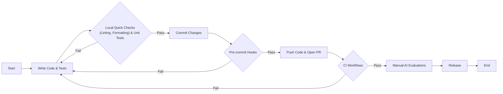
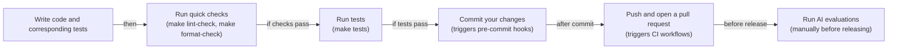
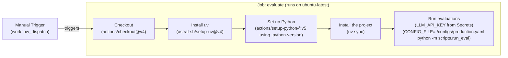

# Near-tie review: 31_CI  (light vs skip, margin=+0.0299)

## Reviewer conclusion (2026-08-27): KEEP `light`, no override

**Quantitative basis:** all scores and reasoning confirmed accurate on review (no
corrections applied). Per-dimension binary scores (9 sections x 3 draws, n=27 per
arm) show `light` ahead on `de` (+0.148) and `be` (+0.074) -- modest in absolute
terms since this CI/DevOps how-to lesson is inherently less exploration-rich than
the conceptual articles reviewed elsewhere, but `skip`'s 0 research rounds leave
it with structurally zero credit on both. Unlike most other reviewed near-ties,
`ga` also favors `light` (+0.148) rather than offsetting its enhancement edge --
`light`'s added color (VCR.py elaboration, Continuous-Training analogy, golden-
dataset definition) tends to land within word-count tolerance while `skip`'s
terser drafts more often fall short of the minimum floor. `cc` slightly favors
`skip` (-0.037, one content omission in a single light draw), the smallest effect
of the four dimensions that differ.

**Distributional basis:** per-draw margins (light - skip) are **[+0.098, +0.035,
-0.043]** -- two of three draws favor light (production by a wide margin),
replicate2 flips narrowly to skip. Moderated significance: p=0.23, still
ambiguous. This is a clean, low-stakes case: light's edge comes from genuine
enhancement credit plus a slight guideline-adherence advantage, with no dimension
actively working against it.

**Decision:** no manual override needed -- `light` is mean-R_w's own winner.

---

## All sections (light vs skip), most-against-light first
| section | weight | contribution | running total |
|---|---:|---:|---:|
| section-4-ruff-fast-python-linting-and-formatting | 0.122 | -0.0118 | -0.0118 |
| section-8-daily-development-workflow | 0.018 | -0.0018 | -0.0135 |
| section-1-introduction | 0.016 | -0.0005 | -0.0140 |
| section-9-conclusion | 0.014 | +0.0000 | -0.0140 |
| section-6-ci-workflows-automated-enforcement | 0.310 | +0.0010 | -0.0129 |
| section-2-what-is-continuous-integration | 0.138 | +0.0030 | -0.0099 |
| section-3-pre-commit-hooks-automated-local-guardra | 0.092 | +0.0034 | -0.0066 |
| section-7-ai-evaluations-as-regression-tests | 0.119 | +0.0153 | +0.0087 |
| section-5-unit-tests-for-agent-repos | 0.172 | +0.0211 | +0.0299 |

(stored article margin = +0.0299 -- should match the running total's final row to ~4 decimals)

## Section: S4::section-4-ruff-fast-python-linting-and-formatting  (weight=0.122, contribution=-0.0118 AGAINST light)
Stored section rewards: light=0.3033  skip=0.4000  (explore: light=0.0000  skip=0.0000)

### Arm: light (preset1)

#### Draw: production  `/mnt/f/my_projects/agentic_AI_RL/Reinsearch_agent/RL_researcher_writer_ymaxing/rl_training_data/test_episodes/31_CI__preset1`

**Article text:**
```
## Ruff: Fast Python Linting and Formatting

Ruff is a high-speed Python linter and formatter written in Rust. It replaces a host of older tools like Black, isort, Flake8, and pydocstyle with a single, consolidated binary. This approach delivers sub-second feedback even on large codebases, which makes it ideal for use in pre-commit hooks and CI pipelines [[28]](https://docs.astral.sh/ruff).

It is important to distinguish between formatting and linting:

*   **Formatting** automatically rewrites your code to follow consistent style rules, such as line length, indentation, and quote style. It is opinionated and designed to be run without manual intervention.
*   **Linting** analyzes your code for bugs, suspicious patterns, and violations of best practices. This includes issues like unused variables, missing imports, and overly complex code that could be simplified.

By combining these functions, Ruff simplifies your toolchain significantly. Instead of managing separate configurations and dependencies for Black, isort, and Flake8, you configure everything in one place. This consolidation eliminates version conflicts between tools and dramatically reduces CI setup and run times. The speed improvement is not trivial; Ruff can be 10-100x faster than running these legacy tools individually, turning a multi-minute CI step into a matter of seconds [[28]](https://docs.astral.sh/ruff). This performance gain is crucial for maintaining a fast and fluid development workflow, especially when running checks on every commit.

### Brown’s Ruff Configuration

Ruff is configured in the `pyproject.toml` file. Here is the configuration from `lessons/writing_workflow/pyproject.toml`:

```toml
[tool.ruff]
target-version = "py312"
line-length = 140

[tool.ruff.lint]
select = [
    "F",    # Pyflakes
    "E",    # pycodestyle errors
    "I",    # isort
]

[tool.ruff.lint.isort]
known-first-party = ["src", "tests"]

[tool.pytest.ini_options]
pythonpath = ["src"]
markers = [
    "integration: end-to-end workflow tests (mocked LLMs, no network). Select with `-m integration` or skip with `-m 'not integration'`.",
]
```

Here’s what each key does:
*   `target-version = "py312"` tells Ruff to apply rules compatible with Python 3.12 syntax.
*   `line-length = 140` sets the maximum line length for both the formatter and linter.
*   `select = ["F", "E", "I"]` enables specific rule sets: `F` for common bugs (Pyflakes), `E` for PEP 8 style violations (pycodestyle), and `I` for import sorting (isort) [[27]](https://docs.astral.sh/ruff/faq).
*   `known-first-party = ["src", "tests"]` helps the import sorter correctly group project-specific imports separately from third-party libraries.

We also provide convenient shortcuts in our `Makefile` for running these checks:

```makefile
# --- Tests & QA ---

tests: # Run tests.
	CONFIG_FILE=configs/debug.yaml uv run pytest

pre-commit: # Run pre-commit hooks.
	uv run pre-commit run --all-files

format-fix: # Auto-format Python code using ruff formatter.
	uv run ruff format $(QA_FOLDERS)

lint-fix: # Auto-fix linting issues using ruff linter.
	uv run ruff check --fix $(QA_FOLDERS)

format-check: # Check code formatting without making changes using ruff formatter.
	uv run ruff format --check $(QA_FOLDERS) 

lint-check: # Check code for linting issues without fixing them using ruff linter.
	uv run ruff check $(QA_FOLDERS)
```

Each of these targets uses `uv run` to execute commands within the project’s virtual environment. `uv` manages this environment automatically, so you do not need to manually activate it. You can run these commands from the `writing_workflow/` directory to check or fix your code before committing.

### Hands-On Example: Fixing Formatting Issues

Let's see Ruff's formatter in action.

1.  First, we create a Python file with several formatting issues.
    ```bash
    # Create a Python file with various formatting issues
    cat > test_formatting.py << 'EOF'
    # This file has formatting issues
    def  badly_formatted_function(x,y,z):
        result=x+y+z
        my_list=[1,2,3,4,5,6,7,8,9,10]
        my_dict={"key1":"value1","key2":"value2","key3":"value3"}
        if result>10:
            print("Result is greater than 10")
        else:
            print("Result is 10 or less")
        return result
    
    class   BadlyFormattedClass:
        def __init__(self,name,age):
            self.name=name
            self.age=age
        def get_info(self):
            return f"{self.name} is {self.age} years old"
    EOF
    
    echo "Created test_formatting.py"
    ```
    It outputs:
    ```text
    Created test_formatting.py
    ```
2.  Now, we run the format checker. The `--check` flag tells Ruff to report issues without modifying the file.
    ```bash
    uv run ruff format --check test_formatting.py
    ```
    It outputs:
    ```text
    warning: `VIRTUAL_ENV=/Users/jai/Documents/code-repo/agentic-ai-engineering-course/.venv` does not match the project environment path `.venv` and will be ignored; use `--active` to target the active environment instead
    Would reformat: test_formatting.py
    1 file would be reformatted
    ```
3.  To fix the issues automatically, we run the command without the `--check` flag.
    ```bash
    uv run ruff format test_formatting.py
    ```
    It outputs:
    ```text
    warning: `VIRTUAL_ENV=/Users/jai/Documents/code-repo/agentic-ai-engineering-course/.venv` does not match the project environment path `.venv` and will be ignored; use `--active` to target the active environment instead
    1 file reformatted
    ```
4.  The file is now perfectly formatted.
    ```bash
    cat test_formatting.py
    ```
    It outputs:
    ```python
    # This file has formatting issues
    def badly_formatted_function(x, y, z):
        result = x + y + z
        my_list = [1, 2, 3, 4, 5, 6, 7, 8, 9, 10]
        my_dict = {"key1": "value1", "key2": "value2", "key3": "value3"}
        if result > 10:
            print("Result is greater than 10")
        else:
            print("Result is 10 or less")
        return result
    
    
    class BadlyFormattedClass:
        def __init__(self, name, age):
            self.name = name
            self.age = age
    
        def get_info(self):
            return f"{self.name} is {self.age} years old"
    ```
    Ruff fixed all the spacing issues around operators, in function signatures, and in class definitions.

### Hands-On Example: Fixing Linting Issues

Now, let's try the linter.

1.  We create a file with several linting errors, including unused imports and an undefined variable.
    ```bash
    cat > test_linting.py << 'EOF'
    import os
    import sys
    import json # Unused import
    
    def calculate_sum(numbers):
        """Calculate sum of numbers."""
        total = 0
        for num in numbers:
            total = total + num
        return total
    
    def process_data(data):
        """Process some data."""
        result = calculate_sum(data)
        print(f"Result: {result}")
        _ = os.getcwd()  # Use os
        _ = sys.argv[0]  # Use sys
        undefined_variable = some_undefined_function()  # Using undefined name
        return result
    
    import sys # Duplicate import
    EOF
    
    echo "Created test_linting.py"
    ```
    It outputs:
    ```text
    Created test_linting.py
    ```
2.  Running the linter shows several issues, including an unused import (`F401`), a duplicate import (`F811`), and an undefined name (`F821`).
    ```bash
    uv run ruff check test_linting.py
    ```
    It outputs:
    ```text
    Found 7 errors.
    [*] 4 fixable with the `--fix` option (1 hidden fix can be enabled with the `--unsafe-fixes` option).
    ```
3.  We use the `--fix` flag to automatically correct what we can.
    ```bash
    uv run ruff check --fix test_linting.py
    ```
    It outputs:
    ```text
    Found 5 errors (3 fixed, 2 remaining).
    No fixes available (1 hidden fix can be enabled with the `--unsafe-fixes` option).
    ```
    Ruff removes the unused and duplicate imports but leaves the undefined name error. This is a logic error that requires manual intervention.

Once formatting and linting guardrails are in place, our attention turns to verifying the deterministic logic inside your agent nodes; this is the role of unit tests.
```
**Grader reasoning:**
- `cc`: Ruff: Fast Python Linting and Formatting:
**1:** Both sections accurately define Ruff, distinguish between formatting and linting, and present the same configuration from the Brown agent's `pyproject.toml` file. The hands-on examples for fixing formatting and linting issues are also substantively the same.
- `fl`: Ruff: Fast Python Linting and Formatting:
**1:** Both sections follow the same logical flow: introducing Ruff, explaining the difference between formatting and linting, presenting the configuration, showing the Makefile shortcuts, and then walking through hands-on examples for both formatting and linting. The order of ideas is identical.
- `de`: Ruff: Fast Python Linting and Formatting:
**0:** [instances=0] No depth additions present. The section provides a practical guide to using Ruff but does not add deeper technical nuances or performance metrics beyond the expected content.
- `be`: Ruff: Fast Python Linting and Formatting:
**0:** [instances=0] No breadth additions present. The section remains focused on the Ruff tool.
- `cp`: Ruff: Fast Python Linting and Formatting:
**1:** Both depth_enhancement and breadth_enhancement scored 0, so CorePreservation is 1 by default as there are no qualifying additions to evaluate.
- `ga`: Ruff: Fast Python Linting and Formatting:
**1:** The generated section correctly introduces Ruff, distinguishes between formatting and linting, and uses the exact `pyproject.toml` and `Makefile` outputs from the notebook as required. It provides the hands-on examples for both formatting and linting, demonstrating the check and auto-fix commands with the correct code and outputs. The transition to the next section is present. The prose word count is approximately 550 words, which is within the tolerance for the 530-word target. All requirements are met.

#### Draw: replicate1  `/mnt/f/my_projects/agentic_AI_RL/Reinsearch_agent/RL_researcher_writer_ymaxing/rl_training_data/noise_experiment/31_CI__replicate1__preset1`

**Article text:**
```
## Ruff: Fast Python Linting and Formatting

Ruff is a Python linter and code formatter written in Rust. It is designed to be extremely fast, often 10-100 times faster than the tools it replaces, such as Black, isort, and Flake8. By consolidating the functionality of over ten legacy tools into a single binary, Ruff simplifies configuration, eliminates version conflicts, and dramatically reduces CI run times [[5]](https://docs.astral.sh/ruff).

It is important to distinguish between its two main functions.
*   **Formatting** automatically rewrites your code to follow a consistent style, enforcing rules for indentation, line breaks, and spacing. It is opinionated and designed to be run without manual intervention.
*   **Linting** analyzes your code for potential bugs, suspicious patterns, and violations of best practices, such as unused variables or missing imports. It identifies problems but does not always fix them automatically.

### Brown’s Ruff Configuration

Ruff is configured in the `pyproject.toml` file, a modern standard for Python projects that centralizes settings for build systems, dependencies, and tools in one place [[10]](https://betterstack.com/community/guides/scaling-python/pyproject-explained/). Here is the configuration from `lessons/writing_workflow/pyproject.toml`.

```toml
[tool.ruff]
target-version = "py312"
line-length = 140

[tool.ruff.lint]
select = [
    "F",    # Pyflakes
    "E",    # pycodestyle errors
    "I",    # isort
]

[tool.ruff.lint.isort]
known-first-party = ["src", "tests"]
```

*   `target-version = "py312"` tells Ruff to check for syntax compatibility with Python 3.12.
*   `line-length = 140` sets the maximum line length for formatting.
*   `select = ["F", "E", "I"]` enables three sets of linting rules: `F` for Pyflakes, which detects common bugs like undefined names and unused variables; `E` for pycodestyle, which enforces PEP 8 style guidelines; and `I` for isort, which automatically sorts and formats import statements.
*   `known-first-party = ["src", "tests"]` helps isort correctly group your project's internal imports separately from third-party libraries.

For convenience, our `Makefile` includes shortcuts for running Ruff.

```makefile
# --- Tests & QA ---

tests: # Run tests.
	CONFIG_FILE=configs/debug.yaml uv run pytest

pre-commit: # Run pre-commit hooks.
	uv run pre-commit run --all-files

format-fix: # Auto-format Python code using ruff formatter.
	uv run ruff format $(QA_FOLDERS)

lint-fix: # Auto-fix linting issues using ruff linter.
	uv run ruff check --fix $(QA_FOLDERS)

format-check: # Check code formatting without making changes using ruff formatter.
	uv run ruff format --check $(QA_FOLDERS) 

lint-check: # Check code for linting issues without fixing them using ruff linter.
	uv run ruff check $(QA_FOLDERS)
```

Each target uses `uv run` to execute commands within the project’s virtual environment, which is managed automatically and does not require manual activation. You can run these from the `writing_workflow/` directory to check or fix your code before committing.

### Hands-On Example: Fixing Formatting Issues

Let's see Ruff's formatter in action.

1.  First, create a Python file with several formatting issues.
    ```bash
    # Create a Python file with various formatting issues
    cat > test_formatting.py << 'EOF'
    # This file has formatting issues
    def  badly_formatted_function(x,y,z):
        result=x+y+z
        my_list=[1,2,3,4,5,6,7,8,9,10]
        my_dict={"key1":"value1","key2":"value2","key3":"value3"}
        if result>10:
            print("Result is greater than 10")
        else:
            print("Result is 10 or less")
        return result
    
    class   BadlyFormattedClass:
        def __init__(self,name,age):
            self.name=name
            self.age=age
        def get_info(self):
            return f"{self.name} is {self.age} years old"
    EOF
    
    echo "Created test_formatting.py"
    ```
    It outputs:
    ```text
    Created test_formatting.py
    ```
2.  Now, run the format check command. The `--check` flag tells Ruff to report issues without modifying the file.
    ```bash
    uv run ruff format --check test_formatting.py
    ```
    It outputs:
    ```text
    Would reformat: test_formatting.py
    1 file would be reformatted
    ```
3.  To fix the issues, run the command without the `--check` flag.
    ```bash
    uv run ruff format test_formatting.py
    ```
    It outputs:
    ```text
    1 file reformatted
    ```
    Ruff has now fixed all the spacing and formatting inconsistencies.

### Hands-On Example: Fixing Linting Issues

Now let's try the linter.

1.  Create a file with common linting errors like unused imports and undefined variables.
    ```bash
    cat > test_linting.py << 'EOF'
    import os
    import sys
    import json # Unused import
    
    def calculate_sum(numbers):
        """Calculate sum of numbers."""
        total = 0
        for num in numbers:
            total = total + num
        return total
    
    def process_data(data):
        """Process some data."""
        result = calculate_sum(data)
        print(f"Result: {result}")
        _ = os.getcwd()  # Use os
        _ = sys.argv[0]  # Use sys
        undefined_variable = some_undefined_function()  # Using undefined name
        return result
    
    import sys # Duplicate import
    EOF
    
    echo "Created test_linting.py"
    ```
    It outputs:
    ```text
    Created test_linting.py
    ```
2.  Run the lint checker to see the errors.
    ```bash
    uv run ruff check test_linting.py
    ```
    It outputs:
    ```text
    I001 [*] Import block is un-sorted or un-formatted
     --> test_linting.py:1:1
    ...
    F401 [*] `json` imported but unused
     --> test_linting.py:3:8
    ...
    F821 Undefined name `some_undefined_function`
      --> test_linting.py:18:26
    ...
    F811 [*] Redefinition of unused `sys` from line 2
      --> test_linting.py:21:8
    ...
    Found 7 errors.
    [*] 4 fixable with the `--fix` option...
    ```
3.  Run the linter with the `--fix` flag to automatically correct the fixable errors.
    ```bash
    uv run ruff check --fix test_linting.py
    ```
    It outputs:
    ```text
    ...
    Found 5 errors (3 fixed, 2 remaining).
    ```
    Ruff removes the unused and duplicate imports but leaves the `Undefined name` error, as that is a logic issue that requires manual intervention.

Once formatting and linting guardrails are in place, our attention turns to verifying the deterministic logic inside the agent nodes. This is the role of unit tests.
```
**Grader reasoning:**
- `cc`: Ruff: Fast Python Linting and Formatting:
**1:** Both sections cover the introduction, the formatting-vs-linting distinction, Brown's Ruff configuration, the Makefile targets, and both hands-on examples. The generated section's Ruff config, like the expected section's own version, stops before the '[tool.pytest.ini_options]' block that the actual golden Notebook 1 source includes, so no relative omission exists between the two articles here. The Makefile and the linting hands-on example (7 errors, matching error codes) match research.md's golden Notebook 1 output.
- `fl`: Ruff: Fast Python Linting and Formatting:
**1:** The generated section follows the same progression as the expected one. The generated section adds a closing transition into unit tests that the expected section lacks; this does not disrupt the order of expected ideas.
- `de`: Ruff: Fast Python Linting and Formatting:
**0:** [instances=0] No depth additions present. This section closely follows the guideline's own specification without additional exploration-sourced content beyond what is required.
- `be`: Ruff: Fast Python Linting and Formatting:
**0:** [instances=0] No breadth additions present. This section closely follows the guideline's own specification without additional exploration-sourced content beyond what is required.
- `cp`: Ruff: Fast Python Linting and Formatting:
**1:** Both depth_enhancement and breadth_enhancement scored 0 for this section (no qualifying exploration-sourced additions were found here, though exploration-phase sources do exist for this episode). Per the mandatory default rule, CorePreservation scores 1 by default.
- `ga`: Ruff: Fast Python Linting and Formatting:
**0:** All required content is present: the introduction, the formatting-vs-linting distinction, all four required configuration-key explanations, the Makefile targets (matching research.md's golden Notebook 1 output exactly), both hands-on examples, and the contrast-with-older-tools point ('over ten legacy tools', matching the guideline's '10+' figure). However, the prose-only word count is approximately 420 words against a 530-word target (±53 tolerance, range 477-583 words), 57 words below the minimum -- a clear shortfall.

#### Draw: replicate2  `/mnt/f/my_projects/agentic_AI_RL/Reinsearch_agent/RL_researcher_writer_ymaxing/rl_training_data/noise_experiment/31_CI__replicate2__preset1`

**Article text:**
```
## Ruff: Fast Python Linting and Formatting

Ruff is a Python linter and code formatter written in Rust. It is extremely fast, often 10-100x faster than legacy tools like Black, isort, and Flake8. By consolidating the functionality of over ten different tools into a single binary, it simplifies configuration, eliminates dependency conflicts, and substantially reduces CI run times [[9]](https://docs.astral.sh/ruff).

It is important to distinguish between formatting and linting.

*   **Formatting** automatically rewrites your code to follow a consistent style. It handles things like indentation, line breaks, and spacing, and it is generally opinionated to ensure uniformity.
*   **Linting** analyzes your code for potential bugs, violations of best practices, and suspicious patterns. It flags issues like unused variables, missing imports, or overly complex code that could lead to errors.

### Brown’s Ruff Configuration

Ruff is configured in the `pyproject.toml` file, which centralizes settings for many modern Python tools [[10]](https://betterstack.com/community/guides/scaling-python/pyproject-explained/). Here is the configuration from `lessons/writing_workflow/pyproject.toml`.

```toml
[tool.ruff]
target-version = "py312"
line-length = 140

[tool.ruff.lint]
select = [
    "F",    # Pyflakes
    "E",    # pycodestyle errors
    "I",    # isort
]

[tool.ruff.lint.isort]
known-first-party = ["src", "tests"]

[tool.pytest.ini_options]
pythonpath = ["src"]
markers = [
    "integration: end-to-end workflow tests (mocked LLMs, no network). Select with `-m integration` or skip with `-m 'not integration'`.",
]
```

*   `target-version = "py312"` tells Ruff to check for syntax compatibility with Python 3.12.
*   `line-length = 140` sets the maximum line length for code formatting.
*   `select = ["F", "E", "I"]` enables specific rule sets: `F` for Pyflakes (detects common bugs), `E` for pycodestyle (enforces PEP 8 style), and `I` for isort (organizes imports).
*   `known-first-party = ["src", "tests"]` tells isort how to group project-specific imports separately from third-party libraries.

We also use a `Makefile` to provide convenient shortcuts for running Ruff commands.

```makefile
# --- Tests & QA ---

tests: # Run tests.
	CONFIG_FILE=configs/debug.yaml uv run pytest

pre-commit: # Run pre-commit hooks.
	uv run pre-commit run --all-files

format-fix: # Auto-format Python code using ruff formatter.
	uv run ruff format $(QA_FOLDERS)

lint-fix: # Auto-fix linting issues using ruff linter.
	uv run ruff check --fix $(QA_FOLDERS)

format-check: # Check code formatting without making changes using ruff formatter.
	uv run ruff format --check $(QA_FOLDERS) 

lint-check: # Check code for linting issues without fixing them using ruff linter.
	uv run ruff check $(QA_FOLDERS)
```

Each command uses `uv run` to execute within the project’s virtual environment, which `uv` manages automatically without manual activation.

### Hands-On Example: Fixing Formatting Issues

Let's see Ruff's formatter in action. First, we create a Python file with deliberate formatting mistakes.

1.  We create a test file with inconsistent spacing and layout.
    ```bash
    # Create a Python file with various formatting issues
    cat > test_formatting.py << 'EOF'
    # This file has formatting issues
    def  badly_formatted_function(x,y,z):
        result=x+y+z
        my_list=[1,2,3,4,5,6,7,8,9,10]
        my_dict={"key1":"value1","key2":"value2","key3":"value3"}
        if result>10:
            print("Result is greater than 10")
        else:
            print("Result is 10 or less")
        return result
    
    class   BadlyFormattedClass:
        def __init__(self,name,age):
            self.name=name
            self.age=age
        def get_info(self):
            return f"{self.name} is {self.age} years old"
    EOF
    
    echo "Created test_formatting.py"
    ```
    It outputs:
    ```text
    Created test_formatting.py
    ```
2.  Next, we run the format checker. The `--check` flag reports issues without changing the file.
    ```bash
    uv run ruff format --check test_formatting.py
    ```
    It outputs:
    ```text
    Would reformat: test_formatting.py
    1 file would be reformatted
    ```
3.  Now, we run the auto-fix command to correct the formatting.
    ```bash
    uv run ruff format test_formatting.py
    ```
    It outputs:
    ```text
    1 file reformatted
    ```
    Ruff automatically fixes spacing, indentation, and line breaks, producing clean, consistent code.

### Hands-On Example: Fixing Linting Issues

Linting catches a different class of problems. Let's create another file, this time with linting violations.

1.  This file includes unused imports, a duplicate import, and an undefined variable.
    ```bash
    cat > test_linting.py << 'EOF'
    import os
    import sys
    import json # Unused import
    
    def calculate_sum(numbers):
        """Calculate sum of numbers."""
        total = 0
        for num in numbers:
            total = total + num
        return total
    
    def process_data(data):
        """Process some data."""
        result = calculate_sum(data)
        print(f"Result: {result}")
        _ = os.getcwd()  # Use os
        _ = sys.argv[0]  # Use sys
        undefined_variable = some_undefined_function()  # Using undefined name
        return result
    
    import sys # Duplicate import
    EOF
    
    echo "Created test_linting.py"
    ```
    It outputs:
    ```text
    Created test_linting.py
    ```
2.  Running the linter shows several errors, including `F401` (unused import), `F811` (duplicate import), and `F821` (undefined name).
    ```bash
    uv run ruff check test_linting.py
    ```
    It outputs:
    ```text
    Found 7 errors.
    [ *] 4 fixable with the `--fix` option (1 hidden fix can be enabled with the `--unsafe-fixes` option).
    ```
3.  Using the `--fix` flag, Ruff automatically removes the unused and duplicate imports.
    ```bash
    uv run ruff check --fix test_linting.py
    ```
    It outputs:
    ```text
    Found 5 errors (3 fixed, 2 remaining).
    No fixes available (1 hidden fix can be enabled with the `--unsafe-fixes` option).
    ```
    However, it cannot fix the `F821` error because using an undefined function is a logic bug that requires manual intervention. Once your code is clean and formatted, you need to verify its logic. This is the role of unit tests.
```
**Grader reasoning:**
- `cc`: Ruff: Fast Python Linting and Formatting:
**1:** Both sections cover the introduction, the formatting-vs-linting distinction, Brown's Ruff configuration (matching research.md's golden Notebook 1 output exactly, including the full '[tool.pytest.ini_options]' block), the Makefile targets (also matching exactly), and both hands-on examples.
- `fl`: Ruff: Fast Python Linting and Formatting:
**1:** The generated section follows the same progression as the expected one.
- `de`: Ruff: Fast Python Linting and Formatting:
**0:** [instances=0] No depth additions present. This section closely follows the guideline's own specification without additional exploration-sourced content beyond what is required.
- `be`: Ruff: Fast Python Linting and Formatting:
**0:** [instances=0] No breadth additions present. This section closely follows the guideline's own specification without additional exploration-sourced content beyond what is required.
- `cp`: Ruff: Fast Python Linting and Formatting:
**1:** Both depth_enhancement and breadth_enhancement scored 0 for this section (no qualifying exploration-sourced additions were found here, though exploration-phase sources do exist for this episode). Per the mandatory default rule, CorePreservation scores 1 by default.
- `ga`: Ruff: Fast Python Linting and Formatting:
**0:** All required content is present: the introduction, the formatting-vs-linting distinction, all four required configuration-key explanations, the Makefile targets and full pyproject.toml (both matching research.md's golden Notebook 1 output exactly), and both hands-on examples. However, the prose-only word count is approximately 366 words against a 530-word target (±53 tolerance, range 477-583 words), 111 words below the minimum -- a large, clear shortfall despite the strong content coverage.

### Arm: skip (preset0)

#### Draw: production  `/mnt/f/my_projects/agentic_AI_RL/Reinsearch_agent/RL_researcher_writer_ymaxing/rl_training_data/test_episodes/31_CI__preset0`

**Article text:**
```
## Ruff: Fast Python Linting and Formatting

Ruff is a modern, high-performance Python linter and formatter written in Rust. It is designed to be extremely fast, often 10-100 times faster than legacy tools. It consolidates the functionality of multiple older tools like Black, isort, Flake8, and pydocstyle into a single, efficient binary. This consolidation simplifies configuration, eliminates version conflicts between tools, and dramatically speeds up local checks and CI runtimes [[28]](https://docs.astral.sh/ruff).

It is important to distinguish between formatting and linting:
- **Formatting** automatically rewrites your code to follow a consistent style. It is opinionated and focuses on readability, handling things like line length, indentation, and quote style.
- **Linting** analyzes your code for potential bugs, stylistic violations, and anti-patterns. It detects issues like unused variables, missing imports, and overly complex code that could lead to errors.

### Brown’s Ruff Configuration

Ruff is configured in the `pyproject.toml` file, which centralizes settings for many modern Python tools. Here is the configuration from `lessons/writing_workflow/pyproject.toml`:

```toml
[tool.ruff]
target-version = "py312"
line-length = 140

[tool.ruff.lint]
select = [
    "F",    # Pyflakes
    "E",    # pycodestyle errors
    "I",    # isort
]

[tool.ruff.lint.isort]
known-first-party = ["src", "tests"]

[tool.pytest.ini_options]
pythonpath = ["src"]
markers = [
    "integration: end-to-end workflow tests (mocked LLMs, no network). Select with `-m integration` or skip with `-m 'not integration'`.",
]
```

- `target-version = "py312"` tells Ruff to enforce rules compatible with Python 3.12.
- `line-length = 140` sets the maximum line length.
- `select = ["F", "E", "I"]` enables three key rule sets: Pyflakes (`F`) for catching common bugs, pycodestyle (`E`) for enforcing PEP 8 style, and isort (`I`) for organizing imports.
- `known-first-party = ["src", "tests"]` helps isort correctly group project-specific imports separately from third-party libraries.

To make running these checks easier, our `Makefile` provides convenient shortcuts:

```makefile
# --- Tests & QA ---

tests: # Run tests.
	CONFIG_FILE=configs/debug.yaml uv run pytest

pre-commit: # Run pre-commit hooks.
	uv run pre-commit run --all-files

format-fix: # Auto-format Python code using ruff formatter.
	uv run ruff format $(QA_FOLDERS)

lint-fix: # Auto-fix linting issues using ruff linter.
	uv run ruff check --fix $(QA_FOLDERS)

format-check: # Check code formatting without making changes using ruff formatter.
	uv run ruff format --check $(QA_FOLDERS) 

lint-check: # Check code for linting issues without fixing them using ruff linter.
	uv run ruff check $(QA_FOLDERS)
```

Each target uses `uv run` to execute commands within the project's virtual environment, which is managed automatically by `uv` and does not require manual activation.

### Hands-On Example: Fixing Formatting Issues

To see Ruff's formatter in action, let's create a file with deliberate formatting errors. This file contains extra spaces in the function definition, no spaces around operators, and inconsistent spacing in the class definition.

1.  Create a file named `test_formatting.py` with these issues.

    ```bash
    # This file has formatting issues
    def  badly_formatted_function(x,y,z):
        result=x+y+z
        my_list=[1,2,3,4,5,6,7,8,9,10]
        my_dict={"key1":"value1","key2":"value2","key3":"value3"}
        if result>10:
            print("Result is greater than 10")
        else:
            print("Result is 10 or less")
        return result
    
    class   BadlyFormattedClass:
        def __init__(self,name,age):
            self.name=name
            self.age=age
        def get_info(self):
            return f"{self.name} is {self.age} years old"
    ```

2.  Run the format check command to see what Ruff would change.

    ```bash
    uv run ruff format --check test_formatting.py
    ```

    It outputs:

    ```text
    Would reformat: test_formatting.py
    1 file would be reformatted
    ```
    The `--check` flag tells Ruff to report issues without modifying the file, which is perfect for CI environments.

3.  Now, auto-fix the file to apply the correct formatting.

    ```bash
    uv run ruff format test_formatting.py
    ```

    It outputs:

    ```text
    1 file reformatted
    ```
    The file is now cleanly formatted, with correct spacing around operators, in function signatures, and class definitions. This instant, consistent formatting is a huge time-saver.

### Hands-On Example: Fixing Linting Issues

Linting goes beyond style to catch potential bugs. Let's create another file with common linting errors.

1.  Create a file named `test_linting.py` with unused imports, duplicate imports, and an undefined variable.

    ```python
    import os
    import sys
    import json # Unused import
    
    def calculate_sum(numbers):
        """Calculate sum of numbers."""
        total = 0
        for num in numbers:
            total = total + num
        return total
    
    def process_data(data):
        """Process some data."""
        result = calculate_sum(data)
        print(f"Result: {result}")
        _ = os.getcwd()  # Use os
        _ = sys.argv[0]  # Use sys
        undefined_variable = some_undefined_function()  # Using undefined name
        return result
    
    import sys # Duplicate import
    ```

2.  Run the lint check to see the reported issues.

    ```bash
    uv run ruff check test_linting.py
    ```

    Ruff reports several issues, including `F401` for the unused `json` import, `F811` for the redefinition of `sys`, and `F821` because `some_undefined_function` does not exist. It also flags unsorted imports (`I001`) and misplaced imports (`E402`).

    ```text
    Found 7 errors.
    [*] 4 fixable with the `--fix` option...
    ```

3.  Run the auto-fix command to correct what can be fixed automatically.

    ```bash
    uv run ruff check --fix test_linting.py
    ```

    Ruff automatically removes the unused `json` import and the duplicate `sys` import, and it sorts the remaining imports correctly. However, it leaves the `F821` (undefined name) error untouched. This is by design: fixing an undefined name requires a logic change that only a developer can make. The linter handles what it can safely, and flags the rest for manual review.

Once formatting and linting guardrails are in place, our attention turns to verifying the deterministic logic inside the agent nodes. This is the role of unit tests.
```
**Grader reasoning:**
- `cc`: Ruff: Fast Python Linting and Formatting:
**1:** Both sections introduce Ruff, distinguish between formatting and linting, explain Brown's `pyproject.toml` configuration, and provide hands-on examples for fixing formatting and linting issues. The core topics and examples are the same.
- `fl`: Ruff: Fast Python Linting and Formatting:
**1:** Both sections follow the same logical progression: introducing Ruff, explaining its configuration, showing the Makefile shortcuts, and then walking through hands-on examples for formatting and linting. The flow is preserved.
- `de`: Ruff: Fast Python Linting and Formatting:
**0:** [instances=0] No depth additions present. The section provides a practical walkthrough but does not add deeper technical details about Ruff's implementation, performance benchmarks, or limitations beyond the expected content.
- `be`: Ruff: Fast Python Linting and Formatting:
**0:** [instances=0] No breadth additions present. The section is a focused explanation of Ruff and does not introduce adjacent concepts or cross-domain analogies.
- `cp`: Ruff: Fast Python Linting and Formatting:
**1:** Both depth_enhancement and breadth_enhancement scored 0, so CorePreservation is 1 by default as there are no qualifying additions to evaluate.
- `ga`: Ruff: Fast Python Linting and Formatting:
**1:** The section meets all requirements. It introduces Ruff, clearly distinguishes between formatting and linting, and presents Brown's Ruff configuration from the `pyproject.toml` as specified in the notebook. It also includes the Makefile targets, the hands-on examples for fixing both formatting and linting issues, and a proper transition. The prose word count is approximately 510 words, which is within the 530-word target.

#### Draw: replicate1  `/mnt/f/my_projects/agentic_AI_RL/Reinsearch_agent/RL_researcher_writer_ymaxing/rl_training_data/noise_experiment/31_CI__replicate1__preset0`

**Article text:**
```
## Ruff: Fast Python Linting and Formatting

Ruff is a Python linter and code formatter written in Rust. It is designed to be extremely fast, often 10-100x faster than the tools it replaces, such as Black, isort, and Flake8 [[8]](https://docs.astral.sh/ruff). By consolidating multiple tools into a single binary, Ruff simplifies configuration, eliminates version conflicts, and substantially reduces CI run times. This speed makes it practical to run comprehensive checks on every commit without slowing down development.

It is important to distinguish between formatting and linting.
*   **Formatting** automatically rewrites your code to follow a consistent style, handling details like indentation, line breaks, and spacing. It is opinionated and designed to be run without manual intervention, ensuring a uniform look and feel across the codebase.
*   **Linting** analyzes your code for potential bugs, stylistic issues, and violations of best practices, such as unused variables or missing imports. It flags problems and can often suggest or apply automatic fixes, but its primary goal is to improve code correctness and maintainability.

### Brown’s Ruff Configuration

Ruff is configured in the `pyproject.toml` file, which keeps all project settings in one place [[9]](https://betterstack.com/community/guides/scaling-python/pyproject-explained/). This centralization simplifies project setup and ensures that all tools adhere to the same standards. Here is the configuration for our Brown agent.

```toml
[tool.ruff]
target-version = "py312"
line-length = 140

[tool.ruff.lint]
select = [
    "F",    # Pyflakes
    "E",    # pycodestyle errors
    "I",    # isort
]

[tool.ruff.lint.isort]
known-first-party = ["src", "tests"]

[tool.pytest.ini_options]
pythonpath = ["src"]
markers = [
    "integration: end-to-end workflow tests (mocked LLMs, no network). Select with `-m integration` or skip with `-m 'not integration'`.",
]
```

Here’s what each setting does:
*   `target-version = "py312"` tells Ruff to apply rules compatible with Python 3.12.
*   `line-length = 140` sets the maximum line length.
*   `select = ["F", "E", "I"]` enables rule sets from Pyflakes (for bug detection), pycodestyle (for PEP 8 compliance), and isort (for import sorting). Ruff's rule selection system mirrors Flake8's, allowing you to enable entire categories of rules with a single prefix [[11]](https://docs.astral.sh/ruff/linter/).
*   `known-first-party = ["src", "tests"]` helps isort correctly group your project’s internal imports.

To make running these checks easier, we have defined shortcuts in our `Makefile`.
```makefile
# --- Tests & QA ---

tests: # Run tests.
	CONFIG_FILE=configs/debug.yaml uv run pytest

pre-commit: # Run pre-commit hooks.
	uv run pre-commit run --all-files

format-fix: # Auto-format Python code using ruff formatter.
	uv run ruff format $(QA_FOLDERS)

lint-fix: # Auto-fix linting issues using ruff linter.
	uv run ruff check --fix $(QA_FOLDERS)

format-check: # Check code formatting without making changes using ruff formatter.
	uv run ruff format --check $(QA_FOLDERS) 

lint-check: # Check code for linting issues without fixing them using ruff linter.
	uv run ruff check $(QA_FOLDERS)
```
Each command uses `uv run` to execute Ruff within the project’s virtual environment, which `uv` manages automatically without needing manual activation [[10]](https://devcenter.upsun.com/posts/why-python-developers-should-switch-to-uv/). This simplifies scripting and ensures that the correct tool versions are always used.

### Hands-On Example: Fixing Formatting Issues

Let's see Ruff in action. First, we create a Python file with deliberate formatting errors.
```bash
# Create a Python file with various formatting issues
cat > test_formatting.py << 'EOF'
# This file has formatting issues
def  badly_formatted_function(x,y,z):
    result=x+y+z
    my_list=[1,2,3,4,5,6,7,8,9,10]
    my_dict={"key1":"value1","key2":"value2","key3":"value3"}
    if result>10:
        print("Result is greater than 10")
    else:
        print("Result is 10 or less")
    return result

class   BadlyFormattedClass:
    def __init__(self,name,age):
        self.name=name
        self.age=age
    def get_info(self):
        return f"{self.name} is {self.age} years old"
EOF

echo "Created test_formatting.py"
```
It outputs:
```text
Created test_formatting.py
```
Now, we run the format checker. The `--check` flag reports issues without changing the file.
```bash
uv run ruff format --check test_formatting.py
```
It outputs:
```text
Would reformat: test_formatting.py
1 file would be reformatted
```
To fix the issues, we run the command without `--check`.
```bash
uv run ruff format test_formatting.py
```
It outputs:
```text
1 file reformatted
```
Ruff automatically corrects spacing, indentation, and other stylistic inconsistencies, making the code clean and readable.

### Hands-On Example: Fixing Linting Issues

Next, let's fix some linting errors. We create a file with unused imports, a duplicate import, and an undefined variable.
```bash
cat > test_linting.py << 'EOF'
import os
import sys
import json # Unused import

def calculate_sum(numbers):
    """Calculate sum of numbers."""
    total = 0
    for num in numbers:
        total = total + num
    return total

def process_data(data):
    """Process some data."""
    result = calculate_sum(data)
    print(f"Result: {result}")
    _ = os.getcwd()  # Use os
    _ = sys.argv[0]  # Use sys
    undefined_variable = some_undefined_function()  # Using undefined name
    return result

import sys # Duplicate import
EOF

echo "Created test_linting.py"
```
It outputs:
```text
Created test_linting.py
```
Running the linter check reveals several issues.
```bash
uv run ruff check test_linting.py
```
It outputs:
```text
Found 7 errors.
[ *] 4 fixable with the `--fix` option (1 hidden fix can be enabled with the `--unsafe-fixes` option).
```
Ruff identifies the unused `json` import (`F401`), the redefinition of `sys` (`F811`), and the use of an undefined name (`F821`). To fix what we can automatically, we use the `--fix` flag.
```bash
uv run ruff check --fix test_linting.py
```
It outputs:
```text
Found 5 errors (3 fixed, 2 remaining).
No fixes available (1 hidden fix can be enabled with the `--unsafe-fixes` option).
```
Ruff removes the unused and duplicate imports but leaves the `F821` error (undefined name) because it is a logic bug that requires manual intervention.

Once formatting and linting guardrails are in place, our attention turns to verifying the deterministic logic inside the agent nodes. This is the role of unit tests.
```
**Grader reasoning:**
- `cc`: Ruff: Fast Python Linting and Formatting:
**1:** Both sections cover the Ruff introduction, the formatting-vs-linting distinction, Brown's Ruff configuration, the Makefile QA targets, and both hands-on examples. The generated section's linting hands-on example is more elaborate (7 errors including F821/F841/E402 in addition to F401/F811) and matches research.md's actual golden Notebook 1 output verbatim, while the expected section's simpler 2-error version is itself a divergence from that same golden source; since CoreContent only penalizes omissions and the expected section's core teaching (unused/duplicate import detection and auto-fix) is fully present, this is an accepted addition, not a missing idea.
- `fl`: Ruff: Fast Python Linting and Formatting:
**1:** The generated section follows the same progression as the expected one: introduction, format/lint distinction, configuration, Makefile targets, formatting example, linting example. The generated section adds a closing transition into unit tests that the expected section lacks; this does not disrupt the order of expected ideas.
- `de`: Ruff: Fast Python Linting and Formatting:
**0:** [instances=0] No exploration-phase sources were gathered for this episode, so this score is mandated to 0: depth_enhancement and breadth_enhancement only credit additions traceable to an exploration-phase source, and none exist to trace to.
- `be`: Ruff: Fast Python Linting and Formatting:
**0:** [instances=0] No exploration-phase sources were gathered for this episode, so this score is mandated to 0: depth_enhancement and breadth_enhancement only credit additions traceable to an exploration-phase source, and none exist to trace to.
- `cp`: Ruff: Fast Python Linting and Formatting:
**1:** Both depth_enhancement and breadth_enhancement scored 0 for this section because no exploration-phase sources exist for this episode (research.md contains only phase="exploitation" sources). Per the mandatory default rule, CorePreservation scores 1 by default.
- `ga`: Ruff: Fast Python Linting and Formatting:
**1:** All required content is present: the Ruff introduction, the formatting-vs-linting distinction, all four required configuration-key explanations (target-version, line-length, select rules, known-first-party), the Makefile targets, both hands-on examples, and the contrast-with-older-tools point. The pyproject.toml and Makefile content match research.md's golden Notebook 1 output exactly, including the [tool.pytest.ini_options] block and the full six-target Makefile that the expected article's own version omits or alters. The prose-only word count (~508 words against 530 ±53, range 477-583) is within tolerance.

#### Draw: replicate2  `/mnt/f/my_projects/agentic_AI_RL/Reinsearch_agent/RL_researcher_writer_ymaxing/rl_training_data/noise_experiment/31_CI__replicate2__preset0`

**Article text:**
```
## Ruff: Fast Python Linting and Formatting

Ruff is a Python linter and code formatter written in Rust, designed to be extremely fast—often 10 to 100 times faster than legacy tools [[8]](https://docs.astral.sh/ruff/). It replaces a whole suite of older tools, including Black, isort, Flake8, pydocstyle, and pyupgrade, consolidating their functionality into a single binary [[10]](https://github.com/astral-sh/ruff). This unified approach eliminates version conflicts between different tools and dramatically reduces CI execution times [[9]](https://docs.astral.sh/ruff/faq/).

It is important to distinguish between formatting and linting:

*   **Formatting** automatically rewrites your code to follow a consistent and opinionated style, managing details like indentation, line breaks, and quote style.
*   **Linting** analyzes your code for potential bugs, suspicious patterns, and violations of best practices, such as identifying unused variables or missing imports.

### Brown’s Ruff Configuration

Ruff is configured in the `pyproject.toml` file, which centralizes settings for many Python development tools. Here is the configuration from `lessons/writing_workflow/pyproject.toml`:

```bash
!grep -A 20 "\[tool.ruff\]" pyproject.toml
```

It outputs:

```toml
[tool.ruff]
target-version = "py312"
line-length = 140

[tool.ruff.lint]
select = [
    "F",    # Pyflakes
    "E",    # pycodestyle errors
    "I",    # isort
]

[tool.ruff.lint.isort]
known-first-party = ["src", "tests"]

[tool.pytest.ini_options]
pythonpath = ["src"]
markers = [
    "integration: end-to-end workflow tests (mocked LLMs, no network). Select with `-m integration` or skip with `-m 'not integration'`.",
]
```

Here is what each key does:
*   `target-version = "py312"` tells Ruff to enforce rules compatible with Python 3.12 syntax.
*   `line-length = 140` sets the maximum line length for both the formatter and linter.
*   `select = ["F", "E", "I"]` enables three foundational rule sets. `F` comes from Pyflakes and catches common bugs like undefined names or unused variables. `E` comes from pycodestyle and enforces PEP 8 style conventions. `I` comes from isort and automatically organizes your import statements.
*   `known-first-party = ["src", "tests"]` helps isort correctly group project-specific imports separately from third-party libraries.

We also provide convenient shortcuts in our `Makefile` for running these checks:

```bash
!sed -n '/# --- Tests & QA ---/,$p' Makefile | tail -n +2
```

It outputs:

```makefile
tests: # Run tests.
	CONFIG_FILE=configs/debug.yaml uv run pytest

pre-commit: # Run pre-commit hooks.
	uv run pre-commit run --all-files

format-fix: # Auto-format Python code using ruff formatter.
	uv run ruff format $(QA_FOLDERS)

lint-fix: # Auto-fix linting issues using ruff linter.
	uv run ruff check --fix $(QA_FOLDERS)

format-check: # Check code formatting without making changes using ruff formatter.
	uv run ruff format --check $(QA_FOLDERS) 

lint-check: # Check code for linting issues without fixing them using ruff linter.
	uv run ruff check $(QA_FOLDERS)
```

Each target uses `uv run` to execute commands within the project’s virtual environment, which is managed automatically and does not require manual activation. You can run these from the `writing_workflow/` directory to check or fix your code before committing.

### Hands-On Example: Fixing Formatting Issues

Let's see Ruff's formatter in action. First, we will create a Python file with deliberate formatting errors.

1.  We create a file named `test_formatting.py` with inconsistent spacing and layout.
    ```bash
    %%bash

    # Create a Python file with various formatting issues
    cat > test_formatting.py << 'EOF'
    # This file has formatting issues
    def  badly_formatted_function(x,y,z):
        result=x+y+z
        my_list=[1,2,3,4,5,6,7,8,9,10]
        my_dict={"key1":"value1","key2":"value2","key3":"value3"}
        if result>10:
            print("Result is greater than 10")
        else:
            print("Result is 10 or less")
        return result

    class   BadlyFormattedClass:
        def __init__(self,name,age):
            self.name=name
            self.age=age
        def get_info(self):
            return f"{self.name} is {self.age} years old"
    EOF

    echo "Created test_formatting.py"
    ```
    It outputs:
    ```text
    Created test_formatting.py
    ```

2.  Next, we run the format checker. The `--check` flag reports issues without modifying the file.
    ```bash
    !uv run ruff format --check test_formatting.py
    ```
    It outputs:
    ```text
    Would reformat: test_formatting.py
    1 file would be reformatted
    ```

3.  Now, we run the formatter again, this time without `--check`, to automatically fix the file.
    ```bash
    !uv run ruff format test_formatting.py
    ```
    It outputs:
    ```text
    1 file reformatted
    ```

4.  Finally, we inspect the corrected file. Ruff has fixed all spacing issues, creating clean, readable code.
    ```bash
    !cat test_formatting.py
    ```
    It outputs:
    ```python
    # This file has formatting issues
    def badly_formatted_function(x, y, z):
        result = x + y + z
        my_list = [1, 2, 3, 4, 5, 6, 7, 8, 9, 10]
        my_dict = {"key1": "value1", "key2": "value2", "key3": "value3"}
        if result > 10:
            print("Result is greater than 10")
        else:
            print("Result is 10 or less")
        return result


    class BadlyFormattedClass:
        def __init__(self, name, age):
            self.name = name
            self.age = age

        def get_info(self):
            return f"{self.name} is {self.age} years old"
    ```

### Hands-On Example: Fixing Linting Issues

Now let's do the same for linting, which catches potential bugs and style violations.

1.  We create a file named `test_linting.py` with several issues, including unused imports, a duplicate import, and an undefined function call.
    ```bash
    %%bash

    cat > test_linting.py << 'EOF'
    import os
    import sys
    import json # Unused import

    def calculate_sum(numbers):
        """Calculate sum of numbers."""
        total = 0
        for num in numbers:
            total = total + num
        return total

    def process_data(data):
        """Process some data."""
        result = calculate_sum(data)
        print(f"Result: {result}")
        _ = os.getcwd()  # Use os
        _ = sys.argv[0]  # Use sys
        undefined_variable = some_undefined_function()  # Using undefined name
        return result

    import sys # Duplicate import
    EOF

    echo "Created test_linting.py"
    ```
    It outputs:
    ```text
    Created test_linting.py
    ```

2.  We run the linter to see what issues it finds.
    ```bash
    !uv run ruff check test_linting.py
    ```
    It outputs:
    ```text
    I001 [*] Import block is un-sorted or un-formatted
     --> test_linting.py:1:1
    ...
    F401 [*] `json` imported but unused
     --> test_linting.py:3:8
    ...
    F821 Undefined name `some_undefined_function`
      --> test_linting.py:18:26
    ...
    F811 [*] Redefinition of unused `sys` from line 2
      --> test_linting.py:21:8
    ...
    Found 7 errors.
    [*] 4 fixable with the `--fix` option...
    ```

3.  Ruff reports several issues, including unused imports (`F401`), duplicate imports (`F811`), and an undefined name (`F821`). We run the linter with the `--fix` flag to automatically correct what it can.
    ```bash
    !uv run ruff check --fix test_linting.py
    ```
    It outputs:
    ```text
    ...
    F821 Undefined name `some_undefined_function`
      --> test_linting.py:18:26
    ...
    Found 5 errors (3 fixed, 2 remaining).
    ```

4.  Ruff automatically removes the unused and duplicate imports but leaves the undefined function call, which is a logic error that requires manual intervention.
    ```bash
    !cat test_linting.py
    ```
    It outputs:
    ```python
    import os
    import sys


    def calculate_sum(numbers):
        """Calculate sum of numbers."""
        total = 0
        for num in numbers:
            total = total + num
        return total

    def process_data(data):
        """Process some data."""
        result = calculate_sum(data)
        print(f"Result: {result}")
        _ = os.getcwd()  # Use os
        _ = sys.argv[0]  # Use sys
        undefined_variable = some_undefined_function()  # Using undefined name
        return result
    ```

Once formatting and linting guardrails are in place, our attention turns to verifying the deterministic logic inside the agent nodes. This is the role of unit tests.
```
**Grader reasoning:**
- `cc`: Ruff: Fast Python Linting and Formatting:
**1:** Both sections cover the introduction, the formatting-vs-linting distinction, Brown's Ruff configuration (matching research.md's golden Notebook 1 output exactly, including the full '[tool.pytest.ini_options]' block that the expected section's own excerpt omits), the Makefile targets (also matching exactly), and both hands-on examples.
- `fl`: Ruff: Fast Python Linting and Formatting:
**1:** The generated section follows the same progression as the expected one, adding a closing transition into unit tests that the expected section lacks.
- `de`: Ruff: Fast Python Linting and Formatting:
**0:** [instances=0] No exploration-phase sources were gathered for this episode, so this score is mandated to 0: depth_enhancement and breadth_enhancement only credit additions traceable to an exploration-phase source, and none exist to trace to.
- `be`: Ruff: Fast Python Linting and Formatting:
**0:** [instances=0] No exploration-phase sources were gathered for this episode, so this score is mandated to 0: depth_enhancement and breadth_enhancement only credit additions traceable to an exploration-phase source, and none exist to trace to.
- `cp`: Ruff: Fast Python Linting and Formatting:
**1:** Both depth_enhancement and breadth_enhancement scored 0 for this section because no exploration-phase sources exist for this episode (research.md contains only phase="exploitation" sources). Per the mandatory default rule, CorePreservation scores 1 by default.
- `ga`: Ruff: Fast Python Linting and Formatting:
**1:** All required content is present: the introduction, the formatting-vs-linting distinction, all four required configuration-key explanations, the Makefile targets and full pyproject.toml (both matching research.md's golden Notebook 1 output exactly), and both hands-on examples. The prose-only word count (~503 words against 530 ±53, range 477-583) is within tolerance.

## Section: S8::section-8-daily-development-workflow  (weight=0.018, contribution=-0.0018 AGAINST light)
Stored section rewards: light=0.2033  skip=0.3000  (explore: light=0.0000  skip=0.0000)

### Arm: light (preset1)

#### Draw: production  `/mnt/f/my_projects/agentic_AI_RL/Reinsearch_agent/RL_researcher_writer_ymaxing/rl_training_data/test_episodes/31_CI__preset1`

**Article text:**
```
## Daily Development Workflow

With these tools in place, a typical daily workflow looks like this:

1.  **Write code** and corresponding tests for any new features or bug fixes.
2.  **Run quick checks** periodically on your local machine using `make lint-check` and `make format-check` to catch simple errors early.
3.  **Run tests** after changing any logic by executing `make tests`. This ensures your changes have not broken any deterministic components.
4.  **Commit your changes.** The pre-commit hooks will run automatically, providing a final local check before your code is shared.
5.  **Push and open a pull request.** The main CI workflow runs automatically, enforcing all formatting, linting, and testing rules for the entire team.
6.  **Before releasing, run AI evaluations** manually from the GitHub Actions tab to check for any semantic quality regressions.

This workflow takes seconds for most commits and catches issues early.

Image 2: A flowchart illustrating the typical daily development workflow for AI agents, including iterative feedback loops.

We have now covered the full spectrum from the theory of CI for AI agents to the daily practices that make it work. The conclusion will tie everything together.
```
**Grader reasoning:**
- `cc`: Daily Development Workflow:
**1:** Both sections outline the same six-step daily development workflow, from writing code and running local checks to opening a pull request and running AI evaluations before a release. The core content is identical.
- `fl`: Daily Development Workflow:
**1:** The expected output presents the daily workflow as a numbered list, while the generated output uses a numbered list followed by a Mermaid diagram that visualizes the same flow. The diagram is a valid media format substitution that enhances the explanation without altering the sequence of ideas.
- `de`: Daily Development Workflow:
**0:** [instances=0] No depth additions present. The section summarizes the workflow without adding deeper technical nuances or alternative perspectives.
- `be`: Daily Development Workflow:
**0:** [instances=0] No breadth additions present. The section is a summary of the workflow discussed in the article.
- `cp`: Daily Development Workflow:
**1:** Both depth_enhancement and breadth_enhancement scored 0, so CorePreservation is 1 by default as there are no qualifying additions to evaluate.
- `ga`: Daily Development Workflow:
**0:** The section correctly lists the six steps of the daily development workflow as specified in the guideline and includes a required transition sentence. However, the guideline sets a target word count of 80 words. Applying the minimum ±25 tolerance gives an acceptable range of 55–105 words. The prose word count — counting all prose including list items, as the criterion requires — is approximately 169 words, which significantly exceeds the 105-word upper bound. The section adds substantially wordier list item descriptions and two framing/transition paragraphs absent from the expected output, making it considerably longer than requested.

#### Draw: replicate1  `/mnt/f/my_projects/agentic_AI_RL/Reinsearch_agent/RL_researcher_writer_ymaxing/rl_training_data/noise_experiment/31_CI__replicate1__preset1`

**Article text:**
```
## Daily Development Workflow

With these tools in place, a typical daily workflow becomes straightforward and efficient, catching issues early and keeping development velocity high.


Image 2: A flowchart illustrating the typical daily development workflow for AI agents with Continuous Integration.

1.  **Write code** and the corresponding tests for your new feature or bug fix.
2.  **Run quick checks** periodically with `make lint-check` and `make format-check` to ensure code quality.
3.  **Run tests** after changing logic by executing `make tests` to verify deterministic behavior.
4.  **Commit your changes.** The pre-commit hooks will run automatically, catching any remaining issues.
5.  **Push and open a pull request.** The main CI workflow will run automatically, enforcing all checks in a clean environment.
6.  **Before releasing, run AI evaluations** manually from the GitHub Actions tab to check for semantic quality regressions.

This structured workflow takes only seconds for most commits and ensures that quality is maintained at every step. We have now covered the full spectrum from theory to daily practice.
```
**Grader reasoning:**
- `cc`: Daily Development Workflow:
**1:** Both sections cover all six workflow steps with matching substance. The generated section adds a Mermaid flowchart (Image 2) that the expected section does not have; since nothing from the expected section is missing, this addition does not affect CoreContent.
- `fl`: Daily Development Workflow:
**1:** The generated section follows the same progression as the expected one: intro, diagram, six-step list, closing sentence. The diagram's placement between the intro and the list does not disrupt the order of expected ideas.
- `de`: Daily Development Workflow:
**0:** [instances=0] No depth additions present. This section closely follows the guideline's own list without additional exploration-sourced content.
- `be`: Daily Development Workflow:
**0:** [instances=0] No breadth additions present. This section closely follows the guideline's own list without additional exploration-sourced content.
- `cp`: Daily Development Workflow:
**1:** Both depth_enhancement and breadth_enhancement scored 0 for this section (no qualifying exploration-sourced additions were found here, though exploration-phase sources do exist for this episode). Per the mandatory default rule, CorePreservation scores 1 by default.
- `ga`: Daily Development Workflow:
**0:** All six required workflow steps are present with matching substance, though the guideline's compound closing transition ('...the conclusion ties everything together') is only partially reproduced (the generated section keeps the first clause but drops the second) -- a minor partial trim, not treated as a missing required element on its own. However, the prose-only word count is approximately 147 words against an 80-word target (±25 minimum tolerance, range 55-105 words), 42 words over the maximum -- a clear, substantial overage driven by more elaborate per-step wording and an added second closing sentence, not a borderline case.

#### Draw: replicate2  `/mnt/f/my_projects/agentic_AI_RL/Reinsearch_agent/RL_researcher_writer_ymaxing/rl_training_data/noise_experiment/31_CI__replicate2__preset1`

**Article text:**
```
## Daily Development Workflow

With these tools in place, your daily workflow becomes a tight, efficient loop that catches issues early and keeps quality high. You write code and tests, run local checks like linting and formatting, and then commit your changes, which triggers the automated pre-commit hooks. When you open a pull request, the main CI pipeline runs, enforcing all checks. Finally, before a release, you manually trigger the AI evaluations to check for any semantic quality regressions. We have now covered the full spectrum from theory to daily practice; the conclusion ties everything together.
```
**Grader reasoning:**
- `cc`: Daily Development Workflow:
**0:** The expected section's six steps include running the local test suite with `make tests` as its own distinct step after making a logical change. The generated section's condensed prose covers writing code and tests, running local lint/format checks, committing (triggering pre-commit hooks), opening a pull request, and running AI evaluations before release -- but never mentions running the test suite as a distinct action at any point, omitting one of the six expected ideas.
- `fl`: Daily Development Workflow:
**1:** The five ideas that are present follow the same relative order as in the expected section. The closing transition matches the expected section's own transition closely.
- `de`: Daily Development Workflow:
**0:** [instances=0] No depth additions present. This section closely follows the guideline's own specification without additional exploration-sourced content beyond what is required.
- `be`: Daily Development Workflow:
**0:** [instances=0] No breadth additions present. This section closely follows the guideline's own specification without additional exploration-sourced content beyond what is required.
- `cp`: Daily Development Workflow:
**1:** Both depth_enhancement and breadth_enhancement scored 0 for this section (no qualifying exploration-sourced additions were found here, though exploration-phase sources do exist for this episode). Per the mandatory default rule, CorePreservation scores 1 by default.
- `ga`: Daily Development Workflow:
**0:** Five of the six required workflow steps are present; running the test suite (`make tests`) as a distinct step is omitted entirely (see FollowsGT core_content), which independently drives this score to 0 regardless of word count. The prose-only word count (~92 words against 80 ±25, range 55-105) is within tolerance, so this section fails on missing content rather than length.

### Arm: skip (preset0)

#### Draw: production  `/mnt/f/my_projects/agentic_AI_RL/Reinsearch_agent/RL_researcher_writer_ymaxing/rl_training_data/test_episodes/31_CI__preset0`

**Article text:**
```
## Daily Development Workflow

With these CI tools and workflows in place, your daily development process becomes a tight, efficient loop that catches issues early and maintains high code quality. This structured approach gives you the confidence to iterate quickly without fear of introducing regressions.

1.  **Write code** and corresponding tests.
2.  **Run quick checks** periodically: `make lint-check` and `make format-check`.
3.  **Run tests** after changing logic: `make tests`.
4.  **Commit your changes.** Pre-commit hooks will run automatically.
5.  **Push and open a pull request.** CI runs automatically, enforcing all checks.
6.  **Before releasing, run AI evaluations** manually to check for quality regressions.

This workflow takes seconds for most commits and catches issues early. It transforms quality assurance from a manual, error-prone task into an automated, reliable process that is integrated directly into your development cycle.

We have now covered the full spectrum from theory to daily practice. The conclusion ties everything together.
```
**Grader reasoning:**
- `cc`: Daily Development Workflow:
**1:** Both sections summarize the daily development workflow as a numbered list of steps, from writing code to running AI evaluations. The core content is identical.
- `fl`: Daily Development Workflow:
**1:** Both sections present the daily workflow as a simple, sequential list of steps. The flow is preserved.
- `de`: Daily Development Workflow:
**0:** [instances=0] No depth additions present. The section is a simple summary and does not add any deeper insights or analysis.
- `be`: Daily Development Workflow:
**0:** [instances=0] No breadth additions present. The section is a summary of the workflow and does not introduce any new concepts.
- `cp`: Daily Development Workflow:
**1:** Both depth_enhancement and breadth_enhancement scored 0, so CorePreservation is 1 by default as there are no qualifying additions to evaluate.
- `ga`: Daily Development Workflow:
**0:** The section correctly lists the six steps of the daily development workflow and includes a transition sentence. However, the guideline sets a target word count of 80 words. Per the criterion, the minimum ±25 tolerance applies (10% of 80 = 8, which is less than 25), giving an acceptable range of 55–105 words. The prose word count — counting all prose including list items, as the criterion requires — is approximately 149 words, which significantly exceeds the 105-word upper bound. The section adds two framing paragraphs before and after the list and a closing transition that are absent from the expected output, making it considerably longer than requested.

#### Draw: replicate1  `/mnt/f/my_projects/agentic_AI_RL/Reinsearch_agent/RL_researcher_writer_ymaxing/rl_training_data/noise_experiment/31_CI__replicate1__preset0`

**Article text:**
```
## Daily Development Workflow

With these tools in place, a typical daily workflow ensures that quality is maintained at every step, from local development to final release. This process catches most issues in seconds on your local machine, keeping the feedback loop tight and development velocity high.

```mermaid
flowchart LR
  %% Development Phase
  subgraph "Development"
    A["Write Code & Tests"]
    B["Run Local Checks<br/>(Linting & Formatting)"]
    C["Execute Unit Tests"]
  end

  %% Automated Checks
  subgraph "Automated Checks"
    D["Run Pre-commit Hooks"]
    E["Push Code & Open PR"]
    F["Automated CI Workflows"]
  end

  %% Release Preparation
  subgraph "Release Preparation"
    G["Manual AI Evaluations"]
    H["Release"]
  end

  A -- "proceeds to" --> B
  B -- "then" --> C
  C -- "upon commit" --> D
  D -- "if successful" --> E
  E -- "triggers" --> F
  F -- "before release" --> G
  G -- "if quality OK" --> H

  %% Visual grouping
  classDef automated_check stroke-width:2px
  classDef manual_evaluation stroke-dasharray:3,3

  class D,F automated_check
  class G manual_evaluation
```


Image 2: A flowchart illustrating the daily development workflow for AI agents, integrating continuous integration practices.

1.  **Write code** and corresponding tests.
2.  **Run quick checks** locally with `make lint-check` and `make format-check`.
3.  **Run tests** after changing logic using `make tests`.
4.  **Commit your changes**, which automatically triggers pre-commit hooks.
5.  **Push and open a pull request**, which triggers the automated CI workflow.
6.  **Before releasing, run AI evaluations** manually to check for quality regressions.

We have now covered the full spectrum from theory to daily practice. The conclusion ties everything together.
```
**Grader reasoning:**
- `cc`: Daily Development Workflow:
**1:** Both sections cover all six workflow steps (write code/tests, run quick checks, run tests, commit, push and open PR, run AI evaluations before release) with matching substance. The generated section adds an intro elaboration and a Mermaid flowchart (Image 2) illustrating the same workflow, which the expected section does not have; since additions are only ever an omission concern when they displace expected content, and nothing from the expected section is missing, this does not affect CoreContent. The closing transition into the Conclusion ('We have now covered the full spectrum from theory to daily practice...') is present in the generated section but absent from the expected section.
- `fl`: Daily Development Workflow:
**1:** The generated section follows the same progression as the expected one: intro, six-step list, closing sentence. The Mermaid diagram is placed between the intro and the numbered list, a position that does not disrupt the order or transitions of the expected ideas.
- `de`: Daily Development Workflow:
**0:** [instances=0] No exploration-phase sources were gathered for this episode, so this score is mandated to 0: depth_enhancement and breadth_enhancement only credit additions traceable to an exploration-phase source, and none exist to trace to.
- `be`: Daily Development Workflow:
**0:** [instances=0] No exploration-phase sources were gathered for this episode, so this score is mandated to 0: depth_enhancement and breadth_enhancement only credit additions traceable to an exploration-phase source, and none exist to trace to.
- `cp`: Daily Development Workflow:
**1:** Both depth_enhancement and breadth_enhancement scored 0 for this section because no exploration-phase sources exist for this episode (research.md contains only phase="exploitation" sources). Per the mandatory default rule, CorePreservation scores 1 by default.
- `ga`: Daily Development Workflow:
**0:** All six required workflow steps are present with matching substance, and the closing transition into the Conclusion matches the guideline's suggested wording. However, the prose-only word count is approximately 120 words against an 80-word target: the 10% tolerance would only be ±8 words, so the metric's ±25 minimum floor already applies, giving a generous range of 55-105 words, and the section still exceeds that inflated ceiling by 15 words. Because the target itself is small, this margin is proportionally large (15 words is nearly 19% of the 80-word target, and 60% of the tolerance buffer itself) rather than a small absolute deviation that would be negligible on a larger section -- treated as a genuine violation, not a borderline pass.

#### Draw: replicate2  `/mnt/f/my_projects/agentic_AI_RL/Reinsearch_agent/RL_researcher_writer_ymaxing/rl_training_data/noise_experiment/31_CI__replicate2__preset0`

**Article text:**
```
## Daily Development Workflow

With these tools and processes in place, your daily development workflow becomes a streamlined and reliable cycle that catches issues early and keeps development velocity high.



Image 4: A daily development workflow for AI agents.

Here is what a typical day looks like:

1.  **Write code** and the corresponding unit tests for any new logic.
2.  **Run quick checks** periodically on your local machine using `make lint-check` and `make format-check`.
3.  **Run tests** after changing any logic by running `make tests`.
4.  **Commit your changes.** The pre-commit hooks will run automatically, catching any last-minute issues.
5.  **Push and open a pull request.** The main CI workflow runs automatically, providing a final layer of enforcement.
6.  **Before releasing, run AI evaluations** manually to check for any semantic quality regressions.

This workflow takes only seconds for most commits and ensures that issues are caught at the earliest possible stage.
```
**Grader reasoning:**
- `cc`: Daily Development Workflow:
**1:** Both sections cover all six workflow steps with matching substance. The generated section adds a Mermaid flowchart that the expected section does not have -- an accepted addition, since nothing from the expected section is missing.
- `fl`: Daily Development Workflow:
**1:** The generated section follows the same progression as the expected one: intro, diagram, six-step list, closing sentence. The diagram's placement before the list does not disrupt the order of expected ideas.
- `de`: Daily Development Workflow:
**0:** [instances=0] No exploration-phase sources were gathered for this episode, so this score is mandated to 0: depth_enhancement and breadth_enhancement only credit additions traceable to an exploration-phase source, and none exist to trace to.
- `be`: Daily Development Workflow:
**0:** [instances=0] No exploration-phase sources were gathered for this episode, so this score is mandated to 0: depth_enhancement and breadth_enhancement only credit additions traceable to an exploration-phase source, and none exist to trace to.
- `cp`: Daily Development Workflow:
**1:** Both depth_enhancement and breadth_enhancement scored 0 for this section because no exploration-phase sources exist for this episode (research.md contains only phase="exploitation" sources). Per the mandatory default rule, CorePreservation scores 1 by default.
- `ga`: Daily Development Workflow:
**0:** All six required workflow steps are present with matching substance, correctly formatted as a numbered list matching the guideline's implicit structure. However, the prose-only word count is approximately 138 words against an 80-word target (±25 minimum tolerance, range 55-105 words), 33 words over the maximum. Because the target itself is small, this margin is proportionally large (over 41% of the 80-word target), so it is scored as a genuine violation.

## Section: S5::section-5-unit-tests-for-agent-repos  (weight=0.172, contribution=+0.0211 FOR light)
Stored section rewards: light=0.6066  skip=0.4000  (explore: light=0.2366  skip=0.0000)

### Arm: light (preset1)

#### Draw: production  `/mnt/f/my_projects/agentic_AI_RL/Reinsearch_agent/RL_researcher_writer_ymaxing/rl_training_data/test_episodes/31_CI__preset1`

**Article text:**
```
## Unit Tests for Agent Repos

The core challenge in testing AI agents is the non-determinism of LLMs. Making live API calls in your tests makes them slow, expensive, and flaky, as identical prompts can produce different outputs or hit rate limits [[1]](https://galileo.ai/blog/continuous-integration-ci-ai-fundamentals). This unpredictability breaks the core principle of a reliable test suite.

Unit tests solve this by focusing on the deterministic parts of your agent's logic. This includes any code that does not require a live LLM call, such as:

*   **Parsing and rendering:** Does your markdown loader correctly extract article content?
*   **Schema validation:** Does your Pydantic model reject invalid data structures?
*   **Routing decisions:** Given a specific state, does your workflow route to the correct node?
*   **Utilities:** Do helper functions for tasks like URL extraction or text cleaning work as expected?

These tests verify the code *around* the LLM call, ensuring that prompt construction, response parsing, and business logic are all correct [[12]](https://www.iamraghuveer.com/posts/unit-testing-custom-agents).

### Unit Tests vs. Integration Tests

In traditional software, a **unit test** verifies a single, isolated component, like a function or a class. An **integration test** checks how multiple components work together. For AI agents, these lines can blur. A single agent "node" often combines several pieces of logic, like prompt templating, structured output parsing, and routing decisions.

We take a pragmatic approach: if a test runs quickly, uses mocked dependencies, and verifies deterministic logic, we consider it a unit test. This is true even if it exercises a complete agent node with its internal components. The goal is to have a suite of fast, reliable tests that give you confidence in your agent's deterministic behavior.

To isolate our tests from external dependencies, we use mocking. There are several ways to mock LLM calls, but we have found that response injection provides the best balance of simplicity and control for most AI agent projects.

<aside>
💡
Another option to mock LLM calls in tests is HTTP mocking, where you intercept API requests and return canned responses using libraries like `responses` or `httpretty`. Some teams prefer fixture-based mocking with `pytest` fixtures and `unittest.mock.patch` to replace LLM calls with fixed outputs. There's also record and replay, which captures real API responses once and then replays them in tests using tools like `VCR.py`.
</aside>

### Our Implementation: The FakeModel Pattern

In our Brown agent, we implement response injection using a `FakeModel` class that is compatible with LangChain’s interface. This pattern has three parts:

1.  **Configuration specifies the fake model:** A dedicated configuration file, `debug.yaml`, sets all nodes to use `model_id: “fake”`.
2.  **Model factory returns FakeModel:** The model builder in our code returns an instance of `FakeModel` when the configuration specifies it.
3.  **Tests inject specific responses:** The `FakeModel` class, which extends LangChain’s `FakeListChatModel`, allows tests to provide a list of pre-scripted responses that the model will return in sequence [[9]](https://agiflow.io/blog/effective-practices-for-mocking-llm-responses-during-the-software-development-lifecycle).

Here is the implementation of our `FakeModel` from `src/brown/models/fake_model.py`:

```python
class FakeModel(FakeListChatModel):
    def __init__(self, responses: list[str]) -> None:
        super().__init__(responses=responses)

        self._structured_output_type: Type[Any] | None = None
        self._include_raw: bool = False

    ...

    async def ainvoke(self, inputs, *args, **kwargs) -> Any:
        if len(self.responses) == 0:
            return []

        if self._structured_output_type is not None:
            # For structured output, we need to handle the mocked response directly
            # without going through the parent's ainvoke method which creates AIMessage
            response_content = self.responses[0]

            if isinstance(response_content, dict):
                structured_response = self._structured_output_type(**response_content)
            elif isinstance(response_content, str):
                try:
                    data = json.loads(response_content)
                    structured_response = self._structured_output_type(**data)
                except Exception:
                    logger.warning(f"Failed to parse response as JSON: {response_content}")
                    raise ValueError(f"Failed to parse response as JSON: {response_content}")
            else:
                raise NotImplementedError(f"Unsupported response type: {type(response_content)}")

            if self._include_raw:
                # For raw output, we still need to create a proper AIMessage
                from langchain_core.messages import AIMessage

                raw_message = AIMessage(content=response_content)
                return {
                    "parsed": structured_response,
                    "raw": raw_message,
                }
            else:
                return structured_response

        # For non-structured output, use the parent's implementation
        response = await super().ainvoke(inputs, *args, **kwargs)
        return response
```

An instance of the `FakeModel` class takes a list of pre-scripted responses in its constructor. Each time `ainvoke()` is called, it returns and consumes the next response from the list. This design ensures that all unit tests run with a fake model by default, and individual tests can inject specific, predictable responses when needed. The `ainvoke` method also includes logic to handle structured outputs, parsing JSON strings into Pydantic models to accurately simulate the behavior of real LLM APIs.

### Example: Testing Nodes with Mocked Responses

When testing nodes that call an LLM, we use the `FakeModel` to inject a predictable response. Here is an example test from `lessons/writing_workflow/tests/brown/nodes/test_article_writer.py`:

```python
@pytest.mark.asyncio
async def test_article_writer_ainvoke_success(
    # ... pytest fixtures for mock data
) -> None:
    """Test article generation with mocked response."""
    mock_response = '{"content": "# Generated Article..."}'

    app_config = get_app_config()
    model, _ = build_model(app_config, node="write_article")
    model.responses = [mock_response]

    writer = ArticleWriter(
        # ... inject dependencies
        model=model,
    )

    result = await writer.ainvoke()

    assert isinstance(result, Article)
    assert "# Generated Article" in result.content
```

The test first defines a mock JSON response. It then builds a `FakeModel`, injects the response into it, and instantiates the `ArticleWriter` node with that fake model. When the writer is invoked, it receives the predictable mock response, allowing us to assert that the output is parsed correctly. This pattern keeps our tests fast, deterministic, and free.

Beyond testing single success cases, it is also important to verify that your response parsing logic is robust against varied and malformed outputs. Instead of writing dozens of individual tests, you can use parameterized mocks with a library like `Faker`. This allows you to test how your code handles edge cases like empty strings, verbose responses, or truncated JSON, ensuring your downstream logic does not fail on unexpected LLM behavior [[9]](https://agiflow.io/blog/effective-practices-for-mocking-llm-responses-during-the-software-development-lifecycle).

### Running Brown’s Tests

To run the complete test suite for our Brown agent, you can use the shortcut in the `Makefile`:

```bash
# From the writing_workflow directory
make tests
```

This command runs `CONFIG_FILE=configs/debug.yaml uv run pytest`. The `debug.yaml` configuration ensures all tests use the fake models and never make real LLM API calls.

Local tests and hooks provide fast feedback, but enforcement at the repository level requires automated CI workflows that run on every pull request.
```
**Grader reasoning:**
- `cc`: Unit Tests for Agent Repos:
**1:** Both sections cover the same core concepts: the challenge of testing non-deterministic agents, the focus of unit tests on deterministic logic, the distinction between unit and integration tests, and the `FakeModel` pattern for mocking LLM responses. The code examples and explanation of the pattern are substantively identical.
- `fl`: Unit Tests for Agent Repos:
**1:** Both sections follow the same logical progression: introducing the challenges, defining the scope of unit tests, distinguishing them from integration tests, explaining the `FakeModel` pattern with code, showing a test example, and concluding with how to run the tests. The additional paragraph on parameterized mocks is a complementary depth addition that is well-integrated and does not disrupt the main flow.
- `de`: Unit Tests for Agent Repos:
**1:** [instances=1; quality=strong] A depth addition is present: the generated section includes a paragraph on using parameterized mocks with a library like `Faker` to test how response parsing logic handles edge cases like empty strings, verbose responses, or truncated JSON. This qualifies as 'technical nuances or alternative implementation perspectives' and is directly relevant to making unit tests more robust. This addition is traceable to the provided exploration source https://agiflow.io/blog/effective-practices-for-mocking-llm-responses-during-the-software-development-lifecycle. Classified as strong: it names a specific library and technique and gives concrete edge-case examples, going meaningfully beyond a passing mention.
- `be`: Unit Tests for Agent Repos:
**0:** [instances=0] No breadth additions present. The section stays focused on the topic of unit testing for agents.
- `cp`: Unit Tests for Agent Repos:
**1:** The depth addition about using `Faker` for parameterized mocks is a single, well-integrated paragraph that supports the core narrative about unit testing. The ground truth core—explaining unit tests, mocking, and the FakeModel pattern—remains the dominant focus of the section.
- `ga`: Unit Tests for Agent Repos:
**1:** The generated section meets all requirements. It explains the challenge of non-determinism, defines the role of unit tests for deterministic logic, and pragmatically discusses the blurring line between unit and integration tests for agents. It presents the `FakeModel` pattern with the required code snippet and explanation of its three parts. It includes the callout box for other mocking strategies and provides the test-writing recipe using the specified example from the test file. The command for running tests is correct. The transition is present. The prose word count is approximately 730 words, within the tolerance for the 750-word target.

#### Draw: replicate1  `/mnt/f/my_projects/agentic_AI_RL/Reinsearch_agent/RL_researcher_writer_ymaxing/rl_training_data/noise_experiment/31_CI__replicate1__preset1`

**Article text:**
```
## Unit Tests for Agent Repos

The core challenge in testing AI agents is the non-determinism of LLMs. Making live API calls in tests is slow, expensive, and flaky, as identical prompts can yield different outputs. This makes it impossible to write reliable assertions for tests that depend on a real LLM [[3]](https://www.guild.ai/glossary/non-deterministic-systems). For example, a minor prompt tweak intended to improve one behavior might cause a test for another behavior to fail, not because of a bug, but because the LLM phrased its response differently.

The solution is to separate the deterministic logic of your agent from the non-deterministic LLM calls. Unit tests should focus exclusively on the deterministic parts of your code, such as data parsing, schema validation, routing decisions, and utility functions.

*   **Parsing and rendering:** Does your markdown loader extract articles correctly?
*   **Schema validation:** Does your Pydantic model reject invalid data?
*   **Routing decisions:** Given a specific state, does your workflow route to the correct node?
*   **Utilities:** Do helper functions for URL extraction or text cleaning work correctly?

These components can be tested reliably without ever calling an LLM, ensuring that the scaffolding around your agent is robust and predictable.

### Unit Tests vs. Integration Tests

In traditional software, a **unit test** verifies a small, isolated piece of code, like a single function. An **integration test** checks how multiple components work together. For AI agents, these lines blur. A single agent node might combine prompt templating, structured output parsing, and routing logic.

We take a pragmatic approach: if a test runs quickly with mocked dependencies and verifies deterministic logic, we consider it a unit test, even if it touches multiple internal components. This allows us to test the logic of our agent nodes in isolation from the LLM. This focus on isolated, deterministic tests is a key best practice for building maintainable test suites [[11]](https://brightsec.com/blog/unit-testing-best-practices/).

To achieve this, we need a strategy for mocking LLM responses. While some teams use HTTP mocking libraries like `responses` or record-and-replay tools like `VCR.py`, we prefer response injection. This involves using a fake model class that returns pre-scripted responses, giving us a good balance of simplicity and control.

<aside>
💡
Another option to mock LLM calls in tests is HTTP mocking, where you intercept API requests and return canned responses using libraries like `responses` or `httpretty`. Some teams prefer fixture-based mocking with `pytest` fixtures and `unittest.mock.patch` to replace LLM calls with fixed outputs. There is also record and replay with tools like `VCR.py`, which records a real API interaction to a file once and then replays that exact response on subsequent test runs, ensuring deterministic behavior without live calls [[6]](https://agiflow.io/blog/effective-practices-for-mocking-llm-responses-during-the-software-development-lifecycle).
</aside>

### Our Implementation: The FakeModel Pattern

In our Brown agent, we implement response injection with a `FakeModel` class that is compatible with LangChain’s interface. This pattern has three parts.

1.  **Configuration specifies the fake model:** The `debug.yaml` configuration at `lessons/writing_workflow/configs/debug.yaml` sets all nodes to use `model_id: “fake”`.
2.  **Model factory returns FakeModel:** The model builder in `src/brown/models/get_model.py` returns a `FakeModel` instance when the configuration specifies it.
3.  **Tests inject specific responses:** The `FakeModel` in `src/brown/models/fake_model.py` extends LangChain’s `FakeListChatModel` and allows tests to inject a list of responses.

Here is the implementation of the `FakeModel` class.

```python
class FakeModel(FakeListChatModel):
    def __init__(self, responses: list[str]) -> None:
        super().__init__(responses=responses)

        self._structured_output_type: Type[Any] | None = None
        self._include_raw: bool = False

    ...

    async def ainvoke(self, inputs, *args, **kwargs) -> Any:
        if len(self.responses) == 0:
            return []

        if self._structured_output_type is not None:
            # For structured output, we need to handle the mocked response directly
            # without going through the parent's ainvoke method which creates AIMessage
            response_content = self.responses[0]

            if isinstance(response_content, dict):
                structured_response = self._structured_output_type(**response_content)
            elif isinstance(response_content, str):
                try:
                    data = json.loads(response_content)
                    structured_response = self._structured_output_type(**data)
                except Exception:
                    logger.warning(f"Failed to parse response as JSON: {response_content}")
                    raise ValueError(f"Failed to parse response as JSON: {response_content}")
            else:
                raise NotImplementedError(f"Unsupported response type: {type(response_content)}")

            if self._include_raw:
                # For raw output, we still need to create a proper AIMessage
                from langchain_core.messages import AIMessage

                raw_message = AIMessage(content=response_content)
                return {
                    "parsed": structured_response,
                    "raw": raw_message,
                }
            else:
                return structured_response

        # For non-structured output, use the parent's implementation
        response = await super().ainvoke(inputs, *args, **kwargs)
        return response
```

An instance of the `FakeModel` class takes a list of pre-scripted responses in its constructor. When `ainvoke()` is called, it returns the first response from the list and consumes it. The logic inside `ainvoke` is particularly important for testing nodes that expect structured outputs, as it correctly parses the mock JSON string into the specified Pydantic model (`_structured_output_type`). This allows us to test the full data transformation path within a node without a live API call. This design ensures that our unit tests use a fake model by default, and individual tests can inject specific responses when needed.

### Example: Testing Nodes with Mocked Responses

Here is an example from `lessons/writing_workflow/tests/brown/nodes/test_article_writer.py` that shows how we test the `ArticleWriter` node.

```python
@pytest.mark.asyncio
async def test_article_writer_ainvoke_success(
    # ... pytest fixtures for mock data
) -> None:
    """Test article generation with mocked response."""
    mock_response = '{"content": "# Generated Article..."}'

    app_config = get_app_config()
    model, _ = build_model(app_config, node="write_article")
    model.responses = [mock_response]

    writer = ArticleWriter(
        # ... inject dependencies
        model=model,
    )

    result = await writer.ainvoke()

    assert isinstance(result, Article)
    assert "# Generated Article" in result.content
```

The test defines a mock JSON response, builds a `FakeModel` instance, injects the response into it, and then instantiates the `ArticleWriter` node with that fake model. When `writer.ainvoke()` is called, it receives the mock response instead of calling a real LLM. This allows us to assert that the node correctly parses the response and produces the expected `Article` object. This pattern keeps our tests fast, deterministic, and free.

### Running Brown’s Tests

To run the complete test suite for our Brown agent, you can use the shortcut defined in the `Makefile`.

```bash
# From the writing_workflow directory
make tests
```

This command runs `CONFIG_FILE=configs/debug.yaml uv run pytest`. The `CONFIG_FILE` environment variable ensures that our tests always use the `debug.yaml` configuration, which is set up to use fake models. This prevents any accidental calls to real LLM APIs during testing. The test suite is comprehensive, covering domain models, agent nodes, utilities, and evaluation logic, all without requiring API keys.

Local tests and hooks give fast feedback, but enforcement at the repository level requires automated CI workflows that run on every pull request.
```
**Grader reasoning:**
- `cc`: Unit Tests for Agent Repos:
**1:** Both sections cover the non-determinism challenge, the four test-type bullets, the Unit-vs-Integration discussion, the mocking-strategies paragraph with the HTTP-mocking aside (here further elaborated with a sourced VCR.py mechanism explanation), the three-part FakeModel pattern with matching class code, the matching test example, and the Running Brown's Tests walkthrough.
- `fl`: Unit Tests for Agent Repos:
**1:** The generated section follows the same progression as the expected one. The closing transition into CI Workflows matches the expected section's own transition almost verbatim.
- `de`: Unit Tests for Agent Repos:
**1:** [instances=1; quality=standard] A depth addition is present: the generated section's aside elaborates on the VCR/record-and-replay mocking technique beyond the guideline's bare mention, explaining that it 'records a real API interaction to a file once and then replays that exact response on subsequent test runs.' Instance traces to https://agiflow.io/blog/effective-practices-for-mocking-llm-responses-during-the-software-development-lifecycle (exploration-phase in this episode's research.md), whose 'Technique 2: Record and Replay with VCR' section states that VCR 'records actual HTTP interactions... during an initial run, then replays them deterministically on subsequent runs' and 'talks to a real API exactly once.' This qualifies as 'technical nuances or alternative implementation perspectives' for the mocking-strategies topic. Classified as standard: a valid, source-attributed, single-sentence elaboration rather than a multi-faceted addition.
- `be`: Unit Tests for Agent Repos:
**0:** [instances=0] No breadth additions present. The VCR.py elaboration deepens understanding of an already-introduced mocking technique rather than connecting outward to an adjacent domain, and no other candidate breadth addition is present in this section.
- `cp`: Unit Tests for Agent Repos:
**1:** The VCR.py elaboration is a single sentence appended to the existing mocking-alternatives callout and does not overshadow or dilute the section's core teaching, which remains the FakeModel pattern occupying the bulk of the section. The ground truth core is clearly preserved as the dominant narrative.
- `ga`: Unit Tests for Agent Repos:
**1:** All required content is present, including the three-part FakeModel pattern with matching class code, the matching test example, and the Running Brown's Tests walkthrough. The prose-only word count is approximately 839 words against a 750-word target (±75 tolerance, range 675-825 words) -- 14 words over the maximum. This is a proportionally small margin on a large target and tolerance window (14 words is under 2% of the target and under 19% of the tolerance buffer), closer to the kind of margin treated as borderline in prior rulings than a clear violation; flagged as borderline rather than decided unilaterally.

#### Draw: replicate2  `/mnt/f/my_projects/agentic_AI_RL/Reinsearch_agent/RL_researcher_writer_ymaxing/rl_training_data/noise_experiment/31_CI__replicate2__preset1`

**Article text:**
```
## Unit Tests for Agent Repos

The core challenge in testing AI agents is the non-determinism of LLMs. Making live API calls in tests is a bad practice because it makes them slow, expensive, and flaky. The same prompt can produce slightly different outputs on each run, causing tests to fail unpredictably [[4]](https://www.guild.ai/glossary/non-deterministic-systems). A test that waits 15–30 seconds for a real completion is a test developers stop running locally; slow tests get skipped, and skipped tests find no bugs [[5]](https://agiflow.io/blog/effective-practices-for-mocking-llm-responses-during-the-software-development-lifecycle).

Unit tests solve this by focusing on the deterministic parts of your agent's logic. Instead of testing the LLM itself, you test the code *around* the LLM. This includes verifying logic for:

*   **Parsing and rendering:** Does your markdown loader correctly extract article content?
*   **Schema validation:** Does your Pydantic model reject invalid data as expected?
*   **Routing decisions:** Given a specific input state, does your workflow route to the correct node?
*   **Utilities:** Do helper functions for tasks like URL cleaning or text extraction work correctly?

These tests ensure that the predictable components of your agent are reliable, which is a prerequisite for building a robust system [[11]](https://brightsec.com/blog/unit-testing-best-practices/).

### Unit Tests vs. Integration Tests

In traditional software, a **unit test** verifies a single, isolated piece of code, like a function. An **integration test** checks how multiple components work together. For AI agents, these lines blur. A single agent node might combine prompt templating, an LLM call, and output parsing.

We take a pragmatic approach: if a test runs quickly with mocked dependencies and verifies deterministic logic, we consider it a unit test. This allows us to test meaningful chunks of functionality without the flakiness of live API calls. The goal is to verify that the agent code around the LLM call is correct: that the prompt includes the expected context, that the API is called with the right parameters, and that the response is parsed into a valid output schema [[12]](https://www.iamraghuveer.com/posts/unit-testing-custom-agents).

To achieve this, we use a mocking strategy called response injection. Instead of patching network requests at the HTTP layer, we use a fake model class that lets us inject pre-defined responses directly into our tests. This gives us precise control over the LLM's output and keeps our tests simple and fast.

<aside>
💡

Another option to mock LLM calls in tests is HTTP mocking, where you intercept API requests and return canned responses using libraries like responses or httpretty. Some teams prefer fixture-based mocking with pytest fixtures and unittest.mock.patch to replace LLM calls with fixed outputs. There's also record and replay, which captures real API responses once and then replays them in tests using tools like VCR.py.

</aside>

### Our Implementation: The FakeModel Pattern

In our Brown agent, we use a `FakeModel` class that is compatible with LangChain's `BaseChatModel` interface. This pattern has three parts:

1.  **Configuration specifies the fake model:** A dedicated `debug.yaml` configuration file at `lessons/writing_workflow/configs/debug.yaml` sets all nodes to use `model_id: "fake"`.
2.  **Model factory returns FakeModel:** The model builder in `src/brown/models/get_model.py` checks the configuration and returns an instance of our `FakeModel` when specified.
3.  **Tests inject specific responses:** The `FakeModel` itself, defined in `src/brown/models/fake_model.py`, extends LangChain’s `FakeListChatModel` and allows tests to provide a list of canned responses.

Here is the implementation of our `FakeModel` class.

```python
class FakeModel(FakeListChatModel):
    def __init__(self, responses: list[str]) -> None:
        super().__init__(responses=responses)

        self._structured_output_type: Type[Any] | None = None
        self._include_raw: bool = False

    ...

    async def ainvoke(self, inputs, *args, **kwargs) -> Any:
        if len(self.responses) == 0:
            return []

        if self._structured_output_type is not None:
            # For structured output, we need to handle the mocked response directly
            # without going through the parent's ainvoke method which creates AIMessage
            response_content = self.responses[0]

            if isinstance(response_content, dict):
                structured_response = self._structured_output_type(**response_content)
            elif isinstance(response_content, str):
                try:
                    data = json.loads(response_content)
                    structured_response = self._structured_output_type(**data)
                except Exception:
                    logger.warning(f"Failed to parse response as JSON: {response_content}")
                    raise ValueError(f"Failed to parse response as JSON: {response_content}")
            else:
                raise NotImplementedError(f"Unsupported response type: {type(response_content)}")

            if self._include_raw:
                # For raw output, we still need to create a proper AIMessage
                from langchain_core.messages import AIMessage

                raw_message = AIMessage(content=response_content)
                return {
                    "parsed": structured_response,
                    "raw": raw_message,
                }
            else:
                return structured_response

        # For non-structured output, use the parent's implementation
        response = await super().ainvoke(inputs, *args, **kwargs)
        return response
```

An instance of `FakeModel` takes a list of pre-scripted responses. Each time `ainvoke()` is called, it returns and consumes the next response from the list. This design ensures that all unit tests use a fake model by default, and individual tests can inject specific responses as needed.

### Example: Testing Nodes with Mocked Responses

Here is how we test a node that calls an LLM, taken from `lessons/writing_workflow/tests/brown/nodes/test_article_writer.py`.

```python
@pytest.mark.asyncio
async def test_article_writer_ainvoke_success(
    # ... pytest fixtures for mock data
) -> None:
    """Test article generation with mocked response."""
    mock_response = '{"content": "# Generated Article..."}'

    app_config = get_app_config()
    model, _ = build_model(app_config, node="write_article")
    model.responses = [mock_response]

    writer = ArticleWriter(
        # ... inject dependencies
        model=model,
    )

    result = await writer.ainvoke()

    assert isinstance(result, Article)
    assert "# Generated Article" in result.content
```

The test creates a mock JSON response, builds a fake model using our factory, and injects the response into it. It then instantiates the `ArticleWriter` node with this fake model. When `writer.ainvoke()` is called, the fake model returns our mock response instead of calling a real LLM. This pattern keeps tests fast, deterministic, and free.

### Running Brown’s Tests

To run the entire test suite for the Brown agent, you can use the `Makefile` command.

```bash
# From the writing_workflow directory
make tests
```

This command executes `CONFIG_FILE=configs/debug.yaml uv run pytest`. The `CONFIG_FILE` variable ensures that all tests load the `debug.yaml` configuration, which uses our fake models and prevents any real LLM API calls.

Local tests and hooks provide fast feedback, but enforcement at the repository level requires automated CI workflows that run on every pull request.
```
**Grader reasoning:**
- `cc`: Unit Tests for Agent Repos:
**1:** Both sections cover the non-determinism challenge, the four test-type bullets, the Unit-vs-Integration discussion, the mocking-strategies paragraph with the HTTP-mocking aside, the three-part FakeModel pattern with matching class code (including 'self.responses[0]', matching the canonical implementation exactly), the matching test example, and the Running Brown's Tests walkthrough.
- `fl`: Unit Tests for Agent Repos:
**1:** The generated section follows the same progression as the expected one. The closing transition into CI Workflows matches the expected section's own transition.
- `de`: Unit Tests for Agent Repos:
**1:** [instances=1; quality=strong] A depth addition is present: 'A test that waits 15-30 seconds for a real completion is a test developers stop running locally; slow tests get skipped, and skipped tests find no bugs.' This is a near-verbatim match to the exploration-phase Agiflow source's 'Latency follows close behind. A test that waits 15-30 seconds for a real completion is a test developers stop running locally. Slow tests get skipped, skipped tests find no bugs.' (correctly cited as [[5]]). This is a specific, concrete technical nuance about the non-determinism/cost challenge that meaningfully deepens the point beyond a passing mention. Classified as strong given the specific figures and clear causal chain, closely matching the source's own language.
- `be`: Unit Tests for Agent Repos:
**0:** [instances=0] No breadth additions present. The addition deepens understanding of the already-central non-determinism/testing-cost challenge rather than connecting outward to an adjacent domain.
- `cp`: Unit Tests for Agent Repos:
**1:** The addition is a single sentence within the section's opening paragraph and does not overshadow or dilute the section's core teaching, which remains the FakeModel pattern occupying the bulk of the section.
- `ga`: Unit Tests for Agent Repos:
**1:** All required content is present, including the three-part FakeModel pattern with code matching the canonical implementation exactly and a properly sourced depth addition. The prose-only word count (~748 words against 750 ±75, range 675-825) is within tolerance, essentially on target.

### Arm: skip (preset0)

#### Draw: production  `/mnt/f/my_projects/agentic_AI_RL/Reinsearch_agent/RL_researcher_writer_ymaxing/rl_training_data/test_episodes/31_CI__preset0`

**Article text:**
```
## Unit Tests for Agent Repos

The core challenge of testing AI agents is the non-determinism of LLMs. Making live API calls in tests is an anti-pattern because it makes them slow, expensive, and flaky. An identical prompt can yield different outputs, or the API might fail due to rate limits or network issues. This unpredictability breaks the reliability needed for an effective test suite [[1]](https://galileo.ai/blog/continuous-integration-ci-ai-fundamentals).

Unit tests solve this by focusing only on the deterministic parts of your agent's logic. This includes any code that does not require a live LLM call, such as:
- **Parsing and rendering:** Verifying that your data loaders correctly extract information from files.
- **Schema validation:** Ensuring your Pydantic models reject invalid data and accept valid data.
- **Routing decisions:** Confirming that your workflow logic correctly routes to the next node based on a given state.
- **Utilities:** Testing helper functions, like those for URL extraction or text cleaning, to ensure they work as expected.

### Unit Tests vs. Integration Tests

In traditional software, a **unit test** verifies a single, isolated piece of code, like a function or a class. An **integration test** checks how multiple components work together. For AI agents, these lines blur. A single agent "node" might combine prompt templating, structured output parsing, and business logic into one unit.

We take a pragmatic approach: if a test runs quickly, uses mocked dependencies to avoid network calls, and verifies deterministic logic, we consider it a unit test. This allows us to test our agent nodes effectively without the flakiness of live API calls. The goal is to verify that the code *around* the LLM call is correct: that the prompt is constructed properly, the API is called with the right parameters, and the response is parsed into a valid output schema [[12]](https://www.iamraghuveer.com/posts/unit-testing-custom-agents).

To achieve this, we use mocking. The most effective strategy for AI agents is response injection, where we provide a pre-scripted response for the LLM to return. In our Brown agent, we use a custom `FakeModel` class for this purpose, which is simpler and gives us more control than patching at the HTTP layer.

<aside>
💡
Another option to mock LLM calls in tests is HTTP mocking, where you intercept API requests and return canned responses using libraries like `responses` or `httpretty`. Some teams prefer fixture-based mocking with `pytest` fixtures and `unittest.mock.patch` to replace LLM calls with fixed outputs. There is also record and replay, which captures real API responses once and then replays them in tests using tools like `VCR.py`.
</aside>

### Our Implementation: The FakeModel Pattern

Our response injection strategy, the `FakeModel` pattern, consists of three parts:

1.  **Configuration specifies the fake model:** The `debug.yaml` configuration at `lessons/writing_workflow/configs/debug.yaml` sets all nodes to use `model_id: "fake"`.
2.  **Model factory returns FakeModel:** The model builder in `src/brown/models/get_model.py` checks the configuration and returns an instance of our `FakeModel` when `model_id` is "fake".
3.  **Tests inject specific responses:** The `FakeModel` in `src/brown/models/fake_model.py` extends LangChain’s `FakeListChatModel` and allows tests to provide a list of canned responses.

Here is a simplified look at the `FakeModel` implementation:

```python
class FakeModel(FakeListChatModel):
    def __init__(self, responses: list[str]) -> None:
        super().__init__(responses=responses)

        self._structured_output_type: Type[Any] | None = None
        self._include_raw: bool = False

    ...

    async def ainvoke(self, inputs, *args, **kwargs) -> Any:
        if len(self.responses) == 0:
            return []

        if self._structured_output_type is not None:
            # For structured output, we need to handle the mocked response directly
            # without going through the parent's ainvoke method which creates AIMessage
            response_content = self.responses[0]

            if isinstance(response_content, dict):
                structured_response = self._structured_output_type(**response_content)
            elif isinstance(response_content, str):
                try:
                    data = json.loads(response_content)
                    structured_response = self._structured_output_type(**data)
                except Exception:
                    logger.warning(f"Failed to parse response as JSON: {response_content}")
                    raise ValueError(f"Failed to parse response as JSON: {response_content}")
            else:
                raise NotImplementedError(f"Unsupported response type: {type(response_content)}")

            if self._include_raw:
                # For raw output, we still need to create a proper AIMessage
                from langchain_core.messages import AIMessage

                raw_message = AIMessage(content=response_content)
                return {
                    "parsed": structured_response,
                    "raw": raw_message,
                }
            else:
                return structured_response

        # For non-structured output, use the parent's implementation
        response = await super().ainvoke(inputs, *args, **kwargs)
        return response
```

An instance of `FakeModel` takes a list of pre-scripted responses in its constructor. Each time `ainvoke()` is called, it returns the next response from the list and consumes it. The logic inside `ainvoke` is particularly important for structured outputs. It checks if a Pydantic model (`_structured_output_type`) is expected, and if so, it parses the mock response string into a JSON object and then validates it against the Pydantic model. This allows us to test our structured output parsing and validation logic with controlled, predictable inputs. This design ensures our unit tests run with a fake model by default, and each test can inject the specific responses it needs. This approach allows us to test everything *except* the LLM itself, giving us confidence that our agent's logic is correct [[31]](https://oneuptime.com/blog/post/2026-01-30-agent-testing/view).

### Example: Testing Nodes with Mocked Responses

Here is how we write a test for a node that calls an LLM, using an example from `lessons/writing_workflow/tests/brown/nodes/test_article_writer.py`:

```python
@pytest.mark.asyncio
async def test_article_writer_ainvoke_success(
    # ... pytest fixtures for mock data
) -> None:
    """Test article generation with mocked response."""
    mock_response = '{"content": "# Generated Article..."}'

    app_config = get_app_config()
    model, _ = build_model(app_config, node="write_article")
    model.responses = [mock_response]

    writer = ArticleWriter(
        # ... inject dependencies
        model=model,
    )

    result = await writer.ainvoke()

    assert isinstance(result, Article)
    assert "# Generated Article" in result.content
```

The test follows a simple recipe:
1.  **Define a mock response:** We create a `mock_response` string containing the exact JSON we expect the LLM to return.
2.  **Build the fake model:** We call `get_app_config()` to load our debug configuration, then use our `build_model` factory to create a `FakeModel` instance.
3.  **Inject the response:** We assign our `mock_response` to the model's `responses` list.
4.  **Instantiate the node:** We create an instance of `ArticleWriter`, passing the fake model into its constructor. The other dependencies are provided by `pytest` fixtures.
5.  **Invoke and assert:** We call the `ainvoke` method and then assert that the result is of the correct type (`Article`) and that its content matches our expectations.

This pattern keeps our tests fast, deterministic, and free, providing a reliable way to verify the logic of our agent nodes.

### Running Brown’s Tests

To run the entire test suite for our Brown agent, you can use the `Makefile` command:

```bash
# From the writing_workflow directory
make tests
```

This command executes `CONFIG_FILE=configs/debug.yaml uv run pytest`. The `CONFIG_FILE` environment variable ensures that our `debug.yaml` configuration is used, which directs the model factory to create `FakeModel` instances and guarantees that no real LLM APIs are called during the test run.

Local tests and hooks provide fast feedback, but enforcement at the repository level requires automated CI workflows that run on every pull request.
```
**Grader reasoning:**
- `cc`: Unit Tests for Agent Repos:
**1:** Both sections address the challenge of testing non-deterministic AI agents, advocate for unit tests on deterministic logic, distinguish between unit and integration tests pragmatically, and detail the `FakeModel` pattern for response injection. The core concepts and implementation details are identical.
- `fl`: Unit Tests for Agent Repos:
**1:** Both sections follow the same logical flow: introducing the problem, defining the scope of unit tests, explaining the `FakeModel` pattern with a code example, showing a test case example, and providing instructions for running the tests. The flow is preserved.
- `de`: Unit Tests for Agent Repos:
**0:** [instances=0] No depth additions present. The section explains the chosen testing pattern but does not add a deeper analysis of alternative mocking strategies, performance trade-offs, or limitations of the `FakeModel` approach.
- `be`: Unit Tests for Agent Repos:
**0:** [instances=0] No breadth additions present. The section focuses on the specific testing pattern and does not expand to other testing paradigms or historical context.
- `cp`: Unit Tests for Agent Repos:
**1:** Both depth_enhancement and breadth_enhancement scored 0, so CorePreservation is 1 by default as there are no qualifying additions to evaluate.
- `ga`: Unit Tests for Agent Repos:
**1:** The section successfully meets all requirements. It addresses the challenge of LLM non-determinism, explains the role of unit tests for deterministic logic, and discusses the blurred line between unit and integration tests for agent nodes. It includes the required callout box for HTTP mocking, details the three parts of the `FakeModel` pattern, provides the full `FakeModel` class code, and presents the example test with a clear explanation. The prose word count is approximately 740 words, within the 750-word target.

#### Draw: replicate1  `/mnt/f/my_projects/agentic_AI_RL/Reinsearch_agent/RL_researcher_writer_ymaxing/rl_training_data/noise_experiment/31_CI__replicate1__preset0`

**Article text:**
```
## Unit Tests for Agent Repos

The core challenge in testing AI agents is the non-determinism of LLMs. Making live API calls in tests leads to several problems: they are slow, which discourages frequent running; they are expensive, adding significant costs to your CI pipeline; and they are flaky, as identical inputs can produce different outputs or fail due to network issues or rate limits [[3]](https://www.guild.ai/glossary/non-deterministic-systems), [[12]](https://www.iamraghuveer.com/posts/unit-testing-custom-agents).

Unit tests solve this by focusing on the deterministic parts of your agent. They verify specific pieces of logic in isolation, ensuring that components like data parsers, schema validators, routing logic, and utility functions work correctly without involving a live LLM [[13]](https://www.guild.ai/glossary/unit-testing-ai-agents). For an AI agent, this means testing things like:
*   **Parsing and rendering:** Does your markdown loader correctly extract article sections?
*   **Schema validation:** Does your Pydantic model raise an error for invalid data?
*   **Routing decisions:** Given a specific state, does your workflow transition to the correct node?
*   **Utilities:** Do helper functions for text cleaning or data transformation behave as expected?

### Unit Tests vs. Integration Tests

In traditional software, a **unit test** verifies a single function or class in isolation, while an **integration test** checks how multiple components work together. In agentic systems, this distinction can blur. A single agent "node" might combine prompt templating, an LLM call, and structured output parsing.

We take a pragmatic approach: if a test verifies deterministic logic, runs quickly with mocked dependencies, and does not make network calls, we consider it a unit test. This allows us to test meaningful chunks of our agent's logic while keeping our test suite fast and reliable. The goal is to verify that the code *around* the LLM call is correct: that the prompt is constructed properly, the API is called with the right parameters, and the response is parsed into a valid output schema [[12]](https://www.iamraghuveer.com/posts/unit-testing-custom-agents).

The key to achieving this is mocking LLM responses. Instead of patching network calls at the HTTP layer, we use a response injection strategy. We have a fake model class that mimics the real LLM interface but returns pre-defined responses. This gives us precise control over the test environment and is simpler to implement for most agentic applications [[4]](https://agiflow.io/blog/effective-practices-for-mocking-llm-responses-during-the-software-development-lifecycle), [[14]](https://docs.langchain.com/oss/javascript/integrations/chat/fake).

<aside>
💡
Another option to mock LLM calls in tests is HTTP mocking, where you intercept API requests and return canned responses using libraries like `responses` or `httpretty`. Some teams prefer fixture-based mocking with pytest fixtures and `unittest.mock.patch` to replace LLM calls with fixed outputs. There's also record and replay, which captures real API responses once and then replays them in tests using tools like `VCR.py`.
</aside>

### Our Implementation: The FakeModel Pattern

In our Brown agent, we implement response injection with a `FakeModel` class that is compatible with LangChain’s interface. This pattern has three parts:
1.  **Configuration specifies the fake model:** The `debug.yaml` configuration at `lessons/writing_workflow/configs/debug.yaml` sets all nodes to use `model_id: “fake”`.
2.  **Model factory returns FakeModel:** The model builder in `src/brown/models/get_model.py` returns a `FakeModel` instance when the configuration specifies it.
3.  **Tests inject specific responses:** The `FakeModel` in `src/brown/models/fake_model.py` extends LangChain’s `FakeListChatModel` and allows tests to inject a list of responses.

Here is the implementation of our `FakeModel` class.
```python
class FakeModel(FakeListChatModel):
    def __init__(self, responses: list[str]) -> None:
        super().__init__(responses=responses)

        self._structured_output_type: Type[Any] | None = None
        self._include_raw: bool = False

    ...

    async def ainvoke(self, inputs, *args, **kwargs) -> Any:
        if len(self.responses) == 0:
            return []

        if self._structured_output_type is not None:
            # For structured output, we need to handle the mocked response directly
            # without going through the parent's ainvoke method which creates AIMessage
            response_content = self.responses[0]

            if isinstance(response_content, dict):
                structured_response = self._structured_output_type(**response_content)
            elif isinstance(response_content, str):
                try:
                    data = json.loads(response_content)
                    structured_response = self._structured_output_type(**data)
                except Exception:
                    logger.warning(f"Failed to parse response as JSON: {response_content}")
                    raise ValueError(f"Failed to parse response as JSON: {response_content}")
            else:
                raise NotImplementedError(f"Unsupported response type: {type(response_content)}")

            if self._include_raw:
                # For raw output, we still need to create a proper AIMessage
                from langchain_core.messages import AIMessage

                raw_message = AIMessage(content=response_content)
                return {
                    "parsed": structured_response,
                    "raw": raw_message,
                }
            else:
                return structured_response

        # For non-structured output, use the parent's implementation
        response = await super().ainvoke(inputs, *args, **kwargs)
        return response
```
An instance of the `FakeModel` class takes a list of pre-scripted responses in its constructor. When `ainvoke()` is called, it returns and consumes the next response from the list. This design ensures that all unit tests run with a fake model by default, and individual tests can inject specific responses when needed.

### Example: Testing Nodes with Mocked Responses

For nodes that call LLMs, you mock the responses. Here is an example from `lessons/writing_workflow/tests/brown/nodes/test_article_writer.py`.
```python
@pytest.mark.asyncio
async def test_article_writer_ainvoke_success(
    # ... pytest fixtures for mock data
) -> None:
    """Test article generation with mocked response."""
    mock_response = '{"content": "# Generated Article..."}'

    app_config = get_app_config()
    model, _ = build_model(app_config, node="write_article")
    model.responses = [mock_response]

    writer = ArticleWriter(
        # ... inject dependencies
        model=model,
    )

    result = await writer.ainvoke()

    assert isinstance(result, Article)
    assert "# Generated Article" in result.content
```
The test creates a mock JSON response, builds a fake model, and injects the response into it. It then instantiates the `ArticleWriter` node with this fake model and asserts that the output is correct. This pattern keeps our tests fast, deterministic, and free.

### Running Brown’s Tests

To run Brown’s full test suite, use the command from the `Makefile`.
```bash
# From the writing_workflow directory
make tests
```
This command runs `CONFIG_FILE=configs/debug.yaml uv run pytest`. The `debug.yaml` configuration ensures that all tests use fake models and never make real LLM API calls. This approach allows us to have a comprehensive suite of 225 tests that run in under a second, providing rapid feedback on the correctness of our agent's deterministic logic.

Local tests and hooks provide fast feedback, but enforcement at the repository level requires automated CI workflows that run on every pull request.
```
**Grader reasoning:**
- `cc`: Unit Tests for Agent Repos:
**1:** Both sections cover the non-determinism challenge framing, the four test-type bullets (parsing, schema validation, routing, utilities), the Unit vs. Integration Tests discussion with the pragmatic-approach framing, the mocking-strategies paragraph with the verbatim HTTP-mocking aside, the three-part FakeModel pattern with matching class code, the mocked-response test example with matching code, and the Running Brown's Tests walkthrough. The generated section adds an accurately research-anchored '225 tests... under a second' figure (matching research.md's actual pytest output) that the expected section omits.
- `fl`: Unit Tests for Agent Repos:
**1:** The generated section follows the same progression as the expected one: challenge framing, four test-type bullets, unit-vs-integration discussion, mocking strategies, aside, FakeModel pattern, class code, testing example, running tests. The closing transition into CI Workflows ('Local tests and hooks provide fast feedback, but enforcement at the repository level requires automated CI workflows...') matches the expected section's own transition almost verbatim.
- `de`: Unit Tests for Agent Repos:
**0:** [instances=0] No exploration-phase sources were gathered for this episode, so this score is mandated to 0: depth_enhancement and breadth_enhancement only credit additions traceable to an exploration-phase source, and none exist to trace to.
- `be`: Unit Tests for Agent Repos:
**0:** [instances=0] No exploration-phase sources were gathered for this episode, so this score is mandated to 0: depth_enhancement and breadth_enhancement only credit additions traceable to an exploration-phase source, and none exist to trace to.
- `cp`: Unit Tests for Agent Repos:
**1:** Both depth_enhancement and breadth_enhancement scored 0 for this section because no exploration-phase sources exist for this episode (research.md contains only phase="exploitation" sources). Per the mandatory default rule, CorePreservation scores 1 by default.
- `ga`: Unit Tests for Agent Repos:
**1:** All required content is present: the non-determinism challenge, the four test-type bullets, the Unit-vs-Integration discussion with the pragmatic-approach framing, the mocking-strategies paragraph with the HTTP-mocking aside reproduced verbatim as the guideline requires, the three-part FakeModel pattern with matching class code, the matching test example, and the Running Brown's Tests walkthrough. The prose-only word count (~746 words against 750 ±75, range 675-825) is within tolerance, close to the target.

#### Draw: replicate2  `/mnt/f/my_projects/agentic_AI_RL/Reinsearch_agent/RL_researcher_writer_ymaxing/rl_training_data/noise_experiment/31_CI__replicate2__preset0`

**Article text:**
```
## Unit Tests for Agent Repos

The core challenge in testing AI agents is the non-determinism of LLMs. Making real API calls in tests leads to several problems: they are slow, which discourages frequent running; they are expensive, adding cost to each CI run; and they are flaky, as identical prompts can produce different outputs or hit rate limits [[11]](https://www.iamraghuveer.com/posts/unit-testing-custom-agents).

Unit tests solve this by focusing only on the deterministic logic within your agent. This includes components that do not require live LLM calls to be verified, such as:

*   **Parsing and rendering:** Does your markdown loader extract articles correctly?
*   **Schema validation:** Does your Pydantic model reject invalid data as expected?
*   **Routing decisions:** Given a specific state, does your workflow consistently route to the correct node?
*   **Utilities:** Do helper functions for URL extraction or text cleaning work as intended?

### Unit Tests vs. Integration Tests

In traditional software, a **unit test** verifies a single, isolated piece of code, like a function, in complete isolation from its dependencies. An **integration test** verifies that multiple components work together correctly. For AI agents, these lines often blur. A single agent "node" might combine prompt templating, structured output parsing, and routing logic into one cohesive unit. This makes a strict definition of "unit" less useful.

We follow a pragmatic approach: if a test runs quickly, uses mocked dependencies, and verifies deterministic logic, we consider it a unit test, regardless of how many internal components it touches. This allows us to test meaningful chunks of our agent's logic without the flakiness of real network calls. The "unit" in an agent can be a prompt template, a tool selector, or a memory module, each of which can be tested in isolation to ensure its specific function is correct [[12]](https://www.guild.ai/glossary/unit-testing-ai-agents).

The key to achieving this is mocking. We use a strategy called response injection, where we provide a pre-scripted, or "canned," response directly to our agent node. For the Brown writing agent, we implement this with a compatible fake model class rather than patching at the HTTP layer. This approach provides a good balance of simplicity and control for most AI agent projects.

<aside>
💡
Another option to mock LLM calls in tests is HTTP mocking, where you intercept API requests and return canned responses using libraries like `responses` or `httpretty`. Some teams prefer fixture-based mocking with `pytest` fixtures and `unittest.mock.patch` to replace LLM calls with fixed outputs. There's also record and replay, which captures real API responses once and then replays them in tests using tools like VCR.py.
</aside>

### Our Implementation: The FakeModel Pattern

In our Brown agent, we implement response injection with a `FakeModel` class that is compatible with LangChain’s interface. This pattern has three parts:

1.  **Configuration specifies the fake model:** The `debug.yaml` configuration at `lessons/writing_workflow/configs/debug.yaml` sets all nodes to use `model_id: “fake`”.
2.  **Model factory returns FakeModel:** The model builder in `src/brown/models/get_model.py` returns a `FakeModel` instance when the configuration specifies it.
3.  **Tests inject specific responses:** The `FakeModel` in `src/brown/models/fake_model.py` extends LangChain’s `FakeListChatModel` and allows tests to inject a list of canned responses.

Here is the implementation of the `FakeModel` class:

```python
class FakeModel(FakeListChatModel):
    def __init__(self, responses: list[str]) -> None:
        super().__init__(responses=responses)

        self._structured_output_type: Type[Any] | None = None
        self._include_raw: bool = False

    ...

    async def ainvoke(self, inputs, *args, **kwargs) -> Any:
        if len(self.responses) == 0:
            return []

        if self._structured_output_type is not None:
            # For structured output, we need to handle the mocked response directly
            # without going through the parent's ainvoke method which creates AIMessage
            response_content = self.responses[0]

            if isinstance(response_content, dict):
                structured_response = self._structured_output_type(**response_content)
            elif isinstance(response_content, str):
                try:
                    data = json.loads(response_content)
                    structured_response = self._structured_output_type(**data)
                except Exception:
                    logger.warning(f"Failed to parse response as JSON: {response_content}")
                    raise ValueError(f"Failed to parse response as JSON: {response_content}")
            else:
                raise NotImplementedError(f"Unsupported response type: {type(response_content)}")

            if self._include_raw:
                # For raw output, we still need to create a proper AIMessage
                from langchain_core.messages import AIMessage

                raw_message = AIMessage(content=response_content)
                return {
                    "parsed": structured_response,
                    "raw": raw_message,
                }
            else:
                return structured_response

        # For non-structured output, use the parent's implementation
        response = await super().ainvoke(inputs, *args, **kwargs)
        return response
```

An instance of the `FakeModel` class takes a list of pre-scripted responses in its constructor. When its `ainvoke()` method is called, it returns the next response from the list, consuming it. This simple mechanism allows us to control the exact output of the mocked LLM for each test case. This design ensures that all unit tests run with a fake model by default, and individual tests can inject specific responses as needed, providing a clean and predictable testing environment.

### Example: Testing Nodes with Mocked Responses

For nodes that call LLMs, you mock the responses. Here is an example test from `lessons/writing_workflow/tests/brown/nodes/test_article_writer.py` that shows how to write a test for the `ArticleWriter` node:

```python
@pytest.mark.asyncio
async def test_article_writer_ainvoke_success(
    # ... pytest fixtures for mock data
) -> None:
    """Test article generation with mocked response."""
    mock_response = '{"content": "# Generated Article..."}'

    app_config = get_app_config()
    model, _ = build_model(app_config, node="write_article")
    model.responses = [mock_response]

    writer = ArticleWriter(
        # ... inject dependencies
        model=model,
    )

    result = await writer.ainvoke()

    assert isinstance(result, Article)
    assert "# Generated Article" in result.content
```

The test creates a mock JSON response, builds a fake model, and injects the response into it. It then instantiates the `ArticleWriter` node with that fake model and asserts that the output is correct. This pattern keeps tests fast, deterministic, and free.

### Running Brown’s Tests

To run Brown’s test suite, use the command from the `Makefile`:

```bash
# From the writing_workflow directory
make tests
```

This command runs `CONFIG_FILE=configs/debug.yaml uv run pytest`. The `debug.yaml` configuration ensures all tests use the fake models and never call real LLMs. Local tests and hooks provide fast feedback, but enforcement at the repository level requires automated CI workflows that run on every pull request.
```
**Grader reasoning:**
- `cc`: Unit Tests for Agent Repos:
**1:** Both sections cover the non-determinism challenge, the four test-type bullets, the Unit-vs-Integration discussion, the mocking-strategies paragraph with the HTTP-mocking aside, the three-part FakeModel pattern with matching class code (including 'self.responses[0]', matching the canonical implementation exactly), the matching test example, and the Running Brown's Tests walkthrough.
- `fl`: Unit Tests for Agent Repos:
**1:** The generated section follows the same progression as the expected one. The closing transition into CI Workflows matches the expected section's own transition.
- `de`: Unit Tests for Agent Repos:
**0:** [instances=0] No exploration-phase sources were gathered for this episode, so this score is mandated to 0: depth_enhancement and breadth_enhancement only credit additions traceable to an exploration-phase source, and none exist to trace to.
- `be`: Unit Tests for Agent Repos:
**0:** [instances=0] No exploration-phase sources were gathered for this episode, so this score is mandated to 0: depth_enhancement and breadth_enhancement only credit additions traceable to an exploration-phase source, and none exist to trace to.
- `cp`: Unit Tests for Agent Repos:
**1:** Both depth_enhancement and breadth_enhancement scored 0 for this section because no exploration-phase sources exist for this episode (research.md contains only phase="exploitation" sources). Per the mandatory default rule, CorePreservation scores 1 by default.
- `ga`: Unit Tests for Agent Repos:
**1:** All required content is present, including the three-part FakeModel pattern with code matching the canonical implementation exactly. The prose-only word count (~746 words against 750 ±75, range 675-825) is within tolerance, very close to the target.

## Section: S7::section-7-ai-evaluations-as-regression-tests  (weight=0.119, contribution=+0.0153 FOR light)
Stored section rewards: light=0.4708  skip=0.3333  (explore: light=0.1341  skip=0.0000)

### Arm: light (preset1)

#### Draw: production  `/mnt/f/my_projects/agentic_AI_RL/Reinsearch_agent/RL_researcher_writer_ymaxing/rl_training_data/test_episodes/31_CI__preset1`

**Article text:**
```
## AI Evaluations as Regression Tests

AI evaluations are critical for catching semantic quality regressions that deterministic unit tests cannot detect, such as a drop in helpfulness or an increase in hallucination rate [[15]](https://www.braintrust.dev/articles/best-ai-evals-tools-cicd-2025). They form the third and most specialized tier of our CI model.

### Why AI Evals Are Unique to AI Systems

AI evaluations are unique because each run incurs real LLM API calls, which have both a latency and a token cost. Running a comprehensive evaluation suite on every single commit would be prohibitively slow and expensive. For example, if you have a dataset of 500 examples, and each evaluation costs $0.01 in tokens, a single full run would cost $5. This adds up quickly, making it impractical for the high-frequency feedback loop of daily development.

This selective, evaluation-driven approach mirrors the concept of **Continuous Training (CT)** from the world of MLOps. In traditional machine learning, CT is the practice of automatically retraining models on new data to prevent performance drift. For AI agents, our AI evaluations serve a similar purpose: they act as a "Continuous Quality" check, ensuring that changes to prompts, models, or tools do not silently degrade the agent's semantic performance [[53]](https://www.wwt.com/blog/mlops-cicd-ct-whats-continuous-training).

For this reason, we treat AI evaluations as a Tier 3 gate, to be run selectively rather than on every commit.

### Manual-Trigger CI Workflow for AI Evals

To manage the cost and runtime of evaluations, we use a separate CI workflow that is triggered manually. This pattern, using `workflow_dispatch`, prevents accidental or unnecessary runs, reserving them for when they are most needed. Here is an illustrative example of what this workflow file, `.github/workflows/eval.yml`, could look like:

```yaml
name: AI Evaluations

on:
  workflow_dispatch:  # Manual trigger only

jobs:
  evaluate:
    runs-on: ubuntu-latest
    steps:
      - uses: actions/checkout@v4
      - uses: astral-sh/setup-uv@v4
      - uses: actions/setup-python@v5
        with:
          python-version-file: ".python-version"
      - run: uv sync
      - name: Run evaluations
        env:
          LLM_API_KEY: ${{ secrets.LLM_API_KEY }}
        run: |
          # Replace with your actual evaluation script from previous lessons
          # Example: CONFIG_FILE=./configs/production.yaml python -m scripts.run_eval
          CONFIG_FILE=./configs/production.yaml python -m scripts.run_eval
```

This workflow differs from our main CI pipeline in a few key ways:
1.  The `workflow_dispatch` trigger means it never runs automatically. You must go to the Actions tab in GitHub to run it. This is the most important control for preventing expensive API calls on every commit.
2.  The workflow uses a production configuration (`configs/production.yaml`) to ensure that evaluations are run against the real LLM models you use in production, not the fake models from your unit tests.
3.  It uses an `LLM_API_KEY` that is pulled from GitHub Secrets. You can configure this in your repository settings under **Settings → Secrets and variables → Actions**. This keeps your API keys secure and out of your codebase.

To trigger this workflow, you navigate to the Actions tab in your GitHub repository, select “**AI Evaluations**” from the list, click the “**Run workflow**” button, choose the branch you want to test, and confirm. The workflow will then execute, and you can monitor its progress and view the results in the Actions interface.

The frequency of these evaluation runs depends on the maturity of your project:
*   **Early development:** Run evaluations manually on a weekly basis or after major architectural changes to track progress.
*   **Active development:** Run them before merging significant feature branches to catch any regressions you may have introduced.
*   **Mature product:** Integrate them into your formal release process to ensure that production quality never degrades.

With all three tiers understood, we can now assemble them into a cohesive daily development workflow that keeps velocity high while protecting quality.
```
**Grader reasoning:**
- `cc`: AI Evaluations as Regression Tests:
**1:** Both sections explain the role of AI evaluations as regression tests, why they are unique to AI systems due to cost and latency, and propose a manual-trigger CI workflow using `workflow_dispatch`. The example `eval.yml` workflow and the discussion on when to run evaluations are substantively the same.
- `fl`: AI Evaluations as Regression Tests:
**1:** Both sections follow the same logical progression: introducing AI evaluations as regression tests, explaining their uniqueness, and then presenting the manual-trigger workflow with an example. The additional paragraph comparing evaluations to Continuous Training in MLOps is a complementary breadth addition that is well-integrated and does not disrupt the main flow.
- `de`: AI Evaluations as Regression Tests:
**0:** [instances=0] No depth additions present. The section explains the rationale for selective evaluations but does not add deeper technical nuances, implementation challenges, or concrete metrics beyond the expected content.
- `be`: AI Evaluations as Regression Tests:
**1:** [instances=1; quality=strong] A breadth addition is present: the generated section draws a cross-domain analogy between selective AI evaluations and Continuous Training (CT) from MLOps, explaining that both serve as a "Continuous Quality" check to prevent performance drift. This qualifies as 'cross-domain analogies or lessons from other fields' and is traceable to the provided exploration source https://www.wwt.com/blog/mlops-cicd-ct-whats-continuous-training. Classified as strong: it names a specific, defined concept from an adjacent discipline and draws an explicit, well-formed parallel.
- `cp`: AI Evaluations as Regression Tests:
**1:** The cross-domain analogy to Continuous Training (CT) is a brief, single-paragraph addition that enriches the core argument without overshadowing it. The ground truth core—explaining why AI evaluations are used selectively as regression tests—remains the dominant narrative.
- `ga`: AI Evaluations as Regression Tests:
**1:** The generated section correctly explains the purpose of AI evals in CI and justifies their use as a Tier 3 gate. It includes the concrete math example required by the guideline: "if you have a dataset of 500 examples, and each evaluation costs $0.01 in tokens, a single full run would cost $5." It correctly details the manual-trigger workflow using `workflow_dispatch` and includes the illustrative `eval.yml` configuration. It highlights the key differences from the main CI pipeline (manual trigger, production config, secrets). The decision framework for evaluation frequency based on project maturity is present. The transition to the next section is included. The prose word count is approximately 500 words, within the tolerance for the 520-word target. All requirements are met.

#### Draw: replicate1  `/mnt/f/my_projects/agentic_AI_RL/Reinsearch_agent/RL_researcher_writer_ymaxing/rl_training_data/noise_experiment/31_CI__replicate1__preset1`

**Article text:**
```
## AI Evaluations as Regression Tests

AI evaluations are essential for catching semantic quality regressions, such as a drop in helpfulness or an increase in hallucinations, that deterministic unit tests cannot detect. They are a unique and critical part of CI for AI systems [[8]](https://kinde.com/learn/ai-for-software-engineering/ai-devops/ci-cd-for-evals-running-prompt-and-agent-regression-tests-in-github-actions). By running your agent against a "golden dataset" of inputs, you can measure its performance on key business metrics and ensure that quality does not degrade over time.

### Why AI Evals Are Unique to AI Systems

Unlike the fast and free checks in Tiers 1 and 2, AI evaluations are a Tier 3 gate because they are expensive. Each evaluation run involves real LLM calls, which incur both latency and token costs. For example, running an evaluation on a 500-example dataset where each run consumes 2,000 tokens could cost around $10 per run, assuming a rate of $0.01 per 1,000 tokens. Running this on every single commit would be impractical and costly. This is why we treat them as a distinct, manually-triggered tier, reserved for when we need a high-confidence signal on semantic quality.

### Manual-Trigger CI Workflow for AI Evals

To manage these costs, we run AI evaluations using a separate, manually triggered workflow. This pattern, defined with `workflow_dispatch` in GitHub Actions, prevents expensive runs on every commit and reserves them for deliberate checks [[9]](https://graphite.com/guides/github-actions-workflow-dispatch). Here is an example of what this workflow might look like in `.github/workflows/eval.yml`.

```yaml
name: AI Evaluations

on:
  workflow_dispatch:  # Manual trigger only

jobs:
  evaluate:
    runs-on: ubuntu-latest
    steps:
      - uses: actions/checkout@v4
      - uses: astral-sh/setup-uv@v4
      - uses: actions/setup-python@v5
        with:
          python-version-file: ".python-version"
      - run: uv sync
      - name: Run evaluations
        env:
          LLM_API_KEY: ${{ secrets.LLM_API_KEY }}
        run: |
          # Replace with your actual evaluation script from previous lessons
          # Example: CONFIG_FILE=./configs/production.yaml python -m scripts.run_eval
          CONFIG_FILE=./configs/production.yaml python -m scripts.run_eval
```

This workflow differs from our main `ci.yml` in a few key ways.

First, the `workflow_dispatch` trigger means it never runs automatically. You must go to the Actions tab in your GitHub repository to trigger it manually. This is the most important guardrail against accidental costs.

Second, it uses a production configuration (`configs/production.yaml`) to ensure that evaluations run against the real LLM models you use in production, not the fake models from your unit tests. The `LLM_API_KEY` is pulled from GitHub Secrets, which you can configure in your repository settings under **Settings → Secrets and variables → Actions**. This keeps your API keys secure and out of your codebase.

Finally, the `run_eval` script should point to the evaluation pipeline you built in previous lessons, which loads your dataset, runs your agent, and computes the relevant metrics using a framework like Opik or LangSmith.

To trigger this workflow, go to the Actions tab, select "AI Evaluations," choose your branch, and click "Run workflow." The results, including logs with your evaluation metrics, will appear in the Actions interface.

We recommend a decision framework for evaluation frequency based on your project's maturity.

*   **Early development:** Run evaluations manually to measure progress weekly or after major architectural changes, such as a significant prompt refactor. The goal is to get a baseline and track improvements.
*   **Active development:** Run them before merging significant feature branches to catch regressions early. This ensures that a change that improves one area does not degrade another.
*   **Mature product:** Run them as a mandatory quality gate before every release or public launch to ensure production quality never degrades. At this stage, you have a stable set of "golden" test cases that represent critical user journeys.

With all three tiers understood, we can now assemble them into a cohesive daily development workflow that keeps velocity high while protecting quality.
```
**Grader reasoning:**
- `cc`: AI Evaluations as Regression Tests:
**1:** Both sections cover the regression-testing purpose, the cost-math justification (using the guideline's own suggested figures), and the Manual-Trigger Workflow with eval.yml, the three differentiators, the trigger walkthrough, and the maturity-based decision framework.
- `fl`: AI Evaluations as Regression Tests:
**1:** The generated section follows the same progression as the expected one. The closing transition into Daily Development Workflow matches the expected guideline's suggested wording.
- `de`: AI Evaluations as Regression Tests:
**0:** [instances=0] No depth additions present. This section closely follows the guideline's own detailed specification without additional exploration-sourced content beyond what is required.
- `be`: AI Evaluations as Regression Tests:
**0:** [instances=0] No breadth additions present. This section closely follows the guideline's own detailed specification without additional exploration-sourced content beyond what is required.
- `cp`: AI Evaluations as Regression Tests:
**1:** Both depth_enhancement and breadth_enhancement scored 0 for this section (no qualifying exploration-sourced additions were found here, though exploration-phase sources do exist for this episode). Per the mandatory default rule, CorePreservation scores 1 by default.
- `ga`: AI Evaluations as Regression Tests:
**1:** All required content is present: the regression-testing purpose, the cost-math justification using the guideline's own figures, the eval.yml configuration, the three differentiators, the trigger walkthrough, and the maturity-based decision framework. The prose-only word count (~537 words against 520 ±52, range 468-572) is within tolerance.

#### Draw: replicate2  `/mnt/f/my_projects/agentic_AI_RL/Reinsearch_agent/RL_researcher_writer_ymaxing/rl_training_data/noise_experiment/31_CI__replicate2__preset1`

**Article text:**
```
## AI Evaluations as Regression Tests

AI evaluations are critical for catching semantic quality regressions, such as a drop in helpfulness or an increase in hallucinations, that deterministic unit tests cannot detect [[7]](https://kinde.com/learn/ai-for-software-engineering/ai-devops/ci-cd-for-evals-running-prompt-and-agent-regression-tests-in-github-actions). The curated datasets used for these evaluations are often called **golden datasets**. They represent a collection of inputs and ideal outputs that define the core behaviors your application must get right. A drop in performance against this dataset signals a quality regression that a model update or prompt change may have caused [[5]](https://agiflow.io/blog/effective-practices-for-mocking-llm-responses-during-the-software-development-lifecycle).

### Why AI Evals Are Unique to AI Systems

These evaluations form our Tier 3 gate because they are expensive. Each run involves real LLM calls, which incur latency and token costs. For example, running an evaluation on a 500-example dataset where each example costs $0.01 in API calls would total $5.00 per run. Automating this on every commit would be financially impractical. This is why we treat performance and cost as first-class metrics; quality must be measured alongside real-time efficiency to manage SLAs and budgets [[13]](https://dev.to/kuldeep_paul/a-practical-guide-to-integrating-ai-evals-into-your-cicd-pipeline-3mlb). Integrating these evals into CI/CD shifts quality control from a manual, post-deployment headache to an automated, proactive process [[7]](https://kinde.com/learn/ai-for-software-engineering/ai-devops/ci-cd-for-evals-running-prompt-and-agent-regression-tests-in-github-actions).

### Manual-Trigger CI Workflow for AI Evals

To manage costs, we use a separate, manually triggered workflow for AI evaluations. This is configured in `.github/workflows/eval.yml` using the `workflow_dispatch` trigger.

```yaml
name: AI Evaluations

on:
  workflow_dispatch:  # Manual trigger only

jobs:
  evaluate:
    runs-on: ubuntu-latest
    steps:
      - uses: actions/checkout@v4
      - uses: astral-sh/setup-uv@v4
      - uses: actions/setup-python@v5
        with:
          python-version-file: ".python-version"
      - run: uv sync
      - name: Run evaluations
        env:
          LLM_API_KEY: ${{ secrets.LLM_API_KEY }}
        run: |
          # Replace with your actual evaluation script from previous lessons
          # Example: CONFIG_FILE=./configs/production.yaml python -m scripts.run_eval
          CONFIG_FILE=./configs/production.yaml python -m scripts.run_eval
```

This workflow differs from our main CI pipeline in a few key ways.

1.  The `workflow_dispatch` trigger means it only runs when manually started from the Actions tab in GitHub. This prevents accidental, costly runs.
2.  It uses a production configuration (`configs/production.yaml`) to ensure evaluations run against real LLM models.
3.  It securely accesses an `LLM_API_KEY` from GitHub Secrets, which you must configure in your repository settings under **Settings → Secrets and variables → Actions**.

The evaluation command (`python -m scripts.run_eval`) should point to your evaluation script that loads your dataset, runs your agent on each sample, and computes metrics. The exact implementation depends on your evaluation framework, whether that’s Opik, LangSmith, or a custom solution.

To run this workflow, navigate to the Actions tab, select “AI Evaluations,” click “Run workflow,” choose your branch, and start the run. The results, including all metrics and any failures, will be available in the workflow logs.

We use a decision framework for how often to run evaluations based on project maturity.

*   **Early development:** Run manually on a weekly basis or after major changes to track progress.
*   **Active development:** Run before merging significant feature branches to catch regressions early.
*   **Mature product:** Run as a required step in your release process to ensure production quality never degrades.

With all three tiers of our CI model understood, we can now assemble them into a cohesive daily workflow.
```
**Grader reasoning:**
- `cc`: AI Evaluations as Regression Tests:
**1:** Both sections cover the regression-testing purpose, the cost-math justification, the eval.yml configuration, the three differentiators, the trigger walkthrough, and the maturity-based decision framework. The generated section adds a golden-dataset definition that the expected section does not have -- an accepted addition.
- `fl`: AI Evaluations as Regression Tests:
**1:** The generated section follows the same progression as the expected one.
- `de`: AI Evaluations as Regression Tests:
**1:** [instances=1; quality=standard] A depth addition is present: 'They represent a collection of inputs and ideal outputs that define the core behaviors your application must get right.' This closely matches the exploration-phase Agiflow source's definition: 'A golden dataset is a curated set of input/expected-output pairs representing the behaviors your application must get right' (correctly cited as [[5]]). Classified as standard: a valid, accurate, source-attributed definitional elaboration of a term already used by the guideline, rather than a deeply technical addition.
- `be`: AI Evaluations as Regression Tests:
**0:** [instances=0] No breadth additions present. The addition deepens understanding of the already-central golden-dataset/evaluation topic rather than connecting outward to an adjacent domain.
- `cp`: AI Evaluations as Regression Tests:
**1:** The addition is a brief definitional elaboration that does not overshadow or dilute the section's required content (cost-math, eval.yml, differentiators, decision framework), all of which remain fully present.
- `ga`: AI Evaluations as Regression Tests:
**0:** All required content is present, including the guideline's own cost-math framing and a properly sourced golden-dataset definition. However, the prose-only word count is approximately 447 words against a 520-word target (±52 tolerance, range 468-572 words), 21 words below the minimum. This margin is larger than the negligible cases elsewhere in this article but smaller than this article's largest violations; scored as a violation with moderate rather than high confidence.

### Arm: skip (preset0)

#### Draw: production  `/mnt/f/my_projects/agentic_AI_RL/Reinsearch_agent/RL_researcher_writer_ymaxing/rl_training_data/test_episodes/31_CI__preset0`

**Article text:**
```
## AI Evaluations as Regression Tests

AI evaluations are critical for catching semantic quality regressions that deterministic unit tests cannot, such as a drop in helpfulness or an increase in hallucination rates. They form the third tier of our CI model, providing a necessary quality gate before releasing changes to users [[15]](https://www.braintrust.dev/articles/best-ai-evals-tools-cicd-2025).

### Why AI Evals Are Unique to AI Systems

Unlike fast, free unit tests, each AI evaluation run makes real LLM calls, incurring both latency and token costs. A full run on a 500-example dataset where each example costs, say, $0.01 in tokens, would add up. This makes it impractical to run evals on every single commit. Instead, we treat them as a specialized, manually triggered gate. This selective approach balances the need for thorough quality checks with the practical constraints of cost and speed, ensuring that you get meaningful feedback without slowing down the entire development process [[18]](https://dev.to/kuldeep_paul/a-practical-guide-to-integrating-ai-evals-into-your-cicd-pipeline-3mlb).

### Manual-Trigger CI Workflow for AI Evals

To manage costs and speed, we run AI evaluations using a separate GitHub Actions workflow that is triggered manually. This pattern, configured with `workflow_dispatch`, ensures that expensive eval runs are intentional. Here is an illustrative example of what `.github/workflows/eval.yml` might look like [[19]](https://graphite.com/guides/github-actions-workflow-dispatch):

```yaml
name: AI Evaluations

on:
  workflow_dispatch:  # Manual trigger only

jobs:
  evaluate:
    runs-on: ubuntu-latest
    steps:
      - uses: actions/checkout@v4
      - uses: astral-sh/setup-uv@v4
      - uses: actions/setup-python@v5
        with:
          python-version-file: ".python-version"
      - run: uv sync
      - name: Run evaluations
        env:
          LLM_API_KEY: ${{ secrets.LLM_API_KEY }}
        run: |
          # Replace with your actual evaluation script from previous lessons
          # Example: CONFIG_FILE=./configs/production.yaml python -m scripts.run_eval
          CONFIG_FILE=./configs/production.yaml python -m scripts.run_eval
```

This workflow differs from our main `ci.yml` in a few key ways:
1.  The `on: workflow_dispatch:` trigger means it only runs when manually started from the GitHub Actions UI. This prevents accidental, costly runs on every commit.
2.  It uses a production configuration (`configs/production.yaml`), ensuring evaluations run against the real LLM models you use in production, not fakes.
3.  It securely accesses your `LLM_API_KEY` from GitHub Secrets. You must configure this in your repository settings under **Settings → Secrets and variables → Actions**. This keeps sensitive keys out of your version-controlled code.

To run this workflow, go to the "Actions" tab in your repository, select "AI Evaluations," and click the "Run workflow" button.

The frequency of running these evaluations depends on your project's maturity:
- **Early development:** During the initial phases, you might run evaluations manually once a week or after major architectural changes. The goal is to track progress on core metrics and validate that your agent is learning the desired behaviors.
- **Active development:** As your project matures, run evaluations before merging significant feature branches. This acts as a regression test, ensuring that new capabilities do not degrade existing ones. It is a crucial quality gate before code enters your main branch.
- **Mature product:** For a stable product, evaluations become a formal part of your release process. Running them before every deployment to production ensures that quality never degrades and that you can ship with confidence.

With all three tiers understood, we can now assemble them into a cohesive daily development workflow that keeps velocity high while protecting quality.
```
**Grader reasoning:**
- `cc`: AI Evaluations as Regression Tests:
**1:** Both sections explain the role of AI evaluations as regression tests, discuss why they are run selectively due to cost and latency, and provide an example of a manually-triggered GitHub Actions workflow (`eval.yml`) for running them. The core concepts and workflow example are the same.
- `fl`: AI Evaluations as Regression Tests:
**1:** Both sections follow the same logical flow: introducing AI evals for regression testing, explaining their uniqueness (cost/speed), presenting the manual-trigger workflow, and discussing the frequency of running them. The flow is preserved.
- `de`: AI Evaluations as Regression Tests:
**0:** [instances=0] No depth additions present. The section explains the 'why' and 'how' but does not add deeper quantitative analysis on the cost-benefit trade-off, alternative evaluation triggering strategies, or technical details on different evaluation frameworks.
- `be`: AI Evaluations as Regression Tests:
**0:** [instances=0] No breadth additions present. The section focuses on the specific use of AI evals in CI and does not expand to broader topics like MLOps or production monitoring.
- `cp`: AI Evaluations as Regression Tests:
**1:** Both depth_enhancement and breadth_enhancement scored 0, so CorePreservation is 1 by default as there are no qualifying additions to evaluate.
- `ga`: AI Evaluations as Regression Tests:
**0:** The section covers most of the required topics, including the purpose of AI evals, the manual-trigger workflow pattern with the `eval.yml` example, and the decision framework for evaluation frequency. However, it fails to include the concrete math example for cost calculation specified in the guideline ("500-example dataset at $0.01 per 1k tokens equals roughly $X per full run"). Additionally, the prose word count is approximately 460 words, which is below the 520-word target and falls just outside the -10% tolerance (468 words). The combination of the missing content and the word count shortfall constitutes a violation.

#### Draw: replicate1  `/mnt/f/my_projects/agentic_AI_RL/Reinsearch_agent/RL_researcher_writer_ymaxing/rl_training_data/noise_experiment/31_CI__replicate1__preset0`

**Article text:**
```
## AI Evaluations as Regression Tests

AI evaluations are essential for catching semantic quality regressions, such as a drop in helpfulness or an increase in hallucinations, which deterministic unit tests cannot detect [[16]](https://kinde.com/learn/ai-for-software-engineering/ai-devops/ci-cd-for-evals-running-prompt-and-agent-regression-tests-in-github-actions). They serve as the final quality gate, ensuring that changes to prompts, models, or agent logic do not degrade the user-facing experience. These evaluations are built upon a "golden dataset" of representative inputs and expected outputs, which acts as a benchmark for agent performance [[17]](https://www.deepchecks.com/llm-evaluation/ci-cd-pipelines/).

### Why AI Evals Are Unique to AI Systems

Evaluations are a Tier 3 gate because each run involves real LLM API calls, which are slow and costly. For example, running an evaluation on a 500-example dataset where each example consumes 2,000 tokens results in 1,000,000 total tokens. At a rate of $0.01 per 1,000 tokens, a single run would cost $10. Running this on every commit would be prohibitively expensive and slow down the development cycle unnecessarily. Therefore, these checks must be run selectively.

### Manual-Trigger CI Workflow for AI Evals

To control costs, we run evaluations using a separate, manually triggered workflow. This pattern uses the `workflow_dispatch` event in GitHub Actions, which means the workflow only runs when someone clicks a button in the GitHub UI [[18]](https://graphite.com/guides/github-actions-workflow-dispatch). Here is an illustrative example of an `eval.yml` file. A working implementation would use the actual evaluation scripts we developed in previous lessons.

```yaml
name: AI Evaluations

on:
  workflow_dispatch:  # Manual trigger only

jobs:
  evaluate:
    runs-on: ubuntu-latest
    steps:
      - uses: actions/checkout@v4
      - uses: astral-sh/setup-uv@v4
      - uses: actions/setup-python@v5
        with:
          python-version-file: ".python-version"
      - run: uv sync
      - name: Run evaluations
        env:
          LLM_API_KEY: ${{ secrets.LLM_API_KEY }}
        run: |
          # Replace with your actual evaluation script from previous lessons
          # Example: CONFIG_FILE=./configs/production.yaml python -m scripts.run_eval
          CONFIG_FILE=./configs/production.yaml python -m scripts.run_eval
```
This workflow differs from our main CI pipeline in a few key ways:
1.  The `workflow_dispatch` trigger ensures it never runs automatically, preventing accidental costs [[19]](https://docs.github.com/actions/managing-workflow-runs/manually-running-a-workflow).
2.  It uses a production configuration (`configs/production.yaml`) to ensure evaluations run against real LLM models.
3.  The `LLM_API_KEY` is pulled from GitHub Secrets, which you can configure in your repository settings under **Settings → Secrets and variables → Actions**. This keeps your API keys secure.

To trigger this workflow, go to the Actions tab in your repository, select **AI Evaluations**, click **Run workflow**, choose your branch, and confirm. The workflow will execute, and you can view the evaluation metrics in the logs.

The frequency of running evaluations depends on your project's maturity.
*   **Early development:** Run evaluations manually once a week or after major changes to track progress and establish a quality baseline.
*   **Active development:** Run them before merging significant features to catch regressions early and ensure that new capabilities do not negatively impact existing ones.
*   **Mature product:** Integrate them into your release process as a final quality gate to ensure production reliability never degrades with new updates.

With all three tiers understood, we can now assemble them into a cohesive daily development workflow.
```
**Grader reasoning:**
- `cc`: AI Evaluations as Regression Tests:
**1:** Both sections cover the regression-testing purpose, the 'Why AI Evals Are Unique' cost-math justification, and the Manual-Trigger Workflow (eval.yml, the three differentiators, the trigger walkthrough, and the maturity-based decision framework). The generated section's cost example (500-example dataset, 2,000 tokens/example, $0.01/1k tokens, ~$10/run) uses the article guideline's own suggested illustrative figures verbatim, while the expected section instead invents a different illustrative set (10 samples, $0.05/call, $2.50-5.00); since this is illustrative hypothetical math rather than a named technical artifact, the different numbers do not constitute a content mismatch -- the required point (evals are non-trivially costly, hence selective) is present in both.
- `fl`: AI Evaluations as Regression Tests:
**1:** The generated section follows the same progression as the expected one: purpose, cost justification, manual-trigger workflow, differentiators, trigger walkthrough, decision framework. The closing transition into Daily Development Workflow matches the expected guideline's suggested wording, though the expected article itself omits this transition.
- `de`: AI Evaluations as Regression Tests:
**0:** [instances=0] No exploration-phase sources were gathered for this episode, so this score is mandated to 0: depth_enhancement and breadth_enhancement only credit additions traceable to an exploration-phase source, and none exist to trace to.
- `be`: AI Evaluations as Regression Tests:
**0:** [instances=0] No exploration-phase sources were gathered for this episode, so this score is mandated to 0: depth_enhancement and breadth_enhancement only credit additions traceable to an exploration-phase source, and none exist to trace to.
- `cp`: AI Evaluations as Regression Tests:
**1:** Both depth_enhancement and breadth_enhancement scored 0 for this section because no exploration-phase sources exist for this episode (research.md contains only phase="exploitation" sources). Per the mandatory default rule, CorePreservation scores 1 by default.
- `ga`: AI Evaluations as Regression Tests:
**0:** All required content is present: the regression-testing purpose, the cost-math justification using the article guideline's own suggested figures, the eval.yml configuration (matching the guideline and golden Notebook 1 exactly), the three differentiators, the trigger walkthrough, and the maturity-based decision framework. However, the prose-only word count is approximately 423 words against a 520-word target (±52 tolerance, range 468-572 words), 45 words below the minimum. The eval.yml block is a fenced code block and must be excluded from the word count per the metric's explicit prose-only rule regardless of how much of the section it occupies -- there is no code-density exception, so this is a genuine shortfall.

#### Draw: replicate2  `/mnt/f/my_projects/agentic_AI_RL/Reinsearch_agent/RL_researcher_writer_ymaxing/rl_training_data/noise_experiment/31_CI__replicate2__preset0`

**Article text:**
```
## AI Evaluations as Regression Tests

AI evaluations are essential for catching semantic quality regressions, such as a drop in helpfulness or an increase in hallucinations, that deterministic unit tests cannot detect [[14]](https://www.braintrust.dev/articles/best-ai-evals-tools-cicd-2025). They form the third and most specialized tier of our CI model for AI agents.

### Why AI Evals Are Unique to AI Systems

Evaluations are unique because they involve making real LLM calls, which makes them both slow and expensive. A single evaluation run can take several minutes and incur API costs. For example, running an evaluation on a 500-example dataset where each interaction consumes an average of 2,000 tokens (for both prompt and completion) would total 1 million tokens. At a rate of $0.01 per 1,000 tokens, a single evaluation run would cost $10. Running this on every commit would quickly become prohibitively expensive.

### Manual-Trigger CI Workflow for AI Evals

To manage this cost, we run evaluations using a separate CI workflow that is triggered manually, not automatically. This is configured using `workflow_dispatch` in GitHub Actions, a trigger that requires a user to manually start the workflow from the GitHub UI [[15]](https://graphite.com/guides/github-actions-workflow-dispatch), [[16]](https://docs.github.com/actions/managing-workflow-runs/manually-running-a-workflow). This deliberate action serves as a crucial cost-control measure, preventing accidental, expensive runs on every minor commit or pull request. Here is an example of what this workflow, `.github/workflows/eval.yml`, might look like:

```yaml
name: AI Evaluations

on:
  workflow_dispatch:  # Manual trigger only

jobs:
  evaluate:
    runs-on: ubuntu-latest
    steps:
      - uses: actions/checkout@v4
      - uses: astral-sh/setup-uv@v4
      - uses: actions/setup-python@v5
        with:
          python-version-file: ".python-version"
      - run: uv sync
      - name: Run evaluations
        env:
          LLM_API_KEY: ${{ secrets.LLM_API_KEY }}
        run: |
          # Replace with your actual evaluation script
          CONFIG_FILE=./configs/production.yaml python -m scripts.run_eval
```

This workflow differs from our main CI pipeline in a few key ways:
1.  The `workflow_dispatch` trigger means it only runs when manually started from the Actions tab in GitHub. This is important for controlling costs.
2.  It uses a production configuration (`configs/production.yaml`) to ensure evaluations run against real LLM models, not the fake ones used in unit tests.
3.  The `LLM_API_KEY` is securely pulled from GitHub Secrets, which are configured in your repository settings under **Settings → Secrets and variables → Actions**.



Image 3: GitHub Actions CI workflow for AI evaluations, triggered manually and running a sequence of steps including checkout, setup, installation, and evaluation with a production configuration.

To trigger this workflow, you navigate to the Actions tab, select “AI Evaluations,” click “Run workflow,” choose your branch, and confirm. The results will appear in the Actions interface, with logs showing all computed metrics.

The frequency of running these evaluations depends on your project's maturity:

*   **Early development:** Run evaluations manually to measure progress. This might be done weekly or after major architectural changes to get a baseline understanding of quality.
*   **Active development:** Run them before merging important changes, such as a new prompt, a model upgrade, or a change in the RAG pipeline. This helps catch regressions before they are integrated into the main branch.
*   **Mature product:** Integrate them into your formal release process. Running a full evaluation suite becomes a required quality gate before deploying a new version to production, ensuring that quality never degrades for your users.

With all three tiers of our CI model understood, we can now assemble them into a cohesive daily development workflow.
```
**Grader reasoning:**
- `cc`: AI Evaluations as Regression Tests:
**1:** Both sections cover the regression-testing purpose, the cost-math justification (using the guideline's own suggested figures precisely: 500 examples, 2,000 tokens each, $0.01/1k tokens, $10 total), the eval.yml configuration, the three differentiators, the trigger walkthrough, and the maturity-based decision framework.
- `fl`: AI Evaluations as Regression Tests:
**1:** The generated section follows the same progression as the expected one.
- `de`: AI Evaluations as Regression Tests:
**0:** [instances=0] No exploration-phase sources were gathered for this episode, so this score is mandated to 0: depth_enhancement and breadth_enhancement only credit additions traceable to an exploration-phase source, and none exist to trace to.
- `be`: AI Evaluations as Regression Tests:
**0:** [instances=0] No exploration-phase sources were gathered for this episode, so this score is mandated to 0: depth_enhancement and breadth_enhancement only credit additions traceable to an exploration-phase source, and none exist to trace to.
- `cp`: AI Evaluations as Regression Tests:
**1:** Both depth_enhancement and breadth_enhancement scored 0 for this section because no exploration-phase sources exist for this episode (research.md contains only phase="exploitation" sources). Per the mandatory default rule, CorePreservation scores 1 by default.
- `ga`: AI Evaluations as Regression Tests:
**1:** All required content is present, including the guideline's own cost-math figures used precisely. However, the prose-only word count is approximately 459 words against a 520-word target (±52 tolerance, range 468-572 words), 9 words below the minimum -- a very small margin, scored as a pass but flagged given how close it sits to the boundary.
