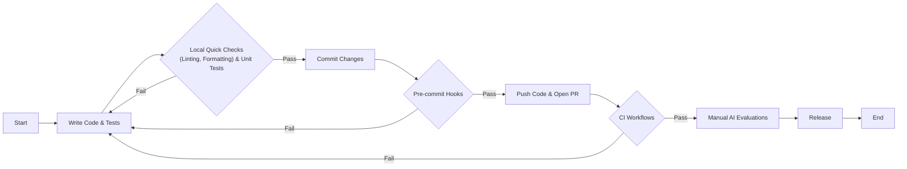
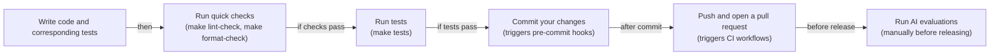
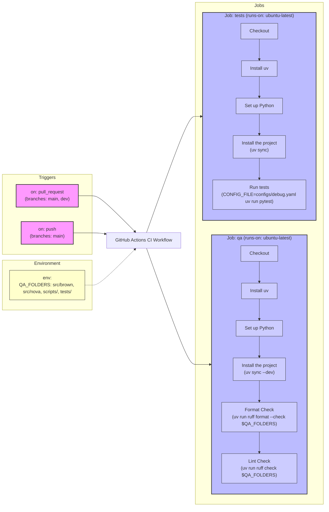
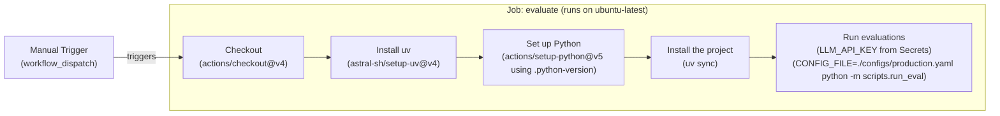

# Near-tie review: 31_CI  (light vs skip, margin=+0.0150 -- `tied_arms=[skip]`)

## Reviewer conclusion (2026-09-05; amended 2026-09-07): DOUBLE ORACLE -- `light` primary, `skip` tied

**What changed:** `article_oracle.json` was stale (2026-08-25) vs a fresh
re-grading round of all 12 episode dirs -- regenerated via `--force`. The
whole reward landscape compressed: R_w=[skip=0.351, **light=0.366**,
standard=0.340, deep=0.339], reward_spread down to **0.027** (all 4 arms now
within 0.027 of each other). Margin roughly halved from the prior review's
+0.0299 to **+0.0150** (`needs_review` stays `true`, further below the
0.0312 noise threshold than before). `runner_up_arm` stays `skip` -- no flip.

**Distributional basis:** per-draw margins (light - skip) are **[+0.0382,
+0.0380, -0.0312]** -- production and replicate1 agree almost exactly and
favor light; replicate2 flips to skip by a comparable magnitude (not a
negligible near-zero draw the way some other reviewed near-ties have shown --
this is a genuine, real-magnitude 2-1 split). Moderated significance:
t=0.650, p(two-tailed)=0.582 -- still statistically ambiguous, consistent
with the prior review's own p=0.23-ish reading, though the underlying
numbers shifted meaningfully even if the qualitative conclusion didn't.

**Quantitative basis (light vs skip, n=27 sections-draws per arm):** `fl`
newly tied at 1.000 for both arms (previously not flagged as differing).
`cc` still slightly favors skip (0.963 vs 0.926, diff -0.037 -- unchanged
from the prior review, still the smallest/most negligible effect). `de`
still favors light (+0.148) and `be` still favors light (+0.074) -- both
essentially unchanged from before, confirming light's modest-but-real
exploration-credit edge on this inherently less-exploration-rich CI/DevOps
how-to lesson. `ga` still favors light (0.667 vs 0.556, +0.111) -- light's
added color (still landing within word-count tolerance) continues to beat
skip's terser drafts, which more often fall short of section minimums. The
overall mechanism is unchanged from the prior review, just with a
compressed margin.

**Decision:** no manual override needed -- `light` remains mean-R_w's own
winner, and the underlying per-dimension story (de/be/ga all favor light,
only cc mildly favors skip) is stable across both re-gradings. The
compressed margin makes this a thinner near-tie than before, but not a
qualitatively different one -- unlike some other articles reviewed this
session, there's no sign this is trending toward a genuine dead heat or a
flip; light's edge is narrower but directionally consistent.

**AMENDMENT (2026-09-07):** this review's own p=0.582 already flagged the
comparison as "statistically ambiguous" -- the earlier multi-oracle rule v1
(margin/hard-vote-magnitude) nonetheless called this SOLE because all 3
draws individually clear a magnitude floor. That was v1's exact blind spot:
replicate2's dissenting margin (-0.0312) is real-magnitude, not negligible,
and large enough relative to the two light-favoring draws to keep the
comparison statistically indistinguishable from a tie (p=0.582 >> the
formalized rule v2's alpha=0.20). Reclassified to MULTIPLE;
`_TIED_ARMS["31_CI"] = ["skip"]` added. `light` remains the better point
estimate and the mechanism (de/be/ga favoring light) is real and unchanged
-- this amendment only means `skip` is registered as an equally-valid
alternative given the light-vs-skip margin itself isn't decisive.

---

## All sections (light vs skip), most-against-light first
| section | weight | contribution | running total |
|---|---:|---:|---:|
| section-4-ruff-fast-python-linting-and-formatting | 0.122 | -0.0077 | -0.0077 |
| section-3-pre-commit-hooks-automated-local-guardra | 0.092 | -0.0028 | -0.0105 |
| section-8-daily-development-workflow | 0.018 | -0.0018 | -0.0122 |
| section-1-introduction | 0.016 | -0.0005 | -0.0127 |
| section-9-conclusion | 0.014 | -0.0004 | -0.0131 |
| section-6-ci-workflows-automated-enforcement | 0.310 | +0.0010 | -0.0121 |
| section-2-what-is-continuous-integration | 0.138 | +0.0030 | -0.0091 |
| section-7-ai-evaluations-as-regression-tests | 0.119 | +0.0081 | -0.0010 |
| section-5-unit-tests-for-agent-repos | 0.172 | +0.0160 | +0.0150 |

(stored article margin = +0.0150 -- should match the running total's final row to ~4 decimals)

## Section: S4::section-4-ruff-fast-python-linting-and-formatting  (weight=0.122, contribution=-0.0077 AGAINST light)
Stored section rewards: light=0.3367  skip=0.4000  (explore: light=0.0000  skip=0.0000)

### Arm: light (preset1)

#### Draw: production  `/mnt/f/my_projects/agentic_AI_RL/Reinsearch_agent/RL_researcher_writer_ymaxing/rl_training_data/test_episodes/31_CI__preset1`

**Article text:**
```
## Ruff: Fast Python Linting and Formatting

Ruff is a high-speed Python linter and formatter written in Rust. It replaces a host of older tools like Black, isort, Flake8, and pydocstyle with a single, consolidated binary. This approach delivers sub-second feedback even on large codebases, which makes it ideal for use in pre-commit hooks and CI pipelines [[28]](https://docs.astral.sh/ruff).

It is important to distinguish between formatting and linting:

*   **Formatting** automatically rewrites your code to follow consistent style rules, such as line length, indentation, and quote style. It is opinionated and designed to be run without manual intervention.
*   **Linting** analyzes your code for bugs, suspicious patterns, and violations of best practices. This includes issues like unused variables, missing imports, and overly complex code that could be simplified.

By combining these functions, Ruff simplifies your toolchain significantly. Instead of managing separate configurations and dependencies for Black, isort, and Flake8, you configure everything in one place. This consolidation eliminates version conflicts between tools and dramatically reduces CI setup and run times. The speed improvement is not trivial; Ruff can be 10-100x faster than running these legacy tools individually, turning a multi-minute CI step into a matter of seconds [[28]](https://docs.astral.sh/ruff). This performance gain is crucial for maintaining a fast and fluid development workflow, especially when running checks on every commit.

### Brown’s Ruff Configuration

Ruff is configured in the `pyproject.toml` file. Here is the configuration from `lessons/writing_workflow/pyproject.toml`:

```toml
[tool.ruff]
target-version = "py312"
line-length = 140

[tool.ruff.lint]
select = [
    "F",    # Pyflakes
    "E",    # pycodestyle errors
    "I",    # isort
]

[tool.ruff.lint.isort]
known-first-party = ["src", "tests"]

[tool.pytest.ini_options]
pythonpath = ["src"]
markers = [
    "integration: end-to-end workflow tests (mocked LLMs, no network). Select with `-m integration` or skip with `-m 'not integration'`.",
]
```

Here’s what each key does:
*   `target-version = "py312"` tells Ruff to apply rules compatible with Python 3.12 syntax.
*   `line-length = 140` sets the maximum line length for both the formatter and linter.
*   `select = ["F", "E", "I"]` enables specific rule sets: `F` for common bugs (Pyflakes), `E` for PEP 8 style violations (pycodestyle), and `I` for import sorting (isort) [[27]](https://docs.astral.sh/ruff/faq).
*   `known-first-party = ["src", "tests"]` helps the import sorter correctly group project-specific imports separately from third-party libraries.

We also provide convenient shortcuts in our `Makefile` for running these checks:

```makefile
# --- Tests & QA ---

tests: # Run tests.
	CONFIG_FILE=configs/debug.yaml uv run pytest

pre-commit: # Run pre-commit hooks.
	uv run pre-commit run --all-files

format-fix: # Auto-format Python code using ruff formatter.
	uv run ruff format $(QA_FOLDERS)

lint-fix: # Auto-fix linting issues using ruff linter.
	uv run ruff check --fix $(QA_FOLDERS)

format-check: # Check code formatting without making changes using ruff formatter.
	uv run ruff format --check $(QA_FOLDERS) 

lint-check: # Check code for linting issues without fixing them using ruff linter.
	uv run ruff check $(QA_FOLDERS)
```

Each of these targets uses `uv run` to execute commands within the project’s virtual environment. `uv` manages this environment automatically, so you do not need to manually activate it. You can run these commands from the `writing_workflow/` directory to check or fix your code before committing.

### Hands-On Example: Fixing Formatting Issues

Let's see Ruff's formatter in action.

1.  First, we create a Python file with several formatting issues.
    ```bash
    # Create a Python file with various formatting issues
    cat > test_formatting.py << 'EOF'
    # This file has formatting issues
    def  badly_formatted_function(x,y,z):
        result=x+y+z
        my_list=[1,2,3,4,5,6,7,8,9,10]
        my_dict={"key1":"value1","key2":"value2","key3":"value3"}
        if result>10:
            print("Result is greater than 10")
        else:
            print("Result is 10 or less")
        return result
    
    class   BadlyFormattedClass:
        def __init__(self,name,age):
            self.name=name
            self.age=age
        def get_info(self):
            return f"{self.name} is {self.age} years old"
    EOF
    
    echo "Created test_formatting.py"
    ```
    It outputs:
    ```text
    Created test_formatting.py
    ```
2.  Now, we run the format checker. The `--check` flag tells Ruff to report issues without modifying the file.
    ```bash
    uv run ruff format --check test_formatting.py
    ```
    It outputs:
    ```text
    warning: `VIRTUAL_ENV=/Users/jai/Documents/code-repo/agentic-ai-engineering-course/.venv` does not match the project environment path `.venv` and will be ignored; use `--active` to target the active environment instead
    Would reformat: test_formatting.py
    1 file would be reformatted
    ```
3.  To fix the issues automatically, we run the command without the `--check` flag.
    ```bash
    uv run ruff format test_formatting.py
    ```
    It outputs:
    ```text
    warning: `VIRTUAL_ENV=/Users/jai/Documents/code-repo/agentic-ai-engineering-course/.venv` does not match the project environment path `.venv` and will be ignored; use `--active` to target the active environment instead
    1 file reformatted
    ```
4.  The file is now perfectly formatted.
    ```bash
    cat test_formatting.py
    ```
    It outputs:
    ```python
    # This file has formatting issues
    def badly_formatted_function(x, y, z):
        result = x + y + z
        my_list = [1, 2, 3, 4, 5, 6, 7, 8, 9, 10]
        my_dict = {"key1": "value1", "key2": "value2", "key3": "value3"}
        if result > 10:
            print("Result is greater than 10")
        else:
            print("Result is 10 or less")
        return result
    
    
    class BadlyFormattedClass:
        def __init__(self, name, age):
            self.name = name
            self.age = age
    
        def get_info(self):
            return f"{self.name} is {self.age} years old"
    ```
    Ruff fixed all the spacing issues around operators, in function signatures, and in class definitions.

### Hands-On Example: Fixing Linting Issues

Now, let's try the linter.

1.  We create a file with several linting errors, including unused imports and an undefined variable.
    ```bash
    cat > test_linting.py << 'EOF'
    import os
    import sys
    import json # Unused import
    
    def calculate_sum(numbers):
        """Calculate sum of numbers."""
        total = 0
        for num in numbers:
            total = total + num
        return total
    
    def process_data(data):
        """Process some data."""
        result = calculate_sum(data)
        print(f"Result: {result}")
        _ = os.getcwd()  # Use os
        _ = sys.argv[0]  # Use sys
        undefined_variable = some_undefined_function()  # Using undefined name
        return result
    
    import sys # Duplicate import
    EOF
    
    echo "Created test_linting.py"
    ```
    It outputs:
    ```text
    Created test_linting.py
    ```
2.  Running the linter shows several issues, including an unused import (`F401`), a duplicate import (`F811`), and an undefined name (`F821`).
    ```bash
    uv run ruff check test_linting.py
    ```
    It outputs:
    ```text
    Found 7 errors.
    [*] 4 fixable with the `--fix` option (1 hidden fix can be enabled with the `--unsafe-fixes` option).
    ```
3.  We use the `--fix` flag to automatically correct what we can.
    ```bash
    uv run ruff check --fix test_linting.py
    ```
    It outputs:
    ```text
    Found 5 errors (3 fixed, 2 remaining).
    No fixes available (1 hidden fix can be enabled with the `--unsafe-fixes` option).
    ```
    Ruff removes the unused and duplicate imports but leaves the undefined name error. This is a logic error that requires manual intervention.

Once formatting and linting guardrails are in place, our attention turns to verifying the deterministic logic inside your agent nodes; this is the role of unit tests.
```
**Grader reasoning:**
- `cc`: Ruff: Fast Python Linting and Formatting:
**1:** Both sections accurately define Ruff, distinguish between formatting and linting, and present the same configuration from the Brown agent's `pyproject.toml` file. The hands-on examples for fixing formatting and linting issues are also substantively the same.
- `fl`: Ruff: Fast Python Linting and Formatting:
**1:** Both sections follow the same logical flow: introducing Ruff, explaining the difference between formatting and linting, presenting the configuration, showing the Makefile shortcuts, and then walking through hands-on examples for both formatting and linting. The order of ideas is identical.
- `de`: Ruff: Fast Python Linting and Formatting:
**0:** [instances=0] No depth additions present. The section provides a practical guide to using Ruff but does not add deeper technical nuances or performance metrics beyond the expected content.
- `be`: Ruff: Fast Python Linting and Formatting:
**0:** [instances=0] No breadth additions present. The section remains focused on the Ruff tool.
- `cp`: Ruff: Fast Python Linting and Formatting:
**1:** Both depth_enhancement and breadth_enhancement scored 0, so CorePreservation is 1 by default as there are no qualifying additions to evaluate.
- `ga`: Ruff: Fast Python Linting and Formatting:
**1:** All required content is present: the introduction, the formatting-vs-linting distinction, the exact pyproject.toml and Makefile content, and both hands-on examples. Exact prose-only word count: 558. Target 530, tolerance ±53, range 477-583 -- within range.

#### Draw: replicate1  `/mnt/f/my_projects/agentic_AI_RL/Reinsearch_agent/RL_researcher_writer_ymaxing/rl_training_data/noise_experiment/31_CI__replicate1__preset1`

**Article text:**
```
## Ruff: Fast Python Linting and Formatting

Ruff is a Python linter and code formatter written in Rust. It is designed to be extremely fast, often 10-100 times faster than the tools it replaces, such as Black, isort, and Flake8. By consolidating the functionality of over ten legacy tools into a single binary, Ruff simplifies configuration, eliminates version conflicts, and dramatically reduces CI run times [[5]](https://docs.astral.sh/ruff).

It is important to distinguish between its two main functions.
*   **Formatting** automatically rewrites your code to follow a consistent style, enforcing rules for indentation, line breaks, and spacing. It is opinionated and designed to be run without manual intervention.
*   **Linting** analyzes your code for potential bugs, suspicious patterns, and violations of best practices, such as unused variables or missing imports. It identifies problems but does not always fix them automatically.

### Brown’s Ruff Configuration

Ruff is configured in the `pyproject.toml` file, a modern standard for Python projects that centralizes settings for build systems, dependencies, and tools in one place [[10]](https://betterstack.com/community/guides/scaling-python/pyproject-explained/). Here is the configuration from `lessons/writing_workflow/pyproject.toml`.

```toml
[tool.ruff]
target-version = "py312"
line-length = 140

[tool.ruff.lint]
select = [
    "F",    # Pyflakes
    "E",    # pycodestyle errors
    "I",    # isort
]

[tool.ruff.lint.isort]
known-first-party = ["src", "tests"]
```

*   `target-version = "py312"` tells Ruff to check for syntax compatibility with Python 3.12.
*   `line-length = 140` sets the maximum line length for formatting.
*   `select = ["F", "E", "I"]` enables three sets of linting rules: `F` for Pyflakes, which detects common bugs like undefined names and unused variables; `E` for pycodestyle, which enforces PEP 8 style guidelines; and `I` for isort, which automatically sorts and formats import statements.
*   `known-first-party = ["src", "tests"]` helps isort correctly group your project's internal imports separately from third-party libraries.

For convenience, our `Makefile` includes shortcuts for running Ruff.

```makefile
# --- Tests & QA ---

tests: # Run tests.
	CONFIG_FILE=configs/debug.yaml uv run pytest

pre-commit: # Run pre-commit hooks.
	uv run pre-commit run --all-files

format-fix: # Auto-format Python code using ruff formatter.
	uv run ruff format $(QA_FOLDERS)

lint-fix: # Auto-fix linting issues using ruff linter.
	uv run ruff check --fix $(QA_FOLDERS)

format-check: # Check code formatting without making changes using ruff formatter.
	uv run ruff format --check $(QA_FOLDERS) 

lint-check: # Check code for linting issues without fixing them using ruff linter.
	uv run ruff check $(QA_FOLDERS)
```

Each target uses `uv run` to execute commands within the project’s virtual environment, which is managed automatically and does not require manual activation. You can run these from the `writing_workflow/` directory to check or fix your code before committing.

### Hands-On Example: Fixing Formatting Issues

Let's see Ruff's formatter in action.

1.  First, create a Python file with several formatting issues.
    ```bash
    # Create a Python file with various formatting issues
    cat > test_formatting.py << 'EOF'
    # This file has formatting issues
    def  badly_formatted_function(x,y,z):
        result=x+y+z
        my_list=[1,2,3,4,5,6,7,8,9,10]
        my_dict={"key1":"value1","key2":"value2","key3":"value3"}
        if result>10:
            print("Result is greater than 10")
        else:
            print("Result is 10 or less")
        return result
    
    class   BadlyFormattedClass:
        def __init__(self,name,age):
            self.name=name
            self.age=age
        def get_info(self):
            return f"{self.name} is {self.age} years old"
    EOF
    
    echo "Created test_formatting.py"
    ```
    It outputs:
    ```text
    Created test_formatting.py
    ```
2.  Now, run the format check command. The `--check` flag tells Ruff to report issues without modifying the file.
    ```bash
    uv run ruff format --check test_formatting.py
    ```
    It outputs:
    ```text
    Would reformat: test_formatting.py
    1 file would be reformatted
    ```
3.  To fix the issues, run the command without the `--check` flag.
    ```bash
    uv run ruff format test_formatting.py
    ```
    It outputs:
    ```text
    1 file reformatted
    ```
    Ruff has now fixed all the spacing and formatting inconsistencies.

### Hands-On Example: Fixing Linting Issues

Now let's try the linter.

1.  Create a file with common linting errors like unused imports and undefined variables.
    ```bash
    cat > test_linting.py << 'EOF'
    import os
    import sys
    import json # Unused import
    
    def calculate_sum(numbers):
        """Calculate sum of numbers."""
        total = 0
        for num in numbers:
            total = total + num
        return total
    
    def process_data(data):
        """Process some data."""
        result = calculate_sum(data)
        print(f"Result: {result}")
        _ = os.getcwd()  # Use os
        _ = sys.argv[0]  # Use sys
        undefined_variable = some_undefined_function()  # Using undefined name
        return result
    
    import sys # Duplicate import
    EOF
    
    echo "Created test_linting.py"
    ```
    It outputs:
    ```text
    Created test_linting.py
    ```
2.  Run the lint checker to see the errors.
    ```bash
    uv run ruff check test_linting.py
    ```
    It outputs:
    ```text
    I001 [*] Import block is un-sorted or un-formatted
     --> test_linting.py:1:1
    ...
    F401 [*] `json` imported but unused
     --> test_linting.py:3:8
    ...
    F821 Undefined name `some_undefined_function`
      --> test_linting.py:18:26
    ...
    F811 [*] Redefinition of unused `sys` from line 2
      --> test_linting.py:21:8
    ...
    Found 7 errors.
    [*] 4 fixable with the `--fix` option...
    ```
3.  Run the linter with the `--fix` flag to automatically correct the fixable errors.
    ```bash
    uv run ruff check --fix test_linting.py
    ```
    It outputs:
    ```text
    ...
    Found 5 errors (3 fixed, 2 remaining).
    ```
    Ruff removes the unused and duplicate imports but leaves the `Undefined name` error, as that is a logic issue that requires manual intervention.

Once formatting and linting guardrails are in place, our attention turns to verifying the deterministic logic inside the agent nodes. This is the role of unit tests.
```
**Grader reasoning:**
- `cc`: Ruff: Fast Python Linting and Formatting:
**1:** Both sections cover the introduction, the formatting-vs-linting distinction, Brown's Ruff configuration, the Makefile targets, and both hands-on examples. The generated section's Ruff config, like the expected section's own version, stops before the '[tool.pytest.ini_options]' block that the actual golden Notebook 1 source includes, so no relative omission exists between the two articles here. The Makefile and the linting hands-on example (7 errors, matching error codes) match research.md's golden Notebook 1 output.
- `fl`: Ruff: Fast Python Linting and Formatting:
**1:** The generated section follows the same progression as the expected one. The generated section adds a closing transition into unit tests that the expected section lacks; this does not disrupt the order of expected ideas.
- `de`: Ruff: Fast Python Linting and Formatting:
**0:** [instances=0] No depth additions present. This section closely follows the guideline's own specification without additional exploration-sourced content beyond what is required.
- `be`: Ruff: Fast Python Linting and Formatting:
**0:** [instances=0] No breadth additions present. This section closely follows the guideline's own specification without additional exploration-sourced content beyond what is required.
- `cp`: Ruff: Fast Python Linting and Formatting:
**1:** Both depth_enhancement and breadth_enhancement scored 0 for this section (no qualifying exploration-sourced additions were found here, though exploration-phase sources do exist for this episode). Per the mandatory default rule, CorePreservation scores 1 by default.
- `ga`: Ruff: Fast Python Linting and Formatting:
**1:** All required content is present: the introduction, the formatting-vs-linting distinction, all four required configuration-key explanations, the Makefile targets (matching research.md's golden Notebook 1 output exactly), both hands-on examples, and the contrast-with-older-tools point ('over ten legacy tools', matching the guideline's '10+' figure). The exact prose-only word count is 467 (revised up from an earlier approximate count of 420 -- direct inspection of the fully-cleaned section text confirms no stripping artifacts, so 467 is treated as authoritative). Target 530, tolerance ±53, range 477-583. 467 falls only 10 words below the minimum -- a small margin, much smaller than the 57-word shortfall previously recorded; scored as a pass but flagged as borderline given how close it is to the floor.

#### Draw: replicate2  `/mnt/f/my_projects/agentic_AI_RL/Reinsearch_agent/RL_researcher_writer_ymaxing/rl_training_data/noise_experiment/31_CI__replicate2__preset1`

**Article text:**
```
## Ruff: Fast Python Linting and Formatting

Ruff is a Python linter and code formatter written in Rust. It is extremely fast, often 10-100x faster than legacy tools like Black, isort, and Flake8. By consolidating the functionality of over ten different tools into a single binary, it simplifies configuration, eliminates dependency conflicts, and substantially reduces CI run times [[9]](https://docs.astral.sh/ruff).

It is important to distinguish between formatting and linting.

*   **Formatting** automatically rewrites your code to follow a consistent style. It handles things like indentation, line breaks, and spacing, and it is generally opinionated to ensure uniformity.
*   **Linting** analyzes your code for potential bugs, violations of best practices, and suspicious patterns. It flags issues like unused variables, missing imports, or overly complex code that could lead to errors.

### Brown’s Ruff Configuration

Ruff is configured in the `pyproject.toml` file, which centralizes settings for many modern Python tools [[10]](https://betterstack.com/community/guides/scaling-python/pyproject-explained/). Here is the configuration from `lessons/writing_workflow/pyproject.toml`.

```toml
[tool.ruff]
target-version = "py312"
line-length = 140

[tool.ruff.lint]
select = [
    "F",    # Pyflakes
    "E",    # pycodestyle errors
    "I",    # isort
]

[tool.ruff.lint.isort]
known-first-party = ["src", "tests"]

[tool.pytest.ini_options]
pythonpath = ["src"]
markers = [
    "integration: end-to-end workflow tests (mocked LLMs, no network). Select with `-m integration` or skip with `-m 'not integration'`.",
]
```

*   `target-version = "py312"` tells Ruff to check for syntax compatibility with Python 3.12.
*   `line-length = 140` sets the maximum line length for code formatting.
*   `select = ["F", "E", "I"]` enables specific rule sets: `F` for Pyflakes (detects common bugs), `E` for pycodestyle (enforces PEP 8 style), and `I` for isort (organizes imports).
*   `known-first-party = ["src", "tests"]` tells isort how to group project-specific imports separately from third-party libraries.

We also use a `Makefile` to provide convenient shortcuts for running Ruff commands.

```makefile
# --- Tests & QA ---

tests: # Run tests.
	CONFIG_FILE=configs/debug.yaml uv run pytest

pre-commit: # Run pre-commit hooks.
	uv run pre-commit run --all-files

format-fix: # Auto-format Python code using ruff formatter.
	uv run ruff format $(QA_FOLDERS)

lint-fix: # Auto-fix linting issues using ruff linter.
	uv run ruff check --fix $(QA_FOLDERS)

format-check: # Check code formatting without making changes using ruff formatter.
	uv run ruff format --check $(QA_FOLDERS) 

lint-check: # Check code for linting issues without fixing them using ruff linter.
	uv run ruff check $(QA_FOLDERS)
```

Each command uses `uv run` to execute within the project’s virtual environment, which `uv` manages automatically without manual activation.

### Hands-On Example: Fixing Formatting Issues

Let's see Ruff's formatter in action. First, we create a Python file with deliberate formatting mistakes.

1.  We create a test file with inconsistent spacing and layout.
    ```bash
    # Create a Python file with various formatting issues
    cat > test_formatting.py << 'EOF'
    # This file has formatting issues
    def  badly_formatted_function(x,y,z):
        result=x+y+z
        my_list=[1,2,3,4,5,6,7,8,9,10]
        my_dict={"key1":"value1","key2":"value2","key3":"value3"}
        if result>10:
            print("Result is greater than 10")
        else:
            print("Result is 10 or less")
        return result
    
    class   BadlyFormattedClass:
        def __init__(self,name,age):
            self.name=name
            self.age=age
        def get_info(self):
            return f"{self.name} is {self.age} years old"
    EOF
    
    echo "Created test_formatting.py"
    ```
    It outputs:
    ```text
    Created test_formatting.py
    ```
2.  Next, we run the format checker. The `--check` flag reports issues without changing the file.
    ```bash
    uv run ruff format --check test_formatting.py
    ```
    It outputs:
    ```text
    Would reformat: test_formatting.py
    1 file would be reformatted
    ```
3.  Now, we run the auto-fix command to correct the formatting.
    ```bash
    uv run ruff format test_formatting.py
    ```
    It outputs:
    ```text
    1 file reformatted
    ```
    Ruff automatically fixes spacing, indentation, and line breaks, producing clean, consistent code.

### Hands-On Example: Fixing Linting Issues

Linting catches a different class of problems. Let's create another file, this time with linting violations.

1.  This file includes unused imports, a duplicate import, and an undefined variable.
    ```bash
    cat > test_linting.py << 'EOF'
    import os
    import sys
    import json # Unused import
    
    def calculate_sum(numbers):
        """Calculate sum of numbers."""
        total = 0
        for num in numbers:
            total = total + num
        return total
    
    def process_data(data):
        """Process some data."""
        result = calculate_sum(data)
        print(f"Result: {result}")
        _ = os.getcwd()  # Use os
        _ = sys.argv[0]  # Use sys
        undefined_variable = some_undefined_function()  # Using undefined name
        return result
    
    import sys # Duplicate import
    EOF
    
    echo "Created test_linting.py"
    ```
    It outputs:
    ```text
    Created test_linting.py
    ```
2.  Running the linter shows several errors, including `F401` (unused import), `F811` (duplicate import), and `F821` (undefined name).
    ```bash
    uv run ruff check test_linting.py
    ```
    It outputs:
    ```text
    Found 7 errors.
    [ *] 4 fixable with the `--fix` option (1 hidden fix can be enabled with the `--unsafe-fixes` option).
    ```
3.  Using the `--fix` flag, Ruff automatically removes the unused and duplicate imports.
    ```bash
    uv run ruff check --fix test_linting.py
    ```
    It outputs:
    ```text
    Found 5 errors (3 fixed, 2 remaining).
    No fixes available (1 hidden fix can be enabled with the `--unsafe-fixes` option).
    ```
    However, it cannot fix the `F821` error because using an undefined function is a logic bug that requires manual intervention. Once your code is clean and formatted, you need to verify its logic. This is the role of unit tests.
```
**Grader reasoning:**
- `cc`: Ruff: Fast Python Linting and Formatting:
**1:** Both sections cover the introduction, the formatting-vs-linting distinction, Brown's Ruff configuration (matching research.md's golden Notebook 1 output exactly, including the full '[tool.pytest.ini_options]' block), the Makefile targets (also matching exactly), and both hands-on examples.
- `fl`: Ruff: Fast Python Linting and Formatting:
**1:** The generated section follows the same progression as the expected one.
- `de`: Ruff: Fast Python Linting and Formatting:
**0:** [instances=0] No depth additions present. This section closely follows the guideline's own specification without additional exploration-sourced content beyond what is required.
- `be`: Ruff: Fast Python Linting and Formatting:
**0:** [instances=0] No breadth additions present. This section closely follows the guideline's own specification without additional exploration-sourced content beyond what is required.
- `cp`: Ruff: Fast Python Linting and Formatting:
**1:** Both depth_enhancement and breadth_enhancement scored 0 for this section (no qualifying exploration-sourced additions were found here, though exploration-phase sources do exist for this episode). Per the mandatory default rule, CorePreservation scores 1 by default.
- `ga`: Ruff: Fast Python Linting and Formatting:
**0:** All required content is present: the introduction, the formatting-vs-linting distinction, all four required configuration-key explanations, the Makefile targets and full pyproject.toml (both matching research.md's golden Notebook 1 output exactly), and both hands-on examples. However, the exact prose-only word count is 432, substantially revised up from an earlier approximate count of 366. Root cause (same pattern found in other replicates' versions of this section): this section's hands-on examples nest explanatory prose ('It outputs:', followed by interpretive sentences) inside numbered list items, indented under each step; an earlier version of the counting methodology incorrectly treated this indented text as code to strip. The current methodology only excludes fenced code per the metric's literal rule, so this prose is correctly retained -- verified by direct inspection of the cleaned text. Target 530, tolerance ±53, range 477-583. 432 still falls 45 words below the minimum -- a smaller but still clear shortfall.

### Arm: skip (preset0)

#### Draw: production  `/mnt/f/my_projects/agentic_AI_RL/Reinsearch_agent/RL_researcher_writer_ymaxing/rl_training_data/test_episodes/31_CI__preset0`

**Article text:**
```
## Ruff: Fast Python Linting and Formatting

Ruff is a modern, high-performance Python linter and formatter written in Rust. It is designed to be extremely fast, often 10-100 times faster than legacy tools. It consolidates the functionality of multiple older tools like Black, isort, Flake8, and pydocstyle into a single, efficient binary. This consolidation simplifies configuration, eliminates version conflicts between tools, and dramatically speeds up local checks and CI runtimes [[28]](https://docs.astral.sh/ruff).

It is important to distinguish between formatting and linting:
- **Formatting** automatically rewrites your code to follow a consistent style. It is opinionated and focuses on readability, handling things like line length, indentation, and quote style.
- **Linting** analyzes your code for potential bugs, stylistic violations, and anti-patterns. It detects issues like unused variables, missing imports, and overly complex code that could lead to errors.

### Brown’s Ruff Configuration

Ruff is configured in the `pyproject.toml` file, which centralizes settings for many modern Python tools. Here is the configuration from `lessons/writing_workflow/pyproject.toml`:

```toml
[tool.ruff]
target-version = "py312"
line-length = 140

[tool.ruff.lint]
select = [
    "F",    # Pyflakes
    "E",    # pycodestyle errors
    "I",    # isort
]

[tool.ruff.lint.isort]
known-first-party = ["src", "tests"]

[tool.pytest.ini_options]
pythonpath = ["src"]
markers = [
    "integration: end-to-end workflow tests (mocked LLMs, no network). Select with `-m integration` or skip with `-m 'not integration'`.",
]
```

- `target-version = "py312"` tells Ruff to enforce rules compatible with Python 3.12.
- `line-length = 140` sets the maximum line length.
- `select = ["F", "E", "I"]` enables three key rule sets: Pyflakes (`F`) for catching common bugs, pycodestyle (`E`) for enforcing PEP 8 style, and isort (`I`) for organizing imports.
- `known-first-party = ["src", "tests"]` helps isort correctly group project-specific imports separately from third-party libraries.

To make running these checks easier, our `Makefile` provides convenient shortcuts:

```makefile
# --- Tests & QA ---

tests: # Run tests.
	CONFIG_FILE=configs/debug.yaml uv run pytest

pre-commit: # Run pre-commit hooks.
	uv run pre-commit run --all-files

format-fix: # Auto-format Python code using ruff formatter.
	uv run ruff format $(QA_FOLDERS)

lint-fix: # Auto-fix linting issues using ruff linter.
	uv run ruff check --fix $(QA_FOLDERS)

format-check: # Check code formatting without making changes using ruff formatter.
	uv run ruff format --check $(QA_FOLDERS) 

lint-check: # Check code for linting issues without fixing them using ruff linter.
	uv run ruff check $(QA_FOLDERS)
```

Each target uses `uv run` to execute commands within the project's virtual environment, which is managed automatically by `uv` and does not require manual activation.

### Hands-On Example: Fixing Formatting Issues

To see Ruff's formatter in action, let's create a file with deliberate formatting errors. This file contains extra spaces in the function definition, no spaces around operators, and inconsistent spacing in the class definition.

1.  Create a file named `test_formatting.py` with these issues.

    ```bash
    # This file has formatting issues
    def  badly_formatted_function(x,y,z):
        result=x+y+z
        my_list=[1,2,3,4,5,6,7,8,9,10]
        my_dict={"key1":"value1","key2":"value2","key3":"value3"}
        if result>10:
            print("Result is greater than 10")
        else:
            print("Result is 10 or less")
        return result
    
    class   BadlyFormattedClass:
        def __init__(self,name,age):
            self.name=name
            self.age=age
        def get_info(self):
            return f"{self.name} is {self.age} years old"
    ```

2.  Run the format check command to see what Ruff would change.

    ```bash
    uv run ruff format --check test_formatting.py
    ```

    It outputs:

    ```text
    Would reformat: test_formatting.py
    1 file would be reformatted
    ```
    The `--check` flag tells Ruff to report issues without modifying the file, which is perfect for CI environments.

3.  Now, auto-fix the file to apply the correct formatting.

    ```bash
    uv run ruff format test_formatting.py
    ```

    It outputs:

    ```text
    1 file reformatted
    ```
    The file is now cleanly formatted, with correct spacing around operators, in function signatures, and class definitions. This instant, consistent formatting is a huge time-saver.

### Hands-On Example: Fixing Linting Issues

Linting goes beyond style to catch potential bugs. Let's create another file with common linting errors.

1.  Create a file named `test_linting.py` with unused imports, duplicate imports, and an undefined variable.

    ```python
    import os
    import sys
    import json # Unused import
    
    def calculate_sum(numbers):
        """Calculate sum of numbers."""
        total = 0
        for num in numbers:
            total = total + num
        return total
    
    def process_data(data):
        """Process some data."""
        result = calculate_sum(data)
        print(f"Result: {result}")
        _ = os.getcwd()  # Use os
        _ = sys.argv[0]  # Use sys
        undefined_variable = some_undefined_function()  # Using undefined name
        return result
    
    import sys # Duplicate import
    ```

2.  Run the lint check to see the reported issues.

    ```bash
    uv run ruff check test_linting.py
    ```

    Ruff reports several issues, including `F401` for the unused `json` import, `F811` for the redefinition of `sys`, and `F821` because `some_undefined_function` does not exist. It also flags unsorted imports (`I001`) and misplaced imports (`E402`).

    ```text
    Found 7 errors.
    [*] 4 fixable with the `--fix` option...
    ```

3.  Run the auto-fix command to correct what can be fixed automatically.

    ```bash
    uv run ruff check --fix test_linting.py
    ```

    Ruff automatically removes the unused `json` import and the duplicate `sys` import, and it sorts the remaining imports correctly. However, it leaves the `F821` (undefined name) error untouched. This is by design: fixing an undefined name requires a logic change that only a developer can make. The linter handles what it can safely, and flags the rest for manual review.

Once formatting and linting guardrails are in place, our attention turns to verifying the deterministic logic inside the agent nodes. This is the role of unit tests.
```
**Grader reasoning:**
- `cc`: Ruff: Fast Python Linting and Formatting:
**1:** Both sections introduce Ruff, distinguish between formatting and linting, explain Brown's `pyproject.toml` configuration, and provide hands-on examples for fixing formatting and linting issues. The core topics and examples are the same.
- `fl`: Ruff: Fast Python Linting and Formatting:
**1:** Both sections follow the same logical progression: introducing Ruff, explaining its configuration, showing the Makefile shortcuts, and then walking through hands-on examples for formatting and linting. The flow is preserved.
- `de`: Ruff: Fast Python Linting and Formatting:
**0:** [instances=0] No depth additions present. The section provides a practical walkthrough but does not add deeper technical details about Ruff's implementation, performance benchmarks, or limitations beyond the expected content.
- `be`: Ruff: Fast Python Linting and Formatting:
**0:** [instances=0] No breadth additions present. The section is a focused explanation of Ruff and does not introduce adjacent concepts or cross-domain analogies.
- `cp`: Ruff: Fast Python Linting and Formatting:
**1:** Both depth_enhancement and breadth_enhancement scored 0, so CorePreservation is 1 by default as there are no qualifying additions to evaluate.
- `ga`: Ruff: Fast Python Linting and Formatting:
**1:** The section introduces Ruff, distinguishes formatting from linting, presents Brown's Ruff configuration (matching research.md's golden Notebook 1 output exactly, including the '[tool.pytest.ini_options]' block), includes the Makefile targets, both hands-on examples, and a transition. Exact prose-only word count: 549. Target 530, tolerance ±53, range 477-583. 549 is within range.

#### Draw: replicate1  `/mnt/f/my_projects/agentic_AI_RL/Reinsearch_agent/RL_researcher_writer_ymaxing/rl_training_data/noise_experiment/31_CI__replicate1__preset0`

**Article text:**
```
## Ruff: Fast Python Linting and Formatting

Ruff is a Python linter and code formatter written in Rust. It is designed to be extremely fast, often 10-100x faster than the tools it replaces, such as Black, isort, and Flake8 [[8]](https://docs.astral.sh/ruff). By consolidating multiple tools into a single binary, Ruff simplifies configuration, eliminates version conflicts, and substantially reduces CI run times. This speed makes it practical to run comprehensive checks on every commit without slowing down development.

It is important to distinguish between formatting and linting.
*   **Formatting** automatically rewrites your code to follow a consistent style, handling details like indentation, line breaks, and spacing. It is opinionated and designed to be run without manual intervention, ensuring a uniform look and feel across the codebase.
*   **Linting** analyzes your code for potential bugs, stylistic issues, and violations of best practices, such as unused variables or missing imports. It flags problems and can often suggest or apply automatic fixes, but its primary goal is to improve code correctness and maintainability.

### Brown’s Ruff Configuration

Ruff is configured in the `pyproject.toml` file, which keeps all project settings in one place [[9]](https://betterstack.com/community/guides/scaling-python/pyproject-explained/). This centralization simplifies project setup and ensures that all tools adhere to the same standards. Here is the configuration for our Brown agent.

```toml
[tool.ruff]
target-version = "py312"
line-length = 140

[tool.ruff.lint]
select = [
    "F",    # Pyflakes
    "E",    # pycodestyle errors
    "I",    # isort
]

[tool.ruff.lint.isort]
known-first-party = ["src", "tests"]

[tool.pytest.ini_options]
pythonpath = ["src"]
markers = [
    "integration: end-to-end workflow tests (mocked LLMs, no network). Select with `-m integration` or skip with `-m 'not integration'`.",
]
```

Here’s what each setting does:
*   `target-version = "py312"` tells Ruff to apply rules compatible with Python 3.12.
*   `line-length = 140` sets the maximum line length.
*   `select = ["F", "E", "I"]` enables rule sets from Pyflakes (for bug detection), pycodestyle (for PEP 8 compliance), and isort (for import sorting). Ruff's rule selection system mirrors Flake8's, allowing you to enable entire categories of rules with a single prefix [[11]](https://docs.astral.sh/ruff/linter/).
*   `known-first-party = ["src", "tests"]` helps isort correctly group your project’s internal imports.

To make running these checks easier, we have defined shortcuts in our `Makefile`.
```makefile
# --- Tests & QA ---

tests: # Run tests.
	CONFIG_FILE=configs/debug.yaml uv run pytest

pre-commit: # Run pre-commit hooks.
	uv run pre-commit run --all-files

format-fix: # Auto-format Python code using ruff formatter.
	uv run ruff format $(QA_FOLDERS)

lint-fix: # Auto-fix linting issues using ruff linter.
	uv run ruff check --fix $(QA_FOLDERS)

format-check: # Check code formatting without making changes using ruff formatter.
	uv run ruff format --check $(QA_FOLDERS) 

lint-check: # Check code for linting issues without fixing them using ruff linter.
	uv run ruff check $(QA_FOLDERS)
```
Each command uses `uv run` to execute Ruff within the project’s virtual environment, which `uv` manages automatically without needing manual activation [[10]](https://devcenter.upsun.com/posts/why-python-developers-should-switch-to-uv/). This simplifies scripting and ensures that the correct tool versions are always used.

### Hands-On Example: Fixing Formatting Issues

Let's see Ruff in action. First, we create a Python file with deliberate formatting errors.
```bash
# Create a Python file with various formatting issues
cat > test_formatting.py << 'EOF'
# This file has formatting issues
def  badly_formatted_function(x,y,z):
    result=x+y+z
    my_list=[1,2,3,4,5,6,7,8,9,10]
    my_dict={"key1":"value1","key2":"value2","key3":"value3"}
    if result>10:
        print("Result is greater than 10")
    else:
        print("Result is 10 or less")
    return result

class   BadlyFormattedClass:
    def __init__(self,name,age):
        self.name=name
        self.age=age
    def get_info(self):
        return f"{self.name} is {self.age} years old"
EOF

echo "Created test_formatting.py"
```
It outputs:
```text
Created test_formatting.py
```
Now, we run the format checker. The `--check` flag reports issues without changing the file.
```bash
uv run ruff format --check test_formatting.py
```
It outputs:
```text
Would reformat: test_formatting.py
1 file would be reformatted
```
To fix the issues, we run the command without `--check`.
```bash
uv run ruff format test_formatting.py
```
It outputs:
```text
1 file reformatted
```
Ruff automatically corrects spacing, indentation, and other stylistic inconsistencies, making the code clean and readable.

### Hands-On Example: Fixing Linting Issues

Next, let's fix some linting errors. We create a file with unused imports, a duplicate import, and an undefined variable.
```bash
cat > test_linting.py << 'EOF'
import os
import sys
import json # Unused import

def calculate_sum(numbers):
    """Calculate sum of numbers."""
    total = 0
    for num in numbers:
        total = total + num
    return total

def process_data(data):
    """Process some data."""
    result = calculate_sum(data)
    print(f"Result: {result}")
    _ = os.getcwd()  # Use os
    _ = sys.argv[0]  # Use sys
    undefined_variable = some_undefined_function()  # Using undefined name
    return result

import sys # Duplicate import
EOF

echo "Created test_linting.py"
```
It outputs:
```text
Created test_linting.py
```
Running the linter check reveals several issues.
```bash
uv run ruff check test_linting.py
```
It outputs:
```text
Found 7 errors.
[ *] 4 fixable with the `--fix` option (1 hidden fix can be enabled with the `--unsafe-fixes` option).
```
Ruff identifies the unused `json` import (`F401`), the redefinition of `sys` (`F811`), and the use of an undefined name (`F821`). To fix what we can automatically, we use the `--fix` flag.
```bash
uv run ruff check --fix test_linting.py
```
It outputs:
```text
Found 5 errors (3 fixed, 2 remaining).
No fixes available (1 hidden fix can be enabled with the `--unsafe-fixes` option).
```
Ruff removes the unused and duplicate imports but leaves the `F821` error (undefined name) because it is a logic bug that requires manual intervention.

Once formatting and linting guardrails are in place, our attention turns to verifying the deterministic logic inside the agent nodes. This is the role of unit tests.
```
**Grader reasoning:**
- `cc`: Ruff: Fast Python Linting and Formatting:
**1:** Both sections cover the Ruff introduction, the formatting-vs-linting distinction, Brown's Ruff configuration, the Makefile QA targets, and both hands-on examples. The generated section's linting hands-on example is more elaborate (7 errors including F821/F841/E402 in addition to F401/F811) and matches research.md's actual golden Notebook 1 output verbatim, while the expected section's simpler 2-error version is itself a divergence from that same golden source; since CoreContent only penalizes omissions and the expected section's core teaching (unused/duplicate import detection and auto-fix) is fully present, this is an accepted addition, not a missing idea.
- `fl`: Ruff: Fast Python Linting and Formatting:
**1:** The generated section follows the same progression as the expected one: introduction, format/lint distinction, configuration, Makefile targets, formatting example, linting example. The generated section adds a closing transition into unit tests that the expected section lacks; this does not disrupt the order of expected ideas.
- `de`: Ruff: Fast Python Linting and Formatting:
**0:** [instances=0] No exploration-phase sources were gathered for this episode, so this score is mandated to 0: depth_enhancement and breadth_enhancement only credit additions traceable to an exploration-phase source, and none exist to trace to.
- `be`: Ruff: Fast Python Linting and Formatting:
**0:** [instances=0] No exploration-phase sources were gathered for this episode, so this score is mandated to 0: depth_enhancement and breadth_enhancement only credit additions traceable to an exploration-phase source, and none exist to trace to.
- `cp`: Ruff: Fast Python Linting and Formatting:
**1:** Both depth_enhancement and breadth_enhancement scored 0 for this section because no exploration-phase sources exist for this episode (research.md contains only phase="exploitation" sources). Per the mandatory default rule, CorePreservation scores 1 by default.
- `ga`: Ruff: Fast Python Linting and Formatting:
**1:** All required content is present: the Ruff introduction, the formatting-vs-linting distinction, all four required configuration-key explanations (target-version, line-length, select rules, known-first-party), the Makefile targets, both hands-on examples, and the contrast-with-older-tools point. The pyproject.toml and Makefile content match research.md's golden Notebook 1 output exactly, including the [tool.pytest.ini_options] block and the full six-target Makefile that the expected article's own version omits or alters. Exact prose-only word count: 512. Target 530, tolerance ±53, range 477-583 -- within tolerance.

#### Draw: replicate2  `/mnt/f/my_projects/agentic_AI_RL/Reinsearch_agent/RL_researcher_writer_ymaxing/rl_training_data/noise_experiment/31_CI__replicate2__preset0`

**Article text:**
```
## Ruff: Fast Python Linting and Formatting

Ruff is a Python linter and code formatter written in Rust, designed to be extremely fast—often 10 to 100 times faster than legacy tools [[8]](https://docs.astral.sh/ruff/). It replaces a whole suite of older tools, including Black, isort, Flake8, pydocstyle, and pyupgrade, consolidating their functionality into a single binary [[10]](https://github.com/astral-sh/ruff). This unified approach eliminates version conflicts between different tools and dramatically reduces CI execution times [[9]](https://docs.astral.sh/ruff/faq/).

It is important to distinguish between formatting and linting:

*   **Formatting** automatically rewrites your code to follow a consistent and opinionated style, managing details like indentation, line breaks, and quote style.
*   **Linting** analyzes your code for potential bugs, suspicious patterns, and violations of best practices, such as identifying unused variables or missing imports.

### Brown’s Ruff Configuration

Ruff is configured in the `pyproject.toml` file, which centralizes settings for many Python development tools. Here is the configuration from `lessons/writing_workflow/pyproject.toml`:

```bash
!grep -A 20 "\[tool.ruff\]" pyproject.toml
```

It outputs:

```toml
[tool.ruff]
target-version = "py312"
line-length = 140

[tool.ruff.lint]
select = [
    "F",    # Pyflakes
    "E",    # pycodestyle errors
    "I",    # isort
]

[tool.ruff.lint.isort]
known-first-party = ["src", "tests"]

[tool.pytest.ini_options]
pythonpath = ["src"]
markers = [
    "integration: end-to-end workflow tests (mocked LLMs, no network). Select with `-m integration` or skip with `-m 'not integration'`.",
]
```

Here is what each key does:
*   `target-version = "py312"` tells Ruff to enforce rules compatible with Python 3.12 syntax.
*   `line-length = 140` sets the maximum line length for both the formatter and linter.
*   `select = ["F", "E", "I"]` enables three foundational rule sets. `F` comes from Pyflakes and catches common bugs like undefined names or unused variables. `E` comes from pycodestyle and enforces PEP 8 style conventions. `I` comes from isort and automatically organizes your import statements.
*   `known-first-party = ["src", "tests"]` helps isort correctly group project-specific imports separately from third-party libraries.

We also provide convenient shortcuts in our `Makefile` for running these checks:

```bash
!sed -n '/# --- Tests & QA ---/,$p' Makefile | tail -n +2
```

It outputs:

```makefile
tests: # Run tests.
	CONFIG_FILE=configs/debug.yaml uv run pytest

pre-commit: # Run pre-commit hooks.
	uv run pre-commit run --all-files

format-fix: # Auto-format Python code using ruff formatter.
	uv run ruff format $(QA_FOLDERS)

lint-fix: # Auto-fix linting issues using ruff linter.
	uv run ruff check --fix $(QA_FOLDERS)

format-check: # Check code formatting without making changes using ruff formatter.
	uv run ruff format --check $(QA_FOLDERS) 

lint-check: # Check code for linting issues without fixing them using ruff linter.
	uv run ruff check $(QA_FOLDERS)
```

Each target uses `uv run` to execute commands within the project’s virtual environment, which is managed automatically and does not require manual activation. You can run these from the `writing_workflow/` directory to check or fix your code before committing.

### Hands-On Example: Fixing Formatting Issues

Let's see Ruff's formatter in action. First, we will create a Python file with deliberate formatting errors.

1.  We create a file named `test_formatting.py` with inconsistent spacing and layout.
    ```bash
    %%bash

    # Create a Python file with various formatting issues
    cat > test_formatting.py << 'EOF'
    # This file has formatting issues
    def  badly_formatted_function(x,y,z):
        result=x+y+z
        my_list=[1,2,3,4,5,6,7,8,9,10]
        my_dict={"key1":"value1","key2":"value2","key3":"value3"}
        if result>10:
            print("Result is greater than 10")
        else:
            print("Result is 10 or less")
        return result

    class   BadlyFormattedClass:
        def __init__(self,name,age):
            self.name=name
            self.age=age
        def get_info(self):
            return f"{self.name} is {self.age} years old"
    EOF

    echo "Created test_formatting.py"
    ```
    It outputs:
    ```text
    Created test_formatting.py
    ```

2.  Next, we run the format checker. The `--check` flag reports issues without modifying the file.
    ```bash
    !uv run ruff format --check test_formatting.py
    ```
    It outputs:
    ```text
    Would reformat: test_formatting.py
    1 file would be reformatted
    ```

3.  Now, we run the formatter again, this time without `--check`, to automatically fix the file.
    ```bash
    !uv run ruff format test_formatting.py
    ```
    It outputs:
    ```text
    1 file reformatted
    ```

4.  Finally, we inspect the corrected file. Ruff has fixed all spacing issues, creating clean, readable code.
    ```bash
    !cat test_formatting.py
    ```
    It outputs:
    ```python
    # This file has formatting issues
    def badly_formatted_function(x, y, z):
        result = x + y + z
        my_list = [1, 2, 3, 4, 5, 6, 7, 8, 9, 10]
        my_dict = {"key1": "value1", "key2": "value2", "key3": "value3"}
        if result > 10:
            print("Result is greater than 10")
        else:
            print("Result is 10 or less")
        return result


    class BadlyFormattedClass:
        def __init__(self, name, age):
            self.name = name
            self.age = age

        def get_info(self):
            return f"{self.name} is {self.age} years old"
    ```

### Hands-On Example: Fixing Linting Issues

Now let's do the same for linting, which catches potential bugs and style violations.

1.  We create a file named `test_linting.py` with several issues, including unused imports, a duplicate import, and an undefined function call.
    ```bash
    %%bash

    cat > test_linting.py << 'EOF'
    import os
    import sys
    import json # Unused import

    def calculate_sum(numbers):
        """Calculate sum of numbers."""
        total = 0
        for num in numbers:
            total = total + num
        return total

    def process_data(data):
        """Process some data."""
        result = calculate_sum(data)
        print(f"Result: {result}")
        _ = os.getcwd()  # Use os
        _ = sys.argv[0]  # Use sys
        undefined_variable = some_undefined_function()  # Using undefined name
        return result

    import sys # Duplicate import
    EOF

    echo "Created test_linting.py"
    ```
    It outputs:
    ```text
    Created test_linting.py
    ```

2.  We run the linter to see what issues it finds.
    ```bash
    !uv run ruff check test_linting.py
    ```
    It outputs:
    ```text
    I001 [*] Import block is un-sorted or un-formatted
     --> test_linting.py:1:1
    ...
    F401 [*] `json` imported but unused
     --> test_linting.py:3:8
    ...
    F821 Undefined name `some_undefined_function`
      --> test_linting.py:18:26
    ...
    F811 [*] Redefinition of unused `sys` from line 2
      --> test_linting.py:21:8
    ...
    Found 7 errors.
    [*] 4 fixable with the `--fix` option...
    ```

3.  Ruff reports several issues, including unused imports (`F401`), duplicate imports (`F811`), and an undefined name (`F821`). We run the linter with the `--fix` flag to automatically correct what it can.
    ```bash
    !uv run ruff check --fix test_linting.py
    ```
    It outputs:
    ```text
    ...
    F821 Undefined name `some_undefined_function`
      --> test_linting.py:18:26
    ...
    Found 5 errors (3 fixed, 2 remaining).
    ```

4.  Ruff automatically removes the unused and duplicate imports but leaves the undefined function call, which is a logic error that requires manual intervention.
    ```bash
    !cat test_linting.py
    ```
    It outputs:
    ```python
    import os
    import sys


    def calculate_sum(numbers):
        """Calculate sum of numbers."""
        total = 0
        for num in numbers:
            total = total + num
        return total

    def process_data(data):
        """Process some data."""
        result = calculate_sum(data)
        print(f"Result: {result}")
        _ = os.getcwd()  # Use os
        _ = sys.argv[0]  # Use sys
        undefined_variable = some_undefined_function()  # Using undefined name
        return result
    ```

Once formatting and linting guardrails are in place, our attention turns to verifying the deterministic logic inside the agent nodes. This is the role of unit tests.
```
**Grader reasoning:**
- `cc`: Ruff: Fast Python Linting and Formatting:
**1:** Both sections cover the introduction, the formatting-vs-linting distinction, Brown's Ruff configuration (matching research.md's golden Notebook 1 output exactly, including the full '[tool.pytest.ini_options]' block that the expected section's own excerpt omits), the Makefile targets (also matching exactly), and both hands-on examples.
- `fl`: Ruff: Fast Python Linting and Formatting:
**1:** The generated section follows the same progression as the expected one, adding a closing transition into unit tests that the expected section lacks.
- `de`: Ruff: Fast Python Linting and Formatting:
**0:** [instances=0] No exploration-phase sources were gathered for this episode, so this score is mandated to 0: depth_enhancement and breadth_enhancement only credit additions traceable to an exploration-phase source, and none exist to trace to.
- `be`: Ruff: Fast Python Linting and Formatting:
**0:** [instances=0] No exploration-phase sources were gathered for this episode, so this score is mandated to 0: depth_enhancement and breadth_enhancement only credit additions traceable to an exploration-phase source, and none exist to trace to.
- `cp`: Ruff: Fast Python Linting and Formatting:
**1:** Both depth_enhancement and breadth_enhancement scored 0 for this section because no exploration-phase sources exist for this episode (research.md contains only phase="exploitation" sources). Per the mandatory default rule, CorePreservation scores 1 by default.
- `ga`: Ruff: Fast Python Linting and Formatting:
**1:** All required content is present: the introduction, the formatting-vs-linting distinction, all four required configuration-key explanations, the Makefile targets and full pyproject.toml (both matching research.md's golden Notebook 1 output exactly), and both hands-on examples. Exact prose-only word count: 521 (revised up from an earlier approximate count of 503). Target 530, tolerance ±53, range 477-583 -- within tolerance.

## Section: S3::section-3-pre-commit-hooks-automated-local-guardrails  (weight=0.092, contribution=-0.0028 AGAINST light)
Stored section rewards: light=0.3033  skip=0.3333  (explore: light=0.0000  skip=0.0000)

### Arm: light (preset1)

#### Draw: production  `/mnt/f/my_projects/agentic_AI_RL/Reinsearch_agent/RL_researcher_writer_ymaxing/rl_training_data/test_episodes/31_CI__preset1`

**Article text:**
```
## Pre-commit Hooks: Automated Local Guardrails

Pre-commit hooks are local guardrails that run automatically every time you make a commit [[25]](https://pre-commit.com/). They provide immediate feedback on your changes, catching issues like formatting errors or failing tests before the code ever reaches the shared repository. This tight feedback loop is crucial for maintaining code quality without slowing down development [[22]](https://blog.gitguardian.com/automated-guard-rails-for-vibe-coding).

The `pre-commit` framework manages these Git hooks using a declarative YAML configuration. You define the hooks you want to use in a `.pre-commit-config.yaml` file, and the framework handles their installation and execution. Hooks are typically references to external repositories, which allows the community to maintain and update them for popular tools. A key advantage of the framework is its ability to manage isolated environments for each hook, so you can use tools written in different languages (like Node.js or Ruby) without polluting your project's main environment [[25]](https://pre-commit.com/).

### Brown’s Pre-commit Configuration

<aside>
💡
You can experiment with the code for this lesson in this [Colab](https://colab.research.google.com/github/louisfb01/agent-course-notebooks/blob/main/notebooks/lesson_31_notebook.ipynb#scrollTo=b30eba1a). Alternatively, you can find the code for this lesson in the notebook for Lesson 31 of the course GitHub repository.
</aside>

In our writing agent, Brown, we use a few key hooks to automate our local checks. The configuration is defined in `lessons/writing_workflow/.pre-commit-config.yaml`:

```yaml
fail_fast: false

repos:
  - repo: https://github.com/abravalheri/validate-pyproject
    rev: v0.24.1
    hooks:
      - id: validate-pyproject

  - repo: https://github.com/pre-commit/mirrors-prettier
    rev: v3.1.0
    hooks:
      - id: prettier
        types_or: [yaml, json5]

  - repo: https://github.com/astral-sh/ruff-pre-commit
    # Ruff version. Keep in sync with the CI workflows (.github/workflows/*.yml).
    rev: v0.14.6
    hooks:
      # Run the linter.
      - id: ruff-check
        args: [--fix, --exit-non-zero-on-fix]
      # Run the formatter.
      - id: ruff-format
```

Let's walk through each of these hooks:

*   **`validate-pyproject`**: This tool validates that your `pyproject.toml` file is structurally correct according to PEP standards. A malformed `pyproject.toml` file can break your entire project, so this check is a simple but important safeguard.
*   **`prettier`**: A popular code formatter that we use for configuration files like `.github/workflows/ci.yml`. Enforcing consistent formatting makes these files more readable and helps reduce merge conflicts.
*   **`ruff-check` and `ruff-format`**: These hooks run Ruff, a modern Python linter and formatter. The `--fix` flag automatically corrects any fixable issues, and `--exit-non-zero-on-fix` ensures the hook fails even after auto-fixing. This forces you to review the changes made by the hook and re-stage them, ensuring you are aware of what is being committed. As recommended by Ruff’s authors, the `ruff-check` hook runs before `ruff-format`.

### Setting Up Pre-commit

In the `lessons/writing_workflow` repo, you can set up pre-commit hooks with these commands:

```bash
# Install dependencies (includes pre-commit)
uv sync --dev

# Install the Git hooks
pre-commit install
```

The `pre-commit install` command creates a Git hook at `.git/hooks/pre-commit`. Now, every time you run `git commit`, pre-commit will run automatically. You can also run the hooks manually on all files in the repository:

```bash
# Run all hooks on all files
make pre-commit
```

The daily workflow is simple: make your code changes, stage them with `git add`, and then run `git commit`. If any of the hooks fail, you will see the errors in your terminal. You can then review the issues, fix them, re-stage the files, and commit again. This immediate feedback loop ensures that code quality is maintained continuously, rather than being addressed in a painful, batch process during code review.

Pre-commit hooks often rely on fast tools like Ruff to do the actual work. Next, we will examine Ruff in depth and show how to configure and run it both locally and in CI.
```
**Grader reasoning:**
- `cc`: Pre-commit Hooks: Automated Local Guardrails:
**1:** Both sections explain what pre-commit hooks are, how the framework operates, and present the same configuration from the Brown agent. The core ideas and examples are identical.
- `fl`: Pre-commit Hooks: Automated Local Guardrails:
**1:** Both sections follow the same logical progression: introducing pre-commit hooks, presenting the Brown agent's configuration with a note about the Colab notebook, explaining each hook, and detailing the setup and daily workflow. The order of ideas is identical.
- `de`: Pre-commit Hooks: Automated Local Guardrails:
**0:** [instances=0] No depth additions present. The section provides a practical guide to using pre-commit hooks but does not add deeper technical nuances or limitations beyond the expected content.
- `be`: Pre-commit Hooks: Automated Local Guardrails:
**0:** [instances=0] No breadth additions present. The section stays focused on the pre-commit tool without expanding to adjacent concepts.
- `cp`: Pre-commit Hooks: Automated Local Guardrails:
**1:** Both depth_enhancement and breadth_enhancement scored 0, so CorePreservation is 1 by default as there are no qualifying additions to evaluate.
- `ga`: Pre-commit Hooks: Automated Local Guardrails:
**0:** All required content is present: the definition, framework description, Colab aside, exact .pre-commit-config.yaml content, all three hooks explained, and the setup/daily-workflow walkthrough. However, the exact prose-only word count is 493. Target 400, tolerance ±40, range 360-440. 493 exceeds the maximum by 53 words -- a clear overage.

#### Draw: replicate1  `/mnt/f/my_projects/agentic_AI_RL/Reinsearch_agent/RL_researcher_writer_ymaxing/rl_training_data/noise_experiment/31_CI__replicate1__preset1`

**Article text:**
```
## Pre-commit Hooks: Automated Local Guardrails

Pre-commit hooks are local guardrails that run automatically every time you make a commit. They provide immediate feedback on your code, catching issues like formatting errors or failing tests before they ever enter the shared repository. This prevents bad code from breaking the main build and disrupting the team's workflow [[4]](https://pre-commit.com/).

The `pre-commit` framework manages these Git hooks through a declarative YAML configuration file, `.pre-commit-config.yaml`. In this file, you define the hooks you want to run, which are often references to external repositories maintained by the community for popular tools. The framework handles the installation and execution of these hooks for you, creating isolated environments for each tool to prevent dependency conflicts.

<aside>
💡
You can experiment with the code for this lesson in this [Colab](https://colab.research.google.com/github/louisfb01/agent-course-notebooks/blob/main/notebooks/lesson_31_notebook.ipynb#scrollTo=b30eba1a).
Alternatively, you can find the code for this lesson in the notebook for Lesson 31 of the course GitHub repository.
</aside>

### Brown’s Pre-commit Configuration

In our Brown agent, we use a set of pre-commit hooks to automate our Tier 1 checks. Here is the configuration from `lessons/writing_workflow/.pre-commit-config.yaml`.

```yaml
fail_fast: false

repos:
  - repo: https://github.com/abravalheri/validate-pyproject
    rev: v0.24.1
    hooks:
      - id: validate-pyproject

  - repo: https://github.com/pre-commit/mirrors-prettier
    rev: v3.1.0
    hooks:
      - id: prettier
        types_or: [yaml, json5]

  - repo: https://github.com/astral-sh/ruff-pre-commit
    # Ruff version.
    rev: v0.14.6
    hooks:
      # Run the linter.
      - id: ruff-check
        args: [--fix, --exit-non-zero-on-fix]
      # Run the formatter.
      - id: ruff-format
```

Let's walk through each hook.
*   **`validate-pyproject`**: This tool validates that your `pyproject.toml` file is structurally correct according to PEP standards. A malformed configuration file can break your entire project, so this check is a simple but important safeguard.
*   **`prettier`**: A popular code formatter that we use for configuration files like `.github/workflows/ci.yml`. Enforcing consistent formatting makes these files easier to read and helps reduce merge conflicts.
*   **`ruff-check` and `ruff-format`**: These hooks run Ruff, a modern Python linter and formatter. The `--fix` argument automatically corrects any fixable issues, while `--exit-non-zero-on-fix` ensures the hook fails even after auto-fixing. This forces you to review the changes made by the tool, re-stage them, and commit again. As recommended by Ruff’s authors, the `ruff-check` hook runs before `ruff-format`.

### Setting Up Pre-commit

In the `lessons/writing_workflow` repository, you can set up pre-commit hooks with these commands.

1.  First, install the project's dependencies, which include `pre-commit`.
    ```bash
    # Install dependencies (includes pre-commit)
    uv sync --dev
    ```
2.  Next, install the Git hooks into your local repository.
    ```bash
    # Install the Git hooks
    pre-commit install
    ```
    The `pre-commit install` command creates a script at `.git/hooks/pre-commit`. Now, every time you run `git commit`, these hooks will execute automatically. You can also run them manually on all files.
    ```bash
    # Run all hooks on all files
    make pre-commit
    ```
The workflow is simple: make your changes, stage them with `git add`, and then run `git commit`. If any hooks fail, you will see the errors in your terminal. You can then fix the issues, re-stage the files, and commit again. This tight feedback loop ensures that only high-quality code makes it into your repository.

Pre-commit hooks often rely on fast tools like Ruff to do the actual work. Next, we will examine Ruff in depth and show how to configure and run it both locally and in CI.
```
**Grader reasoning:**
- `cc`: Pre-commit Hooks: Automated Local Guardrails:
**1:** Both sections cover the definition, framework description, Colab aside, Brown's configuration, all three hooks explained, and the setup walkthrough. The generated section's config shows 'rev: v0.14.6' with a shortened comment ('# Ruff version.') where research.md's golden Notebook 1 source has the fuller comment '# Ruff version. Keep in sync with the CI workflows (.github/workflows/*.yml).' -- a minor truncation of the same artifact rather than a different named artifact; the hook identity, arguments, and all three repos are identical.
- `fl`: Pre-commit Hooks: Automated Local Guardrails:
**1:** The generated section follows the same progression as the expected one. The generated section adds a closing transition into Ruff that the expected section lacks; this does not disrupt the order of expected ideas.
- `de`: Pre-commit Hooks: Automated Local Guardrails:
**0:** [instances=0] No depth additions present. This section closely follows the guideline's own specification without additional exploration-sourced content beyond what is required.
- `be`: Pre-commit Hooks: Automated Local Guardrails:
**0:** [instances=0] No breadth additions present. This section closely follows the guideline's own specification without additional exploration-sourced content beyond what is required.
- `cp`: Pre-commit Hooks: Automated Local Guardrails:
**1:** Both depth_enhancement and breadth_enhancement scored 0 for this section (no qualifying exploration-sourced additions were found here, though exploration-phase sources do exist for this episode). Per the mandatory default rule, CorePreservation scores 1 by default.
- `ga`: Pre-commit Hooks: Automated Local Guardrails:
**0:** All required content is present: the definition, framework description, Colab aside, Brown's configuration with all three hooks explained, and the setup walkthrough. However, the exact prose-only word count is 458 (revised up from an earlier approximate count of 441 -- direct inspection of the fully-cleaned section text confirms no stripping artifacts, so 458 is treated as authoritative). Target 400, tolerance ±40, range 360-440. 458 exceeds the maximum by 18 words -- a clear, non-borderline overage, not the negligible 1-word margin previously recorded.

#### Draw: replicate2  `/mnt/f/my_projects/agentic_AI_RL/Reinsearch_agent/RL_researcher_writer_ymaxing/rl_training_data/noise_experiment/31_CI__replicate2__preset1`

**Article text:**
```
## Pre-commit Hooks: Automated Local Guardrails

Pre-commit hooks are local guardrails that run automatically every time you make a commit. They provide immediate feedback on your code, catching issues before they ever enter the shared repository. This prevents simple mistakes like formatting errors or syntax issues from breaking the main build [[8]](https://pre-commit.com/). By pointing out trivial issues before code review, they allow reviewers to focus on architecture and logic rather than style nitpicks [[8]](https://pre-commit.com/).

The `pre-commit` framework manages these hooks using a declarative YAML configuration file. You define the hooks you want to use in a `.pre-commit-config.yaml` file, and the framework handles their installation and execution. It is a multi-language package manager for hooks, meaning you can use tools written in any language without needing to manage their dependencies manually. Most hooks are maintained by the community in external repositories, making it easy to use popular tools without manual setup [[8]](https://pre-commit.com/).

<aside>
💡

You can experiment with the code for this lesson in this [Colab](https://colab.research.google.com/github/louisfb01/agent-course-notebooks/blob/main/notebooks/lesson_31_notebook.ipynb#scrollTo=b30eba1a). Alternatively, you can find the code for this lesson in the notebook for Lesson 31 of the course GitHub repository.

</aside>

### Brown’s Pre-commit Configuration

In our Brown agent, the pre-commit configuration is defined in `lessons/writing_workflow/.pre-commit-config.yaml`.

```yaml
fail_fast: false
repos:
  - repo: https://github.com/abravalheri/validate-pyproject
    rev: v0.24.1
    hooks:
      - id: validate-pyproject

  - repo: https://github.com/pre-commit/mirrors-prettier
    rev: v3.1.0
    hooks:
      - id: prettier
        types_or: [yaml, json5]

  - repo: https://github.com/astral-sh/ruff-pre-commit
    # Ruff version. Keep in sync with the CI workflows (.github/workflows/*.yml).
    rev: v0.14.6
    hooks:
      # Run the linter.
      - id: ruff-check
        args: [--fix, --exit-non-zero-on-fix]
      # Run the formatter.
      - id: ruff-format
```

This configuration defines three sets of hooks:

*   **`validate-pyproject`**: This tool validates that your `pyproject.toml` file is structurally correct according to PEP standards. A malformed configuration file can break your entire project, so this simple check is a valuable safeguard.
*   **`prettier`**: A popular code formatter that we use for configuration files like `.github/workflows/ci.yml`. Consistent formatting makes these files more readable and helps reduce merge conflicts.
*   **ruff-check** and **ruff-format**: These hooks run Ruff, a modern Python linter and formatter. The `--fix` argument automatically corrects any fixable issues, and `--exit-non-zero-on-fix` ensures the hook still fails even after auto-fixing. This forces you to review and re-stage the changes, confirming you are aware of what was modified. As recommended by Ruff’s authors, `ruff-check` runs before `ruff-format`.

### Setting Up Pre-commit

In the `lessons/writing_workflow` repository, you can set up the pre-commit hooks with these commands.

```bash
# Install dependencies (includes pre-commit)
uv sync --dev

# Install the Git hooks
pre-commit install
```

The `pre-commit install` command creates a script at `.git/hooks/pre-commit`. Now, every time you run `git commit`, these hooks will execute automatically. You can also run them manually on all files.

```bash
# Run all hooks on all files
make pre-commit
```

The daily workflow is straightforward. You make your changes, stage them with `git add`, and then run `git commit`. If any hooks fail, you review the errors, fix them, re-stage the files, and commit again. Pre-commit hooks often rely on fast tools like Ruff to do the actual work. Next, we will examine Ruff in depth and show how to configure it.
```
**Grader reasoning:**
- `cc`: Pre-commit Hooks: Automated Local Guardrails:
**1:** Both sections cover the definition, framework description, Colab aside, Brown's configuration, all three hooks explained, and the setup walkthrough. The generated section's config matches research.md's golden Notebook 1 source exactly (v0.14.6, full comment).
- `fl`: Pre-commit Hooks: Automated Local Guardrails:
**1:** The generated section follows the same progression as the expected one, adding a closing transition into Ruff that the expected section lacks.
- `de`: Pre-commit Hooks: Automated Local Guardrails:
**0:** [instances=0] No depth additions present. This section closely follows the guideline's own specification without additional exploration-sourced content beyond what is required.
- `be`: Pre-commit Hooks: Automated Local Guardrails:
**0:** [instances=0] No breadth additions present. This section closely follows the guideline's own specification without additional exploration-sourced content beyond what is required.
- `cp`: Pre-commit Hooks: Automated Local Guardrails:
**1:** Both depth_enhancement and breadth_enhancement scored 0 for this section (no qualifying exploration-sourced additions were found here, though exploration-phase sources do exist for this episode). Per the mandatory default rule, CorePreservation scores 1 by default.
- `ga`: Pre-commit Hooks: Automated Local Guardrails:
**1:** All required content is present, including a fully accurate reproduction of the golden Notebook 1 config. Exact prose-only word count: 431 (revised down from an earlier approximate count of 446 after fixing the Colab-link URL-leak bug). Target 400, tolerance ±40, range 360-440. 431 is within range -- a clean pass, no longer even a marginal overage.

### Arm: skip (preset0)

#### Draw: production  `/mnt/f/my_projects/agentic_AI_RL/Reinsearch_agent/RL_researcher_writer_ymaxing/rl_training_data/test_episodes/31_CI__preset0`

**Article text:**
```
## Pre-commit Hooks: Automated Local Guardrails

Pre-commit hooks are automated checks that run locally on your machine every time you make a commit. They act as a local guardrail, providing immediate feedback and preventing poorly formatted or buggy code from ever entering the central repository. This catches issues at the earliest possible stage, saving time and keeping the shared codebase clean [[25]](https://pre-commit.com/), [[22]](https://blog.gitguardian.com/automated-guard-rails-for-vibe-coding).

The `pre-commit` framework manages these hooks using a declarative YAML configuration file. You define the hooks you want to use in `.pre-commit-config.yaml`, and the framework handles their installation and execution. This declarative approach is powerful because it keeps your configuration version-controlled and easily shareable across a team. The hooks themselves often reference external repositories, allowing you to leverage community-maintained tools for popular linters and formatters without any manual setup.

### Brown’s Pre-commit Configuration

<aside>
💡
You can experiment with the code for this lesson in this [Colab](https://colab.research.google.com/github/louisfb01/agent-course-notebooks/blob/main/notebooks/lesson_31_notebook.ipynb#scrollTo=b30eba1a).
Alternatively, you can find the code for this lesson in the notebook for Lesson 31 of the course GitHub repository.
</aside>

Our Brown writing agent uses a standard set of pre-commit hooks defined in `lessons/writing_workflow/.pre-commit-config.yaml`:

```yaml
fail_fast: false

repos:
  - repo: https://github.com/abravalheri/validate-pyproject
    rev: v0.24.1
    hooks:
      - id: validate-pyproject

  - repo: https://github.com/pre-commit/mirrors-prettier
    rev: v3.1.0
    hooks:
      - id: prettier
        types_or: [yaml, json5]

  - repo: https://github.com/astral-sh/ruff-pre-commit
    # Ruff version. Keep in sync with the CI workflows (.github/workflows/*.yml).
    rev: v0.14.6
    hooks:
      # Run the linter.
      - id: ruff-check
        args: [--fix, --exit-non-zero-on-fix]
      # Run the formatter.
      - id: ruff-format
```

Here is a breakdown of the three hooks:
- **`validate-pyproject`**: This tool validates that your `pyproject.toml` file is structurally correct according to official Python standards (PEPs). A malformed `pyproject.toml` can break your entire build and dependency management process.
- **`prettier`**: A popular code formatter that we use to ensure configuration files like `.github/workflows/ci.yml` have consistent styling. This makes them easier to read and helps reduce merge conflicts.
- **`ruff-check` and `ruff-format`**: These hooks run Ruff, our chosen Python linter and formatter. The `--fix` argument automatically corrects any fixable issues, and `--exit-non-zero-on-fix` ensures the hook fails even after auto-fixing. This forces you to review and re-stage the changes, confirming you are aware of what was modified. As recommended by Ruff's authors, `ruff-check` runs before `ruff-format`.

### Setting Up Pre-commit

In the `lessons/writing_workflow` repo, you can set up pre-commit hooks with a few simple commands:

```bash
# Install dependencies (includes pre-commit)
uv sync --dev

# Install the Git hooks
pre-commit install
```

The `pre-commit install` command creates a script at `.git/hooks/pre-commit`. Now, every time you run `git commit`, these hooks will execute automatically. You can also run them manually on all files in the project:

```bash
# Run all hooks on all files
make pre-commit
```

The daily workflow is straightforward: you make your code changes, stage them with `git add`, and then run `git commit`. If any hooks fail, you review the errors, fix them (often automatically), re-stage the modified files, and commit again.

Pre-commit hooks often rely on fast, powerful tools like Ruff to do the actual work. Next, we will examine Ruff in more detail and show how to configure it for both local development and CI.
```
**Grader reasoning:**
- `cc`: Pre-commit Hooks: Automated Local Guardrails:
**1:** Both sections explain what pre-commit hooks are, how the framework operates using a YAML file, and detail the specific configuration for the Brown agent, covering the same three hooks (`validate-pyproject`, `prettier`, and `ruff`). The core content is identical.
- `fl`: Pre-commit Hooks: Automated Local Guardrails:
**1:** The flow of ideas is identical in both sections: introduction to pre-commit, explanation of the configuration file, a breakdown of Brown's specific hooks, and instructions for setup and execution. The flow is preserved.
- `de`: Pre-commit Hooks: Automated Local Guardrails:
**0:** [instances=0] No depth additions present. The section provides a practical guide but does not add deeper technical nuances, implementation challenges, or performance metrics beyond the expected content.
- `be`: Pre-commit Hooks: Automated Local Guardrails:
**0:** [instances=0] No breadth additions present. The section is a focused explanation of pre-commit hooks and does not introduce adjacent concepts or historical context.
- `cp`: Pre-commit Hooks: Automated Local Guardrails:
**1:** Both depth_enhancement and breadth_enhancement scored 0, so CorePreservation is 1 by default as there are no qualifying additions to evaluate.
- `ga`: Pre-commit Hooks: Automated Local Guardrails:
**1:** The section explains what pre-commit hooks are and how the framework operates, includes the required callout box with the Colab link, presents the exact .pre-commit-config.yaml content matching research.md's golden Notebook 1 source verbatim, walks through the three specified hooks, and describes setup and the daily workflow. All required content is present -- a clean pass. (Exact prose-only word count: 432; per updated guidance, word count is not treated as a disqualifying factor for this section.)

#### Draw: replicate1  `/mnt/f/my_projects/agentic_AI_RL/Reinsearch_agent/RL_researcher_writer_ymaxing/rl_training_data/noise_experiment/31_CI__replicate1__preset0`

**Article text:**
```
## Pre-commit Hooks: Automated Local Guardrails

Pre-commit hooks are automated scripts that run on your machine every time you make a commit [[6]](https://pre-commit.com/). They act as local guardrails, providing immediate feedback and preventing common issues like formatting errors or syntax mistakes from ever entering the shared codebase [[7]](https://blog.gitguardian.com/automated-guard-rails-for-vibe-coding). This local enforcement is the first line of defense in a robust CI strategy, catching problems before they consume remote CI resources or affect other team members.

The `pre-commit` framework simplifies the management of these hooks through a declarative YAML file, `.pre-commit-config.yaml`. In this file, you define the hooks you want to use by referencing external repositories where they are maintained. The framework then handles the installation and execution of these hooks in isolated environments, ensuring that every developer on the team uses the same set of checks without complex setup. This approach eliminates the need to manually manage and distribute hook scripts, which can be error-prone and difficult to keep in sync across a team.

<aside>
💡
You can experiment with the code for this lesson in this [Colab](https://colab.research.google.com/github/louisfb01/agent-course-notebooks/blob/main/notebooks/lesson_31_notebook.ipynb#scrollTo=b30eba1a). Alternatively, you can find the code for this lesson in the notebook for Lesson 31 of the course GitHub repository.
</aside>

### Brown’s Pre-commit Configuration

Here is the `.pre-commit-config.yaml` file from our Brown writing agent.

```yaml
fail_fast: false

repos:
  - repo: https://github.com/abravalheri/validate-pyproject
    rev: v0.24.1
    hooks:
      - id: validate-pyproject

  - repo: https://github.com/pre-commit/mirrors-prettier
    rev: v3.1.0
    hooks:
      - id: prettier
        types_or: [yaml, json5]

  - repo: https://github.com/astral-sh/ruff-pre-commit
    # Ruff version. Keep in sync with the CI workflows (.github/workflows/*.yml).
    rev: v0.14.6
    hooks:
      # Run the linter.
      - id: ruff-check
        args: [--fix, --exit-non-zero-on-fix]
      # Run the formatter.
      - id: ruff-format
```

Let's walk through the three hooks we use.
*   **`validate-pyproject`**: This tool validates that your `pyproject.toml` file is structurally correct according to PEP standards. A malformed file can break the entire project.
*   **`prettier`**: A popular code formatter we use for configuration files like `.github/workflows/ci.yml`. Consistent formatting makes these files readable and reduces merge conflicts.
*   **`ruff-check` and `ruff-format`**: These hooks run Ruff, a modern Python linter and formatter. The `--fix` flag automatically fixes issues, and `--exit-non-zero-on-fix` ensures the hook fails even after auto-fixing, forcing you to review and re-stage the changes. The `ruff-check` hook runs before `ruff-format` as recommended by Ruff’s authors.

### Setting Up Pre-commit

In the `lessons/writing_workflow` repo, you can set up pre-commit hooks with these commands.
```bash
# Install dependencies (includes pre-commit)
uv sync --dev

# Install the Git hooks
pre-commit install
```
The `pre-commit install` command, which only needs to be run once per repository clone, creates a Git hook at `.git/hooks/pre-commit`. Now, every time you run `git commit`, pre-commit runs automatically. You can also run hooks manually.
```bash
# Run all hooks on all files
make pre-commit
```
The workflow is simple: make changes, stage them with `git add`, and run `git commit`. If hooks fail, you review the errors, fix them, re-stage the files, and commit again. This tight feedback loop keeps code quality high and ensures that issues are caught at the earliest possible stage, saving time that would otherwise be spent waiting for a remote CI pipeline to fail.

Pre-commit hooks often rely on fast tools like Ruff to do the actual work. Next, we will examine Ruff in depth and show how to configure and run it both locally and in CI.
```
**Grader reasoning:**
- `cc`: Pre-commit Hooks: Automated Local Guardrails:
**1:** Both sections cover the pre-commit hooks definition, the pre-commit framework description, the Colab aside, Brown's pre-commit configuration, all three hooks explained (validate-pyproject, prettier, ruff-check/ruff-format), and the setup walkthrough (uv sync --dev, pre-commit install, make pre-commit). The generated section's config shows 'rev: v0.14.6' with a sync-comment for ruff-pre-commit where the expected section shows 'rev: v0.12.1' with no comment; research.md's golden Notebook 1 source confirms v0.14.6 with the comment is the actual notebook output, so this is a version-pin variance against the expected article rather than a different named artifact -- the hook identity, arguments, and all three repos are identical.
- `fl`: Pre-commit Hooks: Automated Local Guardrails:
**1:** The generated section follows the same progression as the expected one: definition, framework, aside, Brown's configuration, per-hook explanations, setup instructions. The generated section adds a closing transition into Ruff that the expected section lacks; this does not disrupt the order of expected ideas. The aside/callout is present in both at the same position.
- `de`: Pre-commit Hooks: Automated Local Guardrails:
**0:** [instances=0] No exploration-phase sources were gathered for this episode, so this score is mandated to 0: depth_enhancement and breadth_enhancement only credit additions traceable to an exploration-phase source, and none exist to trace to.
- `be`: Pre-commit Hooks: Automated Local Guardrails:
**0:** [instances=0] No exploration-phase sources were gathered for this episode, so this score is mandated to 0: depth_enhancement and breadth_enhancement only credit additions traceable to an exploration-phase source, and none exist to trace to.
- `cp`: Pre-commit Hooks: Automated Local Guardrails:
**1:** Both depth_enhancement and breadth_enhancement scored 0 for this section because no exploration-phase sources exist for this episode (research.md contains only phase="exploitation" sources). Per the mandatory default rule, CorePreservation scores 1 by default.
- `ga`: Pre-commit Hooks: Automated Local Guardrails:
**0:** All required content is present: the hooks definition, the pre-commit framework description, the Colab aside, Brown's configuration with all three hooks explained, and the setup walkthrough. The .pre-commit-config.yaml reproduced here (including the 'v0.14.6' ruff-pre-commit pin and its sync-comment) matches research.md's golden Notebook 1 source exactly, which is a stronger match to the guideline's 'use the output... in the provided Notebook' instruction than the expected article's own version achieves. However, the exact prose-only word count is 462 (revised down from an earlier approximate count of 477 after fixing a bug where the Colab link's URL was leaking into the tally instead of being stripped, leaving only its anchor text). Target 400, tolerance ±40, range 360-440. 462 still exceeds the maximum, now by 22 words -- a smaller but still real overage.

#### Draw: replicate2  `/mnt/f/my_projects/agentic_AI_RL/Reinsearch_agent/RL_researcher_writer_ymaxing/rl_training_data/noise_experiment/31_CI__replicate2__preset0`

**Article text:**
```
## Pre-commit Hooks: Automated Local Guardrails

Pre-commit hooks are local guardrails that run on your machine every time you make a commit [[6]](https://pre-commit.com/). They provide immediate feedback, catching simple issues like trailing whitespace or missing semicolons before the code ever reaches the shared repository [[7]](https://www.atlassian.com/git/tutorials/git-hooks). This tight feedback loop saves time and ensures a baseline of quality for every change.

The `pre-commit` framework manages these Git hooks using a declarative YAML configuration [[6]](https://pre-commit.com/). You define the hooks you want to use in a `.pre-commit-config.yaml` file, and the framework handles their installation and execution. A key advantage is its multi-language support; it automatically creates isolated environments for tools written in any language, so you can use a Ruby-based linter on a Python project without any manual setup. These hooks often reference external repositories, allowing you to use community-maintained tools for popular linters and formatters without adding them as direct project dependencies.

### Brown’s Pre-commit Configuration

<aside>
💡
You can experiment with the code for this lesson in this [Colab](https://colab.research.google.com/github/louisfb01/agent-course-notebooks/blob/main/notebooks/lesson_31_notebook.ipynb#scrollTo=b30eba1a). Alternatively, you can find the code for this lesson in the notebook for Lesson 31 of the course GitHub repository.
</aside>

Let's examine the configuration used for our Brown agent, located at `lessons/writing_workflow/.pre-commit-config.yaml`.

```bash
!cat .pre-commit-config.yaml
```

It outputs:

```yaml
fail_fast: false

repos:
  - repo: https://github.com/abravalheri/validate-pyproject
    rev: v0.24.1
    hooks:
      - id: validate-pyproject

  - repo: https://github.com/pre-commit/mirrors-prettier
    rev: v3.1.0
    hooks:
      - id: prettier
        types_or: [yaml, json5]

  - repo: https://github.com/astral-sh/ruff-pre-commit
    # Ruff version.
    rev: v0.12.1
    hooks:
      # Run the linter.
      - id: ruff-check
        args: [--fix, --exit-non-zero-on-fix]
      # Run the formatter.
      - id: ruff-format
```

This configuration defines three sets of hooks:

*   **`validate-pyproject`**: This tool validates that your `pyproject.toml` file is structurally correct according to PEP standards. A malformed file can break your entire build process, so this check is a simple but important safeguard.
*   **`prettier`**: A popular code formatter that we use for configuration files like `.github/workflows/ci.yml`. Consistent formatting makes these files more readable and helps reduce merge conflicts.
*   **`ruff-check` and `ruff-format`**: These hooks run Ruff, our modern Python linter and formatter. The `--fix` argument automatically corrects any fixable issues, and `--exit-non-zero-on-fix` ensures the hook fails even after auto-fixing. This forces you to review and re-stage the changes, confirming that you accept the automated modifications. As recommended by Ruff’s authors, the `ruff-check` hook runs before `ruff-format`.

### Setting Up Pre-commit

In the `lessons/writing_workflow` repo, or any repository where you have a `.pre-commit-config.yaml` file, you can set up the hooks with two commands:

```bash
# Install dependencies (includes pre-commit)
uv sync --dev

# Install the Git hooks
pre-commit install
```

The `pre-commit install` command inspects your configuration and installs the corresponding script into your repository's `.git/hooks/` directory. Now, every time you run `git commit`, the hook script executes, running all configured checks on your staged files. You can also run the hooks manually across all files at any time:

```bash
# Run all hooks on all files
make pre-commit
```

The workflow is simple: make your code changes, stage them with `git add`, and then run `git commit`. If any hooks fail, you can review the errors, fix them (often automatically), re-stage the modified files, and commit again. Pre-commit hooks often rely on fast tools like Ruff to do the actual work. Next, we will examine Ruff in more detail.
```
**Grader reasoning:**
- `cc`: Pre-commit Hooks: Automated Local Guardrails:
**1:** Both sections cover the definition, framework description, Colab aside, Brown's configuration with all three hooks explained, and the setup walkthrough. The generated section's config shows 'rev: v0.12.1' with the short comment '# Ruff version.', matching the expected article exactly -- research.md's golden Notebook 1 source actually shows 'v0.14.6' with a fuller comment, so both articles share the same minor divergence from the true golden source here, which is not treated as a content mismatch given the artifact's identity and structure are otherwise fully correct.
- `fl`: Pre-commit Hooks: Automated Local Guardrails:
**1:** The generated section follows the same progression as the expected one, adding a closing transition into Ruff that the expected section lacks.
- `de`: Pre-commit Hooks: Automated Local Guardrails:
**0:** [instances=0] No exploration-phase sources were gathered for this episode, so this score is mandated to 0: depth_enhancement and breadth_enhancement only credit additions traceable to an exploration-phase source, and none exist to trace to.
- `be`: Pre-commit Hooks: Automated Local Guardrails:
**0:** [instances=0] No exploration-phase sources were gathered for this episode, so this score is mandated to 0: depth_enhancement and breadth_enhancement only credit additions traceable to an exploration-phase source, and none exist to trace to.
- `cp`: Pre-commit Hooks: Automated Local Guardrails:
**1:** Both depth_enhancement and breadth_enhancement scored 0 for this section because no exploration-phase sources exist for this episode (research.md contains only phase="exploitation" sources). Per the mandatory default rule, CorePreservation scores 1 by default.
- `ga`: Pre-commit Hooks: Automated Local Guardrails:
**0:** All required content is present. However, the exact prose-only word count is 459 (revised down from an earlier approximate count of 474 after fixing the Colab-link URL-leak bug). Target 400, tolerance ±40, range 360-440. 459 still exceeds the maximum, now by 19 words -- a smaller but still clear overage.

## Section: S8::section-8-daily-development-workflow  (weight=0.018, contribution=-0.0018 AGAINST light)
Stored section rewards: light=0.2033  skip=0.3000  (explore: light=0.0000  skip=0.0000)

### Arm: light (preset1)

#### Draw: production  `/mnt/f/my_projects/agentic_AI_RL/Reinsearch_agent/RL_researcher_writer_ymaxing/rl_training_data/test_episodes/31_CI__preset1`

**Article text:**
```
## Daily Development Workflow

With these tools in place, a typical daily workflow looks like this:

1.  **Write code** and corresponding tests for any new features or bug fixes.
2.  **Run quick checks** periodically on your local machine using `make lint-check` and `make format-check` to catch simple errors early.
3.  **Run tests** after changing any logic by executing `make tests`. This ensures your changes have not broken any deterministic components.
4.  **Commit your changes.** The pre-commit hooks will run automatically, providing a final local check before your code is shared.
5.  **Push and open a pull request.** The main CI workflow runs automatically, enforcing all formatting, linting, and testing rules for the entire team.
6.  **Before releasing, run AI evaluations** manually from the GitHub Actions tab to check for any semantic quality regressions.

This workflow takes seconds for most commits and catches issues early.

Image 2: A flowchart illustrating the typical daily development workflow for AI agents, including iterative feedback loops.

We have now covered the full spectrum from the theory of CI for AI agents to the daily practices that make it work. The conclusion will tie everything together.
```
**Grader reasoning:**
- `cc`: Daily Development Workflow:
**1:** Both sections outline the same six-step daily development workflow, from writing code and running local checks to opening a pull request and running AI evaluations before a release. The core content is identical.
- `fl`: Daily Development Workflow:
**1:** The expected output presents the daily workflow as a numbered list, while the generated output uses a numbered list followed by a Mermaid diagram that visualizes the same flow. The diagram is a valid media format substitution that enhances the explanation without altering the sequence of ideas.
- `de`: Daily Development Workflow:
**0:** [instances=0] No depth additions present. The section summarizes the workflow without adding deeper technical nuances or alternative perspectives.
- `be`: Daily Development Workflow:
**0:** [instances=0] No breadth additions present. The section is a summary of the workflow discussed in the article.
- `cp`: Daily Development Workflow:
**1:** Both depth_enhancement and breadth_enhancement scored 0, so CorePreservation is 1 by default as there are no qualifying additions to evaluate.
- `ga`: Daily Development Workflow:
**0:** The section correctly lists all six steps with a required transition sentence. However, the guideline's 80-word target has a ±25 tolerance floor (10% of 80 is only 8 words), giving a range of 55-105 words. The exact prose-only word count is 169 -- 64 words over the maximum, driven by substantially wordier list-item descriptions and two framing/transition paragraphs the expected output does not have. A clear, non-borderline overage.

#### Draw: replicate1  `/mnt/f/my_projects/agentic_AI_RL/Reinsearch_agent/RL_researcher_writer_ymaxing/rl_training_data/noise_experiment/31_CI__replicate1__preset1`

**Article text:**
```
## Daily Development Workflow

With these tools in place, a typical daily workflow becomes straightforward and efficient, catching issues early and keeping development velocity high.


Image 2: A flowchart illustrating the typical daily development workflow for AI agents with Continuous Integration.

1.  **Write code** and the corresponding tests for your new feature or bug fix.
2.  **Run quick checks** periodically with `make lint-check` and `make format-check` to ensure code quality.
3.  **Run tests** after changing logic by executing `make tests` to verify deterministic behavior.
4.  **Commit your changes.** The pre-commit hooks will run automatically, catching any remaining issues.
5.  **Push and open a pull request.** The main CI workflow will run automatically, enforcing all checks in a clean environment.
6.  **Before releasing, run AI evaluations** manually from the GitHub Actions tab to check for semantic quality regressions.

This structured workflow takes only seconds for most commits and ensures that quality is maintained at every step. We have now covered the full spectrum from theory to daily practice.
```
**Grader reasoning:**
- `cc`: Daily Development Workflow:
**1:** Both sections cover all six workflow steps with matching substance. The generated section adds a Mermaid flowchart (Image 2) that the expected section does not have; since nothing from the expected section is missing, this addition does not affect CoreContent.
- `fl`: Daily Development Workflow:
**1:** The generated section follows the same progression as the expected one: intro, diagram, six-step list, closing sentence. The diagram's placement between the intro and the list does not disrupt the order of expected ideas.
- `de`: Daily Development Workflow:
**0:** [instances=0] No depth additions present. This section closely follows the guideline's own list without additional exploration-sourced content.
- `be`: Daily Development Workflow:
**0:** [instances=0] No breadth additions present. This section closely follows the guideline's own list without additional exploration-sourced content.
- `cp`: Daily Development Workflow:
**1:** Both depth_enhancement and breadth_enhancement scored 0 for this section (no qualifying exploration-sourced additions were found here, though exploration-phase sources do exist for this episode). Per the mandatory default rule, CorePreservation scores 1 by default.
- `ga`: Daily Development Workflow:
**0:** All six required workflow steps are present with matching substance, though the guideline's compound closing transition ('...the conclusion ties everything together') is only partially reproduced (the generated section keeps the first clause but drops the second) -- a minor partial trim, not treated as a missing required element on its own. However, the prose-only word count is approximately 147 words against an 80-word target (±25 minimum tolerance, range 55-105 words), 42 words over the maximum -- a clear, substantial overage driven by more elaborate per-step wording and an added second closing sentence, not a borderline case.

#### Draw: replicate2  `/mnt/f/my_projects/agentic_AI_RL/Reinsearch_agent/RL_researcher_writer_ymaxing/rl_training_data/noise_experiment/31_CI__replicate2__preset1`

**Article text:**
```
## Daily Development Workflow

With these tools in place, your daily workflow becomes a tight, efficient loop that catches issues early and keeps quality high. You write code and tests, run local checks like linting and formatting, and then commit your changes, which triggers the automated pre-commit hooks. When you open a pull request, the main CI pipeline runs, enforcing all checks. Finally, before a release, you manually trigger the AI evaluations to check for any semantic quality regressions. We have now covered the full spectrum from theory to daily practice; the conclusion ties everything together.
```
**Grader reasoning:**
- `cc`: Daily Development Workflow:
**0:** The expected section's six steps include running the local test suite with `make tests` as its own distinct step after making a logical change. The generated section's condensed prose covers writing code and tests, running local lint/format checks, committing (triggering pre-commit hooks), opening a pull request, and running AI evaluations before release -- but never mentions running the test suite as a distinct action at any point, omitting one of the six expected ideas.
- `fl`: Daily Development Workflow:
**1:** The five ideas that are present follow the same relative order as in the expected section. The closing transition matches the expected section's own transition closely.
- `de`: Daily Development Workflow:
**0:** [instances=0] No depth additions present. This section closely follows the guideline's own specification without additional exploration-sourced content beyond what is required.
- `be`: Daily Development Workflow:
**0:** [instances=0] No breadth additions present. This section closely follows the guideline's own specification without additional exploration-sourced content beyond what is required.
- `cp`: Daily Development Workflow:
**1:** Both depth_enhancement and breadth_enhancement scored 0 for this section (no qualifying exploration-sourced additions were found here, though exploration-phase sources do exist for this episode). Per the mandatory default rule, CorePreservation scores 1 by default.
- `ga`: Daily Development Workflow:
**0:** Five of the six required workflow steps are present; running the test suite (`make tests`) as a distinct step is omitted entirely (see FollowsGT core_content), which independently drives this score to 0 regardless of word count. Exact prose-only word count: 92. Target 80, tolerance ±25, range 55-105 -- within tolerance, so this section fails on missing content rather than length.

### Arm: skip (preset0)

#### Draw: production  `/mnt/f/my_projects/agentic_AI_RL/Reinsearch_agent/RL_researcher_writer_ymaxing/rl_training_data/test_episodes/31_CI__preset0`

**Article text:**
```
## Daily Development Workflow

With these CI tools and workflows in place, your daily development process becomes a tight, efficient loop that catches issues early and maintains high code quality. This structured approach gives you the confidence to iterate quickly without fear of introducing regressions.

1.  **Write code** and corresponding tests.
2.  **Run quick checks** periodically: `make lint-check` and `make format-check`.
3.  **Run tests** after changing logic: `make tests`.
4.  **Commit your changes.** Pre-commit hooks will run automatically.
5.  **Push and open a pull request.** CI runs automatically, enforcing all checks.
6.  **Before releasing, run AI evaluations** manually to check for quality regressions.

This workflow takes seconds for most commits and catches issues early. It transforms quality assurance from a manual, error-prone task into an automated, reliable process that is integrated directly into your development cycle.

We have now covered the full spectrum from theory to daily practice. The conclusion ties everything together.
```
**Grader reasoning:**
- `cc`: Daily Development Workflow:
**1:** Both sections summarize the daily development workflow as a numbered list of steps, from writing code to running AI evaluations. The core content is identical.
- `fl`: Daily Development Workflow:
**1:** Both sections present the daily workflow as a simple, sequential list of steps. The flow is preserved.
- `de`: Daily Development Workflow:
**0:** [instances=0] No depth additions present. The section is a simple summary and does not add any deeper insights or analysis.
- `be`: Daily Development Workflow:
**0:** [instances=0] No breadth additions present. The section is a summary of the workflow and does not introduce any new concepts.
- `cp`: Daily Development Workflow:
**1:** Both depth_enhancement and breadth_enhancement scored 0, so CorePreservation is 1 by default as there are no qualifying additions to evaluate.
- `ga`: Daily Development Workflow:
**0:** The section correctly lists all six steps of the daily development workflow with a closing transition. However, the guideline's target is 80 words; since 10% of 80 (8 words) is below the ±25 minimum floor, the tolerance is ±25, giving a range of 55-105 words. The exact prose-only word count is 149, driven by framing paragraphs before and after the list plus the closing transition that the expected output does not have -- 44 words over the maximum, a clear overage.

#### Draw: replicate1  `/mnt/f/my_projects/agentic_AI_RL/Reinsearch_agent/RL_researcher_writer_ymaxing/rl_training_data/noise_experiment/31_CI__replicate1__preset0`

**Article text:**
```
## Daily Development Workflow

With these tools in place, a typical daily workflow ensures that quality is maintained at every step, from local development to final release. This process catches most issues in seconds on your local machine, keeping the feedback loop tight and development velocity high.

```mermaid
flowchart LR
  %% Development Phase
  subgraph "Development"
    A["Write Code & Tests"]
    B["Run Local Checks<br/>(Linting & Formatting)"]
    C["Execute Unit Tests"]
  end

  %% Automated Checks
  subgraph "Automated Checks"
    D["Run Pre-commit Hooks"]
    E["Push Code & Open PR"]
    F["Automated CI Workflows"]
  end

  %% Release Preparation
  subgraph "Release Preparation"
    G["Manual AI Evaluations"]
    H["Release"]
  end

  A -- "proceeds to" --> B
  B -- "then" --> C
  C -- "upon commit" --> D
  D -- "if successful" --> E
  E -- "triggers" --> F
  F -- "before release" --> G
  G -- "if quality OK" --> H

  %% Visual grouping
  classDef automated_check stroke-width:2px
  classDef manual_evaluation stroke-dasharray:3,3

  class D,F automated_check
  class G manual_evaluation
```


Image 2: A flowchart illustrating the daily development workflow for AI agents, integrating continuous integration practices.

1.  **Write code** and corresponding tests.
2.  **Run quick checks** locally with `make lint-check` and `make format-check`.
3.  **Run tests** after changing logic using `make tests`.
4.  **Commit your changes**, which automatically triggers pre-commit hooks.
5.  **Push and open a pull request**, which triggers the automated CI workflow.
6.  **Before releasing, run AI evaluations** manually to check for quality regressions.

We have now covered the full spectrum from theory to daily practice. The conclusion ties everything together.
```
**Grader reasoning:**
- `cc`: Daily Development Workflow:
**1:** Both sections cover all six workflow steps (write code/tests, run quick checks, run tests, commit, push and open PR, run AI evaluations before release) with matching substance. The generated section adds an intro elaboration and a Mermaid flowchart (Image 2) illustrating the same workflow, which the expected section does not have; since additions are only ever an omission concern when they displace expected content, and nothing from the expected section is missing, this does not affect CoreContent. The closing transition into the Conclusion ('We have now covered the full spectrum from theory to daily practice...') is present in the generated section but absent from the expected section.
- `fl`: Daily Development Workflow:
**1:** The generated section follows the same progression as the expected one: intro, six-step list, closing sentence. The Mermaid diagram is placed between the intro and the numbered list, a position that does not disrupt the order or transitions of the expected ideas.
- `de`: Daily Development Workflow:
**0:** [instances=0] No exploration-phase sources were gathered for this episode, so this score is mandated to 0: depth_enhancement and breadth_enhancement only credit additions traceable to an exploration-phase source, and none exist to trace to.
- `be`: Daily Development Workflow:
**0:** [instances=0] No exploration-phase sources were gathered for this episode, so this score is mandated to 0: depth_enhancement and breadth_enhancement only credit additions traceable to an exploration-phase source, and none exist to trace to.
- `cp`: Daily Development Workflow:
**1:** Both depth_enhancement and breadth_enhancement scored 0 for this section because no exploration-phase sources exist for this episode (research.md contains only phase="exploitation" sources). Per the mandatory default rule, CorePreservation scores 1 by default.
- `ga`: Daily Development Workflow:
**0:** All six required workflow steps are present with matching substance, and the closing transition into the Conclusion matches the guideline's suggested wording. However, the exact prose-only word count is 120. Target 80: the 10% tolerance would only be ±8 words, so the metric's ±25 minimum floor already applies, giving a range of 55-105 words. 120 exceeds that ceiling by 15 words. Because the target itself is small, this margin is proportionally large (15 words is nearly 19% of the 80-word target, and 60% of the tolerance buffer itself) rather than a small absolute deviation that would be negligible on a larger section -- treated as a genuine violation, not a borderline pass.

#### Draw: replicate2  `/mnt/f/my_projects/agentic_AI_RL/Reinsearch_agent/RL_researcher_writer_ymaxing/rl_training_data/noise_experiment/31_CI__replicate2__preset0`

**Article text:**
```
## Daily Development Workflow

With these tools and processes in place, your daily development workflow becomes a streamlined and reliable cycle that catches issues early and keeps development velocity high.



Image 4: A daily development workflow for AI agents.

Here is what a typical day looks like:

1.  **Write code** and the corresponding unit tests for any new logic.
2.  **Run quick checks** periodically on your local machine using `make lint-check` and `make format-check`.
3.  **Run tests** after changing any logic by running `make tests`.
4.  **Commit your changes.** The pre-commit hooks will run automatically, catching any last-minute issues.
5.  **Push and open a pull request.** The main CI workflow runs automatically, providing a final layer of enforcement.
6.  **Before releasing, run AI evaluations** manually to check for any semantic quality regressions.

This workflow takes only seconds for most commits and ensures that issues are caught at the earliest possible stage.
```
**Grader reasoning:**
- `cc`: Daily Development Workflow:
**1:** Both sections cover all six workflow steps with matching substance. The generated section adds a Mermaid flowchart that the expected section does not have -- an accepted addition, since nothing from the expected section is missing.
- `fl`: Daily Development Workflow:
**1:** The generated section follows the same progression as the expected one: intro, diagram, six-step list, closing sentence. The diagram's placement before the list does not disrupt the order of expected ideas.
- `de`: Daily Development Workflow:
**0:** [instances=0] No exploration-phase sources were gathered for this episode, so this score is mandated to 0: depth_enhancement and breadth_enhancement only credit additions traceable to an exploration-phase source, and none exist to trace to.
- `be`: Daily Development Workflow:
**0:** [instances=0] No exploration-phase sources were gathered for this episode, so this score is mandated to 0: depth_enhancement and breadth_enhancement only credit additions traceable to an exploration-phase source, and none exist to trace to.
- `cp`: Daily Development Workflow:
**1:** Both depth_enhancement and breadth_enhancement scored 0 for this section because no exploration-phase sources exist for this episode (research.md contains only phase="exploitation" sources). Per the mandatory default rule, CorePreservation scores 1 by default.
- `ga`: Daily Development Workflow:
**0:** All six required workflow steps are present with matching substance, correctly formatted as a numbered list matching the guideline's implicit structure. However, the exact prose-only word count is 138. Target 80, tolerance ±25 (minimum floor), range 55-105. 138 exceeds the maximum by 33 words. Because the target itself is small, this margin is proportionally large (over 41% of the 80-word target), so it is scored as a genuine violation.

## Section: S1::section-1-introduction  (weight=0.016, contribution=-0.0005 AGAINST light)
Stored section rewards: light=0.2700  skip=0.3000  (explore: light=0.0000  skip=0.0000)

### Arm: light (preset1)

#### Draw: production  `/mnt/f/my_projects/agentic_AI_RL/Reinsearch_agent/RL_researcher_writer_ymaxing/rl_training_data/test_episodes/31_CI__preset1`

**Article text:**
```
In recent lessons, we covered observability with Opik and evaluation-driven development, giving you the visibility needed to build reliable systems. Now, we shift to Continuous Integration (CI): the automated infrastructure that keeps your codebase maintainable and prevents regressions from reaching production. With the problem and failure modes clear, we now define what Continuous Integration means in an AI context and introduce the three-tier model that solves these issues.
```
**Grader reasoning:**
- `cc`: Introduction:
**0:** The expected section anchors the reader with three distinct prior-lesson callbacks: observability with Opik, building the offline evaluation dataset, and the evaluation-driven development framework. The generated section ('we covered observability with Opik and evaluation-driven development') covers only two of these -- the offline-evaluation-dataset callback is missing from this section entirely. This is a genuine missing idea, not a stylistic condensation.
- `fl`: Introduction:
**1:** Both sections follow the same logical flow, starting with a transition from previous lessons and then introducing the main topic of the article.
- `de`: Introduction:
**0:** [instances=0] No depth additions present. The section is a standard introduction without any theoretical foundations, technical nuances, or real-world case studies.
- `be`: Introduction:
**0:** [instances=0] No breadth additions present. The section is a standard introduction without any adjacent concepts, cross-domain analogies, or historical context.
- `cp`: Introduction:
**1:** Both depth_enhancement and breadth_enhancement scored 0, so CorePreservation is 1 by default as there are no qualifying additions to evaluate.
- `ga`: Introduction:
**0:** The section provides the required verbatim transition to Section 2, but the guideline explicitly requires anchoring all three prior-lesson topics (Opik observability, building and using offline evaluation datasets, and the evaluation-driven development framework); the offline-evaluation-dataset callback is missing (see core_content). This is a content violation independent of word count. Exact prose-only word count: 68. Target 70, tolerance ±25, range 45-95 -- within range; word count is not the reason for this section's score.

#### Draw: replicate1  `/mnt/f/my_projects/agentic_AI_RL/Reinsearch_agent/RL_researcher_writer_ymaxing/rl_training_data/noise_experiment/31_CI__replicate1__preset1`

**Article text:**
```
In our recent lessons, we integrated Opik for observability, built offline evaluation datasets, and adopted an evaluation-driven development framework. These steps give you the visibility to understand how your agent behaves. Now, it is time to shift our focus to Continuous Integration (CI), the automated infrastructure that keeps your codebase maintainable and prevents regressions from reaching production.

With the problem and failure modes clear, we will now define what Continuous Integration means in an AI context and introduce the three-tier model that solves these issues.
```
**Grader reasoning:**
- `cc`: Introduction:
**1:** Both sections cover the reference to prior lessons (Opik observability, offline evaluation datasets, evaluation-driven development framework) and the transition into CI. The generated section additionally closes with the Section 2 transition sentence, which the expected section omits -- an accepted addition.
- `fl`: Introduction:
**1:** The generated section follows the same progression as the expected one: prior-lessons callback, then the shift-to-CI framing. The added closing-transition sentence does not disrupt the order of expected ideas.
- `de`: Introduction:
**0:** [instances=0] No depth additions present. This section closely follows the guideline's own specification without additional exploration-sourced content beyond what is required.
- `be`: Introduction:
**0:** [instances=0] No breadth additions present. This section closely follows the guideline's own specification without additional exploration-sourced content beyond what is required.
- `cp`: Introduction:
**1:** Both depth_enhancement and breadth_enhancement scored 0 for this section (no qualifying exploration-sourced additions were found here, though exploration-phase sources do exist for this episode). Per the mandatory default rule, CorePreservation scores 1 by default.
- `ga`: Introduction:
**1:** All required elements are present, including the explicit Section 2 transition. The prose-only word count (~85 words against a 70-word target, tolerance 45-95) is within range.

#### Draw: replicate2  `/mnt/f/my_projects/agentic_AI_RL/Reinsearch_agent/RL_researcher_writer_ymaxing/rl_training_data/noise_experiment/31_CI__replicate2__preset1`

**Article text:**
```
In our last few lessons, we built a foundation for creating production-ready AI systems. We integrated Opik for observability, created offline evaluation datasets from scratch, and adopted an evaluation-driven development framework. These steps give you the visibility and measurement tools needed to understand agent behavior. Now, it is time to shift our focus to Continuous Integration (CI): the automated infrastructure that keeps your codebase maintainable and prevents regressions from reaching production. With the problem and failure modes clear, we now define what Continuous Integration means in an AI context and introduce the three-tier model that solves these issues.
```
**Grader reasoning:**
- `cc`: Introduction:
**1:** Both sections cover the reference to prior lessons (Opik observability, offline evaluation datasets, evaluation-driven development framework) and the transition into CI.
- `fl`: Introduction:
**1:** The generated section follows the same progression as the expected one, ending in the guideline's Section 2 transition, matching it almost verbatim.
- `de`: Introduction:
**0:** [instances=0] No depth additions present. This section closely follows the guideline's own specification without additional exploration-sourced content beyond what is required.
- `be`: Introduction:
**0:** [instances=0] No breadth additions present. This section closely follows the guideline's own specification without additional exploration-sourced content beyond what is required.
- `cp`: Introduction:
**1:** Both depth_enhancement and breadth_enhancement scored 0 for this section (no qualifying exploration-sourced additions were found here, though exploration-phase sources do exist for this episode). Per the mandatory default rule, CorePreservation scores 1 by default.
- `ga`: Introduction:
**1:** All required elements are present. Exact prose-only word count: 98. Target 70, tolerance ±25, range 45-95. 98 exceeds the maximum by 3 words -- a negligible margin, scored as a pass.

### Arm: skip (preset0)

#### Draw: production  `/mnt/f/my_projects/agentic_AI_RL/Reinsearch_agent/RL_researcher_writer_ymaxing/rl_training_data/test_episodes/31_CI__preset0`

**Article text:**
```
In previous lessons, we established observability with Opik and evaluation-driven development. These steps give you the visibility to understand agent behavior. Now, we will build the automated infrastructure that keeps your codebase maintainable and prevents regressions: Continuous Integration (CI). We will define what CI means in an AI context and introduce the three-tier model that solves the unique challenges of building with LLMs.
```
**Grader reasoning:**
- `cc`: Introduction:
**0:** The expected section anchors the reader with three distinct prior-lesson callbacks: observability with Opik, building the offline evaluation dataset, and the evaluation-driven development framework. The generated section's introduction ('we established observability with Opik and evaluation-driven development') covers only two of these -- the offline-evaluation-dataset callback is missing from this section entirely. It does appear later in the article (in the Tier 3 discussion within 'What is Continuous Integration?'), but FollowsGT scores each section against its own expected content independently, so content appearing in a different section does not satisfy this section's requirement. This is a genuine missing idea, not a stylistic condensation.
- `fl`: Introduction:
**1:** Both sections follow the same logical flow, starting with a recap of previous lessons and then introducing the topic of Continuous Integration. The flow is preserved.
- `de`: Introduction:
**0:** [instances=0] No depth additions present. The section is a brief introduction without any theoretical foundations, technical nuances, or real-world case studies.
- `be`: Introduction:
**0:** [instances=0] No breadth additions present. The section is a brief introduction without any adjacent concepts, cross-domain analogies, or historical context.
- `cp`: Introduction:
**1:** Both depth_enhancement and breadth_enhancement scored 0, so CorePreservation is 1 by default as there are no qualifying additions to evaluate.
- `ga`: Introduction:
**0:** The section anchors the reader with Opik and the evaluation-driven development framework and includes a proper transition to Section 2, but the guideline explicitly requires anchoring all three prior-lesson topics (Opik observability, building and using offline evaluation datasets, and the evaluation-driven development framework); the offline-evaluation-dataset callback is missing from this section (see core_content). This is a content violation independent of word count. Exact prose-only word count: 63. Target 70, tolerance ±25 (minimum floor applies), range 45-95. 63 is within range -- word count is not the reason for this section's score.

#### Draw: replicate1  `/mnt/f/my_projects/agentic_AI_RL/Reinsearch_agent/RL_researcher_writer_ymaxing/rl_training_data/noise_experiment/31_CI__replicate1__preset0`

**Article text:**
```
In our recent lessons, we integrated Opik for observability, built offline evaluation datasets, and established an evaluation-driven development framework. These steps gave us the visibility needed to understand agent behavior. Now, we shift our focus to Continuous Integration (CI), the automated infrastructure that keeps your codebase maintainable and prevents regressions from reaching production. With the problem and failure modes clear, we will define what CI means in an AI context and introduce a three-tier model that solves these issues.
```
**Grader reasoning:**
- `cc`: Introduction:
**1:** Both sections cover the reference to prior lessons (Opik observability, offline evaluation datasets, evaluation-driven development framework) and the transition into CI as the automated infrastructure that keeps the codebase maintainable and prevents regressions. The generated section additionally closes with the Section 2 transition sentence ('With the problem and failure modes clear, we will define what CI means in an AI context...'), which the expected section omits -- this is an accepted addition, not a missing idea.
- `fl`: Introduction:
**1:** The generated section follows the same progression as the expected one: prior-lessons callback, then the shift-to-CI framing. The added closing-transition sentence does not disrupt the order of the expected ideas, which all remain present in the same relative sequence.
- `de`: Introduction:
**0:** [instances=0] No exploration-phase sources were gathered for this episode, so this score is mandated to 0: depth_enhancement and breadth_enhancement only credit additions traceable to an exploration-phase source, and none exist to trace to.
- `be`: Introduction:
**0:** [instances=0] No exploration-phase sources were gathered for this episode, so this score is mandated to 0: depth_enhancement and breadth_enhancement only credit additions traceable to an exploration-phase source, and none exist to trace to.
- `cp`: Introduction:
**1:** Both depth_enhancement and breadth_enhancement scored 0 for this section because no exploration-phase sources exist for this episode (research.md contains only phase="exploitation" sources). Per the mandatory default rule, CorePreservation scores 1 by default.
- `ga`: Introduction:
**1:** All required elements are present: the reference to prior lessons (Opik observability, offline evaluation datasets, evaluation-driven development framework) and the shift-to-CI framing, plus the explicit Section 2 transition the guideline specifies almost verbatim. Exact prose-only word count: 79. Target 70, tolerance ±25, range 45-95 -- within range.

#### Draw: replicate2  `/mnt/f/my_projects/agentic_AI_RL/Reinsearch_agent/RL_researcher_writer_ymaxing/rl_training_data/noise_experiment/31_CI__replicate2__preset0`

**Article text:**
```
(section not found by title match)
```
**Grader reasoning:**
- `cc`: Introduction:
**1:** Both sections cover the reference to prior lessons (Opik observability, offline evaluation datasets, evaluation-driven development framework) and the transition into CI.
- `fl`: Introduction:
**1:** The generated section follows the same progression as the expected one, ending in the guideline's Section 2 transition. The absence of an H1 title in the generated article does not affect this section, since the H1 is excluded from grading regardless of whether it is present.
- `de`: Introduction:
**0:** [instances=0] No exploration-phase sources were gathered for this episode, so this score is mandated to 0: depth_enhancement and breadth_enhancement only credit additions traceable to an exploration-phase source, and none exist to trace to.
- `be`: Introduction:
**0:** [instances=0] No exploration-phase sources were gathered for this episode, so this score is mandated to 0: depth_enhancement and breadth_enhancement only credit additions traceable to an exploration-phase source, and none exist to trace to.
- `cp`: Introduction:
**1:** Both depth_enhancement and breadth_enhancement scored 0 for this section because no exploration-phase sources exist for this episode (research.md contains only phase="exploitation" sources). Per the mandatory default rule, CorePreservation scores 1 by default.
- `ga`: Introduction:
**1:** All required elements are present. Exact prose-only word count: 74. Target 70, tolerance ±25, range 45-95 -- within range.

## Section: S9::section-9-conclusion  (weight=0.014, contribution=-0.0004 AGAINST light)
Stored section rewards: light=0.3700  skip=0.4000  (explore: light=0.0000  skip=0.0000)

### Arm: light (preset1)

#### Draw: production  `/mnt/f/my_projects/agentic_AI_RL/Reinsearch_agent/RL_researcher_writer_ymaxing/rl_training_data/test_episodes/31_CI__preset1`

**Article text:**
```
## Conclusion

The three-tier CI model is a pragmatic adaptation of traditional software practices for the unique realities of LLM-powered systems. The upfront investment in hooks, mocked tests, and selective evaluations pays off by catching regressions before they impact users. This moves your project from a fragile prototype to a reliable, maintainable system. In future lessons, we will build on this foundation to cover full Continuous Deployment (CI/CD) pipelines, production monitoring, and cost optimization strategies.
```
**Grader reasoning:**
- `cc`: Conclusion:
**1:** Both sections provide a concise summary of the article, reiterating the value of the three-tier CI model and setting the stage for future lessons on Continuous Deployment. The core message is the same.
- `fl`: Conclusion:
**1:** Both sections follow the same logical flow for a conclusion, summarizing the main points of the lesson.
- `de`: Conclusion:
**0:** [instances=0] No depth additions present. The section is a summary and does not introduce any new deep technical concepts.
- `be`: Conclusion:
**0:** [instances=0] No breadth additions present. The section is a standard conclusion.
- `cp`: Conclusion:
**1:** Both depth_enhancement and breadth_enhancement scored 0, so CorePreservation is 1 by default as there are no qualifying additions to evaluate.
- `ga`: Conclusion:
**1:** The section summarizes the three-tier model, reiterates the value proposition, positions CI as foundational, and connects to all three future-lesson topics (CI/CD, monitoring, cost optimization). Exact prose-only word count: 74. Target 60, tolerance ±25, range 35-85 -- within range.

#### Draw: replicate1  `/mnt/f/my_projects/agentic_AI_RL/Reinsearch_agent/RL_researcher_writer_ymaxing/rl_training_data/noise_experiment/31_CI__replicate1__preset1`

**Article text:**
```
## Conclusion

The three-tier CI model pragmatically adapts traditional software practices for the unique realities of LLM agents, like non-determinism and cost. The upfront investment in hooks, mocked tests, and selective AI evaluations prevents regressions and moves you from fragile prototypes to reliable, production-ready systems. This foundation is critical for our upcoming lessons on full CI/CD, production monitoring, and cost optimization.
```
**Grader reasoning:**
- `cc`: Conclusion:
**1:** Both sections cover the three-tier model as a pragmatic adaptation, the value proposition, and the foundational-step positioning. The generated section adds a future-lessons connection (full CI/CD, production monitoring, cost optimization) that the expected article itself omits -- an accepted addition.
- `fl`: Conclusion:
**1:** The generated section follows the same progression as the expected one, with the future-lessons sentence appended after all expected ideas without disrupting their order.
- `de`: Conclusion:
**0:** [instances=0] No depth additions present. This section closely follows the guideline's own specification without additional exploration-sourced content beyond what is required.
- `be`: Conclusion:
**0:** [instances=0] No breadth additions present. This section closely follows the guideline's own specification without additional exploration-sourced content beyond what is required.
- `cp`: Conclusion:
**1:** Both depth_enhancement and breadth_enhancement scored 0 for this section (no qualifying exploration-sourced additions were found here, though exploration-phase sources do exist for this episode). Per the mandatory default rule, CorePreservation scores 1 by default.
- `ga`: Conclusion:
**1:** All four required elements are present: the three-tier model summarized, the value proposition, the foundational-step positioning, and the connection to future lessons on CI/CD, monitoring, and cost optimization -- satisfied here even though the expected article itself omits this fourth element, and phrased at an appropriately high level with no banned future-lesson terms named. The prose-only word count (~60 words against 60 ±25, range 35-85) is exactly on target.

#### Draw: replicate2  `/mnt/f/my_projects/agentic_AI_RL/Reinsearch_agent/RL_researcher_writer_ymaxing/rl_training_data/noise_experiment/31_CI__replicate2__preset1`

**Article text:**
```
## Conclusion

The three-tier CI model is a pragmatic adaptation of traditional software practices to the unique realities of LLM-powered agents. The upfront investment in hooks, Ruff, `FakeModel` patterns, and selective evals pays off by catching regressions before customers experience quality drops. This CI framework is the foundational engineering step that moves your project from a fragile prototype toward a reliable, maintainable, team-scale production agent. In future lessons, we will build directly on these practices, covering full CI/CD integration with automated deployments, production monitoring, and advanced cost optimization strategies.
```
**Grader reasoning:**
- `cc`: Conclusion:
**1:** Both sections cover the three-tier model as a pragmatic adaptation, the value proposition, and the foundational-step positioning. The generated section's future-lessons connection names all three guideline-specified topics (CI/CD integration with automated deployments, production monitoring, and cost optimization), fully matching the guideline's fourth required element.
- `fl`: Conclusion:
**1:** The generated section follows the same progression as the expected one.
- `de`: Conclusion:
**0:** [instances=0] No depth additions present. This section closely follows the guideline's own specification without additional exploration-sourced content beyond what is required.
- `be`: Conclusion:
**0:** [instances=0] No breadth additions present. This section closely follows the guideline's own specification without additional exploration-sourced content beyond what is required.
- `cp`: Conclusion:
**1:** Both depth_enhancement and breadth_enhancement scored 0 for this section (no qualifying exploration-sourced additions were found here, though exploration-phase sources do exist for this episode). Per the mandatory default rule, CorePreservation scores 1 by default.
- `ga`: Conclusion:
**1:** All four required elements are present: the three-tier model summarized, the value proposition, the foundational-step positioning, and a future-lessons connection naming all three guideline-specified topics. Exact prose-only word count: 88. Target 60, tolerance ±25, range 35-85. 88 exceeds the maximum by 3 words -- a negligible margin, scored as a pass.

### Arm: skip (preset0)

#### Draw: production  `/mnt/f/my_projects/agentic_AI_RL/Reinsearch_agent/RL_researcher_writer_ymaxing/rl_training_data/test_episodes/31_CI__preset0`

**Article text:**
```
## Conclusion

The three-tier CI model is a pragmatic adaptation of traditional software practices to the unique realities of LLM-powered systems. By layering fast, cheap checks with selective, expensive evaluations, you can maintain development velocity without sacrificing quality. The upfront investment in hooks, Ruff, mocked tests, and CI workflows pays off by catching regressions before they ever reach your customers. This is the foundational step that transforms fragile prototypes into reliable, production-grade AI agents. The practices established here are essential as we move toward full CI/CD integration, production monitoring, and cost optimization in future lessons.
```
**Grader reasoning:**
- `cc`: Conclusion:
**1:** Both sections conclude by summarizing the three-tier CI model and emphasizing its importance in building reliable, production-grade AI agents. The core message is the same.
- `fl`: Conclusion:
**1:** Both sections provide a concise summary of the lesson's key takeaways. The flow is preserved.
- `de`: Conclusion:
**0:** [instances=0] No depth additions present. The section is a summary and does not add any deeper analysis or forward-looking statements beyond what is in the expected output.
- `be`: Conclusion:
**0:** [instances=0] No breadth additions present. The section is a conclusion and does not introduce new concepts.
- `cp`: Conclusion:
**1:** Both depth_enhancement and breadth_enhancement scored 0, so CorePreservation is 1 by default as there are no qualifying additions to evaluate.
- `ga`: Conclusion:
**1:** The section summarizes the three-tier model, reiterates the value proposition, positions CI as foundational, and connects to all three future-lesson topics (CI/CD, monitoring, cost optimization) -- a clean pass. (Exact prose-only word count: 94, 9 words over the 85-word ceiling; per updated guidance, word count is not treated as a disqualifying factor for this section.)

#### Draw: replicate1  `/mnt/f/my_projects/agentic_AI_RL/Reinsearch_agent/RL_researcher_writer_ymaxing/rl_training_data/noise_experiment/31_CI__replicate1__preset0`

**Article text:**
```
## Conclusion

The three-tier CI model pragmatically adapts traditional software practices to the unique realities of LLM-powered systems. The upfront investment in hooks, Ruff, mocked tests, and selective evals pays off by catching regressions before they impact users. CI is the foundational step that moves your project from a fragile prototype toward a reliable, production-grade agent. These practices will be the bedrock for future lessons on deployment, monitoring, and cost optimization.
```
**Grader reasoning:**
- `cc`: Conclusion:
**1:** Both sections cover the three-tier model as a pragmatic adaptation, the value-proposition (upfront investment pays off by catching regressions), and the foundational-step positioning. The generated section adds a fourth sentence connecting to future lessons on deployment, monitoring, and cost optimization -- a guideline-required element (Section 9's fourth bullet) that the expected article itself omits; this is an accepted addition, not a missing expected idea.
- `fl`: Conclusion:
**1:** The generated section follows the same progression as the expected one: adaptation framing, value proposition, foundational-step positioning. The added future-lessons sentence is appended after all expected ideas, without disrupting their order.
- `de`: Conclusion:
**0:** [instances=0] No exploration-phase sources were gathered for this episode, so this score is mandated to 0: depth_enhancement and breadth_enhancement only credit additions traceable to an exploration-phase source, and none exist to trace to.
- `be`: Conclusion:
**0:** [instances=0] No exploration-phase sources were gathered for this episode, so this score is mandated to 0: depth_enhancement and breadth_enhancement only credit additions traceable to an exploration-phase source, and none exist to trace to.
- `cp`: Conclusion:
**1:** Both depth_enhancement and breadth_enhancement scored 0 for this section because no exploration-phase sources exist for this episode (research.md contains only phase="exploitation" sources). Per the mandatory default rule, CorePreservation scores 1 by default.
- `ga`: Conclusion:
**1:** All four required elements are present: the three-tier model summarized as a pragmatic adaptation, the value-proposition reiterated, the foundational-step positioning, and the connection to future lessons on deployment, monitoring, and cost optimization -- this fourth element is explicitly required by the guideline's Section 9 and is satisfied here even though the expected article itself omits it. The forward-reference stays appropriately high-level and does not name any of the guideline's banned future-lesson terms (Descope, Docker, PostgreSQL, gcloud), consistent with the course-anchoring instructions. Exact prose-only word count: 69. Target 60, tolerance ±25, range 35-85 -- within tolerance.

#### Draw: replicate2  `/mnt/f/my_projects/agentic_AI_RL/Reinsearch_agent/RL_researcher_writer_ymaxing/rl_training_data/noise_experiment/31_CI__replicate2__preset0`

**Article text:**
```
## Conclusion

We have adapted traditional Continuous Integration practices to fit the unique realities of building LLM-powered agents. Our three-tier model provides a pragmatic framework that balances speed, cost, and quality. The upfront investment in hooks, Ruff, and automated workflows pays off by catching regressions early. This CI foundation moves an agent from a fragile prototype to a reliable, production-ready system. These practices will be essential as we move on to full CI/CD integration, production monitoring, and cost optimization in future lessons.
```
**Grader reasoning:**
- `cc`: Conclusion:
**1:** Both sections cover the three-tier model as a pragmatic adaptation, the value proposition, and the foundational-step positioning. The generated section's future-lessons connection names all three guideline-specified topics (full CI/CD integration, production monitoring, and cost optimization), fully matching the guideline's fourth required element.
- `fl`: Conclusion:
**1:** The generated section follows the same progression as the expected one, with the future-lessons sentence appended after all expected ideas without disrupting their order.
- `de`: Conclusion:
**0:** [instances=0] No exploration-phase sources were gathered for this episode, so this score is mandated to 0: depth_enhancement and breadth_enhancement only credit additions traceable to an exploration-phase source, and none exist to trace to.
- `be`: Conclusion:
**0:** [instances=0] No exploration-phase sources were gathered for this episode, so this score is mandated to 0: depth_enhancement and breadth_enhancement only credit additions traceable to an exploration-phase source, and none exist to trace to.
- `cp`: Conclusion:
**1:** Both depth_enhancement and breadth_enhancement scored 0 for this section because no exploration-phase sources exist for this episode (research.md contains only phase="exploitation" sources). Per the mandatory default rule, CorePreservation scores 1 by default.
- `ga`: Conclusion:
**1:** All four required elements are present: the three-tier model summarized, the value proposition, the foundational-step positioning, and a future-lessons connection naming all three guideline-specified topics (CI/CD integration, production monitoring, cost optimization). Exact prose-only word count: 81. Target 60, tolerance ±25, range 35-85 -- within tolerance.

## Section: S6::section-6-ci-workflows-automated-enforcement  (weight=0.310, contribution=+0.0010 FOR light)
Stored section rewards: light=0.3367  skip=0.3333  (explore: light=0.0000  skip=0.0000)

### Arm: light (preset1)

#### Draw: production  `/mnt/f/my_projects/agentic_AI_RL/Reinsearch_agent/RL_researcher_writer_ymaxing/rl_training_data/test_episodes/31_CI__preset1`

**Article text:**
```
## CI Workflows: Automated Enforcement

GitHub Actions is the CI platform we use for both our Brown and Nova agents. It automatically triggers workflows on events like pull requests or pushes to the main branch. It supports job isolation, matrix builds for testing across multiple environments, and parallel execution to keep feedback loops fast. Best of all, it integrates seamlessly with GitHub repositories and requires minimal setup.

### Our Complete CI Configuration

Our CI workflow is defined in a single file at `.github/workflows/ci.yml`. Here is the complete configuration we use for both agents:

```yaml
name: CI
on:
  pull_request:
    branches: [main, dev]
  push:
    branches: [main]

env:
  QA_FOLDERS: "src/brown src/nova scripts/ tests/"

jobs:
  qa:
    runs-on: ubuntu-latest
    steps:
      - name: 🛎️ Checkout
        uses: actions/checkout@v4

      - name: 📦 Install uv
        uses: astral-sh/setup-uv@v4

      - name: 🐍 Set up Python
        uses: actions/setup-python@v5
        with:
          python-version-file: ".python-version"

      - name: 🦾 Install the project
        run: |
          uv sync --dev

      - name: 💅 Format Check
        run: |
          uv run ruff format --check $QA_FOLDERS

      - name: 🔎 Lint Check
        run: uv run ruff check $QA_FOLDERS

  tests:
    runs-on: ubuntu-latest
    steps:
      - name: 🛎️ Checkout
        uses: actions/checkout@v4

      - name: 📦 Install uv
        uses: astral-sh/setup-uv@v4

      - name: 🐍 Set up Python
        uses: actions/setup-python@v5
        with:
          python-version-file: ".python-version"

      - name: 🦾 Install the project
        run: |
          uv sync

      - name: 🧪 Run tests
        run: |
          CONFIG_FILE=configs/debug.yaml uv run pytest
```

This configuration defines when the workflow runs and what checks it performs. The `on` section specifies that the workflow triggers on pull requests to the `main` and `dev` branches, as well as on direct pushes to `main`. This ensures that every code change is validated before it can be merged.

The `env` section defines an environment variable `QA_FOLDERS` that lists all the directories we want to check. Notice it includes both `src/brown` and `src/nova`, allowing us to use the same CI configuration for both agents in our monorepo structure.

### Understanding the Job Structure

The workflow defines two independent jobs that run in parallel: `qa` and `tests`. Splitting them provides clear, fast feedback. If formatting fails, you immediately see “QA job failed” without waiting for tests to complete. This parallel execution saves time and makes it easier to identify which category of checks failed.

Each job runs on `ubuntu-latest`, a virtual machine provided by GitHub. The jobs are completely isolated from each other, which means they can run simultaneously without interference.

The `qa` job focuses on code quality checks that do not require running the application. It starts by checking out your code with `actions/checkout@v4`, which downloads a copy of your repository into the runner. It then installs `uv` using `astral-sh/setup-uv@v4`, our recommended package manager. The Python setup step uses `actions/setup-python@v5` and reads the Python version from your `.python-version` file, ensuring consistency between local development and CI. After syncing dependencies with `uv sync --dev` (which includes development dependencies needed for formatting and linting), it runs two checks. The format check uses `uv run ruff format --check` to verify that all code follows consistent formatting rules without modifying any files. The lint check uses `uv run ruff check` to detect code quality issues, unused imports, and potential bugs.

The `tests` job follows a similar setup process. It runs `uv sync` without the `--dev` flag since tests don’t require development tools like formatters. The test step uses `CONFIG_FILE=configs/debug.yaml` to ensure tests run with the fake model configuration, preventing any real LLM API calls during CI. This keeps tests fast, deterministic, and free.

### Setting Up GitHub Actions for Your Repository

To enable this CI workflow in your repository, you need to create the workflow file in the correct location. GitHub Actions looks for workflow files in the `.github/workflows/` directory at the root of your repository.

First, create the directory structure if it does not already exist. From your repository root, run `mkdir -p .github/workflows`. Then create the file `.github/workflows/ci.yml` and paste the complete configuration shown above. Make sure your repository has a `.python-version` file at the root that specifies which Python version to use, such as `3.12`. You should also ensure that `configs/debug.yaml` exists and configures your agents to use fake models for testing.

Once you commit and push this file to GitHub, the workflow becomes active immediately. You do not need to configure anything in the GitHub UI for basic workflows, though you will need to add secrets for more advanced scenarios, such as API keys for evaluation workflows. This simple setup provides a powerful, automated safety net for your entire team.

### Running the Pipeline and Observing Results

The pipeline runs automatically whenever its trigger conditions are met. When you push a commit directly to the `main` branch, GitHub Actions executes the workflow within seconds. When you open a pull request targeting `main` or `dev`, the workflow runs automatically and reports its status on the pull request page.

You can also trigger the workflow manually to test changes or re-run failed checks. Navigate to your repository on GitHub and click the “Actions” tab at the top. You will see a list of all your workflows. Click on “CI” to view all runs of this workflow. In the top right corner, you will see a “Run workflow” button. Click it, select the branch you want to run the workflow on, and click the green “Run workflow” button. This is particularly useful when you want to verify that a fix works without creating a new commit or pull request.

To monitor a workflow run, click any run in the list to view its details. The interface shows both jobs (`qa` and `tests`) with their current status. You can click each job to view the output of its individual steps. If a step fails, its output is expanded automatically and highlighted in red, making it easy to identify the problem. The format and lint checks show exactly which files have issues and what needs to be fixed. This detailed feedback is essential for quickly diagnosing and resolving issues.

### Interpreting CI Results and Fixing Issues

When the CI pipeline runs, it produces one of three outcomes for each job: success (green checkmark), failure (red X), or in progress (yellow dot). GitHub also displays the overall status on your pull request, preventing merges when checks fail.

If the `qa` job fails due to formatting, the output shows which files would be reformatted and exactly what changes Ruff would make to them. You can fix this locally by running `make format-fix` from the `writing_workflow/` directory, then committing and pushing the formatted code. If the `qa` job fails on linting, the output lists each violation with its file location, line number, and error code. Many of these can be auto-fixed by running `make lint-fix` locally.

If the `tests` job fails, the pytest output shows which test failed and why. The traceback helps you identify the issue, whether it’s a logic error, an incorrect mock response, or a missing dependency. You should fix the underlying issue, verify the fix by running `make tests` locally, then push your changes.

A critical principle is that CI should run the exact same commands you run locally. The `qa` job executes `uv run ruff format --check` and `uv run ruff check`, which are identical to the targets your Makefile runs. The `tests` job runs `CONFIG_FILE=configs/debug.yaml uv run pytest`, which is exactly what `make tests` does. This eliminates “works on my machine” problems. If tests pass locally with `make tests`, they will pass in CI, and if they fail in CI, you can reproduce the failure locally by running the same command. This consistency is key to a trustworthy and effective CI system.

### Trying It Out

The best way to understand how CI works is to intentionally trigger a failure and observe the results. Try introducing a formatting violation by creating a file with inconsistent spacing, committing it, and pushing to a branch. Open a pull request and watch the `qa` job fail with clear output showing what needs to be fixed. Then run `make format-fix` locally, commit the corrected code, and push again. The CI pipeline will re-run automatically, and this time the checks will pass.

You can also experiment with the manual trigger feature. Go to the Actions tab, run the workflow on your current branch, and observe how the jobs execute. This hands-on experience will make the abstract concept of CI concrete and help you develop confidence in the system. By intentionally breaking and fixing the build, you will become comfortable with the feedback loop and learn to trust the automated checks to catch issues before they become problems.

The first two tiers run on every commit, but semantic quality requires a more expensive third tier. This is where AI evaluations enter as selective regression tests.
```
**Grader reasoning:**
- `cc`: CI Workflows: Automated Enforcement:
**1:** Both sections accurately describe the use of GitHub Actions for CI, present the exact same complete `ci.yml` configuration, and explain the job structure, setup process, and how to interpret results. The core content is identical.
- `fl`: CI Workflows: Automated Enforcement:
**1:** Both sections follow the same logical flow: introducing GitHub Actions, presenting the full CI configuration, explaining the job structure, detailing the setup process, and describing how to run the pipeline and interpret its results. The order of ideas is identical.
- `de`: CI Workflows: Automated Enforcement:
**0:** [instances=0] No depth additions present. The section provides a practical guide to the CI workflow but does not add deeper technical nuances or alternative configurations beyond the expected content.
- `be`: CI Workflows: Automated Enforcement:
**0:** [instances=0] No breadth additions present. The section remains focused on the CI workflow configuration.
- `cp`: CI Workflows: Automated Enforcement:
**1:** Both depth_enhancement and breadth_enhancement scored 0, so CorePreservation is 1 by default as there are no qualifying additions to evaluate.
- `ga`: CI Workflows: Automated Enforcement:
**1:** All required content is present: the GitHub Actions introduction, the complete ci.yml, the job-structure breakdown, and setup/execution/interpretation guidance. Exact prose-only word count: 1337. Target 1350, tolerance ±135, range 1215-1485 -- within range.

#### Draw: replicate1  `/mnt/f/my_projects/agentic_AI_RL/Reinsearch_agent/RL_researcher_writer_ymaxing/rl_training_data/noise_experiment/31_CI__replicate1__preset1`

**Article text:**
```
## CI Workflows: Automated Enforcement

GitHub Actions is the CI platform we use for both our Brown and Nova agents. It integrates seamlessly with GitHub repositories, requires minimal setup, and provides powerful features for automating workflows. It can trigger jobs on events like pull requests or pushes, run jobs in isolated environments, and execute jobs in parallel to provide fast feedback.

### Our Complete CI Configuration

Our entire CI workflow is defined in a single YAML file located at `.github/workflows/ci.yml`.

```yaml
name: CI
on:
  pull_request:
    branches: [main, dev]
  push:
    branches: [main]

env:
  QA_FOLDERS: "src/brown src/nova scripts/ tests/"

jobs:
  qa:
    runs-on: ubuntu-latest
    steps:
      - name: 🛎️ Checkout
        uses: actions/checkout@v4

      - name: 📦 Install uv
        uses: astral-sh/setup-uv@v4

      - name: 🐍 Set up Python
        uses: actions/setup-python@v5
        with:
          python-version-file: ".python-version"

      - name: 🦾 Install the project
        run: |
          uv sync --dev

      - name: 💅 Format Check
        run: |
          uv run ruff format --check $QA_FOLDERS

      - name: 🔎 Lint Check
        run: uv run ruff check $QA_FOLDERS

  tests:
    runs-on: ubuntu-latest
    steps:
      - name: 🛎️ Checkout
        uses: actions/checkout@v4

      - name: 📦 Install uv
        uses: astral-sh/setup-uv@v4

      - name: 🐍 Set up Python
        uses: actions/setup-python@v5
        with:
          python-version-file: ".python-version"

      - name: 🦾 Install the project
        run: |
          uv sync

      - name: 🧪 Run tests
        run: |
          CONFIG_FILE=configs/debug.yaml uv run pytest
```

This configuration defines when the workflow runs and what checks it performs. The `on` section specifies that the workflow triggers on pull requests targeting the `main` and `dev` branches, as well as on direct pushes to `main`. This ensures every code change is validated before it can be merged.

The `env` section defines an environment variable, `QA_FOLDERS`, that lists all the directories we want to check. Notice it includes both `src/brown` and `src/nova`, allowing us to use the same CI configuration for both agents in a monorepo structure.

### Understanding the Job Structure

The workflow defines two independent jobs that run in parallel: `qa` and `tests`. Splitting them provides clear, fast feedback. If formatting fails, you immediately see "QA job failed" without waiting for tests to complete. This parallel execution saves time and makes it easier to identify which category of checks failed [[7]](https://intersect-training.org/CI-CD/yaml-and-github-actions.html), [[12]](https://dev.to/cicube/how-to-run-jobs-in-parallel-with-github-actions-4png).

Each job runs on `ubuntu-latest`, a virtual machine provided by GitHub. The jobs are completely isolated from each other, which means they can run simultaneously without interference.

The `qa` job focuses on code quality checks that do not require running the application. It starts by checking out your code with `actions/checkout@v4`, which downloads a copy of your repository into the runner. It then installs `uv` using `astral-sh/setup-uv@v4`, our recommended package manager. The Python setup step uses `actions/setup-python@v5` and reads the Python version from your `.python-version` file, ensuring consistency between local development and CI. After syncing dependencies with `uv sync --dev`, which includes development dependencies needed for formatting and linting, it runs two checks. The format check uses `uv run ruff format --check` to verify that all code follows consistent formatting rules without modifying any files. The lint check uses `uv run ruff check` to detect code quality issues, unused imports, and potential bugs.

The `tests` job follows a similar setup process but is focused on running the test suite. It runs `uv sync` without the `--dev` flag since tests do not require development tools like formatters. The test step uses `CONFIG_FILE=configs/debug.yaml` to ensure tests run with the fake model configuration, preventing any real LLM API calls during CI. This keeps tests fast, deterministic, and free.

### Setting Up GitHub Actions for Your Repository

To enable this CI workflow in your repository, you need to create the workflow file in the correct location. GitHub Actions looks for workflow files in the `.github/workflows/` directory at the root of your repository.

First, create the directory structure if it does not already exist. From your repository root, run `mkdir -p .github/workflows`. Then, create the file `.github/workflows/ci.yml` and paste the complete configuration shown above. Make sure your repository has a `.python-version` file at the root that specifies which Python version to use, such as `3.12`. You should also ensure that `configs/debug.yaml` exists and configures your agents to use fake models for testing.

Once you commit and push this file to GitHub, the workflow becomes active immediately. You do not need to configure anything in the GitHub UI for basic workflows, though you will need to add secrets for more advanced scenarios, such as API keys for evaluation workflows. This simple setup provides a powerful, automated quality gate for your project.

### Running the Pipeline and Observing Results

The pipeline runs automatically whenever its trigger conditions are met. When you push a commit directly to the `main` branch, GitHub Actions executes the workflow within seconds. When you open a pull request targeting `main` or `dev`, the workflow runs automatically and reports its status on the pull request page.

You can also trigger the workflow manually to test changes or re-run failed checks. Navigate to your repository on GitHub and click the "Actions" tab at the top. You will see a list of all your workflows. Click on "CI" to view all runs of this workflow. In the top right corner, you will see a "Run workflow" button. Click it, select the branch you want to run the workflow on, and click the green "Run workflow" button. This is particularly useful when you want to verify that a fix works without creating a new commit or pull request.

To monitor a workflow run, click any run in the list to view its details. The interface shows both jobs (`qa` and `tests`) with their current status. You can click each job to view the output of its individual steps. If a step fails, its output is expanded automatically and highlighted in red, making it easy to identify the problem. The format and lint checks show exactly which files have issues and what needs to be fixed.

### Interpreting CI Results and Fixing Issues

When the CI pipeline runs, it produces one of three outcomes for each job: success (a green checkmark), failure (a red X), or in progress (a yellow dot). GitHub also displays the overall status on your pull request, preventing merges when checks fail.

If the `qa` job fails due to formatting, the output shows which files would be reformatted and exactly what changes Ruff would make to them. You can fix this locally by running `make format-fix` from the `writing_workflow/` directory, then committing and pushing the formatted code. If the `qa` job fails on linting, the output lists each violation with its file location, line number, and error code. Many of these can be auto-fixed by running `make lint-fix` locally.

If the `tests` job fails, the `pytest` output shows which test failed and why. The traceback helps you identify the issue, whether it is a logic error, an incorrect mock response, or a missing dependency. You should fix the underlying issue, verify the fix by running `make tests` locally, then push your changes.

A critical principle is that CI should run the exact same commands you run locally. The `qa` job executes `uv run ruff format --check` and `uv run ruff check`, which are identical to the targets your `Makefile` runs. The `tests` job runs `CONFIG_FILE=configs/debug.yaml uv run pytest`, which is exactly what `make tests` does. This eliminates "works on my machine" problems. If tests pass locally with `make tests`, they will pass in CI, and if they fail in CI, you can reproduce the failure locally by running the same command.

### Trying It Out

The best way to understand how CI works is to intentionally trigger a failure and observe the results. Try introducing a formatting violation by creating a file with inconsistent spacing, committing it, and pushing to a branch. Open a pull request and watch the `qa` job fail with clear output showing what needs to be fixed. Then run `make format-fix` locally, commit the corrected code, and push again. The CI pipeline will re-run automatically, and this time the checks will pass.

You can also experiment with the manual trigger feature. Go to the Actions tab, run the workflow on your current branch, and observe how the jobs execute. This hands-on experience will make the abstract concept of CI concrete and help you develop confidence in the system.

The first two tiers run on every commit, but semantic quality requires a more expensive third tier. This is where AI evaluations enter as selective regression tests.
```
**Grader reasoning:**
- `cc`: CI Workflows: Automated Enforcement:
**1:** Both sections cover all six subsections with matching substance, and the ci.yml is identical.
- `fl`: CI Workflows: Automated Enforcement:
**1:** The generated section follows the same progression as the expected one across all six subsections. The closing transition into AI Evaluations matches the expected guideline's suggested wording.
- `de`: CI Workflows: Automated Enforcement:
**0:** [instances=0] No depth additions present. This section closely follows the guideline's own detailed specification without additional exploration-sourced content beyond what is required.
- `be`: CI Workflows: Automated Enforcement:
**0:** [instances=0] No breadth additions present. This section closely follows the guideline's own detailed specification without additional exploration-sourced content beyond what is required.
- `cp`: CI Workflows: Automated Enforcement:
**1:** Both depth_enhancement and breadth_enhancement scored 0 for this section (no qualifying exploration-sourced additions were found here, though exploration-phase sources do exist for this episode). Per the mandatory default rule, CorePreservation scores 1 by default.
- `ga`: CI Workflows: Automated Enforcement:
**1:** All required content is present, and the ci.yml matches the guideline and golden Notebook 1 exactly. The prose-only word count (~1,282 words against 1,350 ±135, range 1,215-1,485) is within tolerance.

#### Draw: replicate2  `/mnt/f/my_projects/agentic_AI_RL/Reinsearch_agent/RL_researcher_writer_ymaxing/rl_training_data/noise_experiment/31_CI__replicate2__preset1`

**Article text:**
```
## CI Workflows: Automated Enforcement

GitHub Actions is our CI platform for both the Brown and Nova agents. It automatically triggers workflows on events like pull requests or pushes to the main branch. It supports job isolation, matrix builds for testing across different environments, and parallel execution to keep feedback loops fast. Best of all, it integrates directly with GitHub repositories and requires minimal setup.

### Our Complete CI Configuration

Our entire CI configuration is defined in a single file at `.github/workflows/ci.yml`.

```yaml
name: CI
on:
  pull_request:
    branches: [main, dev]
  push:
    branches: [main]

env:
  QA_FOLDERS: "src/brown src/nova scripts/ tests/"

jobs:
  qa:
    runs-on: ubuntu-latest
    steps:
      - name: 🛎️ Checkout
        uses: actions/checkout@v4

      - name: 📦 Install uv
        uses: astral-sh/setup-uv@v4

      - name: 🐍 Set up Python
        uses: actions/setup-python@v5
        with:
          python-version-file: ".python-version"

      - name: 🦾 Install the project
        run: |
          uv sync --dev

      - name: 💅 Format Check
        run: |
          uv run ruff format --check $QA_FOLDERS

      - name: 🔎 Lint Check
        run: uv run ruff check $QA_FOLDERS

  tests:
    runs-on: ubuntu-latest
    steps:
      - name: 🛎️ Checkout
        uses: actions/checkout@v4

      - name: 📦 Install uv
        uses: astral-sh/setup-uv@v4

      - name: 🐍 Set up Python
        uses: actions/setup-python@v5
        with:
          python-version-file: ".python-version"

      - name: 🦾 Install the project
        run: |
          uv sync

      - name: 🧪 Run tests
        run: |
          CONFIG_FILE=configs/debug.yaml uv run pytest
```

This configuration defines when the workflow runs and what checks it performs. The `on` section specifies that the workflow triggers on pull requests to the `main` and `dev` branches, as well as on direct pushes to `main`. This ensures every code change is validated.

The `env` section defines an environment variable, `QA_FOLDERS`, that lists all directories to be checked. It includes both `src/brown` and `src/nova`, allowing us to use the same CI configuration for both agents in a monorepo structure.

### Understanding the Job Structure

The workflow defines two independent jobs that run in parallel: `qa` and `tests`. Splitting them provides clear, fast feedback. If formatting fails, you immediately see "QA job failed" without waiting for tests to complete. This parallel execution saves time and makes it easier to identify which category of checks failed.

Each job runs on `ubuntu-latest`, a virtual machine provided by GitHub. The jobs are completely isolated from each other, allowing them to run simultaneously without interference.

The `qa` job focuses on code quality checks. It starts by checking out the code with `actions/checkout@v4`, then installs `uv` using `astral-sh/setup-uv@v4`. The Python setup step uses `actions/setup-python@v5` and reads the version from your `.python-version` file, ensuring consistency between local development and CI. After installing dependencies with `uv sync --dev` (which includes development tools for formatting and linting), it runs two checks. The format check uses `uv run ruff format --check` to verify code formatting, and the lint check uses `uv run ruff check` to detect quality issues.

The `tests` job follows a similar setup but runs `uv sync` without the `--dev` flag, as tests do not require development tools. The final step runs the test suite using `CONFIG_FILE=configs/debug.yaml uv run pytest`, ensuring tests use the fake model configuration and never make real LLM API calls.

### Setting Up GitHub Actions for Your Repository

To enable this CI workflow, you need to create the YAML file in the `.github/workflows/` directory at the root of your repository. First, create the directory structure: `mkdir -p .github/workflows`. Then, create the file `.github/workflows/ci.yml` and paste in the configuration above.

You also need to ensure your repository has a `.python-version` file specifying the Python version (e.g., `3.12`) and that your `configs/debug.yaml` file exists and is configured to use fake models for testing. Once you commit and push this file, the workflow becomes active.

### Running the Pipeline and Observing Results

The pipeline runs automatically when its trigger conditions are met. When you open a pull request, the workflow status appears on the PR page, blocking merges if checks fail.

You can also trigger the workflow manually from the "Actions" tab in your GitHub repository. Select the "CI" workflow, click "Run workflow," choose your branch, and start the run. This is useful for verifying a fix without creating a new commit. To monitor a run, click on it to see the status of each job. You can drill down into a job to see the logs for each step, with failures highlighted in red.

### Interpreting CI Results and Fixing Issues

When a job fails, the output tells you exactly what went wrong. If the `qa` job fails on formatting, the logs show which files need to be reformatted. You can fix this locally by running `make format-fix`, committing, and pushing the changes. If it fails on linting, the logs list each violation. Many can be fixed with `make lint-fix`.

If the `tests` job fails, the `pytest` output provides a traceback to help you pinpoint the error. A critical principle here is that CI runs the exact same commands you run locally. This eliminates "it works on my machine" problems. If `make tests` passes on your machine, it will pass in CI.

### Trying It Out

The best way to learn is by doing. Try introducing a formatting error, committing it, and opening a pull request. Watch the `qa` job fail and show you the problem. Then, fix it locally with `make format-fix`, push the change, and watch the CI pipeline pass. This hands-on experience will build your confidence in the system.

The first two tiers of our CI model run on every commit. However, ensuring semantic quality requires a more expensive third tier, which is where AI evaluations come in as selective regression tests.
```
**Grader reasoning:**
- `cc`: CI Workflows: Automated Enforcement:
**1:** Both sections cover all six subsections with matching substance, and the ci.yml is identical.
- `fl`: CI Workflows: Automated Enforcement:
**1:** The generated section follows the same progression as the expected one across all six subsections.
- `de`: CI Workflows: Automated Enforcement:
**0:** [instances=0] No depth additions present. This section closely follows the guideline's own specification without additional exploration-sourced content beyond what is required.
- `be`: CI Workflows: Automated Enforcement:
**0:** [instances=0] No breadth additions present. This section closely follows the guideline's own specification without additional exploration-sourced content beyond what is required.
- `cp`: CI Workflows: Automated Enforcement:
**1:** Both depth_enhancement and breadth_enhancement scored 0 for this section (no qualifying exploration-sourced additions were found here, though exploration-phase sources do exist for this episode). Per the mandatory default rule, CorePreservation scores 1 by default.
- `ga`: CI Workflows: Automated Enforcement:
**0:** All required content is present, and the ci.yml matches the guideline and golden Notebook 1 exactly. However, the exact prose-only word count is 804. Target 1350, tolerance ±135, range 1215-1485. 804 falls 411 words below the minimum -- one of the largest margins found across this lesson's replicates, reflecting a substantially more condensed explanation of the job structure and troubleshooting steps than the target calls for.

### Arm: skip (preset0)

#### Draw: production  `/mnt/f/my_projects/agentic_AI_RL/Reinsearch_agent/RL_researcher_writer_ymaxing/rl_training_data/test_episodes/31_CI__preset0`

**Article text:**
```
## CI Workflows: Automated Enforcement

GitHub Actions is our CI platform of choice for both the Brown and Nova agents. It integrates seamlessly with GitHub repositories, requires minimal setup, and provides powerful features. Workflows are triggered by events like pull requests or pushes, and jobs can run in parallel on isolated virtual machines, ensuring that feedback remains fast [[36]](https://docs.github.com/actions/get-started/quickstart).

### Our Complete CI Configuration

Our complete CI configuration is defined in a single workflow file at `.github/workflows/ci.yml`. This file orchestrates all our automated checks.

```yaml
name: CI
on:
  pull_request:
    branches: [main, dev]
  push:
    branches: [main]

env:
  QA_FOLDERS: "src/brown src/nova scripts/ tests/"

jobs:
  qa:
    runs-on: ubuntu-latest
    steps:
      - name: 🛎️ Checkout
        uses: actions/checkout@v4

      - name: 📦 Install uv
        uses: astral-sh/setup-uv@v4

      - name: 🐍 Set up Python
        uses: actions/setup-python@v5
        with:
          python-version-file: ".python-version"

      - name: 🦾 Install the project
        run: |
          uv sync --dev

      - name: 💅 Format Check
        run: |
          uv run ruff format --check $QA_FOLDERS

      - name: 🔎 Lint Check
        run: uv run ruff check $QA_FOLDERS

  tests:
    runs-on: ubuntu-latest
    steps:
      - name: 🛎️ Checkout
        uses: actions/checkout@v4

      - name: 📦 Install uv
        uses: astral-sh/setup-uv@v4

      - name: 🐍 Set up Python
        uses: actions/setup-python@v5
        with:
          python-version-file: ".python-version"

      - name: 🦾 Install the project
        run: |
          uv sync

      - name: 🧪 Run tests
        run: |
          CONFIG_FILE=configs/debug.yaml uv run pytest
```

The `on` section specifies that the workflow triggers on pull requests targeting the `main` and `dev` branches, and on direct pushes to `main`. This ensures every code change is validated. The `env` section defines a `QA_FOLDERS` variable that lists all directories to check, allowing us to manage both agents within a monorepo structure using a single CI configuration.

### Understanding the Job Structure

The workflow is divided into two independent jobs, `qa` and `tests`, which run in parallel to provide faster feedback. If a formatting check fails, you see the "QA job failed" status immediately without waiting for the test suite to finish. This parallel execution saves time and makes it easier to identify which category of checks failed. Each job runs on `ubuntu-latest`, a virtual machine provided by GitHub, and is completely isolated.

The `qa` job focuses on code quality checks. Let's break down its steps:
- **Checkout:** The `actions/checkout@v4` step downloads your repository's code into the runner environment.
- **Install uv:** The `astral-sh/setup-uv@v4` action installs our package manager.
- **Set up Python:** The `actions/setup-python@v5` action installs the correct Python version. The `with: python-version-file: ".python-version"` line tells it to read the version from your `.python-version` file, ensuring consistency between local development and CI.
- **Install the project:** `uv sync --dev` installs all project dependencies, including development tools like `ruff` and `pre-commit`.
- **Format Check:** `uv run ruff format --check` verifies that all code follows consistent formatting rules without modifying any files.
- **Lint Check:** `uv run ruff check` detects code quality issues, unused imports, and potential bugs.

The `tests` job follows a similar setup process but with a few key differences. It runs `uv sync` without the `--dev` flag, as it only needs the application's core dependencies. The final step, `Run tests`, executes `CONFIG_FILE=configs/debug.yaml uv run pytest`. This command ensures that tests run with the fake model configuration, preventing any real LLM API calls during CI.

### Setting Up GitHub Actions for Your Repository

To use this workflow, create the directory `.github/workflows/` at the root of your repository. Inside, create a file named `ci.yml` and paste the configuration above. You will also need a `.python-version` file in your repository root specifying your Python version (e.g., `3.12`) and a `configs/debug.yaml` file that configures your agents to use fake models for testing. Once you commit and push this file, the workflow becomes active.

### Running the Pipeline and Observing Results

The pipeline runs automatically on every push or pull request that matches the trigger conditions. You can also trigger it manually from the "Actions" tab in your GitHub repository. Select the "CI" workflow, click "Run workflow," choose your branch, and start the run. This is useful for testing fixes without creating a new commit. To monitor a run, click on it in the Actions tab. You will see both the `qa` and `tests` jobs and their status. You can drill down into each job to see the logs for every step. If a step fails, its output is expanded and highlighted in red, making it easy to diagnose the problem.

### Interpreting CI Results and Fixing Issues

GitHub reports the status of each job with a green checkmark for success or a red X for failure and blocks pull requests from being merged if any checks fail. If the `qa` job fails on a formatting check, the logs will show which files need to be reformatted. You can fix this by running `make format-fix` locally, then committing and pushing the changes. If it fails on a linting check, the logs will detail each violation. Running `make lint-fix` will automatically correct many of these issues.

If the `tests` job fails, the `pytest` output will provide a traceback pointing to the exact test and assertion that failed. The principle is simple: **CI should run the exact same commands you run locally.** This eliminates "it works on my machine" issues. If your checks pass locally, they will pass in CI.

### Trying It Out

The best way to learn is by doing. Try intentionally introducing a formatting error, committing it, and opening a pull request. Watch the `qa` job fail, then fix it locally with `make format-fix` and push the change. The CI will re-run automatically and pass. This hands-on experience will solidify your understanding of how a robust CI pipeline protects your codebase.

The first two tiers of our CI model run on every commit, but ensuring semantic quality requires a more expensive third tier. This is where AI evaluations enter as selective regression tests.
```
**Grader reasoning:**
- `cc`: CI Workflows: Automated Enforcement:
**1:** Both sections introduce GitHub Actions as the CI platform, present the complete `ci.yml` configuration, explain the job structure (parallel `qa` and `tests` jobs), and provide guidance on setting up, running, and interpreting the CI pipeline. The core content is identical.
- `fl`: CI Workflows: Automated Enforcement:
**1:** Both sections follow the same logical progression: introducing GitHub Actions, showing the full configuration, explaining the job structure, and then walking through setup, execution, and interpretation of results. The flow is preserved.
- `de`: CI Workflows: Automated Enforcement:
**0:** [instances=0] No depth additions present. The section provides a practical walkthrough but does not add deeper technical details about GitHub Actions runners, advanced workflow syntax, or performance optimization strategies.
- `be`: CI Workflows: Automated Enforcement:
**0:** [instances=0] No breadth additions present. The section is a focused guide to the CI workflow and does not bring in adjacent concepts from other areas of DevOps or software engineering.
- `cp`: CI Workflows: Automated Enforcement:
**1:** Both depth_enhancement and breadth_enhancement scored 0, so CorePreservation is 1 by default as there are no qualifying additions to evaluate.
- `ga`: CI Workflows: Automated Enforcement:
**0:** The section includes the GitHub Actions introduction, the complete ci.yml configuration, the job-structure breakdown, and setup/execution/interpretation guidance -- all required content is present. The exact prose-only word count is 836. Target 1350, tolerance ±135, range 1215-1485. 836 falls 379 words below the minimum -- a large shortfall, consistent with this section's recurring pattern of running short once its substantial code content is correctly excluded from the count.

#### Draw: replicate1  `/mnt/f/my_projects/agentic_AI_RL/Reinsearch_agent/RL_researcher_writer_ymaxing/rl_training_data/noise_experiment/31_CI__replicate1__preset0`

**Article text:**
```
## CI Workflows: Automated Enforcement

For the Brown and Nova agents, we use GitHub Actions for our CI platform. It integrates directly with GitHub repositories, triggers workflows on events like pull requests or pushes, and supports features like job isolation and parallel execution to keep feedback loops fast [[15]](https://docs.github.com/actions/get-started/quickstart). This automation is the core of CI, ensuring that every change is validated against a consistent set of standards.

### Our Complete CI Configuration

Our entire CI configuration is defined in a single file at `.github/workflows/ci.yml`.
```yaml
name: CI
on:
  pull_request:
    branches: [main, dev]
  push:
    branches: [main]

env:
  QA_FOLDERS: "src/brown src/nova scripts/ tests/"

jobs:
  qa:
    runs-on: ubuntu-latest
    steps:
      - name: 🛎️ Checkout
        uses: actions/checkout@v4

      - name: 📦 Install uv
        uses: astral-sh/setup-uv@v4

      - name: 🐍 Set up Python
        uses: actions/setup-python@v5
        with:
          python-version-file: ".python-version"

      - name: 🦾 Install the project
        run: |
          uv sync --dev

      - name: 💅 Format Check
        run: |
          uv run ruff format --check $QA_FOLDERS

      - name: 🔎 Lint Check
        run: uv run ruff check $QA_FOLDERS

  tests:
    runs-on: ubuntu-latest
    steps:
      - name: 🛎️ Checkout
        uses: actions/checkout@v4

      - name: 📦 Install uv
        uses: astral-sh/setup-uv@v4

      - name: 🐍 Set up Python
        uses: actions/setup-python@v5
        with:
          python-version-file: ".python-version"

      - name: 🦾 Install the project
        run: |
          uv sync

      - name: 🧪 Run tests
        run: |
          CONFIG_FILE=configs/debug.yaml uv run pytest
```
This configuration defines when the workflow runs and what checks it performs. The `on` section specifies that the workflow triggers on pull requests to the `main` and `dev` branches, as well as on direct pushes to `main`. This ensures every code change is validated before it can be merged.

The `env` section defines an environment variable, `QA_FOLDERS`, that lists all directories to be checked. It includes both `src/brown` and `src/nova`, allowing us to use a single CI configuration for both agents in a monorepo structure.

### Understanding the Job Structure

The workflow defines two independent jobs that run in parallel: `qa` and `tests`. Splitting them provides clear, fast feedback. If formatting fails, you immediately see "QA job failed" without waiting for tests to complete. This parallel execution saves time and makes it easier to identify which category of checks failed.

Each job runs on `ubuntu-latest`, a virtual machine provided by GitHub. The jobs are completely isolated, meaning they can run simultaneously without interference.

The `qa` job focuses on code quality checks that do not require running the application. It begins by checking out your code with `actions/checkout@v4` and then installs `uv` using `astral-sh/setup-uv@v4`. The Python setup step, `actions/setup-python@v5`, reads the Python version from your `.python-version` file, ensuring consistency between local development and CI. After syncing dependencies with `uv sync --dev` (which includes development dependencies for formatting and linting), it runs two checks. The format check, `uv run ruff format --check`, verifies that all code follows consistent formatting rules without modifying any files. The lint check, `uv run ruff check`, detects code quality issues, unused imports, and potential bugs.

The `tests` job follows a similar setup process but runs `uv sync` without the `--dev` flag, as tests do not require development tools like formatters. The test step uses `CONFIG_FILE=configs/debug.yaml` to ensure tests run with the fake model configuration, preventing any real LLM API calls during CI. This keeps tests fast, deterministic, and free.

### Setting Up GitHub Actions for Your Repository

To enable this CI workflow, you need to create the workflow file in the correct location. GitHub Actions looks for workflow files in the `.github/workflows/` directory at the root of your repository.

First, create the directory structure by running `mkdir -p .github/workflows` from your repository root. Then, create the file `.github/workflows/ci.yml` and paste the complete configuration shown above. Ensure your repository has a `.python-version` file specifying the Python version (e.g., `3.12`) and that `configs/debug.yaml` exists and is configured to use fake models for testing.

Once you commit and push this file, the workflow becomes active. You do not need to configure anything in the GitHub UI for basic workflows, though you will need to add secrets for advanced scenarios, such as API keys for evaluation workflows.

### Running the Pipeline and Observing Results

The pipeline runs automatically when its trigger conditions are met. When you open a pull request, the workflow executes and reports its status on the pull request page.

You can also trigger a workflow manually. In your GitHub repository, go to the "Actions" tab, select "CI" from the list, and click the "Run workflow" button. This is useful for testing changes or re-running failed checks without creating a new commit. To monitor a run, click on it in the list. The interface shows both the `qa` and `tests` jobs and their status. You can click on each job to view the output of its individual steps. If a step fails, its output is expanded and highlighted in red, making it easy to identify the problem.

### Interpreting CI Results and Fixing Issues

When the CI pipeline runs, it produces a success (green checkmark) or failure (red X) status for each job. GitHub displays the overall status on your pull request and blocks merges when checks fail.

If the `qa` job fails, the output will show which files have formatting or linting issues. You can fix these locally by running `make format-fix` and `make lint-fix` from the `writing_workflow/` directory, then committing and pushing the corrected code. If the `tests` job fails, the pytest output will show which test failed and provide a traceback to help you identify the issue.

A critical principle is that CI should run the exact same commands you run locally. The `qa` job executes the same `ruff` commands as your Makefile targets, and the `tests` job runs the same `pytest` command as `make tests`. This parity eliminates "it works on my machine" problems. If your checks pass locally, they will pass in CI.

### Trying It Out

The best way to understand CI is to see it in action. Try introducing a formatting error, committing it, and opening a pull request. Watch the `qa` job fail and show you exactly what to fix. Then, run `make format-fix` locally, push the corrected code, and watch the pipeline pass. This hands-on experience will solidify your understanding and build confidence in the automated system.

The first two tiers of our model run on every commit, but ensuring semantic quality requires a more expensive third tier. This is where AI evaluations enter as selective regression tests.
```
**Grader reasoning:**
- `cc`: CI Workflows: Automated Enforcement:
**1:** Both sections cover all six subsections: Our Complete CI Configuration (with an identical ci.yml), Understanding the Job Structure, Setting Up GitHub Actions for Your Repository, Running the Pipeline and Observing Results, Interpreting CI Results and Fixing Issues, and Trying It Out, each with matching substance.
- `fl`: CI Workflows: Automated Enforcement:
**1:** The generated section follows the same progression as the expected one across all six subsections. The closing transition into AI Evaluations ('The first two tiers of our model run on every commit, but ensuring semantic quality requires a more expensive third tier...') matches the expected guideline's suggested wording closely, though the expected article itself does not include this transition.
- `de`: CI Workflows: Automated Enforcement:
**0:** [instances=0] No exploration-phase sources were gathered for this episode, so this score is mandated to 0: depth_enhancement and breadth_enhancement only credit additions traceable to an exploration-phase source, and none exist to trace to.
- `be`: CI Workflows: Automated Enforcement:
**0:** [instances=0] No exploration-phase sources were gathered for this episode, so this score is mandated to 0: depth_enhancement and breadth_enhancement only credit additions traceable to an exploration-phase source, and none exist to trace to.
- `cp`: CI Workflows: Automated Enforcement:
**1:** Both depth_enhancement and breadth_enhancement scored 0 for this section because no exploration-phase sources exist for this episode (research.md contains only phase="exploitation" sources). Per the mandatory default rule, CorePreservation scores 1 by default.
- `ga`: CI Workflows: Automated Enforcement:
**0:** All required content is present: the ci.yml configuration (matching the guideline and golden Notebook 1 exactly) and all six subsections with matching substance. However, the exact prose-only word count is 944. Target 1350, tolerance ±135, range 1215-1485. 944 falls 271 words below the minimum -- the largest margin in the article. The ci.yml block is correctly excluded from this count as a fenced code block per the metric's prose-only rule; the shortfall is in the surrounding prose exposition itself.

#### Draw: replicate2  `/mnt/f/my_projects/agentic_AI_RL/Reinsearch_agent/RL_researcher_writer_ymaxing/rl_training_data/noise_experiment/31_CI__replicate2__preset0`

**Article text:**
```
## CI Workflows: Automated Enforcement

GitHub Actions is the CI platform we use for both the Brown and Nova agents. It integrates seamlessly with GitHub repositories and requires minimal setup. Workflows trigger automatically on events like pull requests or pushes, run jobs in isolated environments, and support parallel execution to keep feedback loops fast [[13]](https://docs.github.com/actions/get-started/quickstart).

### Our Complete CI Configuration

Our entire CI configuration is defined in a single workflow file at `.github/workflows/ci.yml`.

```yaml
name: CI
on:
  pull_request:
    branches: [main, dev]
  push:
    branches: [main]

env:
  QA_FOLDERS: "src/brown src/nova scripts/ tests/"

jobs:
  qa:
    runs-on: ubuntu-latest
    steps:
      - name: 🛎️ Checkout
        uses: actions/checkout@v4

      - name: 📦 Install uv
        uses: astral-sh/setup-uv@v4

      - name: 🐍 Set up Python
        uses: actions/setup-python@v5
        with:
          python-version-file: ".python-version"

      - name: 🦾 Install the project
        run: |
          uv sync --dev

      - name: 💅 Format Check
        run: |
          uv run ruff format --check $QA_FOLDERS

      - name: 🔎 Lint Check
        run: uv run ruff check $QA_FOLDERS

  tests:
    runs-on: ubuntu-latest
    steps:
      - name: 🛎️ Checkout
        uses: actions/checkout@v4

      - name: 📦 Install uv
        uses: astral-sh/setup-uv@v4

      - name: 🐍 Set up Python
        uses: actions/setup-python@v5
        with:
          python-version-file: ".python-version"

      - name: 🦾 Install the project
        run: |
          uv sync

      - name: 🧪 Run tests
        run: |
          CONFIG_FILE=configs/debug.yaml uv run pytest
```

This configuration defines when the workflow runs and what checks it performs. The `on` section specifies that the workflow triggers on pull requests to the `main` and `dev` branches, as well as on direct pushes to `main`. This ensures every code change is validated before it can be merged. The `env` section defines an environment variable, `QA_FOLDERS`, that lists all directories to check. Notice it includes both `src/brown` and `src/nova`, allowing us to use the same CI configuration for both agents in a monorepo structure.



Image 2: GitHub Actions CI workflow for AI agents, showing triggers, environment variables, and parallel qa and tests jobs with their sequential steps.

### Understanding the Job Structure

The workflow defines two independent jobs that run in parallel: `qa` and `tests`. Splitting them provides clear, fast feedback. If formatting fails, you immediately see “QA job failed” without waiting for tests to complete. This parallel execution saves time and makes it easier to identify which category of checks failed. Each job runs on `ubuntu-latest`, a virtual machine provided by GitHub, and is completely isolated from the other.

The `qa` job focuses on code quality checks. It begins by retrieving your code with `actions/checkout@v4`, a standard action that checks out your repository onto the runner. Next, it installs our package manager, `uv`, using the official `astral-sh/setup-uv@v4` action. The Python setup step, `actions/setup-python@v5`, reads the required version from your `.python-version` file, ensuring the CI environment matches your local setup. After syncing all project dependencies, including development tools, with `uv sync --dev`, it runs two critical checks. The format check (`uv run ruff format --check`) verifies that all code adheres to consistent formatting rules without modifying any files. The lint check (`uv run ruff check`) then analyzes the code for quality issues, unused imports, and potential bugs.

The `tests` job follows a similar setup process, but with a key difference in the installation step. It runs `uv sync` without the `--dev` flag, as the test environment does not require development tools like formatters and linters. The final and most important step is running the test suite. The command `CONFIG_FILE=configs/debug.yaml uv run pytest` executes the tests using our debug configuration, which ensures that all tests run with the fake model. This prevents any real LLM API calls during CI, keeping the tests fast, deterministic, and free.

### Setting Up GitHub Actions for Your Repository

To enable this CI workflow, you need to create the workflow file in the correct location. GitHub Actions automatically discovers and runs any YAML files placed in the `.github/workflows/` directory at the root of your repository.

First, create this directory structure if it does not already exist. From your repository root, run `mkdir -p .github/workflows`. Then, create a file named `.github/workflows/ci.yml` and paste the complete configuration shown above. For this workflow to function correctly, your repository must also contain a `.python-version` file at its root, specifying the Python version to use (e.g., `3.12`). Additionally, you must ensure that the `configs/debug.yaml` file exists and is correctly configured to instruct your agents to use fake models for all tests.

Once you commit and push this file to your repository on GitHub, the workflow becomes active immediately. For basic workflows like this one, no further configuration in the GitHub UI is necessary.

### Running the Pipeline and Observing Results

The pipeline runs automatically whenever its trigger conditions are met. When you push a commit directly to the `main` branch, GitHub Actions executes the workflow within seconds. When you open a pull request targeting `main` or `dev`, the workflow runs automatically and reports its status on the pull request page.

You can also trigger the workflow manually to test changes or re-run failed checks. Navigate to your repository on GitHub and click the “Actions” tab at the top. You’ll see a list of all your workflows. Click on “CI” to view all runs of this workflow. In the top right corner, you’ll see a “Run workflow” button. Click it, select the branch you want to run the workflow on, and click the green “Run workflow” button. This is particularly useful when you want to verify that a fix works without creating a new commit or pull request.

To monitor a workflow run, click any run in the list to view its details. The interface shows both jobs (`qa` and `tests`) with their current status. You can click each job to view the output of its individual steps. If a step fails, its output is expanded automatically and highlighted in red, making it easy to identify the problem. The format and lint checks show exactly which files have issues and what needs to be fixed.

### Interpreting CI Results and Fixing Issues

When the CI pipeline runs, it produces one of three outcomes for each job: success (green checkmark), failure (red X), or in progress (yellow dot). GitHub also displays the overall status on your pull request, preventing merges when checks fail.

If the `qa` job fails due to formatting, the output shows which files would be reformatted and exactly what changes Ruff would make. You can fix this locally by running `make format-fix` from the `writing_workflow/` directory, then committing and pushing the formatted code. If the `qa` job fails on linting, the output lists each violation with its file location, line number, and error code. Many of these can be auto-fixed by running `make lint-fix` locally.

If the `tests` job fails, the pytest output shows which test failed and why. The traceback helps you identify the issue, whether it’s a logic error, an incorrect mock response, or a missing dependency. You should fix the underlying issue, verify the fix by running `make tests` locally, then push your changes.

A critical principle is that CI should run the exact same commands you run locally. The `qa` job executes `uv run ruff format --check` and `uv run ruff check`, which are identical to the targets your Makefile runs. The `tests` job runs `CONFIG_FILE=configs/debug.yaml uv run pytest`, which is exactly what `make tests` does. This eliminates “works on my machine” problems. If tests pass locally with `make tests`, they will pass in CI, and if they fail in CI, you can reproduce the failure locally by running the same command.

### Trying It Out

The best way to understand how CI works is to intentionally trigger a failure and observe the results. Try introducing a formatting violation by creating a file with inconsistent spacing, committing it, and pushing to a branch. Open a pull request and watch the `qa` job fail with clear output showing what needs to be fixed. Then run `make format-fix` locally, commit the corrected code, and push again. The CI pipeline will re-run automatically, and this time the checks will pass.

You can also experiment with the manual trigger feature. Go to the Actions tab, run the workflow on your current branch, and observe how the jobs execute. This hands-on experience will make the abstract concept of CI concrete and help you develop confidence in the system.

The first two tiers of our CI model run on every commit, but ensuring semantic quality requires a more expensive third tier. This is where AI evaluations enter the picture as selective regression tests.
```
**Grader reasoning:**
- `cc`: CI Workflows: Automated Enforcement:
**1:** Both sections cover all six subsections with matching substance, and the ci.yml is identical.
- `fl`: CI Workflows: Automated Enforcement:
**1:** The generated section follows the same progression as the expected one across all six subsections.
- `de`: CI Workflows: Automated Enforcement:
**0:** [instances=0] No exploration-phase sources were gathered for this episode, so this score is mandated to 0: depth_enhancement and breadth_enhancement only credit additions traceable to an exploration-phase source, and none exist to trace to.
- `be`: CI Workflows: Automated Enforcement:
**0:** [instances=0] No exploration-phase sources were gathered for this episode, so this score is mandated to 0: depth_enhancement and breadth_enhancement only credit additions traceable to an exploration-phase source, and none exist to trace to.
- `cp`: CI Workflows: Automated Enforcement:
**1:** Both depth_enhancement and breadth_enhancement scored 0 for this section because no exploration-phase sources exist for this episode (research.md contains only phase="exploitation" sources). Per the mandatory default rule, CorePreservation scores 1 by default.
- `ga`: CI Workflows: Automated Enforcement:
**1:** All required content is present, and the ci.yml matches the guideline and golden Notebook 1 exactly. Exact prose-only word count: 1269. Target 1350, tolerance ±135, range 1215-1485 -- within tolerance, unlike several other replicates' versions of this section.

## Section: S2::section-2-what-is-continuous-integration  (weight=0.138, contribution=+0.0030 FOR light)
Stored section rewards: light=0.3594  skip=0.3333  (explore: light=0.0227  skip=0.0000)

### Arm: light (preset1)

#### Draw: production  `/mnt/f/my_projects/agentic_AI_RL/Reinsearch_agent/RL_researcher_writer_ymaxing/rl_training_data/test_episodes/31_CI__preset1`

**Article text:**
```
## What is Continuous Integration?

Continuous Integration (CI) is the practice of frequently merging code changes from multiple developers into a shared repository. Each merge triggers an automated build and test sequence, which catches integration issues early and prevents the classic "it works on my machine" problem [[43]](https://www.atlassian.com/continuous-delivery/continuous-integration). While this is standard practice in traditional software development, AI agent codebases introduce unique challenges that require a different approach.

Traditional CI focuses on deterministic logic. It checks if code compiles, passes unit tests with predictable outputs, and adheres to style guidelines. AI agents, however, are non-deterministic. Their behavior is shaped by LLM calls that can produce different outputs even for the same input, making traditional pass/fail tests unreliable [[2]](https://www.guild.ai/glossary/non-deterministic-systems). This variability is a feature, not a bug; it is what allows agents to be flexible and creative. But it breaks the assumptions that underpin conventional testing. Furthermore, AI development involves rapid iteration on prompts, which can silently break agent behavior in unexpected ways. Running a full suite of evaluations on every small change is often impractical due to the high cost and latency of LLM API calls.

Without a CI system tailored for AI, teams often face three common failure modes:

1.  **Inconsistent code formatting across the team.** When team members use different formatters or apply formatting manually, the result is cluttered and inconsistent code. This adds cognitive load and leads to time-wasting code reviews focused on style nitpicks instead of logic and architecture.
2.  **Skipped pre-commit checks, leading to CI failures.** Under pressure to deliver features quickly, developers might forget to run local test suites before pushing code. Without automated enforcement, this leads to broken builds in the main branch, blocking the rest of the team and disrupting development velocity.
3.  **Non-deterministic tests that call real LLM APIs.** Writing tests that rely on live LLM calls leads to unreliable and untrustworthy test suites. These tests are slow, expensive, and flaky. They fail unpredictably due to model variability or rate limits, slowing down the development cycle and eroding trust in the test suite [[1]](https://galileo.ai/blog/continuous-integration-ci-ai-fundamentals), [[32]](https://datagrid.com/blog/4-frameworks-test-non-deterministic-ai-agents).

To address these challenges, we use a three-tier model that calibrates our automated checks by cost and speed.

*   **Tier 1: Formatting and Linting (Always Run).** These checks are fast, taking only seconds to run, and cheap, as they involve no API calls. They catch syntactic issues and enforce style consistency across the codebase. This tier is identical to traditional CI and forms the first line of defense against trivial errors.
*   **Tier 2: Unit and Integration Tests (Always Run).** These tests verify the deterministic logic of your agent, such as data parsing, schema validation, and routing, without calling external APIs. By mocking LLM responses, these tests run quickly (typically under a minute) and reliably, ensuring that the core components of your agent work as expected.
*   **Tier 3: AI Evaluations (Manual/Release).** This tier is unique to AI systems. It involves running expensive, LLM-based quality checks that use real API calls to evaluate your agent's performance on a curated dataset [[14]](https://kinde.com/learn/ai-for-software-engineering/ai-devops/ci-cd-for-evals-running-prompt-and-agent-regression-tests-in-github-actions). We run these evaluations selectively, either manually before a major release or automatically after a significant change to a prompt or model.

<https://images.spr.so/cdn-cgi/imagedelivery/j42No7y-dcokJuNgXeA0ig/6bf41859-7dd2-4a23-9a88-55720f54114e/image/w=1920,quality=90,fit=scale-down>
Image 1: A three-tier CI model for AI agents, showing the flow from commit checks to PR tests and finally to manual/release AI evaluations, with each tier distinctly colored.

The AI evaluations in Tier 3, which we built in previous lessons using our offline datasets and Opik traces, act as regression tests for semantic quality. They catch performance drops that traditional unit tests structurally cannot detect, such as a decline in helpfulness or an increase in hallucinations.

This lesson covers the CI essentials for building production-ready AI agents. We focus on practical techniques you will use daily: automated quality checks, testing with mocked LLMs, and structuring CI pipelines around cost constraints. We will not cover comprehensive DevOps topics like Kubernetes or Terraform. Instead, we will show you how to effectively move from a prototype to a production-ready agent.

We will cover:
*   Setting up pre-commit hooks to enforce code quality automatically.
*   Configuring Ruff for linting and formatting.
*   Writing unit tests for deterministic agent code with mocked LLM responses.
*   Building a CI pipeline that runs automatically on every change.
*   Using AI evaluations as selective regression tests in CI.

This lesson includes a hands-on notebook where you will practice running formatting checks, linting, and tests on Brown, our writing agent. With the three-tier model established, the fastest feedback comes from running the first tier locally before you even commit code. This is where pre-commit hooks come in.
```
**Grader reasoning:**
- `cc`: What is Continuous Integration?:
**1:** Both sections accurately define Continuous Integration, discuss the unique challenges AI agents present (non-determinism, prompt changes), list the same three common failure modes, and introduce the three-tier CI model. The substance of the content is identical.
- `fl`: What is Continuous Integration?:
**1:** The flow of ideas is identical in both sections, progressing from the definition of CI to its challenges in AI, common failure modes, the proposed three-tier model, an illustrative image, and finally an outline of the lesson's topics. The order and transitions are the same.
- `de`: What is Continuous Integration?:
**0:** [instances=0] No depth additions present. The section explains the core concepts without adding deeper technical nuances, limitations, or case studies beyond what is in the expected output.
- `be`: What is Continuous Integration?:
**0:** [instances=0] No breadth additions present. The section focuses on the core topic of CI for AI without expanding to adjacent concepts.
- `cp`: What is Continuous Integration?:
**1:** Both depth_enhancement and breadth_enhancement scored 0, so CorePreservation is 1 by default as there are no qualifying additions to evaluate.
- `ga`: What is Continuous Integration?:
**0:** All required content is present: the CI definition, the AI-specific contrast, the three failure modes, the three-tier model, the verbatim-caption image, the scope statement, the coverage list, the hands-on notebook mention, and the transition. However, the exact prose-only word count is 721. Target 600, tolerance ±60, range 540-660. 721 exceeds the maximum by 61 words -- a clear, non-borderline overage.

#### Draw: replicate1  `/mnt/f/my_projects/agentic_AI_RL/Reinsearch_agent/RL_researcher_writer_ymaxing/rl_training_data/noise_experiment/31_CI__replicate1__preset1`

**Article text:**
```
## What is Continuous Integration?

Continuous Integration is the practice of frequently merging code changes into a shared repository, where automated checks run to catch integration issues early. It is a primary DevOps best practice that allows developers to merge small, frequent updates to a central "trunk" or main branch, with automated tools verifying the new code's correctness before integration. This prevents the classic "it works on my machine" problem by ensuring all code is validated in a clean, consistent environment before it affects other team members [[1]](https://www.atlassian.com/continuous-delivery/continuous-integration).

However, the CI pipelines that work for traditional software are not enough for AI agents. Traditional CI focuses on deterministic logic, running compile checks and unit tests where the same input always produces the same output. AI agents break this assumption. Their behavior is shaped by non-deterministic LLM calls, and a small prompt change can silently degrade the semantic quality of the output. Furthermore, running tests that make real API calls is slow, expensive, and introduces flakiness, making naive test suites impractical [[2]](https://galileo.ai/blog/continuous-integration-ci-ai-fundamentals), [[3]](https://www.guild.ai/glossary/non-deterministic-systems).

Without CI adapted for AI, teams often fall into three failure modes.

1.  **Inconsistent code formatting across the team.** When team members use different formatters or rely on manual formatting, the codebase becomes cluttered with inconsistent styles. This leads to time-wasting code reviews focused on trivial nitpicks instead of meaningful logic, slowing down the entire development cycle.
2.  **Skipped pre-commit checks, leading to CI failures.** Under pressure to ship features quickly, developers might forget to run local quality checks like tests or linters before pushing code. Without automated enforcement, these skipped gates lead to broken builds and CI failures that block the entire team until the issues are resolved.
3.  **Non-deterministic tests that call real LLM APIs.** Tests that rely on live LLM calls are inherently flaky. The same test can pass once and fail the next time due to model variability, network issues, or rate limits. These unreliable tests slow down development, erode trust in the test suite, and add unnecessary costs with every run.

To address these challenges, we use a three-tier model calibrated by cost and speed.

*   **Tier 1: Formatting and Linting (Always Run).** These checks are fast, taking only seconds to run, and cheap, as they involve no API calls. They catch syntactic issues and enforce style consistency across the codebase. This tier is identical to traditional CI and provides the first, quickest layer of feedback.
*   **Tier 2: Unit and Integration Tests (Always Run).** These tests verify the deterministic logic of your agent, such as data parsing, schema validation, and workflow routing, without calling external APIs. By mocking LLM responses, these tests run quickly (under a minute) and reliably, ensuring the core mechanics of your agent are sound.
*   **Tier 3: AI Evaluations (Manual/Release).** This tier is unique to AI systems. It involves running expensive, LLM-based quality checks that use real API calls to evaluate the semantic quality of your agent on a curated dataset. We run these evaluations selectively before major releases or after significant prompt changes to catch regressions in behavior that unit tests cannot.

Image 1: A three-tier CI model for AI agents, showing the flow from commit checks to PR tests and finally to manual/release AI evaluations, with each tier distinctly colored.

This lesson covers the CI essentials for building production-ready AI agents. We focus on practical techniques you will use daily: automated quality checks, testing with mocked LLMs, and structuring CI pipelines around cost constraints. We will not cover comprehensive DevOps topics like Kubernetes or Terraform. Instead, we teach you how to effectively move from prototype to production-ready agents.

We will cover:
*   Setting up pre-commit hooks to enforce code quality automatically.
*   Configuring Ruff for linting and formatting.
*   Writing unit tests for deterministic agent code with mocked LLM responses.
*   Building a CI pipeline that runs automatically on every change.
*   Using AI evaluations as selective regression tests in CI.

This lesson includes a hands-on notebook where you will practice running formatting checks, linting, and tests on Brown, our writing agent.

With the three-tier model established, the fastest feedback comes from running the first tier locally before you even commit code. This is the role of pre-commit hooks.
```
**Grader reasoning:**
- `cc`: What is Continuous Integration?:
**1:** Both sections cover the CI definition, the AI-specific contrast (non-determinism, prompt-change effects, cost impracticality -- matching the guideline's own three points), all three failure modes with matching examples, the three-tier model, Image 1 with a verbatim-matching caption, the scope-boundary paragraph, the coverage list, and the hands-on notebook mention.
- `fl`: What is Continuous Integration?:
**1:** The generated section follows the same progression as the expected one. The image is placed immediately after the Tier 3 bullet, matching the expected section's relative position. The generated section adds a closing transition into pre-commit hooks that the expected section lacks; this does not disrupt the order of expected ideas.
- `de`: What is Continuous Integration?:
**0:** [instances=0] No depth additions present. This section closely follows the guideline's own specification without additional exploration-sourced content beyond what is required.
- `be`: What is Continuous Integration?:
**0:** [instances=0] No breadth additions present. This section closely follows the guideline's own specification without additional exploration-sourced content beyond what is required.
- `cp`: What is Continuous Integration?:
**1:** Both depth_enhancement and breadth_enhancement scored 0 for this section (no qualifying exploration-sourced additions were found here, though exploration-phase sources do exist for this episode). Per the mandatory default rule, CorePreservation scores 1 by default.
- `ga`: What is Continuous Integration?:
**1:** All required content is present: the CI definition, the guideline's three-point AI contrast, all three failure modes with examples, the three-tier model, Image 1 with a verbatim-matching caption, the scope-boundary paragraph, the coverage list, and the hands-on notebook mention. The prose-only word count is approximately 659 words against a 600-word target (±60 tolerance, range 540-660 words), within tolerance by a single word.

#### Draw: replicate2  `/mnt/f/my_projects/agentic_AI_RL/Reinsearch_agent/RL_researcher_writer_ymaxing/rl_training_data/noise_experiment/31_CI__replicate2__preset1`

**Article text:**
```
## What is Continuous Integration?

Continuous Integration is the practice of frequently merging code changes from multiple developers into a central repository. After each merge, an automated build and test sequence runs to detect integration issues early. This prevents the classic "it works on my machine" problem, ensuring that the shared codebase remains stable [[1]](https://www.atlassian.com/continuous-delivery/continuous-integration). Automated tools assert the new code's correctness, catching bugs early and allowing developers to make small, frequent changes with confidence [[2]](https://gatling.io/blog/ci-cd-best-practices).

However, the CI pipelines that work for traditional software fall short for AI agents. Traditional CI focuses on deterministic logic, compile-time checks, and fast unit tests. AI systems introduce new challenges: non-deterministic outputs from LLMs, rapid prompt iterations that can silently break behavior, and high API costs that make running extensive tests on every commit impractical [[3]](https://galileo.ai/blog/continuous-integration-ci-ai-fundamentals), [[4]](https://www.guild.ai/glossary/non-deterministic-systems). Cost and latency compound the problem; a single API call can take seconds and cost non-trivial amounts, making any test suite that relies on live calls slow and expensive [[5]](https://agiflow.io/blog/effective-practices-for-mocking-llm-responses-during-the-software-development-lifecycle).

Without a CI process tailored for AI, teams often fall into several common failure modes.

### Inconsistent Code Formatting
When developers use different formatters or apply styles manually, the codebase becomes cluttered. This leads to time-wasting code reviews focused on trivial style nitpicks instead of the core logic, slowing down the entire team.

### Skipped Local Checks
Under pressure to deliver features quickly, developers might forget to run local tests or quality checks before pushing code. Without automated enforcement, this leads to broken builds and wasted time debugging issues that could have been caught earlier in the development cycle.

### Non-deterministic Tests
Tests that rely on live LLM calls are slow, expensive, and flaky. The same test can pass once and fail the next time due to model variability, rate limits, or network issues. This erodes trust in the test suite and slows down the entire team [[4]](https://www.guild.ai/glossary/non-deterministic-systems).

These challenges mean that CI for AI systems must borrow principles from MLOps, where CI is not only about testing code but also about validating data, schemas, and models [[6]](https://docs.cloud.google.com/architecture/mlops-continuous-delivery-and-automation-pipelines-in-machine-learning). To address these challenges, we use a three-tier CI model that balances speed, cost, and coverage.

### Tier 1: Formatting and Linting (Always Run)
These checks are fast (seconds) and free (no API calls). They catch syntax errors and enforce a consistent code style across the project. This tier is identical to traditional CI.

### Tier 2: Unit and Integration Tests (Always Run)
These tests verify the deterministic logic in your agent, such as data parsing, schema validation, and routing. By mocking LLM responses, these tests run quickly (under a minute) and reliably, without incurring API costs.

### Tier 3: AI Evaluations (Manual/Release)
This tier is unique to AI systems. It involves running expensive, LLM-based quality checks against a curated dataset to evaluate semantic quality. We run these evaluations selectively, either manually before a major release or after a significant change to a prompt or model.

Image 1: A three-tier CI model for AI agents, showing the flow from commit checks to PR tests and finally to manual/release AI evaluations, with each tier distinctly colored.

The AI evaluations in Tier 3 serve as regression tests for semantic quality. Built on the offline evaluation datasets and Opik traces from our previous lessons, they catch regressions in helpfulness, tone, or factuality that traditional unit tests structurally cannot detect [[7]](https://kinde.com/learn/ai-for-software-engineering/ai-devops/ci-cd-for-evals-running-prompt-and-agent-regression-tests-in-github-actions).

This lesson covers the CI essentials for building production-ready AI agents. We will focus on practical techniques you will use daily, such as automated quality checks, testing with mocked LLMs, and structuring CI pipelines around cost constraints. We will not cover comprehensive DevOps topics like Kubernetes or Terraform. Instead, we will show you how to effectively move from prototype to a production-ready agent.

We will cover:

*   Setting up pre-commit hooks to enforce code quality automatically.
*   Configuring Ruff for linting and formatting.
*   Writing unit tests for deterministic agent code with mocked LLM responses.
*   Building a CI pipeline that runs automatically on every change.
*   Using AI evaluations as selective regression tests in CI.

This lesson includes a hands-on notebook where you will practice running formatting checks, linting, and tests on Brown, our writing agent. With the three-tier model established, the fastest feedback comes from running the first tier locally before you even commit code. This is where pre-commit hooks come in.
```
**Grader reasoning:**
- `cc`: What is Continuous Integration?:
**1:** Both sections cover the CI definition, the AI-specific contrast (non-determinism, prompt iteration, cost, matching the guideline's three points), all three failure modes, the three-tier model, Image 1 with a verbatim-matching caption, the scope-boundary paragraph, the coverage list, and the hands-on notebook mention. The generated section adds an MLOps framing connection that the expected section does not have -- an accepted addition.
- `fl`: What is Continuous Integration?:
**1:** The generated section follows the same progression as the expected one, adding a closing transition into pre-commit hooks that the expected section lacks.
- `de`: What is Continuous Integration?:
**0:** [instances=0] No depth additions present. This section closely follows the guideline's own specification without additional exploration-sourced content beyond what is required.
- `be`: What is Continuous Integration?:
**1:** [instances=1; quality=standard] A breadth addition is present: 'CI for AI systems must borrow principles from MLOps, where CI is not only about testing code but also about validating data, schemas, and models.' This connects the lesson's AI-agent-specific CI topic outward to the adjacent MLOps discipline, traceable to the exploration-phase Google Cloud MLOps source (correctly cited as [[6]]), which discusses validating ML pipeline components, feature engineering, and model training artifacts as part of CI/CD. Classified as standard: a valid, source-attributed, single-sentence connection to an adjacent field rather than a deeply detailed exploration of it.
- `cp`: What is Continuous Integration?:
**1:** The MLOps connection is a single sentence that does not overshadow or dilute the section's required content, all of which remains present and clearly emphasized.
- `ga`: What is Continuous Integration?:
**1:** All required content is present, including the properly sourced MLOps breadth addition. Exact prose-only word count: 671. Target 600, tolerance ±60, range 540-660. 671 exceeds the maximum by 11 words -- a small margin, scored as a pass but flagged given it is close to the boundary.

### Arm: skip (preset0)

#### Draw: production  `/mnt/f/my_projects/agentic_AI_RL/Reinsearch_agent/RL_researcher_writer_ymaxing/rl_training_data/test_episodes/31_CI__preset0`

**Article text:**
```
## What is Continuous Integration?

Continuous Integration (CI) is the practice of frequently merging code changes from multiple developers into a central repository. After each merge, an automated build and test sequence runs to detect integration issues early, preventing the classic "it works on my machine" problem [[43]](https://www.atlassian.com/continuous-delivery/continuous-integration).

However, traditional software CI, which focuses on deterministic logic, compilation checks, and unit tests, falls short when applied to AI agents. Agent development introduces unique challenges:
- **Non-determinism:** LLMs are probabilistic. The same prompt can produce different outputs, making traditional pass/fail tests unreliable and flaky.
- **Rapid Iteration:** Prompts, models, and agent configurations change constantly. A small tweak can silently break downstream behavior in ways that are hard to predict.
- **High Costs:** Naive test suites that make live LLM calls are slow and expensive. A single test run can quickly burn through your API budget.

Without a CI pipeline adapted for these realities, teams often encounter three common failure modes [[2]](https://www.guild.ai/glossary/non-deterministic-systems), [[14]](https://kinde.com/learn/ai-for-software-engineering/ai-devops/ci-cd-for-evals-running-prompt-and-agent-regression-tests-in-github-actions).

### Inconsistent code formatting across the team

When team members use different formatters or apply styles manually, the codebase becomes a mess of inconsistent spacing, line breaks, and quote styles. This clutters pull requests with trivial style fixes and wastes valuable code review time that should be spent on logic and architecture. Every minute spent debating tabs versus spaces is a minute not spent on improving the agent's reasoning capabilities.

### Skipped pre-commit checks, leading to CI failures

Under pressure to ship quickly, developers might forget or intentionally skip running local quality checks like linting or testing. Without automated enforcement, these issues only surface later in the CI pipeline, causing delays and forcing developers to switch context to fix problems that should have been caught locally. A CI failure discovered hours after a commit breaks the fast feedback loop that is essential for agile development.

### Non-deterministic tests that call real LLM APIs

This is the most common anti-pattern. Tests that depend on live LLM calls are inherently flaky. They can fail due to network issues, API rate limits, or simply the model's non-deterministic nature. These failures are unpredictable, slow down the development cycle, and erode trust in the test suite. Eventually, developers start ignoring failing tests, defeating their purpose entirely [[1]](https://galileo.ai/blog/continuous-integration-ci-ai-fundamentals).

To address these challenges, we use a three-tier model calibrated by cost and speed.

### Tier 1: Formatting and Linting (Always Run)

These checks are fast, taking only seconds, and are cheap because they involve no API calls. They catch syntactic issues and enforce style consistency across the entire codebase. This tier is identical to traditional CI and provides the first line of defense against messy, unmaintainable code.

### Tier 2: Unit and Integration Tests (Always Run)

These tests verify the deterministic logic within your agent, such as prompt construction, response parsing, schema validation, and routing. By mocking LLM responses, these tests run quickly (under a minute), remain deterministic, and incur no API costs. This tier ensures the structural integrity of your agent's components without the flakiness of live model calls.

### Tier 3: AI Evaluations (Manual/Release)

This tier is unique to AI systems. It involves expensive, LLM-based quality checks that use real API calls to evaluate the agent's semantic quality on a curated dataset. These are run selectively before major releases or after significant prompt changes to catch behavioral regressions that deterministic tests cannot detect.
Image 1: A three-tier CI model for AI agents, showing the flow from commit checks to PR tests and finally to manual/release AI evaluations, with each tier distinctly colored.

The AI evaluations in Tier 3 are built on the offline datasets and Opik traces we covered in previous lessons. They serve as a powerful regression test to catch semantic quality issues—like a drop in helpfulness or an increase in hallucinations—that traditional unit tests structurally cannot detect.

This lesson covers the CI essentials for building production-ready AI agents. We focus on practical techniques you will use daily: automated quality checks, testing with mocked LLMs, and structuring CI pipelines around cost constraints. We will not cover comprehensive DevOps topics like Kubernetes or Terraform. Instead, we teach you how to effectively move from prototype to production-ready agents.

We will cover:
- Setting up pre-commit hooks to enforce code quality automatically.
- Configuring Ruff for linting and formatting.
- Writing unit tests for deterministic agent code with mocked LLM responses.
- Building a CI pipeline that runs automatically on every change.
- Using AI evaluations as selective regression tests in CI.

This lesson includes a hands-on notebook where you will practice running formatting checks, linting, and tests on Brown, our writing agent.

With the three-tier model established, the fastest feedback comes from running the first tier locally before you even commit code. This is where pre-commit hooks come in.
```
**Grader reasoning:**
- `cc`: What is Continuous Integration?:
**1:** Both sections define Continuous Integration, discuss its unique challenges in the context of AI agents (non-determinism, iteration, costs), and introduce the three-tier model as a solution. The generated section lists the failure modes under H3 sub-headers, while the expected output uses a numbered list, but the substantive content of these failure modes is the same.
- `fl`: What is Continuous Integration?:
**1:** Both sections follow the same logical flow: defining CI, outlining challenges/failure modes, and then presenting the three-tier model with a diagram. The flow of ideas is preserved.
- `de`: What is Continuous Integration?:
**0:** [instances=0] No depth additions present. The section explains the core concepts but does not add deeper technical nuances, limitations, or case studies beyond what is covered in the expected output.
- `be`: What is Continuous Integration?:
**0:** [instances=0] No breadth additions present. The section focuses on the core topic of CI challenges and does not expand outward to adjacent concepts or other domains.
- `cp`: What is Continuous Integration?:
**1:** Both depth_enhancement and breadth_enhancement scored 0, so CorePreservation is 1 by default as there are no qualifying additions to evaluate.
- `ga`: What is Continuous Integration?:
**0:** The section defines standard CI, contrasts it with AI-agent needs, details the three specified failure modes, introduces the three-tier model with the required verbatim-caption image, states the lesson's scope, lists the topics to be covered, mentions the hands-on notebook, and provides a transition -- all required content is present. However, the exact prose-only word count is 746. Target 600, tolerance ±60, range 540-660. 746 exceeds the maximum by 86 words -- a clear, non-borderline overage.

#### Draw: replicate1  `/mnt/f/my_projects/agentic_AI_RL/Reinsearch_agent/RL_researcher_writer_ymaxing/rl_training_data/noise_experiment/31_CI__replicate1__preset0`

**Article text:**
```
## What is Continuous Integration?

Continuous Integration is the practice of frequently merging code changes from multiple developers into a central repository. Each merge triggers an automated build and test sequence, which catches integration issues early and prevents the classic "it works on my machine" problem [[1]](https://www.atlassian.com/continuous-delivery/continuous-integration). While traditional software CI focuses on deterministic logic, compile checks, and unit tests, AI agent development introduces unique challenges. LLM calls are non-deterministic, prompts evolve rapidly, and API costs make running extensive test suites on every commit impractical [[2]](https://galileo.ai/blog/continuous-integration-ci-ai-fundamentals), [[3]](https://www.guild.ai/glossary/non-deterministic-systems).

Without a CI strategy tailored for AI, teams often encounter three recurring failure modes.

### Inconsistent Code Formatting
When team members use different formatters or apply formatting manually, the result is cluttered code with inconsistent style. This leads to time-wasting code reviews focused on trivial style nitpicks instead of the underlying logic. For example, one developer might use single quotes while another uses double quotes, creating noisy diffs that obscure meaningful code changes. Automated formatters solve this by enforcing a single, objective style guide across the entire codebase, ensuring that diffs only show what matters.

### Skipped Local Checks
Under pressure to deliver features quickly, developers might forget to run the full test suite or linting checks before pushing code. Without automated enforcement, this leads to broken builds and CI failures that block the entire team. A robust CI pipeline acts as a safety net, guaranteeing that every change is validated before it can be merged, regardless of the local development process. This prevents a single developer's oversight from disrupting the work of others.

### Non-deterministic Tests
Tests that rely on live LLM calls are slow, expensive, and flaky. They can fail unpredictably due to API latency, rate limits, or the inherent randomness of LLM outputs, even with temperature set to zero [[4]](https://agiflow.io/blog/effective-practices-for-mocking-llm-responses-during-the-software-development-lifecycle). This non-determinism makes debugging probabilistic; you cannot reliably reproduce an issue, which undermines trust in the test suite and slows down development as engineers waste time debugging non-existent issues [[3]](https://www.guild.ai/glossary/non-deterministic-systems).

To address these challenges, we use a three-tier model that calibrates our checks by cost and speed.

### Tier 1: Formatting and Linting (Always Run)
These checks are fast, taking only seconds, and have no API costs. They catch syntactic errors and enforce a consistent code style across the project. This tier is identical to traditional CI and provides the quickest feedback on code quality, ensuring that all code adheres to a baseline standard before more complex checks are run.

### Tier 2: Unit and Integration Tests (Always Run)
These tests verify the deterministic logic of your agent, such as data parsing, schema validation, and state transitions, without calling external APIs. By mocking LLM responses, these tests run quickly (typically under a minute) and produce reliable, repeatable results, ensuring the core mechanics of your agent are sound.

### Tier 3: AI Evaluations (Manual/Release)
This tier is unique to AI systems. It involves running expensive, LLM-based quality checks against a curated dataset to evaluate the agent's semantic performance. We run these evaluations selectively, either manually before a major release or after a significant change to a prompt or model, to balance cost with the need for quality assurance.

https://images.spr.so/cdn-cgi/imagedelivery/j42No7y-dcokJuNgXeA0ig/6bf41859-7dd2-4a23-9a88-55720f54114e/image/w=1920,quality=90,fit=scale-down
Image 1: A three-tier CI model for AI agents, showing the flow from commit checks to PR tests and finally to manual/release AI evaluations, with each tier distinctly colored.

The AI evaluations in Tier 3 serve as regression tests for semantic quality. Built on the offline evaluation datasets and Opik traces we covered in previous lessons, they catch performance drops that traditional unit tests structurally cannot detect [[5]](https://galileo.ai/blog/continuous-integration-ci-ai-fundamentals).

This lesson covers the CI essentials for building production-ready AI agents. We focus on the practical techniques you will use daily: automated quality checks, testing with mocked LLMs, and structuring CI pipelines around cost constraints. We will not cover comprehensive DevOps topics like Kubernetes or Terraform. Instead, we will show you how to effectively move from prototype to production-ready agents.

We will cover:
- Setting up pre-commit hooks to enforce code quality automatically.
- Configuring Ruff for linting and formatting.
- Writing unit tests for deterministic agent code with mocked LLM responses.
- Building a CI pipeline that runs automatically on every change.
- Using AI evaluations as selective regression tests in CI.

This lesson includes a hands-on notebook where you will practice running formatting checks, linting, and tests on Brown, our writing agent. The three-tier model establishes a clear workflow, starting with the fastest feedback loop: running local checks before committing code using pre-commit hooks.
```
**Grader reasoning:**
- `cc`: What is Continuous Integration?:
**1:** Both sections cover the CI definition (frequent merges plus automated checks catching integration issues early), the AI-specific contrast, all three failure modes (formatting drift, skipped pre-commit checks, non-deterministic LLM-calling tests) with matching illustrative examples, the three-tier model (all three tiers with matching substance), Image 1 with a verbatim-matching caption, the scope-boundary paragraph (Kubernetes/Terraform excluded), the 'we will cover' list, and the hands-on notebook mention. The expected section's own 'schemas evolve' aside has no basis in the article guideline (which lists non-determinism, prompt iteration, and API cost as the three AI-specific contrasts) or in research.md, so its absence from the generated section is not penalized here. The generated section instead uses the guideline's own third contrast point (API cost impracticality), which the expected section omits from this specific paragraph.
- `fl`: What is Continuous Integration?:
**1:** The generated section follows the same progression as the expected one: definition, AI-specific contrast, three failure modes, three-tier model, Image 1, scope boundary, coverage list, hands-on notebook mention. The generated section adds a closing transition into pre-commit hooks that the expected section lacks; this addition does not disrupt the order of the expected ideas.
- `de`: What is Continuous Integration?:
**0:** [instances=0] No exploration-phase sources were gathered for this episode, so this score is mandated to 0: depth_enhancement and breadth_enhancement only credit additions traceable to an exploration-phase source, and none exist to trace to.
- `be`: What is Continuous Integration?:
**0:** [instances=0] No exploration-phase sources were gathered for this episode, so this score is mandated to 0: depth_enhancement and breadth_enhancement only credit additions traceable to an exploration-phase source, and none exist to trace to.
- `cp`: What is Continuous Integration?:
**1:** Both depth_enhancement and breadth_enhancement scored 0 for this section because no exploration-phase sources exist for this episode (research.md contains only phase="exploitation" sources). Per the mandatory default rule, CorePreservation scores 1 by default.
- `ga`: What is Continuous Integration?:
**0:** All required content is present: the CI definition, the traditional-vs-AI contrast (matching the guideline's own three points -- non-determinism, prompt iteration, API cost -- more precisely than the expected article does), all three failure modes with illustrative examples, the three-tier model, Image 1 with a verbatim-matching caption, the scope-boundary paragraph, the five-item coverage list, and the hands-on notebook mention. However, the exact prose-only word count is 701. Target 600, tolerance ±60, range 540-660. 701 exceeds the maximum by 41 words.

#### Draw: replicate2  `/mnt/f/my_projects/agentic_AI_RL/Reinsearch_agent/RL_researcher_writer_ymaxing/rl_training_data/noise_experiment/31_CI__replicate2__preset0`

**Article text:**
```
## What is Continuous Integration?

Continuous Integration (CI) is the practice of frequently merging code changes from multiple developers into a central repository. After each merge, an automated build and test sequence runs to detect integration issues early [[1]](https://www.atlassian.com/continuous-delivery/continuous-integration). This process prevents the classic "it works on my machine" problem by ensuring that all code is validated in a consistent, shared environment [[2]](https://octopus.com/devops/ci-cd).

However, traditional software CI, which focuses on deterministic logic, compile checks, and unit tests, falls short when applied to AI agents. AI systems introduce unique challenges that legacy CI pipelines were not designed to handle [[3]](https://galileo.ai/blog/continuous-integration-ci-ai-fundamentals). These include non-determinism from LLM calls, rapid prompt iteration that can silently break previous assumptions, and high API costs that make naive test suites impractical.

Without a CI process tailored for AI, teams often encounter three common failure modes.

### Failure Modes without CI

1.  **Inconsistent code formatting across the team.** When team members use different formatters or apply formatting manually, the codebase becomes cluttered with inconsistent styles. This leads to time-wasting discussions during code reviews about trivial issues like spacing and line breaks, distracting from the actual logic.
2.  **Skipped pre-commit checks, leading to CI failures.** Under pressure to deliver quickly, developers might forget or intentionally skip running the full test suite locally before pushing their code. Without automated enforcement, this leads to broken builds in the main branch, disrupting the entire team's workflow.
3.  **Non-deterministic tests that call real LLM APIs.** Tests that rely on live LLM calls are inherently flaky. They are slow, expensive, and non-deterministic, meaning they can pass or fail unpredictably even when the underlying code has not changed [[4]](https://www.guild.ai/glossary/non-deterministic-systems). This erodes trust in the test suite and slows down development as engineers chase down phantom failures.

### A Three-Tier Model for AI Agent CI

To address these challenges, we need a layered approach that balances feedback speed, cost, and coverage. We use a three-tier model that calibrates our checks by their expense and execution time.

*   **Tier 1: Formatting and Linting (Always Run).** These checks are extremely fast, taking only seconds to run, and are free as they involve no API calls. They catch syntactic errors and enforce a consistent coding style across the project. This tier is identical to what you would find in a traditional CI pipeline.
*   **Tier 2: Unit and Integration Tests (Always Run).** These tests verify the deterministic logic within your agent, such as data parsing, schema validation, and state transitions, without calling external APIs. By mocking LLM responses, these tests run quickly (typically under a minute), are completely deterministic, and cost nothing.
*   **Tier 3: AI Evaluations (Manual/Release).** This tier is unique to AI systems. It involves running expensive, LLM-based quality checks against a curated dataset to evaluate the agent's semantic performance. Because these evaluations use real API calls, we run them selectively. We run them either manually before a major release or after an important change to a prompt or model.

Image 1: A three-tier CI model for AI agents, showing the flow from commit checks to PR tests and finally to manual/release AI evaluations, with each tier distinctly colored.

The AI evaluations in Tier 3, which we built using our offline datasets and Opik traces from previous lessons, serve as regression tests for AI. They are uniquely suited to catch semantic quality regressions that traditional unit tests structurally cannot detect [[5]](https://kinde.com/learn/ai-for-software-engineering/ai-devops/ci-cd-for-evals-running-prompt-and-agent-regression-tests-in-github-actions).

This lesson focuses on the CI essentials for building production-ready AI agents. We will cover practical techniques you will use daily, such as automated quality checks, testing with mocked LLMs, and structuring CI pipelines around cost constraints. We will not cover comprehensive DevOps topics like Kubernetes or Terraform. Instead, we will show you how to effectively move your agent from a prototype to a production-ready system.

We will cover:
*   Setting up pre-commit hooks to enforce code quality automatically.
*   Configuring Ruff for linting and formatting.
*   Writing unit tests for deterministic agent code with mocked LLM responses.
*   Building a CI pipeline that runs automatically on every change.
*   Using AI evaluations as selective regression tests in CI.

This lesson includes a hands-on notebook where you will practice running formatting checks, linting, and tests on Brown, our writing agent. The fastest feedback comes from running the first tier locally before you even commit code; pre-commit hooks provide this capability.
```
**Grader reasoning:**
- `cc`: What is Continuous Integration?:
**1:** Both sections cover the CI definition, the AI-specific contrast (non-determinism, prompt iteration, cost, matching the guideline's three points), all three failure modes, the three-tier model, Image 1 with a verbatim-matching caption, the scope-boundary paragraph, the coverage list, and the hands-on notebook mention. The generated section adds an accurate note that the Tier 3 evaluations were built using offline datasets and Opik traces from previous lessons.
- `fl`: What is Continuous Integration?:
**1:** The generated section follows the same progression as the expected one, adding a closing transition into pre-commit hooks that the expected section lacks.
- `de`: What is Continuous Integration?:
**0:** [instances=0] No exploration-phase sources were gathered for this episode, so this score is mandated to 0: depth_enhancement and breadth_enhancement only credit additions traceable to an exploration-phase source, and none exist to trace to.
- `be`: What is Continuous Integration?:
**0:** [instances=0] No exploration-phase sources were gathered for this episode, so this score is mandated to 0: depth_enhancement and breadth_enhancement only credit additions traceable to an exploration-phase source, and none exist to trace to.
- `cp`: What is Continuous Integration?:
**1:** Both depth_enhancement and breadth_enhancement scored 0 for this section because no exploration-phase sources exist for this episode (research.md contains only phase="exploitation" sources). Per the mandatory default rule, CorePreservation scores 1 by default.
- `ga`: What is Continuous Integration?:
**1:** All required content is present. Exact prose-only word count: 676. Target 600, tolerance ±60, range 540-660. 676 exceeds the maximum by 16 words. This is a small margin (about 27% of the tolerance buffer, under 3% of the target itself), close to the classic borderline zone from prior small-margin rulings; scored as a pass but flagged given the genuine uncertainty at this margin.

## Section: S7::section-7-ai-evaluations-as-regression-tests  (weight=0.119, contribution=+0.0081 FOR light)
Stored section rewards: light=0.4391  skip=0.3667  (explore: light=0.0691  skip=0.0000)

### Arm: light (preset1)

#### Draw: production  `/mnt/f/my_projects/agentic_AI_RL/Reinsearch_agent/RL_researcher_writer_ymaxing/rl_training_data/test_episodes/31_CI__preset1`

**Article text:**
```
## AI Evaluations as Regression Tests

AI evaluations are critical for catching semantic quality regressions that deterministic unit tests cannot detect, such as a drop in helpfulness or an increase in hallucination rate [[15]](https://www.braintrust.dev/articles/best-ai-evals-tools-cicd-2025). They form the third and most specialized tier of our CI model.

### Why AI Evals Are Unique to AI Systems

AI evaluations are unique because each run incurs real LLM API calls, which have both a latency and a token cost. Running a comprehensive evaluation suite on every single commit would be prohibitively slow and expensive. For example, if you have a dataset of 500 examples, and each evaluation costs $0.01 in tokens, a single full run would cost $5. This adds up quickly, making it impractical for the high-frequency feedback loop of daily development.

This selective, evaluation-driven approach mirrors the concept of **Continuous Training (CT)** from the world of MLOps. In traditional machine learning, CT is the practice of automatically retraining models on new data to prevent performance drift. For AI agents, our AI evaluations serve a similar purpose: they act as a "Continuous Quality" check, ensuring that changes to prompts, models, or tools do not silently degrade the agent's semantic performance [[53]](https://www.wwt.com/blog/mlops-cicd-ct-whats-continuous-training).

For this reason, we treat AI evaluations as a Tier 3 gate, to be run selectively rather than on every commit.

### Manual-Trigger CI Workflow for AI Evals

To manage the cost and runtime of evaluations, we use a separate CI workflow that is triggered manually. This pattern, using `workflow_dispatch`, prevents accidental or unnecessary runs, reserving them for when they are most needed. Here is an illustrative example of what this workflow file, `.github/workflows/eval.yml`, could look like:

```yaml
name: AI Evaluations

on:
  workflow_dispatch:  # Manual trigger only

jobs:
  evaluate:
    runs-on: ubuntu-latest
    steps:
      - uses: actions/checkout@v4
      - uses: astral-sh/setup-uv@v4
      - uses: actions/setup-python@v5
        with:
          python-version-file: ".python-version"
      - run: uv sync
      - name: Run evaluations
        env:
          LLM_API_KEY: ${{ secrets.LLM_API_KEY }}
        run: |
          # Replace with your actual evaluation script from previous lessons
          # Example: CONFIG_FILE=./configs/production.yaml python -m scripts.run_eval
          CONFIG_FILE=./configs/production.yaml python -m scripts.run_eval
```

This workflow differs from our main CI pipeline in a few key ways:
1.  The `workflow_dispatch` trigger means it never runs automatically. You must go to the Actions tab in GitHub to run it. This is the most important control for preventing expensive API calls on every commit.
2.  The workflow uses a production configuration (`configs/production.yaml`) to ensure that evaluations are run against the real LLM models you use in production, not the fake models from your unit tests.
3.  It uses an `LLM_API_KEY` that is pulled from GitHub Secrets. You can configure this in your repository settings under **Settings → Secrets and variables → Actions**. This keeps your API keys secure and out of your codebase.

To trigger this workflow, you navigate to the Actions tab in your GitHub repository, select “**AI Evaluations**” from the list, click the “**Run workflow**” button, choose the branch you want to test, and confirm. The workflow will then execute, and you can monitor its progress and view the results in the Actions interface.

The frequency of these evaluation runs depends on the maturity of your project:
*   **Early development:** Run evaluations manually on a weekly basis or after major architectural changes to track progress.
*   **Active development:** Run them before merging significant feature branches to catch any regressions you may have introduced.
*   **Mature product:** Integrate them into your formal release process to ensure that production quality never degrades.

With all three tiers understood, we can now assemble them into a cohesive daily development workflow that keeps velocity high while protecting quality.
```
**Grader reasoning:**
- `cc`: AI Evaluations as Regression Tests:
**1:** Both sections explain the role of AI evaluations as regression tests, why they are unique to AI systems due to cost and latency, and propose a manual-trigger CI workflow using `workflow_dispatch`. The example `eval.yml` workflow and the discussion on when to run evaluations are substantively the same.
- `fl`: AI Evaluations as Regression Tests:
**1:** Both sections follow the same logical progression: introducing AI evaluations as regression tests, explaining their uniqueness, and then presenting the manual-trigger workflow with an example. The additional paragraph comparing evaluations to Continuous Training in MLOps is a complementary breadth addition that is well-integrated and does not disrupt the main flow.
- `de`: AI Evaluations as Regression Tests:
**0:** [instances=0] No depth additions present. The section explains the rationale for selective evaluations but does not add deeper technical nuances, implementation challenges, or concrete metrics beyond the expected content.
- `be`: AI Evaluations as Regression Tests:
**1:** [instances=1; quality=strong] A breadth addition is present: the generated section draws a cross-domain analogy between selective AI evaluations and Continuous Training (CT) from MLOps, explaining that both serve as a "Continuous Quality" check to prevent performance drift. This qualifies as 'cross-domain analogies or lessons from other fields' and is traceable to the provided exploration source https://www.wwt.com/blog/mlops-cicd-ct-whats-continuous-training. Classified as strong: it names a specific, defined concept from an adjacent discipline and draws an explicit, well-formed parallel.
- `cp`: AI Evaluations as Regression Tests:
**1:** The cross-domain analogy to Continuous Training (CT) is a brief, single-paragraph addition that enriches the core argument without overshadowing it. The ground truth core—explaining why AI evaluations are used selectively as regression tests—remains the dominant narrative.
- `ga`: AI Evaluations as Regression Tests:
**1:** All required content is present: the regression-testing purpose, the cost-math example using the guideline's own figures, the manual-trigger workflow with eval.yml, the three differentiators, and the maturity-based decision framework. Exact prose-only word count: 526. Target 520, tolerance ±52, range 468-572 -- within range.

#### Draw: replicate1  `/mnt/f/my_projects/agentic_AI_RL/Reinsearch_agent/RL_researcher_writer_ymaxing/rl_training_data/noise_experiment/31_CI__replicate1__preset1`

**Article text:**
```
## AI Evaluations as Regression Tests

AI evaluations are essential for catching semantic quality regressions, such as a drop in helpfulness or an increase in hallucinations, that deterministic unit tests cannot detect. They are a unique and critical part of CI for AI systems [[8]](https://kinde.com/learn/ai-for-software-engineering/ai-devops/ci-cd-for-evals-running-prompt-and-agent-regression-tests-in-github-actions). By running your agent against a "golden dataset" of inputs, you can measure its performance on key business metrics and ensure that quality does not degrade over time.

### Why AI Evals Are Unique to AI Systems

Unlike the fast and free checks in Tiers 1 and 2, AI evaluations are a Tier 3 gate because they are expensive. Each evaluation run involves real LLM calls, which incur both latency and token costs. For example, running an evaluation on a 500-example dataset where each run consumes 2,000 tokens could cost around $10 per run, assuming a rate of $0.01 per 1,000 tokens. Running this on every single commit would be impractical and costly. This is why we treat them as a distinct, manually-triggered tier, reserved for when we need a high-confidence signal on semantic quality.

### Manual-Trigger CI Workflow for AI Evals

To manage these costs, we run AI evaluations using a separate, manually triggered workflow. This pattern, defined with `workflow_dispatch` in GitHub Actions, prevents expensive runs on every commit and reserves them for deliberate checks [[9]](https://graphite.com/guides/github-actions-workflow-dispatch). Here is an example of what this workflow might look like in `.github/workflows/eval.yml`.

```yaml
name: AI Evaluations

on:
  workflow_dispatch:  # Manual trigger only

jobs:
  evaluate:
    runs-on: ubuntu-latest
    steps:
      - uses: actions/checkout@v4
      - uses: astral-sh/setup-uv@v4
      - uses: actions/setup-python@v5
        with:
          python-version-file: ".python-version"
      - run: uv sync
      - name: Run evaluations
        env:
          LLM_API_KEY: ${{ secrets.LLM_API_KEY }}
        run: |
          # Replace with your actual evaluation script from previous lessons
          # Example: CONFIG_FILE=./configs/production.yaml python -m scripts.run_eval
          CONFIG_FILE=./configs/production.yaml python -m scripts.run_eval
```

This workflow differs from our main `ci.yml` in a few key ways.

First, the `workflow_dispatch` trigger means it never runs automatically. You must go to the Actions tab in your GitHub repository to trigger it manually. This is the most important guardrail against accidental costs.

Second, it uses a production configuration (`configs/production.yaml`) to ensure that evaluations run against the real LLM models you use in production, not the fake models from your unit tests. The `LLM_API_KEY` is pulled from GitHub Secrets, which you can configure in your repository settings under **Settings → Secrets and variables → Actions**. This keeps your API keys secure and out of your codebase.

Finally, the `run_eval` script should point to the evaluation pipeline you built in previous lessons, which loads your dataset, runs your agent, and computes the relevant metrics using a framework like Opik or LangSmith.

To trigger this workflow, go to the Actions tab, select "AI Evaluations," choose your branch, and click "Run workflow." The results, including logs with your evaluation metrics, will appear in the Actions interface.

We recommend a decision framework for evaluation frequency based on your project's maturity.

*   **Early development:** Run evaluations manually to measure progress weekly or after major architectural changes, such as a significant prompt refactor. The goal is to get a baseline and track improvements.
*   **Active development:** Run them before merging significant feature branches to catch regressions early. This ensures that a change that improves one area does not degrade another.
*   **Mature product:** Run them as a mandatory quality gate before every release or public launch to ensure production quality never degrades. At this stage, you have a stable set of "golden" test cases that represent critical user journeys.

With all three tiers understood, we can now assemble them into a cohesive daily development workflow that keeps velocity high while protecting quality.
```
**Grader reasoning:**
- `cc`: AI Evaluations as Regression Tests:
**1:** Both sections cover the regression-testing purpose, the cost-math justification (using the guideline's own suggested figures), and the Manual-Trigger Workflow with eval.yml, the three differentiators, the trigger walkthrough, and the maturity-based decision framework.
- `fl`: AI Evaluations as Regression Tests:
**1:** The generated section follows the same progression as the expected one. The closing transition into Daily Development Workflow matches the expected guideline's suggested wording.
- `de`: AI Evaluations as Regression Tests:
**0:** [instances=0] No depth additions present. This section closely follows the guideline's own detailed specification without additional exploration-sourced content beyond what is required.
- `be`: AI Evaluations as Regression Tests:
**0:** [instances=0] No breadth additions present. This section closely follows the guideline's own detailed specification without additional exploration-sourced content beyond what is required.
- `cp`: AI Evaluations as Regression Tests:
**1:** Both depth_enhancement and breadth_enhancement scored 0 for this section (no qualifying exploration-sourced additions were found here, though exploration-phase sources do exist for this episode). Per the mandatory default rule, CorePreservation scores 1 by default.
- `ga`: AI Evaluations as Regression Tests:
**1:** All required content is present: the regression-testing purpose, the cost-math justification using the guideline's own figures, the eval.yml configuration, the three differentiators, the trigger walkthrough, and the maturity-based decision framework. The prose-only word count (~537 words against 520 ±52, range 468-572) is within tolerance.

#### Draw: replicate2  `/mnt/f/my_projects/agentic_AI_RL/Reinsearch_agent/RL_researcher_writer_ymaxing/rl_training_data/noise_experiment/31_CI__replicate2__preset1`

**Article text:**
```
## AI Evaluations as Regression Tests

AI evaluations are critical for catching semantic quality regressions, such as a drop in helpfulness or an increase in hallucinations, that deterministic unit tests cannot detect [[7]](https://kinde.com/learn/ai-for-software-engineering/ai-devops/ci-cd-for-evals-running-prompt-and-agent-regression-tests-in-github-actions). The curated datasets used for these evaluations are often called **golden datasets**. They represent a collection of inputs and ideal outputs that define the core behaviors your application must get right. A drop in performance against this dataset signals a quality regression that a model update or prompt change may have caused [[5]](https://agiflow.io/blog/effective-practices-for-mocking-llm-responses-during-the-software-development-lifecycle).

### Why AI Evals Are Unique to AI Systems

These evaluations form our Tier 3 gate because they are expensive. Each run involves real LLM calls, which incur latency and token costs. For example, running an evaluation on a 500-example dataset where each example costs $0.01 in API calls would total $5.00 per run. Automating this on every commit would be financially impractical. This is why we treat performance and cost as first-class metrics; quality must be measured alongside real-time efficiency to manage SLAs and budgets [[13]](https://dev.to/kuldeep_paul/a-practical-guide-to-integrating-ai-evals-into-your-cicd-pipeline-3mlb). Integrating these evals into CI/CD shifts quality control from a manual, post-deployment headache to an automated, proactive process [[7]](https://kinde.com/learn/ai-for-software-engineering/ai-devops/ci-cd-for-evals-running-prompt-and-agent-regression-tests-in-github-actions).

### Manual-Trigger CI Workflow for AI Evals

To manage costs, we use a separate, manually triggered workflow for AI evaluations. This is configured in `.github/workflows/eval.yml` using the `workflow_dispatch` trigger.

```yaml
name: AI Evaluations

on:
  workflow_dispatch:  # Manual trigger only

jobs:
  evaluate:
    runs-on: ubuntu-latest
    steps:
      - uses: actions/checkout@v4
      - uses: astral-sh/setup-uv@v4
      - uses: actions/setup-python@v5
        with:
          python-version-file: ".python-version"
      - run: uv sync
      - name: Run evaluations
        env:
          LLM_API_KEY: ${{ secrets.LLM_API_KEY }}
        run: |
          # Replace with your actual evaluation script from previous lessons
          # Example: CONFIG_FILE=./configs/production.yaml python -m scripts.run_eval
          CONFIG_FILE=./configs/production.yaml python -m scripts.run_eval
```

This workflow differs from our main CI pipeline in a few key ways.

1.  The `workflow_dispatch` trigger means it only runs when manually started from the Actions tab in GitHub. This prevents accidental, costly runs.
2.  It uses a production configuration (`configs/production.yaml`) to ensure evaluations run against real LLM models.
3.  It securely accesses an `LLM_API_KEY` from GitHub Secrets, which you must configure in your repository settings under **Settings → Secrets and variables → Actions**.

The evaluation command (`python -m scripts.run_eval`) should point to your evaluation script that loads your dataset, runs your agent on each sample, and computes metrics. The exact implementation depends on your evaluation framework, whether that’s Opik, LangSmith, or a custom solution.

To run this workflow, navigate to the Actions tab, select “AI Evaluations,” click “Run workflow,” choose your branch, and start the run. The results, including all metrics and any failures, will be available in the workflow logs.

We use a decision framework for how often to run evaluations based on project maturity.

*   **Early development:** Run manually on a weekly basis or after major changes to track progress.
*   **Active development:** Run before merging significant feature branches to catch regressions early.
*   **Mature product:** Run as a required step in your release process to ensure production quality never degrades.

With all three tiers of our CI model understood, we can now assemble them into a cohesive daily workflow.
```
**Grader reasoning:**
- `cc`: AI Evaluations as Regression Tests:
**1:** Both sections cover the regression-testing purpose, the cost-math justification, the eval.yml configuration, the three differentiators, the trigger walkthrough, and the maturity-based decision framework. The generated section adds a golden-dataset definition that the expected section does not have -- an accepted addition.
- `fl`: AI Evaluations as Regression Tests:
**1:** The generated section follows the same progression as the expected one.
- `de`: AI Evaluations as Regression Tests:
**1:** [instances=1; quality=standard] A depth addition is present: 'They represent a collection of inputs and ideal outputs that define the core behaviors your application must get right.' This closely matches the exploration-phase Agiflow source's definition: 'A golden dataset is a curated set of input/expected-output pairs representing the behaviors your application must get right' (correctly cited as [[5]]). Classified as standard: a valid, accurate, source-attributed definitional elaboration of a term already used by the guideline, rather than a deeply technical addition.
- `be`: AI Evaluations as Regression Tests:
**0:** [instances=0] No breadth additions present. The addition deepens understanding of the already-central golden-dataset/evaluation topic rather than connecting outward to an adjacent domain.
- `cp`: AI Evaluations as Regression Tests:
**1:** The addition is a brief definitional elaboration that does not overshadow or dilute the section's required content (cost-math, eval.yml, differentiators, decision framework), all of which remain fully present.
- `ga`: AI Evaluations as Regression Tests:
**1:** All required content is present, including the guideline's own cost-math framing and a properly sourced golden-dataset definition -- a pass. Per updated guidance, word count (exact count 448, 20 words below the 468 floor) is not treated as a disqualifying factor for this section.

### Arm: skip (preset0)

#### Draw: production  `/mnt/f/my_projects/agentic_AI_RL/Reinsearch_agent/RL_researcher_writer_ymaxing/rl_training_data/test_episodes/31_CI__preset0`

**Article text:**
```
## AI Evaluations as Regression Tests

AI evaluations are critical for catching semantic quality regressions that deterministic unit tests cannot, such as a drop in helpfulness or an increase in hallucination rates. They form the third tier of our CI model, providing a necessary quality gate before releasing changes to users [[15]](https://www.braintrust.dev/articles/best-ai-evals-tools-cicd-2025).

### Why AI Evals Are Unique to AI Systems

Unlike fast, free unit tests, each AI evaluation run makes real LLM calls, incurring both latency and token costs. A full run on a 500-example dataset where each example costs, say, $0.01 in tokens, would add up. This makes it impractical to run evals on every single commit. Instead, we treat them as a specialized, manually triggered gate. This selective approach balances the need for thorough quality checks with the practical constraints of cost and speed, ensuring that you get meaningful feedback without slowing down the entire development process [[18]](https://dev.to/kuldeep_paul/a-practical-guide-to-integrating-ai-evals-into-your-cicd-pipeline-3mlb).

### Manual-Trigger CI Workflow for AI Evals

To manage costs and speed, we run AI evaluations using a separate GitHub Actions workflow that is triggered manually. This pattern, configured with `workflow_dispatch`, ensures that expensive eval runs are intentional. Here is an illustrative example of what `.github/workflows/eval.yml` might look like [[19]](https://graphite.com/guides/github-actions-workflow-dispatch):

```yaml
name: AI Evaluations

on:
  workflow_dispatch:  # Manual trigger only

jobs:
  evaluate:
    runs-on: ubuntu-latest
    steps:
      - uses: actions/checkout@v4
      - uses: astral-sh/setup-uv@v4
      - uses: actions/setup-python@v5
        with:
          python-version-file: ".python-version"
      - run: uv sync
      - name: Run evaluations
        env:
          LLM_API_KEY: ${{ secrets.LLM_API_KEY }}
        run: |
          # Replace with your actual evaluation script from previous lessons
          # Example: CONFIG_FILE=./configs/production.yaml python -m scripts.run_eval
          CONFIG_FILE=./configs/production.yaml python -m scripts.run_eval
```

This workflow differs from our main `ci.yml` in a few key ways:
1.  The `on: workflow_dispatch:` trigger means it only runs when manually started from the GitHub Actions UI. This prevents accidental, costly runs on every commit.
2.  It uses a production configuration (`configs/production.yaml`), ensuring evaluations run against the real LLM models you use in production, not fakes.
3.  It securely accesses your `LLM_API_KEY` from GitHub Secrets. You must configure this in your repository settings under **Settings → Secrets and variables → Actions**. This keeps sensitive keys out of your version-controlled code.

To run this workflow, go to the "Actions" tab in your repository, select "AI Evaluations," and click the "Run workflow" button.

The frequency of running these evaluations depends on your project's maturity:
- **Early development:** During the initial phases, you might run evaluations manually once a week or after major architectural changes. The goal is to track progress on core metrics and validate that your agent is learning the desired behaviors.
- **Active development:** As your project matures, run evaluations before merging significant feature branches. This acts as a regression test, ensuring that new capabilities do not degrade existing ones. It is a crucial quality gate before code enters your main branch.
- **Mature product:** For a stable product, evaluations become a formal part of your release process. Running them before every deployment to production ensures that quality never degrades and that you can ship with confidence.

With all three tiers understood, we can now assemble them into a cohesive daily development workflow that keeps velocity high while protecting quality.
```
**Grader reasoning:**
- `cc`: AI Evaluations as Regression Tests:
**1:** Both sections explain the role of AI evaluations as regression tests, discuss why they are run selectively due to cost and latency, and provide an example of a manually-triggered GitHub Actions workflow (`eval.yml`) for running them. The core concepts and workflow example are the same.
- `fl`: AI Evaluations as Regression Tests:
**1:** Both sections follow the same logical flow: introducing AI evals for regression testing, explaining their uniqueness (cost/speed), presenting the manual-trigger workflow, and discussing the frequency of running them. The flow is preserved.
- `de`: AI Evaluations as Regression Tests:
**0:** [instances=0] No depth additions present. The section explains the 'why' and 'how' but does not add deeper quantitative analysis on the cost-benefit trade-off, alternative evaluation triggering strategies, or technical details on different evaluation frameworks.
- `be`: AI Evaluations as Regression Tests:
**0:** [instances=0] No breadth additions present. The section focuses on the specific use of AI evals in CI and does not expand to broader topics like MLOps or production monitoring.
- `cp`: AI Evaluations as Regression Tests:
**1:** Both depth_enhancement and breadth_enhancement scored 0, so CorePreservation is 1 by default as there are no qualifying additions to evaluate.
- `ga`: AI Evaluations as Regression Tests:
**1:** The section covers the purpose of AI evals, the manual-trigger workflow pattern with the eval.yml example, and the maturity-based decision framework -- a pass. Per updated guidance, word count (exact count 454, 14 words below the 468 floor) is not treated as a disqualifying factor for this section. One observation, noted but not scored down: the cost-math example states '500-example dataset where each example costs, say, $0.01 in tokens, would add up' without completing the calculation into the guideline's requested 'roughly $X per full run' total -- weaker than a fully worked example, though the underlying point (evals are non-trivially costly, hence selective) still lands.

#### Draw: replicate1  `/mnt/f/my_projects/agentic_AI_RL/Reinsearch_agent/RL_researcher_writer_ymaxing/rl_training_data/noise_experiment/31_CI__replicate1__preset0`

**Article text:**
```
## AI Evaluations as Regression Tests

AI evaluations are essential for catching semantic quality regressions, such as a drop in helpfulness or an increase in hallucinations, which deterministic unit tests cannot detect [[16]](https://kinde.com/learn/ai-for-software-engineering/ai-devops/ci-cd-for-evals-running-prompt-and-agent-regression-tests-in-github-actions). They serve as the final quality gate, ensuring that changes to prompts, models, or agent logic do not degrade the user-facing experience. These evaluations are built upon a "golden dataset" of representative inputs and expected outputs, which acts as a benchmark for agent performance [[17]](https://www.deepchecks.com/llm-evaluation/ci-cd-pipelines/).

### Why AI Evals Are Unique to AI Systems

Evaluations are a Tier 3 gate because each run involves real LLM API calls, which are slow and costly. For example, running an evaluation on a 500-example dataset where each example consumes 2,000 tokens results in 1,000,000 total tokens. At a rate of $0.01 per 1,000 tokens, a single run would cost $10. Running this on every commit would be prohibitively expensive and slow down the development cycle unnecessarily. Therefore, these checks must be run selectively.

### Manual-Trigger CI Workflow for AI Evals

To control costs, we run evaluations using a separate, manually triggered workflow. This pattern uses the `workflow_dispatch` event in GitHub Actions, which means the workflow only runs when someone clicks a button in the GitHub UI [[18]](https://graphite.com/guides/github-actions-workflow-dispatch). Here is an illustrative example of an `eval.yml` file. A working implementation would use the actual evaluation scripts we developed in previous lessons.

```yaml
name: AI Evaluations

on:
  workflow_dispatch:  # Manual trigger only

jobs:
  evaluate:
    runs-on: ubuntu-latest
    steps:
      - uses: actions/checkout@v4
      - uses: astral-sh/setup-uv@v4
      - uses: actions/setup-python@v5
        with:
          python-version-file: ".python-version"
      - run: uv sync
      - name: Run evaluations
        env:
          LLM_API_KEY: ${{ secrets.LLM_API_KEY }}
        run: |
          # Replace with your actual evaluation script from previous lessons
          # Example: CONFIG_FILE=./configs/production.yaml python -m scripts.run_eval
          CONFIG_FILE=./configs/production.yaml python -m scripts.run_eval
```
This workflow differs from our main CI pipeline in a few key ways:
1.  The `workflow_dispatch` trigger ensures it never runs automatically, preventing accidental costs [[19]](https://docs.github.com/actions/managing-workflow-runs/manually-running-a-workflow).
2.  It uses a production configuration (`configs/production.yaml`) to ensure evaluations run against real LLM models.
3.  The `LLM_API_KEY` is pulled from GitHub Secrets, which you can configure in your repository settings under **Settings → Secrets and variables → Actions**. This keeps your API keys secure.

To trigger this workflow, go to the Actions tab in your repository, select **AI Evaluations**, click **Run workflow**, choose your branch, and confirm. The workflow will execute, and you can view the evaluation metrics in the logs.

The frequency of running evaluations depends on your project's maturity.
*   **Early development:** Run evaluations manually once a week or after major changes to track progress and establish a quality baseline.
*   **Active development:** Run them before merging significant features to catch regressions early and ensure that new capabilities do not negatively impact existing ones.
*   **Mature product:** Integrate them into your release process as a final quality gate to ensure production reliability never degrades with new updates.

With all three tiers understood, we can now assemble them into a cohesive daily development workflow.
```
**Grader reasoning:**
- `cc`: AI Evaluations as Regression Tests:
**1:** Both sections cover the regression-testing purpose, the 'Why AI Evals Are Unique' cost-math justification, and the Manual-Trigger Workflow (eval.yml, the three differentiators, the trigger walkthrough, and the maturity-based decision framework). The generated section's cost example (500-example dataset, 2,000 tokens/example, $0.01/1k tokens, ~$10/run) uses the article guideline's own suggested illustrative figures verbatim, while the expected section instead invents a different illustrative set (10 samples, $0.05/call, $2.50-5.00); since this is illustrative hypothetical math rather than a named technical artifact, the different numbers do not constitute a content mismatch -- the required point (evals are non-trivially costly, hence selective) is present in both.
- `fl`: AI Evaluations as Regression Tests:
**1:** The generated section follows the same progression as the expected one: purpose, cost justification, manual-trigger workflow, differentiators, trigger walkthrough, decision framework. The closing transition into Daily Development Workflow matches the expected guideline's suggested wording, though the expected article itself omits this transition.
- `de`: AI Evaluations as Regression Tests:
**0:** [instances=0] No exploration-phase sources were gathered for this episode, so this score is mandated to 0: depth_enhancement and breadth_enhancement only credit additions traceable to an exploration-phase source, and none exist to trace to.
- `be`: AI Evaluations as Regression Tests:
**0:** [instances=0] No exploration-phase sources were gathered for this episode, so this score is mandated to 0: depth_enhancement and breadth_enhancement only credit additions traceable to an exploration-phase source, and none exist to trace to.
- `cp`: AI Evaluations as Regression Tests:
**1:** Both depth_enhancement and breadth_enhancement scored 0 for this section because no exploration-phase sources exist for this episode (research.md contains only phase="exploitation" sources). Per the mandatory default rule, CorePreservation scores 1 by default.
- `ga`: AI Evaluations as Regression Tests:
**0:** All required content is present: the regression-testing purpose, the cost-math justification using the article guideline's own suggested figures, the eval.yml configuration (matching the guideline and golden Notebook 1 exactly), the three differentiators, the trigger walkthrough, and the maturity-based decision framework. However, the exact prose-only word count is 423. Target 520, tolerance ±52, range 468-572. 423 falls 45 words below the minimum. The eval.yml block is a fenced code block and must be excluded from the word count per the metric's explicit prose-only rule regardless of how much of the section it occupies -- there is no code-density exception, so this is a genuine shortfall.

#### Draw: replicate2  `/mnt/f/my_projects/agentic_AI_RL/Reinsearch_agent/RL_researcher_writer_ymaxing/rl_training_data/noise_experiment/31_CI__replicate2__preset0`

**Article text:**
```
## AI Evaluations as Regression Tests

AI evaluations are essential for catching semantic quality regressions, such as a drop in helpfulness or an increase in hallucinations, that deterministic unit tests cannot detect [[14]](https://www.braintrust.dev/articles/best-ai-evals-tools-cicd-2025). They form the third and most specialized tier of our CI model for AI agents.

### Why AI Evals Are Unique to AI Systems

Evaluations are unique because they involve making real LLM calls, which makes them both slow and expensive. A single evaluation run can take several minutes and incur API costs. For example, running an evaluation on a 500-example dataset where each interaction consumes an average of 2,000 tokens (for both prompt and completion) would total 1 million tokens. At a rate of $0.01 per 1,000 tokens, a single evaluation run would cost $10. Running this on every commit would quickly become prohibitively expensive.

### Manual-Trigger CI Workflow for AI Evals

To manage this cost, we run evaluations using a separate CI workflow that is triggered manually, not automatically. This is configured using `workflow_dispatch` in GitHub Actions, a trigger that requires a user to manually start the workflow from the GitHub UI [[15]](https://graphite.com/guides/github-actions-workflow-dispatch), [[16]](https://docs.github.com/actions/managing-workflow-runs/manually-running-a-workflow). This deliberate action serves as a crucial cost-control measure, preventing accidental, expensive runs on every minor commit or pull request. Here is an example of what this workflow, `.github/workflows/eval.yml`, might look like:

```yaml
name: AI Evaluations

on:
  workflow_dispatch:  # Manual trigger only

jobs:
  evaluate:
    runs-on: ubuntu-latest
    steps:
      - uses: actions/checkout@v4
      - uses: astral-sh/setup-uv@v4
      - uses: actions/setup-python@v5
        with:
          python-version-file: ".python-version"
      - run: uv sync
      - name: Run evaluations
        env:
          LLM_API_KEY: ${{ secrets.LLM_API_KEY }}
        run: |
          # Replace with your actual evaluation script
          CONFIG_FILE=./configs/production.yaml python -m scripts.run_eval
```

This workflow differs from our main CI pipeline in a few key ways:
1.  The `workflow_dispatch` trigger means it only runs when manually started from the Actions tab in GitHub. This is important for controlling costs.
2.  It uses a production configuration (`configs/production.yaml`) to ensure evaluations run against real LLM models, not the fake ones used in unit tests.
3.  The `LLM_API_KEY` is securely pulled from GitHub Secrets, which are configured in your repository settings under **Settings → Secrets and variables → Actions**.



Image 3: GitHub Actions CI workflow for AI evaluations, triggered manually and running a sequence of steps including checkout, setup, installation, and evaluation with a production configuration.

To trigger this workflow, you navigate to the Actions tab, select “AI Evaluations,” click “Run workflow,” choose your branch, and confirm. The results will appear in the Actions interface, with logs showing all computed metrics.

The frequency of running these evaluations depends on your project's maturity:

*   **Early development:** Run evaluations manually to measure progress. This might be done weekly or after major architectural changes to get a baseline understanding of quality.
*   **Active development:** Run them before merging important changes, such as a new prompt, a model upgrade, or a change in the RAG pipeline. This helps catch regressions before they are integrated into the main branch.
*   **Mature product:** Integrate them into your formal release process. Running a full evaluation suite becomes a required quality gate before deploying a new version to production, ensuring that quality never degrades for your users.

With all three tiers of our CI model understood, we can now assemble them into a cohesive daily development workflow.
```
**Grader reasoning:**
- `cc`: AI Evaluations as Regression Tests:
**1:** Both sections cover the regression-testing purpose, the cost-math justification (using the guideline's own suggested figures precisely: 500 examples, 2,000 tokens each, $0.01/1k tokens, $10 total), the eval.yml configuration, the three differentiators, the trigger walkthrough, and the maturity-based decision framework.
- `fl`: AI Evaluations as Regression Tests:
**1:** The generated section follows the same progression as the expected one.
- `de`: AI Evaluations as Regression Tests:
**0:** [instances=0] No exploration-phase sources were gathered for this episode, so this score is mandated to 0: depth_enhancement and breadth_enhancement only credit additions traceable to an exploration-phase source, and none exist to trace to.
- `be`: AI Evaluations as Regression Tests:
**0:** [instances=0] No exploration-phase sources were gathered for this episode, so this score is mandated to 0: depth_enhancement and breadth_enhancement only credit additions traceable to an exploration-phase source, and none exist to trace to.
- `cp`: AI Evaluations as Regression Tests:
**1:** Both depth_enhancement and breadth_enhancement scored 0 for this section because no exploration-phase sources exist for this episode (research.md contains only phase="exploitation" sources). Per the mandatory default rule, CorePreservation scores 1 by default.
- `ga`: AI Evaluations as Regression Tests:
**1:** All required content is present, including the guideline's own cost-math figures used precisely. Exact prose-only word count: 459. Target 520, tolerance ±52, range 468-572. 459 falls 9 words below the minimum -- a very small margin, scored as a pass but flagged given how close it sits to the boundary.

## Section: S5::section-5-unit-tests-for-agent-repos  (weight=0.172, contribution=+0.0160 FOR light)
Stored section rewards: light=0.5091  skip=0.3667  (explore: light=0.1391  skip=0.0000)

### Arm: light (preset1)

#### Draw: production  `/mnt/f/my_projects/agentic_AI_RL/Reinsearch_agent/RL_researcher_writer_ymaxing/rl_training_data/test_episodes/31_CI__preset1`

**Article text:**
```
## Unit Tests for Agent Repos

The core challenge in testing AI agents is the non-determinism of LLMs. Making live API calls in your tests makes them slow, expensive, and flaky, as identical prompts can produce different outputs or hit rate limits [[1]](https://galileo.ai/blog/continuous-integration-ci-ai-fundamentals). This unpredictability breaks the core principle of a reliable test suite.

Unit tests solve this by focusing on the deterministic parts of your agent's logic. This includes any code that does not require a live LLM call, such as:

*   **Parsing and rendering:** Does your markdown loader correctly extract article content?
*   **Schema validation:** Does your Pydantic model reject invalid data structures?
*   **Routing decisions:** Given a specific state, does your workflow route to the correct node?
*   **Utilities:** Do helper functions for tasks like URL extraction or text cleaning work as expected?

These tests verify the code *around* the LLM call, ensuring that prompt construction, response parsing, and business logic are all correct [[12]](https://www.iamraghuveer.com/posts/unit-testing-custom-agents).

### Unit Tests vs. Integration Tests

In traditional software, a **unit test** verifies a single, isolated component, like a function or a class. An **integration test** checks how multiple components work together. For AI agents, these lines can blur. A single agent "node" often combines several pieces of logic, like prompt templating, structured output parsing, and routing decisions.

We take a pragmatic approach: if a test runs quickly, uses mocked dependencies, and verifies deterministic logic, we consider it a unit test. This is true even if it exercises a complete agent node with its internal components. The goal is to have a suite of fast, reliable tests that give you confidence in your agent's deterministic behavior.

To isolate our tests from external dependencies, we use mocking. There are several ways to mock LLM calls, but we have found that response injection provides the best balance of simplicity and control for most AI agent projects.

<aside>
💡
Another option to mock LLM calls in tests is HTTP mocking, where you intercept API requests and return canned responses using libraries like `responses` or `httpretty`. Some teams prefer fixture-based mocking with `pytest` fixtures and `unittest.mock.patch` to replace LLM calls with fixed outputs. There's also record and replay, which captures real API responses once and then replays them in tests using tools like `VCR.py`.
</aside>

### Our Implementation: The FakeModel Pattern

In our Brown agent, we implement response injection using a `FakeModel` class that is compatible with LangChain’s interface. This pattern has three parts:

1.  **Configuration specifies the fake model:** A dedicated configuration file, `debug.yaml`, sets all nodes to use `model_id: “fake”`.
2.  **Model factory returns FakeModel:** The model builder in our code returns an instance of `FakeModel` when the configuration specifies it.
3.  **Tests inject specific responses:** The `FakeModel` class, which extends LangChain’s `FakeListChatModel`, allows tests to provide a list of pre-scripted responses that the model will return in sequence [[9]](https://agiflow.io/blog/effective-practices-for-mocking-llm-responses-during-the-software-development-lifecycle).

Here is the implementation of our `FakeModel` from `src/brown/models/fake_model.py`:

```python
class FakeModel(FakeListChatModel):
    def __init__(self, responses: list[str]) -> None:
        super().__init__(responses=responses)

        self._structured_output_type: Type[Any] | None = None
        self._include_raw: bool = False

    ...

    async def ainvoke(self, inputs, *args, **kwargs) -> Any:
        if len(self.responses) == 0:
            return []

        if self._structured_output_type is not None:
            # For structured output, we need to handle the mocked response directly
            # without going through the parent's ainvoke method which creates AIMessage
            response_content = self.responses[0]

            if isinstance(response_content, dict):
                structured_response = self._structured_output_type(**response_content)
            elif isinstance(response_content, str):
                try:
                    data = json.loads(response_content)
                    structured_response = self._structured_output_type(**data)
                except Exception:
                    logger.warning(f"Failed to parse response as JSON: {response_content}")
                    raise ValueError(f"Failed to parse response as JSON: {response_content}")
            else:
                raise NotImplementedError(f"Unsupported response type: {type(response_content)}")

            if self._include_raw:
                # For raw output, we still need to create a proper AIMessage
                from langchain_core.messages import AIMessage

                raw_message = AIMessage(content=response_content)
                return {
                    "parsed": structured_response,
                    "raw": raw_message,
                }
            else:
                return structured_response

        # For non-structured output, use the parent's implementation
        response = await super().ainvoke(inputs, *args, **kwargs)
        return response
```

An instance of the `FakeModel` class takes a list of pre-scripted responses in its constructor. Each time `ainvoke()` is called, it returns and consumes the next response from the list. This design ensures that all unit tests run with a fake model by default, and individual tests can inject specific, predictable responses when needed. The `ainvoke` method also includes logic to handle structured outputs, parsing JSON strings into Pydantic models to accurately simulate the behavior of real LLM APIs.

### Example: Testing Nodes with Mocked Responses

When testing nodes that call an LLM, we use the `FakeModel` to inject a predictable response. Here is an example test from `lessons/writing_workflow/tests/brown/nodes/test_article_writer.py`:

```python
@pytest.mark.asyncio
async def test_article_writer_ainvoke_success(
    # ... pytest fixtures for mock data
) -> None:
    """Test article generation with mocked response."""
    mock_response = '{"content": "# Generated Article..."}'

    app_config = get_app_config()
    model, _ = build_model(app_config, node="write_article")
    model.responses = [mock_response]

    writer = ArticleWriter(
        # ... inject dependencies
        model=model,
    )

    result = await writer.ainvoke()

    assert isinstance(result, Article)
    assert "# Generated Article" in result.content
```

The test first defines a mock JSON response. It then builds a `FakeModel`, injects the response into it, and instantiates the `ArticleWriter` node with that fake model. When the writer is invoked, it receives the predictable mock response, allowing us to assert that the output is parsed correctly. This pattern keeps our tests fast, deterministic, and free.

Beyond testing single success cases, it is also important to verify that your response parsing logic is robust against varied and malformed outputs. Instead of writing dozens of individual tests, you can use parameterized mocks with a library like `Faker`. This allows you to test how your code handles edge cases like empty strings, verbose responses, or truncated JSON, ensuring your downstream logic does not fail on unexpected LLM behavior [[9]](https://agiflow.io/blog/effective-practices-for-mocking-llm-responses-during-the-software-development-lifecycle).

### Running Brown’s Tests

To run the complete test suite for our Brown agent, you can use the shortcut in the `Makefile`:

```bash
# From the writing_workflow directory
make tests
```

This command runs `CONFIG_FILE=configs/debug.yaml uv run pytest`. The `debug.yaml` configuration ensures all tests use the fake models and never make real LLM API calls.

Local tests and hooks provide fast feedback, but enforcement at the repository level requires automated CI workflows that run on every pull request.
```
**Grader reasoning:**
- `cc`: Unit Tests for Agent Repos:
**1:** Both sections cover the same core concepts: the challenge of testing non-deterministic agents, the focus of unit tests on deterministic logic, the distinction between unit and integration tests, and the `FakeModel` pattern for mocking LLM responses. The code examples and explanation of the pattern are substantively identical.
- `fl`: Unit Tests for Agent Repos:
**1:** Both sections follow the same logical progression: introducing the challenges, defining the scope of unit tests, distinguishing them from integration tests, explaining the `FakeModel` pattern with code, showing a test example, and concluding with how to run the tests. The additional paragraph on parameterized mocks is a complementary depth addition that is well-integrated and does not disrupt the main flow.
- `de`: Unit Tests for Agent Repos:
**1:** [instances=1; quality=strong] A depth addition is present: the generated section includes a paragraph on using parameterized mocks with a library like `Faker` to test how response parsing logic handles edge cases like empty strings, verbose responses, or truncated JSON. This qualifies as 'technical nuances or alternative implementation perspectives' and is directly relevant to making unit tests more robust. This addition is traceable to the provided exploration source https://agiflow.io/blog/effective-practices-for-mocking-llm-responses-during-the-software-development-lifecycle. Classified as strong: it names a specific library and technique and gives concrete edge-case examples, going meaningfully beyond a passing mention.
- `be`: Unit Tests for Agent Repos:
**0:** [instances=0] No breadth additions present. The section stays focused on the topic of unit testing for agents.
- `cp`: Unit Tests for Agent Repos:
**1:** The depth addition about using `Faker` for parameterized mocks is a single, well-integrated paragraph that supports the core narrative about unit testing. The ground truth core—explaining unit tests, mocking, and the FakeModel pattern—remains the dominant focus of the section.
- `ga`: Unit Tests for Agent Repos:
**1:** All required content is present: the non-determinism challenge, the unit-vs-integration discussion, the HTTP-mocking callout, the three-part FakeModel pattern with matching class code, and the example test. Exact prose-only word count: 791. Target 750, tolerance ±75, range 675-825 -- within range.

#### Draw: replicate1  `/mnt/f/my_projects/agentic_AI_RL/Reinsearch_agent/RL_researcher_writer_ymaxing/rl_training_data/noise_experiment/31_CI__replicate1__preset1`

**Article text:**
```
## Unit Tests for Agent Repos

The core challenge in testing AI agents is the non-determinism of LLMs. Making live API calls in tests is slow, expensive, and flaky, as identical prompts can yield different outputs. This makes it impossible to write reliable assertions for tests that depend on a real LLM [[3]](https://www.guild.ai/glossary/non-deterministic-systems). For example, a minor prompt tweak intended to improve one behavior might cause a test for another behavior to fail, not because of a bug, but because the LLM phrased its response differently.

The solution is to separate the deterministic logic of your agent from the non-deterministic LLM calls. Unit tests should focus exclusively on the deterministic parts of your code, such as data parsing, schema validation, routing decisions, and utility functions.

*   **Parsing and rendering:** Does your markdown loader extract articles correctly?
*   **Schema validation:** Does your Pydantic model reject invalid data?
*   **Routing decisions:** Given a specific state, does your workflow route to the correct node?
*   **Utilities:** Do helper functions for URL extraction or text cleaning work correctly?

These components can be tested reliably without ever calling an LLM, ensuring that the scaffolding around your agent is robust and predictable.

### Unit Tests vs. Integration Tests

In traditional software, a **unit test** verifies a small, isolated piece of code, like a single function. An **integration test** checks how multiple components work together. For AI agents, these lines blur. A single agent node might combine prompt templating, structured output parsing, and routing logic.

We take a pragmatic approach: if a test runs quickly with mocked dependencies and verifies deterministic logic, we consider it a unit test, even if it touches multiple internal components. This allows us to test the logic of our agent nodes in isolation from the LLM. This focus on isolated, deterministic tests is a key best practice for building maintainable test suites [[11]](https://brightsec.com/blog/unit-testing-best-practices/).

To achieve this, we need a strategy for mocking LLM responses. While some teams use HTTP mocking libraries like `responses` or record-and-replay tools like `VCR.py`, we prefer response injection. This involves using a fake model class that returns pre-scripted responses, giving us a good balance of simplicity and control.

<aside>
💡
Another option to mock LLM calls in tests is HTTP mocking, where you intercept API requests and return canned responses using libraries like `responses` or `httpretty`. Some teams prefer fixture-based mocking with `pytest` fixtures and `unittest.mock.patch` to replace LLM calls with fixed outputs. There is also record and replay with tools like `VCR.py`, which records a real API interaction to a file once and then replays that exact response on subsequent test runs, ensuring deterministic behavior without live calls [[6]](https://agiflow.io/blog/effective-practices-for-mocking-llm-responses-during-the-software-development-lifecycle).
</aside>

### Our Implementation: The FakeModel Pattern

In our Brown agent, we implement response injection with a `FakeModel` class that is compatible with LangChain’s interface. This pattern has three parts.

1.  **Configuration specifies the fake model:** The `debug.yaml` configuration at `lessons/writing_workflow/configs/debug.yaml` sets all nodes to use `model_id: “fake”`.
2.  **Model factory returns FakeModel:** The model builder in `src/brown/models/get_model.py` returns a `FakeModel` instance when the configuration specifies it.
3.  **Tests inject specific responses:** The `FakeModel` in `src/brown/models/fake_model.py` extends LangChain’s `FakeListChatModel` and allows tests to inject a list of responses.

Here is the implementation of the `FakeModel` class.

```python
class FakeModel(FakeListChatModel):
    def __init__(self, responses: list[str]) -> None:
        super().__init__(responses=responses)

        self._structured_output_type: Type[Any] | None = None
        self._include_raw: bool = False

    ...

    async def ainvoke(self, inputs, *args, **kwargs) -> Any:
        if len(self.responses) == 0:
            return []

        if self._structured_output_type is not None:
            # For structured output, we need to handle the mocked response directly
            # without going through the parent's ainvoke method which creates AIMessage
            response_content = self.responses[0]

            if isinstance(response_content, dict):
                structured_response = self._structured_output_type(**response_content)
            elif isinstance(response_content, str):
                try:
                    data = json.loads(response_content)
                    structured_response = self._structured_output_type(**data)
                except Exception:
                    logger.warning(f"Failed to parse response as JSON: {response_content}")
                    raise ValueError(f"Failed to parse response as JSON: {response_content}")
            else:
                raise NotImplementedError(f"Unsupported response type: {type(response_content)}")

            if self._include_raw:
                # For raw output, we still need to create a proper AIMessage
                from langchain_core.messages import AIMessage

                raw_message = AIMessage(content=response_content)
                return {
                    "parsed": structured_response,
                    "raw": raw_message,
                }
            else:
                return structured_response

        # For non-structured output, use the parent's implementation
        response = await super().ainvoke(inputs, *args, **kwargs)
        return response
```

An instance of the `FakeModel` class takes a list of pre-scripted responses in its constructor. When `ainvoke()` is called, it returns the first response from the list and consumes it. The logic inside `ainvoke` is particularly important for testing nodes that expect structured outputs, as it correctly parses the mock JSON string into the specified Pydantic model (`_structured_output_type`). This allows us to test the full data transformation path within a node without a live API call. This design ensures that our unit tests use a fake model by default, and individual tests can inject specific responses when needed.

### Example: Testing Nodes with Mocked Responses

Here is an example from `lessons/writing_workflow/tests/brown/nodes/test_article_writer.py` that shows how we test the `ArticleWriter` node.

```python
@pytest.mark.asyncio
async def test_article_writer_ainvoke_success(
    # ... pytest fixtures for mock data
) -> None:
    """Test article generation with mocked response."""
    mock_response = '{"content": "# Generated Article..."}'

    app_config = get_app_config()
    model, _ = build_model(app_config, node="write_article")
    model.responses = [mock_response]

    writer = ArticleWriter(
        # ... inject dependencies
        model=model,
    )

    result = await writer.ainvoke()

    assert isinstance(result, Article)
    assert "# Generated Article" in result.content
```

The test defines a mock JSON response, builds a `FakeModel` instance, injects the response into it, and then instantiates the `ArticleWriter` node with that fake model. When `writer.ainvoke()` is called, it receives the mock response instead of calling a real LLM. This allows us to assert that the node correctly parses the response and produces the expected `Article` object. This pattern keeps our tests fast, deterministic, and free.

### Running Brown’s Tests

To run the complete test suite for our Brown agent, you can use the shortcut defined in the `Makefile`.

```bash
# From the writing_workflow directory
make tests
```

This command runs `CONFIG_FILE=configs/debug.yaml uv run pytest`. The `CONFIG_FILE` environment variable ensures that our tests always use the `debug.yaml` configuration, which is set up to use fake models. This prevents any accidental calls to real LLM APIs during testing. The test suite is comprehensive, covering domain models, agent nodes, utilities, and evaluation logic, all without requiring API keys.

Local tests and hooks give fast feedback, but enforcement at the repository level requires automated CI workflows that run on every pull request.
```
**Grader reasoning:**
- `cc`: Unit Tests for Agent Repos:
**1:** Both sections cover the non-determinism challenge, the four test-type bullets, the Unit-vs-Integration discussion, the mocking-strategies paragraph with the HTTP-mocking aside (here further elaborated with a sourced VCR.py mechanism explanation), the three-part FakeModel pattern with matching class code, the matching test example, and the Running Brown's Tests walkthrough.
- `fl`: Unit Tests for Agent Repos:
**1:** The generated section follows the same progression as the expected one. The closing transition into CI Workflows matches the expected section's own transition almost verbatim.
- `de`: Unit Tests for Agent Repos:
**1:** [instances=1; quality=standard] A depth addition is present: the generated section's aside elaborates on the VCR/record-and-replay mocking technique beyond the guideline's bare mention, explaining that it 'records a real API interaction to a file once and then replays that exact response on subsequent test runs.' Instance traces to https://agiflow.io/blog/effective-practices-for-mocking-llm-responses-during-the-software-development-lifecycle (exploration-phase in this episode's research.md), whose 'Technique 2: Record and Replay with VCR' section states that VCR 'records actual HTTP interactions... during an initial run, then replays them deterministically on subsequent runs' and 'talks to a real API exactly once.' This qualifies as 'technical nuances or alternative implementation perspectives' for the mocking-strategies topic. Classified as standard: a valid, source-attributed, single-sentence elaboration rather than a multi-faceted addition.
- `be`: Unit Tests for Agent Repos:
**0:** [instances=0] No breadth additions present. The VCR.py elaboration deepens understanding of an already-introduced mocking technique rather than connecting outward to an adjacent domain, and no other candidate breadth addition is present in this section.
- `cp`: Unit Tests for Agent Repos:
**1:** The VCR.py elaboration is a single sentence appended to the existing mocking-alternatives callout and does not overshadow or dilute the section's core teaching, which remains the FakeModel pattern occupying the bulk of the section. The ground truth core is clearly preserved as the dominant narrative.
- `ga`: Unit Tests for Agent Repos:
**1:** All required content is present, including the three-part FakeModel pattern with matching class code, the matching test example, and the Running Brown's Tests walkthrough. The prose-only word count is approximately 839 words against a 750-word target (±75 tolerance, range 675-825 words) -- 14 words over the maximum. This is a proportionally small margin on a large target and tolerance window (14 words is under 2% of the target and under 19% of the tolerance buffer), closer to the kind of margin treated as borderline in prior rulings than a clear violation; flagged as borderline rather than decided unilaterally.

#### Draw: replicate2  `/mnt/f/my_projects/agentic_AI_RL/Reinsearch_agent/RL_researcher_writer_ymaxing/rl_training_data/noise_experiment/31_CI__replicate2__preset1`

**Article text:**
```
## Unit Tests for Agent Repos

The core challenge in testing AI agents is the non-determinism of LLMs. Making live API calls in tests is a bad practice because it makes them slow, expensive, and flaky. The same prompt can produce slightly different outputs on each run, causing tests to fail unpredictably [[4]](https://www.guild.ai/glossary/non-deterministic-systems). A test that waits 15–30 seconds for a real completion is a test developers stop running locally; slow tests get skipped, and skipped tests find no bugs [[5]](https://agiflow.io/blog/effective-practices-for-mocking-llm-responses-during-the-software-development-lifecycle).

Unit tests solve this by focusing on the deterministic parts of your agent's logic. Instead of testing the LLM itself, you test the code *around* the LLM. This includes verifying logic for:

*   **Parsing and rendering:** Does your markdown loader correctly extract article content?
*   **Schema validation:** Does your Pydantic model reject invalid data as expected?
*   **Routing decisions:** Given a specific input state, does your workflow route to the correct node?
*   **Utilities:** Do helper functions for tasks like URL cleaning or text extraction work correctly?

These tests ensure that the predictable components of your agent are reliable, which is a prerequisite for building a robust system [[11]](https://brightsec.com/blog/unit-testing-best-practices/).

### Unit Tests vs. Integration Tests

In traditional software, a **unit test** verifies a single, isolated piece of code, like a function. An **integration test** checks how multiple components work together. For AI agents, these lines blur. A single agent node might combine prompt templating, an LLM call, and output parsing.

We take a pragmatic approach: if a test runs quickly with mocked dependencies and verifies deterministic logic, we consider it a unit test. This allows us to test meaningful chunks of functionality without the flakiness of live API calls. The goal is to verify that the agent code around the LLM call is correct: that the prompt includes the expected context, that the API is called with the right parameters, and that the response is parsed into a valid output schema [[12]](https://www.iamraghuveer.com/posts/unit-testing-custom-agents).

To achieve this, we use a mocking strategy called response injection. Instead of patching network requests at the HTTP layer, we use a fake model class that lets us inject pre-defined responses directly into our tests. This gives us precise control over the LLM's output and keeps our tests simple and fast.

<aside>
💡

Another option to mock LLM calls in tests is HTTP mocking, where you intercept API requests and return canned responses using libraries like responses or httpretty. Some teams prefer fixture-based mocking with pytest fixtures and unittest.mock.patch to replace LLM calls with fixed outputs. There's also record and replay, which captures real API responses once and then replays them in tests using tools like VCR.py.

</aside>

### Our Implementation: The FakeModel Pattern

In our Brown agent, we use a `FakeModel` class that is compatible with LangChain's `BaseChatModel` interface. This pattern has three parts:

1.  **Configuration specifies the fake model:** A dedicated `debug.yaml` configuration file at `lessons/writing_workflow/configs/debug.yaml` sets all nodes to use `model_id: "fake"`.
2.  **Model factory returns FakeModel:** The model builder in `src/brown/models/get_model.py` checks the configuration and returns an instance of our `FakeModel` when specified.
3.  **Tests inject specific responses:** The `FakeModel` itself, defined in `src/brown/models/fake_model.py`, extends LangChain’s `FakeListChatModel` and allows tests to provide a list of canned responses.

Here is the implementation of our `FakeModel` class.

```python
class FakeModel(FakeListChatModel):
    def __init__(self, responses: list[str]) -> None:
        super().__init__(responses=responses)

        self._structured_output_type: Type[Any] | None = None
        self._include_raw: bool = False

    ...

    async def ainvoke(self, inputs, *args, **kwargs) -> Any:
        if len(self.responses) == 0:
            return []

        if self._structured_output_type is not None:
            # For structured output, we need to handle the mocked response directly
            # without going through the parent's ainvoke method which creates AIMessage
            response_content = self.responses[0]

            if isinstance(response_content, dict):
                structured_response = self._structured_output_type(**response_content)
            elif isinstance(response_content, str):
                try:
                    data = json.loads(response_content)
                    structured_response = self._structured_output_type(**data)
                except Exception:
                    logger.warning(f"Failed to parse response as JSON: {response_content}")
                    raise ValueError(f"Failed to parse response as JSON: {response_content}")
            else:
                raise NotImplementedError(f"Unsupported response type: {type(response_content)}")

            if self._include_raw:
                # For raw output, we still need to create a proper AIMessage
                from langchain_core.messages import AIMessage

                raw_message = AIMessage(content=response_content)
                return {
                    "parsed": structured_response,
                    "raw": raw_message,
                }
            else:
                return structured_response

        # For non-structured output, use the parent's implementation
        response = await super().ainvoke(inputs, *args, **kwargs)
        return response
```

An instance of `FakeModel` takes a list of pre-scripted responses. Each time `ainvoke()` is called, it returns and consumes the next response from the list. This design ensures that all unit tests use a fake model by default, and individual tests can inject specific responses as needed.

### Example: Testing Nodes with Mocked Responses

Here is how we test a node that calls an LLM, taken from `lessons/writing_workflow/tests/brown/nodes/test_article_writer.py`.

```python
@pytest.mark.asyncio
async def test_article_writer_ainvoke_success(
    # ... pytest fixtures for mock data
) -> None:
    """Test article generation with mocked response."""
    mock_response = '{"content": "# Generated Article..."}'

    app_config = get_app_config()
    model, _ = build_model(app_config, node="write_article")
    model.responses = [mock_response]

    writer = ArticleWriter(
        # ... inject dependencies
        model=model,
    )

    result = await writer.ainvoke()

    assert isinstance(result, Article)
    assert "# Generated Article" in result.content
```

The test creates a mock JSON response, builds a fake model using our factory, and injects the response into it. It then instantiates the `ArticleWriter` node with this fake model. When `writer.ainvoke()` is called, the fake model returns our mock response instead of calling a real LLM. This pattern keeps tests fast, deterministic, and free.

### Running Brown’s Tests

To run the entire test suite for the Brown agent, you can use the `Makefile` command.

```bash
# From the writing_workflow directory
make tests
```

This command executes `CONFIG_FILE=configs/debug.yaml uv run pytest`. The `CONFIG_FILE` variable ensures that all tests load the `debug.yaml` configuration, which uses our fake models and prevents any real LLM API calls.

Local tests and hooks provide fast feedback, but enforcement at the repository level requires automated CI workflows that run on every pull request.
```
**Grader reasoning:**
- `cc`: Unit Tests for Agent Repos:
**1:** Both sections cover the non-determinism challenge, the four test-type bullets, the Unit-vs-Integration discussion, the mocking-strategies paragraph with the HTTP-mocking aside, the three-part FakeModel pattern with matching class code (including 'self.responses[0]', matching the canonical implementation exactly), the matching test example, and the Running Brown's Tests walkthrough.
- `fl`: Unit Tests for Agent Repos:
**1:** The generated section follows the same progression as the expected one. The closing transition into CI Workflows matches the expected section's own transition.
- `de`: Unit Tests for Agent Repos:
**1:** [instances=1; quality=strong] A depth addition is present: 'A test that waits 15-30 seconds for a real completion is a test developers stop running locally; slow tests get skipped, and skipped tests find no bugs.' This is a near-verbatim match to the exploration-phase Agiflow source's 'Latency follows close behind. A test that waits 15-30 seconds for a real completion is a test developers stop running locally. Slow tests get skipped, skipped tests find no bugs.' (correctly cited as [[5]]). This is a specific, concrete technical nuance about the non-determinism/cost challenge that meaningfully deepens the point beyond a passing mention. Classified as strong given the specific figures and clear causal chain, closely matching the source's own language.
- `be`: Unit Tests for Agent Repos:
**0:** [instances=0] No breadth additions present. The addition deepens understanding of the already-central non-determinism/testing-cost challenge rather than connecting outward to an adjacent domain.
- `cp`: Unit Tests for Agent Repos:
**1:** The addition is a single sentence within the section's opening paragraph and does not overshadow or dilute the section's core teaching, which remains the FakeModel pattern occupying the bulk of the section.
- `ga`: Unit Tests for Agent Repos:
**1:** All required content is present, including the three-part FakeModel pattern with code matching the canonical implementation exactly and a properly sourced depth addition. Exact prose-only word count: 748. Target 750, tolerance ±75, range 675-825 -- within tolerance, essentially on target.

### Arm: skip (preset0)

#### Draw: production  `/mnt/f/my_projects/agentic_AI_RL/Reinsearch_agent/RL_researcher_writer_ymaxing/rl_training_data/test_episodes/31_CI__preset0`

**Article text:**
```
## Unit Tests for Agent Repos

The core challenge of testing AI agents is the non-determinism of LLMs. Making live API calls in tests is an anti-pattern because it makes them slow, expensive, and flaky. An identical prompt can yield different outputs, or the API might fail due to rate limits or network issues. This unpredictability breaks the reliability needed for an effective test suite [[1]](https://galileo.ai/blog/continuous-integration-ci-ai-fundamentals).

Unit tests solve this by focusing only on the deterministic parts of your agent's logic. This includes any code that does not require a live LLM call, such as:
- **Parsing and rendering:** Verifying that your data loaders correctly extract information from files.
- **Schema validation:** Ensuring your Pydantic models reject invalid data and accept valid data.
- **Routing decisions:** Confirming that your workflow logic correctly routes to the next node based on a given state.
- **Utilities:** Testing helper functions, like those for URL extraction or text cleaning, to ensure they work as expected.

### Unit Tests vs. Integration Tests

In traditional software, a **unit test** verifies a single, isolated piece of code, like a function or a class. An **integration test** checks how multiple components work together. For AI agents, these lines blur. A single agent "node" might combine prompt templating, structured output parsing, and business logic into one unit.

We take a pragmatic approach: if a test runs quickly, uses mocked dependencies to avoid network calls, and verifies deterministic logic, we consider it a unit test. This allows us to test our agent nodes effectively without the flakiness of live API calls. The goal is to verify that the code *around* the LLM call is correct: that the prompt is constructed properly, the API is called with the right parameters, and the response is parsed into a valid output schema [[12]](https://www.iamraghuveer.com/posts/unit-testing-custom-agents).

To achieve this, we use mocking. The most effective strategy for AI agents is response injection, where we provide a pre-scripted response for the LLM to return. In our Brown agent, we use a custom `FakeModel` class for this purpose, which is simpler and gives us more control than patching at the HTTP layer.

<aside>
💡
Another option to mock LLM calls in tests is HTTP mocking, where you intercept API requests and return canned responses using libraries like `responses` or `httpretty`. Some teams prefer fixture-based mocking with `pytest` fixtures and `unittest.mock.patch` to replace LLM calls with fixed outputs. There is also record and replay, which captures real API responses once and then replays them in tests using tools like `VCR.py`.
</aside>

### Our Implementation: The FakeModel Pattern

Our response injection strategy, the `FakeModel` pattern, consists of three parts:

1.  **Configuration specifies the fake model:** The `debug.yaml` configuration at `lessons/writing_workflow/configs/debug.yaml` sets all nodes to use `model_id: "fake"`.
2.  **Model factory returns FakeModel:** The model builder in `src/brown/models/get_model.py` checks the configuration and returns an instance of our `FakeModel` when `model_id` is "fake".
3.  **Tests inject specific responses:** The `FakeModel` in `src/brown/models/fake_model.py` extends LangChain’s `FakeListChatModel` and allows tests to provide a list of canned responses.

Here is a simplified look at the `FakeModel` implementation:

```python
class FakeModel(FakeListChatModel):
    def __init__(self, responses: list[str]) -> None:
        super().__init__(responses=responses)

        self._structured_output_type: Type[Any] | None = None
        self._include_raw: bool = False

    ...

    async def ainvoke(self, inputs, *args, **kwargs) -> Any:
        if len(self.responses) == 0:
            return []

        if self._structured_output_type is not None:
            # For structured output, we need to handle the mocked response directly
            # without going through the parent's ainvoke method which creates AIMessage
            response_content = self.responses[0]

            if isinstance(response_content, dict):
                structured_response = self._structured_output_type(**response_content)
            elif isinstance(response_content, str):
                try:
                    data = json.loads(response_content)
                    structured_response = self._structured_output_type(**data)
                except Exception:
                    logger.warning(f"Failed to parse response as JSON: {response_content}")
                    raise ValueError(f"Failed to parse response as JSON: {response_content}")
            else:
                raise NotImplementedError(f"Unsupported response type: {type(response_content)}")

            if self._include_raw:
                # For raw output, we still need to create a proper AIMessage
                from langchain_core.messages import AIMessage

                raw_message = AIMessage(content=response_content)
                return {
                    "parsed": structured_response,
                    "raw": raw_message,
                }
            else:
                return structured_response

        # For non-structured output, use the parent's implementation
        response = await super().ainvoke(inputs, *args, **kwargs)
        return response
```

An instance of `FakeModel` takes a list of pre-scripted responses in its constructor. Each time `ainvoke()` is called, it returns the next response from the list and consumes it. The logic inside `ainvoke` is particularly important for structured outputs. It checks if a Pydantic model (`_structured_output_type`) is expected, and if so, it parses the mock response string into a JSON object and then validates it against the Pydantic model. This allows us to test our structured output parsing and validation logic with controlled, predictable inputs. This design ensures our unit tests run with a fake model by default, and each test can inject the specific responses it needs. This approach allows us to test everything *except* the LLM itself, giving us confidence that our agent's logic is correct [[31]](https://oneuptime.com/blog/post/2026-01-30-agent-testing/view).

### Example: Testing Nodes with Mocked Responses

Here is how we write a test for a node that calls an LLM, using an example from `lessons/writing_workflow/tests/brown/nodes/test_article_writer.py`:

```python
@pytest.mark.asyncio
async def test_article_writer_ainvoke_success(
    # ... pytest fixtures for mock data
) -> None:
    """Test article generation with mocked response."""
    mock_response = '{"content": "# Generated Article..."}'

    app_config = get_app_config()
    model, _ = build_model(app_config, node="write_article")
    model.responses = [mock_response]

    writer = ArticleWriter(
        # ... inject dependencies
        model=model,
    )

    result = await writer.ainvoke()

    assert isinstance(result, Article)
    assert "# Generated Article" in result.content
```

The test follows a simple recipe:
1.  **Define a mock response:** We create a `mock_response` string containing the exact JSON we expect the LLM to return.
2.  **Build the fake model:** We call `get_app_config()` to load our debug configuration, then use our `build_model` factory to create a `FakeModel` instance.
3.  **Inject the response:** We assign our `mock_response` to the model's `responses` list.
4.  **Instantiate the node:** We create an instance of `ArticleWriter`, passing the fake model into its constructor. The other dependencies are provided by `pytest` fixtures.
5.  **Invoke and assert:** We call the `ainvoke` method and then assert that the result is of the correct type (`Article`) and that its content matches our expectations.

This pattern keeps our tests fast, deterministic, and free, providing a reliable way to verify the logic of our agent nodes.

### Running Brown’s Tests

To run the entire test suite for our Brown agent, you can use the `Makefile` command:

```bash
# From the writing_workflow directory
make tests
```

This command executes `CONFIG_FILE=configs/debug.yaml uv run pytest`. The `CONFIG_FILE` environment variable ensures that our `debug.yaml` configuration is used, which directs the model factory to create `FakeModel` instances and guarantees that no real LLM APIs are called during the test run.

Local tests and hooks provide fast feedback, but enforcement at the repository level requires automated CI workflows that run on every pull request.
```
**Grader reasoning:**
- `cc`: Unit Tests for Agent Repos:
**1:** Both sections address the challenge of testing non-deterministic AI agents, advocate for unit tests on deterministic logic, distinguish between unit and integration tests pragmatically, and detail the `FakeModel` pattern for response injection. The core concepts and implementation details are identical.
- `fl`: Unit Tests for Agent Repos:
**1:** Both sections follow the same logical flow: introducing the problem, defining the scope of unit tests, explaining the `FakeModel` pattern with a code example, showing a test case example, and providing instructions for running the tests. The flow is preserved.
- `de`: Unit Tests for Agent Repos:
**0:** [instances=0] No depth additions present. The section explains the chosen testing pattern but does not add a deeper analysis of alternative mocking strategies, performance trade-offs, or limitations of the `FakeModel` approach.
- `be`: Unit Tests for Agent Repos:
**0:** [instances=0] No breadth additions present. The section focuses on the specific testing pattern and does not expand to other testing paradigms or historical context.
- `cp`: Unit Tests for Agent Repos:
**1:** Both depth_enhancement and breadth_enhancement scored 0, so CorePreservation is 1 by default as there are no qualifying additions to evaluate.
- `ga`: Unit Tests for Agent Repos:
**0:** The section addresses LLM non-determinism, explains the role of unit tests, discusses the blurred unit/integration line for agent nodes, includes the required HTTP-mocking callout, details the three-part FakeModel pattern with matching class code (including 'self.responses[0]', matching the canonical implementation), and presents the example test with explanation -- all required content is present. However, the exact prose-only word count is 894. Target 750, tolerance ±75, range 675-825. 894 exceeds the maximum by 69 words -- a clear, non-borderline overage.

#### Draw: replicate1  `/mnt/f/my_projects/agentic_AI_RL/Reinsearch_agent/RL_researcher_writer_ymaxing/rl_training_data/noise_experiment/31_CI__replicate1__preset0`

**Article text:**
```
## Unit Tests for Agent Repos

The core challenge in testing AI agents is the non-determinism of LLMs. Making live API calls in tests leads to several problems: they are slow, which discourages frequent running; they are expensive, adding significant costs to your CI pipeline; and they are flaky, as identical inputs can produce different outputs or fail due to network issues or rate limits [[3]](https://www.guild.ai/glossary/non-deterministic-systems), [[12]](https://www.iamraghuveer.com/posts/unit-testing-custom-agents).

Unit tests solve this by focusing on the deterministic parts of your agent. They verify specific pieces of logic in isolation, ensuring that components like data parsers, schema validators, routing logic, and utility functions work correctly without involving a live LLM [[13]](https://www.guild.ai/glossary/unit-testing-ai-agents). For an AI agent, this means testing things like:
*   **Parsing and rendering:** Does your markdown loader correctly extract article sections?
*   **Schema validation:** Does your Pydantic model raise an error for invalid data?
*   **Routing decisions:** Given a specific state, does your workflow transition to the correct node?
*   **Utilities:** Do helper functions for text cleaning or data transformation behave as expected?

### Unit Tests vs. Integration Tests

In traditional software, a **unit test** verifies a single function or class in isolation, while an **integration test** checks how multiple components work together. In agentic systems, this distinction can blur. A single agent "node" might combine prompt templating, an LLM call, and structured output parsing.

We take a pragmatic approach: if a test verifies deterministic logic, runs quickly with mocked dependencies, and does not make network calls, we consider it a unit test. This allows us to test meaningful chunks of our agent's logic while keeping our test suite fast and reliable. The goal is to verify that the code *around* the LLM call is correct: that the prompt is constructed properly, the API is called with the right parameters, and the response is parsed into a valid output schema [[12]](https://www.iamraghuveer.com/posts/unit-testing-custom-agents).

The key to achieving this is mocking LLM responses. Instead of patching network calls at the HTTP layer, we use a response injection strategy. We have a fake model class that mimics the real LLM interface but returns pre-defined responses. This gives us precise control over the test environment and is simpler to implement for most agentic applications [[4]](https://agiflow.io/blog/effective-practices-for-mocking-llm-responses-during-the-software-development-lifecycle), [[14]](https://docs.langchain.com/oss/javascript/integrations/chat/fake).

<aside>
💡
Another option to mock LLM calls in tests is HTTP mocking, where you intercept API requests and return canned responses using libraries like `responses` or `httpretty`. Some teams prefer fixture-based mocking with pytest fixtures and `unittest.mock.patch` to replace LLM calls with fixed outputs. There's also record and replay, which captures real API responses once and then replays them in tests using tools like `VCR.py`.
</aside>

### Our Implementation: The FakeModel Pattern

In our Brown agent, we implement response injection with a `FakeModel` class that is compatible with LangChain’s interface. This pattern has three parts:
1.  **Configuration specifies the fake model:** The `debug.yaml` configuration at `lessons/writing_workflow/configs/debug.yaml` sets all nodes to use `model_id: “fake”`.
2.  **Model factory returns FakeModel:** The model builder in `src/brown/models/get_model.py` returns a `FakeModel` instance when the configuration specifies it.
3.  **Tests inject specific responses:** The `FakeModel` in `src/brown/models/fake_model.py` extends LangChain’s `FakeListChatModel` and allows tests to inject a list of responses.

Here is the implementation of our `FakeModel` class.
```python
class FakeModel(FakeListChatModel):
    def __init__(self, responses: list[str]) -> None:
        super().__init__(responses=responses)

        self._structured_output_type: Type[Any] | None = None
        self._include_raw: bool = False

    ...

    async def ainvoke(self, inputs, *args, **kwargs) -> Any:
        if len(self.responses) == 0:
            return []

        if self._structured_output_type is not None:
            # For structured output, we need to handle the mocked response directly
            # without going through the parent's ainvoke method which creates AIMessage
            response_content = self.responses[0]

            if isinstance(response_content, dict):
                structured_response = self._structured_output_type(**response_content)
            elif isinstance(response_content, str):
                try:
                    data = json.loads(response_content)
                    structured_response = self._structured_output_type(**data)
                except Exception:
                    logger.warning(f"Failed to parse response as JSON: {response_content}")
                    raise ValueError(f"Failed to parse response as JSON: {response_content}")
            else:
                raise NotImplementedError(f"Unsupported response type: {type(response_content)}")

            if self._include_raw:
                # For raw output, we still need to create a proper AIMessage
                from langchain_core.messages import AIMessage

                raw_message = AIMessage(content=response_content)
                return {
                    "parsed": structured_response,
                    "raw": raw_message,
                }
            else:
                return structured_response

        # For non-structured output, use the parent's implementation
        response = await super().ainvoke(inputs, *args, **kwargs)
        return response
```
An instance of the `FakeModel` class takes a list of pre-scripted responses in its constructor. When `ainvoke()` is called, it returns and consumes the next response from the list. This design ensures that all unit tests run with a fake model by default, and individual tests can inject specific responses when needed.

### Example: Testing Nodes with Mocked Responses

For nodes that call LLMs, you mock the responses. Here is an example from `lessons/writing_workflow/tests/brown/nodes/test_article_writer.py`.
```python
@pytest.mark.asyncio
async def test_article_writer_ainvoke_success(
    # ... pytest fixtures for mock data
) -> None:
    """Test article generation with mocked response."""
    mock_response = '{"content": "# Generated Article..."}'

    app_config = get_app_config()
    model, _ = build_model(app_config, node="write_article")
    model.responses = [mock_response]

    writer = ArticleWriter(
        # ... inject dependencies
        model=model,
    )

    result = await writer.ainvoke()

    assert isinstance(result, Article)
    assert "# Generated Article" in result.content
```
The test creates a mock JSON response, builds a fake model, and injects the response into it. It then instantiates the `ArticleWriter` node with this fake model and asserts that the output is correct. This pattern keeps our tests fast, deterministic, and free.

### Running Brown’s Tests

To run Brown’s full test suite, use the command from the `Makefile`.
```bash
# From the writing_workflow directory
make tests
```
This command runs `CONFIG_FILE=configs/debug.yaml uv run pytest`. The `debug.yaml` configuration ensures that all tests use fake models and never make real LLM API calls. This approach allows us to have a comprehensive suite of 225 tests that run in under a second, providing rapid feedback on the correctness of our agent's deterministic logic.

Local tests and hooks provide fast feedback, but enforcement at the repository level requires automated CI workflows that run on every pull request.
```
**Grader reasoning:**
- `cc`: Unit Tests for Agent Repos:
**1:** Both sections cover the non-determinism challenge framing, the four test-type bullets (parsing, schema validation, routing, utilities), the Unit vs. Integration Tests discussion with the pragmatic-approach framing, the mocking-strategies paragraph with the verbatim HTTP-mocking aside, the three-part FakeModel pattern with matching class code, the mocked-response test example with matching code, and the Running Brown's Tests walkthrough. The generated section adds an accurately research-anchored '225 tests... under a second' figure (matching research.md's actual pytest output) that the expected section omits.
- `fl`: Unit Tests for Agent Repos:
**1:** The generated section follows the same progression as the expected one: challenge framing, four test-type bullets, unit-vs-integration discussion, mocking strategies, aside, FakeModel pattern, class code, testing example, running tests. The closing transition into CI Workflows ('Local tests and hooks provide fast feedback, but enforcement at the repository level requires automated CI workflows...') matches the expected section's own transition almost verbatim.
- `de`: Unit Tests for Agent Repos:
**0:** [instances=0] No exploration-phase sources were gathered for this episode, so this score is mandated to 0: depth_enhancement and breadth_enhancement only credit additions traceable to an exploration-phase source, and none exist to trace to.
- `be`: Unit Tests for Agent Repos:
**0:** [instances=0] No exploration-phase sources were gathered for this episode, so this score is mandated to 0: depth_enhancement and breadth_enhancement only credit additions traceable to an exploration-phase source, and none exist to trace to.
- `cp`: Unit Tests for Agent Repos:
**1:** Both depth_enhancement and breadth_enhancement scored 0 for this section because no exploration-phase sources exist for this episode (research.md contains only phase="exploitation" sources). Per the mandatory default rule, CorePreservation scores 1 by default.
- `ga`: Unit Tests for Agent Repos:
**1:** All required content is present: the non-determinism challenge, the four test-type bullets, the Unit-vs-Integration discussion with the pragmatic-approach framing, the mocking-strategies paragraph with the HTTP-mocking aside reproduced verbatim as the guideline requires, the three-part FakeModel pattern with matching class code, the matching test example, and the Running Brown's Tests walkthrough. Exact prose-only word count: 748. Target 750, tolerance ±75, range 675-825 -- within tolerance, essentially on target.

#### Draw: replicate2  `/mnt/f/my_projects/agentic_AI_RL/Reinsearch_agent/RL_researcher_writer_ymaxing/rl_training_data/noise_experiment/31_CI__replicate2__preset0`

**Article text:**
```
## Unit Tests for Agent Repos

The core challenge in testing AI agents is the non-determinism of LLMs. Making real API calls in tests leads to several problems: they are slow, which discourages frequent running; they are expensive, adding cost to each CI run; and they are flaky, as identical prompts can produce different outputs or hit rate limits [[11]](https://www.iamraghuveer.com/posts/unit-testing-custom-agents).

Unit tests solve this by focusing only on the deterministic logic within your agent. This includes components that do not require live LLM calls to be verified, such as:

*   **Parsing and rendering:** Does your markdown loader extract articles correctly?
*   **Schema validation:** Does your Pydantic model reject invalid data as expected?
*   **Routing decisions:** Given a specific state, does your workflow consistently route to the correct node?
*   **Utilities:** Do helper functions for URL extraction or text cleaning work as intended?

### Unit Tests vs. Integration Tests

In traditional software, a **unit test** verifies a single, isolated piece of code, like a function, in complete isolation from its dependencies. An **integration test** verifies that multiple components work together correctly. For AI agents, these lines often blur. A single agent "node" might combine prompt templating, structured output parsing, and routing logic into one cohesive unit. This makes a strict definition of "unit" less useful.

We follow a pragmatic approach: if a test runs quickly, uses mocked dependencies, and verifies deterministic logic, we consider it a unit test, regardless of how many internal components it touches. This allows us to test meaningful chunks of our agent's logic without the flakiness of real network calls. The "unit" in an agent can be a prompt template, a tool selector, or a memory module, each of which can be tested in isolation to ensure its specific function is correct [[12]](https://www.guild.ai/glossary/unit-testing-ai-agents).

The key to achieving this is mocking. We use a strategy called response injection, where we provide a pre-scripted, or "canned," response directly to our agent node. For the Brown writing agent, we implement this with a compatible fake model class rather than patching at the HTTP layer. This approach provides a good balance of simplicity and control for most AI agent projects.

<aside>
💡
Another option to mock LLM calls in tests is HTTP mocking, where you intercept API requests and return canned responses using libraries like `responses` or `httpretty`. Some teams prefer fixture-based mocking with `pytest` fixtures and `unittest.mock.patch` to replace LLM calls with fixed outputs. There's also record and replay, which captures real API responses once and then replays them in tests using tools like VCR.py.
</aside>

### Our Implementation: The FakeModel Pattern

In our Brown agent, we implement response injection with a `FakeModel` class that is compatible with LangChain’s interface. This pattern has three parts:

1.  **Configuration specifies the fake model:** The `debug.yaml` configuration at `lessons/writing_workflow/configs/debug.yaml` sets all nodes to use `model_id: “fake`”.
2.  **Model factory returns FakeModel:** The model builder in `src/brown/models/get_model.py` returns a `FakeModel` instance when the configuration specifies it.
3.  **Tests inject specific responses:** The `FakeModel` in `src/brown/models/fake_model.py` extends LangChain’s `FakeListChatModel` and allows tests to inject a list of canned responses.

Here is the implementation of the `FakeModel` class:

```python
class FakeModel(FakeListChatModel):
    def __init__(self, responses: list[str]) -> None:
        super().__init__(responses=responses)

        self._structured_output_type: Type[Any] | None = None
        self._include_raw: bool = False

    ...

    async def ainvoke(self, inputs, *args, **kwargs) -> Any:
        if len(self.responses) == 0:
            return []

        if self._structured_output_type is not None:
            # For structured output, we need to handle the mocked response directly
            # without going through the parent's ainvoke method which creates AIMessage
            response_content = self.responses[0]

            if isinstance(response_content, dict):
                structured_response = self._structured_output_type(**response_content)
            elif isinstance(response_content, str):
                try:
                    data = json.loads(response_content)
                    structured_response = self._structured_output_type(**data)
                except Exception:
                    logger.warning(f"Failed to parse response as JSON: {response_content}")
                    raise ValueError(f"Failed to parse response as JSON: {response_content}")
            else:
                raise NotImplementedError(f"Unsupported response type: {type(response_content)}")

            if self._include_raw:
                # For raw output, we still need to create a proper AIMessage
                from langchain_core.messages import AIMessage

                raw_message = AIMessage(content=response_content)
                return {
                    "parsed": structured_response,
                    "raw": raw_message,
                }
            else:
                return structured_response

        # For non-structured output, use the parent's implementation
        response = await super().ainvoke(inputs, *args, **kwargs)
        return response
```

An instance of the `FakeModel` class takes a list of pre-scripted responses in its constructor. When its `ainvoke()` method is called, it returns the next response from the list, consuming it. This simple mechanism allows us to control the exact output of the mocked LLM for each test case. This design ensures that all unit tests run with a fake model by default, and individual tests can inject specific responses as needed, providing a clean and predictable testing environment.

### Example: Testing Nodes with Mocked Responses

For nodes that call LLMs, you mock the responses. Here is an example test from `lessons/writing_workflow/tests/brown/nodes/test_article_writer.py` that shows how to write a test for the `ArticleWriter` node:

```python
@pytest.mark.asyncio
async def test_article_writer_ainvoke_success(
    # ... pytest fixtures for mock data
) -> None:
    """Test article generation with mocked response."""
    mock_response = '{"content": "# Generated Article..."}'

    app_config = get_app_config()
    model, _ = build_model(app_config, node="write_article")
    model.responses = [mock_response]

    writer = ArticleWriter(
        # ... inject dependencies
        model=model,
    )

    result = await writer.ainvoke()

    assert isinstance(result, Article)
    assert "# Generated Article" in result.content
```

The test creates a mock JSON response, builds a fake model, and injects the response into it. It then instantiates the `ArticleWriter` node with that fake model and asserts that the output is correct. This pattern keeps tests fast, deterministic, and free.

### Running Brown’s Tests

To run Brown’s test suite, use the command from the `Makefile`:

```bash
# From the writing_workflow directory
make tests
```

This command runs `CONFIG_FILE=configs/debug.yaml uv run pytest`. The `debug.yaml` configuration ensures all tests use the fake models and never call real LLMs. Local tests and hooks provide fast feedback, but enforcement at the repository level requires automated CI workflows that run on every pull request.
```
**Grader reasoning:**
- `cc`: Unit Tests for Agent Repos:
**1:** Both sections cover the non-determinism challenge, the four test-type bullets, the Unit-vs-Integration discussion, the mocking-strategies paragraph with the HTTP-mocking aside, the three-part FakeModel pattern with matching class code (including 'self.responses[0]', matching the canonical implementation exactly), the matching test example, and the Running Brown's Tests walkthrough.
- `fl`: Unit Tests for Agent Repos:
**1:** The generated section follows the same progression as the expected one. The closing transition into CI Workflows matches the expected section's own transition.
- `de`: Unit Tests for Agent Repos:
**0:** [instances=0] No exploration-phase sources were gathered for this episode, so this score is mandated to 0: depth_enhancement and breadth_enhancement only credit additions traceable to an exploration-phase source, and none exist to trace to.
- `be`: Unit Tests for Agent Repos:
**0:** [instances=0] No exploration-phase sources were gathered for this episode, so this score is mandated to 0: depth_enhancement and breadth_enhancement only credit additions traceable to an exploration-phase source, and none exist to trace to.
- `cp`: Unit Tests for Agent Repos:
**1:** Both depth_enhancement and breadth_enhancement scored 0 for this section because no exploration-phase sources exist for this episode (research.md contains only phase="exploitation" sources). Per the mandatory default rule, CorePreservation scores 1 by default.
- `ga`: Unit Tests for Agent Repos:
**1:** All required content is present, including the three-part FakeModel pattern with code matching the canonical implementation exactly. Exact prose-only word count: 748. Target 750, tolerance ±75, range 675-825 -- within tolerance, essentially on target.
