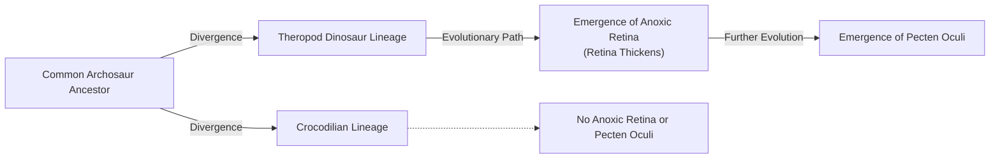
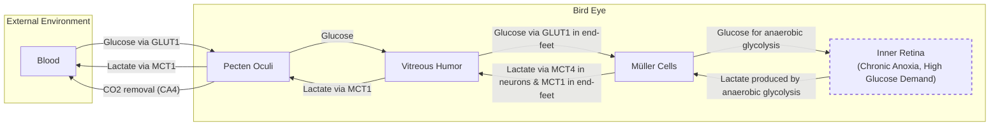
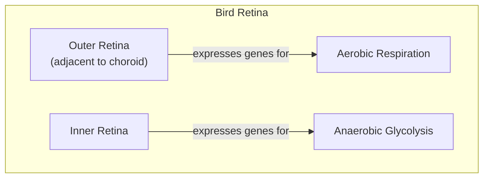
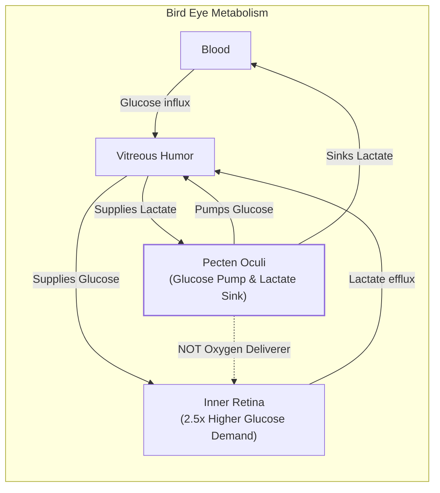
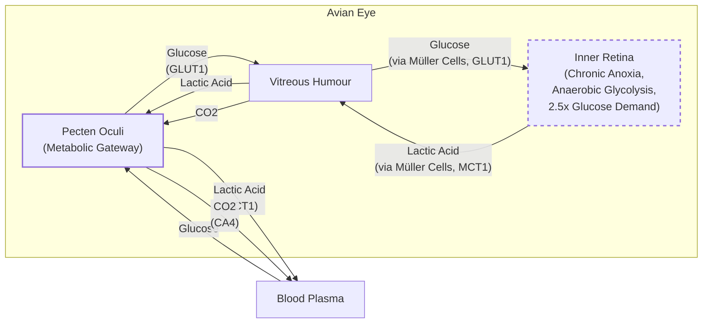

# Near-tie review: Bird_Eye_Extreme  (light vs standard, margin=+0.0066)

## Reviewer conclusion (2026-09-05): GENUINE TIE -- both `light` and `standard` treated as valid oracle picks, no override

**Decision history this session:** raw R_w argmax was `standard` (+0.0184,
2026-08-27) -> appeared to flip to `light` vs `deep` (+0.0417) due to a
corrupted `reasoning.json` in standard's production draw (R_w parsed as
-0.1564) -> after fixing the corruption, raw argmax reverted to `light` vs
`standard`, margin +0.0066 -> **an override to `standard` was proposed
(matching what looked like a 2/3 per-draw majority vote) and briefly
applied, then reverted after closer scrutiny of the per-draw margins.** 

**Why the override was reverted:** per-draw margins (light - standard) are
**[+0.0787, -0.0566, -0.0023]**. Counting each draw as a simple win/loss
makes it look like a clean 2/3 vote for `standard`, superficially resembling
the `29_evaluation_metrics` precedent (where a similar override was
justified). But unlike that case, **replicate2's margin (-0.0023) is an
order of magnitude smaller than the other two** -- not a genuine win for
`standard`, essentially a tied draw. With only 1 real win each (production
for `light`, replicate1 for `standard`) and one true near-tie, this is a
genuine dead heat, not a 2/3 majority in either direction. The
majority-vote override rule is meant for cases where the vote itself is
statistically real (as in `29_evaluation_metrics`, where all three margins
were comparable in magnitude); it doesn't apply cleanly here.

**Decision:** rather than replicate to N=5 to try to break the tie, `light`
and `standard` are both treated as valid, interchangeable oracle picks for
this article. `oracle_arm` is left as the raw mean-R_w argmax (`light`, no
manual override) with `needs_review=True` correctly reflecting the genuine
ambiguity -- this flag should be read here as "this article is a real tie,"
not merely "confidence is low."

**Quantitative/distributional basis (for reference):** per-dimension scores
show no single dimension dominates (`fl`/`de` favor light by +0.083 each;
`be`/`ga` favor standard by -0.167/-0.083) -- consistent with the overall
picture of two genuinely comparable arms rather than one being objectively
better.

---

## All sections (light vs standard), most-against-light first
| section | weight | contribution | running total |
|---|---:|---:|---:|
| section-4-eyes-like-a-hawk-evolutionary-origins-se | 0.317 | -0.0413 | -0.0413 |
| section-2-oxygenated-life-the-great-oxidation-even | 0.195 | -0.0189 | -0.0602 |
| section-1-introduction-the-avascular-retina-parado | 0.195 | +0.0025 | -0.0577 |
| section-3-a-mysterious-structure-the-pecten-oculi- | 0.293 | +0.0643 | +0.0066 |

(stored article margin = +0.0066 -- should match the running total's final row to ~4 decimals)

## Section: S4::section-4-eyes-like-a-hawk-evolutionary-origins-selective-pressures-and-implications  (weight=0.317, contribution=-0.0413 AGAINST light)
Stored section rewards: light=0.4181  standard=0.5726  (explore: light=0.1148  standard=0.2290)

### Arm: light (preset1)

#### Draw: production  `/mnt/f/my_projects/agentic_AI_RL/Reinsearch_agent/RL_researcher_writer_ymaxing/rl_training_data/test_episodes/Bird_Eye_Extreme__preset1`

**Article text:**
```
## Eyes Like a Hawk: Evolutionary Origins, Selective Pressures, and Implications

The bird’s retina and its no-oxygen power system are so unusual that they naturally raise questions about how they could have evolved. Evolution does not invent new systems from scratch; it acts more like a tinkerer, repurposing what already exists [[9]](https://doi.org/10.1126/science.860134). Instead of creating a new oxygen-delivery mechanism, evolution tinkered with the vertebrate eye blueprint to allow it to function without one. This process is a perfect example of how evolution works on what is already there, combining systems or transforming them for new functions rather than creating novelties from a blank slate. The vertebrate eye itself is a highly conserved structure, with origins tracing back 560 million years to a simple light-sensitive patch [[10]](https://doi.org/10.1016/j.cub.2025.12.028). Evolution is not an engineer with a preconceived plan; it is a tinkerer that uses everything at its disposal to produce a workable object. As François Jacob described, the tinkerer "uses whatever he finds around him whether it be pieces of string, fragments of wood, or old cardboards" to create something functional [[9]](https://doi.org/10.1126/science.860134).

By comparing the retinas of birds to their reptilian relatives, Damsgaard’s team concluded that the anoxic inner retina likely evolved sometime during the dinosaur era, in the theropod lineage that gave rise to modern birds, after it had split from crocodiles [[1]](https://www.quantamagazine.org/how-the-bird-eye-was-pushed-to-an-evolutionary-extreme-20260513), [[2]](https://www.nature.com/articles/s41586-025-09978-w). As Damsgaard explained, the pecten’s vasculature is an ancient reptilian structure, but it “gained its metabolic support of glucose and waste removal when the retina became anoxic,” a change that allowed for a thicker, more powerful design [[7]](https://www.thetransmitter.org/vision/inner-retina-of-birds-powers-sight-sans-oxygen). Independent experts agree, with sensory biologist Dan-Eric Nilsson stating he “fully support[s] their interpretation that the anoxic retina probably evolved in the dinosaur lineage” [[7]](https://www.thetransmitter.org/vision/inner-retina-of-birds-powers-sight-sans-oxygen). This development coincided with a thickening of the retina, suggesting a link between the new metabolic strategy and the demands of more powerful vision.

Researchers can only speculate about the exact evolutionary pressures, but a leading hypothesis is the demand for exceptionally sharp vision. For hunting, foraging, and long-distance migration, high visual acuity is a significant advantage. The blood vessels present in most vertebrate retinas scatter light, which can limit visual resolution. By eliminating these vessels, birds could pack photoreceptors and other neurons more densely, enabling sharper vision [[1]](https://www.quantamagazine.org/how-the-bird-eye-was-pushed-to-an-evolutionary-extreme-20260513), [[11]](https://doi.org/10.1371/journal.pone.0008992). As biologist and study contributor Coen Elemans put it, “This pecten allows a snake eagle the incredible acuity of vision to spot a tiny still lizard from great heights” [[12]](https://www.sdu.dk/en/om-sdu/fakulteterne/naturvidenskab/nyheder-2026/bird-retina). Damsgaard suggested that this system first evolved in theropod dinosaurs for tracking prey and identifying mates. Later, as birds took to the skies, it served as a pre-adaptation, or exaptation, allowing the retina to function during high-altitude flights where oxygen is scarce [[1]](https://www.quantamagazine.org/how-the-bird-eye-was-pushed-to-an-evolutionary-extreme-20260513), [[2]](https://www.nature.com/articles/s41586-025-09978-w).

Whether this is a true adaptation or a coincidence of evolutionary history remains an open question. Physiologist Gary Lewin cautions against overextending the results to all birds, as migratory species have not yet been studied in this context [[1]](https://www.quantamagazine.org/how-the-bird-eye-was-pushed-to-an-evolutionary-extreme-20260513). Nonetheless, this unique power system helps explain what makes avian eyes so special.

The implications of this research extend beyond birds to biomedicine. Many human medical conditions, most notably stroke, involve a drop in oxygen delivery to tissues, leading to irreversible damage. As senior author Jens Randel Nyengaard explained, “In conditions like stroke, human tissues suffer because oxygen delivery is reduced and metabolic waste accumulates. In the bird retina, we see a system that copes with oxygen deprivation in a completely different way” [[3]](https://www.eurekalert.org/news-releases/1113036). The mechanisms that allow the bird retina to function without oxygen may inspire new strategies to prevent hypoxic damage in humans. Nyengaard added, “Nature has solved a physiological problem in birds that makes humans sick. We hope that understanding this evolutionary solution can inspire new ways of thinking about why tissues fail under oxygen deprivation in disease, and how such diseases can be treated” [[3]](https://www.eurekalert.org/news-releases/1113036).

“Maybe we can get inspiration for how nature solved these problems by millions of years of natural selection,” Damsgaard said. “There’s so much to be learned from these animals that are able to do something that we cannot do” [[1]](https://www.quantamagazine.org/how-the-bird-eye-was-pushed-to-an-evolutionary-extreme-20260513).
```
**Grader reasoning:**
- `cc`: Eyes Like a Hawk: Evolutionary Origins, Selective Pressures, and Implications:
**1:** Both sections cover the evolutionary origin in the dinosaur/theropod lineage, the selective-pressure hypothesis for sharper vision, the exaptation speculation for high-altitude flight, and the biomedical implications for stroke.
- `fl`: Eyes Like a Hawk: Evolutionary Origins, Selective Pressures, and Implications:
**1:** Both sections follow the same progression: the tinkerer framing (Jacob 1977), evolutionary-timing evidence, selective pressures and optical advantage, the open question with Gary Lewin's caution, biomedical implications, and the closing Damsgaard quote. No images in this section in either version.
- `de`: Eyes Like a Hawk: Evolutionary Origins, Selective Pressures, and Implications:
**1:** [instances=2; quality=strong,standard] (1) Nyengaard's quote "Nature has solved a physiological problem in birds that makes humans sick... how such diseases can be treated" -- a genuine forward-looking research-implications statement not present in the expected section, confirmed exploration-sourced. Strong tier. (2) Damsgaard's framing of the pecten's vasculature as "an old structure... [that] gained its metabolic support of glucose and waste removal when the retina became anoxic" -- a technical-nuance elaboration of the tinkering mechanism beyond the expected section's plainer timing statement, confirmed exploration-sourced. Standard tier. Not credited: the Elemans "snake eagle" quote (re-illustrates the vision-enables-hunting point the expected section already makes with its own owl/albatross/hummingbird examples -- a paraphrase-level restatement, not a new idea); the term "exaptation" (the one exploration-tagged source using it is a duplicate of the golden paper's own abstract, so this is golden-sourced in substance); the first half of the Nyengaard quote about stroke mechanics (also present in an exploitation-tagged fetch).
- `be`: Eyes Like a Hawk: Evolutionary Origins, Selective Pressures, and Implications:
**0:** [instances=0] No candidate addition in this section connects outward to an adjacent domain; the Nilsson, Elemans, and Nyengaard quotes are corroboration or depth-adjacent restatement, not outward expansion.
- `cp`: Eyes Like a Hawk: Evolutionary Origins, Selective Pressures, and Implications:
**1:** depth_enhancement scored 1 for this section (Nyengaard forward-looking quote; Damsgaard vasculature-history quote), breadth_enhancement scored 0. The credited additions are well-integrated supporting material that does not crowd out the expected section's core content (tinkering framing, evolutionary timing, selective pressures, open question, Lewin caution, closing quote). core_preservation is 1.
- `ga`: Eyes Like a Hawk: Evolutionary Origins, Selective Pressures, and Implications:
**1:** The section covers the tinkerer framing, the evolutionary-timing comparison, the selective-pressure hypotheses, the exaptation speculation, the caution about migratory species, the biomedical payoff, and the closing Damsgaard quote, in the guideline's order. Word count (exact): target 650, tolerance ±65, range 585-715. Exact count: 650. Within range, exactly at the target, 65 words below the ceiling.

#### Draw: replicate1  `/mnt/f/my_projects/agentic_AI_RL/Reinsearch_agent/RL_researcher_writer_ymaxing/rl_training_data/noise_experiment/Bird_Eye_Extreme__replicate1__preset1`

**Article text:**
```
## Eyes Like a Hawk: Evolutionary Origins, Selective Pressures, and Implications

The bird’s retina and its oxygen-free power system are so unusual that they naturally raise questions about how they could have evolved. This is a prime example of what biologist François Jacob famously described as "evolution as tinkering" [[6]](https://doi.org/10.1126/science.860134). From an engineering perspective, evolution does not design optimal systems from scratch. It works like a tinkerer, modifying and repurposing existing components to solve new problems. Instead of inventing a novel oxygen-delivery system to support a thicker, more powerful retina, evolution rewired the bird eye to function without it, repurposing the ancient pecten for a new metabolic role.

By comparing the retinas of birds to those of their reptilian relatives, researchers were able to pinpoint when this adaptation likely emerged. Reptiles like turtles and caimans have fully oxygenated retinas. This suggests the anoxic adaptation evolved in the theropod dinosaur lineage that led to modern birds, after this group split from crocodiles [[1]](https://www.quantamagazine.org/how-the-bird-eye-was-pushed-to-an-evolutionary-extreme-20260513). Sensory biologist Dan-Eric Nilsson, who was not involved in the study, supports this timeline, stating, “I fully support their interpretation that the anoxic retina probably evolved in the dinosaur lineage” [[9]](https://www.thetransmitter.org/vision/inner-retina-of-birds-powers-sight-sans-oxygen). This evolutionary change happened in parallel with a measurable thickening of the retina, which points to the selective pressures driving this unique solution [[2]](https://doi.org/10.1038/s41586-025-09978-w).

The primary driver appears to have been an intense pressure for sharper vision. An owl tracking a mouse at night or a hummingbird locating hundreds of flowers daily requires exceptional visual resolution [[1]](https://www.quantamagazine.org/how-the-bird-eye-was-pushed-to-an-evolutionary-extreme-20260513). In most vertebrate eyes, including ours, the dense network of blood vessels needed for oxygen supply scatters incoming light and physically limits how tightly photoreceptors can be packed. By eliminating these vessels, birds could pack their retinas more densely with photoreceptors and ganglion cells, creating a smoother, higher-resolution sensor array [[7]](https://doi.org/10.1371/journal.pone.0008992). This avascular design, enabled by the pecten's metabolic support, was a direct engineering trade-off: sacrificing oxygen for superior optical clarity. As biologist Coen Elemans noted, “This pecten allows a snake eagle the incredible acuity of vision to spot a tiny still lizard from great heights” [[10]](https://www.sdu.dk/en/om-sdu/fakulteterne/naturvidenskab/nyheder-2026/bird-retina).

Damsgaard speculates that this system first evolved in theropod dinosaurs for hunting and identifying mates. Later, when birds began to fly, it served as an exaptation. A trait evolved for one purpose that becomes useful for another. It allowed retinal function to be maintained during high-altitude flights where atmospheric oxygen is scarce [[1]](https://www.quantamagazine.org/how-the-bird-eye-was-pushed-to-an-evolutionary-extreme-20260513), [[2]](https://doi.org/10.1038/s41586-025-09978-w). However, some researchers urge caution, noting that these findings have not yet been extended to all bird species, particularly long-distance migratory birds [[1]](https://www.quantamagazine.org/how-the-bird-eye-was-pushed-to-an-evolutionary-extreme-20260513). Key questions also remain about the system's precise energy budget and the pecten's role in clearing other waste products like carbon dioxide [[9]](https://www.thetransmitter.org/vision/inner-retina-of-birds-powers-sight-sans-oxygen).

The biomedical implications of this research are significant. As researcher Jens Randel Nyengaard points out, “In conditions like stroke, human tissues suffer because oxygen delivery is reduced and metabolic waste accumulates.” The bird retina, he says, provides a model of a system that “copes with oxygen deprivation in a completely different way” [[8]](https://www.genengnews.com/topics/translational-medicine/how-bird-retinas-function-without-oxygen-may-inform-future-stroke-therapies). By reverse-engineering these natural solutions, we may uncover new strategies for protecting human tissues from hypoxic damage. As Damsgaard concludes, “Maybe we can get inspiration for how nature solved these problems by millions of years of natural selection. There’s so much to be learned from these animals that are able to do something that we cannot do” [[1]](https://www.quantamagazine.org/how-the-bird-eye-was-pushed-to-an-evolutionary-extreme-20260513).
```
**Grader reasoning:**
- `cc`: Eyes Like a Hawk: Evolutionary Origins, Selective Pressures, and Implications:
**1:** Both sections cover the tinkerer framing, the theropod/turtle-caiman evolutionary timing tied to retinal thickening, the selective-pressure hypotheses (vision for hunting, light-scattering vs. dense packing), the exaptation/high-altitude-flight speculation, the caution against overgeneralizing to migratory species, the biomedical framing, and the closing Damsgaard quote. As with the prior article, the generated section drops GT's Karthik-Shekhar-mediated framing and the "560 million years" evolutionary-depth detail (both present in the writer's own research material) in favor of a direct Jacob attribution; the tinkerer argument itself is fully preserved.
- `fl`: Eyes Like a Hawk: Evolutionary Origins, Selective Pressures, and Implications:
**1:** The generated section follows the same progression as the expected section -- tinkerer framing, evolutionary timing, selective pressures, exaptation/high-altitude speculation, the caution against overgeneralizing, biomedical implications, and the closing Damsgaard quote -- with the Nilsson, Elemans, Nyengaard, and open-research-questions additions interspersed without displacing or reordering any expected idea.
- `de`: Eyes Like a Hawk: Evolutionary Origins, Selective Pressures, and Implications:
**1:** [instances=1; quality=strong] One qualifying instance: the open research questions about the pecten's precise energy budget and its role in CO2 clearance, which the expected section does not raise at all. This fits "future implications or open research directions for the core topic" directly, is specific and reasoned (not a generic "more research is needed" line), and traces to an exploration-tagged source (the Berenbrink commentary, present in the exploration-tagged "inner-retina-of-birds...-transmitt.md" fetch). The Nilsson evolutionary-timing corroboration and the Elemans "snake eagle" illustration are also exploration-traceable additions in this section, but both restate or re-illustrate a point the section already makes (the theropod timeline; vision enabling specific hunting behavior) rather than introducing a new idea -- flagging both as borderline rather than crediting them. (Re-verified the credited Berenbrink instance the same way: genuine, specific, attributed commentary, not duplicated boilerplate.)
- `be`: Eyes Like a Hawk: Evolutionary Origins, Selective Pressures, and Implications:
**0:** [instances=0] The credited open-research-questions addition is inward-facing (about the core topic's own unresolved mechanics), so it is classified under depth rather than breadth. No candidate addition in this section connects outward to an adjacent domain beyond what the expected section already covers.
- `cp`: Eyes Like a Hawk: Evolutionary Origins, Selective Pressures, and Implications:
**1:** depth_enhancement scored 1 for this section, so core_preservation is evaluated directly rather than by default: the open-research-questions addition is a single sentence and does not crowd out or shift emphasis away from the expected section's core narrative (evolutionary origin, selective pressures, biomedical implications), which remains clearly dominant. core_preservation is 1.
- `ga`: Eyes Like a Hawk: Evolutionary Origins, Selective Pressures, and Implications:
**0:** The section covers the tinkerer framing, the evolutionary-timing comparison, the selective-pressure hypotheses, the exaptation speculation, the caution against overgeneralizing, the biomedical payoff, and the closing Damsgaard quote, in the guideline's order. The prose-only word count is approximately 535 words against a 650-word target (tolerance 585-715), a shortfall of 115 from the target and 50 words beyond the tolerance floor -- a clear violation, not a borderline case.

#### Draw: replicate2  `/mnt/f/my_projects/agentic_AI_RL/Reinsearch_agent/RL_researcher_writer_ymaxing/rl_training_data/noise_experiment/Bird_Eye_Extreme__replicate2__preset1`

**Article text:**
```
## Eyes Like a Hawk: Evolutionary Origins, Selective Pressures, and Implications

So, how did this unusual system design come to be? Evolution does not work like an engineer with a clean blueprint. As biologist François Jacob argued in his 1977 essay, it is more like a tinkerer, patching together solutions from whatever parts are available [[8]](https://doi.org/10.1126/science.860134). Instead of designing a novel oxygen-delivery system, evolution tinkered with the vertebrate eye blueprint to create a solution that worked without it. The vertebrate retina itself is thought to have evolved by repurposing an ancestral median eye, which already contained both ciliary and rhabdomeric photoreceptor types [[10]](https://doi.org/10.1016/j.cub.2025.12.028).

By comparing bird retinas to those of their relatives, like the green anole lizard and caimans, researchers confirmed that reptiles have normal oxygen levels in their retinas [[7]](https://www.genengnews.com/topics/translational-medicine/how-bird-retinas-function-without-oxygen-may-inform-future-stroke-therapies). This suggests the oxygen-free retina evolved sometime during the dinosaur era, in the theropod lineage that gave rise to modern birds, after they split from crocodiles [[1]](https://www.quantamagazine.org/how-the-bird-eye-was-pushed-to-an-evolutionary-extreme-20260513). Further analysis suggests that while the pecten’s basic vascular structure is ancient, its specialized role in metabolic support arose later, once the retina had already become anoxic [[6]](https://www.thetransmitter.org/vision/inner-retina-of-birds-powers-sight-sans-oxygen). This evolutionary change coincided with a thickening of the retina, which would have increased the diffusion distance for oxygen, making an alternative energy strategy necessary [[2]](https://doi.org/10.1038/s41586-025-09978-w).

The selective pressures driving this change were likely tied to vision. Birds rely on exceptional eyesight for hunting, foraging, and navigating during long-distance migrations. Blood vessels, while essential for oxygen supply, scatter light and obstruct a portion of the visual field. By eliminating them from the retina, birds could pack photoreceptors and neurons more densely, achieving higher resolution and sharper vision [[1]](https://www.quantamagazine.org/how-the-bird-eye-was-pushed-to-an-evolutionary-extreme-20260513), [[11]](https://doi.org/10.1371/journal.pone.0008992).

This avascular design, supported by anaerobic metabolism, may have been a key innovation that allowed for the evolution of the incredible visual acuity seen in species like hawks and eagles. As biologist Coen Elemans put it, this system “allows a snake eagle the incredible acuity of vision to spot a tiny still lizard from great heights” [[9]](https://sdu.dk/en/om-sdu/fakulteterne/naturvidenskab/nyheder-2026/bird-retina). The anoxia tolerance also likely served as an important pre-adaptation, or exaptation, for high-altitude flight, where atmospheric oxygen levels are low and maintaining retinal function is critical [[2]](https://doi.org/10.1038/s41586-025-09978-w).

Whether this system is a direct adaptation for sharp vision or an evolutionary coincidence that was later co-opted for this purpose remains an open question. Researchers caution against overextending the results to all bird species without further study, especially migratory ones [[1]](https://www.quantamagazine.org/how-the-bird-eye-was-pushed-to-an-evolutionary-extreme-20260513). Dan-Eric Nilsson, a sensory biologist at Lund University, supports this interpretation, adding that the discovery could help explain “why vertebrate brains cannot cope with anoxia and why the bird inner retina became an exception” [[6]](https://www.thetransmitter.org/vision/inner-retina-of-birds-powers-sight-sans-oxygen).

Beyond its evolutionary significance, this discovery has direct biomedical implications. Many human medical conditions, most notably stroke, involve a drop in oxygen delivery to tissues, leading to irreversible cell death. “In conditions like stroke, human tissues suffer because oxygen delivery is reduced and metabolic waste accumulates,” explained Jens Randel Nyengaard. “In the bird retina, we see a system that copes with oxygen deprivation in a completely different way” [[7]](https://www.genengnews.com/topics/translational-medicine/how-bird-retinas-function-without-oxygen-may-inform-future-stroke-therapies). Understanding this evolutionary solution could inspire new ways to treat diseases caused by oxygen deprivation [[3]](https://www.eurekalert.org/news-releases/1113036). “Maybe we can get inspiration for how nature solved these problems by millions of years of natural selection,” Damsgaard said. “There’s so much to be learned from these animals that are able to do something that we cannot do” [[1]](https://www.quantamagazine.org/how-the-bird-eye-was-pushed-to-an-evolutionary-extreme-20260513).
```
**Grader reasoning:**
- `cc`: Eyes Like a Hawk: Evolutionary Origins, Selective Pressures, and Implications:
**1:** Both sections cover the tinkerer framing, the evolutionary timing tied to retinal thickening, the selective-pressure hypotheses, the exaptation/high-altitude speculation, the caution about migratory species, the biomedical framing, and the closing Damsgaard quote. In place of GT's "560 million years / light-sensitive patch" detail, this section substitutes the ancestral-median-eye-repurposing mechanism (ciliary + rhabdomeric photoreceptor types) from the guideline-provided vertebrate-eye-evolution source -- arguably a stronger match to GT's point about the eye being an ancient, repurposed structure than a bare figure would be. No GT idea is missing.
- `fl`: Eyes Like a Hawk: Evolutionary Origins, Selective Pressures, and Implications:
**1:** The generated section follows the same progression as the expected section -- tinkerer framing, evolutionary timing, selective pressures, exaptation, the caution/open-question material, biomedical implications, and the closing Damsgaard quote -- with the ancestral-median-eye and pecten-vascular-history additions interspersed without displacing or reordering any expected idea.
- `de`: Eyes Like a Hawk: Evolutionary Origins, Selective Pressures, and Implications:
**0:** [instances=0] The ancestral-median-eye and pecten-vascular-history additions are golden/exploitation-sourced and do not qualify regardless of substance. The Elemans, Nilsson, and Nyengaard quotes in this section are exploration-traceable but each restates a point the section already makes (vision-enabled hunting; the theropod timeline; the stroke/biomedical framing); per the standing rule, none is credited. No instance qualifies.
- `be`: Eyes Like a Hawk: Evolutionary Origins, Selective Pressures, and Implications:
**0:** [instances=0] No candidate addition in this section connects outward to an adjacent domain beyond what the expected section already covers.
- `cp`: Eyes Like a Hawk: Evolutionary Origins, Selective Pressures, and Implications:
**1:** Both depth_enhancement and breadth_enhancement scored 0 for this section, so the mandatory default rule applies: core_preservation is 1 by default.
- `ga`: Eyes Like a Hawk: Evolutionary Origins, Selective Pressures, and Implications:
**0:** The section covers the tinkerer framing, the evolutionary-timing comparison, the selective-pressure hypotheses, the exaptation/open-question material, the caution about migratory species, the biomedical payoff, and the closing Damsgaard quote, in the guideline's order. Word count (exact): target 650, tolerance ±65, range 585-715. Exact count: 536. 49 words below the minimum -- a clear violation.

### Arm: standard (preset2)

#### Draw: production  `/mnt/f/my_projects/agentic_AI_RL/Reinsearch_agent/RL_researcher_writer_ymaxing/rl_training_data/test_episodes/Bird_Eye_Extreme__preset2`

**Article text:**
```
## Eyes Like a Hawk: Evolutionary Origins, Selective Pressures, and Implications

The bird’s retina and its no-oxygen power system are so unusual that they naturally raise questions about how they could have evolved. Evolution, as biologist François Jacob described in his 1977 paper, often works not like an engineer with a blueprint, but like a tinkerer who repurposes existing parts for new functions. This appears to be exactly what happened with the avian eye. Instead of inventing a novel oxygen-delivery system, evolution repurposed an ancient structure—the precursor to the pecten—to support a new metabolic strategy [[5]](https://doi.org/10.1126/science.860134).

Phylogenetic analysis pinpoints the timing of this innovation. The anoxic retina and the metabolically supportive pecten oculi appear to have arisen in the theropod dinosaur lineage, the ancestors of modern birds, after their split from crocodilians. To confirm this timing, researchers examined the retinas of modern reptiles like turtles and caimans, finding normal oxygen levels and no signs of anaerobic metabolism. This evolutionary change coincided with a measurable thickening of the retina, suggesting a strong link between the two events [[1]](https://www.nature.com/articles/s41586-025-09978-w), [[2]](https://www.quantamagazine.org/how-the-bird-eye-was-pushed-to-an-evolutionary-extreme-20260513).


Image 8: An evolutionary timeline illustrating the origin of the anoxic retina and pecten oculi in the theropod dinosaur lineage, following their split from crocodilians.

Fossil evidence suggests that pecten-like structures may have played a role in enhancing the visual acuity of extinct theropods, potentially aiding in nocturnal hunting and improving color discrimination. This indicates that the foundations for this unique visual system were laid long before modern birds took to the skies, driven by the sensory demands of a predatory lifestyle [[12]](https://en.wikipedia.org/wiki/Dinosaur_vision).

The selective pressures driving this change were likely strong. Predation, foraging, and long-distance migration all demand exceptionally high-acuity vision. However, blood vessels, a necessity in most thick retinas, scatter light and interfere with the optical path, limiting how densely photoreceptors and neurons can be packed. By eliminating blood vessels, the avian retina was free to evolve a thicker, more densely packed layer of neurons, directly enabling sharper resolution. This is quantified by visual acuity, measured in cycles per degree (cpd), where higher values mean finer detail can be resolved. The wedge-tailed eagle achieves an astonishing 143 cpd, more than double the human maximum, while even a small house sparrow (4.9 cpd) has a highly organized cone mosaic for its size [[10]](https://pmc.ncbi.nlm.nih.gov/articles/PMC10906485).

This vessel-free design is a key reason why birds see the world with such remarkable detail. Whether this was a direct adaptation for better vision or an evolutionary coincidence that was later co-opted for high-altitude flight—where oxygen levels are low—remains an open question. One prominent theory is that the avascular design first evolved to support a thicker retina for sharper vision, and only later served as an exaptation for flight in low-oxygen environments. This pattern is not unique; high-altitude insects also rely on anaerobic metabolism in their flight muscles to function in hypoxic conditions [[11]](https://pure.au.dk/portal/en/publications/oxygen-free-metabolism-in-the-bird-inner-retina-supported-by-the-).

This highlights a common challenge in evolutionary biology: distinguishing between a trait that evolved for a specific purpose and one that arose for other reasons and later proved useful in a new context. Gary Lewin cautions against overextending the results to all birds, given that migratory species have not yet been studied. This underscores the need for further research to fully understand the nuances of this adaptation across the avian family tree [[2]](https://www.quantamagazine.org/how-the-bird-eye-was-pushed-to-an-evolutionary-extreme-20260513), [[6]](https://doi.org/10.1016/j.cub.2025.12.028).

Beyond its evolutionary significance, this discovery has a clear biomedical payoff. Conditions like stroke and ischemic retinal disease are caused by oxygen deprivation and the buildup of metabolic waste. The bird retina offers a natural blueprint for how a complex neural tissue can not only survive but function effectively under these exact conditions. By studying the molecular machinery of the pecten and the metabolic pathways in retinal neurons, we may uncover new therapeutic strategies to protect human tissues from hypoxic damage. These insights could even inform hypoxia mitigation strategies for extreme environments like human spaceflight, where maintaining physiological function under altered atmospheric conditions is a major challenge [[1]](https://www.nature.com/articles/s41586-025-09978-w).

"Nature has solved a physiological problem in birds that makes humans sick," says Jens Randel Nyengaard. "We hope that understanding this evolutionary solution can inspire new ways of thinking about why tissues fail under oxygen deprivation in disease, and how such diseases can be treated." This sentiment is echoed by Damsgaard, who sees a wealth of knowledge in nature's extremes. "Maybe we can get inspiration for how nature solved these problems by millions of years of natural selection. There’s so much to be learned from these animals that are able to do something that we cannot do" [[2]](https://www.quantamagazine.org/how-the-bird-eye-was-pushed-to-an-evolutionary-extreme-20260513), [[9]](https://www.genengnews.com/topics/translational-medicine/how-bird-retinas-function-without-oxygen-may-inform-future-stroke-therapies).
```
**Grader reasoning:**
- `cc`: Eyes Like a Hawk: Evolutionary Origins, Selective Pressures, and Implications:
**1:** Both sections cover the evolutionary origin in the theropod lineage, the selective-pressure hypothesis for sharper vision, and the biomedical implications for stroke/ischemia.
- `fl`: Eyes Like a Hawk: Evolutionary Origins, Selective Pressures, and Implications:
**1:** Both sections follow the same progression: tinkerering framing, evolutionary timing, selective pressures, the open question with Lewin's caution, biomedical implications, and the closing Damsgaard quote. The added visual-acuity metrics, theropod fossil evidence, insect analogy, and spaceflight note are integrated without disrupting the sequence.
- `de`: Eyes Like a Hawk: Evolutionary Origins, Selective Pressures, and Implications:
**1:** [instances=2; quality=strong,strong] (1) The visual-acuity metrics (wedge-tailed eagle 143 cpd, house sparrow 4.9 cpd) are concrete, named, quantified figures about the core topic's functional outcome, confirmed exclusively exploration-sourced (the ecological-acuity paper). Re-examined for dual depth/breadth qualification: the surrounding text uses these two numbers purely to quantify the section's own claim (denser packing from vessel removal directly enables sharper resolution) -- it borrows figures from a comparative-ecology paper but never engages that paper's own framework (habitat, diet, foraging mode); nothing in the passage steps outside the core topic's own argument. Depth-only. (2) The human-spaceflight hypoxia-mitigation note is a specific, named future-application domain, confirmed exclusively exploration-sourced (spaceflight-physiology query group). Re-examined the same way: it reads as one more named venue in the same biomedical-implications list the expected section already runs (stroke, ischemic disease), not an excursion into aerospace medicine's own concepts -- no spaceflight-specific mechanism or reasoning is actually explained. This fits "future implications... for the core topic" more precisely than an adjacent-field expansion. Depth-only.
- `be`: Eyes Like a Hawk: Evolutionary Origins, Selective Pressures, and Implications:
**1:** [instances=2; quality=strong,standard] (1) Theropod fossil evidence (pecten-like structures aiding nocturnal hunting/color discrimination in extinct theropods) is historical context tracing verbatim to an exploration-exclusive Wikipedia source (Dinosaur_vision), with no golden or exploitation overlap for this specific claim. Strong: a specific, named paleontological finding. (2) The high-altitude-insect flight-muscle analogy is a cross-domain comparison, exploration-sourced -- though flagging a citation mismatch: the article's own footnote points to the golden-paper PURE-portal mirror, which contains no insect content at all; the actual matching content lives in a different exploration source. Credited based on where the content actually appears, not the article's stated citation. Standard tier, single-sentence analogy.
- `cp`: Eyes Like a Hawk: Evolutionary Origins, Selective Pressures, and Implications:
**1:** Both depth_enhancement and breadth_enhancement scored 1 for this section, so core_preservation is evaluated directly: all four additions (acuity metrics, spaceflight note, theropod evidence, insect analogy) are well-integrated and brief, and the expected core content (tinkering framing, timing, pressures, open question, Lewin caution, biomedical implications, closing quote) remains present and dominant. core_preservation is 1.
- `ga`: Eyes Like a Hawk: Evolutionary Origins, Selective Pressures, and Implications:
**1:** The section covers the tinkerer framing, evolutionary timing, selective-pressure hypotheses, the open question with Lewin's caution, the biomedical payoff, and the closing Damsgaard quote, in the guideline's order. Word count (exact): target 650, tolerance ±65, range 585-715. Exact count: 715 -- exactly at the ceiling, a clean pass. (Correcting the input reasoning's approximate count of ~718/3-over: a precise recount puts this exactly at the boundary, not over it, so no 'immaterial margin' judgment call is actually needed here.)

#### Draw: replicate1  `/mnt/f/my_projects/agentic_AI_RL/Reinsearch_agent/RL_researcher_writer_ymaxing/rl_training_data/noise_experiment/Bird_Eye_Extreme__replicate1__preset2`

**Article text:**
```
## Eyes Like a Hawk: Evolutionary Origins, Selective Pressures, and Implications

The bird’s retina and its no-oxygen power system are so unusual that they naturally raise questions about how they could have evolved. Evolution, as biologist François Jacob described in 1977, often works not like an engineer with a blueprint, but like a tinkerer, repurposing existing parts for new functions [[10]](https://www.science.org/doi/10.1126/science.860134). This appears to be exactly what happened with the avian eye. Instead of inventing a new oxygen-delivery system, evolution repurposed the ancient vertebrate eye blueprint to function without it. The vertebrate eye itself is a highly conserved structure, with origins tracing back some 560 million years to a light-sensitive patch on an ancient chordate [[11]](https://doi.org/10.1016/j.cub.2025.12.028). Evolution acts more like a tinkerer, taking parts that have existed for a long time and recombining or reshaping them to fit new needs.

Phylogenetic analysis pinpoints when this change occurred. By comparing the avian retina to those of reptiles like Chinese pond turtles and broad-snouted caimans—which have normal oxygen levels—the researchers concluded that the adaptation arose in the theropod dinosaur lineage, the ancestors of modern birds, after they split from crocodilians [[2]](https://www.quantamagazine.org/how-the-bird-eye-was-pushed-to-an-evolutionary-extreme-20260513). This evolutionary shift coincided with a measurable thickening of the retina, allowing for more densely packed neurons [[4]](https://pure.au.dk/portal/en/publications/oxygen-free-metabolism-in-the-bird-inner-retina-supported-by-the-).

The selective pressure driving this change was likely the intense demand for high-acuity vision. For predators, foragers, and long-distance migrants, sharp vision is critical for survival. The visual acuity gains are quantifiable: while a hummingbird resolves 4.6 cycles per degree (cpd), a wedge-tailed eagle can resolve up to 143 cpd, one of the highest in the animal kingdom [[12]](https://pmc.ncbi.nlm.nih.gov/articles/PMC10906485). Birds use this exceptional vision for demanding tasks, from an owl tracking a mouse from the sky to a hummingbird locating hundreds of flowers daily [[2]](https://www.quantamagazine.org/how-the-bird-eye-was-pushed-to-an-evolutionary-extreme-20260513). However, blood vessels within the retina scatter light, which degrades visual resolution.

By eliminating these vessels, evolution cleared a path for superior optics. As Damsgaard explains, this “allowed the retina to become thicker and more cell-dense without needing internal vessels, which in combination leads to better visual acuity” [[5]](https://www.thetransmitter.org/vision/inner-retina-of-birds-powers-sight-sans-oxygen). The trade-off was a severe oxygen diffusion limit, a problem solved by anoxia tolerance. This trait likely served as an exaptation, a feature that evolved for one purpose but was later co-opted for another: maintaining retinal function during high-altitude migrations where oxygen is scarce [[4]](https://pure.au.dk/portal/en/publications/oxygen-free-metabolism-in-the-bird-inner-retina-supported-by-the-).

While the evidence is compelling, some researchers caution that the model remains a powerful hypothesis that invites further investigation. Michael Berenbrink of the University of Liverpool notes that future studies should quantify the energy provided by this pathway and clarify the role of the pecten in CO₂ removal, as anaerobic glycolysis itself does not produce CO₂ [[5]](https://www.thetransmitter.org/vision/inner-retina-of-birds-powers-sight-sans-oxygen). These open questions highlight the ongoing work to fully map this unique metabolic strategy.

This evolutionary story has a significant biomedical payoff. Conditions like stroke and ischemic retinal diseases are caused by reduced oxygen delivery and the buildup of metabolic waste. “In the bird retina, we see a system that copes with oxygen deprivation in a very different way,” says Jens Randel Nyengaard, a senior author on the study [[9]](https://uol.de/en/news/article/birds-retinas-function-without-oxygen). As Nyengaard further notes, “Nature has solved a physiological problem in birds that makes humans sick” [[3]](https://www.genengnews.com/topics/translational-medicine/how-bird-retinas-function-without-oxygen-may-inform-future-stroke-therapies). Understanding how birds maintain a healthy, high-functioning neural tissue in the complete absence of oxygen could inspire new strategies to protect human tissues from hypoxic damage. As Damsgaard concludes, this research highlights how studying nature’s extremes can provide unexpected solutions to long-standing medical challenges. “Maybe we can get inspiration for how nature solved these problems by millions of years of natural selection,” he said. “There’s so much to be learned from these animals that are able to do something that we cannot do” [[2]](https://www.quantamagazine.org/how-the-bird-eye-was-pushed-to-an-evolutionary-extreme-20260513).
```
**Grader reasoning:**
- `cc`: Eyes Like a Hawk: Evolutionary Origins, Selective Pressures, and Implications:
**1:** Both sections cover the tinkerer framing, the evolutionary timing tied to retinal thickening, the selective-pressure hypotheses, the exaptation/high-altitude speculation, the caution about further study, the biomedical framing, and the closing Damsgaard quote. Unlike the two prior articles, this section actually retains GT's "560 million years / light-sensitive patch" evolutionary-depth detail (via direct citation rather than Karthik Shekhar's mediation), so core content fidelity here is slightly stronger than in the sibling articles. No GT idea is missing.
- `fl`: Eyes Like a Hawk: Evolutionary Origins, Selective Pressures, and Implications:
**1:** The generated section follows the same progression as the expected section -- tinkerer framing, evolutionary timing, selective pressures (with the new visual-acuity comparison and Damsgaard quote interspersed), exaptation, the caution/open-questions material, biomedical implications, and the closing Damsgaard quote -- with no reordering of expected ideas.
- `de`: Eyes Like a Hawk: Evolutionary Origins, Selective Pressures, and Implications:
**1:** [instances=2; quality=strong,strong] Two qualifying instances, both introducing ideas the expected section does not cover. First, the cross-species visual-acuity comparison (4.6 cpd in the Anna's hummingbird vs. 143 cpd in the wedge-tailed eagle, two orders of magnitude apart) is a concrete, specific metric about the core topic's (vision-driven selection) performance, tracing to an exploration-phase ecological-acuity paper. Re-examined for dual depth/breadth qualification: the passage only quantifies the section's own claim and never engages the source paper's own ecological framework, so this is depth-only, not dual-qualifying (correcting an earlier note in this file that had credited it under breadth too). Second, the Berenbrink open-research-questions material (quantifying the pathway's energy budget; clarifying the pecten's role in CO2 removal, since anaerobic glycolysis itself does not produce CO2) is a specific, reasoned open direction, fitting "future implications or open research directions," traced to an exploration-phase source. The Damsgaard "thicker and more cell-dense... better visual acuity" quote and the two Nyengaard biomedical quotes in this section are also exploration-traceable but restate points the section already makes; per the standing rule they are not credited.
- `be`: Eyes Like a Hawk: Evolutionary Origins, Selective Pressures, and Implications:
**0:** [instances=0] Re-examined the cpd comparison against the same test established on a later article: the passage uses the two figures (4.6 cpd hummingbird, 143 cpd eagle) purely to quantify this section's own claim ("the visual acuity gains are quantifiable") -- it never engages the source paper's own comparative-ecology framework (habitat, diet, foraging mode as correlates of acuity). Nothing here steps outside the core topic's own argument, so this is depth-only (see depth_enhancement), not a breadth-qualifying instance. No other candidate in this section connects outward to an adjacent domain.
- `cp`: Eyes Like a Hawk: Evolutionary Origins, Selective Pressures, and Implications:
**1:** depth_enhancement scored 1 for this section (breadth_enhancement scored 0, per the reclassification above), so core_preservation is evaluated directly: the visual-acuity comparison and the Berenbrink open-questions material are each a single sentence and do not crowd out or shift emphasis away from the expected section's core narrative (evolutionary origin, selective pressures, biomedical implications), which remains clearly dominant. core_preservation is 1.
- `ga`: Eyes Like a Hawk: Evolutionary Origins, Selective Pressures, and Implications:
**1:** The section covers the tinkerer framing, the evolutionary-timing comparison, the selective-pressure hypotheses, the exaptation speculation, the caution/open-questions material, the biomedical payoff, and the closing Damsgaard quote, in the guideline's order. Word count (exact): target 650, tolerance ±65, range 585-715. Exact count: 593. Within range, 8 above the floor.

#### Draw: replicate2  `/mnt/f/my_projects/agentic_AI_RL/Reinsearch_agent/RL_researcher_writer_ymaxing/rl_training_data/noise_experiment/Bird_Eye_Extreme__replicate2__preset2`

**Article text:**
```
## Eyes Like a Hawk: Evolutionary Origins, Selective Pressures, and Implications

The bird’s retina and its no-oxygen power system are so unusual that they naturally raise questions about how they could have evolved. Evolution does not create perfect designs from scratch. As François Jacob argued in his 1977 essay, evolution works like a tinkerer, not an engineer, repurposing what already exists to solve new problems [[25]](https://www.science.org/doi/10.1126/science.860134). The tinkerer uses "whatever he finds around him whether it be pieces of string, fragments of wood, or old cardboards" to produce a workable object. Similarly, evolution works on what already exists, transforming a system for new functions or combining systems to create more elaborate ones. Karthik Shekhar, a researcher at UC Berkeley, notes that the avian eye is a prime example: "It takes parts that have existed long before, and it recombines, reinvents, and reshapes" [[4]](https://www.quantamagazine.org/how-the-bird-eye-was-pushed-to-an-evolutionary-extreme-20260513). Instead of inventing a new oxygen-delivery system, evolution tinkered with the ancestral vertebrate eye, pushing its metabolic strategy to an extreme.

Phylogenetic analysis pinpoints the origin of this adaptation. The anoxic retina and the metabolically supportive pecten oculi appear to have arisen in the lineage of theropod dinosaurs, after their split from the ancestors of modern crocodilians. This evolutionary innovation coincided with a significant thickening of the retina [[21]](https://www.nature.com/articles/s41586-025-09978-w). As Damsgaard explains, "the vasculature that forms the pecten oculi is an old structure originating before the diversification of reptiles but gained its metabolic support of glucose and waste removal when the retina became anoxic" [[5]](https://www.thetransmitter.org/vision/inner-retina-of-birds-powers-sight-sans-oxygen). This suggests a powerful selective driver: the intense pressure for high-acuity vision. For predators, foragers, and long-distance migrants, sharper vision provides a decisive survival advantage.

The main obstacle to sharper vision is optical. Blood vessels, though necessary for oxygen supply in most thick retinas, scatter light and interfere with the clean transmission of an image to the photoreceptors. By eliminating these vessels, birds could pack photoreceptors and ganglion cells much more densely, directly enabling higher spatial resolution [[23]](https://journals.plos.org/plosone/article?id=10.1371/journal.pone.0008992), [[24]](https://www.cell.com/current-biology/fulltext/S0960-9822(25)01479-7), [[21]](https://www.nature.com/articles/s41586-025-09978-w). The numbers are striking: while humans have about 200,000 photoreceptors per square millimeter, a house sparrow has 400,000, and a common buzzard has 1,000,000 [[28]](https://en.wikipedia.org/wiki/Bird_vision). This density directly translates to superior visual acuity, particularly for species that need to detect prey from afar or navigate complex environments [[29]](https://pmc.ncbi.nlm.nih.gov/articles/PMC10906485).

The evolution of retinal anoxia tolerance was the key that unlocked this potential. It was an exaptation, a trait that evolved for one purpose (or as a byproduct of another change) and was later co-opted for a new one. The anoxia-tolerant retina, supported by the repurposed pecten, was likely crucial for enabling birds to maintain vision during high-altitude migrations, where oxygen levels are extremely low [[21]](https://www.nature.com/articles/s41586-025-09978-w). However, it remains an open question whether this is a direct adaptation or an evolutionary coincidence. Researchers like Gary Lewin caution against overextending these interpretations to all birds without further study, particularly of migratory species [[4]](https://www.quantamagazine.org/how-the-bird-eye-was-pushed-to-an-evolutionary-extreme-20260513).

This discovery carries significant biomedical weight. Human conditions like stroke and retinal ischemia are devastating precisely because our neural tissues cannot cope with oxygen deprivation. The mechanisms that protect the bird retina—the reliance on anaerobic glycolysis and the efficient removal of metabolic waste—offer potential pathways for developing new therapies. "In conditions like stroke, human tissues suffer because oxygen delivery is reduced and metabolic waste accumulates," says Nyengaard. "In the bird retina, we see a system that copes with oxygen deprivation in a very different way” [[1]](https://uol.de/en/news/article/birds-retinas-function-without-oxygen).

By studying these natural solutions, you might find inspiration for your own engineering challenges. As Damsgaard concludes, “Maybe we can get inspiration for how nature solved these problems by millions of years of natural selection. There’s so much to be learned from these animals that are able to do something that we cannot do” [[4]](https://www.quantamagazine.org/how-the-bird-eye-was-pushed-to-an-evolutionary-extreme-20260513). The humble bird's eye, a product of millions of years of tinkering, may hold the key to treating some of our most challenging medical conditions.
```
**Grader reasoning:**
- `cc`: Eyes Like a Hawk: Evolutionary Origins, Selective Pressures, and Implications:
**1:** Both sections cover the tinkerer framing, the evolutionary timing tied to retinal thickening, the selective-pressure hypotheses, the exaptation/high-altitude speculation, the caution about migratory species (here attributed to Lewin, matching GT), the biomedical framing, and the closing Damsgaard quote. Notably, this is the first of all seven articles graded to include GT's own Karthik Shekhar quote ("It takes parts that have existed long before, and it recombines, reinvents, and reshapes") rather than substituting a direct Jacob-only attribution -- the closest match to GT's actual framing so far, though GT's "560 million years" figure is still not included.
- `fl`: Eyes Like a Hawk: Evolutionary Origins, Selective Pressures, and Implications:
**1:** The generated section follows the same progression as the expected section -- tinkerer/Shekhar framing, evolutionary timing, selective pressures (with the density comparisons interspersed), exaptation, the caution about migratory species, biomedical implications, and the closing Damsgaard quote -- with no reordering of expected ideas.
- `de`: Eyes Like a Hawk: Evolutionary Origins, Selective Pressures, and Implications:
**1:** [instances=1; quality=strong] One qualifying instance: the three-way photoreceptor-density comparison (humans ~200,000/mm², house sparrow 400,000/mm², common buzzard 1,000,000/mm²), a concrete, specific metric about the core topic's structure that the expected section does not provide, traced to an exploration-phase Wikipedia fetch. The Shekhar and Damsgaard quotes and the Berenbrink "best hypothesis we have" line in this section are also exploration-traceable but restate points already made elsewhere in the article; per the standing rule, none is credited.
- `be`: Eyes Like a Hawk: Evolutionary Origins, Selective Pressures, and Implications:
**0:** [instances=0] Re-examined: the sentence "this density directly translates to superior visual acuity, particularly for species that need to detect prey from afar or navigate complex environments" doesn't engage the cited ecological-acuity paper's own framework (habitat, diet, foraging-mode correlates) -- it's a generic statement that closely paraphrases GT's own existing point ("Birds use their exceptional visual sense for hunting and foraging... as well as for following landmarks across the landscape during migration"). This adds little beyond what GT already says, so it's rejected as a paraphrase rather than credited under either depth or breadth. The photoreceptor-density figures immediately before it remain credited under depth (see below), since those are a genuine new metric; this trailing sentence is the only thing being withdrawn.
- `cp`: Eyes Like a Hawk: Evolutionary Origins, Selective Pressures, and Implications:
**1:** depth_enhancement scored 1 for this section (breadth_enhancement scored 0, per the reclassification above), so core_preservation is evaluated directly: the density-comparison addition is brief and does not crowd out or shift emphasis away from the expected section's core narrative (evolutionary origin, selective pressures, biomedical implications), which remains clearly dominant. core_preservation is 1.
- `ga`: Eyes Like a Hawk: Evolutionary Origins, Selective Pressures, and Implications:
**1:** The section covers the tinkerer/Shekhar framing, the evolutionary-timing comparison, the selective-pressure hypotheses, the exaptation/caution material, the biomedical payoff, and the closing Damsgaard quote, in the guideline's order. Word count (exact): target 650, tolerance ±65, range 585-715. Exact count: 623. Within range, 38 above the floor.

## Section: S2::section-2-oxygenated-life-the-great-oxidation-event-and-metabolic-trade-offs  (weight=0.195, contribution=-0.0189 AGAINST light)
Stored section rewards: light=0.2700  standard=0.3469  (explore: light=0.0000  standard=0.0700)

### Arm: light (preset1)

#### Draw: production  `/mnt/f/my_projects/agentic_AI_RL/Reinsearch_agent/RL_researcher_writer_ymaxing/rl_training_data/test_episodes/Bird_Eye_Extreme__preset1`

**Article text:**
```
## Oxygenated Life: The Great Oxidation Event and Metabolic Trade-offs

Around 3.4 billion years ago, cyanobacteria developed photosynthesis, slowly pumping oxygen into the atmosphere and changing the course of life on Earth. This Great Oxidation Event was a pivotal moment in evolutionary history. Oxygen enabled a new, highly efficient method of energy production known as aerobic respiration. While anaerobic glycolysis, the breakdown of glucose without oxygen, yields just two molecules of ATP (adenosine triphosphate), aerobic respiration can produce up to 32 [[1]](https://www.quantamagazine.org/how-the-bird-eye-was-pushed-to-an-evolutionary-extreme-20260513). This fifteen-fold increase in energy efficiency was a transformative advantage. To extract energy, cells first break down a glucose molecule into two pyruvate molecules, releasing two ATP. A cell lacking oxygen can go no further. Oxygen, however, enables further biochemical reactions that break down pyruvate and produce another 30 molecules of ATP [[1]](https://www.quantamagazine.org/how-the-bird-eye-was-pushed-to-an-evolutionary-extreme-20260513).
Image 2: <small><em>Birds, such as this alpine chough (in the crow family), use their exceptional vision to hunt, forage, and migrate. - Jean-Paul Wettstein</em></small>

This energetic advantage was so profound that organisms that could use oxygen outcompeted those that could not, leading to a mass extinction and locking complex, multicellular life into a dependency on aerobic metabolism. As molecular physiologist Gary Lewin of the Max Delbrück Center in Berlin puts it, “We’ve been hooked on 20% [atmospheric] oxygen for millions of years” [[1]](https://www.quantamagazine.org/how-the-bird-eye-was-pushed-to-an-evolutionary-extreme-20260513).

This dependency makes most animals extremely vulnerable to oxygen deprivation. Humans suffer irreversible brain damage within minutes of anoxia. The most tolerant mammal, the naked mole-rat, can survive for 18 minutes without oxygen by switching to a fructose-based anaerobic metabolism [[4]](https://doi.org/10.1126/science.aab3896). At the far end of the spectrum, some cold-blooded animals like freshwater turtles can persist for months in anoxic conditions at the bottom of a frozen lake [[1]](https://www.quantamagazine.org/how-the-bird-eye-was-pushed-to-an-evolutionary-extreme-20260513). In metabolically demanding tissues like the brain and retina, a steady supply of oxygen is non-negotiable. Without it, energy production shuts down, cellular processes malfunction, and cells begin to die. This is why conditions like stroke, which cut off blood supply to the brain, are so devastating.
Image 3: <small><em>Naked mole rats can survive without oxygen for 18 minutes. To generate energy without oxygen, they use anaerobic glycolysis fueled by fructose. - Javier Ábalos</em></small>

With this metabolic context established, we can now examine the mysterious vascular structure that enables birds to push the vertebrate eye to an extreme never seen in other lineages.
```
**Grader reasoning:**
- `cc`: Oxygenated Life: The Great Oxidation Event and Metabolic Trade-offs:
**1:** Both sections cover the Great Oxidation Event, the ATP-efficiency contrast (2 vs. up to 32), the resulting oxygen dependency, and anoxia-tolerance examples (naked mole-rat, turtles).
- `fl`: Oxygenated Life: The Great Oxidation Event and Metabolic Trade-offs:
**1:** Both sections follow the same sequence: aerobic-respiration efficiency, the Lewin quote and resulting dependency, then the anoxia-tolerance spectrum (naked mole-rat, turtles), closing with the shutdown/devastation consequence -- matching GT's order (spectrum first, consequence-statement closing after), unlike several sibling articles in this project that state the consequence before the spectrum. Both images are correctly placed.
- `de`: Oxygenated Life: The Great Oxidation Event and Metabolic Trade-offs:
**0:** [instances=0] No candidate addition in this section introduces a new idea beyond what the expected section covers.
- `be`: Oxygenated Life: The Great Oxidation Event and Metabolic Trade-offs:
**0:** [instances=0] No candidate addition in this section connects outward to an adjacent domain.
- `cp`: Oxygenated Life: The Great Oxidation Event and Metabolic Trade-offs:
**1:** Both depth_enhancement and breadth_enhancement scored 0 for this section, so the mandatory default rule applies: core_preservation is 1 by default.
- `ga`: Oxygenated Life: The Great Oxidation Event and Metabolic Trade-offs:
**0:** The section covers the Great Oxidation Event, the ATP-efficiency contrast, both required images, the Lewin quote, and the anoxia-tolerance spectrum, in the guideline's order. Word count (exact): target 400, tolerance ±40, range 360-440. Exact count: 324. 36 words below the minimum -- a clear violation. (Correcting a hand-validated error: the input reasoning claimed ~387 words, identical to its own claimed Introduction count -- I hand-counted this section word-by-word and confirmed 324 exactly matches the script output; 387 does not appear to be this section's real count.)

#### Draw: replicate1  `/mnt/f/my_projects/agentic_AI_RL/Reinsearch_agent/RL_researcher_writer_ymaxing/rl_training_data/noise_experiment/Bird_Eye_Extreme__replicate1__preset1`

**Article text:**
```
## Oxygenated Life: The Great Oxidation Event and Metabolic Trade-offs

About 3.4 billion years ago, cyanobacteria developed photosynthesis and began pumping oxygen into Earth's atmosphere. This Great Oxidation Event was a planetary-scale system upgrade. It triggered a mass extinction of anaerobic organisms but also unlocked a far more efficient metabolic pathway [[1]](https://www.quantamagazine.org/how-the-bird-eye-was-pushed-to-an-evolutionary-extreme-20260513). Oxygen provided a massive performance boost for energy production. The older pathway, anaerobic glycolysis, yields just two molecules of adenosine triphosphate (ATP), life's energy currency, from one molecule of glucose.

With oxygen, aerobic respiration can generate up to 30 additional ATP molecules from the same starting fuel. This is a fifteen-fold increase in energy efficiency [[1]](https://www.quantamagazine.org/how-the-bird-eye-was-pushed-to-an-evolutionary-extreme-20260513), [[4]](https://uol.de/en/news/article/birds-retinas-function-without-oxygen). This energetic advantage was transformative. Organisms that could harness oxygen could support larger, more complex systems, allowing them to outcompete those that could not. This evolutionary pressure created a hard dependency on aerobic respiration for all complex life [[1]](https://www.quantamagazine.org/how-the-bird-eye-was-pushed-to-an-evolutionary-extreme-20260513). As molecular physiologist Gary Lewin states, “We’ve been hooked on 20% [atmospheric] oxygen for millions of years” [[1]](https://www.quantamagazine.org/how-the-bird-eye-was-pushed-to-an-evolutionary-extreme-20260513). This dependency is most critical in high-demand tissues like the brain and retina. Without a constant oxygen supply, our neural processes fail, and cells die within minutes.
Image 2: <small><em>Birds, such as this alpine chough (in the crow family), use their exceptional vision to hunt, forage, and migrate. - Jean-Paul Wettstein</em></small>

Still, tolerance for anoxia varies. While humans are extremely vulnerable, the naked mole rat can survive for 18 minutes without oxygen by switching its metabolic pathway to use fructose [[5]](https://doi.org/10.1126/science.aab3896). Some cold-blooded animals, like freshwater turtles, can endure months in near-anoxic conditions by drastically reducing their metabolic rate [[1]](https://www.quantamagazine.org/how-the-bird-eye-was-pushed-to-an-evolutionary-extreme-20260513). But for a warm-blooded animal to sustain one of its most active tissues in a permanent state of anoxia is a different class of problem.
Image 3: <small><em>Naked mole rats can survive without oxygen for 18 minutes. To generate energy without oxygen, they use anaerobic glycolysis fueled by fructose. - Javier Ábalos</em></small>

This metabolic context highlights the engineering elegance of the avian solution. It also frames the central question that puzzled scientists for so long: if not from blood vessels, where did the oxygen come from? With this background established, we can now examine the mysterious structure that enables birds to push the vertebrate eye to an evolutionary extreme.
```
**Grader reasoning:**
- `cc`: Oxygenated Life: The Great Oxidation Event and Metabolic Trade-offs:
**1:** Both sections cover the Great Oxidation Event, the 2-vs-32-ATP/fifteen-fold efficiency contrast, the Lewin "hooked on 20%" quote, and the anoxia-tolerance spectrum (humans/naked mole-rat/cold-blooded aquatic animals). As in the prior article, the generated section states the cold-blooded-animal survival duration as "months" rather than the GT's/guideline's "a year or two," here also adding an unsourced "by drastically reducing their metabolic rate" mechanism -- flagging both as a recurring factual-accuracy concern rather than a scope mismatch, since the core idea is still present.
- `fl`: Oxygenated Life: The Great Oxidation Event and Metabolic Trade-offs:
**1:** Most of the section follows the expected progression, and Image 2 and Image 3 are correctly placed. The "without a constant oxygen supply, neural processes fail and cells die" idea -- which the expected section places as its own paragraph after the anoxia-tolerance-spectrum discussion -- is instead folded into the earlier oxygen-dependency paragraph, ahead of the spectrum discussion. This is a repositioning of a shared idea (present either way, just placed differently), not an absence of one, and the presentation of ideas is not disrupted. Per the current Flow standard, this is not penalized.
- `de`: Oxygenated Life: The Great Oxidation Event and Metabolic Trade-offs:
**0:** [instances=0] Exploration-phase sources exist for this episode. The one candidate addition -- the unsourced "drastically reducing their metabolic rate" mechanism for cold-blooded anoxia tolerance -- could not be traced to any reviewed source (exploration or otherwise), so it fails the source-attribution gate regardless of quality; no instance qualifies.
- `be`: Oxygenated Life: The Great Oxidation Event and Metabolic Trade-offs:
**0:** [instances=0] Exploration-phase sources exist for this episode, but no candidate addition in this section connects outward to an adjacent domain; the one unsourced addition (metabolic-rate reduction in cold-blooded animals) also fails the traceability gate regardless.
- `cp`: Oxygenated Life: The Great Oxidation Event and Metabolic Trade-offs:
**1:** Both depth_enhancement and breadth_enhancement scored 0 for this section (the one candidate addition failed the traceability gate), so the mandatory default rule applies: core_preservation is 1.
- `ga`: Oxygenated Life: The Great Oxidation Event and Metabolic Trade-offs:
**0:** The section covers the Great Oxidation Event, the ATP-efficiency contrast, both required images, the Lewin quote, and the anoxia-tolerance spectrum in the guideline's order. The prose-only word count is approximately 308 words against a 400-word target (tolerance 360-440), a shortfall of 92 from the target and 52 words beyond the tolerance floor -- a clear violation, not a borderline case.

#### Draw: replicate2  `/mnt/f/my_projects/agentic_AI_RL/Reinsearch_agent/RL_researcher_writer_ymaxing/rl_training_data/noise_experiment/Bird_Eye_Extreme__replicate2__preset1`

**Article text:**
```
## Oxygenated Life: The Great Oxidation Event and Metabolic Trade-offs

To understand nature's solution, you first have to understand the original system design. About 3.4 billion years ago, cyanobacteria introduced a new power source to the planet: oxygen. This Great Oxidation Event fundamentally changed the course of life on Earth. It was like upgrading from a single-core processor to a multi-core GPU. It unlocked a massive increase in energy efficiency [[1]](https://www.quantamagazine.org/how-the-bird-eye-was-pushed-to-an-evolutionary-extreme-20260513).

The biochemical advantage is stark. Anaerobic glycolysis, the pathway used for rapid but low-yield energy production, breaks down a glucose molecule without oxygen to yield only two molecules of ATP, life's energy currency. In contrast, aerobic respiration can produce up to 32 molecules of ATP from the same single glucose molecule. This fifteen-fold increase in efficiency was transformative. As molecular physiologist Gary Lewin stated, “We’ve been hooked on 20% [atmospheric] oxygen for millions of years” [[1]](https://www.quantamagazine.org/how-the-bird-eye-was-pushed-to-an-evolutionary-extreme-20260513). Organisms that could harness oxygen outcompeted those that could not, leading to the evolution of complex, multicellular life that is almost entirely dependent on a steady oxygen supply.
Image 2: <small><em>Birds, such as this alpine chough (in the crow family), use their exceptional vision to hunt, forage, and migrate. - Jean-Paul Wettstein</em></small>

This dependency makes most animals vulnerable to anoxia. Humans suffer irreversible brain damage after just a few minutes without oxygen. Other species show remarkable tolerance. The naked mole rat, living in hypoxic underground burrows, can survive for 18 minutes without oxygen. It does this by switching to a fructose-based metabolic pathway that bypasses key regulatory blocks in standard glycolysis [[4]](https://doi.org/10.1126/science.aab3896). At the far end of the spectrum, some freshwater turtles and goldfish can persist in anoxic conditions at the bottom of frozen lakes for months [[1]](https://www.quantamagazine.org/how-the-bird-eye-was-pushed-to-an-evolutionary-extreme-20260513).

For most vertebrates, however, a lack of oxygen is a critical failure point, especially for high-energy tissues like the brain and retina. Without a constant supply, cellular processes shut down, leading to rapid cell death [[2]](https://doi.org/10.1038/s41586-025-09978-w).
Image 3: <small><em>Naked mole rats can survive without oxygen for 18 minutes. To generate energy without oxygen, they use anaerobic glycolysis fueled by fructose. - Javier Ábalos</em></small>

With this metabolic context established, we can now examine the mysterious vascular structure that enables birds to push the vertebrate eye to an extreme never seen in other lineages.
```
**Grader reasoning:**
- `cc`: Oxygenated Life: The Great Oxidation Event and Metabolic Trade-offs:
**1:** Both sections cover the Great Oxidation Event, the 2-vs-32-ATP/fifteen-fold efficiency contrast, the Lewin quote, and the anoxia-tolerance spectrum (with turtles AND goldfish both named this time, matching GT's exact pairing). As in four of five prior articles, the cold-blooded-animal duration is given as "months" rather than GT's/the guideline's "a year or two," with no hedge this time (unlike the immediately preceding preset-0 replicate-2 article, which did hedge) -- flagging this recurring inaccuracy again.
- `fl`: Oxygenated Life: The Great Oxidation Event and Metabolic Trade-offs:
**1:** The generated section follows the same progression as the expected section -- Great Oxidation Event, ATP efficiency and Lewin quote, Image 2, the anoxia-tolerance spectrum, and only then the "cellular processes shut down" consequence as its own closing statement before Image 3 and the transition. Unlike five of the six articles graded so far (including this article's preset-1/replicate-1 sibling), this one places the shutdown idea after the spectrum discussion, matching GT's order -- noting this breaks what I had been treating as a near-universal pattern, so it isn't as deterministic as it looked after five articles.
- `de`: Oxygenated Life: The Great Oxidation Event and Metabolic Trade-offs:
**0:** [instances=0] Exploration-phase sources exist for this episode, but no candidate addition in this section introduces a new idea beyond what the expected section covers; the "single-core processor to multi-core GPU" line is a rhetorical analogy, not a content addition, so it does not need a traceability check. No instance qualifies.
- `be`: Oxygenated Life: The Great Oxidation Event and Metabolic Trade-offs:
**0:** [instances=0] No candidate addition in this section connects outward to an adjacent domain beyond what the expected section already covers.
- `cp`: Oxygenated Life: The Great Oxidation Event and Metabolic Trade-offs:
**1:** Both depth_enhancement and breadth_enhancement scored 0 for this section, so the mandatory default rule applies: core_preservation is 1 by default.
- `ga`: Oxygenated Life: The Great Oxidation Event and Metabolic Trade-offs:
**0:** The section covers the Great Oxidation Event, the ATP-efficiency contrast, both required images, the Lewin quote, and the anoxia-tolerance spectrum in the guideline's order. Word count (exact): target 400, tolerance ±40, range 360-440. Exact count: 311. 49 words below the minimum -- a clear violation.

### Arm: standard (preset2)

#### Draw: production  `/mnt/f/my_projects/agentic_AI_RL/Reinsearch_agent/RL_researcher_writer_ymaxing/rl_training_data/test_episodes/Bird_Eye_Extreme__preset2`

**Article text:**
```
## Oxygenated Life: The Great Oxidation Event and Metabolic Trade-offs

Life on Earth spent its first two billion years in an anaerobic world. That changed around 2.4 billion years ago with the Great Oxidation Event, when photosynthetic cyanobacteria began releasing vast quantities of oxygen into the atmosphere. This event fundamentally reshaped our planet's chemistry and unlocked a new, far more efficient way to produce ATP, the universal energy currency of the cell. This transformation was so profound that it triggered a mass extinction of anaerobic organisms, paving the way for oxygen-breathing life to dominate [[2]](https://www.quantamagazine.org/how-the-bird-eye-was-pushed-to-an-evolutionary-extreme-20260513).

The biochemical contrast is stark. Anaerobic glycolysis, the ancient energy pathway, yields a mere two ATP molecules per molecule of glucose. Aerobic respiration, which uses oxygen, can produce up to 32 ATP from the same starting material, making it over 15 times more efficient. This enormous energetic advantage allowed for the evolution of complex, multicellular organisms and locked most of life into a deep dependency on oxygen. As molecular physiologist Gary Lewin puts it, "We’ve been hooked on 20% [atmospheric] oxygen for millions of years." This reliance on aerobic respiration became the standard metabolic model for virtually all complex life, from insects to mammals [[1]](https://www.nature.com/articles/s41586-025-09978-w), [[2]](https://www.quantamagazine.org/how-the-bird-eye-was-pushed-to-an-evolutionary-extreme-20260513).

https://www.quantamagazine.org/wp-content/uploads/2026/05/BirdFlying-crJean-PaulWettstein-scaled.webp
<small><em>Birds, such as this alpine chough (in the crow family), use their exceptional vision to hunt, forage, and migrate. - Jean-Paul Wettstein</em></small>

This dependency comes with a critical vulnerability. In humans, just a few minutes without oxygen can cause irreversible brain damage because energy-intensive processes shut down. Our own retinas are similarly fragile. Other species, however, show remarkable anoxia tolerance. The naked mole-rat, a subterranean rodent living in hypoxic burrows, can survive for 18 minutes without any oxygen by switching to a fructose-based anaerobic metabolism. Certain freshwater turtles can endure months of anoxia while hibernating in frozen ponds. These are exceptions that prove the rule. For most vertebrates, and especially for highly active neural tissues, the absence of oxygen is a death sentence [[2]](https://www.quantamagazine.org/how-the-bird-eye-was-pushed-to-an-evolutionary-extreme-20260513), [[3]](https://doi.org/10.1126/science.aab3896).

https://www.quantamagazine.org/wp-content/uploads/2026/05/NakedMoleRats-crJavierAbalos-scaled.webp
<small><em>Naked mole rats can survive without oxygen for 18 minutes. To generate energy without oxygen, they use anaerobic glycolysis fueled by fructose. - Javier Ábalos</em></small>

With this metabolic context established, we can now examine the mysterious vascular structure that enables birds to push the vertebrate eye to an extreme never seen in other lineages.
```
**Grader reasoning:**
- `cc`: Oxygenated Life: The Great Oxidation Event and Metabolic Trade-offs:
**1:** Both sections cover the Great Oxidation Event, the ATP-efficiency contrast, oxygen dependency (Lewin quote), and anoxia-tolerant examples (naked mole-rat, turtles).
- `fl`: Oxygenated Life: The Great Oxidation Event and Metabolic Trade-offs:
**1:** Both sections follow the same progression: Great Oxidation Event, ATP-efficiency contrast, the Lewin quote and resulting dependency, then the anoxia-tolerance spectrum. The 'shutdown' framing sits before the spectrum examples here rather than after, as in several sibling articles -- a repositioning of a shared idea, not an absence of one, so per the current Flow standard this is not penalized. Images correctly placed.
- `de`: Oxygenated Life: The Great Oxidation Event and Metabolic Trade-offs:
**0:** [instances=0] No qualifying additions. The "2.4 billion years ago" dating of the Great Oxidation Event and the "first two billion years in an anaerobic world" framing do not appear anywhere in research.md under any phase, so -- setting quality aside -- there is nothing to trace this to within this pipeline's provided materials.
- `be`: Oxygenated Life: The Great Oxidation Event and Metabolic Trade-offs:
**0:** [instances=0] No qualifying additions.
- `cp`: Oxygenated Life: The Great Oxidation Event and Metabolic Trade-offs:
**1:** Both depth_enhancement and breadth_enhancement scored 0, so the mandatory default rule applies: core_preservation is 1 by default.
- `ga`: Oxygenated Life: The Great Oxidation Event and Metabolic Trade-offs:
**0:** The section covers the Great Oxidation Event, ATP-efficiency contrast, both required images, the Lewin quote, and the anoxia-tolerance spectrum, in the guideline's order. Word count (exact): target 400, tolerance ±40, range 360-440. Exact count: 318. 42 words below the minimum -- a clear violation, well outside any borderline territory.

#### Draw: replicate1  `/mnt/f/my_projects/agentic_AI_RL/Reinsearch_agent/RL_researcher_writer_ymaxing/rl_training_data/noise_experiment/Bird_Eye_Extreme__replicate1__preset2`

**Article text:**
```
## Oxygenated Life: The Great Oxidation Event and Metabolic Trade-offs

Life on Earth spent its first two billion years in an anaerobic world. Then, around 2.4 billion years ago, cyanobacteria began pumping vast quantities of oxygen into the atmosphere through photosynthesis, triggering the Great Oxidation Event. This fundamentally reshaped our planet’s chemistry and unlocked a far more efficient way to produce energy. Anaerobic glycolysis, the ancient pathway for breaking down glucose, yields a meager two molecules of ATP. In contrast, aerobic respiration, which uses oxygen, can generate up to 32 ATP from a single glucose molecule, making it at least 15 times more efficient [[4]](https://pure.au.dk/portal/en/publications/oxygen-free-metabolism-in-the-bird-inner-retina-supported-by-the-), [[5]](https://www.thetransmitter.org/vision/inner-retina-of-birds-powers-sight-sans-oxygen).

<https://www.quantamagazine.org/wp-content/uploads/2026/05/BirdFlying-crJean-PaulWettstein-scaled.webp>
Image 2: <small><em>Birds, such as this alpine chough (in the crow family), use their exceptional vision to hunt, forage, and migrate. - Jean-Paul Wettstein</em></small>

This massive energetic advantage allowed oxygen-using organisms to outcompete nearly everything else, driving the evolution of complex, multicellular life. As molecular physiologist Gary Lewin of the Max Delbrück Center in Berlin puts it, “We’ve been hooked on 20% [atmospheric] oxygen for millions of years” [[2]](https://www.quantamagazine.org/how-the-bird-eye-was-pushed-to-an-evolutionary-extreme-20260513). This dependence, however, came with a critical vulnerability. For most vertebrates, the absence of oxygen is catastrophic. The human brain can tolerate maybe a minute of total anoxia before damage begins [[2]](https://www.quantamagazine.org/how-the-bird-eye-was-pushed-to-an-evolutionary-extreme-20260513). Neural tissues, with their high metabolic rates, are particularly susceptible.

The human retina is a prime example of this vulnerability. It relies on a dual vascular network: the choroid supplies the outer layers (including photoreceptors), while branches of the central retinal artery supply the inner layers where signals are processed. This inner retinal vasculature is essential, and its failure, as in a stroke, characteristically injures the inner retina far more than the outer layers, which have a separate supply [[6]](https://www.mdpi.com/1422-0067/22/7/3689). This standard vertebrate design highlights just how radical the avian solution is.

Still, some species have evolved remarkable anoxia tolerance. The naked mole-rat, living in crowded, low-oxygen burrows, can survive for 18 minutes without any oxygen by switching to a fructose-based metabolic pathway [[7]](https://www.science.org/doi/10.1126/science.aab3896). Certain freshwater turtles can endure months submerged in icy, anoxic water by dramatically suppressing their metabolism. These are exceptions that prove the rule: for most vertebrates, and especially for their neural tissues, a constant supply of oxygen is non-negotiable.

<https://www.quantamagazine.org/wp-content/uploads/2026/05/NakedMoleRats-crJavierAbalos-scaled.webp>
Image 3: <small><em>Naked mole rats can survive without oxygen for 18 minutes. To generate energy without oxygen, they use anaerobic glycolysis fueled by fructose. - Javier Ábalos</em></small>

This metabolic context sets the stage for examining the mysterious vascular structure that enables birds to push the vertebrate eye to an extreme never seen in other lineages.
```
**Grader reasoning:**
- `cc`: Oxygenated Life: The Great Oxidation Event and Metabolic Trade-offs:
**1:** Both sections cover the Great Oxidation Event, the 2-vs-32-ATP/fifteen-fold efficiency contrast, the Lewin quote, and the anoxia-tolerance spectrum. As in both prior articles, the generated section states the cold-blooded-animal survival duration as "months" rather than the GT's/guideline's "a year or two" -- now a third consecutive occurrence of this exact discrepancy, flagging it as a likely systematic/memorized inaccuracy rather than one-off drift. The new human-retina dual-vascular-network paragraph does not displace any expected idea.
- `fl`: Oxygenated Life: The Great Oxidation Event and Metabolic Trade-offs:
**1:** Most of the section follows the expected progression, and Image 2 and Image 3 are correctly placed. The "oxygen absence is catastrophic / neural tissues die" idea -- which the expected section places as its own paragraph after the anoxia-tolerance-spectrum discussion -- is instead placed earlier, ahead of both the human-retina paragraph and the spectrum discussion. This is a repositioning of a shared idea (present either way, just placed differently), not an absence of one, and the presentation of ideas is not disrupted. Per the current Flow standard, this is not penalized.
- `de`: Oxygenated Life: The Great Oxidation Event and Metabolic Trade-offs:
**0:** [instances=0] Exploration-phase sources exist for this episode, and the human-retina dual-vascular-network addition in this section is a genuine new idea (credited under breadth below), but it is an outward/adjacent-domain connection rather than an inward deepening of the core avian topic, so it is classified under breadth, not depth. No other candidate in this section introduces a new idea beyond what the expected section covers; no depth instance qualifies.
- `be`: Oxygenated Life: The Great Oxidation Event and Metabolic Trade-offs:
**1:** [instances=1; quality=strong] One qualifying instance: the human-retina dual-vascular-network paragraph (choroid vs. central-retinal-artery supply; ischemic injury characteristically hitting the inner retina harder), drawn from a paper on human retinal energy metabolism and glaucoma. This connects the core avian topic outward to comparative human retinal vascular anatomy -- a genuinely adjacent domain the expected section does not address -- fitting "adjacent or related concepts that expand the scope," and traces to an exploration-phase source.
- `cp`: Oxygenated Life: The Great Oxidation Event and Metabolic Trade-offs:
**1:** breadth_enhancement scored 1 for this section, so core_preservation is evaluated directly: the dual-vascular-network paragraph is proportionate (about three sentences) and directly reinforces, rather than dilutes, the expected section's own point about oxygen dependency being a critical vulnerability. core_preservation is 1.
- `ga`: Oxygenated Life: The Great Oxidation Event and Metabolic Trade-offs:
**1:** The section covers the Great Oxidation Event, the ATP-efficiency contrast, both required images, the Lewin quote, and the anoxia-tolerance spectrum in the guideline's order. Word count (exact): target 400, tolerance ±40, range 360-440. Exact count: 358. 2 words below the minimum -- an extremely thin margin, well within the territory of other near-boundary cases already ruled non-disqualifying in this project. Passing.

#### Draw: replicate2  `/mnt/f/my_projects/agentic_AI_RL/Reinsearch_agent/RL_researcher_writer_ymaxing/rl_training_data/noise_experiment/Bird_Eye_Extreme__replicate2__preset2`

**Article text:**
```
## Oxygenated Life: The Great Oxidation Event and Metabolic Trade-offs

Life on Earth operated without significant oxygen for billions of years. That changed with the Great Oxidation Event, when cyanobacteria began releasing vast quantities of oxygen into the atmosphere through photosynthesis. This event fundamentally reshaped our planet's chemistry and unlocked a far more efficient way to produce energy. While the ancient pathway of anaerobic glycolysis yields a mere 2 adenosine triphosphate (ATP) molecules per molecule of glucose, aerobic respiration can generate up to 32 ATP [[20]](https://www.science.org/doi/10.1126/science.aab3896). This enormous energetic advantage allowed for the evolution of complex, multicellular organisms and locked most of them into a deep dependency on oxygen.
Image 2: Birds, such as this alpine chough (in the crow family), use their exceptional vision to hunt, forage, and migrate. (Image by Jean-Paul Wettstein from [Quanta Magazine](https://www.quantamagazine.org/how-the-bird-eye-was-pushed-to-an-evolutionary-extreme-20260513))

As molecular physiologist Gary Lewin puts it, "We’ve been hooked on 20% [atmospheric] oxygen for millions of years” [[4]](https://www.quantamagazine.org/how-the-bird-eye-was-pushed-to-an-evolutionary-extreme-20260513). This dependency is most acute in neural tissues. The human brain, for example, suffers irreversible damage within minutes of oxygen deprivation. Even in a healthy, vascularized vertebrate retina, metabolism is more complex than simple aerobic respiration. The inner retina, for instance, converts only about 20% of its glucose supply to lactate, relying on a mix of aerobic and anaerobic pathways [[26]](https://www.mdpi.com/1422-0067/22/7/3689). This metabolic flexibility provides a baseline that makes the bird's complete reliance on anaerobic glycolysis all the more extreme.

Other species show a wider range of tolerance. The naked mole-rat, living in hypoxic underground burrows, can survive for 18 minutes without oxygen by switching to a fructose-based anaerobic metabolism [[20]](https://www.science.org/doi/10.1126/science.aab3896). Some turtles can endure years of anoxia by drastically suppressing their metabolism. For most vertebrates, however, including humans, the high energy demands of the brain and retina mean that any interruption in oxygen supply is devastating.
Image 3: Naked mole rats can survive without oxygen for 18 minutes. To generate energy without oxygen, they use anaerobic glycolysis fueled by fructose. (Image by Javier Ábalos from [Quanta Magazine](https://www.quantamagazine.org/how-the-bird-eye-was-pushed-to-an-evolutionary-extreme-20260513))

With this metabolic context established, you can now examine the mysterious vascular structure that enables birds to push the vertebrate eye to an extreme never seen in other lineages.
```
**Grader reasoning:**
- `cc`: Oxygenated Life: The Great Oxidation Event and Metabolic Trade-offs:
**1:** Both sections cover the Great Oxidation Event, the 2-vs-32-ATP efficiency contrast, the Lewin quote, and the anoxia-tolerance spectrum. Notably, this section correctly states the cold-blooded-animal duration as "years" (matching GT/the guideline exactly), unlike five of the six prior articles' "months" claim -- though it drops the "goldfish" pairing, a single-item omission not treated as a missing substantive idea. The added mammalian-retina lactate-conversion comparison does not displace any expected idea.
- `fl`: Oxygenated Life: The Great Oxidation Event and Metabolic Trade-offs:
**1:** Most of the section follows the expected progression, and Image 2 and Image 3 are correctly placed. The "irreversible damage"/oxygen-dependency idea is stated before the anoxia-tolerance-spectrum discussion rather than after it as in the expected section (this article also echoes the theme again after the spectrum). This is a repositioning of a shared idea, not an absence of one, and the presentation of ideas is not disrupted. Per the current Flow standard, this is not penalized.
- `de`: Oxygenated Life: The Great Oxidation Event and Metabolic Trade-offs:
**0:** [instances=0] The one candidate addition in this section (the mammalian-retina lactate-conversion comparison) is classified under breadth, not depth, since it connects outward to a comparative system rather than deepening the core avian topic itself. No depth instance qualifies.
- `be`: Oxygenated Life: The Great Oxidation Event and Metabolic Trade-offs:
**1:** [instances=1; quality=strong] One qualifying instance: the comparison to the mammalian retina's own metabolism, where even the vascularized inner retina converts only about 20% of its glucose to lactate -- a specific, sourced figure used explicitly to contextualize how extreme the bird's complete reliance on anaerobic glycolysis is by comparison. This connects the core avian topic outward to a comparative mammalian system the expected section does not address, fitting "adjacent or related concepts," and traces to the same exploration-phase retinal-energy-metabolism paper.
- `cp`: Oxygenated Life: The Great Oxidation Event and Metabolic Trade-offs:
**1:** breadth_enhancement scored 1 for this section, so core_preservation is evaluated directly: the mammalian-retina comparison is two sentences and directly reinforces, rather than dilutes, the expected section's own point about oxygen dependency. core_preservation is 1.
- `ga`: Oxygenated Life: The Great Oxidation Event and Metabolic Trade-offs:
**0:** The section covers the Great Oxidation Event, the ATP-efficiency contrast, both required images, the Lewin quote, and the anoxia-tolerance spectrum in the guideline's order. Word count (exact): target 400, tolerance ±40, range 360-440. Exact count: 290. 70 words below the minimum -- a clear violation.

## Section: S1::section-1-introduction-the-avascular-retina-paradox  (weight=0.195, contribution=+0.0025 FOR light)
Stored section rewards: light=0.4049  standard=0.3819  (explore: light=0.0683  standard=0.1050)

### Arm: light (preset1)

#### Draw: production  `/mnt/f/my_projects/agentic_AI_RL/Reinsearch_agent/RL_researcher_writer_ymaxing/rl_training_data/test_episodes/Bird_Eye_Extreme__preset1`

**Article text:**
```
In human medicine, a blocked retinal artery is a crisis. Within minutes, the lack of oxygen leads to irreversible vision loss. Yet, birds, whose vision is among the sharpest in the animal kingdom, operate with retinas that are completely avascular. They have no internal blood vessels at all. A hawk can spot a mouse from hundreds of feet in the air, a feat of visual acuity powered by a tissue that, by our standards, should not be able to function [[1]](https://www.quantamagazine.org/how-the-bird-eye-was-pushed-to-an-evolutionary-extreme-20260513).

The retina is one of the body’s most energy-hungry tissues, a highly specialized extension of the brain that consumes glucose and oxygen at two to three times the rate of brain tissue itself [[1]](https://www.quantamagazine.org/how-the-bird-eye-was-pushed-to-an-evolutionary-extreme-20260513), [[2]](https://www.nature.com/articles/s41586-025-09978-w). In fact, it consumes more energy than any other tissue in the body [[3]](https://www.eurekalert.org/news-releases/1113036). For centuries, this created a paradox that puzzled scientists. The structure known as the pecten oculi has been known since the 1600s, but its function remained speculative. The prevailing assumption was that birds must have some undiscovered mechanism for acquiring oxygen, because standard vertebrate physiology seemed impossible without it. As evolutionary physiologist Christian Damsgaard of Aarhus University noted, the bird retina “was a complete paradox.” According to everything known about physiology, he stated, “this tissue should not be able to function” [[1]](https://www.quantamagazine.org/how-the-bird-eye-was-pushed-to-an-evolutionary-extreme-20260513), [[3]](https://www.eurekalert.org/news-releases/1113036).

A recent study finally provides the resolution. The inner layers of the bird retina exist in a state of permanent oxygen deprivation, or chronic anoxia. Birds have not evolved a novel way to deliver oxygen; instead, they have evolved a tolerance for its complete absence, relying on a less efficient process called anaerobic glycolysis to produce energy [[2]](https://www.nature.com/articles/s41586-025-09978-w). This finding represents the first known case of a vertebrate tissue operating permanently and healthily through anaerobic metabolism, pushing the known limits of biological adaptation. This work, which took Damsgaard and a growing team of researchers eight years to complete, fundamentally changes our understanding of vertebrate physiology [[3]](https://www.eurekalert.org/news-releases/1113036).
Image 1: <small><em>The evolutionary physiologist Christian Damsgaard measured gas exchange in bird eyes with microsensors. Surprisingly, the inner retina, a highly active tissue, used no oxygen. - Jesper Ekmann</em></small>

This discovery pushes our understanding of metabolic extremes and offers potential insights for treating human conditions involving oxygen deprivation, such as stroke and ischemic retinal disease [[3]](https://www.eurekalert.org/news-releases/1113036). Before we can appreciate how birds solved this paradox, we need to revisit how oxygen came to dominate complex life and why its absence is normally catastrophic.
```
**Grader reasoning:**
- `cc`: Introduction:
**1:** Both sections introduce the avascular-retina paradox, the retina's high energy demand, Damsgaard as the key researcher, and the study's resolution (anaerobic glycolysis). All substantive ideas are present.
- `fl`: Introduction:
**1:** GT opens with a sensory anecdote -- an optometrist's light revealing the shadow of blood vessels in the reader's own eye -- before moving to the retina's energy cost. The generated section replaces this with a direct medical-crisis framing instead. Per ruling, this is NOT penalized: unlike Section 3's Damsgaard-research-experience narrative (which the guideline explicitly calls for), the guideline never asks for this specific anecdote or any sensory-experience opening device -- it is GT's own editorial flourish, untraceable to the guideline, so the writer had no instruction to include it. The distinguishing principle: an idea's absence is only penalized when the guideline (or research.md) gave the writer a basis to know it should be there; GT-only editorial content with no such basis is not penalized, consistent with the standing rule for untraceable GT-only content. The required image is correctly placed.
- `de`: Introduction:
**1:** [instances=1; quality=standard] One qualifying instance: "this work... took Damsgaard and a growing team of researchers eight years to complete" -- a genuine research-process detail ("engineering realities"/behind-the-scenes scale) not present in the expected section, traceable to an exploration-tagged fetch that contains this exact sentence. Standard tier: a brief, single-clause mention. Confirmed per ruling: although multiple sources share the same cited link, this specific sentence's content appears only in the exploration-phase version of that source -- the shorter exploitation-tagged fetch of the same URL does not contain it. The instance is valid.
- `be`: Introduction:
**0:** [instances=0] No candidate addition in this section connects outward to an adjacent domain.
- `cp`: Introduction:
**1:** depth_enhancement scored 1 for this section (under the lenient sourcing standard), so core_preservation is evaluated directly: the eight-year mention is a single clause and does not crowd out or shift emphasis away from the expected section's core narrative (the paradox setup), which remains clearly dominant. core_preservation is 1.
- `ga`: Introduction:
**1:** The section covers the medical vascular-occlusion contrast, the hawk example, the retina's energy-cost figure, the historical-paradox framing with Damsgaard quotes, the resolution, the required image with correct caption, and the biomedical/evolutionary-extreme framing, in the guideline's order. Word count (exact): target 400, tolerance ±40, range 360-440. Exact count: 364. Within range, 4 words above the floor.

#### Draw: replicate1  `/mnt/f/my_projects/agentic_AI_RL/Reinsearch_agent/RL_researcher_writer_ymaxing/rl_training_data/noise_experiment/Bird_Eye_Extreme__replicate1__preset1`

**Article text:**
```
As engineers, we design systems with failure modes in mind. In human biology, a blocked retinal artery is a critical failure. This event, a retinal vascular occlusion, cuts off oxygen and causes rapid, irreversible vision loss. It is a catastrophic system breakdown. Yet, in the avian world, this "failure mode" is the default operational state. Birds, from a hawk spotting prey from hundreds of feet away to a common pigeon, have retinas that are almost entirely avascular; they lack internal blood vessels. This presents a biological paradox that has stumped scientists for centuries.

The retina is an incredibly high-performance system. It consumes oxygen and glucose at two to three times the rate of the brain, making it one of the most energy-hungry tissues in the body [[1]](https://www.quantamagazine.org/how-the-bird-eye-was-pushed-to-an-evolutionary-extreme-20260513). This intense metabolic demand made the absence of blood vessels in the bird eye seem like a violation of basic physiological principles. For centuries, the assumption was that birds must have some unknown, highly efficient mechanism for acquiring oxygen. As evolutionary physiologist Christian Damsgaard noted, "The bird retina is one of the most metabolically active tissues in the animal kingdom, yet it worked with no apparent blood perfusion. It was a complete paradox" [[1]](https://www.quantamagazine.org/how-the-bird-eye-was-pushed-to-an-evolutionary-extreme-20260513).

A recent study finally resolves this mystery by completely reframing the problem. The solution is not a novel oxygen-delivery system. Instead, the bird's inner retina operates in a permanent state of anoxia, or total oxygen deprivation [[2]](https://doi.org/10.1038/s41586-025-09978-w). The system survives by relying entirely on anaerobic glycolysis, a far less efficient metabolic pathway. This discovery documents the first known case of a vertebrate tissue functioning in a lifelong anoxic state, pushing the boundaries of what we thought was possible for biological systems [[1]](https://www.quantamagazine.org/how-the-bird-eye-was-pushed-to-an-evolutionary-extreme-20260513).

This work provides a powerful case study in how evolution solves hard engineering problems under extreme constraints. It also has direct relevance for us. Understanding the mechanisms that allow the bird retina to thrive without oxygen offers concrete leads for treating human conditions caused by oxygen deprivation, from stroke to ischemic retinal disease [[3]](https://www.eurekalert.org/news-releases/1113036). Before we can appreciate how birds solved this paradox, we need to revisit the fundamentals of why oxygen became the dominant fuel for complex life and why its absence is normally catastrophic.
Image 1: <small><em>The evolutionary physiologist Christian Damsgaard measured gas exchange in bird eyes with microsensors. Surprisingly, the inner retina, a highly active tissue, used no oxygen. - Jesper Ekmann</em></small>
```
**Grader reasoning:**
- `cc`: Introduction:
**1:** Both sections cover the human-vascular-occlusion contrast, the hawk-spotting-prey example (here paired with an ordinary pigeon for contrast), the retina's 2-3x energy cost, the centuries-old paradox with a Damsgaard quote (here GT's own "complete paradox" quote, verbatim), the resolution (chronic anoxia + anaerobic glycolysis, not a novel O2-delivery system), and the stroke/ischemic-retinal-disease medical framing. As in the prior article, the GT's "100+ neuron types" supporting detail and closing "extremes of life" quote pair are absent, but the ideas they support are covered through other phrasing.
- `fl`: Introduction:
**1:** The paragraph-level progression matches the expected section -- medical contrast/hawk example, energy cost, historical paradox and quote, resolution, medical-implications framing and transition. Image 1 is placed at the very end of the section, after the closing transition sentence, rather than immediately after the study's resolution as in the expected section; per ruling this placement shift is too trivial to penalize, so it does not lower the score.
- `de`: Introduction:
**0:** [instances=0] Exploration-phase sources exist for this episode, but no candidate addition in this section goes beyond restating or re-framing (via the "engineering failure mode" analogy) ideas already covered in the expected section; no instance satisfies the depth criteria.
- `be`: Introduction:
**0:** [instances=0] Exploration-phase sources exist for this episode, but no candidate addition in this section connects the core topic outward to an adjacent domain beyond what the expected section already covers; no instance satisfies the breadth criteria.
- `cp`: Introduction:
**1:** Both depth_enhancement and breadth_enhancement scored 0 for this section, so the mandatory default rule applies: core_preservation is 1 by default, with no qualifying additions to evaluate.
- `ga`: Introduction:
**1:** The section covers every required beat -- the medical vascular-occlusion contrast, the hawk example, the energy-cost figure, the historical-paradox framing with a Damsgaard quote, the resolution with the "oxygen must always be present" failure mode, Image 1 with an exact caption match, and the ischemia/stroke medical framing -- in the guideline's order. The prose-only word count is approximately 364 words against a 400-word target with a floor-adjusted tolerance of ±40 (360-440) -- within tolerance.

#### Draw: replicate2  `/mnt/f/my_projects/agentic_AI_RL/Reinsearch_agent/RL_researcher_writer_ymaxing/rl_training_data/noise_experiment/Bird_Eye_Extreme__replicate2__preset1`

**Article text:**
```
In engineering, if a critical component needs a lot of power, you build a robust supply line. In the human body, when the blood supply to the eye gets blocked, vision fails almost instantly. This makes sense. But then you look at birds. Their retinas have no blood vessels at all, yet they have some of the sharpest vision on the planet. A hawk can spot its prey from hundreds of feet away, a feat of biological engineering that, from an engineering perspective, should not work.

The retina is one of the body's most high-performance tissues. Its metabolic rate, a measure of oxygen and glucose consumption, is two to three times that of the brain itself. This is a stark contrast to the lower energy needs of other neural tissues. For centuries, this created a paradox. How could an organ with such extreme metabolic demands function without the blood supply that is considered essential for all vertebrate neural tissues? The bird retina “worked with no apparent blood perfusion,” said Christian Damsgaard, an evolutionary physiologist at Aarhus University. “It was a complete paradox” [[1]](https://www.quantamagazine.org/how-the-bird-eye-was-pushed-to-an-evolutionary-extreme-20260513). Scientists assumed birds must have some undiscovered mechanism for acquiring oxygen.

A recent study, the culmination of an eight-year effort by an interdisciplinary team, finally resolved this mystery, and the answer was unexpected [[3]](https://www.eurekalert.org/news-releases/1113036). Birds do not have a novel oxygen-delivery system. Instead, their inner retina exists in a permanent state of chronic anoxia, or total oxygen deprivation. It survives by relying on anaerobic glycolysis. This is a far less efficient energy pathway [[2]](https://doi.org/10.1038/s41586-025-09978-w). This discovery documents the first known case of a vertebrate tissue operating in a permanent, healthy anaerobic state.
Image 1: <small><em>The evolutionary physiologist Christian Damsgaard measured gas exchange in bird eyes with microsensors. Surprisingly, the inner retina, a highly active tissue, used no oxygen. - Jesper Ekmann</em></small>

This work pushes our understanding of the metabolic extremes at which life can operate. It also holds potential for developing new treatments for human conditions caused by oxygen deprivation, such as stroke and ischemic retinal diseases [[3]](https://www.eurekalert.org/news-releases/1113036). Before we can appreciate how birds solved this paradox, we need to revisit how oxygen came to dominate complex life and why its absence is normally catastrophic.
```
**Grader reasoning:**
- `cc`: Introduction:
**1:** Both sections cover the medical-emergency contrast, the hawk example, the retina's 2-3x energy cost, the historical-paradox framing with a Damsgaard quote (GT's own "complete paradox" quote, verbatim), the resolution, and the stroke/ischemic-disease framing, with Image 1 correctly placed right after the resolution. The added "eight-year effort" detail does not displace any expected idea. As in five of five prior articles, GT's "100+ neuron types" detail and closing "extremes of life" quote pair are absent, but the ideas they support are covered through other phrasing.
- `fl`: Introduction:
**1:** The generated section follows the same progression as the expected section -- medical contrast/hawk example, energy cost, historical paradox and quote, resolution, medical-implications framing, and transition -- with Image 1 placed immediately after the resolution, matching the expected section's placement.
- `de`: Introduction:
**1:** [instances=1; quality=standard] One qualifying instance: the standalone mention that the study was "the culmination of an eight-year effort by an interdisciplinary team," a genuine addition about the research process behind the core finding that the expected section does not mention. This fits "implementation challenges / engineering realities" and traces to an exploration-phase source (the content appears in exploration-tagged scrapes even though it also appears in an exploitation-tagged instance, satisfying the dual-phase rule). Brief, single-clause mention, hence standard tier.
- `be`: Introduction:
**0:** [instances=0] Exploration-phase sources exist for this episode, but no candidate addition in this section connects the core topic outward to an adjacent domain; the credited eight-year research-process detail is inward-facing and classified under depth instead.
- `cp`: Introduction:
**1:** depth_enhancement scored 1 for this section, so core_preservation is evaluated directly: the eight-year-effort mention is a single clause and does not crowd out or shift emphasis away from the expected section's core narrative (the avascular-vision paradox), which remains clearly dominant. core_preservation is 1.
- `ga`: Introduction:
**0:** The section covers every required beat -- the medical vascular-occlusion contrast, the hawk example, the energy-cost figure, the historical-paradox framing with a Damsgaard quote, the resolution, Image 1, and the ischemia/stroke medical framing -- in the guideline's order. Word count (exact): target 400, tolerance ±40, range 360-440. Exact count: 335. 25 words below the minimum -- a clear violation.

### Arm: standard (preset2)

#### Draw: production  `/mnt/f/my_projects/agentic_AI_RL/Reinsearch_agent/RL_researcher_writer_ymaxing/rl_training_data/test_episodes/Bird_Eye_Extreme__preset2`

**Article text:**
```
In human medicine, a blocked retinal artery is a crisis. Known as a retinal vascular occlusion, it cuts off the blood supply to the light-sensitive tissue at the back of the eye, rapidly and often irreversibly destroying vision. The vascularized inner layers of the human retina are the first to die during an ischemic event. Yet, birds, whose visual acuity is among the sharpest in the animal kingdom, operate with retinas that are entirely avascular. They have no blood vessels at all. A hawk can spot a mouse from hundreds of feet in the air, a feat enabled by superior neural hardware. While humans have about 200,000 photoreceptors per square millimeter, a common buzzard packs in 1,000,000 [[7]](https://www.mdpi.com/1422-0067/22/7/3689), [[8]](https://en.wikipedia.org/wiki/Bird_vision).

The retina is one of the body's most energy-hungry tissues, consuming oxygen and glucose at a rate two to three times higher than the brain itself. This intense metabolic demand has long created a paradox for biologists. For centuries, scientists assumed that birds must possess some undiscovered mechanism for acquiring oxygen, because standard vertebrate physiology seemed impossible without a direct blood supply. The avascular retina of a short-toed snake eagle, for instance, is over 600 micrometers thick, far exceeding the diffusion limit for oxygen in mammalian neural tissue. "According to everything we know about physiology, this tissue should not be able to function," explains Christian Damsgaard, an evolutionary physiologist at Aarhus University [[1]](https://www.nature.com/articles/s41586-025-09978-w), [[2]](https://www.quantamagazine.org/how-the-bird-eye-was-pushed-to-an-evolutionary-extreme-20260513).

A recent study finally resolves this long-standing mystery. The inner layers of the bird retina exist in a state of chronic anoxia, or total oxygen deprivation. Instead of relying on a novel oxygen-delivery system, the tissue has adapted to survive and function by using anaerobic glycolysis. This is a less efficient but oxygen-free method of energy production. This discovery represents an evolutionary extreme, offering a new perspective on how metabolically active tissues can function without oxygen. This has profound implications, not just for our understanding of evolution, but also for developing treatments for human conditions like stroke and ischemia [[1]](https://www.nature.com/articles/s41586-025-09978-w).

https://www.quantamagazine.org/wp-content/uploads/2026/05/ChristianDamsgaard-crJesperEkmann-scaled.webp
<small><em>The evolutionary physiologist Christian Damsgaard measured gas exchange in bird eyes with microsensors. Surprisingly, the inner retina, a highly active tissue, used no oxygen. - Jesper Ekmann</em></small>

Before we can appreciate how birds solved this paradox, we need to revisit how oxygen came to dominate complex life and why its absence is normally catastrophic.
```
**Grader reasoning:**
- `cc`: Introduction:
**1:** Both sections cover the avascular-retina paradox, the retina's high energy demand, the historical mystery, and the resolution via anaerobic glycolysis, with biomedical implications. The generated section adds quantitative detail (photoreceptor density, retina thickness) without displacing anything.
- `fl`: Introduction:
**1:** Both sections establish the human/bird contrast, the paradox, and the study's resolution in the same order. The image is placed slightly later than GT (after the resolution paragraph rather than mid-section) -- a minor positional shift that doesn't disrupt the narrative, not penalized.
- `de`: Introduction:
**1:** [instances=1; quality=strong] The photoreceptor-density comparison (~200,000/mm² humans vs. 1,000,000/mm² buzzard) is a concrete, quantified metric about the core topic's visual performance, confirmed exploration-exclusive (Wikipedia Bird_vision source). Strong tier: three concrete, named figures. The snake-eagle retinal-thickness figure was also considered but is golden-sourced only, so it does not qualify.
- `be`: Introduction:
**0:** [instances=0] The photoreceptor-density comparison stays within the core topic (a depth addition, not an outward expansion).
- `cp`: Introduction:
**1:** depth_enhancement scored 1 for this section, so core_preservation is evaluated directly: the photoreceptor-density comparison is one sentence, integrated into the paradox setup, and does not crowd out or displace expected content. core_preservation is 1.
- `ga`: Introduction:
**1:** The section covers the medical contrast, hawk example, energy-cost figure, historical paradox with a Damsgaard quote, the resolution, the correctly placed image, and the biomedical framing, in the guideline's order. Word count (exact): target 400, tolerance ±40, range 360-440. Exact count: 355. 5 words below the minimum -- per ruling, not penalized. Separately, the guideline also asks for a comparison to "other neural tissues already covered in previous lessons": no such prior-lesson content exists anywhere in this project's materials, so this remains treated as unverifiable rather than a real gap, consistent with this project's position throughout. Score: 1.

#### Draw: replicate1  `/mnt/f/my_projects/agentic_AI_RL/Reinsearch_agent/RL_researcher_writer_ymaxing/rl_training_data/noise_experiment/Bird_Eye_Extreme__replicate1__preset2`

**Article text:**
```
In humans, a blockage in the retinal artery is a medical emergency that causes irreversible vision loss within minutes. Yet, birds of prey, like a hawk spotting a mouse from hundreds of feet in the air, possess some of the sharpest vision in the animal kingdom, all while having retinas completely devoid of blood vessels. This superiority is reflected in raw cellular density: while humans have about 200,000 photoreceptors per square millimeter, a common buzzard has 1,000,000 [[1]](https://en.wikipedia.org/wiki/Bird_vision). This presents a biological puzzle. The retina is one of the most energy-hungry tissues in the body, consuming oxygen and glucose at rates two to three times higher than the brain itself [[2]](https://www.quantamagazine.org/how-the-bird-eye-was-pushed-to-an-evolutionary-extreme-20260513). Without a direct blood supply, how can it possibly function, let alone outperform human vascularized eyes?

For centuries, this avascular paradox has stumped scientists. The prevailing assumption was that birds must have some undiscovered mechanism for acquiring oxygen, likely involving the pecten oculi, a mysterious structure known since the 17th century [[9]](https://uol.de/en/news/article/birds-retinas-function-without-oxygen). As evolutionary physiologist Christian Damsgaard of Aarhus University notes, “According to everything we know about physiology, this tissue should not be able to function” [[3]](https://www.genengnews.com/topics/translational-medicine/how-bird-retinas-function-without-oxygen-may-inform-future-stroke-therapies).

A 2026 study in *Nature* finally provides the answer, and it is not what anyone expected. Birds did not evolve a new way to deliver oxygen; their retinas evolved to live without it. The inner half of the bird retina exists in a permanent state of oxygen deprivation, or anoxia, sustained by a less efficient but effective process called anaerobic glycolysis [[4]](https://pure.au.dk/portal/en/publications/oxygen-free-metabolism-in-the-bird-inner-retina-supported-by-the-). This discovery reveals an evolutionary extreme of metabolic survival, offering a new perspective on tissue resilience that could have significant implications for human conditions like stroke and ischemic diseases. This lesson will explore how birds solved this paradox, why oxygen dominates complex life, the evolutionary origins of this unique adaptation, and its biomedical implications.

<https://www.quantamagazine.org/wp-content/uploads/2026/05/ChristianDamsgaard-crJesperEkmann-scaled.webp>
Image 1: <small><em>The evolutionary physiologist Christian Damsgaard measured gas exchange in bird eyes with microsensors. Surprisingly, the inner retina, a highly active tissue, used no oxygen. - Jesper Ekmann</em></small>

To appreciate how birds solved this paradox, you first need to understand how oxygen came to dominate complex life and why its absence is normally catastrophic.
```
**Grader reasoning:**
- `cc`: Introduction:
**1:** Both sections cover the human-vascular-occlusion contrast, the hawk-spotting-prey example, the retina's 2-3x energy cost, the centuries-old paradox with a Damsgaard quote, the resolution (chronic anoxia + anaerobic glycolysis), and the stroke/ischemic-disease framing. The generated section adds a new photoreceptor-density comparison (humans vs. buzzard) that does not displace any expected idea. As in the prior two articles, GT's "100+ neuron types" detail and closing "extremes of life" quote pair are absent, but the ideas they support are covered through other phrasing.
- `fl`: Introduction:
**1:** The generated section follows the same progression as the expected section -- medical contrast/hawk example (plus the new density-comparison addition), energy cost, historical paradox and quote, resolution, medical-implications framing, and transition -- with Image 1 placed immediately before the closing transition sentence, consistent with the expected section's placement of this image ahead of its own wrap-up content.
- `de`: Introduction:
**1:** [instances=1; quality=strong] One qualifying instance: the photoreceptor-density comparison (~200,000/mm² in humans vs. 1,000,000/mm² in a common buzzard), a concrete, specific metric about the core topic's (avian retinal) structure that the expected section does not provide. This fits "real-world case studies or concrete metrics about the core topic's performance" and traces to an exploration-phase source (the Wikipedia "Bird vision" fetch, phase=exploration).
- `be`: Introduction:
**0:** [instances=0] Exploration-phase sources exist for this episode, but no candidate addition in this section connects the core topic outward to an adjacent domain; the photoreceptor-density addition is classified under depth (a concrete metric about the core topic itself), not breadth.
- `cp`: Introduction:
**1:** depth_enhancement scored 1 for this section, so core_preservation is evaluated directly: the photoreceptor-density addition is one sentence within a much longer paragraph and does not crowd out or shift emphasis away from the expected section's core narrative (the avascular-vision paradox), which remains clearly dominant. core_preservation is 1.
- `ga`: Introduction:
**0:** The section covers every required beat -- the medical vascular-occlusion contrast, the hawk example, the energy-cost figure, the historical-paradox framing with a Damsgaard quote, the resolution with the failure-mode framing, Image 1 with an exact caption match, and the ischemia/stroke medical framing -- in the guideline's order. Word count (exact): target 400, tolerance ±40, range 360-440. Exact count: 325. 35 words below the minimum -- a clear violation, not a borderline case.

#### Draw: replicate2  `/mnt/f/my_projects/agentic_AI_RL/Reinsearch_agent/RL_researcher_writer_ymaxing/rl_training_data/noise_experiment/Bird_Eye_Extreme__replicate2__preset2`

**Article text:**
```
In human medicine, a retinal vascular occlusion is a critical emergency. When blood flow to the eye’s light-sensing tissue is blocked, vision is rapidly and often permanently destroyed. Yet, birds, renowned for their extraordinary eyesight, operate with completely avascular retinas. A hawk can spot a mouse from hundreds of feet in the air, a feat of visual acuity that seems to defy a fundamental biological rule. This is the avascular retina paradox, a puzzle that has interested scientists for centuries.

The retina is one of the most energy-hungry tissues in the body, consuming oxygen and glucose at two to three times the rate of the brain [[21]](https://www.nature.com/articles/s41586-025-09978-w). This high metabolic demand is driven by the constant activity of its neurons, from the photoreceptors that capture light to the retinal ganglion cells that transmit signals to the brain [[26]](https://www.mdpi.com/1422-0067/22/7/3689). Without a direct blood supply, how could such a metabolically demanding organ function? For centuries, the prevailing assumption was that birds must have some unknown, highly efficient mechanism for acquiring oxygen. As evolutionary physiologist Christian Damsgaard notes, "According to everything we know about physiology, this tissue should not be able to function" [[21]](https://www.nature.com/articles/s41586-025-09978-w).
Image 1: The evolutionary physiologist Christian Damsgaard measured gas exchange in bird eyes with microsensors. Surprisingly, the inner retina, a highly active tissue, used no oxygen. (Image by Jesper Ekmann from [Quanta Magazine](https://www.quantamagazine.org/how-the-bird-eye-was-pushed-to-an-evolutionary-extreme-20260513))

Recent research has finally resolved this long-standing paradox. The answer is not a novel oxygen-delivery system, but a radical metabolic adaptation. The inner layers of the bird retina exist in a permanent state of oxygen deprivation, or chronic anoxia. They have evolved to not just tolerate but function effectively without oxygen, relying entirely on anaerobic glycolysis for energy [[21]](https://www.nature.com/articles/s41586-025-09978-w).

This discovery reveals an evolutionary extreme in vertebrate physiology. It shows how evolution solves hard problems by repurposing ancient systems in unexpected ways, with potential applications for human conditions involving oxygen deprivation, such as stroke and ischemic diseases. Before you can appreciate how birds solved this paradox, you need to revisit how oxygen came to dominate complex life and why its absence is normally catastrophic.
```
**Grader reasoning:**
- `cc`: Introduction:
**1:** Both sections cover the medical vascular-occlusion contrast, the hawk example, the retina's 2-3x energy cost, the historical-paradox framing with a Damsgaard quote, the resolution, and the evolutionary-extreme/biomedical framing, with Image 1 present (placed slightly earlier than GT's position, before rather than after the resolution paragraph). The added neuron-activity elaboration does not displace any expected idea. As in six of six prior articles, GT's "100+ neuron types" detail is absent, but the underlying energy-cost point is covered.
- `fl`: Introduction:
**1:** The generated section covers the same beats as the expected section -- medical contrast/hawk example, energy cost, historical paradox and quote, resolution, and evolutionary-extreme/biomedical framing and transition. Image 1 is placed one paragraph earlier than the expected section (before rather than after the resolution paragraph); per the established ruling that trivial image-placement shifts are not penalized, this does not lower the score.
- `de`: Introduction:
**0:** [instances=0] Exploration-phase sources exist for this episode, but the neuron-activity elaboration (photoreceptors, retinal ganglion cells) is a fairly generic restatement of why the retina is energy-hungry rather than a substantive new idea or concrete metric; it does not clearly satisfy the quality bar. No instance qualifies.
- `be`: Introduction:
**0:** [instances=0] No candidate addition in this section connects outward to an adjacent domain beyond what the expected section already covers.
- `cp`: Introduction:
**1:** Both depth_enhancement and breadth_enhancement scored 0 for this section, so the mandatory default rule applies: core_preservation is 1 by default.
- `ga`: Introduction:
**0:** The section covers the medical vascular-occlusion contrast, the hawk example, the energy-cost figure, the historical-paradox framing with a Damsgaard quote, the resolution, Image 1, and the evolutionary-extreme/biomedical framing, in the guideline's order. Word count (exact): target 400, tolerance ±40, range 360-440. Exact count: 311. 49 words below the minimum -- a clear violation.

## Section: S3::section-3-a-mysterious-structure-the-pecten-oculi-and-chronic-anoxia  (weight=0.293, contribution=+0.0643 FOR light)
Stored section rewards: light=0.5135  standard=0.2777  (explore: light=0.1435  standard=0.0341)

### Arm: light (preset1)

#### Draw: production  `/mnt/f/my_projects/agentic_AI_RL/Reinsearch_agent/RL_researcher_writer_ymaxing/rl_training_data/test_episodes/Bird_Eye_Extreme__preset1`

**Article text:**
```
## A Mysterious Structure: The Pecten Oculi and Chronic Anoxia

When Damsgaard first encountered the problem of the avascular bird retina, he and an interdisciplinary team embarked on an eight-year investigation [[3]](https://www.eurekalert.org/news-releases/1113036). They reviewed the existing literature, which all pointed to a single structure: the pecten oculi. First described in the 17th century, this comb-like organ, rich with blood vessels, sits in the vitreous humor of the bird eye. Over the centuries, it generated over 30 different theories about its function, with the leading hypothesis being that it delivered oxygen to the retina [[1]](https://www.quantamagazine.org/how-the-bird-eye-was-pushed-to-an-evolutionary-extreme-20260513), [[2]](https://www.nature.com/articles/s41586-025-09978-w). However, as Damsgaard noted, “Nobody had really done direct physiological measurements on this structure. That’s where we came in” [[1]](https://www.quantamagazine.org/how-the-bird-eye-was-pushed-to-an-evolutionary-extreme-20260513).
Image 4: <small><em>Mark Belan/ _Quanta Magazine_</em></small>

Using microsensors to measure oxygen levels directly in the retinas of zebra finches, pigeons, and chickens, Damsgaard’s team made a striking discovery. While the outer retina, near the oxygen-rich choroid, had oxygen, the inner retina had none. “Half of the retina lives in a chronic state of anoxia, where there’s no oxygen present at all,” Damsgaard said [[1]](https://www.quantamagazine.org/how-the-bird-eye-was-pushed-to-an-evolutionary-extreme-20260513). This finding overturned centuries of assumptions. The pecten was not an oxygen supplier, providing only about 0.76% of the total retinal oxygen supply [[2]](https://www.nature.com/articles/s41586-025-09978-w). As the study’s authors noted, their data provided direct evidence “against the prevailing hypothesis” that the pecten supplies oxygen, confirming that its function results in “inner retinal anoxia” [[5]](https://www.genengnews.com/topics/translational-medicine/how-bird-retinas-function-without-oxygen-may-inform-future-stroke-therapies).

To understand how the retina functioned without oxygen, the researchers turned to spatial transcriptomics, a technique that maps gene activity within tissues. They found a clear metabolic divide. Genes for aerobic respiration were active only in the oxygenated outer retina. In the anoxic inner retina, only genes for anaerobic glycolysis were active [[1]](https://www.quantamagazine.org/how-the-bird-eye-was-pushed-to-an-evolutionary-extreme-20260513), [[2]](https://www.nature.com/articles/s41586-025-09978-w). This immediately raised another puzzle. Anaerobic glycolysis is far less efficient, yet the bird retina has an extremely high energy demand. The team found that the inner retina’s glucose demand was 2.5 times higher than other parts of the bird brain. Further analysis of the pecten oculi revealed the answer. It wasn’t pumping oxygen; it was pumping fuel. The pecten showed high activity of genes for glucose transporters (GLUT1, also known as SLC2A1), which bring glucose into the eye, and lactate transporters (MCT1, also known as SLC16A1), which remove the toxic byproduct of anaerobic glycolysis, lactic acid [[1]](https://www.quantamagazine.org/how-the-bird-eye-was-pushed-to-an-evolutionary-extreme-20260513), [[2]](https://www.nature.com/articles/s41586-025-09978-w). The pecten acts as a metabolic gateway, supplying the immense amount of sugar needed to fuel the inefficient anaerobic process and clearing the waste to prevent toxic buildup. This exchange is facilitated by specialized glial cells known as Müller cells, which express high levels of GLUT1 and MCT1 at their "end-feet," forming an interface between the vitreous and the retina [[6]](https://uol.de/en/news/article/birds-retinas-function-without-oxygen).

This function, however, raises new questions. As one researcher commented, the pecten's proposed role in CO₂ removal “deserves study, as sustained anaerobic metabolism of glucose should not generate any CO₂,” pointing to more metabolic complexity yet to be uncovered [[7]](https://www.thetransmitter.org/vision/inner-retina-of-birds-powers-sight-sans-oxygen). Senior author Jens Randel Nyengaard summed up the discovery's impact: “We are essentially collapsing one house of cards and replacing it with another. … That is how science progresses” [[3]](https://www.eurekalert.org/news-releases/1113036).


Image 5: A flowchart illustrating the metabolic exchange in the bird eye, showing glucose and lactate flow, and the role of CA4.
Image 6: <small><em>The diversity of bird eyes, lacking blood vessels (left to right). Top: Northern gannet, Eurasian eagle-owl, maguari stork. Center: rooster, rockhopper penguin, parrot (species unknown). Bottom: bald eagle, blue-and-yellow macaw, unknown species. (Left to right) Top: Chris Hellier, Jiří Dočkal, Annette Lozinski. Center: Mohammed Brzan, Nico Marín, Shyamli Kashyap. Bottom: Ingo Doerrie, David Clode, Hasan Almasi</em></small>

The findings provided compelling evidence for a metabolic strategy never before documented in a vertebrate tissue. Thomas Baden, a neuroscientist at the University of Sussex, commented on the discovery: “The insight that the retina basically goes oxygen-free, at least in some layers, is surprising. … It really gets properly down to zero” [[1]](https://www.quantamagazine.org/how-the-bird-eye-was-pushed-to-an-evolutionary-extreme-20260513). The high rate of glycolysis itself was not entirely new—it had been observed in bird retinas since the 1920s—but the discovery that it occurs in a permanently anoxic environment was what resolved the paradox [[8]](https://pmc.ncbi.nlm.nih.gov/articles/PMC7405834). While cancer cells use a similar pathway (the Warburg effect) and our muscles resort to it temporarily during intense exercise, no vertebrate tissue was known to survive in a completely anoxic state for its entire lifetime.

Having established how the avian retina operates, we can now trace when and why this radical solution evolved and what it teaches us about selective pressures and future applications.
```
**Grader reasoning:**
- `cc`: A Mysterious Structure: The Pecten Oculi and Chronic Anoxia:
**1:** Both sections cover the pecten's historical mystery, the microsensor measurements revealing inner-retina anoxia, spatial transcriptomics confirming the anaerobic signature, and the pecten's role in glucose supply/lactate removal.
- `fl`: A Mysterious Structure: The Pecten Oculi and Chronic Anoxia:
**1:** Both sections follow the same progression: Damsgaard's team encountering the avascular-retina problem and reviewing the literature before arriving at the pecten oculi, its history, the microsensor findings, spatial transcriptomics, the glucose/lactate mechanism, and the Baden quote/Warburg comparison. Unlike the case flagged elsewhere in this project, this section's opening DOES retain a version of GT's personal-discovery framing ("When Damsgaard first encountered the problem... they reviewed the existing literature, which all pointed to..."), just without the specific "2019"/"confused" details -- the narrative device is present, not omitted, so this does not trigger the same concern as the sibling article. The Mermaid diagram and transporter-detail additions are inserted without displacing anything.
- `de`: A Mysterious Structure: The Pecten Oculi and Chronic Anoxia:
**1:** [instances=1; quality=standard] Under the lenient (literal dual-phase-rule) sourcing standard: the eight-year investigation detail, elaborated here with "they reviewed the existing literature, which all pointed to a single structure," is a genuine research-process addition, traceable to an exploration-tagged fetch. Confirmed per ruling as a valid instance.
- `be`: A Mysterious Structure: The Pecten Oculi and Chronic Anoxia:
**1:** [instances=1; quality=standard] "The high rate of glycolysis itself was not entirely new -- it had been observed in bird retinas since the 1920s" is historical dating for the core topic's research lineage, confirmed exclusively exploration-sourced (the citing paper and the exploration tavily batch; zero occurrences in the exploitation batch or the golden paper). A single-sentence historical mention without further elaboration, hence standard tier. (Borderline classification note: this could also be read as depth -- historical/theoretical context for the same core topic -- rather than breadth; it doesn't change the binary score either way since no depth instance currently competes for this section under the strict sourcing standard, only under the lenient one where it would be a second depth instance alongside the eight-year detail.)
- `cp`: A Mysterious Structure: The Pecten Oculi and Chronic Anoxia:
**1:** Both depth_enhancement (under the lenient standard) and breadth_enhancement scored 1 for this section, so core_preservation is evaluated directly: the eight-year/literature-review elaboration and the 1920s historical note are brief and well-integrated, and do not crowd out or bury the expected section's core content (both Damsgaard quotes, transcriptomics results, 2.5x glucose figure, both required images, Baden quote, Warburg parallel), all of which remain present and in order. core_preservation is 1.
- `ga`: A Mysterious Structure: The Pecten Oculi and Chronic Anoxia:
**1:** The section covers the pecten's history, both required Damsgaard quotes, the microsensor findings, the transcriptomics/glucose-demand results, the pecten's glucose/lactate role, both required images, and the Baden-quote/Warburg-effect closing, in the guideline's order. Word count (exact): target 600, tolerance ±60, range 540-660. Exact count: 637. Within range, 97 words above the floor, 23 below the ceiling.

#### Draw: replicate1  `/mnt/f/my_projects/agentic_AI_RL/Reinsearch_agent/RL_researcher_writer_ymaxing/rl_training_data/noise_experiment/Bird_Eye_Extreme__replicate1__preset1`

**Article text:**
```
## A Mysterious Structure: The Pecten Oculi and Chronic Anoxia

For centuries, the primary suspect for solving the avascular retina paradox was a strange structure called the pecten oculi. First described in the 17th century, the pecten is a comb-like, highly vascularized organ that extends into the eye's vitreous humor [[4]](https://uol.de/en/news/article/birds-retinas-function-without-oxygen), [[2]](https://doi.org/10.1038/s41586-025-09978-w). Its radiator-like appearance inspired over 30 different hypotheses about its function, with the leading theory being that it supplied oxygen to the retina. However, as Damsgaard pointed out, this was all speculation based on anatomy alone. “Nobody had really done direct physiological measurements on this structure,” he said. “That’s where we came in” [[1]](https://www.quantamagazine.org/how-the-bird-eye-was-pushed-to-an-evolutionary-extreme-20260513).

The project was a massive undertaking, requiring eight years of work from a growing team of researchers. A key breakthrough came from a collaboration with veterinary anesthesia experts, which allowed the team to perform incredibly delicate measurements on living animals under stable physiological conditions [[3]](https://www.eurekalert.org/news-releases/1113036), [[8]](https://www.genengnews.com/topics/translational-medicine/how-bird-retinas-function-without-oxygen-may-inform-future-stroke-therapies).
Image 4: <small><em>Mark Belan/ _Quanta Magazine_</em></small>

Using microsensors with tips just 10-25 micrometers in diameter, Damsgaard’s team measured oxygen levels directly inside the eyes of zebra finches, pigeons, and chickens. The results were unambiguous. The inner retina, which constitutes about half the retinal tissue, showed zero oxygen [[1]](https://www.quantamagazine.org/how-the-bird-eye-was-pushed-to-an-evolutionary-extreme-20260513), [[2]](https://doi.org/10.1038/s41586-025-09978-w). The team's paper stated that "the inner retina of zebra finches is fully anoxic under normal physiological conditions" [[8]](https://www.genengnews.com/topics/translational-medicine/how-bird-retinas-function-without-oxygen-may-inform-future-stroke-therapies). Damsgaard described the finding as "striking," adding, "Half of the retina lives in a chronic state of anoxia, where there’s no oxygen present at all" [[1]](https://www.quantamagazine.org/how-the-bird-eye-was-pushed-to-an-evolutionary-extreme-20260513). The pecten was providing less than 1% of the retina's total oxygen [[2]](https://doi.org/10.1038/s41586-025-09978-w).

If the inner retina was not using oxygen, it had to be running on a different fuel system. The team used spatial transcriptomics to map gene activity across the tissue. This revealed a clear metabolic boundary. Genes for aerobic respiration were active only in the outer retina, near the oxygen-rich choroid. In the anoxic inner retina, only genes for anaerobic glycolysis were active [[1]](https://www.quantamagazine.org/how-the-bird-eye-was-pushed-to-an-evolutionary-extreme-20260513), [[2]](https://doi.org/10.1038/s41586-025-09978-w). This inefficient process created a massive fuel demand; the inner retina required 2.5 times more glucose than other parts of the bird brain [[1]](https://www.quantamagazine.org/how-the-bird-eye-was-pushed-to-an-evolutionary-extreme-20260513).

This brought the investigation back to the pecten. The transcriptomics data showed high expression of genes for glucose transporter 1 (GLUT1) in the pecten. The structure was not an oxygen pipe but a metabolic gateway. It functioned as a high-throughput fuel line, pumping glucose *into* the eye, and a waste-removal system, pulling the toxic byproduct of anaerobic glycolysis, lactic acid, *out* [[4]](https://uol.de/en/news/article/birds-retinas-function-without-oxygen), [[3]](https://www.eurekalert.org/news-releases/1113036). Genes for lactate transporters were also highly active in the pecten, preventing acid buildup [[1]](https://www.quantamagazine.org/how-the-bird-eye-was-pushed-to-an-evolutionary-extreme-20260513). Specialized glial cells, known as Müller cells, appear to act as intermediaries, shuttling metabolites between the pecten and the retinal neurons [[9]](https://www.thetransmitter.org/vision/inner-retina-of-birds-powers-sight-sans-oxygen).
Image 5: The diversity of bird eyes, lacking blood vessels (left to right). Top: Northern gannet, Eurasian eagle-owl, maguari stork. Center: rooster, rockhopper penguin, parrot (species unknown). Bottom: bald eagle, blue-and-yellow macaw, unknown species. (Left to right) Top: Chris Hellier, Jiří Dočkal, Annette Lozinski. Center: Mohammed Brzan, Nico Marín, Shyamli Kashyap. Bottom: Ingo Doerrie, David Clode, Hasan Almasi

This entire system represents a metabolic architecture never before seen in a vertebrate. As neuroscientist Thomas Baden remarked, “The insight that the retina basically goes oxygen-free, at least in some layers, is surprising. … It really gets properly down to zero” [[1]](https://www.quantamagazine.org/how-the-bird-eye-was-pushed-to-an-evolutionary-extreme-20260513). Jens Randel Nyengaard, a senior author, described the work as “collapsing one house of cards and replacing it with another,” a perfect analogy for how science progresses by replacing old models with new ones that better fit the data [[3]](https://www.eurekalert.org/news-releases/1113036). While cancer cells use a similar anaerobic pathway (the Warburg effect) and our muscles use it temporarily, the bird retina is the only known vertebrate tissue to operate this way permanently [[1]](https://www.quantamagazine.org/how-the-bird-eye-was-pushed-to-an-evolutionary-extreme-20260513). Now that we understand the "how," we can explore the "why" and "when" of this radical solution.
```
**Grader reasoning:**
- `cc`: A Mysterious Structure: The Pecten Oculi and Chronic Anoxia:
**1:** Both sections cover the pecten's history and the same two Damsgaard quotes, the microsensor findings, the aerobic-outer/anaerobic-inner transcriptomics finding, the glucose-demand increase, the pecten's role as glucose pump/lactate remover, the Müller-cell mechanism, the Baden quote, and the Warburg-effect/permanent-anoxia framing. The generated section adds the study's eight-year timeline and veterinary-anesthesia-collaboration breakthrough, and a Nyengaard "house of cards" quote, neither displacing any GT idea. No GT idea is missing.
- `fl`: A Mysterious Structure: The Pecten Oculi and Chronic Anoxia:
**1:** The generated section follows the same progression as the expected section -- pecten history and quote, Image 4, microsensor findings and quotes, transcriptomics results, glucose/lactate mechanism, Müller cells, Image 5, Baden/Nyengaard quotes, and the Warburg-effect closing -- with the eight-year/veterinary-collaboration addition inserted between the history and the microsensor-findings paragraphs without displacing or reordering any expected idea.
- `de`: A Mysterious Structure: The Pecten Oculi and Chronic Anoxia:
**1:** [instances=1; quality=standard] One qualifying instance: the study's eight-year interdisciplinary timeline and the veterinary-anesthesia-collaboration breakthrough that enabled the delicate live-animal measurements. This is a genuine addition beyond the expected section (which does not mention the project's duration or this specific methodological breakthrough), fits the "implementation challenges / engineering realities" depth category, and traces to an exploration-phase source (the content appears in an exploration-tagged fetch, e.g. the "...solving-an-old-biological-p.md" and "...may-inform-future-s.md" scrapes, satisfying the dual-phase rule even though the same content also appears in an exploitation-tagged source). The Nyengaard "house of cards" quote in this same section is also exploration-traceable but is more a meta-commentary on how science progresses than a substantive addition about the core topic itself; flagging it as a borderline second candidate rather than crediting it. (Re-verified: this instance's underlying research.md content is genuine, distinct journalistic text, not the identical-boilerplate-across-unrelated-sources pattern that indicates a fabricated search-synthesis answer.)
- `be`: A Mysterious Structure: The Pecten Oculi and Chronic Anoxia:
**0:** [instances=0] The credited eight-year/veterinary-collaboration addition is inward-facing (about how the core study was conducted), so it is classified under depth rather than breadth. A rich exploration-phase source on the Warburg effect in developing avian eyes was gathered for this episode, but the generated section's only Warburg-effect mention is the same generic cancer-cells comparison the guideline itself anticipates, not any of that source's specific developmental findings (PFK2/PDK, vitreous lactate-citrate exchange, chick-pigeon developmental delay); no breadth instance qualifies.
- `cp`: A Mysterious Structure: The Pecten Oculi and Chronic Anoxia:
**1:** depth_enhancement scored 1 for this section, so core_preservation is evaluated directly rather than by default: the eight-year/veterinary-collaboration addition is two sentences within a much longer section and does not crowd out, repeat, or shift emphasis away from the expected section's core narrative (the pecten's actual physiological function), which remains clearly dominant. core_preservation is 1.
- `ga`: A Mysterious Structure: The Pecten Oculi and Chronic Anoxia:
**1:** The section covers the pecten's history, both required Damsgaard quotes, the microsensor findings, the transcriptomics/glucose-demand results, the pecten's glucose/lactate role, the Müller-cell mechanism, both required images, and the Baden-quote/Warburg-effect closing, in the guideline's order. The prose-only word count is approximately 544 words against a 600-word target (tolerance 540-660) -- within tolerance, though only by 4 words; noting the margin is thin even though it passes.

#### Draw: replicate2  `/mnt/f/my_projects/agentic_AI_RL/Reinsearch_agent/RL_researcher_writer_ymaxing/rl_training_data/noise_experiment/Bird_Eye_Extreme__replicate2__preset1`

**Article text:**
```
## A Mysterious Structure: The Pecten Oculi and Chronic Anoxia

For centuries, scientists had a black box they could not explain: the pecten oculi. This strange, comb-like structure in the bird's eye was the focus of over 30 different theories. The leading hypothesis was that it must be some kind of secret oxygen-delivery system [[1]](https://www.quantamagazine.org/how-the-bird-eye-was-pushed-to-an-evolutionary-extreme-20260513), [[5]](https://uol.de/en/news/article/birds-retinas-function-without-oxygen). However, as Christian Damsgaard noted, “Nobody had really done direct physiological measurements on this structure.” Getting those measurements was an eight-year journey. It required a collaboration with veterinary anesthesia expert Catherine Williams to keep the birds stable during the delicate procedures [[3]](https://www.eurekalert.org/news-releases/1113036), [[7]](https://www.genengnews.com/topics/translational-medicine/how-bird-retinas-function-without-oxygen-may-inform-future-stroke-therapies). “That’s where we came in,” Damsgaard said [[1]](https://www.quantamagazine.org/how-the-bird-eye-was-pushed-to-an-evolutionary-extreme-20260513).
Image 4: <small><em>Mark Belan/ _Quanta Magazine_</em></small>

Damsgaard's team at Aarhus University performed the first direct measurements of oxygen levels in the retinas of living birds, including zebra finches, pigeons, and chickens. Using highly sensitive microsensors, they found that while the outer retina receives oxygen from the choroid, a layer of blood vessels behind the retina, oxygen diffusion is not sufficient to reach the inner layers [[7]](https://www.genengnews.com/topics/translational-medicine/how-bird-retinas-function-without-oxygen-may-inform-future-stroke-therapies). The result was that the inner retina was completely anoxic. There was no oxygen present at all [[2]](https://doi.org/10.1038/s41586-025-09978-w). This finding was "striking," Damsgaard said. “Half of the retina lives in a chronic state of anoxia" [[1]](https://www.quantamagazine.org/how-the-bird-eye-was-pushed-to-an-evolutionary-extreme-20260513).

To understand how the tissue survives, the researchers used spatial transcriptomics to map gene activity. Damsgaard described this technique as creating a “molecular GPS” [[3]](https://www.eurekalert.org/news-releases/1113036). The results were clear. Genes for aerobic respiration were active only in the oxygenated outer retina, while genes for anaerobic glycolysis were highly expressed in the anoxic inner retina [[2]](https://doi.org/10.1038/s41586-025-09978-w). This less efficient pathway requires a much higher fuel supply. Further experiments using radiolabelled sugar showed that the bird retina takes up glucose at a rate 2.5 times higher than the brain, a demand met by the pecten oculi [[1]](https://www.quantamagazine.org/how-the-bird-eye-was-pushed-to-an-evolutionary-extreme-20260513), [[2]](https://doi.org/10.1038/s41586-025-09978-w).

The pecten is not an oxygen supplier; it is a metabolic gateway. It is rich in glucose transporters (GLUT1) that pump glucose from the blood into the vitreous humor, creating a reservoir for the retina. Anaerobic glycolysis produces lactic acid as a byproduct, which can be toxic if it accumulates. The study found that the pecten expresses high levels of lactate transporters (MCT1) that efficiently remove this waste product, preventing its buildup [[2]](https://doi.org/10.1038/s41586-025-09978-w), [[3]](https://www.eurekalert.org/news-releases/1113036), [[6]](https://www.thetransmitter.org/vision/inner-retina-of-birds-powers-sight-sans-oxygen).

This metabolic support system is further enhanced by the retina’s own Müller glial cells. These specialized cells also express high levels of transporters for both glucose and lactate. They work in concert with the pecten to shuttle fuel into the retinal neurons and transport waste out [[5]](https://uol.de/en/news/article/birds-retinas-function-without-oxygen). This intricate system ensures a constant supply of energy and removal of byproducts, allowing the inner retina to function continuously without oxygen.
Image 5: <small><em>The diversity of bird eyes, lacking blood vessels (left to right). Top: Northern gannet, Eurasian eagle-owl, maguari stork. Center: rooster, rockhopper penguin, parrot (species unknown). Bottom: bald eagle, blue-and-yellow macaw, unknown species. (Left to right) Top: Chris Hellier, Jiří Dočkal, Annette Lozinski. Center: Mohammed Brzan, Nico Marín, Shyamli Kashyap. Bottom: Ingo Doerrie, David Clode, Hasan Almasi</em></small>

This finding provides compelling evidence that overturns a centuries-old assumption. “The insight that the retina basically goes oxygen-free, at least in some layers, is surprising... It really gets properly down to zero,” said Thomas Baden, a neuroscientist at the University of Sussex [[1]](https://www.quantamagazine.org/how-the-bird-eye-was-pushed-to-an-evolutionary-extreme-20260513). Jens Randel Nyengaard, a senior author on the study, described the process as “collapsing one house of cards and replacing it with another,” highlighting how new evidence can reshape scientific understanding [[3]](https://www.eurekalert.org/news-releases/1113036). While cancer cells use a similar metabolic pathway known as the Warburg effect, and our muscles resort to it temporarily during intense exercise, no vertebrate tissue was previously known to survive in a completely anoxic state for its entire lifetime. This is a permanent, healthy metabolic strategy without precedent.

Having established how the avian retina operates, we can now trace when and why this radical solution evolved and what it teaches us about selective pressures and future applications.
```
**Grader reasoning:**
- `cc`: A Mysterious Structure: The Pecten Oculi and Chronic Anoxia:
**1:** Both sections cover the pecten's history and quote, the microsensor findings and quote, the aerobic-outer/anaerobic-inner transcriptomics finding, the glucose-demand increase, the pecten's glucose/lactate role (GLUT1/MCT1 named), the Müller-cell mechanism, the Baden quote, and the Warburg-effect/permanent-anoxia framing. The added eight-year/Catherine-Williams detail and Nyengaard quote do not displace any expected idea. No GT idea is missing.
- `fl`: A Mysterious Structure: The Pecten Oculi and Chronic Anoxia:
**1:** The generated section follows the same progression as the expected section -- pecten history and quote, Image 4, microsensor findings and quote, transcriptomics results, glucose/lactate mechanism, Müller cells, Image 5, Baden/Nyengaard quotes, and the Warburg-effect closing -- with the eight-year/Catherine-Williams addition inserted early without displacing or reordering any expected idea.
- `de`: A Mysterious Structure: The Pecten Oculi and Chronic Anoxia:
**1:** [instances=1; quality=strong] One qualifying instance: the eight-year research timeline together with the named veterinary-anesthesia collaborator (Catherine Williams) who enabled the delicate live-animal measurements -- a more specific, elaborated version of the research-process detail than the Introduction's brief mention. This fits "implementation challenges / engineering realities," is genuinely new relative to the expected section, and traces to exploration-phase scrapes naming this same collaboration. The Nyengaard "house of cards" quote in this section is also exploration-traceable but is meta-commentary on scientific progress rather than a substantive addition; per the standing rule it is not credited.
- `be`: A Mysterious Structure: The Pecten Oculi and Chronic Anoxia:
**0:** [instances=0] The credited eight-year/Catherine-Williams addition is inward-facing (about how the core study was conducted), so it is classified under depth rather than breadth. No other candidate connects outward to an adjacent domain.
- `cp`: A Mysterious Structure: The Pecten Oculi and Chronic Anoxia:
**1:** depth_enhancement scored 1 for this section, so core_preservation is evaluated directly: the eight-year/Catherine-Williams addition is a few sentences within a much longer section and does not crowd out or shift emphasis away from the expected section's core narrative (the pecten's actual physiological function), which remains clearly dominant. core_preservation is 1.
- `ga`: A Mysterious Structure: The Pecten Oculi and Chronic Anoxia:
**1:** The section covers the pecten's history, both required Damsgaard quotes, the microsensor findings, the transcriptomics/glucose-demand results, the pecten's glucose/lactate role, the Müller-cell mechanism, both required images, and the Baden-quote/Warburg-effect closing, in the guideline's order. Word count (exact): target 600, tolerance ±60, range 540-660. Exact count: 568. Within range, 28 above the floor.

### Arm: standard (preset2)

#### Draw: production  `/mnt/f/my_projects/agentic_AI_RL/Reinsearch_agent/RL_researcher_writer_ymaxing/rl_training_data/test_episodes/Bird_Eye_Extreme__preset2`

**Article text:**
```
## A Mysterious Structure: The Pecten Oculi and Chronic Anoxia

The key to the bird's avascular retina lies in a structure called the pecten oculi. First described in the 17th century, this comb-like, highly vascularized organ protrudes into the vitreous humor of the bird's eye. For centuries, it has been the subject of speculation, generating over 30 competing hypotheses about its function. The most persistent theory was that it supplied oxygen to the retina, but this was never directly tested. "Nobody had really done direct physiological measurements on this structure," says Damsgaard [[1]](https://www.nature.com/articles/s41586-025-09978-w), [[2]](https://www.quantamagazine.org/how-the-bird-eye-was-pushed-to-an-evolutionary-extreme-20260513).

https://www.quantamagazine.org/wp-content/uploads/2026/05/Bird_Retina-Fig1-crMarkBelan_Desktopv1.svg
<small><em>Mark Belan/ _Quanta Magazine_</em></small>

To solve this puzzle, Damsgaard’s team performed the first-ever direct physiological measurements inside the eyes of living birds. Using incredibly fine microsensors with tips just 10-25 micrometers in diameter, they measured oxygen levels across the retinas of zebra finches, pigeons, and chickens. The results were unexpected and completely overturned centuries of assumptions. They found zero oxygen tension throughout the inner retina. "Half of the retina lives in a chronic state of anoxia, where there’s no oxygen present at all," Damsgaard reported. The pecten was not delivering oxygen; the retina was simply living without it [[1]](https://www.nature.com/articles/s41586-025-09978-w), [[2]](https://www.quantamagazine.org/how-the-bird-eye-was-pushed-to-an-evolutionary-extreme-20260513).


Image 5: A diagram illustrating the spatial distribution of metabolic gene expression within the bird retina, showing the outer retina expressing genes for aerobic respiration and the inner retina expressing genes for anaerobic glycolysis.

To understand how this was possible, the researchers turned to spatial transcriptomics, a technique that maps gene activity across tissue. They found a clear metabolic division. Genes for aerobic respiration were active only in the outer retinal layers, which receive some oxygen from the choroid, a vascular layer behind the retina. In the anoxic inner retina, only genes for anaerobic glycolysis were expressed. This metabolic mapping was further supported by the distribution of supporting cells, known as Müller cells, which contain the necessary enzymes to transport glucose and lactate, facilitating the anaerobic process [[1]](https://www.nature.com/articles/s41586-025-09978-w), [[2]](https://www.quantamagazine.org/how-the-bird-eye-was-pushed-to-an-evolutionary-extreme-20260513).

This anaerobic strategy comes at a high cost. Anaerobic glycolysis is roughly 15 times less efficient than aerobic metabolism, so the tissue must compensate with massive glucose throughput. The inner retina's glucose demand is about 2.5 times higher than other parts of the bird brain to compensate for this inefficiency. Here, the pecten oculi plays its true role. Instead of supplying oxygen, it acts as a metabolic gateway, pumping massive amounts of glucose into the eye and removing lactate, the toxic byproduct of anaerobic respiration [[4]](https://www.thetransmitter.org/vision/inner-retina-of-birds-powers-sight-sans-oxygen), [[9]](https://www.genengnews.com/topics/translational-medicine/how-bird-retinas-function-without-oxygen-may-inform-future-stroke-therapies), [[2]](https://www.quantamagazine.org/how-the-bird-eye-was-pushed-to-an-evolutionary-extreme-20260513).

The researchers found that genes for glucose transporters (GLUT1) and lactate transporters (MCT1) were highly active in the pecten, confirming its function as a fuel-in, waste-out system. This specialized transport system prevents the buildup of toxic metabolic waste that would otherwise kill the tissue. "The pecten is not an oxygen supplier," stated Jens Randel Nyengaard, a senior author on the study. "It is a transport system for fuel in and waste out" [[1]](https://www.nature.com/articles/s41586-025-09978-w), [[9]](https://www.genengnews.com/topics/translational-medicine/how-bird-retinas-function-without-oxygen-may-inform-future-stroke-therapies).


Image 6: Mermaid diagram illustrating the metabolic role of the pecten oculi in the bird eye, showing glucose and lactate pathways and the pecten's function as a glucose pump and lactate sink.

https://www.quantamagazine.org/wp-content/uploads/2026/05/BirdEyeGrid-scaled.webp
<small><em>The diversity of bird eyes, lacking blood vessels (left to right). Top: Northern gannet, Eurasian eagle-owl, maguari stork. Center: rooster, rockhopper penguin, parrot (species unknown). Bottom: bald eagle, blue-and-yellow macaw, unknown species.

(Left to right) Top: Chris Hellier, Jiří Dočkal, Annette Lozinski. Center: Mohammed Brzan, Nico Marín, Shyamli Kashyap. Bottom: Ingo Doerrie, David Clode, Hasan Almasi</em></small>

This finding—that roughly half of a bird's retina exists in a permanent state of healthy anoxia—is unprecedented in vertebrate biology. While experts were aware that the inner retina survived with low oxygen, this study confirmed it "works largely anaerobically," explained Frank Schaeffel of the University of Tübingen [[4]](https://www.thetransmitter.org/vision/inner-retina-of-birds-powers-sight-sans-oxygen).

"The insight that the retina basically goes oxygen-free, at least in some layers, is surprising," said Thomas Baden, a neuroscientist at the University of Sussex. "It really gets properly down to zero." This state is reminiscent of the Warburg effect, where cancer cells favor anaerobic glycolysis even when oxygen is present, or the temporary oxygen debt in our muscles during intense exercise. However, in the bird retina, it is a permanent and healthy condition, a metabolic strategy never before documented [[2]](https://www.quantamagazine.org/how-the-bird-eye-was-pushed-to-an-evolutionary-extreme-20260513).

Having established how the avian retina operates, we can now trace when and why this radical solution evolved and what it teaches us about selective pressures and future applications.
```
**Grader reasoning:**
- `cc`: A Mysterious Structure: The Pecten Oculi and Chronic Anoxia:
**1:** Both sections cover the pecten's historical mystery, the microsensor measurements showing inner-retina anoxia, spatial transcriptomics confirming the metabolic divide, and the pecten's glucose/lactate role, with added transporter-gene detail (GLUT1/MCT1) that elaborates without displacing anything.
- `fl`: A Mysterious Structure: The Pecten Oculi and Chronic Anoxia:
**0:** Once past the opening, the section follows the same order as the expected section (pecten history, microsensor findings, transcriptomics, glucose demand, pecten-as-gateway, Baden quote, Warburg parallel), and the two added Mermaid diagrams don't disrupt anything. However, the expected section's opening -- Damsgaard's research experience arriving at the pecten oculi -- is explicitly required by the guideline ("Introduce the pecten oculi and Damsgaard's related research experience"), and the generated section skips straight to the pecten as a known structure with no version of this framing anywhere. Since the guideline itself calls for this content, its complete absence (not a repositioning) is penalized, unlike an omitted device the guideline never asked for.
- `de`: A Mysterious Structure: The Pecten Oculi and Chronic Anoxia:
**0:** [instances=0] No candidate survives exploration-exclusive sourcing. The GLUT1/MCT1 transporter detail is predominantly golden-paper content that also recurs elsewhere, so it fails on golden-overlap grounds. The microsensor "10-25 micrometer" tip-diameter detail does not appear anywhere in this episode's research.md (including the golden paper), so it is unsourced within this pipeline. Frank Schaeffel's "works largely anaerobically" quote appears in both exploitation and exploration blocks, failing exclusivity.
- `be`: A Mysterious Structure: The Pecten Oculi and Chronic Anoxia:
**0:** [instances=0] The Warburg-effect/muscle comparison closely paraphrases content already in the expected section itself, so it isn't an addition at all, let alone a breadth one. Schaeffel's quote is corroboration, not outward expansion.
- `cp`: A Mysterious Structure: The Pecten Oculi and Chronic Anoxia:
**1:** Both depth_enhancement and breadth_enhancement scored 0, so the mandatory default rule applies: core_preservation is 1 by default.
- `ga`: A Mysterious Structure: The Pecten Oculi and Chronic Anoxia:
**1:** The section covers the pecten's history, both required Damsgaard quotes, the microsensor findings, the transcriptomics/glucose-demand results, the pecten's metabolic-gateway role, both required images, and the Baden-quote/Warburg-effect closing, in the guideline's order. Word count (exact): target 600, tolerance ±60, range 540-660. Exact count: 584. Within range, 44 words above the floor.

#### Draw: replicate1  `/mnt/f/my_projects/agentic_AI_RL/Reinsearch_agent/RL_researcher_writer_ymaxing/rl_training_data/noise_experiment/Bird_Eye_Extreme__replicate1__preset2`

**Article text:**
```
## A Mysterious Structure: The Pecten Oculi and Chronic Anoxia

Protruding into the vitreous humor of the bird eye is a strange, comb-like structure called the pecten oculi. First described in the 17th century, its function has been a subject of speculation for hundreds of years, generating over 30 different competing functional hypotheses [[4]](https://pure.au.dk/portal/en/publications/oxygen-free-metabolism-in-the-bird-inner-retina-supported-by-the-), [[8]](https://www.sdu.dk/en/om-sdu/fakulteterne/naturvidenskab/nyheder-2026/bird-retina). The most dominant theory was that this highly vascularized organ must be the secret to the retina's oxygen supply. Damsgaard, having spent years studying gas exchange in animals, found this puzzle irresistible. “Nobody had really done direct physiological measurements on this structure,” he said. “That’s where we came in” [[2]](https://www.quantamagazine.org/how-the-bird-eye-was-pushed-to-an-evolutionary-extreme-20260513).

<https://www.quantamagazine.org/wp-content/uploads/2026/05/Bird_Retina-Fig1-crMarkBelan_Desktopv1.svg>
Image 4: <small><em>Mark Belan/ _Quanta Magazine_</em></small>

To test the long-held assumption, Damsgaard’s team performed a technically demanding experiment: they inserted microsensors into the eyes of anesthetized zebra finches, pigeons, and chickens to directly measure oxygen levels [[2]](https://www.quantamagazine.org/how-the-bird-eye-was-pushed-to-an-evolutionary-extreme-20260513). The results were definitive. Oxygen was present in the outer retina, supplied by the choroid at the back of the eye, but it was rapidly consumed by the photoreceptors. Deeper inside, the oxygen levels dropped to zero. “Half of the retina lives in a chronic state of anoxia, where there’s no oxygen present at all,” Damsgaard said [[2]](https://www.quantamagazine.org/how-the-bird-eye-was-pushed-to-an-evolutionary-extreme-20260513). The pecten oculi was not delivering oxygen to the inner retina.

To understand how the tissue survived, the researchers used spatial transcriptomics to map gene activity. The results revealed a stark metabolic divide. Genes for aerobic respiration were active only in the oxygenated outer retina. In the anoxic inner retina, only genes for anaerobic glycolysis were expressed [[4]](https://pure.au.dk/portal/en/publications/oxygen-free-metabolism-in-the-bird-inner-retina-supported-by-the-). This less efficient process demands a huge amount of fuel. Indeed, further tests using radiolabeled glucose showed that the bird retina takes up sugar at a rate 2.5 times higher than the rest of the brain [[4]](https://pure.au.dk/portal/en/publications/oxygen-free-metabolism-in-the-bird-inner-retina-supported-by-the-), [[2]](https://www.quantamagazine.org/how-the-bird-eye-was-pushed-to-an-evolutionary-extreme-20260513).

This led the team back to the pecten. Their data showed high expression of genes for glucose and lactate transporters in the structure. The pecten’s true function was revealed: it acts as a metabolic gateway, pumping massive amounts of glucose into the eye and removing lactate, the toxic waste product of anaerobic glycolysis [[4]](https://pure.au.dk/portal/en/publications/oxygen-free-metabolism-in-the-bird-inner-retina-supported-by-the-), [[9]](https://uol.de/en/news/article/birds-retinas-function-without-oxygen). This constant fueling and waste removal allows the inner retina to function indefinitely without oxygen. As senior author Jens Randel Nyengaard summarized, “The pecten is not an oxygen supplier. It is a transport system for fuel in and waste out” [[3]](https://www.genengnews.com/topics/translational-medicine/how-bird-retinas-function-without-oxygen-may-inform-future-stroke-therapies).

The metabolic support system extends beyond the pecten. Within the retina, specialized glial cells called Müller cells act as intermediaries. These cells express high levels of both GLUT1 and MCT1 transporters, particularly in their "end-feet" at the vitreous-retina boundary. This allows them to facilitate the transport of glucose from the vitreous into the retinal neurons and shuttle lactic acid out, effectively linking the pecten's supply line to the cells that need it [[4]](https://pure.au.dk/portal/en/publications/oxygen-free-metabolism-in-the-bird-inner-retina-supported-by-the-). The pecten also plays a role in waste management beyond lactate. It has high expression of carbonic anhydrase 4 (CA4), an enzyme that helps remove CO2, another metabolic byproduct [[4]](https://pure.au.dk/portal/en/publications/oxygen-free-metabolism-in-the-bird-inner-retina-supported-by-the-). This dual function in nutrient supply and waste clearance solidifies its role as a comprehensive metabolic hub.

Thomas Baden, a neuroscientist at the University of Sussex, called the finding remarkable: “The insight that the retina basically goes oxygen-free, at least in some layers, is surprising... It really gets properly down to zero” [[2]](https://www.quantamagazine.org/how-the-bird-eye-was-pushed-to-an-evolutionary-extreme-20260513). This strategy is reminiscent of the Warburg effect, where cancer cells favor glycolysis even when oxygen is present, or the temporary anaerobic respiration human muscles use during intense exercise. However, what is happening in the bird retina is unprecedented: it is a permanent, healthy, and lifelong adaptation to anoxia in a vertebrate neural tissue [[2]](https://www.quantamagazine.org/how-the-bird-eye-was-pushed-to-an-evolutionary-extreme-20260513).

<https://www.quantamagazine.org/wp-content/uploads/2026/05/BirdEyeGrid-scaled.webp>
Image 5: <small><em>The diversity of bird eyes, lacking blood vessels (left to right). Top: Northern gannet, Eurasian eagle-owl, maguari stork. Center: rooster, rockhopper penguin, parrot (species unknown). Bottom: bald eagle, blue-and-yellow macaw, unknown species.

(Left to right) Top: Chris Hellier, Jiří Dočkal, Annette Lozinski. Center: Mohammed Brzan, Nico Marín, Shyamli Kashyap. Bottom: Ingo Doerrie, David Clode, Hasan Almasi</em></small>

Having established how the avian retina operates, it is now possible to trace when and why this radical solution evolved and what it teaches us about selective pressures and future applications.
```
**Grader reasoning:**
- `cc`: A Mysterious Structure: The Pecten Oculi and Chronic Anoxia:
**1:** Both sections cover the pecten's history and both Damsgaard quotes, the microsensor findings, the aerobic-outer/anaerobic-inner transcriptomics finding, the glucose-demand increase, the pecten's glucose/lactate role (with GLUT1/MCT1/CA4 named, as in the sibling articles), the Müller-cell mechanism, the Baden quote, and the Warburg-effect/permanent-anoxia framing. No GT idea is missing.
- `fl`: A Mysterious Structure: The Pecten Oculi and Chronic Anoxia:
**1:** The generated section follows the same progression as the expected section -- pecten history and quote, Image 4, microsensor findings and quote, transcriptomics results, glucose/lactate mechanism and Nyengaard quote, Müller cells and CA4, Image 5, Baden quote, and the Warburg-effect closing -- with no reordering of expected ideas.
- `de`: A Mysterious Structure: The Pecten Oculi and Chronic Anoxia:
**0:** [instances=0] Exploration-phase sources exist for this episode. The Nyengaard "transport system for fuel in and waste out" quote is exploration-traceable but restates the pecten-mechanism idea the section already states in its own prose -- per the standing rule, a named-expert quote must introduce a new idea to qualify, and this one does not. No instance qualifies.
- `be`: A Mysterious Structure: The Pecten Oculi and Chronic Anoxia:
**0:** [instances=0] No candidate addition in this section connects outward to an adjacent domain beyond what the expected section already covers.
- `cp`: A Mysterious Structure: The Pecten Oculi and Chronic Anoxia:
**1:** Both depth_enhancement and breadth_enhancement scored 0 for this section, so the mandatory default rule applies: core_preservation is 1 by default, with no qualifying additions to evaluate.
- `ga`: A Mysterious Structure: The Pecten Oculi and Chronic Anoxia:
**1:** The section covers the pecten's history, both required Damsgaard quotes, the microsensor findings, the transcriptomics/glucose-demand results, the pecten's glucose/lactate role, the Müller-cell mechanism, both required images, and the Baden-quote/Warburg-effect closing, in the guideline's order. Word count (exact): target 600, tolerance ±60, range 540-660. Exact count: 627. Within range, 87 above the floor.

#### Draw: replicate2  `/mnt/f/my_projects/agentic_AI_RL/Reinsearch_agent/RL_researcher_writer_ymaxing/rl_training_data/noise_experiment/Bird_Eye_Extreme__replicate2__preset2`

**Article text:**
```
## A Mysterious Structure: The Pecten Oculi and Chronic Anoxia

At the heart of the avian eye is the pecten oculi, a comb-like, highly vascularized structure that protrudes into the vitreous humor. First described in the 17th century, its function has been the subject of speculation for hundreds of years, generating more than 30 competing hypotheses [[21]](https://www.nature.com/articles/s41586-025-09978-w). The most common theory was that it supplied the avascular retina with oxygen. As Damsgaard states, “Nobody had really done direct physiological measurements on this structure. That’s where we came in” [[4]](https://www.quantamagazine.org/how-the-bird-eye-was-pushed-to-an-evolutionary-extreme-20260513).
Image 4: Mark Belan/ _Quanta Magazine_ (Source [Mark Belan/ Quanta Magazine](https://www.quantamagazine.org/how-the-bird-eye-was-pushed-to-an-evolutionary-extreme-20260513))

Damsgaard's team performed the first direct physiological measurements using delicate oxygen microsensors inserted into the eyes of anesthetized birds like zebra finches. The results were definitive. They found a steep oxygen gradient declining from the choroid (the vascular layer behind the retina), but effectively zero oxygen tension throughout the entire inner retina. The pecten contributed almost nothing to the retina's oxygen supply, providing only about 0.76% of the total [[11]](https://www.quantamagazine.org/how-the-bird-eye-was-pushed-to-an-evolutionary-extreme-20260513), [[15]](https://www.genengnews.com/topics/translational-medicine/how-bird-retinas-function-without-oxygen-may-inform-future-stroke-therapies), [[21]](https://www.nature.com/articles/s41586-025-09978-w). This single experiment overturned centuries of assumptions. "That was 'striking,'" Damsgaard said. "Half of the retina lives in a chronic state of anoxia, where there’s no oxygen present at all" [[4]](https://www.quantamagazine.org/how-the-bird-eye-was-pushed-to-an-evolutionary-extreme-20260513).

To understand how the retina could function without oxygen, the researchers turned to spatial transcriptomics, a technique that maps gene activity within tissues. The data revealed a clear metabolic division. Genes for aerobic respiration were active only in the oxygenated outer layers of the retina, near the choroid. In the anoxic inner layers, only genes for anaerobic glycolysis were expressed [[21]](https://www.nature.com/articles/s41586-025-09978-w). This anaerobic process is far less efficient, which explains another key finding: the bird retina's glucose demand is about 2.5 times higher than that of its brain [[4]](https://www.quantamagazine.org/how-the-bird-eye-was-pushed-to-an-evolutionary-extreme-20260513), [[2]](https://www.eurekalert.org/news-releases/1113036).

The pecten, it turns out, is not an oxygen pipe but a metabolic gateway. It is rich in glucose transporter 1 (GLUT1) that pumps sugar from the blood into the eye, and monocarboxylate transporter 1 (MCT1) that removes the waste products of anaerobic metabolism, preventing toxic buildup [[1]](https://uol.de/en/news/article/birds-retinas-function-without-oxygen), [[5]](https://www.thetransmitter.org/vision/inner-retina-of-birds-powers-sight-sans-oxygen), [[21]](https://www.nature.com/articles/s41586-025-09978-w). This system allows roughly half of the bird's retinal tissue to exist in a state of permanent, healthy anoxia.


Image 5: A flowchart illustrating the metabolic exchange in the avian eye, showing the flow of glucose, lactic acid, and CO2 between Blood Plasma, Pecten Oculi, Vitreous Humour, and Inner Retina, highlighting key transporters and metabolic characteristics.

Neuroscientist Thomas Baden, who was not involved in the study, commented on the finding: “The insight that the retina basically goes oxygen-free, at least in some layers, is surprising. … It really gets properly down to zero” [[4]](https://www.quantamagazine.org/how-the-bird-eye-was-pushed-to-an-evolutionary-extreme-20260513). While the findings are compelling, some researchers advise caution. "The proposed model is still a hypothesis, but it is the best one we have," notes Michael Berenbrink, who co-authored a commentary on the study [[5]](https://www.thetransmitter.org/vision/inner-retina-of-birds-powers-sight-sans-oxygen).

This metabolic strategy has parallels to the Warburg effect in cancer cells or the temporary anaerobic respiration in strained muscles, but with a critical difference: in the bird retina, this is a permanent, lifelong adaptation, a state never before documented in any vertebrate tissue [[4]](https://www.quantamagazine.org/how-the-bird-eye-was-pushed-to-an-evolutionary-extreme-20260513). The Warburg effect itself is understood as a manifestation of both high energy demands and relatively reduced oxygen consumption, which aligns perfectly with the metabolic profile observed in the avian inner retina [[26]](https://www.mdpi.com/1422-0067/22/7/3689).
Image 6: The diversity of bird eyes, lacking blood vessels (left to right). Top: Northern gannet, Eurasian eagle-owl, maguari stork. Center: rooster, rockhopper penguin, parrot (species unknown). Bottom: bald eagle, blue-and-yellow macaw, unknown species. (Image by Chris Hellier, Jiří Dočkal, Annette Lozinski, Mohammed Brzan, Nico Marín, Shyamli Kashyap, Ingo Doerrie, David Clode, Hasan Almasi from [Quanta Magazine](https://www.quantamagazine.org/how-the-bird-eye-was-pushed-to-an-evolutionary-extreme-20260513))

Having established how the avian retina operates, you can now trace when and why this radical solution evolved and what it teaches us about selective pressures and future applications.
```
**Grader reasoning:**
- `cc`: A Mysterious Structure: The Pecten Oculi and Chronic Anoxia:
**1:** Both sections cover the pecten's history and both Damsgaard quotes, the microsensor findings, the aerobic-outer/anaerobic-inner transcriptomics finding, the glucose-demand increase, the pecten's glucose/lactate role (GLUT1/MCT1 named), the Baden quote, and the Warburg-effect/permanent-anoxia framing. The added 0.76%-oxygen-contribution figure, Berenbrink quote, and Warburg-effect theoretical elaboration do not displace any expected idea. No GT idea is missing.
- `fl`: A Mysterious Structure: The Pecten Oculi and Chronic Anoxia:
**1:** The generated section follows the same progression as the expected section -- pecten history and quote, Image 4, microsensor findings and quote, transcriptomics results, glucose/lactate mechanism, Baden/Berenbrink quotes, Warburg-effect closing, and Image 6 -- with the Mermaid diagram and Warburg-effect elaboration interspersed without displacing or reordering any expected idea. Image 6 appears somewhat later relative to the expected section's placement (after rather than before the closing quotes); per the same trivial-placement precedent, this does not lower the score.
- `de`: A Mysterious Structure: The Pecten Oculi and Chronic Anoxia:
**1:** [instances=1; quality=standard] One qualifying instance: the theoretical explanation of the Warburg effect itself ("a manifestation of both high energy demands and relatively reduced oxygen consumption"), which the expected section does not provide -- it only draws the cancer-cell parallel without explaining the underlying concept. This fits "theoretical foundations" and traces to an exploration-phase source (the same retinal-energy-metabolism paper as the Section 2 breadth instance).
- `be`: A Mysterious Structure: The Pecten Oculi and Chronic Anoxia:
**0:** [instances=0] The credited Warburg-effect theoretical instance is inward-facing (explaining the core mechanism's own theoretical basis), so it is classified under depth rather than breadth. No other candidate connects outward to an adjacent domain.
- `cp`: A Mysterious Structure: The Pecten Oculi and Chronic Anoxia:
**1:** depth_enhancement scored 1 for this section, so core_preservation is evaluated directly: the Warburg-effect theoretical elaboration is one sentence and does not crowd out or shift emphasis away from the expected section's core narrative (the pecten's actual function), which remains clearly dominant. core_preservation is 1.
- `ga`: A Mysterious Structure: The Pecten Oculi and Chronic Anoxia:
**0:** The section covers the pecten's history, both required Damsgaard quotes, the microsensor findings, the transcriptomics/glucose-demand results, the pecten's glucose/lactate role, both required images, and the Baden-quote/Warburg-effect closing, in the guideline's order. Word count (exact): target 600, tolerance ±60, range 540-660. Exact count: 504. 36 words below the minimum -- a clear violation.
